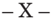

TOMO 333

Volumen 3

2010

## SITIO WEB DE LA

## CORTE SUPREMA DE JUSTICIA DE LA NACIÓN

http://www.csjn.gov.ar/  •   http://www.cij.csjn.gov.ar/

- •  Novedades

## •  JurisprudeNcia

- -Consulta temática en sumarios-fallo y dictamen Parte  de  los  fallos  elegidos  para  esta  base  integran  la  presente publicación
- -Consulta de textos fallos completos Sin sumarios
- -Lista de sentencias recientes

La presente obra se complementa con un CD con la jurisprudencia citada en el presente tomo, dictada por los jueces de la Corte Suprema de Justicia de la Nación en el período octubre-diciembre del año 2010.  En el mismo se puede acceder al texto completo digitalizado de los fallos para facilitar su consulta.

## R E P U B L I C A A R G E N T I N A

Año del Bicentenario

FALLOS

DE  LA

C orte S uprema

DE

## J usticia de la N acion

PUBLICACION A CARGO DE LA SECRETARIA DE JURISPRUDENCIA DEL TRIBUNAL

TOMO 333 - VOLUMEN 3

OCTUBRE - DICIEMBRE

LA LEY S.A.E. e I.

Tucumán 1471 (1050) Buenos Aires

2010

Corte Suprema de Justicia de la Nación.

Fallos de la Corte Suprema de Justicia de la Nación : 333 - III. -  1a ed. - Buenos Aires : Corte Suprema de Justicia de la Nación, 2011. v. 3, 656 p. + CD ; 24×16 cm.

ISBN 978-987-1625-13-0

1. Corte Suprema de Justicia de la Nación - Fallos. I. Título. CDD 347.077

Copyright (c) 2011 by Corte Suprema de Justicia de la Nación Queda hecho el depósito que previene la ley 11.723. Impreso en la Argentina Printed in Argentina I.S.B.N.  978-987-1625-13-0

## FALLOS DE LA CORTE SUPREMA

## OCTUBRE

## GRUPO CLARIN y OtROs s.A.

## MEDIOS DE COMUNICACION.

Cabe desestimar el recurso extraordinario interpuesto contra la sentencia que hizo lugar a la medida cautelar y suspendió respecto de las empresas demandantes -titulares de licencias de televisión y radiodifusión- la aplicación de la disposición contenida en el artículo 161 de la ley 26.522 -en cuanto fija el plazo de un año para desinvertir-, pues no se ha demostrado la existencia de los dos requisitos tradicionalmente exigidos por la jurisprudencia del Tribunal para equiparar a sentencia definitiva una medida cautelar, esto es, que medie cuestión federal bastante conjuntamente con un agravio que, por su magnitud y por las circunstancias de hecho, resulte irreparable.

## MEDIOS DE COMUNICACION.

Cabe fijar un límite razonable para la vigencia de la medida cautelar que suspendió respecto de las empresas demandantes -titulares de licencias de televisión y radiodifusión- la aplicación de la disposición contenida en el artículo 161 de la ley 26.522 -en cuanto fijó el plazo de un año para desinvertir-, pues podría presentarse una situación de desequilibrio, y si la sentencia en la acción de fondo se demorara un tiempo excesivo se permitiría a la actora excepcionarse -por el simple transcurso del tiempo- de la aplicación del régimen impugnado, obteniendo por vía del pronunciamiento cautelar un resultado análogo al que se lograría en caso de que se acogiera favorablemente su pretensión sustancial, debiendo entonces ponderarse no sólo la irreparabilidad del perjuicio del peticionante, sino también el del sujeto pasivo de éste, quién podría verse afectado irreversiblemente si la resolución anticipatoria fuera mantenida 'sine die'.

## FALLO DE LA CORTE SUPREMA

Año del Bicentenario

Buenos Aires, 5 de octubre de 2010.

Vistos los autos: 'Grupo Clarín y otros S.A. s/ medidas cautelares'.

## Considerando:

1º) Que contra la resolución de la Sala I de la Cámara Nacional de Apelaciones en lo Civil y Comercial Federal que, al confirmar parcialmente la decisión de primera instancia, hizo lugar a la medida cautelar y, en consecuencia, suspendió respecto de la empresas demandantes la aplicación de la disposición contenida en el artículo 161 de la ley 26.522, el  Estado Nacional interpuso el recurso extraordinario de fs. 571/593, que fue contestado a fs. 596/613 y concedido por el tribunal a quo a fs. 615.

2º) Que a fin de decidir la cuestión sometida a esta Corte Suprema, corresponde delimitar la pretensión de las partes.

Que la actora alegó ser titular de licencias de televisión abierta, de radiodifusión sonora, de radiodifusión por suscripción, de radiodifusión por suscripción mediante la que presta servicio de televisión por cable e internet y de señales de contenido para televisión.

Invocó que esas licencias, vigentes durante la ley 22.285, fueron prorrogadas por decreto 527 del año 2005 del Poder Ejecutivo Nacional y que fue el mismo Poder Ejecutivo el que envió un proyecto de reformas de la ley cambiando las reglas que le había fijado con anterioridad.

Como consecuencia de ello, sostuvo que, si se aplican los artículos 41 y 161 de la ley 26.522, se afectarían derechos adquiridos en forma retroactiva. Con esos fundamentos afirmó que promoverá una acción de certeza (artículo 322 del Código Procesal), para que se declare la inconstitucionalidad de los artículos referidos (fs.68). Al mismo tiempo, solicitó una medida de no innovar peticionando la suspensión de la aplicación y efectos de los artículos 41 y 161 de la ley 26.522 de Servicios de Comunicación Audiovisual, hasta tanto recaiga pronunciamiento en la acción de fondo a promoverse (fs. 252/262 y su remisión a fs. 53/73).

Que mediante sentencia del siete de diciembre de 2009 (fs. 286/292), el Juez de primera instancia hizo lugar a la petición cautelar 'ordenándose la suspensión provisional respecto de la actora de la aplicación de los arts. 41 y 161 de la ley 26.522...' .

Que la Cámara de Apelaciones, mediante sentencia del 13 de mayo de 2010, confirmó la resolución apelada únicamente en cuanto ordena

'la suspensión de la aplicación del artículo 161 de la ley 26.522 respecto de las empresas actoras...' (fs. 556/559).

- 3º) Que la Cámara señaló que el objeto procesal se circunscribe a definir si la aplicación de los artículos 41 y 161 de la ley 26.522 a las relaciones contraídas según el régimen legal anterior -que comprende la ley 22.285 y sus modificaciones, el decreto 527/05, la resolución COMFER 214/2007, entre otras-, afecta de manera sustancial y caracterizada, y con rasgos de verosimilitud, el derecho de propiedad de los titulares actuales de licencias y autorizaciones vigentes.

Que en el fundamento de la medida cautelar, se sostuvo que hay un cambio de las reglas de juego y se somete a la demandante a una desinversión forzada en un plazo sorpresivo, breve y fatal, y que el peligro en la demora, base de la decisión cautelar, aparece 'configurado en forma patente respecto del artículo 161 impugnado, pues el breve plazo establecido para concretar la obligación de desinversión forzosa para el tipo de empresas de que se trata -aún cuando sea computando a partir del cumplimiento de los pasos que indica la norma-, hace altamente improbable que se llegue a tiempo en el esclarecimiento de los derechos mediante sentencia a dictarse en el procedimiento judicial ordinario' (fs. 558 vta.).

- 4º) Que como quedó expresado en el considerando anterior, el objeto de la medida cautelar ha sido neutralizar los efectos de un plazo que el tribunal a quo consideró demasiado breve.

Que conforme con ello, en relación a la normativa de la ley 26.522 corresponde distinguir entre las regulaciones generales relativas a limites relativos a la cantidad de licencias, la obligación de desinvertir y el plazo de un año para cumplir con esas disposiciones. Los dos primeros aspectos constituirán el objeto de la acción de certeza según lo señala la actora y sobre éstos nada se ha resuelto.

- Queda claro, entonces, que la validez de la desinversión forzada no es materia sometida a la decisión de esta Corte Suprema, sino el plazo de un año para cumplirla, que ocasionaría un peligro en la demora valorado en relación con la duración del proceso.
- 5º) Que esta medida cautelar es sustancialmente diferente de la resuelta por este Tribunal en el caso T.117.XLVI. 'Thomas, Enrique c/ Estado Nacional s/ amparo' (sentencia del 15 de junio de 2010).

En el citado precedente, se trataba de una cautelar que suspendía de modo general los efectos de ley 26.522, resolución que alcanzaba a todos los sujetos comprendidos en su ámbito de aplicación, mientras que en el presente, en cambio, se trata de la impugnación de la brevedad del plazo de un año fijado por la ley para desinvertir y con relación a un solo sujeto. A ello cabe agregar que, mientras en el fallo citado se invocó la legitimación de un diputado nacional para impugnar el trámite legislativo de la norma, en este caso se argumenta la afectación directa del derecho de propiedad por parte de su titular.

Por lo tanto, la presente medida cautelar, cuyos alcances se encuentran limitados al actor, no afecta de ningún modo la aplicación general de la ley, y se encuadra dentro de los criterios tradicionales empleados por los Tribunales de la Nación durante muchos años y en todas las circunscripciones, por lo cual no se advierte gravedad institucional alguna. Máxime si se repara en que la recurrente no ha logrado demostrar -con el rigor que es necesario en estos casos- que el mantenimiento del pronunciamiento que ataca pueda, en las actuales circunstancias, paralizar u obstaculizar la aplicación general del régimen consagrado en la ley 26.522. Es decir, no se ha deducido un agravio suficiente que permita tener por acreditado que la resolución impugnada ocasiona al Estado Nacional un perjuicio que no es susceptible de reparación ulterior.

6º) Que de conformidad con lo dicho, se debe aplicar la reiterada jurisprudencia de este Tribunal en relación a que las resoluciones referentes a medidas cautelares no constituyen sentencia definitiva o equiparable a ésta, a los fines de habilitar la instancia extraordinaria del artículo 14 de la ley 48 (Fallos: 327:5068; 329:440 entre muchos otros).

Que sobre la materia resulta propicio recordar los términos del señero precedente de Fallos: 137:352 suscripto por los jueces Bermejo, González del Solar, Figueroa Alcorta y Méndez. Allí se sostuvo que '... según se ha establecido reiteradamente por esta Corte, tratándose de abrir una tercera instancia, el legislador sólo la autoriza respecto de las sentencias definitivas y por tales se entienden las que dirimen la controversia poniendo fin al pleito, o haciendo imposible su continuación, o sea, como lo expresaba la Ley de Partidas, aquélla 'que quiere tanto dezir como juyzio acabado que da en la demanda principal fin, quitando o condenando al demandado' (Ley 2 in fine, Título 22, Par-

tida 3ra.; Fallos: 126:297, entre otros)' . En efecto, es característico de la sentencia definitiva -como sostenían Imaz y Rey- que después de dictada, el derecho discutido no puede volver a litigarse ('Recurso Extraordinario', 2da. ed., Nerva, Buenos Aires, 1962, pág. 199).

Por otra parte, tampoco se ha demostrado la existencia de dos requisitos tradicionalmente exigidos por la jurisprudencia de este Tribunal para equiparar a sentencia definitiva una medida cautelar, esto es, que medie cuestión federal bastante conjuntamente con un agravio que, por su magnitud y por las circunstancias de hecho, resulte irreparable (Fallos: 295:646; 308:90, entre muchos otros).

7º) Que, en la búsqueda de armonía y equilibrio en la decisión, el criterio de la falta de sentencia definitiva aplicable al caso, debe complementarse con otra regla tradicional de esta Corte, que el tribunal de grado deberá tener en cuenta, y que consiste en que la medida cautelar no debe anticipar la solución de fondo ni desnaturalizar el derecho federal invocado.

La presente medida, si bien no adelanta decisión sobre la obligación de desinvertir fijada por el artículo 161 de la ley 26.522, suspende el plazo de un año fijado por dicha norma. Si se tiene en cuenta que la medida se dictó el 7 de diciembre de 2009 'hasta tanto recaiga pronunciamiento en la acción de fondo a promoverse' , podría llegar a presentarse una situación de desequilibrio. En efecto, si la sentencia en la acción de fondo demorara un tiempo excesivo, se permitiría a la actora excepcionarse por el simple transcurso del tiempo de la aplicación del régimen impugnado, obteniendo de esta forma por vía del pronunciamiento cautelar, un resultado análogo al que se lograría en caso de que se acogiera favorablemente su pretensión sustancial en autos. Por esta razón, no sólo debe ponderarse la irreparabilidad del perjuicio del peticionante de la medida, sino también el del sujeto pasivo de ésta, quien podría verse afectado de manera irreversible si la resolución anticipatoria es mantenida 'sine die' , de lo cual se deriva que la alteración del estado de hecho o de derecho debe encararse con criterio restrictivo [Fallos: 331:941].

Que por esta razón, y para evitar ese efecto no deseado, se considera conveniente la fijación de un límite razonable para la vigencia de la medida cautelar. Si el tribunal de grado no utilizara ex oficio este remedio preventivo, la parte recurrente podría promover la solicitud

de la fijación de un plazo. Ello es así, pues si la índole provisoria que regularmente revisten las medidas cautelares se desnaturalizare por la  desmesurada extensión temporal y esa circunstancia resultare frustratoria del derecho federal invocado, en detrimento sustancial de una de las partes y en beneficio de la otra (Fallos: 314:1202, voto concurrente de los jueces Cavagna Martínez, Barra y Fayt), la parte afectada por aquel mandato tiene a su alcance las conocidas instancias previstas con carácter genérico por el ordenamiento procesal para obtener de los jueces de la causa (artículos 202 y cc), y en su caso la del artículo 14 de la ley 48 ante este estrado, la reparación del nuevo gravamen que se invoque.

- 8º) Que la clásica regla de falta de competencia de esta Corte para entender en recursos extraordinarios por falta de sentencia definitiva, así como el principio destinado a limitar el plazo de una cautelar para evitar que se transforme en una sentencia anticipatoria, constituyen tradicionales precedentes que, interpretados conjuntamente, llevan a una solución armónica y equilibrada del interés general en la aplicación de una ley frente a la defensa del derecho individual de propiedad del afectado en el proceso cautelar.

Por ello, se desestima el recurso extraordinario interpuesto. Con costas (artículo 68 del Código Procesal civil y comercial de la Nación Notifíquese y devuélvase.

RICARdO LUIs LOReNzettI - eLeNA I. HIGHtON de NOLAsCO - CARLOs s. FAyt - eNRIqUe sANtIAGO PetRACCHI ( según su voto ) - JUAN CARLOs MAqUedA - e. RAúL zAFFARONI - CARMeN M. ARGIbAy ( según su voto ).

VOtO de LOs señORes MINIstROs dOCtORes dON eNRIqUe sANtIAGO PetRACCHI y dOñA CARMeN M. ARGIbAy

## Considerando:

Que el recurso extraordinario no se dirige contra una sentencia definitiva o equiparable a tal (artículo 14 de la ley 48).

Por ello, se desestima el recurso extraordinario interpuesto. Con costas (artículo 68 del Código Procesal Civil y Comercial de la Nación). Notifíquese y devuélvase.

eNRIqUe sANtIAGO PetRACCHI - CARMeN M. ARGIbAy.

Recurso extraordinario interpuesto por el Estado Nacional ,  representado por los Dres. Sergio Ricardo Landín y Daniel A. Muñiz , con el patrocinio del Dr. Jorge Pedro Da Rocha.

Traslado contestado por Grupo Clarín S.A.; Arte Radiotelevisivo Argentino; Cablevisión S.A.; Multicanal S.A., Radio Mitre S.A. y Teledigital Cable S.A. , representados por el Dr. Daniel Fabio Cassino , con el patrocinio de los Dres. Felipe Rodolfo Llerena y Alberto F. Garay

Tribunal de origen: Cámara Nacional de Apelaciones en lo Civil y Comercial Federal, Sala Uno.

Tribunales que intervinieron con anterioridad: Juzgado Nacional de Primera Instancia en lo Civil y Comercial Federal, Nº 1.

J. G. N.

## DETENCION DE PERSONAS.

Si al momento de su declaración en sede policial, el detenido manifestó su voluntad de declarar sin defensor y confesó la comisión de la contravención imputada, la validez de dicha renuncia al asesoramiento letrado, producida como detenido en una comisaría, no puede ser admitida en forma irrestricta, más aún cuando dicha manifestación de voluntad proviene de un menor de edad a la fecha de su detención que presumiblemente no conoce sus derechos, o bien, no está en condiciones de reclamar por ellos, situación en la cual el deber de asegurar el efectivo ejercicio de los derechos recae sobre la propia autoridad.

## CONTRAVENCIONES.

La garantía de inviolabilidad de la defensa en juicio en procedimientos de imposición de sanciones administrativas exige -entre otros requisitos- que el Estado provea los medios necesarios para que el juicio a que se refiere el art. 18 de la Constitución Nacional se desarrolle en paridad de condiciones respecto de quien ejerce la acción pública y quien debe soportar la imputación, mediante la efectiva intervención de la defensa.

## FALLOS DE LA CORTE SUPREMA 333

## DETENCION DE PERSONAS.

Una detención privativa de 48 hs, producida en el marco de un procedimiento contravencional tramitado ante la autoridad policial y sin intervención judicial ni notificación necesaria a terceros no puede ser legitimada, no está en condiciones de satisfacer el estándar constitucional mínimo fijado por la Corte Interamericana en el caso 'Bulacio' (18/9/2003) -según el cual el Estado está obligado a crear las condiciones para que cualquier recurso en favor del detenido pueda tener resultados efectivos-, lesionándose en consecuencia la inviolabilidad de la defensa en juicio y el derecho a la libertad.

## dICtAMeN de LA PROCURACIóN GeNeRAL

## Suprema Corte:

V.E. me corre vista, para dictaminar en esta causa en la que la Corte de Justicia del Tucumán, ha concedido el recurso extraordinario federal interpuesto por la defensa de José Gerardo Núñez.

Dicha apelación fue interpuesta contra el fallo de la casación local que resolvió hacer lugar al recurso de casación articulado por el letrado apoderado de la Fiscalía de Estado, en cuanto declara la validez constitucional de la ley de contravenciones Nº 5140 de esa provincia.

Asimismo, en ese pronunciamiento se dispuso que de modo previo a dictarse una nueva sentencia, el juzgado de instrucción examine si en autos ha operado la prescripción (cfr. fojas 99).

Ante ello, en la medida en que la prescripción es un instituto de orden público que debe verificarse previo a la cuestión de fondo planteada, considero que el remedio federal debió suspenderse a las resultas de tal examen, toda vez que podría resultar insustancial un pronunciamiento del Tribunal en un caso cuya acción se ha extinguido.

Consecuentemente, entiendo corresponde que V.E. declare mal concedido el recurso extraordinario federal, y devuelva las actuaciones a los tribunales de la causa. Buenos Aires, 21 de agosto de 2008. Luis Santiago González Warcalde.

## DE JUSTICIA DE LA NACION 333

## FALLO DE LA CORTE SUPREMA

Año del Bicentenario

Buenos Aires, 5 de octubre de 2010.

Vistos los autos: 'N., J. G. s/ infr. art. 15, inc. 4º, LCP s/ incidente de inconstitucionalidad'.

Considerando:

- 1º) Que el 5 de enero de 2004 J. G. N., de 19 años y domiciliado en la ciudad de Tucumán, fue detenido por la policía provincial en dicha localidad, por haber alterado la tranquilidad en la vía pública, en infracción a lo dispuesto por el art. 15, inc. 4º, de la ley provincial 5140 y sus modificaciones (ley 6619), quedando a disposición del Jefe de Policía provincial en su carácter de Juez de Faltas (fs. 1).
- 2º) Que ese mismo día se produce la declaración de N. ante la instrucción policial. Según consta a fs. 2, luego de que se le diera lectura a los derechos previstos por los arts. 258 y sgtes. del Código Procesal Penal provincial, el nombrado manifestó su voluntad de declarar ante la autoridad policial sin la presencia de un abogado defensor. Acto seguido, reconoce haber tenido una discusión sobre fútbol con unos amigos, en la cual perdió el control y comenzó a insultar a todos en forma exaltada, como así también al personal policial que intentaba calmarlo.
- 3º) Que dos días después, el 7 de enero de 2004, el Jefe de Policía de Tucumán dicta una resolución (fs. 5) en la cual 'valorando los elementos de juicio reunidos por la instrucción policial, más el propio reconocimiento del causante' en cuanto a haber alterado el orden y la tranquilidad pública mediante gritos e insultos, impone a N. la pena de seis días de arresto o seis días-multa, a razón de $ 5 por día, equivalente a $ 30, por infracción al art. 15, inc. 4º de la Ley Contravencional Provincial 5140.
- 4º) Que ese mismo día (fs. 6), la instrucción policial hace comparecer a N., 'detenido comunicado'. Enterado de la sanción, 'manifiesta conformidad y que por no contar con el dinero, cumplirá con la sanción impuesta hasta que cuente con el mismo para oblar la multa'.

5º) Que a pesar de dicha manifestación de conformidad, al día siguiente se incorpora una constancia según la cual el detenido N. apela la resolución policial 'por considerarla totalmente anticonstitucional' y hace entrega de un escrito con los fundamentos de la apelación, 'razón por la cual es dejado en inmediata libertad' (fs. 6). En el escrito de mención (fs. 7), constituye domicilio en la defensoría del pueblo, solicita que se otorgue efecto suspensivo a su recurso y niega todas las imputaciones. Asimismo, afirma que se limitó a firmar todos los escritos que le diera la policía, que desconoce sus derechos, que éstos no le fueron comunicados y que tampoco le permitieron hablar o ser asistido por un abogado defensor.

6º) Que al tomar conocimiento del recurso y del planteo de inconstitucionalidad, el juez de instrucción, luego de escuchar la defensa del régimen contravencional realizada por el apoderado del Estado provincial y las alegaciones contrarias a dicha normativa, presentadas por la fiscal de primera instancia y por la Asociación por los Derechos Civiles -como amicus curiaeresolvió hacer lugar a la inconstitucionalidad de la ley 5140, su modificatoria 6619 y su decreto reglamentario 3289/14 (SSG), y declaró la nulidad del proceso contravencional seguido contra J. G. N. (fs. 64/68).

7º) Que el juez de instrucción, en dirección similar a lo postulado por la defensa, la fiscal y el amicus curiae , entendió que el régimen contravencional tucumano es incompatible con principios básicos de la Constitución Nacional y la Convención Americana sobre Derechos Humanos. En particular, destacó que el Jefe de Policía, que instruye y sanciona la contravención, no satisface la garantía de 'juez imparcial', y que el procedimiento no asegura la inviolabilidad de la defensa. En este sentido, señaló que no está específicamente legislado que el infractor cuente con asistencia letrada en el momento de su declaración, y la ley no determina que se le haga saber su derecho a apelar. Por otro lado, con relación al derecho a la libertad, no existe ni está previsto un control judicial de la detención y dicho control, en los casos de flagrancia, no se produce sino hasta 48 horas después de la detención (término previsto para que el Jefe de Policía resuelva su situación), y ello, sólo en el caso de que efectivamente se interponga recurso de apelación. Sobre esa base, concluyó que el régimen impugnado viola el derecho a la libertad, por no mediar orden escrita de autoridad competente y por no ser presentada inmediatamente la persona detenida ante un juez, y el debido proceso, por no existir un juez independiente e imparcial y no respetarse la inviolabilidad de la defensa.

8º) Que dicha decisión fue recurrida en casación por la Fiscalía de Estado y revocada por la Corte Suprema de Justicia de Tucumán. El tribunal superior entendió que resultaba improcedente la declaración de invalidez total del régimen contravencional dispuesta por el juez de instrucción, en tanto la declaración de inconstitucionalidad sólo corresponde respecto de una afectación a un interés concreto de la parte. Tal declaración de inconstitucionalidad 'en bloque' representa -afirma la sentencia- un cuestionamiento a la potestad provincial de ejercer el poder de policía contravencional, contraria a la jurisprudencia de la Corte Suprema de la Nación, que autoriza tales procedimientos en tanto exista la posibilidad de revisión judicial posterior. Según el tribunal, el trámite del procedimiento de apelación, a ser cumplido ante los jueces de instrucción hasta tanto se creen los juzgados contravencionales (art. 36, Código Procesal Penal de Tucumán), satisface plenamente el derecho del infractor a ser oído, a ofrecer y producir prueba, y a ejercer debidamente el derecho de defensa, y de este modo, constituye 'control judicial suficiente'. Con respecto al procedimiento en sede policial, la Corte provincial entendió que, en concreto, no había existido en el caso violación alguna al derecho de defensa de N., pues, en definitiva, éste pudo interponer el recurso de apelación correspondiente con asistencia letrada, y de ese modo, asegurar la intervención de un juez imparcial. Asimismo, consideró que la detención autorizada por el régimen contravencional tampoco producía afectación constitucional alguna, en la medida en que ella se limita a las situaciones de flagrancia -como en el caso-, y la decisión, que debe recaer en el plazo de 48 horas, es apelable con efecto suspensivo. En consecuencia, resolvió dejar sin efecto la sentencia apelada y ordenó la remisión del expediente al juzgado de instrucción correspondiente a fin de que se dictase nueva sentencia, previo examinar si en autos ha operado la prescripción.

9º) Que, en contra de este fallo, N. interpuso el recurso extraordinario federal de fs. 104/123, concedido a fs. 130/140. En lo que aquí interesa, el apelante sostuvo que es inadmisible afirmar que él carece de interés en el caso, en tanto fue justamente el régimen contravencional aplicado el que lesionó sus garantías constitucionales. En efecto, fueron esas normas las que permitieron que su detención en sede policial se produjera sin ningún control, sin asistencia letrada de ningún tipo y sin posibilidad de comunicarse con nadie. Así, la ley 5140 pone en cabeza del mismo órgano administrativo que realiza la detención, la sustanciación del sumario contravencional, la acusación, el juzgamiento y la aplicación de la condena, sin que se encuentren previstos ni el

control judicial inmediato de las detenciones contravencionales ni las condiciones en que éstas se realizan. Tampoco se encuentra regulado el trámite que debe seguir la policía al momento de la instrucción del sumario ni las funciones y facultades de la policía.

Sostiene que sus garantías se vieron efectivamente conculcadas: permaneció 48 hs. detenido, no se le hicieron saber las razones de su detención ni las pruebas obrantes en su contra ni la posibilidad de contar con un letrado, tampoco su detención fue comunicada a ninguna autoridad judicial para que la controlara. En consecuencia, durante el sumario, nunca tuvo oportunidad de ejercer su derecho de defensa, y dadas las características del procedimiento contravencional, el control jurisdiccional previsto siempre habrá de resultar tardío , pues se produce luego de la efectiva detención contravencional, que en los casos de flagrancia se prolonga al menos por 48 horas. Desde este punto de vista, el recurrente aduce que es insostenible pretender que en el caso no ha existido violación al debido proceso, y en la medida en que la jurisdicción provincial ejerza su poder de policía contravencional en forma contraria a la Constitución, ese indebido ejercicio bien puede ser cuestionado constitucionalmente. Por lo demás, -agregó- a partir del caso ' Bulacio ', el Estado argentino está internacionalmente obligado a asegurar que los regímenes contravencionales, en tanto ponen en juego la libertad de las personas, estén configurados de tal modo que aseguren que no se reiteren hechos como el juzgado en su momento por la Corte Interamericana. En este sentido, alegó que una detención policial de 48 horas fuera de todo control judicial no cumple con estos requisitos y favorece la producción de hechos como el que motivó la condena del Estado argentino en el caso citado.

10) Que corresponde, ante todo, establecer si existe un agravio actual para el recurrente, o si, como lo afirma el señor Procurador Fiscal, un pronunciamiento de esta Corte, hasta tanto no se resuelva la cuestión relativa a la prescripción de la acción, sería prematuro, en razón de que el levantamiento de la sanción tornaría inoficiosa la decisión del Tribunal (conf., mutatis mutandis , Fallos: 310:819, voto del juez Petracchi, y sus citas).

11) Que, con relación a lo señalado, resulta decisiva la forma concreta en que fueron planteados los agravios ante el Tribunal. En este sentido, de la lectura de las diversas pretensiones del recurrente se desprende con toda claridad que el núcleo de sus cuestionamientos no

se dirige a impugnar la sanción contravencional impuesta por la Policía tucumana en cuanto tal, sino las facultades legales que la autorizarían a actuar como lo hizo. De este modo, lo que se debate en el sub lite es la efectiva afectación de derechos constitucionales producida durante el sumario y no subsanable por el control judicial posterior , que se reputa tardío e insuficiente para reparar dichas lesiones.

- 12) Que, en consecuencia, el gravamen invocado es independiente de que la sanción administrativa sea o no confirmada judicialmente. Por lo demás, si las facultades policiales cuestionadas fueran inconstitucionales -tal como se alega- y se considerara que el levantamiento de la sanción torna insustancial el agravio, la legitimidad de la fuerte injerencia que ellas ya han producido sobre los derechos individuales quedaría fuera de la jurisdicción de la Corte, lo cual resultaría frustratorio de la misión que debe cumplir todo tribunal al que se le ha encomendado la función de garante supremo de los derechos humanos.
- 13) Que, sentado lo expuesto, el recurso extraordinario es formalmente procedente, en tanto se ha cuestionado la validez de normas provinciales por ser contrarias a disposiciones constitucionales (art. 18 de la Constitución Nacional y arts. 7, 8 y 25 de la Convención Americana sobre Derechos Humanos) y la decisión recaída ha sido en favor de su validez (art. 14, inc. 2º, ley 48).
- 14) Que esta Corte ha sostenido reiteradamente que la facultad otorgada por ley a la autoridad administrativa para juzgar y reprimir contravenciones no atenta contra la garantía de la defensa en juicio en tanto se otorgue al justiciable la oportunidad de ocurrir ante el órgano judicial con el objeto de que cualquier decisión de dicha autoridad sea materia del consiguiente control, y a fin de que, al margen de lo actuado en el procedimiento administrativo, haya ocasión de ejercer en plenitud el derecho conculcado en el proceso judicial posterior (cf., entre otros, Fallos: 310:360).
- 15) Que, en punto al alcance que ese control judicial debe tener para que sea legítimo admitirlo como verdaderamente suficiente, es tradicional jurisprudencia del Tribunal considerar que ello no depende de reglas generales u omnicomprensivas, sino que ha de ser más o menos extenso y profundo según las modalidades de cada situación jurídica (cf. especialmente Fallos: 247:646). De allí que si las disposiciones que rigen el caso impiden a las partes tener acceso a una instancia judicial

propiamente dicha, existe agravio constitucional originado en privación de justicia (Fallos: 305:129 y sus citas). Del mismo modo, se ha entendido que un recurso judicial que no permita un control efectivo de las sanciones de naturaleza penal que importan privación de libertad no está en condiciones de cumplir el cometido de control judicial suficiente al que se viene aludiendo (así, Fallos: 311:334).

16) Que, en estrecha vinculación con dicho derecho, el Tribunal ha puesto reiteradamente de resalto la significación de la inviolabilidad de la defensa en juicio en los procedimientos administrativos (Fallos: 198:78; 306:821 y sus citas; 308:1557 y sus citas; 312:1998 y sus citas). Por aplicación de dicha jurisprudencia se consideró que resulta constitucionalmente imperativo que la autoridad policial asegure la intervención de un letrado, ya sea éste particular o de oficio, en ocasión de notificarse al condenado del pronunciamiento dictado por la citada autoridad, a fin de otorgar a éste la ocasión de interponer oportunamente el recurso pertinente (Fallos: 314:1220, disidencia de los jueces Cavagna Martínez, Barra, Fayt y Petracchi).

17) Que existe en autos una discrepancia importante en cuanto a las versiones de las partes con respecto a cuál fue el ejercicio concreto que N. hizo de su derecho de defensa durante el procedimiento policial, y en principio, no corresponde que sea esta Corte quien establezca cómo sucedieron realmente los acontecimientos.

18) Que, no obstante ello, aun si se hacen a un lado las protestas del recurrente en el sentido de que nunca se le comunicaron sus derechos ni tuvo oportunidad de comunicarse con letrado alguno y que se limitó a firmar todos los escritos que le dio la policía, las constancias obrantes en el expediente -contrarias a esta versión-, de todos modos, revelan una lesión significativa de la inviolabilidad de la defensa y del derecho a la libertad del reclamante.

19) Que según se desprende del acta de fs. 2, en el momento de su declaración, y luego de que se le hicieran conocer sus derechos procesales, el detenido N. habría manifestado su voluntad de declarar sin defensor y habría confesado la comisión de la contravención imputada. La validez de esa renuncia al asesoramiento letrado, producida como detenido en una comisaría, sin embargo, no puede ser admitida en forma irrestricta, más aún cuando dicha manifestación de voluntad proviene de un menor de edad a la fecha de su detención que presumiblemente

no conoce sus derechos, o bien, no está en condiciones de reclamar por ellos. En esa situación, el deber de asegurar el efectivo ejercicio de los derechos recae sobre la propia autoridad estatal (cf., en este sentido, el  caso ' Bulacio vs. Argentina ',  sentencia  Corte  Interamericana de Derechos Humanos, del 18/9/2003, §§ 124 - 130). Es ella quien debe, asimismo, controlar las condiciones en que se produce la custodia de los detenidos en vista de su particular situación de vulnerabilidad (cf. Tribunal Europeo de Derechos Humanos, mutatis mutandis , ' Tomasi vs. Francia ', sentencia del 27/8/1992, §§ 113-115; ídem, ' Iwanczuk vs. Polonia ', del 15/11/2001, § 53).

- 20) Que sólo prescindiendo de las constancias del expediente es posible sostener, como lo hace el a quo , que en autos no habría quedado demostrado el perjuicio efectivo de la violación al derecho de defensa que habría sufrido N. Así, a fs. 6, el nombrado, a pesar de que podía haber apelado con efecto suspensivo, no sólo manifiesta que presta su conformidad con la sanción impuesta sino que, además, decide permanecer detenido cumpliendo el arresto por no contar con los $ 30 de la multa sustitutiva. Como consecuencia, queda detenido hasta el día siguiente, cuando se presenta el escrito de fs. 7. El perjuicio concreto a la libertad que derivó de esa conducta procesal es evidente, y difícilmente se explica si no es como consecuencia de la ausencia de asesoramiento letrado.
- 21) Que, a este respecto, esta Corte tiene dicho que la garantía de inviolabilidad de la defensa en juicio en procedimientos de imposición de sanciones administrativas exige -entre otros requisitos- que el Estado provea los medios necesarios para que el juicio a que se refiere el art. 18 de la Constitución Nacional se desarrolle en paridad de condiciones respecto de quien ejerce la acción pública y quien debe soportar la imputación, mediante la efectiva intervención de la defensa (Fallos: 312:1998, considerando 4º, del voto de la mayoría).

22) Que aun cuando el detenido en el procedimiento contravencional impugnado haya renunciado a contar con un defensor, ello no implica que haya decidido renunciar también a comunicar su situación a una tercera persona. Esta posibilidad no se encuentra prevista en el régimen cuestionado, ni tampoco surge que, de hecho, N. hubiera contado con esa alternativa. En tales condiciones, y al no estar prevista, cuando menos, la efectiva comunicación de la situación del contraventor a terceros ajenos a la autoridad policial, la detención necesariamente

habrá de producirse en condiciones contrarias al estándar fijado por la Corte Interamericana en el caso 'Bulacio' precedentemente citado (conf., esp., § 130).

- 23) Que a ello se suma que tampoco se encuentra previsto que al momento de la notificación de la sanción la autoridad policial comunique al contraventor ni la posibilidad ni los efectos de interponer un recurso con efecto suspensivo (conf. art. 6, ley 6756). Si, además, el imputado se encuentra detenido, la existencia de un efectivo control judicial ulterior queda, en buena medida, en manos del azar.
- 24) Que aun cuando se sostuviera -como lo hace el a quo - que ha existido en el caso un control judicial suficiente del procedimiento, la impugnación de inconstitucionalidad también alcanza a la legitimidad de la detención policial por 48 horas para los supuestos de flagrancia. Dicha facultad policial fue justificada por la Corte tucumana sin otro argumento que la previsión legal de un recurso apto para asegurar la intervención judicial posterior.
- 25) Que, en contra de lo expresado en la sentencia, una detención preventiva de 48 horas, producida en el marco de un procedimiento contravencional tramitado ante la autoridad policial y sin intervención judicial ni notificación necesaria a terceros no puede ser legitimada sin más ni más.
- 26) Que el art. 5º de la ley provincial 5140 establece: 'La detención inmediata procede en el caso de ser sorprendido in fraganti el autor de la contravención. Si se tratase de personas con malos antecedentes o desconocidas en el lugar, la autoridad policial puede detenerlas hasta la organización del sumario. Cuando el contraventor fuese bien reputado y domiciliado en la localidad, la detención procederá solamente después que por el sumario se haya comprobado la contravención que se le imputa'. A su vez, el art. 13 fija el plazo de 48 horas para el dictado de la sentencia.
- 27) Que no surge de las presentes actuaciones que N. hubiera sido considerado persona de 'malos antecedentes' o 'desconocida en el lugar'. Antes bien, de fs. 1 se desprende que estaba 'domiciliado en la localidad'. No obstante ello, la flagrancia fue interpretada en su caso como circunstancia bastante para la detención, que tuvo ese apoyo normativo entre el 5 y el 7 de enero de 2004, fecha en la que 'consiente' la sanción de arresto, hasta el día 8 del mismo mes y año. En consecuencia,

tampoco se advierten con claridad las razones por las que la concreta situación de N. quedó alcanzada por la norma en cuestión, y en tales condiciones, la relevancia de contar con la posibilidad de provocar un control judicial sobre el arresto es indiscutible.

28) Que, con independencia de la cuestión de si la detención se ajustó, al menos, a las reglas de procedimiento objetivamente definidas, la concreta privación de libertad impuesta al recurrente no satisface las condiciones constitucionales mínimas para la legitimación de este tipo de injerencias.

En efecto, la ausencia de toda comunicación de la detención, tal como se produjo en el sub lite , priva al justiciable de provocar el control acerca de la legalidad de la medida y lesiona el derecho establecido por el art. 7, inc. 6º, Convención Americana de Derechos Humanos, en cuanto reconoce a toda persona privada de libertad el derecho a recurrir ante un juez o tribunal competente, a fin de que éste decida, sin demora, sobre la legalidad de su arresto.

29) Que, producida una detención en esas condiciones, la mera previsión de un recurso de apelación de la posible sanción que imponga el Jefe de Policía no alcanza para dar cumplimiento al deber impuesto por el art. 7, inc. 5º, de la citada Convención, de acuerdo con el cual toda persona detenida 'debe ser llevada, sin demora , ante un juez u otro funcionario autorizado por la ley para ejercer funciones judiciales...', condición que no cumplen los funcionarios policiales con prescindencia de que se les asignen facultades sancionatorias en materia contravencional.

30) Que si bien el plazo de 48 horas, aisladamente considerado, podría ser visto como un lapso que satisface el requisito ' sin demora ' impuesto por la Convención citada, cuando se incorporan al análisis las demás particularidades del caso se advierte que semejante conclusión sería equivocada. Ella significaría, además, el incumplimiento de los parámetros indicados al Estado argentino por la Corte Interamericana en el caso ' Bulacio ' ( supra cit. ). En efecto, no se trata tan sólo del tiempo, sino, además, de la ausencia de garantía alguna que permita tomar contacto con un abogado o, al menos, con algún tercero. Una situación que claramente dificulta el cuestionamiento judicial de las detenciones arbitrarias, objetivo central de la norma constitucional señalada. Una interpretación de alcance similar ha sido consagrada

por el Tribunal Europeo de Derechos Humanos (cf. caso ' Brogan vs. Reino Unido ', sentencia del 29/11/1988, §§ 58 y s., 62, invocado por la Corte Interamericana de Derechos Humanos en el caso ' Juan Humberto Sánchez vs. Honduras ', sentencia del 7/06/2003, § 84, nota 106).

31) Que, en consonancia con los precedentes de este Tribunal ya citados, así como con lo señalado por la Corte Interamericana en el caso ' Bulacio ' ( supra cit. , esp. § 127), el Estado está obligado a crear las condiciones para que cualquier recurso en favor del detenido pueda tener resultados efectivos. A tal fin, un recurso de apelación que debe ser presentado ante la autoridad policial en el término de tres días, fundamentado en el mismo acto, bajo apercibimiento de no tenérselo por interpuesto o de establecer su inadmisiblidad (arg. a quo art. 4, ley provincial 6756), sin haber contado -en el caso- con asistencia letrada, en modo alguno puede ser calificado ex ante como 'efectivo' en los términos indicados. En este sentido, y con relación a este punto, el Tribunal Europeo de Derechos Humanos ha entendido que el deber de control judicial de las detenciones administrativas o policiales exige algo más que un recurso eventual y dependiente de la voluntad del afectado, pues de otro modo se distorsionaría la naturaleza misma de la garantía de todo detenido de ser llevado sin demora ante un juez (cf. mutatis mutandis , caso ' De Jong, Baljet y Van den Brink vs. Países Bajos ', sentencia del Tribunal Europeo de Derechos Humanos del 22/05/1984, § 51, y ' Niedbala vs. Polonia ', del 4/07/2000, § 50).

32) Que, por las razones expuestas, el procedimiento contravencional impugnado, en cuanto ha sido materia de apelación, no está en condiciones de satisfacer el estándar constitucional mínimo, y ha lesionado en el caso la inviolabilidad de la defensa en juicio y el derecho a la libertad (art. 18, de la Constitución Nacional, y art. 7, de la Convención Americana de Derechos Humanos).

Por ello, oído el señor Procurador Fiscal, se declara procedente el recurso extraordinario con el alcance indicado y se deja sin efecto la sentencia apelada. Vuelvan los autos al tribunal de origen, a fin de que por quien corresponda, se dicte nueva sentencia conforme a derecho. Hágase saber y, oportunamente, devuélvase.

eLeNA I. HIGHtON de NOLAsCO - CARLOs s. FAyt - eNRIqUe sANtIAGO PetRACCHI - JUAN CARLOs MAqUedA - e. RAúL zAFFARONI - CARMeN M. ARGIbAy ( según su voto ).

## VOtO de LA señORA MINIstRA dOCtORA dOñA CARMeN M. ARGIbAy

## Considerando:

1º) Que la infrascripta coincide con los considerandos 1º a 9º del voto de la mayoría que se dan por reproducidos en razón de brevedad.

- 10)  Que,  el  recurso  extraordinario  es  formalmente  procedente, en tanto se ha cuestionado la validez de normas provinciales por ser contrarias a disposiciones constitucionales (art. 18 de la Constitución Nacional y arts. 7, 8 y 25 de la Convención Americana sobre Derechos Humanos) y la decisión recaída ha sido en favor de su validez (art. 14, inc. 2º, ley 48).
- 11) Que esta Corte ha sostenido reiteradamente que la facultad otorgada por ley a la autoridad administrativa para juzgar y reprimir contravenciones no atenta contra la garantía de la defensa en juicio en tanto se otorgue al justiciable la oportunidad de ocurrir ante el órgano judicial con el objeto de que cualquier decisión de dicha autoridad sea materia del consiguiente control, y a fin de que, al margen de lo actuado en el procedimiento administrativo, haya ocasión de ejercer en plenitud el derecho conculcado en el proceso judicial posterior (cf., entre otros, Fallos: 310:360).
- 12) Que, en punto al alcance que ese control judicial debe tener para que sea legítimo admitirlo como verdaderamente suficiente, es tradicional jurisprudencia del Tribunal considerar que ello no depende de reglas generales u omnicomprensivas, sino que ha de ser más o menos extenso y profundo según las modalidades de cada situación jurídica (cf. especialmente Fallos: 247:646). De allí que si las disposiciones que rigen el caso impiden a las partes tener acceso a una instancia judicial propiamente dicha, existe agravio constitucional originado en privación de justicia (Fallos: 305:129 y sus citas). Del mismo modo, se ha entendido que un recurso judicial que no permita un control efectivo de las sanciones de naturaleza penal que importan privación de libertad no está en condiciones de cumplir el cometido de control judicial suficiente al que se viene aludiendo (así, Fallos: 311:334).
- 13) Que, en estrecha vinculación con dicho derecho, el Tribunal ha puesto reiteradamente de resalto la significación de la inviolabilidad

de la defensa en juicio en los procedimientos administrativos (Fallos: 198:78; 306:821 y sus citas; 308:1557 y sus citas; 312:1998 y sus citas). Por aplicación de dicha jurisprudencia se consideró que resulta constitucionalmente imperativo que la autoridad policial asegure la intervención de un letrado, ya sea éste particular o de oficio, en ocasión de notificarse al condenado del pronunciamiento dictado por la citada autoridad, a fin de otorgar a éste la ocasión de interponer oportunamente el recurso pertinente (Fallos: 314:1220, disidencia de los jueces Cavagna Martínez, Barra, Fayt y Petracchi).

14) Que existe en autos una discrepancia importante en cuanto a las versiones de las partes con respecto a cuál fue el ejercicio concreto que N. hizo de su derecho de defensa durante el procedimiento policial, y en principio, no corresponde que sea esta Corte quien establezca cómo sucedieron realmente los acontecimientos.

15) Que, no obstante ello, aun si se hacen a un lado las protestas del recurrente en el sentido de que nunca se le comunicaron sus derechos ni tuvo oportunidad de comunicarse con letrado alguno y que se limitó a firmar todos los escritos que le dio la policía, las constancias obrantes en el expediente -contrarias a esta versión-, de todos modos, revelan una lesión significativa de la inviolabilidad de la defensa y del derecho a la libertad del reclamante.

16) Que, según se desprende del acta de fs. 2, en el momento de su declaración, y luego de que se le hicieran conocer sus derechos procesales, el detenido N. habría manifestado su voluntad de declarar sin defensor y habría confesado la comisión de la contravención imputada. Sin embargo, la validez de esa renuncia al asesoramiento letrado, producida por una persona que se encuentra detenida en una comisaría, no puede ser admitida en forma irrestricta, pues en tales condiciones el deber de asegurar el efectivo ejercicio de los derechos recae sobre la propia autoridad estatal (cf., en este sentido, el caso ' Bulacio vs. Argentina ',  sentencia Corte Interamericana de Derechos Humanos, del 18/9/2003, acápites 124-130). Por otra parte, una detención de esa clase debe ser revisada bajo un escrutinio estricto, dada la situación de vulnerabilidad en que se encuentra la persona que la padece (cf. Tribunal Europeo de Derechos Humanos, mutatis mutandis , ' Tomasi vs. Francia ', sentencia del 27/8/1992, acápites 113-115; ídem, ' Iwanczuk vs. Polonia ', del 15/11/2001, acápite 53).

17) Que sólo prescindiendo de las constancias del expediente es posible sostener, como lo hace el a quo , que en autos no habría quedado demostrado el perjuicio efectivo de la violación al derecho de defensa que habría sufrido N. Así, a fs. 6, el nombrado, a pesar de que podía haber apelado con efecto suspensivo, no sólo manifiesta que presta su conformidad con la sanción impuesta sino que, además, decide permanecer detenido cumpliendo el arresto por no contar con los $ 30 de la multa sustitutiva. Como consecuencia, queda detenido hasta el día siguiente, cuando se presenta el escrito de fs. 7. El perjuicio concreto a la libertad que derivó de esa conducta procesal es evidente, y difícilmente se explica si no es como consecuencia de la ausencia de asesoramiento letrado.

18) Que, a este respecto, esta Corte tiene dicho que la garantía de inviolabilidad de la defensa en juicio en procedimientos de imposición de sanciones administrativas exige -entre otros requisitos- que el Estado provea los medios necesarios para que el juicio a que se refiere el art. 18 de la Constitución Nacional se desarrolle en paridad de condiciones respecto de quien ejerce la acción pública y quien debe soportar la imputación, mediante la efectiva intervención de la defensa (Fallos: 312:1998, cons. 4º, del voto de la mayoría).

19) Que aun cuando el detenido en el procedimiento contravencional impugnado haya renunciado a contar con un defensor, ello no implica que haya decidido renunciar también a comunicar su situación a una tercera persona. Esta posibilidad no se encuentra prevista en el régimen cuestionado, ni tampoco surge que, de hecho, N. hubiera contado con esa alternativa. En tales condiciones, y al no estar prevista, cuando menos, la efectiva comunicación de la situación del contraventor a terceros ajenos a la autoridad policial, la detención necesariamente habrá de producirse en condiciones contrarias al estándar fijado por la Corte Interamericana en el caso ' Bulacio ' precedentemente citado (conf., esp., § 130).

20) Que a ello se suma que tampoco se encuentra previsto que al momento de la notificación de la sanción la autoridad policial comunique al contraventor ni la posibilidad ni los efectos de interponer un recurso con efecto suspensivo (conf. art. 6, ley 6756). Si, además, el imputado se encuentra detenido, la existencia de un efectivo control judicial ulterior queda, en buena medida, en manos del azar.

- 21) Que aun cuando se sostuviera -como lo hace el a quo - que ha existido en el caso un control judicial suficiente del procedimiento, la impugnación de inconstitucionalidad también alcanza a la legitimidad de la detención policial por 48 horas para los supuestos de flagrancia. Dicha facultad policial fue justificada por la Corte tucumana sin otro argumento que la previsión legal de un recurso apto para asegurar la intervención judicial posterior.

22) Que, en contra de lo expresado en la sentencia, una detención preventiva de 48 horas, producida en el marco de un procedimiento contravencional tramitado ante la autoridad policial y sin intervención judicial ni notificación necesaria a terceros no puede ser legitimada sin más ni más.

- 23) Que el art. 5º de la ley provincial 5140 establece: 'La detención inmediata procede en el caso de ser sorprendido in fraganti el autor de la contravención. Si se tratase de personas con malos antecedentes o desconocidas en el lugar, la autoridad policial puede detenerlas hasta la organización del sumario. Cuando el contraventor fuese bien reputado y domiciliado en la localidad, la detención procederá solamente después que por el sumario se haya comprobado la contravención que se le imputa'. A su vez, el art. 13 fija el plazo de 48 horas para el dictado de la sentencia.
- 24) Que no surge de las presentes actuaciones que N. hubiera sido considerado persona de 'malos antecedentes' o 'desconocida en el lugar'. Antes bien, de fs. 1 se desprende que estaba 'domiciliado en la localidad'. No obstante ello, la flagrancia fue interpretada en su caso como circunstancia bastante para la detención, que tuvo ese apoyo normativo entre el 5 y el 7 de enero de 2004, fecha en la que 'consiente' la sanción de arresto, hasta el día 8 del mismo mes y año. En consecuencia, tampoco se advierten con claridad las razones por las que la concreta situación de N. quedó alcanzada por la norma en cuestión, y en tales condiciones, la relevancia de contar con la posibilidad de provocar un control judicial sobre el arresto es indiscutible.
- 25) Que, con independencia de la cuestión de si la detención se ajustó, al menos, a las reglas de procedimiento objetivamente definidas, la concreta privación de libertad impuesta al recurrente no satisface las condiciones constitucionales mínimas para la legitimación de este tipo de injerencias.

En efecto, la ausencia de toda comunicación de la detención, tal como se produjo en el sub lite , priva al justiciable de provocar el control acerca de la legalidad de la medida y lesiona el derecho establecido por el art. 7, inc. 6º, Convención Americana de Derechos Humanos, en cuanto reconoce a toda persona privada de libertad el derecho a recurrir ante un juez o tribunal competente, a fin de que éste decida, sin demora, sobre la legalidad de su arresto.

26) Que, producida una detención en esas condiciones, la mera previsión de un recurso de apelación de la posible sanción que imponga el Jefe de Policía no alcanza para dar cumplimiento al deber impuesto por el art. 7, inc. 5º, de la citada Convención, de acuerdo con el cual toda persona detenida 'debe ser llevada, sin demora , ante un juez u otro funcionario autorizado por la ley para ejercer funciones judiciales...', condición que no cumplen los funcionarios policiales con prescindencia de que se les asignen facultades sancionatorias en materia contravencional.

27) Que si bien el plazo de 48 horas, aisladamente considerado, podría ser visto como un lapso que satisface el requisito ' sin demora ' impuesto por la Convención citada, cuando se incorporan al análisis las demás particularidades del caso se advierte que semejante conclusión sería equivocada. Ella significaría, además, el incumplimiento de los parámetros indicados al Estado argentino por la Corte Interamericana en el caso ' Bulacio  (supra cit.) ' . En efecto, no se trata tan sólo del tiempo, sino, además, de la ausencia de garantía alguna que permita tomar contacto con un abogado o, al menos, con algún tercero. Una situación que claramente dificulta el cuestionamiento judicial de las detenciones arbitrarias, objetivo central de la norma constitucional señalada. Una interpretación de alcance similar ha sido consagrada por el Tribunal Europeo de Derechos Humanos (cf. caso ' Brogan vs. Reino Unido ', sentencia del 29/11/1988, acápite 58 y s., 62, invocado por la Corte Interamericana de Derechos Humanos en el caso ' Juan Humberto Sánchez vs. Honduras ',  sentencia  del  7/06/2003,  acápite 84, nota 106).

28) Que, en consonancia con los precedentes de este Tribunal ya citados, así como con lo señalado por la Corte Interamericana en el caso ' Bulacio ' ( supra cit ., esp. acápite 127), el Estado está obligado a crear las condiciones para que cualquier recurso en favor del detenido pueda tener resultados efectivos. A tal fin, un recurso de apelación

que debe ser presentado ante la autoridad policial en el término de tres  días,  fundamentado en el mismo acto, bajo apercibimiento de no tenérselo por interpuesto o de establecer su inadmisiblidad (arg. a quo art. 4, ley provincial 6756), sin haber contado -en el caso- con asistencia letrada, en modo alguno puede ser calificado ex ante como 'efectivo' en los términos indicados. En este sentido, y con relación a este punto, el Tribunal Europeo de Derechos Humanos ha entendido que el deber de control judicial de las detenciones administrativas o policiales exige algo más que un recurso eventual y dependiente de la voluntad del afectado, pues de otro modo se distorsionaría la naturaleza misma de la garantía de todo detenido de ser llevado sin demora ante un juez (cf. mutatis mutandis, caso ' De Jong, Baljet y Van den Brink vs. Países Bajos ', sentencia Tribunal Europeo de Derechos Humanos del 22/05/1984, acápite 51, y ' Niedbala vs. Polonia ', del 4/07/2000, acápite 50).

29) Que, por las razones expuestas, el procedimiento contravencional impugnado, en cuanto ha sido materia de apelación, no está en condiciones de satisfacer el estándar constitucional mínimo, y ha lesionado en el caso la inviolabilidad de la defensa en juicio y el derecho a la libertad (art. 18, de la Constitución Nacional y art. 7º, de la Convención Americana de Derechos Humanos).

Por ello, oído el señor Procurador Fiscal, se declara procedente el recurso extraordinario con el alcance indicado y se deja sin efecto la sentencia apelada. Vuelvan los autos al tribunal de origen, a fin de que por quien corresponda, se dicte nueva sentencia conforme a derecho. Hágase saber y, oportunamente, devuélvase.

## CARMeN M. ARGIbAy.

Recurso extraordinario interpuesto por el  imputado, representado por la Dra. Lourdes Bascauy.

Traslado contestado por el Superior Gobierno de la Provincia Tucumán, representado por la Dra. Mirta Adriana Airla.

Tribunal de origen: Corte Suprema de Justicia de la Provincia de Tucumán.

Tribunales que intervinieron con anterioridad: Juzgado Penal de Instrucción de

Primera Nominación.

## DE JUSTICIA DE LA NACION 333

## JORGe HUMbeRtO ORIOLO y OtROs C/ eN - Mº JUstICIA seGURIdAd y ddHH - PFA - dtO. 2133/91

## POLICIA FEDERAL.

Los precedentes 'Torres' (Fallos: 321:619) y 'Costa' (Fallos: 325:2161)- en los cuales se resolvieron demandas planteadas por personal retirado de la Policía Federal, reconociéndose el carácter general de los suplementos previstos en el decreto 2744/93 y se ordenó que a los retirados se les liquidaran dichos adicionales de igual modo que le eran liquidados al personal en actividad-, no resultan aplicables al personal en 'actividad' de dicha fuerza de seguridad y no dan respuesta a los planteos dirigidos al reconocimiento de la naturaleza 'remunerativa y bonificable'.

## POLICIA FEDERAL.

Aun cuando los decretos de necesidad y urgencia 1255/05, 1126/06 y 861/07- convalidados por ambas cámaras del Congreso Nacional- y el decreto 884/08 hayan expresado que los suplementos creados por el decreto 2744/93 para el Personal de Policía son particulares, no remunerativos y no bonificables, su carácter general- en tanto se aplican según su jerarquía a la generalidad del personal policialdesnaturaliza tal calificación a la luz del art. 75 de la ley 21.965, desconociendo la arquitectura salarial prevista por ésta.

dICtAMeN de LA PROCURACIóN GeNeRAL

## Suprema Corte:

En autos se corre nueva vista a esta Procuración General.

Como consideración inicial, cabe tener presente que tanto el decreto 1255/05 cuanto el decreto 1126/06 son decretos de necesidad y urgencia, dictados por el Poder Ejecutivo Nacional -en ejercicio de las atribuciones emergentes del artículo 99, inc. 3, de la Constitución Nacional-. Respecto del primero de ellos ha sido declarada su validez por el Senado de la Nación, a través de la resolución del 23 de mayo de 2007 y por la Cámara de Diputados de la Nación, mediante resolución del 6 de junio del mismo año. En cuanto al segundo, su validez ha sido declarada por ambas cámaras del Congreso nacional, por resolución del 11 de abril de 2007.

Por medio de tales normas, fundamentalmente a mi entender, se realizaron aumentos generalizados de remuneraciones en base al mecanismo de actualizar coeficientes creados por el decreto 2744/93, bajo la denominación de suplementos particulares, como bien lo señaló la propia demandada al contestar el traslado dispuesto por V.E.: '…la implementación de ambos Decretos consistió en aumentos de carácter salarial instrumentados con la finalidad de actualizar los coeficientes establecidos por los Suplementos Particulares del Decreto 2744/93 ' (ver fs. 157, último párrafo. Enfasis agregado).

Efectivamente, en lo que aquí interesa, el decreto 1255/05 duplicó los coeficientes determinados en las planillas 1, 2, 3, 4 y 5, anexas al decreto 2744/93 -con vigencia a partir del 1 de julio de 2005- y el decreto 1126/06 los incrementó en un 25% y en un 20% -a partir del 1 de julio y 1 de septiembre de 2006, respectivamente-, de lo que a mi entender, en este aspecto, se deriva que dichas disposiciones sólo son complementarias de aquél.

Cabe advertir, además, en lo que hace a los miembros de la Policía Federal Argentina, que los decretos 1255/05 y 1126/06 crearon un 'adicional transitorio no remunerativo y no bonificable' -no previsto en la estructura salarial de la ley 21.965-, asequible a todo el personal policial en actividad, a partir del denominado salario bruto mensual (constituido por el haber mensual, los suplementos generales, los suplementos particulares y las compensaciones) que instituyó el decreto citado en primer término.

De expuesto se sigue -en mi opinión- que si los suplementos particulares creados por el decreto 2744/93 desvirtuaban el régimen fijado en la ley 21.965 para los salarios de la Policía Federal, estos nuevos decretos, lejos de morigerar tal situación, la agravaron. Ello es así, desde que los suplementos mantuvieron su naturaleza general, a pesar de seguir denominándola particular -reconocimiento de tal generalidad, a mi criterio, resultan los decretos 1994/06, 1163/07 y 1653/08, mediante los que, a fin de mitigar las desigualdades producidas pero desvirtuado también la estructura salarial prevista en la ley 21.965, debieron otorgarse 'compensaciones' no remunerativas y no bonificables a los retirados y pensionados de las Fuerzas Armadas y de Seguridad, cuyos haberes de retiro quedaron fuera de los incrementos salariales creados como 'suplementos particulares' para el personal en actividad- y desde que acentuaron la manifiesta transformación

de la remuneración principal en remuneración accesoria, ampliado el trastrocamiento ya existente.

Con respecto a si ambos decretos podrían tener la virtud de modificar los términos de la mencionada ley 21.965, haciendo excepción -para el caso particular de los suplementos creados en el decreto 2744/93- al principio general establecido en su artículo 75, toda vez que han tenido aprobación legislativa, entiendo que si bien las dos cámaras del Poder Legislativo han declarado la validez de ambos decretos de necesidad y urgencia, siguiendo el trámite especial inserto en el capítulo IV de la ley 26.122, esta circunstancia no alcanza para cohonestar la constitucionalidad del régimen establecido en ambas decisiones del Poder Ejecutivo.

Así lo pienso, habida cuenta de que las disposiciones del Capítulo VIII - Haberes, de la ley 21.965, no fueron modificadas o derogadas por ninguno de los decretos en juego y, por ende, ellas no perdieron vigencia y, además, dado que ha dicho el Tribunal que los decretos que en su origen se hallan viciados de inconstitucionalidad por haber sido dictados por el Poder Ejecutivo con exceso de sus facultades reglamentarias no son susceptibles de purga o subsanación mediante ratificación parlamentaria posterior (doctrina de Fallos: 322:1868, causa 'Franco').

En tales condiciones, según mi punto de vista, no se modificaron las circunstancias por las que esta Procuración General emitió la opinión de fs. 144/145, aconsejando considerar a los beneficios creados como remunerativos y bonificables, más allá de la calificación en ellos dispuesta. Buenos Aires, 5 de noviembre de 2008. Laura M. Monti.

## FALLO DE LA CORTE SUPREMA

Año del Bicentenario

Buenos Aires, 5 de octubre de 2010.

Vistos los autos: 'Oriolo, Jorge Humberto y otros c/ EN - Mº Justicia Seguridad y DDHH - PFA - dto. 2133/91 s/ personal militar y civil de las FFAA y de seg.'.

## Considerando:

- 1º)  Que  los  actores,  personal  en  actividad  de  la  Policía  Federal Argentina, promovieron demanda con el objeto de que se declarara el carácter remunerativo y bonificable de los suplementos creados por el decreto 2744/93, a saber: (i) 'funciones jerárquicas de alta complejidad', (ii) 'responsabilidad por cargo o función', (iii) 'mayor dedicación', (iv) 'tareas profesionales de riesgo' y (v) 'servicios de constante imprevisibilidad' (fs. 2/8).
- 2º) Que la Sala III de la Cámara Nacional de Apelaciones en lo Contencioso Administrativo Federal, al confirmar -en lo que al caso interesa- el fallo de la instancia anterior, rechazó la demanda (fs. 123/124).

Contra ese pronunciamiento, los demandantes interpusieron recurso extraordinario federal (fs. 125/130 vta.; no replicado: ver fs. 134) que fue concedido (fs. 135).

- 3º) Que para así resolver, la cámara remitió al precedente 'Costa' (Fallos: 325:2161), en el que -recordó- este Tribunal revocó la sentencia que había reconocido el carácter remunerativo y bonificable de las asignaciones contenidas en el decreto 2744/93.
- 4º) Que toda vez que el recurso extraordinario es formalmente admisible -puesto que en el sub lite se halla en juego la interpretación de normas federales y la decisión de la causa ha sido adversa al derecho que los apelantes fundan en ellas (art. 14, inc. 3º de la ley 48)-, esta Corte dio intervención a la Procuración General de la Nación, quien dictaminó en sentido de revocar la sentencia apelada y reconocer el carácter remunerativo y bonificable de los adicionales referidos (fs. 144/145 vta.).
- 5º) Que este Tribunal dispuso dar traslado a las partes y correr una nueva vista a la Procuración General de la Nación (fs. 148) para que se expidieran acerca de los decretos de necesidad y urgencia 1255/05 y 1126/06, que ratificaron el carácter no remunerativo y no bonificable de los referidos adicionales. Cabe señalar que tales decretos no fueron objeto de examen por los jueces de las instancias anteriores ni invocados por los litigantes, en tanto fueron dictados con posterioridad a la sentencia recurrida.

Los  actores  y  la  demandada  contestaron  la  vista  conferida (fs. 151/153 vta. y 163/163 vta.).

- 6º)  Que  la  señora  Procuradora  Fiscal,  en  un  nuevo  dictamen, concluyó que con el dictado de los decretos de necesidad y urgencia 1255/05 y 1126/06 no se habían modificado las circunstancias por las que ella había emitido su anterior opinión, 'aconsejando considerar a los beneficios creados como remunerativos y bonificables, más allá de la calificación en ellos dispuesta' (fs. 165/166).
- 7º) Que la cuestión a examinar consiste, pues, en determinar si los suplementos creados en el decreto 2744/93 tienen o no carácter remunerativo y bonificable, aun cuando dicho reglamento haya previsto expresamente que no lo tienen y los decretos de necesidad y urgencia 1255/05, 1126/06 y 861/07, y el decreto 884/08 hayan ratificado esa calificación.
- 8º) Que los agravios expuestos en el recurso extraordinario han recibido adecuado tratamiento en el primer dictamen de la señora Procuradora Fiscal.

A las consideraciones desarrolladas en ese dictamen cabe añadir que en los precedentes 'Torres' (Fallos: 321:619) y 'Costa' (Fallos: 325:2161) se resolvieron demandas planteadas por personal retirado de la Policía Federal que no resultan de aplicación al personal en 'actividad' de dicha fuerza de seguridad. En efecto, allí se reconoció el carácter general de los suplementos previstos en el decreto 2744/93 -sin pronunciarse acerca de su carácter salarial- y se ordenó que a los retirados se les liquidaran esos adicionales de la misma manera en que le eran liquidados al personal en actividad. Por tanto, dichos pronunciamientos, destinados al personal retirado, no dan respuesta a los planteos dirigidos al reconocimiento de la naturaleza 'remunerativa y bonificable'.

Asimismo, es pertinente señalar que en la causa 'Mallo' (Fallos: 328:4232), este Tribunal dispuso -en sentido similar al del citado fallo 'Costa'- que '...el reconocimiento de la naturaleza general de las asignaciones creadas por el decreto 2744/93 al personal retirado, se encuentra restringido por la manera en que se liquidan tales asignaciones al personal en actividad y una decisión que excediera tal límite traería aparejada la ruptura de la regla de proporcionalidad estable-

cida por la ley de fondo...'. De ahí que al aplicar el precedente 'Costa', el tribunal a quo realizó una exégesis inadecuada de esa sentencia y de la causa en estudio.

9º) Que cabe examinar, seguidamente, la incidencia de los decretos de necesidad y urgencia 1255/05, 1126/06 y 861/07 y del decreto 884/08 -que, como se dijo, ratificaron la calificación como no remunerativos ni bonificables- en la pretensión demandada.

En lo que al caso resulta de interés, tal como lo expuso la señora Procuradora Fiscal, los decretos de necesidad y urgencia no han modificado la estructura o arquitectura salarial diseñada en la ley 21.965. Es importante resaltar que el Poder Ejecutivo Nacional se limitó a ratificar el carácter no remunerativo y no bonificable de los suplementos involucrados.

En efecto, el decreto 1255/05 creó el denominado 'adicional transitorio' que fue el instrumento a partir del cual se garantizó la base del aumento salarial dado al personal en actividad año tras año por los sucesivos decretos antes mencionados. Empero, al crear ese 'adicional transitorio', aquel decreto estableció un mecanismo especial para su cálculo que se limitó a ese adicional, sin que pueda interpretarse que ello comportó una modificación de alcance general al modo de calcular las retribuciones del personal de la Policía Federal establecido en la ley 21.965 y en el decreto reglamentario 1866/83.

10) Que aun cuando los decretos de necesidad y urgencia 1255/05, 1126/06 y 861/07 -convalidados por ambas cámaras del Congreso Nacional- y el decreto 884/08 hayan expresado que los suplementos creados por el decreto 2744/93 son particulares, no remunerativos y no bonificables, su carácter general -en tanto se aplican según su jerarquía a la generalidad del personal policial- desnaturaliza tal calificación a la luz del art. 75 de la ley 21.965.

Dicho en otras palabras, los decretos de necesidad y urgencia 1255/05, 1126/06 y 861/07, y el decreto 884/08 han mantenido la ilegitimidad que exhibe el decreto 2744/93 en tanto la aplicación de éste ha desconocido la estructura o arquitectura salarial prevista en el art. 75 de la ley 21.965.

11) Que por otra parte, y como dato de utilidad, es dable señalar que los referidos decretos garantizaron a la totalidad del personal policial

en actividad, mediante el adicional transitorio, un aumento de los salarios brutos mensuales indicados por cada norma. El decreto 1255/05 un 23%, el decreto 1126/06 un 10% y un 9%, el decreto 861/2007 un 10% y un 6,5%, y por último, el decreto 884/08, un 10% y 9,5%. Ello, totaliza de manera acumulada aproximadamente un 108% de aumento salarial respecto de lo percibido a junio de 2005.

12) Que los decretos 1994/06, 1163/07 y 1653/08 otorgaron al personal retirado de la Policía Federal una 'compensación no remunerativa ni bonificable' del 11%, 12,5% y 15% del haber de retiro o pensión, respectivamente, lo que equivalió desde el año 2005, a la fecha, un aumento aproximado acumulado del 44% del haber de retiro o pensión.

Debe puntualizarse que las nombradas 'compensaciones', tal como lo indica la señora Procuradora Fiscal, fueron otorgadas al personal pasivo con la finalidad de mitigar las desigualdades producidas en tanto los suplementos debatidos en esta causa al ser calificados como 'particulares' no inciden, según la ley, en el cálculo del haber de pasividad. Lo apuntado pone de manifiesto las soluciones de coyuntura que la demandada adoptó en virtud de las consecuencias que los incrementos dispuestos en los decretos 2744/93, 1255/05, 1126/06, 861/07 y 884/08 ocasionaron al no haberse modificado el sistema salarial de la Policía Federal Argentina.

Por ello, y lo concordemente manifestado por la señora Procuradora Fiscal en sus dictámenes, se declara procedente el recurso extraordinario y se deja sin efecto la sentencia recurrida. Con costas por su orden en atención a la naturaleza de la cuestión debatida. Vuelvan los autos al tribunal de origen a fin de que, por quien corresponda, se dicte una nueva sentencia con el alcance que surge del presente fallo. Notifíquese y, oportunamente, remítase.

RICARdO LUIs LOReNzettI - CARLOs s. FAyt - JUAN CARLOs MAqUedA - e. RAúL zAFFARONI.

Recurso extraordinario interpuesto por Jorge Humberto Oriolo, Félix Gabriel de Jesús Valdez, Mario Gerardo Murcani, Javier Gustavo Allan, Claudia Isabel Buninas, Carmen Liliana A. García de Blasucci y Miguel Angel Peña, patrocinados por el Dr. Héctor Félix Fernández.

Traslado contestado por: el Estado Nacional - Ministerio de Justicia Seguridad y Derechos Humanos - Policía Federal Argentina, representado por el Dr. Claudio Humberto Quiroga .

Tribunal de origen: Cámara Nacional de Apelaciones en lo Contencioso Administrativo Federal, Sala III.

Tribunal que intervino con anterioridad: Juzgado Nacional de Primera Instancia en lo Contencioso Administrativo Federal Nº 12.

## JORGe ALbeRtO RAMIRez C/ U.N.L. y OtRO

EMPLEADOS PUBLICOS: Remuneración.

El monto del adicional por cambio de situación escalafonaria previsto en el art. 144 del decreto 2213/87 se determina al momento del reencasillamiento y no puede ser alcanzado por los posteriores aumentos que las políticas salariales determinen para el escalafón aprobado por decreto 1428/73, pues el agente ya no pertenece a dicho escalafón, sino que se rige por el nuevo en el que fue reencasillado, y si al momento del reencasillamiento la remuneración del actor -agente universitario- se vio disminuida, debe percibir aquél suplemento sin que corresponda incremento alguno.

- -Del dictamen de la Procuración General, al que remitió la Corte Suprema-.
- -Los jueces Petracchi y Argibay, en disidencia, sostuvieron que el recurso extraor-

dinario era inadmisible (art. 280 del CPCCN).

dICtAMeN de LA PROCURACIóN GeNeRAL

Suprema Corte:

- I -

A fs. 395/397, la Cámara Federal de Apelaciones de Rosario (Sala A) confirmó la sentencia de primera instancia de fs. 322/330 que, al hacer lugar a la demanda, declaró la nulidad de la providencia del Rector de la Universidad Nacional del Litoral del 29 de mayo de 1990, dictada en el expediente administrativo 338.510, por la que se dispuso dejar sin efecto a partir de la liquidación de haberes de mayo de ese año el incremento por aplicación del art. 144 del decreto 2213/87. En consecuencia, declaró plenamente eficaz la decisión de ese órgano

universitario del 15 de mayo de 1989 y ordenó que se abonen al actor las diferencias salariales en concepto de 'suplemento por cambio de situación escalafonaria'.

Para así decidir, señaló que el art. 144 del decreto 2213/87 previó que, en el supuesto de que por aplicación del reencasillamiento las remuneraciones de determinado personal resultaran disminuidas, los agentes percibirán el suplemento por cambio de situación escalafonaria instituido por el decreto 5592/68 y que el mencionado adicional no estará alcanzado por las limitaciones a que se refiere el último párrafo del inciso b) del art. 1º de la última norma citada. Por lo tanto, en opinión del a quo, el suplemento tiene carácter permanente.

Indicó que la resolución conjunta 27/90 del Ministro de Educación y Justicia y del Secretario de la Función Pública de la Presidencia de la Nación consagró un ejercicio legiferante ajeno a las facultades de los órganos que la emitieron ya que, lejos de resultar el acto interpretativo, complementario o aclaratorio, en los términos del art. 8º del decreto 2213/87, plasmó una decisión contraria a las claras previsiones de la norma.

En consecuencia, estimó que aquel suplemento debe permanecer mientras se mantenga alguna diferencia salarial a favor de la categoría 24 del escalafón del decreto 1428/73 respecto de la 11 del decreto 2213/87, toda vez que la ratio legis del  art.  144 de este decreto fue evitar una reducción de remuneraciones como efecto del cambio escalafonario. Por ello, dijo que cuando se extinga tal diferencia, recién ahí el suplemento se tornará carente de toda causa.

- II -

Contra esa decisión, la demandada interpuso el recurso extraordinario de fs. 405/413, que fue concedido a fs. 433/434 por cuestión federal.

Sus agravios pueden resumirse del siguiente modo: (i) el a quo debió resolver, y no lo hizo, sobre la validez del acto limitativo pero también sobre el derecho que le asistía a la actora a la percepción del suplemento; (ii) la Cámara interpreta incorrectamente el art. 8º del decreto 2213/87 y la resolución conjunta 27/90 y con el pretexto de aplicar la ley, la transforma, genera derechos no consagrados, legisla e impide que los

órganos naturales ejerzan sus facultades; (iii) la sentencia califica de no transitorio al art. 144 del decreto 2213/87, arribando a una conclusión arbitraria, dado que la norma estuvo dispuesta para el momento del reencasillamiento y de aplicación en un tiempo determinado tal como ella lo indica; (iv) la decisión lo privó del debido proceso, entre otros derechos constitucionales que también consideró lesionados.

- III -

A mi modo de ver, el recurso federal es formalmente admisible, toda vez que en autos se discute sobre la interpretación y aplicación de normas de carácter federal (decretos 2213/87 y 5592/68), y la decisión definitiva del superior tribunal de la causa fue contraria al derecho que el apelante funda en ellas (art. 14, inc. 3º de la ley 48).

- IV -

En cuanto al fondo del asunto, ante todo, cabe recordar que, en la tarea de establecer la inteligencia de normas de la índole mencionada, la Corte no se encuentra limitada por las posiciones del tribunal apelado ni por los argumentos de las partes, sino que le incumbe realizar una declaración sobre el punto disputado, según la interpretación que rectamente le otorgue (Fallos: 326:2880).

Asimismo, considero pertinente efectuar una breve reseña de las normas en juego a los efectos de dilucidar las cuestiones planteadas en el sub lite .

El decreto 2213/87, en su art. 144, establece: 'En el supuesto de que por aplicación del reencasillamiento funcional establecido por el art. 141 las remuneraciones de determinado personal resultaren inferiores a las que percibían hasta el presente, los agentes involucrados percibirán el suplemento por cambio de situación escalafonaria instituido por el decreto 5592/1968. Dicho adicional no estará alcanzado por las limitaciones a que se refiere el último párrafo del inc. b) del art. 1º del mencionado decreto' .

Por su parte, el art. 1º del decreto 5592/68 indica: 'El personal que pase de un escalafón a otro de los que actualmente rigen en la Administración pública nacional centralizada y descentralizada, será

escalafonado de conformidad al siguiente procedimiento:... inc. b) las remuneraciones de este personal así como del que varía de categoría dentro de un mismo escalafón, no serán nunca disminuidas, aunque la retribución que perciba sea superior a la del cargo en el cual se lo reubica. En este supuesto, la parte que exceda de la remuneración fijada por el escalafón por todo concepto, subsistirá como Suplemento por cambio de situación escalafonaria.'

'Los posteriores aumentos de remuneración que correspondan al agente por promoción o por cualquier otra causa en cualquiera de los conceptos que integran su remuneración, serán tomados del suplemento por cambio de situación escalafonaria hasta la extinción del mismo.'

Por último, con particular relación a la situación plateada en la causa, cabe señalar que el art. 8º del decreto 2213/87 señala: 'Facúltase al Ministro de Educación y Justicia y a la Secretaría de la Función Pública para que, por resolución conjunta, dicten normas interpretativas, aclaratorias o complementarias referidas al presente decreto' .

- V -

Cabe recordar que no es materia de controversia en el sub lite que el actor, que revestía en la categoría 24 del escalafón aprobado por el decreto 1428/73, fue reencasillado en la categoría 11 del escalafón aprobado por el decreto 2213/87, ni que, producto de que percibía una remuneración superior a la que correspondía a la nueva ubicación escalafonaria, su situación debía regirse por las disposiciones del art. 144 del decreto citado en último término.

En tales condiciones, el thema decidendi consiste en determinar si el 'suplemento por cambio de situación escalafonaria' debía incrementarse cuando se produjeran aumentos para la máxima categoría del escalafón del decreto 1428/73.

En el caso de los agentes no docentes de las Universidades Nacionales que se encontraban en igual situación que el actor y ante las dudas que generaba la aplicación del suplemento, el Ministro de Educación y Justicia y el Secretario de la Función Pública de la Presidencia de la Nación dictaron la resolución conjunta 27/90, de conformidad con lo que dispone el art. 8º del decreto 2213/87, en la que se especificó el alcance del adicional cuestionado, ya que en su art. 1º dispuso: 'aclá-

rese que no corresponde incrementar el  suplemento por cambio de situación escalafonaria previsto en el art. 144 del decreto 2213/87 en función de las diferencias salariales existentes con respecto al escalafón aprobado por decreto 1428/73, que surjan con posterioridad al reencasillamiento'.

Habida cuenta de ello, lejos de consagrar un ejercicio legiferante ajeno a las facultades de los órganos que la emitieron, como afirma la cámara, considero que la interpretación efectuada por los órganos que el decreto 2213/87 establece que dictarán las normas aclaratorias e interpretativas del reencasillamiento, son relevantes para resolver la cuestión que se debate en el sub discussio .

En coincidencia con el criterio de tales órganos, considero que el monto de ese adicional se determina al momento del reencasillamiento y no puede ser alcanzado por los posteriores aumentos que las políticas salariales determinen para el escalafón aprobado por decreto 1428/73, pues el agente ya no pertenece a ese escalafón, sino que se rige por el nuevo en el que fue reencasillado.

En este orden de ideas, procede recordar la jurisprudencia del Tribunal en cuanto a que la primera fuente de exégesis de la ley es su letra, y cuando ésta no exige esfuerzo de interpretación debe ser aplicada directamente, con prescindencia de consideraciones que excedan las circunstancias del caso expresamente contempladas por la norma (Fallos: 323:163) y que la misión de los jueces es dar pleno efecto a las normas vigentes sin sustituir al legislador ni juzgar sobre el mero acierto o conveniencia de disposiciones adoptadas por los otros poderes en ejercicio de sus propias facultades (Fallos: 329:5621).

En virtud de lo hasta aquí expuesto, entiendo que, si al momento del reencasillamiento la remuneración del actor se vio disminuida, debe percibir el 'suplemento por cambio escalafonario', sin que corresponda incrementarlo en virtud de aumentos salariales que se le asignen a la categoría del escalafón en el que ya no reviste.

Opino, entonces, que corresponde dejar sin efecto la sentencia apelada en cuanto fue materia de recurso extraordinario. Buenos Aires, 17 de abril de 2009. Laura M. Monti.

## DE JUSTICIA DE LA NACION 333

## FALLO DE LA CORTE SUPREMA

Año del Bicentenario

Buenos Aires, 5 de octubre de 2010.

Vistos los autos: 'Ramírez, Jorge Alberto c/ U.N.L. y otro s/ ordinario'.

## Considerando:

Que esta Corte comparte los argumentos y conclusiones del dictamen que antecede, cuyos términos se dan por reproducidos en razón de brevedad.

Por ello, de conformidad con lo dictaminado por la señora Procuradora Fiscal, se revoca la sentencia impugnada en cuanto fue materia de recurso extraordinario. Vuelvan los autos al tribunal de origen, a fin de que, por quien corresponda, se dicte un nuevo pronunciamiento. Con costas. Notifíquese y, oportunamente, devuélvase.

eLeNA I. HIGHtON de NOLAsCO - CARLOs s. FAyt - eNRIqUe sANtIAGO PetRACCHI ( en disidencia ) - JUAN CARLOs MAqUedA - e. RAúL zAFFARONI - CARMeN M. ARGIbAy ( en disidencia ).

dIsIdeNCIA de LOs señORes MINIstROs dOCtORes dON eNRIqUe sANtIAGO PetRACCHI y dOñA CARMeN M. ARGIbAy

## Considerando:

Que el recurso extraordinario es inadmisible (artículo 280 del Código Procesal Civil y Comercial de la Nación).

Por ello, habiendo dictaminado la señora Procuradora Fiscal, se declara inadmisible el recurso extraordinario interpuesto. Con costas. Notifíquese y, oportunamente, devuélvase.

eNRIqUe sANtIAGO PetRACCHI - CARMeN M. ARGIbAy.

Recurso extraordinario interpuesto por la Universidad Nacional del Litoral , demandada en autos , representada por el Dr. Pedro A. Sánchez Izquierdo .

Traslado contestado por Jorge Alberto Ramírez, actor en autos , representado por el Dr. Julián David Tajes .

Tribunal de origen: Cámara Federal de Apelaciones de Rosario .

Tribunales que intervinieron con anterioridad: Juzgado Federal de Primera Instancia de la ciudad de Santa Fe.

## CAse sACIFIe C/ GObIeRNO de LA CIUdAd de bUeNOs AIRes

## LICITACION PUBLICA.

Cabe dejar sin efecto la sentencia que desestimó la reconvención y solicitud de nulidad del contrato planteada por la demandada e hizo lugar a la acción entablada por la actora por cobro de una suma de dinero derivada del contrato de concesión para la construcción, conservación y explotación de dos centros geriátricos -adjudicado por licitación pública-, pues el a quo omitió ponderar que los pliegos de la licitación no cumplían con las leyes vigentes ya que en ellos no se previó el pago del precio por medio de los correspondientes certificados de obra, ni se estipuló un representante técnico del contratista destacado en obra, como tampoco comunicaciones de obra ni órdenes de servicio.

-Del dictamen de la Procuración General, al que remitió la Corte Suprema-.

## LICITACION PUBLICA.

Cabe dejar sin efecto la sentencia que desestimó la reconvención y solicitud de nulidad del contrato planteada por la demandada e hizo lugar a la acción entablada por la actora por cobro de una suma de dinero derivada del contrato de concesión para la construcción, conservación y explotación de dos centros geriátricos -adjudicado por licitación pública-, pues la ley 23.696 y su decreto reglamentario prevén que las obras objeto del contrato para ser entregadas en concesión subvencionada deben ser declaradas de interés público y, en el mismo acto, la autoridad de aplicación tiene que ejercer la opción entre la licitación pública y el concurso de proyectos integrales, y en el caso no se invocó ni se probó la observancia de dichas disposiciones, transgrediéndose el principio de legalidad, siendo dicho acto irregular por lo que cabe ser anulado.

-Del dictamen de la Procuración General, al que remitió la Corte Suprema-.

## CONTRATOS ADMINISTRATIVOS.

En materia de contratos públicos, así como en los demás ámbitos en que desarrolla su actividad la Administración Pública, ésta se halla sujeta al principio de

## DE JUSTICIA DE LA NACION

legalidad, cuya virtualidad propia es la de desplazar la plena vigencia de la regla de la autonomía de la voluntad de las partes y someterla a contenidos impuestos normativamente, de los cuales las personas públicas no se hallan habilitadas para disponer sin expresa autorización legal, y en virtud de ese mismo principio no corresponde admitir que, por su condición de reglamentos, las previsiones de los pliegos de condiciones generales puedan prevalecer sobre lo dispuesto en normas de rango legal, ya que el sentido, validez e incluso la eficacia de las primeras quedan subordinadas a lo establecido en la legislación general aplicable al contrato que los pliegos tienen por finalidad reglamentar.

-Del dictamen de la Procuración General, al que remitió la Corte Suprema-.

## dICtAMeN de LA PROCURACIóN GeNeRAL

Suprema Corte:

- I -

A fs. 1321/1333 de los autos principales (a los que corresponderán las siguientes citas), la Cámara Nacional de Apelaciones en lo Civil (Sala K), al confirmar la sentencia de primera instancia, desestimó la reconvención y la solicitud de nulidad del contrato planteada por la ex Municipalidad de la Ciudad de Buenos Aires (hoy Gobierno de la Ciudad de Buenos Aires) e hizo lugar a la demanda entablada por CASE SACIFIE (CASE) contra la ex-Municipalidad por el cobro de una suma de dinero derivada del contrato de concesión para la construcción, conservación y explotación de los Centros Geriátricos Municipales 'Hogar Gral. San Martín' y 'Programa de Chicos de la Calle', adjudicado -con motivo de una licitación pública- por el decreto 129/92.

Para así decidir, los integrantes de la Cámara tomaron en cuenta que había mediado un expreso reconocimiento de las partes a la efectiva ejecución del contrato, según lo que indicaban, entre otros, los informes de Latinoconsult S.A., Fargosi y Asociados y el dictamen de la Dirección General de Arquitectura.

Ponderaron que de las pruebas producidas surgía que el Gobierno de la Ciudad, al recibir las notas presentadas por la actora en sede administrativa, no opuso objeciones a las cláusulas del contrato ni a las condiciones por las cuales debían cumplirse las contraprestaciones estipuladas, sino que, por el contrario, había admitido que mantenía una deuda con la actora derivada de dicho convenio, tal como lo demuestra la renegociación pactada el 5 de octubre de 1993.

Consideraron que el hecho de la falta de designación de un órgano de control de las prestaciones fue una decisión propia de la demandada por lo que no podía hacerla valer en esta causa, máxime cuando el pago efectuado en las condiciones mencionadas había importado una convalidación de las cláusulas contractuales.

Afirmaron que si bien existe discusión y constituye materia de agravios de ambas partes el alcance de la deuda reclamada, no resultó cuestionado por ninguna de ellas el informe del perito contador que daba cuenta de la existencia de una deuda a favor de la actora al 28 de mayo de 1996, fecha en la cual esta última le había notificado su decisión -en uso de la facultad convenida en la cláusula 21 (sobre rescisión del contrato) que remite al capítulo VII del Pliego de Condiciones Particulares- de rescindir el contrato por falta de pago, atribuyéndole la culpa a la concedente.

En cuanto al período comprendido desde noviembre de 1993 hasta el 30 de abril de 1994, advirtieron que existió un expreso reconocimiento de la actora en el sentido de encontrarse la deuda abonada hasta octubre de 1993, según la nota de fs. 74 presentada por aquélla a la demandada y que dicha mención coincide con la nota agregada a la carpeta 000826 del 1º de abril de 1996, en la cual CASE indica que la deuda se le había pagado a esa fecha con la bonificación del 9,48% más el descuento del 5% destinado al órgano de control.

Con respecto a las facturas 8 y 12, contrariamente a lo sostenido por la demandada -en el sentido de que ellas no habían sido objeto de reclamo por parte de la actora-, indicaron que estaban agregadas en la liquidación de fs. 142, cuando se amplió la demanda, y en sus originales (fs. 129 y 130). En lo que se refiere a las restantes facturas señalaron que el a quo, expresamente, dispuso que se dedujeran los importes acreditados por el Banco Ciudad de Buenos Aires.

Por último, rechazaron los agravios referidos a la imposición de costas.

A fs. 1337/1355, el Gobierno de la Ciudad de Buenos Aires interpuso el recurso extraordinario que, denegado a fs. 1362, origina la presente queja.

Alega que en la contratación sub examine se transgredieron las disposiciones de las leyes 17.520 (con las modificaciones introducidas por la ley 23.696) y 13.064 que rigen la obra pública, en tanto quedó acreditado que la contratación nunca fue declarada de interés público y que la autoridad de aplicación no ejerció la opción entre la licitación pública y el concurso de proyectos integrales para determinar la forma más conveniente de contratar.

En el mismo sentido, pone de manifiesto que no se respetaron las previsiones legales en cuanto al pago de certificados de obra en lugar de las facturas que se presentaban al cobro, no se contempló la concurrencia de un representante técnico de la contratista de la obra, ni de órdenes de servicio o cualquier otro medio de comunicación entre las partes, como tampoco se previó un régimen de sanciones.

Agrega -en ese orden- que en el punto 8º de la cláusula segunda del contrato se declaró expresamente aplicable la ley 23.928, sin embargo en la cláusula décimo segunda se pactó para el pago de las obras originarias un interés efectivo anual del 16% transgrediendo el tope máximo del 12% admitido por dicha ley.

Sostiene que el funcionario que firmó el llamado a licitación carecía de la competencia para proponer una contratación ilegal, del mismo modo que quien la adjudicó, aun cuando era la máxima autoridad del Estado local en ese momento, ya que resultaba incompetente para sanear un proceso que no se ajustaba a la ley.

Aduce que la contratación original al resultar sumamente gravosa para el Estado debió ser renegociada y que como consecuencia de ello fue que se redujo sustancialmente el monto pretendido por la actora, el cual se abonó en su totalidad para cancelar las obras originarias, las complementarias y las tareas de mantenimiento y servicio de limpieza hasta octubre de 1993.

Se agravia porque el a quo sobre la base de lo dispuesto en el art. 27 del capítulo VII del pliego de condiciones particulares de la contratación- admitió la acción resarcitoria planteada por CASE y difirió la determinación del monto de la indemnización para la etapa de ejecución de sentencia. Afirma que ello es ajeno a la verdadera situación fáctica que surge de las probanzas de autos, pues en el acta del 5 de octubre de 1993 las partes acordaron que la suma adeudada por

todo concepto (obras principales, complementarias, mantenimiento de servicios y sus accesorios) ascendía al 28 de febrero 1993 a $ 1.608.366 y que dicha cifra fue cancelada mediante la autorización y orden de pago dispuesta por resolución 3038/ZIF/93 (fs. 11 y 12 carpeta de factura 1173/94 agregada al expediente 36.026/93).

Precisa, también, que en ese mismo acto se modificó el contrato y se pactó que la actora continuaría con el servicio de mantenimiento y limpieza, reduciéndose el monto por dicha prestación a $ 114.331,99, aunque la actora, en lugar de facturar según lo convenido, continuó haciéndolo a los valores anteriores a la renegociación hasta que, finalmente, dejó de cumplir con el servicio a partir de abril de 1994, motivo por el cual sostiene que a la fecha en que la empresa declaró la rescisión del contrato (28/5/96) no adeudaba suma alguna.

Argumenta que se lo condena a pagar facturas ajenas al proceso y otras de las cuales la actora no es titular. En tal sentido, expresa que las facturas 8 y 12 no integraron la litis debido a que no fueron objeto de reclamo al plantear la demanda como tampoco estuvieron incluidas en la ampliación posterior. En lo que respecta a las restantes facturas fueron descontadas en el Banco Ciudad de Buenos Aires, por lo cual dicha entidad es la titular de esas acreencias.

Por último, en cuanto a la imposición de las costas, manifiesta que ellas debieron distribuirse entre las partes pues, al haber resultado la actora perdidosa de todos los rubros solicitados en la ampliación de la demanda, existió un vencimiento recíproco.

## - III -

Considero que si bien los agravios del apelante remiten al examen de cuestiones de hecho, prueba y derecho público local, propias de los jueces de la causa y ajenas -como regla y por su naturaleza- al recurso extraordinario, cabe señalar que, de acuerdo con lo declarado por V.E., corresponde apartarse de ese principio cuando el pronunciamiento apelado no constituye una derivación razonada del derecho vigente, con aplicación de las circunstancias comprobadas de la causa (Fallos: 312:888 y sus citas).

Ello es así, en mi opinión, porque el razonamiento adecuado para la solución de la litis  en especial la reconvención de la demanda, exigía ,

de manera ineludible acudir a las disposiciones contenidas en la ley 17.520 -con las modificaciones introducidas a dicho texto por la ley 23.696 y su decreto reglamentario- aplicables en virtud de lo dispuesto por los puntos 7 y 8 del contrato de concesión.

En efecto, la citada ley establece en su art. 58, que tanto la apertura, la continuación del procedimiento licitatorio como la adjudicación y su posterior ejecución se regirían por los principios de la Ley de Obras Públicas 13.064.

Desde esta perspectiva, estimo que, al prescindir de tal examen, el a quo omitió ponderar que los pliegos de la licitación no cumplían con las leyes entonces vigentes ya que en ellos no se previó el pago del precio por medio de los correspondientes certificados de obra, ni se estipuló un representante técnico del contratista destacado en obra, como tampoco comunicaciones de obra ni órdenes de servicio, a lo cual cabe agregar las observaciones que surgen del análisis que el Estudio Fargosi y Asoc. realizó de los pliegos de condiciones de la licitación y que daba cuenta de que sus cláusulas se apartaban notoriamente de las reglas generales en la materia (conf. fs. 94, 3er párr. del expediente administrativo 36016).

Al respecto, V.E. ha señalado que en materia de contratos públicos, así como en los demás ámbitos en que desarrolla su actividad la Administración Pública, ésta se halla sujeta al principio de legalidad, cuya virtualidad propia es la de desplazar la plena vigencia de la regla de la autonomía de la voluntad de las partes y someterla a contenidos impuestos normativamente, de los cuales las personas públicas no se hallan habilitadas para disponer sin expresa autorización legal y que en virtud de ese mismo principio no corresponde admitir que, por su condición de reglamentos, las previsiones de los pliegos de condiciones generales puedan prevalecer sobre lo dispuesto en normas de rango legal, ya que debe, en todo caso, entenderse que el sentido, validez e incluso la eficacia de las primeras quedan subordinadas a lo establecido en la legislación general aplicable al contrato que los pliegos tienen por finalidad reglamentar (conf. doctrina de Fallos: 316:3157).

Es también por ese principio que la Corte ha señalado reiteradamente que la validez y eficacia de los contratos de la Administración Pública se supeditan al cumplimiento de las formalidades exigidas por las disposiciones legales pertinentes, en cuanto a la forma y pro-

cedimientos de contratación (Fallos: 308:618; 316:382; 323:1515, entre otros).

En ese orden, la ley 23.696 y su decreto reglamentario prevén que las obras objeto del contrato para ser entregadas en concesión subvencionada -como la del sub lite - deben, como primera medida, ser declaradas de interés público y, en el mismo acto, la autoridad de aplicación tiene que ejercer la opción entre la licitación pública y el concurso de proyectos integrales. Sin embargo en este caso no se invocó ni se probó la observancia de estas disposiciones para el llamado a licitación pública ni que fuera precedida de una adecuada motivación de los actos que determinaban este régimen, recaudo que era de ineludible cumplimiento por tratarse de un contrato administrativo.

En consecuencia, no cabe sino concluir en que el acto celebrado en las condiciones descritas era irregular y, por lo tanto, susceptible de ser anulado en sede judicial, sin que obstaran a ello los argumentos de los jueces intervinientes referidos a que las obligaciones derivadas del contrato fueron cumplidas por la Administración, toda vez que el demandado solicitó la declaración judicial de nulidad pertinente por vía de reconvención, planteamiento que, a mi juicio, debió ser admitido en virtud de las razones ya expuestas.

Por ello, considero que la sentencia que hace lugar a la demanda basada en obligaciones que derivan de un contrato celebrado transgrediendo el principio de legalidad y sin cumplir con las formalidades exigidas por el derecho administrativo local, comporta una violación del art. 18 de la Constitución Nacional.

Los argumentos expuestos tornan innecesario el tratamiento de los restantes agravios del recurrente y me llevan a la conclusión de que el pronunciamiento apelado no constituye una derivación razonada del derecho vigente, con arreglo a las circunstancias comprobadas de la causa, lo que impone su descalificación como acto judicial válido.

Por las consideraciones que anteceden, opino que corresponde hacer lugar a la queja interpuesta, dejar sin efecto la sentencia recurrida en cuanto fue materia de recurso extraordinario y devolver las actuaciones al tribunal de procedencia para que dicte una nueva conforme a derecho. Buenos Aires, 8 de octubre de 2009. Laura M. Monti.

## DE JUSTICIA DE LA NACION 333

## FALLO DE LA CORTE SUPREMA

Año del Bicentenario

Buenos Aires, 5 de octubre de 2010.

Vistos los autos: 'Recurso de hecho deducido por la demandada en la causa CASE SACIFIE c/ Gobierno de la Ciudad de Buenos Aires', para decidir sobre su procedencia.

## Considerando:

Que esta Corte comparte y hace suyos los fundamentos y conclusiones del dictamen de la señora Procuradora Fiscal, a los que remite en razón de brevedad.

Por ello, concordemente con lo dictaminado por la señora Procuradora Fiscal, se hace lugar a la queja y al recurso extraordinario interpuestos y se deja sin efecto la sentencia apelada. Con costas. Vuelvan los autos al tribunal de origen a fin de que por medio de quien corresponda se dicte un nuevo fallo con arreglo al presente. Exímase al recurrente de integrar el depósito cuyo pago se encuentra diferido en los términos de la acordada 47/91. Agréguese la queja al principal. Notifíquese y remítase.

RICARdO LUIs LOReNzettI - eLeNA I. HIGHtON de NOLAsCO ( en disidencia ) - CARLOs s. FAyt - eNRIqUe sANtIAGO PetRACCHI - JUAN CARLOs MAqUedA - e. RAúL zAFFARONI - CARMeN M. ARGIbAy ( en disidencia ).

dIsIdeNCIA de LA señORA VICePResIdeNtA dOCtORA dOñA eLeNA I. HIGHtON de NOLAsCO y de LA señORA MINIstRA dOCtORA dOñA CARMeN M. ARGIbAy

## Considerando:

Que el recurso extraordinario, cuya denegación origina esta presentación directa, es inadmisible (art. 280 del Código Procesal Civil y Comercial de la Nación).

Por ello, oída la señora Procuradora Fiscal, se desestima la queja. Intímase a la recurrente para que, en el ejercicio financiero que corresponda, haga efectivo el depósito previsto en el art. 286 del Código Procesal Civil y Comercial de la Nación, cuyo pago se encuentra diferido de conformidad con lo prescripto en la acordada 47/91. Notifíquese, tómese nota por Mesa de Entradas y, oportunamente, archívese, previa devolución de los autos principales.

eLeNA I. HIGHtON de NOLAsCO - CARMeN M. ARGIbAy.

Recurso de hecho interpuesto por el Gobierno de la Ciudad de Buenos Aires, demandado en autos, representado por el Dr. Daniel Mauricio Leffler, con el patrocinio letrado del Dr. Agustín Zbar.

Tribunal de origen: Cámara Nacional de Apelaciones en lo Civil, Sala K. Tribunales que intervinieron con anterioridad: Juzgado Nacional de Primera Instancia en lo Civil Nº 47.

## INteRPOL

EXTRADICION: Extradición con países extranjeros. Trámite.

Cabe conceder el recurso ordinario de apelación interpuesto contra la decisión del juez federal que declaró procedente la extradición, pues una interpretación literal de las normas en juego condujo al a quo a  denegar dicha vía recursiva, sin tener en cuenta que la ley 24.767 de Cooperación Internacional en Materia Penal -a diferencia del régimen de la ley 2372 (arts. 646 a 674)- no contempla a las 'cámaras' como 'tribunales intermedios' en supuestos en los que el recurso se dirige contra la resolución que dispone la procedencia de aquél pedido.

RECURSO ORDINARIO DE APELACION: Tercera instancia. Causas criminales.

A los fines del recurso de apelación ordinario en materia de extradición, no es de aplicación el plazo de 3 (tres) días que contempla el artículo 450 in fine del código del rito penal para el 'recurso de apelación', sino el de 5 (cinco) que contempla, específicamente para la 'queja por denegación de recursos ante la Corte Suprema', el art. 285, primer párrafo del Código Procesal Civil y Comercial de la Nación, aplicable en función del art. 282, segundo párrafo del mismo código, con la ampliación que corresponda por razón de la distancia.

## DE JUSTICIA DE LA NACION

## dICtAMeN de LA PROCURACIóN GeNeRAL

## Suprema Corte:

- I -

La defensa de Mario Luis Bertero Trossero se presenta en queja ante V.E. en virtud de la denegatoria del recurso ordinario de apelación interpuesto contra la sentencia del Juzgado Federal Nº 1 de Santa Fe, por la cual se concedió extradición al Reino de España.

- II -

Ahora bien, conforme surge de las actuaciones, el recurso de apelación ordinario previsto en el artículo 33 de la ley 24.767 (Ley de Cooperación Internacional en Materia Penal), fue interpuesto contra 'la decisión del juez en punto a la procedencia o improcedencia del pedido de extradición' (Fallos: 331:2376) dentro del plazo previsto normativamente (ver fojas 217 y 218).

De este modo, habiéndose originado la presente queja en la denegatoria de la apelación ordinaria ante V.E. (Fallos: 327:1678), entiendo que corresponde hacer lugar a la presentación directa e introducirse al análisis de los agravios traídos contra la sentencia que concede la extradición.

- III -

La defensa funda su impugnación contra lo dispuesto por el tribunal a quo en las siguientes consideraciones: 1. que no se determinó fehacientemente que la persona a quien se refiere la asistencia internacional es su pupilo; 2. que la descripción de los hechos es deficiente; 3. que no se comprueba el requisito de la doble subsunción; y 4. que los hechos prescribieron para la ley nacional.

No es correcta la aserción de la defensa en cuanto a que no se haya acreditado que Bertero sea la persona requerida por las autoridades

españolas (artículo 15.b del Tratado de extradición y asistencia judicial en materia penal con el Reino de España; cfr. ley 23.708).

En este sentido, si bien le asiste razón en que difieren los datos aportados en la requisitoria con los de su pupilo en lo que se refiere a su primer nombre (Mariano en lugar de Mario) y el número del pasaporte extranjero (de Italia), adviértase que en un primer momento se refieren a él como Mario, nombre bajo el cual se libra la orden de detención (fojas 118/119), siendo luego corregido suponiendo algún error entre esos nombres parecidos (fojas 79 y 83/84), mas no en los datos restantes; esto es: segundo nombre y ambos apellidos (Luis Bertero Trossero), fecha y lugar de nacimiento (21 de febrero de 1958 en Esperanza, Provincia de Santa Fe) y nombre de los padres (Marcelo y Angela) que coinciden plenamente y se mantuvieron sin modificaciones a lo largo del proceso (fojas 35, 49 y 108).

De esta forma, no caben dudas en cuanto a que la persona cuya entrega se reclama es aquélla a quien se trajo a este juicio de extrañamiento.

- V -

Entiende la defensa que la descripción de los hechos realizada por las autoridades extranjeras y su consecuente calificación jurídica, son incompatibles con las disposiciones convencionales.

En lo que respecta a la reseña fáctica, sostiene que es inadecuada para conceder la entrega en virtud de que en la requisitoria se imputan dos hechos que son alternativos y excluyentes entre sí.

Pues bien, de allí se desprende que la acusación es alternativa: por un lado, acusa que el requerido, propietario y administrador de la empresa Transalpina Ingeniería S.L., no presentó las declaraciones juradas relativas al Impuesto sobre Sociedades y al Impuesto de Valor Añadido del ejercicio de 1998, habiendo defraudado a la Hacienda española en la cantidad de 240.404,84 y 192.323,87 euros, respectivamente. Asimismo, que no presentó declaraciones tributarias correspondientes al Impuesto sobre la Renta de las Personas Físicas de los ejercicios de 1998 y 1999, habiendo dejado de ingresar 112.558,17 y 326.950,58 euros.

Los impuestos evadidos corresponden a operaciones plasmadas en las facturas del 26 de febrero y del 6 de julio de 1998 por importe cada una de ellas de 100 millones de pesetas (ver informe del perito español acompañado a la requisitoria, que obra a fojas 98), que corresponden a los trabajos realizados para la gestión, estudio de proyecto y adjudicación de las obras a realizar en la localidad de Parla (Madrid) y  que  consistieron  en  la  urbanización  y  construcción  de  viviendas unifamiliares en base al contrato celebrado entre la sociedad Cooperativa Montaña Nevada S.C.L. y Construcciones Edisan S.A., el 22 de diciembre de 1997.

Por otra lado, imputa que estas facturas formalmente abonadas a Transalpina Ingeniería S.L. no correspondían a servicios efectivamente prestados, sino que fueron creadas a instancia de la empresa Construcciones Edisan S.A., con el fin de generar gastos ficticios y deducir las cantidades pagadas en el Impuesto sobre Sociedades y en el Impuesto sobre Valor Añadido del ejercicio de 1998, habiendo vuelto el dinero pagado a Transalpina a la propia Edisan por mecanismos no determinados y habiendo percibido Bertero Trossero una cantidad de dinero no determinada por su colaboración en el fraude tributario, cometido por los responsables de la constructora.

A esos hechos, el tribunal requirente los calificó como constitutivos de cuatro delitos contra la Hacienda Pública, del artículo 305.2 del Código Penal español, dos de ellos relativos al Impuesto sobre la Renta de las Personas Físicas de los ejercicios de 1998 y 1999 y otros dos relativos al Impuesto sobre las Sociedades y al Impuesto sobre el Valor Añadido del ejercicio de 1998 de los que sería autor Bertero Trossero, o alternativamente, un delito de falsedad documental continuado de los artículos 390.2 y 392 en concurso medial del artículo 77 de la ley sustantiva extranjera con un delito fiscal (artículo 305.2 idem ) relativo al Impuesto sobre Sociedades de Construcciones Edisan S.A. del ejercicio de 1998, del que sería cooperador necesario conforme al artículo 28.b del código de fondo foráneo.

Es decir que el Reino de España solicita la entrega en virtud de que el imputado confeccionó dos facturas como comprobantes de servicios empresariales prestados, que, posteriormente, no fueron rendidas en sus declaraciones juradas impositivas personales ni societarias, circunstancia que de acuerdo a lo que posteriormente se compruebe del avance de la investigación, en cuanto a las razones que inspiraron su

obrar, puede constituir dos delitos diferentes: evasión impositiva, por no haber declarado los ingresos provenientes de esas prestaciones ni haber pagado el porcentual tributario correspondiente, o bien, falsificación de documentos y colaboración en una defraudación a la Hacienda Española, en caso de que esos recibos sean parte de una simulación de gastos que beneficie impositivamente a una tercera empresa.

Como se puede observar, la falencia acusada no es tal. Es que olvida la recurrente que la investigación se encuentra en una etapa en la que se intenta corroborar una de dos diferentes hipótesis delictivas en las que podrían encuadrarse hechos alternativos originados en un mismo contexto comercial, dependiendo, justamente, de los descubrimientos que surjan de ella.

Tenemos entonces que se libra la solicitud de colaboración transnacional, en el marco de un proceso incoado para establecer cuál de aquellos injustos es, en definitiva, el que resulta de aplicación a la operación financiera espuria que se le imputa al requerido.

Así,  la  descripción  no  sólo  satisface  la  exigencia  convencional, sino que, además, se adecua a los estándares fijados por V.E., ya que cumple con la finalidad de brindar certidumbre al extraditable sobre los hechos por los cuales habrá de defenderse en el marco del proceso que se le sigue en el Estado requirente (Fallos: 330:2065). Podrá ser un hecho, podrá ser otro (los dos, perfectamente determinados), pero, en el ámbito de la extradición y del proceso que originó ésta, no habrá sorpresas por este motivo.

Corresponde ahora analizar si se comprueba respecto de esos acontecimientos el requisito de la doble incriminación.

Como refiriera anteriormente, el tribunal requirente los calificó como constitutivos de cuatro delitos contra la Hacienda Pública, del artículo 305.2 del Código Penal español, dos de ellos relativos al Impuesto sobre la Renta de las Personas Físicas de los ejercicios de 1998 y 1999 y otros dos relativos al Impuesto sobre las Sociedades y al Impuesto sobre el Valor Añadido del ejercicio de 1998 de los que sería autor Bertero Trossero, o alternativamente, un delito de falsedad documental continuado de los artículos 390.2 y 392 en concurso medial del artículo

77 de la ley sustantiva extranjera con un delito fiscal (artículo 305.2 idem ) relativo al Impuesto sobre Sociedades de Construcciones Edisan S.A del ejercicio de 1998, del que sería cooperador necesario conforme al artículo 28.b del código de fondo foráneo.

Como primera medida, en relación a los planteos efectuados por la defensa en cuanto al modo en que las autoridades españolas calcularon el monto que habría omitido declarar su pupilo y la tipificación legal que realizaran del suceso histórico, creo oportuno recordar la inveterada doctrina de la Corte según la cual los tribunales del país requerido no pueden modificar la calificación efectuada por los del país requirente (Fallos: 329:1245), de forma tal que al ser cuestiones que se refieren al fondo del asunto, ajenas por su naturaleza al trámite de extradición, deben ser tratadas en el proceso foráneo (Fallos: 331:2249).

Sentado ello, la defensa sostiene que el hecho atribuido a Bertero Trossero consiste en la falta de presentación de declaraciones juradas, que en la legislación argentina se encuentra contemplada en la ley de Procedimientos Tributarios (11.683; artículos 39 y siguientes), para la cual se prevé únicamente una pena de multa.

Pero esto no es así. Contrariamente a lo aludido, no se refiere la imputación extranjera a la omisión formal de presentar aquéllas, sino a una evasión impositiva a la Hacienda española por parte del requerido, por un lado, y a la falsificación de facturas de servicios de su sociedad, a fin de prestar colaboración necesaria para la defraudación impositiva por parte de una tercera empresa, por otro.

Conducta que, como bien sostiene el magistrado a quo , también se encuentra sancionada por la legislación nacional, por medio del delito de evasión impositiva, previsto en los artículos 1º y 2º de la ley 24.769 (Régimen Penal Tributario) y, eventualmente, por medio del delito de falsificación contemplado en el artículo 292 del Código Penal en concurso con aquella evasión, en la forma prevista en el artículo 15.b de la referida ley.

En definitiva, los hechos imputados, consistentes en eludir el pago de tributos, defraudando al erario público, también en nuestro país son fraudes impositivos y no meras infracciones formales a la obligación de informar a la hacienda pública lo que se posee o se gana.

Por otra parte, respecto a la queja de la defensa en cuanto a que no corresponde la aplicación de la agravante tipificada en el mencionado artículo 2º de la ley penal tributaria, por no alcanzar las sumas reclamadas el monto mínimo allí consignado, de acuerdo a la cotización cambiaria vigente en aquellos años, cabe recordar que la doble subsunción del hecho en el proceso de extradición no se realiza en un mismo plano, pues mientras que el examen de la adecuación a un tipo legal del país requirente se efectúa sobre la base de un hecho hipotético que ese país pretende probar, el examen de la adecuación del mismo hecho a un tipo legal del país requerido se efectúa sobre la base de que ese hecho, hipotéticamente, cayese bajo su ley (Fallos: 329:1245).

Y ese análisis debe realizarse teniendo en cuenta que, como sostiene el Tribunal, la configuración de aquel principio no exige identidad normativa entre los tipos penales en que las partes contratantes subsumieron los hechos que motivan la entrega reclamada, sino que lo relevante es que las normas penales del país requirente y requerido prevean y castiguen en sustancia la misma infracción (Fallos: 329:4891, entre muchos otros) y para esta constatación el juez de la extradición no está limitado por el nomen iuris del delito (Fallos: 284:459 y 315:575), ni, más específicamente, por los elementos accidentales del tipo objetivo. Lo decisivo es, entonces, la coincidencia en la 'sustancia de la infracción' (Fallos: 326:4415).

Así, esa conducta encuentra su adecuación típica en el delito de evasión fiscal, previsto y sancionado en los artículos 1º y 2º de la ley 24.769 (Régimen Penal Tributario), por cuanto, más allá de la diferencia prevista por las normas represivas españolas y argentinas en cuanto a la gravedad del injusto, teniendo en cuenta el monto de dinero defraudado, la Corte tiene dicho que no afecta a la ya mencionada sustancia de la infracción una diferencia en elementos normativos del tipo (Fallos: 315:575) o cuando la figura, tal como está regulada en el Estado requirente, posee mayores elementos típicos que la nacional (Fallos: 320:1775) o cuando carece de algunos elementos establecidos en el tipo argentino (Fallos: 326:3696).

- VII -

Finalmente, se agravia la recurrente por cuanto, a su entender, la acción penal se encontraría extinta.

A este respecto, reza el tratado bilateral que no procederá la entrega reclamada de comprobarse ese extremo de acuerdo a la legislación de alguna de las partes (artículo 9.c). Por lo tanto, es necesario determinar si la pretensión punitiva continúa vigente para ambos ordenamientos jurídicos.

En primer lugar, debe establecerse el momento histórico a tener en consideración como punto de partida para computar los plazos perentorios de la persecución penal.

Adviértase, a este fin, que la defraudación fiscal que se le reprocha consiste en haber eludido el pago de tributos correspondientes a su actividad empresarial durante los períodos imponibles de 1998 y 1999, conducta que no se consuma en esos momentos, sino al año siguiente de cada uno de esos ciclos, con la omisión de presentar adecuadamente las declaraciones sobre esa actividad, porque esta conducta ulterior está comprendida en el tipo penal en cuestión.

Igual solución corresponde para la hipótesis alternativa, por cuanto la acción que se le atribuye forma parte de la maniobra defraudatoria a las arcas del Estado español por parte de una tercera empresa, ilícito en el cual es considerado partícipe, y que también se perfecciona con la inadecuada presentación de la rendición de impuestos por parte de la empresa constructora anteriormente aludida.

En consecuencia, deben considerarse los años siguientes a los períodos fiscales como punto de partida a fin de determinar el dies a quo de la prescripción; por ello estaremos al año 1999 respecto del hecho más antiguo.

Desde este punto de vista, en lo que atañe a la normativa española, los delitos cuyas penas máximas se encuentren entre los tres y cinco años -que es el supuesto de los ilícitos que se le atribuyen al extraditable (artículos 305.2, 390.2 y 392 del código español)- prescriben una vez transcurridos cinco años de su comisión; y se interrumpirá dicho término, dejando sin efecto el tiempo corrido, cuando el procedimiento se dirija contra el culpable, comenzando a contarse de nuevo cuando éste se paralice o se alcance una condena (artículos 131 y 132.2 ídem ).

De esta forma, al haberse incoado las diligencias contra el imputado en el 2003, ordenado la detención por desconocer su paradero en

el 2005 y dictado auto de prisión con fines extraditorios en el 2008, no ha transcurrido el plazo previsto para tener por extinguida la acción penal en el país requirente (ver explicación brindada en el pedido formal de extradición, a fojas 85).

En lo que se refiere a la normativa nacional, teniendo en cuenta que el tribunal extranjero ordenó la detención del requerido en el 2005, que en materia extraditoria puede equipararse al primer llamado hecho al imputado (artículo 67.b del Código Penal de la Nación), y que las penas previstas para los delitos referidos en el apartado anterior contemplan máximos de seis (artículo 292 del Código Penal y artículo 1 de la ley 24.769) y nueve años (artículo 2 de la ley 24.769) la acción se encontraría aún vigente para todas las hipótesis delictivas descriptas en la requisitoria internacional.

## - VIII -

Por todo lo expuesto, solicito a V.E. que, abriendo la presente queja por haber sido erróneamente denegado el recurso ordinario de apelación, confirme la sentencia en todo cuanto fuera materia de agravio. Buenos Aires, 16 de marzo de 2010. Luis Santiago González Warcalde.

## FALLO DE LA CORTE SUPREMA

Año del Bicentenario

Buenos Aires, 5 de octubre de 2010.

Vistos los autos: 'Recurso de hecho deducido por la defensa de Mario Luis Bertero en la causa Interpol s/ pedido de detención por extradición a España de Mario Luis Bertero -causa Nº 298/08-', para decidir sobre su procedencia.

## Considerando:

1º) Que el juez a cargo del Juzgado Federal Nº 1 de Santa Fe declaró procedente la extradición de Mario Luis Bertero al Reino de España (fs. 210/212 de los autos principales).

- 2º) Que contra lo así resuelto la defensa del requerido interpuso, ante el 'Señor Juez', 'Recurso de Apelación Ordinario ante la Corte Suprema de Justicia de la Nación previsto por el art. 24 inciso 6º b) del decreto ley 1285/58 ratificado por ley 14.467, de acuerdo lo autorizan los artículos 2 y 33 de la ley 24.767' y constituyó domicilio, a esos efectos, en el radio de este Tribunal (fs. 218).
- 3º) Que el a quo rechazó el recurso, por inadmisible, 'en razón de lo dispuesto por el art. 438, 450 in fine y concordantes del C.P.P.N.', 'sin perjuicio de incurrirse en error técnico procesal al intentar deducirse recurso de apelación ordinario ante la Corte Suprema de Justicia de la Nación contra la resolución Nº 211/09 de fecha 6 de abril del corriente año...' (fs. 219).

Al respecto, explicitó, en la resolución de fs. 256/258 que '...el Sr. Bertero al interponer el recurso ordinario no ha tenido en cuenta que este Tribunal no se encuentra habilitado para concederlo, sino que para abrir dicha instancia, previamente debe intervenir la Cámara Federal de Apelaciones de la ciudad de Rosario, como Tribunal de segunda instancia, la cual eventualmente y una vez cumplimentadas las formalidades exigidas por la ley, podría habilitar la tercera instancia que implica el recurso de apelación ordinaria ante la CSJN' (considerando 6º).

- 4º) Que el 23 de abril de 2009 fue notificada la denegación a la defensa del requerido (fs. 220) que interpuso, el 28 de abril de 2009, el presente recurso de hecho por apelación ordinaria denegada invocando la extensión del plazo en razón de la distancia (fs. 107/117 de este legajo).
- 5º) Que, este Tribunal hizo mérito, en anteriores decisiones, del vacío legal que existía bajo la vigencia del anterior Código de Procedimientos en Materia Penal (ley 2372) respecto del procedimiento de los recursos ordinarios de apelación interpuestos en causas criminales debido a la sucesión de leyes de organización de tribunales y reforma de los procedimientos que dejaron sin regulación expresa estos recursos (Fallos: 328:3284, considerando 2º y sus citas).
- 6º) Que precisamente la sucesión de esas mismas leyes es la que ha puesto en tela de juicio, en el sub lite , cuál ha de reputarse el tribunal apelado en supuestos como el de autos.

- 7º) Que mientras que el artículo 33 de la ley 24.767 consagra que 'La sentencia será susceptible del recurso de apelación ordinario ante la Corte Suprema de Justicia de la Nación previsto por el artículo 24, inciso 6 b), del decreto-ley 1285/58 ratificado por ley 14.467', al propio tiempo, el artículo 24, inciso 6.b. del decreto-ley 1285/58, ratificado por ley 14.467, que mantuvo vigencia con el art. 6º de la ley 24.050, consagra que 'La Corte Suprema de Justicia conocerá:...6. Por apelación ordinaria de las sentencias definitivas de las cámaras nacionales de apelaciones en los siguientes casos: ...b) extradición de criminales reclamados por países extranjeros...'.
- 8º)  Que,  sin  embargo,  una  interpretación  literal  de  las  normas en juego condujo al a quo a resolver como lo hizo sin tener en cuenta que la ley 24.767 de Cooperación Internacional en Materia Penal -a diferencia del régimen de la ley 2372 (arts. 646 a 674)- no contempla a las 'cámaras' como 'tribunales intermedios' en supuestos como el de autos en que el recurso se dirige contra la resolución que declaró procedente el pedido de extradición.
- 9º) Que esta conclusión se ve corroborada, por un lado, con lo dispuesto por el artículo 32 de la misma ley que es suficientemente claro al señalar que la 'sentencia' susceptible de la vía recursiva que contempla el artículo 33 antes referido es la dictada por 'el juez' quien 'resolverá si la extradición es o no procedente'.
- 10) Que, de otra parte, no puede soslayarse que en el sistema de la ley 24.767, cuando el legislador quiso darle intervención a las 'cámaras', así lo consagró expresamente. Tal el supuesto del artículo 29: 'Si el juez comprobase que la persona detenida no es la requerida, así lo declarará previa vista al fiscal. ...Esta resolución será susceptible del recurso de apelación ante la Cámara Federal que corresponda'.

Asimismo, que la competencia de la Cámara Nacional de Casación Penal o de las cámaras federales quedó habilitada para otras cuestiones ventiladas en procedimientos de extradición pero ajenas a la declaración de procedencia o improcedencia (artículo 32 de la ley 24.767) con la remoción de obstáculos legales contenidos en ella. Tal, lo que sucedió con los supuestos de excarcelaciones o eximiciones de prisión planteadas respecto de individuos sujetos al trámite de extradición. En esta hipótesis se interpretó que cobraba virtualidad el sistema que para regular la libertad ambulatoria fija el Código Procesal Penal de

la Nación, que incluye no sólo los presupuestos formales y materiales que rigen la exención o excarcelación, sino también los recursos y los órganos judiciales con competencia para resolverlos (Fallos: 328:1819, considerando 4º, segundo párrafo y posteriores).

11) Que, en tales condiciones, la resolución del a quo , que declaró procedente la extradición de Mario Luis Bertero al Reino de España, habilitaba la vía del recurso de apelación ordinario ante la Corte Suprema de Justicia de la Nación por aplicación del art. 33 de la ley 24.767.

12) Que, además, la motivación que exige el artículo 438 del Código Procesal Penal de la Nación queda desplazada por la especificidad que inviste el artículo 245 del Código Procesal Civil y Comercial de la Nación al consagrar que 'El apelante deberá limitarse a la mera interposición del recurso...'. Este precepto legal es de aplicación en función de lo dispuesto por el artículo 254, inserto en la sección 3 'Apelación ordinaria ante la Corte Suprema' del Capítulo 4 ('Recursos') del Título 4 ('Contingencias generales') del Libro Primero ('Disposiciones Generales').

13) Que, asimismo, tal como se explicitó en Fallos: 328:3284 ('Ayala'), no es de aplicación el plazo de 3 (tres) días que contempla el artículo 450 in fine del código de rito penal para el 'recurso de apelación' que allí regula, sino el de 5 (cinco) que contempla, específicamente para la 'queja por denegación de recursos ante la Corte Suprema', el art. 285, primer párrafo del Código Procesal Civil y Comercial de la Nación, aplicable en función del art. 282, segundo párrafo del mismo código, con la ampliación que corresponda por razón de la distancia.

14) Que ello es así ya que la aplicación supletoria de los aspectos tratados en los considerandos 12 y 13 incluidos en el régimen general de los recursos ante la Corte Suprema que contempla el Código Procesal Civil y Comercial de la Nación no resultan contrarios a la naturaleza del juicio penal ni repugnantes al procedimiento que rige el caso.

Por todo lo expuesto, de conformidad en lo pertinente con lo dictaminado por el señor Procurador Fiscal en el acápite II del dictamen que antecede, el Tribunal resuelve: Hacer lugar a este recurso de hecho, conceder el recurso ordinario de apelación interpuesto a fs. 218 de los autos principales y agregar la queja al principal corrigiendo la foliatura para que sea correlativa.

Regístrese y notifíquese, haciéndole saber a la defensa de Mario Luis Bertero que, dentro del término de diez días de notificada en el domicilio constituido a fs. 218 de los autos principales, presente un memorial que de fundamento al recurso concedido. Tómese razón y cúmplase.

RICARdO LUIs LOReNzettI - eLeNA I. HIGHtON de NOLAsCO - eNRIqUe sANtIAGO PetRACCHI - JUAN CARLOs MAqUedA - e. RAúL zAFFARONI CARMeN M. ARGIbAy.

Recurso de hecho interpuesto por Mario Luis Bertero, representado por sus abogados defensores Dres. María Victoria Sad y Horacio Jorge Paulazzo. Tribunal de origen: Juzgado Federal Nº 1 de Santa Fe.

## AtCO I s.A. (tF 18.015-I) C/ dGI

## IMPUESTO AL VALOR AGREGADO.

Cabe confirmar la sentencia que dejó sin efecto la resolución por la cual la AFIP impugnó las declaraciones juradas de una editorial frente al impuesto al valor agregado, determinando la obligación, liquidando intereses resarcitorios y aplicando una multa en los términos del art. 45 de la ley 11.683, pues la actividad de la actora -atinente a la edición de revistas para televisión por cable y supermercados- se encuentra exenta de dicho impuesto en virtud del art. 6º de la ley 23.349 (modificada por la ley 23.871), norma que dispensa del IVA a las ventas y locaciones de libros, folletos e impresos similares, incluso hojas sueltas, diarios y 'publicaciones periódicas', haciendo simple mención a ellas y sin exigir otros recaudos específicos para la dispensa del tributo, por lo que resultan inatendibles los agravios que pretenden restringir sus alcances introduciendo requisitos -relativos a la índole del contenido de tales publicaciones- que carecen de sustento en el texto de la ley, que no efectúa distinciones al respecto.

## FALLO DE LA CORTE SUPREMA

Año del Bicentenario

Buenos Aires, 12 de octubre de 2010.

Vistos los autos: 'ATCO I S.A. (TF 18.015-I) c/ DGI'.

Considerando:

1º)  Que  la  Sala  I  de  la  Cámara  Nacional  de Apelaciones  en  lo Contencioso Administrativo Federal, al revocar el pronunciamiento del Tribunal Fiscal de la Nación, dejó sin efecto la resolución por la cual la AFIP había impugnado las declaraciones juradas de Editorial Atlántida S.A. frente al impuesto al valor agregado, y determinado su obligación por el referido tributo (períodos fiscales junio a noviembre 1993; julio, septiembre, noviembre y diciembre 1994; marzo, mayo y noviembre de 1995; noviembre y diciembre de 1996 y enero y febrero de 1997), liquidado intereses resarcitorios y aplicado una multa en los términos del art. 45 de la ley 11.683 (t.o. en 1998 y sus modif.).

2º) Que para así decidir, la cámara consideró que la actividad de la actora, en lo atinente a la edición de revistas para televisión por cable y supermercados, se encontraba exenta del mencionado impuesto en virtud del art. 6º de la ley del tributo -ley 23.349 modificada por la ley 23.871- que dispensa del IVA a las ventas y locaciones de 'libros, folletos e impresos similares, incluso hojas sueltas; diarios y publicaciones periódicas, impresos incluso ilustrados'.

Al respecto señaló que no existe con sentido propio y exclusivo la locución 'publicación periódica' que menciona la norma, sino que ambas palabras tienen significados independientes, y la segunda adjetiva la primera. Así 'publicación' significa en su segunda acepción 'escrito impreso, como libros, revistas, periódicos, etc, que ha sido publicado'; 'periódico/a' en su tercera acepción significa 'impreso que se publica con determinados intervalos de tiempo', y en la octava, 'diario, publicación que sale diariamente' (Diccionario de la Real Academia Española, 21º edición, Madrid, 1992).

En virtud de ello, consideró que las publicaciones a las que se hizo referencia estaban incluidas en la exención por tratarse de impresos que se publican con un determinado intervalo de tiempo.

Agregó que el criterio sostenido por el organismo recaudador en el sentido de que la exención sólo alcanza a 'revistas de divulgación masiva o sectorial, en las cuales los textos periodísticos propiamente dichos constituyen un porcentaje significativo con respecto a la totalidad de la edición', no surgía del texto de la norma, ni del debate parlamentario.

- 3º) Que contra tal sentencia la Administración Federal de Ingresos Públicos interpuso recurso ordinario de apelación (fs. 1473/1473 vta.) que fue concedido a fs. 1487, y resulta formalmente procedente, toda vez que se dirige contra una sentencia definitiva, dictada en una causa en que la Nación es parte, y, el monto disputado en último término, sin sus accesorios, supera el mínimo establecido por el art. 24, inc. 6º, ap. a, del decreto-ley 1285/58 y la resolución 1360/91 de esta Corte. El memorial de agravios obra a fs. 1496/1504 vta. y su contestación por la actora a fs. 1507/1514 vta.
- 4º) Que el organismo recaudador aduce que las exenciones deben surgir claramente de las normas legales que las consagran y que si la exención es un privilegio y una verdadera excepción a la norma tributaria, es natural que deba ser interpretada en sentido restrictivo.

Expresa que lo que ha pretendido el legislador es no gravar publicaciones de contenido periodístico, informativo y de interés general, con el propósito de fomentar la actividad cultural y periodística, pero nunca hacer partícipe de este beneficio a impresos cuyo único contenido es publicitario.

Considera que una correcta hermenéutica de la norma, implica examinar en primer término el alcance de la expresión 'diarios, publicaciones periódicas, impresos, incluso ilustrados', contenida en la ley, e integrarla con las previsiones del primer artículo incorporado a continuación del Nº 48 de la ley de I.V.A., que establece la exención de dicho impuesto para '...los ingresos obtenidos por la prensa escrita,... en razón del desarrollo de sus actividades específicas'. Argumenta que esta referencia legal a prensa escrita apunta esencialmente a los bienes que el art. 6º, inc. a, enuncia como diarios y publicaciones periódicas.

Sostiene que el vocablo 'periódico' no alude al aspecto temporal sino al contenido periodístico, es decir, a la esencia y contenido de la publicación.

- 5º) Que el art. 6º, inc. a, de la ley del impuesto al valor agregado (modif. por la ley 23.871) establece: 'estarán exentas del impuesto establecido en la presente ley, las ventas, las locaciones indicadas en el inciso c) del artículo 3º y las importaciones definitivas que tengan como objeto las cosas muebles incluidas en este artículo y las locaciones y prestaciones comprendidas en el mismo que se indican a continuación:

- a) Libros, folletos e impresos similares, incluso hojas sueltas, diarios y publicaciones periódicas impresos, incluso ilustrados'. Asimismo, la norma aclara que 'el término 'libros' utilizado en este inciso no incluye a los que resulten comprendidos en la partida 48.18 de la nomenclatura del Consejo de Cooperación Aduanera'.
- 6º) Que en lo relativo al modo como debe interpretarse la mencionada disposición -en particular en lo referente a las 'publicaciones periódicas'- resultan aplicables las pautas de hermenéutica que establecen que cuando una ley es clara y no exige mayor esfuerzo interpretativo no cabe sino su directa aplicación (Fallos: 320:2145, considerando 6º y su cita), y que es adecuado, en principio, dar a las palabras de la ley el significado que tienen en el lenguaje común (Fallos: 302:429, considerando 4º y sus citas), o bien el sentido más obvio al entendimiento común (Fallos: 320:2649, considerando 6º y su cita). Como así también que la primera fuente de exégesis de la ley es su letra, y cuando ésta no exige esfuerzo de interpretación debe ser aplicada directamente, con prescindencia de consideraciones que excedan las circunstancias del caso expresamente contempladas por la norma (Fallos: 323:620; 325:830).
- 7º) Que a la luz de tales principios, cabe coincidir con la interpretación realizada por el a quo acerca del significado de las palabras 'publicación periódica', al entender que hacen referencia a impresos que se publican con un determinado intervalo de tiempo.
- 8º) Que sentado lo que antecede, y al mencionar la ley, en la norma que establece la exención, las 'publicaciones periódicas', sin exigir otros recaudos específicos para la dispensa del tributo, los argumentos desarrollados por la AFIP resultan inatendibles pues pretenden restringir los alcances de la mencionada norma introduciendo requisitos -relativos a la índole del contenido de tales publicaciones- que carecen de sustento en el texto de la ley, que no efectúa distinciones al respecto.
- 9º)  Que  la  conclusión  expuesta  resulta  acorde  con  la  doctrina establecida por el Tribunal en el precedente 'Multicambio' (Fallos: 316:1115). En efecto, allí se señaló que 'del mismo modo que el principio de legalidad que rige en la materia -confr. arts. 4º, 17 y 67, inc. 2º, de la Constitución Nacional- impide que se exija un tributo en supuestos que no estén contemplados por la ley, también veda la posibilidad de que se excluyan de la norma que concede una exención situaciones que tienen

cabida en ella con arreglo a los términos del respectivo precepto' (considerando 8º). Asimismo, se puntualizó en tal precedente que no pueden establecerse por vía interpretativa 'restricciones a los alcances de una exención que no surgen de los términos de la ley ni pueden considerarse implícitas en ella' pues tal pauta hermenéutica no sería adecuada al referido principio de reserva o legalidad (considerando 9º).

Por ello, se confirma la sentencia apelada. Con costas. Notifíquese y devuélvase.

RICARdO LUIs LOReNzettI - eLeNA I. HIGHtON de NOLAsCO - CARLOs s. FAyt - eNRIqUe sANtIAGO PetRACCHI - JUAN CARLOs MAqUedA - e. RAúL zAFFARONI - CARMeN M. ARGIbAy.

Recuso ordinario de apelación interpuesto por el Fisco Nacional (AFIP - DGI), representado por el Dr. Néstor Armagno , con el patrocinio letrado de la Dra. María Gabriela Mosqueira.

Traslado contestado por ATCO I S.A. , representada por el Dr. Guillermo A. Lalanne , con el patrocinio letrado del Dr. Miguel A. M Tesón.

Tribunal de origen: Cámara Nacional de Apelaciones en lo Contencioso Administrativo Federal, Sala I.

Tribunal que intervino con anterioridad: Tribunal Fiscal de la Nación.

## PAtRICIA LI ROsI y OtRO C/ ARCAVAL s.A.

## TRANSFERENCIA DE ESTABLECIMIENTOS.

Cabe revocar la sentencia que limitó el monto de la condena por aplicación de una cláusula penal -reclamado con motivo del incumplimiento del contrato mediante el cual se transfirió una estación de servicio-, a una suma en dólares estadounidenses, pues media una clara contradicción entre las consideraciones del a quo mediante las cuales concluye que no corresponde aplicar la cláusula en su integridad por haber existido sólo incumplimientos parciales y accesorios de la obligación y así decidir su reducción, y al mismo tiempo fijar una suma en dólares equivalente o mayor a la estimada en primera instancia.

-Del dictamen de la Procuración General, al que remitió la Corte Suprema-.

## TRANSFERENCIA DE ESTABLECIMIENTOS.

Cabe revocar la sentencia que dolarizó el monto de condena por aplicación de una cláusula penal -reclamado con motivo del incumplimiento del contrato mediante

## DE JUSTICIA DE LA NACION

el cual se transfirió una estación de servicio-, considerando inaplicables las leyes de emergencia sobre la base que la mora es anterior a la fecha de su sanción, pues el Tribunal estableció que dichas normas que dispusieron la conversión a pesos de las obligaciones de dar sumas de dinero existentes al 6 de enero de 2002 y expresadas en moneda extranjera, resultan aplicables también a los deudores que hubiesen incurrido en mora antes de dicha fecha, interpretación que fue ratificada por la posterior ley 25.820, que la modificar el texto del art. 11 de la ley 25.561, dejó expresamente aclarado que sea conversión era aplicable haya o mora del deudor (conf. causa 'Rinaldi' -Fallos: 330:855-).

dICtAMeN de LA PROCURACIóN GeNeRAL

## Suprema Corte:

- I -

Los Jueces de la Sala B de la Cámara Nacional de Apelaciones en lo Comercial, resolvieron a fs. 903/916, de los autos principales (folios de los autos principales que citare en adelante, salvo en indicación en contrario), modificar la sentencia del tribunal de primera instancia y en lo que aquí interesa redujeron las sumas de condena por la aplicación de la cláusula penal.

Para así decidir, esencialmente consideraron, que era atendible el agravio de la demandada en torno a la aplicación de las sumas que correspondía imponer en concepto de cláusula penal, por cuanto a su criterio medió error en la decisión.

Acto seguido, luego de apreciar circunstancias de hecho acreditadas en la causa, tomó en cuenta que no se invocó por la actora que haya mediado impedimento para operar normalmente la estación de servicio cuya transferencia fue motivo del contrato y que medió sólo un incumplimiento parcial de las obligaciones asumidas por la demandada.

Destacó, asimismo, el carácter accesorio de la estipulación de la cláusula penal, reconoció su inmutabilidad con sustento en el marco de lo dispuesto en el artículo 1197 del Código Civil, pero admitió que su reducción es admisible aunque de modo restrictivo, al amparo de lo dispuesto en el artículo 953 del Código Civil, y consideró que ello

procede en el supuesto que el monto que resulte sea desproporcionado con la gravedad de la falta y el valor de las prestaciones.

Puso de relieve, por otro lado, que no corresponde aplicar íntegramente la cláusula penal cuando la misma fue fijada en atención al monto total de la operación y para la imposibilidad del logro del objetivo propuesto, por lo que concluyó que en el caso de autos no podía admitirse tal tesitura, cuando sólo medió un incumplimiento parcial y accesorio de la operación, fijándola en la suma de u$s 110.000 dólares estadounidenses.

- II -

Contra tal decisión la demandada interpuso recurso extraordinario a fs. 921/931, el que fue concedido por haberse cuestionado la interpretación del tribunal respecto del alcance y aplicación de la ley 25.561.

Señala el recurrente en lo que aquí interesa que la sentencia, sin mediar planteo de ninguna naturaleza, dolariza el monto de lo reclamado; agrega que para proceder de tal forma considera inaplicables las leyes de emergencia sobre la base que la mora es anterior a la fecha de su sanción.

Destaca que la constitucionalidad y/o vigencia de la ley 25.561 y decreto 214/02 no ha sido objeto de reproche durante el desarrollo del proceso y que la sentencia dispone arbitrariamente dejar sin efecto la pesificación, violando el principio de congruencia que exige la conformidad de la sentencia con las pretensiones contenidas en la demanda, lo que afecta el principio de defensa en juicio y el de bilateralidad e igualdad procesal.

Pone de relieve que la actora introdujo en forma extemporánea el planteo al tiempo de expresar agravios, no obstante lo cual el a quo admite la procedencia del reclamo, a lo cual -agrega- que la consideración de que la mora de la obligación, anterior al dictado de la normativa de emergencia, determina su no aplicabilidad, deviene arbitraria.

Sostiene que ello es así, porque la decisión no atiende, a que la mora da lugar a un resarcimiento por el daño causado, mientras lo que se debía juzgar en el caso, es si la devaluación monetaria ocurrida con

posterioridad al estado de mora era previsible o no, circunstancia ésta que, pone de relieve, es un hecho notorio.

Agrega por último que el carácter imprevisible de tal circunstancia surge de la garantía dada por la ley de convertibilidad, de que un dólar era equivalente a un peso y que su parte tomó una obligación en dólares al amparo de la paridad indicada.

- III -

Cabe señalar en primer lugar, que el recurso resulta admisible al  mediar cuestión federal planteada derivada del cuestionamiento a la interpretación y aplicación de normas de tal naturaleza y existir decisión contraria a las pretensiones que el recurrente sustentó en la mencionada legislación.

De otro lado, estimo que habrá de ser admitido el recurso con fundamento en la doctrina de arbitrariedad de sentencia, en virtud del cuestionamiento del apelante respecto a la determinación de la entidad cuantitativa de la cláusula penal a aplicar en el caso, ya que media clara contradicción entre los argumentos y consideraciones efectuadas por el a quo , mediante las cuales concluye que no corresponde aplicar la cláusula penal en su integridad por entender que sólo mediaron incumplimientos parciales y accesorios del deudor de la obligación y en razón de ello decidir su reducción, mientras que al propio tiempo la fija en la suma de 110.000 dólares estadounidenses, determinación ésta que, en rigor, resulta equivalente o mayor a la estimada por el tribunal de primera instancia. Sin perjuicio de ello, advierto que habiendo considerado el tribunal a  quo no  aplicable  la  normativa  de emergencia regulada por la ley 25.561 y el decreto del PEN 214/02, con fundamento en un supuesto estado de mora de la deudora preexistente al dictado de la mencionada legislación, resultan aplicables al caso los argumentos expuestos por esta Procuración General en los apartado X y XI del dictamen del 26 de Octubre de 2004, en los autos 'Persico, Luigi c/ Maffulli Ciro y otro s/ Ejecución Hipotecaria' S. C. P 122, L. XXXIX, a cuyos consideraciones me remito, en lo pertinente, para evitar reiteraciones innecesarias.

Por todo ello, opino, que V. E. debe hacer lugar al recurso extraordinario,  revocar  la  sentencia  apelada  y  ordenar  se  dicte  por  quien

corresponda nueva decisión con ajuste a derecho. Buenos Aires, 21 de julio de 2006. Esteban Righi.

## FALLO DE LA CORTE SUPREMA

Año del Bicentenario

Buenos Aires, 12 de octubre de 2010.

Vistos los autos: 'Li Rosi, Patricia y otro c/ Arcaval S.A. s/ sumario'.

## Considerando:

- 1º) Que contra el pronunciamiento de la Sala B de la Cámara Nacional de Apelaciones en lo Comercial que, al modificar la sentencia de primera instancia limitó el monto de la condena a una suma en dólares estadounidenses, la parte demandada dedujo recurso extraordinario que fue concedido en cuanto se halla en tela de juicio la interpretación de normas federales vinculadas con la pesificación.
- 2º) Que el recurso extraordinario deducido es formalmente admisible porque en autos se ha objetado la validez e inteligencia de normas federales y la sentencia definitiva del superior tribunal de la causa ha sido contraria al derecho que la apelante ha fundado en ellas (art. 14, inc. 3º, de la ley 48). En el caso, también se han invocado causales de arbitrariedad que son inescindibles de aquellos temas federales en discusión y deben ser examinadas conjuntamente (Fallos: 323:1625, entre muchos otros).
- 3º) Que los planteos de los apelantes referentes a la determinación del monto de la cláusula penal, resultan admisibles y encuentran adecuada respuesta en el punto III del dictamen del señor Procurador General, a cuyas consideraciones corresponde remitirse por razón de brevedad.
- 4º) Que por lo demás, este Tribunal ha decidido que las normas de emergencia que dispusieron la conversión a pesos de las obligaciones

de dar sumas de dinero existentes al 6 de enero de 2002 y expresadas en dólares estadounidenses u otra moneda extranjera, no vinculadas al sistema financiero, cualquiera sea su origen o naturaleza, resultan aplicables también a los deudores que hubiesen incurrido en mora antes de la fecha indicada, interpretación que fue ratificada por la posterior ley 25.820, que al modificar el texto del art. 11 de la ley 25.561, dejó expresamente aclarado que esa conversión era aplicable haya o no mora del deudor (conf. doctrina de la causa 'Rinaldi' Fallos: 330:855).

Por ello, de conformidad con lo dictaminado por el señor Procurador General de la Nación, se declara procedente el recurso extraordinario y se revoca la sentencia apelada con el alcance indicado. Con costas. Vuelvan los autos al tribunal de origen a fin de que, por quien corresponda, se dicte un nuevo fallo con arreglo al presente. Notifíquese y devuélvase.

eLeNA I. HIGHtON de NOLAsCO - eNRIqUe sANtIAGO PetRACCHI - JUAN CARLOs MAqUedA - e. RAúL zAFFARONI.

Recurso extraordinario deducido por Artemia Estévez Paradelo, Vda. De Prada, Susana Prada Estévez y María José Prada Estévez, en su carácter de herederas del señor Marcelino Prada, parte demandada en autos , con el patrocinio letrado del Dr. Alberto Mario Poggi.

Traslado contestado por Patricia Li Rosi, actora en autos, por derecho propio, con el patrocinio letrado del Dr. Gerardo Corres.

Tribunal de origen: Cámara Nacional de Apelaciones en lo Comercial, Sala B. Tribunal que intervino con anterioridad: Juzgado Nacional de Primera Instancia en lo Comercial Nº 19.

UNIVeRsIdAd NACIONAL de CORdObA C/ estAdO NACIONAL

## DISCAPACIDAD.

Las leyes 22.431 y 24.308 -de protección a los discapacitados- resultan constitucionales y aplicables en el ámbito de la universidad, lo que no importa un avasallamiento de la autonomía universitaria ni de la autarquía económico-financiera de la que gozan, pues del mismo modo que las instituciones universitarias nacionales ejercen la autarquía dentro del régimen de la ley 24.156 y aplican el régimen general de contrataciones, de responsabilidad patrimonial y de gestión de bienes reales (art. 59 de la ley 24.521), no se advierten razones válidas que permitan

## FALLOS DE LA CORTE SUPREMA 333

sustraerlas de un sistema de protección de las personas con discapacidad, cuyo ámbito de aplicación fue definido claramente por el legislador.

-Del dictamen de la Procuración General, al que remitió la Corte Suprema-.

## AUTONOMIA UNIVERSITARIA.

Si bien las instituciones universitarias nacionales están en libertad de regular la generación de recursos adicionales, deben ejercer tal potestad en el marco jurídico que establecen la Constitución y la ley, circunstancia que impide considerar que la aplicación de ordenamientos que establecen una protección especial para personas discapacitadas en el ámbito universitario afecte el contenido esencial de la autonomía consagrada por el art. 75, inc. 19, de la Constitución Nacional, conclusión que no implica la obligación automática de entregar en concesión espacios para pequeños comercios a todo aquel que lo peticione, sino que las autoridades universitarias deben cumplir el deber legal en los casos previstos en las normas ejerciendo sus atribuciones discrecionales al escoger a la persona discapacitada que se hará cargo del pequeño comercio.

-Del dictamen de la Procuración General, al que remitió la Corte Suprema-.

dICtAMeN de LA PROCURACIóN GeNeRAL

## Suprema Corte:

- I -

A fs. 242/244, la Sala B de la Cámara Nacional de Apelaciones de Córdoba confirmó la sentencia de la instancia anterior, que resolvió: a) declarar procedente la acción declarativa de certeza deducida por la Universidad Nacional de Córdoba (UNC, en adelante); b) declarar constitucionales y aplicables en el ámbito de la universidad las leyes 22.431 y 24.308 de protección a los discapacitados; c) declarar la nulidad de las resoluciones dictadas por el rector 2149/97, 160/98 y 1301/98, mediante las cuales se aprobó el concurso de precios llevado a cabo en el Colegio Nacional de Monserrat y se rechazaron los recursos de reconsideración y jerárquico interpuestos por el señor Travaglini, respectivamente; y d) ordenar que dicha unidad académica otorgue en concesión al señor Travaglini un espacio para instalar un quiosco o pequeño comercio.

Para decidir de este modo señaló que, aun en el marco de la autonomía que les ha sido reconocida por la reforma constitucional de

1994, las universidades nacionales se encuentran alcanzadas por las normas legales vigentes sancionadas por el Congreso de la Nación, pues no dejan de estar engarzadas en el ordenamiento jurídico en general y que, en virtud de su carácter de personas jurídicas de derecho público, no pueden escapar del ámbito de aplicación de las leyes de la Nación. Añadió al respecto que si se eximiera a la UNC del cumplimiento de los preceptos contenidos en la ley 24.308 y el decreto 795/94 ello importaría conceder una injustificada prerrogativa en su favor.

Por otra parte, indicó que, al ser la universidad un ente descentralizado que debe adaptarse al régimen de contrataciones establecido por el Estado Nacional, debió aplicar el art. 11 de la ley 22.431 (texto conforme al art. 1º de la ley 24.038), que establece la obligación de otorgar en concesión a personas con discapacidad un espacio para pequeños comercios en toda sede administrativa, siendo nula la concesión adjudicada sin respetar esta obligatoriedad.

Finalmente, expresó que no se demostró el perjuicio económico que puede producir la aplicación de las normas citadas, pues la prioridad a minusválidos no conlleva la gratuidad de la concesión, sino que el ente propietario cobra un canon determinado, con lo cual no se le impide generar esos recursos propios para el sostenimiento de la actividad académica.

- II -

Contra este pronunciamiento, la actora interpuso el recurso extraordinario de fs. 248/258, que fue concedido a fs. 260/261 en lo que concierne a las cuestiones federales planteadas.

Sus agravios respecto de la sentencia son los siguientes: a) resulta violatoria de la autonomía y autarquía universitarias, pues constituye una flagrante intromisión en las decisiones del gobierno universitario, que no son revisables judicialmente; b) es arbitraria en cuanto ordena el otorgamiento en concesión de un espacio para instalar un quiosco o pequeño comercio al señor Travaglini, invadiendo y sustituyendo a órganos de gobierno en la valoración de cuestiones económicas; c) lesiona el principio de división de poderes; d) afecta el derecho de igualdad ante la ley, entre otros derechos constitucionales.

A mi modo de ver, corresponde habilitar la instancia extraordinaria, toda vez que el superior tribunal de la causa se ha pronunciado en contra de la validez de actos emanados de una autoridad nacional y, además, se halla en juego la aplicación e interpretación de normas de carácter federal y cláusulas constitucionales (leyes 22.431 y 24.308 y art. 75, inc. 19, de la Constitución Nacional) siendo la decisión contraria a las pretensiones del apelante (Fallos: 330:1407).

- IV -

Ante todo, cabe señalar que la presente causa se originó en la acción declarativa de certeza promovida por la UNC en los términos del art. 322 del Código Procesal Civil y Comercial de la Nación, a fin de que se declare la inconstitucionalidad e inaplicabilidad de la ley 24.308 y su antecedente 22.431, con fundamento en que la autonomía universitaria consagrada por la Constitución Nacional impediría acceder a lo solicitado por personas discapacitadas con relación a la explotación de negocios dentro de su jurisdicción.

Por otra parte, en los autos 'Travaglini, Guillermo Claudio c/ Universidad Nacional de Córdoba - ordinario' (Expte. 142-T-00), el actor -en su condición de discapacitado- interpuso demanda a fin de obtener la declaración de nulidad de las resoluciones 2149/97, 160/98 y 1301/98 dictadas por el rector y que, en consecuencia, se le otorgue en concesión un espacio para explotar un pequeño comercio en las instalaciones del Colegio Nacional de Monserrat, de conformidad con lo dispuesto por la ley 22.431 modificada por la ley 24.308.

Ante la solicitud de la demandada respecto de la acumulación de dichas actuaciones al presente proceso, el juez interviniente hizo lugar a la petición y ordenó la remisión del expediente (art. 189 del Código Procesal Civil y Comercial de la Nación). A su turno, la titular del juzgado en el que tramitó la presente acción declarativa dispuso la  acumulación de los autos y, no obstante el dictado de una única sentencia, consideró que debían tramitar por separado (v. fs. 351 del Expte. 142-T-00).

La sentencia de primera instancia declaró la aplicabilidad de las leyes 22.431 y 24.308 en el ámbito de la UNC, así como también la nu-

lidad de las resoluciones impugnadas y ordenó a la UNC que otorgue en concesión al señor Travaglini un espacio para instalar un quiosco o pequeño comercio (v. fs. 205/209). Apelada esta decisión, la Cámara la confirmó con fundamento en las consideraciones reseñadas en el acápite I (fs. 242/244), lo que motivó la interposición de recurso extraordinario por parte de la UNC.

Sentado ello, adelanto mi opinión en el sentido de que la ley 24.308 -que sustituye el art. 11 de la ley 22.431- resulta aplicable en el ámbito de la UNC y que tal circunstancia no constituye una transgresión a los principios que gozan de jerarquía constitucional y que limitan la actividad legislativa del Congreso de la Nación.

Al respecto, cabe recordar que, tal como lo expresa el art. 1º y el mensaje de elevación, la ley 22.431 instituyó un sistema de protección integral de las personas discapacitadas tendientes a abarcar todos los aspectos relativos a su situación dentro de la sociedad, tratando de establecer un régimen particular en relación con los derechos de los discapacitados, así como respecto de las obligaciones que se imponen a los órganos del Estado (Fallos: 327:2413).

El art. 11 -modificado por la ley 24.308- dispone que el Estado Nacional, los entes descentralizados y autárquicos, las empresas mixtas y del Estado y las empresas privadas que brinden servicios públicos están obligados a otorgar en concesión, a personas con discapacidad, espacios para pequeños comercios en toda sede administrativa y, asimismo, establece la nulidad de las concesiones adjudicadas sin respetar esta obligatoriedad. Por su parte, el art. 1º, anexo I, del decreto 795/94, al definir los organismos que quedan comprendidos en el régimen del art. 11, incluye expresamente a los establecimientos educacionales de todos los niveles.

Por otra parte, en oportunidad de delimitar el alcance de la autonomía universitaria, V.E. sostuvo que el constituyente ha adoptado un concepto ampliamente difundido en doctrina y jurisprudencia en el sentido de que la autonomía universitaria implica libertad académica y de cátedra en las altas casas de estudio, así como la facultad de redactar por sí mismas sus estatutos, la designación de su claustro docente y autoridades.

Asimismo, estableció que la autarquía es complementaria del término anterior y por ella debe entenderse -aun cuando tal expresión

no fue claramente definida por el constituyente- la aptitud legal que se les confiere a las universidades para administrar por sí mismas su patrimonio, es decir, la capacidad para administrar y disponer de los recursos que se les asigna a cada una de ellas, mediante los subsidios previstos en la ley de presupuesto, como así también la plena capacidad para obtener, administrar y disponer de los recursos propios que se generen como consecuencia del ejercicio de sus funciones (Fallos: 322:842, considerandos 11º y 12º).

En atención a lo expuesto, parece razonable concluir que las universidades deben disponer de las potestades necesarias para llevar a cabo su gestión respetando su contenido esencial, constituido básicamente por todos los elementos necesarios que hacen al aseguramiento de la libertad académica y la libertad de cátedra. Sin embargo, la facultad de dictar sus normas de funcionamiento interno, en particular aquellas que se vinculan al modo de administrar sus fondos, no puede en modo alguno convertirse en un obstáculo al ejercicio de las potestades que la Constitución confiere al Congreso para adoptar medidas que garanticen el pleno goce y ejercicio de los derechos reconocidos por la Ley Fundamental (art. 75, inc. 23) y los tratados internacionales por parte de las personas con discapacidad, materia que, sin duda, está librada a la discrecionalidad del legislador y es ajena al control de los jueces, a quienes no incumbe el examen de la conveniencia o el acierto del criterio adoptado por el legislador en el ámbito propio de sus atribuciones (Fallos: 312:435).

Ello es así, toda vez que, como tiene dicho V.E. y lo recordó el a quo en la sentencia apelada, 'por amplia que sea la autonomía consagrada por la reforma constitucional, ésta no deja de estar engarzada en el ordenamiento jurídico en general, sin que pueda sostenerse que la autonomía universitaria es por sí misma un poder en sentido institucional'. Por lo tanto, con toda la independencia que se quiera conceder a las universidades, siempre estarán sujetas a las leyes del Congreso (Fallos: 322:842 antes citado).

Por lo demás, en este examen no puede soslayarse que las leyes cuya aplicación se discute en el sub lite tienen como finalidad fundamentalmente conceder a las personas discapacitadas franquicias y estímulos que les permitan -en lo posible- neutralizar la desventaja que la discapacidad les provoca (Fallos: 327:2127; 331:1449), ni que dicha protección y asistencia integral constituye una política pública

de nuestro país en consonancia con los compromisos internacionales asumidos por el Estado Nacional en esta materia.

Sobre la base de lo expuesto, entiendo que, contrariamente a lo que sostiene el apelante, la aplicación del art. 11 de la ley 22.431 -texto según el art. 1º de la ley 24.308- en el ámbito de la UNC no importa un avasallamiento de la autonomía universitaria ni de la autarquía económico-financiera de la que gozan, pues del mismo modo que las instituciones universitarias nacionales ejercen la autarquía dentro del régimen de la ley 24.156 y aplican el régimen general de contrataciones, de responsabilidad patrimonial y de gestión de bienes reales (art. 59 de la ley 24.521), no se advierten razones válidas que permitan sustraerlas de un sistema de protección de las personas con discapacidad, cuyo ámbito de aplicación fue definido claramente por el legislador.

En tales condiciones, entiendo que si bien las instituciones universitarias nacionales están en libertad de regular la generación de recursos adicionales, deben ejercer tal potestad en el marco jurídico que establecen la Constitución y la ley, circunstancia que impide considerar que la aplicación de ordenamientos que establecen una protección especial para personas discapacitadas en el ámbito universitario afecte el contenido esencial de la autonomía consagrada por el art. 75, inc. 19, de la Constitución Nacional. No obstante, tal conclusión de manera alguna implica la obligación automática de entregar en concesión espacios para pequeños comercios a todo aquel que lo peticione, sino que las autoridades universitarias deben cumplir el deber legal en los casos previstos en las normas ejerciendo sus atribuciones discrecionales al escoger a la persona discapacitada que se hará cargo del pequeño comercio.

En cuanto a la nulidad de las resoluciones 2149/97, 160/98 y 1301/98, dictadas por el rector, mediante las cuales se aprobó el concurso de precios realizado en el Colegio Nacional de Monserrat para la explotación del servicio de cantina y se rechazaron los recursos administrativos interpuestos por el señor Travaglini, se advierte que el apelante se limita a reiterar dogmáticamente que aquellos actos fueron dictados en forma regular y que lo decidido afecta su autonomía, sin alegar ni demostrar, como hubiera sido menester, que la ley 22.431 no resulta aplicable porque en el caso particular no se configuran los presupuestos de hecho exigidos por la norma. En consecuencia, pienso que debe desestimarse el recurso al respecto, sin perjuicio de que, en

un eventual concurso que pueda realizarse en el futuro sobre el mismo servicio, se evalúe si corresponde o no la aplicación de la ley citada en atención a las características que presenta la concesión a otorgar.

No obstante ello, pienso que son admisibles los agravios esgrimidos por el recurrente acerca de que la orden impartida por el a quo a fin de que se otorgue en concesión un espacio al señor Travaglini para instalar un quiosco o pequeño comercio vulnera las atribuciones discrecionales propias de la universidad, violando el principio de división de poderes del Estado (Fallos: 317:40 y sus citas; 329:5368).

- V -

Opino, por tanto, que corresponde hacer lugar al recurso extraordinario interpuesto, confirmar la sentencia apelada en lo que atañe a la constitucionalidad y aplicabilidad de las leyes 22.431 y 24.308 en el ámbito de la UNC y revocarla en cuanto dispone que se otorgue al señor Travaglini en concesión un espacio para instalar un pequeño comercio, y desestimarlo en cuanto declara la nulidad de las resoluciones 2149/97, 160/98 y 1301/98 del rector de la UNC. Buenos Aires, 7 de octubre de 2009. Laura M. Monti.

## FALLO DE LA CORTE SUPREMA

Año del Bicentenario

Buenos Aires, 12 de octubre de 2010.

Vistos los autos: 'Universidad Nacional de Córdoba c/ Estado Nacional s/ acción declarativa artículo 322 CPCCN'.

## Considerando:

Que esta Corte comparte los fundamentos y conclusiones del dictamen de la señora Procuradora Fiscal de la Nación, a los que cabe remitirse en razón de brevedad.

Por ello,  se  hace  parcialmente  lugar  al  recurso  extraordinario interpuesto por la Universidad Nacional de Córdoba y se revoca la

sentencia apelada en cuanto ordenó otorgar en concesión al señor G. T. un espacio para instalar un pequeño comercio. Notifíquese y, oportunamente, remítase.

RICARdO LUIs LOReNzettI - eLeNA I. HIGHtON de NOLAsCO - CARLOs s. FAyt - eNRIqUe sANtIAGO PetRACCHI - JUAN CARLOs MAqUedA CARMeN M. ARGIbAy.

Recurso extraordinario interpuesto por la Universidad Nacional de Córdoba, representada por el Dr. Guillermo Horacio Gutnisky.

Traslado contestado por G. T. , con el patrocinio del Dr. Mauricio Marionsini.

Tribunal de origen: Cámara Federal de Apelaciones de Córdoba, Sala B.

AdMINIstRACION de PARqUes NACIONALes C/ PROVINCIA de sAN LUIs

EXPROPIACION: Utilidad pública y calificación por ley.

Cabe hacer lugar a la prohibición de innovar y ordenar a la Provincia de San Luis se abstenga de ejecutar la ley local mediante la que se declararon de utilidad pública y sujetos a expropiación los derechos cedidos al Estado Nacional respecto de los inmuebles afectados al funcionamiento del Parque Nacional Sierra de las Quijadas, pues si bien -por vía de principio- medidas como las requeridas no proceden respecto de actos administrativos o legislativos habida cuenta de la presunción de validez que ostentan, tal doctrina debe ceder cuando se los impugna sobre bases prima facie verosímiles, lo que ocurre en el caso, dado que el estado de cosas exige la adopción de decisiones que permitan mantener el status quo existente a fin de evitar conflictos de naturaleza interestadual, que resguarden el destino y uso actual de dicho parque evitando interferencias que lo afecten hasta tanto se dirima en definitiva la situación planteada.

dICtAMeN de LA PROCURACIóN GeNeRAL

Suprema Corte:

Ante todo cabe recordar que se debe aplicar en el sub examine el art. 6º, inc. 4º, del Código Procesal Civil y Comercial de la Nación según

el cual en las medidas cautelares será juez competente el que deba conocer en el proceso principal.

En consecuencia, resulta necesario determinar si éste corresponde a la instancia originaria del Tribunal.

- II -

La cuestión de competencia en examen es sustancialmente análoga a la que fue objeto de tratamiento por este Ministerio Público al expedirse el 23 de diciembre de 2008 in re A.1316. L.XLIV Originario 'Administración de Parques Nacionales c/ Misiones, Provincia de s/ Acción declarativa de inconstitucionalidad', dictamen que fue compartido por el Tribunal en su sentencia del 29 diciembre de ese año.

En virtud de lo expuesto en dicha oportunidad, a cuyos fundamentos me remito brevitatis causae , opino que el proceso corresponde a la competencia originaria de la Corte, al hallarse enfrentados una entidad nacional con una provincia. Buenos Aires, 31 de agosto de 2010. Laura M. Monti.

## FALLO DE LA CORTE SUPREMA

Año del Bicentenario

Buenos Aires, 12 de octubre de 2010.

Autos y Vistos; Considerando:

1º) Que a fs. 419/434 la Administración de Parques Nacionales solicita el dictado de una medida cautelar en los términos del artículo 230 y concordantes del Código Procesal Civil y Comercial de la Nación, por la cual se ordene la suspensión de los efectos de la ley V-0721-2010 de la Provincia de San Luis, promulgada por el decreto del Poder Ejecutivo Provincial 1520-MGJyC-2010, mediante la que se declararon de utilidad pública y sujetos a expropiación los derechos cedidos al Estado Nacional respecto de los inmuebles afectados al funcionamiento del Parque Nacional Sierra de las Quijadas.

Expone que el 3 de julio de 1989, la Administración de Parques Nacionales celebró un convenio con la Provincia de San Luis, en el que dicha provincia se comprometió a ceder al Estado Nacional el dominio y jurisdicción de una superficie de aproximadamente 150.000 hectáreas ubicadas en los departamentos de Ayacucho y Belgrano, que serían afectadas al sistema creado por la ley nacional 22.351, bajo el nombre Parque Nacional Sierra de las Quijadas.

Relata que en dicho acuerdo se pactó que la provincia promovería ante el Poder Legislativo la declaración de utilidad pública de los inmuebles que forman parte del área que sería cedida, con el objeto de iniciar los juicios de expropiación respectivos, y la actora asumió la obligación de pagar todos los gastos e indemnizaciones que demandara la tramitación de tales procesos.

Señala que el convenio fue ratificado por la ley provincial 4844, en cuyo artículo 2º se declaró de utilidad pública, y sujetos a expropiación, los inmuebles involucrados y, a su vez, se dispuso que una vez obtenida la posesión y la titularidad de dominio, serían cedidos a la actora y la jurisdicción al Estado Nacional (artículo 3º).

Indica que en el ámbito nacional el acuerdo fue ratificado mediante la ley 24.015, en la que se estableció que el 'Parque Nacional Sierra de las Quijadas' se consideraría creado una vez cumplidos los recaudos previstos en los artículos 3º y 4º de la citada ley local.

Posteriormente -continúa- se resolvió limitar las expropiaciones a una porción del proyecto original, de aproximadamente 75.000 hectáreas de extensión, comprensiva de un área núcleo de la zona de parque nacional considerada como de mayor valor paisajístico, ambiental y paleontológico.

Explica que en ese contexto, la provincia no inició los juicios expropiatorios, sino que dispuso la celebración de avenimientos extrajudiciales instrumentados a través de actas compromiso suscriptas entre la Subsecretaría de Estado de Vivienda y los propietarios de los inmuebles que integran la referida área núcleo, por un total de 73.534,46 hectáreas. Destaca que, en cumplimiento de lo acordado, los inmuebles se adquirieron con fondos y por cuenta y orden del Estado Nacional, y que mediante el decreto provincial 1493/99 se transfirieron a la jurisdicción de la Nación y con destino a la entidad actora, para ser incorporados

al Parque Nacional Sierra de las Quijadas. Asimismo, en el artículo 2º de dicho decreto se autorizó a la Dirección Provincial de Escribanía de Gobierno y al Archivo General de la Provincia de San Luis a extender las escrituras traslativas de dominio correspondientes.

Sin embargo -afirma-, pese a los reclamos realizados, no se otorgaron las escrituras públicas respectivas debido a que -según se informóel expediente provincial Nº 37.991-D-98, necesario a esos efectos, había sido extraviado. Frente a tal circunstancia, los organismos provinciales mencionados hicieron saber que para el supuesto de no localizarse el expediente, se encontrarían en condiciones de escriturar los inmuebles a favor de la actora si el Poder Ejecutivo Nacional dictaba un decreto por medio del que se aceptara la transferencia dispuesta por el decreto provincial 1493/99.

En el marco de lo expuesto, se formalizó la aceptación requerida mediante el dictado del decreto PEN 393/2006, en el que también se instruyó a la Escribanía General del Gobierno de la Nación a instrumentar los actos necesarios para incorporar al dominio de la Administración Nacional de Parques Nacionales e inscribir a su nombre los inmuebles en cuestión.

Manifiesta que hasta la sanción de la ley cuestionada, se encontraba a la espera de que las autoridades provinciales adoptaran y completaran los recaudos locales destinados a la escrituración luego del extravío de las actuaciones administrativas.

Sostiene que la declaración de utilidad pública y sujetos a expropiación de los derechos cedidos al Estado Nacional respecto de los inmuebles afectados al funcionamiento del Parque Nacional Sierra de las Quijadas, resulta manifiestamente ilegítima, pues vulnera flagrantemente la distribución de competencias establecida por los artículos 31 y 75, inciso 30, de la Constitución Nacional.

La aplicación de la ley local V-0721-2010 -según esgrime- aparejaría inevitablemente la pérdida del dominio de los inmuebles, con la consecuente frustración de las actividades y los fines del establecimiento de utilidad nacional.

Alega que la entrada en vigencia de la ley local impugnada implica un riesgo inminente de que se intente alterar la situación fáctica o jurí-

dica de los bienes en cuestión, a partir de hechos o actos jurídicos que la provincia podría llevar a cabo, circunstancia que -a su juicio- justifica la necesidad del dictado de la medida cautelar que se peticiona.

Aduce que la escrituración pendiente de las parcelas que componen el Parque Nacional Sierra de las Quijadas constituyen el aparente fundamento de la Provincia de San Luis para considerar que puede ignorar la calidad de dominio público federal que tienen las tierras en debate y su consecuente incompatibilidad con el régimen expropiatorio.

Expresa que lejos de negar o siquiera relativizar los derechos de las Comunidades Huarpes -a las que el Estado provincial pretende restituirles las tierras-, no advierte colisión alguna entre el funcionamiento del parque nacional y la eventual participación en él de las comunidades y pueblos originarios.

Afirma que la Administración Nacional de Parques Nacionales cumple desde hace años su función de custodia y administración en Sierra de las Quijadas y que ello determina la condición dominical de carácter público.

Considera, en definitiva, que tal condición es incompatible con la utilidad pública declarada por la jurisdicción provincial.

- 2º) Que en mérito a lo dispuesto en el artículo 6º, inciso 4º, del Código Procesal Civil y Comercial de la Nación, y en virtud de las personas intervinientes, la presente causa corresponde a la competencia originaria de esta Corte prevista en el artículo 117 de la Constitución Nacional.
- 3º) Que este Tribunal ha establecido que si bien, por vía de principio, medidas como las requeridas no proceden respecto de actos administrativos o legislativos habida cuenta de la presunción de validez que ostentan, tal doctrina debe ceder cuando se los impugna sobre bases prima facie verosímiles (Fallos: 250:154; 251:336; 307:1702; 314:695).
- 4º) Que en el sub lite , con las constancias del expediente administrativo Nº 1064 de la Administración de Parques Nacionales acompañado en copias certificadas (fs. 2/412), se encuentra acreditada la verosimilitud en el derecho invocado por la actora; de igual modo debe concluirse con relación al peligro en la demora, que se considera con-

figurado. Este último requisito debe examinarse de acuerdo con un juicio objetivo, o derivar de hechos que puedan ser apreciados incluso por terceros, y es preciso señalar que la situación denunciada requiere el dictado de medidas que resguarden los derechos invocados, hasta tanto exista la posibilidad de dirimir los puntos debatidos y de esclarecer los derechos que cada una de las partes contendientes aduzca (arg. Fallos: 330:1261).

A tal efecto se tiene en cuenta que la ley local impugnada, V-07212010, declaró 'de utilidad pública, y sujeto a expropiación, los derechos cedidos al Estado Nacional, mediante el Convenio celebrado entre el Gobierno de la Provincia de San Luis y la Administración de Parques Nacionales, de fecha tres de julio de mil novecientos ochenta y nueve, ratificado por Ley Provincial Nº VII-0226-2004 (4844 'R') y Ley Nacional Nº 24.015, relativos a los inmuebles del Estado Provincial que comprenden el actual 'Parque Nacional Sierra de las Quijadas'...' (artículo 1º), y que, según se desprende de la copia del edicto publicado el 26 de agosto de 2010 en el Diario de la República agregada a fs. 437, el Poder Ejecutivo Provincial dispuso el trámite judicial y de urgencia en los términos de los artículos 33 y 52 de la Ley General de Expropiaciones V-0128-2004, a efectos de proceder a la inmediata expropiación de los derechos cedidos relativos a los inmuebles indicados.

Tal estado de cosas exige la adopción de decisiones que permitan mantener el status quo existente a fin de evitar conflictos de naturaleza interestadual, que resguarden el destino y uso actual del 'Parque Nacional Sierra de las Quijadas', evitando interferencias que lo afecten hasta tanto se dirima en definitiva la situación planteada.

5º) Que no empece a lo expuesto que en el caso se trate de una medida cautelar innovativa, a fin de que se altere la situación existente creada por la ley cuya inconstitucionalidad -según se anunciase planteará, pues si bien este Tribunal ha considerado a ese tipo de solicitudes como una decisión excepcional, por configurar un anticipo de jurisdicción favorable respecto del fallo final de la causa que altera el estado de cosas existente (conf. Fallos: 316:1833 y 319:1069), las ha admitido cuando existen fundamentos de hecho y de derecho que exigen una evaluación del peligro de permanencia en la situación a fin de habilitar una resolución que concilie -según el grado de verosimilitud- los intereses en juego. Es de la esencia de estos institutos procesales de orden excepcional enfocar sus proyecciones -en tanto dure el

litigio- sobre el fondo mismo de la controversia, ya sea para impedir un acto o para llevarlo a cabo, porque dichas medidas se encuentran enderezadas a evitar la producción de situaciones que podrían tornarse de muy dificultosa o imposible reparación en la oportunidad del dictado de la sentencia definitiva (Fallos: 320:1633).

En el caso, en el estrecho marco de conocimiento que ofrece su dictado, aparece con suficiente claridad que si no se accediese al pedido formulado, y finalmente le asistiese razón a la actora, se podrían generar afectaciones que deben ser evitadas, por lo que la medida cautelar solicitada será admitida con los alcances que se indicarán.

6º) Que las circunstancias indicadas en los considerandos precedentes, se ven corroboradas con la presentación efectuada a fs. 443/445 por la parte actora en la que se denuncia la existencia de los autos caratulados 'Gobierno de la Provincia de San Luis c/ Estado Nacional - Administración de Parques Nacionales s/ expropiación de urgencia' (expte. 747/10), en trámite ante el Juzgado Federal de la Ciudad de San Luis.

A su vez, el oficio acompañado con la presentación referida suscripto por el titular de dicho juzgado, en el que ordena intimar a los ocupantes y a quienes se encuentren cumpliendo funciones para la Administración de Parques Nacionales o cualquier otro organismo nacional, a que desocupen la totalidad del predio que compone el 'Parque Nacional Sierra de las Quijadas', evidencia la íntima vinculación que existe entre las cuestiones planteadas en el sub lite y el objeto del trámite judicial de urgencia denunciado.

En virtud de ello, al haber instado en el caso la Administración de Parques Nacionales la jurisdicción originaria de este Tribunal a fin de resguardar la prerrogativa de rango constitucional que le asiste a la Provincia de San Luis en los términos del artículo 117 de la Ley Fundamental; en función de la imparcialidad que dicha jurisdicción les garantiza a las partes, y en mérito a que esta Corte es competente ratione personae en aquellas actuaciones, corresponde disponer su acumulación de oficio a este proceso (artículo 190 y concordantes del Código Procesal Civil y Comercial de la Nación), a cuyo efecto se tiene presente el compromiso asumido por la Administración de Parques Nacionales en el punto VII de fs. 433 vta.

Por ello, de conformidad con lo dictaminado por la señora Procuradora Fiscal, se resuelve: I. Declarar que la presente causa es de la competencia originaria de la Corte Suprema de Justicia de la Nación. II. Hacer lugar a la prohibición de innovar, y, en consecuencia, ordenar a la Provincia de San Luis que deberá abstenerse de ejecutar la ley local V-0721-2010 y toda otra disposición dictada en consecuencia, y de llevar a cabo actos que alteren la situación anterior a la sanción de esa norma respecto del predio individualizado en el escrito inicial. A fin de notificar la medida dispuesta al señor gobernador, líbrese oficio. III. Acumular a este proceso los autos caratulados 'Gobierno de la Provincia de San Luis c/ Estado Nacional - Administración de Parques Nacionales s/ expropiación de urgencia' y, en consecuencia, requerir al Juzgado Federal de la ciudad de San Luis mediante oficio la remisión de dichas actuaciones, a sus efectos. Notifíquese a la actora por cédula que se confeccionará por Secretaría y comuníquese al señor Procurador General de la Nación.

RICARdO LUIs LOReNzettI - eLeNA I. HIGHtON de NOLAsCO - CARLOs s. FAyt - eNRIqUe sANtIAGO PetRACCHI - JUAN CARLOs MAqUedA CARMeN M. ARGIbAy.

Parte actora: Administración de Parques Nacionales, representada por su apoderada, doctora Adriana Beatriz Villani , con el patrocinio letrado de los doctores Carlos Ignacio Guaia y José Manuel Ubeira, y del señor Procurador del Tesoro, doctor Joaquín Pedro da Rocha.

Parte demandada: Provincia de San Luis (no presentada en autos).

## RICARdO JORGe LOMbARdI

## EXTRADICION.

Corresponde confirmar la sentencia que declaró procedente la extradición y no hacer lugar a la solicitud de que se rechace la solicitud por existir causa pendiente de tramitación en nuestro territorio por los mismos hechos que se formularan en el requerimiento extranjero si, aún cuando se configurara la concurrencia jurisdiccional invocada, no está controvertido que el requerido no fue sometido a ninguna de las causas en cuestión y debiéndose señalar que, a todo evento, aún en la hipótesis esgrimida por el recurrente, el archivo dispuesto en los procesos iniciados en sede argentina permitiría su reapertura sin violentar el principio ne bis in idem .

## EXTRADICION.

Corresponde confirmar la sentencia que declaró procedente la extradición si resultan tardíos los agravios respecto de la opción del requerido para ser juzgado en la República Argentina con sustento en su calidad de nacional como el pedido para que se rechace la solicitud de extradición por existir causa pendiente de tramitación en nuestro territorio por los mismos hechos que se formularan en el requerimiento extranjero (Voto de los Dres. Elena I. Highton de Nolasco, Juan Carlos Maqueda y Carmen M. Argibay).

dICtAMeN de LA PROCURACIóN GeNeRAL

## Suprema Corte:

- I -

Contra la sentencia dictada por el Juzgado Nacional en lo Criminal y Correccional Federal Nº 4, que concedió la extradición de Ricardo Jorge Lombardi, requerida por las autoridades de los Estados Unidos de Norteamérica, la defensa interpuso recurso ordinario de apelación, concedido a fojas 598.

A fojas 626/667 el letrado presentó el memorial del que V.E. me corre vista.

- II -

Funda su impugnación a lo dispuesto por el tribunal a quo en las siguientes consideraciones: 1. que el pedido formal de extradición es nulo porque no se certificaron las copias remitidas, en particular que no intervino el consulado argentino en el país requirente, y no están traducidas en su totalidad; 2. que no se acompañó el auto de procesamiento y que las órdenes de detención y acusación aparecen firmadas por diferentes jueces; 3. que se estaría violando el principio ne bis in idem ; 4. que no remitieron adjunta a la solicitud de entrega la prueba que demuestre la culpabilidad del requerido; 5. que habría operado la prescripción de los hechos; y 6. que en caso de considerarse procedente la extradición, solicita ser juzgado por los tribunales nacionales.

Se agravia la parte por considerar defectuoso el pedido formal de extradición, en virtud de que no se encuentran debidamente certificadas sus piezas, ni traducidas en su totalidad.

Pues bien, en lo que se refiere a la legalización del pedido formal, cabe remitirse a lo previsto por el Tratado de Extradición con los Estados Unidos de Norteamérica (cfr. ley 25.126), el cual prescribe que: 'la documentación que acompañe la solicitud de extradición, incluyendo las traducciones correspondientes, será recibida y aceptada como prueba en el proceso de extradición cuando: a) se encuentre certificada o legalizada por el agente diplomático o consular correspondiente del Estado Requerido acreditado en el Estado Requirente o b) se encuentre certificada o legalizada de cualquier otra forma aceptada por la legislación del Estado Requerido' (artículo 10).

De tal forma, al haber sido legalizadas las piezas por el Consejero Jorge Luís López Menardi, a cargo de la Sección Consular de la Embajada de la República Argentina en Washington D.C. (fojas 259), no puede dudarse de su autenticidad.

En cuanto a la queja de la falta de traducción de la certificación que obra a fojas 146, sobre la cual versa el agravio, realizada por Condoleezza Rice, Secretaria de Estado del país requirente, los letrados no demuestran en qué manera esa aparente falla puede perjudicar a su pupilo.

En primer lugar, por cuanto esa certificación no se encuentra entre las exigencias enumeradas en el tratado, de forma que al no ser un requisito convencional, mal puede intentarse que la falta de su traducción ocasione el rechazo del extrañamiento (Fallos: 329:1245). Y además porque, conforme refiriera más arriba, el pedido de extradición cumple con las previsiones contractuales y legales para gozar de veracidad, por lo que el juramento de la Secretaria de Estado norteamericana es sobreabundante.

La Corte ha tenido oportunidad de pronunciarse, respecto de la alegada falta del auto de procesamiento, en el precedente 'Lus' (Fallos:

330:2065), que también versa sobre una extradición con los Estados Unidos de Norteamérica, donde desechó el planteo sosteniendo que mal puede remitirse un recaudo como el que se señala, cuando esta exigencia está planteada de manera condicional ('si existiere'; cfr. inciso 3º, del artículo 8 del tratado), atendiendo a que este tipo de resolución bien podría no existir, y teniendo en cuenta que tanto los Estados Unidos de Norteamérica como la República Argentina son estados de organización política federal, donde la regulación procesal varía ad intra , de localidad en localidad.

Por otra parte, no constituye óbice a la entrega de la persona reclamada que no se haya acompañado el original de la orden de detención.

En este sentido, el convenio internacional exige que se acompañe a la solicitud de extradición una copia de la orden de arresto o detención (artículo 8.3.a), requisito que se encuentra satisfecho con la copia auténtica (certificada por el deputy clerk ) que se encuentra agregada a fojas 197.

Finalmente, la acusación formal dictada por el Gran Jurado no se encuentra entre aquellos documentos que el tratado demanda, por lo que las quejas sobre su validez no constituyen una traba al extrañamiento. Más allá de lo mencionado, dos son las consideraciones que me permito hacer.

En primer término, el estado requirente remitió una copia autenticada por el secretario judicial ( deputy clerk ), certificación que en la Argentina hace plena fe de la existencia del original y su contenido, por lo que no advierto por qué negársela a la que proviene de otro país, máxime si consideramos que la presentación en forma de los documentos hará presumir la veracidad de su contenido y la validez de las actuaciones a que se refieran (artículo 4 de la Ley de Cooperación Internacional en Materia Penal; 24.767).

En segundo lugar, la circunstancia de que la orden de detención y la acusación no se encuentren firmadas por el mismo juez, obedece, claramente, a que constituyen actos que emanan de órganos distintos, con facultades diferentes, propios del sistema judicial del Estado requirente (ver fojas 205/210).

Ahora bien, la queja referida a la violación de la garantía contra la doble persecución penal, recién se la introdujo en la presentación del memorial ante el Tribunal, razón por la que correspondería su rechazo in limine (doctrina de Fallos: 320:1775; 323:3749, entre otros). Sin perjuicio de ello, recibirá el adecuado tratamiento a continuación.

Sostiene la defensa que los hechos por los cuales se reclama la entrega de Lombardi son los mismos que fueron objeto de investigación en la causa Nº 3481 caratulada 'N.N. s/denuncia formulada por la Embajada de Estados Unidos', del Juzgado en lo Criminal y Correccional Federal Nº 2, Secretaría Nº 5, de Lomas de Zamora, por lo que de conceder la extradición, se vulneraría la prohibición contra el ne bis in idem .

A este respecto, la sentencia apelada hace referencia a aquel expediente del tribunal provincial, donde menciona que se dispuso el archivo de la causa por no haberse verificado efecto alguno en la República Argentina (ver fojas 568).

En este sentido, y si bien no se encuentran agregadas las piezas pertinentes del legajo provincial al principal de la extradición, conforme surge de la certificación telefónica practicada por el actuario y de las copias simples recibidas por Secretaría, que acompaño al presente dictamen, más allá de que la denuncia formulada en provincia versa sobre similares hechos a los que motivan la solicitud de entrega, mal puede sostenerse que la garantía de no ser perseguido penalmente múltiples veces por un mismo hecho esté en riesgo.

Vale apreciar, a este fin, lo resuelto por el juez federal de Lomas de Zamora el 5 de octubre de 2005, quien desestimó la denuncia formulada por el representante de la Embajada del Estado solicitante, por imperativo del artículo 195, segundo párrafo, del Código Procesal Penal de la Nación.

En este sentido, a instancias de lo peticionado por el fiscal federal, en oportunidad de contestar la vista prevista por el artículo 180 del código de forma, el magistrado decidió archivar la causa por carecer de jurisdicción para entender en los hechos denunciados por cuanto el delito no fue cometido en territorio nacional, no produjo tampoco aquí sus efectos ni en lugares sometidos a su soberanía y los presuntos res-

ponsables no son agentes o empleados de autoridades argentinas con funciones en el extranjero.

Criterio que fue mantenido a posteriori a raíz de las presentaciones realizadas por la defensa de Lombardi, en las que solicitó el desarchivo de la causa con miras a que se le reciba declaración indagatoria, a fin de demostrar su ajenidad respecto de los hechos endilgados en el pedido formal, que fueron rechazadas con base en que no existe proceso incoado en su contra.

Resulta entonces de lo dicho que, lejos de encontrarse perseguido penalmente, Lombardi no fue siquiera indagado -menos aún procesado- en virtud de los hechos denunciados en la causa del juzgado federal de Lomas de Zamora.

- VI -

Se agravia la defensa al considerar que no se han remitido elementos probatorios que permitan afirmar la existencia de causa mínima probable que justifique la extradición.

Pero esto no es así. La orden de arresto tiene como sustento, justamente, la declaración de culpabilidad dispuesta por un Gran Jurado, lo que surge de la declaración jurada en apoyo de la solicitud de extradición que obra a fojas 205/210.

Ello, más allá de que, conforme doctrina del Tribunal el procedimiento de extradición no reviste el carácter de un verdadero juicio criminal, pues él no envuelve en el sistema de legislación nacional sobre la materia, el conocimiento del proceso en el fondo, ni implica decisión alguna sobre la culpabilidad o inculpabilidad del individuo requerido, en los hechos que dan lugar al reclamo (Fallos: 329:1245, entre muchos otros).

De allí que cuestiones vinculadas a la valoración de la prueba son ajenas a este proceso y deben ser planteadas ante los jueces naturales del Estado requirente (doctrina de Fallos: 329:2523, entre otros).

Igual que el planteo impetrado de que Lombardi no se encontraba en el país que lo requiere al tiempo de la comisión de los delitos imputados, que también constituye una defensa de fondo que sólo puede

discutirse ante los tribunales del país requirente, por vincularse con la determinación de su responsabilidad (Fallos: 322:1564).

## - VII -

Contrariamente a lo sostenido por la defensa, los hechos por los cuales se solicita el extrañamiento no se encuentran prescriptos.

A fin de determinar la subsistencia de la pretensión punitiva del estado requirente, el tratado bilateral solicita una declaración de que la acción penal no se encuentra prescripta, conforme su legislación (artículo 8.2.d).

Obsérvese, en este sentido, lo afirmado por el fiscal auxiliar en la declaración jurada en apoyo de la extradición (fojas 205/210), donde brinda una explicación de por qué subsiste la acción persecutoria. Así, manifiesta que 'la ley de prescripción meramente requiere que un reo sea formalmente inculpado dentro de los cinco años siguientes a la fecha en que el delito o delitos fueron perpetrados. Una vez que una acusación formal o acusación formal de reemplazo haya sido presentada ante un tribunal federal de distrito, como sucedió con estos cargos contra Ricardo Jorge Lombardi, el plazo de prescripción se deja de contar y queda sin efecto' (fojas 207).

En consecuencia, si los hechos por los cuales se requiere la entrega ocurrieron entre mayo de 2001 y hasta junio de 2005 (fojas 222), aproximadamente, y la acusación formal del Gran Jurado fue presentada en agosto de 2006 (fojas 221), no operó la extinción de la acción penal.

## - VIII -

Finalmente, la defensa solicita que, en caso de no considerarse pertinentes los agravios precedentes, su pupilo sea juzgado en la Argentina.

Pues bien, el artículo 12 de la ley 24.767, que regula la opción del nacional para ser juzgado por nuestros tribunales establece, en lo que aquí importa, que si el requerido para la realización de un proceso fuese nacional argentino, podrá optar por ser juzgado por los tribunales

argentinos, a no ser que fuere aplicable al caso un tratado que obligue a la extradición de nacionales.

Lo que sucede en el presente, donde los Estados contratantes previeron especialmente en el instrumento convencional, que la extradición y entrega de la persona reclamada no serán denegadas en virtud de ser ésta nacional de la Parte Requerida (artículo 3).

En consecuencia, al vedar el tratado la posibilidad de rechazar la ayuda internacional con base en la nacionalidad del requerido, y, por ende, tornar imposible ejercitar la mentada opción, no corresponde hacer lugar a lo solicitado por la parte recurrente.

- IX -

Por las razones antes mencionadas, solicito a V.E. que confirme la sentencia en todo cuanto fuera materia de apelación. Buenos Aires, 2 de septiembre de 2009. Luis Santiago González Warcalde.

## FALLO DE LA CORTE SUPREMA

Año del Bicentenario

Buenos Aires, 19 de octubre de 2010.

Vistos los autos: 'Lombardi, Ricardo Jorge s/ extradición'.

## Considerando:

- 1º) Que el señor juez a cargo del Juzgado Nacional en lo Criminal y Correccional Federal Nº 4 declaró, entre otras cuestiones y en lo que aquí concierne, procedente la extradición de Ricardo Jorge Lombardi a Estados Unidos de Norteamérica para ser sometido a proceso en el marco del expediente Nº 1:05CR326 que tramita ante el Distrito Septentrional de Ohio de ese país (fs. 567/581).

2º) Que contra esa resolución interpuso recurso ordinario de apelación la entonces defensa de Lombardi (fs. 597) que, concedido (fs. 598),

fue fundado en esta instancia por sus actuales defensores (fs. 626/667). A su turno, el señor Procurador Fiscal solicitó se confirmara la resolución apelada (fs. 684/687).

- 3º)  Que  la  documentación presentada por el país requirente en sustento de este pedido de extradición, obrante a fs. 146/258, ha sido debidamente admitida en este proceso de extradición a la luz de las previsiones del apartado 'a' del artículo 10 del tratado aplicable, aprobado por ley 25.126. Ello en tanto y en cuanto fue autenticada por el Consejero Jorge Luis López Manardi a cargo de la Sección Consular de la Embajada de la República Argentina acreditada en Washington D.C., en los Estados Unidos de Norteamérica (fs. 259). En tales condiciones, deviene inoficioso considerar los términos del agravio esgrimido por la parte recurrente en punto a la ausencia de 'certificación'.
- 4º) Que, por lo demás, cabe desestimar los restantes agravios fundados en deficiencias formales desde que, a fs. 197, luce una 'copia' autenticada de la orden de arresto o detención emitida por la Sra. Jueza del Distrito Norte de Ohio, División Este, Nancy A. Vecchiarelli que se ajusta a las exigencias del artículo 8º, apartado 3 (a) del tratado aplicable. A lo que cabe agregar, en punto a la acusación del 22 de agosto de 2006 formulada por el Gran Jurado ante el Tribunal de Distrito de los Estados Unidos para el Distrito Septentrional de Ohio, División del Este, contra Ricardo Jorge Lombardi (conf. fs. 163/196 y su traducción a fs. 221/250) que, tal como señaló el a quo , el tratado aplicable no incluye las exigencias formales pretendidas por la parte sobre el particular.
- 5º)  Que, en cuanto al agravio fundado en el articulo 8º; apartado 3 (c) del tratado aplicable, cabe recordar que en Fallos: 331:2728 ('Schwartz') este Tribunal, en su actual composición, interpretó que ese precepto convencional, en cuanto exige que la solicitud de extradición sea acompañada por '...la información que justificaría la detención de la persona reclamada si el delito se hubiera cometido en el Estado Requerido', debe ser entendido en el sentido de que esa información amerite la iniciación de un proceso contra la persona requerida (considerando 4º).
- 6º) Que contrariamente a lo sostenido por la defensa, el Tribunal considera que la 'información' proporcionada por el país requirente es suficiente para tener por cumplido el extremo en cuestión. En efecto,

surge de autos que Ricardo Jorge Lombardi está imputado de integrar, entre el 17 de mayo de 2001 y hasta el 14 de junio de 2005, o alrededor de esas fechas, una 'asociación ilícita' ('conspiracy') dirigida a cometer fraude bancario y lavado de instrumentos monetarios a cuyo fin sus miembros obtuvieron, incluso mediante robo, cheques que habían sido enviados por correo a terceros beneficiarios, muchos de los cuales estaban en la República Argentina. Algunos de esos cheques habrían sido, incluso, sustraídos del correo internacional en el aeropuerto de Buenos Aires donde operarían algunos integrantes de la asociación ilícita. Los cheques eran enviados mediante empresas transportistas comunes a integrantes del grupo delictivo que se encontraban en distintas ciudades de Estados Unidos de Norteamérica quienes, en vez de depositarlos en los bancos contra los cuales habían sido girados, lo hicieron en cuentas que habían abierto en otras instituciones financieras pero que contaban con respaldo del Gobierno Federal, las cuales asumían el riesgo de que los cheques -que eran robados y poseían endosos falsificados- fueran legítimos y anticiparan los fondos que representaban las utilidades del fraude bancario. Por último, los integrantes del concierto criminal habrían llevado a cabo transacciones financieras para hacerse de esas utilidades mediante transferencias electrónicas hacia cuentas a nombre de terceros y personas ficticias, con la intención de disfrazar la naturaleza, ubicación, procedencia, titularidad y control de las utilidades del fraude bancario para finalmente recibirlas por medio de transferencias electrónicas en y, a través de diferentes instituciones financieras en Argentina, Uruguay y Brasil y/o de transacciones realizadas en cajeros automáticos en la República Argentina.

El  total  de  las  instituciones  financieras  damnificadas  por  estas  maniobras delictivas serían quince (15) por una suma total de U$S 5.543.067,15.

Asimismo, como 'actos manifiestos' de dicha estructura asociativa Lombardi aparece vinculado al contacto que habría entablado, en mayo de 2001 o alrededor de esa época, haciéndose pasar por un intermediario que decía ser 'Marcelo Reginaldo'; con Luiz y Roangela Gomes de la ciudad de Gulf Shores en Alabama a quienes les habría pedido que ayudaran a cobrar cheques que fueron girados contra bancos en los Estados Unidos pero pagaderos a beneficiarios en la República Argentina. Asimismo, entre el 17 de mayo de 2001 y el 30 de julio de 2003, o alrededor de esas fecha, aparece vinculado con el envío de cheques robados por un valor aproximado de U$S 642.363,07 mediante una empresa de

transportes desde Buenos Aires (Argentina) a Gulf Shores (Alabama) donde habrían sido cobrados por los Gomes en el AmSouth Bank de esa ciudad y enviadas las utilidades a los miembros de la asociación por medio de transferencias electrónicas de Western Union remitidas, entre otros, a la cuenta corriente XXXXX 3503 que el 15 de enero de 2002, o alrededor de esa fecha, Lombardi habría abierto en el Bank of América de Miami, Florida, Estados Unidos (conf. fs. 182/183 de la Acusación del Gran Jurado, traducida a fs. 239 y declaración jurada de Randall E. Garver, agente especial del Servicio Federal de Investigaciones que participó como investigador en el caso, cuya traducción obra a fs. 254/257).

Además, parte de las utilidades vinculadas con el fraude bancario que habría perjudicado a Wells Fargo Bank de California, Estados Unidos, habría sido enviado a Lombardi, en Buenos Aires, por medio de transferencia electrónica (conf. declaración jurada de Randall E. Garver, agente especial del Servicio Federal de Investigaciones que participó como investigador en el caso obrante a fs. 198/201, cuya traducción obra a fs. 254/257, aquí fs. 255/256).

Por último, Lombardi habría sido identificado por personal del Bank of America, en Miami, Florida, como la persona que abrió la cuenta corriente antes individualizada (fs. cit.) y existen pruebas en contra del requerido, tales como testimonios, registros bancarios y cheques robados (conf. declaración jurada de Thomas J. Gruscinski -Fiscal Auxiliar- obrante a fs. 149/155, aquí fs. 154, según traducción a fs. 205/210, aquí fs. 209).

7º) Que en cuanto al agravio fundado en que la acción penal nacida de los delitos imputados a Lombardi habrían prescripto según la legislación del Estado requirente, la parte recurrente insiste en una premisa errónea cual es tomar como fecha de inicio del cómputo del plazo el 17 de mayo de 2001 (fs. 658 vta./659 y 661 vta.) cuando la imputación abarca la actuación de la 'conspiracy' en forma sostenida y continuada entre los años 2001 y 2005 y la acusación fue realizada en 2006.

Así lo sostuvo el juez a fs. 578 vta. con sustento en la declaración formulada por el país requirente en el marco de lo prescripto por el artículo 8º, inciso 2(d) del tratado aplicable en cuanto exige que la solicitud de extradición sea acompañada por '...una declaración que ni la acción ni la pena han prescripto conforme a la legislación del Estado requirente'.

8º) Que, por lo demás, resulta inadmisible la opción planteada por la defensa técnica de Lombardi a fs. 666 vta. con sustento en su calidad de nacional argentino en atención a que el tratado aplicable consagra que 'La extradición y entrega de la persona reclamada no serán denegadas en virtud de ser ésta nacional de la Parte Requerida' (artículo 3º).

- 9º) Que, por último, el requerido solicita -también recién en esta instancia- que se rechace la solicitud de extradición por existir causa pendiente de tramitación en nuestro territorio por los mismos hechos que se formularan en el requerimiento extranjero (fs. 658).

10) Que este Tribunal ya ha delimitado el alcance del artículo 5º del tratado de extradición aplicable al sostener que tiene por objeto y fin regular la concurrencia de jurisdicciones penales sobre un mismo hecho por parte del Estado requirente y requerido, fijando la unidad de juzgamiento como límite a la obligación asumida de cooperar mediante la extradición y dando preferencia a la jurisdicción del país requerido en salvaguarda del principio non bis in idem , según el alcance de su derecho interno ('cosa juzgada' o 'double jeopardy' en el texto auténtico en español o inglés, respectivamente) (Fallos: 330:261, considerando 20).

- 11) Que, en el sub lite , según surge de la resolución apelada (fs. 567 vta./568), no existe afirmación de la jurisdicción penal internacional para juzgar a Ricardo Jorge Lombardi por los hechos sobre los que reposa la imputación extranjera.

Aún cuando se configurara la concurrencia jurisdiccional invocada, no está controvertido en autos que el requerido no ha sido sometido a ninguna de las causas en cuestión, de modo tal que la extradición no podría ser denegada. Ello según prescribe el artículo 5º, inciso 2, primera parte del tratado aplicable al consagrar que 'Si ambas Partes tienen jurisdicción por los hechos sobre los cuales se solicita la extradición, ésta no será denegada por el motivo de que las autoridades del Estado requerido no hayan iniciado un proceso penal contra la persona reclamada por tales hechos'.

Sin perjuicio de señalar que, a todo evento, aún en la hipótesis esgrimida por el recurrente, el archivo dispuesto en los procesos iniciados en sede argentina (conf. surge de fs. 567 vta./568) permitiría su reapertura sin violentar el principio ne bis in idem . En tal caso, la

extradición sería procedente a la luz del artículo 5.2. in fine del mismo tratado: 'Si el Estado Requerido ha iniciado un proceso contra esa persona por esos hechos pero no lo ha continuado, la extradición no será denegada siempre que la legislación del Estado Requerido sobre la cosa juzgada permita la reapertura de dicho proceso'.

Por ello, de conformidad con lo dictaminado, en lo pertinente, por el señor Procurador Fiscal, el Tribunal resuelve confirmar la resolución apelada de fs. 567/581, en cuanto fue materia de apelación.

Notifíquese, tómese razón y devuélvase al juez de la causa.

RICARdO LUIs LOReNzettI - eLeNA I. HIGHtON de NOLAsCO ( según su voto ) - CARLOs s. FAyt - eNRIqUe sANtIAGO PetRACCHI - JUAN CARLOs MAqUedA ( según su voto ) - e. RAúL zAFFARONI - CARMeN M. ARGIbAy ( según su voto ).

VOtO de LA señORA VICePResIdeNtA dOCtORA dOñA eLeNA I. HIGHtON de NOLAsCO y LOs señORes MINIstROs dOCtORes dON JUAN CARLOs MAqUedA y dOñA CARMeN M. ARGIbAy

## Considerando:

Que los infrascriptos coinciden con los considerandos 1º a 7º inclusive del voto de la mayoría.

- 8º) Que, por último, resultan tardíos los agravios planteados respecto de la opción para ser juzgado Lombardi en la República Argentina con sustento en su calidad de nacional (fs. 666 vta.) como el pedido para que se rechace la solicitud de extradición por existir causa pendiente de tramitación en nuestro territorio por los mismos hechos que se formularan en el requerimiento extranjero (fs. 658).

Por ello, de conformidad con lo dictaminado, en lo pertinente, por el señor Procurador Fiscal, el Tribunal resuelve confirmar la resolución apelada de fs. 567/581, en cuanto fue materia de apelación.

## DE JUSTICIA DE LA NACION 333

Notifíquese, tómese razón y devuélvase al juez de la causa.

eLeNA I. HIGHtON de NOLAsCO - JUAN CARLOs MAqUedA - CARMeN M. ARGIbAy.

Recurso ordinario de apelación interpuesto por Ricardo Jorge Lombardi , asistido por los Dres. Marcelo Alejandro D'Angelo y Fernando H. Molinas. Traslado contestado por el Fiscal Federal, Dr. Alberto Adrián María Gentili. Juzgado que intervino con anterioridad: Juzgado Nacional en lo Criminal y Correccional Federal Nº 4, Secretaría Nº 8.

## FRANCIsCO CAVALIeRe C/ essO s.A.P.A.

## DESPIDO.

Corresponde dejar sin efecto la sentencia rechazó el reclamo de diferencias en la indemnización por despido fundadas en el art. 245 de la Ley de Contrato de Trabajo si, al acogerse la empresa accionada al decreto 1772/91 el pretensor optó en los términos de los arts. 7 y 8 del citado dispositivo, entre considerarse despedido por dicha circunstancia y recibir una indemnización mermada (art. 247 de la LCT) o bien solicitar una licencia sin goce de haberes por el plazo previsto por el decreto y peticionar el embarco bajo el nuevo régimen y -habiendo optado por la última alternativa- no parece sencillo que se puedan invocar, en orden al despido, las mismas razones de emergencia sucedidas en origen, pues el transcurso de los años, más allá de lo estatuido en su nacimiento, amerita, al menos, un examen de razonabilidad de si es posible la aplicación del art. 247 mencionado.

-Del dictamen de la Procuración General, al que remitió la Corte Suprema-.

dICtAMeN de LA PROCURACIóN GeNeRAL

Suprema Corte:

- I -

Los jueces de la Sala I de la Cámara Nacional de Apelaciones del Trabajo (v. fs. 160 de los autos principales que se citarán en lo sucesivo), revocaron la sentencia de primera instancia (de fs. 137/138), rechazando

el reclamo de diferencias en la indemnización por despido fundadas en el artículo 245 de la Ley de Contrato de Trabajo (LCT).

Para así decidir, el ad quem tuvo en cuenta -en lo que interesa- que la demandada se acogió al régimen establecido por el decreto 1772/91, optando el actor, en consecuencia, por mantener suspendida la vinculación laboral en el contexto de la ley argentina y por celebrar sucesivos contratos de ajuste conforme a la legislación de Liberia. Señaló que frente al despido ' ad nutum ' o sin causa, es de aplicación el artículo 9, párrafo 1º, del mencionado dispositivo, que establece un límite para la  indemnización por dicho concepto que no puede superar el tope previsto por el artículo 247 de la LCT (50% de lo que corresponda por el artículo 245 de la citada norma). En ese mismo orden, refirió que en la demanda no se cuestionó la constitucionalidad de aquel decreto y recordó que esa Sala I acató la doctrina jurisprudencial de la Corte Suprema pronunciada en las causas 'Cocchia' (v. Fallos: 316:1624) y 'Sallago' (Fallos: 319:2267), donde por mayoría se admitió su validez constitucional; añadiendo, con cita del caso 'Fernández' (cfse. Fallos: 320:2647), que el único supuesto expresamente excluido del dispositivo en cuestión es el de los buques afectados a la pesca.

Por último, agregó que la falta de invocación de la causal a que se refiere el artículo 247 de la LCT, no impedía la aplicación de esta norma al caso de autos en virtud de que es el único supuesto contemplado por el decreto de necesidad y urgencia Nº 1772/91.

Contra tal pronunciamiento, la reclamante dedujo el recurso extraordinario federal (v. fs. 164/180), que fue contestado por la demandada (v. fs. 183/188) y cuya denegación (cfse. fs. 190) dio origen a la queja en examen (v. fs. 66/71 del cuaderno respectivo).

Con fundamento en la doctrina de la arbitrariedad la recurrente se agravia porque, a su entender, la Cámara no fue congruente con las constancias de la causa. Sostiene que no se trataron las cuestiones referidas al derecho de defensa, sea por la falta de cumplimiento de las formalidades exigidas por el artículo 243 de la LCT, o por la salvaguarda de la buena fe, el principio de congruencia y el afianzamiento de la justicia, ya que se omitió dar respuesta a la falta de invocación de la causa del despido. Observa que se introdujo una cuestión ajena

al debate, como es la falta de impugnación constitucional del decreto 1772/91, cuando, a criterio de los propios jueces, igualmente hubiese sido inútil para la solución del caso.

Afirma que no había motivo para deducir la inconstitucionalidad del decreto mencionado en el párrafo precedente, porque no fue invocado en el despido y porque el fundamento del reclamo no se apoya en la invalidez de todo su articulado, sino en que son inaplicables al sub lite los artículos 8 y 9 de aquél, pues estas normas se refieren a una opción ejercida por el trabajador -en otro momento histórico- y el despido instrumentado por la empleadora fue decidido fuera de esa oportunidad. En tal sentido, apunta que no se trató el planteo sustentado en la extemporánea aplicación de la indemnización mermada (art. 247 de la LCT). A su vez, critica que se haya considerado que las únicas empresas ajenas a las disposiciones del decreto eran las de buques de pesca, cuando no era un tema debatido en la litis, ni se alegó que la demandada fuese ajena al ámbito de aplicación del reglamento en examen; al tiempo que insiste en que, en rigor, lo que se postuló fue que las previsiones invocadas en el responde eran inaplicables al momento en que la empleadora buscó amparo en ellas.

Por tales razones, sostiene, las cuestiones aquí debatidas no se relacionan con las tratadas y resueltas en los precedentes de la Corte Suprema que cita la sentencia impugnada. Enfatiza, en particular, sobre el antecedente 'Sallago' (v. Fallos: 319:2267), que la declaración de constitucionalidad, en esa ocasión, por el Superior Tribunal del decreto 1772/91, de ningún modo pretendió justificar un estado de emergencia permanente por más de diez años -habida cuenta de la prórroga del régimen provisorio dispuesta por los decretos Nº 2094/93 y 2733/93ni autorizar a las empresas del sector a utilizar una norma jurídica indemnizatoria mermada a su exclusivo antojo y conveniencia, en desmedro de los trabajadores. Advierte que el peticionario no optó por una indemnización reducida y sí -en cambio- por continuar con el vínculo en la esperanza de que su pabellón y su ley volvieran a ondear en los buques que tripulaba para la demandada. Reitera que son inaplicables al caso los artículos 8 y 9 del decreto 1772/91 porque el distracto es dispuesto unilateralmente por la empresa demandada, dando fin a un vínculo de más de dieciocho años de relación, el que se encontraba suspendido temporalmente sujeto al cumplimiento de una condición ajena al trabajador (el dictado de un estatuto de la marina mercante y el retorno de los buques a la matrícula nacional). Todo lo anterior,

completa, nueve años después de que el dependiente aceptó el cambio de régimen y tras concluir el último contrato de ajuste concertado en ese marco excepcional, por lo que el distracto -insiste- concierne a la relación laboral originaria celebrada en el plano de la legislación argentina. Agrega que tampoco se hizo cargo la ad quem de la falta de expresión de causa del despido en el instrumento de comunicación de la rescisión, violando el derecho de defensa y la propia Ley de Contrato de Trabajo (art. 243); cuerpo legal este último que no ha sido dejado de lado, ni siquiera, por el propio decreto sub examine .

- III -

Sin perjuicio de la materia federal planteada (que bastaría para la admisión formal del recurso en cuanto se han puesto en tela de juicio la inteligencia de previsiones de tal carácter, como son los artículos 7, 8 y 9 del decreto 1772/91, y la decisión es adversa al criterio sustentado en ellos por la recurrente -Fallos: 312:1461 y su cita, entre otros-), estimo que, al haberse también cuestionado la sentencia con sustento en la arbitrariedad por falta -finalmente- de fundamentos del fallo de la Alzada, corresponde tratar, en primer término, los agravios que atañen a la referida causal, dado que de existir no habría, en rigor, sentencia propiamente dicha (v. Fallos: 312:1034; 318:189; 319:2264, 323:35; 324:2051; 325:279; 326:2235; entre otros).

En mi opinión, y sin que ello implique anticipar juicio sobre la resolución que en definitiva deba adoptarse sobre el fondo del asunto, estimo -al igual que se sostuvo en el precedente 'Lemos', publicado en Fallos: 326:601-, que le asiste razón a la recurrente, en cuanto refiere que el resolutorio del ad quem se expidió exclusivamente sobre el régimen del decreto Nº 1772/91 y su constitucionalidad, remitiéndose -entre otros puntos- a antecedentes de V.E., y omitiendo el tratamiento de aspectos concretamente argumentados por la pretensora, así como hacerse cargo de la inteligencia legal en que delimitadamente los sustentó.

Lo anterior, con ajuste singularmente a la jurisprudencia de V.E. que expresa que son descalificables como actos judiciales los pronunciamientos que omiten el tratamiento de cuestiones oportunamente propuestas, ' prima facie ' conducentes para la solución del litigio (doctrina de Fallos: 311:512, 312:1150; 323:1240; 324:2642; etc.), desde que tal proceder resulta incompatible con las garantías que protegen la defensa en juicio y el debido proceso (Fallos: 310:925; 313:323, etc.);

pues, siempre al decir de V.E., la sentencia que no contiene una apreciación razonada de las constancias de la causa, en armonía con la normativa legal aplicable, posee un fundamento sólo aparente, sustentado en aseveraciones dogmáticas que la descalifican como acto jurisdiccional, contraviniendo las citadas garantías constitucionales (Fallos: 312:1656; 314:1887, 324:1994; entre otros numerosos antecedentes sobre el tema).

- IV -

En el supuesto, surge del escrito de demanda -en síntesis- que el trabajador ingresó a la empresa petrolera reclamada el día 16 de mayo de 1981; que allí se desempeñó, con lapsos de interrupción, hasta el mes de agosto de 1984, a partir del cual lo hizo de manera continua, como Capitán de Ultramar, en distintos buques de propiedad o en alquiler de la empresa 'ESSO S.A.P.A.', hasta su despido sin causa dispuesto en el mes de octubre de 1999; y que en el año 1991 las partes adecuaron la relación al nuevo régimen de 'cese de bandera provisorio' legislado en el artículo 2 del decreto 1772/91; en el caso, de la enseña nacional por la liberiana.

Según este nuevo sistema, el buque o artefacto naval que se acogiese al régimen del decreto mencionado sería, con arreglo a sus preceptos, tripulado por argentinos; correspondiendo que 'el personal actual' (en ese entonces, BO: 6 de septiembre de 1991) se diese por despedido en las condiciones indemnizatorias del artículo 247 de la LCT o bien solicitase licencia, sin goce de haberes, por el término de dos (2) años o hasta la reincorporación del navío a la Matrícula Nacional (art. 7), con opción de formar parte, entre tanto, de la tripulación del buque o artefacto naval bajo un régimen de conveniencia (art. 8); salvedad hecha que el armador optara por prescindir de sus servicios, en los términos -una vez más- del artículo 247 de la LCT (art. 9). En el supuesto de autos, la empresa demandada aceptó emplear al trabajador, bajo bandera liberiana, durante ocho años, mediante sucesivos contratos de ajuste de plazo determinado (art. 9), siendo que una vez finalizado el último, se despidió al actor sin invocación de causa ni del artículo 9 del dispositivo en examen (cfse. fs. 22vta.), lo que no aparece discutido y fue oportunamente señalado en la sentencia de grado (fs. 137vta./138, párrafos 4º y 5º, del 'Y CONSIDERANDO').

Desde la anterior perspectiva, el planteo de inaplicabilidad del régimen de excepción esgrimido por la peticionaria debió, al menos,

ser tratado con mayor atención, máxime cuando el artículo 9 del decreto 1772/91 -invocado por la demandada para justificar el distracto incausado al expresar agravios contra la sentencia de mérito, adversa a su postura (fs. 141, punto 2.1.)- contiene una redacción muy particular, en cuanto -conforme se vio- establece opciones relacionadas para tripulante y armador vinculadas con el personal que tuviese el contrato subsistente al momento de entrar en vigencia el decreto (es decir, al 06.09.91), tornando a priori - verosímil el argumento de la actora tocante a la extemporánea aplicación del resarcimiento reducido legislado en el artículo 247 del Régimen de Contrato de Trabajo, liquidado por la accionada en noviembre de 1999; esto es, fuera de la ocasión prima facie prevista por la norma.

Y es que, al acogerse la empresa accionada al decreto 1772/91 -como en parte se anticipó- por intimación de ésta, el pretensor optó en los términos de los artículos 7 y 8 del citado dispositivo, entre considerarse despedido por dicha circunstancia y recibir una indemnización mermada (art. 247 de la LCT), o bien solicitar una licencia sin goce de haberes por el plazo previsto por el decreto (2 años, luego prorrogado por los decretos Nº 2094/93 y 2733/93; este último, en manera indefinida) y peticionar el embarco bajo el nuevo régimen. No está en discusión -insisto- que en el año 1991 optó por esta última alternativa; es decir, solicitar la licencia sin goce de haberes y suspender el vínculo bajo la ley argentina, y que, por su parte, la empleadora optó por embarcarlo, bajo el régimen del nuevo pabellón, durante ocho años, finalizando el último contrato de ajuste el 06 de octubre de 1999, en que se produjo el desembarco, a cuya fecha remite la comunicación de despido (v. fs. 5 y 22vta. del principal).

En tales condiciones, máxime -reitero- ante los términos de las normas de los artículos 7, 8 y 9 del decreto 1772/91 a que se ha hecho referencia, no parece -en principio- sencillo que se puedan invocar, en orden al despido, las mismas razones de emergencia sucedidas en origen, pues el transcurso de los años, más allá de lo estatuido en su nacimiento, amerita, al menos, un examen de razonabilidad de si es posible la aplicación en el caso del artículo 247 de la LCT, previsto para supuestos de que la causa tenga origen en fuerza mayor o falta o disminución de trabajo, que pudo haber tenido sentido al momento del dictado de la norma de excepción, en que se había argüido una situación de emergencia, pero mucho más dificultosamente después del transcurso de ocho años en que cobra vital importancia su exten-

sión en el tiempo, como se puso de resalto en el dictamen del día 19 de mayo del corriente, recaído en los autos S. C. A. Nº 124, L. XL 'Alonso, Rubén W. c/ Marifran Internacional S.A. s/ despido' (cfr. especialmente apartado VIII); al que procede remitirse, en lo pertinente, por razones de brevedad.

Lo anotado cobra singular relevancia, como lo enfatizó la juez de mérito, en la oportunidad de acogerse al decreto 1772/91, pues la empresa aceptó la opción del trabajador en los términos del artículo 7 y era, literalmente, en ese momento (año 1991) en que el empleador podía ejercer los derechos de extinción que le confería el citado cuerpo legal y no lo hizo (art. 9, v. fs. 138, párrafo 5º); destacándose en la decisión de grado que la propia accionada fue quien se apartó de la regla de excepción cuando notificó el despido 'sin causa' en el año 1999, omitiendo, además, toda referencia al decreto Nº 1772/91 (cfse. fs. 5, reconocida a fs. 33), y luego -al contestar la demanda- pretendió introducir el fundamento en ella, contradiciendo la postura anterior jurídicamente relevante. En consecuencia, en el plano descripto y ante una extinción incausada del contrato, debió proveerse alguna respuesta que atendiera a lo expuesto precedentemente y, en definitiva, al reclamo dirigido con fundamento finalmente en la protección legal contra el despido arbitrario, de raigambre constitucional (cfr. art. 14 bis, de la C.N.).

Se suma a lo dicho, que la ad quem no parece haber tenido en cuenta, como señaló la recurrente, que al momento de la comunicación del despido, el 12 de noviembre de 1999, no se hallaba, en estricto, vigente ningún vínculo contractual del régimen liberiano, sino que subsistía latente la relación que mantuviera desde años antes del cambio de sistema impuesto por el decreto citado, es decir, la existente entre mayo/1981 y diciembre /1991, que se encontraba suspendida temporalmente por acogimiento al decreto 1772/91 por ESSO SAPA y por imperio de la opción ejercida oportunamente por el tripulante. Ese vínculo, como quedó expresado, no se refiere a los que se mantuvieron en virtud de los contratos de ajuste, en uso del régimen seguido entre diciembre de 1991 y noviembre de 1999, de enseña liberiana, sino -insisto- al que subyacía y se había originado en mayo de 1981 y nunca tuvo expresa extinción, desde que no había en el articulado del dispositivo controvertido un medio de resolución automática, sino que los contratantes eran los que debían decidir al respecto y, en los hechos, habían optado por la continuidad, situación que se prolongó durante dieciocho años;

hasta que -lo digo una vez más- la compañía decidió extinguirlo de manera unilateral e inmotivada.

Situados -al fin- en el plano que antecede, es menester recordar que es condición de validez de los pronunciamientos jurisdiccionales que sean fundados (cfr. Fallos: 318:189; 319:2264, etc.), exigencia que, al decir de V.E., no se orienta exclusivamente a contribuir al mantenimiento del prestigio de la magistratura, sino que procura la exclusión de decisiones irregulares (cfr. Fallos: 236:27; 319:2264, etc.); y que, en mérito a lo expresado hasta aquí, no aparece debidamente satisfecha en el presente caso, procediendo, por ende, que se invalide el fallo de la alzada.

Sin perjuicio de las particularidades descriptas para esta causa, no es ocioso recordar que, respecto a la legitimidad del decreto 1772/91 y de las normas que sucesivamente lo prorrogaron, tuve oportunidad de pronunciarme en el dictamen del 19 de mayo del corriente -por otra parte, ya citado- en los autos S. C. A. 124, L. XL 'Alonso, Rubén Walter c/ Marifran Internacional SA s/ despido'; al que cabe remitirse en lo pertinente, a todo evento, en razón de brevedad.

- V -

Por todo lo dicho, opino que corresponde hacer lugar a la queja, declarar procedente el recurso extraordinario, dejar sin efecto la sentencia apelada; y restituir las actuaciones al tribunal de origen para que, por quien proceda, se dicte un nuevo fallo con arreglo a lo indicado. Buenos Aires, 21 de julio de 2006. Esteban Righi.

## FALLO DE LA CORTE SUPREMA

Año del Bicentenario

Buenos Aires, 19 de octubre de 2010.

Vistos los autos: 'Recurso de hecho deducido por la actora en la causa Cavaliere, Francisco c/ Esso S.A.P.A.', para decidir sobre su procedencia.

## Considerando:

Que esta Corte comparte los fundamentos y conclusiones del dictamen del señor Procurador General, a los que corresponde remitirse en razón de brevedad.

Por ello, se declaran procedentes la queja y el recurso extraordinario interpuestos y se deja sin efecto la sentencia apelada. Con costas. Vuelvan los autos al tribunal de origen a fin de que, por quien corresponda, se dicte un nuevo pronunciamiento con arreglo al presente. Agréguese la queja al principal. Notifíquese y, oportunamente, devuélvase.

RICARdO LUIs LOReNzettI - eLeNA I. HIGHtON de NOLAsCO - CARLOs s. FAyt - eNRIqUe sANtIAGO PetRACCHI - JUAN CARLOs MAqUedA - e. RAúL zAFFARONI.

Recurso de hecho deducido por Francisco Cavaliere, actor en autos , representado por el Dr. Demetrio Oscar González Pereira.

Tribunal de origen: Sala I de la Cámara Nacional de Apelaciones del Trabajo. Tribunal que intervino con anterioridad: Juzgado Nacional del Trabajo Nº 60.

## CARLOs AtILIO OLIVA GeRLI y OtRO

## DERECHO A SER JUZGADO EN UN PLAZO RAZONABLE.

Corresponde revocar la sentencia y declarar extinguida la acción penal, disponiendo el sobreseimiento, si sobre los imputados pesó durante casi 18 años el estado de incertidumbre que importa seguir sometido a un enjuiciamiento penal, lo que constituye una tergiversación de todo lo instituido por la Constitución Nacional en punto a los derechos de la personalidad vinculados a las declaraciones y garantías concernientes a la administración de justicia, principio que no es sólo corolario del derecho de defensa en juicio sino que se encuentra también previsto expresamente en los Tratados Internacionales incorporados a la Constitución Nacional (art. 8.1 de la Convención Americana sobre Derechos Humanos y art. 14.3 del Pacto Internacional de Derechos Civiles y Políticos).

-Las juezas Highton de Nolasco y Argibay, en disidencia, consideraron que el recurso extraordinario era inadmisible (art. 280 CPCCN)-.

1988

## GARANTIA DE IMPARCIALIDAD.

Si el recurso de casación interpuesto por la defensa fue rechazado por la sala de la Cámara Nacional de Casación, cuya mayoría fue integrada por dos de los jueces que habían contribuido a producir la anterior decisión, y que ahora quedaban en situación de examinar la debida fundamentación de una condena formulada en términos muy similares a los que ellos mismos habían utilizado para caracterizar la conducta de los entonces procesados, quedó resentida la garantía de imparcialidad pero, no obstante la naturaleza de dicho vicio, no corresponde que la causa sea devuelta para que ella sea nuevamente resuelta pues ello implicaría continuar dilatando un proceso penal cuya prolongada duración resulta incompatible con el derecho de defensa y el debido proceso (Voto de los Dres. Enrique Santiago Petracchi y E. Raúl Zaffaroni).

dICtAMeN de LA PROCURACIóN GeNeRAL

Suprema Corte:

- I -

La Sala III de la Cámara Nacional de Casación Penal rechazó el recurso de casación deducido por la defensa de Carlos Atilio Oliva Gerli y Carlos Javier Barbará contra la sentencia del Tribunal Oral Federal Nº 1 de la Provincia de Mendoza, por la cual se los condenó como autores del delito de contrabando calificado (arts. 863, 864 incisos 'b' y 'c', y 865, inciso 'f', de la ley 22.415) a las penas de dos años de prisión en suspenso, inhabilitación especial por seis meses para el ejercicio del comercio e inhabilitación absoluta por doble tiempo del de la condena para desempeñarse como funcionario o empleado público, y de dos años y tres meses de prisión en suspenso, inhabilitación especial por seis meses para el ejercicio del comercio e inhabilitación absoluta por doble tiempo del de la condena para desempeñarse como funcionario o empleado público, respectivamente.

Para así decidir, el a quo compartió la evaluación que el tribunal del juicio hizo acerca de la prueba desarrollada en el debate oral, por la que tuvo por demostrado que aquéllos, a través de la firma 'Liger S. A.' importaron dos máquinas retorcedoras de hilados y un sistema de computación, valiéndose de los beneficios previstos en el régimen de promoción industrial instituido por ley 22.021 y, mediante la utilización de documentación ideológicamente falsa, por la que se simuló

su destinación hacia la Provincia de San Luis, se ocultó su verdadero envío a la ciudad de Buenos Aires con el objeto de aplicarlos en la fábrica de 'Cayetano Gerli S. A.'.

Contra dicho pronunciamiento la defensa de los nombrados interpuso recurso extraordinario, cuya denegatoria dio lugar a la presente queja (fs. 52/67 y 71/75).

- II -

En el escrito de la apelación federal los recurrentes refirieron que la utilización de los beneficios de la ley 22.021 no puede dar lugar a la configuración del delito de contrabando, pues el cumplimiento de las condiciones previstas en dicho régimen de promoción -en el caso, el destino impuesto a las mercaderías- se encuentra sujeto a fiscalización estatal, y su inobservancia genera la obligación de reintegrarlos, lo que elimina toda posibilidad de engaño a la autoridad aduanera.

Asimismo, alegaron que el control previsto en el artículo 863 del Código Aduanero (ley 22.415) sólo se refiere a la función esencial de la aduana, que consistiría en controlar o verificar la circulación física de mercadería a través de límites aduaneros, mientras que las demás facultades que ésta pudiera tener como consecuencia de la delegación de funciones de otros organismos por razones de operatividad -como por ejemplo, la aplicación y recaudación de determinados tributos- no integran el interés jurídico protegido por esa figura legal.

Por otra parte, cuestionaron la tipicidad de las conductas imputadas respecto del supuesto de hecho del artículo 865, inciso 'f', del citado ordenamiento. En ese sentido, expresaron que en ninguna oportunidad se les informó cuáles son los documentos falsos o adulterados cuya utilización se les atribuyó. Agregaron que, sin perjuicio de ello, aunque se asumiese la falsedad de todos los documentos presentados, los hechos tampoco resultarían subsumibles en aquel tipo, pues dicha documentación no resultó necesaria para cumplimentar la operación aduanera, y sólo tuvo por objeto evitar el pago de un tributo fiscal.

Indicaron, además, que en tales condiciones sólo habría resultado aplicable el artículo 864 de dicho cuerpo normativo, por lo que, teniendo en cuenta el monto máximo de pena de prisión allí establecido y la reforma introducida en materia de prescripción por la ley 25.990, la

acción penal habría prescripto respecto de Barbará, por haberse cumplido el plazo correspondiente entre el llamado a prestar declaración indagatoria (9 de junio de 1993) y el requerimiento fiscal de elevación a juicio (4 de julio de 2001).

Por otra parte, sostuvieron la vulneración del derecho del imputado a obtener un pronunciamiento judicial en un plazo razonable (artículos 7, inciso 5º, y 8, inciso 1º, de la Convención Americana sobre Derechos Humanos) con base en el tiempo transcurrido desde el inicio del proceso. Dijeron que el tribunal del juicio habría admitido que en este proceso se produjo una dilación indebida, la cual tuvo en cuenta para aplicar el monto mínimo de pena previsto para el delito en cuestión.

Por último, alegaron la arbitrariedad del fallo condenatorio, por entender que no se expusieron los motivos de hecho y de derecho en que se fundó la atribución de autoría a Oliva Gerli, la que -en su opinión- se apoyó exclusivamente en afirmaciones que no constituyen fundamentación suficiente para considerarlo como acto jurisdiccional válido.

- III -

A mi modo de ver, los recurrentes no plantean una controversia acerca de la interpretación de la ley 22.415.

Así lo pienso, desde que advierto que la descripción que postulan acerca del bien jurídico tutelado por las normas involucradas coincide con la que se formuló en la sentencia de condena, en la que se sostuvo, con mención del pronunciamiento de la Corte publicado en Fallos: 312:1920 -invocado también por la defensa en su escrito de apelación- que el delito de contrabando excede el mero supuesto de defraudación fiscal, pues lo determinante es que se tienda a frustrar el adecuado ejercicio de las específicas facultades legales de las aduanas, que comprenden las necesarias para el control de las importaciones y las exportaciones.

La discrepancia se presenta, en mi opinión, en orden a la subsunción de las conductas atribuidas en la figura de contrabando, y es resultado de un examen parcial de los hechos del caso por parte de la defensa, que se ciñe a alegar el carácter meramente recaudador de la actuación que tuvo la aduana, con base en la exención del Impuesto

al Valor Agregado prevista en el régimen de promoción del que se valieron los imputados.

De esa manera, los apelantes pasan por alto que en la sentencia de condena se tuvo por probado que éstos obtuvieron de manera fraudulenta no sólo la exención de dicho impuesto, sino de gravámenes regidos por la legislación aduanera y que por esencia deben percibir las aduanas, como son los derechos a la importación (conf. Fallos: 316:2797, voto de los doctores Fayt y Petracchi; 324:187, voto de los doctores Fayt, Petracchi y Bossert) y la tasa por servicios de estadística (artículos 635 y 762 de la ley 22.415, respectivamente).

Asimismo, pierden de vista que también se sostuvo la afectación del control sobre el empleo de las franquicias y regímenes de promoción, que corresponde a la aduana, en el marco de la implementación de la política económica del Estado, dirigida en el caso a impulsar inversión de capitales en actividades y lugares específicos (ver fs. 18 vta.), lo que se ajusta al criterio sentado por la Corte en el citado precedente de Fallos: 312:1920, en cuanto a que lo determinante para la punición del delito de contrabando es '...que se tienda a frustrar el adecuado ejercicio de las facultades legales de las aduanas, que tanto las tienen para lograr la recaudación de los gravámenes como para velar por la correcta ejecución de las normas que estructuran el ordenamiento económico nacional' (considerando 14º); y a la caracterización del poder fiscal del Estado como aquél que, si bien tiende ante todo a proveer de recursos al tesoro público '...constituye, además, un valioso instrumento de regulación económica', cuyas manifestaciones actuales 'convergen hacia la finalidad primaria, y ciertamente extrafiscal, de impulsar un desarrollo pleno y justo de las fuerzas económicas' (Fallos: 289:443, considerando 4º).

Por consiguiente, estimo que el recurso extraordinario, además, adolece de la debida fundamentación (Fallos: 302:691; 310:1147 y 2937; 312:2351; 314:840; 316:420; 323:1261; 325:309 y 1145).

Lo mismo ocurre, a mi modo de ver, en lo tocante a la alegada imposibilidad de que la autoridad aduanera resultase engañada, que los apelantes pretenden derivar de la facultad estatal de fiscalización del destino de las mercaderías importadas y en la obligación de reintegrar las deducciones gozadas en caso de incumplimiento de esa condición, pues no se hacen cargo de explicar por qué razón cabría atribuirle algu-

na relevancia en la configuración del delito, frente a aquellas funciones esencialmente aduaneras en que se apoyó la sentencia de condena.

Ello resultaba particularmente exigible teniendo en cuenta el criterio que la Corte expuso en el pronunciamiento publicado en Fallos: 296:473, y reiteró en los autos B. 222, L. XXXVI, 'Barloqui, Rubén Eduardo y Kletzel, Carlos Alberto s/ recurso de casación', resueltos por V. E. el 8 de agosto de 2002 con remisión al dictamen de esta Procuración General, por el que se rechazaron argumentos sobre la aptitud de la Aduana para proceder con la debida diligencia en el ejercicio de sus facultades de verificación, con base en el fundamento económico de la incriminación del contrabando como delito.

- IV -

Por otro lado, advierto que el agravio en orden a la supuesta omisión del tribunal del juicio de precisar cuáles de los documentos presentados para llevar a cabo la operación aduanera fueron tenidos como falsos, carece de respaldo en las constancias del proceso.

En efecto, la lectura integral de la resolución permite apreciar que, conforme lo destacó el a quo , aquel tribunal tuvo por probado que los acusados dificultaron el control del servicio aduanero con el propósito de someter la mercadería a un tratamiento aduanero y fiscal distinto al que le correspondía, mediante la presentación de los certificados de exención 27/85, 28/85 y 94-801-87, y los despachos de importación 128.301 y 128.316 del año 1985, y 121.405 del año 1987, que fueron tachados de ideológicamente falsos (fs. 1233 vta./1234).

Tampoco puede prosperar, en mi opinión, la crítica contra la calificación de dichos documentos como 'necesarios para cumplimentar la operación aduanera', por cuanto es producto de una reflexión tardía, dado que se omitió su planteamiento en la instancia casatoria al objetar, con otros fundamentos, la aplicación de la figura agravada prevista en el artículo 865, inciso 'f', de la ley 22.415 (Fallos: 310:2693; 319:1699; 326:17; 329:2539; 330:1228). Por el contrario, aprecio que en aquella oportunidad la defensa les habría asignado esa cualidad, al sostener que '...los documentos presentados en la Aduana se emitieron en el año 1985 por las autoridades pertinentes en ese mismo año, y fueron dados como ya se expresó para permitir la importación' (fs. 1278 vta.).

Asimismo, advierto que el planteo por la supuesta afectación del derecho de obtener un pronunciamiento judicial en un plazo razonable, aunque introducido por la defensa en oportunidad de oponerse al requerimiento de elevación de la causa a juicio, no fue mantenido durante el debate oral ni reiterado al recurrir ante la Cámara de Casación, lo que, en mi opinión, determina su improcedencia (Fallos: 324:667; 316:724).

Sin perjuicio de ello, estimo que también en este aspecto la impugnación adolece de una adecuada fundamentación, pues los apelantes se limitan a solicitar de manera dogmática la declaración de extinción de la acción penal, sin hacerse cargo de exponer cuál sería el fundamento normativo de esa solución, ni de explicar por qué razón cabría rechazar la posibilidad de que, en esta materia en la que no existen plazos automáticos o absolutos (conf. considerando 13 del voto en disidencia de los doctores Petracchi y Boggiano en Fallos: 322:360, y sus citas; Fallos: 327:327) se presenten situaciones de diverso grado, que merezcan respuestas distintas a la que proponen.

Ello adquiere especial significación en el sub lite desde que en la decisión del tribunal del juicio se advierte ese criterio, por el que, sin llegar a desechar por completo la imposición de pena, se tomó en consideración la duración del proceso para disminuir la sanción.

Además, aprecio que las circunstancias de autos son distintas a las de los precedentes de V.E. que la defensa invoca en sustento de su pretensión.

En efecto, en el caso 'Barra' (Fallos: 327:327) restaba una parte sustancial para la culminación de las causas, y no se podía predecir que en el corto plazo se obtendría una decisión definitiva del pleito, mientras que en el caso 'Podestá' (Fallos: 329:445) el tiempo transcurrido desde la sentencia de condena de primera instancia hasta el pronunciamiento de la Corte había excedido con holgura el plazo de prescripción de la acción penal, pues el procedimiento recursivo se había prolongado durante más de once años -lo que no ocurre en el sub lite -, excediendo todo parámetro de razonabilidad de duración del proceso penal, y en tales condiciones se consideró que la tramitación de un incidente de

prescripción no habría hecho más que continuar dilatando el estado de indefinición en que habían mantenido a los acusados.

Por el contrario, en el sub lite ya se ha dictado sentencia de condena por la comisión del delito de contrabando calificado, reprimido con pena de hasta diez años de prisión, y el procedimiento recursivo contra el fallo condenatorio en primera instancia ha llevado hasta la actualidad sólo una cuarta parte del tiempo empleado en el citado caso 'Podestá'.

- VI -

Por último, aprecio que también la crítica que se formula contra la atribución a Oliva Gerli de la autoría de los hechos objeto del proceso fue introducida tardíamente, desde que se omitió su planteamiento en el recurso de casación y en la posterior presentación directa ante el a quo . En tales condiciones, pienso que resulta inatendible.

Sin perjuicio de ello, considero que dicho agravio carece de la debida fundamentación, en tanto se apoya en afirmaciones dogmáticas por las que no se rebaten todos y cada uno de los argumentos de la sentencia de mérito, en la que, con base en las pruebas que allí se detallan -por ejemplo, la documentación hasta aquí mencionada, la copia de escritura de constitución de sociedad anónima de fs. 33/37, y el anexo del proyecto de radicación que presentaron ente las autoridades de la citada provincia, que en copia obra a fs. 38/44, entre otras- se tuvo por probado que los acusados de común acuerdo utilizaron fingidamente la firma 'Liger S. A.', de la que Oliva Gerli era vicepresidente y director titular, y en la que compartía poder de gestión y decisión con el coimputado Barbará, para la importación de maquinaria bajo el régimen de promoción industrial, la que fue desviada del destino autorizado y remitida a la sede de 'Cayetano Gerli S. A.', principal accionista de la firma mencionada en primer término, y de la que Oliva Gerli era presidente.

En tales condiciones, la crítica que se propone a la consideración de V. E. remite al examen de aspectos de hecho y prueba, materia ajena, como regla y por su naturaleza, a esta instancia extraordinaria, en particular si -como a mi entender ocurre en el sub examine - la decisión cuenta con fundamentos suficientes que descartan la tacha de arbitrariedad (Fallos: 301:909; 319:1728).

Por todo lo expuesto, opino que corresponde desestimar la presente queja. Buenos Aires, 18 de diciembre de 2008. Eduardo Ezequiel Casal.

## FALLO DE LA CORTE SUPREMA

Año del Bicentenario

Buenos Aires, 19 de octubre de 2010.

Vistos los autos: 'Recurso de hecho deducido por Carlos A. Oliva Gerli y Carlos J. Barbará en la causa Oliva Gerli, Carlos Atilio y otro s/ infracción Ley 22.415 y art. 174 inc. 5 CP -causa Nº 1227-', para decidir sobre su procedencia.

Considerando:

1º) Que el Tribunal Oral en lo Criminal Federal Nº 1 de la Provincia de Mendoza resolvió condenar a Carlos Atilio Oliva Gerli a la pena de dos años de prisión en suspenso, inhabilitación especial por seis meses para el ejercicio del comercio e inhabilitación absoluta por doble tiempo que el de la condena para desempeñarse como funcionario o empleado público, por considerarlo autor del delito de contrabando calificado previsto en los arts. 864, incisos b) y c), y 865, inciso f), de la ley 22.415 (tres hechos) y a Carlos Javier Barbará a la pena de dos años y tres meses de prisión en suspenso, inhabilitación especial por seis meses para el ejercicio del comercio e inhabilitación absoluta por doble tiempo que el de la condena para desempeñarse como funcionario o empleado público por los mismos hechos y en función de la misma tipificación.

Contra esta decisión, la defensa de ambos condenados interpuso un recurso de casación que rechazado por la Sala III de la Cámara Nacional de Casación Penal, dio lugar a la presentación del recurso extraordinario cuyo rechazo motivó esta queja.

- 2º) Que el hecho que se tuvo por probado consistió en que en el año 1985 la firma 'Liger S.A.' -de la cual los imputados son accionistas y miembros del directorio- importó dos máquinas retorcedoras de hilados y un sistema de computación, valiéndose de los beneficios previstos en el régimen de promoción industrial instituido por ley 22.021 (en los términos de su art. 9º), mediante Decreto Nº 1468/85 del Gobierno de la Provincia de San Luis. El instrumento legal provincial establecía que dicha firma debía iniciar los trabajos de ingeniería de obra para la  construcción de un edificio en un terreno previamente asignado dentro de los 90 días y que la puesta en marcha de la fábrica debía concretarse dentro de los 18 meses a contar -en ambos casos- desde la notificación personal del decreto.

Sin embargo, también se tuvo por acreditado que los beneficios promocionales en cuestión se habían obtenido mediante la presentación de documentación falsa y que se dieron por decaídos el 22 de noviembre de 1990, luego de constatarse que en el terreno asignado no se habían llevado a cabo los trabajos comprometidos y que las maquinarias importadas se encontraban en un domicilio de Capital Federal, en poder de la firma 'Cayetano Gerli S.A.' (principal accionista  de 'Liger  S.A.'),  las  que  finalmente  fueron  rematadas  en  la quiebra de la firma.

A partir de tales circunstancias, el tribunal de juicio concluyó que se había importado mercadería al amparo del régimen promocional referido sin cumplirse con la finalidad y el destino para el cual se había autorizado su ingreso al país, frustrándose así el adecuado ejercicio de control que compete al servicio aduanero.

- 3º) Que en su apelación extraordinaria, la parte recurrente alegó que el tribunal a quo había interpretado erróneamente el delito de contrabando y el régimen de promoción industrial, así como la circunstancia agravante prevista en el art. 865, inciso f, del Código Aduanero.

También invocó la afectación a la garantía del plazo razonable de duración del proceso (art. 7º, inciso 5º, y art. 8º, inciso 1, de la Convención Americana sobre Derechos Humanos) con base en el tiempo transcurrido desde el inicio del proceso (enero de 1992); agregó que se trató de una investigación extremadamente sencilla y en la que se produjo una escasa cantidad de medidas de prueba. Sostuvo asimismo que fue el propio Tribunal Oral el que admitió la dilación

indebida de este  proceso  aunque,  en  consecuencia,  simplemente atenuó la pena.

Por último, consideró que fue arbitraria la atribución de participación delictiva efectuada respecto de Carlos Atilio Oliva Gerli.

- 4º) Que corresponde que este Tribunal se expida en primer lugar sobre la cuestión federal que involucra la afectación de la garantía a ser juzgado en un plazo razonable. Ello toda vez que dicho agravio comprende directamente la cuestión acerca de la subsistencia de la acción penal, cuyo examen resulta previo a cualquier otro (conf. lo resuelto a partir del leading case 'Grenillón, Plácido', Fallos: 186:289).
- 5º) Que, en efecto, toda vez que la prosecución de un pleito inusualmente prolongado -máxime de naturaleza penal- conculcaría el derecho de defensa de los acusados (conf. causa 'Mattei', Fallos: 272:188) en tanto 'debe reputarse incluido en la garantía de la defensa en juicio consagrada por el art. 18 de la Constitución Nacional el derecho de todo imputado a obtener -luego de un juicio tramitado en legal forma- un pronunciamiento que, definiendo su posición frente a la ley y a la sociedad, ponga término, del modo más rápido posible, a la situación de incertidumbre (...) que comporta el enjuiciamiento penal', debería resolverse esta cuestión en forma previa a todas las demás.
- 6º) Que en diversas oportunidades el Tribunal ha señalado que para salvaguardar el derecho del imputado a un pronunciamiento sin dilaciones indebidas, el instituto de la prescripción de la acción penal constituye el instrumento jurídico adecuado (Fallos: 323:982, entre muchos otros). A su vez, en materia penal esta Corte ha elaborado la doctrina según la cual la prescripción es de orden público y debe ser declarada de oficio. Agregándose luego que se produce de pleno derecho (Fallos: 207:86; 275:241; 297:215; 301:339; 310:2246; 311:1029, 2205; 312:1351; 313:1224; 323:1785, entre otros) y que -también por examinarse la subsistencia misma de la acción penal- ésta debe ser resuelta en forma previa a cualquier decisión sobre el fondo (Fallos: 322:300).
- 7º) Que en este cometido no debe soslayarse que sobre los imputados ha pesado durante casi 18 años el estado de incertidumbre que importa seguir sometido a un enjuiciamiento penal. En efecto, un proceso que

se desarrolló durante casi dos décadas constituye una tergiversación de todo lo instituido por la Constitución Nacional en punto a los derechos de la personalidad vinculados a las declaraciones y garantías concernientes a la administración de justicia (conf. 'Mozzatti', Fallos: 300:1102).

8º) Que cabe recordar que este principio no sólo es un corolario del derecho de defensa en juicio (art. 18 de la Constitución Nacional -derivado del 'speedy trial' de la enmienda VI de la Constitución de los Estados Unidos de Norteamérica-), sino que se encuentra también previsto expresamente en los Tratados Internacionales incorporados a la Constitución Nacional (art. 8.1 de la Convención Americana sobre Derechos Humanos y art. 14.3 del Pacto Internacional de Derechos Civiles y Políticos, en función del art. 75 inc. 22 de la Constitución Nacional).

Esta constelación normativa guió, entre otros, la fundamentación de los casos de esta Corte in re ' Amadeo de Roth' (Fallos: 323:982), 'Barra' (Fallos: 327:327) y 'Egea' (Fallos: 327:4815) y más recientemente sus tributarios: las causas C.2625.XL 'Cabaña Blanca S.A. s/ infracción a la ley 23.771 -causa 7621-' del 7 de agosto de 2007; 'Acerbo' (Fallos: 330:3640) y 'Cuatrín' (Fallos: 331:600), entre otros. Fue en la causa 'Egea' donde se afirmó que cualquiera sea el criterio que se adopte respecto de la suspensión del curso de la prescripción 'la duración del proceso penal por casi dos décadas ,  viola  ostensiblemente las garantías de plazo razonable del proceso y del derecho de defensa' (énfasis agregado).

9º) Que, tal como se adelantó, a partir del caso 'Mozzatti' (Fallos: 300:1102) esta Corte en su calidad de 'poder supremo en resguardo de la Constitución' consideró que debía examinar la posible violación de esta garantía y comenzó a insinuar que el 'medio conducente' para salvaguardarla debía ser la declaración de la 'extinción de la acción penal por prescripción', conf. casos 'Casiraghi' (Fallos: 306:1705), 'Bartra Rojas' (Fallos: 305:913), 'YPF' (Fallos: 306:1688); temperamento luego reafirmado en el caso 'Amadeo de Roth' (Fallos: 323:982 -esp. voto de los jueces Petracchi y Boggiano-) y mantenido en la actualidad en el caso I. 159.XLIV in re 'Ibáñez' -del 11 de agosto de 2009-, en el que la propia Corte declaró la extinción de la acción penal como vía jurídica idónea para determinar la cesación de la potestad punitiva estatal.

Por ello y toda vez que la prolongada duración de esta causa resulta incompatible con el derecho de defensa y el debido proceso, corresponde adoptar el criterio sentado en los fallos citados en el párrafo anterior y declarar la extinción de la acción penal por prescripción.

10) Que, por último, el sentido de la decisión alcanzada torna inoficioso el tratamiento de los restantes agravios de los recurrentes.

Por ello, oído el señor Procurador Fiscal, se hace lugar a la queja, se declara procedente el recurso extraordinario y se revoca la sentencia  apelada, declarándose extinguida la acción penal en la causa y disponiéndose su sobreseimiento (art. 16, segunda parte, de la ley 48). Hágase saber, y oportunamente, devuélvase.

RICARdO LUIs LOReNzettI - eLeNA I. HIGHtON de NOLAsCO ( en disidencia ) - CARLOs s. FAyt - eNRIqUe sANtIAGO PetRACCHI ( según su voto ) -JUAN CARLOs MAqUedA - e. RAúL zAFFARONI ( según su voto ) - CARMeN M. ARGIbAy ( en disidencia ).

VOtO de LOs señORes MINIstROs dOCtORes dON eNRIqUe sANtIAGO PetRACCHI y dON e. RAúL zAFFARONI

## Considerando:

1º) Que los jueces de la Sala III que integraron la mayoría en la decisión puesta a conocimiento de esta Corte, y por la cual se confirma la condena de los recurrentes, ya habían tomado intervención en esta causa con anterioridad. En efecto, con fecha 8 de marzo de 1999 (cf. fs. 91/101 del incidente acollarado), dichos jueces resolvieron declarar la nulidad del auto por el cual el Tribunal Oral en lo Criminal Federal de San Luis había anulado el procesamiento y prisión preventiva de Carlos Atilio Oliva Gerli y Carlos Javier Barbará. La nulidad decidida por la cámara fue decretada de oficio y tuvo como fundamento la violación al principio de imparcialidad de los jueces, por haber intervenido en el pronunciamiento el mismo juez que, como instructor, había dictado la resolución contraria. Señaló la Sala, asimismo, que al recobrar vigencia el auto de procesamiento y prisión preventiva quedaba marcado

'el estamento procesal a partir del cual, en definitiva, deberá ahora continuar la instrucción del sumario'.

- 2º) Que, en consonancia con esa directiva, el tribunal oral tuvo por probada una situación de hecho que coincide casi literalmente con los hechos que la Sala III había tenido por acreditados en su anterior intervención (cf. considerandos 4º y 5º de la decisión de 8/03/1999 y fs. 1228 vta./1230 de la sentencia condenatoria). En este sentido, los sentenciantes indicaron explícitamente que  la  acusación  ya  se  veía comprobada 'en oportunidad de resolver la Cámara Nacional de Casación Penal'.
- 3º) Que el recurso de casación interpuesto por la defensa fue rechazado por esa misma Sala, cuya mayoría fue integrada por dos de los jueces que ya habían contribuido a producir la anterior decisión, y que ahora quedaban en situación de examinar la debida fundamentación de una condena formulada en términos muy similares a los que ellos mismos habían utilizado para caracterizar la conducta de los entonces procesados.
- 4º) Que, en tales condiciones, en los presentes autos se configura una situación análoga a la planteada en el precedente 'Pranzetti' (Fallos: 331:1605), a cuyas consideraciones corresponde remitir en lo pertinente (cf. en particular párr. III, pto. 1, del dictamen del Procurador Fiscal, al que remitió el Tribunal).
- 5º) Que no obstante la naturaleza del vicio de la sentencia impugnada no corresponde que la causa sea devuelta para que ella sea nuevamente resuelta, pues ello implicaría continuar dilatando un proceso penal iniciado en el año 1992 por hechos que datan de 1985 y 1987, y cuya prolongada duración resulta incompatible con el derecho de defensa y el debido proceso. Corresponde, en consecuencia, adoptar el criterio sentado en 'Santander, Moira y otro s/ robo calificado (Fallos: 331:2319) y causa I. 159.XLIV 'Ibáñez' del 11 de agosto de 2009, entre muchos otros, y declarar la extinción de la acción penal por prescripción.

Por ello, oído el señor Procurador Fiscal, se hace lugar a la queja, se declara procedente el recurso extraordinario y se revoca la sentencia apelada, declarándose extinguida por prescripción la acción penal en la causa y disponiéndose su sobreseimiento (art. 16, segunda parte, de la ley 48). Hágase saber, y oportunamente, devuélvase.

eNRIqUe sANtIAGO PetRACCHI - e. RAúL zAFFARONI.

## DE JUSTICIA DE LA NACION 333

## dIsIdeNCIA de LA señORA VICePResIdeNtA dOCtORA dOñA eLeNA I. HIGHtON de NOLAsCO y de LA señORA MINIstRA dOCtORA dOñA CARMeN M. ARGIbAy

## Considerando:

Que el recurso extraordinario, cuya denegación dio origen a esta queja, es inadmisible (art. 280 del Código Procesal Civil y Comercial de la Nación).

Por ello, habiendo dictaminado el señor Procurador Fiscal, se desestima la queja. Intímese a la parte recurrente a que, dentro del quinto día, efectúe el depósito que dispone el art. 286 del Código Procesal Civil y Comercial de la Nación, en el Banco de la Ciudad de Buenos Aires, a la orden de esta Corte y bajo apercibimiento de ejecución. Hágase saber y archívese, previa devolución de los autos principales.

eLeNA I. HIGHtON de NOLAsCO - CARMeN M. ARGIbAy.

Recurso de hecho interpuesto por Carlos Atilio Oliva Gerli y Carlos Javier Barbará, por sus propios derechos , patrocinados por los y Federico Wagner

Dres. Ricardo Gil Lavedra Tribunal de origen: Sala III de la Cámara Nacional de Casación Penal . Tribunales que intervinieron con anterioridad: Tribunal Oral en lo Criminal Federal Nº 1 de Mendoza.

## dANIeL RUIz

## ACTOS ADMINISTRATIVOS.

Los actos administrativos no impugnados judicialmente en el plazo que establece el artículo 25 de la ley 19.549, devienen firmes e irrevisables a pedido del interesado debido a la caducidad operada, razón por la cual, no es admisible la acción por cobro de pesos o el reclamo de los daños y perjuicios basados en el accionar ilícito de la administración.

## EMPLEO PUBLICO.

Cabe revocar la sentencia que declaró la inconstitucionalidad del art. 7º del convenio colectivo de trabajo 56/92, aprobado por el laudo 16/92, así como de

## FALLOS DE LA CORTE SUPREMA 333

la resolución 1102/92 y condenó a la Dirección General de Aduanas a dictar un nuevo acto administrativo por el que se reincorpore al actor al cargo que desempeñaba a la fecha de baja, pues el a quo no tuvo en cuenta que aquél no recurrió la decisión que lo afectaba dentro de los plazos perentorios que fija la ley 19.549, siendo el plazo de caducidad que fija el art. 25 de dicha norma presupuesto procesal para poder admitir a trámite la acción por la que se intenta cuestionar la actividad administrativa.

-Del dictamen de la Procuración General, al que remitió la Corte Suprema-.

## ACTOS ADMINISTRATIVOS.

La limitación temporal al ejercicio de la acción procesal administrativa prevista en el art. 25 de la ley 19.549, no es susceptible de impugnación constitucional, pues constituye una reglamentación razonable del derecho de defensa en juicio, en tanto no lo suprime, desnaturaliza o allana.

-Del dictamen de la Procuración General, al que remitió la Corte Suprema-.

dICtAMeN de LA PROCURACIóN GeNeRAL

Suprema Corte:

- I -

A fs. 2/47 de los autos principales (a cuya foliatura corresponderán las siguientes citas), Daniel Ruiz solicitó como medida autosatisfactiva que se declare la inconstitucionalidad de la resolución 1102/92 de la ex Administración Nacional de Aduanas, que dispuso su despido sin causa el 10 de julio de 1992, por haber conculcado sus derechos constitucionales y por tratarse de una típica vía de hecho administrativa. En consecuencia, solicitó que se ordene judicialmente su inmediata restitución al cargo y funciones que desempeñaba en la Aduana de Paso de los Libres.

El juez federal de Paso de los Libres dispuso que la causa tramite como amparo (fs. 54) y luego de requerir el informe del art. 8º de la ley 16.986 y de distintas contingencias procesales, desestimó la pretensión del actor mediante la sentencia de fs. 142/152.

Para fundar esa decisión, el magistrado señaló que el actor había iniciado dos causas laborales ante su juzgado, una tendiente a que se declare la nulidad del despido que disponía la resolución 1102/92 y otra

por la que reclamaba el pago de diferencias salariales, y que ambas fueron abandonadas por aquél. En ese contexto, entendió que el actor siempre tuvo a su disposición y utilizó oportunamente las vías adecuadas para acceder a la jurisdicción que reclama por este nuevo proceso, así como que este intento contradice sus propios actos jurídicamente relevantes y plenamente eficaces.

En definitiva, dijo que el demandante reclama en virtud del despido ocurrido en julio de 1992, que percibió las indemnizaciones correspondientes y que, en orden a los extremos que se requieren para la procedencia del amparo, la actuación de la demandada se muestra como regular, legítima y razonable.

A fs. 248/250, la Cámara Federal de Apelaciones de Corrientes revocó esta sentencia, al hacer lugar al recurso de apelación del actor. En consecuencia, declaró la inconstitucionalidad del art. 7º del convenio colectivo de trabajo 56/92, aprobado por el laudo 16/92, así como de la resolución 1102/92 y condenó a la Dirección General de Aduanas a dictar un nuevo acto administrativo por el que reincorpore al actor al cargo que desempeñaba a la fecha de baja.

Para resolver de ese modo, el a quo consideró que era dogmático sostener que el actor debió continuar en la vía laboral y no por amparo, cuando aquélla no era la vía idónea para resolver una cuestión de empleo público ni se explica cuál es el daño, defensa o prueba que la demandada no pudo producir en este proceso. También descalificó la aplicación de la teoría de los propios actos, porque el demandante interpuso recursos administrativos y dedujo reclamos judiciales y porque de lo contrario se violan las garantías de tutela judicial efectiva y del debido proceso. En cuanto al plazo alegado como obstáculo para demandar, la cámara señaló que el tema se había planteado como una vía de hecho o acto inexistente para los que admiten la teoría de la tripartición, para lo cual no existe plazo para recurrir en los términos del art. 9º de la ley 19.549.

Con relación a los requisitos de procedencia del amparo, los entendió configurados desde que el acto afecta el derecho a la estabilidad en el empleo público. Ello es así, dijo, porque la resolución 1102/92 tuvo como sustento normativo la disposición del art. 7º del convenio colectivo de trabajo 56/92, aprobado por el laudo 16/92, que admite los despidos sin causa con el pago de una indemnización y sin sumario

previo. Todo ello, en opinión del a quo , afecta las garantías constitucionales, tal como lo resolvió la Corte Suprema en el caso 'Madorrán' (Fallos: 330:1989).

Disconforme con esta decisión, la Dirección General de Aduanas dedujo el recurso extraordinario de fs. 254/270 que, al ser denegado (fs. 290/291), dio origen a esta queja que trae el asunto a conocimiento del Tribunal.

Sostiene, en sustancial síntesis, que la cámara no tuvo en cuenta el evidente abandono de la acción por parte del actor ni que aquél no recurrió en tiempo oportuno el acto administrativo que ahora cuestiona. Tampoco que ha dejado prescribir la acción ni que la vía del presente reclamo no es idónea para resolver cuestiones entre la Administración Federal de Ingresos Públicos y sus dependientes, que se resuelven por aplicación preponderante de normas y principios de derecho administrativo. En tal sentido, dice que la resolución 1102/92 fue dictada en el marco de las competencias otorgadas por un convenio colectivo de trabajo y conforme a los procedimientos y demás requisitos establecidos por las normas que rigen el ejercicio de facultades discrecionales de la administración y que, en el caso, incluso no sólo se han visto superados los plazos perentorios para recurrir previstos en los arts. 25 a 30 de la ley 19.549, sino que también se encuentra prescripta la acción ya sea que se tenga en cuenta el plazo de la ley laboral o el de la legislación civil.

Afirma que la cámara no valoró aspectos esenciales de la cuestión sometida a análisis, como es la aplicación prioritaria al caso de las normas y principios del derecho que limitan el ejercicio de la acción del actor y también señala que, aun cuando no discute que las relaciones entre la Aduana y sus empleados encuentran un marco general en las previsiones de la Constitución Nacional como lo ha señalado la Corte Suprema en el precedente 'Madorrán', ello no significa que todos los juicios se rijan por la misma doctrina y que precisamente ésta no se puede aplicar en el sub lite , porque la acción que el actor intenta está prescripta y porque, en virtud de la doctrina de los actos propios, aquél percibió voluntariamente la indemnización por despido y abandonó el derecho que reclamaba por la acción laboral.

Ante todo, cabe destacar que, si bien el a quo declaró la nulidad de un acto de autoridad nacional (resolución 1102/92), así como la inconstitucionalidad de una disposición del convenio colectivo de trabajo, por estimarla contraria a las garantías del art. 14 bis de la Constitución Nacional y que esa decisión, adoptada por el superior tribunal de la causa, es contraria a los derechos que la apelante funda en ellos, la Corte tiene reiteradamente dicho que, en caso de basarse el recurso extraordinario en dos fundamentos, de los cuales uno es la arbitrariedad, corresponde considerar éste en primer término, pues de existir esa tacha, en principio, deviene insustancial el tratamiento de los demás argumentos, ya que no habría sentencia propiamente dicha (Fallos: 318:189; 322:904; 323:2504; 327:5234; 329:4044 y 5019, entre otros).

En tales condiciones, al haber interpuesto la demandada la correspondiente queja ante la denegación de los agravios fundados en la arbitrariedad de la sentencia, estimo que, por elementales razones de orden metodológico, procede examinar tales críticas con antelación a las restantes cuestiones involucradas en la litis .

- IV -

Sentado lo anterior, aun cuando es cierto que la solución de las cuestiones de orden procesal, aun las regidas por leyes federales, está reservada a los jueces de grado, con exclusión de la vía del recurso extraordinario, cabe señalar que este principio admite excepciones cuando -tal como sucede en el sub lite - la decisión apelada restringe la garantía de defensa en juicio, o frustra el derecho federal invocado (Fallos: 301:1188; 310:319; 317:387; 318:1581; 321:3620; 323:1919).

Con tal comprensión, considero que asiste razón a la recurrente cuando sostiene que el a quo no tuvo en cuenta que el actor no recurrió la decisión que lo afectaba dentro de los plazos perentorios que fija la ley 19.549.

En tal sentido, es del caso recordar que el plazo de caducidad que establece el art. 25 de aquella ley reviste la condición de presupuesto procesal para poder admitir a trámite la acción por la que se intenta cuestionar la actividad administrativa (conf. doctrina de Fallos: 322:73), así como que es indudable que ese plazo se aplica a los pleitos rela-

tivos a relaciones jurídicas originadas en contratos celebrados por la administración (Fallos: 318:441), como puede ser el de empleo público que ligaba a las partes en este juicio.

Precisamente, en este último procedente el Tribunal señaló que los plazos de caducidad previstos en el art. 25 de la ley 19.549 constituyen una prerrogativa procesal propia de la Administración Pública, consecuencia del denominado 'régimen exorbitante del derecho privado' que impera en la relación ius administrativa (cons. 7º, con cita de Fallos: 316:2454) y aclaró que la existencia de términos para demandar a la administración se justifica por la necesidad de dar seguridad jurídica y estabilidad a los actos administrativos, pues se trata de evitar una incertidumbre continua en el desenvolvimiento de la actividad de la administración, ya que de lo contrario se afectaría el principio constitucional de la seguridad jurídica, que constituye una de las bases principales de sustentación de nuestro ordenamiento, cuya tutela innegable compete a los jueces (cons. 8º).

V.E. también se encargó de destacar que la limitación temporal al ejercicio de la acción procesal administrativa prevista en el art. 25 de la ley 19.549 no es susceptible de la impugnación constitucional, ya que constituye una reglamentación razonable del derecho de defensa en juicio, en tanto no lo suprime, desnaturaliza o allana (cons. 10).

Por aplicación de tales principios, a mi modo de ver, en el caso de autos la única conclusión posible es que aquel plazo ha transcurrido en exceso desde que el actor tomó conocimiento de la decisión administrativa que le causa el perjuicio que intenta reparar por esta vía y que, por lo tanto, no se puede dar curso a esta acción.

En efecto, el acto administrativo que el actor impugna y que la cámara declaró nulo es la resolución 1102/92, dictada por ex Administrador Nacional de Aduanas el 10 de julio de 1992, por la que se dispuso su despido sin causa con el pago de la indemnización que prevé la legislación laboral, mientras que la presente demanda se dedujo el 22 de marzo de 2004 (v. cargo de fs. 48), es decir doce años después de que se dictó el acto cuya nulidad se pretende.

No obsta a ello el hecho de que el actor haya calificado a su pretensión como medida autosatisfactiva, porque para que ésta prospere es necesario que se declare la nulidad del acto de despido a fin de permi-

tir su reincorporación -tal como en forma expresa dispuso la cámara en la sentencia que se recurre-, ni que el juez de primera instancia haya ordenado que el proceso tramite como amparo -resolución que, por cierto, se encuentra firme-, porque en este caso también está ampliamente vencido el plazo que para su interposición prevé el art. 2º, inc. e), de la ley 16.986.

Tampoco modifica esa conclusión la circunstancia de que se pretenda calificar a la resolución 1102/92 como una vía de hecho administrativa, a efectos de eludir las consecuencias que trae aparejado su correcta categorización como acto administrativo, en orden a su impugnación judicial. En efecto, aquella declaración formal de la administración es indudablemente un acto administrativo, sin que ello importe abrir juicio sobre su legitimidad, pues incluso si se llegara a declarar su nulidad en virtud de los vicios que pudieran afectarlo cabe señalar que no por ello perdería su condición de acto dictado en el ejercicio de la función administrativa.

Por otra parte, esa resolución no cumple ninguno de los requisitos que en sus dos incisos prevé el art. 9º de la ley 19.549 para considerarla como una vía de hecho. No obstante, aun cuando por vía de hipótesis de trabajo se pudiera incluir en esta categoría a esa decisión, cabe señalar que de todas formas su impugnación judicial está sujeta al plazo de caducidad genérico que prevé la ley 19.549. En efecto, el art. 25 de esa ley dispone: 'La acción contra el Estado o sus entes autárquicos deberá deducirse dentro del plazo perentorio de noventa días hábiles judiciales, computados de la siguiente manera:… inc. d) Si se tratare de vías de hecho o de hechos administrativos, desde que ellos fueren conocidos por el afectado' , y en el sub iudice es incontrastable que ese plazo para demandar ha transcurrido en exceso desde que el actor tomó conocimiento de la decisión que ahora cuestiona.

Ello  es  suficiente  para  concluir  que  la  sentencia  apelada  no  se ajusta a derecho, así como que fue innecesaria la declaración de inconstitucionalidad del art. 7º del convenio colectivo de trabajo 56/92, aprobado por el laudo 16/92.

En tales condiciones, procede concluir que lo resuelto guarda nexo directo e inmediato con las garantías constitucionales que se invocan como vulneradas (art. 15 de la ley 48) y que, por lo tanto, corresponde

su descalificación como acto jurisdiccional válido, en los términos de la doctrina de la Corte sobre arbitrariedad de sentencias.

Por lo expuesto, considero que corresponde declarar admisibles la queja y el recurso extraordinario que interpuso la Dirección General de Aduanas y revocar la sentencia apelada. Buenos Aires, 23 de septiembre de 2009. Laura M. Monti.

## FALLO DE LA CORTE SUPREMA

Año del Bicentenario

Buenos Aires, 19 de octubre de 2010.

Vistos los autos: 'Recurso de hecho deducido por la Dirección General de Aduanas en la causa Ruiz, Daniel s/ medida autosatisfactiva', para decidir sobre su procedencia.

## Considerando:

Que esta Corte comparte los fundamentos y conclusiones del dictamen de la señora Procuradora Fiscal de la Nación, a los que cabe remitirse en razón de brevedad, con excepción de la cita de Fallos: 322:73.

Que, a mayor abundamiento, cabe recordar que los actos administrativos no impugnados judicialmente en el plazo que establece el artículo 25 de la ley 19.549, devienen firmes e irrevisables a pedido del interesado debido a la caducidad operada, razón por la cual, en tal caso, no es admisible la acción por cobro de pesos o el reclamo de los daños y perjuicios basados en el accionar ilícito de la administración (doctrina de Fallos: 319:1476).

Por ello, se declara admisible la queja, procedente el recurso extraordinario y se deja sin efecto la sentencia apelada. Con costas. Vuelvan los autos al Tribunal de origen a fin de que, por quien corresponda,

se dicte un nuevo fallo. Agréguese la queja al principal. Notifíquese y remítase.

RICARdO LUIs LOReNzettI - eLeNA I. HIGHtON de NOLAsCO - eNRIqUe sANtIAGO PetRACCHI - JUAN CARLOs MAqUedA - CARMeN M. ARGIbAy ( según su voto ).

VOtO de LA señORA MINIstRA dOCtORA dOñA CARMeN M. ARGIbAy

## Considerando:

- 1º) Que la cuestión debatida se encuentra adecuadamente reseñada en el dictamen de la señora Procuradora Fiscal de la Nación al que se remite por razón de brevedad.
- 2º) Que los agravios planteados por la demandada suscitan cuestión federal suficiente para habilitar la vía extraordinaria pues involucran la inteligencia de los artículos 18 de la Constitución Nacional y 25 de la ley 19.549 y la decisión ha sido contraria al derecho fundado en esas disposiciones (artículo 14, inciso 3º, ley 48).
- 3º)  Que  los  actos  administrativos  no  impugnados judicialmente en el plazo de caducidad previsto en el último precepto citado devienen firmes irrevisables a pedido del interesado debido a la caducidad operada; y es indudable que ese plazo se aplica a los pleitos relativos a relaciones jurídicas originadas en contratos celebrados por la administración, como lo es el de empleo público que ligaba a las partes en este juicio.
- 4º) Que, en el presente caso, el plazo en cuestión había transcurrido en exceso desde que el interesado tomó conocimiento de la decisión administrativa que le causaba perjuicio, por lo que asiste razón a la recurrente cuando sostiene que, al no haber recurrido el actor -dentro de los plazos perentorios fijados por la ley 19.549- la decisión que lo afectaba, no podía darse curso a la pretensión.

Por ello, oída la señora Procuradora Fiscal, se declara admisible la queja, procedente el recurso extraordinario y se deja sin efecto la

sentencia apelada. Con costas. Vuelvan los autos al tribunal de origen a fin de que, por quien corresponda se dicte nuevo pronunciamiento con arreglo a lo expresado. Agréguese la queja al principal. Notifíquese y, oportunamente, remítase.

## CARMeN M. ARGIbAy.

Recurso de hecho interpuesto por la Dirección General de Aduanas, representada por el Dr. Federico Martín Schewzow.

Tribunal de origen: Cámara Federal de Apelaciones de Corrientes.

Tribunales que intervinieron con anterioridad: Juzgado Federal de Paso de los Libres.

## VIACeL CORPORAtION s.A. C/ bANCO HIPOteCARIO s.A.

## ACLARATORIA.

Corresponde dejar sin efecto el pronunciamiento que modificó la tasa de interés aplicable, que había sido fijada por una decisión anterior, sin sustanciación previa ni traslado al litigante que resultó perjudicado, ya que el recurso de aclaratoria no habilita a los jueces a introducir modificaciones sustanciales que contradigan lo decidido en la sentencia y lo resuelto excedió los límites de la simple corrección de algún concepto oscuro, o error material y alteró, en lo sustancial, la decisión en orden al alcance de los intereses, cuya determinación había sido objeto de controversia por la parte demandada.

- -Del dictamen de la Procuración General, al que remitió la Corte Suprema-.

-Los jueces Petracchi y Argibay consideraron que el recurso extraordinario era inadmisible (art. 280 CPCCN)-.

dICtAMeN de LA PROCURACIóN GeNeRAL

Suprema Corte:

La Sala E de la Cámara Nacional de Apelaciones en lo Comercial, en cuanto aquí interesa, resolvió modificar la sentencia de la instancia

anterior con respecto al cálculo de los intereses, ordenando liquidar los accesorios de acuerdo a las pautas previstas contractualmente, lo cual implicó una reducción de la tasa que había determinado el juez de la instancia anterior (fs. 347/3554 y 411/413). El tribunal invocó como sustento de la decisión, un precedente de la misma sala, dictado el 9 de agosto de 2007 ('JP Morgan Chase Bank N.A. c/ Banco Hipotecario S.A. s/ ejecutivo').

Posteriormente, y ante un recurso de aclaratoria presentado por la parte actora, los magistrados dejaron establecido que se aplicaría la tasa activa que percibe el Banco de la Nación Argentina para sus operaciones de descuento a treinta días (fs. 419/421 y 426). Para así decidir, reconocieron la existencia de un error en el fallo que citaron como fundamento, desde que no resultaba aplicable al supuesto de autos, y afirmaron que el hecho de tratarse de una obligación en moneda extranjera -en el caso, incumplimiento en el pago de obligaciones negociables emitidas en Euros- no era óbice para la aplicación de la tasa activa, citando antecedentes jurisprudenciales del tribunal.

Desde otro lado, los magistrados entendieron que lo sustancial de la decisión de fojas 411/413 fue el reconocimiento del crédito y su sujeción a la moneda originariamente pactada, y, en ese marco, concluyeron que la aclaratoria no transgredía los límites del artículo 166, inciso 2), del Código Procesal Civil y Comercial de la Nación.

- II -

Contra este último pronunciamiento, el demandado dedujo recurso extraordinario, que fue desestimado (fs. 447/458 y 460/461), dando lugar a la presente queja (fs. 44/48, del cuaderno respectivo). En síntesis, alega que la sentencia aclaratoria que determinó la aplicación de la tasa activa es arbitraria, pues sin intervención de su parte, modifica de manera sustancial y en un sentido diametralmente opuesto, la resolución dictada a fojas 411/413, donde se había ordenado calcular los intereses conforme la tasa pactada contractualmente.

Precisa que el tribunal, mediante el pronunciamiento definitivo de fojas 411/413, acogió los agravios presentados por su parte contra la decisión de primera instancia que había fijado la tasa activa (18,85% anual), y ordenó aplicar la tasa pactada contractualmente (10,75%,

9% y 8% anual para las respectivas series de obligaciones negociables que se ejecutan). En ese contexto, afirma que la Cámara a través de una sentencia aclaratoria, en exceso de las facultades previstas por el artículo 166, inciso 2º del código de rito, modificó la resolución definitiva antes mencionada.

- III -

Si bien el alcance de las resoluciones aclaratorias es -por tratarse de materia procesal- ajeno al ámbito del remedio federal, V.E. ha establecido que cabe hacer excepción a tal principio, cuando el tribunal de segunda instancia excedió el ejercicio de la facultad prevista en las normas aplicables del ordenamiento procesal (v. doctrina de Fallos: 327:5850; 329:5755, entre otros).

En tal contexto, a mi modo de ver, asiste razón al recurrente toda vez que mediante el pronunciamiento atacado que resolvió un recurso de aclaratoria se modificó la tasa de interés aplicable, que había sido fijada por una decisión anterior, sin sustanciación previa ni traslado al  litigante  que  resultó  perjudicado. Al  respecto,  es  dable  recordar que el Tribunal ha dicho que la aclaratoria no habilita a los jueces a introducir modificaciones sustanciales que contradigan lo decidido en la sentencia (Fallos: 326:3056; 329:5755; etc.).

En tales condiciones, en mi opinión, lo resuelto respecto del cálculo de los accesorios, excedió los límites de la simple corrección de algún concepto oscuro, o error material, y alteró, en lo sustancial, la decisión en orden al alcance de los intereses, cuya determinación había sido objeto de controversia por la parte demandada (v. recurso de apelación fs. 381 y ss.).

En tales condiciones, en mi opinión, V.E. debe hacer lugar a la queja, declarar procedente el recurso extraordinario y dejar sin efecto el pronunciamiento recurrido en base a lo expuesto precedentemente, mandando a que, por medio de quien corresponda, se dicte uno nuevo conforme a derecho. Buenos Aires, 29 de junio de 2009. Marta A. Beiró de Gonçalvez.

## DE JUSTICIA DE LA NACION 333

## FALLO DE LA CORTE SUPREMA

Año del Bicentenario

Buenos Aires, 19 de octubre de 2010.

Vistos los autos: 'Recurso de hecho deducido por la demandada en la causa Viacel Corporation S.A. c/ Banco Hipotecario S.A.', para decidir sobre su procedencia.

## Considerando:

Que este Tribunal comparte los fundamentos y conclusiones expuestos por la señora Procuradora Fiscal en su dictamen de fs. 54/55, a los que cabe remitirse por razones de brevedad.

Por ello, se hace lugar a la queja, se declara procedente el recurso extraordinario y se deja sin efecto lo resuelto, con costas. Reintégrese el depósito de fs. 2. Vuelvan los autos al tribunal de origen a fin de que, por quien corresponda, se dicte nuevo pronunciamiento con arreglo a lo resuelto. Notifíquese.

eLeNA I. HIGHtON de NOLAsCO - CARLOs s. FAyt - eNRIqUe sANtIAGO PetRACCHI ( en disidencia ) - JUAN CARLOs MAqUedA - e. RAúL zAFFARONI - CARMeN M. ARGIbAy ( en disidencia ).

dIsIdeNCIA deL señOR MINIstRO dOCtOR dON eNRIqUe sANtIAGO PetRACCHI y de LA señORA MINIstRA dOCtORA dOñA CARMeN M. ARGIbAy

## Considerando:

Que el recurso extraordinario, cuya denegación origina la presente queja, es inadmisible (art. 280 del Código Procesal Civil y Comercial de la Nación).

Por ello, se desestima la queja. Declárase perdido el depósito de fs. 2. Notifíquese y, oportunamente, archívese.

eNRIqUe sANtIAGO PetRACCHI - CARMeN M. ARGIbAy.

Recurso de hecho interpuesto por la demandada, representada por el Dr. Daniel Omar Martínez, con el patrocinio letrado de los Dres. Salvador Darío Bergel y Débora Karina Bergel.

Tribunal de origen: Sala E de la Cámara Nacional de Apelaciones en lo Comercial.

Tribunales que intervinieron con anterioridad: Juzgado Nacional de Primera Instancia en lo Comercial Nº 7.

## ALeJANdRA AdRIANA CAVALIeRI

## INTERNET.

Si de la causa no surge el lugar concreto en el que se profirieron las amenazas, teniendo en cuenta la dificultad para determinar este punto en delitos cometidos en el ámbito virtual, y dado que tanto la víctima, sus hermanas -quienes recibieron los mensajes amenazantes en su cuenta de red social- y el acusado de haberlas emitido, viven en provincia, de conformidad con la regla general de atribución jurisdiccional del domicilio (artículos 100 y 102 del Código Civil), corresponde que sea la justicia local la que conozca en la presente causa, sin perjuicio de que si su titular considera que la investigación corresponde a otro juez de su misma localidad, se la remita de conformidad con las normas del derecho procesal local, cuya interpretación y aplicación es ajena a la jurisdicción nacional.

-Del dictamen de la Procuración General, al que remitió la Corte Suprema-.

## dICtAMeN de LA PROCURACIóN GeNeRAL

## Suprema Corte:

La presente contienda negativa de competencia finalmente suscitada entre el Juzgado en lo Penal, Contravencional y de Faltas Nº 20 de la Ciudad Autónoma de Buenos Aires y el Juzgado de Garantías Nº 6 del Departamento Judicial de Lomas de Zamora, Provincia de

Buenos Aires, se refiere a la causa en la que se investiga la denuncia formulada por Alejandra Adriana Cavalieri.

En ella refiere que es usuaria de la red social de internet denominada: ' facebook ', y que luego de rechazar la solicitud de admisión de Bautista Russo para integrarlo a sus contactos por no conocerlo, dicho usuario les envió a sus hermanas un mensaje de corte intimidatorio y ofensivo (fs. 1).

Con posterioridad, una persona hasta el momento no identificada, creó otro perfil en esa red social usando el nombre de la denunciante, como así también sus datos personales y una foto de ella copiada de su cuenta de internet, exhibiendo en el 'muro' de la página una serie de comentarios que menoscaban su persona.

El titular del Juzgado Nacional en lo Criminal de Instrucción Nº 23, que conoció primero en la denuncia, se declaró incompetente sobre la base de lo dispuesto en la ley 26.357, por cuanto el delito de amenazas simples es de aquéllos cuya competencia fue transferida a la justicia de la Ciudad Autónoma de Buenos Aires, y con relación al segundo hecho previsto en el artículo 153 ó 153 bis, declinó la competencia en favor de la justicia nacional en lo correccional (fs. 19).

La justicia contravencional aceptó la competencia para conocer en la presunta comisión de los delitos de amenazas simples. Sin embargo, tras comprobar que tanto la víctima como sus hermanas tienen su domicilio en Adrogué, declinó la competencia en favor de la justicia provincial (fs. 26).

Esta última, por su parte, rechazó su conocimiento por considerarlo prematuro. En tal sentido, adujo que no surge el lugar en el que las hermanas de la víctima recibieron los mensajes intimidatorios, puesto que su declinatoria se apoya en la circunstancia de que la damnificada y sus hermanas residen en jurisdicción provincial (fs. 28/29).

Vuelto el legajo al juez de faltas, insistió en su postura, tuvo por trabada la contienda y la elevó a V.E. (fs. 32/33).

En atención a que de las constancias de la causa no surge el lugar concreto en el que se profirieron las amenazas, teniendo en cuenta

la dificultad para determinar este punto en delitos cometidos en el ámbito virtual, y dado que tanto la víctima, sus hermanas -quienes recibieron los mensajes amenazantes en su cuenta de facebooky el acusado -por la denunciante- de haberlas emitido, viven en la Provincia de Buenos Aires, estimo que de conformidad con la regla general de atribución jurisdiccional del domicilio (artículos 100 y 102 del Código Civil), corresponde que sea la justicia local la que conozca en la presente causa (Fallos: 327:2978 y 328:3309, entre otros), sin perjuicio de que si su titular considera que la investigación corresponde a otro juez de su misma provincia, se la remita de conformidad con las normas del derecho procesal local, cuya interpretación y aplicación es ajena a la jurisdicción nacional (Fallos: 333:66; 329:5694, entre otros). Buenos Aires, 22 de septiembre del año 2010. Luis Santiago González Warcalde .

## FALLO DE LA CORTE SUPREMA

Año del Bicentenario

Buenos Aires, 19 de octubre de 2010.

## Autos y Vistos:

Por los fundamentos y conclusiones del dictamen del señor Procurador Fiscal a los que corresponde remitirse en razón de brevedad, se declara que deberá entender en la causa en la que se originó el presente incidente, el Juzgado de Garantías Nº 6 del Departamento Judicial de Lomas de Zamora, Provincia de Buenos Aires, al que se le remitirá. Hágase saber al Juzgado en lo Penal, Contravencional y de Faltas Nº 20 de la Ciudad Autónoma de Buenos Aires.

RICARdO LUIs LOReNzettI - eLeNA I. HIGHtON de NOLAsCO - CARLOs s. FAyt - JUAN CARLOs MAqUedA - e. RAúL zAFFARONI - CARMeN M. ARGIbAy.

## M. s. G. C/ L. J. V.

## REGIMEN DE VISITAS.

El recurso extraordinario interpuesto contra la sentencia que admitió la reanudación del contacto de las hijas menores de las partes con su progenitor -acusado de abuso sexual en perjuicio de una de ellas-, es formalmente procedente pues, si bien resulta una vicisitud del proceso -incidente de régimen de visitas-, la resolución atacada es susceptible de ocasionar un perjuicio de insuficiente e imposible reparación ulterior, por las consecuencias indiscutibles que el problema en debate podría aparejar en la vida de las hijas, debiendo tenderse por cumplido el requisito atinente a la definitividad.

-Del dictamen de la Procuración General, al que remitió la Corte Suprema-.

## REGIMEN DE VISITAS.

Cabe revocar la sentencia que admitió la reanudación del contacto de las hijas menores de las partes con su progenitor -acusado de abuso sexual en perjuicio de una de ellas-, pues tal difícil situación excede del plano estrictamente judicial, debiendo tal problemática ser objeto de un profundo trabajo de esclarecimiento y superación que fortalezca a las menores en pos de un crecimiento saludable, para lo cual el grupo familiar deberá recibir un tratamiento psicológico o psiquiátrico especializado y estable, con participación de la madre y de cuya evolución deberá darse cuenta periódicamente al tribunal, y en los términos de la Convención sobre los derechos del Niño, cabe convocar a ambos litigantes a asumir responsablemente una paternidad respetuosa de la condición personal de sus hijas.

-Del dictamen de la Procuración General, al que remitió la Corte Suprema-.

## REGIMEN DE VISITAS.

Cabe revocar la resolución que desestimó la casación presentada en pos de revertir la nulidad de las evaluaciones psicológicas acompañadas por la actora al iniciar el incidente por cesación del régimen de contacto que sus hijas mantenían con su progenitor, sobre la base del abuso sexual que éste habría perpetrado en detrimento de una de ellas, pues la interpretación del a quo desvirtuó las reglas procesales aplicables al caso, y por esa vía, instauró dentro del proceso civil la inexorable proscripción de cualquier antecedente extrajudicial de índole técnica, restringiendo dogmáticamente las aptitudes defensivas, en un estadio y en un plano delicado, donde dichas constancias se presentan como factores eventualmente relevantes máxime en lo que atañe a conflictos vinculados con la salud psicofísica y, específicamente, a la violencia y abuso intrafamiliar.

-Del dictamen de la Procuración General, al que remitió la Corte Suprema-.

## FALLOS DE LA CORTE SUPREMA 333

## REGIMEN DE VISITAS.

A los efectos de atender primordialmente al interés del niño y con el objeto de que las menores implicadas en el incidente iniciado por la madre -por cesación del régimen de contacto que ellas mantenían con su progenitor, sobre la base del abuso sexual que éste habría perpetrado en detrimento de una de ellas-, sean escuchas con todas las garantías a fin de que puedan hacer efectivos sus derechos, corresponde hacer lugar a la medida sugerida por el Defensor Oficial y solicitar al juez de la causa que proceda a designarles un letrado especializado en la materia para que las patrocine.

## dICtáMeNes de LA PROCURACIóN GeNeRAL

## G.2125.XLII.

Suprema Corte:

- I -

Contra el pronunciamiento del Tribunal Superior de la Provincia de Santiago del Estero que mantuvo lo decidido en cuanto a la reanudación del contacto de las hijas menores de las partes con su progenitor -acusado de abuso sexual en perjuicio de una de ellas-, la Sra. M.S.G. -madre y actora en autos- interpuso recurso extraordinario federal, concedido a fs. 42/47.

- II -

El fallo atacado fue dictado en el contexto del recurso de casación deducido por la nombrada Sra. G. respecto del régimen amplio consagrado en la instancia anterior, impugnación ésta que prosperó parcialmente. En efecto, la Corte local estableció un sistema de encuentros más acotado y asistido, con la presencia de la psicóloga del Juzgado actuante, hasta tanto se resolviese el incidente de supresión de visitas. También ordenó que los padres realizaran tratamiento psicológico, en el ámbito del Cuerpo Médico Forense y con supervisión judicial.

Para así hacerlo, el tribunal centró su consideración en la existencia de dos derechos en pugna que hacen, dijo, al interés superior del niño. Ellos serían, por un lado, la posibilidad de trato con los progenitores

(art. 9.3. de la Convención sobre los Derechos del Niño); y, por el otro, la interrupción de esa comunicación, de haber maltrato o abuso.

Juzgó que era posible conciliar ambos aspectos, porque si continuase la suspensión, una medida de tal magnitud podría resultar tan perjudicial como el mal que se intenta evitar, dependiendo del resultado final del juicio. De tal suerte, frente al procesamiento del demandado, concluyó que no correspondía avalar la amplitud del régimen; pero, al propio tiempo, al no existir condena penal, estimó que debía atenuarse la extensión del impedimento impuesto oportunamente.

- III -

Por su parte, la apelante sostiene que el fallo está desprovisto de adecuado respaldo jurídico y fáctico, violentando lo establecido por los arts. 31 y 75 inc. 22 de la Constitución Argentina; los arts. 3.1, 9.1, 9.3, 12.1, 19, 27.1 y concs. de la Convención sobre los Derechos del Niño; y los arts. 1, 2, 3, 5, 9, 24 y concs. de la ley 26.061.

Denuncia la arbitrariedad del fallo -por no configurar una derivación razonada del derecho vigente- y la concurrencia de gravedad institucional.

Señala que el tribunal ha hecho una interpretación errónea y antojadiza del art. 9.3 de la citada Convención, en tanto olvidó que en su última parte esa cláusula alude específicamente al interés superior del niño. Hace el mismo reproche respecto del art. 9.1, pues según ella, la exégesis de la Corte local habría marginado a las disposiciones de los arts. 9.3 y 19.1 de dicho instrumento.

Esa falencia, dice, se agrava aún más porque los jueces tienen en cuenta un panorama figurado en función del procesamiento que pesa sobre el demandado, pero omiten considerar que ese auto fue confirmado por la Cámara Criminal y que todas las pruebas aportadas superan a la mera hipótesis. Califica a ese hilo argumental como contradictorio y apartado de la primacía que debe darse a la protección de la infancia. Censura que el tribunal hable de 'objeto' cuando las leyes reconocen a los niños como sujetos de derecho. Critica también que se proponga '… conciliar ambos derechos en pugna…' (es decir, entiende, el derecho del padre frente al del hijo), puesto que esa oposición no debería existir, en tanto la regla es mantener incólume a la persona más vulnerable.

Se pregunta si un pronunciamiento tal puede estar enrolado en otra teoría que no sea la del privilegio del vínculo biológico, o de la preservación de la relación familiar. Sigue interrogándose acerca del verdadero beneficiario de esta 'nueva oportunidad'. En ese orden, señala que L. -mancillada por su padre- tiene aún ocasión de preservar su proyecto de vida futuro, y advierte que su hija menor podría 'revivir el infierno de su hermana'. Sigue diciendo que no puede tenerse por sana una visita de doce horas semanales con dos extraños: el padre, a quien las niñas no ven desde hace varios años y creen que está en prisión para salvaguardarlas; y la psicóloga, cuya tarea no es la de supervisar un régimen en medio de cientos de otras causas. Tampoco se respetarían, aduce, los horarios de aquéllas.

Reprocha asimismo que se la discrimine imponiéndole un tratamiento psicológico, temperamento que se inscribiría en un patrón de respuesta psicosocial en el que el padre protector es el sospechado, no obstante la abundante bibliografía internacional que destaca el rol fundamental de éste, tanto en la detección y detención del abuso como en la reparación de sus efectos.

Enfatiza que los especialistas en abuso sexual infantil (ASI), lo definen como una bomba en el psiquismo, ya que marca uno de los niveles de sufrimiento más desestructurante de la mente infantil, sin que exista posibilidad de conciliación entre el victimario adulto y la víctima niño; no obstante lo cual, resoluciones como la atacada siguen llevando a la re-victimización de la persona afectada.

- IV -

En cuanto a la procedencia formal del recurso, primeramente cabe apuntar que, si bien estamos ante una vicisitud del proceso, la resolución que se ataca es susceptible de ocasionar un perjuicio de insuficiente  o  imposible  reparación  ulterior,  por  las  consecuencias indiscutibles que el problema en debate podría aparejar en la vida de las hijas -menores de edad- de los litigantes. Por ende, entiendo que debe tenerse por cumplido el requisito atinente a la definitividad (arg. Fallos: 312:1580; 330:3055).

En segundo lugar, no obstante que la apelación esgrime normas de carácter federal, no encuentro que en autos se haya puesto directamente en tela de juicio la inteligencia de esas cláusulas, sino que -como

surge de la formulación misma del recurso- la discusión propuesta ante V.E. gira en torno a la arbitrariedad en que se habría incurrido en el juzgamiento de aspectos familiares y cautelares, regidos por el derecho común y procesal.

Tampoco creo que la breve referencia que se desliza a fs. 4 tercer párrafo in fine, llegue a conformar un agravio autónomo en sustento de la gravedad institucional que se invoca, ni demuestre que la intervención de esa Corte se haya reclamado con otro propósito que no sea la defensa de propósitos netamente individuales (Fallos: 325:3118; 327:931 y 5826; 328:1633; 329:1787, 2620 y 4783, entre muchos otros).

A pesar de ello y de ser cierto que la forma en que los tribunales provinciales ejercen su ministerio a nivel del derecho procesal, local o común, no es -en principio- susceptible de revisión federal, estimo que en este caso particular debe estudiarse la cuestión propuesta, pues la intervención de V.E. resulta viable cuando -como, pienso, ocurre en el sub lite -ha tenido lugar una manifiesta arbitrariedad o una restricción indebida del derecho de defensa (arg. Fallos: 315:2364; 317:116; 323:629; 324:2509 y 3805; 327:608; 328:3922, 4769 y 4801, 329:4659, entre muchos otros).

Examinaré, pues, a continuación, los principios rectores aplicables en la materia que, a mi ver, fueron preteridos inmotivadamente por el fallo impugnado, dando lugar a su descalificación, en los términos de la doctrina de la arbitrariedad.

- V -

En autos no está controvertido que los asuntos atinentes a personas menores de edad, deben solventarse en función de su mayor bienestar.

A ese respecto, he sostenido que el 'mejor interés del niño' es un concepto abierto. Consecuentemente, en el desenvolvimiento de su ministerio -eminentemente práctico- los jueces están llamados a asignarle contenidos precisos y, al mismo tiempo, a dar buenos fundamentos acerca de la selección que realicen, para no caer en un uso antifuncional de sus facultades discrecionales (v. en lo pertinente, Fallos: 331:941).

En esa tarea de concreción -singularmente comprometida, cuando se trata de problemas como el que hoy nos convoca, por la innegable

incidencia que ha de tener en L. y R. J.V., cualquier solución que se adopte-, cabe empezar por recordar que el estrechamiento de las relaciones familiares y la necesidad que tienen los hijos de mantener una vinculación permanente con ambos padres, son cánones unánimemente aceptados. También lo es que, prima facie , deberían favorecerse las medidas que contribuyan a subsanar la deficiencia que se presenta, en la asiduidad del trato, respecto de quien no ejerce la custodia, a raíz de la falta de convivencia. Pero ello así, en tanto y en cuanto no medien circunstancias cuya seriedad imponga otro proceder.

Precisamente, el apego indiscriminado a dicha regla general es, a mi juicio, incompatible con la naturaleza del fenómeno que habría dado origen a estos autos. Me refiero a la violencia familiar, ámbito de características peculiares donde ha menester acudir a parámetros signados por una impronta protectoria, estrechamente ligada -en lo que aquí nos interesa-, a la idea de tutela procesal.

Así, frente a la posible ocurrencia de esta manifestación extrema de la violencia (el abuso sexual), no es razonable que las decisiones se funden maquinalmente en modelos corrientes de abordaje, acuñados para otro tipo de litigios, de manera que vengan a equipararse, como ha ocurrido en autos, a situaciones ciertamente diversas ('…[q]ue el tema debatido, se centra en relación al régimen de visita fijado en el proceso principal de divorcio vincular al padre no conviviente…' -v. fs. 415 vta. del exp. Nº 15.010/2003-),

En ese sentido, me parece evidente -y crucial- que, ante fenómenos familiares de vastas aristas extrajurídicas, los jueces eviten desenvolverse a espaldas de las disciplinas de la salud (v. dictamen de esta Procuración en Fallos: 331:941).

Por ende, el alcance y los mecanismos de intervención judicial deberían haberse establecido aquí con ajuste a una visión especializada. Y, en ese sentido, un amplio sector acuerda con que -indicadores de riesgo mediante-, es necesario implementar con rapidez el resguardo físico y psicológico del niño; al tiempo que advierte que la omisión de los profesionales a los que la sociedad encomienda la función protectoria secundaria, tiene a menudo derivaciones irreversibles (v. Perrone-Nannini: 'Violencia y abusos sexuales en la familia, un abordaje sistémico y comunicacional' esp. págs. 85 y 90/91; Arnon Bentovim: 'Sistemas organizados por traumas. El abuso físico y sexual en las familias' esp.

pág. 115; Irene Intebi: 'Abuso sexual infantil en las mejores familias' esp. págs. 291, 294, 306 y 307; Diana B. de Goldberg: 'Maltrato infantil' esp. págs. 80, 132 y 158).

En otras palabras, no es desatinado provocar la inmediata separación del niño respecto del supuesto perpetrador, sobre todo en un plano estrictamente precautorio -sustentado en elementos de juicio presuntivos- que, por definición, carece de exhaustividad. Y esto es así, básicamente, porque la función ordenadora debe desplegarse con presteza, con miras a detener el progreso y la perpetuación del eventual abuso, en un gesto elemental de cuidado hacia seres humanos altamente vulnerables. Y, también, de prudencia, ya que posponer la cautelar a las resultas de una investigación previsiblemente prolongada, podría importar -reitero- una desafortunada contribución institucional a la consolidación de un perjuicio irreparable. Por otro lado, si el objeto de la gestión del tribunal se orientara a la realización de un diagnóstico, su práctica fructífera será probablemente inviable, si el niño continuara en contacto con el supuesto agresor (v. op. y loc. cit . en el párrafo anterior).

Pero dicho protocolo de trabajo no sólo está prescripto por prestigiosos profesionales de la violencia familiar en el ámbito de la salud. Esa compleja realidad es aprehendida en un sentido similar por la conciencia jurídica contemporánea, en constante progreso, comprometiendo la responsabilidad internacional del Estado argentino (conf. Convención sobre eliminación de todas las formas de discriminación contra la Mujer, aprobada mediante la ley Nº 23.179; Recomendación General de las Naciones Unidas [Comité para la eliminación de la discriminación contra la mujer - CEDAW] Nº 19, esp. puntos 6, 19, 23, 24 incs. 'b', 'i', 'k', 'l' y 'r' acáp. 'v'; y Convención Interamericana para prevenir, sancionar y erradicar la violencia contra la mujer, aprobada mediante la ley Nº 24.632).

Ejemplo y consagración práctica de tales lineamientos, lo tenemos en la ley 24.417 (a la que adhirió la provincia mediante la ley 6790), que otorga a los jueces amplias facultades, al habilitarlos a adoptar medidas precautorias adecuadas, incluso antes de contar con un dictamen pericial. Ultimamente, ese derrotero se ha profundizado con la ley Nº 26.485 de protección integral a las mujeres, cuyas máximas (aunque promulgadas recientemente) han de iluminar el caso que hoy debe dirimirse, pues nos permitirán calibrar en el momento presente, la adecuación de los parámetros utilizados.

En suma, los jueces locales debieron tener presente -mas no lo hicieron- que, en este campo específico, la interrupción preventiva del contacto, no está supeditada a la observancia del contradictorio previo; en cambio, puede resultar técnicamente necesaria y admisible, aún en supuestos -como el de autos- donde se ventila la pertinencia de una cautelar innovativa.

A esta altura -a pesar de que las decisiones de los jueces locales de grado no son materia del recurso incoado ante V.E.-, con el propósito de facilitar la comprensión del contexto y de esclarecer el sentido de mi opinión en la controversia, creo menester explicitar que, conforme a lo expuesto precedentemente, la orden de restricción primigenia no puede tildarse de desacertada por haber prescindido de un diagnóstico validado, que no era imprescindible para activar, con la mayor energía, la función tuitiva encomendada a la jurisdicción. Interpreto también que ha quedado al descubierto la patente arbitrariedad de la reanudación del contacto dispuesta automáticamente por la Cámara, a partir de la nulidad de los informes arrimados con la demanda, con prevalencia al derecho del adulto como cimiento del régimen de visitas, y al margen de todas aquellas consideraciones obligadas en esta disciplina (v. fs. 240 vta. del agregado Nº 15.010).

- VI -

Ubicados en el marco conceptual y fáctico ya reseñado, puede advertirse ahora que -aún cuando, a primera vista, la resolución impugnada parece haber tomado un camino más prudente, en tanto optó por un esquema asistido-, sin embargo la Corte local no ha hecho sino reproducir la orientación asumida en las anteriores instancias. Y, en ese orden, ha comenzado por identificar la cuestión como un típico conflicto en torno del régimen de visitas fijado a favor del padre no conviviente, cuando en verdad el quid pasa por el mantenimiento o no de una medida cautelar decretada mediando una denuncia de abuso intrafamiliar.

Por otro lado, ha excluido de su ponderación el estado y las necesidades reales de las afectadas directas, para someterlas inopinadamente y sin ningún tratamiento preparatorio, a una experiencia de por sí delicada, por el tiempo transcurrido desde el distanciamiento, y aún con independencia de cualquier componente relativo a la violencia.

Otro déficit esencial, lo encuentro en que los jueces dan por sentado dogmáticamente -sin consejo profesional experto ni explicación alguna-, que una supervisión -ni siquiera encomendada a un especialista- neutralizará el peligro. Ese pensamiento implica simplificar el problema, reduciéndolo a su faz meramente física, con marcada omisión de un estudio adecuado de los complejos mecanismos psíquicos implicados en el síndrome de abuso sexual.

Varios estudiosos del tema nos ilustran acerca de este punto, previniéndonos que -de haberse consumado la agresión, como prima facie se tuvo por acreditado en el proceso penal-, ante la presencia del perpetrador, la víctima difícilmente estará a cubierto de la presión y de la reproducción de la atmósfera abusiva. De ahí que diversos ordenamientos arbitren dispositivos para evitar el encuentro o la negociación entre el presunto perpetrador y el damnificado, aún teniendo en cuenta la contención que teóricamente le brindaría a este último la estructura judicial (v.gr.: arts. 250 bis del CPPN [t.o. ley Nº 25.852], y 28 de la ley Nº 26.485).

El Superior Tribunal tampoco ha tratado los antecedentes de la causa penal, con el rigor técnico que exigía la gravedad del planteo. Es que -tal como lo hizo saber oportunamente la interesada-, la Cámara del Crimen determinó la existencia de una plataforma apta para avalar el juicio de incriminación formulado en primera instancia, ya que -prima facie - tuvo por probado el hecho y por atribuible al demandado la conducta que allí se le reprocha. Además, rechazó la nulidad instaurada respecto de los diagnósticos de validación extrajudiciales (v. fs. 1379/1398 de la causa Nº 1528/2004 -antes 141/2004- agregada en fotocopias).

En la sentencia apelada, ese factor -ciertamente conducente- quedó despojado inmotivadamente de virtualidad. De tal suerte, para fundar el juicio provisional propio del campo precautorio, el tribunal vino a requerir elípticamente una condena criminal, extremo que no imponen ni la doctrina antes aludida, ni la ley misma.

Desde la óptica propia de la violencia familiar y, sobre todo, en un estadio en el que, como dije, el sistema jurídico sólo reclama de los jueces una convicción de verosimilitud, las carencias estructurales apuntadas tienen, en mi opinión, una magnitud tal que autoriza a descalificar a la sentencia examinada en razón de su arbitrariedad.

## - VII -

Finalmente, ponderando la índole de la materia objeto del proceso, pienso que -si V.E. así lo decidiere- correspondería despejar aquí mismo lo relativo al fondo del asunto. En ese orden, tenemos ante nosotros varios antecedentes que, estimo, no podemos desoír.

En efecto, de las múltiples gestiones realizadas por esta Procuración General, en pos de reunir datos actualizados sobre la evolución de los expedientes relacionados con estos autos, surge que no se ha pronunciado sentencia ni en el incidente de supresión de visitas, ni en la causa penal, aunque esta última ha avanzado, elevándose a juicio (v. certificación que agrego en este acto).

En definitiva, de ese sondeo preliminar trascienden dos constataciones que, a mi ver, serán de suma ayuda a la hora de dar consistencia, en este caso puntual, al llamado 'interés superior del niño'. Ellos son: a) que en el litigio civil, aún no se ha superado un estadio netamente cautelar; b) que clausurada la instrucción cumplida en la causa criminal, y como corolario de dicha etapa, el imputado no fue sobreseído, como lo había peticionado (v. fs. 1969/76 del exp. Nº 141/2004). Por el contrario, las probanzas recolectadas se habrían apreciado como suficientes para elevar la causa a juicio.

Otro factor objetivo, está dado por el dictamen del Cuerpo Médico Forense de la Justicia Nacional, que -juntamente con los peritos de parte, y en las acotadas condiciones en las que le ha tocado intervenirno valida, pero tampoco desecha, la denuncia de abuso. Aunque sin aportar una opinión conclusiva, da cuenta también de una concordancia básica entre sus hallazgos y los de la Lic. Daniela Lezcano, quien efectuó a pedido del demandado un psicodiagnóstico privado, detectando posible desviación en la elección de objetos sexuales. Recordemos aquí que lo actuado por la nombrada profesional, prestó fundamento -junto con otras constancias- al auto de procesamiento (v. fs. 55/74 de los autos S.C. G. Nº 1961, L. XLII y fs. 574, 947/951, 974/984, 984/1006 y 1379/1398 de la causa penal remitida en copia que, advierto, presenta una foliatura defectuosa).

Asimismo, de seguirse el temperamento que propicio in re S.C. G. Nº 1961, L. XLII, quedaría subsistente como otra variable a considerar,

el contenido de los informes técnicos allegados con el escrito inicial en el expediente Nº 117.122 de supresión de visitas, que confirmaría la ocurrencia de los sucesos invocados.

Si bien estos tres aspectos se estarían incorporando con posterioridad a la interposición del recurso extraordinario, sabemos que las circunstancias novedosas pueden ser computadas en esta instancia; posibilidad que juzgo particularmente acertada en la especie, por la obvia conexión que guardan esos antecedentes con la discusión abierta (arg. Fallos: 329:5023, 4925, 4717, 4309 y 4007; 330:5, 240, 640 y 642, entre muchos otros).

Precisamente, una ponderación global de dichos componentes conforma un panorama que, opino, no deberíamos pasar por alto. La probabilidad de ocurrencia del abuso que ellas traslucen, ha de ser decisiva -más allá de las dudas que puedan generar otras constancias-, en un momento en el que se está valorando la procedencia de una medida cautelar de interrupción del contacto con el supuesto victimario, pues -como ya lo adelanté- en este campo tan delicado, la exigencia de una demostración apodíctica, contraría no sólo al régimen adjetivo, sino a los principios tutelares sobre los que asienta toda esta área de los derechos humanos.

Dicha perspectiva presidirá mi consejo, en sintonía con los lineamientos plasmados en los ya mencionados instrumentos internacionales (Convención sobre eliminación de todas las formas de discriminación contra la Mujer y Convención Interamericana para prevenir, sancionar y erradicar la violencia contra la mujer), en la ley Nº 26.061, de protección integral de los derechos de las niñas, niños y adolescentes y en la ley Nº 26.485, de protección integral a las mujeres. Esa es la dirección que, tengo para mí, se impone en la emergencia, máxime en la coyuntura por la que transitan los procesos judiciales en curso.

A esa luz, dado que no contamos con una respuesta del cuerpo de peritos de esa Corte, en orden a los aspectos propuestos a fs. 60 tercer párrafo de este cuadernillo, y atendiendo a que, reitero, las constancias que tengo a la vista no permiten descartar sin más la verosimilitud de la denuncia, ante la eventualidad de que el contacto en estas condiciones resulte dañoso, entiendo que, en este estado, no puede sino mantenerse la suspensión decretada ab initio .

## - VIII -

Como tengo dicho en otras oportunidades, el modo de ser de este tramo fundacional de la existencia humana (y del conjunto normativo que lo rige), impone que se busque lo más conveniente para los niños y se arbitren medios eficaces para la consecución de ese designio. En esa línea, formularé dos últimas sugerencias.

Primeramente, creo que la difícil situación que surge de autos, excede del plano estrictamente judicial, y no habrá de encontrar una salida real si se la enfrenta desde este ángulo ciertamente parcial. Antes bien, es mi convencimiento que la problemática debe ser objeto de un profundo trabajo de esclarecimiento y superación, que fortalezca a L. y R. en pos de un crecimiento saludable.

En ese sentido, considero de la mayor importancia, que el grupo familiar reciba un tratamiento psicológico o psiquiátrico especializado y estable, con participación de la madre de las niñas -en función exclusivamente del auxilio indispensable que toda persona requiere frente a tan arduo panorama-, y de cuya evolución deberá darse cuenta periódicamente al tribunal interviniente, en especial en cuanto concierne a la configuración y progreso de la particular y grave problemática que compromete a las partes y su prole.

En segundo lugar, como V.E. ha hecho notar in re S.C. B. Nº 389, L. XLV 'B., S.M. c/P., V.A, s/restitución de hijo' del 19/5/2010, la Convención sobre los Derechos del Niño dirige a los padres la exhortación de tener como preocupación principal el interés del niño (art. 18.1.). Haciéndose eco de ese imperativo, cabría convocar a ambos litigantes -en lo que incumba a cada uno- a asumir responsablemente una paternidad respetuosa de la condición personal de sus hijas.

Aclaro, finalmente, que no tengo objeción al pedido formulado a fs. 58 segundo párrafo, por el Sr. Defensor Oficial, cuya implementación debería encomendarse, si así lo decidiere V.E., al juez de la causa.

Por lo expuesto, para el caso de que esa Corte -en razón de la naturaleza del asunto- considere prudente hacer uso de la facultad prevista en el art. 16 de la ley 48, opino que correspondería revocar la

sentencia apelada. Buenos Aires, 9 de agosto de 2010. Marta A. Beiró de Gonçalvez.

## G.1961.XLII.

Suprema Corte:

- I -

Contra la resolución del Superior Tribunal de Justicia de la Provincia de Santiago del Estero que rechazó la casación presentada en pos de revertir la nulidad de las evaluaciones psicológicas acompañadas con la demanda, la actora dedujo recurso extraordinario, cuyo rechazo da lugar a la presente queja.

- II -

En cuanto a la procedencia formal de aquel recurso, marcaré aquí algunas precisiones, que irán en concordancia con el dictamen emitido en esta misma fecha in re S.C. G. 2125, L. XLII.

En efecto, si bien la discusión se ubica en el ámbito adjetivo, el rumbo que se imprima a la solución del problema puede derivar en perjuicios de imposible o insuficiente reparación ulterior. Asimismo, he de reiterar aquí que la arbitrariedad y la indebida restricción del derecho de defensa, son situaciones que autorizan excepcionalmente a tener por habilitada la actividad revisora de V.E., aún en asuntos concernientes al derecho procesal, local o común, ajenos en principio a este remedio extraordinario.

Por otra parte, interpreto que la cuestión fue introducida tempestivamente, puesto que -más allá de que las fórmulas sacramentales no son exigibles en este ámbito- los agravios relativos a la incoherencia y excesivo ritualismo del temperamento adoptado y la inmediata vinculación de esos defectos con la garantía de la defensa en juicio, no son fruto de una reflexión tardía, sino que fueron sometidos expresamente a consideración de los jueces de la causa.

En definitiva, y sin perjuicio de señalar que la escueta referencia a  la  existencia  de  gravedad  institucional  no  constituye  una  crítica

idónea (v. fs. 10 vta. primer párrafo de este cuadernillo), entiendo que -como se verá en adelante- las especiales circunstancias de la causa aconsejan la apertura de la apelación federal (arg. precedentes citados en el punto IV de los autos conexos).

- III -

En ese marco, creo menester hacer seguidamente una reseña sintética de la secuencia en la que se incardina el debate por el que se me pide opinión.

A fs. 1/85 del expediente Nº 117.122 (agregado en fotocopias, a cuya foliatura he de referirme a lo largo de este punto, salvo aclaración en contrario), la Sra. M.S.G. inició incidente por cesación del régimen de contacto que sus hijas, L. y R., mantenían con el Sr. L. J.V., sobre la base del abuso sexual que éste habría perpetrado en detrimento de la mayor de ellas. En esa ocasión, adjuntó la reproducción fílmica de una sesión en Cámara Gesell e informes profesionales referidos al hecho denunciado, y requirió la suspensión cautelar del contacto paterno filial, solicitud esta última que prosperó (v. fs. 86).

Posteriormente, se presentó el Sr. J.V. quien -al par de contestar el traslado de la petición de fondo- recurrió lo resuelto respecto de la interrupción preventiva de los encuentros, arguyendo principalmente que se proveyó inaudita parte, quebrantando el derecho de defensa, el debido proceso y el principio constitucional de inocencia. Paralelamente, además de apuntar que la conducta de la madre -quien habría callado un suceso tan grave por varios meses- hace inverosímil la denuncia, planteó la nulidad de la prueba y del procedimiento de producción, por haberse conformado en forma unilateral con la complicidad de los técnicos actuantes, sin supervisión jurisdiccional y prescindiendo de su participación (v. fs. 88/97).

En el decurso de las actuaciones, dichas irregularidades formales serán negadas sistemáticamente por la actora, quien sostendrá reiteradamente que las constancias glosadas con el escrito inicial no configuran prueba pericial, sino prueba documental agregada en tiempo propio. Referirá que esa es la forma en que se introducen los informes labrados antes del juicio (v.gr. las historias clínicas), que se traen a la litis con la demanda y nunca son considerados como pericias encubiertas. Otra cosa, dirá, es su valor de convicción, que habrá de ser ponde-

rado en su oportunidad, ya que no debe confundirse apreciación de la prueba con nulidad. Replicará también que el derecho de defensa del Sr. J.V. está a resguardo con la sustanciación del respectivo incidente, y que el llamado principio de inocencia no tiene cabida fuera del ámbito penal. Insistirá, asimismo, con que la instrumental impugnada resulta admisible y sólo se puede arrimar en la etapa constitutiva del pleito. Pondrá de relieve que los datos que de allí emanan son hábiles para sustentar prima facie la necesidad de una decisión precautoria; sin contar con que las evaluaciones de las que da cuenta se hicieron, precisamente, para evitar apresuramientos y no formular cargos antes de haber verificado la naturaleza de aquello que L. venía manifestando (v. esp. fs. 132/137, fs. 248/252 del exp. Nº 15.010/2003 -agregados también en fotocopias-, y fs. 1/7 del exp. Nº 531/2002).

A su turno, la jueza de familia hizo lugar al planteo de nulidad de la prueba allegada con la demanda, atribuyéndole la condición de pericial encubierta y caracterizando como irregular al procedimiento de adquisición; y más tarde rechazó la apelación contra esa interlocutoria, por versar sobre una vicisitud probatoria (v. fs. 200 del exp. Nº 117.122, y fs. 210/213, 214 y 224 del exp. Nº 15.010/2003). Y, en ese marco, la Cámara vino a revocar la cautelar, ya que habría perdido sustento fáctico, a partir de la aludida ineficacia (v. fs. 240 del exp. Nº 15.010/2003).

Desde allí en adelante, la interesada recorrerá las distintas vías recursivas arguyendo en lo sustancial, que dicho pronunciamiento tiene un fundamento falso, ya que al momento de su dictado la nulidad no estaba firme; que el art. 379 del Cód. Procesal no se aplica cuando están involucradas situaciones extrañas a la prueba misma; y que -además de extemporáneo-, el fallo importa revisar el juicio de admisibilidad previo que se hizo al darse trámite al incidente. También pondrá de relieve que los jueces de la segunda instancia han hecho un análisis mera y extremadamente formal, que implica una tergiversación del orden jurídico. Reprochará que dicho criterio deriva en un absurdo de que conducirá, en el futuro, a que al entablar una acción no se podrán aportar certificados médicos o constancias de esa índole, porque serán apreciados como prueba pericial nula, por haberse recabado unilateralmente.

Al expedirse sobre los distintos recursos, la Cámara arguyó ora, que el tema fue abordado en su debido momento, porque se buscaba

impedir el ingreso de un medio espurio, por lo que en la emergencia no había gravamen, en tanto la actora podría demostrar su versión por otros medios; ora, que no existía sentencia definitiva y se trataba de una incidencia del proceso, referida a facetas de hecho y derecho adjetivo (v. fs. 46 y 69/70 del exp. Nº 15.009/2003).

Finalmente, la Corte provincial hizo lugar a la queja declarando mal denegado el recurso de casación interpuesto por la Sra. G., por considerar que una exclusión liminar de la prueba, con inmediato efecto negativo sobre el anticipo precautorio, puede generar en la salud e intereses de las niñas, un gravamen de insuficiente, tardía o imposible enmienda (v. fs. 41/42 del exp. Nº 531/2002). Empero, terminó por desestimar dicho recurso.

El vocal preopinante prologó su voto -que formó mayoría- señalando defectos formales en la apelación. Sin embargo, ingresó en su consideración con el propósito expreso de zanjar el conflicto. Manifestó que la orden de resolver la nulidad articulada por el demandado fue consentida; y con ello, la posibilidad de invocar la extemporaneidad del tratamiento habría sido alcanzada por la preclusión. En síntesis, concluyó que los dictámenes expertos extraprocesales no son medios de prueba en sentido riguroso, sino alegaciones de parte; que el debate no versaba sobre un asunto materia de casación; que no se invocó la arbitrariedad del fallo de segunda instancia ni se demostró que se haya incurrido en vicios extremos; por todo lo cual, el recurso debía prosperar (v. fs. 180/186 del exp. Nº 15.009/2003).

Disconforme, la Sra. G. interpone recurso extraordinario federal por arbitrariedad, cuyas alegaciones centrales conducentes debo destacar: i.- el fallo exhibe graves anomalías, pues está desprovisto de adecuado respaldo jurídico y fáctico y no es derivación razonada del derecho vigente (Convención sobre los Derechos del Niño y ley 26.061), afectando la garantía de la defensa en juicio y los derechos contemplados por la Constitución Nacional y la citada Convención. ii.- se prescindió de una documental válida, aboliéndose arbitrariamente un elemento de juicio sustancial, a través de subterfugios procesales, actitud que carece de justificativo. iii.- no se ha alterado el derecho del demandado, dado que la madre recurrió a un medio universalmente aceptado, que es la Cámara Gesell. iv.- existe gravedad institucional. v.- hay contradicción en la porfía del vocal preopinante respecto de la naturaleza pericial de los elementos aportados, no obstante las reflexiones que efectuaron

en contrario su parte, la Fiscalía y la Cámara del Crimen; vi.- se ha vulnerado su derecho de defensa y la verdad jurídica objetiva, temperamento que V.E. desecha explícitamente cuando enseña que el proceso no puede conducirse en términos estrictamente formales.

- IV -

A mi modo de ver, el relato que antecede desvela una primera irregularidad en la sentencia.

En efecto, los jueces reobran sobre la procedencia formal del recurso de casación, a despecho de que el mismo cuerpo ya se había ocupado de zanjar positivamente este punto preliminar, dejando de lado los óbices de parejo tenor esgrimidos por la Cámara (copia fs. 69/70 exp. Nº 15009/2003) y determinando expresamente que '…si bien, las cuestiones de índole procesal, que no resuelven el fondo de la cuestión controvertida no son, en principio, impugnables por la vía del recurso extraordinario de Casación, cabe no obstante, equipararlas a un pronunciamiento definitivo cuando, como sucede en el sub-lite, los efectos que produce la resolución cuestionada sobre una medida cautelar previamente dispuesta por el Juez inferior, así como los derechos que afecta, determinan que el agravio que causa sea de aquellos que, de no ser atendidos en la oportunidad en que se los invoca, pueden generar perjuicio de imposible o insuficiente reparación ulterior'; y que 'las objeciones… acerca de la admisibilidad de la prueba documental agregada… resultan aptas para habilitar su tratamiento en la instancia excepcional del recurso casatorio…' (v. fs. 41 y vta. del exp. Nº 531/2002).

Luego, entiendo que el pronunciamiento contraría abiertamente una pauta establecida en la causa con carácter firme, contraste que salta a la vista en su considerando VII) donde se afirma que el conflicto no es materia de casación, por involucrar cuestiones probatorias y por no generar un agravio de imposible reparación ulterior (v. fs. 181 vta. del exp. Nº 15.009/2003). Se aparta, así, de la estabilidad ínsita en la noción de sentencia judicial, cuya finalidad le confiere jerarquía constitucional y la resguarda con los atributos propios del orden público (Fallos: 331:2578 y sus citas).

Por lo demás, dado que el recurso de casación versaba estrictamente sobre la apelabilidad de la interlocutaria que declaró la nulidad en primera instancia (v. fs. 49/54 acáps. III y VIII.1 del exp. Nº 15.009/2003),

difícilmente se pueda -como lo hace el tribunal superior de la causa-, pensar que no existía una cuestión normativa, estando en juego la interpretación del art. 379 del CPCC (v. fs. 181 vta. consid. VII, última parte, de los citados autos). La exigencia de que la actora ahondara en el posible absurdo o arbitrariedad de una decisión que no era objeto del recurso, más de estar formulada dogmáticamente (v. ese mismo expediente -fs. 181 vta. consid. VII in fine y fs. 183, líneas veintiuno a veinticuatro-), también aparece como inadecuada pues -como se verá en el punto V- la Sra. G. efectivamente había esgrimido diversos reparos que bien podían implicar una tacha en ese sentido.

Por último, el voto mayoritario expresó como corolario final '[q] ue de lo expuesto se desprende con claridad que los informes técnicos extra procesales presentados, no pueden constituir medio [de] prueba en el estricto sentido de la palabra y sólo son alegaciones vertidas por la parte en defensa de su interés, y por consiguiente el recurso de casación planteado no tiene andamiento y debe ser desestimado en todos sus segmentos, principalmente por no ser la cuestión debatida materia de casación, y sin perjuicio de ello y pese a que el recurrente no invoca arbitrariedad, los cuestionamientos al decisorio impugnado, no alcanzan a poner de relieve la existencia de tan extremos vicios que desvirtúen el fallo recurrido como pronunciamiento jurisdiccional válido, por lo que dichos argumentos no pueden servir de sustento para la excepcional habilitación de la vía extraordinaria intentada' ( sic ; v. fs. 183 del exp. Nº 15.009/2003; el subrayado me pertenece).

Aunque resulta arduo establecer una correlación entre las distintas ideas que se entrelazan en el párrafo transcripto, lo cierto es que el tribunal se encargó de aclarar que el fundamento cardinal del rechazo, estriba en la faceta formal que aquí se ha analizado. Por ende, habida cuenta de la severa insuficiencia que exhiben estos aspectos de la resolución y los que reseñaré en el punto siguiente, entiendo que la apelación federal debe progresar.

- V -

Ahora bien, a partir de lo expuesto en los puntos precedentes, se advierte que el Superior Tribunal ha abordado el fondo del asunto (nulidad de los informes profesionales glosados con la demanda), sin perjuicio de la acotada finalidad que inspiraba el recurso de casación (concesión de una apelación rechazada); mas la interesada ha consentido que así sea.

Cabe, entonces, recordar que en el plano sustancial, dicho cuerpo comenzó su examen focalizándose en el agravio referido a la extemporaneidad de la decisión anulatoria. Tuvo en cuenta que el auto donde la Cámara ordenó resolver la ineficacia planteada, se encuentra firme; y, con ello, concluyó que aquél es un ítem sobre el que no se puede volver.

Este aserto merece, a mi entender, dos objeciones. La primera, es que el repaso integral del escrito de fs. 49/54 del exp. 15.009/2003, muestra que la actora puso de relieve la incongruencia de apreciar en un estadio preliminar del trámite los elementos traídos al juicio, evaluando así dicho material bajo el ropaje de la ineficacia, cuando esa operación valorativa es propia de la sentencia final. De tal manera, la recurrente no sólo aludió al aspecto temporal, en los términos puramente formales del art. 184 del CPCC, sino que también apuntó a que, de no haberse omitido aquella distinción primordial, la sanción que perseguía su contraria no debería haber progresado.

Por otro lado, aún en la hipótesis de resultar acertado, aquel fundamento del tribunal de la causa, deja subsistentes otros puntos conducentes que se han ignorado, entre ellos: i.- la Cámara no hizo mérito de las críticas desarrolladas en la queja, ni motivó la inaplicabilidad de las normas de derecho en ella citadas, limitándose a aceptar sin más la supuesta irregularidad de la prueba aportada. ii.- la prueba no es nula, tratándose en realidad de una cuestión relativa al valor probatorio, que no fue introducida por el demandado y cuya evaluación debe realizarse en el momento de dictar sentencia. iii.- se confunde de manera manifiesta e inexcusable nulidad con apreciación de la prueba. iv.- no se ha invocado una nulidad de fondo (art. 1037). v.es inaceptable consagrar la inadmisibilidad de la prueba so pretexto de que representa una pericial encubierta. vi.- es menester tener en cuenta los criterios que preconiza el dictamen fiscal (restricción con que debe evaluarse la repulsa de un medio probatorio; momento en que debe juzgarse el peso de la documental; e inexistencia de lesión a los derechos del demandado, quien fue escuchado en legal forma). vii.- la Cámara del fuero penal rechazó un pedido análogo (v. fs. 142/162 del exp. Nº 15.009/2003).

Paralelamente, entiendo que la respuesta mayoritaria de la Corte provincial encierra una notable contradicción, desde que postula la procedencia de la nulidad, pero las razones en las que descansa no develan un solo vicio que conduzca a consagrar esta grave sanción. Al

contrario, de su lectura surge que este aspecto de la denegatoria se apoya exclusivamente en la idea de que los informes cuestionados carecen de valor pericial, y sólo deben tomarse como alegaciones de parte.

Esa incompatibilidad lógica, se profundiza al expresar '…ello no quiere decir que le esté prohibido… aportar al pleito, en su propio interés los resultados de dichos informes [se refiere a las opiniones técnicas extra procesales] aunque estos estarán privados… de todo valor probatorio, y ello en virtud de que cada uno de los litigantes puede aducir… todos los argumentos que estimen oportunos pero nunca pueden ser la base para fundar en forma exclusiva y totalmente sobre la misma una decisión, porque los mismos no pueden ser calificados estrictamente como un medio probatorio…' ( sic [v . fs. 182 vta. del exp. Nº 15.009/2003]). Como se colige inmediatamente, esta afirmación -además de abandonar el terreno propio de la nulidad procesal, que es la anomalía in procedendo , para adentrarse anticipadamente en la ponderación de la virtualidad probatoria-, tiene un colofón opuesto al que le dieron los jueces, quienes reconocieron que no existe impedimento para presentar estos informes, pero al mismo tiempo, los fulminaron con la invalidez.

Por ese camino, al par de olvidar que el carácter extra pericial de sus aportes, constituyó un pilar central de la postura actoral, y de desentenderse del contexto en el que se planteó el problema (faceta esta última a la que me dedico especialmente en el conexo ya citado -S.C. G. 2125, L. XLII-), el razonamiento me parece artificioso. En efecto, desdibuja la naturaleza de los informes allegados, despojándolos a priori de su eventual fuerza de convicción como prueba instrumental. Pero también los descalifica como posibilidad argumentativa, desde que -a pesar de haberlos tipificado como manifestaciones de parte interesada-, termina por desterrarlos del proceso.

Es que si nos apegamos por hipótesis a la premisa de la que partió la mayoría (es decir, reitero, despojar a los elementos impugnados de cualquier connotación probatoria para caracterizarlos como un pasaje más del discurso de la Sra. G.), queda al descubierto la incongruencia interna del fallo pues -de guardar coherencia con la perspectiva en la que se colocaron los propios jueces-, éstos debieron necesariamente justificar los motivos por los que desechaban in limine un fragmento de lo que, en su parecer, serían '…alegaciones vertidas por la parte en defensa de su interés…' (v fs. 7 primer párrafo del exp. Nº 15.009/2003). Pienso que esa explicación resultaba insoslayable, toda vez que el

recorte impuesto equivale a eliminar un capítulo sustancial de la demanda misma, alterando así los términos constitutivos de la litis, con indudable afectación a la garantía del debido proceso.

En todo caso, la interpretación que hacen los jueces desvirtúa las reglas procesales aplicables al caso; y, por esa vía, instaura dentro del proceso civil la inexorable proscripción de cualquier antecedente extrajudicial de índole técnica. Restringe así dogmáticamente las aptitudes defensivas, en un estadio y en un plano particularmente delicados, donde esas constancias se presentan como factores eventualmente relevantes, máxime en lo que atañe a los conflictos vinculados con la salud psicofísica y, específicamente, a la violencia y al abuso intrafamiliar. Termina, por añadidura, vedando la posibilidad de acreditar por esa vía la verosimilitud del derecho, en casos como el de autos en los que el eventual riesgo atinente a personas menores de edad, requiere de medidas y de un actuar rápido, directo y anticipado a la sustanciación de la controversia.

A su turno, el segundo voto -que cuenta con una sola adhesiónarguye con la doctrina según la cual '…[l]as opiniones extraprocesales que se recaben a técnicos a fin de ser presentados en un juicio no tienen el valor de prueba pericial. Podrán ser traídos al proceso como testimonio técnico, los que… pueden ser utilizados por el juez como fuente de argumentos lógicos para la apreciación de pruebas legalmente practicadas y de los hechos que éstas demuestren, es decir, como simples presunciones de hombre o judiciales, correctamente entendidas, que no son medios de prueba' ( sic ); para concluir que '[s]iendo lo apuntado, precisamente lo que ha acontecido en el caso, resulta terminante la cita autoral para precisar que los informes acompañados por la incidentista no configuran prueba documental alguna; por consiguiente el recurso de casación planteado no tiene andamiento y debe desestimarse…' (sic [v. fs. 185 vta. del exp. Nº 15.009/2003]). Como se ve, aquí también se incurre en una desconexión notoria, ya que la cita que le sirve de apoyo no sólo descarta la nulidad como alternativa adecuada, sino que explícitamente otorga validez a los estudios extrajudiciales, al tenerlos como presunciones de las que pueden valerse los jueces.

A esta altura, creo conveniente recordar la enseñanza de V.E. en torno a que los magistrados deben desentrañar la significación jurídica de las normas, superando la rigidez de las pautas gramaticales, pero en su labor hermenéutica están igualmente obligados a abstenerse de toda inteligencia que equivalga a prescindir del régimen aplicable

(arg. Fallos: 316:814; 319:2476; 326:1864, por remisión al dictamen de esta Procuración). Pienso, pues, que al desviarse injustificadamente de las pautas legales, introduciendo un supuesto de inadmisibilidad que no resulta ni de la literalidad de los preceptos que contemplan específicamente la situación planteada, ni de su integración dentro del marco procesal-constitucional, el pronunciamiento impugnado ha incurrido en arbitrariedad.

Entiendo, en suma, que (más allá de lo que pueda decidirse, una vez sustanciado el juicio, respecto de los diversos óbices que enarbola el demandado -v. fs. 39vta./40 del cuadernillo 1132-), la solución que propicia el tribunal superior de la causa se muestra irrazonable, sobre todo si se tiene en cuenta lo paradójico de una situación en la que el Sr. J.V., por un lado, persigue la eliminación de los aportes profesionales de fuente extrajudicial y, por el otro, al solicitar el sobreseimiento en sede criminal, '… toma para sí [aún para criticarla] la presunta prueba de cargo…' (v. fs. 1969/76 de la causa penal agregada en fotocopias).

- VI -

Por lo expuesto, opino que corresponde hacer lugar al presente recurso directo, y declarar procedente la apelación federal.

Asimismo, en función de las características del conflicto, aconsejo que -si V.E. así lo estimare- haga uso de la facultad prevista por el art. 16 de la ley 48 y revoque la sentencia que vino a consagrar la nulidad peticionada por el demandado. Buenos Aires, 27 de agosto de 2010. Marta A. Beiró de Gonçalvez.

## G.2125.XLII.

## Suprema Corte:

Del examen de los agregados que fueron remitidos a esta sede acompañando a las presentes actuaciones, surge que se encuentra pendiente la evaluación que el juez penal encomendó al Cuerpo Médico Forense.

En atención a las especiales características del caso, a la edad de las niñas y al tiempo transcurrido desde la fecha en que se decretó la

suspensión del régimen de encuentros, solicito que se agregue a esta causa copia de dicha evaluación; y, de encontrarse pendiente, se requiera a ese Cuerpo Médico su pronta finalización, por resultar -según estimo-, indispensable a los fines de mejor dictaminar.

Asimismo, solicito que, de considerarlo V.E. conveniente, la especialista interviniente, se expida acerca de la viabilidad y conveniencia de la reanudación del contacto paterno filial y, en caso afirmativo, informe desde su perspectiva profesional, acerca de los recaudos y las modalidades más adecuados. Buenos Aires, 7 de abril de 2008. Marta A. Beiró de Gonçalvez.

## G.1961.XLII.

## Suprema Corte:

Habida cuenta de la estrecha vinculación que observo entre la cuestión objeto de la presente queja y la que se ventila en el expediente Nº 1131/2006 (letra G. Nº 2125, L. XLII), estimo que, si V.E. lo considerase adecuado, previo a todo, deberá darse cumplimiento a la medida que he sugerido en el dictamen emitido en dichas actuaciones, en el día de la fecha. Buenos Aires, 7 de abril de 2008. Marta A. Beiró de Gonçalvez.

## FALLO DE LA CORTE SUPREMA

Año del Bicentenario

Buenos Aires, 26 de octubre de 2010.

Vistos los autos: 'G., M. S. c/ J. V., L. s/ divorcio vincular'.

## Considerando:

Que las cuestiones planteadas han sido adecuadamente consideradas en los dictámenes de la señora Procuradora Fiscal ante esta Corte, cuyos fundamentos y conclusiones son compartidos por el Tribunal, y a los que corresponde remitirse en razón de brevedad.

Que asimismo, a los efectos de atender primordialmente al interés del niño y con el objeto de que las menores implicadas en la causa sean escuchadas con todas las garantías a fin de que puedan hacer efectivos sus derechos, corresponde hacer lugar a la medida sugerida por el señor Defensor Oficial ante esta Corte Suprema a fs. 58 del expte. 1131/2006 y solicitar al juez de la causa que proceda a designarles un letrado especializado en la materia para que las patrocine.

Por ello, se declara procedente la queja G.1961.XLII, formalmente admisibles los recursos extraordinarios interpuestos, se revocan las sentencias apeladas y, en uso de las atribuciones conferidas por el art. 16, segundo párrafo, de la ley 48, se confirma la sentencia de fs. 86 y se revoca el pronunciamiento de fs. 210/213, ambos del incidente de supresión y cesación del régimen de visitas. Hágase saber al juez de la causa que deberá designar un letrado especializado en la materia a los efectos de que patrocine a las menores L. J. V. y R. J. V. en el proceso. Con costas. Notifíquese, agréguese el recurso de hecho al principal y, oportunamente, devuélvanse las actuaciones.

RICARdO LUIs LOReNzettI - eLeNA I. HIGHtON de NOLAsCO - CARLOs s. FAyt - eNRIqUe sANtIAGO PetRACCHI - JUAN CARLOs MAqUedA - e. RAúL zAFFARONI.

Recurso de hecho interpuesto por M. S. G., representada por la Dra. Silvia Sosa. Recursos extraordinarios interpuestos por M. S. G., representada por la

Dra. Silvia Sosa. Traslado contestado por el Dr. Luis Alberto De La Rúa, Fiscal General y por L. A. J. V., con el patrocinio de la Dra. María C. Vergottini. Tribunal de origen: Superior Tribunal de Justicia de Santiago del Estero. Tribunales que intervinieron con anterioridad: Cámara Civil y Comercial de 1º

Nominación de Santiago del Estero.

## HeRMes OsCAR ROdRIGUez

## PRISION DOMICILIARIA.

Corresponde desestimar el recurso extraordinario contra la decisión que rechazó el recurso intentado contra la decisión que hizo lugar a la prisión domiciliaria, si no trasciende de la interpretación de temas de derecho común, procesal y de su

aplicación al caso, aspectos ajenos a la instancia extraordinaria, sin que la sola mención de preceptos constitucionales baste para la debida fundamentación del recurso y, menos aún, cuando la recurrente se ha limitado a invocarlos sin desarrollar ninguna inteligencia específica que demuestre que las normas aplicadas sean incompatibles con ellos, ya que de otro modo, la jurisdicción de la Corte sería privada de todo límite, pues no hay derecho que en definitiva no tenga raíz y fundamento en la Constitución Nacional.

- -Del dictamen de la Procuración General, al que remitió la Corte Suprema-. -La jueza Argibay, en voto propio, consideró inadmisible el recurso (art. 280 CPCCN)-.

-En la fecha se dictó idéntico pronunciamiento en las causas L. 723. 44. 'Luján', V. 523. 44. 'Vega' y M. 1313. 44. 'Menéndez'-.

dICtAMeN de LA PROCURACIóN GeNeRAL

Suprema Corte:

- I -

La Cámara Federal de Apelaciones de Córdoba, al entender de la impugnación interpuesta por la representante de este Ministerio Público, revocó la decisión que hizo lugar a la prisión domiciliaria de Hermes Oscar Rodríguez (fs. 1/5).

Contra esa resolución, la defensora oficial interpuso el recurso del artículo 456 del Código Procesal Penal de la Nación que, al ser denegado, motivó la respectiva queja.

A su turno, la Sala I de la Cámara Nacional de Casación Penal resolvió declararla inadmisible, lo que originó el remedio extraordinario que fue concedido a fojas 39/40.

- II -

En su presentación de fojas 25/36, la recurrente alegó la transgresión al derecho de defensa, imparcialidad y doble instancia pues, al remitirse la sentencia a precedentes anteriores del mismo tribunal, habría privado al impugnante de una revisión efectiva. Invocó para ello, tanto precedentes de V.E. como informes de la Comisión Americana de Derechos Humanos.

Por otra parte, sostuvo que en aquéllos antecedentes se había realizado una interpretación 'in malam partem' de los recaudos necesarios para acceder al arresto domiciliario de una persona mayor de setenta años, al exigir que existan, además de ese requisito objetivo, cuestiones humanitarias. Afirmó también que la naturaleza y gravedad de los hechos, no deben ser extremos valorados a esos efectos.

En definitiva, con base en esos argumentos, concluyó que se habían vulnerado los principios de inocencia, humanidad, pro homine , legalidad, dignidad e igualdad.

## - III -

En cuanto a los motivos sobre los que la recurrente intenta hacer reposar parte de sus críticas, estimo necesario recordar el criterio establecido por la Corte según el cual la remisión a lo resuelto en pronunciamientos anteriores es fundamento bastante de las decisiones judiciales (vid Fallos: 328:4343, voto del doctor Fayt, considerando 5º y todas sus citas) y, más aún, cuando aquélla no demuestra en forma concreta el gravamen que ello le ocasiona, como a mi entender, acontece en el sub examine, pues lejos de rebatir adecuadamente el criterio que informa esos precedentes, se ha limitado a esbozar una posición diferente respecto de un tema de hecho, prueba y derecho común, como es la ley 24.660 (Fallos: 325:2031), lo que únicamente traduce el carácter opinable de la solución y, en consecuencia, no autoriza su impugnación con base en la doctrina de arbitrariedad de sentencias, más allá de su acierto o error.

Por otra parte, no es posible advertir la violación a la garantía de la doble instancia que, de acuerdo a la defensa, se derivaría de que los jueces de la Cámara de Casación '... resolvieron declarar inadmisible el recurso de queja, y así omitieron dar tratamiento al planteo de la defensa en el recurso...' (vid fs. 30) pues, a poco que se analice el tema, se podrá apreciar que los casos a los que remite el a quo ,  hacen un adecuado tratamiento de todas las cuestiones que fueron sometidas a su conocimiento y que, reitero, escapan a la competencia extraordinaria de V.E.

Tampoco estimo que el recurso pueda prosperar respecto del agravio relativo a la invocación de circunstancias tales como la naturaleza del hecho, su gravedad y la proximidad de la etapa plenaria que, según la defensa, resultan ajenas a la materia en análisis pues, aún de asistirle

razón, la solución adoptada se mantendría incólume en tanto la sentencia reconoce fundamentos autónomos que, como quedó expresado, conciernen al derecho común y resultan suficientes para sustentarla (conf. Fallos: 253:181, sus citas y 316:1205, disidencia de los doctores Petracchi, Cavagna Martínez y Moliné O'Connor).

- IV -

En definitiva, el remedio federal no trasciende de la interpretación de temas de derecho común, procesal y de su aplicación al caso, aspectos ajenos a la instancia extraordinaria (Fallos: 292:564; 294:331; 301:909; 313:253; 321:3552 y 325:316), sin que la sola mención de preceptos constitucionales baste para la debida fundamentación del recurso y, menos aún, cuando la apelante se ha limitado a invocarlos sin desarrollar ninguna inteligencia específica que demuestre que las normas aplicadas sean incompatibles con ellos. De otro modo, la jurisdicción de la Corte sería privada de todo límite, pues no hay derecho que en definitiva no tenga raíz y fundamento en la Constitución Nacional (Fallos: 301:447; 305:2096; 310:2306 y sus citas).

- V -

En tales condiciones, opino que V.E. debe declarar improcedente este recurso extraordinario. Buenos Aires, 29 de julio de 2009. . Eduardo Ezequiel Casal .

## FALLO DE LA CORTE SUPREMA

Año del Bicentenario

Buenos Aires, 26 de octubre de 2010.

Vistos los autos: 'Rodríguez, Hermes Oscar s/ recurso extraordinario'.

## Considerando:

Que el Tribunal comparte, en lo pertinente, los fundamentos expuestos por el señor Procurador Fiscal en el dictamen que antecede, a cuyos términos corresponde remitirse por razones de brevedad.

Por ello, se resuelve: Desestimar el recurso extraordinario (artículo 280 del Código Procesal Civil y Comercial de la Nación). Notifíquese y devuélvanse los autos al tribunal de origen.

RICARdO LUIs LOReNzettI - eLeNA I. HIGHtON de NOLAsCO - eNRIqUe sANtIAGO PetRACCHI - JUAN CARLOs MAqUedA - e. RAúL zAFFARONI CARMeN M. ARGIbAy ( según su voto ).

VOtO de LA señORA MINIstRA dOCtORA dOñA CARMeN M. ARGIbAy

## Considerando:

Que el recurso extraordinario es inadmisible (artículo 280 del Código Procesal Civil y Comercial de la Nación).

Por ello, se lo declara improcedente. Notifíquese y devuélvase.

CARMeN M. ARGIbAy.

Recurso extraordinario interpuesto por la Dra. Eleonora Devoto, Defensora Pública Oficial, en representación de Hermes Oscar Rodríguez.

Traslado contestado por el Dr. Pedro Narvaiz, Fiscal General ante la Cámara Nacional de Casación Penal.

Tribunal de origen: Cámara Nacional de Casación Penal, Sala I.

Tribunales que intervinieron con anterioridad: Cámara Federal de Apelaciones de Córdoba.

y.P.F. s.A. C/ MeRCANte HNOs. s.A.C.I. y A.

## COMBUSTIBLES.

Cabe dejar sin efecto la sentencia que admitió la demanda por consignación del saldo de precio en dólares y la escrituración promovida por la actora condenando a la sociedad demandada a otorgar la escritura traslativa de dominio de la estación de servicio que aquélla le vendió y a pagar una multa diaria en dólares por mora, pues la conclusión de que la renuncia a la 'pesificación' no fue acreditada

y que la demandada se hallaba obligada a aceptar el pago a cuenta ofrecido por la accionante en los términos del art. 11 de la ley 25.561 carece de sustento objetivo, y el decisorio dictado sobre un razonamiento incompleto y en contradicción con las constancias de la causa, no cumple con el mandato constitucional de que los fallos sean fundados.

-Del dictamen de la Procuración General, al que remitió la Corte Suprema-.

## dICtáMeNes de LA PROCURACIóN GeNeRAL

## Y.29.XLV.

Suprema Corte:

Estése a lo dictaminado en el día de la fecha en los autos: S.C. Y. 25, L. XLV 'YPF S.A c/ Mercante Hnos. SACIYA s/ Escrituración' (*). Buenos Aires, 17 de marzo de 2010. Marta A Beiró de Gonçalvez .

## (*) Y.25.XLV.

Suprema Corte:

- I -

Los magistrados integrantes de la Sala 'J' de la Cámara Nacional de Apelaciones en lo Civil, al revocar la decisión de la anterior instancia, admitieron la demanda de consignación del saldo de precio de u$s 800.000 y escrituración promovida por YPF S.A. condenando a la demandada -Mercante Hnos. S.A.- a otorgar la escritura traslativa de dominio de la estación de servicio que vendió a la actora y a pagar la multa de u$s 500 diarios por mora reglada en la cláusula 8º del boleto de compraventa a partir de la notificación de la demanda y hasta su efectivo cumplimiento. Además, impusieron las costas en el orden causado (fs. 704/713).

Para así decidir, sostuvieron que por aplicación de los artículos 872 y 874 del Código Civil la intención de renunciar a la aplicación de la normativa de emergencia que dispuso la pesificación de las obligaciones expresadas en moneda extranjera en los convenios de prórroga

del plazo para escriturar, no puede presumirse y que, además, dicha preceptiva es irrenunciable por su carácter de orden público. Asimismo, que la demandada al no haber aceptado el pago de $800.000 más CER ofrecido por YPF 'a cuenta' conforme lo establecido por el artículo 11 de la ley 25.561 y no haber otorgado la escritura pública el 29 de mayo de 2002 -sin encontrarse necesariamente obligada a ello, ni a entregar su posesión por el carácter no cancelatorio- incurrió en incumplimiento contractual y consecuente mora; máxime -dijeron- cuando la demandada tampoco se hallaba en condiciones de rescindir el contrato en virtud de haber reconocido que no entregó la documentación necesaria al efecto (fs. 58). Agregaron que, por otra parte, el tema atinente a la multa no fue esgrimido en ese momento, sino tiempo más tarde al declarar resuelto el contrato.

Contra dicho pronunciamiento, la demandada interpuso el recurso extraordinario que fue contestado y concedido exclusivamente respecto de la aplicación de las leyes de emergencia, dando origen a esta presentación directa (fs. 717/737, 820/832 y 835 del Expte. S.C. Y 29 L XLV 'YPF c/ Mercante Hnos. S.A.C.I.Y.A s/ Escrituración' y fs. 48/52 del cuaderno respectivo).

- II -

La recurrente tacha a la decisión de arbitraria argumentando que es condenada a pagar una multa millonaria en dólares -que a la fecha del recurso asciende a u$s 1.041.000- con sustento en que se negó a recibir un pago en pesos. Dice en concreto, que el pronunciamiento incurre en auto-contradicción pues aplica una sanción en moneda extranjera no obstante haber concluido que el 29 de mayo de 2002 no se hallaba obligada a escriturar, que las obligaciones emergentes del boleto de compraventa quedaron convertidas a pesos y que las condiciones imperantes en el país pudieron inducirla a adoptar la actitud que derivó en este juicio.

Expresa que el fallo asigna a los acuerdos de prórroga del plazo para escriturar un alcance reñido con la literalidad de sus términos y la clara intención de las partes, cuando expresamente convinieron mantener vigentes y sin modificación alguna las disposiciones, términos y cláusulas del boleto y que, sin fundamento, aplica los precedentes de la Corte 'Longobardi', 'Integrari' y 'Souto de Adler' no obstante la falta de similitud de sus circunstancias fácticas con las del caso.

Se agravia, además, porque prescinde de la consideración de prueba que corrobora el sentido literal de los acuerdos de prórroga y porque da por ciertos hechos inexistentes como que el pago ofrecido por YPF en mayo de 2002 fue un 'pago a cuenta' -hecho no esgrimido por la actora- cuando en realidad fue ofrecido con carácter de saldo del precio. Sostiene que el artículo 11 de la ley 25.511, que dejaba librado a la autonomía privada decidir la reestructuración de las obligaciones, y el decreto 214/02 que dispuso la pesificación definitiva, se hallaban vigentes al tiempo de celebrarse dichos acuerdos, siendo tal preceptiva renunciable en los términos del artículo 19 del Código Civil y doctrina de la Corte sentada en el precedente 'Conejo, Pilar' (Fallos: 332:764), con lo cual el pronunciamiento no constituye derivación razonada del derecho vigente con arreglo a las constancias de la causa.

Aduce también, que los jueces omitieron examinar los planteos referidos al incumplimiento de los recaudos exigidos por el artículo 1201 del Código Civil para demandar el cumplimiento del contrato y la ineficacia de la segunda fecha de escrituración, cuestiones que conducían al rechazo de la acción en virtud de la inexistencia de mora. Cuestionó, finalmente, la imposición de costas que entendió debían cargarse a la actora incumplidora.

Cabe reseñar, previo a todo, que en el caso el 5 de octubre de 2001 Mercante Hnos. vendió a YPF dos inmuebles libre de pasivos por cualquier concepto y de persona en u$s 2.050.000, compensándose parte del precio -u$s 1.250.000- con deudas que el vendedor mantenía con la firma compradora y quedando un saldo por u$s 800.000 a cancelarse en la fecha de escrituración. La compraventa fue condicionada a su aprobación por la Secretaría de Desregulación, la Competencia y de Defensa del Consumidor y ante la denegatoria -a criterio exclusivo de la compradora- quedaría resuelta de pleno derecho. Se pactó entonces la mora automática sin necesidad de interpelación judicial o extrajudicial y que, ante la no presentación de una de las partes a escriturar o el incumplimiento de sus obligaciones, la parte no culpable podía optar entre: a) exigir el cumplimiento íntegro del contrato, fijándose una multa diaria de u$s 500 desde la fecha de escrituración y hasta el efectivo cumplimiento o b) declarar resuelta la operación, fijándose una indemnización por todo concepto de u$s 200.000 más un interés punitorio del 2% mensual hasta el cumplimiento. En el convenio anexo se

acordó que, en caso de no obtenerse la aprobación de aquel Organismo la compensación quedaría sin efecto de pleno derecho, sin necesidad de notificación alguna. La autorización aludida fue otorgada el 7 de diciembre de 2001 (v. fs. 11/14, 17/19, 21/24, 31/33, 36 y 39).

El 21 de enero de 2002 y el 21 de febrero de igual año ambas partes prorrogaron el plazo para escriturar, suspendieron por igual término la aplicación de la multa fijada para el supuesto de no presentación a  escriturar  y  declararon  que  las  restantes  disposiciones,  términos y cláusulas del boleto de compraventa se mantenían vigentes y sin modificación alguna ('los acuerdos de prórroga de plazo'). Antes del vencimiento del plazo -29 de mayo de 2002- YPF intimó a Mercante Hnos. a escriturar informándole que abonaría el saldo de precio en los términos de la ley 25.561 y el decreto 214/02 (arts. 1º, 4º y 8º). A su turno, Mercante Hnos. comunicó el vencimiento del plazo para escriturar, intimó a pagar el saldo del precio en dólares según el contrato y sus prórrogas e impugnó por inconstitucional la preceptiva que dispuso la pesificación, además de inaplicable. El día de la escrituración, YPF ofreció cancelar el saldo convertido a pesos a la relación 1 u$s = 1 $ más el CER, pago que Mercante Hnos. rechazó argumentando que no cumplía con lo acordado en el boleto sobre la forma y modo de pago. El 16 de julio de 2003 YPF reformuló su propuesta ofreciendo cancelar el saldo del precio en pesos equivalentes a u$s 800.000 no obstante su derecho a convertirlo a pesos y a un reajuste equitativo (ley 25.561 y art. 8º, dcto. 214/02), e intimó a escriturar bajo apercibimiento de consignación del mismo y de demandar la escrituración del bien. Mercante Hnos. reiteró su disposición a escriturar, intimando a YPF a ratificar si cumpliría con todas y cada una de las obligaciones emergentes del boleto y sus prórrogas dado el tiempo transcurrido; interpelación que formuló nuevamente, respondiendo YPF que había cumplido con todas las obligaciones a su cargo, ratificando la oferta de pagar la suma única y total de u$s 800.000 e intimando a presentarse a escriturar el 6 de agosto de 2003. En virtud del desconocimiento de las demás obligaciones asumidas en el boleto y sus prórrogas, Mercante comunicó la rescisión del contrato por exclusiva culpa de YPF, intimando a abonar la multa prevista en la cláusula 8º más los daños y perjuicios. Mediante acta notarial YPF rechazó por maliciosa la rescisión con sustento en haber cumplido las obligaciones a su cargo e intimó a concurrir a escriturar bajo apercibimiento de reclamar daños y perjuicios y la multa de la cláusula 8º. Impuesto del contenido del acta, Mercante ratificó la resolución por no disposición de YPF al pago de las multas e intereses

en los términos del contrato y sus prórrogas (v. fs. 122, 124, 126, 128, 131, 133, 136, 138, 140, 143, 146 y 150/151). Finalmente, se labró una acta notarial de la cual resulta que YPF puso a disposición el saldo del precio, que Mercante no concurrió a otorgar la escritura pública y que dicha sociedad registraba dos inhibiciones definitivas vigentes a partir del 17 de octubre de 2002 (v. fs. 157/166).

- IV -

En síntesis el debate gira en torno al cumplimiento de las obligaciones emergentes del contrato de compraventa en virtud del ofrecimiento de pago del saldo de precio 'pesificado' realizado por la compradora, cuyo rechazo por la vendedora hizo que más tarde ofreciera cancelarlo en dólares estadounidenses, importe que esta última se negó a recibir por no incluirse en él ni la multa ni los intereses que estimó devengados durante el tiempo transcurrido desde la fecha en que debió otorgarse la escritura pública, comunicando la resolución del contrato. Pretensión esta última que YPF rechazó por maliciosa, demandando con posterioridad el cumplimiento del contrato.

No obstante el modo en que la apelación federal fue concedida, habiéndose invocado la arbitrariedad del fallo, corresponde tratar en primer término los agravios que atañen a dicha tacha, porque de existir, no habría en rigor un pronunciamiento jurisdiccional válido (Fallos: 323:35, entre muchos).

En tal sentido, cabe señalar que aún cuando los agravios remiten al examen de cuestiones de hecho y derecho común y procesal, ajenas -como regla y por su naturaleza- al recurso del artículo 14 de la ley 48, ello no resulta óbice para habilitar la vía intentada cuando, con menoscabo del derecho de defensa en juicio -art. 18 de la Constitución Nacional- la decisión prescinde o contradice constancias de la causa, incurre en contradicción y afirmaciones dogmáticas, de manera tal que no constituye derivación razonada del derecho vigente con arreglo a las constancias de la causa.

Defecto que se configura en el sub lite porque, tal como afirma la recurrente, los jueces de la causa arribaron a la conclusión que ella incurrió en incumplimiento de su obligación de escriturar y que, por ende, debía abonar la multa reglada en el contrato, mediante una fun-

damentación aparente que no constituye la exigible en los pronunciamientos jurisdiccionales.

En primer lugar, porque el planteo referido a que ambas partes renunciaron a la 'pesificación' del saldo de precio encontrándose vigente la normativa de emergencia, fue desestimado por los jueces sobre la base que la renuncia no podía presumirse de la falta de modificación expresa de la moneda extranjera en los acuerdos de prórroga -cuyo alcance limitan a la intención de suspender la fecha de otorgamiento de la escritura y la eventual multa pactada (v. fs. 705 vta. punto III, primer párrafo)- sin tomar en consideración que de las referidas constancias surge que los interesados, dos comerciantes de importante envergadura, después de la sanción de tal preceptiva convinieron mantener vigentes y sin modificación alguna (el subrayado me pertenece) todas las disposiciones términos y cláusulas del boleto de compraventa originario en cuyo marco se convino el precio y la compensación de deudas en dólares estadounidenses (v. fs. 11/14, 21/28, 31/33, 36 y 39). A todo evento y a mayor abundamiento, el argumento de la sentencia resultaría incompleto además porque omite analizar rasgos característicos y conducentes de la renuncia, tales como la posibilidad de su manifestación tácita salvo que la ley exija que sea efectuada en forma expresa; que la ignorancia de las leyes o error de derecho no sirve de excusa (arts. 20 y 873 del Código Civil) y la doctrina sobre los actos propios. Cuestiones todas estas sobre las cuales, los jueces no formulan ninguna consideración.

En segundo término, porque los magistrados se circunscriben a declarar dogmáticamente que la preceptiva de emergencia por su carácter de orden público es irrenunciable sin tener en cuenta lo dispuesto por los artículos 872 -que invocan en sustento de esa afirmación- y 19 del Código Civil, que además de proscribir la renuncia general de las leyes en virtud del principio de supremacía, expresamente otorgan la facultad de renunciar los derechos patrimoniales conferidos por las leyes en mira del interés individual -no del general- una vez adquiridos o cuando ya han ingresado en el patrimonio del renunciante.

De tal manera la conclusión que la renuncia a la 'pesificación' no fue acreditada y que, por lo tanto, la demandada se hallaba obligada a aceptar el pago a cuenta ofrecido por la actora en los términos del artículo 11 de la ley 25.561 carece de sustento objetivo. El decisorio entonces, dictado sobre la base de un razonamiento incompleto y que contradice las constancias de la causa no cumple con el mandato cons-

titucional de que los fallos sean fundados, el cual exige en concreto que éstos sean conformes a la ley y a los principios propios de la doctrina y jurisprudencia vinculados con el caso a decidir.

Se agrega a lo expuesto, que la decisión resulta auto-contradictoria porque, tras examinar si las partes cumplieron con las obligaciones contractuales a su cargo y sostener que la demandada no estaba obligada a escriturar el 29 de mayo de 2002 ni entregar la posesión, los jueces concluyen luego que ella incurrió en incumplimiento contractual con su correspondiente constitución en mora (v. fs. 707 y ss.).

Finalmente, no puedo dejar de señalar el rigor dogmático que evidencia la sentencia en cuanto impone a la vendedora una multa diaria de u$s 500 sin dar fundamento alguno específico en el marco expuesto sobre el particular ni tener en cuenta la propia conducta de la compradora que según el transcurso del tiempo modificó su propuesta en relación a la moneda de pago (v. fs. 48, 69/71 y ccs.).

En virtud de ello estimo innecesario pronunciarme sobre los restantes agravios vertidos, sin que lo expuesto importe anticipar opinión sobre el fondo de la cuestión que es materia propia de los jueces de la causa.

- V -

Consecuentemente, considero que corresponde admitir la queja, declarar procedente el recurso extraordinario, dejar sin efecto el fallo y disponer la devolución de los autos al tribunal de origen para que, por quien corresponda, se dicte otro con arreglo a lo indicado. Buenos Aires, 17 de marzo de 2010. Marta A. Beiró de Gonçalvez.

## FALLO DE LA CORTE SUPREMA

Año del Bicentenario

Buenos Aires, 26 de octubre de 2010.

Vistos los autos: 'Y.P.F. S.A. c/ Mercante Hnos. S.A.C.I. y A. s/ escrituración'.

## Considerando:

Que esta Corte comparte y hace suyos los fundamentos y conclusiones expuestos en el dictamen de la señora Procuradora Fiscal, a los que cabe remitir en razón de brevedad.

Por ello, de conformidad con lo dictaminado por aquélla, se hace lugar a la queja, se declara procedente el recurso extraordinario interpuesto y se deja sin efecto la decisión apelada, con los alcances indicados en el dictamen. Con costas. Vuelvan los autos al tribunal de origen para que, por quien corresponda, dicte nuevo pronunciamiento, con arreglo al presente. Reintégrese el depósito de fs. 2 y agréguese la queja al principal. Notifíquese y, oportunamente, devuélvase.

RICARdO LUIs LOReNzettI - eLeNA I. HIGHtON de NOLAsCO - CARLOs s. FAyt - eNRIqUe sANtIAGO PetRACCHI - JUAN CARLOs MAqUedA - e. RAúL zAFFARONI.

Recurso de hecho interpuesto por Mercante Hnos., representada por el Dr. Federico Rocca, con el patrocinio del Dr. Adolfo Alejandro Verra. Recurso extraordinario interpuesto por Mercante Hnos. S.A., representada por el Dr. Federico Rocca, con el patrocinio del Dr. Adolfo Alejandro Verra. Traslado contestado por Y.P.F. SA, representada por el Dr. Gabriel Bouzat. Tribunal de origen: Cámara Nacional de Apelaciones en lo Civil, Sala J. Tribunales que intervinieron con anterioridad: Juzgado Civil Nº 40.

## ALdO NICOLAs JURIN IstUetA

## INTERNET.

Si se investiga la conducta de una persona desconocida, que utilizando la identidad de la denunciante, compró a través de internet diversos productos a distintos proveedores, simulando su pago mediante el envío de falsos recibos por correo electrónico, en los que constaba un depósito dinerario que nunca concretó, engañando así a aquéllos que, creyendo que éste se había efectuado, enviaron la mercadería por encomienda a provincia, tanto el lugar donde se desarrolla el ardid propio de la estafa, como aquél en el que se verifica la disposición patrimonial, deben tenerse en cuenta a fin de establecer la competencia territorial la que debe resolverse en definitiva, por razones de economía procesal.

-Del dictamen de la Procuración General, al que remitió la Corte Suprema-.

## INTERNET.

Si se investiga la conducta de una persona desconocida, que utilizando la identidad de la denunciante, compró a través de internet diversos productos a distintos proveedores, simulando su pago mediante el envío de falsos recibos por correo electrónico, en los que constaba un depósito dinerario que nunca concretó, engañando así a aquéllos que, creyendo que éste se había efectuado, enviaron la mercadería por encomienda a provincia, toda vez que distintas víctimas realizaron la disposición patrimonial en diferentes jurisdicciones, en pos de la integridad del objeto procesal cabe privilegiar el lugar del ardid -desde donde el imputado habría enviado los e-mails engañosos, donde recibió los bienes, donde reside y donde fue detenido-, correspondiendo a la justicia local continuar conociendo en el expediente.

-Del dictamen de la Procuración General, al que remitió la Corte Suprema-.

## dICtAMeN de LA PROCURACIóN GeNeRAL

## Suprema Corte:

Entre los titulares del Juzgado Nacional en lo Criminal de Instrucción Nº 12 y del Juzgado de Garantías Nº 5 con asiento en la ciudad de Mendoza, provincia homónima, se suscitó la presente contienda negativa de competencia en la causa donde se investiga la denuncia formulada por Rodrigo Castillo por los delitos de estafa.

En ella manifiesta que una persona desconocida, utilizando su identidad, compró a través de internet diversos productos a distintos proveedores, simulando su pago mediante el envío de falsos recibos por correo electrónico, en los que constaba un depósito dinerario que nunca concretó, engañando así a aquéllos que, creyendo que éste se había efectuado, enviaron la mercadería por encomienda a Mendoza (fs. 1).

Asimismo, de las constancias del legajo surge que Aldo Nicolás Jurín fue detenido en la terminal de esta última ciudad en posesión de la cédula de Castillo, mientras retiraba un paquete cuya venta fue falsamente orquestada por una de las supuestas víctimas, residente en la Provincia de Córdoba, con el objetivo de dar con el presunto estafador (fs. 103 del agregado).

El magistrado nacional, declinó su competencia en favor del juzgado con jurisdicción en Mendoza, con fundamento en que la estafa

se consumó con la percepción de la mercadería adquirida de manera fraudulenta (fs. 58/59).

El juez provincial, a su turno, no aceptó la competencia atribuida con base en que el desplazamiento patrimonial se produjo en esta Capital Federal, desde donde se envió una de las encomiendas (fs. 68/70).

Vuelto el incidente al juzgado de origen, el titular insistió en su criterio y dio por trabada la contienda (fs. 72/74 sin numerar).

Habida cuenta de que existe coincidencia entre los magistrados intervinientes sobre la calificación del hecho a investigar, entiendo que resulta de aplicación al caso la doctrina de V. E., según la cual, tanto el lugar donde se desarrolla el ardid propio de la estafa, como aquél en el que se verifica la disposición patrimonial, deben ser tenidos en cuenta para establecer la competencia territorial, la que debe resolverse en definitiva, por razones de economía procesal (Fallos: 318:2509 y 323:2608, entre otros).

Y toda vez que distintas víctimas realizaron la disposición patrimonial en diferentes jurisdicciones (ver fs. 42 y 54), conviene, en pos de la integridad del objeto procesal, privilegiar el lugar del ardid, es decir, desde donde el imputado habría enviado los  e mails engañosos (ver fs. 1/2, 32, 34/35 del agregado), que es también el lugar donde éste recibió los bienes, donde reside y donde fue detenido, por lo que corresponde a la justicia de Mendoza continuar con el conocimiento del expediente. Buenos Aires, 8 de septiembre del año 2010. Luis Santiago González Warcalde .

## FALLO DE LA CORTE SUPREMA

Año del Bicentenario

Buenos Aires, 26 de octubre de 2010.

## Autos y Vistos:

Por los fundamentos y conclusiones del dictamen del señor Procurador Fiscal, a los que corresponde remitirse en razón de brevedad,

se declara que deberá entender en la causa en la que se originó el presente incidente el Juzgado de Garantías Nº 5 de la ciudad de Mendoza, Primera Circunscripción Judicial de la misma provincia, al que se le remitirá. Hágase saber al Juzgado Nacional en lo Criminal de Instrucción Nº 12.

RICARdO LUIs LOReNzettI - eLeNA I. HIGHtON de NOLAsCO - eNRIqUe sANtIAGO PetRACCHI - JUAN CARLOs MAqUedA - e. RAúL zAFFARONI CARMeN M. ARGIbAy.

## FIsCALIA GeNeRAL CAMARA NAC. APeL. COMeRCIAL C/ GObIeRNO de LA CIUdAd de bUeNOs AIRes

## REGISTRO PUBLICO DE COMERCIO.

Si el objeto de la pretensión consiste en obtener la declaración de inconstitucionalidad de la ley local 2875 -que dispuso la creación de un Registro Público de Comercio y Contralor de Personas Jurídicas en la Ciudad Autónoma de Buenos Aires y estableció que las funciones y competencias de Inspección General de Justicia podrían traspasarse al Gobierno de la Ciudad-, así como que se establezca que el registro y la fiscalización de las sociedades extranjeras son asuntos de materia federal y que no pueden traspasarse a un órgano local- lo que implicaría declarar la inconstitucionalidad del art. 34 del Código de Comercio y de las leyes 21.768 y 22.280-,el conocimiento de la causa corresponde a la justicia federal -fuero contencioso administrativo en Capital Federal-, toda vez que para resolver la controversia será necesario aplicar normas y principios del derecho público vinculadas con las facultades y deberes propios de la administración.

-Del dictamen de la Procuración General, al que remitió la Corte Suprema-.

dICtAMeN de LA PROCURACIóN GeNeRAL

Suprema Corte:

- I -

Las presentes actuaciones tuvieron su origen en la demanda que promovió la Fiscal General ante la Cámara Nacional de Apelaciones

en lo Comercial, a fin de obtener que se declare la inconstitucionalidad con efectos erga omnes de la ley local 2875, que crea el Registro Público de Comercio y Contralor de Personas Jurídicas de la Ciudad Autónoma de Buenos Aires, así como también del art. 34 del Código de Comercio y de las leyes nacionales 21.768 y 22.280. Asimismo, solicitó la concesión de una medida cautelar a fin de que el Gobierno de la Ciudad de Buenos Aires se abstenga de autorizar el funcionamiento del Registro hasta tanto se resuelva el fondo del asunto.

A fs. 56/59, el titular del Juzgado Nacional en lo Comercial Nº 15 hizo lugar a la medida solicitada y, en consecuencia, suspendió la ejecución de la ley 2875. Dicho pronunciamiento fue apelado por el Gobierno de la Ciudad Autónoma de Buenos Aires quien, además, planteo la incompetencia del fuero nacional en lo comercial.

A fs. 123, el juez interviniente concedió en relación y con efecto suspensivo el recurso de apelación interpuesto (expediente Nº 96.975 'Fiscalía Comercial c/ Gobierno de la Ciudad de Buenos Aires s/ incidente de apelación por art. 250 CPCCN) y, a fs. 125/130, declaró su incompetencia para conocer en la causa y se la atribuyó a la justicia nacional en lo contencioso administrativo federal, decisión que fue apelada por las partes (v. fs. 132 y 135, respectivamente).

Por otro lado, a fs. 231/253 el Tribunal Superior de Justicia de la Ciudad Autónoma de Buenos Aires hizo lugar a la inhibitoria planteada por el Gobierno de la Ciudad Autónoma de Buenos Aires. En consecuencia, invitó a la justicia nacional en lo comercial a que decline su competencia.

La Cámara Nacional de Apelaciones en lo Comercial (Sala E) confirmó la declaración de incompetencia y asignó la causa al fuero en lo contencioso administrativo federal, al mismo tiempo que declaró inaudible la inhibitoria planteada por el Tribunal Superior de Justicia de la Ciudad Autónoma de Buenos Aires (v. fs. 315/322).

A fs. 330, el titular del Juzgado Nacional en lo Contencioso Administrativo Federal Nº 12, rechazó la asignación del proceso y elevó los autos a V.E.

A raíz de la intervención de este Ministerio Público fs. 333, el Tribunal devolvió los autos al Tribunal Superior de Justicia de la

Ciudad Autónoma de Buenos Aires para que continúe con el trámite de inhibitoria según lo establece el art. 10 del Código Procesal Civil y Comercial de la Nación.

A fs. 349/373, el tribunal local afirmó su competencia parcial para conocer en la causa sólo con relación a la pretensión tendiente a obtener la declaración de inconstitucionalidad erga omnes de la ley local 2875.

Cumplida dicha diligencia se remitieron nuevamente las actuaciones a esta Procuración General, a fin de que dictamine sobre el conflicto de competencia suscitado.

- III -

En tales condiciones, ha quedado trabado un conflicto de competencia que corresponde dirimir a V.E. en virtud de lo establecido en el art. 24, inc. 7º), del decreto-ley 1285/58.

- IV -

A fin de contestar la vista que se le confiere a este Ministerio Público, entiendo que esta causa debe tramitar ante la justicia federal.

Al respecto cabe recordar que, si bien para determinar la competencia corresponde atender de modo principal a la exposición de los hechos que el actor hace en la demanda y después, sólo en la medida en que se adecue a ello, al derecho que se invoca como fundamento de la acción (doctrina de Fallos: 323:470 y 2342; 325:483), también se ha dicho que, a tal fin, se debe indagar la naturaleza de la pretensión, examinar su origen, así como la relación de derecho existente entre las partes (Fallos: 321:2917; 322:617; 326:4019).

Sentado lo anterior, en el sub lite el objeto de la acción consiste en obtener la declaración de inconstitucionalidad de la ley local 2875 -que dispuso la creación de un Registro Público de Comercio y Contralor del Personas Jurídicas en la Ciudad Autónoma de Buenos Aires y estableció que las funciones y competencias de la Inspección General de Justicia podrían traspasarse al Gobierno de la Ciudad-, así como que se establezca que el registro y la fiscalización de las sociedades extran-

jeras son asuntos de materia federal y que no pueden traspasarse a un órgano local, lo que implicaría, por consiguiente, la declaración de inconstitucionalidad del art. 34 del Código de Comercio y de las leyes 21.768 y 22.280.

En tales condiciones, pienso que el conocimiento y la decisión de esta causa corresponde a la justicia federal. En efecto, ello es así porque, por un lado, mediante esta acción la actora pretende que se declare la invalidez de ciertas leyes dictadas por el Congreso Nacional por estimar que son contrarias a la Constitución Nacional, de modo tal que aquella pretensión se funda directa y exclusivamente en disposiciones constitucionales y en el régimen de distribución de competencias entre el Estado Nacional, las provincias y la Ciudad Autónoma de Buenos Aires.

Por el otro, porque si bien cuestiona un acto local, se advierte que tal pretensión exige -esencial e ineludiblemente- determinar, en forma previa, si el ejercicio de esas facultades invade un ámbito de competencia que es propio de la Nación.

En consecuencia, tengo para mí que tales causas se encuentran entre las especialmente regidas por la Constitución Nacional a las que alude el art. 2º, inc. 1º), de la ley 48, pues en ellas se debate un tema vinculado a la preservación de las órbitas de competencia entre las jurisdicciones locales y el Gobierno Federal que determina nuestra Ley Fundamental, lo que determina que sea la justicia federal la competente para entender en ellas (Fallos: 314:508; 315:1479; 322:2624; 329:4667, entre otros).

Ahora bien, en el ámbito de la Capital Federal, el fuero en lo contencioso administrativo federal resulta competente para conocer en este proceso. Ello es así, toda vez que, para resolver la controversia será necesario aplicar normas y principios del derecho público, que se relacionan con las facultades y deberes propios de la administración, en los que resulta clara la prioritaria relevancia que los aspectos del derecho administrativo asumen para su solución (Fallos: 327:471 y 1211; 329:4478).

Por lo tanto, opino que esta causa debe continuar su trámite ante la  Justicia  Nacional  en  lo  Contencioso Administrativo Federal, por

## DE JUSTICIA DE LA NACION 333

intermedio del Juzgado Nº 12, que intervino en la contienda. Buenos Aires, 9 de septiembre de 2010. Laura M. Monti.

## FALLO DE LA CORTE SUPREMA

Año del Bicentenario

Buenos Aires, 26 de octubre de 2010.

## Autos y Vistos:

De conformidad con lo dictaminado por la señora Procuradora Fiscal, se declara que resulta competente para conocer en las actuaciones el Juzgado Nacional de Primera Instancia en lo Contencioso Administrativo Federal Nº 12, al que se le remitirán. Hágase saber al Tribunal Superior de Justicia de la Ciudad Autónoma de Buenos Aires y a la Sala E de la Cámara Nacional de Apelaciones en lo Comercial.

CARLOs s. FAyt - eNRIqUe sANtIAGO PetRACCHI - JUAN CARLOs MAqUedA - e. RAúL zAFFARONI.

Otros tribunales intervinientes: Juzgado Nacional de Primera Instancia en lo Comercial Nº 15.

## HOJA COMPLEMENTARIA

Hoja incorporada a los efectos de permitir la búsqueda por página dentro del Volumen.

## NOVIEMBRE

## JUAN LUIs sANdObAL C/ FeRROCARRILes MetROPOLItANOs s.A.

## CONSOLIDACION DE DEUDAS.

Corresponde confirmar la sentencia que ordenó que la condena dispuesta en concepto de indemnización por los daños sufridos a raíz de un accidente ferroviario quedara excluida del régimen de consolidación de deudas ya que resulta evidente que la incorporación del art. 18 de la ley 25.344 responde a la necesidad de atender en efectivo las obligaciones de aquellos acreedores que se encuentran en las especiales condiciones descriptas por la norma, sin tener que recurrir a declarar inconstitucional el régimen y no parece apropiado considerar que el juez que intervino en la causa deba abstenerse de aplicar íntegramente dicho régimen, o de resolver las peticiones de las partes vinculadas a aquél, sin perjuicio de que el Poder Ejecutivo ejerza la facultad discrecional de otorgar este beneficio cuando el acreedor lo solicite ante las autoridades administrativas correspondientes.

-Del dictamen de la Procuración General, al que remitió la Corte Suprema-.

dICtAMeN de LA PROCURACIóN GeNeRAL

Suprema Corte:

- I -

A fs. 271/274 de los autos principales (foliatura a la que me referiré en adelante) la Cámara Nacional de Apelaciones en lo Civil (Sala G) confirmó parcialmente la sentencia de la instancia anterior y, en consecuencia, ordenó que la condena dispuesta en autos -en concepto de indemnización por los daños sufridos a raíz del accidente ferroviario ocurrido el 23 de diciembre de 1991- quedara excluida del régimen de consolidación de deudas y fuera cumplida por Ferrocarriles Metropolitanos S.A. en el plazo de diez días. Para resolver de ese modo, sus integrantes consideraron, en lo que aquí interesa, que el art. 18 de la ley 25.344 permite excluir determinados créditos de dicho régimen cuando se configuran ciertas circunstancias excepcionales, en

situaciones de desamparo e indigencia, cuando se trata de créditos de naturaleza alimentaria o se encuentren relacionados con el derecho a la salud (art. 33 de la Constitución Nacional).

- II -

Disconforme con este pronunciamiento, la demandada interpuso el recurso extraordinario de fs. 279/285 que, denegado, dio origen a la presente queja.

Sostiene, en lo sustancial, que la Cámara omitió aplicar normas de naturaleza federal y de orden público y, tras explicar el contexto económico en el que se dictaron las leyes 23.982 y 25.344, puso de relieve que el art. 18 de este último ordenamiento prevé la posibilidad de pagar las acreencias en efectivo, mas dicha facultad fue conferida en forma exclusiva al Poder Ejecutivo. Entiende que ello es así porque la decisión de excluir un crédito del régimen de consolidación implica no sólo un juicio de valor sobre la situación de la persona que la solicita, sino también sobre las consecuencias de la alteración de las asignaciones presupuestarias, motivo por el cual es fundamental que las áreas pertinentes del Ministerio de Economía puedan disponer los ajustes necesarios para proceder a la exclusión del crédito sin afectar las funciones esenciales del Estado.

- III -

Considero que el remedio extraordinario interpuesto es formalmente admisible, toda vez que se halla en tela de juicio la aplicación e interpretación de normas de naturaleza federal y la decisión del superior tribunal de la causa ha sido adversa a las pretensiones que el apelante funda en ellas (art. 14, inc. 3º, de la ley 48).

- IV -

Ante todo, cabe señalar que el pronunciamiento apelado dispuso excluir el crédito de autos del régimen de consolidación de deudas del Estado con sustento en el art. 18 de la ley 25.344, que establece que la reglamentación debe fijar un límite mínimo de edad a los efectos de excluir de la consolidación a titulares de créditos previsionales y,  seguidamente, añade que 'se podrá disponer la exclusión cuando mediaren circunstancias excepcionales vinculadas a situaciones de

de  samparo e indigencia en los casos en que la obligación tuviere carácter alimentario'.

Si bien ambos supuestos están previstos en el mismo párrafo, entiendo que no resulta adecuada la exégesis que propugna el apelante, pues ella desatiende los fines que inspiran la ley y, como es sabido, debe preferirse siempre la interpretación que los favorezca y no la que los dificulte (v. doctrina de Fallos: 311:2751), sin atenerse rigurosamente a sus palabras cuando una inteligencia razonable y sistemática así lo requiere.

En efecto, sin perjuicio de los reparos que puedan efectuarse en cuanto a la técnica legislativa utilizada, es evidente que la incorporación del art. 18 al régimen de consolidación de deudas responde a la necesidad de atender en efectivo las obligaciones de aquellos acreedores que se encuentran en las especiales condiciones descriptas por la norma, sin tener que recurrir a declarar inconstitucional el régimen, única solución posible antes de sancionarse la ley 25.344, pues la ley 23.982 no contenía tales previsiones (v. Fallos: 316:779; 318:1593 y 321:1984).

En este contexto y teniendo en cuenta que, cuando se trata del reconocimiento de un crédito en sede judicial, la ley 25.344 se invoca y  surte  sus  efectos  al  momento  de  dictarse  sentencia  condenatoria contra alguno de los entes u organismos comprendidos en su art. 2º, no parece apropiado considerar que el juez que intervino en la causa deba abstenerse de aplicar íntegramente dicho régimen, o de resolver las peticiones de las partes vinculadas a aquél, sin perjuicio de que el Poder Ejecutivo ejerza la facultad discrecional de otorgar este beneficio cuando el acreedor lo solicite ante las autoridades administrativas correspondientes (v. sentencia del 7 de febrero de 2006, in re N. 164, L. XL 'Narváez, Claudio Jesús c/ Ferrocarriles Metropolitanos S.A. y otros').

No obstante que el a quo , por las razones expuestas, se encontraba suficientemente facultado a aplicar la exclusión que prevé el citado art. 18 en el caso, cabe señalar que, a diferencia de lo resuelto en otro precedente (v. dictamen del 2 de septiembre de 2005, in re P .  2394, L. XL, 'Petryszyn, Ana María c/ Aguerre, Juan Carlos y otros'), en el sub lite no corresponde expedirse acerca de que la Cámara aplicó dicha norma de oficio, sin que las partes la invocaran y se produjera el pertinente debate ni la prueba tendiente a acreditar la configuración

de los requisitos que ella exige. Ello es así, pues las sentencias de la Corte Suprema deben limitarse a los agravios expresados en el recurso extraordinario y, en la especie, tales aspectos no han sido alegados por la demandada, quien lejos de cuestionar la situación de desamparo e indigencia en que se encontraría el actor a juicio del tribunal o el carácter alimentario de la obligación, se circunscribió a afirmar que la facultad de excluir los créditos de la consolidación es propia y exclusiva del Poder Ejecutivo.

- V -

Opino, por tanto, que corresponde declarar formalmente admisible la queja interpuesta y confirmar la sentencia apelada en cuanto fue materia de recurso extraordinario. Buenos Aires, 13 de marzo de 2007. Laura M. Monti.

## FALLO DE LA CORTE SUPREMA

Año del Bicentenario

Buenos Aires, 2 de noviembre de 2010.

Vistos los autos: 'Recurso de hecho deducido por la demandada en la causa Sandobal, Juan Luis c/ Ferrocarriles Metropolitanos S.A.', para decidir sobre su procedencia.

## Considerando:

Que esta Corte comparte y hace suyos -salvo el último párrafo del capítulo IV- los argumentos expuestos en el dictamen de la señora Procuradora Fiscal, a cuyos fundamentos y conclusiones se remite en razón de brevedad.

Por ello, se hace lugar a la queja y al recurso extraordinario interpuestos y se confirma la sentencia apelada. Con costas. Exímese al recurrente de integrar el depósito cuyo pago se encuentra diferido a fs. 48 vta. Agréguese la queja al principal, notifíquese y remítase.

eLeNA I. HIGHtON de NOLAsCO - CARLOs s. FAyt - eNRIqUe sANtIAGO PetRACCHI - JUAN CARLOs MAqUedA - e. RAúL zAFFARONI - CARMeN M. ARGIbAy.

Recurso de hecho por denegación del recurso extraordinario interpuesto por Ferrocarriles Metropolitanos S.A., demandada en autos , representada por el Dr. Marcos A. de Elía.

Tribunal de origen: Cámara Nacional de Apelaciones en lo Civil, Sala G. Tribunales que intervinieron con anterioridad: Juzgado Nacional de Primera Instancia en lo Civil Nº 41.

## bANCO FRANCÉs s.A. (tF 18.280-I) C/ dGI

## IMPUESTO A LAS GANANCIAS.

Carece de sustento el criterio de la Administración Federal de Ingresos Públicos en cuanto en la determinación de oficio supeditó la configuración y deducción de los 'malos créditos', originados en operaciones sin garantías, al ineludible inicio de la acción judicial de cobro, cuando el contribuyente invocó haber ajustado su conducta a los usos y costumbres del ramo -a los que remite la ley- y el organismo recaudador invalidó su aptitud probatoria sin siquiera haber controvertido su existencia dentro del marco financiero, lo que adquiere especial relevancia por cuanto la expresión 'malos créditos' que trae el art. 87 de la ley del tributo, alude tanto a los 'créditos dudosos' como a 'los incobrables' -art. 139 del decreto reglamentario- mientras que el art. 142 del citado reglamento enumera 'indicios de incobrabilidad' aplicables sólo a estos últimos por remitir a supuestos de hecho que confieren semiplena certeza acerca de la insolvencia del deudor y la imposibilidad de cumplimiento de sus obligaciones, incluso con antelación al término del plazo estipulado.

## BANCO CENTRAL DE LA REPUBLICA ARGENTINA.

Resulta desacertada la desestimación de las pautas elaboradas por el Banco Central de la República Argentina en materia de clasificación de deudores y de previsiones por riesgo de incobrabilidad, ya que atendiendo al espíritu que informa el art. 87 de la ley de impuesto a las ganancias, ellas contribuyen a reflejar la  naturaleza peculiar de la actividad bancaria que la diferencia de otras de esencia comercial y se caracteriza especialmente por la necesidad de ajustarse a las disposiciones y al control de aquél, en la medida que su observancia no sólo asegura el mantenimiento de un adecuado grado de solvencia y liquidez de los intermediarios financieros, sino que además permite traducir razonablemente su capacidad contributiva.

## FALLOS DE LA CORTE SUPREMA 333

## FALLO DE LA CORTE SUPREMA

Año del Bicentenario

Buenos Aires, 9 de noviembre de 2010.

Vistos los autos: 'Banco Francés SA (TF 18.280-I) c/ DGI'.

Considerando:

1º) Que la AFIP-DGI mediante resolución de fecha 13 de diciembre de 1999 determinó de oficio la obligación tributaria de la actora frente al impuesto a las ganancias correspondiente al período fiscal 1993, con más los intereses resarcitorios correspondientes y una multa equivalente al 70% del importe del gravamen presuntamente omitido con sustento en el art. 45 de la ley 11.683 (t.o. en 1998 y modificaciones - fs. 12/24).

2º) Que el Fisco Nacional impugnó la declaración jurada del contribuyente en cuanto practicó deducciones por 'malos créditos' por considerar que su incobrabilidad no se hallaba debidamente acreditada de conformidad con las disposiciones legales y reglamentarias vigentes.

Respecto de los créditos otorgados sin garantías adujo que no podían tomarse como pautas de incobrabilidad las 'acciones de práctica' de la entidad -consistentes en: a) intimaciones documentadas de pago con apercibimiento de inicio de acciones judiciales y cierre de cuentas bancarias, b) informes producidos por los abogados de la entidad encargados de la respectiva gestión de cobro extrajudicial y c) informes producidos por la Organización Veraz S.A.- y que sólo podía considerarse como prueba fehaciente de tal extremo la fecha de inicio de la demanda de cobro judicial dentro del período fiscal en cuestión. En tal sentido interpretó que la normativa aplicable sólo permite ' la deducción... una vez agotados los medios legales pertinentes para hacer efectivo el ingreso', de lo contrario, se caería 'en una suerte de arbitrariedad en manos de los contribuyentes, a la que puedan recurrir ante el menor signo de riesgo empresario en este sentido, como a un medio idóneo para reducir de esta manera sus obligaciones impositivas, o para transferir a ejercicios futuros por vía del recupero de esos mismos créditos ya computados negativamente en períodos anteriores' (fs. 19/20).

En cuanto a los créditos respaldados con garantías rechazó su deducción como incobrables en la medida que éstas no resulten ejecutadas, y en su caso, se determine y demuestre que no cubren el monto del crédito respectivo.

- 3º) Que la actora, tras apelar la resolución determinativa de oficio ante el Tribunal Fiscal de la Nación, incluyó parte del impuesto determinado en el régimen de regularización establecido por el decreto 93/2000, desistiendo a su turno de la acción y del derecho en relación al monto regularizado [$ 1.230.963], prosiguiendo la causa por el saldo del impuesto determinado [$ 1.612.190,91], intereses y multa correspondientes (cfr. fs. 2082 vta.).
- 4º) Que en lo relativo al monto por el que continuó la controversia, el Tribunal Fiscal confirmó parcialmente la determinación de oficio señalando que los informes de letrados y los emanados de centrales de información -tales como la Organización Veraz S.A.- no tienen cabida en los índices de incobrabilidad contemplados en la norma reglamentaria, ni demuestran la realización de gestiones judiciales o extrajudiciales de cobro. También descartó la aplicación de las pautas de incobrabilidad elaboradas por el Banco Central de la República Argentina -invocadas por la actora como sustento del criterio seguido para efectuar las deducciones- por considerar que tales pautas se determinan sobre la base de estimaciones de carácter general para un conjunto de entidades financieras (tales como clasificaciones de deudores y previsiones mínimas por riesgo de incobrabilidad) que impiden aceptar su aplicación indiscriminada sin contemplar cada caso individual. Por último, desestimó la presunción de insolvencia de los deudores como indicio para determinar la deducción del crédito a falta de una demostración concreta de su incobrabilidad.

Por el contrario, revocó la resolución del organismo recaudador, admitiendo en consecuencia la deducción de los créditos que la actora intimó de pago a los deudores -bajo la modalidad ut supra reseñadacomo la de aquellos respecto de los cuales acreditó haber iniciado acciones judiciales de cobro en el curso del período fiscal 1993. Con relación a éstos últimos, el tribunal administrativo restringió el reconocimiento como incobrables a los casos en que los juzgados contestaron los informes y consignaron los montos involucrados, admitiendo su deducción con el alcance en que tales importes resultaron coincidentes o inferiores a los denunciados en autos por la actora, o por la medida de éstos últimos cuando los informes arrojaron un monto superior.

Finalmente distribuyó las costas en proporción a los respectivos vencimientos y ordenó a la AFIP-DGI que reliquidara el impuesto, los intereses y la multa según lo decidido en la sentencia (fs. 1753/1760).

- 5º) Que la Sala V de la Cámara Nacional de Apelaciones en lo Contencioso Administrativo Federal, al resolver los recursos de apelación y revisión limitada deducidos por la actora y por la demandada, confirmó la sentencia del Tribunal Fiscal de la Nación, excepto en lo relativo al reconocimiento de la deducción de los créditos intimados de pago mediante el envío de cartas documento, aspecto por el que la revocó.

En cuanto a la omisión de ese tribunal de pronunciarse respecto de los créditos garantizados con prenda o hipoteca la alzada convalidó el ajuste fiscal que desestimó su deducción por no haberse ejecutado las respectivas garantías (fs. 1900/1912).

Por  último  impuso  las  costas  de  la  alzada  a  la  actora (fs. 1917/1918).

- 6º) Que contra dicha sentencia la entidad bancaria dedujo recurso ordinario de apelación (fs. 1921/1922) que fue bien concedido por el a quo (fs. 2036), en tanto se dirige contra una sentencia definitiva, en una causa en que la Nación es parte, y el valor disputado en último término, sin sus accesorios, supera el mínimo establecido por el art. 24, inc. 6º, ap. a, del decreto-ley 1285/58 y la resolución 1360/91 de esta Corte. El memorial de agravios obra a fs. 2048/2082 vta. y su contestación a fs. 2086/2107.
- 7º) Que en los términos en que ha quedado planteada la cuestión corresponde determinar si las deducciones por 'malos créditos' realizadas por el contribuyente se ajustan a las exigencias previstas en la ley de impuesto a las ganancias y su reglamentación.
- 8º) Que el art. 87 de esa ley (t.o. en 1986 según decreto 450/1986 -ídem texto ordenado en 1997-) prescribe que ' de las ganancias de la tercera categoría y con las limitaciones de esta ley también se podrá[n] deducir... b) [l]os castigos y previsiones contra los malos créditos en cantidades justificables de acuerdo con los usos y costumbres del ramo ', delegando en la Dirección General Impositiva la facultad de ' establecer normas respecto de la forma de efectuar esos castigos '.

Por su parte, el decreto reglamentario previó la procedencia de ' la deducción por castigos sobre créditos dudosos e incobrables que tengan su origen en operaciones comerciales, pudiendo el contribuyente optar entre su afectación a la cuenta de ganancias y pérdidas o a un fondo de previsión constituido para hacer frente a contingencias de esta naturaleza ' (art. 139 del decreto 2353/1986 -art. 133 en el texto ordenado en 1998-), especificando que tales deducciones ' deberán justificarse y corresponder al ejercicio en que se produzcan, siendo índices de ello: la cesación de pagos, real o aparente, la homologación del acuerdo de la junta de acreedores, la declaración de quiebra, la desaparición del deudor, la prescripción, la iniciación del cobro compulsivo, la paralización de las operaciones y otros índices de incobrabilidad ' (art. 142).

9º) Que ello expuesto, corresponde establecer los alcances del art. 87 de la ley del gravamen en función de los objetivos perseguidos al instituirse la deducción, pues de conformidad con reiterada doctrina de esta Corte, las normas impositivas deben entenderse en forma tal que el propósito de la ley se cumpla de acuerdo con los principios de una razonable y discreta interpretación (Fallos: 270:110; 279:226; 280:18, 172 y 307; 281:350; 296:253; 303:453).

10) Que por aplicación de la citada pauta interpretativa cabe razonablemente inferir que el propósito del legislador, al remitir a los usos y costumbres del ramo para deducir los castigos y previsiones contra los 'malos créditos' ha sido el de emplear los mismos criterios objetivos y específicos de la actividad, conforme a los cuales se entiende un crédito como 'dudoso' o 'incobrable' e imputa como pérdida tras haber sido registrado originalmente como activo, para que el monto imponible calculado resulte un adecuado reflejo de la manifestación de riqueza o capacidad contributiva en que debe sustentarse todo gravamen (arg. doctrina de Fallos: 312:2467).

Tal es el espíritu que emana de la exposición que acompañó al proyecto de decreto dictado el 19 de enero de 1932 -por el que se aprobó el  régimen del impuesto de emergencia sobre los réditos, ratificado luego con modificaciones por la ley 11.586, disponiendo el art. 12 que para determinar el beneficio neto imponible correspondiente a la tercera categoría de réditos provenientes del comercio y la industria ' se podrá deducir de las entradas brutas: ...c)[l]os castigos o amortizaciones efectuados en forma usual en los malos créditos y los bienes del negocio '- en cuya oportunidad se dejó expresamente establecido que en la redacción general de aquella norma se había contemplado

' un procedimiento análogo al que se acostumbra en el comercio para determinar las ganancias líquidas de una explotación ' (el subrayado es del Tribunal).

Con posterioridad el texto pasó a la ley 11.682 de impuesto a los réditos bajo el art. 20 que estableció que '... de la renta bruta anual se  deducirán... c) [l]os  castigos  y  previsiones  asentados en cantidad justificable contra los malos créditos...' , para finalmente adoptar una redacción igual a la vigente (a excepción de la inserción de la coma -,luego de 'justificables') bajo el art. 71 del decreto-ley 14.338 del 20 de mayo de 1946, ratificado por ley 12.922, al señalar que ' [d]el rédito de la tercera categoría y con las limitaciones de esta ley podrán deducirse:...b) [l]os castigos y previsiones contra los malos créditos en cantidades justificables, de acuerdo con los usos y costumbres del ramo' .

11) Que, así las cosas, no puede pasarse por alto que en las normas dictadas por el Banco Central de la República Argentina, a las que las entidades financieras deben ajustar su contabilidad, confeccionar y presentar balances, cuentas de ganancias y pérdidas, demás documentación referente a su estado económico financiero y otras informaciones requeridas por aquél en su condición de autoridad de aplicación de la ley de entidades financieras (ley 21.526, arts. 4º y 36) y de ente de supervisión de la actividad financiera y cambiaria (ley 24.144, art. 43), también se hace referencia a las prácticas usuales que en la actividad bancaria se observan a fin de justificar la calificación de deudores y las previsiones por incobrabilidad de préstamos.

12) Que, en efecto, a la fecha de cierre del balance contable de la entidad bancaria (30 de junio de 1993 -fs. 12-), se encontraban vigentes las 'Normas Contables para las Entidades Financieras' aprobadas por la circular CONAU 1 (comunicación BCRA 'A' 7 del 20/01/81) con las modificaciones introducidas al 'Plan y Manual de Cuentas' por la circular CONAU 1-127 (comunicación BCRA 'A' 2070 del 5/03/93) y las instrucciones para la integración del cuadro 'Estado de Situaciones de Deudores' contenidas en la circular CONAU 1-17 (comunicación BCRA ' A' 103 del 03/03/82).

En función de las normas citadas las entidades financieras debían consignar en el capítulo 'resultados', rubro 'cargo por incobrabilidad', 'las pérdidas netas originadas en la imposibilidad real o potencial de recuperar créditos provenientes de la intermediación habitual entre la oferta y la demanda de recursos financieros' imputándose al efecto

'los cargos por constitución de las previsiones para cubrir riesgos de incobrabilidad y los castigos directos de créditos no previsionados o previsionados insuficientemente' (circular  CONAU 1, cód. 530.000), especificando que para estimar el riesgo de incobrabilidad de sus clientes podían ' atenerse a los criterios que juzgasen razonables ' y que -sin perjuicio de las pautas mínimas dispuestas al efecto- ' a los fines de la constitución adicional o más acelerada de previsiones, se ponderará razonablemente en qué medida las distintas circunstancias que han llevado a calificar [a los deudores] en las categorías 'en gestión judicial' y 'con riesgo de insolvencia' influyen sobre la cobrabilidad de los préstamos' ponderación que debía tener 'en cuenta todos los elementos de juicio que resulten ilustrativos a tal objeto, por ejemplo informes de auditores y letrados, vicios de forma en la documentación que pudieran enervar los derechos de crédito de la entidad, etc.' (circular citada con las modificaciones introducidas por la CONAU 1 - 127, cód. 131.901 -pto. k-, ídem cód. 132.301, 135.901, 136.301, 141.301 -pto. j-, ídem cód. 142.301, 145.301 y 146.301).

De su lado, merece destacarse que de la clasificación de deudores por niveles según el grado de cumplimiento efectivo o potencial de sus compromisos - 1) en situación normal, 2) con arreglos, 3) con atrasos, 4) con riesgo de insolvencia, 5) en gestión judicial, y 6) en quiebra o liquidación-, el nivel 4 -deudores con riesgo de insolvencia- agrupaba los clientes cuya situación económica-financiera, o bien hechos ajenos a ella, pero vinculados con la evolución actual o futura de sus negocios, permitieran anticipar objetivamente que tendrían dificultades para hacer frente a las obligaciones que emergen de su operatoria con la respectiva entidad, debiendo ponderarse ' todos los factores que hagan presumir la existencia de dicho riesgo ' entre los que se enuncian, a modo de ejemplo, las '[ a]cciones judiciales o extrajudiciales iniciadas por terceros ajenos a la entidad contra dichos clientes, demandando el pago de obligaciones ' y las ' [g]estiones extrajudiciales iniciadas por la entidad para el cobro de sus acreencias' (circular CONAU 1-17) (los subrayados corresponden al Tribunal).

13) Que en tales condiciones, carece de sustento el criterio de la Administración Federal de Ingresos Públicos en cuanto en la determinación de oficio supeditó la configuración y deducción de los 'malos créditos', originados en operaciones sin garantías, al ineludible inicio de la acción judicial de cobro, cuando el contribuyente invocó haber ajustado su conducta a los usos y costumbres del ramo -a los que remite la ley-

y el organismo recaudador invalidó su aptitud probatoria sin siquiera haber controvertido su existencia dentro del ramo financiero.

Lo apuntado adquiere especial relevancia por cuanto la expresión 'malos créditos' que trae el art. 87 de la ley del tributo, alude tanto a los 'créditos dudosos' como a 'los incobrables' -cfr. arg. art. 139 del decreto reglamentario- mientras que el art. 142 del citado reglamento enumera 'indicios de incobrabilidad' aplicables sólo a éstos últimos por remitir a supuestos de hecho que confieren semiplena certeza acerca de la insolvencia del deudor y la imposibilidad de cumplimiento de sus obligaciones, incluso con antelación al término del plazo estipulado. En efecto, los 'créditos dudosos' toman esa denominación porque la frustración de la expectativa de cobro no deriva de aquellos hechos que la hacen manifiesta sino del vencimiento de la obligación impaga que origina una presunción de insolvencia confirmable por vías alternativas tales como las reseñadas en el segundo considerando de esta sentencia.

A ello cabe agregar que el criterio fiscal de diferir la deducción hasta el momento de inicio del cobro compulsivo importaría asignarles a los 'créditos dudosos' un tratamiento incompatible con su naturaleza que colocaría al contribuyente en la situación de soportar una carga financiera sin causa al ingresar un impuesto sobre el monto de una pérdida insusceptible de deducción.

14) Que resulta igualmente desacertada la desestimación de las pautas elaboradas por el Banco Central de la República Argentina en materia de clasificación de deudores y de previsiones por riesgo de incobrabilidad, toda vez que atendiendo al espíritu que informa el art. 87 de la ley de impuesto a las ganancias, ellas contribuyen a reflejar la naturaleza peculiar de la actividad bancaria que la diferencia de otras de esencia comercial y se caracteriza especialmente por la necesidad de ajustarse a las disposiciones y al control de aquél (doctrina de Fallos: 275:265, considerando 10), en la medida que su observancia no sólo asegura el mantenimiento de un adecuado grado de solvencia y liquidez de los intermediarios financieros (doctrina de Fallos: 310:203; 319:2658), sino que además permite, como en el caso, traducir razonablemente su capacidad contributiva.

15) Que, por último, en relación a los créditos respaldados con garantías reales, resulta inadmisible el criterio del Fisco Nacional que

postula que el inicio de cobro compulsivo no puede considerarse índice de incobrabilidad hasta tanto ellas sean ejecutadas y se determine y demuestre que no cubren el monto del crédito (fs. 20), por cuanto tal como lo sostuvo el Tribunal en la causa 'DGI (en autos BBVA TF-19 .323-I)' (Fallos: 331:2649), a cuyas demás consideraciones y fundamentos corresponde remitirse brevitatis causae , el citado art. 142 del decreto reglamentario al fijar 'la iniciación del cobro compulsivo' como índice de incobrabilidad no efectúa distinciones entre créditos que cuenten con garantía real o que carezcan de ella.

Por ello, en virtud de los fundamentos expuestos en la presente, se revoca la sentencia apelada en cuanto fue materia de agravios, con costas de todas las instancias a la vencida (arts. 68 y 279 del Código Procesal Civil y Comercial de la Nación). Notifíquese y devuélvase.

RICARdO LUIs LOReNzettI - eLeNA I. HIGHtON de NOLAsCO - eNRIqUe sANtIAGO PetRACCHI - JUAN CARLOs MAqUedA - CARMeN M. ARGIbAy.

Recurso ordinario interpuesto por el BBVA Banco Francés S.A. , representado, en el memorial de agravios, por el Dr. Luis María Irigoyen, en calidad de apoderado , con el patrocinio letrado del Dr. Alberto Manuel García Lema.

Contestó el traslado: el Fisco Nacional , representado por la Dra. Ana María Aguado, en calidad de apoderada , con el patrocinio letrado de la Dra. Silvia Josefina Pepe.

Tribunal de origen: Sala V de la Cámara Nacional de Apelaciones en lo Contencioso Administrativo Federal.

Tribunal que intervino con anterioridad: Tribunal Fiscal de la Nación.

JUAN MANUeL ACUñA y OtROs C/ eN AGN dIsP. 70/05

## REMUNERACIONES.

La decisión que analizó los adicionales 'compensación funcional' y 'dedicación exclusiva' a raíz de la demanda de ex empleados del disuelto Tribunal de Cuentas de la Nación contra la Auditoría General de la Nación y, sobre la base de encontrarlos remunerativos y bonificables, concluyó que debían considerarse para calcular las remuneraciones de los actores, avanzó sobre aspectos que no se hallaban en tela de juicio y desplazó el tema central que se debate en la causa, cual es la

necesidad de determinar el carácter general o particular de ambos adicionales, lo que importa también una lesión al derecho de defensa del recurrente (art. 18

de la Constitución Nacional), que afecta la validez de la decisión.

-Del dictamen de la Procuración General, al que remitió la Corte Suprema-.

## REMUNERACIONES.

Corresponde dejar sin efecto la sentencia que hizo lugar a la demanda de ex empleados del disuelto Tribunal de Cuentas de la Nación si al fundarse en un precedente de otra sala del mismo tribunal que concluyó en el carácter remunerativo y bonificable de los adicionales, la decisión apelada soslayó, por un lado, que la generalidad de un suplemento atiende a la posibilidad de que lo perciba la totalidad de los agentes con prescindencia del cumplimiento de condición alguna, alcance que debe surgir de la propia norma que lo implementa y que no necesariamente importa que revista naturaleza remunerativa o bonificable y, por el otro que los caracteres remunerativo y bonificable de los adicionales no son una consecuencia necesaria de la generalidad con que fueron otorgados.

-Del dictamen de la Procuración General, al que remitió la Corte Suprema-.

dICtAMeN de LA PROCURACIóN GeNeRAL

## Suprema Corte:

- I -

A fs. 389/390, la Cámara Nacional de Apelaciones en lo Contencioso Administrativo Federal (Sala II), al confirmar la sentencia de primera instancia de fs. 359/361, hizo lugar a la demanda que los actores (ex empleados del disuelto Tribunal de Cuentas de la Nación, TCN en adelante) dedujeron contra la Auditoría General de la Nación, tendiente a que se declare la nulidad de la resolución 70/05, en cuanto rechazó su reclamo por diferencias salariales.

En consecuencia, a) condenó a la demandada a realizar la liquidación por el período no prescripto, que incluya en la base de cálculo los  suplementos 'compensación funcional' y 'dedicación exclusiva', de carácter general, con la correspondiente adaptación a la estructura remuneratoria que establecen las resoluciones 3598/88 del TCN y 118/93 de la AGN; b) dispuso que las sumas adeudadas, consolidadas por aplicación de la ley 25.344, generarán los intereses en ese régimen desde que cada suma es debida hasta el 31 de diciembre de 1999, mien-

tras que las devengadas con posterioridad a esa fecha se encuentran consolidadas en los términos de la ley 25.565 y generarán los intereses que ahí se establecen desde que cada suma es debida hasta el 31 de diciembre de 2001; c) finalmente, dispuso aplicar la tasa pasiva promedio del B.C.R.A. para las sumas no consolidadas.

Para resolver de ese modo, la cámara desestimó los agravios de la demandada y señaló que los suplementos mencionados 'deben ser considerados como de alcance general y remunerativo y, por lo tanto, computables en la base de cálculo de los haberes de todo el personal del ex Tribunal de Cuentas de la Nación', según lo dispuesto por las normas que regularon el modo de cálculo de sus remuneraciones (arts. 78 de la Ley de Contabilidad, 45 de la ley 23.659 y resolución 3598/88 del TCN). Añadió que pese a la calificación asignada por la norma como 'no remunerativos', dichos suplementos tenían ese carácter a los efectos prácticos, en tanto integraban la remuneración total, como contraprestación económica general por el trabajo efectuado.

- II -

Disconforme con este pronunciamiento, la demandada interpuso el recurso extraordinario de fs. 393/406, que fue concedido a fs. 416.

En lo sustancial, aduce que la sentencia carece de fundamentación normativa, efectúa una aplicación parcial del derecho vigente, prescinde de consideraciones conducentes para resolver el caso y se aparta de la jurisprudencia aplicable.

Sostiene que el carácter remunerativo de los adicionales -calificación de la que erróneamente parte la Cámara para concluir en que son generales- no fue planteado por ninguna de las partes ni constituye el tema central sobre el que se trabó la litis, lo que afecta el principio de congruencia y los derechos constitucionales de defensa en juicio y de propiedad. Añade, con cita de precedentes de la Corte Suprema, que la generalidad de un adicional presupone su carácter remunerativo mas ello no permite concluir que este carácter determine su naturaleza general o particular.

Asimismo, efectúa una reseña del origen y la evolución de los adicionales denominados 'compensación funcional' y 'dedicación exclusiva' y destaca el carácter particular con que fueron creados, circunstancia que obstaría a su inclusión en la base de cálculo de los haberes de los

actores en virtud de lo dispuesto por las resoluciones 3598/88 y 118/93, antes citadas.

Ante todo, cabe destacar que V.E. tiene reiteradamente dicho que, en caso de basarse el recurso extraordinario en dos fundamentos, de los cuales uno es la arbitrariedad, corresponde considerar éste en primer término, pues de existir esa tacha, en principio, deviene insustancial el tratamiento de los demás argumentos, ya que no habría sentencia propiamente dicha (Fallos: 322:904; 323:2504, sentencia del 23 de noviembre de 2004, in re R. 996, L. XXXIX, 'Romero, Jorge Horacio c/ Empresa Ferrocarriles Argentinos', entre otros).

En este sentido, corresponde señalar que, tal como expresa el recurrente, la sentencia de la cámara -que ordena la inclusión de los suplementos que se reclaman en la base de cálculo con fundamento en que tendrían carácter remunerativo y bonificable- empleó argumentos que sólo en apariencia sustentan su decisión y, por lo tanto, no satisface la exigencia de constituir una derivación razonada del derecho vigente aplicable con adecuada referencia a los hechos de la causa, lo que torna procedente el recurso deducido.

Ello es así, porque el a quo analizó los adicionales 'compensación funcional' y 'dedicación exclusiva' y, sobre la base de encontrarlos remunerativos y bonificables, concluyó que debían considerarse para calcular las remuneraciones de los actores. Mas con esa decisión avanzó sobre aspectos que no se hallaban en tela de juicio y desplazó el tema central que se debate en la causa, cual es la necesidad de determinar el carácter general o particular de ambos adicionales. Ello importa, también, una lesión al derecho de defensa del recurrente (art. 18 de la Constitución Nacional), que afecta la validez de la decisión.

Al respecto, es relevante señalar que el tribunal apelado consideró que esos adicionales eran de carácter remunerativo y bonificable al no haber sido excluidos específicamente por los vocales del ex TCN del concepto sueldo, sin advertir que los interesados limitaron sus reclamos al reconocimiento de la naturaleza general que le asignaban a tales adicionales, a fin de que fueran incluidos en la base de cálculo de sus haberes.

Si bien el tribunal transcribió las disposiciones pertinentes de la resolución 3598/88 del entonces TCN -que reguló el régimen salarial

de su personal- omitió ponderar en su análisis que los arts. 1º y 2º de aquel ordenamiento disponían expresamente que, para determinar las remuneraciones, se debía tener en cuenta el total que percibían mensualmente los vocales de ese cuerpo, excluidos los adicionales de carácter particular , los cuales tampoco debían computarse cuando se produjeran mejoras en beneficio de los aludidos vocales.

Al fundarse en un precedente de otra sala del mismo tribunal, que concluyó en el carácter remunerativo y bonificable de los adicionales, la  decisión  apelada  soslayó,  por  un  lado,  que  la  generalidad  de  un suplemento atiende a la posibilidad de que lo perciba la totalidad de los agentes con prescindencia del cumplimiento de condición alguna, alcance que debe surgir de la propia norma que lo implementa y que no necesariamente importa que revista naturaleza remunerativa o bonificable y, por el otro, que la Corte ha establecido que los caracteres remunerativo y bonificable de los adicionales no son una consecuencia necesaria de la generalidad con que fueron otorgados (Fallos: 328:4232, 4246).

Por otro lado, tampoco mereció consideración alguna por parte del a quo el planteo del recurrente en cuanto sostuvo que el art. 1º, inc. e), de la resolución 3598/88 determinaba que los funcionarios y agentes comprendidos en las categorías I y II percibirían en concepto de 'dedicación exclusiva' una asignación especial no remunerativa equivalente al veinticinco por ciento de la remuneración total mensual, incluido el adicional por título, con carácter compensatorio. Tal circunstancia demuestra la arbitrariedad de la decisión, pues se ha desentendido del tratamiento de argumentos conducentes para la adecuada solución de la causa, afectando de manera sustancial los derechos del apelante.

Habida cuenta de lo expuesto, cabe concluir que lo resuelto guarda nexo directo e inmediato con las garantías constitucionales que se invocan como vulneradas (art. 15 de la ley 48), por lo que corresponde su descalificación como acto jurisdiccional válido en los términos de la doctrina sobre arbitrariedad de sentencias.

Opino, por tanto, que corresponde dejar sin efecto la sentencia apelada en cuanto fue materia de recurso extraordinario y devolver las actuaciones al tribunal de procedencia a fin de que se dicte una

nueva conforme a derecho. Buenos Aires, 1 de junio de 2009. Laura M. Monti.

## FALLO DE LA CORTE SUPREMA

Año del Bicentenario

Buenos Aires, 9 de noviembre de 2010.

Vistos los autos: 'Acuña, Juan Manuel y otros c/ EN AGN disp. 70/05 s/ empleo público'.

Considerando:

Que las cuestiones planteadas han sido adecuadamente consideradas en el dictamen de fs. 420/421 vta., cuyos fundamentos son compartidos por el Tribunal, y a los que corresponde remitirse en razón de brevedad.

Por ello, de conformidad con lo dictaminado por la señora Procuradora Fiscal, se declara formalmente admisible el recurso extraordinario y se deja sin efecto la sentencia apelada. Con costas. Notifíquese y devuélvase para que, por quien corresponda, dicte un nuevo pronunciamiento con arreglo al presente.

RICARdO LUIs LOReNzettI - eLeNA I. HIGHtON de NOLAsCO - eNRIqUe sANtIAGO PetRACCHI - JUAN CARLOs MAqUedA - e. RAúL zAFFARONI.

Recurso extraordinario interpuesto por la Auditoría General de la Nación, demandada en autos, representada por los Dres. Paulina Albrecht y Mariano Cúccaro.

Traslado contestado por Juan Manuel Acuña y otros, actores en autos, representados por el Dr. Luis N. Acevedo.

Tribunal de origen: Cámara Nacional de Apelaciones en lo Contencioso Administrativo Federal, Sala II.

Tribunales que intervinieron con anterioridad: Juzgado Nacional de Primera Instancia en lo Contencioso Administrativo Federal Nº 11.

## DE JUSTICIA DE LA NACION 333

## JORGe eRIC dAHLGReN C/ edItORIAL CHACO s.A. y OtRO

## LIBERTAD DE EXPRESION

Corresponde confirmar la sentencia que rechazó la demanda si las supuestas inexactitudes de la carta de lectores publicada se refieren a hechos vinculados con el ejercicio, por parte del recurrente, de cargos al frente del Instituto de Previsión Social de la Provincia del Chaco, por lo que debe ser considerado como un funcionario público, que merece una tutela más atenuada que la que corresponde a los simples ciudadanos privados y en ese caso se debería probar que la información fue efectuada a sabiendas de su falsedad o con total despreocupación acerca de tal circunstancia, en tanto la libertad de expresión no comprende tan solo la tutela de las afirmaciones 'verdaderas' sino que se extiende a aquellas que, aun no correspondiéndose con la realidad, han sido emitidas de una forma tal que no merece un juicio de reproche de suficiente entidad.

## LIBERTAD DE EXPRESION.

La publicación de una carta de lectores no puede, en principio, traer aparejada ninguna responsabilidad al medio en el que se la publicó o a sus directivos en tanto, en determinadas condiciones, se permite al que suministra una información desinteresarse de la verdad o falsedad de ella y eximirse de responsabilidad con la sola cita de la fuente, ya que en temas de relevancia pública parece prioritario que todas las voces sean escuchadas, para que se acreciente y robustezca el debate propio de un sistema democrático, sin que resulte excepción a ello el hecho de que ésta llevara un título, en tanto dicho recurso periodístico sólo apunta a traslucir el contenido de las misivas y no da base alguna para considerar al título como un producto intelectual autónomo, o para atribuir a los dueños de los diarios (o sus directores) una suerte de coautoría del texto publicado.

dICtAMeN de LA PROCURACIóN GeNeRAL

Suprema Corte:

- I -

La Sala Primera Civil, Comercial y Laboral del Superior Tribunal de Justicia de la Provincia del Chaco, desestimó el recurso de inconstitucionalidad deducido por el actor contra la sentencia de Cámara, que a su vez confirmó el pronunciamiento de grado que rechazó la demanda iniciada por el señor Jorge Eric Dalhgren, contra María Cristina

## Ojeda, Miguel Angel Fernández, Editorial Chaco S.A., y Rina Natalia Mendoza (v. fs. 817/826).

En autos, el contador Jorge Eric Dalhgren al promover la acción por daños y perjuicios, expuso que, habiendo sido nominado en noviembre de 1995 por el Bloque de Diputados de Acción Chaqueña para ocupar un cargo en el Tribunal de Cuentas de la Provincia, pocos días antes de ser elevada dicha nominación a la H. Cámara de Diputados, el periódico local Norte, de propiedad de Editorial Chaco S.A. y dirigido por Miguel Angel Fernández, publicó como 'Carta de Lectores' una nota titulada 'Una auditoría que inhabilita'. La carta, firmada por María Cristina Ojeda, le atribuía al accionante un comportamiento administrativo observable, que había sido denunciado públicamente por 'Norte', supuestamente concretado cuando se desempeñó como Vicepresidente y luego como Presidente del ex Instituto de Previsión Social, que constituía un escollo ético, de acuerdo al artículo 11 de la Constitución Provincial, para ser postulado como miembro del Tribunal de Cuentas.

Demandó asimismo a la vocal de dicho Tribunal, Dra. Rina Natalia Mendoza, quién, al contestar un requerimiento del Presidente del Bloque de Acción Chaqueña, mediante una nota identificada como A/S 736/95, hizo una serie de apreciaciones que -a criterio del actor- creaban dudas, a través de una redacción confusa, acerca de su situación sobre el particular.

Para decidir como lo hizo, en lo sustancial, el Superior Tribunal Provincial, con relación a la co-demandada María Cristina Ojeda, consideró insuficiente el reproche efectuado por el actor en el sentido de que la carta no informaba ni formulaba críticas, sino que emitía un juicio de valor, imputándole un delito doloso. Dijo que la sentencia de Cámara analizó la información que contiene la carta, infiriendo que no sólo se basa en publicaciones anteriores del diario 'Norte' agregadas a la causa, sino también en actuaciones labradas en el Expediente del Tribunal de Cuentas - Sumario Administrativo Nº 403050594-10.136 E, Año 1994, puntualizando los pormenores de dichos obrados. Recordó que la Cámara expresó que en consecuencia, no puede tildarse de falso el contenido de la misiva, en tanto se corresponde con las constancias a que alude y por ello, consideró exenta de reproche la apreciación final de la lectora, quien en función de la cláusula ética del artículo 11 de la Constitución Provincial, interpretó que el actor se encontraría inhabilitado para ocupar el cargo de Vocal del Tribunal de Cuentas.

Señaló que la errónea referencia a la tramitación de un sumario administrativo, también fue examinado por la Alzada, que la justificó por entender que la demandada no tenía conocimientos técnicos específicos para diferenciar sumario de actuaciones administrativas, y que no resultaba un elemento indicativo de maliciosa tergiversación de los hechos por parte de la autora de la carta.

Expresó, además, invocando doctrina de la Corte Suprema Nacional, que la opinión de Ojeda puede o no ser compartida, pero deberá ser respetada, ya que es el resultado de la diversidad ideológica propia de una comunidad democrática.

Entendió que los reproches del recurrente, sólo reflejan su discrepancia con el criterio empleado por los sentenciadores para la apreciación de las circunstancias del caso, de modo que no resultan idóneos para habilitar la vía intentada.

Respaldó la decisión del inferior en el sentido que el accionar de María Cristina Ojeda no incurrió en el ámbito de la antijuridicidad, ni que sus términos hayan obedecido al propósito de injuriar o de dañar al actor, descartando que haya existido un factor subjetivo de atribución de responsabilidad (culpa o dolo).

Remitió a lo dicho por el Sr. Procurador General en orden a que la publicación de la carta no fue decisiva para impedir la nominación del accionante como vocal del Tribunal de Cuentas, aún cuando aquélla proviniera de la cónyuge del aspirante al mismo cargo, pues dependía de la decisión del partido y no del bloque de diputados, tal lo resuelto,  firme  y  consentido  en  el  amparo  que  tramitara  por  Expediente Nº 5914/96, agregado por cuerda a estos obrados.

Con relación a Editorial Chaco S.A. y Miguel Angel Fernández, señaló que la Cámara consideró que las expresiones de la carta carecían de entidad suficiente para desacreditar o dañar el honor y la reputación de Dahlgren y que, en razón de la doctrina de la 'real malicia', puso a cargo del demandante la prueba de que el diario o su director, eran eventualmente responsables por el contenido de lo publicado, cuya autoría no puede atribuírsele. Indicó, asimismo, que el inferior juzgó que la difusión de la opinión con el nombre de la autora y los datos de identidad, liberan de responsabilidad al medio periodístico y a su director, si no se comprobó de manera indubitable que obedeciera a alguna maniobra del diario para desacreditarlo públicamente.

Puntualizó que, si bien la carta contenía material de archivo del diario, también se integró con las actuaciones labradas en el expediente del Tribunal de Cuentas y con la apreciación final de la lectora, que utilizando un tiempo de verbo potencial, opinó que Dahlgren estaría impedido para ser postulado como miembro de aquel Tribunal.

Finalmente, con relación a la demandada Rina M. Mendoza, dijo que no advertía, ni el recurrente había demostrado, arbitrariedad en este punto del decisorio de Cámara, máxime cuando los informes suministrados por la demandada, además de ajustarse a las actuaciones tramitadas en el Expediente Nº 10.136, lo fueron en función de lo dispuesto en el artículo 23 de la ley 4159, sin que su actuación en representación del Tribunal de Cuentas encuadrara en lo normado por el artículo 1112 del Código Civil.

En cuanto a la condena en costas, avaló lo dicho por el tribunal de mérito en orden a que no procede la situación de excepción a la regla del principio objetivo de la derrota contenido en el artículo 68 del código ritual, lo que a su juicio ha quedado evidenciado a través de la conducta desplegada por el accionante.

- II -

Contra este pronunciamiento, el actor dedujo el recurso extraordinario de fs. 829/853 vta., que fue concedido a fs. 861/862 vta.

Alega que cuando se sostiene que la carta no menoscabó su honor, se incurre en un notorio apartamiento de las constancias de la causa, en tanto del análisis del texto, como también del título, surge indudable su aptitud agraviante.

Además -prosigue- se acreditó que la conclusión final de la carta de lectores, es inexacta, porque Dahlgren nunca cometió delito doloso contra el Estado; y otro tanto ocurrió respecto a '...la responsabilidad del Contador Dahlgren por su actuación...', pues no se instruyó sumario y nunca fue investigado, lo cual fluye de los expedientes administrativos citados.

Expresa que la lectora extrajo de las actuaciones administrativas conclusiones que aquéllas en modo alguno autorizan, llegando al agravio e inhabilitando directamente al actor, lo que implica que ha incu-

rrido en culpa (art. 1109 del Código Civil), marcando la arbitrariedad de la sentencia que obvió las inexactitudes de la carta publicada.

Aduce que el hecho de que Ojeda desconozca la diferencia entre sumario y actuaciones administrativas, carece de relevancia, porque con ello no puede obviarse la concreta asignación de responsabilidad a Dahlgren, a quien consideró culpable por la implícita atribución de delito doloso al estimarlo comprendido en la cláusula ética del artículo  11  de  la  Constitución  Provincial,  con  lo  que  consiguió  su descrédito.

Reprocha que se omitió la consideración de prueba decisiva, como el informe de la Fiscal Relatora en el expediente 10.136 que lo libera de responsabilidad por los presuntos pagos irregulares denunciados por Ojeda, el informe de la Comisión Evaluadora en el citado expediente, que ni siquiera menciona al actor ni observa su conducta, igualmente fs. 100 de las mismas actuaciones de donde surge que Dahlgren se negó a pagar, y la acreditación de que no se instruyó ningún sumario.

Con respecto a los fundamentos relacionados con Editorial Chaco S.A. y Miguel Angel Fernández, remite a los argumentos que, con cita de doctrina, expone respecto a la inaplicabilidad de la doctrina de la real malicia, en tanto -dice- se aparta de los principios rectores de la responsabilidad civil vigentes en nuestro país, descalificando total y absolutamente la inversión de la carga probatoria.

Sostiene que resulta inconstitucional la distinción entre personas públicas y privadas, víctimas de ataques al honor causados por los medios de información, objetando la aplicación de una supercausal subjetiva como la real malicia, cuya ilegalidad es manifiesta por colisionar con el artículo 14 de la Constitución Nacional.

Afirma que la ley no exige que el dañado pruebe el conocimiento de la falsedad o la injuria, o bien la entera despreocupación cuando, como en la especie, hay elementos suficientes para presumir que carecen de veracidad. Esto -agrega- descarta la aplicabilidad de la real malicia, con mayor razón en el caso, cuando desde el propio título de la carta, de autoría del personal del diario, 'Una auditoría que inhabilita', se efectuó un agregado claramente descalificante, en función de la interpretación del texto de la carta cuyo contenido agraviante no ofrece dudas, al cual avaló y desarrolló a cuatro columnas.

Expone que la circunstancia de que la carta hiciera referencia a material de archivo del diario, que en su momento mereció contestación y aclaración suficiente por parte de Dahlgren, exigía diligencia en el editor, que actuó negligentemente, en tanto estaba en conocimiento de la realidad de los hechos.

En lo relacionado con la demandada Rina N. Mendoza, argumenta que la sola lectura del informe suministrado por la Fiscal Relatora a cargo del Expediente 10.136 del Tribunal de Cuentas, pone de manifiesto que la actuación simple Nº 736, suscripta por la Dra. Mendoza no se ajusta a lo actuado en el expediente. Ello porque en el organismo no existe causa alguna con resolución definitiva en contra del actor, como tampoco respecto a la licitación pública 1/93 existe atribución de responsabilidad contra ningún funcionario, ni juicio de responsabilidad contra el apelante.

En función de ello -alega- no es razonable derivación de las constancias de la causa, sostener, como lo hizo el fallo, que en la actuación simple Nº 736 se refleje clara y objetivamente los hechos que constan en el expediente a la fecha del informe, siendo evidente la culpa de quien lo suscribió, antecedente que, por aplicación del artículo 1109 del Código Civil, genera su responsabilidad.

Con respecto a las costas, sostiene que aun con el resultado adverso, se dan los extremos indispensables para justificar la excepción al principio objetivo de la derrota, porque el rechazo de la demanda en segunda instancia y en sede extraordinaria derivó de la introducción de un instituto extraño a los principios generales del derecho civil (real malicia), agregado a la arbitraria valoración de la prueba producida, lo que ameritaba, por lo menos la imposición de las costas en el orden causado.

## - III -

El Tribunal tiene dicho que corresponde descalificar la sentencia que no se pronuncia razonadamente sobre agravios expuestos por el recurrente y carece del examen crítico de problemas conducentes para la solución del litigio, con grave violación del principio de congruencia ínsito en la garantía del debido proceso justiciable (v. doctrina de Fallos: 310:1764; 322:2914, entre otros). Ha dicho, además, que existe cuestión federal, si el juzgador ha prescindido de efectuar un tratamiento adecuado del asunto de acuerdo a las pruebas producidas; y ha establecido que, si los argumentos expuestos por la Cámara han

franqueado el límite de razonabilidad al que está subordinada la valoración de la prueba, el pronunciamiento no constituye un acto judicial válido (doctrina de Fallos: 311:1656, 2547, entre otros), situación que, a mi modo de ver, se configura en el sub lite .

En efecto, cabe señalar en primer lugar que, si bien el contenido de la carta -como expresó la Cámara y avaló el Superior Tribunal Provincial- se corresponde con algunas de las constancias del Expediente del Tribunal de Cuentas Nº 10.136, ello no autoriza la conclusión final de la misma en orden a que '...queda en claro la responsabilidad del contador Dahlgren por su actuación como vicepresidente y luego como presidente del ex IPS...', toda vez que a fs. 233 del mencionado expediente, la Fiscal Relatora informa que no se ha iniciado juicio administrativo de responsabilidad y por ello no existe imputación concreta en contra de persona alguna, como tampoco resolución definitiva absolutoria o condenatoria al respecto. Es más, ante un pedido de informes de un diputado del Bloque Acción Chaqueña (v. fs. 234 del expediente citado), la misma Fiscal responde a fs. 237, que en el Area J.A.R. no existe causa alguna con resolución definitiva en contra del Cr. Jorge Eric Dahlgren (punto 2º); que en relación a la Licitación Pública Nº 1/93, hasta la fecha no se ha iniciado Juicio Administrativo de Responsabilidad contra persona alguna, no existiendo resolución definitiva ni interpretación en contra de ningún funcionario o ex funcionario (punto 3º); y que en el Area J.A.R. no existe Juicio Administrativo de Responsabilidad en contra del Cr. Eric Dahlgren hasta la fecha (punto 4º).

Estas constancias del Expediente Administrativo no fueron examinadas, ni siquiera mencionadas en la sentencia impugnada.

Además, el juzgador no pudo dejar de considerar la apreciación final de la lectora, que expresó que '...de acuerdo a la cláusula ética del artículo 11 de la Constitución Provincial, estaría impedido (el actor) para ser postulado como miembro del Tribunal de Cuentas'. En especial cuando el apelante alegó que ello significa la atribución de un delito doloso contra el Estado, desde que el artículo 11 de la Constitución de la Provincia del Chaco dice textualmente: 'Es condición esencial para el desempeño de los cargos públicos la observancia de la ética. Atenta contra el sistema democrático quien haya cometido delito doloso contra el Estado que conlleve enriquecimiento patrimonial, y queda inhabilitado a perpetuidad para ocupar cargo o empleo público, sin perjuicio de las penas que la ley establezca. La Legislatura dictará una ley de ética pública para el ejercicio de las funciones.'

No atenúa la gravedad de la imputación, el empleo del tiempo de verbo potencial al afirmarse en la carta que el actor 'estaría' impedido para ser postulado como miembro del Tribunal de Cuentas, pues previamente, se expresó de manera asertiva, como se ha visto, que '... queda claro la responsabilidad del contador Dahlgren por su actuación como vicepresidente y luego como presidente del ex IPS...', a lo que debe agregarse que el diario empleó el tiempo de verbo presente, cuando tituló la publicación como 'Una auditoría que inhabilita'.

Corresponde recordar al respecto, que el Tribunal, al examinar los supuestos de la doctrina 'Campillay', con referencia a la utilización del modo potencial en los verbos, estableció que su verdadera finalidad estriba en otorgar la protección de la doctrina a quien se ha referido sólo a lo que puede (o no) ser, descartando toda aseveración, o sea la acción de afirmar y dar por cierta alguna cosa. No consiste solamente en la utilización de un determinado modo verbal -el potencial- sino en el sentido completo del discurso, que deber ser conjetural y no asertivo. Si así no fuera, bastaría con el empleo casi mágico ' sería ...' para poder atribuir a alguien cualquier cosa, aun la peor, sin tener que responder por ello (v. doctrina de Fallos: 326:145, cons. 4º.)

En tales condiciones, resulta arbitraria la conclusión de la sentencia en orden a que la carta expresa una opinión que puede o no ser compartida pero que debe ser respetada dada la diversidad ideológica propia de una comunidad democrática. En efecto, la autora de la misiva -a mi ver- no emite una opinión, sino que atribuye una responsabilidad concreta al contador Dahlgren, sobre la base de referencias a un expediente administrativo que si no son inexactas, al menos son incompletas, como se ha visto precedentemente.

En consecuencia, se justifica en este aspecto la apertura de la instancia extraordinaria, desde que el juzgador se ha apartado sin razón valedera de constancias relevantes de la causa, de modo que la decisión no constituye su derivación razonada, por lo que resulta descalificable como acto judicial válido (v. doctrina de Fallos: 319:564 y sus citas).

En cuanto a los agravios relativos a Editorial Chaco S.A. y Miguel Angel Fernández, cabe señalar, en primer lugar, que contrariamente

a la opinión del recurrente, la doctrina de la 'real malicia' ha sido adoptada por la Corte Suprema de Justicia de la Nación integrando su propia línea de jurisprudencia. Precisamente, uno de sus ministros, el doctor Carlos S. Fayt, en su publicación 'La Corte Suprema y sus 198 sentencias sobre comunicación y periodismo' (Editorial 'La Ley'), bajo el subtítulo: 'Ramos (319:3428) y la consolidación de la doctrina de la real malicia', expone que, en el fallo aludido, el Tribunal la adoptó por unanimidad. Manifiesta además que '...En este entendimiento es que se pronunció la Corte Suprema pues, aun cuando hubiese revocado la sentencia condenatoria impugnada, en base a la violación de la garantía de igualdad (art. 16 de la Constitución Nacional), receptó en plenitud la doctrina de la real malicia a lo largo de sus consideraciones.' (Carlos S. Fayt, obra citada, pág. 191).

Hecha esta aclaración, estimo, sin embargo, que la apreciación del juzgador en orden a que la difusión de la opinión con el nombre de la autora y los datos de identidad, liberan de responsabilidad al medio periodístico y a su director, omite considerar que el diario no se limitó a transcribir la carta de la lectora, sino que, adhiriendo a su contenido, tituló su publicación como 'Una auditoría que inhabilita'. Este rótulo fue puesto por el diario, circunstancia revelada por la autora de la carta al contestar la demanda (v. fs. 114 vta., último párrafo), y no negada por el medio y su director.

Esta afirmación relativa al texto de dicha misiva, revela una manifiesta y evidente despreocupación por averiguar la veracidad de su contenido, máxime cuando, como lo expresa el recurrente, el diario ya había difundido una noticia sobre el tema en mayo de 1994, que mereció la inmediata contestación y aclaración por parte de Dahlgren (v. fotocopias fs. 494, 496), circunstancia que exigía mayor cuidado por parte del editor.

Cabe recordar que V.E. tiene reiteradamente dicho que la función primordial que en toda sociedad moderna cumple el periodismo supone que ha de actuar con la más amplia libertad, pero el ejercicio del derecho de informar no puede extenderse en detrimento de la necesaria armonía con los restantes derechos constitucionales, entre los que se encuentran la integridad moral y el honor de las personas -arts. 14 y 33 de la Constitución Nacional- (v. doctrina de Fallos: 310:508; 315:632; 319:2741; 321:667, 3170; 324:2985, entre muchos otros). Ha establecido, asimismo, el Tribunal, que '...La necesidad de que la sociedad cuente

con una prensa libre, capaz de denunciar eficazmente la corrupción estatal o privada, no sirve por sí misma, aisladamente considerada, como argumento para negar la debida protección a cualquier individuo que pueda ser sujeto de una denuncia falsa, distorsionada, tendenciosa o inclusive mordaz en grado tal que cause una verdadera lesión a valores tan preciados como la integridad moral y el honor' (v. doctrina de Fallos: 321:2848).

Finalmente, corresponde señalar que también ha determinado que 'El derecho a informar no escapa al sistema general de responsabilidad por los daños que su ejercicio pueda causar a terceros. Por tanto, si la información es lesiva al honor, el órgano de difusión debe responder por el perjuicio moral causado.'(v. doctrina de Fallos: 316:1623).

- V -

Ahora bien, en cuanto al gravamen que le habría causado al recurrente el informe simple Nº 736 suscripto por la doctora Rina N. Mendoza, estimo que asiste razón al sentenciador en orden a que aquél no demuestra arbitrariedad en este punto del decisorio, pues el informe suministrado por la demandada, se ajusta a las actuaciones tramitadas en el Expediente Nº 10.136, y lo fueron en función de lo dispuesto en el artículo 23 de la ley 4159. Se observa, además, que del informe referido no surge ninguna imputación concreta, ni se atribuye al actor ninguna causa pendiente. Por otra parte, como puede apreciarse, la cuestión remite al examen de normas de derecho público local, materia ajena -en principio y por su naturaleza- a la instancia del artículo 14 de la ley 48 (v. doctrina de Fallos: 308:1757; 311:2004, entre muchos otros).

- VI -

La solución que propicio, me exime de tratar el agravio relativo a las costas.

Por todo ello, opino que corresponde declarar procedente el recurso extraordinario, dejar sin efecto la sentencia apelada, y disponer vuelvan los actuados al tribunal de origen para que, por quien corresponda, se dicte un nuevo pronunciamiento con arreglo a lo expuesto. Buenos Aires, 24 de febrero de 2005. Marta A. Beiró de Gonçalvez.

## DE JUSTICIA DE LA NACION 333

## FALLO DE LA CORTE SUPREMA

Año del Bicentenario

Buenos Aires, 9 de noviembre de 2010.

Vistos los autos: 'Dahlgren, Jorge Eric c/ Editorial Chaco S.A. y otro s/ daños y perjuicios'.

## Considerando:

- 1º) Que en cuanto a los antecedentes de la causa corresponde remitirse a los capítulos I y II del dictamen de la señora Procuradora Fiscal subrogante, los que se dan por reproducidos, en razón de brevedad.
- 2º) Que los agravios que el apelante formula, en su recurso extraordinario, respecto de los demandados María Cristina Ojeda, Editorial Chaco S.A. y Miguel Angel Fernández (director del diario 'Norte'), resultan formalmente admisibles pues involucran la inteligencia de las disposiciones constitucionales sobre la libertad de expresión y la decisión del a quo ha sido contraria al derecho fundado en ellas (art. 14, inc. 3º, ley 48).

No es ese el caso de los agravios concernientes a la codemandada Rina N. Mendoza, respecto de la cual el recurso se desestima, por las razones indicadas en el capítulo V del ya mencionado dictamen.

- 3º) Que, con relación a la carta de lectores publicada en el periódico 'Norte', suscripta por María Cristina Ojeda, la referida misiva efectúa ciertas reseñas -de actuaciones administrativas y de publicaciones periodísticas- y termina con una suerte de 'conclusión' (de la autora, no de los expedientes, que de la propia carta resulta que están inconclusos), según la cual 'queda en claro la responsabilidad del contador Dahlgren por su actuación como vicepresidente y luego como presidente del ex I.P.S. de acuerdo a la cláusula ética del artículo 11 de la Constitución Provincial [...]'.

La aserción de Ojeda es más un parecer o un pronóstico que una afirmación fáctica, lo que excluiría de raíz el régimen jurídico aplicable a esta última. Sin embargo, aun en el caso de que se tratara de una inexactitud fáctica los planteos del apelante no pueden tener acogida.

- 4º) Que, en efecto, toda la argumentación que el recurrente Dahlgren desarrolla en su recurso extraordinario está construida sobre la base de considerar que la presunta responsabilidad de Ojeda por esos dichos -que se referían a actos realizados por un funcionario público en ejercicio de sus funciones (Dahlgren)- encuentra fundamento en la simple 'culpa' de aquélla. Así, por ejemplo, las expresiones 'conducta negligente' (fs. 837 vta.); 'los demandados incurrieron en culpa' (fs. 838 vta.); 'basta con la culpa por imperio de lo establecido en el art. 1109 del C.C.' (fs. 840); 'hubo por lo menos negligencia de Ojeda' (fs. 841); 'basta con una simple culpa para estar obligado a la reparación, expresa solución normativa de aplicación al caso' (fs. 843 vta.); 'lo que implica que [ Ojeda ] haya incurrido en culpa (art. 1109 C.C.) ' (fs. 846) ; 'Ojeda debe responder [...] al haber incurrido en culpa' (fs. 847 vta.).

Desde esta perspectiva, el recurrente rechaza la doctrina constitucional que esta Corte ha explicitado en materia de afirmaciones inexactas -formuladas en temas de relevancia pública- que pueden afectar el honor de funcionarios públicos, a la que califica de creación ' ajena a nuestro derecho' (fs. 837 vta./838 y 843).

- 5º)  Que la mencionada doctrina del Tribunal especifica las condiciones dentro de las cuales el derecho constitucional de expresarse libremente es ejercido conforme a la Constitución Nacional y, por lo tanto, dentro de qué marco actúa como causa de justificación.

Que, con relación a este tema, la Corte efectuó una serie de consideraciones en el caso ' Ramos '  (Fallos:  319:3428),  que  el Tribunal considera de utilidad reproducir ahora.

Allí recordó que en el caso ' Costa ' (Fallos: 310:508), la mayoría del Tribunal sostuvo, con remisión a su jurisprudencia y a la elaborada por la Corte Suprema estadounidense a partir del caso 'New York Times vs. Sullivan' , que a los efectos de adjudicar responsabilidad civil por la difusión de noticias inexactas era necesario distinguir según la calidad del sujeto pasivo de la difamación, esto es, entre el 'funcionario público' y el 'ciudadano privado', confiriendo una protección más amplia a este último (considerando 10).

Esta Corte consideró que '...para obtener la reparación pecuniaria por las publicaciones concernientes al ejercicio de su ministerio, los funcionarios públicos deben probar que la información fue efectuada

a sabiendas de su falsedad o con total despreocupación acerca de tal circunstancia...; en cambio basta la 'negligencia precipitada' o 'simple culpa' en la propalación de una noticia de carácter difamatorio de un particular para generar la condigna responsabilidad de los medios de comunicación pertinentes...' (considerando 11).

El Tribunal agregó que dicho 'standard' de responsabilidad -más riguroso frente a los particulares que ante los funcionarios del gobierno o asuntos de interés general- respondía '...en última instancia al fundamento republicano de la libertad de imprenta ya que '...no basta que un gobierno dé cuenta al pueblo de sus actos; sólo por medio de la más amplia libertad de prensa puede conocerse la verdad e importancia de ellos y determinarse el mérito o responsabilidad de los poderes públicos...' (discurso del doctor Vélez Sarsfield en la sexta sesión ordinaria de la Convención Constituyente del año 1860) y, en consecuencia, el retraimiento de la prensa en este ámbito causaría efectos más perniciosos que los excesos o abusos de la libertad de informar...' (considerando 13).

6º) Que en esta oportunidad el Tribunal señala -como lo hizo en ' Ramos ' (Fallos: 319:3428)- la necesidad de ratificar esa doctrina toda vez que ella resulta ser el medio más idóneo para alcanzar 'la más amplia libertad de prensa' por medio de la cual puede conocerse la verdad e importancia de los actos de gobierno (caso ' Costa ' cit. supra ).

Esta Corte coincide con lo expresado por varias jurisdicciones constitucionales en el sentido de que la libertad de expresión no comprende tan solo la tutela de las afirmaciones 'verdaderas', sino que se extiende a aquellas que, aun no correspondiéndose con la realidad, han sido emitidas de una forma tal que no merece un juicio de reproche de suficiente entidad.

Así, la Corte norteamericana señaló que 'Las afirmaciones erróneas son inevitables en un debate libre, y éste debe ser protegido si la libertad de expresión ha de tener el espacio que ella necesita para sobrevivir' (' New York Times v. Sullivan' , 373 U.S. 254, 271). La importancia de esta doctrina se funda en la necesidad de evitar la auto-censura. Si sólo los eventuales críticos de la conducta oficial pudieran evitar su condena con la prueba de la verdad de los hechos afirmados, aquéllos '...podrían verse disuadidos de expresar sus críticas aun cuando crean que lo afirmado es cierto y aun cuando ello sea efectivamente cierto,

debido a la duda de poder probarlo en los tribunales o por miedo al gasto necesario para hacerlo. Tenderían a formular exclusivamente declaraciones que, 'se mantengan bien apartadas de la zona de lo ilícito'. Así, la regla desalentaría el vigor y limitaría la variedad del debate público. Ello es inconsistente con la Primera y la Decimocuarta Enmiendas' ( 'New York Times' cit., pág. 279).

En ' Gertz ' ese mismo tribunal afirmó que 'La Primera Enmienda requiere que protejamos algunas falsedades a efectos de tutelar el discurso que tiene importancia' (418 U.S. 323, 340).

En la Corte argentina se ha afirmado, coincidentemente, que: 'Con relación a la información objetiva y verídica, corresponde destacar las dificultades que ofrece a la teoría del conocimiento la posibilidad de llegar a la realidad de las cosas. De ahí que si la información deseable sea la objetiva, la posible es la información que tiende a esa verdad objetiva. Esta limitación subyace como herencia de la condición humana que la formula y marca, con el signo del acierto o del error la distancia, que siempre existe, entre el hecho y su relato...No se trata de la verdad absoluta, sino de buscar leal y honradamente lo verdadero, lo cierto, lo más imparcialmente posible y de buena fe' (caso ' Vago ', Fallos: 314:1517, 1522).

A su vez, el Tribunal Constitucional español sostuvo, en su sentencia 6/1988, que '...Las afirmaciones erróneas son inevitables en un debate libre, de tal forma que de imponerse 'la verdad' como condición para el reconocimiento del derecho [de expresarse libremente], la única garantía de la seguridad jurídica sería el silencio...' (Jurisprudencia Constitucional, tomo XX, pág. 57).

La noticia que la Constitución protege -se dijo en la citada sentencia del Tribunal Constitucional español- es la que transmite información 'veraz', pero de ello no se sigue que quede extramuros del ámbito garantizado la información cuya plena adecuación a los hechos no se ha evidenciado en el proceso. 'Cuando la Constitución requiere que sea 'veraz', no está tanto privando de protección a las informaciones que puedan resultar erróneas -o sencillamente no probadas en juicio- cuanto estableciendo un específico deber de diligencia sobre el informador' (op. y loc. cit.).

En forma parecida se ha expresado el Tribunal Constitucional Alemán: en el caso 'Böll' dicho tribunal sostuvo que 'un énfasis excesivo

en la obligación de probar la verdad y las graves sanciones que son su consecuencia, podrían llevar a una restricción y a una inhibición de los medios; éstos ya no podrían cumplir con sus tareas, especialmente aquellas que consisten en el control público, si se los sometiera a un riesgo [de sanción] desproporcionado' (BVerfGE 54, 208, transcripto por Martín Kriele en ' ESJ Grundrechte ', Munich 1986, pág. 425).

- 7º) Que la doctrina que se ha recordado resulta aplicable al caso pues las supuestas inexactitudes de Ojeda se refieren a hechos vinculados con el ejercicio, por parte de Dahlgren, de los cargos de vicepresidente y presidente del Instituto de Previsión Social de la Provincia del Chaco.

Por lo tanto, el apelante debe ser considerado, en los términos del caso ' Costa ', como un funcionario público cuyo honor merece una tutela más atenuada que la que corresponde a los simples ciudadanos privados y que, conforme a lo antes expuesto, debió intentar probar más que la 'simple culpa' en la que ha basado su pretensión. Esta, consiguientemente, queda sin fundamento y debe ser rechazada.

- 8º) Que, con relación a los agravios concernientes a Editorial Chaco S.A. y Miguel Angel Fernández (director del diario 'Norte') corresponde recordar que, a partir de 'Campillay' (Fallos: 308:789), la Corte Suprema ha desarrollado una doctrina según la cual, en determinadas condiciones, la reproducción de los dichos de otro, no trae aparejada responsabilidad civil ni penal. Es preciso que se haya atribuido el contenido de la información a la fuente pertinente y se haya efectuado, además, una transcripción sustancialmente fiel a lo manifestado por aquélla.

Ha dicho la Corte que esa doctrina posibilita que se transparente el origen de las informaciones y permite a los lectores relacionarlas no con el medio a través del cual las han recibido, sino con la específica causa que las ha generado. También los propios aludidos resultan beneficiados, en la medida en que sus eventuales reclamos -si a ellos se creyeran con derecho- podrán ser dirigidos contra aquellos de quienes las noticias realmente emanaron y no contra los que sólo fueron sus canales de difusión (Fallos: 316:2394, considerando 6º; 316:2416, considerando 10 e igual considerando del voto concurrente).

También la Corte ha resaltado el carácter fuertemente tutelar de esta doctrina, según la cual se permite al que suministra una infor-

mación desinteresarse de la verdad o falsedad de ella y eximirse de responsabilidad con la sola cita de la fuente. Parece justo, entonces, a efectos de garantizar un razonable equilibrio entre la libertad de expresión y la protección del honor personal, exigir que el que propale la noticia acredite judicialmente que ha invocado la fuente y que sus dichos coinciden sustancialmente con aquélla (Fallos: 319:3428, considerando 8º).

El Tribunal ha aclarado, asimismo, que la doctrina no puede ser considerada de naturaleza civil o penal: ella debe ser aplicada a cualquier tipo de proceso pues está destinada a establecer un ámbito lo suficientemente generoso para el ejercicio del derecho constitucional de la libertad de expresión. La invocación de una fuente y la transcripción sustancialmente fiel de la noticia emanada de ella priva de antijuridicidad a la conducta, razón por la cual el principio juega tanto en el ámbito de la responsabilidad civil como en el penal (Fallos: 319:2959, considerando 10).

El fundamento principal de la doctrina radica en que, en temas de relevancia pública parece prioritario que todas las voces sean escuchadas, para que se acreciente y robustezca el debate propio de un sistema democrático. Si el informador pudiera ser responsabilizado por el mero hecho de la reproducción del decir ajeno -supuestamente lesivo de terceros- es claro que se convertiría en un temeroso filtrador y sopesador de la información, más que su canal desinhibido. Ello restringiría la información recibida por la gente y, al mismo tiempo, emplazaría al que informa en un impropio papel de censor.

9º) Que, por consiguiente, la publicación de una carta de lectores, como la suscripta por Ojeda, encuadra en la doctrina antes reseñada y no puede, en principio, traer aparejada ninguna responsabilidad al medio en el que se la publicó o a sus directivos.

Sin embargo, el apelante aduce dos circunstancias que configurarían una excepción a la aplicación de la doctrina ' Campillay '.

A) La primera de aquéllas consistiría en que 'desde el propio título de la carta, de autoría del personal del diario, 'Una auditoría que inhabilita', se efectuó un agregado claramente descalificante' (fs. 848). O sea que 'no se trata de la simple inserción en el diario de una carta de

lector, sino que hay un agregado que surge del título que implica tomar partido y agregarle fuerza de convicción' (fs. 849 vta.).

El agravio contradice la experiencia cotidiana de cualquier lector de periódicos de nuestro país. En efecto, en todas las publicaciones de ese tipo se titulan las cartas de lectores en base a su contenido, utilizando, a veces, expresiones literalmente extraídas del texto de aquéllas. El recurso periodístico del titulado sólo apunta -obviamente- a traslucir el contenido de las misivas y no da base alguna para considerar al título como un producto intelectual autónomo, o para atribuir a los dueños de los diarios (o sus directores) una suerte de coautoría del texto publicado. Salvo, quizás, el caso de que se presentara una total discordancia entre el título y el contenido de la carta, supuesto que -ciertamente- no es el de autos.

B) La otra afirmación del recurrente consiste en poner en cabeza del editor del diario el 'deber de constatar directamente la realidad de los hechos, por cuanto no cabe eximir a los medios del coste de verificar exhaustivamente lo que publican y de asumir los riesgos de las inexactitudes, como las producidas en el sub examen' (fs. 849).

La pretensión de que los responsables del medio investiguen la verdad o falsedad de lo aseverado en una carta de lectores contradice la jurisprudencia de esta Corte en la materia. Y se dijo en ' Ramos ' (Fallos: 319:3428, considerando 8º), con referencia a la doctrina que reseñamos supra, que '...permite al que suministra una información desinteresarse de la verdad o falsedad de ella y eximirse de responsabilidad civil con la sola cita de la fuente'.

Esto aparece reiterado en el fallo dictado en la causa ' Barreiro ' (Fallos: 326:4123) -sentencia que remite al dictamen de la Procuración-. Allí se precisó que 'cuando se individualiza la fuente, quien difunde la noticia no se hace cargo de su veracidad, no la hace propia, ni le agrega fuerza de convicción. De otro modo, el ejercicio del derecho garantizado por los arts. 14 y 32 de la Constitución Nacional estaría sujeto a que la prensa constate previamente y de modo fehaciente la verdad de las manifestaciones de terceros que publica'.

10) Que, en materia de costas, el Tribunal no considera procedente apartarse de los principios generales.

Como consecuencia de todo lo hasta aquí expuesto, la sentencia debe ser confirmada, con los alcances indicados precedentemente.

Por ello, habiendo dictaminado la señora Procuradora Fiscal subrogante, se confirma la sentencia apelada. Con costas. Notifíquese y, oportunamente, devuélvase.

RICARdO LUIs LOReNzettI ( según su voto ) - eLeNA I. HIGHtON de NOLAsCO ( según su voto ) - CARLOs s. FAyt ( según su voto ) - eNRIqUe sANtIAGO PetRACCHI - JUAN CARLOs MAqUedA ( según su voto ) - e. RAúL zAFFARONI - CARMeN M. ARGIbAy.

## VOtO deL señOR PResIdeNte dOCtOR dON RICARdO LUIs LOReNzettI

## Considerando:

- 1º) Que en cuanto a los antecedentes de la causa, corresponde remitirse a los capítulos I y II del dictamen de la señora Procuradora Fiscal subrogante, los que se dan por reproducidos en razón de brevedad.
- 2º) Que los agravios que el apelante formula, en su recurso extraordinario, respecto de los demandados María Cristina Ojeda, Editorial Chaco S.A. y Miguel Angel Fernández (director del diario 'Norte'), resultan formalmente admisibles pues involucran la inteligencia de las disposiciones constitucionales sobre la libertad de expresión y la decisión del a quo ha sido contraria al derecho fundado en ellas (art. 14, inc. 3º, de la ley 48).

No es ese el caso de los agravios concernientes a la codemandada Rina N. Mendoza, respecto de la cual el recurso se desestima, por las razones indicadas en el capítulo V del mencionado dictamen.

- 3º) Que con relación a la carta de lectores publicada en el periódico 'Norte', suscripta por María Cristina Ojeda, tras efectuarse ciertas reseñas, ella termina con una suerte de 'conclusión' (de la autora, no de los expedientes, que de la propia carta resulta están inconclusos),

según la cual 'queda en claro la responsabilidad del contador Dahlgren por su actuación como vicepresidente y luego como presidente del ex IPS de acuerdo con la cláusula ética del art. 11 de la Constitución Provincial [...]'.

- 4º) Que toda la argumentación del recurso extraordinario está construida sobre la base de considerar que la presunta responsabilidad de Ojeda por esos dichos -que se referían a actos realizados por un funcionario público en ejercicio de sus funciones- encuentra fundamento en la simple 'culpa' de aquélla. Así, por ejemplo, las expresiones 'conducta negligente' (fs. 837 vta.); los demandados incurrieron en 'culpa' (fs. 838); 'basta con la culpa por imperio de lo establecido en el art. 1109 del C.C.' (fs. 840); 'hubo por lo menos negligencia de Ojeda' (fs. 841); 'basta con la simple culpa para estar obligado a la reparación, expresa solución normativa de aplicación al caso' (fs. 843); 'lo que implica que [Ojeda] haya incurrido en culpa (art. 1109 C.C.)' (fs. 846); 'Ojeda debe responder [...] al haber incurrido en culpa' (fs. 847).

Desde esta perspectiva, el recurrente rechaza la doctrina constitucional de la real malicia, que esta Corte ha explicitado en materia de afirmaciones inexactas -formuladas en temas de relevancia pública-, a la que califica como creación 'ajena a nuestro derecho' (fs. 837 vta./838 y 843).

- 5º) Que la mencionada doctrina especifica las condiciones en las cuales nuestro derecho constitucional de expresarse libremente es ejercido de conformidad con la Constitución Nacional y, por tanto, dentro de qué marco actúa como causa de justificación.

En efecto, tal como se sostuvo en el caso ' Patitó ' (Fallos: 331:1530), según los precedentes de esta Corte -en lo que aquí interesa- tratándose de informaciones referentes a funcionarios públicos 'cuando la noticia tuviera expresiones falsas o inexactas, los que se consideran afectados deben demostrar que quien emitió la expresión o imputación conocía la falsedad de la noticia y obró con conocimiento de que eran falsas o con notoria despreocupación por su veracidad (doctrina de Fallos: 320:1272; 327:943)'.

Allí se puso de relieve que 'Estos principios son consistentes con el diseño de un estado de derecho constitucionalmente reglado. La investigación periodística sobre los asuntos públicos desempeña un rol importante en la transparencia que exige un sistema republicano...'.

Y se enfatizó que el excesivo rigor y la intolerancia del error llevarían a la autocensura lo que privaría a la ciudadanía de información imprescindible para tomar decisiones sobre sus representantes. Estas afirmaciones forman parte del acervo común de los jueces de importantes tribunales que han adoptado una línea de interpretación amplia, admitiendo incluso el error sobre los hechos. En este sentido, la Corte Suprema de Estados Unidos consideró que 'Las afirmaciones erróneas son inevitables en un debate libre, y éste debe ser protegido si la libertad de expresión ha de tener el espacio que ella necesita para sobrevivir' (New York Times vs. Sullivan, 376 U.S. 254, 271). Por su parte, el Tribunal Constitucional español sostuvo, en su sentencia 6/1988, que '...Las afirmaciones erróneas son inevitables en un debate libre, de tal forma que de imponerse 'la verdad' como condición para el  reconocimiento del derecho [de expresarse libremente], la única garantía de la seguridad jurídica sería el silencio...' (Jurisprudencia Constitucional, tomo XX, pág. 57).

Asimismo, se señaló que el principio de real malicia, a diferencia del test de veracidad, no opera en función de la verdad o falsedad objetiva de las expresiones, pues entra en acción cuando ya está aceptado que se trata de manifestaciones cuya verdad no ha podido ser acreditada, son erróneas o incluso falsas. Lo que es materia de discusión y prueba, si de real malicia se trata, es el conocimiento que el periodista o medio periodístico tuvo (o debió tener) de esa falsedad o posible falsedad. Esta es la primer e importante diferencia. La segunda y no menos importante particularidad radica en que el específico contenido del factor subjetivo al que alude el concepto de real malicia -conocimiento de la falsedad o indiferencia negligente sobre la posible falsedad- no cabe darlo por cierto mediante una presunción, sino que debe ser materia de prueba por parte de quien entable la demanda contra el periodista o medio periodístico.

Si bien esto último -se dijo- puede implicar una alteración del principio general en otros sistemas jurídicos, en el contexto del derecho argentino y, en particular, de la legislación aplicable por los tribunales nacionales (art. 377 del Código Procesal Civil y Comercial de la Nación), se trata precisamente de seguir lo que es norma, esto es, que la carga de probar un hecho recae sobre quien lo alega. En el régimen jurídico de la responsabilidad civil, no se discute que cada parte debe probar los presupuestos de su pretensión, y que, por lo tanto, es el actor quien debe demostrar la existencia del factor de atribución. La sola evidencia

de daño no hace presumir la existencia del elemento subjetivo en la responsabilidad profesional del periodista o del periódico.

- 6º) Que en el referido precedente ' Patitó ' se destacó que la principal importancia de la libertad de prensa, desde un punto de vista constitucional, 'está en que permite al ciudadano llamar a toda persona que inviste autoridad, a toda corporación o repartición pública, y al gobierno mismo en todos sus departamentos, al tribunal de la opinión pública, y compelerlos a un análisis y crítica de su conducta, procedimientos y propósitos, a la faz del mundo, con el fin de corregir o evitar errores o desastres; y también para someter a los que pretenden posiciones públicas a la misma crítica con los mismos fines...' (Joaquín V. González, 'Manual de la Constitución Argentina', Nº 158, pág. 167, Buenos Aires, 1897). Es función de esta Corte fundamentar, propiciar y proteger los consensos básicos para el funcionamiento de una sociedad en la que se pueda convivir con tolerancia de opiniones diferentes. Uno de esos principios fundamentales es el de la libertad de expresión y el control de los funcionarios públicos, así como el debate sobre sus decisiones. Los debates ardorosos y las críticas penetrantes no deben causar temor, ya que son el principal instrumento para fortalecer una democracia deliberativa, que es principal reaseguro contra las decisiones arbitrarias y poco transparentes.
- 7º) Que la doctrina de la real malicia resulta aplicable en este caso, pues las supuestas inexactitudes expresadas en la carta firmada por Ojeda se refieren a hechos vinculados con el ejercicio, por parte del actor, de los cargos de vicepresidente y presidente del Instituto de Previsión Social de la Provincia del Chaco.

Por lo tanto, el apelante debió intentar probar más que la simple culpa en la que ha basado su pretensión.

- 8º) Que con relación a los agravios concernientes a Editorial Chaco S.A. y al director del diario 'Norte' corresponde recordar que, a partir del caso ' Campillay ' (Fallos: 308:789), esta Corte ha desarrollado una doctrina según la cual, en determinadas condiciones, la reproducción de los dichos de otros, no trae aparejada responsabilidad civil ni penal.

Cabe retener que en el referido precedente, este Tribunal sostuvo que 'cuando un órgano periodístico difunde una información que podría tener entidad difamatoria para un tercero, no ha de responder por ella en los supuestos en que omita revelar la identidad de los pre-

suntamente implicados, o utilice un tiempo de verbo potencial o, por fin,  propale  la  información  atribuyendo  directamente su contenido a la fuente pertinente'. Así lo hizo, en el entendimiento de que tales exigencias constituyen requisitos propios de un enfoque adecuado a la seriedad que debe privar en la misión de difundir noticias que puedan rozar la reputación de las personas (Fallos: 326:4285, ' Perini '). Se advierte, en cuanto aquí más interesa, que resulta preciso, pues, que se haya atribuido el contenido de la información a la fuente pertinente y se haya efectuado, además, una transcripción fiel a lo manifestado por aquélla.

Con relación a la fuente, esta Corte afirmó que 'cuando se adopta esta modalidad se transparenta el origen de las informaciones y se permite a los lectores relacionarlas no con el medio a través del cual las  han  recibido,  sino  con  la  específica  causa  que  las  ha  generado' (Fallos:  316:2394, ' Granada ';  319:2965, ' Acuña ';  326:145, ' Burlando ' y 326:4285 ' Perini '). Esa modalidad, que comporta un estándar de protección a los medios de difusión (Fallos: 326:145), permite que los afectados por la información resulten beneficiados, en la medida en que sus eventuales reclamos -si a ellos se creyeran con derechopodrán ser dirigidos contra aquellos de quienes las noticias realmente emanaron y no contra los que sólo fueron sus canales de difusión (Fallos: 316:2394; 316:2416, ' Triacca' ; 319:3428, ' Ramos ' y 327:3560, ' González, Adriana ').

La información, además, debe atribuirse a una fuente identificable y debe tratarse de una transcripción sustancialmente fiel o idéntica de lo manifestado por ella (Fallos: 316:2416; 317:1448, ' Espinosa' ; 319:2965 y 321:2848, 'Menem').

- 9º)  Que,  por  consiguiente, la publicación de la carta de lectores firmada por Ojeda tiene encuadramiento en la doctrina ' Campillay ' y no genera ninguna responsabilidad del medio en el que se publicó o de sus directivos.

Sin embargo, el apelante aduce dos circunstancias que configurarían una excepción a la aplicación de la doctrina ' Campillay '.

A) La primera de aquéllas consistiría en que 'desde el propio título de la carta, de autoría del personal del diario, 'Una auditoría que inhabilita', se efectuó un agregado claramente descalificante' (fs. 848).

O sea que 'no se trata de la simple inserción en el diario de una carta de lector, sino que hay un agregado que surge del título que implica tomar partido y agregarle fuerza de convicción' (fs. 849 vta.).

El agravio contradice la experiencia cotidiana de cualquier lector de periódicos de nuestro país. En efecto, en todas las publicaciones de ese tipo se titulan las cartas de lectores en base a su contenido, utilizando, a veces, expresiones literalmente extraídas del texto de aquéllas. El recurso periodístico del titulado sólo apunta -obviamente- a traslucir el contenido de las misivas y no da base alguna para considerar al título como un producto intelectual autónomo, o para atribuir a los dueños de los diarios (o sus directores) una suerte de coautoría del texto publicado. Salvo, quizás, el caso de que se presentara una total discordancia entre el título y el contenido de la carta, supuesto que -ciertamente- no es el de autos.

B) La segunda afirmación del recurrente que comportaría una excepción a la doctrina ' Campillay ' radicaría en que existe en cabeza del editor el 'deber de constatar directamente la realidad de los hechos, por cuanto no cabe eximir a los medios del coste de verificar exhaustivamente'.

La pretensión de que los responsables del medio investiguen la verdad o falsedad de lo aseverado en una carta de lectores contradice la jurisprudencia de esta Corte en la materia. Y se dijo en 'Ramos' (Fallos: 319:3428, considerando 8º), con referencia a la doctrina reseñada, que '...permite al que suministra una información desinteresarse de la verdad o falsedad de ella y eximirse de responsabilidad civil con la sola cita de la fuente'.

Esto aparece reiterado en el fallo dictado en la causa ' Barreiro ' (Fallos: 326:4123, que remitió al dictamen de la Procuración General de la Nación). Allí se precisó que 'cuando se individualiza la fuente, quien difunde la noticia no se hace cargo de su veracidad, no la hace propia, ni le agrega fuerza de convicción. De otro modo, el ejercicio del derecho garantizado por los arts. 14 y 32 de la Constitución Nacional estaría sujeto a que la prensa constate previamente y de modo fehaciente la verdad de las manifestaciones de terceros que publica'.

10) Que en materia de costas, el Tribunal no considera procedente apartarse de los principios generales.

Por ello, habiendo dictaminado la señora Procuradora Fiscal subrogante, se declara admisible el recurso extraordinario y se confirma la sentencia apelada. Con costas (art. 68 del Código Procesal Civil y Comercial de la Nación). Notifíquese y, oportunamente, devuélvase.

RICARdO LUIs LOReNzettI.

## VOtO de LA señORA VICePResIdeNtA dOCtORA dOñA eLeNA I. HIGHtON de NOLAsCO

## Considerando:

1º) Que contra el pronunciamiento de la Sala I Civil Comercial y Laboral, del Superior Tribunal de Justicia de la Provincia del Chaco que, al desestimar el recurso de inconstitucionalidad, confirmó el pronunciamiento de grado que había rechazado la demanda, la parte actora interpuso el recurso extraordinario de fs. 829/853, que fue concedido a fs. 861/862 vta.

2º) Que el actor había promovido una demanda contra Editorial Chaco S.A. -propietaria del periódico local 'Norte'- pues adujo que, encontrándose nominado por el bloque de diputados del partido Acción Chaqueña para integrar el Tribunal de Cuentas de la provincia, pocos días antes de ser elevada dicha nominación a la Cámara de Diputados el periódico aludido publicó como 'Carta de Lectores' una nota titulada 'Una auditoría que inhabilita' . La carta en cuestión, firmada por María Cristina Ojeda, le atribuía al accionante un comportamiento administrativo censurable -que ya había sido denunciado públicamente por 'Norte'- supuestamente concretado cuando se desempeñó como vicepresidente y luego como presidente del ex Instituto de Previsión Social, lo cual constituía un escollo ético, de acuerdo con el art. 11 de la Constitución Provincial, para ser postulado como miembro del Tribunal de Cuentas. Extendió la demanda a Miguel Angel Fernández, como director de la publicación, y a la firmante de la carta, ya mencionada.

Demandó asimismo a la vocal de dicho Tribunal, Dra. Rina Natalia Mendoza, quien, al contestar el requerimiento del presidente del bloque

de 'Acción Chaqueña', hizo una serie de apreciaciones que -a criterio del actor- creaban dudas, por lo confuso de la redacción, acerca de su situación sobre el particular.

3º) Que para decidir en el sentido adelantado, el máximo tribunal local expresó que la codemandada Ojeda no había difundido hechos falsos y sus expresiones se encuadran en el ejercicio de la libre crítica de los funcionarios en asuntos atinentes a la cosa pública. Ello pues la información contenida en la carta de lectores se basaba en publicaciones anteriores del diario 'Norte' agregadas a la causa (fotocopias de fs. 493/498) y en actuaciones labradas en un expediente del Tribunal de Cuentas (Sumario Administrativo Nº 403050594-10.136 E, Año 1994). Desde esta óptica no podía tildarse de falso el contenido de la misiva, en tanto se correspondía con las constancias aludidas y, por ello, considera exenta de reproche la apreciación de la lectora, quien en función de la cláusula ética del art. 11 de la Constitución Provincial, interpretó que el actor se encontraría inhabilitado para ocupar el cargo de vocal del Tribunal de Cuentas. No escapaba a este análisis el hecho de que, erróneamente, la misiva se refirió a la tramitación de un sumario administrativo, ya que la mención parece dirigida a señalar que se estaban investigando las irregularidades que apuntara en los párrafos precedentes, y la demandada pudo entender -por falta de conocimientos técnicos- que la investigación ordenada se llevaba a cabo en el marco de un sumario administrativo. Se respaldó así la decisión del inferior en el sentido que el accionar de Ojeda no puede ser calificado de antijurídico, ni que sus términos hayan obedecido al propósito de injuriar o de dañar al actor, descartando que haya existido un factor subjetivo de atribución de responsabilidad.

Con respecto a Editorial Chaco S.A. y a Miguel Angel Fernández, el tribunal expresó que el recurrente no había desvirtuado la razonabilidad de la sentencia dictada, que puso a cargo del demandante la prueba de que el diario 'Norte' o su director eran eventualmente responsables de lo publicado o difundido en ese espacio, cuya autoría no puede atribuírsele. La difusión de la opinión de la lectora -que no se calificó como injuriosa- con su nombre y sus datos de identidad, liberan de responsabilidad al medio periodístico y a su director, si no se comprobó de manera indubitable que obedeciera a alguna maniobra del diario para desacreditarlo públicamente. Con relación a la responsabilidad que asume el medio al reproducir el contenido del material ajeno en espacios reservados a cartas de lectores, el a quo concluyó

-con arreglo a la jurisprudencia de este Tribunal- que la opción que aquél efectúa al reproducirlas no significa impunidad ni privilegio a los medios de comunicación, ni erigir el derecho de prensa, y por extensión, al de información como un derecho superior, mas sí otorgarle un ámbito de protección básica que le asegura al cuerpo social el cumplimiento de su tarea.

Con relación a la codemandada Rina N. Mendoza, la Corte provincial excluyó la existencia de arbitrariedad en el pronunciamiento, máxime cuando los informes suministrados por esa funcionaria, además de ajustarse a las actuaciones administrativas tramitadas en el expediente Nº 10.136, lo fueron en función de lo dispuesto por las normas locales aplicables, sin que su actuación en representación del Tribunal de Cuentas encuadre en lo normado por el art. 1112 del Código Civil.

4º) Que en su remedio federal el demandante sostiene que el fallo apelado incurrió en arbitrariedad por un notorio apartamiento de las constancias de la causa, en tanto del análisis del texto, como también del título, surge indudable su aptitud agraviante. Se había acreditado, además, que la conclusión final de la carta de lectores era inexacta pues no se instruyó sumario y nunca fue investigado.

Expresa, en este sentido, que la lectora extrajo de las actuaciones administrativas conclusiones ajenas a sus constancias, llegando al agravio e inhabilitando directamente al actor, lo que implica que ha incurrido en culpa (art. 1109 del Código Civil). Aduce que el hecho de que Ojeda desconozca la diferencia entre sumario y actuaciones administrativas carece de relevancia, pues con ello no puede obviarse que se formuló una concreta imputación a Dahlgren, a quien desacreditó al considerárselo comprendido en la cláusula ética de la Constitución provincial. También reprocha que se omitió la consideración de prueba decisiva, como el informe de la Fiscal Relatora y de la Comisión Evaluadora en el expediente Nº 10.136.

Con respecto a los fundamentos relacionados con Editorial Chaco S.A. y Miguel Angel Fernández, expone sobre la inaplicabilidad de la doctrina de la real malicia, en tanto -dice- se aparta de los principios rectores de la responsabilidad civil vigentes en nuestro país, descalificando la inversión de la carga probatoria. Sostiene que resulta inconstitucional la distinción entre la tutela que merecen los funcionarios públicos y las personas privadas que fuesen afectados en su honor por

los medios de información, objetando la aplicación de una 'supercausal' subjetiva como la real malicia. Afirma que la ley no exige que el dañado pruebe el conocimiento de la falsedad o la injuria, o bien la entera despreocupación cuando, como en la especie, hay elementos suficientes para presumir que carecen de veracidad. Esto máxime cuando, con el propio título de la carta ('Una auditoría que inhabilita') el diario efectuó un agregado claramente descalificante. Expone que la circunstancia de que la carta hiciera referencia a material de archivo del diario, que en su momento mereció contestación y aclaración suficiente por parte del actor, exigía mayor diligencia en el editor, que actuó negligentemente, en tanto estaba en conocimiento de la realidad de los hechos.

En relación a Rina N. Mendoza, argumenta que la actuación simple Nº 736, suscripta por esa codemandada, no se ajustó a lo actuado en el expediente administrativo, de donde no se desprendía la existencia de un juicio de responsabilidad contra el actor.

5º) Que en cuanto a los agravios vertidos con respecto de los demandados María Cristina Ojeda, Editorial Chaco S.A. y Miguel Angel Fernández, el recurso extraordinario es formalmente admisible pues aun cuando se vinculan con un supuesto de responsabilidad civil, se encuentra en juego el alcance de la doctrina constitucional sentada por la Corte en materia de libertad de expresión (cf. arg. Fallos: 324:4433; 326:145) y la consecuente afectación del derecho al honor e integridad moral al propalarse una información supuestamente inexacta y agraviante.

6º) Que con respecto a la autora de la misiva, partiendo del distingo -jurídicamente relevante- entre hechos y opiniones, formulado por este Tribunal en Fallos: 331:1530 (causa ' Patitó ', voto de la jueza Highton de Nolasco), cabe concluir que la carta de lectores que motiva el reclamo traduce sustancialmente una serie de afirmaciones fácticas (irregularidades que obstarían a la postulación de Dahlgren como miembro del Tribunal de Cuentas, de acuerdo con la normativa constitucional local). Sentada esta premisa, corresponde examinar el caso a la luz de la doctrina de la 'real malicia', de modo que, tratándose de informaciones referidas a funcionarios públicos -como en el sub lite -, figuras públicas o particulares que hubieren intervenido en cuestiones de esa índole, cuando la noticia tuviera expresiones falsas o inexactas, los que se consideran afectados deben demostrar que quien emitió la expresión o imputación conocía la falsedad de la noticia y obró con

conocimiento de que eran falsas o con notoria despreocupación por su veracidad (Fallos: 320:1272; 327:943; 331:1530 y 332:2559, votos de la jueza Highton de Nolasco). De lo contrario, el excesivo rigor y la intolerancia del error llevarían a la autocensura, lo que privaría a la ciudadanía de información imprescindible para tomar decisiones sobre sus representantes.

- 7º) Que, en consecuencia, aun de contener inexactitudes la carta de lectores, no resultaba suficiente demostrar la 'simple culpa' de la codemandada Ojeda -factor de atribución en que se sustentó la pretensión- sino que, por su condición de funcionario público, el demandante debió aportar elementos que demostrasen que la autora conoció dichas inexactitudes o que hubiese obrado con notoria despreocupación acerca de su verdad o falsedad, extremos que no fueron acreditados en la especie.
- 8º) Que con relación a los agravios concernientes a Editorial Chaco S.A. y a Miguel Angel Fernández, cabe tener presente la doctrina sentada en la causa ' Campillay ' (Fallos: 308:789). En ese precedente la Corte resolvió que un enfoque adecuado a la seriedad que deba privar en la misión de difundir noticias que puedan rozar la reputación de las personas imponía propalar la información 'atribuyendo directamente su contenido a la fuente pertinente utilizando un tiempo de verbo potencial o dejando en reserva la identidad de los implicados en el hecho'. Ello no implica imponer a los responsables el deber de verificar en cada supuesto la exactitud de una noticia sino de adecuar, primeramente, la información a los datos suministrados por la propia realidad, máxime cuando se trata de noticias con evidente potencialidad calumniosa o difamatoria (Fallos: 310:508).

9º) Que, por ello, todo medio es responsable de la falsedad sustancial de las noticias expuestas asertivamente y como propias , que afecten la reputación de una persona. De ahí que, en cuanto al primer recaudo aludido, el medio periodístico se exime de responsabilidad cuando atribuye sinceramente la noticia a una fuente, dado que aquélla dejaría de serle propia, pues cuando se adopta tal modalidad se transparenta el origen de las informaciones y se permite a los lectores relacionarlas no con el medio a través del cual las han recibido, sino con la específica causa que las ha generado. Los afectados por la información resultan beneficiados, de este modo, en la medida en que sus eventuales reclamos -si a ellos se creyeran con derecho-, podrán ser dirigidos contra

aquellos de quienes las noticias realmente emanaron y no contra los que sólo fueron sus canales de difusión (Fallos: 316:2394 y 2416).

10) Que respecto del cumplimiento de dicha pauta y con arreglo a la finalidad señalada, se ha destacado que la información debe atribuirse en forma precisa e inequívoca a una fuente identificable y que se trate de una transcripción sustancialmente fiel o idéntica de lo manifestado por aquélla (Fallos: 316:2416; 317:1448; 319:3428 y 321:2848). Ello excluye el agregado de toda apostilla por parte del medio que repite la noticia pues, en tal caso, es claro que el informador que formula estos agregados -que no son reproducción- se hace responsable de su contenido, quedando el supuesto lógicamente marginado de la doctrina elaborada a partir del caso ' Campillay '  (Fallos:  321:2848, considerando 16).

11) Que en sentido concorde con estas conclusiones, que derivan de la doctrina recordada, cabe poner de relieve que con anterioridad a ese precedente, el Tribunal ya había tenido oportunidad de expresar que la mera inserción en un diario o periódico de una carta abierta firmada por su autor o una solicitada firmada, sin tomar partido y sin agregarle fuerza de convicción que pudiera emanar de la propia opinión del editor, no basta por sí sola para someter a éste al riesgo de una condena penal o civil, puesto que se halla en juego no el carácter ofensivo de la publicación, sino un exceso en los límites máximos que se pueden imponer al editor respecto de las cartas o solicitadas cuya publicación le requiere su autor (Fallos: 257:308). La publicación de una carta o solicitada con el nombre de su autor y bajo su responsabilidad, no puede generar reproche para el editor pues, de otra forma, 'se le obligaría a cerrar las columnas de su diario a todo artículo, o bien carta, o aún extremando, noticias, que pudieran estimarse ofensivos para terceros, con lo que se le convertiría en censor de aquéllos' (voto del Dr. Boffi Boggero en Fallos: 257:308).

12)  Que la carta de lectores publicada en el matutino 'Norte', que motivó la promoción de estas actuaciones, satisface las pautas ya indicadas que eximen de responsabilidad al medio periodístico, ya que la misiva en cuestión se atribuyó claramente a la lectora María Cristina Ojeda -a quien se identificó con un documento de identidad y cuyo carácter de autora no se encuentra controvertido en la causa (a diferencia del supuesto de Fallos: 321:667)-, y el texto respectivo fue reproducido fielmente, sin modificaciones o supresiones que alteraran su espíritu.

En nada modifica esta conclusión la circunstancia, destacada por el recurrente, de que el diario haya publicado la carta en cuestión con el título 'Una auditoría que inhabilita' , el cual habría importado -a juicio del quejoso- un agregado claramente descalificante, que implicaba tomar partido y sumarle al texto una fuerza de convicción que emanaba de la propia opinión y responsabilidad del director. Ello es así pues, el título con el que se encabezó la publicación tan sólo traduce -en forma sucinta- el contenido y las conclusiones de la carta de lectores, sin que importe una acotación, comentario o interpretación propia del medio que corrobore la fuerza de convicción del texto que se divulga, cuya autoría se atribuyó exclusivamente a la lectora que lo suscribe. En estas condiciones, lo expresado en dicho titular no permite inferir que el medio compartiese o hiciese propios los juicios de valor de la codemandada Ojeda, quien se erigía en la única fuente de la información que se califica como injuriosa o agraviante.

13) Que, por otra parte, no cabe imponer al editor -como pretende el recurrente- la obligación de constatar la veracidad de los hechos ni el contenido de las cartas que se publican en el espacio periodístico, ya que según la doctrina del Tribunal que fue objeto de desarrollo, le está permitido a quien suministra una información desinteresarse de la verdad o falsedad de la información con la sola cita de la fuente (cf. Fallos: 319:3428). De lo contrario, el ejercicio del derecho garantizado por los arts. 14 y 32 de la Constitución Nacional estaría sujeto a que los medios constaten previamente y de modo fehaciente la verdad de las manifestaciones de terceros que publica (Fallos: 326:4123), lo que constituiría una manera eficaz de entorpecer la prensa libre y de obstaculizar el cumplimiento de sus fines esenciales (arg. Fallos: 257:308, considerandos 10 y 11).

Las conclusiones precedentes -en cuanto a que la publicación se ajustó a la primera pauta del precedente ' Campillay '- priva de antijuridicidad a la conducta de los demandados y torna innecesario avanzar en el examen de otro nivel de argumentos invocados para fundamentar su ausencia de responsabilidad.

14) Que, por último, en cuanto a los agravios vinculados con lo resuelto por el a quo con relación a la codemandada Rina N. Mendoza, y con respecto a la imposición de las costas -decisión que tacha de arbitraria en función de los argumentos expuestos-, el recurso extraordinario resulta inadmisible (art. 280 del Código Procesal Civil y Comercial de la Nación).

Por ello, habiendo dictaminado la señora Procuradora Fiscal subrogante, se confirma la sentencia apelada. Con costas (art. 68 del Código Procesal Civil y Comercial de la Nación). Notifíquese y, oportunamente, devuélvase.

eLeNA I. HIGHtON de NOLAsCO.

VOtO deL señOR MINIstRO dOCtOR dON CARLOs s. FAyt

## Considerando:

- 1º) Que la reseña de los antecedentes de la causa y el desarrollo de los agravios expresados en el recurso extraordinario concedido a fs.  861/862,  resultan  del  dictamen  de  la  señora  Procuradora Fiscal subrogante, al que corresponde en lo pertinente remitir a fin de evitar repeticiones innecesarias.
- 2º) Que a lo anterior, empero y con especial referencia a las críticas que el recurrente dirigiera contra lo decidido respecto de la codemandada Ojeda, cabe agregar que más allá de la alegada arbitrariedad en la valoración de las constancias de la causa, que habrían permitido -a criterio del apelante- que el tribunal a quo confirmara la falta de aptitud agraviante de la carta de lectores en cuestión, el recurrente objeta, como otro argumento descalificativo del fallo que impugna y con relación a lo que denomina 'arbitrariedad normativa' (fs. 845), la aplicación al caso de la doctrina de la real malicia. En cuanto a esta última, cuya vigencia jurisprudencial también pretende controvertir, el demandante indica que los jueces de la causa han concedido a la libertad de informar una inaceptable extensión, apartándose de los principios que rigen en materia de responsabilidad civil y soslayando, en consecuencia, la especial protección que -en virtud del art. 75, inc. 22, de la Constitución Nacional- ostentan los derechos a la honra y a la reputación (fs. 837 vta., 838 y 845).
- 3º)  Que  los  agravios  desarrollados  en  el  citado  dictamen  y  los expresados en el considerando anterior, respecto de María Cristina Ojeda, Editorial Chaco S.A. y Miguel Angel Fernández (director del

diario 'Norte'), resultan formalmente admisibles en los términos del art. 14, inc. 3º, de la ley 48, en tanto involucran la inteligencia de las disposiciones constitucionales sobre la libertad de expresión y la alzada decidió en forma contraria a las pretensiones del recurrente el planteo constitucional que ha sido materia del litigio.

- 4º) Que, en cambio, habrán de rechazarse los formulados con relación a la codemandada Rina N. Mendoza, desestimándose a su respecto el recurso, por las razones indicadas en el capítulo V del mencionado dictamen.
- 5º) Que de tal modo, la cuestión de carácter federal que se debate en esta causa, remite a considerar si para valorar las expresiones emitidas por medio de la prensa dirigidas a cuestionar los actos realizados por un funcionario público en el ejercicio de sus funciones y que pudieran afectar la honra o reputación de este último, 'basta con una simple culpa para estar obligado a la reparación' (fs. 843 vta. y, en el mismo sentido, fs. 837 vta., 839 vta. y 840, entre otras).
- 6º) Que en cuanto al imprudente 'exceso' en la imputación que el recurrente atribuye a María Cristina Ojeda (fs. 841), firmante de la carta publicada en el periódico local 'Norte' y quien, a su entender, habría conseguido con tal accionar desacreditarlo, inhabilitándolo directamente para el cargo que aspiraba ocupar, el apelante señala que como consecuencia de la investigación que surgía de las actuaciones administrativas citadas en la misiva, su persona no habría sido pasible de imputación concreta alguna.
- 7º)  Que los jueces de la cámara interpretaron tal parecer de la nombrada Ojeda, esto es, la conclusión de que el contador Dahlgren 'estaría impedido para ser postulado como miembro del Tribunal de Cuentas', una opinión enmarcada dentro de las previsiones que la Constitución consagra al conferir al derecho de dar y recibir información una especial relevancia, que se hace aún más evidente para la difusión de asuntos atinentes a la cosa pública y respecto de críticas dirigidas a sus funcionarios. Así, declararon improcedente la reparación pecuniaria reclamada; no obstante ello y a todo evento, compartieron el razonamiento de la juez de grado y, en tal sentido, la afirmación relativa a considerar que al margen de no tener por probado que hubiese existido tergiversación de los hechos, antes bien, sólo ligereza (fs. 595 y 595 vta.), para que lo difundido derive en responsabilidad civil no

resultaba siquiera suficiente que se tratase de una falsa imputación (fs. 595 vta.).

8º) Que tal criterio fue seguido por el superior tribunal provincial, sin que el recurrente lograse desvirtuar el fundamento constitucional que se encontraba detrás de las decisiones y omitiendo refutar, por otra parte, que las expresiones de Ojeda podían ser o no compartidas pero debían ser respetadas en atención a la diversidad ideológica propia de una comunidad democrática. Finalmente, en cuanto a la falta de acreditación de su parte de lo que constituiría 'malicia real' en la nombrada Ojeda (y por cuya aplicación se dolería), sólo adujo que frente a la imprudencia verificada, debía ésta responder civilmente, calificando a la doctrina de la real malicia como una creación 'ajena a nuestro derecho'.

9º) Que en tales condiciones, no existe razón alguna que permita fundar las quejas del demandante a la luz del derecho a la honra y a la dignidad personal. En el supuesto de autos, se ventila un reclamo de reparación de daños que, a criterio de los jueces de todas las instancias,  recibió  una  solución  desestimatoria  en  una  interpretación compatible con el fundamento republicano de la libertad de expresión y prensa, por entender que las manifestaciones contenidas en la misiva -y más allá de considerar que carecían de entidad suficiente para desacreditar o dañar el honor y reputación del contador Dahlgren, así como para provocar la frustración de su designación-, se incluían en el ejercicio de la libre crítica de una actividad en cuya rectitud reposa un interés público.

En todo caso y siendo que el recurrente fundara su agravio en que el pronóstico de Ojeda -respecto de que se encontraría inhabilitado para ejercer otro cargo público- bastaba de por sí para irrogar responsabilidad, toda vez que habría tenido por sustento actuaciones administrativas cuya existencia no cuestionó, pero calificó el actor de 'base fáctica precaria', debió probar un elemento subjetivo tal que permitiera su exclusión del ámbito de los discursos constitucionalmente tutelados en función de dicho interés.

10) Que siendo ello así y tratándose la carta en cuestión de una publicación que atribuía al demandante comportamientos administrativos observables, supuestamente concretados durante su desempeño como vicepresidente, primero y, luego, como presidente del ex Instituto

de Previsión Social de la provincia, esta Corte ratifica la doctrina que surge de aplicar los estándares jurisprudenciales de la Corte Suprema de los Estados Unidos en el caso 'New York Times vs. Sullivan' (376 U.S. 254) y que resulta de los parámetros constitucionales que rigen el escrutinio de las manifestaciones sobre asuntos de interés público; que especialmente el Tribunal ha ido elaborando desde el precedente de Fallos: 310:508 (in re ' Costa ') y que devienen de considerar que la libertad de expresión que hace a la calidad del debate público y que supone no obstante ecuanimidad a la hora de informar, deba ser entendida como una forma de garantizar que sea dicho lo que haya que decir y que los ciudadanos cuenten con la información necesaria como para poder evaluar a sus gobiernos.

11) Que la doctrina que surge del aludido caso ' Costa ', revela el prioritario valor constitucional según el cual debe resguardarse el más amplio debate respecto de cuestiones de interés público que involucran personalidades de esa índole, como garantía esencial del sistema republicano; siguiéndose de ello que en materia de publicaciones críticas y de control por parte de la ciudadanía hacia funcionarios por el ejercicio de sus funciones, la posibilidad de reprimir dichos juicios -como el contenido, en el caso, en una carta de lectores-, sólo pueda hallarse justificada en un muy estrecho margen y siempre que el informador se hubiere comportado de un modo incompatible con los recaudos que surgen de aplicar el estándar de la real malicia (cfr. Fallos: 310:508; 314:1517, voto de los jueces Barra y Fayt; 319:3428; 320:1272; entre otros).

12) Que tal escrutinio, así entendido, asume por fundamento el hecho de que las personalidades públicas tienen un mayor acceso a los medios periodísticos para replicar las falsas imputaciones y que aquéllas se han expuesto voluntariamente a un mayor riesgo de sufrir perjuicio por noticias difamatorias (Fallos: 316:2416, voto de los jueces Fayt, Belluscio y Petracchi; entre otros); obligando ello a un criterio estricto en la ponderación de los presupuestos de la responsabilidad, pues lo contrario conspiraría contra la formación de una opinión pública vigorosa, en razón de la fuerza paralizadora y disuasiva de la obligación de resarcir (Fallos: 329:3775, disidencia de los jueces Fayt y Maqueda).

13) Que no sin razón y por opinión del juez Brennan, que fundó el voto de la mayoría en el ya citado caso 'New York Times vs. Sulli-

van', la Corte de los Estados Unidos expresó: 'hace ya muchos años que nuestros fallos han decidido que la enmienda primera protege la libertad de expresión sobre cuestiones públicas. Hemos dicho que la garantía constitucional fue establecida para asegurar el libre intercambio de ideas del cual emanan los cambios sociales y políticos deseados por el pueblo. Mantener la libre discusión política para lograr que el Gobierno responda a la voluntad del pueblo y que se obtengan cambios por vías legales, posibilidad esencial para la seguridad de la República, es un principio fundamental de nuestro sistema constitucional. Es un preciado privilegio americano expresar lo que se piensa, aunque no siempre con buen gusto, las propias opiniones sobre todas las instituciones públicas, y ese privilegio debe acordarse no sólo para los debates abstractos sino también frente a la defensa vigorosa de las ideas...Por eso debemos analizar este caso partiendo de una profunda adhesión al principio de que la discusión sobre asuntos públicos debe ser desinhibida, sin trabas, vigorosa y abierta, pudiendo incluir ataques vehementes, cáusticos y a veces desagradablemente agudos, contra el Gobierno y los funcionarios públicos'. Concluyó luego expresando que 'ni el error de hecho ni el contenido difamatorio son suficientes para privar de la protección constitucional a las críticas que se formulen a la conducta de los funcionarios públicos' (376 U.S. 254) -el subrayado no figura en el original- (Fallos: 321:2558, disidencia parcial del juez Fayt).

14) Que en la interpretación entonces de esta Corte y como se ha sostenido desde antiguo, la prensa sigue siendo condición necesaria para la existencia de un gobierno libre y el medio de información más apto y eficiente para orientar y aun formar una opinión pública vigorosa atenta a la actividad del gobierno y de la administración. Tiene por función política, mediante la información, transmitir la voluntad de los ciudadanos a los gobernantes; permitir el control de los órganos del sistema republicano, defender los derechos individuales y hacer posible que cualquier ciudadano participe en la acción de gobierno (Fallos: 312:916, disidencia del juez Fayt). Y alumbrada, pues, 'por la libertad, es decir por la injerencia de los pueblos en la gestión de sus destinos, hace posible la formación de una opinión (...) que todo lo ve y todo lo juzga sin temor' (cfr. Juan Bautista Alberdi, 'El crimen de la guerra', AZ editora, Serie testimonial, San Pablo, 1994, p. 71).

'Cuando un pueblo elige sus representantes no se esclaviza a ellos, no pierde el derecho de pensar o de hablar sobre sus actos; esto sería

hacerlos irresponsables. El puede conservar y conviene que conserve, el derecho de examen y de crítica para hacer efectivas las medidas de sus representantes y de todos los que administran sus intereses. Dejemos pues, pensar y hablar al pueblo y no se le esclavice en sus medios de hacerlo' (cfr. discurso del doctor Vélez Sarsfield en la 6º sesión ordinaria de la Convención Constituyente de 1860; Fallos: 257:308, voto del juez Boffi Boggero, considerando 2º).

15) Que de tal constelación de factores, no puede sino afirmarse la mayor tolerancia que -por mandato constitucional- es dable esperar de quien desempeña la función pública. Y que no es por tanto la idea de verdad lo que otorga su extensión e importancia a la libertad de expresión en materia de opiniones sobre asuntos de interés público, sino consideraciones de validez distintas de las implicadas por la idea de verdad y que desde una perspectiva democrática conducen a afirmar que -salvo la categoría del 'insulto'- la opinión es intrínsecamente libre  y  sólo  pierde  cobertura  constitucional  de  probarse  la  difusión maliciosa de información falsa.

En efecto, tal es el propósito que -como se dijera- el Tribunal tuvo en miras al adoptar la mentada doctrina y que, obvio es decirlo, subyace al citado precedente norteamericano; como ya resaltara el señor Procurador General al dictaminar en el precedente registrado en Fallos: 269:200, señalando por su parte esta Corte, que 'ningún funcionario, ni siquiera los jueces, gozan del privilegio de estar exentos de la crítica'.

La garantía de libertad que ostentan en nuestra Constitución los discursos sobre asuntos de interés público atiende así a fortalecer la discusión y, más allá de la natural molestia que pueda producir a los implicados, el criterio final de valoración reside, como se dijo, en que de no acreditarse malicia real, deban asumirse esas molestias en virtud de tratarse de un funcionario público y de corresponderse tales expresiones con la función de control que ha sido asignada a la prensa -y por su intermedio también a la participación de los ciudadanos- en su misión de crítica de las instituciones y de la actuación de sus funcionarios.

16) Que siendo entonces que en este ámbito, la libertad de expresión goza de su mayor amplitud y, por consiguiente, el honor del presuntamente agraviado sólo cuenta con una protección débil, de considerarse que se emitía un juicio en base a hechos falsos, debió ser probado por

parte de quien entablaba la demanda que se actuaba con conocimiento de su falsedad o con notoria despreocupación de ella. Pues como es sabido y ha sostenido esta Corte, esto último que puede implicar una alteración del principio general en otros sistemas jurídicos, en el contexto del derecho argentino, remite a seguir lo que es norma, esto es, que la carga de probar un hecho recae sobre quien lo alega ( in re ' Patitó ' Fallos: 331:1530).

17) Que de tal modo, la supuesta conducta negligente de la codemandada o las inexactitudes en las que hubiere incurrido -de aceptarse, como indica el recurrente, que si bien las actuaciones administrativas formalmente existieron, en su fondo no daban base o fundamento serio a las 'opiniones ofensivas de Ojeda' contra su parte-, quedan a resguardo de los discursos constitucionalmente protegidos, debiendo ser rechazada la pretensión de quien siendo funcionario público y sin alegar más que la 'simple culpa', reclama en cuanto a los juicios a su parte dirigidos por el ejercicio de su función, igual tutela que la que corresponde a los simples ciudadanos privados.

18) Que desde esta perspectiva y por consiguiente, no sólo la carta de lectores suscripta por Ojeda encuadra en la doctrina de la real malicia, sino que también habrán de examinarse los agravios concernientes a Miguel Angel Fernández (director del diario 'Norte') y Editorial Chaco S.A.; indicando, por lo demás, que incluso respecto de manifestaciones calificadas de injuriosas y consentidas, esta Corte ha sostenido que la mera reproducción de un texto -referido a la actuación pública y política de un funcionario- con el nombre de su autor y bajo su responsabilidad, no puede generar reproche alguno para el medio o sus directivos, dado que de otra forma, se obligaría a éstos a cerrar las columnas de su diario a todo artículo, noticia o carta, que pudieran estimarse ofensivos para terceros, con lo que se lo convertiría en censor de aquéllos (cfr. doctrina de Fallos: 257:308, considerandos 7º y 11; en el mismo sentido, voto del juez Boffi Boggero).

19) Que en el caso, el apelante no logra desvirtuar los argumentos que en torno a las cuestiones probatorias expresara el superior tribunal provincial ni luce irrazonable considerar, como lo hizo el a quo -al confirmar lo decidido por la cámara-, que a fin de interpretar que el contenido de la carta se correspondía con hechos que quedaron acreditados en autos -los que al mismo tiempo explicaban a su juicio la apreciación final de la codemandada-, bastaba con las notas perio-

dísticas publicadas con anterioridad y con la reseña de actuaciones administrativas que constan también en los autos principales.

Sentado ello, en la medida que el recurrente igualmente se agravia por la forma en que la carta de lectores ha sido intitulada -pues entiende que al rotularla '(u)na auditoría que inhabilita', apareció publicada con un agregado claramente 'descalificante' (fs. 848) que importaba tomar partido y sumarle fuerza de convicción (fs. 849 vta.)-, corresponde tratar las objeciones en tal sentido formuladas. Del mismo modo, el agravio referido a que al publicar la carta en cuestión, el medio habría reflotado subjetivamente un material propio y falaz.

20) Que la queja relativa al encabezado de la misiva contradice la experiencia cotidiana de cualquier lector de periódicos de nuestro país y, como se verá, no puede en modo alguno tener acogida favorable.

En efecto, en todas las publicaciones de este tipo se titulan las cartas de lectores en base a su contenido, utilizando, a veces, expresiones literalmente extraídas del texto de aquéllas. El recurso periodístico del titulado que, por su propia naturaleza, tiene una finalidad dirigida a ubicar al lector en un determinado tema que será objeto de posterior desarrollo (por parte de quien firma la carta y resulta responsable), sólo apunta -obviamente- a traslucir el contenido de las misivas y no da base alguna para considerar al título como un producto intelectual autónomo, o para atribuir a los dueños de los diarios (o sus directores) una suerte de coautoría del texto publicado. Salvo, quizá, el caso de que se presentara una total discordancia entre el título y el contenido de la carta; supuesto que -claramente- no se advierte en la especie, ni puede inferirse de la alusión a que ha sido colocado de manera asertiva. Pues condicionado a su contenido, responde de cualquier modo y en una consideración de resumen, a la interpretación de la nombrada Ojeda, para quien en función de la cláusula ética del art. 11 de la Constitución provincial y de hechos constatados en autos, quedaba en claro la responsabilidad del actor por su cuestionada actuación como funcionario público.

21) Que al margen de ello y como se dijo, cierto es que el recurrente también objeta el comportamiento de Editorial Chaco S.A. y de Fernández, como negligente, por publicar una carta de lectores con referencias a material de archivo del periódico que había merecido de su parte suficiente aclaración, pero independientemente de que resulta

suficiente para el tratamiento de este segundo agravio las conclusiones expuestas en punto a la doctrina de la real malicia (como también lo puntualizara el tribunal a quo ), cabe poner de resalto que con la salvedad de su respuesta al medio -que fue efectivamente difundida por el periódico y que data del año y medio anterior a la fecha de publicación de la carta (conf. fs. 64 vta. de los autos principales y fs. 84 del agregado correspondiente al sumario administrativo iniciado por el Instituto de Previsión Social ante el Tribunal de Cuentas de la Provincia del Chaco, expte. Nº 403050594-10.136-E)-, no aduce el actor haber ejercido al respecto acción legal alguna.

Y cuando un órgano de prensa se limita a reproducir, como en el caso, tanto las aclaraciones otrora efectuadas por el contador Dahlgren, cuanto la carta de lectores en cuestión, divulgada por una fuente debidamente identificada y bajo títulos que no hacen más que reflejar el sentido del parecer de sus firmantes, las dudas que pudieran generarse en la opinión pública sobre la conducta del funcionario, han de reputarse como consecuencias inmediatas y directas de lo ocurrido y no de la acción de informar (cfr. Fallos: 310:508, disidencia del juez Fayt; Fallos: 329:3775, disidencia del juez Fayt, considerando 26; entre otros), la cual, por lo demás, ha de ser preservada al máximo a fin de asegurar el compromiso con un debate desinhibido de cuestiones que, como en el sub lite , atienden al control por parte de la ciudadanía de la función desempeñada por aquellos funcionarios postulados a ocupar otro cargo público.

La obligación de ceñirse a las pautas ya reseñadas, de modo tal que se contribuya a la formación de una opinión pública vigorosa y participativa, no se advierte siquiera disminuida por reconocer que en el ámbito del debate puedan existir inexactitudes, pues el verdadero valor reside en la diversidad que importa reconocer -como parece haber quedado garantido en el caso- la libertad absoluta para contradecir y rechazar.

23) Que, en consecuencia, la tensión entre los distintos derechos en juego -el de buscar, dar, recibir y difundir informaciones u opiniones y el derecho a la honra y a la dignidad de las personas- debe resolverse en el sentido de asignar un mayor sacrificio a quienes tienen en sus manos el manejo de la cosa pública (doctrina de Fallos: 310:508, considerandos 13 y 14), concluyendo que las expresiones contenidas en la publicación impugnada -y que constituyen en rigor el objeto de

esta litis- no superan el nivel de tolerancia que es dable esperar de un funcionario público que, en su calidad de tal, aparecía de alguna manera involucrado en una investigación de la que se colige que -al tiempo de publicarse la carta- se habían detectado irregularidades en los pagos realizados por el Instituto de Previsión Social a una consultoría. Y, en efecto, como se sigue de la lectura del expediente del Tribunal de Cuentas - Sumario administrativo Nº 403050594-10.136 E, caratulado: 'Instituto de Previsión Social s/ publicación Diario Norte', habiéndose agotado las diligencias de investigación previa, del informe del Fiscal Relator resultaba -para ese entonces- la existencia de 'graves irregularidades administrativas, consistentes en negligencias u omisiones, y presuntos incumplimientos de los deberes de funcionario público' (fs. 129), mientras que del dictamen del Director de Asuntos Jurídicos, que los pagos efectuados habían resultado ilegítimos, que no tenía para ello competencia el Presidente del I.P.S. y que no se había cumplido con el régimen de contratación de la provincia; sugiriendo -por tanto- dicho director la sustanciación del correspondiente sumario administrativo (fs. 133).

24) Que, en materia de costas, el Tribunal no considera procedente apartarse de los principios generales.

Por lo expresado y habiendo dictaminado la señora Procuradora Fiscal subrogante, se declara formalmente admisible el recurso interpuesto y se confirma la sentencia apelada con los alcances indicados precedentemente. Con costas (art. 68 del Código Procesal Civil y Comercial de la Nación). Hágase saber y, oportunamente, devuélvase.

CARLOs s. FAyt.

VOtO deL señOR MINIstRO dOCtOR dON JUAN CARLOs MAqUedA

## Considerando:

1º) Que en cuanto a los antecedentes de la causa corresponde remitirse a los capítulos I y II del dictamen de la señora Procuradora Fiscal subrogante, los que se dan por reproducidos en razón de brevedad.

- 2º) Que los agravios que el apelante formula respecto de los demandados María Cristina Ojeda, Editorial Chaco S.A. y Miguel Angel Fernández (director del diario 'Norte'), resultan formalmente admisibles pues involucran la inteligencia de las disposiciones constitucionales sobre la libertad de expresión y la decisión del a quo ha sido contraria al derecho fundado en ellas (art. 14, inc. 3º, de la ley 48).

No es ese el caso de los agravios concernientes a la codemandada Rina N. Mendoza, respecto de la cual el recurso se desestima por las razones indicadas en el capítulo V del ya mencionado dictamen.

- 3º) Que con respecto a la libertad de expresión esta Corte ha declarado en forma reiterada el lugar eminente que dicha libertad tiene en un régimen republicano. En este sentido ha dicho desde antiguo que '...entre las libertades que la Constitución Nacional consagra, la de prensa es una de las que posee mayor entidad, al extremo de que sin su debido resguardo existiría tan sólo una democracia desmedrada o puramente nominal...' (Fallos: 248:291; 331:1530 y causa ' Brugo ' Fallos: 332:2559). Sin embargo, también manifestó que 'el especial reconocimiento constitucional de que goza el derecho de buscar, dar, recibir y difundir información e ideas de toda índole, no elimina la responsabilidad ante la justicia por los delitos y daños cometidos en su ejercicio' (Fallos: 308:789; 321:667 y 3170, y la citada causa ' Brugo ').
- 4º) Que, en consecuencia, corresponde examinar las circunstancias del caso y los planteos realizados a la luz de las doctrinas del Tribunal vinculadas con los derechos a la libertad de prensa y al honor de las personas, a fin de determinar si existe responsabilidad derivada de la publicación.
- 5º)  Que  aun cuando pudiese dudarse si la codemandada María Cristina Ojeda ha efectuado en su carta de lectores una crítica o una afirmación fáctica, lo cierto es que los planteos del apelante vinculados con la autora de la misiva no pueden tener favorable acogida.

Ello es así, pues toda la argumentación que el recurrente desarrolla en su recurso extraordinario está construida sobre la base de considerar que la presunta responsabilidad de la codemandada Ojeda por esos dichos -que se referían a actos realizados por un funcionario público en ejercicio de sus funciones (Dahlgren)- encuentra fundamento en la 'simple culpa' de aquélla.

Así, por ejemplo, las expresiones '...como también que no se presta tutela a la conducta negligente, en la que incurrieron los demandados como se probó...' (fs. 837 vta.); '...en función de las pruebas del proceso, que demuestran incontestablemente que en la especie los demandados incurrieron en culpa' (fs. 838 vta.); 'basta con la culpa por imperio de lo establecido en el art. 1109 del C.C., para que surja el deber de responder civilmente por las consecuencias dañosas del acto...' (fs. 840); '...afirmación de la cual se desprende inexorablemente que hubo por lo menos negligencia de Ojeda' (fs. 841); '...basta una simple culpa para estar obligado a la reparación, expresa solución normativa de aplicación al caso...' (fs. 843 vta.); '...sobre la base de la existencia de un expediente, llegó al agravio e inhabilitó directamente a Dahlgren, lo que implica que [Ojeda] haya incurrido en culpa (art. 1109 C.C.)...' (fs. 846); 'no quedan dudas de que Ojeda debe responder por el ejercicio irregular del derecho en cuestión, al haber incurrido en culpa, por su notoria imprudencia...' (fs. 847 vta.), ponen de manifiesto la citada postura del actor, quien además rechaza la doctrina constitucional de la real malicia que esta Corte ha explicitado en materia de afirmaciones inexactas que pueden afectar al honor de funcionarios públicos, calificándola de creación 'ajena a nuestro derecho' (fs. 837 vta./838 y 843).

6º)  Que la mencionada doctrina del Tribunal especifica las condiciones dentro de las cuales el derecho constitucional de expresarse libremente es ejercido conforme a la Constitución Nacional.

En efecto, tal como se expuso en el precedente ' Patitó '  (Fallos: 331:1530, voto del juez Juan Carlos Maqueda), tratándose de informaciones referidas a funcionarios públicos, figuras públicas o particulares involucrados en cuestiones de esa índole, aun si la noticia tuviere expresiones falsas e inexactas, los que se consideran afectados deben demostrar que quien emitió la expresión o imputación conocía la falsedad y obra con real malicia, esto es, con el exclusivo propósito de injuriar y calumniar y no con el de informar, criticar o incluso, de generar una conciencia política opuesta a aquella a quien afectan los dichos. Se requiere pues que las informaciones hayan sido difundidas con conocimiento de que eran falsas o con imprudente y notoria despreocupación sobre si eran o no falsas (conf. causas ' Burlando ' en Fallos:  326:145,  considerando 6º; ' Sciammaro '  en  Fallos:  330:3685, voto de los jueces Maqueda y Zaffaroni, y ' Brugo '  Fallos: 332:2559, voto del juez Maqueda).

7º) Que en dicha oportunidad también se señaló que cuando las opiniones versan sobre materias de interés público o sobre la gestión de quienes desempeñan funciones públicas -y tal categoría comprende la labor desempeñada por el presidente y vicepresidente del ex Instituto de Previsión Social de la Provincia del Chaco-, la tensión entre los distintos derechos en juego -el de buscar, dar, recibir y difundir informaciones u opiniones y el derecho al honor, a la dignidad y a la intimidad de las personas- debe resolverse en el sentido de asignar un mayor sacrificio a quienes tienen en sus manos el manejo de la cosa pública (conf. causas ' Spinosa Melo '  en  Fallos:  329:3775,  voto de los jueces Maqueda y Rueda, considerando 26, y ' Patitó ' en Fallos: 331:1530, voto del juez Maqueda).

Asimismo, se añadió que tal doctrina se funda en que las personalidades públicas tienen un mayor acceso a los medios periodísticos para replicar las falsas imputaciones y en que aquéllas se han expuesto voluntariamente a un mayor riesgo de sufrir perjuicio por noticias difamatorias. Por otra parte, atiende de manera prioritaria al valor constitucional de resguardar el más amplio debate respecto de las cuestiones que involucran a personalidades públicas o materias de interés público, como garantía esencial del sistema republicano. Ello obliga a un criterio estricto en la ponderación de los presupuestos de la responsabilidad civil, pues lo contrario conspiraría contra la formación de una opinión pública vigorosa, en razón de la fuerza paralizadora y disuasiva de la obligación de resarcir (conf. causas ' Spinosa Melo ' en Fallos: 329:3775, voto de los jueces Maqueda y Rueda, considerando 27, y ' Patitó ' en Fallos: 331:1530, voto del juez Maqueda).

8º) Que, en tal sentido, corresponde reiterar que la tutela constitucional de la libertad de expresión no puede limitarse a las afirmaciones que son declaradas 'verdaderas' por un órgano jurisdiccional, sino que resulta imperativo determinar -ante la existencia de una noticia inexacta- el grado de diligencia desplegado por el informador en la tarea de determinar su veracidad (conf. causa ' Patitó ' en Fallos: 331:1530, voto del juez Maqueda).

9º) Que habida cuenta de las consideraciones efectuadas, de las supuestas inexactitudes que figurarían en la carta de lectores, según alega el actor, y de los mencionados cargos públicos que éste había desempeñado a la época en que se produjo la publicación de la misiva, corresponde aplicar al caso la citada doctrina de la real malicia.

10) Que, en consecuencia, no resultaba suficiente con demostrar la 'simple culpa' de la codemandada Ojeda, factor de atribución en el que el demandante ha basado su pretensión, sino que por su condición de funcionario público cuyo honor merece una tutela más atenuada que la que corresponde a los simples ciudadanos privados, debió aportar elementos que demostrasen que la autora de la carta de lectores conocía dichas inexactitudes o que obró con notoria despreocupación acerca de su verdad o falsedad.

11) Que con relación a los agravios concernientes a Editorial Chaco S.A. y Miguel Angel Fernández (director del diario 'Norte'), corresponde recordar que es doctrina de esta Corte que, cuando un órgano periodístico difunde una información que pueda rozar la reputación de las personas, para eximirse de responsabilidad debe hacerlo atribuyendo directamente su contenido a la fuente pertinente, utilizando un tiempo de verbo potencial o dejando en reserva la identidad de los implicados en el hecho ilícito (conf. caso ' Campillay ', Fallos: 308:789).

Ha dicho la Corte que esa doctrina posibilita que se transparente el origen de las informaciones y permite a los lectores relacionarlas no con el medio a través del cual las han recibido, sino con la específica causa que las ha generado. También los propios aludidos resultan beneficiados, en la medida en que sus eventuales reclamos -si a ellos se creyeran con derecho- podrán ser dirigidos contra aquéllos de quienes las noticias realmente emanaron y no contra los que sólo fueron sus canales de difusión (conf. causas ' Granada ' en Fallos: 316:2394; ' Triacca ' en Fallos: 316:2416 y ' Sciammaro ' en Fallos: 330:3685, voto de los jueces Maqueda y Zaffaroni).

También se ha resaltado el carácter fuertemente tutelar de esta doctrina, según la cual se permite al que suministra una información desinteresarse de la verdad o falsedad de ella y eximirse de responsabilidad con la sola cita de la fuente. Parece justo, entonces, a efectos de garantizar un razonable equilibrio entre la libertad de expresión y la protección del honor personal, exigir que el que propale la noticia acredite judicialmente que ha invocado la fuente y que sus dichos coinciden sustancialmente con aquélla (conf. causa ' Ramos ' en Fallos: 319:3428, considerando 8º).

Asimismo, se ha aclarado que la doctrina no puede ser considerada de naturaleza civil o penal: ella debe ser aplicada a cualquier tipo de proceso pues está destinada a establecer un ámbito lo suficientemente

generoso para el ejercicio del derecho constitucional de la libertad de expresión. La invocación de una fuente y la transcripción sustancialmente fiel de la noticia emanada de ella priva de antijuridicidad a la conducta, razón por la cual el principio juega tanto en el ámbito de la responsabilidad civil como en el penal (conf. causa ' Acuña ' en Fallos: 319:2959, considerando 10).

12) Que a la luz de las consideraciones efectuadas, corresponde concluir que, al limitarse a reproducir la carta de lectores identificando a la autora por su nombre y cédula de identidad, el medio periodístico ha cumplido con la pauta señalada de atribuir el contenido de la información a la fuente pertinente, observando de esa manera la finalidad que tiene dicho parámetro de dejar en claro el origen de la noticia y permitir a los lectores atribuirla no al medio a través del cual la habían recibido, sino a la causa específica que la había generado (conf. causas ' Acuña ' en Fallos: 319:2965 y ' Bruno ' en Fallos: 324:2419).

13) Que sin perjuicio de ello, resulta necesario distinguir dos aspectos que, según entiende el recurrente, configurarían un incumplimiento del estándar ' Campillay '. Por un lado, el apelante cuestiona los alcances de dicha doctrina respecto del deber de veracidad que supuestamente le correspondía al diario por la reproducción de la carta de lectores y, por otro lado, impugna la decisión del a quo que ha eximido de responsabilidad a dos codemandados por el contenido del título impuesto a una carta de lectores.

14) Que respecto del primer cuestionamiento -deber de veracidad-, el actor señala que corresponde poner en cabeza del editor del diario el 'deber de constatar directamente la realidad de los hechos, por cuanto no cabe eximir a los medios del coste de verificar exhaustivamente lo que publican y de asumir los riesgos de las inexactitudes, como las producidas en el sub examen ' (fs. 849).

La pretensión de que los responsables del medio investiguen la verdad o falsedad de lo aseverado en una carta de lectores contradice el carácter fuertemente tutelar que el Tribunal ha dado a la citada doctrina al que ya se ha hecho referencia en el considerando 12, al señalar en la causa ' Ramos ' (Fallos: 319:3428, considerando 8º) que '...permite al que suministra una información desinteresarse de la verdad o falsedad de ella y eximirse de responsabilidad civil con la sola cita de la fuente'.

Esto aparece reiterado en el fallo dictado en la causa ' Barreiro ' (Fallos: 326:4123). Allí se precisó que '...cuando se individualiza a la fuente, quien difunde la noticia no se hace cargo de su veracidad, no la hace propia, ni le agrega fuerza de convicción. De otro modo, el ejercicio del derecho garantizado por los arts. 14 y 32 de la Constitución Nacional estaría sujeto a que la prensa constate previamente y de modo fehaciente la verdad de las manifestaciones de terceros que publica'.

15) Que la segunda cuestión planteada por el recurrente consiste en que 'desde el propio título de la carta, de autoría del personal del diario, 'Una auditoría que inhabilita', se efectuó un agregado claramente descalificante' (fs. 848). O sea que 'no se trata de la simple inserción en el diario de una carta de lector, sino que hay un agregado que surge del título que implica tomar partido y agregarle fuerza de convicción' (fs. 849 vta.).

Dado que el medio de comunicación se limita a reproducir la carta de lectores identificando con precisión a su autora, no resulta razonable considerar que el encabezado de la misiva efectuado por el diario constituya un agregado descalificante que traiga como consecuencia hacer propias o compartir las consideraciones efectuadas por Ojeda en su contenido.

Ello es así, pues el título elegido por el medio sólo tiene por finalidad poner en conocimiento de los lectores -en forma resumida- el contenido de la misiva a los efectos de atraer su lectura, sin que ello pueda importar un comentario, acotación o interpretación propia del órgano periodístico que permita inferir una suerte de coautoría del texto publicado, salvo que existiese total discordancia entre el encabezamiento y el texto de la carta, lo que no ocurre en el caso.

16) Que, en materia de costas, el Tribunal no considera procedente apartarse de los principios generales.

Por ello, habiendo dictaminado la señora Procuradora Fiscal subrogante, se confirma la sentencia apelada. Con costas. Notifíquese y, oportunamente, devuélvase.

JUAN CARLOs MAqUedA.

Recurso extraordinario interpuesto por Jorge Eric Dahlgren, representado por el Dr. Marcelo Gustavo Santalucía, con el patrocinio del Dr. Raúl E. Antúnez Percincula.

Traslado contestado por Rina Natalia Mendoza, representada por el Dr. Enrique Jorge Bosch.

Tribunal de origen: Superior Tribunal de Justicia de la Provincia del Chaco. Tribunales que intervinieron con anterioridad: Cámara de Apelaciones en lo Civil

- y Comercial de Resistencia, Provincia del Chaco, Sala Tercera.

MIRIAM AdA beNItez de GARCIA y OtRO C/ sANAtORIO AGOte y OtROs

## MALA PRAXIS.

Corresponde dejar sin efecto la sentencia que se atuvo a un precedente anterior para disminuir el importe del resarcimiento otorgado en primera instancia en función de la afección del menor vinculada con la mala praxis, pero no hizo lo propio a la hora de sostener la denegatoria del daño moral impetrado iure propio por los padres, siendo clara la incoherencia y contradicción en que se incurre pues si se partió de la premisa de que ambas controversias eran análogas -a punto tal que se atribuyó a la primera virtualidad suficiente como para condicionar la conformación de las partidas en este litigio- debió explicar adecuadamente los motivos por los cuales resultaba pertinente apartarse ahora de la solución propiciada en aquel expediente sólo para el juzgamiento de este otro aspecto del asunto.

-Del dictamen de la Procuración General, al que remitió la Corte Suprema-. -Las juezas Highton de Nolasco y Argibay, en disidencia, consideraron que el recurso extraordinario era inadmisible (art. 280 CPCCN)-.

dICtAMeN de LA PROCURACIóN GeNeRAL

## Suprema Corte:

- I -

Contra la sentencia dictada por la Cámara Nacional de Apelaciones en lo Civil -Sala E-, la parte actora dedujo recurso extraordinario, cuya denegatoria dio origen a la presente queja (v. fs. 803/810, 866/884 y 913 del expediente principal, a cuya foliatura me referiré en adelante).

En lo que nos interesa, el fallo impugnado redujo el monto del resarcimiento otorgado en función de la afección del menor N. E. G. y B., quien desde su nacimiento padece parálisis cerebral en grado de idiocia , vinculada con la mala praxis que tuvo por escenario el Sanatorio Agote, propiedad de Asistencia Médico Social Argentina (AMSA).

Concretamente, de la cantidad concedida en primera instancia ($ 400.000 [incapacidad sobreviniente, comprensiva del daño neurológico, psicológico, psiquiátrico y emergente], $ 200.000 [daño moral] y $ 10.800 [terapia del grupo familiar]), la Alzada reconoció $ 250.000 por el primer concepto y $ 80.000 por el segundo. Mantuvo el rechazo que había merecido la demanda por daño moral instaurada por los padres y hermanos de la víctima, y les impuso las costas respectivas. En cuanto a las expensas generadas por la acción esgrimida contra la neonatóloga, modificó su carga en cabeza de los restantes codemandados y dispuso que corrieran en el orden causado.

Para así hacerlo, los jueces infirieron del dictamen pericial la existencia de '...una cierta negligencia en el lapso previo al parto respecto de circunstancias que debieron atenderse con rigor profesional y que, sin duda, han contribuido a llegar a ese resultado...' (v. fs. 804 vta. último párrafo). Hicieron mérito de las contradicciones que surgen de las historias clínicas, a la luz de la doctrina y la jurisprudencia desarrollada en torno al tema; y enfatizaron que '...tres horas antes de producirse el parto aparecieron signos sospechosos de sufrimiento fetal que ameritaban extremar los controles o adoptar una conducta obstétrica distinta de la tomada, máxime cuando la edad gestacional se encontraba en el límite de la post-madurez...' (v. fs. 805 vta. tercer párrafo). De allí extrajeron la responsabilidad de los codemandados Dr. Boned y AMSA.

Al valorar la incapacidad sobreviniente, dieron por sentada la gravedad de las secuelas que presenta N.E.. Sobre esa base, acudiendo al decisorio de la misma Sala, recaído in re 'Martínez Manrique René y otro c/Gobierno de la ciudad de Buenos Aires y otros s/daños y perjuicios' -que tuvieron por análogo-, y haciendo expresa referencia tanto a la pérdida del valor adquisitivo del signo monetario desde su dictado, como a las particularidades de este caso, rebajaron la suma acordada en primera instancia hasta la de $ 250.000.

En cuanto al daño moral, lo calibraron teniendo en cuenta la importancia de las lesiones y sus secuelas, las condiciones personales del afectado, las angustias y sufrimientos que -dijeron- padece el menor, y el importe designado en el precedente 'Martínez Manrique', restringiendo la indemnización a $ 80.000.

Al abordar el daño moral de la familia, se atuvieron estrictamente al texto del art. 1078 del Código Civil.

En lo que atañe a los intereses, acogieron la apelación de los demandados, por estimar que si la tasa pasiva se devengara desde que ocurre el suceso dañoso, habiéndose calculado los rubros a la fecha del fallo, se estaría computando dos veces la desvalorización monetaria operada entre la ocurrencia del hecho y la sentencia, generando así un enriquecimiento sin causa para el acreedor. Establecieron, pues, para ese período, la tasa del 6% anual.

Al examinar el agravio relativo a las costas, los magistrados sostuvieron que -no obstante la clara letra del art. 1078 del Código Civil-, los padres y hermanos del damnificado decidieron entablar juicio, por lo que cabe desdoblar la carga en este punto, ya que -afirmaron- no se está frente a una cuestión dudosa de hecho o derecho. Aclararon que no se trata del supuesto en que el vencedor resulta derrotado en algunas partidas, sino de una pretensión esgrimida por distintos litisconsortes, que no ha prosperado. En cambio, los gastos concernientes a la demanda contra la neonatóloga, Dra. Celotto -cuyo rechazo fue consentido-, los fijaron por su orden, al entender que los actores pudieron creerse con derecho a proceder como lo hicieron.

- III -

Los apelantes inician su discurso señalando que la cuestión federal está implícita en la violación de derechos personalísimos (honor y salud) y de derechos amparados en garantías constitucionales (vida, propiedad, defensa en juicio, debido proceso). Mas de inmediato, subsumen todo el basamento de su recurso en la doctrina de la arbitrariedad (v. fs. 866 y vta. apartado II acápites 1 y 2).

Destacan que, si bien en este caso no se ha producido el fallecimiento del menor, su estado (incapacidad total y definitiva en las áreas motriz, óptica, cardiovascular, neurológica, pulmonar, psíquica y psiquiátrica),

es más grave o -al menos- equiparable a la muerte, por la entidad de las lesiones sufridas y el perjuicio económico causado a su familia. Esta, aducen, no sólo padecerá la pérdida de la chance laboral de un miembro que jamás podrá colaborar, sino que deberá satisfacer de por vida, todas las necesidades de quien sufre una discapacidad absoluta.

En lo que atañe a los montos regulados, el recurso se basa sustancialmente en que: i.- no obstante admitir la existencia de responsabilidad, los jueces interpretan incorrectamente las pruebas, con el fin de minimizar la actuación negligente de los codemandados Boned y AMSA. ii.- de ese modo, reducen drásticamente las partidas por incapacidad sobreviniente y daño moral al menor, con la sola mención del precedente 'Martínez Manrique c/ Gobierno de la Ciudad de Buenos Aires s/daños y perjuicios'. iii.- el fallo mengua, en forma ilegítima e infundada, la cuantía de los dos únicos rubros que otorga, sin sopesar las particulares circunstancias de este pleito, y acudiendo exclusivamente al contenido -que falsea- de otra sentencia dictada por la misma Sala. iv.- el desempeño profesional en ambos supuestos fue diferente, desde que -mientras que en 'Martínez Manrique', el procedimiento se llevó a cabo luego de 20 minutos, realizándose una cesárea-aquí se optó por un parto intrauterino y se incurrió en una demora de casi cuatro horas, lo cual agravó más la encefalopatía hipóxico isquémica por causa de asfixia perinatal. v.- también variaron las conclusiones de la prueba pericial respecto de la concurrencia de mala praxis, por cuanto en esta causa fue unánime y allí presentó aspectos discutidos. vi.- en autos se constató la alteración de datos de la historia clínica materna, cosa que no aconteció en el precedente citado. vii.- el importe acordado deviene irrisorio para la situación que se pretende reparar, pues N. cuenta con quince años de edad, dependiendo por el resto de sus días de la asistencia de terceros para cualquier actividad (alimentarse, asearse, etc.); como asimismo del consumo de varios medicamentos, la utilización de pañales descartables y silla de ruedas, la concurrencia a instituciones terapéuticas, y el seguimiento de médicos especializados. viii.- la atención del joven insume mensualmente $ 6.582,27, cuya cobertura debería abordarse -según el decisorio impugnado y tomando una expectativa de 60 años de vida- con una suma de $ 458,33, que no alcanza para satisfacer el diez por ciento de sus necesidades de subsistencia. ix.en contradicción con lo resuelto en el mentado precedente, se deniega arbitrariamente el daño moral reclamado por los familiares, a quienes -fruto de la mala praxis, agravada por el ocultamiento de datos en la historia clínica- les fue entregado un niño totalmente discapacitado.

x.- N. no nació -como lo había hecho el damnificado en aquel expediente-, en un establecimiento público, sino en una institución privada, propiedad del servicio médico prepago al que estaban afiliados. xi.- a través de la cantidad asignada, se desconocen las repercusiones que su fijación implica y se menosprecia a la persona de la víctima, a quien se ha inferido una lesión gravísima. xii.- los actos del profesional de la salud -en este caso, jefe de obstetricia del sanatorio- por su propia condición, deben derivar en mayores consecuencias (art. 902 del Código Civil), aunque el tribunal -ajeno a la severidad con que ha juzgado otros litigios-, ha utilizado un criterio llamativamente benévolo.

Respecto de los frutos civiles, los recurrentes sostienen que al tomar la tasa del 6% anual, para liquidar intereses devengados desde la fecha del suceso hasta la de la sentencia -alícuota que, a su ver, no refleja en modo alguno las alteraciones sufridas por nuestra economía-, el a quo : i.- se apartó inexplicablemente del plenario dictado en este terreno, adhiriendo a una solución que representa el cincuenta por ciento de la tasa obligatoria. ii.- generó el enriquecimiento ilícito de los demandados. iii.- incurrió en una falacia insalvable, en cuanto argumentó que la aplicación ininterrumpida de la tasa pasiva promedio, importaría computar doblemente un mismo concepto. iv.- consideró erróneamente que el monto otorgado en primera instancia, fue determinado con relación a la época en que se dictó la sentencia, y no a la de ocurrencia del hecho.

Reprochan que al imponerle la carga de las costas atinentes al rubro en el que resultaron vencidos (esto es, el daño moral pedido en favor de los padres y hermanos), la Sala: i.- ha ignorado el principio de la derrota consagrado por el art. 68 del CPCCN, regla a la que debe estarse en caso de duda. ii.- no ha observado la doctrina de esa Corte y de la misma Cámara, en el sentido de que al perseguirse una indemnización de daños, las costas corren a cargo de la parte demandada, aún cuando la pretensión prospere parcialmente. iii.- a la hora de motivar el monto del resarcimiento se ha apoyado en el fallo 'Martínez Manrique', pero lo desechó infundadamente al rechazar el daño moral, con lo cual este punto de la sentencia no se entiende ni justifica. iv.- lo adeudado por este concepto ascendería a $ 82.500, reduciéndose aun más por esta vía, el escaso quantum destinado a reparar los daños padecidos.

Finalmente, respecto de las costas devengadas por la acción promovida contra la neonatóloga, Dra. Celotto, aducen también que se ha

violentado la pauta del citado art. 68. Entienden que existían motivos suficientes para demandarla, puesto que -como surgiría de la historia clínica-, se habría agravado el cuadro, al demorar más de tres horas en transfundir el recién nacido. Añaden que, conforme a lo decidido en torno a la ausencia de mala praxis en el desempeño de la nombrada, la responsabilidad se focaliza en los codemandados vencidos, sin que sea procedente imputar los gastos del juicio en el orden causado.

Con cita del Pacto de San José de Costa Rica, la Declaración Americana de los Derechos y Deberes del Hombre, la Declaración Universal de los Derechos Humanos, la Convención sobre los Derechos del Niño, y de los arts. 16, 17, 19, 28 y 75 inc. 22 de la Constitución Nacional, manifiestan que se encuentran afectados los principios alterum non laedere , de razonabilidad e igualdad, como asimismo los derechos a la vida, a la salud y de propiedad. La sentencia ha desconocido, concluyen, el axioma de la integralidad de la reparación.

- IV -

Ante todo, observo que los jueces de la causa no han resuelto la oposición planteada por los demandados respecto de la agregación de la documental acompañada al tiempo de interponer el recurso extraordinario (v. fs. 848/884, 888, 907/908 y 913 punto II.-). Sin perjuicio de ello, habida cuenta del tenor del asunto por el que se me corre vista y del sentido que ha de tener mi consejo, pasaré a expedirme sin más trámite.

En esa tarea, cabe apuntar que -a contrario de lo que parece entender la actora-, la contienda se circunscribe al campo probatorio y del derecho común. De tal suerte, en la especie no existe materia federal, por lo que en principio y en un sentido estricto, no se encuentra habilitada la revisión del pronunciamiento por esa Corte (art. 15 de la ley 48).

No obstante, la apertura del recurso deviene procedente cuando -como, pienso, ocurre en el caso- el tribunal hubiese incurrido en defectos de fundamentación de una magnitud tal, que justifiquen dejarlo sin efecto (arg. Fallos: 324:2885; 326:1478; 328:3922, 4769; 329:4659).

Por otro lado -en orden al óbice expuesto a fs. 890 vta./891 vta. cap. III acáp. 1.- con relación a la admisibilidad del recurso-, debo

recordar que el requisito de la introducción oportuna, sólo rige en las cuestiones federales previstas en el art. 14 de la ley 48. Y en el elenco que contiene ese precepto no figura la arbitrariedad, que no es sino una causal de nulidad de los fallos, cuando exhiben defectos esenciales que los privan de ser la 'sentencia fundada en ley', a la que se refiere el art. 18 de la Constitución Nacional (S.C. S. Nº 1135, L. LXII in re 'Sánchez de Elyeche, Sara Marta c/Domínguez, Daniel Oscar y otro' del  18/12/2007, por remisión al dictamen de esta Procuración). En consecuencia, la objeción formal que introduce la parte demandada en este punto, no debe atenderse.

Corresponde, pues, examinar los agravios vertidos desde la perspectiva que aporta la doctrina de la arbitrariedad.

- V -

Con el objeto de encuadrar la discusión, me parece útil tener presente que, entre las aristas cardinales, han llegado firmes a esta instancia: i.- la responsabilidad civil de los codemandados, Dr. Raúl Boned y AMSA. ii.- la incapacidad total y definitiva que afecta a N.E, desde la fecha misma de su nacimiento, ocurrido el 19 de febrero de 1993. iii.- la procedencia de los rubros incapacidad sobreviviente (comprensiva del daño neurológico, psicológico, psiquiátrico y emergente) y daño moral causado al menor. iv.- el rechazo de la acción intentada contra la neonatóloga, Dra. Celotto.

A su vez, la impugnación que debemos estudiar, se circunscribe a cuatro aspectos del fallo, a saber: la cuantía del resarcimiento, por los ítems indicados en el acápite iii precedente; la desestimación del daño moral peticionado en favor de padres y hermanos; la aplicación de la tasa de interés puro; y el orden de imposición de las costas, en los aspectos en que los recurrentes resultaron vencidos.

- VI -

Como se adelantó, la primera crítica apunta primordialmente a la inconsistencia en que habría incurrido la Sala, al determinar discrecionalmente el monto de la reparación concedida, apartándose de la suma fijada por el juez de grado, mediante la exclusiva y parcializada referencia a un precedente que, además, presentaría elementos diferenciales.

Sobre este particular cabe reiterar que el quantum de las indemnizaciones es un asunto de hecho, prueba y derecho común -reservado, por ende, a los magistrados de la causa-, pero puede ser objeto de escrutinio en esta instancia, ante un supuesto de arbitrariedad (arg. Fallos: 307:1199, 1204, 2027; 323:1779; 324:2471; 326:4165; 327:3560 consid. 20, 5528; 330:4331, entre varios otros).

En este orden de ideas, la alegación que me parece decisiva es que el a quo se atuvo al fallo 'Martínez Manrique' para disminuir el importe del resarcimiento otorgado en primera instancia, pero no hizo lo propio a la hora de sostener la denegatoria del daño moral impetrado iure propio por los padres.

En efecto, como lo dejé reseñado en el punto II, tomando como único parámetro lo resuelto en el caso 'Martínez Manrique', se ha recortado la indemnización fijada en primera instancia, en cuanto a la incapacidad sobreviniente, en $ 150.000. El daño moral de la víctima, fue apreciado también desde la perspectiva de lo dispuesto en la causa 'Martínez Manrique', llegándose a una disminución de $ 120.000.

A la inversa, al resolver in re 'Martínez Manrique', la Sala E había reconocido el derecho de los progenitores a peticionar un resarcimiento en concepto de daño moral; pero la sentencia en crisis ignora por completo el temperamento consagrado en su propio precedente.

Así, al abordar ese mismo tópico en autos, los jueces sostienen -con cita del debate doctrinario entablado en la materia y de otros precedentes de la misma Sala- que '…sin perjuicio de la angustia y desazón que seguramente han padecido a raíz de la lamentable situación de autos… tratándose de damnificados indirectos el artículo 1078 del Código Civil no les confiere legitimación activa… frente al claro texto de la ley, se debe concluir… en la desestimación de esta pretensión…' (v. fs. 808 párrafos segundo y tercero).

Es clara, pues, la incoherencia y contradicción en que se incurre, puesto que si el a quo partió de la premisa de que ambas controversias son análogas -a punto tal que atribuyó a la primera, virtualidad suficiente como para condicionar la conformación de las partidas en el presente litigio-, ha debido explicar adecuadamente los motivos por los cuales resultaba pertinente apartarse ahora de la solución propiciada en aquel expediente -considerado, reitero, similar y definitorio-, sólo para el juzgamiento de este otro aspecto del asunto.

No se trata, entonces, como parece creer la parte demandada, de un cambio en el criterio legal de la Sala (que, en principio, podría escapar a la calificación de arbitrario [arg. Fallos: 311:105, 1855; 312:746, entre otros]), sino de la utilización fragmentaria del mentado antecedente, sirviéndose de una de las doctrinarias allí sentadas, pero ignorando simultánea e injustificadamente otra línea conceptual, que resultaba conducente en el caso a resolver.

Luego, y sin que ello implique adherir a una determinada interpretación de los preceptos de derecho común en juego -menester al que no corresponde dedicarse en esta instancia-, estimo que es el nivel  de  la  inconsistencia  puesta  de  manifiesto,  el  que  justifica  la descalificación de lo decidido, no sólo en lo que hace al rechazo de la demanda paterna, sino también al cálculo del daño inferido al menor discapacitado. Pues, como se demostró más arriba, la construcción argumental formulada por el tribunal de la causa en esta última área, está vertebrada a partir del caso 'Martínez Manrique', cuya aplicación ha venido a quedar cuestionada desde la perspectiva lógica (arg. S.C. V. Nº 345, L. XLIII, del 21/04/2009, por remisión al dictamen de esta Procuración).

Por consiguiente, pienso que los agravios antes examinados, deben tener recepción favorable.

## - VII -

En lo que concierne a los réditos, creo que la solución que propongo en lo principal, me exime de ingresar en este tema accesorio. Lo mismo ocurre respecto de los gastos del juicio entablado contra los codemandados vencidos.

Entiendo, en cambio, que subsiste el interés en el tratamiento de los agravios relativos a la imposición de costas generadas por la demanda deducida contra la Dra. Celotto, cuyo rechazo se encuentra firme.

Sobre el particular, es útil recordar la enseñanza de V.E. en el sentido de que esa materia pertenece al ámbito adjetivo -propio de los jueces de la causa y ajeno al remedio federal- excepto que se haya incurrido en arbitrariedad (arg. Fallos: 330:2981, 4903, 5158; S.C. B. Nº 96, L. XLII in re 'Boleso, Héctor Hugo c/Estado de la Provincia de Corrientes', del 4/9/2007, entre muchos otros).

Ahora bien, a fs. 881 vta. (párrafos segundo y tercero), se menciona el mismo argumento utilizado por los jueces, sin lograr poner en evidencia qué desajuste lógico grave podría advertirse en la resolución que impuso las costas por su orden, siendo que la quejosa resultó derrotada. Así las cosas, creo que el recurso queda reducido al plano de una mera opinión divergente, pues -repito- no logra comprobar de manera inequívoca la existencia de circunstancias que puedan desautorizar el fallo, en los términos antedichos.

Por lo tanto, a mi modo de ver, este aspecto de la apelación resulta formalmente improcedente (arg. sentencia recaída in re 'Bramante, Julio Alberto c/ Máxima Administradora de Fondos de Jubilaciones y Pensiones' del 16/9/2008 -v. esp. consid. 3º y 6º-; S. C. B. Nº 410, L. XLI).

## - VIII -

Lo propio acontece con la demanda instaurada en concepto de daño moral por R.S.G. y F.G., puesto que -ubicados en la estructura argumental que sustenta a 'Martínez Manrique'- la doctrina allí sentada no los alcanzaría, en tanto acoge el daño moral de los padres en el marco de la responsabilidad contractual, sin que se haya invocado que los hermanos hubiesen celebrado contrato alguno con los demandados.

Por otro lado, descartado como queda el vicio discursivo que sí afecta al fallo en lo atinente al daño moral solicitado por los padres, los interesados (además de haber impreso un tono dubitativo a su apelación -v. fs. 874 vta. in fine -), no han realizado un análisis que vaya más allá de meros disensos respecto de una respuesta jurisdiccional posible, en un tema controversial como es el de la legitimación de dichos parientes. Con ello, creo que los agravios vertidos en la materia carecen de idoneidad (arg. Fallos: 328:963, 979, 2702; 329:1012 y 4659, entre muchos otros).

Por lo expuesto, sin que ello implique adelantar juicio sobre el fondo del asunto, aconsejo que V.E. haga lugar a la queja instaurada, y deje sin efecto la sentencia con el alcance explicitado en este dictamen, mandando se dicte un nuevo pronunciamiento, por donde corresponda. Buenos Aires, 17 de marzo de 2010. Marta A. Beiró de Gonçalvez.

## DE JUSTICIA DE LA NACION 333

## FALLO DE LA CORTE SUPREMA

Año del Bicentenario

Buenos Aires, 9 de noviembre de 2010.

Vistos los autos: 'Recursos de hecho deducidos por la actora y por la Defensora Oficial del menor N. E. G. en la causa Benítez de García, Miriam Ada y otro c/ Sanatorio Agote y otros', para decidir sobre su procedencia.

## Considerando:

Que los agravios de los apelantes encuentran adecuada respuesta en los fundamentos del dictamen del señor Procurador General, que el Tribunal comparte y hace suyos por razón de brevedad.

Por ello, se declara procedente el recurso extraordinario y se deja sin efecto la sentencia apelada. Con costas. Vuelvan los autos al Tribunal de origen a fin de que, por medio de quien corresponda, proceda a dictar nuevo fallo con arreglo a lo expresado. Agréguense las quejas al principal. Notifíquese y devuélvase.

RICARdO LUIs LOReNzettI - eLeNA I. HIGHtON de NOLAsCO ( en disidencia ) - CARLOs s. FAyt - JUAN CARLOs MAqUedA - e. RAúL zAFFARONI CARMeN M. ARGIbAy ( en disidencia ).

dIsIdeNCIA de LA señORA VICePResIdeNtA dOCtORA dOñA eLeNA I. HIGHtON de NOLAsCO y de LA señORA MINIstRA dOCtORA dOñA CARMeN M. ARGIbAy

## Considerando:

Que el recurso extraordinario, cuya denegación origina la presente queja, es inadmisible (artículo 280 del Código Procesal Civil y Comercial de la Nación).

## FALLOS DE LA CORTE SUPREMA 333

Por ello, oída la señora Procuradora Fiscal, se la desestima. Notifíquese, remítanse las actuaciones al tribunal de origen y archívese.

eLeNA I. HIGHtON de NOLAsCO - CARMeN M. ARGIbAy.

Recursos de hecho interpuestos por Miriam A. Benítez, Daniel O. García, -representados por la Dra . María Eugenia Peña -, Romina Soledad García y Federico Daniel García, con el patrocinio de dicha letrada, y por María Cristina Martínez Córdoba, Defensora Pública de Menores e Incapaces ante los Tribunales Nacionales de Segunda Instancia en lo Civil, Comercial y del Trabajo , en representación promiscua del menor N. E. G.

Tribunal de origen: Sala E de la Cámara Nacional de Apelaciones en lo Civil. Tribunales que intervinieron con anterioridad: Juzgado Nacional de Primera Instancia en lo Civil Nº 41.

## HORACIO PedRO FARGOsI C/ ANses

## JUBILACION Y PENSION.

Resultan procedentes los agravios del jubilado -que se desempeñó como Secretario de Justicia- referidos a que la alzada omitió incorporar al haber un adicional y fijar intereses ya que aun cuando la bonificación por antigüedad y título fue creada con posterioridad a la fecha de otorgamiento del beneficio, el art. 4º de la ley 18.464, a la que remiten las leyes 20.572 y 21.121, disponía que el haber de la jubilación ordinaria sería equivalente al 85% de la remuneración total sujeta al pago de aportes correspondiente al cargo desempeñado al momento de la cesación definitiva en el servicio y no cabe duda alguna acerca del carácter salarial del adicional pretendido, teniendo en cuenta la definición de remuneración contenida en el art. 10 de la ley 18.037, aplicable según el art. 2º de la ley 18.464.

## FALLO DE LA CORTE SUPREMA

Año del Bicentenario

Buenos Aires, 9 de noviembre de 2010.

Vistos los autos: 'Fargosi, Horacio Pedro c/ ANSeS s/ reajustes varios'.

Considerando:

- 1º) Que contra la sentencia de la Sala III de la Cámara Federal de la Seguridad Social que revocó parcialmente la de la instancia anterior y ordenó que se hiciera un nuevo cálculo del haber jubilatorio a fin de que representara el 85% de la remuneración del cargo desempeñado al cese de tareas, el actor y la demandada dedujeron sendos recursos ordinarios de apelación que fueron concedidos (art. 19, ley 24.463).
- 2º) Que son procedentes los agravios del jubilado que se refieren a que la alzada omitió incorporar al haber un adicional y fijar intereses, pues dichos temas habían sido planteados en la expresión de agravios y el a quo no los consideró en la sentencia apelada, a la vez que rechazó la aclaratoria interpuesta (fs. 94/95, 98 y vta., 104 y 106).
- 3º) Que los servicios tomados en consideración para la aplicación de las leyes 20.572 y 21.121, fueron prestados entre octubre de 1971 y julio de 1972, es decir, dieciocho años antes de que el decreto 800/1990, en su art. 8º, extendiera a los subsecretarios del Poder Ejecutivo Nacional los adicionales por antigüedad y título previstos por los arts. 43 y 44 del decreto 1428/73.
- 4º) Que el reclamo del actor, que se desempeñó como Subsecretario de Justicia, es procedente ya que aun cuando la bonificación en cuestión fue creada con posterioridad a la fecha de otorgamiento del beneficio, el art. 4º de la ley 18.464, a la que remiten las leyes citadas en el considerando anterior, disponía que el haber de la jubilación ordinaria sería equivalente al 85% de la remuneración total sujeta al pago de aportes correspondiente al cargo desempeñado al momento de la cesación definitiva en el servicio.
- 5º) Que no cabe duda alguna acerca del carácter salarial del adicional pretendido, ya que el art. 10 de la ley 18.037, aplicable según el art. 2º de la ley 18.464, considera remuneración 'todo ingreso que percibiere el afiliado en dinero o en especie susceptible de apreciación pecuniaria, en retribución o compensación o con motivo de su actividad personal... y toda otra retribución, cualquiera fuere la denominación que se le asigne, percibida por servicios ordinarios o extraordinarios prestados en relación de dependencia'.

- 6º) Que dicha asignación es de carácter general a los efectos del cálculo de los haberes del personal en situación de pasividad, ya que la norma que la creó -decreto 800/90, art. 8- dispuso que fuera liquidada a los agentes en actividad de igual jerarquía y función, en tanto que el art. 31 del citado decreto ordenó que las remuneraciones resultantes de su aplicación debían ser objeto de los aportes y contribuciones previstas por las leyes previsionales. Tales consideraciones llevan a revocar parcialmente el fallo de primera instancia y a ordenar que el adicional reclamado sea incluido en el cómputo del haber del titular durante el período en que corresponde efectuar dicho cálculo en función del salario de actividad.
- 7º) Que sobre el alcance de dicho lapso, los agravios deducidos por el organismo previsional en cuanto a la vigencia de los regímenes especiales suscitan el examen de cuestiones sustancialmente análogas a las tratadas por el Tribunal en el precedente 'Arrúes' (Fallos: 329:2146) y en la causa P.2745.XXXVIII 'Paillás, Carlos Alberto c/ ANSeS s/ reajustes varios', del 13 de febrero de 2007, cuyas consideraciones se dan por reproducidas.
- 8º) Que los agravios de ambas partes vinculados con la tasa de interés suscitan el examen de cuestiones sustancialmente análogas a las resueltas en el precedente de Fallos: 327:3721 ('Spitale'), al que cabe remitir por razones de brevedad.
- 9º) Que los planteos relacionados con el art. 22 de la ley 24.463 han devenido abstractos, pues el plazo de cumplimiento de la sentencia habrá de ser modificado en virtud de la entrada en vigencia de la ley 26.153, para adecuarlo al término allí previsto (conf. art. 2º).

Por ello, el Tribunal resuelve: declarar procedentes los recursos ordinarios interpuestos, revocar las sentencias apeladas con el alcance que surge de las consideraciones que anteceden y de los antecedentes 'Arrúes' y 'Paillas' citados, ordenar que los intereses se liquiden según la tasa fijada en el caso 'Spitale' mencionado y modificar el plazo de cumplimiento de conformidad con la ley 26.153. Notifíquese y devuélvase.

RICARdO LUIs LOReNzettI - eLeNA I. HIGHtON de NOLAsCO - CARLOs s. FAyt ( según su voto ) - JUAN CARLOs MAqUedA ( según su voto ) - e. RAúL zAFFARONI - CARMeN M. ARGIbAy.

## DE JUSTICIA DE LA NACION 333

## VOtO de LOs señORes MINIstROs dOCtORes dON CARLOs s. FAyt y dON JUAN CARLOs MAqUedA

## Considerando:

- 1º) Que contra la sentencia de la Sala III de la Cámara Federal de la Seguridad Social que revocó parcialmente la de la instancia anterior y ordenó que se hiciera un nuevo cálculo del haber jubilatorio a fin de que representara el 85% de la remuneración del cargo desempeñado al cese de tareas, el actor y la demandada dedujeron sendos recursos ordinarios de apelación que fueron concedidos (art. 19, ley 24.463).
- 2º) Que son procedentes los agravios del jubilado que se refieren a que la alzada omitió incorporar al haber un adicional y fijar intereses, pues dichos temas habían sido planteados en la expresión de agravios y el a quo no los consideró en la sentencia apelada, a la vez que rechazó la aclaratoria interpuesta (fs. 94/95, 98 y vta., 104 y 106).
- 3º) Que la juez de grado rechazó la pretensión relacionada con la bonificación por título porque el actor no había demostrado que sobre dicha asignación se efectuaron los descuentos de ley, por lo que no correspondía incluirlas en la remuneración sobre la cual se calculaba el haber de pasividad (fs. 66). Tal fundamento constituye un exceso jurisdiccional, ya que los aportes sobre dicho componente salarial no se hallaban controvertidos por la demandada y no eran, por lo tanto, un tema sobre el cual el actor tuviera una carga probatoria.
- 4º)  Que  además, tal exigencia es de incumplimiento imposible, pues los servicios tomados en consideración para la aplicación de las leyes 20.572 y 21.121, fueron prestados entre octubre de 1971 y julio de 1972, es decir, dieciocho años antes de que el decreto 800/1990, en su art. 8, extendiera a los subsecretarios del Poder Ejecutivo Nacional los adicionales por antigüedad y título previstos por los arts. 43 y 44 del decreto 1428/73.
- 5º) Que el reclamo del actor, que se desempeñó como Subsecretario de Justicia, es procedente ya que aun cuando la bonificación en cuestión fue creada con posterioridad a la fecha de otorgamiento del beneficio, el art. 4º de la ley 18.464, a la que remiten las leyes citadas en el considerando anterior, disponía que el haber de la jubilación or-

dinaria sería equivalente al 85% de la remuneración total sujeta al pago de aportes correspondiente al cargo desempeñado al momento de la cesación definitiva en el servicio.

- 6º) Que no cabe duda alguna acerca del carácter salarial del adicional pretendido, ya que el art. 10 de la ley 18.037, aplicable según el art. 2º de la ley 18.464, considera remuneración 'todo ingreso que percibiere el afiliado en dinero o en especie susceptible de apreciación pecuniaria, en retribución o compensación o con motivo de su actividad personal... y toda otra retribución, cualquiera fuere la denominación que se le asigne, percibida por servicios ordinarios o extraordinarios prestados en relación de dependencia'.
- 7º) Que dicha asignación es de carácter general a los efectos del cálculo de los haberes del personal en situación de pasividad, ya que la norma que la creó -decreto 800/90, art. 8º- dispuso que fuera liquidada a los agentes en actividad de igual jerarquía y función, en tanto que el art. 31 del citado decreto ordenó que las remuneraciones resultantes de su aplicación debían ser objeto de los aportes y contribuciones previstas por las leyes previsionales. Tales consideraciones llevan a revocar parcialmente el fallo de primera instancia y a ordenar que el adicional reclamado sea incluido en el cómputo del haber del titular durante el período en que corresponde efectuar dicho cálculo en función del salario de actividad.
- 8º) Que sobre el alcance de dicho lapso, los agravios deducidos por el organismo previsional en cuanto a la vigencia de los regímenes especiales suscitan el examen de cuestiones sustancialmente análogas a las tratadas por el Tribunal en el precedente 'Arrúes' (Fallos: 329:2146) y en la causa P.2745.XXXVIII 'Paillás, Carlos Alberto c/ ANSeS s/ reajustes varios', del 13 de febrero de 2007, cuyas consideraciones se dan por reproducidas.
- 9º) Que los agravios de ambas partes vinculados con la tasa de interés suscitan el examen de cuestiones sustancialmente análogas a las resueltas en el precedente de Fallos: 327:3721 ('Spitale'), al que cabe remitir por razones de brevedad.
- 10) Que los planteos relacionados con el art. 22 de la ley 24.463 han devenido abstractos, pues el plazo de cumplimiento de la sentencia habrá de ser modificado en virtud de la entrada en vigencia de la ley 26.153, para adecuarlo al término allí previsto (conf. art. 2º).

Por ello, el Tribunal resuelve: declarar procedentes los recursos ordinarios interpuestos, revocar las sentencias apeladas con el alcance que surge de las consideraciones que anteceden y de los antecedentes 'Arrúes' y 'Paillas' citados, ordenar que los intereses se liquiden según la tasa fijada en el caso 'Spitale' mencionado y modificar el plazo de cumplimiento de conformidad con la ley 26.153. Notifíquese y devuélvase.

## CARLOs s. FAyt - JUAN CARLOs MAqUedA.

Recurso ordinario interpuesto por Horacio Pedro Fargosi, actor en autos , representado por la Dra. María Eugenia Peláez, en calidad de apoderada y  por la ANSeS demandada en autos , , representada por la Dra. María Elisa Margarita Sauré, en calidad de apoderada .

Traslado contestado por Horacio Pedro Fargosi actor en autos, , representado por la Dra. María Eugenia Peláez, en calidad de apoderada .

- Tribunal de origen: Sala III de la Cámara Federal de la Seguridad Social.

Tribunales que intervinieron con anterioridad: Juzgado Federal de Primera Instancia de la Seguridad Social Nº 10.

## CARMeLO ANtONIO GeRez C/ estAdO NACIONAL - Mº de deFeNsA

## PENSIONES DE GUERRA.

Corresponde dejar sin efecto la sentencia que denegó el reclamo a fin de ser reconocido como 'veterano de guerra' y ser beneficiario de la pensión vitalicia prevista en la ley 23.848 y sus modificatorias 24.343, 24.652 y 24.892 con base en una interpretación normativa desprovista de razones concretas que permitiesen concluir que el destino asignado al actor estaba excluido del área geográfica prevista en la norma como requisito para ser considerado ex combatiente, sin aportar mayores precisiones respecto de la delimitación del territorio comprendido en la misma.

## PENSIONES DE GUERRA.

La referencia al listado de beneficiarios previsto en la ley 23.848 y reglamentado por decreto 2634/90 no es argumento válido para el rechazo de la pensión vitalicia reconocida a los 'veteranos de guerra' ya que la falta de inscripción en tal listado no puede constituir un escollo para el reconocimiento de dicha con-

dición, en la medida en que tal exigencia no surge de la resolución 426/04 del Estado Mayor de la Armada mediante la cual fueron fijados de forma definitiva los requisitos para su acreditación, exigiendo así el cumplimiento de un recaudo que no es tal, al no estar previsto en la legislación que rige la cuestión y, de esa forma agravar el estado del actor que, en situación de retiro, sin percibir haberes de la Armada Argentina desde noviembre de 1986 ni gozar de ningún beneficio jubilatorio, pensión o subsidio por concepto alguno, se encuentra desocupado y a cargo de su familia.

## PENSIONES DE GUERRA.

Corresponde confirmar la sentencia que rechazó la pretensión de un suboficial de la Armada Argentina de obtener la pensión honorífica para veteranos de la Guerra del Atlántico Sur prevista por la ley 23.848, sus modificatorias leyes 24.343, 24.652 y 24.892 y decretos reglamentarios, ya que los legisladores pretendieron implementar un beneficio que tuvo por finalidad específica reivindicar y otorgar un reconocimiento a quienes participaron de manera activa en el citado conflicto bélico y -aun cuando pudiese considerarse que el territorio de Tierra del Fuego se encuentra dentro del T.O.A.S., a pesar de que ni el decreto 509/88 ni los mapas originarios de esa época la incluyen-, por ser territorio insular ubicado dentro de la plataforma continental, o que al ser trasladado ingresó al espacio aéreo de dicho teatro de operaciones, lo cierto es que el art. 1º de la ley 23.848 exige con claridad que quienes pretenden obtener el beneficio deben haber 'entrado efectivamente en combate', lo que no ocurrió en el caso (Disidencia de la Dra. Elena I. Highton de Nolasco).

## dICtAMeN de LA PROCURACIóN GeNeRAL

## Suprema Corte:

- I -

La Cámara Federal de Apelaciones de Salta confirmó la sentencia de primera instancia y rechazó la pretensión del actor de ser beneficiado por una pensión en los términos de la ley Nº 23.848 y sus modificatorias, así como su reclamo de revocatoria de la resolución Nº 777/04 del  Ministerio de Defensa de la Nación. Para así decidir adujo, en suma, que la pensión solicitada fue reconocida en el marco de las leyes Nº 23.848, 24.343, 24.652 y 24.692, el decreto Nº 2634/90 y resolución EMGA Nº 426/04, entre otros, a los suboficiales de las Fuerzas Armadas que hayan estado en el Teatro de Operaciones Malvinas o entrado en combate en el Teatro de Operaciones del Atlántico Sur, lo que no se acreditó en el caso del actor (fs. 12/14, 70/72 y 88/92).

Contra dicha decisión la actora dedujo el recurso extraordinario, que fue contestado, denegado en lo referente a la tacha de arbitrariedad y concedido en lo que atañe a la interpretación de la ley federal Nº 23.848 y sus modificatorias (cfse. fs. 97/103, 106/108 y 110/111).

Cabe anotar que no se ha deducido queja en lo que concierne al aspecto denegado, por lo que la jurisdicción ha quedado expedita con el alcance referido (cfr. Fallos: 322:752, etc.).

- II -

La recurrente, en síntesis, aduce que el fallo realiza una interpretación errada de las reglas en materia de pensiones vitalicias para veteranos de guerra, incurriendo en arbitrariedad, además de que hace caso omiso de las pruebas aportadas, arribando a una solución que sólo se sustenta en afirmaciones dogmáticas. Reprocha, además, que se suplió la inactividad procesal de la demandada, rebelde en las actuaciones, y que se desconoció la documentación acompañada por la pretensora, afectando las garantías de defensa en juicio y debido proceso y el principio de imparcialidad de los jueces (art. 18, C.N.).

En otro orden, reitera que en ocasión del conflicto bélico fue movilizado a la Base Aeronaval de Río Grande en Tierra del Fuego, de lo que infiere que cumplió tareas en el Teatro de Operaciones del Atlántico Sur; al tiempo que insiste, situado en el plano de la resolución EMGA Nº 426/04, en que operó en áreas consideradas en riesgo de combate; sin perjuicio de subrayar que, a los fines de la obtención del beneficio, basta con haber cumplido funciones en aquel marco geográfico, entre el 2/04/82 y el 14/06/82, para ser considerado un 'veterano de guerra' (v. fs. 95/103).

- III -

Ante todo incumbe explicitar que el artículo 1º de la ley Nº 23.848 (BO: 19/10/90), en el texto de la ley Nº 24.652 (BO: 27/12/96), otorga una pensión de guerra a los ex-soldados conscriptos de las fuerzas armadas que hayan estado destinados en el Teatro de Operaciones Malvinas (TOM) o entrado efectivamente en combate en el área del Teatro de Operaciones del Atlántico Sur (TOAS), y a los civiles que se encontraban cumpliendo funciones de servicio y/o apoyo en los lugares antes mencionados, entre el 2 de abril y el 14 de junio de 1982, debida-

mente certificado según lo establecido en el decreto Nº 2634/90. La ley Nº 24.343 (BO: 08/07/94), cabe aclararlo, modificatoria -asimismo- del artículo transcripto, fue vetada, en el punto, por decreto Nº 1083/94 (BO: 08/07/94).

La ley Nº 24.892 (BO: 09/12/97), por su parte, extiende tal beneficio al personal de oficiales y suboficiales de las Fuerzas Armadas y de Seguridad que se hallen en situación de retiro o baja voluntaria y no gocen de un derecho a pensión en virtud de la ley Nº 19.101 y sus complementarias, que hubieren estado destinados en el Teatro de Operaciones Malvinas (TOM) o entrado efectivamente en combate en el área del Teatro de Operaciones del Atlántico Sur (TOAS), añadiéndose más tarde, por el decreto Nº 886/05 (BO: 22/07/05), el supuesto de baja obligatoria, en tanto no se hubieran dado las situaciones a que se refiere el artículo 6º del decreto Nº 1357/04 (BO: 06/10/04).

Sentado ello resulta que el actor -Suboficial Segundo (Operaciones) de la Armada Argentina, en retiro voluntario, sin haberes, desde 1986 (fs. 23)-, si bien reconoce que no estuvo destinado en Malvinas ni entró efectivamente en combate y que no cuenta con la certificación del decreto Nº 2634/90 que lo acredite como un 'veterano de guerra', discrepa con la Juzgadora, en lo que interesa, por entender que sí estuvo destinado en el Teatro de Operaciones del Atlántico Sur y en 'riesgo de combate', extremos que, a su criterio, lo hacen acreedor a la 'pensión honorífica para veteranos de la Guerra del Atlántico Sur' (art. 1º, dec. Nº 886/05).

Sin perjuicio del carácter federal de la legislación involucrada (v. Fallos: 329:5534), aprecio que los cuestionamientos del quejoso remiten, esencialmente, a extremos de hecho, prueba y derecho procesal, ajenos -por norma- a la vía intentada (Fallos: 329:3617; 330:4770, etc.), e inabordables aquí, en el plano de la excepcional doctrina sobre sentencias arbitrarias, habida cuenta de los alcances con que fue concedido el remedio y lo observado a propósito de la ausencia de queja (v. ítem I del dictamen).

Lo anterior es así, máxime cuando no se advierte en la presente causa la inescindible vinculación entre dichos agravios y los estrictamente federales que autorice a prescindir del recaudo de la presentación directa, a los efectos de su tratamiento por el Alto Cuerpo (Fallos: 324:1590; 325:2875; etc.).

Por lo demás, cabe apuntar que como se manifiesta en la resolución Nº 777/04 del Ministerio de Defensa, diversas previsiones que regulan beneficios para quienes participaron en la Guerra de Malvinas, tienden a referir el concepto de veterano, combatiente o participante a los que tuvieron intervención efectiva en los combates habidos en los teatros de operaciones o, en el supuesto de los civiles, a quienes hubieran estado destinados en los mismos para prestar servicios de apoyo al esfuerzo bélico (v. fs. 12/4 y considerandos de los decretos Nº 2634/90 y Nº 1357/04). Así, por ejemplo, además de las normas reseñadas, las leyes Nº 23.109 (v. arts. 1º, 11, 12, etc.) y Nº 23.490 (art. 2º); y los decretos Nº 509/88 (art. 1º, etc.); Nº 1741/94 (art. 1º); Nº 1244/98 (v. art. 1º); etc.

En ese marco, no se advierte irrazonable la inteligencia conferida por la a quo al asunto, máxime cuando, como puede leerse, por ejemplo, en el decreto Nº 509/88, la jurisdicción del Teatro de Operaciones del Atlántico Sur, establecida el 07/04/82, abarcaba la plataforma continental, las Islas Malvinas, Georgias y Sándwich del Sur y el espacio aéreo correspondiente (cfse., asimismo, dec. Nº 739/89); y cuando emerge de las leyes Nº 23.848 -y su modificatoria, Nº 24.652- y de la ley Nº 24.892, la explícita referencia, en el supuesto del área del Teatro de Operaciones del Atlántico Sur, al extremo de haber entrado efectivamente en combate.

Se suma a lo expresado que la resolución EMGA Nº 426/04, al tiempo de explicitar los requisitos para ser considerado veterano de guerra de la Armada -en lo que aquí nos convoca y allende la estricta atingencia del dispositivo-, se refiere a haber intervenido en acciones bélicas o haber operado en áreas consideradas de riesgo de combate (cfse. art. 1º); y , en lo que concierne a la determinación de la existencia de 'riesgo de combate' -anota- se tendrán en cuenta a las unidades que operaron, además de en Malvinas e Islas Georgias del Sur, en el Teatro de Operaciones del Atlántico Sur del 30/02/82 al 14/06/82 (cfse. art. 2º; fs. 17/18), extremo que, según el aquí irrevisable parecer de la Alzada, el interesado no logró acreditar.

Por lo dicho, entiendo que corresponde desestimar el recurso federal y confirmar la sentencia. Buenos Aires, 21 de octubre de 2008. Marta A. Beiró de Gonçalvez.

## FALLOS DE LA CORTE SUPREMA 333

## FALLO DE LA CORTE SUPREMA

Año del Bicentenario

Buenos Aires, 9 de noviembre de 2010.

Vistos los autos: 'Gerez, Carmelo Antonio c/ Estado Nacional Mº de Defensa s/ impugnación de resolución administrativa - proceso ordinario'.

## Considerando:

1º) Que la Cámara Federal de Apelaciones de Salta, al confirmar la sentencia de primera instancia, rechazó la demanda por medio de la cual se había impugnado la resolución 777/2004 dictada por el Ministro de Defensa de la Nación. Mediante esta última había sido denegado el reclamo administrativo formulado por el actor -suboficial retirado sin haberes- a fin de ser reconocido como 'veterano de guerra' y, en consecuencia, ser beneficiario de la pensión vitalicia prevista en la ley 23.848 y sus modificatorias, leyes 24.343, 24.652 y 24.892.

Para así resolver, el a quo entendió que el actor no cumplía con los requisitos para ser considerado 'veterano de guerra' en los términos de las leyes aplicables al caso. En tal sentido, sostuvo que la normativa otorga 'el beneficio [ … ] a quienes hayan estado en el Teatro de Operaciones de Malvinas o hayan entrado efectivamente en acciones bélicas de combate en el Area del Teatro de Operaciones del Atlántico Sur' (fs. 91). Por el contrario, según la cámara, los destinos asignados al actor 'no han formado parte del Teatro de Operaciones del Atlántico Sur ni se han realizado en el mismo [sic] efectivas acciones bélicas en combate' (fs. 91). Excluyó, asimismo, la existencia de 'riesgo de combate', en cuanto requisito para ser considerado veterano de guerra, en los términos de la resolución 426/2004 del Jefe del Estado Mayor General de la Armada. Ello, en la medida en que la existencia de tal supuesto también está determinada por el lugar geográfico de operaciones, esto es, el requisito de haberse desempeñado ya sea en el Teatro de Operaciones de Malvinas, en las islas Georgias del Sur o en el Teatro de Operaciones del Atlántico Sur (conf. art. 2º de la citada resolución). Al considerar que el actor no había cumplido funciones en ninguno de esos destinos, el a quo también descartó la existencia del referido 'riesgo de combate' invocado por el solicitante.

2º) Que contra tal pronunciamiento, el actor interpuso el recurso extraordinario de fs. 95/103 fundado en la doctrina de arbitrariedad de sentencias, tanto en lo atinente a la interpretación de las normas en juego, como en la apreciación de la prueba presentada en autos.

A fs. 110/111 obra el auto de concesión en el que, pese a desecharse la tacha de arbitrariedad alegada, el remedio federal es declarado admisible por verificarse en el caso una cuestión federal, en la medida en que fue puesta en tela de juicio la interpretación de normas federales. A criterio del a quo , ello habilita al Tribunal a intervenir 'aún superando falencias procesales frustratorias del control constitucional, como por ejemplo la expresa reserva de la cuestión federal por la mencionada causal' (fs. 110 vta.). Se refiere así a la conducta del actor que -patrocinado por defensor oficial en todas las instancias- omitió introducir oportunamente y mantener la cuestión federal, incluso en el escrito de interposición del recurso extraordinario.

3º) Que los agravios del recurrente suscitan cuestión federal bastante para su tratamiento por esta vía, pues se halla en tela de juicio la interpretación de normas de carácter federal en estrecha conexión de sentido con los beneficios de la seguridad social garantizados por nuestra Constitución Nacional, y la decisión recaída en el sub lite ha sido adversa a las pretensiones que el apelante fundó en ellas. En este sentido, cabe recordar que la Corte reiteradamente ha expresado que cuando la sentencia apelada trata una cuestión federal, resulta indiferente la forma y oportunidad de su planteamiento a los efectos de habilitar la instancia extraordinaria (conf. Fallos: 248:647; 298:175; 311:1176; 325:2875, entre otros).

Ahora bien, aun cuando el recurso fue concedido sólo en este sentido, corresponde que la Corte atienda los agravios con la amplitud que exige la garantía de la defensa en juicio, en tanto ambos aspectos -esto es, la exégesis de normas federales y la arbitrariedad- aparecen en el caso inescindiblemente ligados entre sí (doctrina de Fallos: 301:1194; 307:493; 323:1061; 327:5640; 328:2004; 329:3577, entre otros). Ello, a su vez, autoriza a prescindir del recaudo de la presentación directa para su tratamiento por este Tribunal (conf. Fallos: 319:1716; 325:2875).

- 4º) Que en mayo de 1982, el actor cumplía su destino en Puerto Belgrano en la Base Aeronaval Comandante Espora hasta que, luego de producido el hundimiento del Crucero General Belgrano, fue movilizado a cumplir funciones en la Base Aeronaval de Río Grande - Tierra del

Fuego, para lo cual fue transportado en una aeronave de la Armada Argentina cargada con munición de guerra. Allí prestó servicios en la torre de control aéreo al desempeñarse como contralor 'de los aviones que iban a atacar a través de radares y equipos de comunicaciones, siendo ese el único lugar desde donde se atacó a la flota inglesa con aeronaves misilísticas y bombarderas [...] quedando en consecuencia expuesto el lugar a un posible ataque, contraataque o desembarco en la zona' (fs. 35 vta.). El actor permaneció allí hasta el 30 de mayo, fecha en que -luego del lanzamiento del último misil- fue trasladado a la Estancia Cullen, propiedad inglesa en la frontera con Chile, en proximidades del Estrecho de Magallanes. En ese lugar estuvo cumpliendo funciones de vigilancia ante eventuales desembarcos hasta el 20 de junio, seis días después de la finalización del conflicto bélico de Malvinas.

5º) Que mediante la ley 23.848 se dispuso la creación de 'una pensión vitalicia, cuyo monto mensual será equivalente al 100% del haber mínimo de jubilación ordinaria que perciban los beneficiarios del Régimen Nacional de Jubilaciones y Pensiones para trabajadores en relación de dependencia, a los ex-soldados combatientes conscriptos que participaron en efectivas acciones bélicas de combate, en el conflicto del Atlántico Sur y civiles que se encontraban cumpliendo funciones en los lugares en los cuales se desarrollaron estas acciones, entre el 2 de abril y el 14 de junio de 1982, debidamente certificado por la autoridad competente que determine la reglamentación' (art. 1º). Luego, por ley 24.892, el beneficio fue extendido 'al personal de oficiales y suboficiales de las Fuerzas Armadas y de Seguridad que se encontraren en situación de retiro o baja voluntaria y no gocen de derecho a pensión alguna en virtud de la ley 19.101 y sus complementarias'; tal la categoría que el actor reviste.

Con posterioridad, la norma fue objeto de sucesivas modificaciones mediante las cuales se adoptaron diferentes criterios para la configuración del estado de 'veterano de guerra' a los fines del acceso al beneficio previsional en cuestión. Con el objeto de aportar certeza a este aspecto, fue dictada la resolución 426/04 del Estado Mayor de la Armada, en la que se establecieron de forma definitiva los parámetros para la regulación del otorgamiento o mantenimiento de la condición de 'veterano de guerra'. Así fue que se fijó un triple orden de requisitos (art. 1º). En primer lugar, se estableció una pauta temporal , esto es, la exigencia de haber cumplido funciones entre el 2 de abril y el 14 de junio de 1982. Asimismo, se delimitó un ámbito geográfico in-

tegrado por el Teatro de Operaciones de Malvinas (TOM) y el Teatro de Operaciones del Atlántico Sur (TOAS). A ello se agregó un último requerimiento de acción , esto es, haber intervenido en acciones bélicas o haber operado en áreas consideradas de 'riesgo de combate' (art. 2º). Luego, la existencia del riesgo de combate está determinada por el ámbito geográfico de operación. En efecto, en el art. 2º de la norma se dispuso que se tendrá en cuenta para ello las unidades que operaron en el TOM del 2 al 3 de abril de 1982, en las Islas Georgias del Sur del 23 al 25 de abril de 1982 y, por último en el TOAS del 30 de abril al 14 de junio de 1982. Descartados los otros dos destinos, la cuestión a resolver consiste en definir si la Base Aeronaval Río Grande - Tierra del Fuego integra o no el TOAS, dado que los otros dos lugares en los que el actor prestó servicios son claramente ajenos al ámbito geográfico en cuestión. Tal es el factor determinante para la resolución del caso, habida cuenta de que es de ello que depende el cumplimiento tanto del requisito geográfico como el de acción y, en definitiva, el estatus de ex combatiente del actor.

En tal sentido, corresponde advertir que -tal como surge del artículo 1º del decreto 509/88, reglamentario de la ley 23.109 de beneficios a ex combatientes- la jurisdicción del TOAS abarcaba la plataforma continental, las Islas Malvinas, Georgias y Sandwich del Sur y el espacio aéreo correspondiente. De toda la extensión territorial contenida en el TOAS, lo que aquí interesa es identificar los límites precisos de la Plataforma Continental a los fines de determinar si dentro de ella está incluida la Provincia de Tierra del Fuego. Corresponde asimismo precisar si el actor ha atravesado el espacio aéreo al que se hace referencia en la norma al haber sido trasladado en aeronaves de la Armada Argentina en oportunidad de los cambios de destino a los que debió someterse.

6º) Que la cuestión a resolver se circunscribe a la interpretación de las citadas normas federales, por lo que queda descartada toda indagación acerca de los extremos de hecho, prueba y derecho procesal, asuntos no controvertidos en autos. En efecto, no sólo no surge de la causa cuestionamiento alguno respecto de los lugares de destino invocados por el actor para el reconocimiento del carácter de 'veterano de guerra', sino que, además, aparece aceptación expresa de la demandada sobre este punto (ver fs. 4). En consecuencia, de lo que aquí se trata es de interpretar la norma aplicable al caso a fin de poder dilucidar si, de acuerdo con tales extremos, el actor se encuentra alcanzado por las previsiones de aquélla.

7º) Que al llevar a cabo dicha tarea hermenéutica, la cámara resolvió denegar el beneficio solicitado por el recurrente con base en una interpretación normativa desprovista de razones concretas que permitiesen concluir que el destino asignado al actor estaba excluido del área geográfica prevista en la norma como requisito para ser considerado ex combatiente. En efecto, la mera declaración de que la Base Aeronaval de Río Grande - Tierra del Fuego no integra el TOAS -en particular, la Plataforma Continental-, no alcanza para rechazar el reclamo. Tal exclusión no es sino el resultado de una interpretación dogmática de la norma, en la medida en que el a quo no aportó mayores precisiones respecto de la delimitación del territorio comprendido en la referida área geográfica. Por el contrario, se limitó a expresar que los destinos a los que había sido asignado el actor 'no han formado parte del Teatro de Operaciones del Atlántico Sur ni se ha realizado en el mismo [sic] efectivas acciones bélicas en combate' (fs. 91). Con ello, por lo demás, pareció exigir el cumplimiento de un requisito no excluyente conforme la normativa vigente, en donde, además de 'haber intervenido en efectivas acciones bélicas de combate' también se prevé el de 'haber operado en áreas consideradas de riesgo de combate' (conf. art. 2º de la resolución 426/04 citada).

Idénticas razones conducen a descalificar el razonamiento llevado a cabo por la cámara al rechazar la alegación del actor relativa al sobrevuelo del espacio aéreo incluido en el área del TOAS, en oportunidad del traslado en aeronave de la Armada Argentina desde la Base Comandante Espora a la Base Aeronaval de Río Grande. En efecto, el a quo sostuvo en ese punto que dicha circunstancia 'no ha[bía] conformado una acción bélica. Y el hecho que en el viaje de traslado de la Base Comandante Espora a la de Río Grande haya sobrevolado la plataforma continental (por la ruta que debía seguir la aeronave) no ha implicado ingresar en el Teatro de Operaciones; como tampoco el hecho que haya estado en Tierra del Fuego por más que sea un espacio insular y forme parte del Atlántico Sur' (fs. 91 vta.). En consecuencia, más allá de la negativa de considerar incluidos tales destinos en el área del TOAS, no se proporciona pauta alguna de ponderación que justifique tal exclusión, lo que impide desentrañar el criterio con el que fue interpretada la norma en este punto para arribar al rechazo de la pretensión.

El razonamiento de la cámara se sostiene, entonces, tan sólo sobre la base de asertos dogmáticos que, en cuanto tales, no constituyen fundamentos válidos de una decisión judicial. Su presencia, por el

contrario, torna arbitraria la interpretación efectuada por el a quo , al atribuir dogmáticamente una cierta inteligencia a ese precepto sin dar argumento alguno capaz de sustentarla. De tal modo se desvirtuaron y tornaron inoperantes las normas inequívocamente aplicables al caso (conf. Fallos: 239:267), lo que conduce a descalificar el pronunciamiento con base en la doctrina de la arbitrariedad de sentencias, toda vez que con ésta se tiende a resguardar la garantía de la defensa en juicio y el debido proceso. Tales las razones que conducen a exigir que las sentencias sean fundadas y constituyan una derivación razonada del derecho vigente ajustada a las constancias de la causa y no sean producto de la individual voluntad del juez (doctrina de Fallos: 236:27; 237:193; 240:160, entre muchos otros). Y es del caso remarcar la exigencia de que los fallos judiciales tengan fundamentos serios, que reconoce raíz constitucional y tiene, como principio concreto, el imperativo de que la decisión se conforme a la ley y a los principios de la doctrina y la jurisprudencia vinculados con la especie a decidir (Fallos: 236:27).

8º)  Que  la  referencia  al  listado  de  beneficiarios  previsto  en  la ley 23.848 y reglamentado por decreto 2634/90 tampoco es un argumento válido para el rechazo de la pretensión (fs. 91 vta.). En efecto, la falta de inscripción en tal listado no puede constituir un escollo para el reconocimiento de la condición de 'veterano de guerra', en la medida en que tal exigencia no surge de la citada resolución 426/04 mediante la cual fueron fijados de forma definitiva los requisitos para la acreditación de aquella condición. En consecuencia, no es dable exigir el cumplimiento de un recaudo que no es tal, al no estar previsto en la legislación que rige la cuestión y, de esa forma agravar el estado del actor que, en situación de retiro, sin percibir haberes de la Armada Argentina desde noviembre de 1986 ni gozar de ningún beneficio jubilatorio, pensión o subsidio por concepto alguno, se encuentra desocupado y a cargo de su familia integrada por su cónyuge y cinco hijos.

Por ello, habiendo dictaminado la señora Procuradora Fiscal, con el alcance indicado se declara procedente el recurso extraordinario y se deja sin efecto el fallo recurrido. Con costas. Vuelvan los autos al tribunal de origen a fin de que, por quien corresponda, se dicte nuevo pronunciamiento con arreglo a lo resuelto. Notifíquese y devuélvase.

RICARdO  LUIs  LOReNzettI  -  eLeNA  I.  HIGHtON  de  NOLAsCO  ( en disidencia )  - CARLOs s. FAyt - eNRIqUe sANtIAGO PetRACCHI - e. RAúL zAFFARONI.

## FALLOS DE LA CORTE SUPREMA 333

## dIsIdeNCIA de LA señORA VICePResIdeNtA dOCtORA dOñA eLeNA I. HIGHtON de NOLAsCO

## Considerando:

- 1º) Que la Cámara Federal de Apelaciones de Salta confirmó la sentencia de primera instancia que había rechazado la pretensión del actor -suboficial segundo de operaciones de la Armada Argentina, retirado sin haberes- de obtener la 'pensión honorífica para veteranos de la Guerra del Atlántico Sur' prevista por la ley 23.848, sus modificatorias leyes 24.343, 24.652 y 24.892, y decretos reglamentarios.
- 2º) Que a tal efecto, el tribunal sostuvo que del relato que efectuaba el actor en sus presentaciones administrativas y judiciales, surgía que había sido destinado a lugares que no habían formado parte del Teatro de Operaciones del Atlántico Sur ni se habían realizado en ellos efectivas acciones bélicas de combate; que las funciones cumplidas por el solicitante no cambiaban la situación ni constituían circunstancias que pudiesen determinar la inclusión del reclamante en la normativa en cuestión.

Asimismo, señaló que el hecho de que hubiese estado en Tierra del Fuego, por más que fuese un espacio insular y formase parte del Atlán  tico Sur, no implicaba haber ingresado en el teatro de operaciones mencionado; que el demandante tampoco había presentado certificación o informe alguno de haberse encontrado en alguna de las situaciones descriptas por las leyes para resultar beneficiario de la pensión, y que las normas en juego tenían un sentido preciso y a él debía estarse en su aplicación, sin que fuese posible extenderlo a situaciones que escapaban de sus previsiones.

- 3º) Que contra dicho pronunciamiento, el actor dedujo el recurso extraordinario que fue denegado en cuanto a la tacha de arbitrariedad invocada y concedido en lo relacionado con la interpretación de la ley federal 23.848 y sus modificatorias (fs. 110/111).
- 4º) Que el recurrente reitera que en ocasión del conflicto bélico fue movilizado por aire a la base aeronaval de Río Grande donde cumplió tareas en la torre de control y, con posterioridad, a la Estancia Cullen, propiedad inglesa en la frontera con Chile, ambos destinos ubicados en Tierra del Fuego, de lo que infiere que cumplió tareas dentro del

Teatro de Operaciones del Atlántico Sur y en áreas consideradas de riesgo de combate, según lo establece la resolución 426/04 del Jefe del Estado Mayor General de la Armada, reuniendo los requisitos para obtener el beneficio y ser considerado 'veterano de guerra'.

- 5º) Que los agravios del actor suscitan cuestión federal suficiente para su consideración por la vía intentada, pues en el caso se halla en tela de juicio la interpretación de normas de carácter federal y la decisión de la alzada ha sido contraria al derecho que la parte pretende fundar en ellas (art. 14, inc. 3º, de la ley 48). Sin perjuicio de que en el caso el recurso extraordinario sólo fue concedido en éste sentido, también se han invocado causales de arbitrariedad que, por ser inescindibles de los temas federales en discusión, deben ser examinados conjuntamente (conf. Fallos: 323:2519; 327:5640; 330:2206, entre muchos otros).
- 6º) Que, en lo que interesa al caso, corresponde señalar que el art. 1º de la ley 23.848 -texto según ley 24.652 y decreto 886/2005- otorga la pensión honorífica de veteranos de la Guerra del Atlántico Sur '...a los ex soldados conscriptos de las fuerzas armadas que hayan estado destinados en el Teatro de Operaciones Malvinas (T.O.M.) o entrado efectivamente en combate en el área del Teatro de Operaciones del Atlántico Sur (T.O.A.S.), y a los civiles que se encontraban cumpliendo funciones de servicio y/o apoyo en los lugares antes mencionados...'.

Después de sucesivas reformas, la ley 24.892 extendió dicho beneficio '...al personal de oficiales y suboficiales de las Fuerzas Armadas y de Seguridad que se encuentren en situación de retiro o baja voluntaria u obligatoria..., y que hubieran estado destinados en el Teatro de Operaciones Malvinas o entrado efectivamente en combate en el área del Teatro de Operaciones del Atlántico Sur' (art. 1º, texto según decreto 886/2005).

- 7º) Que asimismo, cabe señalar que a los efectos de la aplicación de la ley 23.109 -norma que acordó beneficios sociales para ex soldados conscriptos que participaron en las acciones bélicas desarrolladas en el Atlántico Sur entre el 2 de abril y el 14 de junio de 1982-, el art. 1º del decreto 509/88 estableció que se consideraría veteranos de guerra a los ex soldados conscriptos que participaron en las acciones bélicas desarrolladas en el Teatro de Operaciones del Atlántico Sur, cuya jurisdicción había sido determinada el 7 de abril de 1982 y abarcaba la

plataforma continental, las Islas Malvinas, Georgias y Sandwich del Sur, y el espacio aéreo correspondiente.

Por último, ante la falta de coherencia en la especificación de los criterios y requisitos que debía reunir el personal para ser considerado veterano de guerra, el Jefe del Estado Mayor General de la Armada dictó la resolución 426/04. A tal efecto fijó tres requisitos: haber operado entre el 2 de abril y el 14 de junio de 1982 (temporal); haber operado en el Teatro de Operaciones Malvinas y/o Teatro de Operaciones del Atlántico Sur (geográfico), y haber intervenido en acciones bélicas o haber operado en áreas consideradas de riesgo de combate (acción), y añadió que para la determinación de la existencia de dicho riesgo se tendría en cuenta a las unidades que operaron, entre otros lugares, en el Teatro de Operaciones del Atlántico Sur del 30 de abril al 14 de junio de 1982 (ver fs. 17/18).

- 8º) Que esta Corte Suprema ha señalado en reiteradas oportunidades que la primera fuente de interpretación de la ley es su letra, de la que no cabe apartarse cuando ella es clara, sin que sea admisible una inteligencia que equivalga a prescindir de ésta, pues la exégesis de la norma debe practicarse sin violación de sus términos o su espíritu (conf. Fallos: 330:2286 y arg. 331:866, entre otros).
- 9º) Que asimismo, es misión del intérprete de la ley indagar su verdadero alcance y sentido mediante un examen atento y profundo de sus términos, que consulte la realidad del precepto y la voluntad del legislador, atendiendo a los fines que persigue su texto (conf. arg. Fallos: 312:2177; 325:3435; 327:4201; 329:2876; 330:2932 y 331:866 y 1215, entre otros).
- 10) Que en tal sentido, debe tenerse en cuenta que al conceder las normas en cuestión 'una pensión retributiva de los actos de servicio específicamente cumplidos por sus beneficiarios en la Guerra del Atlántico Sur' (Fallos: 329:5534), los legisladores pretendieron implementar un beneficio determinado que tuvo por finalidad específica reivindicar y otorgar un reconocimiento a quienes participaron de manera activa en el citado conflicto bélico (conf. mensajes de elevación y debates parlamentarios de las leyes 23.848, 24.343 y 24.652, y considerandos del decreto 886/2005).
- 11) Que aun cuando pudiese considerarse, como lo hace el recurrente, que el territorio de Tierra del Fuego se encuentra dentro del

T.O.A.S. -a pesar de que ni el decreto 509/88 ni los mapas originarios de esa época la incluyen-, por ser territorio insular ubicado dentro de la plataforma continental, o que al ser trasladado ingresó al espacio aéreo de dicho teatro de operaciones, lo cierto es que en el caso no se dan circunstancias que conduzcan a una solución diversa de la adoptada por los jueces de la causa.

12) Que ello es así, pues el art. 1º de la ley 23.848 exige con claridad para dicho caso que quienes pretenden obtener el beneficio deben haber 'entrado efectivamente en combate', lo que no ha ocurrido en el caso según lo indica el propio interesado a lo largo del proceso, requisito que los legisladores consideraron relevante a los efectos de establecer un límite al otorgamiento de la pensión (conf. debate parlamentario de las leyes 23.848, 24.343 y 24.652).

- 13) Que descartada la posibilidad de que el recurrente tuviese derecho al beneficio por haber entrado efectivamente en combate en el T.O.A.S., la cuestión planteada en el caso queda circunscripta a determinar si, de acuerdo con las constancias y antecedentes de la causa, el actor reúne los requisitos que las normas exigen a quienes operaron en áreas consideradas de riesgo de combate en el Teatro de Operaciones del Atlántico Sur.
- 14) Que más allá de la dudosa validez que pudiese tener la resolución 426/04 dictada por el Jefe del Estado Mayor General de la Armada, en cuanto agrega un nuevo requisito no contemplado por la ley 23.848 para el caso de quienes operaron en el mencionado teatro de operaciones -haber sido destinado a áreas consideradas de riesgo de combate-, lo cierto es que en el caso tampoco se configura un supuesto que permita concluir que los destinos invocados por el recurrente cumplen con dicha hipótesis.

15) Que en efecto, además de vincular las áreas de riesgo de combate a zonas geográficas entre las que se encuentra el Teatro de Operaciones del Atlántico Sur, en sus considerandos la citada resolución señala que para que exista dicho riesgo de combate '...se tienen que dar suficientes indicios ciertos que permitan inferir con una alta probabilidad de ocurrencia la existencia de fuerzas enemigas dispuestas a empeñarse y la coexistencia de dicha amenaza con las operaciones propias tanto en espacio como en tiempo'.

16) Que en tales condiciones y habida cuenta de que se trata de un régimen especial que, como tal, es de interpretación estricta (conf.

Fallos: 312:1706; 316:93 y 319:791), los argumentos invocados y los elementos aportados a la causa por el actor a los efectos de justificar haber operado en áreas consideradas de riesgo de combate -hundimiento del buque General Belgrano producido con anterioridad a los destinos asignados y dos recortes de diario que reflejaban la caída de un helicóptero en la localidad de Punta Arenas, República de Chile, y la hipótesis de un historiador inglés respecto de la posibilidad de que el Reino Unido hubiese invadido Tierra del Fuego-, no configuran los suficientes indicios ciertos exigidos en los términos de la citada resolución 426/04 que justifiquen apartarse de la solución adoptada por las instancias ordinarias.

Por ello, y habiendo dictaminado la señora Procuradora Fiscal, se declara formalmente admisible el recurso extraordinario y, con el alcance indicado, se confirma la sentencia apelada. Costas por su orden atento a que el recurrente pudo razonablemente creerse con derecho a reclamar. Notifíquese y devuélvanse las actuaciones al tribunal de origen.

## eLeNA I. HIGHtON de NOLAsCO.

Recurso extraordinario interpuesto por Carmelo Antonio Gerez, actor en autos, con el patrocinio del señor Defensor Público Oficial, Héctor Daniel Martínez Gallardo .

Traslado contestado por el Estado Nacional, demandado en autos, representado por la Dra. Silvia Mónica Arrostito, en calidad de apoderada.

Tribunal de origen: Cámara Federal de Apelaciones de Salta.

Tribunales que intervinieron con anterioridad: Juzgado Federal Nº 1 de Salta.

CeNtRO de COORdINACION de LUCHA CONtRA eL deLItO eN eL CAMPO, MINIsteRIO de seGURIdAd

## MEDICAMENTOS.

Si hallándose la instrucción en trámite, surge que no es posible descartar que las personas empleadas por el imputado y halladas en una vivienda de una localidad provincial, debido a su contexto de vulnerabilidad, puedan encontrarse en situación de explotación -en los términos de la ley 26.364-, y frente a la existencia de hechos que atentarían contra la salud pública- elaboración ilegal de insumos de

uso medicinal, que luego son distribuidos en nosocomios de la Capital Federal-, lo que no descarta una posible infracción a la ley 16.463, ambos hechos deben ser investigados por la justicia federal.

-Del dictamen de la Procuración General, al que remitió la Corte Suprema-.

## dICtAMeN de LA PROCURACIóN GeNeRAL

## Suprema Corte:

La presente contienda negativa de competencia suscitada entre el Juzgado de Garantías Nº 3 y el Juzgado Federal, ambos de la ciudad de Junín, Provincia de Buenos Aires, se refiere a la causa instruida a raíz de la prevención realizada por personal del Ministerio de Seguridad de la Provincia de Buenos Aires, en virtud de un anónimo recibido en una delegación que tiene ese organismo en la ciudad de Chacabuco.

La investigación dio cuenta de que en el interior de una vivienda de esa ciudad, se encontraban varias personas de nacionalidad paraguaya -indocumentadas- que habían sido contratadas por Aldo Conte, para emplearlas en la producción irregular de productos medicinales -sondas para suero, guías naso-gástricas, etcétera-.

La justicia provincial, encuadró los hechos dentro de los artículos 200, 201 y 145 del Código Penal, en concurso real con las disposiciones de la ley Nº 26.364 -trata de personas- y sobre la base de la competencia federal prevista en ésta última figura legal, se inhibió para conocer en la causa (fs. 296)

La justicia de excepción, por su parte, rechazó tal atribución por considerarla prematura. En ese sentido, argumentó que la sola circunstancia de que las personas extranjeras no hubiesen sido declaradas por el empleador (imputado) ante los órganos de control -A.F.I.P.- no significa la acreditación del delito de trata de personas (fs. 300).

Vueltas las actuaciones al juez de origen, dio por trabada la contienda y la elevó para su conocimiento a V. E. (fs. sin numerar).

De las probanzas de la causa, y a pesar de que la instrucción se encuentra en los albores, surge que no sería posible descartar, hasta el

momento, que las personas empleadas por Conte, debido a su contexto de vulnerabilidad, puedan encontrarse en situación de explotación, en los términos de la ley 26.364.

También se pudo determinar la existencia de hechos que atentarían contra la salud pública: la elaboración ilegal de insumos de uso medicinal, que luego son distribuidos en nosocomios de esta Capital Federal (ver fs. 6; 16; 26/28; 47; 51; 52/53; 79), por lo que tampoco se puede descartar una posible infracción a la ley 16.463, que en su artículo primero establece que quedan sometidos a esta norma todos aquellos productos destinados al 'uso y aplicación en la medicina humana'.

Así, toda vez que la ley 26.364 tiene carácter federal (Competencia Nº 538, L. XLV in re 'Averiguación delitos de acción pública', resuelta el 23 de febrero del 2010), al igual que la número 16.463 (Fallos: 321:1434; 324:3940; 327:719 y 5173), opino que, en tanto no se excluya la aplicación de estas normas, ambos hechos deben ser investigados por la justicia federal. Buenos Aires, 18 de octubre del año 2010. Luis Santiago González Warcalde.

## FALLO DE LA CORTE SUPREMA

Año del Bicentenario

Buenos Aires, 16 de noviembre de 2010.

## Autos y Vistos:

Por los fundamentos y conclusiones del dictamen del señor Procurador Fiscal a los que corresponde remitirse en razón de brevedad, se declara que deberá entender en la causa en la que se originó el presente incidente el Juzgado Federal de Junín, al que se le remitirá. Hágase saber al Juzgado de Garantías Nº 3 del Departamento Judicial de Junín, Provincia de Buenos Aires.

eLeNA I. HIGHtON de NOLAsCO - eNRIqUe sANtIAGO PetRACCHI - e. RAúL zAFFARONI - CARMeN M. ARGIbAy.

## DE JUSTICIA DE LA NACION 333

## eMPResA dIstRIbUIdORA NORte s.A. (edeNOR) C/ PROVINCIA de bUeNOs AIRes

## ENERGIA ELECTRICA.

La disposición normativa serie B 70/02, dictada el 5 de noviembre de 2002 por parte de la Dirección de Rentas de la Provincia de Buenos Aires, al establecer un procedimiento formal de pago de la contribución única fijada para las empresas eléctricas, sin prever la forma de compensación sub examine ,  en  definitiva la excluye e inhabilita a la demandante a efectuarla, sin reparar en las normas de jerarquía superior que regulan su aplicación, las que no pueden verse enervadas por aquélla, ni en el singular carácter de la relación jurídica que se desenvuelve entre el Estado y la distribuidora, sujeta al derecho administrativo.

## ENERGIA ELECTRICA.

El régimen de compensación establecido en el art. 34 del contrato de concesión -celebrado bajo un régimen de naturaleza federal, entre el Estado Nacional (la concedente) y la empresa distribuidora de energía, a fin de otorgarle en forma exclusiva la prestación-, aprobado por el decreto 714/92, no encuentra óbice en la normativa del Código Civil, en tanto el precepto invocado (art. 823, inc. 1º) instituye el principio de no compensación de las obligaciones tributarias en beneficio del Fisco, de modo que el Estado se encuentra facultado para modificar dicho criterio y establecer excepciones atendiendo a razones de conveniencia pública.

dICtAMeN de LA PROCURACIóN GeNeRAL

## Suprema Corte:

- I -

A fs. 48/64, Empresa Distribuidora Norte S.A. (en adelante, Edenor) promovió demanda declarativa de certeza contra la Provincia de Buenos Aires, en los términos del art. 322 del Código Procesal Civil y Comercial de la Nación (CPCCN).

Explicó que se encuentra en una situación de incertidumbre motivada por el dictado de la disposición normativa serie 'B' 70/02 de la Dirección de Rentas de la Provincia de Buenos Aires, del 5 de noviembre de 2002, en tanto le impide compensar la contribución única

sustitutiva prevista en los arts. 19 y 20 del decreto 714/92 con sumas que el Estado provincial le adeuda por la prestación del servicio de energía eléctrica.

Afirmó que el conflicto generado por normas provinciales contrarias al régimen federal que regula la prestación del servicio concesionado ya fue resuelto por V.E. en la causa 'Empresa Distribuidora Sur S.A. (EDESUR) c/ Buenos Aires, Provincia de s/ acción declarativa' (sentencia del 26 de octubre de 1999), a favor de la preeminencia de la normativa federal.

Por otra parte, sostuvo que los argumentos del Fisco local en torno a que la compensación establecida por las normas citadas no resulta aplicable en razón de su incompatibilidad con lo dispuesto por el art. 81 del Código Fiscal de la Provincia, que sólo la admite entre tributos, carece de fundamento, ya que este último está dirigido a regular la cancelación de los que él crea y no es aplicable a la contribución única establecida para las empresas eléctricas por las normas federales.

Por ello, solicitó que se revoque la disposición cuestionada y se ordene a la demandada aceptar dichas compensaciones.

Por último, requirió el dictado de una medida cautelar de no innovar y la intervención del Estado Nacional como tercero, en los términos del art. 94 del CPCCN.

- II -

Efectuada dicha citación,  el  Estado  Nacional  la  respondió  a fs. 77/88.

Sostuvo que tanto el decreto 714/92 como el contrato de concesión evidencian el propósito del concedente del servicio público de distribución de electricidad de establecer un único impuesto a cargo de Edenor S.A. en la Provincia de Buenos Aires y, a la vez, permitir su pago mediante compensación con deudas que, por suministro de energía eléctrica, registrara la Provincia.

En mérito a ello, sostuvo que la pretensión de la autoridad provincial vulnera el principio contenido en el art. 31 de la Constitución Na-

cional, puesto que avanza sobre prerrogativas propias del orden federal, como es la organización de la prestación de un servicio público.

Agregó que el decreto 714/92 implica el legítimo ejercicio reglamentario de las estipulaciones contenidas en las leyes 14.772 y 15.336, por lo que las disposiciones referidas al único impuesto a que se encuentra obligada Edenor en el ámbito de la Provincia de Buenos Aires y a su compensación, poseen aquella naturaleza, además de contractual.

- III -

A fs. 117/119, la Provincia de Buenos Aires contestó la demanda y solicitó su rechazo.

En primer término, negó la existencia de un estado de incertidumbre que habilite la procedencia formal de la acción intentada.

Seguidamente, manifestó que la Dirección de Rentas sólo ha indicado a Edenor la forma en que deberá hacer efectivo el único tributo provincial a su cargo (establecido por el decreto 714/92) y eliminó el instituto de la compensación.

También afirmó que disponer el medio de cancelación de las obligaciones fiscales es una facultad reservada a la autoridad de aplicación, ínsita en los poderes propios de la Provincia que no han sido delegados a la Nación (art. 121 de la Constitución Nacional) y que, de acuerdo con lo previsto por el art. 81 del Código Fiscal, la compensación procede de oficio o a pedido del contribuyente, sólo en el caso de obligaciones impositivas, sin alcanzar a las deudas generadas por la prestación de servicios.

Por último, sostuvo que el fallo de la Corte en la causa 'Empresa Distribuidora Sur S.A. (EDESUR) c/ Buenos Aires, Provincia de s/ acción declarativa' no es aplicable al sub examine , en tanto aquél decidió la improcedencia del reclamo fiscal con relación al impuesto inmobiliario y a los automotores, pero no se expidió sobre la forma en que el tributo sustitutivo debía ser satisfecho, ya que tal cuestión quedaba reservada a la jurisdicción provincial y, en particular, a la Dirección Provincial de Rentas, por expresa voluntad del legislador (arts. 1, 8, 34 y ss, 72 y ss., 81 y cc. del Código Fiscal, t.o. 1999).

Pienso que la cuestión debatida en el sub examine corresponde a la competencia originaria de la Corte en virtud de los fundamentos expuestos por este Ministerio Público el 7 de octubre de 2003, en la causa E.95, L. XXXIX 'Empresa Distribuidora Norte S.A. (EDENOR) c/ Buenos Aires, Provincia de s/ acción declarativa de certeza - incidente 1', a los cuales me remito en cuanto fueren aplicables.

- V -

Ante todo, cabe recordar que la declaración de certeza, en tanto no tenga carácter simplemente consultivo, no importe una indagación meramente especulativa y responda a un 'caso' que busque precaver los  efectos  de  un  acto  en  ciernes,  al  que  se  atribuye  ilegitimidad  y lesión al régimen federal, constituye causa en los términos de la Ley Fundamental (Fallos: 308:2569; 311:421, entre otros).

Así las cosas, entiendo que ha mediado una actividad explícita de la Dirección Provincial de Rentas, dirigida a regular la percepción del impuesto único a cargo de la actora y obtener su cobro en esas nuevas condiciones (conf. fs. 8/12 y 39). Tales disposiciones la sumieron en un 'estado de incertidumbre sobre la existencia, alcance y modalidad de una relación jurídica', entendiéndose por tal a aquella que es 'concreta' al momento de dictarse el fallo (v. Fallos: 310:606 y 311:421).

En tales condiciones, considero que se encuentran reunidos la totalidad de los recaudos fijados por el art. 322 para la procedencia de la acción intentada.

Por la forma en que ha quedado planteada la litis , el thema decidendum estriba en determinar si la decisión de la Provincia de Buenos Aires respecto de la forma en que la concesionaria deberá hacer efectivo el tributo provincial a su cargo, se encuentra en pugna con las disposiciones federales que le permiten compensar su importe con las deudas que, por suministro de energía eléctrica, registre aquella y, en consecuencia, vulnera el art 31 de la Constitución Nacional, o si por el contrario, la Provincia se ha limitado a ejercer facultades impositivas originarias que no han sido delegadas a la Nación.

Inveteradamente ha sostenido V.E. que es facultad de las provincias darse leyes y ordenanzas de impuestos y, en general, todas las que juzguen conducentes a su bienestar y prosperidad, sin más limitaciones que las enumeradas en el artículo 108 -hoy art. 126- de la Constitución; siendo la creación de impuestos, elección de objetos imponibles y formalidades de percepción , de su propio resorte, puesto que entre los derechos que hacen a su autonomía es primordial el de imponer contribuciones y percibirlas sin intervención de autoridad extraña (Fallos: 7:373; 105:273; 114:282; 137:212; 150:419; 235:571, entre muchos otros), pero también ha expresado que tales facultades ceden cuando la Constitución otorga al Congreso Nacional, en términos expresos, un poder exclusivo, o si el ejercicio de idénticos poderes ha sido expresamente prohibido a las provincias, o cuando hay una absoluta y directa incompatibilidad en el ejercicio de ellos por estas últimas (Fallos: 3:131; 302:1181; 320:619, entre otros).

Desde esta perspectiva, es oportuno recordar que una ya arraigada doctrina ha establecido que lo atinente al régimen de la energía eléctrica se inscribe en un marco de regulación federal incorporado al concepto abarcativo que supone la interpretación del art. 75, inc. 13, de la Constitución (Fallos: 320:1302; 322:2624; 325:723).

En tal sentido, las finalidades de la legislación nacional energética han contemplado, a lo largo de su evolución, diversos sistemas de tratamiento impositivo. Entre ellos, en lo que aquí interesa, el régimen implementado por las leyes 14.772; 15.336 y los decretos 12.588/60; 1247/92 y 714/92 para los servicios públicos de electricidad prestados en la Capital Federal y en varios partidos de la Provincia de Buenos Aires, mereció un especial análisis de V.E. en Fallos: 322:2624.

El  citado  precedente  valoró  que,  por  la  primera  de  esas  leyes (14.722), se había declarado la jurisdicción nacional de los servicios públicos de electricidad prestados en la Capital Federal y en varios partidos de la Provincia de Buenos Aires y se había establecido que su prestación por parte de Servicios Eléctricos del Gran Buenos Aires S.A. (SEGBA S.A.), organismo creado al efecto (art. 3º y 4º), se llevaría a cabo respetando los poderes locales en todo aquello que fuera compatible con la jurisdicción técnica y económica que corresponde al Estado Nacional (art. 5º). En esa inteligencia, el art. 8 de la citada ley declaraba exentos de impuestos a ciertos actos, sin perjuicio de admitir que ' las actividades de la nueva sociedad, se ajustarán a las disposiciones impositivas en vigor o que se dicten en el futuro '.

Por su parte, recordó allí el Tribunal su tradicional interpretación de la ley 15.336, en cuanto reconoce, en el ámbito de la jurisdicción nacional que consagra, que las obras e instalaciones de generación, transformación y transmisión de energía eléctrica ' no pueden ser gravadas con impuestos y contribuciones, o sujeta a medidas de legislación local, que restrinjan o dificulten su libre producción y circulación con la limitación atinente a las tasas retributivas por servicios y mejoras de orden local ' (art. 12).

Para finalizar, correctamente afirmó V.E. que sucesivos decretos, como el 12.588/60 o el 1247/62, ratificaron estos conceptos. El primero, referido a la reglamentación de los arts. 1º y 5º de la ley 14.772, establecía en ' concepto de único impuesto o gravamen municipal sobre los bienes y actividades de las empresas en cuestión una participación del 6 ‰ ', sobre las ventas de corriente eléctrica. La decisión se fundó teniendo ' en mira el respeto de los derechos de los municipios interesados que pudieran imponerse a las actividades de ambas prestatarias y que gravitarían sobre las tarifas de los servicios públicos a su cargo '. Tal propósito obedecía a la conveniencia de ' unificar los regímenes tributarios de orden local '.

En cuanto al 1247/62, dictado en el marco específico del convenio entre el Poder Ejecutivo y SEGBA, recordó la exención prevista en el art. 12 de la ley 15.336 ya citado y agregó en el punto IV que SEGBA S.A. abonaría anualmente al Fisco de la Provincia de Buenos Aires ' en concepto de único impuesto y contribución por sus actividades como prestataria del servicio público de electricidad en jurisdicción de dicha Provincia el 6 %o sobre sus entradas brutas recaudadas en esa jurisdicción por las ventas de energía eléctrica dentro de la misma, con las excepciones previstas en la sección III del presente artículo '.

En tales condiciones, aseveró el Tribunal, la enumeración de la legislación nacional indica que el Congreso ha ejercitado sus facultades sobre la materia de manera compatible con los preceptos constitucionales, que lo autorizan para proveer lo conducente a la prosperidad del país, al adelanto y bienestar de todas las provincias mediante ' leyes protectoras de estos fines ' (conf. inc. 18 del art. 75), al establecer un sistema de exenciones complementado con un régimen que, sin desconocer facultades impositivas provinciales, tiene alcances que obedecen, según los considerandos del decreto 12.588/60, al propósito ' de mantener la unidad tarifaria en todas las jurisdicciones territoriales a que

corresponden los servicios públicos de que se trata' .  Sería, en suma, un comportamiento acorde al principio que sostiene que quien tiene el deber de procurar determinado fin tiene el derecho de disponer los medios para su logro efectivo (Fallos: 304:1186).

En ese contexto, pienso que deben estudiarse los alcances del decreto 714/92, en el que funda su pretensión la actora y que encuentra apoyo, según sus considerandos, en las atribuciones del Gobierno Nacional conferidas por las leyes 14.722, 15.336 y 24.065.

El art. 34, inc. b), del anexo II del contrato de concesión (aprobado por art. 9º del decreto 714/92, del cual forma parte integrante) establece el sistema de compensación de deudas por suministro de energía eléctrica a la Provincia con la contribución única del seis por mil (6‰), regula los plazos para realizarla así como aquellos dentro de los cuales el estado local puede verificar su exactitud y, por último, establece que las divergencias serán resueltas en forma irrecurrible por la Secretaría de Energía Eléctrica si las partes interesadas no hubieren optado por someterla a decisión judicial mediante el ejercicio de las acciones pertinentes (cfr. fs. 36/37).

Es mi postura que el precepto así descripto se inscribe como una más entre aquellas decisiones que el Estado Nacional clasifica, en el ámbito energético legal, como demostrativas de la determinación de los medios apropiados para lograr los fines de interés nacional en la materia y cuya validez constitucional V.E. ha reconocido en sucesivos precedentes (Fallos: 325:723; Y. 40, L. XXXV, Yacilec S.A. c/ Corrientes, Provincia de s/ acción declarativa', sentencia del 15/06/2004).

La debida sujeción de la demandada a sus preceptos y, más específicamente, al régimen fiscal consagrado en la ley 14.722 y sus normas complementarias, resulta aún reforzada en el sub iudice por los considerandos del decreto 714/92, cuando recuerdan que el art. 5º de aquélla ' determina como criterio de relación entre el poder local y el nacional el respeto de aquél en todo lo que sea compatible con la jurisdicción técnica y económica que corresponde al Estado Nacional ' (subrayado, agregado). Sobre tal base, entiendo que válidamente el Estado Nacional pudo implementar el mecanismo de compensación aquí debatido para cancelar la contribución única que debe abonar la actora, aún cuando -cabe admitirlo- ello implique regular las modalidades de percepción de un tributo local, resorte en principio propio de cada una de esos estamentos.

Ello es así, puesto que si bien es cierto, tal como ha señalado la Corte, que todo aquello que involucre el peligro de limitar las autonomías provinciales ha de instrumentarse con la prudencia necesaria para evitar el cercenamiento de los poderes no delegados, no lo es menos que el ejercicio por parte de la Nación de las facultades conferidas por el art. 75, inc. 18, de la Constitución Nacional no puede ser enervado por aquéllas, so pena de convertir en ilusorios los propósitos y objetivos de las citadas facultades que radican en la necesidad de procurar eficazmente el bien común de la Nación toda, en el que necesariamente se encuentran engarzadas y del cual participan las provincias (v. Fallos: 305:1847).

En el sub examine es evidente, a mi modo de ver, que la regulación del servicio público de electricidad por parte de la autoridad nacional es el interés primordial que debe ser atendido por virtud de la esencia misma de la Constitución, condensada en el principio de supremacía consagrado en el art. 31. En tal sentido, lo que debe quedar muy en claro es que la Nación no actúa como poder concedente del servicio público de que se trata en virtud de una gracia o permiso revocable de la Provincia, sino en el ejercicio de su competencia y de un derecho que es ínsito a su personalidad constitucional, en cumplimiento de sus fines específicos y con prescindencia de lo que sobre el particular pudiera opinar la autoridad provincial (Fallos: 305:1547)

Por ello, las facultades provinciales no pueden amparar una conducta que interfiera en la satisfacción de un interés público nacional (Fallos:  263:437),  ni  justifiquen  la  prescindencia  de  la  solidaridad requerida por el destino común de la Nación toda (Fallos: 270:11). El sistema federal importa asignación de competencias a las jurisdicciones federal y provincial; ello no implica subordinación de los estados provinciales al gobierno central, pero sí coordinación de esfuerzos y funciones dirigidos al bien común general, tarea en la que ambos han de colaborar, para la consecución eficaz de aquel fin.

En virtud de lo hasta aquí expuesto, opino que corresponde hacer lugar a la demanda y declarar la inconstitucionalidad de la disposición normativa serie 'B' Nº 70/02, emanada de la Dirección Provincial de Rentas de la Provincia de Buenos Aires el 5 de noviembre de 2002. Buenos Aires, 3 de octubre de 2005. Ricardo O. Bausset.

## DE JUSTICIA DE LA NACION 333

## FALLO DE LA CORTE SUPREMA

Año del Bicentenario

Buenos Aires, 23 de noviembre de 2010.

Vistos los autos 'Empresa Distribuidora Norte S.A. (Edenor) c/ Buenos Aires, Provincia de s/ acción declarativa de certeza', de los que

Resulta:

I)  A fs. 48/64, la Empresa Distribuidora Norte S.A. -EDENOR S.A.en su condición de concesionaria de la prestación del servicio público nacional de electricidad, deduce acción declarativa de certeza en los términos del artículo 322 del Código Procesal Civil y Comercial de la Nación, contra la Provincia de Buenos Aires, a fin de que se disipe el estado de incertidumbre que le genera, según dice, el dictado de la disposición normativa serie B 70/02, del 5 de noviembre de 2002, por parte de la Dirección de Rentas de la Provincia de Buenos Aires.

Cuestiona esa disposición en cuanto impide compensar la contribución única sustitutiva prevista -en reemplazo de los gravámenes provinciales y municipales- en los artículos 19 y 20 del decreto 714/92 y en el decreto 1795/92, modificado por el decreto 2449/92, con sumas que el Estado provincial le adeuda por la prestación del servicio de energía eléctrica.

Sostiene que esa norma local exterioriza un criterio incompatible con el régimen federal, en tanto contradice expresamente esas normas que prevén y reglamentan tal compensación.

Afirma que ese proceder invade las atribuciones del gobierno federal para regular en forma privativa el régimen de electricidad e interfiere con la política nacional en la materia (conf. ley 24.065).

Después de fundar la competencia originaria del Tribunal y la procedencia de la acción de certeza que introduce, explica los alcances del marco regulatorio del mercado eléctrico compuesto por las leyes 14.772, 15.336, 23.969 y 24.065 y el decreto 1398/92. Examina los artículos 19 y 20 del decreto 714/92, en tanto fijan un único impuesto

y contribución a ingresar a los municipios por parte de las empresas EDESUR S.A. y EDENOR S.A. y, en particular, el artículo 34 del contrato de concesión contenido en el anexo III, que regula el sistema de compensación que aquí se discute.

Se agravia porque considera improcedente el criterio de la Provincia de Buenos Aires, plasmado en la disposición normativa cuya validez impugna, frente a las normas arriba enunciadas. Arguye que el conflicto generado por normas provinciales contrarias al régimen federal que regula la prestación del servicio concesionado ya fue resuelto por la  Corte  en  la  causa  E.53.  XXXII 'Empresa Distribuidora Sur S.A. (EDESUR S.A.) c/ Buenos Aires, Provincia de s/ acción declarativa', pronunciamiento del 26 de octubre de 1999, en favor de la preeminencia de la normativa federal.

Se agravia también porque el Fisco local sostiene que la compensación establecida en las normas federales que rigen el régimen tributario de las concesionarias del servicio no resulta aplicable al caso en razón de su incompatibilidad con lo dispuesto en el Código Fiscal provincial (t.o. 1999), que en su artículo 81 sólo admite la compensación entre tributos.

Todo ello se revela, a su entender, en violación del principio de supremacía contemplado en el artículo 31 de la Constitución Nacional, como así también de lo establecido en los artículos 7, 17, 18, 19, 28, 33 y 75, incisos 10, 13, 18 y 30 de la Ley Fundamental.

Por esa razón solicita que se revoque la disposición impugnada y se ordene a la provincia demandada aceptar las compensaciones en cuestión.

Por último, requiere el dictado de una medida cautelar de no innovar y la citación como tercero del Estado Nacional, en los términos del artículo 94 del Código Procesal Civil y Comercial de la Nación.

II) A fs. 77/88, se presenta el Estado Nacional y contesta la citación como tercero ordenada a fs. 71, ante el pedido efectuado por la actora.

Al coincidir en lo sustancial con la posición esgrimida por la empresa, señala que el decreto 714/92 implica el legítimo ejercicio por parte del Poder Ejecutivo Nacional de las potestades reglamentarias de las

leyes 14.772 y 15.336, por lo que las disposiciones referidas al único impuesto y contribución del que es sujeto obligado la demandante en la jurisdicción de la Provincia de Buenos Aires así como el sistema de compensación tienen primariamente ese carácter reglamentario además de contractual.

Advierte, en cambio, que no son de aplicación al caso de autos las normas locales que se opongan a la normativa federal en materia de distribución de energía, por lo que la disposición en crisis resulta inconstitucional pues no admite la compensación como medio de cancelación de la obligación tributaria, que el instrumento federal contempla.

Aduce que la eliminación de la compensación a ese fin vulnera principios constitucionales y altera el desarrollo regular del contrato de concesión.

Recuerda que el Tribunal en Fallos: 322:2625 ha establecido que las normas federales que regulan cuestiones como la que aquí se trata excluyen la aplicación de las normas locales cuando estas últimas resulten incompatibles con el régimen federal.

Concluye, así, en que la norma impugnada carece de fundamento.

III) A fs. 117/119, la Provincia de Buenos Aires contesta la demanda y solicita su rechazo, con costas.

Frente a la acción intentada, sostiene que no se advierte de qué manera el Fisco local interfiere, por medio de la disposición normativa serie B 70/02, con la actividad de la empresa.

Explica que esa norma establece que el ingreso del tributo creado por los artículos 19 y 20 de los decretos del Poder Ejecutivo Nacional 714/92 y 1795/92 (modificado por el decreto 2449/92), respectivamente, se regirá por sus disposiciones. A su vez destaca que por su artículo 7º, se fija el modo en que el gravamen deberá ser ingresado mensualmente, y que la norma no prevé el instituto de la compensación 'sino que más bien lo excluye al establecer un procedimiento formal y concreto para el pago'.

Dice que ese instituto como medio de extinción de la obligación fiscal procede excepcionalmente y, en tal sentido, argumenta que la compensación de que se trata se encontraría prohibida por el art. 823,

inciso 1º del Código Civil, pues -se trataría en la especie de una contribución directa -contribución única sustitutiva de impuestos- y las cláusulas del contrato de concesión no podrían interpretarse en forma contraria a aquél.

Sostiene que la compensación queda reservada a la autoridad de aplicación, ínsita en los poderes propios de la provincia que no han sido delegados a la Nación (art. 121 de la Constitución Nacional), y que, de acuerdo con lo previsto por el artículo 81 del Código Fiscal, la provincia puede proceder de oficio o bien, el contribuyente ser quien solicite la compensación 'únicamente en el caso de obligaciones impositivas, lo que -huelga señalar- no comprende las deudas generadas por la prestación de servicios'.

Por último, observa la inaplicabilidad al caso del precedente in re 'Edesur', dado que allí se decidió la improcedencia del reclamo fiscal con relación al impuesto inmobiliario y reitera que no existe delegación alguna en cabeza del Poder Ejecutivo para regular los mecanismos de cancelación del único tributo establecido en estos supuestos.

IV) A fs. 122 vta., se declara la cuestión de puro derecho.

V) A fs. 62/63, del incidente sobre medida cautelar obra el dictamen del señor Procurador General de la Nación acerca de la competencia del Tribunal.

## Considerando:

- 1º) Que de conformidad con lo dictaminado por el señor Procurador General de la Nación, el presente juicio corresponde a la competencia originaria de esta Corte en virtud de lo dispuesto en los artículos 116 y 117 de la Constitución Nacional.
- 2º) Que la demanda intentada por la vía de una acción declarativa de certeza resulta compatible con las exigencias del artículo 322 del Código Procesal Civil y Comercial de la Nación y de la jurisprudencia del Tribunal (Fallos: 307:1379; 310:606; 316:2855; 318:2374 y otros), en tanto ha mediado una actividad explícita de la Dirección Provincial de Rentas de la Provincia de Buenos Aires, dirigida a regular la percepción del impuesto a cargo de la actora y obtener su cobro bajo esas nuevas condiciones (v. fs. 8/12, 39, 93/98 y 104).
- 3º) Que la cuestión en debate requiere determinar si la empresa distribuidora de energía eléctrica EDENOR S.A. puede aplicar el

mecanismo de compensación previsto en el artículo 34 del contrato de concesión, aprobado por el decreto 714/92, entre la contribución sustitutiva de tributos provinciales que fijan los artículos 19 y 20 del referido decreto (fs. 19/25) y que se debe abonar al Estado provincial en tal concepto, y las sumas que éste le adeuda por el suministro de energía eléctrica.

- 4º) Que, en tal sentido, como bien destaca el señor Procurador Fiscal subrogante en su dictamen de fs. 127/130 (v. acápite VI), ello exige interpretar si el criterio de la Provincia de Buenos Aires, con relación a la modalidad bajo la cual la empresa demandante debe hacer efectiva la contribución que le corresponde, se encuentra en pugna con las disposiciones de naturaleza federal que le permiten a la distribuidora compensar ese monto con las deudas que por la prestación del servicio de electricidad, mantiene el Estado local, y en consecuencia vulnera el artículo 31 de la Constitución Nacional. O bien, si por el contrario la provincia demandada se ha limitado a ejercer sus facultades impositivas originarias, que incluyen las formalidades de percepción del impuesto, que no han sido delegadas a la Nación.
- 5º) Que en la causa E.53.XXXII. 'Empresa Distribuidora Sur S.A. (EDESUR S.A.) c/ Buenos Aires, Provincia de s/ acción declarativa' (Fallos: 322:2624), el Tribunal señaló que una ya arraigada doctrina ha establecido que lo atinente al régimen de la energía eléctrica se inscribe en un marco de regulación federal incorporado al concepto abarcativo que supone la interpretación del artículo 75, inc. 13, de la Constitución. En esa ocasión recordó que en Fallos: 320:1302, considerando 5º, se afirmó que en 'esa inteligencia el Congreso dictó las leyes 15.336 y 24.065 y así lo admite la propia demandada al reconocer que es competencia de aquél dictar la legislación destinada a planificar, establecer pautas generales y ordenar la política energética'. Esas facultades -continuaba el fallo- inspiran el régimen legal vigente y a 'la luz de tales principios es que debe resolverse si el régimen impositivo provincial, aplicado como lo hace la provincia demandada, pone en crisis ese régimen federal'.

6º) Que, la legislación nacional sobre energía eléctrica ha contemplado a lo largo de su desarrollo diversos sistemas de tratamiento impositivo sin perder de vista los fines del servicio público que regula.

Así, por la ley 14.772, se declaró la jurisdicción nacional de los servicios públicos de electricidad prestados en la Capital Federal y

en varios partidos de la Provincia de Buenos Aires y se estableció que esa prestación por parte de SEGBA S.A. -organismo creado al efecto (artículos 3º y 4º)- se llevaría a cabo respetando los poderes locales en todo aquello que fuera compatible con la jurisdicción técnica y económica que correspondía al Estado Nacional (artículo 5º). En esa inteligencia, el artículo 8º, de la citada ley declaraba exentos de impuestos ciertos actos sin perjuicio de admitir que 'las actividades de la nueva sociedad, se ajustarán a las disposiciones impositivas en vigor o que se dicten en el futuro'.

Por su parte, la ley 15.336 reconoció, en el ámbito de la jurisdicción nacional que consagra, que las obras e instalaciones de generación, transformación y transmisión de energía eléctrica 'no pueden ser gravadas con impuestos y contribuciones, o sujetas a medidas de legislación local que restrinjan o dificulten su libre producción y circulación con la limitación atinente a las tasas retributivas por servicios y mejoras de orden local' (art. 12).

A su vez, sucesivos decretos, tales como el 12.588/60 o el 1247/62 ratificaron esos conceptos con el propósito de 'unificar los regímenes tributarios de orden local' (Fallos: 322:2624).

- 7º)  Que  los  antecedentes  normativos  relacionados  indican  que el  Congreso ha ejercido sus facultades sobre la materia de manera compatible con los preceptos constitucionales que lo autorizan para 'proveer lo conducente a la prosperidad del país, al adelanto y bienestar de todas las provincias mediante leyes protectoras de estos fines' (conf. inc. 18 del art. 75), al establecer un régimen tributario que, sin desconocer facultades impositivas provinciales, tiene alcances que obedecen, según los considerandos del decreto 12.588/60, al propósito 'de mantener la unidad tarifaria en todas las jurisdicciones territoriales a que corresponden los servicios públicos de que se trata'.
- 8º) Que, asimismo, cabe poner de resalto que en las causas registradas en Fallos: 305:1847; 322:1781; 325:723; 327:2369, y más recientemente in re 'Yacylec S.A. c/ Corrientes, Provincia de s/ acción declarativa' (Fallos: 329:358), esta Corte ha ratificado el criterio según el cual el régimen de energía eléctrica se inscribe en el marco de la regulación federal (v. B.195.XXXVI 'Buenos Aires, Provincia de c/ EDENOR S.A. s/ remoción de electroductos', Fallos: 330:4564).
- 9º) Que en ese contexto de validación cabe examinar los alcances del decreto 714/92, del 28 de abril de 1992, el que dispuso la ejecución

de la privatización de la actividad de distribución y comercialización a cargo hasta entonces de Servicios Eléctricos del Gran Buenos Aires S.A. (SEGBA).

Esta norma, en la que la empresa actora funda su pretensión, encuentra apoyo en las atribuciones del gobierno nacional conferidas por las leyes 14.772, 15.336 y 24.065. La sujeción a dicho marco legal y,  más  específicamente, al régimen fiscal consagrado en la aludida ley 14.772 y sus normas complementarias se discierne del texto del considerando cuarto del decreto sub examine , en tanto sostiene: 'Que el artículo 5º de la citada ley determina como criterio de relación entre el poder local y el nacional el respeto de aquél en todo lo que sea compatible con la jurisdicción técnica y económica que corresponde al Estado Nacional'.

A su vez y en lo que aquí interesa, los considerandos quinto y sexto del referido decreto indican 'Que la citada norma [ley 14.772] establece que la reglamentación a dictar por el Poder Ejecutivo Nacional deberá reconocer el porcentaje que sobre las entradas brutas del concesionario corresponde asignar a cada municipio'.

'Que así lo hizo en su momento dicho poder al dictar el Decreto 12.588 del 13 de octubre de 1960'.

Estas pautas, ya enunciadas en el precedente de Fallos: 322:2624, considerando 5º, proporcionan el criterio con el que debe interpretarse la cuestión traída a juicio.

10) Que, en esa inteligencia, el art. 19 del decreto 714/92 fija '...en el seis por ciento (6%) de las entradas brutas recaudadas por EDENOR S.A. y EDESUR S.A. por venta de energía eléctrica dentro de la Municipalidad de la Ciudad de Buenos Aires, y los municipios de la Provincia de Buenos Aires en cuya jurisdicción presten el servicio público de distribución y comercialización, la participación que las citadas empresas abonarán mensualmente a los referidos municipios en los términos del artículo 5º de la ley 14.772. Dicha participación tendrá el concepto de único impuesto y contribución, tanto de índole fiscal como en lo referente al uso del dominio público municipal, exceptuándose para su cómputo las entradas por venta de energía a los ferrocarriles, así como por suministro de energía eléctrica para alumbrado público y/o prestación de este último servicio en caso de acordarse esta última'.

'En cumplimiento de lo dispuesto en el párrafo precedente, EDENOR S.A. y EDESUR S.A. liquidarán, dentro de los diez (10) días de vencido cada mes calendario, la diferencia entre el importe de la contribución del seis por ciento (6%) y el de las eventuales deudas por servicios o suministros prestados por cualquier concepto a la respectiva municipalidad. El pago correspondiente de la suma resultante de tal compensación por EDENOR S.A. y EDESUR S.A. o el Municipio, según correspondiera, será efectuado dentro de los diez (10) días corridos a partir del plazo establecido para compensar'.

'Tal régimen tributario se completa con lo dispuesto en el art. 20 del decreto en estudio, que dispone que las empresas nacidas de la privatización del servicio abonarán a la Provincia de Buenos Aires, 'en concepto de único impuesto y contribución, tanto de índole fiscal como en lo referente al uso del dominio público provincial, por sus actividades como prestatarias del servicio público de distribución y comercialización en jurisdicción de dicha provincia, el seis por mil (6‰) de sus entradas brutas recaudadas por las ventas de energía eléctrica en esa jurisdicción''.

11) Que, asimismo, por el recordado decreto 714/92, anexo III, se aprobaron los términos y condiciones del contrato de concesión celebrado bajo un régimen de naturaleza federal, entre el Estado Nacional (la concedente) por una parte y la empresa distribuidora Norte -EDENOR S.A.- (la distribuidora), por la otra, y cuyo objeto consiste en otorgar en concesión a favor de la distribuidora la prestación en forma exclusiva del servicio público en el área definida en el contrato (art. 1º).

El artículo 34, dispone en su última parte que: 'El sistema de compensación de deuda por suministro de energía eléctrica y la contribución única del seis por mil (6‰), operará en forma mensual. El plazo para llevar a cabo dicha compensación será de 10 días corridos contados a partir del vencimiento del plazo establecido para compensar' (v. copia del contrato, partes pertinentes a fs. 36/38).

Prevé así un mecanismo de compensación mensual de los importes facturados por suministro de energía eléctrica con la contribución del 6‰.

12) Que, ahora bien, a fin de considerar el caso de la compensación que aquí se discute cabe observar que el Estado provincial opone a la

aplicación de ese instituto, la interpretación de dos preceptos normativos de diversa fuente.

En efecto, por un lado, la disposición normativa impugnada -que según el considerando octavo viene a reglamentar los artículos 19 y 20 del decreto 714/92- indica con referencia al aludido medio de extinción de las obligaciones que, conforme el ordenamiento tributario provincial, el instituto de la compensación se encuentra contemplado exclusivamente con relación a la concurrencia recíproca de saldos deudores y acreedores de gravámenes, extremo que impide la aplicación de otro mecanismo compensatorio tal como el del artículo 34 del contrato. En ese sentido, el artículo 81 del Código Fiscal (t.o. 1999), dispone que: 'La autoridad de aplicación deberá compensar, de oficio o a pedido de los contribuyentes, los saldos acreedores, cualquiera sea la forma o procedimiento en que se establezcan, con las deudas o saldos deudores de gravámenes declarados por los contribuyentes o responsables o determinados por la autoridad de aplicación, comenzando por los más remotos, salvo excepción de prescripción y aunque se refieran a distintas obligaciones impositivas'. (v. considerandos quinto y sexto de la disposición normativa serie B 70/ 02, a fs. 8/12).

Por otra parte, la representación provincial sostiene a fs. 118, que la compensación de que se trata se encontraría prohibida por el artículo 823, inciso 1º del Código Civil, pues se trataría en la especie de una contribución directa (contribución única sustitutiva de impuestos), y las cláusulas del contrato de concesión no podrían interpretarse en forma contraria a aquél (v. también la opinión del Fisco a fs. 99/102).

13) Que con respecto a la primera cuestión, el Fisco local desconoce el régimen de compensación establecido en el artículo 34 del contrato de concesión, aprobado por el mismo decreto 714/92, sobre la base de su alegada incompatibilidad con el instituto compensatorio provincial reglado en el citado artículo 81 del Código Fiscal de la Provincia de Buenos Aires (t.o. 1999) (v. fs. 101 vta.).

Por cierto, ese cuerpo normativo se dirige a regular la compensación de los diferentes tributos de un mismo contribuyente por él declarados o determinados por el organismo fiscal, en el ámbito de validez propio del derecho tributario; situación ésta bien distinta a la modalidad especial de compensación que se plantea en el contrato de concesión, celebrado bajo un régimen federal en el marco jurídico energético. De allí que, la disposición normativa impugnada, al establecer un procedimiento formal

de pago de la contribución única fijada para las empresas eléctricas sin prever la forma de compensación sub examine , en definitiva la excluye e inhabilita a la demandante a efectuarla, sin reparar en las normas de jerarquía superior que regulan su aplicación, las que no pueden verse enervadas por aquélla, ni en el singular carácter de la relación jurídica que se desenvuelve entre el Estado y la distribuidora, sujeta al derecho administrativo. Al respecto, cabe poner de resalto que la concesión consiste en la transferencia al sujeto privado de una esfera de actuación originariamente administrativa, es decir, pública, por lo que resulta así constitutiva de derechos y sometida a controles específicos.

Por lo demás, el Tribunal ha sostenido que todo servicio público reconoce un titular, pero nada más que uno: el Estado o poder concedente, que tan sólo delega la prestación. El servicio, pues, se halla bajo la inspección y el control de ese poder concedente, con exclusión de toda voluntad extraña, lo cual resulta comprensible o, más bien, inevitable, por cuanto dentro de la coordinación armónica de intereses entre concedente -o titular- y concesionario -o delegado- no cabe la intromisión de otra autoridad soberana (Fallos: 316:2865, considerando 6º, y B.195. XXXVI 'Buenos Aires, Provincia de c/ EDENOR S.A. s/ remoción de electroductos', pronunciamiento del 23 de octubre de 2007).

- 14) Que con relación a la segunda cuestión, corresponde examinar si lo dispuesto en el art. 823, inciso 1º, del Código Civil cierra toda posibilidad de dar curso a la compensación de marras.

Al considerar el punto, cabe poner de resalto que es un principio básico de la hermenéutica atender, en la interpretación de las leyes, al contexto general de ellas y a los fines que las informan (causa 'Outon', Fallos: 267:215). Así, la tarea de interpretación y aplicación de las leyes requiere no aislar cada artículo y cada ley sólo por su fin inmediato y concreto, sino que todas han de entenderse teniendo en cuenta los fines de las demás y dirigidas a colaborar en su ordenada estructuración; de lo contrario las disposiciones imperativas estarían sujetas o a merced de cualquier artificio dirigido a soslayarlas, en perjuicio de quien se tuvo en mira proteger (Fallos: 294:223 y 304:1340).

De acuerdo a esta regla interpretativa es dable sostener que el decreto 714/92 -que aprueba el régimen técnico de la concesión- se fundó en las leyes 14.772, 15.336 y 24.065, de tal suerte que sus disposiciones integran el marco energético federal, al que se le ha reconocido primacía en este campo en mérito a la conveniencia que el sistema demuestra,

según se ha referido en los considerandos 8º y 9º precedentes (conf. doctrina de Fallos: 327:2369).

En tal sentido, conforme al principio según el cual quien tiene el  deber  de  procurar  determinado fin tiene el derecho de disponer los medios para su logro efectivo, y habida cuenta que los objetivos enunciados en el Preámbulo y los deberes-facultades establecidos en el art. 75, inc. 18, de la Constitución Nacional tienen razón de causa final y móvil principal del Gobierno Federal, no cabe sino concluir que éste no puede ser enervado en el ejercicio de esos poderes delegados, en tanto se mantenga en los límites razonables de los mismos conforme a las circunstancias (Fallos: 312:1437 y 327:5012).

En estas condiciones, la conducta de las autoridades nacionales, al establecer en el marco señalado el sistema compensatorio para las empresas prestatarias del servicio público de electricidad debe ser entendida en el contexto del reconocimiento por el Tribunal del principio enunciado (Fallos: 322:2624; 325:723 y 327:2369).

15) Que, en tales condiciones, este régimen específico no encuentra óbice en la normativa del Código Civil, en tanto el precepto invocado (art. 823, inc. 1º) instituye el principio de no compensación de las obligaciones tributarias en beneficio del Fisco, de modo que el Estado se encuentra facultado para modificar este criterio y establecer excepciones atendiendo a razones de conveniencia pública (p. ej. art. 35 de la ley 11.683). En efecto, con el principio citado el legislador ha querido evitar entorpecimientos en el ingreso de fondos a las arcas públicas, ya que con éstos debe abonar los gastos irrogados por la atención de necesidades colectivas, entre las que se encuentran las funciones y servicios públicos. Lejos de comprometer el financiamiento y la continuidad de tales servicios, el mecanismo de compensación que invoca el accionante tiende a asegurar la regularidad de su prestación al impedir la posible interrupción del suministro eléctrico en los edificios públicos.

16) Que, en este orden de ideas, así como la provincia demandada debió someterse al régimen de exenciones previstas en el decreto 714/02 (art. 21) y a la sustitución de sus tributos locales por la contribución creada al efecto (art. 20), corresponde que reconozca la primacía del sistema de percepción allí implementado, en tanto son aspectos propios e inescindibles del régimen tributario instituido en el marco regulatorio federal. Ello no importa menoscabo de las potestades tributarias de los estados provinciales, desde que éstos no pueden dificultar o interferir en

el ejercicio, por parte de la Nación, de los poderes que le delegaron para el logro de propósitos de interés general (doctrina de Fallos: 297:236). Cierto es que los poderes de las provincias son originarios e indefinidos (art. 121 de la Constitución Nacional), en tanto que los delegados a la Nación son definidos y expresos; pero no lo es menos que estos últimos no constituyen meras declaraciones teóricas, sino que necesariamente han de considerarse munidos de todos los medios y posibilidades de instrumentación indispensables para la consecución real y efectiva de los fines para los cuales se instituyeron tales poderes, en tanto éstos se usen conforme a los principios de su institución. De no ser así, aquellos poderes resultarían ilusorios y condenados al fracaso por las mismas provincias que los otorgaron (Fallos: 329:2975).

17) Que en mérito a lo expuesto y a la preeminencia del ordenamiento federal sobre el local en el caso de la distribución de electricidad de acuerdo con el sistema adoptado por la Constitución y el marco regulatorio dictado en su consecuencia no parece posible admitir la pretensión fiscal de la Provincia de Buenos Aires. En consecuencia, y dentro del complejo marco normativo ya recordado, existen razones suficientes para concluir que ese Estado local carece de facultades para excluir, como lo hace por medio de la disposición normativa cuestionada, la compensación que se intenta, por lo que esa norma debe ser privada de validez en virtud del principio de supremacía federal contenido el artículo 31 de la Constitución Nacional (Fallos: 323:1705).

Por ello, y de conformidad con lo dictaminado por el señor Procurador Fiscal subrogante, se resuelve: Hacer lugar a la demanda y declarar la inconstitucionalidad de la disposición normativa serie B 70/02, de la Dirección de Rentas de la Provincia de Buenos Aires, del 5 de noviembre de 2002, en cuanto impide a EDENOR S.A. compensar la contribución única sustitutiva prevista en los artículos 19 y 20, del decreto 714/92, con las sumas que el Estado provincial le adeuda por la prestación del servicio de energía eléctrica. Con costas (artículo 68 del Código Procesal Civil y Comercial de la Nación), con excepción de las correspondientes a la intervención del Estado Nacional, que se distribuyen por su orden (artículo 1º del decreto 1204/01). Notifíquese, en-víese copia de esta decisión a la Procuración General de la Nación y, oportunamente, archívese.

RICARdO LUIs LOReNzettI - eLeNA I. HIGHtON de NOLAsCO - CARLOs s. FAyt - eNRIqUe sANtIAGO PetRACCHI - JUAN CARLOs MAqUedA CARMeN M. ARGIbAy.

Nombre de los actores: EDENOR S.A.

Nombre de los demandados: Provincia de Buenos Aires.

Tercero citado: Estado Nacional.

Profesionales intervinientes: doctores Eduardo Javier Romero; Alberto Tarsitano; Analía Eva Vaqueiro; Alberto D. García, Alejandro J. Fernández Llanos y Luisa Margarita Petcoff.

AGROVeteRINARIA deL sUd s.R.L. y OtROs C/ se.NA.sA.

## CONTROL DE RAZONABILIDAD.

Corresponde confirmar la sentencia que rechazó la acción tendiente a obtener una declaración de certeza respecto de la vigencia y validez de la resolución 624/02 del SENASA, ya que la decisión de instrumentar la aplicación y comercialización de las vacunas antiaftosa -que se utilicen en las campañas de vacunación sistemática- por medio de los entes sanitarios locales no aparece como irrazonable o contraria al espíritu de la ley 24.305 y su finalidad, que es la de erradicar el virus que provoca la fiebre aftosa, y teniendo en cuenta además que dicha resolución se fundó en razones de orden práctico y técnico y fue resuelta dentro de la órbita de su competencia (art. 2º, inc. b, de la ley mencionada).

-Del dictamen de la Procuración General, al que remitió la Corte Suprema-.

dICtAMeN de LA PROCURACIóN GeNeRAL

Suprema Corte:

- I -

A fs. 556/558, la Cámara Federal de Apelaciones de Córdoba (Sala A), al revocar el pronunciamiento de la instancia anterior, rechazó la acción declarativa de certeza interpuesta por Agroveterinaria del Sud S.R.L., Francisco Antonio Moreno, Roberto Horacio Boldrini, Henry Darío Migani, Agroveterinaria La Rural S.A. y Consultorio de Producción Animal S.R.L., contra el Servicio Nacional de Sanidad y Calidad Agroalimentaria (en adelante SENASA) y contra el Estado Nacional, a fin de obtener una declaración de certeza respecto de la vigencia y validez de la resolución 624/02 del SENASA, que dispone con carácter

obligatorio que las vacunas antiaftosa sean adquiridas directamente de los entes sanitarios autorizados por ese servicio nacional.

Para adoptar tal criterio, los integrantes del tribunal se remitieron al análisis de una causa que estimaron análoga, en la que consideraron que la resolución cuestionada fue tomada en el marco del Programa Nacional de Lucha contra la Fiebre Aftosa, regulado a partir de la sanción de la ley 24.305, que le otorga al SENASA diversas facultades, una de ellas es dictar resoluciones ejecutorias para el plan nacional de lucha en todo lo relativo a la vacunación antiaftosa, en sus diversas etapas desde la elaboración o importación de vacunas, su comercialización, transporte y aplicación.

Desde esta perspectiva, explicaron que la decisión adoptada por el SENASA, mediante su resolución 624/02 de disponer la aplicación y comercialización de las vacunas a partir de los entes sanitarios locales fue realizada en el marco de su competencia, teniendo en cuenta criterios técnicos y de política administrativa sanitaria cuya ponderación aparece sustraída del control judicial.

En tales condiciones, puntualizaron que la pretensión esgrimida por los actores de comercializar las vacunas y aplicarlas en igualdad de condiciones con los entes locales lesionaría un método analizado y estudiado por el poder administrador y, además, implicaría una injerencia indebida en el ámbito de las facultades discrecionales de la administración pública.

Finalmente, a mayor abundamiento, destacaron que el argumento utilizado en la sentencia de primera instancia, con relación a la resolución colectiva 127/2002, carece de sustento, pues lo que la norma habilita es a conformar un sistema mixto sólo para la comercialización de la vacuna pero no para su aplicación. Asimismo, señalaron que para implementar ese sistema mixto es necesario la celebración de un acta convenio entre el ente y la veterinaria con participación del delegado del SENASA, procedimiento que fue desconocido en la sentencia impugnada.

Contra tal decisión, los actores interpusieron el recurso extraordinario de fs. 559/577, que fue concedido por la cámara en orden a la

interpretación de normas federales y denegado, expresamente, en lo atinente a la invocada causal de arbitrariedad, sin que aquéllos dedujeran, a su respecto, la correspondiente queja. Esta circunstancia limita la competencia del Tribunal en la medida que la otorgó la Cámara (doctrina de Fallos: 324:1721; 325:1038, entre otros).

En primer lugar, aclararon que no se encuentra en tela de juicio el poder de policía sanitaria animal, ni se desconoce al SENASA como autoridad de aplicación, antes bien, se trata de determinar si esa facultad es ejercida razonablemente por ese organismo. En tal sentido, afirmaron que lo arbitrario y discriminatorio es la puesta en funcionamiento del sistema mixto de comercialización de la vacuna antiaftosa previsto en las resoluciones 624/02 y colectiva 127/02 que realiza el SENASA por medio de los entes sanitarios locales, pues, según dicen, ello les impide, sin fundamento técnico o sanitario, participar en el proceso de comercialización de vacunas en su zona, mientras que en sí se lo permiten en otras jurisdicciones.

Asimismo, aseguran que la decisión del la cámara convalida una situación de discriminación, toda vez que deja en manos de cada ente sanitario local la decisión de poner en práctica o no el sistema mixto según su libre arbitrio.

- III -

A mi modo de ver, el recurso extraordinario es formalmente admisible, pues en autos se encuentra en tela de juicio la interpretación y aplicación de una norma federal (resolución 624/02) y la decisión de la cámara ha sido contraria a la pretensión que los recurrentes funda en ella (art. 14, inc.) 3º, de la ley 48).

Asimismo, es preciso destacar que, por estar en juego la interpretación de normas federales, la Corte no se encuentra limitada por las posiciones del tribunal apelado ni de las partes, sino que le incumbe realizar una declaración sobre el punto disputado (conf. doctrina de Fallos: 321:861; 323:1491; 327:4958, entre otros).

Sentado lo anterior, en cuanto al fondo del asunto, es dable señalar que, si bien los actores promueven acción declarativa de certeza a fin

de que se determinen los alcances de la resolución 624/02, en rigor, sus agravios giran en torno a la imposibilidad de comercializar la vacuna antiaftosa en las mismas condiciones que los entes sanitarios locales y bajo la supervisión del SENASA.

A tal fin, estimo importante señalar que, con el objeto de erradicar la fiebre aftosa del país, se dictó la ley 24.305 que implementó el 'Programa nacional de lucha contra la fiebre aftosa', declara de interés nacional la erradicación de dicha enfermedad en todo el territorio nacional (art. 1º) y erige al SENASA como la autoridad de aplicación y organismo rector encargado de planificar, ejecutar y fiscalizar las acciones de lucha contra la fiebre aftosa, a cuyo fin lo autoriza a ejecutar todas las medidas técnicas apropiadas (arts. 1º y 2º). Asimismo, faculta al SENASA a delegar en las comisiones provinciales de Sanidad Animal la ejecución de las actividades específicas dentro del ámbito de su jurisdicción, convalidando las fundaciones y entes locales de lucha sanitaria existentes hasta el presente y las que se creen en el futuro, quienes ejecutaran las tareas que le fueran determinadas en el plan nacional y sobre ellas estará asentado a nivel local el Plan de Erradicación de la Fiebre Aftosa (arts. 3º y 7º).

Por su parte, dicha ley le reconoció la facultad para dictar las resoluciones ejecutorias del plan nacional de lucha en todo lo relativo a la vacunación antiaftosa en sus distintas etapas de elaboración o importación de vacunas, su comercialización, transporte y aplicación (art. 2º).

Sobre la pauta de tales principios es que el SENASA dictó la resolución 624/2002, que los apelantes impugnan, en especial en lo que se refiere a: I. la adquisición de las vacunas que será realizada directamente por los entes sanitarios autorizados; II. que los entes sanitarios deberán proveerse de las vacunas necesarias para la ejecución del plan local, de los laboratorios productores de las mismas; III. que en aquellas jurisdicciones que por razones de distinta índole no se incorporen al Plan Nacional, o en las que los entes sanitarios locales no continúen con la administración del plan local, el SENASA se hará cargo, por sí mismo o por terceros, del desarrollo y de la continuidad de ese plan, con los costos que se prevean en ese momento (v. arts. 3º, 5º, y 8º de la resolución 624/2002).

A la luz de lo expuesto, ante todo, cabe destacar que se encuentra fuera de discusión la facultad reconocida al SENASA para dictar la

norma que los actores impugnan, antes bien, lo que en realidad se cuestiona es si tal facultad es ejercida razonablemente por dicho organismo.

Aclarado este punto, creo oportuno recordar que de acuerdo a una jurisprudencia invariable de la Corte, la razonabilidad -según el particular significado que a este concepto jurídico se le reconoce en orden al poder de policía y a la materia aquí examinada- quiere decir que las medidas utilizadas por la autoridad pública deben ser proporcionalmente adecuadas a los fines perseguidos por el legislador (Fallos: 171:348; 199:483; 200:450; 248:800), así toda vez que tal adecuación exista, es decir, siempre que la actividad estatal restrictiva no aparezca como patente y arbitrariamente desproporcionada con relación al objeto del acto, su revisión jurídica será improcedente (Fallos: 327:4958).

Sentado lo anterior, pienso que, más allá de los esfuerzos que los actores realizan para atacar la resolución 624/02 como contraria a los preceptos constitucionales, sus agravios no son atendibles.

Ello es así, pues la decisión adoptada por el SENASA de instrumentar la aplicación y comercialización de las vacunas antiaftosa -que se utilicen en las campañas de vacunación sistemática- por medio de los entes sanitarios locales, no aparece como irrazonable o contraria al espíritu de la 24.305. En efecto, la medida dispuesta no aparece en contradicción con la finalidad perseguida por la ley, a saber: la de erradicar con el virus que provoca la fiebre aftosa.

A ello, cabe agregar que la resolución cuestionada se funda en razones de orden práctico y técnico y fue resuelta dentro de la órbita de su competencia (art. 2º, inc. b, de la ley 24.305).

En tales condiciones, cabe concluir que la resolución 624/02 no puede ser calificada como manifiestamente ilegítima o arbitraria, pues no se presenta como inadecuada a los fines perseguidos, ni consagra una iniquidad manifiesta.

- V -

Por todo lo expuesto, opino que, con el alcance indicado, corresponde declarar formalmente admisible el recurso extraordinario de fs. 559/577 y confirmar la sentencia apelada. Buenos Aires, 18 marzo de 2010. Laura M. Monti.

## FALLOS DE LA CORTE SUPREMA 333

## FALLO DE LA CORTE SUPREMA

Año del Bicentenario

Buenos Aires, 30 de noviembre de 2010.

Visto los autos: 'Agroveterinaria del Sud S.R.L. y otros c/ SE.NA. SA. - acción declarativa de certeza'.

## Considerando:

Que las cuestiones planteadas han sido adecuadamente consideradas en el dictamen de la señora Procuradora Fiscal, cuyos fundamentos son compartidos por el Tribunal, y a los que corresponde remitirse en razón de brevedad.

Por ello, de conformidad con lo dictaminado por la señora Procuradora Fiscal, se declara formalmente admisible el recurso extraordinario y se confirma la sentencia apelada. Con costas. Notifíquese y devuélvase.

RICARdO LUIs LOReNzettI - eLeNA I. HIGHtON de NOLAsCO - CARLOs s. FAyt - eNRIqUe sANtIAGO PetRACCHI - JUAN CARLOs MAqUedA - e. RAúL zAFFARONI - CARMeN M. ARGIbAy.

Recurso extraordinario interpuesto por Esteban Mario Isoardi y María Fernanda Yrazola, actores en autos ,  con el patrocinio letrado del Dr. Gonzalo F. Fernández .

Traslado contestado por el Servicio Nacional de Sanidad y Calidad Agroalimentaria, demandada en autos , representada por la Dra. María Eugenia Granillo, en calidad de apoderada.

Tribunal de origen: Cámara Federal de Apelaciones de Córdoba.

Tribunales que intervinieron con anterioridad: Juzgado Federal de Primera Instancia de Río Cuarto.

## bANCO de CRedItO RURAL ARGeNtINO

HONORARIOS: Empleados a sueldo de la Nación.

Corresponde revocar la sentencia que rechazó la oposición del Banco de la Nación Argentina a la regulación de honorarios a favor de los letrados que representaron

y patrocinaron al Banco de la República Argentina si, al no constituir hechos controvertidos por las partes que los letrados en cuestión representaron al Estado Nacional y lo hicieron como dependientes a sueldo de éste, y que la parte condenada en costas resulta ser otra dependencia del Estado, no corresponde cobrar dicha defensa más allá del marco de sus respectivas remuneraciones ordinarias, siendo que el propio Estado empleador resultaría obligado a su pago.

- -Del dictamen de la Procuración General, al que remitió la Corte Suprema-.

dICtAMeN de LA PROCURACIóN GeNeRAL

Suprema Corte:

- I -

La Sala E, de la Cámara Nacional de Apelaciones en lo Comercial confirmó el pronunciamiento apelado y, en consecuencia, rechazó la oposición del Banco de la Nación Argentina a la regulación de honorarios a favor de los letrados que representaron y patrocinaron al Banco Central de la República Argentina (fs. 1126/1129).

Para así decidir, el tribunal sostuvo que los abogados que asistieron en el incidente al Banco Central de la República Argentina en su rol de liquidador judicial de una entidad financiera, se encuentran vinculados exclusivamente con éste por una relación de empleo público y no con la entidad autárquica apelante, vencida en costas, quien, además de tener su propia planta de personal dependiente, ostenta un patrimonio propio no afectado para la atención de otro tipo de cargas públicas de la Administración. En este sentido, agregó que las deudas del Banco de la Nación Argentina quedaron excluidas de la consolidación establecida por la Ley Nº 23.982 en resguardo del patrimonio estatal, situación que, afirmó, demuestra su independencia presupuestaria.

Los  jueces,  asimismo,  invocaron  el  artículo  40  del  Decreto Nº 34.952/47 y el artículo 2º de la Ley Nº 21.839 que dispone que los representantes del Estado en juicio tendrán derecho a percibir los honorarios que se regulen a su favor, cuando sean a cargo de la parte contraria y abonados por ella.

- II -

Contra dicho pronunciamiento, el Banco de la Nación Argentina dedujo recurso extraordinario, que fue concedido sólo en la medida que

involucre cuestiones de orden federal (fs. 1133/1142 y 1183). En síntesis, alega que la sentencia es arbitraria, pues omite la consideración de los hechos de la causa, y aplica en forma irrazonable el derecho.

En particular, argumenta que si bien su parte resultó condenada en costas, no puede admitirse que abone los honorarios a los letrados del B.C.R.A. en su calidad de empleados públicos, toda vez que ambas entidades constituyen divisiones administrativas del Estado Nacional, más allá -afirma- de la autonomía presupuestaria y administrativa con la que cuenta el Banco Nación (conf. art. 1º, Ley Nº 21.799). En este sentido, manifiesta que el artículo 40 del Decreto Nº 34.952 establece que dichos profesionales no tienen derecho a percibir emolumentos cuando éstos estén a cargo del propio Estado.

Agrega que la solución de la sentencia atacada, permite que profesionales a sueldo y en relación de dependencia con el Estado Nacional, perciban también de éste honorarios por una labor encomendada en el ámbito de las funciones acordadas.

Por último, aduce que la Cámara impuso arbitrariamente las costas a su parte, omitiendo la consideración de la complejidad de la cuestión en debate, lo cual ameritaba alejarse del principio objetivo de la derrota previsto en el artículo 68 del código de rito.

## - III -

El recurso extraordinario interpuesto es formalmente admisible pues se encuentra en tela de juicio la inteligencia de preceptos federales, y la decisión ha sido contraria a las pretensiones del apelante (art. 14 inc. 3, Ley Nº 48 y doctrina de Fallos: 322:1318; 323:1866; 324:4389, entre otros). Entonces, es oportuno recordar que V.E. tiene dicho, que en la tarea de esclarecer la inteligencia de este tipo de normas no se encuentra limitada por las posiciones del a quo , ni de las partes, sino que le incumbe realizar una declaratoria sobre los puntos en debate (v. Fallos: 326:2342, 2637, 3038, entre otros).

Cabe precisar, en primer lugar, que el tribunal concedió el recurso exclusivamente en cuanto a la materia federal en debate, y lo denegó en relación con la arbitrariedad allí invocada, sin que el interesado haya deducido recurso de queja con respecto a los fundamentos fácticos de la sentencia, por lo que la jurisdicción de la Corte Suprema queda limitada a la materia federal debatida (Fallos: 315:1687).

Sentado ello, debo mencionar que los letrados cuyos honorarios se encuentran cuestionados, según surge de las constancias de la causa, representaron al Banco Central de la República Argentina -en su carácter de síndico liquidador, conf. art. 50, inc. c), Ley Nº 21.526, texto original- en el presente incidente (fs. 54, 83, 1155 vta. y 1170 vta.), sin que las manifestaciones de los profesionales relativas a que su participación fue en nombre del Banco de Crédito Rural S.A., alteren dicha situación. En este punto, conviene recordar que, como lo declaró V.E. en el antecedente de Fallos: 306:1283, en supuestos en que una repartición del Estado Nacional designa a uno de sus agentes para que lo presente en un proceso judicial, éste no ejerce su actividad en función de un contrato de derecho privado, como los de mandato o locación de servicios, sino en virtud de la relación de empleo público que lo une con el organismo, siendo que, por principio, el cumplimiento de la función pública es remunerado con un sueldo previsto como erogación en el presupuesto. De esa manera, los agentes públicos que gozan de aquél, no son acreedores a honorarios por los servicios que prestan en el desempeño de su cargo, teniendo por única remuneración la retribución que las leyes le asignen (Fallos: 317:1674, 1759; 319:318; 325:250; 330:4721; entre otros).

Sin perjuicio de lo anterior, nada impide que, cuando se lo estime conveniente, la administración reconozca a algunos funcionarios el derecho a cobrar un honorario complementario de sumas no prevenientes del tesoro público, como, por ejemplo, las cantidades reguladas en calidad de honorarios en procesos judiciales, sin que la citada modalidad implique transformar la relación de empleo público en una regida por el derecho privado (Fallos: 317:1759; 330:4721).

Al respecto, el artículo 60, primer párrafo de la Ley Nº 11.672 (Ley Permanente de Presupuesto, t.o. 2005) prohíbe a los peritos y profesionales de cualquier categoría que desempeñen empleos a sueldo en el Sector Público Nacional, reclamar honorarios en asuntos en que intervengan, en virtud de nombramientos de oficio, en los que el fisco sea parte, y siempre que las costas no estén a cargo de la parte contraria.

A su vez, el artículo 2º de la Ley Nº 21.839 -citada por los letrados del B.C.R.A.- dispone que los profesionales que actuaren para su cliente con asignación fija, periódica, por un monto global o en relación de dependencia, no están comprendidos en la presente ley, excepto respecto de los asuntos cuya materia fuere ajena a aquella relación o cuando

mediare condena en costas a cargo de otra de las partes intervinientes en el proceso (el subrayado no consta en el original).

En ese marco legal, cabe puntualizar que se exige para la procedencia de los honorarios a favor de los letrados que representen tanto al Estado Nacional como a alguna de sus personas descentralizadas, por un lado, que éstos sean a cargo de la parte contraria, y por el otro, que sean abonados por ella. Entonces, el requisito de que los emolumentos 'sean abonados por la parte contraria', cierra toda especulación respecto a la posibilidad de una doble vía de cobro que puede revertir contra el Estado, vale decir, contra el erario público. Así lo ha entendido la Procuración del Tesoro de la Nación al estudiar casos sustancialmente análogos (dictámenes P.T.N. del 26/4/01, expte. Nº 1025063/99 y 193:242; 210:290 y 225:166), quien, asimismo, agregó que permitir que esos profesionales perciban honorarios de su mandante, no parece aceptable, desde una perspectiva jurídico-positiva, y, menos aún, desde un punto de vista ético-jurídico.

En esta inteligencia, y a modo ilustrativo, no es ocioso recordar que la Ley Nº 11.683 en su artículo 98 impide a los funcionarios de la Administración Federal de Ingresos Públicos que representen o patrocinen al Fisco la percepción de honorarios que estén a cargo de la Nación y, en igual sentido, el artículo 40 del Decreto Nº 34.952/47, reglamentario de la Ley Nº 12.954 (que creó el Cuerpo de Abogados del Estado), establece que 'Los representantes del Estado en juicio tendrán derecho a percibir los honorarios que se regulen a su favor en los juicios que intervengan, cuando los mismos sean a cargo de la parte contraria y abonados por ella, de acuerdo con las disposiciones que reglen la materia en los organismos que representen'.

Sentando un criterio similar, V.E. ha establecido que los funcionarios y empleados públicos a sueldo de la Nación, que se desempeñan como peritos o patrocinan judicialmente al Estado Nacional, no pueden percibir honorarios contra éste, a lo cual agregó, que ello debía ser considerado como inherente al status y rector de la situación jurídica de derecho público en que aquéllos se encuentran, con el carácter de norma de policía administrativa tendiente a asegurar el mejor cumplimiento de los deberes propios del cargo (v. doctrina de Fallos: 247:13).

Una postura diversa, importaría apartarse del principio general antes enunciado, en cuya virtud los funcionarios a sueldo de la Nación

están impedidos, salvo autorización expresa, para percibir de ella, más precisamente, de los recursos del propio Estado empleador, honorarios por trabajos realizados en ejercicio del cargo que desempeñan.

En tales condiciones, y valorando que no constituyen hechos controvertidos por las partes, que los letrados en cuestión representaron al Estado Nacional (Banco Central) y lo hicieron como dependientes a sueldo de éste, y que la parte condenada en costas en el presente caso, resulta ser otra dependencia del Estado (Banco de la Nación Argentina), a mi modo de ver, no corresponde cobrar dicha defensa más allá del marco de sus respectivas remuneraciones ordinarias, siendo que el propio Estado empleador resultaría obligado a su pago. Corresponde aclarar, entonces, que el Banco de la Nación Argentina es, no obstante su autarquía, una institución del Estado Nacional cuyos bienes, son, pues, nacionales, y así está establecido en su Carta Orgánica (art. 1º y 27, Ley Nº 21.799).

- IV -

En función de lo expuesto, opino que corresponde revocar la sentencia atacada, con el alcance y por los argumentos aquí expuestos. Buenos Aires, 19 de marzo de 2009. Marta A. Beiró de Gonçalvez.

## FALLO DE LA CORTE SUPREMA

Año del Bicentenario

Buenos Aires, 30 de noviembre de 2010.

Vistos los autos: 'Banco de Crédito Rural Argentino s/ quiebra s/ inc. de reintegro de fondos contra Banco de la Nación Argentina'.

## Considerando:

Que este Tribunal comparte los fundamentos y conclusiones expuestos por la señora Procuradora Fiscal en el dictamen de fs. 1199/1201, a los que cabe remitirse por razones de brevedad.

Por ello, se declara procedente el recurso extraordinario deducido y se revoca la sentencia apelada, con costas. Vuelvan los autos al tribunal de origen a fin de que, por quien corresponda, se dicte nuevo pronunciamiento con arreglo a lo resuelto. Notifíquese y devuélvase.

eLeNA I. HIGHtON de NOLAsCO - CARLOs s. FAyt - eNRIqUe sANtIAGO PetRACCHI ( según su voto ) - JUAN CARLOs MAqUedA - e. RAúL zAFFARONI ( según su voto ) - CARMeN M. ARGIbAy.

VOtO deL señOR MINIstRO dOCtOR dON eNRIqUe sANtIAGO PetRACCHI

## Considerando:

Que esta Corte comparte los fundamentos y conclusiones del dictamen de la señora Procuradora Fiscal de la Nación, con excepción del último párrafo del punto III, a los que cabe remitirse en razón de brevedad.

Por ello, se declara admisible el recurso extraordinario y se revoca la sentencia apelada. Vuelvan los autos al tribunal de origen a fin de que, por quien corresponda, proceda a dictar un nuevo fallo con arreglo al presente. Con costas. Notifíquese y remítase.

eNRIqUe sANtIAGO PetRACCHI.

VOtO deL señOR MINIstRO dOCtOR dON e. RAúL zAFFARONI

## Considerando:

1º) Que esta Corte comparte los términos del dictamen de la señora Procuradora Fiscal, en cuanto concierne a las circunstancias de la causa, los recaudos atinentes a la procedencia del recurso extraordinario y la normativa aplicable a los agentes a sueldo del Estado (acápites I, II y párrafos 1 a 10 del acápite III).

- 2º) Que cabe recordar que en la tarea de esclarecer la inteligencia de las normas federales, el Tribunal no se encuentra limitado por las posiciones del a quo ni del recurrente, sino que le incumbe realizar una declaratoria sobre el punto disputado según la interpretación que rectamente le otorga (Fallos: 307:1457; 315:1492 y 323:1491, entre muchos otros).
- 3º) Que, atendiendo a las particularidades que presenta el caso, resulta pertinente señalar que la liquidación concursal del Banco de Crédito Rural Argentino quedó sujeta a las disposiciones de la ley 21.526, de acuerdo al texto vigente en la época que medió su declaración judicial. Dicho plexo normativo establecía reglas específicas, entre las cuales encomendaba la función de síndico liquidador al Banco Central de la República Argentina, entidad que no percibe honorarios por su gestión.
- 4º) Que, al respecto, esta Corte expresó que el carácter gratuito e indelegable de la función de liquidador atribuida es incompatible con la percepción de honorarios por la institución gestora del crédito, o por sus mandatarios y delimita el alcance de la preferencia de cobro instituida en el art. 54, la cual comprende sólo a los gastos causados directamente por la liquidación (Fallos: 308:565 y 319:2454, entre muchos otros).
- 5º) Que, si bien tales valoraciones atendieron a la determinación de los límites de procedencia de las reclamaciones susceptibles de acometimiento contra la quiebra, también es cierto que precisan la naturaleza y las condiciones de la función desplegada por el Banco Central, en el contexto de la regulación normativa referida.
- 6º) Que, a partir de esas premisas, cabe analizar las circunstancias particulares de la causa en la medida en que los profesionales que actuaron en representación del Banco Central de la República Argentina pretenden, por esa labor, percibir honorarios de parte del Banco de la Nación Argentina.

En tal sentido, corresponde puntualizar que para la determinación del cumplimiento de los recaudos exigibles respecto del recurso ordinario de apelación, en aquellas causas en las que el Banco de la Nación Argentina resulta parte, esta Corte hizo mérito de la existencia de un interés económico sustancial del erario público (Fallos: 325:3225;

326:4328 y 329:1655, entre muchos otros), circunstancia que también aconteció en autos en la oportunidad en que medió el pronunciamiento que obra a fs. 636/638.

- 7º) Que, de acuerdo a las circunstancias particulares del sub lite -reseñadas en el dictamen de la señora Procuradora Fiscal- y sin que resulte menester ingresar en el análisis de los aspectos concernientes al status jurídico de esa entidad financiera y el que atañe al Banco Central de la República Argentina, en el caso se encuentra plasmado el extremo concerniente a la configuración de dicho interés, aun cuando se manifieste indirectamente.
- 8º) Que, en tales condiciones, la existencia del mencionado interés económico del erario público, en tanto no resulta controvertido que se trata de funcionarios a sueldo del Banco Central de la República Argentina, impide que los profesionales que lo representaron en el proceso pretendan reclamar honorarios al Banco de la Nación Argentina, pues un proceder contrario importaría afectarlo de manera incompatible con la tutela que informa la normativa jurídica, de derecho público, mencionada en el dictamen de la señora Procuradora Fiscal en cuanto ha sido indicado en el considerando 1º de la presente.

Por ello y concordemente con lo dictaminado por la señora Procuradora Fiscal, en lo pertinente, se declara procedente el recurso extraordinario y se deja sin efecto la resolución apelada con el alcance indicado. Con costas. Vuelvan los autos al tribunal de origen para que, por medio de quien corresponda, proceda a dictar un nuevo fallo con arreglo al presente. Notifíquese y devuélvase.

## e. RAúL zAFFARONI.

Recurso extraordinario deducido por el Banco de la Nación Argentina, representado por la Dra. María Verónica Asad y patrocinado por la Dra. Silvia Cristina Chipont .

Traslado contestado por el Dr. José Andrés Alcorta -por su propio derecho, y por el Dr. Jorge H. Aldax -por su propio derecho, con el patrocinio letrado del Dr. Martín Aldax.

Tribunal de origen: Cámara Nacional de Apelaciones en lo Comercial, Sala 'E'.

Tribunal que intervino con anterioridad: Juzgado Nacional de Primera Instancia en lo Comercial Nº 7, Secretaría Nº 13.

## DE JUSTICIA DE LA NACION

333

## LUIs MIGUeL CUeVAs C/ AFIP - dGI

## IMPUESTO A LAS GANANCIAS.

Cabe revocar la sentencia que rechazó la demanda en cuanto perseguía la repetición del impuesto a las ganancias que le había sido retenido a la actora al momento de percibir la indemnización prevista en el art. 52 de la ley 23.551, a la vez que ordenó a la AFIP que devolviera la suma fijada en concepto de exceso de retención por haberse constatado que se aplicó incorrectamente lo normado en la resolución general (DGI) 4.139 y sus modificatorias, pues el resarcimiento en trato carece de la periodicidad y de la permanencia de la fuente necesarias para quedar sujeto al gravamen, en los términos del art. 2º de la ley de impuesto a las ganancias, ya que es directa consecuencia del cese de la relación laboral.

-Del dictamen de la Procuración General, al que remitió la Corte Suprema-.

dICtAMeN de LA PROCURACIóN GeNeRAL

Suprema Corte:

- I -

A fs. 264/269 vta., la Sala I de la Cámara Federal de Apelaciones de San Martín, al confirmar íntegramente la sentencia de la instancia anterior (fs. 224/227), rechazó la demanda en cuanto perseguía la repetición del impuesto a las ganancias que le había sido retenido a la actora al momento de percibir la indemnización prevista en el art. 52 de la ley 23.551, a la vez que ordenó a la AFIP que devolviera la suma de $ 3.348,34 en concepto de exceso de retención por haberse constatado que se aplicó incorrectamente lo normado en la resolución general (DGI) 4.139 y sus modificatorias.

Para así decidir, adujo que el art. 2º de la ley 20.628 (y sus modificatorias) incluye a las rentas del trabajo, y que ellas son los rendimientos o enriquecimientos susceptibles de periodicidad, que impliquen la permanencia de la fuente que los produce y su habilitación. En el caso de los contratos de trabajo, la fuente queda habilitada automáticamente y las remuneraciones de él derivadas estarán sujetas a impuesto.

Agregó que el art. 20 de la ley del gravamen enumera taxativamente las exenciones del referido tributo, entre las cuales contempla,

en su inc. i), la indemnización por antigüedad en el caso de despido, pero sin mencionar la correspondiente a la 'estabilidad gremial' ni a la 'asignación gremial' por lo que, en consecuencia, se encuentran alcanzadas por la gabela.

Y, por otra parte, consideró que la AFIP no había logrado rebatir los argumentos expuestos en el informe pericial contable, tomados en cuenta por el juez de la instancia anterior, y que en consecuencia correspondía confirmar el reintegro de la suma indicada, al haber existido un exceso en el monto de la retención practicada.

- II -

La actora interpuso el recurso extraordinario que luce a fs. 291/303 vta. Arguye que la cámara interpretó erróneamente el art. 20, inc. i, de la ley del impuesto al considerar que la indemnización prevista en el art. 245 LCT es distinta de la regulada en el art. 52 de la ley de asociaciones sindicales.

Manifiesta que, en verdad, hay una exclusión de objeto en el caso de la suma aquí discutida, puesto que tanto la permanencia, la periodicidad y la habilitación de la fuente desaparecen con el despido, el cual es la causa de la obligación de abonar la indemnización legalmente pautada.

Por su parte, a fs. 273/287, el Fisco Nacional también se agravia de la sentencia, en cuanto ordenó restituir parcialmente el monto retenido. Sostiene, en síntesis, que tanto el perito contador, como los jueces de la causa, tomaron en cuenta la tabla anual prevista por la resolución general (AFIP) 1.035/01, la cual no estaba vigente al momento en que la retención fue practicada.

Opino que ambos recursos extraordinarios resultan formalmente procedentes, puesto que en ellos se ha cuestionado, en definitiva, la inteligencia otorgada por el superior tribunal de la causa a normas federales (ley 20.628 y sus modificatorias, y la resolución general -DGI- 4.139), y la sentencia definitiva del superior tribunal de la causa es contraria

al derecho que las aquí recurrentes han sustentado, respectivamente, en ellas (art. 14, inc. 3º, de la ley 48).

Considero que debe ponerse de relieve, en primer término, que está fuera de debate en autos que la suma de cuya gravabilidad se trata -es decir la integrada por los conceptos denominados como 'indemnización por estabilidad gremial' e 'indemnización por asignación gremial' en el convenio homologado la Secretaría de Trabajo de la Provincia de Buenos Aires, según constancias de fs. 4 a 8-, es aquella prevista en el art. 52 de la ley 23.551.

En efecto, en el cuarto párrafo de dicho precepto se estipula que el trabajador que ejerce funciones de representación sindical, además de las garantías de estabilidad dadas en la misma ley (v. gr. arts. 48, 50 y cc.), tiene la opción de considerar extinguido el vínculo laboral y colocarse en situación de despido indirecto, en cuyo caso tiene derecho a cobrar, además de las indemnizaciones por despido, ' una suma equivalente al importe de las remuneraciones que le hubieren correspondido durante el tiempo faltante al del mandato y el año de estabilidad posterior '.

A mi modo de ver, la situación de la presente causa es análoga a la tratada y resuelta por V.E. el 17 de junio de 2009, in re D.1.148, L.XLII, 'De Lorenzo, Amalia Beatriz (TF 21.504-I) c/ DGI'.

En efecto, aquí también resulta fácil colegir que el resarcimiento en trato carece de la periodicidad y de la permanencia de la fuente necesarias para quedar sujeto al gravamen, en los términos del art. 2º de la ley del impuesto a las ganancias, ya que es directa consecuencia del cese de la relación laboral. Dicho en otros términos, desde un orden lógico de los sucesos, se impone reconocer que primero ocurre el cese de la relación de trabajo y, luego, como consecuencia suya, nace el derecho a la indemnización.

Atento a la forma en que se dictamina, estimo que deviene inoficioso el tratamiento de los agravios esgrimidos por el Fisco Nacional en su presentación de fs. 273/287.

## - VII -

Por lo expuesto, estimo que debe hacerse lugar al recurso extraordinario de la actora, revocar la sentencia apelada y hacer lugar a la demanda (arg. art. 16 de la ley 48). Buenos Aires, 12 de julio de 2010. Laura M. Monti.

## FALLO DE LA CORTE SUPREMA

Año del Bicentenario

Buenos Aires, 30 de noviembre de 2010.

Vistos los autos: 'Cuevas, Luis Miguel c/ AFIP - DGI s/ contencioso administrativo'.

## Considerando:

Que las cuestiones planteadas han sido adecuadamente examinadas en el dictamen de la señora Procuradora Fiscal, cuyos fundamentos son compartidos por la Corte, y a los que corresponde remitirse por razones de brevedad.

En consecuencia, tal como se señala en dicho dictamen, la aplicación al caso de autos de la doctrina establecida en el precedente D.1148. XLII 'De Lorenzo, Amalia Beatriz (TF 21.504-I) c/ DGI' (sentencia del 17 de junio de 2009) determina la admisión de los agravios del actor, y hace inoficioso el tratamiento de los planteados por el organismo recaudador.

Por ello, de conformidad con lo dictaminado por la señora Procuradora Fiscal, se declaran formalmente admisibles los recursos extraordinarios, se revoca la sentencia apelada en cuanto fue objeto de agravios por la actora y se declara que resulta inoficiosa la consideración de los agravios planteados por la demandada. Las costas de esta instancia se imponen a la vencida. Notifíquese y devuélvase a fin de que el tribunal de origen, por quien corresponda, dicte un nuevo fallo con arreglo a lo decidido en la presente.

RICARdO LUIs LOReNzettI - eLeNA I. HIGHtON de NOLAsCO - eNRIqUe sANtIAGO PetRACCHI - JUAN CARLOs MAqUedA - e. RAúL zAFFARONI CARMeN M. ARGIbAy.

Recursos extraordinarios interpuestos por a) el Fisco Nacional (AFIP), representado por los Dres. Marta Ursula Fraiese y Héctor Marcelo Merlino  y b) el actor, ; Luis Miguel Cuevas, letrado en causa propia.

Traslado contestado por la Administración Federal de Ingresos Públicos, representada por la Dra. Marta Ursula Fraiese, con el patrocinio letrado del Dr. Angel Leandro Finamore.

Tribunal de origen: Cámara Federal de Apelaciones de San Martín.

Tribunales que intervinieron con anterioridad: Juzgado Federal de Primera Instancia de Campana.

## NeLIdA estHeR FORMIGA de RAFALdI y OtROs C/ GObIeRNO de LA CIUdAd de bUeNOs AIRes

COSA JUZGADA.

Cabe dejar sin efecto la sentencia que hizo lugar a la pretensión anulatoria de la sentencia firme dictada y condenó a la demandada a abonar a los actores las diferencias salariales correspondientes del decreto 1770/91, pues si bien la Corte ha admitido la revisión de la cosa juzgada a pedido de una de las partes, lo hizo en supuestos excepcionales -cosa juzgada fraudulenta dictada en virtud de cohecho, violencia u otra maquinación; connivencia dolosa de las partes dejando a terceros sin defensa o fundada en un hecho ilícito o por derivación de una estafa procesal; inexistencia de un verdadero y auténtico proceso judicial-, situación que no es la de autos en donde no se puede dudar de tener como verdadero lo resuelto por aquella sentencia después de haberse dado la oportunidad a las partes de ejercer sus respectivas defensas y valerse de los recursos disponibles para atacar las soluciones que les eran adveras, máxime si se tiene en cuenta que las cámaras no están obligadas a aplicar la jurisprudencia de casos análogos ni aun de otras salas de la misma cámara o similares.

-Del dictamen de la Procuración General, al que remitió la Corte Suprema-.

dICtAMeN de LA PROCURACIóN GeNeRAL

Suprema Corte:

A fs. 311/318, la Cámara Nacional de Apelaciones en lo Civil (sala M) revocó el fallo de la anterior instancia e hizo lugar a la pretensión

anulatoria de la sentencia firme dictada en los autos 'Formiga de Rafaldi y otros c/ MCBA s/ cobro de sumas de dinero'. En su mérito, condenó a la demandada a abonar a los actores las diferencias salariales correspondientes a la aplicación del decreto 1770/91.

Para así decidir, el tribunal entendió que se había violado la garantía -doctrina elaborada por la Corte- que establece que la ley debe ser igual para los iguales en igualdad de circunstancias, al haberse inobservado la radicación por conexidad en el trámite de las causas, lo que ocasionó el dictado de sentencias contradictorias en casos idénticos y, por tanto, una iniquidad manifiesta, sin que el agravio a la garantía de igualdad haya sido causada por la negligencia o desidia en la defensa de los derechos de los actores.

- II -

Disconforme, el Gobierno de la Ciudad de Buenos Aires interpuso el recurso extraordinario de fs. 324/338, contestado a fs. 357/361, que fue concedido a fs. 365/366.

El recurrente, en síntesis, sostiene la manifiesta arbitrariedad de la sentencia que, al postular una iniquidad manifiesta no por sí misma sino por comparación con otras sentencias subsiguientes, afecta los principios constitucionales de inmutabilidad de la cosa juzgada, seguridad jurídica, irretroactividad de las normas jurídicas, ne bis in idem , derecho de defensa y de la propiedad.

- III -

A mi modo de ver, el recurso es formalmente admisible desde que se invocaron las garantías de los derechos de propiedad y de defensa resultantes de la cosa juzgada y la resolución del superior tribunal de la causa fue contraria al reconocimiento de dichos derechos.

En cuanto al fondo, adelanto mi opinión en el sentido de atender los agravios del apelante. En efecto, si bien es cierto que la Corte admitió la revisión de la cosa juzgada a pedido de una de las partes, lo hizo en supuestos excepcionales -cosa juzgada fraudulenta dictada en virtud de cohecho, violencia u otra maquinación (Fallos: 279:54); connivencia dolosa de las partes dejando a terceros sin defensa o fundada en un hecho ilícito o por derivación de una estafa procesal (Fallos: 254:320);

inexistencia de un verdadero y auténtico proceso judicial- situación que no es la de autos en donde no se puede dudar de tener por verdadero lo resuelto por aquella sentencia después de haberse dado la oportunidad a las partes de ejercer sus respectivas defensas y valerse de los recursos disponibles para atacar las soluciones que les eran adversas, máxime si se tiene en cuenta que las cámaras no están obligadas a aplicar la jurisprudencia de casos análogos ni aun de otras salas de la misma cámara o similares (conf. Fallos: 324:3421).

- IV -

Opino, en consecuencia, que corresponde declarar procedente el recurso extraordinario y dejar sin efecto la sentencia apelada. Buenos Aires, 24 de agosto de 2010. Laura M. Monti.

## FALLO DE LA CORTE SUPREMA

Año del Bicentenario

Buenos Aires, 30 de noviembre de 2010.

Vistos los autos: 'Formiga de Rafaldi, Nélida Esther y otros c/ Gobierno de la Ciudad de Buenos Aires s/ nulidad de acto jurídico'.

## Considerando:

Que esta Corte comparte los fundamentos y conclusiones del dictamen de la señora Procuradora Fiscal, al cual se remite por razones de brevedad.

Por ello, de conformidad con el referido dictamen, se declara procedente el recurso extraordinario interpuesto por la demandada y se deja sin efecto la sentencia apelada. Con costas (art. 68 del Código Procesal Civil y Comercial de la Nación). Vuelvan los autos al tribunal de origen a fin de que, por quien corresponda, dicte un nuevo fallo con arreglo a la presente. Notifíquese y, oportunamente, devuélvase.

RICARdO LUIs LOReNzettI - eLeNA I. HIGHtON de NOLAsCO - CARLOs s. FAyt - eNRIqUe sANtIAGO PetRACCHI - JUAN CARLOs MAqUedA - e. RAúL zAFFARONI - CARMeN M. ARGIbAy.

Recurso extraordinario interpuesto por Nélida Formiga de Rafaldi, representada por el Dr. Raúl Aníbal Etcheverry.

Traslado contestado por el Gobierno de la Ciudad de Buenos Aires, representado por la Dra. María Victoria Rita Barros, con el patrocinio de la Dra. Marta Beatriz Bruno.

Tribunal de origen: Cámara Nacional de Apelaciones en lo Civil, Sala M. Tribunales que intervinieron con anterioridad: Juzgado Nacional de Primera Ins- tancia en lo Civil Nº 41.

## GReCO HeRMANOs s.A.

## QUIEBRA.

Cabe revocar la sentencia que aprobó la liquidación presentada por la incidentista a efectos de que se amplíe el embargo ejecutorio decretado sobre los fondos reservados a favor del Estado Nacional en la quiebra, pues resulta contrario a lo dispuesto por el art 4º de la ley 23.982, toda vez que cuando se trata de una deuda consolidada, ello importa que el interesado se someta a las disposiciones de la ley, a los mecanismos administrativos previstos en ella y su reglamentación a fin de percibir los créditos que les son reconocidos, y el ejercicio de la opción de recibir los bonos impide al acreedor reclamar la obligación original en el caso de demora en la entrega de los títulos correspondientes.

-Del dictamen de la Procuración General, al que remitió la Corte Suprema-.

## QUIEBRA.

Cabe revocar la sentencia que aprobó la liquidación presentada por la incidentista a efectos de que se amplíe el embargo ejecutorio decretado sobre los fondos reservados a favor del Estado Nacional en la quiebra, pues al confirmar el fallo impugnado que corresponde el cálculo de intereses con posterioridad a la fecha de emisión de los bonos, y que no procede levantar el embargo dispuesto, no sólo prescindió de disposiciones que resultan de inexcusable aplicación en razón del carácter de orden público que el legislador asignó al régimen de consolidación, sino que también se atribuyó la facultad de adoptar medidas que consideró adecuadas ante la supuesta falta de cumplimiento por parte del deudor, en detrimento de las funciones asignadas a otro poder público.

-Del dictamen de la Procuración General, al que remitió la Corte Suprema-.

## DE JUSTICIA DE LA NACION

## dICtAMeN de LA PROCURACIóN GeNeRAL

## Suprema Corte:

- I -

A fs. 436/437, la Sala B de la Cámara Nacional de Apelaciones en lo Comercial confirmó lo resuelto en la instancia anterior, en cuanto aprobó la liquidación presentada por la incidentista a efectos de que se amplíe el embargo ejecutorio decretado en autos sobre los fondos reservados a favor del Estado Nacional en la quiebra. Asimismo, rechazó la pretensión estatal vinculada al modo de cálculo de los intereses y el pedido de levantamiento del embargo.

Para así decidir, sostuvo que el Estado Nacional no brindó una explicación razonable al cuestionar la liquidación presentada por la contraria, no acercó elementos de juicio ciertos que demuestren alguna equivocación, ni efectuó un cálculo concreto. Agregó que la única diferencia resultante de la cuenta practicada en el memorial consistía en la fecha hasta la cual se debían calcular los intereses, pues ambas parten de la suma consolidada de $ 500.000 al 1º de abril de 1991, a la que aplican el coeficiente de estabilización de referencia (CER) más el dos por ciento de interés anual. Asimismo, el tribunal desestimó la pretensión del Estado Nacional de que se calculen réditos solamente hasta la fecha de emisión de los bonos, pues entendió que de las constancias de la causa surgía que la obligación de entregar los bonos aún se hallaba incumplida.

Tampoco admitió el pedido de levantamiento del embargo por considerar que no se registraron cambios en las circunstancias que motivaron su dictado, ni desde lo resuelto al respecto a fs. 383/384.

Disconforme con este pronunciamiento, el Estado Nacional interpuso el recurso extraordinario de fs. 452/470, que fue concedido a fs. 527/528 por hallarse en tela de juicio la aplicación de la ley 23.982.

En lo sustancial, el recurrente plantea que la sentencia deja firme un embargo ejecutorio por una suma calculada en infracción al régi-

men de consolidación de deudas, que emplea índices no autorizados por las normas aplicables y que omite considerar que la traba de embargos cautelares o ejecutorios se encuentra vedada por el art. 4º de la ley 23.982, que es de orden público.

## - III -

A mi modo de ver, el recurso extraordinario interpuesto es formalmente admisible, toda vez que se halla en juego la aplicación e interpretación de normas de carácter federal (ley 23.982 y decreto 1316/98) y la decisión del superior tribunal de la causa -a la que cabe atribuir carácter definitivo en tanto el recurrente no podrá plantear sus agravios en una etapa ulterior- ha sido adversa a las pretensiones que el apelante funda en ellas (art. 14, inc. 3º, de la ley 48).

Estimo que resulta conveniente, ante todo, efectuar una reseña de lo ocurrido en las presentes actuaciones, a fin de delimitar adecuadamente las cuestiones a resolver.

La empresa Establecimiento Agrícola Las Cortaderas S.A. (en quiebra) promovió en este incidente la ejecución del crédito quirografario verificado en el concurso de Greco Hnos. S.A.I.C.A. -cuyo pago asumió el Estado Nacional mediante el decreto 1316/98- y planteó subsidiariamente la inconstitucionalidad de las leyes 25.344, 25.561 y 25.565, del decreto 1873/02 y de cualquier norma que se opusiera a las condiciones originales dispuestas en aquel decreto.

La jueza de primera instancia, en atención al tiempo transcurrido sin que el crédito fuera cancelado, ordenó llevar adelante la ejecución y decretó el embargo solicitado hasta la suma de $ 500.000, más la suma de $ 100.000 para responder provisoriamente por intereses y costas (fs. 237/238).

Ante diversos planteos formulados por ambas partes, la jueza consideró que al crédito reclamado le resulta aplicable el decreto 1873/02, pues aunque el Estado Nacional se encontraba en mora al momento de su dictado, la incidentista solicitó la entrega de bonos de consolidación en dólares estadounidenses a fs. 102/103. Asimismo, rechazó la incons-

titucionalidad de dicho decreto y del art. 10 de la ley 25.565 alegada por la incidentista, con fundamento en que no logró demostrar que el valor adquisitivo de las sumas resultantes de aplicar las modalidades de pago previstas para los bonos fuera inferior al importe al que tendría derecho de haberse mantenido el régimen de convertibilidad. Por otro lado, en atención a la demora en que incurrieron ambas partes, ordenó suspender la ejecución del embargo dispuesto a fs. 237/238 e intimó al Estado Nacional a que cancelara el crédito en el término de veinte días (fs. 284/301).

Apelada esta decisión, la Cámara rechazó los recursos interpuestos por los fundamentos expuestos en el dictamen de la Fiscal General de fs. 348/352, que tuvo en consideración el persistente incumplimiento del Estado, pese a las sucesivas intimaciones dispuestas a fin de que depositara los bonos correspondientes, y concluyó en que el pedido de levantamiento del embargo fue bien denegado, pues los fondos gravados no se encontraban afectados a la ejecución presupuestaria (v. fs. 383/384).

Posteriormente, la jueza rechazó la impugnación efectuada por el Estado Nacional a fs. 402/406 respecto de la liquidación que la incidentista presentó a fs. 242/243 -que para su confección tomó en cuenta los intereses que devengan los bonos en moneda nacional- y la aprobó (fs. 411). Contra dicha resolución, el Estado Nacional interpuso recurso cuestionando el devengamiento de intereses más allá de la fecha de corte que establece el régimen de consolidación y el embargo dispuesto. Esta apelación fue rechazada por el tribunal mediante la sentencia de fs. 436/437, cuya reseña se efectuó en el apartado I.

Ante la solicitud del Estado Nacional de que se revisara la sentencia y se convocara a las partes a una audiencia para efectuar las aclaraciones que resulten necesarias (fs. 444/448), el tribunal rectificó la alusión a la fecha de devengamiento del coeficiente de estabilización de referencia (CER), precisó que los intereses fijados al margen del régimen de consolidación de deudas encontraban sustento en el preexistente estado de mora por parte del Estado Nacional y consideró que el tema vinculado al cumplimiento de la intimación de cancelar el crédito en el plazo de veinte días no fue objeto de resolución en la decisión cuestionada por no haber sido juzgado en la instancia anterior (fs. 508/509).

De la reseña precedente se desprende que no existe controversia entre las partes ni posturas diferentes entre los jueces que intervinieron en la causa respecto del monto que corresponde abonar por el crédito verificado ($ 500.000), ni de la fecha de corte en la que queda determinada dicha suma (1º de abril de 1991). Las partes discrepan en cuanto al modo de cálculo de los intereses, pues mientras el Estado Nacional sostiene que sólo se computan hasta el 2 de febrero de 2002, fecha de emisión de los bonos que se entregarán para cancelar las acreencias (v.  fs.  403),  la  incidentista  aduce  que  los  accesorios  se  calculan  con posterioridad a esa fecha porque aún no se ha dado cumplimiento a la obligación (v. fs. 409 vta.), planteo este último que fue admitido por la Cámara. Asimismo, se ha puesto en tela de juicio el embargo trabado sobre fondos del Estado Nacional para cancelar el crédito que habría sido verificado por la incidentista.

Por otra parte, la cuestión relativa a la fecha a partir de la cual corresponde aplicar el coeficiente de estabilización de referencia (CER) ha quedado resuelta con la decisión de fs. 508/509, mediante la que se aclara que no se dispuso computar el CER durante un período en el que dicho coeficiente carecía de vigencia, por lo que su tratamiento se ha tornado insustancial.

- VI -

Sentado lo anterior, cabe señalar que el crédito verificado que la incidentista reclama en el sub lite se  encuentra comprendido en el decreto 1316/98, mediante el cual el Estado Nacional dispuso el reconocimiento y pago de ciertos pasivos existentes a favor de acreedores privados del denominado ex Grupo Greco. Asimismo, este ordenamiento facultó al entonces Ministerio de Economía y Obras y Servicios Públicos a cancelar las deudas con bonos de consolidación de la deuda pública en pesos y estableció que la solicitud de entrega de dichos títulos se tramita en forma análoga a la prevista por la ley 23.982 y el decreto 2140/91 y sus disposiciones complementarias (arts. 7º a 10 del decreto 1316/98).

En este orden de ideas, procede recordar, en primer lugar, que V.E. tiene dicho que, de conformidad con la ley 23.982, las obligaciones comprendidas en su ámbito se consolidan después del reconocimiento firme,

en sede administrativa o judicial (art. 1º). En ese momento se produce la novación de la obligación original y de cualquiera de sus accesorios, razón por la cual sólo subsisten para el acreedor los derechos derivados de la consolidación que la misma ley establece (art. 17) y, en consecuencia, dichas obligaciones únicamente devengan el interés que prevé el art. 6º de esa ley (Fallos: 322:1421), aspecto que no puede ser soslayado en oportunidad de practicar la liquidación correspondiente.

El citado art. 6º establece que, a partir de la consolidación, las obligaciones comprendidas devengarán solamente un interés equivalente a la tasa promedio de la caja de ahorro común que publique el Banco Central de la República Argentina y se debe calcular durante todo el período que contempla la consolidación, es decir, desde la fecha de emisión hacia el futuro. Por su parte, el art. 15 del decreto 2140/91 dispone que los créditos a liquidarse judicialmente se expresarán a la fecha de corte (1º de abril de 1991) y que las solicitudes de cancelación se tramitarán de conformidad con lo establecido en la ley, el decreto y otras disposiciones complementarias (Fallos: 327:5313).

Asimismo, con relación al período que transcurre desde el 1º de abril de 1991 hasta la fecha de emisión de los bonos con los cuales será atendida la acreencia (3 de febrero de 2002 si se trata de la cuarta serie 2% creada por el decreto 1873/02), corresponde aplicar, en sede administrativa, la tasa de interés de la caja de ahorro común a la que se refiere la Comunicación 'A' 1828, punto 1, del Banco Central de la República Argentina, conforme al art. 5º de la resolución 638/02 del Ministerio de Economía (v. dictamen de este Ministerio Público del 29 de marzo de 2006, in re S. 1571, L. XLI, 'Salazar, Oscar Saturnino y otros c/ YPF Yacimientos Petrolíferos Fiscales y otros').

En consecuencia, no procede incluir intereses en la liquidación a ser aprobada en sede judicial más allá de la fecha de corte que fijan las leyes de consolidación, sino que lo correcto en el caso es que se la practique hasta el 1º de abril de 1991 y, de allí en adelante, el acreedor debe ocurrir a la sede administrativa que corresponda para la determinación y ulterior reclamo de los intereses que devenguen los bonos de consolidación que corresponda entregar (v. Fallos: 322:1341; 323:2078; 327:5313).

La segunda cuestión que llega a conocimiento del Tribunal es la que se vincula a la posibilidad de trabar embargos sobre fondos públicos

cuando el Estado no cumple en término con la entrega de los bonos, es decir si esa omisión es pasible de ser sancionada con la conversión en el modo de cumplimiento de la sentencia.

Al respecto, entiendo que también asiste razón al apelante en cuanto a que el embargo dispuesto en primera instancia y confirmado por el a quo resulta contrario a lo dispuesto por el art. 4º de la ley 23.982. Ello es así, toda vez que, cuando se trata de una deuda consolidada, ello importa que el interesado se someta a las disposiciones de la ley y a los mecanismos administrativos previstos en ella y su reglamentación, a fin de percibir los créditos que les son reconocidos (Fallos: 322:1341, entre otros) y, en la especie, el ejercicio de la opción de recibir bonos de consolidación impide al acreedor reclamar la obligación original en el caso de demora en la entrega de los títulos correspondientes.

En consecuencia, pienso que no resulta ajustado a derecho el embargo trabado a fin de percibir en forma inmediata el crédito que reclama la incidentista, pues tal decisión importa establecer una suerte de excepción que no se encuentra contemplada en los textos legales aplicables, máxime cuando existen mecanismos legales y reglamentarios tendientes a hacer efectiva la obligación de entrega de los bonos que correspondan, ya sea mediante la imposición de astreintes o los previstos por el decreto reglamentario 1116/00, anexo IV, arts. 30 y 31, cuya aplicación resulta inexcusable en atención al carácter de orden público que revisten las normas de la ley de consolidación (art. 16 de la ley 23.982), lo que trae aparejadas la irrenunciabilidad e imperatividad de esas disposiciones (Fallos: 319:2931).

Habida cuenta de lo expuesto, al confirmar el fallo impugnado que corresponde el cálculo de intereses con posterioridad a la fecha de emisión de los bonos y que no procede levantar el embargo dispuesto, no sólo prescindió de disposiciones que resultan de inexcusable aplicación en razón del carácter de orden público que el legislador asignó  al  régimen  de  consolidación  (Fallos:  326:1632),  sino  que también se atribuyó la facultad de adoptar medidas que consideró adecuadas ante la supuesta falta de cumplimiento por parte del deudor, en detrimento de las funciones asignadas a otro poder público, circunstancias que conducen a admitir los planteos del recurrente (Fallos: 328:1866).

## - VII -

Opino, por tanto, que corresponde hacer lugar al recurso extraordinario interpuesto y revocar la sentencia apelada. Buenos Aires, 2 de diciembre de 2009. Laura M. Monti.

## FALLO DE LA CORTE SUPREMA

Año del Bicentenario

Buenos Aires, 30 de noviembre de 2010.

Vistos los autos: 'Greco Hermanos S.A. s/ quiebra s/ incidente de piezas por separado respecto del crédito de Establecim. Agríc. Las Cortaderas S.A.'.

## Considerando:

Que esta Corte comparte y hace suyos los fundamentos y conclusiones del dictamen de la señora Procuradora Fiscal que antecede, a los que cabe remitir en razón de brevedad.

Por ello, se conformidad con lo dictaminado por aquélla, en lo pertinente, se declara procedente el recurso extraordinario interpuesto y se revoca la sentencia recurrida. Con costas. Vuelvan los autos al tribunal de origen para que, por quien corresponda, dicte un nuevo pronunciamiento conforme al presente. Notifíquese y, oportunamente, devuélvase.

RICARdO LUIs LOReNzettI - eLeNA I. HIGHtON de NOLAsCO - CARLOs s. FAyt - eNRIqUe sANtIAGO PetRACCHI - JUAN CARLOs MAqUedA - e. RAúL zAFFARONI - CARMeN M. ARGIbAy.

Recurso extraordinario interpuesto por el Estado Nacional - Ministerio de Economía y Producción, demandada en autos, representado por el Dr. Eduardo Luis Peró, en calidad de apoderado y patrocinado por el Dr. Miguel A. Font.

Traslado contestado por Establecimiento Agrícola Las Cortaderas S.A., representada por el Dr. Alberto Oscar Herrera.

Tribunal de origen Cámara Nacional de Apelaciones en lo Comercial, Sala B.

## FALLOS DE LA CORTE SUPREMA 333

Tribunales que intervinieron con anterioridad: Juzgado Nacional de Primera Instancia en lo Comercial nº 26, Secretaría Nº 51.

INsPeCCION GeNeRAL de JUstICIA C/ GHIANO, Re y AsOCIAdOs s.A.

## SOCIEDAD ANONIMA.

Cabe confirmar la sentencia que revocó la resolución de la Inspección General de Justicia y autorizó la inscripción en el Registro Público de Comercio de una sociedad anónima de graduados en ciencias económicas -que tiene por objeto la prestación de servicios profesionales de asesoramiento y/o consultoría específica del área- en tanto se ajuste a las reglas previstas por el reglamento aprobado mediante Res. Nº 125/03, pues el artículo 51 de la Ley Nº 20.488, cuya validez no ha sido atacada, permite la constitución de asociaciones de dichos graduados condicionando la posibilidad de ofrecer servicios profesionales, a que la totalidad de sus componentes posea los respectivos títulos habilitantes y estén matriculados.

-Del dictamen de la Procuración General, al que remitió la Corte Suprema-.

## SOCIEDAD ANONIMA.

Cabe confirmar la sentencia que revocó la resolución de la Inspección General de Justicia y autorizó la inscripción en el Registro Público de Comercio de una sociedad anónima de graduados en ciencias económicas -que tiene por objeto la prestación de servicios profesionales de asesoramiento y/o consultoría específica del área- debiendo cumplirse con los recaudos exigidos por el Reglamento de las Asociaciones de Profesionales en Ciencias Económicas e Interdisciplinarias aprobado por la resolución 138/2005 del Consejo Profesional que derogó a la 125/2003 (Voto del juez Juan Carlos Maqueda).

## SOCIEDAD ANONIMA.

Cabe dejar sin efecto la sentencia que revocó la resolución de la Inspección General de Justicia y autorizó la inscripción en el Registro Público de Comercio de una sociedad anónima de graduados en ciencias económicas -que tiene por objeto la prestación de servicios profesionales de asesoramiento y/o consultoría específica del área-, pues frente al art. 5º de la ley 20.488 carece de rigor la generalización efectuada por el a quo en cuanto expresa que, permitida la prestación de servicios por una persona de existencia ideal (asociación), no existen razones para impedir que otra de ellas (sociedad anónima) haga lo que pueda hacer la primera, por lo que prescindió del régimen legal que diferencia ambas categorías, a las que asimiló en desmedro del plexo normativo que las rige, formulando una interpretación extensiva de inadecuado alcance (Disidencia de la jueza Highton de Nolasco).

## DE JUSTICIA DE LA NACION

## dICtAMeN de LA PROCURACIóN GeNeRAL

## Suprema Corte:

- I -

La Inspección General de Justicia, mediante Resolución Nº 318/04 (fs. 15/24, expte. administrativo Nº 1735275), denegó la inscripción del acto constitutivo de la sociedad 'Ghiano, Re y Asociados Sociedad Anónima', hasta tanto se suprima de la cláusula 'segunda' de los estatutos sociales, lo referido a las incumbencias propias de los profesionales de ciencias económicas reguladas por las Leyes Nº 20.488 y Nº 466 -ésta última, de la Ciudad Autónoma de Buenos Aires-.

Recurrido dicho acto administrativo por la sociedad (fs. 11/17), la Sala D de la Cámara Nacional de Apelaciones en lo Comercial (fs. 66/70) revocó la Resolución I.G.J. Nº 318/04 y, en consecuencia, autorizó la inscripción de la sociedad mencionada, en tanto se ajuste a las reglas previstas por los artículos 4 -último párrafo- y 6 -inciso 2º- del Reglamento de Sociedades Comerciales de Graduados en Ciencias Económicas y Sociedades Comerciales Interdisciplinarias (aprobado por Res. Nº 125/03). A su vez, rechazó el planteo de falta de legitimación de los integrantes de la sociedad que se desea regularizar, interpuesto por el organismo de control a fojas 49, con fundamento en que, justamente, su inscripción fue rechazada.

Por otra parte, y en cuanto al fondo del asunto, los jueces valoraron que el artículo 5º de la Ley Nº 20.488, permite que las asociaciones de graduados en ciencias económicas presten servicios profesionales, y, atendiendo a la posibilidad legal de idealizar o descorporizar esa actividad, concluyeron que no habría obstáculo para constituir una sociedad comercial a tales efectos, sin que -afirmaron- resulten relevantes las diferencias entre las sociedades civiles y comerciales.

En este sentido, agregaron, fue dictada la Resolución Nº 125/03 del Consejo Profesional de Ciencias Económicas de la Ciudad Autónoma de Buenos Aires -que aprobó el Reglamento de Sociedades Comerciales de Graduados en Ciencias Económicas- que autoriza la formación de sociedades anónimas de profesionales -aparte de las ya autorizadas por ese organismo mediante Resolución Nº 273/96-.

Contra la sentencia antes referida, la Inspección General de Justicia dedujo recurso extraordinario (fs. 74/89), que fue concedido con el alcance expuesto a fojas 98/99. En ajustada síntesis, alega que existe cuestión federal, toda vez que se ha puesto en cuestión la validez de un acto de autoridad ejercida en nombre de la Nación y la decisión ha sido contra su validez, excediéndose, a su entender, del control de legalidad que le corresponde a la Cámara Comercial.

Argumenta, asimismo, que la sentencia es arbitraria, ya que carece de fundamentación y realiza afirmaciones dogmáticas. En particular, aduce que la Cámara omitió considerar la cuestión relativa a la falta de acreditación del carácter profesional de los integrantes de la sociedad en cuestión, antecedente que permitiría inscribir una sociedad de profesionales que no sean efectivamente tales. Por otro lado, manifiesta que resulta erróneo el razonamiento de la alzada, en cuanto sostiene que no habría impedimento para que una persona de existencia ideal haga lo que puede hacer otra persona de igual carácter (refiriéndose a las asociaciones, conf. art. 5º de la Ley Nº 20.488, y a las sociedades comerciales), teniendo en cuenta, entre otros aspectos, que la naturaleza de los aportes en las sociedades de capital sólo puede consistir en obligaciones de dar (art. 187, Ley Nº 19.550) y no de hacer, y el carácter intuito personae de la sociedad profesional. Con relación a las Resoluciones Nº 125/03 y 273/96 referida por la alzada, considera que no se trata de normas jurídicas, en tanto ni el Comité Directivo, ni el Consejo Profesional, tienen facultades legislativas, ni delegadas para interpretar o reglamentar ni la ley de sociedades, ni el Código Civil. Opina que al haber instado el trámite de solicitud de inscripción la sociedad como persona jurídica, las personas que la integran, no están legitimadas para actuar en la presente causa, contrariamente a lo resuelto por la Cámara.

Por último, afirma que teniendo en cuenta el tema objeto de controversia, la posibilidad de constituir una sociedad anónima de contadores, existe gravedad institucional.

Cabe precisar, en primer lugar, que el tribunal a quo concedió el recurso exclusivamente en cuanto se halla en tela de juicio un acto

de autoridad de la Nación y relevancia institucional de la cuestión en debate (v. fs. 98/99), sin que la interesada haya deducido recurso de queja con respecto a los fundamentos fácticos y procesales de la sentencia -en relación, específicamente, con la legitimación activa y la matriculación de los profesionales-, por lo que la jurisdicción de la Corte Suprema queda limitada a la materia federal debatida (Fallos: 315:1687). Sin perjuicio de ello, no es ocioso resaltar, en torno al último de los aspectos antes mencionados, que de las constancias agregadas a la causa, surge que los peticionantes revestirían la calidad de contadores públicos (fs. 1, 20 y vta. y 14).

- IV -

En ese contexto, es menester señalar que el recurso extraordinario interpuesto es formalmente admisible pues se encuentran en tela de juicio la inteligencia de preceptos federales -Ley Nº 20.488- y actos de autoridad nacional dictados en su virtud; y la decisión ha sido contraria a las pretensiones del apelante (art. 14 inc. 1 y 3, Ley Nº 48 y doctrina de Fallos: 305:1094; 322:2220; 324:333; entre otros). Entonces, es oportuno recordar que V.E. tiene dicho, que en la tarea de esclarecer la inteligencia de este tipo de normas no se encuentra limitada por las posiciones del a quo , ni de las partes, sino que le incumbe realizar una declaratoria sobre los puntos en debate (v. Fallos: 326:2342, 2637, 3038, entre otros), y al ser invocadas también causales de arbitrariedad que se encuentran inescindiblemente vinculadas con los temas federales en discusión, han de ser examinados en forma conjunta (Fallos: 324:4307; etc.).

Sentado ello, estimo necesario precisar que el thema decidendum , en definitiva, se circunscribe a determinar la procedencia -o no- de la inscripción en el Registro Público de Comercio del acto constitutivo de una sociedad anónima de graduados en ciencias económicas, que tiene por objeto -entre otras actividades- 'dedicarse por cuenta propia, de terceros o asociada a terceros, tanto en el país como en el exterior, a la prestación de toda clase de servicios profesionales de asesoramiento y/o consultoría en el área impositiva, contable, concursal, pericial, costos y otras incumbencias profesionales que autoriza la ley Nº 20.488 a los profesionales de ciencias económicas' (v. fs. 1 y vta., expte. administrativo Nº 1735275, que corre agregado). Vale añadir al respecto, y atendiendo a los agravios expuestos por el órgano de control a fojas 86 vta., que la cuestión resuelta por la Inspección General de Justicia,

resulta apelable ante la Cámara Nacional de Apelaciones en lo Comercial, en tanto se refiere a la constitución de sociedades comerciales (v. art. 16, Ley Nº 22.315).

Ahora bien, corresponde recordar, tal como tiene dicho V.E., que la libertad de asociación consagrada en el artículo 16 de la Convención Americana sobre Derechos Humanos (Pacto de San José de Costa Rica), en el artículo 20 de la Declaración Universal de los Derechos del Hombre, y en la propia Constitución Nacional -art. 14-, no reviste carácter absoluto, sino que se encuentra sujeta a las restricciones previstas por la ley, necesarias en una sociedad democrática, en interés del orden público o en el marco de los principios de la solidaridad social (v. doctrina de Fallos: 323:1995).

Así, el artículo 5º de la Ley Nº 20.488, cuya validez no ha sido atacada, permite la constitución de 'asociaciones de graduados en ciencias económicas', condicionando la posibilidad de ofrecer servicios profesionales, a que la totalidad de sus componentes posea los respectivos títulos habilitantes y estén matriculados. En ese contexto legal, deberá entonces considerarse el alcance del término 'asociación' y, puntualmente, si, como afirma la Inspección General de Justicia, sólo se refiere a sociedades civiles, excluyendo, de esa manera, a las comerciales -en particular, a la sociedad anónima-.

Cabe resaltar que la interpretación de las leyes debe practicarse teniendo en cuenta el contexto general y los fines que la informan, y, en ese objeto, la labor del intérprete debe ajustarse a un examen atento y profundo de sus términos, que consulte la racionalidad del precepto y la voluntad del legislador, extremos que no deben ser obviados por las posibles imperfecciones técnicas de la instrumentación legal, precisamente, para evitar la frustración de los objetivos de la norma (Fallos: 327:1507, 4201; entre otros). A su vez, en materia de interpretación de la ley es constante el criterio conforme al cual las excepciones deben resultar de su letra, de la indudable intención del legislador o de la necesaria implicancia de las normas que las establezcan (Fallos: 302:1599, entre muchos).

Partiendo de tales premisas cabe primero descartar, como lo hacen ambas partes, una interpretación literal del mencionado artículo 5º de la Ley Nº 20.488, ya que, vista dicha expresión en el marco de la clasificación general de las personas jurídicas privadas incluidas en

el artículo 33, segundo párrafo, inciso 1º del Código Civil, podría sostenerse que ella se refiere a las asociaciones civiles allí mencionadas. Sin embargo, atendiendo a que estas entidades requieren, para ser autorizadas, al bien común como finalidad, es irrazonable considerar que el legislador haya pretendido imponer ese objetivo a profesionales de las ciencias económicas, como condicionante principal de la viabilidad de su actividad asociativa.

Corresponde, entonces, reconocer un sentido general más amplio a la palabra en cuestión, comprensivo de otras estructuras societarias, civiles o comerciales, según se verá.

Aclarado ello, es dable advertir, de un lado, que la legislación vigente -cuya constitucionalidad, reitero, no ha sido atacada por los litigantes-, permite el ofrecimiento de servicios profesionales, mediante estructuras asociativas o personas jurídicas distintas de sus socios, con la condición de que todos ellos se encuentren matriculados (art. 5º, Ley Nº 20.488); siendo también claro que las profesiones enumeradas en el artículo 1º de la ley citada, sólo pueden ser ejercidas por personas físicas (v. arts. 1º y 2º, Ley Nº 20.488). En igual sentido, la Resolución Nº 125/03 prevé la posibilidad de constituir sociedades anónimas de profesionales, si se ajustan a los requisitos allí previstos, que -en cuanto aquí interesa- consisten en que todos sus integrantes -socios- sean matriculados y de posible identificación, imponiendo, a ese respecto, que las acciones deben ser nominativas no endosables; de lo cual es lógico deducir, que las sucesivas transferencias, deben efectivizarse en personas que reúnan las condiciones mencionadas -profesionales matriculados-.

Desde otro lado, tal como señala el magistrado José Luis Monti en su voto (fs. 70), el artículo 3º de la Ley Nº 19.550 permite a las asociaciones, cualquiera fuere su objeto, adoptar la forma de sociedad bajo alguno de los tipos previstos en esa Ley, quedando sujetas a sus disposiciones. Ello resulta congruente con el principio de tipicidad consagrado en su artículo 1º, que sujeta, entre otros aspectos, la comercialidad de la sociedad a su forma.

No obstante ello, no se trata aquí de modificar por la vía societaria, ni por la de los actos de los dependientes, la responsabilidad directa y personal de los profesionales de ciencias económicas y de la sociedad que integran, ni alterar su régimen de incumbencias (v. Cons. 8 y 10, Res. Nº 273/96 y 2, Res. Nº 125/03 del Cons. Prof. de Ciencias Ec. de la

Cdad. Aut. de Bs. As. dictadas en razón de las atribuciones conferidas por el art. 21, Ley Nº 20.488 y Ley G.C.B.A. Nº 466 -art. 2º-), desde que, como lo señalan los jueces de la causa (fs. 69), el estatuto en estudio prevé que las acciones son nominativas no endosables y que su transferencia sólo puede realizarse, respetando el derecho de preferencia y acrecer de los restantes accionistas de las misma clase, por un período de un mes. Subsidiariamente, deberán ofrecerse a socios de otras clases, en idéntico plazo, vencido el cual, los títulos valores restantes sólo podrán venderse a terceros profesionales, universitarios en ciencias económicas, debidamente matriculados (cfse. fs. 1/2, expte. administrativo Nº 1735275, el subrayado me pertenece).

Todos estos aspectos, es obvio, además de los que emanan de las reglamentaciones vigentes (Ley Nº 20.488, Res. Nº 273/96 y 125/03, y Ley Nº 19.550), deberán incluirse en el acto constitutivo de la entidad como condición ineludible de su validez.

De esa manera, en tanto concurran los requisitos previstos en la Resolución Nº 125/03, como resalta la Cámara, y en las condiciones expuestas, no encuentro óbice para que se constituya una sociedad anónima de graduados en ciencias económicas, valorando especialmente que no ha sido demostrado el incumplimiento de lo dispuesto en la Ley Nº 20.488.

- V -

En función de ello, en mi opinión, V.E. debe confirmar el pronunciamiento atacado, con el alcance y por los argumentos expuestos. Buenos Aires, 5 de julio de 2007. Marta A. Beiró de Gonçalvez.

## FALLO DE LA CORTE SUPREMA

Año del Bicentenario

Buenos Aires, 30 de noviembre de 2010.

Vistos los autos: 'Inspección General de Justicia c/ Ghiano, Re y Asociados S.A.'.

## Considerando:

Que los antecedentes de la causa, los extremos en los que se sustenta la sentencia apelada, los planteos de las partes y los fundamentos que conciernen a la procedencia del recurso extraordinario han sido objeto de adecuado tratamiento en el dictamen de la señora Procuradora Fiscal subrogante, a cuyos términos y conclusiones cabe remitir en razón de brevedad.

Que no obstante, en la medida que esta Corte ha señalado en forma reiterada que sus sentencias deben ajustarse a las circunstancias existentes al momento de ser dictadas, aunque sean sobrevinientes a la interposición del recurso extraordinario (Fallos: 310:819; 324:3948; 325:2275, entre muchos otros), corresponde destacar que los argumentos desarrollados en el referido dictamen resultan congruentes con las previsiones contenidas en el Reglamento de Asociaciones de Profesionales en Ciencias Económicas y de Sociedades Interdisciplinarias, aprobado por la resolución 138/2005 que, en su artículo segundo, derogó la resolución 125/2003.

Por ello, concordemente con lo dictaminado por la señora Procuradora Fiscal subrogante, se declara procedente el recurso extraordinario y se confirma la sentencia apelada con el alcance indicado. Costas por su orden por tratarse de una cuestión de derecho novedosa (art. 68, segunda parte, del Código Procesal Civil y Comercial de la Nación). Notifíquese y devuélvase.

eLeNA I. HIGHtON de NOLAsCO ( en disidencia )  -  CARLOs s. FAyt eNRIqUe sANtIAGO PetRACCHI - JUAN CARLOs MAqUedA ( según su voto ) - e. RAúL zAFFARONI - CARMeN M. ARGIbAy.

VOtO deL señOR MINIstRO dOCtOR dON JUAN CARLOs MAqUedA

## Considerando:

Que esta Corte comparte los fundamentos y conclusiones del dictamen de la señora Procuradora Fiscal subrogante, a los que corresponde remitir en razón de brevedad.

Que sin perjuicio de ello y dado que este Tribunal ha señalado en reiteradas oportunidades que sus decisiones deben atender a las circunstancias existentes al momento de ser dictadas, aunque ellas resulten sobrevinientes a la deducción del recurso extraordinario (conf. Fallos: 325:2275; 329:5098 y 330:4544 y 5070, entre muchos otros), corresponde señalar que además de la normativa mencionada en el citado dictamen, al momento de la inscripción deberá cumplirse con los recaudos exigidos por el Reglamento de las Asociaciones de Profesionales en Ciencias Económicas e Interdisciplinarias aprobado por la resolución 138/2005 del Consejo Profesional de Ciencias Económicas de la Ciudad Autónoma de Buenos Aires que derogó a la 125/2003.

Por ello, se declara procedente el recurso extraordinario y, con el alcance indicado, se confirma la sentencia apelada. Costas por su orden por tratarse de una cuestión de derecho novedosa (art. 68, segunda parte, del Código Procesal Civil y Comercial de la Nación). Notifíquese y devuélvase.

JUAN CARLOs MAqUedA.

dIsIdeNCIA de LA señORA VICePResIdeNtA dOCtORA dOñA eLeNA I. HIGHtON de NOLAsCO

## Considerando:

- 1º) Que los antecedentes de la causa y lo atinente a la admisibilidad formal del recurso extraordinario han sido objeto de adecuado tratamiento en el dictamen de la señora Procuradora Fiscal subrogante, por lo que cabe remitirse a sus términos, por razones de brevedad.
- 2º) Que es doctrina reiterada del Tribunal que la primera fuente de interpretación de la ley es su letra, sin que sea admisible una inteligencia que equivalga a prescindir de su texto y que, cuando ella no exige esfuerzo en su hermenéutica, debe ser aplicada directamente, con prescindencia de consideraciones que excedan las circunstancias del caso expresamente contempladas por la norma (Fallos: 329:3470 y sus citas).

- 3º) Que el art. 5º de la ley federal 20.488 establece que las asociaciones de graduados en ciencias económicas a que se refiere dicha ley, sólo podrán ofrecer servicios profesionales cuando la totalidad de sus componentes posean los respectivos títulos habilitantes y estén matriculados.
- 4º) Que, conforme surge del texto expreso de la norma, se ha previsto la actuación de graduados, con el alcance y bajo las condiciones allí indicadas, mediante la forma de asociación.
- 5º) Que ante dicha disposición legal, carece de rigor la generalización efectuada por la cámara de apelaciones, en cuanto expresa que, permitida la prestación de servicios por una persona de existencia ideal (asociación), no existen razones para impedir que otra de ellas (sociedad anónima) haga lo que pueda hacer la primera. Al así decidir, el a quo ha prescindido del régimen legal que diferencia nítidamente ambas categorías, a las que asimiló en desmedro del plexo normativo que las rige, formulando de tal modo una interpretación extensiva de inadecuado alcance, que priva virtualmente de sentido al precepto federal examinado.
- 6º) Que tampoco brinda sustento a la decisión recurrida lo dispuesto por el art. 3º de la ley 19.550, que autoriza a las asociaciones a adoptar la forma de sociedad bajo alguno de los tipos legales previstos, pues en esa hipótesis se habrá constituido una sociedad comercial sujeta, como tal, a las disposiciones de la ley citada.
- 7º) Que, por las razones expuestas, el a quo ha efectuado una errada interpretación de la norma federal en juego para descalificar la decisión de la Inspección General de Justicia, que rechazó la pretensión de inscribir una sociedad anónima cuyo objeto social incluye la prestación de los servicios e incumbencias profesionales que autoriza la ley 20.488 a los graduados de ciencias económicas.

Por ello, y oída la señora Procuradora Fiscal, se declara procedente el recurso extraordinario y se deja sin efecto la sentencia. Vuelvan los autos al tribunal de origen a fin de que se dicte nuevo pronunciamiento, con arreglo a lo resuelto.

eLeNA I. HIGHtON de NOLAsCO.

2218

Recurso extraordinario interpuesto por la Inspección General de Justicia, representada por la Dra. Susana Graciela Junqueira.

Traslado contestado por Ghiano, Re y Asociados S.A., representados por el Dr. Gabriel A. Daga.

Tribunal de origen: Cámara Nacional de Apelaciones en lo Comercial, Sala D.

## yAMIL JAbOUR

## EXCARCELACION.

Corresponde revocar la sentencia que concedió la excarcelación ya que imputándose al acusado varios delitos calificados como de 'lesa humanidad' la extrema gravedad de los hechos recuerda de manera evidente que no es lo mismo la sujeción de una persona que espera la realización de su juicio con la expectativa de ser condenada a una pena de ejecución condicional o de efectiva privación de la libertad por un período de tiempo limitado, que otra respecto de la cual, de recaer condena, será fatalmente de efectivo cumplimiento y, casi con seguridad, la máxima prevista en el ordenamiento, lo que lleva a mantener resguardos y no menospreciar a las estructuras de poder a las que podría recurrir con mayor facilidad el imputado de recuperar su libertad, estructuras que habrían actuado con total desprecio por la ley y sobrepasado los límites del territorio nacional, integrando una red continental de represión ilegal, cuyos residuos remanentes sería ingenuo ignorar.

-Del dictamen de la Procuración General, al que remitió la Corte Suprema-.

-Los jueces Petracchi y Argibay, consideraron que el recurso extraordinario era inadmisible (art. 280 CPCCN)-.

dICtAMeN de LA PROCURACIóN GeNeRAL

## Suprema Corte:

- I -

La Sala III de la Cámara Nacional de Casación Penal concedió la excarcelación de Yamil Jabour, imputado en estos actuados por delitos de lesa humanidad y detenido preventivamente desde el 13 de marzo de 2007 (fs. 101/108). Contra esta decisión, el Fiscal General ante ese tribunal interpuso recurso extraordinario (fs. 130/147 vta.), que fue concedido (fs. 164 y vta.)

Tal como lo reconoce el a quo , si bien el pronunciamiento impugnado no pone fin al proceso, en el caso puede ser equiparado a definitivo, en atención a la naturaleza del agravio que se invoca (fs. 164).

En efecto, el recurrente alega no sólo arbitrariedad fáctica sino también normativa, pues sostiene que el alcance otorgado por ese pronunciamiento a las normas sobre excarcelación, importa un apartamiento indebido del derecho y la intromisión de los órganos jurisdiccionales en una esfera de competencia propia del Poder Legislativo. Lo cual, así como lo había entendido la misma sala del tribunal casatorio en el precedente 'Chabán s/recurso de queja' (registro Nº 573/2005, rta: 7-705), con base en idénticos argumentos, allana la vía de la revisión por un tribunal distinto y superior al que pronunció el fallo cuestionado.

Además, como se ha dictaminado en el día de la fecha (S.C., G 1162, L. XLIV, 'Guevara, Aníbal Alberto s/causa Nº 8222'), 'en casos como el sub examine , en los que se imputan al acusado varios delitos calificados como de 'lesa humanidad', se encuentra comprometida la responsabilidad internacional del Estado argentino, que debe garantizar el juzgamiento de todos los hechos de esas características, de acuerdo con el derecho internacional vinculante para nuestro país (Fallos: 328:2056; 330:3248)'.

Por lo que se añadió, siguiendo la doctrina sentada por el Tribunal, que 'dado que lo decidido por la cámara de casación autoriza la libertad del imputado, con la consiguiente posibilidad de que se sustraiga a la acción de la justicia, pone inmediatamente en riesgo aquellos compromisos de la Nación y, por lo mismo, configura un caso de gravedad institucional (Fallos: 317:1690, voto del ministro Petracchi)'.

Y ello, por último, 'indica que pesa sobre los magistrados un especial deber de cuidado para neutralizar toda posibilidad de fuga o entorpecimiento de la investigación en estos hechos'; deber que el a quo , sin embargo, ha dejado insatisfecho.

Nótese, en ese sentido, que en la decisión impugnada, la mayoría no se ocupa de analizar y barajar, teniendo en cuenta las condiciones personales del imputado, y como hipótesis preliminares, cuáles son las medidas restrictivas de la libertad, menos lesivas que el encarcelamiento, que mejor garantizarían los fines del proceso. Y lo cierto es

que la extrema gravedad de los hechos que se le atribuyen a Jabour, nos recuerda de manera evidente que no es lo mismo la sujeción de una persona que espera la realización de su juicio con la expectativa de ser condenada a una pena de ejecución condicional o de efectiva privación de la libertad por un periodo de tiempo limitado, que otra respecto de la cual, de recaer condena, será fatalmente de efectivo cumplimiento y, casi con seguridad, la máxima prevista en el ordenamiento.

Tampoco se puede desconocer, como se ha expuesto en el dictamen antes citado, 'que, encontrándonos ya bajo el amparo del manto democrático, resulta hasta hoy imposible hallar a una persona desaparecida hace más de dos años en la Provincia de Buenos Aires, testigo de hechos similares a los que aquí se juzgan, o, citando otro ejemplo, que la justicia federal cordobesa ha sufrido intromisiones delictuosas durante el desarrollo de reservadas tareas vinculadas.'

'Ello  conlleva  a  mantener resguardos y no menospreciar a las estructuras de poder a las que podría recurrir con mayor facilidad el imputado de recuperar su libertad; estructuras que habrían actuado con total desprecio por la ley y sobrepasado los límites del territorio nacional, como lo ha recordado V.E. en 'Arancibia Clavel' (Fallos: 327:3312), integrando una red continental de represión ilegal, cuyos residuos remanentes sería ingenuo ignorar.'

- III -

Por lo expuesto, mantengo en todos sus términos el recurso extraordinario interpuesto y opino que V.E. puede hacerle lugar y dejar sin efecto la resolución recurrida para que se dicte otra conforme a derecho. Buenos Aires, 26 de junio de 2009. Luis Santiago González Warcalde.

## FALLO DE LA CORTE SUPREMA

Año del Bicentenario

Buenos Aires, 30 de noviembre de 2010.

Vistos los autos: 'Jabour, Yamil s/ recurso de casación'.

## Considerando:

Que el Tribunal comparte, en lo pertinente, los fundamentos expuestos por el señor Procurador Fiscal en el dictamen que antecede, a cuyos términos corresponde remitirse por razones de brevedad.

Por ello, se resuelve: Hacer lugar al recurso extraordinario y revocar la sentencia apelada. Notifíquese y devuélvanse los autos al tribunal de origen para que, por quien corresponda, se dicte una nueva resolución con arreglo a la presente.

RICARdO LUIs LOReNzettI - eLeNA I. HIGHtON de NOLAsCO - eNRIqUe sANtIAGO PetRACCHI ( en disidencia ) - JUAN CARLOs MAqUedA - e. RAúL zAFFARONI - CARMeN M. ARGIbAy ( en disidencia ).

dIsIdeNCIA de LOs señORes MINIstROs dOCtORes dON eNRIqUe sANtIAGO PetRACCHI y dOñA CARMeN M. ARGIbAy

## Considerando:

Que el recurso extraordinario es inadmisible (art. 280 del Código Procesal Civil y Comercial de la Nación).

Por ello, oído el señor Procurador Fiscal, se resuelve: Rechazar el recurso extraordinario. Notifíquese y devuélvanse los autos al tribunal de origen.

eNRIqUe sANtIAGO PetRACCHI - CARMeN M. ARGIbAy.

Recurso extraordinario interpuesto por el Fiscal General, Dr. Raúl Omar Pleé. Traslado contestado por Yamil Jabour, asistido por la Defensora Oficial, Dra. Eleonora Devoto.

Tribunal de origen: Cámara Nacional de Casación Penal, Sala III. Tribunales que intervinieron con anterioridad: Cámara Federal de Apelaciones de Córdoba.

## FALLOS DE LA CORTE SUPREMA 333

## MAssUH s.A. C/ estAdO NACIONAL - AdMINIstRACION FedeRAL de INGResOs PUbLICOs

## DERECHOS ADQUIRIDOS.

Corresponde revocar la sentencia que consideró que la actora tenía un derecho subjetivo y que el decreto 248/03 devenía inconstitucional en cuanto derogaba el régimen anterior ya que las peticiones de acogimiento en las que comunicó al organismo fiscal la realización de diversos actos tendientes a obtener la capitalización y cancelación de sus deudas en los términos del decreto 1387/01 no pueden ser consideradas como la manifestación de una situación jurídica definitivamente consolidada en su favor al amparo del derecho de propiedad sino como una mera expectativa a obtener el derecho de cancelar las deudas fiscales mediante el sistema mencionado, expectativa que no pudo ser válidamente frustrada teniendo en cuenta la facultad del Poder Ejecutivo de derogar una norma anterior por otra posterior de igual jerarquía y que a nadie le asiste un derecho adquirido al mantenimiento de leyes o reglamentos ni a la inalterabilidad de los mismos.

dICtAMeN de LA PROCURACIóN GeNeRAL

Suprema Corte:

- I -

A fs.  570/574,  la  sala  B  de  la  Cámara  Nacional  de Apelaciones en lo Comercial confirmó la sentencia de la instancia anterior (ver fs. 500/525) en todos sus términos y, en consecuencia, hizo lugar a la presente acción declarativa, instaurada por Massuh S.A. contra el Estado Nacional (AFIP), con el objeto de que declare si se encuentra o no extinguida una serie de deudas tributarias cuya cancelación intentó de acuerdo con el mecanismo del decreto 1.387/01 del Poder Ejecutivo Nacional.

Expresó, en primer término, que la vía escogida es apta para el fin que busca, puesto que concurren en la especie un estado de incertidumbre respecto de si tal deuda ha quedado cancelada de acuerdo con las normas indicadas, de lo cual le deriva un claro perjuicio y que, además, no existe otro medio más idóneo para hacerla cesar. Con respecto a este último punto, indicó que las vías de la ley de procedimientos administrativos no aparecen como un cauce procesal que permita la

tutela judicial efectiva que requiere la actora sobre la cuestión planteada. Estimó también que la queja de la demandada en cuanto a que se ve burlada la regla del solve et repete no obsta a la admisibilidad de esta acción.

Con respecto al fondo del asunto discutido, sostuvo que se ha acreditado en autos que Massuh S.A. cumplió con todos los recaudos formales y sustantivos fijados por el decreto 1.387/01 y sus modificaciones para acceder a los beneficios de la cancelación de deudas impositivas con la AFIP, mediante la obligación de ésta de capitalizar los créditos que registre, pasando a participar del accionariado de la sociedad. En tales condiciones, consideró que posee un derecho subjetivo y, en tales condiciones, deviene inconstitucional el decreto 248/03 en cuanto derogó el régimen anterior con carácter retroactivo al momento de la entrada en vigor del primero.

Arguyó, por último, que no resulta atendible el argumento del Fisco en cuanto a que la falta de reglamentación de esos decretos por su parte impidió que se concretara el derecho de la actora, dado que las disposiciones de esos reglamentos del Poder Ejecutivo son normas directamente operativas.

- II -

Disconforme con la decisión, el Fisco Nacional interpuso el recurso extraordinario que obra a fs. 583/602 vta.

Adujo, como primer punto, que la sentencia resulta arbitraria puesto que la vía del art. 322 del Código Procesal Civil y Comercial de la Nación no es aquí procedente. De un lado, porque -según sostuvono hay tal estado de incertidumbre, ya que la postura fiscal es muy clara en cuanto al rechazo de la pretensión del contribuyente. Y, de otro, puesto que existe otro medio legal específicamente previsto por el ordenamiento para solucionar la controversia, consistente en agotar la instancia administrativa y, en su caso, recurrir ante la Justicia por medio de los mecanismos previstos por la ley 19.549.

En cuanto al fondo, insistió en que el procedimiento del decreto 1.387/01 y complementarios requería del dictado de ciertas reglamentaciones por su parte, para tornar operativa la cancelación de deudas prevista, amén de la constatación del cumplimiento de los requisitos

exigidos mediante la emisión de un acto administrativo que acordara la cancelación, según el art. 36 de la norma citada. En otros términos, que se trata de un régimen excepcional que no llegó a ponerse en marcha porque la misma autoridad que lo dictó (el PEN) lo dejó sin efecto, con efectos retroactivos a la fecha en que fue establecido.

Justificó tal proceder, al indicar que el decreto 1.387/01 se sancionó para poner en marcha la economía nacional en su conjunto, en el marco de una situación de escasez de herramientas de política económica, el cual fue modificado, positivamente, a partir de la salida de la convertibilidad. Así, al variar las circunstancias, el régimen cambiario y las demás condiciones económicas, ese mecanismo conspiraba contra la reactivación económica que pretendió conseguirse a su través. Es por ello que se dictó el decreto 248/03, dejándolo sin efectos.

Indicó que el allanamiento de la actora en los juicios de ejecución fiscal iniciados por la AFIP carece de relevancia puesto que nadie le obligó a ello y, paralelamente, porque la deuda allí reclamada surgía de los saldos de sus propias declaraciones juradas. Además, se vio favorecida por el plan de facilidades de pago previsto en el propio reglamento.

Expresó que la sentencia resulta arbitraria, al considerar que estaban reunidos todos los requisitos formales y sustanciales exigidos y que, por ende, la actora tenía el derecho adquirido a la cancelación de deudas solicitada.

Por último, cabe destacar que hizo mención al dictado del decreto 144/05, del Poder Ejecutivo Nacional, el que permitió, con carácter excepcional, regularizar ciertas deudas con la AFIP a aquellos contribuyentes y responsables que hasta el 9 de diciembre de 2002, inclusive, hubieran exteriorizado su intención de cancelar las deudas por impuestos nacionales habidas hasta el 30 de septiembre de 2001, mediante el régimen contenido en el Título IV del Decreto 1.387/01.

El a  quo concedió  parcialmente  el  recurso  extraordinario (fs. 622/623), rechazándolo en cuanto a la tacha de arbitrariedad. Por tal motivo, la demandada interpuso la pertinente queja, expediente M.3.559, L.XLI, que corre agregado por cuerda y que, por razones de economía procesal, será tratado en el presente dictamen.

A fs. 777/779, la actora solicitó que se declarase parcialmente abstracta la presente cuestión. Informó que, de acuerdo con el decreto 144/05 se permitió, de forma excepcional, la cancelación de deudas de acuerdo con el régimen establecido por el decreto 1.384/01 para aquellos contribuyentes que hubieran exteriorizado su intención ante la AFIP de cancelar deudas declaradas o registradas hasta el 30 de septiembre de 2001, mediante el régimen del Título IV del decreto 1.387/01 y sus modificaciones.

Indicó, por una parte, que el dictado de este nuevo decreto acarrea el  reconocimiento por parte del Estado Nacional de que durante la vigencia del último reglamento citado existió la posibilidad de acogerse al sistema de capitalización mencionado. En otros términos, que porque existen derechos adquiridos es que se dictó el decreto 144/05, reglamentado por la resolución general 1.962 AFIP.

Por otro lado, indicó que la deuda cuya cancelación se discute en autos fue parcialmente incluida en el nuevo régimen de facilidades de pago, quedando subsistente la relativa a deudas por tributos aduaneros, por anticipos del impuesto a la ganancia mínima presunta y por ciertas retenciones y percepciones impositivas, cuyo monto indicó.

Informó también que el 10 de enero de 2006 solicitó a la AFIP, en función del art. 26 del decreto 1.384/01, que le conceda un plan de financiamiento ad hoc para el resto de la deuda aquí discutida, en condiciones razonables y acordes con la situación de la empresa. Por tal motivo, solicitó la suspensión del dictado de sentencia de V.E. hasta tanto la AFIP se expida con relación al pedido formulado.

A requerimiento del Tribunal (fs. 786), la actora informó que la AFIP no ha respondido a tal solicitud (ver fs. 788/788 vta.).

- V -

Tal como quedó expuesto, se agravia la demandada, en primer término, en cuanto sostiene la improcedencia de la vía escogida por la actora, y sobre la cual la Cámara estimó que resultaba apta.

A mí modo de ver, este agravio remite al estudio de cuestiones de orden procesal, las cuales, por regla, quedan fuera de la órbita del re-

curso extraordinario, aun cuando estén regidas por normas federales sin que, en la presente causa, se dé alguno de los supuestos en que cabe hacer excepción a este principio.

Paralelamente, observo que los argumentos de orden fáctico y procesal esgrimidos por la apelante no tienen entidad suficiente para refutar los fundamentos dados por el a quo , ni para dilatar el control de constitucionalidad que constituye la primera y principal misión del Tribunal (conf. arg. de Fallos: 318:1154; 323:2256), máxime cuando, como surge de las constancias de la causa, su empleo no ha reducido las posibilidades de defensa de la demandada en cuanto a la extensión de la discusión y de la prueba (Fallos: 320:1339).

En este mismo sentido, estimo que no nos encontramos ante una cuestión meramente especulativa o consultiva, ni se ha solicitado a los tribunales que realicen una declaración general o abstracta, sino que nos hallamos ante un caso o causa, en los términos de la clara doctrina del Tribunal al respecto. Así, considero que el Fisco Nacional alega pero no demuestra en concreto cuál sería la vía más apta para resolver la cuestión planteada.

Dentro de este orden de ideas, también pienso que no resulta adecuada la cita de Fallos: 308:2147, in re 'Equipos Hidráulicos S.R.L.' que realiza la recurrente para amparar su tesitura.

En efecto, mientras que en ese antecedente la cuestión de fondo versó sobre la aplicación del IVA en los remates judiciales por quiebra o en la distribución final de los bienes, como puede observarse sin dificultad, en el sub lite las circunstancias son completamente diferentes. En primer término, puesto que no se está discutiendo acerca de la gravabilidad de una determinada operación sino únicamente sobre la procedencia de una excepcional forma de cancelación de la deuda, la cual está absolutamente al margen de las previsiones genéricas sobre el pago y extinción de la deuda tributaria previstas por la ley 11.683 y sus modificaciones.

En segundo término, porque el agotamiento de la vía administrativa a través del recurso previsto en el art. 74 del reglamento de la ley de rito fiscal -que guarda sustancial analogía con el recurso jerárquico previsto por los arts. 89 y cc. del decreto 1.759 de 1972 (t.o. en 1991)sólo permite acceder a las vías recursivas ante la Justicia previstas en

la ley 19.549, sin intervención de los órganos especializados previstos, sí, en el art. 76 de la ley 11.683 (t.o. en 1998 y sus modificaciones). Al respecto, advierto, por un lado, que no consta en el expediente que la AFIP haya resuelto dicho recurso y, por otra parte, que en mi opinión la ley de procedimientos administrativos no puede considerarse como una vía 'más idónea' para solucionar esta cuestión, a lo cual deben sumarse las especiales circunstancias de que parte de la deuda discutida reviste carácter preconcursal.

Por último, porque ninguna de las vías señaladas en el considerando 7º del citado precedente son practicables en la especie.

- VI -

Estimo en cambio que, en cuanto a lo demás, el remedio federal resulta formalmente procedente en razón de estar controvertido el alcance de normas de naturaleza federal -decretos 1.387/01 y 248/03-, y ser la decisión del tribunal superior de la causa contraria al derecho que la apelante fundó en aquéllos, tal como lo establece el inc. 3º del art. 14 de la ley 48 (Fallos: 311:1835; 316:1567; 321:1614 y 1848; 324:1871; 326:3308, entre otros).

Por otra parte, al versar la litis sobre la inteligencia de normas federales, V.E. no se encuentra limitada por los argumentos del tribunal recurrido o de las partes, sino que le incumbe efectuar una declaración sobre el punto disputado (Fallos: 310:2200; 314:529 y 1834; 316:2624, entre otros).

## - VII -

El thema decidendum del presente litigio estriba en determinar si, a la fecha del dictado del decreto 248/03, la actora tenía un derecho adquirido a solventar sus obligaciones tributarias mediante el sistema de dación en pago o compensación instrumentado por el decreto 1.387/01.

## - VIII -

Se torna preciso señalar, en primer término, que el decreto 1.387/01 -en lo que aquí interesa- destacó en sus considerandos la necesidad de facilitar la reactivación del sector privado, que estuvo seriamente afectado por las dificultades de financiamiento que se produjeron como

consecuencia de crisis internas y externas de difícil previsión. Y que, para tal fin, disponía una serie de medidas tendientes a superar la emergencia y facilitar la reactivación de la economía, 'al permitir la regularización de gran cantidad de deudores del Fisco y del sistema financiero mediante procedimientos de capitalización de deudas y repatriación de Deuda Pública a los bajos precios actuales'.

Es por ello que, en su Título IV, sobre saneamiento y capitalización del sector privado, en el art. 27, previó que las sociedades anónimas, o las empresas que -en síntesis- se organizasen bajo tal forma 'podrá solicitar a la Administración Federal de Ingresos Públicos (…) la capitalización de las deudas declaradas o que registre en concepto de impuestos nacionales hasta el pasado 30 de septiembre de 2001, con más sus accesorios hasta el momento de la capitalización efectiva, cancelándolas mediante la emisión y entrega de acciones de la Sociedad Anónima en cuestión, a valor libros, previa reducción de capital para absorber resultados negativos anteriores', siempre que cumpliese con una serie de requisitos.

Más adelante, en el art. 29, indicaba que la AFIP 'estará obligada a capitalizar los créditos que registre por los conceptos capitalizables con relación a la solicitante, debiendo dar de baja los créditos que se capitalicen y concluir los reclamos administrativos o judiciales, con costas por su orden' (el destacado me pertenece), siempre que: a) la sociedad anónima deudora consintiera de forma íntegra las liquidaciones tributarias practicadas y, eventualmente, declarase y pagase otras deudas impositivas, aduaneras o provisionales no declaradas ni detectadas con anterioridad al 30 de septiembre de 2001; y b) otorgue los actos jurídicos y societarios que resulten necesarios para concretar la capitalización.

La AFIP, por su parte, debía realizar una reglamentación tendiente a establecer los plazos para la entrega o acreditación de las acciones. Y preveía este decreto que el incumplimiento del contribuyente con estos plazos produciría, de pleno derecho, la caducidad de la solicitud, y la prosecución de las acciones judiciales o administrativas para el cobro de los créditos del Fisco, según su estado.

Por último y con respecto a este reglamento, cabe destacar que su art. 33 preveía ciertas causales de exclusión para el goce del régimen en él previsto.

Unos días más tarde, mediante el decreto 1.524/01, fueron complementados algunos aspectos del sistema descrito.

Desde mi punto de vista, el mecanismo instaurado por el Poder Ejecutivo Nacional, mediante ese decreto de necesidad y urgencia, consistía en una suerte de dación en pago de títulos representativos del capital (ampliado) de una sociedad anónima, por la cancelación de las deudas tributarias que ésta tuviera con el Fisco Nacional. Tal como la define el art. 779 del Código Civil, ella tiene fuerza cancelatoria cuando el acreedor recibe voluntariamente por pago de la deuda alguna cosa que no sea dinero en sustitución de lo que se le debía entregar, o del hecho que se le debía prestar.

En autos, las instancias de grado consideraron que la actora acreditó que cumplió con todos los requisitos tanto los formales como los sustanciales establecidos en el reglamento bajo estudio. Y que el rechazo del acogimiento por parte de la AFIP, realizado mediante el acto de 13 de marzo de 2003, emanado por el Jefe de la Agencia Exportadores 68 (cuya copia obra a fs. 85), no se fundó en el incumplimiento de los extremos requeridos por el decreto 1.387/01, sino que únicamente tuvo por base el dictado del decreto 248/03 que dejó sin efecto la posibilidad de efectuar tal dación en pago, con efectos retroactivos al momento de entrada en vigor del primero.

A ello debo añadir, poniéndolo de resalto, que los agravios del Fisco Nacional vertidos en esta instancia tampoco arraigan su causa en el supuesto incumplimiento por parte de la actora de alguno de los requisitos mencionados sino que, por el contrario, se centran sólo en defender la imposibilidad de acceder a tal cancelación por haber sido derogado -por motivos suficientes y razonables, a su entender- el sistema por el citado decreto 248/03, a la vez que indicar que en el ínterin de su vigencia no pudo accederse a la cancelación por no haber dictado, la propia AFIP, la reglamentación que le competía.

Considero que no resulta atendible, bajo punto de vista alguno, el agravio de la demandada contra la sentencia apelada consistente en señalar que no pudo haberse dictado el acto que tuviera la deuda de la actora por cancelada mediante la entrega de acciones representativas

de su capital, ya que ella misma no dictó la reglamentación necesaria establecida por el art. 36 del decreto 1.387/01.

En efecto, puesto que, coincidentemente con lo resuelto por las instancias anteriores, el régimen mencionado aparece como plenamente operativo, donde la AFIP estaba obligada a capitalizar los créditos que tuviere con los contribuyentes que optaren por el mecanismo de cancelación establecido (arg. art. 29 del decreto 1.387/01, ya citado).

Dentro de este orden de ideas, el carácter de las normas que debía dictar el organismo fiscal, por su propia naturaleza complementaria, no podría haber desnaturalizado el mecanismo previsto por el Poder Ejecutivo Nacional en una norma jerárquicamente superior, ni tampoco frustrar o menoscabar el derecho que el decreto pudiera haber hecho nacer hacia el particular, en la medida en que éste lo estuviese gozando.

Es preciso destacar que, cuando una norma jurídica se dicta, nace la obligación de los órganos correspondientes de aplicarla a los supuestos de hecho por ella abarcados, siempre que las descripciones de tales supuestos sean lo suficientemente concretas que posibiliten su aplicación inmediata, sin necesidad imprescindible del dictado de otras normas de igual o inferior jerarquía (arg. Fallos: 315:1492, considerando 20).

Aplicado ello al caso de autos, la AFIP no podría haber dictado una reglamentación válida que alterase el derecho de los contribuyentes a obtener la cancelación íntegra de sus deudas mediante el mecanismo mencionado, si éstos reunían todos y cada uno de los requisitos ya previstos por el Poder Ejecutivo.

Por ello, estimo que no le asiste razón a la parte cuando afirma que recién podría haberse determinado los derechos de la actora una vez que ella hubiese dictado, mediante resolución general, las normas complementarias que establecieran otros lineamientos del sistema de cancelación. Sostener dicha tesitura, en mi parecer, equivaldría tanto como aceptar que el Fisco puede arrogarse la facultad de suspender el cumplimiento de un decreto del Poder Ejecutivo Nacional mediante el subterfugio consistente en omitir, sine die , el dictado de una reglamentación, razonamiento que resulta inadmisible si la norma a reglamentar es programática, y más en la especie cuando, como quedó dicho, no lo era (conf. arg. Fallos: 310:2653).

En tales condiciones, es claro que, en cuanto a su derogación o reemplazo, los decretos y demás normas reglamentarias participan del mismo régimen que las leyes, en cuanto a que ningún derecho adquirido puede impedir su remoción del ordenamiento jurídico pues, de lo contrario, importaría admitir el postulado de la inamovilidad del derecho objetivo en materia reglamentaria. Al respecto, es doctrina pacífica del Tribunal que 'La modificación de leyes por otras posteriores no da lugar a cuestión constitucional alguna, ya que nadie tiene un derecho adquirido al mantenimiento de leyes o reglamentos ni a la inalterabilidad de los mismos' (Fallos: 268:228; 272:229; 291:359; 300:61; 308:199; 310:2845; 311:1213, entre otros). También es doctrina de V.E. que la continuidad de un reglamento no constituye, en sí mismo, una situación jurídicamente tutelada (Fallos: 319:2658, considerando 7º).

Se desprende sin hesitación de ello que la actora carece de un derecho adquirido al mantenimiento del sistema de cancelación de deudas tributarias instaurado por el decreto 1.387/01, en forma ininterrumpida.

No hay agravio constitucional alguno, entonces, en que el decreto 248/03 haya removido tal sistema del ordenamiento jurídico.

Sin embargo, distinta es la cuestión que atañe a la presente litis, puesto que el segundo reglamento derogó los artículos 27 a 37 del primero, surtiendo efecto 'a partir de la entrada en vigencia del decreto Nº 1.387/01 y sus modificaciones'. Y es aquí donde tal forma de privación de efectos jurídicos a una norma preexistente no podría violar los derechos obtenidos por los contribuyentes durante el lapso en que ésta estuvo vigente.

Aquí, como ya señalé, quedó comprobado por las instancias de grado que la actora realizó diversos actos y presentaciones ante la AFIP, cumpliendo con todos los requisitos de forma y de fondo para la aplicación del sistema especial de cancelación de créditos, poniendo de relieve su voluntad de sanear así sus deudas con el Fisco Nacional. Resulta claro, entonces, que adquirió el derecho que el Estado le reconozca la extinción de sus obligaciones.

En efecto, es aplicable aquí la jurisprudencia del Tribunal que sostiene que si bajo la vigencia de una ley el particular ha cumplido

todos los actos y condiciones sustanciales y los requisitos formales previstos en la ley para ser titular de un determinado derecho, debe considerarse que hay derecho adquirido, porque la situación jurídica general creada por esa ley se transforma en una situación jurídica concreta e individual en cabeza del sujeto, que no puede ser suprimida sin agravio del derecho de propiedad consagrado por la Constitución Nacional aunque falte la declaración formal de una sentencia o de un acto administrativo, pues éstos sólo agregan el reconocimiento de ese derecho o el apoyo de la fuerza coactiva necesaria para que se haga efectivo (conf. doctrina de Fallos: 178:431; 238:496; 298:472; 307:305; 317:1462, entre otros).

Por último, señalo que la situación aquí debatida guarda sustancial analogía con la que este Ministerio Público tuvo oportunidad de dictaminar en el precedente de Fallos: 325:2875, cuyos argumentos -si bien por mayoría- compartió el Tribunal. Asimismo, destaco que los jueces que votaron allí en disidencia fincaron su desacuerdo en el incumplimiento de los requisitos por el responsable, dada la exigua vigencia del régimen de cancelación establecido por el decreto 1.520/99 (veinte días, al ser derogado por su similar 138/99), circunstancias que, a mi modo de ver no se verifican en la especie, en que sí se ha constatado el cumplimiento de los extremos requeridos, y debido a que el sistema rigió durante un lapso más que razonablemente extenso (más de quince meses) para el caso de las facilidades de pago y de los sistemas atípicos de cancelación de deudas tributarias.

- XI -

Por lo expuesto, opino que cabe confirmar la sentencia de fs. 570/574 en cuanto pudo ser materia de recurso extraordinario. Buenos Aires, 4 de diciembre de 2007. Laura M. Monti.

## FALLO DE LA CORTE SUPREMA

Año del Bicentenario

Buenos Aires, 30 de noviembre de 2010.

Visto los autos: 'Massuh S.A. c/ Estado Nacional - Administración Federal de Ingresos Públicos s/ sumarísimo'.

## Considerando:

- 1º) Que esta Corte adhiere a lo expresado en los apartados I a VIII, inclusive, del dictamen de la señora Procuradora Fiscal, a cuyos fundamentos y conclusiones corresponde remitir por razones de brevedad.
- 2º) Que, como ha sido señalado en aquel dictamen, la cuestión que debe decidir el Tribunal consiste en determinar si la actora tenía un derecho adquirido a capitalizar y cancelar sus deudas tributarias de acuerdo con el régimen de 'saneamiento y capitalización del sector privado' establecido por el decreto 1387/01 (Título IV), cuyas disposiciones fueron derogadas por el decreto 248/03 -en forma retroactiva- a partir de la entrada en vigencia del mencionado decreto 1387/01.
- 3º) Que, con el objeto de ceñir la decisión a lo acontecido en el caso, deben ser destacadas las siguientes circunstancias: a) durante la vigencia del régimen de saneamiento y capitalización establecido por el decreto 1387/01, no fueron dictadas las normas reglamentarias que fijarían 'las condiciones y formalidades a que deberán ajustarse las presentaciones y las solicitudes de capitalización' y los plazos para 'la entrega o acreditación de las Acciones', cuyo incumplimiento acarrearía la caducidad de pleno derecho de la solicitud de acogimiento al régimen de aquel decreto (arts. 29 y 36). Tampoco ha llegado a implementarse el fideicomiso al que debían ser transferidas la totalidad de las acciones suscriptas por la Administración Federal de Ingresos Públicos (art. 35); b) según resulta de la simple lectura de las 'multi notas' presentadas por la actora ante la Administración Federal de Ingresos Públicos, aquélla manifestó que su petición de acogimiento al régimen de saneamiento y capitalización de deudas sería '...complementada y/o corregida en función de los requisitos que se normen en el futuro con relación al régimen que nos ocupa, determinándose en ese momento la cantidad de acciones preferidas a entregar...' (vgr. fs. 5 y 6); c) no fue dictada la resolución prevista en el art. 30 del decreto 1387/01, y en el art. 6º del decreto 1524/01, mediante la que la administración fiscal debía expedirse acerca de la capitalización de sus créditos y certificar la inexistencia de otras deudas fiscales, decisión que, además, de implicar una aceptación de la petición, permitiría a las sociedades ejercer ciertos derechos adicionales -incisos a y b del art. 30 antes citado-; d) la actora adujo que ha cumplido con todos los actos necesarios para cancelar sus deudas mediante el sistema que se examina -y según lo sostuvieron los jueces de grado este aspecto no ha

sido controvertido en el pleito-, sin embargo, aquélla también sostuvo que restaba que '...la AFIP expresara el monto exacto de las acciones a emitir para que el directorio procediera a la emisión y entrega de los títulos correspondientes' (fs. 547/547 vta.), hechos estos últimos que, efectivamente, no han ocurrido.

- 4º) Que, no es posible soslayar que el excepcional régimen de saneamiento y capitalización establecido en el decreto 1387/01, fue concebido mediante un esquema normativo integrado por diversos actos, todos ellos de cumplimiento ineludible. Su aplicación, además, requería la regulación de ciertos aspectos mediante disposiciones complementarias que no fueron dictadas durante la vigencia de aquel decreto.

En efecto, el sistema de cancelación de deudas en examen, establecía que las solicitudes de los contribuyentes -respecto de las que no fueron fijadas por vía reglamentaria las condiciones y formalidades a las que deberían ajustarse (art. 36 del decreto 1387/01)- serían decididas mediante una resolución de la administración fiscal que en forma expresa admitiese las peticiones de aquéllos (art. 30 del decreto citado y art. 6º del decreto 1524/01). A juzgar por la complejidad del sistema previsto y la afectación directa que una decisión de tal clase tendría en la recaudación de la renta pública, aquella actuación administrativa no podía ser concebida como un acto meramente formal mediante el que se convalidaría en forma automática el pedido de los interesados -ni menos aún obviarse su existencia- pues resultaba imperioso constatar si el solicitante había cumplido con todos los recaudos exigidos por la normativa, único supuesto en que sería razonable entender, como lo dispone aquel decreto, que la Administración Federal de Ingresos Públicos 'estará obligada' a capitalizar sus créditos (arts. 27 y 29 del decreto 1387/01).

En este orden de ideas, es nítida la importancia de aquella actuación administrativa -que en el caso no fue cumplida-, puesto que sin el dictado de la resolución del organismo fiscal no podía ser establecido con exactitud el monto de las obligaciones a capitalizar, ni la cantidad de acciones preferidas que debían ser emitidas y entregadas al Fisco por parte de las sociedades que solicitaran el acogimiento a aquel régimen. Así resulta de los propios términos de las presentaciones efectuadas por la actora, en las que manifestó: 'Solicitamos... se sirvan conformar el monto de las obligaciones a capitalizar, extendiendo el certificado de inexistencia de otras deudas determinadas y exigibles, en los términos

del art. 30 del decreto ..., para determinar la cantidad de acciones preferidas a entregar ' (ver fs. 19).

Finalmente, en cuanto interesa, el excepcional sistema de cancelación de deudas de las sociedades deudoras mediante la emisión y entrega de acciones en favor del Fisco, requería que dichas acciones fueran suscriptas por la Administración Federal de Ingresos Públicos y transferidas a un fideicomiso, en el que el fiduciario -el Banco de la Nación Argentina o la sociedad constituida por éste al efecto- emitiría certificados de participación cuya titularidad debía ser distribuida entre las provincias, la Ciudad Autónoma de Buenos Aires y el Estado Nacional en las proporciones previstas en la ley 23.548 (art. 35 del decreto 1387/01). Ninguno de todos estos actos han sido llevados a cabo, ni resultaría exigible su futura instrumentación en razón de la derogación dispuesta por el decreto 248/03.

5º) Que, en el contexto referido precedentemente, las peticiones de acogimiento realizadas por la actora, en las que -sucesivamente- comunicó al organismo fiscal la realización de diversos actos tendientes a obtener la capitalización y cancelación de sus deudas en los términos del decreto 1387/01, no pueden ser consideradas como la manifestación de una situación jurídica definitivamente consolidada en favor de la actora al amparo del derecho de propiedad consagrado por el art. 17 de nuestra Constitución Nacional, sino como una mera expectativa a obtener el derecho de cancelar las deudas fiscales mediante el sistema descripto, expectativa que, en las circunstancias del sub examine , pudo ser válidamente frustrada por el dictado del decreto 248/03 (cf., en lo sustancial de lo decidido, la disidencia de los jueces Fayt, Belluscio y Petracchi, en el caso registrado en Fallos: 325:2875). Menos aún, podría aceptarse -como lo pretende la actora- que había mediado un pago cuyo efecto liberatorio se hallaba protegido por la cláusula constitucional antes citada (fs. 613 vta.), puesto que en el caso no se produjo la cancelación de la deuda mediante la entrega de las acciones (art. 27 del decreto 1387/01).

6º) Que, en consecuencia, no cabe apartarse de la jurisprudencia en la que el Tribunal señaló que es indiscutible la facultad del Poder Ejecutivo de derogar una norma anterior por otra posterior de igual jerarquía, sin que el uso de tal facultad configure, por vía de principio, ninguna cuestión constitucional (Fallos: 259:377; 283:360), y que a nadie le asiste un derecho adquirido al mantenimiento de leyes o reglamen-

tos, ni a la inalterabilidad de los mismos (Fallos: 321:2683; 326:1442; 327:2293; 329:1586; 330:3565, entre muchos otros).

Por ello, habiendo dictaminado la señora Procuradora Fiscal, con el alcance indicado en la presente, se declara procedente el recurso extraordinario, se revoca la sentencia apelada y se rechaza la demanda (art. 16, segunda parte, de la ley 48), sin perjuicio de declarar que la cuestión debatida en autos ha devenido abstracta respecto de aquellas deudas que, según resulta de la presentación efectuada por la actora ante el Tribunal, la Administración Federal de Ingresos Públicos aceptó incluir en el régimen de facilidades de pago previsto por el decreto 144/05 (fs. 777/779). Las costas de todas las instancias del proceso se imponen por su orden, pues las particularidades de la cuestión debatida pudieron hacer creer a la actora que le asistía un mejor derecho para litigar (arts. 68, segunda parte, y 279 del Código Procesal Civil y Comercial de la Nación). Notifíquese y, oportunamente, devuélvase.

RICARdO LUIs LOReNzettI - eLeNA I. HIGHtON de NOLAsCO - eNRIqUe sANtIAGO PetRACCHI - JUAN CARLOs MAqUedA - CARMeN M. ARGIbAy ( en disidencia ).

## dIsIdeNCIA de LA señORA MINIstRA dOCtORA dOñA CARMeN M. ARGIbAy

## Considerando:

Que la suscripta comparte los fundamentos y conclusiones del dictamen de la señora Procuradora Fiscal, a los que cabe remitirse en razón de brevedad.

Por ello, se declara procedente el recurso extraordinario y se confirma la sentencia apelada. Con costas. Notifíquese y remítase.

## CARMeN M. ARGIbAy.

Recurso extraordinario interpuesto por el Estado Nacional -AFIP - DGI, representado por el Dr. Juan Manuel Elizagaray, con el patrocinio del Dr. Enrique C. Carballo.

Traslado contestado por Massuh S.A. , representada por el Dr. Julio César Rivera.

Tribunal de origen: Cámara Nacional de Apelaciones en lo Comercial, Sala B. Tribunal que intervino con anterioridad: Juzgado Nacional en lo Comercial Nº 26.

AsOCIACION GReMIAL de eMPLeAdOs y FUNCIONARIOs deL POdeR JUdICIAL de MeNdOzA C/ GObIeRNO de LA PROVINCIA de MeNdOzA

## REMUNERACIONES.

Corresponde dejar sin efecto la sentencia que declaró la inconstitucionalidad de la ley 7125 de la Provincia de Mendoza -que extinguió el sistema de ajuste indexatorio previsto por el art. 1º del decreto provincial 1871/86, sobre el adicional establecido por el decreto 1690/86 y su modificatorio 2181/86, relativo a las remuneraciones de los magistrados y funcionarios judiciales- en cuanto admitió la pretensión con posterioridad a la fecha de su sanción, ya que si bien no hay un derecho adquirido al mantenimiento de un determinado régimen salarial, ello es así en tanto y en cuanto las modificaciones que se introduzcan sean para el futuro y cumplan otras condiciones, como que importen alteraciones razonables en la composición del salario, no lo disminuyan ni impliquen la desjerarquización respecto del nivel alcanzado en el escalafón respectivo.

dICtAMeN de LA PROCURACIóN GeNeRAL

## Suprema Corte:

Las cuestiones debatidas en esta queja son sustancialmente análogas a las que tuve oportunidad de examinar en el dictamen del día de la fecha, emitido en la causa B. 12, L.XLIII. 'Brandi, Eduardo Alberto y otros c/ Gobierno de la Provincia de Mendoza' (recurso de hecho), a cuyos términos y conclusiones, en lo que fueren aplicables a este caso, corresponde remitir por razón de brevedad.

Por lo tanto y con el alcance ahí indicado, opino que corresponde hacer lugar a esta queja, declarar admisible el recurso extraordinario y revocar parcialmente la sentencia apelada.

En consecuencia, procede devolver los autos al tribunal de origen para que dicte una nueva. Buenos Aires, 11 de septiembre de 2007. Esteban Righi .

## FALLO DE LA CORTE SUPREMA

Año del Bicentenario

Buenos Aires, 30 de noviembre de 2010.

Vistos los autos: 'Recurso de hecho deducido por la Provincia de Mendoza y Pedro J. Sin (Fiscal de Estado) en la causa Asociación Gremial de Empleados y Funcionarios del Poder Judicial de Mendoza c/ Gobierno de la Provincia de Mendoza', para decidir sobre su procedencia.

## Considerando:

1º) Que a fs. 82/92 de los autos principales -a cuya foliatura corresponderán las siguientes citas- la Suprema Corte de Justicia de la Provincia de Mendoza, integrada por conjueces, al hacer lugar a la acción de inconstitucionalidad que planteó la asociación profesional demandante, rechazó la defensa parcial de falta de legitimación sustancial activa interpuesta por el Estado provincial y declaró la inconstitucionalidad de todas las disposiciones de la ley local 7125 que fueron objeto de impugnación.

Esa ley había extinguido, por ilegitimidad sobreviniente, a partir de la vigencia de la ley nacional 25.561, el sistema de ajuste indexatorio previsto por el art. 1º del decreto del Poder Ejecutivo provincial 1871/86, sobre el adicional establecido por el decreto 1690/86 y su modificatorio 2181/86, relativo a las remuneraciones de los magistrados y funcionarios judiciales incluidos en dicho sistema (art. 1º). Asimismo había dispuesto que, hasta tanto la Legislatura sancione una ley específica fijando las remuneraciones de los magistrados, funcionarios y empleados del Poder Judicial, el adicional establecido por el segundo de aquellos decretos continuaría liquidándose de conformidad con el importe alcanzado por aplicación del decreto 1879/99 y con la política

salarial que para el sector público fije el cuerpo legislativo (art. 2º). Por último, había derogado el decreto 1871/86 y toda otra disposición legal y reglamentaria que se oponga a la ley (art. 3º).

Para resolver de ese modo, el tribunal a quo reconoció legitimación activa a la asociación demandante sobre la base de lo dispuesto en el artículo 43 de la Constitución Nacional, en el art. 31 -inc. a- de la ley 23.551, en un precedente del cuerpo y en la circunstancia de que el texto impugnado afectaba directamente la determinación de la base de cálculo de las remuneraciones correspondientes a los empleados judiciales, frente al sistema salarial de escalas porcentuales instrumentado por el decreto 664/89.

En lo que concierne a la cuestión de fondo, el conjuez que votó en primer término -a cuyos fundamentos esenciales adhirieron los restantes, con algunas consideraciones particulares ampliatorias- consideró que la ley 7125 vulnera la cosa juzgada llegada por vía transaccional entre empleados y funcionarios del Poder Judicial y el Gobierno, y que dio lugar al decreto 664/89; afecta los derechos adquiridos de los actores; desconoce el carácter de 'salario y retribución justa', así como su condición de intangible; altera la estabilidad del acto administrativo al modificar 'decretos-convenio'; y no puede sustentarse en la ley 25.561.

- 2º) Que contra ese pronunciamiento, la Asesoría General de Gobierno y la Fiscalía de Estado dedujeron -respectivamente- los recursos extraordinarios de fs. 99/136 y 142/187, que fueron contestados por la actora a fs. 191/193 y denegados por el tribunal a quo a fs. 197/199. Ese rechazo dio lugar a la presentación directa que trae el asunto a conocimiento del Tribunal.

Ambos funcionarios sostienen, en lo sustancial, que el fallo apelado (a) es incongruente y arbitrario porque extiende los efectos de los convenios celebrados en las causas 'Staib', 'Germano' y 'Palazzo' a quienes no intervinieron en esos pleitos o no son magistrados amparados por la garantía del art. 151 de la Constitución local, afectando con ese proceder los derechos de defensa y de propiedad del Estado; (b) interpreta de manera irrazonable, al remitir a lo decidido en otro asunto en que la reclamación había sido efectuada por magistrados judiciales, la disposición del art. 110 de la Constitución Nacional, en complemento con la del art. 151 del texto Constitucional provincial, en

cuanto le confiere alcances subjetivos y objetivos impertinentes, vulnera los arts. 18 y 28 de la primera de aquellas constituciones y desatiende la doctrina de la Corte Suprema sobre la materia, que surge de los precedentes de Fallos: 324:3219; 328:2567; 329:385; (c) también decide contra la validez de la ley federal 25.561 y con ello ignora el principio de supremacía constitucional (art. 31 de la Constitución Nacional); y (d) desconoce la garantía del art. 5º de la Ley Fundamental y la forma republicana de gobierno, que implica el respeto por la división de los poderes públicos y asegura a cada uno el debido cumplimiento de sus particulares funciones institucionales.

- 3º) Que en lo que concierne al planteo dirigido a impugnar la decisión del tribunal a quo de desestimar la excepción de falta de legitimación sustancial activa, el examen del agravio remite a la consideración de cuestiones inequívocamente regladas por el derecho común y el público local, que han sido decididas en la sentencia sobre la base de fundamentos sostenibles de igual naturaleza, circunstancia que excluye la tacha de arbitrariedad y, por ende, cancela la intervención de este Tribunal en la vía federal pretendida (art. 280 del Código Procesal Civil y Comercial de la Nación).
- 4º) Que, en cambio, en relación con el fondo de la cuestión planteada, cabe hacer excepción de la regla enunciada en el considerando precedente, toda vez que lo resuelto a ese respecto en el pronunciamiento apelado no constituye derivación razonada del derecho vigente con arreglo a las circunstancias comprobadas de la causa.
- 5º) Que tanto las partes como el tribunal a quo coinciden en señalar que el origen del conflicto, que luego derivó en ésta y otras causas judiciales de similares características suscitadas entre magistrados, funcionarios judiciales y empleados, por un lado, y el Estado provincial, se remonta a la primera mitad de la década de 1980, cuando varios magistrados demandaron en distintos procesos el cumplimiento de la garantía de intangibilidad de sus remuneraciones, situación a la cual es inexorable referirse en la medida en que -como consecuencia del decreto 664/89- la determinación del monto del salario de los empleados judiciales estaba vinculado a una escala porcentual respecto de las retribuciones que por todo concepto se fijaren para el cargo de ministro de la Suprema Corte de Justicia local.

Esos pleitos concluyeron con acuerdos entre los actores y la provincia que, en términos similares, contemplaban la forma de cancelar las

deudas salariales y en los que se aclaraba que con ello se ponía fin a la controversia en torno a la interpretación del decreto 3751/84. Al mismo tiempo, las convenciones también preveían una modalidad de cálculo de las remuneraciones. Esos convenios fueron ratificados por el decreto 1871/86 -derogado por la ley 7125, cuya inconstitucionalidad declaró el a quo - que en cuanto interesa al caso, puntualmente establecía que 'las compensaciones de los magistrados continuarán conformándose con la asignación del cargo y el adicional por magistratura constitucional. El primer concepto queda sujeto a las variaciones de la política salarial que imprime el Poder Ejecutivo y/o Legislativo de la Provincia para todo el sector público, según facultades que le son propias. El segundo preservará la intangibilidad establecida en el artículo 151 de la Constitución Provincial, para lo cual -por razones operativas- se ajustará con una frecuencia no mayor al trimestre'. Con posterioridad, el decreto 2117/86 extendió este sistema a los integrantes del Poder Judicial que no habían planteado amparos.

En lo que es conducente al asunto, la remuneración considerada para determinar los salarios de los empleados judiciales estaba conformada por la asignación de clase y el adicional por magistratura constitucional, previsto por el decreto 1690/86, modificado por su similar 2181/86 (decreto 664/89, art. 1º). El primer rubro estaba vinculado a la política salarial del sector público provincial, mientras que por el restante se buscaba proteger la intangibilidad de esas remuneraciones. El régimen de aquellos decretos facultaba al órgano que fijaba la política salarial para determinar el monto del adicional, con un límite mínimo consistente en que la variación no podía ser menor a la que resultara de la evolución del índice de precios al consumidor Gran Mendoza.

Durante muchos años el adicional por magistratura constitucional se liquidó de acuerdo con las previsiones de los decretos 1871/86 y 2117/86, en los que trimestralmente el Poder Ejecutivo fijaba su monto, ad referendum del Legislativo, que luego los aprobaba. A principios del 2002, el Poder Ejecutivo dejó de aplicar aquel sistema -circunstancia que dio origen a numerosos juicios- y en junio de 2003 la Legislatura sancionó la ley 7125, cuya constitucionalidad se debate en estos autos y que, tal como ya se indicó, al derogar el decreto 1871/86, dejó sin efecto el sistema remuneratorio que éste contemplaba con carácter retroactivo a la fecha de entrada en vigencia de la ley nacional 25.561 (6 de enero de 2002), y dispuso que hasta tanto se sancionara la ley de remuneraciones para el Poder Judicial, el adicional por magistratura constitucional continuará liquidándose de conformidad con el importe

alcanzado por aplicación del decreto 1879/99 y con la política salarial que para el sector público fije el cuerpo legislativo.

6º) Que es una atribución del cuerpo legislativo provincial regular y fijar el régimen salarial de los magistrados y demás integrantes del Poder Judicial, pues así surge de la Constitución de la Provincia de Mendoza, en cuanto le asigna la atribución de 'crear y suprimir empleos para la mejor administración de la Provincia, determinando sus atribuciones y responsabilidades, y dictar la ley general de sueldos' (art. 99, inc. 9º), la que se debe ejercer, para los jueces, en concordancia con la garantía de intangibilidad de las remuneraciones que consagra el art. 151 del mismo texto constitucional.

7º) Que en lo que concierne específicamente al tema en debate, este Tribunal ha señalado en un asunto sustancialmente análogo en que la asociación demandante pretendía atribuir igual condición al régimen salarial sustentado en la modalidad de escalas porcentuales, que no puede existir un derecho adquirido a una determinada modalidad salarial, en tanto las modificaciones que se introduzcan para el futuro importen alteraciones razonables en su composición, no lo disminuyan ni impliquen la desjerarquización respecto del nivel alcanzado en el escalafón respectivo (Fallos: 312:1054; criterio reiterado en el precedente 'Asociación Gremial de Empleados y Funcionarios del Poder Judicial c/ Gobierno de Mendoza', Fallos: 329:5594).

8º) Que, por lo demás, la potestad para introducir modificaciones hacia el futuro fue llevada a cabo por esta Corte al poner en ejercicio la atribución delegada por el Congreso de la Nación de fijar las compensaciones judiciales (ley 23.853, art. 7º), cuando no obstante haber establecido en septiembre de 1991 un régimen salarial que se aplicaba en tres tramos que comenzarían en octubre y continuaban en diciembre de ese año, y en marzo de 1992 (acordadas 32 y 38/91), nunca llegó a entrar en vigencia en razón de haber sido suspendido en un primer momento y ulteriormente dejado sin efecto (acordadas 42 y 56, de 1991). Además, en sentido concorde también lo ha resuelto la Corte Suprema de los Estados Unidos de Norteamérica con referencia a las retribuciones de los jueces federales, al puntualizar que el Congreso no había desconocido la Cláusula de la Compensación cuando modificó para el futuro, y antes de que los aumentos entraran en vigencia, la fórmula legal que determinaba el ajuste de los salarios judiciales (causa 'United States vs. Will', año 1980, 449 U.S. 200).

9º)  Que las indiscutibles facultades reconocidas en los términos indicados al Poder Legislativo mendocino para derogar el régimen de reajuste de los salarios judiciales establecido por el decreto 1871/86 y, en estas condiciones, la constitucionalidad de la ley 7125 sancionada con ese fin, reconocen un preciso límite temporal que no puede ser infringido so riesgo de comprometer frontalmente, ahora sí, el inequívoco contenido de cláusulas de raigambre superior que asisten a agentes judiciales.

En efecto, tal como se indicó precedentemente, así como esta Corte  ha  dicho  que  no  hay  derecho adquirido al mantenimiento de un determinado régimen salarial, también se ha encargado de poner de resalto que ello es así en tanto y en cuanto las modificaciones que se introduzcan sean para el futuro y, además, cumplan otras condiciones, como que importen alteraciones razonables en la composición del salario, no lo disminuyan ni impliquen la desjerarquización respecto del nivel alcanzado en el escalafón respectivo.

La afectación a los derechos adquiridos se dará cuando se pretenda que el nuevo régimen salarial tenga vigencia desde antes de su sanción, ya que ello va contra la doctrina del Tribunal con arreglo a la cual la proyección de un nuevo ordenamiento normativo hacia el pasado no resulta posible si por tal vía se altera el alcance jurídico de las consecuencias de los actos o hechos realizados en su momento, bajo un determinado régimen legal, con grave afectación de los derechos adquiridos (doctrina de Fallos: 329:1066; B.1530.XL 'Banco Extrader S.A. s/ quiebra s/ incidente de distribución de fondos', sentencia del 20 de marzo de 2007).

Con particular referencia a las modificaciones de regímenes salariales esta Corte ha enunciado ('Cassin', Fallos: 317:1462), una formulación genérica que diferencia suficientemente los casos en que una persona cuenta con un derecho en expectativa, con un mero interés o una simple facultad de verse beneficiada en el futuro por una nueva escala salarial prevista para períodos no trabajados, de aquellos otros supuestos en que, por haberse consolidado la situación jurídica al haber prestado servicios los agentes al amparo del régimen dejado sin efecto, se trata de derechos adquiridos que no pueden ser alterados sin desmedro de la garantía constitucional que protege el derecho de propiedad. Sólo en este último caso, pues, el derecho patrimonial adquirido al amparo de una legislación anterior se confunde con la garantía de inviolabilidad de la propiedad reconocida por la Ley Suprema (Fallos: 152:268; 163:155; 178:431; 317:218).

En tal sentido, los planteos de los apelantes no logran descalificar esta parte del fallo que cuestionan, en tanto los jueces declararon la inconstitucionalidad de la ley 7125 -entre otras razones- porque no obstante que fue sancionada en junio de 2003 dispuso dejar sin efecto el régimen del decreto 1871/86 con efectos retroactivos a enero de 2002.

Llegados a este punto, es necesario subrayar que así como la Legislatura puede dictar -tal como lo hizo al sancionar, aun con indiferencia de sus imperfecciones técnicas, la ley 7125- el régimen general de remuneraciones aplicable al Poder Judicial, los agentes alcanzados tienen un derecho de raigambre constitucional que les asegura que hasta ese momento sus salarios se liquiden de acuerdo con las condiciones que establecía el régimen vigente durante el lapso en que prestaron sus servicios.

Por ello, y de conformidad con lo dictaminado por el señor Procurador General de la Nación, se declara admisible la queja, parcialmente procedente el recurso extraordinario y se deja sin efecto la sentencia en cuanto admite la pretensión de los actores con posterioridad a la fecha de la sanción de la ley 7125, según lo expuesto en el considerando 9º. Vuelvan los autos al tribunal de origen para que, por medio de quien corresponda, se dicte un nuevo pronunciamiento con arreglo al presente. Con costas por su orden en ambas instancias en consideración a la índole de la cuestión y a los vencimientos parciales y mutuos (arts. 279 y 71 del Código Procesal Civil y Comercial de la Nación). Reintégrese el depósito. Agréguese la queja al principal. Notifíquese y, oportunamente, devuélvase.

RICARdO LUIs LOReNzettI - eLeNA I. HIGHtON de NOLAsCO - JUAN CARLOs MAqUedA - e. RAúL zAFFARONI - CARMeN M. ARGIbAy ( en disidencia parcial ).

dIsIdeNCIA PARCIAL de LA señORA MINIstRA dOCtORA dOñA CARMeN M. ARGIbAy

## Considerando:

1º) Por razones de brevedad, se da por reproducido el considerando 1º del voto mayoritario.

2º) La Provincia de Mendoza, representada por su Asesor de Gobierno, ha interpuesto recurso de queja mediante el cual reclama se abra la instancia extraordinaria prevista en el art. 14 de la ley 48 y revoque la sentencia en que el superior tribunal de esa provincia hizo lugar a la acción de inconstitucionalidad y repuso los mecanismos de indexación de haberes judiciales vigentes con anterioridad a la sanción de la ley provincial 7125.

La requirente manifiesta que el recurso extraordinario fue incorrectamente rechazado, puesto que, además de tratarse el pronunciamiento impugnado de la sentencia definitiva dictada por el superior tribunal de la provincia, la decisión resulta descalificable, de acuerdo con los términos de la doctrina de la arbitrariedad de sentencias seguida por esta Corte. Por otro lado, señaló que el fallo se apoya en una inteligencia irrazonable del art. 151 de la Constitución de la Provincia de Mendoza que establece, a favor de los jueces, un régimen de intangibilidad de sus remuneraciones. Además, aduce que la sentencia dictada es contraria a la legislación federal que había invocado en defensa las disposiciones invalidadas, puesto que restablece la vigencia de los mecanismos de indexación que habían sido derogados por la ley provincial 7125 en concordancia con la restricción introducida en el año 1991 por la ley 23.928 y mantenida por la ley de emergencia 25.561, sancionada esta última el 6 de enero de 2002.

3º)  En  lo  concerniente  a  los  cuestionamientos  dirigidos  contra el  modo en que el fallo ha interpretado otros fallos anteriores del mismo tribunal y los acuerdos transaccionales que tuvieron lugar en las  causas  respectivas,  así  como  las  críticas  vinculadas  con  la interpretación del régimen de intangibilidad de las remuneraciones judiciales establecido en la constitución local, constituyen todas ellas cuestiones que por versar exclusivamente sobre derecho público provincial encuentran su decisión final en el ámbito de los tribunales de la provincia respectiva; más aún cuando no se trata la presente de una demanda promovida por jueces en defensa de inmunidades cuya garantía la Constitución Nacional impone a los estados provinciales. Del mismo modo, han de desestimarse los agravios vinculados con el alcance que se ha otorgado a la legitimación para promover demandas de inconstitucionalidad de leyes locales, prevista en el derecho público de Mendoza. En esta medida, el recurso debe ser desestimado por carecer de agravio federal (art. 280 del Código Procesal Civil y Comercial de la Nación).

4º) Diferente es el tratamiento que corresponde otorgar al planteo fundado en que la sentencia apelada restablece pautas de indexación contrarias a las leyes federales 23.928 y 25.561, puesto que, con independencia de la declarada invalidez de la ley local 7125 a la luz del derecho constitucional provincial, tal implicancia del fallo es suficiente por sí sola para ocasionar un agravio diferenciado al derecho que la Provincia de Mendoza había fundado en la política del gobierno federal contraria a la vigencia de regímenes de indexación de obligaciones monetarias. Por esto último, corresponde admitir el recurso extraordinario interpuesto en los términos del art. 14, inc. 3º de la ley 48.

5º) Para facilitar la comprensión de la controversia sometida a decisión del Tribunal, resulta conveniente hacer una descripción del entramado normativo en que se encontraba inserto el decreto 1871/1986, el que se ve alcanzado por efecto de la derogación dispuesta por la ley 7125.

En mayo de 1986 la legislatura de la Provincia de Mendoza sancionó la ley 5082 por la cual reformó el art. 8º de la ley 4322, sobre remuneraciones del sector público, precepto dedicado específicamente a las remuneraciones en el ámbito del poder judicial. El nuevo texto estableció una diferenciación entre el modo de calcular los salarios de los magistrados y el que debía seguirse respecto del personal judicial que no revestía dicho carácter: mientras que los primeros resultan de un porcentual que tiene como base de cálculo la asignación del cargo de ministro de la suprema corte , los segundos consisten en un porcentual de la asignación que percibe el secretario de la suprema corte (art. 8º, incs. 1 y 2 de la ley 4322, modificado por ley 5082, BO: 19/6/1986). A su vez, en el art. 3º de la ley 5082 se dispuso que la asignación del cargo de secretario de la suprema corte no sea inferior al 65% de la correspondiente al ministro de ese tribunal. También debe mencionarse que el art. 4º de la ley 5082 refundió en uno solo, la 'asignación del cargo', los diferentes conceptos que componían las remuneraciones judiciales, a cuyo fin dejó sin efecto, entre otros, el denominado 'adicional por función constitucional'.

El 17 de junio de 1986 el gobernador de Mendoza, en ejercicio de las atribuciones que le confería la legislación local y ad referendum del poder legislativo, emitió el decreto 1690 por cual se modificó la composición del salario que percibían los jueces e integrantes del ministerio público local. La reforma consistió en establecer un nuevo desdoblamiento en la estructura de las remuneraciones de los magistrados, de acuerdo con la cual una parte del ingreso correspondía a la

'Asignación del Cargo', cuyo monto se estableció en el art. 1º, y la otra a un 'Adicional por Magistratura Constitucional', cuyo importe debía ser igual al 45% de la Asignación del Cargo.

Pocos días después, el 8 de julio de 1986, el ejecutivo dictó el decreto 1871, en cuyo art. 1º se ratifican los convenios celebrados con un grupo de magistrados que habían iniciado acciones judiciales en defensa de la intangibilidad de sus haberes. Tal acuerdo, cuyo texto es íntegramente incorporado al art. 1º del decreto, en su cláusula II, establecía que 'Las compensaciones de los magistrados continuarán conformándose por la asignación del cargo y el adicional por función de magistratura constitucional. El primer concepto queda sujeto a las variaciones de la política salarial que imprime el Poder Ejecutivo y/o Legislativo de la Provincia para todo el sector público según facultades que le son propias. El segundo preservará la intangibilidad establecida en el art. 151º de la Constitución Provincial, para lo cual -por razones operativas- se ajustará con una frecuencia no mayor al trimestre'. [El subrayado es añadido].

Por otra parte, con fecha 24 de julio, el gobernador suscribió el decreto 2181, por el que sustituyó el texto del art. 2º del ya referido decreto 1690 por el siguiente:

'Artículo 2º: Establécese, a partir del 1º de abril de 1986, el Adicional por Función Constitucional - Intangibilidad, el que será liquidado a los Magistrados e integrantes del Ministerio Público incluidos en la Planilla Anexa Nº 2-A de la Ley Nº 4322, modificada en último término por el artículo 1º de la Ley número 5082.

Dicho Adicional consiste en el importe mensual resultante de aplicar el cuarenta y cinco por ciento (45%) sobre la respectiva Asignación del Cargo.

Aclárase que el Adicional creado por este artículo no integra la base del cálculo a que se refiere el artículo 3º de la ley Nº 5082'.

Las consideraciones expuestas como fundamento de este decreto son especialmente reveladoras de las motivaciones subyacentes a todo el proceso de creación normativa que se viene reseñando. De ellas se desprende que el decreto 1690/1986 había introducido el nuevo Adicional por Magistratura Constitucional para dar respuesta a la necesidad de preservar la intangibilidad de los haberes judiciales, establecida

en el art. 151 de la constitución provincial y en vista de los convenios conciliatorios con los cuales se puso fin a las demandas iniciadas por diversos magistrados en defensa de dicha prerrogativa. Esta necesidad de cumplir con las normas constitucionales no sólo configura el 'fundamento y naturaleza' del nuevo adicional, sino que marca la diferencia con el antiguo adicional, derogado por la ley 5082, que nada tenían que ver con la intangibilidad, sino que había servido como instrumento para aplicar una política salarial fruto de la discreción legislativa.

La extensión de este esquema, creado para cumplir con normas constitucionales imperativas relacionadas con el salario de los jueces, a todo el universo de remuneraciones del poder judicial, se materializó en 1989, mediante el decreto 664, dictado el 31 de marzo de ese año, también ad referendum del poder legislativo provincial. Según dice en exposición de motivos, el poder ejecutivo entendió que era de 'estricta justicia' que el régimen porcentual implementado para el personal del poder judicial se aplicase sobre 'el total de las retribuciones que perciba el ministro de la Suprema Corte' y así se dispone en el art. 1º que, con mayor precisión, alude a 'la asignación del cargo más el adicional por magistratura constitucional que corresponden al cargo de ministro de la Suprema Corte'. Este régimen también estuvo condicionado al desistimiento de las acciones iniciadas por funcionarios y empleados judiciales por el modo en que se venían liquidando sus haberes. De tal modo los ajustes por intangibilidad que con frecuencia no mayor de tres meses correspondería hacer a favor de los jueces (decreto 1871/86) se trasladan a todo el personal judicial.

6º) La ley 7125 consta de tres artículos, el último de forma. En el primero, declara que el procedimiento de actualización de los haberes judiciales aprobado mediante el decreto 1781/86 se trata de un 'ajuste indexatorio' que se ha extinguido por 'ilegitimidad sobreviniente' a partir de la entrada en vigencia de la ley nacional 25.561 (es decir, desde el 6 de enero de 2002) y, además, en el art. 3º deroga el decreto 1871/86. El art. 2º fija el nivel salarial que regirá hasta tanto la legislatura sancione una ley específica sobre las remuneraciones de los magistrados. Como surge del texto mismo de la ley, los dos primeros artículos proyectan sus efectos desde un momento anterior al de entrada en vigencia de la ley, al tiempo que el art. 3º, por tratarse de una derogación, lo hace hacia el futuro.

La sentencia recurrida, en su parte resolutiva dispuso 'hacer lugar a la acción deducida y declarar la inconstitucionalidad de la ley 7125',

sin hacer ninguna distinción entre cada uno de sus tres primeros artículos. Sin embargo, el tribunal apelado, al delinear los contornos de la solución que correspondía dar al caso, bajo el título de 'Segunda cuestión', expresó:

'Atento la forma como ha sido votada y resuelta la cuestión anterior, corresponde hacer lugar a la acción deducida y declarar la inconstitucionalidad de la ley 7125, en tanto agravia derechos adquiridos de los actores cuando dispone la extinción por ilegitimidad sobreviniente del sistema de ajuste previsto por el art. 1º del decreto 1871/86, sobre el adicional por Función de Magistratura Constitucional establecido por el decreto 1690/86, relativo a las remuneraciones de los magistrados del Poder Judicial y de aquellos funcionarios comprendidos en el mismo; la derogación del citado decreto 1871/86, 'a partir de la entrada en vigencia de la ley 25.561'; y dispone que hasta tanto la Legislatura sancione, conforme los arts. 99 inc. 9 y 151 de la Constitución de Mendoza, una ley especial sobre remuneraciones de magistrados, funcionarios y empleados del Poder Judicial, el mencionado adicional seguirá liquidándose con el importe fijado por el decreto 1879/99 y la política salarial que para el sector público fije la Legislatura'. (fojas 91/91 vta.).

El contraste entre el fragmento reproducido y la parte resolutiva muestra que si bien en esta última pareciera invalidarse la ley 7125 en su totalidad, en el párrafo previo se alude solamente a los componentes retroactivos de la ley, es decir, aquellos que buscan revertir los derechos adquiridos al amparo del régimen que se deroga.

7º) Si la sentencia que ha dictado la Suprema Corte provincial no estuviera íntegramente atravesada por la ambivalencia señalada en el considerando precedente y se hubiese limitado a decidir sobre los pretendidos efectos retroactivos de la ley, nada habría justificado la apertura del recurso extraordinario federal. En efecto, la decisión de mantener el régimen del decreto 1871 por parte de las autoridades locales hasta el momento en que fue sancionada la ley 7125, conlleva la aceptación de los efectos que, durante todo ese tiempo, dicho régimen producía sobre los salarios del personal judicial, aceptación ésta que, a su vez, cancela el interés procesal de la provincia para, posteriormente, cuestionar en juicio tales efectos, a saber, el derecho de los agentes a percibir el salario en los términos de la legislación vigente al momento en que se devengaron.

Pero, una vez concretada, mediante la sanción de la ley 7125, la voluntad de reconfigurar su derecho interno para armonizarlo con la legislación federal, la Provincia de Mendoza recobra interés en defender esa política, incluso mediante el recurso extraordinario federal, si la sentencia dictada por el superior tribunal local viniese a restablecer con efecto prospectivo el régimen de indexación derogado y, por consiguiente, el conflicto entre el derecho nacional y el provincial que se había intentado disolver mediante la derogación del decreto 1871/1986.

Al respecto, no puede seriamente discutirse que la ley 25.561 mantuvo el principio, sentado en el art. 10 de la ley 23.928, contrario a la indexación de deudas y precios, restricción que ha de ser respetada en todo el territorio de la República y que, por otro lado, el sistema aprobado por el decreto 1871/86 de la Provincia de Mendoza no era otra cosa que eso, es decir, un sistema de indexación de los salarios judiciales de aplicación obligatoria con una periodicidad no mayor de tres meses (para el caso se utilizaba el Indice de Precios al Consumidor Nivel General del Gran Mendoza, según se desprende, por ejemplo, del decreto 1879/1999). En este aspecto, el caso presente se encuentra plenamente alcanzado por las consideraciones vertidas por la mayoría de la Corte en el precedente 'Chiara Díaz' (considerando 11 del voto de la mayoría; considerando 8º del voto de los jueces Lorenzetti y Zaffaroni; considerando 7º del voto de la jueza Highton de Nolasco, Fallos: 329:385), en el sentido todas ellas de que la vigencia de la garantía de intangibilidad debe preservarse sin acudir a sistemas de indexación, es decir, de periódica y mecánica actualización.

Será preciso, entonces, que esta Corte, modifique parcialmente el pronunciamiento apelado con el efecto de precaver que, a partir de su marcada indefinición, pueda atribuírsele una operatividad contraria a los fines que informan la política del gobierno nacional, plasmada en las leyes 23.561 y 23.928, cuya plena vigencia ha buscado asegurar en el territorio provincial la legislatura de Mendoza.

8º) En tales condiciones, en ejercicio de su competencia apelada y, en especial, de las atribuciones que a tal fin le confiere el art. 16 de la ley 48, esta Corte incluirá en la sentencia definitiva las precisiones conducentes a despejar toda incertidumbre sobre la posible subsistencia de agravios a la legislación federal invocada en el recurso, a saber, las leyes 23.928 y 25.561. En ese sentido, la confirmación del fallo apelado se hará con la expresa aclaración de que la inconstitucionalidad de

la ley 7125 no alcanza a su art. 3º y que, por consiguiente, el decreto provincial 1871/86 derogado por dicho precepto es inaplicable a todos los  salarios  devengados con posterioridad a la fecha de entrada en vigencia de la ley 7125.

Esta decisión encuentra respaldo, por otra parte, en la reiterada jurisprudencia de este Tribunal contraria a la posibilidad de que las personas cuenten con derechos adquiridos a la preservación de un determinado régimen general, legislativo o reglamentario, puesto que lo contrario importaría admitir el postulado de la inamovilidad del derecho objetivo; sobre tal base, se ha resuelto que la modificación de leyes por otras posteriores no da lugar a cuestión constitucional alguna (Fallos: 329:976 y sus citas).

Por todo lo expuesto, habiendo dictaminado el señor Procurador General de la Nación, se declara procedente el recurso de queja, se hace lugar parcialmente al recurso extraordinario y se confirma la sentencia recurrida en los términos indicados en el considerando 8º de la presente. Costas por su orden, en atención a que, según lo expuesto precedentemente, las partes vencieron parcialmente en la instancia. Reintégrese el depósito. Agréguese la queja al principal. Notifíquese y, oportunamente, devuélvase.

## CARMeN M. ARGIbAy.

Recurso de hecho interpuesto por la Provincia de Mendoza, representada por el Dr. César Antonio Mosso Giannini -Asesor de Gobierno de la Provincia de Mendozay por el Dr. Pedro Jaime J. Sin -Fiscal de Estado-.

Tribunal de origen: Suprema Corte de Justicia de la Provincia de Mendoza, instancia originaria.

AsesORes INdUstRIALes s.R.L. eMPResA de seRVICIOs eVeNtUALes C/ sUPeRIOR GObIeRNO de LA PROVINCIA de CORdObA

## SOLVE ET REPETE.

Dado que se ha morigerado el alcance de la regla del solve et repete y el requisito del previo pago, en aquellos casos en los que existe una desproporcionada magnitud entre la suma que el contribuyente debe ingresar y su concreta capacidad

## FALLOS DE LA CORTE SUPREMA 333

económica o su estado patrimonial, a fin de evitar que ese pago previo se traduzca en un real menoscabo de garantías que cuentan con protección constitucional, lo declarado por el tribunal recurrido en torno a que la actora no logró acreditar que se halla en una situación de excepcionalidad frente a dicha regla, peca por apartarse de constancias relevantes del expediente, hecho que tiñe de arbitraria la decisión, deviniendo incompatible con un adecuado servicio de justicia. -Del dictamen de la Procuración General, al que remitió la Corte Suprema-. -La jueza Carmen M. Argibay, declaró inadmisible el recurso extraordinario (art. 280 CPCCN)-.

## dICtAMeN de LA PROCURACIóN GeNeRAL

Suprema Corte:

- I -

A fs. 399/415 de los autos principales (a cuya foliatura me referiré en adelante), el Tribunal Superior de Justicia de la Provincia de Córdoba decidió no hacer lugar al recurso de apelación interpuesto por la actora contra la sentencia de la instancia anterior (obrante a fs. 313/318) que, a su vez, había rechazado el recurso de reposición contra su auto de fs. 262/262 vta. en el que había resuelto que la demanda instaurada no correspondía a la vía contencioso administrativa, debido a que no se había cumplido con los extremos requeridos por el art. 120 del Código Tributario local en lo relativo al pago previo del tributo cuestionado.

Para así decidir, consideró que los agravios de la apelante se centraban en torno a dos ejes temáticos: su situación económica y la pretendida imposibilidad de realizar el depósito exigido, por una parte, y la sustitución de ese pago por las garantías contempladas en la norma citada y en su decreto reglamentario 778/03, por otra.

Con respecto al primer punto, expresó que es doctrina consolidada de ese tribunal provincial que el principio del solve et repete es constitucionalmente válido, en tanto no es una regla absoluta cuyo cumplimiento sea inexorable para todo contribuyente. Con cita de precedentes propios y de V.E., sostuvo que las pautas del art. 8º, inc. 1º, del Pacto de San José de Costa Rica son aplicables en relación con dicho principio, tanto para las personas físicas como para las de existencia ideal. Añadió que corresponde hacer excepción a tal requisito cuando la situación patrimonial concreta de los contribuyentes que recurren

a la justicia lo amerita, a fin de evitar que ese pago previo se traduzca en un real menoscabo para la garantía de la defensa en juicio, es decir cuando resulte desproporcionado a la concreta capacidad económica del apelante, la que debe ser alegada y demostrada por éste.

En lo que hace a esta litis , aseveró que un detenido análisis del caso permite advertir que ni de la demanda, ni de las presentaciones posteriores de la actora surgen elementos que permitan tener por demostrada dicha incapacidad insalvable, siendo insuficientes las probanzas arrimadas.

Por otro lado, y sobre el segundo eje mencionado, sostuvo que, aun desde la óptica más favorable para el contribuyente, su tratamiento devenía inconducente e insustancial para torcer la suerte de la postura de éste, ya que él mismo postuló el carácter potestativo de la sustitución del pago por las garantías legales contempladas.

- II -

Disconforme con lo decidido, la actora interpuso el recurso extraordinario de fs. 421/440, cuya denegación a fs. 454/460 originó esta presentación directa.

Arguyó, en estrecha síntesis, que la decisión del tribunal apelado es arbitraria porque no es una derivación razonada del derecho vigente con atención a las constancias de la causa, ya que prescinde de valorar debidamente toda la prueba ofrecida y producida. Sostuvo que la sentencia es definitiva, porque frustra cualquier intento ulterior para hacer valer sus derechos, en especial el de defensa en juicio.

- III -

A mi modo de ver, la cuestión debatida en autos remite al estudio y aplicación de la denominada regla del solve et repete , adoptada por el Código Fiscal de la demandada, cuyo art. 120 establece, entre las condiciones para acceder a la revisión judicial de las decisiones definitivas y de última instancia de la Administración Fiscal, que -en lo que aquí interesa-: ' Será requisito para promover la demanda contencioso administrativa u ordinaria ante el Poder Judicial, el pago previo de los tributos adeudados, su actualización, recargos e intereses mediante las formas previstas en el art. 84 de este Código ' (cuarto párrafo). Asimismo y a continuación, dicha norma prevé que ' El contribuyente

podrá sustituir el depósito por la constitución, a favor de la Provincia de Córdoba -por sí o por terceros- de un derecho real de hipoteca (…) o aval (…) o póliza de seguro de caución (…) ', detallando ciertos requisitos para tales garantías (quinto párrafo del citado art. 120). A su vez, el decreto 778/03 reglamentó otros aspectos atinentes a ellas, que constituyen delimitaciones más específicas de la posibilidad de afianzar el pago en disputa.

Si bien, en principio, lo decidido conduce al examen de cuestiones de derecho público local, ajenas como regla general a la instancia del art. 14 de la ley 48 (Fallos: 275:133), en virtud del debido respeto a las facultades de las provincias para darse sus propias instituciones y regirse por ellas (art. 5º, Constitución Nacional), opino que en el sub lite existe cuestión federal bastante para apartarse de ella porque la resolución que es objeto del remedio extraordinario ha incurrido, a mi juicio, en un injustificada desviación de las constancias de la causa, que atenta contra la garantía de la defensa en juicio consagrada por el art. 18 de la Carta Magna (Fallos: 310:854; 312:767 y sus citas; 314:1661; 315:2690 y los allí citados; 323:1978; 329:4259 y causa G.2212; L.XXXIX, 'Gubelco S.R.L. c/Administración General de Ingresos Públicos - Dirección General Impositiva', sentencia del 5 de junio de 2007, entre otros), conforme lo expongo infra .

Por otra parte, el pronunciamiento apelado es definitivo, en cuanto lo resuelto en relación a la insuficiencia de las probanzas aportadas para acreditar su incapacidad de pago no puede ser jurídicamente replanteado con posterioridad. Además, entiendo que ello reviste particular gravedad en la especie, pues veda aquí el acceso a la jurisdicción poniendo fin al proceso (Fallos: 323:1084 y sus citas), resultando frustratoria del intento del contribuyente por obtener la revisión de lo actuado por la Administración tributaria local.

- IV -

La mentada regla del solve et repete ha sido receptada en diversos ordenamientos locales (v. gr. el art. 120 del Código Fiscal de la demandada) y en distintas leyes del ámbito federal (v. gr. art. 15 de la ley 18.820; art. 12 de la ley 21.864; art. 26 de la ley 24.463) y su validez constitucional fue declarada por una constante jurisprudencia de V.E., destacándose que el requisito del previo pago no importa, por sí mismo, violación del art. 18 de la Ley Fundamental (confr. doctrina de Fallos: 247:181; 287:473, entre muchos otros). Empero, el propio Tribu-

nal ha morigerado tal exigencia en aquellos casos en los que existe una desproporcionada magnitud entre la suma que el contribuyente debe ingresar y su concreta capacidad económica o su estado patrimonial (confr. Fallos: 247:181; 250:208), a fin de evitar que ese pago previo se traduzca en un real menoscabo de garantías que cuentan con protección constitucional (conf. Fallos: 285:302; 322:332; 329:4259, entre otros).

Como anticipé en el acápite anterior, pienso que lo declarado por el tribunal recurrido en torno a que la actora no ha logrado acreditar que se halla en una situación de excepcionalidad frente a esa regla peca por apartarse de constancias relevantes del expediente, hecho que tiñe de arbitrariedad la decisión y la hace devenir incompatible con un adecuado servicio de Justicia, máxime en atención a las particulares circunstancias que rodearon la tramitación de la presente causa.

En efecto, el tribunal apelado ha fijado reiteradamente su postura negativa sobre el acaecimiento de una circunstancia que permita hacer excepción a la regla del pago previo en el punto 9.8 de su sentencia. Allí manifestó que ' no surge de la exposición de los hechos relevantes de la causa efectuada por la actora en su impugnación (…) 'alegación' o 'circunstancias' fácticas objetivas e independientes fehacientemente acreditadas que revelen concretas dificultades económicas para afrontar el pago previo del tributo o su sustitución en el marco de las diferentes alternativas o medios establecidos en el art. 120 del Código Tributario (…) ', agregando que las afirmaciones de la actora resultan ' genéricas ' y que carecen de los ' datos concretos respecto de la alegada desproporción entre el monto exigido como depósito previo y la capacidad económica de la actora ' (ver fs. 411, tercer y cuarto párrafos). Añadió que ' los datos objetivos suministrados en los informes contables, balances y estados de situación patrimonial, resultados y evolución del patrimonio neto (…) resultan insuficientes para considerar configurada la situación fáctica que autoriza la dispensa ', situación ' no subsanada en las instancias ulteriores ' (ver fs. 411 vta. párrafos primero, segundo y tercero).

Sin embargo, opino que tales afirmaciones, como señalé, constituyen un apartamiento de las concretas alegaciones y constancias de la causa, llevando inexorablemente a la aplicación de la doctrina pretoriana sobre la arbitrariedad de las sentencias (arg. Fallos: 324:3524, 3839, entre otros).

En efecto, el Tribunal Superior omitió toda consideración concreta y puntual respecto del informe contable obrante a fs. 1/43, del que

surgen datos objetivos que hacen referencia a la situación económico y financiera en que se encontraba la actora al momento de recurrir a la justicia local -que no han sido puestos en duda por las instancias anteriores-, acerca de la alegada imposibilidad de hacer frente al pago de la suma reclamada por la resolución PFD 31/2005 (cuya copia obra a fs. 169 y ss.).

En el citado documento, el profesional interviniente dejó constancia de que los fondos que la empresa tiene disponibles a corto plazo, luego de pagar sus obligaciones inmediatas ' son insignificantes, con el agravante de que en la actualidad, son insuficientes para atender a las obligaciones de su giro operativo ' (ver fs. 3), y que ' si se liquidara la totalidad del activo no corriente, el mismo sería insuficiente para afrontar esta carga adicional. Ello implica que la entidad debería recurrir a financiamiento del largo plazo (pasivo no corriente) que, en las circunstancias evaluadas en el presente informe, sería totalmente imposible por sus resultados ' (ver fs. 3), para concluir que, según su entender, ' la evaluación financiera realizada en base a la información mencionada (…) muestra una clara situación financiera desfavorable que imposibilita en modo absoluto una carga inmediata de pasivos por la suma de $ 1.598.666,37 '.

Frente a estas rotundas afirmaciones de un experto en la materia sobre los estados contables de la empresa, cuya veracidad no fue puesta en duda (ni atendido el ofrecimiento en subsidio de una prueba pericial; ver fs. 255 vta.), el tribunal apelado no expresó motivo válido alguno que justifique por qué ellas no resultan pertinentes ni por qué no constituyen prueba de la concreta situación de imposibilidad económico financiera alegada por la actora.

Si bien estimo que con lo dicho hasta ahora ya bastaría para invalidar la decisión bajo estudio, considero oportuno agregar que también aparece huérfano de sustento el aserto formulado en el punto 10 de la sentencia recurrida. En efecto, y más allá de la interpretación que corresponda realizar sobre el quinto párrafo del ya mencionado art. 120 del código fiscal de la Provincia, y de su reglamentación -aspecto sobre el cual no incursiono en el presente dictamen-, lo cierto es que la decisión apelada ha sellado irrevisiblemente toda posibilidad de prueba a la actora con relación a que tampoco se halla en condiciones -sean éstas reglamentarias o fácticas- para constituir alguna de las garantías allí contempladas.

Ello es así pues, desde su presentación inicial (en especial, ver fs. 226), como luego en todas las siguientes (en concreto fs. 296 y ss., 327, 329, 330 a 334, y alegaciones de fs. 371 vta. a 380) anteriores a la intervención del Tribunal Superior, adujo razones de hecho y de derecho que obstan a la posibilidad de obviar el pago mediante la constitución de una garantía. Como dije, tales razones fueron ora normativas -en relación a los impedimentos para constituir un aval bancario o un seguro de caución, al superar la suma reclamada los límites previstos reglamentariamente para estas alternativas-, ora fácticas -con respecto a la alegada carencia de inmuebles para ofrecer en garantía mediante la constitución de un derecho real de hipoteca que diera respaldo suficiente a la deuda fiscal, o bien al rechazo de ciertas instituciones financieras a sendas solicitudes de seguro de caución-.

Así las cosas, el silencio en que incurre la sentencia apelada sobre este punto constituye otra causal más de arbitrariedad, lesiva del derecho de defensa del contribuyente. Y es que, como lo ha dicho V.E., la garantía consagrada en el art. 18 de la Constitución Nacional requiere, por sobre todas las cosas, que no se prive a nadie arbitrariamente de la adecuada y oportuna tutela de los derechos que pudieran eventualmente asistirle sino por medio de un proceso conducido en legal forma y que concluya con el dictado de una sentencia fundada (arg. Fallos: 328:4277).

- V -

Por lo expuesto, opino que debe declararse formalmente procedente la queja, hacer lugar al recurso extraordinario, revocar la sentencia de fs. 399/415 en lo que fue materia de apelación y devolver las actuaciones al tribunal de origen para que, por quien corresponda, dicte una nueva conforme lo aquí dictaminado. Buenos Aires, 25 de febrero de 2010. Laura M. Monti.

## FALLO DE LA CORTE SUPREMA

Año del Bicentenario

Buenos Aires, 30 de noviembre de 2010.

Vistos los autos: 'Recurso de hecho deducido por la actora en la causa Asesores Industriales S.R.L. Empresa de Servicios Eventuales

c/ Superior Gobierno de la Provincia de Córdoba s/ plena jurisdicción - recurso de apelación', para decidir sobre su procedencia.

## Considerando:

Que las cuestiones planteadas han sido adecuadamente consideradas en el dictamen de la señora Procuradora Fiscal, cuyos fundamentos son compartidos por el Tribunal, y a los que corresponde remitirse en razón de brevedad.

Por ello, de conformidad con lo dictaminado por la señora Procuradora Fiscal, se hace lugar a la queja, se declara procedente el recurso extraordinario y se revoca la sentencia apelada. Con costas. Agréguese la presentación directa a los autos principales, reintégrese el depósito de fs. 2 y devuélvanse las actuaciones al tribunal de origen a fin de que, por quien corresponda, se dicte un nuevo pronunciamiento con arreglo a lo decidido en la presente.

eLeNA I. HIGHtON de NOLAsCO - CARLOs s. FAyt - eNRIqUe sANtIAGO PetRACCHI - JUAN CARLOs MAqUedA - e. RAúL zAFFARONI - CARMeN M. ARGIbAy ( en disidencia ).

## dIsIdeNCIA de LA señORA MINIstRA dOCtORA dOñA CARMeN M. ARGIbAy

## Considerando:

Que el recurso extraordinario, cuya denegación origina esta queja, es inadmisible (art. 280 del Código procesal Civil y Comercial de la Nación).

Por ello, se desestima la queja. Declárase perdido el depósito de fs. 2. Notifíquese y, oportunamente, archívese.

## CARMeN M. ARGIbAy.

Recurso de hecho interpuesto por Asesores Industriales S.R.L. Empresa de Servicios Eventuales S.R.L., representada por los Dres. Héctor E. Villegas Ninci y Jorge B. Aguirre Mosquera.

## DE JUSTICIA DE LA NACION

333

Tribunal de origen: Tribunal Superior de Justicia de la Provincia de Córdoba.

Tribunales que intervinieron con anterioridad: Cámara en lo Contencioso Administrativo de 2º Nominación de la Provincia de Córdoba.

## HOJA COMPLEMENTARIA

Hoja incorporada a los efectos de permitir la búsqueda por página dentro del Volumen.

## DICIEMBRE

## bANCO sIdesA s.A.

## VERIFICACION DE CREDITOS.

Cabe confirmar la sentencia que rechazó las impugnaciones deducidas por el Banco Central de la República Argentina contra la decisión que ordenó el pago inmediato a los acreedores -pago de honorarios por la entidad en un proceso de verificación de créditos-, pues si bien corresponde distinguir la actuación que realiza el Banco Central como acreedor del crédito que pretende verificar -cuyo privilegio absoluto de cobro invoca-, y su desempeño como síndico en representación de los intereses del deudor, de los acreedores en su conjunto, y del interés general involucrado en esta clase de procesos, no puede invocarse una afectación del derecho de defensa si el apelante no indica cuáles han sido las defensas o pruebas de las que se habría visto privado a consecuencia del trámite impreso a la causa, ni se ha negado al litigante su derecho a ser oído en el proceso mediante la posibilidad de revisión plena de la decisión del juez de la causa ante la cámara de apelaciones.

## VERIFICACION DE CREDITOS.

Cabe confirmar la sentencia que rechazó las impugnaciones deducidas por el Banco Central de la República Argentina contra la decisión que ordenó el pago inmediato a los acreedores -pago de honorarios por la entidad en un proceso de verificación de créditos-, pues la impugnación del recurrente respecto a la conclusión del a quo acerca de que dichos créditos tuvieron su origen en los trabajos realizados exclusivamente para la inclusión en el pasivo falencial del crédito del Banco Central y, por lo tanto, responden al concepto de gastos de justicia efectuados en el interés del acreedor, sólo traduce su discrepancia con el criterio del juzgador, pero sin refutarlo mediante argumentos contundentes que sirvan para poner en evidencia una falta decisiva de razonabilidad en el decisorio.

## FALLO DE LA CORTE SUPREMA

Año del Bicentenario

Buenos Aires, 7 de diciembre de 2010.

Visto los autos: 'Banco Sidesa S.A. s/ quiebra'.

## Considerando:

1º) Que la Sala D de la Cámara Nacional de Apelaciones en lo Comercial -en cuanto aquí interesa- rechazó las impugnaciones deducidas por el Banco Central de la República Argentina contra la sentencia del juez de grado que ordenó el pago inmediato a los acreedores Francisco Vecchio (síndico ad-hoc ) y Ernesto Luis Pelacini (perito contador) y, en consecuencia, dispuso que aquel organismo -una vez practicada la pertinente liquidación- debía depositar en estos autos las sumas devengadas en concepto de honorarios e intereses en favor de aquéllos por sus actuaciones en el incidente de revisión promovido por el Banco Central de la República Argentina en el proceso de verificación de su crédito (ver fs. 12.483 y 11.968/11.974).

2º) Que para arribar a aquella decisión el a quo remitió al dictamen de la señora Fiscal General, cuyas argumentaciones principales fueron las siguientes: a) que el Banco Central no podía alegar una afectación de su derecho de defensa en juicio por el hecho de no haber sido citado en estos autos en calidad de acreedor, puesto que el '...Banco Central es uno solo y sus representantes no solo tuvieron conocimiento de los planteos que se dedujeron en la causa, sino que intervinieron en la tramitación de la incidencia, efectuaron planteos en defensa de la cancelación anticipada efectuada y luego apelaron la resolución del a quo ' (fs. 12.455 vta./12.456); b) que el Banco Central aplicó los fondos de la quiebra para cancelar sus propios créditos y los de sus funcionarios con invocación de lo dispuesto por el art. 50, inc. c, punto 4, de la ley 22.529 y del privilegio absoluto que consagraba el art. 54 de la ley de entidades financieras entonces vigente, sin previsionar las sumas necesarias para atender a los honorarios que se generaron como consecuencia del trámite de verificación de su propio crédito. En consecuencia, según lo señaló la señora Fiscal General, el tema a decidir consistía en determinar si el Banco Central debía revertir la cancelación anticipada de su crédito hasta la suma necesaria para abonar los honorarios regulados a favor del síndico ad-hoc y del perito contador en el incidente en el que se verificó el crédito de aquél; c) que la situación era similar a la resuelta en el sub examine por la Corte Suprema en la sentencia dictada el 5 de abril de 2005, oportunidad en la que el Tribunal con relación al crédito por los honorarios regulados a favor del abogado Ariel A. Dasso -quien actuó como letrado patrocinante del síndico ad-hoc en el trámite de verificación del crédito de la entidad oficial- consideró carente de todo fundamento el planteo del Banco Central en el senti-

do de que la sentencia erróneamente había ordenado afrontar el pago de los honorarios del doctor Dasso con fondos que no pertenecían a la quiebra sino que se habían incorporado definitivamente al patrimonio del Banco Central. En efecto, en ese tramo del fallo que se menciona en el dictamen -y en el contexto de los endebles agravios que motivaron la deserción del recurso deducido por el Banco Central-, el Tribunal expresó que el desplazamiento anticipado de fondos de la quiebra que había realizado el Banco Central con sustento en el art. 50 antes citado -ocurrido entre el 19 de agosto de 1982 y el 8 de abril de 1983- no determinaba ipso iure y por sí solo la cancelación definitiva por parte de la entidad oficial de sus acreencias ni, por lo tanto, importaba una incorporación de dichos fondos al patrimonio del Banco Central con los alcances de la 'cosa juzgada' (ver, en especial, a fs. 11.134/11.139, el considerando 6º, del fallo de esta Corte dictado el 5 de abril de 2005); d) aclarado este punto, en el dictamen se expresó que los créditos del síndico ad-hoc y del perito contador tuvieron su origen en los trabajos realizados para la inclusión, en el pasivo falencial, del crédito del Banco Central y, en consecuencia, responden al concepto de gastos de justicia efectuados en el interés de ese acreedor. En este orden de ideas, se destacó que, por una parte, el art. 3900 del Código Civil establece una regla general en materia de privilegios al disponer: 'Los gastos de justicia son preferidos a todos los créditos, en el interés de los cuales se han causado', y por la otra, que la nota al art. 3879 del Código Civil 'proporciona una pauta hermenéutica de singular precisión...', puesto que al establecer el alcance del privilegio de aquella clase de gastos -entre otros conceptos que fueron transcriptos- allí se destaca que 'El privilegio será general, si los gastos han procurado una ventaja general; en el caso inverso, y si la ventaja alcanzada es parcial, el privilegio será sólo parcial. Si los gastos han sido hechos en el interés individual del acreedor que los ha pagado, o si hubiesen sólo aprovechado a alguno de los acreedores y no a todos, la causa de la preferencia faltaría, o no existiría sino respecto a los acreedores a quienes esos gastos hubiesen aprovechado, y el crédito para ellos no sería privilegiado, o sólo lo sería limitativamente...' (fs. 12.456 vta./12.457). En consecuencia, tras señalar que '...la actividad desarrollada en autos por el síndico ad-hoc y el perito contador, originó beneficios al Banco Central, pues la actuación de esos profesionales fue necesaria para la verificación de su crédito...', concluyó que el Banco Central debía cumplir con '...el pago de los honorarios de los Dres. Vecchio y [Pelacini]..., revirtiendo el cobro efectuado en esta quiebra, hasta la suma necesaria a ese fin' (fs. 12.457/12.457 vta.).

- 3º) Que contra la sentencia el Banco Central de la República Argentina interpuso el recurso ordinario de apelación de fs. 12.547/12.551, que fue concedido por el a  quo mediante el auto de fs. 12.556. El apelante presentó el memorial de fs. 12.608/12.619, que fue contestado a fs. 12.625/12.646 por la representación del síndico ad-hoc, y a fs. 12.647/12.662 por el perito contador.
- 4º) Que el recurso ordinario interpuesto es formalmente admisible pues se dirige contra una sentencia definitiva dictada en una causa en la que la Nación es parte y el valor disputado en último término, supera el monto mínimo previsto por el art. 24, inc. 6º, ap. a, del decretoley 1285/58, modificado por la ley 21.708, y la resolución 1360/91 de esta Corte.
- 5º) Que el Banco Central expone los siguientes agravios: a) que la decisión adoptada por el a quo afecta el principio de defensa y el debido proceso adjetivo, pues al confundir la persona del Banco Central como sujeto de derecho y acreedor, con la de quien ejerce la sindicatura concursal del Banco Sidesa S.A., cuya representación por imperio legal recae en el Banco Central, se ha soslayado que el organismo oficial '... como acreedor, nunca fue llamado a estar a derecho respecto de las incidencias planteadas entre los acreedores impugnantes y la Sindicatura...' y que sólo ha tomado conocimiento de éstas recién cuando '...se le notificara la resolución [del juez de primera instancia] del 19 de diciembre de 2005' (fs. 12.610/12.611). Cita jurisprudencia del Tribunal para sustentar el error en que habría incurrido la sentencia al desconocer aquella dualidad y afirmar que el Banco Central 'es uno solo'; b) aduce que el a quo , equivocadamente, ha considerado que la situación resuelta por el Tribunal en la sentencia dictada en autos el 5 de abril de 2005 con relación al crédito del letrado patrocinante del síndico ad-hoc, era similar a la planteada en el sub examine con relación al reclamo de los contadores Vecchio y Pelacini, sin ponderar que según resulta del Informe Final de la Sindicatura se hallaría debidamente acreditada la correspondencia entre los montos percibidos por el Banco Central antes de verificar su crédito (con sustento en el art. 50, inc. c, punto 4, de la ley 22.529 y la doctrina del caso 'Llaver, Santiago Felipe y Teresita Llaver de Berrios en Jº: 15.480 'Llaver, Santiago F. y otra en Jº 14.148' Banco de los Andes SA quiebra inc. de se ordene pago', Fallos: 310:2200), y el monto del crédito efectivamente verificado en el pasivo concursal, razón por la que la incorporación de esos fondos al patrimonio del Banco Central ha adquirido el carácter de definitiva (fs.  12.613  vta./12.615).  Funda esta aseveración en la

mención de los montos de las cancelaciones efectuadas por el Banco Central entre agosto de 1982 y abril de 1983, y el monto global que habría sido verificado bajo el rubro Adelanto por Devolución de Depósitos (ver fs. 12.615 vta.); c) controvierte la aplicación al proceso falencial de las previsiones contenidas en el ordenamiento civil (art. 3900 y la nota al art. 3879, ambos del Código Civil), tal como resulta del dictamen de la señora Fiscal General al que el a quo adhirió. En particular, destaca que no es posible aplicar esta normativa pues '...la designación del síndico ad-hoc y del perito interviniente en el incidente de revisión, no benefició exclusivamente al BCRA. Por el contrario el objetivo de tal designación y actuación obedeció a la necesidad de conformar correctamente el pasivo falencial, circunstancia ésta que lejos de beneficiar -exclusivamente como se pretende sostener- a mi mandante, importó un claro beneficio para el resto de los acreedores que fueron verificados, de modo tal de asegurarles que la intervención de funcionarios 'imparciales' les garantizaría que sólo serían verificados los conceptos creditorios debidamente acreditados' (fs. 12.616). Asimismo, sostiene que resulta incomprensible por qué se ha acudido a una regla general contenida en el Código Civil, si al propio tiempo se ha señalado que el crédito de los contadores Vecchio y Pelacini -calificado como 'gasto de justicia'- goza de la preferencia del art. 240 de la LCQ, y como consecuencia de ello, correspondería que aquéllos perciban su acreencia en el marco del proyecto de distribución presentado por la Sindicatura, en concurrencia con otros acreedores cuyo crédito goza de idéntica condición (fs. 12.617/12.617 vta.). Por último indica que los acreedores mencionados percibieron parcialmente su acreencia de los fondos existentes en la quiebra por ser gastos comprendidos en el art. 240 citado, por lo que su pretensión actual de ser pagados inmediatamente con los fondos que debería revertir el Banco Central, contraría la doctrina de los propios actos.

6º) Que resulta inadmisible el agravio del Banco Central consistente en que no se ha respetado su derecho de defensa, pues no intervino como sujeto de derecho en la etapa de sustanciación de las observaciones que realizaron otros acreedores al Informe Final y al Proyecto de Distribución, sino que su participación en aquella incidencia se llevó a cabo en su condición de síndico liquidador de la entidad fallida (ver punto a, del considerando anterior).

En efecto, ello es así, porque si bien corresponde distinguir la actuación que realiza el Banco Central como acreedor del crédito que pretende verificar -cuyo privilegio absoluto de cobro invoca-, y su

desempeño como síndico en representación de los intereses del deudor, de los acreedores en su conjunto, y del interés general involucrado en esta clase de procesos ('Banco Hispano Corfin S.A.', del 6 de octubre de 1998, Fallos: 321:2745; 326:4445), lo cierto es que no puede invocarse una afectación del derecho de defensa si el apelante no indica cuáles han sido las defensas o pruebas de las que se habría visto privado a consecuencia del trámite impreso a la causa, ni se ha negado al litigante su derecho a ser oído en el proceso mediante la posibilidad de revisión plena de la decisión del juez de la causa ante la cámara de apelaciones (Fallos: 267:123; 273:134). Máxime si se repara en que aquella garantía constitucional -en causas como la presente- no depende del número de instancias a las que el apelante pueda acceder (ver Fallos: 126:114; 138:75 y 330:1036, entre muchos otros).

Por otra parte, no resulta del texto de la ley la obligación de sustanciar con los restantes acreedores las impugnaciones que se efectúen al informe final y al proyecto de distribución (art. 218 de la LCQ), ni el Banco Central rebate lo afirmado por el a quo en el sentido de que -aunque no fue citado por el juez de grado- pudo tener conocimiento de los planteos realizados por los impugnantes -y por lo tanto se hallaba en condiciones de ejercer su defensa-, debido a la participación di-recta que asumió el Banco Central en representación de la fallida defendiendo en esta incidencia la cancelación anticipada del crédito de dicho banco, con planteos similares a los aquí expuestos por el organismo oficial en calidad de acreedor (ver fs. 11.903/11.905).

- 7º) Que el agravio reseñado en el punto b), del considerando 5º de la presente debe ser rechazado, sobre la base de dos consideraciones de distinto orden:
- a) En primer término, es pertinente aclarar que lo manifestado por esta Corte en su sentencia del 5 de abril de 2005 (fs. 11.134/11.139), en el sentido de que el desplazamiento anticipado de fondos ocurrido entre el 19 de agosto de 1982 y el 8 de abril de 1983, no podía ser considerado por sí solo, ipso iure , como una incorporación definitiva al patrimonio del Banco Central con los alcances de la cosa juzgada, ha sido uno de los aspectos tratados por el fallo que dejó en pie la decisión de la alzada, y no ha tenido otro objeto que dar respuesta a un planteo del apelante, cuya formulación notoriamente deficiente impedía al Tribunal conocer los datos mínimos para poder proceder a su examen (según se señaló en el párrafo penúltimo, del considerando 6º de aque-

lla sentencia, ni siquiera se mencionaba en el memorial el concepto al que respondieron esas percepciones anticipadas, ni si existía o no una correspondencia entre los fondos retirados por el Banco Central y los créditos definitivamente verificados en el proceso concursal, a lo que se sumaba que el informe del art. 218 de la ley concursal, había sido rechazado en duros términos por el juez de la causa, en dos ocasiones, sobre la base de que resultaba imposible tener un acabado conocimiento de las operaciones efectuadas por aquel banco).

En el agravio que se examina en la presente, el Banco Central pretende -infructuosamente- subsanar el defecto de aquella actuación anterior al expresar que, a diferencia de la situación examinada por el Tribunal en su fallo del 5 de abril de 2005, de '...las presentaciones que realizara la Sindicatura en el Informe Final y al contestar las observaciones a éste,...' resulta '...que se consignaron las fechas, importes percibidos y su correspondencia con el monto y concepto verificados a favor del BCRA' (fs. 12.614 vta.). En este sentido, mediante una escueta referencia que ocupa media carilla del recurso deducido, el apelante expresa que las cancelaciones efectuadas por el Banco Central ($a 83.102.032,33), representan un ínfimo porcentual (2,90%), del total del rubro verificado como Adelanto por Devolución de Depósitos ($a 2.846.173.758,17), '...habiéndose tomado al efecto como parámetro la pericia realizada en el Incidente de Revisión por el propio perito contador Pelacini...' (ver lo manifestado a fs. 12.615 vta.).

La sola lectura del párrafo precedente pone en evidencia la endeblez del planteo respecto de un aspecto técnico, claramente complejo, y de difícil constatación, que ha dado origen a una frondosa actuación en estos autos. Ello funda su rechazo, en especial, si se tiene en cuenta que: a) el Informe Final al que alude el recurrente (ver fs. 11.528/11.727), tal como ocurrió con los presentados anteriormente en la causa, ha sido impugnado por varios acreedores y el juez de grado al aceptar dichas impugnaciones ordenó en su sentencia la confección de un nuevo informe con arreglo a las pautas que fijó (ver, en particular, lo expresado a fs. 11.970 vta. punto b de esa decisión, acerca de las cancelaciones efectuadas por el Banco Central en los años 1982 y 1983 en el sentido de que '...la exposición de los guarismos debe ser precisa y determinar la moneda empleada en cada caso, lo que se encomendará a la sindicatura para la confección del próximo proyecto'); b) el importe que señala el apelante acerca del monto total de las cancelaciones anticipadas ocurridas durante los años 1982 y 1983 ($a 83.102.032,33) difiere del

que fue consignado en el Informe Final (ver Anexo VI a fs. 11.678), al que la sindicatura remitió a fs. 11.721 vta. de dicho informe, y que es el que el juez ponderó a fs. 11.970 vta., al decidir las impugnaciones presentadas; c) por último, es por demás insuficiente la sola alusión al monto global que habría sido verificado en la causa, máxime si el recurrente intenta traer a conocimiento del Tribunal nuevamente un planteo que, por la inconsistencia con que en su momento se formuló, fue rechazado en la sentencia dictada el 5 de abril de 2005.

Ha quedado, entonces, sin demostración la afirmación del recurrente en el sentido de que la situación planteada en el sub examine difiere de la examinada en la sentencia de esta Corte precedentemente citada.

b) En segundo término, corresponde señalar, que el apelante omite considerar que otros aspectos atinentes a lo aquí debatido, han quedado definitivamente zanjados por los jueces de la causa y por el Tribunal en sus anteriores intervenciones.

En efecto, según lo expresó esta Corte en la citada sentencia del 5 de abril de 2005, la orfandad de argumentos vertidos por el Banco Central determinaban la deserción del recurso ordinario interpuesto contra la sentencia de fs. 10.727/10.744, mediante la que se dispuso que el Banco Central debía depositar en estos autos la suma correspondiente a los honorarios regulados judicialmente en favor del letrado patrocinante del síndico ad-hoc , sin que ello implicara violación alguna a lo previsto por el art. 19, inc. d, de la Carta Orgánica del Banco Central de la República Argentina, puesto que no se ordenaba hacer frente a ese pago con fondos propios del Banco Central, sino con los pertenecientes a la quiebra que fueron retirados por dicho organismo en violación a la prelación de cobro asignadas por la ley concursal a los gastos del concurso. Al así hacerlo -entre otros argumentos- la cámara no limitó sus afirmaciones al letrado patrocinante, sino que sostuvo que '...al promover el incidente de revisión con relación a su acreencia, el Banco Central de la República Argentina debió prever que existía una posibilidad concreta de que tuviera que cargar con las costas relativas a los honorarios del síndico ad-hoc cuya designación era inevitable en ese incidente' y que '...nada obstaba para que hiciera una previsión presupuestaria adecuada para soportar las costas que presumiblemente estarían a su cargo o a cargo de la masa, antes de autocancelar su propio crédito'. Asimismo, como fue señalado en

la sentencia dictada por el Tribunal, la obligación del Banco Central que la cámara consideró incumplida -y que el apelante no rebatió en aquella oportunidad-, fue la de reservar y mantener en la quiebra los fondos necesarios para afrontar el pago de aquellos créditos cuando éstos eran claramente litigiosos y su cobro fue negado por varios años sobre la base de invocar el privilegio absoluto, incluso con posterioridad al dictado del precedente de esta Corte en el caso 'Manquillán S.A. Cía. Financiera' (Fallos: 316:562) (ver fs. 10.739/10.740, y el considerando 7º, de la sentencia dictada por esta Corte, el 5 de abril de 2005, agregada a fs. 11.134/11.139).

Finalmente, no es ocioso recordar que, en ocasión de examinarse la condición y preferencia de los créditos por honorarios nacidos en favor del síndico ad-hoc, '...y por estrecha relación [con éste] el de su letrado...',  se  estableció  que  aquéllos  debían  ser  satisfechos ' ...con preferencia a la percepción del crédito verificado por el Banco Central ', pues el llamado privilegio absoluto '...que al Banco Central de la República Argentina concede el art. 54 de la ley 21.526, no desplaza los créditos previstos por el art. 264 del ordenamiento concursal' (ver a fs. 7640/7646, la sentencia dictada el 27/12/1991; el resaltado no pertenece al texto transcripto). Esta decisión fue confirmada por la alzada (fs. 7959/7961), y por el Tribunal, oportunidad en la que expresó: '...la doctrina de esta Corte sentada en el precedente 'Llaver' (Fallos: 310:2200), que el recurrente invocó en sustento de su pretensión (fs. 8043), fue revisada en la causa 'Manquillán S.A.' (Fallos: 316:562), en la que se estableció que los créditos que gozan de la preferencia asignada por el art. 264 de la ley 19.551 no resultan pospuestos por el privilegio reconocido por el art. 54 de la ley 22.529 en favor del Banco Central de la República', con las precisiones y salvedades que el Tribunal indicó, en especial, en los considerandos 4º y 10 de la sentencia dictada el 15 de julio de 1997 (fs. 8342/8346).

8º) Que con respecto a la crítica del apelante reseñada en el punto c del considerando 5º de la presente, corresponde señalar que no resulta erróneo ni ajeno al proceso concursal el hecho de acudir a ciertos principios generales contenidos en el ordenamiento civil para definir el concepto de los llamados gastos de justicia (art. 3900 y la nota al art. 3879, ambos del Código Civil), pues tal como ha sido destacado por la doctrina, tal clase de gastos -en tanto hayan sido efectuados en el interés común de la generalidad de los acreedores- se hallan comprendidos entre los créditos contemplados en el actual texto del

art. 240 de la ley 24.522 (' ...Los créditos causados en la conservación, administración y liquidación de los bienes del concursado y en el trámite del concurso... ') y, anteriormente, en el art. 264 de la ley 19.551 ( Los créditos que '...provienen de gastos necesarios para la seguridad, conservación, administración de los bienes y para diligencias judiciales o extrajudiciales de beneficio común ') y, en consecuencia, gozan de la preferencia que la ley concursal establece en dichas normas.

Asimismo, con respecto a la conclusión del a quo en el sentido de que, en el caso, los créditos del síndico ad-hoc y del perito contador tuvieron su origen en los trabajos realizados exclusivamente para la inclusión en el pasivo falencial del crédito del Banco Central y, por lo tanto, responden al concepto de gastos de justicia efectuados en el interés de ese acreedor, la impugnación del recurrente sólo traduce su discrepancia con el criterio del juzgador, pero sin refutarlo mediante argumentos contundentes que sirvan para poner en evidencia una falta decisiva de razonabilidad en el decisorio.

En efecto, en el peculiar supuesto de las entidades financieras -en el que el Banco Central por imperativo legal debe ejercer la sindicatura del concurso-, es cierto que la designación de un síndico ad-hoc tiende, en lo mediato, a proteger los derechos de la fallida y del conjunto de los acreedores, pues se propone evitar la existencia de intereses contrapuestos que confluirían cuando dicho banco pretende verificar en el concurso su propio crédito. Sin embargo, los gastos generados por la tarea desempeñada en concreto por aquel profesional -acotada a ese sólo crédito con total independencia de la suerte de las restantes acreencias- puede ser entendida, razonablemente, y de acuerdo a los criterios de necesidad y utilidad del gasto que rigen la materia, como lo hizo el a quo , esto es, como un gasto realizado en el beneficio o provecho individual e inmediato del organismo estatal, sin cuya intervención éste no podría insinuarse en el pasivo.

Por otra parte, no puede soslayarse la particular situación que ha quedado consolidada en autos por la propia actuación procesal del Banco Central, pues al adquirir firmeza la decisión de la alzada que ordenó a la entidad oficial la reversión de fondos que fueron retirados de la quiebra a los fines de afrontar el pago de los honorarios del abogado Ariel A. Dasso, letrado patrocinante del síndico ad-hoc, carecería de toda razonabilidad que -como lo pretende el apelante- quienes realizaron sus tareas profesionales en el mismo incidente para verificar la

misma acreencia, y sobre quienes pesó gran parte de la tarea realizada a tal efecto (síndico ad-hoc y perito contador), queden sometidos a un régimen concursal diverso, esto es, el aplicable a los restantes acreedores, comprendidos en el art. 240 de la ley concursal, que han actuado en el beneficio común del concurso.

Por ello, se rechaza el recurso ordinario interpuesto y se confirma la sentencia. Con costas. Notifíquese y, oportunamente, devuélvase.

RICARdO LUIs LOReNzettI - eLeNA I. HIGHtON de NOLAsCO - CARLOs s. FAyt - eNRIqUe sANtIAGO PetRACCHI - JUAN CARLOs MAqUedA - e. RAúL zAFFARONI - CARMeN M. ARGIbAy.

Recurso ordinario interpuesto por: el Banco Central de la República Argentina, representado por la Dra. Cecilia Adriana Tunstall, con el patrocinio letrado de la Dra. Nora Beatriz Binaghi .

Traslado contestado por: María Elena Firpo de Vecchio, en su carácter de cónyuge del síndico ad-hoc Cdor. Francisco Vecchio, con el patrocinio del Dr. Ariel A. Dasso y Ernesto Luis Pelacini, por su propio derecho.

Tribunal de origen: Cámara Nacional de Apelaciones en lo Comercial.

Tribunal que intervino con anterioridad: Juzgado Nacional de Primera Instancia en lo Comercial Nº 2.

## GAbRIeL MONseRRAt y OtROs C/ estAdO NACIONAL

## HONORARIOS.

Cabe dejar sin efecto la sentencia que declaró la inconstitucionalidad del decreto 1390/01 -que dispuso que la expresión procuradores o agentes fiscales comprende a los letrados contratados sin relación de dependencia- requerida por los actores en su condición de agentes judiciales de la AFIP en razón de que implicaría una supuesta merma en las distribución de los honorarios judiciales, y desestimar la demanda, pues si bien no se discute que aquéllos tienen derecho a gozar de un complemento retributivo proveniente del fondo formado por los emolumentos cobrados a los particulares en los juicios en que participen, de ello no se deriva que tengan una suerte de 'copropiedad' exclusiva del fondo que sin más los habilite para ser parte en toda controversia suscitada a raíz de las normas que a dicho fondo se refieran, ni que ese derecho lleve a desconocer la competencia que tiene el ente recaudador para reglamentar lo atinente al funcionamiento, conformación y maneras de reparto de las sumas ingresadas al mismo.

-Del dictamen de la Procuración General, al que remitió la Corte Suprema-.

## HONORARIOS.

Los honorarios judiciales provenientes de los juicios de ejecución fiscal en que actúan como cobradores del Fisco, no pertenecen a los profesionales que trabajan aquél, sin perjuicio de que sí tengan un derecho a percibir un estímulo consistente en la participación, de acuerdo con la modulación y reglamentaciones que la Administración fije, en el conjunto formado por las sumas recaudadas en dicho concepto.

-Del dictamen de la Procuración General, al que remitió la Corte Suprema-.

## HONORARIOS.

Desde el precedente de Fallos: 324:448 'Colegió Público de Abogados', tanto el Tribunal como el propio Ministerio Público acordaron implícitamente legitimación a los agentes fiscales de la AFIP para cuestionar actos como el impugnado- se cuestiona el decreto 1390/01, por el que se reconoció el derecho de letrados contratados sin relación de dependencia para defender al Fisco en juicio a participar en el fondo de honorarios-, conclusión que no se ha desvirtuado con el precedente 'Dadón' (Fallos: 330:4721)- donde se sostuvo que los mencionados agentes carecían de un derecho a la percepción íntegra de los honorarios regulados por su actuación judicial-, pues tal circunstancia no excluye per se toda posibilidad de llevar su reclamo ante el Poder Judicial (Disidencia parcial de la jueza Elena I. Highton de Nolasco y Disidencia del juez Carlos S. Fayt).

## HONORARIOS.

Cabe confirmar la sentencia que declaró la inconstitucionalidad del decreto 1390/01 -que dispuso que la expresión procuradores o agentes fiscales comprende a los letrados contratados sin relación de dependencia- requerida por los actores en su condición de agentes judiciales de la AFIP en razón de que implicaría una supuesta merma en las distribución de los honorarios judiciales, pues con dicha inclusión el decreto generalizó, de manera implícita, un supuesto excepcional en contraposición a lo establecido en la ley que invocó como sustento, y tampoco encuentra razón de ser en el 'ius variandi' que tiene el Estado para ordenar sus funciones y adecuar su estructura, dado que tal atribución no puede ser válidamente ejercida a costa del esquema constitucional y legal a que aquél se encuentra sometido (Disidencia del juez Carlos S. Fayt).

dICtAMeN de LA PROCURACIóN GeNeRAL

## Suprema Corte:

A fs. 300/302 vta., la Sala 'B' de la Cámara Federal de Apelaciones de Rosario confirmó la sentencia de la instancia anterior (ver

fs. 240/243) y, en consecuencia, mantuvo la declaración de inconstitucionalidad del decreto 1.390/01.

Para así decidir, estimó que el art. 322 del Código Procesal Civil y Comercial de la Nación brinda una vía apta para dilucidar el planteamiento realizado. Por otra parte, consideró que, contrariamente a lo argüido por el Estado Nacional, los actores -todos ellos agentes judiciales de la AFIP- gozaban de legitimación bastante para instar la presente acción, ya que el decreto impugnado los afectaba en forma suficientemente directa, al procurar la contratación de abogados sin relación de dependencia con el Estado Nacional, en perjuicio de las tareas que tienen asignadas y, además, porque podría implicar una merma de la distribución de los honorarios judiciales a los que tienen derecho, de conformidad con la ley 11.683 (t.o. en 1998).

Dejó sentado que los arts. 92, 96 y 97 de la citada ley (tras la reforma introducida por su similar 25.239) establecen que la representación de la AFIP en los juicios de ejecución fiscal estará a cargo de procuradores o agentes fiscales, quienes pueden ser patrocinados por letrados de la repartición, y que reciben instrucciones directas de la dependencia. Agregó que el art. 98 de la ley de rito fiscal señala que las mencionadas personas, junto con otros funcionarios de la AFIP, tendrán derecho a percibir honorarios salvo que éstos estén a cargo de la Nación, y siempre que haya quedado satisfecho el crédito fiscal.

En tales condiciones, expresó que el decreto impugnado no se ajusta a los límites legalmente establecidos, ya que la ley estipula que los representantes judiciales del organismo fiscal han de ser funcionarios públicos. Es por ello que concluyó en que el decreto es violatorio de lo dispuesto por los arts. 31 y 99, inc. 2º, de la Constitución Nacional.

Disconforme con lo resuelto, el Fisco Nacional interpuso el recurso extraordinario que luce a fs. 314/321, concedido por el a quo a fs. 365.

Sostuvo que le agravia que la decisión recurrida tenga por legitimados a los actores, cuando resulta que es ostensible que no gozan de tal situación, al haber esgrimido como único perjuicio la posibilidad de que se vean afectados en la distribución de los honorarios judiciales. En su criterio, ello no sólo resulta una eventualidad, sino que, en

lo sustancial, los actores no tienen un derecho subjetivo a participar directamente del producido de los honorarios judiciales, sino que es la AFIP quien tiene competencia para regular la forma y el modo en que concurrirán a su reparto.

Por otra parte, criticó que la vía de la acción declarativa sea apropiada para encaminar el asunto aquí debatido, ya que no existe incertidumbre alguna, por cuanto el decreto 1.309/01 resulta sumamente claro en tanto dispone la contratación de agentes judiciales sin relación de dependencia y como servicio de asistencia al cuerpo de abogados internos. Además, estimó que, al estar los actores sujetos a lo dispuesto por el art. 38 del laudo 15/91 (aplicable a los empleados de la AFIP), debieron haber cumplido con la ley 19.549 e interponer un reclamo administrativo previo.

Con respecto al fondo del asunto, adujo que la reforma introducida en la ley de rito fiscal por la ley 25.239 implicó crear un vacío legal de magnitud, por las imprecisiones que contenía, colocando a la AFIP en una situación de grave indefensión poniendo en riesgo su legitimación procesal puesto que se la regulaba sólo en lo concerniente a los juicios de ejecución fiscal, omitiendo toda consideración al resto de procesos en que puede ser parte. Ello vino a sumarse a que, con carácter previo, la ley 24.946 había dispuesto que los integrantes del Ministerio Público fiscal federal ya no se ocuparían de la defensa de los juicios en que el Estado Nacional fuera parte. Concluyó indicando que, contrariamente a lo resuelto, el decreto 1.309/01, si bien no se ajusta literalmente a lo expresado por la ley que reglamenta, sí respeta los límites impuestos y su espíritu.

## - III -

Considero que el recurso intentado ha sido concedido de forma correcta ya que resulta formalmente admisible, toda vez que se halla en tela de juicio la inteligencia de normas federales (arts. 92, 96, 97 y 98 de la ley 11.683 y decreto 1.309/01) y la decisión definitiva del superior tribunal de la causa ha declarado la inconstitucionalidad del acto de autoridad nacional, en contra de la tesitura sostenida por la recurrente.

En mi opinión, corresponde atender, en primer término, el agravio del Estado Nacional enderezado a cuestionar la legitimación procesal

de los actores. Ello es así, puesto que un orden jurídicamente lógico impone examinar previamente dicha situación ya que, de carecer de tal requisito común, estaríamos ante la inexistencia de un 'caso', 'causa' o 'controversia', en los contundentes términos del art. 116 de la Carta Magna, que tornaría imposible la intervención del Poder Judicial.

Debo advertir que es verdad que el magistrado que me precedió en el ejercicio de mi función siguió un camino diferente cuanto tuvo que abordar el examen de la situación planteada en la causa G.1400, L.XL, in re 'Gianola, Raúl Alberto y otros c/ Estado Nacional y otros', en el dictamen del 29 de marzo de 2006, fallado de conformidad por V.E. el 15 de mayo de este año. Sin embargo, mientras que allí estaba fundamentalmente en entredicho la procedencia formal del amparo como cauce para la discusión, en este caso es otra la vía por la que ha discurrido la litis, razón por la cual estimo que la solución que en definitiva propongo resulta ajustada a la realidad fáctica y jurídica que ella reviste y a los elementos alegados y aportados por los actores en este juicio.

- V -

Como lo recordó este Ministerio Público en los dictámenes recogidos en Fallos: 306:893; 322:528 y 326:1007, desde antiguo V.E. ha declarado que no compete a los jueces hacer declaraciones generales o abstractas, porque es de la esencia del Poder Judicial decidir colisiones efectivas de derechos (Fallos: 2:253; 24:248; 94:444; 94:51; 130:157; 243:177; 256:103; 263:397, y muchos otros).

Así, ya desde sus inicios (confr. Fallos: 1:27 y 292), el Tribunal negó que estuviese en la órbita del Poder Judicial de la Nación la facultad de expedirse en forma general sobre la constitucionalidad de las normas emitidas por los poderes Legislativo y Ejecutivo (Fallos: 12:372; 95:51 y 115:163); ello es así pues -como lo afirmó en Fallos: 242:353- el fin y las consecuencias del control encomendado a la Justicia sobre las actividades ejecutiva y legislativa suponen que este requisito de la existencia de 'caso' o 'controversia judicial' sea observado rigurosamente para la preservación del principio de la división de poderes, según lo expone el juez Frankfurter con fundamento en la jurisprudencia norteamericana (341 U.S. 149).

Es por tales motivos que el art. 2º de la ley 27 preceptúa que la Justicia nacional nunca procede de oficio y sólo ejerce jurisdicción en

los casos contenciosos en que es requerida a instancia de parte. Así lo ha entendido V.E. en su invariable doctrina, según la cual 'si para determinar la jurisdicción de la Corte y de los demás tribunales de la Nación no existiese la limitación derivada de la necesidad de un juicio, de una contienda entre partes, entendida ésta como 'un pleito o demanda en derecho instituida con arreglo a un curso regular de procedimiento', según el concepto de Marshall, la Suprema Corte dispondría de una autoridad sin contralor sobre el gobierno de la República, y podría llegar el caso en que los demás poderes del Estado le quedaran supeditados con mengua de la letra y del espíritu de la Carta Fundamental' (Fallos: 156:318; 227:688; 245:552; 322:528, entre muchos otros) (énfasis, añadido).

En esta inteligencia de la cuestión, la existencia de un 'caso' o 'causa' presupone la de 'parte', es decir, de quien reclama o se defiende y, por ende, la de quien se beneficia o perjudica con la resolución adoptada al cabo del proceso. En este orden de ideas, ha expresado V.E. en Fallos: 322:528, cons. 9º, que, como lo ha destacado acertadamente la  jurisprudencia norteamericana, 'al decidir sobre la legitimación resulta necesario determinar si hay un nexo lógico entre el status afirmado [por el litigante] y el reclamo que se procura satisfacer', el cual 'resulta esencial para garantizar que [aquél] sea una parte propia y apropiada que puede invocar el poder judicial federal' ('Flast. v. Cohen', 392 U.S. 83), y, en definitiva, como fue señalado por el juez de la Corte Suprema de los Estados Unidos, Antonin Scalia, a fin de preservar al Poder Judicial de la sobrejudicialización de los procesos de gobierno ('The doctrine of standing as an essential element of the separation of powers', 17 Suffolk Univ. Law Review, 1983, pág. 881). En síntesis, la 'parte' debe demostrar la existencia de un 'interés especial' en el proceso o, como lo ha dicho nuestra jurisprudencia, que los agravios alegados la afecten de forma 'suficientemente directa' o 'substancial', esto es, que posean 'concreción e inmediatez' bastante para poder procurar dicho proceso.

A lo dicho cabe agregar que, como también lo ha sostenido V.E. (arg. Fallos: 311:1435, cons. 5º -a contrario sensu - y C.1329, L.XXXVI, in re 'Casime, Carlos Alberto c/ Estado Nacional', sentencia del 20 de febrero de 2001' -que remite al dictamen de este Ministerio Público Fiscal-), se configura una causa judicial atinente al control de constitucionalidad de preceptos legales infraconstitucionales cuya decisión es propia del Poder Judicial, siempre y cuando se produzca un perjuicio concreto al derecho que asiste a quien legítimamente lo invoca.

En conclusión, el principio indicado surge de la jurisprudencia norteamericana, que también requiere una controversia definida, concreta, real y sustancial, que admita remedio específico a través de una decisión de carácter definitivo, entendida como diferente de una opinión que advierta cuál sería la norma en un estado de hecho hipotético. Este principio fue reiterado por el Tribunal en Fallos: 316:1713 y 320:1556 y 2851, así como en sendos dictámenes de esta Procuración General en las causas C.782, L.XXXV, 'Carbone, Miguel y otros c/ Ministerio de Economía y Obras y Servicios Públicos de la Nación s/ acción de amparo' y -la ya citada- 'Casime'.

En lo relativo al sub lite , los actores fundaron su legitimación procesal en sostener que son empleados permanentes de la AFIP -Región Rosario-, con el cargo de agentes fiscales y que, en tal situación, el decreto 1.309/01 les podría causar un perjuicio económico dado que se quedarán sin la posibilidad de realizar parte de los trabajos que venían efectuando y cuyos honorarios se han devengado, contando solamente con un sueldo mínimo (ver escrito de demanda, fs. 59 vta, 60 y 61 vta. fundamentalmente).

Sobre la base de los criterios indicados, considero que la piedra de toque para escudriñar lo relativo a su legitimación es ver si ellos tienen o no, tal como lo esgrimen, derecho al cobro íntegro de los honorarios judiciales provenientes de los juicios de ejecución fiscal en que actúan como cobradores del Fisco. Ello supone, como contracara necesaria, y siempre interpretando el razonamiento seguido por esa parte, que la AFIP no tiene competencia para modificar lo regulado por los arts. 92, 96, 97 y cc. de la ley 11.683 en cuanto al mentado derecho al cobro de los honorarios judiciales, y en consecuencia no la tiene para el dictado del decreto 1.390/01 y las normas que lo pongan en ejecución.

De otra manera, si no tuvieran el derecho a participar en el fondo de la manera en que la he señalado en el párrafo anterior, considero que el Poder Ejecutivo tendría competencia para modular la forma de reparto de dicho fondo, circunstancia que inhabilitaría a los aquí actores para intentar una acción en su contra, en los términos que han planteado en esta causa.

Al respecto, anticipo mi opinión en el sentido de que no les asiste la razón ya que, como quedó en claro en el dictamen del 11 de julio de 2007, vertido por este Ministerio Público en la causa D.406, L.XL,

'Dadón, Víctor Carlos y otro c/ AFIP s/ acción de amparo', esos honorarios no pertenecen a los profesionales que trabajan para el Fisco Nacional, sin perjuicio de que tengan, sí, un derecho a percibir un estímulo consistente en la participación, de acuerdo con la modulación y reglamentaciones que la Administración fije, en el conjunto formado por las sumas recaudadas en dicho concepto.

En efecto, se destacó allí que ese derecho a ser remunerados en parte con sumas provenientes del fondo lo tienen junto con otros profesionales -con independencia del hecho de que hayan participado en cada causa concreta que los generó- y, además, con otros empleados que no son abogados, tal y como lo determine la regulación que al respecto establezca la AFIP.

Con cita del antecedente de Fallos: 306:1283, se afirmó que en supuestos en que una repartición del Estado Nacional designa a uno de sus agentes para que lo represente en un proceso judicial, éste no ejerce su actividad en función de un contrato de derecho privado, como los de mandato o locación de servicio, sino en virtud de la relación de empleo público que lo une con el organismo (Fallos: 306:1283 -cons. 7º-; 308:1965; 317:1674, 1759; 319:318; 325:250, entre otros), siendo que, por principio, el cumplimiento de la función pública es remunerado con un sueldo previsto como erogación en el presupuesto. Tal circunstancia llevó a esa Corte a declarar que los agentes públicos que gozan de aquél no son acreedores a honorarios por los servicios que prestan en el desempeño de su cargo, teniendo por única remuneración la retribución que las leyes les asignen (v. cons. 8º y Fallos: 317:735; 319:318 y sus citas, etc.).

Se aclaró, no obstante, que nada impide que, cuando se lo estime conveniente, la Administración pague a algunos funcionarios con sumas no provenientes del tesoro público, como, por ejemplo, las cantidades reguladas en calidad de honorarios en procesos judiciales, salvedad hecha de que la citada modalidad no implica transformar la relación de empleo público en una regida por el derecho privado (Fallos: 306:1283 y 317:1759).

Ello es, precisamente, lo que acontece en el caso de los actores, a quienes además de la remuneración stricto sensu asignada, la Administración retribuye con las sumas provenientes de terceros a las que se refiere el artículo 98 de la ley 11.683, al declarar que los agentes fiscales, en los casos especificados -a saber: cuando no estén a cargo de

la Nación y siempre que haya quedado totalmente satisfecho el crédito fiscal- '...tendrán derecho a percibir honorarios...'. Puesto en otros términos, resulta que el estipendio de los agentes fiscales se encuentra conformado por una suma fija y por otra variable, derivada ésta de los honorarios percibidos de terceros -esto es: excluido el Estado Nacional- en las causas judiciales.

Es así que, tal como se afirmó en 'Dadón', la ley 11.683 si bien sienta el derecho de dichos agentes a la percepción de los honorarios, no establece que aquél alcance necesariamente a la totalidad de esos honorarios. Además, en un párrafo ulterior faculta a la AFIP a distribuir esos importes, con lo que queda demostrado que la vinculación existente entre las reparticiones estatales y sus letrados -en torno a los honorarios- resulta susceptible de ser alcanzada por las directivas que reducen el monto de la deuda principal reclamada por aquéllas contra sus deudores (arg. Fallos: 306:1283; 308:1965, 317:1674 y 1759).

Se añadió a ello, recordando doctrina del Tribunal que, 'por principio,  el  cumplimiento de la función pública es remunerado con un sueldo previsto como erogación en el presupuesto', y que 'los agentes públicos que gozan de aquél no son acreedores a honorarios por los servicios que prestan en el desempeño de su cargo, teniendo por única remuneración de ellos la retribución que las normas les asignen', sin perjuicio de 'que una norma específica prevea, en situaciones como la de autos, el derecho a cobrar un honorario complementario de terceros' (cfr. jurisprudencia citada en el ítem V, párrafos 1º y 2º del presente dictamen).

Para disipar toda duda, se enfatizó que lo dicho de ninguna forma puede interpretarse como un desconocimiento del derecho de los agentes fiscales a la percepción de honorarios reconocido por el artículo 98 de la ley 11.863, pero sí que no se aprecia que ese derecho alcance necesariamente a la totalidad de los honorarios, bien entendido, por otro lado, que a los últimos no les resulta totalmente extraña la condición de 'recursos del estado', desde que, en suma, allende su condición aleatoria y externa a la institución, mediante estos honorarios el Estado 'logra el poder de compra necesario para efectuar erogaciones propias de su actividad' (cfr. ítem VIII, pág. 1438 y sgs., del dictamen de la Procuración General publicado en Fallos: 320:1426).

Haciendo nuevamente foco en el sub examine , los actores sostienen -en síntesis apretada- que la incorporación de abogados que se realiza

con fundamento en el decreto 1.309/01 implica, inexorablemente, una afectación ilegítima de su derecho a participar en el fondo.

A mi modo de ver, a la luz de los argumentos indicados, tal y como anticipé, ello no es así. Si bien no se discute aquí que los actores tienen derecho a gozar de un complemento retributivo proveniente del fondo formado por los honorarios cobrados a los particulares en los juicios en que participen, de allí no se deriva que tengan una suerte de 'copropiedad' exclusiva del fondo que sin más los habilite para ser parte en toda controversia suscitada a raíz de las normas que a dicho fondo se refieran. Ni, mucho menos, que ese derecho lleve a desconocer la competencia que tiene el ente recaudador para reglamentar -dentro del marco legal que corresponda- lo atinente al funcionamiento, conformación y maneras de reparto de las sumas ingresadas al fondo mencionado.

Además, debo advertir que los participantes -y también el a quo - dan por supuesto que del hecho de la incorporación de nuevos profesionales se desprende, inexorablemente, una rebaja en la parte del salario que les corresponde por la participación en el fondo. Mas no demuestran, siquiera por medio de indicios, por qué ello debe ser necesariamente así siendo que, por el contrario, también está dentro de la lógica suponer que con la incorporación de nuevos profesionales el organismo podrá iniciar más causas, a la vez que tendrá una mejor defensa en todas ellas, con lo cual el total de honorarios a cobrar se verá aumentado y, consecuentemente, la participación que a ellos en definitiva les corresponda.

Lo aquí expuesto no implica, claro está, adelantar juicio alguno sobre la constitucionalidad del decreto impugnado, ni menoscabar el derecho de cada habitante de la Nación para acudir al amparo jurisdiccional cuando se vean lesionados o restringidos ilegalmente sus derechos constitucionales de modo que exija reparación (v. gr. si quien está legitimado demostrase algún derecho subjetivo afectado concretamente por las leyes aquí criticadas) tal y como, desde antiguo, ese Tribunal lo ha sostenido, cuando el ejercicio de los poderes políticos afectó esas garantías y sin que esa protección haya implicado ejercer, por sí  mismo, las facultades de otro poder (Fallos: 179:98; 185:12; 194:428; 195:250; 310:991; 312:451; 321:1252, entre muchos otros), situación que, como queda dicho, no guarda relación con la examinada en este dictamen.

Por lo hasta aquí señalado, considero que cabe hacer lugar al recurso extraordinario de fs. 836/865, dejar sin efecto el pronunciamiento apelado, y rechazar la demanda. Buenos Aires, 27 de junio de 2007. Laura M. Monti.

## FALLO DE LA CORTE SUPREMA

Año del Bicentenario

Buenos Aires, 7 de diciembre de 2010.

Vistos los autos: 'Monserrat, Gabriel y ots. c/ Estado Nacional s/ acción declarativa'.

## Considerando:

Que esta Corte comparte y hace suyos los fundamentos y conclusiones del dictamen de la señora Procuradora Fiscal al que cabe remitirse por razones de brevedad.

Por ello, se declara procedente el recurso extraordinario interpuesto, se deja sin efecto el pronunciamiento apelado y se rechaza la demanda. Con costas por su orden en atención a que los actores pudieron creerse con derecho a litigar. Notifíquese y remítase.

eLeNA I. HIGHtON de NOLAsCO ( en disidencia parcial ) - CARLOs s. FAyt ( en disidencia ) - eNRIqUe sANtIAGO PetRACCHI - JUAN CARLOs MAqUedA - e. RAúL zAFFARONI - CARMeN M. ARGIbAy.

dIsIdeNCIA PARCIAL de LA señORA VICePResIdeNtA dOCtORA dOñA eLeNA I. HIGHtON de NOLAsCO

## Considerando:

1º) Que la Sala B de la Cámara Federal de Apelaciones de Rosario confirmó la sentencia dictada en la instancia de grado, que declaró la

inconstitucionalidad del decreto PEN 1390/01 solicitada por los actores en su condición de agentes judiciales de la Administración Federal de Ingresos Públicos (AFIP) - Sección Rosario. Mediante este acto se dispuso, reglamentando a su vez lo establecido en los arts. 96 y 97 de la ley 11.683 (texto según ley 25.239) y 66 de la ley 24.946, que la expresión 'procuradores o agentes fiscales' comprende a ' los letrados contratados sin relación de dependencia como servicio de asistencia del Cuerpo de Abogados del Estado, a los cuales se les delegue o encomiende, por acto expreso del Administrador Federal, la representación judicial del organismo '. Contra dicho pronunciamiento, el Fisco Nacional dedujo el recurso extraordinario federal que, previo traslado, fue concedido por el a quo .

- 2º) Que, para decidir de tal modo y tras poner de relieve la admisibilidad formal de la vía empleada (acción declarativa de inconstitucionalidad), la cámara señaló que los actores gozaban de legitimación suficiente para deducir la pretensión propuesta. En tal sentido, afirmó que habían demostrado la presencia de un 'interés concreto, real y efectivo' afectado por el decreto impugnado, pues la extensión de la representación judicial del Fisco a letrados contratados en los términos descriptos podía implicar 'un perjuicio en la distribución de los honorarios judiciales' que les correspondían por la labor que tenían legalmente asignada.
- 3º) Que, en cuanto al fondo del asunto, el a quo puntualizó que la alternativa prevista no condecía con la obligación de 'recibir instrucciones directas' del organismo recaudador que pesaba sobre todo agente fiscal, ni con la categorización que a su respecto se desprendía de la propia ley 11.683, según el texto que le había impreso su homónima 25.239 (respectivamente, arts. 97 y 92). En lo concerniente a este último punto, recordó que ese ordenamiento se había remitido de manera expresa al art. 1112 del Código Civil para regular la responsabilidad del agente judicial por las amplias atribuciones conferidas en materia cautelar en los procedimientos de ejecución fiscal. Sobre tal base, concluyó que la ley 25.239 no había hecho más que reputarlo 'funcionario público', condición que no podía reconocerse a un abogado contratado sin relación de dependencia alguna con el Fisco.
- 4º) Que, por último, aseveró que la conclusión antedicha no se veía alterada por lo establecido en la última parte del art. 66 de la ley 24.946, que autoriza a que en casos excepcionales 'la representación del Estado

en juicio pueda ser ejercida por abogados contratados como servicio de asistencia al Cuerpo de Abogados del Estado'. Y ello porque, según lo contemplado en el primer párrafo de esa misma norma, tal posibilidad sólo era viable mientras no existiera un 'régimen especial' previsto al efecto, hipótesis en la que de modo explícito quedaba inmersa la AFIP a tenor de lo dispuesto en el art. 96 de la ley 11.683. Por tales motivos concluyó que, al dictar el decreto 1390/01, el Poder Ejecutivo había excedido el contenido de las normas que alegó reglamentar (arts. 96 y 97, ley 11.683, texto según ley 25.239), en clara transgresión a lo estipulado en el art. 99, inc. 2º, de la Constitución Nacional (fs. 302/302 vta.)

5º) Que el recurso extraordinario resulta formalmente admisible en tanto se ha puesto en tela de juicio la legitimidad de un acto de autoridad nacional y la decisión ha sido contraria a su validez (art. 14, inc. 1º, ley 48). Por otra parte y en la medida en que la dilucidación de la controversia conlleva la interpretación de normas federales para determinar su recto alcance, el Tribunal no se encuentra constreñido en su decisión por los argumentos de las partes o del a quo sino que le  corresponde efectuar una declaratoria sobre el punto en disputa (Fallos: 307:1457; 310:2682; 311:2553; 319:2931; 327:5416, entre muchos otros).

6º) Que, como primera medida y en consonancia con los agravios expuestos por la recurrente, corresponde examinar si los actores cuentan con legitimación bastante para formular el planteo origen de estos autos. Ello es así, como ha señalado en numerosas ocasiones esta Corte, porque la potestad de declarar la inconstitucionalidad de una norma requiere, para mantener incólume el principio de división de los poderes, la efectiva presencia de un 'caso' o 'controversia' (art. 116 Constitución Nacional y art. 2º, ley 27; Fallos: 115:163; 186:414; 218:590; 242:353; 245:552; 307:2384; 308:1489 y 320:1556, entre muchos otros), recaudo que, a su vez, presupone el de 'parte', es decir, de quien reclama o se defiende y, por ende, de quien se beneficia o perjudica con la resolución adoptada al cabo del proceso (cfr. Fallos: 322:528; 323:4098; 326:2777; 330:2800, entre otros).

7º) Que, los principios enunciados en el considerando anterior, que la  Procuración General se encarga de recordar, imponen reconocer aptitud suficiente a los actores para ser considerados 'justa parte' en el pleito. En efecto, desde que el decreto cuestionado implica no sólo una modificación en la estructura del organismo recaudador sino una

reformulación de los derechos y obligaciones de quienes la representan judicialmente, se advierte a su respecto la presencia del 'caso' que exige la actuación de los tribunales de justicia. Por otro lado, no está de más evocar que desde el precedente de Fallos: 324:448 'Colegio Público de Abogados' -donde se debatió una cuestión similar a la aquí planteada-, tanto el Tribunal como el propio Ministerio Público acordaron implícitamente legitimación a los agentes fiscales de la AFIP para cuestionar actos como el ahora impugnado, reconocimiento que quedó de manifiesto con la sentencia de Fallos: 330:2255 -causa 'Gianola'-, que rechazó las objeciones formuladas sobre el punto por el Estado Nacional.

8º) Que, la conclusión antedicha no se ve desvirtuada por la sentencia dictada por esta Corte en la causa 'Dadón, Víctor Carlos c/ AFIP' (Fallos: 330:4721), donde se sostuvo, en esencia, que los mencionados agentes carecían de un derecho a la percepción íntegra de los honorarios que se regularan por su actuación judicial. Ello es así, porque tal circunstancia no excluye per se toda posibilidad de llevar su reclamo ante el Poder Judicial; máxime, frente al contenido del primer párrafo del art. 98 de la ley 11.683 (aun con la redacción acordada por su par 25.239), que dispone de manera expresa que 'los procuradores, agentes fiscales u otros funcionarios de la Administración Federal de Ingresos Públicos que representen o patrocinen al Fisco tendrán derecho a percibir honorarios ', cuando no estén a cargo de la Nación y siempre que haya quedado totalmente satisfecho el crédito fiscal. Es que, como ha puntualizado en reiteradas ocasiones esta Corte, la falta de legitimación se configura 'cuando alguna de las partes no es titular de la relación jurídica sustancial en que se sustenta la pretensión con prescindencia de la fundabilidad de ésta ' (cfr. Fallos: 310:2943; 311:2725; 312:2138; 317:2046; 318:2114; 319:1960 y 325:2394, entre muchos otros, énfasis agregado).

9º) Que, superado entonces el alegado óbice formal, corresponde examinar el planteo de fondo desarrollado por el recurrente.

Al respecto, en el precedente 'Dadón, Víctor Carlos y otro c/ AFIP' (Fallos: 330:4721) este Tribunal estableció que los honorarios judiciales provenientes de los juicios de ejecución fiscal no pertenecen a los profesionales que trabajan para el Fisco Nacional; ello, sin perjuicio, de que dichos profesionales tengan un derecho a percibir un estímulo consistente en la participación, de acuerdo con las pautas que fije la

Administración, en el conjunto formado por las sumas recaudadas en dicho concepto.

También se afirmó que, si bien la ley 11.683 reconoce el derecho de los agentes fiscales a la percepción de los honorarios, no establece que dicho derecho alcance necesariamente a su totalidad.

En consecuencia, debe rechazarse el planteo de los actores dirigido a cuestionar la legitimidad del decreto 1390/01 por el que la Administración Federal de Ingresos Públicos reconoció el derecho de letrados contratados sin relación de dependencia para defender al Fisco en juicio a participar en el fondo de honorarios. Si como se expresó ut supra los agentes no tienen derecho al cobro íntegro de los honorarios judiciales, por lo que el Poder Ejecutivo tiene competencia para fijar su forma de distribución, no pueden prosperar los planteos dirigidos a cuestionar las normas que se refieren al fondo conformado por esos honorarios.

Por ello, y habiendo dictaminado la señora Procuradora Fiscal, se declara formalmente admisible el recurso extraordinario federal y se revoca la sentencia apelada. Con costas (art. 68 del Código Procesal Civil y Comercial de la Nación). Notifíquese y, oportunamente, remítase.

eLeNA I. HIGHtON de NOLAsCO.

dIsIdeNCIA deL señOR MINIstRO dOCtOR dON CARLOs s. FAyt

## Considerando:

1º) Que la Sala B de la Cámara Federal de Apelaciones de Rosario confirmó la sentencia dictada en la instancia de grado, que declaró la inconstitucionalidad del decreto PEN 1390/01 solicitada por los actores en su condición de agentes judiciales de la Administración Federal de Ingresos Públicos (AFIP) - Sección Rosario. Mediante este acto se dispuso, reglamentando a su vez lo establecido en los arts. 96 y 97 de la ley 11.683 (texto según ley 25.239) y 66 de la ley 24.946, que la expresión 'procuradores o agentes fiscales' comprende a 'los letrados contratados sin relación de dependencia como servicio de asistencia del Cuerpo de Abogados del Estado, a los cuales se les delegue o en-

comiende, por acto expreso del Administrador Federal, la representación judicial del organismo'. Contra dicho pronunciamiento, el Fisco Nacional dedujo el recurso extraordinario federal que, previo traslado, fue concedido por el a quo .

- 2º) Que, para decidir de tal modo y tras poner de relieve la admisibilidad formal de la vía empleada (acción declarativa de inconstitucionalidad), la cámara señaló que los actores gozaban de legitimación suficiente para deducir la pretensión propuesta. En tal sentido, afirmó que habían demostrado la presencia de un 'interés concreto, real y efectivo' afectado por el decreto impugnado, pues la extensión de la representación judicial del Fisco a letrados contratados en los términos descriptos podía implicar 'un perjuicio en la distribución de los honorarios judiciales' que les correspondían por la labor que tenían legalmente asignada.
- 3º) Que, en cuanto al fondo del asunto, el a quo puntualizó que la alternativa prevista no condecía con la obligación de 'recibir instrucciones directas' del organismo recaudador que pesaba sobre todo agente fiscal, ni con la categorización que a su respecto se desprendía de la propia ley 11.683, según el texto que le había impreso su homónima 25.239 (respectivamente, arts. 97 y 92). En lo concerniente a este último punto, recordó que ese ordenamiento se había remitido de manera expresa al art. 1112 del Código Civil para regular la responsabilidad del agente judicial por las amplias atribuciones conferidas en materia cautelar en los procedimientos de ejecución fiscal. Sobre tal base, concluyó que la ley 25.239 no había hecho más que reputarlo 'funcionario público', condición que no podía reconocerse a un abogado contratado sin relación de dependencia alguna con el Fisco.
- 4º) Que, por último, aseveró que la conclusión antedicha no se veía alterada por lo establecido en la última parte del art. 66 de la ley 24.946, que autoriza a que en casos excepcionales 'la representación del Estado en juicio pueda ser ejercida por abogados contratados como servicio de asistencia al Cuerpo de Abogados del Estado'. Y ello porque, según lo contemplado en el primer párrafo de esa misma norma, tal posibilidad sólo era viable mientras no existiera un 'régimen especial' previsto al efecto, hipótesis en la que de modo explícito quedaba inmersa la AFIP a tenor de lo dispuesto en el art. 96 de la ley 11.683. Por tales motivos concluyó que, al dictar el decreto 1390/01, el Poder Ejecutivo había excedido el contenido de las normas que alegó reglamentar (arts. 96 y 97,

ley 11.683, texto según ley 25.239), en clara transgresión a lo estipulado en el art. 99, inc. 2º de la Constitución Nacional (fs. 302/302 vta.)

- 5º) Que el recurso extraordinario resulta formalmente admisible en tanto se ha puesto en tela de juicio la legitimidad de un acto de autoridad nacional y la decisión ha sido contraria a su validez (art. 14, inc. 1º, ley 48). Por otra parte y en la medida en que la dilucidación de la controversia conlleva la interpretación de normas federales para determinar su recto alcance, el Tribunal no se encuentra constreñido en su decisión por los argumentos de las partes o del a quo sino que le  corresponde efectuar una declaratoria sobre el punto en disputa (Fallos: 307:1457; 310:2682; 311:2553; 319:2931; 327:5416, entre muchos otros).
- 6º) Que, como primera medida y en consonancia con los agravios expuestos por la recurrente, corresponde examinar si los actores cuentan con legitimación bastante para formular el planteo origen de estos autos. Ello es así, como ha señalado en numerosas ocasiones esta Corte, porque la potestad de declarar la inconstitucionalidad de una norma requiere, para mantener incólume el principio de división de los poderes, la efectiva presencia de un 'caso' o 'controversia' (art. 116 Constitución Nacional y art. 2º, ley 27; Fallos: 115:163; 186:414; 218:590; 242:353; 245:552; 307:2384; 308:1489 y 320:1556, entre muchos otros), recaudo que, a su vez, presupone el de 'parte', es decir, de quien reclama o se defiende y, por ende, de quien se beneficia o perjudica con la resolución adoptada al cabo del proceso (cfr. Fallos: 322:528; 323:4098; 326:2777; 330:2800, entre otros).

7º) Que, los principios enunciados en el considerando anterior, que la  Procuración General se encarga de recordar, imponen reconocer aptitud suficiente a los actores para ser considerados 'justa parte' en el pleito. En efecto, desde que el decreto cuestionado implica no sólo una modificación en la estructura del organismo recaudador sino una reformulación de los derechos y obligaciones de quienes la representan judicialmente, se advierte a su respecto la presencia del 'caso' que exige la actuación de los tribunales de justicia. Por otro lado, no está de más evocar que desde el precedente de Fallos: 324:448 'Colegio Público de Abogados' -donde se debatió una cuestión similar a la aquí planteada-, tanto el Tribunal como el propio Ministerio Público acordaron implícitamente legitimación a los agentes fiscales de la AFIP para cuestionar actos como el ahora impugnado, reconocimiento

que quedó de manifiesto con la sentencia de Fallos: 330:2255 -causa 'Gianola'-, que rechazó las objeciones formuladas sobre el punto por el Estado Nacional.

8º) Que, la conclusión antedicha no se ve desvirtuada por la sentencia dictada por esta Corte en la causa 'Dadón, Víctor Carlos c/ AFIP' (Fallos: 330:4721), donde se sostuvo, en esencia, que los mencionados agentes carecían de un derecho a la percepción íntegra de los honorarios que se regularan por su actuación judicial. Ello es así, porque tal circunstancia no excluye per se toda posibilidad de llevar su reclamo ante el Poder Judicial; máxime, frente al contenido del primer párrafo del art. 98 de la ley 11.683 (aun con la redacción acordada por su par 25.239), que dispone de manera expresa que 'los procuradores, agentes fiscales u otros funcionarios de la Administración Federal de Ingresos Públicos que representen o patrocinen al Fisco tendrán derecho a percibir honorarios', cuando no estén a cargo de la Nación y siempre que haya quedado totalmente satisfecho el crédito fiscal. Es que, como ha puntualizado en reiteradas ocasiones esta Corte, la falta de legitimación se configura 'cuando alguna de las partes no es titular de la relación jurídica sustancial en que se sustenta la pretensión con prescindencia de la fundabilidad de ésta' (cfr. Fallos: 310:2943; 311:2725; 312:2138; 317:2046; 318:2114; 319:1960 y 325:2394, entre muchos otros, énfasis agregado).

- 9º) Que, superado entonces el alegado óbice formal, no cabe sino examinar la constitucionalidad del decreto PEN 1390/01 de cara a todo el sistema jurídico en que se halla inserto. Y ello, pues es sabido que, a los fines de establecer su recto sentido y alcance, los textos legales no deben ser considerados aisladamente sino correlacionándolos con los que disciplinan la misma materia como un todo coherente y armónico, es decir, como partes de una estructura sistemática apreciada en conjunto y teniendo en cuenta la finalidad perseguida por ellos (cfr. Fallos: 311:193; 312:974; 315:992; 324:4367, entre otros).
- 10) Que, sobre esta base y como obligado punto de partida, es menester precisar cuál fue el verdadero objeto del acto impugnado. En este sentido y al ampliar el universo de sus representantes judiciales, aquél no hizo más que autorizar implícitamente a la AFIP a contratar abogados de la matrícula para que llevaran adelante los pleitos en que resultara parte actora, demandada o tercera interesada (con especial referencia a los procedimientos de ejecución fiscal), sin que tal víncu-

lo importara la existencia de una relación de dependencia con ella. Corresponde, en consecuencia, examinar si esta posibilidad cuenta -o no- con sustento legal y constitucional suficiente.

11) Que, a ese efecto, es indispensable rever cómo ha sido concebida la representación judicial del Estado Nacional. En este orden de ideas, vale recordar que hacia fines del siglo XIX y al organizar el funcionamiento de la justicia nacional y la jurisdicción de sus tribunales, el Congreso concibió a la mencionada representación como una misión propia del Ministerio Público Fiscal , órgano al que estimó suficientemente apto para la defensa de sus intereses (cfr. leyes 27, 43 y 48). No obstante, la amplitud y complejidad de las situaciones que se fueron presentando con el correr del tiempo dieron lugar a que aquélla fuera extendida a otro sujeto, el Procurador del Tesoro de la Nación, para los casos en que el Poder Ejecutivo lo creyera conveniente y 'en reemplazo de los funcionarios mencionados'. Es importante adelantar que ya en esa oportunidad quedaron exceptuados de la hipótesis en comentario 'los asuntos confiados a los cobradores fiscales, cuyas funciones se hallen determinadas por leyes especiales' (cfr. ley 3367, de 1896, arts. 1º y 2º).

12) Que, en esta tesitura se mantuvo el Poder Legislativo al crear, mediante la ley 12.954, el Cuerpo de Abogados del Estado, cuya dirección encomendó al Procurador del Tesoro de la Nación. A dicho ente confió,  como  una  de  sus  misiones  principales,  el  deber  de  asesorar y 'representar al Estado y a sus reparticiones ante las autoridades judiciales, siempre que no corresponda esta actuación al ministerio público fiscal' (ley citada, arts. 1º y 5º, inc. a). Aunque parezca una obviedad, es de interés recalcar que tanto la ley mencionada como el decreto PEN 34.952/47, que la reglamentó, concibieron al cuerpo en cuestión como un órgano de carácter administrativo y a sus integrantes como ' funcionarios públicos ' en virtud de una relación de ' empleo público ' (cfr. arts. 1, 2, 3, 11, 16 y 18, ley cit.; y arts. 3, 12, inc. a, 20 y 42, decreto cit.).

13) Que la situación no varió sustancialmente con la sanción en el año 1967 de la ley 17.516, de Representación Judicial del Estado. En efecto, mediante ella se contempló que, salvo los casos en que por ley se autorizara un régimen especial, tanto aquél como sus entes descentralizados serían 'representados y patrocinados ante los tribunales judiciales y organismos jurisdiccionales y administrativos, nacionales

o locales' por: los letrados dependientes de los servicios jurídicos de los respectivos ministerios, secretarías de Estado, reparticiones o entes descentralizados; en su ausencia, por los procuradores fiscales federales; y por último, por el Procurador del Tesoro de la Nación 'cuando el Poder Ejecutivo lo estimare conveniente' (art. 1º).

14) Que los límites de la institución quedaron finalmente demarcados en el año 1998 con la sanción de la ley 24.946, Orgánica del Ministerio Público. Ello es así pues, al reglamentar su funcionamiento de cara al nuevo status jurídico que le confirió la reforma constitucional del año 1994 -órgano independiente con autonomía funcional y autarquía financiera; art. 120 Constitución Nacional-, el mencionado ordenamiento excluyó de manera expresa de sus obligaciones 'la representación del Estado y/o del Fisco en juicio, así como el asesoramiento permanente al Poder Ejecutivo y el ejercicio de funciones jurisdiccionales' (arts. 27 y 66/69, ley cit.).

15) Que, de lo hasta aquí expuesto se desprenden en forma nítida dos conclusiones, estrechamente ligadas entre sí: la primera, que la representación del Estado Nacional y sus dependencias fue concebida por el legislador y puesta en cabeza de 'funcionarios públicos', en -obvia- relación de dependencia con él. La segunda, que dicha función compete, como regla, al Cuerpo de Abogados del Estado salvo que exista un régimen especial al efecto, como puntualmente lo expresaron las referidas leyes 17.516 y 24.946.

En esta última situación -y particularmente en lo que hace a los procedimientos de ejecución fiscal- quedó inmersa la AFIP, pues el art. 96 de la ley 11.683 estableció que 'en los juicios por cobro de los impuestos, derechos, recursos de la seguridad social, multas, intereses u otras cargas, cuya aplicación, fiscalización o percepción esté a cargo de la Administración Federal de Ingresos Públicos, la representación de éste, ante todas las jurisdicciones e instancias, será ejercida indistintamente por los procuradores o agentes fiscales, pudiendo estos últimos ser patrocinados por los letrados de la repartición'. Corresponde, por ende, examinar detenidamente el contenido de dicho cuerpo legal así como de sus antecedentes para determinar, luego, si la alternativa que contempló el decreto PEN 1390/01 encuentra cabida en sus disposiciones.

16) Que, en tal sentido, no está de más recordar que en el marco del proceso de reforma del Estado iniciado en 1989 (leyes 23.696, 23.697

y 24.629), el Poder Ejecutivo instauró la Administración Federal de Ingresos Públicos (AFIP), que resultó producto de la fusión entre la ex Administración Nacional de Aduanas y la ex Dirección General Impositiva (cfr. decreto PEN 1156/96). En lo que aquí interesa y al fijar su 'Régimen General de Actuación', se previó que fuera el ente de ejecución de las políticas tributaria y aduanera de la Nación y, en particular, que tuviera a su cargo 'la aplicación, percepción y fiscalización de los tributos y accesorios dispuestos por las normas legales respectivas' (cfr. decreto PEN 618/97, art. 3º).

17)  Que  en  el  citado 'Régimen  General'  (sancionado,  por  otro lado, en ejercicio de la atribución conferida por el art. 99, inc. 3º, de la Constitución Nacional) se contempló como uno de los deberes primarios de los directores generales de la AFIP el de representarla 'ante los  tribunales  judiciales  y  administrativos  en  todos  los  asuntos  de su competencia' en los que fuera parte el organismo o que pudieran afectar sus intereses, otorgándoles, además, la facultad de 'designar los funcionarios que ejercerán en juicio' esa representación, en causas substanciadas ante cualquier fuero (art. 6º, dec. cit.). Cabe destacar que tales deberes no sólo fueron expresamente referidos al establecerse su 'Estructura Orgánica' inicial, sino que se mantuvieron incólumes en las sucesivas adecuaciones que ella tuvo a través de los años (cfr. decretos PEN 646/97 y 898/05).

18) Que, al regularse la situación del personal de la AFIP que implementaría sus cometidos se contemplaron, en esencia, dos tipos distintos de relación laboral; por un lado la denominada de carácter 'permanente' -en cuyo escalafón quedaron incluidos los agentes fiscales- y, por el otro, la del personal 'contratado', con evidentes caracteres disímiles entre ellas (cfr. art. 16, decreto 618/97; art. 17, decreto 1390/01 y arts. 2º y 4º, Laudo 15/91). Con respecto a los últimos, es menester puntualizar que su viabilidad quedó expresamente supeditada a que se reunieran los siguientes requisitos: que la contratación fuera por un 'plazo'; que tuviera por objeto la realización de 'tareas estacionales, extraordinarias o especiales'; y que ellas no pudieran ser efectuadas por los recursos de la planta permanente (cfr. art. 6º, inc. f, decreto PEN 618/97 y art. 4º, Laudo 15/91 ya citados).

19) Que, de lo antedicho se desprende sin mayores esfuerzos que el ejercicio de las funciones conferidas a la AFIP -entre ellas, su actuación y consecuente representación ante los tribunales de justi-

ciaquedó supeditado, como principio y de acuerdo a la forma en que fue organizada por el propio Poder Ejecutivo, a los integrantes de su planta 'permanente' , limitándose la eventual contratación de personal carente de tal calidad a la concreción de tareas extraordinarias o de índole secundaria que no pudieran ser realizadas por aquéllos, y por un plazo determinado.

20) Que, así las cosas, no corresponde sino adentrarse en el examen del texto de la ley 25.239 que, como se adelantó, introdujo significativas modificaciones a su par 11.683, de Procedimiento Tributario, y fue invocada como fundamento de lo dispuesto en el decreto PEN 1390/01 aquí cuestionado. Ello, como lo ha precisado este Tribunal en distintas oportunidades, en razón de que sus términos son la primera fuente a que cabe acudir para interpretarla (cfr. Fallos: 312:2078; 314:458; 315:727, entre muchos otros).

21) Que, si bien no hay una referencia categórica sobre el punto, de la interrelación de los arts. 92, 96, 97 y 98 del mencionado ordenamiento es posible colegir que la institución en examen fue concebida y articulada teniendo en miras a funcionarios de carrera de la Administración Federal de Ingresos Públicos. En tal orden de ideas, es cierto que el art. 96 se limita a señalar que en los juicios por cobro de impuestos, derechos, recursos de la seguridad social, multas, intereses u otras cargas cuya aplicación, fiscalización o cobro esté a cargo de la AFIP, la representación judicial del organismo será ejercida por sus 'procuradores o agentes fiscales'. Sin embargo, el artículo siguiente prevé que éstos 'recibirán instrucciones directas de esa dependencia , a la que deberán informar de las gestiones que realicen' (primer párrafo); y el art. 98 apunta que el derecho a la percepción de honorarios corresponde a dichos agentes o a ' otros funcionarios ' a los que se encomiende tal labor. Por otro lado -y como a su turno lo destacó el a quo -, el art. 92 regula su responsabilidad frente a las amplias atribuciones conferidas en materia precautoria, para lo cual se remite al art. 1112 del Código Civil, norma ésta que, como es bien sabido, se refiere a las consecuencias de 'los hechos y omisiones de los funcionarios públicos en el ejercicio de sus funciones' (énfasis agregado).

22) Que la conclusión expuesta en el considerando anterior encuentra sustento, a su vez, en los fines declarados que persiguió la ley 25.239 así como en las manifestaciones que se realizaron durante el debate legislativo correspondiente, el cual constituye uno de los

antecedentes relevantes para establecer su recto sentido y alcance (cfr. Fallos: 313:1333; 317:779 y 1505, entre otros). Así, y al considerar en la Cámara de Diputados las nuevas prerrogativas concedidas al agente fiscal, tanto el miembro informante del dictamen de mayoría, diputado Baglini, como su par Pichetto se refirieron a él como un 'funcionario' de la Administración Federal de Ingresos Públicos. En particular, el primero señaló que dichas atribuciones quedaban compensadas por su calidad de 'funcionario especial',  en  tanto 'abogado de la matrícula que está sometido a las responsabilidades funcionales por vía del artículo 79 (sic) del Código Penal ya que lo alcanza la calificación de funcionarioy a las responsabilidades profesionales frente a la entidad de matriculación' (cfr. Antecedentes Parlamentarios. La Ley. Bs. As. 2000. Tomo 2000-A, pág. 1113 y ss., énfasis añadido). Similares asertos se advierten en la discusión que el proyecto suscitó en el Senado, sobresaliendo los que formularon los  legisladores  Carbonell, Alasino  y Verna,  este  último  miembro informante ante ese cuerpo. En particular, el primero aseveró 'El artículo 92 de la ley 11.683 tiene que quedar tal como figura en la norma vigente, que prevé los suficientes mecanismos como para que los abogados del Estado -los abogados de la Administración Federal de Ingresos Públicos, si ejercen correctamente su profesión (...) dispongan de los elementos necesarios para perseguir a los evasores y lograr los resultados previstos en la esfera judicial' (cfr. 'Antecedentes Parlamentarios', op. cit., pág. 1222 y ss., lo resaltado no aparece en el texto original).

23) Que la opción instrumentada mediante el decreto PEN 1390/01 tampoco encuentra fundamento suficiente en la restante disposición que invocó a tales fines, esto es, el último párrafo del art. 66 de la ley 24.946, Orgánica del Ministerio Público, que establece 'Cuando situaciones excepcionales o casos especiales lo hagan necesario, tal representación [del Estado] podrá ser ejercida por otros abogados contratados como servicio de asistencia al Cuerpo de Abogados del Estado , previo dictamen favorable del Procurador del Tesoro de la Nación' (énfasis añadido). Ello es así, en primer lugar, porque el objeto de esa ley no fue otro que reorganizar al Ministerio Público de cara a su nuevo status jurídico-constitucional (art. 120 Constitución Nacional) y, en particular, hacer efectiva la independencia funcional del organismo frente al Poder Ejecutivo. En este sentido, baste señalar que casi todos los proyectos que se presentaron se limitaron a excluir de sus obligaciones 'la representación del Estado y/o del Fisco en juicio así como

el asesoramiento permanente al Poder Ejecutivo' (actual art. 27). Y ello, sin perjuicio de las críticas que, a la incorporación de un precepto como el comentado, se deslizaron en el Senado (cfr. 'Antecedentes Parlamentarios' La Ley S.A.E. e I. Buenos Aires. 1998. Ley 24.946. Tomo 1998-A, págs. 778 y 780/900).

Por otro lado y como lo puso de relieve la alzada, la aplicación de tal excepción quedó supeditada a que no existiera una ley que estableciera un 'régimen especial' (art. 66, primer párrafo), hipótesis en la que, como se adelantó, quedó comprendida la AFIP, a tenor de lo dispuesto en el art. 96 de la ley 11.683.

24) Que, en consecuencia y al incluir en el concepto 'agente fiscal' a  letrados  contratados sin relación de dependencia con la AFIP, el decreto en examen generalizó, de manera implícita, un supuesto excepcional en contraposición a lo establecido en la ley que invocó como sustento. En este orden de ideas, esta Corte ha sido clara al señalar, en forma reiterada, que tales hipótesis son de interpretación restrictiva por importar el apartamiento de una regla general (Fallos: 151:135; 302:1284, entre otros).

25) Que, finalmente, la normativa en cuestión tampoco encuentra razón de ser en el alegado ' ius variandi ' que tiene el Estado para ordenar sus funciones y adecuar su estructura, pues tal atribución no puede ser válidamente ejercida a costa del esquema constitucional y legal a que aquél se encuentra inexorablemente sometido (doctrina de Fallos: 313:1424). En este orden de ideas, es útil recordar que la ley 25.414 sobre delegación de facultades legislativas en el Poder Ejecutivo, prohibió expresamente la 'privatización de la AFIP' (art.  1º, primer párrafo, punto III). Y si bien este ordenamiento fue derogado, la enunciación explícita de esa veda no hizo más que responder a un principio general contenido en el propio texto constitucional. Esto es, que la Ley Fundamental estableció inequívocamente un sistema de poderes limitados, distinto, por su naturaleza, al que gobierna las prerrogativas de los habitantes de la Nación (art. 19 Constitución Nacional, in fine). Por ende y para actuar legítimamente, los primeros requieren como principio de una norma de habilitación a ese efecto (Fallos: 32:120 y 318:1967, entre otros).

26) Que, la conclusión a que se arriba no significa en modo alguno reconocer a los agentes fiscales de la AFIP un derecho absoluto a la

percepción íntegra de los honorarios que se regulen por su actuación judicial -lo que este Tribunal ya ha dejado claro en los recordados autos 'Dadón, Víctor Carlos y otro' (Fallos: 330:4721)-; desconocer los peligros que acarrean la evasión impositiva o la demora excesiva en el cumplimiento de las obligaciones tributarias -que, en la medida de su competencia, los jueces tienen el deber de evitar; (Fallos: 313:1420, considerando 8º)-; ni  limitar  indiscriminadamente la  estratégica misión que corresponde al ente recaudador, de supina trascendencia para el Estado Nacional en la medida en que conlleva hacer efectiva la percepción de la renta pública. Por el contrario, importa esclarecer y determinar las condiciones en que legal y constitucionalmente la Administración Federal de Ingresos Públicos debe llevar a cabo su cometido teniendo en cuenta, a su vez, la entidad y magnitud de los derechos que pueden hallarse en juego.

Por lo demás, no es superfluo recordar que subsisten incólumes las facultades disciplinarias y de control que poseen las autoridades de la AFIP respecto de su personal (cfr. art. 6º, decreto 618/97; Anexo II, decreto 898/05; y Capítulo V, Laudo 15/91), las cuales confluyen, sin duda, a mejorar y perfeccionar el desarrollo de su labor.

27) Que, si bien es cierto que la declaración de inconstitucionalidad de una disposición legal constituye la más delicada de las funciones susceptibles de encomendarse a un tribunal de justicia, por configurar un acto de suma gravedad institucional que debe ser considerado como ultima ratio del orden jurídico (Fallos: 249:51; 264:364; 288:325, entre otros), también lo es la elemental atribución y el deber en que aquéllos se hallan de examinar las leyes en los casos concretos que se traen a su decisión, comparándolas con el texto de la Constitución para averiguar si guardan o no conformidad con ésta y abstenerse de aplicarlas, si las encuentran en oposición con ella. Esta atribución moderadora constituye uno de los fines supremos y fundamentales del Poder Judicial y una de las mayores garantías con que se ha entendido asegurar los derechos consagrados en la Constitución contra los abusos posibles e involuntarios de los poderes públicos (cfr. Fallos: 33:162; 153:299; 308:490, entre muchos otros).

Por ello y oída la señora Procuradora Fiscal, se declara formalmente admisible el recurso extraordinario federal y se confirma la sentencia apelada. Las costas se distribuyen por su orden, en atención a que el apelante pudo considerarse con derecho a litigar como lo hizo (art. 68,

2296

## FALLOS DE LA CORTE SUPREMA 333

segunda parte, Código Procesal Civil y Comercial de la Nación). Notifíquese y remítanse los autos.

## CARLOs s. FAyt.

Recurso extraordinario interpuesto por el Estado Nacional, demandado en autos representado por el Dr. Tomás Enrique Miles .

,

Tribunal de origen: Cámara Federal de Apelaciones de Rosario .

Tribunales que intervinieron con anterioridad: Juzgado Federal de Primera Instancia Nº 2 de Rosario.

## MARIA MAbeL PeLLeJeRO

## REINSTALACION.

Si el desarrollo argumental del pronunciamiento recurrido partió de la premisa de que el despido dispuesto por la institución bancaria importó un 'acto discriminatorio' en perjuicio de la actora, que encuadraba en el marco normativo de la ley 23.592 pero dicha premisa exhibe una alta cuota de dogmatismo, el desmoronamiento de esta proposición inicial, al dejar al descubierto que quedó demostrada la no configuración de un supuesto de discriminación, determina la pérdida de sustento de las conclusiones que se extrajeron en el fallo con arreglo a ese régimen legal e impide que se proyecte la doctrina establecida por la Corte en la causa 'Alvarez'.

dICtAMeN de LA PROCURACIóN GeNeRAL

Suprema Corte:

- I -

El Superior Tribunal de Justicia de Río Negro, por mayoría, confirmó la decisión de la anterior instancia (cfse. fs. 367/378) que, al hacer lugar a la acción de amparo, resolvió la nulidad del despido de la peticionaria dispuesto por el Banco Hipotecario S.A. -por entender probado que fue víctima de discriminación en su carácter de cónyuge

del secretario de la Seccional Viedma de la Asociación Bancaria- y ordenó su inmediata reincorporación al cargo.

Para así decidir, habilitó la acción con fundamento en que no existía un trámite específico y reglado en la materia, y las vías disponibles no se erigían en un remedio judicial más idóneo. En cuanto al fondo del tema, y luego de establecer que la prohibición de discriminar reglada en los artículos 17, 81 y 172 de la Ley de Contrato de Trabajo constituye el corolario del derecho de trabajar y de la protección contra el despido arbitrario receptados en los artículos 14 y 14 bis de la Ley Fundamental y acuerdos internacionales y convenios de la OIT, hizo hincapié en que la ley Nº 23.592 sienta como condición para su procedencia que exista un acto arbitrario, incumbiendo su aplicación a raíz de la abrogación del artículo 11 de la ley Nº 25.013, que reglamentaba el despido discriminatorio, por el artículo 41 de la ley Nº 25.877. En análogo orden, tuvo por no acreditadas las causales que daban lugar al despido dispuesto y, adhiriendo a doctrina sentada por la Justicia Nacional del Trabajo ('Stafforini' y 'Balaguer'), dijo que la ley en cuestión autoriza a dejar sin efecto el acto discriminatorio aun en el supuesto de despidos resueltos en el marco de un régimen de estabilidad impropia, por tratarse de actos nulos con los alcances normados en los artículos 18, 953, 1044 y 1045 del Código Civil (v. fs. 448/473).

Contra dicho pronunciamiento la parte demandada interpuso el recurso extraordinario federal (cfse. fs. 476/500), que fue contestado (cfse. fs. 502/511) y concedido a fojas 514/548 por la cuestión federal planteada en torno a la inteligencia y aplicación de los artículos 1º y 2º de la ley Nº 23.592, según lo establecido en el artículo 14, inciso 3º, de la ley Nº 48.

- II -

El apelante, en síntesis, arguye que el despido fue anulado ilegalmente y que, vulnerando derechos y garantías amparados -entre otros- por los artículos 14, 17 y 18 de la Ley Fundamental, se lo obliga a continuar una relación laboral en contra de su voluntad mediante una interpretación errónea de la protección contra el despido arbitrario legislada en el artículo 14 bis de la Constitución Nacional, extremo que importa consagrar un sistema de estabilidad absoluta. Invoca el precedente de Fallos: 273:87 ('De Luca'), al tiempo que alega que, al permitirse que el juez del amparo resuelva una cuestión fuera de su

competencia, se conculcan los principios constitucionales del juez natural, defensa en juicio y debido proceso adjetivo.

Tacha de arbitrario el fallo por falta de fundamentación, argumentando que: i) infiere erróneamente que la ley Nº 25.013 no se hallaba vigente al tiempo del distracto; ii) sienta el principio de que el planteo de discriminación y la falta de prueba sobre la causa del despido, acarrean su nulidad; iii) concluye que existió discriminación sin siquiera señalar en qué consistió la misma; iv) ignora que el caso no es equiparable al precedente 'Balaguer' pues las plataformas fácticas y jurídicas son diferentes; y v) omite valorar los pormenores del despido -cifrado en la pérdida de confianza- y su prueba, soslayando que el principio de trato igualitario no es aplicable en la materia (fs. 476/500).

- III -

Cabe puntualizar, previo a todo, que si bien la apelación federal ha sido concedida, estrictamente, en los términos del artículo 14, inciso 3º, de la ley Nº 48 (v. fs. 514-548), sin desconocer el temperamento de V.E. sobre los alcances de la concesión trasuntado -entre otros- en S.C. S. Nº 1352, L. XL; 'Salemme, Héctor c/ Emecé Editores S.A. y otros s/ despido', del 18.07.06 (cf. cons. 3º), opino que se impone considerar los agravios referidos a la arbitrariedad de la decisión con la amplitud que requiere la garantía de la defensa en juicio (Fallos: 327:4227, 4237; 328:2987; etc.). Adviértase sobre el punto que en el auto respectivo se estima, en el primer voto, que el recurrente demostró la presunta arbitrariedad del fallo por lo que se concede el remedio (cfse. fs. 522, párrafo final); en el segundo voto, por su lado, se declara admisible exclusivamente por la cuestión federal estricta (v. fs. 533); mientras que en el último se adhiere a la propuesta de los anteriores, concediéndolo en el ámbito del artículo 14, inciso 3º, de la ley Nº 48 (fs. 548). La ambigüedad trasuntada en el decisorio -lo subrayo- entiendo que abona la solución propugnada.

Sentado lo anterior, y toda vez que el recurso se funda, por un lado, en agravios de orden federal y, por el otro, en la arbitrariedad del  pronunciamiento, corresponde considerar en primer término la última tacha, pues de existir no habría sentencia propiamente dicha (cfr. Fallos: 326:4165; 327:2347, 5234; etc.).

En ese marco, en mi opinión, los agravios relativos a la vigencia de la ley Nº 25.013, carga de la prueba y su ponderación y aplicabilidad del precedente 'Balaguer', deben ser desestimados por cuanto la doctrina de la arbitrariedad no tiene por objeto corregir en tercera instancia sentencias equivocadas o que el recurrente considera tales a raíz de su discrepancia con el alcance atribuido por el juzgador a normas de derecho procesal y común o con la valoración de la prueba, sino que reviste carácter estrictamente excepcional (Fallos: 311:904, 312:195; 324:3665; 326:1458; etc.); tanto más, cuando se sustentan en argumentos no federales que, más allá de su acierto o error, impiden su descalificación como acto judicial (v. Fallos: 325:2794; 326:3485; 329:1522; etc.).

En el punto, cabe recordar que de conformidad con lo dispuesto por el artículo 5º de la ley Nº 25.013, las disposiciones de su Capítulo II -derogado, más tarde, casi en su totalidad por el artículo 41 de la ley Nº 25.877 (B.O. 19/03/04)- eran de aplicación a los contratos de trabajo celebrados a partir de su entrada en vigor (B.O. 24/09/98); y habiendo la amparista ingresado a trabajar en el Banco Hipotecario el 24/02/84 (fs. 15 y 48 vta.), es claro que tales reglas -entre ellas, las del debatido artículo 11- no le eran referibles. En ese marco, la conclusión del tribunal local sobre su inaplicabilidad al caso, si bien fundada en otro orden de motivos, no resulta irrazonable.

De otro lado, tampoco advierto que la Juzgadora haya omitido referirse al acto discriminatorio, como se afirma. Y es que, tal como se anota en el fallo impugnado, la recurrente, al apelar, se ciñó a su postura en cuanto a la improcedencia de la vía del amparo, la falta de prueba de que el despido fuera discriminatorio y la aplicabilidad al caso del artículo 11 de la ley Nº 25.013. Dichos agravios fueron analizados decidiéndose la confirmación del fallo de fojas 367/378 en el que, después de una pormenorizada valoración de los elementos probatorios, el magistrado concluyó que el Banco no sólo no había acreditado ninguna de las irregularidades fundantes de la injuria que diera lugar al despido, sino que, por el contrario, la actora había evidenciado que fue víctima de discriminación por ser esposa del secretario de la seccional Viedma de la Asociación Bancaria; extremo, por otra parte, sobre el que volvió la a quo (v. fs. 471).

También procede desestimar los agravios referentes al juez natural por su extemporaneidad, ya que tal planteo no fue mantenido al tiempo

de apelar la sentencia de grado (cf. fs. 384/399), a lo que se agrega que tal garantía, así como las de debido proceso y defensa en juicio, exigen que el tribunal se encuentre establecido por ley anterior al hecho de la causa y que haya magistrados que hagan viable la actuación de aquél en los casos en que legalmente se le requiera y corresponda (Fallos: 315:1940; 324:1884; entre otros), ya que lo inadmisible, lo que la Constitución repudia, es el intento de privar a un juez de su jurisdicción en un supuesto concreto para conferírsela a otro que no la tiene (Fallos: 310:804; 326:4745; 329:1245, etc.), lo que no se evidenció aquí.

- V -

Examinados los agravios deducidos con fundamento en la arbitrariedad, tal como ha quedado plasmado en el apartado precedente, resta considerar las cuestiones de orden federal relativas a la interpretación y alcance que se le ha asignado a un precepto de una ley de esa índole, como es la Nº 23.592, directamente reglamentaria del artículo 16 de la Norma Fundamental y de pactos internacionales incorporados a ésta; lo que excede el concreto interés de la parte e involucra y afecta a toda la comunidad (Fallos: 320:1842; 322:3578; 324:392, entre otros).

En esa inteligencia, cabe recordar que la Procuración General, en autos S.C. P. Nº 673, L. XXXVIII y P. Nº 661, L. XXXVII; 'Ponce, Ricardo Daniel c/ Ferrosider S.A. y otro', dictamen del 10 de marzo de 2004, señaló con especial énfasis que '…La garantía de la igualdad a la que alude el artículo 16 de la Constitución Nacional ha tenido una importante evolución y se ha enriquecido al ingresar en el ordenamiento fundamental la nueva redacción del artículo 75, inciso 22; bastando con repasar los artículos 1, 2, 7 -y concordantes- de la Declaración Universal de Derechos Humanos; y 1, 24 -y concordantes- de la Convención Americana de Derechos Humanos (Pacto de San José de Costa Rica); artículo 26 del Pacto Internacional de Derechos Civiles y Políticos; y artículo 5, apartado 2, del Pacto Internacional de Derechos Económicos, Sociales y Culturales. A ellos se suman, con rango supralegal, los acuerdos sobre discriminación integrados en la Declaración de la OIT relativa a los Principios y los Derechos Fundamentales en el Trabajo y su seguimiento (adoptada por la Conferencia Internacional en su reunión Nº 86, año 1998)…'.

'...Desde esa perspectiva -se apuntó asimismo en esa oportunidad- el Estado Argentino ha asumido un compromiso internacional

de suma trascendencia e importa un salto cualitativo que merece su delicada atención. En tal sentido, enriquece la valoración que se haga, traer a colación la opinión de la Corte Interamericana de Derechos Humanos, en cuanto afirmó: «1º. Que los Estados tienen la obligación general de respetar y garantizar los derechos fundamentales. Con dicho propósito, deben adoptar medidas positivas, evitar tomar iniciativas que limiten o conculquen un derecho fundamental, y suprimir las medidas y prácticas que restrinjan o vulneren un derecho fundamental; 2º) …el incumplimiento por el Estado, mediante cualquier tratamiento discriminatorio, de la obligación general de respetar y garantizar los derechos humanos, le genera responsabilidad internacional; 3º) …el principio de igualdad y no discriminación posee un carácter fundamental para la salvaguardia de los derechos humanos tanto en el derecho internacional como en el interno; 4º) …el principio fundamental de igualdad y no discriminación forma parte del derecho internacional general, en cuanto es aplicable a todo Estado, independiente de que sea parte o no en determinado tratado internacional. En la actual etapa de la evolución del derecho internacional, el principio de igualdad y no discriminación ha ingresado en el dominio del ius cogens ; 5º) ...el principio fundamental de igualdad y no discriminación, revestido de un carácter imperativo, acarrea obligaciones erga omnes de protección que vinculan a todos los Estados y generan efectos con respecto a terceros, inclusive particulares» (v. Corte Americana de Derechos Humanos, Opinión Consultiva del 17 de septiembre de 2003)...' -cfse. apartado IV, último párrafo, del dictamen citado-.

Con esa proyección, a mi entender, cabe poner de resalto que el texto de la ley Nº 23.592, en su artículo 1º, dispone: '...Quien arbitrariamente impida, obstruya, restrinja o de algún modo menoscabe el pleno ejercicio sobre bases igualitarias de los derechos y garantías fundamentales reconocidos en la Constitución Nacional, será obligado, a pedido del damnificado, a dejar sin efecto el acto discriminatorio o cesar en su realización y a reparar el daño moral y material ocasionados. A los efectos del presente artículo se considerarán particularmente los actos u omisiones discriminatorios determinados por motivos tales como raza, religión, nacionalidad, ideología, opinión política o gremial, sexo, posición económica, condición social o caracteres físicos.'

Desde la citada perspectiva, estimo que la Ley Antidiscriminatoria debe ser interpretada en sentido amplio, descartando restricciones que importen privar de su amparo a personas relacionadas con terceros por determinada forma contractual, como es, en el caso, el vínculo de

trabajo. Tal sería la hipótesis inaceptable que esgrime la recurrente al señalar que '…más allá de que haya existido o no discriminación, […] lo cierto es que […] no procede la condena obligando a mi mandante a reincorporar a la actora…'; agregando que '…dicho pronunciamiento resulta violatorio de lo dispuesto por el artículo 14 bis, donde nuestra C.N. consagra la protección del despido arbitrario…' (v. fs. 481), no sin antes poner de resalto una afectación de la libertad de contratar, de ejercer el comercio e industria lícita y el derecho de propiedad (v. fs. 478 y siguientes).

Sin perjuicio de puntualizar que los derechos constitucionales en juego deben armonizarse, tal como lo señaló la Corte, entre otros, en el caso 'Portillo' (cfse. Fallos: 312:496), al precisar que la interpretación de la Constitución Nacional no debe efectuarse de tal modo que queden frente a frente los derechos y deberes por ella enumerados, para que se destruyan recíprocamente, no se advierte aquí la supuesta colisión que intenta mostrar la recurrente.

En ese orden, incumbe recordar que V.E. ha subrayado que el artículo 14 bis de la Carta Magna impone un particular enfoque para el control de constitucionalidad. 'En efecto [manifestó en 'Vizzoti'], en la relación y el contrato de trabajo se ponen en juego, en lo que atañe a intereses particulares, tanto los del trabajador como los del empleador, y ninguno de ellos debe ser descuidado por las leyes. Sin embargo, lo determinante es que, desde el ángulo constitucional, el primero es sujeto de preferente tutela, tal como se sigue de los pasajes del artículo 14 bis anteriormente transcriptos, así como de los restantes derechos del trabajador contenido en esta cláusula…' (Fallos: 327:3667, cons. 9º).

También procede traer a colación lo expuesto por V.E. en el precedente 'Madorran', donde afirmó que el decidido impulso hacia la progresividad en la plena vigencia de los derechos humanos que reconocen, concerniente a todos los textos internacionales ya aludidos y, muy especialmente, al Pacto Internacional de Derechos Económicos, Sociales y Culturales, sumado al principio pro homine , connatural con estos documentos, determinan que el intérprete deba escoger dentro de lo que la regla posibilita, el resultado que proteja en mayor medida a la persona humana. Y esta pauta se impone aun con mayor intensidad -dijo también- cuando su aplicación no entrañe colisión del derecho humano así interpretado con otros valores, principios, atribuciones o derechos constitucionales; habiendo tenido ocasión el antecedente 'Berçaitz…', de 1974, de censurar toda exégesis restrictiva de los derechos

sociales, que contrariaba la jurisprudencia de la Corte, concordante con la doctrina universal: el 'principio de favorabilidad' (S.C. M. 1488, L. XXXVI; 'Madorrán, Marta C. c/ Administración Nacional de Aduanas s/ reincorporación', sentencia del 3 de mayo de 2007; considerando 8º, y sus citas).

Por lo demás, como se anticipó, no aprecio la colisión de derechos que destaca la recurrente, porque aquéllos invocados por ella no pueden serlo en su favor en la medida que no se evidencia, en su comportamiento, que los haya ejercido regularmente (art. 1071 del C.C.). En el caso, los jueces consideraron que el despido sin causa que afectó a la accionante constituyó un acto discriminatorio que, conforme la citada norma, compete dejar sin efecto, además de la reparación de los daños ocasionados (cf. fs. 376/378). Cabe señalar que la protección contra el despido arbitrario no conlleva en estricto la idea de un derecho a despedir, sino una forma de protección en los supuestos en que haya una ruptura sin causa justificada o un incumplimiento contractual (cfse. arts. 242, 245 y 246 de la LCT). Debo puntualizar sobre el particular que el caso aquí estudiado tiene por causa un ilícito que, en rigor, excede el contexto de obligaciones estipuladas en el contrato y resulta reprochable en los términos de los artículos 18, 953, 1044 y 1045 del Código Civil, tal como se decidió en el supuesto (v. fs. 470).

En tales términos, verificado por los jueces del caso el trato diferenciado, éste debe tener por basamento circunstancias objetivas razonables que justifiquen apartarse de una garantía que es pilar de la forma republicana de gobierno (v., entre otros, Fallos: 210:500; 264:301, entre otros). Tal exigencia no podría ser preterida so pretexto de una supuesta libertad de despedir, pues resultaría intolerable y no podría alegarse con seriedad que dicha excepción se configurase por la mera circunstancia de ser laboralmente dependiente y haber celebrado un contrato de trabajo, de forma tal que el empleado afectado fuese discriminado doblemente, al provocarse el acto que dio origen al reclamo y, luego, al vedarle el acceso al amparo de la ley antidiscriminatoria; disposición que, como se expuso y reitero, nos convoca a estudiar el caso desde una óptica más amplia que el mero interés de los litigantes porque involucra y afecta a toda la comunidad.

En virtud de lo expuesto, opino que corresponde declarar admisible el recurso deducido por la demandada y confirmar la sentencia recu-

rrida en lo que fue materia del remedio extraordinario. Buenos Aires, 8 de febrero de 2008. Marta A. Beiró de Gonçalvez.

## FALLO DE LA CORTE SUPREMA

Año del Bicentenario

Buenos Aires, 7 de diciembre de 2010.

Vistos los autos: 'Pellejero, María Mabel s/ amparo s/ apelación'.

Considerando:

1º)  Que el Superior Tribunal de Justicia de la Provincia de Río Negro, por mayoría, hizo lugar al amparo promovido contra el Banco Hipotecario S.A. y ordenó la reinstalación de la actora en su puesto de trabajo pues consideró que el despido del cual había sido objeto la empleada tuvo carácter discriminatorio dada su condición de esposa del secretario de la Seccional Viedma de la Asociación Bancaria. Contra tal pronunciamiento, el demandado dedujo el recurso extraordinario de fs. 476/500 que fue concedido en relación con los puntos federales discutidos (fs. 514/548).

- 2º) Que, de conformidad con lo reglado en la acordada 30/2007, el Tribunal llamó a una audiencia pública de carácter informativo, la que tuvo lugar el 15 de abril de 2009 y en la cual las representaciones letradas de cada una de las partes fueron interrogadas sobre diversos aspectos de la controversia, conforme da cuenta el acta y los instrumentos incorporados al expediente. También compareció la Asociación de Abogados Laboralistas en el carácter de amicus curiae y efectuó su exposición por intermedio de su representante legal.
- 3º) Que el recurso extraordinario resulta procedente en cuanto se halla en juego el alcance de normas de índole federal y, en particular, del artículo 1º de la ley 23.592 (artículo 14, inc. 3º de la ley 48). Además, en el caso, la ponderación de los agravios referentes a la valoración de determinados extremos fácticos de la causa se presenta inescindiblemente unida a tal cuestión interpretativa, por lo que corresponde que

se examine en forma conjunta con la amplitud que exige la garantía de la defensa en juicio (Fallos: 318:63; 319:1500; 321:703; 324:1590, entre muchos otros).

- 4º) Que es preciso puntualizar que el desarrollo argumental del pronunciamiento recurrido partió de la premisa de que el despido dispuesto por la institución bancaria importó un 'acto discriminatorio', en perjuicio de la actora, que encuadraba en el marco normativo de la ley 23.592. Se aprecia, sin embargo -a diferencia de lo que resulta del pronunciamiento dictado por el superior tribunal de la causa en el expediente A.1023.XLIII 'Alvarez, Maximiliano y otros c/ Cenconsud S.A. s/ acción de amparo' (sentencia de la fecha)- que, como lo advierte la apelante, la formulación de tal premisa exhibe una alta cuota de dogmatismo. En efecto, en ningún tramo del fallo se explica de qué modo o mediante qué hechos o circunstancias concretas habría quedado patentizada la alegada conducta discriminatoria de la empleadora. Tampoco se individualizan los elementos de juicio incorporados al expediente cuya ponderación podría conducir a tener por probado ese extremo.

Cabe señalar, además, que la falta de solidez de la imputación de discriminación que se efectuó en la demanda ha quedado claramente  en  evidencia  en  el  transcurso  de  la  audiencia  pública  celebrada ante el Tribunal, especialmente a través de las respuestas dadas por el representante de la actora a las diversas preguntas que le fueron realizadas.

- 5º) Que, en las condiciones expresadas, el desmoronamiento de la proposición inicial del razonamiento del a quo , al dejar al descubierto que en el caso quedó demostrada la no configuración de un supuesto de discriminación susceptible de ser encuadrado en el artículo 1º de la ley 23.592, determina la pérdida de sustento de las conclusiones que se extrajeron en el fallo con arreglo a ese régimen legal e impide que se proyecte aquí la doctrina establecida por esta Corte en la citada causa A.1023.XLIII 'Alvarez'.

Por ello, oída la señora Procuradora Fiscal, se declara procedente el recurso extraordinario y se deja sin efecto la sentencia apelada. Costas por su orden en razón de la índole de los derechos debatidos. Vuelvan los autos al tribunal de origen para que, por quien corresponda, se dicte

## FALLOS DE LA CORTE SUPREMA 333

un nuevo fallo con arreglo al presente. Notifíquese y, oportunamente, devuélvase.

RICARdO LUIs LOReNzettI - eLeNA I. HIGHtON de NOLAsCO - CARLOs s. FAyt - eNRIqUe sANtIAGO PetRACCHI - JUAN CARLOs MAqUedA - e. RAúL zAFFARONI - CARMeN M. ARGIbAy.

Recurso extraordinario interpuesto por el Banco Hipotecario S.A., representado por el Dr. Carlos Marcelo Valverde.

Traslado contestado por María Mabel Pellejero , representada por el Dr. Ariel Alberto Gallinger y patrocinada por el Dr. Francisco Raúl Digüero.

Tribunal de origen: Superior Tribunal de Justicia de la Provincia de Río Negro.

Tribunales que intervinieron con anterioridad: Cámara en lo Criminal de la Primera Circunscripción, Sala B - Provincia de Río Negro.

## MAXIMILIANO ALVARez y OtROs C/ CeNCOsUd s.A.

## NO DISCRIMINACION.

Corresponde descartar la pretendida inaplicabilidad de la ley 23.592 al ámbito del derecho individual del trabajo, ya que nada hay en el texto de la ley ni en la finalidad que persigue que indique lo contrario, la proscripción de la discriminación no admite salvedades o ámbitos de tolerancia, que se reprueban en todos los casos, y porque la prestación de uno de los celebrantes, el trabajador, está constituida nada menos que por la actividad humana, la cual resulta, per se , inseparable de la persona humana y, por lo tanto, de su dignidad.

## REINSTALACION.

La reinstalación guarda singular coherencia con los principios que rigen a las instancias jurisdiccionales internacionales en materia de derechos humanos, tendientes a la plena reparación de los daños irrogados por un despido, ya que el objetivo primario de las reparaciones (remedies) en esta materia debería ser la rectificación o restitución en lugar de la compensación, en tanto esta última sólo proporciona a la víctima algo equivalente a lo que fue perdido, mientras que las primeras reponen precisamente lo que le fue sacado o quitado.

## REINSTALACION.

Sólo un entendimiento superficial del art. 14 bis llevaría a que la 'protección contra el despido arbitrario' implicara una suerte de prohibición absoluta y per-

manente a toda medida de reinstalación, ya que a la interpretación evolutiva y el principio pro homine , conviene agregar que las leyes no pueden ser interpretadas sólo históricamente, sin consideración a las nuevas condiciones y necesidades de la comunidad, porque toda ley, por naturaleza, tiene una visión de futuro, está predestinada a recoger y regir hechos posteriores a su sanción y esta conclusión se impone con mayor fundamento respecto de la Constitución Nacional que tiene la virtualidad necesaria de poder gobernar las relaciones jurídicas nacidas en circunstancias sociales diferentes a las que existían en tiempos de su sanción.

## REINSTALACION.

Cuando el legislador ha sancionado despidos discriminatorios con la reinstalación del trabajador lo ha dispuesto de manera expresa y siempre que el despido sin causa tenga lugar dentro de un plazo cuyo inicio y culminación se encuentra determinado por la ley respectiva, conciliando así los derecho de una y otra parte del contrato de trabajo, pero nada sucede con la ley 23.592 que, en razón de su carácter general y transversal a todas las ramas del derecho, requiere de una aplicación apropiada que no distorsione el equilibrio de derechos al que responde cada sector del ordenamiento jurídico, sea público o privado (Disidencia parcial de los jueces Ricardo Luis Lorenzetti, Elena I. Highton de Nolasco y Carmen M. Argibay).

## REINSTALACION.

Ante la negativa del empleador de reinstalar al trabajador discriminado en su puesto de trabajo, corresponde reconocer a este último el derecho a una compensación adicional que atienda a esta legítima expectativa, de tal forma, que sin perjuicio del resarcimiento previsto en el art. 1º de la ley 23.592, el trabajador tendrá derecho a percibir una suma adicional igual a la prevista en la LCT para otros supuestos de discriminación, es decir, la contemplada en el art. 245 con más de un año de remuneraciones según dispone en su art. 182 (Disidencia parcial de los jueces Ricardo Luis Lorenzetti, Elena I. Highton de Nolasco y Carmen M. Argibay).

dICtAMeN de LA PROCURACIóN GeNeRAL

## Suprema Corte:

- I -

Los Jueces de la Sala II de la Cámara Nacional de Apelaciones del Trabajo, por mayoría, confirmaron la decisión de la anterior instancia que hizo lugar a la acción de amparo y declaró la nulidad del despido

de los actores con fundamento en la ley antidiscriminatoria Nº 23.592, por entender probado que fueron víctimas de discriminación por motivos antisindicales, ordenándose su inmediata reincorporación a los respectivos puestos de trabajo (v. fs. 208/213 y fs. 316/340, respectivamente, de los autos principales).

- II -

En mi parecer, los agravios vertidos por la recurrente en cuanto a la aplicación al caso de la ley 23.592, encuentran suficiente respuesta en el dictamen de autos S.C. P. Nº 1697, L. XLI. 'Pellejero, María Mabel s/ amparo' del día 8 de febrero de 2008, a cuyas consideraciones y términos corresponde remitir, en todo lo pertinente, por razones de brevedad.

En cuanto a los restantes agravios (v. fs. 357vta y fs. 358vta.) cabe responder que la doctrina de la arbitrariedad no tiene por objeto convertir a la Corte en un tribunal de tercera instancia ordinaria, ni corregir fallos equivocados o que se reputan tales, sino que atiende a cubrir casos de carácter excepcional, en que deficiencias lógicas del razonamiento o una total ausencia de fundamento normativo, impiden considerar el pronunciamiento de los jueces ordinarios como sentencia fundada en ley a que hacen referencia los arts. 17 y 18 de la CN (v. Fallos: 311:786, sus citas, entre varios más).

Sin perjuicio de lo señalado, cabe apuntar que la recurrente no se hace cargo de los serios argumentos del fallo en lo que respecta a los fundamentos que justificaron la nulidad del despido y reinstalación de los trabajadores a su puesto de trabajo con apoyo en la ley antidiscriminatoria (Nº 23.592) y no en la Ley Sindical (Nº 23.551) invocada en la demanda.

En efecto, en primer lugar, como señaló el Fiscal General ante la Cámara (v. fs. 313vta.) con criterio que fue seguido por los jueces del Tribunal a quo , que integraron la mayoría (v. fs. 321/322 y fs. 332, punto III), en autos se decidió aplicar la ley 23.592 porque los presupuestos fácticos alegados daban cuenta de la existencia de una discriminación arbitraria y en virtud del principio 'iura novit curia' correspondía a los jueces la calificación jurídica de los hechos.

En segundo lugar, también se hizo mérito de que la demandada no compareció a contestar demanda y fue declarada rebelde, en una

resolución que no fue impugnada, que lleva implícita la presunción de la veracidad de los hechos expuestos en el escrito de demanda. A su vez, lejos de encontrarse desvirtuadas aquellas circunstancias que motivaron la denuncia de trato discriminatorio aquéllas, fueron corroboradas con las declaraciones de los testigos. Tampoco ha sido cuestionada suficientemente (con los agravios de fojas 358, vuelta, punto 4) la decisión que reconoce como pago a cuenta la indemnización pagada por la demandada, pues no se hizo cargo de las razones dadas en primera instancia y en la Cámara, que bastan para sustentar lo decidido en cuanto se imputó a salarios devengados desde el despido nulo hasta la reincorporación y en lo que exceda a daño moral (v. fs. 323, párrafo 4º),

Por otra parte, resultaba clara la pretensión de los accionantes de remediar la actitud antijurídica mediante la privación de efectos jurídicos al despido de cinco trabajadores integrantes de la Comisión Directiva de la Asociación del Personal Jerárquico del Comercio haciendo una referencia especial al art. 16 de la Constitución Nacional que consagra el principio de igualdad, que es reglamentado directamente por la ley 23.592, y que en definitiva es aplicado en el caso por los jueces, cuyo principio constitucional es de tal magnitud, que excede el concreto interés de la parte e involucra y afecta a toda la comunidad (Dictamen de Fallos: 322:3578 y 324:392).

- III -

En virtud de lo expuesto, opino que corresponde rechazar la queja y el recurso extraordinario y confirmar la sentencia recurrida. Buenos Aires, 1 de abril de 2009. Marta A. Beiró de Gonçalvez.

## FALLO DE LA CORTE SUPREMA

Año del Bicentenario

Buenos Aires, 7 de diciembre de 2010.

Vistos los autos: 'Recurso de hecho deducido por la demandada en la causa Alvarez, Maximiliano y otros c/ Cencosud S.A. s/ acción de amparo', para decidir sobre su procedencia.

## Considerando:

1º)  Que los seis actores iniciaron la presente acción de amparo contra Cencosud S.A., propietaria de locales comerciales que giran bajo el nombre de fantasía 'Easy', sosteniendo que prestaban servicios para aquélla bajo la 'pseudo categoría' de asesores, la cual estaba destinada a emplazarlos fuera del ámbito del convenio colectivo 130/75 de empleados de comercio. Toda vez que el sindicato de esta última actividad les habría negado la afiliación, crearon, junto con otros trabajadores, el Sindicato de Empleados Jerárquicos de Comercio -que fue inscripto por la Dirección Nacional de Asociaciones Sindicales el 30 de marzo de 2006- y pasaron a integrar la comisión directiva de la institución. En tales condiciones, el presidente de dicha comisión, invocando ese carácter, intimó a la demandada al pago de diferencias salariales correspondientes a la categoría, a lo que siguió que uno de los gerentes de la empresa, pedido mediante, obtuviera de aquél la lista de los integrantes de la comisión (noviembre de 2006). En ese contexto, entre otras circunstancias, los actores consideraron que el despido sin expresión de causa del que fueron objeto pocos días después, resultó un acto discriminatorio motivado en sus actividades sindicales, por lo  que  reclamaron la reinstalación en sus cargos y una reparación económica. La Sala II de la Cámara Nacional de Apelaciones del Trabajo, por mayoría, al confirmar el fallo de primera instancia favorable a las dos pretensiones, tuvo por acreditados los hechos invocados por los actores y mantuvo la aludida reincorporación y reparación económica, con fundamento en el art. 1º de la ley 23.592. Ello dio lugar al recurso extraordinario de la vencida, cuya denegación origina la presente queja.

2º) Que la apelación es admisible sólo en la medida en que pone en juego la interpretación de normas de índole federal (art. 14.3 de la  ley  48).  En  lo  restante  -violación  del  principio  de  congruencia y valoración del hecho de que los actores habrían percibido las indemnizaciones por despido con anterioridad a la demanda- se impone su rechazo (art. 280 del Código Procesal Civil y Comercial de la Nación). La cuestión federal a ser juzgada por esta Corte reside, de consiguiente, en determinar si la citada ley 23.592 es aplicable a la relación de trabajo privada, más específicamente, al distracto producido en el caso, y si la reinstalación dispuesta a la luz de su art. 1º resulta compatible con los derechos que la empleadora demandada arguye sobre la base de los arts. 14, 14 bis y 16 de la Constitución Nacional.

3º) Que las mencionadas cuestiones requieren, inicialmente, precisar el estado en el que se encuentran los dos ámbitos del derecho constitucional de los derechos humanos que confluyen en su examen y solución: por un lado, el principio de igualdad y prohibición de discriminación, y el fundamento de éste, la dignidad de la persona humana y, por el otro, la proyección de esos contenidos tanto sobre la ley 23.592 cuanto sobre el terreno de la relación laboral y el derecho a trabajar, mayormente cuando en todos estos ámbitos jurídicos se ha producido una marcada evolución legislativa y jurisprudencial.

En tal sentido, el principio de igualdad y prohibición de toda discriminación, presente en la Constitución Nacional desde sus orígenes (art. 16), no ha hecho más que verse reafirmado y profundizado por el Derecho Internacional de los Derechos Humanos y los instrumentos de éste que, desde 1994, tienen jerarquía constitucional (Constitución Nacional, art. 75.22, segundo párrafo): Declaración Americana de los Derechos y Deberes del Hombre (art. II); Declaración Universal de Derechos Humanos (arts. 2º y 7º); Pacto Internacional de Derechos Civiles y Políticos (arts. 2.1 y 26); Pacto Internacional de Derechos Económicos, Sociales y Culturales (PIDESC, arts. 2º y 3º), y Convención Americana sobre Derechos Humanos (arts. 1.1 y 24), además de los destinados a la materia en campos específicos: Convención sobre la Eliminación de todas las Formas de Discriminación Racial; Convención sobre la Eliminación de todas las Formas de Discriminación contra la Mujer (esp. arts. 2º, 3º y 5º a 16) y Convención sobre los Derechos del Niño (art. 2º). Se añaden a este listado, en el plano supralegal (art. 75.22 cit., primer párrafo), vgr., la Convención relativa a la Lucha contra la Discriminación en la Esfera de la Enseñanza (UNESCO, 1960), el Protocolo en Materia de Derechos Económicos, Sociales y Culturales Adicional a la Convención Americana sobre Derechos Humanos (Protocolo de San Salvador, art. 3º); la Convención Internacional sobre la Represión y el Castigo del Crimen de Apartheid (1973); la Convención Interamericana para Prevenir, Sancionar y Erradicar la Violencia contra la Mujer (Convención de Belém do Pará, art. 6º.a) y la Convención Interamericana para la Eliminación de todas las Formas de Discriminación contra las Personas con Discapacidad. Todo ello, por cierto, como corolario de que igual principio se encuentra sustentado por las organizaciones internacionales en el marco de las cuales fueron elaborados los instrumentos: Carta de la Organización de los Estados Americanos (art. 3.l) y Carta de las Naciones Unidas (art. 1.3 y concs.): '[e]l hecho de establecer e imponer distinciones, exclusiones, restricciones y limitaciones fundadas únicamente sobre la raza, el color, la ascendencia o el origen nacional

o étnico y que constituyen una denegación de los derechos fundamentales de la persona humana es una violación flagrante de los fines y principios de la Carta [de las Naciones Unidas]' (Corte Internacional de Justicia, Conséquences juridiques pour les Etats de la présence continue de l'Afrique du Sud en Namibie (Sud-Ouest africain) nonobstant la résolution 276 (1970) du Conseil de sécurité , opinión consultiva del 21 de junio de 1971, Recueil 1971 , párr. 131).

Para la Carta Democrática Interamericana, '[l]a eliminación de toda forma de discriminación' contribuye 'al fortalecimiento de la democracia y la participación ciudadana' (art. 9º).

Cabe sumar a lo indicado, atento el contenido material del caso, lo proveniente de la Organización Internacional del Trabajo (OIT), como lo es el Convenio Nº 111 sobre Discriminación en Materia de Empleo y Ocupación (1958, ratificado en 1968), de jerarquía supralegal dada su naturaleza ( Milone , Fallos: 327:4607, 4616), por el cual el Estado se obligó a formular y llevar a cabo una política nacional que promueva, por métodos adecuados a las condiciones y a la práctica nacionales, la igualdad de oportunidades y de trato en materia de empleo y ocupación, con el objeto de eliminar cualquier discriminación a este respecto (art. 2º). El Convenio Nº 111, asimismo, se inscribe en el cuadro de la Declaración de la OIT relativa a los principios y derechos fundamentales en el trabajo (1998), la cual expresó que todos los Miembros de la OIT, aun cuando no hubiesen ratificado los convenios respectivos, 'tienen un compromiso que se deriva de su mera pertenencia a la Organización de respetar, promover y hacer realidad, de buena fe y de conformidad con la Constitución, los principios relativos a los derechos fundamentales que son objeto de esos convenios, es decir: […] d) la eliminación de la discriminación en materia de empleo y ocupación'. Se trata, además, de objetivos que, antes que atenuados, han resultado plenamente convalidados en nuestros días ante cualquier modalidad que pretenda imponerse a la disciplina laboral con motivo de eventuales requerimientos de la organización de las empresas o de la producción de bienes y servicios: los valores fundamentales de libertad, dignidad humana, justicia social, seguridad y no discriminación son esenciales para un desarrollo y una eficacia sostenibles en materia económica y social ( Declaración de la OIT sobre la justicia social para una globalización equitativa , adoptada por la Conferencia Internacional del Trabajo en su nonagésima séptima reunión, Ginebra, 10 de junio de 2008). La Declaración Socio-Laboral del Mercosur (1998), de su lado, después de prever que todo trabajador 'tiene garantizada la igualdad efectiva

de derechos, tratamiento y oportunidad en el empleo y ocupación […] en conformidad con las disposiciones legales vigentes', dispone que los Estados Partes 'se comprometen a garantizar la vigencia de este principio de no discriminación […]' (art. 1º).

4º)  Que,  ciertamente, el mencionado corpus iuris ,  al  enunciar  y reiterar el principio de igualdad y prohibición de discriminación, resulta el persistente eco de una noción que, por un lado, se desprende directamente 'de la unidad de naturaleza del género humano y es inseparable de la dignidad esencial de la persona' y que, por el otro, 'posee un carácter fundamental para la salvaguardia de los derechos humanos tanto en el derecho internacional como en el interno' (Corte Interamericana de Derechos Humanos, Condición Jurídica y Derechos de los Migrantes Indocumentados , Opinión Consultiva OC-18/03, 179-2003, Serie A Nº 18, párrs. 87/88 -y sus citas- y 100). La referencia a este antecedente, y el seguimiento del que será objeto, son más que apropiados en el sub lite por cuanto, en esa oportunidad, el tribunal regional asentó una doctrina de importancia mayor para la conceptualización del principio en estudio, no debiéndose pasar por alto, asimismo, que lo hizo con motivo de examinar una cuestión de neta índole laboral, aun cuando su proyección excede esta esfera.

De tal suerte, cuadra poner de relieve que el principio de igualdad y prohibición de discriminación ha alcanzado, actualmente, un nivel de máxima consagración y entidad: pertenece al jus cogens , 'puesto que sobre él descansa todo el andamiaje jurídico del orden público nacional e internacional y es un principio fundamental que permea todo ordenamiento jurídico'. Así, por su carácter 'imperativo', rige en el 'derecho internacional general', en cuanto es aplicable a todo Estado, ya sea a 'nivel internacional o en su ordenamiento interno', independientemente de que sea parte o no en determinado tratado internacional, por todos los actos jurídicos de cualesquiera de sus poderes, e incluso de los particulares que actúen bajo su tolerancia, aquiescencia o negligencia. El principio, así considerado, acarrea, naturalmente, obligaciones erga omnes de protección que vinculan a todos los Estados y a los particulares. Respecto de los primeros, dichas obligaciones, así como les imponen un deber de abstenerse de realizar acciones que de cualquier manera vayan dirigidas, directa o indirectamente, a crear situaciones de discriminación de jure o de facto , también les exigen la adopción de 'medidas positivas' para revertir o cambiar situaciones discriminatorias existentes en sus sociedades, lo cual implica, inter alia , el ejercicio de un 'deber especial' de protección con respecto a actuaciones y prácticas

de terceros que, bajo su tolerancia o aquiescencia, creen, mantengan o favorezcan las situaciones discriminatorias. Esta última perspectiva, también se basa en que los Estados son los que determinan su ordenamiento jurídico, el cual regula las relaciones entre particulares y, por ende, el derecho privado, de manera que deben también velar para que en esas relaciones se respeten los derechos humanos, ya que de lo contrario el Estado resultaría responsable de la violación de los derechos, y en un grado tanto más grave en la medida en que ese incumplimiento viola normas 'perentorias' del Derecho Internacional de los Derechos Humanos. Luego, pesa sobre el Estado, 'independientemente de cualquier circunstancia o consideración', la obligación de no tolerar situaciones de discriminación en perjuicio de los trabajadores en las relaciones laborales privadas, ni permitir que los empleadores violen los derechos de los trabajadores o que la relación contractual vulnere los estándares mínimos internacionales. En cuanto a los particulares, el mentado carácter erga omnes establece una obligación de respeto de los derechos humanos en los vínculos inter privatos , la cual, desarrollada por la doctrina jurídica y, particularmente, por la teoría del Drittwirkung , se especifica en el marco de la relación laboral en el deber del empleador de respetar los derechos humanos de sus trabajadores ( Condición Jurídica y Derechos de los Migrantes , cit., párrs. 100/101, 103/106, 109/110, 139/140, 146, 148/149, y 151).

El ingreso del principio de igualdad y prohibición de discriminación al dominio del jus cogens revela, desde otra fuente, que éste se emplaza en uno de los estándares más fundamentales de la comunidad internacional, produciendo, a su vez, un efecto disuasivo, por cuanto señala a todos los miembros de dicha comunidad y a los individuos sometidos a las jurisdicciones estatales, que el principio exhibe un valor absoluto del cual nadie puede desviarse (doctrina del Tribunal Penal Internacional para la ex Yugoslavia, caso Furundzija -'Prosecutor v. Anto Furundzija'-, sentencia del 10-12-1998, párr. 154, en International Human Rights Reports , 2002, vol. 9, Nº 3, p. 783; asimismo: Cassese, Antonio, International Law , Oxford University Press, 2002, ps. 144 y 147 in fine / 148).

La Convención de Viena sobre el Derecho de los Tratados (1969), a su turno, previó la nulidad de los tratados que estén en oposición con una norma imperativa de derecho internacional general jus cogens -, o ante la aparición de una de éstas (arts. 53 y 64; asimismo: art. 71), dejando a la práctica de los Estados y a la 'jurisprudencia de los tribunales internacionales' la identificación de las que hayan adquirido

dicho carácter de jus cogens (Comisión de Derecho Internacional, 'Projet d'articles sur le Droit des traités et commentaires', 1966, Annuaire de la Commission du droit international , 1996, p. 270). De ello ya han dado muestra variados tribunales en el nivel nacional e internacional, incluso en contextos no limitados a la validez de tratados ('Text of the draft articles on Responsibility of States for internationally wrongful acts and commentaries', adoptados por la Comisión de Derecho Internacional en su sesión 53ª, 2001, Report of the International Law Commission , A/56/10, p. 208 y sus citas). La Corte Interamericana, mediante 'Condición Jurídica y Derechos de los Migrantes Indocumentados' , suma una nueva perspectiva a esos antecedentes.

5º) Que de lo expuesto precedentemente se sigue que la interdicción de discriminación y la exigencia internacional de realizar, por parte de los Estados, acciones positivas dirigidas a evitar y sancionar dicha discriminación, deben reflejarse en los órdenes internos en un doble sentido, al menos: el de su legislación, 'de lo cual es un ejemplo la ley 23.592' y, también, el 'de la interpretación que de tales leyes hagan los tribunales' ( Partido Nuevo Triunfo ,  Fallos: 332:433, 439). Puede resultar difícil luchar con éxito contra la discriminación, advierte el Comité de Derechos Económicos, Sociales y Culturales, 'si se carece de una base legislativa sólida para las medidas necesarias' ( Observación general Nº 3. La índole de las obligaciones de los Estados Partes -párrafo 1 del artículo 2 del Pacto -, HRI/GEN/1/Rev.9 -Vol. I-, párr. 3).

Al respecto, es notorio que la ley 23.592 ha tendido a conjurar un particular modo de menoscabo del pleno ejercicio de los derechos y garantías fundamentales reconocidos en la Constitución Nacional: el acto discriminatorio. Y ha previsto, por vía de imponer al autor la obligación de 'dejar sin efecto el acto discriminatorio o cesar en su realización y […] reparar el daño moral y material ocasionados' (art. 1º), una reacción legal proporcionada a tamaña agresión pues, y sobre ello cabe poner el acento, el acto discriminatorio ofende nada menos que el fundamento definitivo de los derechos humanos: la dignidad de la persona, al renegar de uno de los caracteres ínsitos de ésta: la igualdad en dignidad de todos y cada uno de los seres humanos, de la cual deriva, precisamente, el principio de igualdad y prohibición de toda discriminación, destinado a proteger en la existencia dicha igualdad en esencia, intrínseca o inherente a aquéllos (v. Declaración Universal de Derechos Humanos, preámbulo, primer párrafo, y art. 1º; PIDESC, preámbulo, primer párrafo; Pacto Internacional de Derechos Civiles y Políticos, ídem y art. 10.1, y Convención Americana sobre Derechos

Humanos, preámbulo, párrafo segundo y arts. 5.2 y 11.1, entre otros instrumentos de jerarquía constitucional). Mortificación, la antedicha, de grado nada menor, ya que las violaciones a la dignidad de la persona humana así como pueden mortificar su espíritu, también pueden dañar su cuerpo, constituyendo una fuerza patológica y destructiva del bienestar de las personas al menos igual que la de los virus y las bacterias (Mann, Jonathan, 'Health and Human Rights', en Reflections on The Universal Declaration of Human Rights. A Fiftieth Anniversary Anthology , La Haya/Boston/Londres, M. Nijhoff, 1998, p. 176). Sobre el punto, es significativa la citada Convención de Belém do Pará, en cuanto reconoce que el derecho de toda mujer a una 'vida libre de violencia ' incluye, entre otros, el derecho de 'ser libre de toda forma de discriminación' (art. 6º.a, itálica agregada).

No es por azar que el Anexo II del Pacto Federal del Trabajo, ratificado por la ley 25.212, emplazó, entre las infracciones 'muy graves', las 'decisiones del empleador que impliquen cualquier tipo de discriminación en el empleo o la ocupación por motivos de: raza, color, ascendencia nacional, religión, sexo, edad, opinión política, origen social, gremiales, residencia o responsabilidades familiares' (art. 4º.a), haciéndolas pasibles de las multas más elevadas (art. 5º), y previendo que, en caso de reincidencia, pueda ser clausurado el establecimiento y quedar el empleador inhabilitado para acceder a licitaciones públicas y suspendido de los registros de proveedores o aseguradores de los estados nacional y provinciales y de la Ciudad Autónoma de Buenos Aires (art. 5º.5.a y b).

6º) Que este orden de ideas conduce, sin hesitación, a descartar de plano la pretendida inaplicabilidad de la ley 23.592 al ámbito del derecho individual del trabajo, por tres razones, además de la que será expresada en el considerando siguiente. Primeramente, nada hay en el texto de ley ni en la finalidad que persigue que indique lo contrario. Seguidamente, 'la proscripción de la discriminación no admite salvedades o ámbitos de tolerancia, que funcionarían como 'santuarios de infracciones': se reprueba en todos los casos' ( Condición Jurídica y Derechos de los Migrantes , cit., voto del juez García Ramírez, párr. 20). En tercer lugar, revista una circunstancia que hace a la norma por demás apropiada y necesaria en dicho ámbito. En efecto, la relación laboral, si algo muestra a los presentes efectos, es una especificidad que la distingue de manera patente de muchos otros vínculos jurídicos, puesto que la prestación de uno de los celebrantes, el trabajador, está constituida nada menos que por la actividad humana, la cual

resulta, per se , inseparable de la persona humana y, por lo tanto, de su dignidad ( Pérez, Aníbal Raúl c/ Disco S.A. , Fallos: 332:2043, 2054). Ello explica que dignidad y trabajo se relacionen en términos 'naturalmente entrañables' ( Madorrán , Fallos: 330:1989, 2004), tal como, con claridad, lo destaca el art. 14 bis de la Constitución Nacional -'las leyes asegurarán al trabajador: condiciones dignas […] de labor'- y lo reitera el art. 7º del PIDESC, así como ya lo habían hecho, entre otros antecedentes, los arts. XIV y 23.3 de las recordadas Declaración Americana y Universal de 1948, y la Declaración de los Fines y Objetivos de la Organización Internacional del Trabajo (1944, Declaración de Filadelfia), que asienta los principios que deben inspirar la política de sus Miembros: 'todos los seres humanos […] tienen derecho a perseguir su bienestar material y su desarrollo espiritual en condiciones de libertad y dignidad, de seguridad económica y en igualdad de oportunidades' (II, a). Ello explica, al unísono, que garantizar la no discriminación configura para el Estado una 'obligación fundamental mínima' y de cumplimiento 'inmediato', cuya inobservancia, por acción u omisión, lo haría incurrir en un acto ilícito internacional (Comité de Derechos Económicos, Sociales y Culturales, Observación general Nº 18. El Derecho al Trabajo , 2005, E/C.12/GC/18, párrs. 31 y 18), cuanto más que aquél ha asumido la obligación de 'proteger' los derechos humanos, lo cual le exige la adopción de 'medidas que impidan a terceros interferir en el disfrute del derecho al trabajo' (ídem, párr. 22).

Por lo demás, el decidido impulso hacia la progresividad en la plena efectividad de los derechos humanos que reconocen, propia de todos los textos internacionales antes aludidos y muy especialmente del  PIDESC (art. 2.1), sumado al principio pro homine ,  connatural con estos documentos, determina que el intérprete deba escoger, si la norma lo posibilita, el resultado que proteja en mayor medida a la persona humana ( Cardozo , Fallos: 329:2265, 2272/2273, y Madorrán , cit., p. 2004). Y esta pauta se impone aun con mayor intensidad, cuando su aplicación no entrañe colisión alguna del derecho humano, así interpretado, con otros valores, principios, atribuciones o derechos constitucionales ( Madorrán , cit., p. 2004). Ya el precedente Berçaitz , de 1974, tuvo oportunidad de censurar toda inteligencia restrictiva de los derechos humanos, puesto que contrariaba la jurisprudencia de la Corte, 'concordante con la doctrina universal': el 'principio de favorabilidad' (Fallos: 289:430, 437; asimismo: Fallos: 293:26, 27).

7º) Que en respuesta al supuesto de colisión que acaba de ser indicado, cabe juzgar que tampoco puede verse incompatibilidad alguna entre

la reinstalación del trabajador víctima de un distracto discriminatorio y el derecho a contratar y ejercer toda industria lícita del art. 14 de la Constitución Nacional, que invoca el apelante con arreglo al caso De Luca , de 1969 (Fallos: 273:87). Esto es así, por muy variados motivos. En primer lugar, la ratio decidendi del precedente se circunscribe, sin dudas, a una cuestión distinta de la antedicha, como lo fue la relativa al art. 17 de la Constitución Nacional y el derecho de propiedad en su nexo con los 'salarios' o 'remuneraciones' materia de examen en esa oportunidad. En segundo término, el sub examine , contrariamente a De Luca , no pone en la liza un régimen general de estabilidad propia o absoluta como protección contra todo despido arbitrario, sino la reincorporación, para el litigo y en el litigio, derivada del singular motivo de ruptura del contrato de trabajo: la discriminación.

En todo caso, vale decir, al margen de lo que pudiera seguirse del antecedente citado, añádese a lo anterior, en tercer término, una consideración determinante: el marco normativo constitucional, en la actualidad, difiere del vigente para la época de De Luca . En efecto, es doctrina permanente de esta Corte que la Constitución Nacional debe ser entendida como una unidad, esto es, como un cuerpo que no puede dividirse sin que su esencia se destruya o altere, como un conjunto armónico en el que cada uno de sus preceptos ha de interpretarse de acuerdo con el contenido de los demás ( Galassi , Fallos: 310:2733, 2737, entre otros). Luego, dada la jerarquía constitucional que tienen los instrumentos internacionales de los que se ha hecho mérito, dicho cuerpo no es otro que el 'bloque de constitucionalidad federal', comprensivo de aquéllos y de la Constitución Nacional ( Dieser , Fallos: 329:3034), por manera que la mentada armonía habrá de ser establecida dentro de ese contexto. Así, además de cuanto ha sido expresado en los considerandos 3º a 6º, cobra todo su sentido y significación otro esclarecimiento, ya alcanzado por el Tribunal en el caso Madorrán : la protección del 'derecho a trabajar' previsto en el art. 6.1 del PIDESC, al incluir el derecho del empleado a no verse privado arbitrariamente de su empleo, 'si bien no impone la reinstalación, tampoco la descarta' (cit., p. 2003; v. asimismo: Craven, Matthew, The International Covenant on Economic, Social and Cultural Rights , Oxford, Clarendom, 1998, p. 223). El Comité de Derechos Económicos, Sociales y Culturales, intérprete autorizado del PIDESC en el plano universal ( Torrillo , Fallos: 332:709, 713), ratifica esa doctrina: todas las víctimas de violaciones del derecho al trabajo, 'tienen derecho a una reparación adecuada, que puede adoptar la forma de una restitución […]' ( Observación general Nº 18 , cit., párr. 48; en igual sentido, del mismo Comité: Observación general Nº 16. La

igualdad de derechos del hombre y la mujer al disfrute de los derechos económicos, sociales y culturales -artículo 3- del Pacto Internacional de Derechos Económicos, Sociales y Culturales , 2005, párr. 21). Corresponde agregar, aun cuando la República no ha ratificado el Convenio Nº 158 sobre la terminación de la relación de trabajo (OIT, 1982), que el mentado Comité no ha dejado de considerar que los alcances del derecho al trabajo del PIDESC son determinables a la luz del instrumento citado, al menos en cuanto 'impone, en particular, la necesidad de ofrecer motivos válidos para el despido así como el derecho a recursos jurídicos y de otro tipo en caso de despido improcedente' ( Observación general Nº 18 , cit., párr. 11). Y, es de importancia subrayarlo, dicho Convenio, además de excluir los motivos discriminatorios como causa justificada para la terminación de la relación de trabajo (art. 5.d), prevé, dentro de la sección aludida anteriormente por el Comité, que los tribunales llamados a resolver sobre el carácter justificado o injustificado de dicha terminación puedan, en este último supuesto, 'anular la terminación' y ordenar la 'readmisión' del trabajador (art. 10).

A conclusiones análogas conduce el abanico de instrumentos internacionales que también enuncian y resguardan el 'derecho a trabajar' (Declaración Universal de Derechos Humanos -art. 23.1-, Declaración Americana de los Derechos y Deberes del Hombre -art. XIV- y Convención Internacional sobre la Eliminación de todas las Formas de Discriminación Racial -art. 5.e.i-), el cual debe ser considerado 'inalienable de todo ser humano' en palabras expresas de la Convención sobre la Eliminación de todas las Formas de Discriminación contra la Mujer (art. 11.1.a). No huelga observar que el citado Protocolo de San Salvador contempla a la 'readmisión en el empleo' como una de las consecuencias admisibles para la legislación interna en casos de despido injustificado (art. 7º.d).

Más todavía. El atinente a la relación de trabajo ha resultado, desde antiguo, uno de los ámbitos en los que esta Corte ha reconocido validez constitucional a una dilatada e intensa actividad legislativa protectoria del trabajador dependiente en su confrontación con el derecho de contratar y el derecho de propiedad del empleador. Así, en Rusich Elvira c/ , Cía. Introductora de Bs. As. (Fallos: 181:209), de 1938, al persistir en la línea que trazara tanto en Saltamartini c/ Compañía de Tranways 'La Nacional' , en cuanto a la imposición de la indemnización por despido y por falta de preaviso (Fallos: 176:22), cuanto en Quinteros, Leónidas S. c/ Cía. de Tranvías Anglo Argentina (Fallos: 179:79), desestimó que el pago de las vacaciones pudiera ser impugnado constitucionalmente

con fundamento en que resultaba un salario sin contraprestación del trabajador, al paso que justificó, por obedecer al 'ritmo universal de la justicia', otras normas protectoras de aquél que imponían al empleador obligaciones de naturaleza análoga a la anterior (Fallos: 181:209, 212/214; asimismo: Dordal, José c/ Calderón y Ropero , Fallos: 189:234; Vizzotti , Fallos: 327:3677, 3689, y Aquino , Fallos: 327:3753, 3770). Sobre bases análogas se emplaza con vigor la ratio decidendi de Prattico, Carmelo y otros c/ Basso y Cía. : 'toda vez que la libertad de contratar del empleador entre en conflicto con la libertad contra la opresión del empleado u obrero, esta última debe prevalecer sobre aquélla, porque así lo requieren los principios que fundan un ordenamiento social justo. No otro es el sentido de la cláusula que los Constituyentes de 1957 agregaron a continuación del art. 14 de la Ley Fundamental' (Fallos: 246:345, 349, con cita de la sentencia West Coast Hotel Co. v. Parrish de la Suprema Corte de los Estados Unidos de América). Y ello también condujo, en Roldán c/ Borrás , a rechazar las invocaciones del derecho de propiedad y la libertad de contratar formuladas para impugnar constitucionalmente las prestaciones impuestas al empleador en favor del empleado en razón de los hijos de éste, destacando el Tribunal que 'el fundamento valorativo de la solución' reposaba 'en inexcusables principios de justicia social (Fallos: 181:210; asimismo: Fallos: 189:234; 246:345 y otros) y en la ponderada estimación de las exigencias éticas y condiciones económico-sociales de la colectividad a la que se aplica' (Fallos: 250:46, 48/50).

Y, ciertamente, son el mencionado 'ritmo universal de la justicia', la 'ponderada estimación' de las 'exigencias éticas' y 'condiciones sociales', cuando no la 'libertad contra la opresión' que ejerce la discriminación, los elementos que acreditan, desde hace ya tiempo, que el repudio a todas las formas de aquélla, y el emplazamiento de su prohibición en el elevado campo del jus cogens , resulta, lisa y llanamente, una reacción de la conciencia jurídica universal ( opinio juris communis ), lo cual, así como trasciende las fuentes formales del derecho de gentes, anima los procesos de elaboración de éste y condiciona su interpretación y aplicación.

8º) Que la reinstalación, por lo demás, guarda singular coherencia con los principios que rigen a las instancias jurisdiccionales internacionales en materia de derechos humanos, tendientes a la plena reparación ( restitutio in integrum ) de los daños irrogados, vgr., por un despido (v. Corte Interamericana de Derechos Humanos, Baena Ricardo y otros vs. Panamá , sentencia del 2-2-2001, Serie C Nº 72, párrs. 202/203 -y

su cita- y 214.7, y 'Madorrán', cit., p. 2005). El Pacto Internacional de Derechos Civiles y Políticos, que enuncia, con carácter autónomo (esto es, no limitado a los derechos previstos en el Pacto), que '[t]odas las personas son iguales ante la ley y tienen derecho sin discriminación a igual protección de la ley' (art. 26), también requiere, por vía de su art. 2.3, que los Estados Partes otorguen una reparación a las personas que han visto violados sus derechos, la cual puede materializarse por vía de la 'restitución' (Comité de Derechos Humanos, Observación general Nº 31. La índole de la obligación jurídica general impuesta a los Estados Partes en el Pacto , 2004, párr. 16). El objetivo primario de las reparaciones ( remedies ) en materia de derechos humanos, es preciso destacarlo, debería ser la rectificación o restitución en lugar de la compensación; esta última sólo proporciona a la víctima algo equivalente a lo que fue perdido, mientras que las primeras reponen precisamente lo que le fue sacado o quitado. El intercambio de violaciones de derechos humanos con dinero, además, entraña un conflicto con el carácter inalienable de aquellos (aun cuando no puede ser descartado cuando la pérdida ha ocurrido y es irreparable) (Shelton, Dinah, Remedies in International Human Rights Law , Oxford University Press, 1999, ps. 43 y 55). En este orden de ideas, el Tribunal de Justicia de las Comunidades Europeas interpretó que el art. 6 de la Directiva 76/207/CEE (9-2-1976) -por la cual los Estados Miembros debían introducir en su ordenamiento jurídico las medidas necesarias para que cualquier persona que se considerara perjudicada por la no aplicación del principio de igualdad de trato pudiera hacer valer sus derechos por vía jurisdiccional- requería 'medidas apropiadas para restablecer dicha igualdad cuando no ha sido respetada', las cuales debían 'garantizar una protección jurisdiccional efectiva y eficaz y surtir un efecto disuasorio real frente al empresario'. Así, apuntó, en el supuesto de un despido discriminatorio (art. 5.1 de la Directiva), una de las modalidades para restablecer la situación de igualdad se presentaba cuando la persona discriminada 'recupera su puesto de trabajo' (Asunto C-271/91, M.H. Marshall c. Southampton and South-West Hampshire Area Health Authority , sentencia del 2-81993, Recopilación de la Jurisprudencia del Tribunal de Justicia y del Tribunal de Primera Instancia. Parte I. Tribunal de Justicia, 1993-8, ps. 4407/4408, párrs. 24/25).

Es del caso recordar que, ya para 1928, la Corte Permanente de Justicia Internacional, en el famoso caso Chorzów Factory / Usine de Chorzów , tuvo ocasión de sostener que '[e]l principio esencial que deriva de la noción misma de acto ilícito y que se desprende de la práctica internacional, especialmente de la jurisprudencia de los tri-

bunales arbitrales, es que la reparación debe, de ser posible, borrar todas las consecuencias de dicho acto y restablecer la situación que verosímilmente habría existido si éste no hubiera sido cometido' (fondo, sentencia del 13-9-1928, Serie A, Nº 17, p. 47). Incluso en los marcos internos, la Comisión de Expertos en Convenios y Recomendaciones de la OIT, en su estudio general Igualdad en el empleo y la ocupación (1988), que guarda relación directa con el ya citado Convenio Nº 111 de la OIT, advirtió que 'la prohibición de discriminaciones injustificadas con respecto a la ley se traduce en una mayor protección a las personas por parte de los tribunales y por el establecimiento de sanciones de diversa naturaleza. El papel de los tribunales y de la jurisprudencia ha sido muy a menudo considerable para determinar los derechos individuales'. Aclaró, entonces, que las sanciones habían adoptado distintas formas, entre otras, la 'reintegración en la empresa' (Capítulo IV, Aplicación de los principios, párr. 163; asimismo: párr. 227). Al respecto, la Suprema Corte de los Estados Unidos tiene juzgado que las reparaciones ( remedies ) a las 'víctimas de una conducta discriminatoria' deben orientarse lo más cerca posible para 'reponer' a éstas 'en la posición que hubiesen ocupado en ausencia de dicha conducta' ( Milliken v. Bradley , 433 U.S . 267, 280 - 1977).

9º) Que con arreglo a todo ello, sólo un entendimiento superficial del art. 14 bis llevaría a que la 'protección contra el despido arbitrario' implicara una suerte de prohibición absoluta y permanente a toda medida de reinstalación. A lo antes afirmado sobre la interpretación evolutiva y el principio pro homine , conviene agregar que las 'leyes no pueden ser interpretadas sólo históricamente, sin consideración a las nuevas condiciones y necesidades de la comunidad, porque toda ley, por naturaleza, tiene una visión de futuro, está predestinada a recoger y regir hechos posteriores a su sanción', y esta conclusión se impone, 'con mayor fundamento', respecto de la Constitución Nacional que 'tiene la virtualidad necesaria de poder gobernar las relaciones jurídicas nacidas en circunstancias sociales diferentes a las que existían en tiempos de su sanción. Este avance de los principios constitucionales, que es de natural desarrollo y no de contradicción, es la obra genuina de los intérpretes, en particular de los jueces, quienes deben consagrar la inteligencia que mejor asegure los grandes objetivos para que fue dictada la Constitución'. Esta enseñanza, expresada por el Tribunal en el señero caso Kot (1958), es de oportuna cita, puesto que el precedente, así como entrañó una de las primeras aplicaciones de una norma internacional que, a la sazón, ni siquiera había alcanzado el grado de vinculación que hoy universalmente le es reconocido: la Declaración

Universal de Derechos Humanos, también tuvo como objeto la 'protección constitucional de los derechos humanos' (Fallos: 241:291, 300 y 302). De ahí que, además, el art. 14 bis, tanto en su extensión como en su comprensión, ha de ser entendido al modo de lo que ocurre con los preceptos que enuncian derechos humanos (vgr. PIDESC, art. 5.2), vale decir, como una norma de contenidos mínimos (v. Rodríguez, Luis Guillermo s/ recurso de queja , Fallos: 329:1794, y García Méndez , Fallos: 331:2691, 2700/2701), no excluyente de 'otros derechos y garantías que son inherentes al ser humano' (Convención Americana sobre Derechos Humanos, art. 29.c), sobre todo ante la amplitud de miras que le confiere el mencionado principio protectorio que lo encabeza, y la referencia, en general, a las 'condiciones de trabajo'. Esta exégesis, por lo pronto, impone una ingente labor legislativa en aras de dar plenitud a las mandas constitucionales y, así, garantizar 'el pleno goce y ejercicio de los derechos reconocidos por [la] Constitución y por los tratados internacionales vigentes sobre derechos humanos (Constitución Nacional, art. 75 inc. 23)' ( Vizotti , cit., p. 3688).

10) Que los razonamientos expuestos hasta aquí también vuelven inatendible la defensa de la demandada relativa a que, de acuerdo con el precedente Figueroa, Oscar Félix y otro c/ Loma Negra Cía. SA , de 1984 (Fallos: 306:1208), la reinstalación del empleado conlleva una supresión de las facultades 'discrecionales' del empleador de organización y dirección de la empresa e integración del personal. Con todo, cumple agregar que, a la luz de corpus iuris de los derechos humanos reiteradamente citado, el contenido y alcances de dichas facultades y de la discrecionalidad de su ejercicio, por más amplios que hipotéticamente fuesen, en ninguna circunstancia y lugar podrían dejar de estar limitados por el inquebrantable respeto de la dignidad del trabajador y el jus cogens que informa al principio de igualdad y prohibición de discriminación, según ha sido visto. Subordinar las exigencias fundamentales que de esto último se siguen a un ejercicio sin taludes ni medidas de los señalados poderes, resultaría desbaratar la natural jerarquía de los valores asentados por el bloque de constitucionalidad, máxime cuando la dignidad humana, además de todo cuanto ha sido dicho a su respecto, es el centro sobre el que gira la organización de los derechos fundamentales de nuestro orden constitucional y del orden internacional adoptado ( Aquino , cit., p. 3778, y Madorrán , cit., p. 2004). Incluso en el orden legal, el empleador, al ejercer dichas facultades, '[s]iempre se cuidará de satisfacer las exigencias de la organización del trabajo en la empresa y el respeto debido a la dignidad del trabajador y sus derechos patrimoniales, excluyendo toda forma de abuso

del derecho' (LCT, art. 68, itálica agregada). Suele pasar inadvertido, en esta cuestión, que los poderes invocados, para ser válidos, por un lado, no pueden desentenderse de que 'el trabajo debe ser una forma de realización y una oportunidad para que el trabajador desarrolle sus aptitudes, habilidades y potencialidades, y logre sus aspiraciones, en aras de alcanzar su desarrollo integral como ser humano' ( Condición Jurídica y Derechos de los Migrantes , cit., párr. 158), ni dejar de asumir, por el otro, como lo prevé la LCT, que '[e]l contrato de trabajo tiene como principal objeto la actividad productiva y creadora del hombre en sí', de manera que '[s]ólo después ha de entenderse que media entre las partes una relación de intercambio y un fin económico en cuanto se disciplina por esta ley' (art. 4º). Y todo ello pesa sobre el empleador, pues así lo impone, además de lo expresado sobre el Drittwirkung o los efectos horizontales de los derechos humanos, el precepto de jerarquía constitucional, según el cual, los hombres 'deben comportarse fraternalmente los unos con los otros' (Declaración Universal de Derechos Humanos, art. 1º; asimismo: Declaración Americana de los Derechos y Deberes del Hombre, preámbulo, primer párrafo), lo cual supone, al menos, el cumplido respeto y realización de los derechos humanos en las relaciones laborales: la obligación de respeto y garantía de esos derechos, que normalmente tiene sus efectos en las relaciones entre los Estados y los individuos sometidos a su jurisdicción, 'también proyecta sus efectos en las relaciones interindividuales', lo cual alcanza al 'marco de la relación laboral privada, en la que el empleador debe respetar los derechos humanos de sus trabajadores' ( Condición Jurídica y Derechos de los Migrantes , cit., párr. 146; asimismo: párr. 151. 'El jus cogens , al acarrear obligaciones erga omnes , las caracteriza como siendo dotadas de un carácter necesariamente objetivo, y por lo tanto abarcando a todos los destinatarios de las normas jurídicas ( omnes ), tanto a los integrantes de los órganos del poder público como a los particulares' -ídem, voto concurrente del juez Cançado Trindade, párr. 76; asimismo: párr. 77-). Después de todo, si la persona cuyos derechos y libertades hayan sido violados, tiene derecho a la concesión de un recurso efectivo ante una instancia nacional, 'aun' cuando la violación hubiera sido cometida por personas que actuaban en ejercicio de sus funciones oficiales (Pacto Internacional de Derechos Civiles y Políticos, art. 2.3.a; Convención Americana sobre Derechos Humanos, art. 25.1), a fortiori , dicho recurso también corresponde si la comisión proviene de personas privadas (Vasak, Karel, 'Les principes fondamentaux d'interprétation et d'application des Droits de l'homme', en Boutros Boutros-Ghali Amicorum discipulorumque liber , Bruselas, Bruylant,

1998, p. 1425, a propósito de análoga norma -art. 13- contenida en la Convención Europea de Derechos Humanos). 'Nada hay, ni en la letra ni en el espíritu de la Constitución, que permita afirmar que la protección de los llamados 'derechos humanos' -porque son los derechos esenciales del hombre- esté circunscripta a los ataques que provengan sólo de la autoridad' ( Kot , cit., p. 299).

La defensa en estudio, sustancialmente, parece responder a una concepción instrumental del trabajador, análoga a la que fue materia de terminante censura por esta Corte en el precedente Vizotti citado. Esto es así, pues admitir que los poderes del empleador determinen la medida y alcances de los derechos humanos del trabajador importaría, pura y simplemente, invertir la legalidad que nos rige como Nación organizada y como pueblo esperanzado en las instituciones, derechos, libertades y garantías que adoptó a través de la Constitución Nacional. Por lo contrario, son dichos poderes los que habrán de adaptarse a los moldes fundamentales que representan la Constitución Nacional y el Derecho Internacional de los Derechos Humanos de jerarquía constitucional, bajo pena de caer en la ilegalidad (cit., ps. 3691/3692). El éxito de una empresa, por cierto, de ningún modo podría hacerse depender, jurídicamente, de la subsistencia de un régimen inequitativo de despidos arbitrarios ( Mata, José María c/ Ferretería Francesa ,  Fallos: 252:158, 163/164), puesto que tampoco es admisible la confrontación entre el derecho a no ser discriminado con otros derechos y libertades constitucionales de sustancia predominantemente económica, entre los cuales se hallan los invocados por la demandada. El ser humano es eje y centro de todo el sistema jurídico y en tanto fin en sí mismo -más allá de su naturaleza trascendente- su dignidad intrínseca e igual es inviolable y constituye valor fundamental con respecto al cual los restantes valores tienen siempre carácter instrumental (doctrina de Reynoso, Nilda Noemí c/ I.N.S.S.J.P. , Fallos: 329:1638; Mosqueda, Sergio c/ Instituto Nacional de Servicios Sociales para Jubilados y Pensionados , Fallos: 329:4918, y Aquino , cit., p. 3766 y su cita).

11) Que, en consecuencia, nada hay de objetable a la aplicación en esta causa de la ley 23.592, que reglamenta directamente un principio constitucional de la magnitud del art. 16 de la Constitución Nacional ( Ganem ,  Fallos: 324:392), sobre todo cuando, por un lado, la hermenéutica del ordenamiento infraconstitucional debe ser llevada a cabo con 'fecundo y auténtico sentido constitucional' ( Municipalidad de Laprida c/ Universidad de Buenos Aires , Fallos: 308:647, 653) y, por el otro, el trabajador es un sujeto de 'preferente tutela' por parte de

la Constitución Nacional ( Vizzoti ,  cit.,  ps.  3689 y 3690; Aquino ,  cit., ps. 3770 y 3797; Arostegui, Pablo Martín c/ Omega Aseguradora de Riesgos del Trabajo S.A. , Fallos: 331:570, y Bernald, Darío c/ Bertoncini Construcciones S.R.L. , Fallos: 331:1488). Si bien la Constitución Nacional es individualista en el sentido de reconocer a la persona 'derechos anteriores al Estado, de que éste no puede privarlo (art. 14 y siguientes)', no lo es 'en el sentido de que la voluntad individual y la libre contratación no puedan ser sometidas a las exigencias de las leyes reglamentarias', tal como rezan los arts. 14 y 17 de la Constitución, invocados por la demandada ( Quinteros , cit., ps. 81 y 82). Esta conclusión resulta plenamente robustecida en este debate, ni bien se repare en que el vínculo laboral supone, regularmente, una desigualdad entre las partes, en disfavor del trabajador (Fallos: 181:209, 213/214; 239:80, 83 y 306:1059, 1064, entre muchos otros).

Por ello, y lo concordemente dictaminado por la señora Procuradora Fiscal, se hace lugar a la queja y al recurso extraordinario con los alcances señalados y, en igual medida, se confirma la sentencia apelada, con costas (art. 68 del Código Procesal Civil y Comercial de la Nación). Hágase saber, devuélvase el depósito (fs. 2), acumúlese la queja al principal y, oportunamente, remítase.

RICARdO LUIs LOReNzettI ( en disidencia parcial ) - eLeNA I. HIGHtON de NOLAsCO ( en disidencia parcial ) - CARLOs s. FAyt - eNRIqUe sANtIAGO PetRACCHI - JUAN CARLOs MAqUedA - e. RAúL zAFFARONI - CARMeN M. ARGIbAy ( en disidencia parcial ).

dIsIdeNCIA PARCIAL deL señOR PResIdeNte dOCtOR dON RICARdO LUIs LOReNzettI, de LA señORA VICePResIdeNtA dOCtORA dOñA eLeNA I. HIGHtON de NOLAsCO y de LA señORA MINIstRA dOCtORA dOñA CARMeN M. ARGIbAy

## Considerando:

1º) Que los actores iniciaron la presente acción de amparo contra Cencosud S.A. -titular de los comercios que giran bajo el nombre de fantasía 'Easy'- con el objeto de que se declarara la nulidad de los despidos de los que fueron objeto, se los reinstalara en sus puestos de trabajo y se les abonara una reparación económica.

Alegaron que prestaban servicios para la demandada bajo la 'pseudo categoría' de asesores, la cual -según dijeron-, estaba destinada a dejarlos fuera del ámbito del convenio colectivo 130/75 de empleados de comercio.

Señalaron que el sindicato de esta última actividad les había negado la afiliación por lo cual crearon el Sindicato de Empleados Jerárquicos de Comercio -que fue inscripto ante la Dirección Nacional de Asociaciones Sindicales el 30 de marzo de 2006- y pasaron a integrar la comisión directiva de la institución. En tales condiciones, agregaron que el presidente de dicha comisión intimó a la demandada al pago de diferencias salariales a lo que siguió que uno de los gerentes de la empresa pidiera una lista de los integrantes de aquélla. En ese contexto, entre otras circunstancias, finalmente consideraron que el despido sin expresión de causa del que fueron objeto pocos días después resultó un acto discriminatorio motivado en sus actividades sindicales.

2º) Que la Sala II de la Cámara Nacional de Apelaciones del Trabajo -por mayoría- confirmó el fallo de primera instancia que tuvo por acreditados los hechos invocados por los actores y ordenó, con fundamento en el art. 1 de la ley 23.592, su reincorporación, a la vez que dispuso tener a las sumas por ellos percibidas con anterioridad a la promoción del pleito como cancelatorias de cualquier reclamo pecuniario derivado de este conflicto (fs. 316/340).

Para así decidir, el tribunal a quo entendió que la pretensión se había basado en las disposiciones de la ley 23.592. Afirmó que dicha norma prescribe la posibilidad de declarar la ineficacia del acto reprochable, lo cual estaría equiparado al acto jurídico de objeto prohibido (art. 953 del Código Civil) o, incluso, a la figura del abuso del derecho (art. 1071 del Código Civil), de modo que la rescisión decidida por la empleadora no tendría eficacia en razón de su finalidad discriminatoria.

En otro orden de cosas, descartó que la aplicación de la ley 23.592 al caso pudiese afectar el principio de congruencia, porque en el escrito de inicio se habían aportado la totalidad de los presupuestos fácticos que habilitaban el ejercicio del iura novit curia para encuadrar el caso en la citada ley antidiscriminatoria.

Ello dio lugar al recurso extraordinario de la demandada, cuya denegación origina la presente queja.

- 3º) Que la apelación es admisible sólo en la medida en que pone en juego la interpretación de normas de índole federal (artículos 14, 14 bis, 16, 17 de la Constitución Nacional; tratados internacionales afines y la ley 23.592 de 'Actos Discriminatorios'). Los restantes agravios -incluido aquél por el que se cuestiona el carácter discriminatorio atribuido a los despidos-, conducen al examen de cuestiones fácticas, probatorias y de derecho común y procesal ajenas -por principio- a esta instancia de excepción por lo que, en este aspecto, el remedio se declara inadmisible (art. 280 del Código Procesal Civil y Comercial de la Nación).
- 4º) Que establecidos los puntos que habilitan la intervención de este Tribunal corresponde analizar el principio de igualdad y la no discriminación en el marco de la relación laboral y la libertad de contratar del empleador. Al respecto, y como pauta interpretativa, cabe recordar que la exégesis de la Constitución no debe efectuarse de tal modo que queden frente a frente los derechos y deberes por ella enumerados, para que se destruyan recíprocamente. Antes bien, ha de procurarse su armonía dentro del espíritu que les dio vida; cada una de sus partes ha de entenderse a la luz de las disposiciones de todas las demás, de modo de respetar la unidad sistemática de la Carta Fundamental (Fallos: 167:211; 171:348; 181:343; 240:311; 251:86; 255:293; 272:99; 280:311; 301:771, entre muchos otros).
- 5º) Que, a fin de abordar esta cuestión, se debe tener particularmente presente que el derecho genérico de las personas a ser tratadas de modo igual por la ley no implica una equiparación rígida entre ellas, sino que impone un principio genérico de igualdad ante la ley de todos los habitantes que no impide la existencia de diferenciaciones legítimas. La igualdad establecida en la Constitución no es otra cosa que el derecho a que no se establezcan excepciones o privilegios que excluyan a unos de lo que en iguales circunstancias se concede a otros. El criterio de distinción no debe ser arbitrario o responder a un propósito de hostilidad a personas o grupos de personas determinados, o tratar desigualmente a personas que están en circunstancias de hecho esencialmente equivalentes (causa P.1469.XLI 'Partido Nuevo Triunfo s/ reconocimiento - Distrito Capital Federal', sentencia del 17 de marzo de 2009 y sus citas).
- 6º) Que el derecho constitucional argentino contiene, en especial a partir de la incorporación de diversos tratados internacionales sobre derechos humanos, la prohibición expresa de utilizar criterios clasi-

ficatorios fundados en motivos de 'raza, color, sexo, idioma, religión, opiniones políticas o de cualquier otra índole, origen nacional o social, posición económica, nacimiento o cualquier otra condición social' (art. 1º de la Convención Americana sobre Derechos Humanos y art. 26 del Pacto Internacional de Derechos Civiles y Políticos). Por ende, la interdicción de la discriminación en cualquiera de sus formas y la exigencia internacional de realizar por parte de los Estados acciones positivas tendientes a evitar dicha discriminación debe reflejarse en su legislación, de lo cual es un ejemplo la ley aquí en juego como también el art. 17 de la Ley de Contrato de Trabajo en cuanto 'prohíbe cualquier tipo de discriminación entre los trabajadores por motivo de sexo, raza, nacionalidad, religiosos, políticos, gremiales o de edad', y en la interpretación que de tales leyes hagan los tribunales (conf. causa 'Partido Nuevo Triunfo' antes citada).

7º) Que, por lo demás, dado el contenido material del caso, cabe destacar lo señalado por la Organización Internacional del Trabajo (OIT). Así, en el Convenio Nº 111 sobre Discriminación en Materia de Empleo y Ocupación (1958, ratificado en 1968) de jerarquía supralegal dada su naturaleza (conf. causa Milone , Fallos: 327:4607) el Estado se obligó a formular y llevar a cabo una política nacional que promueva, por métodos adecuados a las condiciones y a la práctica nacional, la igualdad de oportunidades y de trato en materia de empleo y ocupación, con el objeto de eliminar cualquier discriminación a este respecto (art. 2º). Asimismo, en la Declaración de la OIT relativa a los principios y derechos fundamentales en el trabajo (1998), se expresó que todos los Miembros de la OIT, aun cuando no hubiesen ratificado los convenios respectivos, 'tienen un compromiso que se deriva de su mera pertenencia a la Organización de respetar, promover y hacer realidad, de buena fe y de conformidad con la Constitución, los principios relativos a los derechos fundamentales que son objeto de esos convenios, es decir (…) d) la eliminación de la discriminación en materia de empleo y ocupación'.

Se trata, además, de objetivos que han resultado convalidados en la Declaración de la OIT sobre la Justicia Social para una Globalización Equitativa, adoptada por la Conferencia Internacional del Trabajo en su nonagésima séptima reunión, Ginebra, 10 de junio de 2008. Por su parte, la Declaración Socio Laboral del Mercosur (1998), después de prever que todo trabajador 'tiene garantizada la igualdad efectiva de derechos, tratamientos y oportunidad en el empleo y ocupación (…) en conformidad con la disposiciones legales vigentes', dispone que

los Estados Partes 'se comprometen a garantizar la vigencia de este principio de no discriminación (…)' (art. 1).

- 8º) Que, por otro lado, la libertad de contratar integra en nuestro ordenamiento el complejo de la libertad como atributo inherente al concepto jurídico de persona, y -en principio- comporta la posibilidad de elegir la clase de comercio que más conviniese a su titular y la de ejecutar los actos jurídicos necesarios para el ejercicio de ese comercio.

En el ámbito del contrato de trabajo esta libertad de contratar se encuentra reglamentada por normas de carácter imperativo que generan restricciones al contenido de la relación laboral, es decir, a las condiciones a las que está sujeta dicha relación.

Así, establecido el vínculo contractual, tanto las bases como la forma en que el trabajo ha de realizarse y cómo habrán de ser resueltos los conflictos que se susciten durante su prestación, no están librados a la voluntad de las partes sino a la reglamentación que dicte el poder público, en cumplimiento de los deberes de justicia distributiva y del fin inmediato de la autoridad, que es el establecimiento y resguardo del orden público y de la paz social.

Sin embargo, esta reglamentación no alcanza, salvo en casos excepcionales, a la facultad de contratar o de no hacerlo y, en su caso, de elegir con quien. Al respecto, la garantía constitucional a la libertad de contratar incluye su aspecto negativo, es decir, la libertad de no contratar que es un aspecto de la autonomía personal a la que todo ciudadano tiene derecho (art. 19 de la Constitución Nacional) y un supuesto del derecho a ejercer una industria lícita (art. 14 de la Constitución Nacional).

- 9º) Que en esta línea, este Tribunal ha señalado que no se puede obligar a un empleador -contra su voluntad- a seguir manteniendo en su puesto a empleados que no gozan de la confianza que debe presidir toda relación de dependencia. También manifestó que una vez rota la relación laboral a raíz de un despido injusto se debe reconocer al trabajador el derecho a reclamar una indemnización razonablemente proporcionada al perjuicio sufrido (conf. doctrina de Fallos: 273:87, De Luca , 306:1208, Figueroa y 321:3081, Agnese ).
- 10)  Que una vez delineados los aspectos fundamentales de los principios de igualdad ante la ley y a la no discriminación y libertad

de contratar, corresponde abordar la cuestión federal planteada: si la ley 23.592 es aplicable a la relación de trabajo privada y, en caso afirmativo, cuál es el alcance del remedio que cabe otorgar de configurarse la hipótesis prevista en su artículo 1º.

11) Que para decidir la primer cuestión cabe señalar que en dicha disposición se establece que '[Q]uien arbitrariamente impida, obstruya, restrinja o de algún modo menoscabe el pleno ejercicio sobre bases igualitarias de los derechos y garantías fundamentales reconocidos en la Constitución Nacional, será obligado, a pedido del damnificado, a dejar sin efecto el acto discriminatorio o cesar en su realización y a reparar el daño moral y material ocasionados. A los efectos del presente artículo se considerarán particularmente los actos u omisiones discriminatorios determinados por motivos tales como raza, religión, nacionalidad, ideología, opinión política o gremial, sexo, posición económica, condición social o caracteres físicos'.

12) Que los inequívocos términos de la norma transcripta no permiten exceptuar el ámbito de las relaciones laborales de las previsiones de la ley citada. Una conclusión contraria implicaría desconocer la generalidad de su alcance y la finalidad perseguida por el legislador con su dictado.

13) Que, sentado lo expuesto, corresponde ahora analizar cuál es el alcance del remedio que cabe otorgar de configurarse la hipótesis prevista en el art. 1º. Como se desprende del texto normativo trascripto, el afectado -discriminado- tiene derecho a que se 'deje sin efecto' el acto discriminatorio y se le resarzan los daños y perjuicios sufridos.

En lo que atañe a este tipo de actos adoptados en el ámbito laboral es menester distinguir entre aquellos cuyos efectos se proyectan sobre la relación sin extinguirla, de aquellos orientados a ponerle fin. En la primera de las hipótesis el afectado podrá reclamar tanto el cese de los efectos de la conducta discriminatoria como la reparación pertinente sin que el tracto relacional sufra alteración alguna. En cambio, cuando, como en el caso, el acto discriminatorio se endereza a dar por terminado el vínculo corresponde establecer si, como lo ha resuelto el tribunal a quo , es pertinente ordenar la continuación forzosa del contrato laboral. Es en el contexto de esta segunda alternativa en que se plantea la controversia que el recurrente trae a consideración del Tribunal sobre el balance entre el derecho del trabajador a no ser despedido por mo-

tivos discriminatorios y la libertad de contratar del empleador, dentro de la cual se encuentra la facultad de dar por terminado el vínculo contractual afrontando, en la medida establecida por la ley, los costos que ello genera al trabajador.

14) Que, en lo concerniente a las situaciones especiales en que se verifica un despido por motivos discriminatorios, si bien la legislación regulatoria del contrato de trabajo tutela el derecho anteriormente mencionado a no sufrir discriminaciones prohibidas, lo hace dentro de ciertos límites que tienden a armonizar los derechos de ambas partes.

En tal sentido, la legislación específica contiene soluciones para el supuesto de despidos discriminatorios que implican una protección más intensa para el trabajador que la otorgada para el supuesto general de despido sin justa causa, pero que no llega a suprimir por completo la posibilidad de que el empleador ponga fin a la relación laboral. De esta manera, los remedios elegidos consisten, para algunos casos, en elevar considerablemente el costo que debe afrontar el empleador por la decisión de despedir sin causa al trabajador (despido motivado en el matrimonio del trabajador, artículo 182 LCT; o en el embarazo de la trabajadora, artículo 178 LCT), mientras que, en otras situaciones, la respuesta prevista por la ley es la de cancelar, por tiempo determinado, la posibilidad de despido directo sin causa (artículo 177 LCT; artículos 48 y 50 de la Ley de Asociaciones Sindicales, 23.551). En ambos supuestos, la política legislativa tiene un componente común: la presunción de que el despido es discriminatorio tiene vigencia por un plazo determinado (tres meses anteriores y seis posteriores al matrimonio -artículo 181 LCT-; por el tiempo que dure la gestación -artículo 177, tercer párrafo, LCT-; siete meses y medio anteriores y posteriores al parto -artículo 178 LCT-; por el tiempo que dure el cargo gremial, más un año -artículo 48 de la Ley de Asociaciones Sindicales-; seis meses a partir de la postulación -artículo 49 de la Ley de Asociaciones Sindicales-). Fuera de esos márgenes temporales, recupera vigencia el régimen general previsto en la LCT sobre el despido sin justa causa.

15) Que, en línea con lo que se acaba de exponer, cabe señalar que en el precedente Madorrán (Fallos: 330:1989), esta Corte precisó que, tras la reforma que incorporó el art. 14 bis, la Constitución Nacional prevé un distinto grado de estabilidad en el empleo según el ámbito público o privado en que se desarrolle la relación. En el primero de esos ámbitos la regla es la estabilidad, comúnmente denominada propia o

absoluta, donde la cesantía solo tiene cabida ante la configuración de alguna causal expresamente prevista por la ley comprobada en el curso del pertinente sumario administrativo donde el interesado pueda ejercer su defensa. En cambio, en la esfera privada, rige la llamada estabilidad impropia o relativa que, sin desconocer la vocación de permanencia o continuidad del contrato de trabajo, admite la extinción por despido mediante el pago de una indemnización. Como ya se dijo, el derecho vigente, con carácter temporal y de modo excepcional, confiere una protección mayor ante supuestos de despido discriminatorio.

16) Que, en vista de todo lo expuesto cabe concluir que cuando el legislador ha sancionado despidos discriminatorios con la reinstalación del trabajador lo ha dispuesto de manera expresa y siempre que el despido sin causa tenga lugar dentro de un plazo cuyo inicio y culminación se encuentra determinado por la ley respectiva. Este es el modo en que se ha llegado a conciliar los derechos de una y otra parte del contrato de trabajo.

Nada de esto sucede, sin embargo, con la ley 23.592 que, en razón de su carácter general y transversal a todas las ramas del derecho, requiere de una aplicación apropiada que no distorsione el equilibrio de derechos al que responde cada sector del ordenamiento jurídico, sea público o privado. Por lo tanto, las consecuencias jurídicas que debe tener la comprobación de un acto discriminatorio han de ser definidas en consideración del contexto que ofrece la relación de trabajo privada y el principio de estabilidad impropia que gobierna el derecho laboral argentino que, como se ha establecido ut supra , contempla una reparación agravada para estos supuestos y no incluye la reinstalación forzosa del trabajador en la relación laboral, salvo previsión expresa y siempre por un plazo determinado.

Ahora, ante la ausencia de previsiones legislativas expresas para otros supuestos de despidos discriminatorios, debe acudirse a una solución que, por analogía, repare debidamente los perjuicios sufridos por el trabajador. A tal fin, la aplicación de los parámetros previstos en la LCT para otros supuestos de despidos discriminatorios (por maternidad o matrimonio, artículos 177/178 y 182 respectivamente), a los que se ha hecho ya referencia, resulta -a criterio de este Tribunal- la medida más adecuada para armonizar los derechos en juego.

17) Que la solución aquí propuesta no resulta incompatible con la interpretación que respecto de esta problemática se ha efectuado en

el ámbito del derecho internacional. En efecto, el Comité de Derechos Económicos, Sociales y Culturales ha establecido que las víctimas de violaciones al derecho del trabajo '...tienen derecho a una reparación adecuada, que [puede] adoptar la forma de restitución (…)' ( Observación General Nº 18. El Derecho del Trabajo , 2005, E/C.12/GC/18, párr. 48). En igual sentido, se ha pronunciado en la Observación General Nº 16 acerca de 'La igualdad de derechos del hombre y la mujer al disfrute de los derechos económicos, sociales y culturales' (año 2005, párr. 21).

Por su parte, el Tribunal de Justicia de las Comunidades Europeas apuntó que en el supuesto de un despido discriminatorio una de las modalidades para restablecer la situación de igualdad se presenta cuando la persona discriminada 'recupera su puesto de trabajo' (Asunto C-271/91, M. Helen Marshall c. Southampton and South-West Hampshire Area Health Authority , sentencia del 2/8/1993, Recopilación de la Jurisprudencia del Tribunal de Justicia y del Tribunal de Primera Instancia. Parte I. Tribunal de Justicia, 1993-8, ps. 4407/4408, párrs. 24/25).

18) Que, en tales condiciones, ante la negativa del empleador de reinstalar al trabajador discriminado en su puesto de trabajo, corresponde reconocer a este último el derecho a una compensación adicional que atienda a esta legítima expectativa. De tal forma, que sin perjuicio del resarcimiento previsto en el artículo 1º de la ley 23.592 (daños y perjuicios), el trabajador tendrá derecho a percibir una suma adicional igual a la prevista en la LCT para otros supuestos de discriminación, es decir, la contemplada en el art. 245 con más un año de remuneraciones según dispone en su artículo 182.

Por ello, oída la señora Procuradora Fiscal, se hace lugar parcialmente al recurso de queja, se declara procedente el recurso extraordinario de fs. 344/359 vta. y se revoca el pronunciamiento con el alcance indicado. Costas por su orden en atención a la forma en que se decide y a la naturaleza de las cuestiones propuestas. Vuelvan los autos al tribunal de origen a fin de que, por quien corresponda, dicte un nuevo pronunciamiento con arreglo a lo expuesto. Agréguese la queja al principal. Reintégrese el depósito de fs. 2. Notifíquese y, oportunamente, devuélvase.

RICARdO LUIs LOReNzettI - eLeNA I. HIGHtON de NOLAsCO - CARMeN M. ARGIbAy.

## DE JUSTICIA DE LA NACION 333

Recurso de hecho interpuesto por el representante de la firma Cencosud S.A. Dr. Daniel Ricardo Rosso.

Tribunal de origen: Cámara Nacional de Apelaciones del Trabajo, Sala II. Tribunales que intervinieron con anterioridad: Juzgado Nacional de Primera Instancia del Trabajo Nº 24.

## JUAN JOse MARtINez C/ AFIP - dGI

## VERIFICACION DE CREDITOS.

Si la concursada inició el proceso ante el fuero federal en los términos del artículo 23 inciso a) de la ley 19.549, con el objeto de anular las resoluciones de la AFIP que, tras sendos recursos de reconsideración, confirmaron las determinaciones impositivas en concepto de impuesto a las ganancias, pago por erogaciones no documentadas e impuesto al valor agregado, y su multa consecuente, y la verificación de créditos fiscales fue desestimada, se trata de una acción contencioso administrativa en la que el concursado reviste el carácter de actor y cuyo contenido excede lo meramente patrimonial, por lo que corresponde que la justicia federal continúe interviniendo en la causa, sin que opere el fuero de atracción reglado en el art. 21 de la ley 24.552.

-Del dictamen de la Procuración General, al que remitió la Corte Suprema-.

dICtAMeN de LA PROCURACIóN GeNeRAL

Suprema Corte:

- I -

Los integrantes de la Sala II de la Cámara Federal de Apelaciones de Bahía Blanca confirmaron la decisión del juez de grado que había declarado la incompetencia de la justicia federal y ordenaron la remisión de la causa al Juzgado de Primera Instancia en lo Civil y Comercial Nº 3 del Departamento Judicial de igual ciudad en virtud del fuero de atracción (art. 21 de la ley 24.522) que ejerce el concurso preventivo del actor, señor Juan José Martínez. Fundaron esta decisión

en que, conforme sostuvo dicho magistrado, la vía administrativa se hallaba agotada (art. 79, ley 11.683) al encontrarse firme el rechazo de la apelación deducida por el actor contra la determinación de oficio de ciertos tributos realizada por la AFIP y en que, el caso era idéntico al precedente 'Baterplac' -S.C.B 109 L. XLI- del 18 de septiembre de 2007 (fs. 36/43, 44/58, 159/160, 219/220 y 223).

El magistrado local, a su turno, se declaró incompetente para entender en estas actuaciones considerando que existía una contienda negativa de competencia y dispuso su devolución al Juzgado Federal para que las remita a la Corte Suprema de Justicia de la Nación a fin de que dirima la cuestión (art. 24, inciso 7º, dto ley 1258/58). Para así decidir, sostuvo que de conformidad con lo resuelto en los precedentes 'Hilandería Luján', 'Casa Marroquín' y 'Gregorio Cosimatti' (v. Fallos: 308:1856, 310:719 y 310:785), la exclusión del fuero de atracción concursal no sólo alcanzaba la etapa estrictamente administrativa de la determinación tributaria, sino también a la secuela recursiva ante el Tribunal Fiscal de la Nación o la Cámara Federal en lo Contencioso Administrativo (v. fs. 251/252).

En este contexto, se ha suscitado un conflicto jurisdiccional negativo, que corresponde resolver a V.E., de conformidad con lo dispuesto por el artículo 24, inciso 7º del decreto ley 1285/58 (texto según ley 21.708), al no existir un tribunal superior común a ambos órganos judiciales.

- II -

Corresponde poner de resalto que el proceso fue iniciado por la concursada ante el fuero federal en los términos del artículo 23 inciso a) de la ley 19.549, con el objeto de anular las resoluciones de la AFIP que, tras sendos recursos de reconsideración, confirmaron las determinaciones impositivas en concepto de Impuesto a las Ganancias por el periodo fiscal 2000, pago por erogaciones no documentadas e Impuesto al Valor Agregado por los periodos septiembre de 2000 a agosto de 2001 y su multa consecuente (fs. 44/50, 52/58 y 62/68).

En ese contexto, cabe señalar que no dejo de recordar que en la causa S.C. B. 1201 L. XLI 'Baterplac S.R.L. c/AFIP - DGI s/contencioso administrativo', V.E. sentó el principio que el fuero de atracción de los juicios universales, sean de sucesión o concurso, opera aún tratándose de procesos que correspondieren al fuero federal y sea cual

fuere la causa que determine la jurisdicción, y sostuvo además, que las disposiciones de la ley 26.086 no obstaban a dicha solución pues en sede concursal se encontraba en trámite un incidente de verificación por el mismo reclamo patrimonial, siendo aconsejable por razones de seguridad jurídica y a fin de evitar decisiones contradictorias que un mismo tribunal decidiera sobre la procedencia del crédito. Sin embargo cabe destacar que en el sub lite , por una parte, la verificación de los créditos fiscales fue desestimada, habiendo resuelto la jueza del concurso que no operaba el fuero de atracción reglado en el artículo 21 de la ley 24.522 y que la decisión del recurso de revisión articulado por la DGI en los autos 'Dirección General de Impositiva c/ Martínez Juan José s/ Incidente de Revisión - en Martínez Juan José s/ concurso preventivo' (Expte. 57.714) quedaba supeditada a la existencia de sentencia firme en estos actuados (v. fs. 153 vta. y 162). Por otra, que en el caso se trata de una acción contencioso administrativa en la que el concursado reviste el carácter de actor y cuyo contenido excede lo meramente patrimonial.

Por ello, teniendo en cuenta además que el fuero de atracción del concurso opera sólo en forma pasiva (v. Fallos: 329:4412, 5094, entre otros),  soy  de  opinión  que,  corresponde  que V.E.  dirima  la  cuestión planteada y disponga que el Juzgado Federal de Primera Instancia Nº 2 de Bahía Blanca continúe entendiendo en la causa. Buenos Aires, 29 de septiembre de 2010. Marta A. Beiró de Gonçalvez.

## FALLO DE LA CORTE SUPREMA

Año del Bicentenario

Buenos Aires, 7 de diciembre de 2010.

Autos y Vistos:

De conformidad con lo dictaminado por la señora Procuradora Fiscal, se declara que resulta competente para conocer en las actuaciones el Juzgado Federal de Primera Instancia Nº 2 de Bahía Blanca, al que se le remitirán por intermedio de la Sala II de la cámara federal de apelaciones de dicha localidad. Hágase saber al Juzgado de Primera

## FALLOS DE LA CORTE SUPREMA 333

Instancia en lo Civil y Comercial Nº 3 del Departamento Judicial de Bahía Blanca, Provincia de Buenos Aires.

CARLOs s. FAyt - eNRIqUe sANtIAGO PetRACCHI - JUAN CARLOs MAqUedA - e. RAúL zAFFARONI.

## JOse LUIs RUIdIAz C/ ANses

## JUBILACION Y PENSION.

Cabe revocar la sentencia que desestimó la demanda dirigida a lograr la modificación de la fecha inicial de pago del beneficio jubilatorio, pues la demora en iniciar las tramitaciones previsionales no puede producir otras consecuencias que aquellas previstas en la ley para la liquidación de los haberes retroactivos -en el caso, el afiliado presentó la solicitud en demanda de la jubilación sin que hubiese dejado transcurrir el lapso de un año de inactividad previsto en el segundo párrafo de la ley 18.037 para que cesara la obligación de ANSeS de pagar las mensualidades acreditadas a su favor desde el mismo momento en que adquirió su derecho-.

## JUBILACION Y PENSION.

Cabe revocar la sentencia que desestimó la demanda dirigida a lograr la modificación de la fecha inicial de pago del beneficio jubilatorio, pues es caso se encuentra excluido de las previsiones del decreto 679/95, reglamentario del art. 19 de la ley 24.241 -según el cual la prestación básica universal se devengará desde la solicitud, siempre que a esa fecha el peticionario fuera acreedor de la prestación-, quedando perfeccionado el derecho del titular al completar la edad necesaria para acceder al beneficio, más allá de que con la prestación efectuada en tiempo útil interrumpió el curso de la prescripción de los haberes devengados con anterioridad.

## JUBILACION Y PENSION.

Cabe revocar la sentencia que desestimó la demanda dirigida a lograr la modificación de la fecha inicial de pago del beneficio jubilatorio, pues la alzada hizo jugar en contra del trabajador el régimen que autoriza la percepción simultánea de haberes previsionales y aquellos derivados de la continuación o reingreso en el

servicio, omitiendo tomar en cuenta que al tiempo de la solicitud el demandante había cesado en toda actividad remunerada y que podía contar con la protección que aseguran las leyes jubilatorias a partir del cumplimiento de los requisitos necesarios para hacerse acreedor de las prestaciones correspondientes.

## dICtAMeN de LA PROCURACIóN GeNeRAL

## Suprema Corte:

- I -

La Sala I de la Cámara Federal de la Seguridad Social, confirmó la sentencia de la anterior instancia y rechazó la demanda interpuesta contra la ANSeS, que tuvo por objeto -en lo que aquí interesa- se declare la inconstitucionalidad del artículo 3º del decreto 679/95, y se otorgue el beneficio de jubilación ordinaria a la actora desde la fecha en que se cumplió con los requisitos para obtenerla y no, como lo hizo el organismo previsional de acuerdo a la norma impugnada, desde el momento de la presentación de la solicitud correspondiente. Sostuvo el a quo , que lo dispuesto en la normativa cuestionada no configura un abuso reglamentario que conduzca a decretar su ilegalidad (v. fs. 65).

Contra lo así decidido, la actora interpuso recurso ordinario de apelación, que fue concedido y cuyo memorial luce a fojas 73/75 (v. fs. 67 y 69).

- II -

Se agravia la recurrente, por entender que el juzgador realizó un análisis parcial de las normas aplicables al caso, desde que omitió pronunciarse sobre la aplicación del artículo 82 de la ley 18.037 cuya vigencia -afirma- se dispuso por medio del artículo 168 de la ley 24.241 y, por el cual, se fijó el criterio de imprescriptibilidad del derecho de los beneficios acordados por las leyes previsionales. Afirma que a partir de ello existen dos normas en plena contradicción: el artículo 82 mencionado y el artículo 3º del decreto 679/95.

Aduce, que para una correcta dilucidación de la cuestión era necesario distinguir entre la adquisición del derecho y su ejercicio. En

este marco, entiende que según lo prescripto por el artículo 19 de la ley 24.241 el derecho al beneficio jubilatorio se adquiere en el momento en que se cumplen los requisitos para ello (edad y años de servicios) y que la presentación de la solicitud ante la Administración hace a su ejercicio y no a su adquisición, tal como lo entendió la demandada que, al dictar el acto administrativo correspondiente, concedió el beneficio desde aquella fecha.

Concluye, por último, que el decreto en cuestión fue más allá de las prescripciones de la ley, otorgándole carácter constitutivo de derechos a la solicitud del beneficio, modificando de esa manera, las reglas sobre prescripción contenidas en la norma de fondo (arts. 19 y 161 de la ley 24.241 y 82 de la ley 18.037) situación que le ocasionó un daño patrimonial a su parte, toda vez que lo priva de percibir ocho meses de haberes jubilatorios.

- III -

En primer término, considero admisible el presente recurso, por cuanto se dirige contra una sentencia definitiva de una de las Salas de la Cámara Federal de la Seguridad Social y la vía ordinaria estaba expresamente prevista para este tipo de decisiones al momento de su interposición -23 de mayo de 2002- (Fallo: 328:566 y causa: D.369, XLI 'Damelio Aurelio Eduardo c/ ANSeS' de fecha 9 de septiembre de 2006).

Sobre el fondo de la cuestión debo decir que, sin perjuicio de los reparos que pudiera generar el artículo 3º del decreto referido, estimo que no le asiste razón a la apelante.

En efecto, si bien es cierto que el recurrente no percibió sus haberes jubilatorios desde el momento en que cumplió los requisitos para obtener el beneficio -de acuerdo a lo dispuesto por el organismo previsional- también lo es que ni siquiera menciona alguna causal que le haya imposibilitado -en los siete meses que transcurrieron entre la fecha en que habría adquirido el derecho al beneficio y su efectiva presentación- cumplir con lo estipulado en la normativa atacada (como ya lo había expresado el magistrado de Primera Instancia en su sentencia, sin que la parte objetara dicho punto ante la Cámara). Considero que es imprescindible que el apelante se haga cargo de dicho extremo para arribar a una correcta solución de la causa, pues su omisión torna

estéril sus argumentos a la luz de la doctrina del Alto Tribunal, donde se pone de resalto que no pueden invocarse agravios constitucionales cuando el perjuicio sufrido surge de la propia conducta discrecional del recurrente (cfme. doctrina de Fallos: 308:1175, 2405; 310:884; entre otros) circunstancia que concurre en el sub lite .

En este contexto, no es evidente que en el caso se configure una situación que importe admitir que el reglamento cuestionado afecta derechos fundamentales que emanan de nuestra Carta Fundamental; y, como surge de los agregados que corren por cuerda, el actor había iniciado, con anterioridad al proceso que generó el acto administrativo controvertido, un expediente ante el mismo organismo, donde ya se habían acreditado la mayoría de los años de aportes necesarios para obtener su beneficio, hecho que facilitaba la presentación, en el término impugnado, de la solicitud que ahora nos ocupa.

Por lo expuesto, opino que se debe declarar formalmente procedente el recurso ordinario interpuesto y confirmar la sentencia. Buenos Aires, 29 de mayo de 2008. Marta A. Beiró de Gonçalvez.

## FALLO DE LA CORTE SUPREMA

Año del Bicentenario

Buenos Aires, 7 de diciembre de 2010.

Vistos los autos: 'Ruidiaz, José Luis c/ ANSeS s/ impugnación fecha inicial de pago'.

## Considerando:

1º) Que contra el pronunciamiento de la Sala I de la Cámara Federal de la Seguridad Social que confirmó el fallo de la instancia anterior que había rechazado la demanda dirigida a lograr la modificación de la fecha inicial de pago del beneficio jubilatorio, el actor dedujo recurso ordinario de apelación que fue concedido según el art. 19 de la ley 24.463.

2º) Que para decidir de ese modo, la alzada consideró acertado el criterio del juez de grado que había señalado que el decreto 679/95 in-

tegró, sin desnaturalizar la voluntad legislativa, un punto no reglado en la ley 24.241. Estimó que el reglamento aludido no creó un nuevo recaudo sino que sólo precisó que los haberes se devengarían desde la presentación de la solicitud del beneficio, a condición de que al tiempo de formularla se hubieran reunido los requisitos legales para acceder al derecho pretendido.

- 3º) Que el a quo hizo hincapié en que al haberse establecido en la nueva legislación la compatibilidad entre el goce de las prestaciones y el desempeño de actividades remuneradas, había perdido eficacia la exigencia del cese en los servicios para el comienzo de la percepción del beneficio, por lo que entendió que no resultaba excesivo el decreto que fijaba como fecha inicial de pago la de la solicitud.
- 4º) Que el recurrente, que se agravia de que el fallo desconozca los haberes devengados antes de aquella fecha, sostiene que la cámara no ha tenido en cuenta la vigencia del instituto de prescripción liberatoria y que el poder ejecutivo incurrió en abuso reglamentario al otorgar mediante el decreto 679/95 carácter constitutivo de derechos a la solicitud del beneficio, en contradicción con lo establecido en los artículos 19 y 168 de la ley 24.241 y 82 de la ley 18.037.
- 5º) Que son procedentes los agravios que cuestionan la sentencia por haberse apartado de las normas aplicables. El actor cesó en la actividad el 31 de diciembre de 1995 y adquirió el derecho a la prestación previsional el 24 de agosto de 1998, cuando reunió los requisitos de edad, años de servicios y aportes exigidos por el art. 19 de la ley 24.241, situación que fue reconocida por la ANSeS -conf. resolución de fs. 45 del expediente administrativo-, de modo que no cabía privarlo de la percepción de haberes que tienen naturaleza alimentaria y gozan de protección constitucional.
- 6º) Que la decisión del a quo se encuentra reñida con la irrenunciabilidad  de  los  beneficios  de  la  seguridad  social  que  consagra  el art. 14 bis de la Constitución Nacional, de la que se deriva también la regla de imprescriptibilidad de todos los derechos acordados por las leyes de jubilaciones y pensiones y el expreso reconocimiento legal de la obligación que tiene el Estado de pagar haberes devengados antes de la solicitud de tales prestaciones, según resulta del art. 82 de la ley  18.037,  párrafos  primero y segundo, cuya vigencia mantiene el art. 168 de la ley 24.241.

- 7º) Que de acuerdo con dichos principios, la demora en iniciar las tramitaciones previsionales no puede producir otras consecuencias que aquellas previstas en la ley para la liquidación de los haberes retroactivos; en el caso, el afiliado presentó la solicitud en demanda de la jubilación el 26 de abril de 1999, sin que hubiese dejado transcurrir el lapso de un año de inactividad previsto en el segundo párrafo de la referida ley 18.037 para que cesara la obligación de la ANSeS de pagar las mensualidades acreditadas a su favor desde el mismo momento en que adquirió su derecho (24 de agosto de 1998; fs. 1/2 del expediente administrativo citado).
- 8º) Que, por lo tanto, la situación se encuentra excluida de las previsiones del decreto 679/95, reglamentario del art. 19 de la ley 24.241, según el cual la prestación básica universal se devengará desde la solicitud, siempre que a esa fecha el peticionario fuera acreedor de la prestación. El derecho del titular quedó perfeccionado al completar la edad necesaria para acceder al beneficio, más allá de que con la presentación efectuada en tiempo útil interrumpió el curso de la prescripción de los haberes devengados con anterioridad.
- 9º) Que no ha de verse en la norma reglamentaria una postergación de derechos, sino un resultado de la ampliación de las posibilidades que tiene el afiliado de fijar el punto de partida para la percepción de los beneficios jubilatorios, sin necesidad de cesar en la actividad laboral, según resulta del régimen legal de compatibilidad a que se refiere el a quo en su sentencia (art. 34 de la ley 24.241 y sus modificaciones, decreto reglamentario 525/95 y decreto 679/95 citado).
- 10) Que, empero, la alzada hizo jugar en contra del trabajador el régimen que autoriza la percepción simultánea de haberes previsionales y aquellos derivados de la continuación o reingreso en el servicio; no ha tenido en cuenta que al tiempo de la solicitud el demandante había cesado en toda actividad remunerada y que podía contar con la protección que aseguran las leyes jubilatorias a partir del cumplimiento de los requisitos necesarios para hacerse acreedor de las prestaciones correspondientes.

11) Que, en tal sentido, cabe concluir que la sentencia apelada se basó en una exégesis restrictiva de las normas vigentes, que no se condice con el carácter sustitutivo de los beneficios previsionales y tampoco se ajusta a la regla que exige prudencia cuando se trata de aplicar leyes

previsionales en perjuicio de las personas que buscan proteger, siempre que tales disposiciones admitan un criterio amplio. La restricción de derechos acordados por las leyes debe resultar de normas expresas y no pueden ser consecuencia de una mera interpretación (doctrina de Fallos: 240:174; 273:297, voto de la juez Argibay en Fallos: 331:2538; causa M.1286.XLII 'Mitova, Violeta Elena c/ Administración Nacional de la Seguridad Social', sentencia del 3 de noviembre de 2009).

12) Que establecido el marco normativo que rige la determinación de la fecha desde la cual corresponde pagar en este caso los haberes jubilatorios, es inoficioso pronunciarse acerca del planteo de inconstitucionalidad del art. 3º del decreto 679/95.

Por ello, oída la señora Procuradora Fiscal, se declara procedente el recurso ordinario, se revoca la sentencia apelada y se hace lugar a la demanda con el alcance que surge de la presente. Costas por su orden. Notifíquese y devuélvase.

RICARdO LUIs LOReNzettI - CARLOs s. FAyt - eNRIqUe sANtIAGO PetRACCHI - JUAN CARLOs MAqUedA - e. RAúL zAFFARONI.

Recurso ordinario interpuesto por José Luis Ruidiaz, actor en autos , representado por la Dra. María del Carmen Besteiro, en calidad de apoderada. Tribunal de origen: Sala I de la Cámara Federal de la Seguridad Social. Tribunales que intervinieron con anterioridad: Juzgado Federal de Primera Instancia de la Seguridad Social Nº 4.

## PAbLO CeRUttI C/ e.N. - Mº de eCONOMIA

## EMPLEO PUBLICO.

Cabe confirmar la sentencia que rechazó la demanda por cobro de diferencias salariales por 'suplemento por función ejecutiva' por lapso que el actor ocupó interinamente el cargo, pues no cabe duda alguna respecto de la claridad del art. 71 del decreto 993/91 t.o. 1995 -en cuanto a que es requisito necesario el procedimiento de selección y la designación en el cargo por concurso para ser acreedor d dicho suplemento-, y, por lo tanto, recién en ese momento se constituye tal derecho, y en el caso, durante el período reclamado, el actor no había accedido al mismo por concurso.

-Del dictamen de la Procuración General, al que remitió la Corte Suprema-.

## EMPLEO PUBLICO.

Cabe confirmar la sentencia que rechazó la demanda por cobro de diferencias salariales por 'suplemento por función ejecutiva' por lapso que el actor ocupó interinamente el cargo, pues si bien en el precedente 'Bilotte' (Fallos: 328:4050) se entendió que dicho suplemento se abonaba en forma habitual y permanente, es decir, de carácter general, ello fue expresado a fin de evitar que se violente el principio de proporcionalidad que debe existir entre el sueldo en actividad y el haber de retiro, sin que el presente caso guarde similitud con aquél.

-Del dictamen de la Procuración General, al que remitió la Corte Suprema-.

dICtAMeN de LA PROCURACIóN GeNeRAL

Suprema Corte:

- I -

A fs. 504/506, la Cámara Nacional de Apelaciones en lo Contencioso Administrativo Federal (sala V) confirmó la sentencia de la anterior instancia en cuanto rechazó la demanda entablada por el señor Pablo Cerutti contra el Estado Nacional (Ministerio de Economía) cuyo objeto es el cobro de diferencias salariales por 'suplemento por función ejecutiva' por el lapso que ocupó -interinamente, de mayo 1994 a abril 1998- la Dirección Nacional de Análisis de Precios y Abastecimientos en la cartera económica.

Para así decidir, la alzada entendió que el art. 71 del decreto 993/91 (t.o. 1995) era claro en cuanto a que el suplemento está destinado a aquellos agentes que hubiesen accedido al cargo por concurso -situación que no es la de autos- y que su cobro corresponde a partir de la notificación al agente de su designación en el cargo. También dijo que el decreto 1140/02 al autorizar las designaciones sin selección previa como excepción al precepto 71 ya mencionado, mantenía la indispensable necesidad de llamar a concurso para una cobertura definitiva exigiendo, a tal fin, la fijación de un plazo perentorio.

Asimismo descartó como aplicable al pleito la jurisprudencia esgrimida por la defensa por tratarse, en unos casos, de supuestos ajenos al Sistema Nacional de Profesión Administrativa (SINAPA) y, en otros, por ser los hechos de analogía inexistente.

Por otro lado, consideró que el actor, en conocimiento de estas normas dada su antigüedad en la Administración Pública, pudo haberlas impugnado al momento de su designación o formular alguna reserva y aplicó la teoría de los actos propios que inhibe el cuestionamiento de un régimen jurídico por haberse sometido a él sin reservas.

Entendió que no estaba vulnerado el principio constitucional de igual remuneración por igual tarea porque la situación del actor -al no haber accedido, durante el lapso reclamado, al cargo por concursoera diferente de aquella en la que los agentes hubiesen cumplido con el requisito de selección.

- II -

Disconforme, el señor Cerutti interpone el recurso extraordinario de fs. 524/543, que fue concedido por la interpretación de normas federales y denegado respecto de la arbitrariedad alegada (fs. 554) sin que se haya presentado la pertinente queja.

Los agravios del apelante, en lo que aquí interesa, son los siguientes: a) el objetivo del suplemento por función ejecutiva es pagar 'tarea'; b) es de carácter alimentario; c) los precedentes judiciales son atinentes en su sustancia como antecedentes orientadores; d) se violó el principio constitucional de igual remuneración por igual tarea; e) las  autoridades que lo designaron interinamente tenían facultades para hacerlo en virtud de los decretos 101/85 y 1102/81, normas que cubrieron el vacío legal del art. 71 del decreto 993/91 -que no preveía los interinatos- hasta el dictado del decreto 1140/02.

- III -

A mi modo de ver, el recurso es formalmente admisible toda vez que se ha puesto en tela de juicio la interpretación de normas de carácter federal -art. 71 del anexo I del decreto 993/91 (t.o. 1995)- y la decisión definitiva del superior tribunal de la causa ha sido contraria al derecho que el apelante fundó en ellas.

Cabe, en primer lugar, señalar que no está en discusión el efectivo cumplimiento por el actor del interinato en el cargo de Director

ni las facultades de las autoridades que lo designaron en dicho cargo de manera transitoria. El quid a resolver es si a pesar del vacío legal  -que  el  propio  recurrente  reconoce  expresamente  a  lo  largo del escrito del recurso extraordinario como también de su expresión de agravios- en cuanto a que recién a partir del dictado del decreto 1140/02 las autoridades competentes están habilitadas a cubrir los cargos con funciones ejecutivas de manera transitoria por 180 días con el derecho al cobro del suplemento por función ejecutiva hasta que se proceda a la selección por concurso, se puede reconocer al apelante dicho derecho.

En ese orden, se debe hacer referencia a las normas que regulan -dentro del régimen del SINAPA, decreto Nº 993/91 (t.o. 1995)- el suplemento por función ejecutiva.

Así: 'ARTICULO 3º - El Nomenclador de Funciones establecerá el detalle de las funciones comprendidas en el presente Sistema Nacional que correspondan a cada nivel escalafonario, discriminando aquellas que involucren el ejercicio de funciones ejecutivas.

ARTICULO 4º - Se considerarán funciones 'ejecutivas' aquellas correspondientes a cargos de conducción de sectores con incidencia en la gestión de políticas públicas o que presten servicios esenciales para la comunidad, o bien que tengan alta incidencia sobre el manejo de los recursos presupuestarios de la jurisdicción o alto grado de participación en la reforma del Estado.

Asimismo se considerarán como 'ejecutivas', las funciones que involucren el control de unidades organizativas de nivel inferior a Departamento o equivalente.

ARTICULO 5º - El agente, con independencia de su ubicación escalafonaria, podrá acceder al ejercicio de funciones 'ejecutivas', a través de los sistemas de selección establecidos en el Título III y previo cumplimiento de los requisitos generales del nivel escalafonario asignado a la función y de los específicos que se prevean en la convocatoria respectiva.

TITULO III. SISTEMAS DE SELECCION. CAPITULO I. DISPOSICIONES GENERALES. ARTICULO 18.- El presente régimen establece las pautas generales de los procedimientos destinados a

valorar los conocimientos, habilidades y aptitudes de los aspirantes conforme al perfil de la función de que se trate y a establecer el mérito correspondiente para la cobertura de vacantes en los distintos niveles o para el acceso a funciones 'ejecutivas'.

ARTICULO 20. - Los agentes designados para la cobertura de vacantes o de funciones 'ejecutivas', deberán asumir dentro de los TREINTA Y CINCO (35) días corridos de notificados.

De no verificarse tal circunstancia o de cesar en sus funciones por cualquier causa, se procederá de la siguiente manera:

- a) En el supuesto de cobertura de vacantes, se designará al postulante que figure a continuación del previamente designado en el pertinente orden de mérito, el cual tendrá una vigencia máxima de SEIS (6) meses.
- b) Tratándose de las funciones 'ejecutivas' previstas en el artículo 35, se designará a alguno de los restantes integrantes de la terna, la cual tendrá una vigencia máxima de SEIS (6) meses.

CAPITULO III. FUNCIONES EJECUTIVAS. ARTICULO 35. La cobertura de cargos incluidos en el Nomenclador de Funciones Ejecutivas con asignación de Niveles I a V inclusive, se hará por el sistema de selección establecido en el presente capítulo.

ARTICULO 54. Al cumplirse un período de CINCO (5) años de la designación de un funcionario en un cargo con funciones ejecutivas, la autoridad competente deberá llamar a una nueva selección , excepto en el supuesto que el funcionario haya merecido la calificación de 'Sobresaliente' en las DOS (2) últimas evaluaciones del período. En este último caso el funcionario podrá mantener su función ejecutiva por un único período adicional de DOS (2) años más , a partir de los cuales se deberá llamar a una nueva selección para la cobertura del cargo.

Durante dicho lapso, el funcionario involucrado no podrá ser removido de sus funciones, salvo: a) por razones disciplinarias, b) por UNA (1) una calificación 'DEFICIENTE', c) cuando se disuelva la unidad de la cual es titular, por reformulación de la estructura orgánica que

no implique la creación de otra unidad con responsabilidad primaria y acciones similares o equivalentes.

En estas circunstancias, el titular del cargo con función ejecutiva perderá automáticamente dicha función y el suplemento correspondiente a su ejercicio.

ARTICULO 67. - El Suplemento por Función Ejecutiva es incompatible con la percepción de los Suplementos por Función Específica y por Jefatura, y con la del Adicional por Mayor Capacitación.

ARTICULO 71. El Suplemento por Función Ejecutiva será percibido por los agentes que resulten seleccionados , mediante el sistema previsto en el presente, para ejercer cargos con Funciones Ejecutivas. Tal suplemento se abonará a partir de la notificación de la designación como titular del cargo en cuestión.

El Suplemento por Función Ejecutiva será no remunerativo, no bonificable , y no habilitará la modificación del haber jubilatorio o de retiro de quienes, habiendo sido titulares de cargos de igual o similar denominación, gocen o gozaren de una prestación previsional.

Los montos correspondientes a los distintos niveles de Funciones Ejecutivas serán determinados por el PODER EJECUTIVO NACIONAL.

El importe del Suplemento correspondiente consistirá en la suma resultante de la diferencia entre los montos que, según el nivel asignado a cada cargo, se establecen en las normas respectivas y la asignación básica bruta mensual del nivel escalafonario del agente, incluido además el adicional por grado, con exclusión de las Asignaciones Familiares' (las cursivas no están en el original).

Por su parte, el decreto 1140/02 expresa: 'Artículo 1º - Los titulares de las jurisdicciones y organismos descentralizados cuyas estructuras organizativas hayan sido aprobadas en el marco de lo dispuesto en el artículo 19 del Decreto Nº 357/02 y sus modificatorios, podrán solicitar al PODER EJECUTIVO NACIONAL la cobertura transitoria de cargos incluidos en el Nomenclador de Funciones Ejecutivas del Sistema Nacional de la Profesión Administrativa, (SINAPA) - Decreto

Nº 993/91 (t.o. 1995) , debiendo elevar las propuestas de conformidad con lo dispuesto en el presente decreto …

Artículo 2º - En los cargos comprendidos en el Sistema Nacional de la Profesión Administrativa, las propuestas de designaciones transitorias, sólo podrán tramitarse con carácter de excepción a las disposiciones del Título III, Capítulo III, y del artículo 71, primer párrafo, primera parte, del Anexo I al Decreto Nº 993/91 (t.o. 1995). Las personas propuestas deberán satisfacer los requisitos previstos para el acceso a los distintos niveles escalafonarios, conforme lo dispuesto en el Título II del citado Anexo I.

Artículo 3º - Los cargos comprendidos en el artículo 1º correspondientes al SINAPA, deberán ser cubiertos conforme los sistemas de selección previstos en el Título III, Capítulos I y III del Anexo I del Decreto Nº 993/91 (t.o. 1995), y sus modificaciones dentro del plazo de CIENTO OCHENTA (180) días hábiles contados a partir de la notificación de las respectivas designaciones transitorias '.

- V -

A mi modo de ver, no cabe duda alguna respecto de la claridad de la disposición (art. 71 del decreto 993/91 to 1995) en cuanto a que es requisito necesario el procedimiento de selección y la designación en el cargo por concurso para ser acreedor del suplemento por función ejecutiva y, por lo tanto, recién en ese momento se constituye tal derecho. En el sub lite , durante el período reclamado por el actor -designación transitoria 1994-1998- éste no había accedido al cargo por concurso.

A mayor abundamiento, dicho artículo prevé que el suplemento se abonará a partir de la notificación de la designación como titular del cargo en cuestión, previo concurso, lo que corrobora el efecto constitutivo del derecho -el cobro del suplemento en cuestión- desde la designación en el cargo con función ejecutiva al que se accede después de un procedimiento de selección.

Por otro lado, el hecho de que el decreto 1140/02 haya venido a suplir el vacío legal -reconocido expresamente por el recurrente como ya dije- deja más en claro aún que, si bien las autoridades podían desig-

nar transitoriamente agentes en cargos escalafonarios haciendo uso de las facultades de los decretos 101/85 y 1102/81, no estaban legalmente habilitadas -sino hasta el 2002- para designarlos transitoriamente en los cargos con funciones ejecutivas con su correlativo pago del suplemento, sin incurrir en el dictado de actos ilegítimos.

En otro orden, no se me escapa que si bien V.E. en el precedente 'Bilotte' (Fallos: 328:4050) entendió que el suplemento por función ejecutiva se trataba de un suplemento que se abona en forma habitual y permanente, es decir, que tiene carácter general -interpretación que no comparto a la luz de las disposiciones que lo regulan y que transcribí en el acápite precedente- así lo expresó, a mi entender, para evitar que se violente el principio de proporcionalidad que debe existir entre el sueldo en actividad y el haber de retiro, sin que las circunstancias de aquél sean las del presente pleito.

- VI -

Por lo expuesto, opino que corresponde admitir formalmente el recurso extraordinario y confirmar la sentencia de fs. 504/506. Buenos Aires, 7 de mayo de 2009. Laura M. Monti.

## FALLO DE LA CORTE SUPREMA

Año del Bicentenario

Buenos Aires, 14 de diciembre de 2010.

Vistos los autos: 'Cerutti, Pablo c/ EN Mº de Economía s/ empleo público'.

## Considerando:

Que el Tribunal comparte, con exclusión del último párrafo del capítulo V las conclusiones del dictamen de la señora Procuradora Fiscal, a cuyos fundamentos cabe remitirse en razón de brevedad.

Por ello, se declara procedente el recurso extraordinario y se confirma la sentencia apelada. Costas por su orden en atención a las particularidades de la cuestión. Notifíquese y devuélvase.

RICARdO LUIs LOReNzettI - eLeNA I. HIGHtON de NOLAsCO ( según su voto ) - CARLOs s. FAyt - eNRIqUe sANtIAGO PetRACCHI - JUAN CARLOs MAqUedA ( según su voto ) - e. RAúL zAFFARONI ( según su voto ) - CARMeN M. ARGIbAy.

VOtO de LA señORA VICePResIdeNtA dOCtORA dOñA eLeNA I. HIGHtON de NOLAsCO y de LOs señORes MINIstROs dOCtORes dON JUAN CARLOs MAqUedA y dON e. RAúL zAFFARONI

## Considerando:

Que esta Corte comparte y hace suyos, con excepción del último párrafo del punto V, los fundamentos y conclusiones del dictamen de la señora Procuradora Fiscal, a los que cabe remitir en razón de brevedad.

Que por lo demás no resulta aplicable al caso de autos el precedente registrado en Fallos: 328:4050, en la medida en que allí el actor -cuya pretensión estaba enderezada a que se liquidara en su haber de retiro el suplemento por función ejecutiva- había ejercido el cargo en forma efectiva y percibido durante su ejercicio las remuneraciones y suplementos correspondientes, sin que al momento de su desempeño estuviera sujeto a los requisitos impuestos por el Sistema Nacional de Profesión Administrativa (SINAPA), situación que difiere de las circunstancias del presente pleito.

Por ello, se declara procedente el recurso extraordinario y se confirma la sentencia apelada. Costas por su orden en atención a las particularidades de la cuestión. Notifíquese y devuélvase.

eLeNA I. HIGHtON de NOLAsCO - JUAN CARLOs MAqUedA - e. RAúL zAFFARONI.

Recurso extraordinario interpuesto por Pablo Cerutti por derecho propio , con el patrocinio letrado de la Dra. Mariángeles Ortolani .

Traslado contestado por el Estado Nacional (Ministerio de Economía y Producción) , representada por el Dr. Héctor Julio Valsecchi .

Tribunal de origen: Cámara Nacional de Apelaciones en lo Contencioso Administrativo Federal - Sala V .

Tribunales que intervinieron con anterioridad: Juzgado Nacional de Primera Instancia en lo Contencioso Administrativo Federal Nº 1, Secretaría Nº 1 .

## HeRNAN MARIANO IACOVONe C/ POdeR eJeCUtIVO de LA NACION

DAÑOS Y PERJUICIOS: Responsabilidad del Estado. Casos varios.

Cabe revocar la sentencia que hizo lugar a la demanda promovida por el actor contra el Estado Nacional -Poder Judicial- con el objeto de que se lo indemnizara por los daños y perjuicios que le ocasionaron su detención, procesamiento y prisión preventiva, pues la responsabilidad atribuida por la prolongación de la prisión preventiva luego de la acusación fiscal, no ha sido consecuencia de la ponderación de las situaciones que se han considerado configuran una deficiente prestación del servicio de justicia, y la indemnización por privación de libertad durante el proceso no debe ser reconocida automáticamente a consecuencia de la absolución sino únicamente cuando dicho acto procesal se revele como incuestionablemente infundado o arbitrario.

- -Del dictamen de la Procuración General, al que remitió la Corte Suprema-.
- -Los jueces Petracchi, Zaffaroni y Argibay, declararon inadmisible el recurso extraordinario por aplicación del art. 280 del C.P.C.C.N.)-.

RECURSO EXTRAORDINARIO: Requisitos propios. Cuestiones no federales. Sentencias arbitrarias. Procedencia del recurso. Excesos u omisiones en el pronunciamiento.

Si bien la responsabilidad que se le atribuye al Estado Nacional por las consecuencias dañosas derivadas de la prisión preventiva del actor, remiten al examen de cuestiones de hecho, prueba y derecho procesal y común propia de los jueces de la causa y ajenas a la vía del arto 14 de la ley 48, corresponde hacer excepción a este principio cuando el pronunciamiento impugnado prescinde de la consideración de argumentos conducentes para la correcta solución del caso y de dar respuesta adecuada a los serios planteos que el apelante formuló en defensa de sus derechos.

- -Del dictamen de la Procuración General, al que remitió la Corte Suprema-.
- -Los jueces Petracchi, Zaffaroni y Argibay declararon inadmisible el recurso extraordinario por aplicación del art. 280 del C.P.C.C.N.)-.

## FALLOS DE LA CORTE SUPREMA 333

## dICtAMeN de LA PROCURACIóN GeNeRAL

## Suprema Corte:

- I -

A fs. 305/314 del expediente principal (a cuya foliatura me referiré en adelante, salvo que se indiquen otras actuaciones), la Cámara Nacional de Apelaciones en lo Civil y Comercial Federal -Sala I-, por mayoría, revocó el pronunciamiento de primera instancia e hizo lugar a la demanda promovida por Hernán Mariano Iacovone contra el Estado Nacional (Poder Judicial) con el objeto de que se lo indemnizara por los daños y perjuicios que le ocasionaron su detención, procesamiento y prisión preventiva ordenados por el Juzgado de Primera Instancia en lo Criminal e Instrucción 14.

Los doctores de las Carreras y Farrell -que integraron la mayoríaentendieron que la medida cautelar de prisión preventiva del actor no constituyó un acto ilegítimo y que por ello no resultaba indemnizable, pues se había fundado en un serio estado de sospecha construido sobre la base de los elementos de juicio y de prueba existentes hasta ese momento.

Sin embargo, consideraron que la prolongación de la privación de la libertad desde que aquél fue acusado hasta ser excarcelado tornó en un acto ilegítimo que debía resarcirse, ya que -siempre según su parecer- la legitimidad de aquélla se había ido atenuando a medida que la investigación se profundizaba y no se llegaba a resultados concretos, lo que finalmente quedó corroborado con la sentencia absolutoria definitiva.

Expresaron que el tribunal oral, en este último pronunciamiento, puso en evidencia una inequívoca descalificación del servicio que afectó de modo particular al actor, quien debió permanecer detenido innecesariamente desde la aceptación de la elevación del juicio para su etapa oral. En tal sentido, puntualizaron que, según surgía de la sentencia de aquel tribunal, la errónea valoración de la prueba efectuada por la Fiscal la llevó a formular una acusación manifiestamente inconsistente, puesto que no existían elementos para presumir que a ese momento -el de la acusación- se iba a dictar una sentencia condenatoria. Similares argumentos esgrimieron con respecto a la admisión del juicio oral

por parte del juez de instrucción, la cual había resultado una decisión inmodificable para el actor, al no poder ser apelada, a tenor de lo que dispone el art. 352 del Código Procesal Penal de la Nación.

En tales condiciones, recalcaron que le asistía razón al demandante en su reclamo fundado en el sacrificio especial que debió soportar, toda vez que, al haberse prolongado la medida de coacción personal durante once meses y quince días, se había configurado un supuesto de deficiente prestación del servicio de justicia a raíz de la infundada acusación fiscal y sin que el magistrado penal interviniente, como los que sucesivamente denegaron las excarcelaciones solicitadas, hubieran demostrado la necesidad imperiosa de su mantenimiento de acuerdo con las normas aplicables.

Con relación a los pronunciamientos que desestimaron las excarcelaciones, pusieron de relieve que constituyeron meras repeticiones de la fórmula con la que se había denegado la primera solicitud en tal sentido, por lo cual, a partir del 15 de marzo de 2000 hasta el 1º de marzo del año siguiente, el procedimiento no había sido regular.

Disconforme con tal decisión, el Estado Nacional interpuso el recurso extraordinario de fs. 319/338, el que fue concedido por el a quo a fs. 352 por tratarse de actos de funcionarios públicos que implican comisiones ejercidas en nombre de la autoridad nacional y la resolución dictada contraria al derecho que invoca el recurrente (art. 14, inc. 3º de la ley 48).

Manifiesta que, en el sub lite, no se dan los presupuestos establecidos en la jurisprudencia de la Corte para que proceda el reconocimiento de la responsabilidad del Estado por actividad judicial, toda vez que la prisión preventiva dispuesta respecto del actor no fue revocada ni dejada sin efecto por el tribunal superior, como tampoco podían advertirse 'gravísimas irregularidades' en el procedimiento penal o que hubiera existido una conducta estatal antijurídica capaz de hacer nacer dicha responsabilidad.

Puntualiza que el a quo basó su pronunciamiento, exclusivamente, en las manifestaciones del tribunal oral sin examinar, con el detenimiento que era menester, las actuaciones que se relacionaban concreta-

mente con la prisión preventiva. Al respecto, alega, por una parte, que dicha cautelar no constituyó una expresión definitiva de la conducta estatal y, por la otra, que en todos los casos en los que se solicitó la excarcelación se resolvió invocándose fundadas razones para el mantenimiento de la medida, tal como se desprende de los interlocutorios que así lo decidieron.

Enfatiza que en este juicio las resoluciones dictadas en el proceso penal con intervención de ambas instancias no pueden ser calificadas de arbitrarias, irrazonables, injustas o ilegítimas, toda vez que los jueces competentes las tuvieron por válidas, mucho menos, si como ocurre en el caso, el tribunal oral, que consideró procedente la prisión preventiva y la confirmó, fue quien después absolvió al actor.

Indica que la valoración efectuada por el a quo, al calificar en un proceso distinto una medida firme en el de origen, trastoca el sentido de la preclusión, el alcance de la cosa juzgada y del principio de seguridad jurídica.

También señala que, en virtud de lo expresado por la Corte en Fallos: 331:1583, sería menester, en el supuesto de dictarse una sentencia condenatoria en su contra, que se distribuyan las responsabilidades que le pudieran corresponder con el Ministerio Público, ya que -según su concepto- no existen razones, en este nuevo escenario institucional, para que el Poder Judicial de la Nación se haga cargo de una deficiente prestación del servicio de justicia que no le atañe.

- III -

Ante todo, cabe recordar que el Tribunal, en la sentencia A. 2443. XLI 'Andrades, Estela Gloria y otros c/ EN Mº Público arts. 110 y 120 C.N. s/amparo ley 16.986' del 1 de julio de 2008, declaró que el Ministerio Público no puede identificarse con el Estado Nacional a los efectos procesales, en la medida de que se trata de un órgano con autonomía funcional y autarquía financiera, según lo establecido expresamente por los constituyentes de 1994.

De allí que, aun cuando en esta causa, al entablarse la demanda (8/5/03) y a la fecha del dictado de la sentencia de la Cámara (24/4/98) la Corte no había emitido dicho pronunciamiento, opino que, al encontrarse involucrada en el proceso la conducta de órganos pertenecientes

al Ministerio Público y ante la eventualidad del dictado de una condena en su contra, correspondería declarar la nulidad de lo actuado por no habérsele dado la debida participación legal.

## - IV -

No obstante, para el caso de que V.E. opinara en sentido diverso, me expediré sobre el fondo del asunto.

A los fines de obtener una acabada comprensión de la sucesión de hechos que culminaron en la sentencia absolutoria del actor, sobre cuya base se reclama en este proceso la responsabilidad del Estado, resulta conveniente efectuar una reseña de los antecedentes fundamentales existentes en el juicio penal (identificado como causa 921/00 del registro del Tribunal Oral en lo Criminal Nº 4 de la Capital Federal) agregado por cuerda al presente.

El 30 de noviembre de 1998, el juez a cargo del Juzgado Nacional en lo Criminal de Instrucción 14 (fs. 855/856), previo requerimiento de la Fiscal Nacional en lo Criminal de Instrucción 16 (fs. 852/854), ordenó, en lo que interesa al sub lite , la detención del -aquí actor- oficial de la policía de la Provincia de Buenos Aires, Hernán Mariano Iacovone y el 11 del mes siguiente dicho juez dispuso su procesamiento y prisión preventiva por los delitos de sustracción, retención en cautiverio, sometimiento a tormentos físicos seguido de muerte de Roque Alfredo Herrera, como también por el ocultamiento o destrucción de prueba, al considerar que había quedado acreditada la relación de causalidad entre la tortura y el fallecimiento de la víctima y '…en la medida en que ha quedado en claro que Herrera ha sido apartado de la esfera donde desarrollaba su vida en libertad (es decir, 'sustraído'), con el propósito de obligarlo a hacer algo en contra de su voluntad: abonar la suma de $1.500' (fs. 1130/1150).

El 25 de febrero de 1999 la Cámara Nacional en lo Criminal y Correccional (Sala 6ª) confirmó el procesamiento con prisión preventiva de Iacovone por encontrarlo prima facie coautor penalmente responsable de los delitos que se le imputaban. A tal fin se precisó que '… Los indicios y pruebas hasta aquí reseñados, junto con los demás elementos detallados en el interlocutorio recurrido, conforman, a criterio de esta Sala, un cuadro presuncional grave y concordante que autoriza la adopción del temperamento previsto en el art. 306 del ordenamiento ritual' (fs. 1275).

El 7 de julio de 1999, la defensa de Iacovone solicitó la excarcelación de este último (fs. 2849/2855), el mismo día la Fiscal de Instrucción 16 dictaminó pidiendo que no se hiciera lugar a dicho requerimiento porque, en primer lugar, la penalidad establecida en el Código de fondo para las conductas reprochadas no permitían la procedencia de una condena de ejecución condicional y, en segundo lugar, porque debían atenderse a las características objetivas del hecho investigado (examinadas en el auto de procesamiento transcripto parcialmente en el párrafo anterior). Todo ello, sumado a la etapa instructoria en la que se encontraba el sumario, le permitían presumir a la magistrada que en el supuesto de recuperar la libertad el imputado intentaría eludir la acción de la justicia (fs. 2857/2858).

El 8 de julio de 1999 el Juez de Instrucción resolvió no hacer lugar al pedido de excarcelación fundado, entre otras razones, por entender que 'el interlocutorio de fs. 1130/50 y los nueve meses de profunda investigación que lleva la causa, desde ya no fueron en vano y siempre tendieron a la búsqueda de la verdad real de lo acontecido, pero no escapa al suscripto que no fue una sola medida de prueba llevada a cabo -la determinación del paso de la corriente eléctrica-, sino por el contrario que varios indicios fueron concluyentes para establecer 'prima facie' la responsabilidad del imputado' y  luego prosiguió '…De esta forma, una eventual excarcelación en beneficio del procesado será consecuencia de lo que resulte de las conclusiones de la investigación y de su valoración, pero nunca origen de un planteo, tal como pretende formularlo la defensa' (el resaltado es del original) (fs. 2859).

El 15 de marzo de 2000 la Fiscal de Instrucción 16 acusó al aquí demandante (fs. 2020/2108) y el 4 de abril de ese año el Juez de Instrucción 14 resolvió la elevación a juicio oral de la causa (fs. 2141/2146).

El 31 de julio de 2000 la Fiscal General del Tribunal Oral en lo Criminal ofreció prueba contra Iacovone y solicitó una medida de instrucción suplementaria (fs. 2250/2253).

El 8 de noviembre de 2000 la magistrada pidió la prórroga de la prisión preventiva, fundada en la necesidad de continuar con la investigación y mantener la condición de los procesados, habida cuenta de la cantidad de delitos atribuidos, a la complejidad de la causa y al volumen del expediente, al tiempo que señaló que no se habían verificado dilaciones innecesarias durante el trámite del proceso (fs. 2322).

El 23 de noviembre de 2000 el Tribunal Oral en lo Criminal 4, en atención a la entidad de los delitos que se enrostraban a los procesados, a la dificultad para ser dilucidada por tratarse de una causa de doce cuerpos, con más de 2300 fojas del expediente principal y cinco cuerpos de legajos de transcripciones de escuchas telefónicas, resolvió prorrogar el plazo de la prisión preventiva del aquí actor (fs. 2328/2329).

El 7 de diciembre de 2000, la Fiscal General dictaminó en contra de la reposición articulada por el defensor de Iacovone contra el pronunciamiento del Tribunal Oral de prorrogar la prisión preventiva en los términos del art. 1º de la ley 24.390 y para ello se fundó en que se estaba en '…presencia de una investigación compleja, cuyo agotamiento en sí demando un tiempo prolongado por las dificultades probatorias que las características del hecho y de los delitos investigados entrañan en sí mismos. En tal orden de ideas, entonces, no debe confundirse tal dificultad, que constituye la complejidad prevista por la norma, con el éxito de las diligencias practicadas en tales circunstancias. Así, las críticas efectuadas por la defensa relativas al valor probatorio en nada afectan lo ya dicho, puesto que ello será objeto del debate oral a realizarse…' y más adelante prosiguió '…En tal orden de ideas, el control de razonabilidad de la prórroga dispuesta por V.V.E.E. queda suficientemente asegurado por el contralor automático e imperativo que prevé el propio art. 1º de la ley 24.390 (…) lo que de por sí resguarda la defensa en juicio que, por otra parte, no se encuentra cercenada en modo alguno si no se oye a la defensa, previo al dictado de la prórroga de la medida cautelar. Y así es porque la propia ley 24.390 exige que el auto aparezca suficientemente fundado, sin traslado previo a la defensa, la que -de disconformarse con lo decidido- tendrá expeditas las vías recursivas propias de la cuestión analizada' (fs. 2391/2392).

El 13 de diciembre de 2000 el Tribunal Oral Criminal denegó el pedido de excarcelación y el 15 del mismo mes y año (fs. 2404/2406) rechazó el recurso de reposición planteado por la defensa de Iacovone contra la resolución de fs. 2328/2329, haciendo suyos los argumentos de la Fiscalía de fs. 2391/2392.

Interpuestos los recursos de inconstitucionalidad y casación por los defensores de Iacovone (fs. 2413/2421) contra lo resuelto en este último interlocutorio, la Cámara de Casación Penal, el 27 de diciembre de 2000, limitó el plazo de prórroga de la prisión preventiva a seis meses contados a partir del 30 de noviembre de ese año (fs. 2428), cuya

notificación se cursó el 1º de febrero de 2001 al Presidente del Tribunal Oral en lo Criminal 4 (fs. 2429).

Entre tanto, el 10 de enero de 2001, el Tribunal Oral Criminal de Feria 4 desestimó los recursos de casación e inconstitucionalidad interpuestos por la defensa de Iacovone (contra las decisiones que prorrogaron por un año la prisión preventiva) sobre la base de ponderar que '…a poco que se analice el planteo de la defensa se advierte que detrás de la alegada inobservancia de la ley adjetiva se ha pretendido esconder un natural desacuerdo con el criterio del Tribunal Oral en lo Criminal Nº 4 en la resolución atacada, pero huérfano de toda otra argumentación jurídica, lo que no constituye materia que deba ser examinada por el superior. Aun suponiendo que los recurrentes consideraron arbitraria la decisión -circunstancia que no alegan explícitamente- debe recordarse que la Corte Suprema de Justicia de la Nación tiene dicho que la impugnación fundada en la arbitrariedad sólo resulta procedente frente a omisiones de gravedad extrema, que descalifiquen el fallo como sentencia judicial, ya que tal tacha no tiene por objeto la corrección, en tercera instancia, de sentencias equivocadas (Fallos: 244:384); así como el error en la interpretación de las leyes o en la estimación de las pruebas, sea cual fuere su gravedad, no hace arbitrario un fallo (Fallos: 207:72); y que la revisión de lo decidido por los jueces de la causa sobre las cuestiones de hecho está supeditada a la evidencia de que lo resuelto al respecto sea insostenible (Fallos: 194:220)' (el subrayado es del original) (fs. 2424/2426).

El 5 de enero de 2001 Iacovone interpuso recurso de casación contra el interlocutorio que había denegado su excarcelación (fs. 2901/2903) y el 11 del mismo mes y año lo desistió (fs. 2905).

El 28 de febrero de 2001 la defensa de aquél solicitó nuevamente la excarcelación (fs. 2908), a lo cual la Fiscal General se opuso (fs. 2910) pero el Tribunal Oral en lo Criminal 4, el 1º de marzo de 2001, resolvió favorablemente el pedido por considerar que la audiencia oral no era inminente, que el procesado llevaba dos años y tres meses privado de libertad y que no se podría realizar el debate antes de cumplidos los seis meses de prórroga que había concedido la Cámara de Casación Penal (fs. 2911/2912).

Por último, en lo que aquí interesa, el Tribunal Oral en lo Criminal 4 absolvió al encartado Iacovone por los delitos que se le imputaban al

entender que una vez ponderada la prueba reunida surgía que ella era totalmente insuficiente para dar sustento al reproche penal.

Destacados los hechos fundamentales que rodean al caso, corresponde ahora examinar el recurso extraordinario planteado por el Estado Nacional el cual, a mi modo de ver, es admisible pues, en la doctrina del Tribunal, cuando frente a la ambigüedad del auto de su concesión, la amplitud que exige la garantía de defensa en juicio justifica que se considere -aunque no se haya interpuesto recurso de queja- también los agravios referentes a la arbitrariedad del fallo (conf. doctrina de Fallos: 325:1454).

También ha entendido la Corte que en caso de basarse el recurso extraordinario en dos fundamentos, uno de los cuales es la arbitrariedad, corresponde, en principio, examinar ésta en primer término ya que, sin perjuicio de la existencia de una materia federal estricta, de existir dicha tacha no habría, en rigor, sentencia propiamente dicha (Fallos: 330:4706).

Examinado, entonces, el recurso desde el punto de vista de la arbitrariedad, opino que si bien la responsabilidad que se le atribuye al Estado Nacional, por las consecuencias dañosas derivadas de la prisión preventiva del actor, remiten al examen de cuestiones de hecho, prueba y derecho procesal y común propia de los jueces de la causa y ajenas a la vía del art. 14 de la ley 48, corresponde hacer excepción a este principio cuando, como en el sub examine , el pronunciamiento impugnado prescinde de la consideración de argumentos conducentes para la correcta solución del caso y de dar respuesta adecuada a los serios planteos que el apelante formuló en defensa de sus derechos (Fallos: 324:1595).

- VI -

Sentado lo anterior, cabe destacar, preliminarmente, que para reconocer la posibilidad de responsabilizar al Estado por error judicial, el acto jurisdiccional que origina el daño debe ser previamente declarado ilegítimo y dejado sin efecto, pues antes de ese momento el carácter de verdad legal que ostenta la sentencia pasada en autoridad de cosa juzgada impide juzgar que hay error. Ello es así, pues de lo

contrario la acción de daños y perjuicios constituiría un recurso contra el pronunciamiento firme, no previsto ni admitido por la ley (Fallos: 311:1007 y 328:3797).

No obsta a ello, la circunstancia de que el actor no atribuya el perjuicio a la sentencia definitiva -que le fue favorable- sino a la prisión preventiva dictada en la etapa sumarial, ya que la sentencia absolutoria pronunciada tras la sustanciación del plenario no importó descalificar la medida cautelar adoptada en su momento respecto del procesado, que fue oportunamente confirmada por la alzada (Fallos: 326:820).

En efecto, es menester tener en cuenta, como bien lo señala el apelante, que el pronunciamiento que declaró la absolución del aquí actor no derivó del reconocimiento por parte de los órganos judiciales intervinientes de la arbitrariedad de la prisión preventiva, ni de la inexistencia de los elementos objetivos tenidos en cuenta para el dictado de tal medida -lo que de haber ocurrido podría denotar la conducta antijurídica que genera la responsabilidad del Estado-, sino de la insuficiencia de la prueba para dar sustento al reproche penal sin haberse descalificado las cautelares adoptadas oportunamente.

Por ello, pese a la lógica del razonamiento en que se funda la solución adoptada por la mayoría de la alzada, a mi juicio, ella resulta en apariencia pues prescinde de la consideración de diversos aspectos relevantes de la causa penal, como por ejemplo que el mismo tribunal oral que dictó la absolución, con anterioridad, había confirmado la prisión preventiva, del mismo modo que omitió advertir que todas las resoluciones dictadas en torno a dicha medida tuvieron la intervención de los jueces de ambas instancias, lo cual, según la jurisprudencia de V.E., refuerza la protección en contra del error judicial (Fallos: 327:5095).

En lo que respecta a la participación de los magistrados que acusaron y procesaron al actor, considero ilustrativos los argumentos del voto de la minoría del tribunal a quo , representada por la doctora Najurieta, al expresar que '…ni el dictamen de la señora Fiscal Dra. Mónica Cuñarro de fs. 2025/2108, ni la resolución judicial de fs. 2141/2146 del señor Juez Dr. Ricardo Luis Farías, constituyeron actos jurisdiccionales arbitrarios, groseramente contrarios a las constancias con que la causa contaba al tiempo de los hechos -repito: no en la visión posterior, una vez que se hubo agotado toda la prueba-, al punto de configurar en el contexto de la causa una 'conducta estatal antijurídica' que suscita la obligación de resarcir a cargo del Estado Nacional. El criterio de pro-

fundizar la investigación y recolectar todas las pruebas que parecían pertinentes -aunque se revelaron infructuosas para el esclarecimiento de la verdad- fue mantenido con posterioridad por tribunales colegiados de distinta integración y por la Fiscalía General ante el Tribunal Oral Nº 4, a cargo de la Dra. Pombo, cuya actuación fue elogiada por los magistrados y por la defensa en la audiencia del 14 de septiembre de 2001' (conf. fs. 313).

En definitiva, pienso que en el sub lite la responsabilidad que se atribuye al Estado, por la prolongación de la prisión preventiva después de la acusación fiscal, no ha sido una consecuencia de la ponderación de las situaciones que la Corte ha considerado que configuran una 'deficiente prestación del servicio de justicia' (conf. Fallos: 322:2683 causa 'Rosa', considerando 23).

Ello, por cuanto es menester recordar que la indemnización por la privación de la libertad durante el proceso no debe ser reconocida automáticamente a consecuencia de la absolución sino únicamente cuando el auto de prisión preventiva se revele como incuestionablemente infundado o arbitrario. V.E.  ha  entendido  que corresponde rechazar la demanda de daños y perjuicios derivados del invocado anormal funcionamiento del Poder Judicial cuando la prisión preventiva resultó razonable y compatible con las circunstancias fácticas del auto de procesamiento, con la complejidad y particularidades del caso y con la severa penalidad prevista por la ley sustantiva, y sólo la insuficiencia probatoria determinó el dictado de la absolución (conf. Fallos: 329:3894).

En esa línea de pensamiento, la Corte, en el precedente de Fallos: 322:2683 aludido, consagró el principio de que se genera en quien se halla privado de la libertad el derecho a reclamar una indemnización cuando la denegación del beneficio de la excarcelación se hubiera fundado en meras afirmaciones genéricas y dogmáticas, contradictorias con las concretas circunstancias de la causa . Es decir, que, a contrario sensu , no corresponde resarcimiento alguno cuando la prisión preventiva dispuesta proviene de una razonable apreciación -por parte del juez competente- de la situación del detenido.

Por tal motivo, estimo que, a fin de determinar si los magistrados que intervinieron en el proceso penal incurrieron en error, correspondía ponderar las decisiones que resolvieron las solicitudes de excarcelación,

esto es si se invocaron fundadas razones para el mantenimiento de la medida. La sola afirmación del a quo referente a que los pronunciamientos, por los cuales se desestimaron las excarcelaciones, constituyeron meras repeticiones de la fórmula con la que se había denegado la primera solicitud en tal sentido, a mi modo de ver no aparece fundada en la valoración adecuada de tales interlocutorios.

La procedencia de este tipo de acciones requiere que se verifique la correcta aplicación de las normas vigentes a los efectos de establecer la razonabilidad de mantener la detención del procesado. Al respecto, en Fallos: 319:1840 (caso 'Bramajo'), el Tribunal sostuvo que 'la validez del art. 1º de la ley 24.390 se halla supeditada a la circunstancia de que los plazos fijados en aquella norma no resulten de aplicación automática por su mero transcurso, sino que han de ser valorados en relación a las pautas establecidas en los artículos 380 y 319 del Código de Procedimientos en Materia Penal y Código Procesal Penal, respectivamente, a los efectos de establecer si la detención ha dejado de ser razonable' (considerando 13), porque 'de lo contrario, aplicar la ley se convertiría en una tarea mecánica incompatible con la naturaleza misma del derecho y con la función específica de los magistrados que les exige siempre conjugar los principios contenidos en la ley con los elementos fácticos del caso...' (conf. considerando 14 in fine ).

En el considerando 15 se indicaron las pautas que 'hacen presumir que en caso de obtener la libertad (el detenido) intentará burlar la acción de la justicia' , como podrían ser 'el examen de las condiciones personales del procesado, la gravedad de los hechos que se le imputan, la condena anterior que registra... (y) la pena solicitada por el fiscal' .

Del mismo modo, esta Procuración, en el dictamen emitido en la solicitud de excarcelación de Leandro Sánchez Reisse (Fallos: 323:423), postuló que 'cuando el artículo 1º de la ley 24.390 establece que la prisión preventiva no podrá ser superior a dos años, prorrogable por un año más cuando la cantidad o complejidad de los delitos lo indiquen, debe apreciarse que también en la creación de la norma se tuvo especialmente en cuenta -entre otros argumentos de política criminal, como la superpoblación de las cárceles y la circunstancia de que la mayoría de los internos son presos preventivos, así como los obsoletos sistemas procesales- la morosidad en la tramitación de la causa y no sólo su mera duración' (conf. acápite V, punto 1 de la cita de agravios del Fiscal General).

De modo coincidente con el criterio expuesto se había expedido, con anterioridad a dichos precedentes, la Comisión Interamericana de Derechos Humanos en el informe sobre el caso 10.037 de la República Argentina, del 13 de abril de 1989 (E.D. 134-171), cuando al hacer referencia al concepto de plazo razonable de detención dijo que 'el inc. 6º del art. 379 está complementado y moderado por el art. 380 del propio Código, de suerte que la determinación del plazo razonable en el derecho interno argentino surge en cada caso de la consideración armoniosa de estas dos disposiciones, quedando librada esa consideración al juez que debe decidir en base a los parámetros que la ley le marca taxativamente para que los valore en forma conjunta...' , del concepto de plazo razonable pueden extraerse dos conceptos importantes 'primero, que no es posible establecer un criterio in abstracto de este plazo, sino que éste se fijará en cada caso vistas y valoradas las circunstancias del art. 380...' (confr. Fallos: 322:2683, considerando 17).

Es con este alcance que, repito, los jueces ante los que tramita la pretensión indemnizatoria deben valorar las medidas cautelares dictadas en la causa penal, pues sólo se configurará un supuesto de deficiente prestación del servicio de justicia por la prolongación de las medidas de coacción personal si se acredita que los magistrados intervinientes en dicha causa no demostraron la necesidad imperiosa de su mantenimiento de conformidad con las normas aplicables al caso.

Por tales motivos, opino que en el sub lite la  sentencia resulta arbitraria, en tanto el juzgador se sujetó únicamente a las consideraciones efectuadas por el Tribunal Oral, al dictar la absolución, sin constatar las pautas que la doctrina de la Corte ha marcado para responsabilizar al Estado por el mantenimiento indebido de la prisión preventiva.

Lo expuesto basta, según mi parecer, para revocar la sentencia apelada y, por ende, torna innecesario examinar los restantes argumentos expuestos en el memorial de fs. 319/338.

## - VII -

Opino, por lo tanto, que cabe hacer lugar al presente recurso, dejar sin efecto la sentencia de fs. 305/314 y devolver las actuaciones, para que, por quien corresponda, se dicte una nueva conforme a lo aquí expuesto. Buenos Aires, 25 de septiembre de 2009. Laura M. Monti.

## FALLOS DE LA CORTE SUPREMA 333

## FALLO DE LA CORTE SUPREMA

Año del Bicentenario

Buenos Aires, 14 de diciembre de 2010.

Vistos los autos: 'Iacovone, Hernán Mariano c/ Poder Ejecutivo de la Nación s/ daños y perjuicios'.

## Considerando:

Que esta Corte comparte el dictamen de la señora Procuradora Fiscal, con exclusión de su acápite III, a cuyos fundamentos y conclusiones cabe remitir en razón de brevedad.

Por ello, se hace lugar al recurso extraordinario y se deje sin efecto la sentencia apelada. Costas por su orden. Vuelvan los autos al tribunal de origen a fin de que, por medio de quien corresponda, se dicte un nuevo pronunciamiento con arreglo a lo que aquí se establece. Notifíquese y, oportunamente, remítase.

RICARdO LUIs LOReNzettI - eLeNA I. HIGHtON de NOLAsCO - CARLOs s. FAyt - eNRIqUe sANtIAGO PetRACCHI ( en disidencia ) - JUAN CARLOs MAqUedA - e. RAúL zAFFARONI ( en disidencia ) - CARMeN M. ARGIbAy ( en disidencia ).

dIsIdeNCIA de LOs señORes MINIstROs dOCtORes dON eNRIqUe sANtIAGO PetRACCHI, dON e. RAúL zAFFARONI y dOñA CARMeN M. ARGIbAy

## Considerando:

Que el recurso extraordinario es inadmisible (art. 280 del Código Procesal Civil y Comercial de la Nación).

Por ello, y oída la señora Procuradora Fiscal, se desestima el recurso extraordinario, con costas (art. 68 del código citado). Hágase saber y, oportunamente, devuélvase.

eNRIqUe sANtIAGO PetRACCHI - e. RAúL zAFFARONI - CARMeN M. ARGIbAy.

Recurso extraordinario interpuesto por el Estado Nacional, representado por la Dra. Silvia N. Zotta, con el patrocinio del Dr. Norberto S. Bisaro.

Traslado contestado por Hernán Mariano Iacovone, representado por el Dr. Marcelo Pedro Corres.

Tribunal de origen: Cámara Nacional Civil y Comercial Federal, Sala I.

Tribunales que intervinieron con anterioridad: Juzgado Nacional de Primera Instancia Civil y Comercial Nº 9, Secretaría Nº 17.

## ARGeNOVA s.A. C/ PROVINCIA de sANtA CRUz

## PESCA.

Si bien es facultad de la provincia otorgar los permisos de pesca en su jurisdicción, la ley 2632 de la Provincia de Santa Cruz, al imponer un cupo determinado de tripulación domiciliada en ese estado local, crea una condición para la renovación de esos permisos, que en su aplicación traspasa la esfera de competencia provincial, ya que importa una fuerte restricción a la libertad de contratar y a la igualdad de trato que no puede ser convalidada, y que contrasta además con los lineamientos establecidos en la normativa nacional, según la cual aquéllos sólo pueden estar condicionados a la contratación por parte de las empresas que los solicitan, de un mayor porcentaje de 'mano de obra argentina', la que no necesariamente tiene que ser local de una provincia con litoral marítimo.

## IGUALDAD.

La ley 2632 de la Provincia de Santa Cruz debe ser privada de validez por el principio de supremacía federal ya que la exigencia adicional que incorpora respecto a las disposiciones pertinentes de la ley nacional en la materia relacionadas con que los trabajadores sean migrantes o residentes en una determinada provincia no tiene base suficiente en el régimen federal de pesca ni en el sistema de la Constitución -en el que aquel se inscribe- y a cuyos criterios debió adecuarse en mérito a la naturaleza del tema que regula.

## IGUALDAD.

Corresponde declarar la inconstitucionalidad de la ley 2632 de Santa Cruz que -en aras de asegurar fuentes laborales en las tareas de pesca- introdujo un privilegio a favor de sus habitantes y de aquellas personas que acrediten más de dos años de residencia en ella, ya que no se concilia con la igualdad de derechos que consagra la Constitución Nacional entre los habitantes de las distintas provincias, siendo

## FALLOS DE LA CORTE SUPREMA 333

la única diferencia de trato que las constituciones provinciales contemplan la que concierne a los derechos políticos, ya que para poder ejercerlos, se requiere ser natural de una provincia o acreditar determinada cantidad de años de residencia en ella (Voto de la Dra. Elena I. Highton de Nolasco).

## COMERCIO INTERPROVINCIAL.

La restricción de la circulación interprovincial de trabajadores del mar es el efecto principal y deliberado de la ley 2632 de la Provincia de Santa Cruz y no la consecuencia colateral o indirecta de un régimen que busca la realización de otros fines que deben ser llenados por el gobierno provincial, revelándose entonces como una regulación del comercio interprovincial dictada en abierto desconocimiento de la prohibición que pesa sobre las legislaturas provinciales de ejercer facultades que han sido otorgadas al Congreso federal con carácter exclusivo (art. 75, inc. 13 de la Constitución Nacional) (Voto de la Dra. Carmen M. Argibay).

dICtAMeN de LA PROCURACIóN GeNeRAL

## Suprema Corte:

- I -

A fs. 128/133, Argenova S.A. promovió acción declarativa de certeza, en los términos del art. 322 del Código Procesal Civil y Comercial de la Nación (CPCCN), contra la Provincia de Santa Cruz, a fin de obtener que se declare la inconstitucionalidad de la ley local 2632.

Explicó que dicha norma, en cuanto exige que la tripulación de los buques pesqueros esté constituida en un cincuenta por ciento (50%) por ciudadanos que tengan más de dos años de residencia permanente en la Provincia, legisla sobre temas de carácter federal ya regulados por el art. 40, inc. b), de la ley 24.922 y en consecuencia, vulnera el art. 31 de la Constitución Nacional.

Asimismo, afirmó que el citado texto legal lesiona el principio de razonabilidad de las leyes y los derechos de propiedad y de igualdad, además de restringir su libertad de contratación (arts. 14, 16, 17, 28, 31 y concordantes de la Ley Fundamental).

En tal sentido, arguyó que la exigencia consagrada en la norma provincial trae aparejado un costo adicional que altera la ecuación eco-

nómica de la empresa, máxime cuando la ley local y su decreto reglamentario establecen severas sanciones en caso de incumplimiento.

Por último, solicitó el dictado de una medida de no innovar.

- II -

A fs. 180/182, la Provincia de Santa Cruz contestó la demanda y solicitó su rechazo.

En tal oportunidad, no sólo negó el estado de incertidumbre invocado por la actora, sino también que la ley provincial cuya constitucionalidad aquella cuestiona le hubiera provocado perjuicio alguno en su patrimonio.

Por otra parte, sostuvo que la ley bajo análisis fue elaborada en concordancia con la 24.922 (Régimen Federal de Pesca) con la finalidad de promover el bienestar social de la comunidad santacruceña en un todo de acuerdo con el espíritu de aquélla.

- III -

A fs.  197,  el Tribunal  dispuso conferir vista a esta Procuración General.

Ante todo, cabe señalar que V.E. sigue teniendo competencia para entender en el presente, a tenor de lo dictaminado a fs. 141.

Liminarmente, corresponde señalar que la pretensión de la actora se encuentra dirigida a dilucidar el estado de falta de certeza en que se encuentra frente a la exigencia impuesta por la ley 2632.

En este estado, a mi juicio, existe una controversia definida, concreta, real y sustancial sobre el alcance de la ley provincial ut supra mencionada- que admite remedio específico a través de una decisión de carácter definitivo de V.E. (Fallos: 316:1713; 320:1556 y 2851).

A su vez, estimo que las cuestiones en debate no tienen un mero carácter consultivo ni importan una indagación especulativa sino que, antes bien, responden a un caso que busca precaver los efectos de ac-

tos en ciernes, en tanto ha mediado una actividad explícita de la Dirección de Trabajo y Seguridad Social de la Provincia -como resultan ser las cartas documentos nros. CD425902205AR, CD425902228AR y CD425902214AR por las que se notifica a la actora el inicio de sendos sumarios administrativos por incumplimiento del texto legal- y dicho accionar sumió a aquélla en un 'estado de incertidumbre sobre la existencia, alcance y modalidad de una relación jurídica', entendiéndose por tal a aquella que es 'concreta' al momento de dictarse el fallo (v. Fallos: 310:606 y 311:421).

Pienso, asimismo, que la presente acción, resulta la vía legal más idónea de la cual dispone el interesado para proteger sus derechos.

Sobre la base de tales premisas, en mi parecer, se encuentran cumplidos la totalidad de los requisitos fijados por el art. 322 del CPCCN para la procedencia de la acción intentada.

- VI -

De la forma en que ha quedado planteada la litis ,  se desprende que el thema decidendum estriba en determinar si la ley 2632 de la Provincia de Santa Cruz, en cuanto establece que la tripulación de los buques pesqueros con permiso otorgado por la Provincia, deberá estar constituida con el cincuenta por ciento del personal, con más de dos años de residencia permanente en aquélla, confronta con las disposiciones de la ley 24.922 y, en consecuencia, vulnera el art 31 de la Constitución Nacional.

A tal efecto, creo oportuno recordar que el especial régimen fijado por la ley citada en último término destina el capítulo X a regular lo atinente a la tripulación. En virtud de ello, en el art. 40, inc. b), establece que el 75 % del personal de maestranza, marinería y operarios de planta a bordo de los buques pesqueros debe estar constituido por argentinos o extranjeros con más de diez años de residencia permanente efectivamente acreditada en el país.

Por su parte, el art. 1º de la ley cuestionada señala que 'La tripulación de los buques pesqueros con permiso otorgado por la provincia, deberá estar constituida con el cincuenta por ciento (50%) del personal, con más de dos (2) años de residencia permanente, debidamente acreditada en la provincia' y en el art. 4º prescribe que el incumplimiento de esta obligación será pasible de sanciones, que podrán consistir en

la aplicación de apercibimientos, multas y suspensión del permiso de pesca.

Sobre la base de los textos transcriptos, pienso que, asiste razón a la actora cuando sostiene que la ley provincial se encuentra en pugna con el art. 40, inc. b) de la ley 24.922, en tanto pretende crear un requisito adicional a los establecidos por esta última.

Ello es así, por cuanto el legislador nacional ha ordenado que, a efectos de otorgar los permisos de pesca, se otorgará prioridad a aquellos buques que empleen mano de obra argentina en mayor porcentaje, pero no asignó preferencia alguna a los residentes de una región en desmedro de otra, sin perjuicio de lo cual la Provincia de Santa Cruz ha dictado la ley 2632 y, 'con el objeto de promover el bienestar social de la población santacruceña', generó un distingo que el régimen federal no contempla.

Por otra parte, la facultad conferida en este último a la Secretaría de Agricultura, Ganadería, Pesca y Alimentación -en su carácter de autoridad de aplicación- para establecer, previa aprobación del Consejo Federal Pesquero, los requisitos y condiciones que deben cumplir los buques y empresas para desarrollar tal actividad ha sido dada por el Congreso con sustento en las atribuciones que le asigna el art. 75, inc. 18, de la Constitución Nacional, para proveer lo conducente a la prosperidad del país.

Siendo ello así, resulta manifiesto que la Nación actúa con plena jurisdicción y en ejercicio de un derecho emanado de su naturaleza constitucional, fundado, a su vez, en el deber de 'promover el bienestar general' establecido en el preámbulo.

En tal sentido, V.E. ha señalado que si bien es cierto que todo aquello que involucre el peligro de limitar las autonomías provinciales ha de instrumentarse con la prudencia necesaria para evitar el cercenamiento de los poderes no delegados, no lo es menos que el ejercicio por parte de la Nación de las facultades referidas en el párrafo precedente no puede ser enervado por aquéllas, so pena de convertir en ilusorios los propósitos y objetivos de las citadas facultades, que radican en la necesidad de procurar eficazmente el bien común de la Nación toda, en el que necesariamente se encuentran engarzadas y participan las provincias (dictamen de este Ministerio Público in  re 'Provincia de Buenos Aires c/ Servicios Eléctricos del Gran Buenos Aires', Fallos: 305:1847).

En este orden de ideas, cabe recordar que el sistema federal importa asignación de competencias a las jurisdicciones federal y provincial; ello no implica subordinación de los estados provinciales al gobierno central, pero sí coordinación de esfuerzos y funciones dirigidos al bien común general, tarea en la ambos han de colaborar, para la consecución eficaz de aquel fin.

Por lo demás, es del caso mencionar que la norma cuestionada no puede legitimarse en el poder de policía concedido a la autoridad provincial, ya que aquél no constituye una fuente para ampliar las atribuciones del poder local frente al nacional.

En virtud de lo hasta aquí expuesto, y teniendo en cuenta que la Corte tiene dicho reiteradamente desde sus orígenes que 'los actos de las legislaturas provinciales no pueden ser invalidados sino en los casos en que la Constitución concede al Congreso Nacional, en términos expresos, un poder exclusivo, o en que el ejercicio de idénticos poderes ha sido expresamente prohibido a las provincias, o cuando hay una absoluta y directa incompatibilidad en el ejercicio de ellos por estas últimas' (Fallos: 302:1181; 320:619, entre otros), considero que V.E. debe hacer lugar a la demanda y declarar que la exigencia impuesta a los titulares de buques pesqueros por la Provincia de Santa Cruz, se encuentra en pugna con la obligación asumida en el art. 40, inc. b), de la ley 24.922.

- VII -

Opino, pues, que corresponde hacer lugar a la demanda. Buenos Aires, 22 de agosto de 2005. Ricardo O. Bausset.

## FALLO DE LA CORTE SUPREMA

Año del Bicentenario

Buenos Aires, 14 de diciembre de 2010.

Vistos los autos 'Argenova S.A. c/ Santa Cruz, Provincia de s/ acción declarativa', de los que,

Resulta:

I) A  fs.  128/133, Argenova S.A. promueve acción declarativa de certeza en los términos del artículo 322 del Código Procesal Civil y Comercial de la Nación, contra la Provincia de Santa Cruz a fin de obtener que se declare la inconstitucionalidad de la ley local 2632 y de su decreto reglamentario 17/03, por resultar, a su entender, violatorios de preceptos constitucionales y legales.

Señala que esa ley provincial, al exigir que la tripulación de los buques pesqueros esté constituida en un cincuenta por ciento (50%) por ciudadanos argentinos que tengan más de dos años de residencia permanente en esa provincia, legisla sobre temas de carácter federal ya regulados de un modo diverso por el artículo 40, inciso b de la ley 24.922 -régimen federal de pesca- y en consecuencia conculca el artículo 31 de la Constitución Nacional.

Relata que en los buques de su propiedad 'trabajan marineros que se domicilian en distintas zonas geográficas del país, siendo irrelevante al momento de decidir la contratación mediante la suscripción del contrato de ajuste de estilo cuál es su domicilio real, pues solamente se tiene en cuenta su idoneidad profesional'.

Sostiene, en consecuencia, que el texto normativo en cuestión lesiona el principio de razonabilidad de las leyes y los derechos de igualdad ante la ley y de propiedad y restringe la libertad de contratación (artículos 14, 16, 17, 28 y 31 y concordantes de la Ley Fundamental).

Aduce, además, que la exigencia consagrada en la ley 2632 trae aparejado un costo adicional que altera la ecuación económica de la empresa. Observa, asimismo, que frente a casos de incumplimiento, esa ley local y su decreto reglamentario, establecen severas sanciones y condicionan la renovación de los permisos de pesca a su observancia (artículo 11 del decreto provincial 17/03).

Solicita, por último, el dictado de una medida de no innovar, la que fue concedida por el Tribunal a fs. 142.

II) A fs. 141, el señor Procurador General de la Nación opina que esta causa corresponde a la competencia originaria de la Corte, según los artículos 116 y 117 de la Constitución Nacional por ser demandada

una provincia en una causa de naturaleza federal, a cuyo efecto resulta indiferente la vecindad de la actora.

III) A fs. 180/182, la Provincia de Santa Cruz contesta la demanda y solicita su rechazo.

Niega la existencia de un estado de incertidumbre con relación a la aplicación de la ley, cuya validez constitucional se cuestiona, y que ello altere el cálculo financiero previsto por la demandante para el desarrollo de su actividad, 'cuando justamente el observar la ley le otorga beneficios impositivos locales'.

Explica que la norma provincial fue elaborada en concordancia con el espíritu de la ley nacional 24.922, con la finalidad de promover el bienestar de la comunidad santacruceña y, más tarde aprobada, conforme el sistema de sanción de las leyes previsto en la Constitución provincial con un profundo contenido social y de desarrollo.

Aclara que 'Por tratarse de una norma local, su ámbito de aplicación es el territorio provincial, incluidas las 12 millas, conforme la ley nacional 24.922 y la ley provincial 1464.'.

Alega, por último, que frente a la firma por parte de la empresa del acta del 12 de septiembre de 2003, se habría operado un desistimiento de hecho de la acción de inconstitucionalidad impetrada.

IV) A fs. 197, se declara la cuestión de puro derecho y, como medida para mejor proveer, se confirieron nuevos traslados (por su orden), los que fueron contestados únicamente por la demandante a fs. 205 y 217, respectivamente.

V) A fs. 198/201, luce el dictamen del señor Procurador Fiscal subrogante sobre las cuestiones constitucionales en juego.

## Considerando:

- 1º) Que la presente demanda corresponde a la competencia originaria de esta Corte en virtud de lo dispuesto en los artículos 116 y 117 de la Constitución Nacional.
- 2º) Que el thema ad decidendum consiste en dilucidar si la pretensión de la Provincia de Santa Cruz de imponer, con base en las

disposiciones de la ley 2632, a la empresa Argenova S.A. -cuyo objeto comercial es la pesca de altura- un cupo determinado de tripulación domiciliada en ese estado local vulnera el régimen federal de pesca. En efecto, la discusión central en el sub judice gira en torno a la concordancia en el aspecto debatido en autos, entre la norma federal vigente en la materia y la ley provincial que se ataca.

- 3º) Que la cuestión suscitada habilita la vía del artículo 322 del Código Procesal Civil y Comercial de la Nación toda vez que no configura una indagación meramente especulativa ni tiene carácter consultivo, sino que responde a un acto en ciernes al que se atribuye ilegitimidad y lesión al régimen constitucional federal (Fallos: 322:678 y 1253, entre otros).
- 4º) Que, a ese respecto, cabe señalar que en el precedente 'Provincia de Santiago del Estero c/ Nación Argentina' (Fallos: 307:1379), el Tribunal -según lo resuelto por la Corte Suprema de los Estados Unidos en la causa 'Aetna Life Insurance Co. c/ Havorth, 300 U.S. 227'- definió los presupuestos formales de admisibilidad de este tipo de acción, a saber: a) que la actividad administrativa afecte un interés legítimo; b) que el grado de afectación sea suficientemente directo; y c) que aquella actividad tenga concreción bastante (conf. 'Elyen S.A. c/ La Pampa, Provincia de' (Fallos: 328:502) y 'Nación Administradora de Fondos de Jubilaciones y Pensiones S.A. c/ Tucumán, Provincia de', Fallos: 329:1554).
- 5º) Que, en el sub lite , esos recaudos han sido cumplidos toda vez que la empresa demandante se encuentra alcanzada por las previsiones de la ley 2632 y acredita haber sido intimada por la Dirección de Trabajo y Seguridad Social de la Provincia de Santa Cruz por no incorporar a su tripulación el cupo exigido, tal como se desprende de las cartas documentos del 10 de febrero de 2003 y las identificadas con los nros. CD425902205AR; CD425902228AR y CD425902214AR, todas ellas del 18 de marzo de 2003, por las que se notifica a la actora el inicio de sendos sumarios administrativos por incumplimiento de la norma en cuestión (v. control de verificación, a fs. 82 y dictámenes acusatorios circunstanciados, a fs. 136, 137 y 138). Así, pues, la afectación del interés legítimo de la actora aparece configurada en forma concreta, directa y suficiente.
- 6º) Que el examen de la validez constitucional de la norma provincial pone de resalto los límites al que la más delicada función del

Tribunal ha de imponerse, al ceñir su cometido a decidir si en los casos que conoce ha habido manifiesta incompatibilidad con los preceptos constitucionales. En efecto, por ser la declaración de inconstitucionalidad de una ley un acto de suma gravedad institucional y la ultima ratio del orden jurídico (Fallos: 303:248, 1708, 1776; 306:1597; 316:842; 302:1666; 310:211) requiere que la repugnancia con la cláusula constitucional que se invoca sea manifiesta, clara e indudable (Fallos: 314:424; 320:1166 y 325:2600).

En esa inteligencia, esta Corte también ha sostenido que los actos de las legislaturas provinciales no pueden ser invalidados sino en casos en que la Constitución concede al Congreso Nacional, en términos expresos, un poder exclusivo o en el que el ejercicio de idénticos poderes ha sido expresamente prohibido a las provincias, o cuando hay una absoluta y directa incompatibilidad en el ejercicio de ellas por éstas últimas (Fallos: 302:1181; 320:619, entre otros). Por estas razones, la atribución que tiene el Tribunal de declarar inaplicables leyes o actos emanados de otros poderes del Estado Nacional o provincial, a título de contrarios a la Constitución o a las leyes nacionales, debe ejercerse con suma prudencia (Fallos: 286:76).

- 7º) Que, asimismo, 'cabe tener presente que el diseño del sistema federal en la Constitución Nacional reconoce la preexistencia de las provincias y la reserva de todos los poderes que éstas no hubiesen expresamente delegado en el gobierno central, a la vez que exige aplicar estrictamente la preeminencia de los poderes federales en las áreas en que la Ley Fundamental así lo estableció.' (Fallos: 324:3048).

Si bien es cierto que todo aquello que involucre el peligro de limitar las autonomías provinciales ha de instrumentarse con la prudencia necesaria para evitar el cercenamiento de los poderes no delegados de las provincias; también lo es que, el ejercicio de las facultades delegadas que la Constitución Nacional asigna a la Nación, no puede ser enervado por aquéllas, so pena de convertir en ilusorio los propósitos y objetivos de las citadas facultades que fincan en la necesidad de procurar eficazmente el bien común de la Nación toda, en el que necesariamente se encuentran engarzadas y del cual participan las provincias. 'De no ser ello así, aquellos poderes resultarían ilusorios y condenados al fracaso por las mismas provincias que los otorgaron' (Fallos: 329:2975).

- 8º) Que, con respecto al fondo del asunto, el marco normativo en el que se desenvuelve la controversia se compone por la ley 24.922 -pro-

mulgada el 6 de enero de 1998, y reglamentada por decreto 748/99que instituyó el régimen federal de pesca, para el fomento del ejercicio de la pesca marítima de un modo compatible con el aprovechamiento racional de los recursos vivos del mar; la promoción de la protección efectiva  de  los  intereses  nacionales  relacionados  con  la  pesca  y  la promoción de la sustentabilidad de la actividad pesquera. En lo que atañe al caso de autos, la norma nacional impulsa y prioriza, para el otorgamiento de los permisos, el empleo de mano de obra argentina (artículo 1º, in fine).

En su artículo tercero determina el dominio y la jurisdicción sobre los recursos vivos del mar: a) hasta doce millas marinas: a las provincias con litoral marítimo; b) más allá de las doce millas marinas, y hasta el límite exterior de la plataforma continental y de la zona económica exclusiva: a la Nación. Incorpora dentro de su ámbito de aplicación, la regulación de la pesca en la zona adyacente a la Zona Económica Exclusiva respecto de los recursos migratorios o que pertenezcan a una misma población o poblaciones asociadas.

Crea el Consejo Federal Pesquero, órgano integrado por representantes de la Nación y las provincias con litoral marítimo, que adquiere relevancia en lo que concierne a la organización institucional del sector. Entre sus funciones se destaca la de establecer la política pesquera nacional, planificar su desarrollo y promover la investigación; establecer la captura máxima permisible por especie; aprobar los permisos de pesca; fijar los derechos de extracción y los cánones para el ejercicio de la pesca, y reglamentar las normas del régimen de administración de los recursos por cuotas de captura (artículo 9º).

Crea, también, un Fondo Nacional Pesquero, el 50% del cual es coparticipable entre Nación y provincias con litoral marítimo, bien que el remanente se aplica a investigación, patrullaje y control, formación y capacitación de personal y tareas de la Autoridad de Aplicación.

En lo que aquí interesa, en el Capítulo X, 'Tripulaciones', por el artículo 40, incisos a y b, se reserva la totalidad de las habilitaciones para capitanes y oficiales a argentinos, y el 75% del personal de maestranza, marinería y operarios a argentinos o extranjeros con más de 10 años de residencia permanente efectivamente acreditada en el país.

9º) Que, por su parte, el artículo 1º de la ley provincial 2632, sancionada el 12 de septiembre de 2002, ordena que: 'La tripulación de

los buques pesqueros con permiso otorgado por la provincia, deberá estar constituida con el cincuenta por ciento (50%) del personal, con más de dos (2) años de residencia permanente, debidamente acreditada en la provincia.'

'En ningún caso podrá impedirse la operación normal de los buques pesqueros, cuando la disponibilidad de personal santacruceño no alcance el porcentaje exigido precedentemente.'

Añade el artículo 4º, que el incumplimiento de las obligaciones establecidas en la norma, será pasible de sanciones, las que podrán consistir en la aplicación de apercibimientos, multas e, incluso, la suspensión del permiso de pesca (fs. 152/153).

La reglamentación de la ley 2632 está dada por el decreto 17/03, dictado el 3 de enero de 2003, por el que se creó, en el ámbito de la Subsecretaría de Trabajo y Seguridad Social, dependiente del Ministerio de Gobierno, el Registro de Tripulación Santacruceña, en donde se asientan los datos de las personas alcanzadas por la ley 2632, según los requisitos exigidos en el artículo 3º del referido reglamento: la residencia permanente e ininterrumpida inmediata anterior a la fecha de solicitud de inscripción de dos (2) años en la Provincia de Santa Cruz, entre otros.

Frente al incumplimiento de lo dispuesto en los artículos 1º y 2º de la ley 2632, el artículo 7º del decreto en cita incluye diversas sanciones, que comprenden: apercibimiento, multas de distinto tenor e incluso la suspensión del permiso de pesca por el término de seis meses, según la gravedad de la falta y la calidad de reincidente del infractor (fs. 154/155).

10) Que, en la regulación de la pesca marítima convergen normas de diversa índole, así pues se incluyen las referentes al dominio público y privado del Estado; las que contienen presupuestos mínimos de protección ambiental para cumplir el mandato de utilización racional y preservación del artículo 41 de la Constitución Nacional; las necesarias para ejercer los poderes constitucionales; las normas de organización administrativa y de procedimiento para cumplir funciones de autoridad y policía en materias o lugares sometidos a la jurisdicción federal y las resultantes de convenciones y tratados internacionales (artículo 75, incisos 13, 22 y 32 de la Constitución Nacional). Asimismo, cabe indicar que los artículos 35 a 40 de la referida ley 24.922 reglamentan

cuestiones tales como la bandera, la captura de especies y la tripulación de los buques pesqueros, de clara competencia del Congreso, vinculados también al Derecho de la Navegación, extremos que son indicativos de la complejidad de aspectos y relaciones que el tema involucra.

11) Que, en tal sentido, cabe observar que el Congreso de la Nación, con fundamento en las atribuciones que le asigna el artículo 75, inciso 18, de la Constitución Nacional para proveer lo conducente a la prosperidad del país, confió a la Secretaría de Agricultura, Ganadería, Pesca y Alimentación -en su carácter de autoridad de aplicación del régimen federal de pesca- la facultad para establecer, previa aprobación del Consejo Federal Pesquero, los requisitos y condiciones que deben cumplir los buques y empresas para desarrollar tal actividad. En consecuencia, la Nación actúa en este campo en ejercicio de un derecho que procede de la Constitución y del alto deber de 'promover el bienestar general', según el mandato que surge del Preámbulo (doctrina de Fallos: 179:113; 295:157 y 300:836, y argumentación de Fallos: 201:432).

12) Que, según el pensamiento de Alberdi, 'El Preámbulo [...]expresa sumariamente las grandes miras que presiden a sus disposiciones'; que el artículo 64:16 [actual artículo 75, inciso 18] a la vez que da al Congreso el poder para realizar todo lo conducente a la prosperidad del país, le señala los medios para ello, como el fomento de la industria, la inmigración, la construcción de ferrocarriles, entre otros, 'por leyes protectoras de estos fines'; esas leyes, 'tienen ya sus principios en la Constitución; no pueden ser arbitrarias, ni deben ser otra cosa que leyes orgánicas de la economía constitucional' (v. Alberdi, Juan Bautista, 'Sistema Económico y Rentístico de la Confederación Argentina', en Obras Selectas, T. XIV. Ed. Librería La Facultad. Buenos Aires, 1920, pág. 19 y 20).

13) Que, en tal orden de ideas, la 'cláusula del progreso' comprende tanto el derecho de la empresa a ejercer una industria lícita y la consecuente libertad de contratación -también amparada por la noción de comercio del artículo 75, inciso 13- como la protección y promoción de los derechos de los trabajadores del sector, con independencia de su lugar de residencia, en orden a la 'igualdad de oportunidades y posibilidades', formulada en el artículo 75, inciso 19.

14) Que, a la luz del referido precepto constitucional y sobre la base de los textos legales examinados, cabe sostener que, con la san-

ción de la ley 2632, la Provincia de Santa Cruz -en aras de asegurar fuentes laborales en las tareas de pesca que generalmente se realizan en las aguas del Golfo San Jorge- introdujo un privilegio a favor de sus habitantes y de aquellas personas que acrediten más de dos años de residencia en ella, que por una parte afecta a la empresa, según se indicó en el considerando anterior y, de otro lado, no se concilia con la igualdad de derechos que consagra la Constitución Nacional entre los habitantes de las distintas provincias.

Con respecto a esto último, el Tribunal ha señalado que la igualdad asegurada por el artículo 28 de la Constitución Nacional a los habitantes del país, es la igualdad ante la ley a fin de que ninguna norma legal pueda establecer entre ellos diferencias de trato en situaciones substancialmente idénticas (arg. Fallos: 233:173). Ello es así, pues la única diferencia de trato que las constituciones provinciales contemplan concierne a los derechos políticos, dado que para poder ejercerlos, se requiere ser natural de una provincia o acreditar determinada cantidad de años de residencia en ella.

15) Que, en efecto, como lo destaca el señor Procurador subrogante a fs. 199, si bien el legislador nacional ha indicado que, a los fines del otorgamiento de los permisos de pesca se debe reconocer prioridad a los buques que contraten mano de obra argentina en mayor porcentaje, no por ello asignó preferencia alguna a los residentes de una región en desmedro de otras.

Por ende, la circunstancia de que los trabajadores sean migrantes o bien residentes en una determinada provincia no puede constituirse en un factor limitante de su admisibilidad en el empleo del que se trata, sin conculcar los principios constitucionales enunciados.

16) Que, por otra parte, la representación provincial alega que el cupo que la ley local determina 'está referido pura y exclusivamente al cupo de personal embarcado que deben observar las empresas de pesca para obtener el correspondiente permiso provincial de captura en el ámbito de las 12 millas que prevé la ley federal de pesca (artículo 3º de la ley 24.922)' (fs. 165).

Con relación a la competencia territorial de las provincias, el Consejo Federal Pesquero señaló que: 'La Ley Nº 24.922 ha delimitado el dominio y jurisdicción sobre los recursos vivos marinos. El artículo 3º

de la citada norma establece el límite provincial hasta las 12 millas marinas desde las líneas de base, mientras el artículo 4º establece el dominio y la jurisdicción nacionales allende ese límite.' (conf. el Acta CFP Nº 52/2003, punto 8.2, reiterado en el Acta Nº 20 del 29 de abril de 2004, punto 4).

Lo expuesto determina que si bien es facultad de la provincia otorgar los permisos de pesca en su jurisdicción -aspecto que no se halla controvertido en autos-, lo cierto es que la ley 2632 crea una condición para la renovación de esos permisos, que en su aplicación traspasa la esfera de competencia provincial, ya que importa una fuerte restricción a la libertad de contratar y a la igualdad de trato que no puede ser convalidada. Por lo demás, tal restricción contrasta con los lineamientos establecidos en la normativa nacional, según la cual aquéllos sólo pueden estar condicionados a la contratación por parte de las empresas que los solicitan, de un mayor porcentaje de 'mano de obra argentina', la que no necesariamente tiene que ser local de una provincia con litoral marítimo.

17) Que, la Provincia de Santa Cruz, al adherir sin reservas al régimen aludido por medio de la ley provincial 2543, del 31 de marzo de 2000, se ha sometido voluntariamente a sus disposiciones. Por consiguiente, su conducta al dictar la ley 2632 se aparta de los propósitos contenidos en la norma federal e interfiere en la necesaria coordinación, que entre los gobiernos nacional y provinciales, prevé la ley 24.922, para la administración de los recursos hitícolas (v. artículo 5º).

En ese contexto, resulta relevante el artículo 40, último párrafo, de la ley 24.922, en cuanto establece que: 'Las reservas establecidas en los incisos a y b en ningún caso podrán dificultar la operatoria normal de los buques pesqueros, quedando facultado el Consejo Federal Pesquero para dictar las normas necesarias para cumplir esta disposición'; órgano del que forma parte la Provincia de Santa Cruz en su carácter de estado con litoral marítimo.

18) Que, en estas condiciones, la exigencia adicional que incorpora la ley 2632, respecto a las disposiciones pertinentes de ley nacional en la materia, no tiene base suficiente en el régimen federal de pesca ni en el sistema de la Constitución -en el que aquel se inscribe- y a cuyos criterios debió adecuarse en mérito a la naturaleza del tema que regula.

19) Que las consideraciones precedentes son suficientes para resolver el caso y tornan innecesario el tratamiento de los restantes argumentos expuestos por las partes.

20) Que, por las razones expresadas y de acuerdo a los criterios indicados en los considerandos anteriores, la ley 2632 de la Provincia de Santa Cruz, debe ser privada de validez por el principio de supremacía federal contenido en el artículo 31 de la Constitución Nacional (Fallos: 323:1705 y 'Massalín Particulares S.A. c/ Tierra del Fuego Provincia de', Fallos: 329:792 y causa P.341.XXXIX. 'Pioneer Natural Resources -Argentina- S.A. c/ Río Negro, Provincia de s/ acción declarativa de inconstitucionalidad', recaratulada como A.1337.XLIII 'Apache Energía Argentina SRL c/ Río Negro, Provincia de s/ acción declarativa de inconstitucionalidad', del 26 de marzo de 2009).

Por ello, de conformidad con lo dictaminado por el señor Procurador Fiscal subrogante, se resuelve: Hacer lugar a la demanda y declarar la inconstitucionalidad de la ley 2632 y del decreto 17/03 de la Provincia de Santa Cruz. Con costas (artículo 68 del Código Procesal Civil y Comercial de la Nación). Notifíquese, comuníquese al señor Procurador General y, oportunamente, archívese.

RICARdO LUIs LOReNzettI - eLeNA I. HIGHtON de NOLAsCO ( según su voto ) - CARLOs s. FAyt - eNRIqUe sANtIAGO PetRACCHI - JUAN CARLOs MAqUedA - e. RAúL zAFFARONI - CARMeN M. ARGIbAy ( según su voto ).

VOtO de LA señORA VICePResIdeNtA dOCtORA dOñA eLeNA I. HIGHtON de NOLAsCO

## Considerando:

La infrascripta se remite a lo expuesto en los considerandos 1º a 10 del proyecto de la mayoría.

11) Que sobre la base de la concepción dinámica del 'comercio' que la Corte Suprema de los Estados Unidos de Norteamérica expuso en el conocido caso 'Gibbons v. Ogden', este Tribunal formuló una consistente

doctrina al establecer que ese vocablo comprende, 'además del tráfico mercantil y la circulación de efectos visibles y tangibles para todo el territorio de la Nación, la conducción de personas y la transmisión por telégrafo, teléfono u otros medios, de ideas, órdenes y convenio'. Señaló también que 'el poder para regular el comercio así comprendido es la facultad para prescribir las reglas a las cuales aquél se encuentra sometido y su ejercicio corresponde al Congreso de la Nación' (Fallos: 154:104; 282:104; 298:392, entre muchos otros).

12) Que en la causa 'Harengus S.A. c/ Provincia de Santa Cruz' (Fallos: 317:397) este Tribunal ponderó las especiales características de la actividad pesquera, bajo el régimen normativo compuesto entonces -entre otras normas- por las leyes 17.094 y 18.502, y señaló la  importancia que asumen en el mundo contemporáneo los temas vinculados con el aprovechamiento y con la protección de los recursos naturales del mar. Recordó que esos conceptos se han recogido en la labor desarrollada por la comunidad jurídica internacional y en las leyes internas de la Nación, tal como resulta del mensaje que acompañó a la ley 17.094, con referencia explícita al tema. Tal trascendencia de la actividad pesquera se ha visto reflejada en las transformaciones operadas con la incorporación de nuevas tecnologías en materia de captura y preservación de la fauna y en su gravitación en el desarrollo del comercio exterior.

13) Que, en ese contexto, dijo el Tribunal que la pesca se encuentra relacionada de forma directa y vital con fines federales de máxima jerarquía, de modo que encuadra sin esfuerzo en la regulación del comercio contenida en el art. 67, inciso 12 -hoy 75, inciso 13-. Su ejercicio industrial, en condiciones operativas que van desde la captura hasta el procesamiento y comercialización nacional e internacional del producto, compromete para su acabado desenvolvimiento otras facultades del Congreso de la Nación, a quien compete reglar el comercio interprovincial e internacional, como medio que contribuye, además, a promover el bienestar general (art. 67, inc. 16, hoy 75, inc. 18).

14) Que también puntualizó esta Corte que las propias características de ese recurso natural aconsejan reconocer la jurisdicción federal, en tanto, como lo advertía ya José León Suárez en 1919, lo que él llamaba 'ganadería del mar' debía desarrollarse sin que el hombre trastornara las leyes naturales de su evolución, ajustando al proceso migratorio de los cardúmenes la regulación jurídica de su aprovechamiento, a cuyo

fin parece impropio segmentar la jurisdicción, toda vez que la actividad pesquera no tolera un limitado continente geográfico, como podrían ser los límites provinciales (considerando 5º del fallo mencionado).

A la luz de lo expuesto, aunque no esté expresamente previsto en la Constitución, el poder de regulación de la pesca integra el comercio en su concepción abierta y creciente y su legislación en situaciones semejantes excede el marco local y justifica la competencia nacional. Cabe agregar, empleando las palabras del juez S.C. Black de la Corte norteamericana, que se trata de uno de los asuntos que los estados individuales, con sus limitadas jurisdicciones territoriales, no están en condiciones plenas de regir ('U.S. vs. South-Eastern Underwriters Assoc.', 322 U.S. 533, 552, en Edward S. Corwin 'La Constitución de los Estados Unidos y su significado actual', pág. 75/76; considerando 6º del fallo citado).

15) Que, en tal sentido, cabe observar que el Congreso de la Nación, con fundamento en las atribuciones que le asigna el artículo 75, inciso 18, de la Constitución Nacional para proveer lo conducente a la prosperidad del país, confió a la Secretaría de Agricultura, Ganadería, Pesca y Alimentación -en su carácter de autoridad de aplicación del régimen federal de pesca- la facultad para establecer, previa aprobación del Consejo Federal Pesquero, los requisitos y condiciones que deben cumplir los buques y empresas para desarrollar tal actividad. En consecuencia, la Nación actúa en este campo en ejercicio de un derecho que procede de la Constitución y del alto deber de 'promover el bienestar general', según el mandato que surge del Preámbulo (doctrina de Fallos: 179:113; 295:157 y 300:836, y argumentación de Fallos: 201:432).

16) Que, según el pensamiento de Alberdi, 'El Preámbulo [...] expresa sumariamente las grandes miras que presiden a sus disposiciones'; que el artículo 64:16 [actual artículo 75, inciso 18] a la vez que da al Congreso el poder para realizar todo lo conducente a la prosperidad del país, le señala los medios para ello, como el fomento de la industria, la inmigración, la construcción de ferrocarriles, entre otros, 'por leyes protectoras de estos fines'; esas leyes, 'tienen ya sus principios en la Constitución; no pueden ser arbitrarias, ni deben ser otra cosa que leyes orgánicas de la economía constitucional' (v. Alberdi, Juan Bautista, 'Sistema Económico y Rentístico de la Confederación Argentina', en Obras Selectas, T. XIV. Ed. Librería La Facultad. Buenos Aires, 1920, págs. 19 y 20).

17) Que, en tal orden de ideas, la 'cláusula del progreso' comprende tanto el derecho de la empresa a ejercer una industria lícita y la consecuente libertad de contratación -también amparada por la noción de comercio del artículo 75, inciso 13- como la protección y promoción de los derechos de los trabajadores del sector, con independencia de su lugar de residencia, en orden a la 'igualdad de oportunidades y posibilidades', formulada en el artículo 75, inciso 19.

18) Que, de los referidos preceptos constitucionales y sobre la base de los textos legales examinados, cabe sostener que, con la sanción de la ley 2632, la Provincia de Santa Cruz -en aras de asegurar fuentes laborales en las tareas de pesca que generalmente se realizan en las aguas del Golfo San Jorge- introdujo un privilegio a favor de sus habitantes y de aquellas personas que acrediten más de dos años de residencia en ella, que por una parte afecta a la empresa, según se indicó en el considerando anterior y, de otro lado, no se concilia con la igualdad de derechos que consagra la Constitución Nacional entre los habitantes de las distintas provincias.

Con respecto a esto último, el Tribunal ha señalado que la igualdad asegurada por el artículo 28 de la Constitución Nacional a los habitantes del país, es la igualdad ante la ley a fin de que ninguna norma legal pueda establecer entre ellos diferencias de trato en situaciones substancialmente idénticas (arg. Fallos: 233:173). Ello es así, pues la única diferencia de trato que las constituciones provinciales contemplan concierne a los derechos políticos, dado que para poder ejercerlos, se requiere ser natural de una provincia o acreditar determinada cantidad de años de residencia en ella.

19) Que, en efecto, como lo destaca el señor Procurador subrogante a fs. 199, si bien el legislador nacional ha indicado que, a los fines del otorgamiento de los permisos de pesca se debe reconocer prioridad a los buques que contraten mano de obra argentina en mayor porcentaje, no por ello asignó preferencia alguna a los residentes de una región en desmedro de otras.

Por ende, la circunstancia de que los trabajadores sean migrantes o bien residentes en una determinada provincia no puede constituirse en un factor limitante de su admisibilidad en el empleo del que se trata, sin conculcar los principios constitucionales enunciados.

20) Que, por otra parte, la representación provincial alega que el cupo que la ley local determina 'está referido pura y exclusivamente al cupo de personal embarcado que deben observar las empresas de pesca para obtener el correspondiente permiso provincial de captura en el ámbito de las 12 millas que prevé la ley federal de pesca (artículo 3º de la ley 24.922)' (fs. 165).

Con relación a la competencia territorial de las provincias, el Consejo Federal Pesquero señaló que: 'La Ley Nº 24.922 ha delimitado el dominio y jurisdicción sobre los recursos vivos marinos. El artículo 3º de la citada norma establece el límite provincial hasta las 12 millas marinas desde las líneas de base, mientras el artículo 4º establece el dominio y la jurisdicción nacionales allende ese límite.' (conf. el Acta CFP Nº 52/2003, punto 8.2, reiterado en el Acta Nº 20 del 29 de abril de 2004, punto 4).

Lo expuesto determina que si bien es facultad de la provincia otorgar los permisos de pesca en su jurisdicción -aspecto que no se halla controvertido en autos-, lo cierto es que la ley 2632 crea una condición para la renovación de esos permisos, que en su aplicación traspasa la esfera de competencia provincial, ya que importa una fuerte restricción a la libertad de contratar y a la igualdad de trato que no puede ser convalidada. Por lo demás, tal restricción contrasta con los lineamientos establecidos en la normativa nacional, según la cual aquéllos sólo pueden estar condicionados a la contratación por parte de las empresas que los solicitan, de un mayor porcentaje de 'mano de obra argentina', la que no necesariamente tiene que ser local de una provincia con litoral marítimo.

21) Que, la Provincia de Santa Cruz, al adherir sin reservas al régimen aludido por medio de la ley provincial 2543, del 31 de marzo de 2000, se ha sometido voluntariamente a sus disposiciones. Por consiguiente, su conducta al dictar la ley 2632 se aparta de los propósitos contenidos en la norma federal e interfiere en la necesaria coordinación, que entre los gobiernos nacional y provinciales, prevé la ley 24.922, para la administración de los recursos hitícolas (v. artículo 5º).

En ese contexto, resulta relevante el artículo 40, último párrafo, de la ley 24.922, en cuanto establece que: 'Las reservas establecidas en los incisos a) y b) en ningún caso podrán dificultar la operatoria normal de los buques pesqueros, quedando facultado el Consejo Federal Pesquero para dictar las normas necesarias para cumplir esta disposición';

órgano del que forma parte la Provincia de Santa Cruz en su carácter de estado con litoral marítimo.

- 22) Que, en estas condiciones, la exigencia adicional que incorpora la ley 2632, respecto a las disposiciones pertinentes de ley nacional en la materia, no tiene base suficiente en el régimen federal de pesca ni en el sistema de la Constitución -en el que aquel se inscribe- y a cuyos criterios debió adecuarse en mérito a la naturaleza del tema que regula.
- 23) Que las consideraciones precedentes son suficientes para resolver el caso y tornan innecesario el tratamiento de los restantes argumentos expuestos por las partes.

24) Que, por las razones expresadas y de acuerdo a los criterios indicados en los considerandos anteriores, la ley 2632 de la Provincia de Santa Cruz, debe ser privada de validez por el principio de supremacía federal contenido en el artículo 31 de la Constitución Nacional (Fallos: 323:1705 y 'Massalín Particulares S.A. c/ Tierra del Fuego Provincia de', Fallos: 329:792 y causa P.341.XXXIX. 'Pioneer Natural Resources -Argentina- S.A. c/Río Negro, Provincia de s/ acción declarativa de inconstitucionalidad', recaratulada como A.1337.XLIII 'Apache Energía Argentina SRL c/ Río Negro, Provincia de s/ acción declarativa de inconstitucionalidad', del 26 de marzo de 2009).

Por ello, de conformidad con lo dictaminado por el señor Procurador Fiscal subrogante, se resuelve: Hacer lugar a la demanda y declarar la inconstitucionalidad de la ley 2632 y del decreto 17/03 de la Provincia de Santa Cruz. Con costas (artículo 68 del Código Procesal Civil y Comercial de la Nación). Notifíquese, comuníquese al señor Procurador General y, oportunamente, archívese.

eLeNA I. HIGHtON de NOLAsCO.

VOtO de LA señORA MINIstRA dOCtORA dOñA CARMeN M. ARGIbAy

## Considerando:

Que la infrascripta se remite a lo expuesto en los considerandos 1º al 5º del voto de la mayoría.

6º) Que, con respecto al fondo del asunto, el marco normativo en el que se desenvuelve la controversia se compone por la ley 24.922 -promulgada el 6 de enero de 1998, y reglamentada por decreto 748/99que instituyó el régimen federal de pesca, para el fomento del ejercicio de la pesca marítima de un modo compatible con el aprovechamiento racional de los recursos vivos del mar; la promoción de la protección efectiva  de  los  intereses  nacionales  relacionados  con  la  pesca  y  la promoción de la sustentabilidad de la actividad pesquera. En lo que atañe al caso de autos, la norma nacional impulsa y prioriza, para el otorgamiento de los permisos, el empleo de mano de obra argentina (artículo 1º, in fine).

En su artículo tercero determina el dominio y la jurisdicción sobre los recursos vivos del mar: a) hasta doce millas marinas: a las provincias con litoral marítimo; b) más allá de las doce millas marinas, y hasta el límite exterior de la plataforma continental y de la zona económica exclusiva: a la Nación. Incorpora dentro de su ámbito de aplicación, la regulación de la pesca en la zona adyacente a la Zona Económica Exclusiva respecto de los recursos migratorios o que pertenezcan a una misma población o poblaciones asociadas.

Crea el Consejo Federal Pesquero, órgano integrado por representantes de la Nación y las provincias con litoral marítimo, que adquiere relevancia en lo que concierne a la organización institucional del sector. Entre sus funciones se destaca la de establecer la política pesquera nacional, planificar su desarrollo y promover la investigación; establecer la captura máxima permisible por especie; aprobar los permisos de pesca; fijar los derechos de extracción y los cánones para el ejercicio de la pesca, y reglamentar las normas del régimen de administración de los recursos por cuotas de captura (artículo 9º).

Crea, también, un Fondo Nacional Pesquero, el 50% del cual es coparticipable entre Nación y provincias con litoral marítimo, bien que el remanente se aplica a investigación, patrullaje y control, formación y capacitación de personal y tareas de la Autoridad de Aplicación.

En lo que aquí interesa, en el Capítulo X, 'Tripulaciones', por el artículo 40, incisos a y b, se reserva la totalidad de las habilitaciones para capitanes y oficiales a argentinos, y el 75% del personal de maestranza, marinería y operarios a argentinos o extranjeros con más de 10 años de residencia permanente efectivamente acreditada en el país.

7º) Que, por su parte, el artículo 1º de la ley provincial 2632, sancionada el 12 de septiembre de 2002, ordena que: 'La tripulación de los buques pesqueros con permiso otorgado por la provincia, deberá estar constituida con el cincuenta por ciento (50%) del personal, con más de dos (2) años de residencia permanente, debidamente acreditada en la provincia.'

'En ningún caso podrá impedirse la operación normal de los buques pesqueros, cuando la disponibilidad de personal santacruceño no alcance el porcentaje exigido precedentemente.'

Añade el artículo 4º, que el incumplimiento de las obligaciones establecidas en la norma, será pasible de sanciones, las que podrán consistir en la aplicación de apercibimientos, multas e, incluso, la suspensión del permiso de pesca (fs. 152/153).

La reglamentación de la ley 2632 está dada por el decreto 17/03, dictado el 3 de enero de 2003, por el que se creó, en el ámbito de la Subsecretaría de Trabajo y Seguridad Social, dependiente del Ministerio de Gobierno, el Registro de Tripulación Santacruceña, en donde se asientan los datos de las personas alcanzadas por la ley 2632, según los requisitos exigidos en el artículo 3º del referido reglamento: la residencia permanente e ininterrumpida inmediata anterior a la fecha de solicitud de inscripción de dos (2) años en la Provincia de Santa Cruz, entre otros.

Frente al incumplimiento de lo dispuesto en los artículos 1º y 2º de la ley 2632, el artículo 7º del decreto en cita incluye diversas sanciones, que comprenden: apercibimiento, multas de distinto tenor e incluso la suspensión del permiso de pesca por el término de seis meses, según la gravedad de la falta y la calidad de reincidente del infractor (fs. 154/155).

8º) Esta Corte ha establecido desde sus primeros tiempos que, en virtud de la reserva hecha por las provincias de todo poder no delegado por la Constitución al gobierno federal, 'los actos de la Legislatura de una Provincia, no pueden ser invalidados, sinó en aquellos casos en que la Constitucion concede al Congreso Nacional en términos espresos un esclusivo poder, ó en los que el ejercicio de idénticos poderes ha sido espresamente prohibido á las Provincias, ó cuando hay una directa y absoluta incompatibilidad en el ejercicio de ellos por estas últimas;

fuera de cuyos casos, es incuestionable que las Provincias retienen una autoridad concurrente con el Congreso' (sic), (el subrayado es añadido); confr. 'Don Domingo Mendoza y hermano, contra la Provincia de San Luis, sobre derechos de exportación', Fallos: 3:131, 136 [1865]; 'Griet', Fallos: 137:212 y 'Vargas Hnos.', Fallos: 239:343).

Quedó así delineado un criterio de tres niveles para examinar la compatibilidad entre normas o actos nacionales y provinciales, a saber: a) la atribución exclusiva de determinada competencia al gobierno central por la Constitución Nacional; b) la prohibición expresa de que ciertas decisiones sean tomadas por los gobiernos provinciales y c) cuando se trata de atribuciones que se hallan nominalmente dentro de los poderes de ambas jurisdicciones pero han sido ejecutadas de manera tal que las políticas del gobierno federal se ven entorpecidas por las normas o actos provinciales.

9º) Según se desprende de la reseña precedente, la ley 24.922 que aprobó el Régimen Federal de Pesca [RFP], promueve la contratación de 'mano de obra argentina', mientras que la ley dictada por la legislatura de la Provincia de Santa Cruz hace lo propio con la contratación de trabajadores domiciliados en su territorio. De ahí que, como todo trabajador radicado en Santa Cruz, por definición, también lo está en el país, una comparación meramente literal entre ambos regímenes llevaría a la conclusión, pretendida por la demandada, de que la ley provincial no resulta contradictoria con la nacional, puesto que las empresas pesqueras como la actora pueden cumplir con la primera sin violar la segunda.

Cabe recordar que el RFP, según se desprende del debate que precedió a su sanción legislativa, no está orientado a establecer una discriminación entre argentinos y extranjeros radicados en el territorio nacional, sino que incluye ambas categorías dentro de la genérica designación de 'mano de obra argentina'. En efecto, al iniciarse en la Cámara de Diputados la discusión sobre cada artículo en particular, el diputado Olima propuso sustituir, en el artículo 1º, la expresión 'mano de obra argentina' por 'mano de obra local', puesto que la primera podría ser entendida en el sentido de que sólo se favorece a los trabajadores de nacionalidad argentina y no a la totalidad de la población del país. Dicha propuesta fue rechazada por la Comisión redactora del proyecto. Su presidente, el diputado Castillo, explicó que en el artículo 1º 'no se hace ningún tipo de diferenciación hacia los extranjeros que

legalmente viven en nuestro país.' (Diario de Sesiones de la Cámara de Diputados de la Nación, Reunión 36º, 19 de noviembre de 1997, p. 4375.)

Es cierto que la ley federal favorece la mano de obra argentina sin hacer distinciones basadas en el lugar de residencia que tengan los trabajadores, basta con que vivan en el territorio argentino. Sin embargo, esta falta de precisión sobre el punto, puede ser interpretada en dos sentidos distintos: o bien como una mera indefinición que no impide a las provincias dictar leyes que reserven, en todo o en parte, los puestos de trabajo marítimo, o bien en el sentido de que la 'mano de obra argentina' debe tener acceso a dichos puestos por el solo hecho de ser tal y sin restricciones basadas en la provincia donde reside el trabajador.

10) De los dos significados antes expuestos, solamente el mencionado en segundo término imprime al RFP un sentido consistente con los principales cometidos que la Constitución asigna al Congreso, puesto que una interpretación que incluya la posibilidad de regímenes locales defensivos sería incongruente con el sistema económico creado por la Constitución Nacional en sus artículos 8, 9, 10, 11 y 12 cuya preservación se encuentra a cargo del mismo Congreso Nacional, única legislatura con jurisdicción para 'reglar el comercio con las naciones extranjeras, y de las provincias entre sí.' (artículo 75, inciso 13, Constitución Nacional).

Las citadas cláusulas constitucionales buscan asegurar un espacio económico único, libre de trabas fundadas en el hecho de que la circulación de bienes y personas atraviese los límites provinciales, es decir, de aquellas que tengan una inspiración proteccionista a favor de las actividades económicas internas de las provincias contra aquellos bienes y servicios que provienen de las demás. Por dicha razón, tales preceptos liberan y dan garantías al movimiento interprovincial de personas y bienes. El artículo 8º dispone que los 'ciudadanos de cada provincia gozan de todos los derechos, privilegios e inmunidades inherentes al título de ciudadano en las demás', el 9º suprime las aduanas interiores; el 10 establece de manera expresa la regla según la cual en el 'interior de la República es libre de derechos la circulación de los efectos de producción o fabricación nacional', el 11 introduce una precisión aún mayor a este principio y dispone que ningún derecho podrá imponerse a los bienes y a los medios que los transportan 'por

el hecho de transitar el territorio' y, finalmente, el artículo 12 hace extensivo este régimen de libre circulación económica a la navegación interprovincial.

11) En defensa del régimen constitucional federal, esta Corte ha determinado que el diferente tratamiento tributario que las leyes provinciales otorguen a los bienes según provengan de una u otra provincia, con la finalidad de favorecer la propia producción constituye un proteccionismo interno manifiestamente perjudicial del espacio económico nacional unificado que buscan conformar las cláusulas constitucionales precitadas. (Fallos: 125:333, 342-3 [1917]). En el primero de los casos citados, esta Corte declaró inconstitucional una ley de la Provincia de Santa Fe que establecía un tributo sobre la venta de cerveza, el cual se incrementaba cuando se trataba de cerveza elaborada fuera de la provincia. En uno de sus pasajes más significativos, expresó: 'Es indudable que una Provincia puede gravar con impuestos las mercaderías que ha introducido de otra y se encuentran ya incorporadas a su riqueza general, pero desde el momento en que el gravamen se basa en esa procedencia o establece diferencias en perjuicios de las mismas y en beneficio de las de origen local, sale de su esfera propia de acción y afecta el comercio interprovincial cuya reglamentación ha sido atribuida al Honorable Congreso de la Nación.' (Fallos: 125:333, 342-3, el subrayado es añadido. Estas ideas fueron reiteradas en Fallos: 149:137 [1927] y 163:285 [1931], entre otros.) En un caso posterior, el Tribunal tuvo oportunidad de puntualizar que 'el tratamiento diferente del mismo producto, según sea local o importado, según se consuma en él o se exporte a otra provincia' era un impedimento para que el país fuera 'un solo territorio para una sola nación' (Fallos: 178:308, 321 y 322, último párrafo [1937]) y que lo condenable, lo ilegal de un gravamen provincial son 'sus fines económicos de protección o de preferencia, a fin de manejar la circulación económica' (ibídem p. 323), aspecto que no se verificaba en el caso (ibídem, p. 326, primer párrafo y 331), puesto que el impuesto tenía la misma incidencia sobre los bienes de producción local y los provenientes de otras provincias. Este precedente fue ampliamente reproducido por esta Corte en el caso 'Transportes Vidal' del año 1984 (Fallos: 306:516) en el que se retomó la distinción entre aquellos impuestos que tienen un efecto colateral sobre el comercio interprovincial y aquellos otros que toman precisamente este aspecto de la actividad económica como rasgo que determina el origen de la obligación fiscal. La vigencia de esta regla ha sido recordada en Fallos: 327:5147, 5157 [2004].

Una suerte similar han corrido otras restricciones no tributarias impuestas por una provincia al comercio interprovincial (Fallos: 173:429 [1935] y 197:381 [1943]), aunque, al respecto, esta Corte tomó la decisión de invalidarlos sobre la base de que invadían el campo de las atribuciones exclusivas que tiene el Congreso para reglar el comercio de las provincias entre sí (Fallos: 173:429 [1935]).También ha habido casos en que a ese fundamento añadió el de constituir tales barreras una 'franca trasgresión al artículo 10 de la Constitución Nacional'. (Fallos:  197:381  [1943]).  En  Fallos:  173:429,  se  declaró  la  inconstitucionalidad de una ley de la Provincia de Tucumán que establecía un cupo máximo para la producción de azúcar que podían volcar los ingenios al mercado interno y los obligaba a exportar los excedentes. Para ello, la Corte tuvo en cuenta que la cantidad y precios fijados por la ley provincial habrían de recaer sobre la venta de azúcar en todo el territorio de la República y que, por lo tanto, no podía sostenerse que se trataba solamente de una regulación del comercio interior de la provincia (Fallos: 173:429, 457). En el otro de los precedentes mencionados (Fallos: 197:381), se invalidó una ley de Mendoza que impedía dentro de su territorio la comercialización de carnes faenadas e inspeccionadas fuera del matadero local y procedentes de otras provincias. Para ello se puso de resalto que la ley afectaba los productos que provenían de otras jurisdicciones y que ello no era 'un episodio circunstancial e intrascendente de una reglamentación interna', sino 'la norma general que interfiere el comercio interprovincial, tanto como el interno, con menosprecio de la clara y categórica cláusula del inc. 12 del art. 67 de la Constitución'. (Fallos: 197:381, 394). Más adelante, añadió que la ley mendocina era una franca trasgresión al art. 10 de la Constitución Nacional, si se reparaba en que ella no gravaba con un impuesto, sino que directamente impedía 'la entrada de productos y el consiguiente comercio interprovincial en el momento mismo de su importación, es decir cuando aun la jurisdicción provincial no ha comenzado a tener imperio' (Fallos: 197:381, 396).

12) La disposición del RFP a favor de la 'mano de obra argentina' debe ser entendida, por todo lo expuesto anteriormente, como orientada a favorecer a toda la población argentina, sin discriminaciones que afecten el principio de igualdad entre nacionales y extranjeros, según surge del debate parlamentario, pero también sin distinciones entre los habitantes de las diversas provincias que integran la República, que se erijan en obstáculos al comercio interprovincial, dentro de cuyo concepto debe incluirse el trabajo asalariado.

Desde esta perspectiva, es igualmente proteccionista la política provincial que otorga un trato preferencial a los bienes producidos en su propio territorio que la orientada a limitar la libre entrada o salida de factores de la producción, uno de los cuales es precisamente el trabajo, con el exclusivo propósito de favorecer la contratación de los que se encuentran en el propio territorio y sin que medien otras razones vinculadas con otras finalidades cuyo cumplimiento es tarea del gobierno local.

Y es manifiesto que la ley de la Provincia de Santa Cruz responde a fines semejantes. Es justamente un impedimento de esta clase el que se buscó, a saber: restringir la libre circulación interprovincial de mano de obra. Diversas manifestaciones vertidas por los legisladores provinciales que participaron en el debate y sanción de la ley 2632, revelan la exactitud de este aserto. De entre ellas vale la pena mencionar las expresiones del legislador Di Tulio: 'Es poco lógico, señora presidenta, que actividades localizadas en una zona determinada den en una proporción realmente llamativa trabajo a gente de otras regiones que tienen que viajar hasta más de 2000 kilómetros para acceder a esos puestos y no la gente que está afincada, arraigada y vive en la zona. Lo natural en cualquier fenómeno como éste en el mundo es que estas herramientas económicas le sirvan a la gente que es de la región.'

13) Por otra parte, más allá de las intenciones, el efecto restrictivo sobre el movimiento económico es un resultado objetivo que cabe esperar. La exigencia de un cupo de trabajadores locales igual al cincuenta por ciento del personal embarcado, limita el ingreso de trabajadores de otras provincias que sólo podrá hacerlo hasta cubrir la otra mitad del personal. Por lo tanto, la exigencia legal determinará un aumento de la demanda de trabajadores santacruceños para cubrir los cupos respectivos y la consiguiente disminución de la correspondiente a trabajadores de otras provincias, circunstancia que perjudica a estos últimos no sólo por la disminución de puestos disponibles, sino también porque el menor interés en ellos presionará a la baja de sus salarios. De tal suerte, los trabajadores provenientes de las demás provincias, en la medida que la ley de Santa Cruz resulte exitosa, se verán excluidos de los beneficios que establece en su favor la ley nacional 24.922.

14) Si bien lo anterior, ya muestra que el efecto buscado por la ley provincial es inconsistente con la legislación federal, también debe tomarse en consideración que una sentencia favorable a su validez

implicaría un aval a que otras provincias con frente marítimo, en busca de proteger a sus propios trabajadores, dicten leyes similares a la vigente en Santa Cruz. En tales condiciones, una embarcación no podría cumplir con más de dos provincias que pongan un cupo del cincuenta por ciento y, por cierto, si una de ellas estableciese un piso mayor a ese porcentaje, el empleador deberá optar entre ese régimen y el de Santa Cruz, puesto que no tendrá posibilidad de adecuarse a los dos con la misma tripulación.

Es decir, que una regulación como la cuestionada tiene la potencialidad para desatar una puja proteccionista, al menos, entre las provincias con litoral marítimo con el consiguiente deterioro del comercio interprovincial, efecto exactamente opuesto al que busca establecer el régimen de la Constitución Nacional. Esta posibilidad se ve confirmada por la necesidad en que se vieron las provincias de Santa Cruz y Chubut de relevarse mutuamente de las exigencias sobre el cupo local de personal embarcado, mediante la cláusula Novena del Convenio Marco celebrada entre ambos estados el 5 de enero de 2006, aprobado por la Provincia de Santa Cruz mediante ley 2854.

- 15)  Las  consideraciones  precedentes,  permiten concluir que la restricción de la circulación interprovincial de trabajadores del mar es el efecto principal y deliberado de la ley 2632 y no la consecuencia colateral o indirecta de un régimen que busca la realización de otros fines que deben ser llenados por el gobierno provincial, revelándose entonces como una regulación del comercio interprovincial dictada en abierto desconocimiento de la prohibición que pesa sobre las legislaturas provinciales de ejercer facultades que han sido otorgadas al Congreso federal con carácter exclusivo (artículo 75, inciso 13 de la Constitución Nacional). Estas últimas, según se ha visto, han sido ejercitadas mediante la inclusión en la ley 24.992, que aprobó el Régimen Federal de Pesca, de disposiciones protectoras de la 'mano de obra argentina'.
- 16) Que las consideraciones precedentes son suficientes para resolver el caso y tornan innecesario el tratamiento de los restantes argumentos expuestos por las partes.
- 17) Que, por las razones expresadas y de acuerdo a los criterios indicados en los considerandos anteriores, la ley 2632 de la Provincia de Santa Cruz, debe ser privada de validez por el principio de supremacía

federal contenido en el artículo 31 de la Constitución Nacional (Fallos: 323:1705 y 'Massalín Particulares S.A. c/ Tierra del Fuego Provincia de', Fallos: 329:792 y causa P.341.XXXIX. 'Pioneer Natural Resources -Argentina- S.A. c/ Río Negro, Provincia de s/ acción declarativa de inconstitucionalidad', recaratulada como A.1337.XLIII 'Apache Energía Argentina SRL c/ Río Negro, Provincia de s/ acción declarativa de inconstitucionalidad', del 26 de marzo de 2009).

Por ello, habiendo dictaminado el señor Procurador Fiscal subrogante, se resuelve: Hacer lugar a la demanda y declarar la inconstitucionalidad de la ley 2632 y del decreto 17/03 de la Provincia de Santa Cruz. Con costas (artículo 68 del Código Procesal Civil y Comercial de la Nación). Notifíquese, comuníquese al señor Procurador General y, oportunamente, archívese.

## CARMeN M. ARGIbAy.

Nombre de los actores: Argenova S.A .

Nombre de los demandados: Santa Cruz, Provincia de.

Profesionales intervinientes:

Dres. Miguel Angel Milletari; Angelina Abbona y

Liliana B. Díaz.

Ministerio Público: Dr. Ricardo O. Bausset.

## M. A. R. C/ M. b. F.

## RESTITUCION INTERNACIONAL DE MENORES.

Cabe confirmar la sentencia que hizo lugar al pedido de restitución de menor, instaurado por su parte -residente en el exterior-, mediante el procedimiento establecido en el Convenio de La Haya de 1980 sobre Aspectos Civiles de la Sustracción Internacional de Menores, pues la demandada no haya acreditado -de manera cierta y fehaciente- la existencia de un riesgo de que la restitución exponga al menor a un peligro grave físico o psíquico o a una situación intolerable en los términos de dicho Tratado, solución urgente y provisoria que no impide que los padres discutan la cuestión inherente a la tenencia del niño por la vía procesal pertinente órgano competente del lugar de residencia habitual del mismo con anterioridad al desplazamiento.

## DE JUSTICIA DE LA NACION

333

## dICtAMeN de LA PROCURACIóN GeNeRAL

## Suprema Corte:

- I -

Contra la sentencia dictada por la Cámara Nacional de Apelaciones en lo Civil -Sala E-, que confirmó la restitución de M.A. -hijo menor de las partes- a los Estados Unidos de Norteamérica, la Sra. F. -madre del niño-, dedujo el recurso extraordinario de fs. 658/677, concedido a fs. 697.

- II -

La apelación federal resulta admisible, ya que se ha puesto en tela de juicio la inteligencia de instrumentos internacionales y la decisión impugnada es contraria al derecho que la recurrente pretende sustentar en aquéllos (art. 14 inc. 3 de la ley 48).

Por ende, la actuación del Tribunal no se encuentra restringida por los argumentos de las partes o del a quo , sino que le incumbe realizar una declaratoria sobre la controversia (doct. de Fallos: 308:647; 322:1754; 324:2184 y sus citas, entre muchos otros).

- III -

En el dictamen emitido in re S. C. B. Nº 389; L. XLV, al que V.E. adhirió en su sentencia del 19/5/2010, he tenido oportunidad de precisar los criterios hermenéuticos atinentes al Convenio sobre aspectos civiles de la sustracción internacional de menores de La Haya (que en adelante denominaré 'CH 1980' y a cuyo articulado he de referirme).

Entre ellos, dije allí que el mecanismo de reintegro que se pretende activar en autos, opera siempre que el traslado o la retención merezcan la calificación de ilícitos. Luego, el interrogante preliminar a dilucidar en orden a la aplicabilidad o no del procedimiento de restitución, es si la madre contó con una habilitación relevante, en los términos del CH 1980, para establecer el domicilio de M. A. en la República Argentina.

A propósito de este aspecto central, la Sra. F. agregó al expediente una comunicación fechada 1º de febrero de 2009, de la que resultaría el permiso paterno (v. fs. 359/360, 383 vta. segundo párrafo y 388 vta. acáp. c.3).

A su turno, al contestar el traslado de esa instrumental, el progenitor se escudó en un arbitrio meramente ritual, limitándose a decir que '...[s]e  rechaza el correo electrónico acompañado puesto que la traducción del mismo carece de su correspondiente [legalización ante el Colegio de Traductores Públicos de la Capital Federal]. Así también se rechaza dicho correo electrónico puesto que... la traducción debería haberse realizado desde el comienzo del documento acompañado y no desde la mitad del mismo donde figuran 5cm aproximadamente en blanco. Por lo expuesto, se rechaza dicho documento...' (v. fs. 442, acáp. a.4.).

En cambio, no desconoció haber escrito ese texto, ni su contenido, ni que la destinataria fuese la Sra. F., ni arguyó con una eventual adulteración. Evitó también aclarar qué factores de importancia podrían haber surgido del espacio libre sobre el que llamó genéricamente la atención, y no ofreció una explicación que permitiera atribuir al correo electrónico un alcance distinto del que trasciende de la propia redacción.

Es mi convicción que nada de ello debió eludirse, pues la trascendencia crucial de la nota imponía la precisión más acabada de parte del Sr. R. quien, designado como autor (condición que, reitero, no negó y debe, por tanto, asumirse como cierta), estaba en inmejorables condiciones para esclarecer al tribunal acerca de lo acontecido.

Ahora bien, de dicha constancia surge que el día previsto para que la Sra. F. regresara a los Estados Unidos con el niño, el Sr. R. le transmitió la siguiente declaración de voluntad: '...[E]speraba que volvieras a tu casa en el día de hoy… con nuestro hijo, supongo que has cambiado de idea respecto de regresar a casa, y como veo que has tomado la decisión, comenzaré a empacar nuevamente tus cosas y las de mi hijo, y te las enviaré. El próximo lunes llamaré a la compañía de hipotecas para ver cómo puedo hacer para devolverles este departamento, mudarme, y ver qué hago... En breve dejaré de escribirte... sólo lo haré para informarte el número de envío y la empresa de fletes que transportará

tus pertenencias y las de mi hijo. Espero que encuentres tu camino en la vida y que seas feliz con nuestro hijo a tu lado...'.

A mi entender, la lectura de los pasajes transcriptos, impone una respuesta afirmativa respecto del interrogante planteado al prologar este punto de mi dictamen. Es que los vocablos empleados aviniéndose a la decisión de la Sra. F., incluyen claramente al niño, y van más allá de la separación de la pareja, para referirse indudablemente a la radicación de madre e hijo en nuestro país, en una aceptación que se refleja y refuerza a lo largo de toda la pieza.

En efecto ¿qué otro sentido podrían tener, en el contexto de autos, los anuncios referidos al propósito de enviar las pertenencias de ambos, al intento de devolución del departamento donde habitaba el grupo familiar antes del viaje? ¿qué otro alcance podría atribuirse al saludo final? El padre, insisto, calló cualquier posible alternativa diferente; y reservó para sí los eventuales justificativos. Con ello, no me encuentro en condiciones de asignar a las manifestaciones examinadas ninguna otra comprensión, que no sea aquella acorde con el significado corriente de las palabras con que fueron realizadas.

- V -

A esta altura, la conexión del mencionado mail -cuyo valor probatorio, más allá del problema de la legalización, no se encuentra en discusión- con la solución del debate aparece patente, en tanto permite evaluar integralmente, sin perjuicio de las meras apariencias, un aspecto de la realidad subyacente, dotado, ciertamente, de virtualidad jurídica -art. 13 inc. a)-, (arg. S.C. L. Nº 237, L. XLIII in re 'López, Ernesto Francisco c/ Banco Provincia de Buenos Aires s/ incidente de ejecución de sentencia' del 22/12/2009 por remisión al dictamen de esta Procuración y sus citas).

De tal suerte, ponderando los antecedentes de la causa y lo expuesto en los puntos III y IV de este dictamen, entiendo que si se descartase la consideración de dicho documento, en función de su falta de legalización -que pudo ordenarse oficiosamente y que, por lo demás, fue subsanada a fs. 715/1717-, se incurriría en un exceso de rigor formal, sobre todo a la luz de la permanente enseñanza de V.E. en cuanto a que los procesos deben conducirse sin abandonar la verdad jurídica objetiva (arg. Fallos: 330:2915 y 5303, entre muchos otros), pauta especialmente aplicable a controversias como la que aquí se ventila.

Establecida la premisa que antecede, cabe apuntar ahora que el CH 1980 no define los extremos que debe reunir un acontecimiento dado para ser estimado como conformidad, en sentido técnico. A su tiempo, el informe elaborado por Elisa Pérez-Vera, indica: '…[E]l artículo 13 a reconoce que las autoridades judiciales o administrativas del Estado requerido no están obligadas a ordenar el retorno del menor cuando el demandante, con anterioridad al traslado supuestamente ilícito, no ejercía de forma efectiva la custodia que ahora invoca o cuando dio su conformidad posteriormente a que se produjera la acción que ahora denuncia. Por consiguiente, se trata de situaciones en las que, o las condiciones previas al traslado no comportaban alguno de los elementos esenciales de las relaciones que el Convenio pretende proteger (el del ejercicio efectivo de la custodia), o el comportamiento posterior del progenitor desposeído muestra una aceptación de la nueva situación creada, lo que la hace más difícilmente impugnable …Por otra parte, la conducta del titular del derecho puede asimismo alterar la calificación de la acción del 'secuestrador' en el caso de que hubiese dado su consentimiento o aprobación con posterioridad al traslado, al que se ahora opone. Esta precisión hizo posible la supresión de toda referencia al ejercicio de 'buena fe' del derecho de custodia, con lo que se evitó que el Convenio pueda ser utilizado como instrumento de un posible 'regateo' entre las partes.' (v. parágs. 28 y 115).

Por ende, frente a cada conflicto particular, será menester sopesar la postura asumida por el progenitor requirente.

Desde mi punto de vista, en estas actuaciones la Sra. F. ha logrado satisfacer cumplidamente la carga probatoria que le incumbía, respecto de la configuración de un avenimiento paterno, cuya solidez he evaluado con la rigurosidad con la que deben apreciarse las excepciones previstas en el texto convencional. Tal es mi conclusión, conforme lo autoriza el comportamiento examinado en el punto IV; a diferencia de lo acontecido en los autos S. C. B. Nº 389; L. XLV, ya citados, y S. C. G. Nº 256; L. XLVI (dictamen fechado 14/10/2010), donde las alegaciones esgrimidas al respecto, resultaron desmentidas por el propio desempeño de las allí demandadas o carecieron de una mínima seriedad como para derivar de ellas una inferencia tan trascendente.

Reitero, en el sub lite , la intención del padre fue declarada por él mismo en la comunicación fechada 1º/2/2009, con aditamentos particu-

larmente expresivos, que denotan su propósito de disolver definitivamente la estructura material sobre la que se asentaba el grupo, para encarar una vida lejos de su hijo. Según entiendo, dicha misiva devela en forma inequívoca que el Sr. R. no estaba haciendo valer -ni iba a hacerlo en el futuro- su derecho de procurar el reintegro inmediato, por ser sus palabras y las acciones que allí se adelantaban, incompatibles con tal restitución. Estimo, en suma, que los enfoques subjetivo y constructivo arrojan, en la especie, resultados coincidentes (arg. INCADAT HC/E/AU 345).

Por otro lado, dicha exteriorización de voluntad -formulada significativamente bajo el título '[y]a no hay vuelta atrás'- no resulta ambigua ni puede categorizarse como un simple comentario genérico, gestión de buena voluntad en pos del regreso espontáneo, búsqueda de reconciliación o acercamiento al hijo, o pedido de visitas, ni alude a una estadía tenida por transitoria (arg. INCADAT HC/E/Uke 46; HC/E/ USf 84; HC/E/AT 981; HC/E/CH 841; HC/E/UKe 179). A la inversa, cuanto se dijo en el referido correo electrónico, bien pudo suscitar la creencia de que el Sr. R. se allanaba a su iniciativa y, por lo tanto, no gestionaría la vuelta del niño, como finalmente lo hizo; con lo cual, en las especiales circunstancias de autos, si se acudiese al estándar compilado en INCADAT HC/E/Uke 46, debería tenerse por inadmisible la retractación de un temperamento que -según el leal saber y entender de la progenitora- se le habría presentado con rasgos inequívocos.

Tengo en cuenta asimismo que, según expuse en los puntos III y IV, el Sr. R. no rebatió la tesis sustentada al respecto por su contraria, a pesar de las oportunidades que tuvo en las distintas instancias del proceso. No aportó, insisto, un solo motivo plausible que explicara la promoción de este procedimiento contrariando la determinación transmitida a la Sra. R.. No replicó con el desconocimiento de los derechos que le acuerda el CH 1980, ni invocó una sola razón justificativa de dichas expresiones; ni la redacción del correo trasunta una atmósfera de sorpresa (no se indaga siquiera sobre las causas del fracaso de un viaje supuestamente planeado e indefectible), o de incertidumbre en cuanto a reubicar a la familia (arg. INCADAT HC/E/UKe 46; HC/E/ IE 285).

Este Ministerio es conciente del serio compromiso que vincula a la República con la comunidad internacional, en la prevención de la sustracción transfronteriza de niños. En ese convencimiento, ha venido

propiciando una interpretación del CH 1980 estricta, a la vez que consistente, en pos de optimizar la consecución de sus objetivos. Esta es la dirección que se ha seguido en los dictámenes S.A.G. (Fallos: 328:4511), G. y B. (antes mencionados) y no se abandona aquí, aunque mi consejo de hoy sea no implementar la restitución, porque esa recomendación se apoya en la autorización específica que le otorga el art. 13 al país de refugio, cuya procedencia -vuelvo a repetir- he estudiado con una perspectiva rigurosa.

En definitiva, interpreto que se ha verificado la aceptación paterna en cuanto a la permanencia de M.A. en territorio argentino junto a la ahora demandada, de modo que -de conformidad con lo dispuesto en el citado art. 13 inc. a)-, no es obligatorio para las autoridades nacionales activar el procedimiento restitutorio previsto por el CH 1980; conclusión ésta que torna inconducente el tratamiento de sus restantes extremos.

- VII -

En tales condiciones, entiendo que debe revocarse la sentencia impugnada, sin perjuicio de instar a las partes para que implementen responsablemente y de buena fe, la continuidad del contacto de M. A. con su progenitor. Buenos Aires, 29 de octubre de 2010. Marta A. Beiró de Gonçalvez.

## FALLO DE LA CORTE SUPREMA

Año del Bicentenario

Buenos Aires, 21 de diciembre de 2010.

Vistos los autos: 'R., M. A. c/ F., M. B. s/ reintegro de hijo'.

## Considerando:

1º) Que la Sala E de la Cámara Nacional de Apelaciones en lo Civil confirmó lo resuelto en la instancia anterior e hizo lugar al pedido de restitución del niño M.A.R. a la ciudad de Miami, Estado de La Florida, Estados Unidos de Norteamérica, instado por su padre, el señor

M.A.R., mediante el procedimiento establecido en el Convenio de La Haya de 1980 sobre Aspectos Civiles de la Sustracción Internacional de Menores (CH 1980). Para así decidir, la alzada señaló que la madre, aquí demandada -M.B.F.-, no había desconocido que hasta el mismo momento del traslado del menor, ambos progenitores y el niño habían residido en la citada ciudad y que el actor no había consentido el traslado del mismo más allá de la fecha estipulada en el instrumento obrante a fs. 257/258 (31 de enero de 2009).

Agregó que no se había acreditado que la restitución implicase un grave riesgo para M.A.R., ni que con ello se pusiese en peligro su estado físico o psíquico o se lo colocase en una situación intolerable. Entendió que dada la edad del niño, no había sido posible atender a su voluntad, sin embargo, éste había tenido suficiente representación en las señoras Defensoras de Menores e Incapaces de ambas instancias, quienes en sus respectivos dictámenes habían solicitado que se admitiera la restitución pretendida. Con ello, consideró que no se había logrado demostrar ninguno de los supuestos de excepción previstos por el art. 13 del CH 1980, ni se había argumentado que el caso se encontrase dentro de las previsiones del art. 20 de dicho Convenio.

Por último, el a quo concluyó que la decisión adoptada en la instancia de grado había sido dictada teniendo en cuenta el interés superior del niño, que imponen como directiva general el CH 1980 y la Convención sobre los Derechos del Niño, y aclaró que se trataba de una solución de urgencia y provisoria, por lo que no correspondía debatir aquí la cuestión de fondo inherente a la tenencia del niño.

2º) Que contra dicho pronunciamiento, la madre del menor interpuso recurso extraordinario que fue concedido a fs. 697. Sostiene que la sentencia vulnera normas de jerarquía constitucional como son los arts. 1º y 3º de la Convención sobre los Derechos del Niño y 3º, 11 y 13 del Convenio de La Haya sobre los Aspectos Civiles de la Sustracción Internacional de Menores de 1980 (CH 1980), y tacha de arbitraria la decisión porque ha efectuado una errónea y absurda aplicación e interpretación de dichas disposiciones y ha prescindido de las manifestaciones efectuadas por su parte, de la prueba documental ofrecida y de las circunstancias de hecho y de derecho alegadas como excepciones a la aplicación del citado CH 1980.

Entiende que en el caso se encuentran acreditadas las situaciones que obstan a que el menor sea restituido 'manu militari' a los Estados

Unidos, pues el actor no tenía su custodia ni su guarda al momento del traslado, y consintió o prestó conformidad para el viaje y la radicación en la Argentina con posterioridad; aparte de que la restitución derivaría en una situación de peligro o perjuicio físico o psíquico para su hijo, lo cual se desprende de la simple lógica y sentido común y no amerita mayor indagación.

- 3º) Que en tal sentido, la apelante señala que la ley 744.301 del Estado de La Florida, Estados Unidos, otorga a la madre soltera en forma exclusiva la guarda y los derechos sobre el menor M.A.R., sin que el padre hubiese tramitado ante juzgado competente la custodia legal ni la natural, motivo por el cual no existió traslado ilegal ni retención ilícita y la autorización concedida al menor para salir del país es nula y carece de todo efecto jurídico; que, por otra parte, con posterioridad al traslado, el demandante envió un e-mail a su parte mediante el cual consentía el viaje y la estadía en la Argentina, y donde le pedía que se quedase, prueba documental que la alzada rechaza en forma arbitraria sobre la base de argumentos meramente formales.

Destaca también que resulta evidente que cualquier desarraigo y desprendimiento abrupto de su madre causaría al menor un grave daño psicológico irreversible. Ello es así, pues su hijo vivió tan sólo cuatro meses en los Estados Unidos y hoy se encuentra nacionalizado y documentado en la Argentina -como lo pretendía su propio padre-, donde reside desde hace ya poco más de dos años con su familia materna.

Asimismo, considera antinatural y atentatorio del derecho a la vida y a una crianza plena que se lo obligue a vivir en otro país donde no tiene familia, a asistir a un nuevo colegio donde se hablará un idioma que desconoce, a soportar costumbres que nunca conoció y que se lo exponga al grave riesgo de que termine viviendo en la calle y/o en un asilo, dada la verdadera situación de inseguridad que se desprende de la insolvencia de su progenitor -denunciada como hecho nuevo y no tratado por la cámara-, con quien prácticamente no tuvo contacto alguno.

- 4º) Que, por último, la recurrente concluye que la alzada ha omitido considerar la aplicación de la regla interpretativa del interés superior del niño prevista en la Convención sobre los Derechos del Niño y tampoco ha tenido en cuenta el bienestar del menor, lo que en el presente caso no puede implicar más que la circunstancia de que M.A.R. continúe residiendo en la República Argentina con su madre, lugar donde tiene

conformado su núcleo familiar y social -habla castellano, concurre a un jardín de infantes; tiene a su médico de cabecera y terapeutas particulares-, lo que constituye la mejor solución dada su corta edad e imposibilidad de que viva con su padre en razón de todas las cuestiones apuntadas que no pueden ser desconocidas.

- 5º) Que el recurso extraordinario resulta formalmente admisible dado que se ha puesto en tela de juicio la inteligencia de convenios internacionales y la decisión impugnada es contraria al derecho que la apelante pretende sustentar en aquéllos (art. 14, inc. 3º, de la ley 48).
- 6º) Que en tales condiciones, conviene recordar que cuando se encuentra en debate el alcance que cabe asignar a una norma de derecho federal, la Corte Suprema no se encuentra limitada en su decisión por los argumentos de las partes o del a quo , sino que le incumbe realizar una declaratoria sobre el punto disputado (conf. Fallos: 308:647; 318:1269; 330:2286 y 333:604, entre otros).
- 7º) Que a los efectos de una mayor comprensión de las cuestiones que se plantean en la presente causa, resulta pertinente destacar las siguientes circunstancias relevantes: M.A.R. y M.B.F. convivían en Miami, Estado de La Florida, Estados Unidos. El niño M.A.R., hoy de dos años y diez meses, nació el 2 de abril de 2008 en dicha ciudad, figurando ambos progenitores en el certificado de nacimiento (fs. 122). El día 31 de agosto de 2008 el menor M.A.R., con autorización de su padre otorgada por el plazo de 5 meses (fs. 9), viajó junto a su madre a la República Argentina debiendo regresar a los Estados Unidos el 31 de enero de 2009, lo que no ocurrió permaneciendo en el país hasta la fecha. En el mes de octubre de 2008 el padre otorgó a M.B.F. autorización para que tramitase la nacionalidad argentina de su hijo, quien hoy posee Documento Nacional de Identidad argentino. El 12 de febrero de 2009, el señor M.A.R. inició ante la Autoridad Central de los Estados Unidos el trámite de restitución en los términos del CH 1980 (fs. 15/18) y el 26 de junio de ese año presentó el pedido de restitución ante el juez local. Por último, el 29 de abril de 2009 la demandada obtuvo la tenencia provisoria del menor ante la justicia argentina (conf. fs. 45 del expte Nº 3965/2009, caratulado 'F., M.B. c/ R., M.A. s/ tenencia de hijos').
- 8º) Que dadas las consideraciones fácticas y procesales descriptas, las cuestiones planteadas en la presente causa giran en torno de un

pedido de restitución promovido en los términos del Convenio sobre los Aspectos Civiles de la Sustracción Internacional de Menores adoptada en la Conferencia de La Haya sobre Derecho Internacional Privado del 25 de octubre de 1980, tratado que fue aprobado por la ley 23.857, se encuentra vigente en la República Argentina a partir del 1º de junio de 1991, y tiene por finalidad 'garantizar la restitución inmediata de los menores trasladados o retenidos de manera ilícita en cualquier Estado contratante' (art. 1º, inc. a), procedimiento que tiende a restablecer la situación anterior que se modificó de forma unilateral por una vía de hecho a la que se busca no reconocerle consecuencias jurídicas.

9º) Que los agravios que se plantean respecto de la alegada omisión de considerar el interés superior del niño al momento de decidir la restitución del menor, resultan inadmisibles pues la apelante no aduce razones que permitan a esta Corte Suprema apartarse del criterio establecido en 'Wilner, Eduardo Mario c/ Osswald, María Gabriela'; 'S.A.G. s/ restitución internacional solicita restitución de la menor' y 'B., S. M. c/ P.V.A. s/ restitución de hijo' (Fallos: 318:1269; 328:4511 y 333:604, respectivamente).

En efecto, en dichos precedentes el Tribunal destacó que el procedimiento de restitución inmediata instaurado por el CH 1980 se encuentra inspirado en la regla del interés superior del niño establecida por la Convención sobre los Derechos del Niño -aprobada por la ley 23.849-, dado que en su preámbulo los Estados firmantes declaran estar 'profundamente convencidos de que el interés del niño es de una importancia primordial para todas las cuestiones relativas a su custodia'; que no existe contradicción entre dichas fuentes en tanto ambas propenden a la protección del citado interés superior, y que el CH 1980 parte de la presunción de que el bienestar del niño se alcanza volviendo al statu quo anterior al acto de desplazamiento o retención ilícitos, preservando el mejor interés de aquél mediante el cese de la vía de hecho.

10) Que las críticas de la recurrente vinculadas con la inexistencia de retención ilícita por tener la guarda natural y custodia de M.A.R. según la ley 744.301 del Estado de La Florida, Estados Unidos, lugar habitual de residencia según las normas del CH 1980, tampoco resultan conducentes para revocar la decisión adoptada por la alzada.

Ello es así pues, al margen de que la citada norma en la última parte del punto (1) atribuye a la madre la guarda natural del menor

nacido fuera del matrimonio, lo cierto es que comienza señalando que la madre y el padre en conjunto son los guardianes naturales de sus propios hijos durante la minoridad y que son ambos progenitores los que figuran en el certificado de nacimiento de M.A.R. -según se ha invocado y acreditado tanto al efectuarse el pedido de restitución ante la Autoridad Central norteamericana como al iniciarse el reclamo ante la justicia argentina-, tanto en los Estados Unidos como en la República Argentina, circunstancias relevantes a los efectos de definir que el derecho de custodia también estaba en cabeza del actor (conf. fs. 122 de estos autos y fs. 20 del expte Nº 3965/2009, caratulado 'F., M.B. c/ R., M.A. s/ tenencia de hijos').

11) Que asimismo, corresponde reiterar que se ha entendido que la expresión convencional 'derecho de custodia' no coincide con ninguna concepción particular de custodia en las leyes nacionales, sino que adquiere su significación desde las definiciones, estructura y propósitos del CH 1980 y que la comunidad jurídica de naciones ha alcanzado un amplio consenso respecto de que la previsión ne exeat -prohibición dirigida al cuidador primario del niño de sacarlo de la jurisdicción sin la conformidad del otro progenitor o del tribunal- cae dentro del dominio de la citada noción convencional (conf. dictamen de la señora Procuradora Fiscal al que remitió esta Corte Suprema en la citada causa 'B., S. M. c/ P., V. A.').

12) Que constatada la ilicitud a la que el CH 1980 supedita la operatividad del procedimiento de restitución, corresponde examinar si se configura alguna de las excepciones alegadas por la demandada que obstarían a la solución adoptada por el a quo . A fin de realizar dicho análisis debe tenerse en cuenta que el tratado en cuestión establece como principio la inmediata restitución del menor y, por lo tanto, las excepciones a dicha obligación son de carácter taxativo y deben ser interpretadas de manera restrictiva a fin de no desvirtuar la finalidad del Convenio (conf. parágrafo Nº 34 del Informe explicativo de la profesora Elisa Pérez-Vera, Ponente de la Primera Comisión redactora del Convenio por encargo del Décimo Cuarto período de sesiones de la Conferencia de La Haya sobre Derecho Internacional Privado).

Al respecto, la Corte ha señalado que las palabras escogidas para describir los supuestos de excepción revelan el carácter riguroso con que se debe ponderar el material fáctico de la causa a los efectos de no frustrar la efectividad del CH 1980 (conf. Fallos: 318:1269; 328:4511

y 333:604), concepto que aun cuando se encuentra referido a la excepción por grave riesgo de exposición a peligro físico o psíquico, o a situación intolerable, también resulta de aplicación para las restantes circunstancias contempladas por la norma que impedirían la restitución inmediata del menor.

13)  Que  más allá  de  las  disquisiciones  respecto  de  su  validez como elemento probatorio, no cabe atribuir al e-mail remitido el 1º de febrero de 2009 por el padre de M.A.R. a la demandada -en el que aparentemente el actor manifestó su voluntad de que la progenitora y su hijo se quedasen en la República Argentina- el carácter de una conformidad posterior dada por aquél en los términos del artículo 13, inciso a, del Convenio.

Ello es así, pues el señor M.A.R. inició con premura -a los once días de haber enviado aquella misiva- el trámite de restitución ante la Autoridad Central de Estados Unidos (12 de febrero de 2009, fs. 15/18). Asimismo, se advierte una preocupación por parte del progenitor en seguir todos y cada uno de los trámites procesales de esta causa, que no fue abandonada en momento alguno, sino que, por el contrario, su actitud se vio complementada por la búsqueda de obtener espacios físicos de contacto con el menor, tanto al promover la causa judicial solicitando una audiencia a la que concurriese su hijo, como al tramitar medidas cautelares tendientes a conseguir encuentros con el menor, los que se desarrollaron en forma favorable según informó la asistente social que había estado presente (conf. fs. 239 vta./241 vta., 354 y 464 de estos autos y fs. 13/14, 20 y 35 del expte. Nº 33.906/2010, caratulado 'R., M. A. c/ F., M. B. s/ medidas cautelares').

14) Que tampoco puede considerarse que la autorización conferida por el padre a efectos de que la madre tramitara la nacionalidad argentina del niño M.A.R. implique el consentimiento necesario para permanecer con el menor en la República Argentina más allá del plazo de cinco meses que oportunamente le otorgara para viajar al país, dado que no resulta razonable inferir que el demandante conociese los requisitos exigidos para dicho trámite, ya que el mismo es chileno con ciudadanía norteamericana (conf. fs. 15 y 58 del expediente principal).

15) Que la demandada tampoco ha acreditado de manera cierta y fehaciente la existencia de un riesgo de que la restitución exponga al menor a un peligro grave físico o psíquico o a una situación intolerable en los términos del art. 13, inciso b, del CH 1980. Al respecto, esta Cor-

te reiteradamente ha sostenido que dicha facultad debe ser entendida como una hipótesis que para tornarse operativa requiere que el niño presente un grado de perturbación emocional muy superior al que normalmente deriva de la ruptura de la convivencia con uno de sus padres y que esa situación excepcional exige de una situación delicada, que va más allá del natural padecimiento que puede ocasionar un cambio de lugar de residencia o de la desarticulación de su grupo conviviente (conf. Fallos: 318:1269; 328:4511; 333:604).

En tal sentido, en dichos precedentes se ha señalado que la integración conseguida en el nuevo medio no constituye un motivo autónomo de oposición, ni es decisivo para excusar el incumplimiento de aquél, aún cuando un nuevo desplazamiento fuere conflictivo; y que la mera invocación genérica del beneficio del niño, o del cambio de ambiente o de idioma, no bastan para configurar la situación excepcional que permitiría negar la restitución, como tampoco resultan suficientes los perjuicios de tipo económico o educativo.

- 16) Que no puede dejar de señalarse que el presente proceso no tiene por objeto dilucidar la aptitud de los progenitores para ejercer la guarda o tenencia del menor, sino que lo debatido en autos trata de una solución de urgencia y provisoria, sin que lo resuelto constituya un impedimento para que los padres discutan la cuestión inherente a la tenencia del niño por la vía procesal pertinente -órgano competente del lugar de residencia habitual del menor con anterioridad al desplazamiento, art. 16 del CH 1980-, desde que el propio Convenio prevé que su ámbito queda limitado a la decisión de si medió traslado o retención ilícita y ello no se extiende al derecho de fondo (conf. Fallos: 328:4511 y 333:604).
- 17) Que corresponde a esta Corte, como cabeza de uno de los poderes del Gobierno Federal, en la medida de su jurisdicción, aplicar los tratados internacionales a que el país está vinculado, a fin de evitar que la responsabilidad internacional de la República quede comprometida por su incumplimiento (doctrina de Fallos: 318:1269, considerando 21, y 333:604, entre otros).
- 18) Que teniendo en mira el interés superior del niño -que debe primar en este tipo de procesos- y la rapidez que requiere el trámite iniciado por el actor a los efectos de que no se frustre la finalidad del CH 1980, corresponde exhortar a los padres de M.A.R. a colaborar en la etapa de ejecución de sentencia a los efectos de evitar al niño una

experiencia aún más conflictiva. Igual exhortación cabe dirigir a la señora jueza de familia a cargo de la causa, que deberá realizar la restitución de la manera menos lesiva para el niño y en condiciones que minimicen los eventuales riesgos.

Por ello, y oída la señora Procuradora Fiscal, se declara formalmente admisible el recurso extraordinario y, con el alcance indicado, se confirma la sentencia apelada. Con costas (art. 68 del Código Procesal Civil y Comercial de la Nación). Esta Corte exhorta a los padres del menor y al Juzgado de Familia que interviene en la causa en la forma indicada en este pronunciamiento. Notifíquese, devuélvase y comuníquese con copia a la Autoridad Central Argentina.

RICARdO LUIs LOReNzettI - eLeNA I. HIGHtON de NOLAsCO - CARLOs s. FAyt - JUAN CARLOs MAqUedA - CARMeN M. ARGIbAy.

Recurso extraordinario deducido por M. B. A., demandada en autos, por su propio derecho, representada por los Dres. Carlos A. B. Pérez Galindo y Cristian Pablo Caputo.

Traslado contestado por M. A. R., actor en autos , representados por la Dra. Erica Tulián Alvarez.

Tribunal de origen: Sala E de la Cámara Nacional de Apelaciones en lo Civil. Tribunal que intervino con anterioridad: Juzgado Nacional en lo Civil Nº 12.

## ARNALdO bRUNO CAROsIO C/ INFIsA s.A. CORP. GROUP.

## GESTION DE NEGOCIOS.

Cabe dejar sin efecto la sentencia que rechazó la demanda por determinación y cobro de una retribución por las gestiones de intermediación y representación a favor de la demandada, las cuales culminaron con la adquisición del paquete accionario mayoritario de un banco, pues el a quo tuvo por probado que el actor desarrolló una prestación de valor económico en favor de otro que ha sacado provecho de ello, pero no le concede acción para obtener una contraprestación, afectando su derecho de propiedad, toda vez que una parte ha obtenido un beneficio en base al sacrificio de la otra sin tener que pagar por ello (Disidencia de los jueces Ricardo L. Lorenzetti, Carlos. S. Fayt y E. Raúl Zaffaroni).

-La mayoría declaró inadmisible el recurso extraordinario por aplicación del art. 280 del C.P.C.C.N.)-.

## GESTION DE NEGOCIOS.

Cabe dejar sin efecto la sentencia que rechazó la demanda por determinación y cobro de una retribución por las gestiones de intermediación y representación a favor de la demandada, las cuales culminaron con la adquisición del paquete accionario mayoritario de un banco, pues la cámara omitió indagar con la profundidad que el caso imponía, cual fue la naturaleza de la actividad negocial llevada a cabo por el actor, limitándose a equiparar la figura del 'broker' al corredor de comercio, y luego de tener por acreditada la representación invocada, omitió analizar si la misma constituía un elemento suficiente para diferenciar ambos contratos y si la relación que medió entre las partes se apartó de la finalidad económico-social del contrato de corretaje, constituyendo un contrato atípico, ajeno a las disposiciones que rigen a aquél (Disidencia de los jueces Ricardo L. Lorenzetti, Carlos. S. Fayt y E. Raúl Zaffaroni).

-La mayoría declaró inadmisible el recurso extraordinario por aplicación del art. 280 del C.P.C.C.N.)-.

## dICtAMeN de LA PROCURACIóN GeNeRAL

Suprema Corte:

- I -

Los jueces de la Cámara Federal de Apelaciones de Mendoza, Sala A, a excepción de la regulación de honorarios, confirmaron -por sus fundamentos- la decisión de la anterior instancia (fs. 1331/1339) que rechazó la demanda en la que el actor pretendía la determinación y cobro de una retribución por las gestiones de intermediación y representación que dijo realizó en favor de la demandada Infisa Corpgroup S.A. y que culminaron con la adquisición del paquete accionario mayoritario del Banco Buci S.A. (fs. 1400/1408).

Para así decidir y tras encuadrar las gestiones realizadas en la figura del corredor de comercio, tuvieron por acreditado que el acercamiento de las partes y la concreción del negocio dentro del llamado público efectuado por el Banco Buci S.A. se debió a aquella actividad, sin que la intervención del Banco Central de la República Argentina ni el proceso licitatorio interrumpieran aquella relación de causalidad. Concluyeron sin embargo, que el demandante no tenía derecho al cobro de honorarios pues no se encontraba demostrada su inscripción como corredor en los términos del artículo 89 del Código de Comercio.

Contra dicho pronunciamiento, este dedujo el recurso extraordinario de fs. 1411/1424, que contestado a fs. 1427/1451 y denegado a fs. 1454/1455 con fundamento en la inexistencia de cuestión federal y arbitrariedad, dio origen a esta presentación directa de fs. 34/53 del cuaderno de queja.

- II -

El apelante tacha a la decisión de arbitraria argumentando que no constituye derivación razonada del derecho vigente con arreglo a las circunstancias comprobadas de la causa, sustentándose en afirmaciones dogmáticas que le dan fundamento sólo aparente al no dar respuesta jurídica a la controversia suscitada toda vez que la normativa y jurisprudencia en que se basa no resultan aplicables a sus servicios debido a la naturaleza jurídica diversa del broker y del corredor de comercio. Todo lo cual -dice- conculca el principio de razonabilidad inherente a la actividad jurisdiccional y los derechos receptados en los artículos 14, 14 bis, 16, 17, 18 y 19 de la Constitución Nacional.

En concreto señala que los jueces -sin estudiar los argumentos esgrimidos por su parte- aplican de forma dogmática el artículo 89 del Código de Comercio, y sancionan en consecuencia, dando un encuadre arbitrario a una situación diversa a la prevista por el legislador al regular el contrato de corretaje. Alega que la naturaleza de su gestión no resulta asimilable a la noción clásica de corredor, y que la interpretación dada por los jueces vulnera los artículos 1197, 1627 y concordantes del Código Civil y el derecho a trabajar y a ejercer toda industria lícita,  con  igual  remuneración por igual tarea, cuando la relación jurídica habida entre las partes es la de un contrato atípico o innominado. Precisa que la actividad desplegada guarda mayor analogía con la de un intermediario en la venta o adquisición de empresas -participación en el proceso de exclusión de activos y pasivos según el artículo 35 bis de la ley Nº 21.526- en la que también representó y asesoró sobre propuestas alternativas a ambas partes para la conciliación de sus intereses, dependiendo su retribución del éxito del negocio, de modo que las reglas aplicables más similares son las del mandato y la comisión, sin perjuicio de datos comunes con las figuras jurídicas de la locación de servicios, de obra y corretaje. Resalta que, como consecuencia de esa diferente naturaleza el broker función que habitualmente desempeñan entidades financieras y consultoras internacionales a las que no se exige el recaudo del domicilio reglado en el artículo 89 del código de comercio, ni se les prohíbe constituir sociedades conforme al artículo 105 inciso 1º del mismo cuerpo legal-; no se halla obligado al

cumplimiento de las obligaciones instituidas para el corredor, quien habitualmente recibe encargo para hacer una operación mientras que aquél toma la iniciativa y busca el negocio para proponerlo a quienes puedan hallarse interesados.

## - III -

Cabe señalar en primer lugar que el Tribunal tiene dicho que, si bien los agravios relacionados con el estudio de cuestiones de hecho, prueba y derecho común, resultan ajenos, como regla y por su naturaleza, a la instancia extraordinaria, cabe hacer excepción a dicha regla cuando lo decidido se apoya en afirmaciones dogmáticas que le dan un fundamento sólo aparente y que no encuentran respaldo en las circunstancias comprobadas de la causa y en la aplicación del derecho vigente, afectando el derecho de defensa en juicio, debido proceso y  propiedad (Fallos: 323:2314, 3014; 325:2965; 326:3043; 327:5528; 329:5424; etc.).

Es preciso destacar aquí que el debate se circunscribe a determinar si la actividad de intermediación y representación ( broker definido como un agente entre partes contratantes en transacciones de negocios) desplegada por el actor -que culminó con la adquisición por la demandada de los activos y pasivos del Banco Buci S.A., excluidos en el marco del proceso instituido por el artículo 35 bis de la ley Nº 21.526-, acuerda en razón de su naturaleza jurídica acción para el cobro de una retribución no obstante la falta de registro de quien lo realizó en la matrícula como corredor -artículo 89 del Código de Comercio- (v. fs. 212/229 y 444/459). Y si bien lo expuesto permite inferir que dicha temática es propia del derecho común, creo sin embargo que el recurso debe prosperar, pues concurren los supuestos de excepción a que me referí precedentemente.

Y es que a mi modo de ver la sentencia no constituye derivación razonada del derecho vigente con arreglo a las circunstancias probadas de la causa, y ha prescindido la valoración de prueba esencialmente conducente para la solución del litigio, incurriendo en contradicciones manifiestas.

En efecto, el a quo reconoció como causa legítima de la remuneración pretendida por el actor, las gestiones y los actos de representación realizados que determinaron la adquisición de ciertos activos. Tuvo también por demostrado el acercamiento de las partes y la contribución del actor en la concreción del negocio dentro del llamado público efec-

tuado por el Banco Buci S.A., sin que la intervención del Banco Central ni el proceso licitatorio interrumpieran el nexo causal entre ellas. A ese fin, no sólo examinó aspectos tales como su activa participación en las negociaciones, sino que ponderó elementos probatorios de los que concluyó que se había acreditado la intervención del actor en carácter de representante del Grupo Infisa en la Argentina, con el objeto de analizar los balances del Banco Buci o como encargado del negocio que él mismo había ofrecido (v. fs. 212/229, 1403 vta./1404 y fs. 1387 y cit.).

Siguiendo este razonamiento el a quo analizó pormenorizadamente las declaraciones prestadas por los diferentes testigos, la prueba documental rendida, e intercambios epistolares. Y luego se detuvo especialmente a valorar las declaraciones del testigo Lottero a quien atribuyó haber sostenido que el actor (Carosio) era el representante del grupo Infisa (demandado) en Mendoza, y a partir de esa declaración consideró efectivamente probado ese accionar (fs. 1403/vta.). También atribuyó particular significación en este aspecto a las declaraciones del testigo Cance y aún a los propuestos por la demandada (Errázuriz Tagle, Feliu, etc.)

Sin embargo, al momento de fundar el rechazo de la pretensión retributiva, caracterizó su actuación como la de 'un intermediario entre la oferta y la demanda que pone en contacto o aproxima a las personas que tienen interés de hacer un negocio, facilitándoles su conclusión' y que 'actúa en su propio interés, ya que percibe una remuneración por su trabajo, pero actúa a nombre y por cuenta ajena, sin representar o recibir mandato de los interesados...'.

Más allá de la imprecisión de tales asertos, es claro que no obstante haber reconocido los jueces que la pretensión de retribución tenía su causa en la realización de gestiones de representación que consideraron probadas, además de las de intermediación que refieren, concluyen subsumiendo la plataforma fáctica de autos en la figura jurídica del corretaje, acto típico de mediación que excluye a las relaciones de representación del régimen legal de martilleros y corredores (art. 34 inc. a t.o. del decreto ley 20.266/1973, ley 25.028). En este contexto, la contradicción en que incurren deviene manifiesta. Circunstancia que se encarece en cuanto otros pasajes de la sentencia, en contrasentido equiparan el corredor al broker o agente financiero en razón de que el cliente o representado es un comerciante, definiéndolo también de manera muy variada, inter alia, como la persona que actúa en nombre de una entidad financiera o el intermediario que compra valores negociables para sus comitentes.

Por otra parte el sentenciador ha prescindido de valorar como era debido, pruebas conducentes: tales como el informe pericial de fs. 1094/1095 vinculado a la determinación de la naturaleza jurídica de la actividad habitual del demandante, el que no fue siquiera mencionado en la sentencia, entre otras pruebas.

A mayor abundamiento, cabe señalar que calificada doctrina considera que el contrato de corretaje es típico de colaboración gestoria no representativa, consensual, conmutativo, oneroso y comercial. Es evidente entonces que la actividad que llevó a cabo el recurrente, excede con creces la calificación normativa que hacen los jueces.

Resulta interesante a modo ilustrativo reseñar algunas definiciones de la palabra broker . El Black's Law Dictionary, Thomson West, 8º edición, en diferentes acepciones describe una actividad como la del agente (en el sentido que le atribuye la Convención sobre la Legislación Aplicable a los Contratos de Intermediación y de Representación. Conferencia de la Haya sobre Derecho Internacional Privado de 1991, ratificada por ley 23.964  (1)); y luego la del corredor ( broker for sale ).

En efecto, el diccionario define al broker como agente intermediario o negociador, especialmente entre posibles compradores y vendedores; persona dedicada a hacer contratos -intervenir en la oferta- en materia de negocios, comercio o navegación, etc.  (2). Y luego más adelante define al broker for sale como el destinado para vender algo de lo que no tiene posesión, ni derecho para concretar negocios en nombre propio  (3). En esta amplia gama de posibilidades los jueces omiten razones adecuadamente fundadas que permitan calificar a la relación jurídica

(1) Art. 1.- La presente convención determina la legislación aplicable a las relaciones de carácter internacional que se establecen cuando una persona, el intermediario, tiene poder para actuar, actúa o se propone actuar en nombre de otra persona, el representado.

Comprende la actividad del intermediario consistente en recibir, comunicar propuestas o efectuar negociaciones en nombre de otras personas.

La convención se aplicará cuando el intermediario actúe en su propio nombre o en nombre del representado, ya sea su actividad habitual u ocasional.

- (2) Broker, n. 1. an agent who acts as an intermediary or negotiator, esp. between prospective buyers ands sellers; a person employed to make bargains and contracts between other persons in matters of trade, comerce, or navigation, etc.
- (3)  Broker for sale. A broker retained to sell something, but having neither posesión of the goods nor any right of action in the broker's own name on contracts that the broker enters into.

en debate como corretaje, evidencia que adquiere particular relevancia en el caso desde que en la encrucijada se deja sin retribución tareas cuya realización ha sido reconocida por los jueces.

Finalmente, no puedo dejar de señalar que el legislador modificó el régimen legal de martilleros y corredores (ley 25.028, B.O. 29/12/1999), derogando el mentado art. 89 del Código de Comercio, estableciendo una nueva normativa que regula ambas profesiones. Y si bien éste nuevo régimen no estaba en vigencia en el momento en que el actor realizó las gestiones cuya remuneración solicita, lo cierto es que al día de la fecha la sanción que se imponía no se encuentra vigente.

En ese contexto, los agravios vertidos sobre la falta de análisis de los argumentos dados por el apelante sobre la naturaleza jurídica particular del broker como agente entre partes contratantes en transacciones de negocios y la aplicación dogmática del artículo 89 del Código de Comercio resultan procedentes pues el fallo, en un marco reiterado de autocontradicciones, no trasunta una correspondencia adecuada entre el fundamento normativo y fáctico y la conclusión que deriva de los mismos. Lo expuesto, por cierto, no importa anticipar opinión sobre el fondo del asunto que, por su naturaleza fáctica y de derecho común, compete a los jueces de la causa decidir.

- IV -

Por lo expresado, en mi opinión, corresponde admitir la queja, declarar procedente la apelación federal, dejar sin efecto la sentencia recurrida y disponer la restitución de los autos al tribunal de origen para que, por quien competa, se dicte un nuevo fallo con arreglo a lo indicado. Buenos Aires, 5 de mayo de 2008. Marta A. Beiró de Gonçalvez.

## FALLO DE LA CORTE SUPREMA

Año del Bicentenario

Buenos Aires, 21 de diciembre de 2010.

Vistos los autos: 'Recurso de hecho deducido por la actora en la causa Carosio, Arnaldo Bruno c/ Infisa S.A. Corp. Group', para decidir sobre su procedencia.

## Considerando:

Que el recurso extraordinario, cuya denegación origina la presente queja, es inadmisible (art. 280 del Código Procesal Civil y Comercial de la Nación).

Por ello, habiendo dictaminado la señora Procuradora Fiscal, se desestima la queja. Declárase perdido el depósito de fs. 1. Notifíquese y, previa devolución de los autos principales, archívese.

RICARdO LUIs LOReNzettI ( en disidencia ) - eLeNA I. HIGHtON de NOLAsCO - CARLOs s. FAyt ( en disidencia ) - eNRIqUe sANtIAGO PetRACCHI JUAN CARLOs MAqUedA - e. RAúL zAFFARONI ( en disidencia ) - CARMeN M. ARGIbAy.

dIsIdeNCIA deL señOR PResIdeNte dOCtOR dON RICARdO LUIs LOReNzettI y de LOs señORes MINIstROs dOCtORes dON CARLOs s. FAyt y dON e. RAúL zAFFARONI

## Considerando:

- 1º) Que contra la sentencia de la Cámara Federal de Apelaciones de Mendoza que, en lo que aquí interesa, confirmó la decisión de primera instancia y en consecuencia rechazó la demanda por determinación y cobro de una retribución por las gestiones de intermediación y representación a favor de la demandada Infisa Corp. Group S.A., las cuales culminaron con la adquisición del paquete accionario mayoritario del Banco Buci S.A. por parte de la demandada, la vencida interpuso el recurso extraordinario cuya denegación motiva la presente queja.
- 2º) Que para así decidir el a quo encuadró las gestiones realizadas por el recurrente en la figura del corredor de comercio, y si bien tuvo por probado que el acercamiento inter partes obedeció a la gestión llevada a cabo por Carosio y que su actividad contribuyó a la concreción del negocio, consideró que el actor no tenía derecho a cobrar honorarios por la gestión efectuada por no hallarse legalmente inscripto en el registro correspondiente, de acuerdo a lo dispuesto por el Código de Comercio.

3º) Que la recurrente sostiene que la sentencia es arbitraria por no constituir una derivación razonada del derecho vigente con arreglo a las circunstancias comprobadas en la causa, y por hallarse fundada en afirmaciones dogmáticas que le dan un fundamento sólo aparente. En este sentido, expresa que el contrato de 'brokelage' es un contrato atípico no encuadrable en la figura del corredor o martillero, puesto que el ' broker' es un promotor de negocios que presta un servicio de intermediación ofreciendo no productos o cosas, sino su habilidad y conocimiento para facilitar un negocio. Asimismo, agrega que otra de las características distintivas del contrato de ' brokelage' es que el ' broker '  representa a las partes de la operación y facilita la comunicación entre ellas. Finalmente, sostiene que los defectos señalados agravian al principio de razonabilidad inherente a la actividad jurisdiccional, así como también los derechos constitucionales de propiedad, de igualdad, de trabajar y de ejercer la industria y profesión lícita y del debido proceso.

4º) Que el recurso es admisible toda vez que se encuentran afectados el contrato y la propiedad que tienen protección constitucional en el derecho argentino. Esta tutela comprende tanto la libertad de contratar, que es un aspecto de la autonomía personal a la que todo ciudadano tiene derecho (art. 19 de la Constitución Nacional), como la de configurar el contenido del contrato, que es un supuesto del derecho a ejercer una industria lícita (art. 14 de la Ley Fundamental) y de la libertad económica dentro de las relaciones de competencia (art. 43 de la Carta Magna). La libertad de contratar, de competir y de configurar el contenido de un contrato, constituyen una posición jurídica que esta Corte debe proteger como tribunal de las garantías constitucionales. En este sentido debe ser interpretado el término 'propiedad' desde la perspectiva constitucional (art. 17 de la Constitución Nacional). Esta es la interpretación consolidada por los precedentes de este Tribunal al sostener 'que el vocablo propiedad, empleado por la Constitución comprende, como lo ha dicho esta Corte, todos los intereses apreciables que un ser humano puede poseer fuera de sí mismo, fuera de su vida y de su libertad. Todo derecho que tenga un valor reconocido como tal por la ley, sea que se origine en las relaciones privadas sea que nazca de actos administrativos, integra el concepto constitucional de propiedad a condición, de que su titular disponga de una acción contra cualquiera que intente interrumpirlo en el goce del mismo' (Fallos: 145:307; 172:21, disidencia del juez Repetto).

En este sentido, la decisión de la cámara tiene por probado que el actor desarrolló una prestación de valor económico en favor de otro

que ha sacado provecho de ello, pero no le concede acción para obtener una contraprestación. Esta decisión hace que se vea afectado el derecho de propiedad en sentido constitucional, toda vez que una parte ha obtenido un beneficio en base al sacrificio de la otra sin tener que pagar por ello.

Ya en el derecho romano se consideraba que la prestación cumplida por una de las partes era un elemento importante para fundar la ejecución de la promesa, en ausencia de una forma o tipicidad. Si se examina detenidamente la cuestión, se trata del esquema del contrato de cambio y el fundamento último se asemeja al enriquecimiento sin causa. Es decir, si alguien entrega una cosa y no hay cumplimiento, hay una traslación patrimonial sin una causa justificada y por lo tanto una obligación a cargo de la contraparte.

La decisión en recurso afecta claramente el derecho de propiedad y ello debe motivar la intervención de esta Corte.

- 5º) Que además, la cámara incurre en manifiesta contradicción ya que después de considerar efectivamente probado el accionar del actor como representante del Grupo Infisa S.A. durante las negociaciones, al valorar positivamente las declaraciones testimoniales que lo señalan como tal y, en base a ellas, tener por acreditada la labor que éste invoca (fs. 1403 vta., 1404); lo asimila a un corredor para fundar la pérdida del derecho al cobro de honorarios, a quien caracteriza como 'un intermediario entre la oferta y la demanda que pone en contacto o aproxima a las personas que tienen interés de hacer un negocio, facilitándoles su conclusión' y que 'actúa a nombre y por cuenta ajena, sin representar o recibir mandato de los interesados' (fs. 1401 vta./1402). Dicha contradicción cobra particular relevancia si se tiene en cuenta que tal elemento resulta de singular importancia para formar un juicio acabado sobre la verdadera naturaleza jurídica de la relación que unió a los litigantes.
- 6º) Que, en el mismo orden de consideraciones, la cámara omitió indagar con la profundidad que el caso impone, cual fue la naturaleza de la actividad negocial llevada a cabo por el actor, limitándose a equiparar la figura del ' broker ' al corredor de comercio. Para fundar tal equiparación se basó en la traducción de la palabra ' broker ' al idioma castellano, sin tener en cuenta que dicho vocablo se utiliza para designar múltiples relaciones contractuales. Además, luego de tener por acreditada la representación alegada por el actor, el a quo omitió

analizar si dicha representación constituía un elemento suficiente para diferenciar ambos contratos, tal como lo alega la actora; y si la relación que medió entre las partes se apartó de la finalidad económico-social del contrato de corretaje, constituyendo un contrato atípico, ajeno a las disposiciones que rigen a aquél.

- 7º) Que en las condiciones expuestas corresponde descalificar la sentencia recurrida ya que ha sido demostrado el nexo directo e inmediato entre lo debatido y resuelto y las garantías constitucionales que se dicen vulneradas (art. 15 de la ley 48).

Por ello, y concordemente con lo dictaminado por la señora Procuradora Fiscal, se declara procedente la queja, admisible el recurso extraordinario interpuesto y se deja sin efecto la sentencia apelada, con los alcances indicados en la presente. Con costas (art. 68, primer párrafo, del Código Procesal Civil y Comercial de la Nación). Vuelvan los autos al tribunal de origen a fin de que, por intermedio de quien corresponda, se dicte un nuevo pronunciamiento con arreglo a lo expresado. Reintégrese el depósito, agréguese la queja al principal. Notifíquese y, oportunamente, remítase.

RICARdO LUIs LOReNzettI - CARLOs s. FAyt - e. RAúL zAFFARONI.

Recurso de hecho interpuesto por Carosio, Arnaldo Bruno, con el patrocinio letrado de los Dres. Atilio Alterini y Carlos Alberto Parellada. Tribunal de origen: Sala A de la Cámara Federal de Apelaciones de Mendoza. Tribunales que intervinieron con anterioridad: Segundo Juzgado Federal de Mendoza.

## JUAN JOse GOMez C/ ALtO PARANA s.A. y OtRO

## ACCIDENTES DEL TRABAJO.

Cabe descalificar como acto judicial válido, la sentencia que rechazó la demanda con sustento en que no se reconoció ni se acreditó el accidente de trabajo denunciado, pues luego de reconocido y probado el siniestro en el que intervino un machete utilizado como herramienta de labor, el a quo no puedo soslayar en su evaluación las circunstancias y condiciones de trabajo que rodearon el acci-

## DE JUSTICIA DE LA NACION

dente -de las que dieron cuenta los testigos- entre las que debieron contarse las características de la mencionada herramienta y el suelo irregular en el que se desarrollaron las tareas.

## dICtAMeN de LA PROCURACIóN GeNeRAL

## Suprema Corte:

- I -

Contra la sentencia de la Cámara Nacional de Apelaciones del Trabajo, Sala V, que confirmó la de primera instancia en cuanto rechazó la demanda con sustento en que no se reconoció ni se acreditó el accidente de trabajo denunciado y por lo tanto consideró abstractos los argumentos recursivos que se proyectan a la inconstitucionalidad del art. 39.1 de la ley 24.557, la parte actora dedujo recurso extraordinario, que fue denegado (v. fs. 748/752; fs. 759/773; fs. 778/785 y fs. 787, respectivamente, de los principales que citaré en más), dando origen a la interposición de la presente queja (fs. 176/183 del cuaderno respectivo).

- II -

En síntesis, la impugnante expone que el fallo involucra un supuesto de arbitrariedad de sentencia, haciendo hincapié en que se apoya en una fundamentación dogmática e incurre en autocontradicción, omite responder sobre cuestiones conducentes oportunamente propuestas, prescinde de reconocimientos efectuados por la demandada y pruebas decisivas apartándose de las reglas de la sana crítica judicial y de la realidad.

Sostiene que no es cierto que el accidente haya sido negado y que no se tuvo en cuenta la prueba informativa y peritaje médico en cuanto se evidenciaba la relación de causalidad con la cosa desde que el daño consistió en una lesión cortante con compromiso tendinoso. Asimismo respecto a la prueba de testigos en cuanto uno de los declarantes refirió que el actor se cortó tres dedos de la mano derecha mientras macheteaba maleza alta para la plantación de pino, que lo sabe porque se encontraba ahí, sintió un grito y vio el dedo cortado.

Tiene dicho VE en forma reiterada que lo inherente a la reparación de los daños y perjuicios derivados de un accidente de trabajo, en tanto remite al examen de cuestiones de hecho, prueba y derecho común y procesal, materia propia de los jueces de la causa, resulta ajeno a la instancia del artículo 14 de la ley Nº 48, salvo arbitrariedad del pronunciamiento (v. Fallos: 310:860, 2039, 311:706, 313:848, etc.) que se configura -entre otras hipótesis- cuando los jueces omiten el estudio de prueba decisiva y planteos conducentes oportunamente articulados por las partes, de modo que satisfacen en forma sólo aparente el requisito de debida fundamentación (v. Fallos: 316:1282, 324:1429, etc.).

En efecto, el a quo sostuvo que la prueba producida no resultaba idónea para acreditar el antecedente fáctico denunciado en la demanda al cual se le atribuye las consecuencias dañosas. En definitiva, el reproche a la actora radica en la demostración de la relación causal entre el daño (corte en tres dedos de la mano derecha que limitan su funcionamiento), del cual no existen dudas y está acreditado (v. fs. 3/6; fs. 88/122; fs. 170/181; fs. 254/272; fs. 305/319; fs. 395; fs. 423 y fs. 490/492) y la supuesta falta de demostración de la característica riesgosa del lugar donde ocurrió el accidente y el daño sufrido que pudiera comprometer la responsabilidad de los demandados.

Cabe poner de resalto aquí que el hecho denunciado como accidente ocurrido en ocasión del trabajo había sido admitido por el empleador y, por su parte, la Aseguradora de Riesgo del Trabajo realizó un pago en virtud del Régimen especial (v. fs. 88/122). Resulta también relevante en el caso la declaración de los testigos. El primero de ellos afirmó que al momento del accidente el actor 'macheteaba' la maleza junto con él, sintió un grito y vio los dedos cortados, asimismo refirió que 'el lugar donde trabajaban era un medio charco, quiere decir barriento' (v. fs. 375, ante último párrafo); '…en terrenos malos…' (v . fs. 375vta.); el segundo testigo, si bien no estaba presente cuando ocurrió el infortunio, dijo conocer el lugar donde se accidentó el actor y relató que '… había mucho barro. Que era un lugar feo, muchas subidas y bajadas, desparejo…' (v. fs. 376).

Al respecto el apelante puntualiza que si la demandada admite que el accidente sufrido sobreviene por un obrar negligente con el machete, en realidad es carga de la contraria demostrar la culpa de la víctima

(v. fs. 127 párrafo 4°). En tal sentido, basta recordar que es suficiente probar el daño y el contacto con la cosa (Fallos: 316:928); pues el machete actúa como elemento activo en el accidente, posee filo, era de un tamaño aproximado de un metro, un peso de casi un kilogramo y el trabajador lo empleaba en un terreno irregular plagado de malezas. Por lo tanto, este último dato (piso irregular) no debió aislarse del hecho del corte en la mano; lo contrario importaría admitir un eximente de responsabilidad como es la existencia de una condición concausal, esto es el ambiente laboral, inaceptable al ser esta circunstancia no imputable a la víctima (Fallos: 308:975) sino a quien impuso las condiciones en que debían cumplirse las tareas.

Desde esa perspectiva, faltó examinar debidamente las características del lugar en que la tarea se ejecutaba y las medidas de seguridad que eran exigibles al respecto (Fallos: 305:1842, pág. 1845); en el caso, la exigencia al actor de demostrar el modo en que fue usada la cosa, equivale a invertir la carga de la prueba que sienta el precepto citado (Fallos: 319:1108), además de basarse en una consideración aislada de los dichos de los testigos, sin integrarlos ni armonizarlos con otras constancias de la causa (Fallos: 320:726, etc.). Se sigue de lo expuesto que la sentencia prescinde dar un tratamiento adecuado a la controversia y se apoya en afirmaciones dogmáticas que le dan un fundamento sólo aparente (Fallos: 300:1276; 303:548; 311:645; 314:1322; 316:1189, etc.).

Lo manifestado, no implica anticipar un criterio sobre la solución que, en definitiva, proceda adoptar sobre el fondo del asunto; extremo que, por otro lado, es potestad exclusiva de las instancias competentes en tales materias, ajenas a la vía extraordinaria del artículo 14 de la ley n° 48, sin perjuicio de que la índole de la propuesta me excuse de tratar los restantes agravios del actor.

Por lo dicho, entiendo que corresponde hacer lugar a la queja, declarar procedente el recurso, dejar sin efecto la sentencia en cuanto fue objeto de agravio y restituir las actuaciones al tribunal de origen para que, por quien competa, se dicte un nuevo fallo con arreglo a lo expresado. Buenos Aires, 18 de diciembre de 2008. Marta A. Beiró de Gonçalvez.

## FALLOS DE LA CORTE SUPREMA 333

## FALLO DE LA CORTE SUPREMA

Año del Bicentenario

Buenos Aires, 21 de diciembre de 2010.

Vistos los autos: 'Recurso de hecho deducido por la actora en la causa Gómez, Juan José c/ Alto Paraná S.A. y otro', para decidir sobre su procedencia.

## Considerando:

- 1º) Que el actor dedujo recurso extraordinario, cuya denegación dio origen a la queja en examen, con sustento en la doctrina de la arbitrariedad, contra la sentencia de la Sala V de la Cámara Nacional de Apelaciones del Trabajo adversa al reclamo de indemnizaciones por los daños derivados de un accidente de trabajo, efectuado por aquél con base en el Código Civil y dirigido contra Govave S.A., Alto Paraná S.A. y Asociart S.A. Aseguradora de Riesgos del Trabajo.
- 2º) Que, para decidir como lo hizo, el a quo señaló que la plataforma fáctica de la pretensión resarcitoria había sido expresamente negada por las demandadas y que, pese a la carga que pesaba sobre la parte actora, no se produjo en el expediente prueba idónea que corroborara el hecho descripto en la demanda como causa generadora de los daños y perjuicios reclamados en el escrito inicial.
- 3º) Que el primer argumento del a quo precedentemente indicado constituye un apartamiento palmario de las constancias de la causa, tal como se sigue de la simple lectura de los escritos de contestación de demanda. Si bien las tres demandadas controvirtieron la concurrencia de los factores necesarios para la imputación de responsabilidad civil, lo cierto es que Govave S.A. -empleadora- afirmó que el actor sufrió el accidente en cuestión 'por su obrar negligente con el machete' (fs. 127 de los autos principales a los que se aludirá en adelante) y agregó al expediente una descripción de la tarea en juego en la que se consignaba como riesgo específico el corte con herramientas manuales (fs. 88). A su vez, Asociart S.A. reconoció haber otorgado las prestaciones previstas por la Ley de Riesgos del Trabajo, incluso la indemnización por incapacidad permanente parcial y definitiva consecuencia del siniestro

(fs. 183 vta./184), y acompañó constancia del pago y copia del dictamen de la comisión médica que intervino (fs. 170/181). A todo ello cabe agregar los informes del centro médico que asistió al actor (fs. 305/319) y de la comisión médica que reputó como laboral la causa de los daños verificados (fs. 399/423). En este marco, carece de fundamento el aserto relativo al desconocimiento de la existencia misma del infortunio motivo de la litis.

- 4º) Que, en lo atinente a la ponderación de la prueba, resulta oportuno recordar jurisprudencia de esta Corte que guarda sustancial analogía con aspectos centrales del sub discussio . En efecto, tal como fue juzgado en 'Rivarola', cuando la víctima 'es un trabajador dependiente y el hecho que produjo el daño cuya indemnización se demanda ocurrió en ocasión y lugar del servicio laboral que aquél prestaba a su empleadora, no puede prescindirse, a los fines de la apreciación de la responsabilidad, del principio objetivo que emana del art. 1113, párrafo segundo, del Código Civil, en el que se funda la demanda'. En ese marco, 'basta que el damnificado pruebe el daño y el contacto con la cosa dañosa, para que quede a cargo de la demandada, como dueño o guardián del objeto riesgoso, demostrar la culpa de la víctima o de un tercero por quien no debe responder' (Fallos: 329:2667). Luego, en el presente caso, reconocido y probado el siniestro en el que intervino un machete utilizado como herramienta de labor, el a quo no  pudo soslayar en su evaluación las circunstancias y condiciones de trabajo que rodearon al accidente -de las que dieron cuenta los testigos que depusieron en la causa (fs. 375/375 vta. y 376)- entre las que debieron contarse las características de la mencionada herramienta y el suelo irregular en el que se desarrollaron las tareas.
- 5º) Que, en suma, el pronunciamiento en cuestión debe ser descalificado como acto judicial válido, por no constituir una derivación razonada del derecho vigente con aplicación a las constancias de la litis, lo cual no abre juicio sobre el resultado definitivo de esta última (art. 16, primera parte, de la ley 48), mayormente cuando, en oportunidad de dictar el nuevo pronunciamiento, los jueces habrán de examinar la controversia, de ser ello procedente, con arreglo a los diferentes títulos bajo los cuales se reclama la responsabilidad de las demandadas.

Por ello, concordemente con lo dictaminado por la señora Procuradora Fiscal, se hace lugar a la queja y al recurso extraordinario, y se deja sin efecto la sentencia apelada con los alcances indicados, con

costas (art. 68 del Código Procesal Civil y Comercial de la Nación). Hágase saber, agréguese la queja al principal y, oportunamente, remítase a fin de que se dicte un nuevo pronunciamiento con arreglo al presente.

eLeNA I. HIGHtON de NOLAsCO - CARLOs s. FAyt - eNRIqUe sANtIAGO PetRACCHI - JUAN CARLOs MAqUedA - e. RAúL zAFFARONI.

Recurso de hecho interpuesto por Juan José Gómez, actor en autos, representado por el doctor José Luis Nacucchio.

Tribunal de origen: Sala V de la Cámara Nacional de Apelaciones del Trabajo. Tribunal que intervino con anterioridad: Juzgado Nacional de Primera Instancia del Trabajo Nº 45.

## e. P. P. de P. y OtRO C/ GObIeRNO de LA PROVINCIA de CORdObA

## RESPONSABILIDAD DEL ESTADO.

Cabe dejar sin efecto la decisión que desestimó el recurso de casación local interpuesto contra la sentencia que rechazó la demanda de daños y perjuicios incoada por los actores a fin de obtener una indemnización a raíz de la muerte -por suicidio- de su hijo, mientras residía como interno de un establecimiento provincial, pues mediante pautas de excesiva laxitud, omitió considerar los agravios que aquéllos plantearon y mantuvieron desde la promoción de la demanda, todo lo cual redunda en menoscabo de la adecuada fundamentación exigible a las decisiones judiciales, lesionando el derecho de defensa en juicio.

## RESPONSABILIDAD DEL ESTADO.

En materia de responsabilidad extracontractual del Estado cabe distinguir entre los casos de omisiones a mandatos expresos y determinados en una regla de derecho -en los que puede identificarse una clara falta del servicio-, de aquellos otros casos en los que el Estado está obligado a cumplir una serie de objetivos fijados por la ley sólo de un modo general e indeterminado, como propósitos a lograr en la mejor medida posible, y la determinación de su responsabilidad patrimonial por omisión de mandatos jurídicos indeterminados debe ser motivo de un juicio estricto y basado en la ponderación de los bienes jurídicos protegidos y las consecuencias generalizables de la decisión a tomar.

## DE JUSTICIA DE LA NACION 333

## dICtAMeN de LA PROCURACIóN GeNeRAL

## Suprema Corte:

- I -

A fs. 78/83 del expediente principal P. 9/05 (al que me remitiré en adelante), el Tribunal Superior de Justicia de la Provincia de Córdoba, al declarar bien denegado el recurso de casación deducido por Elsa Page de Pinto y Nemesio Pinto, confirmó la sentencia de la Cámara Cuarta de Apelaciones en lo Civil y Comercial local que había desestimado la demanda ordinaria interpuesta por aquéllos contra el Superior Gobierno de la Provincia, en virtud de la cual los actores pretendían obtener una indemnización por los daños y perjuicios ocasionados, a raíz de la muerte -por suicidio- de su hijo Luis Alberto Pinto, mientras residía como interno en un establecimiento del citado Estado provincial.

Para así decidir, los magistrados entendieron que el Estado no era responsable por la muerte del menor Pinto debido a que se había quebrado el nexo causal entre el resultado dañoso (suicidio) y el obrar de la Provincia, por la culpa de la víctima.

Estimaron inviable el argumento de los actores, merced al cual éstos consideraban imputable el Estado la conducta de haber omitido proveer el tratamiento psicológico solicitado por el menor días antes de su suicidio, ya que -según el criterio de los magistrados- ello no autorizaba a pensar con cierta garantía que de habérselo suministrado se hubiera evitado el resultado dañoso.

Manifestaron que el hecho de que el suicidio hubiera acontecido en las dependencias del establecimiento provincial constituía sólo un extremo casual, no imputable al Estado guardador, el cual había cumplido debidamente su función tuitiva. Además consideraron que si los padres ejercían, en el caso, la patria potestad juntamente con el Patronato, ellos también habrían podido advertir el malestar del menor y haber obrado en consecuencia.

Disconformes, los actores interpusieron recurso el extraordinario de fs. 86/121, el que, denegado a fs. 131/135, motiva la presente queja.

Alegan, en sustancia, que la decisión que apelan, sólo fundada en la exclusiva responsabilidad de la víctima, es arbitraria, por contener afirmaciones dogmáticas y prescindir de extremos conducentes para la solución del caso, al no haberse dado razones suficientes para desestimar la demanda.

Ello es así, afirman, porque en ningún momento del proceso se llevó a cabo un examen de la conducta del Estado. En ese sentido, sostienen que se prescindió de ponderar la prueba documental de la internación del menor, de donde surgía la necesidad de proveerle de forma urgente el tratamiento psicológico necesario solicitado por él días antes de su fallecimiento.

Entiende, de ese modo, que el caso debió subsumirse en el art. 1113 del  Código  Civil,  en  función  del  art.  43  y,  subsidiariamente,  en  el art. 1112 del mismo cuerpo legal, por cuanto el suicidio le era imputable al prestador de la guarda, ya que éste no había observado la conducta esperada de asistir a la víctima.

Considera que se soslayó, igualmente, la aplicación de las normas internacionales que protegen a los menores y, en particular, de la ley 23.849, toda vez que el caso sub examen se trataba del suicidio de un menor de 18 años bajo la guarda del Patronato del Estado.

Ante todo, cabe recordar que el examen de normas de derecho común, de derecho público local y la apreciación de la prueba constituyen, por vía de principio, facultad de los jueces de la causa y no son susceptibles de revisión en la instancia extraordinaria (Fallos: 327:5857 y 5356). Sin embargo, ha entendido la Corte que tal circunstancia no constituye óbice para abrir el recurso cuando el tribunal superior de la causa no ha examinado adecuadamente los diversos aspectos que el caso suscita, ha efectuado afirmaciones dogmáticas que sólo otorgan al fallo fundamento aparente y el pronunciamiento no constituye una derivación razonada del derecho vigente con arreglo a los extremos probados en el proceso, todo lo cual redunda en menoscabo del derecho de defensa en juicio amparado por el art. 18 de la Constitución Nacional (Fallos: 317:832 y sus citas y 330:5158).

En ese orden de ideas, estimo -tal como expresan los apelantesque la solución brindada por el a quo prescinde de considerar, a la luz

de las circunstancias acreditadas en la causa, si hubo una falta de servicio que comprometiera la responsabilidad del Estado. Es menester tener presente, al respecto, que la Corte, en reiteradas oportunidades, ha dicho que quien contrae la obligación de prestar un servicio -en el caso, la guarda de menores- lo debe hacer en condiciones adecuadas para llenar el fin para el que ha sido establecido y es responsable de los perjuicios que cause su incumplimiento o ejecución irregular (conf. Fallos: 315:1892; 320:1999; 329:3065 y 2688; 330:2748, entre otros).

El Tribunal ha señalado, también, que la idea objetiva de la falta de servicio -por acción o por omisión- encuentra su fundamento en la aplicación del art. 1112 del Código Civil y traduce una responsabilidad extracontractual del Estado en el ámbito del derecho público que no requiere, como fundamento de derecho positivo, recurrir al art. 1113 del Código Civil -por no tratarse la comprometida de una responsabilidad indirecta- toda vez que la actividad de los órganos, funcionarios o agentes del Estado, realizada para el desenvolvimiento de los fines de las entidades de las que dependen, ha de ser considerada propia de éste, el que debe responder de modo principal y directo por sus consecuencias dañosas (Fallos: 306:2030).

A ello cabe agregar, en lo que atañe al sub lite , que la responsabilidad aquiliana del Estado por omisión existe cuando se infringe una obligación jurídica de obrar, entendiéndose por tal no sólo la que la ley consagra de modo específico sino la que surge inequívocamente del conjunto del ordenamiento jurídico.

En tal sentido, resultaba menester que el a quo analizara si el Estado Provincial había acreditado, a la luz de las normas que regulan la materia, que no había culpa de su parte o bien, si fue diligente en la custodia de la víctima. En efecto, más allá de las presunciones efectuadas por el juzgador para sustentar la exclusiva responsabilidad por el daño en el actuar de la víctima, referidas, por ejemplo, a que aun de haberse proporcionado al menor el tratamiento psicológico solicitado, ello no garantizaba que se hubiera evitado el daño, o que el suicidio fue un hecho casual dentro del establecimiento del Estado, o que aquél pudo tomar tal decisión en otro lado o que los padres también pudieron advertir el malestar de su hijo y haber obrado en consecuencia, lo cierto es que no ponderó si la demandada tuvo a su alcance la posibilidad de evitar la muerte del menor y la obligación jurídica del personal del establecimiento de adoptar las diligencias necesarias para resguardar-

lo, tal como haberle brindado el tratamiento psicológico que la misma víctima había solicitado días antes de su fallecimiento.

En ese entendimiento, estimo que debe descalificarse la sentencia, apoyada sólo en presunciones del juzgador sobre la conducta de la víctima y la de sus padres sin valorar la que correspondía adoptar por la demandada. Sobre todo, si se tiene presente que es el Estado el encargado de velar por el fiel cumplimiento de los derechos constitucionales que amparan la vida y la salud de los niños y de asegurar la continuidad de los tratamientos que necesiten, habida cuenta de la  función rectora que le atribuye el ordenamiento jurídico vigente en ese campo (integrado por la Constitución Nacional, la Convención Internacional sobre los Derechos del Niño, la Convención Americana sobre Derechos Humanos, el Pacto Internacional de Derechos Civiles y Políticos y el Pacto Internacional de Derechos Económicos, Sociales y Culturales) y de las facultades que debe ejercer en miras de lograr la plena realización del derecho a la salud (conf. argumento de Fallos: 324:3569).

No es ocioso recordar que la Convención sobre los Derechos del Niño (aprobada por la ley 23.849) impone a los Estados partes asegurar que las instituciones, servicios y establecimientos encargados del cuidado o la protección de los niños cumplan las normas establecidas por las autoridades competentes, especialmente en materia de seguridad, sanidad, número y competencia de su personal, así como en relación con la existencia de una supervisión adecuada (art. 3.3) y garantizar, en la máxima medida posible, la supervivencia y el desarrollo del niño (art. 6.2).

Sobre la base de lo expuesto, a mi juicio, la decisión del tribunal superior de la causa no constituye una derivación razonada del derecho vigente con arreglo a las circunstancias del caso y tiene defectos en la consideración de extremos conducentes para su solución, por lo que, al guardar los planteos de los actores relación directa e inmediata con las garantías constitucionales invocadas, corresponde admitir el recurso y descalificar el fallo sobre la base de la doctrina de la arbitrariedad.

Opino, por lo tanto, que cabe hacer lugar a la queja, revocar la sentencia de fs. 78/83, en cuanto fue materia de recurso extraordina-

rio y devolver las actuaciones para que se dicte una nueva conforme a derecho. Buenos Aires, 2 de febrero de 2009. Laura M. Monti.

## FALLO DE LA CORTE SUPREMA

Año del Bicentenario

Buenos Aires, 21 de diciembre de 2010.

Vistos los autos: 'Recurso de hecho deducido por la actora en la causa P. de P., E. P. y otro c/ Gobierno de la Provincia de Córdoba', para decidir sobre su procedencia.

Considerando:

1º) Que los actores son los padres del menor L. A. P., quien falleció -el 2 de junio de 1991, a los diecisiete años de edad- mientras residía en calidad de internado en el establecimiento Martín Miguel de Güemes, dependiente del Consejo Provincial de Protección al Menor de la Provincia de Córdoba. Promovieron demanda de daños y perjuicios contra la referida provincia, con sustento en que: (a) su hijo fue 'víctima de un oscuro y desgraciado suceso' en el que perdió misteriosamente la vida; (b) dicha muerte fue provocada por varios compañeros del establecimiento, que habían prometido vengarse, quienes lo ataron con un cinturón a una reja y lo arrojaron al vacío del interior del patio; (c) no era cierto que su hijo pasara por una situación de depresión; (d) el ejercicio del Patronato imponía una serie de obligaciones de vigilancia y cuidado que los docentes y la directora del instituto Güemes no cumplieron; (e) dicho incumplimiento originaba la responsabilidad directa del Estado provincial, en tanto tenía a su cargo una función a cumplir que no fue cumplida.

- 2º) Que el Superior Tribunal de Justicia de la Provincia de Córdoba rechazó el recurso de casación que los actores habían deducido contra la sentencia de la Cámara Cuarta de Apelaciones en lo Civil y Comercial local que había rechazado la demanda.

Para decidir como lo hizo, el tribunal a quo sostuvo que: (a) los actores no lograron refutar 'el argumento dirimente expuesto en el fallo cuestionado, tal que en el caso no se configuraba la necesaria re-

lación de causalidad entre el resultado dañoso (suicidio) y el obrar de la Provincia demandada en razón de haberse quebrado el nexo causal ante la configuración de la eximente 'culpa de la víctima''; (b) era lógicamente correcta la conclusión de la cámara acerca de que 'el hecho de que el suicidio hubiera acontecido en dependencias del establecimiento provincial constituía un hecho casual no enrostrable al Estado guardador, el que había cumplido debidamente su función tuitiva'; (c) los padres debían ejercer la patria potestad de su hijo conjuntamente con el Patronato, de modo que ellos 'también pudieron advertir si el niño estaba mal y haber obrado en consecuencia, lo que no sucedió'; (d) los padres no alegaron que el cumplimiento de la citada diligencia hubiera evitado realmente el daño causado a sí mismo por el menor. En definitiva, no se acredita cómo la invocada falta de diligencia, en un análisis ex post facto , hubiere evitado el citado desenlace, de modo tal que la desatención hubiera sido la causa adecuada del menoscabo producido'.

- 3º) Que contra ese pronunciamiento, los actores interpusieron recurso extraordinario, que fue replicado y denegado, lo cual dio origen al recurso de hecho en examen.
- 4º) Que los agravios han sido adecuadamente reseñados en el punto II del dictamen de la señora Procuradora Fiscal, al que corresponde remitir para evitar repeticiones innecesarias.
- 5º) Que si bien dichos agravios involucran cuestiones probatorias, ajenas como regla a la vía extraordinaria federal, cabe hacer excepción a dicha regla cuando, como ocurre en el caso, la sentencia apelada exhibe conclusiones dogmáticas, a partir de premisas que, al apartarse de las constancias de la causa, prescinden de ponderar argumentos conducentes para la adecuada solución del caso, lo cual la descalifica como acto jurisdiccional válido.
- 6º) Que los recurrentes atribuyen al Estado provincial la responsabilidad por falta de servicio -por el fallecimiento de su hijo- en la medida en que aquél no cumplió una obligación o función legal que tenía a su cargo.

En ese sentido, cabe recordar que esta Corte ha señalado, de manera reiterada, que quien contrae la obligación de prestar un servicio público, lo debe hacer en condiciones adecuadas para llenar el fin para el que ha sido establecido, y es responsable de los perjuicios que cause

su cumplimiento o ejecución irregular (Fallos: 312:1656; 315:1892, 1902; 316:2136; 320:266; 325:1277; 328:4175; 329:1881, 3065; 330:563, 2748 y 331:1690, entre muchos otros). Y también ha indicado que esta idea objetiva de la falta de servicio -por hechos u omisiones- encuentra su fundamento en la aplicación del art. 1112 del Código Civil y traduce una responsabilidad extracontractual del Estado en el ámbito del derecho público que no requiere, como fundamento de derecho positivo, recurrir al art. 1113 del Código Civil. En efecto, no se trata de una responsabilidad indirecta la que en el caso se compromete, toda vez que la actividad de los órganos, funcionarios o agentes del Estado, realizada para el desenvolvimiento de los fines de las entidades de las que dependen, ha de ser considerada propia de éste, el que debe responder de modo principal y directo por sus consecuencias dañosas (Fallos: 306:2030; 312:1656; 317:1921; 318:192, 1862; 321:1124; 330:563, 2748 y 331:1690, entre muchos otros).

7º) Que, en ese orden de ideas, esta Corte ha señalado que debe distinguirse entre los casos de omisiones a mandatos expresos y determinados en una regla de derecho, en los que puede identificarse una clara falta del servicio, de aquellos otros casos en los que el Estado está obligado a cumplir una serie de objetivos fijados por la ley sólo de un modo general e indeterminado, como propósitos a lograr en la mejor medida posible. La determinación de la responsabilidad patrimonial del Estado por omisión de mandatos jurídicos indeterminados debe ser motivo de un juicio estricto y basado en la ponderación de los bienes jurídicos protegidos y las consecuencias generalizables de la decisión a tomar (Fallos: 330:563, 'Mosca', considerando 6º).

8º) Que en cuanto aquí interesa con especial énfasis, la Convención sobre los Derechos del Niño, enunciada, con jerarquía constitucional, en el art. 75, inciso 22, de la Constitución Nacional prevé, entre otras disposiciones de relevancia para este caso, que 'En todas las medidas concernientes a los niños que tomen las instituciones públicas […] las autoridades administrativas […] una consideración primordial a que se atenderá será el interés superior del niño' (art. 3º.1); que 'Los Estados partes se asegurarán de que las instituciones, servicios y establecimientos encargados del cuidado o la protección de los niños cumplan las normas establecidas por las autoridades competentes, especialmente en materia de seguridad, sanidad, número y competencia de su personal, así como en relación con la existencia de una supervisión adecuada' (art. 3º.3); que 'Los Estados partes garantizarán en la máxima medida posible la supervivencia y el desarrollo del niño'

(art. 6º.2); que '[…] se dará en particular al niño oportunidad de ser escuchado en todo procedimiento judicial o administrativo que afecte al niño […]' (art. 12.2); que 'Los Estados partes adoptarán todas las medidas legislativas, administrativas, sociales y educativas apropiadas para proteger al niño contra toda forma de […] descuido o trato negligente […] mientras el niño se encuentre bajo la custodia de cualquier persona que lo tenga a su cargo' (art. 19.1); que 'Los niños temporal o permanentemente privados de su medio familiar, o cuyo superior interés exija que no permanezcan en ese medio, tendrán derecho a la protección y asistencia especiales del Estado' (art. 20.1); que 'Los Estados partes reconocen el derecho del niño que ha sido internado en un establecimiento por las autoridades competentes para los fines de atención, protección o tratamiento de su salud física o mental a un examen periódico del tratamiento a que esté sometido y de todas las demás circunstancias propias de su internación' (art. 25).

9º) Que, también con significativa relevancia, debe ponerse de relieve que la ley 26.061 de 'Protección Integral de los Derechos de las Niñas, Niños o Adolescentes' contempla el derecho de las niñas, niños y adolescentes a ser oídos y que su opinión sea tenida en cuenta (art. 3º, inciso b) y a que sus opiniones sean tenidas en cuenta conforme a su madurez y desarrollo (art. 24, inciso b); también prevé que 'Comprobada la amenaza o violación de derechos, deben adoptarse, entre otras, las siguientes medidas […] tratamiento médico, psicológico o psiquiátrico del niño o adolescente[…]' (art. 37, inciso f).

10) Que, a la luz de las disposiciones normativas recordadas, los reparos de los recurrentes tienen entidad bastante, en tanto sostienen que la sentencia apelada omitió examinar un argumento conducente como lo es el relativo a la necesidad de que el menor recibiera un tratamiento psicológico, que, además, él mismo había solicitado días antes de su fallecimiento. Hacen hincapié, en este sentido, en que la sentencia apelada no ponderó 'la prueba documental sobre la internación del menor con base en el informe psicológico', prueba que resulta esencial y decisiva máxime cuando -dicen- 'se le había diagnosticado una psicopatología que exigía un seguimiento para prevenir la aparición de factores desencadenantes que pudieran desequilibrarlo. Lo que ocurrió y dio como resultado su fallecimiento' (punto V.2.c. del recurso extraordinario).

11) Que, en efecto, junto con la demanda los actores acompañaron copias de diversos informes, que fueron remitidos al Juzgado de Meno-

res de 2da. Nominación. En uno de ellos, elaborado por una psicóloga, tras destacarse que el menor L. A. P. provenía de un hogar desintegrado, que era un niño emocionalmente carenciado y que había presentado algunos problemas de conducta, se recomendó que él recibiera un 'tratamiento psicoterapéutico de manera sistemática' y adecuado a su 'problemática'. En otros informes, el director del Instituto Totoral refirió al 'deterioro afectivo' que sufría el menor y al mejoramiento que se advertía en virtud del tratamiento psicológico que recibía. Finalmente, en otro informe, del 13 de mayo de 1991, la directora de la Residencia Güemes hizo saber al referido juzgado de menores que 'a L. le resulta dificultoso adaptarse al grupo de pares, es agresivo en ocasiones, en especial con sus compañeros, ha requerido demanda psicológica por lo que a la brevedad se le dará curso a lo solicitado por el menor' (fs. 33, 42, 57 y 68/69).

12) Que, en suma, la sentencia apelada, mediante pautas de excesiva laxitud, omitió considerar los agravios que los actores plantearon y mantuvieron desde la promoción de la demanda, todo lo cual redunda en menoscabo de la adecuada fundamentación exigible a las decisiones judiciales y, por consiguiente, lesiona el derecho de defensa en juicio.

Por ello, de conformidad con lo dictaminado con la señora Procuradora Fiscal, se hace lugar a la queja, se declara procedente el recurso extraordinario y se deja sin efecto la sentencia apelada. Con costas. Vuelvan los autos al tribunal de origen para que, por medio de quien corresponda, se dicte un nuevo pronunciamiento con arreglo al presente. Notifíquese, agréguese la queja al principal y, oportunamente, devuélvase.

RICARdO LUIs LOReNzettI - eLeNA I. HIGHtON de NOLAsCO - CARLOs s. FAyt - JUAN CARLOs MAqUedA - e. RAúL zAFFARONI.

## J. e. A. C/ b. F.

## FILIACION.

Cabe dejar sin efecto la resolución que mantuvo la filiación atribuida por el Tribunal de Familia local respecto del demandado, prescindiendo de la prueba

## FALLOS DE LA CORTE SUPREMA 333

genética que descartó rotundamente la paternidad alegada, pues el resultado obtenido -exclusión del vínculo invocado- tiene alcance conclusivo. -Del dictamen de la Procuración General, al que remitió la Corte Suprema-.

## dICtAMeN de LA PROCURACIóN GeNeRAL

## Suprema Corte:

- I -

Contra el fallo del Superior Tribunal de Justicia de la Provincia de Formosa que mantuvo la filiación atribuida por el Tribunal de Familia de instancia única de la ciudad homónima respecto del Sr. B.F., el nombrado demandado interpuso recurso extraordinario, concedido a fs. 325.

- II -

En su apelación, el recurrente sostiene que el desarrollo realizado en la sentencia del Tribunal de Familia, centrado en la aparente colisión entre el principio de libertad personal y los derechos del niño, constituye un exceso interpretativo manifiesto, en tanto la ley aplicable (Nº 23.511) establece que el examen genético debe practicarse cuando la pretensión aparece como verosímil y razonable, y sólo a partir de ese condicionamiento, la negativa a someterse a dicha evaluación se considerará un indicio contrario al renuente.

De ello extrae que la solución adoptada se funda en la mera voluntad de los jueces, puesto que se ha demostrado que en la época de la concepción la actora mantenía relaciones sexuales no con él sino con cuatro hombres, y la interesada no ofreció ninguna prueba fuera de la pericial biológica.

De tal modo, aduce, el primer pronunciamiento prescindió de la ley al considerar a un indicio como plena prueba, equiparable a la confesión, violando así prerrogativas fundamentales como son el principio de privacidad y libertad personal, el derecho a la honra, la presunción de inocencia, la igualdad ante la ley, el resguardo de la vida personal y familiar.

Apunta que se ha agregado al expediente su pasaporte del que resulta que no pudo engendrar al niño, en tanto salió del país con fecha 4 de septiembre de 1984.

Destaca que no obstante todo ello, el Tribunal Superior -desconociendo sus propios precedentes citados invocados por su parte-, rechazó el recurso extraordinario provincial manteniendo aquella presunción y prescindiendo de la prueba genética que, a esa altura, ambas partes estaban contestes en producir.

## - III -

Como consecuencia de la medida para mejor proveer decretada por V.E. a pedido de esta Procuración General de la Nación (v. fs. 333 y 337), se produjeron dos estudios que descartan rotundamente la paternidad alegada (fs. 363/364 de estos autos y fs. 25/30 del incidente de impugnación [exped. Nº 45, Folio 14, Año 1996]).

Ambas evaluaciones se efectuaron según el protocolo de análisis molecular de ADN, y la última de ellas tuvo lugar a través del Cuerpo Médico Forense provincial, en el marco de la Universidad de Buenos Aires (Servicio de Huellas Digitales Genéticas de la Facultad de Farmacia y Bioquímica).

Ese trámite culminó con la resolución dictada a fs. 41/43 del citado incidente, por lo que, interpreto, debe tenerse por cumplido el recaudo previo impuesto por esa Corte a fs. 376.

Ahora bien, en aquella ocasión la juez de trámite del tribunal actuante dejó sentado expresamente que '…[l]a prueba de ADN, a los fines de establecer la filiación no es una prueba meramente complementaria, sino un método principal y autosuficiente para arribar a una conclusión definitivamente positiva o negativa de tal extremo. … Es así, que las pruebas biológicas, alcanzan hoy su máxima expresión al poder determinar con un índice de certeza cercano al 100%, la inclusión o exclusión al vínculo jurídico por el cual se reclama. Es decir, que no existen argumentos científicos que destruyan o desvirtúen los resultados de las pruebas biológicas, más aún considerando que la segunda pericia fue realizada por el Cuerpo Médico Forense del Poder Judicial de la Provincia de Formosa, habiéndose también obtenido la exclusión de la paternidad del demandado' (fs. 42 vta. párrafos primero, cuarto y quinto).

Dicho decisorio, notificado también al interesado directo, R.I.A. (quien por ese entonces ya había alcanzado la mayoría de edad), ha quedado firme (v. fs. 44/45 vta. del mencionado legajo).

El resultado obtenido -exclusión del vínculo invocado- tiene, pues, alcance conclusivo. Ante la contundencia de ese contexto, entiendo que el tratamiento de los agravios vertidos ha devenido inoficioso; por lo que este Ministerio propiciará sin más el progreso del recurso articulado.

- IV -

En tales condiciones, atendiendo a la naturaleza del asunto y al tiempo transcurrido, si V.E. considerara prudente hacer uso de la facultad que le acuerda el art. 16 de la ley 48, opino que deberá revocar la  sentencia apelada y desestimar la demanda instaurada. Buenos Aires, 30 de junio de 2010. Marta A Beiró de Gonçalvez.

## FALLO DE LA CORTE SUPREMA

Año del Bicentenario

Buenos Aires, 28 de diciembre de 2010.

Vistos los autos: 'A., J. E. c/ F., B. s/ filiación'.

## Considerando:

Que los agravios del apelante han sido objeto de adecuado tratamiento en el dictamen de la señora Procuradora Fiscal, a cuyos fundamentos esta Corte se remite por razón de brevedad.

Por ello, se declara formalmente admisible el recurso extraordinario, se deja sin efecto la resolución apelada y, en uso de las atribuciones conferidas por el art. 16, segundo párrafo, de la ley 48, se rechaza la demanda. Las costas del proceso se imponen en el orden causado atento a las particularidades que presenta la causa y a la postura adoptada por las partes en el litigio. Notifíquese y devuélvanse las actuaciones.

RICARdO LUIs LOReNzettI - eLeNA I. HIGHtON de NOLAsCO - CARLOs s. FAyt ( en disidencia ) - eNRIqUe sANtIAGO PetRACCHI - JUAN CARLOs MAqUedA - e. RAúL zAFFARONI.

## DE JUSTICIA DE LA NACION 333

## dIsIdeNCIA PARCIAL deL señOR MINIstRO dOCtOR dON CARLOs s. FAyt

## Considerando:

Que los agravios del apelante han sido objeto de adecuado tratamiento en el dictamen de la señora Procuradora Fiscal, a cuyos fundamentos esta Corte se remite por razón de brevedad.

Por ello, se declara formalmente admisible el recurso extraordinario, se deja sin efecto la resolución apelada y, en uso de las atribuciones conferidas por el art. 16, segundo párrafo, de la ley 48, se rechaza la demanda. Las costas del proceso se imponen en el orden causado atento a las particularidades que presenta la causa y a la postura adoptada por las partes en el litigio, salvo las correspondientes a esta instancia extraordinaria que se imponen a la vencida. Notifíquese y devuélvanse las actuaciones.

## CARLOs s. FAyt.

Recurso extraordinario interpuesto por Bruno Flumian ,  representado por el Dr. Raúl A. Granada Notario.

Traslado contestado por el Procurador General del Superior Tribunal de Formosa .

Tribunal de origen: Superior Tribunal de Formosa .

Tribunales que intervinieron con anterioridad: Tribunal de Familia de la Provincia de Formosa.

## OsCAR RObeRtO bRUGLIA C/ AdMINIstRACION NACIONAL de AdUANAs

## EMPLEADOS PUBLICOS: Remuneración.

Cabe revocar la sentencia que dispuso se practique una nueva liquidación del crédito reconocido al actor por las remuneraciones que dejó de percibir mientras se encontraba suspendido preventivamente como empleado de la Administración Nacional de Aduanas, desestimando el planteo de inconstitucionalidad de la ley 23.982, y declarar excluido del régimen de consolidación el crédito reclamado, pues la actora impugnó suficientemente la aplicación al caso del régimen de con-

## FALLOS DE LA CORTE SUPREMA 333

solidación previsto en dicha norma, ya que en oportunidad de dársele traslado de las impugnaciones formuladas por su contraria a la liquidación que practicó -entre las cuales opuso la consolidación del crédito- invocó su avanzada edad frente a la pretensión estatal de cancelar la obligación con bonos de consolidación.

dICtAMeN de LA PROCURACIóN GeNeRAL

Suprema Corte:

- I -

A fs. 540/543 de los autos principales (foliatura a la que me referiré en adelante), la Sala V de la Cámara Nacional de Apelaciones en lo Contencioso Administrativo Federal revocó la sentencia de la instancia anterior y, en consecuencia, dispuso que se practique una nueva liquidación del crédito reconocido al actor por las remuneraciones que dejó de percibir mientras se encontraba suspendido preventivamente como empleado de la Administración Nacional de Aduanas. Asimismo, consideró que el planteo de inconstitucionalidad de la ley 23.982, aplicable al caso por tratarse de un crédito originado entre 1980 y 1985, no fue oportunamente introducido por el apelante en la instancia anterior, circunstancia que obstaba a su tratamiento.

- II -

Disconforme con este pronunciamiento, el actor interpuso el recurso extraordinario de fs. 547/556 que, denegado a fs. 589, dio origen a la presente queja.

En lo sustancial, aduce que la sentencia es arbitraria porque se funda en afirmaciones dogmáticas y contrarias a las constancias de la causa, pues al considerar que el planteo de inconstitucionalidad de la ley 23.982 fue introducido tardíamente, omite tratar los argumentos referidos a la repugnancia de la ley respecto de garantías constitucionales y omite tener en cuenta que esta cuestión no se presenta al resolver el tema de fondo sino que surge en la fase final del expediente cuando comienza la instancia de liquidación.

Asimismo, se agravia porque al aplicar al caso la ley 23.982 se lesionan los derechos de propiedad e igualdad (arts. 16 y 17 de la Constitución Nacional), toda vez que el actor -que cuenta con ochenta y cuatro

años- debe recibir bonos de consolidación cuyo plazo de amortización total es de dieciséis años, con el interés de la caja de ahorro y con un valor de mercado que ronda el veinte por ciento del valor nominal.

## - III -

Si bien las decisiones que declaran la improcedencia de los recursos ante los tribunales de la causa, por su carácter fáctico y de derecho procesal, no justifican la apertura de la instancia extraordinaria, cabe hacer excepción a dicho principio de conformidad con la doctrina de la arbitrariedad de sentencias cuando, como ocurre en el caso, lo resuelto revela un exceso ritual manifiesto, incompatible con el ejercicio del derecho de defensa en juicio (Fallos: 314:629).

En efecto, se advierte que la alzada, tras considerar que el crédito reconocido al actor se encuentra alcanzado por el régimen de consolidación de deudas dispuesto por la ley 23.982, rechazó el planteo de inconstitucionalidad formulado al respecto, sobre la base de que no habría sido oportunamente introducido en la instancia anterior, lo que constituía un obstáculo para su tratamiento y decisión (art. 277, primera parte, del Código Procesal Civil y Comercial de la Nación).

Sin embargo, al resolver de este modo, la cámara omitió tener en cuenta que, aunque el accionante no manifestó de modo formal y expreso que debía declararse la inconstitucionalidad de la ley 23.982, al contestar las impugnaciones a la liquidación practicada y ante la eventual aplicación al caso de la ley 23.982, hizo reserva del caso federal (fs. 497) y , con posterioridad, fundó la pretendida violación de garantías constitucionales al contestar el traslado de la expresión de agravios (fs. 517 vta. y 518). Tales manifestaciones, a mi modo de ver, resultan suficientes para considerar que el apelante empleó las oportunidades que le brindó el procedimiento, máxime cuando V.E. tiene dicho que no cabe exigir fórmulas especiales o términos sacramentales para el planteamiento del caso federal (Fallos: 304:1636; 325:2751).

En consecuencia, la negativa del tribunal a atender la cuestión constitucional planteada se presenta revestida de un injustificado rigor formal, incompatible con el derecho de defensa, conclusión que se torna particularmente válida cuando se alega la afectación de la sustancia de los derechos acordados debido a la avanzada edad del actor -de ochenta y tres años al momento de dictarse la sentencia apelada- y se pone de relieve que la aplicación de la ley cuestionada importa que

el crédito se abonará con bonos de consolidación que tienen un plazo total de cancelación de dieciséis años (v. Fallos: 316:779).

En consecuencia, entiendo que el tribunal justificó su decisión en afirmaciones dogmáticas y soslayó el tratamiento de los agravios planteados en torno a que la aplicación al caso de la ley 23.982 resulta inconstitucional, lo que se traduce en un evidente cercenamiento del derecho de propiedad y de la garantía del debido proceso de los justiciables (Fallos: 310:867; 321:356; 325:2276).

De acuerdo a lo expuesto, cabe concluir en que lo resuelto guarda nexo directo e inmediato con las garantías constitucionales que se invocan como vulneradas (art. 15 de la ley 48), por lo que corresponde su descalificación como acto jurisdiccional en los términos de la doctrina sobre arbitrariedad de sentencias.

- IV -

Opino, por tanto, que corresponde hacer lugar a la queja interpuesta, dejar sin efecto la sentencia apelada en cuanto fue materia de recurso extraordinario y devolver las actuaciones al tribunal de procedencia a fin de que dicte una nueva conforme a lo expuesto. Buenos Aires, 20 de octubre de 2009. Laura M. Monti.

## FALLO DE LA CORTE SUPREMA

Año del Bicentenario

Buenos Aires, 28 de diciembre de 2010.

Vistos los autos: 'Recurso de hecho deducido por la actora en la causa Bruglia, Oscar Roberto c/ Administración Nacional de Aduanas s/ empleo público', para decidir sobre su procedencia.

## Considerando:

1º) Que los antecedentes del caso han sido adecuadamente reseñados en los apartados I y II del dictamen de la señora Procuradora Fiscal, a los que cabe remitir en razón de brevedad.

- 2º) Que si bien las decisiones que declaran la improcedencia de los recursos ante los tribunales de la causa, por su carácter fáctico y de derecho procesal, no justifican la apertura de la instancia extraordinaria, el Tribunal estima que la parte actora impugnó suficientemente ante el juez de primera instancia la aplicación al caso del régimen de consolidación de la ley 23.982, razón por la cual la sentencia impugnada carece de asidero en las constancias de la causa.
- 3º)  Que  ello  es  así  pues  en  oportunidad  de  dársele  traslado  de las impugnaciones formuladas por su contraria a la liquidación que practicó, entre las cuales opuso la consolidación del crédito, la actora invocó su avanzada edad frente a la pretensión estatal de cancelar la obligación con bonos de consolidación (fs. 496 vta.).
- 4º) Que, finalmente, las constancias obrantes a fs. 92 eximen de mayor sustanciación y justifican excluir al demandante del régimen de consolidación de pasivos estatales dada la analogía del presente caso con el de Fallos: 316:779 (Iachemet).

Por ello, y lo dictaminado por la señora Procuradora Fiscal, se hace lugar a la queja y al recurso extraordinario interpuestos y se revoca la sentencia apelada declarándose excluido el crédito del actor del régimen de consolidación de pasivos. Con costas. Agréguese la queja al principal. Notifíquese y remítase.

RICARdO LUIs LOReNzettI - eLeNA I. HIGHtON de NOLAsCO - CARLOs s. FAyt ( según su voto ) - eNRIqUe sANtIAGO PetRACCHI ( según su voto ) -JUAN CARLOs MAqUedA - e. RAúL zAFFARONI ( según su voto ) - CARMeN M. ARGIbAy.

VOtO de LOs señORes MINIstROs dOCtORes dON CARLOs s. FAyt, dON eNRIqUe sANtIAGO PetRACCHI y dON e. RAúL zAFFARONI

## Considerando:

- 1º) Que los antecedentes del caso han sido adecuadamente reseñados en los apartados I y II del dictamen de la señora Procuradora Fiscal, a los que cabe remitir en razón de brevedad.

- 2º) Que si bien las decisiones que declaran la improcedencia de los recursos ante los tribunales de la causa, por su carácter fáctico y de derecho procesal, no justifican la apertura de la instancia extraordinaria, el Tribunal estima que la parte actora impugnó suficientemente ante el juez de primera instancia la aplicación al caso del régimen de consolidación de la ley 23.982, razón por la cual la sentencia impugnada carece de asidero en las constancias de la causa.
- 3º)  Que  ello  es  así  pues  en  oportunidad  de  dársele  traslado  de las impugnaciones formuladas por su contraria a la liquidación que practicó, entre las cuales opuso la consolidación del crédito, la actora invocó su avanzada edad frente a la pretensión estatal de cancelar la obligación con bonos de consolidación (fs. 496 vta.).
- 4º) Que en las condiciones expuestas, la sentencia es descalificable con arreglo a la doctrina de la arbitrariedad, por cuanto media relación directa e inmediata entre lo resuelto y las garantías constitucionales que se dicen conculcadas.
- 5º) Que, finalmente, las constancias obrantes a fs. 92 eximen de mayor sustanciación y justifican excluir al demandante del régimen de consolidación de pasivos estatales dada la analogía del presente caso con el de Fallos: 316:779 (Iachemet).

Por ello, y lo dictaminado por la señora Procuradora Fiscal, se hace lugar a la queja y al recurso extraordinario interpuestos y se revoca la sentencia apelada declarándose excluido el crédito del actor del régimen de consolidación de pasivos. Con costas. Agréguese la queja al principal. Notifíquese y remítase.

CARLOs s. FAyt - eNRIqUe sANtIAGO PetRACCHI - e. RAúL zAFFARONI.

Recurso de hecho por denegación del recurso extraordinario interpuesto por Oscar Roberto Bruglia , actor en autos, representado por el Dr. Leopoldo Bruglia .

Tribunal de origen: Cámara Nacional de Apelaciones en lo Contencioso Administrativo Federal, Sala V .

Tribunales que intervinieron con anterioridad: Juzgado Nacional de Primera Instancia en lo Contencioso Administrativo Federal Nº 4 .

## DE JUSTICIA DE LA NACION 333

## JOseFINA MUñIz FONseCA

## TESTAMENTO.

Si la incapacidad sobreviniente del testador no priva de eficacia al testamento (art. 3613 del Código Civil), la decisión de hacer jugar en contra de la real voluntad allí expresada y en perjuicio de sus beneficiarios las consecuencias derivadas de la venta del inmueble efectuada por su curador con vistas a preservar su patrimonio, cuando lo razonable era adoptar una solución que importara el cumplimiento de la manda todavía posible, no sólo no condice con la función interpretativa propia de los magistrados en la materia, sino que lesiona el carácter personalísimo y libre de los testamentos y se aparta inequívocamente de la equidad que debe ser tenida en cuenta como pauta de interpretación (Disidencia de los jueces Carlos E. Fayt y Juan Carlos Maqueda).

-La mayoría declaró inadmisibles los  recursos  extraordinarios  (art.  280 C.P.C.C.N.)-.

## TESTAMENTO OLOGRAFO.

La posibilidad de hacer efectiva la voluntad de la causante mediante la entrega del producido de la venta de la cosa legada, cuando este valor subsiste depositado en autos y la previsión testamentaria no puede cumplirse en términos literales por causas ajenas, desconocidas por aquélla y sobrevinientes a su declaración de insania, no importa una solución disvaliosa -lesiva del derecho de tercerosni un inequívoco modo de variar dicha voluntad, pues a la luz de los principios de la buena fe y del favor testamenti , configura una vía apta, eficaz y razonable para cumplir el objetivo perseguido, sin que la inexistencia de la cosa en su individualidad pueda constituir obstáculo insalvable cuando, en el caso, sólo obró como un medio para concretar el beneficio económico querido por la disponente (Disidencia de los jueces Carlos E. Fayt y Juan Carlos Maqueda). -La mayoría declaró inadmisibles los  recursos  extraordinarios  (art.  280

C.P.C.C.N.)-.

dICtáMeNes de LA PROCURACIóN GeNeRAL

Suprema Corte:

- I -

La Cámara Nacional de Apelaciones en lo Civil -Sala H-, decretó la nulidad del auto que había habilitado la entrega de dinero en favor de Carlos María y Horacio Jáuregui Rueda, legatarios del inmueble calle

Paraguay 1178 de esta ciudad. Los fondos a liberarse correspondían al precio obtenido al realizarse ese bien, y se encontraban invertidos en depósito judicial desde la enajenación (efectuada en vida de la causante, a iniciativa de su entonces curador). Asimismo, el tribunal declaró la caducidad del legado (v. fs. 2284/2291 de los autos sucesorios).

Contra dicha resolución, el último de los nombrados ha interpuesto recurso extraordinario, cuyo rechazo da lugar a la presente queja

- II -

El a quo apoya la nulidad dispuesta, en la idea de que la extensión del criterio adoptado en juicio, en desmedro de quien no ha tenido oportunidad de desplegar su derecho de defensa, cercena esa garantía constitucional, violentando los principios constitucionales de bilateralidad y debido proceso.

En ese orden, desautoriza el único fundamento del que se valió su inferior, por considerar que lo dicho en torno a la subrogación de los derechos de los legatarios en el precio de venta (v. providencia dictada a fs. 8 -tercer párrafo- del expediente Nº 1.911/2006 caratulado 'Muñiz Fonseca Josefina s/incidente civil'), no reviste autoridad de cosa juzgada. El auto precitado, declara, es inoponible al heredero, quien no tuvo intervención en el proceso, como consecuencia de su desestimación ab initio .

Descalifica también la lectura del juez de grado respecto de las alternativas seguidas en la recusación con causa que se ventiló en el expediente Nº 31.586/2006. Para así hacerlo, desestima que -al no haberse apelado- la alusión relativa a la suerte del legado haya quedado firme para los herederos. Y precisa que, tanto en su faz literal como en lo que hace a la coherencia conceptual, la Sala D apreció que dicha manifestación no representaba un fundamento de la decisión, de donde carecía de entidad para justificar la recusación planteada.

Concluye que el argumento utilizado por el primer sentenciante partió de un desenfoque de la temática y colocó al sucesor en una encrucijada diabólica, al exigirle que se agraviara de una decisión que había rechazado la demanda instaurada en su contra, en un proceso en el que no era parte y donde nunca fue notificado formalmente.

En cuanto al fondo del asunto, la Cámara subsume el supuesto de venta efectuada por el curador respecto de un bien objeto de legado, en la figura de la caducidad prevista por el art. 3803 del Código Civil, descartando la operatividad de la revocación regulada por el art. 3824 y siguientes de ese mismo cuerpo.

Hecha esa distinción, aduce que en nuestra estructura legal, el producido monetario de la enajenación, no puede identificarse con la cosa legada; con lo cual, los jueces no están autorizados para transformar un legado de cosa cierta en uno de dinero. Pone de relieve que la subrogación real no es reconocida fuera de lo establecido por los arts. 3754 y 3440, y que su admisión contraría tanto a los términos de la norma aplicable (art. 3803), como a la interpretación que el legislador le otorgó a esta cláusula, en la nota respectiva. En esas condiciones, concluye, nuestro ordenamiento no permite el cumplimiento de la disposición testamentaria.

Paralelamente, contempla el problema que ese esquema podría suscitar frente a eventuales maniobras de los familiares del testador insano, en perjuicio de los legatarios. En punto a dicho tópico, entiende que la respuesta del sistema no es repeler la caducidad que él mismo ha impuesto, sino habilitar la acción de daños, si concurriesen conductas jurídicamente reprochables. Al trasladar ese concepto al sub judice , expresa que la complejidad del caso '…torna necesario que el debate se canalice a través de carriles procesales que garanticen el amplio conocimiento de las circunstancias en que se llevaron a cabo los actos jurídicos que pudieron dar motivo al reclamo, los que no han sido transitados en autos. En tal sentido, la íntima vinculación que existe entre la subrogación real postulada por el juez de grado a fs. 8 del expediente 1.911/2006 y los fundamentos del rechazo liminar de la demanda allí intentada, informan de la necesidad de reconsiderar la posibilidad de un planteo en estos términos ya que… luego de la nulidad que esta sentencia decreta han cambiado los presupuestos en los que se fundó tal decisión desestimatoria' (v. fs. 2290 vta., segundo párrafo, del sucesorio).

En lo que atañe a los alcances específicos del recurso extraordinario que debe examinarse aquí, cabe apuntar ante todo que, a diferencia de su co-beneficiario, el Sr. Horacio Jáuregui Rueda no ha atacado los

capítulos de índole adjetiva, que derivaron en la declaración de nulidad de la interlocutoria de fs. 2012 -punto II- del sucesorio (v. providencias de fs. 104 punto II y 135 del expediente Nº 95.110/2006, caratulado 'Muñiz Fonseca Josefina s/incidente civil', a cuya foliatura me referiré en adelante, salvo aclaración en contrario).

El interesado arguye, de un lado, con la existencia de materia federal, por inconstitucionalidad de la interpretación normativa; y, de otro, con la arbitrariedad en que habría incurrido el a quo . La cuestión, asevera, versa sobre la inteligencia y alcance de principios constitucionales y normas federales (arts. 17, 18, 33 y concs. de la Constitución Nacional, 8 de la Convención Americana sobre Derechos Humanos y 14 del Pacto Internacional sobre Derechos Civiles y Políticos).

En síntesis, sus agravios -en un todo dirigidos, como se adelantó, contra la declaración de caducidad-, critican que el razonamiento de los jueces: i.- se apega a la literalidad de una norma prevista para supuestos distintos, aportando una solución reñida con la buena fe y la directiva angular de afianzar la justicia. ii.- implica erigir al curador en el emisor de la última voluntad de la incapaz (cuyo respeto constituye un axioma esencial en el campo testamentario), situación que no condice con el carácter personalísimo y libre de la institución de herederos y legatarios. iii.- frente a la inexistencia de un precepto expreso, echa mano del art. 3803, equiparando la pérdida de la cosa por caso fortuito a la venta realizada por el representante del testador incapaz, aun cuando el primero se beneficie personalmente y frustre el designio de la persona a quien debe representar. iv.- ofrece una alternativa genéricamente discutible (acción por fraude) que, en el caso concreto, carece de todo justificativo axiológico. v.- ignora que el precio de la cosa, no se consumió ni se confundió con el resto del acervo hereditario. vi.- es arbitrario, por su manifiesta iniquidad (no se hizo una apreciación adecuada de las consecuencias), por omitir el tratamiento de extremos conducentes (como son la conducta de las partes y la voluntad de la de cuyus ) y por basarse en un precedente no aplicable al sub lite .

A mi modo de ver, la apelación federal así propuesta resulta defectuosa, desde que allí no se demuestra la concurrencia en plenitud de

los presupuestos distintivos del remedio de excepción que se pretende activar.

En este sentido, ha de repararse en que la sentencia reabre la posibilidad de ocurrir por la vía de la acción de daños, instrucción que el recurrente califica -al pasar- de 'óbiter díctum' (v. fs. 152 acáp. 'd'), para luego reprobarla por su falta de prudencia.

En cuanto al primero de los predichos señalamientos, nada agrega el Sr. Jáuregui Rueda que nos permita comprender el por qué de su aserto; como tampoco lo hace su contrario al tildar a ese tramo del fallo -que no recurre-, de 'innecesario e improcedente comentario' (v. fs. 182 vta.).

En lo que concierne estrictamente al juicio de admisibilidad, nos dice el nombrado que el a quo ha premiado al curador infiel y castigado a su parte, al relegar '...su derecho a un juicio ordinario de resultado incierto, ya que aún demostrando el fraude las posibilidades de cobro son muy pocas, ante la gran existencia de deudas en el sucesorio (generadas precisamente por la irregular administración del curador) y el desconocimiento de todo tipo de bienes en el único heredero, quien, por lo demás, ni siquiera vive en el país sino en Chile ... ' (v. fs. 159 vta. in fine /160 y fs. 160 vta. segundo párrafo).

Dicha objeción -al par de ignorar los resortes asegurativos que contempla el ordenamiento procesal- no se hace cargo de que, en última instancia, la Cámara compuso la situación de un modo compatible con la postura adoptada inicialmente por el propio interesado quien -según la secuencia temporal y lógica de la que dan cuenta las actuaciones que tengo a la vista-, en un principio no invocó la subrogación real que ahora propugna, sino que impulsó una pretensión resarcitoria. Sólo ante el rechazo liminar de ese intento, hubo de ingresar en el carril alternativo de perseguir el cumplimiento del legado, por medio de la entrega de fondos (v. fs. 148 vta. in fine y 149 primer párrafo del cap. 4). En suma, la sentencia no hace sino permitir que el recurrente retome los términos de aquella acción que él mismo había seleccionado como conducente a su derecho.

Lo dicho me convence de que, en la emergencia, no puede hablarse de un gravamen concreto y actual, insusceptible de reparación ulterior; ni de la imposibilidad de replanteo idóneo que esgrime el recurrente;

requisitos éstos, por cierto, centrales en la habilitación de la competencia apelada de esa Corte.

En tales condiciones, ponderando que los extremos de procedencia formal del recurso extraordinario no pueden salvarse a través de la invocación de la doctrina de la arbitrariedad o del desconocimiento de prerrogativas fundamentales, estimo que la apelación federal no resulta viable (arg. Fallos: 324:354; 325:3476; 327:312,1245 y 2048; S.C. V. Nº 148, L. XLII in re 'Volpi, María Celia c/Unión de Bancos Suizos' del 20/3/2007; S.C. P. Nº 1532, L. XLII in re 'Padec Asociación Civil c/ Banco de la Nación Argentina' del 5/6/2007; y S.C. Q. Nº 123, L. XLII in re 'Queijeiro, María Susana c/Banco Finansur S.A.' del 25/9/2007; entre muchos otros).

- V -

Si V. E. no coincidiera con la visión expuesta en el punto precedente, e ingresase en el tratamiento de la cuestión, adelanto mi parecer en el sentido de que, de cualquier modo, el recurso extraordinario no debe prosperar.

En efecto, la crítica que se esboza contra la interpretación normativa plasmada en la sentencia, no refuta el análisis construido en torno a la noción de 'pérdida de la cosa en su individualidad' que los jueces extrajeron de la nota al art. 3803, y que los llevó a descartar la conservación del precio obtenido, como un elemento diferencial relevante.

En ese plano, la pretendida asimilación que se atribuye al fallo, entre venta y caso fortuito, no se ajusta al razonamiento que efectivamente desarrolló el a quo , en base al tenor expreso del art. 3803, que transcribió ('…cuando la cosa determinada en su individualidad… perece en su totalidad antes de la muerte del testador, sea o no por hecho del testador o por caso fortuito…' [v. fs. 2288 y vta. del sucesorio]). Tampoco explica la dogmática reducción de las alternativas legales, que da por sentada a fs. 154 vta. (caso fortuito y voluntad del causante [de las que se habría apartado el fallo]), ni la confronta con el texto antedicho.

Por otro lado, no advierto como lo hace el Sr. Jáuregui Rueda, que la sentencia acepte en modo alguno lo inicuo de la caducidad que ella consagra. A la inversa, me parece claro que la Sala se ha limitado a

trazar un marco conceptual al meritar no una certeza, sino una posibilidad de que -siempre en la hipótesis de conducta antijurídica de los herederos-, la solución legal pueda generar un perjuicio resarcible; pero ha entendido que el sistema solventa esa contingencia, sólo a través de la acción de daños. Luego, ante la eventualidad de que en el caso se configurase una situación de esa índole, ha restaurado la chance de que se debatan y acrediten ampliamente las maniobras fraudulentas cuya existencia proclaman los legatarios, cosa que -según aclara expresamente la Cámara- no ha tenido lugar en esta causa.

En esa misma línea, el impugnante da por supuesto el proceder irregular del heredero y, desde esa premisa, predica la injusticia de lo resuelto. Empero, pasa por alto que no habría sido su oponente quien impulsó la venta cuestionada, como así que la operación habría tenido lugar mediando la compulsa y tasación de un perito de oficio, con sujeción a un trámite judicial de autorización y control posterior del producido (v. fs. 1/79 y fs. 1831/1832 del sucesorio). No es irrazonable, entonces, que los jueces hayan visto la necesidad de verificar en un proceso de conocimiento, aquellos hechos en los que el legatario basa su postura.

Por lo demás, aunque el recurrente reprocha que el pronunciamiento presente como sustento una jurisprudencia no aplicable, a mi modo de ver, la lectura del pasaje que se objeta, muestra que el precedente estadounidense 'Moore' forma parte del estudio de derecho comparado que allí se lleva a cabo. Y, en ese marco, es traído a colación como uno de los pocos antecedentes jurisprudenciales registrados, que sólo ilustraría sobre una cierta dirección en la concepción del problema (v. fs. 2288/2289 acáp. ii).

Así las cosas, juzgo que el interesado no ha logrado demostrar que la situación jurídica tenga implicaciones distintas a las de un tema controversial de hecho y derecho común, al que los jueces han concedido una respuesta posible, en la que se enrolan prestigiosos autores.

Los agravios aparecen, entonces, como meros disensos con el criterio de la Cámara, ya que -más allá de las genéricas alegaciones en torno a la afectación de los arts. 17, 18, 33 y concs. de la Constitución Nacional, 8 de la Convención Americana sobre Derechos Humanos y 14 del Pacto Internacional sobre Derechos Civiles y Políticos, a mi entender, fallidas-, no dan cuenta de la concurrencia en autos de ma-

teria federal, en los términos de la doctrina de Fallos: 329:5266, ni de ninguna incoherencia grave en el discurso, que habilite la excepcional intervención de V.E., desde el ángulo técnico que postula la doctrina de la arbitrariedad.

Bueno es recordar a esta altura, que no estamos ante una apelación que habilite a enderezar lo opinable, ni aún el desacierto mismo (Fallos: 327:2048). Con ello, sea cual fuere la propia visión acerca de la mejor forma de zanjar este debate, pienso que no corresponde entrar aquí en ese orden de consideraciones. Al contrario -insisto una vez más-, conforme a lo establecido por esa Corte, los conflictos zanjados mediante el análisis y aplicación del derecho común y la apreciación de las circunstancias fácticas y las constancias probatorias, no puede sino fenecer con el ejercicio de la potestad jurisdiccional de los tribunales superiores de la causa; y, en tal sentido, esa Corte no es -salvo en el recurso ordinario-, una nueva y tercera instancia para revalorizar y juzgar dichas cuestiones (Fallos: 312:195).

En suma, estimo que -desde esta perspectiva- el recurso tampoco debería progresar.

- VI -

Por lo expuesto, aconsejo que V.E. desestime la queja interpuesta. Buenos Aires, 21 de agosto de 2009. Marta A. Beiró de Gonçalvez.

## Suprema Corte:

- I -

Contra la resolución de la Cámara Nacional de Apelaciones en lo Civil -Sala H-, que declaró la caducidad del legado previsto a favor de Horacio y Carlos María Jáuregui Rueda, este último interpuso recurso extraordinario, cuyo rechazo dio lugar a la presente queja (v. fs. 2284/2291, 2298/2317 y 2336 del sucesorio 'Muñiz Fonseca, Josefina s/sucesión ab-intestato').

Los antecedentes, sentido y argumentos centrales de dicho decisorio, ya han sido expuestos en los puntos I y II del dictamen emitido en

la fecha in re S.C. M. Nº 3, L. XLIV, a los que me remito en homenaje a la brevedad.

Disconforme con el temperamento seguido por los jueces, el interesado apoya su apelación en tres críticas, cuya sustancia él mismo se encarga de transmitir en el introito de la pieza respectiva, como sigue:

i.- El abandono de la cosa juzgada recaída sobre la continuidad del legado a través del producido dinerario de la venta, transformación reconocida a fs. 8 del expediente Nº 1.911/2006 que, al no haberse recurrido, se encontraría firme. La Sala D habría respaldado este criterio, al desestimar la recusación por prejuzgamiento promovida por el heredero (fs. 22/24 y 34 del expediente Nº 31.586/2006, caratulado 'Muñiz Fonseca Josefina s/suc. s/ recusación con causa').

ii.-  Lo  autocontradictorio del razonamiento. Ello así, pues -por un lado- la sentencia sostuvo que la mención hecha en el auto del 28/12/2005 acerca de la subrogación real, constituye un mero óbiter díctum ; pero -al propio tiempo- hizo mérito de la íntima vinculación que existiría entre esa alusión y el rechazo liminar decretado en la mentada providencia.

iii.- La injusticia de la solución, desde que se vendría a avalar la estrategia fraudulenta del curador-futuro heredero en orden a la desaparición de un importante legado, en beneficio propio y en desmedro de su parte. Por ende, se habría convalidado un latrocinio, sin dar trascendencia alguna a la voluntad de la testadora ni a la conformidad del albacea. No se ha respetado, dice, la remisión que hace la nota del art. 3803 del Código Civil al Libro III de ese cuerpo, donde se acude a la equidad y a la visión de justicia para la puesta en práctica de los principios allí enunciados (nota del art. 2567). Tampoco se atendió a la regla que, en ese mismo sentido, contiene la nota del art. 3136.

Todo ello, reprocha, vicia al fallo de arbitrariedad, lesionando sus derechos de propiedad, defensa en juicio y debido proceso consagrados por los arts. 17 y 18 de la Constitución Nacional.

Ante todo, entiendo que en la especie, corresponde hacer extensivos los argumentos expuestos en el punto IV de la opinión emitida en

el conexo (S.C. M. Nº 509, L. XLIV), por resultar ambos casos sustancialmente análogos en este aspecto. De ello, se ha de seguir mi consejo de que se rechace el remedio federal en tratamiento, por inadmisible. Considero también que -en el marco enunciado al prologar el punto V de dicho dictamen-, puede trasladarse aquí -en lo pertinente- el análisis desarrollado en el predicho capítulo.

Para finalizar, estimo menester agregar algunas breves precisiones, a fin de contestar -en la misma perspectiva propuesta en el apartado recién citado-, las objeciones que particularizan el recurso deducido en autos.

En ese sentido, creo que el agravio presentado en torno a la cosa juzgada (v. punto II acáp. i.-), se desentiende abiertamente de la motivación central del fallo, cual es que lo resuelto en primera instancia habría afectado el principio de bilateralidad -en conexión con la garantía del debido proceso-, al extender al Sr. Muñiz los efectos de una decisión adoptada en un trámite que omitió no ya la notificación posterior, sino la previa sustanciación respecto de la parte demandada. Ello, sin contar con la nulidad de la que fue objeto la comunicación procesal en la que se escuda el recurrente.

Por otro lado, frente al criterio explicitado a fs. 34 del expediente  Nº  31.586/2006  (según  el  cual  lo  decidido  a  fs.  8  del  incidente Nº 1.911/2006, encuentra fundamento en sus dos primeros párrafos y no en el tercero), el a quo deduce que la lectura de los antecedentes que hizo el juez de grado, resulta defectuosa y termina por adjudicarle a una idea meramente complementaria -reputada como tal por la Sala D-, un alcance que coloca al heredero en una encrucijada procesal 'diabólica'. Máxime en un contexto en el que podrían estar implicados valores tales como el dictado de una sentencia útil y la defensa en juicio.

Más allá de su corrección o no, entiendo que esa tesitura -mantenida en un terreno propio de los jueces de la causa-, no se perfila como absurda. En efecto, para persistir en el rechazo de la causal de recusación, la mentada providencia de fs. 34 arguyó que '...no estamos ante el prejuzgamiento que imputa;... la decisión... tiene sus fundamentos en los dos primeros párrafos, no en el tercero...'; por lo cual, no era irrazonable colegir que los jueces despojaron a ese último párrafo de una relación lógica de unidad con la resolución que revisaban, atribuyéndole la calidad de óbiter dictum .

En tales condiciones, atendiendo a que -según considero- el interesado no ha logrado demostrar que el tribunal haya utilizado pautas de excesiva latitud o prescindido de sopesar razonablemente las constancias relevantes, es mi parecer que la faceta de su crítica referida a la cosa juzgada, sólo trasunta una discrepancia con la valoración contenida en la sentencia, en ítems netamente procesales (algunos de ellos absolutamente accesorios -v. fs. 2307 acáp. b-), ajenos como regla al conocimiento de V. E. en el contexto del recurso extraordinario (arg. Fallos: 302:646 y 667; 303:2091; 317:161; S.C. C. Nº 4102, L. XLI in re 'Círculo de Inversores S.A. de Ahorro para Fines Det. c/ DNCI- disp. 235/01' del 2/10/2007 [dictamen de esta Procuración General, al que remitió el voto del Dr. Petracchi]; S.C. V. Nº 203, L. XL in re 'Vega Milesi Francisco Rafael c /Provincia de Santa Fe', del 17/10/2007 [dictamen de la Procuración, al que remitió esa Corte]; ídem S.C. A. Nº 413, L. XLIII in re 'Automotores Saavedra S.A. c/Fiat Concord S.A. s/ordinario' del 17/3/2009).

Tampoco advierto que la incoherencia interna reseñada en el punto II acápite ii.- sea tal. Así lo pienso porque el a quo -sin asumir como propia la postura de la Sala D, en cuanto al encuadre del cuestionado auto de fs. 8 del incidente Nº 1.911/2006, en su párrafo tercero-, se limitó a ponderar la secuencia que siguió la recusación, al solo efecto de examinar la consecuencia que de ella había extraído el juez de grado, llegando a la conclusión de que la inteligencia que le otorgó este último no se ajustaba a lo decidido por los colegas a quienes, a la sazón, les había tocado intervenir. Entonces, en el plano estrictamente lógico que aquí debe examinarse, y ajustándome al marco del agravio planteado por el interesado, no encuentro que haya incompatibilidad entre la mentada constatación y lo dicho acerca de la existencia de una '…íntima vinculación… entre la subrogación real postulada por el juez de grado a fs. 8 del expediente 1.911/2006 y los fundamentos del rechazo liminar de la demanda…', señalamiento que los jueces hicieron '…más allá de la interpretación dada por la sala D en el incidente de recusación…' (v. fs. 2290 vta. segundo párrafo in fine del sucesorio).

De cualquier modo, ese aspecto del asunto no hace sino beneficiar al perdidoso, en forma concordante con la opción que él mismo había elegido seguir inicialmente, por lo que mal puede agraviarse de la hermenéutica que viene a reconocerle una posibilidad idéntica de actuación en justicia (v. puntos IV y V del dictamen emitido en el conexo).

Asimismo, como adelanté, los reproches que se esgrimen alrededor de la injusticia del decisorio, encuentran respuesta en las observaciones que puntualicé en el conexo. Por tanto, sólo haré notar dos circunstancias adicionales: la primera, es la incorporación tardía de elementos hermenéuticos (relativos a principios que emanarían del Libro III del Código Civil [v. punto II acáp. iii.-]), los cuales -además de no trascender más allá del derecho común-, no fueron sometidos a los jueces de la causa (arg. Fallos: 327:5817; 328:262, 1100, 3843; 329:2498, 4349; 330:1491, 1447, entre muchos otros). Y la otra, es que el grueso de las citas que el Sr. Jáuregui Rueda trae en su auxilio a fs. 2315/2316, lejos está de contribuir a su reclamo, puesto que -en el mejor de los casos- hacen excepción al progreso de la caducidad en tanto y cuanto el inmueble permanezca como tal en el patrimonio relicto, por haber fallecido el de cuyus antes de llevarse a cabo las diligencias de rigor (escritura pública o tradición).

- IV -

Por lo expuesto, opino que V.E. debe desestimar la queja articulada. Buenos Aires, 21 de agosto de 2009. Marta A. Beiró de Gonçalvez.

## FALLO DE LA CORTE SUPREMA

Año del Bicentenario

Buenos Aires, 28 de diciembre de 2010.

Vistos los autos: 'Recursos de hecho deducidos por Horacio Jáuregui Rueda en la causa 'Muñiz Fonseca, Josefina s/ sucesión s/ causa Nº 95.110/2006' y por Carlos María Jáuregui Rueda en la causa M.358. XLIV 'Muñiz Fonseca, Josefina s/ sucesión'', para decidir sobre su procedencia.

## Considerando:

Que los recursos extraordinarios, cuyas denegaciones originaron las presentes quejas, son inadmisibles (art. 280 del Código Procesal Civil y Comercial de la Nación).

Por ello, habiendo dictaminado la señora Procuradora Fiscal, se desestiman estas presentaciones directas y se dan por perdidos los depósitos. Notifíquese y, previa devolución de las actuaciones principales, archívense.

RICARdO LUIs LOReNzettI - eLeNA I. HIGHtON de NOLAsCO - CARLOs s. FAyt ( en disidencia ) - eNRIqUe sANtIAGO PetRACCHI - JUAN CARLOs MAqUedA ( en disidencia ) - e. RAúL zAFFARONI - CARMeN M. ARGIbAy.

dIsIdeNCIA de LOs señORes MINIstROs dOCtORes dON CARLOs s. FAyt y dON JUAN CARLOs MAqUedA

## Considerando:

- 1º) Que el 25 de junio de 1980 Josefina Muñiz Fonseca, de estado civil soltera, otorgó testamento ológrafo en el que dispuso, prácticamente, de la totalidad de su patrimonio en favor de distintos legatarios, entre los que se encontraban los hermanos Carlos María y Horacio Jáuregui Rueda, hijos de su amiga Lucrecia Rueda, a quienes les legó la casa ubicada en la calle Paraguay 1178 de esta Capital Federal.
- 2º) Que la testadora fue declarada insana en el año 1986 y su medio hermano, Guillermo Arturo Javier Muñiz, que fue nombrado su curador definitivo, años después solicitó al juez autorización para vender el citado inmueble aduciendo que se hallaba en estado de 'virtual demolición'. El 30 de noviembre de 1992 se llevó a cabo su enajenación por el precio de U$S 640.000, importe que, efectuados los descuentos pertinentes, fue depositado en una cuenta judicial y colocado a plazo fijo.
- 3º) Que ante el fallecimiento del curador ocurrido en el mes de abril de 1997, fue designado en ese carácter su hijo Francisco Javier Antonio Muñiz. El 16 de mayo de 2005 falleció la testadora y ese mismo día dicho sobrino inició la sucesión ab intestato y poco tiempo después un legatario promovió la testamentaria, que fue acumulada a la anterior. El 15 de septiembre fueron declarados únicos y universales herederos sus sobrinos Guillermo Arturo Francisco Javier, María del Carmen Rosa y Francisco Javier Antonio Muñiz, en representación de su padre

prefallecido, y el 18 de octubre se declaró válido en cuanto a sus formas el testamento y se tuvo por abierto el proceso testamentario (fs. 71/75, 106/110, 131, 314/315 y 370 del expediente 37.203/05).

- 4º) Que el 22 de diciembre de 2005 los legatarios Carlos María y Horacio Jáuregui Rueda dedujeron un incidente con el objeto de que la sucesión les reparara los daños derivados de la venta, en vida de la causante, del inmueble que les había sido legado. El magistrado de primera instancia desestimó in limine la demanda por entender que al momento en que se dispuso del bien sólo contaban con un derecho en expectativa sobre la herencia futura (arts. 3311 y 3282 del Código Civil); empero, por tratarse de un legado de una cosa cierta que había sido enajenada, consideró que los derechos de los legatarios habían quedado trasladados al importe del precio de dicha venta y sus accesorios (fs. 1/7 y 8 del incidente civil 1911/06).
- 5º) Que el 9 de marzo de 2006 los referidos legatarios Jáuregui Rueda solicitaron en el juicio sucesorio que se les entregara el depósito judicial correspondiente a la venta del bien, pedido que fue contestado por el albacea prestando su conformidad y por los herederos que recusaron al magistrado y plantearon objeciones vinculadas con la validez del trámite, y solo cuando fueron notificados formalmente se opusieron con sustento en que el legado había caducado (fs. 1/4 del expte. 31.586/06 y fs. 1163, 1296/1298 y 1844/1853 del expte. 37.203/05).
- 6º) Que la Sala D de la Cámara Nacional de Apelaciones en lo Civil, de conformidad con lo dictaminado por el señor Fiscal de Cámara, desestimó la recusación y también una solicitud de revocatoria posterior deducida por los herederos con relación al mismo punto, oportunidad esta última en que precisó que lo expresado con relación a que los derechos de los legatarios habían quedado trasladados al importe del precio de dicha venta y sus accesorios, no había constituido fundamento de la sentencia que rechazó el citado incidente (fs. 22/24, 25/32 y 34 expediente 31.586/06).
- 7º) Que al expedirse sobre el pedido de entrega de los fondos, la Sala H de la Cámara Nacional de Apelaciones en lo Civil declaró la nulidad de la decisión de primera instancia que lo había admitido, como también la caducidad del legado a favor de los hermanos Jáuregui Rueda. Consideró que el razonamiento en que se había basado el fallo apelado, atinente a que se encontraba firme la resolución que había

desestimado el incidente de pago, encerraba un defecto que no podía convalidarse al sostener, entre otros argumentos, que sus derechos 'habían quedado trasladados al importe del precio de dicha venta y a sus accesorios'.

- 8º) Que, al respecto, puntualizó que tal decisión no resultaba oponible a quienes no habían llegado a tener intervención en el juicio y que la solución que hacía extensivo al heredero el criterio adoptado sin habérsele dado posibilidad de defensa, cercenaba esa garantía amparada por la Constitución Nacional y afectaba el principio de bilateralidad y del debido proceso, aparte de que entendió que operaba como agravante el modo en que se habían interpretado los efectos derivados de la recusación con causa.
- 9º) Que el tribunal agregó que el razonamiento del magistrado colocaba al litigante en una encrucijada al obligarlo a recurrir y a agraviarse de una decisión que no lo perjudicaba, en un proceso en que no había sido parte y en el que nunca había sido formalmente notificado de lo resuelto. Concluyó que la nulidad se imponía por los graves defectos de procedimiento implícitamente consolidados en la resolución apelada, que había puesto al heredero en situación de indefensión al aplicar en su contra, con fuerza de cosa juzgada, una decisión anterior adoptada en un pleito en que no había participado.
- 10) Que declarada la nulidad del fallo apelado, la cámara sostuvo que al haber ejercido ambas partes sus derechos con suficiente amplitud de debate, correspondía decidir sobre el fondo del asunto. Después de examinar las causas de extinción de los legados, expresó que no se trataba en el caso de un supuesto de revocación (art. 3838 del Código Civil), sino que la venta del bien legado hecha por el curador de la disponente interdicta configuraba -según doctrina nacional y extranjerauna hipótesis de caducidad por pérdida de la cosa en su individualidad, pérdida que había tenido lugar antes del fallecimiento de la causante y que se hallaba contemplada en el art. 3803 del Código Civil, sin que interesara que el precio obtenido estuviera aún en el acervo sucesorio o hubiera sido consumido.
- 11) Que el a quo estimó también que el dinero obtenido por la enajenación onerosa, aunque se hubiera mantenido intacto en una cuenta de plazo fijo, ya no participaba de la misma especie de la cosa legada sino que se trataba de un objeto diferente, y que el órgano jurisdiccional

carecía de potestad, si la ley no lo habilitaba, para suplir la voluntad del testador transformando un legado de cosa cierta en uno de dinero. La causante había querido legar un inmueble determinado en su individualidad, pero al momento de su fallecimiento no se encontraba en su patrimonio, por lo que se había operado la caducidad de tal disposición en la medida en que ya no existía en su especie originaria.

- 12) Que, asimismo, destacó que en el derecho comparado no se admitía la subrogación real de modo que la cosa cierta legada pudiera ser reemplazada por su valor o precio; que en la doctrina nacional existían posturas encontradas al respecto, pues mientras algunos autores la negaban, otros la aceptaban para determinados supuestos. Añadió que más allá de que existía una tendencia amplia a su admisión, la pretensión de que funcionara en transmisiones mortis causa determinadas por la voluntad del causante, iba demasiado lejos y se presentaba contraria a los términos de la norma y a la interpretación de ella que había dado el legislador en la nota al referido art. 3803.
- 13) Que no obstante declarar la caducidad del legado, frente a las objeciones que el supuesto de autos había motivado en la doctrina nacional y extranjera, la cámara señaló que los recurrentes podían iniciar una demanda contra los herederos en la medida en que la venta realizada hubiera sido fraudulenta, solución que no negaba los efectos de la caducidad establecida por la ley, sino que habilitaba la acción de daños ante una eventual conducta jurídicamente reprochable.
- 14) Que contra dicho pronunciamiento, que el a quo hizo extensivo también al incidente planteado con similar objeto por Horacio Jáuregui Rueda (véase fs. 104 y 135 del expediente 95.110/06), ambos legatarios dedujeron sendos recursos extraordinarios que, denegados, dieron origen a las quejas M.509 y M.358 del libro XLIV, cuyo tratamiento conjunto será efectuado por el Tribunal en razón de la índole de los agravios propuestos y del resultado perseguido por aquéllos.
- 15) Que Horacio Jáuregui Rueda, por su parte, sostiene que se ha efectuado una interpretación inconstitucional de las normas y que se ha desatendido el principio que rige en materia testamentaria que exige respetar la voluntad del causante, además de que lo decidido importa dejar librada a la decisión del curador la subsistencia de los legados, conclusión que no se condice con el carácter personalísimo y libre de la institución de herederos y legatarios. También señala que

se ha omitido ponderar tanto la conducta del curador, que no había sido beneficiado por la disponente, como los intereses personales que podía tener en la venta del bien.

16) Que Carlos María Jáuregui Rueda, a su vez, cuestiona la declaración de nulidad del fallo de primera instancia por estimar que no se había vulnerado el derecho de defensa de los herederos que, notificados de la resolución desestimatoria del incidente de pago y de su posterior pedido de entrega de los fondos depositados, nada dijeron acerca de la validez de dichas notificaciones ni se opusieron a su pretensión; que el rechazo de la recusación importó considerar que el magistrado, al decidir en el citado incidente, había precisado que su derecho se limitaba al monto del depósito. Asimismo, objeta la declaración de caducidad del legado con sustento en la necesidad de respetar la voluntad de la testadora y de juzgar el caso a la luz de la equidad.

17) Que la sentencia apelada reviste carácter de definitiva pues al decidir sobre la caducidad del legado y rechazar los derechos de los legatarios respecto del depósito, pone fin al pleito y causa un gravamen de imposible reparación ulterior, sin que la posibilidad que se invoca en el fallo acerca de una eventual acción de daños sustentada en el fraude de la venta del bien legado, pueda hacer dudar de la existencia del requisito señalado cuando, a la luz de las circunstancias fácticas y jurídicas que surgen de autos y del instituto de la prescripción, resulta indudable que cualquier acción de esa naturaleza estaría destinada al fracaso.

18) Que las objeciones del recurrente Carlos María Jáuregui Rueda tanto sobre la declaración de nulidad de la sentencia de primera instancia como del consentimiento de los demandados a su pedido de entrega del depósito, resultan inadmisibles. Además de que aquél no logra invalidar los argumentos atinentes a la imposibilidad de hacer valer, con carácter de cosa juzgada, un fallo respecto de quienes no habían participado en el juicio ni habían sido formalmente anoticiados de dicha decisión, y de que la alzada no se expidió sobre el pretendido consentimiento y tampoco se solicitó aclaratoria sobre el punto, sus planteos suscitan el análisis de aspectos fácticos y de derecho común y procesal, en cuyo tratamiento el a quo no ha incurrido en defectos de motivación que justifiquen la tacha de arbitrariedad invocada.

19) Que no cabe adoptar igual solución sobre los restantes agravios, pues aun cuando las críticas de los recurrentes vinculadas con

la caducidad del legado y sus derechos remiten al examen de temas de hecho y de derecho no federal, materia ajena -como regla y por su naturaleza- al remedio del art. 14 de la ley 48, tal circunstancia no constituye óbice para habilitar la vía intentada cuando, con menoscabo de las garantías constitucionales, la solución adoptada, al margen de los fundamentos en que se sustenta, importa una apreciación de los antecedentes del caso que conduce a un resultado que desatiende principios del derecho testamentario y se proyecta en consecuencias notoriamente disvaliosas (arg. Fallos: 312:1614; 313:532; 318:352; 319:1840; 325:1845, entre otros).

20) Que ello es así pues aun cuando es criterio reiterado que en materia testamentaria las palabras empleadas constituyen la primera pauta de interpretación de la voluntad de la testadora a las que deben atender, en principio, los jueces al tiempo de decidir las controversias planteadas (conf. Fallos: 325:2935 y su cita), cuando las circunstancias particulares del caso permiten reconocer, sin hesitación alguna, que una solución basada únicamente en el apego excesivo a los términos empleados al redactar la manda no refleja, por las consecuencias que acarrea, el verdadero propósito que ella encierra e inspiró a la disponente, corresponde, por respeto a dicha voluntad, al principio de conservación del acto jurídico aplicable en la materia y a las reglas de equidad, atender al referido propósito más que sujetarse al sentido literal de las palabras.

21)  Que los jueces,  en  cuanto  servidores  de  justicia  en  el  caso concreto, no deben limitarse a la aplicación mecánica de las normas y  desentenderse de las circunstancias fácticas con incidencia en la resolución del conflicto, pues de lo contrario aplicar la ley se convertiría en una tarea incompatible con la naturaleza misma del derecho y con la función específica de los magistrados, particularmente en esta materia, tarea en la que tampoco cabe prescindir de las consecuencias que se derivan de los fallos, pues ello constituye uno de los índices más seguros para verificar la razonabilidad de su decisión (conf. arg. Fallos: 302:1611, 304:1919, 315:992, 323:3139, 326:3593, 328:4818 y 331:1262, entre otros).

22) Que, en ese orden de ideas, no pudo pasar desapercibido para la alzada que las circunstancias personales de la testadora, el modo preciso y minucioso en que redactó el testamento de su puño y letra, la inexistencia de motivos que pudiesen limitar la interpretación de

la manda en cuestión a la cosa legada en sí misma, como también el cambio, posterior a su otorgamiento, de los presupuestos de hecho existentes a esa fecha, constituían indicios suficientes tanto para excluir un razonamiento basado en una apreciación estricta, como para admitir que el fin último de aquélla fue fijar el destino que habría de dar a prácticamente la totalidad de su importante patrimonio para después de su muerte, de manera tal que sólo pudieran verse beneficiados económicamente con los legados establecidos las personas allí individualizadas.

23) Que a la luz de dichas consideraciones, la decisión de la cámara que, por vía de interpretación, asimiló la venta hecha por el curador de la insana a la hipótesis de caducidad contemplada por el art. 3803, sin evaluar en forma adecuada las propias palabras del testamento ni el hecho de que con el resultado de dicha interpretación resultaría desconocida la voluntad de la testadora y se favorecerían sujetos distintos de los que tuvo presente al redactar la disposición de última voluntad, importó llevar la comprensión normativa a un plano que prescinde de esos aspectos que no pueden soslayarse cuando se trata de ponderar la razonabilidad exigible a toda evaluación legal.

24) Que ello es así pues si la incapacidad sobreviniente del testador no priva de eficacia al testamento (art. 3613 del Código Civil), la decisión de hacer jugar en contra de la real voluntad allí expresada y en perjuicio de sus beneficiarios las consecuencias derivadas de la venta del inmueble efectuada por su curador con vistas a preservar su patrimonio, cuando lo razonable era adoptar una solución que importara el cumplimiento de la manda todavía posible, no sólo no condice con la función interpretativa propia de los magistrados en la materia, sino que lesiona el carácter personalísimo y libre de los testamentos y se aparta inequívocamente de la equidad que debe ser tenida en cuenta como pauta de interpretación (arg. art. 218, inciso 3º, del Código de Comercio).

25) Que, asimismo, si el derecho de testar encuentra fundamento tanto en el respeto a la personalidad humana y a la libre expresión de su voluntad, como en el reconocimiento del derecho a disponer de la propiedad individual, que encuentran amparo en la Constitución Nacional (arts. 14, 17, 19 y 33), no cabe admitir la decisión adoptada que, sin ahondar en la búsqueda de una solución que consagre dichos principios, se atiene a una interpretación estricta que frustra el beneficio

previsto por la disponente y lleva, por sus consecuencias, a desconocer la razón de ser del testamento en este aspecto.

26) Que, en tales condiciones, no se advierte que la posibilidad de hacer efectiva la voluntad de la causante mediante la entrega del producido de la venta de la cosa legada, cuando este valor subsiste depositado en autos y la previsión testamentaria no puede cumplirse en términos literales por causas ajenas, desconocidas por aquélla y sobrevinientes a su declaración de insania, importe una solución disvaliosa, lesiva del derecho de terceros o se presente como un inequívoco modo de variar dicha voluntad, pues a la luz de los principios de la buena fe y del favor testamenti , configura una vía apta, eficaz y razonable para cumplir el objetivo perseguido, sin que la inexistencia de la cosa en su individualidad pueda constituir obstáculo insalvable cuando, en el caso, sólo obró como un medio para concretar el beneficio económico querido por la disponente.

27) Que, por último, corresponde señalar que no se trata de invalidar los actos realizados por el curador, ni tampoco de juzgar acerca de elementos subjetivos en la venta del bien por parte de este último, sino de buscar la solución que evite que el rigor de los razonamientos termine por desconocer la disposición de última voluntad de la causante, disposición respecto de la cual el albacea testamentario -encargado de velar por su cumplimiento- ha prestado conformidad para la entrega del importe depositado y no existen indicios que lleven a pensar aquí que el reconocimiento de la subrogación real de la cosa legada con el producido de su enajenación, pudiera chocar con la intención de aquélla de favorecer a los referidos legatarios.

28) Que, en tales condiciones, las sentencias apeladas que desconocen los derechos invocados no constituyen una derivación razonada del derecho aplicable a la luz de las constancias de la causa, por lo que las garantías constitucionales que se dicen vulneradas guardan nexo directo e inmediato con lo resuelto (arts. 17 y 18 de la Constitución Nacional).

Por ello, oída la señora Procuradora Fiscal, se declaran procedentes las quejas, formalmente admisibles los recursos extraordinarios y, con el alcance indicado, se revocan las sentencias apeladas, y en uso de las facultades previstas por el art. 16 de la ley 48, por ser innecesaria mayor sustanciación, se reconoce el derecho invocado por los legatarios

Jaúregui Rueda. Con costas por su orden atento al particularidades del caso. Agréguese las quejas al principal. Reintégrense los depósitos. Notifíquese y devuélvase.

CARLOs s. FAyt - JUAN CARLOs MAqUedA.

Recurso de hecho M.509.XLIV interpuesto por Horacio Jáuregui Rueda, representado por el Dr. Alejo Toranzo, con el patrocinio del Dr. Gregorio Badeni. Recurso de hecho M.358.XLIV interpuesto por Carlos María Jáuregui Rueda , representado por el Dr. Ernesto Agustín Spangenberg. Tribunal de origen: Sala H de la Cámara Nacional de Apelaciones en lo Civil. Tribunales que intervinieron con anterioridad: Juzgado Nacional de Primera Ins- tancia en lo Civil Nº 78.

## HOJA COMPLEMENTARIA

Hoja incorporada a los efectos de permitir la búsqueda por página dentro del Volumen.

## ACORDADAS Y RESOLUCIONES

## AÑO 2010

## OCTUBRE-DICIEMBRE

## AcordAdAs (*)

- 1. Aprobar el 'Reglamento de concursos para ocupar cargos periciales en el Cuerpo Médico Forense de la Justicia Nacional'. -Nº 22-.
- 2. Fallecimiento del ex presidente doctor don Néstor Carlos Kirchner. -Nº 23-.
- 3. Establecer que a partir del 1º de diciembre de 2010 el monto de reintegro en concepto de gastos de guardería será de pesos seiscientos ($ 600). -Nº 24-.
- 4. Autoridades de feria enero 2010. -Nº 25-.
- 5. Disponer un incremento salarial del diez por ciento (10 %) a partir del 1º de diciembre de 2010 remunerativo y bonificable para todas las categorías del escalafón del Poder Judicial. -Nº 26-.
- 6. Decretar asueto los días 23 y 30 de diciembre de 2010 a partir de las 12 hs. y feriado judicial los días 24 y 31 del mismo mes y año para los tribunales nacionales y federales de capital e interior del país. -Nº 27-.

## resoluciones (**)

## Resolución de la Corte Suprema

- 1. Cédulas de notificación. Se establece que cuando la documentación supere las cincuenta fojas (50) deberá ser remitida en soporte

(*) Los documentos de la lista precedente se encuentran disponibles en el Sitio Web www.csjn.gov.ar - Administración General - Acordadas.

(**) El documento de la lista precedente se encuentra disponible en el Sitio Web www.csjn.gov.ar - Administración General - Resoluciones.

magnético o en su defecto quedará reservada para ser retirada por los letrados; disponer que pasados sesenta días (60) la Dirección General de Notificaciones devolverá sin más trámite al tribunal de origen. -Nº 3909/2010-.

## INDICE POR LOS NOMBRES DE LAS PARTES

Por nombre del actor

A

| A., J. E.: p. 2435.                                                                                                    |
|------------------------------------------------------------------------------------------------------------------------|
| A., M. B. y otro: p. 777 .                                                                                             |
| Acuña, Juan Manuel y otros: p. 2073.                                                                                   |
| Administración de Parques Nacionales: ps. 487 ,  1959.                                                                 |
| Administración  Federal  de  Ingresos  Públicos:  ps. 155, 935.                                                        |
| Agroveterinaria del Sud S.R.L. y otros: p. 2179. Aguirre, Ramona y otros: p. 859. Alarcón, Francisco y otros: p. 1849. |
| Alba Cía. Arg. de Seguros S.A. (10.823-A): p. 290.                                                                     |
| Albornoz, Zulma Elizabeth: p. 498. Alegre de Ortiz, Deolidia: p. 828.                                                  |
| Algodonera Lavallol: p. 394. Álvarez, Maximiliano y otros: p. 2306.                                                    |
| Apablaza Guerra, Galvarino Sergio: p. 1735. Argenova S.A.: p. 2367 .                                                   |
| Ascua, Luis Ricardo: p. 1361 . Asesores Industriales S.R.L. Empresa de Servicios                                       |
| Eventuales: p. 2251.                                                                                                   |
| Asociación Civil Diálogo por el Ambiente: p. 479.                                                                      |
| Asociación Gremial de Empleados y Funcionarios  del Poder Judicial de Mendoza: p. 2237 .                               |
| Asociación Multisectorial del Sur en Defensa del  Desarrollo Sustentable: p. 748.                                      |
| Asociación por los Derechos Civiles: ps. 1251,  1254.                                                                  |
| Asociación  por  los  Derechos  Civiles  (ADC):  ps. 1212, 1217 .                                                      |
| Ríos Limay y Negro: p. 1857 .                                                                                          |
| Ayala, Héctor: p. 772.                                                                                                 |
| Autoridad Interjurisdiccional  de  Cuencas  de  los                                                                    |
| ATCO I S.A. (TF 18.015-I): p. 1942.                                                                                    |

B

B., S. M.: p. 604.

Baldivieso, César Alejandro: p. 405. Baldomero, Santiago: p. 769. Banco de Crédito Rural Argentino: p. 2184. Banco de la Nación Argentina: p. 133. Banco del Chubut S.A.: p. 1460. Banco Francés SA (TF 18.2080-I): p. 2065. Banco Sidesa S.A.: p. 2261. Barreiro, Angel: p. 5. Barroso, Enrique Gabriel: p. 1639. Bea, Héctor y otro: p. 1623. Belluccia, Marcelo Abel: p. 1316. Benítez de García, Miriam Ada y otro: p. 2125. Benítez, María Elena: p. 380. Benzrihen, Carlos Jorge y otro/a: p. 1808. Bermúdez, Carlos Alberto: p. 280. Bertoto, Bruera y Cía S.A.C. y F .: p. 631 . Bidau, Sara Margarita y otros: p. 123. Bolsa de Cereales de Buenos Aires: p. 1446. Boo, Héctor José: p. 1759. Bouer, Saúl: p. 433. Bruera, Alberto Miguel: p. 1828. Bruglia, Oscar Roberto: p. 2439. Bruno, Carlos Gustavo y otros: p. 1309. Buñes, Valeria Elisabet: p. 690.

C

Cajal, Orlando Antonio: p. 1789. Canavesi, Eduardo Joaquín y otra: p. 831. Caraballo, Jorge Oscar y otros: p. 138. Carosio, Arnaldo Bruno: p. 2410. Carregal, César Hugo y otro: p. 327 . Caruso, Enrique Eduardo y otros: p. 294. Casarino, Graciela Guillermina y otros: p. 1863. CASE SACIFIE: p. 1922. Cavada, Juana Estela y otro: p. 1218. Cavaliere, Francisco: p. 1979. Cavalieri, Alejandra Adriana: p. 2014. Central Costanera S.A.: p. 1318. Centrales Térmicas Patagónicas S.A.: p. 1192. Centro de Coordinación de lucha contra el delito en el campo, Ministerio de Seguridad: p. 2156. Centurión, Noel Arnaldo y otros: p. 1729.

Cerutti, Pablo: p. 2344. Compañía de Circuitos Cerrados: p. 161. Consumidores Argentinos: p. 633. Cooperativa de Trabajo Agrícola Colonia Barraquero Ltda. (TF 20.241-I): p. 16. Correo Argentino S.A.: p. 662. Crespo Núñez, Fernando Diego y otros: p. 440. Crisorio Hnos. Sociedad de Hecho y otro: p. 354. Cuevas, Luis Miguel: p. 2193. Chaco, Provincia del: p. 215. Chedufau de Pinto, María Lilian: p. 792.

D

D.G.I. (Autos Bahía Blanca Plaza Shopping S.A. TF 22062-I): p. 82. D.G.I.  (autos  Nobleza  Piccardo TF  11.388-I): p. 1817 . Da Pozzo, Aldo José: p. 724. Dahlgren, Jorge Eric: p. 2079. DECSA S.R.L.: p. 1643. Desch, José Osvaldo: p. 1812. Día Argentina S.A. y otra: p. 1088. Diócesis de San Martín de la Iglesia Católica Apostólica Romana: p. 1279. Dirección Nacional de Migraciones: p. 228. Dirección Nacional de Recaudación Provisional: p. 329. Dobal, María Victoria: p. 225.

E

Edelar S.A.: p. 1224. Editorial Río Negro S.A.: ps. 535, 1130. El Trébol S.A. Bodegas y Viñedos: p. 1257 . Empresa  Distribuidora  Norte  S.A.  (Edenor): p. 2159. Eslaiman, Alicia: p. 66. Estado Nacional (Estado Mayor General del Ejército): p. 31 . Estévez, Cristian Andrés o Cristian Daniel: p. 866.

F

Faggionatto Márquez, Federico Efraín: p. 241 . Fargosi, Horacio Pedro: p. 2136. Federación Argentina de la Magistratura: p. 709. Federación Argentina de la Magistratura y otra: p. 95. Ferreyra, Mauricio: p. 825. Fiscal: p. 119. Fiscalía  General  Cámara Nac. Apel. Comercial: p. 2055. Flores de Massari, María Cedermina: p. 1264.

Foglino, José Carlos; Wettstein, José Alvis  y otros: p. 1325. Formiga  de  Rafaldi,  Nélida  Esther  y  otros: p. 2197 . Frimetal S.A. y otros: p. 300.

G

G., J. L.: p. 1053. G., M. S.: p. 2017 . Galeano, Juan José: p. 181. García Cancino, María Angélica: p. 71 . García, José Martín: p. 584. García, Raúl: p. 802. Gaya, Norma Mary Beatriz: p. 68. Gerez, Carmelo Antonio: p. 2141. Giacomuzo Hnos. SACIF: p. 333. Gobierno de la Ciudad de Buenos Aires: p. 1268. Gómez, Juan José: p. 2420. González, Faustino Benito: p. 171 . González, Martín Nicolás: p. 699. Gorosito, Marcos: p. 78. Greco Hermanos S.A.: p. 2200. Grumenco Developers S.A.: p. 561. Grupo Clarín y otros S.A.: p. 1885. Guzmán, Jorge Alberto: p. 1671.

H

Hermitage S.A.: p. 993. Herrera, Ernesto Nicolás: p. 1805.

I

Iacovone, Hernán Mariano: p. 2353. Inspección General de Justicia: p. 2208. Interpol: p. 1930.

J

Jabour, Yamil: p. 2218. Jure, Ramón: p. 596. Jurin Istueta: p. 2052.

K

Keiler, Claudio David y otro: p. 796. Kern, Aldo: p. 357 .

L

Lapadula, Pablo Víctor y otra: p. 1273. Línea 22 S.A.: p. 538. Lipnizky, Leonardo Jorge y otro: p. 1869. Locles, Roberto Jorge: p. 1331 . Loma Negra Compañía Industrial SA y otros: p. 442. London Supply SACIFI: p. 503. Longombardo, Marta Cristina: p. 1133. López, Diego Javier y otros: p. 527 . López, Vanesa Maricel; Olié, Félix Adrián: p. 927 . Lucca de Hoz, Mirta Liliana: p. 1433.

## M

M. R. G. L.: p. 1397 . Machado, Epifanio Roque: p. 1765. Martinelli, Carlos Luis: p. 143. Martínez, Juan José: p. 2335. Martorelli, Luis Alberto y otros: p. 1017 . Massolo, Alberto José: p. 447 . Massuh S.A.: p. 2222. Mena, José Rodolfo: p. 563. Mendoza, Provincia de: p. 39. Menéndez, Luciano Benjamín y otros: p. 1650. Metzger, Hugo y otro: p. 914. Michelin Argentina SAIC y F (TF 22.277-I): p. 86. Monserrat, Gabriel y ots.: p. 2271 . Moreno Herrera, Marcos Antonio: p. 1464. Morrow  de Albanesi, Viviana  María  y  otros: p. 1404. Moshe, Ben Ivgy: p. 1163. Munch, Gustavo Alejandro: p. 1235. Municipalidad de Gualeguaychú: p. 108. Muñiz Fonseca, Josefina: p. 2445.

N

N., J. G.: p. 1891 . Neuquén, Provincia del: p. 924. Nievas, Mariano Ezequiel: p. 917 .

## O

O.S. Trabajadores de la Industria del Gas: p. 730. Ochoa, José María y otros: p. 1732. Ojeda, Eduardo Ariel y otros: p. 1710. Olender, Julio: p. 1467 . Oliva Gerli, Carlos Atilio y otro: p. 1987 . Olmos, José Horacio y otro: p. 462. Orías, Raúl: p. 264. Oriolo, Jorge Humberto y otros: p. 1909. Ortiz, Marcelino y otros: p. 1156. Ostomed S.A. y otros: p. 667 .

P

P. de la S., L. del C.: p. 1376. P. de P ., E. P . y otro: p. 2426. P., C. J.: p. 1143. Paganini, María y otro: p. 847 . Panamerican Energy LLC Sucursal Argentina:

p. 1386. Pandolfi, Juan Alberto: p. 90. Pellejero, María Nole: p. 2296. Perriod, Christophe Alain Laurent: p. 1179. Petrobras Energía S.A.: p. 364. Piñeiro, Sergio Alejandro: p. 677 . Previfort S.A.: p. 1062. Publicidad Sarmiento S.A. y otros: p. 762. Putallaz, Víctor Orlando: p. 273.

Q

Quaranta, José Carlos: p. 1674. Quiroga, Gabriela Beatriz: p. 1147 .

R

R., M. A.: p. 2396. Rabolini, Germán Adolfo: p. 855. Rachid, María de la Cruz y otro: p. 1474. Rainly S.A.: p. 566. Ramírez, Jorge Alberto .: p. 1916. Ramos, José Luis: p. 311. Renault Argentina S.A. (TF. 19.292 -A): p. 24. Rivera, Rosa Patricia (en nombre y representación de sus hijos menores): p. 1152. Rodríguez, Hermes Oscar: p. 2040. Romero, Christian Maximiliano: p. 1075. Romero, Mariano: p. 296. Rot Automotores S.A.C.I.F.: p. 1140. Rota, Sergio: p. 1442. Ruidiaz, José Luis: p. 2338. Ruíz, Daniel: p. 2001 . Ruiz, Ramón Armando: p. 1469.

S

Sagarduy, Alberto Omar: p. 360. Salas, Dino y otros: p. 1784. San Luis, Provincia de: ps. 9, 373. Sancor CUL (TF 18.476-A): p. 508. Sánchez, Carlos Próspero: p. 335. Sandobal, Juan Luis: p. 2061. Sandoval, David Andrés: p. 1687 . Schröder, Juan: p. 570. Sedelli, Enrique y otros: p. 1354. Servicios Eléctricos del Gran Buenos Aires S.A.: p. 1613.

Servicios Portuarios Integrados S.A.: p. 244.

Sindicato Argentino  de  Docentes  Particulares: p. 735.

Sindicato  Petrolero  de  Córdoba  (TF  16.492-I): p. 1820.

Sociedad Anónima Expreso Sudoeste: p. 721.

Soria, Carlos Alberto: p. 1723.

Soria, David Rubén: p. 1619.

Sosa, Daniel y otros: p. 93.

Sosa, Eduardo Emilio: p. 1770.

Szelagowski, Ricardo: p. 1841.

Szpakowski, José Domingo: p. 819.

## T

Tecno Sudamericana S.A: p. 530. Telecom Italia SpA y otro: p. 385. Telefónica de Argentina S.A.: p. 255. Thomas, Enrique: p. 1023. Ticera, Osvaldo Raúl: p. 1244. Tiempo Nuevo S.R.L.: p. 600. Total Especialidades Argentina S.A.: p. 60. Transur S.R.L. y otro: p. 744.

U

Unión de Empleados de la Justicia de la Nac.: p. 287 . Unión de Trabajadores Hoteleros Gastronómicos: p. 1401 . Unity Oil S.A.: p. 765. Universidad Nacional de Córdoba: p. 1951. Uriarte Martínez, Héctor Víctor y otro: p. 203.

V

V., M. N. c/ S., W. F .: p. 1776. Valenzuela, César: p. 1205. Vaudagna, Juan Manuel: p. 680. Viacel Corporation S.A.: p. 2010. Videla, Jorge Rafael y Massera, Emilio Eduardo: p. 1657 . Videla, Jorge Rafael: p. 519.

Y

Y.P .F . SA: p. 2044.

Z

Zanetti, Héctor Orlando: p. 1304. Zanni, Santiago y Kloher, Claudio: p. 589.

## Por nombre del demandado

A

Administración  Federal  de  Ingresos  Públicos: p. 1863.

Administración Federal de Ingresos Públicos - Dirección General Impositiva: ps. 161, 228, 300. Administración Nacional de Aduanas: p. 2439. AFIP - DGI: ps. 2193, 2335. Alto Paraná S.A. y otro: p. 2420. AMX Argentina S.A.: p. 296. ANSeS: ps. 68, 78, 123, 357 , 828, 2136, 2338. Arcaval S.A.: p. 1946. Arte Gráfico Editorial: p. 1331 .

Auditoría General de la Nación: p. 335.

B

Banco de la Provincia de Buenos Aires: p. 1062. Banco Hipotecario S.A.: ps. 561, 2010. Buenos Aires, Provincia de: ps. 31, 538, 721, 1088, 1279, 1446, 2159. Bukosky, Mariela: p. 1857 .

C

Caja de Retiros, Jubilaciones y Pensiones de la Policía Federal: p. 1156. Caja Notarial Complementaria de Seguridad Social: p. 143. Cámara de Diputados de la Provincia del Chaco: p. 1325. Cencosud S.A.: p. 2306. Central Dock Sud S.A. y otro: p. 1849. Citibank NA: p. 563. Comisión Nacional de Energía Atómica.: p. 748. Confederación General del Trabajo de la República Argentina: p. 215. Copetro S.A.: p. 360.

Chubut, Provincia del: p. 244.

D

D.G.A.: ps. 24, 290, 508. D.G.I.: ps. 16, 86, 1820, 1942, 2065. De la Riva, Guillermo Horacio y otro.: p. 327 . Diario 'El Día' Soc. Impr. Platense SACI: p. 831 . Dirección  General  de  Fabricaciones  Militares: p. 819. Dirección General Impositiva: p. 90. Diversas Explotaciones Rurales S.A.: p. 1268.

E

E.N. - Mº de Justicia y Derechos Humanos de la Nación - Serv. Penit. Federal: p. 1304. E.N.A.: p. 1023. Editorial Chaco SA y otro: p. 2079. EN - M° Justicia Seguridad y DDHH - PFA - dto. 2133/91: p. 1909. EN   Mº Justicia y DDHH: p. 792. EN - Mº Economía - resol. 73/02: p. 855. EN - PEN - Dto. 558/02 - SS - ley 20.091: p. 633. EN AGN disp 70/05: p. 2073. EN Mº de Economía: p. 2344. EN Mº J DNRA Y CREDITOS PERSONALES: p. 1133. EN Mº Planificación dto. 118/06 (ST): p. 777 . Ente Nacional de Regulación de Electricidad resol. 5, 6, 10, 29/93 y 109/04: p. 1318. Entre Ríos, Provincia de y otros: p. 108. Esso S.A.P .A.: ps. 1828, 1979. Estado de la Provincia de Corrientes: p. 859. Estado Nacional  - AFIP -  DGI: p. 631 . Estado Nacional   Ministerio del Interior   Dirección Nacional de Migraciones: p. 93. Estado Nacional - Administración Federal de Ingresos Públicos: p. 2222. Estado Nacional - AFIP: ps. 730, 1841 . Estado Nacional - ley 26.122: ps. 1217 , 1254. Estado Nacional - ley 26.124: p. 1251 . Estado  Nacional  -  ley  26.124  (DECI  495/06): p. 1212. Estado Nacional - Ministerio de Defensa - Armada Argentina: p. 527 . Estado Nacional - Ministerio de Justicia de la Nación: p. 273. Estado Nacional - Ministerio de Justicia, Seguridad y Derechos Humanos: p. 503. Estado Nacional - Ministerio de Relaciones Ext., Comercio Internacional y Culto: p. 1404. Estado  Nacional  (Min.  de  Defensa  - A.R.A.): p. 311 . Estado Nacional (Ministerio  de  Desarrollo  Social Instituto Nacional de Asuntos Indígenas): p. 924. Estado Nacional (Mº de Justicia) - dto. 1770/91: p. 1354. Estado Nacional (Sec. de Transporte): p. 744. Estado Nacional Mº de Defensa: p. 2141. Estado Nacional Secretaría de Turismo: p. 1623. Estado Nacional y Obr. y Serv. Publ.: p. 1192. Estado Nacional y/o Est. Mayor Gral. del Ejército Arg.: p. 1152. Estado  Nacional,  Poder  Ejecutivo  Nacional: p. 735.

Estado Nacional: ps. 9, 373, 1309, 1951, 2271 .

F

F., B.: p. 2435. F., M. B.: p. 2396. Fariña, Adrián Aquiles y otra: p. 440. Ferrocarriles Metropolitanos S.A.: p. 2061 . Fisco de la Provincia de Buenos Aires: p. 1218.

G

GCBA: p. 762. GCBA y otros: p. 225. Ghiano, Re y Asociados S.A.: p. 2208. Gobierno de la Ciudad de Buenos Aires: ps. 530, 1922, 2055, 2197 . Gobierno de la Provincia de Córdoba: p. 2426. Gobierno de la Provincia de Mendoza: p. 2237 . Golo Kids S. A. y otro: p. 765. Gómez, José Mario y otro: p. 914.

González, Alfredo Oscar: p. 155.

I

IATA SAIC y F y O.: p. 1442. Industrias  Magromer  Cueros  y  Pieles  S.A.: p. 1808. Infisa S.A. Corp. Group: p. 2410. Instituto Nac. Serv. Soc. para Jubilados y Pensionados: p. 667 . Intercorp S.R.L.: p. 935. INVAP S.E. y E.N.: p. 570.

J

J. V., L: p. 2017 .

L

Lindsay International Sales Corporation: p. 566. López, Hebe Beatriz: p. 1273. Lorenzatti Santagostino, Gustavo Alberto: p. 498. Lotería Nacional Sociedad del Estado: p. 171 .

M

Máxima A.F.J.P . S.A.: p. 71 . Mendoza, Provincia de: p. 364. Mercante Hnos. SACI y A.: p. 2044. Mercedes Benz S.A.: p. 333. Microómnibus Norte S.A.: p. 772. Michelli de Brizuela, Silvia Graciela: p. 1316.

(6)

Ministerio de Economía y Obras y Servicios Públicos - Título 5 - ley 25.063: p. 993. Misiones, Provincia de: p. 60. Municipalidad de General Pueyrredón: p. 255. Municipalidad de General Sarmiento: p. 1613.

N

Neuquén, Provincia del: ps. 95, 354, 487 ,  535, 1130.

O

Obra Social Unión Personal y otro.: p. 690.

P

P., G. E.: p. 1376. P., V. A.: p. 604. Parmalat Compañía Láctea del Sur S.A.: p. 825. PEN - ley 25.561 - dto. 214/02 y dto. 1735/04: p. 847 . PEN Mº Justicia y DDHH resol. 273/00: p. 1244. Petroquímica Comodoro Rivadavia S.A.: p. 39. Poder Ejecutivo de la Nación: p. 2353. Poder Ejecutivo Nacional: p. 479. Poder Judicial de la Ciudad Autónoma de Bs. As. Consejo de la Magistratura: p. 287 . Policía Federal Argentina y otro: p. 138. Polimat S.A. y otro: p. 699. Provincia Aseguradora de Riesgos de Trabajo S.A.: p. 1723. Provincia de Santa Cruz: p. 1770.

R

Registro Nacional de Estado Civil y Capacidad de las Personas: p. 1474. Río Negro, Provincia de: p. 802. Rocha, Alberto Eduardo: p. 680.

S

Salta, Provincia de: p. 709. Salta, Provincia de y Estado Nacional: p. 1784. San Luis, Provincia de: ps. 1710, 1959. Sanatorio Agote y otros: p. 2125. Santa Cruz, Provincia de: p. 2367 . SE y M resol. 41/01 -ENRE- resol. 1576/98 (ex 3638/97): p. 1224. SE.NA.SA.: p. 2179. Sevel Argentina S.A.: p. 1140. SOMOSA: p. 1361. Superior Gobierno de la Provincia de Córdoba: p. 2251.

T

Taddei, Eduardo y otro: p. 1433. Tarakdjian, Eduardo y otro: p. 1467 . Textil Pegaso S.R.L.: p. 133. Transporte del Tejar S.A.: p. 447 . Transportes Metropolitanos General Roca S.A. y

- otros: p. 203.

U

U.N.L. y otro: p. 1916.

Unión de Trabajadores Supermercados California S.A.: p. 1401 . Universidad Nac. de Córdoba (Fac. de Cs. Agropecuarias): p. 1147 . Universidad Nacional de Río Cuarto: p. 264.

V

Vidal de Docampo, Aurora.: p. 329.

Z

Zangari, Alejandro: p. 1264.

## INDICE ALFABETICO POR MATERIAS

## A) VOCES DE REFERENCIA*

A

## ABOGADO

HONORARIOS (p. 41): 1 a 4.

## ABUSO SEXUAL

REGIMEN DE VISITAS (p. 51): 1 a 4.

## ACCIDENTES FERROVIARIOS

CONSOLIDACION DE DEUDAS (p. 33): 1.

## ACCION DECLARATIVA

CONTROL DE RAZONABILIDAD (p. 34): 1.

## ACREEDORES DEL CONCURSO

VERIFICACION DE CREDITOS (p. 57): 1, 2.

(*) A partir de la edición del tomo 331 de la colección Fallos de la Corte Suprema de Justicia de la Nación (año 2008) la modalidad del índice por materias ha sido modificada.

Se ha dispuesto que tal índice conste de dos partes:

-La primera parte corresponde a la lista de voces de referencia con la inclusión de las voces principales con las que se relacionan y con la indicación de los números de orden de los respectivos sumarios.

-La segunda parte corresponde al listado de las voces principales ordenadas alfabéticamente y con sus respectivos sumarios.

## ACTOS ADMINISTRATIVOS

EMPLEO PUBLICO (p. 37): 1. LICITACION PUBLICA (p. 46): 2.

## ADMINISTRACION FEDERAL DE INGRESOS PUBLICOS

DERECHOS ADQUIRIDOS (p. 35): 1. HONORARIOS (p. 41): 1 a 4. IMPUESTO A LAS GANANCIAS (p. 43): 1.

## AMENAZAS

INTERNET (p. 44): 1.

## APRECIACION DE LA PRUEBA

ACCIDENTES DEL TRABAJO (p. 31): 1.

## ASISTENCIA LETRADA

DETENCION DE PERSONAS (p. 36): 1.

## ASOCIACIONES GREMIALES DE TRABAJADORES

IMPUESTO A LAS GANANCIAS (p. 43): 2.

## AUTARQUIA UNIVERSITARIA

AUTONOMIA UNIVERSITARIA (p. 32): 1. DISCAPACIDAD (p. 36): 1.

## AUTONOMIA UNIVERSITARIA

DISCAPACIDAD (p. 36): 1.

B

## BANCO CENTRAL DE LA REPUBLICA ARGENTINA

HONORARIOS (p. 41) Empleados a sueldo de la Nación: 5. VERIFICACION DE CREDITOS (p. 57): 1, 2.

## BANCO DE LA NACION ARGENTINA

HONORARIOS (p. 41) Empleados a sueldo de la Nación: 5.

## BONIFICACION POR ANTIGUEDAD

JUBILACION Y PENSION (p. 45): 1.

## BUENA FE

TESTAMENTO OLOGRAFO (p. 57): 1.

## BUQUE

DESPIDO (p. 36): 1.

C

## CADUCIDAD

ACTOS ADMINISTRATIVOS (p. 31): 1. EMPLEO PUBLICO (p. 37): 1.

## CLAUSULA PENAL

TRANSFERENCIA DE ESTABLECIMIENTOS (p. 57): 1, 2.

## COBRO DE PESOS

COSA JUZGADA (p. 34): 1. LICITACION PUBLICA (p. 46): 1.

## CODIGO DE COMERCIO

REGISTRO PUBLICO DE COMERCIO (p. 52): 1.

## COMPENSACION

ENERGIA ELECTRICA (p. 38): 1, 2. REINSTALACION (p. 53): 4.

## COMPENSACION FUNCIONAL

REMUNERACIONES (p. 54): 1, 2.

## COMPETENCIA

INTERNET (p. 44): 1.

## COMPETENCIA FEDERAL

MEDICAMENTOS (p. 47): 1. REGISTRO PUBLICO DE COMERCIO (p. 52): 1. VERIFICACION DE CREDITOS (p. 57): 3.

## COMPETENCIA LOCAL

INTERNET (p. 44): 1, 2, 3.

## COMPRAVENTA

COMBUSTIBLES (p. 32): 1. INTERNET (p. 44): 2, 3.

## CONCESION

ENERGIA ELECTRICA (p. 38): 2.

## CONCURSO PREVENTIVO

VERIFICACION DE CREDITOS (p. 57): 3.

## CONFESION

DETENCION DE PERSONAS (p. 36): 1.

## CONGRESO NACIONAL

COMERCIO INTERPROVINCIAL (p. 33): 1.

## CONSIGNACION

COMBUSTIBLES (p. 32): 1.

## CONSOLIDACION DE DEUDAS

EMPLEADOS PUBLICOS (p. 37) Remuneración: 1. QUIEBRA (p. 50): 1, 2.

## CONSTITUCION NACIONAL

AUTONOMIA UNIVERSITARIA (p. 32): 1. CONTRAVENCIONES: 1. PRISION DOMICILIARIA (p. 50): 1.

## CONSTITUCIONES PROVINCIALES

IGUALDAD (p. 42): 1.

## CONTADOR

SOCIEDAD ANONIMA (p. 55): 1 a 3.

## CONTRATO DE AJUSTE

DESPIDO (p. 36): 1.

## CONTRATO DE CONCESION

AUTONOMIA UNIVERSITARIA (p. 32): 1. LICITACION PUBLICA (p. 46): 1, 2.

## CONTRATOS

TRANSFERENCIA DE ESTABLECIMIENTOS (p. 57): 1.

## CONTRATOS ATIPICOS

GESTION DE NEGOCIOS (p. 41): 1, 2.

## CONTRAVENCIONES

DETENCION DE PERSONAS (p. 36): 1, 2.

## CONTRIBUCIONES

ENERGIA ELECTRICA (p. 38): 1.

## CONTRIBUYENTE

SOLVE ET REPETE (p. 56): 1.

## CONTROL DE CONSTITUCIONALIDAD

ACTOS ADMINISTRATIVOS (p. 31): 1. DISCAPACIDAD (p. 36): 1. EMPLEADOS PUBLICOS (p. 37) Remuneración: 1. ENERGIA ELECTRICA (p. 38): 1. HONORARIOS (p. 41): 1, 4. REGISTRO PUBLICO DE COMERCIO (p. 52): 1.

## CORRETAJE

GESTION DE NEGOCIOS (p. 41): 2.

## CORTE INTERAMERICANA DE DERECHOS HUMANOS

DETENCION DE PERSONAS (p. 36): 2.

## CORTE SUPREMA

COSA JUZGADA (p. 34): 1. EMPLEO PUBLICO (p. 37): 3. HONORARIOS (p. 41): 3. POLICIA FEDERAL (p. 49): 1. TRANSFERENCIA DE ESTABLECIMIENTOS (p. 57): 2.

## CREDITO FISCAL

VERIFICACION DE CREDITOS (p. 57): 3.

## CURATELA

TESTAMENTO (p. 56): 1. TESTAMENTO OLOGRAFO (p. 57): 1.

## DAÑO MORAL

MALA PRAXIS (p. 47): 1.

## DAÑOS Y PERJUICIOS

ACCIDENTES DEL TRABAJO (p. 31): 1. LIBERTAD DE EXPRESION (p. 45): 1, 2. RECURSO EXTRAORDINARIO (p. 51)

Requisitos propios. Cuestiones no federales. Sentencias arbitrarias. Procedencia del recurso. Excesos u omisiones en el pronunciamiento: 1. RESPONSABILIDAD DEL ESTADO (p. 54): 1.

## DEBIDO PROCESO

DAÑOS Y PERJUICIOS (p. 35) Responsabilidad del Estado. Casos varios: 1. GARANTIA DE IMPARCIALIDAD (p. 40): 1.

## DECRETO

HONORARIOS (p. 41): 1.

## DECRETO DE NECESIDAD Y URGENCIA

POLICIA FEDERAL (p. 49): 1, 2.

## DECRETOS NACIONALES

HONORARIOS (p. 41): 4.

## DEFENSA EN JUICIO

CONTRAVENCIONES: 1. DERECHO A SER JUZGADO EN UN PLAZO RAZONABLE (p. 35): 1. DETENCION DE PERSONAS (p. 36): 2. REGIMEN DE VISITAS (p. 51): 4. RESPONSABILIDAD DEL ESTADO (p. 54): 1. VERIFICACION DE CREDITOS (p. 57): 1.

## DELITOS DE LESA HUMANIDAD

EXCARCELACION (p. 38): 1.

## DERECHO A SER JUZGADO EN UN PLAZO RAZONABLE

GARANTIA DE IMPARCIALIDAD (p. 40): 1.

## DERECHO COMUN

PRISION DOMICILIARIA (p. 50): 1.

## DERECHO DE DEFENSA

GARANTIA DE IMPARCIALIDAD (p. 40): 1. REMUNERACIONES (p. 54): 1.

## DERECHO DE PROPIEDAD

DERECHOS ADQUIRIDOS (p. 35): 1. GESTION DE NEGOCIOS (p. 41): 1.

## DERECHO DEL TRABAJO

IGUALDAD (p. 42): 1. NO DISCRIMINACION (p. 48): 1.

## DERECHOS HUMANOS

REINSTALACION (p. 53): 1.

## DERECHOS POLITICOS

IGUALDAD (p. 42): 1.

## DERECHOS SUBJETIVOS

DERECHOS ADQUIRIDOS (p. 35): 1.

## DESPIDO

EMPLEO PUBLICO (p. 37): 1. IMPUESTO A LAS GANANCIAS (p. 43): 2. REINSTALACION (p. 53): 1 a 5.

## DEUDA PUBLICA

QUIEBRA (p. 50): 2.

## DIFERENCIA SALARIAL

EMPLEO PUBLICO (p. 37): 2, 3.

## DISCAPACIDAD

AUTONOMIA UNIVERSITARIA (p. 32): 1.

## DOLARES ESTADOUNIDENSES

COMBUSTIBLES (p. 32): 1.

## DOMICILIO

INTERNET (p. 44): 1.

E

## EDITORIAL

IMPUESTO AL VALOR AGREGADO (p. 43): 1.

## EJECUCION FISCAL

HONORARIOS (p. 41): 2.

## EMBARGO

QUIEBRA (p. 50): 1, 2.

## EMERGENCIA ECONOMICA

TRANSFERENCIA DE ESTABLECIMIENTOS (p. 57): 2.

## EMPLEADOS PUBLICOS

REMUNERACIONES (p. 54): 1, 2.

## ERROR JUDICIAL

DAÑOS Y PERJUICIOS (p. 35) Responsabilidad del Estado. Casos varios: 1.

## ESCRITURACION

COMBUSTIBLES (p. 32): 1.

## ESTABILIDAD DE DELEGADO GREMIAL

IMPUESTO A LAS GANANCIAS (p. 43): 2.

## ESTADO NACIONAL

HONORARIOS (p. 41) Empleados a sueldo de la Nación: 5.

## ESTAFA

INTERNET (p. 44): 2, 3.

## EXTINCION DE LA ACCION PENAL

DERECHO A SER JUZGADO EN UN PLAZO RAZONABLE (p. 35): 1. GARANTIA DE IMPARCIALIDAD (p. 40): 1.

## EXTRADICION

RECURSO ORDINARIO DE APELACION (p. 51) Tercera instancia. Causas criminales: 1.

F

## FUERO DE ATRACCION

VERIFICACION DE CREDITOS (p. 57): 3.

## FUNCIONARIOS PUBLICOS

LIBERTAD DE EXPRESION (p. 45): 1, 2.

G

## GARANTIAS CONSTITUCIONALES

SOLVE ET REPETE (p. 56): 1.

## GASTOS DE JUSTICIA

VERIFICACION DE CREDITOS (p. 57): 2.

## GOBIERNO DE FACTO

EXCARCELACION (p. 38): 1.

## GUERRA

PENSIONES DE GUERRA (p. 48): 1 a 3.

H

## HABER JUBILATORIO

JUBILACION Y PENSION (p. 45): 3, 4.

## HIJOS EXTRAMATRIMONIALES

FILIACION (p. 40): 1.

## HONORARIOS

GESTION DE NEGOCIOS (p. 41): 1, 2. VERIFICACION DE CREDITOS (p. 57): 1, 2.

I

## IGUALDAD

PESCA (p. 49): 1.

## IMPUESTO A LAS GANANCIAS

BANCO CENTRAL DE LA REPUBLICA ARGENTINA: 1.

## IMPUESTOS Y CONTRIBUCIONES

SOLVE ET REPETE (p. 56): 1.

## IMPUGNACION DEL ACTO ADMINISTRATIVO

ACTOS ADMINISTRATIVOS (p. 31): 1, 2.

## INCAPACIDAD

TESTAMENTO (p. 56): 1. TESTAMENTO OLOGRAFO (p. 57): 1.

## INCIDENTE DE REVISION

VERIFICACION DE CREDITOS (p. 57): 1, 2.

## INCIDENTES

QUIEBRA (p. 50): 1. REGIMEN DE VISITAS (p. 51): 1.

## INDEMNIZACION

CONSOLIDACION DE DEUDAS (p. 33): 1. IMPUESTO A LAS GANANCIAS (p. 43): 2. MALA PRAXIS (p. 47): 1. RESPONSABILIDAD DEL ESTADO (p. 54): 1.

## INMUEBLES

TESTAMENTO (p. 56): 1. TESTAMENTO OLOGRAFO (p. 57): 1.

## INSOLVENCIA

IMPUESTO A LAS GANANCIAS (p. 43): 1.

## INSPECCION GENERAL DE JUSTICIA

REGISTRO PUBLICO DE COMERCIO (p. 52): 1. SOCIEDAD ANONIMA (p. 55): 1 a 3.

## INTERES SUPERIOR DEL NIÑO

REGIMEN DE VISITAS (p. 51): 2 a 4. RESTITUCION INTERNACIONAL DE MENORES (p. 55): 1.

## INTERESES

ACLARATORIA (p. 31): 1. QUIEBRA (p. 50): 2.

## INTERPRETACION DE LA LEY

ACTOS ADMINISTRATIVOS (p. 31): 1. CONTRATOS ADMINISTRATIVOS (p. 33): 1. DISCAPACIDAD (p. 36): 1. EMPLEO PUBLICO (p. 37): 2. ENERGIA ELECTRICA (p. 38): 2. EXTRADICION (p. 39) Extradición con países extranjeros. Trámite: 3. IMPUESTO A LAS GANANCIAS (p. 43): 1. IMPUESTO AL VALOR AGREGADO (p. 43): 1. JUBILACION Y PENSION (p. 45): 2. PENSIONES DE GUERRA (p. 48): 2, 3. QUIEBRA (p. 50): 1.

SOCIEDAD ANONIMA (p. 55): 3.

J

## JURISPRUDENCIA

COSA JUZGADA (p. 34): 1. EMPLEO PUBLICO (p. 37): 3. HONORARIOS (p. 41): 3. MALA PRAXIS (p. 47): 1. POLICIA FEDERAL (p. 49): 1. TRANSFERENCIA DE ESTABLECIMIENTOS (p. 57): 2.

L

## LEGADO

TESTAMENTO OLOGRAFO (p. 57): 1.

## LEGISLATURA PROVINCIAL

COMERCIO INTERPROVINCIAL (p. 33): 1.

## LEY DE PROCEDIMIENTOS ADMINISTRATIVOS

ACTOS ADMINISTRATIVOS (p. 31): 1, 2. EMPLEO PUBLICO (p. 37): 1.

## LEYES LOCALES

REGISTRO PUBLICO DE COMERCIO (p. 52): 1.

## LEYES PREVISIONALES

JUBILACION Y PENSION (p. 45): 3, 4.

## LEYES PROVINCIALES

ENERGIA ELECTRICA (p. 38): 1.

## LIBERTAD DE CONTRATAR

IGUALDAD (p. 42): 1. PESCA (p. 49): 1.

## LICENCIAS

MEDIOS DE COMUNICACION (p. 47): 1, 2.

## LOCACION DE SERVICIOS

HONORARIOS (p. 41): 1, 3, 4.

M

## MEDIDA DE NO INNOVAR

EXPROPIACION (p. 39) Utilidad pública y calificación por ley: 1.

## MEDIDAS CAUTELARES

MEDIOS DE COMUNICACION (p. 47): 1, 2.

## MENORES

DETENCION DE PERSONAS (p. 36): 1. REGIMEN DE VISITAS (p. 51): 1 a 4.

## MERCADERIAS

INTERNET (p. 44): 3.

## MILITARES

PENSIONES DE GUERRA (p. 48): 1, 3.

## MONEDA EXTRANJERA

TRANSFERENCIA DE ESTABLECIMIENTOS (p. 57): 1, 2.

## MORA

TRANSFERENCIA DE ESTABLECIMIENTOS (p. 57): 2.

## NACIONALIDAD

PESCA (p. 49): 1.

## NO DISCRIMINACION

REINSTALACION (p. 53): 3 a 5.

## NULIDAD

COSA JUZGADA (p. 34): 1. REGIMEN DE VISITAS (p. 51): 3.

## NULIDAD DE ACTOS ADMINISTRATIVOS

LICITACION PUBLICA (p. 46): 2.

O

## ORDEN PUBLICO

QUIEBRA (p. 50): 2.

P

## PAGO

JUBILACION Y PENSION (p. 45): 2, 4.

## PARQUES NACIONALES

EXPROPIACION (p. 39) Utilidad pública y calificación por ley: 1.

## PATROCINIO LETRADO

REGIMEN DE VISITAS (p. 51): 4.

## PENSIONES MILITARES

PENSIONES DE GUERRA (p. 48): 1 a 3.

## PERICIA

FILIACION (p. 40): 1. REGIMEN DE VISITAS (p. 51): 3.

## PESCA

COMERCIO INTERPROVINCIAL (p. 33): 1. IGUALDAD (p. 42): 1, 2.

## PESIFICACION

COMBUSTIBLES (p. 32): 1. TRANSFERENCIA DE ESTABLECIMIENTOS (p. 57): 1, 2.

## PLAZO

ACTOS ADMINISTRATIVOS (p. 31): 1. DAÑOS Y PERJUICIOS (p. 35) Responsabilidad del Estado. Casos varios: 1. JUBILACION Y PENSION (p. 45): 2 a 4. RECURSO ORDINARIO DE APELACION (p. 51) Tercera instancia. Causas criminales: 1.

## PODER DE POLICIA

CONTROL DE RAZONABILIDAD (p. 34): 1.

## PODER EJECUTIVO

CONSOLIDACION DE DEUDAS (p. 33): 1.

## PODER JUDICIAL

CONSOLIDACION DE DEUDAS (p. 33): 1.

## POLICIA PROVINCIAL

DETENCION DE PERSONAS (p. 36): 1, 2.

## POLICIA SANITARIA

CONTROL DE RAZONABILIDAD (p. 34): 1.

## PRESCRIPCION

JUBILACION Y PENSION (p. 45): 3.

## PRESCRIPCION EN MATERIA PENAL

DERECHO A SER JUZGADO EN UN PLAZO RAZONABLE (p. 35): 1.

## PRINCIPIO DE LEGALIDAD

CONTRATOS ADMINISTRATIVOS (p. 33): 1. LICITACION PUBLICA (p. 46): 2.

## PRINCIPIO PRO HOMINE

REINSTALACION (p. 53): 2.

## PRISION PREVENTIVA

DAÑOS Y PERJUICIOS (p. 35) Responsabilidad del Estado. Casos varios: 1. EXCARCELACION (p. 38): 1. RECURSO EXTRAORDINARIO (p. 51)

Requisitos propios. Cuestiones no federales. Sentencias arbitrarias. Procedencia del recurso. Excesos u omisiones en el pronunciamiento: 1.

## PRIVILEGIOS

VERIFICACION DE CREDITOS (p. 57): 1.

## PROFESIONES LIBERALES

SOCIEDAD ANONIMA (p. 55): 1, 2, 3.

## PROTECCION CONTRA EL DESPIDO ARBITRARIO

REINSTALACION (p. 53): 2.

## PROVINCIAS

COMERCIO INTERPROVINCIAL (p. 33): 1. EXPROPIACION (p. 39) Utilidad pública y calificación por ley: 1. IGUALDAD (p. 42): 1. PESCA (p. 49): 1.

## PRUEBA

ACCIDENTES DEL TRABAJO (p. 31): 1.

## PRUEBA HEMATOLOGICA

FILIACION (p. 40): 1.

## PUBLICACION PERIODICA

IMPUESTO AL VALOR AGREGADO (p. 43): 1.

R

## RADIODIFUSION

MEDIOS DE COMUNICACION (p. 47): 1, 2.

## REAL MALICIA

LIBERTAD DE EXPRESION (p. 45): 1, 2.

## RECIBO

INTERNET (p. 44): 2, 3.

## RECURSO EXTRAORDINARIO

MEDIOS DE COMUNICACION (p. 47): 1. REGIMEN DE VISITAS (p. 51): 1.

## RECURSO ORDINARIO DE APELACION

EXTRADICION (p. 39) Extradición con países extranjeros. Trámite: 3. IMPUESTO A LAS GANANCIAS (p. 43): 1.

## RECURSOS ADMINISTRATIVOS

EMPLEO PUBLICO (p. 37): 1. VERIFICACION DE CREDITOS (p. 57): 3.

## REENCASILLAMIENTO

EMPLEADOS PUBLICOS (p. 37)

Remuneración: 1.

## REGISTRO PUBLICO DE COMERCIO

SOCIEDAD ANONIMA (p. 55): 1 a 3.

## REINCORPORACION

EMPLEO PUBLICO (p. 37): 1.

## REMUNERACIONES

JUBILACION Y PENSION (p. 45): 1. POLICIA FEDERAL (p. 49): 1, 2.

## REPRESENTACION PROCESAL

HONORARIOS (p. 41): 1, 4.

## RESIDENCIA

IGUALDAD (p. 42): 1, 2. PESCA (p. 49): 1.

## RESPONSABILIDAD CIVIL

ACCIDENTES DEL TRABAJO (p. 31): 1.

## RESPONSABILIDAD DEL ESTADO

RECURSO EXTRAORDINARIO (p. 51)

Requisitos propios. Cuestiones no federales. Sentencias arbitrarias. Procedencia del recurso. Excesos u omisiones en el pronunciamiento: 1.

## RESPONSABILIDAD EXTRACONTRACTUAL

RESPONSABILIDAD DEL ESTADO (p. 54): 2.

## RESPONSABILIDAD PATRIMONIAL

RESPONSABILIDAD DEL ESTADO (p. 54): 2.

## RESPONSABILIDAD POR OMISION

RESPONSABILIDAD DEL ESTADO (p. 54): 2.

## RESTITUCION DE HIJO

RESTITUCION INTERNACIONAL DE MENORES (p. 55): 1.

S

## SALARIO

COSA JUZGADA (p. 34): 1. EMPLEADOS PUBLICOS (p. 37) Remuneración: 1. POLICIA FEDERAL (p. 49): 1, 2.

## SALARIOS CAIDOS

EMPLEO PUBLICO (p. 37): 1.

## SALUD PUBLICA

MEDICAMENTOS (p. 47): 1.

## SENTENCIA

COSA JUZGADA (p. 34): 1.

## SENTENCIA ARBITRARIA

ACCIDENTES DEL TRABAJO (p. 31): 1. COMBUSTIBLES (p. 32): 1. LICITACION PUBLICA (p. 46): 1. MALA PRAXIS (p. 47): 1. PENSIONES DE GUERRA (p. 48): 1. PRISION DOMICILIARIA (p. 50): 1. REMUNERACIONES (p. 54): 1, 2. RESPONSABILIDAD DEL ESTADO (p. 54): 1. TRANSFERENCIA DE ESTABLECIMIENTOS (p. 57): 1.

## SENTENCIA DEFINITIVA

MEDIOS DE COMUNICACION (p. 47): 1. REGIMEN DE VISITAS (p. 51): 1.

## SERVICIOS PUBLICOS LOCALES

ENERGIA ELECTRICA (p. 38): 1, 2.

## SOCIEDAD EXTRANJERA

REGISTRO PUBLICO DE COMERCIO (p. 52): 1.

## SUICIDIO

RESPONSABILIDAD DEL ESTADO (p. 54): 1.

## SUPLEMENTO POR FUNCION EJECUTIVA

EMPLEO PUBLICO (p. 37): 2, 3.

## SUPREMACIA CONSTITUCIONAL

IGUALDAD (p. 42): 2.

## SUSPENSION

EMPLEADOS PUBLICOS (p. 37) Remuneración: 1.

## TASA DE INTERES

ACLARATORIA (p. 31): 1.

## TELEVISION

MEDIOS DE COMUNICACION (p. 47): 1, 2.

T

## TESTAMENTO

TESTAMENTO OLOGRAFO (p. 57): 1.

## TESTAMENTO OLOGRAFO

TESTAMENTO (p. 56): 1.

## TRATA DE PERSONAS

MEDICAMENTOS (p. 47): 1.

## TRATADOS INTERNACIONALES

DERECHO A SER JUZGADO EN UN PLAZO RAZONABLE (p. 35): 1. RESTITUCION INTERNACIONAL DE MENORES (p. 55): 1.

## TRIBUNAL DE CUENTAS DE LA NACION

REMUNERACIONES (p. 54): 1, 2.

U

V

## VENTA

TESTAMENTO (p. 56): 1. TESTAMENTO OLOGRAFO (p. 57): 1.

## VERIFICACION DE CREDITOS

QUIEBRA (p. 50): 1, 2.

## UNIVERSIDAD

DISCAPACIDAD (p. 36): 1. EMPLEADOS PUBLICOS (p. 37) Remuneración: 1.

## VEROSIMILITUD DEL DERECHO

EXPROPIACION (p. 39) Utilidad pública y calificación por ley: 1.

## VIGENCIA DE LA LEY

JUBILACION Y PENSION (p. 45): 1. TRANSFERENCIA DE ESTABLECIMIENTOS (p. 57): 2.

## VIOLENCIA FAMILIAR

REGIMEN DE VISITAS (p. 51): 1 a 4.

## INDICE ALFABETICO POR MATERIAS

B) VOCES PRINCIPALES

A

## ACCIDENTES DEL TRABAJO

- 1. Cabe descalificar como acto judicial válido, la sentencia que rechazó la demanda con sustento en que no se reconoció ni se acreditó el accidente de trabajo denunciado, pues luego de reconocido y probado el siniestro en el que intervino un machete utilizado como herramienta de labor, el a quo no puedo soslayar en su evaluación las circunstancias y condiciones de trabajo que rodearon el accidente -de las que dieron cuenta los testigos- entre las que debieron contarse las características de la mencionada herramienta y el suelo irregular en el que se desarrollaron las tareas: p. 2420.

## ACLARATORIA

- 1.  Corresponde  dejar  sin  efecto  el  pronunciamiento  que  modificó  la  tasa  de  interés aplicable, que había sido fijada por una decisión anterior, sin sustanciación previa ni traslado al litigante que resultó perjudicado, ya que el recurso de aclaratoria no habilita a los jueces a introducir modificaciones sustanciales que contradigan lo decidido en la sentencia y lo resuelto excedió los límites de la simple corrección de algún concepto oscuro, o error material y alteró, en lo sustancial, la decisión en orden al alcance de los intereses, cuya determinación había sido objeto de controversia por la parte demandada.
- -Del dictamen de la Procuración General, al que remitió la Corte Suprema-.
- -Los jueces Petracchi y Argibay consideraron que el recurso extraordinario era inadmisible (art. 280 C.P.C.C.N.)-: p. 2010.

## ACTOS ADMINISTRATIVOS

- 1. La limitación temporal al ejercicio de la acción procesal administrativa prevista en el art. 25 de la ley 19.549, no es susceptible de impugnación constitucional, pues constituye una reglamentación razonable del derecho de defensa en juicio, en tanto no lo suprime, desnaturaliza o allana.
- -Del dictamen de la Procuración General, al que remitió la Corte Suprema-: p. 2001.

- 2. Los actos administrativos no impugnados judicialmente en el plazo que establece el artículo 25 de la ley 19.549, devienen firmes e irrevisables a pedido del interesado debido a la caducidad operada, razón por la cual, no es admisible la acción por cobro de pesos o el reclamo de los daños y perjuicios basados en el accionar ilícito de la administración: p. 2001.

## AUTONOMIA UNIVERSITARIA

- 1. Si bien las instituciones universitarias nacionales están en libertad de regular la generación de recursos adicionales, deben ejercer tal potestad en el marco jurídico que establecen la Constitución y la ley, circunstancia que impide considerar que la aplicación de ordenamientos que establecen una protección especial para personas discapacitadas en el ámbito universitario afecte el contenido esencial de la autonomía consagrada por el art. 75, inc. 19, de la Constitución Nacional, conclusión que no implica la obligación automática de entregar en concesión espacios para pequeños comercios a todo aquel que lo peticione, sino que las autoridades universitarias deben cumplir el deber legal en los casos previstos en las normas ejerciendo sus atribuciones discrecionales al escoger a la persona discapacitada que se hará cargo del pequeño comercio.
- -Del dictamen de la Procuración General, al que remitió la Corte Suprema-: p. 1951.

B

## BANCO CENTRAL DE LA REPUBLICA ARGENTINA

- 1. Resulta desacertada la desestimación de las pautas elaboradas por el Banco Central de la República Argentina en materia de clasificación de deudores y de previsiones por riesgo de incobrabilidad, ya que atendiendo al espíritu que informa el art. 87 de la ley de impuesto a las ganancias, ellas contribuyen a reflejar la naturaleza peculiar de la actividad bancaria que la diferencia de otras de esencia comercial y se caracteriza especialmente por la necesidad de ajustarse a las disposiciones y al control de aquél, en la medida que su observancia no sólo asegura el mantenimiento de un adecuado grado de solvencia y liquidez de los intermediarios financieros, sino que además permite traducir razonablemente su capacidad contributiva: p. 2065.

C

## COMBUSTIBLES

- 1. Cabe dejar sin efecto la sentencia que admitió la demanda por consignación del saldo de precio en dólares y la escrituración promovida por la actora condenando a la socie-

dad demandada a otorgar la escritura traslativa de dominio de la estación de servicio que aquélla le vendió y a pagar una multa diaria en dólares por mora, pues la conclusión de que la renuncia a la 'pesificación' no fue acreditada y que la demandada se hallaba obligada a aceptar el pago a cuenta ofrecido por la accionante en los términos del art. 11 de la ley 25.561 carece de sustento objetivo, y el decisorio dictado sobre un razonamiento incompleto y en contradicción con las constancias de la causa, no cumple con el mandato constitucional de que los fallos sean fundados.

-Del dictamen de la Procuración General, al que remitió la Corte Suprema-: p. 2044.

## COMERCIO INTERPROVINCIAL

1. La restricción de la circulación interprovincial de trabajadores del mar es el efecto principal y deliberado de la ley 2632 de la Provincia de Santa Cruz y no la consecuencia colateral o indirecta de un régimen que busca la realización de otros fines que deben ser llenados por el gobierno provincial, revelándose entonces como una regulación del comercio interprovincial dictada en abierto desconocimiento de la prohibición que pesa sobre las legislaturas provinciales de ejercer facultades que han sido otorgadas al Congreso federal con carácter exclusivo (art. 75, inc. 13 de la Constitución Nacional) (Voto de la Dra. Carmen M. Argibay): p. 2367.

## CONSOLIDACION DE DEUDAS

- 1. Corresponde confirmar la sentencia que ordenó que la condena dispuesta en concepto de indemnización por los daños sufridos a raíz de un accidente ferroviario quedara excluida del régimen de consolidación de deudas ya que resulta evidente que la incorporación del art. 18 de la ley 25.344 responde a la necesidad de atender en efectivo las obligaciones de aquellos acreedores que se encuentran en las especiales condiciones descriptas por la norma, sin tener que recurrir a declarar inconstitucional el régimen y no parece apropiado considerar que el juez que intervino en la causa deba abstenerse de aplicar íntegramente dicho régimen, o de resolver las peticiones de las partes vinculadas a aquél, sin perjuicio de que el Poder Ejecutivo ejerza la facultad discrecional de otorgar este beneficio cuando el acreedor lo solicite ante las autoridades administrativas correspondientes.

-Del dictamen de la Procuración General, al que remitió la Corte Suprema-: p. 2061.

## CONTRATOS ADMINISTRATIVOS

1. En materia de contratos públicos, así como en los demás ámbitos en que desarrolla su actividad la Administración Pública, ésta se halla sujeta al principio de legalidad, cuya virtualidad propia es la de desplazar la plena vigencia de la regla de la autonomía de la voluntad de las partes y someterla a contenidos impuestos normativamente, de los cuales las personas públicas no se hallan habilitadas para disponer sin expresa autorización legal, y en virtud de ese mismo principio no corresponde admitir que, por su condición de reglamentos, las previsiones de los pliegos de condiciones generales puedan prevalecer sobre lo dispuesto en normas de rango legal, ya que el sentido,

validez e incluso la eficacia de las primeras quedan subordinadas a lo establecido en la legislación general aplicable al contrato que los pliegos tienen por finalidad reglamentar.

-Del dictamen de la Procuración General, al que remitió la Corte Suprema-: p. 1922.

## CONTRAVENCIONES

- 1. La garantía de inviolabilidad de la defensa en juicio en procedimientos de imposición de sanciones administrativas exige -entre otros requisitos- que el Estado provea los medios necesarios para que el juicio a que se refiere el art. 18 de la Constitución Nacional se desarrolle en paridad de condiciones respecto de quien ejerce la acción pública y quien debe soportar la imputación, mediante la efectiva intervención de la defensa: p. 1891.

## CONTROL DE RAZONABILIDAD

- 1. Corresponde confirmar la sentencia que rechazó la acción tendiente a obtener una declaración de certeza respecto de la vigencia y validez de la resolución 624/02 del SENASA, ya que la decisión de instrumentar la aplicación y comercialización de las vacunas antiaftosa -que se utilicen en las campañas de vacunación sistemática- por medio de los entes sanitarios locales no aparece como irrazonable o contraria al espíritu de la ley 24.305 y su finalidad, que es la de erradicar el virus que provoca la fiebre aftosa, y teniendo en cuenta además que dicha resolución se fundó en razones de orden práctico y técnico y fue resuelta dentro de la órbita de su competencia (art. 2º, inc. b, de la ley mencionada).

-Del dictamen de la Procuración General, al que remitió la Corte Suprema-: p. 2179.

## COSA JUZGADA

- 1. Cabe dejar sin efecto la sentencia que hizo lugar a la pretensión anulatoria de la sentencia firme dictada y condenó a la demandada a abonar a los actores las diferencias salariales correspondientes del decreto 1770/91, pues si bien la Corte ha admitido la revisión de la cosa juzgada a pedido de una de las partes, lo hizo en supuestos excepcionales -cosa juzgada fraudulenta dictada en virtud de cohecho, violencia u otra maquinación; connivencia dolosa de las partes dejando a terceros sin defensa o fundada en un hecho ilícito o por derivación de una estafa procesal; inexistencia de un verdadero y auténtico proceso judicial-, situación que no es la de autos en donde no se puede dudar de tener como verdadero lo resuelto por aquella sentencia después de haberse dado la oportunidad a las partes de ejercer sus respectivas defensas y valerse de los recursos disponibles para atacar las soluciones que les eran adveras, máxime si se tiene en cuenta que las cámaras no están obligadas a aplicar la jurisprudencia de casos análogos ni aun de otras salas de la misma cámara o similares.

-Del dictamen de la Procuración General, al que remitió la Corte Suprema-: p. 2197.

## DAÑOS Y PERJUICIOS

## Responsabilidad del Estado

## Casos varios

- 1. Cabe revocar la sentencia que hizo lugar a la demanda promovida por el actor contra el Estado Nacional -Poder Judicial- con el objeto de que se lo indemnizara por los daños y perjuicios que le ocasionaron su detención, procesamiento y prisión preventiva, pues la responsabilidad atribuida por la prolongación de la prisión preventiva luego de la acusación fiscal, no ha sido consecuencia de la ponderación de las situaciones que se han considerado configuran una deficiente prestación del servicio de justicia, y la indemnización por privación de libertad durante el proceso no debe ser reconocida automáticamente a consecuencia de la absolución sino únicamente cuando dicho acto procesal se revele como incuestionablemente infundado o arbitrario.

-Del dictamen de la Procuración General, al que remitió la Corte Suprema-.

-Los jueces Petracchi, Zaffaroni y Argibay, declararon inadmisible el recurso extraordinario por aplicación del art. 280 del C.P.C.C.N.-: p. 2353.

## DERECHO A SER JUZGADO EN UN PLAZO RAZONABLE

- 1. Corresponde revocar la sentencia y declarar extinguida la acción penal, disponiendo el sobreseimiento, si sobre los imputados pesó durante casi 18 años el estado de incertidumbre que importa seguir sometido a un enjuiciamiento penal, lo que constituye una tergiversación de todo lo instituido por la Constitución Nacional en punto a los derechos de la personalidad vinculados a las declaraciones y garantías concernientes a la administración de justicia, principio que no es sólo corolario del derecho de defensa en juicio sino que se encuentra también previsto expresamente en los Tratados Internacionales incorporados a la Constitución Nacional (art. 8.1 de la Convención Americana sobre Derechos Humanos y art. 14.3 del Pacto Internacional de Derechos Civiles y Políticos).
- -Las juezas Highton de Nolasco y Argibay, en disidencia, consideraron que el recurso extraordinario era inadmisible (art. 280 C.P.C.C.N.)-: p. 1987.

## DERECHOS ADQUIRIDOS

- 1. Corresponde revocar la sentencia que consideró que la actora tenía un derecho subjetivo y que el decreto 248/03 devenía inconstitucional en cuanto derogaba el régimen anterior ya que las peticiones de acogimiento en las que comunicó al organismo fiscal la  realización  de  diversos  actos  tendientes  a  obtener  la  capitalización  y  cancelación de sus deudas en los términos del decreto 1387/01 no pueden ser consideradas como la manifestación de una situación jurídica definitivamente consolidada en su favor al amparo del derecho de propiedad sino como una mera expectativa a obtener el derecho

de cancelar las deudas fiscales mediante el sistema mencionado, expectativa que no pudo ser válidamente frustrada teniendo en cuenta la facultad del Poder Ejecutivo de derogar una norma anterior por otra posterior de igual jerarquía y que a nadie le asiste un derecho adquirido al mantenimiento de leyes o reglamentos ni a la inalterabilidad de los mismos: p. 2222.

## DESPIDO

- 1. Corresponde dejar sin efecto la sentencia rechazó el reclamo de diferencias en la indemnización por despido fundadas en el art. 245 de la Ley de Contrato de Trabajo si, al acogerse la empresa accionada al decreto 1772/91 el pretensor optó en los términos de los arts. 7 y 8 del citado dispositivo, entre considerarse despedido por dicha circunstancia y recibir una indemnización mermada (art. 247 de la LCT) o bien solicitar una licencia sin goce de haberes por el plazo previsto por el decreto y peticionar el embarco bajo el nuevo régimen y -habiendo optado por la última alternativa- no parece sencillo que se puedan invocar, en orden al despido, las mismas razones de emergencia sucedidas en origen, pues el transcurso de los años, más allá de lo estatuido en su nacimiento, amerita, al menos, un examen de razonabilidad de si es posible la aplicación del art. 247 mencionado.

-Del dictamen de la Procuración General, al que remitió la Corte Suprema-: p. 1979.

## DETENCION DE PERSONAS

- 1. Si al momento de su declaración en sede policial, el detenido manifestó su voluntad de declarar sin defensor y confesó la comisión de la contravención imputada, la validez de dicha renuncia al asesoramiento letrado, producida como detenido en una comisaría, no puede ser admitida en forma irrestricta, más aún cuando dicha manifestación de voluntad proviene de un menor de edad a la fecha de su detención que presumiblemente no conoce sus derechos, o bien, no está en condiciones de reclamar por ellos, situación en la cual el deber de asegurar el efectivo ejercicio de los derechos recae sobre la propia autoridad: p. 1891.
- 2. Una detención privativa de 48 hs, producida en el marco de un procedimiento contravencional tramitado ante la autoridad policial y sin intervención judicial ni notificación necesaria a terceros no puede ser legitimada, no está en condiciones de satisfacer el estándar constitucional mínimo fijado por la Corte Interamericana en el caso 'Bulacio' (18/9/2003) -según el cual el Estado está obligado a crear las condiciones para que cualquier recurso en favor del detenido pueda tener resultados efectivos-, lesionándose en consecuencia la inviolabilidad de la defensa en juicio y el derecho a la libertad: p. 1891.

## DISCAPACIDAD

- 1. Las leyes 22.431 y 24.308 -de protección a los discapacitados- resultan constitucionales y aplicables en el ámbito de la universidad, lo que no importa un avasallamien-

to  de  la  autonomía  universitaria  ni  de  la  autarquía  económico-financiera  de  la  que gozan, pues del mismo modo que las instituciones universitarias nacionales ejercen la autarquía dentro del régimen de la ley 24.156 y aplican el régimen general de contrataciones, de responsabilidad patrimonial y de gestión de bienes reales (art. 59 de la ley 24.521), no se advierten razones válidas que permitan sustraerlas de un sistema de protección de las personas con discapacidad, cuyo ámbito de aplicación fue definido claramente por el legislador.

- -Del dictamen de la Procuración General, al que remitió la Corte Suprema-: p. 1951.

E

## EMPLEADOS PUBLICOS

## Remuneración

- 1. El monto del adicional por cambio de situación escalafonaria previsto en el art. 144 del  decreto  2213/87 se determina al momento del reencasillamiento y no puede ser alcanzado por los posteriores aumentos que las políticas salariales determinen para el escalafón aprobado por decreto 1428/73, pues el agente ya no pertenece a dicho escalafón, sino que se rige por el nuevo en el que fue reencasillado, y si al momento del reencasillamiento la remuneración del actor -agente universitario- se vio disminuida, debe percibir aquél suplemento sin que corresponda incremento alguno.
- -Del dictamen de la Procuración General, al que remitió la Corte Suprema-.
- -Los jueces Petracchi y Argibay, en disidencia, sostuvieron que el recurso extraordinario era inadmisible (art. 280 del C.P.C.C.N.): p. 1916.
- 2. Cabe revocar la sentencia que dispuso se practique una nueva liquidación del crédito reconocido al actor por las remuneraciones que dejó de percibir mientras se encontraba suspendido preventivamente como empleado de la Administración Nacional de Aduanas, desestimando el planteo de inconstitucionalidad de la ley 23.982, y declarar excluido del régimen de consolidación el crédito reclamado, pues la actora impugnó suficientemente la aplicación al caso del régimen de consolidación previsto en dicha norma, ya que en oportunidad de dársele traslado de las impugnaciones formuladas por su contraria a la liquidación que practicó -entre las cuales opuso la consolidación del crédito- invocó su avanzada edad frente a la pretensión estatal de cancelar la obligación con bonos de consolidación: p. 2439.

## EMPLEO PUBLICO

- 1. Cabe revocar la sentencia que declaró la inconstitucionalidad del art. 7º del Convenio Colectivo de Trabajo 56/92, aprobado por el laudo 16/92, así como de la resolución 1102/92 y condenó a la Dirección General de Aduanas a dictar un nuevo acto administrativo por el que se reincorpore al actor al cargo que desempeñaba a la fecha de baja, pues el a quo no tuvo en cuenta que aquél no recurrió la decisión que lo afectaba dentro

de los plazos perentorios que fija la ley 19.549, siendo el plazo de caducidad que fija el art. 25 de dicha norma presupuesto procesal para poder admitir a trámite la acción por la que se intenta cuestionar la actividad administrativa.

-Del dictamen de la Procuración General, al que remitió la Corte Suprema-: p. 2001.

- 2. Cabe confirmar la sentencia que rechazó la demanda por cobro de diferencias salariales por 'suplemento por función ejecutiva' por lapso que el actor ocupó interinamente el cargo, pues no cabe duda alguna respecto de la claridad del art. 71 del decreto 993/91 t.o. 1995 -en cuanto a que es requisito necesario el procedimiento de selección y la designación en el cargo por concurso para ser acreedor d dicho suplemento-, y, por lo tanto, recién en ese momento se constituye tal derecho, y en el caso, durante el período reclamado, el actor no había accedido al mismo por concurso.

-Del dictamen de la Procuración General, al que remitió la Corte Suprema-: p. 2344.

- 3. Cabe confirmar la sentencia que rechazó la demanda por cobro de diferencias salariales por 'suplemento por función ejecutiva' por lapso que el actor ocupó interinamente el cargo, pues si bien en el precedente 'Bilotte' (Fallos: 328:4050) se entendió que dicho suplemento se abonaba en forma habitual y permanente, es decir, de carácter general, ello fue expresado a fin de evitar que se violente el principio de proporcionalidad que debe existir entre el sueldo en actividad y el haber de retiro, sin que el presente caso guarde similitud con aquél.
- -Del dictamen de la Procuración General, al que remitió la Corte Suprema-: p. 2344.

## ENERGIA ELECTRICA

- 1. La disposición normativa serie B 70/02, dictada el 5 de noviembre de 2002 por parte de la Dirección de Rentas de la Provincia de Buenos Aires, al establecer un procedimiento formal de pago de la contribución única fijada para las empresas eléctricas, sin prever la forma de compensación sub examine , en definitiva la excluye e inhabilita a la demandante a efectuarla, sin reparar en las normas de jerarquía superior que regulan su aplicación, las que no pueden verse enervadas por aquélla, ni en el singular carácter de la relación jurídica que se desenvuelve entre el Estado y la distribuidora, sujeta al derecho administrativo: p. 2159.
- 2. El régimen de compensación establecido en el art. 34 del contrato de concesión -celebrado bajo un régimen de naturaleza federal, entre el Estado Nacional (la concedente) y la empresa distribuidora de energía, a fin de otorgarle en forma exclusiva la prestación-, aprobado por el decreto 714/92, no encuentra óbice en la normativa del Código Civil, en tanto el precepto invocado (art. 823, inc. 1º ) instituye el principio de no compensación de las obligaciones tributarias en beneficio del Fisco, de modo que el Estado se encuentra facultado para modificar dicho criterio y establecer excepciones atendiendo a razones de conveniencia pública: p. 2159.

## EXCARCELACION

- 1. Corresponde revocar la sentencia que concedió la excarcelación ya que imputándose al acusado varios delitos calificados como de 'lesa humanidad' la extrema gravedad de

los hechos recuerda de manera evidente que no es lo mismo la sujeción de una persona que espera la realización de su juicio con la expectativa de ser condenada a una pena de ejecución condicional o de efectiva privación de la libertad por un período de tiempo limitado, que otra respecto de la cual, de recaer condena, será fatalmente de efectivo cumplimiento y, casi con seguridad, la máxima prevista en el ordenamiento, lo que lleva a mantener resguardos y no menospreciar a las estructuras de poder a las que podría recurrir  con  mayor  facilidad  el  imputado  de  recuperar  su  libertad,  estructuras  que habrían actuado con total desprecio por la ley y sobrepasado los límites del territorio nacional, integrando una red continental de represión ilegal, cuyos residuos remanentes sería ingenuo ignorar.

- -Del dictamen de la Procuración General, al que remitió la Corte Suprema-.
- -Los jueces Enrique Santiago Petracchi y Carmen M. Argibay consideraron que el recurso extraordinario era inadmisible (art. 280 C.P.C.C.N.)-: p. 2218.

## EXPROPIACION

## Utilidad pública y calificación por ley

- 1. Cabe hacer lugar a la prohibición de innovar y ordenar a la Provincia de San Luis se abstenga de ejecutar la ley local mediante la que se declararon de utilidad pública y sujetos a expropiación los derechos cedidos al Estado Nacional respecto de los inmuebles afectados al funcionamiento del Parque Nacional Sierra de las Quijadas, pues si bien -por vía de principio- medidas como las requeridas no proceden respecto de actos administrativos o legislativos habida cuenta de la presunción de validez que ostentan, tal doctrina debe ceder cuando se los impugna sobre bases prima facie verosímiles, lo que ocurre en el caso, dado que el estado de cosas exige la adopción de decisiones que permitan mantener el status quo existente a fin de evitar conflictos de naturaleza interestadual, que resguarden el destino y uso actual de dicho parque evitando interferencias que lo afecten hasta tanto se dirima en definitiva la situación planteada: p. 1959.

## EXTRADICION

- 1. Corresponde confirmar la sentencia que declaró procedente la extradición y no hacer lugar a la solicitud de que se rechace la solicitud por existir causa pendiente de tramitación en nuestro territorio por los mismos hechos que se formularan en el requerimiento extranjero si, aún cuando se configurara la concurrencia jurisdiccional invocada, no está controvertido que el requerido no fue sometido a ninguna de las causas en cuestión y debiéndose señalar que, a todo evento, aún en la hipótesis esgrimida por el recurrente, el archivo dispuesto en los procesos iniciados en sede argentina permitiría su reapertura sin violentar el principio ne bis in idem : p. 1966.
- 2. Corresponde confirmar la sentencia que declaró procedente la extradición si resultan tardíos los agravios respecto de la opción del requerido para ser juzgado en la República Argentina con sustento en su calidad de nacional como el pedido para que se rechace la solicitud de extradición por existir causa pendiente de tramitación en nuestro territorio por los mismos hechos que se formularan en el requerimiento extranjero (Voto de

los Dres. Elena I. Highton de Nolasco, Juan Carlos Maqueda y Carmen M. Argibay): p. 1966.

## Extradición con países extranjeros

## Trámite

- 3. Cabe conceder el recurso ordinario de apelación interpuesto contra la decisión del juez federal que declaró procedente la extradición, pues una interpretación literal de las normas en juego condujo al a quo a denegar dicha vía recursiva, sin tener en cuenta que la ley 24.767 de Cooperación Internacional en Materia Penal -a diferencia del régimen de la ley 2372 (arts. 646 a 674)- no contempla a las 'cámaras' como 'tribunales intermedios' en supuestos en los que el recurso se dirige contra la resolución que dispone la procedencia de aquél pedido: p. 1930.

F

## FILIACION

- 1. Cabe dejar sin efecto la resolución que mantuvo la filiación atribuida por el Tribunal de Familia local respecto del demandado, prescindiendo de la prueba genética que descartó rotundamente la paternidad alegada, pues el resultado obtenido -exclusión del vínculo invocado- tiene alcance conclusivo.
- -Del dictamen de la Procuración General, al que remitió la Corte Suprema-: p. 2435.

G

## GARANTIA DE IMPARCIALIDAD

- 1. Si el recurso de casación interpuesto por la defensa fue rechazado por la sala de la Cámara Nacional de Casación, cuya mayoría fue integrada por dos de los jueces que habían contribuido a producir la anterior decisión, y que ahora quedaban en situación de examinar la debida fundamentación de una condena formulada en términos muy similares a los que ellos mismos habían utilizado para caracterizar la conducta de los entonces procesados, quedó resentida la garantía de imparcialidad pero, no obstante la naturaleza de dicho vicio, no corresponde que la causa sea devuelta para que ella sea nuevamente resuelta pues ello implicaría continuar dilatando un proceso penal cuya prolongada duración resulta incompatible con el derecho de defensa y el debido proceso (Voto de los Dres. Enrique Santiago Petracchi y E. Raúl Zaffaroni): p. 1987.

## GESTION DE NEGOCIOS

1. Cabe dejar sin efecto la sentencia que rechazó la demanda por determinación y cobro de una retribución por las gestiones de intermediación y representación a favor de la demandada, las cuales culminaron con la adquisición del paquete accionario mayoritario de un banco, pues el a quo tuvo por probado que el actor desarrolló una prestación de valor económico en favor de otro que ha sacado provecho de ello, pero no le concede acción para obtener una contraprestación, afectando su derecho de propiedad, toda vez que una parte ha obtenido un beneficio en base al sacrificio de la otra sin tener que pagar por ello (Disidencia de los jueces Ricardo L. Lorenzetti, Carlos. S. Fayt y E. Raúl Zaffaroni).

-La mayoría declaró inadmisible el recurso extraordinario por aplicación del art. 280 del C.P.C.C.N.)-: p. 2410.

2. Cabe dejar sin efecto la sentencia que rechazó la demanda por determinación y cobro de una retribución por las gestiones de intermediación y representación a favor de la demandada, las cuales culminaron con la adquisición del paquete accionario mayoritario de un banco, pues la cámara omitió indagar con la profundidad que el caso imponía, cual fue la naturaleza de la actividad negocial llevada a cabo por el actor, limitándose a equiparar la figura del 'broker' al corredor de comercio, y luego de tener por acreditada la representación invocada, omitió analizar si la misma constituía un elemento suficiente para diferenciar ambos contratos y si la relación que medió entre las partes se apartó de la finalidad económico-social del contrato de corretaje, constituyendo un contrato atípico, ajeno a las disposiciones que rigen a aquél (Disidencia de los jueces Ricardo L. Lorenzetti, Carlos. S. Fayt y E. Raúl Zaffaroni).

-La mayoría declaró inadmisible el recurso extraordinario por aplicación del art. 280 del C.P.C.C.N.: p. 2410.

## HONORARIOS

1.  Cabe dejar sin efecto la sentencia que declaró la inconstitucionalidad del decreto 1390/01 -que dispuso que la expresión procuradores o agentes fiscales comprende a los letrados contratados sin relación de dependencia- requerida por los actores en su condición de agentes judiciales de la AFIP en razón de que implicaría una supuesta merma en las distribución de los honorarios judiciales, y desestimar la demanda, pues si bien no se discute que aquéllos tienen derecho a gozar de un complemento retributivo proveniente del fondo formado por los emolumentos cobrados a los particulares en los juicios en que participen, de ello no se deriva que tengan una suerte de 'copropiedad' exclusiva del fondo que sin más los habilite para ser parte en toda controversia suscitada a raíz de las normas que a dicho fondo se refieran, ni que ese derecho lleve a desconocer la competencia que tiene el ente recaudador para reglamentar lo atinente al funcionamiento, conformación y maneras de reparto de las sumas ingresadas al mismo.

-Del dictamen de la Procuración General, al que remitió la Corte Suprema-: p. 2271.

- 2. Los honorarios judiciales provenientes de los juicios de ejecución fiscal en que actúan como cobradores del Fisco, no pertenecen a los profesionales que trabajan aquél, sin perjuicio de que sí tengan un derecho a percibir un estímulo consistente en la participación, de acuerdo con la modulación y reglamentaciones que la Administración fije, en el conjunto formado por las sumas recaudadas en dicho concepto.
- -Del dictamen de la Procuración General, al que remitió la Corte Suprema-: p. 2271.
- 3. Desde el precedente de Fallos: 324:448 'Colegió Público de Abogados', tanto el Tribunal como el propio Ministerio Público acordaron implícitamente legitimación a los agentes fiscales de la AFIP para cuestionar actos como el impugnado -se cuestiona el decreto 1390/01, por el que se reconoció el derecho de letrados contratados sin relación de dependencia para defender al Fisco en juicio a participar en el fondo de honorarios-, conclusión que no se ha desvirtuado con el precedente 'Dadón' (Fallos: 330:4721) -donde se sostuvo que los mencionados agentes carecían de un derecho a la percepción íntegra de los honorarios regulados por su actuación judicial-, pues tal circunstancia no excluye per se toda posibilidad de llevar su reclamo ante el Poder Judicial (Disidencia parcial de la jueza Elena I. Highton de Nolasco y Disidencia del juez Carlos S. Fayt): p. 2271.
- 4. Cabe confirmar la sentencia que declaró la inconstitucionalidad del decreto 1390/01 -que dispuso que la expresión procuradores o agentes fiscales comprende a los letrados contratados sin relación de dependencia- requerida por los actores en su condición de agentes judiciales de la AFIP en razón de que implicaría una supuesta merma en las distribución de los honorarios judiciales, pues con dicha inclusión el decreto generalizó, de manera implícita, un supuesto excepcional en contraposición a lo establecido en la ley que invocó como sustento, y tampoco encuentra razón de ser en el 'ius variandi' que tiene el Estado para ordenar sus funciones y adecuar su estructura, dado que tal atribución no puede ser válidamente ejercida a costa del esquema constitucional y legal a que aquél se encuentra sometido (Disidencia del juez Carlos S. Fayt): p. 2271.

## Empleados a sueldo de la Nación

- 5. Corresponde revocar la sentencia que rechazó la oposición del Banco de la Nación Argentina a la regulación de honorarios a favor de los letrados que representaron y patrocinaron al Banco de la República Argentina si, al no constituir hechos controvertidos por las partes que los letrados en cuestión representaron al Estado Nacional y lo hicieron como dependientes a sueldo de éste, y que la parte condenada en costas resulta ser otra dependencia del Estado, no corresponde cobrar dicha defensa más allá del marco de sus respectivas remuneraciones ordinarias, siendo que el propio Estado empleador resultaría obligado a su pago.
- -Del dictamen de la Procuración General, al que remitió la Corte Suprema-: p. 2184.

## IGUALDAD

- 1. Corresponde declarar la inconstitucionalidad de la ley 2632 de Santa Cruz que -en aras de asegurar fuentes laborales en las tareas de pesca- introdujo un privilegio a

favor de sus habitantes y de aquellas personas que acrediten más de dos años de residencia en ella, ya que no se concilia con la igualdad de derechos que consagra la Constitución Nacional entre los habitantes de las distintas provincias, siendo la única diferencia de trato que las constituciones provinciales contemplan la que concierne a los derechos políticos, ya que para poder ejercerlos, se requiere ser natural de una provincia o acreditar determinada cantidad de años de residencia en ella (Voto de la Dra. Elena I. Highton de Nolasco): p. 2367.

- 2. La ley 2632 de la Provincia de Santa Cruz debe ser privada de validez por el principio de supremacía federal ya que la exigencia adicional que incorpora respecto a las disposiciones  pertinentes  de  la  ley  nacional  en  la  materia  relacionadas  con  que  los trabajadores sean migrantes o residentes en una determinada provincia no tiene base suficiente en el régimen federal de pesca ni en el sistema de la Constitución -en el que aquel se inscribe- y a cuyos criterios debió adecuarse en mérito a la naturaleza del tema que regula: p. 2367.

## IMPUESTO A LAS GANANCIAS

- 1. Carece de sustento el criterio de la Administración Federal de Ingresos Públicos en cuanto en la determinación de oficio supeditó la configuración y deducción de los 'malos créditos', originados en operaciones sin garantías, al ineludible inicio de la acción judicial de cobro, cuando el contribuyente invocó haber ajustado su conducta a los usos y costumbres del ramo -a los que remite la ley- y el organismo recaudador invalidó su aptitud probatoria sin siquiera haber controvertido su existencia dentro del marco financiero, lo que adquiere especial relevancia por cuanto la expresión 'malos créditos' que trae el art. 87 de la ley del tributo, alude tanto a los 'créditos dudosos' como a 'los incobrables' -art. 139 del decreto reglamentario- mientras que el art. 142 del citado reglamento enumera 'indicios de incobrabilidad' aplicables sólo a estos últimos por remitir a supuestos de hecho que confieren semiplena certeza acerca de la insolvencia del deudor y la imposibilidad de cumplimiento de sus obligaciones, incluso con antelación al término del plazo estipulado: p. 2065.
- 2. Cabe revocar la sentencia que rechazó la demanda en cuanto perseguía la repetición del impuesto a las ganancias que le había sido retenido a la actora al momento de percibir la indemnización prevista en el art. 52 de la ley 23.551, a la vez que ordenó a la AFIP que devolviera la suma fijada en concepto de exceso de retención por haberse constatado que se aplicó incorrectamente lo normado en la resolución general (DGI) 4.139 y sus modificatorias, pues el resarcimiento en trato carece de la periodicidad y de la permanencia de la fuente necesarias para quedar sujeto al gravamen, en los términos del art. 2º de la ley de impuesto a las ganancias, ya que es directa consecuencia del cese de la relación laboral.
- -Del dictamen de la Procuración General, al que remitió la Corte Suprema-: p. 2193.

## IMPUESTO AL VALOR AGREGADO

- 1. Cabe confirmar la sentencia que dejó sin efecto la resolución por la cual la AFIP impugnó las declaraciones juradas de una editorial frente al impuesto al valor agregado,

determinando la obligación, liquidando intereses resarcitorios y aplicando una multa en los términos del art. 45 de la ley 11.683, pues la actividad de la actora -atinente a la edición de revistas para televisión por cable y supermercados- se encuentra exenta de dicho impuesto en virtud del art. 6º de la ley 23.349 (modificada por la ley 23.871), norma que dispensa del IVA a las ventas y locaciones de libros, folletos e impresos similares, incluso hojas sueltas, diarios y 'publicaciones periódicas', haciendo simple mención a ellas y sin exigir otros recaudos específicos para la dispensa del tributo, por lo que resultan inatendibles los agravios que pretenden restringir sus alcances introduciendo requisitos -relativos a la índole del contenido de tales publicacionesque carecen de sustento en el texto de la ley, que no efectúa distinciones al respecto: p. 1942.

## INTERNET

- 1.  Si  de  la  causa  no  surge  el  lugar  concreto  en  el  que  se  profirieron  las  amenazas, teniendo en cuenta la dificultad para determinar este punto en delitos cometidos en el ámbito virtual, y dado que tanto la víctima, sus hermanas -quienes recibieron los mensajes amenazantes en su cuenta de red social- y el acusado de haberlas emitido, viven en provincia, de conformidad con la regla general de atribución jurisdiccional del domicilio (artículos 100 y 102 del Código Civil), corresponde que sea la justicia local la que conozca en la presente causa, sin perjuicio de que si su titular considera que la investigación corresponde a otro juez de su misma localidad, se la remita de conformidad con las normas del derecho procesal local, cuya interpretación y aplicación es ajena a la jurisdicción nacional.

-Del dictamen de la Procuración General, al que remitió la Corte Suprema-: p. 2014.

- 2. Si se investiga la conducta de una persona desconocida, que utilizando la identidad de la denunciante, compró a través de internet diversos productos a distintos proveedores, simulando su pago mediante el envío de falsos recibos por correo electrónico, en los que constaba un depósito dinerario que nunca concretó, engañando así a aquéllos que, creyendo que éste se había efectuado, enviaron la mercadería por encomienda a provincia, tanto el lugar donde se desarrolla el ardid propio de la estafa, como aquél en el que se verifica la disposición patrimonial, deben tenerse en cuenta a fin de establecer la competencia territorial la que debe resolverse en definitiva, por razones de economía procesal.

-Del dictamen de la Procuración General, al que remitió la Corte Suprema-: p. 2052.

- 3. Si se investiga la conducta de una persona desconocida, que utilizando la identidad de la denunciante, compró a través de internet diversos productos a distintos proveedores, simulando su pago mediante el envío de falsos recibos por correo electrónico, en los que constaba un depósito dinerario que nunca concretó, engañando asi a aquéllos que, creyendo que éste se había efectuado, enviaron la mercadería por encomienda a provincia, toda vez que distintas víctimas realizaron la disposición patrimonial en diferentes jurisdicciones, en pos de la integridad del objeto procesal cabe privilegiar el lugar del ardid -desde donde el imputado habría enviado los e-mails engañosos, donde recibió los bienes, donde reside y donde fue detenido-, correspondiendo a la justicia local continuar conociendo en el expediente.

-Del dictamen de la Procuración General, al que remitió la Corte Suprema-: p. 2052.

J

## JUBILACION Y PENSION

- 1. Resultan procedentes los agravios del jubilado -que se desempeñó como Secretario de Justicia- referidos a que la alzada omitió incorporar al haber un adicional y fijar intereses ya que aun cuando la bonificación por antigüedad y título fue creada con posterioridad a la fecha de otorgamiento del beneficio, el art. 4º de la ley 18.464, a la que remiten las leyes 20.572 y 21.121, disponía que el haber de la jubilación ordinaria sería equivalente al 85% de la remuneración total sujeta al pago de aportes correspondiente al cargo desempeñado al momento de la cesación definitiva en el servicio y no cabe duda alguna acerca del carácter salarial del adicional pretendido, teniendo en cuenta la definición de remuneración contenida en el art. 10 de la ley 18.037, aplicable según el art. 2º de la ley 18.464: p. 2136.
- 2. Cabe revocar la sentencia que desestimó la demanda dirigida a lograr la modificación de la fecha inicial de pago del beneficio jubilatorio, pues la demora en iniciar las tramitaciones previsionales no puede producir otras consecuencias que aquellas previstas en la ley para la liquidación de los haberes retroactivos -en el caso, el afiliado presentó la solicitud en demanda de la jubilación sin que hubiese dejado transcurrir el lapso de un año de inactividad previsto en el segundo párrafo de la ley 18.037 para que cesara la obligación de ANSeS de pagar las mensualidades acreditadas a su favor desde el mismo momento en que adquirió su derecho-: p. 2338.
- 3. Cabe revocar la sentencia que desestimó la demanda dirigida a lograr la modificación de la fecha inicial de pago del beneficio jubilatorio, pues es caso se encuentra excluido de las previsiones del decreto 679/95, reglamentario del art. 19 de la ley 24.241 -según el cual la prestación básica universal se devengará desde la solicitud, siempre que a esa fecha el peticionario fuera acreedor de la prestación-, quedando perfeccionado el derecho del titular al completar la edad necesaria para acceder al beneficio, más allá de que con la prestación efectuada en tiempo útil interrumpió el curso de la prescripción de los haberes devengados con anterioridad: p. 2338.
- 4. Cabe revocar la sentencia que desestimó la demanda dirigida a lograr la modificación de la fecha inicial de pago del beneficio jubilatorio, pues la alzada hizo jugar en contra del trabajador el régimen que autoriza la percepción simultánea de haberes previsionales y aquellos derivados de la continuación o reingreso en el servicio, omitiendo tomar en cuenta que al tiempo de la solicitud el demandante había cesado en toda actividad remunerada y que podía contar con la protección que aseguran las leyes jubilatorias a partir del cumplimiento de los requisitos necesarios para hacerse acreedor de las prestaciones correspondientes: p. 2338.

L

## LIBERTAD DE EXPRESION

- 1. Corresponde confirmar la sentencia que rechazó la demanda si las supuestas inexactitudes de la carta de lectores publicada se refieren a hechos vinculados con el

ejercicio, por parte del recurrente, de cargos al frente del Instituto de Previsión Social de la Provincia del Chaco, por lo que debe ser considerado como un funcionario público, que merece una tutela más atenuada que la que corresponde a los simples ciudadanos privados y en ese caso se debería probar que la información fue efectuada a sabiendas de su falsedad o con total despreocupación acerca de tal circunstancia, en tanto la libertad de expresión no comprende tan solo la tutela de las afirmaciones 'verdaderas' sino que se extiende a aquellas que, aun no correspondiéndose con la realidad, han sido emitidas de una forma tal que no merece un juicio de reproche de suficiente entidad: p. 2079.

- 2. La publicación de una carta de lectores no puede, en principio, traer aparejada ninguna responsabilidad al medio en el que se la publicó o a sus directivos en tanto, en determinadas condiciones, se permite al que suministra una información desinteresarse de la verdad o falsedad de ella y eximirse de responsabilidad con la sola cita de la fuente, ya que en temas de relevancia pública parece prioritario que todas las voces sean escuchadas, para que se acreciente y robustezca el debate propio de un sistema democrático, sin que resulte excepción a ello el hecho de que ésta llevara un título, en tanto dicho recurso periodístico sólo apunta a traslucir el contenido de las misivas y no da base alguna para considerar al título como un producto intelectual autónomo, o para atribuir a los dueños de los diarios (o sus directores) una suerte de coautoría del texto publicado: p. .2079.

## LICITACION PUBLICA

- 1. Cabe dejar sin efecto la sentencia que desestimó la reconvención y solicitud de nulidad del contrato planteada por la demandada e hizo lugar a la acción entablada por la  actora por cobro de una suma de dinero derivada del contrato de concesión para la construcción, conservación y explotación de dos centros geriátricos -adjudicado por licitación pública-, pues el a quo omitió ponderar que los pliegos de la licitación no cumplían con las leyes vigentes ya que en ellos no se previó el pago del precio por medio de los correspondientes certificados de obra, ni se estipuló un representante técnico del contratista destacado en obra, como tampoco comunicaciones de obra ni órdenes de servicio.

-Del dictamen de la Procuración General, al que remitió la Corte Suprema-: p. 1922.

- 2. Cabe dejar sin efecto la sentencia que desestimó la reconvención y solicitud de nulidad del contrato planteada por la demandada e hizo lugar a la acción entablada por la actora por cobro de una suma de dinero derivada del contrato de concesión para la  construcción,  conservación  y  explotación  de  dos  centros  geriátricos  -adjudicado por licitación pública-, pues la ley 23.696 y su decreto reglamentario prevén que las obras objeto del contrato para ser entregadas en concesión subvencionada deben ser declaradas de interés público y, en el mismo acto, la autoridad de aplicación tiene que ejercer la opción entre la licitación pública y el concurso de proyectos integrales, y en el caso no se invocó ni se probó la observancia de dichas disposiciones, transgrediéndose el principio de legalidad, siendo dicho acto irregular por lo que cabe ser anulado.

-Del dictamen de la Procuración General, al que remitió la Corte Suprema-: p. 1922.

M

## MALA PRAXIS

- 1. Corresponde dejar sin efecto la sentencia que se atuvo a un precedente anterior para disminuir el importe del resarcimiento otorgado en primera instancia en función de la afección del menor vinculada con la mala praxis, pero no hizo lo propio a la hora de sostener la denegatoria del daño moral impetrado iure propio por los padres, siendo clara la incoherencia y contradicción en que se incurre pues si se partió de la premisa de que ambas controversias eran análogas -a punto tal que se atribuyó a la primera virtualidad suficiente como para condicionar la conformación de las partidas en este litigio- debió explicar adecuadamente los motivos por los cuales resultaba pertinente apartarse ahora de la solución propiciada en aquel expediente sólo para el juzgamiento de este otro aspecto del asunto.
- -Del dictamen de la Procuración General, al que remitió la Corte Suprema-.
- -Las juezas Highton de Nolasco y Argibay, en disidencia, consideraron que el recurso extraordinario era inadmisible (art. 280 C.P.C.C.N.)-: p. 2125.

## MEDICAMENTOS

- 1. Si hallándose la instrucción en trámite, surge que no es posible descartar que las personas empleadas por el imputado y halladas en una vivienda de una localidad provincial, debido a su contexto de vulnerabilidad, puedan encontrarse en situación de explotación -en los términos de la ley 26.364-, y frente a la existencia de hechos que atentarían contra la salud pública- elaboración ilegal de insumos de uso medicinal, que luego son distribuidos en nosocomios de la Capital Federal-, lo que no descarta una posible infracción a la ley 16.463, ambos hechos deben ser investigados por la justicia federal.
- -Del dictamen de la Procuración General, al que remitió la Corte Suprema-: p. 2156.

## MEDIOS DE COMUNICACION

- 1. Cabe desestimar el recurso extraordinario interpuesto contra la sentencia que hizo lugar a la medida cautelar y suspendió respecto de las empresas demandantes -titulares de licencias de televisión y radiodifusión- la aplicación de la disposición contenida en el artículo 161 de la ley 26.522 -en cuanto fija el plazo de un año para desinvertir-, pues no se ha demostrado la existencia de los dos requisitos tradicionalmente exigidos por la jurisprudencia del Tribunal para equiparar a sentencia definitiva una medida cautelar, esto es, que medie cuestión federal bastante conjuntamente con un agravio que, por su magnitud y por las circunstancias de hecho, resulte irreparable: p. 1885.
- 2. Cabe fijar un límite razonable para la vigencia de la medida cautelar que suspendió respecto de las empresas demandantes -titulares de licencias de televisión y radiodifusión- la aplicación de la disposición contenida en el artículo 161 de la ley 26.522 -en cuanto fijó el plazo de un año para desinvertir-, pues podría presentarse una situación

(48)

de desequilibrio, y si la sentencia en la acción de fondo se demorara un tiempo excesivo se permitiría a la actora excepcionarse -por el simple transcurso del tiempo- de la aplicación del régimen impugnado, obteniendo por vía del pronunciamiento cautelar un resultado análogo al que se lograría en caso de que se acogiera favorablemente su pretensión sustancial, debiendo entonces ponderarse no sólo la irreparabilidad del perjuicio del peticionante, sino también el del sujeto pasivo de éste, quién podría verse afectado irreversiblemente si la resolución anticipatoria fuera mantenida 'sine die': p. 1885.

N

## NO DISCRIMINACION

- 1. Corresponde descartar la pretendida inaplicabilidad de la ley 23.592 al ámbito del derecho individual del trabajo, ya que nada hay en el texto de la ley ni en la finalidad que persigue que indique lo contrario, la proscripción de la discriminación no admite salvedades o ámbitos de tolerancia, que se reprueban en todos los casos, y porque la prestación de uno de los celebrantes, el trabajador, está constituida nada menos que por la actividad humana, la cual resulta, per se, inseparable de la persona humana y, por lo tanto, de su dignidad: p. 2306.

P

## PENSIONES DE GUERRA

- 1. Corresponde dejar sin efecto la sentencia que denegó el reclamo a fin de ser reconocido como 'veterano de guerra' y ser beneficiario de la pensión vitalicia prevista en la ley 23.848 y sus modificatorias 24.343, 24.652 y 24.892 con base en una interpretación normativa desprovista de razones concretas que permitiesen concluir que el destino asignado al actor estaba excluido del área geográfica prevista en la norma como requisito para ser considerado ex combatiente, sin aportar mayores precisiones respecto de la delimitación del territorio comprendido en la misma: p. 2141.
- 2. La referencia al listado de beneficiarios previsto en la ley 23.848 y reglamentado por decreto 2634/90 no es argumento válido para el rechazo de la pensión vitalicia reconocida a los 'veteranos de guerra' ya que la falta de inscripción en tal listado no puede constituir un escollo para el reconocimiento de dicha condición, en la medida en que tal exigencia no surge de la resolución 426/04 del Estado Mayor de la Armada mediante la cual fueron fijados de forma definitiva los requisitos para su acreditación, exigiendo así el cumplimiento de un recaudo que no es tal, al no estar previsto en la legislación

que rige la cuestión y, de esa forma agravar el estado del actor que, en situación de retiro, sin percibir haberes de la Armada Argentina desde noviembre de 1986 ni gozar de ningún beneficio jubilatorio, pensión o subsidio por concepto alguno, se encuentra desocupado y a cargo de su familia: p. 2141.

3. Corresponde confirmar la sentencia que rechazó la pretensión de un suboficial de la Armada Argentina de obtener la pensión honorífica para veteranos de la Guerra del Atlántico Sur prevista por la ley 23.848, sus modificatorias leyes 24.343, 24.652 y 24.892 y decretos reglamentarios, ya que los legisladores pretendieron implementar un beneficio que tuvo por finalidad específica reivindicar y otorgar un reconocimiento a quienes participaron de manera activa en el citado conflicto bélico y -aun cuando pudiese considerarse que el territorio de Tierra del Fuego se encuentra dentro del T.O.A.S., a pesar de que ni el decreto 509/88 ni los mapas originarios de esa época la incluyen-, por ser territorio insular ubicado dentro de la plataforma continental, o que al ser trasladado ingresó al espacio aéreo de dicho teatro de operaciones, lo cierto es que el art. 1º de la ley 23.848 exige con claridad que quienes pretenden obtener el beneficio deben haber 'entrado efectivamente en combate', lo que no ocurrió en el caso (Disidencia de la Dra. Elena I. Highton de Nolasco): p. 2141.

## PESCA

1. Si bien es facultad de la provincia otorgar los permisos de pesca en su jurisdicción, la ley 2632 de la Provincia de Santa Cruz, al imponer un cupo determinado de tripulación domiciliada en ese estado local, crea una condición para la renovación de esos permisos, que en su aplicación traspasa la esfera de competencia provincial, ya que importa una fuerte restricción a la libertad de contratar y a la igualdad de trato que no puede ser convalidada, y que contrasta además con los lineamientos establecidos en la normativa nacional, según la cual aquéllos sólo pueden estar condicionados a la contratación por parte de las empresas que los solicitan, de un mayor porcentaje de 'mano de obra argentina', la que no necesariamente tiene que ser local de una provincia con litoral marítimo: p. 2367.

## POLICIA FEDERAL

- 1. Los precedentes 'Torres' (Fallos: 321:619) y 'Costa' (Fallos: 325:2161) -en los cuales se resolvieron demandas planteadas por personal retirado de la Policía Federal, reconociéndose el carácter general de los suplementos previstos en el decreto 2744/93 y se ordenó que a los retirados se les liquidaran dichos adicionales de igual modo que le eran liquidados al personal en actividad-, no resultan aplicables al personal en 'actividad' de dicha fuerza de seguridad y no dan respuesta a los planteos dirigidos al reconocimiento de la naturaleza 'remunerativa y bonificable': p. 1909.
- 2. Aun cuando los decretos de necesidad y urgencia 1255/05, 1126/06 y 861/07 -convalidados por ambas cámaras del Congreso Nacional- y el decreto 884/08 hayan expresado que los suplementos creados por el decreto 2744/93 para el Personal de Policía son particulares, no remunerativos y no bonificables, su carácter general -en tanto se aplican según su jerarquía a la generalidad del personal policial- desnaturaliza tal calificación

a la luz del art. 75 de la ley 21.965, desconociendo la arquitectura salarial prevista por ésta: p. 1909.

## PRISION DOMICILIARIA

- 1. Corresponde desestimar el recurso extraordinario contra la decisión que rechazó el recurso intentado contra la decisión que hizo lugar a la prisión domiciliaria, si no trasciende de la interpretación de temas de derecho común, procesal y de su aplicación al caso, aspectos ajenos a la instancia extraordinaria, sin que la sola mención de preceptos constitucionales baste para la debida fundamentación del recurso y, menos aún, cuando la recurrente se ha limitado a invocarlos sin desarrollar ninguna inteligencia específica que demuestre que las normas aplicadas sean incompatibles con ellos, ya que de otro modo, la jurisdicción de la Corte sería privada de todo límite, pues no hay derecho que en definitiva no tenga raíz y fundamento en la Constitución Nacional.
- -Del dictamen de la Procuración General, al que remitió la Corte Suprema-.
- -La jueza Argibay, en voto propio, consideró inadmisible el recurso (art. 280 C.P.C.C.N.)-: p. 2040.
- -En  la  fecha  se  dictó  idéntico  pronunciamiento  en  las  causas  L.  723.  44.  'Luján', V. 523. 44. 'Vega' y M. 1313. 44. 'Menéndez'-.

Q

## QUIEBRA

- 1. Cabe revocar la sentencia que aprobó la liquidación presentada por la incidentista a efectos de que se amplíe el embargo ejecutorio decretado sobre los fondos reservados a favor del Estado Nacional en la quiebra, pues resulta contrario a lo dispuesto por el art 4º de la ley 23.982, toda vez que cuando se trata de una deuda consolidada, ello importa que el interesado se someta a las disposiciones de la ley, a los mecanismos administrativos previstos en ella y su reglamentación a fin de percibir los créditos que les son reconocidos, y el ejercicio de la opción de recibir los bonos impide al acreedor reclamar la obligación original en el caso de demora en la entrega de los títulos correspondientes. -Del dictamen de la Procuración General, al que remitió la Corte Suprema-: p. 2200.
- 2. Cabe revocar la sentencia que aprobó la liquidación presentada por la incidentista a efectos de que se amplíe el embargo ejecutorio decretado sobre los fondos reservados a favor del Estado Nacional en la quiebra, pues al confirmar el fallo impugnado que corresponde el cálculo de intereses con posterioridad a la fecha de emisión de los bonos, y que no procede levantar el embargo dispuesto, no sólo prescindió de disposiciones que resultan de inexcusable aplicación en razón del carácter de orden público que el legislador asignó al régimen de consolidación, sino que también se atribuyó la facultad de adoptar medidas que consideró adecuadas ante la supuesta falta de cumplimiento por parte del deudor, en detrimento de las funciones asignadas a otro poder público.

-Del dictamen de la Procuración General, al que remitió la Corte Suprema-: p. 2200.

## RECURSO EXTRAORDINARIO

## Requisitos propios

## Cuestiones no federales

Sentencias arbitrarias

Procedencia del recurso

Excesos u omisiones en el pronunciamiento

- 1. Si bien la responsabilidad que se le atribuye al Estado Nacional por las consecuencias dañosas derivadas de la prisión preventiva del actor, remiten al examen de cuestiones de hecho, prueba y derecho procesal y común propia de los jueces de la causa y ajenas a la vía del arto 14 de la ley 48, corresponde hacer excepción a este principio cuando el pronunciamiento impugnado prescinde de la consideración de argumentos conducentes para la correcta solución del caso y de dar respuesta adecuada a los serios planteos que el apelante formuló en defensa de sus derechos.
- -Del dictamen de la Procuración General, al que remitió la Corte Suprema-.
- -Los jueces Petracchi, Zaffaroni y Argibay declararon inadmisible el recurso extraordinario por aplicación del art. 280 del C.P.C.C.N.): p. 2353.

## RECURSO ORDINARIO DE APELACION

## Tercera instancia

## Causas criminales

- 1. A los fines del recurso de apelación ordinario en materia de extradición, no es de aplicación el plazo de 3 (tres) días que contempla el artículo 450 in fine del código del rito penal para el 'recurso de apelación', sino el de 5 (cinco) que contempla, específicamente para la 'queja por denegación de recursos ante la Corte Suprema', el art. 285, primer párrafo del Código Procesal Civil y Comercial de la Nación, aplicable en función del art. 282, segundo párrafo del mismo código, con la ampliación que corresponda por razón de la distancia: p. 1930.

## REGIMEN DE VISITAS

- 1. El recurso extraordinario interpuesto contra la sentencia que admitió la reanudación del contacto de las hijas menores de las partes con su progenitor- acusado de abuso sexual en perjuicio de una de ellas, es formalmente procedente pues, si bien resulta una vicisitud del proceso -incidente de régimen de visitas-, la resolución atacada es susceptible de ocasionar un perjuicio de insuficiente e imposible reparación ulterior, por las consecuencias indiscutibles que el problema en debate podría aparejar en la vida de las hijas, debiendo tenderse por cumplido el requisito atinente a la definitividad.
- -Del dictamen de la Procuración General, al que remitió la Corte Suprema-: p. 2017.

- 2. Cabe revocar la sentencia que admitió la reanudación del contacto de las hijas menores de las partes con su progenitor -acusado de abuso sexual en perjuicio de una de ellas-, pues tal difícil situación excede del plano estrictamente judicial, debiendo tal problemática ser objeto de un profundo trabajo de esclarecimiento y superación que fortalezca a las menores en pos de un crecimiento saludable, para lo cual el grupo familiar deberá recibir un tratamiento psicológico o psiquiátrico especializado y estable, con participación de la madre y de cuya evolución deberá darse cuenta periódicamente al tribunal, y en los términos de la Convención sobre los derechos del Niño, cabe convocar a ambos litigantes a asumir responsablemente una paternidad respetuosa de la condición personal de sus hijas.

-Del dictamen de la Procuración General, al que remitió la Corte Suprema-: p. . 2017.

- 3. Cabe revocar la resolución que desestimó la casación presentada en pos de revertir la  nulidad  de  las  evaluaciones  psicológicas  acompañadas  por  la  actora  al  iniciar  el incidente por cesación del régimen de contacto que sus hijas mantenían con su progenitor, sobre la base del abuso sexual que éste habría perpetrado en detrimento de una de ellas, pues la interpretación del a quo desvirtuó las reglas procesales aplicables al caso, y por esa vía, instauró dentro del proceso civil la inexorable proscripción de cualquier antecedente extrajudicial de índole técnica, restringiendo dogmáticamente las aptitudes defensivas, en un estadio y en un plano delicado, donde dichas constancias se presentan como factores eventualmente relevantes máxime en lo que atañe a conflictos vinculados con la salud psicofísica y, específicamente, a la violencia y abuso intrafamiliar.

-Del dictamen de la Procuración General, al que remitió la Corte Suprema-: p. . 2017.

- 4. A los efectos de atender primordialmente al interés del niño y con el objeto de que las menores implicadas en el incidente iniciado por la madre -por cesación del régimen de contacto que ellas mantenían con su progenitor, sobre la base del abuso sexual que éste habría perpetrado en detrimento de una de ellas-, sean escuchas con todas las garantías a fin de que puedan hacer efectivos sus derechos, corresponde hacer lugar a la medida sugerida por el Defensor Oficial y solicitar al juez de la causa que proceda a designarles un letrado especializado en la materia para que las patrocine: p. 2017.

## REGISTRO PUBLICO DE COMERCIO

1. Si el objeto de la pretensión consiste en obtener la declaración de inconstitucionalidad de la ley local 2875 -que dispuso la creación de un Registro Público de Comercio y Contralor de Personas Jurídicas en la Ciudad Autónoma de Buenos Aires y estableció que las funciones y competencias de Inspección General de Justicia podrían traspasarse al Gobierno de la Ciudad-, así como que se establezca que el registro y la fiscalización de las sociedades extranjeras son asuntos de materia federal y que no pueden traspasarse a un órgano local -lo que implicaría declarar la inconstitucionalidad del art. 34 del Código de Comercio y de las leyes 21.768 y 22.280-, el conocimiento de la causa corresponde a la justicia federal -fuero contencioso administrativo en Capital Federal-, toda vez que para resolver la controversia será necesario aplicar normas y principios del derecho público vinculadas con las facultades y deberes propios de la administración.

-Del dictamen de la Procuración General, al que remitió la Corte Suprema-: p. .2055.

## REINSTALACION

- 1. La reinstalación guarda singular coherencia con los principios que rigen a las instancias jurisdiccionales internacionales en materia de derechos humanos, tendientes a la plena reparación de los daños irrogados por un despido, ya que el objetivo primario de las reparaciones (remedies) en esta materia debería ser la rectificación o restitución en lugar de la compensación, en tanto esta última sólo proporciona a la víctima algo equivalente a lo que fue perdido, mientras que las primeras reponen precisamente lo que le fue sacado o quitado: p. 2306.
- 2. Sólo un entendimiento superficial del art. 14 bis llevaría a que la 'protección contra el  despido arbitrario' implicara una suerte de prohibición absoluta y permanente a toda medida de reinstalación, ya que a la interpretación evolutiva y el principio pro homine , conviene agregar que las leyes no pueden ser interpretadas sólo históricamente, sin consideración a las nuevas condiciones y necesidades de la comunidad, porque toda ley, por naturaleza, tiene una visión de futuro, está predestinada a recoger y regir hechos posteriores a su sanción y esta conclusión se impone con mayor fundamento respecto de la Constitución Nacional que tiene la virtualidad necesaria de poder gobernar las relaciones jurídicas nacidas en circunstancias sociales diferentes a las que existían en tiempos de su sanción: p. 2306.
- 3. Cuando el legislador ha sancionado despidos discriminatorios con la reinstalación del trabajador lo ha dispuesto de manera expresa y siempre que el despido sin causa tenga lugar dentro de un plazo cuyo inicio y culminación se encuentra determinado por la ley respectiva, conciliando así los derecho de una y otra parte del contrato de trabajo, pero nada sucede con la ley 23.592 que, en razón de su carácter general y transversal a todas las ramas del derecho, requiere de una aplicación apropiada que no distorsione el equilibrio de derechos al que responde cada sector del ordenamiento jurídico, sea público o privado (Disidencia parcial de los Dres. Ricardo Luis Lorenzetti, Elena I. Highton de Nolasco y Carmen M. Argibay): p. 2306.
- 4. Ante la negativa del empleador de reinstalar al trabajador discriminado en su puesto de trabajo, corresponde reconocer a este último el derecho a una compensación adicional que atienda a esta legítima expectativa, de tal forma, que sin perjuicio del resarcimiento previsto en el art. 1º de la ley 23.592, el trabajador tendrá derecho a percibir una suma adicional igual a la prevista en la LCT para otros supuestos de discriminación, es decir, la contemplada en el art. 245 con más de un año de remuneraciones según dispone en su art. 182 (Disidencia parcial de los Dres. Ricardo Luis Lorenzetti, Elena I. Highton de Nolasco y Carmen M. Argibay): p. 2306.
- 5. Si el desarrollo argumental del pronunciamiento recurrido partió de la premisa de que el despido dispuesto por la institución bancaria importó un 'acto discriminatorio' en perjuicio de la actora, que encuadraba en el marco normativo de la ley 23.592 pero dicha premisa exhibe una alta cuota de dogmatismo, el desmoronamiento de esta proposición inicial, al dejar al descubierto que quedó demostrada la no configuración de un supuesto de discriminación, determina la pérdida de sustento de las conclusiones que se extrajeron en el fallo con arreglo a ese régimen legal e impide que se proyecte la doctrina establecida por la Corte en la causa 'Alvarez': p. 2296.

## REMUNERACIONES

- 1. La decisión que analizó los adicionales 'compensación funcional' y 'dedicación exclusiva' a raíz de la demanda de ex empleados del disuelto Tribunal de Cuentas de la Nación contra la Auditoría General de la Nación y, sobre la base de encontrarlos remunerativos y bonificables, concluyó que debían considerarse para calcular las remuneraciones de los actores, avanzó sobre aspectos que no se hallaban en tela de juicio y desplazó el tema central que se debate en la causa, cual es la necesidad de determinar el carácter general o particular de ambos adicionales, lo que importa también una lesión al derecho de defensa del recurrente (art. 18 de la Constitución Nacional), que afecta la validez de la decisión.
- -Del dictamen de la Procuración General, al que remitió la Corte Suprema-: p. 2073.
- 2. Corresponde dejar sin efecto la sentencia que hizo lugar a la demanda de ex empleados del disuelto Tribunal de Cuentas de la Nación si al fundarse en un precedente de otra sala del mismo tribunal que concluyó en el carácter remunerativo y bonificable de los adicionales, la decisión apelada soslayó, por un lado, que la generalidad de un suplemento atiende a la posibilidad de que lo perciba la totalidad de los agentes con prescindencia del cumplimiento de condición alguna, alcance que debe surgir de la propia norma que lo implementa y que no necesariamente importa que revista naturaleza remunerativa o bonificable y, por el otro que los caracteres remunerativo y bonificable de los adicionales no son una consecuencia necesaria de la generalidad con que fueron otorgados.
- -Del dictamen de la Procuración General, al que remitió la Corte Suprema-: p. 2073.
- 3. Corresponde dejar sin efecto la sentencia que declaró la inconstitucionalidad de la ley 7125 de la Provincia de Mendoza -que extinguió el sistema de ajuste indexatorio previsto por el art. 1º del decreto provincial 1871/86, sobre el adicional establecido por el decreto 1690/86 y su modificatorio 2181/86, relativo a las remuneraciones de los magistrados y funcionarios judiciales- en cuanto admitió la pretensión con posterioridad a la fecha de su sanción, ya que si bien no hay un derecho adquirido al mantenimiento de un determinado régimen salarial, ello es así en tanto y en cuanto las modificaciones que se introduzcan sean para el futuro y cumplan otras condiciones, como que importen alteraciones razonables en la composición del salario, no lo disminuyan ni impliquen la desjerarquización respecto del nivel alcanzado en el escalafón respectivo: p. 2237.

## RESPONSABILIDAD DEL ESTADO

- 1. Cabe dejar sin efecto la decisión que desestimó el recurso de casación local interpuesto contra la sentencia que rechazó la demanda de daños y perjuicios incoada por los actores a fin de obtener una indemnización a raíz de la muerte -por suicidio- de su hijo, mientras residía como interno de un establecimiento provincial, pues mediante pautas de excesiva laxitud, omitió considerar los agravios que aquéllos plantearon y mantuvieron desde la promoción de la demanda, todo lo cual redunda en menoscabo de la adecuada fundamentación exigible a las decisiones judiciales, lesionando el derecho de defensa en juicio: p. 2426.
- 2. En materia de responsabilidad extracontractual del Estado cabe distinguir entre los casos de omisiones a mandatos expresos y determinados en una regla de derecho -en

los que puede identificarse una clara falta del servicio-, de aquellos otros casos en los que el Estado está obligado a cumplir una serie de objetivos fijados por la ley sólo de un modo general e indeterminado, como propósitos a lograr en la mejor medida posible, y la determinación de su responsabilidad patrimonial por omisión de mandatos jurídicos indeterminados debe ser motivo de un juicio estricto y basado en la ponderación de los bienes jurídicos protegidos y las consecuencias generalizables de la decisión a tomar: p. 2426.

## RESTITUCION INTERNACIONAL DE MENORES

- 1. Cabe confirmar la sentencia que hizo lugar al pedido de restitución de menor, instaurado por su parte -residente en el exterior-, mediante el procedimiento establecido en el Convenio de La Haya de 1980 sobre Aspectos Civiles de la Sustracción Internacional de Menores, pues la demandada no haya acreditado -de manera cierta y fehaciente- la existencia de un riesgo de que la restitución exponga al menor a un peligro grave físico o psíquico o a una situación intolerable en los términos de dicho Tratado, solución urgente y provisoria que no impide que los padres discutan la cuestión inherente a la tenencia del niño por la vía procesal pertinente- órgano competente del lugar de residencia habitual del mismo con anterioridad al desplazamiento: p. 2396.

S

## SOCIEDAD ANONIMA

- 1. Cabe confirmar la sentencia que revocó la resolución de la Inspección General de Justicia y autorizó la inscripción en el Registro Público de Comercio de una sociedad anónima de graduados en ciencias económicas -que tiene por objeto la prestación de servicios profesionales de asesoramiento y/o consultoría específica del área- en tanto se ajuste a las reglas previstas por el reglamento aprobado mediante Res. Nº 125/03, pues el artículo 51 de la Ley Nº 20.488, cuya validez no ha sido atacada, permite la constitución de asociaciones de dichos graduados condicionando la posibilidad de ofrecer servicios profesionales, a que la totalidad de sus componentes posea los respectivos títulos habilitantes y estén matriculados.

-Del dictamen de la Procuración General, al que remitió la Corte Suprema-: p. 2208.

- 2. Cabe confirmar la sentencia que revocó la resolución de la Inspección General de Justicia y autorizó la inscripción en el Registro Público de Comercio de una sociedad anónima de graduados en ciencias económicas -que tiene por objeto la prestación de servicios profesionales de asesoramiento y/o consultoría específica del área- debiendo cumplirse con los recaudos exigidos por el Reglamento de las Asociaciones de Profesionales  en  Ciencias  Económicas  e  Interdisciplinarias  aprobado  por  la  resolución 138/2005 del Consejo Profesional que derogó a la 125/2003 (Voto del juez Juan Carlos Maqueda): p. 2208.

3. Cabe dejar sin efecto la sentencia que revocó la resolución de la Inspección General de Justicia y autorizó la inscripción en el Registro Público de Comercio de una sociedad anónima de graduados en ciencias económicas- que tiene por objeto la prestación de servicios profesionales de asesoramiento y/o consultoría específica del área-, pues frente al art. 5º de la ley 20.488 carece de rigor la generalización efectuada por el a quo en cuanto expresa que, permitida la prestación de servicios por una persona de existencia ideal (asociación), no existen razones para impedir que otra de ellas (sociedad anónima) haga lo que pueda hacer la primera, por lo que prescindió del régimen legal que diferencia ambas categorías, a las que asimiló en desmedro del plexo normativo que las rige, formulando una interpretación extensiva de inadecuado alcance (Disidencia de la jueza Highton de Nolasco): p. 2208.

## SOLVE ET REPETE

- 1. Dado que se ha morigerado el alcance de la regla del solve et repete y el requisito del previo pago, en aquellos casos en los que existe una desproporcionada magnitud entre la suma que el contribuyente debe ingresar y su concreta capacidad económica o su estado patrimonial, a fin de evitar que ese pago previo se traduzca en un real menoscabo de garantías que cuentan con protección constitucional, lo declarado por el tribunal recurrido en torno a que la actora no logró acreditar que se halla en una situación de excepcionalidad frente a dicha regla, peca por apartarse de constancias relevantes del expediente, hecho que tiñe de arbitraria la decisión, deviniendo incompatible con un adecuado servicio de justicia.

-Del dictamen de la Procuración General, al que remitió la Corte Suprema-. -La jueza Carmen M. Argibay, declaró inadmisible el recurso extraordinario (art. 280 C.P.C.C.N.)-: p. 2251.

## TESTAMENTO

1.  Si  la  incapacidad  sobreviniente  del  testador  no  priva  de  eficacia  al  testamento (art. 3613 del Código Civil), la decisión de hacer jugar en contra de la real voluntad allí expresada y en perjuicio de sus beneficiarios las consecuencias derivadas de la venta del inmueble efectuada por su curador con vistas a preservar su patrimonio, cuando lo razonable era adoptar una solución que importara el cumplimiento de la manda todavía posible, no sólo no condice con la función interpretativa propia de los magistrados en la materia, sino que lesiona el carácter personalísimo y libre de los testamentos y se aparta inequívocamente de la equidad que debe ser tenida en cuenta como pauta de interpretación. (Disidencia de los jueces Carlos S. Fayt y Juan Carlos Maqueda). -La mayoría declaró inadmisibles los recursos extraordinarios (art. 280 C.P.C.C.N.)-:

p. 2445.

## TESTAMENTO OLOGRAFO

- 1.  La  posibilidad  de  hacer  efectiva  la  voluntad  de  la  causante  mediante  la  entrega del  producido  de  la  venta  de  la  cosa  legada,  cuando  este  valor  subsiste  depositado en autos y la previsión testamentaria no puede cumplirse en términos literales por causas ajenas, desconocidas por aquélla y sobrevinientes a su declaración de insania, no importa una solución disvaliosa -lesiva del derecho de terceros- ni un inequívoco modo de variar dicha voluntad, pues a la luz de los principios de la buena fe y del favor testamenti , configura una vía apta, eficaz y razonable para cumplir el objetivo perseguido, sin que la inexistencia de la cosa en su individualidad pueda constituir obstáculo insalvable cuando, en el caso, sólo obró como un medio para concretar el beneficio económico querido por la disponente. (Disidencia de los jueces Carlos S. Fayt y Juan Carlos Maqueda).

-La mayoría declaró inadmisibles los recursos extraordinarios (art. 280 C.P.C.C.N.)-: p. 2445.

## TRANSFERENCIA DE ESTABLECIMIENTOS

- 1. Cabe revocar la sentencia que limitó el monto de la condena por aplicación de una cláusula penal -reclamado con motivo del incumplimiento del contrato mediante el cual se transfirió una estación de servicio, a una suma en dólares estadounidenses, pues media una clara contradicción entre las consideraciones del a quo - mediante las cuales concluye que no corresponde aplicar la cláusula en su integridad por haber existido sólo incumplimientos parciales y accesorios de la obligación y así decidir su reducción, y al mismo tiempo fijar una suma en dólares equivalente o mayor a la estimada en primera instancia.

-Del dictamen de la Procuración General, al que remitió la Corte Suprema-: p. 1946.

- 2. Cabe revocar la sentencia que dolarizó el monto de condena por aplicación de una cláusula penal -reclamado con motivo del incumplimiento del contrato mediante el cual  se  transfirió  una  estación  de  servicio-,  considerando  inaplicables  las  leyes  de emergencia sobre la base que la mora es anterior a la fecha de su sanción, pues el Tribunal estableció que dichas normas que dispusieron la conversión a pesos de las obligaciones de dar sumas de dinero existentes al 6 de enero de 2002 y expresadas en moneda extranjera, resultan aplicables también a los deudores que hubiesen incurrido en mora antes de dicha fecha, interpretación que fue ratificada por la posterior ley 25.820, que la modificar el texto del art. 11 de la ley 25.561, dejó expresamente aclarado que sea conversión era aplicable haya o o mora del deudor (conf. causa 'Rinaldi' -Fallos: 330:855-): p. 1946.

## VERIFICACION DE CREDITOS

- 1. Cabe confirmar la sentencia que rechazó las impugnaciones deducidas por el Banco Central de la República Argentina contra la decisión que ordenó el pago inmediato a

los acreedores -pago de honorarios por la entidad en un proceso de verificación de créditos-, pues si bien corresponde distinguir la actuación que realiza el Banco Central como acreedor del crédito que pretende verificar 'cuyo privilegio absoluto de cobro invoca', y su desempeño como síndico en representación de los intereses del deudor, de los acreedores en su conjunto, y del interés general involucrado en esta clase de procesos, no puede invocarse una afectación del derecho de defensa si el apelante no indica cuáles han sido las defensas o pruebas de las que se habría visto privado a consecuencia del trámite impreso a la causa, ni se ha negado al litigante su derecho a ser oído en el proceso mediante la posibilidad de revisión plena de la decisión del juez de la causa ante la cámara de apelaciones: p. 2261.

- 2. Cabe confirmar la sentencia que rechazó las impugnaciones deducidas por el Banco Central de la República Argentina contra la decisión que ordenó el pago inmediato a los acreedores -pago de honorarios por la entidad en un proceso de verificación de créditos-, pues la impugnación del recurrente respecto a la conclusión del a quo acerca de que dichos créditos tuvieron su origen en los trabajos realizados exclusivamente para la inclusión en el pasivo falencial del crédito del Banco Central y, por lo tanto, responden al concepto de gastos de justicia efectuados en el interés del acreedor, sólo traduce su discrepancia con el criterio del juzgador, pero sin refutarlo mediante argumentos contundentes que sirvan para poner en evidencia una falta decisiva de razonabilidad en el decisorio: p. 2261.
- 3. Si la concursada inició el proceso ante el fuero federal en los términos del artículo 23 inciso a) de la ley 19.549, con el objeto de anular las resoluciones de la AFIP que, tras sendos recursos de reconsideración, confirmaron las determinaciones impositivas en concepto de impuesto a las ganancias, pago por erogaciones no documentadas e impuesto al valor agregado, y su multa consecuente, y la verificación de créditos fiscales fue desestimada, se trata de una acción contencioso administrativa en la que el concursado reviste el carácter de actor y cuyo contenido excede lo meramente patrimonial, por lo que corresponde que la justicia federal continúe interviniendo en la causa, sin que opere el fuero de atracción reglado en el art. 21 de la ley 24.552.

-Del dictamen de la Procuración General, al que remitió la Corte Suprema-: p. 2335.

## INDICE DE LEGISLACION (*)

| LEGISLACION NACIONAL   |   LEGISLACION NACIONAL |
|------------------------|------------------------|
| Art. 45:               |               1942     |
| 18.037                 |                 18.037 |
| 10:                    |               2136     |
| 18.464                 |                 18.464 |
| 2º:                    |               2136     |
| 4º:                    |               2136     |
| 20.572                 |                 20.572 |
| Art. -:                |               2136     |

| 20.744   | 20.744      |
|----------|-------------|
| Art.     |             |
| 182:     | 2306.       |
| 245:     | 2306, 1979. |
| 247:     | 1979.       |
| 21.121   | 21.121      |
| Art. -:  | 2136.       |
| 23.349   | 23.349      |
| Art. 6º: | 1942.       |
| 23.592   | 23.592      |
| Art. -:  | 2306, 2296. |

(*) NOTA:

El Indice de Legislación, que lleva las citas legales efectuadas por la Corte Suprema y la Procuración General en tanto aquélla remita, excluyendo las que sólo fueron invocadas por las partes, señala con la letra 'c' las normas cuya  constitucionalidad fue debatida.

|             | 23.848      | 25.344                 |
|-------------|-------------|------------------------|
| Art. -:     | 2141.       | Art. 18: 2061.         |
| 23.871      | 23.871      | DECRETOS NACIONALES    |
| Art. -:     | 1942.       | 1772/1991              |
| 24.305 Art. | 24.305 Art. | 1387/2001              |
| -:          | 2179.       | Art. -: 2222.          |
|             |             | 248/2003               |
| -:          | 2141        | Art. -: 2222.          |
| 24.652      | 24.652      | LEGISLACION PROVINCIAL |
| Art. -:     | 2141.       | MENDOZA                |
|             | 24.892      |                        |
|             |             | 7125                   |
| Art. -:     | 2141.       | Art. -: 2237.          |

| DECRETOS   | 2181/1986     |
|------------|---------------|
| 1690/1986  | Art. -: 2237. |
| Art. -:    | SANTA CRUZ    |
|            | LEYES         |
| 1871/1986  | 2632          |
| Art.       |               |
|            | 2367.         |
|            | Art.          |
|            | 2237.         |
| -:         |               |
|            | -:            |

## HOJA COMPLEMENTARIA

Hoja incorporada a los efectos de permitir la búsqueda por página dentro del Volumen.

## INDICE GENERAL

## Tomo 333

## Volumen 1

|                                                                                                                 | Pág.   |
|-----------------------------------------------------------------------------------------------------------------|--------|
| Fallos de la Corte Suprema ....................................................................                 | 5      |
| Febrero  .....................................................................................................  | 5      |
| Marzo .......................................................................................................   | 133    |
| Abril ......................................................................................................... | 311    |
| Mayo ........................................................................................................   | 561    |
| Acordadas y Resoluciones  .......................................................................               | 775    |
| Indice por los nombres de las partes  ......................................................                    | (1)    |
| Indice alfabético por materias - A) Voces de Referencia .......................                                 | (5)    |
| Indice alfabético por materias - B) Voces Principales ...........................                               | (43)   |
| Indice de legislación  ................................................................................         | (93)   |
| Volumen 2                                                                                                       |        |
| Fallos de la Corte Suprema ....................................................................                 | 777    |
| Junio ........................................................................................................  | 777    |
| Julio ......................................................................................................... | 1147   |
| Agosto ......................................................................................................   | 1205   |
| Septiembre ..............................................................................................       | 1723   |
| Acordadas y Resoluciones  .......................................................................               | 1883   |
| Indice por los nombres de las partes  ......................................................                    | (1)    |
| Indice alfabético por materias - A) Voces de Referencia .......................                                 | (5)    |
| Indice alfabético por materias - B) Voces Principales ...........................                               | (43)   |
| Indice de legislación  ................................................................................         | (93)   |

## Volumen 3

|                                                                                                              | Pág.   |
|--------------------------------------------------------------------------------------------------------------|--------|
| Fallos de la Corte Suprema ....................................................................              | 1885   |
| Octubre .................................................................................................... | 1885   |
| Noviembre ...............................................................................................    | 2061   |
| Diciembre ................................................................................................   | 2261   |
| Acordadas y Resoluciones  .......................................................................            | 2467   |
| Indice por los nombres de las partes (acumulativo de los vols. 1 a 3) ..                                     | (1)    |
| Indice alfabético por materias - A) Voces de Referencia .......................                              | (7)    |
| Indice alfabético por materias - B) Voces Principales ...........................                            | (31)   |
| Indice de legislación  ................................................................................      | (59)   |

SE TERMINO DE IMPRIMIR EN LA 2ª QUINCENA DE FEBRERO DE 2011 EN LOS TALLERES GRAFICOS DE 'LA LEY' S.A.E. e I. - BERNARDINO RIVADAVIA 130 AVELLANEDA - PROVINCIA DE BUENOS AIRES - REPUBLICA ARGENTINA

## HOJA COMPLEMENTARIA

Hoja incorporada a los efectos de permitir la búsqueda por página dentro del Volumen.

## HOJA COMPLEMENTARIA

Hoja incorporada a los efectos de permitir la búsqueda por página dentro del Volumen.

## HOJA COMPLEMENTARIA

Hoja incorporada a los efectos de permitir la búsqueda por página dentro del Volumen.