TOMO 335

Volumen 1

2012

## SITIO WEB DE LA

## CORTE SUPREMA DE JUSTICIA DE LA NACIÓN

http://www.csjn.gov.ar/  •   http://www.cij.csjn.gov.ar/

## •  Novedades

## •  JurisprudeNcia

- -Consulta temática en sumarios-fallo y dictamen Parte  de  los  fallos  elegidos  para  esta  base  integran  la  presente publicación
- -Consulta de textos fallos completos Sin sumarios
- -Lista de sentencias recientes

## R E P U B L I C A A R G E N T I N A

## FALLOS

DE  LA

C orte S uprema

DE

## J usticia de la N acion

PUBLICACION A CARGO DE LA SECRETARIA DE JURISPRUDENCIA DEL TRIBUNAL

TOMO 335 - VOLUMEN 1

FEBRERO - JUNIO

LA LEY S.A.E. e I.

Tucumán 1471 (1050) Buenos Aires

2012

Corte Suprema de Justicia de la Nación.

335 - I Secretaría de Jurisprudencia: Fallos de la Corte Suprema. - 1a ed. - Buenos Aires: Corte Suprema de Justicia de la Nación, 2012.

1328 p.; 24×16 cm.

ISBN 978-987-1625-21-5

1. Corte Suprema de Justicia de la Nación. 2.  Fallos. I. Título. CDD 347.077

Copyright (c) 2012 by Corte Suprema de Justicia de la Nación Queda hecho el depósito que previene la ley 11.723. Impreso en la Argentina Printed in Argentina I.S.B.N.  978-987-1625-21-5

## FALLOS DE LA CORTE SUPREMA

## FEBRERO

## BAYER S.A. (TF 19655-I) c/ DGI

## IMPUESTO A LAS GANANCIAS.

De las normas contenidas en el inciso 1 al art. 88 de la ley de impuesto a las ganancias (t.o. en 1986 y modificaciones) y la incorporación de un párrafo al inciso a) del entonces art. 11 ley de impuesto al valor agregado (ley 23.349 y sus modificaciones) resulta que el cómputo de los mismos sólo se encontraba admitido para los contribuyentes respecto de los cuales la explotación de dichos bienes constituyera el objetivo principal de la actividad gravada (alquiler, taxis, remises, viajantes de comercio y similares), extremo que no se verifica respecto de empresas dedicadas a la elaboración, industrialización y comercialización de productos farmacéuticos y medicinales, que realizan sus ventas a través de agentes de propaganda médica, por lo que no son viajantes de comercio ni pueden reputarse asimilables a ellos.

-De los precedentes 'Roux Ocefa S.A.', R.933.XLIV y 'Janssen Cilag Farmacéutica SRL', J.51.XLIV, del 29/11/2011, a las cuales se remitió la Corte-.

## FALLO DE LA cORTE SUPREMA

## Buenos Aires, de

Vistos autos "Bayer S .A (TF 19.655-I) c/ DGI" \_

## Considerando

Que las cuestiones planteadas en 1os presentes autos son sustancialmente análogas las consideradas en las causas R.933.XLIV "Roux Ocefa S .A (TF 18 .882-I) c/ DGI" Y "Janssen Cilag Farmacéutica SRL (TF 20.878-I) c/ DGI" ambas fael 29 de noviembre de 2011 , cuyos fundanentos corresponde remitirse, en pertinente, por razones de brevedad

Por ello, se declara formalmente procedente el recurso ex traordinario Y se revoca la sentencia apelada Con costas tifíquese Y devuélvanse las actuaciones al tribunal de origen fin de que, por quien corresponda, dicte una nueva sentencia con arreglo lo decidido en la presente-

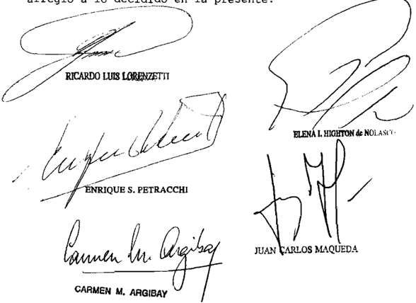

Recurso ext raordinario interpuesto por 1a Adminictración Federal de Ingrebos Públicos representada por la Dra . Haría Gabriela Moaqueira

Iraslado contestado por Bayer representada por Gabtón Arnando Miani 01

Tribunal de origen: Sala II de la Cámara Nacional de Apelaci en 1o ciogo Administralivo Federal

Iribunal que intervino con anterioridad: Fiscal de la Nación

## BEAUDEAN, RIcARDO S/ QUIEBRA

## LEYES LOCALES.

No resulta válida la ley 2990 sancionada por la Legislatura de la Ciudad de Buenos Aires en cuanto regula el destino de los fondos caducos de las quiebras, pues él está determinado en una ley nacional -24.522- cuya sanción es de competencia exclusiva del Congreso Nacional y no cabe distinguir en términos que la misma ley no lo hace.

-Del dictamen de la Procuración General, al que remitió la Corte Suprema-.

## DE JUSTICIA DE LA NACION

335

## DIcTAMEN DE LA PROcURAcIóN GENERAL

Suprema Corte:

- I -

A fs. 1356, la Cámara Nacional en lo Comercial (sala C) admitió el recurso de apelación del Gobierno de la Ciudad Autónoma de Buenos Aires y revocó la resolución de primera instancia en cuanto declaró la inconstitucionalidad de la ley local 2990.

Para así decidir, remitió a los fundamentos y conclusiones vertidos en un fallo de la misma sala, de igual fecha, dictado en la causa 'Mareta de Zapata, Nélida del Carmen s/ quiebra' -expte. 80834.99- agregado en copia a fs. 1350/1355, en el que expresó que la norma local cuestionada no modificaba, contradecía ni derogaba a la ley 24.522 sino que, ante la inexistencia de legislación que especificara el destino de los fondos caducos provenientes de las quiebras, el asignado por la regulación correspondiente a la jurisdicción en la que tramita el proceso que genera la existencia de fondos, la ley de la CABA no es contraria a la Constitución Nacional.

- II -

Disconforme, el representante del Estado Nacional -Ministerio de Educación- presentó el recurso extraordinario de fs. 1366/1380, contestado por el síndico a fs. 1405 y vta. -apoyando la postura del recurrente- y por el representante del Gobierno de la Ciudad Autónoma de Buenos Aires a fs. 1387/1403, que fue rechazado en tanto fue fundado en la causal de arbitrariedad -sin que se presentara queja- y concedido por ser la resolución contraria al derecho federal invocado (art. 14, inc. 3º de la ley 48).

Los agravios del recurrente son los siguientes: a) la ley local viene a 'reglamentar' a la ley nacional; circunstancia inadmisible desde que una ley nacional sólo puede ser reglamentada por el Poder Ejecutivo Nacional; b) la ley local viene a 'aclarar' una ley nacional; lo cual es ilegítimo porque el dictado de una ley aclaratoria correspondería al Congreso Nacional; c) la Constitución Nacional -arts. 75, inc. 12 y 126- otorga a la legislatura nacional la competencia exclusiva en la sanción de leyes sobre bancarrotas; d) si los fondos caducos fueran transferidos a la Ciudad Autónoma de Buenos Aires se incurriría en un acto discriminatorio con las demás jurisdicciones federales en razón de que le corresponde, según la ley de educación nacional 26.206,

al Estado Nacional distribuir esos fondos para el fomento educacional como garante del financiamiento del sistema educativo nacional; e) el fomento de la 'educación común' a que se refiere el art. 224 de la ley 24.522 no está solamente a cargo de la Ciudad Autónoma de Buenos Aires; f) no es válido el argumento de la transferencia de servicios educativos aprobado por la ley 24.049 en tanto las leyes 24.522, 25.589 y 26.086 fueron sancionadas con posterioridad y no cabe presuponer la ignorancia del legislador; y g) se prescinde del texto legal aplicable.

- III -

A mi modo de ver, el recurso extraordinario resulta formalmente admisible, toda vez que la sentencia apelada se pronunció por la validez de una ley local -ley CABA 2990- cuestionada oportunamente como contrario al art. 224 de la ley nacional de concursos y quiebras y violatoria del art. 75, inc. 12 de la Constitución Nacional.

- IV -

Adelanto mi opinión en favor de la interpretación postulada por el Estado Nacional, aquí recurrente.

Resulta indiscutible que, como tiene reiteradamente dicho la Corte, que '...los actos de las legislaturas provinciales [en el sub lite , de la Ciudad Autónoma de Buenos Aires] no pueden ser invalidados sino en los casos en que la Constitución concede al Congreso Nacional, en términos expresos, un poder exclusivo, o en que el ejercicio de idénticos poderes ha sido expresamente prohibido a las provincias, o cuando hay una absoluta y directa incompatibilidad en el ejercicio de ellos por estas últimas' (Fallos: 3:131; 302:1181; 320:619, entre muchos otros).

En este orden de ideas, el art. 75, inc. 12 de la Constitución Nacional dispone expresamente que corresponde al Congreso Nacional dictar las leyes sobre bancarrotas, y el art. 126 del mismo cuerpo prohíbe a las provincias ejercer el poder delegado a la Nación y expedir leyes, entre otras materias, sobre bancarrotas.

Es así que la ley nacional 24.522 en su art. 224 -declarado constitucional por la Corte en el precedente 'Carbometal' (Fallos: 329:5123)cuyo antecedente es el art. 221 de la ley 19.551, dispuso que el destino de los dividendos caducos de las quiebras era 'el patrimonio estatal para el fomento de la educación común', sin distinguir si se trataba del nacional o del de otra jurisdicción como sí lo hizo el legislador con la

sanción del art. 18 de la ley 19.550 -que propicia una solución similar para el remanente de la liquidación de una sociedad de objeto ilícito-, en cuanto aclaró que el ingreso del importe al patrimonio estatal para el fomento de la educación común lo era 'para la jurisdicción respectiva'. Esto nos lleva a dos conclusiones: 1) la ley local 2990 no puede modificar, alterar, aclarar, interpretar ni reglamentar una ley dictada por el Congreso Nacional sobre bancarrota; es decir, solamente el Congreso Nacional puede establecer el destino de los dividendos caducos; y 2) de los términos de la ley 24.522 no cabe distinguir en términos en que la ley no lo hace.

Por otro lado, la ley nacional crea un Registro Nacional de Concursos y Quiebras -art. 295- para que se tome nota de todos los procedimientos reglados en dicha ley que tramiten ante los magistrados de cualquier jurisdicción nacional o provincial y faculta al Poder Ejecutivo Nacional a reglamentar su funcionamiento y organización. Por decreto 367/96, con el fin de brindar una alternativa procesal que permita la registración de los procedimientos concursales hasta tanto se organice el registro nacional, se dispuso que los jueces debían cumplir las mandas de los arts. 295, 14 inc. 6 y 88 inc. 2 de la ley 24.522 mediante la orden de anotación de acuerdo a las normas locales. La única interpretación posible para la creación de un Registro Nacional a fin de anotar procesos de todas las jurisdicciones es la efectiva defensa del crédito del Estado Nacional.

En otro orden, la transferencia de los establecimientos educacionales con su respectivo financiamiento no significa de por sí el traspaso de todos los recursos referidos a la educación, desde que el Estado Nacional tiene, como una de sus funciones esenciales, la educación, en tanto garantiza el financiamiento del Sistema Educativo Nacional (art. 9º ley 26.206).

En efecto, el art. 12 de esta última ley, establece que: 'El Estado Nacional, las provincias y la Ciudad Autónoma de Buenos Aires, de manera concertada y concurrente , son los responsables de la planificación, organización, supervisión y financiación del Sistema Educativo Nacional...'; por su parte, el art. 131 establece que 'El Ministerio de Educación, Ciencia y Tecnología, en su carácter de autoridad de aplicación de esta ley, llevará a cabo convenios bilaterales con las provincias y la Ciudad Autónoma de Buenos Aires en los que se establecerán: ... b) los recursos de origen nacional o provincial, o en su caso de la Ciudad Autónoma de Buenos Aires, que se asignarán para su cumplimiento...'.

Asimismo se crea, en virtud del art. 116, el Consejo Federal de Educación, organismo interjurisdiccional, de carácter permanente, como ámbito de concertación, acuerdo y coordinación de la política educativa nacional, con facultades para resolver transferencias de partidas del presupuesto nacional bajo los mecanismos de supervisión y control de la ley 26.075 (art. 118).

Surge, pues, de modo incontrastable, que el financiamiento de la educación común -en el presente caso- no es sólo responsabilidad de la Ciudad sino, de manera concurrente, del Estado Nacional.

Estimo que, por las razones antedichas, no resulta válida la ley 2990 sancionada por la Legislatura de la Ciudad Autónoma de Buenos Aires en cuanto regula el destino de los fondos caducos de las quiebras, pues él está determinado en una ley nacional cuya sanción es de competencia exclusiva del Congreso Nacional.

- V -

Por lo tanto, opino que cabe revocar la sentencia en cuanto fue motivo del recurso extraordinario y ordenar que, por quien corresponda, se dicte una nueva de acuerdo a lo dictaminado. Buenos Aires, 27 de junio de 2011. Laura M. Monti.

## FALLO DE LA cORTE SUPREMA

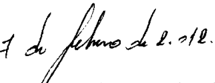

Buenos Aires,

Vistos 1os autos: "Beaudean,

Ricardo quiebra"

## Considerando:

Que esta Corte comparte los fundamentos y conclusiones del dictamen de la señora Procuradora Fiscal ~con excepción de 1o expresado en el quinto Párrafo del apartado IV, de dicho dictamen-, los que cabe remitir en razón de brevedad -

Por ello, se declara formalmente admisible el recurso ex traordinario se revoca la decisión apelada en que ha sido materia de recurso \_ Con costas (art\_ 68 del Procesal Ci vil y Comercial de la Nación) Vuelvan autos al tribunal de Código

origen fin de que por medio de quien corresponda , se dicte un nuevo pronunciamiento con arreglo presenter-Notifíquese remítase al

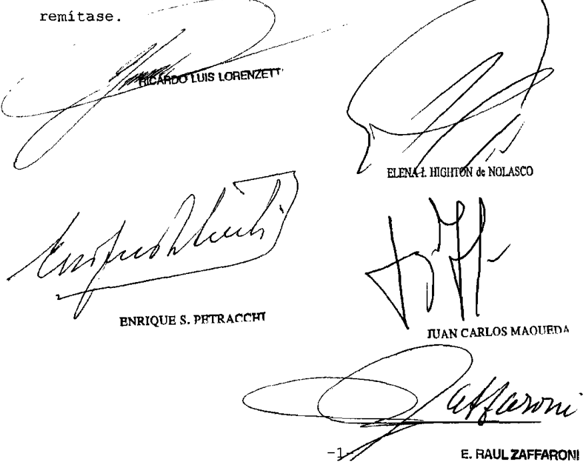

PARADA, LYLIA Y OTRO c/ PEN LEY 25561 DTOS. 1570/01 214/02 471/02 S/ AMPARO LEY 25.561

## EMERGENCIA ECONOMICA.

Corresponde confirmar la sentencia que ordenó el pago de los servicios financieros de los bonos por aplicación de las disposiciones de las leyes 25.827, 26.198 y 26.337, ya que la situación de los actores -exceptuados del diferimiento de pagos en razón de la avanzada edad- se consolidó con las normas que contemplaron la excepción, sin que obste a ello la circunstancia de que en leyes posteriores se regulara de modo diferente el tratamiento de la deuda pública.

-Del precedente 'Tapella', T. 394.XLIV, del 27/9/2011, al cual se remitió-.

## FALLOS DE LA CORTE SUPREMA 335

## DIcTAMEN DE LA PROcURAcIóN GENERAL

## Suprema Corte:

- I -

A fs. 163/164, la Cámara Nacional en lo Contencioso Administrativo Federal (Sala I), al revocar la decisión del juez de primera instancia, desestimó la pretensión de los actores de que se declarara la inconstitucionalidad del decreto 471/02, pero de todas formas -con fundamento en las excepciones al diferimiento de los pagos de los servicios de la deuda pública que contemplaba la resolución 73/02 del Ministerio de Economía-, ordenó cancelar los bonos y sus servicios en los términos de aquel decreto, atento a que 'los actores Lylia Parada y Horacio Enrique Martinez fueron titulares de Bonos de Consolidación en U$S (2da. Serie y 3ra. Serie)... asimismo, la tenencia de esos títulos se mantuvo en cabeza de aquellos sin variación, hasta la fecha de la promoción de la demanda objeto de autos' y padecen serios y graves problemas de salud (v. fs. 163).

- II -

Disconforme con esta decisión, el Estado Nacional interpuso el recurso extraordinario de fs. 168/183.

La Cámara lo concedió en tanto el pronunciamiento apelado interpretaba normas de carácter federal en sentido adverso al postulado por el recurrente y lo denegó respecto de la arbitrariedad atribuida a la sentencia (fs. 195), sin que aquél planteara queja alguna.

Sostiene, en síntesis, que si bien las resoluciones 73/02 y 158/03 del Ministerio de Economía y las leyes de presupuesto de 2004 y 2005 habían establecido excepciones al diferimiento de pago en razón de problemas de salud de los tenedores de ciertos títulos públicos, el legislador de 2006 y 2007 consideró conveniente no mantenerlas, debido a que aquéllos debían haber cobrado sus acreencias con anterioridad al 2006, claro que con la modalidad cambiaria establecida por el decreto 471/02.

El recurso extraordinario es formalmente admisible, pues se encuentra en discusión el alcance y la interpretación de disposiciones de carácter federal (resoluciones 73/02 y 158/03 del Ministerio de Economía, leyes 25.827, 25.967, 26.078, entre otras) y la decisión definitiva del superior tribunal de la causa es contraria al derecho que el apelante funda en ellas (art. 14, inc. 3º, de la ley 48).

- IV -

A raíz de la situación planteada en autos, en la anterior intervención de este Ministerio Público de fs. 201 se sugirió al Tribunal que, en ejercicio de la atribución que le concede el art. 36 del Código Procesal Civil y Comercial de la Nación, ordenara medidas para conocer el real estado de la causa.

A fs. 218, V.E. dispuso que las partes informaran de modo preciso y en forma circunstanciada acerca de los títulos de la deuda pública nacional que son objeto de esta litis. Y, en concreto, el tipo de bonos de propiedad de los actores, la fecha en que fueron adquiridos y registrados en la Caja de Valores S.A., así como los movimientos que tuvieron desde su compra. Asimismo, si se abonan -y de qué forma- los servicios financieros y la amortización de dichos bonos y si existen pagos pendientes o fueron totalmente cancelados, o bien si tales bonos fueron canjeados por otros títulos.

En cumplimiento de tal medida, los actores señalaron que no han recibido pagos por servicios financieros devengados ni amortizaciones de los bonos de su propiedad, los que tampoco fueron objeto de canje alguno (v. fs. 224/235).

Por su parte, el Estado Nacional informó que los actores son titulares de los bonos de consolidación indicados desde 2001 y que sobre tales títulos no se abonaron servicios financieros en los términos de la resolución 73/02 (v. fs. 291/298).

Con esta información -a la que se agrega el informe de la Caja de Valores S.A. de fs. 238/290- se pasaron nuevamente los autos a este Ministerio Público.

Sentado lo anterior, cabe destacar, que más allá de que los aspectos fácticos de la causa no se pueden revisar en esta instancia porque su resolución está reservada -de ordinario- a los jueces de la causa y sólo excepcionalmente pueden llegar a conocimiento del Tribunal, lo cierto es que en el sub lite la demandada no discute que la situación de los actores encuadre en la excepción prevista por el art. 2º, inc. e), de la resolución 73/02 -que fue reproducida en las leyes de presupuesto para ejercicios 2004 y 2005 (v. arts. 60, inc. 'd' ap. II, de la ley 25.827 y 47, inc. 'd' ap. II, de la ley 25.967, respectivamente)-, por tratarse de bonos de consolidación en poder de personas que atraviesan situaciones en las que estuviera en riesgo su vida o su salud, y que en virtud de ello le habría correspondido percibir los servicios financieros de esos bonos en las condiciones establecidas por el decreto 471/02, que es precisamente el modo de cancelar los títulos que ordenó la cámara.

La controversia surge, entonces, a raíz de la decisión de la alzada de ordenar el pago de los servicios financieros de los bonos de los actores por aplicación de las disposiciones de la resolución 73/02, que el Estado Nacional resiste con el argumento de que, al momento de dictarse la sentencia apelada, ya no regía esa excepción al diferimiento de los servicios de la deuda pública.

Al respecto, desde mi punto de vista, la interpretación de la cámara de las normas que rigen el caso no justifica el reproche que le endilga el apelante, toda vez que es posible concluir que la situación de los actores se consolidó con las normas que contemplaron la excepción en cuestión, sin que obste a ello la circunstancia de que en leyes posteriores se regulara de modo diferente el tratamiento de la deuda pública.

En apoyo de este aserto concurren, al menos, dos circunstancias que no se pueden pasar por alto. Por un lado, que no hay ninguna disposición en las leyes que el apelante invoca que permita sostener su aplicación retroactiva, mientras que, por el otro, en numerosos casos en los que concurrían situaciones similares a las que se plantean en autos, el Estado Nacional abonó los servicios de la deuda al incluir a los tenedores de los títulos en alguna de las excepciones al diferimiento de los pagos que se contemplaron en distintas normas, sin que interrumpiera el cumplimiento de tal obligación por el mero vencimiento del ejercicio fiscal o por la sanción de una nueva ley de presupuesto,

tal como se comprueba en una gran cantidad de expedientes análogos en los que intervino este Ministerio Público Fiscal y actualmente se encuentran a consideración del Tribunal.

Esta conducta es demostrativa de que el apelante consideró que la inclusión del tenedor de un título entre las excepciones al diferimiento de los servicios de la deuda pública nacional no se ve modificada por nuevas leyes que contemplan otras modalidades de tratamiento y regulación de la deuda pública.

A mayor abundamiento, cabe poner de resalto que a similares conclusiones arribó este Ministerio Público Fiscal, al pronunciarse en una causa sustancialmente análoga al sub examine (autos T. 394, L. XLIV, 'Tapella, Néstor Carlos y otro c/ EN Bocones previsionales s/ amparo ley 16.986', dictamen del 10 de diciembre de 2010).

- VI -

Opino, por tanto, que corresponde declarar admisible el recurso extraordinario deducido por la parte demandada y confirmar la sentencia apelada. Buenos Aires, 30 de septiembre de 2011. Laura M. Monti.

## FALLO DE LA cORTE SUPREMA

## Buenos Aires, de   &amp;ebrero

Vistos los autos "Parada, Lylia otro c/ PEN ley 25 . 561 dtos \_ 1570/01 214/02 471/02 s / amparo sobre ley 25 . 561"

## Considerando:

Que resulta aplicable en el sub examine el criterio establecido por el Tribunal al decidir la causa I.394 .XLIV pella, Néstor Carlos otro c/ E.N ~Bocones Previsionaless / amparo ley 16.986" sentencia del 27 de septiembre de 2011 , cuyos fundamentos conclusiones corresponde remitirse, en 10 pertinente, por razones de brevedad \_ "Ta-

ello, de conformidad con dictaminado por la señora Procuradora Fiscal, se declara formalmente admisible el recurso extraordinario y se confirma la sentencia apelada Costas por su orden en atención complejidad de la cuestión debatida Y las particularidades del caso Notifíquese y devuélvase

Recurso extraordinario interpuesto por al Batado Nacional de nomía Producción , representado por la Dra Inés Sofía Signorig

Traslado contestado por Lylia Parada Horacio Enrique Martínez, representados por el Parada

Tribunal de origen: Sala de la Cámara Nacional de Conten ciogo Adminibtrativo Federal

Tribunales que intervinieron con anterioridad: Juzgado Nacional de Primere Inbtancia en 1o Contenciobo Adninietrativo Foderal 10

ADM ARGENTINA S.A. (TF 21394-A) c/ D.G.A.

## EXPORTACION.

Dada la naturaleza del crédito reclamado -estímulo fiscal vinculado con operaciones de exportación-, que al momento de su cobro fue liquidado en dólares estadounidenses, a efectos de determinar su cuantía no cabe remitirse a la doctrina del caso 'Longobardi' (Fallos: 330:5345), sino a lo dispuesto en los arts. 1º, 4º y 8º

del decreto 214/02, debiendo el importe respectivo, transformarse en pesos, a la paridad de un dólar estadounidense igual a un peso y se aplicará el coeficiente de estabilización de referencia (CER).

## EXPORTACION.

El factor de convergencia puede considerarse comprendido dentro de la amplia enumeración de las medidas tributarias y los estímulos fiscales contemplada en el primer párrafo del artículo 6º de la ley 21.453 -régimen especial para las exportaciones-, pues una conclusión contraria que propicie la supresión de aquél beneficio para las exportaciones, como así de su pago para el caso simétrico de importaciones, no sería conciliable con la doctrina del Tribunal que ha establecido que las leyes deben interpretarse siempre evitando darles un sentido que ponga en pugna sus disposiciones destruyendo las unas por las otras, y adoptando como verdadero el que las concilie y deje a todas con valor y efecto.

-Del precedente 'Aceitera General Deheza S.A.' (Fallos: 334:485), al que remitió la Corte Suprema-.

DIcTAMEN DE LA PROcURAcIóN GENERAL

Suprema Corte:

- I -

A fs. 94/196 vta., la sala I de la Cámara Nacional de Apelaciones en lo Contencioso Administrativo Federal confirmó en su totalidad la sentencia de la instancia anterior y, en consecuencia, revocó la resolución 38/05 de la DGA -cuya copia obra a fs. 6- e hizo lugar parcialmente a la pretensión de la actora, en cuanto había solicitado la liquidación y pago del 'factor de convergencia' establecido por el decreto 803/01 por una serie de operaciones de exportación de productos incluidos en la ley 21.453, cuyas declaraciones juradas de venta fueron registradas entre el 9 de agosto y el 24 de octubre de 2001, mas sus respectivos permisos de embarque se documentaron entre el 1º de febrero y el 4 de marzo de 2002, es decir con posterioridad a la derogación del citado decreto, la que se produjo el 29 de enero de 2001 por su similar 191/02.

Para así decidir, estimó -en síntesis- que el decreto 803/01 creó un régimen transitorio para el comercio exterior, y que el factor de convergencia allí establecido buscó otorgar mayor competitividad a las exportaciones. Con relación a las operaciones contempladas en la

ley 21.453, el decreto 936/01 determinó que el coeficiente a considerar para su cálculo sería el vigente a la fecha de cierre de cada venta.

Agregó que el art. 6º de la mentada ley permite colegir que el derecho al cobro del beneficio nace y se consolida en la fecha de cada contrato. Si bien es cierto que nadie tiene un derecho adquirido al mantenimiento de un determinado régimen jurídico, también lo es que si se cumplen todas las condiciones fijadas para acceder a un beneficio, éste nace y se adquiere en el patrimonio de la persona involucrada.

Con respecto a la liquidación del mencionado factor de convergencia, resolvió que debía calcularse convirtiendo su valor en dólares estadounidenses a razón de un dólar igual a un peso, y aplicando sobre el capital un interés del 6% anual. Indicó que el decreto 214/02 no abarcó las deudas en concepto del estímulo fiscal en tratamiento, y que de acuerdo con su similar 1.043/03, art. 1º, inc. a), debía considerarse la fecha de cierre de cada venta.

- II -

Disconforme con lo resuelto, el Fisco Nacional interpuso el recurso extraordinario que luce a fs. 101/112.

Arguye que se ha realizado una incorrecta aplicación de lo dispuesto por la ley 21.453 y los decretos 803/01 y 191/02, violentando principios constitucionales, en razón de lo cual, además, la sentencia resulta arbitraria por carecer de adecuados fundamentos normativos.

En lo sustancial, sostiene que la obtención del beneficio, de carácter cambiario, se concretaba al momento en que la mercadería era exportada, es decir al momento del registro del correspondiente despacho de exportación definitiva. Agrega que todas las operaciones aquí involucradas fueron efectuadas con posterioridad al dictado del decreto 191/02 que derogó el factor de convergencia, sin que pueda sostenerse que la actora tuviera un derecho adquirido a su percepción.

- III -

Por su parte, la actora dedujo el recurso extraordinario que obra a fs. 114/120 vta. Puntualizó que el monto a cobrar por el estímulo fiscal en discusión fue liquidado en su momento en dólares estadounidenses, y se agravia debido a que las instancias anteriores, si bien hicieron lugar a su pretensión de cobro, convirtieron su importe a razón de un

dólar igual a un peso, violentando lo dispuesto por la ley 25.561 y sus normas reglamentarias.

Así, sostiene que no corresponde la aplicación del decreto 1.043/03, ya que las operaciones de exportación aquí involucradas son posteriores al 28 de enero del 2002, y que, por ende, el caso debe ser regido por lo preceptuado por el decreto 473/02, por lo que corresponde la 'pesificación' a razón de un dólar estadounidense igual a un peso con cuarenta centavos, más el coeficiente de estabilización de referencia (CER).

- IV -

Con respecto a la apelación del Fisco Nacional, estimo que es formalmente admisible, toda vez que se ha puesto en tela de juicio la validez e inteligencia de normas federales (ley 21.453 y decretos 803/01, 936/01 y 191/02) y la decisión definitiva del superior tribunal de la causa ha sido contraria al derecho que la recurrente ha sustentado en ellas (art. 14, incs. 1º y 3º de la ley 48).

En cuanto al fondo del asunto allí planteado, considero que corresponde confirmar la sentencia recurrida en ese punto, a la luz de resuelto por el Tribunal el 24 de mayo del corriente año en la causa A.311, L.XLVI, 'Aceitera General Deheza S.A. (TF 22.313-A) c/ DGA', en la cual compartió el criterio propuesto por este Ministerio Público.

- V -

En lo tocante al recurso federal de fs. 114/120, opino que resulta asimismo admisible en lo formal, dado que se halla controvertida la inteligencia a asignar a normas federales (ley 25.561 y sus normas reglamentarias), y la resolución del superior tribunal de la causa ha sido contraria a la sostenida por la recurrente.

Por otra parte, no es ocioso recordar que, en su tarea de establecer la correcta interpretación de las normas de carácter federal, V.E. no se encuentra limitada por las posiciones del tribunal apelado y del recurrente, sino que le incumbe realizar una declaratoria sobre el punto disputado (art. 16, ley 48), según la inteligencia que rectamente les otorgue (arg. Fallos: 307:1457; 320:1915, entre otros).

Así las cosas, es menester destacar que, de acuerdo con lo indicado en el acápite anterior, ha quedado en claro la procedencia del cobro reclamado, siendo pertinente destacar que el beneficio instituido por

el citado decreto 803/01 es un estímulo fiscal cuya obligación de pago nació, para los casos regidos por su similar 936/01, en el momento en que se registraron las operaciones de venta al exterior de los productos abarcados por la ley 21.453, pero sujeta a la condición suspensiva de que se formalizase su exportación, es decir, que recién devenía exigible su cobro a partir del momento en que se documentaban los respectivos permisos de embarque.

En lo que atañe a la 'pesificación' de las obligaciones aquí involucradas, cabe destacar, coincidentemente con lo afirmado por la actora, que el art. 1º del decreto 1.043/03 - cuya constitucionalidad dicha parte no cuestionó- no resulta aplicable a la especie, ya que abarca los pagos del 'factor de convergencia' involucrado en operaciones cuyas solicitudes de destinación de exportación se hubieran registrado entre el 19 de junio de 2001 y el 10 de enero de 2002 (inc. a) o bien entre el 11 y el 28 de enero de 2002 (inc. b), siendo que las operaciones aquí controvertidas fueron documentadas en permisos de embarque presentados entre el 1º de febrero y el 4 de marzo del 2002.

Por otra parte, y contrariamente a lo requerido por la actora, estimo que las prescripciones del decreto 471/02 tampoco rigen para el presente caso. En efecto, en el precedente B.2349, L.XL, 'Banco Provincia de Jujuy c/ Municipalidad de San Salvador de Jujuy s/ recurso de inconstitucionalidad', sentenciada el 16 de noviembre de 2009, V.E. compartió la tesitura de este Ministerio Publico (cons. 1º) en cuanto a que el ámbito de aplicación material de dicho reglamento 'comprende a las obligaciones del sector público nacional, provincial y municipal vigentes al 3 de febrero de 2002 denominadas en dólares estadounidenses u otra moneda extranjera, cuya ley aplicable sea solamente la ley argentina, canalizadas por medio de los instrumentos mencionados en sus considerandos, esto es, a través de diversos tipos de títulos de deuda y préstamos provenientes del mercado de capitales y de inversores financieros' , puesto que se trata de 'un universo acotado a la deuda pública de los distintos niveles de gobierno plasmada en los instrumentos antes indicados, sobre la que el Estado dispuso otorgarle el tratamiento descripto, a partir del nuevo ordenamiento económico y financiero resultante de la ley 25.561 y sus disposiciones complementarias' .

Así las cosas, y de acuerdo con lo establecido por esa Corte en el considerando 2º de esa misma causa, de mantenerse el criterio en ella sentado, correspondería aplicar al sub lite las pautas de Fallos: 330:5345 ('Longobardi'), a fin de calcular la cuantía del crédito.

En virtud de lo expuesto, opino que corresponde confirmar la sentencia apelada en cuanto a la procedencia del pago crédito reclamado, el cual deberá ser determinado de acuerdo con lo indicado en el acápite V. Buenos Aires, 6 de septiembre de 2011. Laura M. Monti .

## FALLO DE LA cORTE SUPREMA

## Buenos Aires, de do(l.

Vistos los autos "ADM Argentina 5 .A. (TF 21.394-A) c/ DGA"

## Considerando:

Que las cuestiones planteadas respecto la pro cedencia del factor de convergencia" previsto en el decreto 803/01 respecto de exportaciones efectuadas al amparo de ley 21 453 , resultan, tal conO pone de relieve la señora Procuradora Fiscal en su dictamen, análogas las consideradas en causa "Aceitera General Deheza (TF 22.313-A) c/ Dirección General de Aduanas" (Fallos: 334:485) Por lo tanto, en l0 relativo tal aspecto corresponde remitirse por razones de brevedad , al referido precedente

2% ) Que por otra parte, esta Corte coincide con los argumentos desarrollados en el nencionado dictamen en cuanto descarta aplicación al sub lite de lo dispuesto en el art del decreto 1043/03, en atención la fecha en que fueron documentados los permisos de embarque obrantes en autos Asimismo\_ coincide con tal dictamen en cuanto que resulte inaplicable al sub examine el decreto 471/02 , según la doctrina que surge del precedente B.2349.XL "Banco Provincia de Jujuy c/ Municipalidad de San Salvador de Jujuy s/ recurso de inconstitucionalidad" sentencia del 16 de noviembre de 2009-

Que sin embargo, el Tribunal considera, dada la naturaleza del crédito reclanado ~estímulo fiscal vinculado con operaciones de exportación-, que efectos de deterninar su cuantía no cabe remitirse la doctrina del caso Longobardi (Fallos: 330:5345) ~aplicada en la mencionada causasino 1o dispuesto en 10s arts. 1 ' 4 Y 8 del decreto 214/02, tal como se hizo, por otra parte, en un precedente que guarda cierta analogía con el presente (conf\_ causa B.828 XLIII "Bridgestone Firestone Argentina S .A ~IF 16.674-Ac/ DGA" sentencia del 27 de abril de 2010) \_ Es decir, el importe respectivo deberá transformarse pesos , la paridad de un dólar estadounidense igual un peso, Y se aplicará el "coeficiente de estabilización de referencia" (CER)

Por ello, de confornidad, en lo pertinente, con dictaminado por la señora Procuradora Fiscal, se declaran formalmente admisibles 1os recursos extraordinarios interpuestos Y se revoca parcialmente la sentencia apelada con los alcances que surgen de presente Costas por su orden , en atención la complejidad de las cuestiones planteadas al modo en que se decide Notifíquese Y renítanse 10s autos al tribunal de origen fin de que por quien corresponda , se dicte un nuevo pronuncianiento con arreglo l9 dcidido en |la presente

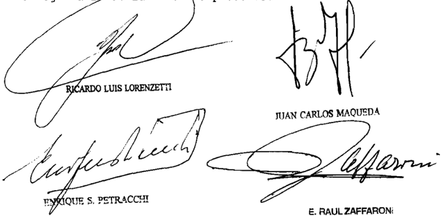

Recursos extraordinarios interpuestog pOr representado Dra . Virginla Bditb Alapont; 8,1 . representada pOr el

contestados por Batado Nacional representado la Dra . VirgiAlapont ; representada pOr el Dr Enrique Baní tez Crur

Tribunal de origen: 8ala de Naaional de Contan -

Iribunal intervíno con anterioridad: que

## cOLEGIO DE EScRIBANOS DE LA cIUDAD DE BUENOS AIRES c/ BUENOS AIRES, PROVINcIA DE S/ AccIóN DE AMPARO

## IMPUESTO DE SELLOS.

Si bien se ha resuelto que las acciones de amparo son procedentes -de manera general- en las causas que tramitan por vía originaria, cuando el objeto de la pretensión exige que la tutela de los derechos y facultades constitucionales invocados se canalice por vías que no se limitan a la esgrimida- en el caso fue interpuesta a fin de que se declare la inconstitucionalidad, invalidez e inaplicabilidad del artículo 46 inc. B), apart. 7 de la ley de la Provincia de Buenos Aires, en tanto establece el pago de una alícuota diferencial en concepto de impuesto de sellos, respecto de los actos, contratos y operaciones sobre inmuebles allí radicados, concertados en instrumentos públicos o privados, otorgados fuera de ella-, cabe disponer su sustanciación por el trámite previsto para el juicio ordinario en el Código Procesal Civil y Comercial de la Nación.

-En igual sentido: Causas S 4 XLVIII 'Sala, Arturo Julio y otros c/ Bs As, Provincia de s/ acción declarativa de inconstitucionalidad' y P 2 XLVIII 'Paganelli, Armando Silvio y otros c/ Bs As, Provincia de s/ acción declarativa de inconstitucionalidad', sentencias de la fecha-.

## IMPUESTO DE SELLOS.

Cabe decretar la prohibición de innovar, y ordenar a la Provincia de Buenos Aires que, hasta tanto se dicte sentencia definitiva, se abstenga de reclamar o de exigir a los notarios asociados al Colegio de Escribanos de la Ciudad de Buenos Aires y a las personas que requieran sus servicios, el pago de una alícuota diferencial en concepto de impuesto de sellos con fundamento en el artículo 46, inciso B, apartado 7 de la ley provincial 14.333, respecto de los actos, contratos y operaciones documentados en instrumentos, públicos o privados, sobre bienes inmuebles ubicados en la Provincia, concertados fuera de ella, que resulte superior a la que tributan aquellos mismos actos concertados dentro del territorio provincial, pues si bien por vía de principio, dichas medidas no proceden respecto de actos administrativos o legislativos habida cuenta de la presunción de validez

que ostentan, tal doctrina debe ceder cuando se los impugna sobre bases prima facie verosímiles.

-En igual sentido: Causas S 4 XLVIII 'Sala, Arturo Julio y otros c/ Bs As, Provincia de s/ acción declarativa de inconstitucionalidad' y P 2 XLVIII 'Paganelli, Armando Silvio y otros c/ Bs As, Provincia de s/ acción declarativa de inconstitucionalidad', sentencias de la fecha-.

## IMPUESTO DE SELLOS.

La acción promovida a fin de que se declare la inconstitucionalidad, invalidez e inaplicabilidad del artículo 46, inciso B, apartado 7 de la ley 14.333 de la provincia de Buenos Aires -en tanto establece el pago de una alícuota diferencial en concepto de impuesto de sellos, respecto de los actos, contratos y operaciones sobre inmuebles allí radicados-, es de la competencia originaria de la Corte Suprema de Justicia de la Nación, por ser parte una provincia en una causa en la que cabe asignarle manifiesto contenido federal, pues versa sobre la preservación de las órbitas de competencia entre los poderes del gobierno federal y los de un Estado provincial, razón por la cual se encuentra entre las especialmente regidas por la Constitución Nacional, a las que alude el artículo 2º, inciso 1º de la ley 48.

DIcTAMEN DE LA PROcURAcIóN GENERAL

## Suprema Corte:

- I -

El Colegio de Escribanos de la Ciudad de Buenos Aires, con domicilio en la Ciudad Autónoma de Buenos Aires, promueve la acción de amparo prevista en el art. 43 de la Constitución Nacional contra la Provincia de Buenos Aires, a fin de hacer cesar la lesión de los derechos y garantías de los escribanos que no tienen competencia en el territorio de la accionada (art. 980 del Código Civil), provocada por el art. 46, inc. B), ap. 7), de la ley local 14.333, cuya declaración de inconstitucionalidad solicita.

Cuestiona este precepto en cuanto establece un impuesto de sellos más gravoso para los actos, contratos y operaciones documentados en instrumentos públicos o privados sobre bienes inmuebles situados en la Provincia de Buenos Aires cuando hubieran sido concertados fuera de ella.

Especifica que, cuando las escrituras son otorgadas fuera del territorio provincial, la ley local incrementa del tres al cuatro por cielito (3% al 4%) la alícuota del impuesto de sellos a las transmisiones de dominio. Aumenta del cero con veinte centésimos al cuatro por ciento (0,20 al 4%) la alícuota para las operaciones de cancelación de hipotecas, del uno al cuatro por ciento (1% al 4%) para los boletos de compra y venta, en la misma proporción para las cesiones de derechos y acciones, y del uno y medio al cuatro por ciento (1,5% a 4%) para la constitución de derechos reales e hipoteca.

Señala que esta medida ha sido adoptada exclusivamente para derivar clientela hacia los notarios con competencia territorial en la Provincia de Buenos Aires pues, al recurrir a los servicios profesionales de éstos, los contribuyentes quedan beneficiados por las alícuotas impositivas menores.

Por ello,  considera que el art. 46, inc. B), ap. 7), de la ley local 14.333 viola, entre otros, el derecho a la libre competencia y a operar en un mercado sin distorsiones, así como la prohibición de aduanas o barreras arancelarias interiores o cualquier otra forma de distorsión del comercio interprovincial.

Asimismo, solicitan que se dicte una medida cautelar para que se suspendan los efectos del art. 46, inc. B), ap. 7), de la ley local 14.333 hasta tanto recaiga sentencia o durante el plazo que se fije como adecuado para arribar a una decisión definitiva en autos.

A fs. 97 se corre vista, por la competencia, a este Ministerio Público.

- II -

Ante todo, corresponde señalar que uno de los supuestos en que procede la competencia originaria de la Corte si es parte una Provincia, según el art. 117 de la Constitución Nacional, es cuando la acción entablada se funda directa y exclusivamente en prescripciones constitucionales de carácter nacional, en leyes del Congreso o en tratados con las naciones extranjeras, de tal suerte que la cuestión federal sea la predominante en la causa (Fallos: 311:1812 y 2154; 313:98 y 548; 315:448; 318:992 y 2457; 322:1470; 323:2380 y 3279).

A mi modo de ver, esta hipótesis es la que se presenta en el sub lite , toda vez que, de los términos de la demanda -a cuya exposición de los

hechos se debe atender de modo principal para determinar la competencia, según los arts. 4º y 5º del Código Procesal Civil y Comercial de la Nación y doctrina de Fallos: 306:1056; 308:1239 y 2230- se desprende que la actora cuestiona una ley local por ser contraria a los arts. 9º, 10, 11, 12, 31, 75 -inc. 13-, de la Constitución Nacional, entre otros.

En tales condiciones, cabe asignar manifiesto contenido federal a la materia del pleito, ya que lo medular del planteamiento que se efectúa remite necesariamente a desentrañar el sentido y los alcances de los referidos preceptos, cuya adecuada hermenéutica resultará esencial para la justa solución de la controversia y permitirá apreciar si existe la mentada violación constitucional (Fallos: 311:2154, cons. 4º).

Además, toda vez que dicho planteamiento exige dilucidar si el accionar proveniente de la autoridad local interfiere en el ámbito que le es propio a la Nación respecto de la regulación del comercio interjurisdiccional que le corresponde (arts. 75, inc. 13, y 126 de la Ley Fundamental y Fallos: 256:241), considero que la causa se encuentra entre las especialmente regidas por la Constitución Nacional, a las que alude el art. 21, inc. 11, de la ley 48; pues versa sobre la preservación de las órbitas de competencia entre los poderes del Gobierno federal y los de un Estado provincial, lo que hace competente a la justicia nacional para entender en ella (Fallos: 330:4953 y sus citas).

En atención a lo expuesto, al ser parte una provincia en una causa de manifiesto contenido federal opino que -cualquiera que sea la vecindad o nacionalidad de las actoras (Fallos: 317:473; 318:30 y sus citas y 323:1716, entre otros)- el pleito corresponde a la competencia originaria de la Corte. Buenos Aires, 9 de febrero de 2012. Laura M. Monti .

## FALLO DE LA cORTE SUPREMA

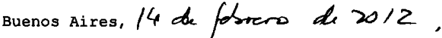

Autos Y Vistos; Considerando:

1 % ) Que fs\_ 57/96 se presenta el Colegio de Escribanos de la Ciudad de Buenos Aires promueve acción de amparo en los términos del artículo 43 de la Constitución Nacional con-

tra a Provincia de Buenos Aireg, fin de que se declare la inconstitucionalidad, invalidez inaplicabilidad del artículo 46 , inciso B, apartado de la provincial 14 333, en tanto establece el pago de una alícuota diferencial en concepto de impuesto de sellos, respecto de 1os actos, contratos Y operaciones bre inmuebles radicados en la Provincia, concertados en instrumentos públicos privados, otorgados fuera de ella

Aduce que el trato discriminatorio establecido en la tributaria impugnada tiene como consecuencia que los clientes de 1os escribanos Integrantes del Colegio deban soportar un costo mucho mayor (entre el 18 el por el simple hecho de haber elegido como notario de confianza para la realización de un acto relativo un inmueble de la Provincia de Buenos Aires uno que ejerce su profesión en la ciudad de Buenos Aires ley

Afirma que la existencia de una carga tributaria considerablemente superior tiene un solo objetivo: desplazar la realizacíón de los actos notariales hacia escribanos que se desempenen en territorio provincial\_

Sostiene que la norma cuestionada contradice manifiestamente las del artículo 997 , segundo párrafo del Código Civil, en cuanto prescribe que "Cuando un acto fuere otorgado en un territorio para producir efectos en otro, las leyes locales no podrán imponer cargas tributarias ni tasas retributivas que establezcan diferencias de tratamiento, fundadas en el domicilio de las partes, en el lugar de cumplimiento de las obligaciones en el funcionario interviniente"

Solicita asimismo el dictado de una medida cautelar mediante la cual se suspendan los efectos de la impugnada respecto de los escribanos que ejercen sus funciones Y actuación en un distrito distinto de la Provincia de Buenos Aires, Y de las personas que requieran su9 servicios, hasta tanto se dicte sentencia definitiva ley

2 ' ) Que este juicio es de la competencia originaria de la Corte Suprema de Justicia de la Nación, por ser parte una

provincia en una causa en la que cabe asignarle manifiesto contenido federal , pues versa sobre la preservación de las Órbitas de competencia entre del gobierno federal Y los de un Estado provincial, razón por la cual se encuentra entre las especialmente regidas por 1a Constitución Nacional, las que alude el artículo inciso 1 de la 48 ley

3% ) Que si bien el Tribunal ha resuelto que las acciones de amparo son procedentes ~de manera general en las causas que tramitan por vía originaria (Fallos: 307:1379; 323:2107, entre muchos otros) en el sub lite el objeto de la pretensión exige que la tutela de 10s derechos Y facultades constitucionales invocados se canalice por vías que no se limitan la esgrimida, por lo que cabe disponer que el presente se sustancie por el trámite previsto para el juicio ordinario en el Código Procesal Civil Y Comercial de la Nación (arg. Fallos: 310:877 Y citas; 311:810; 313:1062 ; 323:2107; 325 :3514 ; 332:2136) aquí

4 % ) Que este Tribunal ha establecido que si bien por vía de principio, medidas como las requeridas no proceden respecto de actos administrativos legislativos habida cuenta de la presunción de validez que ostentan, tal doctrina debe ceder cuando se 1os impugna sobre bases prima facie verosímiles (Fallos: 250:154 ; 251:336; 307:1702; 316:2855)

Que , asimismo ha dicho en "Albornoz, Evaristo Ignacio c/ Nación Argentina" (Fallos: 306:2060) que "como resulta de la naturaleza de las medidas cautelares ellas no exigen de magistrados el examen de la certeza sobre 1a existencia del pretendido, sino s610 de su verosimilitud\_ Es el juicio de verdad en esta materia se encuentra en oposición la finalidad del instituto cautelar, que no es otra que atender aquello que no excede del marco de 10 hipotético, dentro del cual, asimismo, agota su virtualidad"

En el presente caso resultan suficientemente acreditadas verosimilitud en el derecho Y la configuración de 10s presupuestos establecidos en 10s incisos Y 2 ' del artículo 230 del Codigo Procesal Civil Y Comercial de la Nación para acceder la medida pedida\_

Por ello, de confornidad con dictaminado por la señora Procuradora Fiscal, se resuelve: I. Declarar que presente causa corresponde la competencia originaria de esta Corte. II\_ Correr traslado de la demanda Provincia de Buenos Aires pOr el plazo de sesenta días (articulos 322 y 338 del Código Procesal Civil Y Comercial de la Nación) A los fines de su notificación al señor gobernador al señor fiscal de Estado, líbrese oficio al señor juez federal correspondiente III Decretar la prohibición de innovar pedida, Y ordenar la Provincia de Bue nos Aires que hasta tanto se dicte sentencia definitiva en esta causa , se abstenga de reclamar de exigir notarios asociados al Colegio de Escribanos de la Ciudad de Buenos Aires Y las personas que requieran sus servicios, el pago de una alícuota diferencial en concepto de impuesto de sellos con fundamento en el artículo 46 , inciso B , apartado de la ley provincial 14.333, respecto de los actos, contratos Y operaciones documen tados en instrumentos, públicos vados, sobre bienes inmuebles ubicados en la Provincia, concertados fuera de ella, que resulte superior la que tributan aquellos mismos actos tados dentro del territorio provincial\_ Líbrese oficio al señor gobernador fin de poner en su conocimiento la presente deciNotifíquese por cédula que se tonfeccionará por Secretaría pri-

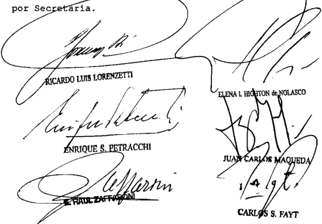

Parte actora: de 1a representado Por 1os dootoras Carlos Naroelo Bduardo con el letrado del dootor Bnrique Palxao\_

Parte demandada de

E.J.E. S/ ADOPcIóN -cAUSA Nº 12389-

## ADOPCION.

Cabe dejar sin efecto por arbitrariedad, la sentencia que estableció el carácter simple de la adopción del hijo adoptivo de la cónyuge, pues se trata de un asunto de carácter voluntario, en cuyo marco -con posterioridad a la presentación inicial- el postulante y la madre del niño expresaron personal y enfáticamente su voluntad de conseguir el otorgamiento de la adopción plena, y aun el consentimiento de la sentencia de adopción no constituye impedimento para variar sus alcances, habida cuenta de que este tema se ventila dentro de un proceso en el que las normas rituales deben adecuarse a las sustanciales, sobre todo mediando conformidad de los interesados en cuanto al sentido de la alteración propuesta.

- -Del dictamen de la Procuración General, al que remitió la Corte Suprema-.

DIcTAMEN DE LA PROcURAcIóN GENERAL

## Suprema Corte:

- I -

Contra el auto dictado por la Cámara Nacional de Apelaciones en lo Civil -Sala A- confirmatorio del pronunciamiento que había establecido el carácter simple de la adopción del hijo adoptivo de la cónyuge, el Ministerio Pupilar interpuso recurso extraordinario, cuya denegatoria da lugar a la presente queja (v. fs. 157/159, 172/173, 176/182 y 183 del expediente principal, a cuya foliatura me referiré en adelante).

- II -

Los jueces de Cámara indicaron que el caso presenta la particularidad de que no se trata de la adopción del hijo sanguíneo de la esposa, sino que el vínculo con la madre emana de una adopción plena anterior.

Asignaron relevancia al hecho de que -de no mediar una previa adopción por parte de la madre- no existirían obstáculos para que ambos cónyuges tramitaran conjuntamente la adopción plena.

Sostuvieron que la contemporaneidad de las peticiones no fue instituida como factor determinante, de modo que no encontró '...obs  táculo para, en situaciones análogas, conceder la adopción compartida a ambos cónyuges, con carácter pleno, evitando de tal suerte la potencial existencia de situaciones injustificadamente desiguales, eventualmente injustas en el seno de la familia a la que se hace referencia en el dictamen de fs. 166/168' (v. fs. 173 segundo párrafo).

Sin embargo, la sentencia mantuvo lo decidido por el juez de grado. Para así hacerlo, el único óbice que encontraron los jueces -según se encargaron de explicitarlo en el penúltimo párrafo de fs. 173- fue que el peticionario '...se limitó a 'promover FORMAL ACCION DE ADOPCIÓN SIMPLE', [en virtud de lo cual] el recurso deducido por el Ministerio Pupilar no puede ser receptado, desde que una decisión contraria atentaría contra el principio dispositivo, según el cual las partes determinan el 'thema decidendum' al cual debe limitarse el pronunciamiento del Juez y vulnera el principio de congruencia que prohíbe apartarse de las cuestiones que constituyen las pretensiones del actor y la oposición del demandado, otorgando algo que no haya sido pedido (extrapetita) o más de lo pedido (ultrapetita)...' (fs. 173 tercer párrafo).

- III -

En cuanto a la admisibilidad del recurso, si bien es cierto que la materia de autos versa centralmente sobre aspectos de derecho común y procesal -ajenos, en principio, a esta instancia excepcional-, pienso que la apertura del recurso resulta procedente cuando -en desmedro de la delicada misión que conlleva definir cuestiones atinentes a los vínculos del niño- la sentencia atacada se aparta de las circunstancias del caso, en tanto las garantías constitucionales invocadas guardan relación directa e inmediata con lo que ella determina (arg. dictamen publicado en Fallos: 331:147, al que remitió esa Corte).

## - IV -

Según surge de la reseña formulada precedentemente, los jueces vislumbraron que, de mantenerse la modalidad adoptiva consagrada en la anterior instancia, se provocaría en el interior de la familia un

escenario que califican como injustificadamente desigual y eventualmente inicuo.

A pesar de esa reflexión -relevante, por cierto, a la luz de lo dispuesto por el art. 21 de la Convención de los Derechos del Niño-, y sin examinar el problema a la luz de los principios fundamentales esgrimidos a fs. 166/168, la respuesta jurisdiccional termina siendo adversa, con un único sustento de carácter netamente formal que, por añadidura, no se ajusta a los antecedentes de la causa. Es que, como se reseñó, el fallo plantea un único valladar en apoyo de la denegatoria: los términos de la litis, y esa cortapisa remite a la idea de proceso contradictorio.

Así las cosas, no puedo sino coincidir con la recurrente, desde que estamos en presencia de un asunto de carácter voluntario, marco en el que -con posterioridad a la presentación inicial- el postulante y la madre del niño expresaron personal y 'enfáticamente' su voluntad de conseguir el otorgamiento de la adopción plena (fs. 149).

Contrariamente a lo que imponía el objeto tutelar de la causa, dicho elemento de juicio -habilitado también desde la perspectiva de la índole no controversial del trámite- fue derechamente omitido de la consideración.

Recordemos aquí que, según lo tiene dicho V.E., aun el consentimiento de la sentencia de adopción no constituye impedimento para variar sus alcances, habida cuenta de que este tema se ventila dentro de un proceso voluntario en el que las normas rituales deben adecuarse a las sustanciales, sobre todo mediando conformidad de los interesados en cuanto al sentido de la alteración propuesta (Fallos: 323:91).

En ese contexto, ponderando que -reitero- tanto el Ministerio Público Pupilar y Fiscal como los propios jueces coincidieron en la solución de fondo, estimo que la decisión a la que se arribó finalmente -fundada exclusivamente, insisto, en el sentido de la petición inicial, luego modificado- puede tenerse por ritualista y dogmática, en los términos de la doctrina de la arbitrariedad.

- V -

Por estas breves consideraciones, opino que V.E. debe declarar procedente la queja, hacer lugar al recurso extraordinario interpuesto y dejar sin efecto la sentencia apelada, mandando que se dicte un nuevo pronunciamiento. Buenos Aires, 10 de noviembre de 2011. Marta A. Beiró de Gonçalvez.

## FALLO DE LA cORTE SUPREMA

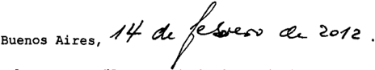

Vistos los autos: "Recurso de hecho deducido por el Defen sor Oficial de J E \_ en la causa E . J E . adopción ~causa 12.389 " para decidir sobre su procedencia.

## Considerando:

Que los agravios de la apelante han sido objeto de adecuado trataniento en el dictamen de 1a señora Procuradora Fiscal, cuyos fundamentos esta Corte comparte cuales se remite por razón de brevedad .

Por ello, se declara formalnente adnisible el recurso extraordinario Y se deja sin efecto decisión apeladaVuelvan 1os autos al tribunal de origen fin de que por medio de quien corresponda , proceda dictar un nuevo fallo con arreglo expresado \_ Agréguese queja al principalNotifiquese Y devuélvase

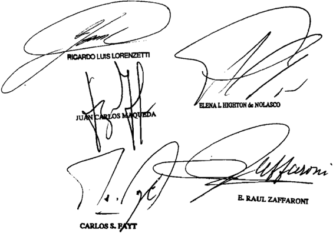

Recurso de hecho interpuesto POr Harcolo Público de bubrogante ante de tancia 1o Civfl, Comercial

Tribunal de origen: de Apolaclone

Tribunales intervinieron con anterioridad: Juzgudo Nacional de Pripera Inatancia Civil 25 \_ que

## GARRIDO, JUAN ALBERTO c/ PEN Mº DE TRABAJO Y SEGURIDAD SOcIAL S/ EMPLEO PúBLIcO

## INFRACCIONES LABORALES.

El posible importe adicional a percibir por el empleado inspector que hubiese levantado el acta de infracción a las leyes laborales como 'incentivo' al trabajo -en los términos de la ley 20.767 entonces vigente- no es fijo sino aleatorio y se cobra en tanto y en cuanto aquél -por su propia labor personal- labre dichas multas, de modo tal que si no fija sanciones o, a todo evento, si de las actas labradas no se perciben los montos de las multas por la autoridad de aplicación, el empleado no cobra adicional alguno.

-Del dictamen de la Procuración General, al que remitió la Corte Suprema-.

DIcTAMEN DE LA PROcURAcIóN GENERAL

Suprema Corte:

- I -

A fs. 241/243, la Cámara Nacional de Apelaciones en lo Contencioso Administrativo Federal (sala V) al modificar la sentencia de la instancia anterior, rechazó la demanda iniciada por el señor Juan Alberto Garrido contra el Estado Nacional -Ministerio de Trabajo y Seguridad Socialpor diferencias indemnizatorias salariales y la confirmó respecto de la deuda de las multas aplicadas en los últimos cinco años trabajados que no fueron liquidados.

Para decidir el rechazo sostuvo que las sumas reclamadas en virtud de la ley 20.767, que fija el destino de las multas aplicadas por infracción a las leyes de trabajo no son de carácter remunerativo sino que son recursos del Estado que, por ley, se afectaron en un porcentaje -un 10%- a un fondo estímulo para determinada categoría de empleados.

También afirmó que la conducta del reclamante es contradictoria y contraria a la buena fe pues había aceptado el monto indemnizatorio como la alternativa más favorable a sus intereses.

Disconforme, el actor interpuso el recurso extraordinario de fs. 247/253, contestado a fs. 256/260 y concedido a fs. 262 en cuanto interpreta normas federales en sentido adverso a su postura.

Los agravios contra la sentencia, en síntesis, son : a) que viola el derecho de propiedad al desconocer el carácter remunerativo del 10% de las multas pese a la regularidad y habitualidad de su percepción por el trabajador; b) que se apartó de los términos del art. 6 de la ley 24.241 que define a la remuneración a los fines del sistema integrado de jubilaciones y pensiones; c) que es absurda por considerar que, al ser las sumas por las multas labradas un fondo público, no pueden tener carácter remunerativo; d) que otros estímulos en la órbita pública, como los del Ministerio de Economía y los de la Administración Federal de Ingresos Públicos, son tratados como remuneratorios y pasibles de aportes y contribuciones; e) que el porcentaje de la multa es una contraprestación al trabajo aunque tenga la finalidad de estimularlo; f) que los rubros salariales son irrenunciables y su pago es a cuenta del total adeudado pudiendo reclamárselos mientras no prescriban.

## - III -

El recurso interpuesto es formalmente admisible, toda vez que se discute la interpretación de normas de naturaleza federal y la decisión definitiva del superior tribunal de la causa ha sido contraria al derecho que en ellas fundó el apelante (conf. art. 14 ley 48; Fallos: 316:2134; 319:2867; 324:782 y sus citas).

En tales condiciones, V.E. tiene dicho que el Tribunal no se encuentra constreñido por los argumentos de la parte o del a quo sino que le incumbe realizar una declaración sobre los puntos controvertidos según la interpretación que rectamente les otorgue (Fallos: 322:1616; 325:3000; entre muchos).

A mi modo de ver, la solución no radica en interpretar las normas del fondo de reconversión laboral ni las referidas al régimen previsional -concepto de remuneración- como propone la parte recurrente, sino en aplicar la ley 20.767 -que sustituyó el art. 73 de la ley complementaria permanente de presupuesto 11.672 y que fue derogada por el art. 15 del anexo II de la ley 25.212-.

Ello así, la disposición entonces vigente, en lo que aquí interesa, decía: 'El importe de las nulas por infracción a las leyes del trabajo que se hiciere efectivo de conformidad con el régimen uniforme de sanciones aplicable, tendrá el siguiente destino: a) el diez por ciento (10%) para los empleados que hubiesen levantado el acta de infracción respectiva, que será distribuido a los mismos por la autoridad de aplicación, a cuyo efecto esta última lo deducirá directamente de los importes de las multas que se perciban; b) el noventa por ciento (90%) restante será destinado a financiar el ejercicio del poder de policía en todo el territorio del país. Quedan exceptuados de las disposiciones de este artículo los importes de las multas por infracciones a las leyes del trabajo que estuvieren, por esas normas, destinadas al trabajador perjudicado'.

De ello cabe concluir que se requieren varias condiciones conjuntas para cobrar este 'incentivo' al trabajo: 1) que el empleado inspector labre un acta de infracción; 2) que, además, la multa motivo del acta se perciba efectivamente; 3) que el monto a percibir no corresponda al trabajador perjudicado por la infracción.

Lo que queda claro es que el posible importe adicional no es fijo sino aleatorio y se cobra en tanto y en cuanto el inspector -por su propia labor personal- labre multas por infracciones a las leyes laborales. De modo tal que, si no fija sanciones o, a todo evento, si de las actas labradas no se perciben los montos de las multas por la autoridad de aplicación, el empleado no cobra adicional alguno.

Por lo tanto mal podría formar parte de la indemnización una suma sujeta a la propia actividad, en este caso, no ejercida, por el actor.

Del modo que propicio que se resuelva la cuestión en proceso, entiendo que resulta inoficioso que V.E. se pronuncie sobre los restantes agravios formulados, no sin dejar de destacar que asiste razón al actor en cuanto sostiene que los temas referidos al consentimiento, al cobro sin reservas y los efectos cancelatorios del pago ya habían sido resueltos a su favor -con carácter de sentencia firme- a fs. 144/145 y 172/173.

Por lo tanto, opino que corresponde confirmar la sentencia de fs. 241/243 por los motivos y fundamentos expuestos en este dictamen. Buenos Aires, 4 de marzo de 2010. Laura M. Monti .

## FALLO DE LA cORTE SUPREMA

## Buenos

Vistos 1os autos: "Garrido, Juan Alberto c/ PEN M de Irabajo Y Seguridad Social s/ empleo público"

## Considerando:

Que 1og agravios de recurrente han sido objeto de adecuado tratamiento por la sefora Procuradora Fiscal en su dictamen , cuyos fundamentos conclusiones corresponde renitir, en razón de brevedad .

Por ello, se declara adnisible el recurso extraordinario se confirma la sentencia apelada\_ Con costas por su orden en atención naturaleza de 1a cuestión debatida (art 68 , segundo párrafo, del Codigo Procesal Civil Y Cometcial de la Na ción) oportunamente, devuélyase

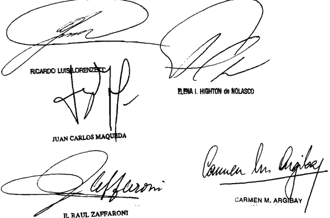

Recurso extraordinario interpuesto por Alborto autob , representado el Dr

Iraslado contestado por Naoíonal , d Irebujo y Bogurídad Bocíal denandado 01 autob representado por el Dr .

Tribunal de origen: 1o Contanciobo AdminioV,

Iribunales que intervinieron con anterioridad: Juzgado Naoional de Prinera Instanaia

GERMANO, KARINA DANA S/ cAUSA Nº 12792

## EJECUCION DE LA PENA.

Si, más allá de la interpretación literal sobre el artículo XI del Tratado sobre Traslado de Condenados (ley 25.306), que impone que la ejecución de la sentencia se rige por la ley del Estado receptor, lo cierto es que si la recurrente no hubiera elegido lo que creyó un beneficio: el de purgar en su país, estaría -si bien en el extrañamiento- gozando de los efectos de la extensión del recurso de habeas corpus, es decir habría accedido a salidas transitorias o temporarias igual que sus compañeros de causa alojados en Brasil, razones de humanidad, equidad y estricta justicia, impiden que se mire de soslayo las particulares implicancias y duración del encierro y se conceda el recurso, el cual, en definitiva, brega por la equiparación a la menor restricción de la libertad.

-Del dictamen de la Procuración General, al que remitió la Corte Suprema-.

## EJECUCION DE LA PENA.

Una pena que se ejecuta de modo diferente se convierte en una pena distinta y, por ende, en caso de ser más gravosa su ejecución resulta una modificación de la impuesta en perjuicio del condenado, por lo que si el tratado permite el cumplimiento de la pena en el país con el propósito de posibilitar la reinserción del condenado, no puede habilitar una pena diferente y más gravosa, pues implicaría una contradicción con su objetivo, por lo que ante el hecho nuevo de que los co-condenados que cumplen su pena en Brasil accedieron al régimen de salidas transitorias, corresponde proceder con igual temperamento con respecto a quien cumple su condena en el país, resultando el art. 7 de la ley 24.660 una aplicación más respetuosa de la obligación internacional y de los principios pro homine , igualdad y no contradicción.

DIcTAMEN DE LA PROcURAcIóN GENERAL

## Suprema Corte:

- I -

Llega nuevamente a mi conocimiento la situación de Karina Dana G., una argentina que fue condenada, junto a otras personas, a treinta

años de reclusión por el Tribunal de justicia del Estado de San Pablo, República Federativa del Brasil.

El titular del Juzgado Nacional de Ejecución Penal Nº 1 resolvió, por segunda vez, no hacer lugar al nuevo pedido de la defensa de que G., quien transita un período penitenciario anterior al de prueba, obtuviera salidas transitorias (fojas 1245/1247vta. de los principales).

Ante ese rechazo, el letrado interpuso recurso de casación, el que fue declarado mal concedido por la Sala II de la Cámara Nacional de Casación Penal (fojas 1265/vta.), por lo que ocurrió directamente ante V.E., presentación de la que se dio vista a esta instancia (fojas 2/20 del legajo de queja).

- II -

- 1. Todo comenzó cuando Karina Dana G., estando presa en Brasil, solicitó  ante nuestro cónsul en San Pablo la gracia, que obtuvo, de purgar su condena en la Argentina, tal como lo prevé el Tratado sobre Traslado de Condenados (ley 25.306).

Estando ya en prisión en la Argentina, se enteró de que, merced a un hábeas corpus , se les había otorgado a sus compañeros de causa alojados en el Brasil, un régimen de salidas temporarias, al haber cumplido un sexto de la condena.

- 2. Alegando una situación de inferioridad, ya que la ley penitenciaria argentina no contempla esa posibilidad hasta no haber cumplido la mitad de la condena, hizo su primer pedido de que se le diera en nuestro país igual beneficio que el conseguido por sus compañeros.

Pedido que fue denegado por el juzgado de ejecución y por el tribunal de casación, aunque este último le habilitó la vía extraordinaria ante el Tribunal.

- Y fue en ese marco que el suscripto sostuvo que, más allá de la interpretación literal que realizaron los jueces de la casación sobre el artículo XI del Tratado, que impone que la ejecución de la sentencia se rige  por la ley del Estado receptor, lo cierto es que si G. no hubiera elegido lo que creyó un beneficio: el de purgar en su país, estaría -si bien, en el extrañamiento- gozando de los efectos de la extensión del habeas corpus , es decir, habría accedido a salidas transitorias o temporarias.

Agregó que razones de humanidad, equidad y estricta justicia, impedían que mirara de soslayo las particulares implicancias y duración de este encierro, y se inclinó por la concesión del recurso, el cual, en definitiva, bregaba por la equiparación a la menor restricción de la libertad.

Y aclaró que esta solución no significaba un incumplimiento contractual, pues no menoscababa la vigencia del orden jurídico extranjero, si se le concedía a la presentante algo que también se le concedería en el país que la condenó.

- 3. V.E., por mayoría, consideró inadmisible el recurso extraordinario,  en  los  términos  del  artículo  280  del  Código  Procesal  Civil  y Comercial de la Nación; en tanto que la minoría, compuesta por los jueces Lorenzetti, Maqueda y Zaffaroni, compartió e hizo suya, en !o pertinente, esos fundamentos y conclusiones.

- III -

En esta presentación, la defensa plantea como hecho nuevo la circunstancia de que los co-condenados en la misma causa, que cumplen su pena en Brasil, ya 'han accedido al beneficio de las salidas transitorias y las mismas se han producido' , igual que su traslado a un establecimiento de 'régimen semiabierto' (fs. 15vta. del presente legajo de queja).

Al respecto, para el caso de que V.E., con base en los principios alegados en el anterior dictamen, resolviere sortear las falencias formales en la articulación de la vía extraordinaria y considere que se ha producido un hecho nuevo en los términos definidos por la normativa procesal, otorgándole al caso la relevancia federal necesaria, mantengo el criterio allí expresado al que me remito en razón de brevedad, máxime ahora que la situación de desequilibrio, otrora hipotética, se ha producido.

Sólo agregaré que la solución que propicio no sólo está basada en el principio general de interpretación pro hómine de los instrumentos internacionales (Fallos: 328:2056; 329:2265 y 5762), sino que se adecua, por su sentido de equidad, al de la 'reinserción social de las personas condenadas', finalidad superior que informa el Tratado sobre traslado de condenados con Brasil (ley 25.306) y nuestra ley de ejecución penal (Nº 24.660, artículo 1).

Esto permite considerar que se podría, según mi modo de ver, y sin que se desnaturalice la razón del sistema penitenciario nacional, hacer una excepción a la letra del artículo 17 de la ley 24.660, en cuanto exige, para la concesión de las salidas transitorias o la incorporación al régimen de la semilibertad, un tiempo mínimo de ejecución de la mitad de la condena.

Y digo sin menoscabar la voluntad legislativa argentina, porque la ley citada ha querido y plasmado expresamente que el régimen penitenciario se basará en la progresividad, procurando limitar la permanencia del condenado en establecimientos cerrados y promoviendo en lo posible y conforme su evolución favorable su incorporación a instituciones semiabiertas o abiertas o a secciones separadas regidas por el principio de autodisciplina.

Y no sólo eso, sino que ha previsto, en su artículo 7, que el condenado podrá ser promovido excepcionalmente a cualquier fase del período de tratamiento que mejor se adecue a sus condiciones personales, de acuerdo con los resultados de los estudios técnico-criminológicos y mediante resolución fundada de la autoridad competente.

Situación de excepción que concurriría en este caso, sobre todo teniendo en cuenta que si en Brasil -donde rigen parecidos principios penitenciarios, y el tratado es una prueba de ello- se consideró que ese tratamiento era suficiente para la reinserción social de los compañeros de G., no hay motivos para que también no lo sea para que esta ciudadana se vaya incorporando a nuestra sociedad.

Así opino. Buenos Aires, 31 de octubre de 2011. Luis Santiago González Warcalde.

## FALLO DE LA cORTE SUPREMA

## Buenos Aires, 'debrer d 2012 .

Vistos 10s autos: "Recurso de hecho deducido por Defensa de Karina Dana Germano en la causa Germano , Karina Dana s/ causa 12 .792" para decidir sobre su procedencia.

## Considerando

Que esta Corte comparte en pertinente, 10s argumentos vertidos por el señor Procurador Fiscal en su dictamen, cuyos fundamentos conclusiones corresponde remitirse en razón de brevedad \_

Que por otra parte cabe agregar que una pena que se ejecuta de modo diferente se convierte en una pena distinta Y, por ende , en caso de ser más gravosa su ejecución resulta una modificación de la pena impuesta en perjuicio del condenado \_

El tratado que permite el cumplimiento de la pena en el país, con el propósito de posibilitar la reinserción del con denado ~si bien se rige por la legislación local en su modo de ejecuciónno puede habilitar una pena diferente más gravosa, pues implicaría una contradicción con su objetivo

Que se plantea en el caso como hecho nuevo la circunstancia de que 10s co-condenados en la misma causa que la presentante, que cumplen su pena en Brasil, han accedido al régimen de salidas transitorias que se ha concretado, por lo que corresponde proceder con igual temperamento con respecto Germano

En consecuencia, la disposición contenida en el artículo de la ley 24 . 660 que invoca el señor Procurador Fiscal en su dictamen, resulta una aplicación más respetuosa de la obligación internacional Y de los principios pro homine, igual dad no contradicción\_

Por ello, Y concordantemente con dictaminado por el señor Procurador Fiscal, se hace lugar la queja, se declara cedente el recurso extraordinario se deja sin efecto la sentencia apelada Acumúlese la queja al principal Y remítase al tribunal de origen con el fin de que , por quien corresponda, se prO -

dicte un nuevo pronunciamiento con arreglo al presente Hágase saber Y cúmplase

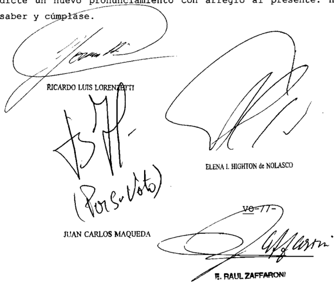

## DEL SEÑOR MINISTRO DOCTOR DON JUAN CARLOS MAQUEDA

## Considerando

Que las cuestiones debatidas en el lite resultan sustancialmente análogas las tratadas Y resueltas en in re: G .942 XLIV "Germano, Karina Dana s/recurso de casación" (sentencia del 10 de diciembre de 2009 , voto de 1os jueces Lorenzetti\_ Maqueda Zaffaroni) cuyos fundamentos cabe remitirse en razón de brevedad . sub

Por ello, oído señor el Procurador Fiscal, se hace lugar la queja, se declara procedente el recurso extraordinario se revoca la sentencia apelada Vuelvan autos al tribunal de origen, fin de que por quien corresponda , se dicte nueva sen -

tencia con arreglo al presente\_ Hágase saber con copia del precedente citado Y devuélvase -

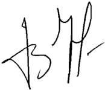

JUAN CARLOS MAQUFI) ^

Recurso de hecho interpuesto por 0l Dr Eduardo Soareb de Karina Dana

Tibunal de origen; Sala II de 1a Nacfonal de Cabación Penal

Tribunales que intervinieron con anterioridad: Juzgado Nacfonal de Kjocución Penal

## KOcH, LILIAN MERcEDES c/ PEN LEY 25.561 DTOS. 1570/01 214/02 BOSTON cITI S/ AMPARO SOBRE LEY 25.561

## PESIFICACION.

Cabe dejar sin efecto la sentencia que rechazó 'in limine' la acción de amparo interpuesta a fin de reclamar la diferencia originada en depósitos a plazo fijo, fondo común de inversión, caja de ahorro y bocones previsionales inicialmente constituidos en dólares que fueron previamente pesificados, pues dada la índole peculiar de ciertas pretensiones, compete a los jueces la búsqueda de soluciones que se avengan a éstas, para lo cual deben encauzar los trámites por vías expeditivas, a fin de evitar que la incorrecta utilización de las formas, pueda conducir a la frustración de derechos fundamentales, máxime si se repara en el tiempo que ha llevado la tramitación del amparo, cuya desestimación confirmó el a quo.

## ACCION DE AMPARO.

El plazo establecido por el art. 2º, inciso e), de la ley 16.986, no puede entenderse como un obstáculo procesal infranqueable ni es aceptable la interpretación restrictiva de una vía consagrada en la Constitución Nacional ( art. 43), cuando ha sido invocado y prima facie acreditado que se trata de la protección de derechos que trascienden el plano patrimonial, y comprometen la salud y la supervivencia misma de los reclamantes.

## FALLO DE LA cORTE SUPREMA

## Buenos Aires, 44 de

Vistos los autos 'Koch, Lilian Mercedes c/ PEN 25 . 561 dtos . 1570/01 214/02 (Boston Citi) s / amparo sobre 25 .561" \_ ley ley

## Considerando

1") Que fs\_ 2/13 la actora, nacida el 14 de abril 1925 , inició una acción de amparo fin de que se declare la inconstitucionalidad del artículo 15 de ley 25 .561 Y modificatorias, de 1os decretos 1570/01, 214/02 (arts\_ 4 % , 10 12) 320/2002 (art\_ 3") en cuanto dispusieron el congelamiento compulsivo de 10s fondos depositados en plazo fijo, impidiendo de hecho la libre disponibilidad de la totalidad de mismos \_

su vez, reclamó la diferencia originada en depósitos plazo fijo, fondo común de inversión, caja de ahorro incluso bocones previsionales inicialmente constituidos en dólares que fueron previamente pesificados\_

Aduce que la demanda no fue deducida con anterioridad en virtud de los graves problemas de salud propios 1os de su marido ~nacido el 19 de octubre de 1914-, conforme se detprende la prueba documental oportunamente acompañada

Que el juez de primera instancia desestimó in limine" la acción de amparo presentada , al considerar que de acuerdo denunciado por amparista, aquélla pesificó Y dispuso voluntariamente totalidad de 1os fondos depo \_ sitados en las entidades bancarias Y no manifestó disconformidad ni formuló reserva alguna, dentro de un plazo razonablemente oportuno

30 ) Que Sala III de la Cámara Nacional de Apelaciones en 1o Contencioso Administrativo Federal, al confirmar decidido en la instancia anterior, aplicó el criterio fijado por

este Tribunal en el precedente "Cabrera" (Fallos 327:2905) por considerar que en el caso no se verificó la existencia de una reserva de derechos oportuna Y efectiva\_ Por otro lado, advirtió que el amparo fue iniciado el de abril de 2004 , en razón de ello manifestó que la fue promovida fuera del plazo establecido en el art 2 inc. de la 16.986ley

Que contra dicha resolución, la parte actora dedujo recurso extraordinario fs 70/75 , que fue concedido fs\_ 82 , al tenerse en cuenta el estado de excepción en el que se hallaba la parte actora, así como las particulares circunstancias de autos

Que las cuestiones planteadas en el sub examine resultan sustancialmente análogas las examinadas Y resueltas en a causa "Rodríguez Ramona" (Fallos: 331:901) cuyos damentos conclusioneg cabe remitirse, en pertinente, en razón de brevedad . fun-

Que por otra parte, como ha sido señalado por el Tribunal, el plazo establecido por el art inciso e, de la ley 16.986, no puede entenderse como un obstáculo procesal infranqueable ni es aceptable la interpretación restrictiva de una vía consagrada en la Constitución Nacional (art 43) cuando ~comO ha sido invocado Y prima facie acreditado en el casose trata de la protección de derechos que trascienden el plano pa trimonial, comprometen la salud la supervivencia nisna de 10s reclamantes doctrina de Fallos: 324:3074 Y el allí tado I.68 \_ XXXVI 'Imbrogno, Ricardo c/ IOS s/ amparo" del 25 de septiembre de 2001)

En un orden afín de consideraciones, es pertinente recordar que dada la índole peculiar de ciertas pretensiones\_ compete 1os jueces la búsqueda de soluciones que se avengan éstas , para 1o cual deben encauzar trámites por vías expeditivas, fin de evitar que la incorrecta utilización de las formas pueda conducir la frustración de derechos fundanentales (cf en pertinente, doctrina de Fallos: 327:2127 Y 2413; 332:1394 , entre otros) náxime si se repara en el tiempo que ha

llevado 1a tramitación de este amparo, cuya desestimación confirmó el quo

70 ) Que , puesto que la acción intentada ha sido rechazada "in limine" (fs. 55 Y 64) , previo al dictado del nuevo pronuncianiento que esta Corte ordena presente, deberá integrarse la litis fijándose un plazo para la intervención de la demandada , acorde con la urgencia del caso por

Por ello, se declara procedente el recurso extraordinario Y se deja sin efecto sentencia apelada Vuelvan 10s autos tribunal de origen fin de que , por quien corresponda , se dicte nuevo pronunciamiento con arreglo al presente. Notifíquese de al

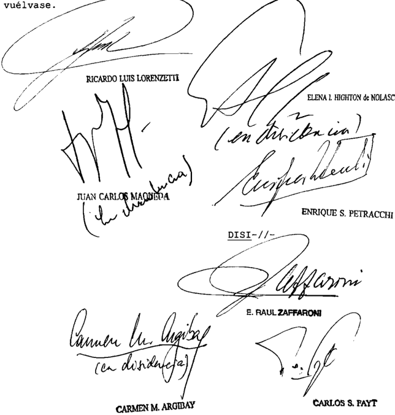

DE LA SEÑORA VICEPRESIDENTA DOCTORA DOÑA ELENA I HIGHTON DE NOLASCO Y DE LOS SEÑORES MINISTROS DOCTORES DON JUAN CARLOS MAQUEDA DOÑA CARMEN M ARGIBAY

## Considerando:

Que el recurso extraordinario es inadnisible (art\_ 280 del Código Procesal Civil Y Comercial de Nación)

Por ello, se desestima el recurso extraordinario planteado Sin costas, en atención que no medió actuación procesal de la contraparte

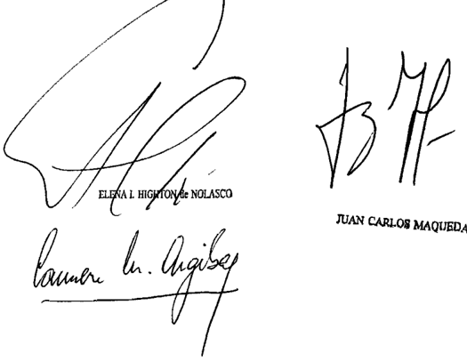

CARMEN M ARGIBAY

Recurso extraordinario interpuesto pOr Koch de Gulich, POr darøcho prOpio , con el patrocinio letrado del Dr Hoszowski

Tribunal de origen Cámara Nacional d0 Apelacioneb en 1o Contoncíobo Adninistrativo Federal, Sala III

Tribunal que intervino con anterioridad: Juzgado Nacional de Primera Inetancia Contenciobo Adminiatrativo Federal

## DE JUSTICIA DE LA NACION

335

## LOGISTIcA LA SERENISIMA S.A. Y OTROS c/ MENDOZA, PROVINcIA DE S/ AccIóN DEcLARATIVA DE INcONSTITUcIONALIDAD

## MEDIDA CAUTELAR.

Corresponde decretar la medida cautelar pedida y ordenar a la Provincia de Mendoza que se abstenga de exigir el pago de la 'tasa retributiva por derecho de servicio de inspección' en los términos previstos en la ley 6959 de la provincia (modificada por la ley 8006), y de impedir u obstaculizar el ingreso, la distribución y la comercialización de los productos lácteos y derivados elaborados por la demandante si se pretende realizar inspecciones higiénico-sanitarias de los productos en lugares distintos al previsto a esos efectos en el Sistema Nacional de Control de Alimentos, esto es, en las 'bocas de expendio' (art. 19 del decreto 815/99).

DIcTAMEN DE LA PROcURAcIóN GENERAL

Suprema Corte:

- I -

A fs. 2/16, Logística La Serenísima S.A., Danone Argentina S.A., Mastellone Hermanos S.A. y Mastellone San Luis S.A., promueven la acción prevista en el art. 322 del Código Procesal Civil y Comercial de la Nación contra la Provincia de Mendoza, a fin de obtener la declaración de inconstitucionalidad de los arts. 1º y 3º de la ley local 6959, modificada por la ley 8006 y reglamentada por el decreto provincial 1216/09, en cuanto establecen una 'tasa' denominada 'Derechos por servicios de inspección de productos, subproductos y derivados de origen animal'.

Cuestionan tales disposiciones en tanto aplican dicha 'tasa' al tránsito interjurisdiccional de productos lácteos y derivados que introduce en jurisdicción mendocina Logística La Serenísima S.A., por cuenta y orden de Mastellone Hnos. S.A., Mastellone San Luis S.A. y Danone Argentina S.A., dedicadas a la fabricación y comercialización de esos bienes en distintos establecimientos ubicados en las provincias de Buenos Aires, Córdoba, Santa Fe y San Luis, y, además, porque les imponen, ante la falta de pago, la interdicción de sus productos.

Manifiestan que los establecimientos en donde elaboran tales productos se encuentran habilitados por el Servicio Nacional de Sanidad y  Calidad Agroalimentaria, mediante un certificado por el cual las habilita a realizar 'tráfico federal e internacional'. A su vez, dichos productos lácteos se encuentran inscriptos en el Registro Nacional de Productos Alimenticios teniendo a su cargo dicha inscripción el Ministerio de Salud Pública de la Provincia de Buenos Aires (v. prueba documental, anexos III, IV y V).

Señalan que tal pretensión provincial viola en especial el art. 3º de la ley 18.284 (Código Alimentario Argentino) que dispone que '...los productos cuya producción, elaboración y fraccionamiento se autorice y verifique de acuerdo al Código Alimentario Argentino, a esta ley y a  sus  disposiciones  reglamentarias, por la autoridad sanitaria que resulte competente de acuerdo al lugar donde se produzcan, elaboren o fraccionen, podrán comercializarse, circular y expedirse en todo el territorio argentino , sin perjuicio de la verificación de sus condiciones higiénico-sanitarias, bromatológicas y de identificación comercial en la jurisdicción de destino...'. Agregan que estas verificaciones jurisdiccionales deberán adecuarse a lo que dispone el art. 19 del decreto PEN 815/99 (decreto reglamentario) que sostiene que 'las autoridades sanitarias provinciales, del Gobierno Autónomo de la Ciudad de Buenos Aires y de los municipios, serán las encargadas de realizar los controles en bocas de expendio '.

Sostienen también que dicha 'tasa' provincial conculca lo previsto por el art. 36 del decreto PEN 815/99, que establece el Sistema Nacional de Control de Alimentos en cuanto dispone que 'las habilitaciones, inscripciones, certificaciones de establecimientos, productos, transportes y depósitos que otorgue un organismo nacional en el área de su competencia, serán reconocidas y aceptadas por el otro y no implicarán mayores costos...' .

De esta manera afirman que la provincia pretende condicionar las entregas de productos a los comerciantes locales sometiéndolas al previo control higiénico-sanitario, luego del cual los productos quedarían liberados, impidiendo así su libre circulación en el territorio nacional, lo cual afecta el comercio interjurisdiccional de mercaderías, y, por ende, viola los arts 9, 10, 11, 12 y 75, inc. 13, de la Constitución Nacional.

En virtud de lo expuesto, solicitan la concesión de una medida cautelar, por medio de la cual se ordene a la Provincia de Mendoza que se

abstenga de realizar cualquier tipo de control higiénico-sanitario de los productos lácteos elaborados por Danone Argentina S.A., Mastellone Hnos. S.A. y Mastellone San Luis S.A. y que se introduzcan en 'tránsito federal' a dicha provincia por Logística La Serenísima S.A., así como también, de liquidar, reclamar, intimar, o exigir el pago de la 'tasa' establecida en los arts. 1º y 3º de la ley 6959, respecto de las operaciones que efectúen.

A fs. 529 V.E. corre vista, por la competencia, a este Ministerio Público.

- II -

En cuanto a la competencia originaria del Tribunal, corresponde recordar que uno de los supuestos que la suscita se configura cuando es parte una provincia y la causa reviste un manifiesto contenido federal, es decir, en el caso en que la demanda entablada se funde directa y exclusivamente en prescripciones constitucionales de carácter nacional, en leyes del Congreso o en tratados con las naciones extranjeras, de tal suerte que la cuestión federal sea la predominante en la causa (Fallos: 322:1470; 323:2380 y 3279).

Esta hipótesis, en la que procede la justicia federal en razón de la materia (conf. art. 116 de la Ley Fundamental), lleva el propósito de afirmar las atribuciones del Gobierno Federal en las causas relacionadas con la Constitución, los tratados y las leyes nacionales, así como las concernientes a almirantazgo y jurisdicción marítima (doctrina de Fallos: 310:136; 311:489 y 919; 323:872; entre otros).

A mi modo de ver, en el sub lite , el planteamiento que efectúan las actoras reviste un manifiesto contenido federal y, por ende, es apto para surtir la competencia originaria de la Corte pues, según se desprende de los términos de la demanda -a cuya exposición de los hechos se debe atender de modo principal para determinar la competencia, según los arts. 4º y 5º del Código Procesal Civil y Comercial de la Nación y doctrina de Fallos: 306:1056; 308:1239 y 2230-, las actoras cuestionan dos disposiciones locales por ser contrarias en forma directa y exclusiva a la Constitución Nacional, al Código Alimentario Argentino y su decreto reglamentario, afectando así el comercio interjurisdiccional de los productos lácteos que elaboran.

En efecto, toda vez que el asunto en examen se vincula con el comercio interprovincial, la cuestión reviste naturaleza federal (art. 75, inc.  13  de  la  Ley  Fundamental  y  Fallos:  188:27;  199:326;  271:211; 277:237; 312:1495; 321:2501; 323:1534), pues exige dilucidar si la actuación de las autoridades locales invade el ámbito que le es propio a la Nación en esa materia.

En tales condiciones, considero que la causa se encuentra entre las especialmente regidas por la Constitución Nacional, a las que alude el art. 2º, inc. 1º, de la ley 48, en tanto versa sobre la preservación de las órbitas de competencia entre los poderes del Gobierno Federal y los de una provincia, lo que hace competente a la justicia nacional para entender en ella (conf. doctrina de Fallos: 325:388 in re 'Kraft Food Argentina' y 327:3202 en la causa 'Molinos Río de La Plata S.A.' y sus citas).

Por lo expuesto, al ser parte una provincia en una causa de manifiesto contenido federal, considero que -cualquiera que sea la vecindad o nacionalidad de la actora (Fallos: 317:473; 318:30 y sus citas y 323:1716, entre otros)- el proceso corresponde a la competencia originaria de la Corte. Buenos Aires, 29 de octubre de 2010. Laura M. Monti .

## FALLO DE LA cORTE SUPREMA

## Buenos Aires, 14 d 20 /2

Autos Y Vistos; Considerando

1 %) Que fs. 529, Logística La Serenísima Da none Argentina Mastellone Hermanos S.A Y Mastellone San Luis 5 .A. promueven la acción prevista en el artículo 322 del Codigo Procesal Civil Y Comercial de la Nación contra 1a Provincia de Mendoza , fin de obtener la declaración de inconstitucionalidad de 10s artículos 1 Y 3 de la local 6959, modificada por la 8006 impositiva provincial para el año 2009-, en cuanto crean un sistema de fiscalización higiénicosanitaria de 10s productos lácteos Y derivados en tránsito federal Y establecen una tasa por el servicio de inspección que deley ley ~ley

be ser abonada al monento de recibir el servicio por quien ingresa al territorio provincial, Y en forma previa su liberación para el consumo masivo de la población.

Exponen que Logística La Serenísina S.A . introduce productos lácteos derivados en jurisdicción nendocina efectos de su comercialización pOr cuenta orden de Mastellone Hermanos S.A Mastellone San Luis Y Danone Argentina S.A. empresas dedicadas la fabricación de es0s bienes en distintos establecinientos ubicados en las provincias de Buenos Aires , Santa Fe San Luis

Manifiestan que las plantas industriales de su propiedad se encuentran habilitadas por el Servicio Nacional de Sa nidad Calidad Agroalimentaria (SENASA) para realizar "tráfico federal internacional las mercaderías allí elaboradas . su vez, afirman que todos 1os productos se encuentran registrados que la autoridad sanitaria competente del lugar donde se elaboran emite un certificado de inscripción que declara de libre circulación Y expendio en todo el país (ley 18284 ~decreto 2126/71 resolución SESP 1516/77) "

Aducen que de acuerdo las disposiciones del sistema Nacional de Control de Alimentos establecido por el decreto 815/99 , 'las habilitaciones, inscripciones, certificaciones de establecimientos, productos, transportes depósitos que otorgue un organismo nacional en el área de su competencia, serán reconocidas aceptadas por el otro no implicará mayores costos" (artículo 36) \_ Y que "las autoridades sanitarias provinciales, del Gobierno Autónomo de la Ciudad de Buenos Aires de los nicipios serán las encargadas de realizar los controles en bocas de expendio" (artículo 19)

Concluyen entonces en que productos inscriptos ante las autoridades competentes pueden comercializarse circular Y expenderse todo el territorio de la Nación, Y que la jurisdicción de destino puede realizar controles de las condiciones higiénico-sanitarias, bromatológicas Y de identificación comercial s610 en las bocas de expendio\_ 1os en

Señalan que mediante el decreto local 1216/09 se aprobó el Convenio de Complementación de Servicios Sanitarios suscripto el 8 de abril de 2009 entre la Provincia de Mendoza la "Fundación COPROSA-MEN (Comisión Provincial de Sanidad Ani mal Mendoza ) la que le fue delegado el control del pago de tasa , sin perjuicio de que la Dirección Provincial de Ganadería quedó cargo de intervenir secuestrar, según alegan tanto 10s vehículos como por que no se hubiera abonado el tributo

Explican que cada vez que se realiza el transporte interjurisdiccional de productos lácteos con destino la Provincia de Mendoza , el transportista debe informar anticipadamente tal circunstancia la Dirección Provincial de Ganadería Y la referida Fundación para que se realice el control cuestionado antes de que 10s productos sean entregados los comercios mendocinos para su venta al público\_ esos efectos el transportista debe exhibir 10s renitos correspondientes la carga ante personas que se identifican cono funcionarios públicos, quienes labran un acta la que denominan Acta de Reconocimiento de Deuda" en la que dejan constancia del ingreso del camión Y liquidan la tasa -

Indican que en septiembre de 2009 , evitar que fuera impedido el tránsito de 10s productos, Logística La Serenísina 5 .A. ingresó ~bajo protesto la sua de $ 86.135,53, Y que partir de ese mes se negaron pagar el tributo hasta que en abril de 2010 , frente las intinaciones recibidas través de la "Fundación COPROSA-MEN" Y los impedimentos para cializar nercaderías que se derivaron de las intervenciones dispuestas por la Dirección Provincial de Ganadería, se abonó ~tanbién bajo protestola suma de $ 212.609, 77 correspondiente los periodos 3/2010 y 4/2010 para

Afirman que de esta manera, 1a provincia pretende condicionar las entregas de productos los comerciantes locales, sometiéndolos al previo control higiénico-sanitario, luego del cual, Y previo pago de la tasa prevista en las normas impug -

nadas , quedarían liberados, impidiendo así su libre circulación en el territorio nacional, cual afecta ~según esgrimenel comercio interjurisdiccional Y, por ende resultan violados 1os artículos 9 , 10, 11 , 12 Y 75 , inciso 13 , de la Constitución Nacional

Asimismo requieren el dictado de una medida cautelar por medio de la cual se ordene la Provincia de Mendoza que se abstenga de realizar cualquier tipo de control higiénicosanitario de 1os productos lácteos elaborados por Danone Argen tina Mastellone Hermanos S.A Y Mastellone San Luis introducidos en "tránsito federal territorio por Logística La Serenísima S .A . como así también, de liquidar, reclamar, intimar, exigir el pago de la "tasa establecida en 1os artículos Y de la ley 6959 , respecto de las operaciones que efectúen \_

Que de conformidad con 1o dictaminado por la seProcuradora Fiscal fs 553/554 , el sub lite corresponde la competencia originaria de esta Corte ratione materiae, por ser parte una provincia en una causa que reviste manifiesto con tenido federal (arg. Fallos: 332 : 66)

Que establecida competencia del Tribunal, debe exaninarse la medida cautelar pedida. Al efecto cabe recordar que esta Corte ha establecido que si bien por vía de principio, medidas comO las requeridas no proceden respecto de actos adninistrativos legislativos habida cuenta de la presunción de validez que ostentan, tal doctrina debe ceder cuando se los impug na sobre bases prima facie verosímiles (Fallos: 250:154; 251:336; 307:1702; 316:2855 ; 329:2684)

4 % ) Que , asimismo, ha dicho en Fallos: 306:2060 que 'como resulta de la naturaleza de las medidas cautelares, ellas no exigen de magistrados el exanen de la certeza sobre la existencia del derecho pretendido, sino s610 de su verosinili-

tud \_ Es más, el juicio de verdad en esta materia se encuentra en oposición la finalidad del instituto cautelar, que no otra que atender aquello que no excede del marco de hipotético, dentro del cual, asimismo, agota su virtualidad" .

En el presente caso, Y en el estrecho marco de conociniento que ofrece el examen de una nedida cautelar, resultan suficientemente acreditadas la verosinilitud en el derecho Y la configuración de 1os presupuestos establecidos en 1os incs\_ 2 del art. 230 del Código Procesal civil Comercial de la Na ción para acceder la medida pedida, en tanto la Provincia de Mendoza pretende realizar inspecciones higiénico-ganitarias de los productos elaborados en otras jurisdiccioneg ingresados territorio para su comercialización, en lugares distintos al previsto esos efectos en el Sistema Nacional de Contròl de Alimentos, esto es , en las "bocas de expendio" (art 19 del decreto 815/99)

Por ello, Y de conformidad con 1o dictaminado por la geñora Procuradora Fiscal, se resuelve: I Declarar que la presente causa corresponde competencia originaria de esta Corte II\_ Correr traslado de la denanda la Provincia de Mendoza por el plazo de sesenta días (arts 319, 322 Y 338 del Código Procesal Civil Y Comercial de la Nación) 10s fines de su notificación al señor gobernador Y al señor fiscal de Estado , líbrese oficio señor juez federal correspondiente III Decretar 1a medida cautelar pedida Y ordenar la Provincia de Mendoza que se abs tenga de exigir el pago de 1a "tasa retributiva por derecho de servicio de inspección" en los términos previstos en la ley 1ocal 6959 (modificada por la ley 8006) \_ Y de impedir obstaculizar el ingreso \_ 1a distribución Y la conercialización de los productos lácteos Y derivados elaborados por Danone Argentina S .A Mastellone Hermanos S.A Y Mastellone San Luis introducidos en "tránsito federal" su territorio por Logística Serenísima S.A hasta tanto se dicte sentencia en esta causa . Líbrese oficio al señor gobernador fin de poner en su nociniento la presente decisiónComuníquese al senor Procurador al

plazo de sesenta días (arts 319, 322 338 del Código Procesal Civil Comercial de Nación) 10s fines de su notificación al señor gobernador Y al señor fiscal de Estado , líbrese oficio al señor juez federal correspondiente III Decretar 1a medida cautelar pedida Y ordenar la Provincia de Mendoza que se abs tenga de exigir el pago de 1a "tasa retributiva por derecho de servicio de inspección" en los términos previstos en ley cal 6959 (modificada por la 8006) \_ Y de impedir obstaculizar el ingreso, a distribución Y la comercialización de los productos lácteos Y derivados elaborados por Danone Argentina S .A Mastellone Hermanos Y Mastellone San Luis introducidos en "tránsito federal" su territorio por Logística La Serenísima S.A. hasta tanto se dicte sentencia en esta sa Líbrese oficio al señor gobernador fin de poner en co nociniento la presente decisiónConuníquese al señor Procurador General notifíquese actora por cédula que se confeccio 1oley

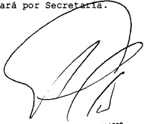

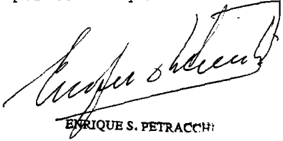

ELENA HIGHTON d NOLASCA

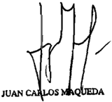

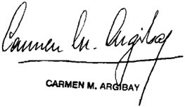

Parte actora Logística representadas por apoderado, dootor con el patrocinio letrado del dootor D . Habtallone Lui, representadas por epoderada , dootora PirO , con el patrocinlo letrado del dootor Álvaro €

Parte demandada autos)

## FALLOS DE LA CORTE SUPREMA 335

## MIEREZ, ALFREDO RUBEN Y OTROS S/ ASOcIAcIóN ILícITA, ETc. -cAUSA Nº 78/03-

## SENTENCIA DEFINITIVA.

El reclamo del apelante por el respeto de la preclusión y la cosa juzgada es susceptible de tutela inmediata, aun cuando la resolución recurrida -que declaró mal concedido el recurso contra la anulación del sobreseimiento- no constituye estrictamente la sentencia definitiva de la causa al no pronunciarse de modo final sobre el hecho que se le imputa, ya que se alega el desconocimiento de principios que constituyen uno de los pilares esenciales en que se funda la seguridad jurídica y que deben ser respetados salvo supuestos en que no haya existido un auténtico y verdadero proceso judicial.

## NE BIS IN IDEM.

Si  al  ser  notificado  del  sobreseimiento  de  los  imputados  el  fiscal  subrogante consintió expresamente dicho pronunciamiento, la admisión de la queja por apelación denegada deducida por la fiscal titular y la posterior anulación del sobreseimiento implicaron la renovación de una persecución penal ya fenecida al dejarse sin efecto una decisión firme que estaba amparada por la preclusión y la cosa juzgada.

## NON BIS IN IDEM.

Si la defensa insistió con la firmeza del sobreseimiento dictado a su favor y la afectación del principio de preclusión, los agravios importan el análisis de un derecho federal susceptible de tutela inmediata, ya que la continuación del sometimiento del encausado al proceso podría ocasionar un perjuicio de insuficiente o tardía reparación ulterior que no se disiparía ni siquiera con el dictado de un nuevo sobreseimiento y, además, porque la resolución que declaró mal concedido el recurso no se ajusta a la desarrollada por el Tribunal en los precedentes 'Strada' (Fallos: 308:490) y 'Di Mascio' (Fallos: 311:2478) (Voto del Dr. Enrique Santiago Petracchi).

## NE BIS IN IDEM.

La decisión del superior tribunal provincial de rechazar el recurso de casación por ausencia de sentencia definitiva implicó la omisión de pronunciarse respecto de la cuestión federal planteada, -la cosa juzgada y el ne bis in idem -, ya que el principio de preclusión está directamente vinculado con el derecho que tiene toda persona a liberarse del estado de sospecha que importa la acusación de haber cometido un delito, mediante una sentencia que establezca de una vez para siempre su situación ante la ley penal, y por ello el agravio -más allá de su rótulo- debió ser estudiado en la instancia provincial bajo la óptica de las garantías

enunciadas y, si bien la sentencia apelada no es definitiva, debe ser equiparable a tal, ya que la cuestión federal exige ser tratada en esta etapa del proceso (Voto de la Dra. Carmen M. Argibay).

## CUESTION FEDERAL.

Corresponde desestimar la queja si tanto los agravios invocados en el recurso extraordinario (violación de los principios de preclusión, progresividad y juez natural), como el introducido tardíamente en la queja (dilación indebida del proceso), no suscitan materia federal sustancial que merezca la consideración de la Corte como máximo tribunal de la Nación (Disidencia de la Dra. Elena Highton de Nolasco).

-Del dictamen de la Procuración General, al que remitió la disidencia-.

DIcTAMEN DE LA PROcURAcIóN GENERAL

## Suprema Corte:

- I -

El Superior Tribunal de la Provincia de Misiones, rechazó el recurso de casación planteado por Ramón M. G., contra la resolución del Tribunal en lo Penal nº 1, que hizo lugar al recurso de apelación interpuesto por la fiscal de la causa y, en consecuencia, declaró nulo el sobreseimiento dictado en favor del imputado, en orden a los delitos de falsificación ideológica de documento público calificada, prevaricato, denegación y retardo de justicia, abuso de autoridad, violación de los deberes de funcionario público, en concurso real.

Contra esa decisión, se dedujo recurso extraordinario, cuya denegación, originó esta queja.

- II -

1. El juez de instrucción no concedió el recurso de apelación de la fiscal titular porque entendió que el fiscal subrogante había consentido expresamente el sobreseimiento al momento de su notificación (cf. sello actuarial asentado en la resolución de fs. 4/7).

Esa decisión dio lugar a la presentación de la queja por apelación denegada ante el Tribunal en lo Penal nº 1, quien consideró, interpretando el derecho local, que si bien en este caso actuaron dos representantes del ministerio público con idéntica función, el derecho del fiscal subrogante a consentir el sobreseimiento cedió frente a la asunción de la fiscal titular -que a esa época se encontraba de licencia- antes de que hubiere fenecido el término para apelar. Dicho esto, abrió formalmente el recurso y se expidió sobre el fondo del asunto.

- 2. En el recurso de casación, el imputado expuso que el tribunal resolvió sin competencia la procedencia de la queja interpuesta contra una resolución consentida, y que de esa manera afectó, principalmente, los principios de preclusión, progresividad y juez natural.

Sostuvo también que el rol del ministerio público es único, independientemente de la persona que lo ejerza, por lo que si un fiscal, en uso de sus facultades legales, presta conformidad expresa a una decisión judicial, otro no puede desconocer esta facultad después, sin contrariar la teoría de los propios actos, la buena fe y la defensa en juicio.

Esa apelación fue rechazada por falta de sentencia definitiva o equiparable a tal.

- 3. En el recurso extraordinario, la parte reiteró los agravios desarrollados con anterioridad, y tachó de arbitraria la respuesta del tribunal superior porque omitió tratar las cuestiones llevadas a su conocimiento.

Denegada esa apelación por falta de cuestión federal y debida fundamentación, la recurrente alega en esta queja violación del derecho a un proceso sin dilaciones indebidas, y justifica el agravio en el tiempo que insumió la investigación, desde su inicio (septiembre de 2001) hasta el dictado del sobreseimiento (febrero de 2005).

## - III -

Según mi parecer, no concurre en el sub lite la exigencia de sentencia definitiva o equiparable a tal, en los términos del artículo 14 de ley 48, pues la Corte tiene dicho que las resoluciones, cuya consecuencia sea la obligación de seguir sometido a proceso criminal, no reúnen, por regla, ese requisito (Fallos: 311:1781; 312:552; 315:2049, entre otros).

Sin perjuicio de ello, opino que tanto los agravios invocados en el  recurso  extraordinario (violación de los principios de preclusión,

progresividad y juez natural), como el introducido tardíamente en la queja (dilación indebida del proceso), no suscitan, en este caso concreto, materia federal sustancial que merezca la consideración de V.E. como máximo tribunal de la Nación.

- IV -

Por lo tanto, entiendo que correspondería el rechazo de la presente queja. Buenos Aires, 27 de diciembre de 2007. Luis Santiago González Warcalde .

## FALLO DE LA cORTE SUPREMA

## Buenos Aires, 14 d Jebrer de

Vistos los autos: "Recurso de hecho deducido por Ranón Moisés Grinhauz en la causa Mierez, Alfredo Rubén otros s / asociación ilícita etc. ~causa n 78/03-" para decidir sobre su procedencia \_

## Considerando:

1 %) Que el recurso extraordinario federal ~cuya dene gación dio origen esta quejafue interpuesto por Ranón Moisés Grinhauz contra la sentencia del Superior Tribunal de Justicia de Misiones que declaró mal concedido el recurso de casación de ducido contra la resolución del Iribunal Penal n' 1 , que declaró 1a nulidad del sobreseiniento definitivo del nombrado ~luego de haber hecho lugar la queja por apelación denegada de fiscal titular en orden 1os delitos de falsificación ideológica de documento público agravada , prevaricato, denegación Y retardo de justicia, abuso de autoridad Y violación de deberes de funcionario público, todos en concurso real

Que , en cuanto los antecedentes del caso, el Iribunal se remite expuesto por el señor Procurador Fiscal en el punto II de su dictamen\_

3% ) como es sabido, la doctrina invocada por el apelante tiende resguardar 1a defensa en juicio Y el debido proceso , al exigir que las sentencias sean fundadas constituuna derivación razonada del derecho vigente con aplicación las circunstancias comprobadas de la causa (Fallos: 311:948 2314, 2547; 312:2507, entre otros) yan

4 % ) Que en el sub lite se han vulnerado esos principios toda vez que la exclusión de la competencia del quo se basa en una interpretación irrazonable del art\_ 462 del código procesal penal provincial que no armoniza con las restantes normas del ordenamiento jurídico (conf. mutatis mutandis, Fallos 329:1541) , por que resulta aplicable al caso la jurisprudencia constante del Tribunal en cuanto que corresponde hacer ex cepción doctrina según la cual no revisten calidad de sentencia definitiva las resoluciones cuya consecuencia sea la obligación de seguir sometido proceso penal, en supuestos en los que el recurso se dirige lograr la plena efectividad de la prohibición de la doble persecución penal (Fallos: 314:377 , considerandos 3 Y 4 % , entre otros)

Que , en efecto, el reclamo del apelante por el respeto de la preclusión Y cosa juzgada es susceptible de tela inmediata, aun cuando la resolución recurrida ~que declaró mal concedido el recurso contra la anulación del sobreseimiento no constituye estrictamente la sentencia definitiva de la causa desde que no se pronuncia de modo final sobre el hecho que se le imputa, toda vez que se alega el desconocimiento de principios que constituyen uno de 1os pilares esenciales en que se funda la seguridad jurídica Y que deben ser respetados salvo supuestos en que no haya existido un auténtico Y verdadero proceso judicial (Fallos 254:320; 278:85 , entre otros) tu-

6' ) Que estos principios se han infringido en el caso pues (tal como expresó el señor Procurador General del Superior Tribunal de Justicia de Misiones al contestar la vista del recurso de casación) al ser notificado del sobreseimiento de los

imputados , el fiscal subrogante consintió expresamente dicho pronunciamiento ("me notifico Y consiento" ) de modo que adnisión de la queja por apelación denegada (deducida por la fiscal titular) Y posterior anulación del sobreseimiento implicaron la renovación de una persecución penal Ya fenecida al dejarse sin efecto una decisión firme estaba amparada por preclusión Y la cosa juzgada \_ que

Por ello Y oído el sefor Procurador Fiscal, se hace lugar la queja, se declara procedente el recurso extraordinario Y se deja sin efecto el fallo apelado Hágase saber, agréguese la queja al principal Y remítanse al tribunal de origen para el dictado de un nuevo\_pronunciamiento

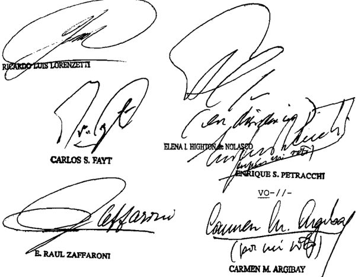

DEL DOCTOR DON ENRIQUE SANTIAGO PEIRACCHI

Considerando:

El titular del Juzgado Correccional de Menores n de la Primera Circunscripción Judicial de Misiones sobreseyó Ramón Moisés Grinhauz, quien había sido imputado por

hechos provisoriamente calificados comO falsificación ideológica de documento público agravada, prevaricato, denegación retardo de justicia, abuso de autoridad Y violación de los deberes de funcionario público (fs. 5817/5820 de los autos principales)

En la misma fecha de su dictado (25 de febrero de 2005) la mentada resolución fue anoticiada al fiscal subrogan quien suscribió al pie de la misma con 1a siguiente aclaración: "Me notifico Y consiento" (v\_ fs . 5820 del nencionado expediente principal) te,

Inmediatamente después (el de marzo de 2005) la fiscal titular ~habiéndose reincorporado sus funciones\_ interpuso recurso de apelación, afirmando que el sobreseimiento era prematuro Y arbitrario (fs\_ 5821/5822 de autos principales)

El magistrado no hizo lugar la concesión del recurindicando que resolución cuestionada había adquirido firmeza antes de la interposición de la apelación, pues había sido notificada al fiscal subrogante (fs. 5837 vta. de 1os autos principales)

Esta disposición motivó la deducción de correspondiente queja, que fue admitida por el Tribunal en 1o Penal n' de Posadas , que declaró procedente el recurso Y la nulidad del auto de sobreseimiento (fs 5863/5866 vta. del expediente principal)

El imputado Grinhauz, por derecho propio, dedujo recurso de casación, argumentando que con respecto al sobreseimiento dictado había operado la preclusión, toda vez que el Mi nisterio Público Fiscal ~en tanto órgano acusador estatalhabía consentido, por que no podían retrotraerse los efectos de esa decisión partir de un recurso de otro fiscal (fs. 1/7 del incidente de casación ante el Superior Tribunal de Justicia)

El recurso fue admitido por el Tribunal Penal; sin embargo , el Superior Iribunal de Justicia de Misiones resolvió

declararlo mal concedido por no dirigirse contra una sentencia definitiva equiparable tal (fs. 27/29 del incidente)

4 % ) Contra tal decisión, la defensa dedujo recurso extraordinario (fs\_ 32/45 vta \_ del incidente) , en el que insistió con la firmeza del sobreseimiento dictado su favor Y la afectación del principio de preclusión. Denegado dicho remedio por el superior tribunal provincial (fs. 54/55 del mencionado incidente) se dedujo el pertinente recurso de hecho (fs\_ 57/69 vta del presente expediente de queja) que el señor Procurador Fiscal ante esta Corte Suprema propuso rechazar (fs. 86/87)

5 % ) Que una reiterada jurisprudencia de esta Corte afirma agravios de la naturaleza de planteados por el recurrente ~vinculados con la vulneración de la cosa juzgada Y el bis in idem importan el análisis de un derecho federal susceptible de tutela inmediata, el que no podría hacerse efectivo en una oportunidad posterior 1os que ne

Que , ello es as1, toda vez que continuación del sometimiento del encausado al proceso podría ocasionar un perjuicio de insuficiente tardía reparación ulterior que no se disiparía ni siquiera con el dictado de un nuevo sobreseimiento (ver Fallos: 272:188 ; 305:913; 321 :2826 Y sentencia del 8 de abril de 2008 en la causa F.140.XLII "Fuks , Miguel Bernardo s/ causa 5127" entre otras)

6" ) Que 1o expuesto pone de manifiesto que 1a doctrina en que se funda 1a resolución impugnada no se ajusta dicha jurisprudencia, ni la desarrollada in extenso esta Corte en "Strada" Y "Di Mascio" (Fallos: 308 490; 311:2478) entre otros De tal nodo , la sentencia del Superior Iribunal de Justicia de Misiones debe ser descalificada como acto jurisdiccional válido (confr. Fallos: 322:2080) por

Por expuesto, oído el señor Procurador Fiscal, se hace lugar a queja, se declara procedente el recurso extraordinario Y se deja sin efecto la sentencia apelada Hágase saber, agréguese la queja al principal Y remítase al tribunal de origen

para que por quien corresponda , se dicte un nuevo pronunciamiento conforne lo resuelto en la presente vo-/ / -

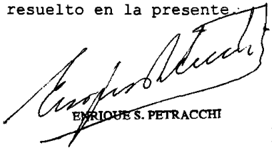

## DE LA SEÑORA MINISTRA DOCTORA DOÑA CARMEN M ARGIBAY

## Considerando

Que la suscripta remite los considerandos del voto del juez Petracchi

La decisión del superior tribunal provincial de rechazar el recurso de casación por ausencia de sentencia definitiva implicó la onisión por parte del quo de pronunciarse con respecto la cuestión federal planteada por parte, esto es, la cosa juzgada Y el ne bis in iden . Corresponde sefalar al respecto que el principio de preclusión ~invocado por el recurrente está directamente vinculado con el derecho que tiene toda persona liberarse del estado de sospecha que importa acusación de haber cometido un delito, mediante una sentencia que establezca de una vez para siempre\_ su situación ante la penal (Fallos: 272:188 ; 305:913; 321:2826) Y por ello el agravio allá de su debió ser estudiado en la instancia provincial bajo la de las garantías enunciadas ley

Por otra parte, si bien la sentencia apelada no es definitiva, debe ser equiparada tal, toda vez que la cuestión federal planteada exige ser tratada en esta etapa del proceso \_ En efecto, llegado el momento de la decisión final de absolución condena , resultará inoficioso examinar el agravio planteado ya que para ese entonces el riesgo ser enjuiciado nuevamente se habrá concretado

6" ) Conforme el esquema de 1a 48 , omisión del superior tribunal provincial de expedirse con respecto la ley

cuestión constitucional alegada implica un obstáculo para que esta Corte Suprema pueda ejercer su competencia apelada, en tanto mentada exige que la decisión del tribunal superior provincial haya sido contraria al derecho federal invocado por el recurrente\_ Ante tales circunstancias, corresponde hacer lugar queja Y reenviar la causa para que el quo trate el punto federal cuya se invoca (Fallos 330:2265 , entre otros) ley

Por ello, oído el señor Procurador Fiscal, se hace lugar la queja Y se deja sin efecto el pronuncianiento recurrido con el alcance indicado Hágase saber , agréguese la queja al principal Y vuelvan los autos al tribunal de origen fin de que , por quien corresponda se dicte un nuevo pronunciamiento con arreglo lo expresado

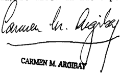

DISI-// -

## DE LA SEÑORA VICEPRESIDENTA DOCTORA DOÑA ELENA I. HIGHTO de NOLASCO

## Considerando:

Que esta Corte comparte arguentos vertidos por el señor Procurador Fiscal, en el párrafo segundo del punto III de su dictamen, cuyos fundamentos Y conclusiones corresponde remitir en razón de

Por ello, se desestima la queja Intímese la parte recurrente que dentro del quinto día efectúe el depósito que dispone el art 286 del Código Procesal civil y Comercial de la Na ción, en el Banco de la Ciudad de Buenos Aires, la orden de

esta Corte bajo apercibimiento de ejecución. Hágase saber , devuélvanse autos principales Y archívese\_

ELENA L HGHTON d NOLASCO

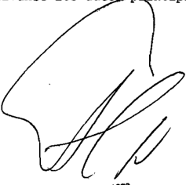

Recurso de hecho deducido por:

Tribunal de origen: Suparior Iribunal de Jubticia

Tribunales que intervinieron con anterioridad: Jurgado Correccional de Menode 1a Primora Circunecripción Judícíal en 10 Penal

TELEFONIcA DE ARGENTINA S.A. (TF 22099-I) c/ DGI

## IMPUESTO A LAS GANANCIAS.

Carece de sustento el criterio de la Administración Federal de Ingresos Públicos en cuanto, para determinar el impuesto a las ganancias supeditó la configuración y deducción de los 'malos créditos' 'en el caso superiores a $ 3.000' al ineludible inicio de la acción judicial de cobro cuando el contribuyente invocó haber ajustado su conducta a los usos y costumbres del ramo 'a los que remite la ley' y el organismo recaudador invalidó dicho argumento sin siquiera haber controvertido la existencia de aquéllos o demostrado que la recurrente no había cumplido con los pasos allí previstos.

## IMPUESTO A LAS GANANCIAS.

La expresión 'malos créditos' que trae el art. 87 de la ley del impuesto a las ganancias, alude tanto a los 'créditos dudosos' como a 'los incobrables' -cfr. arg. art. 139 del decreto reglamentario- mientras que el art. 142 del citado

reglamento enumera 'indicios de incobrabilidad' 'aplicables sólo a estos últimos por remitir a supuestos de hecho que confieren semiplena certeza acerca de la insolvencia del deudor y la imposibilidad de cumplimiento de sus obligaciones,  incluso  con  antelación  al  término  del  plazo  estipulado',  en  tanto que los 'créditos dudosos' toman esa denominación porque la frustración de la expectativa de cobro no deriva de aquellos hechos que la hacen manifiesta sino del vencimiento de la obligación impaga que origina una presunción de insolvencia confirmable por vías alternativas, y que en el concreto caso de autos se encuentran contempladas en el reglamento que regula la prestación del servicio público de telefonía cuya aplicación al caso el organismo recaudador pretende desconocer.

-En igual sentido 'Banco Francés S.A.' (Fallos: 333:2065) invocado por la Corte-.

## FALLO DE LA cORTE SUPREMA

## Buenos Aires, {obrero

Vistos 10s autos: "Telefónica de Argentina SA (TF 22099-I) DGI"

## Considerando

1 %) Que la AFIP-DGI, mediante resolución de fecha 21 de agosto de 2003 , determinó de oficio la obligación tributaria de la actora frente al impuesto las ganancias por el período fiscal 1998 , con los intereses resarcitorios correspondientes, Y aplicó una multa equivalente al 708 del importe del gravamen presuntamente onitido (art\_ 45 de la 11.683, t.0. en 1998 modificaciones) (confr. fs \_ 8/22) Para ello, el Fisco Nacional inpugnó 1a declaración jurada del contribuyente en cuanto practicó deducciones por "malos créditos" por considerar que su incobrabilidad no se hallaba debidamente acreditada pues su no correspondía tomar como pauta tal fin el mecanismo autorizado por el Reglamento General de Clientes del Servicio Básico Telefónico los efectos de cortar el servicio de 109 clientes morosos incobrables, consistente en una secuencia de llanadas telefónicas Y el envío de cartas documento, sino que resultaba necesaria la demostración por parte del contribuyente ley ~en

de que la fecha de cierre del ejercicio había iniciado las ciones judiciales tendientes lograr el cobro de os créditos que superasen la suma de En cambio, admitió deducibilidad de los inferiores esa suma en razón de su insignificancia econónica ac-

Que el Iribunal Fiscal confirmó la determinación del impuesto, excepto en relativo créditos contra clientes que no pudieron ser notificados por haber abandonado el donicilio declarado Para pronunciarse en favor del criterio sostenido por el organismo recaudador, señaló que si bien el contribuyente es una empresa prestadora de un servicio público cuyo reglamento de servicio instrumenta un proceso de gestión de mora que expresa objetivamente 1os costumbres del ramo ~a 10s que alude el art 87 , inc b, de 1a del impuesto las ganancias (t.0 en 1998) - , su juicio, las gestiones de cobro por vía telefónica 10s reclamos postales resultaban insuficientes para validar las deducciones pretendidas por tratarse de deudas superiores $ 3 .000 (fs. 490 vta ~20 párrafo, fs 491 párrafos-, fs. 491 vta. ) Fundó la aplicación de ese tope en la nota 995/01 (DV JUGR ) de la AFIP, Y señaló que 1a fijación de un importe, por debajo del cual no se exigla el inicio de acciones judiciales, sentaba un criterio de aplicación para el desarrollo de la actividad fiscalizadora (fs. 491 vta . 6' párrafo) ley

Por otra parte, revocó la multa impuesta en los términos del art 45 de la 11 . 683, al tener por acreditada la existencia de un error excusable. ley

Que la Sala de la Cámara Nacional de Apelaciones en 1o Contencioso Administrativo, rechazó 1os recursos de apelación revisión limitada deducidos por las partes Y, en consecuencia, confirmó 1a sentencia del Tribunal Fiscal de la Nación (fs. 634/638 vta. )

Para así decidir, destacó que no se hallaba en tela de juicio si la empresa prestadora del servicio había observado no el procediniento previsto en 1os artículos 11 Y 12 del Re -

glamento General de Clientes del Servicio Básico Telefónico aprobado por la resolución 25 .837/96 de la Secretaría de Comunicaciones ~consistente en dos comunicaciones por "telegestión" la intimación pOr medio fehaciente Y la posterior baja del servicio sino si el cumplimiento de tales requisitos constituía un indicio suficiente para calificar 1os créditos comO "malos" incobrables" Y deducirlos para determinar la renta sujeta impuesto (fs. 637 vta. )

De tal modo recordó que al resolver una causa de características análogas la presente había considerado que las gestiones judiciales extrajudiciales debidamente documentadas , llevadas cabo por una empresa prestataria del servicio público de distribución doniciliaria de gas por redes , tendientes efectivizar un crédito en los términos del pertinente reglamento administrativo de prestación del servicio, podían constituir causal suficiente para justificar la deducción de malos créditos, aunque también debía ser razonablemente apreciado el índice relativo al escaso monto de aquéllos, fundado en el carácter antieconómico de su cobro judicial, para 1o cual debían tomarse en cuenta los topes de $ 1.500 Y $ 5 .000 que tal efecto había fijado la Administración Federal de Ingresos Públicos en las resoluciones generales 1457/03 Y 1693/04 637 vta./ 638 ~IV considerando )

Iras ello precisó que la estimación de la eventual relación negativa entre el costo Y el beneficio de iniciar acciones judiciales para el cobro de los créditos se hallaba cargo de Telefónica de Argentina que 1os informes de los peritos técnico y contable agregados en autos no acreditaban el carácter antieconómico de las gestiones de cobro respecto de 1os créditos superiores 3 .000 fin de justificar su deducción, Y que en conjunto sumaban un total de $ 10.209.145,39 (fs. 638)

4 % ) Que contra dicha sentencia la actora dedujo recurso ordinario de apelación (fs. 642/645 vta. ) que fue bien concedido por el quo (fs. 690) , en tanto se dirige contra una sentencia definitiva, dictada en una causa en que la Nación es parte, el valor disputado en último término, sin sus acceso-

rios, supera el mínimo establecido por el art 24 , inc 6 ap a, del decreto-ley 1285/58 la resolución 1360/91 de esta Cor te El memorial de agravios obra fs 696/712 Y su contestación por la representante de Administración Federal de Ingresos Públicos fs . 715/723 vta

Que asiste razón la recurrente en cuanto señala en su memorial de agravios que "ni la [del impuesto las ganancias] ni [su] reglamento exigían que además de acreditar el cumplimiento de 1os usos costumbres del ramo (art\_ 87 inc b) (en el caso de esta parte el reglamento General de Clientes) tuviese que demostrar que inició el cobro compulsivo de dichos créditos haber acreditado la 'antieconomicidad' de haber iniciado dicho cobro compulsivo" (fs. 704 , 20 párrafo) ley

Que , en efecto, el art\_ 87 de esa (t.0. en 1986 según decreto 450/1986 ~idem texto ordenado en 1997-) prescribe que de las ganancias de la tercera categoría Y con las limitaciones de esta también se podrá [n) deducir b) [1Jos castigos Y previsiones contra 1os malos créditos en cantidades justificables de acuerdo con 1os usos Y costunbres del ramo" delegando en la Dirección General Impositiva 1a facultad de "establecer normas respecto de forma de efectuar esos castigos" ley ley

Por su parte, el decreto reglamentario previó la procedencia de "la deducción por castigos sobre créditos dudosos incobrables que tengan su origen en operaciones comerciales , pu diendo el contribuyente optar entre su afectación la cuenta de ganancias Y pérdidas un fondo de previsión constituido para hacer frente contingencias de esta naturaleza (art\_ 139 del decreto 2353/1986 ~art 133 en el texto ordenado en 1998-) especificando que tales deducciones "deberán justificarse Y Corresponder al ejercicio en que se produzcan , siendo índices de ello: la cesación de pagos , real aparente, la homologación del acuerdo de la junta de acreedores , declaración de quiebra la desaparición del deudor , la prescripción, la iniciación del bro compulsivo la paralización de las operaciones Y otros índi ces de incobrabilidad" (art. 136)

70) Que el Reglamento General de Clientes del Servicio Básico Telefónico aprobado por la resolución 25 .837/96 de la Secretaría de Comunicaciones ~aplicable al regula el procedimiento seguir en aquellos casos en que se justifique la suspensión Y baja del servicio de los clientes que incurran en mora en la cancelación de sus facturas \_ Al respecto, su art\_ 11 establece que "en casos en las facturas Y recargos que pudieran corresponder no fueren abonadas dentro de TREINTA (30) días corridos posteriores su vencimiento, los prestadores podrán proceder suspensión del servicio previa telegestión, al menos en DOS (2) oportunidades, con el clíente efectos de informarle tal situación" aclarando que la citada suspensión se refiere "únicamente las llamadas salientes debiendo permitirse al cliente recibir llamadas y/o comunicarse con 1os servicios de urgencia que no generan tasación" A continuación el art 12 dispone que una vez "suspendido el servicio, Y no habiendo sido cancelado el importe total adeudado , 10s prestadores comunicarán por medio fehaciente al cliente que una vez transcurridos sesenta días corridos posteriores la fecha de vencimiento, procederán dar [lo] de baja en forma definitiva" previa notificación efectuarse con al menos cinco días hábiles de anticipación la fecha prevista para ello (confr\_ fs 379) que

8 % ) Que no se encuentra controvertido en autos que 1os usos costumbres a los que alude del tributo han tenido una específica recepción objetiva en el ámbito de la actividad que desarrolla empresa actora con el dictado del reglamento administrativo precedentemente reseñado en sus disposiciones pertinentes (confr. arg. sentencia del Tribunal Fiscal, en especial fs 490 vta párrafo-, implícitamente compartido por la cámara fs 634/638 vta. confr asinismo, las nanifestaciones que realiza el organismo recaudador en la resolución determinativa de oficio ~en especial fs . 14 in fine Y fs\_ 15 , 1' párrafo , en el escrito de contestación del recurso de apelación ~en particular, fs . 65 vta. in fine fs 66 Y en el escrito de contestación del memorial de agravios presentado ante esta Corte, en especial 716 ~40 párrafo \_ Y fs. 718 vta . párrafo) ley ~20

Que en tales condiciones carece de sustento el criterio de Administración Federal de Ingresos Públicos en cuanto, para determinar el tributo, supeditó la configuración Y deducción de "malos créditos" ~en el caso superiores $ 3 .000 al ineludible inicio de la acción judicial de cobro cuan do el contribuyente invocó haber ajustado su conducta 1os usos Y costunbres del ramno ~a los que renite Y el organismo recaudador invalidó dicho argunento sin siquiera haber controvertido la existencia de aquéllos denostrado que la recurrente no había cumplido con los pasos allí previstos\_ ley

10) Que por otra parte, resulta inatendible la posición del Fisco Nacional en cuanto cuestiona la suficiencia del Reglamento General de Clientes del Servicio Básico Telefónico, sobre la base de considerar que el procediniento allí fijado si bien "establece las condiciones que deben cumplir las enpresas prestadoras del servicio para poder proceder la suspensión baja de la prestación s610 da prueba de 'morosidad' del deudor en el cunpliniento de su obligación, pero de ninguna manera se puede pretender probar 1a imposibilidad del cobro de la deuda" (fs 719 in fine) En efecto, tal como ha sido sostenido por esta Corte en la causa "Banco Francés (TF 18.280-I) c/ DGI" (Fallos: 333,2065) la expresión 'malos créditos' que trae el art de la ley del tributo, alude tanto 'créditos dudo909 como 10s incobrables' ~cfr. art 139 del decreto reglamentario mientras que el art\_ 142 del citado reglamento enumera indicios de incobrabilidad' aplicables s610 estos últimos por remitir supuestos de hecho que confieren semiplena certeza acerca de la insolvencia del deudor la imposibilidad de cumplimiento de sus obligaciones, incluso con antelación término del plazo estipulado" en tanto que "1os 'créditos dudotonan esa denominación porque la frustración de la expectativa de cobro no deriva de aquellos hechos que la hacen manifiesta sino del vencimiento de la obligación impaga que origina una presunción de insolvencia confirmable por vías alternativas" (considerando 13) Y que en el concreto caso de autos se encuen tran contempladas en el reglamento que regula la prestación del al

servicio público de telefonía cuya aplicación al caso el organismo recaudador pretende desconocer .

11) Que en virtud de la solución la que se llega Y 1os fundamentos expuestos en 1os considerandos que anteceden , resulta inoficioso el tratamiento del agravio vinculado con el índice de incobrabilidad basado en la escasa significancia econónica de los créditos

Por ello, se revoca la sentencia apelada en cuanto fue ma teria de agravios, con costas de todas las instancias la ven cida (arts 68 Y 279 del Código Procesal Civil Y Comercial de la

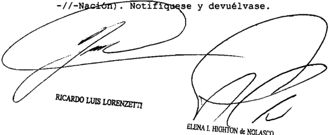

ELENA L HIGHTON &amp; NOLASCO

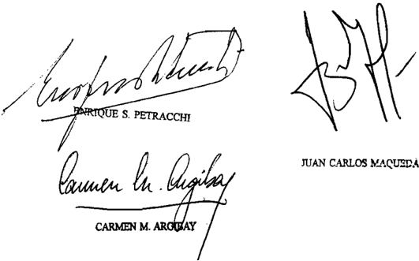

Recurso ordinario interpuesto por Telefónloa representada , en el menorial de agravios, pOr el Dr con el patrocinio letrado del Dr\_ Guillormo A . Lalanne

Traslado contestado pOr 01 Nacional (AFIP-DGI) representado la Dra , Carpen Flavia La Valle, con el patrocinio letrado del Dr

Tribunal de origen Bala de 1a 00 10 Conten Ciobo Adninibtrativo Foderal

Iribunales intervinieron con anterloridad: Iribunal de le Nación. que

QUINTEROS, VIRGINIA S/ SU PRESENTAcIóN

## DERECHO A LA SALUD.

Si la actora formó parte del Instituto de Obra Social de la Provincia de Entre Ríos (IOSPER) durante veinte años, período en el que fue asistida reiteradamente por la grave dolencia que la incapacita-, la negativa a su reafiliación onerosa so pretexto de la patología preexistente, además de preterir las dificultades de la reclamante a acceder en el futuro a una entidad similar dada su condición sanitaria, aparece presidida por el fin inadmisible de desentenderse de la continuidad del tratamiento de la dolencia.

-Del dictamen de la Procuración General, al que remitió la Corte Suprema-.

DIcTAMEN DE LA PROcURAcIóN GENERAL

## Suprema Corte:

- I -

El Tribunal Superior de Justicia de la Provincia de Entre Ríos, en lo que interesa, hizo lugar a la apelación deducida por el Instituto de Obra Social de la Provincia de Entre Ríos (IOSPER) y, en consecuencia, rechazó el amparo promovido por la actora. Alegó, para así resolver, que el reclamo fue deducido cuando ya habían transcurrido los treinta días previstos en el artículo 3º, inciso c), de la ley local nº 8.369. Agregó que las presentaciones impetradas por el Defensor de Pobres y Menores carecen de efecto suspensivo respecto del plazo de caducidad legal, más aun, cuando no se alegó una razón de urgencia que afecte en manera inminente y grave la salud de la peticionaria (cfse. fs. 56/64 y 92/94 del expediente principal),

Contra el pronunciamiento la actora dedujo, in forma pauperis , recurso extraordinario, que fue denegado por carecer de fundamentación autónoma, de tema federal y de gravedad extrema, dando origen a la presentación en estudio (fs. 102, 107/111, 113/116 y 121/123 y fs, 16 y 36/41 del cuaderno respectivo).

- II -

La amparista impugnó, in forma pauperis , la decisión del tribunal a quo por injusta y arbitraria (v. fs. 102).

Por intermedio del representante del Ministerio Público de la Defensa, hizo hincapié en el perjuicio irreparable que el fallo irroga al derecho a la salud, íntimamente vinculado con el derecho a la vida, y en la seria afectación de la defensa en juicio y el debido proceso.

Con cita de las Reglas de Brasilia, resaltó la condición de vulnerabilidad de la parte que, además de discapacitada, carece de medios económicos y es mujer -reglas 3, 7, 8, 15, 16, 17 y 20-, condición que no ignoraba la demandada puesto que la amparista, como ex-afiliada de la Obra Social, fue atendida e intervenida quirúrgicamente, en reiteradas ocasiones, en el marco asistencial provisto por la Institución.

Denunció apartamiento de la solución legal, falta de fundamentación y discriminación, con apoyo en los artículos 75, inciso 22, de la Constitución Nacional y 19 y 21 de la Constitución provincial, referentes a la protección integral de la salud, de la familia y de !as personas con discapacidad y a la igualdad de oportunidades.

Dijo  que  la  condición  de  la  actora,  además  de  suficientemente probada, fue reconocida por el IOSPER al denegar la reafiliación con sustento en la preexistencia de una patología (resol, nº 1.061/95), extremo que vulnera normas locales, nacionales (leyes nº 9.891, 24.091 y  26.378)  e  internacionales  (Convención sobre los Derechos de las Personas con Discapacidad; Declaración Americana de los Derechos y Deberes del Hombre; Pacto de San José de Costa Rica; Pacto Internacional de Derechos Económicos, Sociales y Culturales y de Derechos Civiles y Políticos; etc.).

Subrayó que la demora en iniciar la acción se enmarca en la situación de la actora, discapacitada, sin recursos económicos, habitante

de una pequeña localidad de provincia y falta de información para defender sus derechos y determinar su plan de vida, por lo que no debe tomarse como un incumplimiento sino como una consecuencia de la situación de la que es víctima, a lo que se agrega que la arbitrariedad e ilegalidad manifiesta persiste a la fecha (v. fs. 107/111).

A fojas 16 de la presentación arribada a estudio, por su parte, la actora reitera -por si- su petición ante V.E., mientras que a fojas 20, tras disponer la reconstrucción del expediente extraviado (fs. 17), se confiere vista de las actuaciones al Sr. Defensor Oficial ante la Corte, quien asume su intervención en el marco de los artículos 60, inciso a), de la ley nº 24.946; 21 del decreto-ley nº 1285/58, redacción según ley nº 26.183, y 12 de la Acordada CSJN nº 04/2007.

Sostiene el Sr. Defensor Oficial, en suma, que lo resuelto por el a quo compromete la interpretación de normas que integran el bloque de constitucionalidad federal, particularmente, en lo relacionado con los derechos a la salud y a la vida y con el principio de efectividad de los instrumentes procesales dirigidos a garantizar la vigencia de les derechos humanos (fs. 36/41 del cuaderno respectivo).

- III -

La actora, por intermedio del Defensor de Pobres y Menores, promovió demanda de amparo contra el IOSPER, Delegación Diamante, peticionando la incorporación a la entidad en condición de 'hijo mayor de edad de titular obligatorio' (su progenitora). Adujo que formó parte de la obra social como 'afiliado hijo menor de edad' y, luego, como 'afiliado estudiante' hasta cumplir los veinticinco años, y que cuando pidió su inclusión voluntaria fue rechazada por portar una patología preexistente (hidrocefalia).  Dicho  padecimiento  -acotó-  le  generó una incapacidad permanente y condujo a reiteradas intervenciones quirúrgicas que la tornaron 'válvulo dependiente'. Objetó la resolución IOSPER 1.061/95 (v. fs. 48), que veda la afiliación voluntaria en los casos de enfermedades de origen congénito y/o preexistente (cfr. fs. 17/36 del principal).

El Instituto de Obra Social de la Provincia de Entre Ríos, a su turno alegó la caducidad del amparo con base en que fue deducido más de cuatro meses después de notificada la negativa de la afiliación. Sumó a ello que la resolución IOSPER nº 1.061/95 para preservar el equilibrio

prestacional respecto de los afiliados naturales, veda la adhesión voluntaria en el caso de que medie, como aquí, una dolencia preexistente. Expuso que atañe al Estado, no al IOSPER, garantizar que la actora goce de un adecuado acceso al servicio de salud y que es facultad de toda obra social reglamentar lo vinculado con las coberturas no obligatorias (v. fs. 49/54).

El juez de grado, por su parte, acogió la pretensión y condenó al Instituto a incorporar a la amparista en calidad de 'afiliado adherente hijo mayor de edad' de la titular de la afiliación (su madre). Para así decidir, con cita -entre otros- de Fallos: 330:4647, arguyó que no se contiende que la actora fue afiliada al IOSPER como adherente de su madre (hija menor, hasta los 21, y estudiante, hasta los 25 años) ni que desde su nacimiento padece una hidrocefalia por bloqueo del espacio subaracnoideo. Tampoco se discute -dijo- que se le han colocado diversas válvulas neonatales, a punto tal de ser un paciente válvulo dependiente, ni que sufre una minusvalía permanente y parcial, En ese marco, añadió, el IOSPER no puede abstenerse de incorporar a un familiar del grupo primario de un afiliado obligatorio, por portar una patología previa, pues ello contradice el principio de protección y asistencia integral de la discapacidad asumido por el Estado Nacional corno política del país. Consideró irrazonable, por último, imponer a la actora que acuda a los servicios públicos de salud cuando le resulta posible al IOSPER prestar la cobertura -como lo hizo durante veinte años- y dada la urgencia explicitada en el litigio (fs. 56/64).

Apelada la decisión por la accionada, fue revocada por el a quo , extremo que, en definitiva, dio lugar a la presentación en estudio (fs. 70, 78/81, 85 y 92/94 del expte. principal).

## - IV -

Emerge de las actuaciones que la peticionaria nacida el 28/04/80 en la localidad de Diamante (Pcia. de Entre Ríos), gozó de los beneficios asistenciales del Instituto de Obra Social de la Provincia -desde 1985 y hasta que cumplió veinticinco años de edad, en 2005- como integrante del núcleo familiar primario de la titular de la afiliación (su progenitora, empleada provincial).

También surge que el 10/06/08 la madre de la amparista solicitó el alta de su hija ante el IOSPER como 'adherente hijo mayor de titular forzoso', la que fue negada el 30/06/08 por la presencia de una enfer-

medad preexistente, todo lo cual se expuso en una presentación ante la Defensoría Oficial, con énfasis en que la interesada directa carecía de Obra Social desde abril de 2005, presentación que la propia actora reiteró el 23/10/08 (cfr. fs. 2/6, 9 y 10).

Habiendo requerido, a su turno, el Sr. Defensor Oficial la reafiliación de la pretensora en el IOSPER mediante los oficios nº 283, 393 y 396, del 12/8/08 y 31/10/08, el resultado fue negativo (v. fs. 7/8 y 13/16).

Cabe destacar que a fojas 11 del principal obra un informe médico que expone que la actora sufrió una hemorragia perinatal por premadurez que desencadenó una 'hidrocefalia secundaria por bloqueo del espacio subaracnoideo' y que desde esa época ha necesitado distintas intervenciones quirúrgicas para la colocación de válvulas neonatales que la tornan una persona válvulo dependiente. Dice, además, el informe que su vida es ajustada a la edad, que fue apoyada en la niñez y adolescencia por retraso en la maduración psicomotriz y que, en la actualidad, tiene una válvula de derivación ventrículo peritoneal de la que depende su vida (informe del 03/09/08).

A fojas 12, por último, obra un informe médico forense que expone que el padecimiento de la accionante es grave y que, si bien puede realizar una vida casi normal, es una persona discapacitada para una serie de actividades, pues su vida depende del buen funcionamiento de la válvula que le fue implantada, pudiendo exigir, en caso de obstrucción urgente atención médica peligrando su vida de no recibirla. Agrega que la minusvalía resulta permanente y que no existe posibilidad de recuperación plena de la salud, al ser dependiente valvular de por vida (informe del 12/11/08).

Con fecha 29/11/08, sustentado en la carta-poder otorgada el 10/11/08, el Sr.  Defensor Oficial promovió la presente demanda de amparo e inconstitucionalidad (v. fs. 1 y 17/36).

- V -

Ante todo, coincido con la representante del Ministerio Público Fiscal de Entre Ríos y con el Sr. Defensor Oficial ante la Corte en orden a que la presentación de fojas 102 y 107/111 satisface los recaudos mínimos exigibles para su admisión formal ante V.E., y. por tanto, estimo que fue erróneamente desestimada por el a quo (v. fs, 113/116 del principal y 36/41 del cuaderno respectivo).

Ello es así, singularmente a la luz de los intereses en juego, explicitados en ocasión de reclamar y posteriormente (v. fs. 17/36 y 107/111), y en el marco de la doctrina de V.E. que descalifica el excesivo ritualismo, en particular, cuando se hallan comprometidos derechos constitucionales como la vida y la salud (cfr. Fallos: 327:5210; 329:1226; 330:4647; 332:1200: 333:380 y sus citas; etc.).

Por lo demás, y si bien no se trata estrictamente de una presentación in forma pauperis ,  es decir, de la petición recursiva informal suscripta por una persona privada de su libertad, con posterior asistencia letrada (cfse. Fallos: 310:492, 1934; 314:1163, 1909; 315:2984 y 318:674), no cabe dudar aquí de la voluntad impugnativa de la actora, asistida, más tarde por los representantes del Ministerio Público (cfr fs. 102 y 107/111 del principal y 16 y 36/41 del cuaderno respectivo) ni de la difícil situación en la que se encuentra como lo puso de resalto el Sr. Defensor General interino de la Provincia a fojas 107 y vta. (cfr. Fallos: 320:1824 y sus citas: etc.).

El Superior Tribunal de Entre Ríos, vale anotarlo. confirió a la diligencia de fojas 102 el tratamiento de una presentación recursiva in forma pauperis (cfr. fs. 103, 106, 112, 118 y 121, punto I), con arreglo a un temperamento que no fue objetado por el lOSPER ni por el Ministerio Fiscal (fs. 104 y 118/20 y fs. 113/116), y más allá de la crítica a la 'insólita actitud' y 'reprochable maniobra' del Defensor Oficial en el sentido de requerir la notificación personal de la actora para forzar un recurso in pauperis -cuestión encuadrable, en su caso, en un marco disciplinario-, lo cierto es que la alzada no imputó al planteo defectos formales o temporales sino, más tarde, una fundamentación insuficiente (v. fs. 98/100, 101vta., 102, 121 vta.. ítems IV y V y 123 ítem VI).

Cabe recordar que el reglamento establecido por medio de la Acordada CSJN nº 04/2007 '... no se aplicará a los recursos interpuestos in forma pauperis ' (cfse. art. 12).

A lo dicho se suma que, en palabras de V.E., la sentencia que rechaza el amparo es asimilable a definitiva cuando se demuestra que produce agravios de imposible o dificultosa reparación ulterior, 'por la presencia de arbitrariedad manifiesta, al incurrir en un injustificado rigor formal, o no se exhibiese como derivación razonada del derecho aplicable'. La alegada urgencia en el restablecimiento de lo solicitado (fs. 11/12) y el hecho no discutido de que el IOSPER negó el pedido de la actora, ponen de manifiesto que el fallo irroga a esa parte agravios

de difícil  o  improbable reparación posterior (Fallos: 330:4617 y sus citas, entre otros).

Sentado lo anterior y en cuanto al argumento esgrimido por la a quo con apoyo en el artículo 3º, inciso c), de la ley nº 8.369 (caducidad del plazo), corresponde decir que preceptos como el mencionado no constituyen un escollo insalvable a lo requerido en la medida en que con la acción incoada se denuncia una arbitrariedad o ilegalidad continuada, originada antes de recurrir a la justicia, pero mantenida al momento de accionar y también en el tiempo ulterior (v. Fallos: 329:4918. etc.).

Se suma a ello que, si bien en el marco de supuestos fácticos distintos pero vinculados a la cobertura de prestaciones de salud, V,E. ha interpretado que toca a los jueces buscar soluciones que se avengan con la urgencia que conlleva este tipo de pedidos, para lo cual deben encauzar los trámites por las vías expeditivas e impedir que el rigor de las formas pueda conducir a la frustración de derechos que cuentan con tutela constitucional, lo cual se produciría si el reclamo tuviera que aguardar al inicio de un nuevo proceso (cf. Fallos: 327:2127: 329:4918: 330:4647; 331:563; etc.).

En ese plano, la sentencia que rechazó el amparo no apreció, como es menester, la cuestión que la accionante llevó para su consideración dado que, desde que se dedujo el reclamo, la actora hizo saber de la necesidad de que le restablezcan la cobertura médica y se ocupó de acreditar la persistencia de sus problemas de salud e incapacidad, por lo que aquélla deviene arbitraria y debe invalidarse judicialmente (Fallos 327:5373; 330:5201; entre otros).

Cabe añadir, por lo demás, que el IOSPER -persona jurídica autárquica enmarcada en el Ministerio de Bienestar Social de la Provincia de Entre Ríos, a través de su Secretaria de Salud Pública, cuyo titular, presupuesto, normativa, control, etc., determina el Ejecutivo y cuyas operaciones garantiza el Estado local (v. arts, 1, 7, 9 inc. e), 11 inc. g), 12 incs, a). b), k) y r), in fine , 14, 20, 27, 30 y 32, ley local nº 5326)- se limitó a argüir condicionamientos presupuestarios y potestades privativas para justificar la no reafiliación de la accionante y a enfatizar la responsabilidad del Estado Provincial en estos casos a través de su red de hospitales públicos y de los restantes servicios de salud (cfr. fs. 52/53, ítems 8, 9 y VI).

A la par de que con arreglo a la normativa reseñada en el párrafo que antecede resulta cuanto menos discutible la nítida ajenidad del IOSPER respecto del Estado local ha reiterado V.E. que el derecho a la preservación de la salud -comprendido dentro del derecho a la vida y reafirmado en los tratados internacionales (v. art. 75, incs. 22 y 23, C.N.)- involucra no sólo a las autoridades públicas sino también, en la medida de sus obligaciones, a las jurisdicciones locales, obras sociales y entes de medicina prepaga (cf. Fallos: 324:3569; 327:2127; 328:1708; 329:2552: 330:4160; etc.).

En el supuesto, a mi ver, al cesar en la prestación de los beneficios de que disfrutaba la actora y negarse a restablecerlos por la vía de incorporarla como adherente voluntaria -hijo mayor de edad del titular obligatorio u otra categoría análoga- el Instituto faltó al compromiso que, como ente de la seguridad social, contrajo con su afiliada, al punto tal de comprometer sus derechos constitucionales (cfr. doctrina de Fallos: 324:677; 327:5373; 330:3725; entre otros).

Y es que cabe tener presente, por de pronto, que la actora formó parte del IOSPER durante veinte años, período en el que fue asistida reiteradamente por la grave dolencia que la incapacita. En ese plano, la negativa del Instituto a su reafiliación onerosa so pretexto de la patología preexistente, además de preterir las dificultades de la reclamante de acceder en el futuro a una entidad similar dada su condición sanitaria aparece presidida por el fin inadmisible de desentenderse de la continuidad del tratamiento de la dolencia (doctrina de Fallos: 324:677 y 325:677).

A lo dicho se añade que resulta aparente el argumento esgrimido por la demandada en punto a que la negativa a la reafiliación encuentra justificativo en un supuesto equilibrio económico-financiero de la entidad, toda vez que no se acreditó que la atención de los eventuales gastos de la actora pudiera traducirse en un gravamen patrimonial irreparable, máxime, cuando ella pasaría a tributar en condición autónoma, como afiliada voluntaria de la Obra Social (v. Fallos: 325:677; etc.).

Por lo expresado, opino que corresponde hacer lugar a la presentación, dejar sin efecto la sentencia y restituir la causa al tribunal de

origen, a sus efectos, o bien, de juzgarlo pertinente V.E., con ajuste al articulo 16 de la ley nº 48, expedirse sobre el fondo del asunto y condenar al IOSPER a la reafiliación de la actora. Buenos Aires, 13 de abril de 2011. Marta A. Beiró de Gonçalvez.

## FALLO DE LA cORTE SUPREMA

## Buenos Aires, 9e 23

Vistos autos: "Recurso de hecho deducido por Quinteros Virginia en la causa Quinteros, Virginia su presentación" para decidir sobre su procedencia.

## Considerando:

Que las cuestiones planteadas encuentran adecuada respuesta en el dictamen de la señora Procuradora Fiscal\_ yas consideraciones corresponde remitir en razón de brevedad -

Por ello, se hace lugar la queja, se declara procedente el recurso extraordinario, se revoca la sentencia apelada Y, en uso de las atribuciones conferidas por el art. 16, segundo párrafo, de la ley 48 , se condena demandada , Instituto de Obra Social de Provincia de Entre Ríos (IOSPER) reafiliar la actora, señora Virginia Quinteros Recaratúlese la presente como recurso de queja, agréguese al principal, notifíquese Y,

Recurso de hecho interpuesto por la actora Quinteroe Virginie, representada por el Dr Jullán Langovin Ofioial ante Corte de Jus ticla de

Tribunal de origen Tribunal de Justfcia de Provincia de Ríob

Tribunal que intervino con anterioridad: Jurgado de Inatrucaión

ROSALES, VIcTOR ALDO Y OTRO c/ ESTADO NAcIONAL (MINISTERIO DE DEFENSA) S/ ORDINARIO

## CONSOLIDACION DE DEUDAS.

En el régimen instaurado por la ley 23.982, a cuyos términos remite la ley 25.344, no es posible atribuir carácter accesorio a los honorarios profesionales respecto del capital de condena, pues la causa de la obligación de pagar dichas retribuciones está dada por el servicio prestado por el profesional en el marco de un proceso judicial.

-Del dictamen de la Procuración General, al que remitió la Corte Suprema-.

## HONORARIOS.

Cabe revocar la sentencia que dispuso que los honorarios estipulados se encuentran consolidados en los términos de la ley 23.982 y concordantes, debiendo computarse los intereses legales devengados desde la fecha de la sentencia de grado y hasta su efectivo pago, pues resulta aplicable lo dispuesto por el decreto 1647/09 al tenerse en cuenta que la suma regulada en conjunto y confirmada por la cámara fue de $ 3.500, en tanto se configura un supuesto de exclusión de la deuda, según la modificación que esta norma introdujo al art. 7º, inc. e, del anexo IV del decreto 1116/00.

-Del dictamen de la Procuración General, al que remitió la Corte Suprema-.

DIcTAMEN DE LA PROcURAcIóN GENERAL

## Suprema Corte:

- I -

A fs. 416/417 la Cámara Federal de Apelaciones de Córdoba, en lo que aquí interesa, modificó lo resuelto en la instancia anterior y, en consecuencia, dispuso que los honorarios estipulados se encuentran consolidados en los términos de la ley 23.982 y concordantes, debien-

do computarse los intereses legales devengados desde la fecha de la sentencia de grado y hasta su efectivo pago.

Para así decidir, consideró que, si bien no fue materia de agravios, los honorarios de los profesionales devengados en juicios por deudas consolidadas se encuentran en igual situación jurídica que éstas (arts. 1º, inc. d, y 2º de la ley mencionada y su decreto reglamentario 2140/91).

- II -

Disconformes con este pronunciamiento, los letrados de los actores, por derecho propio, interpusieron el recurso extraordinario de fs. 421/430, que fue concedido a fs. 439.

En lo sustancial, aducen que la sentencia incurre en arbitrariedad, pues se aparta de las normas aplicables al caso y se pronuncia respecto de una cuestión que no fue motivo de agravio por parte de la recurrente, violando el principio de congruencia y el derecho de defensa en juicio. Señalan que los emolumentos fueron regulados por tareas realizadas en la etapa de ejecución de sentencia, actividad que tuvo lugar a partir del 11 de diciembre de 2002, motivo por el cual se encuentran excluidos del régimen de consolidación. Asimismo, consideran que resulta aplicable al caso el decreto 1647/09 que excluye a las obligaciones cuyo monto sea inferior a $5.000, pues precisamente los honorarios fueron regulados en forma conjunta por una suma inferior.

## - III -

A mi modo de ver, el recurso extraordinario deducido es formalmente admisibles pues, si bien es un principio asentado que las decisiones adoptadas en la etapa de ejecución no configuran la sentencia definitiva requerida por el art. 14 de la ley 48, ello admite excepciones cuando lo decidido pone fin a la discusión y causa un gravamen de imposible reparación ulterior (Fallos: 323:3909 y sus citas), extremo que, en mi concepto, se verifica en autos.

Por lo demás, se encuentra en juego la aplicación e interpretación de normas de carácter federal y la decisión recurrida ha sido adversa a las pretensiones que los apelantes fundan en ellas.

Ante todo, cabe señalar que las disposiciones que conforman el régimen de consolidación de deudas del Estado resultan de inexcusable

aplicación a los créditos anteriores a la fecha de corte fijada en razón del carácter de orden público que el legislador atribuyó a dicho régimen (Fallos: 326:1632), naturaleza que obliga al tribunal a considerar su aplicación en cualquier estado del proceso y aun de oficio si la accionada omite solicitarla (Fallos: 329:1715). No obstante, ello, lo cierto es que, en la especie, los honorarios regulados no se encuentran comprendidos en dicho régimen especial de cancelación de deudas estatales por los motivos que se exponen a continuación.

En primer lugar, contrariamente a lo que sostiene el tribunal, V.E. ha establecido claramente que en el régimen instaurado por la ley 23.982, a cuyos términos remite la ley 25.344, no es posible atribuir carácter accesorio a los honorarios profesionales respecto del capital de condena, pues la causa de la obligación de pagar dichas retribuciones está dada por el servicio prestado por el profesional en el marco de un proceso judicial, por lo que no resulta del objeto de la obligación ventilada en la litis ni de la relación con el sujeto pasivo de aquélla (Fallos: 327:2712; 330:3002, entre muchos otros).

Descartado el carácter accesorio de los emolumentos pendientes de cobro, corresponde atenerse a la fecha de los trabajos profesionales. En el sub lite es preciso advertir que, según surge del detalle presentado en la solicitud de fs. 403, algunas diligencias tendientes a ejecutar la sentencia fueron realizadas con anterioridad a la fecha de corte fijada por la ley 25.344 -con la prórroga establecida por el art. 58 de la ley 25.725- y otras con posterioridad. Sin embargo, entiendo que resulta aplicable lo dispuesto por el decreto 1647/09 si se tiene en cuenta que la suma regulada en conjunto y confirmada por la cámara es de $ 3.500, en tanto se configura un supuesto de exclusión de la deuda, según la modificación que esta norma introdujo al art. 7º, inc. e, del anexo IV del decreto 1116/00.

En tales condiciones, estimo que la decisión recurrida se aparta de las normas federales aplicables al caso y que los honorarios regulados cuya forma de cancelación aquí se dirime quedan excluidos del régimen de consolidación de deudas del Estado.

- V -

Opino, por tanto, que corresponde hacer lugar al recurso extraordinario interpuesto y revocar la sentencia apelada. Buenos Aires, 22 de septiembre de 2011. Laura M. Monti .

## FALLO DE LA cORTE SUPREMA

## Buenos Aires, 23 20l2.

Vistos 10s autos "Rosales, Víctor Aldo Y otro c/ EN (Ministerio de Defensa) 9/ ordinario"

## Considerando

Que este comparte las consideraciones ex puestas por la sefora Procuradora Fiscal en el dictamen de fs \_ 444/445, las que cabe remitir por razones de

Por ello, se declara procedente el recurso extraordinario deducido Y se deja sin efecto la sentencia apelada Vuelvan los autos al tribunal de origen para que, por quien corresponda, se dicte un nuevo fallo con arreglo al presente. Con costas (art 68 del Código Procesal Civil Comercial de la Nación) Notiffquese Y, oportunamente remítase.

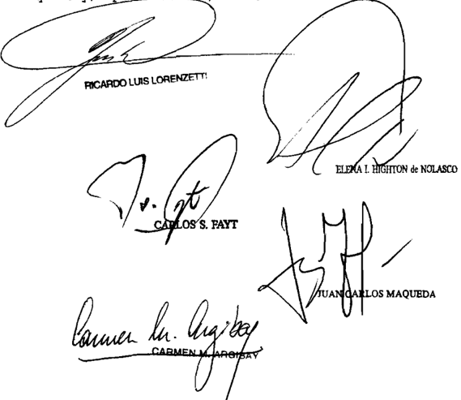

Recurso extraordinario interpuesto por Jorge Alejandro Bantiago Felipe Castollanob

Traslado contestado por el Nacional representado por la Dra . María

Tribunal de origen de Apolaclonab 8ala B ,

Tribunales que intervinieron con anterioridad: Juzgado de Prinera Inbtancia de Cordoba

## SHELL cOMPAÑIA ARGENTINA DE PETROLEO S.A. S/ INFRAccIóN LEY 20680 -cAUSA Nº 12809-

## PRESCRIPCION.

Corresponde desestimar el planteo de prescripción de la acción penal opuesto por la sancionada, puesto que desde la fecha de la única sentencia que, en el caso, reúne las condiciones previstas en el art. 67, inc. e, del Código Penal, esto es, la dictada por el juez en lo Penal Económico -que modificó la multa impuesta mediante el acto administrativo suscripto por el Secretario de Comercio Interior- no ha transcurrido hasta el presente el plazo previsto en el art. 22 de la ley 20.680.

## COMBUSTIBLES.

Cabe revocar por arbitraria la sentencia que multó a la actora por infracción a la ley 20.680 al no cubrir la demanda de gasoil, dado que la decisión carece de fundamentación suficiente, por cuanto se limitó a sostener de manera dogmática que para verificar esa figura sólo correspondía determinar 'si existió un incumplimiento en la cobertura solicitada y si ello implicó no cubrir razonablemente, de un modo justificado, aquella demanda', omitiendo tratar el planteo del recurrente relativo a la comprobación en el caso de los elementos de la infracción, lo que resultaba conducente para la correcta solución del caso.

-Del dictamen de la Procuración General, al que remitió la Corte Suprema-.

## COMBUSTIBLES.

Cabe revocar por arbitraria la sentencia que multó a la actora por infracción a la ley 20.680 al no cubrir la demanda de gasoil, pues el magistrado equiparó 'cubrir constantemente el abastecimiento' y 'cubrir de forma razonablemente justificada el total de la demanda de gasoil ', diciendo que si la cobertura constante es una cobertura razonablemente justificada ambos conceptos significan lo mismo, pero sin reparar en la relación inversa de esos términos, que se vincula con el argumento que expuso la empresa en cuanto sostuvo que una cobertura razonablemente justificada no necesariamente es, según las prácticas usuales del mercado, una cobertura sin interrupción, en la que ninguna estación se quede, en algún momento, sin combustible.

-Del dictamen de la Procuración General, al que remitió la Corte Suprema-.

## DIcTAMEN DE LA PROcURAcIóN GENERAL

## Suprema Corte:

- I -

El Juzgado Nacional en lo Penal Económico nº 4 confirmó la resolución nº 805/2006 de la Secretaría de Comercio Interior del Ministerio de Economía y Producción, por la que se impuso multa a 'S. C. A. d. P. S.A.' por infracción a la ley 20.680, en función de la resolución nº 25/2006 de dicha secretaría, reduciendo su monto de un millón de pesos a cien mil (fs. 89/101).

Para así decidir, el magistrado ratificó la vigencia del artículo 2º, inciso 'c', de esa ley, y sostuvo la validez de la citada resolución 25/2006 por entender que fue dictada en ejercicio de las facultades previstas en aquella norma, cuya constitucionalidad confirmó con base en el pronunciamiento de Fallos: 311:2453, en cuanto se consideró que, dadas las características fluctuantes en que se desarrolla la dinámica del proceso económico, no causa gravamen constitucional la autorización que confiere su artículo 2º con la finalidad de que el Poder Ejecutivo determine las circunstancias específicas que complementarán el marco de la prohibición en punto a la política de abastecimiento, y se sostuvo que, por encontrarse esa delegación delimitada en un ámbito cierto, que es el de la reglamentación del abastecimiento de bienes y servicios a través de la fijación de precios máximos, márgenes de comercialización u otras medidas de similar naturaleza, no se ha producido la transferencia de potestades privativas del legislador en el poder administrador.

Establecido ello, tuvo por probado que S. no cubrió una solicitud de gasoil de una estación de servicio, a cuyo efecto desechó el documento por el que la firma pretendió demostrar la inexistencia de aquel pedido, por considerar que fue obtenido de uno de sus equipos informáticos y que no existe posibilidad de controlar la autenticidad de los datos que contiene ni la fecha en que fueron ingresados por sus empleados.

En tales condiciones, el juez entendió que ello significó no cubrir razonablemente, de un modo justificado, la demanda de aquel combustible en los términos de la primera y segunda cláusula del anexo a la resolución 25/2006.

En ese sentido, refirió que si bien la noción de mercado es amplia, éste puede quedar configurado tanto por el área nacional como por un área regional o provincial, e incluso por una unidad de menor envergadura teniendo en cuenta el alcance de su influencia.

Contra ese pronunciamiento, el apoderado de la empresa dedujo recurso extraordinario federal (fs. 136/155), cuya denegatoria dio lugar a la articulación de la presente queja (fs. 190/194).

- II -

En el escrito de la apelación extraordinaria el recurrente expuso los fundamentos de la impugnación.

En primer lugar, cuestionó la interpretación que el magistrado hizo de la resolución 25/2006.

Al respecto, sostuvo que la falta de combustible en una determinada estación de servicio no constituye, por sí misma, infracción a dicha resolución, cuyo objetivo es garantizar el normal funcionamiento del mercado de gasoil, y no de cada una de las estaciones de servicio en particular.

Objetó que una estación pueda ser calificada como 'mercado' en los términos de la resolución de la Secretaría de Comercio Interior, pues ésta establece el  deber  de  cubrir  de  forma  razonablemente justificada el total de la demanda de gasoil, y de proveer de manera habitual y continua a todas y cada una de las zonas que integran el territorio nacional, sin referirse particularmente a las estaciones de servicio.

Sostuvo que para determinar la existencia de una infracción se debe establecer previamente, de acuerdo con las palabras de la resolución nº 25/2006, cuáles son las prácticas usuales del mercado para requerir y proveer ese producto, cuáles son las zonas que integran el territorio nacional, cuáles fueron los volúmenes abastecidos en el mismo mes del año anterior, cuál es la correlación positiva entre el incremento de la demanda de gasoil y el incremento del producto bruto interno, acumulada a partir del mes de referencia hasta la actualidad, y cuántos puntos de venta abastecidos por la empresa en cuestión existen en la zona de que se trate. Y dijo que la mayoría de estos

elementos no fue verificada en el sub lite , a excepción de la relación entre la cantidad del producto vendida a la estación en el mes de la inspección y el mismo mes del año anterior, que en el caso aumentó ciento noventa por ciento.

Agregó que la infracción atribuida es de carácter doloso, y refirió que en el caso no se acreditó la presencia de ese aspecto subjetivo.

Por otro lado, alegó que en el pronunciamiento se vulneró el principio  de  congruencia,  pues  mientras  que  el  órgano  administrativo sancionó a la empresa por no haber proveído de manera habitual y continua el volumen de gasoil necesario para evitar la situación de desabastecimiento descripta en el acta de comprobación, el magistrado sostuvo que la imputación consistió en no haber satisfecho un pedido específico de una estación de servicio.

Señaló que, de esta manera, no se brindó debidamente a la empresa la posibilidad de probar la inexistencia de ese pedido, y agregó que ni siquiera la autoridad de aplicación acreditó que hubiera sido efectuado desde que sólo habría sido mencionado por la encargada de la estación en el acto de inspección.

Sostuvo, asimismo, que el magistrado prescindió de la prueba que S. aportó y de aquélla cuya producción requirió, relativas a las circunstancias supra mencionadas como relevantes a efectos de acreditar la concurrencia de los elementos previstos en la infracción atribuida.

Por otra parte, planteó que la facultad prevista en el inciso 'c' del artículo 2º de la ley 20.680, en que se apoyó la sentencia, no se encuentra vigente y, además, es contraria a la Constitución Nacional.

En ese sentido, expresó que dicha disposición, en tanto habilita al Poder Ejecutivo a dictar normas que rijan la comercialización, intermediación, distribución y producción de bienes y servicios, excede la atribución prevista en la Constitución Nacional de expedir los reglamentos necesarios para la ejecución de las leyes de la Nación, y le concede una autorización para regular el comercio interior a pesar de que se trata de una potestad del Congreso, conforme lo disponen los artículos 75, incisos 12º y 13º, y 126 de la Norma Fundamental.

Agregó que en el precedente de la Corte publicado en Fallos: 311:2453, que el magistrado citó en la sentencia apelada, se reconoció que aquel inciso instrumenta una delegación de atribuciones legislativas, y concluyó que su vigencia debe ser evaluada entonces a la luz de las reglas que la Constitución Nacional establece al efecto desde la reforma de 1994, en el artículo 76 y en la disposición transitoria octava.

En ese sentido, indicó que se cumplió el plazo de cinco años previsto en esa cláusula transitoria para que opere la caducidad de esa legislación delegada, sin que el Congreso la confirmara expresamente ni haya resultado comprendida por la ratificación que por ley 25.148 se hizo de la totalidad de la delegación legislativa emitida con anterioridad a la reforma constitucional de 1994, acerca de materias determinadas de administración o situaciones de emergencia pública.

Además, objetó la aplicación de aquel precedente de V.E. al sub examine , por entender que en aquél no se analizó específicamente el inciso 'c' del artículo 2º, sino que se examinó este artículo de manera integral, y en la actualidad sólo dicho inciso permanece vigente.

Por último, el recurrente sostuvo que el pronunciamiento apelado omitió tratar las objeciones formuladas respecto de la aplicación que se hizo de la resolución 25/2006.

En ese sentido, la empresa dijo que no se encuentra vigente la potestad del Poder Ejecutivo de fijar volúmenes mínimos de comercialización, expresamente prevista en el inciso 'd' del artículo 2º de dicha resolución, desde que fue suspendida por el articulo 4º del decreto 2284/91, y no cabe tenerla por comprendida en la cláusula general del inciso 'c' de aquel artículo pues resultaría contrario al espíritu de ese decreto.

Agregó que, sin perjuicio de ello, la obligación de comercializar determinados volúmenes de gasoil vulnera los derechos constitucionales de trabajar y ejercer toda industria lícita, de comerciar, y de usar y disponer de la propiedad, los que, además de su faz positiva, poseen otra negativa, conforme a la cual nadie puede ser obligado a ejercerlos. De lo contrario -expresó- esos derechos se transformarían en una carga pública.

Tiene dicho V.E. que, en caso de apoyarse el recurso extraordinario en dos fundamentos, uno de los cuales es la arbitrariedad, corresponde examinarla en primer término pues, sin perjuicio de la existencia de una materia federal estricta, de presentarse esa tacha no habría, en rigor, sentencia propiamente dicha (Fallos: 318:189; 321:1173; 322:904; sentencia de 6 de mayo de 2008 en los autos M. 133, Libro XLI, 'Murgier, María Estela y otros c/ Administración Federal de Ingresos Públicos Dirección General Impositiva'; sentencia de 23 de febrero de 2010 en los autos A. 1483, Libro XLIII, 'Araniz, Luis Edgardo - Agüero, Hugo Nelson s/ recurso extraordinario').

- IV -

No pierdo de vista que los agravios que el recurrente incluyó en esa tacha son, por principio, ajenos a esta instancia extraordinaria, por referirse a ternas de hecho y prueba.

Sin embargo, V.E. ha expresado que cabe admitir su procedencia en aquellos supuestos en los que el acto jurisdiccional carece de los requisitos mínimos que lo sustenten válidamente como tal, en razón de arbitrariedad manifiesta derivada del apartamiento de constancias comprobadas de la causa, de la omisión de tratamiento de cuestiones sustanciales planteadas por las partes, o cuando media una fundamentación aparente, apoyada sólo en conclusiones de naturaleza dogmática (Fallos: 315:1247; 327:2105; 330:4983), lo que, a mi entender, ocurre en el sub examine .

Así lo pienso, desde que en el pronunciamiento se afirmó la posibilidad de tener a una única estación de servicio como 'mercado' en los términos de la resolución 25/2006, a partir del área de influencia de ese determinado punto de aprovisionamiento (fs. 100 vta., considerando 46º, último párrafo), mas se omitió explicar por qué cabria dar esa calificación a la estación inspeccionada en el presente, a pesar de que el recurrente lo rechazó y, al efecto, ofreció y propuso la realización de prueba por la que -sea que corresponda o no su realización en esa instancia- puso suficientemente en evidencia que la decisión administrativa no cuenta con información acerca de ese elemento que el magistrado consideró de importancia.

Por otra parte, advierto que el fallo restó valor probatorio a las planillas con las que la empresa buscó demostrar que no existió el pedido de combustible que se consideró insatisfecho -y que, por consiguiente, la falta de combustible obedeció a motivos no atribuibles a esa firma- con base en que fueron obtenidas de su sistema informático, que los datos fueron cargados por sus empleados, y que no existiría la posibilidad de controlar su autenticidad ni la fecha en que fueron ingresados.

A mi modo de ver, tal decisión no resulta razonable desde que es lógico que la información tuviera ese origen, y pudo haber sido verificada a través de un peritaje informático, como destacó S.

No cabe pasar por alto, por lo demás, que dicha cuestión se encuentra estrechamente vinculada con el planteo de la empresa tocante a la inobservancia de la carga de acreditar la infracción que incumbiría al organismo público.

En efecto, desde su primera intervención en las actuaciones administrativas S. negó que haya existido la solicitud de combustible en la fecha que la encargada de la estación refirió a los inspectores (ver fs. 9 del expediente 12.809, agregado a este recurso de hecho), y al impugnar la decisión administrativa destacó que ninguna actividad se llevó a cabo con el objeto de acreditar la versión de aquélla.

Sin embargo, el magistrado omitió tratar el planteo. Por el contrario, al igual que lo hizo el organismo público, achacó a la empresa no haberse ocupado de demostrar la inexactitud de la encargada.

Sumado a lo expuesto, cabe mencionar que al requerir la producción de prueba con el objeto de determinar las prácticas usuales de solicitud y provisión de gasoil, la cantidad de combustible que la empresa entregó al mercado y a ese establecimiento en particular en los períodos en cuestión, y la existencia de estaciones de servicio de ésa y de otras firmas en la zona correspondiente a la que resultó inspeccionada en el caso, S. expuso de manera suficiente que la decisión administrativa se tomó sin contar con prueba acerca de diversos elementos de la infracción atribuida, de acuerdo con la interpretación que de ésta hizo.

A pesar de ello, en el pronunciamiento apelado tampoco se trató esa cuestión.

No pierdo de vista que el magistrado pudo considerarlo innecesario, como consecuencia de la inteligencia que asignó a la infracción.

Sin embargo, aprecio que en este punto también la decisión carece de fundamentación suficiente, por cuanto se limitó a sostener de manera dogmática que para verificar esa figura sólo correspondía determinar 'si existió un incumplimiento en la cobertura solicitada y si ello implicó no cubrir razonablemente, de un modo justificado, aquella demanda' (fs. 100, considerando 44º), omitiendo tratar el planteo del recurrente relativo a la comprobación en el caso de los elementos de la infracción, lo que resultaba conducente para la correcta solución del caso.

Cabe agregar, asimismo, que el magistrado equiparó 'cubrir constantemente el abastecimiento' y 'cubrir de forma razonablemente justificada el total de la demanda de gasoil', diciendo que si la cobertura constante es una cobertura razonablemente justificada ambos conceptos significan lo mismo, pero sin reparar en la relación inversa de esos términos, que se vincula con el argumento que expuso la empresa en cuanto sostuvo que una cobertura razonablemente justificada no necesariamente es, según las prácticas usuales del mercado, una cobertura sin interrupción, en la que ninguna estación se quede, en algún momento, sin combustible.

Por último, aprecio el pronunciamiento tampoco dio respuesta al argumento por el que S. destacó que, incluso tomando por cierta la fecha del pedido que mencionó la encargada, su actuación se ajustó a las prácticas usuales del mercado que regían la relación con la estación de servicio hasta ese momento, según las cuales el plazo para satisfacerlo era de noventa y seis horas (ver fs. 8/10), y al momento de la inspección no se encontraba vencido.

En tales condiciones, considero que el pronunciamiento apelado, en lo que respecta a las cuestiones analizadas en el presente apartado, merece ser descalificado bajo la alegada doctrina de la Corte en materia de arbitrariedad (Fallos: 325:2202 y sus citas).

- V -

Frente a tal circunstancia, estimo que resulta innecesario el tratamiento de las restantes cuestiones planteadas en el escrito del recurso extraordinario.

Por todo lo expuesto, opino que corresponde hacer lugar al recurso extraordinario interpuesto y revocar el fallo apelado, a fin de que, por intermedio de quien corresponda, se dicte uno nuevo de acuerdo a derecho. Buenos Aires, 10 de agosto de 2010. Eduardo Ezequiel Casal .

## FALLO DE LA cORTE SUPREMA

## Buenog Aire8, 23 de 2042

autos "Recurso de hecho deducido por Shell Com pañía Argentina de Petróleo S.A en la cauga Shell Compañía Ar gentina de Petróleo S.A 9/ infracción 20 . 680 ~cauba n 12 809 " para decidir Bobre procedencia ley

## Considerando:

Que degestimar el planteo de prescripción de la acción penal opuesto por la sancionada, puegto que desde la fecha de la unica que en el cago , reune condi en el art 67 , inc del Código Penal esto la dictada por el juez en lo Penal Económico ~que modificó 1a multa mediante acto adminibtrativo suscripto por el Secretario de Comercio no ha trangcurrido el pregente en el art 22 de la ley 20 .680\_

Que en cuanto al recurgo extraordinario, cuya denega ción motiva ebta queja, el Tribunal comparte en el dictamen del señor Procurador Fiscal\_ al que cabe remitirge por razone8 de brevedad

Por ello, rechaza el planteo de prescripción de la acci se hace lugar la queja, se declara procedente el recur80 extraordinario, Y revoca sentencia apelada Reintégrese el depósito de f8\_ 2 Acumúlese al principal Y vuelvan 109 al tribunal de origen, fin de que , por quien corresponda , 6n ,

un nuevo pronuncianiento conforme derecho Notifíquese devélvase

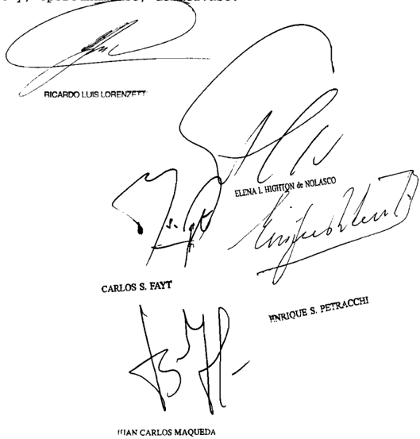

Recurgo de hecho deducido pOr Bboll Argeptine por 91 Dr con 01 patroclnlo lotrado de Jorge Juln

Tribunal de origen: Ponal Bala III\_

que Intervino con anterlorldad: Juzgado Haclonal de Pripara 1o 1o

FRENTE cIVIcO Y SOcIAL S/ cASAcIóN

## DERECHO PUBLICO LOCAL.

Es inadmisible el recurso extraordinario si el superior tribunal provincial desestimó la pretensión del demandado de impugnar y lograr la adjudicación a su parte de tres bancas de diputados provinciales, sobre la exclusiva base de la exégesis de normas locales, en especial de la ley electoral y sus modificaciones, dictadas

al amparo de la constitución provincial, ya que para rechazar los agravios del apelante consideró que el art. 1º de la ley 8506 legitima sin distinción alguna a las alianzas y a los acuerdos electorales como formas de convenio para alcanzar el 3% exigido por el art. 87 de la Constitución de la Provincia de La Rioja.

-Del dictamen de la Procuración General, al que remitió la Corte Suprema-.

## PARTIDOS POLITICOS.

El pronunciamiento que entendió que carecía de sustento legal la pretensión de invalidar los acuerdos electorales que tenían el alcance de 'acuerdo de boleta' para aprobar únicamente la figura electoral denominada 'alianza' está desprovisto de la adecuada fundamentación para ser considerado como un acto judicialmente válido al rechazar el planteo con aptitud para provocar una grave afectación directa e inmediata de la forma representativa de gobierno, del debido proceso, del ejercicio de los derechos políticos y de la garantía de los partidos políticos, proclamados y tutelados por la Constitución Nacional (arts. 1º, 5º, 18, 37 y 38) al omitir examinar un argumentos serio y conducente para la adecuada solución de la causa, como lo es el relativo a la necesidad de determinar si la 'franquicia' de la ley 8461 de la Provincia de La Rioja resulta extensible o no a los partidos provinciales (Disidencia del Dr. Ricardo Luis Lorenzetti).

## CONCESION DEL RECURSO EXTRAORDINARIO.

Corresponde declarar la nulidad de la resolución del superior tribunal provincial que concedió el recurso extraordinario si los términos sumamente genéricos del auto de concesión evidencian que ha omitido pronunciarse categórica y circunstanciadamente sobre la observancia de uno de los requisitos esenciales del mismo como es la presencia de una cuestión federal, máxime si la verificación de una tacha de esa naturaleza dio lugar a una respuesta negativa por el superior tribunal para cancelar la apertura de la instancia extraordinaria local (Disidencia de los Dres. Enrique Santiago Petracchi y Juan Carlos Maqueda).

DIcTAMEN DE LA PROcURAcIóN GENERAL

Suprema Corte:

- I -

A fs. 110/116, el Superior Tribunal de Justicia de la Provincia de La Rioja rechazó el recurso de casación articulado por la alianza electoral 'Frente Cívico y Social' y, en consecuencia, confirmó la resolución del Tribunal Electoral de esa provincia del 30 de octubre de 2009, en cuanto desestimó la presentación que aquélla había efectuado, tendiente a

obtener la adjudicación de tres bancas en la Cámara de Diputados de la Provincia mencionada, una por el departamento Chilecito, otra por el departamento Famatina y la restante por el departamento Rosario Vera Peñaloza.

Para así resolver, sus integrantes consideraron aplicable la doctrina de los actos propios, pues entendieron que la pretensión del Frente Cívico y Social -integrado por la Unión Cívica Radical y Unión por La Rioja- de negar legitimidad a los acuerdos electorales efectuados entre partidos provinciales y nacionales a fin de cumplir con el porcentaje requerido por el art. 87 de la Constitución Provincial para acceder a una banca de diputado, implicaba ponerse en contradicción con sus propios actos. Agregaron que, durante el proceso previo a las elecciones, la Alianza Frente Cívico y Social formalizó un acuerdo electoral con el partido provincial Convergencia Riojana a fin de cumplir con la exigencia del mencionado art. 87 y, por lo tanto, no podía válidamente impugnar en esa instancia los acuerdos electorales celebrados por el resto de las fuerzas políticas en las mismas condiciones en que los había concertado ella misma.

Por otra parte, entendieron que el art. 1º de la ley 8506 legitima sin distinción alguna tanto a la alianza como a los acuerdos electorales como formas de convenio entre las fuerzas políticas para alcanzar el 3% de la totalidad de los votos válidamente emitidos exigido por el art. 87 de la Constitución Provincial como piso para acceder a los cargos electivos, por lo que consideraron sin sustento legal la pretensión del Frente Cívico y Social de invalidar los acuerdos electorales que tienen el alcance de 'acuerdo de boleta' y aprobar únicamente la figura electoral denominada 'alianza' para cumplir con el citado precepto de la Constitución local.

Por último, declararon que el recurrente se valió de argumentos imprecisos y genéricos que no logran demostrar a través de una crítica razonada de los fundamentos del fallo, de qué manera los jueces incurrieron en el vicio de contradicción que atribuyó a la sentencia.

Disconforme con este pronunciamiento, la Alianza Frente Cívico y Social dedujo el recurso extraordinario que luce agregado a fs. 122/141, que fue concedido a fs. 161/165.

El recurrente plantea, en síntesis, los siguientes agravios: a) El fallo del Tribunal Superior de Justicia vulnera el art. 87 de la Constitución local, toda vez que convalida la proclamación efectuada por el Tribunal Electoral provincial, de asignar dos bancas de diputado, -una a favor del Movimiento Tercera Posición (MO.TE.PO.) por el departamento Famatina y la otra a favor del Movimiento Norte Grande por el departamento Rosario Vera Peñaloza-, sin haber alcanzado el mínimo del 3% de la totalidad de los votos válidamente emitidos en toda la provincia, tal como lo dispone aquella cláusula constitucional. Relata que, previo al acto electoral, se sancionó la ley 8461, reglamentaria del art. 87 de la Constitución local. Dicha ley autoriza a los partidos y agrupaciones municipales a formalizar alianzas electorales con partidos y agrupaciones provinciales para alcanzar el requisito del 3%. Agrega que a los partidos Movimiento Tercera Posición (MO.TE.PO.) y Movimiento Norte Grande le fueron adjudicadas, a cada uno, una banca por los departamentos arriba mencionados, luego de efectuar, en forma individual, una simple 'acta de adhesión' con el Frente Justicialista del Pueblo, siendo todos los integrantes del acta partidos provinciales. Señala que dicha situación no resulta contemplada por la ley, que sólo prevé la posibilidad de acuerdos entre partidos y agrupaciones municipales con partidos y agrupaciones provinciales, y no acuerdos de partidos provinciales entre sí; b) la adjudicación de la tercera banca por el departamento Chilecito al Partido Justicialista es incorrecta, toda vez que se otorgó en violación del art. 87, tercer párrafo de la Constitución local, que garantiza una banca para la minoría; c) la sentencia recurrida resulta arbitraria, porque no analiza todas las cuestiones que por mandato constitucional debía resolver, como la extensión o no a favor de los partidos provinciales de celebrar acuerdos electorales entre sí. Agrega el recurrente que el fallo tampoco resuelve la impugnación de la adjudicación de las bancas por los departamentos Famatina y Rosario Vera Peñaloza, y sí lo hace respecto de la banca por el departamento Felipe Varela, que nunca fue impugnada por su parte.

En orden a verificar las condiciones requeridas para habilitar la vía del art. 14 de la ley 48, cabe recordar que, en principio, son ajenas a esta instancia el examen de decisiones que resuelven cuestiones regidas por el derecho público provincial, porque son privativas de los tribunales locales, en virtud del respeto debido a las atribuciones de las provincias de darse sus propias instituciones y regirse por ellas

(doctrina de Fallos: 305:112; 324:1721, 2672, entre otros), salvo, claro está, supuestos de arbitrariedad.

Cabe destacar que, de acuerdo con el art. 122 de la Constitución Nacional, las provincias se dan sus propias instituciones y se rigen por ellas. Establecen su régimen electoral, eligen sus gobernadores, sus legisladores y demás funcionarios de provincia, 'sin intervención del gobierno federal'. En este precepto, la palabra 'Gobierno' incluye a la Corte Suprema, a la que no le incumbe discutir las formas en que las provincias organizan su vida autónoma (Fallos: 330:4797).

Sin embargo, la Constitución Nacional, que garantiza a las provincias el establecimiento de sus instituciones, el ejercicio de ellas y la elección de sus autoridades, sujeta a ellas y a la Nación al sistema representativo y republicano de gobierno, impone su supremacía sobre las constituciones y leyes locales y encomienda a la Corte el asegurarlo como custodio de la Ley Suprema. Pero esta intervención está limitada a los casos en que, frente a un evidente y ostensible apartamiento del sentido de las normas de derecho público local, quedan lesionadas instituciones fundamentales de los ordenamientos provinciales que hacen a la esencia del sistema representativo y republicano que las provincias se han obligado a asegurar. Sólo ante situaciones de excepción como la enunciada, la actuación del Tribunal federal no avasalla las autonomías provinciales, sino que procura la perfección de su funcionamiento asegurando el acatamiento a aquellos principios superiores que las provincias han acordado respetar al concurrir al establecimiento de la Constitución Nacional (Fallos: 310:804).

Sobre tales bases, en mi concepto, el recurso extraordinario interpuesto es formalmente inadmisible, ya que por su intermedio la recurrente pretende que V.E. revise una sentencia del Tribunal Superior provincial acerca de una materia que integra el derecho público local, cual es el contenido y alcance de diversas normas de igual carácter que regulan el procedimiento de elección de legisladores locales.

Ello es así, toda vez que el a quo desestimó la pretensión del demandado de impugnar y lograr la adjudicación a su parte de tres bancas de diputados provinciales, sobre la exclusiva base de la exégesis de normas locales, en especial de la ley electoral y sus modificaciones, dictadas al amparo de la Constitución Provincial.

En efecto, para rechazar los agravios del apelante, el Tribunal Superior consideró que el art. 1º de la ley 8506 legitima sin distinción

alguna a las alianzas y a los acuerdos electorales como formas de convenio para alcanzar el 3% exigido por el art. 87 de la Constitución Provincial. De esta forma convalidó los acuerdos celebrados por las agrupaciones políticas, que fueron impugnados por el Frente Cívico y Social. Asimismo, señaló que cada uno de los partidos integrantes del convenio electoral mantiene su respectiva identidad partidaria, por lo que corresponde adjudicar a cada una de las fuerzas políticas una banca para el cargo de diputado provincial, según la cantidad de votos obtenidos en el acto electoral.

Considero que la alzada ha efectuado una interpretación posible de las disposiciones locales, sobre la base de circunstancias comprobadas en la causa, máxime cuando el propio recurrente señala que 'aceptamos la posibilidad de confusión en cuanto al alcance de la norma, atento (a) lo novedoso del sistema y (a) la reciente reforma constitucional' (v. fs. 139). No hay, pues, cuestión federal que autorice a V.E. a intervenir en una decisión referente al procedimiento de elección de legisladores que el art. 122 de la Constitución Nacional confía a las autonomías provinciales.

Por otro lado, el a quo entendió que la pretensión del Frente Cívico y Social, de obtener la declaración de invalidez de los acuerdos electorales celebrados entre partidos provinciales a los efectos de alcanzar el 3% exigido por el art. 87 de la Constitución provincial, resultaba contradictoria con actos anteriores que había llevado a cabo durante el procedimiento electoral, y al hacerlo fundó su decisión en la evaluación que efectuó de las constancias de la causa y de la conducta asumida por el recurrente, aspectos que, por su naturaleza fáctica y procesal, están reservados a los jueces de la causa y, en principio, excluidos de la revisión extraordinaria.

Por otra parte, entiendo que tampoco habilita la instancia extraordinaria la tacha de arbitrariedad introducida en el recurso extraordinario. En mi opinión, contrariamente a lo que sostiene el recurrente, en el fallo se efectuó un adecuado tratamiento de las cuestiones propuestas que satisface lo exigido a los pronunciamientos judiciales, pues aquél cuenta con fundamentación suficiente y constituye una derivación razonada del derecho vigente con aplicación a las circunstancias comprobadas en la causa, todo lo cual descarta el vicio que se le atribuye (Fallos: 315:2969).

En esa inteligencia, se aprecia que los reparos invocados trasuntan una mera disconformidad con aspectos que, por regla, constituyen

materia ajena a esta instancia de excepción, pues se vinculan con cuestiones de derecho público local y procesal, que han sido oportunamente resueltos sobre la base de argumentos que, al margen de su acierto o error, no compete a la Corte revisar (Fallos: 326:1877).

En efecto, el recurrente se agravia de que la sentencia omite tratar el agravio relativo a la extensión o no a los partidos provinciales de la posibilidad de celebrar acuerdos electorales entre sí a los efectos de alcanzar el 3% prescripto por el art. 87 de la Constitución local, agravio en el que fundamentó la impugnación de la proclamación de los diputados electos por los departamentos Famatina y Rosario Vera Peñaloza. Sin embargo, en mi opinión, el pronunciamiento recurrido se refirió a ese aspecto al considerar aplicable la doctrina de los actos propios, es decir que el tribunal entendió que el recurrente incurrió en la misma conducta que reprochó a otras agrupaciones políticas, ya que celebró un acuerdo electoral con el partido provincial 'Convergencia Riojana', y señaló que nadie puede ejercer un comportamiento incompatible con una conducta anterior deliberada, jurídicamente relevante y plenamente eficaz, por lo tanto no hubo por parte del tribunal apelado una omisión de tratamiento del agravio referido como sostiene el recurrente. Por el contrario, él mismo sostiene que 'El Frente Cívico y Social, en el convencimiento -erróneo-, (de) que existía la posibilidad de formalizar acuerdos a los fines del 3% con otros partidos provinciales, celebró acuerdo con el partido Provincial Convergencia Riojana' (v. fs. 139).

No obsta a tal conclusión el hecho de que el a quo se haya referido a la adjudicación del cargo de diputado provincial por el departamento Felipe Varela al Movimiento Norte Grande, y no lo haya hecho respecto de los departamentos Famatina y Rosario Vera Peñaloza, por cuanto el núcleo central del agravio en virtud del cual el recurrente funda su impugnación respecto de estos últimos departamentos (v. recurso de casación, fs. 16/20, en especial fs. 17/18) ha sido tratado por el Superior Tribunal al considerar aplicable la doctrina de los actos propios, máxime cuando tal error pudo haber sido inducido por el propio recurrente (v. fs. 17 vta.).

Por  todo  lo  expuesto,  opino  que  el  recurso  extraordinario  de fs. 122/141 es formalmente inadmisible. Buenos Aires, 27 de abril de 2011. Laura M. Monti .

## FALLO DE LA cORTE SUPREMA

Vistos 1os autos: "Frente Cívico Y Social s/ casación"

## Considerando:

Que esta Corte comparte los fundamentos Y conclusiones del dictamen de senora Procuradora Fiscal, cuyos términos corresponde remitirse en razón de

Por ello, de conformidad con dictaninado por la señora Procuradora Fiscal, se desestima el recurso extraordinario Notifíquese Y devuélvase

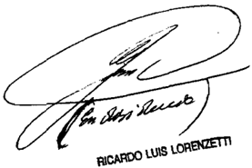

ELENA L HGHTON d NOLASCO

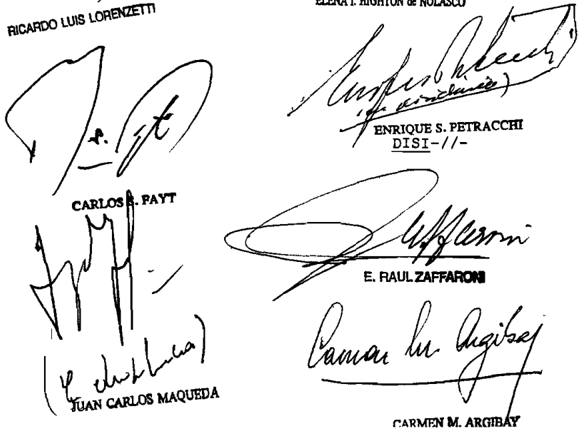

## ~I/-DENCIA DEL SENOR PRESIDENTE DOCTOR DON RICARDO LUIS LORENZEITI

## Considerando

1%) Que en el marco de las elecciones convocadas por el Gobernador de la Provincia de La Rioja para cubrir cargos de diputados provinciales y de concejales municipales (decreto 361/09) el Tribunal Electoral de ese estado local rechazó el pedido fornulado por la alianza electoral Frente Cívico Y Social para que, de las tres bancas de diputado provincial que se disputaban en el Departamento Chilecito, se adjudicara esa alianza la tercera banca en disputa. Al mismo tiempo, dicho tribunal proclamó y consagró la totalidad de las autoridades electas (fs. 4/14)

Que al formular el referido planteo, la agrupa ción denandante argumentó que : (a) al el Frente Justicialista del Pueblo, todos los integrantes del acuerdo "pasaron integrar un mismo frente político jurídico nivel provin cial" Y se colocaron en una posición de "mayoría" la que se alude en el art 87 , tercer párrafo, de la Constitución provincial (b) ello "les permitió, sin dudas , superar el escollo constitucional del 38" de 1os votos previsto en el art\_ 87 , penúltimo párrafo, de la Constitución provincial, (c) la ley 1ocal 8506 únicamente habilita, fines del cómputo del referido 38 la formación de alianzas acuerdos entre partidos agrupaciones municipales Y partidos frentes provinciales, pero no 1os habilita entre un partido provincial Y un partido fren te provincial 322/328 y 388/392) y/o

Que el Tribunal Electoral rechazó el planteo 358/369) con fundamento, por mayoría ~conformada por votos de los vocales Sánchez Ascoeta- , en que: (a) el Partido Justicialista el Frente del Pueblo Chileciteno firmaron un acuerdo de boletas con el Frente Justicialista del Pueblo Y no una alianza; es jurídicamente insostenible concluir que dichas fuerzas políticas constituyan un único idéntico partido; (b) la exigencia del 38 nínimo de 10s votos que debe obtener un partido

político para que uno de sus candidatos pueda ser proclamado Como candidato se hallaba cumplida con los acuerdo de boletas celebradas por las distintas fuerzas políticas participantes en la elección provincial con frentes Y partidos nacionales

Que contra ese pronunciamiento, el Frente Cívico Social interpuso recurso de casación con sustento en la violación de 10 dispuesto en 8461 , modificada por 8506, la manifiesta arbitrariedad en la aplicación de las reglas de la sana crítica, en térninos del art 257 , incs\_ 4 % , del Código Procesal Civil Conercial de La Rioja Solicitó, en definitiva, que se modificara el fallo Y, por consiguiente, se dejara sin efecto la proclamación efectuada de diputados provinciales electos en representación de otras agrupaciones partidarias por los departamentos Chilecito, Rosario Vera Peraloza Famatina\_ ley ley

Por un lado , sostuvo que candidatos proclamados no habían alcanzado el mínimo del 38 de la totalidad de tos válidamente emitidos en toda la provincia exigido por el art\_ 87 , penúltimo párrafo, de la Constitución provincial, para que el candidato pudiera acceder una banca . Tal posición se sustentaba en que la 8461 ~que reglamentaba dicha cláusulas610 autorizaba 10s partidos políticos as agrupaciones municipales para formalizar alianzas acuerdos electorales conceptos que señala como distintos al concepto de "acuerdos de boletas con l0s partidos frentes provinciales con el objeto de computar 1os votos obtenidos por todos 1os integrantes del convenio, los efectos de alcanzar el porcentaje aludido, pero que esa facultad no había sido pensada ni establecida en favor de 10s partidos frentes provinciales, los que pertenecían los diputados provinciales proclamados. ley

Por otro lado, su entender de las tres bancas en disputa en los comicios en cuestión en el Departamento Chilecito, s610 an adjudicarse la mayoría dos de ellas, porque la tercera banca, por nandato del 87 , tercer párrafo de la Constitución de la provincia, debía adjudicarse al Frente Cívico podí

Social por constituir la primera ninoría (fs\_ 16/20 ampliación de fs 25/27) \_

Que el Superior Iribunal de Justicia local descartó la concurrencia de supuestos invocados por recurrente al fundar el recurso de casación Y , en consecuencia, rechazó (fs. 110/116)

El pronunciamiento hizo pie, en sustancial, en la doctrina de los actos propios, porque el apelante había celebrado con el partido local Convergencia Riojana un acuerdo idéntico al que impugnaba Y con ese modo de proceder había podido acceder diferentes bancas legislativas Sin perjuicio de ello, el tribunal quo precisó que el art 10 de 8461 , modificada por 1a 8506, legitimaba tanto las alianzas como los acuerdos electorales como formas de convenio entre las fuerzas políticas para alcanzar el porcentaje mínimo de votos exigido por el art 87 de la Constitución provincial \_ Por ello, entendi6 que carecía de sustento legal la pretensión del apelante de invalidar los acuerdos electorales que tenían el alcance de "acuerdo de boleta" para aprobar únicamente la figura electoral denoninada "alianza" ley ley

Adujo, además , que el recurrente se había valido de argumentos imprecisos Y genéricos que no lograron demostrar, través de una crítica razonada Y prolija de los fundamentos del fallo del Tribunal Electoral, de manera los jueces habían incurrido en el vicio de arbitrariedad que atribuía la sentencia qué

70 ) Que contra ese pronuncianiento el Frente Cívico Social interpuso recurso extraordinario federal (fs\_ 123/141, replicado fs 149/158) que fue concedido (fs 164 ) en el que invocó 1a presencia de una cuestión federal exclusivanente con figurada por resultar de aplicación doctrina de esta Corte en materia de sentencias arbitrarias, con directa afectación del sistema representativo, del principio de soberanía popular Y de as garantías superiores consagradas respecto del ejercicio de los derechos políticos Y de defensa en juicio, consagrados en la

Constitución Nacional Asimismo, alegó la existencia de gravedad institucional

8 % ) Que , efectivamente, en el caso se configura un supuesto que justifica la apertura de la instancia extraordinaria, en la medida en que la sentencia apelada, desprovista de la adecuada fundamentación para ser considerada como un acto judicialmente válido, ha rechazado el planteo formulado por la parte actora, con aptitud para provocar una grave afectación directa inmediata de la forma representativa de gobierno, del debido proceso , del ejercicio de los derechos políticos de la garantía de políticos, proclamados Y tutelados por la Constitución Nacional (arts. 10 18 , 37 Y 38 )

Ciertamente, de un lado el tribunal quo onitió, lisa Y llanamente, exaninar un argumento serio conducente para la adecuada solución de la causa , comO es el relativo la necesidad de deterninar si la "franquicia" de la 8461 (así denoninada por la parte actora) resulta extensible, no, los partidos provinciales\_ ley

Y, de otro lado, mediante afirmaciones dogmáticas . aplicó la doctrina de actos propios como obstáculo para inpugnar 1os acuerdos electorales firmados por las restantes fuerzas políticas en las mismas condiciones en que lo hizo la alianza actora, más en dicha aplicación prescindió de analizar la concurrencia de los presupuestos que la habilitan, tales como la conducta jurídicamente relevante Y la identidad de los sujetos que actúan Y se vinculan en la conducta anterior.

Cabe recordar que este Tribunal ha indicado que la aplicación de 1a doctrina de 1os actos propios requiere que exista identidad subjetiva, esto es identidad entre el sujeto del que emana un acto que posteriornente realiza una conducta contradictoria, de manera que ambos comportamientos hayan sido seguidos resulten imputables una misma persona , Y la contradicción se configure dentro de una misma situación relación jurídica 0 , expresado con otras palabras , dentro de un nismo "círculo de intereses" (Fallos: 325:1787) También ha senalaque

do que para atribuir la conducta valor de regla es preciso que ella se exteriorice mediante acciones deliberadas , jurídicamente relevantes para implicar las consecuencias que de ella se pretenden extraer, Y plenamente eficaces (Fallos 313:367 315:865) , ya que de contrario, asumir un deterninado comportamiento de hecho derivaría, sin más, en la imposibilidad de mo dificarlo en 1o sucesivo (Fallos: 326:1851) .

Dicha doctrina, además , debe ser interpretada pruden cialmente, sin extender desmesuradanente sus alcances, porque dicho concepto requiere que nedie cumplinento voluntario que pueda entenderse cono una renuncia al cuestionamiento ulterior de 1a regla (Fallos: 331:241, disidencia de 1os jueces Lorenzetti Y Maqueda) un

Por ello, oída señora Procuradora Fiscal, se declara procedente el recurso extraordinario Y se deja sin efecto la sentencia apelada Vuelvan autos al tribunal de origen para que dicte un nuevo pronunciamiento con arreglo al presente\_ tifíquese oportunamente, fenítase No-

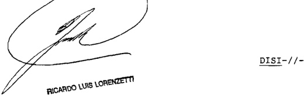

~I/-DENCIA DE LOS SEÑORES DOCTORES DON ENRIQUE SANTIAGO PETRACCHI DON JUAN CARLOS MAQUEDA

## Considerando:

1%) Que en el marco de las elecciones convocadas por el Gobernador de la Provincia de La Rioja para cubrir cargos de diputados provinciales Y de concejales municipales (decreto 361/09) el Tribunal Electoral de ese estado local rechazó el pedido formulado por la alianza electoral "Frente Cívico Y So-

cial" para que de las tres bancas de diputado provincial que se disputaban en el Departamento Chilecito, se adjudicara esa alianza la tercera banca en disputa. Al mismo tiempo, el tribunal proclamó Y consagró la totalidad de las autoridades electas (fs. 4/14)

Que contra ese pronuncianiento, el "Frente Cvico Y Social" interpuso recurso de casación con sustento en la violación de lo dispuesto en la 8461, modificada por 8506, Y manifiesta arbitrariedad en la aplicación de las reglas de la sana crítica, en términos del art 257 , incs 4% , del Codigo Procesal Civil Y Comercial de La Rioja. Solicitó, en definitiva, que se modificara el fallo Y, en consecuencia, se deje sin efecto la proclamación efectuada de diputados provinciales electos en representación de otras agrupaciones partidarias por los departamentos Chilecito, Rosario Vera Peñaloza Y Famatina ley ley

Por un lado, sostuvo que 1os candidatos proclanados no habían alcanzado el mínimo del 38 pOr ciento de la totalidad de los votos válidamente emitidos en toda la provincia exigido por el art. 87 , penúltino párrafo, de la Constitución Provincial, para que el candidato pudiera acceder una banca \_ Tal posición se sustentaba en que la 8461 ~que reglamentaba dicha cláusulas610 autorizaba los partidos políticos las agrupaciones municipales para formalizar alianzas acuerdos electorales provinciales con el objeto de computar votos obtenidos por todos los integrantes del convenio, los efectos de alcan zar el porcentaje aludido, pero que esa facultad no había sido pensada ni establecida en favor de los partidos frentes provinciales, que pertenecían los diputados provinciales proclamados ley 1os

La segunda cuestión radicaba en que, su entender de las tres bancas en disputa en 1os comicios en cuestión en el Departamento Chilecito, s610 an adjudicarse mayoría dos de ellas, porque 1a tercera banca , por mandato del art 87 tercer párrafo de la Constitución de la provincia, debía adjudicarpodí

se al Frente Cívico Social por constituir la primera ninoría (fs. 16/20 Y ampliación de fs . 25/27)

Que el superior tribunal local descartó la concurrencia de los supuestos casatorios invocados por la recurrente Y, en consecuencia, rechazó el recurso interpuesto (ver sentencia de fs \_ 110/116)

El pronunciamiento hizo pie, en sustancial, en doctrina de actos propios, porque el apelante había celebrado con el partido local Convergencia Riojana un acuerdo idéntico al que impugnaba Y con ese modo de proceder había podido acceder diferentes bancas legislativas Sin perjuicio de ello, el tribunal quo precisó que el art 1 0 de la 8461 , modificada por la 8506, legitimaba tanto las alianzas como los acuerdos electorales comO formas de convenio entre las fuerzas políticas para alcanzar el porcentaje de votos exigido por el art\_ 87 de la Constitución provincial\_ Por ello, entendió que carecía de sustento legal la pretensión del apelante de invalidar acuerdos electorales que tenían el alcance de "acuerdo de boleta" para aprobar únicamente la figura electoral denoninada "alianza" ley ley

Adujo, adenás , que el recurrente se había valido de argumnentos imprecisos genéricos que no lograron denostrar, través de una crítica razonada Y prolija de fundamentos del fallo del Tribunal Electoral, de manera 1os jueces habían incurrido en el vicio de arbitrariedad que atribuían sen tenciaqué

4 % ) Que contra tal pronunciamiento el "Frente Cívico Y Social" interpuso el recurso extraordinario federal de fs 123/141, en el que invocó 1a presencia de una cuestión federal exclusivamente configurada por resultar de aplicación la doctrina de esta Corte en materia de sentencias arbitrarias, con directa afectación del sistena representativo, del principio de soberanía popular Y de las garantías superiores consagradas pecto del ejercicio de derechos políticos Y de defensa en

juicio, en 1os arts. 1' 5" 18 , 37 Y 38 de Constitución Na -cional\_ Asimismo, alegó la existencia de gravedad institucional

5 % ) Que el superior tribunal provincial ~pese no haber detectado en la sentencia recurrida ninguna cuestión titucional que le permitiera habilitar la instancia extraordina ria local Y, por el contrario, haber subrayado la presencia de defectos de fundamentación en el recurso de casación que obstaban su adnisibilidad formal\_ concedió el recurso federal del art 14 de la ley 48 \_ Para fundar esta decisión afirmó ~en el caso, al haberse denunciado el pronunciamiento por lesión 10s derechos de defensa en juicio, violación del sistena representativo y las garantías constitucionales para el ejercicio de los derechos políticos, pronoviendo gravedad institucional importan agravios de magnitud que motivan considerar cumplido el recaudo exigido para la apertura de la instancia por ante la C.S.J.N. (fs 164) que

Que esta Corte ha tenido oportunidad de declarar, con énfasis y reiteración, la nulidad de resoluciones por las que se concedían recursos extraordinarios cuando ha constatado que aquéllas no daban satisfacción un requisito idóneo para la obtención de la finalidad que se hallaba destinado (art\_ 169 , segundo párrafo, del Codigo Procesal Civil y Comercial de la Na ción; Fallos: 310:2122 Y 2306; 323:1247; 330:4090 331:2302)

Que los términos sumamente genéricos del auto de concesión evidencian que el tribunal quo ha omitido pronun ciarse categórica Y circunstanciadamente (con toda menudencia, sin omitir ninguna circunstancia particularidad, según la definición de la Real Academia) sobre la observancia de uno de los requisitos esenciales del recurso extraordinario, cual es ~en el caso la presencia de una cuestión federal de la naturaleza invocada por la recurrente

En efecto, frente situaciones substancialmente análogas la examinada en el sub lite, este Iribunal ha afirmado

que si bien incumnbe exclusivamente él juzgar sobre la existencia, 0 no, de un supuesto de arbitrariedad de sentencia (Fallos: 215:199)\_ no es menos cierto que ello no exime judiciales llanados expedirse sobre la concesión del recurso extraordinario federal, de resolver circunstanciadamente si tal apelación ~prima facie valoradacuenta respecto de cada uno de agravios que la originan con fundamentos suficientes para dar sustento, la luz de conocida doctrina de esta Corte, a invocación de un caso de ineguívoco carácter excepcional, como lo es el de arbitrariedad (Fallos: 310:1014; 313;934; 317:1321; 323:1247 ; 325:2319; 329:4279; 331:1906 Y 2280 ; entre otros) máxine si la verificación de una tacha de esa naturaleza dio lugar una respuesta negativa por el superior tribunal para cancelar la apertura de la instancia extraordinaria local (causa 5.911.XIV "Sandoval, Juan Carlos s / recurso de queja" sentencia del 19 de mayo de 2010)

Que el fundamento de dichos precedentes se asienta en que , de seguirse una orientación opuesta, el debería admitir que su jurisdicción extraordinaria se viese, en principio, habilitada denegada sin razones que avalen uno otro resultado, cual infringe un claro perjuicio al derecho de defensa de los litigantes al adecuado servicio de justicia de la Corte (Fallos 323:1247; 325:2319; 331:1906; 332:2813; Y 333:360 , entre otros)

9 Que , por último, la invocación genérica de la excepcional doctrina de 1a gravedad institucional ~sin precisar, por otro lado, de manera el control judicial de la adjudicación de bancas en un procediniento electoral provincial podría afectar el funcionamiento de las instituciones de la provincia invocado por el apelante- importa desconocer la doctrina de esta Corte de acuerdo con cual la presencia de aquella situación de excepción no constituye una causal autónona de procedencia del recurso, Y facultaría este Tribunal para prescindir de ciertos recaudos fornales frustratorios pero no para tomar intervención en asuntos en los que no se ha verificado la qué pre-

sencia de una cuestión federal (doctrina de Fallos: 311:120 Y 1490 Y 333:360 , entre otros)

Por ello, se declara la nulidad de la resolución por la que se concedió el recurso extraordinario (fs 161/165) Devuélvanse las actuaciones al tribunal de origen fin de que se dicte una nueva decisión sobre el punto con arreglo la presente Notifíquese Y renítase

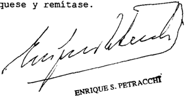

MAQUEDA

CARLOS

JUAN

Recurso extraordinario interpuesto por el Cívioo representado Julío con el patrocinio letrado d 01gu In6e Doria

Iraslado contestado pOr el "Partido d L Rioje" representado pOr Jun Manuel Ártico, con el patrocinio letrado dol Dr Job6

Iribunal de origen: Tribunal Suporior de Jubticia

Iribunales que intervinieron con anterioridad: Elactoral de L Rioja.

PETROBRAS ENERGIA S.A. (TF 24098-A) c/ DGA

## DERECHOS DE EXPORTACION.

Resulta evidente que el empleo del oleoducto no podía ser incluido entre los medios de transporte por vía acuática, ni mucho menos entre los de la vía aérea, por lo que cabía aplicar lo normado por el inc. c) del art. 736 del Código Aduanero vigente en ese momento, previsto para el transporte por superficie terrestre, en cuanto establecía que debían incluirse los gastos ocasionados hasta el lugar en que se cargare la mercadería con destino al exterior, que en el caso de los ductos, debió ser interpretado como el lugar en el cual se introduce en su circuito, en el cual el fluido fue inyectado, con independencia del ámbito en el cual se realizara el respectivo control o medición aduanera.

-Del dictamen de la Procuración General, al que remitió la Corte Suprema-.

## FALLOS DE LA CORTE SUPREMA 335

## DIcTAMEN DE LA PROcURAcIóN GENERAL

## Suprema Corte:

- I -

A fs. 177/180, la Sala II de la Cámara Nacional de Apelaciones en lo Contencioso Administrativo Federal, al confirmar la sentencia del Tribunal Fiscal de la Nación (fs. 123/130), mantuvo lo decidido por la Dirección General de Aduanas en la resolución 56/02 (AD RIGA), del 5 de octubre de 2007, en cuanto había condenado a Petrobrás Energía S.A. al pago de una diferencia por tributos adeudados y aplicado una multa en razón de haberla encontrado incursa en lo previsto y reprimido por los incs. a) y c) del art. 954 del código aduanero en una operación de exportación de petróleo crudo por ductos.

La posición del fisco se fundó en la supuesta declaración incorrecta de la base imponible, al no haberse incluido en ella el costo del flete entre el punto en el cual la mercadería fue inyectada y la frontera, en contra de lo dispuesto por los arts. 735, 736 y cc. del citado código -según su texto anterior a la reforma de la ley 25.986-.

Señaló primeramente que al momento en que se produjo la operación, cuyo permiso definitivo se oficializó el 2 de julio de 2002 (confr. sobre obrante a fs. 111), el art. 736 del código citado no preveía expresamente el transporte por oleoductos. Por tal razón, agregó, la Aduana dictó la instrucción general 51/02, del 28 de junio de 2002 (ver copia a fs. 86), para determinar el valor imponible de las operaciones realizadas por tales conductos. Luego, con la sanción de la citada ley 25.986 (B.O. 5/1/05), se introdujo el inc. d) a ese artículo, regulando expresamente lo referido a tal tipo de transporte.

Sin perjuicio de ello, estimó que era correcta la postura asumida por el ente recaudador, ya que tanto el art. 736, inc. c), como dicha instrucción general hacían alusión al lugar en que se cargare la mercadería en el automotor o ferrocarril con destino al exterior.

Por ende, entendió que la discrepancia se suscitaba en torno a determinar cuál es 'el lugar de carga' con destino al exterior, es decir si es el sitio en el que se introduce la mercancía en el ducto, o bien el lugar en que el servicio aduanero hace el control de las mediciones en frontera.

Así, adujo que el flete interno o peaje del ducto debía incluirse a los efectos de determinar el derecho de exportación, hasta el momento en que se produjese la salida al exterior.

Por último, consideró que al haberse omitido el costo del flete en la liquidación realizada, se configuró la infracción del art. 954 de la ley 22.415.

- II -

La actora interpuso el recurso extraordinario que obra a fs. 184/197, el cual fue concedido a fs. 211.

Se agravia, en primer lugar, porque la sentencia apelada realiza una interpretación errónea -a su juicio- de los arts. 736 y cc. del código de la materia -con su texto anterior a la reforma de la ley 25.986-, ya que concluye que el lugar de carga con destino al exterior es el punto de control de las mediciones en frontera.

Por otra parte, arguye que, aun admitiendo por hipótesis dicha inteligencia, la falta de inclusión de los gastos de flete entre los tramos señalados no configura, en la especie, una infracción punible de acuerdo con el art. 954, ya que la declaración fue completa y veraz, y la diferencia no pudo haber pasado desapercibida para la Aduana.

- III -

A mi modo de ver, el remedio extraordinario es formalmente admisible toda vez que se ha puesto en tela de juicio la interpretación de normas de carácter federal (arts. 736 y cc., y 954 de la ley 22.415, con su texto anterior a la ley 25.986; instrucción general 51/02 de la DGA) y la sentencia definitiva del superior tribunal de la causa es contraria al derecho que el recurrente ha sustentado en ellas (art. 14, inc. 3º, ley 48).

El primer agravio de la recurrente remite al estudio de los arts. 735, 736 y cc. de la ley 22.415 según su texto en vigor al momento de realizarse la operación de exportación de hidrocarburos con destino a Chile,

aquí en crisis, documentada el 2 de julio de 2002, y efectuada mediante la utilización de un oleoducto.

En efecto, el art. 735 establece que para la aplicación del derecho de exportación ad valorem , el valor imponible de la mercadería exportada para consumo por vía terrestre es el valor FOT o FOR -dependiendo del medio de transporte empleado-.

Por su parte, el texto del citado art. 736 vigente en ese momento contenía sólo tres incisos -cuyos textos han permanecido sin modificación-, y que permitían determinar cuáles eran los gastos que debían incluirse dentro del valor computable como base imponible, distinguiendo según el transporte se efectuase por aire, agua o tierra.

Tengo para mí que resulta de toda evidencia que el empleo del oleoducto de que aquí se trata no podía ser incluido entre los medios de transporte por vía acuática, ni mucho menos entre los de la vía aérea. Por ende, únicamente cabía aplicar a su respecto lo normado por el inc. c), previsto para el transpone por superficie terrestre, en cuanto establecía -si bien mencionando expresamente a los automotores y a los ferrocarriles- que debían incluirse los gastos ocasionados hasta el lugar en que se cargare la mercadería con destino al exterior, sin hacer mención alguna, por cierto, al sitio en el que la Aduana realizare la última medición en frontera, tal como erróneamente pretende hacerle decir el a quo .

En tal orden de ideas, tengo para mí que el 'lugar donde se cargare la mercadería' es el sitio en el cual ella es colocada en el medio de transporte. En el caso de los ductos, será el lugar en el cual se introduce en su circuito que, en el supuesto de autos corresponde al sitio en el cual el fluido fue inyectado, con independencia del ámbito en el cual se realizara el respectivo control o medición aduanera.

En este punto es prudente recordar que cuando una ley es clara y no exige mayor esfuerzo interpretativo, no cabe sino su directa aplicación (Fallos: 320:2145, cons. 6º y su cita), y que es adecuado dar a las palabras de la ley el significado que tienen en el lenguaje común (Fallos: 302:429), o bien en el sentido más obvio del entendimiento común (Fallos: 320:2649).

Además, esta tesitura fue la brindada por la propia demandada al dictar la instrucción general 51/02, la que ha pretendido desconocer aquí sin dar fundamento alguno para ello. En dicho acto tuvo en con-

sideración que la legislación aduanera 'no ha definido expresamente el valor imponible para operaciones efectuadas a través de ductos' y que, 'en virtud a su similitud con la vía terrestre y lo usual que resulta su utilización para la exportación de petróleo, gas y energía eléctrica' , correspondía instruir a su respecto. Así, ordenó que, para la determinación del valor imponible, debía incluirse la totalidad de los gastos hasta el lugar en que la mercadería se cargase con destino al exterior, aplicando citado inc. c) del art. 736.

Según lo veo, el resultado al que se arribaba era idéntico que el logrado en el caso en que el transpone del fluido se hubiera hecho con camiones o por vía férrea, ya que en los tres supuestos resultaba anodino el hecho de cuál hubiera sido la Aduana ante la cual se hubiera documentado la operación, como de la distancia a la frontera, o bien del lugar en que el ente recaudador hubiera realizado la última medición en frontera.

Si bien con lo hasta aquí señalado estimo que basta para solucionar la controversia, a mayor abundamiento destaco que fue recién con modificación introducida por la ley 25.986 que se consagró la tesitura sostenida aquí por la demandada, al incorporar el inc. d) en el art. 736 del código, el que prevé separadamente el supuesto de utilización de ductos, y obliga a incluir la totalidad de los gastos ocasionados 'hasta el lugar en que practicara la última medición de embarque' para la mercadería exportada a través de ellos.

Del debate parlamentario de dicha ley se desprende que se trató de la introducción de una norma novedosa, para regular una situación no reglada específicamente con anterioridad, y para que se pudiera fijar el valor imponible de la mercadería exportada, incrementando la base imponible, al obligar a incluir los gastos totales hasta el lugar donde se practica la última medición, que por lo común es un lugar físico desde donde ya no se puede derivar al mercado interno (ver intervención de la diputada Fadel en la sesión de la Cámara de Diputados del 1º de diciembre de 2004; y del senador Capitanich en la sesión del Senado del 16 de diciembre de 2004).

- V -

En último término, resta señalar que, en atención a la forma en que se dictamina, deviene inoficioso el tratamiento del restante agravio de la actora, fincado en la aplicación de una multa con fundamento en el art. 954 de la ley 22.415.

Por lo hasta aquí expuesto, opino que se debe hacer lugar al recurso extraordinario y revocar la sentencia apelada. Buenos Aires, 11 de mayo de 2011. Laura M. Monti .

## FALLO DE LA cORTE SUPREMA

Buenos Aires,

Vistos los autos: "Petrobras Energía SA 24 . 098-A) c/ DGA"

## Considerando:

Que las cuestiones planteadas han sido adecuadamente consideradas en el dictamen de la seiora Procuradora Fiscal\_ cu Yos fundamentos son compartidos por el Tribunal, Y los que corresponde remitirse en razón

Por ello, de confornidad con dictaninado por la seiora Procuradora Fiscal, se declara formalmente procedente el recurso extraordinario Y se revoca sentencia apelada Con costas Notifíquese devuélvase-

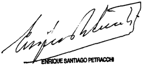

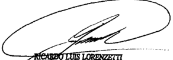

Interpone recurso extraordinario interpuesto: represen tada el Dr . Juan Patricio Cottor

Traslado contestado por 1a Ganeral deAduanas , representada por Dra

Tríbunal de origen II de la Camara 1o Conten-

Iribunal que intervino con anterloridad: IrLbunal de 1a Naolón .

## HOJA COMPLEMENTARIA

Hoja incorporada a los efectos de permitir la búsqueda por página dentro del Volumen.

## MARZO

## BJ SERVIcES S.R.L. (TF 22368-I) c/ DGI

## IMPUESTO A LAS GANANCIAS.

Cuando el art. 73 de la ley del impuesto a las ganancias alude a las operaciones realizadas en 'interés de la empresa' recaudo estrechamente ligado al establecido en la reglamentación acerca de que la presunción operará si los fondos entregados en calidad de préstamo no responden a operaciones propias del 'giro de la empresa', no se refiere al interés del conjunto económico sino al del sujeto al que se encuentra dirigida la norma, esto es, la sociedad de capital que efectúa la disposición de fondos o bienes, sin perjuicio de ponderarse en cada caso la existencia de modalidades comerciales peculiares que podrían derivarse de esa vinculación económica, mediante un exhaustivo examen de la causa que originó la entrega de los fondos o bienes, y de la correlativa contraprestación por parte de quien los receptó.

-Del precedente F 260 XLIII 'Fiat Concord S.A. (TF 16778-I) c/ DGI', sentencia de la fecha, al que remitió la Corte Suprema-.

## IMPUESTO A LAS GANANCIAS.

Cabe confirmar la sentencia que ratificó la resolución por la cual el organismo recaudador impugnó las declaraciones juradas del impuesto a las ganancias presentadas por la actora, determinó de oficio su obligación por tal tributo, liquidó intereses e intimó al pago -aplicando una multa en los términos del art. 45 de la ley 11.683-, ya que no son atendibles las argumentaciones del apelante relativas a que, por aplicación del principio de la realidad económica (art. 2º de la ley 11.683), la disposición de fondos efectuada debe ser considerada como una distribución de dividendos, dado que aquél se ciñe a indicar que la sentencia utiliza un razonamiento puramente formal, sin refutar concretamente las conclusiones de los tribunales de las instancias anteriores, en el sentido de que no han sido cumplidos los recaudos exigidos por la ley de sociedades 19.550 (arts. 68 y 234) para proceder a aquella distribución, pues teniendo en cuenta el tipo societario adoptado por la actora en esa época -sociedad anónima-, el único órgano habilitado para decidir el destino de los resultados no asignados era la asamblea de accionistas, en tanto los fondos no pertenecen a éstos sino a la sociedad.

## IMPUESTO A LAS GANANCIAS.

Cabe confirmar la sentencia que ratificó la resolución por la cual el organismo recaudador impugnó las declaraciones juradas del impuesto a las ganancias pre-

sentadas por la actora, determinó de oficio su obligación por tal tributo, liquidó intereses e intimó al pago -aplicando una multa en los términos del art. 45 de la ley 11.683-, pues el agravio de la recurrente acerca de que no resulta aplicable al caso la tasa de interés contenida en el art. 73 de la ley del impuesto, sino la contemplada en el art. 155 del mismo ordenamiento debe desestimarse, dado que no concurren en el caso los presupuestos de hecho previstos en la norma citada en último término, y según ha quedado establecido en el pleito, se trata de fondos que reconocían su origen en las utilidades obtenidas por la sociedad actora en el país, cuya disposición se efectuó en éste, aun cuando en forma inmediata hayan sido transferidos a una cuenta en el exterior.

## FALLO DE LA cORTE SUPREMA

## Buenog Aireb, 6

Vistog 108 autos "BJ Serviceg SRL (TF 22.368-I) c/ DGI"

## Considerando:

1') Que el Tribunal de la Nación confirmó 1a resolución por la cual el organibmo recaudador impugnó declaracioneb juradas del impuebto lag gananciag correbpondienteb 108 períodog 1997 , 1998 Y 1999 presentadag por la actora, determinó de oficio su obligación por tal tributo, liquidó interebeg, intimó el pago de sumas correbpondienteb, Y aplicó una multa con en el art. 45 de ley 11.683 (t.0. en 1998 Y

2%) Que para decidir en el Bentido indicado congideró correcta la aplicación del art 73 de la del mencionado impuesto 20 . 628 t.0 . en 1997) realizada por la Admfnibtración Federal de Ingresog Públicog\_ en tanto esa norma prebume Bin admitir prueba en contrario, que lag dibpobicioneg de fondob efectuadas favor de tercerog por parte de sujetob compren didog en el art 49 inc a, del citado texto legal , Y que no respondan operacioneg realizadas en interéb de la empreba , conbtituyen una ganancia gravada equivalente un de pitalización anual no menor al fijado por el Banco Nación Argen tina para comercialeg ley (ley

30 ) Que en primer término, el Tribunal Fiscal Beñaló que 108 movimientog de fondos registradog en la contabilidad cuestionada por la autoridad fiscal\_ gegún 1o expresado por la actora tendrían origen en utilidadee líquidag Y realizadas provenientes de la actividad de la empresa , para lag que no hab ía aplicación en el paíB razón por la que golicitud del accionista principal ("B.J\_ USA" ) , fueron transferidas al exterior para su utilización por Bociedades del grupo en el lugar que resultara más rentable para el conjunto económico (fs 308/308 vta. ) \_ Destacó que segun la descripción efectuada por aquella, "B.J\_ Services" Argentina enviaba fondog exceden teb su cuenta bancaria en el exterior (USA) Y desde allí [eran] transferidos diariamente una cuenta cuyo titular e8 "B.J.Panamá" entidad que su vez [trangfería] 108 fondos "B.J\_ USA" Acotó que la casa matriz. solamente le dio instrucciones para efectuar transferencias 'B.J\_ Panamá Y no otras sociedades del grupo" Y que segun regultaba de 108 resúmeneg bancarios de la cuenta corriente del exterior , las transferencias efectuadas desde Argentina por "B.J\_ Services Be realizaban través de un banco argentino\_ Y en el mismo día en fondos eran acreditadog en la cuenta , se transferían 1a cuenta bancaria de "B.J\_ Panamá" dando el saldo siempre en cero 308 vta. ) que que-

4 0 ) Que al respecto el mencionado tribunal negó resulte pertinente tratar las remesas fondos efectuadas por 1a actora favor de una sociedad perteneciente al mismo grupo económico como distribución de utilidades pueg para ello resul ta necegaria la decisión de la asamblea , Begún dispuesto por la 19.550 , recaudo que no puede tenerbe por suplido por las instrucciones de un "manual" ~elaborado por la matriz real modo en deben proceder lag integranteg del grupo económico con 10s excedentes de fondos obtenidos por cada empresa local Y que no tengan aplicación en el donde que ley que

5') Que , por otra parte, juzgó que era inaplicable el principio de la realidad económica invocado por la actora. Con

relación ello; entendió que la luz del tipo Bocietario elegido Y ante la inexistencia de decisionee que hubieran aprobado de utilidades , razoneb alegadae por la recurrente llevaban la convicción de que pobición de fondog respondió al interéb económico Y al comercial Y polftico del grupo económico, Y no al interéb de la actora

Que por último, con relación la impugnación de la taba de interée, Beñaló que fondos fueron en la Republica Argentina, Y luego 1a cuenta coordinadora ~bituada en el con lo que tampoco en ebte tido argumentob la apelante pueden prouperar Y con relación interebes rebarcitoriog señaló que éBtob conbtituyen una indemnización debida al Figco como resarcimiento por 1a mora en ha incurrido el contribuyente Bin que en el cago demoutrado que la mora no le era imputable, según el criterio de precedentes de ege tribual. concordanteb con el ebtablecido por la Corte en el cago "Citibank" fallado el 1 0 de junio de 2000 Por otra parte confirmó la multa impuebta por el organibmo fibcal pueb consideró acreditada la materialidad de la infracción debcripta en el art de la ley 11 .683 Y, lo exprebó, no exibtfa causal exculpatoria alguna \_ que

70 ) Que la Sala V de la Cámara Nacional de Apelaciones en Contencioso Administrativo Federal confirmó dicha sen-tencia\_ Para así decidir, consideró ante la invocación del principio de realidad económica por parte de la actoraque no hubo intención real de ésta de distribuir dividendos no s610 porque no existieron utilidades que pudieran ser distribuidas en 1os por la sino, anteb bien, en la medida en que no hubo una expresión de la voluntad societaria en el sentido indicado (arts 68 Y 234 de la 19 550) Por otra parte, puso de relieve que fondos no fueron remitidos la casa matriz sino una gociedad panameña ley ley

8 0 ) Que contra así rebuelto, la actora interpuso recurso ordinario de apelación 357) , que fue concedido

fs 358 \_ El memorial de agraviog obra fs 364/376 Y su contestación fs 379/384 La apelación planteada es formalmente admisible puesto se dirige contra una sentencia definitiva dictada en una causa en que la Nación es parte, Y el valor disputado en último término sin accesorios excede el mínimo legal previsto por el art 24 , inc ap del decreto-1285/58 Y la resolución 1360/91 de esta que ley

90 ) Que cuestión central debatida el sub exami ne resulta sustancialmente análoga considerada Y rebuelta por el Tribunal en la sentencia dictada en la fecha en la causa F.260 .XLIII "Fiat Concord S .A (TF 16.778-I) c/ DGI" cuyos fundamentos corresponde remitirse en 1o pertinente por razones de

10) Que , en efecto, 1a doctrina establecida en el ca8 0 Y 90 de la sentencia del Iribunalconduce debebtimar 1o8 agraviog de la apelante relatique la diepogición de bieneb entre integran un mismo conjunto económico no puede Ber conbiderada como efectuada favor de "tercerob" en 108 términob del art 73 de 1a ley del gravamen , Y que el interéb de empreba" ~al que alude dicho artículo Bea el del conjunto Y no el del Bujeto al que Be encuentra dirigida la norma , esto e8 , la Bociedad de capital que efectúa la dispogición de fondos bieneb\_ Sin perjuicio de que comno fue geñalado en aquel fallo con respecto este deba Ber ponderado, en cada caso , la existencia de modalidadee comercialee peculiareb que podrfan derivarge de eba vinculación económica, mediante un exhaustivo examen de la cauba que originó entrega de 109 bieneb , Y de la correlativa contraprebtaci por parte de en 6n

En el Ca8o , puebto que como 10 expone 1a recurrente, remegag de fondos obedecerfan una práctica egtablecida pa todae lag emprebag del grupo en el "Manual de cas /Procedimientos de Contabilidad Internacionaleg" con nalidad última de que utilidades obtenidas por la sociedad local puedan ser utilizadas por otras sociedades integrantee del ra

mibmo conjunto económico, según el criterio de asignaclón de que decida 1a caga (ver en el Cuerpo Determinación de Oficio 2 , 306 del Informe Final de Y 308/308 vta. ; 364 vta . Y 371 vta de autog principaleb) no puede entenderge que eba operación haya sido realizada en interée de la empreba actora

11) Que tampoco puede prosperar el agravio relativo que 1ob jueceg de grado han omitido considerar que el art de la ley del gravamen ~último párrafo , excluye de la presunción establecida en norma aquellog supuestog descriptos en párrafog tercero Y cuarto del art 14 de aquella hipótegig en la que ~según el texto vigente al tiempo de hechog examinados en estos autoglas prestaciones entre las parteg deberían ser tratadae con arreglo log principiog que regulan el principio del aporte Y la utilidad 73 ley,

En efecto, ello pueg la aplicación del men cionado art 14 requería que actos jurídicos hayan sido ce lebrados entre la empreba local de capital extranjero Y la per sona física jurídica domiciliada en el exterior que "directa indirectamente la controle" Y en modo alguno\_ el recurrente ha refutado 1o sostenido por la autoridad fiscal Y por 109 tribunade la causa , acerca de que 108 fondos han sido giradoe una sociedad integrante del grupo en Panamá Y no ciedadeg que ejercían dicha clase de control sobre la actora, ambas con sede en Estados Unidos (ver fs \_ 308/308 vta. Y 354 del expediente principal; fs. 306 del expediente agregado Cuer Determinación de Oficio No 2 " ) En este sentido, resulta insuficiente la breve referencia que efectúa el apelante en su memorial (fs\_ 369) para contrarrestar 10 que fue la autoridad fiscal en estos términos con relación argumentado por la respongable [acerca] de que "El debtlno final de fondos no es 1a filial Panameña del grupo sino la casa ma triz\_ corresponde señalar que no e8 tema de debate en los presentes actuados "el destino" que el deudor ~BJ Services International S .A\_ (Panamá) le haya asignado mencionados fondos , que s1 debe tenerse presente, es que en las registralas

ciones contables constatadas por la inspección actuante, se individualizó al deudor perceptor de 1os fondos objeto de análisis Y que no es otro que la firma BJ Services International (Pananá) Y no 1a casa matriz como argumenta la rubrada (ver resolución 100/03 (DV DOGR) en especial, fs \_ 717 719 , del expediente agregado "Cuerpo Determinación de Oficio Nota 312/2003 (DV DOGR) ")

12) Que, por otra parte, no son atendibles las argumentaciones del apelante relativas que, por aplicación del principio de la realidad económica (art 2 de ley 11.683) la disposición de fondos efectuada por la sociedad actora debe ser considerada como una distribución de dividendos \_ Ello es as1, pues aquél se ciñe indicar que 1a sentencia utiliza un razonaniento puramente formal, sin refutar concretamente las conclusiones de 10s tribunales de las instancias anteriores en el sentido de que no han sido cumplidos recaudos exigidos por la ley de sociedades 19.550 (arts. 68 Y 234) para proceder aquella distribución, pues teniendo en cuenta el tipo societario adoptado por la actora en esa época ~sociedad el único órgano habilitado para decidir el destino de 1os resultados no asignados era la asanblea de accionistas, en tanto 1os fondos no pertenecen éstos sino 1a sociedad. Tampoco el recurrente ha rebatido la afirmación de aquellos tribunales acerca de que no correspondía aplicar el referido principio, pues en el caso no se había configurado un supuesto de estructuras jurídicas inade-

13) Que en relación al agravio de a recurrente acerca de que no resulta aplicable al caso tasa de interés contenida en el art 73 de la ley del impuesto, sino la contemplada en el art\_ 155 del mismo ordenaniento, basta para su rechazo con señalar que no concurren en el sub examine presupuestos de hecho previstos en la norma citada en último término\_ En efecto, según ha quedado establecido en el pleito, se trata de fondos que reconocían su origen en las utilidades obtenidas por la ciedad actora en el país, cuya disposición se efectuó en éste,

aun cuando en forma inmediata hayan sido transferidos una cuenta en el exterior

14) Que , por último, en cuanto la multa impuesta, teniendo en cuenta las constancias acompañadas por la actora fs 390/402 , cabe concluir que la sanción ha quedado condonada en virtud de 10 dispuesto en el art inciso concordan tes de la ley 26 .476-

Por ello, se confirma la sentencia apelada , excepto en relativo la multa que resulta condonada Las costas se su orden en atención novedoso de

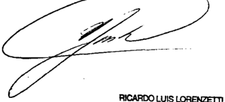

imponen por la cuestión planteada, las dificultades que presenta, al resultado alcanzado (art\_ 68 , segunda parte' del Código Procesal Civil Comercial de 1a Nación) Notifiquege Y, oportunamente, devuélvase

RICARDO LUIS LORENZETTI

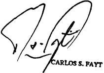

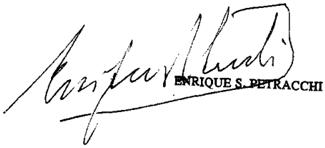

JUAN CARLOS MAQUEDA

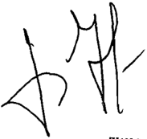

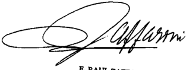

E RAUL ZAFFARONI

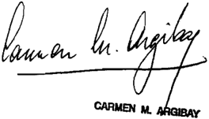

Recurso ordinario interpuesto pOr BJ SRL , representada por el Dr Manuol Beniteb

Traslado contestado por 01 Naoional (APIP-DGI) representado por el Dr

Iribunal de origen: Sala de 10 Cámara Nacional de Apelacioneb 10 Conten-

Tribunales que intervinieron con anterioridad: Iribunal de la Nación

FIAT cONcORD S.A. (TF 16778-I) c/ DGI

## IMPUESTO A LAS GANANCIAS.

Cabe confirmar la sentencia que ratificó el ajuste practicado por el organismo recaudador a las sociedades actoras, en el impuesto a las ganancias -por disposición de fondos a favor de terceros, con sustento en el art. 73 de la ley del gravamen, y 100 de su decreto reglamentario-, pues el hecho de que la disposición de fondos se efectúe entre sociedades vinculadas económicamente entre sí, o en relación de sujeción económica por revestir una de ellas una condición dominante respecto de otra dependiente, no impide considerar que dicha disposición se haya efectuado a favor de terceros, en los términos de aquélla norma, puesto que se trata de distintos sujetos de derecho que son considerados individualmente como sujetos pasivos de la obligación tributaria.

## IMPUESTO A LAS GANANCIAS.

Cuando el art. 73 de la ley del impuesto a las ganancias alude a las operaciones realizadas en interés de la empresa -recaudo estrechamente ligado al establecido en la reglamentación acerca de que la presunción operará si los fondos entregados en calidad de préstamo no responden a operaciones propias del giro de la empresa-, no se refiere al interés del conjunto económico sino al del sujeto al que se encuentra dirigida la norma, esto es, la sociedad de capital que efectúa la disposición de fondos o bienes, sin perjuicio de ponderarse en cada caso la existencia de modalidades comerciales peculiares que podrían derivarse de esa vinculación económica, mediante un exhaustivo examen de la causa que originó la entrega de los fondos o bienes, y de la correlativa contraprestación por parte de quien los receptó.

DIcTAMEN DE LA PROcURAcIóN GENERAL

## Suprema Corte:

- I -

A fs. 596/598, la Sala IV de la Cámara Nacional de Apelaciones en lo Contencioso Administrativo Federal confirmó el ajuste practicado por el Fisco Nacional a Fiat Concord S.A. y a Fiat Argentina S.A. en el

impuesto a las ganancias, por la existencia de disposiciones de fondos a favor de terceros sin mediar interés en esas empresas, con sustento en el art. 73 de la ley del gravamen y 100 de su decreto reglamentario.

Para así decidir indicó, en primer lugar, que tanto Fiat Concord S.A. como Fiat Argentina S.A. dispusieron de fondos a favor de otras sociedades las que, como tales, tienen personalidad, patrimonio e intereses propios. Especificó que no surge de autos que la realización de dichas operaciones haya implicado un beneficio para quien efectuaba los préstamos y que las sociedades no demostraron la alegada necesidad de tales mutuos para su giro normal.

En segundo término, señaló que tanto Fiat Concord S.A. como Fiat Argentina S.A. se limitaron a describir su estructura organizativa, sin aportar prueba alguna sobre el provecho que deriva para ellas operar en esa forma. Enfatizó la actividad financiera que puede desarrollar Fiat Argentina S.A. conforme con sus estatutos, por lo que descartó que las disposiciones de fondos sin la percepción de un interés equivalente al del mercado le hubieran podido redundar un beneficio patrimonial, como tampoco que esos préstamos gratuitos puedan considerarse consecuencia del propio desenvolvimiento de su negocio.

Rechazó los argumentos de las actoras relativos a que el interés de Fiat Concord S.A. y de Fiat Argentina S.A. se identifica con el del grupo económico que integran. Subrayó que, frente al impuesto a las ganancias, las empresas vinculadas deben comportarse, en principio, como partes independientes. Concluyó, por ello, que la vinculación societaria no acredita -por esa sola circunstancia- que los préstamos de dinero hayan sido efectuados en beneficio de quien los realizó. Con cita de Fallos: 286:97, recordó que la relación orgánica de subordinación no suprime la personalidad jurídica de la sociedad dependiente ni tampoco anula su capacidad tributaria.

- II -

Disconformes, las actoras interpusieron el recurso extraordinario de fs. 610/619, concedido a fs. 632 en cuanto se cuestiona el alcance y la interpretación de normas de carácter federal.

Adujeron que la sentencia recurrida ignoró la realidad económica para determinar la verdadera existencia del hecho imponible, en contravención a lo dispuesto por los arts. 1º y 2º de la ley 11.683, al desconocer

que todas las empresas citadas en esta causa integran el 'Grupo Fiat', cuya sociedad controlante es Internazionale Holding Fiat, con sede en Suiza. Ello, en su criterio, impide afirmar que las prestatarias revistan el carácter de terceros respecto de las prestadoras, lo que excluye la aplicación del art. 73 de la ley del gravamen.

Negaron, asimismo, que las sumas transferidas entre estas compañías vinculadas lo hayan sido a título de 'préstamos'. En tal sentido, explicaron que Fiat Concord S.A. carecía de personal administrativo y que, para hacer frente a sus gastos operativos, remitía todos sus fondos a Fiat Argentina S.A., quien los utilizaba en nombre de Fiat Concord S.A., con la obligación de rendir cuenta de lo actuado. Sin embargo, reconocieron que en ciertas ocasiones permanecían en poder de Fiat Argentina S.A. ciertos saldos excedentes luego de haber satisfecho los gastos de Fiat Concord S.A., pero advirtieron que esos montos eran siempre de libre disposición por parte de esta última.

Agregaron que idéntica operatoria se repetía entre Fiat Argentina S.A. y otras empresas del grupo, tanto nacionales como extranjeras, donde la primera adelantaba el dinero para cancelar gastos de las segundas.

Por último, pusieron de relieve que en la contabilidad de Fiat Argentina S.A. existen cuentas correspondientes a préstamos a otras empresas del grupo, que devengan intereses, pero éstos se diferencian de la administración de fondos por la controlante aquí cuestionada, que hace al giro comercial de sus controladas y responden a la estrategia global del conjunto económico.

## - III -

Considero que el recurso extraordinario deducido por las actoras es  formalmente procedente, pues se ha cuestionado la inteligencia otorgada por el superior tribunal de la causa a normas federales y la decisión definitiva ha sido contraria al derecho fundado en ellas (art. 14, inc. 3, ley 48).

El primer párrafo del art. 73 de la ley del impuesto a las ganancias (t.o. por decreto 450/86, vigente durante los períodos de la litis ) establecía que toda disposición de fondos o bienes efectuados a favor de

terceros por parte de los sujetos comprendidos en su art. 49, inciso a), y que no respondiera a operaciones realizadas en interés de la empresa, haría presumir, sin admitir prueba en contrario, una ganancia gravada en cabeza del prestatario equivalente a un interés que allí se fijaba.

Al reglamentar este precepto, el art. 100 del decreto 2353/86 (en vigor durante el lapso en discusión) señalaba que, a los efectos de la aplicación del art. 73 de la ley, se entendería que se configuraba la disposición de fondos o bienes cuando éstos fueran entregados en calidad de préstamo.

El organismo recaudador reconoce que una parte de las sumas remitidas por Fiat Concord S.A. a Fiat Argentina S.A. ha sido para hacer frente, por anticipado en algunos casos, a los gastos operativos de la primera (cfr. antecedentes administrativos; informe de fs. 273 del cuerpo IVA; informe de fs. 386 y resolución determinativa de oficio obrante a fs. 581 del cuerpo ganancias).

Idéntica situación se verifica respecto de los gastos realizados por Fiat Argentina S.A., por cuenta y orden de las compañías pertenecientes al 'Grupo Fiat' (resolución determinativa de oficio obrante a fs. 302/310 de autos, en especial fs. 302 y 304).

Despejado este aspecto de la controversia, es claro para mí que las disposiciones de fondos de los dos párrafos anteriores no lo han sido en calidad de préstamo, como lo exige el art. 100 del decreto 2353/86, sino en virtud de una modalidad jurídica diversa, más cercana al mandato y a la gestión oficiosa, pero definitivamente alejada del mutuo.

Estimo que la diferencia cobra especial importancia a la luz de la inveterada doctrina de V.E. que indica que 'es propio de la tarea judicial indagar sobre el espíritu de la leyes más que guiarse por el rigor de las palabras en que ellas están concebidas' (Fallos: 308:1664). Además, sostuvo que debe averiguarse el verdadero sentido y alcance de la ley 'mediante un examen atento y profundo de sus términos que consulte la realidad del precepto y la voluntad del legislador, pues sea cual fuere la naturaleza de la norma, no hay método de interpretación mejor que el que tiene primordialmente en cuenta la finalidad de aquélla' (Fallos: 308:1861).

Bajo tales premisas, como sostuve in re A.679, L.XLII, 'Akapol S.A. (T.F. 20.985-I) c/ DGI', dictaminado en el día de la fecha, observo que la presunción del art. 73 de la ley de impuesto a las ganancias aquí en

debate fue introducida por la ley 23.260. En su mensaje de elevación, el Poder Ejecutivo Nacional admitió que la doble imposición económica sobre utilidades distribuidas, aunque atenuada, subsistiría con la reforma legal, situación que podía inducir a retener utilidades por parte de sociedades cerradas cuyos accionistas tuvieran altos niveles de ingreso, con el objeto de canalizarlas luego hacia los segundos por vías que no supusieran para ellos una imposición adicional.

Y añadió a continuación, de manera tajante: 'A efectos de restringir dicha posibilidad, se extiende el tratamiento previsto para la distribución de utilidades a las sumas facilitadas por sociedades a sus accionistas en calidad de préstamo, en los casos en que no se estipule el pago de intereses o éstos resulten inferiores a los contemplados en el texto legal…' (cfr. mensaje Nº 662, Diario de Sesiones de la Honorable Cámara de Diputados de la Nación, 04/09/85, p. 4177).

Sobre la base de estas afirmaciones, es innegable, a mi modo de ver, que la voluntad del legislador estuvo dirigida a insertar una presunción encaminada únicamente a un tipo específico de préstamos: aquellos entregados por las sociedades a sus accionistas, con tasas de interés inferiores a las legales, cuya finalidad espuria era canalizar fondos de la primera hacía los segundos sin recurrir a la distribución de utilidades.

Es evidente, por las circunstancias reseñadas, que en la especie no se verifica el sustrato fáctico que torna aplicable la figura legal. Por ello, de convalidarse la postura de la demandada, se impondría a la actora una presunción de ganancia gravada sin que, strictu sensu , el art. 73 de la ley del tributo ni su reglamentación así lo dispongan (arg. Fallos: 312:912, cons. 9º).

Por lo expuesto, considero que corresponde revocar la sentencia apelada en cuanto convalida la imposición del art. 73 de la ley del gravamen a las sumas entregadas por Fiat Concord S.A. a Fiat Argentina S.A. para hacer frente a los gastos operativos de la primera, así como también los gastos realizados por Fiat Argentina S.A., por cuenta y orden de las compañías pertenecientes al 'Grupo Fiat'.

Bajo este prisma, distinta consideración merecen las sumas que, en exceso a sus gastos operativos, Fiat Concord S.A. transfirió a Fiat Argentina S.A. (cfr. antecedentes administrativos, resolución determi-

nativa de oficio obrante a fs. 579/585 del cuerpo ganancias, en especial fs. 582).

En mi parecer, estos montos encuadran sin esfuerzo en los términos del citado art. 73, sin que las defensas opuestas por el contribuyente logren desvirtuar esta conclusión.

En especial, la recurrente no ofreció prueba alguna para acreditar que esas transferencias obedezcan a una causa jurídica diferente de un préstamo ni rebatió la postura fiscal que destaca la carencia de argumentos válidos para explicar el interés de Fiat Concord S.A. en la permanencia de esos saldos en exceso en el patrimonio de su controlante sin requerir su devolución durante los cuatro años bajo inspección (cfr. antecedentes administrativos; informe de fs. 387 y resolución determinativa de oficio obrante a fs. 579/585 del cuerpo ganancias).

Asimismo, el esfuerzo puesto en demostrar que Fiat Argentina S.A. no es un 'tercero' en los términos del art. 73 de la ley del impuesto a las ganancias, pues controla a Fiat Concord S.A., no es para mí suficiente a la luz de la doctrina de Fallos: 286:97, recordada por el a quo , donde se estableció que la relación orgánica de subordinación no suprime la personalidad jurídica de la sociedad dependiente ni tampoco anula su capacidad tributaria.

- VI -

En virtud de lo dicho, considero que corresponde admitir formalmente el recurso extraordinario, revocar parcialmente la sentencia apelada con el alcance señalado en el punto IV y confirmarla en lo restante. Buenos Aires, 2 de febrero de 2009. Laura M. Monti .

## FALLO DE LA cORTE SUPREMA

Buenos Aires , 2012

Vistos los autos: "Fiat Concord S .A. TF (16.778-I) cl DGI" -

## Considerando

Que contra la sentencia de la Sala IV de la Cána ra Nacional de Apelaciones en Contencioso Administrativo Fe-

deral que, al revocar dictada por el Iribunal Fiscal de la Nación, confirmó el ajuste practicado por el organismo recaudador Fiat Concord S .A Y Fiat Argentina S .A en el impuesto las ganancias ~por disposición de fondos favor de terceros, con sustento en el art. 73 de la del gravamen , Y 100 de su decreto reglamentario las mencionadas empresas interpusleron recurso extraordinario por hallarse en tela de juicio la interpretación de normas de naturaleza federal , que fue concedido por el quo en ese aspecto (fs. 632) ley

Que para decidir en el sentido indicado, cáma ra afirmó que tanto Fiat Concord 5 .A comO Fiat Argentina dispusieron de fondos favor de otras sociedades las que, cono tales , tienen personalidad, patrimonio intereses propios. Pun tualizó que no surge de las constancias de autos que 1a realización de tales operaciones haya implicado un beneficio para quien efectuó préstamos \_ Agregó que las sociedades no demostraron la alegada necesidad de tales préstamos para su giro normal En tal sentido, sefaló que las actoras se imitaron describir su estructura organizativa sin aportar prueba alguna sobre el provecho que derivaría para ellas de operar en esa forna En particular, Y teniendo en cuenta la calídad de financiera de Fiat Argentina, descartó que realización de esas operaciones ~sin la percepción de un interés equivalente al de hubiera po dido redundar en un beneficio patrinonial. Del mismo modo concluyó en que tampoco podía considerarse los préstamos gratuitos una consecuencia del giro de la empresa, máxime en atención su propio objeto social Y 10s quebrantos millonarios que sufría al monento de prestar el dinero. 1os propio

Asimismo, rechazó los arguentos de las actoras relativos que el interés de ellas era equiparable al del grupo económico que integraban. Puso de relieve que frente al impuesto las ganancias, las empresas vinculadas deben comportarse en principio, como partes independientes; de manera que la vinculación societaria no acredita, por esa sola circunstancia, que préstamos de dinero hayan sido efectuados en beneficio de quien los realizó\_ Al respecto, con cita del precedente de Fallos:

286:97 , señaló que relación orgánica de subordinación societaria no suprine la personalidad jurídica de la sociedad depen diente ni tampoco anula su capacidad tributaria

Que , con el alcance de concesión, el recurso extraordinario es fornalmente admisible, pues se controvierte la inteligencia asignada al art 73 de la ley del impuesto las ganancias ~y su reglamentación-, Y decisión del superior tribunal de la causa es contraria la pretensión que el apelante funda en aquellas disposiciones (art\_ 14 , inciso de la 48 ) ley

4 % ) Que , por el contrario, el remedio federal es inadnisible en cuanto en éste se pretende cuestionar 10 decidido por el quo respecto de que no se aportó prueba alguna en el caso que denostrara el beneficio que tendría para las empresas actoras la operatoria la que se hizo referencia en la senten cia, ni la necesidad de acudir aguélla de acuerdo al giro nornal de sus actividades, pues tales aspectos reniten al exanen de cuestiones fácticas, por principio, ajenas al remedio extraordinario Máxine, si se tiene en cuenta que en dicho recurso no se desarrolla ninguna argumentación acerca de una incorrecta valoración del material probatorio reunido en la causa, ni aquél ha sido fundado en la doctrina de la arbitrariedad de sentencias .

5 %) Que el art. 73 de la del impuesto las ga nancias ~cuya constitucionalidad el apelante no ha cuestionado , en cuanto interesa, dispone en el primer párrafo: ley aquí

"Toda disposición de fondos bienes efectuados favor de terceros por parte de 10s sujetos comprendidos en el artículo 49 , inciso a) Y que no responda operaciones realizadas en interés de la empresa, hará presumir, sin admitir prueba en contrario, una ganancia gravada eguivalente un interés que allf se fija\_ La ganancia presunta se calcula tomando una de las siguientes variantes: a) un interés con capitalización anual no menor al fijado por el Banco de la Nación para descuentos merciales 0 , b) una actualización igual variación del índice de precios al por mayor, nivel general, con más un interés

del 88 anual sobre el monto ajustado Entre anbas la dispone que deberá tomarse la que arroje comO resultado el importe mayor ley

Por su parte, el art 100 del decreto reglamentario de la del gravamen ~art 103 en su redacción actual-, en 1o pertinente, establece: ley

"A efectos de la aplicación del artículo 73 de se entenderá que se configura la disposición de fondos bienes que dicha norma contempla, cuando aquéllos sean entregados en calidad de préstamo, sin que ello constituya una consecuencia de operaciones propias del giro de la empresa deban considerarse generadoras de beneficios gravados" ley,

Que la presunción referida precedentemente fue introducida en el régimen regula el impuesto las ganancias por 23.260 , ordenamiento que ~entre las posibles alternativas de integración del impuesto societario Y el personal- optó por establecer que la sociedad revestía la calidad de sujeto pa sivo del gravamen por las utilidades obtenidas Y, al propio tiempo, que los accionistas tendrían la misma calidad respecto de dividendos que aquélla les distribuyera En el contexto de dicha modalidad de imposición, el sentido de la presunción fue limitar la práctica habitual de ciertas sociedades "cerradas cuyos accionistas tenían altos niveles de ingreso, consistente en retener sus utilidades con el objeto de canalizar luego los fondos de la sociedad por vías que no supongan para aquéllos una imposición adicional que ey

Ello fue expresado por el Poder Ejecutivo Nacional en el mensaje de elevación del proyecto de ~número 662 en 10s siguientes términos: "A efectos de restringir dicha posibilidad se extiende el tratamiento previsto para a distribución de utilidades las suas facilitadas por sociedades sus accionistas en calidad de préstamo\_ en los casos en que no se estipule el pago de intereses éstos resulten inferiores contemplados en el texto legal \_ (ver, Diario de Sesiones de la Honorable ley

Cámara de Diputados de la Nación, abril 25/26 de 1985 , páginas 8250 Y 8251)

Tal propósito quedó plasmado en el texto de la al establecer que sin perjuicio de la presunción de ganancia gravada que para la sociedad tendría toda disposición de fondos bienes favor de terceros ~primer párrafo del art. 73-, esas suas tendrían para el accionista el nismo tratamiento que 1os dividendos ~segundo párrafo del art\_ 73 , en su texto originaley

No puede soslayarse sin embargo, el hecho de que partir de la reforma que introdujo 1a 24 . 073 , el legislador se inclinó por gravar solanente las ganancias en cabeza de las sociedades una tasa única del 308 desgravar los dividendos como ganancia personal de los accionistas (ver, Diario de Sesiones de la Honorable Cámara de Diputados de Nación, marzo 18 19 de 1992 , pág. 6007) , esquema en el que se desvanecería el propósito originario de la presunción de evitar que pueda eludirse el pago del tributo mediante un espurio envío de fondos de la sociedad accionistas, sin acudir la distribución de dividendos Pese ello, dicha reforma legislativa se limitó suprinir el segundo párrafo del art 73, Y mantuvo en mismos términos, la presunción que resulta de su párrafo primero, para toda disposición de fondos bienes efectuada en favor de terceros sujetos comprendidos en el art 49 , inciso a) , de la del gravamen. ley ley

7 % ) Que , como ha quedado delinitada jurisdicción del Tribunal, éste debe ceñirse decidir: a) si puede considerarse que ha mediado una disposición de fondos bienes efectuada en favor de un "tercero" en 1os términos de norma que se examina, cuando aquélla se realiza entre sociedades vinculadas que integran un mismo conjunto económico; b) si ~como 10 sostiene la apelanteel interés de la empresa al que alude la debe ser entendido como el interés de dicho conjunto, Y no , el del sujeto que efectúa la disposición de fondos bienes ley,

8 % ) Que , contrariamente lo sostenido por el apelan-

te, el hecho de que la disposición de fondos se efectúe ~comO ha ocurrido en el casoentre sociedades vinculadas econónicamente entre sí, en relación de sujeción econónica pOr revestir una de ellas una condición dominante respecto de otra dependiente, no impide considerar que dicha disposición se haya efectuado favor de terceros, en 10s términos del art. 73 que se examina, puesto que se trata de distintos sujetos de derecho que son considerados individualnente como sujetos pasivos de la obligación tributaria

En rigor de verdad, el ordenamiento argentino no regula 10s conjuntos económicos como estatutos autónonos No hace la tributaria ni la legislación comercial, puesto que el principio general es considerar las sociedades integrantes de aquéllos como partes independientes en tanto se ajusten las prácticas normales del mercado , sujetándolas al deber de llevar sus registraciones contables en forma separada (ver art 5 ' 11 .683; art. 1 de ley del impuesto las ganancias Y su 14 , en la redacción dada partir del dictado de la ley 21 .481 ~B.0 . 5/1/77\_ en las sucesivas reformas, al primitivo texto de la ley 20 . 628 ~B.0.31/12/73-; arts. 33 , 63 Y 64 de la de 80ciedades comerciales) reservándose para casos de excepción la posibilidad de prescindir de la individualidad jurídica de cada sujeto, Y de considerar, fines fiscales, todos ellos como una unidadley ley art ley

En efecto, como precisó este Tribunal, la relación de subordinación no suprine la personalidad jurídica de la sociedad dependiente [respecto de la sociedad dominante] ni anula su capacidad jurídica tributaria" (Fallos: 286:97) En el mismo sentido afirmó que ciertas circunstancias particulares autorizan el tratamiento excepcional que esta Corte ha dispensado otros conjuntos económicos, según las argumentaciones expuestas en citados precedentes de Fallos: 286:97 Y 287: 79 , sin que ello importe reconocer aquella vinculación el estatuto autónono de un sujeto pasivo de la obligación tributaria para gravámenes controvertidos en esta causa . pues para solución del sub lite no se ha desconocido la exis-

tencia de dos sociedades de capital perfectamente delinitadas conforme al orden jurídico privado, ni tampoco la personería jurídica de 1a sociedad local" (Fallos: 307:118)

Resulta contundente en este sentido sefalar que la propia apelante ha mencionado en defensa de su postura, que en la contabilidad de Fiat Argentina existirían otras cuentas ~distintas las examinadas por el organismo fiscalen las que se asentaban "préstamos inter empresarios" por los sí se cobraban intereses las empresas del llamado grupo Fiat (fs\_ 617 vta./618) 1o que descarta nítidamente alegada imposibilidad de que las sociedades actoras hayan asumido comportamientos propios de los terceros independientes, que, por ende no puedan ser alcanzadas por las previsiones del art 73 de la ley que

9 Que , establecida la individualidad jurídica de cada sujeto, cabe concluir que cuando el art. 73 de la ley alude las operaciones realizadas en "interés de la empresa" ~recaudo estrechamente ligado al establecido en la reglamentación acerca de que la presunción operará si 1os fondos entregados en calidad de préstamo no responden operaciones propias del "giro de la empresa" - , se refiere al interés del conjunto económico sino al del sujeto al que se encuentra dirigida la norma , esto es , la sociedad de capital que efectúa la disposición de fondos bienes Sin perjuicio de ello, es pertinente señalar que en el puesto de las sociedades que integran un conjunto económico, podrían existir modalidades comerciales peculiares, que deberán ser contempladas, en cada caso, mediante una exhaustiva ponderación de la causa que originó la entrega de los fondos bienes de a contraprestación por parte de quien 1os receptó, exanen que ~por las razones señaladas en el considerando 4 de la presente\_ no corresponde al Iribunal realizar en esta instancia excepcional no

Por ello, habiendo dictaminado la señora Procuradora Fiscal se declara formalmente admisible el recurso extraordinario

con 10 alcances señalados en presente, Y se confirma sen tencia apelada \_ Las costas se imponen por su orden, atento novedoso de cuestión planteada Y las dificultades que presenta (art\_ 68 , segunda parte, del Codigo Procesal Civil Y Comercial de Nación) Notifíquese Y, oportunamente, devuélvase

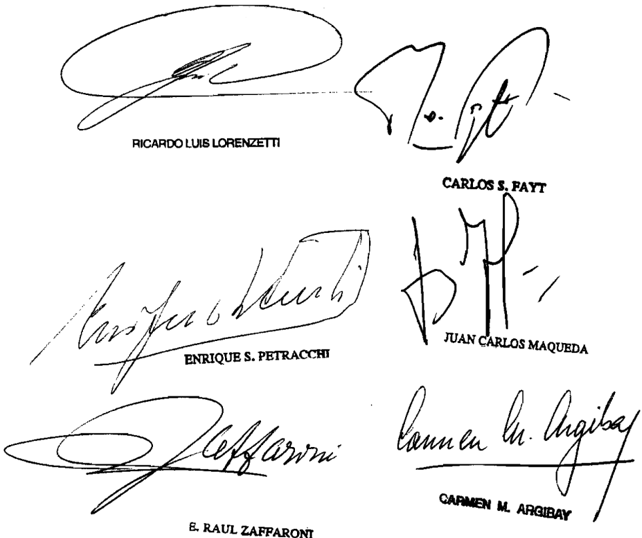

E RAUL ZAFPARONI

Recurso extraordinario interpuesto Fiat Concord 9 ,A . Fiat Argentina 8 .A . representadas Por los Francaco Pupillo Adalberto Carloe Rubso robpoctivamonte, con el patrocinio del Dr . Julio Guillarno Moyano por

Traslado contestado por 01 Fioco Nacional (AFIP-DGI) representado 1a Dra Lucía del Carmen Navarrote, con el patrocinio del Dr Boracio Jorge Piacenti

Tribunal de origen Naoional de Apelaciones 10 Contenciobo Adninistrativo Fadaral Bala IV

Tribunales que intervinieron con anterioridad: Iribunal de 1a Hación.

## FALLOS DE LA CORTE SUPREMA 335

## LA PAMPA, PROVINcIA DE c/ ESTADO NAcIONAL S/ AccIóN DEcLARATIVA DE INcONSTITUcIONALIDAD

## MEDIDA CAUTELAR INNOVATIVA.

Corresponde rechazar la medida cautelar innovativa solicitada en la causa tendiente a obtener la declaración de inconstitucionalidad del decreto del Poder Ejecutivo Nacional 699/2010, que extiende por el término de dos años el plazo de vigencia de los beneficios promocionales en el Impuesto a las Ganancias y en el Impuesto al Valor Agregado, acordados en el marco de la ley 22.021 si, ante la coincidencia del objeto de la demanda y de la cautela, el dictado de esta última tendría los mismos efectos que la sentencia definitiva y no se advierten las razones por las cuales el mantenimiento de la situación existente podría tornar ineficaz la decisión a dictarse en la cuestión de fondo (arts. 230, inc. 2º del Código Procesal Civil y Comercial de la Nación).

## FALLO DE LA cORTE SUPREMA

## Buenos Aires, 2[2

Autos Y Vistos; Considerando:

1 %) Que fs 15/110 la Provincia de La Pampa , promueve acción declarativa de certeza en térinos del art 322 del Codigo Procesal Civil Y Comercial de la Nación, contra el Estado Nacional, fin de obtener la declaración de inconstitucionalidad del decreto del Poder Ejecutivo Nacional 699/2010, extiende por el término de dos afos el plazo de vigencia de 1os beneficios pronocionales en el Impuesto las Ganancias en el Impuesto al Valor Agregado (IVA) acordados en el Marco de la ley 22 .021 sus modificaciones extensiones que

2% ) Que en el marco de dicha pretensión, Y de normado por 1os arts\_ 195, 230 concs del Codigo Procesal Civil Comercial de la Nación, solicita una medida cautelar consistente en se ordene al Estado Nacional se abstenga de continuar con la instrumentación y/o el otorgamiento de nuevos cupos de la me dida dispuesta por el citado decreto 699/2010, hasta tanto reque

caiga sentencia definitiva en la presente causa Asinismo, ante lo que denonina "oscuridad" de la norma impugnada, con relación la extensión no otras provincias distintas La Rioja, tambien pide que se ordene al demandado gue se abstenga (mientras se sustancia Y se resuelve este proceso) de ampliar el zo de vigencia de 10s beneficios promocionales en los impuestos las ganancias Y al valor agregado, acordados en el Marco de la respecto otras provincias incluidas con anterioridad en el precitado réginen de promoción industrial pla ley

3 ' ) Que esta Corte ha señalado que medida cautelar innovativa constituye una decisión excepcional porque altera el estado de hecho de derecho existente al tiempo de su dictado, justificándose por ello una mayor rigidez en la apreciación de los recaudos que hacen su admisión (Fallos: 316:1833; 319 1069; 326:3729)

En el caso , tal comO se anticipó, el objeto de la manda se refiere declaración de inconstitucionalidad del decreto del Poder Ejecutivo Nacional 699/2010 , Y la cautelar innovativa solicitada la suspensión de aplicación de ese precepto de-

En tales condiciones, ponderando el hecho indiscutible de que, en razón de coincidencia del objeto de la demanda Y de la cautela, el dictado de esta última tendría 1os mismos efectos que la sentencia definitiva (Fallos: 327:2490 , considerando corresponde concluir en su improcedencia, tanto más si se aprecia que su adisión excedería ciertamente el marco de hipotético, dentro del cual toda medida cautelar agota su virtualidad (Fallos: 325:388) , Y no se advierten las razones por las cuales el mantenimiento de situación existente podría tornar ineficaz la decisión dictarse en 1a cuestión de fondo (art\_ 230 inciso 2 0 del Código Procesal Civil Y Comercial de la Nación; Fallos: 315:96; desarrollo de antecedentes efectuado en el apartado Iv del escrito de fs 15/110)

Por ello, se resuelve: Rechazar la medida cautelar solicitada. Notifíquese

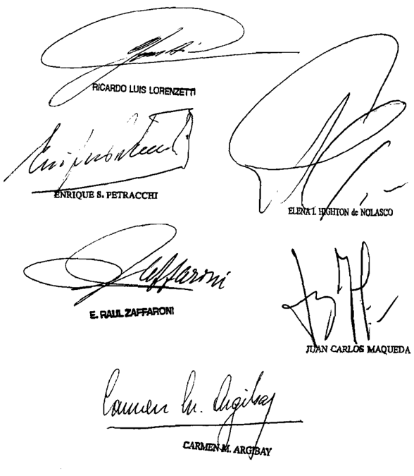

MOLINA, MIGUEL HORAcIO Y OTROS c/ POLIcIA FEDERAL ARGENTINA S/ PERSONAL MILITAR Y cIVIL DE LAS FF.AA. Y DE SEG.

## OBRAS SOCIALES.

No resulta atinada la decisión de aplicar a la Obra Social de la Policía Federal Argentina, por vía de analogía, las previsiones de la ley 23.660 en cuanto a los porcentajes de aportes máximos que resultan exigibles a sus afiliados si, al no haber manifestado su voluntad de adherir al régimen de dicha ley, se halla ex-

presamente excluida de sus disposiciones y cuenta con una regulación propia, por lo que resulta indiscutible la facultad del Poder Ejecutivo para modificar una norma anterior por otra posterior de igual jerarquía y permitir la aplicación de aranceles y/o cuotas extraordinarias de refuerzo destinadas a asegurar su equilibrio económico-financiero, sin que corresponda formular reparos respecto de su validez constitucional mientras aparezcan como razonables y adecuadas a los fines que procuran alcanzar.

## OBRAS SOCIALES.

Si lo decidido en la causa 'Oriolo' (Fallos: 333:1909) podría tener no sólo una importante repercusión en la integración tanto de los sueldos de los activos como en los haberes de los pasivos de la Policía Federal Argentina al incorporar conceptos que se abonaban como 'no remunerativos' y 'no bonificables', sino también en los recursos que financiarán a la obra social, dado que los suplementos pasarán a formar parte de la base sobre la cual deberá calcularse el porcentaje correspondiente a la cuota del afiliado (art. 819 del decreto 1866/83), corresponde llevarlo a conocimiento del Poder Ejecutivo Nacional a los efectos de que evalúe si dicha modificación habría puesto fin a la disfuncionalidad que, según el propio decreto 1419/07, constituyó una de las razones que determinaron el incremento de los aportes y si, en consecuencia, subsisten las razones de excepción que justificaron modificar el 3% que, en el decreto nombrado en primer lugar se había fijado como cuota mensual a cargo de los afiliados.

DIcTAMEN DE LA PROcURAcIóN GENERAL

## Suprema Corte:

- I -

La Sala II de la Cámara Federal de Apelaciones de la Seguridad Social confirmó parcialmente el fallo que admitió el reclamo y ordenó a la accionada que retenga en concepto de aportes para la Obra Social el equivalente al 3 % de lo que perciban los actores como haber previsional, absteniéndose de aplicar el artículo 841 del decreto nº 1866/83, en el texto del decreto nº 582/93, y que devuelva lo recaudado por aplicación de dicho precepto. Receptó, empero, la prescripción bienal invocada por el Estado Nacional y lo relacionado con la consolidación del crédito en los términos de las leyes nº 23.982 y 25.344 (cf. fs. 177/184 y 245/246).

Para así decidir arguyó, en suma, que: a) no existe una crítica concreta y razonada de los fundamentos provistos por la jueza de

primera instancia para declarar la invalidez del decreto nº 582/93; b) el decreto fue dictado en el plano del artículo 99, inciso 2º de la Ley Fundamental, y no resulta admisible que el Ejecutivo desconozca que sólo  atañe al Congreso la facultad de ejercer la potestad fiscal con ajuste a una directiva de igualdad (arts. 16, 19 y 75, inc. 22, C.N.); c) el decreto nº 1866/93 y la ley nº 23.660, aplicable por analogía, prevén un aporte del 3% con destino al régimen de obras sociales; d) eventuales razones de emergencia, subyacentes a la decisión de autorizar la cuota extraordinaria, no habilitarían a que se extienda por más de 10 años, contrariando la transitoriedad tocante a estas medidas; y, e) la circunstancia de involucrar afiliados voluntarios no obsta a lo dicho porque en materia de seguridad social los beneficios son irrenunciables y la índole de la afiliación se deriva del vínculo de los interesados con la institución policial, resultando razonable que la Obra Social de la que formaron parte durante su vida activa cubra las necesidades asistenciales del retiro (cf. fs. 245/246).

Contra dicha decisión el Estado Nacional dedujo recurso extraordinario que fue contestado y denegado con base en la índole no federal de la controversia y en los defectos argumentales de la presentación (cf. fs. 250/261, 264/268 y 269), dando origen a la presente queja (fs. 65/72 del cuaderno respectivo).

- II -

El presentante, en resumen, aduce de un lado un asunto federal estricto y, de otro, la configuración de sentencia arbitraria, por considerar que la inteligencia conferida a la cuestión, en el marco de la ley nº 21.965 y de los decretos nº 1866/83 y 582/93, violenta los principios constitucionales de defensa en juicio, propiedad y división de poderes.

Refiere, invocando jurisprudencia foral, que la Obra Social de la Policía Federal funciona en el ámbito de la Superintendencia de Bienestar de la Institución y que no se halla comprendida en el contexto de la ley nº 23.660, ni incluida dentro de los prestadores elegibles del sistema de obras sociales, constituyéndose en una entidad cerrada en cuanto al ingreso de beneficiarios ajenos a la policía.

Se detiene en la multiplicidad de prestaciones que involucran a la Obra Social, las que alcanzan al personal policial en actividad -y sus familias- y al retirado que, en forma voluntaria, conserve su afiliación, haciendo hincapié en que por las características del régimen previsional del sector, los beneficiarios pasan a retiro a una edad significati-

vamente menor al del resto de aportantes. Resalta que si bien tanto los afiliados en actividad como en retiro contribuyen con un 3% de sus haberes, en el último caso comprende conceptos como la antigüedad en el servicio, expresamente excluido en el primero (cf. arts. 809 y 820, dec. nº 1866/83).

En ese orden, manifiesta que el Ejecutivo, en uso de las atribuciones conferidas por el -entonces- artículo 86, incisos 1º y 2º, de la Constitución Nacional, modificó el reglamento originario de forma de afrontar la creciente demanda de servicios asistenciales y el consiguiente déficit presupuestario, delegando en la jerarquía policial el establecimiento de cuotas adicionales de refuerzo, tras fracasar la implementación de un régimen de aportes voluntarios. Detalla que esos fondos, destinados a la referida Superintendencia de Bienestar de la Fuerza, fueron distribuidos entre las Direcciones Generales de Obra Social, Sanidad y Ayuda Mutua; y que en el año 2002, en concordancia con lo dispuesto por la reglamentación impugnada, se declaró -por decreto nº 486/02la 'emergencia sanitaria nacional', prorrogada, ulteriormente por las leyes nº 26.077 y 26.204.

Subraya que no se cuestionaron los presupuestos de hecho tenidos en cuenta para la emisión de la norma (particularmente, lo referido a la necesidad financiera) ni se probó ilegitimidad, arbitrariedad o desvío de poder en su dictado, ni menos aún un agravio actual; destacándose que el reclamo fue efectuado habiendo transcurrido más de siete años de expedido el decreto, sobre el que medió un consentimiento voluntario, sin reservas, lo que obsta a su ulterior impugnación constitucional.

Enfatiza la razonabilidad de lo actuado, con acento en que la cuota fue reducida -a partir del 01/1/2004- al 5%, y dado que propende a garantizar el otorgamiento de las prestaciones; precisando que, al tiempo del dictado de la ley nº 23.660 -y sus reformas- conservaron su vigencia los porcentajes contributivos, determinados en reglas diferenciadas, superiores a los de la ley (v. fs. 250/261).

## - III -

Surge de las actuaciones que los actores, retirados y pensionados de la Policía Federal, reclamaron la declaración de inconstitucionalidad del decreto nº 582/93 -y de las resoluciones de la Jefatura Policial dictadas en su consecuencia- por el que se habilitó la imposición de aranceles extraordinarios de refuerzo con destino al financiamiento de la Obra Social de la Fuerza (v. fs. 190 y 192/199).

Ese aporte extraordinario se sumaba, luego, al establecido con carácter de 'cuota de afiliación' en los artículos 819 a 822 del decreto nº 1866/83, reglamentario de la Ley para el Personal de la Policía Federal (nº 21.965) -el que, hacia esa época, alcanzaba al 3% del haber de los afiliados obligatorios y voluntarios (cfse. arts. 808 y 809)-, y al 4,5% de la contribución obligatoria mensual establecida por el decreto nº 610/76 a cargo de la Policía Federal (v. dec. nº 564/75).

Según los términos del decreto nº 582/93, modificatorio del artículo 841 del decreto nº 1866/83, la Superintendencia de Bienestar contaba para el cumplimiento de su tarea con los recursos previstos en el título VI, capítulo III, del reglamento y con los pautados por otras leyes o decretos aplicables. '...Asimismo el consejo de administración, juntamente con los jefes de todas las direcciones generales del área convocados al efecto, podrán propiciar la aprobación, por parte del Jefe de la Policía Federal Argentina, de aranceles y/o cuotas extraordinarias de refuerzo que deban fijarse para asegurar su equilibrio económicofinanciero. En todos los casos, los fondos serán depositados en el Banco de la Nación...' (cf. BO: 07/04/93).

Cabe anotar que no se contiende que sobre la base de tal precepto la Jefatura Policial dictó sucesivas resoluciones por las que determinó el porcentaje del arancel en cuestión, el que alcanzó en origen el 4% (1993), siendo elevado, más tarde, al 5% (1994) y al 7,75% un tiempo después (1996), y reducido por último, nuevamente, al 5% (2004) (v. fs. 41/110 del expediente principal y, entre otras disposiciones, O.D.I. -Orden del Día Interna- nº 77/93; 113/96; 69/03; 156/04; 16/04; 04/05; 115/05; 7/06; 127/06; 185/06; y resolución del día 29/04/94; etc.).

El artículo 841, párrafo 2º, del decreto nº 1866/83, en la redacción del decreto nº 582/93, corresponde consignarlo, fue derogado en fecha reciente por el decreto nº 1419/07 (v. art. 5; BO: 16/10/07); disposición que, por otro lado, elevó las cuotas de afiliación de los artículos 819 a 821 del dispositivo reglamentario al 6% del haber del personal (cf. arts. 1 a 3); mientras que la contribución obligatoria del decreto nº 610/76, ya citado, a cargo de la Policía, fue elevada al 6% de las remuneraciones que por todo concepto percibe el personal de la Institución (cfr. art. 1º, dec. nº 1416/07; BO: 16/10/07). Corresponde puntualizar que los preceptos mencionados en último término no fueron objetados en su validez en las presentes actuaciones (v. fs. 267).

Por lo demás, el cuestionamiento constitucional de lo establecido por el decreto nº 582/95 -y resoluciones dictadas en su ámbito- re-

suelto favorablemente en ambas instancias, arriba, queja mediante, al estudio de V.E. (v. fs. 65/72 del cuaderno respectivo); y si bien con el dictado del decreto nº 1419/07, el tema se ha tornado abstracto hacia el futuro, subsiste el interés de los accionantes en relación a los aportes extraordinarios anteriores a la vigencia de dicho precepto (Fallos: 325:3243; 326:1138; etc.).

- IV -

El recurso extraordinario federal es formalmente admisible pues se  puso  en  tela  de  juicio  la  regularidad  constitucional  del  decreto nº 582/93 -y de previsiones emitidas en su consecuencia- y el pronunciamiento del tribunal superior de la causa resultó contrario a su validez, defendida por la recurrente. En atención a que la cuestión que se plantea se encuentra estrechamente unida a la arbitrariedad invocada, procede abordar su tratamiento de manera conjunta (Fallos: 314:1460, 322:3154, etc.). Cabe tener presente, además, que en la tarea de esclarecer la inteligencia de reglas federales, la Corte Suprema no se encuentra limitada por los argumentos de las partes o del a quo , sino que le incumbe realizar una declaratoria sobre el punto disputado (Fallos: 323:1491 y su cita, etc.).

- V -

Sentado lo que precede, corresponde comenzar señalando que la Ley Orgánica de la Policía Federal (nº 21.965) se limita a reconocer, al personal en actividad y retiro, el derecho a '... los servicios de carácter social y asistencial que legalmente corresponden, para sí y para su grupo familiar...' (cf. arts. 10, inc. f, y 11); la Obra Social, sin embargo, es regulada por el título VI -arts. 806 a 849- de su decreto reglamentario nº 1866/83 (v. BO: 11/08/83).

Esa Obra Social, por otra parte, si bien consta entre las enumeradas en el artículo 1 de la ley nº 23.660 (inc. g), no adhirió a sus términos; a lo que se añade que, como resulta del artículo 1º del decreto nº 446/00, según decreto nº 1140/00 (BO: 06/06/00 y 5/12/00), devino excluida del derecho a la libre opción del prestador, atendiendo al particular contexto regulatorio en que entidades como la examinada desenvuelven sus prestaciones (v. párrafo 3º).

A su turno, coincidiendo con lo previsto por el artículo 16, inciso b), de la ley nº 23.660, el decreto nº 1866/83 -según se reseñó- fijó como cuota de afiliación el 3% del haber del personal policial; formalizándose

la protesta de los actores -en rigor- cuando, a partir del dictado del decreto nº 582/93, la jefatura policial dispuso las cuotas extraordinarias de refuerzo sobre las que se abundó supra (cfse. ítem III del dictamen), extremo que sitúa al margen del cuestionamiento la 'cuota de afiliación' del decreto nº 1866/83 precedentemente consignada.

En estas actuaciones, concretamente, los interesados formalizaron sus reclamaciones administrativas -relativas, insisto, a los aportes adicionales- en el año 2003, y, más tarde, sus planteos judiciales, a principios del año 2004 (cfse. fs. 22/121, 133 y 192/199 del expediente agregado).

Sobre la cuestión corresponde recordar que, si bien V.E. caracterizó a rubros análogos a los debatidos como 'cargas sociales', carentes de una específica calidad tributaria (cfr. Fallos: 299:398, 403 y sus citas; y 300:527), no menos cierto es que, en fecha reciente, esa Corte explicitó que la categoría de los aportes y contribuciones de la seguridad social y demás gravámenes obligatorios de orden asistencial, como los de las obras sociales, integran el género de los 'tributos' a los efectos del principio de legalidad fiscal (cf. S.C. S. nº 151, L. XXXVII; 'San Juan, Provincia de c/ A.F.I.P. s/ impugnación de deuda', resolución del 18/06/08).

En tal sentido resulta categórica la jurisprudencia de esa Corte en punto a que los principios y preceptos constitucionales prohíben a otro Poder que el Legislativo el establecimiento de impuestos, contribuciones y tasas; y ninguna carga tributaria puede ser exigible sin la preexistencia de una prescripción legal encuadrada dentro de los preceptos y recaudos constitucionales (Fallos: 331:1942 y sus citas).

Ello, por otra parte, puede derivarse en el caso del régimen general de Obras Sociales, al que si bien no adhirió la demandada, son indudables las pautas hermenéuticas que emanan en la materia de su artículo 17, el que dispone que: 'Las contribuciones, aportes y recursos de otra naturaleza que se mencionan en el artículo anterior no podrán ser aumentados sino por ley' (v. BO: 20/01/89).

En la causa, cabe enfatizar la naturaleza reglamentaria tanto del decreto nº 1866/83 (BO: 11/08/83), como del nº 582/93 (BO: 07/04/93), modificatorio del anterior (art. 1º), dictados en el marco del artículo 86, incisos 1º y 2º, de la Constitución Nacional (previa a la reforma de 1994), y si bien no existe óbice constitucional para que el Legislativo confiera al Ejecutivo o a un cuerpo administrativo cierta autoridad a fin de reglamentar una norma, ello es así en tanto importe configurar

los pormenores y detalles necesarios para la ejecución de la ley (cfr. Fallos: 312:1098) y el precepto se ajuste a su texto y espíritu y a la política legislativa fijada (cf. Fallos: 312:1484; y S.C. M. nº 426, L. XXXVIII; 'Magoia, Elda c/ Tarjeta Provencred y/o Citibank NA - hábeas data', del 08/05/07; etc.).

En el sub examine no se ha dejado en evidencia, en el texto de la ley nº 21.965, la existencia de una delegación nítida que, en su caso, pretendidamente habilite al Ejecutivo a dictar un precepto como el objetado (arts. 10, 125 y 126, ley nº 21.965 y doctrina de Fallos: 307:1643; 310:2193; 311:1617; 315:2530; etc.); a lo que se agrega que el decreto nº 582/93, y las normas dictadas en su ámbito, vinieron virtualmente a modificar, por más de 14 años, el sistema de financiamiento de la Obra Social Policial; pretiriendo, incluso, que, por amplio que se aprecie el ámbito de autonomía del Ejecutivo, el poder de reglamentar no llega a consentir la desnaturalización de derechos, máxime cuando el poder administrador ingresa en un ámbito propio de la competencia legislativa (cfr. doctrina de Fallos: 322:1868; 329:584: etc.).

Repárese al respecto en que el decreto en disputa habilita a un órgano subalterno a propiciar la aprobación, por parte del jefe de la Policía Federal, de aranceles y/o cuotas extraordinarias de refuerzo a ser establecidas 'para asegurar el equilibrio económico-financiero de la Superintendencia' (v. art. 841 del dec. nº 1866/83 en la redacción del dec. nº 582/93); esto es, en suma, la habilitación administrativa a pautar aportes extraordinarios sin límites cuantitativos ni temporales.

Las anteriores circunstancias -opino- autorizan a descartar que se trate éste de un caso regular de delegación legislativa, que terminó -lo reitero- como colofón, encomendada, más tarde, por el Ejecutivo a la jefatura policial; de reglamentación autónoma o, aun, de necesidad y urgencia; extremos a los que obstarían, asimismo, las limitaciones previstas, entre otros, por los artículos 17, 76, 99, incisos 1º a 3º, y 100, inciso 12, de la Constitución reformada, valorando, especialmente, la materia tributaria de que se trata, la falta de término, bases delegativas, refrenda y control, etc. (Fallos: 323:3770; 325:2394; y, recientemente, S.C. C. nº 2701, L. XL y C. nº 767, L. XL; 'Colegio Público de Abogados de Capital Federal c/ EN - PEN - ley nº 25.414 - decreto nº 1204/01 s/ amparo', del 04/11/08; etc.).

Los aspectos sustanciales del derecho tributario, ha enfatizado V.E., no tienen cabida en las materias respecto de las cuales la Carta Magna (art. 76), autoriza, como excepción y bajo determinadas condiciones,

la delegación en el Ejecutivo (Fallos: 326:4251 y sus citas), a lo que se agrega que, amén de lo anterior, tampoco se advierten satisfechos los recaudos de excepcionalidad, generalidad, temporalidad, razonabilidad, ratificación posterior, etc., exigibles a las previsiones de necesidad y urgencia (doctrina de Fallos: 322:1726, 1868; 323:1934; 326:928, 1138, 3180; 327:5559; etc.).

En el subjudice , más allá de las particularidades que pueda presentar la Obra Social policial, en cuanto a las características de los afiliados y sus salarios, diversidad y alcance de las prestaciones, etc., lo cierto es que los agentes policiales, activos y retirados, sobre la sola base de disposiciones administrativas, aportaron durante más de catorce años a la Entidad sumas adicionales que, independientemente de las bases que mencioné, oscilaron entre el 4% y el 7,75% de sus retribuciones, sin perjuicio de '...la reestructuración de los alcances y modalidades de algunas prestaciones y el arancelamiento de los servicios...' (cfse. cons. 10, dec. nº 582/93) y en un lapso en que -lo reitero- la contribución del empleador, finalmente, el Estado Nacional (v. Fallos 329:1380)- se limitó al 4,5% -cuando la dispuesta en el artículo 16, inciso a), de la ley nº 23.660 alcanzaba, en su caso, el 5 o 6% según el período (leyes nº 25.239 y 25.565)- y, en general, la de los restantes trabajadores al 3%.

Por lo demás, cabe añadir que no se acreditó como es menester que los alcances prestacionales de la obra social, desde la perspectiva de los riesgos de la profesión y beneficios efectivamente cubiertos, difieran sustancialmente de los de otras obras sociales inherentes a actividades también riesgosas u otras en general; ni tampoco la prestación en el plazo indicado de servicios, en cantidad o calidad, superiores a los satisfechos normalmente por la propia Superintendencia de Bienestar; ni se acreditaron, en suma, con prescindencia de alusiones de la actora a presuntas irregularidades en que se habría incurrido en el mando de la Entidad, los pormenores de la crisis que habría justificado la implementación de estos aportes 'excepcionales'.

La garantía de la igualdad, base del impuesto y de las cargas públicas debe aplicarse abarcando íntegramente las categorías de personas o bienes previstos por la ley y no a una parte de ellos (Fallos: 314:1088, 1824; 320:1166; etc.); y si bien no impide que la legislación considere de modo diferente situaciones que estima diversas, ello en tanto y en cuanto no se consagren por esa vía discriminaciones arbitrarias (cfse. Fallos 314:1293; entre otros), las que no cabe descartar en el supuesto a la luz de lo precedentemente explicitado: máxime, cuando la refe-

rencia a la supuesta crisis y a las particularidades regulatorias de la Obra Social Policial no alcanza para justificar una circunstancia de grave riesgo social que el Congreso no pueda remediar por los cauces ordinarios que la Constitución prevé (cfr. Fallos: 327:5559, etc.); y cuando, verbigracia, la configuración de 'remuneraciones integradas en un porcentaje importante por conceptos no remunerativos ni bonificables' -cfse. cons. 1º, dec. 1419/07- resulta totalmente ajena a los afiliados y, en todo caso, concierne a una disposición del Estado empleador.

No obsta a lo expuesto el voluntario sometimiento de los demandantes sin reservas, al régimen del decreto nº 582/93, sobre el que abunda la demandada (v. Fallos: 322:523; etc.).

Y es que, por una parte, resulta ostensible que la normativa en cuestión provocó un notorio menoscabo patrimonial en los ingresos del personal retirado de la Policía afiliado a la Obra Social; y por otra, que ello no puede ser convalidado pues la preceptiva no se atuvo -insisto- a las reglas de razonabilidad y tergiversó el sentido y finalidad de la ley nº 21.965 que, en el tema, pretendió reglamentar, al punto de lesionar las garantías que tutelan la propiedad, la legalidad y los beneficios de la seguridad social con carácter irrenunciable e integral (cf. doctrina de Fallos: 319:402; 323:2627; 2634; 325:2766; 329:3617; entre muchos otros).

Tampoco obsta a lo argüido la alegada 'emergencia sanitaria nacional', desde que la preceptiva en examen precedió en casi una década a la declaración del decreto nº 486/02; ni la índole voluntaria de la afiliación del personal retirado a la obra social, agravio que fue razonablemente abordado por la Cámara conforme se reseñó en el acápite inicial del presente dictamen (v. ítem I, punto 'e').

Cabe agregar, para concluir, que sin perjuicio de haber hecho referencia a la insuficiencia probatoria de la recurrente en esos aspectos, el dictamen no prejuzga sobre eventuales necesidades presupuestarias de la Obra Social de la Policía Federal, sino que se detiene en la exigencia constitucional referida a que, en su caso, hipotéticos incrementos en los aportes, como los debatidos, sean determinados por el órgano con aptitud o competencia para disponerlos.

Por lo expresado, estimo que compete hacer lugar a la queja, declarar admisible el recurso y confirmar la sentencia. Buenos Aires, 30 de abril de 2009. Marta A. Beiró de Gonçalvez.

## FALLO DE LA cORTE SUPREMA

## Buenos Aires,

Vistos 10s autos "Recurso de deducido por la deman dada en la causa Molina, Horacio Y otros c/ Polica Federal Argentina" para decidir sobre su procedencia.

## Considerando:

Que 1os actores ~personal retirado Y pensionado de la Polica Federal Argentina solicitaron la declaración de nulidad inconstitucionalidad del decreto 582/93 Y de las resoluciones dictadas en su consecuencia, normas que habilitaron la imposición de aranceles extraordinarios de refuerzo con destino al financiamiento de a Obra Social de la Policía Federal dependiente de la Superintendencia de Bienestar

Asimismo, reclamaron que el Estado Nacional se abstuviese de seguir percibiendo en concepto de aportes el 7, 258 de sus haberes de retiro ylo pensión, autorizándose s610 la retención del 38 fijado en su origen por el decreto 1866/83 , tal como 1o prevé la 23.660 , Y que se ordenara el reintegro de las suas pagadas desde sanción del mencionado decreto 582/93 hasta el momento del cese definitivo, por haber sido percibidab en exceso, con intereses Y costas ley

2%) Que la Sala II de Cámara Federal de la Seguridad Social confi parcialmente lo resuelto en prinera instancia en cuanto había declarado la inconstitucionalidad del decreto 582/93, ordenado al demandado que se abstuviese de aplicarlo Y dispuesto que la Superintendencia de Bienestar de la Policía Federal Argentina retuviese única Y exclusivanente en concepto de aportes para el financiamiento de la obra social un porcentaje equivalente al 38 del haber previsional Y reintegrase, en dinero en efectivo, las sumas que hubiese percibido en forma con traria, con más los intereses Y las costas del proceso Admitió, no obstante, la prescripción bienal invocada por el Estado Na rmó

cional Y atinente consolidación del crédito Contra tal pronunciamiento\_ la demandada interpuso recurso extraordinario, cuya denegación motiva la presente queja-

3") Que para decidir de esa manera, la alzada señaló que no existía una crítica concreta Y razonada 10s fundanen tos dados para declarar la inconstitucionalidad del citado decreto 582/93; que durante más de 10 años se había impuesto una alícuota extraordinaria en contradicción con el principio de transitoriedad que debía regir si se justificaba a mencionada norma en razones de emergencia econónica Y social; que tal disposición legal había sido sancionada como un simple decreto reglamentario Y no resultaba aceptable que el poder administrador desconociese el principio general del aporte del 38 mensual en beneficio del régimen de obras sociales (art 16 de ley 23.660) , más aun cuando se estaba ante imposiciones patrinoniales que el Poder Ejecutivo no podía efectuar sin violar la manda constitucional que reserva al Congreso Nacíonal facultad de ejercitar la potestad fiscal siguiendo una directiva de igualdad (arts 16 Y 75 , inc. de 1a Constitución Nacional)

También sostuvo que la ley 23 . 660 ~en cuanto prevé un aporte del 38 era aplicable analógicanente al régimen de la 21.965, máxine si se tenía en cuenta que las normas constitucionales vedaban expresanente al Poder Ejecutivo imponer tributos 10s ciudadanos Y que el decreto 582/93 creaba una alícuota trimonial parafiscal en cabeza de 1os afiliados voluntarios. ley pa -

Por último, el quo afadió que la circunstancia de involucrar afiliados voluntarios no obstaba dicho, pues en materia de seguridad social 10s beneficios eran irrenunciables la índole de la afiliación se derivaba del vínculo de 10s interesados con la institución policial, resultando razonable que la obra social de la que habían formado parte durante su vida activa cubriese las necesidades asistenciales del retiro.

4 % ) Que el recurso extraordinario resulta formalmente admisible, puesto que , tal como senala la seiora Procuradora Fiscal en el apartado IV de su dictamen, en causa se

ha puesto en tela de juicio la validez constitucional del decreto 582/93 las previsiones emitidas en su consecuencia , nornas de carácter federal, el pronunciamiento apelado ha sido contrario su validez (art\_ 14 , inc. 10 de la ley 48) En este sentido, 1a Corte no se encuentra linitada en su decisión por 1os argumentos expuestos por las partes el quo sino que le incumbe realizar una declaración sobre el punto disputado (Fallos: 307:1457; 310:2682; 311:2553; 319:2931; 327:5416, entre nuchos otros)

5") Que efectos de una adecuada comprensión de cuestiones planteadas, corresponde señalar que 21.965 para el Personal de Policía Federal Argentina reconoció al personal en actividad retirados 10s servicios de carácter social asistencial que legalnente corresponden, para s1 Y para su grupo familiar, sin especificar el organismo que tendría su cargo la prestación de dichos servicios (arts 10 Y 11 ) ley

Fue el decreto reglamentario 1866/83 el que instituyó la obra social de la citada fuerza de seguridad, al poner en ca beza de la Superintendencia de Bienestar la misión de propender al bienestar moral y material de los integrantes de la institución sus faniliares, mediante la prestación de servicios 80 ciales asistenciales (arts. 806 909)

Para su cumpliniento la Superintendencia contaría, entre otros recursos , con el aporte proveniente de la contribución estatal Y de las cuotas que mensualmente debían pagar sus afiliados obligatorios voluntarios Para 10s primeros esa cuota resultaba equivalente al 38 de 1os haberes percibidos por todo concepto, excepto asignaciones familiares eficiencia funcional, compensaciones , previstas en el art 388 de 1a reglamentación todo otro suplemento de carácter particular; mientras que 1os segundos realizarían un aporte mensual del 38 de su haber de retiro, jubilación pensión (arts 819/820 y 841)

Que, en el año 1993 , como consecuencia de existencia de una impostergable necesidad de lograr un inmedia-

to, real efectivo incremento de recursos de la obra cial, Y frente al fracaso de implementación de un sistema de aportes voluntarios, se dictó el cuestionado decreto 582/93 que modificó el art 841 del decreto 1866/83 agregándole que ~el Consejo de Administración, juntamente con 1os jefes de todas las Direcciones Generales del área convocados al efecto, podrán propiciar la aprobación, por parte del Jefe de la Policía Federal Argentina, de aranceles cuotas extraordinarias de refuerzo que deban fijarse para asegurar el equilibrio económicofinanciero" y/o

Dicha disposición dio lugar una serie de resoluciones internas dictadas por el Jefe de la fuerza policial que aumentaron paulatinamente el aporte mensual del 38 hasta alcanzar el total de En efecto, con posterioridad la publicación del decreto se creó un plus voluntario del 38 (Orden del Día 236) que luego de pagar ser obligatorio se convirtió en un de aporte extraordinario partir del mes de mayo de 1993 (Orden del Día n' 77) Un aflo después se incrementó al 58 , al que se le agregó un 2 , 758 más desde junio de 1996 (Orden del Día n' 113) , 1o que junto con el 38 originario de la cuota de aporte del afiliado establecida por el decreto 1866/83 , suma ban el porcentaje señalado en un principio (10, 758) que fue aplicado hasta el año 2004 , oportunidad en que fue reducido nuevamente, quedando en un total del 88

Por último, en 10 que respecta la variación del aporte por parte del afiliado la obra social, corresponde seque el decreto 1419/2007 modificó nuevamente el art. 841 del decreto 1866/83 ~quitándole el agregado incluido por el decreto 582/93 ~ redujo cuota mensual al 68 Asimismo, el de creto 1419/2007 elevó al 68 la contribución obligatoria mensual cargo de la Policía Federal Argentina que había sido establecida por el decreto 610/76 en el 4 , 58 \_

7") Que descripto el réginen imperante en la Materia se impone en primer lugar señalar que se ha alegado ~y menos aún demostrado que la Obra Social de Policía Federal Argen -

tina haya adherido expresamente al régimen de la ley 23.660 , en los términos del art 10 inc \_ de esa norma Y su reglamenta ción De manera que la citada entidad no se encuentra comprendida en dicho marco regulatorio ni incluida dentro de prestadores elegibles del sistema de obras sociales, constituyendo adenás una obra social de tipo "cerrada" en cuanto al ingreso de beneficiarios ajenos institución policial

No altera esta conclusión el hecho de que hubiese sido incluida en el Réginen Federal de Responsabilidad Fiscal por el decreto 1776/07 comO una de las Obras Sociales Estatales Y sonetida, por ello, al régimen de administración financiera establecido por el art inc. b, de ley 24 .156, pues 10s fundamentos del citado decreto dejan en claro que sus previsiones se refieren obras sociales que no han adherido al sistema establecido por la 23 .660 Y que pertenecen 1a Administración Central, con regulaciones particulares dada naturaleza de sus funciones prestaciones ley

Que , en consecuencia, atento las especiales características que presenta el marco normativo que regula su funcionamiento, no resulta atinada decisión de la cámara de aplicar la obra social en cuestión, por vía de 1a analogía, las previsiones de ley 23 . 660 en cuanto 1os porcentajes de aportes máximos que resultan exigibles sus afiliados En efecto, la Obra Social de la Policía Federal Argentina, en tanto no ha manifestado su voluntad de adherir al régimen de 1a citada se halla expresamente excluida de sus disposiciones Y cuenta con una regulación propia que entre otros aspectos dedicó un apartado específico al modo en que deben efectuarse aportes correspondientes\_ ley,

9") Que , en este orden de ideas, no debe perderse de vista que la Obra Social de la Policía Federal no fue instituida por ley ~pues ésta s610 se linitó enunciar derechos de carácter asistencialsino por decisión del Poder Ejecutivo Na cional inspirada en la finalidad de aquella ley\_ Se trata de una institución que carece de personalidad jurídica Y se inscribe en

la Órbita del Ministerio del Interior ~en carácter de Dirección Nacional de Obra Social dependiente de Superintendencia de Bienestar , es decir, del Poder Ejecutivo quien, través del decreto instituyó el régimen, determinó sus fines competencias estableciendo las condiciones de ingreso Y egreso, los recursos para su funcionamiento así como el financiamiento del sistema

En este aspecto, el Poder Administrador entendió adecuado financiarla con un aporte proveniente de 1os afiliados (obligatorios para el personal policial en actividad Y voluntarios en el caso del personal retirado) Y un aporte estatal fijándolo en las alícuotas que , en virtud del estudio de los gastos, resultaba necesario integrar, distinguiendo la forma de cálculo según se tratara de uno otro caso

10) Que el Poder Ejecutivo Nacional ejercitó testades reglamentarias en presencia de una que requería de ellos, para cual, efectos de una mejor ejecución, estableció reguisitos, condiciones linitaciones que se ajustaron al espíritu de la norna reglamentada Y sirvieron una de las finalidades esenciales que ella perseguía (Fallos: 330:2255; 326:3521 ; 322 : 775 , entre otros) En definitiva, por vía del decreto 1866/83 cumplió con la voluntad del legislador hizo ope rativas las garantías de carácter social Y asistencial consagradas en arts 10 Y 11 de la ley 21.965 \_ En razón de ello ninguna duda cabe respecto la competencia del Poder Administrador para determinar la forma en que las prestaciones deben financiarse efectos de asegurar el adecuado sostenimiento de la Obra Social con la finalidad de lograr el bienestar moral ma terial de 10s integrantes de la institución Y sus familiares Ial potestad incluye, sin lugar duda , la de incrementar disminuir, dentro de línites razonables , el valor de la cuota de afiliación, para atender 10s fines perseguidos con la creación de la entidad asistencial\_ Ese Y no otro ha sido el objetivo que ha perseguido el cuestionado decreto 582/93\_ ley

Que en nada afecta 1o hasta sostenido aquí

acerca de aptitud del Poder Ejecutivo para establecer el porcentaje de las contribuciones, las afirmaciones realizadas en el precedente de Fallos: 331:1468 que hace referencia la señora Fiscalrespecto de la exención del aporte previsto en la 19.032 derivada del Convenio de Transferencia del Sistema Previsional Social de la Provincia de San Juan En efecto, las consideraciones allí expuestas mayor abundaniento Y sin entidad para modificar la suerte del pleito, constituyen manifestaciones aisladas , sin un desarrollo argumentativo sustentable (confr\_ arg\_ Fallos: 330:5279) que no pueden entenderse como el abandono del criterio establecido desde antiguo por el Tribunal en el sentido de que aportes análogos involucrados en autos son conocidos genéricamente como "cargas sociales" Y no participan de naturaleza tributaria (Fallos: 181:209; 189:234 ; 199:483; 247:121 ; 267:313; 273:259; 299:398 , 403) , pues se justifican por elementales principios de solidaridad que requieren la necesaria contribución para el mantenimiento de la estabilidad económico-financiera de las respectivas instituciones sociales Es por ello que fuerza obligatoria deriva del Poder del Estado para establecer una política de seguridad social gue pernita el goce de sus beneficios ~al ley

12) Que , en consecuencia, resulta indiscutible la facultad del Poder Ejecutivo para modificar una norma anterior por otra posterior de igual jerarquía Y permitir la aplicación de aranceles ylo cuotas extraordinarias de refuerzo destinadas asegurar su equilibrio económico-financiero, sin el uso de tal facultad configure, en principio, ninguna cuestión de índole constitucional en cuanto su regularidad\_

13) Que resta entonces deterninar si esa potestad ha sido utilizada en forma razonable Y, para efectuar esa evaluación, no pueden soslayarse 1os motivos que justificaron las sucesivas modificaciones del aporte mensual cargo de los afiliados originariamente fijado en un 38 \_ Para ello, resultan esclarecedores 1os considerandos del decreto 582/93 en 1os que se puntualizó, en 1o sustancial, que existía una impostergable necesidad de lograr un inmediato, real Y efectivo incremento de

recursos de la Obra Social de la Policía Federal Argentina en atención la crítica situación financiera por la que estaba atravesando, de modo tal que de no adoptarse medidas para paliar el déficít, se estaría en muy corto plazo en un estado crítico como sería dejar de brindar con continuidad todos los servicios beneficios de 10s que hasta ese momento gozaban 10s afiliados \_ 1os

No resulta adecuado dejar de lado en este análisis la multiplicidad de funciones que pesan sobre la Superintendencia de Bienestar de la Institución, que no se limita otorgar asistencia en materia de salud otorgando las prestaciones nédicas que requieren afiliados, sino que además , en cunplimiento de su misión de propender al bienestar moral Y material de su5 integrantes Y sus familiares, cumple un rol social, poniendo disposición del personal policial retirado Y en actividad diferentes servicios sociales , tales como asistencia hijos huérfanos de afiliados, centros de esparcimiento campos de deportes colonias de vacaciones Y de reposo , smo subsidios, gastos de sepelio, fianzas, vivienda Y créditos hipotecarios, entre otros (conf arts806 , 807 Y 850 909 del decreto 1866/83) turi

14) Que también resultó determinante para decidir la modificación de 1os aportes la forma en la que el personal de la Policía Federal Argentina percibe sus remuneraciones integradas en un porcentaje importante por conceptos no remunerativos ni bonificables, que su vez tampoco integran el cálculo de haberes de retiro pensiones Las consecuencias que esa circunstancia tuvo en el sosteniniento de la Obra Social fue puesta de manifiesto en 1os considerandos del último decreto que modi ficó la cuota mensual que debían abonar los afiliados obligatorios Y voluntarios (1419/07) Allí se señaló que, al preverse cuotas mensuales porcentuales sobre el haber mensual buscó compensarse dicha disfuncionalidad asegurar su equilibrio econónico-financiero nediante la fijación de cuotas extraordinarias de refuerzo dictándose en su consecuencia el decreto 582/93 que posibilitó esa modalidad de financianiento.

15) Que en el marco de una situación crítica como la descripta ~cuya existencia no ha sido cuestionada en autosapa rece como legítima la adopción de medidas tendientes mantener el nivel de financiación necesario para el normal desarrollo de los servicios de salud prestaciones asistenciales que brinda la obra social de la Policía Federal Argentina, máxime cuando por tratarse de situaciones extraordinarias la norma ha previsto, excepcionalmente, la creación y modificación de aportes tam bién extraordinarios que, comO en el caso, resultan limitados en el tiempo

16) Que si bien es cierto que las alícuotas extraordinarias tuvieron un incremento sostenido durante el lapso transcurrido entre los afos 1993 Y 2003 , no 1o es menos que, partir de 2004 , aportes cargo de los beneficiarios, tanto de 1os afiliados obligatorios como de 10s voluntarios, fueron reduciéndose hasta alcanzar, en el año 2007 , el nivel actual de 68 de acuerdo con el art 10 del decreto 1419/2007, que sustituyó entre otros, 819/822 841 del decreto 1866/83 , eliminando la facultad que otorgaba el decreto 582/93\_

Todo ello pone claramente de manifiesto el caracter extraordinario excepcional de 1a normativa impugnada , que no tuvo vocación de permanencia pues , en la medida en que se fueron superando las causas que dieron origen al incremento se dispuso una disminución en el valor del aporte en cabeza de beneficiarios Por otra parte, la propia demandada no fue ajena al crificio que la grave situación requería pues incrementó el valor de la cuota su cargo en un 68 (confr. decreto 1419/2007)

17) Que tampoco puede dejar de ponderarse la hora de examinar la razonabilidad de la medida que 10s aportes dinerarios la Obra Social, sean ordinarios extraordinarios, se encuentran fundados en el principio de solidaridad según el cual todos integrantes de dicha institución colaboran con su esfuerzo su mantenimiento, que les garantiza la utilización de las prestaciones de salud y asistenciales que esa obra brinda , por 1o cual es lícito concluir que aun cuando   puedan haber

representado un esfuerzo adicional al ordinariamente realizado , aportes excepcionales que se discuten se encuentran legitimados por la grave situación que debía enfrentarse, por la asignación directa que se encuentran destinados Y por obligación que tienen suS afiliados de contribuir solidariamente al mantenimiento de dicha entidad, cuyas prestaciones 10s actores no dejaron de gozar \_ aquí

18) Que , en este orden de ideas, cabe destacar que la materia en examen rebasa el cuadro de la justicia conmutativa que regula prestaciones interindividuales sobre base de una igualdad estricta, para insertarse en el de la justicia social, cuya exigencia fundanental consiste en la obligación de quienes forman parte de una determinada comunidad de contribuir al man tenimiento Y estabilidad del bien común propio de ella (Fallos 300:836) máxime cuando ~como en el caso de\_ no haberse adoptado las medidas cuestionadas la obra social no hubiera podido brindar servicios básicos indispensables para la salud propios afiliados

Aun cuando la aplicación de las normas cuestionadas pudo haber traído aparejado afiliados un sacrificio de carácter patrimonial, ello por s1 solo no es causa suficiente para invalidarlas pues tal como se dijo, una situación de grave necesidad que hacía imprescindible la fijación de aportes con carácter extraordinario para poder continuar brindando todos servicios Y beneficios de 1os que actualmente gozan llos aqué -

19) Que , en síntesis, las normas impugnadas en el sub examine fueron dictadas por las autoridades competentes aparecen conO razonables adecuadas fines que procuraban alcanzar Y acordes con la crítica situación que debían conjurar, por que no cabe formular reparos respecto de su validez titucional Máxime si se tiene en cuenta que, tal cono 1o ha sostenido este Iribunal en numerosas ocasiones, la declaración de inconstitucionalidad de una norma legal es un acto de suna gravedad que debe ser considerado como la ultima ratio del orden

jurídico (Fallos: 307:531; 312:72 ; 314 :424; 324 : 920 ; 325:428 ; 327:831, entre muchos otros) s610 viable su irrazonabilidad es evidente, 1o que cabe agregar que 'el control que al respecto compete la Corte Suprema no incluye el examen de la conveniencia acierto del criterio adoptado por otros poderes en el ámbito de las facultades que le son privativas con arreglo lo prescripto por la Constitución Nacional (Fallos: 328 : 91)

20) Que sin perjuicio de 1o hasta aquí expuesto, Y de acuerdo con la conocida jurisprudencia de esta Corte que sostiene que sus sentencias deben atender las circunstancias existentes al momento de la decisión, aunque estas sean sobrevinientes la interposición del recurso extraordinario (Fallos 322:1318 ; 324 : 1096 Y 1878 ; 327:2476; entre muchos otros) no resulta posible soslayar en el marco de la presente controversia las consideraciones expuestas por el Tribunal, en fecha reciente, al emitir pronunciamiento en la causa "Oriolo, Jorge Humberto otros (Fallos: 333:1909) en el que se examinó estructura del salario del personal de la Policía Federal Argentina en actividad, 10s efectos de determinar la validez constitucional de 10s suplementos "particulares" "no remunerativos" "no bonificables" creados por el decreto 2744/93 Y modificados por 10s decretos 1255/05, 1126/06, 861/07 Y 884/08 \_

Entre otros aspectos, en el fallo se destacó que por vía de preceptos se dispusieron importantes incrementos sa lariales al personal policial que tan s610 en el período 20052008 totalizaron, de manera acumulada , un 1088 Asimismo\_ se sostuvo que el carácter general que presentan 10s suplementos ~en tanto se can, según su jerarquía, la generalidad del personal policialno desnaturaliza la calificación de "particular" asignada en 10s decretos de creación sino que des conoce la arquitectura salarial prevista en el art 75 de 21 .965 apli ley

Si bien este pronunciamiento s610 produjo efectos respecto de quienes revistieron el carácter de parte en el juicio, 1a doctrina emanada del precedente ha sido reiterada en una

importante cantidad de casos análogos , que tramitaron ante esta Corte ante las instancias anteriores De manera que no resulta irrazonable concluir en que decidido en la causa "Oriolo" podría tener no s610 una importante repercusión en la integración tanto de sueldos de 10s activos comO en haberes de pasivos de Policía Federal Argentina al incorporar al haber mensual conceptos que, hasta fecha reciente, se abonaban como "no remunerativos" Y "no bonificables" sino también en recursos que financiarán la obra social, dado que 10s citados suplenentos pasarán formar parte de la base sobre la cual deberá calcularse el porcentaje correspondiente 1a cuota del afiliado (conf art 819 del decreto 1866/83) \_

21) Que 1a misión más delicada de Justicia es la de saberse mantener dentro del ámbito de jurisdicción, sin menoscabar las funciones que incumben otros poderes ni suplir las decisiones que deben adoptar para solucionar problemas comO el que en autos se suscita, respecto de 10s recursos necesarios para asegurar la continuidad de 10s servicios Y beneficios cargo de la Obra Social de la Policía Federal Argentina Todo ello, sin perjuicio del ejercicio del control posterior destinado asegurar la razonabilidad de esos actos Y impedir que se frustren derechos cuya salvaguarda es deber indeclinable del Tribunal (Fallos 308 5 1848 ; 329:3089 ; entre otros)

22) Que en as condiciones reseñadas Y habida cuenta de las relaciones que deben existir entre los departamentos de Estado , corresponde llevar conociniento del Poder Ejecutivo Nacional las particulares circunstancias señaladas en el considerando 20 10s efectos de que evalúe si modificación en la forma en que el personal de la Policía Federal Argentina debería percibir sus remuneraciones , derivada de decidido en la causa "Oriolo" habría puesto fin la disfuncionalidad que, según el propio decreto 1419/07 , constituyó una de las razones que determinaron el incremento de 10s aportes Y si, en consecuencia, subsisten las razones de excepción que justificaron modificar el 38 que en el decreto 1866/83 , se había fijado cuota mensual cargo de 10s afiliados

Por ello, oída la señora Procuradora Fiscal, se declara procedente la queja, formalnente admisible el recurso extraordinario, se revoca la sentencia apelada Y, en uso de las atribuciones conferidas por el art 16, segundo párrafo, de la ley 48 se rechaza demanda Costas por su orden en atención la na turaleza de 1a cuestión debatida (art 68 , segundo párrafo, del Código Procesal Civil Y Comercial de Nación) Comuníquese al Poder Ejecutivo Nacional el contenido de la sentencia en función ~I/-de expresado considerando Notifiquese, agrégue-

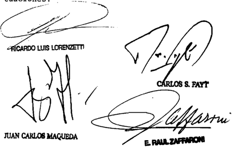

1o en el 22 se la queja al principal Y, oportunamente, devuelvanse las actuaciones

Recurso de hecho interpuesto por el Batado Nacional Interior Policía Federal representados por la

Tribunal de origen: Cámara Federal

Tribunales que intervinieron con anterioridad: Juzgado Federal de Prinera tancia Social 5 , Becretaría

P. DE c., M. c/ INSTITUTO DE SEGUROS DE JUJUY Y ESTADO PROVINcIAL S/ QUEJA

DERECHO A LA SALUD.

Si el art. 1º del decreto 945/97 reglamentario de la ley 24.734 prevé que los beneficiarios de pensiones no contributivas por invalidez tendrán derecho a hacer

uso de los servicios del sistema de salud, siempre que no gozaren de cualquier otra obra social, ya sea como afiliados directos o como adherentes a cargo de un familiar, la afiliación del hijo discapacitado de la demandante al Programa Federal de Salud no tenía carácter obligatorio sino que era optativo, por lo que corresponde ordenar al Instituto de Seguros de Jujuy demandado que le restituya los servicios asistenciales de que gozaba, sin perjuicio de la cobertura integral que dicho organismo deberá brindarle en los términos del art. 16 de la ley 4398 de la Provincia de Jujuy, en virtud de su particular condición, amparada por el art. 48 de la Constitución Provincial.

## DERECHO A LA SALUD.

La protección ínsita en la garantía constitucional contenida en el art. 48 de la Constitución de la Provincia de Jujuy en relación a los discapacitados no constituye una mera enunciación programática, sino que pesan sobre la estructura local responsabilidades semejantes -que se proyectan sobre las entidades públicas y privadas de ese ámbito- a las que incumben a la Nación en la esfera federal, lo cual no implica desconocer el rol que tiene el Estado Nacional en subsidio de las prestaciones de salud a cargo de la jurisdicción provincial para el caso en que éstas no pudieran ser provistas (párrafos 1 y 2 del art. 28 del Pacto de San José de Costa Rica) (Del voto de la mayoría, no adhirió en este punto la Dra. Carmen M. Argibay).

## DIcTAMEN DE LA PROcURAcIóN GENERAL

## Suprema Corte:

- I -

Los jueces del Tribunal Contencioso Administrativo de la ciudad de San Salvador de Jujuy, admitieron la acción entablada en autos, por la que se persigue la continuidad de la afiliación del actor discapacitado en el Instituto de Seguros de Jujuy (Estado provincial).

Para así hacerlo, consideraron principalmente que:- (i) El Plan Federal de Salud fue asumido por el Gobierno Nacional y por las administraciones provinciales y de la Ciudad Autónoma de Buenos Aires, a los fines de mejorar y asegurar el acceso de todos los habitantes a los servicios y medicamentos. (ii) El Decreto 292/95 dispuso que la cobertura de salud de los titulares de pensiones no contribu-

tivas estuviese a cargo de la ex Secretaría de Desarrollo Social de la Presidencia de la Nación. Luego, el Decreto 492/95 determinó que la atención de pensionados no contributivos por invalidez, se canalizara por la vía del Instituto Nacional de Servicios Sociales para Jubilados y Pensionados (INSSJP). A su vez, la ley 24.938 (art. 77) puso en cabeza de la Comisión Nacional de Pensiones Asistenciales, a través de la Dirección Nacional de Prestaciones Médicas y en el marco del Programa Federal de Salud, la cobertura relativa a las pensiones obtenidas con posterioridad al 1/1/99. (iii) El citado art. 77 acordó la posibilidad de optar entre la cobertura de INSSJP, la Secretaría de Desarrollo Social de la Presidencia de la Nación y/o las obras sociales de la ley 23.660 (art. 1, inc. a). (iv) El Decreto 292/95 (art. 11), estableció que los jubilados y pensionados provenientes de los agentes del Sistema Nacional del Seguro de Salud, podrán optar por afiliarse al INSSJP o a cualquier otro agente inscripto en el registro, entidades que quedan obligadas a recibir sin condicionamientos a los beneficiarios, su grupo familiar y adherentes. (v) De las normas mencionadas surge que los beneficiarios de pensiones no contributivas por invalidez cuentan con libertad de elección entre dichos agentes. (vi) El actor estuvo afiliado como adherente de su madre al Instituto de Seguros de Jujuy (ISJ) y siendo de carácter optativo su ingreso en el INSSJP, procede acoger la acción interpuesta.

Al cuestionar la solución referida, la Fiscalía de Estado de esta provincia arguyó que: (i) el ISJ es una obra social provincial no vinculada por la ley 23.660, ni regulada por la Superintendencia del Seguro de Salud, ni sujeta al Programa Médico Obligatorio, por lo que no goza del beneficio que brinda la Administración de Programas Especiales. (ii) las obras sociales sindicales y el INSSJP, por una parte, y las obras sociales provinciales por la otra, son compartimientos no relacionados entre sí, es decir que los afiliados de estas últimas no pueden elegir una obra social nacional y viceversa. (iii) el actor percibe una pensión graciable, por lo cual se le efectúan descuentos por el Plan Federal de Salud, quedando en evidencia una doble cobertura médico asistencial. (iv) el hecho de que la curadora no haya gestionado la afiliación ante el PROFE no puede generar responsabilidad para el ISJ. (v) el instituto provincial no está habilitado a otorgar al actor los beneficios de la ley local 4.398/88, en tanto su art. 6 asegura los servicios asistenciales médicos, educativos y de seguridad social a quienes se encuentran en la imposibilidad de obtenerlos, conforme al art. 48 de la Constitución de la Provincia de Jujuy.

A su turno, la mayoría del Superior Tribunal de Justicia hizo lugar al recurso local de inconstitucionalidad así planteado, con fundamentos que giraron exclusivamente en torno al apresuramiento que atribuyó a la curadora del actor insano. En efecto, los jueces se limitaron a sostener que -denegada la continuidad del servicio médico por parte del ISJ, en razón de contar con una pensión no contributiva por incapacidad, de donde debería acudirse a los programas nacionales-, la Sra. P. presentó diligentemente una nota de consulta, que el Programa Federal de Salud contestó afirmativamente. Esta circunstancia, dicen, demuestra que la representante legal del enfermo ni siquiera esperó o realizó los trámites que demostraran que el Programa mencionado no cubre ni cubriría las necesidades de su hijo incapaz, según lo invoca en la demanda. De allí derivan que no existió por parte del ISJ una actitud caprichosa, y que la sentencia de la Cámara es arbitraria, por haberse apartado de la valoración de prueba relevante para resolver la controversia. Finalmente, consideraron innecesario tratar '...los otros agravios traídos a estudio en razón de lo resuelto y por razones obvias...'.

- II -

Contra este último fallo, la parte actora interpone recurso extraordinario federal, cuya denegatoria da lugar a la presente queja. La apelación se basa centralmente en la arbitrariedad del fallo, por el carácter meramente dogmático de la sentencia, que sólo encontraría sustento en la voluntad de la mayoría, prescindiendo de las normas constitucionales y de los tratados internacionales. No puede decirse, reprocha, que una pensión graciable y el Programa Federal de Salud, inhabiliten a un incapaz para proseguir con la cobertura del ISJ, eximiendo al Estado provincial de su responsabilidad en cuanto a la asistencia que debe brindarle al insano que se incorporó oportunamente a su estructura como hijo de una empleada pública.

Aduce que el art. 15 de la ley provincial nº 4398 establece que las  personas  discapacitadas  carentes  de  recursos  quedarán  automáticamente afiliadas al ISJ a cargo del Estado provincial, y los no comprendidos en las condiciones anteriores, revestirán la calidad de adherentes con el mínimo aporte. Con ello, repone, al no permitirse la permanencia del insano en el ISJ, se vulnera el tratamiento igualitario consagrado en los arts. 16 de la Constitución Nacional y 25 de la Constitución provincial.

Invoca el derecho a la salud como ligado al derecho a la vida, a la calidad de vida y a la dignidad. Cita los arts. 41, 42 y 75, inc. 19 y 23, de la Constitución Nacional, la Declaración de los Derechos Humanos, el Pacto Internacional sobre Derechos Económicos Sociales y Culturales y la Convención Americana de Derechos Humanos, enfatizando que sus cláusulas no son retóricas sino derecho de la Constitución con fuerza normativa.

- III -

En cuanto a la procedencia formal del recurso extraordinario, entiendo que -más allá de las imprecisiones que exhibe la redacción-, el núcleo de la crítica actoral y la naturaleza de la cuestión en debate trascienden a partir del examen de las piezas pertinentes, con suficiente nitidez como para aconsejar que se les dé curso (arg. Fallos: 328:3869; 310:1000 y 308:236).

A partir de allí, cabe señalar que en autos existe materia federal por cuanto el litigio gira en torno a la inteligencia de previsiones federales atinentes al Sistema de Salud (arg. Fallos: 323:3229; 324:3569).

Finalmente, y alegada la arbitrariedad del fallo, interpreto que corresponde tratar en primer lugar lo atinente a esa tacha, dado que de existir no habría, en rigor, una sentencia propiamente dicha (Fallos: 330:1903; 2234; 2564 y 4706).

En esa tarea, he de volver a la reseña efectuada en el punto I, pues de ella resulta claro que el debate se planteó acerca de dos órdenes concretos de cuestiones a dilucidar: 1º) si el régimen federal de salud le es aplicable al instituto provincial que no ha adherido al sistema, punto éste que -a su vez- trae implicado el problema relativo a la elegibilidad del ISJ, cuando el insano es titular de una pensión no contributiva por invalidez que lo ubicaría en la esfera del Programa Federal de Salud (PROFE); y 2º) si la regulación local aplicable (ley 4.398/88, que a su

vez remite al art. 48 de la Constitución), impide al Estado provincial proveer asistencia al insano.

Sin  embargo, la  Corte  jujeña  consideró  innecesario  examinar esos temas -presentes en todas las etapas del proceso- y respondió, a mi ver dogmáticamente, a partir de una faceta que no le había sido propuesta. Me refiero a la conducta de la curadora, que -como ya lo adelanté- se calificó de precipitada al no verificar si las prestaciones del PROFE satisfarían o no las necesidades del enfermo, aunque la madre se encargó de aclarar en la demanda -y los jueces tomaron nota de ello- que dicho organismo no asumiría las prestaciones del establecimiento que lo habría tratado y contenido durante muchos años.

Así las cosas, el tribunal superior de la causa se rehusó, por un lado, a ingresar siquiera en la materia federal ínsita en el conflicto. Y, por otro, se negó a abordar las implicancias en el caso de normas locales específicas, como son el art. 48 de la Constitución de Jujuy y el denominado Régimen Jurídico Básico y de Integración Social para las Personas Discapacitadas (ley 4398), pues no analizó las proyecciones de sus arts. 6 y 15 en el marco del espíritu y finalidades propias de la materia.

A esta altura, cabe recordar que si bien los tribunales no están obligados a seguir a las partes en todas sus alegaciones, es su deber pronunciarse sobre los puntos propuestos por ellas en tanto sean pertinentes a una adecuada solución del juicio. La omisión de tratamiento de tales aspectos afecta la garantía del debido proceso consagrada por el art. 18 de la Constitución Nacional; arts. 8.1. y 25 del Pacto de San José de Costa Rica y 14.1 del Pacto de Derechos Civiles y Políticos, por lo que el decisorio merece descalificarse y devolverse el expediente para que se estudien las cuestiones omitidas (arg. Fallos: 329:3956 y 330:4706, entre otros).

- V -

Por último, atento a la índole del proceso atinente a la salud de una persona afectada por una enfermedad mental y al compromiso internacional que obliga al Estado argentino en los términos de la

Convención sobre los Derechos de las Personas con Discapacidad (ley 26.378), me he de permitir señalar que, según el informe labrado por la Defensoría Oficial ante esa Corte a fs. 40, no se estaría observando la medida cautelar de mantenimiento de la cobertura asistencial del paciente (v. fs. 43 del exp. nº 115001). Por ende, estimo de la mayor importancia que se dé estricto cumplimiento a dicha precautoria, hasta tanto se resuelva la controversia.

En tales  condiciones,  sin  que  ello  implique  adelanto  alguno de opinión acerca de la solución del pleito, opino que V.E. debe declarar procedente el recurso extraordinario, dejar sin efecto la sentencia y restituir las actuaciones para que se dicte nuevo pronunciamiento. Buenos Aires, 19 de agosto de 2011. Marta A. Beiró de Gonçalvez.

## FALLO DE LA cORTE SUPREMA

## Buenos Aires ,

Vistos autos: "Recurso de hecho deducido por Marta Pérez de Capiello por s1 Y por su hijo Tomás Capiello en la causa Pérez de Capiello, Marta c/ Instituto de Seguros de Jujuy Y Estado Provincial" para decidir sobre su proçedencia.

## Considerando:

1%) Que la actora, en representación de su hijo declarado incapaz por padecer una psicosis esquizofrénica severa que 1o obliga recibir atención diaria, inició una acción de amparo contra el Instituto de Seguros de Jujuy Y el Estado Provincial, fin de obtener el inmediato restableciniento de todos los servicios asistenciales que gozaba su hijo afiliado adherente esa obra social, de cual había sido dado de baja

en razón de que al percibir una prestación no contributiva por invalidez, tenía la posibilidad de acceder al Programa Federal de Salud , al que a Provincia de Jujuy se encontraba adscripta-

2" ) Que el Tribunal Contencioso Administrativo local hizo lugar la pretensión, cuyo efecto 'consideró que el art 77 de la ley 24 . 938 establecía que los beneficiarios de una pen sión no contributiva por invalidez eran libres de optar por su afiliación al Instituto Nacional de Servicios Sociales para Jubilados Y Pensionados , la Secretaría de Desarrollo Social de la Presidencia de la Nación las obras sociales de la ley 23.660 (art inciso a) , , de manera tal que la elección del minusválido por conservar obra social de su madre para continuar el tratamiento que venía recibiendo través del Instituto de Seguros de Jujuy, era plenamente eficaz esos efectos

Que apelada esa decisión, el Superior Tribunal de Justicia de Jujuy, por mayoría, la revocó Para ello estinó que parte actora se había apresurado en interponer la acción de amparo, toda vez que el gerente del Programa Federal de Salud de 1a Provincia le había informado que podía incluirse su hijo en ese plan no se había denostrado que dicho programa no cubriera sus necesidades, tal como demandante alegaba sin haber realizado antes trámites pertinentes

4 % ) Que contra dicho pronuncianiento demandante dedujo el recurso extraordinario cuya denegación dio origen la presente queja, que suscita el exanen de cuestión federal para su tratamiento por la vía elegida, según 10 destaca la señora Procuradora Fiscal en su dictamen de fs\_ 42/44 , cuyos fundamen tos el Tribunal comparte Y da por reproducidos por razón de brevedad

5 " ) Que , sin perjuicio de ello, la naturaleza de 1os intereses en debate Y manifestado por actora Y el Defensor Oficial en orden conveniencia de que el tratamiento asistencial continúe en el ámbito en se desarrolla en la actualidad, justifica que esta Corte, haciendo uso de las facultades que le otorga el art. 16 de la 48 , se expida en forma defique ley

nitiva respecto de la pretensión de amparista, interpretando preceptos en juego fin de tutelar debidanente 10s derechos comprometidos en el litigio (doctrina de Fallos: 318:1246)

6" ) Que , en efecto, tanto 10s agravios de 1a recurrente como las consideraciones dadas por el Defensor Oficial ante la Corte, ponen de manifiesto que 10 que aquf se discute atañe aplicación, inteligencia interpretación de normas federales , conO son las que tutelan el derecho la salud de los discapacitados Y las que regulan el Programa Federal de Salud \_ En este plano, el Tribunal no se encuentra por 1os argumentos de las partes del quo , sino que le incunbe realizar una declaración sobre el punto debatido (Fallos: 320:1602 Y 323:1656)

Que no se encuentra discutido que el hijo de la demandante ha sido declarado incapacitado por las autoridades administrativas pertinentes Y en juicio, encontrándose bajo la curatela de su madre (fs\_ 65 , 67 , 79 Y 99 del expediente principal) que es afiliado al Instituto de Seguros de Jujuy desde julio de 1990 , en su carácter de adherente la cobertura de salud de su progenitora, obra social que le brindó una asistencia integral para su patología psiquiátrica de conformidad con es tablecido en el régimen jurídico básico Y de integración para las personas discapacitadas previsto por la ley local 4398 (fs 82 103 y 108 vta.) ; Y que en junio de 2004 se dio de baja su afiliación frente la constancia que daba cuenta de la existencia de una pensión no contributiva por invalidez en la que figuraban descuentos para el Programa Federal de Salud (fs. 91 , 104 105 de la mencionada causa)

8 0 ) Que el debate versa acerca de si atañe demandada la obligación de continuar cubriendo en forma integral las prestaciones básicas por discapacidad que la actora reclama para su hijo, si éste debería recibir asistencia del Programa Federal de Salud al que todavía no se encuentra afiliado (fs. 95 del principal 40 de la queja)

90 ) Que el texto originario del art 41, inciso e, de

la ley 4282 , en virtud del cual el minusválido obtuvo su cobertura de salud en el Instituto de Seguros de Jujuy, según surge de la copia del carnet obrante fs 82 , establecía que 10s hijos incapacitados mayores de 21 años cargo del afiliado titular, serían considerados beneficiarios indirectos del Seguro de Salud , siempre que convivieran con aquél no se hallasen am parados obligatoriamente por otro sistema de salud similar.

10 ) Que tanto en 1os dictámenes de fs . 91 Y 104 , como al contestar demanda , el Instituto de Seguros alegó la existencia de una doble cobertura como fundamento para dar de baja afiliación. sin enbargo, dicha duplicidad nunca existió En efecto, el art del decreto 945/97 , reglamentario de la 24 . 734 , prevé que los beneficiarios de pensiones no contributivas por invalidez tendrán derecho de hacer de 1os servicios del sistema de salud, siempre que no gozaren de cualquier otra obra social, ya sea como afiliados directos como adherentes cargo de un familiar, supuesto en el que se hallaba el hijo de la demandante ley

1l) Que lo dispuesto por dicha disposición fue COrrOborado por la representante del Programa Federal de Salud de Jujuy en la nota obrante del expediente principal, en la que informa la peticionaria que su hijo podía ser adscripto ese plan de salud, en caso de no poseer otra cobertura análoga \_ Se desprende de ello, que la afiliación al Programa Federal de Salud no tenía carácter obligatorio sino que era optativo para el discapacitado que ya estaba cubierto por la obra social de su madre Dicha opción no fue ejercida en virtud de que suponía un cambio en la institución psiquiátrica que amparaba desde ha cía varios anos y su traspaso otra que no tenía ~a su entenderlas condiciones necesarias para atenderlo (fs. 40 del recurso directo)

12) Que , en tales condiciones, toda vez que la afiliación del minusválido al Instituto se había producido como consecuencia de la aplicación del mencionado art 41 de la 4282, cuyos requisitos aparecen cumplidos en el caso, Y dado ley

que su situación también se encuentra contemplada en el art 15 de la ley 4398 , en cuanto establece afiliación al Instituto de Seguros de Jujuy de que hubieran sido declarados discapacitados ~tuvieran no recursos-, corresponde ordenar la de mandada que restituya al hijo de actora 1os servicios asistenciales de los que gozaba, sin perjuicio de cobertura integral que dicho organismo deberá brindarle en los térninos del art 16 de última ley citada, en virtud de su particular condición, amparada por el art. 48 de Constitución Provincial\_

13) Que la protección insita en dicha garantia constitucional no constituye una mera enunciación programática, sino que pesan sobre estructura local responsabilidades semejantes 'que proyectan sobre las entidades públicas Y privadas de ese ámbitolas que incumben la Nación en la esfera federal, lo cual no implica desconocer el rol que tiene el Estado Nacional en subsidio de las prestaciones de salud cargo de la jurisdicción provincial para el caso en que éstas no pudieran ser vistas, aspecto que no ha sido alegado por el organismo en este juicio (conf \_ doctrina de Fallos: 321:1684 ; 323:3229; 328 :4398 párrafos Y del art 28 del Pacto de San José de Costa Rica ) pro-

14 ) Que , por 1o demás , no cabe imponer la persona con discapacidad una mayor mortificación que la que su propio estado le ocasiona, compeliéndola acudir órganos ajenos su cobertura de máxine cuando el traslado fuera de la Órbita en que recibe su asistencia médica habitual, representa un dispendio de fondos Y recursos humanos que sustrae posibilidades de tratamiento otros enfermos que necesitan dentro del sistema general de salud pública

15) Que la consideración de este aspecto resulta con gruente con la obligación asumida por el Estado Nacional en virtud de dispuesto en el art 12 , apartados 1 Y 2 , inciso d, del Pacto Internacional de Derechos Económicos, Sociales y Culturales ~incorporado nuestro derecho interno por 23.313, con rango constitucional según dispuesto en el art 75 , inc 22 , de la Fundamentalen cuanto exige 1os Estados firmanley Ley

tes el reconocimiento del derecho de todà persona al disfrute del más alto nivel posible de salud física Y mental para 1o cual se comprometen crear las condicionés que aseguren, todos , asistencia médica en caso de enfermedad (voto de la jueza Highton de Nolasco en la causa "Gómez, Mirta Liliana publicado en Fallos 327:5270)

Por ello, en concordancia con los fundamentos del dictamen de la señora Procuradora Fiscal, el Tribunal resuelve: hacer lugar al recurso de hecho , declarar procedente el recurso extraordinario, revocar la sentencia apelada Y ordenar al Instituto de Seguros de Jujuy que restablezca cobertura de Raymundo Tomás Capiello con el alcance indicado en 1a presente Agréguese queja al Y devuélvase .

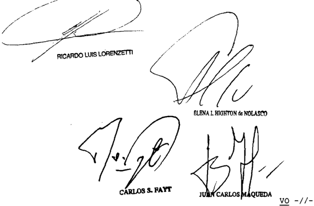

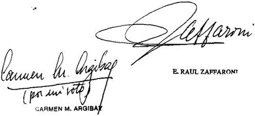

## =/ -Io DE LA SEÑORA MINISTRA\_DOCTORA DOÑA CARMEN M ARGIBAY

## Considerando:

Comparto 1os fundamentos expuestos en 1os considerandos 12 del voto de la mayoría, 1os que me remito por razón de brevedad\_

Por ello, en concordancia con 1og fundamentos del dictamen de la señora Procuradora Fiscal, el Tribunal resuelve hacer lugar al recurso de hecho, declarar procedente el recurso extraordinario, revocar 1a sentencia apelada y ordenar al Instituto de Seguros de Jujuy que restablezca cobertura de Raymundo Tonás Capiello con el alcance indicado en la presente. Agréguese la queja al noti devuélvase

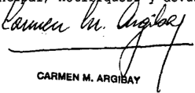

Recurso de hecho interpuesto por Marta de Capiollo, curadora de hijo Raymundo por la Dra

Tribunal de origen: Suparior Iribunal de Justicia de Jujuy

Tribunales que intervinieron con anterioridad: Contonciobo Adninibtrativo de San Salvador de Jujuy

PONcE, cRISTIAN LEANDRO c/ ANAcRI S.A. Y OTRO S/ AccIDENTE

## ACCIDENTES DEL TRABAJO.

Cabe dejar sin efecto por arbitrariedad la sentencia que rechazó la demanda de indemnización por daños y perjuicios derivados de un accidente laboral, basada en el Código Civil, sosteniendo el a quo que 'ni aun la omisión total de cumplimiento de deberes relacionados con la prevención de los accidentes de trabajo' podía ser calificada como causa adecuada del daño, toda vez que los motivos invocados han omitido referencia alguna a las circunstancias comprobadas de la causa que pudieran respaldarlos, al tiempo que han soslayado elementos de ilustración que,

tomados en cuenta en el pronunciamiento revocado, resultan conducentes para el debido esclarecimiento del litigio.

-Disidencia de los jueces Enrique Santiago Petracchi y Juan Carlos Maqueda (La mayoría declaró inadmisible el recurso extraordinario, art. 280 del CPCCN)-.

## DIcTAMEN DE LA PROcURAcIóN GENERAL

## Suprema Corte:

- I -

Contra la decisión de la Sala VIII de la Cámara Nacional de Apelaciones del Trabajo -CNAT- que confirmó la sentencia de primera instancia en cuanto declaró la inconstitucionalidad del art. 39, primer párrafo, de la Ley de Riesgos del Trabajo (LRT nº 24.557), admitió el reclamo de indemnización por accidente de trabajo con fundamento en normas de derecho común, y rechazó la demanda contra la aseguradora de riesgo del trabajo (Liberty ART S.A.), la actora dedujo el recurso extraordinario federal cuya denegación dio origen a la queja en examen (v. 916/918, fs. 856/864, fs. 931/935 de los autos principales que se citarán en lo sucesivo; y fs. 19/23 del cuaderno respectivo).

- II -

Para así decidir, el a quo -en síntesis y en lo que interesa- sostuvo que ni aún la omisión total de los deberes relacionados con la prevención de los accidentes de trabajo podría ser calificada como tal, ya que su estricto cumplimiento no hubiera evitado el desmoronamiento de las paredes de tierra de la zanja de desagüe donde el actor se encontraba trabajando a unos dos metros de profundidad. Agregó que no se debe confundir la responsabilidad administrativa por omisión de un comportamiento debido, sancionable en el marco de la ley especial, con la responsabilidad civil genérica, que requiere, para su operatividad, la concurrencia de una relación de causalidad material entre el hecho o acto y el resultado, también material, lesivo para el sujeto pasivo. Remitió a su voto en los precedentes 'Rivero c/ Techotécnica' y en 'Galván c/ Electroquímica' y finalizó afirmando

que la responsabilidad de la aseguradora no debe exceder de la asumida al contratar el seguro, salvo que incurra en un comportamiento dañoso subsumible en alguno de los subsistemas de responsabilidad diseñados por el Código Civil, con la concurrencia de los elementos de la relación de responsabilidad; ilicitud, daño, relación causal y factor de imputación legal.

- III -

En el remedio federal la actora se agravia, con sustento en la doctrina de la arbitrariedad, porque -dice- la sentencia impugnada vulnera el derecho de la defensa en juicio y el de propiedad garantizados por los artículos 17 y 18 de la Constitución Nacional. Interpreta que se rechaza el reclamo contra la Aseguradora de Riesgos del Trabajo (ART) sin valorar correctamente la prueba rendida en autos ni considerar y debatir los tratados internacionales citados en el escrito de demanda, convalidando las omisiones y falta de cumplimiento de sendas obligaciones legales. Sostiene que la ART de haber actuado en debida forma, hubiera evitado el accidente que ocasionó la incapacidad laborativa del trabajador de 19 años de edad (41% de la t.o.) reconocida en la sentencia.

Afirma que existieron omisiones imperdonables de la accionada, entre ellas, la falta de prevención, de control de las condiciones y ambiente de trabajo, violando las normas de la LRT y su decreto reglamentario 170/96. Indica que las visitas a la obra se realizaron a partir del día del accidente denunciado y que las recomendaciones se efectuaron después de ocurrido el infortunio. Agrega que no hay constancias de registros de capacitación al damnificado, ni constancia de entrega de elementos de seguridad incumpliendo lo establecido en la Ley de Seguridad e Higiene y decreto reglamentario (ley nº 19.587 y Dto. 351/79) y lo establecido por el art. 4 de la LRT. Señala que de la prueba pericial contable se desprende que desde octubre de 2003 hasta la fecha del accidente (agosto 2004) no hubo visitas a la empresa asegurada, en violación de lo dispuesto por el art. 19 del decreto nº 170/96, que dispone que las ART deben realizar actividades permanentes de prevención de riesgos y control de las condiciones y medio ambiente de trabajo. Asegura que el nexo de causalidad está demostrado por la falta de visitas a la obra, falta de control e inspección, falta de conocimiento del ámbito de trabajo, falta de capacitación del personal. Entiende que están alcanzados los factores de atribución de responsabilidad con sus

elementos tipificantes sin perjuicio de invocar el precedente 'Torrillo' de la Corte.

En primer término, cabe señalar que si bien los agravios relacionados con la atribución de responsabilidad de la aseguradora de riesgos del trabajo, remiten al examen de cuestiones de hecho, prueba, y derecho común, materia ajena -como regla y por su naturaleza- a la instancia del artículo 14 de la ley 48, V.E. también tiene dicho que ello no resulta óbice para admitir el recurso, cuando se ha omitido dar un tratamiento adecuado a la controversia de acuerdo a los términos en que fue planteada, el derecho aplicable y la prueba rendida, y por tanto el pronunciamiento no constituye un acto judicial válido (doctrina de Fallos 311: 1656, 2547; 317:768, entre otros).

En efecto, el a quo señala genéricamente que '...ni aún la omisión total de cumplimiento de deberes relacionados con la prevención de los accidentes de trabajo podría ser calificada como tal, ya que su estricto cumplimiento no hubiera evitado el desmoramiento...' (v . fs. 917, punto III), argumento que no sólo carece de respaldo técnico adecuado, sino que además no se hace cargo del informe del perito ingeniero, que destacó el juez de primera instancia, en el sentido que las medidas de seguridad pertinente hubiesen evitado el derrumbe que fracturó las piernas del trabajador.

Además el juez de grado tuvo en cuenta el informe del perito ingeniero en cuanto detalló los registros de visita de la ART a la obra, de la cual se desprende que la primera vez que se realizó dicha diligencia fue el día del accidente, aunque sin que se apuntara la hora, es decir sin que se pueda saber si fue con anterioridad o posterioridad al hecho (v. fs. 859, párrafo 5º).

La recomendación en esa oportunidad fue que estaba realizando excavaciones sin 'tablestacas', que la empresa no cuenta con Legajo técnico, sino un servicio de Higiene y Seguridad a través de un asesor externo, no existen constancias de registro de capacitación para el trabajo de zanjeo, colocación de caños y uso de elementos de seguridad, como tampoco personal que compruebe la estabilidad del terreno y decida la colocación de algún medio eficaz a fin de evitar el derrumbe

que ocasionó la rotura de las piernas del trabajador (v. fs. 859, párrafo 5º). La sentencia de primera instancia concluyó que se encontraba fehacientemente comprobado el incumplimiento tanto de parte de la empleadora, como de la ART, de las obligaciones a su cargo que emanan de las normas de Seguridad e Higiene, pues de haberse tomado las medidas que surgen del Programa de Seguridad el accidente no hubiera ocurrido. Asimismo puso de relieve que si la ART hubiese efectuado sus visitas de contralor con anterioridad a la fecha del accidente, es decir, desde el comienzo de la obra se hubiesen dado las instrucciones preventivas adecuadas (v. fs. 860).

A su vez aquella afirmación del a quo también contradice todo el sistema legal que impone precisamente un deber de conducta tendiente a morigerar las consecuencias dañosas cuando en determinadas circunstancias, en que concurren situaciones de riesgo previsibles, se obliga de manera deliberada a llevar adelante una actuación positiva, eficaz, para evitar el daño. En aquella línea, el juez de la primera instancia sostuvo que el legislador ha delegado en las aseguradoras de riesgos del trabajo todo lo relativo al control y sujeción de los empleadores a las normas seguridad e higiene imponiéndoles diversas obligaciones de control y supervisión (art. 1º, ap. 2 inc. a, ley 24.557). Asimismo las ART deben ofrecer asistencia técnica y promover la capacitación del trabajador. Además el magistrado actuante en la instancia inferior citó la Ley de Seguridad e Higiene (nº 19.587, arts. 7 y 8) y en especial su art. 9, inciso k, que determina el nacimiento de la responsabilidad delictual civil en virtud de los arts. 902 y 1074 del Código Civil (v. fs. 860, párrafo 6º), sin que el a quo examinara dichos preceptos y antecedentes en forma adecuada.

A ello se añade la segunda aseveración de la sentencia en crisis en cuanto señaló: '...la  responsabilidad civil genérica, que requiere; para su operatividad, la concurrencia de una relación de causalidad material entre el hecho o acto y el resultado, también material, lesivo para el sujeto pasivo...' (v . fs. 917, punto III), de la cual no produjo ningún análisis concreto referido a las circunstancias del caso, a fin de refutar los precisos fundamentos del juez de primera instancia, con envergadura tal que alcance para revocarlos. Sin embargo, el a quo creyó suficiente, para ello la remisión, sin más, a precedentes jurisprudenciales sin puntualizar en qué aspectos resultaban similares a la presente causa. Al respecto, cabe recordar que V.E. en el caso 'Soria' aseveró que no corresponde eximir de responsabilidad a la ART

en los términos del art. 1074 del Código Civil, basado exclusivamente en descartar la relación de causalidad entre el daño y la conducta de aquélla en la observancia de sus obligaciones, sin efectuar el previo examen de las circunstancias de hecho propias de la causa y agotándose en conclusiones no precedidas de demostración alguna. Atento el carácter eminentemente fáctico de la responsabilidad en el infortunio laboral, no puede entenderse que la ausencia de motivación de la sentencia quede saneada por la remisión a precedentes que conciernen a otros litigios (Fallos 330:1550).

Todo ello, sin perjuicio que las afirmaciones genéricas del a quo expuestas en el párrafo precedente carecen como dije de un examen pormenorizado de las cuestiones estudiadas en detalle por el juez de primera instancia (v. 859/960) y la falta de similitud del caso con los antecedentes citados en el decisorio en crisis. Al respecto, debo advertir que en el caso 'Galván', citado por el a quo como sosteniendo su posición, contrariamente a la intención con que fue invocado en la sentencia cuestionada, la Corte descalificó el pronunciamiento de la Cámara porque se había apartado palmariamente de la constancias de la causa (v. Fallos 330:4633, considerando 3º).

Es del caso añadir que esta Procuración General tuvo oportunidad de expedirse en el antecedente 'Rivero', en sentido contrario, registrado en Fallos: 325:3265, citado por el a quo. No obstante, sobre el punto también se manifestó en los dictámenes en autos: S.C. P. nº 673, L. XXXVII y P. nº 961, L. XXXVII, 'Ponce, Ricardo Daniel c/ Ferrosider S.A. y otro'; del 10 de marzo de 2004; y S.C. P nº 1819, L. XXXIX; 'Pesaresi, Walter D. c/ Cooperativa de Agua y Luz de Pinamar s/ accidente', del 30 de septiembre de 2004; a cuyos términos cabe remitir, en lo pertinente, por razón de brevedad, y en especial, a que la exigencia de 'prevenir eficazmente' (art. 4 LRT) supone una conducta anticipada de tal envergadura que provoque una interrupción en la cadena causal que desemboca indefectiblemente en el daño. En efecto, en oportunidad del dictamen 'Ponce c/ Ferrosider', citado, esta Procuración señaló respecto a la teoría de causalidad adecuada -materia de debate en esta oportunidad- y los alcances previstos en los arts. 901 al 906 del Código Civil (citados por el a quo) que en cumplimiento de la finalidad de prevención del ordenamiento, exige a la ART, mediante medidas adecuadas, su interposición oportuna para conjurar el riesgo. La falta de su intervención idónea y adecuada de conformidad con las normas exigibles para el caso, tiene virtualidad suficiente para con-

siderar que hay relación causal. La hipótesis formulada sobre la base de que la actitud negativa de la ART no causó directamente el daño, no descarta que la acción positiva esperada y jurídicamente exigible habría evitado o disminuido ese daño. En este punto, cabe recordar que en oportunidad del dictamen del precedente 'Ponce', se puntualizó que las labores preventivas eficaces para impedir la frustración de los fines para los que estuvo diseñado el sistema de la LRT, debe ser un modelo activo que apunta más allá del cumplimiento de las formas; pues deben existir tareas concretas y demostrativas de que se hizo todo lo técnicamente posible y conducente para intentar evitar una situación de riesgo como la que produjo el hecho dañoso (v. Dictamen 'Ponce', citado, punto V).

Tal como V.E. puntualizó en el caso 'Soria', de no seguirse en la línea señalada, se incurriría en un apartamiento palmario del derecho aplicable (art. 1074 C.C.), al consagrar una suerte de exención de responsabilidad civil, absoluta y permanente, de las ART respecto de sus obligaciones en materia de prevención de los riesgos del trabajo, pues uno de los objetivos que caracteriza a la ley 24.557 y su decreto reglamentario 170/96, es reducir la siniestralidad laboral a través de la prevención de los riesgos, a lo que se suma haber emplazado a los entes aseguradores, entre otros sujetos, como obligados a adoptar las medidas legalmente previstas para prevenir eficazmente dichos riesgos (Fallos 330:1550).

A esta altura no podemos dejar de recordar el precedente 'Torrillo' (Fallos 332:709), citado por la recurrente (v. fs. 933vta.) en el cual V.E. señaló que: '... no existe razón alguna para poner a una ART al margen del régimen de responsabilidad previsto por el Código Civil, por los daños a la persona de un trabajador derivados de un accidente o enfermedad laboral, en el caso en que se demuestren los presupuestos de aquél, que incluyen tanto el acto ilícito y la imputación, cuanto el nexo causal adecuado (excluyente o no) entre dichos daños y la omisión o el cumplimiento deficiente por parte de la primera de sus deberes legales. Tampoco las hay, dada la variedad de estos deberes, para que la aludida exención, satisfechos los mentados presupuestos, encuentre motivo en el solo hecho que las ART no pueden obligar a las empleadoras aseguradas a cumplir determinadas normas de seguridad, ni impedir a éstas que ejecuten sus trabajos por no alcanzar ciertas condiciones de resguardo al no estar facultadas para sancionar ni para clausurar establecimientos. Esta postura, sin rebozos, conduciría a una exención general y permanente, por cuanto se funda en

limitaciones no menos generales y permanentes. Asimismo, pasa por alto dos circunstancias; por un lado, al hacer hincapié en aquello que no les está permitido a las ART, soslaya aquello a lo que están obligadas: no se trata, para las aseguradoras, de sancionar incumplimientos o de imponer cumplimientos, sino de algo que antecede a ello, esto es, prevenir los incumplimientos como medio para que éstos, y los riesgos que le son anejos, puedan evitarse. Por el otro, olvida que no es propio de las ART permanecer indiferentes a dichos incumplimientos, puesto que la ya citada obligación de denunciar resulta una de sus funciones preventivas...' (Fallos 332:709, considerando 8º).

Concluyo, entonces, que el fallo no constituye una derivación razonada del derecho vigente con arreglo a las circunstancias del caso, por lo que, al afectar las garantías constitucionales invocadas, corresponde descalificarlo sobre la base de la doctrina de la arbitrariedad, máxime cuando la interpretación del a quo se limita a un análisis parcial y aislado de los diversos elementos de juicio, pero no los íntegra ni armoniza debidamente en su conjunto, se impone entonces su descalificación (Fallos 303:2080, 311:112, entre otros).

Por todo lo expresado, opino que V.E. debe hacer lugar a la queja y al recurso extraordinario, dejar sin efecto la sentencia apelada, y mandar a que se dicte una nueva ajustada a derecho. Buenos Aires, 29 de diciembre de 2010. Marta A. Beiró de Gonçalvez.

## FALLO DE LA cORTE SUPREMA

## Buenos Aires, 6 2le

Vistos los autos "Recurso de hecho deducido por actora en la causa Ponce, Cristian Leandro c/ Anacri Y otro s / accidente" para decidir sobre su procedencia

## Considerando

Que el recurso extraordinario, cuya denegación motivó presente queja, es inadmisible (art. 280 del Codigo Procesal Civil Y Comercial de la Nación)

Por ello, habiendo dictaminado la señora Procuradora Fiscal, se desestima la queja. Notifíquese Y , previa devolución de los autos prineipales , archívese

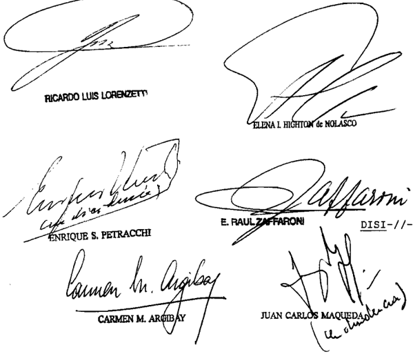

DE LOS SEÑORES MINISTROS DOCTORES DON ENRIQUE SANTIAGO PETRACCHI DON JUAN CARLOS MAQUEDA

## Considerando:

Que 1a Sala VIII de la Cámara Nacional de Apelaciones del Irabajo, al revocar parcialmente la sentencia de la instancia anterior, rechazó la demanda de indemnización por daños Y perjuicios derivados de un accidente laboral, basada en el Código civil, en la medida en que se dirigía contra Liberty ART S .A. Sostuvo el quo , tal fin, que "ni aun la omisión total cumplimiento de deberes relacionados con la prevención de accidentes de trabajo" podía ser calificada como causa adecuada del daño , "ya que su estricto cumplimiento no hubiera evitado el desmoronaniento de las paredes de tierra de zanja de desague

donde el actor se encontraba trabajando unos dos metros de profundidad"\_ Contra ello, el reclamante interpuso recurso extraordinario, cuya denegación motiva esta queja.

Que asiste razón al apelante en cuanto reprocha arbitrariedad al fallo en cuestión, toda vez que 10s motivos en éste se invocan, antes indicados han omitido todas luces, referencia alguna las circunstancias comprobadas de la causa que pudieran respaldarlos, al tiempo que tal comO observa el dictanen que antecede, han soslayado elementos de ilustración que tomados en cuenta en el pronunciamiento revocado, resultan, prima facie evaluados, conducentes para el debido esclarecimiento del litigio En sua , decisión de la sala constituye un acto judicial válido con arreglo conocida doctrina de esta Corte, por cual, sin que ello importe abrir juicio sobre el resultado definitivo de la causa, debe ser dejada sin efecto\_ que no

Por ello, concordemente dictaminado por la señora Procuradora Fiscal, se hace lugar la queja Y al recurso extraordinario, Y se deja sin efecto la sentencia apelada con alcances indicados, con costas (art 68 del Código Procesal civil Comercial de la Nación) Hágase saber, acunúlese la queja al principal Y , oportunanente, devuélvase fin de que por quien corresponda , sea dictado un nuevo pronunciamiento con arreglo al presente

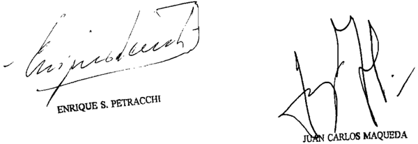

Recurso de hecho interpuesto Cristian Loandro Ponce , representado por Dra \_

Tribunal de origen: VIII de Hacional de dol jo.

Iribunales que intervinieron con anterioridad: Juzgado Naclonal de del Irebejo 43 ,

## ZURITA, LUIS ANGEL c/ ANSES S/ REAJUSTES VARIOS

## MOVILIDAD.

Los agravios de la ANSeS respecto de la ley 4094 de la Provincia de Catamarca aplicada para resolver el reajuste no pueden prosperar ya que plantea que el régimen previsional quedó derogado a partir del 1º de agosto de 1995, en los términos de las cláusulas sexta y séptima del acta complementaria del Convenio de Transferencia de la Nación, pero no se hace cargo de que tales cláusulas establecían la vigencia del sistema jubilatorio local para los beneficios previsionales en trámite y los que se solicitaran hasta el 31 de julio de 1995, que el actor obtuvo su jubilación por el estatuto provincial y que en virtud de lo dispuesto por la cláusula tercera de dicho convenio, la Nación estaba obligada a respetar los derechos adquiridos de los jubilados y pensionados provinciales, cumpliendo las pautas de movilidad de las prestaciones otorgadas de acuerdo con la legislación local vigente al 12 de agosto de 1993, fecha del Pacto Federal para el Empleo, la Producción y el Crecimiento.

## FALLO DE LA cORTE SUPREMA

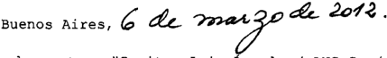

Vistos los autos "Zurita, Luis Ángel c/ ANSeS s / reajustes varios"

## Considerando

1%) Que contra la sentencia de la Sala de la Cámara Federal de la Seguridad Social que confirmó la de la instancia anterior que había admitido la demanda y ordenado la ANSeS que

reajustara la jubilación del actor según la variación del cargo de "director asistencial" por el que se había liquidado el haber inicial, teniendo en cuenta la nueva estructura creada por el decreto acuerdo 28/1998 dispuesto en el decreto de Salud Acción Social 1018/1998 , la demandada dedujo el recurso ordinario fue concedido (art\_ 19 de 1a 24 . 463) ley que

20 ) Que, tal efecto, la alzada ponderó que el actor había obtenido jubilación por retiro voluntario al amparo de local 4094 ; que el art 95 de ese estatuto establecía la movilidad de 10s haberes en función de las variaciones de las remuneraciones de la Administración Pública Provincial que rrespondieran ~en un 828 al cargo los cargos respecto de cuales se hubiera determinado la prestación; que el jubilado se había desempeñado como "director asistente" del Hospital Interzonal, y que dicho cargo había sido incorporado la estructura jerárquica creada por el decreto acuerdo 28/98 Y el decreto SAS 1018/1998 que habían reestructurado el nivel las jefaturas de Áreas Programáticas dependientes de la Dirección Provincial de Medicina Asistencial, por que concluyó que el haber de la prestación debía adecuarse esa nueva ca tegoría\_ ley

3% ) Que 1os agravios de la ANSeS respecto de la ley provincial aplicada por el quo para resolver el reajuste, no pueden prosperar \_ En efecto, la recurrente plantea que el régimen previsional de la Provincia de Catamarca quedó derogado partir del de agosto de 1995 , en términos de las cláusulas sexta Y séptima del acta complementaria del Convenio de Transferencia la Nación, pero no se hace cargo de que tales cláusulas establecían 1a vigencia del sistema jubilatorio local para los beneficios previsionales en trámite Y que se solicitaran hasta el 31 de julio de 1995; que el actor obtuvo su jubilación por el estatuto provincial que en virtud de dispuesto por la cláusula tercera del Convenio de Transferencia, Nación estaba obligada respetar derechos adquiridos de 105 jubilados Y pensionados provinciales, cumpliendo las pautas de movilidad de las prestaciones otorgadas de acuerdo con la legis1 0

lación local vigente al 12 de agosto de 1993 , fecha del Pacto Federal para el Empleo, Producción Y el Crecimiento\_

Que última cláusula citada revela el propósito manifiesto de las partes contratantes de regular separada mente 105 efectos que produciría el traspaso en 105 futuros be neficiarios del sistema previsional respecto de quienes ya tenían un derecho adquirido las jubilaciones pensiones bajo la vigencia del régimen local aspecto que guarda sustancial ana logía al examinado por esta Corte en la causa "Chimondeguy" (Fa332:731 considerandos 10) , cuyas consideraciones corresponde remitir, en lo pertinente, por razón de brevedad \_

Que además , la interpretación dada por la ANSeS las cláusulas sexta Y séptima citadas, en el sentido de que al derogar el régimen previsional de Catamarca establecieron una suerte de caducidad de 10s derechos adquiridos por ese estatuto resulta análoga la que ha sido examinada Y resuelta en la causa "Blanco de Mazzina" (Fallos: 331:232) , en la que el Tribunal desestimó dicha exégesis por considerarla contraria las ga rantías consagradas en 10s arts. 14 bis Y 17 de la Constitución Nacional (conf considerando 12 del precedente mencionado sus citas)

6" ) Que , por último, las impugnaciones de la ANSeS respecto de los cargos por aportes que deberían formularse como consecuencia de la recategorización ordenada , pasan por alto que el fallo de primera instancia admitió la demanda con el alcance indicado en el art 95 de la ley de Catamarca 4094 (t.0\_ por el art 25 de 4620) \_ que establecía en forma expresa en su párrafo segundo el modo de hacer efectivos 1os aportes en estos supuestos aspectos que impiden el tratamiento del planteo mulado sobre el punto ley for-

Por ello, se declara parcialmente procedente el recurso or-

dinario Y se confirma sentencia apelada . Notifíquese de vuélvase

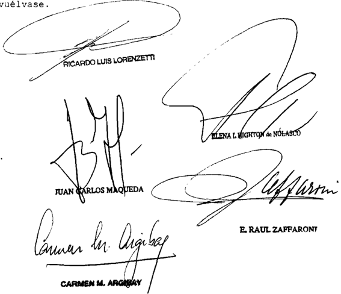

Recurso ordinario interpuesto pOI la Adminibtración Nacional de la Soguridad Social, domandada en autob, representada por 1a Dra Liliana Beatriz Polti calidad de apoderade \_

Traslado contestado por Ángel Zurita actor autob, representado pOr el Marcolo Galindo en oalidad deapoderado \_

Tribunal de origen: Sala Cánara Federal de

Tribunales que intervinieron con anterioridad: Juzgado Bederal de Primera tancia de Cetanarca , Provincia de Catamarca cROVA, MARIA GABRIELA Y OTRO c/ ORGANIZAcION DE SERVIcIOS DIREcTOS EMPR. O.S.D.E. S/ SUMARíSIMO ART. 321 INc. 2 cPccN

## CUESTION ABSTRACTA.

Corresponde declarar abstracta la cuestión relacionada con determinar si la inexistencia de normativa específica que ponga en cabeza de OSDE la cobertura

de la terapia de fertilización asistida exime o no a esa entidad de hacerse cargo de este tipo de prestaciones, si recientemente se ha sancionado la ley 14.208 de la Provincia de Buenos Aires que regula la cobertura médico asistencia de dichas técnicas reconocidas por la OMS (art. 1º) y dicha ley resulta aplicable a la situación planteada en autos en tanto los actores viven en jurisdicción de aquella provincia.

-Del dictamen de la Procuración General, al que remitió la Corte Suprema-.

DIcTAMEN DE LA PROcURAcIóN GENERAL

## Suprema Corte:

- I -

Contra la sentencia de la Cámara Federal de Apelaciones de Bahía Blanca -Sala II- que hizo lugar al amparo planteado por los actores contra O.S.D.E. en pos de la cobertura del tratamiento de fertilización asistida, la parte demandada interpuso recurso extraordinario a fs. 194/205, concedido parcialmente a fs. 220 en tanto '...se encuentra en juego la interpretación de preceptos federales tales como las leyes 23.660 y 23.661 y el decreto 492/95…'.

- II -

En el fallo impugnado, la mayoría del tribunal consideró principalmente que:- (i) atento a los avances de la medicina, el PMO no puede tomarse como una norma cristalizada. (ii) la falta de inclusión en el PMO no justifica una negativa como respuesta válida, máxime que la OMS ha incluido a la infertilidad dentro del nomenclador internacional de enfermedades y problemas relacionados con la salud. (iii) dado que la preservación de la salud debe apreciarse con perspectiva de amplitud, OSDE no debió escudarse en una norma de rango inferior, sino priorizar el derecho constitucional a la salud y la familia.

Disconforme, la demandada arguye sustancialmente que: (i) se ha priorizado el derecho a la salud, sin sopesar las normas que lo regla-

mentan y en desmedro de otros derechos de igual jerarquía constitucional. (ii) se la ha constreñido a hacer lo que la ley no manda. (iii) según tendrían dicho la OPS y la OMS, la enumeración de las prestaciones obligatorias no sólo beneficia a los usuarios del sistema, sino al proveedor de los servicios al conocer cuál es el alcance de sus obligaciones. (iv) el listado de prestaciones no es impuesto por su parte sino que se sustenta en normas federales, de orden público. (v) el garante del derecho a la salud es el Estado -a quien la actora no ha demandadoy no los agentes de salud, de modo que es arbitrario pretender exigir automáticamente esos derechos a la obra social. (vi) el legislador no ha decidido todavía obligar al Estado mismo o a los agentes de salud a  cubrir  el  tratamiento  solicitado,  no  por  desconocerlo  sino  porque aún no se ha logrado el consenso necesario para destinar parte de los recursos del Sistema Nacional del Seguro de Salud a la cobertura de estas terapias. (vii) por lo tanto, el Poder Judicial no puede sustituir la voluntad del legislador. (viii) la sentencia se aparta inequívocamente de la solución prevista por preceptos que no han sido declarados inconstitucionales, de modo que viene a legislar ampliando jurisdiccionalmente las prácticas contempladas en el PMO e invadiendo impropiamente ámbitos reservados a otros poderes del Estado. (ix) la doctrina de la Corte respecto del PMO como límite inferior y no como tope máximo, no autoriza a concluir que los entes de salud deban satisfacer todos y cada uno de los pedidos de sus beneficiarios. (x) en autos no se ha intentado demostrar que OSDE obró con ilegalidad o arbitrariedad manifiesta, refiriéndose la sentencia sólo a cláusulas constitucionales que amparan los derechos de los actores y no a la conducta de la demandada, que no ha hecho otra cosa que aplicar las directivas que rigen su actividad. (xi) la condena a cubrir prestaciones no asumidas contractualmente ni impuestas por la ley, lesiona el derecho de propiedad de OSDE.

- IV -

Recientemente se ha sancionado la ley 14.208 de la Provincia de Buenos Aires que regula la cobertura médico asistencial de las técnicas de fertilización homóloga reconocidas por la OMS (art. 1º). El régimen contempla la situación de quienes habitan en aquel territorio, e incorpora dichas prácticas dentro de las prestaciones de las obras sociales y de medicina prepaga con actuación en ese mismo ámbito. En tales condiciones, la citada ley resulta aplicable a la situación planteada en autos, puesto que los actores viven en jurisdicción de aquella provincia

(Bahía Blanca), y la actividad de la demandada también se desarrolla en esa circunscripción, donde -incluso- posee domicilio (arts. 4º y 6º).

Si se atiende ahora al tenor de la cuestión federal que concretamente se trae a esta instancia (esto es, si la inexistencia de normativa específica que ponga en cabeza de OSDE la cobertura de la terapia de fertilización asistida, exime o no a esa entidad de hacerse cargo de este tipo de prestaciones), y ponderando que los fallos de esa Corte deben atender a las circunstancias existentes al momento de la decisión, aunque ellas sean sobrevinientes a la interposición del  recurso  federal  (arg.  Fallos:  327:4199;  328:4448,  1122  y  339; 329:5023, 4925, 4717, 4309 y 4007; 330:5, 240, 640 y 642, entre muchos otros), estimo que este debate puntual ha devenido abstracto (arg, Fallos: 331:2353; 332:2806; 333:1474 y S.C. M. Nº 761, L. XXXIX in re 'Martorell, Nélida Leonor c/Instituto Obra Social s/acción de amparo' del 12/8/2008).

- V -

Corresponde por lo tanto desestimar el recurso interpuesto. Buenos Aires, 11 de julio de 2011. Marta A. Beiró de Gonçalvez.

## FALLO DE LA cORTE SUPREMA

## Buenos Aires, ol

Vistos 10s autos: "Crova, María Gabriela Y otro c/ Organización de Servicios Directos Empres sumarísimo (art 321 , inc CPCCN)

## Considerando

Que esta Corte comparte 10s fundamentos Y conclusiones del dictamen de la señora Procuradora Fiscal, cuyos términos se dan por reproducidos en razón de brevedad-

Por ello, Y de confornidad con el referido dictamen , se declara abstracta la cuestión en debate, con costas pOr su orden

atento al modo en que se resuelve (art 68 , 2da . parte, del Código Procesal Civil Y Comercial de la Nación) Notifíquese devuélvase\_

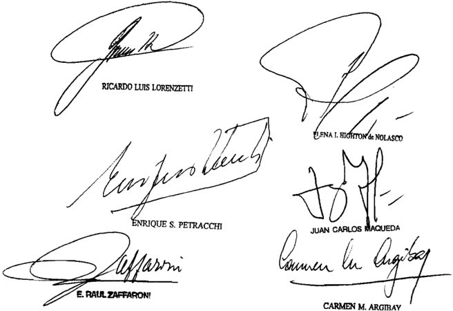

Recurso extraordinario interpuesto de Bm representada por el Dr carloe Alberto Giraudo

Traslado contestado POI María Gabriele Crova Martín Ignacio Bruno , patroci nados por el Dr

Tribunal de origen: de Apolacioneb de Bahía Blanca.

Tribunal que intervino con anterioridad: Juzgado Federal 1, Secretaría n' Civil Conercial de Bahía Blanca

F., A. L. S/ MEDIDA AUTOSATISFAcTIVA

## CASO O CONTROVERSIA.

Si dada la rapidez con que se produce el desenlace de situaciones relacionadas con el embarazo -o su eventual interrupción- es harto difícil que lleguen

a estudio del Tribunal las importantes cuestiones constitucionales que éstas conllevan sin haberse vuelto abstractas, corresponde establecer que resultan justiciables aquellos casos susceptibles de repetición y se torna necesario decidir las cuestiones propuestas aun sin utilidad para el caso en que recaiga el pronunciamiento, con la finalidad de que el criterio de la Corte Suprema sea expresado y conocido para la solución de casos análogos que puedan presentarse en el futuro.

## ABORTO.

Si de las normas constitucionales y convencionales no se deriva mandato alguno que imponga interpretar en forma restrictiva el art. 86, inc. 2º, del Código Penal, en cuanto regula los supuestos de abortos no punibles practicados respecto de los embarazos que son consecuencia de una violación, se considera necesario remarcar que existen otras cláusulas de igual jerarquía así como principios básicos de hermenéutica establecidos en la jurisprudencia del Tribunal que obligan a interpretar dicha norma con alcance amplio, ya que reducir la autorización de la interrupción de los embarazos sólo a los supuestos que sean consecuencia de una violación cometida contra una incapaz mental implicaría establecer una distinción razonable de trato respecto de toda otra víctima de análogo delito que se encuentre en igual situación y que, por no responder a ningún criterio válido de diferenciación, no puede ser admitida.

## ABORTO.

Teniendo a la luz el art. 19 in fine de la Constitución Nacional es que debe interpretarse la letra del art. 86, inc. 2º del Código Penal y concluir que quien se encuentre en las condiciones allí descriptas no puede ni debe ser obligada a solicitar una autorización judicial para interrumpir su embarazo, toda vez que la ley no lo manda, como tampoco puede ni debe ser privada del derecho que le asiste a la interrupción del mismo ya que ello, lejos de estar prohibido, está permitido y no resulta punible, por lo que corresponde advertir a los profesionales de la salud la imposibilidad de eludir sus responsabilidades profesionales ante la situación fáctica contemplada en la norma referida y recordar a los diferentes operadores de los distintos poderes judiciales del país que lo que previó el legislador es que, si concurren las circunstancias que permiten la interrupción del embarazo, es la embarazada que solicita la práctica, junto con el profesional de la salud, quien debe decidir llevarla a cabo y no un magistrado a pedido del médico.

## ABORTO.

Dentro del límite de la regla del art. 15 de la ley 48 que veda a la Corte pronunciarse con respecto a cuestiones de derecho común, la interpretación efectuada

por el a quo de la excepción del art. 86.2 del Código Penal cumple suficientemente con el estándar de validez constitucional, pues en la ponderación de los  intereses en conflicto, el legislador justifica concretamente la sustancial preponderancia del interés beneficiado a través de la indicación legal de que el embarazo haya sido causado por una violación, exigiendo además el consentimiento de la propia afectada, o de su representante legal (Voto de la Dra. Carmen M. Argibay).

## ABORTO.

El marco de ejercicio del permiso jurídico que surge del art. 86.2 del Código Penal demanda únicamente que los médicos a quienes es requerida la intervención verifiquen que el embarazo es producto de una violación y la víctima preste su consentimiento ante esos profesionales para que se lleve a cabo la intervención, por lo que las exigencias legales que legitiman la injerencia no pueden erigirse en un obstáculo sustancial al efectivo ejercicio del derecho concedido a la mujer, obligándola a transitar un arduo y traumático proceso judicial que acrecienta innecesariamente el considerable estigma y sufrimiento derivados de la violación de la que fue víctima y que, en razón del tiempo transcurrido, puede poner en riesgo la posibilidad de practicar una intervención sin peligro alguno para su salud (Voto de la Dra. Carmen M. Argibay).

## ABORTO.

Resulta inadmisible el recurso extraordinario que no logra expresar argumentos constitucionales suficientes que sustenten la interpretación que deja fuera del ámbito de aplicación de la norma contenida en el art. 86.2 del Código Penal -aborto no punible- a la mujeres que no tengan deficiencias psíquicas pues, más allá de las diferentes capacidades que puedan presentar, la característica común que tienen unas y otras es que en todos los casos se trata de mujeres que han quedado embarazadas como consecuencia de un ataque a su integridad sexual (Voto del Dr. Enrique Santiago Petracchi).

## ABORTO.

Si en el recurso extraordinario se invoca, unilateralmente, la afectación del derecho a la vida de las personas por nacer, pero se omite toda consideración con respecto al otro extremo del conflicto, la situación de la niña de 15 años embarazada a consecuencia de una violación, al sesgar de tal modo su argumentación, se ignora la valoración integral que hizo el tribunal provincial para sostener la constitucionalidad de su interpretación del art. 86, inc. 2º del Código Penal, asumiendo sus implicancias en cuanto a la afectación de la persona por nacer y contrapesando ello con los derechos de la niña, enunciando los sufrimientos que para ella conllevaría una ponderación de los intereses en pugna contraria

## FALLOS DE LA CORTE SUPREMA 335

a  la  que  fuera  previamente  definida  por  el  legislador  (Voto  del  Dr.  Enrique Santiago Petracchi).

## DIcTAMEN DE LA PROcURAcIóN GENERAL

## Suprema Corte:

Habida cuenta que la práctica médica que fue autorizada por el a quo y que el recurrente pretendía evitar con su recurso extraordinario ya se ha efectivizado, estimo que resulta de aplicación al sub júdice , la doctrina de la Corte según la cual para el ejercicio de su jurisdicción, tanto originaria como apelada, es necesario que la controversia que se intente traer a su conocimiento no se reduzca a una cuestión abstracta, como sería la que pudiera plantear quien ya carece de interés económico o jurídico susceptible de ser eficazmente tutelado por el pronunciamiento a dictarse, debiéndose atender a las circunstancias existentes al momento de la decisión del caso concreto (Fallos: 298:33; 304:1649; 312:555; 318:2438; 323:3083 y 3158 entre otros).

En tales condiciones, resulta inoficioso un pronunciamiento del tribunal en el caso, por lo que opino que corresponde declarar improcedente el recurso extraordinario. Buenos Aires, 14 de abril de 2011. Eduardo Ezequiel Casal .

## FALLO DE LA cORTE SUPREMA

## Buenos Aires, 9042

Vistos los autos: A s/ medida autosatisfactiva"

Considerando:

1%) Que A.F., en representación de A.G. , su hija de 15 afos de edad, el 14 de enero de 2010, solicitó la justicia penal de la Provincia del Chubut ~ante cuyos estrados se instru-

una causa contra 0.C . esposo de aquélla, por violación de A G que se dispusiera la interrupción del enbarazo de la niña adolescente nencionada, con base en lo previsto en el artículo 86 , incisos 1 0 Y del Código Penal En esa oportunidad, seque el 3 de dicienbre de 2009 había denunciado la violación ante el Ministerio Fiscal de la Provincia del Chubut Y que, el 23 del mismo mes un certificado médico dio cuenta de que A.G cursaba la octava semana de gestación (fs. 17/18 Y constan cias obrantes fs 1/1 vta . Y 11) \_

El juez penal sostuvo que carecía de facultades para adoptar medidas como la solicitada durante la etapa de la investigación, por 10 que ordenó el pase de las actuaciones la fiscalía. Esta última declaró que ese fuero no era competente para resolver el pedido 85 de la causa penal) La madre de A.G. inició entonces medida autosatisfactiva que originó la presente causa (fs\_ 17/18) Y, con fecha 22 de enero de 2010, reeditó ante justicia de familia solicitudes anteriores, vinculadas con la interrupción del embarazo de su hija. ales peticiones fueron rechazadas tanto en la primera instancia (fs153/169) como en la cámara (fs 350/379 vta.) , no obstante 10s informes que se habían ordenado Y que, en principal reflejaban que 'presentaba síntomas depresivos\_ (e) ideas suicidas persistentes Y que "el enba razo e[ra] vivido como un evento extraño, invasivo [EJn su mundo interno e[ra] imposible, incom patible intolerable calificar como hijo quien sería hijo del padre de sus hermanos \_ hijo del marido de la madre por que se estimó "la continuidad de este enbarazo contra la voluntad de [la niña] implica [ba] grave riesgo para su integridad psicofísica, incluido riesgo de vida (conf E.T.I. Equipo Técnico Interdisciplinario, fs\_ 27 vta) que

2 % ) Que el Superior Tribunal de Justicia de la Provincia del Chubut, con fecha de marzo de 2010 , revocó la decisión de la instancia anterior admitiendo la solicitud de la señora En la sentencia, dictada por distintos fundamentos de sus miembros hubo acuerdo en que a) el caso encuadraba en el supuesto de "aborto no punible" previsto en el inciso 2 0 prime-

ra parte del artículo 86 del Código Penal ; b) que esta hipótesis de interrupción del embarazo era compatible con el plexo constitucional Y convencional Y c) que , pese la innecesaridad de autorización judicial de esta práctica, se otorgaba fin de concluir la controversia planteada en el caso La intervención médica abortiva así habilitada se produjo finalmente el 11 de Marzo de 2010 en el Centro Materno Infantil del Hospital Zonal de Trelew (fs. 648)

Que aquella decisión fue recurrida por medio de un recurso extraordinario interpuesto, en representación del nasciturus, por el Asesor General Subrogante de la Provincia del Chubut en su carácter de Tutor Ad-Litem Y Asesor de Familia Incapaces , que fue concedido fs 673/676, no obstante haberse llevado cabo ya la mencionada práctica médica, con fundamento en la gravedad institucional que presentaba el caso . En su presentación, el recurrente se agravió por entender que con la interpretación que del artículo 86 , inciso del Código Penal efectuó el quo, al no haberse restringido la procedencia de esta autorización al caso de la víctima violada idiota demen te, se desconoció el plexo constitucional-convencional según el cual el Estado Argentino protege la vida partir de la concep(Constitución Nacional, artículo 75 , inciso 23: Corresponde al Congreso: Dictar un réginen de seguridad social especial integral en protección del niño en situación de desamparo desde el embarazo hasta la finalización del período de enseñanza elemental Declaración Americana de 10s Derechos Y Deberes del Hombre artículo 10 Todo ser humano tiene derecho la vida , la libertad Y la seguridad de su persona Convención Americana sobre Derechos Humanos , artículo 30 persona tiene derecho al reconocimiento de su personalidad jurídica" articulo 4 0 Toda persona tiene derecho que se respete su vida Este derecho estará protegido por la ley en general , partir del momento de la concepción. Nadie puede ser privado de la vida arbitrarlamente" Declaración Universal de Derechos Humnanos artículo Iodo individuo tiene derecho la vida , la libertad y la seguridad de su persona" Y artículo 6' Todo ser

huano tiene derecho , en todas partes al reconocimiento de su personalidad jurídica" Pacto Internacional de Derechos Civiles Políticos\_ articulo "El derecho la vida es inherente la persona humana Este derecho estará protegido por la Na die podrá ser privado de la vida arbitrariamente" Convención sobre 1os Derechos del Niño, Preámbulo: niño necesita protección Y cuidado especiales, incluso la debida protección legal , tanto antes cono después del nacimiento" artículo 1' : Pa ra los efectos de la presente Convención, se entiende por niño todo ser humano menor de dieciocho años de edad, salvo que, en virtud de la ley que le sea aplicable, haya alcanzado antes la mayoría de edad" artículo Los Estados Partes reconocen que todo niño tiene el derecho intrínseco la vida" ) ley

Que , radicada la causa ante esta instancia, se le confirió traslado la señora Defensora General de la Nación, quien asumió la representación de la niña A.G . Y expresó que rrespondía confirmar 1a sentencia apelada (fs 980/1010) al tiempo que entendía que todos los casos de enbarazo forzado ~víctimas de violacionesdebían ser considerados abortos no punibles más precisamente; como casos particulares de la hipótesis general de peligro para la salud de la gestante (artículo 86 , inciso del Penal ) Asimismo\_ se le confirió traslado la Defensora Pública de Menores Incapaces quien asumió la representación del nasciturus Y se expidió reriendo que se revocara la sentencia recurrida (fs\_ 683/694 ) En ambas presentaciones se peticionó que este Tribunal declarara la admisibilidad del recurso bajo exanen , como asf 1o hicieron los diversos amicus curiae que se presentaron solicitando confirmación la revocación de sentencia Oportunamente , se dispuso remitir la causa al señor Procurador Fiscal, quien tuvo que la cuestión debía declararse abstracta (fs1021/1022) Codigo qui\_

5") Que así las cosas esta Corte considera que para el ejercicio de su jurisdicción no resultan obstáculo la circunstancia de que 1os agravios aludidos carezcan de actualidad por haberse llevado cabo la práctica abortiva la nenor A.G . en el Centro Materno Infantil de Irelew

En efecto, cono ha subrayado el Iribunal en distintos precedentes, dada la rapidez con que se produce el desen lace de situaciones como la de autos , es harto difícil que , en la práctica, lleguen estudio del Iribunal las importantes cuestiones constitucionales que éstas conllevan sin haberse vuelto abstractas De ahí que para remediar esta situación frustratoria del rol que debe poseer todo Iribunal al que se le ha enconendado a función de garante supremo de los derechos humanos , corresponde establecer que resultan justiciables aquellos casos susceptibles de repetición, pero que escaparían su revisión por circunstancias análogas las antes mencionadas (confr. Fallos: 310:819, considerandos 6' Y 70 del voto de la mayoría Y de disidencia, Y citas; 324:5 , 4061) Pues como se pusiera de resalto en el conocido precedente de la Su prema Corte de 10s Estados Unidos "Roe V . Wade" (410 113las cuestiones relacionadas con el embarazo su eventual interrupciónjamás llegan al náxino tribunal en térnino para dictar útilmente sentencia, debido que su tránsito por las instancias anteriores insume más tiempo que el que lleva el decurso natural de ese proceso En consecuencia, se torna necesario decidir las cuestiones propuestas aun sin utilidad para el caso en que recaiga el pronuncianiento, con la finalidad de el criterio del Tribunal sea expresado Y conocido para la solución de casos análogos que puedan presentarse en el futuro. que

Que agravios del apelante suscitan una cuestión federal apta para su examen en esta instancia recursiva, toda vez que se plantea que el tribunal superior de la causa comprometió preceptos reconocidos por la Constitución Nacional Y por tratados internacionales de igual jerarquía al interpretar el artículo 86 , inciso del Código Penal (artículo inciso ley 48 ) Asinismo, el trataniento del tema resulta pertinente por esta vía puesto que la omisión de su consideración puede comprometer la responsabilidad del Estado Argentino frente al orden jurídico supranacional tanto más si se tiene en cuenta que varios organismos internacionales se han pronunciado censurando , en casos análogos, la interpretación restrictiva del ac-

ceso al aborto no punible por parte de otras instancias judiciales (cfr\_ Observaciones Finales del Comité de Derechos Humanos Y Observaciones Finales del Comité de 10s Derechos del Niño, Ar gentina, CCPR/C /ARG/co/4 del 22/03/2010 Y CRC /C/ARG/Co/3-4 , del 21/06/2010 , respectivamente)

70 ) Que dada , por una parte, la esencia de agravios traídos discusión, la cual radica en última instancia en la interpretación de normativa constitucional Y convencional visto el carácter federal que reviste el planteo, esta Corte considera oportuno Y necesario responder aquéllos desde una construcción argumental que permita armonizar la totalidad del plexo normativo invocado como vulnerado, la luz de 1os pronunciamientos de distintos organismos internacionales, cuya jurisdicción el Estado Argentino ha aceptado través de la suscripción de tratados, pactos convenciones que desde 1994 integran el ordenamiento jurídico constitucional como suprema de la Nación (artículo 75 , inciso 22 , de la Constitución Nacional) ley

Y cuyos dictámenes generan, ante un incumplimiento expreso, responsabilidades de índole internacional En este orden de ideas, este Iribunal se ve obligado tener que establecer la inteligencia de las previsiones cuyo desconocimiento denuncia el recurrente, así como también determinar aplicación de otras normas Y principios de igual jerarquía en clave de necesarias pau tas interpretativas  dejando salvo que , no por ello, esta Cor te se encuentra limitada en su decisión por argumentos de las partes del quo , sino que tan s610, le incumbe realizar una declaración sobre el punto disputado (Fallos: 331:735 Y sus citas)

Que al efectuar esa tarea de armonización que involucra normativa del más alto rango con otra de derecho conún ~artículo 86, inciso del Código Penal- , través de un aná lisis global del plexo normativo fundamental involucrado por aplicación de los principios hermenéuticos de interpretación sentados por esta Corte desde antiguo se entiende que corresponde realizar una interpretación amplia de dicho precepto legal Desde tal perspectiva Y luz del principio de reserva

constitucional (artículo 19 in fine de la Constitución Nacional) ha de concluirse en que la realización del aborto no punible allí previsto no está supeditada la cumplimentación de ningún trámite judicial

Que partir de 1o señalado en los considerandos precedentes corresponde en primer término, sefalar que del articulo 75 , inciso 23 , de 1a Constitución Nacional resulta posible extraer base alguna para sustentar la tesis que postula el recurrente\_

En primer lugar' porque es necesario advertir que este apartado se inserta en una cláusula en cuyo articulado Constitución le atribuye al Poder Legislativo tanto la facultad de promover , mediante acciones positivas, el ejercicio Y de derechos fundamentales particularmente respecto de 1os sectores tradicionalmente postergados (Fallos: 329:3089, considerando 17) como de dictar un régimen de seguridad social que proteja la madre durante el embarazo el tiempo de lactancia\_ De este modo la referencia específica al marco normativo de protección social al niño, desde el embarazo, integra un supues to concreto del mandato constituyente para que se establezcan, en general, políticas públicas promotoras de derechos huma nos Por ello, en atención tanto al objetivo que anima esta previsión como propios términos de su enunciado, de que surge que la competencia atribuida este poder en la materia fue l0s efectos de dictar un marco normativo específico de seguridad social Y no uno punitivo, resulta claro que , de esta norma , nada se puede derivar para definir, en el sentido que se propugna , la cuestión relativa 10s abortos no punibles en general, Y al practicado respecto del que es consecuencia de una violación, en particular\_ goce

Lo dicho cobra aun mayor fuerza si se tiene en cuenta que si bien en la Convención Constituyente de 1994 , en su última sesión, se generó un amplio debate sobre el derecho vida , cierto es que en ninguna oportunidad quedó plasmada una voluntad que pretendiera ni definir la cuestión relativa al

aborto ni limitar el alcance del artículo 86 , inciso del Código Penal al supuesto de a víctima violada idiota demente (ver al respecto, Convención Nacional Constituyente 1994 , 34' Reunión, 3' Sesión Ordinaria [continuación] , 19 de agosto de 1994 , 2 Armonización de artículos 67 Y 86 de la Constitución Nacional, Tomo VI, Centro de Estudios Jurídicos Y Sociales, Ministerio de Justicia la Nación, República Argentina, págs . 6145/6198)

Por lo tanto, no puede afirmarse válidamente que haya sido voluntad del constituyente linitar de modo alguno el alcance del supuesto de aborto no punible previsto en a mencionada norma al caso de víctima de violación que fuera incapaz men tal

10) Que previsiones establecidas en el articulo 10 de la Declaración Americana de los Derechos Y Deberes del Hombre comO del artículo 4 0 de la Convención Americana sobre De rechos Humnanos , no se deriva algún mandato por el que corresponda interpretar, de modo restrictivo, el alcance del artículo 86 inciso del Código Penal Ello por cuanto las normas pertinentes de estos instrumentos fueron expresamente delimitadas en su formulación para que de ellas no se derivara la invalidez de un supuesto de aborto como el de autos (ver al respecto, sión Interamericana de Derechos Hunanos , Informe 23/81 , "Baby Boy" Y la discusión en torno redacción de 1os mencionados artículos)

Por de la previsión contemplada en el artículo 3' de 1a Convención Americana, en cuanto estipula el derecho de toda persona al reconocimiento de su personalidad jurídica , tampoco se puede derivar base alguna para sustentar la tesis postulada por la parte\_ Esto en tanto la interpretación del alcance que corresponda darle dicho precepto, con relación las obligaciones del Estado en que hace la protección normativa del nasciturus como sujeto de derecho , no puede ser realizada en forma aislada del artículo 4 0 Y darle un alcance de tal amplitud que implique desconocer que , conforme se explicara precedente-

mente, 1a Convención no quiso establecer una protección absoluta del derecho 1a vida de éste.

Que tampoco el agravio incoado por el recurrente puede encontrar sustento en las disposiciones de los artículos Y de Declaración Universal de Derechos Humanos que con sagran, respectivamente' el derecho 1a vida Y el derecho al reconocimiento de la personalidad jurídica

Esto en atención que , fin de asegurar una herencia en la interpretación de ese instrumento, dichas previsiones deben ser analizadas en conjunto con dispuesto en el articulo 1 0 (` Todos 10s seres humanos nacen libres iguales en dignidad Y derechos Y, dotados como están de razón Y conciencia deben comportarse fraternalmente 10s unos con otros" ) Así , atento claros términos en que está formulado este enunciado, resulta imposible concluir en 1a aplicabilidad de las normas invocadas para fundar la tesis restrictiva del supuesto de aborto no punible previsto en el artículo inciso del Pe nal codigo

12) Que la tesis del recurrente tampoco encuentra ca bida en el deber que emana del artículo del Pacto Internacional de Derechos Civiles Y Políticos

Para ello, resulta necesario tener en consideración que el Comité de Derechos Humanos de Naciones Unidas ha manifegtado su posición general relativa que debe permitirse el aborto para el caso de embarazos que son la consecuencia de una violación. A su vez , al exaninar a situación particular de nuestro país, ha expresado su preocupación por la interpretación restrictiva del artículo 86 del Penal (cfr\_ Observaciones Finales del Comité de Derechos Humanos: Perú, 15/11/2000, CCPR /co/70/PER; Observaciones Finales del Comité de Derechos Humanos : Irlanda, 24/07/2000 , A/55/40; Observaciones finales del Conité de Derechos Humanos Gambia, 12/08/2004 , Observaciones Finales del Comité de Derechos Humanos: Argentina, CCPR/c/ARG/Co/4 del 22/03/2010, antes citadas)

Por tanto, resulta claro que, no es posible derivar de este tratado un mandato para interpretar restrictivamente la norma , sino que \_ inversamente, en atención lo expuesto, se arriba la conclusión contraria

13) Que con relación las disposiciones pertinentes de la Convención sobre los Derechos del Niño, tampoco es posible sostener que la interpretación del artículo 86 , inciso del Código Penal adoptada por el quo colisione con éstas

En efecto, de los antecedentes que precedieron la sanción de esta Convención, se observa que al redactarse su Preámbulo, expresamente se rechazó que éste fijara un alcance determinado de cualquiera de sus disposiciones (ver al respecto, Consejo Económico Y Social, Cuestión de una Convención sobre Derechos del Niño, Informe del Grupo de Trabajo acerca de un proyecto de Convención sobre los Derechos del Niño; E/CN4/1989/48 , de marzo de 1989)

Asimismo, de la lectura de aquellos antecedentes , se puede concluir que ante una variedad de alternativas propues tas, se decidió expresamente por la formulación actual del artículo de la que tampoco se puede derivar la tesis que sostiene la parte. Esto queda corroborado por circunstancia que el Comité de Derechos del Niño ha señalado que los Estados Partes ~que no adniten el aborto para el caso de embarazos que son la consecuencia de una violacióndeben reformar sus normas legales incorporando tal supuesto Y, respecto de nuestro país que sí prevé, ha manifestado su preocupación por la interpretación restrictiva del artículo 86 del Código Penal (cfr. Observaciones Finales del Comíté de Derechos del Niño: Pa lau. 21/02/2001. CRC/C/15/Add.149; Observaciones Finales del Comité de los Derechos del Niño: Chad24/08/1999 CRC/c/15/ Add . 107 ; Observaciones Finales del Conité de Derechos del Niño: Argentina. 21/06/2010 antes citadas)

Por otra parte, el artículo de la ley 23.849, en cuanto estipula que el artículo 1 0 de la Convención debe inter-

pretarse en el sentido que se entiende por niño todo ser humano desde el momento de concepción" no constituye una reserva que, en 1os términos del artículo 2 0 de la Convención de Viena sobre el Derecho de 10s Tratados, altere el alcance con que Convención sobre los Derechos del Niño rige en los términos del artículo 75 , inciso 22 de la Constitución Nacional Esto porque , como surge del texto mismo de la ley, mientras que el Estado Argentino efectuó una reserva con relación la aplicación del artículo 21 de Convención, respecto del artículo se limitó plasmar una declaración interpretativa (ver al respecto, Anuario de la Comisión de Derecho Internacional, 1999 , Volunen II, Parte 2 , Directrices aprobadas por Conisión en su de sesiones N' 51

14) Que sentado que de las normas constitucionales convencionales invocadas por el recurrente no se deriva mandato alguno que imponga interpretar en forma restrictiva el artículo 86 , inciso del Código Penal, en cuanto regula 1os supuestos de abortos no punibles practicados respecto de embarazos que son consecuencia de una violación, se considera necesario remarcar que existen otras cláusulas de igual jerarquía as1 como principios básicos de hermenéutica establecidos en la jurisprudencia de este Tribunal que obligan interpretar dicha norma con el alcance amplio que de ésta efectuara el quo

15) Que en este orden de ideas , es necesario puntualizar que principios de igualdad de prohibición de toda discrininación, que son ejes fundamentales del orden jurídico constitucional argentino internacional Y que en este caso poseen, además , una aplicación específica respecto de toda mujer víctina de violencia sexual, conducen adoptar interpretación amplia de esta norma (Constitución Nacional, artículo 16; Declaración Americana de los Derechos Y Deberes del Hombre artículo Declaración Universal de Derechos Humanos artículos Y Pacto Internacional de Derechos Civiles Y Polítiartículos Y 26; Pacto Internacional de Derechos Econó micos, Sociales Y Culturales, artículos Y Y Convención

Americana sobre Derechos Humanos , artículos 1.1 Y 24 ; además de tratados destinados la materia en campos específicos: Con vención sobre la Eliminación de todas las de Discriminación Racial; Convención sobre la Eliminación de todas las Formas de Discriminación contra la Mujer, especialnente artículos 3 ' Y 16, Y Convención sobre los Derechos del Niño, artículo Convención Interamericana para Prevenir, Sancionar Y Erradicar la Violencia contra la Mujer, artículos 4 . f Y 6 .a )

En efecto, reducir por vía de interpretación la autorización de la interrupción de embarazos s610 1os supues tos que sean consecuencia de una violación cometida contra una incapaz mental implicaría establecer una distinción irrazonable de trato respecto de toda otra víctima de análogo delito que se encuentre en igual situación Y que por no responder ningún criterio válido de diferenciación, no puede ser admitida (Fallos 332:433 Y sus citas)

Máxime cuando , en la definición del alcance de la norma , está involucrado el adecuado cumplimiento del deber estatal de protección de toda víctima de esta clase de hechos en cuanto obliga brindarle atención médica integral, tanto de eme rgencia comO de forma continuada (ver al respecto, Corte Interamericana de Derechos Humanos , Fernández Ortega VS . México" sentencia del 30 de agosto de 2010 , apartados 124 Y 194)

En esta comprensión corresponde recordar 10 dicho oportunamente por esta Corte (Fallos: 331:211, considerando 6*) al afirmar que la debilidad jurídica estructural que sufren las personas con padecinientos mentales ~de por sí vulnerable 10s abusos-, crea verdaderos 'grupos de ries en cuanto al pleno libre goce de 1os derechos fundamentales" 1o que genera necesidad de establecer una protección normativa eficaz Sin embargo, ello no puede llevar aceptar una interpretación restringida de la norma en trato ya que esta delinitación de su cance , no respondería al válido objetivo de proteger los derechos de las víctimas de violencia sexual cuya vulnerabilidad se agrava por la circunstancia de poseer una discapacidad mental go' al-

sino un prejuicio que las denigra en cuanto sujetos plenos de derechos \_

16) Que por lo demás , de la dignidad de las personas , reconocida en varias normas convencionales (artículo 11 de la Convención Americana sobre Derechos Humanos ; artículo Declaración Universal de 10s Derechos Humanos Preámbulos del Pacto Internacional de Derechos Civiles y Políticos de la Declaración Americana de 10s Derechos Deberes del Hombre) se des prende el principio que las consagra como un fin en s1 misnas Y proscribe que sean tratadas utilitarianente Este principio de inviolabilidad de las personas impone rechazar la exégesis restrictiva de la norma según la cual ésta s610 contempla , como un supuesto de aborto no punible, al practicado respecto de un embarazo que es consecuencia de una violación una incapaz mentalEn efecto, la pretensión de exigir, toda otra victima de un delito sexual, llevar término un embarazo, que es 1a consecuencia de un ataque contra sus derechos más fundamentales\_ resulta, todas luces desproporcionada Y contraria al postulado , derivado del mencionado principio, que impide exigirle las personas que realicen, en beneficio de otras de un bien colectivo, sacrificios de envergadura imposible de conmensurar (cfr\_ Nino, Carlos Santiago Ética Y Derechos Humanos Editorial Paidós Buenos Aires, 1984 , págs \_ 109 Y legítima defen sa , Fundamentación Y régimen jurídico, Editorial Astrea, Buenos Aires , 1982 , págs . 59 , 63 Y La

17) Que su vez , 10s principios de estricta legalidad Y pro homine obligan adoptar la interpretación amplia de este supuesto normativo que establece no punibilidad del aborto practicado respecto de un embarazo que sea la consecuencia de una violación Ello así, por cuanto la decisión relativa al alcance de este precepto se encuentra limitada de antemano por estos principios que obligan, respectivamente, "priorizar una exégesis [que esté]en consonancia con el principio político criminal que caracteriza al derecho penal como la última ratio del ordenamiento jurídico Y[a] privilegiar la interpretación legal que más derechos acuerde al ser humano frente al

der estatal" (Fallos: 331:858 , considerando 6 329:2265) Por ello, debe adoptarse la interpretación según la cual no resulta punible interrupción del embarazo proveniente de toda clase de violación porque una exégesis en sentido contrario -que reduzca la no punibilidad de esta práctica al caso de una incapaz mentalamplía sustancialmente el alcance del castigo penal niega, toda otra víctima de una violación que se encuentre en esa situación, el derecho acceder esta práctica\_

18) Que no obstante mediar en el particular todas las razones de la máxima jerarquía normativa expuestas en los considerandos precedentes , por las que debe entenderse que el supueg to de aborto no punible contemplado en el artículo 86 , inciso del Codigo Penal comprende aquel que se practique respecto de todo embarazo que sea consecuencia de una violación, con independencia de la capacidad mental de su víctima, esta Corte Su prema considera oportuno necesario ampliar 10s términos de te pronunciamiento. Ello es así ya que media, en la materia, un importante grado de desinformación que ha llevado 1os profesionales de la salud condicionar la realización de esta práctica al dictado de una autorización judicial Y es este proceder el que ha obstaculizado la implementación de 10s casos de abortos no punibles legislados en nuestro país desde 1a década de 1920 .

En esta inteligencia, este Tribunal quiere dejar expresamente aclarado que su intervención 10 es los efectos de esclarecer la confusión reinante en lo que respecta abortos no punibles fin de evitar frustraciones de derecho por parte de quienes peticionen acceder ellos, tal que se configuren supuestos de responsabilidad internacional 1os

Para ello resulta conveniente transcribir el artículo 86 del Código Penal en cuanto establece que "el aborto practicado por un médico diplomado con el consentiniento de la mujer encinta, no es punible: Si se ha hecho con el fin de evitar un peligro para la vida la salud de la madre s1 este peligro no puede ser evitado por otros medios; 2% ) Si el embarazo proviene

de una violación de un atentado al pudor cometido sobre una mujer idiota demente En este caso, el consentimiento de su representante legal deberá ser requerido para el aborto"

Así, de una aplicación, al particular, de las pautas interpretativas fijadas por esta Corte en cuanto que "la primera fuente de exégesis de la es su letra" (Fallos 304:1820; 314:1849) que "no se le debe dar un sentido que pon ga en pugna sus disposiciones, sino el que las concilie Y conduzca una integral armonización de sus preceptos" (Fallos: 313:1149) se impone concluir que , aun mediando más nínima Y sistemática exégesis practicada sobre dicho precepto, no es pu nible toda interrupción de un enbarazo que sea consecuencia de una violación con independencia de la capacidad nental de su víctima ley esta conclusión se llega partir de un doble orden de razones En primer lugar, porque de mera lectura del artículo 86 , inciso 2" , del Código Penal se evidencia que el legislador, al utilizar una conjunción disyuntiva al referirse (s) i el embarazo proviene de una violación de un atentado al pudor cometido sobre una mujer idiota demente" (énfasis agre gado) previó dos supuestos diferentes para caso de embarazos provenientes de un delito de esta naturaleza

Por su parte, un examen conjunto Y sistemático de los diferentes apartados previstos en esta norma también conduce adoptar su interpretación amplia\_ En efecto, este precepto nienza su redacción estableciendo, comO prenisa general, que por su técnica de redacción constituye un requisito común para los dos supuestos que detalla seguidamente, que no serán punibles abortos allí previstos que fueran practicados por un médico diplomado con el consentimiento de la mujer encinta Es precisamente porque este extremo no es aplicable respecto de la mujer incapaz, que como excepción dicho requisito general, en la última parte del segundo supuesto previsto, se tuvo que establecer en forma expresa que en este Caso" ~referencia que puede aludir al caso del atentado al pudor que obliga dis-

tinguirlo, desde la sola semántica, del de violación "el con sentimiento de su representante legal deberá ser requerido para el aborto" Por ello, debe descartarse tesis restrictiva en tanto otorga una indebida preeninencia una de las partes de norma dejando inoperante sus demás previsiones

Pero además , esta conclusión también se arriba analizando esta norma de modo conjunto con las disposiciones relativas 10s hechos ilícitos que   pueden causar embarazos no consentidos por las ninas , adolescentes mujeres que son suS víctimas

En efecto, el mencionado artículo 86 , inciso 2% , del Código Penal, en concordancia con el sistema de abusos sexuales (regulados partir del artículo 119 del mismo cuerpo legal) diferencia dos grupos de causas de embarazos: la violación propiamente dicha el atentado al pudor sobre una mujer "idiota demente" Como está haciendo referencia caude embarazos, el "atentado al pudor" no puede ser sino un acceso carnal alguna otra situación atentatoria contra la sexualidad de la víctima que produzca un embarazo Puesto que todo acceso carnal sobre una mujer con deficiencias mentales es considerado ya una forma de violación (la impropia) no es posible sostener que cuando al principio dice "violación" también se refiera al mismo tipo de víctima Es evidente que por exclusión, "violación" se refiere al acceso carnal violento coactivo bre mujeres no "idiotas ni dementes" Lo mismo ocurre con las menores de trece años cuya mención no es necesaria porque la ley descarta la validez de su consentimiento, declara que cualquier acceso carnal con ellas es ya una violación (impropia) ley

Por ello, este análisis sistemático del artículo 86 , inciso del Código Penal en conjunto con las disposiciones que tipifican 1os supuestos de violencia sexual que , de provocar un embarazo, dan lugar su aplicación, corrobora que cualquier víctima de éstos que se encuentre en tal circunstancia puede realizarse un aborto no punible en el caso de las defique

cientes mentales incapaces que no pueden consentir el acto se requiere de sus representantes legales Esto se confirma teniendo en cuenta, además , al formularse esta norma refiriéndose la violación al atentado al pudor , se tradujo inadecuadamente, atento que esta última figura por definición no implica acceso carnalla correlativa previsión del Anteproyecto del código suizo de 1916, que constituye su fuente Y que estipulaba como aborto no punible al practicado respecto de un embarazo que provenía de dos supuestos diferentes: la violación el acceso carnal producido respecto de una incapaz mental que era denoninado "profanación"

19) Que luego de haber sentado en 1os considerandos precedentes que el artículo 86 , inciso 2 % del Código Penal debe interpretarse con un alcance amplio, corresponde detenerse en 1o acontecido en el presente caso con joven A.G . quien debió transitar un largo derrotero judicial para poder asegurar su derecho obtener la interrupción de un embarazo que fue consecuencia de una violación\_

La judicialización de esta cuestión, que por su reiteración constituye una verdadera práctica institucional, además de ser innecesaria ilegal, es cuestionable porque obliga la víctima del delito exponer públicamente su vida privada , y es también contraproducente porque la denora que apareja en su realización pone en riesgo tanto el derecho la salud de la solicitante como su derecho al acceso interrupción del embarazo en condiciones seguras

Llegado este punto, el Tribunal considera ineludible destacar que pesar de que el Código Penal argentino regula desde hace noventa años diferentes supuestos específicos de des penalización del aborto, como el traído discusión ante este Tribunal (artículo 86 , inciso 2%) , se sigue manteniendo una práctica contra legem\_ fomentada por profesionales de la sa lud Y convalidada por distintos operadores de 105 poderes judiciales nacionales como provinciales, que hace caso oniso de aquellos preceptos , exigiendo allí donde la ley nada reclama, 1os

requisitos tales comO la solicitud de una autorización para practicar la interrupción del embarazo producto de una violación 1o que como en el caso, termina adquiriendo características intolerables la luz de garantías Y principios constitucionales Y convencionales que son suprema de la Nación ley

20) Que es debido ello que este Tribunal se ve forzado tener que recordar, tanto profesionales de la salud co mo 10s distintos operadores de 1os diferentes poderes judiciales nacionales provinciales que por imperio del artículo 19 in fine de la Constitución Nacional, que consagra el principio de reserva cono complemento de la legalidad penal , ha quedado expresamente dicho por voluntad del constituyente que "ningún habitante de la Nación será obligado hacer que no manda la ley , ni privado de lo que ella no prohíbe"

21) Que teniendo aquella manda constitucioes que debe interpretarse la letra del artículo 86 , inciso 2 0 del Código Penal Y por dicha razón, se debe concluir que quien se encuentre en las condiciones allí descriptas, no puede ni debe ser obligada solicitar una autorización judicial para interrumpir su embarazo toda vez que la no 10 manda , cono tampoco puede ni debe ser privada del derecho que le asiste la interrupción del nismo Ya que ello, lejos de estar prohibido está permitido Y no resulta punible luz nal ley

22 ) Que , en atención expresado en 10s considerandos precedentes , este Tribunal se ve en a necesidad de advertir por una parte, 1os profesionales de 1a salud, la imposibilidad de eludir sus responsabilidades profesionales una vez enfrentados ante la situación fáctica contemplada en la norma referida Por la otra, recuerda los diferentes operadores de 10s distintos poderes judiciales del país que según surge del texto del artículo 86 del Código Penal, que previó el legislador es que , si concurren las circunstancias que permiten la interrupción del embarazo, es la embarazada que solicita la práctica, junto con el profesional de la salud, quien debe decidir llevarla cabo Y no un magistrado pedido del médico\_

23) Que hacer contrario, significaría que un poder del Estado , como 1o es el judicial, cuya primordial función es velar por plena vigencia de las garantías constitucionales Y convencionales, intervenga interponiendo un vallado extra Y en torpeciendo una concreta situación de emergencia sanitaria, pues cualquier magistrado llamado comprobar la concurrencia de una causal de no punibilidad supeditaría el ejercicio de un derecho expresamente reconocido por el legislador en el artículo 86 , inciso del Código Penal, un trámite burocrático, innecesario Y carente de sentido

24) Que asinismo, respetar preceptuado por el artículo 19 in fine de la Constitución Nacional significa, en línea con 1o referido en el considerando precedente\_ que el aborto no punible es aquel practicado por "un nédico con el con sentiniento de la mujer encinta" (artículo 86 del Código Penal) circunstancia ésta que debe aventar todo tipo de intento de exigir más de un profesional de salud para que intervenga en la situación concreta pues , una exigencia tal, constituiría un impedinento de acceso incompatible con derechos en juego en este permiso que el legislador ha querido otorgar.

Por otra parte, las prácticas de solicitud de consultas Y la obtención de dictámenes conspiran indebidanente contra derechos de quien ha sido víctima de una violación, 10 que se traduce en procesos burocráticos dilatorios de la interrupción legal del embarazo que llevan ínsita la potencialidad de una prohibición implícita por tanto contra legemdel aborto autorizado por legislador penal Asinismo, se debe señalar que esta práctica irregular no sól0 contraviene las obligaciones que mencionada Convención Interanericana para Prevenir, San cionar Y Erradicar la Violencia contra Mujer, en su artículo 70 pone en cabeza del Estado respecto de toda víctima de violencia, sino que, además puede ser considerada, en s1 misma , un acto de violencia institucional en términos de los artículos 30 Y de la ley 26.485 que establece el Régimen de Protección Integral para Prevenir, Sancionar Erradicar la Violencia con -

tra las Mujeres en los ámbitos en que desarrollen sus relaciones interpersonales

Por ello, términos del presente fallo respecto de alcances que corresponde asignar al artículo 86 , inciso del Código Penal, así como la autoridad suprema del pronunciamiento, que se deriva del carácter de intérprete último de Constitución Nacional Y de las leyes , que posee el Iribunal (Fallos: 324:3025 ; 332: 616) resultan suficientes para despejar cualquier duda que pudieran albergar esos profesionales de la salud respecto de la no punibilidad de los abortos que se practiquen sobre quienes invocan ser víctimas de violación

En consecuencia, descartada posibilidad de una persecución penal para quienes realicen las prácticas médicas en supuestos como 1os exaninados en autos, la insistencia en con ductas cono la señalada no puede sino ser considerada como una barrera al acceso servicios de salud, debiendo responder sus autores por las consecuencias penales y de otra índole que pudiera traer aparejado obrar.

25) Que cuando el legislador ha despenalizado y en esa medida autorizado la práctica de un aborto, es el Estado , como garante de la administración de la salud pública, el que tiene la obligación, siempre que concurran las circunstancias que habilitan un aborto no punible, de poner disposición, de quien solicita la práctica, las condiciones médicas higiénicas necesarias para llevarlo cabo de manera rápida, accesible Y segura. Rápida, por cuanto debe tenerse en cuenta en este tipo de intervenciones médicas cualquier demora puede epilogar en serios riesgos para la vida la salud de la embarazada Accesible segura pues , aun cuando legal en tanto despenalizado, no deben existir obstáculos médico-burocráticos judiciales pa ra acceder la mencionada prestación que pongan en riesgo salud la propia vida de quien la reclama (ver al respecto, Sesi6n Especial de a Asamblea General de las Naciones Unidas , desarrollada en junio de 1999)

26) Que partir de expresado en 1os considerandos

precedentes , este entiende oportuno recordar que distintos Órganos de aplicación de tratados de derechos humanos se han pronunciado censurando al Estado Argentino por no garantizar el acceso oportuno la práctica de 10s abortos no punibles como una cuestión de salud pública y sin injerencia del Poder Judicial (Comité de Derechos Humanos , CCPR/C/101/D/1608/ 2007 , del 29/03/11 ; Observaciones Finales del Comité de Derechos del Niño; Argentina\_ 21/06/2010 \_ CRC/C/ARG/co/3-4)

27) Que finalmente, el respeto 1o establecido en el artículo 19 in fine de la Constitución Nacional se traduce en que el artículo inciso del Código Penal no exige ni la denuncia ni la prueba de la violación como tampoco su determinación judicial para que una niña, adolescente mujer pueda acceder la interrupción de un embarazo producto de una violación

Esta situación de ausencia de reglas específicas para acceder al aborto permitido en caso de violación supone tan s610 cono necesario que 1a víctima de este hecho ilícito, su representante, manifiesten ante el profesional tratante, declaración jurada mediante, aquel ilícito es causa del embarazo, toda vez que cualquier imposición de otro tipo de trámite no sultará procedente pues significará incorporar requisitos adicionales estrictamente previstos por el legislador penal que

En efecto, tal como 1o ha señalado la Organización Mundial de la Salud, la exigencia de que las víctimas de violación, para calificar para el aborto, tengan que elevar cargos contra su agresor, obtener informaciones policiales requerir autorización de un tribunal satisfacer cualquier otro requisito que no sea médicamente necesario, puede transformarse en una barrera que desaliente quienes tienen expectativas legítimas de buscar servicios sin riesgos Y en forma temprana Estos requisitos diseñados para identificar casos fabricados retrasan el cuidado necesario Y aumenta la probabilidad de abortos no seguros 0 , incluso, pueden llevar la negativa de la práctica porque el embarazo está muy avanzado (ver al respecto, "Aborto sin riesgos Guía Técnica y de Politicas para Sistemas de ud" OMS , 2003)

28) Que si bien este Tribunal advierte la posibilidad de configuración de "casos fabricados" considera que el riesgo derivado del irregular obrar de determinados individuos, ~que estas alturas s610 aparece como hipotético podría resultar, eventualnente, un ilícito penal-, no puede ser nunca razón suficiente para imponer las víctimas de delitos sexuales obstácuque vulneren el goce efectivo de legítimos derechos que se constituyan en riesgos para su salud

29) Que , en razón de ello, corresponde exhortar las autoridades nacionales Y provinciales implementar Y hacer operativos, mediante normas del más alto nivel, protocolos hospitalarios para la concreta atención de los abortos no punibles 1os efectos de remover todas las barreras administrativas fácticas al acceso 1os servicios médicos\_ En particular, de berán: contemplar pautas que garanticen la información la confidencialidad solicitante; evitar procedimientos adninistrativos períodos de espera que retrasen innecesariamente la atención Y disninuyan la seguridad de las prácticas; elininar requisitos que no estén médicamente indicados; Y articular meca nismos que permitan resolver, sin dilaciones Y sin consecuencia para 1a salud de la solicitante, 1os eventuales desacuerdos que pudieran existir, entre el profesional interviniente Y 1a pa ciente, respecto de procedencia de la práctica médica requerida Por otra parte, deberá disponerse un adecuado sistema que permita al personal sanitario ejercer su derecho de objeción de conciencia sin que ello se traduzca en derivaciones demoras que comprometan la atención de requirente del servicio\_ A tales efectos, deberá exigirse que la objeción sea manifestada en el momento de la implementación del protocolo al inicio de las actividades en el establecimiento de salud correspondiente, de forma tal que toda institución que atienda las situaciones examinadas cuente con recursos humanos suficientes para ga rantizar, en forma permanente, el ejercicio de los derechos que le confiere las víctimas de violencia sexualaquí ley

30) Que por último, en virtud la gravedad trascendencia social que reviste la temática abordada en el caso, de

esta Corte no puede dejar de señalar la necesidad de que tanto en el ámbito nacional comO en los provinciales se extremen 10s recaudos 10s efectos de brindar las víctimas de violencia sexual, en forma inmediata Y expeditiva, la asistencia adecuada para resguardar su salud integridad física, psíquica, sexual Y reproductiva En ese contexto, deberá asegurarse, en un ambiente cómodo Y seguro que brinde privacidad, confianza evite reiteraciones innecesarias de la vivencia traumática, la prestación de tratamientos médicos preventivos para reducir riesgos específicos derivados de las violaciones; obtención Y conservación de pruebas vinculadas con el delito; la asistencia psicológica inmediata prolongada de la víctima, así como el asesoramiento legal del caso

31) Que , por estas mismas razones , se considera indispensable que los distintos niveles de gobierno de todas las jurisdicciones implementen campañas de información pública, con especial foco en 10s sectores vulnerables , que hagan conocer 1os derechos que asisten las víctimas de violación. Asimismo deberá capacitarse la autoridades sanitarias, policiales, edu cativas Y de cualquier otra índole para que en caso de tomar conocimiento de situaciones de abuso sexual brinden las víctiMas la orientación información necesaria que les permita acceder , en forma oportuna Y adecuada , las prestaciones médicas garantizadas por el nornativo examinado en la presente causa \_

Por ello, Y oído el señor Procurador Fiscal, corresponde

- 1) Declarar procedente el recurso extraordinario Y, por 1os fundamentos expuestos , confirmar Ja sentencia apelada aquí
- 2) Exhortar las autoridades nacionales provinciales Y de la Ciudad Autónona de Buenos Aires con competencia en la materia, implementar Y hacer operativos mediante normas del más alto nivel, en 10s términos sentados protocolos hospitalarios para concreta atención de abortos no punibles Y para la asistencia integral de toda victima de violencia sexual aquí

3) Exhortar al Poder Judicial nacional Y poderes judiciales provinciales de la Ciudad Autónoma de Buenos Aires =I-abstenerse de judicializar el acceso 10s abortos no punibles previstos legalmente. 10s

Notifíquese Y, oportunamente, devuélvase

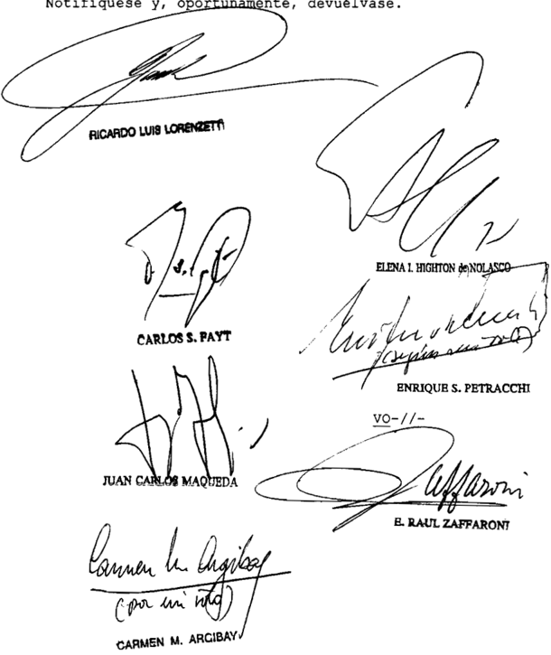

=/-To DE LA SEÑORA MINISTRA DOCTORA DOÑA CARMEN ARGIBAY

Considerando:

1%) En las presentes actuaciones, el 22 de enero de 2010, A.L.F., en representación de su hija A.G. , de quince años

de edad, interpuso una "medida auto-satisfactiva" fin de obtener autorización judicial para que en el Hospital Zonal de la ciudad de Comodoro Rivadavia, Provincia del Chubut , se interrumpa el enbarazo que la niña cursaba en la octava senana de gestación \_

Fundó su pretensión en incisos prinero segundo del artículo 86 del Código Penal, en tal sentido afirmó que un mes antes había denunciado ante el Ministerio Público Fiscal de esa jurisdicción la violación que había sufrido la menor por parte de su esposo, 0 N (padrastro de niña) en el mes de noviembre de 2009 , siendo el embarazo producto de ese hecho

Explicó que ante la formación del sumario en la jurisdicción criminal ~en el que se constituyó como parte querellantese había presentado ante el juez de causa requiriendo la autorización para la interrupción del embarazo, pero dicho magistrado sostuvo que carecía de facultades para adoptar medidas como solicitada durante la etapa de investigación" ordenando el paso de las actuaciones al Ministerio Público Fiscal, que se expidió por la incompetencia del fuero penal para resolver el pedido (cfr\_ fs 17/18 vta.)

El día siguiente de 1a presentación que inicia este expediente, el juzgado de fanilia dispuso una serie de medidas procesales ordenando , entre ellas, dar intervención al "equipo técnico interdisciplinario" fin de que entreviste la menor para determinar, entre otros puntos, las consecuencias ylo impacto psicológico en la menor de edad en caso de ser some tida la intervención solicitada (aborto terapéutico)" ; Y librar oficio al Hospital Regional fin de que por intermedio del Comité de Bioética evalúe la situación planteada de Y dictamine sobre lo peticionado" (cfr fs 19/20)

Posteriormente, como medida para mejor proveer, se dispuso librar oficio al director del mencionado hospital para que informe al juzgado si de acuerdo los Protocolos el aborto una menor de edad (15 años) víctima de una violación (art\_ 86 del Cód . Penal) puede practicarse en condiciones lícitas Y en

tal caso realicen las evaluaciones interdisciplinarias través de los Comités Interdisciplinarios, que se prevén para estos ca sos" (cfr fs 28 )

Esta última medida debió ser reiterada en dos oportunidades por a jueza actuante; la primera porque el director del nosocomio respondió que "previo al análisis ético-médico de un período de interrupción de embarazo , debe determinarse si la persona presenta alguna de las características excepcionados [sic] por el código penal, Ya que dicho encuadre no resulta ser una materia opinable por parte del comité" (cfr\_ fs 40) , Y la segunda , en razón de que el jefe del departamento de tocoginecología de esa institución objetó 10 requerido que "este comité solamente asesora, no dictamina Y en cuanto al motivo por el cual se solicita realizar un aborto en la paciente en cuestión, 'violación es un elemento que supongo le consta la justicia, Y como tal el único que podría dictaninar es el juez" (cfr. fs 80 )

Luego de producidas las medidas ordenadas , el 16 de febrero de 2010 esa instancia resolvió rechazar la solicitud para la interrupción del embarazo de la niña. Apelada esa resolución por la actora por propia menor A G. , el 25 de febrero de ese mismo año la Cámara de Apelaciones confirmó la decisión denegatoria.

Entre argumentos expuestos por 10s magistrados que concurrieron formar la mayoría del tribunal (pues una de sus integrantes votó en disidencia) se expresó que este caso pone 1os jueces en situación de decidir entre "dar razón al vilegio de la vida de una menor sobre otra (nasciturus) que no [ha] tenido oportunidad de optar por ser no ser" que enfrentados ese conflicto nos encontranos obligados preservar el derecho la vida Y consecuentenente la personalldad del nasciturus desde el momento de la concepción, invocando cono última ratio, frente toda situación de duda la aplicación del principio in dubio pro vida (cfr fs 372) pri -

También se dijo, repitiendo consideraciones expresa-

das por la jueza de primera instancia, que la discusión entre la interpretación amplia restrictiva del artículo 86 del Codigo Penal no define en profundidad la amplitud de decisión, pues en base las normas del derecho constitucional que consagran el derecho la vida la salud de todo ser humano desde la concepción en el seno materno, resulta indiferente la interpretación de aquélla norma se adopte que

Contra esa sentencia interpusieron sendos recurde casación la niña Y su madre, los que fueron concedidos por la cámara de apelaciones Y luego declarados formalmente admisibles por el tribunal superior de justicia local \_ Con fecha de Marzo de 2010 , ese tribunal resolvió ~en que interesadejar sin efecto la sentencia recurrida, declarando que el caso encuadra en el supuesto de aborto no punible previsto por el inciso segundo , primera parte, del artículo 86 del Código Penal \_ aquí

Para así decidir, el quo inició el tratamiento del caso afirmando que obligar la actora obtener un permiso judicial en un supuesto como el de autos resulta una exigencia adicional, que la mujer se le presenta como una carga Y una vulneración su derecho de acceder al aborto en casos autorizados por la ley . Expresó que el propio legislador no ha dejado en manos de 10s jueces tarea de preferir la vida de una otra persona , porque precisamente consagró el resultado de la ponderación entre el derecho la vida del nasciturus Y el derecho de la mujer víctima de una violación.

Sobre el particular, asumió que la aplicación los dos incisos del artículo 86 del Código Penal no requiere de autorización judicial quedando la responsabilidad de decidir si se dan supuestos fácticos descriptos por la norma en médicos que atiendan la paciente, Ya sea en el sector privado en el público de salud, aplicando 10s principios reglas del buen arte de curar\_

Continuó luego el tribunal afirmando que la norma del artículo 86 del Codigo Penal aplicable al caso no se contrapone

al bloque constitucional integrado por la Constitución Nacional tratados internacionales incorporados ella, en tanto resulta consistente con la prohibición de desprotección legal arbitraria respecto al derecho vida del niño por nacer desde su concepción \_ Ello es as1, se dijo, pues norma parte de la base de considerar al aborto como una conducta prohibida, aunque con las excepciones consagradas por el artículo en examen , las que, su vez , comprometen otros derechos fundamentales de rango análogo. De esta manera, la decisión legislativa por la no punibilidad de supuestos como el presente no puede calificarse de irracional ni de arbitraria, en razón de que aparece fundada en una causa grave Y excepcional sujeta al margen de valoración del legislador Y compatible con la protección constitucional

Pasando la exégesis en particular del inciso segun do del artículo 86 del Codigo Penal, sostuvo el tribunal que además de encontrar en el propio texto de norma razones que apoyan la que ha sido denoninada la "tesis amplia" ~pues reconoce en ella dos supuestos de aborto no punibles-, es el principio de legalidad el que exige interpretar los supuestos de no punibilidad previstos en el nentado artículo con la mayor amplitud posible

Finalmente, resta destacar que el tribunal consideró, en cuanto la acreditación de la existencia de 1a violación, que la urgencia que demanda la tomar no admite esperar la conclusión de dicho trámite, en el sentido de exigir una sentencia condenatoria habilitar el supuesto previsto por la norma en tratamiento\_ Se entendió entonces que corresponde analizar la denuncia Y, ante la imposibilidad de evitar todo margen de dudas , privilegiar el relato circunstanciado de la víctima acompañado de múltiples elementos que acrediten su seriedadpara

Contra esa sentencia interpuso recurso extraordinario federal el tutor ad litem Y Asesor de Familia Incapaces , en favor de la persona por nacer

Como agravio federal, esa parte planteó la vulnera-

ción del derecho la vida del nasciturus garantizado por la Constitución Nacional por tratados de derecho internacional público

En concerniente las circunstancias fácticas del caso, explicó que ni para las partes, ni para las tres sentencias que fueron dictadas sucesivanente en las instancias que transitó el proceso, existe duda alguna de que el embarazo que presenta la nifa proviene de una violación. Esta aceptación neral sobre la cuestión sustancial de hechos , desde su óptica , coloca 1a dilucidación del caso en el campo del puro derecho, centrada en la aplicación interpretación de norma del inciso segundo del artículo 86 del Código Penal , la luz del resto del plexo normativo nacional Y del derecho la vida de la persona por nacer ge-

Establecido el normativo de referencia, continuó expresando que no entiende que las autorizaciones del artículo mencionado deban juzgarse inconstitucionales en general ni que se encuentren derogadas por incompatibilidad sobreviniente" con normas de mayor jerarquía Afirmó, no obstante, que la interpretación de esos permisos legales ha de ser prudentemente restrictiva de modo de reducir un número nínimo "y de enorne dramatismo" los casos subsumibles en ellos

En tal sentido, entendió que la interpretación lata que de esa norma realiza la sentencia que impugna para declarar su aplicación al caso Y autorizar as1 el aborto, resulta opuesta al derecho la vida de toda persona conforme la normativa constitucional que invoca \_ Desde ese prisma, afirmó que esa práctica médica tiene comO fin interrumpir el embarazo dando asf fin la vida del feto, 1o que implica un atentado, intencionado Y directo, contra un ser humano cuya existencia Y derechos resultan asegurados por el ordenamiento legal "desde su concep ción" A su  vez, postuló una interpretación de la mentada norma permisiva, que calificó de literal, restringiendo la autorización para la interrupción del embarazo s610 en casos de violación de una mujer "idiota demente"

6" ) Al analizar la adnisibilidad del remedio federal (fs 673/676) el Superior Iribunal de Justicia de Chubut advirtió que la práctica abortiva ya se había realizado fs . 674 vta. ) No obstante ello, refirió ~con cita de precedentes de es ta Corteque la falta de gravamen actual por la resolución del conflicto no debía obstar la concesión del recurso, pues s610 así podrían las relevantes cuestiones planteadas ser tratadas en instancia federal A su vez , señaló que el recurso no cuplía con el reglamento aprobado pOr acordada CSJN 4/2007 , aunque por motivos sinilares 10s antes apuntados consideró que podía hacerse aquí una excepción tal régimen. Por tales fundamentos, resolvió conceder el recurso extraordinario deducido

70 ) El recurso resulta formalmente adnisible en cuan to se ha invocado que la interpretación dada la común por el tribunal superior de la causa conculca el reconocimiento de un derecho constitucional Y la sentencia ha sido contraria al interés del recurrente (artículo 14 , inciso de la 48 ) ley ley

Tal como ha indicado el superior tribunal provincial, no obsta la admisibilidad del recurso que haya tenido lugar la intervención médica cuya autorización define el objeto del presente caso, llevada cabo una vez que el mentado tribunal hiciera lugar la pretensión de las actoras (conf informe de defensoría pública provincial obrante 648)

En oportunidades anteriores esta Corte ha subrayado que la rapidez con que se produce el desenlace de situaciones como de autos provoca que al momento en que se requiere la habilitación de la máxima instancia federal, 1a actualidad del agravio referido las cuestiones constitucionales que aquéllas conllevan Ya ha perdido vigencia en instancias inferiores Teniendo ello en cuenta, la Corte decidió en tales antecedentes admitir el remedio federal fin de que no se frustre su intervención en esta clase de casos , cuando existe una expectativa razonable de que la situación resulte susceptible de repetición (cfr Fallos: 324 : 4061 Y 310:819)

De esta manera, una decisión del Tribunal en esta

causa, aun bajo esas condiciones de excepción, se convierte en un precedente útil para solucionar con posterioridad conflictos idénticos, pues estos podrán ser adecuadanente resueltos sobre su base (cfr. Fallos: 333:777 , voto los jueces Lorenzetti, Fayt Y Argibay)

9") Los motivos expuestos en el considerando precedente sirven además de sustento para aplicar en el caso la excepción contenida en el artículo 11 del Reglamento aprobado por 1a acordada 4/2007

10) Ingresando al fondo de a cuestión traída estudio, debe aclararse preliminarmente que está fuera del marco de decisión de esta instancia federal la revisión del modo en que el tribunal provincial ha interpretado el artículo 86 , inciso segundo, del Código Penal, en virtud de la regla del artículo 15 de la 48 que veda esta Corte nacional pronunciarse con respecto cuestiones de derecho común En función de ese límite, solamente corresponde resolver si tal interpretación se halla no en conflicto con las disposiciones constitucionales que se invocan en el recurso (cfr. Fallos: 123:323; 129:235 ; 176:339; Y, especialmente, 199:617; entre otros) ley

11) Como ya se reseñara, el tribunal superior justicia local decidió autorizar el aborto peticionado por la niña A.G . interpretando que la norma citada abarca como supuestos de no punibilidad, todos 1os casos en 1os que el embarazo provenga una violación. El impugnante, por su parte, afirma que esa exégesis vulnera el derecho vida del nasciturus, que la interpretación de las normas penales que permiten el aborto ha de ser prudentemente restrictiva de nodo de reducir un número mínimo Y de enorme dramatismo los casos subsumibles en las autorizaciones" (v \_ fs 657 vta.) , que obligaría la postulación del recurrentelimitar la autorización para los supuestos en los que víctima de violación sea una mujer que padezca una incapacidad mental (v considerando de este voto) su vez , el criterio de diferenciación que propone la defensa para justificar esta última afirmación se apoya exclusivamente en que

la mujer "idiota demente" carece de capacidad para prestar consentimiento una relación sexual, que permitiría presuponer que cualquier embarazo acontezca en estos casos resulta necesariamente producto de una violación que

12) En primer lugar, debe afirmarse que este último argumento del recurrente no puede aceptarse fines de ponderar la razonabilidad de norma permisiva, pues sól0 atiende la mayor menor necesidad de probanzas para deterninar existencia de violación que pueden darse según que la víctima padezca no una incapacidad mentalEste extremo no resulta admisible para justificar constitucionalmente que se deje fuera del ámbito de aplicación de la norma permisiva las mujeres que no presentan deficiencias psíquicas, pues más allá de las diferentes capacidades que puedan presentar, 1a característica conún que tienen unas otras es que en todos casos se trata de mujeres que han quedado embarazadas como consecuencia de un ataque su integridad sexual Por otra parte, el apelante tampoco explica por la diferencia que él alega como determinante de bería tener preponderancia con respecto 1a mentada característica común que otorga unas otras 1a condición de sujetos de 1a norma permisiva. qué

13) En cuanto al núcleo de la tesis que propone el recurrente, debe observarse que la argunentación que la sustenta pareciera no advertir que se está en presencia de un severo conflicto de intereses Esto es así pues en el recurso se invoca unilateralmente la afectación del derecho la vida de la persona por nacer, pero se omite toda consideración con respecto al otro extremo del conflicto, esto es la situación de la nifa de 15 aflos embarazada consecuencia de una violación de la que ha sido víctima Al sesgar de este modo su argumentación, se ignora la valoración integral que ha hecho el tribunal provincial para sostener la constitucionalidad de su interpretación del art\_ 86.2 del Código Penal , asuniendo sus implicancias en cuanto la afectación de la persona por nacer contrapesando ello con los derechos de la niña, enunciando 10s sufrimientos que para ella aquí

conllevaría una ponderación de 1os intereses en pugna contraria la que fuera previamente definida por el legislador \_

Analizado en tales términog el planteo expuesto en el remedio federal ~que su vez , en forma asertiva, ha sido el sustento de resoluciones denegatorias de primera Y segunda instancia-, debe afirmarse que su formulación es incorrecta, pues , además de desdeñar la extrema conflictividad de una situación que el legislador consideró no evitable de otro modo que afectando 1os derechos del nasciturus, pretende redefinir la ponderación de os intereses en conflicto valorados por la norma sin exponer ningún argumento decisivo que obligue ese nuevo examen de la situación El esquema de fundamentación de quienes han sostenido esta postura en el trámite del expediente ha consistido en alegar la vulneración del derecho la vida del feto, sumado ~en el mejor de 10s casosuna presunción según la cual la intensidad de la afectación de los derechos de la madre de la persona por nacer es en realidad menor de 10 que la norma permi siva presupone Y que el daño que padece puede repararse través de medidas alternativas (verbigracia, asistencia psicológica la niña Y entorno familiar durante el embarazo) 1as

Esa preferencia por un distinto esquema de valores de ningún modo   puede considerarse suficiente como para calificar de inconstitucional la autorización legal del artículo 86 , inciso del Código Penal Y, de ese modo \_ dejar de aplicarla. Además\_ en razón de la particular estimación que se hace del daño sufrido por la niña víctima de violación Y los remedios que se proponen para subsanarlo, la posición referida omite desarrollar (y ello la obligaba su propia construcción argumental) un análisis exhaustivo tendiente determinar si someterla continuar forzosamente con el embarazo que fuera producto de dicho comportamiento antijurídico hasta llevarlo término no podría derivar en un perjuicio de una severidad tal que demostraría, en definitiva que la valoración de intereses en juego que habían realizado (invirtiendo el esquema de preponderancia fijado por legislador) resultaba incorrecta los el

14) Conforme 1os principios sobre que se ha aceptado el control de constitucionalidad requerido, siguiendo la interpretación del derecho común ha realizado el quo , a estructura sistemática de la norma permisiva que define a no punibilidad del aborto practicado, con su consentimiento, una mujer que ha quedado enbarazada como consecuencia de una violación, presupone justamente la existencia de una situación de conflicto en la que un peligro para un interés legítimo únicamente puede ser conjurado costa de la afectación del interés legítimo de un tercero en consideración este contexto específico es que el legislador acepta como socialmente soportable una conducta que en sí aprecia como prohibida (cfr. artículos 85 , 86, párrafo primero; 87 Y 88 , primer supuesto, todos del Código Penal) que

Como bien 1o advierte el superior tribunal local, la potestad relativa la estructuración de la solución legal en forma de autorización normativa de excepción es competencia exclusiva del Poder Legislativo. En esta medida, en tanto el legislador determine 1os intereses que colisionan Y defina con claridad el contexto fáctico en el que deba tener lugar la injerencia, Y siempre Y cuando el remedio legal previsto para resolverlo resulte proporcional para compensar la gravedad del con flicto, la decisión sobre cuál de intervinientes tiene que soportar el menoscabo de un bien jurídico constituye una valoración propia de su competencia

La excepción la penalización del aborto que regula el artículo 86 .2 del Código Penal (conforme ha sido interpretado por el tribunal quo) cumple suficientemente con el estándar de validez constitucional expuesto ut supra pues en la ponderación de intereses en conflicto, el legislador justifica concretamente sustancial preponderancia del interés beneficiado través de la indicación legal de que el embarazo haya sido causado por una violación; exigiendo adenás el consentimiento de la afectada, de su representante legal propia

dicación crininológica en primer lugar, delimita el supuesto excepcional en cuyo contexto se justifica la interrupción del enbarazo ~esto es , el hecho antijurídico precedente-, cuya indudable injerencia negativa sobre ánbitos vitales de la mujer fun damenta el carácter insostenible del conflicto con los intereses de la persona por nacer También mediante el sistema organizado través de esa indicación, puede dilucidarse concretamente el juicio de ponderación sobre el que reposa la decisión legal, saber: 1a relación simétrica entre la falta de responsabilidad de la mujer en situación generadora del conflicto Y la irracionalidad de atribuirle el costo de cargar con el deber de lidaridad (vgr forzarla llevar término el enbarazo bajo amenaza de pena)

su vez , el ejercicio del medio empleado para s0 lución del conflicto (la interrupción del embarazo) es adecuada mente reglamentado por la norma , canalizando por un procedimiento específico la constatación de 1os elementos fácticos que con figuran el permiso Y el propio desarrollo de la práctica, que resulta delegado médicos quienes se solicita la intervención, coartando así la posibilidad de sustituir la sujeción la ponderación legal por criterios valorativos regidos únicamente por autodeterminación de propia interesada

En este sentido, debe quedar en claro que 1a anterior descripción de la tarea del legislador no significa, desde el punto de vista de la Constitución Nacional, que ello implique una preferencia absoluta de un bien jurídico por sobre el otro, que alguno carezca de tutela legal suficiente través del ordenamiento jurídico vigente, sino únicanente que ante circunstancias excepcionales en las que se torna imposible evitar tensión entre dos bienes jurídicos por otros medios, el propio Codigo Penal permite afectar uno de ellos como única vía para salvaguardar el restante\_

15) Por último, debe advertirse que el marco de ejercicio del permiso jurídico tratado demanda únicamente que los nédicos quienes es requerida la intervención verifiquen aquí

que el enbarazo es producto de una violación Y que la víctima preste su consentimiento ante esos profesionales para que se lleve cabo la intervención\_ Atento ello, Y toda vez que la práctica solicitada en autos está en definitiva autorizada, las exigencias legales que legitiman 1a injerencia no pueden erigirse en un obstáculo sustancial al efectivo ejercicio del derecho concedido la mujer, obligando ~comO ha ocurrido en este casoque la niña transite un arduo Y traumático proceso judicial que acrecentó innecesariamente el considerable estigma Y sufrimiento derivados de la violación de la que fue víctima Y que en razón del tiempo transcurrido, pudo haber puesto en riesgo la posibilidad de practicar una intervención sin peligro alguno para su salud

Por ello, Y oído el señor Procurador Fiscal, corresponde =Il-declarar procedente el recurso extraordinario por los fundamentos aquí expuestos, la sentencia apelada \_ No tifíquese

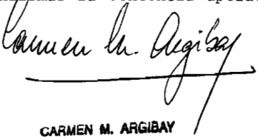

## DEL SEÑOR MINISTRO DOCTOR DON ENRIQUE SANTIAGO PETRACCHI

## Considerando:

Que el infrascripto coincide con 1os considerandos 1 al del voto de la Argibay.

Que , contra esa sentencia interpuso recurso extraordinario federal favor de la persona por nacer el tutor ad litem Asesor de Familia Incapaces Como agravio federal tuvo la vulneración del derecho la vida del nasciturus, el que, dijo, se hallaba garantizado por la Constitución Nacional

por diversos tratados de derecho internacional público Consideró que cuestión no se centraba en 1a constitucionalidad de as diversas autorizaciones previstas en el artículo 86 del Código Penal, las que adnitió, sino en la interpretación amplia que se había efectuado de su segundo Al respecto, sostuque era de toda evidencia que su interpretación debía hacerse de manera restrictiva, de modo de reducir un número de enorme dramatismo 1os casos subsumibles en las autorizaciones

Al analizar la admisibilidad del remedio federal (fs. 673/676) , el Superior Tribunal de Justicia de Chubut advirtió que la práctica abortiva ya se había realizado (v fs 674 vta.) No obstante ello, refirió ~con cita de precedentes de es ta Corteque la falta de gravamen actual por 1a resolución del conflicto no debía obstar la concesión del recurso, pues s610 así podrían las relevantes cuestiones planteadas ser tratadas en instancia federal A su vez , señaló que el recurso no cumplía con el reglamento aprobado la acordada CSJN 4/2007 , aunque por motivos similares antes apuntados consideró que podía hacerse una excepción tal régimen Por tales fundamentos resolvió conceder el recurso extraordinario deducido por aquí

70 ) Que tal comO ha indicado el superior tribunal provincial, no obstaría la admisibilidad del recurso que haya tenido lugar la intervención médica cuya autorización define el objeto del presente caso llevada cabo una vez que el mentado tribunal hiciera lugar la pretensión de las actoras (conf\_ informe de la Defensoría Pública Provincial obrante fs 648) En oportunidades anteriores esta Corte ha subrayado que la rapidez con que se produce el desenlace de situaciones como la de autos provoca que al momento en que se requiere la habilitación de 1a máxima instancia federal la actualidad del agravio referido las cuestiones constitucionales que aquellas conllevan ya ha perdido vigencia en instancias inferiores Teniendo ello en cuenta la Corte decidió, en tales antecedentes , admitir el reme dio federal fin de que no se frustre su intervención en esta clase de casos cuando existe una expectativa razonable de que

la situación resul susceptible de repetición (Fallos: 310 819 Y 324 : 4061) te

8 0 ) Que el recurrente no logra expresar argumentos constitucionales suficientes que sustenten la interpretación que deja fuera del ámbito de aplicación de la norma permisiva las mujeres que tengan deficiencias psíquicas Pues , más allá de las diferentes capacidades que  puedan presentar, la característica común que tienen unas otras es que en todos casos se trata de mujeres que han quedado embarazadas como consecuencia de un ataque su integridad sexual\_ En tal sentido no demues tra se advierteque en las disposiciones de rango constitucional citadas se reconozcan categorías mejor dicho, preferenciascomo las por él postuladas no ~i

Que en cuanto al núcleo de la tesis que propone el recurrente, debe observarse que la argumentación que la 505tiene pareciera no advertir que aquí se está en presencia de conflicto de intereses Esto es así pues en el recurso se invoca, unilateralmente, la afectación del derecho la vida de las personas por nacer, pero se omite toda consideración con respecto al otro extremo del conflicto, esto es , la situación de la niña de 15 años embarazada consecuencia de una violación (ver análogos argumentos en Fallos: considerando 11 disidencia del juez Petracchi) Al sesgar de tal modo argumen tación, se ignora la valoración integral que ha hecho el tribunal provincial para sostener la constitucionalidad de su interpretación del artículo 86 , inciso del Codigo Penal asumiendo sus implicancias en cuanto la afectación de a persona por nacer Y contrapesando ello con los derechos de la nifa, enunciando 10s sufrimientos que para ella conllevaría una pondera ción de los intereses en pugna contraria la que fuera previamente definida por el legislador

10) Que analizado en tales términos, el planteo efectuado en el remedio federal vuelve exhibir su incorrecta formulación pues , además de desdenar la extrema conflictividad de una situación que el legislador consideró no evitable de otro

modo que afectando 10s derechos del nasciturus, pretende redefinir la ponderación de 10s intereses en conflicto valorados por la norma sin exponer ningún argumento decisivo que obligue ese nuevo exanen de la situación El esquema de fundamentación de quienes han sostenido esa postura en el trámite del expediente ha consistido en alegar la vulneración al derecho la vida del feto, sumado ~en el mejor de 1os casosuna presunción según la cual la intensidad de la afectación de los derechos de la ma dre de la persona por nacer es en realidad menor de que la norma permisiva presupone que el daño que padece puede repa rarse través de medidas alternativas (verbigracia, asistencia psicológica niña Y su entorno familiar durante el embaraz0)

11) Que , esa preferencia por un distinto esquema de valores, de ningún modo puede considerarse suficiente como para calificar de inconstitucional la interpretación efectuada el quo del artículo 86 , inciso del Código Penal Y, de ese do dejar de aplicarla Además en razón de la particular estimación que se hace del daño sufrido por la niña víctima de violación los remedios que se proponen para subsanarlo, la posición referida omite desarrollar ~y ello la obligaba su propia construcción argumentalun análisis exhaustivo tendiente determinar si someterla continuar forzosanente con el embarazo que fuera producto de dicho comportamiento antijurídico hasta llevarlo término, no podría derivar en un perjuicio de una severidad tal que demostraría, en definitiva, que valoración de intereses en juego que había realizado ~invirtiendo el es quema de preponderancia fijado por el legisladorresultaba incorrecta

12) sin perjuicio de 1o anterior, las consideraciones del apelante concernientes normas de jerarquía constitucional omiten tomar en cuenta que el fallo apelado se sustenta autónomamente en legislación común nacional que no ha sido atacada de inconstitucional, razón por cual carece el recurso del requisito de relación directa inediata que debe existir entre las cuestiones federales propuestas decidido por el

pronunciamiento (conf\_ Fallos: citas, disidencia del juez Petracchi) En consecuencia, habrá de declararse su inadmisibilidad

Por ello, habiendo dictaminado el señor Procurador Fiscal se declara inadmisible el recurso extraordinario. Hágase saber Y, oportunamente, devuélvase

ENRIQUE S. PETRACCHI

Recurso extraordinario interpuesto por Alfredo Pérez Galinberti, Ganeral Subrogante Defengoría General de Provincia del Chubut , en de Tutor Ad Litem Fanilia

Traslado contestado por A,L.F en roprebentación de Bu hije menor A.G . con el patrocinio de Sandra Elizabeth Grilli Dra

Tribunal de origen: Suporior Tribunal Provincia del Chubut

Tribunal que intervino con anterioridad: Camara de Comodoro Rivadavia , Sala B

LUJAN WILLIAMS AUTOMOTORES S.A. cONc. PREV. c/ VOLKSWAGEN ARGENTINA S.A. Y VOLKSWAGEN S.A. DE AHORRO PARA FINES DETERM. Y VOLKSWAGEN cIA. FINANcIERA S.A. S/ MEDIDA AUTOSATISFAcTIVA AVOcAMIENTO DIREcTO INc. DE cOBRO DE TASAS JUDIcIALES

## TASA DE JUSTICIA.

Corresponde dejar sin efecto la sentencia que haciendo aplicación de lo normado por el art. 283, primer párrafo, del código tributario de la Provincia de San Luis, que dispone que son contribuyentes de las tasas de justicia los usuarios del servicio que se retribuye 'y responsables quienes realicen las actuaciones gravadas', intimó a su pago también a los letrados de la actora por considerar que revestían dicho papel, ya que no exhibe una vinculación suficientemente razonable entre el contribuyente de la gabela y su abogado -sea apoderado o patrocinante- ni entre éste y la manifestación de riqueza gravada, que permita considerar que dicho párrafo sea compatible con la garantía de la razonabilidad (art. 28 de la Constitución Nacional).

-Del dictamen de la Procuración General, al que remitió la Corte Suprema-.

## FALLOS DE LA CORTE SUPREMA 335

## DIcTAMEN DE LA PROcURAcIóN GENERAL

## Suprema Corte:

- I -

En lo que ahora interesa, en su resolución del 19 de febrero de 2008 (cuya copia obra a fs. 48/53 de este incidente), el Superior Tribunal de Justicia de San Luis intimó a la actora y a los responsables -sus abogados representantes- al pago de la tasa de justicia correspondiente a su presentación inicial, como así también al ingreso de una multa equivalente al 100%, con más sus intereses respectivos, por la falta de ingreso en término de la gabela, a la vez que ordenó expedir el certificado de deuda a fin de proceder a su cobro compulsivo (arts. 283, 311, 312 y cc. del código tributario local). También ordenó que abonasen $50 en concepto de derecho de archivo.

Para así decidir, tuvo en cuenta lo normado por el art. 46, inc. 4º, ap. a), de la ley impositiva para el ejercicio 2003, y por el art. 287 del código fiscal, que fijaban dicha gabela en el 30 por mil del monto en juego en los juicios por cobro de dinero, cualquiera fuese el procedimiento al que estuvieran sometidos, lo que arrojó para el principal un total de $ 367.986,68.

Asimismo, con respecto al embargo decretado por la jueza de primera instancia, conminó a dicha parte y a los responsables para que, en el plazo de cinco días, abonasen la tasa pertinente, con más sus intereses, bajo apercibimiento de aplicación de multa y posterior inicio de la ejecución fiscal.

Por último, emplazó a la demandada y al responsable -su letrado- al pago de la tasa de justicia correspondiente a los recursos de apelación interpuestos, con más sus intereses, bajo apercibimiento de multa y ejecución fiscal (art. 311 de dicho código).

- II -

A fs. 66/86 vta. obra el recurso extraordinario deducido por Juan Héctor Cardellino, letrado de la actora. Sostiene, en síntesis, que la sentencia apelada hace una interpretación carente de fundamento del art. 283 del código tributario local, a fin de responsabilizar a los abogados de las partes por el pago de las tasas de justicia que correspondan.

Aduce que tal proceder afecta sustancialmente su patrimonio, su libertad de trabajo, como así también el derecho de defensa en juicio y que, de ser correcta la inteligencia atribuida al precepto por el tribunal apelado, dicha norma resultaría inconstitucional, al cercenar los referidos derechos, llegando a impedir el libre ejercicio de la abogacía.

Por otra parte, señala que la solidaridad asignada por el tribunal tampoco se desprende de la ley atacada, sino que es libre creación del intérprete, lo que configura otro motivo de arbitrariedad que pesa sobre la sentencia apelada.

Indica que la norma, al mencionar como responsables a quienes 'realicen las actuaciones gravadas', padece de una grave indeterminación, puesto que también ejecutan dicha acción los jueces, secretarios, peritos y demás personas que intervienen en la tramitación del expediente.

## - III -

Por su lado, a fs. 88/95, luce el recurso extraordinario interpuesto por Antonio A. Pérez Miranda, letrado de la demandada, quien recurre de igual manera y con similares argumentos el punto 5º de la sentencia en cuanto lo intimó para efectivizar el pago de la tasa de justicia, bajo apercibimiento de sanción y apremio.

Destaca que si bien su representada cumplió en tiempo y forma con el pago del tributo, hizo la pertinente reserva de su derecho a cuestionar por sí el art. 283 del código tributario, por inconstitucional, debido a las razones que allí esgrime, en especial por quebrar la garantía de la razonabilidad de los actos del Estado.

- IV -

El Superior Tribunal de Justicia de San Luis concedió ambas apelaciones a fs. 113/114.

- V -

Es consolidada doctrina de V.E. que la existencia de efectivo gravamen que afecte a quien deduce la apelación extraordinaria constituye uno de los recaudos jurisdiccionales cuya previa comprobación condiciona la admisibilidad del recurso y que al Tribunal corresponde verificar aun de oficio (arg. Fallos: 315:2125; 319:1218; 323:1097 y 1101), toda

vez que no tiene competencia para emitir declaraciones generales o pronunciamientos abstractos (arg. Fallos: 316:479).

Por aplicación de tal principio, estimo que resulta inadmisible el recurso de fs. 88/95, debido a que, como indica el propio presentante, la tasa fue oblada tempestivamente por el contribuyente -la demandada-, por lo que el Fisco local quedó desinteresado y, por ende, liberado el recurrente de la intimación de pago que le fuera formulada.

## - VI -

En cambio, a mi modo de ver, el recurso extraordinario interpuesto a fs. 66/86 vta. resulta formalmente admisible, pues se ha puesto en cuestión la validez de una norma provincial, bajo la pretensión de ser violatoria de la Constitución Nacional, y la decisión ha sido favorable a la validez de aquélla (art. 14, inc. 2º, ley 48).

## - VII -

En su resolución aquí en crisis, el Superior Tribunal local hizo aplicación de lo normado por el art. 283, primer párrafo, del código tributario, en cuanto dispone que son contribuyentes de las tasas los usuarios del servicio que se retribuye 'y responsables quienes realicen las actuaciones gravadas', a fin de intimar también a los letrados de la actora por considerar que revestían dicho papel.

Debo recordar que esa Corte Suprema no está autorizada para modificar la inteligencia de las normas locales llevada a cabo por los jueces provinciales, sino sólo para revisar la compatibilidad de las normas así interpretadas con la Constitución Nacional (arg. Fallos: 319:687). Por ello, entiendo que ha de examinarse ese precepto, tal como lo interpretó el a quo , a fin de verificar su adecuación con las normas pertinentes de la Carta Magna.

Considero que es menester advertir, de inicio, que la figura del responsable tributario ha sido concebida a fin de asegurar o adelantar la recaudación de los tributos. Para ello, el legislador puede recurrir a. determinadas personas que están relacionadas con el contribuyente -sujeto pasivo deudor- y que, sobre todo, tienen estrecha vinculación con la manifestación de riqueza gravada, sobre la cual pueden ejercer un determinado control a fin de detraer de ella la suma pertinente -sea porque estén en condiciones de percibir, de retener, o de asegurarse el cobro de ella- con el objeto de ingresarla en las arcas públicas de modo oportuno.

Es por tal cúmulo de razones que el legislador, siempre respetando el principio de razonabilidad, está constitucionalmente habilitado para establecer como carga pública en cabeza de determinadas personas el deber de actuar como responsables del pago del gravamen de que se trate, mediante la articulación técnica de un presupuesto de hecho especial que, verificado en la realidad, coloca al sujeto responsable ante la obligación de actuar como tal.

Al respecto, ha sostenido autorizada doctrina 'con la expresión responsables designamos a todas aquellas personas que por mandato de la ley están obligadas al cumplimiento de la prestación tributaria sin ser deudores de la obligación (...). Esta categoría de sujetos asume destacada importancia y responde a características propias del derecho financiero. La ley, con el propósito de asegurar la normal y oportuna recaudación de los tributos, dispone el traslado o traspaso de la obligación hacia terceras personas, distintas del deudor de ella, que sumándose o reemplazándolo íntegramente, se constituyen en sujetos pasivos directos' (Carlos María Giuliani Fonrouge, Derecho Financiero, Depalma, Buenos Aires, 1997, tomo I, ps. 481 y 482). Y agrega más adelante (p. 485) 'Por cierto que la ley no designa arbitrariamente los responsables, sino que tiene en cuenta la vinculación jurídica o económica de carácter permanente o accidental, que se manifiesta entre responsable y deudor. Las causas o matices son variados y dependen de circunstancias múltiples: representación legal o voluntaria, ejercicio de una función o cargo público, relación laboral, sucesión a título particular, etc., pero siempre sobre la base de cierta vinculación' .

En coincidencia, se ha dicho también que el responsable 'debe tener con el contribuyente una vinculación que le permita hacer efectivo su derecho al resarcimiento, ya sea por el derecho de percepción, de retención, de repetición o por cualquier otro medio del derecho privado' (Ramón Valdés Costa, Curso de Derecho tributario, Temis, Bogotá, 2001, p. 358).

Así las cosas, tengo para mí que el caso aquí en crisis no exhibe una vinculación suficientemente razonable entre el contribuyente de la gabela y su abogado -sea apoderado o patrocinante-, ni entre éste y la manifestación de riqueza gravada, que permita considerar que el referido párrafo primero del art. 283 del código tributario de San Luis sea compatible con la garantía de razonabilidad (art. 28 de la Constitución Nacional).

En efecto, la actuación forense del abogado no guarda relación razonable con la exteriorización de riqueza que se grava, ni ese profesional está ante la posibilidad de disponer efectivamente de suma alguna de su representado o patrocinado que le posibilite actuar, merced a retenciones o percepciones, o a una adecuada administración, para asegurarle al Fisco el cobro tempestivo de la gabela mediante el cumplimiento de su deber.

Sabido es que las restricciones y disposiciones que establezca el Estado son válidas en la medida en que resulten razonables y mantengan adecuada proporción entre la necesidad de custodiar el interés público comprometido y que eviten conducir a una desnaturalización de los derechos constitucionales del afectado (arg. Fallos: 332:2468; 333:993, y causa J.126, L.XLII, 'Jiménez, María Elena c/ Provincia de Salta', del 19 de abril del corriente año).

Por ende y a la luz de los claros postulados expuestos, entiendo que la norma impugnada resulta lesiva del derecho de propiedad del recurrente, como así de la mentada garantía de la razonabilidad, por lo cual propicio que se declare su inconstitucionalidad.

## - VIII -

En virtud de lo expuesto, opino que corresponde declarar inadmisible la apelación de fs. 88/95, hacer lugar al recurso extraordinario de fs. 66/86 vta., y dejar sin efecto el fallo impugnado en cuanto fue materia de agravio. Buenos Aires, 27 de mayo de 2011. Laura M. Monti .

## FALLO DE LA cORTE SUPREMA

## Buenos Aires,

Vistos los autos: "Luján Willians Automotores SA Conc . Prev c/ Volkswagen Argentina SA Y Volkswagen SA de Ahorro para fines deterninados Y Volkswagen Cía\_ Financiera SA medida autosatisfactiva -avocamiento directo incidente de cobro de sas judiciales" ta-

## Considerando:

Que las cuestiones planteadas han sido adecuadamente cons ideradas en el dictamen de señora Procuradora Fiscal, Yos fundamentos son compartidos por el Iribunal, Y 10s que rresponde remitirse en razón de brevedad.

Por ello, de conformidad con 10 dictaminado por 1a señora Procuradora Fiscal, se desestima el recurso extraordinario de fs \_ 88/95 ~deducido por el doctor Antonio A Pérez MirandaY se declara formalmente procedente apelación federal de fs. 66/86 vta ~interpuesta por el doctor Héctor Juan Cardellinose de ja sin efecto la sentencia apelada en cuanto fue materia de agravios Con\_costas. Notifíquese devuélvase

Recursos extraordinarios interpuestos por Héctor Juan Cardellino, con el trocinio del Roberto Eduardo Paguno Antonio A . Pérez Miranda , con patrocinio de 1a Dra María Dr -

Traslado contestado por Ana en 8u carkcter de rebponbable de 1a Oficina de Contralor de 1abab Judicialeb

Iribunal de origen: Superior Iribunal de Jubticia de San Luia

Tribunales intervinieron con anterioridad: Comercial de la ciudad de San Luis que

## FALLOS DE LA CORTE SUPREMA 335

## MERcADO, FLORENTINO c/ ENTEL RESIDUAL

S/ DEMANDA cOBRO DE PESOS

## ASTREINTES.

Corresponde dejar sin efecto las resoluciones que persisten en la aplicación de las astreintes omitiendo considerar las serias alegaciones del demandado acerca de que no pretendió sustraerse al cumplimiento de las obligaciones a su cargo -lo que tornaría injustificadas las sanciones impuestas cualquiera sea su importe- y de que la desproporción que existe entre los importes estimados administrativamente y el monto de la condena fijado en sede judicial provocaría un enriquecimiento sin causa.

-Del dictamen de la Procuración General, al que remitió la Corte Suprema-.

DIcTAMEN DE LA PROcURAcIóN GENERAL

## Suprema Corte:

- I -

A fs. 1327 (de los autos principales, a cuya foliatura me referiré en adelante), la Cámara Federal de Apelaciones de Posadas desestimó el recurso de queja por apelación denegada del Estado Nacional - Ministerio de Economía y Producción - ENTEL residual -demandado en autos- contra las resoluciones que le aplicaron astreintes desde el 27 de julio de 2008. El tribunal entendió que estas últimas habían pasado era autoridad de cosa juzgada y que se encontraba agotada, por ende, toda posibilidad de queja.

Contra dicho pronunciamiento, el demandado planteó el recurso extraordinario de fs. 1334/1344, por las causales de arbitrariedad y gravedad institucional, al entender que el tribunal le impuso el pago de elevadas sumas de dinero en concepto de astreintes sin haber mediado renuencia de su parte al cumplimiento del fallo y porque, además, de tener que abonar lo ordenado se produciría un enriquecimiento sin causa. Puso de manifiesto al respecto que solicitó, en numerosas ocasiones, que tales medidas no se hicieran exigibles con el fin de posibilitar la revisión de las liquidaciones del monto de condena, pues en sede administrativa se había advertido que este último era considerablemente menor al fijado judicialmente y que las liquidaciones se habían practi-

cado soslayando las disposiciones de orden público sobre consolidación de deudas de la ley 23.982 y sus normas complementarias.

La Cámara, a fs. 1389, en primer lugar, desestimó tal recurso porque entendió que carecía de fundamentación autónoma y no se dirigía contra una sentencia definitiva y, en segundo término, rechazó la queja por apelación denegada deducida por el Estado Nacional a fs. 1361/1366, pues consideró que se trataba de una mera insistencia en agravios ya propuestos y resueltos con arreglo a derecho.

Contra el primer argumento, el Estado Nacional planteó queja ante V.E. (fs. 1523/1527) y contra el segundo, el recurso extraordinario de fs. 1411/1423, el que denegado (fs. 1427) dio lugar a la presentación de hecho de fs. 1606/1610.

En el segundo recurso (obrante a fs. 1411/1423), alega que las liquidaciones aprobadas en autos deben ajustarse a las normas de orden público sobre consolidación, ya que el crédito objeto de estas actuaciones por ser anterior al 1º de abril de 1991 (fecha de corte) se encuentra incluido en la ley 23.982, en los decretos 1639/93 -sustituido por el art. 5º del decreto 483/95- y 2140/91, así como en las leyes 25.344 y de presupuesto 26.337.

Expresa, al relatar los antecedentes de la causa, que a fs. 1286/1290 solicitó que se suspendieran los plazos en curso para dar cumplimiento a su obligación con el fin de que el actor adecuara su reclamo a las normas de orden público indicadas.

Resulta  ilustrativo  señalar  que  en  aquella  presentación  de fs. 286/1290 manifestó que el crédito reclamado por el accionante contra ENTEL -residual- tuvo su origen en el contrato oportunamente suscripto entre la Provincia de Misiones y la empresa VIAL MISIONERA S.R.L. para la construcción de centrales telefónicas en el marco del Plan Megatel Misiones y que la firma de dicho documento, la ejecución de los trabajos y la emisión de las notas de débito en concepto de mora por pago fuera de término de los certificados de avance de obra se llevaron a cabo (o bien vencieron) con anterioridad al 1º de abril de 1991, motivo por el cual la acreencia debía ceñirse a las disposiciones de la ley 28.982 y sus normas reglamentarias.

También, en dicha oportunidad, aclaró que ello no alteraba el principio de la cosa juzgada, toda vez que no cuestionaba lo decidido

en cuanto a la procedencia de los rubros reclamados y el consecuente derecho del acreedor a percibirlos siempre que el crédito se consolidara en los términos antes expuestos. Hizo notar además que según los cálculos practicados por el Área Contable de Entes Liquidados se había verificado una diferencia en menos del monto de condena a valores del 1º de abril de 1991, puesto que la actualización de las notas de débito debían realizarse según las cláusulas del Pliego de Condiciones para la contratación de obras civiles de ENTEL, cuyo art. 24 indicaba la aplicación do la ley 21.392 para actualizar los valores de deuda.

Por último, y en cuanto a los honorarios regulados a favor de los profesionales intervinientes -establecidos en un porcentaje del capital de condena o en una suma fija pero considerando el monto de la liquidación practicada-- dijo que debían ser determinados en los términos anteriormente expuestos y adecuados a las disposiciones de las leyes 25.344 y 25.725.

- II -

A fs. 1612, la Corte declaró admisibles las quejas deducidas, formalmente procedentes los recursos extraordinarios y dispuso la suspensión de los efectos de las resoluciones impugnadas, así como del trámite de los procesos orientados a su ejecución.

## - III -

A mi modo de ver, los recursos extraordinarios son formalmente admisibles pues, si bien, en principio, las decisiones adoptadas en la etapa de ejecución de sentencia no configuran el pronunciamiento definitivo requerido por el art. 14 de la ley 48, ello admite excepciones cuando pone fin a lo discutido o causa un gravamen de imposible reparación ulterior (Fallos: 323:3909 y sus citas), pues el apelante se encuentra impedido en el futuro de replantear sus quejas al respecto, al tiempo que lo priva de otro medio legal para la tutela de su derecho, ocasionándole un agravio no susceptible de posterior reparación (Fallos: 319:1101).

En efecto, entiendo que en esta causa se configura el supuesto de excepción señalado, toda vez que -con relación al recurso extraordinario de fs. 1334/1344- la; alzada al persistir en la aplicación de las astrein-

tes omitió considerar las serias alegaciones del demandado acerca de que no pretendió sustraerse al cumplimiento de las obligaciones a su cargo --lo que tornaría injustificadas las sanciones impuestas cualquiera sea su importe- y de que la desproporción que existe entre los importes estimados administrativamente y el monto de la condena fijado en sede judicial provocaría un enriquecimiento sin causa (cfr. doctrina de Fallos: 332:846).

Por iguales motivos cabe atender a los agravios formulados en el recurso extraordinario de fs. 1411/1423, pues las razones de índole procesal en que se funda la decisión recurrida no justifican, a mi modo de ver, el apartamiento de expresas disposiciones que regulan el modo de ejecución de sentencias firmes que resultan aplicables a los pronunciamientos no cumplidos si se trata de deudas consolidadas (Fallos: 323:2481).

En efecto, ante la seriedad de los planteos que introdujo el demandado, que remitían al examen de cuestiones susceptibles de tener una influencia decisiva para calcular el monto de la condena, se imponía su consideración por la alzada, so consecuencia de arriesgar, bajo el supuesto amparo de normas adjetivas, la correcta solución del pleito (Fallos: 323:2562). Es que, si bien debe ser reconocida la trascendencia de las técnicas y principios tendientes a la organización y desarrollo del proceso, no por ello cabe legitimar que dichas formas procesales sean utilizadas con prescindencia de la finalidad que las inspira y con el olvido de la verdad jurídica (Fallos: 317:1845).

Es necesario recordar que la Corte ha sostenido que la renuncia consciente a la verdad es incompatible con el adecuado servicio de justicia. Y si bien los jueces deben fallar con sujeción a las reglas y los principios de forma, según las circunstancias de hecho que aducen y acreditan las partes secundum allegata et probata partium - nada excusa su indiferencia respecto de la objetiva verdad en la augusta misión de dar a cada uno lo suyo (Fallos: 238:550 y 327:5970).

En ese sentido, tanto el juez de primera instancia como la Cámara omitieron considerar en los pronunciamientos impugnados los agravios del demandado referidos a que, de conformidad con la ley 23.982, las  obligaciones comprendidas en su ámbito se consolidan después del reconocimiento firme, en sede administrativa o judicial (art. 1º). En ese momento, se produce la novación de la obligación original y de cualquiera de sus accesorios, razón por la cual sólo subsisten para el acreedor los derechos derivados de la consolidación que la misma ley

establece (art. 17) y, en consecuencia, dichas obligaciones únicamente devengan el interés que prevé el art. 6º de esa ley (Fallos: 322:1421), aspecto que no puede ser soslayado en oportunidad de practicar la liquidación correspondiente.

Por ello, estimo que asiste razón al apelante cuando asevera que el  tribunal,  pese  a  establecer  que  el  crédito  de  autos  se  encuentra comprendido en el régimen de consolidación de deudas, prescindió de la solución normativa prevista para el caso que, además, es de orden público.

Asimismo, no resulta abundante recordar que la naturaleza señalada de orden público que el legislador atribuyó al régimen de consolidación obliga a los jueces a aplicarlo en cualquier estado del proceso y aun cuando el accionado omita solicitarlo (Fallos: 329:1715), por ello cuando en este caso se resolvió rechazar las impugnaciones efectuadas por el demandado con sustento en que existía cosa juzgada, no se advirtió que el punto ahora discutido pudo ser planteado en la etapa de ejecución, toda vez que las normas que consolidan las deudas estatales no señalan un término perentorio para su invocación (v. sentencia del 4 de septiembre de 2007, S.1455.XLI, 'Sociedad Anónima Dominga B. Marconetti c/ Gobierno de la Ciudad de Buenos Aires').

Por otra parte, a mi juicio, tampoco fueron objeto de tratamiento los argumentos referidos a la variación del monto de condena según los cálculos practicados por el Área Contable de Entes Liquidados que había verificado una diferencia en menos a valores del 1º de abril de 1991, ni los vinculados a que debían adecuarse los honorarios regulados en el proceso a aquel monto.

En consecuencia, la falta de consideración de los agravios expuestos fundadamente por el apelante ante los jueves de la causa sobre la base de meros reparos de índole procesal, importa, a mi modo de ver, una sustancial restricción a la garantía del debido proceso y el adecuado servicio de justicia.

- V -

Por todo lo expuesto, opino que corresponde hacer lugar a las quejas deducidas, dejar sin efecto los pronunciamientos apelados en cuanto fueron materia de los recursos extraordinarios planteados y devolver las actuaciones a la Cámara de origen para que dicte una nueva con

arreglo a lo aquí expresado. Buenos Aires, 9 de noviembre de 2010. Laura M. Monti .

## FALLO DE LA cORTE SUPREMA

## Buenos Aires, 43 de

vistos 1os autos "Recursos de hecho deducidos por el Estado Nacional (Ministerio de Econonía Y Finanzas Públicas) en la causa Mercado\_ Florentino c/ ENTEL Residual" para decidir sobre su procedencia

## Considerando:

Que esta Corte comparte fundamentos conclusiones del dictanen de la señora Procuradora Fiscal, al que corresponde renitir en razón de brevedad

Por ello, se declaran procedentes 10s recursos extraordinarios Y se dejan sin efecto las resoluciones impugnadas . Vuelvan 10s autos al tribunal de origen fin de que, por quien correSponda , se dicte un nuevo pronunciamiento con arreglo al presente. Con castas : Notifíquese Y, oportunamente, devuélvanse

Recursos de hecho deducidos por Nacional Hinisterio de Econonía Finanzab Públicae, representado por 1a Dra Laura Julie con el pa trocinio letrado de la Dra Ana María Bagbi

Tribunal de origen:

Cámara de Pobadab

Tribunal que intervino con anterioridad: Juzgado Fedoral de Prinera Inbtancia de Pobadab

## VILLEGAS, MARcELA ALEJANDRA c/ PREFEcTURA NAVAL ARGENTINA S/ SUMARíSIMO

## MINISTERIO PUPILAR.

Corresponde declarar la nulidad de las actuaciones cumplidas sin intervención previa del Ministerio Público de la Defensa susceptibles de causar un gravamen de insusceptible reparación ulterior a dicha representación promiscua, tales como la que dispuso declarar la cuestión de derecho y pasó los autos a dictar sentencia sin notificar al Ministerio de Menores, ya que el art. 59 del Código Civil establece que además de los representantes necesarios, los incapaces son promiscuamente representados por éste, que será parte legítima y esencial en todo asunto judicial o extrajudicial, de jurisdicción voluntaria o contenciosa, en que los incapaces demanden o sean demandados, o en que se trate de las personas o bienes de ellos, so pena de nulidad -art. 494 del código mencionado-.

-Del dictamen de la Procuración General, al que remitió la Corte Suprema-.

## DIcTAMEN DE LA PROcURAcIóN GENERAL

## Suprema Corte:

- I -

Los jueces de la Cámara Federal de Apelaciones de Mar del Plata rechazaron la demanda con costas a cargo de los letrados apoderados de los actores (v. fs. 283 de los autos principales, a los que me referiré en adelante). Para así decir, el a quo, sostuvo que el juez de primera instancia había incurrido en errores procedimentales en cuanto imprimió al proceso el trámite sumarísimo y mandó a llevar adelante la ejecución como si se tratara de un juicio ejecutivo. Destacó que tampoco dio vista a la Defensora Pública Oficial, ni se la notificó de la sentencia,

cuando se encontraban comprometidos los intereses de un menor (hijo de la víctima del accidente mortal motivo del reclamo).

Tras describir la regularidad del sistema administrativo que dispone la Ley de Riesgos de Trabajo sostuvo que la actora formalizó un planteo orientado al cobro de la indemnización por muerte ($ 103.821,91) estipulado en el marco normativo del mencionado régimen especial, reconocido en sede administrativa, cuestionando el modo de pago (en renta) del beneficio. Afirmó que no se dedujo el recurso del art. 46 de la LRT a fin de habilitar la instancia de la justicia federal; que no podía hacerse aplicación de la vía ejecutiva prevista en la ley 18.345 y que el dictamen referido no contaba con las características de integración y suficiencia que debía reunir todo título ejecutivo. Sostuvo que se trata de un dictamen expedido por una comisión médica que tuvo por fin determinar la naturaleza laboral del accidente, el carácter y el grado de la incapacidad: 'muerte por inmersión en el mar'. Entendió que tal extremo no era hábil para considerarlo título ejecutivo por no reunir los recaudos exigidos por la ley, motivo por el cual consideró improcedente la vía ejecutiva intentada por la parte actora.

Agregó que en el trámite llevado a cabo en las Comisiones Médicas se vulneró el derecho de defensa de la demandada (Prefectura Naval Argentina) por cuanto no se la habría notificado el resultado del dictamen de la Comisión Médica y se recurrió a la esfera judicial pretendiendo su ejecución. Entendió que la instancia ante las comisiones médicas estaba inconclusa, ordenando la devolución de las actuaciones al juez de origen para su archivo.

- II -

Contra tal pronunciamiento la actora deduce el recurso extraordinario federal cuya denegación dio origen a la queja en examen (v. fs. 297/312 y fs. 334/335 y fs. 50/57, del cuaderno respectivo).

A fojas 60, de la presentación directa, por disposición del Tribunal se dio vista al señor Defensor Oficial quien requirió los autos principales (v. fs. 61 de la queja). Con ellos, la Defensoría Oficial ante la Corte Suprema de Justicia de la Nación en representación del menor (v. fs. 69, punto I de la queja), plantea que se ha omitido conferir intervención al Ministerio Público de Menores luego de que se presentara a estar a derecho el heredero menor de edad de la víctima del accidente mortal. Sin perjuicio de reprochar de arbitraria la sentencia de la Cámara

porque no se hace cargo de los argumentos esgrimidos en los agravios observa que solo se confirió la intervención al Ministerio Público de Menores con posterioridad al inicio de la demanda (v. fs. 52) y no así en las restantes oportunidades procesales que corresponden. Por esa razón entiende que están conculcadas las garantías de la defensa en juicio, del debido proceso legal y de acceder a la justicia, en un pie de igualdad, como así también el derecho que tiene todo niño a ser oído (Citó los arts. 16, 18 de la CN, art. 12 de la Convención sobre de los Derechos del Niño y arts. 19, 24 y 27 de la Ley Protección Integral de los Derechos de Niños, Niñas y Adolescentes, nº 26.061), con lo cual, entiende el procedimiento se torna nulo de nulidad relativa.

Remarcó que se omitió dar vistas fundamentalmente a) Luego de dictada la sentencia de grado, a los efectos de que la magistrada de la defensa habilitara -si así considerara necesario- la etapa recursiva, o en su caso, participara en su rol de contralor del recurso de apelación interpuesto por la representante necesaria del menor y b) Con posterioridad al dictado del pronunciamiento de la Alzada, a los mismos fines explicitados precedentemente.

Afirma que se impidió a los menores gozar de la asistencia de la representación que ejerce el Ministerio Pupilar en etapas importantes del proceso, con la consiguiente imposibilidad en las etapas anteriores de asumir la defensa correspondiente, sin que ello quede subsanado con la vista que se confiere, en atención a que tal omisión ha generado un grado de indefensión, que acarrea, en definitiva, un proceso 'injusto' (v. fs. 70)

Un ordenamiento lógico de las cuestiones planteadas impone tratar en primer término la invalidez pretendida por el señor Defensor Oficial. Debo señalar que V.E. tiene reiteradamente dicho que es descalificable la sentencia que omitió dar intervención al Ministerio Pupilar para que ejerciera la representación promiscua a pesar de que dicha resolución comprometía en forma directa los intereses de la menor, lo que importa desconocer el alto cometido que la ley ha asignado a dicho ministerio, y no sólo menoscaba su función institucional sino que acarrea la invalidez de los pronunciamientos dictados en esas condiciones (Fallos: 305: 1945, 320: 1291, 323:1250 -voto de la mayoría al que no adhieren los Dres. Moliné O'Connor, Petracchi y Bossert-)

Respecto al carácter de la representación promiscua, debo destacar que el artículo 59 del Código Civil, establece que 'a más de los repre-

sentantes necesarios, los incapaces son promiscuamente representados por el Ministerio de Menores, que será parte legítima y esencial en todo asunto judicial o extrajudicial, de jurisdicción voluntaria o contenciosa, en que los incapaces demanden o sean demandados, o en que se trate de las personas o bienes de ellos, so pena de nulidad de todo acto y de todo juicio que hubiere lugar sin su participación -art. 494 del Código Civil- (v. Fallos: 312:1580).

A partir de tales premisas cabe apuntar, como señala el Sr. Defensor Oficial, que no hubo intervención del Ministerio Pupilar previa la adopción de decisiones posibles de causar un gravamen de insusceptible reparación ulterior a dicha representación promiscua, tales como la que dispuso declarar la cuestión de puro derecho y pasó los autos a dictar sentencia sin notificar al Ministerio de Menores (v. fs. 232 en adelante). Por ello, opino que corresponde declarar la nulidad del trámite cumplido con posterioridad a la mencionada actuación y devolver los autos a la instancia correspondiente para la continuación del proceso.

Finalmente, dada la solución que aquí propongo, considero innecesario expedirme sobre los agravios del quejoso pues ellos, en dicho contexto, carecen de interés actual.

Por lo expuesto, considero que V.E. debe declarar la nulidad de las actuaciones mencionadas con el alcance precedentemente indicado. En consecuencia, previo a todo trámite correspondería devolver las actuaciones a la instancia inicial a los efectos de que tome intervención y haga valer los derechos que estime corresponder en el juicio. Buenos Aires, 10 de agosto de 2011. Marta A. Beiró de Gonçalvez.

## FALLO DE LA cORTE SUPREMA

## Buenos Aires, 43 cle de 2042

Vistos os autos "Recurso de hecho deducido por la actora en la causa Villegas , Marcela Alejandra c/ Prefectura Naval Argentina s / sumarísimo" para decidir sobre su procedencia.

## Considerando

1%) Que Cámara Federal de Apelaciones de Mar del Plata, al revocar la sentencia de primera instancia, rechazó la

demanda enderezada obtener el cobro de la indennización por muerte prevista la ley 24 . 557 \_ Contra dicho pronunciamiento la actora interpuso el recurso extraordinario cuya denegación dio origen la presente queja por

Que la circunstancia de que la presentación directa no cumpla con el requisito previsto por el art. del reglamento aprobado por acordada 4/07 no constituye un obstá culo insalvable para el trataniento la pretensión recursiva (art 11 de la citada reglamentación)

Que el señor Defensor Oficial ante esta Corte, en 1o que interesa, destacó que se había omitido conferir intervención al Ministerio Pupilar de Menores , después de que se presentara estar derecho el heredero menor de edad de la víctima del accidente, situación que comprometía las garantías de defensa en del debido proceso legal, de acceder justicia en de igualdad Y del derecho ser oídas , tutelados por la Constitución Nacional, la Convención sobre 1os Derechos del Niño Y la Ley de Protección Integral de los Derechos de ños , Niñas Y Adolescentes 26.061\_ aquí pié

En tal sentido, precisó que no se dieron al Ministerio Pupilar dos vistas fundamentales: a) después de dictada la sentencia de grado, fin de que habilitara ~de estimarlo perti-nente\_ la etapa recursiva por su legitimación autónona 0 , en su caso, participara en su rol de contralor del recurso de apelación interpuesto por la representante necesaria del menor, Y b) con posterioridad al pronunciamiento de alzada , 10s mismos fines recursivos

Sobre estas bases , el defensor solicitó que se declare la nulidad de las actuaciones cumplidas sin intervención del Ministerio Pupilar Y se remita posteriormente causa las instancias anteriores, fin de que se garantice la doble representación prevista el ordenamiento jurídico (ver punto IV del dictamen agregado fs \_ 69/71 del recurso de hecho)

4 % ) Que en atinente invalidez pretendida por

el señor Defensor Oficial esta Corte comparte Y hace suyos los fundamentos Y conclusiones expuestos en el dictamen de 1a señora Procuradora Fiscal, los que cabe remitir en razón de brevedad

Por ello, de conformidad con 10 dictaninado, se declara la nulidad de las actuaciones cumplidas sin intervención previa del ~/-Ministerio Público de 1a Defensa. Agréguese la queja al principal Y devuélvanse los autos al tribunal de origen fin de que por quien corresponda, se dé intervención al Ministerio Pu pilar arreglo Notifíquese remítase-

Recurso de queja interpuesto por Marcela Alejandra Villogab representada el Dr. Hoctor Hugo Calvi, con el patrocinio del Dr Irob por

Tribunal de origen: Plata

Tribunal que intervino con anterioridad: Juzgado 2 , de Mar Plata

## FALLOS DE LA CORTE SUPREMA 335

## YAcIMIENTOS PRETROLIFEROS FIScALES S.A. c/ ADMINISTRAcION FEDERAL DE INGRESOS PUBLIcOS - DIREccION GENERAL IMPOSITIVA S/ IMPUGNAcIóN DE DEUDA

## YACIMIENTOS PETROLIFEROS FISCALES.

Tanto el art. 7º del decreto 2778/90 como el art. 6º, última parte, de la ley 24.145 vedan la posibilidad de que se aplique a Y.P.F. Sociedad Anónima cualquier tipo de legislación o normativa de carácter administrativo a partir de su sanción, por lo que de su texto expreso se desprende la voluntad del legislador de excluir totalmente del ámbito de aplicación de esa rama de la legislación a la empresa mencionada que se pretende ejecutar y, por tanto, de la particular jurisdicción otorgada por la ley 19.983 a la Procuración del Tesoro de la Nación, lo que no obsta en principio a que, en caso de que aquélla sea condenada al pago, recurra a aquellos mecanismos legales específicos, para repetir de quien corresponda su eventual acreencia.

-Del dictamen de la Procuración General, al que remitió la Corte Suprema-.

## YACIMIENTOS PETROLIFEROS FISCALES.

La decisión de remitir las actuaciones originadas en la imputación realizada por la A.F.I.P. a Y.P.F. S.A. a la Procuración del Tesoro en el marco de la ley 19.983 y denegar la habilitación de la instancia judicial, supone un apartamiento de la normativa aplicable -art. 7º del decreto 2778/90 y art. 6º, último párrafo, de la ley 24.145- y, a la vez, una contradicción en sus términos que invalida el pronunciamiento, ya que al juzgar que la controversia concierne a organismos estatales -más allá de la posterior privatización de uno de ellos- adoptó la decisión de asignarles responsabilidad por la deuda y, prescindiendo de la expresa normativa que regulaba la situación de Y.P.F. S.A., declaró no habilitada la jurisdicción, a pesar de que acababa de ejercerla en el mismo acto (Voto de los Dres. Ricardo Luis Lorenzetti y Elena I. Highton de Nolasco).

DIcTAMEN DE LA PROcURAcIóN GENERAL

Suprema Corte:

- I -

Y.P.F. Sociedad Anónima, interpuso recurso de apelación, ante la Cámara Federal de la Seguridad Social contra la Resolución 625/05 de la A.F.I.P., por la que se rechazó la revisión, intentada por la misma em-

presa, de la Resolución 44/02 (DE TLGC) mediante la cual el organismo recaudador le imputó cargos por falta de aportes y contribuciones al sistema de seguridad social, por los períodos 01/91 a 9/92 y multas por los períodos 7/92 a 9/92, determinados a consecuencia de la sentencia definitiva dictada en un proceso laboral (v. fs. 25/43 del principal al que me referiré en adelante, salvo aclaración en contrario).

A su turno, la Sala II de la citada Alzada, sostuvo que la deuda reclamada por la A.F.I.P. tiene origen en una sentencia firme que reconoce vínculos laborales de larga data con una empresa que funcionaba en la órbita estatal, razón por la cual -continuó- la controversia involucraría a organismos estatales. No obsta a ello -precisó- la posterior privatización de Y.P.F., pues lo que ha de dilucidarse es su procedencia en el marco de una participación estatal total o mayoritaria, donde el Estado ha tenido un papel primordial en la causa fuente de la obligación judicialmente reconocida. Por tal razón, decidió no habilitar la instancia judicial, de acuerdo a lo dispuesto por la ley 19.983, y remitir las actuaciones a la Procuración del Tesoro de la Nación, a sus efectos (v. fs. 67/69).

Asimismo, ante la petición subsidiaria incluida en el recurso de aclaratoria interpuesto por la empresa recurrente, el juzgador ordenó transferir los montos depositados -a fin de posibilitar su apelacióna un plazo fijo, con el fin de paliar el posible deterioro de su valor, y permitir un adecuado reembolso para el supuesto de ser procedente (v. fs. 79).

Contra lo así resuelto, la Administración Federal de ingresos Públicos interpuso recurso extraordinario que contestado, fue denegado, lo que motivó esta presentación directa (v. fs. 87/92, 96/98, 99 y 71/77 del cuaderno respectivo).

- II -

Se agravia la quejosa por considerar que la sentencia atacada resulta arbitraria, toda vez que -afirma- carece de los elementos necesarios para considerarla ajustada al principio de razonabilidad.

Dice, que el juzgador realizó una errada aplicación del derecho vigente pues extendió las previsiones de la ley 19.983 a relaciones jurídicas que se encuentran claramente excluidas de su alcance. Expresa

sobre el punto que, de acuerdo con lo dispuesto por el decreto 2778/90 y la ley 24.145, a partir del 1 de enero de 1991 la empresa que se pretende ejecutar se rige por las normas y principios del derecho privado, siendo aplicables tanto la ley 19.550, en cuanto a su régimen comercial, como la Ley de Contrato de Trabajo en cuanto a las relaciones laborales. Precisa, asimismo, que la deuda reclamada, de acuerdo al marco normativo mencionado, no pertenece al Estado Nacional.

También, alega gravedad institucional, y se agravia de la transferencia de los fondos depositados al plazo fijo más arriba referido. Por último, critica la denegatoria del recurso extraordinario.

Ante todo, debo decir, que el pronunciamiento apelado reviste el carácter de sentencia definitiva, entendiéndose por tal el que pone fin al pleito o hace imposible su continuación y causa un gravamen de imposible o insuficiente reparación ulterior, porque, en el caso, la resolución recurrida clausura toda posibilidad de acceso a la justicia (cfme. doctrina de Fallos: 323:1919) y pone fin a la posibilidad de que el Estado Nacional pueda recaudar una suma de dinero que pertenecería al erario público. No obsta a ello, que la decisión en crisis haya recaído en un proceso ejecutivo, pues el asunto fue decidido de tal manera que frustra todo replanteo ulterior (v. Fallos: 308:489; 310:1597; 312:2141; 313:899; 317:1400; 322:571; entre otros).

Asimismo, estimo que el recurso es procedente, toda vez que la decisión apelada estableció la aplicación de la ley 19.983 que regula un aspecto de la competencia del Procurador del Tesoro de la Nación (v. Fallos: 317:968; 323:3919; entre otros), y la declaración de incompetencia del a-quo equivale a la denegatoria del fuero federal. Por otro lado, es sabido que en la interpretación de normas federales la Corte Suprema no se encuentra limitada en su decisión por los argumentos de las partes o del a-quo sino que le incumbe realizar una declaratoria sobre el punto disputado (Fallos: 329:2876 entre muchos otros).

Sentado lo anterior, debo decir que el tema decidendum estriba en determinar si la imputación realizada por la A.F.I.P. a Y.P.F. S,A., por

aportes y contribuciones de la seguridad social, debe ser resuelto de acuerdo con lo previsto en la ley 19.983 o si, por el contrario, su conocimiento debe ser asignado al Poder Judicial de la Nación.

A tal efecto, creo oportuno recordar que la ley 19.983 establece dos requisitos fundamentales para su aplicación: que se trate de un conflicto pecuniario, cualquiera sea su naturaleza o causa, y que se suscite entre organismos administrativos del Estado Nacional, centralizados o descentralizados, incluidas las entidades autárquicas. De darse ambos, la contienda interadministrativa debe ser resuelta por el Procurador del Tesoro de la Nación o por el Poder Ejecutivo Nacional, según el monto en disputa. Ello resulta así por tener un superior común y porque las causas repercutirán necesariamente en el patrimonio del Estado. Lo dicho cabe aplicarlo, además, a las empresas de Estado pues el Alto Tribunal afirmó que en virtud de lo preceptuado en la ley 19.983, la ejecución de sanciones pecuniarias seguidas contra esas entidades, es ajena a la competencia de los tribunales (v. Fallos 298:180).

Debo puntualizar a esta altura del análisis, que para dilucidar el caso que nos ocupa no basta determinar, como lo hizo la Cámara, a qué período pertenece la supuesta deuda que se pretende ejecutar y qué forma societaria revestía Y.P.F. en aquel momento; sino que, a partir del examen relativo a la persona jurídica con la que se encuentra trabada la litis, analizar qué normas determinan su legitimación en la presenta causa, y luego, desentrañar si del eventual monto reclamado y abonado debe hacerse cargo el Estado Nacional o la empresa privada, dentro del acotado marco procesal que ofrece una ejecución como la que nos ocupa. Al resolver como lo hizo la Cámara ingresó en la cuestión de fondo pero a través de una particular declaración de incompetencia, vedando a las partes el acceso a la jurisdicción.

Así lo pienso, desde que el complejo marco normativo que regula el proceso de privatización de la empresa más importante que pertenecía al Estado Argentino, involucró un período considerable de tiempo, y el dictado de sucesivas reglamentaciones hasta su transformación definitiva, las que son aplicables al sub-lite .

En la presente controversia, la imputación realizada por la A.F.I.P. comprende los períodos de 1991 y 1992 (v. fs. 6 del agregado caratulado CUDAP: EXP.S01:0382804/2007), época en la que Yacimientos Petrolíferos Fiscales encuadraba en la figura de sociedad anónima

(ver decreto 2778/90 de fecha 31 de diciembre de 1990, luego ratificado por el art. 6º de la ley 24.145, publicada el 6 de noviembre de 1992). Ahora bien, los jueces de la causa sostuvieron que la circunstancia que la deuda que se intima a Y.P.F. S.A. tiene origen en una sentencia firme que reconoce vínculos laborales de larga data con una empresa que funcionaba en la órbita estatal, no se ve alterada por su posterior privatización desde que el problema a dilucidar -dicen- es el alcance de la participación estatal en ella. Esta situación fue la que llevó al juzgador a entender que, en el marco de la ley 19.983, la Procuración del Tesoro tenía competencia sobre el caso. Empero, como más arriba lo expuse, la cuestión debió también ser estudiada dentro del especial escenario normativo a través del cual se materializó la privatización de Y.P.F., circunstancia que, a mi entender, conduce a una conclusión diametralmente opuesta.

En efecto, tanto el art. 7º del decreto 2778/90 como el artículo 6º, última parte, de la ley 24.145 vedan la posibilidad de que se aplique a dicha sociedad anónima cualquier tipo de legislación o normativa de carácter administrativo a partir de su sanción -31 de diciembre de 1990, B.O. del 11 de enero de 1991, y 24 de septiembre de 1992 y B.O. del 6 de noviembre de 1992 respectivamente-. Del texto expreso de dichas normas, se desprende entonces, la voluntad del legislador de excluir totalmente del ámbito de aplicación de esa rama de la legislación a la empresa que se pretende ejecutar y, por tanto, de la particular jurisdicción, otorgada por la ley 19.983 a la Procuración del Tesoro de la Nación. Máxime teniendo en cuenta que el requerimiento original se inició el 22 de septiembre de 2003 (fs. 3 Actuación nº 10979-225-2005 Anexo 4 agregado al expediente).

Lo dicho no obsta, en principio, a que, en caso de que Y.P.F. S.A. sea condenada al pago, recurra a aquellos mecanismos legales específicos, para repetir de quien corresponda su eventual acreencia, cuestión que no cabe estudiar, en el restringido marco procedimental de una ejecución como la que se encuentra en estudio.

Por los fundamentos expuestos considero que se debe admitir la queja, declarar procedente el recurso extraordinario y revocar la sentencia de acuerdo a lo expresado y devolver los autos a los jueces que corresponda, a fin de que resuelvan las cuestiones pendientes planteadas por las partes. Buenos Aires, 14 de octubre de 2009. Marta A. Beiró de Gonçalvez.

## FALLO DE LA cORTE SUPREMA

## Buenos Aires

Vistos los autos "Recurso de hecho deducido por la AFIP (Ministerio de Econonía) en la causa Yacimientos Petrolíferos Fiscales S .A c/ Administración Federal de Ingresos Públicos Dirección General Impositiva" para decidir sobre su proceden cia

## Considerando:

Que 10s agravios del apelante encuentran adecuada respuesta en 10s fundamentos del dictamen de 1a señora Procura dora Fiscal, que esta Corte comparte que se remite por razón de brevedad .

Por ello, se hace lugar la queja, se declara procedente el recurso extraordinario, se deja sin efecto la sentencia ape lada en 1o que ha sido materia de agravios se imponen las tas en el orden causado Vuelvan 10s autos al tribunal de origen para que , por quien corresponda , se dicte un nuevo pronunciamiento con arreglo la presente Agréguese la queja al principal Notifíquese Y remítase

## DEL SEÑOR PRESIDENTE DOCTOR DON RICARDO LUIS LORENZETTI Y DE LA SEÑORA VICEPRESIDENIA DOCTORA DOÑA ELENA I HIGHTON DE NOLASCO

## Considerando;

Que este Iribunal comparte expresado por la senora Procuradora Fiscal en el dictamen de fs . 107/109, capítulos III, por que cabe remitirse allí expuesto, para evitar repeticiones innecesarias

2 % ) Que , igualmente, esta Corte coincide con 1o seña lado en el capítulo IV del dictamen, en cuanto allí se puntualiza que el quo abordó inadecuadamente la solución de la controversia planteada, al ingresar cuestión de fondo través de una particular declaración de incompetencia, prescindiendo para ello de las normas que componen el marco regulatorio del proceso de transformación Y privatización de Yacimientos Petrolíferos Fiscales

Que , en efecto, el tribunal dirimió 1a contienda al establecer que ésta sólo involucra "organismos estatales" Y, en consecuencia, remitió las actuaciones la Procuración del Tesoro por aplicación de lo dispuesto en ley 19.983 Pero al decir de tal modo omitió considerar que durante el período en cuestión, YPF Sociedad Anónima se encontraba sometida un régimen normativo de caracteristicas especialesAl respecto, Y comO bien lo destaca señora Procuradora Fiscal, el artículo 7 0 del decreto 2778/90 prescribe que no le serán aplicables YPE So ciedad Anónima las leyes de obras públicas de contabilidad, de procedimientos administrativos Y sus nornas complementarias Y reglamentarias, ni legislación normativa administrativa alguna aplicable las empresas en que el Estado tenga participación\_

Por su parte, el art\_ último párrafo, de la establece que mientras la participación del Estado cional Y de las provincias en el capital social de YPF Sociedad Anónima sea mayoritaria, no le será aplicable esta empresa legislación normativa administrativa alguna, dictada dictarley

se reglamente la administración, gestión Y control de las empresas en que el Estado Nacional tenga participación que las

4 % ) Que, en tales condiciones la decisión de la cámara de apelaciones de remitir las actuaciones Procuración del Tesoro en el marco de la ley 19.983 Y denegar la habilitación de la instancia judicial, supone un apartamiento de la normativa aplicable Y, la vez , una contradicción en sus términos que invalida el pronunciamiento Así, al juzgar que la con troversia concierne organismos estatales ~más allá de la terior privatización de uno de ellosadoptó la decisión de asignarles responsabilidad por la deuda Y, prescindiendo de la expresa normativa que regulaba la situación de YPF Sociedad Anónima, declaró no habilitada la jurisdicción, pesar de que acababa de ejercerla en el mismo acto -

Por ello, Y ~en l0 pertinentedictaminado por la señora Procuradora Fiscal, se hace lugar la queja, se declara procedente el recurso extraordinario se deja sin efecto la sentencia, con costas en el orden causado Vuelvan los autos al tribunal de origen fin de que , por quien corresponda\_ se dicte nuevo pronunciamiento con arreglo resuelto. Agréguese la queja al principal, notifíquese Y , oportunamente, remítase

ELENA L HICHTON d NOLASCO

Recurso de hecho deducido por el Fiaco Nacional, representado pOr la Dra Adriana Myriam Caccavo

Tribunal de origen: Cámara Federal de la Seguridad Social Sala II\_

AGRI, SUSANA JOSEFA c/ ESTADO NAcIONAL - MINISTERIO DE DEFENSA FUERZA AEREA ARGENTINA S/ PERSONAL MILITAR Y cIVIL DE LAS FFAA Y DE SEG.

## PENSIONES MILITARES.

Cabe revocar la sentencia que rechazó el reclamo de la actora dirigido a obtener una pensión derivada del haber militar que a su criterio debió habérsele concedido a su extinto esposo, y reconocerle tal beneficio, pues al asistirle derecho al ex soldado a obtener el beneficio -para los casos de disminución de la aptitud para el trabajo en la vida civil inferiores al 60%- reconocido por los artículos 68, 77 inciso 2º, y 78 inciso 2º, de la ley nº 14.777, aquella prerrogativa beneficia, por extensión, a sus parientes legitimados -viuda e hijo menor de edad, en el caso- en el marco de la prestación derivada en los términos de los artículos 82, 86, inciso 1º, 87, inciso 1º, 92, inciso 5º, y concordantes de dicho ordenamiento, debiendo igualmente invalidarse las resoluciones -tanto administrativas como jurisdiccionales- que la deniegan.

-Del dictamen de la Procuración General, al que remitió la Corte Suprema-.

## PENSIONES MILITARES.

Cabe reconocer el beneficio a pensión requerida por la actora, derivada del haber militar que a su criterio debió habérsele concedido a su extinto esposo -ex soldado-, y dado que en oportunidad de expedir el certificado de origen definitivo, la Junta Médica determinó al conscripto una incapacidad definitiva para el trabajo en la vida civil del 15%, y que, a su turno, el perito interviniente fijó una incapacidad real y efectiva del 41,25% de la total obrera, parcial y permanente, sobre ello habrá de expedirse el tribunal, a partir de las observaciones realizadas por la accionada -en torno al tiempo transcurrido entre los estudios, inmediatez, baremos utilizados, etc.- en ocasión de establecer el porcentaje del haber previsional correspondiente (cfse. arts. 78, inc. 2º; 92, inc. 5º; y ccdtes.; de la ley nº 14.777). -Del dictamen de la Procuración General, al que remitió la Corte Suprema-.

DIcTAMEN DE LA PROcURAcIóN GENERAL

Suprema Corte:

La Cámara Federal de la Seguridad Social, Sala I, confirmó el fallo de mérito que rechazó el reclamo de la actora dirigido a obtener una

pensión derivada del haber militar que -a criterio de esa parte- debió habérsele concedido a su extinto esposo. Arguyó para así decidir que se encuentra firme el dictamen médico legal que fijó una incapacidad definitiva del quince por ciento de la total obrera, no derivada de actos de servicio. Agregó a ello que la interesada no reunía la calidad de esposa, a la fecha de la baja del ex soldado, exigida por el artículo 84 de la ley nº 14.777 (v. fs. 202/207 y 245).

Contra esa decisión, la actora dedujo recurso extraordinario, que fue replicado y denegado por involucrar el estudio de extremos fácticos y procesales, propios de los jueces de la causa (cf. fs. 247/262, 267/270 y 271), dando lugar a la queja (v. fs. 24/28 del cuaderno respectivo).

- II -

La apelante, en suma, dice que la decisión desconoce la ley federal nº 14.777 y las garantías del artículo 14 bis de la Ley Fundamental e incurre en un caso de sentencia arbitraria, por cuanto carece de fundamentos, excede la jurisdicción apelada -suscitando una reformatio in peius - y omite los agravios de la actora (arts. 277, 278 y ccdtes., CPCCN, y 18, C.N.).

Hace hincapié en que el dictamen médico legal nº 1286/69 no fue recogido por una resolución administrativa en vida del causante y que la única que se dictó fue aquella por la que, con posterioridad al deceso del ex conscripto, se negó la pensión de la actora, razón por la cual mal puede hablarse de asentimiento o falta de reclamo frente a un mero dictamen que no consta notificado.

En un orden análogo, añade que adquirieron firmeza las conclusiones del juez de mérito en torno a que la pretensión actora no ha caducado y a que el derecho al beneficio previsional no prescribe, extremos de los que la alzada prescinde excediendo su jurisdicción apelada.

Observa que el artículo 84 de la ley nº 14.777, que invoca la Sala para fundar el rechazo, avala la solicitud de la actora pues, con arreglo a él, el derecho a la pensión nace con el fallecimiento del ex conscripto, supuesto del que infiere que, a los efectos del reclamo, bastaba con poseer la calidad de cónyuge a esa fecha.

Refiere que el artículo mencionado no fue esgrimido por la demandada ni por el juez o el ministerio fiscal y que su introducción por la

Cámara dejó a la actora en estado de indefensión. También dice que el tribunal, pretiriendo el thema decidendum e incurriendo en denegación de justicia, omitió expedirse sobre si el infortunio sufrido por el conscripto genera derecho a pensión.

Postula que la minusvalía del causante fue producto de un acto de servicio que le confirió en su momento derecho a un beneficio previsional y que, a su muerte, la pensión toca a los causahabientes que probaran serlo a esa fecha, sin que en nada incida el día de la baja del servicio militar obligatorio.

Aclara que en el plano de la ley nº 14.777, vigente al tiempo del accidente, los conscriptos sólo podían pasar a retiro en los casos en que, al ser dados de baja, se hallaran disminuidos para el trabajo en la vida civil por actos de servicio (arts. 68, 77 y 78, ley 14.777 y 82, ley 19.101), y que en el sublite debió estarse al derecho público previsional, de carácter alimentario, y no al derecho civil, pues no se solicita la reparación de los daños (arts. 1.111 y 1.113, C. Civil), sino que se reconozca el derecho de la reclamante y de su hijo menor a una pensión.

Expresa que la accionada estaba obligada a tramitar un sumario administrativo por el accidente sufrido por el causante, a fin de establecer si se vinculaba con el servicio, lo que recién completó, fallecido el ex soldado, con el dictado de la resolución EMFA nº 398/95 que denegó la pensión; y que resulta inadmisible que se imponga a la accionante la carga de probar la responsabilidad del Estado y que la incapacidad del causante guardaba vínculo con la conscripción obligatoria.

Agrega que los testigos coincidieron en que el accidente se produjo cuando el soldado se hallaba realizando una tarea militar de rutina, por orden superior, y sin que pueda atribuírsele negligencia ni el uso de una cosa riesgosa en contra la voluntad de la accionada. Subraya que se trataba de un conscripto -no de un militar profesional- y en que debió estarse al principio in dubio pro justitia socialis y no a los asertos de la Fuerza Aérea, plasmados en el dictamen médico, ni a presunciones, máxime, en un caso de culpa in vigilando del titular de la cosa.

Rechaza que la resolución nº 398/95 haga cosa juzgada, al tiempo que señala que dicha conclusión contradice lo resuelto en torno a la imprescriptibilidad del reclamo y a la inaplicabilidad de las previsiones de la ley nº 19.549, sin perjuicio de referir que la revocación de un acto

administrativo regular y firme en beneficio del administrado configura un principio general del derecho público.

Concluye resaltando que el informe pericial médico determina una incapacidad parcial y permanente del 41,25% de la total obrera, como consecuencia de la deflagración de un aparato explosivo que le seccionó al causante el nervio mediano de la mano derecha (cfr. fs. 247/262).

## - III -

La pretensora, por sí y en representación de su -entonces- hijo menor de edad, promovió demanda contra el Estado Nacional peticionando el reconocimiento de una pensión militar y el pago de los haberes retroactivos, inherentes tanto a la pensión como al retiro que debió haberse conferido a su extinto esposo en el marco de los artículos 77, 78 y ccdtes. de la ley nº 14.777 y 82 y ccdtes. de la ley nº 19.101.

Expuso que el causante, el 10/10/68, padeció un accidente mientras cumplía el servicio militar obligatorio en la IV Brigada Aérea con sede en Mendoza, en circunstancias en que, por orden superior, limpiaba una sala de armas de la Unidad, como resultado del cual le quedó una secuela invalidante en su mano derecha -parcial y definitiva- del quince por ciento de la total obrera.

Dijo que si bien se tramitaron las actuaciones administrativas FAA nº 118.851, no se notificaron sus conclusiones, y que recién tras el deceso del ex conscripto, el 25/11/88, por petición de su esposa, se expidió la resolución JEMFA nº 398, del 9/05/95, por la que se denegó el beneficio de pensión y, más tarde, la resolución JEMFA nº 348, del 07/05/96, por la que se desestimó el recurso de reconsideración deducido contra la anterior (cfr. fs. 14/15, 21/24, 46/48, 51 y 52/56).

La accionada, a su turno, rechazó las aserciones de la peticionaria e interpuso las defensas de cosa juzgada administrativa y caducidad y la excepción de prescripción (cfr. fs. 71/75 y 77/80).

El juez de mérito, por su lado, previo a expedirse sobre la pretensión, rechazó el planteo de caducidad por entender inaplicable al personal militar el artículo 25 de la ley nº 19.549 (v. fs. 84).

Posteriormente, tras subrayar que en materia de seguridad social el derecho al beneficio es imprescriptible, mas no así lo referente a los

haberes devengados, juzgó -a todo evento- prescriptos los créditos originados en los cinco años anteriores al 04/01/93, fecha del reclamo administrativo de la actora (art. 4.027, inc. 3, C. Civil). También juzgó que, habiendo acaecido el siniestro denunciado el 10/10/68, el beneficio debía estudiarse en el marco de la ley nº 14.777.

En cuanto al fondo del asunto y sobre la base principalmente de los testimonios y la prueba instrumental, entendió que: a) la actora no aportó elementos de entidad suficiente para acreditar la responsabilidad del Estado y que la incapacidad del causante a la fecha del cese guardaba relación con los actos de servicio; b) la accionada, como guardián de la cosa riesgosa que generó el infortunio, está exenta de responsabilidad debido a la negligencia con la que procedió el ex soldado (arts. 1.111 y 1.113, C. Civil); y, c) no surge de las constancias administrativas que el dictamen médico legal 1.286 -cuya legitimidad se presume-, haya sido impugnado por la interesada (v. fs. 202/207).

Apelada la resolución, dio lugar al pronunciamiento arribado, queja mediante, a la instancia federal (v. fs. 209, 223/233, 242 y 245).

Como bien señala el Sr. Fiscal ante la Cámara (fs. 242), arriba firme lo decidido en torno a la prescripción y a que, habiendo acontecido el accidente denunciado el 10/10/68, cuando regía la ley nº 14.777 (BO 29/12/58), el beneficio contendido debe ser estudiado con arreglo a sus preceptos (v. Fallos: 330:2347 y sus citas), derogados más tarde por el artículo 109 de la ley nº 19.101 (BO: 19/07/71).

Anteriormente, según lo relatado supra, había adquirido firmeza el rechazo por el juez de primera instancia del planteo de caducidad fundado en el artículo 25 -y ccdtes.- de la ley nº 19.549 (v. fs. 84).

Por lo demás, y como lo ha señalado V.E., las normas que regulan el régimen orgánico y previsional del personal militar revisten carácter federal (cf. Fallos: 311:130, 1678; 320:398; 325:972; etc.).

En ese contexto, corresponde puntualizar que: 'El personal de conscriptos, el de alumnos y el de la reserva incorporada (no procedente del cuadro permanente), no podrá pasar a situación de retiro; sin embargo, si al ser dado de baja como tal, estuviere disminuido para el trabajo

en la vida civil por actos del servicio militar, percibirá un haber en la forma y cantidad que lo especifican los artículos 77 y 78' (arts. 68, ley nº 14.777, y 68 ley nº 19.101, en su texto originario).

Asimismo: 'El personal de alumnos y de conscriptos que como consecuencia de actos del servicio resultare disminuido para el trabajo en la vida civil, gozará de un haber que será el siguiente: 1º. Si la disminución de aptitudes para el trabajo en la vida civil fuera del sesenta por ciento -60%- o mayor: a) [...]; b) Para los alumnos de escuelas, institutos o cursos de reclutamiento de personal subalterno y para los conscriptos, la totalidad del sueldo y suplementos generales correspondientes al grado más bajo de la jerarquía de suboficial...' (art. 78).

En cambio, continúa dicho precepto: '2º. Si la disminución de aptitudes para el trabajo en la vida civil fuera menor del sesenta por ciento, [corresponderá] el haber prescripto en el inciso anterior, reducido a la proporción señalada en el inciso 2º del artículo 77' (art. 78, último pár.; ley nº 14.777).

De lo anterior se sigue que, de acontecer al soldado un episodio incapacitante para el trabajo en la vida civil, 'al ser dado de baja como tal', se imponía la declaración por parte de la institución armada o, en su defecto, del órgano jurisdiccional, de que aquel evento presentaba -o no- vinculación con el servicio, para poder acceder, en su caso, al beneficio de retiro (v. art. 68, ley nº 14.777).

En el sublite , según se desprende de las actuaciones administrativas inherentes al causante, el día 10/10/68, mientras laboraba en la sala de armas de la unidad, manipuló el iniciador de espoleta de una bomba que al explotar le generó una herida contusa y la sección del nervio mediano de la mano derecha y, con ello, una secuela en su capacidad que derivó en la calificación de 'disminuido en sus aptitudes físicas', D.A.F., y en una minusvalía parcial y definitiva del 15% de la total obrera para el trabajo civil (v. fs. 25/41 y 46/48 del expediente principal).

Sobre esa base, con posterioridad al fallecimiento del ex soldado, acaecido el 24/11/88, su viuda dedujo un reclamo administrativo, el 04/01/93, pidiendo que se le otorgue una pensión militar, o el resarcimiento que le hubiera incumbido al causante, y afirmando que no se había notificado ninguna resolución en orden al accidente invocado.

Esa presentación fue denegada por la institución castrense con apoyo en el tiempo transcurrido y en la falta de acreditación de la culpa del Estado y del vínculo funcional de la minusvalía, dando lugar a las presentes actuaciones en las que dicho criterio resultó convalidado jurisdiccionalmente (v. fs. 14/15, 17/18, 21/24, 51, 202/207 y 245).

Pero he aquí que la Cámara, tras puntualizar que no se encuentra discutida la inexistencia de reclamo por parte del causante contra lo dictaminado por la Junta Médica, hizo hincapié para rechazar el recurso en que la peticionaria no reunía la calidad de esposa, exigida por el artículo 84 de la ley nº 14.777, a la fecha de la baja del ex soldado (10/10/68), toda vez que el matrimonio se celebró con posterioridad a ese evento, el 16/03/72 (v. fs. 49 y 245).

Dicho argumento es cuestionado por la actora so pretexto de arbitrariedad y de cuestión federal, y en tanto que por su intermedio la a quo concluyó que esa parte carece de vocación previsional para acceder al beneficio, opino que el examen del citado artículo ha de preceder necesariamente al de los presupuestos fácticos y jurídicos del reconocimiento de la prestación previsional.

También estimo, situado en el ámbito de Fallos 330:2564, 4706; entre muchos otros antecedentes, que ese necesario escrutinio previo del precepto determina, en el marco del principio iura novit curia , que no se advierta arbitraria su consideración oficiosa por la a quo .

El artículo prevé que: 'Los familiares del personal militar con la sola excepción de los indicados en los incisos 5º y 6º del artículo 82 [progenitores], concurren a ejercitar su derecho a pensión con arreglo a la situación existente al día del fallecimiento o de la baja del causante, no pudiendo con posterioridad al mismo, concurrir a ejercitar ese derecho cuando no lo tuvieron en aquel momento' (v. arts. 84, ley nº 14.777, y 84, ley nº 19.101).

La actora discrepa a propósito del alcance del precepto pues, según entiende, se desprende de él que, a los fines del reclamo, corresponde revestir la calidad de cónyuge a la fecha del deceso del causante (24/11/88) y no, como dogmáticamente postula la alzada, a la fecha de la baja del servicio militar (que la Sala identifica con la del accidente, el 10/10/68; cfr. fs. 245vta., pár. 3º).

En el plano del artículo 14, inciso 3º, de la ley nº 48, considero que la crítica es formal y substancialmente admisible pues, con ajuste -entre

otros- a Fallos: 300:1195 y sus citas, constituye un principio general en esta materia que las pensiones deben acordarse con arreglo a la situación existente el día del fallecimiento del causante. 'La ley 14.777 -se dijo en el antecedente- recogió tal pauta y el artículo 84 de la ley 19.101 reprodujo dicho criterio' (cf. cons. 6º).

En el caso, a diferencia del precedente de Fallos: 321:611, el hecho que daría lugar al beneficio no es la baja por inconducta, que apareja la pérdida del haber de retiro del causante pero no de los familiares que acrediten su derecho a pensión a aquella fecha (cfse. arts. 20 inc. 5º, 80, 83, 84 y 92 inc. 6º, de las leyes nº 14.777 y nº 19.101), sino la muerte del ex conscripto que, al ser dado de baja como tal, se encontraba disminuido para el trabajo en la vida civil (v. fs. 46/48), sin que haya llegado a establecerse mediante una resolución firme de la autoridad competente -tal extremo, al menos, no se acredita acabadamente- el vínculo habido entre la lesión incapacitante y los actos del servicio militar (v. arts. 68 y ccdtes., ley nº 14.777).

Cabe apuntar que tanto el dictamen médico legal como el certificado de origen definitivo remiten, en orden al esclarecimiento de la relación entre las lesiones y los actos de servicio, a los organismos jurídicos pertinentes, y que la propia demandada reconoce que la existencia de una resolución que, a la fecha de la baja del causante, establezca la ausencia de relación entre los servicios y la minusvalía constituye una conjetura, dada la imposibilidad de ubicar el expediente FAA nº 118.851 (cfr. dictamen y contestación de demanda, fs. 46/48, 72 y 74vta.; e informativas, fs. 133/140 y 164/168).

Sólo '... prima facie [desliza la demandada al expedir la resolución nº 398/95] no se podría concluir que las lesiones comprobadas guardaran relación con los actos del servicio...' (v. fs. 21/24).

En tales condiciones, no habiéndose acreditado la existencia de una resolución firme en torno al problema en las actuaciones FAA nº 118.851/68 -lo que dejaba expedita la posibilidad de su reclamación por parte del causante- y sí, en cambio, que el matrimonio que unió a la peticionaria -hoy viuda- y al ex conscripto tuvo lugar el 16/03/72, y que precedió, por ende, largamente a la muerte del último, acaecida el 25/11/88, cuando contaba con 41 años (cfr. fs. 49 y 51)-, aprecio que cabe concluir en favor de la vocación previsional alegada por la actora (v. partida de nacimiento del menor, 05/04/84, a fs. 50).

No obsta a ello el tiempo transcurrido desde que se produjo el accidente toda vez que, como en parte fue expresado por el juez de primera instancia a fojas 204, el artículo 14 bis de la Norma Fundamental garantiza los derechos de la seguridad social con carácter imprescriptible e irrenunciable (Fallos 318:2436; 319:402; 321:2453; 330:2347, entre muchos otros).

- V -

Sentado lo anterior y sin desconocer que lo referido a la etiología funcional de la lesión invalidante no reviste carácter federal (v. Fallos: 302:416; 303:291, 416; etc.), estimo que asiste razón a la actora en su crítica y, consecuentemente, que el fallo de la Sala en este punto, confirmatorio del de mérito, no se sustenta como es menester ni resulta coherente con la cautela requerible cuando se trata de desconocer los beneficios previsionales de quienes, prestando el servicio militar obligatorio, por actos de él, se vieron disminuidos para el trabajo en la vida civil (Fallos: 320:389; 329:4206; etc.).

Y es que habiéndose establecido, por un lado, que el episodio incapacitante -estallido del iniciador de una espoleta de bomba- se produjo cuando, por instrucciones de la superioridad, el entonces conscripto se hallaba preparando elementos de la sala de armas para una instrucción de tiro de la compañía (cfr. fs. 46vta., 125 y 126), y por otro lado, que lo debatido remite a un beneficio de retiro o pensión, de resonancia previsional y ajeno a la idea de indemnización (v. arts. 68, 77, 78, 82, 86, 87 y ccdtes.; ley nº 14.777, y doctrina de Fallos: 300:958, 308:1118), la conclusión de la a quo cifrada en la negligencia del ex soldado y en la falta de vínculo funcional de la dolencia no se funda según es exigible y debe ser invalidada judicialmente.

En ese orden, no es ocioso referir que desde antiguo la Corte explícito que los beneficios previstos en las normas respectivas, para el caso de inutilización o disminución en la aptitud derivada de actos de servicio, deben ser acordados con prescindencia de toda idea de culpa o negligencia de la víctima (doctrina de Fallos: 197:561; 200:69; 207:176; 211:349, 227:833; etc.).

Lo anterior es así, sin perjuicio de que -a mi criterio- tampoco puede derivarse concluyentemente de lo obrado un caso de negligencia -o, menos aun, de lesión autoinfligida dolosamente por el soldado-, desde

que si bien, como lo reconoció el propio afectado, había sido instruido en forma general de los peligros que corría en su condición de '...armero de la Sala de Armas...', desconocía el riesgo que el trabajo particular que le fue asignado con la espoleta implicaba y que al ejecutarlo pudiera acojonarse (v. fs. 46vta.).

Por lo demás, no es la sola circunstancia de que el accidente haya ocurrido en un cuartel militar la determinante para valorarlo acaecido en acto de servicio, sino la de haber tenido lugar durante y con motivo de él y por ser el hecho relativo a funciones que tocan a los militares por el hecho de integrar las fuerzas armadas y haberse verificado en cumplimiento de una orden u obligación impuesta por las leyes o reglamentos (v. Fallos: 216:592; 227:833; 298:791; etc.), y en tal sentido, a la luz de las leyes nº 14.777 y 19.101, no cabe duda que el soldado conscripto integraba la reserva incorporada y poseía estado militar (Fallos: 291:280; 308:1595; etc.).

Dicho lo que antecede, cabe subrayar que habiéndose promovido la demanda el 20/08/99 (v. fs. 56vta.), a partir de la denegación del planteo administrativo deducido por la actora el 04/01/93 (fs. 17/18), no media aún un pronunciamiento definitivo sobre la prestación reclamada, pese a su obvio tenor alimentario.

En las condiciones descriptas, entiendo razonablemente que al asistirle derecho al ex soldado a obtener el beneficio -para los casos de disminución de la aptitud para el trabajo en la vida civil inferiores al sesenta por ciento- reconocido por los artículos 68, 77 inciso 2º, y 78 inciso 2º, de la ley nº 14.777, aquella prerrogativa beneficia, por extensión, a sus parientes legitimados -viuda e hijo menor de edad, en el caso- en el marco de la prestación derivada en los términos de los artículos 82, 86, inciso 1º, 87, inciso 1º, 92, inciso 5º, y concordantes de dicho ordenamiento. En consecuencia, considero igualmente que deben invalidarse las resoluciones -tanto administrativas como jurisdiccionales- que la deniegan.

Resulta válido añadir que beneficios como el debatido han sido reemplazados, a partir del dictado del artículo 76, inc. 3º, ap. c), de la ley nº 19.101, reformado por la ley nº 22.511 (BO 06/11/81), por una indemnización específica (Fallos: 318:1256, 1621; 319:2620; 321:3496; 325:1297; etc.), indemnización que, como quedó expuesto, no se contiende en las actuaciones (ni ninguna otra análoga).

También resulta válido añadir que, en oportunidad de expedir el certificado de origen definitivo nº 1.286/69, la Junta Médica de la Zona Aérea 5 determinó al conscripto una incapacidad definitiva para el trabajo en la vida civil del 15% (cfr. fs. 48), y que, a su turno, el perito interviniente fijó una incapacidad real y efectiva del 41,25% de la total obrera, parcial y permanente (v. fs. 147/154 y 160), sobre lo que habrá de expedirse el tribunal, a partir de las observaciones realizadas por la accionada -en torno al tiempo transcurrido entre los estudios, inmediatez, baremos utilizados, etc. (v. fs. 156 y 170)- en ocasión de establecer el porcentaje del haber previsional correspondiente (cfse. arts. 78, inc. 2º; 92, inc. 5º; y ccdtes.; de la ley nº 14.777).

- VI -

Por ello, estimo que corresponde hacer lugar a la queja, declarar procedente el recurso, revocar la sentencia apelada y, en el marco del artículo 16 de la ley nº 48, reconocer el beneficio de pensión de la actora, con arreglo a las previsiones de la ley nº 14.777 citadas con anterioridad. Buenos Aires, 31 de agosto de 2011. Marta A. Beiró de Gonçalvez.

## FALLO DE LA cORTE SUPREMA

## Buenos

Vistos 10s autos "Recurso deVhecho deducido pOr Susana Josefa Agri Y Leonardo Martín López en la causa Agri, Susana Josefa c/ Estado Nacional ~Ministerio de Defensa Fuerza Aérea Argentina para decidir sobre su procedencia\_

## Considerando

Que 1os agravios de 1os recurrentes encuentran respuesta en los fundamentos del dictamnen de la señora Procuradora Fiscal, que el Tribunal comparte Y hace suyos por razón de brevedad.

Por ello, se admite la queja, se declara procedente el re CuISO extraordinario Y se revoca la sentencia apelada, en uso de las facultades previstas pOr el art 16 de la ley 48 , se re-

conoce el beneficio de pensión la actora. Agréguese queja al principal  Notifíquese devuélvase

Recurso de hecho interpuesto por Jobefa Agri Leonardo representados por 1a Dra Griselda

Iribunal de origen: Sala de la Cámara Foderal de Bocial \_

Tribunales intervinieron con anterioridad: Juzgado Foderal de Ingtancia Seguridad Social que

ASSUPA c/ ALIANZA PETROLERA ARGENTINA S.A. Y OTROS S/ DAÑO AMBIENTAL

## DAÑO AMBIENTAL.

Corresponde declarar la incompetencia de la Corte para entender en forma originaria en la demanda por daño ambiental si la condición de legitimados para demandar que revisten los Estados provinciales no constituye un fundamento suficiente para disponer su citación como terceros, pues la previsión del art. 30 de la ley 25.675 no determina la 'necesaria' participación de todos los legitimados para interponer la demanda de daño ambiental colectivo, sino sólo la posibilidad de admitir su intervención en calidad de terceros si concurren voluntariamente a un proceso promovido con anterioridad por otro de los sujetos habilitados, y, además, debe existir un interés jurídico del tercero en el triunfo de la parte con

la cual coadyuva, o la decisión voluntaria de hacer valer por vía de ese instituto procesal el derecho propio que, según las normas de derecho sustancial, lo hubiese legitimado para demandar o ser demandado (arts. 90 y 91 del Código Procesal Civil y Comercial de la Nación).

-De la misma fecha, con remisión a este precedente: A. 750.XLVI. ASSUPA c/ Braspetro y otras y A.556.XLIII. ASSUPA c/ Y.P.F. S.A. y otros-.

## TERCEROS.

En tanto el fundamento del instituto procesal de citación de tercero reside básicamente en la conveniencia de extender los efectos de la cosa juzgada a todos los interesados en una determinada relación o estado jurídico, sea por razones de economía procesal o para evitar incluso el pronunciamiento de una sentencia inútil cuando se configura el supuesto de litisconsorcio necesario, no se justifica la citación de las provincias en una demanda por daño ambiental ya que, por un lado en todo aquello que la sentencia decida acogiendo la pretensión de la actora, hará cosa juzgada y tendrá efectos erga omnes en los términos del art. 33 de la ley 25.675, sin necesidad de que participen aquéllas, y por el otro, no se da en autos el caso previsto en el art. 89 del Código Procesal Civil y Comercial de la Nación.

-De la misma fecha, con remisión a este precedente: A. 750.XLVI. ASSUPA c/ Braspetro y otras y A.556.XLIII. ASSUPA c/ Y.P.F. S.A. y otros-.

DIcTAMEN DE LA PROcURAcIóN GENERAL

Suprema Corte:

- I -

La Asociación de Superficiarios de la Patagonia (ASSUPA - Personería jurídica Nº 3998/97 de la Provincia del Neuquén), asociación civil sin fines de lucro, que dice tener su domicilio en esa provincia, promueve demanda por daño ambiental colectivo contra veintisiete empresas, a fin de que efectúen todas las acciones necesarias para recomponer el medio ambiente a su estado anterior, como consecuencia de la actividad de exploración y explotación de hidrocarburos que desarrollan en la zona de la 'Cuenca del Golfo San Jorge', tanto en razón de concesiones otorgadas por el Estado Nacional como por las provincias de Santa Cruz y Chubut.

Asimismo peticiona que se les exija contratar un seguro de cobertura, con entidad suficiente que garantice el financiamiento de la recomposición del daño que pudiera producirse en relación a sus

operaciones en el Área Magallanes, tal como lo establece el art. 22 de la ley 25.675.

Subsidiariamente solicita una indemnización por los daños y perjuicios colectivos ocasionados.

Manifiesta que su legitimación activa deriva de lo previsto en su estatuto (v. fs. 4/14, art. 2º: objeto social) y en los arts. 43 de la Constitución Nacional y 30 de la ley 25.675 de Política Ambiental Nacional.

A su vez, solicita que se cite como terceros a juicio, con apoyo en que la controversia les es común y en que estarían todos legitimados para ser actores en el pleito: al Defensor del Pueblo de la Nación, dadas las funciones que le han sido encomendadas por el art. 86 de la Constitución Nacional; al Estado Nacional (Secretaría de Ambiente y Desarrollo Sustentable y Ministerio de Planificación Federal, Inversión Pública y Servicios - Secretaria de Energía), porque tiene a su cargo los deberes legales de proteger, conservar y recuperar el medio ambiente; a las provincias de Santa Cruz y Chubut, en cuanto son sus patrimonios ambientales los que se encuentran afectados por la actividad presuntamente contaminante que realizan las demandadas; y al Consejo Federal de Medio Ambiente, debido a lo dispuesto por los arts. 17, 18, 23, 24 y concordantes de la ley nacional 25.675.

También requiere que se dicte una medida cautelar para que se ordene a las demandadas que demuestren que se encuentra debidamente garantizada una eventual remediación ambiental a través del seguro previsto en el art. 22 de la ley nacional 25.675 o un fondo de restauración ambiental que posibilite la instrumentación de la correspondiente acción de reparación ambiental. De lo contrario, solicita que se disponga el inmediato cese de sus operaciones.

Peticiona, también, en forma supletoria, que el Tribunal fije la medida cautelar que estime conveniente, a efectos de evitar más gravámenes al medio ambiente, según lo dispuesto en el art. 204 del Código Procesal Civil y Comercial de la Nación.

A fs. 87, se corre vista, por la competencia, a este Ministerio Público del incidente sobre medida cautelar.

Ante todo, es dable señalar que resulta aplicable al sub examine , el art. 6, inc. 4º, del Código Procesal Civil y Comercial de la Nación,

según el cual, en las medidas cautelares, será juez competente el que deba conocer en el proceso principal.

Por ende, es necesario determinar si la pretensión de este proceso principal corresponde a la competencia originaria del Tribunal.

## - III -

Cabe señalar que en las causas referidas a cuestiones ambientales la competencia originaria procede si es parte una provincia y la materia del pleito reviste naturaleza exclusivamente federal, para lo cual es necesario que se configure la interjurisdiccionalidad prevista en el art. 7º, segundo párrafo, de la Ley General del Ambiente 25.675, que dispone que la competencia corresponderá a los tribunales federales cuando 'el acto, omisión o situación generada provoque efectivamente degradación o contaminación en recursos ambientales interjurisdiccionales' .

En este orden de ideas, es dable resaltar que la Corte, a través de distintos precedentes ha delineado los criterios que deben tenerse en cuenta para determinar la procedencia de dicha competencia federal en razón de la materia ambiental, estableciendo que en primer término hay que delimitar el ámbito territorial afectado, pues, como lo ha previsto el legislador nacional, corresponde que se trate de un recurso ambiental interjurisdiccional (Fallos: 327:3880 y 329:2316) o de un área geográfica que se extienda más allá de la frontera provincial (Fallos: 330:4234; 331:1679).

Al respecto, es preciso recordar que la definición de la naturaleza federal del pleito debe ser realizada con especial estrictez, por lo que hay que demostrar, con alguna evaluación científica, la efectiva contaminación o degradación -según los términos de la Ley General del Ambiente- de tal recurso ambiental interjurisdiccional, esto es, la convicción debe necesariamente surgir de los términos en que se formule la demanda y de los estudios ambientales que la acompañen, lo que permitirá sostener la pretendida interjurisdiccionalidad, o, en su defecto, la de alguna evidencia que demuestre que resulta verosímil la afectación de las jurisdicciones involucradas (Fallos: 329:2469 y 330:4234).

En el sub lite , a mi modo de ver, la actora no logra probar cuál sería el recurso natural de carácter interjurisdiccional que se encontraría presuntamente afectado. Tampoco delimita los suelos, subsuelos y

cursos de agua que estarían eventualmente contaminados. Por el contrario, sólo hace una insuficiente referencia a una vasta región geográfica, sin conseguir encuadrar la cuestión debatida en los términos del art. 7º de la ley 25.675 General del Ambiente, lo que trae aparejado el desconocimiento total del bien, sobre el cual deberá recaer el futuro pronunciamiento (conf. art. 330, incs: 3º y 6º del Código Procesal Civil y Comercial de la Nación).

Además, no precisa cuáles son los hechos que dan origen a la degradación que denuncia, ni en qué medida la actividad hidrocarburífera de las demandadas la afecta, pues la generalidad de los términos del escrito de inicio hace extensible la pretensión a toda supuesta alteración del medio ambiente -en la denominada 'Cuenca del Golfo San Jorge'que tenga su origen en la explotación de hidrocarburos en cualquiera de sus formas, lo que impide concretar la causa fuente del daño o la pluralidad de ellas (conf. art. 330, inc. 4, del código de rito).

La vaguedad de los términos de la demanda, tanto en lo que respecta al objeto como a la causa de la pretensión, hace imposible tener por determinados los titulares de la relación jurídica sustancial en la que ésta se apoya, lo cual incide sobre la procedencia de la citación como terceros de las provincias del Chubut y Santa Cruz y del Estado Nacional.

Así lo pienso, ya que las demandadas ejercen su industria hidrocarburífera en distintas zonas de concesión y en razón de múltiples contratos, que han sido otorgados por diferentes jurisdicciones, provincial o nacional, según el caso, y con fundamento en los regímenes jurídicos propios de una y de otra. Ello impide determinar el interés directo en juego de cada Estado que justifique dicha citación, en tanto la ambigüedad del objeto y de la causa de la pretensión que se formula no alcanza para tener por configurada la conexidad de acciones que pretende la actora, las que podrán deducirse en forma autónoma, eventualmente, en cada caso de contaminación (conf. arts. 88 del Código Procesal Civil y Comercial de la Nación).

Y en relación a ello cabe indicar que el instituto de la intervención de terceros reviste carácter excepcional y su admisión debe ser interpretada en forma restrictiva, especialmente cuando mediante el éxito de su solicitud podría quedar librada al resorte de los litigantes la determinación de la competencia originaria de la Corte (Fallos: 311:2725; 318:2551; 322:2370 y 3122, entre otros).

Por lo tanto, resulta exigible a quien la solicita la carga de demostrar que se trata de alguno de los supuestos que autorizan a disponerla, esto es, la afectación de un interés propio o la presencia de una comunidad de controversia con las partes, que pueda traer aparejada una futura acción de regreso contra el tercero (confr. arts. 90, 92 y 94 del Código Procesal Civil y Comercial de la Nación).

Por todo lo expuesto, tengo para mí que la actora no ha manifestado adecuadamente los motivos por los que considera procedente o necesaria dicha intervención, pues las circunstancias reseñadas impiden evidenciar que en el caso esté en juego un interés provincial y nacional directo que justifique tal citación.

Confirma los fundamentos expresados lo prescripto por el art. 31 de la ley nacional 25.675, que impone como regla general para responsabilizar 'al grupo' que cada uno contribuya con la actividad dañosa que se alega, pero para su operatividad resulta indispensable que el criterio clasificatorio empleado en la delimitación del conjunto responsable sea igual al que se utiliza para identificar la causa o agente del daño, lo cual, como se indicó, en autos no se ha podido alcanzar.

En tales condiciones y dada la índole taxativa de la competencia prevista en el art. 117 de la Constitución Nacional y su imposibilidad de ser extendida, por persona o poder alguno, según el criterio adoptado por el Tribunal en el precedente 'Sojo' , publicado en Fallos: 32:120, y  reiterado  en  Fallos:  270:78;  285:209;  302:63;  322:1514;  323:1854; 326:3642, entre muchos otros, opino que este proceso resulta ajeno a la competencia originaria de la Corte. Buenos Aires, 10 de septiembre de 2009. Laura M. Monti .

## FALLO DE LA cORTE SUPREMA

## Buenos Aires, 2 d 4 2012

## Autos Vistos; Considerando

1 % ) Que ASSUPA , asociación sin fines de lucro, promueve denanda contra Alianza Petrolera Argentina S .A\_ as restantes concesionarias de la explotación exploración de las áreas hidrocarburiferas de la "Cuenca Golfo San Jorge" fin de

que se las condene a: 1) realizar todas las acciones necesarias para la recomposición integral de 10s daños colectivos anbientales causados los ecosistemas por la actividad que desarrollan, hasta lograr la total desaparición de agentes contaninantes de las aguas del mar , de cursos de agua superficiales de las aguas subterráneas , del suelo y del aire, Y para la reposición su estado anterior de las extensas áreas deforestadas sin vegetación causa de apertura de caminos, calles , locaciones, picadas , zanjas, canteras toda actividad que ocasionó pérdida del manto vegetal, de modo tal de revertir el proceso de desertificación que ello habria causado, 2) tomar seguros de bertura que garanticen el financiamiento de la recomposición del daño que pudiera producirse (art 22 de la ley 3) adoptar todas las medidas necesarias para evitar, en 1o sucesiVo , esta clase de perjuicios Y, subsidiariamente, para el caso de que no fuera posible realizar las acciones de recomposición reclamadas , solicita que se fije una indemnización sustitutiva en la forma con el destino previsto en el art 28 de la General del Ambiente CoLey

Al fundar la competencia originaria de esta Corte bre 1a base de la mnateria federal que propone las partes las que pretende involucrar ~en particular terceros cuya citación requiere-, explica que coexisten en la "Cuenca Golfo San Jorge" concesiones otorgadas por el Estado Nacional Y por 10s Estados provinciales, Y que cada uno es la respectiva autoridad de aplicación

Puntualiza de acuerdo establecido por la ley 23.968 , el mar territorial argentino se extiende hasta una distancia de 12 millas marinas partir de las líneas de base, en que la Nación posee ejerce su soberanía plena , así como sobre el espacio aéreo, el lecho el subsuelo de dicho mar, según dispone el artículo 3 ' que las

Señala , además , que en orden las previsiones de la 26.197 , de hidrocarburos líquidos Y gaseosos situados en el territorio de la República Argentina en su plaley

taforma continental pertenecen al patrimonio inalienable imprescriptible del Estado Nacional de Estados provinciales, según el ámbito territorial en que se encuentren. Así, indica que pertenecen la Nación los Yacimientos de hidrocarburos que se hallaren partir de las 12 millas marinas medidas desde las líneas de base establecidas por la ley 23.968 hasta el límite exterior de la plataforma continental; Estados provinciales los Yacimientos de hidrocarburos que se encuentren en sus territorios incluso situados en el mar adyacente su5 cos tas hasta una distancia de 12 millas marinas

Afirma que de las pruebas que se producirán, surgirá claramente que existen concesiones cuyos pozos están ubicados tanto en territorio nacional como provincial

Sostiene, asimismo, que partir de la promulgación de la ley 26.197, las provincias debían asunir en forma plena el ejercicio del doninio originario Y la administración sobre yacimientos de hidrocarburos se encontraren en sus respectiVos territorios Y en el lecho subsuelo del territorial del que fueren ribereñas, al ser transferidos de pleno derecho todos 10s permisos de exploración Y concesiones de explotación de hidrocarburos, así como cualquier otro tipo de contrato de exploración explotación otorgado aprobado por el Estado Nacional en uso de sus facultades , sin ello afecte derechos Y las obligaciones contraídas por sus titulares (conf artículo 2 % ) que que

Funda su pretensión en artículos 41 Y 43 de la Constitución Nacional , en Convención de las Naciones Unidas sobre Diversidad Biologica (ratificada por ley 24 ,375) en la Convención de las. Naciones Unidas sobre Canbio Climático 24 .295) \_ en 1a Convención de las Naciones Unidas de Lucha contra la Desertificación (ley 24 . 701) Y en la Ley General del Ambiente, 25 . 675(ley

Solicita que se cite como terceros al Defensor del Pueblo de la Nación, al Estado Nacional ~Ministerio de Planificación Federal, Inversión Pública Servicios de la Nación,

Secretaría de Ambiente Y Desarrollo Sustentable-, Y las prOvincias de Santa Cruz del Chubut , por considerar que la controversia les es común , en tanto todos ellos se encuentran legitimados para interponer idéntica demanda la aquí Y, vez , tienen derecho comparecer este proceso en condición requerida (artículo 30 de la ley 25 . 675) También peticiona la citación del Consejo Federal de Medio Ambiente, en virtud de la específica competencia en materia que le atribuyen 1os artículos 17 , 18 \_ 23 , 24 Y concordantes de citada ley 25 . 675\_

Aclara que ASSUPA es una asociación no gubernamental de defensa ambiental que no tiene entre sus propósitos el de accionar contra el Estado (Nacional, provincial municipal) sino que por el contrario, uno de sus objetivos es "Cuidar Y procurar que 10s dueños de la tierra Y cualquier afectado , tales como Provincias Municipalidades Naciones\_ sin excluir otras , perciban una adecuada contraprestación por las limitaciones Y pérdidas que sufran frente deterioros 10s recursos , el patrimonio Natural, Cultural, el equilibrio de los sistemas Y la diversidad biológica (Estatuto, Título I, punto d)"

Destaca expresamente que "no refiere en autos daño alguno que pudiere ser atribuido una actividad concreta , ni tampoco una inactividad omisión del Estado en ejercicio del poder de policía (entendido éste como una 'potestad públíca propia del estado de derecho tendiente la protección de vida integridad fisica Y patrimonial de 1os particulares)-

Agrega que "ASSUPA no formula en la presente demanda imputación alguna contra el accionar estatal, ~mucho menos pretende condena de cualquier tipo contra 10s Estados Nacional Provinciales (ni siquiera puede suponérselo)

Acto seguido indica que no ha solicitado una inden nización su favor (de la que nunca podría ser acreedor) sino que en caso de determinarse alguna en los términos del artículo 34 de la ley 25. 675 , serán precisamente 1os terceros, en su carácter de autoridad de aplicación, que decidan respecto"

Asinisno solicita el dictado de una medida cautelar por medio de la cual se ordene las demandadas que demuestren que se encuentra debidanente garantizada una eventual remediación anbiental través del seguro previsto en el artículo 22 de la ley 25 . 675 de fondo de restauración anbiental que posibilite la instrumentación de la correspondiente acción reparación. De contario, solicita que se disponga el inmediato cese de las actividades desarrolladas por las demandadas

Supletoriamente peticiona que el Tribunal fije la dida cautelar que estime conveniente de evitar perjuicios al medio ambiente, en 10s térninos del artículo 204 del Código Procesal Civil Y Comercial de Nación\_

2% ) Que para que proceda la competencia originaria de Corte prevista en el artículo 117 de 1a Constitución Nacional reglamentado por el artículo 24 , inciso 1 ' del decreto 1285/58 , una provincia debe ser parte en el proceso, ya sea como actora, demandada tercero, tanto en sentido noninal como tancial, de manera tal que no basta la voluntad de 10s litigansino que es necesario que del exanen que se realiza de a relación jurídica que se invoca surja que el Estado local contra el cual se pretende dirigir la acción tenga un interés directo en el pleito (Fallos: 311:879 1822; 312:1227 Y 1457; 313:144 ; 314:405; 315:2316; 318:2531, entre muchos otros) tes

Que debe recordarse que la aplicación del instituto procesal de citación de tercero es de interpretación res trictiva, especialmente cuando mediante el éxito de su solicitud podría quedar librada al resorte de los litigantes la determinación de la jurisdicción originaria de la Corte, que es de carácter excepcional (Fallos 327:4768 330:4234)

La circunstancia de que en actuaciones de esta naturaleza se hayan morigerado ciertos reglas procesales Y, en general, se hayan flexibilizado las formas rituales (arg Fallos: 329:3445) no excluye la aplicación de ese principio de estrictez frente la competencia prevista en el citado artículo 117, pues de 10 contrario, el pedido de citación de terceros que

luntariamente se formule, sin invocar fundamentos suficientes que acrediten que se trata de alguno de 10s supuestos que la habilitan, se transformaría en una herramienta apta para sostener ~como se pretende en el la referida competencia de excepción que por ser de raigambre constitucional reviste el carácter de exclusiva por ende, insusceptible de extenderse por persona ni poder alguno, tal cono esta Corte ha señalado reiteradamente (Eallos 271:145 ; 280:176; 302 : 63 , entre otros) que de ningún modo   correspondería en la medida en que no se verifique existencia de un interés directo en el pleito de una provincia que la constituya en parte en sentido sustancial.

4 % ) Que 10s argumentos expuestos por la actora, sobre quien pesa ~valga aclararlola carga de acreditar que se trata de alguno de 10s supuestos que habilitan la citación pretendida (Fallos: 313:1053; 322:1470; 327:2967; 330:4234 su5 citas, entre otros) resultan insuficientes para considerar configurados 1os presupuestos de adisibilidad de la intervención de las provincias referidas en los términos solicitados

Es que , la mera condición de legitimados para denan dar que revisten los Estados provinciales no constituye un fundamento suficiente para disponer la citación pretendida, pues la previsión del artículo 30 de la ley 25.675 no determina la cesaria" participación de todos 1os legitimados para interponer la demanda de daño ambiental colectivo, sino s610 la posibilidad de su intervención en calidad de terceros concurren voluntariamente un proceso promovido con anterioridad por otrO de 1os sujetos habilitados "ne-

Además debe existir un interés jurídico del tercero en el triunfo de parte con la cual coadyuva, la decisión voluntaria de hacer valer por vía de ese instituto procesal el derecho propio según las normas de derecho sustancial, hubiese legitimado para demandar ser demandado (artículos 90 y 91 del Código Procesal Civil y Comercial de la Nación) y ningu no de es0s extremos surge de 10s elementos incorporados al proceso

Que , por otro lado, la propia demandante ha destacado especialmente la inexistencia de una pretensión adversa contra 1os Estados locales , sefalando de modo expreso que no formula imputación alguna contra el accionar estatal, ~mucho menospretende condena de ningún tipo contra las provincias, al punto tal que ha aclarado que "ni siquiera puede suponérselo" (ver punto 2 . 5.3 de a demanda )

De tal manera no le atribuye responsabilidad las provincias, ni siquiera señala que no hayan dado cumplimiento las disposiciones ambientales vigentes, que no hayan ejercido las facultades de control adoptado las medidas necesarias para a implementación de políticas idóneas los efectos de perar la situación que se denuncia sus consecuencias

Por el contrario, actora no sólo afirma que ambas jurisdicciones han intervenido en cuestiones atinentes la ex plotación hidrocarburífera de que se trata, sino que además de los términos de la demanda se desprende claranente que considera que las autoridades locales en ejercicio de las facultades inherentes la autorización Y control de las concesiones que se han otorgado en sus respectivas jurisdicciones para la explotación exploración de hidrocarburos en las áreas de la "Cuenca Golfo San Jorge" han cumplido con las exigencias que se deben imponer con pasos que se deben dar para evitar contami nación denunciada

En este sentido cabe poner de resalto que frente 10s alcances que corresponde atribuirle al actual artículo 96 del Código Procesal Civil Y Comercial de la Nación, es necesario exigir, para admitir 1a participación de un tercero en términos requeridos, que tenga en el pleito un interés directo, de manera tal que la sentencia que se dicte le resulte obligatoria (arg Fallos: 327:1500) En efecto, aquella norma establece que después de la intervención del tercero, de su citación, en su caso , la sentencia dictada 10 alcanzará como litigantes principales" Y que dicho pronuncianiento también será ejecutable" contra el citado (Fallos: 318 :1459; 328 :2488) ; l0s

de forma tal que si sentencia definitiva que se dicte, no puede ejecutarse contra quien se pretende su participación en el carácter examinado , solicitud no puede ser útilmente acogida (causa A.40 .XLII "ASSUPA c/ San Juan , Provincia de Y otros 5 / daños perjuicios" sentencia del 25 de septiembre de 2007 , Fallos: 330:4234)

No empece 1o expuesto el hecho de que, eventualmen te, las autoridades competentes de las jurisdicciones provinciales resultarían administradoras de la indemnización sustitutiva que pudiera fijarse en 1os términos de articulos 34 de la ley 25 . 675 , pues tal circunstancia no deternina que deban participar del proceso comO terceros, dado que el destino de esa indemnización se encuentra expresamente previsto en las disposiciones citadas de la Ley General del Anbiente, Y, en tal caso, constituirá una cuestión atinente la ejecución de sentencia.

No debe soslayarse el grado de perturbación que dría traerles aparejado 10s Estados locales su citación como terceros este proceso judicial, en virtud de las cargas procesales que dicha citación produciría, como también la incertidumbre que les generaría la circunstancia de encontrarse sonetidas un juicio hasta su culminación, máxime cuando en el caso no han sido aquéllos 1os que han decidido tomar participación voluntaria de manera espontánea , ni se indica un factor de atribución de responsabilidad por acción omisión, el que por demás debería ser sumariamente acreditado, para lograr la apertura de esta jurisdicción restringida Y excepcional. así

Que , por otra parte, cabe señalar que el funda mento del instituto procesal de citación de tercero reside básicamente en la conveniencia de extender los efectos de la cosa juzgada todos 10s interesados en una determinada relación estado jurídico, sea por razones de economía procesal para evitar incluso el pronunciamiento de una sentencia inútil cuando se configura el supuesto de litisconsorcio necesario\_

Dicho fundamento tampoco justifica en el sub lite la citación de las provincias, por cuanto, por un lado en todo

aquello que la sentencia decida acogiendo la pretensión de la actora, hará cosa juzgada Y tendrá efectos erga omnes en los términos del artículo 33 de la 25 . 675 , sin necesidad de que participen aquéllas, por el otro, no se da en autos el caso previsto en el artículo 89 del Código Procesal Civil Comercial de la Nación ley

Que es preciso indicar que estas actuaciones presentan marcadas diferencias con causa A.1274 .XXXIX "Asociación de Superficiarios de la Patagonia c/ 5 .A y otros s / daño anbiental sentencia del 13 de julio de 2004 (Fallos: 327:2967) , en medida en que en este proceso no se configuran 1os presupuestos que determinaron en aquél la citación como terceros de 10s Estados provinciales involucrados, desde que di ferencia que en el precedente referido, en este caso ~como ya fue expuestoactora no les atribuye responsabilidad por acción omisión de ninguna especie, ni pretende una condena en su contra

En consecuencia, no se vislumbra la posibilidad de que la decisión que se adopte en el sub lite pueda proyectar su eficacia refleja sobre las 6rbitas en las que las provincias ejercen su jurisdicción

8 % ) Que las restantes citaciones como terceros requeridas respecto del Estado Nacional Y del Defensor del Pueblo de la Nación no tiene incidencia alguna en a decisión gue aguí se adopta \_ Consecuentemente, no es éste el Tribunal que deba expedirse en que ello concierne, sino el que, en definitiva, entienda en la causa

Que en su caso el artículo 14 de la 48 pernitirá que las cuestiones federales que pueden comprender este tipo de litigios sean susceptibles de adecuada tutela pOr vía del recurso extraordinario allí previsto (Fallos: 324 : 2069; 325:3070 , entre otros) ley

Por ello, de confornidad con lo dictaminado por la sefora Procuradora Fiscal, se resuelve: Declarar la incompetencia de

Corte entender en forma originaria en este juicio. Notifíquese Y comuníquese señor Procurador General\_ para

DE LA SEÑORA VICEPRESIDENIA DOCTORA DOÑA ELENA I HIGH TON de NOLASCO Y DEL SEÑOR DOCTOR DON JUAN CARLOS MA QUEDA

## Considerando:

Que 10s infrascriptos remiten las argumentaciones efectuadas en los considerandos 9 ' del voto que antecede, con excepción de 1o expuesto en el considerando 5 '

Por ello, Y de conformidad con 1o dictaninado la sefora Procuradora Fiscal, se resuelve: Declarar incompetencia de esta Corte para entender en forma originaria en este juicio\_ Notifíquese Y comuníquese al señor Procurador General

ELENA HIGHTON de NOLASCO

JUAN CARLOS MAQUEDA

Parte actora: ASSUPA , representada por el Dr Luie Obvaldo Arellano en calidad de apoderado, con el patrocinio letrado de 10s Víctor Dane ri, Eduardo Mertohikian, Domingo Zavala Patricia Subana

Parte denandada Alianza Petrolera Argontina A . Apco Argentina 8 .A . Central Patagonia R.L. Clear R.L. Colhuó Huapi 8 .A. Companías Petroleras 5.A. Cri Holding Inc Sucursal Argontina; Bhrencap 5.A. Epeur Holdings 5.A. Golden Oil Coxporation Argontina ; Ingonioría Alpa 5.A, Interonergy 5 .A . Lago del UIE Fonicruz Alpa 8 .A . Conipa Río de la Plata 8.R L. Lago UIE Fomicruz Brhencap Lago Buenos Aireb UIE Fonicruz S.A . Occidental Exploration Of Argentina Inc. Oil Pan Amarican Energy LLC Sucurgal Argentina; Roch

Terceros Defengor del Pueblo de 1a Nación Eatado Nacional Becretaríe de Dobarrollo Subtentable de Planificación Inverbión Pública Sorvicios (Secretaría de Energía) Provinciab de Santa Cruz del Chubut , Y Consejo Federal

GRUPO REPUBLIcA S.A. (TF 19394-I) c/ D.G.I.

## IMPUESTO A LAS GANANCIAS.

Corresponde confirmar la sentencia que dejó sin efecto la determinación de oficio practicada por la AFIP respecto del impuesto a las ganancias y desestimar los agravios deducidos por dicho organismo recaudador, ya que el art. 142 del decreto reglamentario 2353/1986 -art. 133 en el texto ordenado en 1998- admite la configuración y consecuente deducción de los 'malos créditos' a partir de la verificación del estado real o aparente de cesación de pagos del deudor, infiriéndose que la entidad financiera pudo razonablemente estimar que los deudores aparentaban encontrarse en tal situación.

## DE JUSTICIA DE LA NACION 335

## FALLO DE LA cORTE SUPREMA

## Buenos

Vistos autos: "Grupo República S.A. (TF 19394-I) c/ DGI"\_

## Considerando:

1 %) Que Sala de la Cámara Nacional de Apelaciones en Contencioso Administrativo Federal al revocar la sentencia del Tribunal Fiscal de 1a Nación en cuanto fue materia de agravios por actora, dejó sin efecto la deterninación de oficio practicada por la AFIP respecto del impuesto las ganancias correspondiente los períodos fiscales 1993 Y 1994 \_ Contra tal pronuncianiento, el organismo recaudador interpuso recurso ordinario de apelación que fue concedido fs\_ 341 El memorial de agravios obra fs . 347/368 Y su contestación fs . 371/377

2% ) Que el recurso ordinario resulta formalnente adnisible en tanto se dirige contra una sentencia definitiva, en una causa en que la Nación es parte, Y el valor disputado en último término, sin sus accesorios, supera el nínino establecido por el art\_ 24 , inc. ap . a, del decreto-ley 1285/58 Y la re\_ solución 1360/91 de esta Corte (cfr\_ fs 337/339)

3 % ) Que el tribunal de alzada fundó su decisión en dos órdenes de consideraciones

Por una parte declaró invalidez del acto determinativo de oficio sobre 1a base de sostener que AFIP inició el procedimiento de verificación Y fiscalización por los períodos fiscales 1993 1998 pero que, al circunscribir el ajuste fiscal los períodos 1993 1994 soslayó la circunstancia de que créditos cuya deducción impugnó habían sido incluidos por el contribuyente en las declaraciones juradas de 1os períodos fiscales posteriores generando , en consecuencia, un saldo de impuesto ingresado en exceso por tales períodos en concepto de la debía ser compensado de oficio por el organismo reque

caudador según la regla establecida en el último párrafo del art 81 de la 11 .683 en 1998que contempla las co rrecciones simétricas ley

Por otra parte, señaló que no compartía las conclusiones relativas al aspecto sustancial de controversia las que había llegado el Tribunal Fiscal para confirmar la determinación de oficio Al respecto consideró que los préstamos efectuados por la actora las empresas Crédito San Miguel 5 .A. Al to Paraná 5 .A . Frigorífico Rioplatense S .A Y Garovaglio Zorraquín 5 .A~que se encontraban impagos la fecha de sus vencimientos cuya deducción de la base imponible del impuesto las ganancias se discute en autosencuadran en la noción de 'malos créditos porque se verificaba respecto de deudores un estado real aparente de cesación de pagos bien un índice de incobrabilidad suficiente como para asignarles el "castigo" previsto en la ley del Con relación 1os aludidos crédi y sobre la base de las consideraciones efectuadas por peritos contadores entendió que no se verificaba un simple atraso en el pago, sino que se trataba de deudas vencidas impagas que \_ según el caso , llevaron años en ser canceladas total parcialnente En tal inteligencia afirmó que la circunstancia de haberse llegado acuerdos de refinanciación constituía un indicio del grado de insuficiencia patrimonial de 10s deudores para afrontar compromisos, es decir, de su estado de cesación de pagos tos ,

En otro orden de cosas , el quo consideró que el método utilizado por a actora para calcular el monto del fondo de previsión para malos créditos consistente en "obtener inicialmente la relación porcentual entre los quebrantos por incobrables al cierre de cada uno de 3 ejercicios correspondientes Y el saldo de créditos existentes al inicio de cada uno de los nisnos Y, una vez obtenidos estos porcentajes, proceder promediarlos vale decir sumarlos Y dividirlos por 3 , obteniendo de esta forma el porcentaje promedio el promedio de dichos porcentajes" se ajustaba pauta establecida en el reglamento Y lo establecido en el dictamen adninistrativo 29/1996 de la

Dirección de Asesoría Técnica de la Dirección General Impositiva (cfr. fs \_ 332 Y vta. )

4 % ) Que en relativo la primera línea de argunen tos expuesta por la cámara, la Administración Federal de IngrePúblicos aduce que no habría sido posible practicar, de rresponder , la compensación de oficio prevista en el art 81 ~último párrafode la (t.0. en 1998) toda vez que la condición para que una deuda pueda ser compensada es que ella sea líquida, exigible Y reconocida por su titular, extremos que no reúne la determinada de oficio por el organismo recaudador en tanto su procedencia legitimidad fue discutida por la actora al interponer el recurso respectivo\_ que aquélla solicitó, en forma subsidiaria, la aplicación de la teoría de 10s ajustes recíprocos al fundar la apelación de la sentencia del Tribunal Fiscal pero que omitió reiterar el pedido al consentir la resolución de fs\_ 255/256 que aprobó la liquidación del Fisco Nacional ley

En cuanto al aspecto sustancial de la controversia, sostiene, en síntesis, que no resultan deducibles 10s aludidos créditos por cuanto los deudores no se encontraban en estado de cesación de pagos sino que sól0 registraban un atraso en el cum plimiento de sus obligaciones Al respecto destaca que del informe contable Y de los elementos agregados las actuaciones administrativas surge que varias de las empresas deudoras habían hecho pagos parciales, por que no queda fehacientemente acreditada la situación tenida en cuenta por el quo \_ Agrega que la actora no demostró haber hecho algún tipo de reclamo para intentar el cobro de adeudado sino que en todos los casos dírigió su conducta refinanciar los préstamos generando con su novación la previsibilidad de su cobro \_

Finalmente se agravia respecto de la convalidación por parte de cámara del método utilizado por la actora para calcular el monto del fondo de previsión para malos créditos

Que por razones de orden lógico, el con sidera que corresponde tratar en priner lugar los agravios plan-

teados por la AFIP respecto de la procedencia de la deducción de créditos que se hizo referencia, pues en caso de no ser admitidos tales agravios resultaría inoficioso el examen de 10s referidos la eventual aplicación del mecanismo de compen sación previsto en el último párrafo del 81 de la ley 11 .683 0 . en 1998-

6") Que el art\_ 87 de la ley de impuesto las ganan cias dispone que "de las ganancias de la tercera categoría Y con las limitaciones de esta ley también se podrá [n] deducir b) castigos Y previsiones contra malos créditos en cantidades ` justificables de acuerdo con los Y costumbres del ra mo" (t.0 . en 1986 según decreto 450/1986 ~idem texto ordenado en 1997 -) El decreto reglamentario entonces vigente especifica que tales deducciones deberán justificarse Y corresponder al ejercicio en que se produzcan , siendo índices de ello: la cesación de pagos real aparente, 1a homologación del acuerdo de la junta de acreedores\_ declaración de quiebra desaparición del deudor , 1a prescripción, 1a iniciación del cobro compulsivo\_ -la paralización de las operaciones Y otros índices de incobrabilidad" (art\_ 142 del decreto 2353/1986 ~art. 133 en el texto denado en 1998-) (el subrayado es del Tribunal)

Que tal cono con acierto 10 señaló la cámara, los préstamos deducidos por la entidad financiera "expresaron demo ras que según el supuesto llevaron años en cancelarse parcial totalmente" por 1o que su refinanciación ratificó el 'estado de cesación de pagos real aparente' en el que deudores] se encontraban respecto de la actora" (cfr. fs \_ 331 vta.) , no obstante la existencia de pagos parciales poco significativos Y de escasa entidad como para alterar aquella calificación. y/o

Al respecto resulta ilustrativa la reseña de las vicisitudes econónico-financieras experimentadas por 10s deudores que junto la documental obrante en autos Y al inforne realizado por 10s peritos contadores corroboraron la situación tenida en cuenta por el quo \_ En efecto, la actora aseveró en oportunidad de recurrir el acto determinativo de oficio ante el Tri-

bunal Fiscal de la Nación que Crédito San Miguel S .A ~uno de los tomadores de los préstamosvenía arrastrando desde inicios de la década de los '90 un marcado Y público déficit económico que alcanzó su punto máximo al llegar la cifra de $ 3 .570 millones al cierre del ejercicio fiscal 1993" que denotaba un importante desfasaje de caja Y una evidente iliquidez" sumándose ello la caída internacional de los precios de los cítricos provocando el incumplimiento de sus compromisos de pago" (cfr fs 45 ; Y 1002 del expte adm. 0 .I 866/4 : 'cuerpo impuesto las ganancias nro VI' ) , surgiendo del informe contable que en el año 1993 la enpresa adeudaba la suma de $ 859.289, 25 , conformada principalmente por $ 821.199,98 correspondientes un préstamo con pagaré tasa variable, transformado en el año 1994 en un contrato de mutuo por u$s 800 .000 (cfr. fs\_ 131 vta Y 132) cuya suscripción formó parte de un programa de reestructuración de pasivos en el que también intervinieron otros nueve bancos acreedores ~Banco Ciudad, Banco Holandés, Banco General de Negocios Banco del Sud , Banco de Valores, Banco Federal, Banco Crédito Argentino Banco Trasandino Y Banco Supervielle-, que evidencia el estado generalizado de impotencia patrimonial en que se hallaba la empresa por la cantidad de bancos acreedores que el acuerdo involucraba (cfr. contrato de financíamiento agregado 845/861 del expte . ad 0.I n' 866/4 : cuerpo impuesto las ganancias nro V' )

También es indicativo de dicho estado la situación en que la actora señala se encontraba otro de deudores de la entidad financiera, Alto Paraná 5.A. empresa que debido la pronunciada caída de 10s precios internacionales de la pasta celulósica había experimentado durante 1993 un significativo deterioro en su liquidez que trajo aparejada la suspensión del pago de sus obligaciones financieras corto plazo reflejando una deuda de $ 2 .228 . 873, 22 de 10s cuales $ 2.131.976,55 correspondían un préstamo en moneda extranjera que tenía vencimiento original el 29/11/93 y que al quedar impago fue renovado paulatinanente hasta suscribirse en febrero de 1996 con la entidad financiera un acuerdo denominado 'títulos amortizables

en cuotas por u$s 2 . 643.000\_ Se indica que fines de 1996 la empresa fue vendida nuevos accionistas lo que importó la entrada de fondos que le permitió recomprar la deuda fines de marzo de 1997 situación [que] no podía ser prevista al 31-1293" (cfr. fs\_ 46/47 ; 132/132 vta. ~informe Y fs \_ 1003 del expte \_ adm . 0.I 866/4 : 'cuerpo impuesto las ganancias nro VI' )

Respecto del deudor Frigorífico Rioplatense 5 .A. surge de las actuaciones que su préstamo por $ 2.582.506, 55 había vencido fines de 1992 , manteniendose impago durante 1993 ~año en que la entidad financiera decidió suspender el devengamiento de intereses partir del mes de julio, comO asimismo, el otorgamiento de nuevas líneas de crédito 1994 \_ Vale destacar que recién 1996 se canceló una parte de la deuda pOr el importe de $ 339 .600 , manteniéndose impago el saldo de $ 2.031.958 , 21 hasta el año 2000 (cfr\_ fs\_ 46 vta./47; 132 vta. , 134 vta./135 informe contable ; Y fs 1004 del expte\_ adm . 866/4 : 'cuerpo impuesto las ganancias nro VI' )

En lo que se refiere al cuarto de los deudores, Garovaglio Y Zorraquín surge del informe contable que en el año 1993 la empresa mantenía impagos 2 .151 727, 18 , correspondiendo $ préstamos con pagarés propios de los cuales $ 2 .042 . 500 fueron objeto ~en agosto de 1994 de un con trato de refinanciación de pasivos financieros en dólares que comprendió otros ocho bancos acreedores ~Citibank N .A Banco Interfinanzas Internacional Ltd. Banco Sudameris S .A Lloyds Bank (BLSA ) Limited, Banco Supervielle Societe Generale S .A \_ Banco General de Negocios, Banque Nationale de Paris Sucursal Buenos Aires Y Banco Comercial que ratifica el estado generalizado de impotencia patrimonial que el deudor reflejaba por la cantidad de bancos involucrados, préstamo que recién resultó íntegramente cancelado en 1996 (cfr fs 132 vta./133 135 ~informe contable-; fs \_ 1004/1005 del expte adm 0.I 8 66/4 : 'cuerpo impuesto las ganancias nro VI' ; Y fs . 116/166 del expte 0 .I \_ n 866/4 : 'cuerpo determinación de oficio' n 0

en que se encuentra glosado el contrato de refinanciación de pasivos financieros con prenda Y notificaciones)

Que , en razón de precedentemente expuesto, rresponde desestimar 10s agravios deducidos por la AFIP Ya que el art 142 del decreto reglamentario antes transcripto adnite la configuración Y consecuente deducción de 10s 'malos créditos partir de verificación del estado real aparente de cesación de pagos del deudor , infiriéndose de 10s extremos reseñados anteriormente que la entidad financiera pudo razonablemente es timar que los deudores aparentaban encontrarse en tal situación co -

Al respecto cabe poner de relieve que el organismo recaudador no s610 omitió rebatir 1a veracidad de las dificultades econónico financieras mencionadas la actora Y adnitidas el quo sino que además reconoció haber constatado en 1a etapa adninistrativa que citados deudores se encuentran en cesación de pagos" (cfr\_ acta determinativa de oficio agregada fs\_ 24 ~1' párrafo-; cfr asimismo corrida de vista de 1a AFIP agregada fs 36 párrafo del expte adm . 0.I n' 866/4 : 'cuerpo deterninación de oficio' ) 1o no condice con la dogmática afirmación efectuada en el memorial de agravios de que aquéllos sól0 registraban un atraso en el cumpliniento de sus obligaciones" 369 in fine) aseveración que , en el indicado contexto, resulta inatendible por que

9%) Que del nismo modo el agravio relativo que refinanciación de 1os préstamos obstaría considerar que deudores se encontraban en estado real aparente de cesación de pagos (cfr. fs . 364 vta. ) es insuficiente para desvirtuar la apreciación del quo en cuanto que esa circunstancia "no hace más que corroborar la naturaleza de créditos castigados Y reflejar un indicio del grado de insuficiencia para afrontar compromisos asunidos por 1os deudores" (fs 331 vta. ) En dicha línea tanbién debe descartarse la postura de 1a AFIP de considerar que la refinanciación de 1os créditos tornó nuevanente previsible su cobro haciéndoles perder el carácter de irrecuperables' 365) toda vez que la configuración del índice de in-

cobrabilidad ~en el caso, el estado de cesación de pagoshabilita al contribuyente deducir el crédito en cuestión en el período fiscal en que aquél se verifique (cfr\_ arg. decreto reglamentario cit. art 142) con independencia de que posteriormente recupere ~sea en forma convencional compulsivalas mas antes castigadas debiéndolas reintegrar al balance fiscal una vez ocurrida su percepción (cfr arg. decreto reglamentario cit. art 140 ~30 párrafo )

10 ) Que tampoco puede prosperar el criterio del orgarecaudador en cuanto en la determinación de oficio consideró insuficiente la sola verificación del "índice de 'cesación de pagos tenido en cuenta por [el contribuyente] para la ción como incobrables del ejercicio\_sin la realización de la acción pertinente para tratar de hacer efectivo el crédito para resguardarlo" (cfr\_ fs 24 ) , toda vez que tal como 10 puso de relieve la actora al contestar agravios surge de la norma transcripta, ello constituye "un extremo no requerido por el denaniento" (fs. 374 vta \_ último párrafo) bastando al efecto la verificación de cualquiera de los índices allí previstos or -

11) Que , por último, no resultan atendibles los agravios que el Fisco Nacional expresa en su memorial de agravios respecto del modo en que la cámara resolvió implementar el método de cálculo del monto del fondo de previsión para malos créditos establecido en el art\_ 140 del decreto 2353/86 (actual art\_ 134 del decreto reglanentario 1344/98) , toda vez que no ha demostrado que su postura derive en una diferencia econónica pecto del criterio impugnado Y que en consecuencía pudiera representarle un eventual gravamen

12) Que las conclusiones que resultan de expresado en 10s considerandos que anteceden respecto del plano sustancial de controversia, determinan que resulte abstracta 1a consideración de 10s agravios expuestos por el organismo recaudador en atinente eventual aplicación del mecanismo de compensa ción previsto en el último párrafo del art. 81 de 1a ley 11 . 683 ~t.0. en 1998 -

Por ello, en virtud de 10s fundamentos expuestos en la presente, se confirma la sentencia apeladar Con costas. Notifiquese

ENRIQUE S. PETRACCHI

JUAN CARLOS MAQUSDA

DE LOS SEÑORES MINISIROS DOCTORES DON CARLOS FAYT Y DON ENRIQUE SANTIAGO PETRACCHI

## Considerando

Que la Sala I de la Cámara Nacional de Apelaciones en 10 Contencioso Administrativo Federal al revocar la sentencia del Iribunal Fiscal de Nación en cuanto fue materia de agravios por la actora, dejó sin efecto la determinación de oficio practicada por la AFIP respecto del impuesto las ganancias correspondiente los períodos fiscales 1993 1994 \_ Contra tal

pronunciamiento, el organismo recaudador interpuso recurso ordinario de apelación que fue concedido fs\_ 341 El memorial de agravios obra fs . 347/368 contestación fs . 371/377

2 ' ) Que el recurso ordinario resulta fornalnente admisible en tanto se dirige contra una sentencia definitiva, en una causa en que la Nación parte, Y el valor disputado en último térnino, sin sus accesorios, supera el establecido por el art 24 , inc. 6" , ap. a, del decreto-ley 1285/58 Y la resolución 1360/91 de esta Corte (cfr. fs 337/339)

3" ) Que el tribunal de alzada fundó su decisión en dos órdenes de consideraciones

Por una parte declaró la invalidez del acto deterninativo de oficio sobre base de sostener que AFIP inició el procedimiento de verificación Y fiscalización por períodos fiscales 1993 1998 pero que , al circunscribir el ajuste fiscal los períodos 1993 Y 1994 soslayó la circunstancia de que los créditos cuya deducción impugnó habían sido incluidos por el contribuyente en las declaraciones juradas de l0s períodos fiscales posteriores generando , en consecuencia, un saldo de impuesto ingresado en exceso por tales períodos que en concepto de la cámara, debía ser compensado de oficio por el organismo recaudador según la regla establecida en el último párrafo del art\_ 81 de la 11 .683 en que contempla las rrecciones simétricas ley

Por otra parte, señaló que no compartía las conclusiones relativas al aspecto sustancial de la controversia las que había llegado el Iribunal Fiscal para confirmar la determinación de oficio. Al respecto consideró que los préstamos efectuados por la actora las empresas Crédito San Miguel Al to Paraná S .A. Frigorífico Rioplatense 5 .A Y Garovaglio Zorraquín que se encontraban impagos la fecha de sus ven cimientos Y cuya deducción de base imponible del impuesto las ganancias se discute en autosencuadran en la noción de 'malos créditos porque se verificaba respecto de los deudores

un estado real aparente de cesación de pagos , bien un índice de incobrabilidad suficiente como para asignarles el casti previsto en la ley del gravamen Con relación aludidos créditos, sobre la base de las consideraciones efectuadas 10s peritos contables entendió que no se verificaba un simple atraso en el pago, sino que se trataba de deudas vencidas impagas que según el caso, llevaron años en ser canceladas total parcialmente En tal inteligencia afirmó que la circunstancia de haberse llegado acuerdos de refinanciación constituía un indicio del grado de insuficiencia patrimonial de los deudores para afrontar sus compronisos, es decir, de su estado de cesación de pagos \_ go" por

En otro orden de cosas , el quo consideró que el método utilizado la actora para calcular el monto del fondo de previsión para malos créditos consistente en "obtener inicialmente la relación porcentual entre los quebrantos por incobrables al cierre de cada uno de los 3 ejercicios correspondientes Y el saldo de créditos existentes al inicio de cada uno de misnos Y, una vez obtenidos estos porcentajes, proceder promediarlos vale decir sumarlos Y dividirlos por 3 , obteniendo de esta forma el porcentaje promedio el promedio de dichos porcentajes" se ajustaba la pauta establecida en el reglamento 1o establecido en el dictamen adninistrativo 29/1996 de 1a Dirección de Asesoría Técnica de la Dirección General Impositiva (cfr \_ 332 Y vta. ) por

4 % ) Que en 1o relativo la primera línea de argumen tos expuesta por la cámara, la Adninistración Federal de Ingres0s Públicos aduce que no habría sido posible practicar, de Corresponder , la compensación de oficio prevista en el art. 81 ~último párrafode 1a ley 11 . 683 (t.0. en 1998) toda vez que la condición para que una deuda pueda ser compensada es que ella sea líquida, exigible reconocida por su titular, extremos que no reúne la determinada de oficio por el organismo recaudador en tanto procedencia Y legitimidad fue discutida por la actora al interponer el recurso respectivo Señala que aquélla solicitó, en forma subsidiaria, aplicación de 1a teoría de los

ajustes recíprocos fundar la apelación de la sentencia del Tribunal Fiscal pero que omitió reiterar el pedido al consentir la resolución de fs 255/256 que aprobó la liquidación del Fisco Nacional al

En cuanto al aspecto sustancial de la controversia, sostiene, en síntesis, que no resultan deducibles 10s aludidos créditos por cuanto los deudores no se encontraban en estado de cesación de pagos sino que sól0 registraban un atraso en el cum plimiento de sus obligaciones Al respecto destaca que del informe contable Y de los elementos agregados las actuaciones administrativas surge que varias de las empresas deudoras habían hecho pagos parciales por que no queda fehacientemente acreditada la situación tenida en cuenta por el quo Agrega que la actora no demostró haber hecho algún de reclamo intentar el cobro de adeudado sino que en todos 1os casos dirigió su conducta refinanciar préstamos generando con su novacíón la previsibilidad de su cobro tipo para

Finalmente se agravia respecto de convalidación por parte de la cámara del método utilizado por la actora para calcular el monto del fondo de previsión para malos créditos

Que por razones de orden lógico, el Tribunal sidera que corresponde tratar en primer lugar 10s agravios planteados por la AFIP respecto de la procedencia de la deducción de 10s créditos que se hizo referencia, pues en caso de no ser admitidos tales agravios resultaría inoficioso el examen de los referidos la eventual aplicación del mecanismo de compensación previsto en el último párrafo del art\_ 81 de la 11 .683 en 1998 ley

6") Que el art 87 de 1a de impuesto las ganancias dispone que "de las ganancias de la tercera categoría Y con las limitaciones de esta también se podrá [n] deducir b) [lJos castigos Y previsiones contra los malos créditos en cantidades justificables acuerdo con 10s usos Y costumbres del ra (t.0 . en 1986 según decreto 450/1986 ~iden texto ordenado en ley ley mo"

1997-) El decreto reglamentario entonces vigente especifica que tales deducciones deberán justificarse Y corresponder al ejercicio en que se produzcan , siendo índices de ello: 1a cesación de pagos real aparente, la homologación del acuerdo de la junta de acreedores , la declaración de quiebra, la desaparición del deudor, la prescripción, la iniciación del cobro compulsivo la paralización de las operaciones Y otros índices de incobrabilidad" (art\_ 142 del decreto 2353/1986 ~art 133 en el texto denado en 1998-) (el subrayado es del Tribunal)

7") Que tal como con acierto 10 señaló la cánara préstamos deducidos por la entidad financiera "expresaron demo ras que, según el supuesto llevaron en cancelarse parcial ylo totalmente por 1o que su refinanciación ratificó el 'estado de cesación de pagos real aparente' en el que [los deudo res] se encontraban respecto de la actora" (cfr. fs 331 vta.) , no obstante la existencia de pagos parciales poco significativos de escasa entidad como para alterar aquella calificación.

Al respecto resulta ilustrativa resena de las vicisitudes econónico-financieras experimentadas por 10s deudores que junto 1a documental obrante en autos al informe realizado los peritos contadores corroboraron la situación tenida en cuenta por el quo \_ En efecto, actora aseveró en oportunidad de recurrir el acto determinativo de oficio ante el Iribunal Fiscal de a Nación que Crédito San Miguel S .A\_ ~uno de los tomadores de los préstamos"venía arrastrando desde inicios de la década de 10s '90 un marcado Y público económico que alcanzó su punto máximo al llegar la cifra de $ 3.570 mi llones al cierre del ejercicio fiscal 1993" 1o que denotaba un importante desfasaje de caja Y una evidente iliquidez" sumándose ello la caída internacional de 1os precios de los cítricos provocando el incumplimiento de sus compromisos de pago" (cfr. fs 45 ; Y 1002 del expte adm 0 .I . 866/4 : 'cuerpo impuesto las ganancias nro VI' ) , surgiendo del informe contable que en el año 1993 la empresa adeudaba suma de $ 859.289, 25 , conformada principalmente por 821 199, 98 correspondientes un préstamo con pagaré tasa variable, transformado en el año 1994 por

en un contrato de mutuo por u$s 000 (cfr. fs \_ 131 vta. Y 132) cuya suscripción formó parte de un programa de reestructuración de pasivos en el que también intervinieron otros nueve bancos acreedores ~Banco ciudad, Banco Holandés, Banco General de Negocios, Banco del Sud , Banco de Valores, Banco Federal, Banco Crédito Argentino, Banco Trasandino Y Banco Supervielleque evidencia el estado generalizado de impotencia patrimonial en que se hallaba la empresa por la cantidad de bancos acreedores que el acuerdo involucraba (cfr\_ contrato de financiamiento agregado 845/861 del expte adm . 0 .I \_ n' 866/4 : 'cuerpo impuesto las ganancias nro V' )

También es indicativo de dicho estado la situación en que actora señala se encontraba otro de los deudores de entidad financiera, Alto Paraná empresa que debido 1a pronunciada caída de los precios internacionales de la pasta celulósica había experinentado durante 1993 un significativo deterioro en su liquidez que trajo aparejada la suspensión del pago de sus obligaciones financieras corto plazo reflejando una deuda de $ 2 .228 ,873,22 de cuales 2 .131 .976, 55 correspondían un préstamo en moneda extranjera que tenía vencimiento original el 29/11/93 Y que al quedar impago fue renovado paulatinamente hasta suscribirse en febrero de 1996 con la entidad financiera un acuerdo denoninado 'títulos amortizables en cuotas por u$s 2 . 643.000 Se indica que fines de 1996 la empresa fue vendida nuevos accionistas 1o que importó la entrada de fondos que le permitió recomprar la deuda fines de marzo de 1997 situación [que] no podía ser prevista al 31-1293" (cfr. fs \_ 46/47 ; 132/vta ~informe contable-; fs \_ 1003 del expte. adm . 0.I. n' 866/4 : 'cuerpo impuesto las ganancias nro VI' )

Respecto del deudor Frigorífico Rioplatense 5 .A\_ surge de las actuaciones que su préstamo por $ 2.582.506, 55 había vencido fines de 1992 , manteniéndose impago durante 1993 ~afo en que la entidad financiera decidió suspender el devengamiento de intereses partir del mes de julio, como asinismo el otorgamiento de nuevas líneas de crédito Y 1994 \_ Vale destacar que

recién en 1996 se canceló una parte de deuda por el importe de 339.600 , manteniéndose impago el saldo de 2.031.958, 21 hasta el año 2000 (cfr\_ fs \_ 46 vta./47 ; 132 vta. 134 vta./135 ~informe contable-; Y fs. 1004 del expte. adm. 0 .I 866/4 : 'cuerpo impuesto las ganancias nro VI' )

En que se refiere al cuarto de deudores , Garovaglio Y Zorraquín S .A . surge del informe contable que en el año 1993 la empresa mantenía impagos $ 2 .151.727,18 , correspondiendo $ 2 .045.181,82 préstamos con pagarés propios de los cuales 2 .042 .500 fueron objeto ~en agosto de 1994 de un contrato de refinanciación de pasivos financieros en dólares que comprendió otros ocho bancos acreedores ~citibank N .A. Banco Interfinanzas Internacional Ltd Banco Sudameris S .A\_ Lloyds Bank (BLSA) Limited, Banco Supervielle Societe Generale S .A. Banco General de Negocios, Banque Nationale de Paris Sucursal Buenos Aires Banco Comercial S.A que ratifica el estado generalizado de impotencia patrimonial que el deudor reflejaba por la cantidad de bancos involucrados, préstamo que recién sultó íntegramente cancelado en 1996 (cfr. fs 132 vta./133 Y 135 ~informe contable-; fs 1004/1005 del expte n' 866/4 : 'cuerpo impuesto las ganancias nro VI' Y fs\_ 116/166 del expte adm . 0.I\_ 866/4 : 'cuerpo determinación de oficio' en que se encuentra glosado el contrato de refinanciación de pa sivos financieros con prenda Y notificaciones) re-

Que, en razón de lo precedentemente expuesto, rresponde desestimar agravios deducidos por la AFIP que el art 142 del decreto reglamentario antes transcripto admite la configuración Y consecuente deducción de 10s 'malos créditos partir de la verificación del estado real aparente de cesa ción de pagos del deudor, infiriéndose de 10s extremos reseñados anteriormente que la entidad financiera pudo razonablenente es timar que los deudores aparentaban encontrarse en tal situación

Al respecto cabe poner de relieve que el organismo recaudador no s610 omitió rebatir 1a veracidad de las dificultades económico financieras mencionadas por 1a actora Y adnitidas

por el quo sino que adenás reconoció haber constatado en la etapa adninistrativa que los citados deudores se encuentran en cesación de pagos" (cfr\_ acta determinativa de oficio agregada fs \_ 24 párrafo-; cfr. asinismo corrida de vista de 1a AFIP agregada fs 36 párrafo del expte 0.I. 866/4 : 'cuerpo determinación de oficio' ) 1o que no condice con la dogmática afirmación efectuada en el memorial de agravios de que aquéllos s610 registraban un atraso en el cumplimiento de sus obligaciones" (fs\_ 369 in fine) aseveración que, en el indicado contexto, resulta inatendible n 0

Que del mismo modo el agravio relativo que 1a refinanciación de 1os préstamos obstaría considerar que los deudores se encontraban en estado real aparente de cesación de pagos (cfr. fs 364 vta. ) es insuficiente para desvirtuar apreciación del quo en cuanto que esa circunstancia "no hace más que corroborar 1a naturaleza de 1os créditos castigados Y reflejar un indicio del grado de insuficiencia para afrontar los compromisos asumidos por deudores" (fs. 331 vta. ) En dicha línea tanbién debe descartarse 1a postura de la AFIP de considerar que la refinanciación de créditos tornó nuevamente previsible su cobro haciéndoles perder el carácter de 'irrecuperables (fs 365) , toda vez que configuración del índice de incobrabilidad ~en el caso, el estado de cesación de pagos \_ habilita al contribuyente deducir el crédito en cuestión en el período fiscal en que aquél se verifique (cfr\_ arg. decreto reglamentario cit art 142) , con independencia de que posteriormente recupere ~sea en forma convencional compulsivalas mas antes castigadas debiéndolas reintegrar al balance fiscal una vez ocurrida su percepción (cfr. arg. decreto reglamentario cit. art 140 párrafo-)

10) Que tampoco puede prosperar el criterio del organismo recaudador en cuanto en determinación de oficio consideró insuficiente la sola verificación del índice de 'cesación de pagos tenido en cuenta por [el contribuyente] para la deducción como incobrables del ejerciciosin la realización de la ción pertinente para tratar de hacer efectivo el crédito para ac-

resguardarlo" (cfr. fs toda vez que tal como 10 puso de relieve la actora al contestar agravios Y surge de la norma transcripta, ello constituye "un extremo requerido por el denamiento" (fs. 374 vta. último párrafo) bastando al efecto la verificación de cualquiera de los índices allí previstos no or -

11) Que , por último, no asiste razón al Fisco Nacional respecto del cálculo del monto del fondo de previsión para malos créditos que, según su perspectiva, surgiría de la obten ción de la relación porcentual existente entre el promedio de quebrantos de 1os tres últimos ejercicios respecto del promedio de 10s saldos de los créditos existentes al inicio de 1os mismos

En efecto, según la norma reglamentaria se considerarán previsiones normales las que se constituyan sobre la base del porcentaje promedio de\_quebrantos producidos en los tres (3) últimos ejercicios ~incluido el de la constitución del fondocon relación al Saldo de créditos existentes al inicio de cada uno de ejercicios mencionados" (primer párrafo del art 140 del decreto reglamentario) (el subrayado es del Tribunal) En tal contexto, la mención de un 'porcentaje promedio alude necesariamente la obtención del promedio de una pluralidad de porcentajes, tal como lo explica 1a actora en el escrito de contestación de agravios al precisar que "para determinar el porcentaje en cuestión se debe obtener inicialmente la relación porcentual entre 1os quebrantos por incobrables al cierre de cada uno de los tres ejercicios correspondientes Y el saldo de créditos existentes al inicio de cada uno de mismos Y, un [a] vez obtenidos estos tres porcentajes, proceder promediarlos, estos es , sumarlos dividirlos por tres, obteniendo de esta forma el porcentaje promedio 0 , en otras el promedio de dichos porcentajes" (cfr fs 376)

12) Que las conclusiones que resultan de 10 expresado en los considerandos que anteceden respecto del plano sustancial de la controversia, deterninan que resulte abstracta la consideración de 1os agravios expuestos por el organismo recaudador en

atinente 1a eventual aplicación del mecanismo de compensación previsto en el último párrafo del art 81 de la ley 11 . 683 en 1998 \_

Por ello, en virtud de 10s fundamentos expuestos en la presente, se confirma 1a sentencia apelada \_ Con costas. Notifíquese Y devuélvase

Recurso ordinario de apelación interpuesto por el Fibco Nacional (AFIP-DGI) representado en 01 memorial la Dra Cecilia Inóe Curarello en calidad de apoderada , con el patrocinio letrado del Dr Horacio Martiré

Traslado contestado POI Grupo Ropública representado por el Dr Fabián 0 . Cainzos

Tribunal de origen: Sala de 1a Cámara Nacional de Apelacioneb en 1o Conten -

Tribunal que intervino con anterioridad: Iribunal Fiscal de la Nación.

INDUSTRIAS METALURGIcAS PEScARMONA S.A. c/ BANcO cENTRAL DE LA REPUBLIcA ARGENTINA S/ PROcESO DE cONOcIMIENTO

## CONSOLIDACION DE DEUDAS.

Es irrazonable sostener que la posibilidad de optar por recibir las acreencias en efectivo -crédito reconocido a la actora alcanzado por la ley 23.982 y excluido de la ley 25.344 (art 7º, inc. a, del decreto reglamentario 1116/00)- ha sido cancelada, pues de los términos del art. 56 de la ley de presupuesto 25.967 -que expresa la necesidad de proponer una asignación anual de recursos para atender el pasivo consolidado-, surge lo contrario, como tampoco resulta admisible invocar -como lo hace la actora- el plazo de dieciséis años que preveía el art. 9 de la ley 23.982, toda vez que fue expresamente derogado y, en consecuencia, son los plazos de amortización aludidos en el parágrafo que antecede los que se deben tener en cuenta a los efectos de estimar provisionalmente el tiempo que demandará la cancelación del crédito en efectivo (art. 56 de la ley 25.967), de conformidad con el orden de prelación y el orden cronológico que prevén los arts. 7 y 8 de la ley 23.982.

-Del dictamen de la Procuración General, al que remitió la Corte Suprema-.

## EXPORTACION.

Dado que la actora se benefició con un régimen crediticio especial instituido en 1988 -mediante la comunicación 'A' 1205- que le permitió exportar equipos electromecánicos entre 1988 y 1990 e inició el proceso a fin de obtener el reintegro del cargo que le retuvo indebidamente el BCRA en el marco de dicha operación de crédito exterior, resulta evidente que, al momento de dictarse las disposiciones de emergencia económica, aquella operación se hallaba largamente finalizada, circunstancia que obsta a que se aplique el decreto 410/02, pues tal ordenamiento está destinado a regular operaciones que se encontraban en curso de ejecución, razón por la cual, el crédito reconocido puede ser satisfecho en efectivo en los términos de las leyes 23.982 y 25.967, a cuyos efectos debe practicarse una nueva liquidación que se ajuste a la normativa de emergencia que dispone la conversión a pesos de las obligaciones denominadas en dólares estadounidenses (ley 25.561 y decreto 214/02).

- -Del dictamen de la Procuración General, al que remitió la Corte Suprema-.

DIcTAMEN DE LA PROcURAcIóN GENERAL

## Suprema Corte:

- I -

A fs. 862/865 de los autos principales (a los que me referiré en adelante), la Cámara Nacional de Apelaciones en lo Contencioso Administrativo Federal (Sala II) confirmó parcialmente la sentencia de la  instancia  anterior,  que  había  aprobado la liquidación practicada por la actora respecto de la condena dispuesta en autos, cuyo origen se encuentra en el reclamo que aquélla dedujo contra el Banco Central de la República Argentina (BCRA, en adelante) a fin de obtener la restitución del cargo que se le debitó incorrectamente en el marco del régimen crediticio especial para la prefinanciación de exportaciones promocionadas implementado mediante la comunicación 'A' 1205.

Tras advertir que el crédito que se reconoció a la actora se encuentra alcanzado por la ley 23.982 y excluido de la ley 25.344 (art. 7º, inc. a, del decreto reglamentario 1116/00), sus integrantes consideraron que el pago en efectivo está específicamente regulado por el art. 9º de la primera de las leyes mencionadas y por el art. 10 del decreto 2140/91, disposiciones que no fueron derogadas ni modificadas por la legislación que se dictó posteriormente en la materia, como tampoco por la ley 25.344 que mantiene los mismos sistemas de pago. Por otra

parte, sostuvieron que el art. 10 de la ley 25.565 y el decreto 1873/02 contemplan exclusivamente la situación de aquellos acreedores del Estado que tuvieran la intención de percibir su crédito con bonos de consolidación en dólares estadounidenses y, por lo tanto, no son aplicables al caso de autos, pues la actora manifestó su decisión de cobrar en efectivo en los términos de la ley 23.982.

En cuanto al art. 69 de la ley 25.827, invocado por la demandada, señalaron que la circunstancia de que dicha norma sólo hubiera previsto una partida presupuestaria para el pago en efectivo de las deudas consolidadas que allí se mencionan, en nada altera la situación que aquí se configura ni impide realizar la opción ejercida por la actora. También rechazaron los agravios referidos 'a la asimetría que dimana de la aprobación en dólares estadounidenses de la liquidación practicada' y pusieron de relieve que el crédito fue exceptuado de la conversión a pesos específicamente por art. 1º, inc. a), del decreto 410/02 y que no se advierte una situación de desventaja desmedida en perjuicio de los intereses de la demandada.

Finalmente, sostuvieron que aun cuando el decreto reglamentario del art. 10 de la ley 25.565 explica que los acreedores de esas obligaciones que no hubieran iniciado el trámite de pago de sus acreencias se encuentran alcanzados por el mecanismo establecido por el art. 8º del decreto 214/02, no puede perderse de vista que las obligaciones a las que se refiere la ley son aquellas que deben cancelarse con títulos de la deuda pública., supuesto que difiere del que se configura en autos.

- II -

Disconforme, la demandada interpuso el recurso extraordinario de fs. 868/874 que, denegado, dio origen a la presente queja.

Sostiene, en lo sustancial, que la sentencia efectúa una interpretación inapropiada del régimen de consolidación de deudas y le ocasiona un gravamen irreparable al ordenar que el monto de la condena sea abonado en efectivo con apartamiento de precisas previsiones presupuestarias aprobadas por el Congreso Nacional, lo que importa la violación de derechos constitucionales. Destaca que la fecha de origen de la obligación reclamada en el litigio es el 5 de enero de 1991, motivo por el cual se encuentra comprendida en los términos de la ley 23.982 y sus normas complementarias.

Expresa que el tribunal se equivoca al excluir el crédito del régimen previsto por la ley 25.344, pues al haber sido reconocido por la sentencia dictada el 26 de agosto de 1999, es decir, con anterioridad a su sanción, resulta inaplicable la exclusión que prevé el art. 7º, inc. a), de la reglamentación del capítulo V de la ley 25.344, aprobada por el decreto 1116/00. Asimismo, aduce que la deuda debe ser satisfecha en la forma prevista por el art. 51 de la ley de presupuesto para el ejercicio 2005, es decir, mediante la entrega 'forzosa' de los bonos que correspondan y que, si la titular del crédito insiste en percibirlo en efectivo pese a que ello sólo se admite en supuestos de grave enfermedad o avanzada edad, debe atenerse a las pautas fijadas por la ley de presupuesto de conformidad con el orden de prelación establecido por el art. 7º de la ley 23.982.

- III -

A mi modo de ver, el recurso extraordinario es formalmente admisible pues, si bien es un principio asentado que las decisiones adoptadas en la etapa de ejecución no configuran la sentencia definitiva requerida por el art. 14 de la ley 48, ello admite excepciones cuando lo decidido pone fin a la discusión y causa un gravamen de imposible reparación ulterior  (Fallos:  323:3909  y  sus  citas). Asimismo,  debe  tenerse  presente que en el sub lite se ha puesto en tela de juicio la inteligencia de normas de carácter federal y la decisión del superior tribunal de la causa ha sido contraria al derecho que la apelante funda en ellas (art. 14 de la ley 48).

Por lo demás, cabe recordar que, en la tarea de establecer la inteligencia de normas de la índole mencionada, la Corte no se encuentra limitada por las posiciones del tribunal apelado ni por los argumentos de las partes, sino que le incumbe realizar una declaración sobre el punto disputado, según la interpretación que rectamente le otorgue (Fallos: 326:2880).

En cuanto al fondo del asunto, procede señalar que en el sub lite no se ha puesto en tela de juicio que la obligación que debe cancelar la  demandada se encuentra comprendida en los términos de la ley 23.982, pues aun cuando ella sostiene que es errónea la exclusión del crédito del régimen instituido por la ley 25.344 dispuesta por la

Cámara (art. 7º, inc. a, de la reglamentación del capítulo V de la ley, aprobada por el decreto 1116/00) y destaca la semejanza entre ambos ordenamientos, al mismo tiempo admite que se trata de una deuda cuyo origen es anterior al 1º de abril de 1991 y que el organismo deudor es uno de los mencionados por el art. 2º de la ley 23.982. En consecuencia, entiendo que la primera cuestión a dilucidar es el modo en que debe ser satisfecho el crédito reclamado, pues mientras la actora sostiene su derecho a percibirlo en efectivo dentro del plazo de dieciséis años fijado por el art. 9º de la ley citada -que vencería en 2007-, la demandada alega que resulta aplicable lo dispuesto por el art. 51 de la ley 25.967 de presupuesto para el ejercicio 2005, en cuanto prevé su cancelación en bonos.

Al respecto, cabe recordar que V.E. ha dicho, en oportunidad de resolver acerca de la aplicación de la ley 23.982, que ella otorga dos opciones a los acreedores del Estado: pago en efectivo o suscripción de bonos de consolidación. Si se opta por la primera, el Congreso Nacional deberá asignar anualmente recursos para atender el pasivo consolidado (art. 9º). En cambio, si se elige la segunda opción (art. 10), los bonos podrán ser aplicados a la par, sin restricciones, al pago de obligaciones con el Estado o con las personas jurídicas alcanzadas por la ley, ser rescatados anticipadamente por el Poder Ejecutivo y transferirse libremente o venderse según cotización de mercado (Fallos: 318:1887).

Aun cuando el art. 56 de la ley 25.967 todavía no se encontraba vigente al momento de dictarse la resolución apelada, debe ser tenido en cuenta para resolver el litigio, pues las sentencias de la Corte deben ajustarse a las circunstancias existentes al momento de su dictado. Este precepto derogó el aludido art. 9º de la ley 23.982 y, con un texto similar, dispuso que los pedidos de informes o requerimientos judiciales con respecto al plazo en que se cumplirán las obligaciones consolidadas serán respondidos por el Poder Ejecutivo o por cualquiera de las personas jurídicas o entes alcanzados por el art. 2º de la ley 23.982, 'indicando que se propondrá al Congreso de la Nación que asigne anualmente los recursos necesarios para hacer frente al pasivo consolidado en el plazo de amortización de los instrumentos mencionados en el primer y tercer párrafo del artículo 51 de la presente ley según corresponda, de modo que pueda estimarse provisionalmente el plazo que demandará su atención' (énfasis agregado).

A diferencia de los plazos que contemplaba el art. 9º de la ley 23.982, los párrafos del art. 51 a los que remite el art. 56 de la ley 25.967 no

precisan uno determinado para la cancelación de las obligaciones, sino que establecen la serie de títulos a entregar en cada caso y sus respectivos períodos de amortización, los que deben tenerse presentes a fin de conocer los plazos en los cuales podrá obtenerse el pago en efectivo. En este orden de ideas, cabe señalar que el mencionado art. 51 efectúa una distinción -luego reiterada por el art. 45 de la ley 26.078- entre las obligaciones consolidadas cuyo reconocimiento en sede judicial o administrativa hubiera operado con anterioridad al 31 de diciembre de 2001 y aquellas reconocidas luego de esa fecha y dispone que las primeras son atendidas mediante la entrega de bonos de consolidación que vencen el 3 de enero de 2016 (v. decreto 1873/02) y las segundas con bonos cuyo vencimiento opera el 15 de marzo de 2024 (v. art. 66 de la ley 25.827).

Habida cuenta de tales disposiciones, no parece razonable sostener -como pretende la apelante- que la posibilidad de optar por recibir las acreencias en efectivo ha sido cancelada, pues de los términos del art. 56 de la ley de presupuesto 25.967, que expresa la necesidad de proponer una asignación anual de recursos para atender el pasivo consolidado, surge claramente lo contrario. Sin embargo, tampoco resulta admisible invocar -como lo hace la actora- el plazo de dieciséis años que preveía el art. 9º de la ley 23.982, toda vez que fue expresamente derogado y, en consecuencia, son los plazos de amortización aludidos en el parágrafo que antecede los que se deben tener en cuenta a los efectos de estimar provisionalmente el tiempo que demandará la cancelación del crédito en efectivo (art. 56 de la ley 25.967), de conformidad con el orden de prelación y el orden cronológico que prevén los arts. 7º y 8º de la ley 23.982.

Por lo demás, a fin de proteger el derecho de defensa de las partes, cabe señalar que los agravios constitucionales invocados por la actora en la contestación de fs. 877/886, dirigidos a cuestionar la modificación de las condiciones originales previstas en la ley 23.982 respecto del plazo de pago, fueron tratados por V.E. en el pronunciamiento recaído el 10 de octubre del corriente año, en las causas V.260, L.XXXVIII y V.374, XXXVIII, 'Viplan S.A. de Ahorro y Préstamo para la Vivienda c/ Banco Central de la República Argentina', a cuyos fundamentos y conclusiones corresponde remitirse por razones de brevedad.

Sentado ello, se advierte que la sentencia fs. 619/623, confirmada en lo sustancial por la Cámara a fs. 693/703 y por la Corte Suprema a

fs. 788/804, reconoció a la actora un crédito equivalente a la diferencia entre la suma que abonó el BCRA en concepto del cargo aplicado por la extensión del plazo de un crédito otorgado para prefinanciar una exportación promocionada -calculado de conformidad con las pautas establecidas por la comunicación 'A' 1205- y el importe que hubiera debido abonar por tal concepto, de haber sido calculado de acuerdo a lo dispuesto por la comunicación 'A' 1538. Asimismo, determinó que la suma correspondiente 'convertida a Dólares USA de la fecha del cargo, devengará un interés del 6% anual hasta el 01/04/91, fecha en la que la suma total adeudada quedará consolidada en los términos de la Ley Nº 23.982'.

Una vez practicada la liquidación por la actora, el BCRA formuló diversas observaciones en ambas instancias sobre la base de que el crédito no debía cancelarse en efectivo ni en moneda extranjera por aplicación de las leyes 23.982, 25.565 y 25.827 y los decretos 214/02 y 1873/02 (v. manifestaciones de fs. 816/817, 821/823, 853/855), las cuales fueron resueltas por la Cámara mediante el pronunciamiento apelado, tal como quedó expuesto en el acápite I.

Sin embargo, al interponer el remedio excepcional previsto por el art. 14 de la ley 48, la apelante se limitó a cuestionar lo relativo al rechazo del pago con bonos de consolidación -aspecto que fue tratado ut supra - y omitió formular agravio alguno acerca de que la liquidación aprobada se practicó en dólares estadounidenses.

Si bien las sentencias de la Corte deben limitarse a lo peticionado por las partes en el recurso extraordinario, no puede soslayarse que las normas dictadas en el contexto de la crisis que se desencadenó hacia fines de 2001 y que dispusieron la conversión a pesos de las obligaciones del sector público nacional denominadas en dólares estadounidenses, resultan aplicables de oficio, aun prescindiendo de los estrictos planteos de las partes, en atención al carácter de orden público que revisten, de conformidad con lo dispuesto expresamente por el art. 19 de la ley 25.561 (v. dictamen de este Ministerio Público del 22 de agosto de 2005, in re V. 782, L. XL, 'Verde, Gabriel Alberto c/ Instituto de Educación Integral San Patricio S.R.L.').

Pienso que la omisión de la apelante con relación a este punto carece de aptitud para legitimar situaciones inconciliables con el orden público y que, tal como tiene dicho V.E., concluir lo contrario importaría desnaturalizar el proceso judicial hasta el punto de convertirlo en

un medio apto para convalidar transgresiones a normas imperativas, pues entonces el silencio guardado por uno de los litigantes frente a la afectación de un derecho indisponible, tendría más virtualidad que un contrato para privar de efecto a las leyes en que se encuentra comprometido el interés general (v. arts. 19 y 21 del Código Civil, doctrina de Fallos: 320:1670 y 1696, y sentencia en el caso 'Viplan' antes citado).

Por lo demás, el error en que pudo haber incurrido la demandada al invocar disposiciones inaplicables en la especie, tampoco podía erigirse en un obstáculo para que el tribunal efectúe la calificación que correspondiere por ley de las pretensiones deducidas en juicio, toda vez que el juzgador tiene la facultad y el deber de discurrir los conflictos litigiosos y dirimirlos según el derecho vigente, calificando autónomamente la realidad fáctica y subsumiéndola en las normas que la rigen con prescindencia de los fundamentos jurídicos que enuncien las partes (v. doctrina de Fallos: 321:1167; 324:1590, entre otros).

A los efectos de precisar las normas que resultan aplicables al sub lite , cabe recordar, en primer término, que la ley 25.561 declaró la emergencia pública en materia social, económica, administrativa, financiera y cambiaria y delegó en el Poder Ejecutivo Nacional el ejercicio de las facultades en ella establecidas para reglar la reestructuración de las obligaciones, en curso de ejecución, afectadas por el nuevo régimen cambiario que además instituyó y para crear las condiciones para el crecimiento económico sustentable y compatible con aquélla. También lo facultó a establecer el sistema para determinar la relación de cambio entre el peso y las divisas extranjeras (arts. 1º y 2º).

La ley 25.565 de presupuesto general de la Administración Pública Nacional para el ejercicio 2002 dio por cancelada 'la opción de los acreedores a recibir bonos de consolidación en dólares estadounidenses y bonos de consolidación previsionales en dólares estadounidenses, cualquiera sea la serie de que se trate. Las obligaciones que originalmente hubiesen sido pactadas en dólares estadounidenses, y los formularios de requerimiento de pago ingresados a la Oficina Nacional de Crédito Público dependiente de la Secretaría de Finanzas del Ministerio de Economía e Infraestructura que no hubiesen sido cancelados a la fecha de promulgación de la presente ley, serán convertidos a moneda nacional en las condiciones que determine la reglamentación' (art. 10).

En ese contexto, el Poder Ejecutivo Nacional dictó, entre otros, el decreto 214/02 -que fue ratificado por el art. 64 de la ley 25.967 y sufrió numerosas modificaciones- por el cual se transformaron a pesos todas las obligaciones de dar sumas de dinero, de cualquier causa u origen -judiciales o extrajudiciales- expresadas en dólares estadounidenses u otras monedas extranjeras, existentes a la sanción de la ley 25.561 y que no se encontrasen ya convertidas a pesos (art. 1º).

El decreto 471/02 -ratificado por el art. 62 de la ley 25.725- dispuso, en lo que aquí interesa, que las obligaciones del sector público nacional denominadas en dólares estadounidenses u otra moneda extranjera, vigentes al 3 de febrero de 2002 y cuya ley aplicable sea solamente la ley argentina, se convertirán a dicha fecha a $ 1,40 por cada dólar estadounidense o su equivalente en otra moneda extranjera y se ajustarán por el coeficiente de estabilización de referencia (art. 1º).

Por su parte, el decreto 1873/02 -ratificado por el art. 71 de la ley 25.827- estableció que las deudas consolidadas por las leyes 23.982, 25.344 y 25.565, entre otras, que aún no se hubieran cancelado y que, con independencia de la moneda de origen que el acreedor haya optado conforme a la normativa vigente, antes de la entrada en vigencia de la ley 25.565 por recibir bonos de consolidación en dólares estadounidenses, en la serie que para cada caso corresponda, se convertirán a moneda nacional según lo dispuesto en el art. 1º del decreto 471/02 (art. 1º).

Por último, el art. 1º, inc. a), del decreto 410/02, modificado por sus similares 53/03 y 70/03, dispone que no se encuentran incluidas en la conversión a pesos establecida por el art. 1º del decreto 214/02, entre otros  supuestos, las financiaciones vinculadas al comercio exterior otorgadas por las entidades financieras, en los casos, con las condiciones y los requisitos que el BCRA determine. Dicha reglamentación se realizó a través de la comunicación 'A' 3507, modificada por las comunicaciones 'A' 3561 y 3697, que excluye de la conversión a pesos que prevé el art. 3º del decreto 214/02 y sus normas complementarias a las financiaciones, incluidas las responsabilidades eventuales, vinculadas al comercio exterior, en los casos previstos en los puntos 3 y 4 de la misma resolución.

De la normativa reseñada surge que, tal como señaló la Cámara en la decisión apelada, las previsiones del art. 10 de la ley 25.565 y del decreto 1873/02 no resultan aplicables al sub lite ,  pues contem-

plan obligaciones en las cuales el acreedor optó por recibir títulos de la deuda pública y, en la especie, la actora manifestó expresamente a fs. 810/814 su voluntad de cobrar su crédito en efectivo.

Tampoco debe aplicarse el decreto 471/02, pues alcanza exclusivamente a las obligaciones del Estado Nacional que hubieran sido instrumentadas a través de la emisión de títulos de deuda o préstamos sujetos a la ley argentina. En efecto, en virtud de lo expuesto en sus considerandos y en sus disposiciones, es evidente que el ámbito de aplicación material del decreto 471/02 comprende a las obligaciones canalizadas por medio de diversos tipos de títulos de deuda y préstamos provenientes del mercado de capitales y de inversores financieros. Se trata de un universo acotado a la deuda pública de los distintos niveles de gobierno plasmada en los instrumentos mencionados en los considerandos del decreto, sobre la que el Estado dispuso otorgarle el tratamiento descripto, a partir del nuevo ordenamiento económico y financiero resultante de la ley 25.561 y sus disposiciones complementarias (v. dictamen de este Ministerio Público del 28 de febrero del corriente año, in re B. 2349, L. XL, 'Banco de la Provincia de Jujuy c/ Municipalidad de San Salvador').

En tales condiciones, pienso que la deuda de autos se encuentra contemplada tanto en la ley 25.561 como en el decreto 214/02 y que, asimismo, no le resulta aplicable la exclusión prevista por el art. 1º del  decreto  410/02  para  las  financiaciones  vinculadas  al  comercio exterior otorgadas por las entidades financieras. Ello es así, pues los extremos que requiere el punto 3 de la reglamentación -referido específicamente a la prefinanciación de exportaciones donde detalla las condiciones necesarias para que las liquidaciones se cancelen en moneda extranjera- no se verifican en el caso de la actora, toda vez que ella se benefició con un régimen crediticio especial instituido en 1988, mediante la comunicación 'A' 1205, que le permitió exportar equipos electromecánicos entre 1988 y 1990 e inició este proceso a fin de obtener el reintegro del cargo que le retuvo indebidamente el BCRA en el marco de dicha operación de crédito exterior. En consecuencia, resulta evidente que, al momento de dictarse las disposiciones de emergencia económica antes reseñadas, aquella operación se hallaba largamente finalizada, circunstancia que, contrariamente a lo resuelto por el a quo , obsta a que se aplique el decreto 410/02, pues es evidente que este ordenamiento está destinado a regular operaciones que se encontraban en curso de ejecución.

Por las razones expuestas, el crédito reconocido en autos puede ser satisfecho en efectivo, en los términos de las leyes 23.982 y 25.967, a cuyos efectos debe practicarse una nueva liquidación que se ajuste a la normativa de emergencia que dispone la conversión a pesos de las obligaciones denominadas en dólares estadounidenses (ley 25.561 y decreto 214/02).

## - VII -

Sin perjuicio de lo anterior y al margen de que el carácter de orden público de las normas en juego habilita a la Corte a aplicarlas de oficio en esta vía extraordinaria, tal como quedó expuesto, en caso de que V.E. lo estimara pertinente, se podría proceder según el temperamento adoptado en Fallos: 323:3101, consid. 3º (v. art. 31 del decreto 2140/91 y anexo III del decreto reglamentario 1116/00), en atención a que, según surge de las constancias de la causa, se habría omitido la formulación de agravios en el remedio extraordinario tendientes a obtener un pronunciamiento que ordene la aplicación de las normas de emergencia dictadas a partir de la ley 25.561. Me permito exponer tal salvedad, pues aquella actitud procesal pone en evidencia, a mi juicio, un actuar que podría generar reproches en la conducta de quienes debieron defender los intereses del ente estatal demandado (Fallos: 314:1764 y 322:1526).

## - VIII -

Opino, por tanto, que corresponde hacer lugar a la queja interpuesta y revocar la sentencia apelada con los alcances antes indicados. Buenos Aires, 26 de diciembre de 2006. Esteban Righi .

## FALLO DE LA cORTE SUPREMA

## Buenos

Vistos los autos: "Recurso de hecho deducido por 1a deman dada en causa Industrias Metalúrgicas Pescarmona SA c/ Banco Central de la República Argentina" para decidir sobre su procedencia.

## Considerando

Que los fundamentos Y conclusiones del dictamen del sefor Procurador General de la Nación, 1os que la Corte remite por razones de brevedad , cabe añadir que el esquema de vencimientos de los bonos de consolidación previstos en las normas vigentes no ha tenido modificaciones sustanciales (ver arts. 59 Y 60 , incs \_ Y b, de la 26.546 Y art 21 del anexo del decreto 2054/2010) ley

Por ello, de conformidad con 1o dictaminado por el señor Procurador General, se hace lugar 1a queja, de declara procedente el recurso extraordinario Y se deja sin efecto senten cia apelada \_ Con costas por su orden en atención las particularidades Y la complejidad de 1a cuestión debatida\_ Agréguese la al principal\_ notifíquese devuélvanse los autos al tribunal de origen fin de que por quien corresponda , se dicte nuevo pronunciamntento COR arreglo al presente

## DE LOS SEÑORES MINISTROS DOCTORES DON CARLOS S FAYT DON E RAÚL ZAFFARONI

## Considerando

Que esta Corte comparte fundamentos Y conclusiones del dictanen del señor Procurador General, cuyos térninos se dan por reproducidos en razón de brevedad

Por ello, de conformidad con 1o dictaminado por el señor Procurador General, se hace lugar la queja, de declara procedente el recurso extraordinario se deja sin efecto la sentencia apelada \_ Con costas por su orden en atención las particularidades Y 1a complejidad de la cuestión debatida. Agréguese la queja al principal, notifíquese Y devuélvanse autos al tribunal de origen fin de que por quien corresponda , se dcte nuevo pronuncianiento con arregId al presente.

DISI-/ / -

## DE LA SEÑORA MINISTRA DOCTORA DOÑA CARMEN M ARGIBAY

## Considerando

Que el recurso extraordinario, cuya denegación origina presente queja, no se dirige contra una sentencia definitiva equiparable tal (art\_ 14 de la ley 48)

Por ello, oído el señor Procurador General, se desestina la queja Intímase al demandado para que haga efectivo el depósito previsto en el art. 286 del Codigo Procesal Civil Comercial de

la Nación. Hágase saber Y archívese, previa devolución de 1os autos principalles\_

Recurso de hecho   interpuesto por el Banco Central de 1a Ropúblice Argantina, representado por la De Rogu

Tribunal de origen: Sala II de la Nacional en 1o Contonciobo trativo Federal

Tribunal que intervino con anterioridad: Juzgado Nacional de Primera Inetancia 12

LAGO ESPEJO RESORT S.A. c/ NEUQUEN, PROVINcIA DE Y OTRO (ESTADO NAcIONAL) S/ AccIóN MERAMENTE DEcLARATIVA

(IMPUESTO INMOBILIARIO E INGRESOS BRUTOS)

## ESTABLECIMIENTO DE UTILIDAD NACIONAL.

La utilidad nacional asignada a una actividad no autoriza sin más a concluir que la Nación atraiga hacia sí toda potestad de manera exclusiva o excluyente, por lo que el impuesto inmobiliario y el correspondiente a los ingresos brutos, reglados en los arts. 152 a 180 y siguientes, y 181 a 217 del Código Fiscal de la Provincia del Neuquén, respectivamente, no aparecen como incompatibles con la satisfacción del propósito de interés público característico del Parque Nacional Nahuel Huapi; en el caso del impuesto inmobiliario que grava el bien, se cristaliza en mérito a la titularidad del inmueble y lo que alcanza el impuesto a los ingresos brutos es el ejercicio habitual y a título oneroso de la actividad comercial que lleva a cabo la empresa, sin consideración a la naturaleza del sujeto que la realice y al lugar donde se ejecuta.

DIcTAMEN DE LA PROcURAcIóN GENERAL

Suprema Corte:

- I -

A fs. 27/36 se presenta Lago Espejo Resort S.A. e inicia demanda contra la Administración de Parques Nacionales (APN) y contra la

Provincia del Neuquén a fin de hacer cesar el estado de incertidumbre acerca del poder de imposición que ambas demandadas alegan tener sobre el establecimiento de su propiedad que se explota como hotel, ubicado en el Parque Nacional Nahuel Huapi, a orillas del Lago Espejo.

Expresa que de acuerdo a lo dispuesto por la ley 22.351 la Nación ejerce tanto el dominio como la jurisdicción sobre las tierras fiscales ubicadas en el parque -creado por la ley 12.103 con anterioridad a la creación de la provincia por la ley 14.408- dentro del cual se encuentra asentado su establecimiento. Como consecuencia de ello, la APN le impone el pago de un derecho anual en concepto de 'habilitación para actividades turísticas', según lo dispuesto por el art. 15, anexo I, de la resolución 297/04 de dicho organismo.

Añade que en la causa 'Provincia del Neuquén c/ Lago Espejo Resort S.A. s/ apremio' (Expte. 318763/4), en trámite ante la Secretaría de Procesos Ejecutivos Nº 3 de esa provincia, se le exige el pago del impuesto inmobiliario previsto en los arts. 87 y siguientes del Código Fiscal local. Asimismo, de acuerdo a los términos del dictamen emitido por el órgano competente de la Dirección de Rentas de la Provincia del Neuquén en el expediente 2753-12.761-2001, la provincia pretende que se le abone el impuesto sobre los ingresos brutos por la actividad hotelera que ejerce.

Afirma que este último tributo recae sobre el mismo hecho imponible que contempla la resolución 297/04 antes citada, lo que configura, a su entender, un caso típico de doble imposición y una violación por parte de la provincia de la prohibición prevista por el art. 9º de la ley 23.548.

Considera que la vía del art. 322 del Código Procesal Civil y Comercial de la Nación es procedente para poner fin a la situación de incertidumbre en que se encuentra y solicita que se dicte una medida cautelar a los efectos de ordenar la suspensión del trámite de la ejecución fiscal iniciada por la provincia demandada ante los tribunales locales hasta tanto se dicte sentencia en este proceso.

A fs. 124/127 contesta demanda la APN. Tras destacar que el Estado Nacional tiene el dominio y la jurisdicción sobre los parques naciona-

les argentinos, sostiene que las áreas protegidas bajo el régimen de la ley 22.351 son establecimientos de utilidad nacional y que la segunda parte del art. 75, inc. 30, de la Constitución Nacional determina un claro límite al ejercicio de los poderes de imposición de la provincia en cuanto pudiesen afectar a tales establecimientos.

Añade que no es posible conocer el grado en que la imposición del tributo afecta la ecuación económico-financiera de la actora, pues no cuantificó el perjuicio que le ocasionaría el pago del impuesto a la Provincia y de los derechos de explotación a la APN.

Expresa que, en ejercicio del poder tributario conferido por el art. 23 de la ley 22.351, dicho organismo nacional percibe de la actora un derecho de explotación comercial en contraprestación por realizar una actividad de esa naturaleza dentro de un área protegida, beneficiándose por la infraestructura operativa y de recursos humanos que organiza y brinda para mantener incólumes las bellezas naturales del área.

- III -

A su turno, a fs. 191/200, responde la Provincia del Neuquén. Niega que exista incertidumbre acerca de las facultades concurrentes de imposición, que el Estado Nacional sea el titular dominial del inmueble de la actora y de toda el área ocupada por el parque nacional y que se viole la prohibición contenida en el art. 9º de la ley 23.548.

Manifiesta que dominio y jurisdicción son dos conceptos sustancialmente diferentes que pueden o no recaer sobre un mismo titular. Aclara que se trata de un inmueble que fue desafectado del dominio público a fin de adjudicarlo en venta a particulares con destino a la construcción y explotación de un hotel y que, por estar situado dentro de un parque nacional, se encuentra sujeto a la reglamentación vigente vinculada a la conservación del medio ambiente, la flora, la fauna y el ecosistema de la región. Agrega que la jurisdicción que ejerce la APN está limitada a la administración y control de los parques y las reservas nacionales y enumera diversas atribuciones y deberes que le corresponden según lo dispuesto por las leyes 12.103 y 22.351.

Pone de resalto que el inmueble está ubicado dentro del territorio de la Provincia de conformidad con los límites establecidos por la ley de creación 14.408 y que, por lo tanto, se encuentra sometido a su ju-

risdicción, sin perjuicio de la que se atribuyó legalmente al organismo nacional mencionado en lo que atañe a su competencia específica.

Por otra parte, señala que la reforma constitucional de 1994 restringió las potestades del Estado Nacional en los establecimientos de utilidad nacional, pues antes tenía la facultad de dictar una legislación exclusiva en estos lugares y ahora la Constitución se refiere a la 'legislación necesaria' (art. 75, inc. 30), es decir que le otorga una incumbencia limitada a lo imprescindible para el logro de los fines específicos del establecimiento. Asimismo, las provincias conservan todo el poder no delegado al Gobierno Federal -en particular los de policía e imposición- y tienen las mismas potestades que ejercen en todo su territorio con la única limitación de no interferir en el cumplimiento de los fines para los que fueron creados tales establecimientos.

Por último, aduce que si bien los parques nacionales se encuentran comprendidos dentro del concepto de establecimiento de utilidad nacional, ese carácter no se transmite a todas las actividades que en aquéllos se desarrollan. En este sentido, señala que la actividad hotelera, vinculada a la industria turística, reviste naturaleza esencialmente comercial que, al ser ejercida dentro de un parque nacional, está sometida a especiales reglamentaciones sobre preservación del ambiente natural y conservación de la fauna y la flora autóctonas. En todo aquello ajeno a la preservación del respectivo ecosistema, el inmueble se mantiene sujeto al ordenamiento de la provincia en cuyo territorio se ubica.

Niega que se configure un caso de doble imposición, pues el derecho anual por habilitación comercial que recauda la APN es una tasa de naturaleza administrativa que se sustenta en el ejercicio del poder de policía estatal, mientras que los impuestos inmobiliario y sobre los ingresos brutos se refieren a hechos imponibles diferentes, ya que el primero grava la propiedad de la actora y el otro alcanza a los ingresos generados con motivo del ejercicio habitual de una actividad lucrativa.

Tal como se expresó en el dictamen emitido en el incidente sobre medida cautelar (v. fs. 12/13 de ese expediente), V.E. es competente para entender en forma originaria en las presentes actuaciones (arts. 116 y 117 de la Constitución Nacional).

Además, a mi modo de ver, la vía intentada del art. 322 del Código Procesal Civil y Comercial de la Nación resulta procedente, toda vez que existe resolución administrativa que determina el impuesto sobre los ingresos brutos (fs. 45) y boleta de deuda por el impuesto inmobiliario (fs. 13/15), de los cuales surgen las sumas que el fisco provincial reclama. De esta manera, se configuran los requisitos exigidos por reiterada doctrina de V.E. (Fallos: 327:2529; 328:4320, entre otros) en tanto no se trata de una cuestión meramente consultiva ni de una indagación especulativa, sino que las cuestiones planteadas responden a un 'caso' y buscan precaver los efectos de actos en ciernes -a los que se atribuye ilegitimidad- y fijar las relaciones legales que vinculan a las partes en conflicto.

Por lo tanto, estimo que la acción preventiva intentada tiene suficiente fundamento para ser utilizada como vía procesal.

- V -

De la forma en que ha quedado planteada la litis, el cuestionamiento de la actora se limita a controvertir el alcance de las facultades provinciales para exigir el pago de los impuestos inmobiliario y sobre los ingresos brutos, a la luz de las normas constitucionales y nacionales que regulan las actividades que se desarrollan en el Parque Nacional Nahuel Huapi, dentro del cual se ubica el establecimiento de la demandante.

- VI -

En el precedente de Fallos: 323:4046 V.E. tuvo oportunidad de examinar la legislación vinculada a los parques nacionales situados dentro del territorio de ese Estado provincial. Allí recordó que la ley 12.103, por la que se creó la Dirección de Parques Nacionales, creó simultáneamente los parques Nahuel Huapi e Iguazú, fijó sus límites y estableció el régimen legal de sus tierras. El art. 15 declaró bienes del dominio público las tierras de propiedad fiscal, situadas dentro del perímetro de cada parque o reserva y excluyó las tierras pertenecientes al dominio privado, las destinadas a los asentamientos poblacionales y los lotes ya adjudicados en venta.

La provincialización ulterior del hasta entonces territorio del Neuquén dispuesta por la ley 14.408 debió contemplar el destino de

las tierras y por ello su art. 10 dispuso que 'pasarán al dominio de las nuevas provincias los bienes situados dentro de sus respectivos límites territoriales que pertenezcan al dominio público o privado de la Nación, excepto aquellos que necesite destinar a un uso o servicio público nacionales, en cuyo caso la reserva deberá establecerse por ley de la Nación...'. Posteriormente, la ley 17.830 aclaró que la transferencia a las provincias no alcanzaba a 'los bienes pertenecientes al dominio público o privado de la Nación que al tiempo de la provincialización estaban afectados o destinados a servicios o usos de utilidad o interés público nacional, los cuales continuarán en el dominio de la Nación'.

Por su parte, la ley 22.351 establece en qué casos ciertas áreas del territorio nacional pueden declararse parque o reserva nacional o monumento natural y determina que la autoridad de aplicación es la APN, detallando sus atribuciones y deberes. Entre las funciones que el art. 23 de esta ley otorga al directorio de la APN, se encuentra la de establecer cánones, tasas, patentes, aforos, derechos de pesca y caza deportiva, de construcción, de explotación y en general de toda otra actividad relativa a la competencia conferida al organismo a desarrollarse en los parques y reservas nacionales (inc. o).

Sentado lo anterior, cabe advertir que de las actuaciones surge que la actora adquirió el inmueble en el que desarrolla su actividad comercial mediante la compra realizada en agosto de 1997 (v. copia de la escritura obrante a fs. 5/9), acto en el cual se contempló que pudiera 'afectar el inmueble hipotecado a la explotación comercial hotelera en todas sus formas, incluso en la modalidad de tiempo compartido'. Al tratarse de un inmueble enajenado por un particular, se dejó constancia en la escritura de que se había dado cumplimiento al art. 7º de la ley 22.351, que prevé en estos casos el derecho preferente de adquisición del Estado Nacional.

En atención a que el presente litigio versa sobre la sujeción a los tributos del titular dominial de un inmueble y de las actividades realizadas en él, tratándose de un bien de dominio privado que se encuentra asentado dentro del parque nacional -aspecto que no ha sido controvertido por las partes, tal como se señaló al inicio- resulta aplicable el art. 75, inc. 30, de la Constitución Nacional, denominada 'cláusula de los establecimientos de utilidad nacional'.

Con respecto a esta norma, cabe destacar que su actual redacción es producto de la reforma constitucional de 1994, que modificó el texto anterior del inc. 27 del art. 67, que había dado lugar a interpretaciones divergentes. Puede verse que el constituyente adoptó la llamada teoría de la interferencia, que fue la dominante en la jurisprudencia de V.E. a partir de los precedentes de Fallos: 296:432, 299:442, 302:1223 y 1236, 304:163, 305:1381, y que puede sintetizarse en lo siguiente: la exclusión de la jurisdicción provincial en dichos establecimientos debe circunscribirse a los casos en que su ejercicio interfiera en la satisfacción del propósito de interés público que requiere el establecimiento nacional.

Así, la norma en cuestión dispone actualmente que es facultad del Congreso legislar 'para el cumplimiento de los fines específicos de los establecimientos de utilidad nacional', aunque respetando el poder de policía e imposición local en tanto no perturbe el cumplimiento de aquellos fines.

En virtud de ello, se puede afirmar que las actividades desarrolladas en los establecimientos de esta naturaleza no cuentan con inmunidad absoluta ante la potestad de imposición general que corresponde a las provincias y a los municipios.

Y, en lo que atañe en concreto a la presente litis , es preciso determinar si el impuesto inmobiliario y sobre los ingresos brutos, cuyo reclamo por parte de la provincia originó la demanda, interfieren efectivamente con la satisfacción del propósito de interés público característico de un establecimiento de utilidad nacional.

A mi modo de ver, tal extremo debió ser alegado y probado por la demandante, pues el precepto mencionado remite a la consideración de circunstancias de hecho de las que ha de derivar el concepto jurídico con que habrá de decidirse si existe o no entre las normas en juego la incompatibilidad alegada (Fallos: 137:212, consid. 9º).

En este orden de ideas, cabe recordar que V.E. ha desestimado demandas declarativas después de realizar el escrutinio de una circunstancia de índole análoga a la que se postula en el sub lite , esto es el examen del modo en que el ejercicio de los poderes locales impide, perturba o entorpece los fines federales antes mencionados (Fallos: 322:2598), en la inteligencia de que la utilidad nacional asignada a una actividad no autoriza sin más a concluir que la Nación atraiga toda

potestad de manera exclusiva o excluyente y, por ende, que es necesario para el contribuyente demostrar de qué manera la pretensión impositiva local frustraría, por su incompatibilidad, el fin asignado.

En la especie, como adelanté, debe tenerse en cuenta que la actora se ha limitado a efectuar una interpretación dogmática de las normas en las que basa su pretensión, sin aportar elemento alguno que acredite de qué manera el reclamo provincial vinculado al pago de los impuestos mencionados produce la aludida interferencia, extremo que resultaba de indispensable acreditación si se repara en la subsistencia de la aptitud impositiva local y que, por ello, sella la suerte adversa de su pretensión.

- VII -

Por último, estimo que tampoco pueden atenderse las alegaciones de la accionante fincadas en la existencia de superposición tributaria y en que el impuesto sobre los ingresos brutos estaría en colisión con el compromiso asumido por la provincia demandada en la ley 23.548 (cfr. fs. 30 vta.).

En primer término, puesto que es pacífica la jurisprudencia del Tribunal en cuanto a que la existencia de doble o múltiple imposición, por sí misma, no implica violación a cláusula constitucional alguna (arg. Fallos: 188:27; 191:502; 255:66, entre otros).

Y, por otra parte, si bien es cierto que las jurisdicciones provinciales asumieron el compromiso de no establecer tributos locales análogos a los nacionales que se coparticipan (inc. b, primer párrafo, del art. 9º de la ley 23.548) también lo es que, precisamente, el impuesto sobre los ingresos brutos aquí cuestionado es uno de los expresamente excluidos de tal prohibición (tercer párrafo de la misma norma), sin que Lago Espejo Resort S.A. haya alegado ni mucho menos demostrado que, por alguna circunstancia, se haya producido su desnaturalización y, en consecuencia, pudieran ser aplicables aquí las conclusiones de la doctrina de Fallos: 308:2453.

En virtud de lo expuesto, considero que corresponde rechazar la demanda deducida. Buenos Aires, 18 de julio de 2008. Laura M. Monti .

## FALLO DE LA cORTE SUPREMA

## Buenos Aires, 2 d

Vistos 1os autos: "Lago Espejo Resort c/ Neuquén, Provincia del Y otro (Estado Nacional) acción meramente declarativa (inpuesto inmobiliario ingresos brutos) de que

Resulta:

I) A fs. 27/36 se presenta Lago Espejo Resort S .A inicia denanda contra la Provincia del Neuquén contra la Admi nistración de Parques Nacionales (en adelante, "APN") fin de hacer cesar el estado de incertidumbre respecto del poder de imposición que ambas demandadas alegan tener sobre el establecimiento de su propiedad explota comO hotel, ubicado en el Parque Nacional Nahuel Huapi, orillas del Lago Espejo. que

Manifiesta que de acuerdo 1o dispuesto por la 22.351, la Nación ejerce tanto el dominio como jurisdicción sobre las tierras fiscales ubicadas en el Parque ~creado por la ley 12.103 con anterioridad creación de la Provincia la ley 14 .408 dentro del cual se encuentra asentado su estableci-miento\_ ley

Expone , que como consecuencia de ello, la APN le exige el pago de un derecho anual en concepto de "habilitación para actividades turisticas" según por el artículo 15 , anexo 1, de 1a resolución 297/04 de dicho organismo

Aduce que en 1a causa "Provincia del Neuquén c/ Lago Espejo Resort 5 .A apremio" 318763/4) , en trámite ante la Secretaría de Procesos Ejecutivos 3 de esa provincia, se le exige el pago del impuesto inmobiliario previsto en artículos 166 Y siguientes del código fiscal local Señala, asimismo, que según términos del dictamen enitido por el órgano competente de la Dirección de Rentas de la Provincia del Neuquén en el expediente 2753-12.761/2001, la provincia también pretende que se le abone el impuesto sobre 1os ingresos brutos por la actividad hotelera que lleva cabo .

Observa que este último tributo recae sobre el mismo hecho imponible que contempla la resolución 297/04 , que configura, su entender , un caso típico de doble imposición Y una violación por parte de la provincia de la prohibición prevista por el artículo de la 23.548 , ley

Sobre esa base, afirma que ambas demandadas ~Estado Nacional, Administración de Parques Nacionales , Y Provincia de Neuquénpretenden para sí, someter Lago Espejo Resort S .A su jurisdicción, imponiendo cada una , la obligación del pago de tributos contemplados por sus respectivas nornativas que , en algunos casos ~tal cono el de ingresos brutosse superponen configurando un caso típico de doble imposición" (fs\_ 31)

Sostiene que la vía del artículo 322 del Código Procesal Civil Y Comercial de la Nación es procedente para poner fin la situación de incertidumbre en que se encuentra\_

II) fs 124/127 contesta demanda la Administración de Parques Nacionales (APN) Tras poner de resalto que el Estado Nacional tiene el doninio Y la jurisdicción sobre parques nacionales, indica que las áreas protegidas bajo el régimen de la ley 22 .351 son establecimientos de utilidad nacional Y que la segunda parte del artículo inc 30 de la Constitución Na cional determina un claro límite al ejercicio de 1os poderes de imposición de la provincia en cuanto pudiesen afectar tales establecinientos

Señala que no es posible conocer el grado en que la imposición del tributo afecta 1a ecuación econónico-financiera de la actora, pues no cuantificó el perjuicio que le ocasionaría el pago del impuesto la Provincia Y de derechos de explotación Administración de Parques Nacionales

Observa que la actora se abstiene de pagar tanto 1os derechos que ella le impone (Res \_ HD \_ 502/001 Y 297/04) como 1os tributos reclamados por la provincia.

Afirma que, en ejercicio del poder conferido por el artículo 23 de la ley 22 .351, dicho organismo nacional percibe

de la actora un derecho de explotación comercial por realizar una actividad de esa naturaleza dentro de un área protegida, da do que se favorece por la actuación del organismo que organiza brinda "una infraestructura operativa Y de recursos humanos para mantener incólumes las bellezas naturales del área, beneficiando la actividad comercial que desarrolla el actor, en tanto esas tierras tienen un valor comercial suplementario justamente por hallarse en jurisdicción de Parques Nacionales" (fs\_ 127) \_

Sobre 1a base de 1o dispuesto por el artículo 75 , inciso 30 , de la Constitución Nacional, entiende que en establecimientos de utilidad nacional tanto el organismo como 1a provincia tienen facultades de imposición, siempre que 1os que ejerza esta última no interfieran con 1os fines del establecimiento en cuestión\_ Concluye que en el caso no se encuentra probada dicha interferencia (v\_ fs 127 in fine)

III) fs . 191/200 contesta la demanda la provincia del Neuquén . Niega que exista incertidumbre acerca de las facul tades concurrentes de imposición, que el Estado Nacional sea el titular doninial del inmueble de la actora de toda el área ocupada por el parque nacional, que se viole la prohibición contenida en el artículo 9 " de la ley 23.548 \_

Arguye que dominio Y jurisdicción son dos conceptos sustancialmente diferentes que pueden no recaer sobre un mismo titular\_ Aclara que se trata de un inmueble que fue desafectado del dominio público fin de adjudicarlo en venta particulares con destino la construcción Y explotación de un hotel Y que por estar situado dentro de un parque nacional, se encuentra su jeto la reglamentación vigente vinculada la conservación del medio ambiente, la flora, 1a fauna el ecosistema de la región Agrega que la jurisdicción que ejerce la APN está limitada la adninistración Y control de 10s parques Y las reservas nacionales, enunera diversas atribuciones deberes que le corresponden según 1o dispuesto por las leyes 12 .103 Y 22.351 \_

Puntualiza que el inmueble está ubicado dentro del territorio de la provincia según límites establecidos por la

de creación 14 .408 que , por tanto, se encuentra sometido su jurisdicción, sin perjuicio de la que se atribuyó legalmente al organismo nacional en lo atañe su competencia específica ley que

Indica que la reforma constitucional de 1994 restringió las potestades del Estado Nacional en los establecimientos de utilidad nacional, pues antes tenía facultad de dictar una legislación exclusiva en estos lugares, Y partir de 1a reforma s610 "legislación necesaria" (artículo 75 , inciso 30) tiene que 1a norma constitucional le otorga una incumbencia linitada al logro de 1os fines específicos del establecimiento\_

Recuerda que las provincias conservan todo el poder no delegado al Gobierno Federal ~en particular el de policía imposición-, Y tienen en los lugares en examen las mismas potes tades que ejercen en todo su territorio, con la única linitación de no interferir en el cumplimiento de 10s fines para 1os que fueron creados

Aclara que si 1os parques nacionales se encuen tran comprendidos dentro del concepto de establecimiento de utilidad nacional, ese carácter no se transmite todas las actividades que allí se desarrollan En este sentido arguye que actividad hotelera vinculada industria turística reviste naturaleza esencialnente comercial, que al ser ejercida dentro de un parque nacional está sonetida especiales reglamentaciones sobre preservación del ambiente natural conservación de fauna Y flora autóctona; mas en todo aquello ajeno preservación del respectivo ecosistema, el inmueble se mantiene sujeto al ordenamiento legal de la provincia en cuyo territorio se ubica\_ bien

Niega que se configure un caso de doble imposición, pues el derecho anual por habilitación comercial que recauda a APN es una tasa de naturaleza administrativa que se sustenta en el ejercicio del poder de policía estatal; mientras que impuestos inmobiliario de ingresos brutos que pretende cobrar la Provincia, se vinculan con hechos imponibles diferentes; el os pri-

mero grava la propiedad de la actora, Y el otro los ingresos generados por el ejercicio habitual de una actividad lucrativa

Destaca, finalmente que existe coincidencia ese respecto con la posición asumida por la Administración de Parques Nacionales

IV) Clausurado el período probatorio, fs 270/271 la Administración de Parques Nacionales presentó su alegato, hicieron fs 273/278 280/285 la provincia demanda da Lago Espejo respectivamente\_

V) A fs . 288/291 obra el dictamen de la señora Procuradora Fiscal sobre las cuestiones constitucionales propuestas

## Considerando

Que esta demanda corresponde la competencia originaria de esta Corte según 1os artículos 116 117 de la Constitución Nacional\_

Que en primer lugar se debe determinar si la cuestión traída juicio habilita vía del artículo 322 del Código Procesal Civil Comercial de la Nación\_ En tanto no se trata de un asunto meramente consultivo ni de una indagación peculativa, sino que las cuestiones planteadas responden un "caso" buscan precaver efectos de actos en ciernes ~a 1os que se atribuye ilegitimidad fijar las relaciones legales que vinculan las partes en conflicto, se cumplen 1os requisitos exigidos por la doctrina del Tribunal para tenerlos por configurados (Fallos: 318:30; 323:1206; 327:2529; 328 : 4320 , entre otros) 10s

En efecto, en el sub lite cabe considerar procedente acción impetrada toda vez que existe resolución administrativa que deternina el impuesto sobre ingresos brutos (fs. 45) boleta de deuda por el impuesto inmobiliario (fs 13/15) \_ De esos instrumentos surge la clara conducta del fisco provincial de perseguir su cobro Ello se ve corroborado por el proceso ejecutivo al que se hizo referencia en el cuarto párrafo del re-

sultando precedente, por el que se persigue el pago del impuesto inmobiliario previsto en artículos 166 Y siguientes el código procesal local Asimismo, se encuentra acreditado el propósito de la provincia de que la actora pague el impuesto los ingresos brutos por su actividad hotelera (fs\_ 68/71 del expediente 2753-12.761/2001 de la Dirección de Rentas de la Provincia del Neuquén)

Asimismo, surge claro que la actora paga un canon la Administración de Parques Nacionales, por estar su innueble dentro del Parque Nahuel Huapi Y por realizar allí la explotación la que se hizo referenciaLa percepción de estas suas estara justificada en las previsiones contenidas en el artículo 23 , inciso 0 , de la ley 22 . 351

3 % ) Que frente todo ello el cuestionamiento de Lago Espejo Resort 5 .A se dirige controvertir el alcance de las facultades provinciales para exigir los pagos Ya referidos la luz de las normas constitucionales Y nacionales que regulan las actividades que se desarrollan en el Parque Nacional Nahuel Hua pi, dentro del cual se ubica su emprendimiento hotelero (ver fs 290 vta Y 291 , dictanen de a señora Procuradora Fiscal)

4 % ) Que en el precedente de Fallos: 323:4046 el Tribunal tuvo oportunidad de exaninar la legislación vinculada 10s parques nacionales situados dentro del territorio de la Provincia del Neuquén \_

Recordó entonces que la ley 12 .103 , por la que se determinó la creación de la Dirección de Parques Nacionales, se creó el Parque Nahuel Huapi, se fijaron sus límites Y se estableció el régimen legal de sus tierras

Por medio su artículo 15 se declararon bienes del dominio público las tierras de propiedad fiscal situadas dentro del perímetro del parque reserva, se excluyó las tierras pertenecientes al dominio privado, las destinadas los asentamientos poblacionales, Y los lotes Ya adjudicados en venta

través de la ulterior provincialización del hasta entonces territorio del Neuquén dispuesta por la 14 .408 , se contempló el destino de las tierras se dispuso que "pasarán al doninio de las nuevas provincias los bienes, situados dentro de respectivos límites territoriales que pertenezcan al doninio público privado de Nación, excepto aquellos que necesite destinar un uso servicio público nacionales, en cuyo caso a reserva deberá establecerse por ley de Nación . (artículo 10) ley

Más tarde, por medio de la 17.830 , se aclaró que la transferencia las provincias no alcanzaba "1os bienes pertenecientes al dominio público privado de la Nación que al tiempo de la provincialización estaban afectados destinados servicios usos de utilidad interés público nacional, cuales continuarán en el dominio de la Nación" ley 1os su parte 1a ley 22 .351 estableció en casog ciertas áreas del territorio nacional podían ser declaradas parque reserva nacional monunento natural, Y determinó que la autoridad de aplicación era la Administración de Parques Nacionales Y precisó su5 atribuciones Y deberes Por qué

5') Que el Parque Nacional Nahuel Huapi, en donde se encuentra emplazado el inmueble en cuestión, fue constituido en los entonces territorios del Neuquén Y Río Negro que, como les , formaban parte del Estado Nacional Y era, por tanto, preexistente la conformación de esas provincias (Fallos 327:2354) ta-

Si bien dicho parque fue declarado parte del dominio público de Nación en virtud de ordenado en el articulo 15 de la 12.103 ~de creación del Parque Nacional Nahuel Huapi del 1934-, el inmueble Y la actividad sobre 1os recaerían los gravámenes objeto de este proceso fue excluido de la declaración de dominio público establecida en el artículo 15 referido\_ En efecto, través del decreto nacional 1066/36, dictado el 9 de septiembre de 1936 (Boletín Oficial del 22 de octubre de ese año) Y con fundamento en el artículo 22 , inciso de la ley citada, se determinó que quedaba excluida de dicha caley que

tegorización superficie de dos hectáreas con un frente de cien metros, sobre la costa Sud del Lago Espejo, dentro del Parque Nacional Nahuel Huapi su vez, el mismo decreto autorizó la Dirección Nacional de Parques Nacionales para adjudicar la fracción individualizada en venta los señores Dora Y Willi Meier, con des tino la construcción Y explotación de un hotel Y 65 del expte administrativo 2753-12761/2001, Y fs . 29 del expte. 2253 19625/2003)

Que la actora adquirió la porción referida en el año 1997 ~hecho no controvertido en autos-, por escritura pasada ante la escribana Ana María Chiesa el 11 de agosto de 1997 , la que fue inscripta en el Registro de la Propiedad de la Provincia del Neuquén el 16 de septiembre del mismo año (v . fs 5/11, Y 23/28 expte\_ administrativo 2253-19625/2003; Y fs . 10 vta. de este proceso)

Al tratarse de un inmueble enajenado por un particular, se dejó constancia en el instrumento público referido de que se había dado cumplimiento al artículo 7 0 de la ley 22 . 351 , que prevé en estos casos el derecho preferente de adquisición por parte del Estado Nacional

Asimismo\_ se dio cuenta del pago por parte del vende dor de todos los impuestos provinciales relativos dicho inmueble, los fines de la traslación del dominio (fs 9 , nota marginal)

En ese instrumento público se contempló que la parte compradora pudiera "afectar el inmueble hipotecado 1a explotación comercial hotelera en todas formas, incluso en la modalidad de tiempo compartido"

7 % ) Que , establecida la situación del bien, el hecho de que se encuentre emplazado dentro del Parque Nacional Nahuel Huapi constituye una circunstancia relevante 1os fines de de cidir 1a cuestión planteada, dada la regulación constitucional

gobierna esos enclaves considerados establecinientos de utilidad nacional que

En consecuencia es necesario examinar la disposición contenida en el artículo 75 , inciso 30 , de Constitución Na cional, en cuanto resulta aplicable al caso

El texto actual de la denoninada "cláusula de utilidad nacionalproviene de la reforma constitucional de 1994 , que modificó el entonces artículo 67 , inciso 27 , cuya aplicación había dado lugar interpretaciones divergentes en el tiempo\_ La norma en cuestión dispone actualmente que es facultad del Con greso Federal legislar "para el cumplimiento de 1os fines específicos de los establecinientos de utilidad nacional" , bien que respetando el poder de policía imposición local en tanto no perturbe el cumplimiento de aquellos fines

Senala Bidart Campos que 'ya no habla de legislación 'exclusiva' sino de legislación 'necesaria' habiendo adenás eliminado la mención de que os establecinientos aludidos se em plazan en lugares adquiridos por compra cesión' en las vincias Esa legislación necesaria queda circunscripta los fines específicos del establecimiento, sobre ellos las provincias los municipios conservan sus poderes de policía impositivos en tanto no interfieran en el cumplimiento de aquellos fines (v Bidart Campos , Germán José, "Manual de la Constitución reformada" Ediar, Tomo Buenos Aires, 1998 , pág . 458)

Que comO bien recuerda 1a señora Procuradora Fiscal en su dictamen de fs \_ 288/291 , el constituyente de 1994 siguió la línea predominante en la jurisprudencia de esta Corte emergente, entre otros , de los precedentes de Fallos: 296:432, 299:442 ; 302 :1223 1236; 304 : 163 Y 305:1381 , en 10 sustancial implica que la exclusión de jurisdicción provincial en los enclaves en examen debe circunscribirse casos en que su ejercicio afecte efectivamente satisfacción del propósito de interés público caracteristico de un establecimiento de utilidad nacional que

En ese contexto, este Iribunal en su actual composición ha tenido ocasión de señalar, sobre la base de que los tablecimientos de esta naturaleza no cuentan con inmunidad absoluta ante 1a potestad de imposición general que corresponde las provincias\_ asune relevancia el tradicional' precedente de Fallos: 137:212 , en el que se dejó bien en claro el carácter preponderante de 1a prueba para asuntos en que se ventilen planteos cono el que se pretende introducir en este proceso \_ En esa oportunidad se sostuvo que de 1a consideración de las circunstancias de hecho ha de derivar el concepto jurídico con que habrá de decidirse si existe no entre las leyes de referencia 1a incompatibilidad alegada (Fallos: 330:4144) \_ que

De todo 1o antedicho cabe extraer dos consecuencias las actividades desarrolladas en 1os establecimientos de utilidad nacional no cuentan con innunidad absoluta ante la potestad de imposición general que se reconoce las provinciag; el noscabo al fin público concebido ha de ser efectivamente demostrado por quien 1o alega.

Que de tal manera resulta exigible Y necesario para quitar validez constitucional pretensión provincial acreditar el modo en que el ejercicio de los poderes locales pide, perturba, dificulta, frustra entorpece los fines federales deterninan la creación del estableciniento (arg. Fallos: 312:1870 Y 322: 2598) toda vez que la utilidad nacional asignada una actividad no autoriza sin más concluir que Nación atraiga hacia s1 toda potestad de manera exclusiva excluyente (arg. Fallos: 330:4144) \_ imque

10) Que 1a luz de este estándar interpretativo el impuesto inmobiliario, Y el correspondiente los ingresog brutos , reglados en 1os artículos 152 180 Y siguientes, Y 181 217 del Código Fiscal de a Provincia del Neuquén, respectivamente, no aparecen como incompatibles con la satisfacción del propósito de interés público característico del Parque Nacional Nahuel Huapi -

La pretensión provincial se centra en la configura-

ción del hecho imponible; as1, en el caso del impuesto inmobi liario que grava el bien, se cristaliza en nérito titularidad del inmueble referida en el considerando 6 precedente (v . fs. 5/11) ; Y que alcanza el impuesto los ingresos brutos es el ejercicio habitual Y título oneroso de la actividad cial que lleva cabo la empresa, sin consideración la naturaleza del sujeto que 1a realice Y el lugar donde se ejecuta (v . artículo 181 del Código Fiscal provincial; fs\_ 197/199, del responde de Provincia del Neuquén)

Frente ello la actora no ha aportado ningún elemen to que permita concluir que se ha probado que se configura la perturbación, dificultad, frustración que justifique admitir su pretensión \_ Al respecto se ha limitado efectuar una interpretación dogmática de las normas en las que basa su reclamo , sin aportar elementos que permitan valorar de manera el metimiento gravámenes en cuestión produce el efecto que intenta hacer qué

11) Que tampoco puede tener favorable acogida petición se formula sobre la base de la existencia de superposición tributaria (v fs 44 del expte \_ 2253-19625/2003) Y la colisión que se configuraría al respecto con el compromiso asu nido por la provincia al adherir la 23.548 (cfr fs 30 vta. el alegato de la parte actora fs\_ 280 vta. ) que ley

En el caso es insoslayable distinguir el impuesto los ingresos brutos que reclama la Provincia, del canon que exige 1a Administración de Parques Nacionales fines de la habilitación correspondiente

En efecto, en el primer supuesto ~como ya se ha di choel hecho imponible es el ejercicio habitual oneroso de la actividad comercial (v . el artículo 181 Y del código fiscal provincial)

En cambio en el segundo la Administración de Parques Nacionales, en ejercicio de las facultades conferidas por el artículo 23 de la 22 . 351, recauda anualmente de Lago Espejo ley

Resort S .A. un canon por el aprovechaniento explotación comercial que se le permite dentro de un área protegida, beneficiándose la actora por la infraestructura operativa Y de recursos humanos que se da en el área (v . resolución 502/01, del Presidente del Directorio de Parques Nacionales fs . 76 Y Y fs . 127 Y 270 vta.) \_

Es entonces en la naturaleza diversa de ambos gravámenes , el impuesto provincial los ingresos brutos Y el derecho que percibe la autoridad federal, donde anida imposibilidad de admitir el argumento de la doble imposición que invoca actora, toda vez que no se verifica la identidad que se alega .

Por 1o demás , si bien es cierto que las jurisdicciones provinciales asumieron el compromiso de no establecer tos locales análogos nacionales que se coparticipan (incib, primer párrafo, del artículo de la 23 .548) tan bién 1o es que , precisamente, el impuesto sobre los ingresos brutos aquí cuestionado uno de los expresamente excluidos de tal prohibición (tercer párrafo de la misma sin que la empresa demandante haya fundamentado ni nucho menos demostrado que, pOr alguna circunstancia, se haya producido su desnaturalización Y, en consecuencia, pudieran ser aplicables aquí las con clusiones de la doctrina de Fallos: 308 :2153 (confdictamen de la señora Procuradora Fiscal fs\_ 288/291) ley

12) Que en virtud de todo expuesto, la acción intentada por Lago Espejo Resort S .A contra las codemandadas en la presente litis no puede prosperar-

13) Que las costas del juicio deber ser soportadas por 1a actora en virtud del principio objetivo de la derrota (artículo 68, Codigo Procesal Civil Y Comercial de Nación)

Por ello concordemente con 10 dictaminado por la señora Procuradora Fiscal, se resuelve: Rechazar la demanda seguida por

Lago Espejo Resort S .A contra la Administración de Parques Na cionales Y la Provincia del Neuquén . Con costas (artículo 68 , Código Procesal civil Y Comercial la Nación) Notifíquese remítase Procuración General de la Nación Y archíve-

Nonbre del

Nonbre del denandado Provincia del Nouquén Lstado Nacional\_

Profesionales intervinientes Héctor Mario Ceñe, Marcolo Marthe Raúl Caitan Bcotti

Ministerio Público: Y Laura Monti

## FALLOS DE LA CORTE SUPREMA 335

## LANGAN, cARLOS MARIA c/ ANSES S/ EJEcUcIóN PREVISIONAL

## MOVILIDAD.

La pretensión del jubilado de que se apliquen las pautas de movilidad fijadas en la causa 'Badaro' (Fallos: 329:3089 y 330:4866), basada en una interpretación extensiva de un fallo aislado de la Corte que carece de valor de precedente, debe ser rechazada pues excede el estrecho marco del juicio de ejecución, ámbito en el que no corresponde abrir un debate sobre un ajuste que va más allá del período resuelto en el fallo que se ejecuta, sin perjuicio de dejar a salvo el derecho del apelante de formular las peticiones que estime pertinentes por la vía de conocimiento.

## MOVILIDAD.

Cabe desestimar la pretensión del jubilado de que se apliquen las pautas de movilidad fijadas en la causa 'Badaro' (Fallos: 329:3089 y 330:4866), deducida en el proceso de ejecución de la sentencia de reajuste firme y pasada en autoridad de cosa juzgada, pues no se verifica un supuesto que autorice a apartarse de la jurisprudencia del Tribunal, según la cual las resoluciones dictadas en los procesos de ejecución de sentencia y tendientes a hacerla efectiva, así como las que interpretan o determinan su alcance con posterioridad a su dictado, no son el fallo final requerido.

## FALLO DE LA cORTE SUPREMA

## Buenos Aires, 2043 \_

Vistos los autos: "Recurso de hecho deducido por la actora en causa Langan , Carlos María c/ ANSeS 9 / ejecución previsional" para decidir sobre su procedencia

## Considerando:

Que contra el pronuncianiento de la Sala III de la Cámara Federal de la Seguridad Social que confirnó el fallo

de a instancia anterior que había rechazado el pedido del jubi lado de que se aplicaran las pautas de movilidad del precedente "Badaro" en un proceso de ejecución de una sentencia de reajuste firme Y pasada en autoridad de cosa juzgada, el demandante interpuso el recurso extraordinario que , denegado , dio lugar la queja en exanen

Que en el año 1997 titular obtuvo sentencia de reajuste de sus haberes jubilatorios, en la que se dispuso adoptar, para el período comprendido entre abril de 1991 Y julio de 1994 , los lineamientos de movilidad dados en el pronunciamiento "Chocobar" (Eallos 319:3241)

Que en virtud de que la ANSeS cumplió íntegramente con 1o ordenado en dicha decisión, el actor inició el prOceso de ejecución en el que presentó una liquidación que excedía el límite temporal impuesto en 1a sentencia de reajuste Y solicitó la adopción de los parámetros dados por este Tribunal en el precedente "Badaro" (Fallos 329:3089 330:4866) para el lapso comprendido entre los años 2002 2006 \_ no

4 % ) Que la pretensión del jubilado de que se apliquen las pautas de movilidad fijadas en la citada causa "Badaro" basada en una interpretación extensiva de un fallo aislado de esta Corte que carece de valor de precedente, debe ser rechazada pues excede el estrecho marco del juicio de ejecución, ámbito en el que no corresponde abrir un debate sobre un ajuste que va más allá del período resuelto en el fallo que se ejecuta, sin perjuicio de dejar salvo el derecho del apelante de formular las peticiones que estime pertinentes por la vía de conocimiento

Que en consecuencia, en el caso no se verifica un supuesto que autorice apartarse de la conocida jurisprudencia de este Tribunal, según la cual las resoluciones dictadas en los procesos de ejecución de sentencia tendientes hacerla efectiva, así como las que interpretan determinan su alcance con posterioridad su dictado, no son el fallo final requerido para admisión de la vía del art 14 de la 48 ley

Por ello, se desestima la presentación directa. Notiflquese archívese

Recurso de hecho interpuesto por Maria Langan, representado por el Juan Carlob Bacudero \_

Tribunal de origen:

camara Federal de 1a Boguridad Social , Sala III

Tribunales que intervinieron con anterioridad: Juzgado Fedoral Inatancia de la Soguridad Social

SALDAÑA, RIcARDO ROBERTO c/ ANSES S/ PRESTAcIONES VARIAS

## JUBILACION POR INVALIDEZ.

Cabe revocar la sentencia que desestimó la rehabilitación de la jubilación por invalidez percibida por el actor y hacer lugar a la demanda, pues para determinar

el 22,56% de minusvalía al tiempo de la extinción de la prestación, el informe del Cuerpo Médico Forense sólo hizo mérito del dictamen de la Comisión Médica 08, que no había reportado la existencia de tratamientos que pudieran justificar la mejoría en el estado de salud del titular o una evolución favorable del cuadro diagnosticado que autorizara un cambio tan sustancial en el porcentaje de incapacidad, máxime cuando en la causa existía otro dictamen posterior que también le había asignado al peticionario un 70% de invalidez.

## JUBILACION POR INVALIDEZ.

Cabe revocar la sentencia que desestimó la rehabilitación de la jubilación por invalidez percibida por el actor y hacer lugar a la demanda, pues frente a la discordancia existente en los distintos porcentajes de invalidez que surgían de los dictámenes, la alzada no ponderó los elementos de juicio de acuerdo con la doctrina de la Corte, según la cual al juzgar peticiones sobre derechos alimentarios los jueces tienen el deber de actuar con extrema cautela, de modo de no afectar los fines tutelares de la legislación previsional.

## FALLO DE LA cORTE SUPREMA

## Buenos Aires 20

Vistos los autos "Saldaña, Ricardo Roberto c/ ANSeS prestaciones varias"

## Considerando:

1 %) Que contra el pronunciamiento de Sala II de Cámara Federal de Seguridad Social que revocó el fallo de a instancia anterior que había ordenado la rehabilitación de la jubilación por invalidez que percibía el actor desde el ano 1988 éste interpuso recurso extraordinario que fue concedido fs 166

2 ' ) Que para decidir de ese modo , la cámara sustentó su decisión en el dictamen del Cuerpo Médico Forense de fs .

121/127, había concluido -según antecedentes obrantes en la causaque incapacidad del demandante incluidos los factores complenentarios, alcanzaba el 22, 568 al 6 de octubre de 1999, fecha en que la ANSeS había dispuesto la extinción del beneficio. que

3% ) Que el recurrente considera que el tribunal no ha realizado una adecuada valoración de la totalidad de la prueba producida en la causa, ya que sustentó su decisión exclusivamente en el referido dictamen, sin que en éste se fundamente en modo alguno en qué consistió 1a mejoría que experimentó el actor que , de presentar un 708 de incapacidad al 1 ' de enero de 1988 , momento en  que adquirió el derecho la prestación, pasó tener un 218 después de que la Comisión Médica N 1o reexaminara con fecha de octubre de 1999 \_

4 0 ) Que tales objeciones deben ser adnitidas pues de constancias de la causa surge que al demandante se le han practicado al menos cuatro revisaciones médicas desde el año 1988 \_ La primera de ellas en ese año arrojó como resultado un 708 de incapacidad por discopatía lumbar compresiva (fs. 19) que dio lugar al beneficio; segunda realizada después de once años por la Comisión Médica 08 , redujo dicho porcentaje al 218 Y motivó la extinción de la prestación 23/26) las

5 % ) Que el tercer exanen médico 1o realizó un perito designado en sede judicial que en el mes de julio de 2002 otorgó también un 708 de minusvalía por limitación funcional de columna dorso lumbar, dejando aclarado que tales patologías impedían que el actor pudiese realizar sus tareas específicas como mecánico (fs 68 / 69) Por último, el dictamen del Cuerpo Médico Forense de junio de 2008 , estimó que Saldaña , al de tubre de 1999 , sól0 podía presentar de invalidez, pero concluyó que al momento del exanen alcanzaba un 69, 798\_ por haber sufrido en el año 2003 un accidente cerebro vascular 121/127)

Que las discordancias existentes en los distintos porcentajes de invalidez que surgen de 1os dictámenes, hacen necesario evaluar otros aspectos para resolver cuestión planteada En tal sentido, cabe señalar que para determinar el 22, 568 de minusvalía al tiempo de la extinción de la prestación, el informe del Cuerpo Médico Forense só10 hizo mérito del dictamen de la Médica 08 que no había reportado la existencia de tratamientos que pudieran justificar la mejoría en el estado de salud del titular una evolución favorable del cuadro diagnosticado que autorizara un cambio tan sustancial en el porcentaje de incapacidad, máxime cuando en causa existía otro dictamen posterior que también le había asignado al peticionario un 708 de invalidez

Que , asimismo, cabe poner de resalto que el actor ha permanecido durante más de once alejado del mercado laboral, por hallarse percibiendo la prestación aquí discutida, que se declaró extinguida sus casi 50 años de edad, que en la actualidad tiene 62 años presenta una invalidez de aproximada mente el 708 de la total obrera, circunstancias que inciden de modo deterninante sobre su aptitud de trabajo Y sus posibilidades de reinsertarse en aquel mercado

8 % ) Que expresado permite concluir que la alzada no ha ponderado elementos de juicio de acuerdo con la doctrina de esta Corte, según cual al juzgar peticiones sobre derechos alimentarios 10s jueces tienen el deber de actuar con extrema cautela, de modo de no afectar 1os fines tutelares de la legislación previsional (Fallos: 310:1000; 313:79 Y 247 ; 315:376, 2348 2598 ; 316:1705; 317:70; 323:1551, 2235 , 3651 319:2351, entre otros)

Por ello, el Tribunal resuelve: declarar procedente el recurso extraordinario interpuesto por la actora, revocar la sentencia apelada Y, en uso de las facultades reconocidas en el art 16 , segunda parte, de la 48 hacer lugar la denanda ley

en términos ordenados en el pronunciamiento de fs 89/90 Y vta Notifíquese devuelvase

CARMEN M. AAGIBAY

## DENCIA DEL SEÑOR PRESIDENTE DOCTOR DON RICARDO LUIS LOREN ZEITI DE LA SEÑORA MINISTRA DOCTORA DOÑA CARMEN M. ARGIBAY

Considerando

Que el recurso extraordinario es inadmisible (art\_ 280 del Código Procesal Civil Y Comercial de la Nación)

Por el recurso extraordinario. Notifíquese devuélvase

Recurso extraordinario interpuesto POr Marcob Ricardo Roberto actor autog representado POI el Bnrique Cochia POF Lía Irod , en calidad

Tribunal de origen: Sala II de Fedaral de la Seguridad

Tribunales que intervinieron con anterioridad: Juzgado Fedaral de Primera Ing 2 , de Santa Fe , Provincia de Santa Fe

## HOJA COMPLEMENTARIA

Hoja incorporada a los efectos de permitir la búsqueda por página dentro del Volumen.

## ABRIL

## BRUGO, MARcELA LUcILA c/ ESKENAZI, SEBASTIAN Y OTROS S/ SIMULAcIóN Y FRAUDE

## COSTAS.

La sentencia que confirmó el rechazo de la demanda de simulación por prescripción de la acción pero consideró que las costas debían distribuirse en el orden causado no dio debido cumplimiento con lo prescripto por la norma del art. 68 del Código Procesal Civil y Comercial de la Nación, y su exigencia de fundar adecuadamente la posible excepción al principio básico allí sentado, ya que de la regla general se desprende que quien resulta vencido debe cargar con los gastos que debió realizar su contraria para obtener el reconocimiento de su derecho, sin que la existencia de jurisprudencia o doctrina discrepante resulten razón suficiente para apartarse del principio objetivo de la derrota, y máxime ante la ausencia de agravio de la actora, que no había formulado crítica alguna sobre el particular.

-Los jueces Highton de Nolasco y Petracchi, en disidencia, consideraron que el recurso extraordinario cuya denegación originaba la queja era inadmisible-.

## COSTAS.

La exención de costas a la vencida sin apoyarse en elementos fácticos y jurídicos suficientes puede redundar en un injustificado aumento de la litigiosidad, puesto que, indirectamente, se incentiva la promoción de pleitos sin sustento legal, en los que bastaría citar alguna doctrina o jurisprudencia discordante para no tener que soportar los gastos del proceso.

-Los jueces Highton de Nolasco y Petracchi, en disidencia, consideraron que el recurso extraordinario cuya denegación originaba la queja era inadmisible-.

DIcTAMEN DE LA PROcURAcIóN GENERAL

## Suprema Corte:

Los agravios que se pretenden traer a conocimiento de V.E. se refieren a un conflicto que no presenta aspectos de interés institucional o de orden público que ameriten que esta Procuración se pronuncie al respecto. Buenos Aires, 12 de agosto de 2011. Esteban Righi .

## FALLO DE LA cORTE SUPREMA

## Buenos Aires,

Vistos 10s autos: "Recurso de hecho deducido por 1a denan dada en la causa Brugo, Marcela Lucila c/ Eskenazi, Sebastián otros 5 / simulación" para decidir sobre su procedencia.

## Considerando:

Que , la Sala E de la Cámara Nacional de Apelaclones en 1o confirmó en 10 principal sentencia instancia en cuanto rechazó demanda , pero la nodificó en 1o que respecta 1a imposición de costas, las que distribuyó por orden en anbas instancias. Contra dicha resolución, 1a denandada interpuso recurso extraordinario federal, cuya denegación dio origen la presente queja-

2% ) Que , si bien atinente la imposición de las costas en las instancias ordinarias es una cuestión fáctica Y "procesal, propia de 10s jueces de causa Y ajena; en principio, la vía del art 14 de la ley 48 , corresponde hacer excep ción esa regla cuando el pronunciamiento contiene s610 una fundamentación aparente, prescinde de circunstanciag relevantes del proceso, no satisface la exigencia de validez de siones que impone siempre aplicación razonada del derecho vigente con adecuada referencia 10s hechos comprobados en la causa (Fallos: 311:358; 316:224 ; 330;4903 entre otros)

3" ) Que cono ha decidido el Tribunal en reiterados precedentes, el art 68 del Codigo Procesal Civil Y Comercial de Nación consagra el principio rector en materia de 'cobtas, que encuentra su razón de ser en el hecho objetivo de derrota (Fallos: 323:3115; 325;3467) , de modo que quien pretenda exceptuarse de esa regla debe demostrar acabadanente las circunstancias que justificarían el apartamiento de ella (Fallos: 312:889; 329:2761)

Que de 10s hechos de la causa surge que la actora promovió demanda contra su ex cónyuge Y los padres de é1, para obtener el reconocimiento de que las acciones nominativas de Petersen Inversiones S .A ~de propiedad del primeroeran de carácter ganancial, Y para que se incorporaran en la masa partir en la liquidación de la sociedad conyugal todas las remuneraciones renunciadas por su esposo en calidad de director de di cha empresa, Y en las demás sociedades en que habría actuado en igual carácter, adenás de las utilidades que le habría correspondido percibir Y no habían sido distribuidas por decisión del directorio, durante la vigencia de la sociedad conyugal -

El tribunal quo confirmó el rechazo de la demanda de simulación por prescripción de la acción igual suerte sestimatoria corrió la pretensión de incorporar remuneraciones utilidades en el patrimonio Sin embargo consideró que "atento la existencia de doctrina Y jurisprudencia contradictoria las costas de instancias deberán distribuirse en el orden causado"

5 " ) Que, al resolver de esa manera no dio debido cum plimiento con lo prescripto por norma del art 68 del Código Procesal Civil Y Comercial de la Nación, su exigencia de dar adecuadanente la posible excepción al principio básico allí sentado En efecto, de la regla general se desprende que quién resulta vencido debe cargar con los gastos que debió realizar su contraria para obtener el reconociniento de su derecho, Y existencia de jurisprudencia doctrina discrepante ~tal: como hace el no resulta ser razón suficiente para apartarse del principio objetivo de 1a derrota fun-

Al ser ello, así, aquél fundamento no constituye una pauta que remita de una manera concreta las constancias del expediente Y las conclusiones del fallo que anteceden, de manera que   puedan considerarse objetivanente expuestas las circunstancias evaluadas para no imponer las costas la parte vencida (Fallos; 311:2775)

6' ) Que , asimismo, el tribunal quo modificó la distribución de las costas pese 1a ausencia de agravio de ac tora, quién no formuló crítica alguna sobre el particular con independencia de la suerte del principal debatido en 1a causa . De este nodo, resuelto culmina en una grave frustración del derecho de defensa en juicio del vencedor en la segunda instancia al imponerle una solución más gravosa (Fallos: 310:867) .

Que, de 1o manifestado se desprende que sen tencia recurrida contiene s610 una fundamentación aparente, de modo que se configura un supuesto de arbitrariedad que deriva en una indebida distribución de 1os gastos del proceso con el consecuente menoscabo de las garantias constitucionales de propiedad Y defensa en juicio (arts. 17 Y 18 de la Constitución Nacional)

8 Que, por otra parte, la exención de costas la vencida sin apoyarse en elenentos fácticos Y jurídicos suficientes puede redundar en un injustificado aunento de la litigiosidad, puesto que, indirectamente, se incentiva la promoción de pleitos sin sustento en que bastaría citar alguna doctrina jurisprudencia discordante para no tener que soportar 1os gastos del proceso

9 ' Que, en función de 1o expuesto, cabe concluir que resuelto guarda nexo directo inmediato con las garantías constitucionales que se invocan vulneradas (art\_ 15 de la ley 48 ) que corresponde su descalificación como acto jurisdiccional en 10s términos de la conocida doctrina de esta Corte sobre arbitrariedad de sentencias por

Por ello, oído el señor Procurador General, se hace lugar la queja interpuesta, se declara procedente el recurso extraordinario federal Y se deja sin efecto la sentencia recurrida con el alcance indicado \_ Con costas 68 del Código Procesal Ci vil Comercial de la Nación) Vuelvan 1os autos al tribunal de origen fin de que por medio de quien corresponda, proceda

=I-dictar un nuevo pronunciamniento con arreglo resuelto Reintégrese el depósito de fs\_ 3 Agréguese la queja al principal Notifíquese Y, oportunamente, devuélvase

CARLOS S FAYT

DE LA SEÑORA VICEPRESIDENTA DOCTORA DONA ELENA 1 HIGHTON de NOLASCO DEL SEÑOR MINISTRO DOCTOR DON ENRIQUE

SANTIAGO PETRACCHI

Considerando

Que el recurso extraordinario cuya denegación origina presente queja, es inadmisible (art. 280 del Código Procesal Civil Y Comercial de Nación)

Por ello, se desestima esa presentación directa Y se da por perdido el depósito\_ Notifíquese Y archívese

Recurso de hecho interpuesto por Bnrique Hazel Toní Storey de representados el Dr Jorge Adolfo zinghí por

Iribunal de origen: Cámara Nacional de en lo Civil ,

Tribunales que intervinieron con anterioridad: Juzgado Nacional de Primera Instancia 1o Civil 102

cINGOLANI, FRANcIScO FLORENcIO c/ ADMINISTRAcION NAcIONAL DE LA SEGURIDAD SOcIAL S/ EJEcUcIóN PREVISIONAL

## REAJUSTE JUBILATORIO.

Corresponde revocar la sentencia que consideró que el fallo en ejecución había establecido que la ley 23.928 no afectaba las pautas del reajuste que disponía, y que al haber quedado firme ese pronunciamiento, la inconstitucionalidad de la ley 18.037, declarada en la causa, debía mantenerse con posterioridad al mes de abril de 1991 y hasta la fecha en que concluía la vigencia de la fórmula, ya que la limitación temporal de la ejecución vulnera la cosa juzgada, pues la sentencia cuyo cumplimiento procura el actor no sólo establecía una pauta para el cálculo del beneficio, sino que su aplicación permitía determinar el nivel de la prestación para el lapso subsiguiente y hasta tanto fuera incrementado por nuevas disposiciones legales o decisiones judiciales en materia de movilidad.

## FALLO DE LA cORTE SUPREMA

Buenos Aires , 2012 .

Vistos los autos "Cingolani, Francisco Florencio c/ ANSeS s /

Considerando:

1 % ) Que en el marco de un proceso de ejecución de una sentencia de reajuste de haberes previsionales, la Sala III de la Cámara Federal de la Seguridad Social confirmó la decisión de a instancia anterior que había aprobado parcialmente la liquidación presentada por el jubilado impuesto las costas en el orden causado Contra ello el actor dedujo el recurso ordinario de apelación, que fue concedido por esta Corte fs 202 \_

Que para resolver del modo en que 10 hizo, el quo consideró que el fallo en ejecución había establecido que ley 23 .928 no afectaba las pautas del reajuste que disponía, que al haber quedado firme ese pronunciamiento, la inconstitucionalidad de la 18.037 , declarada en la causa , debía manteIlerse con posterioridad al mes de abril de 1991 Y hasta el 31 de marzo de 1994 , fecha en que concluía la vigencia de la fórmula en cuestión (fs\_ 146 Y 151 ) ley

Que el actor se agravia de que se haya puesto ese límite en el lapso ejecutar sostiene que de tal modo no se cumple la sentencia que ordenó la recomposición de sus haberes Argumenta que, más allá de la pauta de movilidad aprobada -que según sostiene ha respetado íntegramente-, el fallo preveía tam b1én el pago de diferencias que se fueran devengando en 10 sucesivo, aspecto que se vería frustrado en caso de mantenerse la decisión apelada \_ las

Que de la cuenta presentada por el demandante Slirge con claridad que aplicó el método de ajuste por movilidad establecido en la sentencia hasta el mes de marzo de 1994 , cal como establecía el punto del decisorio en ejecución (fs 8/12) arribando un haber mensual de 841, 53 \_ También puede observarse que haberes oportunamente abonados por 1a ANSeS , correspondientes al período posterior, fueron de 432 mes que montos liquidados luego de la fecha indicada son diferencias existentes entre 10s haberes reajustados Percibidos que se han consignado (fs19/21) las

Que la limitación temporal de la ejecución ratificada por el quo vulnera la cosa juzgada , sentencia cuyo cumplimiento procura el actor no establecía una pauta para el cálculo del beneficio, sino que su aplicación permitía determinar el nivel de la prestación para el lapso subsiguiente hasta tanto fuera incrementado por nuevas di sposiciones lega es decisiones judiciales en materia de movilidad\_ El haber resultante de esa sentencia sería desconocido si se admitiera que por hallarse fuera del ámbito del cumplimiento forzado del fallo, un período de al menos cuatro años quedara cancelado con una mensualidad sustancialnente menor pues

6 % ) Que en 10 atinente la vía procesal apropiada cabe destacar que resultaría un dispendio jurisdiccional obligar al jubilado iniciar un nuevo juicio de conocimiento fin de que se le reconozca que el monto de su prestación, en el período descartado por el quo , era el que ya había sido fijado por la sentencia en ejecución que se hallaba, por 10 tanto, incorporado su patrimonio.

7 % ) Que en las condiciones expuestas, la decisión apelada tiene el carácter de definitiva requerido para la proce dencia del recurso interpuesto Y resulta contraria la doctrina de esta Corte que surge del precedente C.3547 .XXXVIII "Cuomo , Hecio c/ ANSes 5 / ejecución previsional" fallo del 15 de abrii de 2004 por que corresponde su revocación

Que 10s agravios relativos las costas deven gadas suscitan el exanen de cuestiones sustancialmente análogas las resueltas por el Tribunal en la causa "Rueda (Fallos: 327:1121) , cuyas consideraciones cabe renitirse por razón de brevedad\_

Por ello, el Tribunal resuelve: declarar procedente el reordinario de apelación deducido por el actor, revocar la sentencia apelada con el alcance que surge de las consideraciones que anteceden , aprobar íntegramente la liquidación pre-

sentada por el ejecutante imponer costas ejecutada en todas las instancias.-Notifíquese Y devuélvase las

Recursc ordinario interpuesto por Francibco Florencio Cingolani actor en au tob , representado por e1 Dr Agubtín Héctor De Antoni, en calidad de apoderado

'ribunal de origen: Sala III de la Cámara Federal de la Seguridad Social

Tribunales que intervinieron con anterioridad: Juzgado Federal de Prinera Ing de la Seguridad Social

FEDERAcION ARGENTINA DE cOLEGIOS DE ABOGADOS c/ EN - PJN - cONSEJO MAGIST. JURADO ENJUIcIA. RESOL. 317/06 S/ AMPARO LEY 16.986

## CONSEJO DE LA MAGISTRATURA.

Cabe confirmar la sentencia que desestimó la acción de amparo tendiente a que se declare la inconstitucionalidad de la resolución 317/06 del Consejo de la Ma-

## FALLOS DE LA CORTE SUPREMA 335

gistratura -que modificó el Reglamento para la elección de los representantes de los abogados que integrarán dicha Institución-, pues la decisión de conformar dos padrones electorales, uno para los abogados inscriptos en el Colegio Público de Abogados de la Capital Federal y otro para los letrados inscriptos en la matrícula federal correspondiente para el interior del país, no se presenta como irrazonable ni contraria al espíritu de las disposiciones legales de rango superior que se reglamentan por dicha resolución, por lo que la medida dispuesta no contradice la finalidad perseguida por la ley de asegurar que de los representantes de los abogados de matrícula federal que integrarán el Consejo de la Magistratura, uno sea del interior del país.

- -Del dictamen de la Procuración General, al que remitió la Corte Suprema-.

## ACCION DE AMPARO.

Si bien a efectos de habilitar la instancia extraordinaria, el recurso debe dirigirse contra una sentencia definitiva o equiparable, calidad de la que carecen -en principio- las que rechazan la acción de amparo pero dejan subsistente el acceso a la revisión judicial a través de la instancia ordinaria, ello no obsta para admitir la procedencia del recurso federal cuando lo resuelto causa un agravio de difícil o imposible reparación ulterior, casos en los que el recurrente debe demostrar que el pronunciamiento impugnado posee carácter definitivo, en el sentido de que el agravio alegado es de insuficiente o tardía reparación, o porque no habría posibilidad en adelante -o ésta sería inoportuna- para volver sobre lo resuelto.

- -Del dictamen de la Procuración General, al que remitió la Corte Suprema-.

DIcTAMEN DE LA PROcURAcIóN GENERAL

## Suprema Corte:

- I -

La Federación Argentina de Colegios de Abogados (en adelante FACA) promovió acción de amparo tendiente a que se declare la inconstitucionalidad de la resolución 317/06 del Consejo de la Magistratura, que modifica el Reglamento para la elección de los representantes de los abogados que integrarán dicha Institución, por considerar que incurrió en un exceso reglamentario (v. fs. 3/31).

Si bien en primera instancia se rechazó formalmente la acción, por entender que su dilucidación requiere mayor debate y prueba (v. fs.  120/134),  la  Cámara  Nacional de Apelaciones en lo Contencioso Administrativo Federal (Sala II) revocó este aspecto del fallo, ingresó al análisis del tema y desestimó el amparo (v. fs. 191/193).

Para decidir de este modo, en primer término, sus integrantes entendieron que, a diferencia de lo resuelto en la instancia anterior, es innecesario el examen de los hechos o la producción de pruebas que pudieran exceder el ámbito de la acción que se intenta en el sub lite y, por lo tanto, consideraron razonable admitir la vía y analizar el fondo de la cuestión planteada.

En tal sentido consideraron que, de las normas que regulan la materia en examen, ninguna establece el sistema electoral al que se debe ajustar la elección, ya que sólo exigen que los abogados sean de la matrícula federal y que uno de los representantes sea del interior del país. Por lo tanto, señalaron que, si bien la decisión de conformar dos padrones (uno para los abogados inscriptos en el Colegio Público de Abogados de la Capital Federal y otro para los inscriptos en la matrícula federal correspondiente para el interior del país) puede o no ser acertada, su mérito o conveniencia no cabe que sea analizada por el Poder Judicial, ya que ha sido adoptada dentro de la zona de reserva que le es propia al Consejo de la Magistratura, en tanto se trata de una materia exclusiva de dicho órgano, en aspectos no reglados que quedan sujetos a la opinión de la autoridad que los reglamenta.

Asimismo, pusieron de manifiesto que la decisión impugnada se funda en una razonable interpretación del régimen electoral, toda vez que no altera los fines ni el sentido que le fue otorgado por las normas de rango superior, así como que tampoco contraría su espíritu y su texto, por lo que no se configura un agravio constitucional.

Señalaron, además, que la actora no demostró la arbitrariedad e ilegalidad de la alternativa adoptada por el Consejo de la Magistratura y que su discrepancia con respecto a la división de padrones no es suficiente para afectar el principio de igualdad, ya que está garantizada la participación de todos los abogados de la matrícula federal en forma real y efectiva.

## - II -

Contra tal pronunciamiento, la actora dedujo el recurso extraordinario de fs. 196/213, que fue concedido por el a quo a fs. 226.

Afirma, en primer lugar, que el decisorio constituye sentencia definitiva, pues hace cosa juzgada en sentido material, en tanto la alzada conoció sobre la cuestión de fondo planteada y, por ende, resulta insusceptible de revisión por otra vía.

También sostiene que la sentencia es arbitraria, porque no constituye una derivación razonada del derecho vigente con relación a las circunstancias de la causa, y afecta en forma directa e inmediata garantías reconocidas en la Constitución Nacional, en especial el derecho a la igualdad.

Señala que ello es así, porque el reglamento impugnado establece una clara discriminación, por fuera de la hermenéutica instaurada por la Ley Fundamental y las leyes 24.937 y 24.939, pues al fragmentar en dos el padrón de la matrícula federal impide que un abogado del interior del país, con derecho a elegir, pueda optar por un candidato de la Capital Federal y viceversa.

Además, cuestiona la decisión del a quo porque -según dice- desconoce que el régimen vigente confiere a la FACA la organización de la elección de los abogados de la matrícula federal, sin permitir escisión reglamentaria para la creación de otros distritos y juntas electorales u otros procesos electorales.

Por último, afirma que el fallo genera un supuesto de gravedad institucional, pues la repercusión de la cuestión debatida en la causa excede el mero interés de la FACA y atañe a todos los abogados matriculados con derecho a elegir y a ser elegidos que se ven discriminados por una disposición claramente inconstitucional, que afecta la unidad de la jurisdicción federal para seleccionar sus representantes ante el Consejo de la Magistratura de la Nación.

## - III -

Ante todo, cabe recordar que, a efectos de habilitar la instancia extraordinaria, el recurso debe dirigirse contra una sentencia definitiva o equiparable, calidad de la que carecen -en principio- las que rechazan la acción de amparo pero dejan subsistente el acceso a la revisión judicial a través de la instancia ordinaria (Fallos: 311:1357; 330:4606). Sin embargo, V.E. ha reconocido que ello no obsta para admitir la procedencia del recurso federal cuando lo resuelto causa un agravio de difícil o imposible reparación ulterior (Fallos: 320:1789; 322:3008; 326:3180). En tales casos, resulta particularmente necesario que el recurrente demuestre que el pronunciamiento impugnado posee carácter definitivo, en el sentido de que el agravio alegado es de insuficiente o tardía reparación, o porque no habría posibilidad en adelante -o ésta sería inoportuna- para volver sobre lo resuelto.

A mi modo de ver, ello es lo que ocurre en el sub lite pues, en principio,  la  posibilidad de que la actora pueda replantear por otra vía procesal el análisis y resolución de la controversia resultaría ilusoria, ya que -tal como surge del relato efectuado- la Cámara no sólo definió el rechazo formal de la acción intentada, sino que también resolvió sobre el fondo del asunto al haber declarado la legalidad de la resolución cuestionada, motivo por el cual, en su caso y con acierto, se podría oponer la autoridad de la cosa juzgada (Fallos: 326:3180).

Por otra parte, cabe señalar que en autos se discute la inteligencia de normas federales (resolución 317/06) y la decisión del a quo ha sido contraria a la pretensión que el recurrente funda en ella (art. 14, inc. 3º, de la ley 48).

En tales condiciones, considero que resulta formalmente admisible el recurso extraordinario de fs. 196/213, así como que, por estar en juego la interpretación de normas federales, la Corte no se encuentra limitada por las posiciones del a quo ni de las partes, sino que le incumbe realizar una declaratoria sobre el punto disputado (conf. doctrina de Fallos: 323:1491 y sus citas).

- IV -

Sentado lo anterior, el thema decidendi consiste  en  dilucidar  si -tal como lo sostiene la actora- el Consejo de la Magistratura incurrió en exceso reglamentario, en especial cuando el art. 2º de la resolución 316/06 prevé que se confeccionarán dos padrones para elegir a los abogados de la matrícula federal que representarán a ese estamento en aquel cuerpo.

A tal fin, cabe recordar que el art. 114 de la Constitución Nacional dispone que el Consejo de la Magistratura será integrado periódicamente de modo que se procure un equilibrio entre la representación de los órganos políticos resultantes de la elección popular, de los jueces de todas las instancias y de los abogados de la matrícula federal, así como por otras personas del ámbito académico y científico, en el número y la forma que indique la ley. En cuanto a sus atribuciones, contempla la de dictar los reglamentos relacionados con la organización judicial y todos aquellos que sean necesarios para asegurar la independencia de los jueces y la eficaz prestación de los servicios de justicia (inc. 6º, del precepto normativo citado).

Por su parte, la ley 24.937, modificada por la ley 26.080, establece, en cuanto a la composición del cuerpo, que será integrado por tres jueces del Poder Judicial, seis legisladores, dos representantes de los abogados de la matrícula federal, designados por el voto directo de los profesionales que posean esa matrícula. Uno de los representantes deberá tener domicilio real en cualquier punto del interior del país. Además, también quedará compuesto por un representante del Poder Ejecutivo y uno del ámbito académico y científico (art. 2º).

Asimismo, establece que ese Consejo debe dictar los reglamentos que sean necesarios para ejercer las facultades que le atribuye la Constitución Nacional (art. 7º, inc. 2º).

Conviene recordar la jurisprudencia de V.E. según la cual son aplicables los límites jurídicos previstos para la actividad reglamentaria del Poder Ejecutivo a otros órganos estatales. En tal sentido, si bien con referencia a reglamentos dictados por otros órganos de la Administración, pero en jurisprudencia que considero aplicable al sub lite , el Tribunal expresó, antes de la reforma constitucional de 1994, que: '...el art. 86, inc. 2º, de la Constitución Nacional alcanza no sólo a los decretos que dicta el Poder Ejecutivo en razón de dicha norma, sino también a las resoluciones que emanen de organismos de la administración (Fallos: 303:747, 1595), pues es precisamente la razonabilidad con que se ejercen tales facultades el principio que otorga validez a los actos de los órganos del Estado, y que permite a los jueces, ante planteos concretos de la parte interesada, verificar el cumplimiento de dicho presupuesto (Fallos: 306:400)' (Fallos: 316:1261).

Posteriormente a esa reforma, declaró que no vulneran el principio establecido en el art. 99, inc. 2º), de la Constitución Nacional, los reglamentos que se expidan para la mejor ejecución de las leyes, cuando la norma de grado inferior mantenga inalterables los fines y el sentido con que la ley haya sido sancionada (Fallos: 318:1707).

Asimismo, V.E. ha consagrado que la potestad reglamentaria habilita para establecer condiciones o requisitos, limitaciones o distinciones que, aun cuando no hayan sido contemplados por el legislador de una manera expresa, si se ajustan al espíritu de la norma reglamentada o sirven, razonablemente, a la finalidad esencial que ella persigue, son parte integrante de la ley reglamentada y tienen la misma validez y eficacia que ésta (Fallos: 325:645; 330:2255).

A la luz de lo expuesto, ante todo, cabe destacar que no hay controversia en cuanto a que el Consejo de la Magistratura es competente para dictar el reglamento que la actora impugna en estos autos. Asimismo, pienso que, más allá de los esfuerzos que aquella realiza para atacar la resolución como contraria a la ley 24.937, modificada por su similar 26.080, y a los preceptos constitucionales, sus agravios no son atendibles.

Ello es así pues del examen de las normas constitucionales y legales reseñadas se puede concluir que lo que se persigue es que ese cuerpo esté integrado por dos representantes de los abogados de la matrícula federal y que uno de ellos tenga domicilio real en cualquier punto del interior del país, pero nada se especifica en cuanto al régimen legal que debe regir la elección.

En este contexto, la decisión de conformar dos padrones electorales, uno para los abogados inscriptos en el Colegio Público de Abogados de la Capital Federal y otro para los letrados inscriptos en la matrícula federal correspondiente para el interior del país, no se presenta como irrazonable ni contraria al espíritu de las disposiciones legales de rango superior que se reglamentan por la resolución 317/06. En efecto, la medida dispuesta en la referida resolución no aparece en contradicción evidente ni palmaria con la finalidad perseguida por la ley, a saber: la de asegurar que de los representantes de los abogados de matrícula federal que integrarán el Consejo de la Magistratura, uno sea del interior del país.

A lo expuesto, cabe agregar que la resolución cuestionada se dicta como consecuencia en el uso de las facultades reglamentarias del Consejo de la Magistratura, en donde la decisión de conformar dos padrones, puede o no ser acertada, pero fue resuelta dentro de la órbita de su competencias.

Asimismo, no resulta ocioso recordar que, tal como lo ha señalado la Corte desde antiguo, la declaración de inconstitucionalidad de una norma es un acto de suma gravedad que debe ser considerado como ultima ratio del orden jurídico y está a cargo de quien invoca una irrazonabilidad la alegación y prueba respectiva (Fallos: 325:645 y su cita).

En tales condiciones, cabe concluir que no se verifica que la resolución cuya constitucionalidad aquí se cuestiona hayan excedido los parámetros establecidos en la ley 24.937, o que sea contraria a la Constitución Nacional.

Por todo lo expuesto, opino que corresponde declarar formalmente admisible el recurso extraordinario de fs. 196/213 y confirmar la sentencia apelada. Buenos Aires, 7 de agosto de 2009. Esteban Righi .

## FALLO DE LA cORTE SUPREMA

## Buenos Aires, de

Vistos los autos: "Federación Argentina de Colegios deAbogados EN PJN Consejo Magist\_ Jurado Enjuicia.\_ 317/06 s / amparo ley 16.986"

## Considerando

Que esta Corte comparte Y hace suyog la relacíón de antecedentes , fundanentos las conclusiones del dictanen del sefior Procurador General de la Nación, los que tir en razón de brevedad -

Por ello, se declara procedente el recurso extraordinario se confirna 1a sentencia apelada de fs 191/193. Con costas la actora vencida (art\_ 68 del Código Procesal Civil Y Comercial de la Nación) Notiffquese Y, oportunamente, devuélvase-

Recurso extraordinario interpuesto por Bodaración Argontine de de representada pOr 1os Alberto Babail en calidad de con el patrocinio letrado del Dr Carlob Alberto Andreucci

Traslado contestado por el representado por el Dr Gustavo con el Patrocinio letrado del Dr Norberto Bibaro.

Iribunal de origen: Bala II de Nacional de Conten Ciobo Adminibtrativo Faderal

Iribunales que intervinieron con anterioridad: Juzgado Nacional de Primera Inbtancia en

Dictaninó 0l Procurador Goneral de Dr

FLORES, RAUL ALBERTO c/ POLIcIA FEDERAL ARGENTINA (REGISTRO DATOS) S/ HABEAS DATA

## RECURSO ORDINARIO DE APELACION.

Corresponde desestimar la queja intentada ante el rechazo del recurso ordinario de apelación que fue interpuesto contra la providencia que tuvo por no presentado el escrito del recurso extraordinario al no haber acompañado el recurrente las copias para el traslado previstas en el art. 120 del Código Procesal Civil y Comercial de la Nación pese a la intimación formulada oportunamente, ya que el recurrente no ha demostrado que la pretensión que dio origen al pleito tuviera sustancia económica, ni ha cumplido, por ende, con la carga de justificar cuál sería el valor disputado en último término, lo que debió realizar en la oportunidad idónea, al interponer el recurso ordinario de apelación.

## FALLO DE LA cORTE SUPREMA

Vistos 10s autos: "Recurso de hecho deducido por la actora en causa Flores, Raúl Alberto c/ Policía Federal Argentina (Registro Datos) 9 / hábeas data" para decidir sobre dencia.

## Considerando

Que contra la providencia por cual se tuvo por no presentado el escrito del recurso extraordinarlo. al no haber acompafado el recurrente las copias para el traslado previstas en el art 120 del Codigo Procesal Civil y Conercial de Na-

ción, pese la intimación formulada oportunamente, dicha parte interpuso el recurso ordinario de apelación que, denegado, motiva la presente queja.

Que según conocida jurisprudencia de esta Corte, para 1a procedencia del recurso ordinario de apelación en tercera instancia en causa en que la Nación directa indirectamente revista el carácter de parte, resulta necesario demostrar 'que el valor disputado en últino térnino, sea aquel por el que se pretende la modificación de 1a condena monto del agravio, ex cede el mínimo legal la fecha de su interposición (conf. art\_ 24 , inc\_ 6" ap \_ a, del decreto-ley 1285/58 Fallos: 317:653 citas, entre muchos otros)

Que el apelante no ha demostrado que preten sión que dio origen al pleito tuviera sustancia económica, ni ha cumplido, por ende con la carga de justificar cuál el valor disputado en último término, 10 debió realizar en la oportunidad idónea, es decir, al interponer el recurso ordinario de apelación (Fallos: 312:635 entre otros) que

Por ello, se desestima la queja. Hágase saber Y, oportuna mente, archívese

## DE JUSTICIA DE LA NACION

335

## GENERAL MOTORS DE ARGENTINA S.R.L. c/ MUNIcIPALIDAD DE VILLA MARIA S/ AccIóN DEcLARATIVA DE cERTEZA

## COSA JUZGADA.

Corresponde dejar sin efecto la sentencia que, al resolver el recurso de apelación contra la sentencia de la instancia anterior, declaró la incompetencia de la justicia federal para conocer en la causa y la revocó, ya que no sólo abordó un punto que no estaba sometido a apelación sino que también resultó extemporánea, en tanto al momento de ser elevadas las actuaciones en grado de apelación, el juez federal de primera instancia ya se había pronunciado sobre el fondo del asunto y el tribunal de alzada no se encontraba habilitado para reeditar una cuestión que ya había quedado firme, pues de lo contrario importaría afectar la cosa juzgada y agravaría los derechos de defensa y de propiedad.

-Del dictamen de la Procuración General, al que remitió la Corte Suprema-.

DIcTAMEN DE LA PROcURAcIóN GENERAL

Suprema Corte:

- I -

Contra la decisión de la Cámara Federal de Apelaciones de Córdoba (Sala A) que, al resolver el recurso de apelación contra la sentencia de la instancia anterior -que había admitido la demanda contra la Municipalidad de Villa María (Provincia de Córdoba) y, en consecuencia, había declarado la ilegitimidad del decreto 1119 y la inconstitucionalidad del art. 117 de la ordenanza general impositiva-, declaró la incompetencia de la justicia federal para conocer en la causa y la revocó, la actora -General Motors de Argentina S.R.L.- interpuso recurso extraordinario y, ante su denegación, plantea esta queja ante el Tribunal.

- II -

Ante todo, se debe recordar que los pronunciamientos que resuelven cuestiones de competencia no autorizan la apertura de la instancia del art. 14 de la ley 48, pues dichas decisiones no constituyen sentencia definitiva,  salvo  que  medien determinadas circunstancias excepcionales que permitan equipararlas a tales, como que haya denegación

del fuero federal (Fallos: 326:4352; 327:4650, entre muchos otros), tal como ocurre en el sub lite .

## - III -

Sentado lo anterior, cabe señalar que la decisión de la cámara que ahora se cuestiona no sólo abordó un punto que no estaba sometido a apelación sino que también resultó extemporánea.

En efecto, al momento en que las actuaciones fueron elevadas en grado de apelación el juez federal de primera instancia ya se había pronunciado sobre el fondo del asunto, tal como surge de la propia resolución apelada y, en tales condiciones, el tribunal de alzada no se encontraba habilitado para reeditar una cuestión que ya había quedado firme, máxime cuando las cuestiones de competencia no pueden prosperar después de dictada la sentencia en la causa principal tal como ocurre en el caso, pues lo contrario importaría afectar la cosa juzgada y agravaría los derechos de defensa y de propiedad (Fallos: 329:5607 y lo resuelto por V.E. en las causas 'Escobar, Orlando Modesto c/ Nuevo Banco de Santa Fe s/ demanda ordinaria por cobro' y M. 610. XLIII. 'Marchena, Cristina y otro c/ Bansud S.A. s/ acción de cumplimiento contractual y daños y perjuicios', sentencias del 25 de noviembre de 2008 y 29 de diciembre de 2009, respectivamente, entre otros).

A mayor abundamiento, es del caso recordar que la previsión del art. 352, segunda parte, del Código Procesal Civil y Comercial, en cuanto autoriza a los jueces federales con asiento en las provincias a declarar su incompetencia en cualquier estado del proceso -que la cámara no utilizó para fundar su decisión-, no puede ser invocada cuando la causa ha concluido mediante el dictado de la sentencia que pone fin a la controversia (Fallos: 280:101; 304:378; 324:1710; 329:4026, entre otros). Ello es así pues, sin perjuicio del carácter de orden público de las normas que reglan la competencia federal, la misma condición tienen los preceptos legales que tienden a lograr la pronta terminación de procesos, en tanto no se opongan a ello principios fundamentales que pudieran impedirlo (Fallos: 311:621; 324:2492; 329:4026).

Por lo expuesto, opino que corresponde hacer lugar a la queja y al recurso extraordinario interpuestos y dejar sin efecto la sentencia apelada. Buenos Aires, 15 de abril de 2011. Laura M. Monti .

## FALLO DE LA cORTE SUPREMA

## Buenos Aires, 8.3{2 .

Vistos 10s autos: "Recurso de hecho deducido por la actora en la causa General Motors Argentina S .R.L. c/ Municipalidad de Villa María 5 / acción declarativa de certeza" para decidir bre su procedencia

## Considerando

Que esta Corte comparte Y hace suyos 10s fundamentos Y conclusiones del dictamen de la señora Procuradora Fiscal, 10s que cabe remitir por razones de brevedad

Por ello, se hace lugar la queja, se declara procedente el recurso extraordinario Y se deja sin efecto la sentencia ape\_ lada con el alcance indicado Vuelvan 1os autos al tribunal de origen para que por intermedio de quien corresponda , se dicte un nuevo fallo con arreglo al presente Agréguese la queja al principal Reintégrese el depósito de fs \_ 2 Notifíquese Y, oportunamênte, remítase

Recurso de queja interpuesto por actora Genoral de Argontina representada por el Dr Claudio Pablo Grobbo

Iribunal de origen Cámara Faderal de Cordoba Sala A Tribunaintorvinientes con anterioridad: Juzgado de Inbtancia de Bell Ville

## ORAcLE ARGENTINA S.A. c/ MUNIcIPALIDAD DE GENERAL DEHEZA S/ AccIóN DEcLARATIVA DE cERTEZA

## IMPUESTOS MUNICIPALES.

Dado que el objeto de la pretensión consiste en que se despeje el estado de incertidumbre en el que la actora dice encontrarse ante la pretensión del municipio -que considera ilegítima- de percibir una contribución sobre las actividades comerciales, industriales y de servicios que califica como contraria a los principios básicos de la tributación establecidos en la Constitución Nacional, en tanto se trata de una norma ilegítima que arbitrariamente pretende el cobro de una tasa por la supuesta prestación de un servicio que jamás fue realizado, atento que la nuda violación de derechos constitucionales proveniente de autoridades de provincia, no sujeta por sí sola las causas que de ella surjan al fuero federal, la causa debe continuar su trámite ante los órganos judiciales locales, pues todos los jueces, de cualquier jerarquía y fuero, pueden y deben interpretar y aplicar la  Constitución y las leyes de la Nación en las causas cuyo conocimiento les corresponda, sin perjuicio de que las cuestiones de índole federal que también puedan comprender esos pleitos sean susceptibles de adecuada tutela por la vía del recurso extraordinario regulado por el art. 14 de la ley 48.

-Del dictamen de la Procuración General, al que remitió la Corte Suprema-.

## CONFLICTO DE COMPETENCIA.

A los fines de dilucidar cuestiones de competencia -en el caso se declaró la incompetencia del fuero federal en la acción declarativa de certeza promovida a fin de hacer cesar el estado de incertidumbre respecto de la pretensión de la demandada de percibir la contribución prevista en una ordenanza municipal- ha de estarse, en primer término, a los hechos que se relatan en el escrito de demanda y después, y sólo en la medida en que se adecue a ellos, al derecho que se invoca como fundamento de la pretensión, así como también a la naturaleza jurídica de la relación existente entre las partes.

-Del dictamen de la Procuración General, al que remitió la Corte Suprema-.

## DE JUSTICIA DE LA NACION

## DIcTAMEN DE LA PROcURAcIóN GENERAL

## Suprema Corte:

- I -

Contra la sentencia de la Cámara Federal de Apelaciones de Córdoba (Sala A), que confirmó la resolución del juez de primera instancia mediante la cual habla declarado la incompetencia de la justicia federal para seguir entendiendo en la acción declarativa de certeza que promovió Oracle Argentina S.A. contra la Municipalidad de General Deheza (Provincia de Córdoba), con el fin de hacer cesar el estado de incertidumbre en el que dice encontrarse como consecuencia de la pretensión de la demandada de percibir el tributo denominado 'Contribuciones por los Servicios de Inspección General e Higiene que inciden sobre la actividad comercial, industrial y de servicios', que establece el art. 102 de la Ordenanza General Impositiva de aquel municipio, la actora dedujo recurso extraordinario, que fue denegado y ante ello se presenta en forma directa mediante queja ante V.E.

- II -

Si bien el Tribunal tiene reiteradamente dicho que las resoluciones dictadas en materia de competencia no constituyen sentencias definitivas recurribles por la vía del art. 14 de la ley 48, cabe apartarse de dicho principio cuando la decisión apelada deniega el fuero federal reclamado por la recurrente (Fallos: 323:189; 324:533; 329:5896; 331:1712, entre muchos otros), supuesto que se configura en el sub lite .

- III -

Sentado lo anterior, conviene recordar la doctrina de la Corte según la cual, a los fines de dilucidar cuestiones de competencia ha de estarse, en primer término, a los hechos que se relatan en el escrito de demanda y después, y sólo en la medida en que se adecue a ellos, al derecho que se invoca como fundamento de la pretensión, así como también a la naturaleza jurídica de la relación existente entre las partes (Fallos: 328:73; 329:5514).

También ha dicho la Corte que 'la intervención del fuero federal en las provincias es de excepción y se encuentra circunscripta a las causas que expresamente le atribuyen las leyes que fijan su competencia,

las cuales son de interpretación restrictiva' (Fallos: 319:308; 323:872; 327:3515; 329:5190) y, por ello, cuando no se presenta ninguna causal específica que lo haga surgir en el caso, su conocimiento corresponde a la jurisdicción local.

Por lo demás, para que surja la competencia federal ratione materiae , el derecho que se pretende hacer valer en la causa se debe fundar directa e inmediatamente en uno o varios preceptos de la Constitución Nacional, en leyes federales o en tratados con las naciones extranjeras (arts. 116 de la Ley Fundamental y 2º, inc. 1º, de la ley 48), es decir, que lo medular de la disputa debe versar sobre el sentido y los alcances de disposiciones de aquella naturaleza, cuya adecuada hermenéutica resulte esencial para la justa solución del litigio (Fallos: 326:1372, entre otros),

- IV -

Pues bien, sobre la base de tales parámetros, en mi concepto, la resolución apelada se ajusta a derecho y esta causa debe tramitar ante los estrados judiciales locales.

Ello es así, porque el objeto de la pretensión consiste en que se despeje el estado de incertidumbre en el que la actora dice encontrarse ante la pretensión del municipio -que considera ilegítima- de percibir una contribución sobre las actividades comerciales, industriales y de servicios que califica como contraria a los principios básicos de la tributación establecidos en la Constitución Nacional, en tanto se trata de una norma ilegítima que arbitrariamente pretende el cobro de una tasa por la supuesta prestación de un servicio que jamás fue realizado.

Asimismo, la actora destaca que, contrariamente a lo que sostuvo la cámara, el objeto de esta causa es la discusión en torno al alcance y la inteligencia que debe otorgarse a normas de carácter federal, como resultan ser los principios, derechos y garantías reconocidos en la Constitución Nacional, afectados por la ilegítima pretensión de la Municipalidad de General Deheza de exigir a Oracle el pago de la tasa sin brindar el servicio a cambio, violando el derecho de propiedad privada, el principio de razonabilidad y la cláusula del comercio (arts. 17, 28 y 75, inc. 13, del texto constitucional).

En tales condiciones, según mi punto de vista, los derechos que la actora alega como vulnerados por la ordenanza municipal que impugna

-propiedad privada y principio de razonabilidad- se encuentran protegidos por la Constitución provincial y demás leyes de igual carácter, pese a que aquélla no lo mencione expresamente, circunstancia que pone en evidencia que la materia del pleito no es exclusivamente federal, sino que involucra un planteamiento conjunto de una cuestión local con otra de orden federal, como podría ser la posible afectación del comercio interjurisdiccional.

Por ello y porque la nuda violación de derechos constitucionales proveniente de autoridades de provincia, no sujeta por sí sola las causas que de ella surjan al fuero federal, considero que la causa debe continuar su trámite ante los órganos judiciales locales, pues todos los jueces, de cualquier jerarquía y fuero, pueden y deben interpretar y aplicar la Constitución y las leyes de la Nación en las causas cuyo conocimiento les corresponda, sin perjuicio de que las cuestiones de índole federal que también puedan comprender esos pleitos sean susceptibles de adecuada tutela por la vía del recurso extraordinario regulado por el art. 14 de la ley 48 (Fallos 331:2562).

- V -

Opino, pues, que corresponde hacer lugar a la queja y al recurso extraordinario, y confirmar la sentencia apelada en cuanto declara la incompetencia de la justicia, federal para entender en esta causa. Buenos Aires, 10 de junio de 2011. Laura M. Monti .

## FALLO DE LA cORTE SUPREMA

Vistos 10s autos: "Recurso de hecho deducido por la actora en causa Oracle Argentina c/ Municipalidad de General Deheza acción declarativa de certeza" para decidir sobre su procedencia \_

## Considerando

Que esta Corte comparte hace suyos los fundamentos conclusiones del dictamen de la señora Procuradora Fiscal 10s que cabe remitir por razones de brevedad

Por ello, de conformidad con 10 dictaminado, se hace lugar la queja, se declara formalmente procedente el recurso extraordinario Y se confirma sentencia apelada \_ Sin costas en razón de la ausencia de contradictorio Agréguese la queja al principal Yreintégrese el depósito de fs 2 Notifíquese Y, oportunamente, remítase

Recurso de queja interpuesto por le parte actora, Oracle Argentina representada el Dr Juan Kartín Jovanovich. por

Tribunal de origen Cémare Federal de Córdoba , Sala A.

Tribunales intervinientes con anterioridad: Juzgado Federal de Primera Inbtancia de Río Cuarto.

ANAUT, ROBERTO JAVIER c/ ESTADO NAcIONAL - ARMADA ARGENTINA S/ DESPIDO

## DESPIDO.

Corresponde revocar la sentencia que aplicó el régimen indemnizatorio de la Ley de Contrato de Trabajo al pronunciarse sobre el reclamo deducido por un empleado administrativo que se había desempeñado en una Agregación Naval

de la Embajada Argentina, ya que la protección contra la disolución inmotivada del vínculo que surge del régimen especial dictado en consecuencia del decreto 1340/66 coloca al trabajador al margen del ordenamiento laboral común y de la normativa que rige el empleo público, por lo que lo expuesto sobre la ausencia de tutela del empleado carece de sustento, máxime si no se ha demostrado que lo percibido en función de aquél, por su magnitud, pueda tacharse de irrazonable o insuficiente, ni aparezca inadecuado en relación con la garantía reconocida por el art. 14 bis de la Constitución Nacional.

## EMPLEO PUBLICO.

Si bien la Constitución Nacional no impide al Estado celebrar los contratos de empleo ante circunstancias -necesidades- transitorias o eventuales que no puedan verse superadas o satisfechas por el personal de planta permanente, siempre y cuando los requisitos y condiciones a las que sean sometidos resulten, por su objetividad y razonabilidad, una excepción admisible a las reglas del artículo 14 bis,  resultan  inválidas  las  cláusulas  contractuales  y  eventuales  disposiciones legales que las sustenten que nieguen la configuración de una relación de empleo, cuando sus términos muestren la presencia de los elementos constitutivos de dicha relación, más allá del contenido y alcances de los derechos, deberes y obligaciones que de ello deban seguirse (Disidencia de los Dres. Juan Carlos Maqueda y E. Raúl Zaffaroni).

-Del precedente 'Ramos' (Fallos: 333:311), al cual remitió la disidencia-.

## DIcTAMEN DE LA PROcURAcIóN GENERAL

## Suprema Corte:

## Recurso extraordinario del Estado Nacional (fs. 431/440):

Las cuestiones debatidas en el sub lite son sustancialmente análogas a las que tuve oportunidad de examinar en mi dictamen del día de la fecha en la causa R. 271, L. XLIII 'Rodríguez, Jorge Omar c/ Estado Nacional - Armada Argentina', a cuyos términos y conclusiones, en lo que fueren aplicables al caso, corresponde remitir en razón de brevedad.

En virtud de los fundamentos expuestos, opino que corresponde admitir este recurso extraordinario, revocar la sentencia apelada y devolver las actuaciones para que se dicte una nueva conforme a derecho.

## Recurso extraordinario del actor (fs. 442/455):

Habida cuenta de la solución que se propone para resolver el recurso extraordinario planteado por el Estado Nacional, opino que deviene inoficioso e innecesario el tratamiento de los agravios deducidos por el actor en su recurso. Buenos Aires, 11 de noviembre de 2009. Laura Mercedes Monti .

## FALLO DE LA cORTE SUPREMA

## Buenos Aires, de 2 3012.

Vistos 10s autos "Anaut, Roberto Javier c/ Estado Nacional Armada Argentina 5 / despido" \_

Considerando:

Que Sala V de 1a Cámara Nacional de Apelaciones del Trabajo, al confirmar sentencia de primera instancia, hizo parcialnente lugar al reclano indemnizatorio deducido por un empleado administrativo que , mediante sucesivos contratos, se desempeñó en la Comisión Agregación Naval de a Embajada Argentina en Washington\_ La cuantía del crédito se fijó en u$s 443.831, 06 que , según el tipo de cambio vigente al decisorio de grado, se convirtió $ 1.377.651, 60 , suma que se difirió con dena Contra dicho pronunciamiento ambas partes interpusieron sendos recursos extraordinarios que fueron concedidos

Que para así decidir, por mayoría, el quo sideró que de los términos contractuales surgía que no se otorgó al accionante status de empleado público de la República Argentina que la relación estaba encuadrada en el decreto 1340/66 Y en las pautas particulares emanadas de Armada Argentina. En ese contexto, entendió que se trataba de una vinculación con un organismo estatal aunque no fuera identificable con la administración pública central podía afirmarse a vigencia del Derecho del Trabajo Privado si se infería la existencia de un acto expreso de incorporación en dicho narco regulatorio. Sostu-

Vo que las disposiciones del anexo del citado decreto 1340/66 evidencian la intención de trasladar agentes contratados en 10s términos de la norma los beneficios de la "legislación social que en los casos en que no se pudiera concretar un acuerdo en ese sentido (con el Estado receptor) se establece el reconocimiento de derechos propios de las normas del trabajo vado , como las indemnizaciones sustitutivas de preaviso despido Aseveró que análogas conclusiones se desprendían del Manual de Normas Administrativas para el Personal de la Agregación y Comisión Naval Argentina en los Estados Unidos de América Afirmó que el referido instrumento presenta una laguna en 10 atinente la disolución incausada del vínculo iniciativa del empleador Y que , por tanto, dicha omisión sól0 podía entenderse sobre la base de una remisión al régimen indemnizatorio de la de Contrato de Trabajo, que no es concebible una hipótesis de desprotección contra el despido arbitrario. Expresó que la denandada hizo suscribir al actor varios contratos anuales que partir del 1 0 de enero de 1996 celebró otro por tiempo indeterminado donde se estipuló que la prestación de servicios era temporaria Y subordinada la existencia de necesidades que justificasen la renovación Y que por tal motivo no se adquiría estabilidad por el transcurso del tiempo Añadió que el accionante no fue sometido un régimen jurídico específico diferenciado del personal de la planta permanente, sino que la demandada pre tendió ocultar una relación laboral través de dichos contratos Juzgó que en tales condiciones medió fraude , por 10 que rrespondía aplicar norma constitucional que garantiza todo trabajador público privado un resarcimiento en el supuesto de despido arbitrario. Dijo que no era posible dejar al margen de toda protección quien prestó servicios dependientes para la administración Pública en forma ininterrumpida en cumplimiento de funciones propias Y permanentes de esta últina En tales condiciones entendió prudente Y razonable aplicar analógicamente las normas que reglamentan de modo menos intenso protección constitucional contra el despido arbitrario Y reconocer las indemnizaciones del ordenamiento laboral común Y que por tanto, correspondía confirmar el decisorio de grado \_ Sostuvo que en pri por Ley

virtud de tal solución resultaba innecesario ahondar en las puestas de 1a demandada sobre los conceptos de "territorialidad extraterritorialidad" porque incluso en la hipótesis de la vigencia de normas extranjeras nada impediría que, como en la especie, empleadora aplicara el derecho nacional en ejercicio de su voluntad unilateral en la inexistencia de una colisión de orden público (arts 3 Y 13 del Código Civil) Consideró que era improcedente indemnización prevista por el art de 1a 25 .323 porque no resultaba directamente aplicable la de Contrato de Trabajo En cuanto al tipo de cambio, entendió que era adecuado 1o resuelto en primera instancia porque de arts. 11 de 1a ley 25 .561 Y del decreto 214/02 se desprendía que era intención del legislador hallar una solución en base la equidad, 10s principios que derivan del art 1198 del Código Civil Y del esfuerzo compartido, por que resultaba prudente distribuir entre anbas partes las consecuencias de las transformaciones económicas determinantes de 1a devaluación de la moneda \_ proley Ley 10s

3" ) Que por una cuestión de orden lógico corresponde tratar en primer término la apelación federal interpuesta por a demandada pues , de resultar procedente, resultaría inoficioso considerar la deducida por el actor

No es óbice para ello que la accionada no haya transcripto, conforme con lo exigido por el art\_ del reglamento aprobado la acordada 4/07 , el texto del decreto 1340/66 que no se encuentra publicado en el Boletín Oficial, Ya que tal incumplimiento no constituye un obstáculo insalvable para la admisión de la pretensión recursiva (art 11 de la citada reglanentación) por

Asimismo, corresponde destacar que apelante ha ex presado con claridad las cuestiones constitucionales se intentan someter conocimiento del Tribunal (Fallos: 303:1674 ; 306:1453; 310:450) que

4 0 ) Que el recurso extraordinario es formalmente admisible pues se encuentra en juego la inteligencia Y aplicación

de normas de naturaleza federal\_ como son el decreto 1340/66 diversas reglamentaciones dictadas en su consecuencia por la Armada Argentina \_ También se han invocado causales de arbitrariedad que son inescindibles de temas federales en discusión deben ser tratados conjuntamente (Fallos: 323:1625 , entre otros) tarea para la cual esta Corte no se encuentra limitada las posiciones del tribunal apelado ni por los argumentos expresados por las partes (Fallos 323:1491 Y sus citas; 324 : 1481 sus citas, entre muchos otros) por

50 ) Que el decreto 1340/66 establece un régimen es pecífico en función de las particularidades de la relación que coincide con el establecido por el decreto 7743/63 que regula el "Reglamento para las representaciones diplomáticas en el exterior" (arts 8 5 , 88 89 del Capítulo V, Empleados locales de la representación") Este último decreto, según surge de sus considerandos , fue dictado para adecuar la normnativa la Convención de Viena sobre Relaciones Diplomáticas 1961 , cuyo art 33 , inc contempla la posibilidad de la participación voluntaria del agente en el régimen de seguridad social del Estado receptor, condición de que tal participación esté permitida por ese Estado

6" ) Que , en efecto, el art\_ del Anexo del decreto 1340/66 (Normas para nombrar contratar personal civil auxiliar Y de servicio las Agregaciones Conisiones Navales) establece que nombrados bajo su réginen son empleados de la Agregación Naval no tendrán la condición de enpleados públicos del Estado argentino para

Por su parte, el art dispone que el Agregado Na val Jefe de Comisión Naval, por intermedio de la respectiva embajada , convendrá con el Estado receptor, extensión de beneficios de la legislación social local 10s empleados con tratados según las condiciones de la norma Precisa que en caso que 1os beneficios sociales se acuerden por intermedio del Estado de compañías privadas, el convenio será celebrado con el primero Y que únicamente será con las segundas cuando el Estado receptor no conceda aludidos beneficios

Conforme con el art\_ 8 0 en caso de tal convenio no pudiera celebrarse se reconocerán, con el carácter de acto voluntario del empleador, en materia indemnizatoria por extinción del contrato, vacaciones, feriados, aguinaldos, accidentes los beneficios de la legislación social argentina la del do receptor, según se estime más conveniente\_ que

70 ) Que de 10 expuesto se sigue que el otorgamiento de 10s beneficios de la legislación social argentina se encuen tra sujeta dos condiciones la imposibilidad de celebrar el acuerdo Y 1a determinación de la conveniencia de aplicar el régimen nacional el extranjero La alzada no examinó dichos extremos que eran de ineludible consideración para adecuada solución del litigio\_

La cámara omitió ponderar que por resolución 1617/75 del Conandante General de la Armada (fs 261/262 ) se estableció el "Plan de Ahorro, retiro Y seguro de vida para os agentes civiles de Agregaduría Y Comisión Naval Argentina en los Estados Unidos de América"De considerandos de dicha resolución se desprende que era necesario modificar el sistema anterior establecía un seguro de vida Y una anualidad de retiro acumulativa, contratado con una empresa de plaza en Estados Unidos de América, porque\_ en razón de 10s aportes Y costos administrativos, no resultaba beneficioso para los que

8 0 ) Que el citado "Plan" (fs 263/266) , financiado por la Armada Y el personal, estableció en su art. 2 . 2 un "Fondo de Previsión, que posibilite al agente al dejar el trabajo por cualquier causa (Edad avanzada , razones de salud, renuncia, pido [énfasis agregado] etc.) contar con una cierta suma de dinero para planear una pensión, atender gastos médicos etc En caso de fallecer el agente antes de retirarse del trabajo, el beneficio se hará efectivo la persona personas que hubiere como beneficiarios" des -

Se establece (art 3 ' ) que la participación es voluntaria Y que el agente podrá retirar la suma que corresponda en

concepto de Fondo de Previsión, "al dejar el trabajo por cualquier causa

90 ) Que , en tales condiciones se advierte que la protección contra la disolución inmotivada del vínculo se implementó mediante un régimen especial dictado en consecuencia del decreto 1340/66 , por 10 que 1o expuesto por la alzada sobre la ausencia de tutela del empleado frente la segregación carece de sustento, circunstancia que resulta reafirmada por el hecho de que , en virtud de dicho régimen, el actor percibió de la Na tional Financial Services LLC , entidad estadounidense, al momen to del cese, la cantidad de 244 .543, 33 (conf\_ fs\_ 240 vta. recibo del 28 de agosto de 2002 Y "credit balance" obrantes en el sobre 4090 que corre por cuerda)

10) Que ese sistena alternativo de tutela obedece , precisanente la especificidad de la contratación que coloca al trabajador al margen del ordenamiento laboral conún Y de la normativa que el empleo público\_ No se ha demostrado que percibido en función de aquél , por su magnitud, pueda tacharse de irrazonable insuficiente, ni aparezca inadecuado en relación con la garantía reconocida por el art 14 bis de la Constitución Nacional. por que resulta improcedente car en 1a especie el régimen indemnizatorio de la Ley de Contrato de Tra-bajo\_ rige apli

En suma no se trata en el caso de un trabajador que se encuentre en situación de desamparo frente al accionar ilícito de la administración, pues cuenta con un régimen propio que reconoce la protección constitucional correspondiente

11 ) Que , en razón de expuesto, se impone descalificar resuelto, torna inoficioso el tratamiento del recurso extraordinario del actor\_ que

Por ello, habiendo dictaminado la señora Procuradora Fiscal se declara procedente el recurso extraordinario deducido por el Estado Nacional, se revoca la sentencia apelada Y se rechaza la demanda . Que en atención al modo en que se resuelve\_ deviene inoficioso el tratamiento del recurso extraordinario

ducido por el actor \_ Costas por su orden en todas las instancias, en atención novedoso de a cuestión (arts 68 segun da parte, 279-del €édigo Procesal civil Y Comercial de la ción) Notífíquese vuelvan autos al tribunal de origen\_

DE LOS SEÑORES MINISTROS DOCTORES DON JUAN CARLOS MAQUEDA DON E RAÚL ZAFFARONI

## Considerando

Que las cuestiones traídas conociniento de esta Corte encuentran adecuada respuesta en consideraciones conclusiones del precedente "Ramos , José Luis c/ Estado Nacional (Min. de DefensaA.R.A.) " (Fallos: 333:311) , las que corresponde en razón de brevedad, sin que ello implique abrir juicio sobre el resultado final del litigio las

Que , por otro lado, si bien el encuadre jurídico formulado determinaría que situaciones cono la presente sean de la competencia del fuero contencioso administrativo federal razones análogas las que llevaron enunciar doctrina de la

causa "Tellez" (Fallos: 308 552) aconsejan que el sub lite, dado su avanzado estado de tramitación, continúe finalice en el fuero laboral

Por ello, Y oída la señora Procuradora Fiscal, se declaran admisibles 10s recursos extraordinarios Y se revoca sentencia apelada con los alcances indicados, con costas por su orden Hágase saber y devuélvase fin de que , por quien corresponda , se dicte un nuevo pronunciamiento con arreglo expuesto \_ Notifíquese Y , oportunanente, remítase

Recurso extraordinario interpuesto por 0l Estado Necional Arnada Argentina, representado por Dra . Patricia Di Bitatto

Traslado contestado por Robørto Javior Anaut, representado por e1 Julio Eduardo García Delatour extraordinario interpuesto por Roberto Javier Anaut, representado por el Dr Julio Eduardo García Delatour

Traslado contestado por: Estado Nacional Armada Argentina, representado por la Dra . Patricia Di Bitetto

Tribunal de origen: Cámara Nacional de Apelacionee del Irabejo, Sala

Iribunal intervino con anterioridad: Juzgado Nacional Irabajo n' 62 que cOMUNIDAD DEL PUEBLO DIAGUITA DE ANDALGALA c/ cATAMARcA, PROVINcIA DE Y OTROS S/ AMPARO AMBIENTAL

## DAÑO AMBIENTAL.

La acción de amparo iniciada por una comunidad indígena contra el Estado por su omisión en realizar una adecuada gestión ambiental según lo dispone el art. 41 de la Constitución Nacional, es ajeno a la competencia originaria de la

Corte, pues según se desprende de los términos de la demanda y del resumen ejecutivo del informe de impacto ambiental acompañado, no se ha demostrado que el acto, omisión o situación generada provoque efectivamente degradación o contaminación en recursos ambientales interjurisdiccionales, tal como lo exige el legislador, en el art. 7 de la ley nacional 25.675 General del Ambiente, y la doctrina del Tribunal en la materia.

-Del dictamen de la Procuración General, al que remitió la Corte Suprema-.

## MEDIO AMBIENTE.

La competencia originaria de la Corte en razón de las personas demandadas, es improcedente en la acción de amparo iniciada por una comunidad indígena contra el Estado por su omisión en realizar una adecuada gestión ambiental, ya que la acumulación subjetiva de pretensiones que voluntariamente formuló la actora varias provincias y el Estado Nacional, resulta inadmisible, en cuanto ninguno de ellos es aforado en forma autónoma a esta instancia, pues el planteamiento se vincularía con el ejercicio del poder de policía ambiental que, en principio, está regido por el derecho público local y corresponde a la competencia de las autoridades locales.

-Del dictamen de la Procuración General, al que remitió la Corte Suprema-.

## MEDIO AMBIENTE.

La competencia originaria de la Corte en razón de las personas demandadas, es improcedente en la acción de amparo iniciada por una comunidad indígena contra el Estado por su omisión en realizar una adecuada gestión ambiental, pues no existen motivos suficientes para concluir que el litisconsorcio pasivo sea necesario en los términos del art. 89 del Código Procesal Civil y Comercial de la Nación, ya que la relación jurídica que vincula a los sujetos procesales pasivos en el pleito no es inescindible, de modo tal que la sentencia de mérito debiera ser pronunciada indefectiblemente frente a todos ellos, sino que, por el contrario, la actora pretende obtener una sentencia condenatoria que exija a las distintas .jurisdicciones ejercer sus atribuciones en materia de protección medio ambiental, según la etapa del proyecto que se desarrolle en cada una de ellas.

-Del dictamen de la Procuración General, al que remitió la Corte Suprema-.

## MEDIO AMBIENTE.

En los procesos referidos a cuestiones ambientales la competencia originaria procede si es parte una provincia y la causa reviste naturaleza exclusivamente federal, para lo cual es necesario que se configure la interjurisdiccionalidad prevista en el art. 7, segundo párrafo, de la Ley General del Ambiente 25.675, que dispone que la competencia corresponderá a los tribunales federales cuando 'el

335

acto, omisión o situación generada provoque efectivamente degradación o contaminación en recursos ambientales interjurisdiccionales'.

-Del dictamen de la Procuración General, al que remitió la Corte Suprema-.

## MEDIO AMBIENTE.

La acción de amparo iniciada por una comunidad indígena contra el Estado por su omisión en realizar una adecuada gestión ambiental según lo dispone el art. 41 de la Constitución Nacional, corresponde a la competencia originaria de la Corte ya que se encontrarían indirectamente afectados recursos interjurisdiccionales, y el Tribunal ha sostenido que el art. 7 de la ley 25.675 prevé la competencia federal cuando se trata de la degradación o contaminación de recursos ambientales interjurisdiccionales, hipótesis que se verifica en el sub lite en la medida en que, por un lado, están involucradas más de una jurisdicción estatal; y por el otro dos de las pretensiones promovidas tienen en mira ese presupuesto atributivo de competencia 'la degradación o contaminación de recursos ambientales' al perseguir la recomposición y el resarcimiento del daño de incidencia colectiva' (Disidencia del juez Ricardo L. Lorenzetti).

## MEDIO AMBIENTE.

La Corte en ningún caso ha exigido la presentación de una evaluación científica o estudio que pruebe la efectiva contaminación o degradación del recurso interjurisdiccional en casos como el de autos -acción de amparo iniciada por una comunidad indígena contra el Estado por su omisión en realizar una adecuada gestión ambiental-, sino que, por el contrario, es jurisprudencia del Tribunal que para que, en principio, se configure el presupuesto del art. 7º segundo párrafo de la Ley General del Ambiente, sólo basta que en la exposición de los hechos en la demanda se observe que el daño afecta directamente un recurso interjurisdiccional. -Disidencia del juez Ricardo L. Lorenzetti-.

## MEDIO AMBIENTE.

La acción de amparo iniciada por una comunidad indígena contra el Estado por su omisión en realizar una adecuada gestión ambiental corresponde a la competencia originaria de la Corte, pues las posibles afectaciones a recursos hídricos que indirectamente perjudicarían ambientalmente otras jurisdicciones y a cuencas hidrográficas que son recursos interjurisdiccionales en si, son fundamento suficiente para determinar la competencia federal, y la aplicación del principio precautorio obliga a suspender el proyecto hasta tanto se efectúe un estudio del impacto acumulativo de sus cuatro componentes lo que no implica una decisión prohibitiva del emprendimiento en cuestión, sino que se trata de que el proceso de autorización permisiva no se base solamente en la decisión de autoridades locales que remiten a un informe de la propia empresa, sino que sea más complejo, dado que la magnitud de la explotación requiere una reflexión profunda, científicamente probada, socialmente participada y valorativamente equilibrada. (Disidencia del juez Ricardo L. Lorenzetti).

## FALLOS DE LA CORTE SUPREMA 335

## DIcTAMEN DE LA PROcURAcIóN GENERAL

## Suprema Corte:

La Comunidad del Pueblo Diaguita de Andalgalá promueve acción de amparo ambiental, en los términos de los arts. 27 y 30 de la ley nacional 25.675 General del Ambiente y 41 y 43 de la Constitución Nacional, contra Minera Agua Rica LLC (sucursal Argentina), las provincias de Catamarca, Tucumán, Salta y La Rioja, y el Estado Nacional, por la que impugna actos y omisiones de los demandados vinculados con la explotación llevada a cabo por dicha empresa en el yacimiento 'Agua Rica' ubicado en el Departamento de Andalgalá, Provincia de Catamarca.

Aduce que, como habitantes de la zona de influencia de la mina, ya se encuentran directamente afectados por el inminente inicio de la explotación de oro, cobre y molibdeno que dicha empresa se dispone a realizar en el yacimiento, ubicado a 17 kilómetros de la Ciudad de Andalgalá y por las consecuencias dañosas que se desprenderán sobre las aguas, la atmósfera, el suelo, la flora, la fauna, el ámbito sociocultural y visual de región, ante, lo cual lesiona, restringe, altera y amenaza, con arbitrariedad e ilegalidad manifiesta -a su entender- sus derechos a la salud y al medio ambiente garantizados por la Constitución Nacional.

Manifiesta que dirige su pretensión contra la Provincia de Catamarca, en cuanto fue quien dictó el acto que autorizó a la empresa -resolución 35/09 dictada por la Secretaría de Estado de Minería, de Declaración de Impacto Ambiental-, a efectuar la explotación del yacimiento 'Agua Rica', ya que es en tal jurisdicción en donde estarán ubicados el área de la mina, la planta de procesos y el corredor de servicios.

Asimismo, la responsabiliza por el daño que -según describe- provocará dicha actividad en las cuencas hidrográficas: I. Salar del Pipanaco, compuesta por el río Andalgalá y los ríos, arroyos y vertientes que le sirven de afluentes, el cual atraviesa esa provincia y la de La Rioja,

que se verá afectado por las tareas desarrolladas dentro del yacimiento y la instalación del open pit ; y II. río Juramento, conformado por el río Santa María, sus arroyos y vertientes que le sirven de afluentes, el cual atraviesa las provincias de Salta, Catamarca y Tucumán, que recibirá la contaminación proveniente de la instalación de la planta de procesamiento ubicada en Campo Arenal.

Indica  que  demanda a la Provincia de Tucumán en tanto ha omitido intervenir para evitar la contaminación del medio ambiente del río Santa María -que ingresa en su territorio y sirve como agua potable y de riego para las comunidades afincadas en su cercanía- y también porque habría permitido la instalación de la planta de filtro y la construcción del mineraloducto que conducirá mineral altamente tóxico el cual será transportado desde la mina atravesando dicha jurisdicción.

A su vez, dirige su pretensión contra la provincia de Salta toda vez que la instalación de la mina contaminará las aguas tanto del río Juramento, como del río Santa María que lo atraviesa.

Demanda a la Provincia de La Rioja, puesto que -a su entenderla instalación de la mina producirá la contaminación de las aguas de la cuenca del Salar de Pipanaco que ingresa dentro de esta provincia descargando sus aguas sobre el río Colorado, que también se verá afectado por la contaminación que sufrirán los ríos Andalgalá, Nacimientos (que descarga sobre el río Belén) y Minas, así como sus afluentes, que recorren la Provincia de Catamarca.

Señala que demanda al Estado Nacional por su omisión en realizar una adecuada gestión ambiental según lo dispone el art. 41 de la Constitución Nacional.

En virtud de lo expuesto, solicita la concesión de una medida autosatisfactiva por la cual se ordene el cese inmediato de todo tipo de actividad y explotación llevada a cabo por la empresa Minera Agua Rica LLC, sucursal Argentina.

A fs. 134, se se corre vista, por la competencia, a este Ministerio Público.

Cabe recordar que el Tribunal ha reconocido la posibilidad de que la acción de amparo, de manera general, tramite en esta instancia, siempre que se verifiquen las hipótesis que surtan la competencia originaria prevista en los arts. 116 y 117 de la Constitución Nacional (reglamentados por el art. 24, inc. 1º, del decreto-ley 1285/58) porque, de otro modo, en tales controversias, quedarían sin protección los derechos de las partes en los supuestos contemplados por el art. 43 de la Constitución Nacional y por la ley 16.986 (Fallos: 312:640; 313:127 y 1062 y 322:1514, entre muchos otros).

Sentado lo expuesto, entiendo que ante todo se debe determinar si en autos se configuran dichos requisitos.

Al respecto, corresponde señalar que en los procesos referidos a cuestiones ambientales la competencia originaria procede si es parte una provincia y la causa reviste naturaleza exclusivamente federal, para lo cual es necesario que se configure la interjurisdiccionalidad prevista en el art. 7º, segundo párrafo, de la Ley General del Ambiente 25.675, que dispone que la competencia corresponderá a los tribunales federales cuando 'el acto, omisión o situación generada provoque efectivamente degradación o contaminación en recursos ambientales interjurisdiccionales' .

Asimismo, la Corte a través de distintos precedentes ha delineado los criterios a tener en cuenta para determinar la procedencia de dicha competencia federal en razón de la materia ambiental, estableciendo que en primer término debe delimitarse el ámbito territorial afectado, pues, como lo ha previsto el legislador nacional, debe tratarse de un recurso ambiental interjurisdiccional (Fallos: 327:3880 y 329:2316) o de un área geográfica que se extienda más allá de la frontera provincial. Es decir, que abarque a más de una jurisdicción estatal, provincial, de la Ciudad de Buenos Aires o internacional, puesto que debe tratarse de un asunto que incluya problemas ambientales compartidos por más de una jurisdicción (Fallos: 330:4234; 331:1679 y dictamen de este Ministerio Público in re M. 853.XLIV, Originario, 'Municipalidad de Rosario c/ Entre Ríos, Provincia de y otro s/ amparo [daño ambiental], del 29 de agosto 2008).

En este orden de ideas, V.E. entiende que la definición de la naturaleza federal del pleito debe ser realizada con especial estrictez,

por lo que, es preciso demostrar, con alguna evaluación científica, la efectiva contaminación o degradación -según los términos de la LGA- de tal recurso ambiental interjurisdiccional, esto es, la convicción al respecto debe necesariamente surgir de los términos en que se formule la demanda y de los estudios ambientales que la acompañen, lo que permitirá afirmar la pretendida interjurisdiccionalidad, o, en su defecto, de alguna otra evidencia que demuestre la  verosímil  afectación  de  las  jurisdicciones  involucradas  (Fallos: 329:2469 y 330:4234).

A mi modo de ver, en el sub lite , según se desprende de los términos de la demanda y del resumen ejecutivo del informe de impacto ambiental que se acompaña, no se ha demostrado que el acto, omisión o situación generada provoque efectivamente degradación o contaminación en recursos ambientales interjurisdiccionales, tal como lo exige el legislador, en el art. 7º de la ley nacional 25.675 General del Ambiente, y la doctrina del Tribunal señalada.

Así lo pienso, en principio, en cuanto el yacimiento 'Agua Rica' está ubicado en la Provincia de Catamarca, Departamento de Andalgalá, lugar donde se efectuará la explotación que autorizó la Secretaría de Estado de Minería de esa provincia, mediante la resolución 35/09 (Declaración de Impacto Ambiental). Respecto de la cual, incluso, se desconoce el grado de iniciación de los trabajos, en cuanto ello quedó condicionado al cumplimiento de los requisitos allí dispuestos (v. fs. 65/96).

Además, toda vez que 'el proyecto' comprenderá otras etapas que posteriormente se desarrollarán en las provincias de Tucumán, en donde se ubicará la planta de filtros, y de Santa Fe, en la que se encontrará la instalación portuaria, entiendo que habría que distinguir entonces entre el impacto que producirá, por un lado, la explotación del yacimiento 'Agua Rica' en la Provincia de Catamarca, y, por el otro, los efectos negativos que surjan de las restantes etapas del proyecto que la empresa realizará en las otras jurisdicciones.

Ello es así, puesto que, según la etapa de la actividad de la que se trate, el poder de policía ambiental deberá ser ejercido por las distintas jurisdicciones en que éstas se concreten. Tal conclusión es la que debe extraerse de la propia Constitución Nacional, pues si bien el constituyente otorga poderes a la Nación para dictar las normas que conten-

gan los presupuestos mínimos de protección, reconoce expresamente en primer término la potestad en materia de protección ambiental en cabeza de las autoridades provinciales (art. 41, tercer párrafo de la Constitución Nacional y Fallos: 318:992 y 323:3859, entre otros).

En consecuencia, no obstante que la actora alegue que 'el proyecto' prima facie y dentro del limitado marco cognoscitivo propio de la cuestión de competencia a determinar- podría producir modificaciones negativas sobre la geomorfología, las aguas superficiales y subterráneas, la atmósfera, el suelo, la flora, la fauna, el ámbito sociocultural y visual de la región, ello no basta para tener por cumplido el requisito de interjurisdiccionalidad establecido en el art. 7º de la Ley General del Ambiente, pues no se ha aportado ningún estudio ambiental que permita afirmar ese extremo y tampoco las manifestaciones en relación al punto que realiza la actora en su escrito inicial permiten generar la correspondiente convicción de su existencia (Fallos: 329:2469 y 330:4234).

Asimismo, resulta insuficiente a tal efecto el resumen ejecutivo de la empresa presentado como prueba documental, puesto que de allí nada surge respecto de la contaminación que describe la actora sobre las cuencas hidrográficas del Salar del Pipanaco y del río Juramento.

Tampoco procede la competencia originaria de la Corte en razón de las personas demandadas, ya que la acumulación subjetiva de pretensiones que voluntariamente formuló la actora contra las provincias de Catamarca, Tucumán, Salta y La Rioja, y el Estado Nacional, resulta inadmisible, en cuanto ninguno de ellos es aforado en forma autónoma a esta instancia, pues -como se indicó- el planteamiento se vincularía con el ejercicio del poder de policía ambiental que, en principio, está regido por el derecho público local y corresponde a la competencia de las autoridades locales (Fallos: 318:992 y 329:2316, causa ' Mendoza ', cons. 16).

Además, considero que no existen motivos suficientes para concluir que el litisconsorcio pasivo sea necesario en los términos del art. 89 del Código Procesal Civil y Comercial de la Nación, pues la relación jurídica que vincula a los sujetos procesales pasivos en el pleito no es inescindible, de modo tal que la sentencia de mérito debiera ser pronunciada indefectiblemente frente a todos ellos, sino que, por el contrario, la actora pretende obtener una sentencia condenatoria que

exija a las distintas jurisdicciones ejercer sus atribuciones en materia de protección medio ambiental, según la etapa del proyecto que se desarrolle en cada una de ellas (Fallos: 333:479).

En consecuencia, las reclamaciones que pretende deberán ser formuladas ante los tribunales que resulten competentes, cuya determinación surgirá según la jurisdicción que se demande. Así, si es la Provincia de Catamarca o cualquier otra de las provincias enunciadas, se deberá presentar ante sus propios tribunales locales dado el carácter de la materia, que integra el derecho público provincial (conf. en virtud de lo dispuesto en los arts. 41, 121, 122 y 124 de la Constitución Nacional) y si es el Estado Nacional, ante la jurisdicción federal, pues es allí donde encontrará satisfecho su privilegio (conf. art. 116 de la Constitución Nacional, ley 48, arts. 2º, inc. 61 y 12 y ley 1893, art. 111, inc. 5º).

En razón de lo expuesto y dada la índole taxativa de la competencia prevista en el art. 117 de la Constitución Nacional y su imposibilidad de ser extendida, por persona o poder alguno, según el criterio adoptado por el Tribunal en el precedente ' Sojo ', publicado en Fallos: 32:120, y  reiterado  en  Fallos:  270:78;  285:209;  302:63;  322:1514;  323:1854; 326:3642, entre muchos otros, opino que este proceso resulta ajeno a la competencia originaria de la Corte. Buenos aires, 23 de mayo de 2011. Laura M. Monti .

## FALLO DE LA cORTE SUPREMA

## Buenos Aires,

Autos Vistos Considerando

Que el Tribunal comparte 1os argumentos Y la conclusión del dictamen de la señora Procuradora Fiscal, los que rresponde remitir en razón de brevedad con el propósito de evitar repeticiones innecesarias

Por ello, se resuelve: Declarar que la presente causa no corresponde a competencia originaria de la Corte Suprema de

Justicia de la Nación. Notifíquese comuníquese al señor Procu rador General de la Nación\_

JUAN CARLOS MAQUEDA

DEL SEÑOR PRES IDENTE DOCTOR DON RICARDO LUIS LORENZETTI

## Considerando:

Que el doctor Gregorio Jorge Dalbon , abogado apoderado de Comunidad del Pueblo Diaguita de Andalgalá ~en trámite de inscripción ante el Registro Nacional de Conunidades Indígenas (RE NA . CI) interpuso amparo anbiental contra la provincia de Catamarca, Minería Agua Rica LLC (sucursal Argentina) el Estado Nacional la provincia de Tucumán , Salta, La Rioja y/o quien resulte titular de la concesión minera cargo de la ex plotación del yacimiento Agua Rica, efectos de que se ordene el cese inmediato de todo tipo de actividad Y/o explotación llevada cabo por la coaccionada Minera Agua Rica LLC , sucursal Argentina Ello por cuanto, existiría una grave inminente así

afectación la salubridad Y habitabilidad del medio ambiente donde reside dicha comunidad

Que el accionante sostiene que el presente caso sería de materia federal por la interjurisdiccionalidad de los posibles daños ambientales, de competencia originaria de este Tribunal por las partes demandadas ya que habría una omisión por parte de las provincias en cuanto la obligación que tienen del ejercicio del poder de policía Asimismo interpreta que el pue blo originario ~al contar con un status jurídico diferenteno debería ser considerado como vecino de las mismas

3" ) Que el proyecto Agua Rica se divide en cuatro componentes ubicados dentro de las provincias de Catamarca, Tucunán Santa Fe el área de la mina, la planta de proceso, el corredor de servicios la planta de filtros, Y la instalación portuaria. En relación los posibles daños ambientales, la parte actora considera que se encuentran reconocidos en el informe de impacto ambiental "Proyecto Agua Rica" presentado por la co accionada MAR, Y serían producto de emisiones de polvo, de ga ses reducción de 10s caudales de agua contaminación de las cuencas del Alto río Juramento del Salar Pipanaco, contaminación de suelos vegetación, daños vida silvestre afectación del patrimonio cultural Y arqueológico de la región, afectación de salud la calidad de vida de los residentes (alteración sensorial visual) de

Que el amparista resalta que la empresa no evita el daño, sino que, intenta minimizar las consecuencias que su actividad realizará al medio ambiente salud de los pobladores, por que el presente amparo persigue el cese inmediato de la actividad llevada cabo por la coaccionada MAR , la cual resulta susceptible de empobrecer sustancialmente la calidad de vida de la comunidad representada de cualquier persona Atento ello, solicita que se pondere el principio precautorio refiere que la coaccionada pretende causar con su actividad "daños aceptables" los seres humanos Y al medio ambiente, cuando , "el objetivo de la política ambiental, no es causar daños aceptables siy/o

no evitarlos" En ese marco interpone medida autosatisfactiva que ordene el cese inmediato de todo tipo de actividad y/o explotación llevada cabo por la Minera Agua Rica LLC , sucursal Argentina por quien resulte, en última instancia, ser concesionario del yacimiento Agua Rica\_

5" ) Que la empresa demandada presentó un Informe de Impacto Ambiental, Y junto al mismo, un resumen ejecutivo disefado de tal manera que proporciona una presentación general de la evaluación. Según se referencia, el IIA cumpliría con requerimientos de la legislación argentina 10s Estándares de De sempeño sobre Sostenibilidad Social Ambiental de la Corporación Financiera Internacional (IFC) Y 10s Principios Ecuador En relación al contenido se manifiesta que, desde el punto de vista econónico las comunidades locales se beneficiarían en su mayoría con oportunidades de empleo Y negocios, como así también centros económicos regionales se beneficiarán del aumento de la demanda de habilidades suministros. Asimismo las regalías que serían pagadas tanto a provincia de Catamarca como las comunidades afectadas, se han considerado en razón de 1os intereses que entrarían en juego la hora de decidir en relación la viabilidad del proyecto\_

6" ) Que según se puede apreciar, existirían importantes riesgos que se describe en el informe en relación la cantidad de agua superficial, específicamente una reducción del agua en el río Minas que tiene el potencial de disminuir los flujos de agua en dirección aguas abajo del Río Andalgalá en promedio de 58 (hasta alcanzar un máximo de 88 durante la temporada seca) Este hecho podría tener efectos adversos en agricultura, la econonía local la calidad de la vida humana , asimismo el hábitat Y vida acuática también podrían verse afectados por 10s cambios de caudales de agua ~según través de la vida económica del proyecto, se removerán del open pit 1556 millones de toneladas de roca estéril Las actividades tales cono construcción, la voladura, el chancado , la molienda Y la deposición de la roca estéril, son

fuentes potenciales de polvo fugitivo El drenaje ácido de roca, tanto el que ocurre naturalmente como el inducido por las actividades de construcción mineras, tiene el potencial de afectar negativamente calidad del agua subterránea La empresa ha conocido en el informe durante la construcción de 1os compo nentes del proyecto, cierta remoción de vegetación Y movimientos terrestres serán necesarios La calidad del hábitat terrestre acuático dentro de la superficie del proyecto podría disminuir, y se podrían perder ciertos hábitats Asimismo el tráfico desde y hacia 10s componentes del proyecto puede causar ruido y vibraciones que pueden alterar la vida y el ganado . En áreas donde caminos pasan proximidad de áreas pobladas , la salud y la calidad de vida de los residentes pueden ser afectadas También sucede que las actividades mineras tales como el pre-desbroce, 1a voladura, la molienda y la excavación podrían crear ruido y vibraciones que provoquen que la vida silvestre evite ciertos hábitats, podrían llegar ser una fuente de preocupación para la salud de los trabajadores en la mina que

70 ) Que la Secretaría de Estado de Minería aprobó el Informe de Impacto Ambiental presentado por la Minera Agua Rica LLC , para la etapa de la explotación del Proyecto Agua Rica. Es = tableció una serie de requisitos\_ en forma previa la iniciación de cualquier trabajo, deberían de cumplirse por la con cesionaria y entre los cuales podemos destacar -factibilidad del mineraloducto, ~estudios en relación las instalaciones mi neras, ~plan de manejo del agua , ~proponer líneas de base de ca lidad de aguas superficiales subterráneas Y adecuar programas de monitoreo, ~revisar el modelo de dispersión Y los pactos ambientales en relación la calidad del aire, -reforzar la investigación cualitativa respecto de las poblaciones que van ser impactadas ~fondo de garantía, entre otros puntos que in-

8 % ) Que en opinión de señora Procuradora Fiscal ante la Corte Suprema de Justicia de Nación, existen criterios que deben tenerse en cuenta para determinar procedencia de la competencia federal en razón de la materia ambiental\_ es tableciendo que, en priner término, debe delinitarse el ámbito

territorial afectado, pues , debe tratarse de un recurso interjurisdiccional (Fallos: 327:3880 329:2316) , de un área geográfica que se extienda más allá de la frontera provincial

La Procuradora entendió que es preciso demostrar, con alguna evaluación científica, la efectiva contaninación degradación ~según térninos de la Ley General del Ambientede tal recurso interjurisdiccional, esto es convicción al respecto debe necesariamente surgir de los términos en que se mule la denanda Y os estudios ambientales que la acompañen, en su defecto, de alguna otra evidencia que demuestre la verosímil afectación de las jurisdicciones involucradas (Fallos 329:2469 330:4234) En el sub lite, según se desprende de los términos de la demanda Y del resumen ejecutivo del inforne de impacto ambiental que se acompaña, no se ha demostrado que el acto, omisión situación generada provoque efectivamente degradación contaminación en recursos anbientales interjurisdiccionales , tal como exige el legislador, en el art\_ 7 0 de la ley nacional 25.675 General del Ambiente, la doctrina del Tribunal señalada for-

Que el pedido del actor para que cesen las actividades por parte de la demandada , resulta ser de competencia federal, ya que se encontrarían indirectamente afectados recurinterjurisdiccionales cono son las Cuencas del Alto rio Juramento la del Salar de Pipanaco En efecto, este Tribunal ha sostenido que ~el art\_ 7 0 de la ley 25.675 prevé la competencia federal cuando se trata de la degradación contaminación de recursos anbientales interjurisdiccionales, hipótesis que se verifica en el sub lite en la medida en que, por un lado , están involucradas más una jurisdicción estatal; en que , por el otro dos de las pretensiones promovidas tienen en mira ese presupuesto atributivo de competencia, ~la degradación contaminación de recursos ambientalesal perseguir la recomposición Y el resarcimiento del daño de incidencia colectiva (causa "Mendoza" Fallos: 329:2316)

10) Que es dable destacar que este Tribunal en ningún

caso ha exigido la presentación de una evaluación científica estudio que pruebe efectiva contaminación degradación del recurso interjurisdiccional en casos como el de autos (Fallos: 329:2469) Por el contrario, es jurisprudencia de esta Corte que para que en principio, se configure el presupuesto del art 7 segundo párrafo de la Ley General del Ambiente, sól0 basta que en la exposición de hechos en la denanda se observe que el daño afecta directamente un recurso interjurisdiccional Así 10 sostuvo esta Corte en la sentencia "Fundación Medam c/Estado Na cional Argentino otro daños perjuicios" dijo que "En cuanto la materia, se advierte que , según surge de 1os térmi nos de la demanda procesos contaminantes &lt;afectan fuertemente a composición química del acuífero freático del lindero Río Paraná&gt; , circunstancia que habilita entender que, en principio, se hallaría configurada interjurisdiccionalidad que requiere el art. 7 0 segundo párrafo, de la 25 \_ 675" (Fallos: 327:3880) ley

Que por demás , s610 cabría hacer excepción ese principio en aquellos casos como el presente, en 10s cuales la contaminación ambiental no afecta directamente un recurso interjurisdiccional, sino que dicha afectación se produce por la migración de 10s cursos de agua , de elementos integrados mo consecuencia de la acción antrópica\_ (Fallos 330:4234) Los hechos descriptos en la demanda Y el informe presentado por la demandada ~que reconocen posibles afectaciones recursos hídricos que indirectamente perjudicarían anbientalmente otras jurisdicciones Y cuencas hidrográficas que son recursos interjurisdiccionales en sison fundamento suficiente para determinar 1a competencia federal

11) Que la aplicación del principio precautorio en este caso, obliga suspender el proyecto hasta tanto se efectúe un estudio del impacto acumulativo de sus cuatro componentes \_ El estudio referido deberá ser realizado por 1as provincias involucradas través de las cuales pasan los mismos, forna junta con 1a Secretaría de Ambiente Desarrollo Sustentable de la Nación, la que deberá resguardar el respeto de 1os presupues -

tos mínimos en materia\_ Asimismo se deberá dar amplia participación las comunidades que habitan en la zona afectada\_ cho estudio deberá concentrarse en el análisis del impacto biental acumulativo de la explotación del yacimiento Agua Rica, sobre el clima el paisaje, Y el ambiente en general , así como en las condiciones de vida de 10s habitantes Deberá proponer asinismo una solución que armonice la protección de bienes ambientales con el desarrollo en función de los costos Y beneficios involucrados En tal sentido deberá identificar márgenes de probabilidades para las tendencias que señale valorar los beneficios relativos para las partes relevantes involucradas las generaciones futuras (conf Fallos 332:663)

12) Que la realización de un estudio de impacto biental no significa, de ninguna manera, una decisión prohibitiva del emprendimiento en cuestión. Por el contrario, se trata de que el proceso de autorización permisiva no se base solanente en la decisión de autoridades locales que remiten un informe de la propia empresa sino que sea más complejo\_ La ma gnitud de la explotación requiere una reflexión profunda , científicamente probada , socialnente participativa Y valorativamente equilibra-

No se trata de prohibir irracionalmente, sino de au torizar razonablemente

Ello es así porque el objetivo es armonizar adecuada mente la necesidad del desarrollo econónico con la sustentabilidad ambiental, de manera que la explotación de los recursos no ternine agotando los mismos causando daños irreparables otros bienes igualnente valiosos\_ Hay un deber constitucional de garantizar que las generaciones futuras puedan seguir gozando de bienes ambientales Y ello hace que toda decisión administrativa tenga en cuenta una serie amplia de perspectivas suficientes mo para poder considerar todos los aspectos involucrados . Nadie puede disponer de estos bienes basado en mero arbitrio-

Este deber constitucional se halla claramente en jueen un caso cono el presente, en el que la obra emprender

tendrá un impacto económico, social, ambiental extraordinarianente relevante Y por muchos añoS , 10 cual justifica que se haga un análisis meditado No es posible tampoco argumentar que jurisdicción es local, porque no duda alguna de que todo el proceso de explotación excede ampliamente 1os límites de la di visión política Y jurisdiccional hay

13) Que los hechos que se denuncian exigen de esta Corte el ejercicio del control enconendado la justicia sobre las actividades de 1os otros poderes del Estado Y, en ese marco, la adopción de las medidas conducentes que sin menoscabar las atribuciones de estos últimos, tiendan sostener la observancia de la Constitución Nacional , nás allá de decisión que pueda recaer en el momento que se expida sobre su competencia para entender en el caso por vía de instancia prevista en el artícu1o 117 de la Constitución Nacional (conf causas 1.733.XLII "Lavado, Diego Jorge Y otros c/ Mendoza , Provincia de Y otro s / acción declarativa de certeza" pronunciamiento del 13 de febrero de 2007) Ello es así, pues le corresponde al Poder Judicial de la Nación buscar los caminos que permitan garantizar la eficacia de los derechos , Y evitar que éstos sean vulnerados, como objetivo fundamental Y rector la hora de administrar justicia Y de tomar decisiones en los procesos que se someten conocimiento, sobre todo cuando están en juego garantías constitucionales de la índole de las invocadas No debe verse en ello una intromisión indebida del Poder Judicial cuando único que se hace es tender tutelar derechos , suplir omisiones en la medida en que dichos derechos puedan estar lesionados (conf Fallos: 328 : 1146)

De tal manera, el Tribunal como custodio que es de las garantías constitucionales, dispondrá la comparecencia de las partes una audiencia pública, efectos de analizar los resultados de 10s informes solicitados (Fallos 331 : 2925)

14 ) Que el presente caso corresponde la competencia originaria de este Tribunal, en razón 1a materia (Fallos: 334 ;476) las personas que han sido demandadas por la parte actora (Fallos: 329:2316)

Por ello, Y oída la señora Procuradora Fiscal, se declara la competencia originaria de esta Corte para conocer en las presentes actuaciones Notifíquese Y comuníquese al señor Procurador General de la Nación.

Demanda promovida pOI 1a Comunidad del Pueblo Diaguita de Andalgalé representada por el Dr Gregorio Jorge letrado apoderado. Demandadas : Provinciab de Catamarca , La Rioja, Tucumán Salta Estado Nacional Minera Agua Rica LLC Bucurbal Argentine no prebentadab aún en autob

## GONZALEZ, MARGARITA c/ ADMINISTRAcION NAcIONAL DE LA SEGURIDAD SOcIAL S/ PRESTAcIONES VARIAS

## PENSION.

Corresponde revocar la sentencia que denegó el beneficio de pensión peticionado por no haberse acreditado la convivencia en aparente matrimonio por el término establecido en la normativa aplicable al caso y, en los términos del art. 16, segunda parte, de la ley 48, reconocer a la actora el carácter de concubina del causante ordenando el otorgamiento del beneficio, si el decisorio no ha atendido siquiera mínimamente las argumentaciones propuestas cuyo tratamiento era esencial para la adecuada solución del caso, obviando el estudio de serios y conducentes elementos de prueba que se aprecian en la causa, y más aún cuando lo decidido desatiende los fines tuitivos de la legislación previsional.

-Del dictamen de la Procuración General, al que remitió la Corte Suprema-.

-Los jueces Lorenzetti y Argibay, en disidencia, consideraron que el recurso extraordinario era inadmisible (art. 280 CPCCN)-.

DIcTAMEN DE LA PROcURAcIóN GENERAL

Suprema Corte:

- I -

La Sala III, de la Cámara Federal de la Seguridad Social, resolvió confirmar la sentencia del juez de grado, y rechazar la demanda incoada

por la actora contra el acto administrativo dictado por la Administración Nacional de la Seguridad Social, que no hizo lugar al pedido de reapertura del procedimiento administrativo, que en su oportunidad, le denegó el beneficio de pensión peticionado, por no haber acreditado la convivencia en aparente matrimonio con el causante por el término establecido en la normativa aplicable al caso (v. fs. 145 y 124/127 del expediente principal, y 48 -siguiente al 28-, 19 del expediente administrativo 024-27037842910-007, que corre por cuerda).

Para así decidir, la Alzada sostuvo, que la accionante no aportó pruebas suficientes que acreditasen la convivencia con el causante por el término de cinco años, y hasta el momento de su deceso, con ajuste a lo normado por el artículo 53 de la Ley Nº 24.241, y su decreto reglamentario Nº 1290/94.

Contra dicho pronunciamiento, la actora dedujo recurso extraordinario federal, el que contestado, fue denegado, lo que dio lugar a la interposición de la presente queja (v. fs. 148/150, 153/154, 156 y 29/32 del cuaderno respectivo).

- II -

En lo que aquí interesa, corresponde señalar que la recurrente aduce que la sentencia incurre en arbitrariedad manifiesta al prescindir de pruebas aportadas por su parte, que evidencian la convivencia por más de cinco años anteriores al deceso del causante. Refiere que el cese de la cohabitación se produjo por el fallecimiento del concubino, que el fallo prescinde de aplicar correctamente la normativa vigente en la materia, aprecia fragmentariamente las pruebas, e incurre en un excesivo formalismo, al requerir probanzas adicionales que convaliden las ya aportadas -v. fs. 29/32 del cuaderno de queja-.

Concluyendo, señaló, que el decisorio de la Alzada vulneró derechos y garantías de raigambre constitucional que asisten al derecho de su parte, en especial lo normado por los artículos 14 bis, 16, 17, 18, 75 inc. 22), y Tratados Internacionales, de expresa aplicación al caso.

Es dable poner de resalto, que V.E. tiene dicho, reiteradamente, que procede el recurso extraordinario no obstante que los agravios del ape-

lante, fundados en la arbitrariedad de la decisión, remitan al examen de cuestiones fácticas, de derecho común y procesal, si el decisorio no ha atendido siquiera mínimamente las argumentaciones propuestas cuyo tratamiento era esencial para la adecuada solución del caso, y se ve privada así de una adecuada fundamentación -v. Fallos: 310:1761; 312:1150; 314:1366; 318:634; 326: 3734, 4685, entre muchos otros-, más aún cuando lo decidido desatiende los fines tuitivos de la legislación previsional -v. Fallos: 317:70, 946 entre otros-.

Tal es lo que acontece en el sub-lite, por cuanto el Juzgador ha obviado el estudio de serios y conducentes elementos de prueba que se aprecian en la causa, lo que importa de por sí una muy ligera actividad analítica que dista de constituir la que, por el contrario, exige el deber jurisdiccional para convalidar un decisorio.

En tal sentido, si bien la Alzada entendió que se encontraba acreditada por algún tiempo la convivencia en aparente matrimonio alegada por la actora, consideró también, que no se probó que la misma se diera durante los cinco años previos al fallecimiento de don Salomón Haim, acaecido el 15 de septiembre de 1996. A tal fin, refiere, de conformidad con el fallo del Juez de Grado, que las declaraciones testimoniales resultan contradictorias, en especial en lo concerniente a la discordancia de los domicilios señalados por los testigos, con los que exhibe el informe de la Secretaría Electoral, restándole importancia a la documental arrimada por la accionante relativa a la internación del de cujus en el Sanatorio Güemes en el mes de febrero de 1989, que acreditaría entre otras probanzas valoradas en su conjunto, la convivencia por más de cinco años.

En este marco, advierto que el pronunciamiento aparece presidido por un injustificado rigor en la consideración del conjunto probatorio que es contrario a las pautas hermenéuticas tocantes a la materia -v. Fallos: 329:6068; 330:5303-, extremo que -desde mi perspectiva- conduce a que deba invalidarse.

Cabe señalar al respecto, que del expediente administrativo 02420317046163/007/1 que corre por cuerda, surge que el causante y la actora se encontraban afiliados al Sanatorio Güemes, desde octubre de 1985 y octubre de 1986 respectivamente, bajo el Nº 157045/1 y Nº 157045/2 cada uno de ellos -v. fs. 32 y 32 vuelta-. A fojas 29/30, obra constancia de internación de don Salomón Haim en el citado no-

socomio, quien fue internado por la actora, como familiar responsable a cargo del paciente, por un cuadro de neumonía desde el 12 al 14 de febrero de 1989, constando en ella las firmas de Haim y Gonzalez, y el domicilio en la calle Maipú 742. Ello resulta concordante con los testimonios de Dery y Bonafina, quienes manifestaron que la actora convivió con el causante, primero en el domicilio citado, y luego en el de la calle Bulnes 620 -v. fs. 7 y 8-,

Además, por una parte del informe socio ambiental ordenado por la Anses, suscripto por el encargado del edificio de la calle Bulnes 620, se desprende que éste conocía a la accionante y al de cujus desde principios de 1992, fecha en que se mudaron al departamento de planta baja B, y que los veía siempre juntos como si fueran un matrimonio -v. fs. 42 de dicho expediente-.

Por otra, del expediente administrativo 024-5911546, correspondiente al trámite jubilatorio del causante, que corre por cuerda, surge que este denunció a la accionante como su cónyuge y que se domiciliaban en la calle Bulnes 620, P.B. 8 -v. fojas 1-.

Finalmente, a fojas 59 y 76/78 de estas actuaciones, obra documental del Hospital Francés, sobre la afiliación de Haim y González, al Plan de Salud D Plus, bajo el Nº260007/00 y /01, a partir del 01 de diciembre de 1992, hasta el deceso del causante -15 de septiembre de 1996- respecto de éste, y hasta el 31 de enero de 2000 por falta de pago en lo relativo a la accionante.

Dichos elementos de convicción, ponderados en su conjunto y con la amplitud propia de la materia previsional, resultan a mi entender suficientes para tener por cierta la relación de hecho por más de cinco años denunciada por la accionante, en los términos de lo normado por el artículo 1º, inciso 3º del Decreto Nº 1290/94 (conf. sentencia de V.E. de fecha 15 de junio de 2110, recaída en el expediente S.C. D Nº 811, L. XLIII, autos: 'Díaz, Angélica Rosa c/ Administración Nacional de la Seguridad Social').

En dicho contexto, ha sostenido V.E. que los jueces deben actuar con suma cautela cuando deciden cuestiones que conducen a la denegación de prestaciones alimentarias; que el rigor de los razonamientos lógicos debe ceder ante la necesidad de que no se desnaturalicen los propósitos tuitivos que inspiran la materia provisional (v. Fallos: 320:2596;

322:2676; 327:870; 331:804, etc); y que, dado que la seguridad social tiene como cometido propio la cobertura integral de las consecuencias negativas producidas por las contingencias sociales, el apego excesivo al texto de las normas sin apreciar las circunstancias particulares de cada caso, no se aviene con la cautela con que los jueces deben juzgar las peticiones vinculadas con la materia previsional, conforme entiendo aconteció en autos -cfr. Fallos: 313:247-.

Concluyendo, considero que al así decidir, el a quo, vulneró derechos y garantías de raigambre constitucional, privándole a la actora de una prestación alimentaria que le correspondía, con evidente desconocimiento del derecho reconocido por el artículo 14 bis de la Constitución Nacional, que asegura el otorgamiento por parte del Estado Nacional de los beneficios de la seguridad social con carácter integral e irrenunciable, por lo que estimo debe invalidarse lo así decidido.

- IV -

Por lo expuesto, opino, que corresponde hacer lugar al recurso de queja, y declarar procedente el recurso extraordinario deducido por la actora, y de estimarlo pertinente V.E. en uso de las facultades que le confiere el artículo 16, segunda parte, de la ley 48, revocar la sentencia apelada. Buenos Aires, 4 de noviembre de 2010. Marta A. Beiró de Gonçalvez.

## FALLO DE LA cORTE SUPREMA

## Buenos Aires, 20/2 -

Vistos los autos: "Recurso de hecho deducido por la actora en la causa González, Margarita c/ Administración Nacional de la Seguridad Social para decidir sobre su procedencia\_

## Considerando:

Que los agravios de la apelante encuentran adecuada respuesta en los fundamentos del dictamen de la señora Procuradora Fiscal, que el Tribunal comparte hace suyos por razón de brevedad\_

Por ello, el Tribunal resuelve: declarar procedente el recurso extraordinario, revocar la sentencia apelada Y, en los términos del art 16, segunda parte, de la 48 , reconocer la actora el carácter de concubina del causante Y ordenar la ANSeS el Otorgamiento del beneficio de pensión solicitado Agréguese la queja\_al principal \_ Notifíquese Y devuélvase ley

DENCIA DEL SEÑOR PRESIDENTE DOCTOR DON RICARDO LUIS LOREN ZETTI Y DE LA SEÑORA MINISTRA DOCTORA DOÑA CARMEN M ARGIBAY

Considerando

Que el recurso extraordinario, cuya denegación origina presente queja, es inadmisible (art. 280 del Código Procesal Civil Comercial de la Nación)

Por ello, habiendo dictaninado la señora Procuradora Fiscal, se desestima esta presentación directa Notifíquese, devuélvanse 10s autos\_principales Y, 9portunamente, archívese\_

Recurso de hecho interpuesto por Gonzúlez , representada POI Dr Cababie .

Tribunal de origen: Sala III de la Cámara Federal de Social

Tribuna intervinieron con anterioridad: Juzgado Federal de Prinera Ingtancia Seguridad Social les que de

## PENA, INDIANA ELSA Y OTROS c/ ESTADO NAcIONAL - MINISTERIO PUBLIcO - DEFENSORIA GENERAL DE LA NAcION S/ EMPLEO PúBLIcO

## DEFENSOR OFICIAL.

Corresponde revocar la sentencia que declaró la inconstitucionalidad de la equiparación efectuada en el art. 12, inc. d) de la ley 24.946 y reconoció el derecho de las actoras -defensoras públicas oficiales que actúan ante ambas instancias de los fueros en materia civil, comercial y laboral de la Justicia Nacional- a recibir el mismo tratamiento jerárquico y remunerativo que el asignado a un juez de cámara del Poder Judicial de la Nación, ya que un examen integral de la ley mencionada permite inferir que el legislador, al establecer la estructura del Ministerio Público de la Defensa, no tomó como único parámetro para fijar el esquema de jerarquías y remuneraciones de los defensores la instancia de los tribunales por ante los que deben desempeñarse sino que también fueron valorados otros factores.

## DEFENSOR OFICIAL.

No se advierte que los distintos salarios que corresponden a los magistrados del Ministerio Público de la Defensa -defensores públicos ante los tribunales federales y ante los jueces y cámaras de apelaciones- sean contrarios a la garantía reconocida en el art. 14 bis de la Constitución Nacional porque se trata de situaciones diferentes que no pueden ser valoradas como irrazonables o arbitrarias, recordando que el principio constitucional de 'igual remuneración por igual tarea' es entendido como aquel opuesto a situaciones que implican discriminaciones arbitrarias, como serían las basadas en razones de sexo, religión o raza, y la diferente categorización que el legislador otorgó a ambos cargos también se advierte en los requisitos exigidos para acceder a cada uno de ellos.

## DEFENSOR OFICIAL.

Corresponde confirmar la sentencia que declaró la inconstitucionalidad de la equiparación efectuada en el art. 12, inc. d) de la ley 24.946 y reconoció el derecho de las actoras -defensoras públicas oficiales que actúan ante ambas instancias

de los fueros en materia civil, comercial y laboral de la Justicia Nacional- a recibir el mismo tratamiento jerárquico y remunerativo que el asignado a un juez de cámara del Poder Judicial de la Nación ya que dicha norma otorga un tratamiento discriminatorio a dicha categoría en tanto ni de las constancias del expediente, ni del debate parlamentario, ni de la naturaleza y jerarquía de las tareas y responsabilidades a cargo de las actoras surgen diferencias sustanciales que justifiquen el distinto tratamiento salarial respecto al resto de los magistrados del Ministerio Público (Disidencia de los Dres. Enrique Santiago Petracchi y Carmen M. Argibay).

## FUNDAMENTOS DEL RECURSO.

Corresponde desestimar la queja si el recurrente discrepa con la solución que los jueces dieron a la controversia pero no se hace cargo de rebatir todos y cada uno de los fundamentos en que se apoya el juzgador para arribar a las conclusiones que lo agravian, ni formula una descripción clara y precisa de los agravios originados en las graves irregularidades que atribuye a la decisión, sin que resulte suficiente, a tales fines, sostener un criterio interpretativo distinto al seguido en la sentencia (Disidencia del Dr. Juan Carlos Maqueda).

## DIcTAMEN DE LA PROcURAcIóN GENERAL

## Suprema Corte:

- I -

La Cámara Nacional de Apelaciones en lo Contencioso Administrativo Federal (Sala III), al revocar la sentencia de primera instancia, hizo lugar a la demanda que promovieron las actoras -defensoras públicas oficiales ante los fueros civil, comercial y laboral que ejercen su ministerio ante los jueces de primera instancia y ante las cámaras de apelaciones- enderezada a obtener el reconocimiento de la jerarquía y remuneración correspondiente a la de juez de cámara del Poder Judicial de la Nación, por la interpretación que le asignó a los arts. 4º, inc. c), 12, inc. c) y 75 de la ley 24.946.

Disconforme con esta decisión, la Defensoría General de la Nación interpuso el recurso del art. 14 de la ley 48, que al ser desestimado dio origen a esta queja por la que intenta traer el tema a conocimiento directo del. Tribunal.

Ante todo, dado que el a quo desestimó la apelación federal por considerar que los argumentos desarrollados no son sino la reiteración de observaciones ya formuladas y resueltas mediante la sentencia dictada en la causa, corresponde examinar si se encuentran satisfechos los recaudos que se exigen para habilitar la instancia extraordinaria.

La doctrina del Tribunal en materia de fundamentación autónoma del remedio extraordinario señala que el escrito de interposición del recurso debe contener un prolijo relato de los hechos de la causa de relevancia principal, que permita vincularlos con las cuestiones que se plantean como de naturaleza federal a través de una crítica concreta y razonada de los argumentos en que se basa la sentencia que se impugna, sin que, incluso, valga a tal efecto una nueva crítica general a las líneas principales de la argumentación del pronunciamiento resistido, puesto que se exige rebatir todos y cada uno de los fundamentos en que el juzgador se apoyó para arribar a las conclusiones de que el apelante se agravia (Fallos: 323:1261 y su cita; 330:2639 y 2921; 331:810).

Tales pautas también son aplicables al recurso de queja por denegación del extraordinario, ya que el apelante se debe hacer cargo de las razones que fundaron aquella denegatoria, pues de lo contrario la presentación directa estaría privada del fundamento mínimo tendiente a demostrar su procedencia (doctrina de Fallos: 311:2338; 323:2166; 332:507, entre otros).

Pues bien, a la luz de tales criterios, en mi opinión, esta queja no puede prosperar, pues las quejas del apelante se advierten como discrepantes con la solución que los jueces dieron a la controversia, pero aquél no se hace cargo de rebatir todos y cada uno de los fundamentos en que se apoya el juzgador para arribar a las conclusiones que lo agravian, ni formula una descripción clara y precisa de los agravios originados en las graves irregularidades que atribuye a la decisión, sin que resulte suficiente, a tales fines, sostener un criterio interpretativo distinto al seguido en la sentencia.

En tales condiciones, advierto que la presentación en estudio carece de debido fundamento pues sólo traduce las discrepancias del recurrente con el criterio de la cámara, pero sin refutarlo mediante argumentos conducentes que sirvan para poner en evidencia una decisiva falta de razonabilidad en la decisión (conf. doctrina de Fallos: 330:1036).

## - III -

Pienso, entonces, que corresponde desestimar esta queja. Buenos Aires, 17 de marzo de 2010. Esteban Righi .

## FALLO DE LA cORTE SUPREMA

## Buenos Aires, JF de abril d 20/2

Vistos los autos: "Recurso de hecho deducido por el Ministerio Público de Defensa Defensoría General de la Nación en la causa Pena , Indiana Elsa otros c/ Estado Nacional Ministerio Público Defensoría General de la Nación empleo Públipara decidir sobre su procedencia. co"

## Considerando

Que la Sala III de la Cámara Nacional de Apelaciones en Contencioso Adninistrativo Federal, al revocar la sentencia de instancia anterior, admitió la denanda deducida en autos \_ En consecuencia, declaró la inconstitucionalidad de la equiparación efectuada en el artículo 12 d) de la 24 .946 reconoció el derecho de las actoras ~defensoras públicas oficiales actúan ante ambas instancias de los fueros en materia civil, comercial y laboral de la Justicia Nacionalrecibir el mismo tratamiento jerárquico remunerativo que el asignado un juez de cámara del Poder Judicial de la Nación . ley que

Para resolver de esa forma el tribunal afirmó que las disposiciones del inciso d) del artículo 12 de 1a ley 24 . 946 , que equipara la remuneración de las actoras la de juez de mera instancia, omite considerar la realidad integral de la labor por ellas cumplida Y establece una arbitraria injustificada diferenciación respecto del tratamiento otorgado otros fun cionarios del Ministerio Público ~defensores públicos oficiales ante tribunales federalesque , al igual que las accionantes, también cumplen labores ante tribunales de ambas instancias pri10s

Y, sin embargo , su remuneración se encuentra equiparada la de juez de cámara

En tal contexto agregó que la interpretación efectuada en primera instancia de las normas en juego "constituye una aplicación rigurosa de las palabras de la con exclusión del indudable espíritu que anima sus disposiciones" por 10 que en tendió que "la inteligencia de las normas involucradas que mejor se ajusta 1a presumible intención del legislador, es la que reconoce la mencionada equiparación" ley

Que , contra esta decisión, la Defensoría General de la Nación interpuso el recurso extraordinario de apelación, cuya denegación origina la presente queja-

Sostiene en esa presentación que la declaración de inconstitucionalidad dispuesta por la cámara, con fundamento en la violación del principio de igualdad, parte de la errónea conde que la ley 24 . 946 se dispone una equiparación de integrantes del Ministerio Público con 10s del Poder Judi cial según instancia ante la cual actúan, pese que tal igualación no puede inferirse válidamente de disposición alguna, general específica, de la Constitución Nacional de ley citada cepci

Afirma que la interpretación efectuada por el quo no toma en cuenta que el legislador ha diseñado para el Ministerio Público un sistena institucional propio, que si bien tiene algunas semejanzas con el del Poder Judicial también posee grandes diferencias con él, atendiendo las particulares funciones asignadas Y las necesidades Y exigencias propias de esa institución Entre tales diferencias mencionó una organización del sistema de defensa que no se estructura idénticamente al sistema de instancias del Poder Judicial por que, en muchos casos 10s defensores públicos oficiales ejercen su función en varias instancias judiciales

Agrega el recurrente que en el artículo de la ley 24 . 946 se establecen diferentes requisitos para la designación de las distintas categorías de magistrados del Ministerio Públi-

co de la Defensa que la jerarquía de los tribunales ante los que deben desempeñar sus funciones 10s defensores públicos oficiales no es la única pauta tenida en cuenta por para de finir su nivel de remuneraciones, sino que han sido determinadas considerando funciones, necesidades Y realidad propia de cada defensoría (jurisdicción territorial competencia material, unidad pluralidad de magistrados con a misma competencia, etc. ) ley las

Asevera que en el fallo se omitió considerar las distinciones que existen entre las funciones desarrolladas por las actoras Y asignadas 10s defensores públicos oficiales ante 10s tribunales federales, las que justifican un tratamiento re= munerativo diferente Para ello, destacó que si bien ambos cum plen tareas ante dos instancias como defensores de pobres Y ausentes , enes deben hacerlo en el fuero federal también tienen asignada competencia como asesores de menores incapaces, incluso deben intervenir en materia penal pues también actúan ante el fuero Criminal Correccional qui

Señala que la equiparación dispuesta por el quo tampoco puede sustentarse en las previsiones del artículo 75 de 1a ley 24 . 946 pues dicho precepto se refiere supuestos de sub rogaciones temporarias, situación completamente distinta la ventilada en autos

Del mismo modo , desarrolla el recurrente las distintas funciones que justifican un diferente trato legislativo en tre las actoras Y 1os defensores públicos oficiales de primera segunda instancia del interior del país-

Finalmente, destaca que las razones expuestas demues tran que el distinto tratamiento asignado 10s integrantes del Ministerio Público en 1a normativa cuestionada en forma alguna resulta arbitrario violatorio del principio de igualdad consagrado en el artículo 16 de la Constitución Nacional-

3" ) Que el recurso extraordinario es formalmente admisible pues 1os agravios no sólo guardan relación directa inmediata con la interpretación de preceptos constitucionales sino

que también involucran interpretación de una norma de carácter federal ~ley Y la decisión del superior tribunal de la causa ha sido contraria las pretensiones del apelante (artículo 14, inc 3 0 de 48) ley

4 0 ) Que , con relación la cuestión debatida, cabe poner de relieve no se encuentra discutido en el sub examine que las actoras se desempeñan como defensoras públicas oficiales ante fueros en materia civil, comercial Y laboral de la Justicia Nacional Y que de acuerdo con 10 dispuesto en artícu4 0 inc . e) Y 12 , inc. d) de la ley 24 . 946 , se encuentran equiparadas en jerarquía renuneraciones 10s jueces de primera instancia del Poder Judicial de la Nación Tampoco se ha puesto en tela de juicio que desarrollan sus funciones tanto ante jueces de primera instancia como ante cámaras de apelaciones que 1os

Que el quo considera que en la ley 24 . 946 se estableció una equiparación remunerativa Y jerárquica entre integrantes del Poder Judicial de la Nación Y 10s del Ministerio Público (Fiscal de 1a Defensa) que para implementar esa equiparación se tomó como pauta la instancia jerarquía de jueces por ante quienes integrantes del Ministerio Público ejercen su cometido Por ello concluyó que el inciso d) del artículo 12 resultaba inconstitucional pues parangonaba situación salarial de las actoras con las de un juez de primera instancia cuando ellas desempeñaban tareas también ante 1os tribunales de alzada en

Que la inteligencia asignada por la cámara la normativa en cuestión no resulta admisible. En efecto, un examen integral de 24 .946 permite inferir que el legislador, al establecer la estructura del Ministerio Público de Defensa, no tomó como único parámetro para fijar el esquema de jerarquías remuneraciones de los defensores instancia de tribunales por ante 1os que deben desempeñarse Por el contrario, resulta claro que otros factores también fueron valorados para la categorización de distintos integrantes del Ministerio Público (por ejemplo, los vinculados las características, al cances trascendencia de las funciones asignadas ~confr. artíley

culos 70 52/57 , 60 Y En razón de ello, no parece posible sostener, como 1o hace el quo , que sola circunstancia de que las demandantes cumplan funciones también ante las cámaras de apelaciones resulte suficiente sin más , que su remuneración sea equiparada 1a que percibe un juez de cámara

Por 10 demás , de seguirse el razonamiento propuesto en la sentencia objeto del recurso debería presumirse una grave inconsistencia del legislador al regular la materia en debate pues el caso de las actoras no es el único en el que no existe una correlación entre la retribución de los jueces de la instancia en la que el funcionario del Ministerio Público de sempeña sus funciones Y la remuneración percibida por éste Tal es la situaci por ejemplo, de 10s defensores oficiales ante Cor te Suprema de Justicia de la Nación Y de defensores auxiliares de la Defensoría General de la Nación (confr articulo 4 % incs\_ b Y f Y artículo 12 , incs b Y e, respectivamente) ón ,

70 ) Que tampoco resulta reprochable que se otorgue las actoras distinto tratamiento -jerárquico Y remunerativo que el recibido por 1os defensores públicos oficiales que actúan ante 10s tribunales federales Ello es así por cuanto existen sustanciales diferencias entre las competencias, deberes Y obligaciones asignadas en la ley 24 . 946 unos Y otros funcionarios (confr. artículos 54 Y 60) ; principalmente si se toma en consideración que en el caso de los tribunales federales de la Capital Federal, quien se desempeña en la única defensoría pública oficial de actuación ante ellos debe asumir no sól0 la defensa de pobres ausentes , enconendada en el citado artículo 60 de la Ley Orgánica de Ministerio Público, sino también de menores incapaces

La diferente categorización que el legislador otorga ambos cargos también se advierte en 1os requisitos exigidos para acceder cada uno de ellos En efecto, mientras que para poder ser designado defensor público ante los tribunales federales se requiere ~ser ciudadano argentino, tener treinta (30) años de edad Y contar con seis años de ejercicio efectivo de la

profesión en el país de cumplimiento ~por igual término de funciones en el Ministerio Público en el Poder Judicial con por 1o menos seis (6) años de antiguedad en el título de aboga para ocupar el cargo de defensor público ante 10s jueces cámaras de apelaciones es suficiente con "ser ciudadano argen tino, tener veinticinco (25) años de edad Y contar con cuatro (4) años de ejercicio efectivo en el país de la profesión de abogado de cumplimiento ~por igual de funciones en el Ministerio Público en el Poder Judicial con por 10 menos cua = tro (4) años de antigüedad en el título de abogado\_ (confr. artículo 70 segundo tercer párrafo)

Que en razón de 10 expuesto, no se advierte que 10s distintos salarios que corresponden unos Y otros magistrados integrantes del Ministerio Público de la Defensa sean con trarios la garantía reconocida en el artículo 14 bis de la Constitución Nacional, porque se trata de situaciones diferentes que no pueden ser valoradas como irrazonables arbitrarias En este sentido, es dable recordar que el principio constitucional de igual remuneración por igual tarea es entendido como aquel opuesto situaciones que implican discriminaciones arbitrarias como serían las basadas en razones de sexo, religión raza (Fallos: 265:242)

Que tampoco se encuentra lesionada la garantía de igualdad del artículo 16 de la Constitución Nacional, porque ra que ello ocurra es necesario que se establezcan excepciones privilegios que excluyan unos de que se concede otros en idénticas circunstancias, mas no impide que la legislación contemple en forma distinta situaciones que considere diferentes (Fallos: 320:1166) De ahí que se atribuya la prudencia del legislador una amplia latitud para ordenar agrupar, distinguiendo Y clasificando 1os objetos de su reglamentación, en la medida en que dichas distinciones se basen en motivos razonables no en un propósito de hostilidad contra un determinado individuo grupo de personas (Fallos: 302 :457 ; 306 :195 1560) pues nada obsta que se trate de modo diferente aquellos que se encuentran en situaciones distintas por sus actividades especí-

ficas (Fallos 329:304) sin que se advierta en la especie dicho tratamiento sea discriminatorio\_ que

Por ello, oído el senor Procurador General de la Nación, se hace lugar la queja, se declara procedente el recurso ex traordinario Y se revoca la sentencia apelada En consecuencia, se rechaza la pretensión de la parte actora (artículo 16, segun da parte, de 48) , Y se imponen las costas de todas las instancias en el orden causado habida cuenta la índole de la cuestión debatida (artículos segundo párrafo, Y 279 del Código Procesal civil Comercial de la Nación) Reintégrese el de fs bis Notifíquese, agréguese la queja al principal Yoportunamente, ley

## /~DENCIA DE LOS SEÑORES MINISTROS DOCTORES DON ENRIQUE SANTIAGO PETRACCHI DOÑA CARMEN M \_ ARGIBAY

## Considerando

Que al revocar la sentencia de primera instancia, la Sala III de la Cámara Nacional de Apelaciones en Con tencioso Administrativo Federal hizo lugar 1a demanda interpuesta por las actoras, en su carácter de defensoras públicas oficiales ante 1os Jueces Y Cámaras de Apelaciones (artículo 4 0 inc \_ de la ley 24 . 946) , con el objeto de que se equiparara jerárquica Y salarialmente jueces de Cámara Para ello, el declaró la inconstitucionalidad del art 12 d) de la ley 24 .946 , que fijaba la equivalencia de sus remuneraciones con de un juez de primera instancia. las inc quo

Contra ese pronunciamiento, la Defensoría General de la Nación interpuso recurso extraordinario en 1os términos del artículo 14 de la ley 48 , cuya denegación originó presente queja -

2 % ) Que , para decidir como hizo, la cámara expresó que las actoras desempeñaban sus funciones en forma efectiva, tanto ante 10s jueces de primera instancia como ante la cámara\_ su tuvo en cuenta que el criterio general adoptado por la ley 24 . 946 es el de equiparar, en cuanto salario Y jerarquía, 10s integrantes del Ministerio Público con los magistrados por ante quienes aquéllos ejercen su cometido\_

Sobre la base de 10 expuesto, el quo consideró que cargos en 105 que se encuentran categorizadas las actoras resultan los únicos excluidos del principio general mencionado que esta distinción no se encuentra debida ni suficientemente justificada Concluyó , entonces que frente la evidencia del desempeño de tareas semejantes el diferente tratamiento dado por la norma las demandantes resulta inconstitucional

Que el recurso extraordinario interpuesto resulta formalmente admisible, en tanto se encuentra en juego la inteligencia de una norma federal, el artículo 12 inc. d) de la ley

24 . 946 Y, asinismo se ha puesto en tela de juicio su validez constitucional (artículo 14 , incs. Y 3 , de la 48 ) ley

Que asiste razón al quo en cuanto que la norma impugnada otorga un tratamiento discrininatorio la categoría de Defensores Públicos Oficiales que integran las actoras

En efecto, tal como surge del debate parlamentario el criterio rector de la 24 .946 fue el de "equiparar en todos 10s rangos os miembros del Ministerio Público con 10s miembros del Poder Judicial" que implicó que se otorgara defensores Y fiscales una renuneración equivalente la los Jueces ante quienes ejercían sus funciones (ver La tecedentes Parlamentarios 1998-A, página 1098 Ley Cáma ra de Senadores de la Nación, 11 de marzo de 1998) ley Ley,

Sin embargo, ese no fue el criterio seguido por el legislador para el caso de los Defensores Públicos Oficiales ante 10s Jueces Y Cánaras de Apelaciones Para esos cargos , no se tuvo en cuenta que 10s Defensores también actuaban ante la Cáma ra, Y el artículo 12 inciso d) les asi una retribución equivalente la de Juez de Primera Instancia gnó

Al respecto, esta Corte tiene dicho que la garantía de la igualdad impone la consecuencia de que todas las personas sujetas una legislación determinada dentro del territorio de la República sean tratadas del mismo modo Y, por ello, as distinciones que efectúe el legislador deben responder una objetiva razón de diferenciación (Fallos: 303 694 ; 308:857 ; 315:2804 entre muchos otros)

Ahora bien, ni de las constancias del expediente, ni del debate parlamentario, ni de la naturaleza jerarquía de las tareas Y responsabilidades cargo de las actoras, surgen diferencias sustanciales que justifiquen el distinto tratamiento larial respecto del resto de los nagistrados del Ministerio Público Esto significa no s610 que la norma impugnada vulnera el principio de igualdad ante 1a ley Y 1a garantía constitucional de igual remuneración por igual tarea, sino que también resulta irrazonable por carecer de sustento fáctico suficiente.

Refuerza esta conclusión el hecho de que de las cons tancias del debate parlamentario de la ley resulta que el distinto tratamiento salarial esta categoría de Defensores no fue producto de una decisión deliberada Y justificada En efecto, de la exposición del mienbro informante ante el Senado surge que, en el proyecto original de la ley 24 . 946 , algunos cargos de la estructura del Ministerio Público "habían quedado olvidados no se habían tenido en cuenta Y fueron incorporados por la sanción de Diputados" (ver La Ley, Antecedentes Parlamentarios 1998-A, página 1098) de esos cargos fue precisamente, el de Defen sores Públicos Oficiales ante Jueces Y Cámaras de Apelaciones que el proyecto inicial no tuvo en cuenta Y, por es0 , en el artículo 4 , inciso e) , 1os mencionaba comO Defensores Públicos Oficiales de Primera Instancia (ver La Ley , Antecedentes Parlamentarios 1998-A, página 742) El cambio de denominación fue realizado por la Cámara de Diputados, que transformó el nombre del cargo pero omitió modificar la equiparación original con Jueces de Primera Instancia en cuanto su remuneración (artícu10 12 , inciso d) de ley 24 . 946) Con respecto esa corrección realizada en Diputados no s610 no hubo referencia explícita en el debate sino que tampoco se dieron razones para justificar la diferencia de trato salarial que esto implicaría con el resto de los miembros del Ministerio PúblicoUno

Finalmente, 10 expuesto queda corroborado al observar que Defensores Públicos Oficiales de Primera Segunda Instancia del Interior del País, que al igual que las actoras tienen la responsabilidad de ejercer sus funciones ante Primera Instancia Y Cámara , fueron clasificados en forma diferente ellos, diferencia de aquí demandantes siguiendo el terio general de la ley de equiparar su retribución la de los magistrados de la instancia ante la que actúan, el artículo 12 inciso c) les asigna una remuneración valente la de Jueces de las criequi

Por ello, oído el señor Procurador General, se hace lugar queja, se declara formalmente admisible el recurso extraordinario Y se confirma la sentencia apelada\_ Reintégrese el de -

pÓsito de fs bis Con costas Agréguese la queja al principal, notifíquese devuélvase

DISI-// -

## DEL SENOR MINISTRO DOCTOR DON JUAN CARLOS MAQUEDA

Considerando

Que las cuestiones planteadas han sido adecuadanente consideradas en el dictamen del señor Procurador General de la Nación, cuyos fundamentos cabe renitirse por razones de brevedad

Por ello, se desestima la queja intentada Declárase perdido el depósito. Notifíquese, archívese Y, oportunamente, devuélvanse autos principales\_

JUAN CARLOS MAQUEDA

Recurso de hecho interpuesto por la Defenboria Goneral de 1a Naci representada por el Dr ón ,

Tribunal de origen: Nacional en Contencioso Adninibtrativo Federal Sala III

Tribunal que intervino con anterioridad: Juzgado en 1o Contenciobo Adninibtra tivo Federal n'

## FALLOS DE LA CORTE SUPREMA 335

## RODRIGUEZ, JORGE OMAR c/ ESTADO NAcIONAL - ARMADA ARGENTINA S/ DESPIDO

## DESISTIMIENTO.

La circunstancia de que la apelante haya hecho entrega del certificado de trabajo y efectuado las reservas presupuestarias para cancelar el crédito de demandante y de los profesionales intervinientes, acompañando los respectivos instrumentos y órdenes de pago, no importa una renuncia o desistimiento tácito del recurso por incompatibilidad entre ambos actos procesales, pues la doctrina de la Corte al respecto presupone que el cumplimiento de la condena sea voluntario y no consecuencia de la ejecución forzada de la sentencia y, como surge de los autos principales, el cumplimiento fue consecuencia de la intimación formulada a requerimiento de la parte actora.

-En cuanto al fondo del asunto se remitió al precedente A.1384.43. 'Anaut', de la misma fecha-.

-Los jueces Maqueda y Zaffaroni, en disidencia, remitieron al precedente 'Ramos' (Fallos: 333:3111)-.

## DIcTAMEN DE LA PROcURAcIóN GENERAL

Suprema Corte:

- I -

A fs. 390/396, de los autos principales (a cuya foliatura me referiré en adelante), la Cámara Nacional de Apelaciones del Trabajo (Sala IX) al confirmar la sentencia de primer grado hizo lugar, en lo principal, a la demanda entablada por Jorge Omar Rodríguez contra el Estado Nacional - Armada Argentina a los fines de que se le abone una indemnización por despido sin causa.

Los magistrados integrantes de la Cámara sostuvieron, en lo que aquí interesa, que había existido una conducta clara del Estado de incorporar la relación con el demandante en el ámbito de la Ley de Contrato de Trabajo (LCT).

Puntualizaron, en tal sentido, que el decreto 1340/66 denotaba la intención de trasladar los beneficios protectorios de la legislación social (arts. 6 y 7 del anexo I de dicho decreto) al personal civil de las agregaciones y comisiones navales, imponiendo el reconocimiento de los derechos emergentes de la legislación social y que, de ese modo,

se había configurado la excepción prevista en el art. 2º inc. a) de la LCT, según el cual las disposiciones de dicha ley no serán aplicables a los dependientes de la Administración Pública Nacional, Provincial o Municipal, excepto que por acto expreso se los incluya en ella o en el régimen de las convenciones colectivas de trabajo.

Acotaron, a mayor abundamiento, que no correspondía aplicar el criterio de la Corte Suprema en el caso 'Leroux de Emede, Patricia c/ Municipalidad de la Ciudad de Buenos Aires' (Fallos: 314:376), toda vez que la relación de empleo se hallaba regida por la ley laboral común.

- II -

Contra esta decisión, el Estado Nacional interpuso recurso extraordinario (fs. 398/405), el que denegado a fs. 412/413 da origen a la presente queja.

Sostiene que la sentencia es arbitraria porque, al ignorar la disposición contenida en el art. 3º de la LCT, omitió aplicar el derecho vigente del lugar donde se ejecutó la prestación.

Afirma, por otra parte, que en el precedente de la Corte 'Leroux' -como en los fallos de otras Salas de la Cámara que se fundan en él- se ha requerido como condición indispensable para aplicar la LCT de la existencia de un acto expreso (art. 2º, inc. a), recaudo que la Alzada omitió ponderar pues, en vez de verificar si había existido una manifestación de voluntad inequívoca de la Administración de incorporar la relación en el ámbito de la LCT, la infirió sobre la base de presunciones y deducciones.

En ese sentido, enfatiza que el decreto 1340/66 estableció un marco amplio y voluntario en lo que hace a la extensión de los beneficios y derechos emergentes de la relación laboral y que la empleadora no sólo no puso de relieve la intención de aplicar el derecho nacional sino que, por el contrario, mediante lo establecido en el contrato celebrado y lo dispuesto en el Reglamento de Normas Administrativas para el Personal de la Agregación y Comisión Naval Argentina en Estados Unidos -respecto de la facultad de rescindir la relación en cualquier momento sin derecho a indemnización alguna-, manifestó su clara voluntad de no aplicar el derecho nacional y regir, en cambio, la relación por el derecho del Estado receptor, el cual, lejos de desprotegerlo le permitió al demandante percibir una importante compensación económica.

## - III -

Si bien la consideración de los agravios del apelante remite al examen de cuestiones de hecho y de derecho común ajenas, por principio, a la vía del art. 14 de la ley 48, estimo que el recurso resulta procedente, toda vez que la sentencia de la Alzada -que entiende configurada la existencia en el sub lite de un despido injustificado- satisface sólo de manera aparente la exigencia de constituir una derivación razonada del derecho vigente con aplicación a los hechos comprobados de la causa.

De modo preliminar, conviene tener presente que en autos no existe controversia en cuanto a que el actor fue contratado por la Comisión y Agregación Naval de la Embajada Argentina en Estados Unidos para realizar las tareas indicadas en los respectivos contratos con sujeción al régimen del decreto del Poder Ejecutivo Nacional 1340/66.

En ese marco referencial las relaciones de dicho organismo con su personal deben considerarse original e imperativamente comprendidas en el ámbito del derecho público cuando no media una decisión expresa de inclusión en el marco de la LCT (conf. art. 2 inc. a). Al respecto, corresponde destacar que el Tribunal en la causa 'Gil' (Fallos: 312:245), del mismo modo que lo hizo en el caso 'Leroux' (Fallos: 314:376) al remitirse a tal precedente, dijo que frente a la existencia de un régimen jurídico específico que reglamenta los derechos de los dependientes de la demandada y a la disposición del art. 2º, inc. a) de la LCT, según el cual el régimen no es aplicable a los dependientes de la Administración Pública salvo que por acto expreso se los incluya en éste o en el de las convenciones colectivas de trabajo, no es admisible sostener que la relación de empleo se hallaba regida por la ley laboral común.

La situación planteada en autos presenta analogía con aquellos casos, si se observa que el actor estuvo sometido expresamente al régimen del decreto 1340/66. La existencia de dicho régimen y su expresa mención en uno de los actos que configuraron la relación de empleo hace aplicable la doctrina de los precedentes del Tribunal anteriormente citados y descalifica la afirmación de la Cámara en el sentido de que, en el caso, medió el acto expreso exigido por el art. 2º, inc. a) de la LCT, pues de los términos de la contratación resulta evidente que no fue voluntad de la administración incluir al empleado en el sistema de la LCT.

El hecho de la remisión genérica que el decreto 1340/66, en su anexo 1, efectúa a la legislación social local (art. 7) o la circunstancia

de que en él se haya ordenado imputar las remuneraciones y cargas sociales al Anexo Marina - Otros Gastos 'Honorarios y retribuciones a Terceros' (art. 6), a mi modo de ver -compartiendo en esto las afirmaciones del apelante- no pueden ser considerados como los hechos que constituyen el acto expreso -entendido por tal al acto inequívoco, claro y explícito- que conduzca a tener por excluida a la relación del ámbito del derecho público e incluida en la LCT.

Asimismo, entiendo que el decreto 1340/66 (anexo I) cuando dispone que el contratado no tendrá la condición de empleado público del Estado argentino, tampoco trasunta en modo alguno una inclusión expresa ni implícita en el ámbito de la LCT, ni permite afirmar que la contratación quede excluida de la regulación del derecho administrativo. Es más, considero que la intención de la Administración fue excluir al actor de la LCT, pues al determinar que la relación se regiría por el Reglamento de Normas Administrativas para el Personal de la Agregación y Comisión Naval Argentina en Estados Unidos de América, se previó la facultad del Estado de revocar tal relación en cualquier momento sin reconocer al empleado derecho a indemnización alguna.

- IV -

En virtud de lo hasta aquí expuesto, opino que corresponde hacer lugar a la queja planteada y devolver las actuaciones al tribunal de origen para que, por quien corresponda, se dicte un nuevo pronunciamiento conforme a derecho. Buenos Aires, 11 de noviembre de 2009. Laura M. Monti .

## FALLO DE LA cORTE SUPREMA

Buenos Aires, AbiQ

Vistos autos "Recurso de hecho deducido por 1a deman dada en la causa Rodríguez, Jorge Omar c/ Estado Nacional Armada Argentina para decidir sobre su procedencia\_

## Considerando

1 % ) Que la Sala IX de 1a Cámara Nacional de Apelaciones del Irabajo, al confirmar la sentencia de primera instancia,

hizo lugar al reclamo indemnizatorio por despido promovido por un agente de servicios que , mediante sucesivos contratos, se desempeñó en la Agregaduría Naval de la Embajada Argentina en Estados Unidos de América Contra dicho pronunciamiento la demandada dedujo el recurso extraordinario cuya denegación origina 1a presente queja

28 ) Que 1a circunstancia de que la apelante hecho entrega del certificado de trabajo efectuado las reservas presupuestarias para cancelar el crédito del demandante Y de 10s profesionales intervinientes acompañando 10s respectivos instrumentos Y órdenes de pago 423 , 425 , 474 , 505 , 511/514\_ 520) no importa una renuncia desistiniento tácito del recurso por incompatibilidad entre ambos actos procesales , pues la doc trina de esta Corte al respecto presupone que el cumplimiento de la condena sea voluntario no consecuencia de la ejecución forzada de a sentencia (Fallos: 311 :1435; 320:1495; 331:2765) Es to último es lo que acontece en la especie' pues cono surge de autos principales el cumplimiento de la obligación impuesta en el fallo ha sido consecuencia de la intinación formulada requeriniento de la parte actora, que importó el inicio del proceso tendiente asegurar la efectividad de la prestación reconocida en el pronuncianiento\_ haya

30 ) Que las cuestionas traídas conociniento de esta Corte guardan sustancial analogía con las debatidas Y resueltas por mayoría, en la fecha , en la causa A.1384 .XLIII Anaut, Ro berto Javier c/ Estado Nacional ~Armada Argentina\_ s / despido" cuyos fundamentos Y conclusiones , en lo pertinente, corresponde remitir en razón de

Por ello, habiendo dictaninado la señora Procuradora Fiscal, se hace lugar la queja, se declara procedente el recurso extraordinario deducido por el Estado Nacional, se revoca la sentencia apelada se rechaza la demanda Costas por su orden en todas las instancias en atención 1o novedoso de cuestión (arts 68 segunda parte, Y 279 del Código Procesal Civil Y Co -

mercial de la Nación) Agréguese la queja al principalRe intégrese el depósito. Notifiquese Y, oportunamente remítase

DE LOS SEÑORES MINISTROS DOCTORES DON JUAN CARLOS MAQUEDA DON E RAÚL ZAFFARONI

## Considerando

Que las cuestiones traídas conocimiento de esta Corte encuentran adecuada respuesta en las consideraciones conclusiones del precedente "Ramos, José Luis c/ Estado Nacional (Min. de Defensa A.R.A.) " (Fallos: 333:311) , las que corresponde remitir en razón de brevedad, sin que ello implique abrir juicio sobre el resultado final del litigio

Que , por otro lado , si bien el encuadre jurídico formulado determinaría que situaciones como la presente sean de la competencia del fuero contencioso adninistrativo federal, razones análogas las que llevaron enunciar la doctrina de la causa "Tellez" (Fallos: 308:552) aconsejan el sub lite, dado su avanzado estado de tramitación, continúe finalice en el fuero laboral que

Por ello, y oída la señora Procuradora Fiscal, se hace lugar la queja, se declara adnisible el recurso extraordinario se revoca la sentencia apelada con el alcance indicado, con tas por su orden Agréguese la queja 1os autos principales y devuélvaselos fin de que , por quien corresponda , se dicte un nuevo fallo con arreglo expuesto\_ Notifíquese Y, oportunamente, renítase

Recurso de hecho interpuesto por Eetado Nacional Eetado Mayor Ganeral Armada , representado por el Dr Daniel Leonardo Vone \_ de

Tribunal Sala IX\_

de origen: Cánara Nacional de Apolacionob Trabajo

Tribunal que intervino con anterioridad: Juzgado Nacional dol Irabajo 15\_

ZANOTTI, OScAR ALBERTO c/ EN Mº DEFENSA DTO. 871/07 S/ PERSONAL MILITAR Y cIVIL DE LAS FFAA Y DE SEG.

## REMUNERACIONES.

Los porcentajes referentes al aumento mínimo asegurado deben calcularse, no sobre el sueldo bruto del personal militar, sino sobre el haber mensual y sumarse a éste, de modo tal que dicho monto constituya la base para determinar el valor de todos los suplementos que se determinen como un porcentaje o parte proporcional de aquel ítem, con excepción de los particulares previstos en los arts. 1º a 4º de los decretos 1104/05, 1095/06, 871/07, 1053/08 y 751/09; y estos últimos suplementos, por su parte, deben ser calculados mediante la aplicación de los porcentajes dispuestos en cada uno de los reglamentos mencionados sobre el sueldo vigente con anterioridad a la aplicación del decreto 1104/05, para evitar una indebida repotenciación de los aumentos otorgados.

## REMUNERACIONES.

La suma que, con posterioridad al incremento dispuesto en cada uno de los decretos 1104/05, 1095/06, 871/07, 1053/08 y 751/09 del Poder Ejecutivo pasa a ser remunerativa por su incorporación al sueldo a partir del derecho reconocido al actor, debe detraerse de los montos percibidos en concepto de rubros no remunerativos ni bonificables, de manera de evitar la duplicación del incremento dispuesto por la autoridad administrativa, y el resultante de dicha sustracción no podrá ser inferior a la suma que, por los conceptos no remunerativos ni bonificables, percibía el agente en el período inmediatamente anterior a la vigencia del decreto 1104/05.

## DIcTáMENES DE LA PROcURAcIóN GENERAL

## Suprema Corte:

A mi modo de ver, las cuestiones que se debaten en el sub lite resultan sustancialmente análogas a las examinadas por este Ministerio Público en el dictamen del 5 de mayo de 2010, in re B. 965, L. XLV, 'Borejko, Carlos Isidoro y otros c/ EN - Mº Interior -GN- Dto. 1246/05 1126/06 s/ personal militar y civil de las FFAA y de Seg.', a cuyos términos y conclusiones cabe remitirse por razones de brevedad en lo que fuere pertinente.

Opino, por tanto, que corresponde declarar que el recurso extraordinario interpuesto es formalmente admisible y confirmar la sentencia apelada. Buenos Aires, 4 de abril de 2011. Laura M. Monti .

## Suprema Corte:

- I -

A fs. 143/145, la Sala III de la Cámara Nacional de Apelaciones en lo Contencioso Administrativo Federal rechazó la demanda interpuesta por personal en actividad de Gendarmería Nacional contra el Estado Nacional (Ministerio del Interior) a fin de que los incrementos de los suplementos particulares contemplados en el decreto 2769/93 se  incorporen al concepto 'sueldo' y se liquiden como generales, a partir del momento en que comenzaron a regir los decretos 1246/05 y

1126/06, mediante los cuales se actualizaron los porcentajes y se crearon nuevos adicionales, por ser contrarios a lo dispuesto por el art. 76 de la ley 19.349.

Para así decidir, el tribunal consideró que los decretos 1246/05 y 1126/06 se refieren a los mismos suplementos y compensaciones establecidos por el decreto 2769/93 y la resolución 1459/93 del Ministerio de Defensa y que no surge de su texto que se haya modificado el carácter particular con el que fueron otorgados. En consecuencia, señaló que resulta aplicable al caso la doctrina sentada por la Corte Suprema en las causas 'Bovari de Díaz' y 'Villegas Osiris', pues se trata de meros incrementos de beneficios ya creados y no se ha demostrado en autos que los perciba la generalidad del personal en actividad.

- II -

Disconformes con este pronunciamiento, los actores interpusieron el  recurso  extraordinario de fs. 148/157, que fue concedido parcialmente a fs. 164.

En lo sustancial, aducen que la sentencia se aparta del marco normativo fijado por la Constitución Nacional y por la ley 19.349 para que el Poder Ejecutivo establezca la retribuciones del personal de Gendarmería Nacional y omite tener en cuenta, que en autos no se cuestionó la naturaleza particular de los suplementos ni de las compensaciones creados por el decreto 2769/93, sino que se pretende el reconocimiento del carácter remunerativo y bonificable de los aumentos establecidos en los decretos 1246/05 y 1126/06, en atención a la generalidad que surge de las disposiciones que crean los adicionales transitorios para el  personal que no alcance los porcentajes mínimos garantizados a partir de 2005.

Al respecto, señalan que la cámara se remitió a los argumentos vertidos en los citados precedentes del Alto Tribunal, a pesar de que se han modificado las pautas originarias en las que se fundó en su oportunidad a partir del dictado de los decretos 1246/05 y 1126/06, que prevén una modalidad de aplicación que difiere de la que corresponde a los suplementos particulares creados por el decreto 2769/93, pues mediante la creación de un adicional aseguran a todo el personal en actividad un incremento en función de los porcentajes fijados.

A mi modo de ver, el recurso extraordinario interpuesto es formalmente admisible, toda vez que se halla en juego la interpretación y aplicación de normas de carácter federal (ley 19.349 y decretos 1246/05 y 1126/06) y la decisión del superior tribunal de la causa ha sido adversa a las pretensiones que los apelantes fundan en ellas. Por lo demás, cabe recordar que, en la tarea de establecer la inteligencia de normas de la índole mencionada, la Corte no se encuentra limitada por las posiciones del tribunal apelado ni por los argumentos de las partes, sino que le incumbe realizar una declaración sobre el punto disputado, según la interpretación que rectamente le otorgue (Fallos: 326:2880).

- IV -

En cuanto al fondo de la cuestión planteada, cabe recordar que el decreto 2769/93 estableció ciertos suplementos particulares y compensaciones destinados al personal militar en actividad -aplicable a la Gendarmería Nacional en virtud del decreto 1082/73- modificando algunos existentes y creando otros nuevos, con la aclaración de que no integraban el concepto de sueldo y que no podían ser percibidos por la totalidad del personal. En atención a su carácter particular se requirió la verificación de circunstancias fácticas específicas que tornaran procedente su percepción, pues se trató de compensar situaciones que han agravado la normal prestación de los servicios. Tales aspectos fueron tenidos en cuenta por V.E., en oportunidad de pronunciarse acerca del alcance que cabía atribuir a dichos beneficios, para establecer que ellos 'no han sido creados ni otorgados con carácter generalizado a la totalidad del personal en actividad ni a la totalidad del personal de un mismo grado', a lo que añadió que dichas asignaciones, instituidas y aplicadas con carácter particular y como compensaciones de ciertos gastos, no puede considerárselas acordadas en concepto de sueldo y, por lo tanto, no debían ser computadas para determinar el haber de retiro (v. Fallos: 323:1048, consid. 7º).

Posteriormente, el Poder Ejecutivo actualizó los montos de los mencionados suplementos particulares y de las compensaciones y, al mismo tiempo, creó 'un adicional transitorio, no remunerativo y no bonificable' mediante el decreto 1104/05, aplicable en el ámbito de Gendarmería Nacional según lo dispuesto por el decreto 1246/05. El art. 5º del primer ordenamiento mencionado -cuyo inc. a) fue sustituido por el art. 6º del decreto 1095/06- establece que, para determinar el monto del adicional, se adopta como base el salario bruto mensual correspondiente a cada

uno de los integrantes del personal militar en actividad, sobre él se calcula un importe de referencia equivalente al 23% a partir de junio de 2005; por otra parte se suman los incrementos que corresponde abonar a cada integrante que percibe los suplementos creados por el decreto 2769/93, luego se calcula la diferencia entre los montos resultantes y, si arroja un resultado positivo, el monto así determinado conforma el adicional transitorio creado por el citado art. 5º.

En atención a que las sentencias de la Corte deben reparar en las modificaciones introducidas por nuevas normas que se dicten durante el proceso en tanto configuran circunstancias sobrevinientes a la interposición del recurso extraordinario (Fallos: 331:2628), cabe señalar que mediante los decretos 1126/06, 861/07, 884/08 y 752/09 se actualizaron los porcentajes antes fijados para la liquidación de los suplementos y las compensaciones y, asimismo, cada uno de ellos creó un nuevo adicional con carácter 'transitorio, no remunerativo y no bonificable', cuya liquidación se realiza de un modo similar al descripto ut supra y se determinaron las fechas a partir de las cuales rigen los incrementos y los nuevos importes de referencia.

A mi modo de ver, este procedimiento de cálculo del adicional establecido originariamente por el decreto 1104/05 y reiterado por cada uno de los decretos antes citados, demuestra claramente su incompatibilidad con el carácter particular que la demandada pretende asignarles, contradiciendo así los preceptos que disponen que cuando la asignación revista carácter general se acordará con el concepto de 'sueldo' (arts. 54 de la ley 19.101 y 76 de la ley 19.349). En efecto, resulta evidente que aun cuando el adicional sólo sería percibido por el personal que no accede a los suplementos por responsabilidad de cargo o función, por mayores exigencias de vestuario, por vivienda o adquisición de textos, o que percibiéndolos no supera los porcentajes fijados por las respectivas normas, lo cierto es que, en definitiva, se abona a la totalidad del personal al menos el 23% de su salario bruto mensual, en el caso del decreto 1104/05, beneficio al que se suman los porcentajes establecidos en los ordenamientos subsiguientes.

De este modo, si bien las normas expresan que los adicionales transitorios se crean 'en los casos que así corresponda', el carácter general que asume su pago -lo que a su vez demuestra que tienen connotaciones salariales- surge de su propio texto, en razón de que todo el personal en actividad cobra los suplementos y compensaciones o los adicionales, o ambos conceptos a la vez, siempre que se alcancen como mínimo los

porcentajes fijados con el fin de preservar 'las relaciones jerárquicas dentro y entre los distintos grados que componen la estructura escalafonaria de que se trata', con lo cual se aprecia que tienen una significación económica equivalente, como así también una permanente disposición de su pago pese a su presunto carácter transitorio.

Habida cuenta de ello, pienso que resulta acertada la afirmación de los recurrentes en el sentido de que cabe apartarse de la doctrina sentada por el Alto Tribunal en Fallos: 323:1048 y 1061 ('Bovari de Díaz' y 'Osiris Villegas', respectivamente), toda vez que las circunstancias que el Alto Tribunal ha ponderado para resolver del modo en que lo hizo se han modificado sustancialmente con el dictado de los decretos que en el sub examine se hallan en tela de juicio, de los cuales surge que, en rigor de verdad, se trata de un aumento salarial para todo el personal en actividad.

En efecto, a partir de las disposiciones contenidas en el decreto 1104/05 ya no es posible concluir en el mismo sentido, pues en aquellos precedentes se sostuvo que los suplementos previstos por el decreto 2769/93 no fueron otorgados con carácter generalizado con fundamento en que, para que una asignación sea incluida en el concepto de sueldo y, por lo tanto, deba ser trasladada al haber de retiro por haber sido otorgada con carácter generalizado, se requiere -en principio- que la norma de creación la haya otorgado a la totalidad de los militares en actividad, sin que sea necesario cumplir con ninguna circunstancia específica para su otorgamiento; y excepcionalmente, en el caso en que de la norma no surja su carácter general, en la medida en que se demuestre de un modo inequívoco que la totalidad del personal en actividad de un mismo grado o de todos los grados lo percibe y que importe una ruptura de la razonable proporcionalidad que debe existir entre el sueldo en actividad y el haber de retiro (v. Fallos: 323:1048, consid. 12º).

Finalmente, cabe señalar que el reconocimiento de su generalidad también se desprende, a mi criterio, de la circunstancia de que se han asignado a los retirados y pensionados de las Fuerzas Armadas y de las Fuerzas de Seguridad compensaciones no remunerativas y no bonificables mediante los decretos 1994/06, 1163/07, 1653/08 y 753/09. Tales incrementos debieron otorgarse con el fin de mitigar las desigualdades producidas a raíz de los incrementos acordados sobre suplementos particulares y compensaciones para el personal en actividad (v. sus considerandos), soslayando las disposiciones referidas al modo de cálculo del haber de retiro y desvirtuando, de este modo, la estructura salarial

prevista por la ley 19.101, modificada por la ley 22.511 (v. dictamen del 5 de noviembre de 2008, in re O. 126, L. XLII, 'Oriolo, Jorge Humberto y otros c/ Estado Nacional - Mº de Justicia y DDHI - PFA - Dto. 213391 s/ personal militar y civil de las FFAA y de Seg.').

En tales condiciones, el esquema salarial contemplado originariamente por las leyes 19.101 y 19.349 -al cual se ajustaron los suplementos particulares previstos por el decreto 2769/93, que requiere el cumplimiento de determinadas condiciones para su percepción- ha quedado desvirtuado a partir de los adicionales creados por el art. 5º del decreto 1104/05 y por los decretos que se dictaron con posterioridad, pues tales ordenamientos no se limitan a actualizar los porcentajes de los suplementos, sino que fijan un procedimiento de cálculo que refleja la implementación de un ostensible incremento salarial generalizado para el personal en actividad (v. dictamen del 5 de diciembre de 2008, in re S. 301, L. XLIV, 'Salas, Pedro Angel y otros s/ Estado Nacional -Ministerio de Defensa- s/ amparo'). Por ello, contrariamente a lo sostenido por el tribunal, no parece razonable atribuir carácter particular a los incrementos de los suplementos, de las compensaciones ni de los adicionales y, en consecuencia, su evidente naturaleza salarial permite concluir que, a partir del 1º de julio de 2005, se torna imperiosa su inclusión en el concepto 'sueldo' del personal reclamante.

- V -

Opino, por tanto, que corresponde hacer lugar al recurso extraordinario interpuesto y revocar la sentencia apelada. Buenos Aires, 5 de mayo de 2010. Laura M. Monti .

## FALLO DE LA cORTE SUPREMA

Buenog Aire8, /+ de 2bnl de 202.

Zanotti Oscar Alberto c/ M' Defensa Dto 871/07 8 / Perbonal Militar Y Civil de PFAA Y de Seg .

Congiderando

Que 1og agraviog del recurrente remiten al examen

de cuestiones examinadag Y rebueltas por eBta Corte en el precedente "Salas" del 15 de marzo de 2011 (Fallos 334:275)

Que en dicho precedente se reconoció el carácter general de aumentog mínimos ageguradoe por decretos 1104/05 , 1095/06 , 871/07 , 1053/08 Y 751/09 Tal criterio tiene consecuencias decisivas Bobre la arquitectura ideada por el Poder Ejecutivo para disponer 10s incrementog del personal militar por el período abarcado por las normas beñaladas que se exclugivamente, en un aumento de conceptob salariales no remunerativos ni bonificables Por ello, la liquidación de las que en autos se reconocen no puede partir de la aplicación literal Y de 108 decretos en cuestión pues su estructura Y fórmula de cálculo ha sido descalificada por este Tribunal De manera que con el objeto de compatibilizar la finalidad de las normab involucradae con el modo de calcular las retribuciones establecido en la 19 .101 , Y evitar rebultados que carecerían de una razonable relación con log incrementos galarialeg otorgados Y desvirtuarían aun Mág la proporción que debe existir entre 10g grados de todo egcalafón, corresponde fijar lag pautas de tal liquidación ley

Que con ese propósito, ebta Corte estima que porcentajes referentes al aumento mínimo agegurado deben calcularse no sobre el sueldo bruto, sino Bobre el haber mensual sumarse éste, de modo tal que dicho monto congtituya la para determinar el valor de todos log suplementog que Be determinen como un porcentaje 0 parte proporcional de aquel ítem\_ con excepción de l0s particulares previstog en arts\_ 10 de lo8 decretos en cuestión Estos últimog suplementog por su parte\_ deben ser calculados mediante la aplicación de log porcentajes dispuestog en cada uno de los reglamentos mencionadob sobre el sueldo vigente con anterioridad a la aplicación del decreto 1104/05 , para evitar una indebida repotenciación de 109 aumentog otorgadog 4 0

Finalmente, 1a suma que \_ con posterioridad al incremento dispuesto en cada uno de decretos por el Poder Ejecutivo, pasa ser remunerativa por su incorporación al sueldo

partir del derecho aquí reconocido al actor , debe detraerse de los montos percibidos en concepto de no remunerativos ni bonificables de manera de evitar la duplicación del incremento dispuesto por la autoridad adminiatrativa El monto rebultante de dicha sustracción no podrá ser inferior la Buma que por 10s conceptos no remunerativog ni en el período inmediatamente anterior la vigencia del decreto 1104/05

Por ello, Y concordemente dictaminado por la señora Procuradora Fiscal, se declara admisible el recurso extraordinario Y se confirma la sentencia apelada con 1os alcanceg que surgen de los considerandos precedenteg Con costas por su orden en atención Notifíquege Y devuélvase

E RAULZAFFAROMI

extraordinario interpuesto pOI el BBtado Betado Mayor Ganeral de 1a damandado en auto, 01 Dr de apodorudo

Trablado actor autob, Dr Julio C6bar

Tribunal que intervino con anterioridad: Juzgado Maclonal de Inbtancla 1o Contencíobo Admíníatratlvo Pederal

## DE JUSTICIA DE LA NACION

## cELOTTO, JULIO cESAR c/ LAN AIRLINES S.A. S/ DESPIDO

## DESPIDO.

Corresponde dejar sin efecto la sentencia que hizo lugar a la demanda por diversos rubros resarcitorios derivados del despido injustificado y del empleo informal al considerar que el pretensor -despachante de aduana- estuvo vinculado a la demandada por un relación de típica de empleo, si la documentación acompañada por el actor desacredita la supuesta facturación única, exclusiva y correlativa a favor de la demandada y la prueba informativa de la Administración Nacional de Aduanas da cuenta de que el actor representaba a las empresas integrantes del grupo demandado pero no da cuenta de que su actividad fuera exclusiva.

-Del dictamen de la Procuración General, al que remitió la Corte Suprema-.

-El Tribunal consideró que las inobservancias de los recaudos previstos en la acordada 4/07 no constituyen un obstáculo insalvable para la admisibilidad de la pretensión recursiva (conf. art. 11 del reglamento)-.

-Los jueces Highton de Nolasco, E. Raúl Zaffaroni y Argibay, en disidencia, consideraron que el recurso extraordinario era inadmisible (art. 280 CPCCN)-.

DIcTAMEN DE LA PROcURAcIóN GENERAL

## Suprema Corte:

- I -

La Sala VIII de la Cámara Nacional de Apelaciones del Trabajo, por mayoría, revocó la decisión de grado y acogió la demanda por diversos rubros resarcitorios derivados del despido injustificado y del empleo informal. Para así decidir consideró que el pretensor, despachante de aduana, estuvo vinculado a la demandada por una relación típica de empleo y, en ese plano, que se ajustó a derecho el despido indirecto del dependiente. Enmarcada en el artículo 23 de la Ley de Contrato de Trabajo y sobre la base de testimonios, instrumentales y peritajes, hizo hincapié en que el actor desempeñó tareas, exclusivamente, para empresas vinculadas o contratadas por Lan Airlines S.A. y que, desde su inscripción ante la AFIP, sólo facturó servicios, correlativamente, para esa compañía. Adicionó a ello que el actor realizó su cometido a través de las figuras del 'apoderado' y 'dependiente del despachante', típicas del Código Aduanero (arts. 75 y 90), sin que la presencia de esos auxiliares haya menoscabado el tenor subordinado del vínculo. Finalizó destacando que el actor, por veintiún años, prestó servicios de agente

aduanero en los sectores de depósitos, bodegas, catering, preembarque y embarque de la demandada y constituyó un recurso humano integrado a la organización de la firma, contribuyendo a las tareas de exportación, importación, depósito, etc., concretadas por ella.

Cabe consignar que la minoría del tribunal dijo, en suma, que no se probó que las partes se hubieran comportado durante la relación como trabajador y empleador y que no procede la presunción del artículo 23 LCT por cuanto la celebración de contratos de trabajo no es el medio utilizado por los comerciantes para obtener los servicios de despachantes de aduana. Agregó que la actividad es regulada por el Código Aduanero como el ejercicio liberal de una categoría especial de agentes de comercio y que los trámites aduaneros que realizan los despachantes no son de la misma naturaleza que la explotación de sus comitentes. Dijo, por último, que la exclusividad no es una nota determinante de la relación laboral, por lo que el dato, además de dogmático, es insustancial, y que el demandante explotaba una pequeña empresa y actuaba, incluso, por apoderado, extremo que desnaturalizaría el fundamento del 'principio protectorio': el compromiso vital que implica la prestación personal de los servicios contratados (v. fs. 452/456 y 485/491).

Contra esa decisión, Lan Airlines S.A. interpuso recurso extraordinario, que fue replicado y denegado por entenderlo mera expresión de disconformidad en torno a extremos no federales, dando lugar a la queja (v. fs. 495/510, 513/529 y 531/532 y 83/95 del cuaderno respectivo).

- II -

La recurrente, en suma, arguye que la sentencia es arbitraria y que vulnera las garantías de los artículos 14 y 17 a 19 de la Constitución Nacional. Expone, en concreto, que mal interpreta el artículo 23 de la Ley de Contrato de Trabajo (LCT), omitiendo su estudio a la luz de los artículos 4, 5, 21, 22, 26 y 37 del mencionado ordenamiento, y que valora en forma desacertada las probanzas del caso y aplica postulados doctrinarios que no guardan relación con el sublite .

Dice que cede la presunción del artículo 23 de la LCT en virtud de que el actor es un empresario que ejerció la actividad auxiliar de 'despachante de aduana' con arreglo a una organización comercial propia, a su costo y riesgo (arts. 5 y 26 LCT), y que la genérica, fragmentaria e inexacta ponderación probatoria concretada por la Cámara carece de eficacia convictiva.

Aduce que ha quedado probado, testimonial, documental e instrumentalmente, que el actor facturó a numerosas personas y firmas ajenas a Lan Airlines S.A.; que contaba con personal propio y que la actividad desplegada no era personal e infungible, como impone el artículo 37 de la ley 20.744, sino que, frecuentemente, era intermediada por subordinados, gestores, apoderados, etc.

Denuncia, por último, que la alzada examinó el informe contable pretiriendo las piezas de la impugnación y la documentación agregada por el propio reclamante, además de que se sirvió para el cálculo resarcitorio de una base salarial de $ 15.000 no acreditada en el expediente (v. fs. 495/510).

## - III -

El pretensor, despachante de aduana en el Aeropuerto Internacional de Ezeiza, promovió demanda contra Lan Airlines S.A. invocando la existencia de una relación informal de trabajo de cerca de veintiún años (12/02/86 al 29/01/07). Sobre esa base, requirió el pago de conceptos salariales e indemnizatorios adeudados vinculados con el despido indirecto y el empleo no registrado (v. fs. 2/8).

La demandada, a su turno, replicó tales aserciones con fundamento en que el actor se relacionó con la compañía a través de la figura del 'despachante de aduana', la que conlleva un vínculo mercantil, carente de subordinación técnica, jurídica y económica (cfr. fs. 114/134).

La jueza de mérito, por su parte, desestimó el planteo sustentada en que: a) el despachante de aduana, según el Código Aduanero (ley 22.415), es un auxiliar de comercio que ejerce una actividad -profesional y personal- con su propia y específica regulación; b) la documentación aportada por el actor evidencia que también facturaba para empresas que no se probó que estuvieran vinculadas con la accionada; c) la informativa emanada de la AFIP, PSA y A.N.A. da cuenta de que el actor se halla inscripto como apoderado general de A.T.A., representante de Lan Airlines S.A., Línea Aérea Nacional de Chile S.A. y Laser Cargo S.R.L., agente de transporte aduanero, despachante de aduana y trabajador autónomo; y, asimismo, como empleador y poderdante de dos mandatarios; d) los testigos propuestos por el actor, si bien resultan vagos e imprecisos en sus testimonios, dan razón a la demandada en orden a que aquél tenía empleados, una estructura empresaria propia y facturaba sus servicios como proveedor; y, e) el uso por el actor de algún

escritorio o material de oficina de la accionada y la explicitación por parte de ésta, en tanto cliente del despachante, de alguna indicación, no pueden entenderse como el ejercicio de las facultades ordenatorias relativas a un empleador (v. fs. 452/456).

Apelada la decisión, condujo al dictado del fallo arribado -queja mediante- a la instancia extraordinaria federal (fs. 464/473, 475, 478/482, 485/491 y 495/510 del expediente principal).

- IV -

Ante todo incumbe señalar que con arreglo al artículo 36 del Código Aduanero -ley de carácter federal según Fallos: 321:1848 y 326:708'1.  Son  despachantes de aduana las personas de existencia visible que, en las condiciones previstas en este código, realizan en nombre de otros ante el servicio aduanero trámites y diligencias relativos a la importación, la exportación y demás operaciones aduaneras. 2 Los despachantes de aduana son agentes auxiliares del comercio y del servicio aduanero.'

Por su parte, según prevé el artículo 57 del ordenamiento: '1. Son agentes de transporte aduanero, a los efectos de este código, las personas de existencia visible o ideal que, en representación de los transportistas, tienen a su cargo las gestiones vinculadas con la presentación del medio transportador y de sus cargas ante el servicio aduanero, conforme con las condiciones previstas en este código, 2. Dichos agentes de transporte, además de auxiliares del comercio, son auxiliares del servicio aduanero.'

Ambas calidades -las que, según informa la AFIP, reviste el pretensor (cfse. fs. 220)-, exigen para su ejercicio la inscripción en los registros de despachantes de aduana, de agentes de transporte aduanero y Público de Comercio y, entre otros recaudos y condiciones personales, la acreditación de solvencia y conocimientos específicos y llevar libros generales y especiales de comercio (v. arts. 41, 55, 56, 58, 60, 72, etc.), previéndose la responsabilidad de despachantes y agentes de transporte por los hechos de sus apoderados, dependientes y demás empleados en cuanto se relacionaren con la operatoria aduanera (v. arts. 48, 65, 75, 76, 90, etc.).

En el caso, los integrantes de la Sala coinciden en que no existen restricciones para que un auxiliar del comercio, como el despachante

de aduana, celebre un contrato de trabajo con una empresa cliente, ya que tal facultad resulta del artículo 1197 del Código Civil (v. fs. 485 y 488).

Se debate, en cambio, acerca de si el desempeño del actor como despachante de aduana se situó en el marco de un vínculo dependiente con la compañía o si, como alega ésta, la relación fue comercial e implicó el ejercicio autónomo y liberal de tal actividad (cfr. fs. 453, in fine ).

Cabe resaltar que la crítica del apelante se ciñe a la causal de la arbitrariedad y que no invoca en el recurso extraordinario la existencia de una cuestión federal estricta (cfse. fs. 495/510).

- V -

Si bien lo concerniente a la existencia de relación laboral remite al examen de aspectos de hecho, prueba y derecho común ajenos a la instancia, caber hacer excepción al principio si la a quo efectuó un tratamiento inadecuado de la controversia de acuerdo con las constancias de la causa y la preceptiva aplicable (cfr. Fallos: 323:2314; 326:3043; 327:5539; 330:372; entre otros).

Ello es, desde mi perspectiva, lo que acontece en las actuaciones arribadas en queja.

Y es que, resumiendo, la mayoría de la Sala entendió que el actor desempeñó su actividad de despachante de aduana durante veintiún años -entre 1986 y 2007- en forma exclusiva para personas o empresas vinculadas con LAN -particularmente, a partir del inicio de la inscripción impositiva del accionante- y que percibió por ello, en el último año laborado, una retribución de quince mil pesos mensuales (v. fs. 487/491).

Hizo hincapié en los testimonios que dan cuenta de la pertenencia de 'Laser Cargo' al 'Grupo Lan'; en la eventualidad de que el reclamante, en los casos de repuestos o mercaderías consignados a Lan mediante otra empresa, realizara el trámite de la guía aérea en esa otra compañía; y en que el actor recogía las guías aéreas de 'Agrocrom' del personal de mostrador de Lan (v. fs. 488/489).

Se apoyó, por su lado, en el peritaje contable para señalar que existen facturas a favor de un empleado de la accionada y que la perito

aclaró que el pretensor facturó única y exclusivamente, desde el inicio de su inscripción en la AFIP, a Lan y que todas las facturas emitidas se hayan asentadas en los libros de la demandada y todas son correlativas (cfse. fs. 489).

Se basó, por último, para fundar la exclusividad de la tarea desplegada por el actor, en la informativa de la Administración Nacional de Aduanas que luce a fojas 196/197 y que da cuenta de que aquél representaba a las empresas integrantes del 'Grupo LAN' en el transporte aduanero, o sea, a Lan Airlines S.A., Lan Chile S.A. y Laser Cargo S.R.L. (cfse. fs. 489).

Incumbe señalar sobre el tema que convocada la contadora oficial, en ocasión de realizar el peritaje correspondiente, a incluir en su informe cualquier otro dato de interés para la causa, introdujo lo referente a la facturación única, exclusiva y correlativa a favor de LAN verificada a partir de la inscripción impositiva del actor, en una fecha que no especifica (v. fs. 376, punto D).

Tales asertos fueron impugnados por la accionada con fundamento en que la propia documental acompañada por el demandante da cuenta de la facturación a personas y empresas ajenas a Lan y de la falta de correlatividad de las facturas. Acompañó tina planilla con el detalle (v. fs. 380/387).

Llamada a pronunciarse sobre el particular, la perito se limitó a manifestar que el punto 'no ha sido materia de pericia, por lo que y salvo petición expresa del Tribunal no es de expedirme en esta instancia (sic)', argumento que reiteró tras una segunda impugnación de la demandada, mantenida posteriormente (v. fs. 397, punto c, 405, ítem 1.4, 417, punto 4, y 423/424).

La petición de la accionada de que la negativa de la perito se supliera mediante la designación de una profesional del cuerpo forense o la convocatoria de la experta a una audiencia aclaratoria (cfr. fs. 406 y vta., 423vta./424 y 426), dio lugar al proveído por el que la jueza de primera instancia tuvo presente la impugnación del peritaje '...sin perjuicio de las facultades conferidas a la Suscripta por el artículo 80 de la Ley Orgánica' (cfse. fs. 425 y 427).

Debatido el punto por las partes en ocasión de alegar (cfr. fs. 438vta. y 444vta. y sgtes.), lo concreto es que la jueza de grado rechazó la de-

manda con arreglo a las razones reseñadas en el ítem III del dictamen, entre las que destaca que el actor, como emerge -dice- de la documental reservada (sobre 1032/07), 'no sólo facturaba para la empresa aquí accionada, sino para otras de las que, contrariamente a lo denunciado en el inicio, no comprueba que estuviesen relacionadas con la nombrada...' (v. fs. 452/456).

Apelada la sentencia, la Cámara se hizo eco de los agravios del accionante y, pretiriendo lo referido hasta aquí acerca del tema y la reedición del debate en la oportunidad de apelar (fs. 465vta./466 y 479 y vta.), receptó -como se expuso- casi literalmente, el aserto introducido por la perito oficial en orden a que, a partir del inicio de la registración impositiva del actor, la facturación fue única, exclusiva y correlativa a favor de LAN (v. fs. 376, punto D, y fs. 489, párrafo 2º).

Tal temperamento, aprecio que vulnera el derecho de defensa de la accionada pues sus agravios sobre el punto -oportunos y conducentes, a priori , para la solución final del pleito -no fueron ponderadas por la alzada según era menester (Fallos: 330:76, 1383 y 4226; etc.).

Adviértase sobre el particular que la documentación acompañada por el actor, correspondiente al período 2000/06, incluye -por de pronto- facturas emitidas a favor de Julia Tours S.A., Compañía General de Comercio e Industria S.A., Longueira y Longueira S.A., J. Gabler Jaramillo, Javier Luck; Hessin Rajmin Micaly; Agro Crom S.A, Marsans Internacional Argentina S.A., Compañía Americana S.A., Southatlantic Maritime S.A., Europa Press S.A., Aero 2000 S.A., Sistemas Comunicacionales S.A., Sebastián Rueda, Varig S.A., AGA S.A. y Copa Airlines S.A. (v. sobre Nº 1032/07).

Dicha documentación desacredita, prima facie ,  la  supuesta  facturación única, exclusiva y correlativa a favor de LAN, verificada a partir del inicio de la inscripción del actor ante la AFIP, inscripción -cabe puntualizarlo- que la a quo sitúa en 1993 sobre la base de los informes de la AFIP de fojas 157/158 y 265/266, que no se advierte que den cuenta de dicho dato.

En similar sentido, adviértase que la AFIP informa operaciones de exportación en que intervino el actor como despachante de aduana para Roberto Holzer, Patricia Celotto y Compañía Panameña de Aviación (v. fs. 222/223).

A ello se adiciona que, si bien uno de los testigos declaró que el actor recogía las guías aéreas de 'Agro Crom S.A.' del mostrador de LAN, cabe ponderar sus dichos en el marco de lo declarado por otro de los testigos, ex-dependiente del actor, en punto a que de ese mostrador se retiraba la documentación para otras empresas, vgr., 'SAB Logística', cuya carga llegaba por los aviones de Lan Chile S.A. (v. fs. 290 y 356).

Por lo demás, el eventual envío de repuestos o materiales para Lan mediante otras empresas, sobre el que se detiene la a quo al ponderar la prueba testimonial (v. fs. 235 y 488), si bien explica la tramitación de las guías aéreas ante ellas, no alcanza para explicar, en su caso, la facturación de los servicios de despachante de aduana del actor a esas otras compañías.

La informativa de la Administración Nacional de Aduanas, por su parte, contra lo dicho por la alzada, da cuenta de que el actor representaba a las empresas integrantes del Grupo LAN como agente de transporte aduanero (v. fs. 196/97 e informe de la PSA, fs. 371), mas no da cuenta, empero, de que su actividad de despachante fuera exclusiva. Adviértase que la representación conferida a esos auxiliares, según prevé el artículo 38 de la ley 22.415, puede serlo tanto a través de un poder general como especial y por 'endoso en procuración' o autorización otorgada ante el servicio aduanero, en las condiciones reglamentarias -cfr. art. 38, ítem 1., aps. a) a c)- por lo que la existencia, en su caso, de un poder general a favor del actor por parte de LAN no obsta a su actuación como despachante aduanero en el marco de otros apoderamientos, generales o especiales.

Entiendo, en consecuencia, que la actividad analítica desplegada por la alzada dista de constituir la que exige el deber jurisdiccional para convalidar una decisión (cf. Fallos: 329:4289, 6081; 330:829; etc.), máxime, en el contexto de una figura jurídica singular como la examinada, en la que el actor, incluso, como quedó expuesto, concretó su cometido con el auxilio de gestores y apoderados (cf. informativa, fs. 204/207, 210/211 y 220; y testimoniales, fs. 229 y 355, etc.).

Sentado ello, resta señalar que asiste razón a la demandada en punto a que la a quo se sirvió para el cálculo indemnizatorio de una base salarial que no aparece justificada en el expediente.

Y es que, como emerge del informe contable, la mejor remuneración del actor por el último año laborado, según la facturación adjuntada de enero/06 a junio/06, ascendió a $ 47.055,80 y correspondió a marzo de 2006 (v. fs. 374, ítem A; 396vta., punto 2º, 398 y 416). Ese cálculo fue enfáticamente impugnado por la parte demandada (cf. fs. 380/387, 402/406 y 423/424).

La experta, no obstante, verificó asimismo el cálculo de los rubros resarcitorios atendiendo al mejor salario normal y habitual en el último año, es decir: $ 15.000, denunciado -dogmáticamente- por el actor en ocasión de demandar (cfse. fs. 2, punto II, apartado 10; fs. 4vta., ítem V; y 374vta., item b), e igualmente impugnado por la parte accionada (fs. 382vta., etc.)

Dicho salario fue tomado como base de cálculo por la Sala sin proveer ningún fundamento para ello (cfr. fs. 490, ítem V), pretiriendo que carecía de suficiente explicitación en las actuaciones.

La índole de la solución propuesta, que no anticipa parecer sobre el problema de fondo, me exime de tratar restantes agravios.

## - VII -

Por lo dicho, opino que corresponde hacer lugar a la queja, declarar procedente el recurso, dejar sin efecto la sentencia y restituir las actuaciones al tribunal de origen, a sus efectos. Buenos Aires, 11 de julio de 2011. Marta A. Beiró de Gonçalvez.

## FALLO DE LA cORTE SUPREMA

## Buenos Aires, 24

Vistos 10s autos: "Recurso de hecho deducido por la denan dada en la causa Celotto, Julio César c/ Lan Airlines S .A despido" para decidir sobre su procedencia.

## Considerando

Que las inobservancias al reglanento aprobado por la acordada 4/07 no constituyen, en el caso, un obstáculo insalvable ante 10s graves defectos de fundamentación que exhibe la

sent encia impugnada (art\_ del mencionado reglamento) Estos han sido debidamente ponderados en el dictamen que antecede , cuyos fundamentos conclusiones corresponde remitir, en razón de brevedad .

Por ello, de conformidad con dictaminado por la señora Procuradora Fiscal, se hace lugar la queja, se declara procedente el recurso extraordinario se deja sin efecto la sentencia apelada\_ costas Vuelvan 10s autos al tribunal de origen para que por quien corresponda, se dicte un nuevo fallo con al presente Agréguese la queja al principal, reintégrese el depósitor notifíquese Y, oportunamente devuélvase Con

RAUL ZAFFARONI

CARMEN M. ARGIBAY

-I/-DENCIA DE LA SEÑORA VICEPRESIDENTA DOCTORA DOÑA ELENA I. HIGTON de NOLASCO , DEL SEÑOR MINISTRO DOCTOR DON E RAÚL ZAFFARONI DE LA SEÑORA MINISTRA DOCTORA DOÑA CARMEN M \_ ARGIBAY

## Considerando

Que el recurso extraordinario, cuya denegación origina esta queja, es inadmisible (art\_ 280 del Código Procesal vil Y Comercial de la Nación)

Por ello, oída la señora Procuradora Fiscal, se desestina la queja Y se da por perdido el depósito Hágase saber, devuél vase el expediente principal Y, oportunamente, archívese

[LENA L HIGHTON de NOLASCO

Recurso de hecho interpuesto por Lan domandada en autob representada por el doctor Alfredo Pabtor Sabtre patrocinada por el doctor Bnilio Jorge Cardenas

Tribunal de origen Cámara Nacional de Apelacionee dal Irabajo, Sala VIII

Tribunal que intervino con anterioridad: Juzgado Nacional de Primora Instancia del Irabajo 14

## FALLOS DE LA CORTE SUPREMA 335

## ESTADO NAcIONAL (PREFEcTURA NAVAL ARGENTINA) c/ BUENOS AIRES, PROVINcIA DE S/ USUcAPIóN

## COMPETENCIA ORIGINARIA DE LA CORTE SUPREMA.

Corresponde a la competencia originaria de la Corte Suprema la causa en que el Estado Nacional -Ministerio de Justicia, Seguridad y Derechos Humanos- Prefectura Naval demanda por usucapión contra la Provincia de Buenos Aires, respecto del inmueble ubicado en el Partido de Tigre, ya que en tanto el primero tiene derecho al fuero federal según lo dispuesto en el art. 116 de la Ley Fundamental, a la provincia demandada le concierne aquella competencia de conformidad con el art. 117 de la Constitución Nacional, con lo cual se convierte en la única que concilia ambas prerrogativas jurisdiccionales.

-Del dictamen de la Procuración General, al que remitió la Corte Suprema-.

## DIcTAMEN DE LA PROcURAcIóN GENERAL

Suprema Corte:

- I -

El Estado Nacional - Ministerio de Justicia, Seguridad y Derechos Humanos - Prefectura Naval Argentina, deduce demanda por usucapión contra la Provincia de Buenos Aires, respecto del inmueble ubicado en el Partido de Tigre de esa provincia.

Señala que dicho predio se encuentra identificado catastralmente como Circunscripción I, Sección B, Parcela sin catastrar y que ha iniciado los trámites correspondientes a efectos de obtener la visación del plano de mensura confeccionado por el agrimensor Nelson Omar Palumbo, pero ésta ha sido denegada en virtud de que la demandada sostiene que el inmueble pertenece a su dominio público por accesión aluvional.

Funda su derecho en los arts. 4015, 4016 y concordantes del Código Civil y en las leyes nacionales 14.159 de Catastro Nacional y Prescripción Adquisitiva de Inmuebles y 20.396 de Regularización de Títulos Jurídicos.

A fs. 86, se corre vista, por la competencia, a este Ministerio Público.

A mi modo de ver, el sub lite corresponde a la competencia originaria de la Corte, en atención a la naturaleza de las partes enfrentadas en el proceso.

En efecto, toda vez que el Estado Nacional, Prefectura Naval Argentina -que tiene derecho al fuero federal según lo dispuesto en el art. 116 de la Ley Fundamental- demanda a la Provincia de Buenos Aires -a quien le concierne la competencia originaria de la Corte de conformidad con el art. 117 de la Constitución Nacional-, entiendo que la única forma de conciliar ambas prerrogativas jurisdiccionales es sustanciar el pleito en esta instancia originaria (Fallos: 320:2567; 322:2038; 323: 1110; 324:2859 y 330:3777, entre muchos otros).

Por ello, en virtud de lo expuesto, opino que la causa debe tramitar ante los estrados del Tribunal. Buenos Aires, 14 de diciembre de 2011. Laura M. Monti .

## FALLO DE LA cORTE SUPREMA

## Buenos Aires,

Autos Vistos; Considerando:

Que el Iribunal comparte l0s argumentos Y la conclusión del dictamen de la señora Procuradora Fiscal, los que rresponde remitir fin de evitar repeticiones innecesarias

Por ello, se resuelve I Declarar que la presente causa corresponde 1a competencia originaria de la Corte Suprema de Justicia de la Nación\_ II\_ Correr traslado de la demanda interpuesta la Provincia de Buenos Aires, se sustanciará por la vía del proceso ordinario, por el plazo de sesenta días (artícu338 concordantes , del Código Procesal civil Y Comercial de que

la Nación) A fin de practicar las notificaciones correspondientes 1os señores gobernador Y fiscal de Estado de la provincia, líbrese oficio al señor juez federal en turno de la ciudad de La Plata Notifíquese comuníquese al señor Procurador General de Nación

Profesionales intervinientes Parte actora etedo Nacional Prefecture Naval Argentina Dra Natalia Seoane letrada apoderada

Parte demandada Provincia de Buenob Aires no presentada en auto

Q. c., S. Y. c/ GOBIERNO DE LA cIUDAD DE BUENOS AIRES S/ AMPARO

## DERECHO A VIVIENDA DIGNA.

Cabe revocar la sentencia que dejó sin efecto la decisión que ordenó a la demandada la provisión de un subsidio que permita a la actora y su hijo- menor discapacitado-, en 'situación de calle', abonar en forma íntegra un alojamiento en condiciones dignas de habitabilidad, hasta tanto se acrediten nuevas circunstancias que permitan concluir que el estado de necesidad cesó, y ordenar al Gobierno de la Ciudad de Buenos Aires que intervenga con los equipos de asistencia social y salud con los que cuenta para asegurar que el niño disponga de la atención y cuidado que su discapacidad requiere y provea a la accionante del asesoramiento y la orientación necesarios para la solución de las causas de su problemática habitacional en los términos de la resolución 1554/08 del Ministerio de Desarrollo Social local.

## DERECHO A VIVIENDA DIGNA.

Cabe revocar la sentencia que dejó sin efecto la decisión que ordenó a la demandada la provisión de un subsidio que permita a la actora y su hijo -menor discapacitado-, en 'situación de calle', abonar en forma íntegra un alojamiento en condiciones dignas de habitabilidad, hasta tanto se acrediten nuevas circunstancias que permitan concluir que el estado de necesidad cesó, y ordenar al Gobierno de la Ciudad de Bs As que garantice a la accionante, aun en forma no definitiva, un alojamiento con condiciones edilicias adecuadas a la patología que presenta el niño, sin perjuicio de contemplar su inclusión en algún programa de vivienda en curso o futuro para la solución permanente de la situación de excepcional necesidad planteada, y hasta tanto la demandada cumpla con lo ordenado, mantener la medida cautelar.

## DERECHOS FUNDAMENTALES.

Los derechos fundamentales que consagran obligaciones de hacer a cargo del Estado con operatividad derivada, están sujetos al control de razonabilidad por parte del Poder Judicial, y sin perjuicio de las decisiones políticas discrecionales, los poderes deben atender a las garantías mínimas indispensables para que una persona sea considerada como tal en situaciones de extrema vulnerabilidad.

## MENORES.

Los menores, máxime en circunstancias en que se encuentra comprometida su salud y su normal desarrollo, a más de la especial atención que requieren de quienes están directamente obligados a su cuidado, requieren también la de los jueces y de la sociedad toda, más aún si se tiene en cuenta la consideración primordial del interés del niño que la Convención sobre los Derechos del Niño impone a toda autoridad nacional en los asuntos concernientes a ellos.

## DERECHO A VIVIENDA DIGNA.

El acceso a la vivienda digna está íntimamente relacionado con otros derechos humanos fundamentales, dado que un individuo que no tiene un lugar donde instalarse para pasar sus días y sus noches y debe deambular por las calles no sólo carece de una vivienda, sino que también ve afectadas su dignidad, su integridad y su salud, a punto tal que no está en condiciones de crear y desarrollar un proyecto de vida, tal como lo hace el resto de los habitantes. (Del voto del juez Enrique Santiago Petracchi).

## DERECHO A VIVIENDA DIGNA.

El reconocimiento del derecho a una vivienda digna importa el deber concreto e inmediato del Estado de reglamentarlo e implementarlo para garantizar su efectividad, reglamentación que debe respetar tanto la finalidad como los límites

impuestos por las normas de jerarquía superior, debiendo el Estado realizar el mayor esfuerzo posible para lograr, en forma progresiva y dentro de sus reales capacidades y limitaciones económicas, la plena efectividad de tal derecho a todos sus habitantes. (Del voto del juez Enrique Santiago Petracchi).

## ESTADO DE NECESIDAD.

Cuando se demuestra que el Estado, al elegir prioridades presupuestarias, ha dejado en situación de desamparo a personas en grado de extrema vulnerabilidad -en el caso la actora y su hijo menor discapacitado se encuentran en 'situación de calle'- que no pueden procurarse necesidades vitales básicas y perentorias, se impone la presunción de que prima facie no ha implementado políticas públicas razonables, ni tampoco ha realizado el máximo esfuerzo exigido por el art. 2º del PIDESC, presunción que no implica que el Estado tenga obligaciones más allá de sus reales capacidades económicas, ni tampoco que las limitaciones de recursos no deban ser tenidas en cuenta al momento de determinar el alcance de sus deberes, pero sí implica que aquél debe demostrar que ha realizado todo esfuerzo por satisfacer sus deberes, y no el afectado que ve sus derechos insatisfechos. -Del voto del juez Enrique Santiago Petracchi-.

## DERECHO A VIVIENDA DIGNA.

Cabe revocar la sentencia que dejó sin efecto la decisión que ordenó a la demandada la provisión de un subsidio que permita a la actora y su hijo -menor discapacitado-, en 'situación de calle', abonar en forma íntegra un alojamiento en condiciones dignas de habitabilidad y hacer lugar a la acción de amparo iniciado, condenándose a la demandada a otorgar a la accionante una solución habitacional adecuada, pues la demandada debería haber acreditado, por lo menos, que los recursos con que cuenta el Gobierno local han sido utilizados y ejecutados al máximo nivel posible y que la organización y distribución del presupuesto ha tenido en cuenta la prioridad que la Constitución asigna a la satisfacción de los derechos fundamentales, sin haber cumplido mínimamente con esa carga probatoria, ni aportó información fehaciente y concreta sobre las restricciones presupuestarias alegadas, limitándose a realizar afirmaciones teóricas y abstractas en el sentido de que los recursos económicos son escasos por naturaleza, y que el Gobierno debe atender múltiples actividades y necesidades de la población.

- -Del voto del juez Enrique Santiago Petracchi-.

## DERECHO A VIVIENDA DIGNA.

Cabe revocar la sentencia que dejó sin efecto la decisión que ordenó a la demandada la provisión de un subsidio que permita a la actora y su hijo -menor discapacitado-, en 'situación de calle', abonar en forma íntegra un alojamiento en condiciones dignas de habitabilidad, pues frente al pedido de una vivienda digna, la ciudad debió haber tratado a lo accionantes de un modo distinto al establecido en el régimen general, en atención a las graves patologías que el menor padece, ya que involucrando el tema habitacional a las prestaciones financiadas

con dinero público, la demandada no podía prescindir al delinear sus políticas de la condición especial que revisten las personas con discapacidad, por lo que resultaba irrazonable incluirlos en el mismo grupo en el que se encuentran otras personas sin discapacidad a los efectos de aplicar a todas idénticas restricciones presupuestarias.

-Del voto de la juez Carmen M. Argibay-.

## DERECHO A VIVIENDA DIGNA.

En el marco de recurso interpuesto contra la sentencia que dejó sin efecto la decisión que ordenó a la demandada la provisión de un subsidio que permita a la actora y su hijo -menor discapacitado-, en 'situación de calle', abonar en forma íntegra un alojamiento en condiciones dignas de habitabilidad, sólo le corresponde al Tribunal en función de su competencia apelada, establecer en el caso el enfoque con el que la demandada debió haber abordado el reclamo de la actora para hacer efectivo su derecho constitucional a una vivienda digna en función de su carencia absoluta de recursos económicos y la severa discapacidad del niño, lo que no incluye la determinación de la prestación que debe otorgársele ni su cuantificación en términos económicos, debiendo el gobierno local establecer la modalidad que adoptará para cumplir el compromiso a su cargo.

-Del voto de la juez Carmen M. Argibay-.

## DIcTAMEN DE LA PROcURAcIóN GENERAL

## Suprema Corte:

- I -

La Cámara de Apelaciones en lo Contencioso Administrativo y Tributario de la Ciudad Autónoma de Buenos Aires (Sala 2) resolvió -por sentencia del 6 de abril de 2009 (fs. 337/340 de los autos principales, a la que me referiré en adelante)- ordenar a la demandada (Gobierno de la Ciudad Autónoma de Buenos Aires) la provisión de un subsidio que permita a la actora y su grupo familiar -Sonia Yolanda Q. C. y su hijo discapacitado J. H. Q. C.- abonar en forma íntegra un alojamiento en condiciones dignas de habitabilidad, hasta tanto se acrediten nuevas circunstancias que permitan concluir que el estado de necesidad cesó. Ello así toda vez que el monto del subsidio establecido en el decreto 960/08, modificatorio del decreto 690/06, y los términos de la resolución 1554/MDSGC/08, frente a la acreditada situación de vulnerabilidad de la amparista y su familia, podría resultar insuficiente para garantizar el derecho afectado.

A fs. 347/357, el representante del Gobierno de la Ciudad Autónoma de Buenos Aires interpuso el recurso de inconstitucionalidad de los arts. 113 inc. 3º de la Constitución local y 27 y siguientes de la ley local 402, que fue concedido -excepto respecto de la invocación de las doctrinas de arbitrariedad y gravedad institucional- por entender que la cuestión sometida al tribunal no se centró en el análisis de la obligación ya cumplida por el gobierno local sino que resuelve el problema jurídico relativo al modo en que la ciudad habrá de confrontar la posible subsistencia de la situación de origen de la actora ('situación de calle') a la cual atendía el programa asistencial ya cumplido (fs. 372/373).

A fs. 397/437, el 12 de julio de 2010, se expidió el Superior Tribunal de Justicia de la Ciudad Autónoma de Buenos Aires. Por voto de mayoría, se resolvió hacer lugar al recurso de inconstitucionalidad interpuesto por el Gobierno de la Ciudad Autónoma de Buenos Aires; revocar la sentencia de fs. 337/340 y reenviar la causa a la cámara de origen para que '…los mismos jueces que entendieron en ella se expidan con el alcance señalado en el punto 16 del voto de los Sres. Jueces Ana María Conde y Luis Francisco Lozano en la sentencia pronunciada el 12 de mayo de 2010 en la causa ' Alba Quintana, Pablo c/ GCBA y otros s/ amparo (art. 14 CCABA) s/ recurso de inconstitucionalidad concedido' , expte. Nº 6754/09. Sin costas.'

Contra dicha resolución, la actora -con el patrocinio de la Defensoría General del Ministerio Público de la Ciudad Autónoma de Buenos Aires- dedujo el recurso extraordinario federal de fs. 454/473, contestado por la demandada a fs. 477/482, que por resolución del 4 de octubre de 2010 -según fs. 484/487- fue denegado por el Superior Tribunal de Justicia de la Ciudad Autónoma de Buenos Aires por entender que no se dirigía contra .una sentencia definitiva.

Disconforme, la señora Q. C., por derecho propio y en representación de su hijo menor discapacitado, se presentó en queja ante V.E. con fecha 13 de octubre de 2010, específicamente para demandar que el Gobierno local tutele de manera adecuada su derecho constitucional a la vivienda digna.

Los agravios, en resumen, son los siguientes: a) que se trata de una sentencia definitiva porque los lineamientos que debería seguir la alzada al emitir un nuevo pronunciamiento llevan a la desestimación del amparo; b) que las pautas que debe tomar en cuenta la cámara

parten de una interpretación irrazonable del derecho humano a una vivienda digna; c) que no se garantiza el derecho a la vivienda de manera plena sino como puramente asistencial; y d) se viola el derecho a una tutela judicial efectiva.

## - III -

Ante todo, cabe recordar que, a efectos de habilitar la instancia extraordinaria, el recurso debe dirigirse contra una sentencia definitiva o equiparable, calidad de la que carece -en principio- la sentencia apelada toda vez que deja subsistente el acceso a la revisión judicial una vez que la alzada se pronuncie finalmente respecto de la solicitud de autos.

Con arreglo a dicha doctrina, estimo que el recurso intentado no se dirige contra una sentencia definitiva o asimilable a tal desde que el  Superior Tribunal, al revocar el pronunciamiento de la anterior instancia sólo estimó que no surgía arbitrariedad o ilegalidad de las normas asistenciales en relación con las atribuciones de la propia administración local para encarar la elección de los mecanismos que aseguren el debido respeto del derecho a una vivienda digna conforme a las leyes que reglamentan su ejercicio y dio las pautas que podían enmarcar un pronunciamiento de la alzada sin que se violara el principio de división de poderes.

Asimismo, estimar -como lo hace la quejosa- que una decisión de la cámara resultará denegatoria de la acción intentada, es, a todas luces, una afirmación dogmática, carente de fundamento y prematura.

Por otro lado, debe tenerse en cuenta que, con posterioridad a la sentencia del Superior Tribunal atacada, éste se pronunció -con fecha 12 de mayo 2010- en una causa iniciada por la Asesoría General Tutelar de la Ciudad -por la que solicitó la declaración de inconstitucionalidad y pérdida de vigencia de diversas disposiciones del decreto 960/08 que modificó el programa de 'Atención para Familias en Situación de Calle' aprobado por el decreto 690/06- cuya resolución conllevó el dictado del decreto local 167/2011 que viene a sustituir y modificar las normas en juego en esta causa y que, a todo evento, deberían ser evaluadas por los órganos judiciales de la Ciudad Autónoma de Buenos Aires en cuanto resulten de aplicación al presente.

Por lo demás, cabe destacar que no se configura en autos, en mi criterio, gravedad institucional que justifique prescindir del requisito de sentencia definitiva.

En virtud de lo expuesto, opino que el recurso extraordinario federal es inadmisible y que fue correctamente denegado. Buenos Aires, 26 de mayo de 2011. Laura M. Monti .

## FALLO DE LA cORTE SUPREMA

## de 2042 Buenos Aires

Vistos 10s autos: "Recurso de hecho deducido por Y . c sí Y en representación de su hijo menor J H . Q . C . en causa Q . Y c/ Gobierno de la Ciudad de Buenos Aires 5 / amparo" para decidir sobre su procedencia por

## Considerando:

1 % ) Que S Y . Q C . , por derecho propio en representación de su hijo menor de edad Q ~quien sufre una discapacidad producida por una encefalopatía crónica no evolutivainició una acción de amparo contra el Gobierno de la ciudad Autónoma de Buenos Aires Solicitó que la demandada cesara en su conducta ilegítima que , al denegarle la inclusión en 10s programas gubernamentales vigentes en nateria de vivienda Y no proporcionarle alternativas para salir de la "situación de calle" en 1a que se encontraba junto su hijo, violaba sus derechos fundamentales la salud, la dignidad Y la vivienda reconocidos no en la Constitución local, sino tanbién en la Constitución Nacional Y en diversos tratados internacionales incorporados su art 75 , inc 22 \_

partir de 1o expuesto, la peticionaria solicitó "una solución que nos permita acceder una vivienda en condi-

ciones dignas de habitabilidad preservándose nuestra integridad familiar" Aclaró que, en el caso de que decidiera brindarle un subsidio, su monto debía ser suficiente para abonar en forna íntegra el valor de un lugar que cumpliera con las caracteristicas señaladas; los subsidios previstos por el decreto local 690/06 no garantizaban adecuadamente derechos Así 10 estimó porque , por un lado, estaban sujetos "a la disponibilidad de recursos del ejercicio presupuestario que corresponda Y , por otra parte, eran parciales Y limitados seis cuotas de 450 pesos , cuyo término só10 podía solicitarse el pago de cuatro cuotas adicionales, criterio de autoridad de aplicación, aún cuando 10s peticionarios demostraran que subsistía su situación de desamparo pues

Ante tales circunstancias, la actora solicitó una medida cautelar, que fue concedida y la fecha se encuentra vigente (ver fs 65/67 , 261/262 , Y fs\_ 2 de la versión taguigráfica de la Audiencia Pública llevada cabo ante este Tribunal el día 15 de septiembre de 2011)

Que la Jueza primera instancia en Conten cioso Adninistrativo Tributario de la Ciudad de Buenos Aires hizo lugar acción de amparo La Sala II de la cámara del smo fuero confirmó 10 decidido resolvió que frente la acreditada situación de vulnerabilidad en la que se encuentran la amparista Y su grupo familiar Y que el monto establecido [por el decreto 960/08 modificatorio del decreto 690/06] podría resultar insuficiente para garantizar el derecho afectado 1a demandada deberá proveer un subsidio que les permita, la actora su grupo familiar, abonar en forma íntegra un alojamiento en condiciones dignas de habitabilidad, hasta tanto se acrediten nuevas circunstancias que permitan concluir que su es tado de necesidad ha cesado" mi\_

Esa sentencia fue revocada por el Superior Tribunal de Justicia local, que interpretó las normas constitucionales locales en juego Y decidió reenviar la causa la cámara para que dictara un nuevo fallo, de conformidad con 10s criterios fi jados en su decisión.

3% ) Que cono fundamento, el quo sostuvo que las cuestiones discutidas en este expediente guardaban sustancial analogía con las debatidas resueltas por ese Tribunal en la causa "Alba Quintana" del 12 de mayo de 2010 , cuyos argunen tos conclusiones remitió Según el citado precedente:

Para deterninar las obligaciones del Gobierno de 1a Ciudad de Buenos Aires en materia de vivienda resulta imprescindible interpretar ~además de la Constitución localla Constitución Nacional Y , en particular, el Pacto Internacional de Derechos Econónicos Sociales Y Culturales (PIDESC) Ello es pues la interpretación que de él se haga servirá necesariamente de pauta para la de la norma local, por aplicación de la regla hermenéutica, tantas veces recordada por la CSJN , con arreglo la de dos interpretaciones debe optarse por aquella que armoniza mejor con la norma de rango superior" así cual

Según el PIDESC , los Estados parte no están obligados proporcionar vivienda cualquier habitante de su país que adolezca de esa necesidad Su deber se concreta en fijar programas condiciones de acceso una vivienda, dentro de las posibilidades que sus capacidades económicas les permi conforme el aprovechamiento máximo de recursos presupuestarios disponibles su vez , el Pacto impone una obligación de progresividad Ello significa que 10s países signatarios deberán adoptar medidas que demuestren un avance en las políticas públicas des tinadas garantizar plenamente l0s derechos allí reconocidos sin embargo, esta mejora tiene que ser medida respecto al conjunto general de la población, Y no según 10 que toque cada individuo Lo contrario supondría admitir que , por ejemplo, una nueva política que afecta mayores recursos Y duplica beneficios disponibles podría quedar invalidada si el grupo de destinatarios sufre cualquier alteración en su prestación individualtan,

Por último, el PIDESC impone 10s Estados obligación de asegurar la satisfacción de pOr 10 menos , niveles mínimos Y esenciales de cada uno de los derechos partir de criterios señalados los Estados par-

te del PIDESC sólo tienen el deber de garantizar el contenido mínimo del derecho la vivienda, que consiste en brindar abriquienes carecen de un techo Esta es a garantía que nace del Pacto Y ello se limita la obligación de 10s países signatarios En tales condiciones, el Gobierno de la Ciudad de Buenos Aires ha cumplido con su deber en tanto proporciona quienes se encuentran en "situación de calle" una red de albergues paradores estatales go"

Por ese motivo, no resulta inconstitucional que los subsidios previstos por el decreto 690/06 (modificado por decreto 960/08) sean parciales Y temporarios, ni que 10s montos otorgados sus beneficiarios resulten insuficientes para solventar el costo de una vivienda digna-

Sin perjuicio de 10 expuesto, el otorgamiento de subsidios no es absolutamente discrecional Por el contrario, 1os jueces tienen el deber de controlar asegurar que la asignación de estos beneficios respete las prioridades previstas por el bloque constitucional que rige la materia\_ Concretamente, tanto el art 31 de la Constitución local, cono las pautas emergentes del PIDESC , impiden subsidiar un grupo , sin subsidiar otro sector que esté más necesitado A tal fin, quien pretenda obtener el subsidio debe cumplir con 1a carga de probar su situación prioritaria en relación con otros posibles destinatarios del régimen

Desde esa perspectiva, decretos 690/06 960/08 resultan cuestionables ilegítimos, pues no contemplan previsiones claras que resguarden el sistema de prioridades referido, ni la igualdad entre iguales en el reparto de fondos; otorgan una considerable discrecionalidad la autoridad administrativa encargada de aplicarlos para elegir énes cuánto dar; en consecuencia no se garantiza que el subsidio se otorgue necesitados frente que 10 están en menor medida, conforme l0s parámetros constitucionales en juego\_ qui 10s

4 % ) Que , contra dicho fallo, la actora dedujo recurso

extraordinario federal que denegado , dio origen presente queja \_

En su apelación sostiene que la interpretación realizada por el Superior Tribunal de Justicia local vació de contenido las normas constitucionales internacionales que reconocen Y garantizan el derecho una vivienda digna, 1o que transforma en meras expresiones de deseos las

Alega que la existencia de paradores estatales no es suficiente para garantizar el umbral nínimo del derecho la vienda exigido por el PIDESC\_ Sostiene que en el caso de la ciudad de Buenos Aires, l0s refugios albergues s610 ofrecen alojamiento nocturno, reúnen condiciones dignas de salubridad seguridad higiene, no permiten gozar de privacidad aislaniento\_ no

Asimismo, manifiesta que el programa de subsidios vigente no es adecuado para atender situaciones de desamparo como de la actora Detalla que se trata de medidas de emergencia, que sól0 se otorgan por un plazo máxino de diez meses por montos que n0 alcanzan para costear un lugar para vivir.

Por otra parte, se agravia por el alcance restrictivo que la sentencia apelada otorgó al principio de progresividad \_ Sostiene que si la progresividad se mide con relación al conjunto general de la población =y no respecto de la situación de ca da individuo\_ resulta prácticamente imposible evaluarla. Explica que ello obligaría afectados por una medida regresiva cotejar todas las partidas presupuestarias destinadas todos 105 derechos económicos sociales culturales ~de forma tal de determinar si la regresión denunciada puede entenderse subsanada

Por último, considera que la demandada no realizó el máxino esfuerzo para lograr, progresivamente con recursos económicos disponibles, a plena efectividad del derecho reclamado y que invocadas carencias presupuestarias no han sido debidamente acreditadas

5 % ) Que , con arreglo establecido en la acordada 30/2007 , el Tribunal llamó una audiencia pública de carácter informativo, la que tuvo lugar el 15 de septiembre de 2011 en cual las representaciones letradas de cada una de las partes fueron interrogadas sobre diversos aspectos de la controversia, conforme da cuenta el acta los instrumentos incorporados al expediente

6" ) Que el recurso extraordinario resulta formalmente admisible pues se encuentra en juego la interpretación de normas de naturaleza federal (arts 14 bis 75 , inc\_ 22 , de la Constitución Nacional) la decisión adoptada es contraria pretensión de la recurrente que se fundó en ellas (art. 14 , 3 0 de la 48 ) Cabe recordar, en este punto, que en la tarea de establecer la inteligencia de preceptos constitucionales de normas federales el Tribunal no se encuentra limitado por las posiciones del quo ni por l0s argumentos de partes, sino que le incumbe efectuar una declaración sobre el punto disputado según la interpretación que rectamente les otorgue (Fallos 326:2880 ; 328 : 2694 ; 329:2876 3666 , entre muchos otros) inc ey las

Asimismo la sentencia apelada resulta equiparable definitiva, ya que la cuestión federal da sustento al planteo de la actora fue resuelta por el Superior Tribunal local Y , en este punto, la decisión quedará firme (Fallos 301:1029; 311:1397) En efecto, el alcance que el otorgó al derecho constitucional la vivienda digna la validez del programa de subsidios de la ciudad ya no podrán ser discutidos ante la Cáma ra, cuya intervención se limitará aplicar los criterios fijados por el Supe rior Tribunal 1as circunstancias fácticas de la causa que quo

7 % ) Que no se encuentra debatido que la actora su hijo menor de edad son habitantes residentes de ciudad de Buenos Aires, que su situación personal, económica Y social no les permite, pese sus razonables esfuerzos procurarse los me dios para acceder un lugar para vivir, con las condiciones mínimas de salubridad, higiene seguridad necesarias para preservar su integridad física, psíquica moral

También se ha acreditado que , si no se encontrara vigente la medida cautelar otorgada en esta causa judicial, la actora su hijo tendrían que estar viviendo en las calles de ciudad

Que ello establecido, es dable recordar el marco normativo en el que se inserta la problemática bajo estudio, tanto en el orden federal como en el local

I Que , pOr una parte, en nuestra Constitución Nacional se ha reconocido que el Estado debe otorgar 1os beneficios de a seguridad social "que tendrá carácter de integral irrenunciable" y en especial se previó que la ley establecerá "el acceso una vivienda digna (art 14 bis, tercer párrafo, tributario en este punto del art 37 de Constitución de 1949) su vez , la reforma operada en 1994 reforzó el mandato constitucional de tutela para situaciones de vulnerabilidad como que es objeto de examen al advertir que el Congreso debe 'legislar promover medidas de acción positiva que garanticen (. -) el pleno goce Y ejercicio de 10s derechos reconocidos esta Constitución Y por tratados internacionales vigentes sobre derechos humanos , en particular respecto de niños (. . ) Y las personas con discapacidad (primer párrafo del art 75 , inc 23) por

Esta norma dirigida específicamente al legislador federal, debe igualmente servir de pauta de orientación para toda autoridad estatal en su ámbito de competencia, que deberá además contemplar expreso mandato constitucionalel diseño de un régimen de seguridad social, especial integral para proveer la "protección del niño en situación de desamparo, desde el em barazo hasta la finalización del periodo de enseñanza elenen tal (segundo párrafo del art citado)

II\_ Que en el plano internacional, se destaca la De claración Universal de Derechos Humanos ~de rango constitucional , art\_ 75 , inc que en su art 25 reconoce el derecho de toda persona un nivel de vida adecuado que le asegure, así como su familia, la salud Y el bienestar, Y en especial la

alimentación, el vestido la vivienda, la asistencia médica Y servicios sociales necesarios" seguros en Caso de desempleo , enfermedad, invalidez viudez vejez otros casos de pérdida de sus medios de subsistencia por circunstancias independientes de su voluntad" (apartado Y estipula que la ma ternidad Y la infancia tienen derecho cuidados Y asistencia especiales (apartado

Resulta asimismo elocuente el Pacto Internacional de Derechos Económicos Sociales Culturales en tanto en él Es tados Partes reconocen el derecho de toda persona un nivel de vida adecuado para sí Y su familia, incluso alimentación, vestido Y vivienda adecuados , Y una mejora continua de las condiciones de existencia Y asumen el compromiso de tomar didas apropiada s para asegurar la efectividad de este derecho reconociendo este efecto importancia esencial de la cooperación internacional fundada en el libre consentimiento" (art\_ 11 1 ) "me-

Por parte, en la Declaración Americana de los De rechos Deberes del Honbre se encuentra plasmado el derecho de toda persona "a que su salud sea preservada por medidas sanitarias sociales, relativas la alimentación, el vestido, la vivienda la asistencia médica, correspondientes al nivel que permitan recursos públicos 10s de la comunidad" (art\_ XI)

Finalmente, en Convención sobre Derechos del Niño, se reconoce que "el niño mental físicamente impedido deberá disfrutar de una vida plena Y decerte en condiciones que aseguren su dignidad, le permitan llegar bastarse sí mismo faciliten 1a participación activa del niño en la conunidad" así como su derecho recibir cuidados especiales comprometiéndose estados alentar y asegurar, con sujeción 1os recursos disponibles, 1a prestación al que reúna las cordiciones requeridas responsables de su cuidado de la asistencia que se solicite Y que sea adecuada al estado del niño las circunstancias de sus padres de otras personas que cuiden de él (art\_ 23 ) As imismo, se hace expreso reconocimiento del derecho

del niño al disfrute del más alto nivel posible de salud Y servicios para el tratamiento de las enfermedades Y rehabilitación de a salud (art\_ 24 ) Y un nivel de vida adecuado para su desarrollo físico, mental, espiritual, moral Y social (art Sobre este último se estipula que Estados partes "adoptarán nedidas apropiadas para ayudar 1os padres Y otras personas responsables por el niño dar efectividad este derecho Y, en caso necesario, proporcionarán asistencia material Y programas de apoyo , particularmente con respecto la nutrición, el vestuario Y la vivienda {art 27 .3) Por último, en su art Convención marca como principio rector que "en todas as medidas concernientes 10s niños que tomen las instituciones públicas privadas de bienestar social, los tribunales, toridades administrativas órganos legislativos una consideración primordial que se atenderá será el interés superior del niño" las 10s

III\_ Que en la Convención sobre Derechos de las Personas con Discapacidad ~aprobada por la Argentina mediante ley 26.378\_ publicada en el del de junio de 2008 se es tablece que los Estados Partes tomarán "todas las nedidas necesarias para asegurar que todos 10s niños Y las niñas con discapacidad gocen plenamente de todos 10s derechos humanos Y libertades fundamentales en igualdad de condiciones con los demás niños niñas debiendo tenerse especial consideración por la protección del interés superior del niño (art\_ 7 0 aps 2 )

Asimismo, se establece que los Estados Partes reconocen el derecho de las personas con discapacidad un adecuado nivel de vida para ellas sus familias, cual incluye alimentación, vestido Y vivienda adecuados , Y la mejora cortinua de condiciones de vida, Y que deberán adoptar las medidas tinentes para salvaguardar promover el ejercicio de este derecho sin discriminación por motivos de discapacidad En ese mismo marco se reconoce el derecho de las personas con discapacidad la protección social Y gozar de ella sin discriminación por discapacidad, debiendo 10s estados adoptar las medidas para pro teger promover el ejercicio de este derecho entre ellas per"ase-

gurar el acceso de las personas con discapacidad programas de vivienda pública" (art\_ 28 , ap especialmente punto d)

En la Convención Interamericana para la Eliminación de Todas las Formas de Discriminación contra las Personas con Discapacidad ~aprobada en nuestro país por ley 25 .280 , publicada en el B . 0 \_ del de agosto de 2000se estipula que los Estados Parte, fin de lograr los objetivos de la convención, se com prometen adoptar medidas para eliminar progresivanente discrininación Y promover la integración por parte de las autoridades gubernamentales entidades privadas en la prestación suministro de bienes servicios\_ instalaciones, programas actividades, tales como ( la vivienda (art\_

IV Que en el ámbito específico del Estado do\_ en el art 31 de 1a Constitución local se establece que la ciudad Autónoma de Buenos Aires reconoce el derecho una vienda digna Y un hábitat adecuado , para ello se obliga [resolver) progresivamente el déficit habitacional, de infraestructura Y servicios dando prioridad las personas de sectores de pobreza crítica con necesidades especiales de es casos recursos En línea con señalado , en el art 17 del referido texto se dispone que [corresponde las autoridades desarrollar] políticas coordinadas para superar las condiciones de pobreza Y exclusión mediante recursos presupuestarios\_ técnicos Y humanos Asiste las personas con necesidades básicas insatisfechas promueve el acceso los servicios públicos 1os que tienen menores posibilidades" para

La ciudad de Buenos Aires dictó distintas leyes Y decretos orientados hacer efectivo el derecho una vivienda digna reconocido en preceptos constitucionales Así, por ejemplo, en la ley 341 se estableció que el Poder Ejecutivo instrumentará políticas de acceso vivienda para uso exclusivo permanente de hogares de escasos recursos en situación crítica habitacional, asuidos como destinatarios individuales incorporadas en procesos de organi ón colectiva verificables, través de cooperativas mutuales asociaciones civiles sin filos zaci

nes de lucro, mediante subsidios créditos con garantía hipotecaria (confr art 1 0 )

En igual sertido en la ley 1251 se creó el Instituto de Vivienda de la ciudad Autónoma de Buenos Aires" con el objeto de ejecutar políticas de vivienda de acuerdo establecido en el art 31 de la Constitución local (confr\_ art 3" ) Entre los principios rectores del accionar del órgano se tra el de contribuir al acceso vivienda digna todos los habitantes de Ciudad Autónoma de Buenos Aires imposibi litados por razones económicas Y sociales de acceder la misma por cualquiera de 10s medios regidos por el sector vado Y que requieran de la participación del sector público para lograrlo, priorizando enma rcado en el inc del Art 31 de la Constitución de la Ciudad Autónoma de Buenos Aires el de Promover el efectivo ejercicio del derecho al hábitat vivienda de todos los habitantes de la ciudad Autónoma de Buenos Aires (confr. art Y c) pri 4 0 inc

Asimismo\_ mediante la 3706 se buscó proteger integralmente hacer operativos 10s derechos de las personas en situación de calle Y en riesgo de situación de calle (art\_ para 10 cual estableció que Es deber del Estado de la Ciudad Autónona de Buenos Aires garantizar: art c) La formulación implementación de políticas públicas en materia de salud , edu cación, vivienda trabajo, esparcimiento Y cultura elaboradas coordinadas intersectorial transversalmente entre distintos organismos del estado ley

Por otra parte, en el decreto 1234/04 se creó el Programa de Apoyo Habitacional destinado efectivizar la asistencia de personas en situación de calle que se encontraran alojadas en hoteles en que se hubiera dispuesto 1a clausura administrativa, guienes se les otorgó la posibilidad de optar, por única vez , entre percibir un monto en concepto de subsidio de mutuo con garantía hipotecaria, con el objeto de contribuir al logro de soluciones habitacionales adquisición de inmuebles destinados vivienda, respectivamente (confr \_ arts. Y 4 % )

También, Y 105 efectos de paliar la problemática habitacional de las fanilias en "situación de calle" se dictó el decreto 690/06 (y sus modificatorios 960/08 Y 167/11) en el que se creó el programa "Atención para Fanilias en Situación de Calle" (art\_ 2 % ) , consistente en un subsidio destinado mitigar la energencia habitacional de los residentes en la Ciudad Autónona de Buenos Aires (art\_ Adenás el mencionado decreto 690/06 , vigente para el momento en que la actora recibió el sub sidio habitacional en trato, establecía expresamente el deber de la autoridad estatal de asesorar la beneficiaria del subsidio para superar la crítica situación habitacional en la que se encontraba innersa (art Si bien la previsión que contenía este decreto fue denegada en este aspecto por su modificatorio 960/08 , cierto es que la resolución 1554/08 del Ministerio de Desarrollo Social del Gobierno de la Ciudad de Buenos Aires que 10s reglamenta, obliga actualmente la administración brindar asesoramiento, Y "realizar derivaciones otros programas \_ elaborar los informes técnicos que le sean solicitados Y colaborar con el correcto funcionamiento del Programa , asentando co municando cualquier observación que considere menester (art\_ 3 incs \_ b Y e)

Que , conforme expuesto en el considerando anterior, el sistema de fuentes aplicable al caso está conformado por la Constitución Nacional 10s tratados internacionales mencionados , la Constitución de la Ciudad Autónona de Buenos Aires Y la legislación local dictada en consecuencia\_ De dicho sistema se desprende el reconocimiento de un derecho de acceso una vivienda digna Y el deber de protección de sectores especialmente vulnerables como las personas con discapacidad los niños en situación de desanparo, de nodo que corresponde esta Corte establecer el alcance de dichos preceptos en relación al caso

10) Que la primera característica de esos derechos deberes es que no son meras declaraciones, sino normas jurídicas operativas con vocación de efectividad\_

Esta Corte en reiteradas oportunidades ha sostenido que la Constitución Nacional en cuanto norma jurídica reconoce derechos humanos para que éstos resulten efectivos no ilusorios, el llamado reglamentarlos no puede obrar con otra finalidad que no sea la de darles todo el contenido que aquélla les asigne precisamente por ello, toda norma que debe garantizar el pleno goce ejercicio de derechos reconocidos pOr esta Constitución por 10s tratados internacionales vigentes sobre derechos humanos (Fallos: 327:3677 ; 332:2043) y "garantizar significa "mucho más que abstenerse sencillamente de adoptar nedidas que pudieran tener repercusiones negativas" según indica en su Observación General el Comité de Derechos Económicos Sociales Culturales, que constituye el intérprete autorizado del Pacto homónimo en el plano internacional cuya interpretación debe ser tenida en cuenta ya que comprende las condiciones de vigencia" de este instrumento que posee jerarquía constitucional en 1os términos del art 75 , inc 22 , de la Constitución Nacional (Fallos 332 : 709) pues

11) Que el segundo aspecto que cabe considerar es que la mencionada operatividad tiene un carácter derivado en la me dida en que se consagran obligaciones de hacer cargo del Estado

Este grado de operatividad significa que en principio, su implementación requiere de una ley del Congreso de una decisión del Poder Ejecutivo que provoque su implementación\_ Ello es así porque existe la necesidad de valorar de modo ral otros derechos como por ejemplo la salud, las prestaciones jubilatorias, 1os salarios, otros , así como 10s recursos necesarios En estos supuestos hay una relación compleja entre el titular de la pretensión, el legitimado pasivo directo que es el Estado el legitimado pasivo indirecto que es el resto de la comunidad que , en definitiva soporta la carga reclama de otros derechos Por esta razón , esta Corte no desconoce las facultades que Constitución le asigna tanto al Poder Ejecutivo como al Poder Legislativo locales, en el ámbito de sus respectivas petencias, para implementar programas alternativas destigene -

nadas hacer operativo el derecho la vivienda al hábitat adecuado Es incuestionable que no es función de la jurisdicción determinar planes concretos debe desarrollar el gobierno qué

Que todo ello significa que las normas mencionadas no consagran una operatividad directa, en el sentido de que en principio, todos 10s ciudadanos puedan solicitar la provisión de una vivienda por la vía judicial

12) Que la tercera característica de los derechos fundanentales que consagran obligaciones de hacer cargo del Estado con operatividad derivada, es que están sujetos al control de razonabilidad por parte del Poder Judicial-

Lo razonable en estos casos está relacionado con el principio que manda desarrollar las libertades derechos indi viduales hasta el nivel más alto compatible con su igual distribución entre todos 1os sujetos que conviven en una sociedad da , así comO introducir desigualdades excepcionales con finalidad de maximizar la porción que corresponde al grupo de menos favorecidos (Rawls John , "A Theory of Justice" 1971 , Harvard College) Estos principios de igualdad democrática Y de diferencia con finalidad tuitiva de 10s sectores excluidos deben ser respetados por quienes deciden políticas públicas da -

En el campo de las reglas normativas, ello significa que una garantía mínima del derecho fundamental que constituye una frontera la discrecionalidad de los poderes públicos \_ Para que ello sea posible, debe acreditarse una afectación de la garantía, es decir, una amenaza grave para la existencia misma de la persona Estos requisitos se dan en el caso , Ya que es difícil imaginar un estado más desesperante: hay un niño discapacitado, con una madre en situación de calle hay

La razonabilidad significa entonces que , sin perjuicio de las decisiones políticas discrecionales 1os poderes de ben atender las garantías mínimas indispensables para que una persona sea considerada como tal en situaciones de extrema nerabilidad\_ vul -

Esta interpretación permite hacer compatible la división de poderes , discrecionalidad política del Poder EjecutiY del Congreso , con las necesidades míninas de los sectores más desprotegidos cuando éstos piden el auxilio de 10s jueces

13) Que , frente al contexto descripto, se impone dilucidar si, en el caso concreto de actora, a respuesta brindada por la demandada resulta adecuada para garantizar, siquiera mínimanente 10s derechos que las partes se encuentran contestes que asisten la señora Q Y su hijo.

Así, cabe señalar que el comproniso normativo asumido por la ciudad Autónoma de Buenos Aires en la materia fue expresamente reconocido por la Ministra de Desarrollo Social de esa jurisdicción, licenciada María Eugenia Vidal, en su exposición ante esta Corte en la audiencia pública celebrada el 15 de sep tiembre de 2011En esa oportunidad expresamente precisó que El art 31 de la Constitución de Ciudad reconoce el derecho la vivienda Y al hábitat adecuado Y habla de una resolución progresiva de este déficit Ahora 10 que está en discu sión, creo Yo , no es el reconociniento del derecho la vivienda Y al hábitat, Y dentro de é1 al acceso los programas de gencia habitacional , sino cómo este derecho se operativiza. (confr pág . 15)

Que hora de examinar la respuesta que en materia habitacional prevé la Ciudad Autónoma de Buenos Aires para atender una situación extrena como la de a actora, resultan ilustrativas las palabras de la citada Ministra que , en la ya aludida audiencia, afirnó que dentro de 10s programas de vivienda definitiva no hay uno específico para personas en calle (pág 18) De manera que la asistencia para este sector se limi ta al alojamiento en hogares paradores 0 , en su defecto, en el ofrecimiento de un programa como el previsto en el decreto 690/06 =y modificatorios-, que tiene un plazo de duración náximo de diez meses Y que , según las propias afirnaciones de 1a funcionaria, en ningún caso es renovable sin sentencia judicial, aun cuando la situación que originó el otorgamiento del beneficio no se hubiera modificado (confr. pág . 21 )

Este nenú de soluciones brindado por 1a demandada pa ra dar cumplimiento manda contemplada en arts\_ 14 bis de la Constitución Nacional 31 de la Constitución local aparece como insuficiente para atender la particular situación de la actora En efecto, ante la ausencia de un plan de vivienda definitiva imposibilidad de acceder las 1íneas de crédito previstas en la 341 por carecer de un ingreso mínimo que pere los 2 . 000 , las alternativas propuestas se reducen al alojamiento en el sistena de paradores hogares Y refugios la entrega del beneficio previsto en el decreto 690/06 \_ ley

Respecto de la prinera de estas opciones\_ se impone señalar que las condiciones edilicias de estos lugares gue carecen de habitaciones baños privados alojan más de una fanilia (confr\_ exposición de la Ministra, pág 17) no resultan adecuadas para la patología del niño tal conO 10 informó el Defensor Oficial ante esta Corte, doctor Langevin, ha sufrido graves afectaciones en su salud su desarrollo evolutivo como consecuencia de haberse alojado en hoteles con baños cocinas comunes (pág. 12) La especial atención que demanda el niño las graves consecuencias que su desatención trajo aparejada fueron señaladas por el citado funcionario ante este Tribunal al señalar que hasta hace muy poco no podía masticar, Y esto no se debía su enfermedad\_ Se debía que la madre no cuenta con una cocina donde pueda elaborar alimentos Entonces le tenia que dar Papilla\_ La cocina es conún Y J molestaba con sus chillidos, que son su forma de conunicarse, Y entonces le tenía que dar papilla, 10s seis años no sabía masticar, pese tener toda dentadura completa En anteriores alojamientos no tenía un baño propio, Y por compartirlo contrajo hepatitis A Entonces ha tenido que hacer sus necesidades en un tacho en la habitación (pág \_ 12)

Tampoco el programa "Atención para Familias en Situación de Calle" creado en el decreto 690 /06 brinda una respuesta que atienda suficientemente la situación examinada en autos En efecto, dicha asistencia no no constituye una solución definitiva al problena habitacional de este grupo faniliar en

situación de extrema vulnerabilidad sino que se limita brindar un paliativo temporal cuyo monto, en este supuesto, fue considerado insuficiente por 1os magistrados intervinientes para atender necesidades del caso las

Que resulta evidente que el esfuerzo estatal realizado para garantizar 1os derechos económicos, sociales Y culturales que las normas constitucionales garantizan la señora S Y Q . C Y su hijo no es suficiente adecuado que ni siquiera atiende las mínimas necesidades que la situación del grupo familiar demandante requiere\_ Si bien puede admitirse que no una única manera de responder al derecho de vivienda, 10 cierto es que las alternativas implementadas la ciudad no dan una respuesta adecuada , definitiva Y acorde las extremas circunstancias que debe afrontar a recurrente por

14 ) Que por otro lado , 1a ciudad de Buenos Aires ha sostenido en audiencia ante esta Corte que su tarea en casos como el presente está ceñida por un presupuesto inelástico" que por esa razón "cada uno de estos casos va chocando contra la limitación presupuestaria" que establece la ley local (intervención del Procurador Monner

Si bien es cierto que esta defensa ha sido extemporáneamente introducida por la demandada en el curso de una audiencia con finalidad informativa, será igualmente examinada por el Tribunal fin de garantizar al máximo el derecho de defensa brindar un trataniento exhaustivo una controversia de trascendencia institucional

Frente este argumento, resulta pertinente observar que en el narco del Protocolo Facultativo del Pacto Internacional de Derechos Económicos, Sociales Y Culturales (aprobado por la República Argentina por 663 publicada en el del 12 de abril de 2011) , el Conité de Derechos Económicos Sociales Y Culturales de las Naciones Unidas ha fijado una serie de pautas para establecer cómo puede entenderse el compromiso de 10s estados de adoptar medidas hasta el máximo de los recursos de que disponga\_ con el objeto de lograr progresivamente la ley

plena efectividad de los derechos reconocidos, tal como 1o dispone ~en cuanto al caso interesael art 4 . 2 de 1a Convención sobre los Derechos de as Personas con Discapacidad\_

En ese sentido, el Comité afirmó en primer término que "la 'disponibilidad de recursos aunque condiciona 1a obligación de adoptar medidas no modifica el carácter inmediato de la obligación, de la misma forma que el hecho de que recursean limitados no consti en sí mismo una justificación para no adoptar medidas Aunque se demuestre que 1os recursos disponibles son insuficientes sigue en pie la obligación del Estado Parte de velar por el disfrute más amplio posible de derechos econónicos sociales culturales habida cuenta de las circunstancias reinantes 1os Estados Partes tienen el deber de proteger 10s miembros grupos más desfavorecidos marginados de la sociedad aun en momentos de limitaciones graves de recur505 adoptando programas específicos de un costo relativamente bajo" (punto de la Evaluación de obligación de adoptar me didas hasta el "máxino de 10s recursos que disponga de confornidad con un protocolo facultativo del Pacto: Declaración del Comité de Derechos Económicos, Sociales Y Culturales de las Naciones Unidas, E/c . 12/2007/1) \_ tuye continuación, advirtió que la garantía de los derechos reconocidos exige forzosamente importantes asignaciones de recursos (punto 7) más precisanente, estableció que en el caso de que un Estado aduzca limitaciones de recursos, el conité consideraría una serie de criterios objetivos para examinar el argumento entre que vale nencionar tres de ellos: a. ) "el nivel de desarrollo del país" b . ) la situación econónica del país en ese momento, teniendo particularmente en cuenta si atraviesa un período de recesión econónica" Y c . ) "si el estado intentó encontrar opciones de bajo costo" (punto 10 de la Declaración citada) "no

En este contexto, el argumento de 1a utilización de los máximos recursos disponibles parece subordinado un análisis integral por parte de la Ciudad de la asignación de recursos presupuestarios, que no podrá prescindir de la obligación

primera que surge de los tratados los que se comprometió la Argentina, que es dar plena efectividad 1os derechos reconocidos en sus textos

15) Que como ya ha quedado expresamente de manifiesto , el caso en examen no es un imple supuesto de violación al derecho una vivienda digna pues involucra un niño discapacitado que s6l0 exige atención pernanente sino que adenás vive con su madre en situación de calle Entran también en juego aspectos relativos 1a situación en la sociedad de 10s discapacitados consideración primordial del interés del ni que la Convención sobre los Derechos del Niño impone toda autoridad pública en asuntos concernientes ellos que no es adisible que pueda resultar notorianente dejado de lado por la demandada no aquí

En este sentido, 1a intervención estatal hasta el presente, no obstante reconocer que es costosa para el Estado no parece ser adecuada para resolver la grave problemática que en el sub examine se plantea Esta no obedece las condiciones del pequeño, sino de que su madre trabaje sin que deba separarse de la criatura dejarla en manos de terceros sin preparación para su adecuada atención, 10 que requiere una intervención estatal en forma de atención global especializada para el caso, sea , de asistencia al niño y su madre, en forma que esta última pueda ejercer alguna actividad rentable sin perjudicar ni poner en peligro la integridad física la salud del niño como tampoco su aspecto emocional ~elemental para su calidad de vida, considerando su padecimiento, que además , le permita en algún momento acceder condiciones de convivencia adecuadas las cularidades del caso parti

Con relación esta cuestión, es importante destacar que la propia normativa local que esta materia pone en ca beza de la administración el deber de articular la intervención de distintos programas públicos que correspondan actuar para que actora su hijo puedan superar su especial grado de vulnerabilidad así comO también el deber de asesorar la primera en búsqueda de estrategias integrales que 1e permitan encontrar rige

una solución al problema habitacional que motivó esta demanda obligaciones que, en el caso, no fueron cumplidas en forma acabada Y total

No se trata en esta situación de evaluar el precio del servicio que paga el Estado Y dado su costo dar por cumplido el deber que le incumbe, conforne un estándar de realización de 10s derechos , sino de valorar su calidad en cuanto la ade cuación las necesidades del caso. Es decir, la inversión del Estado debe ser adecuada , 1o que no depende únicamente del monto que éste destina, sino fundanentalmente de la idoneidad de la erogación para superar 1a situación paliarla en la nedida de posible

Es evidente que ni asistencia econónica originalmente brindada por el Gobierno de la Ciudad de Buenos Aires ni la medida cautelar posteriormente dispuesta en autos , que garantiza actora la suma de $ 1 . 700 para el pago de una habitación en un hotel, resuelven la problemática planteada en el sub examine pues no han garantizado adecuadanente 1a señora S . Y.Q.€ posibilidad de acceder un trabajo ni una vivienda apta para un niño con el grado de discapacidad de J .H.Q.€

Esta última circunstancia fue puesta de manifiesto el Defensor Oficial en 1a audiencia pública al detallar las condiciones edilicias del hotel Casona Solé , del barrio de Floresta, donde actora y su hijo se encuentran alojados \_ Señaló el funcionario que se trata de una habitación en un hotel familiar, de alrededor de tres metros por tres metros ; no tiene ventanas =es decir que carece de luz solar-; no tiene un lugar de juegos porque no se permite 1os niños jugar en 10s pasi se accede través de un primer piso por escalera cual es una situación no reconendable para un chico en esta condi ción, Y la habitación misma tiene un altillo al cual no puede acceder Tiene una solâ matrimonial, en la cual pernoctan ambos (pág . 11) Cabe agregar que según el nismo funcionario la calefacción de las habitaciones es opcional Y se debe abonar por separado (pág . 12) por

De manera que aún cuando el es fuerzo económico estatal es considerable, no parece ser el resultado de un análisis integral para encontrar la solución más eficiente y de "bajo costo" en 1os términos que recomienda el Comité citado de Na ciones Unidas; tampoco parece ser el adecuado para garantizar 1a protección la asistencia integral niño discapacitado que conforme los compromisos internacionales asumidos por el Estado Nacional en esta Materia, constituye una política pública del país \_ En este punto cabe recordar que ha sostenido esta Corte que 10s menores máxime en circunstancias en que se encuentra comprometida su salud su normal desarrollo, más de la especial atención que requieren de quienes están directamente obligados su cuidado, requieren también la de 10s jueces Y de la sociedad toda ; más aún si se tiene en cuenta consideración primordial del interés del niño que la Convención sobre 10s rechos del Niño, la que Ya se ha hecho mención, impone toda autoridad nacional en los asuntos concernientes ellos (Fallos: 327:2127)

En consecuencia, en a presente circunstancia se pone que el Estado intervenga con asistencia social en forma integral, que incluso podría requerir un esfuerzo patrinonial menor que el realizado en función de la medida cautelar dispuesta Debe advertirse que la ausencia de una planificación coordinada adecuada por parte de la demandada hace en actua lidad deba erogar, por una básica habitación en un hotel en el barrio de Floresta, valores que exceden los requeridos en el mercado inmobiliario por el alquiler de un departamento de dos ambientes en el mismo barrio que

16) Que , de todos modos , el cese de la medida cautelar en actuales circunstancias empeoraría la situación de la demandante, por que se impone su manteniniento hasta que la demandada actúe en forma integral sobre la situación planteada \_ las

Para ello, las circunstancias requieren la intervención urgente de equipos de asistencia social de los que dispone el Estado local, que aseguren al niño 1a atención Y el cuidado que su condición precisa, preservando su salud Y su integridad

física, sin que importe una internación otra medida que interrumpa relación el contacto materno-filial La actora, como toda madre que carga con responsabilidad de un niño severanente discapacitado Y que hasta el momento, pese toda la adversidad, ha sostenido Y puesto de manifiesto el vínculo afectivo Y asumido 1a pesada tarea, tiene el elemental derecho de trabajar libre de preocupaciones respecto del niño durante su des empeño laboral 10 que no importaría para el Estado ninguna inversión extraordinaria, sino el uso adecuado de sus propios servicios asistenciales especializados

Lo anterior debe complementarse con un trabajo que le permita su subsistencia la del niño, fuera del marco asistencial, puesto que éste es siempre una situación precaria que en algún momento debe cesar La intervención estatal, pues debe tener por objeto alcanzar esta solución facilitar la superación de la emergencia. Para ello, en el caso concreto, el Estado debe proveer la actora, tal como normativa se lo impone, el asesoraniento Y orientación necesarios Tampoco esto requiere una inversión estatal desproporcionada, pues el Gobierno de Ciudad de Buenos Aires dispone de equipos de asistencia social que tienen capacidad para proveer este servicio, indicando quienes recurrir incluso ofreciendo 10s servicios de 1a actora los privados que puedan demandarlos

17) Que modo de conclusión corresponde señalar que los derechos fundamentales que consagran obligaciones de hacer cargo del Estado con operatividad derivada, están sujetos al control de razonabilidad por parte del Poder Judicial Que ello significa que , sin perjuicio de las decisiones políticas discrecionales, 10s poderes deben atender las garantías mínimas indispensables para que una persona sea considerada como tal en situaciones de extrema vulnerabilidad

Por ello, oída la señora Procuradora Fiscal, se hace lugar la queja Y al recurso extraordinario, se revoca la sentencia apelada Y , en uso de la facultad conferida en el art 16 de la 48 , se resuelve ordenar al Gobierno de Ciudad Autónona de Buenos Aires que ley

- 1) Intervenga con equipos de asistencia social salud con que cuenta asegurar que el niño disponga de atención el cuidado que su estado de discapacidad requiere provea la actora del asesoramiento la orientación necesarios para la solución de las causas de su problemática habitacional en términos de la resolución 1554/08 del Ministerio de Desa rrollo Social de la Ciudad Autónoma de Buenos Aires para
- 2 ) Garantice la actora, aun en forma no definitiva, un alojamiento con condiciones edilicias adecuadas la patología que presenta el niño, sin perjuicio de contemplar su inclusión en algún programa de vivienda en futuro para la solución permanente de la situación de excepcional necesidad planteada Asimismo, Y hasta tanto 1a demandada cumpla con ordenado , se mantener la nedida cautelar\_

Agréguese la gueja al principal\_ notifíquese Y , oportunamente, tase remí

## DEL SEÑOR MINISTRO DOCTOR DON ENRIQUE SANTIAGO PETRACCHI

## Considerando:

Que el insfrascripto coincide con los considerandos 1 del voto de la mayoría\_

Que el derecho una vivienda digna se encuentra reconocido Y garantizado por la Constitución Nacional, tanto en su art bis, comO en varios de los tratados incorporados la Carta Magna en el art 75 , inc. 22 (art\_ XI de la Declaración Americana de 10s Derechos Y Deberes del Hombre, art 25 de la Declaración Universal de Derechos Humanos , Y art 11 del Pacto Internacional de Derechos Económicos Sociales Y Culturales) En particular, el Pacto Internacional de Derechos Económicos, So ciales Y Culturales (PIDESC) reconoce "el derecho de toda persona un nivel de vida adecuado para sí Y su familia, incluso alimentación, vestido Y vivienda adecuados , Y una mejora con tinua de las condiciones de existencia" (art 11, inc. 1)

Asimismo, corresponde señalar que el acceso la vivienda digna está íntimamente relacionado con otros derechos hunanos fundanentales De hecho , un individuo que no tiene un lugar donde instalarse para pasar sus días sus noches Y debe deambular por calles no carece de una vivienda, que también ve afectadas su dignidad, su integridad Y su salud, punto tal que no está en condiciones de crear Y desarrollar un proyecto de vida, tal como lo hace el resto de habitantes (Fallos: 329:1638 ; 329:4918 331 :453 , entre otros) ino

Finalmente, cabe recordar que el art 75 , inc. 23 , de Constitución Nacional; la Convención de los Derechos del ño, incorporada al art 75 , inc 22 , de la Ley Fundamental; 1a Convención sobre los Derechos de Personas con Discapacidad aprobada ~junto con su protocolo facultativopor la ley 26 .378 ; imponen al Estado deberes adicionales de protección respecto de quienes, como el menor en este caso, se encuentran en especiales situaciones de vulnerabilidad

90 ) Que esta Corte tiene dicho que la Constitución Nacional asume el carácter de una norma jurídica Y , en cuanto

reconoce derechos 10 hace para que éstos resulten efectivos no ilusorios, sobre todo cuando se encuentra en debate un derecho hunano fundamental (Fallos: 327:3677 ; 330:1989)

Por su parte, el PIDESC también impone obligaciones 1os Estados, de modo de evitar sus previsiones se transformen en meras expresiones de deseos tal fin, su art 2 0 inc 10 establece que "cada uno de 10s Estados Partes en el presente Pacto se compromete adoptar medidas, tanto por separado como mediante la asistencia Y la cooperación internacionales, espe cialmente econónicas Y técnicas, hasta el máximo de 1os recursos de que disponga, para lograr progresivamente, por todos me = dios apropiados, inclusive en particular la adopción de medidas legislativas, la plena efectividad de los derechos reconocidos que aqui

En tales condiciones, el reconocimiento del derecho una vivienda digna importa, necesariamente, el deber concreto inmediato del Estado de reglamentarlo implementarlo rantizar su efectividad\_ para ga -

10) Que , además , esa reglamentación debe respetar tanto la finalidad como límites impuestos por las normas de jerarquía superior, en este caso , la Constitución Nacional Y el PIDESC\_ Por ello:

a) Las medidas adoptadas deben ser proporcionadas. esto es , adecuadas para alcanzar, partir de la realidad que pretenden regular, la finalidad impuesta por la Ley Fundamental (art\_ 28 de la Constitución Nacional Y Fallos: 243 :449 Y 467 ; 248 : 800 ; 313:1638 ; 330:855 ; 334:516, entre otros) Ello implica que el Estado debe tener en cuenta las distintas capacidades personales, sociales Y económicas de 1os habitantes Y, sobre esa base\_ implementar políticas apropiadas conducentes para lograr que todos tengan la oportunidad de acceder una vivienda digna b) El diseño de las políticas públicas debe tener en cuenta las normas principios fundamentales del derecho en el grado jerarquía en que éstos son valorados por el ordenamiento

jurídico en su conjunto En particular, tiene que respetar las prioridades que la Constitución asigna la satisfacción de derechos fundamentales Y los grupos más vulnerables de la blación, tal como se señaló en el considerando 8 0

c) El Estado debe realizar el mayor esfuerzo posible\_ en razón de previsto por el PIDESC , para lograr, en forma progresiva dentro de sus reales capacidades limitaciones económicas, la plena efectividad del derecho la vivienda digna de todos sus habitantes

11 ) Que , sentado expuesto, cabe recordar que el Estado tiene un amplio margen de discrecionalidad con respecto medidas políticas son más oportunas , convenientes eficientes para implenentar el derecho de acceso una vivienda digna qué

Por ese motivo, siempre Y cuando se respeten 10s límites señalados en el considerando precedente, las políticas de acceso vivienda pueden Variar fijar prioridades segúr distintas necesidades capacidades de los habitantes incluso exigir algún tipo de contraprestación quienes puedan proporcionarla En particular, cabe resaltar cuando se trata de personas que están en condiciones de trabajar, exigencia de un aporte ~ya sea en dinero en trabajono s610 resulta cons titucionalnente válida sino que , además , contribuye garantizar otros derechos fundamentales, tales cono dignidad humana Y el derecho procurarse satisfacción de las necesidades básicas vitales mediante el Propio trabajo (art 6 ' PIDESC) las

Que, partir de los criterios enunciados, co rresponde determinar si la ciudad de Buenos Aires ha cumplido con sus deberes constitucionales respecto de la actora Y su hijo menor

De las constancias de la causa resulca que si bien la demandada ha implenentado Varias políticas públicas en mMateria habitacional, dentro de 10s programas de vivienda definitiva no uno específico para las personas en situación de calle; Y nay

los créditos ofrecidos en el marco de la ley local 341 para quirir inmuebles exigen, entre requisitos, acreditar un ingreso mínimo de 2 . 000 pesos mensuales {ver fs \_ 5 , 18 Y 19 de la versión taquigráfica de la Audiencia Pública del 15 de septiembre de 2011) ad-

En tales condiciones, alternativas que 1a ciudad ofrece quienes no cuenten con el ingreso mínimo mencionado, se limitan la entrega de un subsidio en dinero ~en los términos del decreto 690/06 Y sus modificatorios-, 1a posibilidad de dormir en alguno de paradores Y albergues que provee la Ciudad , en caso de que plazas disponibles 10s haya

13) Que el subsidio mencionado se concede por un z0 máximo de seis meses , Y sólo puede ser prorrogado excepcionalmente por cuatro meses más al cabo de 10s cuales no puede ser renovado bajo ningún concepto (según decreto 690/2006, modificado por el decreto 167/2011) Esto implica que , al cabo de un máximo de diez meses , quienes obtuvieron el beneficio quedan nuevamente la calle Y ya sin ninguna alternativa para salir de esta situación. Eso es , precisamente 10 que hubiera ocurrido con la actora Y su hijo menor de edad si no se hubiera dictado la medida cautelar su favor en esta causa pla-

Sumado ello, el monto del beneficio (que va desde 700 los pesos mensuales) tampoco resulta suficiente para costear ~en las reales condiciones que exige el mercado quienes carecen de garantías ingresos comprobables un lugar para vivir con condiciones mínimas de habitabilidad Y dignidad En efecto, tal como se acreditó en esta causa, la habitación en un hotel familiar, que acepta menores de edad, reúne condiciones mínimas de habitabilidad (dimensiones de metros metros sin ventanas baño cocina compartidos priner piso escalera) ha tenido para la actora un costo mensual de 1 . 700 pesos (ver fs 3 , 4 , 12 versión taquigráfica de a Au diencia Pública del 15 de septiembre de 2011 ) que

14 ) Que , por otra parte, la red de paradores estatales que provee la Ciudad de Buenos Aires es una mínima conten -

ción que no puede ser razonablemente equiparada una vivienda digna; tanto es así que propia local 3706 considera "en situación de calle los hombres mujeres adultos/as grupo familiar sin distinción de género origen que habiten en la calle espacios públicos de la Ciudad Autónoma de Buenos Aires en forma transitoria permanente que utilicen no la red de alojamiento nocturno" (art\_ ley

En efecto, se trata de lugares transitorios donde las personas deben , generalmente solicitar una plaza en forma diaria en horarios determinados Tampoco permiten mantener la unidad familiar Ya que , en su mayoría, no admiten hombres , mujeres níños en el mi smo estableciniento (fs 5 , 6 , 17 , 18 de 1a versión taquigráfica de la Audiencia) Estas caracteristicas resultan especialmente inadecuadas para albergar dignanente un niño que , como se ha demostrado en esta causa, requiere especial atención Y cuidados

Por 10 demás , paradores tampoco resultan suficientes en número para albergar, siquiera transitoriamente al total de las personas sin techo de la Ciudad de Buenos Aires Según dichos de la propia demandada , existen paradores es tatales más otros tantos privados con los que el Estado local tiene convenio Estos cuentan, aproximadamente, con un total de 1600 plazas Sin embargo, son 7000 personas por año las que licitar el subsidio, de las que actualmente 4500 están cobrando el beneficio por haber acreditado carecer de ingresos suficientes para costear una vivienda (ver Audiencia Pública, fs . 17 19 de la versión taquigráfica)

Por último, cabe señalar que aunque la actora también alegó que las condiciones de infraestructura, higiene, seguridad y salubridad de 10s paradores estatales son precarias deficientes, esta circunstancia no pudo ser tenida en cuenta por el Tribunal en tanto no fue acreditada ni en el expediente ni en la Audiencia Pública partir de 1o expuesto, resulta evidente que aún

cuando el gobierno provea esta exigua contenciór, ello no modifica la realidad de desamparo de actora su hijo.

15) Que , en tales condiciones, la Ciudad de Buenos Aires no ha cumplido con su obligación de implementar razonablemente el derecho una vivienda digna en su jurisdicción' en términos de señalado en el considerando 10

En efecto, la demandada no diseñó ni implementó políticas públicas que permitan que la población que se encuentra en situación de mayor vulnerabilidad personal, económica social como la actora su hijo\_ tenga una verdadera oportunidad de procurarse un lugar para vivir, con condiciones mínimas salubridad, higiene seguridad necesarias para preservar su integridad física, psíquica Y moral En otras palabras\_ quienes carecen de un ingreso mínino comprobable de 2 . 000 pesos no tienen oportunidad de acceder ningún programa que les permita, ni inmediata ni progresivamente, acceder una vivienda digna\_ las

Esta omisión inconstitucional resulta aún más grave si se advierte que 1os derechos en juego Y el sector de 1a población postergado son , precisamente, aquellos que la Constitución Nacional asigna especial prioridad, tal cono se ñaló en el considerando

16) Que finalmente, cabe evaluar si señalada fal ta de políticas Públicas adecuadas en materia de vivienda puede ser justificada por la carencia de recursos económicos suficientes , alegada por el Gobierno de la Ciudad \_

Esta Corte tiene dicho que las carencias presupuestarias, aunque dignas de tener en cuenta, no pueden justificar el incumplimiento de la Constitución Nacional ni de los tratados internacionales ella incorporados, especialmente cuando 10 que se encuentra en juego son derechos fundamentales (Fallos 318 : 2002 Y 328 :1146) Es que, al distribuir sus recursos , el Es tado no puede dejar de considerar los principios de justicia cial Y protección de los derechos hunanos que surgen de la Fundamental (arts 75 , incs 19, 22 Y 23 ; Y Fallos: 327:3753 Y 330:1989, considerandos 12 Y 5 , respectivamente) Ley

Por ese motivo, cuando se denuestra que el Estado , al elegir prioridades presupuestarias, ha dejado en situación de desamparo personas en grado de extrema vulnerabilidad como se advierte en el presente caso, que no pueden procurarse necesidavitales básicas Y perentorias se impone la presunción de que prima facie no ha implementado políticas públicas razonables , ni tampoco ha realizado el máximo esfuerzo exigido por el art 2 del PIDESC\_ des

Ello es que ocurre, precisanente, en este caso, donde se ha probado holgadamente que el segmento más vulnerable de población de la ciudad no tiene garantizadas soluciones mínimas Y esenciales en materia habitacional Se suma ello el hecho de que tampoco existen políticas públicas, ni largo ni mediano plazo, destinadas que estas personas logren acceder un lugar digno para vivir

17) Que esta presunción, sin embargo , no implica que el tenga obligaciones más allá de reale capacidadeb econónicas ni tampoco que limitaciones de recurgog no deban ber en cuenta al monento de determinar alcance de 819 deberes

Por el contrario, el PIDESC ha sido redactado de modo tal de reflejar un balance adecuado entre el objetivo de lograr la plena efectividad de los derechos económicos, sociales turales, los reales problemas de 10s Estados para implementar10s \_ cul -

La presunción señalada simplemente implica para atribuir la falta de cumpliniento de las obligaciones nínimas una falta de recursos disponibles, es el Estado quien debe demostrar que ha realizado todo esfuerzo por satibfacer 9u8 Y no el afectado que ve derechog ingatibfechos que

Esta carga probatoria en cabeza del Estado está blemente justificada Por un lado , deriva de Ya señalada presunción de inconstitucionalidad\_ Por el otro, responde la incontrastable realidad que es el Estado quien tiene produce

1a información presupuestaria, Y no el habitante, para quien el acceso esos datos resulta notoriamente más dificultoso la luz de 10 expuesto, la demandada debería haber acreditado, por lo menos , que los recursos con que cuenta el Go bierno local han sido utilizados Y ejecutados al máxino nivel posible; que la organización Y distribución del presupuesto ha tenido en cuenta prioridad que la Constitución asigna la satisfacción de 10s derechos fundamentales

La Ciudad de Buenos Aires no ha cumplido siquiera mínimamente con esa carga probatoria No aportó información fehaciente Y concreta sobre las restricciones presupuestarias alegadas , Y se limitó realizar afirmaciones teóricas Y abstractas en el sentido de que 10s recursos económicos son escasos por naturaleza, que el Gobierno debe atender múltiples actividades necesidades de la población.

18 ) Que , por el contrario, as medidas adoptadas por la demandada revelan que los recursos con que cuenta el Gobierno local han sido utilizados de manera irrazonable desde el punto de vista económico

En efecto, la modalidad elegida por el Estado para enfrentar emergencia habitacional resulta una de las alterna tivas más onerosas del mercado Y , sin embargo otorga sus beneficiarios paliativos parciales inadecuados

Tal como ha quedado acreditado en esta causa , se señaló en el considerando 12 , quienes como la actora no tienen ingresos comprobables Y carecen de garantías no reúnen los requisitos exigidos por el mercado para alquilar una vivienda Por ese motivo, no tienen otra opción que acudir la renta de habitaciones en hoteles familiares que , frente necesidad de es tas personas, exiger el pago de sumas excesivas por habitaciones pequeñas Y precarias

Por ello, oída la señora Procuradora Fiscal, se declara admisible la queja, se hace lugar al recurso extraordinario Y se

revoca la sentencia apelada . Asimismo, se hace lugar al amparo interpuesto Y se condena al Gobierno de la Ciudad Autónoma de Buenos Aires otorgar 1a actora Y su hijo menor de edad una solución habitacional adecuada en 1os términos de los considerandos del presente fallo, hasta tanto se acrediten nuevas circunstancias que permitan concluir que su estado de necesidad ha cesado (art 16 , segunda parte, de la ley 48 ) Natifíquese Y de vuélvase

Vo-/ / -

## DE LA SEÑORA MINISTRA DOCTORA DOÑA CARMEN M ARGIBAY

## Considerando:

La señora Q . C nacida en Bolivia en el año 1976 , viajó ciudad de Buenos Aires en año 2000 en busca de trabajo mejores condiciones de vida, donde reside hasta la fecha Tuvo diversas ocupaciones que le permitieron subsistir Y en el año 2005 , nació su hijo J H Q c quien padece una en fermedad que le provoca una incapacidad motriz, visual, auditiva social

Por un corto tiempo, convivió con el padre del niño su familia en Laferrere, provincia de Buenos Aires, desvinculánluego de ese grupo por que regresó la ciudad er con pañía de su hijo. dose

De ahí en más , se alojaron en diversos paradores hogares y hoteles hasta que finalmente quedaron en situación de calle, motivo por el cual recurrió al Gobierno de la Ciudad y obtuvo su inclusión en el Programa de Subsidios regulado por el decreto 690/06, modificado por los decretos 960/08 Fi nalizadas las diez cuotas previstas, pidió continuar con el beneficio, pero el Gobierno de la Ciudad de Buenos Aires se negó

con sustento en que no podía excederse el tope normativo allí fijado, que la condujo nuevanente deanbular por la ciudad de Buenos Aires

En estas condiciones por medio del Ministerio Público de la Defensa de la Ciudad de Buenos Aires, la señora s Y . Q c interpuso la presente acción de amparo por sí, Y en representación de su hijo menor de edad J \_ contra el Go bierno de la Ciudad de Buenos Aires con el objeto de que anbos pudieran acceder una vivienda adecuada y en condiciones nas dig-

Adujo que la demandada no reconocía su derecho un techo pues les había negado inclusión en alguno de 10s gramas habitacionales vigentes, pesar de persistir en situación de emergencia habitacional Asinismo, peticionó que , en forma provisional y como medida cautelar, se le ordenara que los incorporase en alguno de ellos solución que de consistir en un subsidio permitiese abonar en forma íntegra el valor del alojamiento pro-

Seguidamente, impugnó la constitucionalidad de 10s arts. 5 0 del decreto 690/06 , en tanto fijan como subsidio un monto incompatible con el goce de un derecho una solución habitacional adecuada (fs 1/63)

1a jueza de prinera instancia en Contencioso, Ad ministrativo Y Tributario n0 12 de la ciudad de Buenos Aires, hizo lugar 1a medida cautelar solicitada Y ordenó denan dada que incluyera la familia de 1a actora un programa de emergencia habitacional que asegure la unidad del grupo fami liar" que permita costear una vivienda (fojas 65/67) "en

2 0 ) La Sala II de 1a Cámara de Apelaciones Contencioso Administrativo y Tributario desestinó el recurso de apelación interpuesto el Gobierno de la Ciudad de Buenos Aires confirmó el pronunciamiento anterior que hizo lugar la acción de amparo deducida por la señora Y Q C (fs. 337/340) por

Para así decidir, refirió que el Estado local se encuentra alcanzado por numerosas normas que consagran el derecho la vivienda Y le imponen el deber de hacer . Que resulta funda mental el art 2 0 del Pacto Internacional de Derechos EconóniCos , Sociales Y Culturales en cuanto prevé que cada uno de 1os Estados Partes se compromete adoptar medidas hasta el máximo de los recursos de que disponga, para lograr progresivamnenla plena efectividad de derechos reconocidos 10s aquí te.

Asimismo dijo, que no corresponde al Poder Judicial expedirse respecto de cuáles son las medidas adoptar, sino bre su razonabilidad en el caso concreto Y concluyó que constatada como se encontraba en autos la situación de emergencia habitacional de la actora Y su hijo, correspondía confirmar la condena dispuesta en primera instancia, con el fin de otorgar certeza cobertura que brinda auxilio econónico al grupo familiar de la demandante

El Superior Tribunal de Justicia de la Ciudad de Buenos Aires por mayoría, hizo lugar al recurso de inconstitucionalidad planteado por Gobierno de a Ciudad de Buenos Aires contra esa decisión, revocó el fallo Y reenvió la causa la cámara de apelaciones que intervino previamente para que los jueces se expidan respecto de la situación de señora Y Q teniendo en cuenta señalado en el punto 16 del voto de 10s señores jueces Ana María Conde Y Luis Francisco Lozano en el precedente "Alba Quintana cuyos términos remitió (fs 397/437)

En esa sentencia, básicamente se sostuvo que el bloque normativo que regula el derecho la vivienda "no brinda de recho inmediato irrestricto obtener una vivienda, 1os subsidios son medios paliativos que pueden ostentar carácter parcial Y temporario sin que corresponda los jueces asignarlos aunque ellos toca asegurar que esa asignación respete las prioridades previstas en art 31 CCBA , pudiendo presumirse que la vigencia del beneficio debe mantenerse cuando el accionante cumple con la carga de probar su situación prioritaria en relación con otros posibles destinatarios del régimen"

Asimismo, se señaló en el fallo "Alba Quintana que quienes no estén en esa hipótesis pero pertenezcan al universo de individuos que toca al Gobierno de 1a Ciudad Autónoma de Bue nos Aires asistir, "quedan alcanzados por la obligación de brindar 'abrigo cono expresión mínima del derecho la vivienda contemplado en el bloque normativo aplicable (CCBA ; CN Y PI DESC )

Tales asertos fueron fundados en que "no existe un derecho subjetivo de cualquier persona para exigir en forma inmediata directa de 1a Ciudad de Buenos Aires 1a plena satisfacción de su necesidad habitacional Sí , en cambio, para que el universo de destinatarios enes el GCBA debe asistir, pueda requerir cobertura habitacional indispensable ~sea través de hogares paradores-"

Al abordar puntualmente el tema de subsidios habitacionales, se expresó que las restricciones que surgen de las normas reglamentarias resultaban constitucionales, aún cuando fueran limitadas en el tiempo Y en su monto máximo Empe ro, expresó, que que transformaría en inconstitucionales tales instrumentos, sería que la distribución de es0s subsidios, por naturaleza limitados, no respetara las prioridades establecidas en el art 31 la Constitución de la Ciudad Autónoma de Buenos Aires; situación que , puede ser presumida por los jueces cuando el beneficio le era denegado una persona que se hallaba dentro del universo de personas con prioridad

Por motivos anteriores, los doctores Ana María Conde Y Luis Franciso Lozano en el punto 16 de su voto en la causa "Alba Quintana revocaron la sentencia de cámara dictada en ese expediente Y ordenaron el reenvío para que esos mismos jueces estableciesen si se daban las condiciones previstas en el decreto 960/08 , Y si el actor había logrado demostrar estar prendido en alguna de las prioridades escablecidas en la Constitución de la Ciudad Autónoma de Buenos Aires acceder tener el beneficio del subsidio, es decir si logró acreditar que el beneficio se había concedido personas con menores necesidades que las suyas para

De o comprobarse esos presupuestos, los magistrados debían expedirse entonces , en torno la obligación de brindar al accionante un abrigo" como expresión mínima del derecho la vivienda, que también requería de la apreciación de cuestiones fácticas

4 0 ) Dicho pronunciamiento, originó el recurso extraordinario de la parte actora (fs 448/473 vta.) , que fue zado por el Tribunal Superior de Justicia local con base en que la decisión impugnada no era definitiva en los términos del art 14 de 1a 48 Ello dio origen la presente queja ley

Los agravios centrales de la amparista pueden resumirse de siguiente manera a) Existencia de una sentencia definitiva La apelan te esgrine que si bien el Tribunal Superior de justicia de la Ciudad ordenó la Cámara de Apelaciones que emita un nuevo falas condiciones Y Pautas que determina la remisión al precedente "Alba Quintana no permiten jueces quienes denan el reenvío 1a posibilidad de que le reconozcan de manera plena Y adecuada su derecho constitucional la vivienda, dado que tales líneas de pensamiento Parten de una interpretación sesgada , irrazonable insuficiente de esa garantía fijan un estándar de asistencia minimalista que 10 desnaturaliza como de recho humano Y contradice su carácter operativo

Sostiene tal afirmación, en que la cámara no podría apartase de lineamientos tales como ICumplir con los criterios de prioridad en la asignación de 1a ayuda estatal conforme reglamentación que reputa constitucional plasmada en el creto 960/08 Y la resolución 1554/08 del Ministerio de DesarroSocial de la ciudad Autónoma de Buenos Aires IIPonderar los efectos que su decisión tiene en utilización de recursos presupuestarios Que en su caso , ya no podrá continuar recibiendo el importe del decreto 960/08" puesto que la reglamentación dictada por Ciudad solamente ha previsto su prórroga por un plazo de seis diez meses que ya se han agotado , por 10 que habría quedado comprendida dentro del grupo res-

pecto del cual la obligación de la demandada según el fallo, se limita la protección de un techo albergue básico IVQue deberá cumplir con la carga de probar su situación prioritaria, sin que jueces puedan "asignar" los subsidios ni "afectar" recursos dado que la sentencia impugnada remite al precedente "Alba Quintanaafirma que dicha función le compete al órgano ejecutivo que b) La interpretación que hace el antecedente en el que se sustenta el reenvío de causa para ser nuevamente 1lada, desconoce el verdadero alcance, contenido Y naturaleza operativa del derecho constitucional la vivienda reconocido en el orden nacional internacional, pues asigna al principio de progresividad un alcance restrictivo que ignora el umbral mínino para el efectivo goce del derecho, adenás de impedir la evaluación de que en el sub lite, la demandada no realizó el máximo esfuerzo lograr con los recursos disponibles la plena efectividad del derecho que ha reclamado fapara

c) La remisión lisa Y llana al precedente "Alba Quintana efectuada por la Corte local en sentencia apelada resulta incompatible con la exigencia de evaluación individual que requiere el sub lite

Ello es así, porque el presente caso no es uno más de aquéllos en que se el acceso una vivienda digna dado que la peticionaria adenás de encontrarse en una situación de extrema pobreza, es madre de un niño afectado por una severa discapacidad, aspectos que en conjunto, exigían una especial consideración pide

6" ) Cabe aclarar, que en el presente expediente partes están de acuerdo en que el niño J Q C padece una pa tología congénita de tipo neurológico que se denomina encefaloPatía no evolutiva, que afecta gravemente su desarrollo intelectual Que en consecuencia, sufre un severo retraso en el aspecto cognitivo, Y que tiene defectos auditivos Y visuales: que quiere atención constante para deambular, para alimentarse, para vestirse Y para comunicarse con demás (conf audiencia, fs

11/12. . . ) Asimismo, que hasta la concesión de la medida cautelar que se concedió, que aún tiene vigencia, ambos se encontraban en situación de calle (fs 65/67 , 261/262 Y de la versión taquigráfica de la Audiencia Pública llevada cabo ante este Tribunal el día 15 de septiembre de 2011)

7 0 ) Asiste razón recurrente en su afirmación de que sentencia apelada resulta equiparable definitiva Así 1o creo , puesto que 1a Corte local ha ordenado jueces de cámara la resolución del presente caso de conformidad con argumentos vertidos en el precedente "Alba Quintana cuyos presupuestos fácticos difieren substancialmente de los que motivan este amparo, por que no sirven de base para abordar un aspecto central del caso , cual es la discapacidad del hijo de la licitante que aquí se plantea Y exige ser ponderada para resol ver la causa

8 0 ) El recurso extraordinario es procedente, en cuan to la señora 5 . Y Q . C ha fundado su derecho ~entre otras en la particular situación que se encuentra por tener un hijo con una severa discapacidad, de 1o que se deriva que efectos de hacer efectivo su derecho una vivienda digna debía brindársele un trato preferente en asignación de recursos (art 14 bis de la Constitución Nacional, Convención sobre los Derechos de Personas con Discapacidad, Convención Interamericana para la eliminación de todas las formas de discriminación contra las personas con discapacidad, art 75 inciso 22 ) Y la resolución de la corte local ha otorgado fundamentos que no incluían ese especial tratamiento (art 14 .3 de la ley 48 ) las

En función de expuesto, la competencia de esta Corte ha quedado habilitada para revisar si ante la seria patología del niño Y la delicada situación económica de la madre, el gobierno local demandado podía negarse darle una respuesta frente al reclamo habitacional que formuló en este expediente, sin vulnerar la vez sus derechos constitucionales

9" ) Adelanto mi postura en el sentido de que 1os extremos antes mencionados , son relevantes para privar de validez

la negativa de 1a demandada al pedido efectuado por la señora Q c . con apoyo en que la peticionaria no cumple con los requisitos establecidos en los programas para 1os que ha afectado su presupuesto público en materia de vivienda, sin que ello implique propiciar el mismo temperanento respecto de otros bladores de la ciudad que se encuentran en otras condiciones

10) continuación, efectuaré una reseña que demuestra la voluntad de nuestro Estado pOr dar al tema de la discapa cidad una atención primordial, que se traduce en brindarle las personas con esta característica una protección especial en términos constitucionales que implica una tutela más acentuada que los coloque en una posibilidad efectiva de ejercer su derechos en condiciones de igualdad con quienes no padecen discapacidad

Los instrumentos internacionales incorporados la Carta Magna reconocen "el derecho de toda persona un nivel de vida adecuado para sí su familia, incluso la alimentación, vestido vivienda adecuados , una mejora continua de las condiciones de existencia" (Pacto Internacional de Derechos Económicos, Sociales Y Culturales, art 11 inc. el derecho de toda persona "a un nivel de vida adecuado que le asegure, así cono su familia, la salud Y el bienestar, en especial la alimentación, el vestido, 1a vivienda, la asistencia nédica 1os servicios sociales necesarios" ( Declaración Universal de De rechos Humanos art 25) ; El derecho de toda persona "a que su salud sea preservada por medidas sanitarias Y sociales, relativas alimentación, el vestido vivienda Y la asistencia médica, correspondientes al nivel que permitan los recursos públicos los de comunidad (Declaración Anericana de 1os De rechos Deberes del Hombre , art XI)

Por su parte, en la Convención Interamericana para la eliminación de todas las formas de discriminación contra las personas con discapacidad ~aprobada en nuestro país por la 25.280 publicada en el B.0 del de agosto de 2000se estipula que los Estados Parte, fin de lograr 1os objetivos de la ley

convención, se comprometen adoptar medidas para eliminar progresivamente la discriminación promover la integración por parte de las autoridades gubernamentales y/0 entidades privadas en 1a prestación suministro de bienes\_ servicios, instalaciones , programas Y actividades, tales como ( . la vivienda" (art\_ 3' )

En la Convención sobre derechos de las Personas con Discapacidad ~aprobada por la Argentina mediante la ley 26.378 , publicada en el B .0 . del de junio de 2008 - , se reconoce el derecho de las personas con discapacidad la protección social Y gozar de ella sin discrininación por discapacidad, debiendo Estados adoptar las medidas para proteger promo ver el ejercicio de este derecho, entre ellas "asegurar el acces0 de las personas con discapacidad programas de vivienda pública" (art 28 , ap 2 , especialmente punto d)

Asimismo, se establece que los Estados Partes tomarán "todas las medidas necesarias para asegurar que todos los niños y las niñas con discapacidad gocen plenamerte de todos chos humanos libertades fundamentales en igualdad de condiciones con demás niños Y niñas" debiendo tenerse especial consideración por la protección del interés superior del niño (art apartados 2 )

En el orden interno, se han dictado numerosas normas sobre la materia tales como la 24 . 901 y 22 431 entre otras, que especialmente se refieren la atención Y asistencia integral de la discapacidad ley

11 ) Las pautas antes señaladas son las que gobiernan la causa sub examine por lo que frente al pedido aquí formulado de una vivienda digna, la ciudad debió haber tratado la actora y su hijo de un modo distinto al establecido en el régimen general, en atención las graves patologías gue este último padece Es que involucrando el tena habitacional las prestaciones financiadas con dinero público, la demandada no podía prescindir al delinear su5 políticas de la condición especial que revisten las personas con discapacidad

De modo tal, que resultaba irrazonable incluir la señora 5 Q . C . Y al niño dentro del mismo grupo en el que se encuentran otras personas sin discapacidad efectos de aplicar todas idénticas restricciones presupuestarias 10s

Dicha hermenéutica, se apoya en que el gobierno local en su carácter de administrador de fondos públicos, tiene compe tencia para redistribuir, es decir transferir asignar dinero para ciertos Y especiales grupos de personas \_

12) En a medida que la decisión adoptada por la accionada en relación con la peticionante y su hijo no ha seguido las anteriores directrices, ya que se limitó ofrecer las mismas prestaciones que al resto de las residentes de la ciudad, corresponde obligarla que atienda 1a problemática de vivienda planteada en autos partir de la aplicación de la regla de distribución señalada en el considerando anterior\_

Ello así, dado que s610 le corresponde este Tribunal en función de su competencia apelada, establecer en el caso el enfoque con el que la demandada debió haber abordado el clamo de la actora para hacer efectivo su derecho constitucional una vivienda digna en función de su carencia absoluta de recursos económicos la severa discapacidad del niño, 1o que n0 incluye la determinación de la prestación que debe otorgársele ni su cuantificación en términos económicos En consecuencia, es el gobierno local quien deberá establecer la modalidad que adoptará para cumplir el compromiso su cargo en el marco de las líneas interpretativas fijadas en el presente voto

Por todo 10 expuesto, oída señora Procuradora Fiscal, se declara admisible la queja, procedente el recurso extraordinario interpuesto se revoca sentencia apelada con el alcance indicado en términos del presente fallo . Notifíquese devuélvase

Recurso de hecho interpuesto por Por derecho propio en repreaontación de hijo menor H . Q . patrocinada pOI el Døfensor Ge neral dal Ministerio Público de 1a Ciudad de Buenog Aires Dr Mario Kebtelboin C .

Tribunal de origen: Iribunal Suporior de Justicia de 1a Ciudad Autónoma de Buenob Aireb

Tribunales que intervinieron con anterioridad: Cánara en Contancioso Adni nistrativo Iributario de la Ciudad Autónona de Sala II

TEXAM cORP. S.A. c/ SAN LUIS, PROVINcIA DE Y OTRO - ESTADO NAcIONAL S/ DAÑOS Y PERJUIcIOS

## PROMOCION INDUSTRIAL.

Corresponde rechazar la demanda por los daños y perjuicios causados por la falta de otorgamiento de los beneficios de liberación o exención impositiva correspondientes al régimen promocional establecido por la ley 22.021 y su modificatoria ley 22.702 si de las constancias de la causa no surge que el quebranto aducido sea imputable a la provincia y el Estado Nacional demandados y, a la fecha que -según la hipótesis más favorable para la actora- le hubiera correspondido comenzar a beneficiarse de las franquicias impositivas, la actora ya se encontraba en estado de cesación de pagos.

DIcTAMEN DE LA PROcURAcIóN GENERAL

Suprema Corte:

- I -

A fs. 129/134, Texam Corp. S.A. promovió demanda de indemnización contra el Estado Nacional y/o la AFIP - DGI y/o la Provincia de San Luis, por los daños y perjuicios causados por la falta de otorgamiento del beneficio de liberación o exención impositiva, por la suma de $74.381.180, como asimismo por aquellos derivados de su concurso preventivo e inminente quiebra.

Señaló que el 14 de agosto de 1996 presentó el proyecto definitivo de inversión para fabricar prendas de vestir, ropa interior y de dormir en la ciudad de Justo Daract, Provincia de San Luis, con base en el

cual el decreto 671/97 de la citada provincia le acordó los beneficios promocionales instituidos por la ley 22.021 y sus modificatorias.

Indicó que obtuvo el primer certificado de puesta en marcha el 7 de julio de 1997, momento a partir del cual se hizo acreedora de ciertos beneficios impositivos que la AFIP nunca efectivizó.

Pese a cumplir con el monto de inversión comprometido, el objeto y la mano de obra requerida, manifestó que transcurrieron cuatro años de espera sin disponer de saldos en las cuentas corrientes computarizadas para aplicar a la cancelación de sus impuestos, lo cual motivó su concurso y posteriormente su quiebra.

- II -

A fs. 241/248, la AFIP - DGI contestó el traslado de la demanda y solicitó su rechazo.

Con carácter previo, aclaró que la actora nunca se encontró en situación de acceder a los beneficios promocionales. Para sustentar esta afirmación, explicó que a partir de las tareas fiscalizadoras que había iniciado luego de la puesta en marcha de la empresa, constató que en la planta fabril no se realizaban cortes de telas, sino que únicamente se adquirían rollos y piezas cuyo corte y/o prearmado se encargaban a terceros, no contando el contribuyente siquiera con instalaciones o equipamiento para llevar a cabo esas tareas. Añadió que estos extremos fueron también detectados por la Dirección de Industria de la Provincia.

Sostuvo que la importancia de estas irregularidades, anteriores a la presentación del concurso preventivo, impidió a la AFIP depositar los montos del crédito fiscal solicitado. Por ello, negó la responsabilidad del organismo recaudador en el estado falencial de la actora, pues ha sido ella misma quien, al no cumplir con la actividad promocionada fijada por el decreto provincial 671/97, se colocó a extramuros de los beneficios del régimen.

Prueba de ello, resaltó, es el hecho de que, con posterioridad a la apertura del concurso de la actora, la Subsecretaría de Estado de Industria, Minería y Comercio provincial emitió la resolución 12-SIMyC99, pues era necesario aclarar la actividad por la cual la firma tenía

derecho a gozar de los beneficios, además de establecer una tabla de equivalencias entre las prendas fabricadas.

Por último, y luego de otras inspecciones que confirmaron la inactividad total de la planta industrial, el organismo recaudador tomó conocimiento de que la actora había sido declarada en quiebra el 29 de mayo de 2000, lo que tornó legalmente imposible la acreditación de los bonos de crédito fiscal solicitados.

- III -

A fs. 305/311, la Provincia de San Luis planteó excepción de falta de legitimación para obrar con carácter de previo y especial pronunciamiento y, en subsidio, contestó la demanda y solicitó su rechazo.

Respecto de la defensa apuntada, especificó que cumplió con todos los pasos legales y administrativos necesarios para que la autoridad nacional otorgara los beneficios contemplados en las leyes 22.021 y 22.702. Puso de relieve que la contrapartida de efectivizar el beneficio mediante la acreditación de los bonos en las cuentas corrientes computarizadas es una actividad a cargo de la AFIP, como lo establece el decreto 2054/92. Por ello, concluyó que ella es ajena a la relación jurídica sustancial que motiva esta controversia.

Con idénticos fundamentos defendió el fondo de la cuestión, ya que de esas razones se desprende la total ausencia de derecho de la actora para reclamarle al Estado Provincial, quien dio curso y trámite a todas las presentaciones del contribuyente como lo marca la normativa en vigor.

Pienso que V.E. sigue teniendo competencia para entender en el presente, a tenor de lo dictaminado por este Ministerio Público a fs. 164.

- V -

La actora pretende el resarcimiento integral de los daños causados por la omisión que achaca al Estado Nacional de otorgar los bonos de crédito fiscal, los cuales le hubieran permitido cancelar sus obligacio-

nes tributarias luego de la puesta en marcha de su planta fabril en la ciudad de Justo Daract. De manera simultánea, dirige su acción contra la Provincia de San Luis, a la cual imputa, de manera genérica, no haber cumplido sus obligaciones legales como autoridad de aplicación del régimen, relativas a la observancia de la efectiva entrega de esos bonos, en orden a asegurar los fines del plan promocional (cfr. pto. III.1, fs. 964 vta.).

Estimo que, previo a todo, corresponde dilucidar si la accionante tenía derecho a recibir y disponer de esos bonos de crédito fiscal, en los términos de la ley 23.658 y del decreto 2054/92.

Para ello, es necesario partir del decreto 671/97 (cuya copia obra a fs. 7), del 14 de abril de 1997, mediante el cual el Gobernador de la Provincia de San Luis asignó a la actora la titularidad de determinados beneficios promocionales antes otorgados a otras firmas y dispuso que el proyecto estaría destinado a la fabricación de prendas de vestir, ropa interior y de dormir. En lo que considero adquiere particular relevancia en esta causa, puntualizó el citado acto: 'Art. 2º.- En base al informe del Comité Asesor de Evaluación de Proyectos Industriales, la firma deberá cumplir con las obligaciones siguientes: a) El proyecto estará destinado a la fabricación de prendas de vestir, ropa interior y de dormir… La referida actividad está comprendida en las disposiciones del decreto nacional Nº 3.319/79, en los grupos Nº tres mil doscientos veinte (3.220), tres mil doscientos trece (3.213) y tres mil doscientos doce (3.212), siendo su localización en la ciudad de Justo Daract, Provincia de San Luis' (cfr. art. 2º, inc. a).

El anexo I del citado decreto 3319/79 determina qué tareas deberán ser desarrolladas en las explotaciones industriales promovidas. En lo que aquí interesa, el grupo 3.220 de ese anexo especifica: 'Fabricación de prendas de vestir, excepto calzado: Incluye la manufactura de ropa interior y de vestir mediante el corte y costura de telas, cueros, pieles y otros materiales excepto caucho. Incluye también la confección de accesorios excepto los de cuero tales como sombreros, guantes, pañuelos, cinturones, gorras y birretes' .

Desde mi óptica, de este precepto se deriva, sin hesitación, que la actividad de fabricación de prendas de vestir contemplada en el decreto provincial 671/97 disponía su manufactura mediante el ' corte ' y la ' costura ' de las telas como requisitos sine quae non para gozar de los beneficios de la promoción.

Contrariamente a ello, se encuentra fuera de debate que Texam Corp. S.A. adquiría las telas para remitirlas a terceros, quienes se encargaban del encimado, el tizado con moldes de la empresa, el corte y el posterior armado de las prendas. Así lo ha invocado y reconocido la propia actora a lo largo de la presente causa (ver tanto en su proyecto definitivo de inversión -cfr. fs. 36/107, en especial fs. 91/92- como en su alegato, en especial fs. 937 y ss).

En tales condiciones, pienso que asiste razón al organismo recaudador cuando indica que la accionante nunca se encontró en situación de acceder a los beneficios pretendidos, pues las tareas por ella realizadas eran notoriamente insuficientes a la luz de lo dispuesto por el decreto 3319/79, a cuyos términos -vale reiterarlo- expresamente remitió la autoridad de aplicación en la norma que concedió el beneficio (decreto 671/97).

No escapa a mi análisis la importancia de los restantes procesos desarrollados por el contribuyente en su planta fabril (colocación de botones, tachas y remaches; confección de ojales; lavado, secado y planchado de la ropa; pegado de etiquetas; control de calidad y embalaje) pero ellos no se ajustan a la clara y terminante letra del reglamento, que, con términos indubitables, exige que se realice también allí el ' corte ' y la ' costura ' de la prenda. Cabe recordar aquí, una vez más, que no corresponde a los jueces sustituir al legislador, sino aplicar la norma tal como éste la concibió (Fallos: 300:700), máxime cuando ella, como en el caso, es clara y no deja lugar a dudas.

Por lo expuesto, considero que ninguna responsabilidad cabe atribuir al Estado Nacional por la falta de depósito de los bonos de crédito fiscal a favor de la actora, toda vez que su actividad no se ajustó a lo dispuesto en la norma que concedió el beneficio (decreto provincial 671/97) ni tampoco al marco reglamentario del régimen promocional (grupo 3.220 del anexo I del decreto 3319/79).

De igual forma, estimo que lo indicado conduce a rechazar también toda pretensión de responsabilidad en cabeza de la Provincia codemandada, a la que se le imputó, como dije, no haber cumplido sus obligaciones inherentes al carácter de autoridad de aplicación en lo atinente a la efectiva entrega de los bonos. En efecto, toda vez que se concluye que no le asistía derecho a su acreditación, pienso que resulta claro que mal puede sostenerse una imputación de tal calibre, máxime

cuando, como tiene dicho ese Tribunal, para fincar una pretensión de ser indemnizado por una falta de servicio atribuida a órganos estatales 'debe cumplirse con la carga procesal de individualizar del modo más claro y concreto posible cuál ha sido la actividad que específicamente se reputa como irregular, vale decir, describir de manera objetiva en qué ha consistido la irregularidad que da sustento al reclamo, sin que baste al efecto con hacer una referencia a una secuencia genérica de hechos y actos, sin calificarlos singularmente tanto desde la perspectiva de su idoneidad como factor causal en la producción de los perjuicios, como en lo atinente a su falta de legitimidad' (Fallos: 331:1730, cons. 6º, 2º párrafo y sus citas), extremo que, a mi juicio, la actora no ha cumplido aquí.

Desde esta perspectiva, y a mayor abundamiento, el posterior dictado de la resolución 12-SIMyC-99, del 18 de enero de 1999 (fs. 13/14), no cambia la suerte de la pretensión de la actora.

Mediante este acto, la Subsecretaría de Industria, Minería y Comercio de la Provincia de San Luis aclaró que la actividad por la cual Texam Corp. S.A. tiene derecho a gozar de los beneficios permitidos por la ley 22.021, su modificatoria 22.702 y los decretos 3319/79 y 804/96, era la consignada en el art. 2, inc. a), del reiteradamente citado decreto provincial 671/97, pudiendo producir y/o terminar todos o algunos de los productos enunciados, en la medida que cumpla con el proyecto oportunamente presentado y aprobado, para lo cual estableció una tabla de equivalencias.

En esa tabla se describen 25 prendas con diferente grado de terminación, que serán asimiladas a un pantalón de gabardina (ej: 0,9533 de bufanda equivalen a un pantalón de gabardina).

En mi parecer, que la Provincia autorice a la empresa a ' terminar ' todos o algunos de sus productos en la planta fabril promovida no puede ser entendido como una liberación de su deber de ' cortar ' y ' coser ' allí las telas, puesto que tales menesteres -como ya puntualicé- eran requisitos ineludibles para poder gozar de los beneficios de la promoción que establecía la legislación federal reguladora, específicamente el decreto 3319/79 para la fabricación de las prendas de vestir comprendidas en el grupo 3.220 de su Anexo I.

Por el contrario, una hermenéutica razonable y sistemática de la normativa aquí involucrada indica que esa autorización para ' terminar ' sus productos junto con la tabla de equivalencias allí fijada, desempeña otra función.

En efecto, el art. 2º, inc. c), del decreto provincial 671/97 establecía que la firma debía tener una capacidad instalada de producto terminado de 600.000 pantalones, o su equivalente anual en prendas de tejido plano y/o tejido de punto, en base a un turno diario de 8 horas cada uno durante 300 días al año. El inc. d), por su parte, agregaba que debía mantener una producción mínima de 250.000 pantalones o su equivalente anual en prendas de tejido plano y/o tejido de punto.

Surge prístino entonces que la aclaración efectuada por Subsecretaría de Industria, Minería y Comercio del gobierno provincial se circunscribió a dejar establecido que la firma  podía recibir prendas con un mayor o menor grado de terminación -siempre que el ' corte ' y la ' costura '  se  llevaran a cabo en la planta fabril promovida ubicada en Justo Daract- y a crear una tabla de equivalencias entre el par de pantalones de gabardina y las otras prendas, para posibilitar así la evaluación del cumplimiento de la capacidad instalada y de la producción mínima, cuyos baremos estaban fijados exclusivamente con base en esa categoría de pantalones. Ello se hizo, como surge de los considerandos de la medida, debido a la extendida duración de los proyectos promovidos (15 años), durante el cual -como es lógico pensar- es factible que se produzcan cambios en la dinámica del mercado, la moda y la realidad económico financiera.

La hermenéutica que propicio es aquella que mejor preserva la restricción establecida en el grupo 3.220 del Anexo I del decreto 3319/79, al cual remite el decreto provincial 671/97, y concilia -en ordenada estructuración- su validez y efecto con la resolución 12-SIMyC-99, del 18 de enero de 1999.

En este orden de ideas, no es ocioso recordar que la interpretación debe evitar asignar a las normas un sentido que ponga en pugna sus disposiciones, destruyendo las unas por las otras, correspondiendo adoptar como verdadero -en cambio- el criterio que las concilie y obtenga la integral armonización de sus preceptos (arg. de Fallos: 306:721; 307:518 y 993; 313:1293; 315:2668; 316:1927, entre muchos otros).

En razón de lo expuesto, nada encuentro en la resolución 12-SIMyC99, del 18 de enero de 1999, que permita pensar que la actora se vio

liberada de su obligación de ' cortar ' y  ' coser ' las telas en la planta fabril promovida ubicada en Justo Daract, a excepción de una singular pauta gramatical a la que no cabe atenerse en desmedro de la racionalidad de la norma (arg. de Fallos: 306:1580 y sus citas).

- VII -

Por lo expuesto, pienso que corresponde rechazar la demanda. Buenos Aires, 17 de marzo de 2009. Laura M. Monti .

## FALLO DE LA cORTE SUPREMA

## Buenos Aires,

Autos Vistos; Considerando

I) 129/134 , Texam Corp promueve demanda contra el Estado Nacional y/o la A.F .I.P D.G .I . la provincia de San Luis, por 10s daños Y perjuicios causados por la falta de otorgamiento de 1os beneficios de liberación exención impositiva correspondientes al régimen promocional establecido por la ley 22 . 021 Y su modificatoria ley 22 . 702 , por la suma de 74 .381.180, como asimismo por aquellos derivados de su "presentación en concurso preventivo inminente quiebra y/o

Para fundarla señala que tranitó un proyecto de des gravación impositiva al amparo de la normativa citada, por una inversión de $ 5 .000 .000 en la provincia de San Luis, que en función de ello el 14 de agosto de 1996 presentó el proyecto de finitivo para fabricar prendas de vestir, ropa interior Y de dornir en ciudad de Justo Daract, en base al cual la citada provincia ~mediante el decreto provincial 671/97le acordó la promoción industrial correspondiente.

Afirma que en ese marco, el de julio de 1997 obtuvo el "primer certificado de puesta en marcha" de la planta que fue inaugurada oficialmente en septiembre de ese año Y que des-

de esa fecha se hizo acreedora de 10s beneficios impositivos que la A.F .I.P nunca efectivizó

Alega que ese incumplimiento le ha generado gravísiperjuicios que han incidido categóricamente en a presentación en Concurso Preventivo inminente ebra" qui

Luego de otras consideraciones relativas la responsabilidad de los demandados Y la determinación de daños reclamados, ofrece prueba , funda su derecho artículos 43 , 1112 Y 1113 del Código Civil, Y culmina solicitando la admisión de la demanda , con costas en

II) fs\_ 142 se denunció la quiebra de la empresa Texam Corp S .A. Y fs . 143 se dio intervención al síndico, en se presentó fs. 147 qui

III) A fs . 160 1a magistrada cargo del Juzgado Federal de Primera Instancia n de Rosario declaró la incompetencia de ese tribunal para conocer en el proceso, Y fs\_ 165 esta Corte resolvió que causa correspondía su instancia originaria\_

IV) A 241/248 el Fisco Nacional (A.F.I.P D.G .I.) contesta el traslado de la solicita su recha -

Luego de la negativa particular de los hechos expues tos en el escrito de inicio de una breve reseña de los antecedentes fácticos Y legales de la causa, afirma que por imperio de la normativa aplicable, el goce de beneficios impositivos requeridos por la actora (consistentes en un sistema de bonos de crédito fiscal ser utilizado s610 para el pago de obligaciones fiscales, Y cuya acreditación debía efectuarse en una cuenta rriente computarizada controlada por la A.F.I .P.) dependía de la observancia de las formalidades legales Y del cumplimiento de asunidos por ella, Y que le correspondía la A.F .I.P\_ llevar adelante acciones tendientes establecer si las

aquélla había cumplido no con las obligaciones que la ponía su cargo Y si, por consiguiente, podía acceder 10s be neficios que ésta otorgaba ley

Manifiesta que en ese marco se llevaron cabo las tareas de verificación cargo de la División Fiscalización del Departamento de Regímenes Promocionales, resulta de las cuales se pudo comprobar que en la planta instalada en la ciudad de Justo Daract, provincia de San Luis, no se realízaban cortes de tela, ni existían instalaciones ni equipamiento para ello, sino que la empresa adquiría rollos Y piezas de ese material Y 10s mandaba cortar y/o prearmar prendas terceros (extremo que fue comprobado por la Dirección de Industrias de la Provincia de San Luis) Asimismo se comprobó la existencia de deudas con el Fisco Aduce que ambos extremos importaron la configuración de causales que justificaron que no se le reconocieran 1os beneficios impositivos emergentes del régimen de promoción \_

Continúa diciendo que en dicha época, el 31 de agosto de 1998 \_ se abrió el concurso preventivo de la firma actora, que si bien ésta acreditó su acogimiento un régimen de facilidades de pago por las deudas que tenía con el Fisco, las verificaciones posteriores arrojaron comO resultado que las deudas positivas concursales Y post-concursales se encontraban impagas , Y que la empresa había desistido expresamente del referido plan de pago por no poder cumplir con requisitos exigidos para su otorgamiento la Resolución General 184/98impor

Agrega que el 29 de mayo de 2000 se declaró la quiebra de la empresa Texam Corp 5 .A . ello determinó el fin de las comprobaciones que la A.F .I.P estaba realizando , en virtud del cese del proceso productivo que tal estado de cosas implicaba

Realiza otras consideraciones vinculadas con la improcedencia de la pretensión, ofrece prueba culmina solicitando el rechazo de la demanda , con imposición de costas

V) fs. 305/311 la provincia de San Luis deduce ex cepción de falta de legitimación pasiva para obrar Y , en subsidio, contesta la demanda

Respecto de la defensa apuntada señala que cumplió con todos los pasos legales Y administrativos necesarios para que autoridad nacional otorgue los beneficios contemplados en las leyes 22 . 021 Y 22 . 072 , Y que la concreción de éstos mediante la acreditación de los bonos ya referidos era una actividad cargo de la en virtud de 10 normado por el decreto 2054/92 , resultas de cual concluye en que es ajena la relación jurídica sustancial que motiva la controversia

Con idénticos fundamentos se opone la procedencia de la demanda , reiterando que de acuerdo la forma en que se sucedieron los hechos Y los argumentos de la propia actora, la Provincia no era quien debía finiquitar la tramitación Y efectivización de los beneficios de promoción industrial, sino un órgano del Estado Nacional en -según aduce debe dirigirse el reclamo qui

VI) Corrido el pertinente traslado de la excepción, la actora contesta fs 316/320 , solicitando su rechazo

VII) fs \_ 988/990 la señora Procuradora Fiscal opina el Tribunal continúa siendo competente para entender en el proceso, Y que corresponde rechazar 1a denanda interpuesta, por considera que la actora nunca se encontró en condiciones de acceder beneficios pretendidos por 10s argumentos que desarrolla en los apartados Y VI del referido dictamen que que

## Considerando:

10 ) Que este juicio es de competencia originaria de esta Corte (artículos 116 Y 117 de la Constitución Nacional)

Que en primer lugar corresponde resolver sobre la defensa de falta de legitimación pasiva opuesta por codeman dada provincia de San Luis En ese sentido cabe recordar que el Tribunal ha decidido en reiteradas oportunidades que esa situación se configura cuando alguna de las partes no es la titular de la relación jurídica sustancial en que se sustenta la pretensión (Fallos: 310:2943; 311:2725; entre muchos otros) de tal suerte que quien demanda aquél contra quien se demanda no re-

visten la condición de personas idóneas habilitadas por 1a para discutir el objeto sobre el que versa el litigio. El estudio de esa cuestión exige diferenciar la titularidad de la relación jurídica en que se asienta la pretensión Y la fundabilidad de ésta (conf precedentes citados causas I.164 . XXXII Instituto de Servicios Sociales Bancarios c/ Corrientes, Provincia de s / ejecución fiscal" Y C.261 .XXIV "Cebral, Alfonso Enrique c/ Entre Ríos Provincia de Y otro 5 / ordinario" pronunciamientos del de junio de 1998 Y 22 de diciembre de 1998 respectivamente, entre muchos otros) pues este último aspecto extralimita el examen de la comprobación de la condición de actor demandado se vincula directamente con la existencia no del derecho ma = terial reclamado \_ ley

3" ) Que en ese contexto procesal, en mérito la intervención acordada los poderes ejecutivos de las provincias de La Rioja, Catamarca Y San Luis por la ley con relación los proyectos industriales referentes dichos Estados , Y la actuación que en ese marco normativo le cupo la excepcionante con relación la solicitud de la empresa Texam Corp 5 .A (que se describe en la presentación de fs . 305/311 , Y se acredita con la prueba documental aconpañada en esa oportunidad) no cabe sino concluir en que la provincia de San Luis exhibe la condición de parte en la relación jurídica sustancial, Y que argumen tos no obstan esa condición, sino que atañen al examen de do concerniente 1a admisibilidad de la pretensión. fon-

4 % ) Que la actora pretende el resarcimiento de 10s daños causados por la omisión que le atribuye al Estado Nacional Y la Provincia de San Luis de concretar la acreditación de 10s bonos de crédito fiscal que , según ella, le hubieran permitido cancelar sus obligaciones tributarias luego de la puesta en marcha de su planta fabril en la ciudad de Justo Daract\_

Que tal pretensión tiene como requisitos ineludibles de procedencia la existencia de un daño cierto, la relación de causalidad entre la conducta de 10s Estados Y el perjuicio, Y posibilidad de imputar jurídicamente esos daños la demanda da (Fallos 321:2144 ; 324 :3699; 326:964 Y 329:3806)

6" ) Que de 10s elementos de prueba obrantes en el ex pediente no surge que el estado de insolvencia de la actora haya encontrado su causa adecuada en la omisión que se le atribuye los denandados , sino en la situación de desequilibrio financiero Y operativo que aquélla sobrellevaba con anterioridad la inauguración de la planta situada en la localidad de Justo Daract, provincia de San Luis, tal como se desprende de la causa 'Imported S .A Texam Corp S .A . concurso preventivo ~agrupamiento conjunto su quiebra" (expediente N' 1023/98) en trámite por ante el Juzgado de Prinera Instancia en 10 civil Y Comercial de la nominación de Rosario, Provincia de Santa Fe, cuyas copias certificadas fueron agregadas este proceso por

70 ) Que , en efecto, fs 170 del expediente referido se encuentra agregada el acta N' 70 de reunión de directorio de Texan Corp S .A en la cual se resolvió su presentación en concurso preventivo en forma conjunta con la firma Imported S .A bajo la forna de agrupamiento económico regulado por el artículo 65 de 24 . 522 , en razón del "desfasaje entre ingresos previstos por ventas obligaciones asumidas anticipadamente mediante entrega de cheques de pago diferido" que pudieron ser atendidos generando 1a devolución de estos por las entidades bancarias, llegando al cierre de cuentas" Esa decisión del directorio fue ratificada por la asanblea general extraordinaria celebrada el de agosto de 1998 (conf \_ fs 179) ley "no

Que en el pedido de concurso preventivo, si bien actora, al explicar las causas concretas de a situación pa trimonial de sociedad (artículo 11, inciso 2 de 1a ley 24 . 522) , mencionó el proyecto de inversión Y promoción industrial desarrollarse en la provincia de San Luis, en ningún mo mento caracterizó la falta de acreditación de 10s bonos de crédito fiscal como la causa de la cesación de pagos \_ En ese sentido, con respecto los hechos reveladores del estado de insolvencia, señaló concretamente que "en la proyección ventas branzas 1998 , que fue prevista al inicio del año, se contaba con ingresos previstos (conforme experiencia empresaria) muy superior la que efectivamente ingresó" que "conforme las nuevas

modalidades conerciales, se libraron cheques de pago diferido, en cantidades importancia acorde con la actividad" . Continuó explicando que disminución del ingreso de cobranza, en junción con la necesidad de materia prima necesaria para la presentación de la temporada primavera verano 1998\_ generó un fuerte déficit financiero, 10 que unido la dificultad de obtener financiamiento genuino, determinó la imposibilidad de atender 10s cheques posdatados librados" Ello su vez ~siempre según el relato de la actora"produjo el cierre de cuentas y comO lógicamente debía ocurrir las entidades financieras dejaron de otorgar el auxilio financiero habitual (crédi descuentos de cheques) 10 que se adicionó una inmediata retracción en la branza por el impacto en la plaza del conociniento de 1os cierres de cuentas bancarias" "la tos ,

En cuanto la fecha de cesación de pagos, señaló que se había configurado el 31 de julio de 1998 (conf fs 192 vta)

9" ) Que \_ como se observa, ni en la reunión de directorio en la que se decidió la presentación en concurso preventini en la solicitud de su apertura, la actora se refirió la incidencia de la franquicia impositiva en cuestión en el estado de cesación de pagos \_

10) Que en el informe general presentado en los términos del artículo 39 de ley 24 . 522 el síndico designado, al referirse al análisis de las causas del desequilibrio económico Y financiero de la actora, distinguió entre de origen interno externo Con relación as primeras analizó memorias agregadas los estados contables de las concursadas concluyó en que el plan estratégico de expansión que habían encarado se sustentaba en aumento constante de demanda" con gran inversión en activos fijos" "un costoso plan de recursos humanos" Y "un anbicioso proyecto de comercio exterior" partir de dicho plan comenzó 1o que el síndico denominó un sobredimensionaniento de la empresa en todas sus líneas que arrojó como resultado "insolvencia Y la presentación concurfines de obtener una refinanciación compulsiva de sus pasivos" (conf fs 1923 del expediente sobre concurso) las "un sal

11) Que ese sobredimensionaniento, conforme testinonios obtenidos por la sindicatura, fue producto del asesoramiento de una persona que nunca figuró entre los funcionarios, gerentes empleados de la empresa , pero que tuvo "nítida participación partir del año 1997 casi hasta 1a presentación en concurso" Y que contagió una idea que era la de crecer toda costa Y sin importar si se contaba no con el capital necesa rio "No se pensó en l0s problemas del País, en la baja consumo , en el costo del dinero, etc. "todo el proyecto fue realizado con estudios muy alejados de la realidad argentina, Y 10 que evidencia el grado de irracionalidad empleado es que se realizó sin los recursos necesarios" sostuvo el síndico (conf fs 1925 )

12) Que una mención particular mereció la denominada "operatoria de cesión de cheques de terceros" \_ A través de ella encontró la forma de hacerse de dinero mediante la obtención de créditos otorgados por entidades financieras con garantía real de prenda sobre cheques librados por "terceros El derrumbe brevino ~de acuerdo al inforne de la sindicatura cuando la gran mayoría de esos cheques , al ser presentados al cobro, fueron rechazados por diferentes motivos (conf fs 1925/1926)

13) Que en cuanto las causas externas, el funcionario volvió destacar la incidencia de la falta de financiación, situación que en general, en esa época, afectó al sector de a pequeña mediana empresa industrial que no tuvo acceso crédito externo, notoriamente más barato que el interno, en el que se pagaban tasas de interés que superaban las de retorno de inversión (conf fs 1927)

14) Que también caracterizó comO una cuestión de fundamental importancia la "falta de una protección marcaria" tanto en atinente la propiedad de las marcas desarrolladas la enpresa, cono su uso irregular falsificación fs 1917/1919 1927) por

15) Que en cuanto la desgravación impositiva, el síndico, en ese mismo informe ~que data de mediados de 1999señaló "que la empresa continúa abocada obtener el beneficio cual representaría un alivio económico financiero que faci-

litaría mucho el cumplimiento de las obligaciones concursales" (conf fs \_ 1929)

16) Que particular consideración merece el referido informe general en que concierne la expresión de la época en la que se produjo la cesación de pagos que la fijó en el mes de julio de 1997 , es decir, un año antes que la apuntada por actora.

17) Que el informe reseñado fue puesto consideración de 10s interesados en la forma prevista por el artículo 40 de citada ley 24 .522 , Y las concursadas únicamente observaron el rubro 1.9 relativo las marcas desarrolladas por Imported Texam Corp S .A (conf\_ fs. 1966 vta. Y 1968 )

18) Que posteriormente se agregó al proceso falencial el informe general relativo la declaración de quiebra de las empresas Imported S .A Texam Corp S .A. en el que el mismo síndico señaló que crisis de la fallida no podía analizarse sin considerar: 1) situación imperante en aquella época en el mercado de ropa en nuestro país, las dificultades derivadas de la competencia externa la que fue expuesto, Y la falta de protección de las marcas nacionales, 1o que provocó que a ma yoría de las empresas que se dedicaban esta actividad cayeran en situación falencial (ejNaza, John Cook , por nombrar só10 algunas) el alto nivel de endeudamiento derivado de la au sencia de nuevas líneas de crédito; 3) la pesada carga impositiva vigente en ese entonces; 4 ) el contrabando de mercadería traída de Paraguay un costo muy inferior (conf fs 2330/2331)

19) Que en dicho informe se reitera como época de insolvencia el mes de julio de 1997 (conf fs 2380) En ese sentido, es dable poner de resalto que , una vez más , el informe fue puesto disposición de todos los interesados (fs2392 vta.) Y, en esta ocasión, no se hizo observación alguna por parte de en ahora demanda qui

20 ) Que los antecedentes reseñados desvirtúan el argumento central de la actora, según el cual a falta de efectivización de 10s beneficios promocionales incidió categóricamen-

te" en su presentación en concurso preventivo (conffs 130 vta.) , porque de dichas constancias no surge, tal como se anticipó, la vinculación directa esgrimida en el escrito de inicio, esto es , que el quebranto aducido por Texam Corp S .A\_ sea impu table los Estados demandados En efecto, la fecha que según la hipótesis más favorable para la le hubiera correspon dido comenzar beneficiarse de las franquicias impositivas (julio de 1997, conf fs 130) , ya se encontraba en estado de cesación de pagos

21) Que , incluso, de esos mismos antecedentes ~en Particular los reseñados en el considerando 10 precedentese puede colegir que no resulta posible desvincular los daños cuya reparación se pretende de la propia conducta de quien reclama tal resarciniento\_

22 ) Que la afirmación del síndico contenida en el informe agregado fs 526/529 , según la cual la "no obtención del beneficio fue la causal directa, inmediata Y determinante de la quiebra de Texam Corp S .A no resulta respaldada en ninguna fuente documental (arg. artículo 396 del Codigo Procesal Civil Comercial de la Nación) y se contrapone con 10s antecedentes antes examinados , en particular, con 10s informes que la propia sindicatura presentó en el proceso falencial\_

23) Que mismo sucede con el peritaje contable agregado fs 706/721 ~cuyo valor probatorio debe ser exaninado la luz de las pautas previstas en el artículo 477 del Código Procesal Civil Y Comercial de la Nación, particularmente sopesado con las restantes pruebas allegadas en el expediente Y las observaciones formuladas por el Estado Nacional fs \_ 736/738 por cuanto su conclusión relativa la incidencia de la no obtención del beneficio impositivo en la presentación en concurso preventivo (y posterior quiebra) de Texam Corp también resulta contrariada por el conjunto de antecedentes documentales obrantes en el proceso falencial\_

24 ) Que la actora tampoco probó , pese que era su carga hacerlo (artículo 377 , Código Procesal civil Comercial de la Nación) cuál ha sido el costo fiscal cierto que afrontó debió afrontar desde la fecha que , según ella, le hubiera co-

rrespondido la franquicia impositiva reclanada (julio de 1997) , de manera que no conoce la incidencia concreta de ese gasto en la econonía de la empresa La cantidad de $ 74.381 .180 que aquélla valúa como parte del daño es el resultado de un cálculo en abstracto de los costos fiscales teóricos máximos los que podía llegar acceder en un período de quince años de duración del proyecto, y siempre cuando se comprobara la real existencia de actividades que estuvieran gravadas por el impuesto correspondiente hasta ese importe se

25 ) Que 10 dicho precedentenente es dable añadir Y dar por reproducidos para evitar repeticiones innecesarias, los argumentos desarrollados por la señora Procuradora Fiscal en el dictamen de fs 988/990 , relativos la improcedencia de la pretensión, en virtud de que aquélla nunca se encontró en condiciones de acceder los beneficios impositivos en cuestión\_

Por ello Y 10 dictaminado por la señora Procuradora Fiscal se decide rechazar la demanda promovida, con costas (artículo 68 primer párrafo, del Código Procesal Civil Comercial de Nación) Notifíquese, comuníquese Y, oportunamente archívese

PARTE ACTORA: Texan Corp 8 .A . representada por el doctor Wilfredo Scarpollo (apoderado del señor Daniel Aníbal Vidaurre aíndico dobignado en concurbo pobtarior ebra de 1a Bociedad actora) con Patrocinio de 1a Bárcena Carolina Maffioli

PARTE DEMANDADA: 1) Eetado Nacional AFIP DGI representado por doctora Laura Y Enrique Carlob Carballo

- 2) Provincia de San Luie, representada por Eduardo Sogundo Allende , Sandra Birur Floreb\_ Rogelio Carballeb Miguel Jacoby

## HOJA COMPLEMENTARIA

Hoja incorporada a los efectos de permitir la búsqueda por página dentro del Volumen.

## MAYO

## AKAPOL S.A. (TF 20985-I) c/ DGI

## RELACION DIRECTA.

Si se tuvo por probado que los préstamos otorgados por la actora estaban relacionados con el giro comercial de esa empresa y que le reportaron un beneficio, y ello no resulta revisable en la instancia del recurso extraordinario por remitir a la valoración de cuestiones de hecho y prueba, sería inoficioso detenerse a considerar los agravios relativos a la interpretación asignada al art. 73 de la Ley del Impuesto a las Ganancias, en el caso de operaciones realizadas entre sociedades vinculadas que conforman un mismo grupo económico ya que, aunque se los admitiera, no se alteraría el resultado del pleito, por lo cual la dicha cuestión federal no guarda relación directa e inmediata con la materia en litigio.

DIcTáMENES DE LA PROcURAcIóN GENERAL

Suprema Corte:

- I -

A fs. 186/88, la Sala A del Tribunal Fiscal de la Nación confirmó la resolución 72/02 de la Jefa (interina) de la División Determinaciones de Oficio de la Subdirección General de Operaciones Impositivas III de la AFIP, en cuanto, tras impugnar las declaraciones juradas del impuesto a las ganancias de Akapol S.A. por los períodos fiscales 1997 a 2000 -ambos incluidos-, había determinado de oficio la diferencia de impuesto resultante de aplicar el art. 73 de la ley del gravamen sobre una serie de préstamos otorgados por la actora a dos empresas vinculadas con ella, Ardal S.A. y Tridal S.A.

Para así decidir, estimó que no cabe desconocer la personalidad jurídica diferenciada de las deudoras, aunque la participación de la actora en ellas sea del 75% y del 95% respectivamente.

Agregó que los préstamos realizados no pueden considerarse operaciones realizadas en interés de la sociedad, puesto que no corresponden a su giro comercial. Señaló que, por el contrario, las razones por ella alegadas llevan al convencimiento de que respondieron exclusivamente al interés propio de las receptoras de fondos.

Por último, el hecho de que las transacciones tuvieran pactado un interés superior al de plaza no modifica la conclusión a la que arribó, puesto que el art. 73 de la ley del tributo contiene una presunción sobre la existencia de una ganancia gravada equivalente a la aplicación de un interés legalmente determinado sobre la suma del préstamo, figura legal que no admite prueba en contrario.

- II -

La Sala V de la Cámara Nacional de Apelaciones en lo Contencioso Administrativo Federal revocó la sentencia anterior, a fs. 228/229 vta.

Sostuvo que la presunción contenida en el art. 73 de la ley del impuesto a las ganancias requiere que se trate de disposición de fondos a terceros, circunstancia que -a su criterio- no se configura en autos, toda vez que las operaciones se han realizado entre empresas muy fuertemente vinculadas, que conforman un mismo grupo económico en el que Akapol S.A. detenta la mayoría accionaria en ambas participadas y controla completamente la toma de decisiones en ellas.

Añadió que tampoco se reúne la segunda exigencia, consistente en que se trate de operaciones que no sean realizadas en interés de quien las practica, puesto que toda operación que se relacione con el giro comercial de la firma o que implique un beneficio gravado para ella, debe ser considerada como realizada en su provecho. En lo que hace al sub lite , contrariamente a lo sostenido por el tribunal administrativo, estimó que el objeto comercial de Akapol S.A. también comprende las operaciones de carácter financiero como las que originaron la impugnación fiscal.

A fs. 235/251 luce el recurso extraordinario interpuesto por la AFIP contra la sentencia del a quo .

Aduce que lo resuelto por la Cámara, en tanto niega carácter de terceros a las empresas recipiendarias de los créditos en cuestión, resulta contrario a lo estipulado por la ley de sociedades comerciales 19.550, puesto que implica desconocer la personalidad jurídica de los entes que conforman el grupo económico de Akapol S.A.

En segundo término, arguye que la inclusión en su estatuto de la actividad financiera no determina que ella sea 'propia del giro de la empresa' sino que, precisamente, ella tiene potencialidad para desarrollarla. Por tal motivo, la sentencia yerra en la aplicación de la ley al caso de autos.

Por último, señaló que el fallo incurre en arbitrariedad al revocar los accesorios (intereses y multa) puesto que no había sido solicitado por la actora lo cual, a su modo de ver, configura un supuesto de sentencia ultra petita.

Si bien la apelación fue parcialmente concedida a fs. 265, el Fisco Nacional interpuso la pertinente queja, expediente A.242, L. XLII, que corre agregado por cuerda, y que por razones de economía procesal será tratado aquí, de manera conjunta.

- IV -

Los agravios del Fisco Nacional relativos a la interpretación dada por la Cámara al art. 73 de la ley del impuesto a las ganancias y al art. 103 de su decreto reglamentario, a mi modo de ver, tornan formalmente procedente el recurso federal, dado que se ha cuestionado la inteligencia de normas federales y la decisión recaída en la sentencia definitiva del tribunal superior de la causa ha sido contraria al derecho que la apelante fundó en aquélla (art. 14, inc. 3º, de la ley 48).

- V -

El primer párrafo del art. 73 de la ley del impuesto a las ganancias (t.o. por decreto 649/97) establece que toda disposición de fondos o bienes efectuados a favor de terceros por parte de los sujetos comprendidos en su art. 49, inciso a), y que no responda a operaciones realizadas en interés de la empresa, hará presumir, sin admitir prueba en contrario, una ganancia gravada en cabeza del prestatario equivalente a un interés que allí se fija.

Por su parte, el art. 103 del decreto reglamentario de la ley manda, en su primer párrafo, que a los efectos de la aplicación del art. 73 de la ley se entenderá que se configura la disposición de fondos o bienes cuando éstos sean entregados en calidad de préstamo, sin que ello constituya una consecuencia de operaciones propias del giro de la empresa o deban considerarse generadoras de beneficios gravados.

Considero que resulta imprescindible atender al origen de esta norma, toda vez que, como lo ha dicho el Tribunal en pacífica jurisprudencia, la primera regla de interpretación de las leyes es dar pleno efecto a la intención del legislador (Fallos: 302:973) y la primera fuente para determinar tal voluntad es la letra de la ley (Fallos: 299:167), cuyas palabras deben ser comprendidas en el sentido más obvio del entendimiento común (Fallos: 306:796), sin que quepa a los jueces sustituir al legislador, sino aplicar la norma tal como éste la concibió (Fallos: 300:700; 321:1614; 324:415, entre otros).

Así, por una parte, surge del mensaje de elevación del proyecto de ley Nº 662, del 12 de abril de 1985, enviado por el Poder Ejecutivo Nacional al Congreso, que se tuvo en cuenta la situación en que se hallaban las personas físicas accionistas de sociedades anónimas -en especial las cerradas- ante la distribución de beneficios, y la neutralidad fiscal para la decisión de distribuirlos o no. En particular, la presunción de que se trata consistió en extender el tratamiento previsto para el reparto de utilidades a las sumas facilitadas por tales entes a sus accionistas, en calidad de préstamo, en los casos en que no se estipulasen intereses o que éstos resultasen inferiores a los legalmente contemplados. Se buscó, de esta manera, evitar que esas sociedades retuvieran utilidades, sin distribuirlas, para canalizarlas luego hacia los accionistas (en particular si éstos tenían altos niveles de ingresos) por vías que no supusieran para ellos una imposición adicional (Ver Diario de Sesiones de la Honorable Cámara de Diputados de la Nación, 4 de septiembre de 1985, p- 4.177, en el debate de la ley 23.260).

Esa intención, asimismo, surge del informe presentado por el senador Trilla en las sesiones del 24 y 25 de septiembre de 1985, en el cual expuso, respecto de la norma en cuestión, que tiene por finalidad 'impedir que las sociedades cerradas puedan facilitar sumas a sus accionistas en calidad de préstamos cuando en realidad se trataría de utilidades gravadas en cabeza de las mismas' (ver Diario de Sesiones del Senado de la Nación, 1985, p. 2.498).

Con la ayuda de las pautas hermenéuticas indicadas, creo que es innegable que la voluntad del legislador estuvo dirigida a crear una presunción para ser aplicada únicamente sobre un tipo específico de préstamos: aquellos entregados por las sociedades a sus accionistas, con tasas de interés inferiores a las legales, y con la finalidad espuria de canalizar fondos de la primera hacía los segundos sin recurrir a la distribución de utilidades.

En lo que respecta al sub lite , estimo que resulta útil poner de relieve algunos extremos fácticos que resultan insoslayables a los efectos de apreciar si la presunción del art. 73 de la ley del impuesto es apta o no para regular la especie.

De un lado, que el Fisco no ha controvertido que los créditos otorgados por la actora a sus controladas lo fueron con una tasa de interés que giró en torno al 9,5% anual, que era capitalizable mensualmente. Por otro, tampoco controvierte que dicha tasa resultaba superior a la que podía conseguirse en el mercado.

Así las cosas, no parece admisible entender que los créditos de que se trata no fueran realizados en 'interés de la empresa', tal como lo sostiene la demandada, cuando afirma de manera dogmática que el movimiento de fondos no fue realizado en beneficio de la actora ni con motivo de su giro comercial (ver fs. 200).

Tengo para mí que las operaciones en estudio constituyeron sucesivos mutuos que, como contratos bilaterales que son, han de considerarse en principio -salvo prueba o demostración en contrario, que aquí no hallo- realizado en interés de ambas partes negociantes.

Además, como surge de la causa, y para mí cobra especial relieve, Akapol S.A. colocó sus excedentes financieros en un negocio que le resultaba doblemente conveniente, puesto que no sólo le era más beneficiosa la tasa de interés que pagaban sus controladas con relación al mercado, sino que también tenía asegurado su pago y la devolución del principal, por razones elementales derivadas del control societario que ejercía.

Vistas las cosas desde otro ángulo, estimo que la tesitura que esgrime el Fisco en torno al art. 73 de la ley del gravamen conduce inexorablemente a un resultado inadmisible, consistente en que toda operación financiera realizada por un sujeto pasivo del art. 49, inc. a), de la ley del gravamen con cualquiera otra persona con una tasa de interés menor que la que surge de la norma legal resultará no sólo observable, sino que automáticamente quedará abarcada por la presunción -transformada así en ficción legal-, divorciándose completamente del objetivo tenido en miras por el legislador al crearla.

Lo cual, según lo veo, es irrazonable pues equivale a sostener que quien no pacte un interés superior al que resulte del normativamente previsto deberá tributar por la diferencia, más allá de toda consideración tanto de las condiciones del mercado como de la particular situación de los contratantes.

Debe tenerse presente que es criterio interpretativo inveterado de V.E. que 'no debe prescindirse de las consecuencias que se derivan de la adopción de cada uno, pues ellas constituyen uno de los índices más seguros para verificar su razonabilidad y su coherencia con el sistema en que está engarzada la norma' (Fallos: 234:482; 302:1284; 311:1952; 319:2594, entre otros).

## - VII -

Es mi parecer que lo hasta aquí señalado basta para sellar la suerte adversa de la recurrente y torna insustancial tratar el resto de sus agravios pues no variará el resultado al que se arriba. Por ello, opino que corresponde declarar formalmente admisible el recurso extraordinario de fs. 235/251, y confirmar la sentencia recurrida por los argumentos aquí expresados. Buenos Aires, 2 de febrero de 2009. Laura M. Monti .

## Suprema Corte:

La cuestión planteada en este recurso de hecho ha sido examinada en mi dictamen del día de la fecha, en la causa A.679, L.XLII, 'Akapol S.A. (TF 20.986-I) c/ DGI', a cuyos términos me remito, brevitatis causae . Buenos Aires, 2 de febrero de 2009. Laura M. Monti .

## DE JUSTICIA DE LA NACION 335

## FALLO DE LA cORTE SUPREMA

## Buenos Aires,

Vistos los autos "Akapol (TF 20 .985-I) c/ D.G .I." \_

## Considerando

1 % ) Que la cuestión federal planteada por el recu rrente ~la inteligencia del art 73 de la del Impuesto las Gananciasno guarda relación directa inmediata con la materia en litigio ~como es exigible para la procedencia de la apelación prevista en el art 14 de la 48 toda vez que las conclusiones de la sentencia apelada sobre 10s extremos fácticos de la causa son suficientes para excluir aplicación de referida norma Ley ley

2 % ) Que , en efecto, el quo tuvo por probado que los préstamos otorgados por la actora estaban relacionados con el giro comercial de esa empresa que le reportaron un beneficio, ya que obtuvo una tasa de interés ~9, 5 8 igual superior la que hubiera obtenido en una entidad bancaria, de manera que fueron realizados en el interés de la sociedad, en los términos contemplados por el art. 103 del decreto reglamentario de la ley del tributo.

Que al no resultar revisables tales conclusiones en la instancia del recurso extraordinario ~en tanto la valoración de las cuestiones de hecho Y prueba es , en principio, privativa de jueces de la causa máxime cuando como en el sub exanine no se presenta un supuesto de arbitrariedad sería inoficioso detenerse considerar los agravios relativos la interpretación asignada por el quo al art 73 de la ley del impuesto las ganancias, en el caso de operaciones realizadas tre sociedades vinculadas que conforman un mismo grupo económi co pues aunque se admitieran tales agravios ~confr. la senten -

cia dictada el 6 de marzo de 2012 en los autos F.260 .XLIII "Fiat Concord S .A \_ (TF 16.778-I) c/ DGI" \_ no se alteraría el resultado de este pleito en razón de los motivos precedentemente reseñados

Por ello, habiendo dictaminado la señora Procuradora Fiscal, se desestima el recurso extraordinario planteado, con tas , así cono la queja que corre agregada por cuerda Declárase perdido el depósito de fs \_ 127 de la presentación directa Y , oportunamente, procédase su archivo Notifíquese devuélvase el expediente principal al tnibunal de origen\_

ERAULZAFFARONI

Interpuso el recurso extraordinario de hecho por su denegación parcial e1 Fisco Nacional (AFIP DGI) representado por el Dr Tullio Luciano Culini, con el Patrocinio del Dr Jorge Horacio Piacentini\_

Traslado contestado por Akapol SACIFIA , representada por el Cébar Bunge , con el patrocinio del Dr Chrietian Javior Bunge

Tribunal de origen: Cámara Nacional en 1o Contoncioso Adminiatrativo Foderal, Sala

Tribunal que intervino con anterioridad: Iribunal de la Nación.

## DE JUSTICIA DE LA NACION 335

## MONTAÑA, JORGE LUIS c/ TRANSPORTES METROPOLITANOS GENERAL SAN MARTIN S/ DAÑOS Y PERJUIcIOS

## CONTRATO DE TRANSPORTE.

Corresponde dejar sin efecto la sentencia que rechazó la demanda reclamando los daños y perjuicios sufridos por una menor como consecuencia de una herida provocada por un arma de fuego si los daños personales sufridos por el viajero se rigen por el art. 184 del Código de Comercio y la mera invocación del hecho del tercero -el autor del hecho ilícito habría sido un oficial de policía- resulta ineficaz para lograr la exención de responsabilidad de la empresa de ferrocarriles si no se configuran los extremos propios del caso fortuito que atañen a la imprevisibilidad e inevitabilidad del hecho y además era necesario precisar en qué medida las circunstancias que determinaron el accidente pudieron ser evitadas si se hubiese observado la conducta apropiada, pues la responsabilidad sólo puede surgir de la adecuada valoración del reproche de las conductas en orden a la previsibilidad de sus consecuencias (arts. 512 y 902 del Código Civil).

-Del dictamen de la Procuración General, al que remitió la Corte Suprema-.

## CONTRATO DE TRANSPORTE.

La interpretación de la extensión de la obligación de seguridad que tiene causa en el contrato de transporte de pasajeros, integrada con lo dispuesto por el art. 184 del Código de Comercio, debe ser efectuada con sustento en el derecho a la seguridad previsto constitucionalmente para los consumidores y usuarios (art. 42, Constitución Nacional) y dicho concepto debe ser entendido como un valor que no solo debe guiar la conducta del Estado sino también la de los organizadores de actividades que, directa o indirectamente, se vinculan con la vida o la salud de las personas.

DIcTAMEN DE LA PROcURAcIóN GENERAL

## Suprema Corte:

- I -

La Sala G de la Cámara Nacional de Apelaciones en lo Civil, revocó la sentencia de la instancia anterior y, en consecuencia, rechazó la demanda promovida por los actores por los daños y perjuicios sufridos por su hija, siendo menor de edad (quien al cumplir la mayoría de edad, se presentó por su propio derecho tomando intervención en la causa como parte, fs. 365), como consecuencia de una herida en la pierna derecha provocada por un disparo de un arma de fuego, el 15 de

diciembre de 2003, en oportunidad de descender del tren en la estación Santos Lugares de la línea de ferrocarriles explotada por Transportes Metropolitanos General San Martín (fs. 25/36, 385/392 y 452/454 del expediente principal, al que me referiré en lo sucesivo, salvo aclaración en contrario).

Para así decidir, los jueces sostuvieron que medió culpa de un tercero por quien la demandada no debe responder, que operó como eximente de la responsabilidad objetiva del concesionario, en el marco de lo dispuesto por el artículo 184 del Código de Comercio. En este sentido, el tribunal, si bien reconoció que no era objeto de debate que la víctima fue herida por un disparo de un arma de fuego en la estación Santos Lugares y que el autor del hecho ilícito no pudo ser identificado, destacó la existencia de una identificación en la causa por lesiones, de la cual deriva que se trató de un agente policial.

En tales condiciones, concluyeron, por un lado, que no era razonable prever el daño causado por un agente policial o por una persona uniformada como tal, sin que se haya invocado la intervención de dependientes o de cosas de la demandada, y, por otro, que no resultaba aplicable lo dispuesto por el artículo 35 de la Ley Nº 2873, por cuanto la empresa demandada no podía impedir a los policías la portación de armas de fuego.

Por último, los magistrados aclararon que no resultaba posible dictar condena contra la Policía Federal, El Ministerio del Interior o el Estado Argentino, pues 'más allá que se considere suficientemente probada, o no, su responsabilidad, la admisión de la falta de legitimación pasiva a su respecto no ha sido materia de recurso alguno' (fs. 453 vta.).

Contra dicho pronunciamiento, la actora dedujo recurso extraordinario que fue desestimado (fs. 467/479 y 494), dando lugar a la presente queja (fs. 25/29, del cuaderno respectivo). En síntesis, alega que la sentencia es arbitraria, pues realiza una incorrecta interpretación de las normas aplicables y pondera erróneamente las constancias obrantes en la causa.

En particular, argumenta que la Cámara, no obstante reconocer la responsabilidad objetiva del transportista en los términos de los artículos 184 del Código de Comercio y 40 de la Ley Nº 24.240, consideró acreditado que el hecho fue causado por un oficial de policía, sobre la

base de la causa penal ofrecida como prueba, que según la recurrente fue valorada en forma errónea, eximiendo, de tal forma, a la empresa demandada, cuando esa parte no aportó elemento alguno que permitiera probar tal circunstancia.

Afirma que al no haberse podido identificar el autor del disparo, la Fiscalía interviniente resolvió el archivo de la causa penal, y que de las declaraciones agregadas a ella no surgen elementos contundentes para concluir que fue un dependiente de la Policía Federal, como pretende la alzada. Al respecto, destaca que el único testigo que habría estado en el lugar al momento de los hechos, describió al autor como una persona que 'parecía' ser policía.

Agrega que la Cámara sostuvo que no es dable esperar que el personal empleado por la transportista para resguardar la seguridad prohíba o restrinja la circulación de un agente de policía o de una persona uniformada como tal, pero omitió considerar que los propios dependientes de la empresa no pudieron precisar o determinar la existencia de ese personal de seguridad, conforme la prueba testimonial de la causa. En función de ello, aduce que resultó arbitraria la decisión en cuanto sostuvo la imprevisibilidad del hecho para la empresa de transporte.

## - III -

Si bien los planteos de la apelante remiten al estudio de cuestiones de hecho, prueba y derecho común, ajenas, como regla y por su naturaleza, a la instancia extraordinaria del artículo 14 de la Ley Nº 48, ello no resulta óbice para abrir el recurso extraordinario cuando el tribunal ha omitido dar tratamiento adecuado a la controversia de acuerdo a las constancias comprobadas de la causa y el derecho aplicable (Fallos 317:768; 321:1462; 324:1344; entre otros), y ha prescindido de la consideración de elementos conducentes para decidir la cuestión relativa a la responsabilidad que se le atribuye a la empresa de ferrocarriles (v. doctrina de Fallos 317:768).

En particular, y en cuanto al fondo del asunto, V.E. ha dicho que los daños personales sufridos por el viajero se rigen por el artículo 184 del Código de Comercio, por lo que al actor le incumbe la prueba del hecho y su relación de causalidad con el daño sufrido, mientras que para eximirse de responsabilidad la demandada debe acreditar la existencia de fuerza mayor, culpa de la víctima o de un tercero por el cual no debe responder (Fallos 321:1462; 327:5082), sin que, en el caso y en esta instancia, constituyan hechos controvertidos el carácter de pasajero de

la actora y que las lesiones sufridas en su pierna fueron consecuencia de un disparo de un arma de fuego en la estación de Santos Lugares y 'que el autor de ese disparo no pudo ser identificado'. Estas cuestiones fueron puntualmente detalladas por la alzada (fs. 453).

En tales condiciones, considero que asiste razón a la recurrente, toda vez que la alzada, para eximir de responsabilidad a la demandada, tuvo por probado que el autor del hecho ilícito fue un oficial de policía y, en ese contexto, concluyó que medió culpa de un tercero por el cual la empresa de transportes no debe responder, siendo que por su función -dependiente de la Policía- no era razonable 'esperar que el personal empleado por la transportista para resguardar la seguridad le hubiera prohibido o restringido la circulación' , cuando dicha afirmación no surge, en forma concluyente, de las constancias de la causa, ni tampoco fue alegada por Transportes Metropolitanos General San Martín S.A. en oportunidad de apelar la sentencia de primera instancia, habiendo sido desechada por ese magistrado (fs. 387 y 428/434).

En este sentido, cabe destacar que la causa penal por lesiones fue archivada, con sustento en la falta de individualización del autor del hecho ilícito (fs. 259) y que del testimonio referido por el tribunal sólo surge una descripción de la vestimenta de la persona y la manifestación de que 'parecía ser policía' (fs. 247). Estos aspectos, a mi modo de ver, debieron ser estudiados en profundidad y con más precisión por el tribunal.

Además, en mi opinión, era menester precisar en qué medida las circunstancias que determinaron el accidente pudieron ser evitadas si se hubiese observado la conducta apropiada, pues la responsabilidad sólo puede surgir de la adecuada valoración del reproche de las conductas en orden a la previsibilidad de sus consecuencias (arts. 512 y 902, Código Civil y Fallos 317:768). Así, la mera invocación del hecho del tercero resulta ineficaz para lograr la exención de responsabilidad contemplada en el artículo 184 del Código de Comercio, si no se configuran los extremos propios del caso fortuito que atañen a la imprevisibilidad e inevitabilidad del hecho (v. doctrina de Fallos 313:1184).

En este sentido, estimo que no resulta suficiente la sola afirmación efectuada por los jueces en orden a que no era dable exigirle 'al personal empleado por la transportista para resguardar la seguridad' prohibir o restringir la circulación o impedir la portación de armas al victimario, teniendo en cuenta que, más allá de lo expuesto en cuanto a la falta de prueba concluyente para la identificación del autor del

ilícito, no consta acreditado por Transportes Metropolitanos General San Martín S.A. su imposibilidad de evitar el hecho dañoso, en el marco de lo dispuesto por los artículos 11 y 35 de la ley Nº 2873 que imponen la obligación de proveer a sus empleados de las instrucciones y medios necesarios a fin de que el servicio se haga con regularidad, sin tropiezos, ni peligro de accidentes. Estas cuestiones de relevancia y conducentes para la solución del caso, debieron obtener adecuado tratamiento en el pronunciamiento del tribunal.

- IV -

En función de lo expuesto, en mi opinión V.E. debe dejar sin efecto el pronunciamiento recurrido y remitir los autos al tribunal de origen, para que se dicte uno nuevo con arreglo a derecho. Buenos Aires, 5 de septiembre de 2011. Marta A. Beiró de Gonçalvez.

## FALLO DE LA cORTE SUPREMA

## Buenos Aires, 72440

Vistos 10s autos: "Recurso hecho deducido la actora en la causa Montaña, Jorge Luis c/ Trasportes Metropolitanos General San Martín 5 / dafos Y perjuicios" para decidir sobre su procedencia\_

## Considerando:

Que los agravios de los apelantes encuentran adecuada respuesta en 1os fundamentos del dictamen de la señora Procuradora Fiscal, que el Tribunal comparte hace suyos por razón de

2 % ) Que por lo demás , en el precedente "Uriarte Martínez" (Fallos: 333:203) este Tribunal sostuvo que la interpretación de extensión de la obligación de seguridad que tiene causa en el contrato de transporte de pasajeros, integrada con 1o dispuesto por el art. 184 del Código de Comercio, debe ser efectuada con sustento en el derecho la seguridad previsto constitucionalmente para 1os consumidores Y usuarios (art\_ 42 , Constitución Nacional)

3" ) Que , en ese orden de ideas , en referida causa se recordó que la incorporación del vocablo seguridad en la Carta Magna, es una decisión valorativa que obliga 1os prestadores de servicios públicos desempeñar conductas encaminadas al cuidado de 1o más valioso: la vida la salud de sus habitantes, ricos pobres , poderoso débiles, ancianos adolescentes , ex pertos profanos (Fallos: 331:819)

Desde dicha perspectiva, agregó el Tribunal en el mismo precedente que aquel concepto debe ser entendido como un valor que no so0 debe guiar la conducta del Estado sino también la de los organizadores de actividades que , directa indirectamente, se vinculan con la vida la salud de las personas Por otra parte, a noción de seguridad trata de impedir que el poder de dominación de una parte en dicha relación no afecte los derechos de quienes se encuentran en situación de debilidad; es de cir, el consumidor Y el usuario partir de esta prenisa, el trasportista debe adoptar las medidas atinentes la prevención de 10s riesgos que la prestación comprometida acarrea para el consumnidor su5 bienes\_

Por ello, se declara procedente el recurso extraordinario Y se deja sin efecto la sentencia ada Con costas Vuelvan 10s autos al Tribunal de origen fin de que , por medio de quien rresponda , proceda dictar nuevo fallo con arreglo 10 expresado Agréguese queja al Notifíquese Y devuélvase apel

E. RAUL ZAFFAROMI

Recurso de hecho interpuesto por Paula Soledad Hontaña , Jorge Hontaña Mirian de Hontaña , representados por el Dr Guillormo

Tribunal de origen Bala G de 1a Cámara Nacional

Tribunales que intervinieron con anterioridad: Juzgado Nacional de Inbtanoia lo Civil 73

AcOSTA, JORGE EDUARDO Y OTRO S/ REcURSO DE cASAcIóN

## PRISION PREVENTIVA.

Que la ley 24.390 en su redacción actual y a partir de las modificaciones introducidas por la ley 25.430, restringe -en relación al caso- la aplicación del precedente de la Corte Interamericana de Derechos Humanos 'Bayarri vs. Argentina', sentencia del 30/10/2008, en tanto introduce excepciones para oponerse al otorgamiento de la libertad una vez cumplido el plazo estipulado en el art. 1º que la vieja redacción no contenía, dado que la Corte Interamericana de Derechos Humanos decidió tomando primordialmente el texto de la ley 24.390 sin la modificación de la ley 25.430, y conforme a este último texto, parecería que en los supuestos de peligros procesales, de gravedad del delito atribuido o de maniobras dilatorias defensivas, se admiten excepciones al plazo legal estipulado en unidades de tiempo fijas para la determinación de la razonabilidad del plazo de prisión preventiva, dejando librada a la decisión del juzgador su correspondiente fijación.

-Los jueces Petracchi y Argibay -en disidencia- declararon inadmisible el recurso extraordinario (art. 280 del CPCCN).

(En igual sentido: L. 267.45 'Lanzón, Oscar Rubén y otro s/ recurso de casación'; H 53.46 'Herrera, José Hugo s/ recurso de casación'; B 99.47 'Blaustein, Marcelino s/ recurso de casación'; C 1040 46 'Caffarello, Nicolás s/ recurso de casación'; L 197.46 'Losito, Horacio y otros s/ ley 24.390'; L 110.46 'Losito, Horacio y otros s/recurso de casación'; L 30 47 'Larrea, Jorge Mario s/ recurso de casación'; S 131.47 'Silveyra Ezcamendi, Alberto Tadeo s/ recurso de casación'; V 94.46 'Vilardo, Eugenio Bautista y otro s/ recurso de casación'; T 87.46 'Torti, Julio Antonio s/ recurso de casación'; T 119.47 'Torti, Julio Antonio s/ ley 24.390' y T 118.47 'Toccalino, Jorge Luis s/ ley 24.390', sentencias del 22 de mayo de 2012).

## PRISION PREVENTIVA.

Cabe revocar la sentencia que consideró inadecuada la prolongación de la prisión preventiva y dispuso la libertad de los enjuiciados -por delitos de lesa humanidadbajo caución personal suficiente para asegurar sus comparecencias en juicio-, y disponer se analice nuevamente la prórroga de la prisión preventiva cuestionada en orden a los parámetros fijados por el Tribunal a los efectos de establecer su

razonabilidad, pues conforme surge del voto mayoritario en la sentencia recurrida, la fijación de fecha de debate y la conclusión de instrucciones suplementarias, serían causal objetiva suficiente para extender las prórrogas de las prisiones preventivas, postura que descarta la aplicación de un plazo legal fatal, por lo que corresponde analizar nuevamente el conjunto de las pautas señaladas para estos supuestos y estos delitos que presentan como característica excepcional la multiplicidad de resultados graves y en concursos reales plurales.

-Los jueces Petracchi y Argibay -en disidencia- declararon inadmisible el recurso extraordinario (art. 280 del CPCCN)-.

(En igual sentido: L. 267.45 'Lanzón, Oscar Rubén y otro s/ recurso de casación'; H 53.46 'Herrera, José Hugo s/ recurso de casación'; B 99.47 'Blaustein, Marcelino s/ recurso de casación'; C 1040.46 'Caffarello, Nicolás s/ recurso de casación'; L 197.46 'Losito, Horacio y otros s/ ley 24.390'; L 110.46 'Losito, Horacio y otros s/recurso de casación'; L 30.47 'Larrea, Jorge Mario s/ recurso de casación'; S 131.47 'Silveyra Ezcamendi, Alberto Tadeo s/ recurso de casación'; V 94.46 'Vilardo, Eugenio Bautista y otro s/ recurso de casación'; T 87.46 'Torti, Julio Antonio s/ recurso de casación'; T 119.47 'Torti, Julio Antonio s/ ley 24.390' y T 118.47 'Toccalino, Jorge Luis s/ ley 24.390', sentencias del 22 de mayo de 2012).

## PRISION PREVENTIVA.

Descartada la interpretación que considera la existencia de un plazo legal fatal, pues ello implicaría desconocer la letra de la ley, y descartada una interpretación literal de la ley 24.390 -plazo de la prisión preventiva- modificada por ley 25.430, que dejaría librado al arbitrio del juez en cada caso la fijación del plazo sin ningún tipo de condicionamiento -consagración de un 'no plazo'-, corresponde hallar otra que, a la vez de reconocer la existencia de una remisión a la valoración judicial de cada caso, haga que ésta sea razonable en razón de la compatibilidad con otras normas también de máxima jerarquía.

-Los jueces Petracchi y Argibay -en disidencia- declararon inadmisible el recurso extraordinario (art. 280 del CPCCN)-.

(En igual sentido: L. 267.45 'Lanzón, Oscar Rubén y otro s/ recurso de casación'; H 53.46 'Herrera, José Hugo s/ recurso de casación'; B 99.47 'Blaustein, Marcelino s/ recurso de casación'; C 1040.46 'Caffarello, Nicolás s/ recurso de casación'; L 197.46 'Losito, Horacio y otros s/ ley 24.390'; L 110.46 'Losito, Horacio y otros s/recurso de casación'; L 30 47 'Larrea, Jorge Mario s/ recurso de casación'; S 131.47 'Silveyra Ezcamendi, Alberto Tadeo s/ recurso de casación'; V 94 46 'Vilardo, Eugenio Bautista y otro s/ recurso de casación'; T 87.46 'Torti, Julio Antonio s/ recurso de casación'; T 119.47 'Torti, Julio Antonio s/ ley 24.390' y T 118.47 'Toccalino, Jorge Luis s/ ley 24.390', sentencias del 22 de mayo de 2012).

## PRISION PREVENTIVA.

El principio republicano de gobierno impone entender que la voluntad de la ley 24.390 modificada por ley 25.430 -plazo de prisión preventiva-, cuando permite exceder el plazo ordinario, no es la de abarcar cualquier delito, sino los delitos más graves y complejos de investigar, o sea, en particular aquellos contra la vida y la integridad física de las personas, cuya protección penal debe privilegiarse y

cuya impunidad acarrea gran alarma social y desprestigia en máxima medida la función tutelar del Estado.

-Los jueces Petracchi y Argibay -en disidencia- declararon inadmisible el recurso extraordinario (art. 280 del CPCCN)-.

(En igual sentido: L. 267.45 'Lanzón, Oscar Rubén y otro s/ recurso de casación'; H 53 46 'Herrera, José Hugo s/ recurso de casación'; B 99.47 'Blaustein, Marcelino s/ recurso de casación'; C 1040 46 'Caffarello, Nicolás s/ recurso de casación'; L 197.46 'Losito, Horacio y otros s/ ley 24.390'; L 110.46 'Losito, Horacio y otros s/recurso de casación'; L 30.47 'Larrea, Jorge Mario s/ recurso de casación'; S 131.47 'Silveyra Ezcamendi, Alberto Tadeo s/ recurso de casación'; V 94.46 'Vilardo, Eugenio Bautista y otro s/ recurso de casación'; T 87.46 'Torti, Julio Antonio s/ recurso de casación'; T 119.47 'Torti, Julio Antonio s/ ley 24.390' y T 118.47 'Toccalino, Jorge Luis s/ ley 24.390', sentencias del 22 de mayo de 2012).

## PRISION PREVENTIVA.

Independientemente de los hechos concretos que motiven la prórroga de la prisión preventiva, si en la sentencia recurrida -a los efectos de estimar el tiempo desde el cual los imputados se encuentran detenidos-se relacionaron estos hechos con otros hechos y procesos que se siguen contra los imputados, dicho criterio parece confundir conceptos procesales -como el de conexidad- con motivos de fondo, que hacen a la unidad y pluralidad de hechos, pues la conexidad procesal no anula las consecuencias del concurso real y, por ende, el cálculo de la prisión preventiva correspondiente a cada uno de los hechos concurrentes, so pena de incurrir en consecuencias contrarias a la lógica jurídica.

-Los jueces Petracchi y Argibay -en disidencia- declararon inadmisible el recurso extraordinario (art. 280 del CPCCN)-.

(En igual sentido: L. 267.45 'Lanzón, Oscar Rubén y otro s/ recurso de casación'; H 53.46 'Herrera, José Hugo s/ recurso de casación'; B 99.47 'Blaustein, Marcelino s/ recurso de casación'; C 1040 46 'Caffarello, Nicolás s/ recurso de casación'; L 197.46 'Losito, Horacio y otros s/ ley 24.390'; L 110.46 'Losito, Horacio y otros s/recurso de casación'; L 30.47 'Larrea, Jorge Mario s/ recurso de casación'; S 131.47 'Silveyra Ezcamendi, Alberto Tadeo s/ recurso de casación'; V 94.46 'Vilardo, Eugenio Bautista y otro s/ recurso de casación'; T 87.46 'Torti, Julio Antonio s/ recurso de casación'; T 119 47 'Torti, Julio Antonio s/ ley 24.390' y T 118.47 'Toccalino, Jorge Luis s/ ley 24.390', sentencias del 22 de mayo de 2012).

## PRISION PREVENTIVA.

Cabe revocar la sentencia que consideró inadecuada la prolongación de la prisión preventiva y dispuso la libertad de los enjuiciados- por delitos de lesa humanidad- bajo caución personal suficiente para asegurar sus comparecencias en juicio-, pues en la sentencia impugnada se ha interpretado, incorrectamente, que la ley 25.430 -reglamentaria del art. 7.5 de la Convención Americana sobre Derechos Humanos-, estableciendo un plazo legal máximo y cierto a la duración de la prisión preventiva cuando, en realidad, la reforma introducida por esa ley no hizo más que consagrar legislativamente la doctrina del plazo judicial, y como consecuencia de esa incorrecta interpretación, los magistrados han fundado su

decisión en un precedente de la Corte Interamericana no atinente al caso, pues la doctrina de la sentencia 'Bayarri' (30/10/2008) no es aplicable al texto de la ley 25.430, que es, en definitiva, el que rige en el sub lite.

-Del dictamen de la Procuración General, al que remitió la Corte Suprema-. -Los jueces Petracchi y Argibay -en disidencia- declararon inadmisible el recurso extraordinario (art. 280 del CPCCN)-.

(En igual sentido: L. 267.45 'Lanzón, Oscar Rubén y otro s/ recurso de casación'; H 53.46 'Herrera, José Hugo s/ recurso de casación'; B 99.47 'Blaustein, Marcelino s/ recurso de casación'; C 1040 46 'Caffarello, Nicolás s/ recurso de casación'; L 197.46 'Losito, Horacio y otros s/ ley 24.390'; L 110.46 'Losito, Horacio y otros s/recurso de casación'; L 30.47 'Larrea, Jorge Mario s/ recurso de casación'; S 131.47 'Silveyra Ezcamendi, Alberto Tadeo s/ recurso de casación'; V 94 46 'Vilardo, Eugenio Bautista y otro s/ recurso de casación'; T 87.46 'Torti, Julio Antonio s/ recurso de casación'; T 119.47 'Torti, Julio Antonio s/ ley 24.390' y T 118.47 'Toccalino, Jorge Luis s/ ley 24.390', sentencias del 22 de mayo de 2012).

DIcTAMEN DE LA PROcURAcIóN GENERAL

Suprema Corte:

- I -

La Sala II de la Cámara Nacional de Apelaciones en lo Criminal y Correccional Federal, de esta ciudad, confirmó la resolución de primera instancia que prorrogó, por el término de un año, la prisión preventiva dictada respecto de Jorge Eduardo A. y Jorge Carlos R. (fs. 49/56).

Contra ese fallo, la defensa interpuso recurso de casación por entender, en lo que a aquí interesa, que se había efectuado una errónea interpretación de las disposiciones de la ley 24.390.

Al conocer en esa impugnación, así como en el pedido de homologación de la prórroga de la prisión preventiva formulado por el Tribunal Oral en lo Criminal Federal Nº 5, respecto de la parte de la causa que entretanto fue elevada a juicio (causa Nº 1.270/07 -'Testimonios A'- respecto de A. y causa Nº 10.103 -'Testimonios C'- respecto de R.), la Sala I de la Cámara Nacional de Casación Penal, por mayoría, decidió hacer lugar parcialmente al recurso de casación presentado por la defensa oficial de los imputados y, en consecuencia, revocar la resolución de fs. 49/56.

Para así decidir, y más allá de los matices de cada voto, los magistrados que conformaron la mayoría razonaron del siguiente modo:

- (i) La normativa aplicable al caso es el texto de la ley 24.390 con las modificaciones de la ley 25.430, pues al texto originario de la ley 24.390 sólo corresponde reconocerle ultractividad, como ley penal más benigna, en lo que respecta al cómputo privilegiado, pero no en relación con las normas de tipo procesal como son las relativas al plazo y prórroga de la prisión preventiva invocadas por el recurrente.
- (ii) Los criterios que justifican la imposición de la prisión preventiva no deben confundirse con los criterios para escrutar si una prisión preventiva justificada se ha vuelto desproporcionada por su duración.
- (iii) La pregunta acerca del peligro procesal (peligro de fuga y/o de entorpecimiento de la investigación) pertenece al primer grupo, es decir, a los criterios que justifican la imposición de la prisión preventiva.
- (iv) En cambio, la pregunta acerca de la razonabilidad de la duración de esa prisión preventiva debe ser contestada con arreglo a criterios adicionales a los criterios del peligro procesal, que es su presupuesto y, precisamente, aquello que pretenden limitar.
- (v) En el caso concreto, la ley 24.390 -texto según ley 25.430- establece un plazo legal de 2 años, prorrogable por resolución fundada por un año más, cuando la cantidad de delitos atribuidos o la evidente complejidad de la causa hayan impedido el dictado de la sentencia misma en el plazo indicado. A su vez, en el art. 3 la norma enuncia tres posibles razones para que el fiscal se oponga a la libertad del imputado: a) la especial gravedad del delito atribuido, b) la concurrencia de las circunstancias del art. 319 del Código Procesal Penal de la Nación y, c) la existencia de articulaciones manifiestamente dilatorias de parte de la defensa.
- (vi) Por lo dicho en los puntos (iii) y (iv), es inadmisible apelar a la gravedad del delito o a la concurrencia de las circunstancias del art. 319 del Código Procesal Penal de la Nación para resolver sobre la razonabilidad de la duración de la prisión preventiva, pues estos criterios sólo operan en el ámbito del peligro procesal que, como se dijo, pertenece al primer nivel de análisis.

(vii) Por consiguiente, vencido el límite máximo de tres años que establece la ley, la prisión preventiva sólo podrá extenderse por el tiempo que corresponda descontar en virtud de las articulaciones manifiestamente dilatorias de parte de la defensa, comprobadas en la causa.

(viii) Si el peligro procesal, que es presupuesto de la prisión preventiva, pudiera fundar su prolongación, la garantía segura que ofrece la ley carecería de sentido.

Para ambos magistrados, la interpretación normativa propuesta encuentra fundamento en los criterios expuestos por V.E. y los estándares fijados por la Corte y la Comisión Interamericanas de Derechos Humanos.

Así,  en  primer  término, señalaron que, tal como lo reconoció la Corte Suprema en el precedente 'Bramajo' (Fallos: 319:1840), en tanto la ley 24.390 se autodefine como reglamentaria del art. 7, inc. 5, de la Convención Americana sobre Derechos Humanos, dicha norma debía ser interpretada 'en las condiciones de su vigencia' (art. 75, inc. 22, 2º párrafo), esto es, tal como la Convención Americana rige en el ámbito internacional y considerando particularmente su efectiva aplicación jurisprudencial por los tribunales internacionales competentes para su interpretación y aplicación.

A fin de establecer cuál era la interpretación vigente de los órganos del sistema interamericano en materia de prisión preventiva y su plazo razonable de duración, los jueces pasaron entonces revista a diversos informes y sentencias de la Comisión y de la Corte, y sustentaron la posición precedentemente reseñada en las pautas sentadas, entre otros, en los informes Nº 12/96, 2/97 y 35/07, y en las sentencias dictadas en los casos 'Suárez Rosero vs. Ecuador', de 12 de noviembre de 1997, Serie C, Nº 35; 'López Álvarez vs. Honduras', de 1 de febrero de 2006, Serie C, Nº 141; 'Chaparro Álvarez y Lapo Iñiguez vs. Ecuador', de 21 de noviembre de 2007, Serie C, Nº 170; 'Ivon Neptuno vs. Haití', de 6 de mayo de 2008, Serie C, Nº 180 y 'Bayarri vs. Argentina', de 30 de octubre de 2008, Serie C, Nº 187.

Además, y en especial, a partir de lo resuelto por el tribunal internacional en el caso 'Bayarri' -en el que se refirió en particular a la ley 24.390- y por la Comisión en el Informe 35/07, concluyeron que, en virtud del carácter vinculante de la jurisprudencia de la Corte Interamericana, debía interpretarse la norma en estudio en el sentido de que establecía un límite temporal máximo de tres años, luego del cual no podía continuar privándose de la libertad al imputado.

Si bien ambos magistrados coincidieron en que la decisión de la Corte Interamericana en el caso 'Bayarri' impedía sostener la doc-

trina sentada por V.E. en el fallo 'Bramajo', discreparon en cuanto a la actualidad de los argumentos volcados por la Corte Suprema en dicho precedente. Así, mientras que para el juez Yacobucci, V.E., por mayoría, habría ya abandonado, aunque de modo tácito, esa doctrina en Fallos: 320:2105 ('Estévez'), para el juez García, de conformidad con lo resuelto por estricta mayoría en Fallos: 330:5082 (Guerrieri), la jurisprudencia sentada en 'Bramajo' se mantendría en la actual integración de la Corte.

No obstante ello, al momento de verificar el alcance con el que rige una norma de la Convención Americana sobre Derechos Humanos, ambos destacaron la prevalencia de la doctrina del caso 'Bayarri', en virtud de la obligatoriedad que predicaron de la jurisprudencia de la Corte Interamericana.

En lo que concierne al caso concreto, y en abono de la decisión de revocar la sentencia impugnada, los jueces señalaron también que la consideración del lapso de la prisión preventiva no podía ser fraccionado de acuerdo al desmembramiento de causas o formación de 'testimonios' diferenciados, toda vez que esas investigaciones tienen por objeto una misma base fáctica con unidad objetiva y criterios de imputación subjetiva comunes.

Asimismo, sostuvieron que en el cómputo de la medida cautelar que venía siendo aplicada tanto a A. como a R. se debía contemplar también los períodos cumplidos en prisión preventiva rigurosa bajo la aplicación del régimen de justicia militar, lo que determinada un lapso de más de siete años.

Por último, el juez Yacobucci, no obstante haber coincidido con el juez García en la inadmisibilidad de apelar a la cantidad de delitos atribuidos o a la evidente complejidad de la causa para prorrogar la prisión preventiva, más allá del plazo máximo de tres años establecido por la ley, introdujo, en un pasaje de su voto, la posibilidad de dictar una nueva prórroga a la excepcionalmente prevista por la norma, con el propósito de culminar la etapa preparatoria del juicio o disponer la realización de la audiencia de debate.

## - II -

Contra ese pronunciamiento, el Fiscal General ante la Cámara Nacional de Casación Penal, interpuso recurso extraordinario federal que fue concedido a fs. 236/239 vta.

En lo sustancial, el recurrente cuestionó la inteligencia que la mayoría del tribunal de casación asignó a las disposiciones contenidas en los arts. 1 y 3 de la ley 24.390 -texto según ley 25.430- y tachó de arbitrario dicho pronunciamiento.

Luego de verificar la subsistencia de las circunstancias que fundaron el peligro procesal, puntualmente atacó el criterio del a quo , según el cual la citada ley establece un plazo legal a la duración de la prisión preventiva que opera como límite temporal máximo, el que, una vez vencido, no permite justificar su prórroga. Refirió, en ese sentido, que la ley 24.390 no ha derogado las normas que regulan el instituto de la excarcelación, en tanto expresamente dispone las circunstancias en virtud de las cuales, sin perjuicio de encontrarse superados los plazos allí estipulados, el Ministerio Fiscal puede oponerse a la libertad del imputado.

Asimismo, el fiscal señaló que, en tanto ése era el criterio que había mantenido en sucesivos fallos nuestro más alto tribunal (entre otros, Fallos: 310:1476, 319:1840 y, recientemente, Fallos: 330:5082), el apartamiento de tales postulados debía estar precedido de una clara contradicción entre el caso concreto y aquéllos, circunstancia que no se hallaba presente en el sub lite .

Destacó también que en el caso bajo examen concurría la última circunstancia impeditiva señalada por el art. 3 de la ley 24.390 -según ley 25.430-, es decir, articulaciones manifiestamente dilatorias de parte de la defensa de ambos imputados que prolongaron intencionalmente el trámite del proceso.

Por último, subrayó la gravedad institucional que presenta el caso en razón de que las circunstancias de la causa exceden el interés particular y atañen a la sociedad toda, pues se encuentra comprometida la responsabilidad del Estado argentino, frente al orden jurídico internacional, de remover los obstáculos para hacer posible la justiciabilidad plena en materia de delitos de lesa humanidad.

Existe cuestión federal que habilita la instancia extraordinaria en los términos del art. 14, inc. 3º, de la ley 48, toda vez que se ha impugnado la inteligencia asignada al art. 1 de la ley 24.390 -en cuanto

reglamenta la garantía del plazo razonable de duración de la prisión preventiva consagrada en el art. 7.5 de la Convención Americana sobre Derechos Humanos-, y la resolución recaída es contraria a la exégesis postulada por el recurrente en sustento de su pretensión. Además, dado que los argumentos en que se basa la tacha de arbitrariedad están inescindiblemente unidos a la mencionada cuestión federal, corresponde su tratamiento de manera conjunta (Fallos: 321:703; 329:201 y 330:2206, entre muchos otros). Por último, cabe recordar que, por hallarse en discusión el contenido y alcance de normas de derecho federal, como lo son las que definen el concepto de plazo razonable contenido en el art. 7.5 de la Convención Americana, V.E. no se encuentra limitada por los argumentos de las partes o del tribunal a quo , sino que le incumbe realizar una declaración sobre el punto disputado de acuerdo con la inteligencia que rectamente le otorgue (Fallos: 320:1602; 323:1406 y 1566, entre otros).

En numerosas oportunidades anteriores V.E. se ha ocupado de la relación entre la garantía del plazo razonable de duración de la prisión preventiva consagrada en el art. 7.5 de la Convención Americana de Derechos Humanos y los plazos previstos en el art. 1 de la ley 24.390.

A partir del caso 'Bramajo' (Fallos: 319:1840), V.E. ha sostenido en jurisprudencia constante (entre otros, Fallos: 326:4604, 330:5082) que el plazo razonable de duración de la prisión preventiva, establecido en el art. 7.5 de la Convención Americana de Derechos Humanos, debe ser determinado por la autoridad judicial teniendo en cuenta las circunstancias del caso concreto y, en consecuencia, que la compatibilidad del art. 1 de la ley 24.390 con el art. 7.5 de la Convención Americana de Derechos Humanos está supeditada a la circunstancia de que los plazos fijados en aquella norma no resulten de aplicación automática, sino que deben ser valorados en relación con las pautas establecidas en los arts. 380 y 319 del Código de Procedimientos en Materia Penal y Código Procesal Penal, respectivamente ('doctrina del plazo judicial').

Como es sabido, V.E. llegó a esta conclusión guiándose en la interpretación que la Comisión Interamericana de Derechos Humanos había dado al art. 7.5 de la Convención Americana de Derechos Humanos en el Informe 17/89 de 13 de abril de 1989 (caso 10.037; 'Firmenich - Argentina'). Ello, en aplicación de la doctrina sentada por V.E. a partir

del precedente 'Giroldi' (Fallos: 318:514) según la cual la 'jerarquía constitucional' de la Convención Americana sobre Derechos Humanos ha sido establecida por voluntad expresa del constituyente 'en las condiciones de su vigencia' (art. 75, inc. 22, 2º párrafo) esto es, tal como la convención citada efectivamente rige en el ámbito internacional y considerando particularmente su efectiva aplicación jurisprudencial por los tribunales internacionales competentes para su interpretación y aplicación. Según esta doctrina, la jurisprudencia de los órganos interamericanos de protección de derechos humanos debe servir de guía para la interpretación de los preceptos convencionales en la medida en que el Estado argentino reconoció la competencia de dichos órganos para conocer en todos los casos relativos a la interpretación y aplicación de la Convención Americana (conf. arts. 75, Constitución nacional, 62 y 64 Convención Americana y 2º, ley 23.054). Doctrina seguida por V.E. en numerosas decisiones posteriores (cf. Fallos: 325:292; 328:2056, entre muchos otros).

Para apartarse del precedente 'Bramajo', en la sentencia impugnada se esgrime que la jurisprudencia más reciente de los órganos de control del sistema interamericano de protección de derechos humanos ya no apoya la conclusión de que el plazo del art. 7.5 de Convención Americana de Derechos Humanos deba ser siempre un 'plazo judicial'. Allí se dice que tanto la Comisión Interamericana de Derechos Humanos (Informe 35/07 de 1 de mayo de 2007; caso 12.553 'Hermanos Pcirano Basso - Uruguay'), como la Corte Interamericana de Derechos Humanos (sentencia de excepción preliminar, fondo, reparaciones y costas en el caso 'Bayarri vs Argentina' de 30 de octubre de 2008; Serie C, Nº 187) sostienen actualmente que cuando un país ha decidido establecer un 'plazo legal' de duración de la prisión preventiva, éste opera como 'límite máximo' a la duración del encarcelamiento preventivo ('doctrina del plazo legal máximo').

Es preciso resolver, entonces, si la citada jurisprudencia de los órganos del sistema interamericano de protección de derechos humanos brinda motivos suficientes para abandonar la doctrina sentada por V.E. en el caso 'Bramajo'.

En lo siguiente me limitaré a analizar la sentencia 'Bayarri' de la Corte Interamericana. No analizaré, en cambio, el Informe 35/07 de la Comisión Interamericana citado en la sentencia impugnada por la sencilla razón de que no es un informe público y, como tal, su autentici-

dad no puede ser asegurada. Con todo, si una divulgación posterior de ese informe por parte de la Comisión interamericana demostrase que la versión no oficial citada en la sentencia de la Cámara Nacional de Casación Penal fuere fidedigna, los argumentos centrales que expondré en relación con la sentencia 'Bayarri' también serían aplicables a dicho informe.

En el precedente 'Bayarri', la Corte Interamericana sostuvo que 'la Ley 24.390 establecía el límite temporal máximo de tres años luego del cual no puede continuar privándose de la libertad al imputado' (párrafo 74). Con esta sentencia, el tribunal interamericano modificó parcialmente su entendimiento tradicional sobre la garantía del plazo razonable de duración de la prisión preventiva, según el cual dicho plazo debe determinarse por la autoridad judicial con base en las circunstancias del caso concreto (doctrina sentada, entre muchos otros, en 'Suárez Rosero vs. Ecuador', sentencia de fondo de 12 de noviembre de 1997, Serie C, Nº 35, párrafo 72; 'Acosta Calderón vs. Ecuador', sentencia de fondo, reparaciones y costas de 24 de junio de 2005, Serie C, Nº 129, párrafos 104 y ss.), a fin de tener en cuenta la situación de aquellos Estados que han establecido dicho plazo en una ley. La sentencia 'Bayarri' no deja de lado toda la jurisprudencia anterior de la Corte Interamericana relativa al art. 7.5 de la Convención Americana, sino que establece los criterios a seguir en el caso particular de que un Estado haya estipulado un plazo legal. De un análisis conjunto de las decisiones de la Corte Interamericana relativas a esta garantía es posible extraer la siguiente doctrina. El plazo establecido en el art. 7.5 de la Convención Americana de Derechos Humanos debe determinarse, en principio, por la autoridad judicial con base en las circunstancias del caso concreto (doctrina del 'plazo judicial'). Sin embargo, si un Estado ha decidido auto-restringir de manera más amplia su actividad judicial, estableciendo límites legales más estrictos a la duración de la prisión preventiva, entonces dicho plazo funciona como 'límite temporal máximo' (doctrina del 'plazo legal máximo').

Para decidir la cuestión planteada anteriormente, a saber, si la doctrina sentada por la Corte Interamericana en 'Bayarri' debería conducir a una reconsideración de la doctrina sentada por V.E. en 'Bramajo', estimo que deben responderse previamente las siguientes preguntas: (1) ¿es vinculante para un tribunal local una decisión de la Corte Interamericana emitida en un caso contra nuestro país diferente al que es objeto de decisión por dicho tribunal? y (2) ¿Es aplicable la

'doctrina Bayarri' al caso de la ley 24.390? Si ambas preguntas son respondidas afirmativamente, entonces V.E. tendría buenas razones para modificar la doctrina sentada en 'Bramajo'.

En lo que sigue, analizaré entonces la cuestión del valor jurídico de las decisiones de la Corte Interamericana (apartado V). Luego, me referiré a la aplicabilidad de la doctrina 'Bayarri' a la ley 24.390, en su redacción según la ley 25.430 (apartado VI). En este punto creo conveniente recordar que, más allá de mi opinión sobre el tema, el a quo consideró que el nuevo texto de la ley 24.390 y no el original era el aplicable al caso, aspecto éste que, al no haber sido recurrido, quedó firme en esa instancia (cf., supra , apartado I).

- V -

Como he sostenido en una oportunidad anterior (cf. dictamen emitido en la causa C. 594, XLIV, 'Carranza Latrubesse, Gustavo c/ Estado Nacional -Ministerio de Relaciones Exteriores- Provincia del Chubut', del 1 de septiembre de 2009), la cuestión del valor jurídico de las decisiones de los órganos del sistema interamericano de protección de derechos humanos debe evaluarse, por un lado, desde el punto de vista del derecho interamericano y, por el otro, desde la óptica del derecho argentino. Analizaré la cuestión en ese orden.

## (a) El valor jurídico de las sentencias de la Corte Interamericana según el derecho interamericano

Según el derecho interamericano, las únicas decisiones de los órganos de protección del sistema interamericano que son obligatorias para los Estados son las sentencias contenciosas de la Corte Interamericana, y ello, por un lado, en los términos del art. 68.1 de la Convención Americana, y, por el otro, siempre y cuando esas sentencias no impongan una medida que implique desconocer derechos fundamentales del orden jurídico interno (cf. dictámenes en las causas D. 1682, XL, 'Derecho, René Jesús s/incidente de prescripción', del 1 de septiembre de 2006, publicado en Fallos: 330:3074; C. 1495, XLIII, 'Castañeda, Carlos s/sustracción y destrucción de medios de prueba', del 9 de marzo de 2009, y, especialmente, 'Carranza Latrubesse', ya citada), criterio éste similar al reconocido, por otra parte, por la jurisprudencia del Tribunal Federal Constitucional alemán respecto de las sentencias contenciosas del Tribunal Europeo de Derechos Humanos

## (cf. Bundesverfassungsgericht ,  Segundo Senado, -2 BvR 1481/01-, sentencia del 14 de octubre de 2004).

En efecto, el art. 68.1 de la Convención Americana establece que: 'los Estados Partes en la Convención se comprometen a cumplir la decisión de la Corte en todo caso en que sean partes'. De este modo, la decisión de la Corte Interamericana en un caso contencioso es obligatoria respecto de un Estado parte de la Convención Americana que aceptó la competencia de la Corte Interamericana y fue parte en el proceso internacional concreto en el cual esa decisión fue dictada y, además, lo es exclusivamente en relación con ese proceso concreto. Las decisiones de la Corte Interamericana no tienen efectos generales, erga omnes , sobre otros casos similares existentes en el mismo u otro Estado.

Es cierto que la Corte Interamericana ha ampliado jurisprudencialmente los efectos de sus decisiones a otros casos similares respecto del mismo Estado. Por ejemplo, en el caso 'Barrios Altos vs. Perú' extendió la solución de la invalidez de las leyes de auto-amnistía allí cuestionadas a todos los procesos internos que hubieran fundado en dichas leyes la extinción de la acción penal (cf. sentencia de fondo del 14 de marzo de 2001, párrafo 44 y punto 4 de la parte resolutiva, y sentencia interpretativa del 3 de septiembre de 2001, párrafo 18 y punto 2 de la parte resolutiva). Pero, por un lado, en el precedente 'Bayarri' la Corte no extendió expresamente los efectos de su decisión a otros casos similares no ventilados ante ella y, por otro, -y esto es lo verdaderamente importante- la Convención no concede eficacia general a las decisiones de la Corte Interamericana. Esto en lo que se refiere a la decisión stricto sensu , esto es, a la parte resolutiva de la sentencia.

En cambio, en cuanto concierne a la jurisprudencia de la Corte Interamericana, esto es, al fundamento jurídico de la decisión -decisión o parte resolutiva a la cual, como he dicho, se refiere el art. 68.1-, ninguna disposición de la Convención establece su carácter vinculante y mucho menos su valor erga omnes . La Corte Interamericana ha postulado, sin embargo, un deber general de seguir su jurisprudencia a través de la doctrina del 'control de convencionalidad' (caso 'Almonacid Avellano vs. Chile', sentencia de excepciones preliminares, fondo, reparaciones y costas, del 26 del septiembre de 2006, parágrafo 124; doctrina seguida por V.E. en Fallos: 330:3248). Como es conocido, esta doctrina establece el deber de las autoridades judiciales de todo Estado parte de controlar la compatibilidad de su ordenamiento jurídico interno con la

Convención, teniendo en cuenta 'no solamente el tratado, sino también la interpretación que del mismo ha hecho la Corte Interamericana, intérprete última de la Convención Americana'.

Sin embargo, parece claro que la eficacia general de la jurisprudencia de la Corte Interamericana no puede inferirse lógicamente de la cita de las sentencias de ese tribunal que la afirman, pues tal tipo de argumentación presupone en sus premisas lo que se debe demostrar, a saber, si las sentencias de la Corte Interamericana tienen valor general más allá de los términos estrictos del art. 68.1 de la Convención. En otras palabras, sólo es posible afirmar que existe un deber jurídico de seguir la jurisprudencia de la Corte interamericana en virtud de la doctrina judicial del 'control de convencionalidad', si antes se ha concluido que la jurisprudencia de la Corte Interamericana en general (también aquella que estableció el control de convencionalidad) es obligatoria. Para eludir caer en una petición de principio sería necesario encontrar razones independientes a la misma jurisprudencia de la Corte que permitan concluir el deber de seguir dicha jurisprudencia.

Esta razón no podría pretender ser hallada en el argumento de que la Corte Interamericana es el último intérprete de la Convención. Este argumento sólo dice que la Corte Interamericana tendrá la última palabra sobre la interpretación de la Convención en los procesos internacionales seguidos en el sistema interamericano. Pero en los procesos judiciales internos, V.E. es el último intérprete del derecho constitucional, y ello incluye también a los instrumentos internacionales incorporados en el bloque de constitucionalidad (art. 116 Constitución nacional).

La respuesta al primero de los interrogantes es entonces clara: la decisión de la Corte Interamericana en la causa 'Bayarri' sólo vincula al Estado argentino en el caso concreto en el que ha recaído. Ello es así, pues, según el derecho interamericano, los Estados partes únicamente están obligados a cumplir la decisión de la Corte Interamericana en el caso concreto (art. 68.1 de la Convención). No existe, en cambio, un deber de seguir la decisión en otros casos similares, ni tampoco un deber de seguir su jurisprudencia . Las sentencias de ese tribunal no tienen eficacia jurídica general (efecto erga omnes ).

Antes de finalizar este punto considero necesario efectuar una precisión. La distinción precedente se basa en una interpretación restrin-

gida del término 'decisión' contenido en el art. 68.1 de la Convención, a saber, como dispositivo del fallo y no como fundamento jurídico de la sentencia (jurisprudencia). Estimo que esa interpretación se apoya en el texto del art. 68 de la Convención que, por un lado, en su apartado primero, habla de ' cumplir la decisión' (lo que sin dudas parece referirse a lo ordenado por la Corte Interamericana y no a los fundamentos por los cuales se lo ordena, los que evidentemente no pueden ser 'cumplidos') y, por el otro, en su apartado segundo, se refiere claramente a uno de los contenidos posibles de la parte dispositiva ('La parte del fallo que disponga indemnización ...'). Con todo, es claro que aun cuando se interpretara el término 'decisión' del art. 68.1 en un sentido amplio, comprensivo tanto de la parte resolutiva como de la jurisprudencia, ello sólo permitiría fundar un deber de seguir la jurisprudencia en el caso concreto, pero no una obligatoriedad general (efecto erga omnes ).

## (b) El valor jurídico de las sentencias de la Corte Interamericana según el derecho y la jurisprudencia argentinos

Ahora bien, es preciso aún analizar si existen argumentos en el derecho y la jurisprudencia argentinos que pudieran llevar a sostener el carácter vinculante de las sentencias de la Corte Interamericana, pues si bien es cierto que ninguna norma del sistema interamericano establece la obligatoriedad de la jurisprudencia y de las decisiones de la Corte, más allá de los estrictos límites del art. 68.1, también lo es que un Estado podría disponer tal carácter vinculante a través de una ley o una norma constitucional. O, incluso, un tribunal superior podría decidir voluntariamente vincular, en mayor o menor medida, su labor jurisprudencial a la interpretación que emana de esa jurisprudencia, al reconocer en la Corte un intérprete autorizado de la Convención Americana.

Ante todo, es preciso poner de manifiesto que el derecho argentino no ha establecido expresamente la obligatoriedad de las sentencias de la Corte Interamericana más allá de lo dispuesto por el art. 68 de la Convención Americana.

Sin embargo, y como ya ha sido mencionado, V.E. ha establecido a partir del caso 'Giroldi' (Fallos: 318:514): '[q]ue la ya recordada 'jerarquía constitucional' de la Convención Americana sobre Derechos Humanos (consid. 5º) ha sido establecida por voluntad expresa del constituyente, 'en las condiciones de su vigencia' (art. 75, inc. 22, párr. 2º),

esto es, tal como la Convención citada efectivamente rige en el ámbito internacional y considerando particularmente su efectiva aplicación jurisprudencial por los tribunales internacionales competentes para su interpretación y aplicación. De ahí que la aludida jurisprudencia deba servir de guía para la interpretación de los preceptos convencionales en la medida en que el Estado Argentino reconoció la competencia de la Corte Interamericana para conocer en todos los casos relativos a la interpretación y aplicación de la Convención Americana (confr. arts. 75, Constitución Nacional, 62 y 64 Convención Americana y 2º, ley 23.054)' (considerando 11, énfasis agregado).

En una oportunidad anterior he sostenido que no está libre de duda el alcance que debe atribuírsele a esta doctrina y, en particular, a la frase 'servir de guía' , esto es, si ella impone una obligación de acatar la jurisprudencia de los órganos interamericanos o tan sólo una obligación de tenerla en consideración (cf. dictamen en la causa 'Carranza Latrubesse', ya citado).

A primera vista, se podría pensar que esta doctrina sostiene el carácter vinculante de la jurisprudencia de los órganos interamericanos y, por lo tanto, una obligación para los tribunales internos de acatarla. Sin embargo, pienso que una interpretación de este tipo se enfrenta con, al menos, los siguientes problemas.

Por un lado, tal interpretación dotaría a las sentencias de la Corte Interamericana de una eficacia jurídica que hoy ni siquiera tienen las sentencias de V.E. En efecto, es doctrina de la Corte que si bien los jueces inferiores tienen el deber de conformar sus sentencias a la jurisprudencia de V.E., ellos pueden, sin embargo, apartarse de sus precedentes si proporcionan nuevos argumentos que justifiquen modificar la posición allí adoptada (cf. Fallos: 307:1094; 318:2060; entre muchos otros).

Por el otro, y fundamentalmente, ella convertiría a este órgano internacional en intérprete supremo de una porción del derecho constitucional argentino (precisamente aquella porción que corresponde a la Convención Americana) en contra de lo dispuesto por los arts. 108 y 116 de la Constitución nacional. No es plausible sostener que la reforma constitucional de 1994, a través de la cláusula 'en las condiciones de su vigencia', incorporada en el art. 75, inc. 22, de la Constitución, haya modificado los citados arts. 108 y 116, pues la ley 24.309 (B.O. 31 de diciembre de 1993), que declaró la necesidad de la reforma constitu-

cional, no atribuyó a la Convención Nacional Constituyente competencia para modificar las normas de la Constitución relativas al régimen de organización y atribuciones del Poder Judicial de la Nación; por lo tanto, no podía alterar la competencia de los tribunales locales y la supremacía de V.E. en cuanto a la interpretación de todas y cada una de las normas constitucionales. En efecto, el art. 116 de la Constitución nacional establece que corresponde a la Corte Suprema y a los tribunales inferiores de la Nación el conocimiento y decisión de todas las causas que versen sobre puntos regidos por la Constitución, por las leyes de la Nación y por los tratados con las naciones extranjeras. El art. 108, por su parte, sitúa en la cúspide de la estructura judicial argentina, como último interprete, a V.E. Este modelo de organización judicial establece, entonces, que son los tribunales que integran el poder judicial de la Nación y, en última instancia V.E., los que deben decidir todas las cuestiones referidas a la interpretación de la Constitución, de las leyes de la Nación y también de los tratados internacionales. Esto rige, desde luego, como he anticipado, exclusivamente en relación con los procesos judiciales internos ( supra , apartado V, [a], párr. 6º).

Un modelo alternativo de organización judicial no estaba, como se dijo, incluido en el temario de la ley de necesidad de reforma de 1993 y,  por  ello,  no  cabe  interpretar  que  la  Convención  constituyente  de 1994 tuviese competencia para reformarlo. Por ello, una interpretación que sostuviese que V.E. ya no es el último intérprete en relación con una porción de las normas constitucionales (en el caso, aquellas de la Convención Americana) sería insostenible, porque conduciría a la invalidez de la reforma constitucional en dicho punto (cf. caso 'Fayt', Fallos: 322:1616 y sus citas).

Además, una postura semejante conduciría también a la invalidez de la parte del art. 75, inc. 22, de la Constitución nacional en la que pretende apoyarse. En efecto, si la cláusula 'en las condiciones de su vigencia' significase que, además del texto de los tratados expresamente mencionados en el art. 75, inc. 22, también la jurisprudencia de los órganos internacionales de control respectivos forman parte de la Constitución (nótese que esa disposición dice 'tienen jerarquía constitucional, en las condiciones de su vigencia'), entonces cada cambio en la jurisprudencia de estos órganos tendría, en los hechos, el efecto de modificar la Constitución. Pero dado que la Convención constituyente de 1994 tampoco estaba habilitada para modificar el régimen de reforma constitucional del art. 30 (dicho régimen se encuentra regulado, por lo

demás, en la primera parte de la Constitución, cuya modificación la ley 24.309 había prohibido explícitamente), esta conclusión resulta poco persuasiva, porque, como dije, conduciría a la invalidez de la reforma constitucional en dicho punto.

Las razones que acabo de expresar me convencen, por ello, que, salvo mejor interpretación de V.E. de sus propios fallos, la doctrina sentada a partir de 'Giroldi' ha de interpretarse en el sentido de que un tribunal judicial nacional está obligado a tener en consideración la jurisprudencia de los órganos interamericanos relativa a las disposiciones de la Convención Americana, así como de otros textos del derecho interamericano que estén sometidos a la supervisión de dichos órganos y formen parte del bloque de constitucionalidad (v.gr., la Convención Interamericana contra la Desaparición Forzada de Personas). Esto incluye un deber de examinar minuciosamente la aplicabilidad de la jurisprudencia al caso concreto, de exponerla y discutirla razonadamente y, en su caso, de explicar las razones jurídicas por las cuales no se la sigue en el caso particular.

A mi juicio, es esto lo que V.E. tiene en miras cuando dispone que la jurisprudencia de los órganos interamericanos y, en especial de la Corte Interamericana, deben servir de guía para la interpretación de las disposiciones de la Convención. El hecho de que la jurisprudencia de la Corte Interamericana deba servir de guía para la interpretación de los preceptos convencionales no significa, por ello, su aplicación irreflexiva y automática. Esta jurisprudencia debe ser evaluada y ponderada en el marco del orden constitucional y, por ello, a la luz de las demás normas constitucionales, desde luego obligatorias para los tribunales nacionales. Estimo, entonces, que con el fin de honrar de la manera más profunda los compromisos asumidos internacionalmente por nuestro Estado, los tribunales nacionales deben hacer el máximo esfuerzo por cumplir la jurisprudencia de los órganos internacionales de protección de derechos humanos encargados del control de aquellos instrumentos internacionales que gozan de rango constitucional en el orden jurídico argentino, sin desconocer, por supuesto, en dicha tarea, los principios y reglas supremos del orden jurídico interno y la competencia misma asignada por la Constitución a los tribunales nacionales para decidir los procesos judiciales internos, competencia que, en última instancia, nuestra Carta fundamental ha atribuido a V.E.

A fin de dar debido cumplimiento al deber de tener en consideración la jurisprudencia de los órganos interamericanos de protección de dere-

chos humanos, pienso que podría resultar conveniente razonar, a modo de test , con arreglo a los siguientes pasos. En primer lugar, es preciso verificar si existe jurisprudencia de la Corte y/o Comisión Interamericanas sobre la cuestión debatida en el proceso interno (identificación de la jurisprudencia). En segundo lugar, hay que determinar cuál es la doctrina o razón subyacente ( ratio decidendi ) que se desprende de la sentencia o sentencias pertinentes (identificación de la doctrina de la jurisprudencia). En tercer lugar, se debe examinar minuciosamente la aplicabilidad prima facie de esa doctrina al caso concreto, esto es, evaluar si el caso particular bajo examen en el proceso interno es una instancia del caso general (doctrina) que se infiere de la jurisprudencia de tales órganos (aplicabilidad de la doctrina al caso concreto). En cuarto lugar, es preciso todavía examinar si existen razones jurídicas basadas en el ordenamiento constitucional que se opongan a la aplicabilidad de la doctrina derivada de la jurisprudencia del órgano internacional pertinente. Al respecto, el tribunal nacional debería discutir razonadamente esa doctrina en el marco de todo el orden constitucional argentino y, con base en este análisis, decidir si, en el caso concreto, corresponde seguirla o no, proporcionando una debida fundamentación de la decisión tomada (examen de compatibilidad de la doctrina prima facie aplicable con el orden jurídico constitucional).

Estimo que tanto la ausencia de consideración de la jurisprudencia de los órganos internacionales, cuanto la falta de enunciación de las razones que pudieran existir para no seguir la doctrina derivada de la jurisprudencia de tales órganos afectarían el deber de adecuada fundamentación de una sentencia, vicio que, si estuviera contenido en una decisión de un tribunal inferior, podría ser controlado por vía del recurso extraordinario.

Corno es posible apreciar de las consideraciones precedentes, la interpretación que aquí se propicia sobre la eficacia jurídica en el derecho argentino de la jurisprudencia de los órganos interamericanos de protección de derechos humanos está en consonancia con los principios de nuestro ordenamiento que rigen la eficacia jurídica de la jurisprudencia de la Corte Suprema. Si de la jurisprudencia de V.E. es posible predicar una obligatoriedad sólo prima facie , en el sentido de que los tribunales inferiores pueden apartarse de ella si expresan razones suficientes, no se comprende cómo podría regir un criterio más fuerte para la jurisprudencia de los órganos interamericanos, so riesgo de invertir la supremacía de V.E. en cuanto a la interpretación

de las normas del orden jurídico argentino, consagrada en la Constitución nacional. Por ello, el criterio del deber de consideración , que incluye el deber de explicar las razones por las cuales no se sigue la jurisprudencia del tribunal interamericano, se inserta perfectamente en nuestra asentada concepción sobre el valor de las sentencias de los tribunales supremos. Esta interpretación, por otra parte, está en línea con el principio de buena fe del derecho internacional, el cual exige que un tribunal nacional, al decidir sobre el contenido y alcance de una disposición de la Convención Americana, tenga en cuenta la interpretación dada al mismo precepto por los órganos de protección del sistema interamericano (cf. 'Carranza Latrubesse', ya citado).

En fin, pienso que, del derecho interno argentino sólo puede fundamentarse un deber de tener en cuenta la jurisprudencia de la Corte Interamericana en los términos arriba expuestos. Con la reserva ya formulada de una mejor interpretación de V.E. de sus propios fallos, en mi opinión, esto sería lo que se desprendería también de la jurisprudencia sentada a partir de 'Giroldi'.

- VI -

Corresponde ahora analizar, siguiendo los criterios sentados en el apartado anterior, si la doctrina del precedente 'Bayarri' es aplicable al caso de la ley 24.390. A primera vista, parecería que esta cuestión sólo podría ser contestada de manera afirmativa, dado que la Corte Interamericana sentó su doctrina, precisamente, en relación con la ley 24.390. Sin embargo, esto no es así. En primer lugar, la Corte Interamericana tomó como base de su análisis la redacción original de la ley 24.390 y, en cambio, en el presente caso lo que está en juego es la interpretación de la ley 24.390, según la redacción de la ley 25.430. En segundo lugar, aun cuando por vía de hipótesis se considerase que la Corte Interamericana también se refirió a la redacción vigente (el tribunal interamericano citó ese texto sólo de manera parcial, en una nota y sin someterlo a un análisis crítico), todavía habría que analizar si la 'doctrina Bayarri' es realmente aplicable a dicho texto.

Para decidir esta cuestión -que, en definitiva, es la cuestión decisiva que plantea este caso- debe determinarse, antes que nada, cuál es la doctrina que sienta el precedente 'Bayarri' en relación con el art. 7.5 de la Convención Americana. Estimo que dicha doctrina puede sintetizarse del siguiente modo: cuando un Estado ha establecido

plazo legal a la duración de la prisión preventiva, dicho plazo funciona como 'límite temporal máximo', sobrepasado el cual el Estada no puede seguir asegurando el proceso con el encarcelamiento preventivo . Más concisamente: se viola el art. 7.5 de la Convención Americana cuando se mantiene a una persona en prisión preventiva luego de vencido ese plazo legal .

La aplicación de esta doctrina supone que efectivamente exista un 'plazo legal'. Si no es posible afirmar la existencia de un plazo legal, entonces regirá la doctrina general de la Corte Interamericana, sentada en innumerables precedentes, del 'plazo judicial'.

La sentencia 'Bayarri' identifica dicho plazo legal en el art. 1 de la ley 24.390. Como he adelantado, la Corte Interamericana toma como base de su análisis el texto original de la ley 24.390. Solamente en una nota cita la redacción que le dio la ley 25.430 al art. 1 de la ley 24.390, pero no analiza críticamente esta norma. Tampoco cita otras disposiciones del nuevo texto de la ley 25.430, como los arts. 3 y 4, que, a mi juicio, son imprescindibles para poder determinar si efectivamente dicha ley establece un plazo legal máximo a la duración de la prisión preventiva. En la nota referida, la Corte Interamericana se limita a constatar: '[l ] a Ley 25.430 sustituyó los artículos 1, 2, 3, 4, 9, 10 y 11 y derogó los artículos 7 y 8, todos de la Ley 24.390' (nota 62 de la sentencia), pero sin efectuar ningún análisis de esa normativa. Especialmente, la Corte Interamericana no advierte las notables diferencias que existen entre el texto original y el vigente de la ley 24.390 en relación con el plazo de la prisión preventiva.

Sea como fuere, corresponde de todos modos a los tribunales nacionales y, en última instancia, a V.E. decidir si efectivamente el texto vigente de la norma, según ley 25.430, establece un plazo o límite legal máximo a la duración de la prisión preventiva. Como expresé anteriormente ( supra , apartado V, [b], párr. 6º y 11º), la Corte Interamericana es un intérprete auténtico de la Convención Americana, pero no del ordenamiento jurídico argentino. La Corte Interamericana sentó la doctrina de que se viola el art. 7.5 cuando un Estado, que ha establecido un plazo legal máximo a la duración de la prisión preventiva, mantiene a una persona en encarcelamiento preventivo luego del vencimiento de dicho plazo. Pero son los tribunales locales quienes deben decidir si la ley nacional establece un plazo legal máximo a la prisión preventiva, es decir, si la doctrina que sentó el precedente 'Bayarri' es aplicable a la ley 24.390 según el texto de 25.430.

Centrada así la cuestión, considero que el texto vigente de la ley 24.390, que es el que ha sido aplicado en la sentencia impugnada, no establece un límite legal máximo y cierto a la prisión preventiva, y creo no equivocarme al afirmar que una de las finalidades principales de la reforma introducida por la ley 25.430 fue, precisamente, la de romper con el modelo de la ley original que establecía categóricamente plazos legales, si bien sujetos a prórrogas basadas en circunstancias particulares.

La ley 24.390 original establecía, resumidamente, que la prisión preventiva no podía ('no podrá') ser superior a dos años (art. 1, primera frase). No obstante, dicho plazo podía prorrogarse ('podrá prorrogarse') por un año más en caso de evidente complejidad de las causas y cantidad de los delitos atribuidos al imputado (art. 1, segunda frase). Dichos plazos debían ser prorrogados ('serán prorrogados') por seis meses más cuando se cumpliesen mediando sentencia condenatoria no firme (art. 2). Con todo, el Ministerio Público podía oponerse ('podrá oponerse') a la libertad alegando que la defensa había efectuado articulaciones manifiestamente dilatorias (art. 3). Si el Ministerio Público no se oponía o si su oposición era rechazada, el tribunal debía decretar la libertad del imputado ('recuperará la libertad') (art. 4, primer párrafo). En cambio, si la oposición era aceptada, las demoras causadas por las articulaciones defensivas permitían prolongar la prisión preventiva por el tiempo exacto que ellas habían dilatado el proceso (este tiempo no se computaba para la determinación de la razonabilidad del plazo). Pero una vez, vencido ese plazo, el imputado recuperaba la libertad (art. 4 segundo párrafo). Obviamente, estos plazos presuponían la existencia de los motivos para el dictado de la prisión preventiva que, en todo caso, debían existir previamente.

En el caso 'Bramajo', como ya he referido más arriba, V.E., siguiendo la interpretación de la Comisión Interamericana de Derechos Humanos, estableció que el plazo del art. 7.5 de la Convención Americana debía ser determinado por la autoridad judicial, teniendo en cuenta las circunstancias del caso concreto, y que la compatibilidad misma del art. 1 de la ley 24.390 con dicho precepto convencional quedaba supeditada a que los plazos fijados en la ley nacional no resulten de aplicación automática. En dicha oportunidad, V.E. estableció también que dichos plazos debían ser valorados en relación con las pautas establecidas en los arts. 380 y 319 del Código de Procedimientos en Materia Penal y Código Procesal Penal, respectivamente. De este modo, adecuó la ley

24.390 al art. 7.5 de la Convención Americana según la interpretación de la Comisión Interamericana. Es evidente que esa jurisprudencia relativizó los plazos legales de la prisión preventiva establecidos en la ley 24.390, para priorizar una norma constitucional que requería, según uno de sus intérpretes auténticos (la Comisión Interamericana), un plazo judicial.

Ahora bien, esa idea de que el plazo exigido por la Convención Americana era un 'plazo judicial' influenció enormemente las reformas que la ley 25.430 introdujo a la ley 24.390. El texto vigente de la 24.390 denota claramente la intención del legislador de que la duración de la prisión preventiva no contuviera plazos legales automáticos por el mero paso del tiempo. El texto actual establece que la prisión preventiva no puede ('no podrá') ser superior a dos arios sin que se haya dictado sentencia (art. 1, primera frase). No obstante, dicho plazo puede prorrogarse ('podrá prorrogarse') por un año más en caso de evidente complejidad de las causas y cantidad de los delitos atribuidos al imputado (art. 1, primera frase). Estos plazos, sin embargo, no se computarán cuando se cumplieren después de haberse dictado sentencia condenatoria (art. 2). Vencido el plazo del art. 1 o la prórroga allí establecida pueden darse las siguientes alternativas. Por un lado, el Ministerio Público puede oponerse a la libertad del imputado ('podrá oponerse') por las siguientes razones: (a) especial gravedad del delito; (b) existencia de alguna de las circunstancias previstas en el art. 319 del Código Procesal Penal de la Nación; o bien (c) existencia de articulaciones manifiestamente dilatorias de la defensa (art. 3). Si la oposición que adujere articulaciones manifiestamente dilatorias de la defensa fuere aceptada, las demoras causadas permiten prolongar la prisión preventiva por el tiempo que ellas han dilatado el proceso (art. 4, primer párrafo). En cambio, si la oposición fundada en la especial gravedad del delito o en alguna de las circunstancias previstas en el art. 319 del Código Procesal Penal de la Nación fuere admitida, la libertad será denegada (art. 4, segundo párrafo a contrario , en cuanto establece que si la oposición fuere rechazada el tribunal 'podrá' poner en libertad al imputado). Si la oposición del fiscal fuere rechazada o bien si no hay oposición, el tribunal puede ('podrá') poner en libertad al imputado.

Como es fácil de advertir, el art. 3 del texto vigente de la ley 24.390 no solamente permite que el fiscal se oponga a la libertad con base en articulaciones manifiestamente dilatorias, sino que también permite

que lo haga por la especial gravedad del hecho o por alguna de las circunstancias previstas en el art. 319 del Código Procesal Penal de la Nación (art. 3). Más allá de ello, la nueva ley tampoco es determinante en cuanto a la solución en los casos en que se rechaza la oposición del fiscal o cuando ni siquiera existe esta oposición. A diferencia del texto original del art. 4 de la ley 24.390, que categóricamente exigía la libertad del imputado ('recuperará la libertad'), el nuevo texto deja esta decisión en manos de la discreción judicial ('podrá poner en libertad'). Con ello, frente a la oposición del fiscal los plazos del art. 1 se convierten en plazos judiciales a ser decididos con base en las circunstancias del caso concreto.

En suma, la afirmación contenida en la sentencia impugnada acerca de que la doctrina 'Bramajo' sería reprochable a la luz del nuevo precedente 'Bayarri', únicamente podría ser plausible en relación con el texto original de la ley 24.390. No, en cambio, respecto del texto reformado por la ley 25.430, pues el nuevo texto no regula un plazo legal fijo, sino que consagra legalmente la doctrina del plazo judicial. Se comparta o no, con la reforma de la ley 25.430 el legislador tuvo por propósito quitar a los plazos de la ley 24.390 su carácter automático o fatal, esto es, quiso dejar de lado la doctrina del plazo legal. Es posible sostener, por ello, que en cierto sentido la ley 25.430 sancionó como ley la esencia de la doctrina sentada por V.E. en 'Bramajo'.

Esta conclusión centrada en el nuevo texto de la ley 24.390 (según la redacción de la ley 25.430) está avalada explícitamente, por otra parte, por los antecedentes parlamentarios de la ley 25.430 (cf., en particular, el Dictamen de la Comisión de Legislación Penal de la Cámara de Diputados de la Nación, sesiones ordinarias de 2000, orden del día Nº 1705, y discusión parlamentaria de la sesión de 7 de marzo de 2001 de la Cámara de Diputados de la Nación, con citas expresas de precedentes de V.E., y de los órganos interamericanos y europeos de protección de derechos humanos).

No desconozco que la inclusión de las circunstancias previstas en el art. 319 del código de forma, así como la mención de la especial gravedad del hecho entre los criterios para resolver sobre la razonabilidad de la duración de la detención en el caso concreto, han merecido cuestionamientos en la doctrina y la jurisprudencia, nacional e internacional. De hecho, como surge de la reseña efectuada en el apartado I, los jueces Yacobucci y García basaron en esas objeciones la recons-

trucción que hicieron del concepto de 'plazo razonable' y sustentaron en ellas su fallo. Pero ocurre que, aun cuando se considere que no es constitucionalmente admisible utilizar alguno de los criterios mencionados en la ley para establecer la razonabilidad de la duración de la prisión preventiva, ello no permite ignorar la decisión del legislador de modificar el plazo legal por uno judicial. Dicho de otro modo, aun cuando pudieran ser objetados algunos de los criterios señalados por el legislador en la ley 25.430 para establecer el plazo en el caso particular, ello no autoriza a un tribunal judicial a convertir un plazo que el legislador quiso que se determinase según las circunstancias del caso concreto, en otro que, prescindiendo de tales circunstancias, operase automáticamente.

- VII -

Ahora bien, de modo subsidiario, y con matices, en los votos de los magistrados que conformaron la mayoría se sostiene que, aun si se siguiera la doctrina del plazo judicial sentada en 'Bramajo', en el caso en examen igualmente se habría lesionado el derecho a que la prisión preventiva culmine en un plazo razonable. Allí se señala que '[n o se ] advierte que cumplidos siete años de prisión preventiva en ambos casos, pueda haber razonabilidad, de acuerdo a los estándares internacionales de los derechos humanos'. Para establecer que la prisión preventiva se ha prolongado por un período de siete años, los magistrados sumaron al tiempo de encarcelamiento preventivo cumplido por los imputados en relación con los hechos de la presente causa, el tiempo cumplido por ellos en otros procedimientos penales referidos a hechos diferentes e independientes entre sí, aunque objetiva y subjetivamente conexos con los ventilados en esta causa. Los magistrados sostuvieron que la circunstancia de que hechos objetiva y subjetivamente conexas, que en principio deberían ser discutidos en un mismo proceso judicial, sean investigados en causas diferentes no autoriza a fraccionar el lapso de las medidas cautelares, con la consecuencia de que todo el tiempo que los imputados permanecieron en prisión preventiva en los distintos procesos con hechos conexos debería computarse para el cálculo de la duración de la prisión preventiva, a los fines de la garantía prevista en el art. 7.5 de la Convención Americana.

Sin embargo, no advierto qué relación lógica existiría entre las reglas  procesales  de  conexidad  fundadas  en  razones  de  economía procesal y la garantía constitucional del plazo razonable de la prisión

preventiva que procura poner un límite temporal a la restricción del derecho fundamental a la libertad de una persona considerada inocente. En especial, no se comprende sobre qué bases se afirma que, a los fines de la garantía del art. 7.5 de la Convención Americana, el tiempo de la prisión preventiva dictada por un hecho en un determinado proceso debería sumarse al tiempo de la prisión preventiva dictada en otro proceso por otro hecho material y jurídicamente independiente de aquél. Obsérvese que si se siguiera la posición del a quo , una persona acusada de un delito que fuera dejada en libertad, luego de cumplirse el plazo máximo razonable de duración de la prisión preventiva, no podría ser encarcelada de manera preventiva nuevamente si, tras recuperar la libertad, comete otro hecho para procurar la impunidad del hecho precedente (por ejemplo, da muerte a un testigo de cargo), porque entre esos hechos diferentes existe conexidad objetiva y subjetiva (!). Y lo mismo ocurriría con cualquier otro hecho posterior que cometiera un imputado luego de recuperar la libertad, por agotamiento del plazo razonable, con tal que entre los hechos pudiera predicarse una conexidad objetiva y subjetiva. Es claro que un resultado de esta índole implicaría una carta de indemnidad injustificada que no encuentra sustento alguno en la lógica de la garantía del plazo razonable en la que pretende apoyarse. Por el contrario, una correcta interpretación lleva a la conclusión de que el plazo razonable debe medirse exclusivamente respecto del hecho que fue objeto de la prisión preventiva que se quiere limitar, y no respecto de otros ajenos a ese auto, aunque sean conexos con aquél.

## - VIII -

En síntesis, en la sentencia impugnada se ha interpretado, incorrectamente, que la ley 25.430 -reglamentaria del art. 7.5 de la Convención Americana sobre Derechos Humanos- ha establecido un plazo legal máximo y cierto a la duración de la prisión preventiva cuando, en realidad, la reforma introducida por esa ley no hizo más que consagrar legislativamente la doctrina del plazo judicial. Además, y como consecuencia de esa incorrecta interpretación, los magistrados han fundado su decisión en un precedente de la Corte Interamericana no atinente al caso. Es que, más allá de las consideraciones efectuadas en el apartado V acerca del valor jurídico de las decisiones de los órganos del sistema interamericano de protección de derechos humanos, lo cierto es que la doctrina de la sentencia 'Bayarri' no es aplicable al texto de la ley 25.430, que es, en definitiva, el que rige en el sub lite .

Por las razones expuestas, mantengo el recurso interpuesto por el señor Fiscal General y opino que V.E. debe dejar sin efecto el pronunciamiento apelado, para que se dicte otro con arreglo a los criterios aquí expuestos. Buenos Aires, 10 de marzo de 2010. Esteban Righi .

## FALLO DE LA cORTE SUPREMA

## Buenos Aires, 8 d

Vistos los autos "Acosta, Jorge Eduardo otros recurso de casación"

## Considerando:

1 % ) Que el titular interinamente cargo del Juzgado Nacional en lo Criminal Y Correccional 12 de esta ciudad dispuso oportunamente prorrogar por el término de un año la prisión preventiva de Jorge Eduardo Acosta Y de Jorge Carlos Radice en la causa 1376/04 Y por 10s hechos 3 , 4 , 5 Y 6 Y 3, Y 6 respectivamente por los que se dispusieran sus detenciones Asinismo ordenó la formación de incidentes de prórroga de la prisión preventiva por cada imputado en particular para elevarlos su al zada

Para decidir de esta manera tomó en cuenta que el de septiembre de 2005 se dictó auto de procesamiento con prisión preventiva con respecto Acosta Radice en orden los delitos de robo, en real con extorsión reiterada (tres hechos) en concurso real con falsificación ideológica de instrumento público, los que su vez concurren con el delito de asociación ilícita por el que , Jorge Eduardo Acosta se encuentra en calidad de organizador Jorge Carlos Radice como integrante; que el 27 de diciembre de 2007 ~luego de rechazadas las oposiciones ticuladas por las defensasse declaró parcialmente clausurada la instrucción Y se dictó el auto de elevación juicio de las actuaciones con respecto varios hechos enrostrados ar-

En 10 que concierne la prórroga de prisión preventiva, estimó que resultaban aplicables al caso las previsiones establecidas en la ley 24 . 390 con modificaciones introducidas por 1a ley 25 .430 , Y respecto con cita de distintos cedentes de este Tribunal (Fallos 319:1840 321 :1328) consideró que la validez del art 1 de la ley 24 . 390 se halla supeditada la circunstancia de que plazos fijados en aque lla norma no resulten de aplicación automática el mero transcurso de 1os plazos fijados, sino que han de ser valorados en relación las pautas establecidas en los arts\_ 380 Y 319 del Código de Procedimientos en Materia Penal Y Código Procesal Pe nal respectivamente, l0s efectos de establecer si la deten ción ha dejado de ser razonable" al

10s efectos de establecer la racionalidad de la prolongación de la prisión preventiva tomó en cuenta entre otros criterios la complejidad de las actuaciones, la gravedad de hechos investigados, las condiciones personales de los imputados 1a actividad procesal de las partes, que anbos imputados se encontraban procesados con prisión preventiva por otros hechos en otras actuaciones que no era posible atribuir demora al tribunal en su actividad jurisdiccional, que no se daban en la especie ninguno de 105 motivos establecidos en el art\_ 317 del Código Procesal Penal de 1a Nación para que imputados recuperaran 1a libertad\_ 10s

Que Sala II de la Cámara Nacional en 10 Criminal Y Correccional Federal de esta ciudad por unaninidad resolvió homologar las prórrogas de prisión preventivas nencionadas el término de un año \_ por

Para decidir de este modo , 10s jueces consideraron que la resolución dictada el juez de primera instancia había desarrollado adecuadamente l0s fundamentos para decretar la prórroga de las prisiones preventivas pues en su criterio el plazo fijado por el art\_ 1 de la ley 24 .390 no era de aplicación automática por el mero transcurso de los tiempos establecidos A ello sumaron que la razonabilidad del plazo debía ser valorada judicialmente por

Estimaron que en otras causas conexas imputados se encontraban procesados con prisión preventiva en orden la comisión de 10s delitos de privación ilegal de la libertad, homicidios Y tormentos seguidos de muerte en forma reiterada varios hechos que se habrían llevado cabo en la Escuela de Mecánica de la Armada con intervención del Grupo de Tareas 3 .3 integrado, entre otros, por Acosta Radice aquí

Que como consecuencia de ello debía destacarse que la especial condición de integrantes de una fuerza de seguridad que atentó contra bienes jurídicos fundamentales de la población civil local , utilizando medios estatales contra víctimas nacionales , que oportunamente llevaron esta Alzada caracterizar las conductas que se les atribuyen como crímen contra la humani-

Además , en virtud del reconocimiento que hizo la Corte Suprema de Justicia de la Nación del interés estatal en la persecución de estos crímenes Y fundamentalmente de su compromi s0 de investigarlos, perseguirlos Y sancionarlos proviene de su condición de delicta iuris gentium. Por tanto su persecución imperativa de acuerdo los principios surgidos del orden jurí dico internacional con jerarquía constitucional justifican la restricción de la libertad de los imputados en pos de arribar sin inconvenientes una sentencia que ponga fin al proceso , máxime cuando nuestras normas procesales no contemplan el juicio en ausencia que

Se consideró que continuaban existiendo riesgos cesales en cuanto al entorpeciniento de la investigación, remitiendo distintos precedentes de esa Sala, destacando que la fecha aún se desconoce el destino final de muchas de las víctimas que permanecen en condición de desaparecidas Y que "otro indicio de la intención de los imputados y sus consortes de proces0 de asegurar su impunidad es que las conductas que ahora se les tribuyen fueron cometidas por las misnas agencias del poder punitivo operando fuera del control del derecho penal , es decir, huyendo al control la contención jurídica Es decir, fueron prO -

realizadas por fuerzas de seguridad fuerzas armadas , este vasto, complejo Y poderoso entramado clandestino estaba integrado por muchas personas que hasta hoy eluden la acción de 1a justicia su se señaló que durante años se había logrado obstaculizar el total esclarecimiento de sucedido , de manera que de recuperar su libertad es probable que intenten impedir la labor de investigación\_ Se recordó que los hechos fueron metidos hace más de treinta años través de fuerzas armadas de seguridad Y su investigación se inició con el adveniniento de democracia con marchas Y retrocesos de distinto alcance

En este contexto, se tomaron en cuenta las dificultades en la recolección de pruebas la imposibilidad de acceder antecedentes que sirvan para la localización de enes aún hoy están desaparecidos, la reticencia de distintos organismos que se les requirió información para otorgarla en tiempo oportuno, la sanción de distintas leyes que impidieron continuar los la gravedad , cantidad Y características de los hechos , el comproniso estatal de investigarlos, perseguirlos Y sancionarlos, la calidad de las víctimas, la complejidad Y dificultad de la investigación, a imposible reparación del daño causado riesgos de fuga que aún subsisten justificaban la homologación de la prórroga de la prisión preventiva\_ qui hoy

Que contra esa sentencia, la defensa interpuso recurso de casación. Planteó como agravios ~en que re sulta de interésla caducidad del término legal para mantener la prisión preventiva la errónea interpretación de la ley 24 .390 , de la que también reclamó la aplicación ultractiva de su redacción original El recurso fue concedido aquí

los efectos de fundamentar sus agravios, la defensa expresó que ni la complejidad de las actuaciones, ni la cantidad de los hechos imputados fue que signó que este trámite se viera retardado, sino que fue la actuación de los órganos jurisdiccionales la que lo provocó -

En ese sentido aseguró que la detención de sus defen didos había devenido en ilegítima puesto que no había legislación que habilitara la prolongación de la medida\_

Finalmente indicó que en base la edad de los imputados , su situación familiar, condiciones de arraigo Y la imposibilidad de entorpecer la investigación la obtención de pruebas faltantes, la cual se encontraba precluida pues contaba con elevación juicio, hacían evidente a inexistencia de peligros procesales

En función de 10s motivos expuestos, estimó que co rrespondía revocar la prórroga de prisión preventiva homologada disponer la libertad de imputados, sin perjuicio que continuara el proceso

4 0 ) Que la Sala II de la Cámara Federal de Casación Penal al conocer en la impugnación reseñada , resolvió ~por Yoríahacer lugar parcialmente al recurso de casación de la de fensa, revocó la resolución cuestionada en el recurso Y dispuso libertad de Acosta Radice bajo caución personal suficiente para asegurar su5 comparecencias en juicio.

Para decidir de esta manera se tuvo en cuenta que el objeto sometido estudio es la prórroga de la prisión preventiva dispuesta respecto de los imputados Acosta Y Radice en investigaciones antes aludidas que integran tanto las extensiones oportunamente convalidadas por Cánara Federal, cono el pedido de ratificación de una nueva prolongación presentada ante esta casación por el tribunal de juicio las

Que los efectos de motivar su decisión, el juez Yacobucci indicó que la normativa aplicable es la que expresa el texto de la ley 25 430

Entendió que el sól0 agotamiento de los términos legales previstos en el art 1 de la ley 24 .390 produce ipso facto el cese de la medida cautelar Con cita del precedente "Bramajo" (Fallos: 319:1840) mencionó que la Corte ha otorgado la normativa "un criterio hermenéutico flexible que obsta en

principio una comprensión automática sobre la finalización de la medida cautelar una vez vencido el plazo excepcional de prórroga

Con cita de la Corte Interamericana de Derechos Humanos sostuvo que la prisión preventiva es una medida cautelar, no punitiva, Y que su vez no debe constituir la regla ge neral, pues de contrario se estaría privando de la libertad personas cuya responsabilidad crininal no ha sido establecida en violación del principio de inocencia (caso "Suárez Rosero" sentencia del de novienbre de 1997 , Serie c 35)

Por este motivo, expresó que las medidas cautelares que implican una privación de libertad só10 pueden fundarse en los peligros procesales que frustren la posibilidad de realización del juicio\_ Estos riesgos\_ señaló, deben estar fundados en circunstancias objetivas Y vinculadas al caso, pues la mera alegación de expresiones dogmáticas Y genéricas sin consideración del caso concreto satisface ese requisito" no

Analizó que el oportuno dictado de la prisión tiva procesados Acosta Y Radice, encontró adecuado fundamento constitucional en la complejidad de hechos , la repug nancia de crímenes imputados su clandestinidad, su gravedad \_ la manipulación del aparato de seguridad Y la expectativa de pena para imputados

Distinguió las variables que deben analizarse el dictado la prisión preventiva Y para deterninar la razonabilidad de su continuación en el tiempo \_ para de

Indicó, que la extensión de las prórrogas dispuestas por las diferentes instancias debe atenderse só10 1os criterios que justificaron oportunamente el dictado de la medida, sino especialmente su extensión sin arribar un juicio definitivo de responsabilidad \_ no

En definitiva, concluyó que el sobre duración de la prisión preventiva presupone la existencia de mo tivos que legitiman la presunción; pero su prolongación no puede

justificarse en la gravedad de los hechos , la intensidad de la pena amenazada las consideraciones derivadas de la importancia complejidad voluminosidad del proceso

Consideró que 1os motivos que validaron la determinación de la prisión preventiva no operan se como justificatipara su continuidad sine die, pues en ese caso se estaría aplicando de manera encubierta una pena bajo la denominación de medida cautelar per

Explicó que en los casos bajo examer , 1a consideración del lapso esas medidas cautelares no puede ser fraccionado de acuerdo con el desmembramiento de causas desprendimientos parciales para su elevación juicio, pues esas investigaciones tienen por objeto una misma base fáctica con unidad ob jetiva criterio de imputación subjetivas comunes , Y la forma ción de testimonios expedientes diferenciados no puede modificar circunstancia de que la privación de libertad se viene extendiendo en el tiempo con fundanento en un nismo modo ilícito de actuar que remite crínenes de especial naturaleza Y gravedad

Destacó que son las autoridades locales las encargadas de valorar la pertinencia no de las medidas cautelares indicó que tales restricciones deben contar con fundamentos su ficientes

En ese orden, indicó que los propios criterios fijados por el legislador ~cantidad de delitos atribuidos complejidad de la causapermitían de acuerdo con el caso concreto, otorgar una nueva prórroga la excepcionalmente prevista con el fin de culminar la etapa preparatoria del juicio disponer la realización de la audiencia de debate

Consideró que esta últina circunstancia ~fijación de fecha de debate realización de la audiencia resultaba en principio una causa objetiva adecuada para sostener la extensión de la medida cautelar, pero al no darse en el caso no correspondía convalidar la prolongación de la prisión preventiva Y en

consecuencia disponer la libertad de los imputados , pues la de tención ya no resultaba razonable

Que por su parte, el juez García consideró también que resultaba aplicable al caso la normativa establecida en 24 .390 con las modificaciones incorporadas por 25 .430 ley ley

Al analizar su aplicación al caso, diferenció las pautas que deben considerarse para el dictado de la prisión pre ventiva, de aquellas que deben meritarse los efectos de consi derar la razonabilidad de su prolongación en el tiempo\_

En este segundo abordaje, entendió que la prolongación no puede justificarse con la demostración de que persiste el peligro de fuga de entorpecimiento la investigación, porque estos eran presupuestos para la imposición de la prisión preventiva que \_ si no persistiesen, no justificarían ninguna continuación de la privación de la libertad aunque el plazo de ésta no fuese en sí excesivo desproporcionado

Señaló que si la prisión preventiva sól0 persigue la finalidad de asegurar el proceso para arribar una sentencia final que decida el caso, entonces la proporción no puede medirse sino según esa finalidad continuación afirmó que el Código Procesal Penal de la Nación, que rige el presente caso, no establece un tricto de la prisión preventiva\_ Sin embargo, el legislador ha elegido establecer límites la duración de la prisión preventiva en una ley especial: ley 24 . 390 , según el texto reformado por ley 25 .430\_

Indicó que la reforma de esta ley ha modificado tal punto el sistema original que , para comprender el alcance de modificación, se hacía necesario establecer la distinción entre dos textos

En principio bajo la vieja redacción de la ley 24 .390 estos límites eran estrictos, salvo que el Ministerio

Público alegase demostrase que hubiesen existido de parte de la defensa articulaciones manifiestamente dilatorias Si la opo sición fuese aceptada , en los tiempos del art no se compu tarían los de demoras imputables 1a defensa , según arts\_ 3 ' Y 4 0 La complejidad del caso Y la cantidad de hechos atribuidos era la única posible justificación de la prórroga, que estaba limitada en el tiempo, según el texto legal , por plazos determinados en años meses La actividad dilatoria de la de fensa, si hubiese existido, permitía descontar de ese tiempo las demoras imputables esas dilaciones

Expresó que la reforma por ley 25 .430 había modificado sustancialmente la situación, por cuanto ahora no podía pre dicarse que existiera un límite tan estricto la duración de la prisión preventiva pues el art introdujo nuevas causales de oposición en las que podía ampararse el Ministerio Público, más allá de la existencia de articulaciones manifiestamente dilatorias de la defensa

En su opinión, la opción legislativa apuntada por la reforma marcó claramente un cambio en la decisión soberana ginal que contemplaba la oposición de la fiscalía por razón de la existencia de articulaciones manifiestamente dilatorias Y enuncia tres posibles obstáculos a) la gravedad del delito atribuido; b) la concurrencia de las circunstancias previstas en el art\_ 319 del Código Procesal Penal de la Nación Y c) la existencia de articulaciones manifiestamente dilatorias por parte de defensa ori-

Con cita del precedente "Estévez (Fallos: 320:2105) entendió que la Corte Suprema había admitido, aunque de modo táctico, que el riesgo de fuga podría permitir la denegación de la libertad pesar de estar excedidos todos 10s plazos de la ley 24 .390 , pero señaló que no bastaba con fórmulas genéricas Y abstractas exigió deterninar concretamente las circunstancias en que podría fundarse esa presunción \_

Expresó en definitiva sobre este punto que en cual quier caso, con la reforma de la ley 430 la confusión de pla-

nos entre las pautas evaluar para el dictado de la prisión preventiva las que debían considerarse para establecer 1a razonabilidad del plazo, era evidente

Por estos motivos consideró que en su opinión, el fundamento de la prórroga só10 puede estar constituido la demostrada complejidad del caso por la pluralidad de hechos atribuidos , porque éstos son criterios autorizados el art por

No obstante ello, Y considerando que este criterio no se adecuaba al sustentado por sus colegas de Sala que asignan un alcance diferente menos estricto la disposición citada , 10s efectos de lograr una sentencia continuó su análisis

En esa tarea estimó que todas las consideraciones que se hacen en la decisión recurrida acerca de las estimaciones bre el peligro de fuga , entorpecimiento de la investigación, no pueden ser tenidas en cuenta para realizar el escrutinio de la duración de la prisión preventiva, pues estos peligros son presupuesto de la prisión preventiva cualquiera fuese duración, de modo que no podían ser invocados nuevamente ahora para justificar cualquier duración temporal de la privación de la li -bertad\_

En función de ello entendió que motivos dados por Cámara Federal para prolongar la prisión preventiva tales mo las dificultades de la investigación, persecución y castigo de los graves delitos que constituyen el objeto de este proceso de sus conexos , la pluralidad de hechos Y la complejidad de su investigación, podían considerarse como una justificación s4 ficiente para prorrogar la privación de libertad, pues ello en trañaría la posibilidad de estirar l0s tiempos con plazos indeterminados \_

Finalmente dejó constancia que "frente la incertidumbre acerca del momento en que se estaría en condiciones de llevar adelante el juicio contra l0s imputados, una prórroga de prisión preventiva adicional no aparece como claramente idó -

nea para asegurar la realización de un deba antes de ración, sino como una Vía para ganar tiempo hasta que se pueda determinar cuándo estará el caso en condiciones de que se realice el juicio Concuerdo pues con el voto anterior ~del juez Ya cobuccien la decisión de prórroga está infundada en que atento que la prisión preventiva impuesta se ha tornado desproporcionada frente las posibilidades de satisfacer la fi nalidad de realización del juicio en un tiempo próximo. En esas condiciones, corresponde hacer lugar al pedido de cese de la prisión preventiva te la expi que

7 0 ) Que en su voto en disidencia, el juez Mitchelltambién consideró aplicables al caso las previsiones establecidas en la ley 24 . 390 , con las modificaciones introducidas por la ley

Sin embargo, en disidencia con jueces que conformaron la mayoría, estimó que el recurso de a defensa debía ser rechazado en consecuencia se debía convalidar la resolución recurrida

Para llegar esta solución tuvo en cuenta que los hechos que se les imputan Acosta Radice tienen relación con el desempeño de 1os imputados como integrantes de una fuerza armada que atentó contra la población civil para cual se utilizaron medios estatales de modo que se caracterizó estos ilícitos comO delitos de lesa hunanidad\_

Entendió que la extrema gravedad de los delitos atribuidos así como la sanción que eventualmente le correspondiera, la naturaleza de aquéllos, la repercusión la alarma social que producen son, en principio, un serio impedimento para que pueda accederse la soltura impetrada \_ Tanto más cuando al haberse perpetrado los hechos imputados al amparo de impunidad que significaba ocasional oportuna protección estatal es dable sostener que exister indicios suficientes para presumir que intentarán eludir la acción de la justicia, en concreto, el plimiento de la pena que podría corresponderles -

Señaló el concepto de plazo razonable abarca el análisis de factores como las condiciones personales de 10s imputados , la gravedad de los hechos la complejidad del caso que

En cuanto al análisis concreto del caso, entendió que existía en el legajo auto de procesamiento firme que ha tenido por acreditado los sucesos investigados Y la calidad de autores de los imputados , con las exigencias legales para ese pronunciamiento

También consideró que la complejidad extensión de la causa, las articulaciones de las partes que la han demorado aun más de necesario hacen que tampoco se encuentre excedido el plazo razonable para la culminación del juicio

Que el plazo contemplado en el art de la ley 24 .390 no resultaba de aplicación automática Y ende correspondía rechazar el recurso de casación en virtud de que examinada la resolución puesta en crisis, no se advertía que la misma sea arbitraria, ni menos aun , violatoria de principios de rango constitucional Tampoco consideró que carezca de sustento, sino más bien una opinión diversa sobre la cuestión bajo análisis Ello así puesto que en el recurso se mencionó que fue la actuación de los órganos jurisdiccionales la que provocó la demora del proceso pero la defensa no circunscribe de manera clara Y concreta cuáles habrían sido 1os actos que generaron esa demora por

Que contra la decisión del Tribunal casatorio, el Fiscal General ante la Cámara Federal de Casación Penal interpuso recurso extraordinario que fue concedido mantenido ante esta instancia el Procurador General de la Nación. por

Que en el dictamen de 250/261 , el señor Procurador General de la Nación, dejó en claro que la aplicación al caso de la 24 . 390 con las modificaciones de la ley 25 .340 no estaba discutida había quedado firme por no ser materia de recurso ley

Analizó el fallo recurrido agravios del Fiscal ante la Cámara de Hizo un análisis de la obligatorie-

dad de seguimiento de fallos de la Corte Interamericana bre Derechos Humanos la prolongación de sus estándares otros casos , como así también la aplicación de éstos al caso concreto

Sobre este último punto consideró que no correspondía aplicar al caso el precedente "Bayarri" de a Corte Interamericana de Derechos Humanos porque ésta tomó como base de su análisis la redacción original de la ley 24 . 390 Y, en cambio, en el presente caso 10 que está en juego es la interpretación de la 24 .390 , según la redacción de la ley 25 . 430ey

Consideró que la doctrina del precedente citado, dejó sentada la doctrina del plazo legal de prisión preventiva al considerar que "cuando un Estado ha establecido un plazo legal la duración de prisión preventiva, dicho plazo funciona como límite temporal máximo , sobrepasado el cual el Estado no puede seguir asegurando el proceso con el encarcelamiento preventivo Más concisamente: se viola el art 7 . 5 de la Convención Americana cuando se mantiene una persona en prisión preventiva luego de vencido el plazo legal

Desde esta óptica, estimó que la aplicación de esta doctrina supone que efectivamente exista un "plazo legal" \_

De esta manera, advirtió que comO la Sala II de la Cámara Federal de Casación Penal, en el fallo conformado por la mayoría reconoció que no era posible afirmar la existencia de un plazo legal , entonces regirá la doctrina general de la Corte Interamericana, sentada en innumerables precedentes , del "plazo judicial"

Señaló que su entender el texto vigente de la 24 .390 , según ley 25 430 no establece un plazo límite legal máximo la duración de la prisión preventiva pues consideró que una de las finalidades principales de la reforma introducida por la ley 25 . 430 fue precisamente, la de romper con el modelo original que establecía categóricamente plazos legales , si bien su = jetos prórroga basadas en circunstancias particulares ley

Destacó que ley 24 .390 original establecía, resu -

midamente, que la prisión preventiva no podía 'no podrá ser superior dos años (art 1 , primera frase) No obstante, dicho plazo podía prorrogarse 'podrá prorrogarse por un año más en caso de evidente complejidad de las causas Y cantidad de 10s de litos atribuidos al imputado (art 1 , segunda frase) Dichos 205 debían ser prorrogados 'serán prorrogados por seis ses más cuando se cumpliesen mediando sentencia condenatoria no firme (art\_ 2) Con todo el Ministerio Público podía oponerse 'podrá oponerse la libertad alegando que la defensa había efectuado articulaciones manifiestamente dilatorias (art. 3) Si el Ministerio Público no se oponía si su oposición era recha zada , el tribunal debía decretar la libertad del imputado ( 'recuperará la libertad' ) (art primer párrafo) En canbio, si la oposición era aceptada las demoras causadas por las articulaciones defensivas permitían prolongar la prisión preventiva por el tiempo exacto que ellas habían dilatado el proceso (este tiempo no se computaba para la determinación de la razonabilidad del plazo) Pero una vez vencido ese plazo, el imputado recupe raba la libertad (art\_ 4 , segundo párrafo) Obviamente, estos plazos presuponían la subsistencia de motivos para el dictado de la prisión preventiva que , en todo caso , debían existir previanente" pla.

Posteriormente analizó que este Tribunal en el caso "Bramajo" estableció que el plazo del art 7 .5 de la Convención Americana debía ser determinado por la autoridad judicial, teniendo en cuenta las circunstancias del caso concreto, Y que la compatibilidad de a misma del art 1 de la ley con di cho precepto convencional quedaba supeditada que 1os plazos fijados en la ley nacional no resulten de aplicación automática\_

Consideró que la doctrina emanada de aquel precedente en cuanto que el plazo exigido por la Convención Americana era un "plazo judicial influenció enormemente las reformas que 1a ley 25 .430 introdujo la 24 . 390 , Y que por ello, el texto vigente de 24 390 denota claramente la intención del legislador de que la duración de 1a prisión preventiva no contuviera plazos legales automáticos por el mero paso del tiempo ley ley

Expresó, que en la nueva redacción resultaba fácil advertir, que el art. 3 del texto vigente de la 24 .390 no solanente permite que el fiscal se oponga la libertad con base en articulaciones manifiestamente dilatorias, sino que también permite que lo haga por la especial gravedad del hecho por alguna de las circunstancias previstas en el art 319 del Código Procesal Penal de la Nación (art\_ 3 % ) Por ello, frente la oposición del fiscal los plazos del art 1 se convierten en plazos judiciales ser decididos con base en las circunstancias del caso concreto ley su entender , el nuevo texto no regula el plazo lefijo, sino que consagra legalmente la doctrina del plazo judicialEllo así, pues se comparta no, con la reforma de la 25 .430 , el legislador tuvo por propósito quitar los plazos de la ley su carácter automático fatal, esto es , quiso dejar de lado la doctrina del plazo gal ley

Concluyó el nuevo texto de la 24 . 390 (según la redacción de a ley 25.430) está avalada explícitamente, por otra parte, por antecedentes parlamentarios de la ley 25.430 ley que

Por otra parte, dice no desconocer que la inclusión de las circunstancias previstas en el art 319 del código de forma así como la mención de la especial gravedad del hecho entre criterios para resolver sobre la razonabilidad de la du ración de la detención en el caso concreto, han merecido cues tionamientos en a doctrina la jurisprudencia, nacional internacional No obstante, señaló que aun cuando pudieran ser ob jetados algunos de criterios señalados por el legislador en la ley 25 .430 para establecer el plazo en el caso particular, ello nc autoriza un tribunal judicial convertir un plazo que el legislador quiso que se determine según las circunstancias del caso concreto, en otro que, prescindiendo de tales circunstancias, operase automáticamente

También criticó postura de los magistrados conformaron la mayoría, en cuanto sostienen que aun si se sique

guiera la doctrina del plazo judicial sentada en "Bramajo" en el cas0 en exanen lmente se habría lesionado el derecho que la prisión preventiva culmine en un plazo razonable igua

Para llegar esta conclusión, en la sentencia recurrida estos jueces argumentaron que no se advertía que cumplidos siete años de prisión preventiva en ambos casos pueda haber razonabilidad, de acuerdo estándares internacionales de los derechos humanos Indicó que para establecer que prisión preventiva se ha prolongado por un período de siete años ma gistrados sumaron al tiempo de encarcelamiento preventivo cun plido por los imputados en relación con hechos en la presen te causa, el tiempo cumplido por ellos en otros procedimientos penales referidos hechos diferentes independientes entre sí, aunque objetiva subjetivamente conexos con 1os ventilados en esta causa Los magistrados sostuvieron que la circunstancia de que hechos objetiva subjetivamente conexos que en principio deberían ser discutidos un mismo proceso judicial, sean investigados en causas diferentes no autoriza fraccionar el so de las medidas cautelares, con la consecuencia de que todo el tiempo que imputados permanecieron en prisión preventiva en 1os distintos procesos con hechos conexos debería computarse pa ra el cálculo de la duración de la prisión preventiva, los fi nes de la garantía del art de la Convención Americana lap-

Sobre este punto, destacó que en el criterio de os jueces "no advierte relación lógica existiría entre las reglas procesales de conexidad fundadas en razones de econonía procesal Y la garantía constitucional del plazo razonable de la prisión preventiva que procura poner un línite temporal la restricción del derecho fundamental la libertad de una persona considerada inocente\_ En especial, no se comprende sobre ba ses se afirma que , los fines de la garantía del art 7 . 5 de la Convención Americana el tiempo de la prisión preventiva dictada por un hecho en un determinado proceso debería sumarse al tiempo de prisión preventiva dictada en otro proceso por otro hecho Ma terial Y jurídicamente independiente de aquél \_ Obsérvese que si se siguiera la posición del quo , una persona acusada de un de qué qué

lito fuera dejada en libertad, luego de cumplirse el plazo máximo razonable de duración de la prisión preventiva, no podría ser encarcelada de manera preventiva nuevamente si, tras recupe rar la libertad comete otro hecho para procurar la impunidad del hecho precedente, porque entre es0s hechos diferentes existe Co nexidad objetiva Y subjetiva Y 10 mismo ocurriría con cual quier otro hecho posterior que conetiera un imputado luego de recuperar la libertad, por agotamiento del plazo razonable, con tal que entre 10s hechos pudiera predicarse una conexidad objetiva Y subjetiva Es claro que un resultado de esta índole im plicaría una carta de indennidad injustificada que no encuentra sustento alguno en la lógica de la garantía del plazo razonable en la pretende apoyarse Por el contrario, una correcta interpretación lleva la conclusión de que el plazo razonable de be Inedirse exclusivamente respecto del hecho que fue objeto de la prisión preventiva que se quiere limi Y no respecto de otros ajenos ese auto, aunque sean conexos con aquél" . que que tar,

En síntesis entendió que en 1a sentencia impugnada "se ha interpretado incorrectamente que la ley 25 .430 ~reglamentaria del art 7 . 5 de la Convención Americana sobre De rechos Humanos ha establecido un plazo legal máximo cierto la duración de la prisión preventiva cuando , en realidad , la reforma introducida por esa ley no hizo má s que consagrar legisla tivamente la doctrina del plazo judicial Además , Y como consecuencia de esa incorrecta interpretación, os magistrados han fundado su decisión en un precedente de la Corte Interanericana no atinente para aplicar al caso" pues "la doctrina de la tencia 'Bayarri no es aplicable al texto de la 25.430 , que es , en definitiva, el que rige en el sub lite ley

10) Que el recurso extraordinario concedido resulta formalnente adnisible, en tanto se ha impugnado la inteligencia asignada al art 1 de la ley ~en cuanto reglamenta la garantía del plazo razonable de duración de la prisión preventiva consagrada en el art 7 . 5 de la Convención Americana sobre Derechos Humanos- , la resolución recurrida es contraria la exégesis propuesta por 1a parte, Y se discute el alcance de nor-

mas federales que , su vez se vinculan con el cumplimiento de cláusulas convencionales cuyo incumplimiento podría generar ponsabilidad internacional del Estado Por consiguiente la tencia es equiparable definitiva pues podría llegar comprometer el desarrollo posterior de la investigación por delitos contra la humanidad, cuya obligación de investigar, perseguir eventualmente condenar ha sido asunida por el Estado argentino\_

11) Que preliminarmente, con las aclaraciones del ca que se formularán en pertinente, corresponde expresar que este Tribunal comparte argumentos por el señor Procurador General de la Nación, con exclusión de apartados IV Y V

12) Que la Sala II de la Cámara Federal de Casación Penal, por unaninidad sostuvo que la normativa aplicable al caso era el texto de la ley 24 .390 , con las modificaciones de la 25 .430 Que este punto no fue recurrido por tanto se en cuentra firme restando por desentrañar entonces interpretación, alcance inteligencia que corresponde darle esta norma tiva, en cuyo texto también funda sus agravios el Ministerio Público ley

13) Que la 24 . 390 ~conforme su actual redacciónestablece en su art que prisión preventiva no podrá ser superior dos años\_ sin que se dictado senten cia No obstante cuando la cantidad de los delitos atribuidos al procesado evidente complejidad de a causa hayan impedido el dictado la misma en el plazo indicado, éste podrá prorro garse por un año más , por resolución fundada que deberá conuni carse de inmediato al tribunal superior que correspondiere, para su debido contralor" ; en tanto que el art de la misma norma expresa que Ministerio Público podrá oponerse libertad del imputado la especial gravedad del delito que le fuere atribuido, cuando entendiera que concurre alguna de las circunstancias previstas en el artículo 319 del Código Procesal Pe nal de la Nación , que existieron articulaciones manifiestanente dilatorias de parte de la defensa ley haya por

14) Que en la decisión recurrida, los magistrados que conformaron ma yoría ~con algunas divergenciasconsideraron que el plazo razonable de la prisión preventiva no estaría condicionado por los peligros procesales que dan lugar su dictado ; sea, que estos serían criterios considerar para de cidir si corresponde dictar la prisión preventiva, pero no para deterninar la razonabilidad de su plazo

15) Que para establecer entonces si el plazo de la prisión preventiva carecía de razonabilidad, se acudió partela aplicación al caso de la doctrina de la Corte Interamericana de Derechos Humanos emanada del caso "Bayarri que en 10 que es de interés indicó que La prisión preventiva no debe prolongarse cuando no subsistan las razones que motivaron la adop ción de la medida cautelar. El Iribunal ha observado que son las autoridades nacionales las encargadas de valorar la pertinencia no del mantenimiento de las medidas cautelares que eniten con forme su propio ordenaniento Al realizar esta tarea las au toridades nacionales deben ofrecer fundanentos suficientes que permitan conocer los motivos por 1os cuales se mantiene restricción de la libertad, cual, para que sea compatible con el artículo 7 . 3 de la Convención Americana\_ debe estar fundada en la necesidad de asegurar el detenido no impedirá desa rrollo eficiente de las investigaciones ni eludirá acción de la justicia Las características personales del supuesto autor Y gravedad del delito que se le imputa no son , por sí mismos justificación suficiente de la prisión preventiva No obstante 10 anterior, aun cuando medien razones para mantener una per sona en prisión preventiva, el artículo 7.5 garantiza que aque lla sea liberada si el período de la detención ha excedido el límite de 10 razonable\_ En este caso , el Tribunal entiende que la Ley No 24.390 establecía el límite temporal máxino de tres años luego del cual no puede continuar privándose de la libertad al imputado (CIDH , Bayarri Vs Argentina" sentencia del 30 de octubre de 2008 , parágrafo 74 ) el que

16) Que la ley 24 . 390 en su redacción actual partir de las modificaciones introducidas por la ley 25.430 , res-

tringe ~en relación al caso que nos ocupala aplicación del precedente de la Corte Interamericana de Derechos Humanos citado , en tanto introduce excepciones para oponerse al otorgamiento de la libertad una vez cumplido el plazo estipulado en el art que la vieja redacción no contenía.

17) Que por tanto, asiste en principio razón al señor Procurador General de la Nación en cuanto que en el caso "Bayarri c/ Argentina" la Corte Interamericana de Derechos Humanos decidió tomando primordialmente el texto de la 24 . 390 sin la modificación de la ley 25 .430 ley

Conforme este último texto parecería que en los su puestos de peligros procesales , de gravedad del delito atribuido de maniobras dilatorias defensivas\_ se admiten excepciones al plazo legal estipulado en unidades de tiempo fijas para la de terminación de la razonabilidad del plazo de prisión preventiva, dejándo librada la decisión del juzgador su correspondiente fijación.

De este modo , esta reforma normativa recepta expresamente el criterio de interpretación que, de 1a anterior redacción de ley 24 . 390 , efectuara esta Corte en "Bramajo" (Fallos 319:1840) , doctrina que , adenás , ya en vigencia el texto reformado\_ fuera posteriormente ratificada en "Guerrieri" (Fa1l0s 330 : 5082) entre muchos otros

18 ) Que la interpretación literal de la conjunción de arts\_ 1 Y de la ley 24 . 390 en su actual redacción, sería inadmisible frente la Constitución Nacional (Convención Americana) la jurisprudencia reiterada de la Corte Interamericana de Derechos Humanos pues dejaría de existir cualquier criterio rector sobre la materia, dejando caer en saco roto la letra del art 7 . 5 de la mentada Convención Americana sobre Derechos Hunanos

19) Que descartada la interpretación que considera la existencia de un plazo legal fatal, pues ello implicaría desconocer la letra de la ley, Y descartada una interpretación lite-

ral de la nodificada que dejaría librado al arbitrio del juez en cada caso la fijación del plazo sin ningún tipo de condicionaniento ~consagración de un no plazo" - , corresponde hallar otra que, vez de reconocer la existencia de una remisión la valoración judicial de cada caso, haga que ésta sea razonable en razón de la compatibilidad con otras normas también de máxima jerarquía ley

20) Que para determinar otra interpretación conforme la cual la ley establecería un plazo legal genérico, condicionado la determinación judicial en el caso concreto, en principic no puede considerarse que el arbitrio judicial pueda corresponder cualquier delito, sea cual fuere su gravedad Y, la ma yor menor complejidad de su investigación Y juzgamiento, ex tremos que se deben valorar no en forma autónoma sino conglobada para fundar, como excepción, la posibilidad de superarlo \_

21) Que el principio republicano de gobierno impone entender que la voluntad de la cuando permite exceder el plazo ordinario, no es a de abarcar cualquier delito, sino los delitos más graves Y complejos de investigar, sea, en particular aquellos contra la vida la integridad física de las personas cuya protección penal debe privilegiarse Y cuya impunidad acarrea gran alarma social Y desprestigia en máxima medida la función tutelar del Estado \_ ley, la magnitud de la excepción corresponde una pareja delimitación por gravedad complejidad de hechos bajo juz gamiento, pues 1o contrario implicaría anular virtualmente el carácter excepcional de la nerma

22) Que resulta obvio la Nación tiene el deber de juzgar estos delitos de extrema gravedad, en particular los que afectan la vida Y la integridad física de las personas \_ También tiene el deber de hacerlc en un plazo razonable, sea, en no incurrir en negligencia lesiva del principio de inocencia\_ Ambos deberes deben compatibilizarse en la interpretación de la 25 .430que ley

23) Que por regla general, delitos contra vida 1a integridad física de las personas no dan lugar procesos largos ni complejos De hecho la experiencia judicial demuestra que son que pueden ventilarse en juicio en el menor tiempo Son excepcionales 10s casos de delitos contra estos bienes jurídicos que demandan un trámite superior ese tiempo\_

No obstante, la reapertura de juicios por crímenes de lesa humanidad ha puesto en funcionaniento procesos por delitos contra es0s bienes jurídicos, cometidos en muchos casos en concurso real de múltiples hechos , cuya complejidad es mucho mayor que 10s casos corrientemente conocidos por los jueces de la Nación incluso de hechos únicos con asombrosa extraordinaria acumulación de graves resultados\_

Se suma ello que la Nación Argentina tiene el deber internacional de sancionarlos de impedir legal jurisdiccionalmente su impunidad

24 ) Que en consecuencia convergen en estos supuestos de delitos con multiplicidad de resultados graves en concursos reales plurales cuestiones de hecho de derecho que deben valorarse para decidir acerca del plazo de prisión preventiva en cada caso Como cuestiones de hecho hallamos

La complejidad del caso , que en muchos de estos procesos excede de supuestos corrientes de delitos contra la vida la integridad física b Los obstáculos que pueden oponerse la investigación, entre los que cuenta circunstancia de que han sido cometidos desde el Estado conforme un aparato con participación de múltiples personas que pueden contar aún hoy con encu bridores Y partícipes desconocidos

C . La edad , condiciones físicas mentales de las personas que condicionan la mayor menor capacidad para intentar eludir la acción de la justicia.

d . El menor rigor de algunas privaciones de libertad, en casos de beneficio de detención domiciliaria

El grado de avance de la causa, sea, si está próximo el juicio oral si éste tiene fecha fijada Y, por puesto, si ha mediado sentencia condenatoria no firme

La enorme cantidad de obstáculos con que ha chocado el juzgamiento de estos delitos que permanecieron impunes durante décadas lesionando en consecuencia 1a seguridad Y la vivencia colectiva de garantía frente al poder estatal que han provocado estos delitos la enorne gravedad de algunas imputaciones, que superan en mucho la de los delitos comunes contra las personas

Como cuestiones de derecho consideramos las siguientes

La normativa internacional que impone que la prisión preventiva no exceda un plazo razonable b La de no permitir la impunidad de crímenes de lesa humanidad impuesta por la misma normativa

C . El general deber de afianzar la justicia emanado de la Constitución Nacional d El principic republicano que impone la racionalidad de actos de gobierno, que impide que los jueces pue dan caer en arbitrariedad para determinar la duración máxima de la prisión preventiva

25 ) Que conforme este complejo, no debe entenderse que 1a situación de hecho que dio lugar 1a decisión que impuso la prisión preventiva no pueda volver valorarse en cuanto la decisión de su permanencia una vez transcurrido el plazo ordinario, puesto que esto implicaría la presunción juris et de jure de que éstas no varían conforme diferentes circunstancias brevinientes de orden personal\_ temporal Y procesal \_

La excepción al plazo máximo que señala 1a ley en da caso debe meritarse en el monento de determinar si cabe no hacer lugar ella por el contrario, disponer el cese de la 0 ,

prisión preventiva, teniendo en cuenta que se trata de una ex cepción de la excepción, dado que la excepción ordinaria sería de un año hasta completar tres, por cual del exceso del plazo de tres años deviene una pauta no puede responder en modo alguno regla general \_ que

26) Que toda decisión judicial debe estar fundada en condiciones circunstancias de hecho coetáneas ella Y no en las que existieron en el momento de la decisión primigenia Esta evaluación debe hacerse judicialmente en cada caso , teniendo en cuenta que se trata de una medida excepcional que tiene lugar er procesos con características particulares de compleji dad gravedad \_ que si bien suelen exceder en mucho la de casos ordinarios, tampoco se manifiestan en todos los supuestos con el mismo grado de intensidad las

El delicadísimo equilibro que debe primar en cada de cisión para no lesionar normas que imponen deberes que necesa rianente deben compatibilizarse, pues ninguno de ellos puede ser violado arbitrariamente, pero que se recortan recíprocamente, dado que no es admisible la cancelación lisa Y llana de ninguno de ellos, exige una labor judicial prudente Y casuística, que en modo alguno puede suplirse por una medida pareja para todas las situaciones, cuya diversidad fáctica es sin duda alguna altamen te notoria

27) Que este análisis particularizado se impone como resultado de que a habilita excepciones, pero en modo alguno las deja abiertas la arbitrariedad Y , menos aún , incurre en el error de una contradicción interna en que una disposición cancela prescripto por otra Por otra parte éste es el único entendimiento constitucional del texto vigente, obligatorio como resultado del principio de ultima ratio de la declaración de in-constitucionalidad\_ ley

28 ) Que del voto ma yoritario de la sentencia recurrida surge que el plazo de prisión preventiva computado 10s imputados incluye las privaciones de libertad dictadas con anterioridad en otros hechos Y otros procesos , que por su conexidad

consideró acumulables llegando establecer que la prisión pre ventiva se extiende desde el año 2001 pues existiría entre los distintos procesos , legajos testimonios una vinculación tanto objetiva subjetiva

Sobre este punto, Y en cuanto al computo del plazo de la prisión preventiva que se realizara, se comparten las apreciaciones efectuadas el señor Procurador General en el apartado VII de su dictamen por

29) Que para mayor precisión, corresponde señalar que independientemente de 10s hechos concretos que motivaron estas prórrogas en sentencia recurrida efectos de estimar el tiempo desde el cual 10s imputados se encuentran detenidos\_ se relacionaron estos hechos con otros hechos Y procesos que se siguen contra imputados criterio éste que parece confundir conceptos procesales ~como el de conexidad con motivos de fon do , que hacen la unidad Y pluralidad de hechos 105

La conexidad procesal no anula las consecuencias del concurso real Y , por ende el cálculo de la prisión preventiva correspondiente cada uno de hechos concurrentes 50 de incurrir en consecuencias contrarias la lógica jurídica pena

30) Que finalmente corresponde destacar que conforme surge 10s votos que formaran mayoría en sentencia recurrida , la fijación de fecha de debate Y conclusión de instrucciones suplementarias, serían causal objetiva suficiente para extender las prórrogas de las prisiones preventivas Esta postu ra descarta la aplicación de un plazo legal fatal En consecuencia correspondería analizar nuevanente el conjunto de las pautas señaladas para estos supuestos Y estos delitos que presentan mo característica excepcional la multiplicidad de resultados graves en concursos reales plurales

31) Que en consecuencia corresponde que se analice nuevamente la prórroga de prisión preventiva cuestionada en den parámetros establecidos en el presente 10s efectos de establecer su razonabilidad los

Por ello, habiendo dictaninado en señor Procurador General, se declara procedente el recurso extraordinario Y se revoca la sentencia apelada Vuelvan 10s autos al tribunal de origen para que se dicte un nuevo pronunciamiento con arreglo al presente\_ Notifíquese devuélvase

ENRIQUE S. PETRACCHI

E. RAUL ZAFFARONI

ELENAI HIGHTON de NOLASCO

JUAN CARLOS MAQUEDA

=I/~DENCIA DE LOS SEÑORES MINISTROS DOCTORES DON ENRIQUE SANTIAGO PETRACCHI DOÑA CARMEN M ARGIBAY

## Considerando

Que el recurso extraordinario es inadmisible (art\_ 280 del Código Procesal civil Y Comercial de la Nación)

Por ello, oído el señor Procurador General se declara mal concedido Notifíquese Y devuélvase

Recursos extraordinarios interpuestos por el Dr Raúl Omar Pleé Fiscal General ante la Cánara Federal de Casación Jorge   Eduardo Acobta Jorge Carlos Radice, representados por la Dra Laura Beatriz Pollaetri Defensora Pública Oficial ante la Cánara de Casación Penal

Traslados contestado por el Dr Raúl Omar Pløé Fiscal General ante la Cámara Federal de Cabación Penal por Jorge Eduardo Acosta Jorge Carlog Radice, representados por 1a Dre . Laura Beatriz Pollabtri Defensora Pública Oficial ante 1a Cánara Fadaral de Casación Penal

Tribunal de origen: Sala II de Cámara Foderal de Cagación Penal

Tribunal que intervino con anterioridad: Sala II de la Cámara Nacional de Ape lacioneb en 1o Crininal Correccional Federal

AcOSTA TORRES, EULOGIO c/ ESTADO NAcIONAL -MINISTERIO DE JUSTIcIA- Y OTROS S/ DAÑOS Y PERJUIcIOS

## SECRETARIO DE JUZGADO.

Corresponde dejar sin efecto la sentencia que, ante el reclamo de una indemnización por los daños y perjuicios ocasionados por la sustracción y cobro fraudulento de un cheque judicial mediante la utilización de un documento falso, imputó responsabilidad a la secretaria del juzgado en los términos del art. 1109 del Código Civil por haber desempeñado sus funciones de manera irregular al cumplir con la obligación impuesta en el art. 3º de la ley 9667, si la circunstancia de verificar la actuaria la identidad de quien se presentó en el juzgado para retirar el cheque interrumpe el nexo de causalidad adecuado que debe existir entre el hecho y el daño en tanto aun cuando se admita la hipótesis de que no cumplió satisfactoriamente con su deber de estar presente en el momento del endoso, esta conducta no resulta suficiente ni determinante para producir el daño que el actor dice haber padecido.

-Del dictamen de la Procuración General, al que remitió la Corte Suprema-. -Los jueces Petracchi, Maqueda y Argibay, en disidencia, consideraron que el recurso extraordinario cuya denegación originaba la queja era inadmisible-.

DIcTAMEN DE LA PROcURAcIóN GENERAL

Suprema Corte:

- I -

A fs. 797/804 (del expediente principal, al que me referiré en adelante, salvo cuando se indiquen otras actuaciones), la Cámara Nacio-

nal en lo Contencioso Administrativo Federal (Sala I), al confirmar -parcialmente- el pronunciamiento de la anterior instancia, hizo lugar a la demanda entablada por Eulogio Acosta Torres contra el Estado Nacional -Ministerio de Justicia- y María Cristina Espinosa de Benincasa, a fin de obtener una indemnización por los daños y perjuicios que según dijo, le ocasionó la sustracción y el cobro fraudulento de un cheque judicial, mediante la utilización de documento falso por otra persona y su ulterior pago por el Banco de la Nación Argentina, Sucursal Tribunales.

En lo que importa al caso en examen, los magistrados imputaron responsabilidad a la secretaria del juzgado -doctora Espinosa de Benincasa- en los términos del art. 1109 del Código Civil, por haber desempeñado sus funciones de manera irregular al incumplir con la obligación impuesta en el art. 3º de la ley 9667, circunstancia que estimaron acreditada al no encontrarse presente en el momento en que la persona que retiró el cheque del juzgado suscribió el endoso, lo que posibilitó -a criterio de los jueces- su entrega a quien no correspondía. Por tal motivo, entendieron que, dejando de lado que el documento fuera falso, hubo un recaudo estricto que no se cumplió.

Pusieron de manifiesto que, aun cuando pudiera admitirse una mala costumbre el hecho de que los actuarios confiaren en sus empleados de mesa de entradas en cuanto a la autenticidad de la identidad de quien se presenta con su documento, la citada funcionaria podría haber advertido en aquella ocasión que la persona no era la verdadera.

Asimismo, descartaron los dichos de la actuaria referidos a su falta de conocimiento personal del verdadero apoderado del actor -doctor Porto-, pues estimaron que existían elementos suficientes que permitían afirmar que sí lo conocía o cuanto menos podía vincularlo fisonómicamente con el expediente en el marco del cual se produjo la sustracción del cheque. En ese sentido, tuvieron en cuenta las declaraciones de los empleados del tribunal, tales como las del agente Alesi que había manifestado que el doctor Porto '...cada vez que el expediente solicitado no se encuentra en letra solicita hablar con el juez, la secretaria' (fs. 205 del expediente administrativo tramitado en la Corte Suprema de Justicia de la Nación 20-24037/98), del agente Cueli refiriéndose al doctor Porto que '...en varias oportunidades, cuando dejaba un escrito, solicitaba hablar con la secretaria' (fs. 206 vta. del expte. administrativo cit.) y de la propia actuaria en cuanto había manifestado que '...pudiera ser cierto que fisonómicamente el personal del Juzgado, la Suscripta y el

Sr. Juez pudieran identificar al letrado Porto, e incluso referenciarlo en su fisonomía con el expediente de marras, sobre todo si el letrado es de los denominados insistentes, o alegadores verbales...' (fs. 125).

Disconforme con tal pronunciamiento, la citada funcionaria interpuso el recurso extraordinario de fs. 819/835 el que, denegado a fs. 857, dio origen a la respectiva queja.

Sostiene que la decisión es arbitraria porque la Cámara omitió valorar prueba conducente y ponderó en forma parcial la producida, efectuó afirmaciones dogmáticas e incurrió en contradicción.

De modo preliminar aclara que no es materia de debate que el cheque cuyo pago motivó esta causa fue entregado a una persona distinta del doctor Porto, quien se presentó ante el juzgado exhibiendo un documento nacional de identidad en el que constaban los datos correspondientes a aquél y una fotografía de la persona que retiró el giro. Agrega que dicha documentación no sólo le permitió retirar el cheque del tribunal, sino que luego pudo cobrarlo con el mismo documento en el Banco de la Nación Argentina, después de que se le extrajera una fotocopia de él, según las constancias agregadas al expediente, sin que se advirtiera anomalía alguna.

Sentado ello, enfatiza que la Cámara omitió considerar que lo importante en esta causa era determinar si el hecho de no haber presenciado el momento del endoso tuvo adecuada relación de causalidad con el daño.

En ese sentido entiende, por una parte, que la afirmación que se hizo respecto del conocimiento de la persona del doctor Porto carece de todo fundamento fáctico y probatorio y, por la otra, que tampoco existe prueba alguna que permita tener por acreditado que hubiera podido desactivar el hecho ilícito de haber presenciado el momento del endoso, carga probatoria que, por lo demás, le correspondía al actor. Por tal motivo, considera que la supuesta existencia de la relación causal establecida por el a quo es sólo aparente.

Asimismo, alega que la sentencia incurre en autocontradicción pues, o bien su accionar fue indiferente para el resultado dañoso -porque no conocía al doctor Porto- y, en consecuencia, el resultado no hubiera variado si presenciaba el momento del endoso, o bien fue cómplice del

delito -porque conociendo al doctor Porto, igualmente entregó el cheque a una persona distinta de la que vio y que le presentó un documento con una foto que no era del apoderado del actor-, circunstancia esta última que, a su entender, fue descartada en el pronunciamiento.

## - III -

A mi modo de ver, el recurso extraordinario deducido es procedente pues si bien sus agravios remiten al examen de cuestiones de hecho y prueba y de orden procesal -materias, en principio, ajenas a la vía del art. 14 de la ley 48-, la sentencia apelada adolece de arbitrariedad, según los parámetros delineados por la jurisprudencia de la Corte.

En ese sentido, estimo oportuno señalar que el pronunciamiento recurrido no satisface adecuadamente el examen de uno de los presupuestos imprescindibles para configurar la responsabilidad civil de la actuaria, cual es la existencia efectiva de nexo causal adecuado entre el  perjuicio  invocado por el actor, cuya reparación se intenta hacer cargar a la secretaria del juzgado y el hecho generador del evento dañoso (en este caso, la omisión atribuida a la actuaria; Fallos: 323:4018; 325:2720 y 327:5082).

Al respecto, es necesario tener presente que el art. 3º de la ley 9667 dispone que 'consentido el auto que ordene extracciones de depósitos judiciales, el actuario presentará al juez un giro o formulario de libramiento que aquél firmará y sellará, con firma entera. Dicho giro será endosado por la persona interesada o por un tercero a su ruego si éste no supiera o no pudiera firmar, en presencia del actuario, quien dará fe de dicho acto ' (énfasis agregado).

En el contexto de esta causa, cabe recordar que la actuaria verificó la identidad de quien se presentó en el juzgado para retirar el cheque mediante la constatación del documento respectivo -aunque éste era falso lo que era desconocido por aquélla- (cfr. fs. 639 vta., primer párrafo), extremo que ninguna de las partes discute, ni el a quo desconoce.

Desde esta perspectiva, considero que dicha circunstancia interrumpe el nexo de causalidad adecuado que debe existir entre el hecho y el daño, en la medida en que, aun cuando se admita la hipótesis de que la actuaria no cumplió satisfactoriamente con su deber de estar presente en el momento del endoso del cheque, esta conducta no resulta suficiente ni determinante para producir el daño que el actor dice haber padecido (cfr. doctrina de Fallos: 323:4018).

En tales condiciones, la sentencia recurrida carece de sustento como acto jurisdiccional, pues no atiende al hecho de que el resultado hubiera sido exactamente el mismo que se dio, si el cheque era endosado en presencia de la actuaria. Ello, toda vez que la falsedad del documento destinado a acreditar la identidad del acreedor fue lo que permitió al banco su pago indebido.

Por lo demás, en mi criterio, las declaraciones de los testigos, transcriptas en forma parcial en la sentencia, son insuficientes para demostrar la certeza del conocimiento por la funcionaria de la. persona que se presentaba como apoderado del actor, de su nombre y apellido y de la relación de éste con el expediente que se tramitaba en el juzgado, en la medida en que aquellos testimonios dan cuenta de. meras generalidades -y hasta de simples conjeturas de la propia actuaria-, que no alcanzan a demostrar que ella conocía de modo fehaciente al verdadero apoderado y que, en consecuencia, ese conocimiento le hubiera permitido darse cuenta que la persona, cuya foto vio en el documento de identidad, era un impostor.

Considero, por otra parte, que el incumplimiento del deber formal ordenado por la norma transcripta es susceptible de dar lugar a la responsabilidad administrativo disciplinaria de la funcionaria pública -como de hecho ya se estableció, toda vez que fue sometida a sumario administrativo y sancionada con apercibimiento en esa sede (cfr. fs. 638/653)- más ello resulta insuficiente para tener por acreditado el cumplimiento de los presupuestos necesarios para hacer procedente la responsabilidad de carácter civil, sobre cuya base se reclama aquí su resarcimiento.

Así planteada la situación, entiendo que los agravios esgrimidos tienen relación directa e inmediata con las garantías constitucionales invocadas (art. 15 de la ley 48) y que la sentencia, en el aspecto examinado, es pasible de ser descalificada como acto jurisdiccional válido.

Por las razones expuestas, opino que corresponde hacer lugar el recurso de queja, revocar parcialmente la sentencia apelada y devolver los autos al tribunal de origen a fin de que dicte un nuevo fallo conforme a lo indicado. Buenos Aires, 30 de septiembre de 2010. Laura M. Monti .

## FALLO DE LA cORTE SUPREMA

## Buenos Aires, 8

Vistos 1os autos "Recurso de hecho deducido por María Cristina Espinosa en la causa Acosta Torres, Eulogio Estado Nacional Ministerio de Justicia otros para decidir sobre su procedencia

## Considerando

Que esta Corte comparte los fundamentos Y conclusiones del dictamen de la señora Procuradora Fiscal, al cual se remite por razones de brevedad-

Por ello, de conformidad con el referido dictamen , se de clara admisible la queja procedente el recurso extraordinario interpuesto por la codemandada , se deja sin efecto la sentencia apelada \_ Con costas (art\_ 68 del Código Procesal civil Y Co mercial de la Nación) Vuelvan 1os autos al tribunal de origen fin de que por quien corresponda , se dicte un nuevo fallo con arreglo la presente Reintégrese el depósito de fs 3 Notifí quese devuélvase

DE LOS SEÑORES MINISTROS DOCTORES DON ENRIQUE SANTIAGO PETRACCHI DON JUAN CARLOS MAQUEDA DOÑA CARMEN M .

## ARGIBAY

Considerando

Que el recurso extraordinario, cuya denegación dio origen la queja en examen , es inadmisible (art\_ 280 del Código Procesal Civil Y Comercial de la Nación)

Por ello, habiendo dictaminado la señora Procuradora Fiscal, se la desestima Declárase perdido el depósito de fs \_ 3 Notifíquese, devuélvanse los autos principales Y, oportunamente archívese

CARMEN M. ARGIBAY

Recurso de hecho interpuesto por María Cristina Espinosa de Benincasa codemandada en autos por dorecho propio, con el patrocinio letrado del Juan Benincaga

Tribunal de crigen: Cémara Nacional de Apelaciones en 1o Contencioso Administrativo Federal Sala I.

Tribunales que intervinieron con anterioridad: Juzgado Nacional de Primera Instancia en 1o Contencioso Adniniotrativo Foderal n'

BORDA, GUILLERMO JULIO Y OTRO c/ cOLEGIO PUBLIcO DE ABOGADOS DE LA cAPITAL FEDERAL S/ cONDUcTA

## SANCIONES DISCIPLINARIAS.

Omite examinar planteos oportunamente propuestos y conducentes para la correcta solución del litigio el pronunciamiento que confirmó la resolución del

Tribunal de Disciplina del Colegio Público de Abogados por la que se impuso la sanción de 'llamado de atención', si no fue objeto de consideración el escrito de desistimiento presentado por el denunciante con anterioridad a que el tribunal de disciplina dictase su fallo, cuyos términos no resultan irrelevantes al tiempo de evaluar el comportamiento de los letrados, dado que ponen de manifiesto de manera irrefutable la inexistencia de las faltas denunciadas y la irrazonabilidad de la sanción impuesta (Disidencia de los Dres. Elena I. Highton de Nolasco y Juan Carlos Maqueda).

-El Tribunal, por mayoría, desestimó la queja por considerar inadmisible el recurso extraordinario cuya denegatoria lo originó-.

## DIcTAMEN DE LA PROcURAcIóN GENERAL

## Suprema Corte:

- I -

Contra la sentencia de la Cámara Nacional de Apelaciones en lo Contencioso Administrativo Federal (sala V) que confirmó la resolución del Tribunal de Disciplina del Colegio Público de Abogados (sala 2) por la que se impuso, por mayoría, a los Dres. Alejandro Borda (Tº 15 Fº 431) y Guillermo Julio Borda (Tº 16 Fº 748) la sanción de 'llamado de atención' prevista en el art. 45 inc. a) de la ley 23.187 en razón de resultar vulnerados los arts. 6º inc. e) de la ley 23.187 y 10 inc. a) in fine y 19 incs. a) y h) del Código de Etica (fs. 224/226 de los autos principales, a los que me referiré en adelante), los letrados sancionados interpusieron el recurso extraordinario obrante a fs. 231/250, cuya denegación fs. 261, motiva la presentación en queja.

Sostienen, en síntesis, la arbitrariedad del fallo porque se omitió considerar la prueba producida y las expresas constancias de autos como el desistimiento expreso que el denunciante formuló ante el Tribunal de Disciplina y que se encuentra agregado en autos, así como que la condena se funda en una presunción de un supuesto engaño o retaceo de información al denunciante que, además, éste, no probó.

A mi modo de ver, los argumentos invocados por los apelantes no suscitan cuestión federal para su consideración por la vía intentada

pues remiten al examen de cuestiones de hecho y prueba ajenas, en principio, al recurso extraordinario del art. 14 de la ley 48, más aún cuando tampoco se advierte arbitrariedad que justifique la intervención de la Corte en este caso en que el a quo confirmó la sanción impuesta a los letrados por el Tribunal de Disciplina del Colegio Público de Abogados.

En efecto, en el ejercicio de facultades disciplinarias se le reconoce a la autoridad competente una razonable amplitud de criterio en la apreciación de los hechos de la causa y la facultad de sancionar a sus inscriptos previa tramitación de un procedimiento determinado.

De las constancias de autos no surge una irrazonable evaluación de los elementos fácticos ni la afectación del derecho de defensa que habilite la descalificación del fallo.

Respecto de la alegada omisión del tratamiento del agravio referido al desistimiento de la denuncia formulado por el denunciante de los letrados, cabe decir que, más allá de que fue tratado como improcedente por el tribunal -según el voto en minoría que beneficiaba a los sancionados- el Reglamento de Procedimiento para el Tribunal de Disciplina del Colegio Público de Abogados (RPTD), aprobado por Asamblea de Delegados el 11 de septiembre de 2008, estableció, en su art. 2º inc. a) que la acción disciplinaria '...no es susceptible de renuncia ni desistimiento'. Circunstancia ésta que el mismo denunciante conocía según surge del escrito de fs. 159/160 cuando expresó 'Vengo a solicitar que se tenga por desistida dicha denuncia aun cuando técnicamente pueda considerarse improcedente tal formulación'.

Por otro lado, entiendo que la denuncia sólo motiva el inicio del engranaje disciplinario ante el Tribunal de Disciplina, sin que el arrepentimiento del denunciante lo inhiba de investigar y sancionar a quien encuentre responsable sobre bases razonables.

Por lo expuesto, opino que no corresponde admitir la queja. Buenos Aires, 7 de junio de 2011. Laura M. Monti .

## FALLO DE LA cORTE SUPREMA

## Buenos Aires,

Vistos los autos: "Recurso deducido por actora en la causa Borda , Guillermo Julio Y otro c/ Colegio Público de Abogados de la Capital Federal conducta" para decidir sobre su procedencia.

## Considerando

Que el recurso extraordinario, cuya denegación origina la presente queja, es inadmisible (art. 280 del Código Procesal civil Y Conercial de la Nación)

Por ello, habiendo dictaninado la señora Procuradora Figcal, se desestina esta presentación directa Y se da por perdido el depósito\_ Notifiquese Y, previa devolución de autos principales archívese

DISI-// -

ZAFTARONI

DE LA SEÑORA VICEPRESIDENIA DOCTORA DOÑA ELENA I. HIGHTON DE NOLASCO DEL SEÑOR MINISTRO DOCTOR DON JUAN CARLOS MAQUEDA

## Considerando:

Que contra el pronunciamiento de la Sala de 1a Cámara Nacional de Apelaciones en 1o Contencioso Administrativo Federal que confirmó resolución del tribunal de disciplina del Colegio Público de Abogados que ~por mayoríahabía sancionado 1os doctores Alejandro Y Guillermo Julio Borda con un llamado de atención en 1os términos del art 45, inciso c, de la ley 23.187, dichos letrados dedujeron el recurgo extraordinario cuya denegación motiva la presente queja

Que , tal efecto, el quo sostuvo que no se en contraba controvertida la actuación de 1os referidos profesionales en la causa por rendición de cuentas; que s1 era cierto que su cliente había prestado conformidad con el monto del proceso calculado allí por uno de 10s abogados , no era posible afirmar presumir que hubiera tenido pleno conocimiento de las consecuencias que esa conformidad le podía ocasionar al tiempo de ser regulados 10s honorarios

Que , en tal sentido, señaló que el tribunal de disciplina había puesto de resalto que con posterioridad referida presentación, el denunciante había impugnado el monto del juicio indicado por el perito ingeniero agrónomo para solicitar la regulación respectiva, porque la liquidación presentada por 1os doctores Borda , sus ex letrados , no representaba adecua damente el valor comprometido en el pleito, sino que había sido establecida exclusivamente para la determinación de 1os emolumentos de sus letrados

4 % ) Que , por otra parte, estimó que después de presentado el escrito en el que se había indicado la base del juicio, al deudor no le resultaba posible apelar esa base que ya había consentido con su firma, por 10 que no constaba que al tiempo de prestar conformidad el cliente hubiera sido informado

claramente respecto de las pautas establecidas en 10s arts 6' Y 7 del arancel, particularnente del monto tener en cuenta en ese tipo de proceso, pesar de que los profesionales contaban con 10s medios para aclarar debidamente la cuestión Y acordar un convenio de honorarios, máxime frente la dificultad para determinar el monto en 1os juicios sobre rendición de cuentas

5 % ) Que , por último, la alzada consideró que no obs taba expresado el hecho de que el denunciante fuera una persona instruida Y con una experiencia de 30 años en el asesoramiento agropecuario Y administración de bienes de terceros, Ya que tal circunstancia no implicaba necesariamente el conocimiento de las normas arancelarias, ni tampoco relevaba sionales de cumplir con los deberes de actuar de acuerdo con 1os principios de lealtad, probidad buena fe, Y de no anteponer su propio interés al de su cliente, cuestión para cuya determinación el tribunal de disciplina contaba con un margen de arbitrio razonable\_

6") Que 1os apelantes sostienen que a alzada no ha valorado ninguno de sus agravios; que se ha apartado de términos Y del alcance de denuncia, que constituyeron el en el que ejercitaron su derecho de defensa; que no examinó ni se refirió la prueba rendida por ellos Y se en el gumento dogmático de presumir que el denunciante, que no produjo prueba alguna , no había sido informado sobre las consecuencias patrimoniales de fijar la base regulatoria, pues aparte de 1o dispuesto por el art. 20 del Código Civil, ello evidenciaba que el objeto de su presentación ante el colegio público había sido presionar para obtener una disminución de la prestación su cargo \_ apoyó ar-

Que 10s letrados agregan que la única impugnación que examinó la cámara 1o hizo con un argumento insostenible, Ya que el hecho de que su ex cliente hubiera firmado la base regulatoria no le impedía plantear ulteriormente su nulidad, 1o que no hizo en el expediente Y se limitó apelar por altos 1os honorarios sin siquiera fundar su recurso, lo cual implica que

consintió dicha base Y solo tiempo después planteó la nulidad del acto jurídico pOr vicio de lesión en otro juicio\_

8 % ) Que , asimismo, recurrentes tachan de Inadmi sible la afirmación del quo que les señalaba que contaban con medios para aclarar debidanente la cuestión mediante un convenio de honorarios, porque no hay obligación legal al respecto Y nada impide acordar sobre el monto del juicio Y dejar en manos del juez valorar el trabajo profesional Y fijar las retribuciones correspondientes\_ como 1o hicieron, evitando de esa manera en trar en discusiones, asperezas suspicacias

9" ) Que, por otra parte, expresan que el quo no valoró capacidad experiencia del denunciante, su nivel cultural, intelectual y económico, como tampoco su conducta que cuando advirtió que debía pagarles sus honorarios, los denunció ante el tribunal de disciplina, pidió nulidad del acto jurídico y hasta su propia quiebra, estrategia orientada evitar el cumplimiento de la obligación su cargo

10) Que profesionales objetan la sentencia porque no tuvo en cuenta la última presentación del denunciante ante el colegio profesional, en la cual desistió de su denuncia, se retractó y dio diversas explicaciones con relación su conducta, en el sentido de que nada tenía que objetar sobre la interpretación del monto del proceso que habían hecho sus ex letrados, para concluir pidiendo el archivo de causa "sin que pueda quedar para 10s distinguidos profesionales mácula alguna su justa causa reconocida trayectoria" términos categóricos que reflejan no s610 el correcto proceder de 1os abogados sino en definitiva, us6 denuncia de modo extorsivo, para evitar cum plir con su obligación. que,

11) Que 10s apelantes impugnan, por último, 1a decisión en cuanto expresa que el tribunal de disciplina cuenta con un margen de arbitrio razonable para juzgar actuación de los letrados de acuerdo con los principios de lealtad, probidad buena fe, así como de no anteponer sus propios intereses 1os de su cliente, pues sostienen que es imprescindible analizar la

conducta del profesional la luz de las disposiciones éticas, si no existe violación al respecto no es posible fundar la san ción en un supuesto de razonable arbitrio.

12) Que aun cuando 1os agravios planteados por recurrentes remiten al exanen de cuestiones de hecho , prueba Y derecho común Y procesal, materia propia del tribunal de la causa ajena la instancia del art 14 de la ley 48 , tal circunstancia no resulta óbice decisivo para la apertura del recurso cuando la alzada ha omitido examinar planteos oportunamente propuestos Y conducentes para la correcta solución del litigio\_

13) Que ello es asf, pues no ha sido objeto de consideración por el quo , el escrito de desistiniento presentado por el denunciante con anterioridad que el tribunal de disciplina dictase su fallo, cuyos términos no resultan irrelevantes al tlempo de evaluar el comportamiento de letrados , dado que ponen de manifiesto de manera irrefutable la inexistencia de las faltas denunciadas Y la irrazonabilidad de la sanción impuesta.

En efecto, el denunciante expresó que largo tiempo transcurrido ~nos permite revalorizar personas Y actitudes Tal 1o acontecido con 1os Dres Borda , respecto de los cuales retracto todas las afirmaciones que sostuve ~por un apa sionamiento de mi voluntad en menoscabo de la correcta tarea profesional desarrollada por ambos mi favor ~debo señalar que finalmente he comprendido alcance del escrito que había firmado relativo al denoninado monto del proceso no teniendo nada que objetar respecto de la interpretación que hicieran s0bre el 1os Dres\_ Borda" "Quiera la aquilatada experiencia de miembros de este Tribunal dar debido curso esta presentación, de modo de archivar estas actuaciones, sin que pueda quedar para los distinguidos profesionales mácula alguna su justa Y reconocida trayectoria" (ver fs 159/159 vta. )

14) Que dicha circunstancia, valorada por 10s vocales que votaron en disidencia en el aludido tribunal de disciplina invocada oportunamente por los recurrentes al apelar la sanción impuesta, constituyó un hecho relevante del cual no debió pres-

cindirse al fallar en esta causa, al margen de que la acción disciplinaria no fuera susceptible de renuncia desistimiento (Reglamento de Procedimiento para el Tribunal de Disciplina, art inc a) Ello es así pues los términos del escrito pertinente ~transcriptos ut supra traducen en forma inequívoca la ausencia de una conducta merecedora de reproche disciplinario

15) Que , por otra parte, con relación las objeciones que se refieren la falencia probatoria de la falta ética, al no mediar controversia acerca del extenso lapso que duró la labor cumplida por los profesionales ni sobre el éxito de su resultado, el quo no pudo soslayar que la mera invocación de haber mediado engaño de haber dado 1os letrados prioridad sus intereses respecto de de su ex cliente, lejos de sustentar con seriedad la acusación deducida contra 1os abogados obligaba ponderarla sin prescindir en forma injustificada de los principios que rigen la carga probatoria, máxime cuando con la intervención un nuevo letrado que apeló la regulación respectiva, el denunciante no cuestionó por las vías su alcance la base regulatoria que había conformado"y' limitó su' impugna ción la cuantía de los honorarios

16) Que , asimismo, del hecho de haber llegado un acuerdo sobre el monto computar para fijar 1os emolumentos , cabe inferir que los abogados incurrieron en un comportamiento contrario las pautas éticas, pues no existe Óbice legal para ello Y cabe enrostrar actitudes renidas con el adecuado ejercicio profesional quienes no se apartaron de las disposiciones legales cuando acordaron con su cliente un convenio de esa naturaleza, ya que cuando la actuación cumplida corresponde al ejercicio regular de un derecho no se ha demostrado lo contrario, no procede sacar conclusiones derivadas de hipotesis que no se han configurado\_ no no

Por ello, Y habiendo dictaminado la señora Procuradora Fiscal se hace lugar la queja, se declara formalmente admisible el recurso extraordinario Y por ser innecesaria mayor sustanciación, atento lo dispuesto por el art \_ 16, segundo párrafo, de

la 48 , se revoca el pronunciamiento apelado Y se deja sin efecto la sanción impuesta letrados recurrentes Agréguese la queja al principal reintégrese el deposito. Notifíquese devuélvase\_ ley

Recurso de hecho interpuesto por Dreb Guillermo Julio Alojandro en Cauba

Tribunal de origen Sala de Cámara Nacional de Apolaclonab en 1o Conton-

Tribunales que intervinieron con anterioridad: Sala II del Iribunal plina dal Colegio Público de Abogadob de la Capltal Federal

GOMEZ, MIGUEL OScAR c/ cONSEJO FEDERAL DE RADIOcOMUNIcAcIONES - cOMISION NAcIONAL DE cOMUNIcAcIONES S/ AMPARO MEDIDA cAUTELAR

## RADIODIFUSION.

Corresponde revocar la sentencia que hizo lugar a la acción tendiente a obtener la autorización para iniciar la transmisión desde la estación de radiodifusión del actor en la ciudad de Salta ya que la ley 22.285 sostenía la competencia del Poder Ejecutivo Nacional para administrar las frecuencias, así como para orientar, promover y controlar los servicios de radiodifusión y no se ha llegado a demostrar que la conducta del Poder Ejecutivo Nacional o del COMFER haya sido irrazonable o abusiva, sin que el mero transcurso del tiempo sea prueba suficiente para tener por acreditado el abuso en el juicio de oportunidad que corresponde a este poder en un ámbito de sus exclusiva competencia.

- -Del dictamen de la Procuración General, al que remitió la Corte Suprema-.

-El juez Fayt, en disidencia, consideró que el recurso extraordinario no se dirigía contra una sentencia definitiva o equiparable a tal-.

## RADIODIFUSION.

Corresponde rechazar el recurso extraordinario contra la sentencia que autorizó al actor a transmitir en forma provisoria como estación de radiodifusión sonora por modulación de frecuencia ya que la conducta de la administración de, luego de 12 años, no haber regularizado la situación del espectro radiofónico de la ciudad de Salta, afecta la racionalidad que debe contener toda medida estatal, en tanto la demandada no ha aportado argumentos suficientes que avalen la decisión de excluir por tiempo indeterminado a un sector del país a la hora de otorgar la licencia necesaria para operar (Disidencia del Dr. E. Raúl Zaffaroni).

## DIcTAMEN DE LA PROcURAcIóN GENERAL

Suprema Corte:

- I -

A fs. 72/76, la Cámara Federal de Apelaciones de Salta confirmó la sentencia de primera instancia, en cuanto hizo lugar a la acción de amparo promovida por Miguel Oscar Gómez a fin de obtener que se lo autorice a iniciar la transmisión desde su estación de radiodifusión sonora por modulación de frecuencia en la ciudad de Salta y que se ordene al Consejo Federal de Radiocomunicación (COMFER) y a la Comisión Nacional de Comunicaciones que se abstengan de dictar medidas que restrinjan sus derechos a la libertad de expresión y a trabajar.

Para resolver de tal modo, los magistrados tuvieron en cuenta las distintas normas que se dictaron para regularizar la situación de las estaciones de radiodifusión que operaban al margen de las disposiciones legales y, en tal sentido, señalaron que el decreto 1144/96 aprobó el Régimen de Normalización de Emisoras de Frecuencia Modulada y que, a fin de garantizar el éxito de tal tarea, el Poder Ejecutivo Nacional consideró necesario que en una primera etapa se efectúe el ordenamiento y luego se otorguen las licencias.

Sin embargo, señalaron que recién en el año 2006 se inició la admisión de trámites de adjudicación directa de licencias y concursos con la resolución 1366/06, decisión que excluyó a las localidades detalladas en el anexo III, entre las que se encuentra la ciudad de Salta y su zona de influencia.

Por ello, cuestionaron la posición de la Administración que excluye a la provincia de Salta, sin exponer cuáles son las razones que le

impidieron regularizar durante el lapso de doce años desde la sanción del decreto 1144/96 el espectro radioeléctrico de esa región, sin expresar, tampoco, por cuánto tiempo más se mantendrá tal prohibición de acceder a una licencia por parte de los interesados.

Finalmente, puntualizaron que no era posible por esta vía determinar en qué frecuencia iba a transmitir el actor y, en consecuencia, fijaron un plazo de treinta días para que el COMFER le asigne una provisoria.

- II -

Disconforme con este pronunciamiento, el COMFER interpuso el recurso extraordinario de fs. 80/97, que fue concedido en orden a la interpretación de normas federales y denegado, expresamente, en lo atinente a la invocada causal de arbitrariedad, sin que aquél dedujera, a su respecto, la correspondiente queja. Esta circunstancia limita la competencia del Tribunal en la medida que la otorgó la Cámara (doctrina de Fallos: 324:1721; 325:1038, entre otros).

Afirma, en primer término, que el fallo importó un desconocimiento de la ley 22.285 -cuya inconstitucionalidad no fue declarada-, que determina que las licencias serán adjudicadas por el Poder Ejecutivo Nacional -no por el Poder Judicial como pretende el actor-, mediante concurso público sustanciado por el COMFER según lo establezcan las normas reglamentarias para las estaciones de radiodifusión sonora, previo cumplimiento de los requisitos exigidos en la ley citada y en el Pliego de Bases y Condiciones Generales y Particulares que a dicho fin se haya aprobado.

Asimismo, destaca que la instalación de una emisora sin licencia es considerada 'clandestina' por la ley de radiodifusión (art. 28 de la ley 22.285) y que resultan graves las consecuencias que acarrearían las interferencias de una emisora que pretende autorizarse, como en el caso, en una zona de coordinación internacional de frecuencias, apartándose de las normas aplicables y de los parámetros técnicos respectivos.

Por ello, señaló que resulta difícil descifrar cuál es el agravio sufrido por el amparista con las normas cuestionadas, pues, al no poseer licencia, jamás tuvo un derecho subjetivo y, por lo tanto, con su sentencia le está otorgando protección judicial a su ilegítimo proceder, en desmedro no sólo de la ley sino también de todos aquellos que poseen una licencia o permiso para ser titulares de un servicio de radiodifusión.

A mi modo de ver, el recurso extraordinario es formalmente admisible, pues en autos se encuentra en tela de juicio la interpretación y aplicación de una norma federal, como lo es la ley 22.282 y la decisión de la cámara ha sido contraria a la pretensión que el recurrente funda en ella (art. 14, inc. 3º, de la ley 48).

Asimismo, cabe destacar que, en la tarea de esclarecer la inteligencia de normas federales, la Corte no se encuentra limitada por las posiciones del tribunal apelado ni de las partes, sino que le incumbe realizar una declaración sobre el punto disputado (conf. doctrina de Fallos: 322:2750; 323:3160; 327:4905).

## - IV -

Sentado lo anterior, en cuanto al fondo del asunto, cabe señalar que el actor pretende operar una estación de radiodifusión sonora por amplitud modulada en la ciudad de Salta sin contar con la respectiva licencia y para ello sostiene que las conductas omisivas y dilatorias del COMFER restringen la posibilidad de aquellas personas que pretenden adquirir una licencia que les permita ejercer sus derechos de trabajar, expresarse e informar a la sociedad. En particular, se agravia porque la mora del Estado Nacional de regularizar el espectro radiofónico de la ciudad de Salta atenta gravemente contra sus derechos constitucionales.

Al respecto, corresponde poner de manifiesto que la ley 22.285 -como las que la precedieron en la regulación de los servicios de radiodifusión y televisión- sostenía la competencia del Poder Ejecutivo Nacional para administrar las frecuencias, así como para orientar, promover y controlar los servicios de radiodifusión (art. 3º). Se trata de una actividad declarada de interés público (art. 4º), cuyo ejercicio se encuentra reglado y requiere licencia de la autoridad (título IV de esa ley;  Fallos:  318:1409,  cons.  4º).  Las  estaciones  de  radiodifusión instaladas total o parcialmente sin estar legalmente autorizadas, se consideran clandestinas (art. 28) y V.E. ha señalado que lo que tipifica tal condición no es su carácter oculto o secreto, sino la falta de autorización previa para operar otorgada por autoridad competente (Fallos: 320:1022; 327:4969).

Es oportuno recordar también que el derecho a la utilización del espectro de frecuencias radioeléctricas como medio de expresión o co-

municación, debe ser ejercido conforme a las leyes que lo reglamentan y dentro de los límites que imponga la naturaleza reducida del medio utilizado, los derechos de terceros y el interés público (Fallos: 322:2750; 327:4969).

En tales condiciones, para operar una estación de radiodifusión es imprescindible una licencia otorgada según lo previsto en las normas vigentes en la materia y con particular referencia al sub lite , cabe señalar que no existe un estado de insuficiencia normativa o ausencia de regulación, que habilite al actor a operar sin licencia, ya que es la ley 22.285 aplicable a su situación, la que solucionaba jurídicamente esta controversia, por cierto, que en sentido diferente al que aquél pretende (Fallos: 327:4969).

Por otra parte, de las constancias de la causa surge que el actor, en el mismo momento en que promovió el amparo, realizó una presentación ante el COMFER con el objeto de adquirir un pliego de condiciones para la adjudicación de una licencia que le permita la explotación de la emisora de radiodifusión por frecuencia modulada estereofónica en la señal del 95.7 Mhz. (13/09/2007 v. fs 26 y 37/38) por lo tanto no se ha llegado a demostrar que la conducta del Poder Ejecutivo Nacional o del COMFER haya sido irrazonable o abusiva. Asimismo, corresponde recordar que V.E. ha dicho que el mero transcurso del tiempo, no es prueba suficiente para tener por acreditado el abuso en el juicio de oportunidad que corresponde al Poder Ejecutivo Nacional en un ámbito de su exclusiva competencia (Fallos: 322:2750).

Por ello, estimo que corresponde hacer lugar a los agravios que plantea el Estado Nacional en su recurso extraordinario, cuando señala que la cámara dejó de aplicar el régimen legal de la radiodifusión y en especial el art. 28 de la ley 22.285, sin declarar su inconstitucionalidad, tema que no fue planteado por el actor. En consecuencia, procede revocar la sentencia apelada, aunque cabe señalar que, al resolver nuevamente la causa el tribunal apelado, en caso de corresponder, deberá evaluar, también, para la resolución de la causa, la nueva normativa sobre radiodifusión (ley 26.522 y demás normas dictadas en su consecuencia).

Opino, por lo tanto que, corresponde declarar formalmente admisible el recurso extraordinario de fs. 80/97, revocar la sentencia apelada y devolver las actuaciones al tribunal de origen para que, por quien

corresponda, dicte una nueva ajustada a derecho. Buenos Aires, 15 de diciembre de 2009. Laura M. Monti .

## FALLO DE LA cORTE SUPREMA

## Buenos Aires, 8 202

Vistos los autos "Gómez , Miguel Oscar c/ Consejo Federal de Radiocomunicaciones Comisión Nacional de Comunicaciones s / amparo medida cautelar"

## Considerando

Que esta Corte comparte Y hace suyos los fundamentos conclusiones del dictamen de la señora Procuradora Fiscal, al que corresponde remitirse por razones de brevedad

Por ello, de conformidad con dicho dictamen, se declara formalnente adnisible el recurso extraordinario Y se revoca la sentencia apelada Vuelvan los autos al tribunal de origen, para que , por quien corresponda se dicte un nuevo pronuncianiento ajustado aderecho. Con costas Notifíquese Y devuélvase

E. RAUL ZAFFARONI

## =I/-DENCIA DEL SEÑOR MINISTRO DOCTOR DON CARLOS s FAYT

## Considerando

Que el recurso extraordinario no se dirige contra una sentencia definitiva equiparable tal (art\_ 14 de la 48 ) ley

Por ello, oída la señora Procuradora Fiscal, se desestiCon costas Notifiquese devuélvase

CARLOS S. FAYT

DISI-// -

~I/~DENCIA DEL SEÑOR MINISTRO DOCTOR DON E RAÚL ZAFFARONI

## Considerando:

Que la Cámara Federal de Apelaciones de Salta, en sustancial, confirmó la medida decretada por el juez de grado mediante la cual autorizó al actor ~ante a exclusión por parte del COMFER de la ciudad de Salta su zona de influencia por tiempo indeterminadotransmitir en forma provisoria como es tación de radiodifusión sonora por modulación de frecuencia en dicha ciudad, hasta tanto se habilite la posibilidad de solicitar el otorgamiento del permiso precario por ante la autoridad administrativa competente -

2 % ) Que los magistrados, cuestionaron la decisión del COMFER de excluir zona salteña sin exponer cuáles son las razones que le impidieron regularizar durante 1os doce años transcurridos desde el dictado del decreto 1144/96 el espectro radioeléctrico correspondiente dicha región, sin expresar tam poco por cuánto tiempo más se mantendrá la prohibición absoluta de acceder una licencia por parte de los interesados (fs. 75 vta . Y 76) 1a

Finalmente la alzada le ordenó al COMFER que en el término de 30 días e asigne al actor una frecuencia provisoria.

3 % ) Que contra esta decisión la denandada dedujo recurso extraordinario federal (fs\_ 80/97) que fue concedido en orden la interpretación de normas federales Y denegado respecto de la invocada arbitrariedad, sin que se dedujera la corres pondiente queja (fs 108/109)

4 % ) Que el decreto 1144/96, disposición que aprobó el Régimen de Normalización de Emisoras de Frecuencia Modulada , dispuso una primera etapa de ordenamiento del espectro radiofónico, para luego otorgar las respectivas licencias Bajo tales circunstancias normativas una década después , exactanente el 10 de agosto de 2006 , se inició la segunda etapa consistente en la admisión de trámites de adjudicación directa Y concursos mediante el dictado de la Resolución 1366/2006 por parte del interventor del COMFER Sin embargo ~como señala la Cámaradicha resolución, sin mayores fundamentos, excluyó la ciudad de Salta Y su zona de influencia (fs 75

5 " ) Que conforme surge de las presentes actuaciones Y no está controvertido por las partes, el señor Miguel Oscar Gómez inició su desarrollo profesional con una productora de radio Y televisión inscribiéndose en la AFIP en el mes de febrero de 2003 Posteriormente, el 13 de septiembre de 2007 , solicitó al COMFER 1a regularización de su emisora de frecuencia modulada solicitando la compra del pliego correspondiente\_ Pese ello, ante la exclusión infundada de la ciudad de Salta su zona de influencia, promovió acción de amparo 10s efectos de que se 10 autorice en forma provisoria Y hasta tanto se le habilite la po sibilidad gestionar el otorgamiento del perniso precario ante el COMFER\_

Que la conducta de a administración de luego de 12 años, no haber regularizado la situación del espectro radiofónico de la ciudad de Salta, afecta la racionalidad que debe contener toda medida estatal, pues en el sub judice la demandada no ha aportado argumentos suficientes que avalen la decisión de

excluir por tiempo indeterminado un sector del país la hora de otorgar la licencia necesaria para operar una frecuencia de radio modulada -

Que por consiguiente, sin que esto importe abrir juicio alguno respecto de la decisión de fondo ~pues rresponde destacar que con la entrada en vigencia de la nueva ley de medios 26.522 , la situación podría modificarse respecto de la pretensión que constituye la causa del litigioresulta indudable que en el presente caso la sentencia apelada ofrece al tema una adecuada respuesta denandada en su recurso no ha conseguido refutar suficientemente todos Y cada uno de argumentos vertidos por los jueces de la causa

Por ello, oída la señora Procuradora Fiscal, se rechaza el recurso extraordinario Notifíquese devuélvase

RAUL ZAFFARONI

Recurso extraordinario interpuesto por el Conité Federal de Radiodifusión representado poI 1a Dra Silvia Mónica Arrobtito

Traslado contestado por Miguel Obcar Gómez actor autos , con el patrocinio letrado del Dr . Ricardo Javier Dioz Villa.

Tribunal de origen: Fedaral de Apalacionos de Salta

Tribunales que intervinieron con anterioridad: Juzgado Federal de Primera tancia de la ciudad do Salta

LEGUIZAMON, HERIBERTA c/ EN - Mº INTERIOR RESOL. 970/07 PFA DTO. 1441/04 S/ PERSONAL MILITAR Y cIVIL DE LAS FFAA Y DE SEG.

## ACTOS DE SERVICIO.

No revela una interpretación irrazonable de las normas aplicables sostener que, a los efectos de otorgar el subsidio previsto por el art. 1º de la ley 16.973 -texto vigente al momento de los hechos- resulta suficiente que el fallecimiento del

personal policial sea consecuencia de una conducta que revele el cumplimiento de sus deberes esenciales, ya que dicho precepto no requiere en forma expresa la configuración de un 'acto heroico' como pretende la demandada, cuya postura soslaya que el empleo de la conjunción disyuntiva 'o' importa que la indemnización especial procede en cualquiera de las dos situaciones, es decir cuando el fallecimiento del agente policial se produzca como consecuencia del cumplimiento de sus deberes esenciales o en acto de arrojo, y el causante falleció al arriesgar su vida en defensa de las personas y de preservar la seguridad pública.

-Del dictamen de la Procuración General, al que remitió la Corte Suprema-.

DIcTAMEN DE LA PROcURAcIóN GENERAL

Suprema Corte:

- I -

A fs. 134/135, la Sala IV de la Cámara Nacional de Apelaciones en lo Contencioso Administrativo Federal confirmó la sentencia de la instancia anterior, que hizo lugar a la demanda promovida por la actora contra el Estado Nacional -Policía Federal Argentina- a fin de que se declare la nulidad de la resolución 970/07 del Ministerio del Interior y se le reconociera el derecho a percibir el subsidio extraordinario previsto por la ley 16.973 y sus modificatorias.

Para así decidir, consideró que el agente falleció mientras intentaba evitar que sujetos armados perpetrasen un ilícito, conducta que encuadra en la prevención y represión de toda acción delictiva. Asimismo, señaló que si bien en los términos de la ley 16.973 no basta que la muerte se produzca 'en y por actos del servicio', tampoco es necesario que guarde relación de causalidad con un acto de arrojo, siendo suficiente que sea consecuencia de una conducta que revele el cumplimiento de los deberes esenciales del policía.

- II -

Contra este pronunciamiento, la demandada interpuso el recurso extraordinario de fs. 139/155, que fue concedido en cuanto a la cuestión federal planteada y denegado en lo que se refiere a la arbitrariedad y gravedad institucional alegadas (fs. 169).

En lo sustancial, aduce que la sentencia efectúa una interpretación errónea de la normativa aplicable al caso en desmedro del acto

administrativo que denegó el reclamo de la actora, resolución que se ajusta a derecho y se dictó conforme al procedimiento administrativo previsto. Señala que la intervención del causante no fue un acto que implique un espíritu de sacrificio y un alto sentido de la función policial, sino que fue consecuencia directa de su condición de policía al momento de producirse los eventos, lo que impide el otorgamiento del beneficio solicitado.

## - III -

A mi modo de ver, el recurso extraordinario interpuesto es formalmente admisible, toda vez que se halla en juego la interpretación y aplicación de normas de carácter federal y la decisión definitiva del superior tribunal de la causa ha sido adversa a las pretensiones que el apelante funda en ellas. Asimismo, cabe señalar que el a quo rechazó la apelación en cuanto se hallaba fundada en la causal de arbitrariedad del pronunciamiento sin que el apelante dedujera la pertinente queja, motivo por el cual la jurisdicción de la Corte ha quedado abierta sólo en la medida otorgada por el tribunal (Fallos: 324:3281; 328:2457; 330:1356, entre otros).

- IV -

En cuanto al fondo del asunto, entiendo que lo resuelto por la cámara no revela una. interpretación irrazonable de las normas aplicables, en cuanto sostiene que, a los efectos de otorgar el subsidio previsto por el art. 1º de la ley 16.973 -según el texto vigente al momento en que ocurrieron los hechos-, resulta suficiente que el fallecimiento del personal policial sea consecuencia de una conducta que revele el cumplimiento de sus deberes esenciales, sin que sea necesario que guarde una relación de causalidad con un acto de arrojo.

Estimo que ello es así, pues el precepto citado no requiere en forma expresa la configuración de un 'acto heroico' como pretende el apelante, cuya postura soslaya que el empleo de la conjunción disyuntiva 'o' importa que la indemnización especial procede en cualquiera de las dos situaciones, es decir cuando el fallecimiento del agente policial se produzca como consecuencia del cumplimiento de sus deberes esenciales o en acto de arrojo y, en el sub lite , el causante falleció al arriesgar su vida en defensa de las personas y de preservar la seguridad pública.

Al respecto, cabe recordar que V.E. tiene dicho que la primera fuente de interpretación de la ley es su letra, sin que sea admisible una

inteligencia que equivalga a prescindir del texto legal, y cuando ella no exige esfuerzo en su hermenéutica debe ser aplicada directamente, con prescindencia de consideraciones que excedan las circunstancias del caso expresamente contempladas por la norma, máxime cuando la prescripción es clara y se integra con otras disposiciones de igual jerarquía que conforman el ordenamiento jurídico, sin plantear conflicto alguno con principios constitucionales (Fallos: 327:5614; 329:5621).

Por lo demás, esta exégesis de la norma se compadece con los propósitos que dieron origen al dictado del decreto 1441/04, de cuyos considerandos surge que, advirtiendo la interpretación restrictiva de la norma, ha suprimido del texto del art. 1º de la ley 16.973 la expresión 'o en actos de arrojo', por entender que dicha exigencia para la obtención del subsidio especial resulta desproporcionado en los tiempos actuales.

No obsta a la solución que se propugna lo resuelto en el precedente publicado en Fallos: 312:2382, toda vez que allí se trataba de determinar si corresponde acumular el subsidio reconocido a parientes de agentes policiales fallecidos -según la modificación introducida a la ley 16.973 por el art. 1º de la ley 19.835- y una reparación integral obtenida en sede judicial.

- V -

Opino, por tanto, que corresponde declarar la admisibilidad formal del recurso extraordinario interpuesto y confirmar la sentencia apelada. Buenos Aires, 15 de septiembre de 2011. Laura M. Monti .

## FALLO DE LA cORTE SUPREMA

Vistos los autos "Leguizamon, Heriberta c/ E.N Interior resol 970/07 P .F .A dto 1441/04 s / Personal Militar Y Civil de las FFAA Y de Seguridad"

Considerando:

Que esta Corte comparte hace suyos fundamentos

conclusiones expuestos en el dictamen de la señora Procuradora Fiscal, los que corresponde remitir en razón de brevedad

Por ello, de conformidad con dictaminado por aquélla, se declara admisible el recurso extraordinario interpuesto Y se confirma sentencia apelada Costas por su orden atento que la contestación de fs \_ 158/167 no cumple con 10 establecido en el art. 1 0 del--reglanento aprobado por la acordada 4/07 de esta Corte: Notifíquese Y , oportunamente, devuélvase

=M/-DENCIA PARCIAL DE LA SEÑORA VICEPRESIDENTA DOCTORA DOÑA

ELENA HIGHTON de NOLASCO DE LA SEÑORA MINISTRA DOCTORA DOÑA CARMEN M ARGIBAY

## Considerando:

Que esta Corte comparte hace suyos fundamentos conclusiones expuestos en el dictamen de la señora Procuradora Fiscal, 1os que corresponde remitir en razón de

Por ello, de conformidad con dictaminado por aquélla, se declara adnisible el recurso extraordinario interpuesto Y se confirma la sentencia apelada . Con costas Notifíquese Y, oportunamente, devuélvase\_

Recurso extraordinario interpuesto por el Bstado Nacional, representado por el Dr Sobastián Ezequiol Heredia

Iraslado contestado por Heriberta Leguizanón, representada por el Dr Alberto Cébar Muiñoe

Tribunal de origen: Sala de la Cámara Nacional en 10 Contenciobo Adniniotrativo Federal

Tribunales que intervinieron con anterioridad: Juzgado en 1o Contanciobo Adni nistrativo Federal n'

MEZA, JORGE ALEJANDRO c/ cAJA DE RETIROS JUBILAcIONES Y PENSIONES DE LA POLIcIA FEDERAL ARGENTINA S/ PERSONAL MILITAR

Y cIVIL DE LAS FUERZAS ARMADAS Y DE SEGURIDAD

## ADICIONAL NO REMUNERATIVO.

Cabe desestimar el recurso extraordinario interpuesto por la actora contra la sentencia que rechazó el reclamo dirigido a que se incorpore a los haberes de los actores la asignación 'recargo de servicio', percibida por el personal policial en actividad, pues no se controvierte la inteligencia provista por la alzada a la normativa federal, como valoró la a quo al concederlo, sino, en rigor, la ponderación probatoria operada en la causa, y la alzada, con un alcance similar al del juez de mérito, entendió que el adicional retribuye sólo a quienes prestan servicios extraordinarios fuera del horario normal de labor en tanto excedan, según el caso, las tres o las cinco horas diarias, descartando que se trate de un beneficio

generalizado a todo el personal, extremo que, a su ver, tampoco se evidenció en el plano probatorio.

- -Del dictamen de la Procuración General, al que remitió la Corte Suprema-.

## ADICIONAL NO REMUNERATIVO.

Para que un suplemento deba ser tomado en cuenta para calcular el haber de retiro, se requiere, por un lado, que la norma de creación lo haya otorgado a todo el personal en actividad, sin que sea necesario cumplir con ninguna circunstancia específica para su otorgamiento, y por otro, en el caso que de la norma no surja su tenor general, en la medida que se demuestre de modo inequívoco que la totalidad del personal en actividad de un mismo grado -o de todos los grados- lo percibe y que importe una ruptura de la razonable proporcionalidad que debe existir entre el sueldo en actividad y el haber de retiro.

- -Del dictamen de la Procuración General, al que remitió la Corte Suprema-.

DIcTAMEN DE LA PROcURAcIóN GENERAL

## Suprema Corte:

- I -

La Cámara Federal de la Seguridad Social, Sala III, confirmó el fallo de grado que rechazó el reclamo dirigido a que se incorpore a los haberes de los actores la asignación 'recargo de servicio', percibida por el personal policial en actividad. Para así decidir, dijo que el rubro se liquida en casos especiales determinados por el recargo en los trabajos ordinarios y por el esfuerzo psico-físico realizado por quien se desempeña más tiempo que el dispuesto en el reglamento. Destacó que no se acredita que el rubro sea percibido en forma habitual y permanente por la generalidad del personal comprendido en la situación de los demandantes ni que constituya una erogación fija o regular, pues su monto depende de los días liquidados, según surge de las planillas agregadas. Invocó Fallos: 323:1048 y 327:3226 (cfr. fs. 166/168, 173 y 184).

Contra esa decisión la actora dedujo remedio extraordinario, que fue replicado, concedido por la materia federal estricta (art. 14, inc. 3º, ley Nº 48) y denegado prima facie - en lo tocante a la tacha de arbitrariedad de sentencia, sin queja de la interesada (fs. 188/194, 197/200 y 202).

La quejosa, en suma, dice que la sentencia interpreta erróneamente el decreto Nº 884/97 y la Ley para el Personal de la Policía Federal Nº 21.695 y quebranta disposiciones de los artículos 14, 17, 18 y 75, inc. 22, de la Constitución Nacional y normas internacionales concordantes.

Denuncia, además, que se funda en afirmaciones dogmáticas que desconocen el tenor general del recargo -para todo el personal en actividad alcanzado por el reglamento-, su condición de incremento encubierto y lo informado por la oficina competente de la Policía. Acusa fundamentación insuficiente del fallo. Invoca la efectiva primacía de la verdad jurídica objetiva y los precedentes de Fallos: 321:619; 325:2161; 327:3226, 328:4232; entre otros (cf. fs. 188/194).

- III -

En cuanto a los antecedentes del caso, cabe decir que los actores, comisarios retirados de la Policía Federal, dedujeron demanda contra la  Caja  previsional  solicitando  que  se  incorpore  a  sus  haberes,  con carácter remunerativo y bonificable, el adicional 'recargo de servicio', que perciben en forma regular, periódica y permanente los oficiales superiores y los jefes en actividad de la fuerza, con independencia de cualquier adición horaria. Lo anterior es así, con sustento en los artículos 410 y 411 del decreto Nº 1866/83, en el texto del decreto Nº 884/97 (v. fs. 6/27 y 34/45).

La Caja policial, por su parte, tras puntualizar que los actores se retiraron de la institución revistando los cargos de comisario y de comisario inspector -entre el 31/03/79 y el 31/03/95- y que no cobraron el adicional pues, hacia esa época, sólo beneficiaba al personal subalterno, ratificó que el suplemento posee carácter particular y que favorece al personal en actividad que presta servicios fuera del horario normal (cfr. fs. 71/74 y 75/85 e informativa de fs. 102/103).

A su turno, el juez interviniente se pronunció rechazando la demanda. Expresó para ello que: 1º) el decreto Nº 884/97 no instituyó un beneficio generalizado para el personal en actividad puesto que regló, en forma expresa, circunstancias específicas que condicionan su cobro; 2º) el artículo 388 del decreto Nº 1866/83 dispone que conceptos

particulares como el debatido no integran el haber mensual; 3º) los cuadros de fojas 108 y 146 trasuntan que el adicional no configura una erogación fija, pues varía mes a mes según los días liquidados; y, 4º) la asignación está prevista para el personal que cumple tareas extraordinarias; no puede ser pagada en el caso de goce de licencias anuales y, para ser recibida, debe ser informada a la oficina específica, cumpliendo una serie de formalidades y recaudos. Citó jurisprudencia (v. fs. 166/168 y 173).

Apelada la decisión por los accionantes, dio lugar al pronunciamiento de la Sala III de la Cámara Foral, en crisis ante la instancia extraordinaria federal (cfr. fs. 170, 180/181 y 184).

- IV -

Previo a todo, incumbe apuntar que la referencia del quejoso a la discrepancia de los miembros de la Sala, así como la cita reproducida a fojas 191vta., no se corresponden con las presentes actuaciones (cf. fs. 190vta. y 191vta.).

Dicho ello, vale referir que el artículo 410 del decreto Nº 1866/83, en la versión del decreto Nº 884/97, determina que: 'La compensación por recargo de servicio la percibirá el personal que cumpla servicios extraordinarios fuera del horario normal de labor, debiendo procederse a su liquidación cuando los mismos excedan las tres (3) horas diarias. Cuando dicho recargo demande un mayor esfuerzo psicofísico y el mismo exceda de las cinco (5) horas diarias, se liquidará el importe resultante de lo dispuesto precedentemente con más un plus del cien por ciento (100%) . No excluye la compensación por gastos de comida' (el texto transcripto en cursiva, en esta reseña, fue añadido al artículo 410 originario por el artículo 1º del decreto Nº 884/97; B.O. 11/09/97).

El artículo 411 del precepto, por su parte, también en la redacción del decreto Nº 884/97, determina que: 'La compensación establecida en el artículo anterior será abonada a los oficiales superiores, jefes y subalternos y al personal de suboficiales y agentes de la Policía Federal Argentina, de acuerdo a los coeficientes que se detallan en la planilla anexa al presente artículo' (la cursiva no obra en el original).

Dichos coeficientes, dispone también la reglamentación, se calcularán sobre el haber mensual, sueldo básico y bonificación complementaria, correspondiente a cada una de las jerarquías (v. planilla anexa).

El artículo 411, tanto en su versión originaria como en la del decreto Nº 144/88, preveía que el 'recargo' sólo alcanzara a los oficiales subalternos y al personal subalterno de la Policía. Recién en el texto del decreto Nº 1809/92, hoy sustituido por el decreto Nº 884/97, el precepto refirió la asignación, igualmente, a los oficiales superiores y jefes de la institución (B.O. del 11/08/83, 24/02/88 y 06/10/92, respectivamente).

Interesa apuntar que al exponer los motivos del decreto Nº 144/88, el Ejecutivo destacó que los coeficientes originarios del artículo 411 no retribuían de manera adecuada el esfuerzo del recargo de servicio en las condiciones indicadas, con la calidad y el riesgo de la función policial. Resaltó también que la dinámica de trabajo que emana de la labor específica exige de esos agentes una prestación en distintos períodos de veinticuatro horas, resultando imprevisible la necesidad del recargo en sus tareas por responder, en su origen, a demandas ineludibles del servicio fundadas en causas exógenas (cfr. párrafos 3º y 4º; Considerando del dec. Nº 144/88).

A su turno, al justificar el decreto Nº 884/97, el Ejecutivo aludió al  personal  que  por  razones  de  servicio  debe  ser  recargado  en  sus labores ordinarias, exigiéndosele, incluso, un esfuerzo psicofísico extraordinario que lo lleva a cumplir más horas de las ya previstas en el artículo 410 originario. Expuso que ese personal debe asumir riesgos en los que el peligro aumenta proporcionalmente a la extensión de la permanencia en el servicio, sin que ello sea efectivamente compensado y que, si bien un valor supremo como el comprometido no resulta susceptible de apreciación económica, una asignación mayor a la ya prevista conformaría un reconocimiento al que se exige ese esfuerzo. Enfatizó que en los emolumentos normales no se halla contemplado específicamente ese desempeño, determinado por servicios requeridos por la situación socio-criminal de público conocimiento (v. párrafos 1º a 4º; Considerando del dec. Nº 884/97).

De esta reseña puede derivarse que, en el caso de los servicios extraordinarios fuera del horario normal de labor, el reglamento contempla hoy dos supuestos, con distintos coeficientes: a) un recargo de 3 a 5 horas; y, b) otro de más de 5 horas; y que ambos, de cumplirse los requisitos reglamentarios, benefician potencialmente a todo el escalafón, desde la jerarquía inicial del 'agente', a la superior del 'comisario general' (planilla anexa al artículo 411).

Incumbe añadir que, como anota la demandada al alegar, el decreto Nº 884/97 entró en vigor el 1/10/97, previéndose en su texto que

la aplicación del 'recargo' se atenderá con los créditos específicos del presupuesto policial y que no importará aumento de ninguna naturaleza en el monto presupuestario vigente (cf. arts. 3 y 4; informe de fs. 140 y alegato de fs. 159/161).

- V -

Ahora bien, expuesto lo precedente, los demandantes aseguraron que el rubro se liquida a la totalidad de los oficiales superiores y jefes en actividad y servicio efectivo de la Fuerza, '...en forma normal, habitual y permanente [...], con independencia de realizar algún recargo horario' (cf. fs. 35, párrafo final); y, al apelar, expusieron que resultó fehacientemente acreditado que más del 90% del personal superior percibe el 'recargo' (v. fs. 180, ítem 1, y fs. 191vta. del recurso extraordinario; etc.).

En este punto, cabe recordar que con arreglo a jurisprudencia de V.E., citada por las partes y la alzada, para que un suplemento deba ser tomado en cuenta para calcular el haber de retiro, se requiere, por un lado, que la norma de creación lo haya otorgado a todo el personal en actividad, sin que sea necesario cumplir con ninguna circunstancia específica para su otorgamiento, y por otro, en el caso que de la norma no surja su tenor general, en la medida que se demuestre de modo inequívoco que la totalidad del personal en actividad de un mismo grado -o de todos los grados- lo percibe y que importe una ruptura de la razonable proporcionalidad que debe existir entre el sueldo en actividad y el haber de retiro (cfr. Fallos: 327:3226 y sus citas; etc.).

Un examen cuidadoso del remedio extraordinario de la actora permite advertir que mediante él no se controvierte la inteligencia provista por la alzada a la normativa federal (Fallos: 326:2798, 2960, 327:5295), como valoró la a quo al concederlo (cfr. fs. 202), sino, en rigor, la ponderación probatoria operada en la causa.

La alzada, en efecto, con un alcance similar al del juez de mérito, entendió que el adicional retribuye sólo a quienes prestan servicios extraordinarios fuera del horario normal de labor en tanto excedan, según el caso, las tres o las cinco horas diarias. Descartó así que se trate de un beneficio generalizado a todo el personal, extremo que, a su ver, tampoco se evidenció en el plano probatorio (v. fs. 166/168 y 184).

Tal inteligencia, por un lado, no se evidencia irrazonable, máxime, a la luz de lo informado por la División Erogaciones de la Policía Federal, en el sentido de que los importes respectivos son pagados al personal contra la presentación mensualizada -por parte de cada dependenciade planillas donde consta el personal que, en el mes inmediato anterior, prestó servicios extraordinarios en las condiciones reglamentarias, razón por la cual la cantidad de oficiales superiores y jefes que perciben el adicional es fluctuante. Agregó el informe que el requerimiento de pago se inicia con la presentación de las planillas donde el responsable de la fiscalización -superior inmediato -notifica el personal que prestó las tareas con 'recargo de servicio', presentación que se formaliza sobre mes vencido, y que la erogación respectiva no reviste tenor regular ni permanente, sino que varía mensualmente según la cantidad de días efectivizados bajo la modalidad (v. fs. 95 y 140).

Por el otro lado -insisto- dicha interpretación no se aprecia controvertida por la recurrente, quien se limita a reiterar argumentos no federales ya expuestos en la oportunidad de apelar, lo que obsta de por sí a la procedencia de la presentación extraordinaria (Fallos: 325:1905: 326:17; 330:2255), rechazada, por lo demás, en punto a la tacha de arbitrariedad, sin queja de la interesada (v. fs. 202).

Corresponde recordar que la impugnante aseguró en la pieza que luce a fojas 180/181 que: i) está acreditado que más del 90% del personal superior percibe el adicional; ii) la fiscalización es llevada a cabo por la instancia jerárquica superior y no queda constancia en la jefatura competente de la efectiva realización del servicio extraordinario; y, iii) grandes montos son erogados mensualmente por esta asignación en las distintas superintendencias, revistiendo así el carácter de un incremento encubierto pues representan la principal suma a percibir.

También corresponde recordar que, a su turno, imputó genéricamente al fallo de la a quo dogmatismo y prescindencia de lo informado por la dependencia respectiva de la Policía (v. fs. 188/194).

En las condiciones descriptas -lo repito- opino que el pronunciamiento atacado deviene irrevisable en la instancia.

A todo evento, y aun desde el punto de vista de la arbitrariedad invocada, subrayo que el recurso tampoco rebate los fundamentos no

federales del pronunciamiento, relativos a que no se acreditó el tenor general, habitual, regular y permanente del recargo en estudio.

En otros términos, no advierto que los extremos propuestos a fojas 180/181 y 188/194 -reseñados ut-supra -, denunciados, por otra parte, en el marco de la doctrina sobre sentencias arbitrarias, de admisión excepcionalísima (v. Fallos: 332:2815; entre varios otros); resulten conducentes, suficientes y obren debida y concretamente patentizados por la quejosa.

Y es que, de acuerdo con lo informado por las dependencias respectivas de la Policía Federal a fojas 95/101, 108/140 y 146/148, la actora dista de haber evidenciado en modo inequívoco que el rubro se paga al 90% del personal superior de la institución en actividad, en manera normal, habitual, permanente y con independencia de toda adición horaria, según aseveró, y que el concepto represente el importe principal a percibir y quebrante la razonable proporcionalidad que debe existir entre el sueldo en actividad y el haber de retiro (cfr. Fallos: 327:3226, etc.).

Sobre el particular procede advertir que, si bien la actora pidió que se designara un perito para que proveyera precisiones a partir del examen de la documentación contable y administrativa de la Policía (fs. 149 y 151), lo cierto es que, valorando los informes obrantes en autos, el juez lo estimó innecesario en el estadio del proceso (v. fs. 150, 152, 157 y 165) y tal criterio no motivó un reproche posterior de la interesada, ni siquiera en la instancia federal (v. fs. 153, 156, 163, 164, etc.).

No es ocioso anotar, por último, que los reclamos administrativos de los cuatro actores se dedujeron entre el 14/02/05 y el 11/05/05; y que el retiro de uno de ellos se habría verificado el 01/4/95, años después de la entrada en vigor del decreto Nº 1809/92 que, según se reseñó, habilitaba el reconocimiento del suplemento a los oficiales superiores y jefes de la institución, sin que se suministren precisiones sobre su percepción por el interesado (v. fs. 72 y 102/103).

Por lo expresado, estimo que corresponde desestimar la presentación federal de los actores. Buenos Aires, 4 de noviembre de 2011. Marta A. Beiró de Gonçalvez.

## FALLO DE LA cORTE SUPREMA

## Buenos Aires, 8 d 4 2072

Vistos los autos: "Meza , Jorge Alejandro Y otros c/ Caja de Ret Jub Pens de P .F .A s / Personal Militar Y civil de las FF .AA \_ de Seg .

## Considerando:

Que esta Corte comparte los fundamentos conclusiones del dictamen de la señora Procuradora Fiscal, cuyos términos se dan por reproducidos en razón de brevedad\_

Por ello, y de conformidad con el referido dictamen, se desestina el recurso extraordinario deducido por parte actora, con costas (art. 68 del Código Procesal Civil y Comercial de la Nación) Notifíquege Y, oportunamente, devuélvase

Recurso extraordinario interpuesto por Jorge Alejandro Meza otrOB en autog , representados por el Dr Ricardo Senestrari

Traslado contestado por 1a Caje de Retiroe , Jubilacioneb Pengiones de la Policía Foderal damandada en autos \_ representado por la Dra Vaneba Fernanda Varone

Tribunal de origen Sala III de la Cámara Federal de 1a Seguridad Social

Tribunales que intervinieron con anterioridad: Juzgado Federal de Primera Instancia de 1a Saguridad Social

MORENO, GUILLERMO S/ REcURSO DE QUEJA

## FISCALIA DE INVESTIGACIONES ADMINISTRATIVAS.

Entender que como la causa tuvo origen en la denuncia de un particular y que la Fiscalía de Investigaciones Administrativas sólo conoció de su formación mediante la notificación cursada por el juez a raíz de lo dispuesto en el art. 48 de la ley 24.946 no se presentaba uno de los presupuestos que establecería su art. 45, inc. c para que asuma el ejercicio de la acción pública -que se trate de un caso iniciado por denuncia de ese organismo- implicó desatender los principios rectores de casación federal, pues importa cerrar herméticamente a dicha norma aislándola del resto del ordenamiento legal que integra y omitir indagar sobre sus antecedentes.

-El juez Zaffaroni, en disidencia, consideró que el recurso extraordinario cuya denegación originó la queja era inadmisible (art. 280 CPCCN)-.

## FISCALIA DE INVESTIGACIONES ADMINISTRATIVAS.

Corresponde adoptar la interpretación más favorable a la intervención de la Fiscalía de Investigaciones Administrativas y disponer que se hallaba facultada a participar en los procesos penales de su competencia, en los términos del art. 45 de la ley 24.496, aunque la causa no hubiese sido iniciada por su propia denuncia, ya que la inteligencia de las leyes debe practicarse teniendo en cuenta el contexto general y los fines que las informan y a ese objeto la labor del intérprete debe ajustarse a un examen atento de sus términos que consulte la racionalidad del precepto y la voluntad del legislador, extremos que no deben ser obviados por las posibles imperfecciones técnicas de la instrumentación legal, precisamente, para evitar la frustración de los objetivos de la norma (Voto del Dr. Enrique Santiago Petracchi).

-Del dictamen de la Procuración General, al que remitió el voto-.

DIcTAMEN DE LA PROcURAcIóN GENERAL

Suprema Corte:

La Cámara Nacional de Apelaciones en lo Criminal y Correccional Federal declaró mal concedido el recuso de apelación interpuesto por

el fiscal federal contra la resolución de primera instancia, mediante la cual se dispuso el sobreseimiento de Guillermo Moreno en orden a los hechos por los que fuera denunciado.

Contra ese pronunciamiento, el Fiscal General interinamente a cargo de la Fiscalía de Investigaciones Administrativas (en adelante: FIA) dedujo recurso de casación por considerar que se había efectuado una errónea aplicación del juicio de admisibilidad del recurso de apelación que, en definitiva, había convalidado implícitamente un sobreseimiento prematuro y arbitrario. (fs. 373/382 vta.).

Al conocer en esa impugnación, queja mediante, la Sala II de la Cámara Nacional de Casación Penal declaró inadmisible el recurso interpuesto. Para así decir, sostuvo que la FIA carecía de legitimación para intentar la vía recursiva, pues no concurrían en el caso los presupuestos acumulativos que constituyen el presupuesto para el ejercicio directo de la acción pública que prevé el tercer párrafo del art. 45, inc. 'c', de la Ley Orgánica del Ministerio Público (en adelante: LOMP) (fs. 417/418 vta.).

Contra ese fallo, el Fiscal General articuló recurso extraordinario que fue concedido a fs. 476/477.

## - II -

En su presentación de fs. 438/454, el Fiscal General cuestionó la interpretación que el tribunal de casación realizó sobre las disposiciones contenidas en el art. 45, inc. 'c', de la LOMP y tachó de arbitrario dicho pronunciamiento.

Refirió, en ese sentido, que arrogándose facultades reglamentarias propias del Procurador General de la Nación, la cámara restringió la intervención de la FIA y, con ello, las reglas del debido proceso.

Finalmente, en razón de la índole de la cuestión debatida, el recurrente invocó que la misma revestía gravedad institucional.

## - III -

Para comprender acabadamente el por qué de la discusión es preciso primero remontarse a la situación anterior a la sanción de la LOMP actualmente vigente.

El punto de partida lo constituyen los arts. 3, inc. 'd', y 4 de la ley de facto 21.383, que regularon la actuación de la FIA en procesos penales conforme a un esquema que, sin duda alguna, ha servido de base a la regulación actual.

El art. 3, en su inciso 'd', indicó de qué manera correspondía a la FIA intervenir en los procesos penales que se sustanciaran a consecuencia de sus investigaciones. En este sentido, estipuló que el ejercicio de la acción pública debía quedar a cargo de los fiscales de primera instancia en turno con el tribunal donde quedara radicada la denuncia, quienes en ningún caso podían desistir la acción penal y debían apelar de toda decisión adversa a sus pretensiones. No obstante, en la parte final de la norma se disponía que 'la Fiscalía Nacional de Investigaciones Administrativas podrá [...] asumir, en cualquier estado de la causa, cuando lo considere necesario, el ejercicio directo de la acción pública, o impartir a los señores Fiscales de las causas las instrucciones que a su juicio correspondan y requerirles los pertinentes informes'.

A su vez, en el art. 4 estipulaba que 'cuando en el curso de un proceso judicial en sede penal se efectuare imputación formal de delito contra un agente público por hechos vinculados con el ejercicio de su función, el juez de la causa deberá poner esta circunstancia en conocimiento de la Fiscalía [es decir, la FIA], a efectos de que ésta en el término de diez (10) días de notificada considere lo determinado en el inciso d) 'in fine' del artículo anterior'.

La remisión final aludía justamente a la facultad que el art. 3, inc. d), in fine le otorgaba a la FIA para 'asumir, en cualquier estado de la causa, cuando lo considere necesario, el ejercicio directo de la acción pública, o impartir a los señores Fiscales de las causas las instrucciones que a su juicio correspondan...'. Es decir que la ley de facto 21.383 facultaba expresamente a la FIA a tomar intervención en cualquier proceso penal sustanciado contra un funcionario por hechos vinculados con el ejercicio de sus funciones, aunque el caso no hubiese sido iniciado por su denuncia.

Con la sanción de la LOMP, en el año 1998, el art. 3, inc. 'd', de la derogada ley de facto 21.383 fue remplazado por el art. 45, inc. 'c', de la nueva ley. Esta norma dispone que, en los procesos penales que se inicien por denuncia de la FIA, 'el ejercicio de la acción pública quedará a cargo de los fiscales competentes ante el tribunal donde quede

radicada la denuncia y, en su caso, ante las cámaras de apelación y casación con la intervención necesaria del Fiscal Nacional de Investigaciones Administrativas'. En el último párrafo, la norma dispone, asimismo, que 'la Fiscalía de Investigaciones Administrativas podrá asumir, en cualquier estado de la causa, el ejercicio directo de la acción pública, cuando los fiscales competentes antes mencionados tuvieren un criterio contrario a la prosecución de la acción'.

Como se puede apreciar, la nueva norma mantuvo el ejercicio de la acción en manos de los fiscales competentes y limitó la facultad de sustitución de la FIA a los casos en que ese fiscal fuese contrario a la prosecución de la acción. Mientras esto no sucediera, sólo le confirió a la FIA una 'intervención necesaria' junto al fiscal competente, pero bajo su dirección. A su vez, coherente con la prohibición de las instrucciones particulares -incluso del Procurador-, también privó a la FIA de la facultad para impartirlas que le confería el derogado art. 3, inc. 'd'.

En cuanto al art. 4 de la ley de facto 21.383, fue reemplazado por el actual art. 48 de la LOMP. Pero con la diferencia de que, en la redacción del actual art. 48, el legislador suprimió la última parte del derogado art. 4, de modo que, bajo el título: 'comunicación de los procesos penales', sólo dispuso que: 'cuando en el curso de un proceso judicial en sede penal se efectúe imputación formal de delito contra un agente público por hechos vinculados con el ejercicio de su función, el juez de la causa deberá poner esta circunstancia en conocimiento de la Fiscalía de Investigaciones Administrativas'.

Pues bien, al eliminarse la última parte de la antigua norma es que se suscitó el problema interpretativo que es materia de esta contienda, pues ya no surge expresamente en el texto de la ley con qué fin se prevé esa notificación a la FIA.

Podría sostenerse que ello es al sólo efecto de que ésta se halle en condiciones de promover el sumario correspondiente. Bajo este prisma, este supuesto aparecería como la contracara del contemplado en el art. 45, inc. 'c', antes mencionado: en lugar de una investigación administrativa que da lugar a una causa penal, ahora es una causa penal la que da inicio a un sumario administrativo.

Pero también podría entenderse, en consonancia con la interpretación realizada por algunos tribunales del fuero federal porteño, que el

sentido que tendría el art. 48 LOMP sería ampliar la intervención de la FIA, dispuesta en el art. 45, inc. 'c', a casos penales no iniciados por denuncia de ese organismo pero en los que se halla, de todos modos, también imputado un agente público. La comunicación se impondría entonces en aras de posibilitar esa intervención.

A diferencia de lo que ocurre con otros aspectos de la regulación de la ley -p. ej. el  relativo  al  concepto  de 'intervención  necesaria', respecto del cual el principio de unidad del Ministerio Fiscal impide cualquier interpretación alternativa en contrario (cf. causa B. 512, XLV, 'Banco de la Nación Argentina y otros s/causa Nº 10250', dictamen del 17 de febrero de 2010)- aquí, en cambio, en relación con el art. 48 de la LOMP, sí es factible postular la existencia de dos interpretaciones posibles acerca de esa norma.

Es por ello que, ya en ocasión de aprobar el reglamento interno de la FIA, en el año 2005, adopté la interpretación más favorable a la intervención de ese organismo, al disponer que la FIA se hallaba facultada a participar en los procesos penales de su competencia, en los términos del art. 45, aunque la causa no hubiese sido iniciada por su propia denuncia (arts. 30.5 y 45.1.1. de la Res. PGN Nº 18/05). Esta interpretación fue reiterada luego en la Res. PGN Nº 147/08, del 5 de noviembre de 2008 y, una vez más, por último, en la Res. PGN Nº 133/09, del 13 de octubre de 2009.

Es que, creo preciso recordar que, de acuerdo con inveterada jurisprudencia del Tribunal, la inteligencia de las leyes debe practicarle teniendo en cuenta el contexto general y los fines que las informan y a ese objeto la labor del intérprete debe ajustarse a un examen atento de sus términos que consulte la racionalidad del precepto y la voluntad del legislador, extremos que no deben ser obviados por las posibles imperfecciones técnicas de la instrumentación legal, precisamente, para evitar la frustración de los objetivos de la norma (Fallos: 308:2246, entre muchos otros). Y, desde esta perspectiva, considero que la exégesis de la norma que he propuesto y adoptado en los instrumentos mencionados es la que se conforma más acabadamente a lo que indican esos principios hermenéuticos, en tanto favorece del mejor modo la consecución de los objetivos para los que fue concebida la FIA.

Concluyo, por consiguiente, en que asiste razón al Fiscal General cuando sostiene que el a quo denegó el recurso de la FIA ante él inter-

puesto sobre la base de una incorrecta interpretación de las normas federales que regulan la intervención de ese organismo en los procesos penales de su incumbencia.

- IV -

En consecuencia, mantengo el recurso interpuesto por el señor Fiscal General interinamente a cargo de la Fiscalía Nacional de Investigaciones Administrativas. Buenos Aires, 17 de septiembre de 2010. Esteban Righi .

## FALLO DE LA cORTE SUPREMA

## Buenos Aires, 8

Vistos 10s autos "Moreno, Guillermno 5 / recurso de queja recurso extraordinario)

## Considerando:

1 % ) Que la descripción 10s recursos interpuestos por el Ministerio Público Fiscal durante el trámite del expe diente, así como los agravios que sustentan el recurso extraordinario concedido, han sido correctamente reseñados en los apartados Y II del dictamen del señor Procurador General, los que corresponde remitir por razones de brevedad

2 % ) Que el recurso es formalmente admisible en cuanto se pone en tela de juicio la inteligencia Y aplicación de normas federales (artículos 45 , inciso Y 48 de a 24 . 946) Y resuelto por el superior tribunal de la causa es contrario al derecho que el recurrente sustentó en ellas (artículo 14 , inciso de la 48 ) ley ley

No altera esta conclusión el vínculo que construye el impugnante entre la cuestión estrictanente federal que plantea (la crítica la exégesis que de las normas citadas realizaron jueces del quo ) Y otros argunentos basados en la arbitrariedad del pronunciamiento, por entender que jueces al des -

arrollar esa tarea se arrogaron facultades reglamentarias propias del Procurador General de Nación. En este sentido, es el propio Procurador , en oportunidad de mantener ante esta Corte el recurso interpuesto, quien desarticula esa relación, al caracterizar al caso como un problema de interpretación de las normas federales que regulan intervención de la Fiscalía Nacional de Investigaciones Administrativas (en adelante, F.I.A.) , centrando su opinión en definir su alcance

Al respecto, en última instancia, es menester recordar que en tarea de establecer inteligencia de normas federales que le asigna el artículo 14 , inciso de 48 la Corte no se encuentra limitada por las posiciones taciones del Tribunal apelado ni del recurrente, sino que le incumbe izar una declaratoria sobre el punto disputado según la interpretación que rectamente le otorgue (cfr Fallos: 332:2307 Y sus citas) ley ni real

3 0 Que el núcleo de la cuestión controversial plan teada por el Fiscal Nacional de Investigaciones Administrativas en el recurso en examen, radica en discernir el alcance del artículo 45 , inciso de la ley 24 . 946 , en cuanto la facultad de ese organismo de asumir, en cualquier estado de la causa, el ejercicio directo de la acción pública cuando los fiscales competentes tuvieren un criterio contrario la prosecución de acción\_

La Cámara de Casación entendió que esa posibilidad sólo resulta admisible acumulando sucesivamente dos requisitos de esa norma que se trate de un caso iniciado por denuncia de la F .I.A\_ (inciso c) , primer párrafo) que 1os fiscales compe tentes tuviesen un criterio contrario la prosecución de la acción (inciso c) , segundo párrafo in fine) Para fundar esa tesis 10s jueces argumentaron que "el tercer párrafo [sic] no puede ser escindido del supuesto regulado en los párrafos primero segundo , pues el tercero se refiere la opinión contraria la [prosecución] de la acción de 105 fiscales competentes antes mencionados'" (conf \_ fs 418 , con cursiva en el original)

Conforme tal interpretación, entendieron que comO la causa tuvo gen en la denuncia de un particular Y que la F .I.A só10 conoció de su formación mediante la notificación cursada por el Juez raíz de en el artículo 48 de ley 24 . 946 , no se presentaba el primero de los presupuestos el ejercicio directo de la acción pública prevista por el artículo 45 , inciso c) , de la de Ministerio Público, tornándose inoficioso exaninar si además en el caso concurría la siguiente exigencia mencionada supra (que 1os fiscales competentes tuviesen una opinión contraria la prosecución de la acción) ori para ley

4 % ) Que definido el caso que se sonete decisión, debe recordarse que esta Corte ha señalado reiteradamente que la interpretación de las leyes debe practicarse teniendo en cuenta su contexto general Y los fines que las informan (Fallos 329:2876 y entre otros) regla que impone no sól0 armonizar sus preceptos , sino también conectarlos con las demás normas que integran el orden jurídico, de modo que concuerden con su objetivo (Fallos: 329:2890 Y 330:4936) Asimismo, se ha destacado que de acuerdo tal finalidad, la labor del intérprete debe ajustarse un exanen atento de sus términos que consul te la racionalidad del precepto la voluntad del legislador, extremos que no deben ser obviados por posibles imperfecciones técnicas de la instrumentación legal, precisamente, para evitar frustración de 10s objetivos de la norma (Fallos: 308 : 2246 Y 329:1473) las

5 " ) Que tal comO se refiriera en el considerando 30\_ la argumentación del quo con respecto al artículo 45 , inciso C , de la ley 24 . 946 se centra en la referencia fiscales competentes antes mencionados" contenida en el párrafo final del mentado inciso, construyendo partir de ella la interpretación de la norma de mención "10s

Tal exégesis, sin embargo , desatiende los principios rectores de casación federal que esta Corte ha establecido Y que fueran citados ut supra, pues importa cerrar herméticanente norma en estudio aislándola del resto del ordenamiento legal que

integra, 1a vez que se omite indagar sobre sus antecedentesBajo este limitado sma , el alcance del inciso C , del articulo 45 de a 24 . 946 se agota en sí mismo pri ley

6 " ) Que el señor Procurador General asume en su dictamen los principios de interpretación sistemática Y armónica referidos Y, en tal sentido establece correctamente una relación entre la facultad de ejercicio directo de la acción pública establecida en el artículo 45 , inciso C , con el artículo 48 de la Orgánica del Ministerio Público Esta última norma , bajo el título "comunicación de procesos penales reza: "cuando en el curso de un proceso judicial en sede penal se efectúe imputa ción formal de delito contra un agente público por hechos vinculados con el ejercicio de su función, el juez de la causa deberá poner esta circunstancia en conocimiento de la Fiscalía de Investigaciones AdministrativasLey

La referencia al artículo 48 resulta ineludible para el juicio interpretativo que aquí ocupa al Tribunal, pues , ante todo , establece como regla que la Fiscalía de Investigaciones Administrativas no puede ser ajena ningún proceso en el que se discuta la responsabilidad penal de un funcionario público por la comisión de un ilícito en ejercicio de sus funciones

Ahora bien, no obstante tal principio general. el mentado artículo contiene un defecto que incide directamente en el núcleo de esta contienda, pues dicha norma no define finalidad tiene la obligación del juez de comunicar la sustanciación del proceso la F .I.A qué

La necesidad de remediar la omisión en la que incurre el articulo 48 de la de Ministerio Público torna prudente ~tal como aconseja el señor Procurador Generalrecurrir al régimen legal que sirvió de base la actual redacción de los artículos que se viene haciendo referencia\_ Así , el artículo de la derogada 21 .383 , luego de establecer, en términos idénticos al mencionado artículo 48 la obligación del juez de comunicar la formación de proceso la F .I.A\_ finalizaLey ley

ba expresando: "el juez de la causa deberá poner esta circunstancia en conocimiento de la Fiscalía, efectos de que ésta en el término de diez (10) días de notificada considere 10 determi nado en el inciso d) in fine' del artículo anterior" su vez , la regla la que remitía el artículo (art 3 , inciso d) facultaba F .I.A. para "asumir, en cualquier estado de la cau sa cuando 10 considere necesario, el ejercicio directo de la acción pública\_ impartir señores Fiscales de las causas las instrucciones que su juicio correspondan Y requerirles los pertinentes informes

Que una interpretación armónica de 1os textos legales entran en consideración, postula la necesidad de acordarle esa extensión la relación entre artículos 45 , inciso C , últino párrafo, Y 48 de 2 4 946 \_ que ley

Ello, en primer lugar, porque en función de la anticipada necesidad de dotar de sentido al artículo citado en último término, resulta razonable acudir finalidad que tuvo esa misma regla antes de sanción de la Ley de Ministerio Público, Y ello con nayor razón cuando dicho objetivo se corresponde con misión constitucional de dicho ministerio, esto es , defen sa de legalidad Y 10s intereses generales de la sociedad (artículo 120 de la Constitución Nacional) Adunado esto últien segundo término debe advertirse resultaría contradictorio mentada misión del Ministerio Público Y con la autononía que también le fuera otorgada constitucionalnente, interpretar una norma que regula su actuación en asuntos que comprometen el interés público con unos límites restricciones la F .I.A \_ no tenía en el período previo la reforma constitucional que designó al Ministerio Público como un poder independienteque que

Por otra parte, debe también considerarse que diferencia del régimen de 21 .383 , en el que fiscales de la causa en ningún caso podían desistir de la acción penal Y , fundamentalmente, se encontraban compelidos "apelar toda decisión adversa sus pretensiones" (cfr\_ el citado artículo 3 , inley

ciso d, in fine\_ la ley de organización del Ministerio Público en consonancia con autonomía funcional que reconoce sus miembros en su artículo no contiene esas obligaciones genéricas por el mantenimiento de la pretensión tiva. Teniendo esta circunstancia en cuenta , la comunicación que ordena el artículo citado permite la F .I.A sostener su potestad de intervenir en el ejercicio directo de la acción pública en procesos pe nales , cuando advierta que el fiscal competente ante el tribunal que lleva el proceso tuviere un criterio contrario su prosecu-ción\_ puni

Que definido de esta manera el alcance de las normas federales que regulan la intervención de la F .I .A en procesos penales seguidos contra agentes públicos pierde toda relevancia el principal argumento que sostiene interpretación que el quo realizó del art inciso último párrafo, de la ley 24 . 946 , en cuanto limita su aplicación únicamente las causas iniciadas por denuncia de ese organismo Es que como consecuencia de precedentenente expuesto, la comunicación exigida al juez de causa por el artículo 48 de esa extiende la facultad de asunción directa del ejercicio de la ción por parte de la F .I.A procesos que no tengan ese origen de cuya sustanciación sus integrantes únicamente conozcan por esa vía ley ac-

En última instancia, se debe advertir que la ley 24 . 946 instrumenta la función representación del Ministerio Público Fiscal en todas las etapas del proceso penal, cuya efectividad se vería frustrada de seguirse la interpretación de normas examinadas que sostiene el pronunciamiento recurrido\_ las

9 ' ) Que a conclusión obtenida precedentemente cuenta adenás con el sustento de los antecedentes parlamentarios de la 24 . 946 , cuya consulta es de utilidad para establecer el sentido Y alcance de las disposiciones legales en examen (Fallos: 317:1505 Y 328 : 2627) En efecto, si bien en definitiva prevaleció la redacción que ahora se revisa, no faltaron en el cuerpo deliberativo opiniones de algunos de sus miembros en las que se ley

interpretó el vínculo entre 0s artículos 45 , inciso último párrafo, Y 48 de la manera en que aquí se decide\_

Así, al tratarse en la Cámara de Senadores el proyecto considerado por las conisiones de Asuntos Constitucionales de Interior Y Justicia, de Legislación General Y de Presupuesto Hacienda, el senador Genoud expresó que junto con la definición de la naturaleza, funciones objetivos de la Fiscalía Na cional de Investigaciones Administrativas\_ se consagraba también "un principio muy importante en estos tiempos como 10 es que toda investigación que se lleve cabo contra funcionarios públicos entidades que administran recursos del Estado Nacional de be ser comunicada la Fiscalía de Investigaciones Administrativas para que tome participación ~no sólo conocimiento, sino intervenciónen dichos procesos Y, además , lleve adelante las actuaciones que correspondan" (cfr\_ Antecedentes Parlamentarios, Tomo 1998 A, pág 921 , parágrafo 33 , Ed La   Ley, Buenos Aires 1998 La cursiva no es del original)

Luego , al votarse en particular el texto que finalmente fue sancionado, el senador Agúndez propuso que el actual artículo 48 se modificara en el sentido de que sea el fiscal de la causa no el juez el que curse la notificación de la formación del proceso la mencionada fiscalía, argumentando en ese sentido que al no tener el juez tarea administrativa, la notificación debería realizarla un magistrado "que pertenece al mismo organismo que el fiscal de investigaciones administrativas" seguidamente afirmó que "de contrario se podría dar la paradoja de que la falta de comunicación del artículo 4 7 [actual 48 ] exima de los deberes que tiene al fiscal nacional de Investiga ciones Administrativas en el inciso c) del artículo 44 [actual artículo 45] Todas las causas tienen fiscales" (cfr\_ Anteceden tes Parlamentarios, Tomo 1998 A, pág . 961 parágrafo 192 Ed \_ La Ley, Buenos Aires, 1998 \_ La cursiva no es del original)

Por ello, habiendo dictaminado el señor Procurador General se hace lugar al recurso extraordinario deja sin efecto el se

~I/-pronunciamiento recurrido Vuelvan os autos al tribunal de fin de que por en corresponda, se dicte uno nuevo arreglo en la presente Notifíquese Y remítaqui

origen con se

ENRIQUE S. PETRACCHI

vo-/ / -

E. RAUL ZAFFARONI

DEL SEÑOR MINISTRO DOCTOR DON ENRIQUE SANTIAGO PETRACCHI

## Considerando

Que esta Corte hace suyos , en l0 pertinente los Y conclusiones del señor Procurador General, cuyos términos se remite en razón de

Por ello, se declara procedente el recurso extraordinario se revoca la sentencia apelada Vuelvan autos al tribunal de origen para que , por quien corresponde , se dicte un nuevo nunciamiento con arreglo la doctrina aquí expuesta \_ Notifíquese devuélvase pro -

ENRIQUE $ PETRACCHI

DISI-/ / -

## DEL SEÑOR MINISTRO DOCTOR DON E RAÚL ZAFFARONI

Considerando

Que el recurso extraordinario, cuya denegación origina esta queja, es inadmisible (artículo 280 del Código Procesal Civil Y Comercial de la Nación)

Por ello, oído el señor Procurador General, se declara improcedente\_ Notifíquese Y devuélvase

E. RAUL ZAFFAROMI

Recurso extraordinario interpuesto por Dr Guillermo General interinamente cargo de 1a Fibcalía Nacional de Administrativas

Traslado contestado por el Dr Alejandro Rúa en calidad de particude Mario Guillermo Moreno

Tribunal de origen: Sala II de Federal de Casación Penal

Tribunales que intervinieron con anterioridad: Sala de 1a Cámara Nacional de Apelaciones en 1o Criminal Y Corraccional Fadaral

## FALLOS DE LA CORTE SUPREMA 335

## MOSHE, BEN IVGY S/ EXTRADIcIóN

## PROCEDIMIENTO DE EXTRADICION.

Si bien la sentencia que recae en actuaciones de extradición es definitiva pues pone fin al procedimiento en la forma en que se lo ha seguido y con prescindencia de la posibilidad de su reiteración, la resolución denegatoria no impide -en supuestos como el de autos- que se reabra la instancia con nuevos documentos y nuevas pruebas, si el rechazo se ha fundado en el defecto o insuficiencia de las piezas presentadas o de los recaudos legales exigibles.

## PROCEDIMIENTO DE EXTRADICION.

El artículo 6º de la ley 24.767, en su 1º párrafo, es suficientemente claro al consagrar el principio de la doble incriminación con la exigencia de que el hecho materia del proceso deberá constituir un delito', presupuesto necesario para aplicar la excepción al umbral mínimo de gravedad que -bajo el sistema de la semisuma- consagra el 2º párrafo al señalar que si un Estado requiriese una extradición por varios delitos, bastara que uno de ellos cumpla con esta condición para que la extradición pueda ser concedida respecto de los restantes', sin que dicho precepto legal autorice a dejar de lado el principio de la doble incriminación respecto de alguno de los hechos en que se sustenta el pedido de extradición, y sólo habilita, en caso de que sean varios los delitos en juego, a prescindir de que todos ellos cumplan con el umbral mínimo de gravedad, en cuyo caso bastara que la condición se cumpla al menos respecto de uno de los delitos.

## PROCEDIMIENTO DE EXTRADICION.

Es competencia del Ministerio de Relaciones Exteriores, Comercio Internacional y Culto decidir acerca de la condición de reciprocidad tanto en el trámite administrativo como en la decisión final, por lo que se encuentra excluida su consideración en el trámite judicial (conf. arts. 21, 30 y 36 de la ley 24.767).

## DIcTAMEN DE LA PROcURAcIóN GENERAL

## Suprema Corte:

V.E.  corre  nuevamente vista a esta Procuración en el presente trámite a raíz de la presentación efectuada por la defensa (ver fojas 1085/1086), mediante la cual cuestiona la garantía brindada por el país solicitante de que computará en el proceso de origen el tiempo

que el requerido permanezca detenido en éste, conforme lo solicitara el Tribunal a fojas 1027, por cuanto el compromiso no emana de una autoridad judicial ni especifica su alcance.

Pues bien, contrariamente a lo manifestado por la parte, entiendo que el Estado de Israel satisfizo la exigencia del artículo 11.e de la Ley de Cooperación Internacional en Materia Penal (24767).

A este, fin, cabe recordar, primeramente, lo señalado en esa disposición, que reza: 'La extradición no será concedida... si el Estado requirente no diere seguridades de que se computará el tiempo de privación de libertad que demande el trámite de extradición, como si el extraditable lo hubiese sufrido en el curso del proceso que motivó el requerimiento'.

Como puede apreciarse, sin mayores esfuerzos, de la letra del articulado, no se inviste especialmente a los tribunales judiciales, como pretende la defensa, de la facultad de asegurar lo allí prescripto, sino que simplemente se hace referencia al 'Estado requirente' ; expresión que, obvia decirlo, se refiere a cualquiera de sus órganos, incluido el Ministerio Público Fiscal. Por consiguiente, la exigencia planteada por la defensa no es tal para la legislación nacional.

Por otra parte, yerra la defensa al señalar que es incierto el alcance del compromiso israelí por haber sido contraído por el representante de los fiscales, desde que no se trata de un aval que se encuentre librado a la voluntad de una persona u órgano, sino de un mandato legal: 'Deducción de Pena o Arresto: si una persona cumple una pena en el exterior por un delito, o si estuvo bajo arresto allí como consecuencia de ello, entonces la pena o el período de arresto se deducirá de la pena, que debe cumplir en Israel por ese delito' (artículo 11 de la Ley Penal de Israel 5737-1977; fojas 1064).

Y, por último, en cuanto a lo ulteriormente manifestado por la defensa en el sentido de que el país requirente no demostró voluntad de acordar con el requerido, más allá de que la documentación por ella acompañada no puede tenerse corno válida por su deficitaria presentación, y por ende, debe ser desestimada, aún si estuviéramos a su contenido, éste no contraría lo manifestado, sino que lo refuerza, ya que, según lo que allí se refiere, las autoridades requirentes asentaron que 'nuestro compromiso en el marco de los trámites de la extradición es con respecto a la Argentina exclusivamente, y toda acción por parte

del Estado de Israel se realizará de acuerdo a estas obligaciones y de acuerdo a la legislación vigente en Israel'.

De esta forma, no quedan dudas de que el país requirente cumplió con lo exigido legalmente. Cabe recordar, en este sentido, que las partes en los pedidos de asistencia judicial internacional son los Estados. Así, se ha sostenido que 'toda extradición supone un Estado requirente y un Estado requerido' (Fallos 316:567), y que los convenios y las leyes específicas son instrumentos de cooperación judicial destinados a reglar las relaciones entre los Estados en la materia, con el debido respeto por las garantías fundamentales del requerido (Fallos 329:5203).

Restaría, entonces, que el magistrado a quo , al momento de formalizar la entrega, en su caso, ponga en conocimiento del país requirente el tiempo que el extraditable permanezca detenido a disposición del trámite de la extradición, a fin de que sea computado en el marco del proceso que la origina.

Por estas razones, solicito a V.E. que tenga por cumplida la garantía requerida y, con arreglo a las consideraciones oportunamente volcadas en mis anteriores intervenciones (fojas 470/474 y 801/809), conceda la extradición. Buenos Aires, 1 de noviembre de 2010. Luis Santiago González Warcalde .

## FALLO DE LA cORTE SUPREMA

## ucayo de 2012.

Vistos los autos "Moshe Ben Ivgy s / extradición"

## Considerando:

1%) Que luego de la primera intervención de esta Corte Suprema , del 27 de diciembre de 2006 , que declaró improcedente el pedido de extradición formulado por el Estado de Israel respecto de Moshe Ben Ivgy (fs publicada en Fallos: 329:5879) este trámite de extradición estuvo sujeto una serie de avatares procesales que culminaron con el dictado de la resolución de fs \_

2 % ) Que en ese pronunciamiento, el magistrado cargo del Juzgado Nacional en lo Criminal Y Correccional Federal 11 resolvió siguiente: a) rechazó la solicitud de extradición del nombrado para que cumpla con el resto de la condena impuesta por 10s delitos de homicidio, conspiración para cometer un delito grave Y posesión ilegal de armas (punto de la parte resolutiva) b) hizo lugar la solicitud de extradición del nonbrado para que cumpla con la condena impuesta por los delitos de cons piración para cometer un delito grave, robo en grupo , tentativa de robo en grupo Y destrucción de pruebas (punto II) ; Y c) rechazó solicitud de extradición del nombrado para que sea juzgado por el delito de fuga (punto III) A tal fin, tuvo en cuen ta que , luego de la decisión de esta Corte Suprema del 27 de di ciembre de 2006 , el Estado de Israel ~cumplió con el requisito exigido por el inciso d) de la ley 24 . 767 través de la presentación efectuada el 26 de febrero del corriente año refrendando tal requeriniento por una autoridad judicial (conf fs 730)

3 % ) Que contra esta resolución interpusieron recurso de apelación ordinario los apoderados del Estado de Israel (tenido como "parte querellante" el 10 de abril de 2007 597-) respecto de los puntos y III (fs\_ 744/748) , la defensa del requerido en relación al punto II 743) , el Ministerio Público Fiscal contra el punto III 742) , todos cuales fueron concedidos (fs. 749) ~fs

4 % ) Que esta Corte tiene resuelto que si bien la sentencia que recae en actuaciones de extradición es definitiva pues pone fin al procediniento en la forma en que se ha seguido y con prescindencia de la posibilidad de su reiteración (Fallos: 212:5 229:124) . la resolución denegatoria no impide en supuestos como el de autosque se reabra la instancia con nuevos documentos nuevas pruebas , si el rechazo se ha fundado en el defecto insuficiencia de las piezas presentadas de 10s recaudos legales exigibles (Fallos 42:409 ; 91:440 108:181)

Que esa hipótesis se confi en autos el país requirente subsanó en forma inmediata la deficiencia en la que guró

se basó la decisión de fs 486/488 , al tomar noticia de 1o allí resuelto En efecto, la docunentación presentada por el Estado de Israel, obrante fs \_ 497/536, satisface el requisito de solución judicial" que "ordenó el libramiento de la solicitud de extradición" que exige el artículo 13 , inciso d , de la ley 24 . 767 , considerado ausente en la primigenia resolución del Tribunal "re-

6 " ) Que , en efecto, se trata de una resolución dictada el 26 de febrero de 2007 , con motivo de la declaración de improcedencia de 1a extradición efectuada por esta Corte Suprema , pOr el Juez Uri Goren ~Presidente del Tribunal de Distrito de Tel en la que expresa que "Ordeno con la presente que las autoridades israelíes competentes tomen cualquiera medida legal necesaria, de acuerdo con su discreción, incluyendo el libramiento de una solicitud de extradición" Y "Todas las medidas tomadas hasta el momento por las autoridades competentes israelíes, incluyendo 1os pasados libramientos de solicitudes de extradición Argentina (.. .) Y se considerarán como medidas tomadas en el marco de esta orden" (fs 535) que

7 % ) Que ahora bien, en atención las consideraciones vertidas en el acápite II del dictamen del señor Procurador Fiscal de 470/474 (reiteradas fs \_ 801) , cabe tener por desistido el recurso de apelación interpuesto por el representante del Ministerio Público respecto de la denegación de extradición de Moshe Ben para ser juzgado por el delito de fuga. Ivgy

Que , asimismo, cabe señalar que ha sido mal concedida la apelación del país requirente respecto de los puntos Y III de la sentencia recurrida, dado que Ya habían adquirido firmeza al ser tenidos comO "parte querellante" los apoderados del Estado de Israel En efecto, el punto por falta de apelación fiscal (fs403) Y el punto III por desistiniento (conf acápite II del dictamen de fs . 470/474)

90 ) Que ello es así ya que de otra manera no se preservaría la prohibición de la reformatio in pejus la que debe

estar sujeta la apelación en esta instancia, ni los principios de progresividad Y preclusión que también rigen en este tipo de procedimientos

10) Que , entonces , superado el obstáculo que motivó la declaración de improcedencia de fs\_ 486/488 , cabe examinar los agravios oportunamente incluidos en la apelación de la defensa contra el punto II de la resolución recurrida Y que , en su momento, esta Corte Suprema había considerado inoficioso pronun -ciarse\_ Ello en la medida en que hayan sido mantenidos en la actual apelación \_

11) Que el defensor reitera, en esta ocasión, sus reparos la extradición basados en la ausencia de reciprocidad, el incumplimiento de exigencia prevista en el artículo 11 inciso de la ley 24 . 767 al no mediar compromiso de que se computará el tiempo de detención en este proceso de extradición, Y la violación de regla de la doble incriminación respecto de 10s delitos de conspiración destrucción de pruebas por que se dictó la condena que motiva el pedido de entrega-

12) Que la extradición de Moshe Ben para ejecutar la condena dictada por el Tribunal de Distrito de Tel Aviv el 30 de mayo de 2000 se refiere hechos que fueron come tidos el de febrero de 1998 en una joyería en un almacén de la ciudad de Hertzlia (Israel), según la descripción que incluye el pedido de extradición (fs 144/155) la documentación adjunta (acto extranjero de condena individualizado como anexo "G" obrante fs 191/219 su traducción comO anexo "G1" 220/259) Ivgy

13) Que tales hechos fueron calificados, por el país requirente, comO conspiración para cometer un delito grave robo armado en grupo , tentativa de robo armado en grupo Y obstrucción de la justicia (artículos 499 (a) (1) ; 402 (b) -29 (b) 402 (b) 29 (b) -25 , Y 244 de la penal extranjera) ley

14) Que , en cuanto al último de esos delitos, la imputación extranjera da cuenta de que esa calificación legal re-

cayó sobre hechos que Moshe Ben Ivgy realizó "después del robo con su llegada la casa de su padre" (fs 225) "antes de ser capturado" (fs 230) , al darse cuenta "de que había un vehículo de a policía en la zona Dado que le preocupaba que hubieran rastreado, escondió el cuchillo Y la pistola en el compartimiento de electricidad del departamento fin de que no los encon trasen en caso de que realizaran un allananiento en el mismo Luego se cambió la ropa Y se afeitó la barba para evitar ser identificado por testigos" (conf fs \_ 384/385)

15) Que , al respecto, el quo tuvo por cumplido el requisito de la doble incriminación con mera referencia al artículo 255 del Código Penal de la Nación que contempla como hecho punible "el que sustrajere, ocultare destruyere inutilizare objetos destinados servir de prueba ante la autoridad competente, registros documentos confiados la custodia de un funcionario de otra persona en el interés del servicio público"

16) Que s1 bien, en rigor, el hecho imputado encua draría en una de las modalidades de encubriniento (cuando se "ocultare, alterare hiciere desaparecer 1os rastros pruebas instrumentos del delito, ayudare al autor partícipe ocul tarlos, alterarlos hacerlos desaparecer") cabe tener presente que s610 tipicidad en el caso de quien lleva cabo a acción "tras la comisión de un delito ejecutado por otro, en el que no hubiera participado" (artículo 277 , inciso b del Código Penal de la Nación) hay

17) Que en tales condiciones cabe excluir de la entrega la condena por el hecho calificado como "destrucción de prueba en términos del artículo 244 de la legislación penal extranjera, al no encontrarse cumplido el requisito de la doble incriminación con relación ese hecho \_

18) Que asimismo, resulta inadmisible la interpretación asignada por el juez apelado al artículo 6 ' de la 24 . 761 , para considerar procedente extradición respecto del hecho incluido en la condena consistente en la "planificación Y ley

preparación" de 1os delitos cometidos el de febrero de 1998 , que fue calificado como "conspiración" por el país requirente (artículo 499 (a) (1) de la extranjera) En efecto, el quo argumentó que pese que este hecho no constituía delito en el derecho argentino, era suficiente para tener por cumplido el requisito de la doble incriminación, que 10s restantes delitos por que se solicitaba al requerido cumplieran con el umbral mínimo de gravedad que , comO condición para la entrega, consagra el segundo párrafo del artículo 6 de la ley 24 . 767 (fs 388/389) ley

19) Que el artículo 6' de la ley 24 . 767 , en su primer párrafo, es suficientemente claro al consagrar el principio de la doble incriminación con la exigencia de que "el hecho materia del proceso deberá constituir un delito" Ello es un presupuesto necesario para aplicar la excepción al umbral mínimo de gravedad ~bajo el sistema de semisumaconsagra el segundo párrafo al señalar que si "un Estado requiriese una extradición por rios delitos, bastará que uno de ellos cumpla con esta condición para que extradición pueda ser concedida respecto de restantes" que

20) Que bajo ninguna circunstancia ese precepto legal autoriza dejar de lado el principio de la doble incriminación respecto de alguno de hechos en que sustenta el pedido de extradición. S6l0 habilita, en caso de que sean varios 10s delitos en juego, prescindir de que todos ellos cumplan con el bral mínimo de gravedad, en cuyo caso bastará que la condición se cumpla 'al menos respecto de uno de los delitos se

21) Que , en consecuencia, firme como   quedó en la instancía de grado que no constituye delito ~para nuestra legislaciónel hecho calificado como "conspiración" para el país requirente, concerniente la "planificación Y preparación" de 1os delitos cometidos el 3 de febrero de 1998 cabe también excluir de la entrega a condena por este hecho

22) Que una vez delinitado el marco de entrega, cabe señalar que respecto del cumplimiento de la exigencia pre-

vista en el artículo 11 ~inciso e de la ley 24 . 767 , esta Corte comparte expuesto por el señor Procurador Fiscal en su presentación de fs \_ 1099 , cuyos términos se remite en razón de brevedad \_

23) Que , en cuanto al agravio fundado en la ausencia de reciprocidad con motivo de la manifestación del país requirente de fs 155, en tanto prueba el ofrecimiento pero no la existencia de reciprocidad, cabe señalar que la 24 . 767 es suficientemente clara al subordinar la ayuda en hipótesis como las de autos en que no media tratado con el requirente, "la existencia ofrecimiento de reciprocidad" (artículo El empleo de la conjunción disyuntiva "u" Y no la copulativa "y" que invoca el recurrente, priva de sustento el agravio introducido sobre esa base ley país

No obstante expuesto, cabe agregar que es compe tencia del Ministerio de Relaciones Exteriores, Comercio Internacional Culto decidir acerca de la condición de reciprocidad tanto en el trámite administrativo como en la decisión final, por que se encuentra excluida su consideración en el trámite judicial (conf artículos 21, 30 36 de la 24 . 767) ley

24 ) Por último, los demás agravios formulados por el recurrente son improcedentes por no constituir una crítica concreta Y razonada de las partes del fallo que impugna que cuen tan con suficiente apoyo en las constancias de la causa

Por todo expuesto, oído el señor Procurador Fiscal, el Tribunal resuelve: 1 ' ) Tener por desistido el recurso de apelación interpuesto por el representante del Ministerio Público respecto de la denegación de la extradición de Moshe Ben para ser juzgado por el delito de fuga; Declarar mal concedida la apelación ordinaria interpuesta por el país requirente contra 10s puntos III de la sentencia recurrida; ConfirMar ~con el alcance indicado en los considerandos 14 el punto II de la resolución de fs\_ 724/737 en cuanto declaró procedente extradición de Moshe Ben Ivgy al Estado de Israel ra que cumpla la condena impuesta por 1os delitos de robo en Ivgy pa -

grupo tentativa de robo en grupo \_ Notifíquese Y remítanse para que se con resuelto-

DE LA SEÑORA MINISTRA DOCTORA DOÑA CARMEN M ARGIBAY

Autos Y Vistos:

Conforme ya fuera decidido en la sentencia del 27 de diciembre de 2006 en estos autos, corresponde: a) Tener por desistido el recurso de apelación ordinaria deducido por el Ministerio Público Fiscal relativo la solicitud de extradición de Moshe Ben para ser juzgado por el delito de fuga; Y, b) chazar el recurso de apelación presentado por la defensa confirmar la procedencia de la extradición de Ben Ivgy al Estado de Israel para que se ejecute la condena impuesta al nonbrado por el Tribunal del Distrito de Tel Aviv, el 30 de mayo de 2000 (conf Fallos: 329:5879, disidencia del juez Lorenzetti de la jueza Argibay) Ivgy

Recurso ordinario de apelación interpuesto por el Dr . Juan Carlob Palacio, en representación del imputado Ben por 1ob Dreb Harta Nercellab Ibrael del de Ibrael con el patrocinio letrado del Dr Folipe Mario Liporace Y por 01 Hinibterio Público Fibcal Ivgy

Tribunal de origer Juzgado Nacional en 1o Criminal Correccional Federal 11

## cORTEZ, JESUS FLORENTINO Y OTROS c/ FERROcARRILES ARGENTINOS S/ LABORAL

## BONO DE CONSOLIDACION DE DEUDAS.

Cabe dejar sin efecto por arbitraria la sentencia de cámara que confirmó su decisión anterior mediante la cual emplazó a la demandada para que deposite a la orden de los actores y de sus letrados los bonos de consolidación en moneda nacional cuarta serie 2%, actualizado por el C.E.R, que fueran necesarios para adquirir la cantidad de dólares estadounidenses que correspondan a la liquidación aprobada, pues ante el reenvío ordenado por la Corte, la alzada justificó dicho emplazamiento sobre la base de que se intentó preservar el crédito adeudado a través de la entrega de otra cosa a un valor equiparable, configurando una afirmación manifiestamente dogmática en la medida en que omite considerar que la Corte, en su anterior intervención, ya determinó que no es posible crear una norma jurídica, ni un pronunciamiento diverso al establecido para ejecutar la sentencia, ni fijar una paridad que no está prevista en ninguna de la normas de emergencia aplicables al caso.

-Del dictamen de la Procuración General, al que remitió la Corte Suprema-.

DIcTAMEN DE LA PROcURAcIóN GENERAL

Suprema Corte:

- I -

A fs. 341/342 de los autos principales (foliatura a la que me referiré en adelante), la Cámara Federal de Apelaciones de Mendoza (Sala B) confirmó la decisión de la instancia anterior que había emplazado a Ferrocarriles Metropolitanos S.A. en liquidación (FEMESA, en adelante) para que deposite a la orden de los actores y de sus letrados los bonos de consolidación en moneda nacional cuarta serie 2%, actualizado por el coeficiente de estabilización de referencia, que, fueran necesarios para

adquirir la cantidad de dólares estadounidenses que correspondan a la liquidación aprobada en autos (fs. 307 vta.).

Este pronunciamiento fue apelado mediante el recurso extraordinario de fs. 345/355 y, ante su denegación, la demandada interpuso la pertinente queja.

Al dictaminar acerca de las cuestiones planteadas, este Ministerio Público se expidió a fs. 531/533 propiciando que se dejara sin efecto la sentencia apelada, criterio al que adhirió la Corte Suprema mediante el pronunciamiento de fs. 534.

## - II -

Devueltas las actuaciones, la cámara rechazó la apelación de la demandada y, en consecuencia, confirmó nuevamente lo resuelto a fs. 307 vta. El tribunal consideró que el tratamiento de los agravios relativos a la razonabilidad de las normas declaradas inconstitucionales y a la afectación del orden público implicaría reeditar cuestiones ya resueltas que habían quedado firmes. En cuanto a la imposibilidad de cumplir la medida adoptada, advirtió que los bonos de consolidación en moneda nacional existen y fueron efectivamente depositados, a lo que añadió que el emplazamiento dispuesto obedeció al excesivo e injustificado retardo de la demandada.

Por otra parte, entendió que, al hallarse firme la declaración de inconstitucionalidad de la ley 25.565 y al no poder entregarse material o físicamente bonos de consolidación en dólares, es ajustado a derecho el mecanismo dispuesto en primera instancia para la cancelación de los créditos (v. fs. 561/564).

## - III -

Disconforme con este segundo pronunciamiento, la demandada interpuso el recurso extraordinario de fs. 569/590, que fue denegado y dio origen a la presente queja.

En lo sustancial, aduce que la sentencia apelada desconoce de forma injustificada e inexplicable el criterio expuesto por el Alto Tribunal a fs. 534, pese a que la situación evaluada en esa oportunidad no presenta variables que no hayan podido ser apreciadas. Al respecto, añade que la cámara confirmó precisamente la decisión de primera instancia que

fue dejada sin efecto por la Corte fundándose en argumentos que ya fueron resueltos y desechados.

Por otra parte, sostiene que el pronunciamiento apelado cita jurisprudencia referida a la cosa juzgada cuando es evidente que fueron otros aspectos de mayor gravitación los que examinaron los jueces del Alto Tribunal, tales como la irregularidad del procedimiento dispuesto para ejecutar la sentencia y el enriquecimiento ilegítimo que se avaló al quintuplicar la deuda.

En cuanto a las circunstancias que motivaron el depósito de los bonos de consolidación en moneda nacional, alega que se tuvo que acudir a vías anormales de cancelación disponiendo fondos públicos asignados a otros fines para no tener que afrontar un gravoso monto en concepto de astreintes.

- IV -

A mi modo de ver, el recurso extraordinario interpuesto es procedente, pues la interpretación de las sentencias de la Corte Suprema en las mismas causas en que ellas han sido dictadas constituye cuestión federal suficiente para ser examinada en la instancia extraordinaria cuando, como ocurre en el sub lite , la decisión impugnada consagra un inequívoco apartamiento de lo dispuesto por el Tribunal y desconoce en lo esencial aquella decisión (Fallos: 308:215; 321:2114; 330:1236, entre otros).

En efecto, ante el reenvío ordenado, la alzada justificó el emplazamiento dispuesto a fs. 307 vta, sobre la base de que se intentó preservar el crédito adeudado a través de la entrega de otra cosa a un valor equiparable. Sin embargo, se trata de una afirmación manifiestamente dogmática en la medida en que omite considerar que la Corte, en su anterior intervención, ya determinó que no es posible crear una norma jurídica, ni un procedimiento diverso al establecido para ejecutar la sentencia, ni fijar una paridad que no está prevista en ninguna de las normas de emergencia aplicables al caso.

Por lo demás, pese a que el pronunciamiento transcribe un parágrafo del dictamen de este Ministerio Público donde se mencionan los modos de cancelación de las deudas estatales, seguidamente sostiene que se ajusta a derecho el mecanismo adoptado en primera instancia porque contempla la entrega de bonos de consolidación en moneda na-

cional según los preceptos de la ley 25.344. Tal aseveración importa el desconocimiento deliberado de la superior autoridad de que está institucionalmente investida la Corte Suprema (Fallos: 212:51), toda vez que no se ha puesto en tela de juicio la legitimidad de la cancelación de la deuda mediante aquellos títulos, sino que los cuestionamientos que precisó el Tribunal en su anterior sentencia se encontraban dirigidos al particular modo de cálculo establecido al margen de toda legislación vigente.

Sentado ello, cabe recordar que V.E. tiene dicho que sus sentencias deben ser lealmente acatadas tanto por las parte como por los organismos jurisdiccionales que intervienen en las causas (Fallos: 252:186; 255:119). En tales condiciones, el carácter obligatorio de las decisiones adoptadas por la Corte Suprema en el ejercicio de su jurisdicción,  comporta lo conducente para hacerlas cumplir (Fallos: 264:443; 321:2114).

- V -

Opino, por tanto, que corresponde hacer lugar a la queja interpuesta, dejar sin efecto la sentencia apelada en cuanto fue materia de recurso extraordinario y devolver las actuaciones al tribunal de procedencia a fin de que dicte una nueva conforme a lo expuesto. Buenos Aires, 6 de septiembre de 2010. Laura M. Monti.

## FALLO DE LA cORTE SUPREMA

## Buenos Aires, A5

Vistos 10s autos "Recurso de hecho deducido por el Estado Nacional Ministerio de Econonía Producción de la Nación en la causa Cortez, Jesús Florentino otros c/ Ferrocarriles Argentinos" para decidir sobre su procedencia\_

## Considerando:

Que este Tribunal comparte las consideraciones ex puestas por la señora Procuradora Fiscal en su dictamen de 85/86 en cuanto propicia la descalificación del fallo, 10 que

cabe añadir que el quo \_ mediante el mecanismo empleado ha prescindido de las normas de consolidación aplicables al caso

Por ello, Y 1o dictaminado por la señora Procuradora Fiscal se hace lugar la queja, se declara procedente el recurso extraordinario Y se deja sin efecto la sentencia apelada \_ Con costas Agréguese la presentación directa 10s autos principales, notifíquese Y remítanse las actuaciones al tribunal de origen

Recurso de hecho interpuesto por el Estado Nacional (Minibterio de Economía Producción de 1a Nación) representada por las Dras Eliana Lib Estoban María Lorena Peralta

Tribunal de origen: Cámara Fedoral de Apelaciones de la Provincia de Mondoza

Tribunal que intervino anterioridad: Juzgado Fedoral de Mendoza

TELEFONIcA MOVILES ARGENTINA S.A. c/ MISIONES, PROVINcIA DE S/ AccIóN DEcLARATIVA DE cERTEZA

## MEDIDA CAUTELAR.

Si bien el régimen de medidas cautelares suspensivas en materia de reclamos y cobros fiscales debe ser examinado con particular estrictez, porque además de estar en juego el principio de presunción de validez de los actos de los poderes públicos, afecta de manera directa al interés de la comunidad, dado que incide

en la renta pública, tal criterio admite excepciones en supuestos como en los que adquiere preeminencia la necesidad de precisar cuales son los alcances de la jurisdicción y competencia que tiene el Estado provincial para ejercer el derecho de percibir el crédito que se pretende, y la gravitación económica de la pretensión fiscal así lo justifique.

## MEDIDA DE NO INNOVAR.

La prohibición cautelar dispuesta por la Corte a fin de que la provincia demandada se abstenga ejecutar al requirente -codeudor solidario- en el impuesto de sellos, no se limita a la ejecución de la deuda impugnada por la vía del apremio, sino que importa la abstención absoluta de perseguir su cobro por cualquier otro medio -administrativo o judicial-, como así también de disponer o impulsar cualquier medida que, con el propósito de asegurar la percepción del impuesto, importe inmovilizar fondos pertenecientes a la actora o al codeudor solidario de la obligación tributaria cuestionada, hasta tanto se dicte sentencia; máxime cuando la afectación preventiva de los bienes de la demandante no se justifica frente a su reconocida solvencia.

## FALLO DE LA cORTE SUPREMA

## Buenos Aires, 4

Autos Y Vistos; Considerando

1 % ) Que fs . 329/340 se presenta Jet Multimedia Ar gentina S .A . Y solicita tomar intervención en el proceso en la calidad prevista en el artículo 90 , inciso 2 del Código Procesal Civil Y Comercial de la Nación, dada su condición de codeudor solidario del impuesto de sellos determinado por la Dirección General de Rentas de la Provincia de Misiones (artículo 177 del Código Fiscal provincial)

Adhiere los agravios federales expuestos por Telefónica Móviles Argentina S .A . en su escrito de demanda , solicita que se declare que se encuentra amparada por la medida cautelar decretada en el sub lite, extendiéndole sus efectos fs . 362 la actora expresa su conformidad con la intervención solicitada en 10s términos requeridos

fs 368/369 Jet Multimedia Argentina S .A denuncia que en el marco del expediente caratulado 'Dirección General de Rentas de la Provincia de Misiones c/ Jet Multimedia Argentina S .A\_ s / embargo preventivo" en trámite ante el Juzgado de Primera Instancia en Civil Y Comercial de la Primera Circunscripción Judicial de la Provincia de Misiones se ordenó trabar un embargo preventivo sobre sus cuentas bancarias por la suma de $ en concepto de capital, más la de 74 .158.636,11 presupuestados provisoriamente para atender gastos Y costas , con la intención de asegurar el pretendido crédito en concepto de impuesto de sellos aquí cuestionado

Sostiene que el Estado provincial al instar la traba del embargo indicado ha violado la medida cautelar dictada en autos Y peticiona que se disponga su levantamiento

Que en mérito la confornidad dada la actora Y al carácter de responsable solidario que en los términos del artículo 177 del Código Fiscal provincial (ley XXII 35 , antes 4366) reviste la peticionaria de fs 329/340 frente al impuesto de sellos impugnado en el sub exanine, corresponde aceptar la intervención adhesiva litisconsorcial requerida por Jet Multimedia Argentina S .A (articulo 90 , inciso 2 del Código Procesal Civil Y Comercial de la Nación) por ley

Asimismo\_ se comunicará Provincia de Misiones que también debe abstenerse de ejecutar Jet Multimedia Argen tina S .A\_ el impuesto de sellos, los intereses Y la multa determinados por la Dirección General de Rentas provincial sobre cartas oferta enviadas Telefónica Móviles Argentina S .A con fechas de enero de 2010 Y de enero de 2011 , pues la determinación impositiva recaída en su contra encuentra su origen en 1a relación jurídica amparada por la medida cautelar dictada por esta Corte el 30 de diciembre de 2011 (fs 213) se pretende sustentar en el mismo hecho imponible Y se trata, en definitiva, de una única obligación tributaria las

3 % ) Que en las condiciones expuestas , la medida cautelar promovida ante el Juzgado de Primera Instancia en 10 Civil

Y Comercial de la Primera Circunscripción Judicial provincial se encuentra en pugna con la prohibición de innovar dictada por esta Corte en autos , en virtud de la cual la Provincia de Misiones debe abstenerse de exigir el pago del impuesto de sell0s deterninado en relación las referidas cartas oferta, hasta tanto se dicte la sentencia definitiva

En efecto, si bien el régimen de medidas cautelares suspensivas en materia de reclamos Y cobros fiscales debe ser examinado con particular estrictez, porque además de estar en juego el principio de presunción de validez de 10s actos de 10s poderes públicos afecta de manera directa al interés de la munidad, dado que incide en 1a renta pública (Fallos: 313:1420, entre muchos otros) tal criterio admite excepciones en supues tos como el sub lite en 10s que adquiere preeminencia la necesidad de precisar cuáles son los alcances de la jurisdicción competencia que tiene el Estado provincial para ejercer el derecho de percibir el crédito que se pretende , Y gravitación económica de la pretensión fiscal así 1o justifique

4 % ) Que en ese sentido, es el nivel de perturbación que podría traer aparejado el cobro del crédito que la demandada estaría habilitada ejercer, que ha motivado que la Corte juzgara aconsejable en el sub examine mantener el status quo erat ante hasta tanto se dicte sentencia definitiva Ese pronunciamiento no autoriza considerar limitada la suspensión únicamente la vía del apremio fiscal, ni eludir elípticamente la orden de abstención dada por este Tribunal mediante la promoción de una pretensión cautelar en sede local, tanto más cuando la prohibición de innovar no ha sido impugnada , no se traduce en un cercenamiento del derecho de índole constitucional de ocurrir la justicia para hacer valer derechos que la parte deman dada considere tener, sino en su postergación en el tiempo \_

Consecuentemente\_ se ordenará al juez cargo del Juzgado de Primera Instancia en Civil Comercial de la Primera Circunscripción Judicial de la Provincia de Misiones que disponga el inmediato levantamiento del embargo preventivo de -

cretado en el expediente 2349/12 caratulado "Dirección General de Rentas de la Provincia de Misiones c/ Jet Multimedia Argentina S .A s / embargo preventivo" contra el referido litisconsorte, en que concierne las sumas determinadas en concepto de impuesto de sellos sobre las cartas oferta indicadas (arg. Fallos 319:1325; 327:4773 , entre muchos otros)

Que , otro lado , frente al concreto requerimiento del Tribunal de fs 361, esta Corte no puede soslayar la respuesta evasiva dada por la Dirección General de Rentas vincial fs 374 por pro-

En efecto, la agencia de recaudación no informó cuá les son las razones que motivaron la inclusión de la actora en el régimen establecido en la resolución general 35/2002 , ni indicó cuál es el origen de las deudas que determinaron las retenciones que se efectuaron partir del de noviembre de 2011 sobre acreditaciones bancarias en cuentas de titularidad de Telefónica Móviles Argentina S . A (fs 202 , 210 , 217, 224 , 247 248 )

Por 10 demás , al encontrarse claramente expuestos 10s fundamentos 10s alcances de prohibición de innovar decretada , resulta inadmisible la interpretación literal que pretende efectuarse de la orden impartida fs 213 , en tanto ~como quedó expuesto en el considerando 4 0 precedentela prohibición cautelar dispuesta por esta Corte no se limita ejecución de la deuda impugnada por la vía del aprenio, sino que importa la abstención absoluta de perseguir su cobro por cualquier otro medio ~administrativo judicial-, como así también de disponer impulsar cualquier medida que con el propósito de asegurar la precepción del impuesto, importe inmovilizar fondos pertenecientes a actora al codeudor solidario de la obligación tributaria cuestionada, hasta tanto se dicte sentencia; máxime cuando la afectación preventiva de 1os bienes de la demandante no se justifica frente su reconocida solvencia

Es que , la medida precautoria ordenada tiende evitar consolidación de un perjuicio que no podría ser reparado

en forma oportuna satisfactoria en ocasión de emitir el pronuncianiento definitivo Y cualquier acto de demandada que se traduzca en impedir que la demandante pueda disponer de su pa trimonio, le quitaría virtualidad Y eficacia la tutela judicial adquirida mediante la decisión de fs 213

Todo ello, claro está, sin perjuicio de 10s trámites administrativos que la provincia se considere con derecho llevar cabo para poner las actuaciones en condiciones de ejecutar los créditos indicados si la petición esgrimida en este proceso finalmente no prospera en términos pretendidos (Fallos 327 5984 ; 330:4953 , entre muchos otros) 10s

Por ello, se resuelve: I Tener Jet Multimedia Argentina S .A por presentada Y por parte en 10s términos del artículo 90 inciso 2 del Código Procesal civil Y Comercial de la Nación \_ II\_ Ordenar la Provincia de Misiones que hasta tanto se dicte sentencia definitiva en esta causa, se abstenga de ejecutar Jet Multimedia Argentina S .A . el impuesto de sellos los intereses Y la multa determinados por la Dirección General de Rentas provincial sobre las cartas oferta enviadas Telefónica Móviles Argentina S .A con fechas de enero de 2010 Y 1 0 de enero de en tanto la referida firma se encuentra alcanzada por la medida cautelar dispuesta por esta Corte el 30 de diciembre de 2011 Y notificada el 8 de febrero de 2012 \_ Líbrese oficio al señor gobernador fin de poner en su conociniento la presente de cisión III Ordenar al señor juez cargo del Juzgado de Primera Instancia en Civil Comercial de la Primera Circunscripción Judicial de la Provincia de Misiones que disponga el inmediato levantamiento del embargo preventivo decretado en el expediente 2349/12 caratulado "Dirección General de Rentas de la Provincia de Misiones c/ Jet Multinedia Argentina bargo preventivo" que concierne las sunas determinadas en concepto de impuesto de sellos sobre las cartas oferta indicadas , cuyo fin, líbrese el respectivo oficio\_ IV\_ Intimar 1a Provincia de Misiones Y a Dirección General de Rentas provincial que en el plazo de cinco días , den íntegra Y acabada respuesta al informe requerido por el Tribunal fs \_ 361 Y, asimismo, acaten estrictamente la orden impartida fs . 213 en

mismo , acaten estrictamente la orden impartida fs 213 en 1os ~I/-términos indicados en los considerandos 4 0 Y 50  precedentes Líbrese oficio al señor gobernador Y al director de la agencia de recaudación local Notifíquese la actora por cédula que se confeccionará por Secretaría

ENRIQUE $ PETRACCHI

Partes intervinientes Telefónica Móviles Argantina representada por apoderado doctor Miguel M . con el patrocinio letrado del doctor Guillermo Lalanne Jet Multimodia Argentina representada pOr su derado , doctor Alejandro con el patrocinio letrado de 1og doctoree Álvaro Carlog Luna Requena Ignacio Fernández Borzebe

MANSILLA, cARLOS ALBERTO c/ PREFEcTURA NAVAL ARGENTINA

S/ DAÑOS Y PERJUIcIOS - BENEFIcIO DE LITIGAR SIN GASTOS

## EXCESO EN EL PRONUNCIAMIENTO.

Incurre en exceso de jurisdicción la decisión que rechazó la demanda interpuesta contra la Prefectura Naval Argentina a fin de obtener una indemnización por los daños y perjuicios sufridos al recibir el actor un disparo de arma de fuego mientras se trasladaba a cumplir una guardia si la cámara se fundó en que el hecho dañoso no ocurrió en acto de servicio sino que se trató de un gesto de compañerismo y que el superior no se encontraba facultado para ordenar el reemplazo de la guardia, circunstancias que la demandada invocó sólo en su apelación ante la

cámara cuando ya el apelante carecía de oportunidad para rebatirlas y además se pronunció sobre la supuesta existencia de cosa juzgada por haber quedado firme el acto que reconoció al actor una indemnización en los términos de la ley 12.992, pese a la ausencia de agravios en tal sentido.

-Del dictamen de la Procuración General, al que remitió la Corte Suprema-.

DIcTáMENES DE LA PROcURAcIóN GENERAL

## Suprema Corte:

- I -

La Cámara Federal de Apelaciones de Bahía Blanca, por mayoría, revocó la sentencia de la instancia anterior y, en consecuencia, rechazó la demanda interpuesta por el actor -marinero de primera en situación de retiro- contra la Prefectura Naval Argentina, a fin de obtener una indemnización por los daños y perjuicios sufridos tras recibir un disparo de arma de fuego en su pierna derecha el 18 de junio de 1998 mientras se trasladaba al Destacamento Puerto Rosales a cumplir una guardia en reemplazo de un compañero.

Para así decidir, el tribunal tuvo en cuenta que el relevo que fue a cumplir no constituyó una necesidad del servicio ni fue programado previamente, sino que fue un gesto de compañerismo que no quedó registrado en el libro de guardia. Asimismo, señaló que su pase a retiro obligatorio fue dispuesto por inutilización fuera de actos del servicio -cuestión que había quedado firme en sede administrativa- percibiendo por ello una indemnización en los términos de la ley 12.992 y  sus  modificatorias,  legislación  específica  que  fue  aplicada  al  caso y que impide cualquier reclamo basado en las normas que rigen los accidentes de trabajo,

- II -

Disconforme con este pronunciamiento, el actor interpuso el recurso extraordinario de fs. 304/315, que fue concedido por la cuestión federal planteada y denegado en cuanto a las causales de arbitrariedad (fs. 323/324), lo que dio origen .a la queja que tramita en expediente M. 409, L. XLVI.

En lo sustancial, aduce que la sentencia es arbitraria porque viola el principio de congruencia al dar a los hechos de la causa un enfoque

distinto al que le dieron las partes, pues la reglamentación específica sólo requiere que el policía naval realice el trayecto entre el lugar de trabajo y la residencia habitual a los efectos de determinar si el suceso ocurrió en acto de servicio, sin tener en cuenta si se trata de una guardia programada o si la orden es impartida de modo excepcional por un superior jerárquico.

Por otra parte, sostiene que el tribunal se pronunció sobre la supuesta existencia de, cosa juzgada cuando ello no había sido alegado ni demostrado por la parte interesada en la etapa procesal oportuna.

## - III -

Ante, todo, cabe advertir que de los dos fundamentos del recurso extraordinario -aplicación de normas federales y la arbitrariedad de la sentencia- corresponde considerar en primer término este último, pues de encontrarse configurada esa tacha no habría sentencia propiamente dicha (Fallos: 323:25; 327:1240, entre otros). Si bien el recurso fue denegado expresamente a fs. 323/324 en cuanto a las causales de arbitrariedad, al haber deducido en tiempo oportuno la pertinente queja (v. expediente M. 409, L. XLVI), ello habilita su tratamiento en esta causa .en primer término por elementales razones de orden  procesal.

Sentado ello, pienso que resultan atendibles los argumentos del apelante referidos a que el a quo incurrió en exceso de jurisdicción al rechazar la demanda sobre la base de argumentos que no fueron introducidos oportunamente por la parte interesada, pues el pronunciamiento apelado importa una indebida extralimitación de las facultades decisorias del tribunal de la causa, lo que se traducen en un evidente crecimiento de las garantías constitucionales de la propiedad y del debido proceso de los justiciables (Fallos: 310:867; 321:356; 325:2776).

En efecto, estimo que este supuesto de arbitrariedad ha quedado configurado en el sub lite , toda vez que, por una parte, la cámara se fundó en que el hecho dañoso no ocurrió en acto de servicio sino que se trató de un gesto de compañerismo y que el superior no se encontraba facultado para ordenar el reemplazo de la guardia, circunstancias que la demandada invocó sólo en su apelación ante la cámara cuando ya el apelante carecía de oportunidad para rebatirlas.

Por otro lado, el tribunal se pronunció sobre la supuesta existencia de cosa juzgada por haber quedado firme el acto que reconoció al actor una indemnización en los términos de la ley 12.992, pese a la ausencia

de agravios en tal sentido, circunstancia que importa un menoscabo a las garantías consagradas por el art. 18 de la Constitución Nacional.

De acuerdo a lo expuesto, cabe concluir en que lo resuelto guarda nexo directo e inmediato con las garantías constitucionales que se invocan como vulneradas (art. 15 de la ley 48), por lo que corresponde su descalificación como acto jurisdiccional en los términos de la doctrina sobre arbitrariedad de sentencias, sin que tal conclusión importe pronunciamiento alguno con respecto a las cuestiones de fondo que se debaten.

Opino, por tanto, que corresponde hacer lugar al recurso extraordinario interpuesto, dejar sin efecto la sentencia apelada y devolver las actuaciones al tribunal de procedencia a fin de que se dicte una nueva con arreglo a lo expresado. Buenos Aires, 12 de noviembre de 2010. Laura M. Monti .

## Suprema Corte:

Toda vez que los agravios fundados en la arbitrariedad de la sentencia apelada han sido examinados en el dictamen emitido en el día de la fecha en el expediente M. 462, L. XLVI, cabe remitirse a los argumentos y conclusiones allí expuestos por razones de brevedad.

Opino, por tanto, que corresponde hacer lugar a la queja interpuesta, dejar sin efecto la sentencia apelada y devolver las actuaciones al tribunal de procedencia a fin de que se dicte una nueva conforme a lo expresado. Buenos Aires, 12 de noviembre de 2010. Laura M. Monti .

## FALLO DE LA cORTE SUPREMA

## Buenos Aires, 8 de M240 de

Vistos los autos "Mansilla, Carlos Alberto c/ Prefectura Naval Argentina 5 / daños Y perjuicios beneficio de litigar sin gastos"

## Considerando:

Que esta Corte comparte hace suyos los fundamentos conclusiones expuestos en los dictámenes de la señora Procuradora Fiscal, los que cabe remitir en razón de brevedad .

Por ello, de confornidad con dictaminado por aquélla, se hace lugar la queja, se declara procedente el recurso extraordinario interpuesto Y se deja sin efecto la decisión apelada, con los alcances indicados en el dictamen \_ Con costas Agréguese la queja al principal Y vuelvan autos al tribunal de origen para que por quien corresponda, dicte un nuevo pronunciamiento, con arreglo al presenteNotifíquese Y, oportunamente, devuélva-

Recurso extraordinario de hecho interpuestos por Carlos Alberto actor en autog representado por Dr Fernando De Monte

Traslado contestado por Naval Argentina an autob representada por el Dr Eduardo Ralter Bnríquaz

Tribunal de origen: Cámara Fadoral de Bahía Blanca Sala

Tribunales que intervinieron con anterioridad: Juzgado Federal Prinera tancia de Bahía Blanca

## DE JUSTICIA DE LA NACION 335

## BANcO BRADEScO ARGENTINA S.A. c/ ESTADO NAcIONAL ADMINISTRAcION FEDERAL DE INGRESOS PUBLIcOS - DGI RESOL. 48/07 S/ DIREccIóN GENERAL IMPOSITIVA

## AJUSTE POR INFLACION.

Cabe confirmar la sentencia que declaró que las normas que prohíben la utilización del mecanismo de ajuste por inflación previsto en el título VI de la ley 20.628 resultaban inaplicables respecto de la liquidación del impuesto a las ganancias correspondiente al período fiscal 2002, pues la prohibición de utilizar el mismo resulta inaplicable en el caso en la medida en que la alícuota efectiva a ingresar de acuerdo con esos parámetros insume una sustancial porción de las rentas obtenidas por el actor y excede cualquier límite razonable de imposición, configurándose un supuesto de confiscatoriedad.

- -Del precedente 'Candy' (Fallos: 332.1571), al que remitió la Corte-.

## AJUSTE POR INFLACION.

Los agravios de la apelante vinculados con la ineficacia que atribuye a las pruebas reunidas, constituyen meras afirmaciones genéricas desprovistas de peso para desvirtuar el resultado confiscatorio que resultaría de no aplicar el ajuste por inflación según surge de aquellas, y que tanto la jueza de primera instancia como el a quo tuvieron en cuenta al admitir el reclamo de repetición formulado contra el Fisco, tras declarar que las normas que prohíben la utilización de tal mecanismo resultaban inaplicables respecto de la liquidación del impuesto a las ganancias.

## FALLO DE LA cORTE SUPREMA

## Buenos Aires ,

Vistos los autos: "Banco Bradesco Argentina 5.A . c/ EN AFIP DGI resol 48/07 5 / Dirección General Impositiva"

## Considerando:

Que la Sala III de la Cámara Nacional de Apela ciones en Contencioso Administrativo Federal, al confirmar la sentencia de la jueza de la anterior instancia, admitió el re-

clamo de repetición formulado por Banco Bradesco Argentina 5 .A contra el Fisco Nacional (fs 386/390 vta. ) Para decidir en el sentido indicado, declaró que las normas que prohíben la utilización del mecanismo de ajuste por inflación previsto en el título VI de 20 . 628 resultaban inaplicables respecto de la liquidación del impuesto las ganancias de 1a actora correspondiente al período fiscal 2002 ley

20 ) Que contra tal sentencia la Administración Fede ral de Ingresos Públicos dedujo recurso ordinario de apelación (fs 395/396) que fue bien concedido por el quo (fs 422/422 vta. ) , en tanto se dirige contra una sentencia definitiva, dictada en una causa en que la Nación es parte, Y el valor disputado en último término, sin sus accesorios\_ supera el mínimo establecido por el art 24 , inc. ap a, del decreto-ley 1285/58 la resolución 1360/91 de esta Corte El memorial de agravios obra fs 430/442 Y su contestación por la actora fs \_ 445/454

3% ) Que las cuestiones planteadas en los presentes autos resultan sustancialmente análogas las consideradas Y resueltas por el en el precedente "candy" (Fallos: 332:1571) cuyos fundamentos conclusiones corresponde remitirse, en pertinente, por razones de brevedad -

En efecto, los instrumentos acompañados por la actora (conf\_ fs 54/74 , 75/82 Y 85/132) Y, en especial, las conclusiones del peritaje contable (fs 310/318) llevan tener por de mostrada la existencia de un supuesto de confiscatoriedad según el criterio establecido en los considerandos 70 Y siguientes del referido precedente

4 % ) Que los agravios de la apelante vinculados con la ineficacia que atribuye las pruebas reunidas en autos constituyen meras afirmaciones genéricas desprovistas de peso para desvirtuar el resultado confiscatorio que resultaría de no aplicar el ajuste por inflación según surge de aquéllas, que tanto la jueza de primera instancia como el quo tuvieron en cuenta

al resolver (conf \_ 361/362 ~considerandos III Y fs\_ 389/390 ~considerandos Y 70\_)

Que , por otra parte, los argumentos relativos la invalidez de las operacioneg registradas en 10s libros Y que según se aduce, serían de fecha anterior la de su rúbrica, no han sido sometidos al conocimiento de 10s jueces de las anteriores instancias, motivo por el cual cons tituyen el fruto de una reflexión tardía que no puede ser considerada por esta Corte (Fallos 324 : 4358 ; 326:339 Y 2468 ; 327:3721 ; 329;4349)

Que, por último tampoco puede soslayarse ~como lo puntualizó la sentencia de primera instancia, fs\_ 361 in fi ne, considerando IV, Y 361 Vta. que el organismo recaudador tuVo la oportunidad de ejercer "las amplias facultades de fiscalización Y control que el capítulo III, de la 11683 le confieen oportunidad de tramitar el reclamo administrativo de repetición interpuesto el 15 de octubre de 2004 Y que rechazó el 22 de mayo de 2007 "sin determinar la existencia de errores de imputación contables Al respecto cabe puntualizar, tal como surge de los considerandos de la resolución 48/2007 , que la Administración Federal de Ingresos Públicos fundó el rechazo del reclamo administrativo exclusivamente sobre la base de señalar que la responsable no se encontraba legalmente autorizada ajustar por inflación sus resultados impositivos\_ estando plenamente vigente la normativa que mantiene la no aplicabilidad del procedimiento de Ajuste por Inflación partir del 1 0 de abril de 1992" (conf fs 150 de las actuaciones administrativas) En consecuencia, las consideraciones expuestas son bastantes para admitir la demanda de repetición, sin que ello obste la posibilidad de que la Administración Federal de Ingresos Públicos, de considerarlo necesario, ejerza las potestades de verificación y fiscalización que le confiere 1a mencionada ley 11 .683 respecto de la actora ley

Por ello, en virtud de os fundamentos expuestos en la presente, se confirma la sentencia apelada en que fue materia de

agravios Las costas de esta instancia se distribuyen por su Or den por las razones expresadas en el referido precedente "Candy" Notifíquëse 7 devuélvase

JUAN CARLOS MAQUEDA

Recurso ordinario interpuesto Fisco Nacional (AFIP-DGI) representado por el Dr Horacio Martín Raye, con el patrocinio de Dra . Alcira Souto Y, en memorial de agravio, representado por la Dra Haría Alejandra Repila con el patrocinio letrado del Dr Sergio Daniol Serdan

Traslado contestado por Banco Bradobco Argentina representado por la Luciana de Martín Lucas Beñor Octavio Fabián Arrabal Haitzaguerre, con letrado del Dr

Tribunal de origen: Cémara Nacional de Apelacioneb en 1o Contenciogo trativo Federal Sala III

Tribunales intervinieron con anterioridad: Juzgado Nacional de Primera Inatancia en 1o Contenciobo Adninibtrativo Federal que cAVIA, VIcTOR DANIEL c/ SAB S.A. S/ DESPIDO

## CONCURSO DE ACREEDORES.

La cámara incurre en dogmatismo al afirmar que, por tratarse de acreedores privilegiados, el acuerdo 'obviamente' no los alcanza, ya que la ley concursal autoriza a la formulación de propuestas para esas categorías, que deben reunir

determinadas condiciones establecidas en dicho ordenamiento legal (arts. 44 y 57 de la ley 24.522) y al apartamiento de la normativa aplicable, se agrega el desapego a la verdad objetiva que traduce el fallo, ya que tratándose de un proceso universal en el que el interés colectivo trasciende el de las partes el tribunal no pudo obviar la denuncia de la concursada acerca de la existencia del acuerdo ni la comprobación de su existencia, vigencia y alcances.

-El juez Maqueda, en disidencia, consideró que el recurso extraordinario cuya denegación originaba la queja no se dirigió contra una sentencia definitiva o equiparable a tal-.

DIcTAMEN DE LA PROcURAcIóN GENERAL

## Suprema Corte:

- I -

Los jueces de la Sala X, de la Cámara Nacional de Apelaciones del Trabajo, al revocar la decisión de primera instancia, ratificaron la competencia del fuero laboral para continuar la ejecución del crédito del actor (v. fs. 351/352 y fs. 333/334, de los autos principales que se citarán en lo sucesivo, salvo indicación en contrario).

Para así decidir, sostuvieron que el reclamante verificó en el proceso universal de la demandada la totalidad de su crédito, derivado del monto de condena determinado en la sentencia definitiva dictada en sede laboral. Señaló que aquél no se encontraba incluido en el concordato arribado con los acreedores en sede comercial, porque se trataba de un acreedor privilegiado (citó los arts. 241, inc. 2 y 246, ic. 1 de la ley 24.522). Por ello, entendieron que el fuero de trabajo resultaba competente porque el art. 57 de la ley 24.522, establece que los acreedores privilegiados podrán ejecutar la sentencia de verificación ante el juez que corresponde. Agregaron que en los casos de concordatos homologados, lo dispuesto por el art. 135 de la Ley 18.345 quedó derogado por el citado art. 57 de la ley 24.522, por ser norma especial en el sentido que regula lo atinente a los concursos y las quiebras.

Descartaron que el caso sea similar al precedente 'Sánchez Felisa c/ Lomas Senatorial s/ despido del 12-11-02 (S.C. Comp. Nº 241. L, XXXVIII), toda vez que en ese caso, se trató de determinar la existencia o no del fuero de atracción en el proceso de conocimiento iniciado por un

trabajador para obtener una condena en su favor, antes obviamente de la vigencia de la ley 26.086. En cambio, dijo, en esta oportunidad es otra la situación pues lo que está en juego es la aptitud jurisdiccional para entender en la ejecución de un crédito ya determinado y firme de un acreedor privilegiado.

- II -

Contra tal pronunciamiento, la demandada dedujo el recurso extraordinario, cuya denegación dio origen a la queja en examen (v. fs. 360/371, fs. 386 y fs. 22/26 del cuaderno respectivo).

El recurrente sostiene, en síntesis, que la sentencia se apoya en un deficiente y erróneo tratamiento de las cuestiones planteadas, pues afirmó que el crédito del actor no se encuentra alcanzado por acuerdo homologado, en base a la interpretación aislada y abstracta de una parte de la Ley de Concursos y Quiebras (LCQ, nº 24.522).

Con apoyo en la doctrina de la arbitrariedad señala que el crédito que pretende ejecutar la actora en el fuero laboral no es viable porque debe ser percibido con arreglo al acuerdo homologado y por ante el juez que declaró la existencia del crédito por incidente de verificación promovido. Este trámite concursal veda la posibilidad al acreedor de ejecutar individualmente cuando existe un acuerdo homologado. De lo contrario se habilitaría eludir los efectos de la normativa de orden público, permitiendo concurrir a sede laboral para ejecutar en desmedro del resto de los acreedores en violación a la ley que prohíbe tal hipótesis. Afirma que, a su vez, se convalida la conducta maliciosa y temeraria de la actora que contradice sus propios actos al ocurrir por la vía concursal para el reconocimiento del crédito e intimar al pago de las cuotas concordatarias para posteriormente ir a sede laboral para eludir el  proceso  concursal reclamando la ejecución individual. En definitiva, sostiene que la resolución responde a un ciego dogmatismo que impide vislumbrar la situación dentro de todo el marco normativo conculcando los presupuestos de aplicación de las normas de orden público contenidas en la Ley Concursal, y no constituye una derivación razonada del derecho vigente sustentándose en fundamentos aparentes. Concluye afirmando que con lo resuelto se violenta la defensa en juicio, el debido proceso y que todo ello constituye una manifiesta gravedad institucional.

En primer lugar, corresponde señalar que V.E. tiene dicho, de modo reiterado, que las decisiones recaídas en materia de competencia, cuando no media denegatoria del fuero federal, no son susceptibles de apelación extraordinaria, por no revestir carácter de sentencia definitiva en los términos del artículo 14 de la ley 48 (Fallos: 310: 1486, 2214, 315:66, 327:312), y que dicho requisito no puede suplirse aunque se invoque -como en el sub-lite- la existencia de arbitrariedad o el desconocimiento de garantías constitucionales (Fallos: 306:224, 324:354, 533).

A mi modo de ver, el referido criterio es aplicable en autos, por cuanto se trata de un debate en el que se controvierte la competencia de la Justicia Nacional del Trabajo y en lo Comercial. En tal contexto, V.E. ha resuelto que los pronunciamientos que deciden respecto de la distribución de competencia entre los tribunales con asiento en la Capital Federal, en razón del carácter nacional que todos ellos revisten, son insusceptibles de apelación extraordinaria (Fallos: 315:66, 327:312).

Opino, por ende, que corresponde desestimar la presente queja. Buenos Aires, 1º de abril de 2011. Marta A. Beiró de Gonçalvez.

## FALLO DE LA cORTE SUPREMA

## Buenos Aires , 22 9e

Vistos autos "Recurso de hecho deducido por la deman dada en la causa Cavia, Víctor Daniel c/ SAB S .A . para decidir sobre su procedencia los

## Considerando

Que contra sentencia de la Sala X de la Cámara Nacional de Apelaciones del Trabajo que , al revocar la de primera instancia, declaró la competencia del fuero laboral para con tinuar ejecución del crédito del actor Y su letrado \_ interpu50 la demandada el recurso extraordinario cuya denegación motivó la presente queja\_

Que para así resolver, el quo señaló que el actor había verificado su acreencia en el concurso de la demanda da , en el que existe concordato homologado "el cual no incluyó al actor (obviamente por tratarse de un acreedor privilegiado: arts 241 ins 246 inc lev 522) Por iuicio de

Que para así resolver, el quo señaló que el actor había verificado su acreencia en el concurso de la demanda da , en el que existe concordato homologado "el cual no incluyó al actor (obvianente por tratarse de un acreedor privilegiado arts.241 inc.2 Y 246 inc.1 24 .522) Por ello, juicio del tribunal resulta aplicable el art 57 de 1a de concursos , que habilita 1os acreedores privilegiados "ejecutar la tencia de Verificación ante el juez que corresponda indudablemente debe entenderse por tal, el que resulte competente material Y territorialmente" (fs\_ 351 vta.) ley ley

Que la concursada solicita la descalificación del fallo comO acto jurisdiccional por aplicación de la conocida doctrina de esta Corte en materia de arbitrariedad, que ~según sostiene éste presenta fundamentación sól0 aparente, en tanto se aparta de la normativa aplicable Y de hechos de la causa, que se traduce en la afectación de principios de orden público que rigen el procedimiento concursal

Que la recurrente manifiesta que el concordato homologado comprende los créditos del actor Y de letrado , ya que se formuló en él una propuesta para acreedores de origen laboral que gozan de los privilegios con que fueron verificados tales crédi que fue aprobada por haber reunido las ma yorías exigidas por la concursal tos , ley

5 ' ) Que asiste razón al recurrente cuando señala que la cámara incurre en dogmatismo al afirmar que , por tratarse de acreedores privilegiados, el acuerdo "obviamente" no alcanza, ya que la concursal autoriza la formulación de puestas para esas categorías, que deben reunir determinadas con diciones establecidas en dicho ordenaniento legal (arts 4 4 Y 57 de la ley 24 . 522) ley pro-

Que al señalado apartamiento de la normativa aplicable, se agrega el desapego 1a verdad objetiva que tradu ce el fallo, ya que tratándose de un proceso versal en el que el interés colectivo trasciende el de las partes, el tribunal no uni

pudo obviar la denuncia de la concursada acerca de la existencia del acuerdo ni la comprobación de su existencia, vigencia alcances

70 ) Que esa omisión en indagar el estado del proceso universal fines de dictar un pronunciamiento ajustado la ley Y las circunstancias de la causa resulta relevante, en tanto ~agregadas con posterioridad al dictado de sentenciaobran en la causa copias simples de la propuesta de acuerdo Y de su homologación 405/410) del depósito de la cuota concordataria en autos (fs\_ 411/414) la certificación emitida por secretaria del juzgado del concurso, que da cuenta de la verificación de los créditos del actor Y su letrado, con una gradua ción que , prima facie, se vería alcanzada por términos de la propuesta (fs 426)

8 % ) Que si bien, en principio, es doctrina del Tribunal que el recurso extraordinario no procede en aquellos supues tos en que se debate la aplicación interpretación de normas de derecho común , también ha hecho excepción tal criterio en los casos en que la decisión jurisdiccional carece de los requisitos nínimos que la sustenten como tal

Que tal es que acontece en el sub lite, ya que el apartamiento de la normativa concursal en que incurrió el quo la prescindencia en la averiguación de la verdad objetiva en las circunstancias de la causa, desatiende los principios li minares que sostienen el procedimiento concursal que apuntan la protección del interés general Y se fundan en razones de or den público dirigidas resguardar el derecho de propiedad la igualdad de trato de los diversos intereses en juego

10) Que en tal sentido, ha dicho este Tribunal que el proceso concursal se asienta en principios de orden público que intentan proteger los derechos intereses del conjunto de afectados por la situación de cesación de pagos del deudor tal fin ordena el ejercicio de las pretensiones Y su satisfacción, mediante un trámite obligatorio para todos los acreedores de carácter colectivo Y universal, que atañe la totalidad del

patrimonio del deudor , prenda común de todos los acreedores garantía de satisfacción de sus créditosTales acreencias de berán insinuarse en condiciones igualitarias de reconocimiento ante el juez de la causa Y su pago ha de concretarse respetando la situación especial Particular, según las disposiciones legales preestablecidas\_ que encuentra sustento en la norma básica del ordenamiento jurídico que protege el derecho de propiedad Y de igualdad del conjunto de involucrados (Fallos 327 :1002)

Por ello, Y oída la señora Procuradora Fiscal, se hace lugar la queja, se declara procedente el recurso extraordinario se deja sin efecto la sentencia. Vuelvan autos al tribunal de origen fin de que, por quien corresponda , se dicte nuevo arreglo a 10 resuelto

DEL SEÑOR MINISTRO DOCTOR DON JUAN CARLOS MAQUEDA

Considerando:

Que el recurso extraordinario cuya denegación dio origen la presente queja, no se dirige contra una sentencia definitiva equiparable tal (art\_ 14 , ley 48 )

Por ello, Y habiendo dictaninado la señora Procuradora Fiscal se desestina la queja Declárase perdido el depósito de fs 34 \_ Hágase saber Y, oportunanente archívese

JUAN CARLOS MAQUEDA

Recurso de hecho interpuesto por SAB 8 .A . representada por el Dr Paulo Mi guel Rollan.

Tribunal de origen: Sala de la Cámara Nacional de Apelacionob del Trabajo\_

Tribunales que intervinieron con anterioridad: Juzgado Nacional de Primera Instancia del Trabajo

DAMIANO, ALBERTO Y OTRO c/ UNIVERSIDAD DE BUENOS AIRES - FAcULTAD DE MEDIcINA - HOSPITAL DE cLINIcAS S/ DAÑOS Y PERJUIcIOS

## INDEMNIZACION.

Si las sentencias dictadas tanto en la primera como en la segunda instancia fijaron una millonaria condena por daños y perjuicios contra el Estado Nacional con principal punto de apoyo en el estado de coma vegetativo de la coactora cuando, ya para la fecha en que el primero de esos pronunciamientos fue emitido, la nombrada había fallecido, la situación configura un sinsentido lógico y jurídico inadmisible que impone la anulación de todo lo actuado a partir de la fecha en que se produjo el fallecimiento y la remisión de los autos al tribunal de origen para su posterior remisión al juzgado de primera instancia que corresponda.

## DELITOS DE ACCION PUBLICA.

Si las sentencias dictadas tanto en la primera como en la segunda instancia fijaron una millonaria condena por daños y perjuicios contra el Estado Nacional con principal punto de apoyo en el estado de coma vegetativo de la coactora cuando, ya para la fecha en que el primero de esos pronunciamientos fue emitido, la nom-

brada había fallecido, corresponde extraer testimonios de las piezas pertinentes y remitirlas a la Cámara Nacional de Apelaciones en lo Criminal y Correccional a fin de que se desinsacule el juzgado que deberá intervenir en la investigación ante la eventual comisión de un delito de acción pública.

## FALLO DE LA cORTE SUPREMA

## Buenos Aires 22 d 2012

Vistos los autos: "Recurso de becho deducido por la Universidad de Buenos Aires en la causa Damiano, Alberto otro c / Universidad de Buenos Aires Facultad de Medicina Hospital de Clínicas 5 / daños Y perjuicios" para decidir sobre su proceden cia

## Considerando:

1c ) Que la Sala de la Cámara Nacional de Apelaciones en Civil Y Comercial Federal confirmó la decisión de primera instancia en cuanto admitió el reclamo por daños perjuicios fundado en responsabilidad de la demandada por mala praxis médica ~la cual provocó, de acuerdo con las circunstancias tenidas en cuenta en ambos pronunciamientos, que la coactora, señora Silvia Adriana Lencina quedase en estado de coma vegetativo-, elevando el monto de unc de rubros resarcitorios admitidos en favor de ella ~gastos médicos futuros-, así como el correspondiente al rubro de esa misma naturaleza ~tratamiento psicológico-, reconocido en beneficio de cada uno de restantes codemandantes , el cónyuge de 1a nombrada las tres hijas de ambos (conf\_ fs 956/960 Y vta . de autos principales, cu yas constancias salvo referencia expresa, se remitirá en 10 cesivo)

Contra dicha sentencia, la demandada dedujo el recur50 extraordinario de fs 967/974 Y vta . que fue contestado fs 996/1000 Declarado inadmisible ese remedio por la alzada mediante auto de fs 1001 vta. aquella parte interpuso la queja en exanen

2 0 ) Que corresponde hacer lugar al remedio intentado sin que forme obstáculo para ello la deficiencia que , en orden uno de los recaudos que establece el art del reglanento aprobado por la acordada 4/2007 , contiene la pieza cuya copia obra fs 21/28 Y vta del correspondiente recurso de hecho ~dos sus páginas exceden en el númnero de renglones que establece esa disposición-, máxime si se atiende la índole de las razones que criterio del Tribunal fundan 1a procedencia de la pretensión recursiva (conf art 11 de dicho reglamento) se

Que , en tal sentido, el recurso extraordinario ha sido mal denegado pues , más allá que expuesto en el considerando del aludido auto denegatorio importa ignorar el expreso planteo de índole federal efectuado por la recurrente apartamiento del texto literal de la norma que [se] pretende aplicar 18 de la 25 .344]" (conf fs 970 vta último párrafo, Y siguientes)-' norma reviste dicha naturaleza de modo incuestionable, la circunstancia sobre la se advertirá en el presente pondrá en evidencia que la decisión adoptada por el quo , tanto en que se refiere ese punto particular ~exclusión del pago de la condena del réginen de la consolidación-, como en que concierne restantes cuestiones sobre las cuales se pronunció, ha sido adoptada sobre bases vacías de contenido real ley que cual

Así habilitada la jurisdicción del Tribunal, ese mismo fundamento hace innecesario emitir juicio acerca de adnisibilidad del recurso extraordinario interpuesto en relativo al restante agravio en él expuesto, el vinculado con la responsabilidad que le fue atribuida a apelante \_

4 % ) Que , en orden 1o anteriormente anunciado\_ si bien es doctrina de esta Corte que sus sentencias deben limitarse pedido por las partes en el recurso extraordinario, constituye un requisito previo emanado de su función jurisdiccional, el control, aun de oficio, del desarrollo del procedimiento cuando se encuentran involucrados aspectos que atañen al orden público, toda vez que la eventual existencia de un vicio

capaz de provocar una nulidad absoluta Y afecta una garantía constitucional no podría ser confirmada por las sentencias ulteriores (Fallos: 312:1580 Y sus citas; 331:1583) que

5" ) Que precisamente, del aludido control del desa rrollo del procedimiento en el caso , surge la existencia de un vicio de tal gravedad que no puede ser convalidado

6" ) Que , en efecto, las sentencias dictadas en el sub examine, tanto en la primera como en la segunda instancia, fijaron una millonaria condena por daños perjuicios contra el Es tado Nacional con principal punto de apoyo ambas en atinente la ponderación de los hechos de la causa para arribar ese resultado, en el estado de vegetativo de la coactora ~señora Silvia Adriana Lencina-, cuando , Ya para la fecha en que el primero de esos pronunciamientos fue emitido, la nombrada había fallecido

70 ) Que , en cuanto ello queda más en evidencia, el estudio de la cuestión de la responsabilidad en la sentencia de primera instancia dio cono resultado, teniendo en cuenta las lesiones comprobadas por el dictamen del médico obrante en autos y la presunción en su contra configurada por las fallas en la historia clínica Y falta de consentimiento escrito del pa ciente, que debe responsabilizarse por daños producidos la actora al hospital donde se practicó la intervención quirúrgica Y se encontraba internada la paciente" (conf fs\_ 902 ) 10s

Sobre esa base , al exaninar procedencia de 10s rubros indemnizatorios pretendidos" (conf fs 903) respecto al "daño físico" luego de recordar ciertas pautas generales vinculadas la determinación del monto resarcitorio por tal concepto Y que el perito concluyó que 1a actora se encuentra en coma getativo" el juez , "teniendo en cuenta [dichas pautas] las características de las lesiones\_ que impiden 1a actora toda posibilidad de trabajo futuro" fijó en "$ 700 000 la suna que [aquélla] tiene derecho por incapacidad sobreviniente' (conf fs 903 vta . el resaltado, al igual que el que se efectuará en las citas que siguen, pertenece al Tribunal)

En referente los 'gastos médicos futuros señaló el magistrado que el experto ha indicado que 1a actora necesitará de por vida los cuidados recibe en 1a actualidad 1os amerite de acuerdo su evolución Y ~que se debe tener en cuenta tanto el costo de tratamientos requiere para su supervivencia como expectativas de sobrevida de actora En consecuencia, creo adecuado fijarlos prudencialmente en la suma de 300 . 000 (conf fs\_ 903 vta. cit.) que que que las

Por otra parte, en cuanto al último de rubros admitido en beneficio de la señora Lencina, el daño moral, el juez consideró adecuado destacar que no existe manera de tradu cir en dinero lesión los sentimientos de quien ha perdido todo proyecto de vida Y debe pagar POr padecinientos que no puedo mensurar pues desconozco el grado de cauprensión que puede subsistir en el estado en que se encuentra la actora" lo cual añadió, no obstante ello, que seguramente padece angustias de carácter espiritual Y las inquietudes sufridas deben ser reparadas.. fijando, por el concepto indicado, 1a cantidad de $ 400 . 000" (conf fs 903 vta./904)

Finalmente, con respecto al único resarcimiento al que hizo lugar en decisión ~por el perjuicio psicológico su tratanientoen favor de los coactores , cónyuge hijas "de la víctima de la mala praxis el magistrado de primera instancia fijó "por el rubro, la cantidad de $ 16.000 para el esposo y pa ra cada una de las hijas de la Sra Lencina (conf fs 905 Y vta. )

La sentencia parcialmente reseñada con finalidad indicada al inicio del presente considerando fue dictada el 31 de agosto de 2010 -

8 % ) Que , bajo la misma perspectiva, la señora Juez integrante de la sala quo , quien le correspondió emitir el primer voto, dio comienzo su exposición señalando que La señora Silvia Adriana Lencina fue sometida una intervención quirúrgica en el área de neurocirugía del Hospital de Clínicas José de San Martín' el día 13 de diciembre de 1999 , con resec-

ción de un tumor de fosa posterior, con buena evolución pos quirúrgica\_ Días má 5 tarde , raíz de una complicación por obs trucción en la cánula endotraqueal , sufrió un paro respiratorio fue internada en unidad de terapia intensiva saliendo del cuadro con secuela de cona vegetativo ( que no fue recuperado hasta fecha . (conf fs 956)

Asinismo, el voto aludido trató inicialmente la ape lación parte denandada , adelantando que ninguna de las cuestiones traídas revisión por [aquélla] tiene entidad como para rebatir la muy fundada sentencia del señor juez de primera instancia" (conf fs 956 vta.) , para concluir, de acuerdo con ello Y según el análisis efectuado en el considerando 4 , en que correspondía confirmación de la sentencia en cuanto atribuyó al Hospital de Clínicas responsabilidad en el lanentable daño sufrido por Silvia Adriana Lencina el 27 de dicienbre de 1999" (conf fs 957) de

Al ocuparse de a cuestión relativa 1a cuantificación de daños , haciendo mérito del "estado vegetativo en se encuentra la señora Lencina en dicha pieza se afirnó que rubros 1lamados incapacidad sobreviniente Y 'daño noral han sido apropiadamente cuantificados por el a-quo en las sumna $ de 700 000 Y 400 . 000 , respectivamente" (conf fs 958 ) que

En cambio, con respecto al rubro que se ha llamado 'gastos médicos futuros en el voto de que se trata se sostuvo que él contempla un universo de prestaciones que considero no suficientenente ponderadas Ello es así pues 1a persistencia en estado vegetativo obliga organizar servicios varios [] que no están debidamente cubiertos Aun cuando el señor Damiano supervise toda 1a atención, parece evidente debe atender su trabajo Y el cuidado de sus hijas, especialmente de las nenores con posibilidad de que profesionales especializados se ocupen de estimular, favorecer Y procurar evolución positiva del cuadro de cona en que se halla señora Lencina En estas condiciones propiciaré elevar 1a indemnización por este rubro (gastos médi cos futuros) 1a suma de $ 400 000 fs 958 Y vta.) \_ que

En análogo sentido, "en relación al agravio sobre el reducido monto adjudicado para que los familiares directos ~esposo Y tres hijasrealicen el tratamiento psicológico que ha aconsejado la experta en estos autos" continuación, se propi ció "que se fije en u 'gasto futuro de $ 24 . 000 por persona (conf fs 958 vta. )

En cuanto al Tribunal interesa destacar del voto de referencia, por último, allí se afirmó que el art 18 de a 25.344 permite los jueces excluir del régimen de la consolidación los créditos originados en circunstancias excepcionales que iupliquen situaciones de desamparo [] pues en estos casos extremos en que la restitución al statu quo ante resulta iuposible, es inadmisible un resarcimiento tardío Y indemnización debe ser abonada en efectivo En consecuencia propicio des cartar el agravio de la parte demandada Y confirmar la decisión de la primera instancia en la medida en que excluye el pago en bonos de consolidación de la deuda pública {conf 959 vta

Al adherir restantes mienbros de la sala al voto aludido (conf fs 960) , ello dio lugar sentencia de la alzada del 10 de mayo de 2011 -

Que sin embargo , con motivo de la vista que el Tribunal dispuso correrle, el señor Defensor Oficial ante esta Corte se presentó fs\_ 47 de presente queja manifestando que , según surge de las constancias de partida de defunción que acompañó (conf\_ fs \_ 46) , su representada , la señora Silvia Adriana Lencina, falleció el día 24 de marzo de 2010 \_

10) Que tal como fue anticipado, de ello se desprende que en las presentes actuaciones las sentencias dictadas en ambas instancias ordinarias, partiendo de la ponderación de un marco fáctico que en su aspecto central había perdido vigencia, han fijado una millonaria condena cargo del Estado que , en su nayor parte ($ 1 .500 .000 . ) , sól0 podría resarcir ~en la realidad de 10s hechos-, la incapacidad sobreviniente" Y el "daño

ral" por un lado , así como cubrir gastos médicos futuros" por el otro, de una víctima que al momento en que dos fallos fueron emitidos, no se encontraba con vida

11) Que , por otro lado , sin que quepa abrir juicio acerca del acierto del error de la decisión sobre el punto de haber sido adoptada sobre bases diferentes, cabe señalar que ante expuesto, el fundanento invocado por el quo para excluir el pago de la condena ordenada del réginen de la consolidación ~por responder una indemnización correspondiente una nala praxis, que devino en el prolongado estado vegetativo de la señora Lencina, generando una situación "de desamparo" \_ ha queda -do\_ como fue indicado inicialnente, desprovisto también de tento real

12) Que la situación antes des cripta configura un sinsentido lógico jurídico inadmisible que , 1a luz de los principios que inspiran el control que al Tribunal corresponde efectuar con la finalidad indicada en el considerando impone sin más , anulación de todo actuado partir de la fecha en que se produjo el fallecimiento de la señora Silvia Adriana Lencina

13) Que en esas condiciones, el magistrado de primera instancia quien corresponda intervenir deberá dar de modo previo, cumplimiento al trámite previsto en el art 53 , inc\_ primer párrafo, segunda parte, del Código Procesal Civil Y Comercial de la NaciónEllo así, sin perjuicio de 10 que también le corresponda resolver ~resguardando debidamente el derecho de defensa- , con respecto al eventual conocimiento del letrado apo derado de la parte actora Y , en su caso, del momento en que aquél se habría producido, en relativo al deceso de la señora Silvia Adriana Lencina (conf art 53 inc del Código Procesal Civil Y Comercial de la Nación cit. segundo párrafo)

14 ) Que teniendo en cuenta que de 10 hasta ex presado podría desprenderse la eventual comisión de un delito de acción pública, corresponde extraer testimonios de las piezas aquí

pertinentes Y remicirlas la Cámara Nacional de Apelaciones en Criminal Y Correccional fin de que mediante el sorteo de práctica, se desinsacule el juzgado que deberá intervenir en la investigación\_

Por ello, se hace lugar la queja, se declara procedente el recurso extraordinario interpuesto se decreta la nulidad de todo 10 actuado Partir del 24 de marzo de 2010 , fecha del deceso de la señora Silvia Adriana Lencina Las costas de esta instancia se imponen en el orden causado en atención al funda mento principal de la decisión 68 , segundo párrafo del código citado) Devuélvase el depósito obrante fs 42 de queja\_ Cúmplase por Secretaría con 10 dispuesto en el considerando Notifíquese, agréguese la queja principal vuelvan autos al tribunal de origen su posterior remisión al juzgado de primera instancia que corresponda, el cual, asimismo\_ deberá salvar la ausencia de actuaciones entre 1a foja 974 Y la fs 995 Para

Recurso de hecho interpuesto por Universidad de Buanog Aireb representada Por el Dr . Sergio Gabriel Pascale

Tribunal de origen: Sala de la Cámara Nacional de en 1o Civil Conercial Federal

Tribunales que intervinieron con anterioridad: Juzgado Nacional de Prinera Inbtancia en lo Civil Comercial Federal

## FALLOS DE LA CORTE SUPREMA 335

## DGI (EN AUTOS TELEc. INT. TELINTAR S.A.) TF 20343-I

## AMORTIZACION.

Dado que con excepción de las previsiones del art. 83 de la ley 20.628 -impuesto a las ganancias- referentes a inmuebles, ni la ley ni la reglamentación fijan la vida útil computable para cada tipo de bien, ni establecen pautas para su cálculo, y refiriéndose la ley a la vida útil 'probable' de los bienes, frente a la ausencia de toda precisión normativa y al no exigir más que una estimación 'probable', debe entenderse que la determinación de la vida útil de los bienes de uso a los fines de la amortización ha sido deferida, en principio, a la estimación que razonable y ponderadamente efectúe el contribuyente, y para descalificar el plazo de amortización estimado, la AFIP debe apoyarse en motivos categóricos que demuestren claramente la ausencia de razonabilidad en su cálculo o su notorio apartamiento de los criterios contables seguidos a tal fin.

## AMORTIZACION.

El concepto de vida útil alude al lapso durante el cual el bien es utilizable en condiciones económicamente provechosas, es decir, no se trata de establecer el tiempo durante el cual el bien puede ser usado, sino aquél en el que su uso resulte eficiente desde el punto de vista económico, cuyo plazo naturalmente puede resultar más breve, siendo tal solución la que mejor concilia con el propósito de la amortización, consistente en la necesidad de cubrir la disminución gradual del valor de uso de los bienes afectados a una actividad económica y, en última instancia, en la mejor observancia del principio de capacidad contributiva.

## AMORTIZACION.

Cabe confirmar la sentencia que dejó sin efecto el ajuste dispuesto por la AFIP en el impuesto a las ganancias, originado en la diferencia de criterios respecto del plazo de amortización de cables submarinos de fibra óptica, pues al resultar que no corresponde excluir la consideración de la obsolescencia como uno de los factores a tener en cuenta para establecer la vida útil probable de los bienes, debe estarse a las conclusiones de la cámara en cuanto entendió que el acto determinativo carecía de suficientes fundamentos como para modificar la amortización calculada por la actora respecto de tales fibras.

## FALLO DE LA cORTE SUPREMA

Buenos de

Vistos autos "DGI (en autos Telec Int Telintar S .A.) (TF 20.343 los

## Considerando:

1 % ) Que el Tribunal Fiscal de la Nación por nayoría, la resolución por la cual la Administración Federal de Ingresos Públicos deterninó de oficio obligación tributaria de la actora frente al impuesto las ganancias correspondiente los ejercicios fiscales 1995 1999 En cambio, la revocó en 1o atinente multa Y los intereses resarcitorios El ajuste efectuado se originó en la diferencia de criterios respecto del plazo de anortización de cables submarinos de fibra óptica: el organismo recaudador entendió que la vida útil que debía compu tarse para dicho bien de uso era de veinte años Y no quince, mo lo había calculado la actora para liquidar el impuesto en sus declaraciones juradas

2 0 ) Que para pronunciarse en el sentido indicado, el mencionado tribunal consideró, en síntesis, que fines de establecer el plazo de amortización debía tenerse en cuenta únicamente el "desgaste puro" esto es , "el envejecimiento que su fren los bienes por su utilización normal en la actividad la que están destinados , de acuerdo con 10 que dispone el artículo 82 inciso de ley del gravamen respecto de las anortizaciones" vta. ) Por el contrario, entendió que "el factor obsolescencia" es decir, la pérdida de utilidad relativa de los bienes causada por el avance tecnológico" (fs 871) no era computable tal fin pues ella normalmente ocasiona el "desus0" contemplado en el art. 66 de la del impuesto Y en el art\_ 95 del reglamento, normas que dan al contribuyente la ción de seguir amortizando bien anualmente hasta la total ex tinción del valor original imputar la diferencia entre el bien aún no amortizado Y el precio de venta en el balance impositivo del año en que ésta se realice. Con tal comprensión, examinó material probatorio reunido en la causa, prescindiendo de peritajes informes que tuvieron en cuenta el factor obsoles cencia" como elemento prioritario para estimar la duración de la fibra óptica, teniendo en consideración únicamente la medida del factor desgaste puro" De tal manera, convalidó el criterio empleado por la AFIP , al sostener que el plazo de vida útil del ley op el

bien de "fibra Óptica" empleado por la actora es de veinte años

Que la Sala IV de la Cámara Nacional de Apelaciones en 1o Contencioso Administrativo Federal revocó 10 decidido por el Tribunal Fiscal Y, en consecuencia, dejó sin efecto el ajuste efectuado por la AFIP Para decidir en el sentido indicado , la alzada entendió que para establecer la vida útil de un bien debe considerarse, entre otros elementos , el factor obsolescencia Fundó tal conclusión en el informe producido por el Consejo Profesional de Ciencias Econónicas de la Ciudad de nos Aires que , su vez , se sustentó en una resolución técnica de la Federación Argentina de Consejos Profesionales de Ciencias Económicas Desde tal perspectiva, examinó los distintos informes producidos en autos puso de relieve de ellos resultan plazos de amortización menores al pretendido por la AFIP Por lo tanto, llegó la conclusión de que el acto determinativo del impuesto carecía de suficientes fundamentos como para modificar la amortización calculada por la actora respecto de las fibras ópticas submarinas que

4 % ) Que contra tal sentencia, la Administración Fede ral de Ingresos Públicos interpuso recurso ordinario de apelación (fs 1024/1025) que fue concedido fs \_ 1028 , resulta formalmente procedente toda vez que se dirige contra una sentencia definitiva, dictada en una causa en que la Nación es parte, Y, el monto disputado en último término, sin sus accesorios, supera el mínimo establecido por el art. 24 , inc. 6' ap . a, del decreto-ley 1285/58 la resolución 1360/91 de esta Corte . El memorial de agravios obra fs 1035/1060 su contestación por la actora fs 1063/108Ovta

5 % ) Que el argumento central de recurrente consiste en sostener ~en consonancia con el voto mayoritario del Tribunal Fiscalque la ley del impuesto las ganancias admite, en el art 82 inc f , deducción de "las amortizaciones por desgaste agotamiento" que no está prevista en la legislación como causal de cómputo de las amortizaciones admitidas en

el art. 82 la eventual obsolescencia tecnológica que esa luntad legislativa no puede cambiarse sino mediante una modificación de la norma , mientras no se plantee su inconstitucionalidad. Aduce que la obsolescencia de un bien ocasiona su desuso, Y tal supuesto se encuentra especialmente contemplado en el art\_ 66 del referido cuerpo legal\_

Que en primer lugar cabe puntualizar que la del impuesto 20 . 628 Y sus modif.) permite deducir de las ganancias de las categorías primera, segunda , tercera cuarta las amortizaciones por desgaste agotamiento y las pérdidas por desuso" (art 82 , inc f) Por su parte, el art 84 establece ciertas reglas con arreglo las cuales es admisible de ducción en concepto de "amortización impositiva anual para conpensar el desgaste de bienes empleados por el contribuyente para producir ganancias gravadas" A tal fin dispone, en que tiene relevancia para el caso de autos que se dividirá el costo valor de adquisición de bienes por un número igual años de vida útil probable de los mismos" (punto 1 %) ley (ley

Que al respecto corresponde poner de relieve que ~con excepción de las previsiones del art 83 referentes inmueblesni la ni la reglamentación fijan vida útil com putable para cada tipo de bien, ni establecen pautas para su cálculo Con relación ello, debe observarse asimismo que la se refiere la vida útil "probable" de bienes En tales condiciones ~es decir, ante la ausencia de toda precisión norma tiva al no exigir la ley más que una estimación "probable" \_ debe entenderse que la determinación de la vida útil de 10s bienes de uso fines de la amortización ha sido deferida, en principio, a estimación que razonable Y ponderadamente efectúe el contribuyente \_ Si bien tal estinación se verá reflejada en el cálculo del impuesto contenido en 1a declaración jurada es innegable, por tanto, que la administración tributaria tiene facultades para impugnarla (art 13 de la 11 .683) corresponde concluir, sobre a base de precedentemente señalado, que para descalificar el plazo de amortización establecido por el contribuyente, la AFIP debe apoyarse en motiley ley ley

categóricos, que demuestren claramente la ausencia de razonabilidad en el cálculo de la vida útil efectuado por el contribuyente su notorio apartamiento de los criterios contables usualmente seguidos tal fin

Que 1o expuesto cabe agregar que el concepto de "vida útil" alude en realidad al lapso durante el el bien es utilizable en condiciones económicamente provechosas; es de cir, no se trata de establecer el tiempo durante el cual el bien puede ser usado , sino aquél en el que su uso resulte eficiente desde el punto de vista económico cuyo plazo naturalmente puede resultar más breve\_ En síntesis, el tiempo que debe estimarse es el de la "vida económicamente útil" (confr 0.73 .XLII "Oleoducto Trasandino Argentina S .A c/ considerando 8 sentencia del de abril de 2008 Y 0.125 .XLIII\_ "Oleoductos del Valle S .A c/ DGI" considerando 7 0 sentencia del 16 de febrero de 2010) cual

9 " ) Que en ese contexto, no se advierten razones que lleven excluir de los factores tener en cuenta para estimar la vida económicamente útil de los bienes la obsolescencia, entendida como la depreciación que éstos pueden tener causa de innovaciones tecnológicas Por el contrario, especialmente en determinados sectores de industrias servicios en los que es constante el avance técnico ~como el de las telecomunicacionesresulta indudable que no podría ser desatendida esa realidad pa ra el cálculo de la amortización de los bienes respectivos\_ máxime ante la ausencia de una norma que prohíba proceder de ese modo . Por demás , la conclusión expuesta es la que mejor concilia con el propósito de a amortización, consistente en la necesidad de cubrir la disninución gradual del valor de uso de 1os bienes afectados una actividad económica Y , en última instancia, en mejor observancia del principio de capacidad contri-butiva\_

10) Que asimismo debe ponderarse ~tal como 10 puso de relieve el que la conclusión expuesta es concorde con el criterio establecido en las resoluciones técnicas 10 Y 17 de la Federación Argentina de Consejos Profesionales de ciencias

Económicas, según se afirma en el informe del Consejo Profesional de Ciencias Económicas de la ciudad de Buenos Aires obrante fs \_ 586/588 , en el que ~mediante remisión las citadas normas contables profesionalesse expresa que "para el establecimiento de la vida útil de bienes de uso es importante considerar ~entre otrosos factores de obsolescencia del bien" (fs 586)

11) Que , sentado 10 que antecede , no resulta atendible el argumento de AFIP en cuanto que relativo la ob solescencia resultaría ajeno la deducción contemplada por el art 82 , inc de la del impuesto las ganancias tendría su cauce en el procedimiento reglado en el artículo 66 de esa ley, que otorga al contribuyente 1a posibilidad de optar tre seguir amortizando anualmente 1os bienes que quedan fuera de uso hasta la total extinción del valor original, bien imputar la diferencia del importe aún no amortizado con el precio de venta, en el balance impositivo del año en que ésta se realice ley

En efecto, el citado artículo 66 prevé una solución para el caso en que se produce la desafectación del bien mueble amortizable de la actividad generadora de ganancias, pero no hay motivos para entender que esa norma excluye la posibilidad de que se compute la obsolescencia como un factor tener en cuenta para el cálculo de la vida útil probable un bien fines de cubrir disminución gradual de su valor mediante la deduc ción prevista en el citado inciso del art 82 .

12) Que en tales condiciones, al resultar de todo expuesto que no corresponde excluír la consideración de la obsolescencia como uno de los factores tener en cuenta para establecer la vida útil probable de los bienes , debe estarse las conclusiones de la cámara en cuanto que ~sobre 1a base del examen de las distintas pruebas reunidas en autosentendió que el acto determinativo carecía de suficientes fundamentos comO para modificar la amortización calculada por a actora respecto de las fibras Ópticas submarinas

Por ello, se confirma la sentencia apelada \_ Con costas

Recurso ordinario de apelación interpuesto por AFIP DGI representada por la Dra . Nancy Edith Yaffe, con el patrocinio letrado del Dr Horacio Jorge Piacentini Y, en el memorial de agravios, de la Dra Flavia Lavalle\_

Traslado contestado por Telocon Argentina representada por la Dra Laura Pollet por Telefónica de Argontina 8 .A representada por el Dr Franciaco Méndoz ambos con el patrocinio letrado del Dr Guillorno Lalanno

Tribunal de origen: Sala de la Cámara Nacional de Apolacionee 1o Conten ciobo Adninistrativo Fodoral

Tribunal intervino con anterioridad: Tribunal Fibcal de la Nación. que

FAGGIONATTO MARQUEZ, FEDERIcO EFRAIN S/ PEDIDO DE ENJUIcIAMIENTO

## ENJUICIAMIENTO DE MAGISTRADOS JUDICIALES.

Cabe desestimar el recurso de queja deducido por denegación del extraordinario interpuesto contra la sentencia del Jurado de Enjuiciamiento de Magistrados que removió al actor de su cargo de juez titular, pues más allá de que la nulidad del procedimiento cumplido ante el Consejo de la Magistratura y la inconstitucionalidad de la ley que establece la composición de dicho cuerpo fueron cuestiones apropiadamente introducidas por el magistrado en oportunidad de ser oído por dicho órgano acusador, el resultado adverso de esos planteos en aquella sede exigía que esas impugnaciones 'que se califican como de raigambre constitucional' fueran planteadas en oportunidad de presentar la defensa ante el tribunal juz-

## DE JUSTICIA DE LA NACION 335

gador en cuyas manos la Ley Suprema ha puesto la atribución de pronunciarse sobre la acusación.

## INTRODUCCION DE LA CUESTION FEDERAL.

Aun cuando la cuestión federal haya sido oportunamente introducida en el juicio, no podrá ser objeto de consideración por esta Corte Suprema si el recurrente ha hecho abandono de dicha cuestión federal, a raíz de haber omitido incluirla entre los puntos sometidos a la decisión del superior tribunal de la causa -en el caso, el Jurado de Enjuiciamiento de Magistrados que lo removió del cargo de juez titular-, pues tal omisión importa tácitamente consentir, respecto de ese punto, la decisión de la sentencia impugnada ante esta Corte

## ENJUICIAMIENTO DE MAGISTRADOS JUDICIALES.

Cabe desestimar el recurso de queja deducido por denegación del extraordinario interpuesto contra la sentencia del Jurado de Enjuiciamiento de Magistrados que removió al actor de su cargo de juez titular, pues éste fue imputado por cargos bien definidos en base a conductas descriptas con precisión, sin objetar durante el juicio la validez constitucional del procedimiento cumplido ante el Consejo de la Magistratura que concluyó con la acusación, y ausente la demostración en forma nítida, inequívoca y concluyente de la lesión a las reglas estructurales del debido proceso, no hay materia federal para la intervención de la Corte en el marco de los rigurosos límites de su competencia que, para asuntos de esta naturaleza, le imponen los arts. 31, 116 y 117 de la Constitución Nacional y el art. 14 de la ley 48.

## ENJUICIAMIENTO DE MAGISTRADOS JUDICIALES.

Cabe desestimar el recurso de queja deducido por denegación del extraordinario interpuesto contra la sentencia del Jurado de Enjuiciamiento de Magistrados que removió al actor de su cargo de juez titular, pues las críticas del recurrente sólo comportan discrepancias acerca del modo en que aquel órgano valoró su conducta como magistrado, a partir de los elementos fácticos que consideró probados en la causa, pero no alcanzan para demostrar la alegada violación a las reglas del debido proceso y a la garantía de la defensa en juicio (Voto del juez Ricardo L. Lorenzetti).

DIcTAMEN DE LA PROcURAcIóN GENERAL

Suprema Corte:

A fs. 5443/5472 de los autos principales (a los que corresponderán las siguientes citas), el Jurado de Enjuiciamiento de Magistrados de

la Nación removió al doctor Federico Efraín Faggionatto Márquez del cargo de juez titular del Juzgado Federal de Campana, por haber incurrido en la causal constitucional de mal desempeño.

En lo que ahora resulta de interés, sobre la base de un precedente propio, el Jurado de Enjuiciamiento señaló que los actos de un funcionario pueden no ajustarse al vocabulario de las leyes penales vigentes, no ser delitos o crímenes calificados por la ley común, pero sí constituir mal desempeño de las funciones porque perjudican al servicio público, deshonran al país o a la investidura pública e impiden el ejercicio de los derechos y garantías de la Constitución, en cuyo caso bastan para promover el enjuiciamiento.

Recordó que es facultad de los tribunales de enjuiciamiento decidir si del ejercicio de la función jurisdiccional surgen conductas irregulares que configuren el mal desempeño del magistrado. A partir de esa posición, expresó que la convicción sobre las conductas del juez acusado se formó sobre la base del examen de las pruebas producidas en la causa, las que -según su criterio- revelaron un intolerable apartamiento de la misión confiada a los jueces, con daño evidente del servicio público y la administración de justicia y menoscabo de la investidura.

Al evaluar los distintos cargos que se formularon contra el juez, el Tribunal de Enjuiciamiento de Magistrados de la Nación consideró:

a) En el primero de ellos, que correspondía destituir al juez porque se acreditó que había perdido imparcialidad en beneficio de intereses ajenos a la función judicial. Ello, dijo, como consecuencia de que en una causa que tramitaba en su juzgado (nº 4687) dispuso que la Dirección de Investigaciones Complejas y Narcocriminalidad de Campana custodiara y gerenciara la cosecha de soja en los campos pertenecientes al Consejo Nacional de Niñez, Adolescencia y Familia, a pesar de que dichas tareas resultaran manifiestamente incompatibles con la especialidad de dicha Dirección.

Además, porque en otra causa (nº 5969) debió excusarse y no lo hizo, reteniendo el control de las distintas hipótesis delictivas que constituían el objeto de la investigación, tales como el desvío de parte de la cosecha de soja y la posible intervención en ese hecho del personal de la Dirección mencionada anteriormente, a la que había encomendado el control del campo.

También consideraron que el juez demostró su falta de objetividad al ordenar certificar en esta causa, a pedido de los comisarios Anauati y Bloise, que éstos no estaban imputados en la investigación penal cuando, en realidad, habían sido sindicados en los hechos que en ella se investigaban.

Al mismo tiempo, debido a que también en el caso recién citado, por un lado, entorpeció el pedido de la Auditoría General del Ministerio de Seguridad de la Provincia de Buenos Aires para acceder al expediente en el que se investigaban las irregularidades cometidas por los agentes y, por el otro, favoreció su acceso a los policías.

- b) En el segundo de los cargos, entendió probado que el juez había perdido su imparcialidad, que actuó con arbitrariedad y que omitió el deber de excusarse.

Ello  puesto  que,  al  no  declarar  su  incompetencia  en  la  causa 6895, permitió que Anauati y Peñalva desacreditaran lo actuado en un sumario administrativo que Asuntos Internos llevaba adelante en La Plata, con la finalidad de desvirtuar las declaraciones que en el sumario comprometían tanto al juez como al comisario Anauati en relación con diversas maniobras ocurridas en su jurisdicción, entre ellas, la de la soja.

- c) En el tercero de los cargos, consideró que se configuró la causal de mal desempeño, ya que el juez no se apartó del conocimiento de la causa 7139 en la que era parte o, en su caso, posible responsable de la falta de cumplimiento de la orden dada por un superior jerárquico.
- d) En el cuarto de los cargos, consideró que la gravedad del comportamiento por sí sola justificaba su remoción. Es que en la causa 6963 los hermanos Cerezales habían denunciado la posible participación del juzgado a cargo del acusado en el presunto desapoderamiento del campo de su propiedad, razón más que suficiente para que el juez acusado se inhibiera, actitud que no adoptó.
- e)  Finalmente, el Jurado de Enjuiciamiento de Magistrados de la Nación rechazó el quinto de los cargos, que se relacionaba con las graves demoras en que habría incurrido el juzgado a cargo del doctor Faggionatto Márquez.

## - II -

Contra esta decisión, la defensa del afectado interpuso el recurso extraordinario de fs. 5490/5509 y ante su denegación (fs. 5538/5540) se presenta directamente en queja ante la Corte Suprema.

Se agravia principalmente porque estima que la resolución apelada carece de la fundamentación lógica y jurídica suficiente y, en consecuencia, viola las garantías constitucionales de defensa en juicio y debido proceso.

Sostiene que la resolución 457/09 del Consejo de la Magistratura -mediante la cual se abrió el procedimiento de remoción- es nula de nulidad absoluta por adolecer de los vicios intrínsecos de falsa motivación, desvío de la finalidad, irregularidad del procedimiento que precedió a su dictado, incompetencia en razón del tiempo, irrazonabilidad e ilegitimidad.

Manifiesta que solicitó la inconstitucionalidad de la ley 26.080 debido a que la nueva integración que asigna al Consejo de la Magistratura es contraria al art. 114 de la Constitución Nacional, al mismo tiempo que afecta la división de poderes y la independencia del Poder Judicial.

Sostiene que esta ley no procura el equilibrio que la Constitución Nacional establece entre la representación de los órganos políticos resultantes de la elección popular, de los jueces de todas las instancias y de los abogados de la matrícula federal, sino que aumenta la representación del primero de aquellos estamentos en perjuicio de los restantes. En tal sentido, alega que en el actual Consejo de la Magistratura de trece miembros (siete por el poder político, dos por los abogados, tres por los jueces y uno por el sector académico), es imposible lograr una mayoría que excluya a los integrantes del estamento político, mientras que éste último con la totalidad de sus miembros consigue quórum propio.

Critica, asimismo, la eliminación de las segundas minorías en el estamento político ya que, según su punto de vista, ello produce la sobrerrepresentación por parte del partido al que le corresponda la mayoría, obteniendo dos tercios de las bancas.

Afirma que la nueva ley pone en peligro la garantía del debido proceso de todos los ciudadanos con potenciales litigios o con ellos en curso, ya que coloca a los magistrados en una situación de dependencia y falta

de autonomía del poder político. Advierte que la actual conformación del Consejo de la Magistratura implica una violación al principio de división de poderes a través de la intromisión del Poder Legislativo en las funciones de otro, así como también la posible vulneración de la libertad de decisión de los jueces por la presión que, de buena o mala fe, pueda ejercerse sobre ellos.

Con respecto a las conclusiones a las que arribó el Jurado de Enjuiciamiento, indica que la valoración de la conducta imputada no se basó en hechos y circunstancias debidamente comprobadas y que, por lo tanto, conculcaron las garantías constitucionales invocadas. Argumenta que en este tipo de procesos hay que demostrar una intencionalidad que resulte reprochable, precisamente lo que, según su punto de vista, no se evidencia en la insuficiente fundamentación del fallo.

En tal sentido, asegura que el criterio de un juez puede ser acertado o no, pero nunca podrá ser una causal de remoción debido a que los jueces no pueden ser juzgados ni removidos por el contenido de sus sentencias.

## - III -

Atento al distinto orden de agravios que se pretenden someter a conocimiento del Tribunal, debo decir que, en mi opinión, el primero de ellos -el vinculado con las críticas que se formulan a la ley 26.080, en cuanto asignó una nueva composición al Consejo de la Magistratura- no puede prosperar.

Así lo estimo, toda vez que se trata de una presentación teórica sobre los posibles efectos que la modificación legal podría producir en la composición y en el funcionamiento del órgano al que la Constitución le asignó como función, entre otras, la de decidir la apertura del proceso de remoción de magistrados, pero sin explicar cómo ello repercute en el caso que ahora se intenta traer a conocimiento de la Corte Suprema.

Esta deficiencia técnica sustancial obsta a su consideración, porque es bien sabido que, para ejercer el control de constitucionalidad, el que lo reclama debe acreditar el perjuicio concreto que la aplicación de la norma que se impugna le habría ocasionado y para ello no es suficiente con formular objeciones genéricas e imprecisas pero sin correlación con el caso bajo análisis.

Precisamente, según mi punto de vista, esta es la situación de autos, ya que el recurrente no logra demostrar -con el rigor que es necesario en cualquier circunstancia pero más aún en un proceso de tipo del que ahora se examina- de qué modo aquella ley incidió en su situación particular.

En efecto, el planteo que se introduce en el recurso extraordinario se limita a exponer enunciados teóricos sobre la composición, el número de miembros que se exige para lograr el quórum en las sesiones del plenario y las mayorías que se requieren para adoptar las decisiones, incluso la calificada que se contempla para promover el enjuiciamiento de magistrados (v. manifestaciones de fs. 5498/5503), pero nada se dice ahí acerca de cómo ello afectó -en forma concreta y no genérica- la situación del juez.

Así,  las  elucubraciones  sobre  el  desequilibrio  que  produciría  la nueva composición, por la mayor presencia relativa de representantes de los estamentos políticos, circunstancia que por sí sólo les permitiría adoptar decisiones o bloquear eventuales iniciativas (v. fs. 5501 vta.), carecen de toda relación con el caso bajo examen, en la medida en que no se presenta ni expone ninguna línea de argumentación que permita demostrar que ello efectivamente sucedió en el sub lite . Por el contario, de la compulsa de las actuaciones se advierte que la resolución 457/09 del Consejo de la Magistratura, por la que se abrió el procedimiento que culminó con su remoción por parte del Tribunal de Enjuiciamiento de Magistrados de la Nación, se adoptó en sesión válida, con quórum, y con la mayoría calificada que requiere la ley 26.080, circunstancias que descartan la importancia genérica que se le pretende asignar al estamento político.

En tales condiciones, las serias deficiencias que exhibe el remedio extraordinario impiden a la Corte Suprema ejercer la atribución más delicada de las funciones que le han sido encomendadas, en tanto el interesado ha efectuado un planteo en términos genéricos sin acreditar el agravio en el caso concreto.

Por lo demás, las quejas sobre el procedimiento que se llevó a cabo en el Consejo de la Magistratura y que culminó con la resolución que abrió el proceso de remoción tampoco pueden prosperar, porque se tratan de meras discrepancias del recurrente sobre cuestiones procedimentales cuya decisión compete a los jueces de la causa, en el caso el Tribunal de Enjuiciamiento, y no habilitan su revisión por la vía excepcional del art. 14 de la ley 48.

Sin perjuicio de lo expuesto, que a mi modo de ver obsta a la apertura de la instancia que se intenta, a mayor abundamiento debo señalar que, en la causa A. 1343, L. XLII. 'AABA e/ Estado Nacional Ley 26.080 s/ amparo' (dictamen del 3 de noviembre de 2006), el señor Procurador General, órgano máximo del Ministerio Público Fiscal, se expidió sobre las críticas que se formularon contra la ley 26.080 de reforma, del Consejo de la Magistratura de la Nación, algunas de ellas de similar tenor al que ahora se plantean.

Por ello, si la Corte Suprema entiende pertinente ingresar al estudio de los temas de fondo planteado por el recurrente, entonces, por razones de brevedad y a todo evento, corresponde remitir a los términos y conclusiones del dictamen recién aludido, en lo que fueren aplicables a este caso.

## - V -

Despejados tales temas, en cuanto a la revisión por medio del recurso extraordinario de la decisión de remover de su cargo a un juez adoptada por el Tribunal de Enjuiciamiento de Magistrados de la Nación, procede recordar que en el caso 'Brusa' (Fallos: 326:4816), la Corte sostuvo que en materia de enjuiciamiento político, nuestro sistema constitucional de 1853-1860 había atribuido en forma exclusiva al Senado de la Nación la responsabilidad de valorar políticamente la conducta de los funcionarios y magistrados de máxima jerarquía del Estado, tomando en consideración el carácter netamente no jurisdiccional del único efecto conferido a su decisión, que es la de destituir al imputado. Ello permitió desde antiguo al Tribunal sostener que lo atinente al enjuiciamiento de magistrados judiciales es materia propia y excluyente de los órganos asignados constitucionalmente a ese efecto, escapando su cometido, de naturaleza política, al control judicial (conf. Fallos: 136:147; 215:157; 238:58: 264:7; 270:240; 271:69; 277:23; 285:43; 292:565; 300:488; 301:1226; 302:254; 304:351 y 326:4816 considerando 10, voto del juez Maqueda).

Por consiguiente, los arts. 114 y 115 de la Constitución Nacional se asientan en un previo diseño constitucional de división de poderes y  en  la  práctica  jurisprudencia)  del Tribunal  que  ha  admitido  que en el marco del juicio político correspondía al Senado una atribución exclusiva en la ponderación de la conducta de los jueces. Del mismo

modo, la reforma constitucional de 1994 ha continuado esta práctica constitucional mediante la creación de un ámbito de limitación en la intervención del órgano jurisdiccional.

Así, en los términos del art. 115 de la Constitución Nacional las decisiones del Jurado de Enjuiciamiento son sentencias definitivas irrecurribles, sin perjuicio de que tal principio general ceda cuando se acredite la violación al principio de defensa y al debido proceso legal, supuestos estos que habilitarán el recurso extraordinario federal para ocurrir ante la Corte y con el único objeto de reparar eventuales afectaciones a aquellas garantías constitucionales. Empero, quien pretenda el ejercicio de tal control ha de demostrar -recurso extraordinario mediante- en forma nítida, inequívoca y concluyente un grave menoscabo a las reglas del debido proceso que, asimismo, exhiba relevancia bastante para variar la suerte de la causa (Fallos: 291:259; 292:157; 316:2940; 326:4816 considerando 10, voto del juez Maqueda y considerandos 2º, 3º y 4º del precedente T. 71. L. XLIV. 'Tiscornia, Guillermo Juan s/ pedido de enjuiciamiento -causa Nº 26-', sentencia del 30 de junio de 2009).

- VI -

Sobre la base de tales pautas hermenéuticas, entiendo que las críticas que la defensa del juez destituido ensaya contra la decisión del Tribunal de Enjuiciamiento de Magistrados son sólo discrepancias acerca del modo en que aquel órgano valoró la conducta del magistrado, a partir de los elementos fácticos que consideró probados en la causa, pero no alcanzan para demostrar, con el rigor que se exige en estos casos, de modo palmario e inequívoco un apartamiento sustancial y grave del procedimiento previsto para adoptar el pronunciamiento cuestionado, ni demuestran que la reparación del supuesto perjuicio sea conducente para variar la suerte del proceso.

En esta categoría se incluyen las quejas sobre los hechos que el Tribunal de Enjuiciamiento tomó en cuenta para juzgar la conducta del magistrado sometido a enjuiciamiento o sobre la intencionalidad de este último, pues se trata de apreciaciones que de ordinario están reservadas a los jueces de la causa y no son pasibles de ser revisadas por la vía excepcional que contempla el art. 14 de la ley 48.

Cabe recordar al respecto que la Corte ha señalado que ni la subsunción de los hechos en las causales de destitución ni la apreciación de los extremos fácticos o de derecho que han llevado al Jurado al juicio

de remoción, constituyen materia de pronunciamiento dado que no se trata de que el órgano judicial convertido en un tribunal de alzada sustituya el criterio de quienes por imperio de la ley están encargados en forma excluyente del juicio de responsabilidad política del magistrado (Fallos: 318:2266; 330:452).

Y con particular relación al tema que ahora plantea la defensa, el Tribunal también sostuvo que se debe desestimar el planteo vinculado con las irregularidades en la sustanciación del proceso político, que se circunscriben a invocar cuestiones de índole fáctica y probatoria, tales como una inadecuada valoración de las pruebas ofrecidas por la acusación y un infundado rechazo de los medios agregados por la defensa, porque no ha quedado demostrado de qué manera tal cuestión produjo la violación de la defensa en juicio, ni qué medios debieron valorarse para que otra fuera la suerte del juicio (conf. Fallos: 327:4635).

En resumen, el magistrado hizo uso del derecho de defensa, aunque, ciertamente, considera insuficiente su ejercicio, pero lo concreto es que no sólo existió actividad defensiva, sino que incluso ésta fue parcialmente exitosa, si se tiene en cuenta que uno de los cargos fue rechazado por el Jurado de Enjuiciamiento.

Considero, entonces, que la queja no supera el riguroso criterio de revisión que se exige en esta materia, pues, en palabras del Tribunal, el apelante no demuestra en forma nítida, inequívoca y concluyente un menoscabo que exhiba relevancia bastante para variar la suerte de la causa (Fallos: 316:2946; así como muchos otros relativos a procesos de enjuiciamiento de magistrados).

## - VII -

Por ello, opino que corresponde desestimar la presente queja. Buenos Aires, 18 de noviembre de 2010. Laura M. Monti .

## FALLO DE LA cORTE SUPREMA

## Buenos Aires, 22 de de 20/2

Vistos autos: "Recurso de hecho deducido por Federico Efraín Faggionatto Márquez en causa Faggionatto Márquez, Federico Efraín 5 / pedido de enjuiciamiento" para decidir sobre su procedencia.

## Considerando:

1 % ) Que la relación de los antecedentes del caso, la doctrina del Tribunal sentada en reiterados precedentes sobre el alcance del control judicial que le compete en asuntos de esta naturaleza la consideración de los agravios del apelante, han sido objeto de adecuado tratamiento en el dictamen de la señora Procuradora Fiscal de la Nación, cuyos fundanentos conclusión esta Corte comparte, Y los cuales se remite por razones de brevedad , con exclusión del punto IV\_

Que sin perjuicio de ello, cabe agregar las razones que se exponen en dictamen del Ministerio Público para desestimar 10s agravios de naturaleza constitucional que se invocan ~como causados durante el procedimiento cumplido ante el Consejo de la Magistratura por la resolución dictada por dicho órgano que decidió abrir el proceso de remoción del magistrado acusarlo por la causal de mal desempeño que el planteo no sa tisface otro recaudo con arreglo la tradicional jurisprudencia del Tribunal Y previsto expresamente tras la vigencia de acordada 4/2007 (art 3 , inc b del reglamento) condiciona la adnisibilidad del recurso del art 14 de la ley 48

Que en efecto, con base en la expresión "en disputa. utilizada en el art 15 de la citada, uno de esos requisitos exige que, en principio, la cuestión federal alegada por el apelante haya sido mantenida en todas las instancias del litigio (Fallos 319:1552) Una derivación de esta regla, da lugar al enunciado con arreglo al cual aun cuando la cuestión federal haya sido oportunamente introducida en el juicio, no podrá ser objeto de consideración por esta Corte Suprema si la recu rrente ha hecho abandono de dicha cuestión federal, raíz de haber omitido incluirla entre puntos sometidos la decisión del superior tribunal de la causa, pues tal omisión importa tácitamente consentir, respecto de ese punto, la decisión de la sentencia impugnada ante esta Corte (Fallos: 158 299 ; 286:221 ; 298 452) ley

Que más allá de que la nulidad del procedimiento cumplido ante el Consejo de la Magistratura Y la inconstitucio-

nalidad de la ley que establece la composición de dicho cuerpo fueron cuestiones apropiadamente introducidas por el doctor Faggionatto Márquez en oportunidad de ser oído por dicho órgano acusador , el resultado adverso de esos planteos en aquella sede exigía esas impugnaciones se califican como de raigambre constitucionaldebían ser necesariamente planteadas en oportunidad de presentar la defensa ante el tribunal juzgador en cuyas manos la Ley Suprema ha puesto la atribución de pronun ciarse sobre la acusación (Fallos: 318:514) que ~que

Ello es así, en efecto, pues el tratamiento de la nulidad de la acusación pretendida constituía, inequívocamente, una decisión previa por parte del jurado de enjuiciamiento que condicionaba toda consideración ulterior sobre el mérito de la conducta imputada de su eventual subsunción en a causal de remoción invocada, en tanto una acusación constitucionalmente válida constituye presupuesto ineludible de toda actuación ulterior por parte de un tribunal juzgador, en los términos de 1os arts\_ 18 , 114 Y 115 de la Constitución Nacional

Que en las condiciones expresadas , es de aplicación la tradicional doctrina de esta Corte que excluye de la competencia apelada que regla el art 14 de la ley 48 las cuestiones que , por la conducta discrecional del apelante, fueron deliberadamente sustraídas del conocimiento de los tribunales de la causa Y, naturalmente, tampoco puede discutirse esta altura, que el Jurado de Enjuiciamiento de Magistrados de la Nación debe ser calificado comO un órgano de esa naturaleza, pues así se 1o ha encuadrado fin de permitir revisión judicial de 10 actuado (Fallos: 318 514 , antes citado; doctrina del precedente 'Boggiano publicado en Fallos: 329:3235 , considerandos 18 y 19 del voto de la mayoría que adhirió el conjuez Leal de Ibarra y considerando 22 del conjuez Tazza; causa XLV "Solá orino, José Antonio s/ pedido de enjuiciamiento ~causa n' 27/2009-" sentencia del 23 de noviembre de 2010 , considerando 3 0 in fine) 10s

No otra, pues , fue la comprensión dada por esta Corte cuando , en este mismo procedimiento de responsabilidad política,

el magistrado pretendió impugnar en la instancia del art 14 de la ley 48 la decisión del Consejo de Magistratura de acusarlo suspenderlo, promoviendo derechamente ante este estrado el examen de mismos planteos constitucionales Tras la denega ción por parte de aquel cuerpo , el Tribunal rechazó la queja con el argumento de que el recurso extraordinario no se dirigía con tra una sentencia definitiva ya que ~existe posibilidad de que el pronunciamiento ulterior del tribunal de la causa ~en el caso, el Jurado de Enjuiciamiento de Magistradosdisipe gravámenes alegados\_ que "En todo caso ~de subsistir aún el agraviolas cuestiones que, como de naturaleza federal, se invocan, podrán ser eficazmente reeditadas ante esta Corte en oportunidad de impugnarse en la instancia del art 14 la ley 48 el eventual pronunciamiento destitutorio que dictare el men cionado órgano juzgador" [causa F.548 . XLV 'Faggionatto Márquez, Federico Efraín 9 / pedido de enjuiciamiento expediente Consejo de la Magistratura 170/2005 Y sus acumulados (ref\_ expediente 28/09 Jurado de Enjuiciamiento de Magistrados) causa N 2841/05"~ sentencia del 16 de marzo de 2010] -

6" ) Que , por último, todavía se puede agregar expresado , que contrariamente que sostiene el recurrente, el planteo tampoco fue introducido en el juicio durante la audiencia de debate según que surge de las constancias de fs 4611/4625 , Y que el punto no fue objeto de tratamiento por parte del jurado de enjuicianiento en su sentencia, circunstancia que excluye la competencia revisora de esta Corte en 1os términos señalados

Que , en suma , como surge de la causa, el juez Faggionatto Márquez fue imputado por cargos bien definidos en base conductas descriptas con precisión; sin objetar durante el juicio validez constitucional del procediniento cumplido ante el Consejo de la Magistratura que concluyó con acusacíón, tuvo las oportunidades procesales apropiadas para ejercer su defensa, consistentes en descargo, ofrecimiento de prueba producción de ella, Y control de la promovida Y realizada por el acusador; su conducta como magistrado fue evaluada en una deli-

beración llevada cabo con arreglo los recaudos legalnente contemplados ; Y fue destituido por el órgano en cuyas manos la Constitución Nacional depositó la atribución jurisdiccional ejercida mediante una decisión que cuenta con la mayoría espe cial también prevista en los textos normativos en juego, en 1a se estimó acreditada la causal típicamente reglada por la Ley Suprema del mal desempeño de las funciones cual

En estas condiciones, ausente la demostración en forma nítida, inequívoca concluyente de la lesión las reglas estructurales del debido proceso, no hay materia federal para la intervención de esta Corte en el marco de los rigurosos límites de su competencia que , para asuntos de esta naturaleza, le imponen arts. 31, 116 117 de la Constitución Nacional Y el art 14 de la 48 (causa XLV "Solá Torino, José Antonio s / pedido de enjuiciamiento ~causa 27/2009-" sentencia del 23 de noviembre de 2010 , Y sus numerosas citas) los ley

~/-Por ello, se desestima la presente queja. Notifíquese, de vuélvanse las actuaciones principales Y, oportunamente, archíve-

RICARDO LUIS LORENZETTI

ENRIQUE S. PETRACCHI

ERAUL ZAFFARONI

JUAN CARLOS MAQUEDA

## =I/-To DEL SEÑOR PRESIDENIE DOCTOR DON RICARDO LUIS LORENZETTI

## Considerando

Que acerca de antecedentes de la causa, los fundamentos de la decisión apelada , los agravios expuestos por el actor Y su consideración, esta Corte comparte los puntos I, II Y III del dictamen de la señora Procuradora Fiscal, los que cabe remitir fin de evitar repeticiones innecesarias

Que por ser el objetivo del instituto del juicio político, antes que sancionar al magistrado, el de determinar si éste ha perdido requisitos que la Y la Constitución exigen para el desempeño de una función de tan alta responsabilidad , el sentido de un proceso de esta naturaleza es muy diverso al de las causas de naturaleza judicial, por 1o que sus exigencias revisten una mayor laxitud (causa P .1163 .XXXIX 'Paredes , Eduardo Y Pessoa , Nelson s / queja inconstitucionalidad" sentencia del 19 de octubre de 2004 Y sus citas; Fallos: 332:2504 , voto de la mayoría concurrente de los jueces Lorenzetti Fayt) ley

3" ) Que este Tribunal; partir del precedente "Nicosia" (Fallos: 316:2940) hizo extensible mutatis mutandi las destituciones de magistrados nacionales llevadas cabo por el Senado de 1a Nación, la doctrina venía sosteniendo en materia de enjuiciamiento de jueces pertenecientes al ámbito de las provincias según la cual decidido resulta revisable en la instancia del art 14 de la 48 siempre que se invoque por el interesado la violación de la garantía constitucional de defensa en juicio consagrada por el art 18 de la Ley Fundamental \_ que ley

Ese criterio se reafirmó en el caso "Brusa" (Fallos: 326:4816) en el cual frente la irrecurribilidad de la decisión del Jurado de Enjuiciamiento establecida ~a raíz de la reforma instrumentada en por el art 115 de la Fundamental, el Tribunal concluyó que esta condición significa que la Corte Su prema no podrá sustituir el criterio de dicho órgano en cuanto sustancial del enjuiciamiento, esto es , el juicio sobre la Ley

conducta de jueces , pero sí será propio de su competencia por vía del recurso extraordinario, considerar las eventuales violaciones las reglas del debido proceso Y la garantía de la defensa en juicio (ver, asinismo, Fallos: 330:725 Y 333:181 voto del juez Lorenzetti; Y causa T.819.XLII "Terán, Felipe Federico" sentencia del 22 de julio de 2008 )

Que las criticas que el actor expone contra decisión del de Enjuiciamiento de Magistrados só10 com portan discrepancias acerca del modo en que aquel órgano valoró la conducta del magistrado, partir de 10s elementos fácticos que consideró probados en la causa, pero no alcanzan para demostrar la alegada violación las reglas del debido proceso la garantía de la defensa en juicio\_

Es conveniente recordar, en este aspecto, que esta Corte ha subrayado que ni la subsunción de 10s hechos en las causales de destitución ni la apreciación de 10s extremos fácticos de derecho han llevado al jurado al juicio de remoción inhabilitación constituyen materia de pronunciamiento, dado que no se trata de que el órgano judicial convertido en un tribunal de alzada sustituya al criterio de quienes por imperio de la están encargados en forma excluyente del juicio de ponsabilidad política del magistrado (Fallos: 332:2504 , considerando 11 sus citas, causa 5 . 688 . XLV "Solá Torino" sentencia del 23 de noviembre de 2010 , voto del juez Lorenzetti) que ley ello debe añadirse que , tal como señala la señora Procuradora Fiscal, el magistrado hizo uso del derecho de defensa, aunque , ciertamente, considera insuficiente su ejercicio, pero concreto es que no só10 existió actividad defensiva, sino que incluso ésta fue parcialmente exitosa, si se tiene en cuenta que uno de los cargos fue rechazado por el Jurado de En juiciamiento

Que el planteo no satisface otro recaudo con arreglo tradicional jurisprudencia del Tribunal previsto expresanente tras vigencia del reglamento aprobado por

acordada 4/2007 (art\_ 30 inciso 'b' ) condiciona la admisibilidad del recurso del art 14 de la ley 48 \_

En efecto, con base en 1a expresión en disputa. utilizada en el art 15 de la citada, uno de es0s requisitos exige que , en principio, cuestión federal alegada por el apelante haya sido mantenida en todas las instancias del litigio (Fallos: 319:1552) Una derivación de esta regla, da lugar al enunciado con arreglo al aun cuando la cuestión federal haya sido oportunamente introducida en el juicio, no podrá ser objeto de consideración por esta Corte Suprema si recurrente ha hecho abandono de dicha cuestión federal, raíz de haber omitido incluirla entre los puntos sometidos la decisión del superior tribunal de la causa, pues tal omisión importa tácitamente consentir, respecto de ese punto, la decisión de la sentencia impugnada ante esta Corte (Fallos: 158 299 ; 286:221 ; 298 452) ley cual

Que más allá de que la nulidad del procedimiento cumplido ante el Consejo de la Magistratura Y la inconstitucionalidad de la que establece la composición de dicho cuerpo fueron cuestiones apropiadamente introducidas por el doctor gionatto Márquez en oportunidad de ser oído por dicho 6rgano acusador, el resultado adverso de esos planteos en aquella sede exigía que esas impugnaciones ~que se califican como de raigambre constitucionaldebían ser necesariamente planteadas en oportunidad de presentar la defensa ante el tribunal juzgador en cuyas manos la Suprema ha puesto la atribución de pronun ciarse sobre la acusación ley Fag Ley

Ello es así, en efecto, pues el tratamiento de la nu lidad de la acusación pretendida constituía, inequívocamente, una decisión previa por parte del jurado de enjuiciamiento que condicionaba toda consideración ulterior sobre el mérito de la conducta imputada Y de su eventual subsunción en la causal de remoción invocada, en tanto una acusación constitucionalmente válida cons tituye presupuesto ineludible de toda actuación ulterior por parte de un tribunal juzgador, en los términos de los artículos 18 , 114 115 de la Constitución Nacional

70 ) Que en las condiciones expresadas es de aplicación la tradicional doctrina de esta Corte que excluye de la competencia apelada que regla el art\_ 14 de la 48 las cuestiones que , por la conducta discrecional del apelante, fue ron deliberadanente sustraídas del conocimiento de los tribunales de la causa Y, naturalmente, tampoco puede discutirse esta altura, que el Jurado de Enjuiciamiento de Magistrados de la Nación debe ser calificado como un órgano de esa naturaleza, pues así se ha encuadrado fin de permitir la revisión judi cial de 10 actuado (Eallos: 329:3235 causa XLV "Solá Torino" ya citada, voto del juez Lorenzetti) ley

No otra, pues fue la comprensión dada por esta Corte cuando , en este mismo procedimiento de responsabilidad política, el actor pretendió impugnar en la instancia extraordinaria la decisión del Consejo de la Magistratura de acusarlo suspender10, promoviendo derechamente ante este estrado el examen de 10s mismos planteos constitucionales Tras la denegación por parte de aquel cuerpo, el Tribunal rechazó la queja con el argumento de que el remedio federal no se dirigía contra una sentencia de finitiva ya que existe la posibilidad de que el pronunciamiento ulterior del tribunal de la causa ~en el caso, el Jurado de Enjuiciamiento de Magistradosdisipe gravámenes alegados . que 'En todo caso ~de subsistir aún el agravio\_ las cuestiones que , como de naturaleza federal, se invocan, podrán ser eficazmente reeditadas ante esta Corte en oportunidad de impugnarse en la instancia del art 14 de la 48 el eventual pronuncianiento destitutorio que dictare el mencionado órgano juzgador" (causa F.548 XLV Faggionatto Márquez, Federico Efraín 5 / pedido de enjuiciamiento ~expediente Consejo de la Magistratura 170/2005 sus acumulados (ref expediente 28/09 Jurado de Enjuiciamiento de Magistrados) causa N 2841/05" sentencia del 16 de marzo de 2010) ley

8 % ) Que , por último, todavía se puede agregar expresado , que contrariamente que sostiene el recurrente, el planteo tampoco fue introducido en el juicio durante la audiencia de debate (según 1o que surge de las constancias de fs\_

4611/4625) que el punto no fue objeto de tratamiento por parte del Jurado de Enjuiciamiento en su sentencia, circunstancia que excluye la competencia revisora de esta Corte en 1os términos señalados

Que en suma , como surge de la causa, el actor fue imputado por cargos bien definidos sobre la base de conductas descriptas con precisión, sin objetar durante el juicio la validez constitucional del procedimiento cumplido ante el Consejo de la Magistratura que concluyó con la acusación; tuvo las oportunidades procesales apropiadas para ejercer su defensa: descargo ofrecimiento de prueba , producción de ella Y control de la prueba propuesta realizada pOr la acusación; su conducta gistrado fue evaluada en una deliberación llevada cabo con arreglo 10s recaudos legalnente contemplados ; Y fue destituido por el órgano en cuyas manos la Constitución Nacional depositó la atribución ejercida, mediante una decisión que cuenta con la ma yoría especial también prevista en 10s textos normativos en juego, en la cual estimó acreditada la causal típicamente reglada del mal desempeño en las funciones

En estas condiciones ausente la demostración de la esión reglas estructurales del debido proceso, no teria federal para intervención de esta Corte en el marco de rigurosos límites de su competencia que, para asuntos de es = ta naturaleza, le imponen los 31 , 116 Y 117 de la Constitución Nacional Y el art. 14 de la ley 48 las hay

Por ello, 1o concordemente dictaninado por la señora Procuradora Fiscal, se desestima la queja. Notifíquese, devuélvanse los autos princîpales Y, oportunanente, archívese

Recurso de hecho deducido por Efraín Faggionatto Hárquoz , con el pa trocinio letrado del doctor Harcelo Brito

Tribunal de origen: Jurado de Enjuicianiento de Magibtradob de la Nación

GRUPO cLARIN S.A. Y OTROS S/ MEDIDAS cAUTELARES

## MEDIOS DE COMUNICACION.

Cabe confirmar la sentencia que rechazó el levantamiento de la medida cautelar de no innovar requerida a fin de suspender la aplicación del art. 161 de la ley 26.522 -Servicios de Comunicación Audiovisual-, y fijó su plazo de vigencia en treinta y seis meses, y se la revoca en lo relativo al momento desde el cual dicho plazo debe computarse, pues dicho plazo fijado por el a quo , que no fue objeto de cuestionamiento por parte de los actores, no resulta irrazonable y se ajusta a los tiempos que insume la vía procesal intentada (acción meramente declarativa), a la prueba ofrecida por las partes y a la naturaleza de la cuestión debatida, cuya dilucidación no admitiría, en principio, una excesiva prolongación en el tiempo, sin afectar los intereses de ambos litigantes.

-Ver pronunciamiento anterior de la Corte en 'Grupo Clarín y otros S.A. s/Medidas cautelares' -Expte G. 456. XLVI- del 5-10-2010 (Fallos: 333:1885)-.

## MEDIDA CAUTELAR.

Cuando se trata de daños reparables como pueden ser los intereses puramente patrimoniales en demandas contra el Estado -en el caso las peticionarias de la medida requieren suspender la aplicación del art. 161 de la ley 26.522 porque les ocasionaría un daño concreto-, la vigencia de la medida cautelar no puede quedar librada al hiato temporal del proceso cognitivo, cuya excesiva prolongación puede convertirla en los hechos en definitiva, campo éste donde las medidas cautelares deberían ser cuidadosamente limitadas en el tiempo, mediante plazos razonables, adecuados a las características particulares de cada supuesto, atendiendo en especial al gravamen que la medida pueda causar a su sujeto pasivo, a la naturaleza del proceso o acción en que se la impetra, al alcance de la prolongación excesiva del proceso en comparación con la pretensión de fondo.

-Ver pronunciamiento anterior de la Corte en 'Grupo Clarín y otros S.A. s/Medidas cautelares' -Expte G. 456. XLVI- del 5-10-2010 (Fallos: 333:1885)-.

DIcTAMEN DE LA PROcURAcIóN GENERAL

Suprema Corte:

- I -

La Cámara Nacional de Apelaciones en lo Civil y Comercial Federal (sala I) confirmó parcialmente, el 13 de mayo de 2010, la decisión de

primera instancia y otorgó una medida cautelar por la que dispuso la suspensión del art. 161 de la ley 26.522 respecto del Grupo Clarín S.A., titular de un número de licencias y registros mayor de los permitidos en esa ley, sobre la base de considerar sorpresivo, breve y fatal el plazo de transición establecido en esa disposición (fs. 556/559).

La Corte Suprema de Justicia de la Nación desestimó (sin dar vista a esta Procuración General) el recurso extraordinario interpuesto por el Estado Nacional contra esa decisión, mas consideró conveniente la fijación de un límite razonable para la vigencia de la protección cautelar, que podría ser promovida por la demandada si aquél no era establecido de oficio.

Por su parte, la autoridad de aplicación dictó, el 7 de septiembre de 2010 (B.O. del 8 de septiembre de 2010), la resolución AFSCA. 297/10, que estableció los mecanismos de adecuación para los titulares de licencias de servicios y registros regulados por la ley 26.522.

Fue en este marco, que la demandada solicitó el levantamiento de la medida cautelar y, eventualmente, la fijación de un plazo máximo para su vigencia, peticiones ambas que fueron desestimadas por el juez de primera instancia.

La misma sala de la cámara dictó entonces la sentencia ahora apelada, en la que confirmó la desestimación del levantamiento de la cautelar e impuso un plazo de 36 meses, contados desde la notificación de la demanda, para la vigencia de aquélla (fs. 1367/1372).

Para así decidir, el juez De las Carreras sostuvo, respecto del levantamiento de la medida, que no existía una modificación jurídicamente relevante de las circunstancias que llevaron a su dictado, pues la resolución AFSCA mencionada es un acto reglamentario que no se ajusta a la situación jurídica 'consolidada' (sic) a favor de la actora, ya que el art. 161 de la ley se encuentra suspendido para ella. Dijo entonces que no había incumplimiento si no hay obligación jurídicamente exigible, la que no se daría en el caso porque el Grupo Clarín fue eximido por una decisión judicial de la aplicación de ese artículo. Agregó que 'si bien es cierto que en cuestiones de esta naturaleza pueden existir situaciones donde los intereses públicos sean equiparables a los respetables intereses privados, no lo es menos que, en el particular supuesto de autos, no estamos frente a un peligro de vida de nadie, ni a un riesgo de salud

de la población, ni tampoco a la posible afectación de la seguridad y tranquilidad públicas'.

En cuanto a la vigencia de la medida cautelar, expresó que las consecuencias de su mantenimiento no serían las mismas para el actor que para la demandada. En efecto, dijo: 'mientras que resulta impensable que se vea afectado el desenvolvimiento normal del Estado Nacional por su subsistencia, no ocurriría lo mismo con el grupo accionante, cuya actividad empresarial y derecho de propiedad aparecen como seriamente amenazados por la aplicación del régimen impugnado, cuando no para toda la ciudadanía la oferta informativa y de opinión'. Señaló que de fijarse un plazo de vigencia de la medida cautelar menor a la caducidad de cada licencia sin motivo fundado, 'se podría pensar' en un cercenamiento arbitrario de los derechos adquiridos por el grupo actor, por cuanto: a) en la acción de fondo el Grupo Clarín cuestiona la constitucionalidad de la venta compulsiva ( 'desinversión forzada' ) frente a los derechos adquiridos que ostenta; y b) no se avizora hasta el momento la existencia de elemento alguno que conduzca a justificar una limitación que desnaturalice, apriorísticamente, la protección suficiente del derecho de propiedad tal como lo hace el art. 17 de la Constitución Nacional, donde no existen distingos ni cortapisas.

En tales condiciones, también fundó su decisión en que: a) el actor es titular de licencias legal y oportunamente adquiridas anteriormente y prorrogadas en 2005; b) estos derechos tienen, por su naturaleza, un límite temporal de vigencia de un proceso al que se le ha impreso el trámite ordinario; c) esta suspensión no puede exceder el límite de cada uno de los derechos asegurados; d) resulta conveniente que la cautelar tenga términos claros y precisos, ello sin perjuicio de lo establecido en el art. 202 del Código Procesal Civil y Comercial de la Nación; f) se debe evitar no desnaturalizar (sic) el remedio procesal subvirtiendo el ordenamiento jurídico; y g) se debe asegurar la legítima protección del derecho del actor que aparece como verosímil. Por ello, señaló el magistrado, se encontraba persuadido de que la vigencia de la cautelar establecida en términos equitativos, y por el momento (art. 202 del CPCCN) no podía ser menor al plazo de 36 meses, el que estimó 'normal' para el proceso ordinario tal como se encuentra legislado en el código de rito, contados a partir de la notificación de la demanda.

Por su parte, la Dra. Najurieta dijo, respecto del pedido de levantamiento de la cautelar, que compartía plenamente el argumento de

su colega acerca de que el dictado de la resolución AFSCA 297/10 no implicaba una modificación de las circunstancias que determinaron la decisión que dio motivo a la resolución de esa sala del 13 de mayo de 2010, confirmada por la CSJN y que nuevamente se cuestionaba. Agregó que, vigente el efecto de la traba de aquélla, la parte actora no tenía la obligación de adecuar su conducta a la reglamentación del art. 161 de la ley 26.522 y, por lo tanto, no estaba incursa en incumplimiento por ese motivo. Aseveró que, tal como lo consideró ese tribunal, la actora tenía un derecho verosímil y se afectaba en forma sustancial su derecho de propiedad por la modificación de las reglas del juego, tomando en consideración el plazo del art. 161 citado, a partir del cumplimiento de los pasos que indicaba esa norma . Señaló, asimismo, que la resolución AFSCA mencionada era anterior a la desestimación del recurso extraordinario y que la Corte falló en el sentido de que la medida cautelar no afectaba de ningún modo la aplicación general de la ley 26.522. En esas condiciones, dijo, no correspondía nuevo pronunciamiento sobre argumentos contra la original admisibilidad de una medida confirmada por la Corte (art. 202 del CPCCN, primera frase).

En cuanto a la fijación del plazo de vigencia de la medida, expresó que había que ponderar la complejidad de la materia, que involucraba cuestiones jurídicas relevantes pero también presupuestos fácticos imprescindibles a demostrar, a lo que se sumaba la prueba ofrecida por ambas partes en el juicio principal, sobre la cual existían impugnaciones que debían ser resueltas en ese proceso y en primera instancia, todo lo cual anunciaba una etapa probatoria de gran intensidad. A ello debía sumarse, sostuvo, la característica de provisionalidad que hace a la esencia de las medidas cautelares (arts. 202 y 203 del CPCCN) y la circunstancia de que las licencias y autorizaciones tienen un límite temporal de vigencia, que continúa en curso durante el proceso ordinario en desarrollo. Coincidió entonces en que debía fijarse el plazo de 36 meses contados desde la notificación de la demanda para la vigencia de la cautelar.

Contra esa decisión, el Estado Nacional interpuso recurso extraordinario, cuya denegación motivó la presentación de la queja en examen. En sus agravios, manifestó que (i) la sentencia apelada soslaya el tratamiento de los agravios formulados por su parte; (ii) constituye una medida anticipatoria de la decisión de fondo; (iii) no considera la

objetiva variación de las circunstancias en las que se concedió la cautelar, en especial, por el dictado de la resolución 297/10; (iv) interpreta sesgadamente el fallo de la Corte del 5 de octubre de 2010 fijando un plazo irrazonable para la vigencia de la cautelar, ello agravado por la conducta abusiva de la actora para prolongar el trámite de la causa y dilatar el traslado de la demanda y porque la fijación de aquél no se presenta como el cabal cumplimiento de lo ordenado por ese Tribunal en su anterior intervención desde que, al modificar el inicio de su cómputo, lo lleva a un término arbitrario; y (v) omite considerar que el Estado Nacional fundó el pedido de levantamiento en diversas circunstancias sobrevivientes al dictado de la medida precautoria, por lo que no sustentó su petición exclusivamente en el dictado de-la resolución AFSCA 297/10: En cuanto al plazo de vigencia de la medida, sostiene que es arbitrario e implica una indebida intromisión del Poder Judicial sobre cuestiones propias de otros poderes. En particular, expresa, no se entiende por qué ese plazo debe contarse desde la notificación de la demanda y no desde la traba de aquélla. Además, manifiesta que ello contradice lo expresado por la Corte en el sentido de que no debe incurrirse en una desmesurada extensión de la vigencia de la cautelar en detrimento del Estado Nacional, pues al contarse el plazo desde aquel momento, la suspensión duraría cuatro años. Asevera que la ley 26.522 no afecta las libertades consagradas por la Constitución Nacional y, en cambio, tiende a garantizar los derechos de la comunidad a partir de una plural y transparente asignación de las licencias. Sostiene que 'la cautelar, al permitir a su beneficiaria el mantenimiento de la concentración de licencias muy por encima del tope establecido por la Ley N° 26.522 retarda y obstaculiza de tal modo el proceso de incorporación de nuevos prestadores, pequeños y medianos, al mercado, que conspira contra sus propósitos de obtener una diversidad de oferta de contenidos, en un marco de libre competencia' (fs. 1285 vta./1286). Concluye diciendo que la sentencia es arbitraria, emplea argumentaciones dogmáticas y conjeturales, omite el tratamiento de cuestiones conducentes e interpreta en forma desnaturalizadora la norma legal y el fallo de la Corte del 5 de octubre de 2010.

- III -

En orden a verificar si en autos concurren los presupuestos para habilitar la instancia de excepción, cabe recordar que las resoluciones que ordenan, modifican o levantan medidas cautelares, no revisten, en principio, el carácter de sentencias definitivas, en los términos que

exige el art. 14 de la ley 48 para la procedencia del recurso extraordinario (conf. Fallos: 310:681; 313:116, entre muchos otros). Pero esa regla cede cuando aquéllas causan un agravio que, por su magnitud y circunstancias de hecho, pueda ser de tardía, insuficiente o imposible reparación posterior (Fallos: 328:4493, 4763), lo que sucede en el caso, ya que la resolución apelada le causa al recurrente un daño de suficiente entidad, al privarlo de ejercer facultades que le son propias como órgano de aplicación de la normativa federal en cuestión, demorando significativamente-la consecución de los objetivos de aquélla, circunstancia que, por la gravedad que trasunta, permite apartarse de la regla general en la materia.

Por otra parte, se encuentra en tela de juicio la inteligencia y aplicación de la ley 26.522 y de la resolución AFSCA 297/10 -ambas de indudable carácter federal- y la decisión ha sido contraria al derecho que el apelante ha fundado en ellas (art. 14, inc. 3°, ley 48). Además, cabe atender a las causales de arbitrariedad que se vinculen de un modo inescindible con la prescindencia de las normas citadas (Fallos: 301:1194) y de argumentos conducentes para la solución de la controversia.

Dos son, en mi parecer, los puntos centrales de la apelación del Estado Nacional: la denegación del pedido de levantamiento de la cautelar y la fijación de un plazo irrazonable para su vigencia.

Habida cuenta de que ésta es la primera oportunidad en que dictamino en la causa, un orden lógico me impone efectuar algunas consideraciones acerca de la procedencia de la medida precautoria en cuestión, que no ha sido, a mi juicio, legítimamente concedida.

No puede dejar de recordarse que los actos legislativos como el que fue objeto de suspensión ostentan presunción de constitucionalidad, por lo que sólo puede otorgarse una cautelar con ese contenido cuando se los impugna sobre bases prima facie verosímiles o se acredita su ilegitimidad manifiesta. Pues bien, no encuentro que la actora haya desvirtuado aquella presunción, ni tampoco la cámara, quien se centró en la defensa de los supuestos derechos adquiridos por aquélla. Con ello, no se demostró el primer presupuesto del dictado de una medida cautelar, cual es la verosimilitud del derecho.

Por lo demás, el fundamento más relevante para conceder la medida, recordado ahora en su voto por el juez De las Carreras, fue que era breve el plazo que el art. 161 de la ley 26.522 otorgaba a la actora para adecuarse a la norma. Ello fue consecuencia, a mi entender, de una lectura apresurada de sus términos, pues quedaba claro que aquél se contaría a partir de que la autoridad de aplicación estableciera los mecanismos de transición, es decir, que, al momento del dictado de aquélla, existía incertidumbre sobre ese plazo y no podía afirmarse que iba a ser breve. De hecho, recién al año de sancionada la ley se establecieron esos mecanismos mediante la resolución AFSCA 297/10, que llevó el plazo de adecuación a un año a partir de su publicación, a lo que se sumó la posterior emisión de su similar 1295/11 (B.O. 30 de septiembre de 2011), que -a su turno- prorrogó por 60 días hábiles más, también a partir de su publicación, la mentada obligación.

La sola ausencia de uno de los requisitos para el dictado de la cautelar -la verosimilitud del derecho- es suficiente para demostrar su improcedencia. Sin embargo, a ello se agrega que tampoco se configura el peligro en la demora, segundo recaudo de ese tipo de medidas. Más allá de la discutible naturaleza jurídica de las licencias y autorizaciones otorgadas por el Estado, debe advertirse que, si lo que está en juego principalmente es el derecho de propiedad de esa parte (aspecto que se encarga de resaltar la cámara), cualquier daño que sufra la actora podrá ser resarcido. En concreto, aun frente a un eventual perjuicio a la peticionante de la medida, éste sería de índole patrimonial y, por ende, sujeto a un adecuado resarcimiento incluso en la hipótesis en que obtuviera éxito en su pretensión final.

Ése es precisamente el agravio que expresa la demandada, cuando sostiene que 'en el escenario más desfavorable a la postura que viene sosteniendo el Estado Nacional aquélla [ se refiere a la actora ] sólo podría resultar acreedora de un hipotético derecho resarcitorio que en modo alguno justifica la subsistencia de una cautelar como la que ha obtenido en autos ' (fs. 1286).

Para finalizar, no puedo dejar de advertir que el tribunal a quo ha soslayado la ineludible consideración del interés público para la adopción de cautelares como la de autos. En este caso, el citado interés se traduce en el objetivo de diversificar la oferta informativa y ampliar la posibilidad de ejercer la libertad de expresión a la mayor cantidad posible de medios de comunicación, pues lo que se intenta con el ré-

gimen impugnado no es afectar la libertad de prensa y de expresión sino, antes bien, que se multipliquen los canales de comunicación audiovisual, lo que conduce a una mejor información para la ciudadanía y no a la inversa.

Sentado lo anterior, ingresaré al tratamiento específico de los agravios traídos por el Estado Nacional en su recurso extraordinario contra la decisión de fs. 1367/1372.

En lo que luce al pedido de levantamiento de la cautelar, observo que la cámara ha soslayado las argumentaciones de esa parte (fs. 707/715) en cuanto a que se prorrogó el plazo de adecuación al régimen de la ley, así como a que el mantenimiento de la cautelar impide dar plena vigencia a aquélla con grave afectación del interés público. Advierto así que la sentencia apelada se centra predominantemente en la defensa de los derechos patrimoniales de la actora, sin dar respuesta válida a objeciones serias y fundadas por el Estado Nacional, privándolo de esta forma de la posibilidad de rever los puntos sustanciales en controversia, en los que funda su derecho para oponerse al mantenimiento de la cautelar otorgada (Fallos: 267:354; 278:168).

En efecto, la cámara pasó por alto el hecho de que, con el dictado de la resolución AFSCA 297/10, las razones alegadas por la actora y utilizadas por ese tribunal para justificar la medida peticionada (el exiguo plazo otorgado por la ley) no subsistían a raíz del tiempo operado desde su petición. Sobre este aspecto resulta claro, como señala el apelante y a diferencia de lo sostenido por el a quo , que el Estado Nacional no solicitó que la actora ajustara su conducta a la resolución, sino que únicamente la invocó para poner de relieve que a diciembre de 2010 había transcurrido ya un año desde el otorgamiento de la cautelar y que como la resolución AFSCA citada fue publicada el 8 de septiembre de 2010, el término de adecuación vencía entonces el 9 de septiembre de 2011, resultando en consecuencia que el plazo calificado de 'exiguo' por la cámara se extendió a casi dos años a partir de la publicación de la ley, y a uno aún mayor si se considera el término agregado por la resolución AFSCA 1295/11.

Por otra parte, corresponde recordar el carácter provisional de las medidas cautelares (arts. 202 y 203 del CPPCN), que pueden ser decre-

tadas, levantadas o modificadas por el juzgador en cualquier etapa del proceso en base a las circunstancias existentes al momento de adoptar la decisión (conf. 0.198.XXXVI 'Obra Social para la Actividad Docente [OSPLAD] c/ Provincia de Buenos Aires s/demanda sumaria', del 28 de julio de 1994; Fallos: 327:202, 261 y 845, entre otros). Por consiguiente no corresponde invocar la cosa juzgada material o formal frente a decisiones que decretan medidas precautorias (Fallos: 247: 114; 269:131; 289:181, entre otros).

En este sentido ha dicho V.E., en oportunidad de pronunciarse en estos autos, que 'si se tiene en cuenta que la medida se dictó el 7 de diciembre de 2009 hasta tanto recaiga pronunciamiento en la acción de fondo a promoverse , podría llegar a presentarse una situación de desequilibrio. En efecto, si la sentencia en la acción de fondo demorara un tiempo excesivo, se permitiría a la actora excepcionarse por el simple transcurso del tiempo de la aplicación del régimen impugnado, obteniendo de esta forma por vía del pronunciamiento cautelar, un resultado análogo al que se lograría en caso de que se acogiera favorablemente su pretensión sustancial en autos. Por esta razón, no sólo debe ponderarse la irreparabilidad del perjuicio del peticionante de la medida, sino también el del sujeto pasivo de ésta, quien podría verse afectado de manera irreversible si la resolución anticipatoria es mantenida sine die , de lo cual se deriva que la alteración del estado de hecho o de derecho debe encararse con criterio restrictivo [Fallos 331:941]', y que la índole provisoria que regularmente revisten las medidas cautelares se desnaturaliza por su desmesurada extensión temporal (Fallos: 333:1885).

Por lo expuesto hasta aquí, no encuentro motivos válidos para mantener el rechazo al levantamiento de la medida cautelar solicitado por el Estado Nacional. Por ello, opino que debe hacerse lugar al recurso extraordinario interpuesto por la demandada, dejando sin efecto la sentencia apelada y -en uso de las facultades conferidas por el art. 16 de la ley 48- ordenar el cese en sus efectos de la medida cautelar apelada a partir de la notificación a ambas partes de la sentencia que aquí se dicte.

Con lo expuesto, solicito a V.E. que tenga por contestada la vista conferida. Buenos Aires, 19 de diciembre de 2011. Esteban Righi .

## FALLOS DE LA CORTE SUPREMA 335

## FALLO DE LA cORTE SUPREMA

## de

Vistog autos: "Recurso de hecho deducido por el Estado Nacional (Jefatura de Gabinete de Ministros) en la causa Grupo Clarín Y otros medidas cautelares" para decidir sobre su procedencia

## Considerando

Que mediante presentación efectuada el de OC tubre de 2009 Grupo Clarín Arte Radiotelevisivo Argentino Cablevisión Multicanal S .A . Radio Mitre S .A Y Teledigital Cable solicitaron ante el Juzgado Nacional en Civil Y Comercial Federal que se dictara una medida cautelar ~de no innovarcon el objeto de que se ~ordene la suspensión del tratamiento legislativo del proyecto de ley de Servicios de Co municación Audiovisual Fundaron dicha petición en que el trámite cumplido en la Cámara de Diputados estuvo ~plagado de irregularidades Y transgresioneg reglamentarias" Y en que el texto aprobado por dicha cámara era ~flagrantemente inconstitucional" por vulnerar derechos de propiedad de industria de igualdad, de competitividad, de libertad de expresión (fs 53/75)

El juez de primera instancia rechazó el pedido por resolución del de octubre de 2009 (fs 106/107) Para concluir de ese modo sostuvo ~citando un precedente de esta Corte\_ que ~de hacerse lugar la pretensión se incurriría en una mani fiesta invasión en el campo de potestades propias de otra autoridad de la Nación, toda vez el Poder Judicial estaría interfiriendo en una actividad propia de otro órgano del Estado cual es el tratamiento de un proyecto de ley, 1o que importaría un avance en desmedro de las facultades de otro poder , involucrándose en una controversia donde se lo pretende utilizar mo árbitro ~prematurode una contienda que se desarrolla en el las que

seno de otro órgano del Estado que revestiría la mayor vedad para la armonía constitucional Y el orden público" gra -

Ante la promulgación Y publicación del proyecto de mencionado la peticionaria modificó el objeto de su pedido inicial Y solicitó por escrito del 26 de octubre de 2009 (fs.250/262) que se dictara una medida de no innovar suspendiendo la aplicación de 10s arts\_ 41 Y 161 de a ley 26 .522 en cuanto , el mero, al prohibir la transferencia de autorizaciones Y licencias quita del comercio con carácter retroactivo Y el segundo en tanto otorga un plazo no mayor un año para desprenderse de aquellas licencias que le pertenecen en la medi da en que exceden la cantidad legalmente autorizada ley pri las

Tras diversas vicisitudes el juzgado calificó la pretensión como innovativa Y consideró reunidos recaudos pa ra acceder la tutela cautelar requerida sobre la base de pon derar la posible afectación por las disposiciones impugnadas con respecto derechos de propiedad, de industria lícita, de no aplicación retroactiva de la frente situaciones consolidadas Y libertad de prensa , que asisten 10s demandantes en su condición de titulares de licencias según 10s plazos que menciona (resolución del de diciembre de 2009 ; fs 286/292) Con esa comprensión, Y después de subrayar que el peligro en la demora se advertía en forma objetiva Y que era suficiente con una con tra cautela juratoria, hizo lugar la medida Y ordenó la sus pensión provisional respecto de la actora de la cación de las disposiciones citadas de la 26 . 522 10s ley apli ley

Ante la apelación promovida por el Estado Nacional por escrito del de febrero de 2010 (fs 455/477) la Sala de la Cámara Nacional de Apelaciones en Civil Y Comercial Fede ral confirmó parcialmente el pronunciamiento manteniendo la me dida cautelar únicamente en cuanto ordena la suspensión de la aplicación del art 161 de la ley 26 . 522 respecto de la actora (resolución del 13 de mayo de 2010 ; fs 556/559) La alzada fundó esa decisión sobre la base de considerar sorpresivo, breve Y fatal el plazo de transición establecido en la disposición

normativa indicada, afectando prima facie derechos Y garantías reconocidos en la Constitución Nacional en especial el derecho de propiedad, el de prensa Y el de informar

Contra esa resolución el Estado Nacional interpuso recurso extraordinario federal (fs 571/593 del 31 de mayo de 2010) que contestado por demandantes (fs 596/613 ) fue concedido por la cámara (fs 615 , del 29 de junio de 2010) 1os

Esta Corte con intervención de todos sus miembros Y sin disidencias desestimó el recurso extraordinario por consi derar que no se dirigía contra una sentencia definitiva equi parable tal según exigido por el art 14 de la ley 48 (fs 622/626 del de octubre de 2010) En el voto concurrente de jueces Lorenzetti Fayt , Maqueda Y Zaffaroni\_ Y de la jueza Highton de Nolasco, se desarrollaron los fundamentos por cuales se concluía del modo indicado, sin que se presentaran ~en ese grado de desarrollo del proceso circunstancias de excepción que con arreglo tradicionales precedentes del Tribunal \_ autorizaran superar la inobservancia del recaudo propio mencionado fin de habilitar la jurisdicción revisora más eminente que la Constitución Nacional Y su reglamentaria puesto en manos de esta Corte Suprema En dicho voto , no obstante también se enfatizó que esa solución debe complementarse con otra regla tradicional de este Tribunal consistente en que la medida cau telar no debe anticipar la solución de fondo ni desnaturalizar el derecho federal invocado al causar ~por el mantenimiento sine die de la resolución anticipatoria un perjuicio irreparable al sujeto pasivo de la resolución, razón por la cual se consideraba conveniente la fijación de un límite temporal razonable para la medida cautelar que armonizara el interés general en la aplicación de la ley frente la defensa del derecho individual de propiedad del afectado (cons 7 0 Y 8 ' ) ley han

El 19 de octubre de 2010 el Estado Nacional se pre sentó al juez de mera instancia Y solicitó, por un lado , el levantamiento de la medida cautelar con fundamento en la sustan cial modificación que daba lugar la resolución 297/2010 de la pri

Autoridad Federal de Servicios de Comunicación Audiovisual (AFS CA ; BO del 08-9-2010) al establecer el mecanismo de transición que reenvía el art 161 de la 26 522 para el cómputo del plazo anual fijado para la denominada desinversión, el cual co menzaría regir partir del día siguiente de la publicación de dicha resolución (fs. 707/715) En subsidio, solicitó que se fi jara un límite razonable para la vigencia de la medida precautoria ley

El juez de primera instancia, por resolución del de noviembre de 2010\_ desestimó las dos pretensiones del Estado Na cional (1273/1276) Ante la apelación deducida por el vencido por escrito del 17 de diciembre de 2012 (fs 1281/1301 ) la cámara ordenó la realización de una primera medida para mejor proveer (fs 1315 , el de marzo de 2011) Y de otra con carác ter complementario (fs 1318 del 17 de marzo) que tras ser llevadas cabo con las actuaciones agregadas fs\_ 1323/1366 , permitieron dictar sentencia el 12 de mayo de 2011 (fs.1367/1372)

Cabe consignar que la medida instructoria dictada por la cámara permitió demostrar , en 10 que interesa al presente que las peticionarias presentaron la demanda el de febrero de 2010 al "único efecto de evitar la caducidad de la medida cautelar" Y solicitando que no se ordene correr traslado Y se reserve la presentación en secretaría (fs.1323/1324) ; que , ante la orden dada por la cámara mediante resolución del 22 de abril de 2010\_ la actora amplió su demanda el de mayo de 2010 ; que tras cum plirse con dispuesto por el art de la 25 .344 Y de dar intervención al ministerio público (fs 1339 1343/47) se traslado de demanda el 21 de octubre de 2010 1349) el cual se notificó el 17 de noviembre de 2010 (fs 1351) ley rrió

2 % ) Que la misma sala de la cámara dictó entonces la sentencia ahora apelada , en la que confirmó la desestimación del levantamiento de la cautelar impuso un plazo de 36 meses con tados desde la notificación de la demanda , para la vigencia de aquélla (fs 1367/1372)

Para así decidir, el juez De Carreras sostuvo respecto del levantamiento de la medida , que no existía una mo dificación jurídicamente relevante de las circunstancias que llevaron su dictado, pues la resolución AFSCA mencionada es un acto reglamentario que no se ajusta la situación jurídica "consolidada" (sic) favor de la actora, Ya que el art 161 de la se encuentra suspendido para ella Dijo entonces que no había incumplimiento si no hay obligación jurídicamente exigi ble la que no se daría en el caso porque el Grupo Clarín fue eximido por una decisión judicial de la aplicación de ese culo Agregó que "si bien es cierto que en cuestiones de esta naturaleza pueden existir situaciones donde intereses públicos sean equiparables respetables intereses privados no menos que en el particular supuesto de autos , no estamos frente un peligro de vida de nadie, ni un riesgo de salud de la población, ni tampoco la posible afectación de la seguridad Y tranquilidad públicas En cuanto la vigencia de la medida cautelar expresó que resulta conveniente que tenga términos claros Y precisos ello sin perjuicio de establecido en el art 202 del Código Procesal Civil Y Comercial de la Nación; se debe evitar no desnaturalizar (sic) el remedio procesal subvirtiendo el ordenamiento jurídico; Y se debe asegurar la legítima protección del derecho del actor que aparece como verosímil Por ello, señaló el magistrado, se encontraba persuadido de que la vigencia de la cautelar establecida en términos equitativos\_ Y por el momento (art 202 del Código Procesal Civil Y Comercial de la Nación) no podía ser menor al plazo de 36 meses el que estimó "normal para el proceso ordinario tal como se encuentra legislado en el código de rito contados partir de la notificación de la demanda las ley los

Por su parte, la Dra Najurieta dijo, respecto del pedido de levantamiento de la cautelar que compartía plenamente el argumento de su colega acerca de que el dictado de la resolu ción AFSCA 297/10 no implicaba una modificación de las circunstancias que determinaron la decisión que dio motivo la resolución de esa sala del 13 de mayo de 2010 confirmada por la Corte

Suprema de Justicia de la Nación Y que nuevamente se cuestionaba Agregó vigente el efecto de la traba de aquélla, la parte actora no tenía la obligación de adecuar su conducta la reglamentación del art 161 de la 26 522 Y , por tanto no estaba incursa en incumplimiento por ese motivo\_ Aseveró tal como consideró ese tribunal la actora tenía un derecho verosímil Y se afectaba en forma sustancial su derecho de propiedad por la modificación de las reglas del juego \_ tomando en consideración el plazo del art 161 citado, partir del cumplimiento de pasos que indicaba dicha norma Señaló asimismo que resolución AFSCA mencionada era anterior la desestimación del recurso extraordinario Y que la Corte falló en el sen tido de que la medida cautelar no afectaba de ningún modo la aplicación general de la ley 26 .522 En esas condiciones dijo, no correspondía nuevo pronunciamiento sobre argumentos contra la original admisibilidad de una medida confirmada por la Corte (art 202 del Código Procesal Civil Y Comercial de la Nación\_ primera frase) En cuanto la fijación del plazo de vigencia de la medida , expresó que había que ponderar la complejidad de la materia que involucraba cuestiones jurídicas relevantes pero también presupuestos fácticos imprescindibles demostrar , 10 que se sumaba la prueba ofrecida por ambas partes en el juicio principal sobre la cual existían impugnaciones que debían ser resueltas en ese proceso Y en mera instancia, todo cual anunciaba una etapa probatoria de gran intensidad ello debía sumarse sostuvo la característica de provisionalidad que hace la esencia de las medidas cautelares (arts202 Y 203 del Código Procesal Civil Y Comercial de la Nación) Y la circunstancia de que las licencias Y autorizaciones tienen un límite tem poral de vigencia, que continúa en curso durante el proceso dinario en desarrollo Coincidió entonces en que debía fijarse el plazo de 36 meses contados desde la notificación de la deman da para la vigencia de la cautelar que ley que la

3 0 ) Que contra esa decisión, el Estado Nacional interpuso recurso extraordinario, cuya denegación motivó la presentación de la queja en examen . En sus agravios , festó que mani

a) la sentencia apelada soslaya el tratamiento de agravios formulados por su parte; b) constituye una medida anticipatoria de la decisión de fondo; c) no considera la objetiva variación de las circunstancias en las se concedió la cautelar\_ en es pecial, por el dictado de la resolución 297/10 ; d) interpreta sesgadamente el fallo de Corte del de octubre de 2010 fi jando un plazo irrazonable para la vigencia de la cautelar ello agravado por la conducta abusiva de la actora para prolongar el trámite de la causa Y dilatar el traslado de la demanda Y porque la fijación de   aquél no se presenta como el cabal cumplimiento de ordenado por ese Tribunal en su anterior intervención des de que al modificar el inicio de su cómputo, lleva un término arbitrario; Y e) omite considerar que el Estado Nacional fundó el pedido de levantamiento en diversas circunstancias brevinientes al dictado de la medida precautoria, por lo que no sustentó su petición exclusivamente en el dictado de resolución AFSCA 297/10 10s que

En cuanto al plazo de vigencia de la medida, sostiene la demandada que el pronunciamiento es arbitrario desde su esencia, porque implica una indebida intromisión del Poder Judicial sobre cuestiones propias de otros poderes desde el momento en que la decisión tomada por el Congreso de la Nación mediante la 26 522 no afecta las libertades consagradas por la Constitución Nacional Y, en cambio, tiende garantizar derechos de la comunidad partir de una plural Y transparente asignación de las licencias En particular expresa que a) no se entiende por ese plazo debe contarse desde la notificación de la demanda Y no desde la traba de aquélla; b) contradice lo expresado por la Corte en el sentido de que no debe incurrirse en una desmesu rada extensión de la vigencia de la cautelar en detrimento del Estado Nacional \_ pues al contarse el plazo desde aquel momento\_ la guspensión duraría cuatro años ; c) la cautelar . al permitir su beneficiaria mantenimiento de la concentración de licencias muy por encima del tope establecido por la 26 522 retarda Y obstaculiza de tal modo el proceso de incorporación de nuevos prestadores pequeños Y medianos al mercado que conspi ley qué ley

ra contra sus propósitos de obtener una diversidad de oferta de contenidos en un marco libre competencia" (fs 1285 vta./1286) ; Y d) la sentencia es arbitraria, emplea argumenta ciones dogmáticas Y conjeturales omite el tratamiento de cues tiones conducentes interpreta en forma desnaturalizadora la norma legal Y el fallo de la Corte del de octubre de 2010

Que el recurso extraordinario resulta procedente pues si bien las resoluciones que ordenan , modifican levantan medidas cautelares no revisten, en principio, el carácter de sentencias definitivas en los términos que exige el art 14 de la 48 para la procedencia del recurso extraordinario (Fallos: 310 :681 ; 313 116 ; 327:5068 ; 329 440 ; entre muchos otros) dicho principio no es absoluto Ya   que cede cuando aquéllas cau sen un agravio que por su magnitud Y circunstancias de hecho , pueda ser de tardía, insuficiente imposible reparación ulterior (Fallos: 308 : 90 ; 319:2325 ; 321 :2278) ley

Por 10 demás . en el sub examine se encuentra cuestionada la interpretación de una sentencia dictada por esta Corte en causa , 10 que constituye cuestión federal suficiente para ser examinada en la instancia del art 14 de la 48 (Fallos: 306 : 1698 ; 307 :483 1948 ; 308 : 215 ; 321:2114 ; 327:4994 ; entre mu chos otros) ley

5 ' ) Que en primer término, Y en cuanto se relaciona con la subsistencia de la medida cautelar , este Tribunal se ha expresado en esta causa en la sentencia de fecha de octubre de 2010 en 1a que señaló que decisión del quo no afectaba de ningún modo la aplicación general de la 522 ley 26 \_

En razón de ello Y toda vez que con posterioridad esa decisión no se han producido circunstancias relevantes que justifiquen modificarla, no corresponde emitir pronunciamiento sobre 10s argumentos de la demandada orientados cuestionar la original admisibilidad de la medida

6 ' ) Que los fines de valorar la razonabilidad del plazo de vigencia de la medida cautelar establecido por la Cáma -

ra en cumplimiento con dispuesto por este Tribunal el de octubre de 2010 resulta imprescindible evaluar el tipo de proce s0 iniciado la complejidad de la materia objeto de la controversia, la conducta asumida por las partes luego de dictada la medida cautelar así como también importancia de 10s intereses en juego en el proceso Por otra parte, no es posible soslayar la hora de encarar este examen , el objeto de la pretensión de fondo deducida Ello es así en tanto que como Ya señalara el Tribunal expedirse en esta causa en ciertos supuestos el simple transcurso de un determinado lapso de tiempo puede desna turalizar la función netamente conservativa de la medida caute lar permitiendo la parte requirente obtener por esta vía un resultado análogo al que se derivaría de un pronunciamiento de fondo favorable al

En este orden de ideas se observa que el plazo de treinta Y seis meses fijado por el quo , que no fue objeto de cuestionamiento por parte de 10s actores no resulta irrazonable Y se ajusta tiempos que insume la vía procesal intentada (acción meramente declarativa) la prueba ofrecida por partes en el sub examine Y la naturaleza de la cuestión deba tida, cuya dilucidación no admitiría, en principio, una excesiva prolongación en el tiempo, sin afectar intereses de ambos litigantes 10 las

Por otra parte\_ no se advierte que durante el lapso establecido\_ medida cautelar pueda desnaturalizar la finalidad perseguida en la ley 26 .522 máxime se repara en que el plazo previsto en el art 161 para que los titulares de licencias de servicios audiovisuales las adecuaran las disposiciones de la ley recién concluyó finales de 2011 (confr art 161 cit Y resoluciones 297/10 Y 1295/11 de la Autoridad Federal de Servicios de Comunicación Audiovisual) En este sentido es da ble señalar que la propia autoridad de aplicación no se ha mos trado demasiado apresurada en el proceso de implementación de normativa en cuestión Y ha prorrogado 10s plazos Y suspendido las licitaciones 10 cual contradice en gran medida la afectación que dice sufrir como consecuencia de la decisión del quo \_

Desde otro ángulo, el plazo de treinta Y seis meses evitaría que las actoras puedan eximirse de cumplir con la mativa por todo el tiempo de vigencia de sus licencias al exclu sivo amparo de la medida cautelar Y sin un pronunciamiento de fondo sobre la cuestión.

Por todas estas razones cabe concluir la medida dispuesta en autos debe mantenerse con el plazo señalado por la cámara , Ya que resulta compatible tanto con el interés general invocado por demandada como con el derecho de propiedad indi vidual alegado por las actoras que

Que sin perjuicio de expuesto en el considerando precedente, esta Corte no concuerda con el modo de cómputo del referido plazo

En efecto, el quo estableció que éste debe contarse partir de la fecha de notificación de la demanda la que se produjo el 17 de noviembre de 2010 \_ sin embargo al fijar ese criterio el tribunal soslayó el hecho de que la medida cautelar fue ordenada el de diciembre de 2009 , es decir, casi un año antes

Al respecto, es preciso señalar que cuando como ocu rre en autos , no coincidencia entre la fecha de promoción de la demanda Y la de la medida cautelar . para iniciar el cómputo del plazo de razonabilidad deben tomarse en consideración las alternativas de esta última Y no de la primera\_ Esto es por cuanto aparece como contradictorio fijar un plazo para la medida cautelar Y luego computarlo partir de la notificación de la demanda cuando se observan diferencias de tiempo tan no torias como en el caso hay así

Como la propia cámara pudo constatar través de las medidas solicitadas a parte actora requirió la medida cautelar, la obtuvo Y luego promovió la demanda el de febrero de 2010 \_ al "único efecto de evitar la caducidad de la medida telar" Sin embargo , requirió que no se dispusiera correr tras lado Y que se reservara el escrito en secretaría; además\_ for-

muló expresa reserva de su derecho ampliar la presentación (fs 1323/1324) Sólo ante la orden dada por el quo mediante la resolución del 22 de abril de 2010 (en la que se fijó un plazo de quince días para que las demandantes hicieran uso del recho invocado) es que se produjo la ampliación de a demanda ocurrió el de mayo de 2010 Tras cumplirse con dis puesto en el art de la 25 .344 Y de dar intervención al ministerio público (fs 1399 \_ 1343/47) , el 21 de octubre de 2010 se corrió traslado de la demanda (fs.1349) que fue notificado el 17 de noviembre de 2010 (fs. deque ley

Es decir que si bien las actoras obtuvieron una me dida cautelar el de dicienbre de 2009 Y promovieron la demanda el de febrero de 2010 , recién procedieron notificarla el 17 de noviembre de ese año De manera que entre el dictado de medida precautoria Y la notificación de la demanda transcurrió un año por la sola voluntad de las peticionarias\_ cual resultaría demostrativo de un interés más centrado l0 provisional que en la resolución definitiva del pleito en

Así , de admitirse el criterio propuesto en el fallo apelado\_ que deja en manos de la parte beneficiada por la medida cautelar el momento en que debe comenzar el cómputo de razonabi lidad de su vigencia\_ se daría lugar especulaciones procesales que no sól0 resultan incompatibles con la buena fe que debe las partes en el proceso sino que afectan seriamente la seguridad jurídica\_ guiar

Es importante señalar tanto jueces como litigantes deben perseguir la resolución definitiva de la con troversia Y que en ese proceso el instituto de las medidas cau telares aparece como un medio idóneo para asegurar el cumpli miento de un eventual pronunciamiento Sin embargo \_ no es posible tolerar que partir de la obtención de tales me didas que pueden en ocasiones agotar suplir el contenido de pretensión principal-, una de las partes pueda desentenderse de la marcha del proceso principal prolongar artificialmente su duración, Ya que ello constituye un supuesto de ejercicio que

contrario fines que la ley tuvo en miras al reconocer este de medidas tipo

En virtud de todo expuesto, corresponde revocar la decisión apelada con relación al momento desde el cual el plazo de vigencia de la medida debe computarse

Por ello, Y fines de brindar seguridad jurídica las partes de modo compatible con el interés debe precisarse que el plazo de un año previsto en el art 161 de la ley 26 .522 ha vencido en fecha 28 de diciembre de 2011 ; que dicho vencimiento no se aplica la actora en virtud de la medida cautelar dictada en el presente caso

Que las circunstancias de hecho descriptas habi litan esta Corte para reiterar según las más tradicionales caracterizaciones doctrinarias la esencia de las medidas cautelares es su provisionalidad Esto significa que siempre la medida se extingue ante la decisión cognitiva de fondo la de cisión final administrativa Se trata en todos casos de resoluciones jurisdiccionales precarias nunca definitivas Esta afirmación que está ampliamente reconocida por la doctrina Y por la jurisprudencia dominantes en el terreno del deber ser , se relativiza en el ámbito del derecho vivo que emerge del ejerci cio jurisdiccional ~en el campo del ser pues las medidas cautelares tienden ordinarizarse es decir, caer ellas mismas presas del fenómeno que procuran remediar , esto es que el paso del tiempo convierta en tardía inútil la decisión cognitiva\_ Esto borra su esencia misma pues hace desaparecer su provisionalidad, dado que la medida cautelar agota suple en buena par te contenido mismo de la pretensión jurídica impulsa al pe ticionante prolongar indefinidamente por todos 109 medios procesales su alcance la decisión cognitiva de fondo que llega cuando carece de toda importancia (confr Fallos: 334 : 259 cit. ) que

El reemplazo del derecho de fondo al que se llega por la vía de una cognición plasmada en sentencia firme, por un de recho precario establecido en función de medidas cautelares

constituye una lesión al objetivo de afianzar la justicia seña lado en el propio Preámbulo de la Constitución Nacional

En definitiva, es deber de las partes Y del juez s0 lucionar el conflicto de modo definitivo en un tiempo razonable Y no buscar soluciones provisorias que se transforman en defini tivas \_

Este agotamiento de la pretensión jurídica mediante 1a obtención de la medida cautelar es algo que no puede analizarse en abstracto sino incorporando la dimensión temporal en la evaluación de las circunstancias concretas de cada caso , por imperio del mandato constitucional de afianzar justicia es donde la jurisdicción debe observar la más cuidadosa cautela en miras al tiempo: si bien en algunos casos el curso del tiempo no afecta la naturaleza provigoria de la medida cautelar porque dadas las particulares características no satisface el requerimiento de fondo ni se aproxima progresivamente éste, no es menos cierto que en otros casos es éste el efecto que provoca aquí

9 ' ) Que dicho en el considerando anterior no implica dejar de reconocer el valor de las soluciones urgentes en numerosos ámbitos del derecho como esta Corte ha declarado reiteradamente La protección de derechos fundamentales está inescindiblemente unida la tutela oportuna , la cual requiere de procedimientos cautelares urgentes , Y de medidas conserva tivas innovativas

Que esta regla requiere ser ponderada en los casos en que se trata de cuestiones de naturaleza patrimonial en que no está en cuestión la solvencia porque el Estado es las

Cuando se trata de daños reparables (como pueden ser 1os intereses puramente patrimoniales en demandas contra el Es tado) la vigencia de la medida cautelar no puede quedar librada al hiato temporal del proceso cognitivo, cuya excesiva prolongación puede convertirla en 10s hechos en definitiva. Es en este campo , precisamente donde las medidas cautelares deberían ser

cuidadosamente limitadas en el tiempo, mediante plazos razona bles adecuados las características particulares de cada su puesto, atendiendo en especial al gravamen que la medida pueda causar su sujeto pasivo\_ la naturaleza del proceso acción en que se la impetra\_ al alcance de la prolongación excesiva del proceso en comparación con la pretensión de fondo , etc

Estas consideraciones son particularmente aplicables este caso Las peticionarias de la medida cautelar sostienen que debe suspenderse la aplicación del art 161 de la ley 26 \_ 522 porque les ocasionaría un daño concreto. la hora de identificar ese perjuicio señalan que éste radica en la pérdida de li cencias que les han sido concedidas 10 que les causa zozobra económica Y financiera; más específicamente consiste en que las obliga vender activos que detalla 29) por 10 que ~la nueva LSCA afecta irremediablemente el derecho de propiedad de mis mandantes (Es 30) En conclusión, la propia pretensión de las demandantes ubica la cuestión litigiosa dentro del campo patrimonial específicamente en relación una norma de derecho de la competencia, como es la del art 161 de la mencionada ley

10) Que en cuanto la protección de 1a libertad de expresión, esta Corte ha sido muy clara Y consistente en su reconocimiento 10 largo de una extensa importante jurisprudencia Sin embargo , en la causa no más que una mención al te ma , Ya que la parte actora no aportó ningún elemento probatorio que demuestre de modo resultaría afectada esa libertad\_ Más aún en sus escritos no hay más que menciones generales pero no existen argumentos que relacionen directamente la norma de des inversión con la libertad de expresión Ello resulta necesario, porque en todo el derecho comparado existen normas de organiza ción del mercado en el campo de 10s medios de comunicación sin que su constitucionalidad haya sido cuestionada de modo genéri co hay qué

Debe existir una afectación concreta de la libertad de expresión para invalidar una norma de regulación de la compe tencia, 10 que en el caso no se ha demostrado al menos en el campo de la medida cautelar

11) Que finalmente corresponde señalar las partes que l0 aquí decidido en cuanto al plazo de vigencia de la medida cautelar podrá ser revisado en caso de que se verificasen con ductas procesales orientadas obstaculizar el normal avance del pleito

Por todo Y oído el señor Procurador General de la Nación, se hace lugar la queja, se declara procedente el recurso extraordinario federal Y se confirma la sentencia apelada en cuanto rechazó el pedido de levantamiento de la medida cautelar Y fijó su plazo de vigencia en treinta Y eis meses Y se la revoca en 10 relativo al momento desde el cual dicho plazo debe computarse, el que debe tenerse por iniciado partir del de diciembre de 2009\_ En consecuencia, partir del de diciembre de 2012 vence la suspensión del art 161 de la 26 522 Y se aplica la actora De ahí estando su plazo para adecuar se disposiciones de la vencido el 28 de diciembre de 2011\_ sea plenamente aplicable la actora con todos sus efectos partir de la fecha indicada Costas por su orden en atención la naturaleza Y novedad de la cuestión planteada Notifíquese Y, oportunamenter ley que las ley ,

## ITO DEL SEÑOR MINISTRO DOCTOR DON ENRIQUE SANTIAGO PETRACCHI

## Considerando;

Que comparto la solución adoptada por el Tribunal en la presente causa en la fecha , sin que expuesto signifique adherir todas Y cada una de las consideraciones vertidas en el voto mayoritario\_

Por ello, Y oído el Procurador General se hace lugar la queja, se declara procedente el recurso extraordinario Y se confirma la sentencia en cuanto rechazó el pedido de levantamiento de la medida cautelar Y fijó su plazo de vigencia en 36 meses Y se revoca en cuanto al cómputo de dicho plazo, el que debe tenerse por iniciado partir del de diciembre de 2009 Costas por su orden , atento la naturaleza de la cuestión planteada Y al resultado alcanzado Notifíquese Y, oportunamen te devuélvase

ENRIQUE $. PETRACCHI

Recurso de hecho interpuesto por el Bstado Naclonal (Jefatura de representado por Dreb Sergio Ricardo M . Daniel Alfredo con el patrocinio letrado de la Procuradora del Teporo de la Nación , Dre Angellne María Eether Abbona

Traslado contestado por parte actora , representada por el Dr Fablo con el patrocinio letrado del Dr Fellpe Rodolfo Llerena

Tribunal de origen: Cámara de Apelaclone8 en 10 Comerclal Pederal, Sele

Tribunales que intervinieron con anterioridad: Juzgado Naclonal en 1o Civil Comerclal Federal, Sec . N' 1.

IRIBARNE, RODOLFO ANTONIO c/ ESTADO NAcIONAL (HONORABLE SENADO DE LA NAcION) S/ EMPLEO PúBLIcO

## LOCACION DE SERVICIOS.

Cabe admitir el remedio federal deducido contra la sentencia que rechazó la demanda mediante la cual el actor pretendía que se declarara nulo el acto de baja,

## FALLOS DE LA CORTE SUPREMA 335

se lo reincorporara al cargo y se le indemnizaran los daños y perjuicios, sólo en lo que atañe al rechazo del resarcimiento de los perjuicios originados en el cese -pues las circunstancias fueron aptas para generar en el actor una legítima expectativa de permanencia laboral que merece la protección que el art. 14 bis de la C.N. otorga al trabajador contra el despido arbitrario-, y rechazarlo en tanto procura la reincorporación, por ser aplicables al respecto y por analogía las razones dadas en el precedente 'Ramos' (Fallos: 333:311), en el sentido de que si se atribuyera estabilidad a quien no ha sido incorporado con los requisitos y medios de selección previstos para el ingreso a la carrera administrativa, no sólo se estaría trastocando el régimen previsto por la ley 25.164, sino que también se estaría alterando el monto autorizado por el legislador, en forma diferenciada, para financiar gastos correspondientes a personal contratado y personal permanente.

## SENTENCIA ARBITRARIA.

Si bien la tacha de arbitrariedad no es aplicable a la discrepancia del apelante con la apreciación crítica de los hechos y la interpretación de las pruebas efectuadas por el a quo, no lo es menos que si el razonamiento que sustenta la sentencia se aparta de las reglas de la sana crítica de tal modo que consagre una solución manifiestamente contraria a las reglas de la lógica y la experiencia, esto es, del correcto entendimiento judicial, el recurso extraordinario resulta procedente.

## DIcTAMEN DE LA PROcURAcIóN GENERAL

Suprema Corte:

- I -

A fs. 497/500 de los autos principales, la Cámara Nacional de Apelaciones en lo Contencioso Administrativo Federal (sala II) revocó la sentencia de la anterior instancia en cuanto había reconocido el pago de una indemnización a favor del actor con motivo de su baja del plantel transitorio del Honorable Senado de la Nación y rechazado la demanda iniciada por el señor Rodolfo Antonio Iribarne.

Para decidir de ese modo, sostuvo que el carácter transitorio de la designación del actor lo fue en ejercicio de facultades discrecionales de la demandada y que los fundamentos invocados en la baja no trasuntaban ningún exceso en dicho ejercicio, a la vez de no ser un acto arbitrario en tanto el personal transitorio no goza del derecho a la estabilidad en el empleo.

Cita los precedentes del Tribunal 'Rieffolo Basilotta', 'Jasso', 'Filgueira de Alvarez' y 'Vidal Castro', entre otros, en cuanto ha dicho que la transitoriedad no queda borrada por más que la relación de empleo se prolongue en el tiempo, ya que su transcurso no es idóneo para trastocar, por sí, la situación de revista de quien se desempeña como agente transitorio y no ha sido transferido a otra categoría por acto expreso del poder administrador.

Afirma que el hecho de que el actor se desempeñe en una estructura orgánica permanente no se condice con que su actividad también lo sea. Además, expresó, que el agente conocía el régimen al que se sometía al ser designado y no había formulado reservas, antes bien, lo consintió.

- II -

Disconforme, el señor Iribarne interpone el recurso extraordinario de fs. 512/520, contestado a fs. 528/534 que, denegado a fs. 536, motivó la presentación en queja.

En síntesis, el actor se agravió porque en su fallo, la alzada no tuvo en cuenta que su situación de revista debió haber sido saneada por aplicación del art. 64 de la ley 24.600 -en cuanto a que la autoridad administrativa debía regularizar la situación del personal transitorio que cumpliera tareas propias del plantel permanente- ni que no se lo había nombrado para cumplir ninguna de las funciones establecidas en el art. 49 de la misma norma -empleado a las órdenes de un legislador, en un bloque partidario o asesor político en una comisión permanente o especial, uni o bicameral-. Consideró que no se analizó que las facultades de la autoridad para disponer de la planta transitoria están regladas y limitadas por las disposiciones de los arts. 50, 51 y 52 de la ley 24.600.

También dijo que se omitió un pronunciamiento referido a la solicitud subsidiaria de obtener una indemnización por la cesantía ilegítima, prevista ésta a contrario sensu en el art. 54 de la ley 24.600.

A mi modo de ver, el recurso interpuesto es formalmente admisible -por lo tanto mal denegado- toda vez que se ha puesto en tela de

juicio la aplicación y la interpretación de normas federales y actos de autoridad pública y la decisión definitiva del superior tribunal de la causa fue adversa a las pretensiones del recurrente.

Las circunstancias del caso guardan sustancial similitud con las examinadas y resueltas recientemente por V.E. en la causa R.354.XLIV 'Ramos, José Luis c/ Estado Nacional (Min. De Defensa-A.R.A.) s/ indemnización por despido' (6 de abril de 2010) por lo que -sin perjuicio de mantener el criterio contrario expresado en mi dictamen del 13 de octubre de 2009 en la citada causa- corresponde remitirse a vuestros fundamentos y allí expuestos.

En esas condiciones, se deberá admitir la queja. Buenos Aires, 29 de abril de 2010. Laura M. Monti .

## FALLO DE LA cORTE SUPREMA

## Buenos Aires, 22 de de 20{2

Vistos los autos "Recurso de hecho deducido por la actora en la causa Iribarne, Rodolfo Antonio c/ Estado Nacional (Honorable Senado de la Nación) para decidir sobre su procedencia

## Considerando

Que contra la sentencia de la Sala II de la Cáma ra Nacional de Apelaciones en 10 Contencioso Administrativo Federal al revocar la de primera instancia, rechazó la deman da mediante la cual el actor pretendía que se declarara nulo el acto de baja, se 10 reincorporara al cargo Y se le indemnizaran los daños Y perjuicios, éste interpuso el recurso extraordinario cuya denegación origina la presente quejaque

2 % ) Que para decidir de tal modo , la cámara sostuvo que el demandante no había cuestionado dicho por juez de primera instancia en cuanto que fue legítima su designación

como personal transitorio Dijo también que no advertía que Administración hubiera excedido sus facultades al nombrarlo en tal condición. Destacó, por otra parte, que el actor consintió el régimen de transitoriedad al que fue sometido, por que no podía ahora impugnarlo sin contradecir sus actos anteriores Y que el hecho de que se hubiera desempeñado en una estructura orgánica de carácter permanente como es el Instituto Federal de Estudios Parlamentarios no demostraba por s1 que las tareas que desarrollaba, eran también de carácter permanente, máxime cuando no se probó suficientemente cuáles eran esas tareas

3% ) Que si bien la tacha de arbitrariedad no es aplicable la discrepancia del apelante con la apreciación crítica de los hechos la interpretación de las pruebas efectuadas por el quo no lo es menos que si el razonamiento que sustenta la sentencia se aparta de las reglas de la sana crítica de tal modo que consagre una solución manifiestamente contraria las reglas de la lógica Y la experiencia, esto es del correcto entendimiento judicial, el recurso extraordinario resulta procedente (Fallos: 308 :1825 y 316:1877, entre otros)

Que ello es lo que ocurre en la especie, toda vez que la cámara extrae de hechos probados en la causa una con clusión claramente opuesta de la que corresponde derivar de su correcta interpretación. En efecto si el demandante fue designado Director del Instituto Federal de Estudios Parlamentarios, organismo que formaba parte de la estructura orgánica permanen te, y su desempeño se extendió por siete la presunción que correspondía extraer falta de otros elementos de convicciónera que cumplió tareas concernientes al funcionamiento normal del organismo que dirigía, esto es , tareas de tipo permanente Máxime cuando , como señala el recurrente, su desempeño laboral no encuadraba en ninguna de las hipótesis en que la ley 24 . 600 admitía la incorporación de personal en planta temporaria, sa ber: las órdenes de un legislador, en un bloque partidario en funciones de asesoramiento político en una comisión permanente especial (conf art 49)

Que expresado cabe anadir que resultaba irrelevante que el demandante objetara ante la alzada lo dicho en la sentencia de primera instancia acerca del carácter transitorio de su designación, pues aun cuando se consideró allí que esa designación fue correcta, se expresó también que las tareas cumplidas fueron de índole permanente, Y que por tal razón le asistía el derecho que administración regularizara esa situación como se preveía expresamente en el art 64 de la ley 24 \_ 600 -

Que las circunstancias mencionadas fueron aptas prima facie para generar en el actor una legítima expectativa de permanencia laboral que merece la protección que el art 14 bis de la Constitución Nacional otorga al trabajador contra el "despido arbitrario" causa "Ramos, José Luis c/ Estado Na cional Min . de Defensa A .R.A ~Fallos: 333:311-) Ello de termina, su vez , no sea admisible el argumento según el cual el voluntario sometimiento, sin reservas expresas un régimen comporta un inequívoco acatamiento que conlleva la improcedencia de su impugnación ulterior Esto es así, pues una vez establecido que la disputa interesa al trabajo del art 14 bis citado el principio protectorio que éste enuncia Y el carácter inviolable de 10s derechos que reconoce , conducen con necesidad la indisponibilidad Y la prohibición de renuncia de a aplicación de las normas que tutelan el trabajo "en todas sus formas" vale decir, tanto al prestado en el ámbito público como en el privado que

70 ) Que , en tales condiciones, procede admitir el remedio federal en cuanto atañe al rechazo del resarcimiento de 10s perjuicios originados por el cese del actor; Y rechazarlo en tanto procura reincorporación al cargo, por ser aplicables al respecto por analogía las razones dadas en el considerando del precedente "Ramos" mencionado

Por ello, habiendo dictaminado la señora Procuradora Fiscal se hace lugar la queja Y al recurso extraordinario con el alcance indicado Y se deja sin efecto la sentencia Vuelvan

autos al tribunal de origen para que, por quien corresponda , se dicte un nuevo fallo \_ Con costas pOr su orden\_ Agréguese la que ja al oportunamente remítase

ENRIQUE $ PETRACCHI

ERAUL ZAFFARONI

Recurso de hecho interpuesto por Rodolfo Antonio Iribarne representado pOr el Dr Pedro

Tribunal de origen Nacional de Apelacionee en Contenciobo Adninistrativo Federal Sala II

Iribunales que intervinieron con anterioridad: Juzgado Nacional de Primera Inetancia Adninibtrativo Federal 9 .

MIDES S.A. ALGODONERA DEL cHAcO S/ INcIDENTE DE VERIFIcAcIóN TARDíA (ESTADO NAcIONAL - MINISTERIO DE EcONOMíA)

## VERIFICACION DE CREDITOS.

Corresponde revocar la sentencia que rechazó la pretensión verificatoria con fundamento en que la aplicación de la multa por incumplimiento de la ley 21.608 fue un acto posterior a la declaración de falencia, circunstancia que juzgó suficiente

para negar el carácter preconcursal del crédito, ya que prescindió de examinar si la causa que dio origen al crédito era anterior a la falencia y, en caso de ser ello así, de considerar la aptitud del título para admitir la insinuación en el pasivo.

## FALLO DE LA cORTE SUPREMA

Vistos autos "Mides del Chaco 5 / quiebra 5 / inc\_ de verificación tardía por Estado Nacional Ministerio de Economía"

## Considerando

1%) Que contra la sentencia de la Sala de la Cámara Nacional de Apelaciones en Comercial de la Capital Federal que\_ al revocar a de primera instancia, rechazó la pretensión verificatoria del Estado Nacional en quiebra de Mides S .A Algodonera del Chaco , dedujo el incidentista el recurso ordinario de apelación fue concedido fs 94 por el quo \_ que

2 % ) Que el recurso ordinario de apelación interpuesto es formalmente procedente, toda vez que se dirige contra una sentencia definitiva, en un pleito en que el Estado nacional es parte y el valor disputado en último térnino supera el mínimo establecido por el art inc ap. del decreto ley 1285/58 , modificado por la ley 21 708 y reajustado por la resolución 1360/91 de esta Corte 24 ,

Que el Estado nacional ~Ministerio de Econoníaintenta la verificación de un crédito por la suma de 1.939.184,68, originado en la imposición de una multa por el incumplimiento de fallida de 1os térninos de la ley 21 . 608 de promoción industrial, según determinado en las actuaciones administrativas sumariales tramitadas con ese objeto\_

4 0 ) Que en el fallo apelado la cámara señaló que la Dirección General Impositiva había comprobado el 26 de enero de

1995 que la planta industrial de Mides S .A \_ Algodonera del Chaco se encontraba en estado de abandono , situación que se habría remontado aproximadanente trece meses antes de esa constatación\_ Añadió que , raíz de el abandono empresarial denotaba un incumplimiento al réginen establecido por la 21 . 608 \_ el tado Nacional inició las pertinentes actuaciones sumariales el 24 de noviembre de 1995 , cuando ya se había decretado la quiebra de la empresa, acontecimiento que tuvo lugar el 10 de agosto de 1995 \_ En dichas actuaciones sumariales se dictó sentencia el 30 de agosto de 2001 , declarándose el decaimiento de pleno derecho de los beneficios promocionales, la vez que se ordenó el pago inmediato de 10s tributos no abonados con motivo de la pronoción acordada , el pago inmediato de impuestos diferidos por la empresa inversionistas Y el reintegro actualizado de sumas des gravadas en el impuesto las ganancias por los inversionistas Con arreglo al art 17 , inc b , ap de la ley 21 . 608 se fijó una multa del 58 sobre el monto de la inversión actualizada de proyectos de la fallida alcanzados por el régimen de promoción industrial, la que alcanza la suma de $ 1.939.184 , 68 \_ que ley y/o

Que el quo juzgó que hecho de que la multa fuese impuesta con posterioridad al decreto de quiebra, resultaba dirimente para desestimar el do de verificación del Estado nacional Advirtió al respecto que toda multa es un acto de contenido propio resulta exigible luego de su anoticiamiento, con cual la multa determinada notificada después del decreto de ebra no genera una obligación exigible en forma retroactiva en función de su origen causal como para ser admitida dentro del pasivo concursal al no encontrarse configurados los extremos como para conceptualizarla como preconcursal \_ En orden tales fundamentos, la cámara de apelaciones declaró inadmisible la acreencia insinuada por el Estado nacional en concepto de multa el pedi

Que contra dicha sentencia dedujo el Estado na cional el presente recurso ordinario de apelación. Se agravia de 1a interpretación formulada por la cánara acerca de circunslas

tancias del caso normas aplicables, que la llevaron concluir que el crédito no era preconcursal \_ Señala apelante que el incumplimiento de 1a fallida los recaudos dispuestos pOr la ley 21 . 608 de promoción industrial, tuvo un doble efecto: pOI un lado operó como condición resolutoria frente beneficios impositivos concedidos Y produjo su decaimiento por el otro, activó la potestad sancionatoria estatal, sin que la ulterior determinación notificación de la multa autorice desconocer la existencia previa de dicho crédito Añade que no han sido controvertidas la legitimidad de la multa ni la causa del crédito que éste no pierde virtualidad por su inicial falta de concreción econónica Cuestiona asinismo, la conclusión de la cámara en el sentido de que no se encuentran reunidos los extremo5 para conceptuar la multa como preconcursal, en tanto se aparta de la normativa de la ley 24 . 522 que impone la verificación de los créditos de causa título anterior confunde la determinación de multa con la causa que la originó \_ Finalmente, se agravia de la imposición de costas su parte por su condición de vencida\_

Que , por su parte, la síndica de la quiebra, al contestar el recurso extraordinario, sostuvo su oposición 1a verificación del crédito fundada en que el inicio de las actuaciones administrativas fue posterior la declaración de quiebra, defensa mantenida en la contestación al menorial de la contraria la que 1a cámara de apelaciones no dio tratamiento

Que , según surge de expuesto, 1a controversia consiste en determinar si el crédito insinuado por el Estado cional es sus ceptible de verificación en la quiebra, en atención que la multa que 10 origina fue impuesta con posterioridad al decreto de falencia

Que la cámara de apelaciones tuvo por acreditado que antes de la declaración de quiebra, Mides S .A Algodonera del Chaco había incurrido en la conducta que el Estado nacional sancionó con la pérdida de 105 beneficios fiscales otorgados de pronoción industrial 608 Sobre el punto, el quo por ley

reconoció la legitimidad del accionar del Estado nacional al de clarar el decaimiento de tales beneficios pero objetó el ejercicio de la potestad sancionatoria que concluyó con 1a imposición de la multa cuestionada, por ser esa decisión muy posterior la declaración de falencia

10) Que , en un caso que guarda cierta analogía con el sente ~pOr haberse debatido la procedencia de la verificación de multas cargos impuestos por el Banco Central en razón del incumplimiento de la entidad financiera en períodos anteriores su liquidación quiebra-, este Tribunal señaló que la distinción entre 1a causa y el título de obligación surge del pio artículo 32 de la ley de concursos , que textualmente expresa que todos los acreedores por causa título anterior la presentación deberán formular ante el síndico el pedido de verificación \_ Esa disposición los obliga insinuarse en el pasivo concursal probar mediante el trámite de verificación la existencia de los créditos, no sól0 en virtud de un título, sino también de la causa le da origen, que debe ser anterior al estado de liquidación falencia De tal modo , el incumplimiento de la deudora que se produjo antes de la falencia, configura la causa del crédito, la cual debe distinguirse de la obligación que ella genera del título que la expresa, así como del proce diniento para determinar la cuantía de reclamado Añadió el Tribunal que en el trámite de verificación, independientemente de la existencia no del título, es necesaria la existencia de causa anterior en la obligación se reclama Y , en caso de ser ésta admitida, se determinará si el título que expresa su cuantía resulta acorde ella, en tanto la sentencia que recae en dicho proceso hace cosa juzgada formal material ("Banco Extrader SA" Fallos: 327:5640; en el mi smo sentido: "Fisco Nacional Administración Federal de Ingresos Públicos c/ Diario Perfil S .A Fallos 330 2140) pre prO que que

11) Que , conforme tal doctrina, deben admitirse agravios de la apelante contra la decisión del quo , en tanto éste rechazó la verificación con sol0 fundamento en que la cación de la multa fue un acto posterior la declaración de aplifa-

lencia, circunstancia que juzgó suficiente para negar el carácter preconcursal del crédito. Al resolver de tal modo , la cámara prescindió de examinar si la causa que dio origen al crédito era anterior la falencia Y, en caso de ser ello as1, de considerar la aptitud del título para admitir la insinuación en el pasivo\_

12) Que en efecto, la cámara de apelaciones tuvo por cierto que el incumplimiento de la 21 . 608 se había producido antes de la declaración de quiebra Y formuló al respecto una importante distinción Señaló que era necesario deslindar de resuelto en el sumario administrativo dos cuestiones: una referente al decaimiento de los beneficios concedidos cual no podía ser objetado desde la perspectiva del proceso universal, Y otra relativo la imposición de la multa, cuya verificación desestimó\_ Al conferir autonomía multa en razón de la fecha de emisión del título, omitió ponderar que su causa era anterior la falencia Y que conforne la de concursos , ese elemen to confiere aptitud para requerir la verificación. Se apartó de tal modo de la normativa aplicable, pues juzgó que la multa de terminada Y notificada después del decreto de quiebra, no genera una obligación exigible en forma retroactiva en función de su origen causal cuando es precisamente la época en que se generó la causa, la que deternina la calidad preconcursal postconcursal de acreencia ley ley

13) Que , en atención que 10 expuesto conduce la revocación del fallo apelado , corresponde tratar las argumenta ciones de la síndica de la quiebra por las que se opone la verificación pedida mencionadas en el considerando 7 0 de la sente conforme la doctrina que establece que , en resguardo del derecho de defensa, la vencedora en segunda instancia puede plantear, al contestar el memorial de contraria, aqueargunentos desechados no tratados en la instancia anterior, que se ha visto impedida de cuestionar dado que la decisión no le causaba agravio desde el punto de vista procesal (doctrina de Fallos: 311:696 1337; 323:3351, entre otros) pre-

14 ) Que la mencionada defensa no puede ser admitida

ya que conforme la doctrina del Tribunal expuesta precedentemente, siendo la preexistencia la causa el presupuesto de la verificación en la ebra, carece de incidencia esos efectos la fecha de inicio del procedimiento administrativo del que resultó en el caso, tanto la imposición de multa como su monto, expresados en el título con que se requiere la verificación qui

15) Que , por otra parte, no ha sido objeto de controversia la cuantía de la multa aplicada, por que corresponde admitir la verificación del crédito por el monto pretendido

16) Que , en lo referente las costas del proceso, la cámara de apelaciones las de primera instancia la incidentista por resultar vencida, no distribuyó las de alzada \_ no mediar contradictorio\_ Contra dicha decisión se agravia la apelante, señalando que el quo incurrió en error, ya que su parte no había resultado vencida en aquella instancia solicita que las costas sean distribuidas en el orden causado , por haber sido necesaria la realización del trámite administrativo antes de requerir la verificación La síndica de la quiebra manifiesta que deben ser soportadas por el Estado nacional, por su condi ción de vencido por haber solicitado verificación en forma tardía\_ por

17) Que si bien, como principio, el acreedor que se presenta en un proceso concursal verificar su crédito tardíamente debe cargar con as costas del incidente respectivo, en el caso 1a determinación de la acreencia requirió la tramitación de actuaciones administrativas en las se decidió la imposición de la multa reclamada Y su monto, que juicio de este Tribunal torna procedente apartarse de tal principio general Y distribuir las costas en el orden causado que

Por ello, se resuelve: Revocar 1a sentencia apelada verificar el crédito pretendido por el Estado nacional ~Ministerio de Econoníapor la suma de 1.939.184, 68 , con carácter de qui -

rografario Las costas se imponen por su orden en todas tancias Notifiquese las ins-

JUAN CARLOS MAQUEDA

Recurso ordinario de apelación interpuesto por 01 Eatado Nacional Hinisterio de Econonía representado por Dra Gabriela Maiale, con el patrocinio del Dr 1

Tribunal de origen Cámara Nacional de Apelacioneg en 1o Comercial Sala A-

Tribunales que intervinieron con anterioridad: Juzgado Nacional de Primera Inbtancia en 1o Comercial Faderal 22

SANcHEZ GRANEL, EDUARDO ALBERTO Y OTROS c/ BcRA S/ DAÑOS Y PERJUIcIOS

## ENTIDADES FINANCIERAS.

Cabe confirmar la sentencia que desestimó la demanda de daños y perjuicios, por entender que la actora no había logrado acreditar en forma fehaciente que la situación que había dado motivo al proceso de consolidación y a las medidas dictadas en su consecuencia hubiese sido provocada por el obrar doloso o culposo de los funcionarios del Banco Central que se desempeñaron en su presentación, pues con acierto la cámara a quo efectuó el examen del reclamo indemnizatorio

desde la perspectiva correspondiente al ámbito de responsabilidad del Estado por su obrar ilícito, en la medida en que los incumplimientos que la actora endilgó al Banco Central estaban vinculados con el ejercicio del poder de policía financiero, y no con un mero mandato de venta del paquete accionario.

## ENTIDADES FINANCIERAS.

Las alternativas que ofrece la ley 22.529 -Entidades Financieras- deben partir de la iniciativa de la entidad intervenida y no del Banco Central, que solo examina su viabilidad y eventual aprobación o instrumentación ulterior, y la eficaz protección de los intereses económicos en juego por los que debe velar justifica, en virtud de sus excepcionales características, la adopción de remedios rápidos e idóneos -sin que resulte exigible el cumplimiento de recaudos ajenos a los previstos en la legislación que regula sus atribuciones-, que sean conducentes a los fines de bien público y regulación de la actividad bancaria, sin que pueda afirmarse que exista un deber del Banco Central de concretar un proceso de consolidación, sino que en la medida en que ello constituya una protección compatible con la tutela de un sistema financiero solvente y la disposición de medios razonables.

## DAÑOS Y PERJUICIOS.

Cabe confirmar la sentencia que desestimó la demanda de daños y perjuicios derivados de un proceso de consolidación y las medidas dictadas en su consecuencia, provocados -a criterio de la actora- por el obrar doloso o culposo de los funcionarios del Banco Central que se desempeñaron en su presentación, pues el criterio seguido por el tribunal a quo resulta concorde con la doctrina según la cual los actos administrativos no impugnados judicialmente en el plazo que establece el art. 25 de la ley 19.549, devienen firmes e irrevisables a pedido del interesado, debido a la caducidad operada, razón por la cual, es inadmisible la acción por cobro de pesos o el reclamo de los daños basados en el accionar ilícito de la administración.

## RECURSO ORDINARIO DE APELACION.

Si bien se ha sostenido que cuando el Estado Nacional no es condenado al pago de las costas, las cuestiones sobre honorarios no comprometen el interés de la Nación, lo que excluye su calidad de parte a los fines del recurso ordinario de apelación, sin embargo, y no obstante que en el sub examine las costas no fueron impuestas al Estado Nacional, resulta aplicable el criterio expuesto en el caso 'Vaggi' (Fallos: 329:926), precedente en el que se admitió la procedencia del recurso ordinario de apelación deducido por un perito sobre la base de considerar que -con prescindencia del resultado del litigio y de la condena en costas- aquél podía perseguir el cobro de sus honorarios contra cualquiera de las partes, sin perjuicio de la limitación prevista respecto de la parte no condenada y del derecho de repetición de ésta, y, por lo tanto, habida cuenta de que el monto por el cual el perito pretende que se aumenten sus emolumentos fijados excede el mínimo establecido por el art. 24, inc. 6º, apartado a, del decreto-ley 1285/58 y la resolución

1360/91 de esta Corte 'inclusive computando la aludida limitación' cabe concluir que la referida apelación ha sido correctamente concedida.

## HONORARIOS DE PERITOS.

Cabe confirmar la regulación de honorarios impugnada por el perito contador, pues los agravios del recurrente no logran desvirtuar la decisión cuestionada en la medida en que resulta razonable la proporción que guarda la suma regulada al perito con la fijada en concepto de honorarios de la representación letrada de la parte demandada, que ha quedado firme.

## FALLO DE LA cORTE SUPREMA

## Buenos Aires

Vistos l0s autos "Sánchez Granel Eduardo Alberto Y otros c/ BCRA 5 / daños perjuicios

## Considerando

10) Que la Cámara Nacional de Apelaciones en lo tencioso Administrativo Federal, Sala IV, confirmó la sentencia de la instancia anterior que desestinó la demanda por daños perjuicios deducida por los herederos del señor Eduardo Sánchez Granel ~accionista mayoritario de Condecor S .A Compañía Financieraimpuso las costas la actora También puso cargo de la accionante las irrogadas en la alzada , ~en que interesa pues es materia de uno de los recursosfijó los honorarios del perito contador Stolkiner, reduciendo el importe regulado por la jueza de la anterior instancia (confr. fs 4850/4856) Con -

Que para decidir en el sentido indicado el aspecto sustancial de la controversia, el tribunal quo consideró la responsabilidad que la actora pretende atribuir al Banco Central correspondía el modo en que fue formulado el reclamoal ámbito de la actuación ilícita de esta entidad, Y era de naturaleza extracontractual, ya que incumplimientos endilgados estaban vinculados con un procediniento reglado llevado cabo en ejercicio de su poder de policía financiero Y, más que

pecíficamente, con el dictado de determinados actos \_ Desde tal perspectiva, juzgó que no resultaba posible resolver el reclamo planteado por l0s accionantes haciendo abstracción de dispuesto por los actos administrativos involucrados en tanto no se hubiera declarado su nulidad por las vías procesales correspondientes Y, en esa inteligencia, puso de relieve que el contenido efectos de los actos cuestionadog ~en especial la resolución 682/86 obstaba la acción resarcitoria

En tal sentido, descartó que resultara aplicable al caso la doctrina de este Tribunal que reconoce el derecho de accionistas mayoritarios de una entidad financiera denandar por daños perjuicios al Banco Central con independencia de que ya no fuera posible impugnar la legitimidad objetiva de las resoluciones administrativas (Fallos: 311:2015 Y 328 :2504) pues tal reconociniento está supeditado ~en términos de dicha doctrina que la situación determinante de aquéllas hubiera sido provocada por las propias autoridades del ente rector, cual juicio del quo , no ocurre en el caso de autos

En orden ello, señaló que la actora no había logrado acreditar en forma fehaciente que la situación que había dado motivo al proceso de consolidación las medidas dictadas en su consecuencia hubiese sido provocada por el obrar doloso culposo de funcionarios del Banco Central que se desempeña ron en su representación. Al respecto puso de relieve que por la resolución 1263/90 se había dispuesto la apertura de un sumario en financiero con motivo de actuación irregular de 10s integrantes del consejo de administración Y fiscalización de Con decor S .A . Compañía Financiera, consistente en excesos de asistencia crediticia personag vinculadas\_ incumplimiento de las disposiciones sobre fraccionamiento de riesgo crediticio, carencia en la integración de los legajos de prestatarios insuficiencia de previsiones por riesgo de incobrabilidad; Y destacó que el informe final de a veeduría daba cuenta de idénticas circunstancias especificando que mayor parte de las irregularidades existían con anterioridad su instauración\_

Por otra parte, negó que hubiera mediado la aducida falta de servicio del demandado en razón de que para llevar ade lante la licitación para la venta de la entidad, de los términos de la resolución 121/84 se desprende que el plazo de treinta días corridos era 10s fines de realizar los estudios contables legales que permitieran 10s oferentes concretar la compra, Y que dicho plazo correría partir de que interesados fueran estimados admisibles por el ente de control bancario Del mismo modo , consideró que tampoco resultaban determinantes las prome sas verbales aducidas por la actora ~en el sentido de que el proceso no demandaría más de 30 45 díasfrente la existencia de actos administrativos como la resolución 782/85 que ajustó el punto de la resolución 121/84 ~atendiendo la situación de consolidación Y veeduría de la entidad Y la falta de balances trimestrales aprobados de la compañía financiera ~correspondientes septiembre Y diciembre de 1984 que dificultaba el conocimiento del real estado de negocios Y la realización del estudio por la veeduría de la cartera de crédito, presupuesto necesario del proceso licitatorio\_

En concerniente la modificación de las condiciones licitatorias, la cámara reiteró la necesidad de la previa invalidación del acto administrativo como presupuesto para, ulteriormente reconocer los aducidos daños Y perjuicios derivados de éste Y ~con relación ellodestacó que el actor había dedu cido un recurso de reconsideración en sede administrativa, pero no había reiterado pretensión impugnatoria en sede judicial \_ Agregó que tampoco resultaba irrazonable la falta de aplicación por el Banco Central de las facilidades previstas por el art. 25 de la 22 529 Y la sujeción lo dispuesto por el art 19 de dicha que determina la aplicación del importe de la venta al pago de eventuales cargos eximidos con sus valores lizadosen tanto éstos habían sido eximidos con relación un sujeto en particular, por cual Y frente importancia económica adquirida en razón de una demora imputable tidad oficial, podía entenderse que su exclusión configurara un beneficio injustificado ley ley no

Descartó que mediara una relación de causalidad entre la conducta reprochada al banco demandado Y el deterioro patrimonial de Condecor Compañía Financiera puesto que con anterioridad al inicio del proceso de su consolidación venta, su funcionamiento ya evidenciaba irregularidades que quedaron ex puestas en el inforne general previsto por el art 40 de la L.C en el peritaje contable, donde se consignó que, desde 1981, el pasivo de la entidad superaba su activo\_

Concluyó que , en consecuencia, podía atribuirse al exclusivo obrar ilegítimo arbitrario del ente rector ~máxime porque la no incluyó el desplazamiento de 1os órganos societariosel estado económico financiero de Condecor al momento de su liquidación cuando propia conducta de directivos ~anterior la intervención del superintendente financierohabía dado motivo apertura de un sumario en 1o financiero en el marco del régimen disciplinario. mal

Que contra tal sentencia, la actora el perito contador dedujeron sendos recursos ordinarios fs . 4865/4866 vta. Y 4859/4861 vta. respectivamente, que fueron concedidos fs 4885 \_ Los memoriales de agravios obran fs\_ 4901/4920 4893/4900 vta.; sus contestaciones por el Banco Central están agregadas fs 4930/4945 4924/4929; por su parte, la de 1a actora, fs\_ 4940/4945

4 % ) Que un orden lógico impone considerar en primer lugar la apelación deducida por la actora Dicho recurso resulta formalmente adisible pues dirigido contra una sentencia definitiva, dictada en una causa en que la Nación es parte, el monto cuestionado en último término, sin sus accesorios\_ excede el nínimo establecido por el art 24 , inc 6" apartado a, del decreto-ley 1285/58 la resolución 1360/91 de esta Corte está

5" ) Que en el memorial que funda el recurso en examen , la actora sostiene que , al exaninar la procedencia de acción resarcitoria, la cámara no ponderó que los demandantes carecían de vías impugnatorias frente la actuación del Banco Central, toda vez que el art 32 de 22 . 529 circunscribe ley

1os recursos tres situaciones: el ejercicio del derecho veto, la resolución de intervención cautelar liquidación. ta circunstancia conlleva, su entender , la improcedencia de aplicar la doctrina del plenario "Petracca" (del 24/4/1986) de pretender que hubieran sido impugnados, por separado, cada uno de actos lesivos Agregó que la aplicación del mencionado plenario imponía la cámara fundar su discrepancia con 10 resuelto en "Balaña" (Fallos: 311:2015) 'Kolton" (Fallos 326:4341) que consagraron su inaplicabilidad Agregó, otro lado , que el apartamiento de doctrina de los citados precedentes , no podía justificarse en la falta de prueba por los actores acerca de que las situaciones dañosas habían sido generadas por las propias autoridades del ente rector pues , en su criterio, denostrado en autos que la demora del trámite de consolidación es atribuible la culpa exclusiva de aquél, que ello, unido la unilateral intempestiva modificación del des tino del precio de venta de la entidad, fueron los factores generadores de los daños que se reclaman\_ por quedó

Al respecto, sostiene que el recurso de reconsideración presentado contra la resolución 682/86 ~que disponía la aplicación del precio de compra la cancelación de cargos devengados no la obligaba sostener en juicio la nulidad de aquel acto

Asimismo, aduce que es irrelevante discernir la natucontractual extracontractual de las obligaciones incumplidas por la autoridad nonetaria, pues su compromiso de elimi nar cargos generados por su propia incuria, si bien constituye un acto inherente su potestad competencia, una vez aceptado por actores , deviene en una obligación con fuente en un acto bilateral

Por otra parte, fin de justificar la actuación da ñosa atribuida al demandado , destaca la inobservancia de plazos previstos en la resolución 121/84 para licitar la venta de acciones de Condecor Compañía Financiera, 1o que en su criterio, relativiza la incidencia de la falta de elementos las

contables para justificar la demora En contraste con ello pone de relieve que los accionistas procedieron al depósito de las acciones dentro de 10s tres días de ser notificados Y otorgaron el mandato para su enajenación Agrega que aun cuando , por hipótesis, se considere que tal resolución no estableció un término para concluir licitación, tampoco fueron cumplidos plazos de 10 Y 30 días corridos fijados allí para manifestaran interés presentaran propuestas eventuales interesados que s610 se llevó cabo el 5 de agosto de 1986 que

Aduce que la convocatoria dos procesos licitatorios, el otorgamiento de redescuentos descubiertos en cuenta corriente Y la concesión de prórrogas solicitadas por eventuales interesados, dejaban ver que el BCRA autorizó la permanencia en el sistema de la entidad financiera con la exclusiva finalidad de obtener el pago de 1os cargos adeudados mediante la aplicación del precio de la compra de acciones las

En su concepto, las modificaciones introducidas en forma unilateral intempestiva al pliego general de condiciones del llamado licitación pública mediante la resolución 682/86 del 24/10/86 en relación las establecidas inicialmente ~que preveían la eximición Condecor S .A de los cargos por distorsiones en las relaciones técnicas posteriores 1a resolución 121/84 (marzo de 1984) hasta el 31/12/85- , implican, además , un incumplimiento al mandato conferido por los accionistas en tanto la autoridad monetaria priorizó satisfacción de su crédito por este concepto

Alega que el tardío llamado una segunda licitación es indicativo de que la entidad financiera conservaba entonces su aptitud de ser saneada pesar del tiempo transcurrido desde que se dispuso su consolidación, el de marzo de 1984 \_

Considera irrelevante la falta de reiteración en sede judicial del pedido formulado en la administrativa para que se dejara sin efecto decidido por la resolución 682/86 en tanto aquél no era más que una mera expresión de disconformidad, presentada , sin patrocinio letrado, por uno de actores que no

estaba legitimado para cuestionar el acto individualmente que, por otra parte, no fue respondido por la administración

Finalmente, asevera la existencia de un nexo causal pues preexistencia de las dificultades financieras de la en tidad con anterioridad 1984 justificaron el requerimiento de las facilidades previstas por el art 25 de 22 .529 Y daños derivados del accionar del BCRA fueron debidamente proba dos En tal sentido, alega que las acciones de la entidad financiera fueron tempestivamente entregadas al BCRA Y la instauración de una veeduría 180 días con derecho veto, importó la atribución al mandatario de las facultades suficientes para mantener las condiciones financieras de la entidad existentes al tiempo de disponerse su consolidación por resolución 121/84 ; no obstante 10 cual, el devengamiento de cargos durante ese proceso transformó un patrimonio positivo en negativo ley por

Finalmente, se agravia por la condena en costas su parte pues en su concepto, aunque se confirmara la decisión bre el fondo del asunto, existen motivos que conducen distribuir la carga de aquéllas en el orden causado

6" ) Que efectos de una mejor comprensión de la cuestión por resolver, cabe formular una breve reseña de antecedentes que dieron origen este litigio:

a) por la resolución 121/84 del Banco Central se declaró Condecor S .A en situación de consolidación, en los términos del art de la ley 22 529 , para la venta otra entidad financiera de las acciones con derecho voto su fusión por absorción En el art se fijó el plazo de tres días des de su notificación para que fueran depositadas en el BCRA las acciones representativas del 93 , 48 de su capital social, con mandato expreso de cada uno de sus titulares derechohabientes favor del BCRA para que aquéllas sean enajenadas \_ En el punto 4 se dispuso invitar las entidades financieras por un término de 10 días corridos para manifiesten su interés en la eventual adquisición de Condecor Y se estableció que los interesados dispondrían de un plazo de 30 días, corridos que

partir del momento en que fuesen estimados "admisibles" por el BCRA , para realizar los estudios contables legales que consideren necesarios para concretar la compra presentar al ente rector del sistema financiero un compromiso en firme que estipule las condiciones en que se realizaría a operación\_ tal efecto, el Banco Central analizaría 1os pedidos de facilidades que en 1os térmninos del art 25 de la L.E.F . formularan los interesados Finalnente, fueron designados veedores por 180 días con facultad de veto, que debían efectuar, prioritariamente, un estudio de la cartera créditos de 1a entidad efectos de determinar su grado de cobrabilidad b) la resolución 782 del 17/10/85 , modificatoria del punto de la resolución 121/84\_ dispuso que la venta debía efectuarse otra entidad financiera mediante la licitación del paquete accionario, con los alcances de por las resoluciones del directorio 769/84 , 201/85 Y 274/85 -

c) la resolución 415/86, del 12 de junio de 1986 , sentó las bases del proceso licitatorio Y eximió Condecor S .A Compañía Financiera de cargos que se refiere el art 35 de L.E F derivados de las deficiencias de efectivo mínimo en que incurrió hasta el 31 de diciembre de 1985; por excesos de activos inmovilizados, fraccionamiento de riesgo crediticio inversiones en operaciones ajustables Y pasivos financieros en que hubiera incurrido hasta esa fecha Asimismo aprobó la exención de todos los cargos Y actualizaciones mencionados por el período comprendido entre el balance esa fecha Y 1a del per feccionamiento de la venta de la entidad En el punto "g" de su "síntesis" se estableció que todos 10s cargos eximidos por la resolución, con sus valores actualizados, serían recuperables de acuerdo con 10 dispuesto por el art 19 de la ley 22 . 529\_

d) en la apertura de sobres ~que tuvo lugar el de septiembre de 1986se presentó como único oferente el Banco Monserrat por un precio de adquisición del paquete accionario de 2 .020.000 australes e) por resolución (BCRA) 682 , del 24 de octubre de

1986 , se adjudicaron las acciones representativas del capital de Condecor S .A . Compañía Financiera al Banco Monserrat se autorizó éste fusionarse por absorción, en calidad de entidad incorporante, con Condecor S .A . condicionado que se llevara cabo ~dentro del año contar desde la resolucióncon la incorporación de Condecor , previo cumplimiento de los requisitos contenidos en puntos 2 . 3 . 4 del cap de la Circular CREFI-1 las establecidas en el punto 2 .3 . 2 del cap de esta norma ; acordar al adjudicatario un préstamo por aus trales con destino al financiamiento de la compra de las acciones enajenadas Y , otro, para cancelar el saldo contable imputado en el balance especial en la cuenta "Otras obligaciones por intermediación financiera ~B.C.R.ADiversas" Se precisó allí que el precio de venta ofrecido sería aplicado al pago de cargos exinidos del inciso b del art. 25 y que se refieren los cargos mencionados en el art 35 de la L.E.F. tal como dispone el art 19 de la 22 529 \_ ley f) con posterioridad, por resolución 602 del 10 de septiembre de 1987 , se convocó una segunda licitación, en la que no se efectuó oferta alguna

g) finalmente, por resolución 169/88 la autoridad netaria dispuso la revocación de la autorización para funcionar liquidación del intermediario financiero, la que se encuentra firme

Que en primer lugar cabe poner de relieve que 1os actores no cuestionaron la validez de las decisiones administrativas que dispusieron, sucesivanente, encuadrar Condecor Com pañía Financiera en la situación de consolidación prevista por el art\_ de la 22 . 529 Y, con posterioridad revocar su autorización para funcionar Y disponer su liquidación Su pretensión, de índole resarcitoria, se fundó en la atribución de responsabilidad al Banco Central ~en su condición de superintendente financieropor su negligente actuación que su entender , configuró una falta de servicio por la modificación unilateral intempestiva del destino del precio de venta de la entiley

dad ~afectándolo cancelar 10s cargos devengados por incumplimientos de las relaciones técnicas (art\_ 35 de la L.E.F.)=, que resultó determinante del fracaso de la licitación convocada tal efecto Y también de la segunda licitación, causa del terioro de la estructura econónica financiera de la entidad Asimismo tuvo como fundamento la aducida falta de ejecución en tiempo útil de las obligaciones reglamentarias contractuales derivadas del mandato conferido por accionistas de Condecor S .A Compañía Financiera para la venta de sus acciones en el marco de un proceso de consolidación ~reglamentado por la ley 22 529\_ que habría contrariado las directrices de celeridad de rivadas de la resolución 121/84 Y el espíritu de la ley 22 . 529

Que , con acierto, la cámara quo efectuó el exa men del aludido reclamo resarcitorio desde la perspectiva rrespondiente al ámbito de responsabilidad del Estado por su obrar ilícito, en la medida en que incumplimientos que la actora endilgó al Banco Central estaban vinculados con el ejercicio del poder de policía financiero, no con un mero mandato de venta de un paquete accionario\_ Tal caracterización ~que determina los recaudos exigibles para la procedencia del reclamodistó de ser controvertida por los recurrentes cuya argumentación, en este punto, se exhibió oscilante contradictoria

En línea con 10 expuesto es útil recordar que esta Corte tiene establecido que las alternativas que ofrece a 22 . 529 deben partir de la iniciativa de la entidad intervenida no del Banco Central, que s610 examina su viabilidad Y eventual aprobación instrumentación ulterior que la eficaz protección de los intereses econónicos en juego por los que debe velar jus-tifica\_ en virtud de sus excepcionales características, la adop ción de remedios rápidos idóneos ~sin que resulte exigible el cumplimiento de recaudos ajenos los previstos en la legislación que regula sus atribuciones (Fallos: que sean conducentes 10s fines de bien público regulación de la actividad bancaria Además , no puede afirnarse que exista un deber del Banco Central de concretar un proceso de consolidación, sino en la medida en que ello constituya una protección compatible ley

con la tutela de un sistema financiero solvente disposición de medios razonables

9 " ) Que, sentado 10 que antecede , 10s argumentos ex puestos por la actora para justificar falta de impugnación judicial de la resolución 682/86 ~por la que se dispuso que el precio de venta de las acciones que , por ese acto, se adjudicaban al Banco Monserrat S .A fuera aplicado íntegramente al pago de cargos mencionados por el art\_ 35 de la L.E.F. eximidos por el inciso b del art 25 , con sus valores actualizados, tal como lo dispone el art 19 del citado cuerpo resultan ineficaces para desvirtuar el juicio de cámara, que consideró esta omisión como una circunstancia que obstaba la demanda indemnizatoria. Tal como manifestó el tribunal quo el contenido Y efecto del acto cuestionado excluía el pago de reclamado Es por esta razón que la acción indemnizatoria debió dedu cirse en forma subsidiaria la de anulación por ser esta última un presupuesto de aquélla (ver fs 4853 vta./4854) Por de más cabe señalar que de las constancias de a causa surge que el 11 de agosto de 1986 el accionista Eduardo A Sánchez Granel efectuó una presentación en sede administrativa por la que tionó, con posterioridad la celebración del acto licitatorio, el destino adjudicado al precio de venta de la entidad financiera (fs 2330/2333) asimismo, accionistas plantearon un recurso de reconsideración (fs 3776/3777) 1os

10) Que 10 expuesto cabe agregar que el criterio seguido por el tribunal quo resulta concorde con la doctrina esta Corte según la cual actos adinistrativos no impugnados judicialmente en el plazo que establece el art 25 de la 19\_ 549 devienen firmes irrevisables pedido del interesado debido la caducidad operada , razón por la cual, en tal caso, no es admisible la acción por cobro de pesos el reclamo de daños Y perjuicios basados en el accionar ilícito de la administración (confr. Fallos: 319:1476, entre otros) de ley

11) Que por demás , 10s recurrentes omiten hacerse cargo de la resolución 682/86 ~eñalada por ellos como modi que

ficatoria de las condiciones de la licitación para la venta de Condecor S .A Compañía Financiera-, estuvo precedida por 1a 415/86, mediante la cual el directorio del Banco Central adaptó el pliego general de condiciones que debía ser utilizado para el llamado licitación pública ~adecuándolo al nuevo ordenamiento monetario instituido por el decreto 1096/85 , conocido cono "Plan Austral Y en la síntesis" de esta resolución estaba claramente consignado que todos los cargos exinidos por ésta, con sus valores actualizados serían recuperables de acuerdo con dispuesto por el art 19 de la ley 22 529 (punto g) que, en o pertinente, establece "que el monto resultante de toda venta Ya sea directa través de la opción del capítulo I de la fusión Y el recupero neto de créditos excluidos conforme las previsiones del art 25 inc e, serán aplicados por el Banco Central al pago de los pasivos excluidos, de eventuales cargos exinidos del inciso b) del art 25.

Además al hacer saber posteriormente las entidades financieras el llamado licitación para la venta, mediante una fusión por absorción, de Condecor S .A . Compañía Financiera, el Banco Central ~mediante la comunicación "B" 2126 estableció ex presamente que aquélla se llevaría cabo de acuerdo con el pliego general de condiciones aprobado; Y al infornar acerca de 10s aspectos salientes de la licitación en materia de facilidades , se remitió dispuesto en la resolución de directorio 415/86 que como se dijo, preveía recuperación de los cargos eximidos de confornidad con 10 dispuesto por el art 19 de la ley 22 . 529

Ante tal secuencia de decisiones administrativas sin perjuicio de lo señalado en anteriores considerandosresultan inatendibles las alegaciones formuladas por 1os recurrentes en torno un cambio en las condiciones de la licitación para la venta de la entidad, por cuanto la exinición de los cargos adeudados por Condecor S .A Compañía Financiera permaneció inalterada en pliego de condiciones en las siguientes etapas del proceso de consolidación Por otra parte, el destino al que sería aplicado el precio obtenido por la venta de esta enti-

dad había sido Ya especificado en 1a resolución aprobatoria del pliego general de condiciones de la venta Y en a comunicación "B" 2126, no cuestionadas

12) Que tampoco la restante circunstancia esgrinida por la actora como título para justificar la pretensión resarci toria le da adecuado fundamento

En efecto, según conocida jurisprudencia de esta Corte, para que exista responsabilidad del Estado debe existir una relación de causalidad directa entre la conducta estatal impug nada Y el daño cuya reparación se persigue, Y quien reclame la correspondiente indennización deberá probar esa relación de causalidad (Fallos: 328 : 2546; 332:2328 , entre otros)

Tal presupuesto dista de hallarse configurado en el caso, pues la mera compulsa de las actuaciones pernite advertir la existencia de diversas circunstancias que incidieron en el resultado dañoso alegado por l0s accionantes En efecto, según surge del pliego general de condiciones del lamado licitación pública para la venta de la entidad, se estableció que oferentes podrían tener en cuenta para la presentación de sus propuestas la información correspondiente los tres últimnos ejercicios econónicos cerrados antes de la fecha del llamado licitación de Condecor S .A . Compañía Financiera (punto 2 .1 .) , informes de auditorías externas sobre sistemas de control (punto 2 . 1 .10) Además , aquéllos debían acompañar sus balances el consolidado con la compañía financiera que se licita (punto 4 . 3 .2)

Frente ello, agravios de los recurrentes tendientes relativizar la incidencia sobre el proceso consolidatorio de la falta de elementos contables de Condecor S .A Com pañía Financiera ~los balances correspondientes al 31 de diciembre de 1984 Y al 31 de diciembre de 1985 , fueron recién aprobados por la asamblea de accionistas el 15 de abril de 1986 (v pág 796/797) revelan un desconociniento de la concatena ción que guardan entre sí las diversas etapas de aquel proceso Por otra parte, esta carencia también dificultó el estudio de 1a

cartera crediticia cargo de veedores , en cumplimiento de lo dispuesto por la resolución 121/84 Y que constituiría una ba se necesaria para conocer la estructura econónica Y financiera de la entidad, ponderada en relación su cobrabilidad\_ Ésta debía ser puesta en conociniento de interesados en la adquisición del paquete accionario para viabilizar la eventual oferta los

Además , en tanto la veeduría dispuesta por resolución 121/84 no produjo un desplazamiento de autoridades estatutarias de la entidad financiera, resultan relevantes las conductas asunidas por éstas durante el proceso consolidatorio, las que incluyeron excesos en la captación de depósitos tasa no regulada por el BCRA en relación os topes vigentes normativamente (Com. "A" 613 694) que fue reconocido por la propia entidad en su misiva de fs 778/780 que se tradujeron en un deterioro patrimonial irreversible, pese requerimientos de adecuación normativa efectuados por el ente de supervisión Y que se agravó por el hecho de que el intermediario financiero no mantenía una cartera activa acorde con el nivel de captación de depósitos Y, por otra parte, era nulo el recupero de las deudas pendientes de las firmas vinculadas constitutivas del grupo Sánchez Granel" cual quedaba sujeto exigencias de encaje; esta situación fue regularizada por las autoridades estatutarias partir del 6 de agosto de 1986 Y se desfasó nuevamente partir del 27 de agosto de ese mismo año (v . 532/534) las

En la aludida nota, la entidad reconoció que , llevar cabo dicha regularización, podría conllevar la necesidad de solicitar la intervención cautelar al BCRA , que implicaría un retraso en la licitación de la entidad, demorada debido "en bue na parte, lentitud operativa interna del Banco Central (v fs 778/780) Finalmente, as empresas del citado agrupamiento, avaladas por el accionista principal incurrieron en una falta de pago casi total de sus deudas no obstante las promesas efectuadas la veeduría por sus directivos (ver informe final de veeduría, fs 525/543)

De igual modo , ésta resistió la constitución de previsiones por incobrabilidad por las acreencias de deudores no vinculados (nota del 28 de septiembre de 1984) como por las firmas del grupo Sánchez Granel requerida por 1a autoridad monetaria (nota del 12/12/86) sobre la base de sostener que no constituye impedimento para registrar las previsiones la circunstancia de que su reflejo en los estados contables del intermediario financiero absorbieran su responsabilidad patrimonial computables (v peritaje contable resp punto 8 , págs \_ 3601/3602) Además se les subrayó la insuficiencia de las garantías ofrecidas por deudas de las empresas vinculadas las

En esta línea es útil considerar también 10 expuesto en el peritaje contable en el sentido de que en el ejercicio 1983 , la empresa contaba con un patrimonio neto positivo En 1984 , si bien de los estados contables surgía un patrinonio sitivo, según resulta de autos de la sucesión de Eduardo Sánchez Granel del informe del contador Peñalva, que auditó tal estado contable, existían previsiones no contabilizadas que absorbían todo el patrimonio neto, el cual tendría un valor contable negativo partir de 1985 Y con 1os cargos que pretendía recibir el Banco Central, el patrimonio neto se tornó negativo derivando que el total del activo resultaba insuficiente para afrontar el pasivo global (v respuesta al punto 16, fs\_ 3619 vta.) \_

Por otra parte, 1os propios recurrentes reconocieron que la resolución 121/84 , no estableció un plazo la conclusión de la licitación para

En tales condiciones no puede válidamente aseverarse que la situación que justificó los actos administrativos no objetados por 10s accionantes hubiera sido provocada , en realidad, por la propia autoridad monetaria De tal modo , tampoco puede considerarse que una sociedad ~que ha sido encuadrada en una situación de consolidacióntenga un derecho constitucional sus tentado en las previsiones de los arts 14 Y 17 de la Constitución Nacional que deternine que su situación no deba sufrir detrimento alguno toda vez que fueron, precisamente, 1as

dificultades económicas financieras preexistentes las que atravesaba ~que determinaron el requerimiento de la presentación de un plan de saneamiento por el supervisor financiero en 1983 posteriormente desestimadolas determinaron la decisión de sus accionistas de enajenarla requiriendo facilidades la autoridad monetaria\_ por que

13) Que las razones expuestas conducen desestimar los agravios de la actora contra la decisión del quo en el as pecto sustancial de la controversia Asimismo fundamentos desarrollados determinan el rechazo de los argumentos referentes la imposición de las costas pues , juicio del Tribunal no concurren motivos que lleven dejar de lado el principio objetivo de derrota establecido en el art 68 primer párrafo, del Código Procesal Civil Y Comercial de la Nación

14) Que sentado que antecede , Y con respecto la apelación deducida por el perito Stolkiner, cabe recordar que reiteradas veces esta Corte ha señalado que el beneficio de la tercera instancia tiene por objeto proteger los intereses del Estado Nacional Y conceder una mayor seguridad de acierto las sentencias que decidan cuestiones de determinada cuantía que comprometen el patrimonio de la Nación (Fallos: 308: 778 , consi derando Y sus citas; 323:2785, entre otros) Y, con tal com prensión, afirmó que cuando el Estado Nacional no es condenado al pago de las costas, las cuestiones sobre honorarios no com prometen el interés de la Nación, que excluye su calidad de parte los fines del recurso ordinario de apelación previsto por el art 24 , inc ap a, del decreto-ley 1285/58 (Fallos: 253:101 ; 274 : 440 ; 314:993; 315:1416; 316:2158; 320:2123; 326: 3465 , entre muchos otros)

Sin enbargo , Y no obstante que en el sub exanine las costas no fueron impuestas al Estado Nacional, resulta aplicable al caso el criterio expuesto por el Tribunal en el caso "Vaggi" (Fallos: 329: 926) precedente en el que se admitió la proceden cia del recurso ordinario de apelación deducido por un perito sobre la base de considerar que ~con prescindencia del resultado del litigio Y de la condena en costasaquél podía perseguir el

cobro de sus honorarios contra cualquiera de las partes sin perjuicio de la limitación prevista respecto de la parte no condenada del derecho de repetición de ésta. Por 1o tanto, Y habida cuenta de que el monto por el cual el perito Stolkiner pretende que se aumenten sus emolumentos fijados por el quo excede el mínimo establecido por el art 24 , inc apartado a, del decreto-ley 1285/58 Y la resolución 1360/91 de esta Corte ~inclusive computando la aludida limitacióncabe concluir, de acuerdo con el citado precedente, que la referida apelación ha sido correctamente concedida

15) Que el perito Stolkiner aduce, en su memorial de agravios, que la cámara no cumplió con el recaudo previsto por el art 13 ~primer párrafo in fineque exige bajo sanción de nulidad que se indique el fundamento explícito circunstanciado por el cual 10s honorarios se fijan por debajo de 1os mínimos arancelarios

Sostuvo que la regulación favor de los restantes profesionales intervinientes en el proceso los cuales debe guardar proporcionalidad el emolunento recurridose efectuó sin observar la escala establecida por el art 7 0 de la ley 21 .839 con cual se de una justa retribución, que afectó reflejamente al recurrente

Finalmente, afirmó que 10s honorarios debieron haber sido regulados en función del monto del juicio Y de acuerdo con la escala porcentual prevista por el art del decreto 16.638/57 0 , de contrario, debió haberse acreditado que ello conducía una regulación desproporcionada absurda manifiestamente

16) Que la regulación por a cámara, la par que citó al art del decreto 16.638/57 ~que establece el Régimen Arancelario para Profesionales de Ciencias Económicas señaló que la reducción que dispuso respondía necesaria proporción que debían guardar los emolumentos regulados al perito contador con establecidos en favor de restantes profesionales intervinientes en el proceso \_ Este criterio, con apoyo 10s

en normas pertinentes y en as circunstancias del caso , la pone al abrigo de la sanción de nulidad que pende sobre las resoluciones que omiten explicitar los motivos en que se funda la decisión de fijar honorarios por debajo de las previsiones de las específicas normas arancelarias las 1os

Por demás , el criterio seguido por la cánara resulta concorde con la doctrina de esta Corte según cual los honorarios de 10s expertos deben guardar proporción respecto de los fijados restantes profesionales (Fallos: 300:70 ; 320:2349)

17) Que , por tanto, agravios del recurrente no logran desvirtuar la decisión cuestionada en la medida en que resulta razonable la proporción que guarda la suma regulada al perito con fijada en concepto de los honorarios de la representación letrada de parte demandada , que ha quedado firme

Por ello, se confirma la sentencia apelada en cuanto fue materia de agravios por actora, Y asimismo se confirma la regulación de honorarios impugnada por el perito En ambos casos con costas cargo de recurrentes vencidos (art\_ 68 , primer párrafo, del Código Procesal Civil Comercial de Nación)

Notifíquese devuélvase

E. RAUL ZAFFARONI

Recursos ordinarios deducidos por a) 1ob Eduardo A . Sánchez Granel Julia Inés Sánchez Granel de Serra Carlob María Sánchez Granel , representados el Dr Alfrado Gugliolmotti\_ con el patrocinio letrado del Dr Beltrán María Fob ; b) por to Arnando Stolkiner, con el patrocinio letrado de los Dres Guatavo Y Ricardo Druotta peri

Contestaron los recursos la parte damandada , Banco Contral de la República Argontina , representado por la Dra Suárez Gordillo, con el patrocinio letrado del Dr Manuel Izura la actora , representada por el Dr Alfredo Guglielmotti

Tribunal de origen: Cámara Nacional de Apolacioneb en 1o Contenciogo Adninigtrativo Foderal Sala IV

Tribunal que intervino con anterioridad: Juzgado Nacional de Primera Inatancia en

## ALTIERI, FABIANA ALEJANDRA c/ cONSEJO INTERUNIVERSITARIO NAcIONAL S/ DESPIDO

## CONCESION DEL RECURSO EXTRAORDINARIO.

Corresponde declarar la nulidad de la resolución por la que se concedió el recurso extraordinario si no está debidamente fundada y exhibe un sustento sumamente genérico que resulta inhábil para formar convicción acerca de la configuración de un supuesto de arbitrariedad, en tanto nada releva a los órganos judiciales de resolver circunstanciadamente si, prima facie valorada, la apelación federal cuenta con fundamentos suficientes para dar sustento a la invocación de un caso que encuadre en dicho supuesto, ya que de seguir una orientación opuesta, el Tribunal debería admitir que su jurisdicción extraordinaria se viese, en principio, habilitada o denegada sin razones que avalen uno u otro resultado, irrogando un claro perjuicios al derecho de defensa de los litigantes y el adecuado servicio de justicia de la Corte.

## FALLO DE LA cORTE SUPREMA

## 29 Buenos Aires

Vistos autos: "Altieri, Fabiana Alejandra c/ Consejo Interuniversitario Nacional s / despido"

## Considerando

1 % ) Que la parte actora interpuso el recurso extraordinario de fs 923/944 , fundado en doctrina de la arbitrariedad, contra 1a sentencia de la Sala VIII de la Cámara Nacional

de Apelaciones del Trabajo que la dictada en prinera instancia.

El quo concedió el remedio federal, mediante la providencia de fs 953/955 , en la que el único de sus integrantes que había suscripto el pronuncianiento recurrido votó en di sidencia

2 % ) Que , cono motivo de la concesión, la jueza cuya postura alcanzó mayoría, expresó que si bien es privativo de ta Corte determinar la viabilidad del recurso extraordinario sado en la doctrina de la arbitrariedad, no podía soslayarse que el caso presenta la relevante particularidad de que el cionante denuncia una actitud discriminatoria de la sentencia ello se agrega que a sentencia de primera instancia fue confirmada por la Sala VIII () oportunidad en la que ésta hizo suyos los fundamentos de aquélla\_ En el marco referido ~se reiterasin olvidar las facultades del Alto Tribunal respecto del recurso, en marco de amplitud acerca del derecho de defensa\_ juzgo procedente la apertura de la vía extraordinaria intentada por 10 que propongo su concesión"

Que , como puede advertirse, el voto referido hibe un sustento sumanente genérico resulta inhábil para formar convicción acerca de la configuración de un supuesto de arbitrariedad que justifique la intervención excepcional del Tribunal que

Cabe recordar, respecto, que esta Corte ha dicho reiteradamente que nada releva l0s órganos judiciales de resolver circunstanciadamente si la apelación federal prima facie valorada, cuenta con fundamentos suficientes para dar sustento la invocación de un caso excepcional, como 10 es el de arbitrariedad (Fallos: 323:1247 ; 325:2319, entre muchos) De ser se= da una orientación opuesta, el Tribunal debería admitir que su jurisdicción extraordinaria se viese, en principio, habilitada denegada sin razones que avalen uno otro resultado, cual irroga un claro perjuicio al derecho de defensa de 1os li tigantes al adecuado servicio de justicia de la Corte (Fallos: 323:1247 Y 325:2319, entre otros) al gui

4 0 ) Que las razones expuestas en el considerando 2 evidencian que el quo no analizó circunstanciadamente ("con toda menudencia, sin omitir ninguna circunstancia particularidad" según la definición de Real Academia Española) la ape lación federal para poder efectuar la valoración que obliga la doctrina precedentemente citada (Fallos: 332:2813 Y 333:360 , entre otros)

5 " ) Que en tales condiciones, la concesión del recurso extraordinario no aparece debidanente fundada , por 10 que debe ser declarada su nulidad al no dar satisfacción 10s requisitos idóneos para obtención de la finalidad la que se hallaba destinada (confr\_ fallos citados en el considerando anterior)

Por ello, se declara la nulidad de la resolución por la que se concedió el recurso Vuelvan autos al tribunal de origen para que se dicte una nueva decisión sobre el punto con arreglo este pronunciamiento Notifíquese Y remítase

Recurso extraordinario interpuesto por Fabiana Alejandra Altieri representada por el Dr Carloe Javier Nagata

Traslado contestado por el Consejo Interuniversitario Nacional representado por el Dr Bateban Valansi

Tribunal de origen: Cámara Nacional de Apelacioneg del Trabajo

Tribunal que intervino con anterioridad: Juzgado Nacional de Primera Instancia del Trabajo

AUTORIDAD FEDERAL DE SERVIcIOS DE cOMUNIcAcION AUDIOVISUAL c/ SAN LUIS, PROVINcIA DE S/ AccIóN DE INcONSTITUcIONALIDAD

## RADIODIFUSION.

Corresponde decretar la medida cautelar pedida y hacer saber al Poder Ejecutivo de la Provincia de San Luis que deberá abstenerse en forma inmediata de aplicar la ley I-0735-2010, su decreto de promulgación 2931/10 y de todo acto administrativo que se hubiera dictado como consecuencia o por aplicación de tales normas, como también de concretar cualquier otro acto relacionado con la radiodifusión que requiera la conformidad de la autoridad nacional y no cuente con ella, si las constancias obrantes en el expediente permiten tener por configurados prima facie los presupuestos necesarios.

DIcTAMEN DE LA PROcURAcIóN GENERAL

Suprema Corte:

- I -

A fs.  17/34,  la Autoridad Federal de Servicios de Comunicación Audiovisual (AFSCA), entidad descentralizada y autárquica en el ámbito del Poder Ejecutivo Nacional, en su condición de autoridad de aplicación de la ley 26.522 de Servicios de Comunicación Audiovisual, demanda a la Provincia de San Luis a fin de obtener que se declare la nulidad absoluta por inconstitucionalidad de la ley provincial 735, de su decreto de :promulgación 2931/10 y de todo acto administrativo que se hubiera dictado como consecuencia o por aplicación de tales disposiciones.

Cuestiona tales disposiciones en tanto, mediante ellas, la provincia pretende arrogarse jurisdicción sobre todas las materias relativas a los servicios de radiodifusión, televisión abierta y por cable que se prestan dentro de sus límites territoriales, lo cual implica -a su entender- una intromisión del gobierno local en su ámbito de competencia y, en consecuencia, viola lo dispuesto por los arts. 16, 31, 75, incs. 13 y 19, 126 y 128 de la Constitución Nacional y por la ley 26.522, conjuntamente con un tratado internacional que cita.

En virtud de lo expuesto, pide que se dicte una medida cautelar por la cual -mientras se sustancie el proceso- se ordene al gobierno provincial que se abstenga de aplicar la ley impugnada y cualquier disposición emergente de ella, como así también de concretar cualquier acto vinculado con los servicios de comunicación audiovisual que requiera la conformidad de la AFSCA y no cuente con ella, y se disponga el cese de las emisiones de los servicios de radiodifusión y de televisión que hubiere autorizado o concedido la provincia demandada por aplicación de los preceptos aquí objetados.

A fs. 35 se corre vista, por la competencia, a este Ministerio Público.

A mi modo de ver, en atención a la naturaleza de las partes que han de intervenir en el pleito, la causa corresponde a la competencia originaria de la Corte.

En efecto, toda vez que una entidad nacional -que tiene derecho al fuero federal según lo dispuesto en el art. 116 de la Constitución Nacional- demanda a la Provincia de San Luis -a quien le corresponde la competencia originaria de la Corte de conformidad con el art. 117 de la Ley Fundamental- entiendo que la única forma de conciliar ambas prerrogativas jurisdiccionales es sustanciar la demanda en esta instancia (Fallos: 313:98 y 551; 317:746; 320:2567; 323:1110; 331:1427, entre muchos otros), cualquiera sea la materia del pleito.

En consecuencia, opino que el proceso debe tramitar ante los estrados del Tribunal. Buenos Aires, 28 de marzo de 2011. Laura M. Monti .

## DE JUSTICIA DE LA NACION 335

## FALLO DE LA cORTE SUPREMA

## Buenos Aires, d

Autos Vistos; Considerando:

1 0 ) Que fs 17/34 , la Autoridad Federal de Servicios de Comunicación Audiovisual, entidad descentralizada autárquica en el ánbito del Poder Ejecutivo Nacional, en su condición de autoridad de aplicación de la 26 .522 de Servicios de Comunicación Audiovisual demanda la Provincia de San Luis fin de obtener que se declare la nulidad absoluta por incons titucionalidad de la ley provincial I-0735-2010 publicada en el Boletín Oficial de referida Provincia el 24 de noviembre de 2010 , de su decreto de promulgación 2931/10 Y de todo acto admi nistrativo que se hubiera dictado como consecuencia por cación de tales normas ley apli-

Cuestiona tales disposiciones en tanto, mediante ellas, la provincia pretende arrogarse jurisdicción sobre todas las materias relativas servicios de radiodifusión, televisión abierta Y por cable que se prestan dentro de sus límites cual implica ~a su entenderuna intronisión del gobierno 10cal en su ámbito de competencia Y , en consecuencia, viola dispuesto por los arts 16, 31 , 75 , incs 13 Y 19 , 126 Y 128 de la Constitución Nacional , por a ley 26 .522 , Y por 10s tratados internacionales ~Torremolinos\_ 1973 Y Nairobi, 1982 , entre otros-, ratificados por la República Argentina

En ese sentido, afirma que la admisión de las jurisdicciones provinciales municipales en la materia implicaría de inmediato crear inconvenientes en el campo internacional sobre todo mediante normas como las incluidas en cuestionada, que otorgan un Estado potestades para deterninar discrecionalmente frecuencias Y potencias ley

En virtud de ello, pide que se dicte una medida cautelar por la cual ~mientras se sustancia el procesose ordene al gobierno provincial que se abstenga de aplicar la impug ley

nada Y cualquier disposiciór emergente de ella, como así también de concretar cualquier acto vinculado con 10s servicios de comU nicación audiovisual que requiera la conformidad de la autoridad de aplicación nacional Y no cuente con ella, Y se disponga el cese de las emisiones de los servicios de radiodifusión Y de televisión que hubiere autorizado concedido la provincia deman dada por aplicación de las normas cuestionadas

Que esta causa es de la competencia originaria de la Corte Suprema de Justicia de la Nación de acuerdo con 10 expuesto por la señora Procuradora Fiscal en su dictamen de fs cuyos fundamentos Y conclusión cabe remitirse en razón de brevedad .

3 0 ) Que este Iribunal ha establecido que si bien por de principio medidas cautelares como las requeridas no proceden respecto de actos administrativos legislativos habida cuenta de la presunción de validez que ostentan, tal doctrina debe ceder cuando se los impugna sobre bases prima facie verosímiles (Fallos: 250:154 ; 251:336; 307:1702 , 314 :695)

4 0 ) Que en ese sentido, las constancias obrantes en el expediente permiten tener por configurados prima facie los presupuestos necesarios para acceder la solicitud de la actora, dado que , en el limitado marco de conocimiento propio del instituto en exanen, tales antecedentes resultan demostrativos de que 1a situación descripta es sustancialmente análoga la resuelta por esta Corte en precedentes de Fallos 319:998 ; 327:1292 ; 329: 776 y causa C.1082 .XXXV "Comité Federal de Radiodifusión c/ Buenos Aires, Provincia de inconstitucionalidad" pronunciamiento del de de 2000 , circunstancia que justifica apartarse del señalado criterio restrictivo con que deben considerarse este tipo de medidas cautelares (arg. Fa ll0s: 327:2738 ; 329:4176; 331:2893 ; Y causas T "Transnoa S .A \_ c/ Salta, Provincia de 5 / acción declarativa de inconstitucionalidad incidente sobre medida cautelar; Y.80 .XXXVIII "Yacylec c/ Corrientes, Provincia de 5 / acción declarativa" G .991 .XL "Gasnor S .A . c/ Tucumán , Provincia de 5 / los

acción declarativa de certeza ~incidente de medida cautelarINl pronunciamientos del 26 de noviembre de 2002 , 3 de diciembre de 2002 Y de agosto de 2005 , respectivamente)

Que no empece 10 expuesto el hecho de el Estado Nacional no haya acreditado la existencia de concesiones otorgadas particulares organismos oficiales, en 1os términos del precedente de Fallos: 311:122 , ya que la decisión antedicha la justifica la apreciación relativa, en esta instancia procesal, de que la norna impugnada debe ceder prima facie cono contraria disposiciones emanadas de 1a autoridad jurisdicción nacional (Fallos 327:1292 , considerando que

Que , por 10 demás , la decisión que se adopta tiende mantener el status quo erat ante de su sanción, propio de toda medida cautelar innovativa, fin de evitar la generación de los efectos perjuicios que su aplicación podría generar si se admitiese la pretensión incoada Frente ello, en el caso de ser rechazada , el retardo de la aplicación de la norma provincial aparece como efecto menor que el que podría implicar su ejecución inmediata (arg Fallos: 327 :1292 citado, considerando in fine)

Por ello de confornidad con 10 dictaninado por a señora Procuradora Fiscal, se resuelve: I Declarar que 1a presente causa corresponde la competencia originaria de esta Corte II\_ Correr traslado de la demanda interpuesta, que tramitará por las normas del proceso ordinario, 1a Provincia de San Luis por el término de sesenta días Para su comunicación, líbrese oficio al señor juez federal en turno de 1a ciudad de San Luis II\_ Decretar la medida cautelar pedida , cuyo efecto corresponde hacer saber al Poder Ejecutivo de la Provincia de San Luis que deberá abstenerse en forma inmediata de aplicar la ley 1-0735-2010, su decreto de promulgación 2931/10 de todo acto administrativo que se hubiera dictado como consecuencia por aplicación de ta les nornas como también de concretar quier otro acto relacionado con la radiodifusión que requiera 1a conformidad de cual-

=I-autoridad nacional Y no cuente con ella. tal fin, notifíquese al señor gobernador por oficio. Notifíquese

Parte actora (única presentada Autoridad Faderal de Serviciob de Comunicación Audiovisual representada por el Dr . Esteban Pablo Lopardo con el pa crocinio letrado del Dr Jobé María Olivareb

Parte denandada Provincia de San Luia

FERROcARRILES ARGENTINOS (E.L.) c/ RIO NEGRO, PROVINcIA DE S/ DEMANDA ORDINARIA

## CONTRATO DE CONCESION.

Corresponde rechazar la demanda seguida por Ferrocarriles Argentinos (e.l.) -en su carácter de concesionaria del servicio interurbano de pasajeros- contra la Provincia de Río Negro, a fin de obtener el pago de varias facturas en concepto de peajes de trenes, déficit de corrida, ajuste de intereses e I.V.A., si los acuerdos invocados no le confirieron -al faltar el acto de aprobación de uno de los órganos aprobantes- el carácter de deudora a la provincia demandada ni tampoco le corresponde a esta Corte aprobarlos, ya que no es su función sustituir a la autoridad administrativa en el ejercicio de la propia competencia omitida y mucho menos

juzgar el mérito, la oportunidad y conveniencia de lo acordado, extremo que sólo le cabe a quien esté dotado de la aptitud legal para aprobar la actuación del funcionario que intervino en la suscripción del acuerdo de voluntades.

## DIcTAMEN DE LA PROcURAcIóN GENERAL

## Suprema Corte:

- I -

Como señaló este Ministerio Público a fs. 268/269, Ferrocarriles Argentinos (e.l.) promovió demanda contra la Provincia de Río Negro -en su carácter de concesionaria del servicio interurbano de pasajeros-a fin de obtener el pago de varias facturas en concepto de peajes de trenes, déficit de corrida, ajuste de intereses e I.V.A.

Fundó su pretensión en los arts. 474 y concordantes del Código de Comercio, en el decreto nacional 1168/92 y en los convenios suscriptos en 1993 entre la Provincia aquí demandada y el Estado Nacional, uno de ellos, y la citada Provincia, el Estado Nacional y Ferrocarriles Argentinos, el otro, por los que el Estado local se comprometió a responder por las obligaciones derivadas de la concesión sin subsidio alguno del Estado Nacional.

- II -

En aquella oportunidad, en que se dio vista a este Ministerio por la  competencia, se expresó que si bien las partes firmantes de los convenios habían pactado someterse a la competencia del fuero en lo contencioso administrativo federal, en tanto se trataba de la celebración de convenios ad referendum -los que, según constancias de autos, no habían recibido refrendo del Poder Ejecutivo Nacional- no cabía prorrogarla a favor de los tribunales inferiores sino que debía tramitar en instancia originaria porque, más allá de que la competencia originaria de la Corte Nacional constituye una prerrogativa constitucional y tiene carácter de orden público, los acuerdos en sí, al carecer de aprobación, no podían traer aparejada consecuencia alguna por ser ineficaces.

V.E., en providencia de fs. 270, compartió los argumentos y conclusiones del dictamen y declaró la competencia originaria en el juicio.

Al contestar la demanda (fs. 79/82), el representante de la Provincia de Río Negro, además de negar expresamente el carácter de deudora de la demandada, arguye que los convenios no fueron perfeccionados por faltar el requisito esencial de todo contrato administrativo cual es la voluntad de la Administración reflejada en el correspondiente acto aprobatorio toda vez que fueron celebrados ad referendum de su aprobación por la Legislatura provincial y el Estado Nacional en un caso, y por los ejecutivos local y nacional, en el otro, condición suspensiva que no se cumplió por parte del Estado Nacional.

Afirma que, a todo evento, la supuesta obligación de la Provincia, es extracontractual y, como tal, está prescripta.

- IV -

No puedo dejar de advertir que resulta necesario distinguir a esta altura del proceso, entre un convenio ad referendum y  uno 'sujeto a aprobación'. En el primero, la autoridad que lo celebra no cuenta con facultades para ello y requiere de la firma del órgano competente para que aquél sea válido como acuerdo de voluntades; el segundo, aun suscripto por quien ejerce la competencia -lo que da validez al consentimiento- necesita de un acto aprobatorio de otro órgano para ser eficaz.

En este sentido, al resultar aplicable a la situación de autos lo sostenido por V.E. en los precedentes 'Necon S.A.', 'Herpazana' y 'Degremont S.A.' (Fallos: 314:491; 320:2808 y 327:548, respectivamente) cabe remitirse a sus fundamentos y conclusiones en lo que aquí fueren aplicables.

En efecto, la celebración de los convenios sujetos a su aprobación -en el sub lite , por la Legislatura provincial y el Estado Nacional en un caso, y por los ejecutivos local y nacional, en el otro- importó someter la posibilidad de producir efectos jurídicos a sendos actos de las respectivas autoridades que condicionan su ejecutoriedad pero que

no afectan el consentimiento, el que fue expresado por los órganos competentes que concluyeron los contratos -el entonces Ministerio de Economía y Obras y Servicios Públicos-Secretaría de Transportes- en virtud del decreto 1168/92-.

Se trata pues, de actos sujetos a aprobación '...instituto éste que constituye una de las manifestaciones típicas de la tutela que el órgano superior de un ente puede ejercer sobre los inferiores en virtud de las distintas competencias y en preservación de los intereses generales, control que no puede estimarse limitado al mero análisis de legalidad de un acto, sino que se extiende a su oportunidad, mérito o conveniencia, toda vez que en definitiva es el acto unilateral del aprobante el que da eficacia jurídica a la convención (doctrina de Fallos: 314:491).' (conf. Fallos: 320:2808, ya citado).

Asimismo, V.E. expresó que '...la aprobación otorga ejecutoriedad a un acto que es válido desde su origen. El acto aprobado existe por sí, con independencia del hecho condicionante, por cuanto reúne los requisitos legales exigidos para su formación y cuenta con elementos esenciales propios que difieren de los del acto aprobatorio.' (ídem cita).

En tales condiciones, cabe concluir que, en el sub examine , los convenios celebrados, al haber sido sujetos a aprobación de la legislatura local y el ejecutivo nacional, en un caso, y de los ejecutivos nacional y local, en el otro, al no contar con los decretos aprobatorios por parte del órgano nacional, son ineficaces en cuanto productores de efectos jurídicos.

En definitiva, dado el alcance que se acuerda a los actos de aprobación no corresponde asignar -como pretende Ferrocarriles Argentinos (e.l.)- fuerza ejecutoria a los convenios suscriptos y como tal, tampoco el carácter de deudora a la Provincia de Río Negro, más allá de que el estado local haya cumplido con lo pactado por su parte al aprobar por ley -en uno de los casos- y decreto -en el otro- ambos convenios.

- V -

En consecuencia, la pretensión debe ser rechazada. Buenos Aires, 22 de junio de 2007. Laura M. Monti .

## FALLO DE LA cORTE SUPREMA

## Buenos Aires , 4 Lo?

Vistos autos: "Ferrocarriles Argentinos (e.1 .) c / Río Negro Provincia de 5 / demanda ordinaria" de que

## Resulta:

I) fs \_ 2/8 se presenta Ferrocarriles Argentinos (e.1 . ) inicia demanda ante el Juzgado Contencioso Administrativo Federal contra Provincia de Río Negro, por el cobro de suma de 291.016,43 , computados al 31 de mayo de 1996 , con más sus intereses hasta el efectivo pago\_

Relata que por el decreto 1168/92 del 10 de julio de 1992 , el Estado Nacional suprinió los servicios de pasajeros interurbanos prestados por Ferrocarriles Argentinos, con exclusión del corredor Plaza Constitución-Mar del Plata-MiramarEn esa oportunidad, se estableció que en caso de plantearse interés provincial en el sostenimiento total parcial de tales servicios, el Estado Nacional se haría cargo del 508 del déficit resultante de tal explotación hasta el 31 de diciembre de 1992 \_ partir del 1 0 de enero de 1993 , las provincias que decidieran seguir prestando el servicio interurbano de pasajeros debían asumir el 1008 del déficit económico que éste implicase

El 11 de marzo de 1993 , continúa, el Estado Nacional ~mediante la intervención del entonces Ministerio de Economía Y Obras Servicios Públicossuscribió con la demandada un convenio para la implementación de la concesión de servicios interurbanos de pasajeros de Ferrocarriles Argentinos la citada Provincia, mediante el cual se establecieron las pautas las que debían ajustarse las partes entre sí Y en relación con terceros durante el proceso de concesión\_

En su artículo 7 0 se pactó que la enpresa continuaría operando servicios por un lapso de ciento veinte días por cuenta Y cargo de la Provincia de Río Negro, la que se haría

cargo de la totalidad de ingresos egresos que generare la prestación de tales servicios Allí se indicó, también, que partir del de abril de 1993 , las partes acordarían un presupuesto de costos de operación cuyo importe debía depositarse hasta el quinto día hábil de cada mes en una cuenta bancaria nombre de Ferrocarriles Argentinos Y que la recaudación correspondiente cada período mensual debía ser depositada por ésta en una cuenta bancaria designada por la Provincia

El 22 de julio de 1993 , dice, el Estado Nacional, 1a Provincia de Río Negro Y Ferrocarriles Argentinos firmaron un convenio para implementar la concesión de explotación integral de 10s ramales ferroviarios de la Línea General Roca-Domningo Faustino Sarmiento\_ En el artículo 11 se dispuso que la provincia respondería por todas cada una de las obligaciones asumi das como concesionario durante el plazo de concesión, sin ningún tipo de subsidio por parte del Estado Nacional (fs. 3)

Sostiene que , por tanto, responsabiliza la demanda da en su carácter de concesionaria del servicio interurbano de pasajeros dado que se comprometió responder por todas las obligaciones asumidas en tal carácter durante el plazo de concesión del servicio interurbano de pasajeros de Ferrocarriles Argentinos

En otro orden de ideas afirna que interpuso la deman da ante el fuero contencioso administrativo federal de la Capital Federal , en virtud de la prórroga de jurisdicción que pactaron el Estado Nacional, la denandada Y Ferrocarriles Argentinos en el convenio del 22 de julio de 1993 (artículo 16)

Funda su derecho en el artículo 474 concordantes del Código de Comercio, en el decreto nacional 1168/92 Y en 10s convenios suscriptos en 1993 antes mencionados Ofrece prueba solicita que se haga lugar la denanda , con costas

II) fs \_ 79/82 la Provincia de Río Negro, contesta la denanda Y niega expresanente el carácter de deudora de la demandada

Expone que 10s convenios no fueron perfeccionados por faltar un requisito esencial de todo contrato administrativo cual es la voluntad de la Administracíón reflejada en el correspondiente acto aprobatorio, toda vez que fueron celebrados ad referendum de su aprobación por los decretos del Poder Ejecutivo Nacional y Poder Ejecutivo Provincial en un caso (v cláusula décima séptima) y por la Legislatura provincial y el Poder Ejecutivo Nacional en el otro (v la entrada en vigencia sería partir de la publicación en 10s respectivos Boletines Oficiales de Y el decreto correspondiente) condición suspensiva ~según diceno se cumplió por parte del Estado Nacional ley que

En otro orden de consideraciones afirna que la puesta obligación de la Provincia sería en todo caso extracontractual Y , como tal, estaría prescripta dado que transcurrió el plazo de cinco años de la ley 11 . 683 (v . fs 80 vta./81, Y alegato de fs 615/617 en el que se invoca el artículo 4027 del Código Civil) Aduce adenás que "la carta docunento que obra fs 79/80" no debe interpretarse como suspensiva del curso de prescripción, toda vez que cuando se envió la obligación ya es taba prescripta

Respecto las facturas acompañadas por la actora alega no tienen 1a discriminación del I .V.A por que recen de validez Y exigibilidad, toda vez que no está definido el monto de 1a deuda ni el de la obligación accesoria tributaria Reprocha asinismo la demandante no haya acompañado con el escrito de demanda comprobantes de pago que reclana cono "gastos estimados" (fs. 81/81 vta.) que que

III) Corrido el traslado pertinente de la excepción de 80 vta./81, la actora 10 contesta fs \_ 130/132 Y solicita su rechazo Sostiene que la defensa de prescripción fue opuesta extemporáneamente por la provincia en el escrito de contestación de la demanda (fs 80 vta.) , pues debió haberlo hecho al tomar intervención en la presentación de fs 52 En sustento de su derecho invoca el artículo 3962 del Código Civil ~según el texto introducido por la 17.711-, en cuanto dispone que quien inley

tente valerse de esa defensa debe oponerla en la primera presentación en juicio\_

Por otro lado, señala que tampoco ha transcurrido el plazo respectivo. A su criterio, debe aplicarse el término de prescripción decenal fijado por 10s artículos 4023 del Código civil 8 46 del Código de Comercio, con fundamento en convenios suscriptos en su oportunidad\_ Añade que si aún se interpretara que no hubo un contrato, correspondería el plazo de cuatro años previsto por el artículo 84 7 del Código de Comercio para las facturas comerciales \_

Por último pone de resalto que "la carta documento de fs 79/80" suspendió el curso de la prescripción Y que los intereses reclamados se les debe aplicar el plazo de cuatro años que prevé el artículo inciso antes citado, el de cinco del artículo 4027 , inciso 30 del Código Civil

IV) fs \_ 268/269 dictamina el señor Procurador General Y sobre la base de esa opinión, fs 270 el Tribunal de clara que el asunto corresponde la competencia originaria, toda vez que la Provincia de Río Negro es denandada una empresa residual del Estado Nacional ~Ferrocarriles Argentinos que única forma de conciliar preceptuado por el artículo 117 de la Constitución Nacional respecto de las provincias con la prerrogativa jurisdiccional que le asiste la Nación una entidad nacionalal fuero federal sobre la base de lo dispuesto en el artículo 116 de la Fundamental es sustanciando la acción en esta instancia Se dijo además en relación la prórroga de jurisdicción pactada por las partes en el convenio del 22 de julio de 1993 (artículo 16) que de las constancias de autos no surgía aprobación alguna del convenio por parte del Ejecutivo Nacional Y en tanto la competencia ginaria de la Corte constituía una prerrogativa constitucional asignada las provincias solo prorrogable por ellas favor de 10s tribunales inferiores de la Nación, el proceso debía tramitar ante instancia originaria\_ por Ley ori-

V) A fs \_ 276 vta . se difiere la excepción de pres cripción opuesta por la demandada para el momento de dictar sentencia (v fs . 275/276 Y 291)

VI) fs . 296/298 la demandada acompaña copia de 1a sentencia dictada por este Tribunal el de abril de 2005 , en la causa E.59 .XXXVII "E.N.A.B.I.E.F\_ c/ Río Negro, Provincia de Y otro s / demanda ordinaria" solicita que se extienda este proceso la homologación dispuesta en la causa referida fs 301 se resolvió que las consideraciones efectuadas por la Cámara Federal en la resolución de fs \_ 216/218 (v\_ considerandos 3 0 9 " ) el hecho de tratarse de reclamos distintos, el efectuado en esta causa Y el correspondiente al expediente E .59 .XXXVII (v \_ considerando 8 % ) , impedían acceder al planteo formulado en el escrito despacho \_ fs \_ 302/303 1a provincia interpuso el recurso de reposición Y nulidad contra la providencia recaída fs 304/305 el Tribunal rechazó \_

VII) fs\_ 627/628 la señora Procuradora Fiscal dictamina en virtud de la vista que se le corrió fs\_ 626

## Considerando

10 ) Que este juicio es de competencia originaria de la Corte Suprema de Justicia de la Nación (artículos 116 Y 117 de la Constitución Nacional)

20 ) Que la actora demanda la Provincia de Río Ne gro por el cobro de las facturas y notas de débito que acompaña, en virtud de los referidos convenios suscriptos en 1993 Por su parte, la demandada niega estar obligada con fundamento en que el Poder Ejecutivo Nacional no dictó 10s decretos aprobatorios de dichos contratos, por 10 que nunca entraron en vigencia" (fs . 79/82 Y 615 vta.)

3" ) Que no es objeto de controversia que 10s referidos convenios se sujetaron ~con el consentimiento de las partesla aprobación de la legislatura local Y el ejecutivo nacional en un caso , Y de los ejecutivos nacional Y provincial en el otro, tal como se explicará en 1os considerandos siguientes Por

siguiente\_ cabe decidir si efectivamente se ha producido dicha aprobación por parte de 1os respectivos órganos de control, pues de su respuesta dependerá si eran no eficaces para producir efectos jurídicos

4 0 ) Que por el decreto 532 del 27 de marzo de 1992 , el Estado Nacional convocó gobiernos provinciales en cuyo territorio se asienten ramales ferroviarios, efectos de que manifiesten su interés en que les sea transferida, en conce sión, su explotación integral, en los términos del artículo del decreto 666 del de septiembre de 1989 (artículo 1 0 ) En considerandos de ese texto nornativo se sostuvo el Ministerio de Economía Obras Servicios Públicos de la Nación, través de la Secretaría de Iransporte, dispondría las nedidas necesarias para concreción de las presentes disposiciones, en ejercicio de su competencia establecida en el artículo 13 de la ley 23 .696 Y el artículo del decreto 2408/91 , Y en su carácter de autoridad de aplicación que dichas disposiciones le confieren (fs605/606) que

5 % ) Que por el decreto 1168 del 10 de julio de 1992 , el Estado Nacional suprimió 10s servicios de pasajeros interurbanos prestados por la empresa Ferrocarriles Argentinos partir del 31 de julio de 1992 , con exclusión del corredor Plaza Constitución-Mar del Plata-Miramar (artículo En el artículo 2 dispuso que en caso de plantearse interés provincial en el sostenimiento, total parcial, de dichos servicios el Estado Nacional participaría en la cobertura del déficit económico que produzca su explotación hasta el 31 de diciembre de 1992\_ En el artículo 4 0 estableció que "Los Estados Provinciales que optasen por la implementación de la operatoria indicada\_ manifestarán su consentimiento en cuanto que los montos su cargo, destinados la asunción del déficit ferroviario, sean retenidos de las cuotas de Coparticipación Federal que les correspondiesen" en el artículo que partir del 1 de enero de 1993 , las provincias que decidiesen seguir prestando el servicio interurbano de pasajeros, deberían asumir el ciento por ciento (1008)

del déficit econónico que implique el mismo Dicho plazo , fue extendido por el decreto 2388/92 hasta el 10 de marzo de 1993 -

Asimismo\_ por el artículo 9 0 se enconendó al Ministerio de Econonía Y Obras Y Servicios Públicos de la Nación establecer 10s acuerdos necesarios con Estados provinciales interesados en servicios que menciona el decreto (fs\_ 603/604 )

6" ) Que el 11 de marzo de 1993 , el Estado Nacional presentado por el Ministerio de Econonía en su carácter de concedente del servicio, Y la demandada representada por el Gober nador, suscribieron el "Convenio para la implementación de la concesión de 10s servicios interurbanos de pasajeros de Ferrocarriles Argentinos la Provincia de Río Negro" con el fin de posibilitar la continuidad de prestación de los servicios (fs. 74/81 del expediente administrativo acompañado)

En la cláusula séptima se estipuló que Ferrocarriles Argentinos continuaría operando servicios por un término de ciento veinte (120) días por cuenta Y cargo de a provincia, correspondiéndole durante ese período al Estado provincial "hacerse cargo de la totalidad de 10s ingresos egresos que genere la prestación de servicios transferidos Se indicó además que debido la inmediatez de la transferencia Y la ne cesidad de la provincia de organizar percepción de 1os ingres05 Y la obtención de fondos que debía transferir Ferrocarriles Argentinos para solventar 1os costos operativos, se definirían etapas: a) hasta el 31 de marzo de 1993 inclusive, la actora retendría la recaudación cuenta del resultado final que arroje la operatoria durante ese lapso, Y b) partir del de abril de 1993 , Y sucesivamente en forma mensual, las partes acordarían un presupuesto de costos de operación cuyo importe debería depositarse hasta el quinto día hábil de cada mes en una cuenta bancaria de Ferrocarriles Argentinos, Y a recaudación correspondiente cada período mensual sería depositada por esta última en una cuenta bancaria de la provincia dos

En la cláusula decimoséptima se estableció expresamente que el convenio debería ser aprobado por decretos del Po der Ejecutivo Nacional del Poder Ejecutivo Provincial, respectivamente, para entrar en vigencia

70 ) Que con posterioridad, el 22 de julio de 1993 , el Estado Nacional ~representado por el Secretario de Transporte\_, la Provincia de Río Negro la empresa Ferrocarriles Argentinos suscribieron ~conforme lo prescripto en el decreto 532/92 antes citado un nuevo convenio que tuvo por objeto conceder al Estado provincial la explotación integral de 10s ramales de la red ferroviaria nacional pertenecientes a línea General Roca Doningo Faustino Sarmiento que se extienden desde el límite interprovincial entre la Provincia de Río Negro la Provincia de Buenos Aires hasta la punta de rieles de la estación de San Car de Bariloche desde la estación Ingeniero Jacobacci del referido ramal hasta el límite interprovincial con la Provincia del Chubut (fs\_ 82/87 del expediente adinistrativo ya citado, artículo partes dejaron constancia de que el convenio se firmaba ad referendum de su aprobación por Legislatura de la Provincia del Poder Ejecutivo Nacional, que entraría en vigencia partir de la publicación de la el decreto correspondientes en 10s respectivos Boletines Oficiales Las ley

En el artículo 8 del mentado instrumento se facultó al Estado provincial subcontratar con particulares las tareas inherentes la explotación de ramales concedidos Y se indicó que dichos trámites podían comenzar "aún antes de la ratificación legislativa del convenio" En el artículo 10 se contempló que partir de "la Toma de Posesión Provisoria" la provincia sería la única responsable por el buen estado de conservación de todos 10s activos afectados al servicio. su vez , en el artículo 11 se que ésta respondería por todas cada una de las obligaciones asumidas como concesionario durante el plazo de concesión (30 años) sin ningún tipo de subsidio del Estado Nacional dijo

Que mediante la 2606 , sancionada el 28 de abril de 1993 (B.0 17/5/93) la Provincia de Río Negro ratificó el convenio del 11 de marzo de 1993 Del nismo modo , por la ley 2777 , sancionada el 27 de abril de 1994 (B .0 . 16/5/94) , aprobó el convenio del 22 de julio de 1993 (fs581 Y 584/602) ley

Que si bien, de antedicho resulta que el Estado provincial cumplió con por su parte Y aprobó 1os convenios por las leyes locales 2606 Y 2777 ; el Poder Ejecutivo Na cional omitió dictar los decretos aprobatorios respectivos, por 10 que resulta claro que al no examinarlos Y expresar su conformidad, los referidos acuerdos no entraron en vigencia Y , por en de , carecen de eficacia jurídica Y de fuerza ejecutoria\_

Que en este orden de ideas cabe poner de resalto que el 27 de mayo de 2004 , la Comisión Nacional de Regulación del Transporte informó este Tribunal que no disponía "de datos relacionados con la ratificación por parte del Poder Ejecutivo Nacional de 10s convenios celebrados entre él Y la Provincia de Río Negro" (fs 581)

Que en efecto, tal como ha quedado dicho más arriba, la vigencia de convenios del de marzo Y del 22 de julio de 1993 , se sujetó a aprobación por la legislatura 10cal el ejecutivo nacional en un caso, de los ejecutivos nacional Y provincial en el otro, que importó someter su eficacia ~es decir la posibilidad de producir efectos jurídicos\_ actos de las respectivas autoridades; de este modo se condicionó la ejecutoriedad de convenios pero no el consentiniento, el cual fue expresado por la firma de 10s órganos competentes que concluyeron contratos pcr

10) Que en tal sentido, esta Corte ha sostenido que la aprobación "constituye una de las manifestaciones típicas de tutela que el órgano superior de un ente ejerce sobre 10s inferiores en virtud de las distintas competencias, que la el reglamento les han atribuido, control que no puede estimarse ley

limitado al mero análisis de legalidad de un acto, sino que se extiende su oportunidad, mérito conveniencia, toda vez que en definitiva es el órgano aprobante el único competente para otorgar eficacia jurídica al acto" (Fallos: 314:491 ; 320:2808 ; 327 :548) Asimismo este Tribunal ha puesto de resalto que "con la norma de aprobación, se quiere que el acto se aprueba no tenga vitalidad definitiva hasta que otro órgano autoridad 1o examine Y exprese su conformidad (Fallos: 327 :548) que

Que el alcance así acordado 10s actos de aprobación en párrafos precedentes impide asignar ~como lo pretende la actorafuerza ejecutoria los convenios suscriptos Y , como tal, tampoco el carácter de deudora la provincia demandada

11) Que , por otra parte, es oportuno recordar que es ta Corte ha sostenido que "el silencio de la Administración no vale como consentimiento tácito de 105 órganos estatales Ya que se trata de una conducta inapta para ser considerada como una manifestación positiva de voluntad, pues salvo disposición ex presa del orden normativo, dicho silencio debe ser interpretado en sentido negativo {artículos 913 , 918 , 919, 1145, 1146 del Código Civil Y 10 de la 19.549) (Fallos: 308: 618 ; 321:1784 . 3547 Y 329:972 , entre otros) ley

Por demás tampoco incide en el caso el tiempo transcurrido, pues regla de interpretación según el pa sado un tiempo deterninado debe entenderse que una aprobación ha sido dada contribuye desnaturalizar institución de contralor degradar 1a potestad adinistrativa (Bielsa, Rafael, "Derecho Administrativo" tomo II, La Ley, 1964 , página 66) cual

En el caso de autos, no existe una cláusula contractual expresa una norma legal que demuestre en forma indubitada la voluntad tácita de la Administración de acogerse las consecuencias que su omisión produciría (arg Fallos: 314 217)

12) Que en base 1o reseñado precedentemente cabe concluir, concordemente con dictaninado por la señora Procu-

radora Fiscal, que acuerdos respectivos no le confirieron ~al faltar el acto de aprobación de uno de órganos aprobantesel carácter de deudora la provincia demandada ; ni tampoco le corresponde este Tribunal aprobarlos, ya que no es su función sustituir la autoridad administrativa en el ejercicio de la propia competencia omitida, Y mucho menos juzgar el mérito, la oportunidad conveniencia de acordado extremo que sólo le cabe quien esté dotado de la aptitud legal para aprobar la actuación del funcionario que intervino en la sus = cripción del acuerdo de voluntades (arg. Fallos: 304 : 721 Y 327 :548) 1os

En otras palabras , el control jurisdiccional de los actos administrativos se limita corregir una actuación adni nistrativa ilógica, abusiva arbitraria, pero no implica que el juez sustituya la Adninistración en su facultad de decidir en aspectos que no presenten aquellos vicios\_ La competencia jurisdiccional es revisora, no sustitutiva (Fallos: 304:721 ; 327:548)

13) Que no empece expuesto la decisión adoptada por esta Corte en la causa F.1053 .XXXII "Ferrocarriles Argentinos c / Tucumán , Provincia de cobro de pesos" sentencia del 30 de septiembre de 1999 (fs 286 vta.) , toda vez que en dicho caso , adenás de no haberse invocado la falta de aprobación como sucede en el sub lite, la demandada había efectuado pagos cuenta de la deuda que se originó en la prestación de los servicios convenidos partir el 1l de marzo de 1993" que distinguen de este juicio, tal como surge inequívocanente de la cláusula adicional del convenio suscripto el 10 de marzo de 1993 que obra fs\_ 121/122 , punto (ver también fs 8 /9 , 113/120 , 123 , 157 , 352 vta. Y 388 del citado expediente)

En el sub lite, en cambio, ante las particulares circunstancias de la causa, le correspondía la actora la carga de probar que los documentos, través de los cuales pretende acre

ditar que existieron pagos como principio de ejecución del con trato, 10s que se refiere fs 131 , 624 Y 5/7 del expediente administrativo, para tener la fuerza de tales debió determinar fueron imputados de manera clara Y concreta Y su directa relación con a deuda que se discute en autos, que no ha hecho (conf causas A.174 XXXIII "Asociación de Trabajadores del Estado ~A.T.E c/ Corrientes Provincia de 5 / cobro de pesos sen tencia del 27 de agosto de 1998 Y C .1008 XXXVII "Caja Complemen taria de Previsión para la Actividad Docente c/ Catamarca, Provincia de s / ejecución fiscal" pronunciamiento del 19 de noviembre de 2002 ; Fallos: 324:1965 327 :848 , entre otros) qué

Adviértase que la liquidación de 19 del citado expediente en a que se basó demandante para reclamar el monto adeudado nada dice al respecto, ni surge del resto de la do cumentación que se acompañó perito contadora designada de oficio María Marta Bertone da certeza de que 10s dos pagos que la provincia habría realizado por sumas de 154 . 768 Y $ 112 .228 en abril Y mayo de 1993 , hayan sido imputados la deuda que aquí se reclama fuesen una consecuencia de contratos antes referidos que sól0 se limita mencionarlos en la liquidación de fs 408 sin dar ninguna explicación\_ las

En tales condiciones, el reclamo contra el Estado provincial debe ser

14) Que en atención al resultado al que se arriba, resulta innecesario tratar restantes planteos de las partes

Por ello, Y concordemente con dictaminado pOr la señora Procuradora Fiscal, se decide: Rechazar la demanda seguida por Ferrocarriles Argentinos (e.1 . ) contra la Provincia de Río gro Con costas en el orden causado (artículo 68 , segundo párrafo del Código Procesal civil Y Comercial de 1a Nación; artículo 2 0 del decreto 1204/01 ; confr . causa A. 255 . XXXIII "Agua Y Energía Eléctrica sociedad del Estado c/ Mendoza , Provincia de acción declarativa" sentencia del 22 de marzo de 2011) Notifí -

quese, remítase copia de esta decisión Procuración General Y , oportunamente, archívese\_

E. RAUL ZAFFARONI

DEL SEÑOR MINISTRO DOCTOR DON ENRIQUE SANTIAGO PETRACCHI

Considerando:

Que el infrascripto coincide con 10s considerandos 1 0 10 que encabezan este pronunciamiento, los que cabe remitir en razón de brevedad

11) Que en efecto, reiteradamente esta Corte ha tenido que la aprobación "constituye una de las manifestaciones típicas de la tutela que el órgano superior de un ente ejerce sobre los inferiores en virtud de las distintas competencias, que la el reglamento les han atribuido, control que no puede estimarse limitado al mero análisis de legalidad del acto, sino que se extiende su oportunidad, mérito conveniencia, toda vez que en definitiva es el órgano aprobante el único conpetente para otorgar eficacia jurídica al acto" (Fallos: 314:491 ley

Y 327 :548) En consecuencia, 10s convenios considerados la de expuesto, carecían de autosuficiencia Y por ende de fuerza ejecutoria Es que con "la norma de aprobación se quiere que el acto que se aprueba no tenga vitalidad definitiva hasta que otro órgano autoridad 1o examine Y exprese su confornidad" (Bielsa, Rafael, "Régimen Jurídico de las Autorizaciones Aprobaciones Administrativas, en Anuario del Instituto de Derecho Público de la Universidad del Litoral, 1944) (Fallos: 327:548) luz

12) Que si bien es cierto que el Estado provincial cumplió con pactado por su parte aprobó los convenios por las leyes locales 2606 Y 2777 ; el Poder Ejecutivo Nacional tió dictar los decretos aprobatorios respectivos, por 1o que resulta claro que al no examinarlos Y expresar su conformidad, 10s referidos acuerdos carecían de autosuficiencia, Y por ende , de eficacia jurídica Y de fuerza ejecutoria\_ omi-

En este orden de ideas, cabe poner de resalto que el 27 de mayo de 2004 , Comisión Nacional de Regulación del Transporte informó este Tribunal que "no se disponían de datos relacionados con la ratificación por parte del Poder Ejecutivo Nacional de convenios celebrados entre é1 Y la Provincia de Río Negro" (fs\_ 581)

13) Que , por otra parte, es oportuno recordar que ta Corte ha sostenido que "el silencio de la Administración no vale como consentimiento tácito de 10s órganos estatales ya que se trata de una conducta inapta para ser considerada como una manifestación positiva de voluntad, pues salvo disposición ex presa del orden normativo, dicho silencio debe ser interpretado en sentido negativo (artículos 913 , 918 , 919 , 1145 , 1146 del Código Civil Y 10 de la ley 19.549) (Fallos: 308:618 ; 321:1784 , 3547 Y 329:972 , entre otros)

Por 10 demás , tampoco incide en el caso el tiempo transcurrido, pues 1a regla de interpretación según la cual pa sado un tiempo determinado debe entenderse que una aprobación ha sido dada , contribuye desnaturalizar la institución de con-

tralor Y degradar la potestad administrativa (Bielsa, Rafael, 'Derecho Administrativo" tomo II, La 1964 , página 66) Ley ,

En el caso de autos , no existe una cláusula contractual expresa una norma legal que demuestre en forma indubitada la voluntad tácita de Administración de acogerse las consecuencias que su omisión produciría (arg. Fallos: 314 :217)

14) Que en base reseñado precedentemente cabe concluir, concordemente con dictaminado por la señora Procuradora Fiscal, que acuerdos respectivos no le confirieron ~al faltar el acto de aprobación de uno de órganos aprobantesel carácter de deudora la provincia demandada ; ni tampoco le corresponde este Tribunal aprobarlos ya que no es su función sustituir la autoridad administrativa en el ejerci\_ cio de la propia competencia omitida, mucho menos juzgar el mérito, la oportunidad Y conveniencia de lo acordado , extremo que le cabe quien esté dotado de la aptitud legal para aprobar la actuación del funcionario que intervino en la cripción del acuerdo de voluntades (arg. Fallos: 304 : 721 327 548)

En otras palabras, el control jurisdiccional de los actos administrativos se limita corregir una actuación admi nistrativa ilógica, abusiva arbitraria, pero no implica que el juez sustituya la Administración en su facultad de decidir en aspectos que no presenten aquellos vicios La competencia jurisdiccional es revisora, no sustitutiva (Fallos: 304:721 ; 327:548 )

15) Que no empece expuesto decisión adoptada por esta Corce en la causa F.1053 .XXXII "Ferrocarriles Argentinos c/ Tucumán, Provincia de 5 / cobro de pesos" sentencia del 30 de septiembre de 1999 (fs 286 vta . ) toda vez que en dicho caso, además de no haberse invocado la falta de aprobación comO sucede en el sub lite, la demandada había efectuado pagos cuenta de la deuda que "se originó en prestación de los servicios convenidos partir el 11 de marzo de 1993" que 10 dis-

tinguen de este juicio, tal como surge inequívocamente de cláusula adicional del convenio suscripto el 10 de marzo de 1993 que obra fs 121/122 , punto (ver también fs 8 /9 , 113/120 , 123 , 157, 352 vta. Y 388 del citado expediente)

En el sub lite, en cambio, ante las particulares circunstancias de la causa, le correspondía la actora la carga de probar que 1os documentos , través de cuales pretende acreditar que existieron pagos como principio de ejecución del contrato, los que se refiere fs\_ 131, 624 Y 5/7 del expediente administrativo, para tener la fuerza de tales debió deterninar fueron imputados de manera clara concreta su directa relación con 1a deuda que se discute en autos , 1o que no ha hecho (conf\_ causas A.174 .XXXIII "Asociación de Trabajadores del do ~A.T.E. c/ Corrientes, Provincia de s / cobro de pesos sentencia del 27 de agosto de 1998 C .1008 XXXVII "Caja Complemen taria de Previsión para la Actividad Docente c/ Catamarca, Provincia de s / ejecución fiscal" pronunciamiento del 19 de noviembre de 2002 ; Fallos: 324:1965 327:848 , entre otros) qué

Adviértase que la liquidación de fs\_ 19 del citado expediente en la que se basó demandante para reclamar el monto adeudado nada dice al respecto, ni surge del resto de a do cumentación se acompañó Tampoco la perito contadora designada de oficio María Marta Bertone da certeza de que 1os dos pa gos que la provincia habría realizado por las sumas de $ 154 . 768 112 .228 en abril mayo de 1993, hayan sido imputados la deuda que aquí se reclama, fuesen una consecuencia de 1os tratos antes referidos ya que s610 se limita mencionarlos en la liquidación de fs 408 sin dar ninguna explicación\_

En tales condiciones, el reclamo contra el Estado provincial debe ser desestimado

16) Que en atención al resultado al que se arriba, resulta innecesario tratar los restantes planteos de las partes

Por ello, Y concordemente con 1o dictaninado por la señora Procuradora Fiscal, se decide Rechazar 1a denanda seguida por

Ferrocarriles Argentinos (e.1 . ) contra la Provincia de Río Negro Con costas en el orden causado (artículo 68 , segundo párrafo del Código Procesal Civil Y Comercial de la Nación; artículo del decreto 1204/01 ; confr\_ causa A.255 .XXXIII 'Agua Energía Eléctrica Sociedad del Estado c/ Mendoza , Provincia de s / acción declarativa sentencia del 22 de marzo de 2011) No tifíquese' renítase copia de esta decisión la Procuración Ge neral Y , oportunanente, archívese

ENRIQUE S. PETRACCHI

Nombre del actor: Ferrocarrile8 Argentinog (e. 1.)

Nombre del Provincia de Río Negro.

Profesionales Doctoreb Bernardo Cazenave; Alfredo R . Elbogood ; Jorge E8 - truch; Pedro Leitner Silvia M . Ocampo Daniel Palenque Bullrich.

Ministerio Público: Doctores Nicolás Laura M Honti

## SAN LUIS, PROVINcIA DE c/ ESTADO NAcIONAL S/ ORDINARIO

## FALTA DE LEGITIMACION ACTIVA.

Corresponde desestimar la excepción de legitimación activa opuesta por el Estado Nacional por considerar que pese a que el estado provincial se dice afectado por la vigencia de la ley 26.522 no surge la existencia de un perjuicio real y concreto que sea producto de la norma cuestionada, si la Corte, al dictar un pronunciamiento anterior, expresamente le reconoció a la actora ser parte de la relación jurídica en la que se sustenta la pretensión en virtud de su condición de titular de una emisora.

## CASO O CONTROVERSIA.

Corresponde rechazar la excepción de legitimación activa basada en la inexistencia de un 'caso' y de un perjuicio real y concreto en la materia sometida a

debate -ley de Servicios de Comunicación Audiovisual- si en tanto la pretensión se encamina a precaver los efectos de un acto legislativo al que se le atribuye ilegitimidad y lesión al régimen constitucional federal, sobre la base de que el gobierno nacional habría invadido un ámbito de competencia del gobierno provincial, se debe concluir en que existe la necesidad de dirimir la contienda (Voto del Dr. Enrique Santiago Petracchi).

## FALLO DE LA cORTE SUPREMA

## Buenos Aires

Autos Y Vistos; Considerando:

1 0 ) Que fs 147/204 , ap III Y el Estado Nacional ~Autoridad Federal de Servicios de Comunicación Audiovisualopone la excepción de falta de legitimación activa, impugna la procedencia de la pretensión por considerar que no existe un 'caso" concreto que habilite 1a intervención del Poder Judicial Sostiene que pese que el Estado provincial se dice afectado por la vigencia de la de la exposición de los hechos de la demanda no surge la existencia de un perjuicio real concreto que sea producto de la norma cuestionada Por consi guienconcluye en que la demanda interpuesta se traduce en un indebido pedido de opinión consulta de carácter abstracto sobre la constitucionalidad de la citada ley de Servicios de Comunicación Audiovisual te,

Que corrido el pertinente traslado, 1a actora 10 contesta fs 208/213 , solicitando su rechazo por los motivos que allí desarrolla

Que la excepción de falta de legitimación opuesta por el Estado Nacional debe ser desestimada, dado que esta Cor en oportunidad de dictar el pronunciamiento del de junio de 2010 (ver fs 67/70 , considerando 2% ) , expresamente le reconoció la actora ser parte de la relación jurídica en la que se sustenta la pretensión, en virtud de su condición de titular de la emisora 90 TV canal 13 San Luis te, LV

Por ello, se resuelve Rechazar excepción de falta de legitinación activa opuesta Con costas en el orden causado (artículo decreto 1204/01) Notifíquese

CARLOS S. FAYT

DEL SEÑOR MINISTRO DOCTOR DON ENRIQUE SANTIAGO PETRACCHI

## Considerando

1 0 ) Que fs \_ 147/204 , ap . III el Estado Nacional ~Autoridad Federal de Servicios de Comunicación Audiovisualopone la excepción de falta de legitimación activa, impugna la procedencia de la pretensión por considerar que no existe un caso" concreto que habilite la intervención del Poder Judicial Sostiene que pese que el Estado provincial se dice afectado por la vigencia de la 26.522 de la exposición de los hechos de la demanda no surge la existencia de un perjuicio real concreto que sea producto de la norma cuestionada Por consiguiente, concluye en que la demanda interpuesta se traduce en un ley in-

debido pedido de opinión consulta de carácter abstracto sobre la constitucionalidad de la citada ley de Servicios de Comunicación Audiovisual

Que corrido el pertinente traslado, la actora contesta fs 208/213 , solicitando su rechazo por los motivos que allí desarrolla

Que la excepción de falta de legitimación opuesta por el Estado Nacional debe ser desestimada, dado que esta Coren oportunidad de dictar el pronunciamiento del 10 de junio de 2010 (ver fs 67/70 , considerando 20 ) , expresamente le reconoció la actora ser parte de la relación jurídica en la que se sustenta la pretensión, en virtud de su condición de titular de emisora 90 TV canal 13 San Luis te,

Que asimismo, en que atañe la defensa en examen , basada en la inexistencia de un "caso" Y de un perjuicio real Y concreto en la materia sometida debate, es preciso indicar que en tanto la pretensión se encamina precaver los efectos de un acto legislativo al que se le atribuye ilegitimidad lesión al régimen constitucional federal sobre la base de el gobierno nacional habría invadido un ámbito de competen cia del gobierno provincial, se debe concluir en existe la necesidad de dirimir la contienda En efecto, en la medida en que se pretende que se determinen las órbitas de competencia entre la autoridad federal Y la local, Y se sostiene que esta última ha sido afectada, se está frente una "causa" controversia en 10s términos de la Ley Fundamental (conf doctrina de Fallos: 310 : 606, 977 ; 310 :2812 , entre otros) que que

Por ello, se resuelve Rechazar la excepción de falta de legitimaciór activa, Y el planteo opuesto en el apartado IV del escrito de fs\_ 147/204 Con costas en el orden causado (artículo decreto 1204/01) Notifíquese\_

Parte actora Provincia de San Luis, representada por Alberto Jobó Rodríguez Saa (Gobernador) Eduardo Sogundo Allonde (Fiscal de Estado) Rodolfo Carlob Barra , Beltrán María Fos Antonio Sorgnebe Alfredo Gugliolmotti (letredob patrocinantob)

Parte demandada : el Nacional Federal de Serviciob de Comuni cación representado por 0l doctor Esteban Pablo Lopardo la doctora Elina (patrocinante)

## TOLOZA, RAUL OMAR c/ ADMINISTRAcION NAcIONAL DE LA SEGURIDAD SOcIAL S/ AMPAROS Y SUMARíSIMOS

## RENTA VITALICIA.

Cabe dejar sin efecto por arbitraria la sentencia que rechazó la acción de amparo interpuesta por un ex afiliado a una AFJP que había contratado una renta vitalicia en virtud de la incapacidad definitiva padecida, al constatar que el monto percibido era muy inferior al haber mínimo vigente, por lo que requirió se declare la inconstitucionalidad del artículo 3º del decreto 391/03 y del art. 125 de la ley 24.441, reformado por la ley 26.222 y de esa manera posibilitar que el Estado Nacional integre la diferencia entre el haber percibido y el mínimo vigente para los beneficios jubilatorios, pues el a quo no ponderó el planteo de inconstitucionalidad ni especificó qué prueba no producida hubiese sido indispensable para la correcta solución del proceso, máxime cuando la cuestión a decidir aparece, en principio, como de puro derecho.

-Del dictamen de la Procuración General, al que remitió la Corte Suprema-.

## ACCION DE AMPARO.

La sentencia que rechaza el amparo es asimilable a definitiva cuando se demuestra que lo decidido causa un agravio de imposible o muy dificultosa reparación ulterior, situación que se advierte si el apelante -ex afiliado que contrató una renta vitalicia en virtud de la incapacidad definitiva que padece y cuyo monto percibido es inferior al haber mínimo- acreditó la verosimilitud de la lesión a sus derechos que, en atención a la naturaleza de los daños invocados que afectan, al de su propia subsistencia, sólo podrán alcanzar una protección ilusoria -por las vías ordinarias, y el perjuicio que supondría, por otro lado, para el interesado un eventual reinicio de la causa, tanto más frente a un trámite que -en el caso- insumió a la fecha casi tres años, ejemplifica suficientemente la índole irreparable del gravamen.

-Del dictamen de la Procuración General, al que remitió la Corte Suprema-.

## DE JUSTICIA DE LA NACION

## DIcTAMEN DE LA PROcURAcIóN GENERAL

## Suprema Corte:

- I -

El actor, ex afiliado a una AFJP, contrató una renta vitalicia en Nación Retiro en virtud de la incapacidad definitiva que padece. Al constatar que el monto percibido era muy inferior al haber mínimo vigente, interpuso una acción de amparo a fin de que se declare la inconstitucionalidad del artículo 3° del decreto 391/03 y del artículo 125 de la ley 24.241, reformado por la ley 26.222 y, de esa manera, posibilitar que el Estado Nacional integre la diferencia entre el haber que percibe y el mínimo vigente para los beneficios jubilatorios.

Puso de resalto, que el marco normativo referido incluye o excluye, en forma arbitraria, a los beneficiarios de la integración del capital citado, tomando como eje el año de su nacimiento, circunstancia que lo  torna  irracionalmente discriminatorio y, por tanto, incompatible con las garantías plasmadas en los artículos 14 bis y 16 de la Carta Fundamental (v. fs. 26/30).

A su turno, la Sala I de la Cámara Federal de Apelaciones de la Seguridad Social, confirmó la sentencia de la anterior instancia y rechazó la acción de amparo intentada. Para así decidir consideró, citando precedentes de V.E., que el tema planteado requería de una mayor amplitud de debate y prueba que la que se podía dar en la excepcional vía procesal elegida por el accionante. También, puso de resalto que el amparo no era factible si no se alegaba y fundaba, un daño concreto (v. fs. 33 y 46).

Contra dicha decisión, el actor interpuso recurso extraordinario que al ser denegado motivó esta presentación directa (v. fs. 50/55 y 59 del agregado que corre por cuerda y 65/69 del cuaderno respectivo).

En suma, el recurrente tacha a la sentencia de arbitraria por entender que el Tribunal omitió valorar el grave perjuicio sufrido al

cobrar un monto muy por debajo del mínimo que se garantiza a los beneficiarios del régimen previsional público. Asimismo, expresa que el juzgador pasó por alto la urgencia de su situación, pues se encuentra incapacitado para trabajar. Refiere doctrina de ese Alto Tribunal y critica la denegatoria del recurso extraordinario.

En primer término, es importante advertir que la sentencia que rechaza el amparo es asimilable a definitiva cuando se demuestra que lo decidido causa un agravio de imposible o muy dificultosa reparación ulterior, situación que se advierte si el apelante acreditó la verosimilitud de la lesión a sus derechos que, en atención a la naturaleza de los daños invocados que afectan, al de su propia subsistencia, sólo podrán alcanzar una protección ilusoria por las vías ordinarias. El perjuicio que supondría, por otro lado, para el interesado un eventual reinicio de la causa, tanto más frente a un trámite que insumió a la fecha casi tres  años,  entiendo  que  ejemplifica  suficientemente sobre la índole irreparable del gravamen.

Sobre esa base, los agravios del pretensor justifican su examen en esta excepcional instancia pues, si bien la acción entablada no está destinada a reemplazar medios ordinarios, excluirla por la existencia de otros recursos no puede fundarse en apreciaciones meramente rituales e insuficientes, toda vez que la institución tiene por objeto proteger en forma efectiva los derechos más que ordenar o resguardar competencias (Fallos: 320:1339, 2711; 321:2823, etc.).

Pienso que ello es precisamente lo que ocurre en autos, por cuanto se aprecia con claridad que el tribunal no ponderó, con el rigor que es menester, los planteos llevados por el actor para su consideración dado que, desde que se interpuso la demanda, siempre hizo saber que el  planteo  dé  inconstitucionalidad  llevado  adelante  tiene  estrecha conexión con sus posibilidades de subsistencia, sin que -desde mi punto de vista- obste a ello, el poco prolijo discurso sobre las normas atacadas realizado en el escrito de demanda, pues ello configura un defecto que era pasible de ser subsanado rápida y efectivamente con una mínima acción de los tribunales intervinientes, que se imponía además, en pos de un buen servicio de justicia y el resguardo de los derechos del reclamante de naturaleza -cabe aquí precisarlo- netamente alimentaria. Así lo pienso desde que, si bien la transcripción

que se realizó en el escrito de inicio -a fs. 27 vta.- no era la del texto del decreto 391/03 como allí se pretendía, sino la de la Resolución ANSeS 1432/03, tal circunstancia se podía advertir fácilmente, con una confrontación adecuada.

Sentado lo anterior debo decir que el a-quo tampoco especificó qué prueba no producida hubiese sido indispensable para la correcta solución del proceso, máxime cuando la cuestión a decidir aparece, en principio, como de puro derecho. Amén de ello estimo, que en virtud de la materia de que se trata y las condiciones del amparista, era factible y justificada una medida previa por parte de los tribunales que, llegado el caso, supliera el eventual déficit probatorio, sobre el que -insisto- no se abundó.

En tales términos, opino que corresponde hacer lugar a la queja, declarar procedente el recurso, dejar sin efecto la sentencia y mandar a que, por quien corresponda, se dicte una nueva con ajuste a lo indicado. Buenos Aires, 25 de diciembre de 2011. Marta A. Beiró de Gonçalvez.

## FALLO DE LA cORTE SUPREMA

## Buenos Aires,

Vistos 1os autos: "Recurso de/hecho deducido por 1a actora en la causa Ioloza, Raúl Omar c/ Administración Nacional de Seguridad Social s / (Materia: Previsional) amparos Y sumarísimos" para decidir sobre su procedencia \_

## Considerando:

Que esta Corte comparte 1os fundanentos Y conclusiones del dictamen de la señora Procuradora Fiscal, cuyos términos se dan por reproducidos por razón de brevedad-

Por ello, el Iribunal resuelve: Hacer lugar la queja, declarar procedente el recurso extraordinario Y dejar sin efecto 1a sentencia apelada Con costas Agréguese la queja al princiY vuelvan los autos al tribunal de origen para que , por mepal

dio de quien corresponda, dicte un nuevo pronunciamiento con arreglo la presente Notifíquese Y devuélase

Recurso de hecho interpuesto por Raúl Omar representado por la Dra . María

Tribunal de origen de 1a

Tribunales que intervinieron con anterioridad: Juzgado Foderal de Primera tanoia de 14 Seguridad Social

## JUNIO

## ALBARRAcINI NIEVES, JORGE WASHINGTON S/ MEDIDAS PREcAUTORIAS

## LIBERTAD INDIVIDUAL.

Corresponde confirmar el pronunciamiento que denegó la medida cautelar tendiente a que se autorizase a los médicos tratantes a efectuar una transfusión de sangre si no existen constancias que indiquen que la negativa del hijo mayor de edad del presentante a recibir un tratamiento médico contrario a sus creencias religiosas -culto 'Testigos de Jehová'- ofenda al orden, a la moral pública o a los derechos ajenos, por lo que cabe concluir que no existió interés público relevante que justificara la restricción en su libertad personal.

-Los jueces Fayt y Petracchi se remitieron a sus respectivos votos en el precedente 'Bahamondez' (Fallos: 316:479)-.

## LIBERTAD INDIVIDUAL.

No resultaría constitucionalmente justificada una resolución judicial que autorizara a someter a una persona adulta a un tratamiento sanitario en contra de su voluntad, cuando la decisión del individuo hubiera sido dada con pleno discernimiento, ya que mientras una persona no ofenda al orden, a la moral pública, o a los derechos ajenos, sus comportamientos incluso públicos pertenecen a su privacidad, y hay que respetarlos aunque a lo mejor resulten molestos para terceros o desentonen con pautas del obrar colectivo; una conclusión contraria significaría convertir al art. 19 de la Carga Magna en una mera fórmula vacía, que sólo protegería el fuero íntimo de la conciencia o aquellas conductas de tan escasa importancia que no tuvieran repercusión alguna en el mundo exterior. -Los jueces Fayt y Petracchi se remitieron a sus respectivos votos en el precedente

'Bahamondez' (Fallos: 316:479)-.

## AUTONOMIA INDIVIDUAL.

Con sustento en el art. 19 de la Constitución Nacional, que concede a todos los hombres una prerrogativa según la cual pueden disponer de sus actos, de su obrar, de su propio cuerpo, de su vida y de cuanto les es propio, es posible afirmar que la posibilidad de aceptar o rechazar un tratamiento hace a la autodeterminación y autonomía personal, que los pacientes tienen derecho a hacer opciones de acuerdo a sus propios valores o puntos de vista, aun cuando parezcan irracionales o imprudentes, y que esa libre elección debe ser respetada, idea que ha sido receptada por el legislador en la ley 26.529 al otorgar al paciente el derecho a

aceptar o rechazar determinadas terapias o procedimientos médicos 'con o sin expresión de causa' (art. 2 inc. e). -Los jueces Fayt y Petracchi se remitieron a sus respectivos votos en el precedente 'Bahamondez' (Fallos: 316:479)-.

DIcTAMEN DE LA PROcURAcIóN GENERAL

## Suprema Corte:

- I -

La Cámara Nacional de Apelaciones en lo Civil, Sala A, revocó la decisión de la anterior instancia que autorizaba a realizar al Sr. Pablo Albarracini Ottonelli una transfusión de sangre y denegó la medida cautelar solicitada en tal sentido por su progenitor (v. fs. 21/22 y 89/91)

Contra dicha decisión, la actora dedujo recurso extraordinario federal, que fue replicado, denegado en lo relativo a la tacha de arbitrariedad y concedido por la cuestión federal fundada en el artículo 14 de la ley nº 48 (fs. 98/115, 194/213 y 214/215).

- II -

Entiendo que en este caso se trae a discusión, por un lado, una restricción al derecho a disponer del propio cuerpo y a la libertad religiosa del señor Albarracini Ottonelli, y, por el otro, la preservación de la vida y la salud (v. arts. 14, 19, 33 y 75, inciso 22, de la Constitución Nacional y previsiones internacionales concordantes).

En tales condiciones existe, sin duda, una cuestión federal en los términos del artículo 14 de la ley nº 48 (Fallos: 319:1363; entre otros). Y sin perjuicio del cauce conferido por la Cámara Civil al recurso, según se detalló supra , lo cierto es que también, y porque en estos términos debería plantearse el debate, V.E. se encuentra habilitada a tratar las cuestiones vinculadas con la alegación de arbitrariedad.

## - III -

El artículo 11 de la ley 26.529, transcripto por la a quo , establece que 'Toda persona capaz mayor de edad puede disponer directivas anticipadas sobre su salud, pudiendo consentir o rechazar determinados

tratamientos médicos, preventivos o paliativos, y decisiones relativas a su salud. Las directivas deberán ser aceptadas por el médico a cargo, salvo las que impliquen desarrollar prácticas eutanásicas, las que se tendrán como inexistentes'.

A fojas 117 obran 'las directivas anticipadas' suscriptas por Pablo Albarracini Ottonelli, en donde expresa que es testigo de Jehová y que no acepta transfusiones de sangre completa, glóbulos rojos, glóbulos blancos, plaquetas o plasma bajo ningún concepto, aunque el personal médico las crea necesarias para salvarle la vida.

Siendo éste el presupuesto necesario para la aplicación del artículo 11 citado, la Cámara Civil entendió que otorga plenos efectos jurídicos a partir de la sanción de la ley citada y que estas directivas deben ser respetadas dando prioridad a la voluntad del paciente fundada en su derecho a la autodeterminación, sus creencias religiosas y su dignidad, aun cuando en este caso -sostiene el tribunal- las manifestaciones del padre del paciente vuelve relativo este 'testamento vital' con base en 'su relación oscilante en la práctica de su creencia religiosa'. Y agrega en este sentido que no se advierte que haya transcurrido un largo lapso desde que se celebrara este acto -marzo de 2008, conforme fs. 4 y 63 vta.- por lo que no hay ningún elemento que lleve a la alzada a considerar 'que pudo haber mediado algún cambio en la idea religiosa del paciente', porque de haber existido intención de modificarlo lo hubiera revocado.

Sin desconocer que hubo una manifestación expresa y teniendo en cuenta que ésta es fruto de una convicción religiosa, lo cierto es que, en este trance, resultaría relevante oír los pareceres de sus seres queridos. Pero hete aquí que, por un lado, la cónyuge y las personas a quienes el interesado designó como representantes en esta situación, y por el otro, el padre del paciente, se arrogan la interpretación de la voluntad del nombrado, incapaz de expresarse, trasuntando exigencias contradictorias: unas rechazando la transfusión y otro demandándola.

Esta incertidumbre sobre la voluntad del paciente impide situar el caso en el supuesto del artículo 11 de la ley 26.529, que la exige como presupuesto básico.

Desde otro punto de vista y puesto que no sabemos cuál es actualmente su voluntad ante una situación de vida o muerte como la que está atravesando, resulta relevante que los médicos intenten salvarle la vida aun por medio de la técnica en debate. Porque más allá de la

prohibición religiosa, lo cierto es que se trata de una intervención menor y que de por sí no parece indicar una crueldad terapéutica. Y además, puesto que el Estado asume la responsabilidad de intentar salvar su vida, queda desplazada, en su inconsciencia, su propia responsabilidad ante el credo al que dijo pertenecer.

Por lo demás, esta solución se compadece con los protocolos médicos internacionales en la materia y, sobre todo, con lo que establecen las normas superiores.

Porque cabe recordar que V.E. ha declarado que el derecho a la vida es el primer derecho de la persona humana, que resulta reconocido y garantizado por la Constitución Nacional, por lo que es de la mayor importancia advertir la especial perspectiva de este derecho (Fallos: 310:112), pues el primer deber del juez es preservar la vida (Fallos: 324:51, voto del juez Nazareno).

Y siguiendo la postura adoptada por la jurisprudencia norteamericana, el Estado retiene cuatro intereses fundamentales respecto de las decisiones médicas que deben adoptarse en estas situaciones, a saber: 1) la preservación de la vida; 2) la prevención del suicidio; 3) la protección de terceras personas inocentes; y 4) el mantener la integridad ética de la profesión médica (Satz v. Perlmutter, 362 So. 2d 160, Fla. Dist. Ct. App., 1978, entre otros).

Pues bien, dentro de la premura ínsita a lo extremo de la situación, es de mi opinión que V.E. puede ordenar la práctica médica tendiente a salvaguardar la vida de Albarracini Ottonelli, en la medida en que el informe médico aún pendiente, lo indique como indispensable. Buenos Aires, 1º de junio de 2012. Luis Santiago González Warcalde.

## FALLO DE LA cORTE SUPREMA

Vistos 109 autos: "Albarracini Nieves Jorge Washington s/ medidas precautorias"

## Considerando:

1 ' ) Que 1a Sala de la Cámara Nacional de Apelaciones 10 Civil, al revocar el pronunciamiento de primera ins-

tancia, denegó la medida precautoria solicitada por Jorge Was hington Albarracini Nieves 10s efectos de que se autorizase 10s médicos tratantes de su hijo mayor de edad Pablo Jorge Alba rracini Ottonelli ~internado en la Clínica Bazterrica de esta Ciudad Autónoma de Buenos Airegefectuarle una transfusión de sangre que resultaba necegaria para su restablecimiento

2 ' ) Que segun surge de constancias de autos Pablo Jorge Albarracini Ottonelli ingresó al citado nosocomio con un hematoma intraparenquimatoso Y lesión inguinal secundario\_ con motivo de una herida de arma de fuego como consecuencia de un intento de robo \_ En la actualidad, según surge de las cong tancias de la causa se encuentra en estado crítico, con pronóg tico reservado, internado en el área de terapia intensiva Y médicos que abisten han destacado necesidad de efectuarle la citada transfusión dado su estado (conf informe 30 de mayo de 2012)

3 % ) Que asimismo, corresponde señalar el paciente pertenece al culto "Testigog de Jehová" Y que el expediente obra una declaración efectuada por él el 18 de marzo de 2008 con anterioridad su hospitalización certificada por escribano público en la que manifiesta dicha pertenencia Y que por tal motivo no acepta transfusiones de sangre que

4 % ) Que habida cuenta de que al momento de iniciarge 1as presentes actuaciones el paciente no se encontraba en con diciones de expresarse por sí misma, Romina Eliana Carnevale, cónyuge de Pablo Albarracini\_ se opuso al planteo efectuado por el progenitor invocando la existencia de la mencionada expresión de voluntad Y solicitando se respete dicha decisión

5 ' ) Que después de enumerar 10s derechos que se en contraban involucrados en la cuestión planteada ~derecho la vida Y la salud , autonomía individual libertad religiosa Y de conciencia , la alzada señaló que el paciente había dejado ex presada su voluntad relación una situación como que se había generado al obrar en el expediente un documento que daba en

cuenta de "directivas anticipadas" en el que expresamente se nerecibir transfusiones de sangre aunque peligrase su vida Asimismo sostuvo que díchas directivas ~que según el art 11 de la 26 529 debían ser aceptadas por médicog\_ resguardaban el principio constitucional de libertad de autodeterminación, entendido como soporte de conductas autorreferentes sin que se diera en el caso el supuesto excepcional de 1a citada norma que impide las prácticag eutanásicas gaba ley

Por ende el quo consideró que tales directivas debían ser respetadas priorizando la voluntad del paciente fundada en su derecho la autodeterminación, creencias religiosas Y su dignidad Y que las manifestacioneg realizadas por su padre no llevaban considerar que pudiese haber mediado algún cambio en la idea religiosa de Pablo , pues de haber existido intención de modificar el testamento vital lo lógico era que hubiese revocado la voluntad expresada en el instrumento analizado

6 ' ) Que las resoluciones que se refieren medidas precautorias no autorizan el otorgamiento del recurso extraordi nario Ya que no revisten, en principio\_ el carácter de sentencias definitivas (Fallos: 300:1036; 308 :2006 , entre otros) Sin embargo \_ cabe hacer excepción dicha regla en casos en que como en autos resuelto cause un agravio que por su magnitud circunstancias de hecho , pueda ser de tardía, insuficiente imposible reparación ulterior, pues ello acuerda al decisorio el carácter de definitivo los efectos de la apelación extraordinaria del art 14 de la 48 (conf Fallos: 298 409 ; 300:1036; 308 : 90 ; 314 1202 Y 323 2790) Asimismo\_ el recurso extraordinario reaulta admisible en la medida que el recurrente ha cuestionado la inteligencia de cláusulas constitucionales Y la decisión ha sido contraria al derecho fundado en aquellas (art 14 \_ inc de la 48) 10s ley ley

Que las cuestiones legan conocimiento de esta Corte remiten aquellas que dieron origen al precedente publicado en Fallos: 316:479 "Bahamondez" ) en el que un pacienque

te afectado por una hemorragia digestiva, con anemia Y melena se negó recibir transfusioneg de sangre por considerar que eran contrarias creencia del culto "Testigos de Jeliová" que profesaba

Que sin perjuicio de expresado , el caso sub examine presenta particularidades que en alguna medida distinguen del precedente mencionado Y requieren las siguientes precisiones primero, que Pablo Albarracín ingresó la clínica Bazterrica en estado de inconsciencia por que no pudo mani festar 10s profesionales médicos cuales eran las terapias procedimientos médicos biológicos que estaba dispuesto aceptar conforme creencias de su culto que las

Segundo que hay constancia de que en el 18 de marzo de 2008 firmó un documento en el cual manifestó no aceptar "transfusiones de sangre completa, glóbulos rojos\_ glóbulos blancos plaquetas plasma bajo ningún concepto aunque el sonal médico las crea necesarias para salvarme vida" per-

9 ' ) Que en la causa no existen elementos que tan albergar dudas respecto de la validez formal del documento señalado , dado que obra en autos el original firmado de puño Y letra por Pablo, ante el escribano público Natalio R Strusberg que procedió su certificación (conforme surge de la certificación notarial de firmas impresiones digitales Libro de requerimientos n 12 Acta 372 F 372) De esta manera quedan despejados 10s cuestionamientos formulados en este punto por el actor en el recurso extraordinario\_ permi

10) Que no existen pruebas claras Y convincentes de que el paciente al momento de expresar dicha voluntad no haya considerado la trascendencia Y las consecuencias de su decisión; tampoco hay para considerar que esa voluntad fue viciada por presiones de terceros de que la opción efectuada haya sido adoptada con otra intención que la de profegar el culto. Por de , no existen razones para dudar de que el acto por el Pa blo ha manifestado su negativa ser transfundido fue formulado con discernimiento, intención Y libertad las cual

11) Que por otra parte el recurrente alega que con posterioridad la firma de dicho documento, su hijo habría abandonado el culto para luego regresar éste "y así sucesivamente en distintas oportunidades" lo que podría generar algún tipo de incertidumbre respecto del mantenimiento en el tiempo de a decisión de Pablo Sin embargo, este argumento genérico Y ca rente de precisiones no tiene fundamento suficiente como para al menos presumir que hubiese habido una modificación en sus creenciag; al contrario, en el propio escrito de demanda , el actor reconoce que en la actualidad Pablo se encuentra casado con una mujer de su mismo credo, Y según resulta de la causa , el matrimonio se realizó en el Salón del Reino de Testigos de Jehová el de diciembre de 2011

12) Que dado que no existen dudas sobre la validez actual de la expresión de voluntad realizada por Pablo Albarracini corresponde examinar si esta decisión se encuadra dentro de la esfera de libertad personal que establece la Constitución Nacional

13 ) Que ante un caso de la gravedad del presente co rresponde recordar que una de las premisas fundamentales de la libertad individual en la Constitución Nacional se encuentra en el artículo 19 que consagra que "Las acciones privadas de 109 hombres que de ningún modo ofendan al orden Y la moral públi ca ni perjudiquen un tercero, están s610 reservadas Dios , Y exentas de la autoridad de 109 magistrados"

Que , tal como recordó la disidencia de los jueces Belluscio Y Petracchi en la citada causa "Bahamondez" esta Corte ha dejado claramente establecido que el art 19 de la Ley Fundamental otorga al individuo u ámbito de libertad en el cual éste puede adoptar libremente las decisiones fundamentales acerca de su persona\_ sin interferencia alguna por parte del Estado de los particulares en tanto dichas decisiones no violen de rechos de terceros Así en el caso Ponzetti de Balbín, Indalia Editorial Atlántida A s/ daños Y perjuicios (Fallos 306 : 1892) el tribunal al resolver que era ilegítima la divulga-

ción pública de ciertos datos íntimos de un individuo señaló el citado art 19: protege jurídicamente un ámbito de autonomía individual constituida por sentimientos hábitos Y costumbres relaciones familiares la situación económica las creencias religiosas la salud mental Y física Y , en suma las acciones hechos datos que teniendo en cuenta fornas de vida aceptadas por la comunidad están reservadas al propio individuo Y cuyo conocimiento Y divulgación por extraños significa un peligro real potencial para la intimidad En rigor el derecho la privacidad comprende no só10 la esfera doméstica, el círculo familiar Y de amistad sino otros aspec tos de la personalidad espiritual física de las personas tales como la integridad corporal imagen Y nadie puede inmiscuirse en la vida privada de una persona ni violar áreas de su actividad no destinadas ser difundidas sin su consentimiento el de sus familiares autorizados para ello Y sól0 por ley podrá jubtificarse intromisión siempre que medie un interés supe rior en resguardo de la libertad de otros la defensa de la sociedad, las buenas costumbres la persecución del crimen (voto de mayoría, consid 8 0 también citado en la causa V. 356\_ XXXVI "Vázquez Ferrá , Evelin Karina 9/ incidente de ape lación s/ incidente de apelación" sentencia del 30 de septiembre de 2003 24 del voto del Dr\_ Maqueda) que 10s las

15) Que también en ese caso se ha dicho que "el art concede todos 10s hombres una prerrogativa según la cual pueden disponer de actos de su obrar de su propio cuerpo\_ de su propia vida, de cuanto les es propio Ha ordenado la con vivencia humana sobre base de atribuir al individuo una esfera de señorío gujeta su voluntad; Y esta facultad de obrar válidamente libre de impedimentos conlleva la de reaccionar oponerse todo propósito, posibilidad tentativa por enervar los límites de esa prerrogativa. En el caso , se trata del señor í0 su propio cuerpo Y en consecuencia, de un bien reconocido como de su pertenencia, garantizado por la declaración que con tiene el art 19 de la Constitución Nacional La estructura sus tancial de la norma constitucional está dada por el hombre que 19

despliega vida en accioneg través de las cuales se expresa su obrar con libertad De este modo vida Y libertad forman la infraestructura sobre la que fundamenta la prerrogativa cons titucional que consagra el art 19 de la Constitución Nacional" (Fallos: 316:479 "Bahamondez" voto de Fayt Y Barra) los

16) Que tales principios resultan de particular cación al presente caso, en el que se encuentran comprometidos precisamente las creencias religiosas la salud , la personali dad espiritual Y física Y la integridad corporal mencionadas en el citado precedente\_ Y es con sustento en ellos que es posible afirmar que la posibilidad de aceptar rechazar un tratamiento especifico de seleccionar una forma alternativa de tratamiento hace la autodeterminación Y autonomía personal; que los pa cientes tienen derecho hacer opciones de acuerdo con sus pios valores puntos de vista, aun cuando parezcan irracionales imprudentes Y que esa libre elección debe ser respetada \_ aplipro-

Esta idea ha sido receptada por el legislador en la 26 529 al otorgar al paciente el derecho aceptar recha zar determinadas terapias procedimientos médicos "con sin expresión de causa" (art inc e) ley

Por demás no puede pasarse por alto que esta en su art 11 reconoce toda persona capaz mayor de edad la pO sibilidad de disponer directivas anticipadas sobre su salud pu diendo consentir rechazar determinados tratamientos médicos preventivos paliativos Y decisiones relativas su salud Es tas directivas deberán ser aceptadas por el médico cargo, sal las que impliquen desarrollar prácticas eutanásicas las se tendrán como inexistentes ley que

17) Que la Corte Europea de Derechos Humanos ha re cordado en este sentido que "prima facie, cada adulto tiene el derecho Y la capacidad de decidir si acepta no tratamiento médico, aun cuando su rechazo pueda causar daños permanentes su salud llevarlos una muerte prematura Más aun , no importa si las razones para el rechazo son racionales irracionales

desconocidas aún inexistentes" (Case of Jehova witnesses of Moscow and others Russia, en referencia In re Adult : Re fusal of Treatment Weekly Law Report 782 (Court of Appeal )

18) Que por cierto\_ la libertad de una persona adul ta de tomar las decisiones fundamentales que le conciernen ella directamente puede ser válidamente limitada en aquellos casos en que exista algún interés público relevante en juego Y que restricción al derecho individual sea la única forma de tutelar dicho interés circunstancias que claramente no aparecen configuradas en el caso

19) Que de conformidad con 10s principios enunciados cabe concluir que no resultaría constitucionalmente justificada una resolución judicial que autorizara una persona adulta un tratamiento sanitario en contra de su voluntad , cuando decisión del individuo hubiera sido dada con ple no discernimiento Y no afectara directamente derechos de terceros

Así mientras una persona no ofenda al orden , la moral pública, derechos ajenos comportamientos incluso públicos pertenecen su privacidad, Y respetarlos aunque mejor resulten molestos para terceros desentonen con pautas del obrar colectivo (Fallos: 328:2966 , disidencia de la Dra Highton de Nolasco) hay que

Una conclusión contraria significaría convertir al art 19 de la Carta Magna en una mera fórmula vacía, que s610 protegería el fuero íntimo de la conciencia aquellas conductas de tan escasa importancia que no tuvieran repercusión alguna en el mundo exterior (Fallos: 316:479 , disidencia de Dres \_ Be lluscio Y Petracchi)

Tal punto de vista desconoce precisamente que la base de tal norma es la base misma de la libertad moderna, sea la autonomía de la conciencia Y la voluntad personal , la convicción según la cual es exigencia elemental de la ética que actos dignos de méritos se realicen fundados en la libre,

incoacta creencia del sujeto en 10s valores que determi nan (caso Ponzetti de Balbín" cit voto concurrente del juez Petracchi \_ consid19 p . 1941)

20 ) Que en consecuencia, al no existir constancias en autos que indiquen que la negativa de recibir tratamiento médico contrario sus creenciag religiosas encuadra en algunas de las circunstancias excepcionales mencionadas en el considerando anterior cabe concluir -conforme 10s principios des arrollados precedentementeque no existió en el caso algún interés público relevante que justificara la restricción en la bertad personal del nombrado \_

Por ello, oído el señor Procurador General Y agregado el informe del Médico Forense se declara formalmente admisible el recurso extraordinario interpuesto Y se confirma el -M/-pronunciamiento apelado Costas por su orden en atención la naturaleza de las cuestiones planteadas \_ Notifíquese Y de vuélvase

DEL SEÑOR MINISTRO DOCTOR DON CARLOS FAYT

Considerando:

Que 10s efectos de resolver el presente caso cabe remitir 10s fundamentos del precedente de Fallos 316:479 , voto

de los jueces Fayt Barra por resultar sustancialmente análogo con excepción de manifestado en el último párrafo del considerando 13 Y la parte resolutiva

Que ello es así , porque 10s derechos esenciales de la persona humana ~relacionados con su libertad Y dignidad com prenden al señorío del hombre sobre su vida, su cuerpo su identidad, su honor , su intimidad Y creencias trascendentes que en cuanto tales Y en tanto no ofendan al orden , la moral pública, ni perjudiquen un tercero, gozan de la más amplia protección constitucional que llega ~incluso eximirlos de la autoridad de los magistrados (art 19 de la Constitución Nacional)

Por ello, oído el señor Procurador General se declara malmente admisible el recurso extraordinario Y se confirma la sentencia Costas por su orden en atención la naturaleza de las cuestioneg debatidas Notifíquese oportunamente devuél vase for-

CARLOS S. FAYT

vo-// -

## DEL SEÑOR MINISTRO DOCTOR DON ENRIQUE SANTIAGO PETRACCHI

Considerando:

Que actuacioneg se inician con la pregentación del Sr Jorge Washington Albarracini Nieves quien, invocando su condición de padre de Pablo Jorge Albarracini Ottone lli solicita una medida precautoria urgente "efectos de que vs autorice médicos tratantes de mi hijo en la Clínica Bazterrica de CABA , en términos de 10s 232 Y 234 inc del CPCC" realizar una transfusión de sangre en aquél \_

Que fs\_ 4/6 obra un documento titulado "Directivas anticipadas Y designación de un representante para la atención médica" certificado por escribano pública, según el cual el Sr Pablo Jorge Albarracini Ottonelli manifiesta: "Soy testigo de Jehová Y NO ACEPTO TRANSFUSIONES de sangre completa, glóbulos rojos glóbulog blancog plaquetas plasma bajo ningún concepto, aunque el personal médico las crea necegarias para Balvarme la vida" (destacado en el original)

Que la decisión de primera instancia (fs 21/22) bien partió de la base de admitir la autenticidad de la docu mentación de fs \_ 4/6 antes citada , con el fundamento de que el paciente "no se encuentra en condiciones de tomar decisiones con pleno discernimiento" hizo lugar la medida solicitada por su padre\_

4 % ) Que ante el recurso interpuesto por la esposa de Pablo Jorge Albarracini Ottonelli la Sala A de la Cámara Nacional de Apelaciones en Civil, revocó la resolución de primera instancia por considerar entre otras cuestiones que debía "primar la decisión adoptada por Pablo Albarracini Ottonelli en las directivas anticipadas las cuales se encuentran fundadas en el principio de autodeterminación Y de libertad de conciencia Y religiosa\_ (fs\_ 89/92)

Que contra esa decisión el Sr\_ Jorge Washington Albarracini Nieves interpuso recurso extraordinario (fs 96/115) que fue bien concedido por el quo (fs 214/215) con fundamento en que están en juego "derechos personalísimos de clara raigambre constitucional" tales como el derecho la vida , la salud , la libertad religiosa Y de conciencia

6 % ) Que cuestiones que suscita el sub examine resultan sustancialmente análogas las debatidas Y resueltas en el caso "Bahamondez Fallos 316: 479 , 502 (disidencia de 10s jueces Belluscio Y Petracchi) cuyos  términos corresponde re mitir en razón de brevedad \_ las

Por ello, se declara formalmente procedente el recurso ex -

traordinario Y se confirma la sentencia Costas por su orden en atención la naturaleza de las cuestiones debatidas Notifíquese Y, oportunamente devuélvase

ENRIQUE $ PETRACCHI

## BRAVO HERRERA, FELIX HORAcIO c/ ADMINISTRAcION NAcIONAL DE LA SEGURIDAD SOcIAL S/ AMPARO

## HABER JUBILATORIO.

Una quita en la prestación percibida por el beneficiario en forma pacífica a lo largo del tiempo, no puede ser admitida sino en el marco de una norma de emergencia, es decir, en el contexto de una situación excepcional, temporaria, que revista una gravedad e interés institucional que justifique de manera expresa la adopción de medios extraordinarios y razonables para paliarla (Fallos: 243:467 y 323:1566), mas no puede ser practicada por la ANSeS en virtud de un cambio legislativo, pues ello vendría a alterar derechos adquiridos y lesionar la naturaleza integral e irrenunciable de los beneficios previsionales, con el consecuente menoscabo de los derechos amparados por los arts. 14 y 17 de la Constitución Nacional.

## HABER JUBILATORIO.

Si bien no existen derechos adquiridos a que el monto del haber jubilatorio siga siendo calculado por las mismas reglas vigentes a la fecha del cese, ello no equivale a admitir que un cambio de estatuto pueda producir, sin más, la reducción de los montos nominales que se venían cobrando por aplicación de los regímenes anteriores, correctamente liquidados.

## LEGISLADOR.

El régimen especial de jubilación para legisladores establecido por la ley 20.572, se mantuvo plenamente vigente hasta la sanción de la ley 25.668 y su promulgación parcial por el decreto 2322/2002 -que eliminó de la ley 24.018 el estatuto para los funcionarios de los poderes ejecutivo y legislativo de la Nación y de la ex Municipalidad de la Ciudad de Buenos Aires a partir del 10 de diciembre de

2002-, derogación que solo tuvo en mira que los legisladores en actividad obtuvieran los beneficios de la seguridad social por las previsiones del régimen general y que los jubilados quedaran sujetos a la movilidad dispuesta en el art. 7º, inciso 2 de la ley 24.463, pero en modo alguno autorizó en forma expresa o implícita la reducción de los haberes que habían sida liquidados sobre la base de las normas que habían perdido vigencia.

## FALLO DE LA cORTE SUPREMA

Viatos autos: "Requyso de hecho deducido por la actora en la causa Bravo Herrera, Félix Horacio c/ Administración Na cional de la Seguridad Social" para decidir sobre su proceden cia

## Considerando

Que el actor, jubilado por el régimen especial para legisladores establecido por la ley inició una acción de amparo fin de que cesaran los descuentos en sus habe res previsionales originados en la aplicación del art. 9 ' incis0 2 , de la 24 . 463 , que establecía una escala de reducción para la fijación de topes máximos, que fue modificada por el art 25 de la 25.239ley ley

Que el juez de primera instancia hizo lugar al amparo Y declaró la inaplicabilidad de las disposiciones citadas , por considerar que el objetivo principal de la ley 24 . 463 había sido reformar el Sistema Integral de Jubilaciones Pen siones establecido en la ley 24.241, pero no había tenido en mira la afectación de regímenes especialeg Y específicos, como el de 1os legisladores nacionales

Que apelado dicho fallo por la demandada , la cá mara 1o revocó porque según sostuvo , de las constancias de causa no se desprendía el perjuicio grave que la aplicación del tope mencionado había causado en los haberes jubilatorios, en la

medida en que la prestación ascendía suma de $4 . 498 , 90 el descuento era de $279, 78 , por 10 que representaba mucho menos que el porcentaje del 158 establecido por la Corte como línite de confiscación en el precedente "Actis, Caporale"

4 0 ) Que contra dicho pronuncianiento, el jubilado dedujo el recurso extraordinario cuya denegación dio origen la queja en examen , que es procedente porque versa sobre la aplicabilidad al caso del sistema de topes máximos de la 24 . 463 , norma de carácter federal cuya interpretación corresponde efectuar en autos , sin que la Corte se encuentre limitada en su decisión por los argumentos de las partes de la cámara, ya que le incumbe realizar una declaración sobre el punto disputado, según la interpretación que rectamente le otorgue (Fallos: 307:1457; 308 : 647 324 :803) ley

Que el demandante obtuvo su beneficio jubilatorio al amparo de la 20.572 , establecía que las personas que hubieran ejercido cargos de carácter electivo en 108 poderes del Estado Naci quedaban comprendidas en los beneficios del régimen especial de jubilaciones pensiones para magistrados funcionarios judiciales instituido por las leyes 18 . 464 19.841, que fijaban un haber jubilatorio valente al 858 de la remuneración correspondiente al cargo desempeñado al momento del cese laboral una movilidad relacionada con las variaciones del salario de actividad (conf. 1 de la ley 20.572 y 4 Y 7 de la 18 .464) ley que onal equi ley

Que el régimen de jubilaciones del actor fue derogado por el art\_ 11 de la 23.966 partir del 31 de dicienbre de 1991 Sin embargo, la ley especial 24 . 018 , al regular un conjunto de actividades que justificaban un tratamiento previsional diferenciado después de dicha derogación, incluyó en su art 19 que había desempeñado el actor, fijó nuevos requisitos para acceder la jubilación Y preservó 1os derechos de quienes hubieran obtenido su prestación al amparo de los regínenes derogados (arts. 20 , 31 Y 33 de la ley 24 .018) ley

Que la normativa especial de que se trata se mantuvo plenamente vigente hasta la sanción de 1a ley 25 . 668 Y u promulgación parcial por el decreto 2322/2002, que eliminó de la ley 24 .018 el estatuto para 10s funcionarios de los poderes 'ejecutivo Y legislativo de la Nación Y de la ex Municipalidad de la Ciudad de Buenos Aires partir del de dicienbre de 2002 (conf precedente "Arrúes" publicado en Fallos: 329:2146)

Que dicha derogación tuvo en mira que 10s legisladores en actividad obtuvieran 1os beneficios de 1a segu ridad social por las previsiones del régimen general Y que jubilados quedaran sujetos la movilidad dispuesta en el citado art inciso de la 24 . 463, pero en modo alguno autorizó en forma expresa implícita la reducción de 1os haberes que habían sido liquidados sobre a base de las normas que hablan perdido vigencia ley

9%) Que esta Corte ha dicho reiteradamente que no existen derechos adquiridos que el monto del haber siendo calculado por las mismas reglas vigentes la fecha del cese en actividad (Fallos: 295 : 694 ; 297:146; 300: 616; 305:2083; 324 : 1177 , entre muchos otros) pero ello no vale admitir que un cambio de estatuto pueda producir, sin más , la reducción de los montos nominales que se venían cobrando por aplicación de los regímenes anteriores, correctamente liquidados (conf\_ arg causa "Aban" Fallos: 332:1933) siga equi

10) Que una quita en la prestación percibida por el beneficiario en forma pacífica largo del tiempo, no puede ser admitida sino en el marco de una norma de emergencia, es decir, en el contexto de una situación excepcional, temporaria, que revista una gravedad interés institucional que justifique de manera expresa la adopción medios extraordinarios razonables para paliarla (Fallos: 243:467 323:1566) mas no puede ser practicada por la ANSeS en virtud de un cambio legislativo, pues ello vendría alterar derechos adquiridos Y lesionar 1a naturaleza integral irrenunciable de 1os beneficios previsiocon el consecuente menoscabo de 10s derechos amparados por los 14 Y 17 de la Constitución Nacional les, na\_

11) Que en consecuencia, corresponde revocar la sen tencia apelada Y confirmar decidido por el juez de primera instancia en cuanto la inaplicabilidad al caso del art inciso 2 , de la ley modificado por el art\_ 25 de la 25 .239 , por 1os fundamentos dados en este fallo ley

Por ello, el Tribunal resuelve Hacer lugar la queja, declarar procedente el recurso extraordinario Y revocar la sentencia apelada con el alcance indicado en la presente. Agréguese la queja al principal, notifíquese Y devuélvase

Recurso de hecho interpuesto Félix Horaclo Bravo Herrera, representado por la Dra Haría Rita Castiella.

Tribunal de origen: Sala de 1a Cámara Foderal de la Soguridad Social

Tribunaleg que intervinieron con anterioridad: Jurgado Foderal de Prinere Ingde Salta, Provincia de cARRERA, FERNANDO ARIEL S/ cAUSA Nº 8398

## SENTENCIA CONDENATORIA.

Cabe dejar sin efecto la sentencia de la Cámara Federal de Casación Penal que rechazó el recurso de su especialidad que fuera incoado por la defensa por enten-

der que la sentencia condenatoria dictada en su contra encontraba sustento en la prueba arrimada y constituía una derivación razonada del derecho aplicable, pues el tribunal revisor no trató de modo suficiente y acabado los argumentos planteados por la defensa en el recurso incoado contra la condena con base en los elementos probatorios que expresamente individualizara, y por los que sostuviera que su asistido era ajeno al ilícito de robo por el que fuera condenado y que no era responsable por los demás ilícitos por los que recayera sentencia.

-El juez Enrique S. Petracchi -en disidencia- declaró inadmisible el recurso (art. 280 del C.P.C.C.N.).

## RECURSO DE CASACION.

La interpretación del art. 456 del Código Procesal Penal de la Nación conforme a la teoría del máximo de rendimiento, o sea, exigiendo que el tribunal competente en materia de casación agote su capacidad revisora conforme a las posibilidades y particularidades de cada caso, revisando todo lo que le sea posible revisar, archivando la impracticable distinción entre cuestiones de hecho y de derecho, constituyéndolo en custodio de la correcta aplicación racional del método de reconstrucción histórica en el caso concreto, tiene por resultado un entendimiento de la ley procesal penal vigente acorde con las exigencias de la Constitución y es la que impone la jurisprudencia internacional.

- -Del precedente 'Casal', al que remitió la Corte Suprema-.

-El  juez  Enrique  S.  Petracchi  declaró  inadmisible  el  recurso  (art.  280  del C.P.C.C.N.).

DIcTAMEN DE LA PROcURAcIóN GENERAL

Suprema Corte:

- I -

La Sala III de la Cámara Nacional de Casación Penal rechazó el recurso de casación interpuesto por la defensa particular de Fernando Ariel C. contra la sentencia del Tribunal Oral en lo Criminal Nº 14 de la Capital Federal, que lo condenó a la pena de treinta años de prisión, accesorias legales y costas, por considerarlo coautor del delito de robo agravado por el empleo de armas de fuego, en concurso real con homicidio reiterado -tres oportunidades-, lesiones graves reiteradas -dos oportunidades-, lesiones leves reiteradas -dos oportunidades-, abuso de armas de fuego y portación ilegal de arma de guerra (fojas 116/145, 146/151, 152/158 y 159/190).

Contra dicho pronunciamiento interpuso recurso extraordinario federal (fs. 193/212), el que denegado (fs. 213) dio origen a esta presentación directa (fs. 214/218).

- II -

El tribunal oral tuvo por probado: 'Hecho 2: Que el día 25 de enero de 2005, aproximadamente a las 13.15 horas, luego de que Juan Alcides I., estacionara su automóvil particular frente al domicilio de un familiar ubicado en la calle Barros Pazos de esta ciudad, fue abordado por el compañero prófugo de Fernando Ariel C. -quien conducía el automóvil Peugeot GLD color blanco con sus vidrios polarizados, cuyo dominio luego se estableció como ..., exhibiéndole un arma de fuego y forcejeando con éste, le exigió la entrega del dinero consistente en el importe en pesos equivalente a doscientos cincuenta dólares que había obtenido en una operación de cambio efectuada momentos antes en una institución bancaria de Morón. Ante la negativa inicial del damnificado, aquél sujeto efectuó un disparo hacia los adoquines del piso, mientras que C. se manifestaba en un sentido amenazante, manteniéndose en la conducción del Peugeot, a la par que exhibió otra arma de fuego, obteniendo así el dinero exigido, el que no fue recuperado, fugando del lugar. Hecho 3: Que el 25 de enero de 2005, inmediatamente después de las 13:28:37 horas, cuando Fernando Ariel C conduciendo el vehículo Peugeot 205 GLD color blanco, con vidrios polarizados, dominio circulaba por la Avenida Sáenz, de contramano, a una velocidad estimada superior a 60 km., fugando de los móviles policiales de las Comisarías de las secciones 34 y 36, al alcanzar la senda peatonal próxima a la intersección de la Avenida Sáenz con Esquiú -donde se continúa al trasponer la avenida, bajo el nombre de Traful-, sitio en el que el semáforo estaba en rojo para el tránsito vehicular, habilitando el cruce de los peatones, atropelló a cinco personas, tratándose las mismas del menor Gastón Gabriel D. L., Edith Elizabeth C. y Fernanda Gabriela S., quienes atravesaban la avenida, acarreándoles la muerte instantáneamente a los dos; primeros y poco tiempo después a la última y asimismo provocó lesiones a Verónica R., las que fueron calificadas como graves y a su hija Julieta Lucía F., de carácter leve. Metros más adelante, en la citada intersección, impactó finalmente contra el vehículo marca Renault Kangoo dominio en el que viajaban H. H., quien sufrió lesiones de carácter grave y M. H., lesiones de carácter leve. Hecho 4: Que luego de la precitada colisión, Fernando Ariel C. efectuó no menos de cinco disparos en dirección al personal de

la brigada de la Comisaría de la Sección 34 que lo había alcanzado en la persecución, utilizando para ello un arma de fuego consistente en la pistola marca Taurus calibre 9 mm modelo PT-917 CS nº resistiéndose de este modo a su detención. Hecho 5: El haber tenido en su poder y sin autorización, en condiciones de ser disparada, la pistola marca Taurus calibre 9 mm. modelo PT-917 CS nº TKI, con su cargador, con capacidad para diecisiete proyectiles, de los cuales sólo contenía siete al momento del secuestro'.

Por su parte, los letrados de C. plantearon como hipótesis de la defensa que su asistido careció de responsabilidad en los hechos que se le recriminan.

Así, expresaron que no tuvo participación alguna en el primer tramo de los hechos -esto es, en el robo perpetrado contra Juan Alcides I.-, en tanto que en relación a los restantes eventos -vinculados en lo esencial a la persecución realizada por las autoridades policiales, que finalizara con el atropellamiento de varias personas, y el choque contra el vehículo Kangoo-, indicaron que C. careció por completo de dominio de sus acciones, como consecuencia de una lesión que padeció al comienzo de la persecución, que afectó su conciencia. En este sentido, la defensa afirma que cuando los policías avistaron el vehículo de C. a (similar en sus características más salientes: marca, modelo, color, tonalidad de los vidrios, al que era objeto de búsqueda en relación al delito sufrido por Ignes), asumieron una actitud hostil que condujo a que aquél creyera ser víctima de un ilícito. Explicaron que los móviles que intentaron interceptarlo no eran de aquellos identificados con los símbolos distintivos de la institución, que sus ocupantes se encontraban vestidos de manera informal, añadiendo también que su aspecto era desaliñado, pues poseían .cabellos largos y barba. Fue entonces, y siempre según su versión, que C. en su afán por evitar ser asaltado, emprendió la fuga, recibiendo en él instante mismo de iniciarla, un disparo en su rostro que provocó que en forma casi inmediata, perdiera el conocimiento. De esta manera, el vehículo -guiado sólo por actos automatizados de C.- avanzó aproximadamente cinco cuadras, de contramano, hasta que finalmente embistió a cinco personas que se encontraban cruzando la calle, y luego al rodado Kangoo. Luego de ello, el personal policial disparó en reiteradas ocasiones contra C. pese a que éste se encontraba desarmado y, consecuentemente, no había realizado disparo alguno. Posteriormente, los preventores colocaron en poder de C. un arma de fuego, entre otros elementos dirigidos a incriminarlo por los sucesos acaecidos.

Mediante la apelación federal, la defensa descalifica la decisión de la casación por la doctrina de la arbitrariedad, pues, a su criterio, contradice las constancias de autos, contiene afirmaciones dogmáticas, prescinde de prueba decisiva, invoca prueba inexistente y omite el tratamiento de cuestiones decisivas planteadas por esa parte.

Asimismo, denuncia gravedad institucional y la falta de revisión suficiente en violación a la doctrina de la Corte elaborada en el fallo 'Casal'.

Previamente, corresponde indicar que, en principio, la impugnación resultaría formalmente procedente, en tanto se ataca una decisión de carácter definitivo, dictada por el superior tribunal de la causa y los agravios se fundan en la doctrina de V.E. sobre arbitrariedad de sentencias.

Empero, resulta necesario examinar si asiste razón al apelante con relación al fondo de lo alegado y, en caso de que se verificara una cuestión federal, su nexo directo e inmediato con lo resuelto.

Veamos.

- IV -

En el tratamiento dispensado al recurso de casación, se observa que, en primer término, los jueces de la revisión dieron respuesta a las alegaciones relativas .a la omisión de valorar ciertas pruebas en la sentencia que se recurre.

Así: 1) Respecto del testigo M., la defensa indicó la falta de tratamiento del agravio referido a la negativa del Tribunal Oral de incorporar al debate un video con una entrevista televisiva, en la que el nombrado se desdeciría.

Sobre el particular, he de anticipar que- coincido con la respuesta del tribunal de casación, cuyo argumento transcribo: '...para que la omisión de valorar determinada prueba ocasione la nulidad de la sentencia, la misma debe aparecer como eficaz y decisiva, con posibilidades de influir efectivamente en el fallo, de manera que contrastándola con el

resto del material probatorio, el pronunciamiento quede sin un sustento adecuado' . Y agregó: '...al margen de toda consideración acerca del contenido de la información producida en ámbitos no jurisdiccionales, lo cierto es que el testigo en cuestión declaró durante el debate, siendo sometido a un amplio interrogatorio por el Tribunal y las partes, incluso en relación al episodio vinculado con la realización de la mentada entrevista' (cfr. fojas 167 del legajo de la queja).

- Y, estimo atinente añadir que la declaración brindada en el debate, por una persona constreñida a decir la verdad en ese acto, constituye una oportunidad de pleno y libre control de la prueba testimonial por las partes.
- 2) También, aludió a la falta de tratamiento de la valoración en contra que habría efectuado el tribunal oral sobre la abstención de declarar que ejerció C. al inicio de las actuaciones.

El a quo r espondió: 'la sentencia... la sentencia en análisis encuentra fundamentos en otros elementos de juicio que no se vinculan con esa negativa inicial del incuso a formular su descargo' (cfr. fs. 167 vta.), criterio con el que, como se verá más adelante, también coincido.

- 3) Por otro lado, la defensa denuncia que 'nunca se analizó, en forma concreta, la versión de Carrera desde que pudo fácticamente declarar, responsabilizando directamente a agentes del Estado Nacional'.
- a) En cuanto al momento preciso en el que fue importado, afirmó que los peritos balísticos Gigena (PFA) e Iseas (Gendarmería) indicaron que el Peugeot 205, conducido por C., habría recibido impactos de proyectiles provenientes de un tirador ubicado en la parte trasera derecha del vehículo, los cuales fueron identificados con los nº 11 y 13 en las experticias balísticas de fojas 330/43 y 1139/62.

Al respecto, y contrariamente a lo expuesto por el apelante, advierto que el a quo sí analizó la versión del imputado y, a mi entender, con fundamentos suficientes acerca de una cuestión de hecho de su propia incumbencia.

Sobre el acápite dijo: '...debe hacerse notar que la afirmación del acusado en punto al  momento en  que  recibió  el  disparo en  su rostro, y las consecuencias que le produjeron, no resulta consistente ni concuerda con lo que al respecto indican otras pruebas...'

'Dijo C. que en ocasión de encontrarse detenido... pudo observar la aparición desde su derecha y proviniendo de una calle lateral, de un vehículo, desde donde se lo apuntaba con un arma de fuego' . 'Fue entonces que arrancó raudamente, doblando hacia la izquierda por avenida Sáenz , de manera tal de esquivar al vehículo... Fue entonces -'cuando movió su vehículo' - que escuchó disparos , y [luego] sintió un fuerte golpe en el rostro ...'.

'Analizando detenidamente tales dichos, podríamos decir que, en principio, no podría descartarse la presencia del disparo, ello teniendo en cuenta la posición presunta del tirador (en el vehículo que apareció desde la derecha) y. la trayectoria del disparo en el rostro de C. (de derecha a izquierda)' . 'Sin embargo, interesa anotar que esto es así tan solo si se considera el instante mismo de la intercepción, es decir, cuando aparece el vehículo del personal policial, pues luego, al arrancar C., el auto de los preventores fue dejado atrás, de manera tal que la posición relativa del presunto tirador en relación a C., ya no era desde la derecha, sino que se encontraría por detrás de él . Y si bien no es impensable que el disparo que ingresó por el lado derecho del rostro pudiera haber sido efectuado desde atrás del vehículo (lo que sucedería en caso de que una persona correctamente sentada en su asiento girase su cabeza hacia la derecha, de manera tal que el lado derecho del rostro presente su plano hacia atrás), lo cierto es que dicha posibilidad debe ser desechada, desde que la parte posterior del vehículo no presenta orificios de disparos , por lo que se descarta categóricamente que el ingreso del proyectil hubiera sido desde allí' (lo resaltado me pertenece).

Incursionando en este análisis, se puede ver sin dificultad que la casación examinó lo sucedido desde los dichos del imputado.

Tampoco se opone con los resultados de los peritajes aludidos por el recurrente, pues los informes dan cuenta que los disparos nros. 11 y 13 se ubicaron en la ventanilla de la puerta trasera derecha del vehículo y no en la luneta trasera o parte posterior del rodado (cfr. fajas 331 vta., fotografía fojas 337 e informe de fojas 1139).

- b)  En  cuanto  al  estado  de  alteración  de  conciencia,  que  habría producido el disparo en el rostro, la sentencia también consideró el descargo de C.

Así, la sala dijo que: 'Si realmente asistiera la razón a los letrados defensores en cuanto a que el disparo recibido resulta análogo a los

golpes de puño que reciben los boxeadores, no logra comprenderse cómo es posible que C. hubiera logrado enderezar la dirección del rodado, de manera tal que éste avance en forma paralela a la calzada'.

Pero, por su parte, la defensa insistió en que el perito oficial Rudelin afirmó que podía existir una alteración de la conciencia aclarando que si bien el grado no se puede conocer, a su criterio debió ser transitorio (de un segundo a cinco minutos).

Adujo, también, que la casación obvió el dictamen médico y agregó que 'la pérdida de conciencia alegada, lleva ínsita también la incapacidad de percibir el entorno mediante los sentidos'. 'Además, si los músculos de C. se aflojaron, naturalmente su cabeza debió inclinarse hacia debajo de manera tal que aun cuando sus ojos permanecieran abiertos y de alguna forma no especificada pudieran llevar suficiente información al cerebro, lo cierto es que C. habría quedado mirando al piso del vehículo y no hacia la calle'. '...dicho mecanismo psicológico no advertimos que abarque la operación de la caja de velocidades del vehículo'.

En la misma línea, indicó que los peritos expusieron que lo que C. pudo haber padecido es un trastorno grave de la conciencia, una perturbación de la misma, un estado crepuscular con movimientos automáticos, ya que manejar es una conducta automática incorporada al sujeto. Este aprendizaje permite que se hagan movimientos, sin que la conciencia racional los fiscalice.

Ahora bien, he de adelantar que no encuentro arbitrarias a las formulaciones del tribunal, en cuanto descarta la inconsciencia de C., tanto por las alusiones a la maniobra de enderezar el rodado como a la referida a la palanca de cambios.

Por el contrario, el pensamiento de la defensa en este punto, si genera estas consideraciones:

1) si consideramos al imputado, transitando por un estado de inconsciencia pero con percepción del entorno mediante sus sentidos, cabe preguntar: ¿no vio el semáforo y los peatones que estaban cruzando la calle delante de él?

2) entonces, si los vio, ¿por qué no frenó?, teniendo en cuenta que, también, es una acción mecánica del conducir, al igual que: acelerar;

accionar la palanca de cambios con su mano derecha coordinando al mismo tiempo sus miembros inferiores en acciones opuestas (un pie aprieta el embrague y el otro afloja el acelerador) para introducir las marchas; girar el volante para cambiar la dirección y volverlo a enderezar para circular paralelo a la calzada.

De otro modo, debernos concluir que mecánicamente reproducía todas y cada una de las operaciones necesarias para conducir, eludir obstáculos y alcanzar la velocidad que obtuvo en 500 metros, pero menos la que, justo, involucra al pedal del freno.

Y, suponiendo que no advirtió el semáforo ni, al menos, a seis peatones; en cambio, si advirtió un cantero, el cual esquivó, pues de no ser así no hubiera podido continuar la huida.

- c) El impugnante sindicó como otro fundamento aparente utilizado por la casación para descartar la inconsciencia, la afirmación de que 'no ha quedado de ella registro alguno en las ulteriores intervenciones médicas' y que se destaca en la sentencia que en el ingreso al Hospital Penna, C. se encontraba lúcido y orientado, 'sin que se deje constancia alguna acerca de la presencia de desmayos o alteraciones de la conciencia'.

Y agregó que esta afirmación omite considerar extremos conducentes y relevantes, en cuanto a que el ingreso de C. al hospital se dio aproximadamente una hora y media después de los sucesos, por lo que nada dice del estado de aquél al momento de ocurrir los hechos.

Sin embargo, es una mera conjetura, sin base en las pericias de la causa, sostener que el supuesto estado de inconsciencia producido por un balazo, con el tiempo, en vez de empeorar llegó a desaparecer sin ningún auxilio médico.

Por lo demás, este argumento del a quo no debe ser considerado aisladamente. Tan es así que en la sentencia se dijo que esta conclusión 'ensambla armónicamente con la aseveración del señor médico forense, ...quien indicó que la lesión en el rostro... era superficial, sin pérdida de piezas dentarias o fracturas maxilares, extremo que le permitió descartar la posible alteración en la conciencia' (cfr. fojas 172):

De todas maneras y en términos generales, repárese en que no existe certeza de la producción del disparo en el momento alegado, ni

que de haberse producido en dicho momento fuese el que impactó en el maxilar inferior del imputado (teniendo en cuenta que resultó con ocho impactos en su cuerpo), ni tampoco que de haberse producido, en el momento y lugar indicados, hubiese alterado la conciencia de C.

d) En cuanto a la versión de C. acerca de los motivos por los cuales se encontraba en ese lugar, opino que la defensa no conmueve la convicción que al respecto se formó la Sala III.

Postura con la cual coincido, pues también considero imprecisas las alegaciones del acusado en torno a los motivos por los cuales dijo que ese día se dirigía a la localidad de Avellaneda, provincia de Buenos Aires, y que me limito a reproducir: 'Manifestó que iría a ver a una persona -que no lo estaba esperando- a ofrecerle una vivienda en alquiler, dado que la empresa en la que la persona que pretendía entrevistar se desempeñaba como presidente, le había alquilado esa misma propiedad tiempo atrás. Agregó que no pudo contactarse por teléfono por haber extraviado sus números, no logrando establecer contacto a sus números de teléfono celular. Indicó el nombre de la empresa en cuestión, más no aclaró si realizó alguna diligencia tendiente a obtener sus números telefónicos, y en particular, por qué motivos no se los requirió al empleado de la misma con quien dijo tener contacto. Debe tenerse en cuenta que la omisión de gestionar el encuentro de la forma más habitual -esto es, en forma telefónica- resulta particularmente llamativa si se atiende al largo itinerario que debía realizar el incuso para entrevistarse con alguien a quien no sabía si encontraría, si podría atenderlo, y si se interesaría por su propuesta. Y en ese marco, se destaca también que el trayecto que C. dice haber realizado se alargó, pues prefirió no cruzar el Riachuelo por el puente Pueyrredón por temor a que estuviera cortado por piquetes, lo que evidencia claramente el grado de incomodidades -evitables, por cierto- a las que dice haberse sometido, con la finalidad de entrevistarse con una persona que ni siquiera sabía que concurría a verlo' (v. fs. 186 vta.).

Quiero agregar otro interrogante a los motivos aducidos por C. para explicar su presencia en el lugar de los hechos. Así dijo que cuando se le acercó un vehículo sin identificar, mientras se encontraba parado en el semáforo de la avenida Del Barco Centenera esquina Saénz, presto a cruzar por el puente Uriburu hacia provincia (que desde esta ubicación se encuentra en línea recta a unos 40 metros, aproximadamente), pensó que era un 'asalto'. Si así fue, ¿por qué no arrancó en dirección al puente, si a esos escasos metros había un puesto policial fijo, con

personal y móviles policiales perfectamente identificados que podían auxiliarlo? Sin embargo, eligió doblar en 'u' en contramano por Saénz y alejarse del puesto policial.

También ha de considerarse que es muy difícil aceptar la versión del imputado en el sentido, que creyó que los integrantes de la brigada iban a asaltarlo, puesto que resulta, al menos, extraño e inusual que los delincuentes se presten a cometer delitos frente a la policía.

- V -

En este contexto, no encuentro que la defensa haya expuesto una real situación de duda, producto de circunstancias verosímiles, sino que propone la aplicación de la regla in dubio pro reo con base en la descalificación de pruebas desde un método consistente en fragmentar los hechos y analizarlos por separado.

Si bien tal principio reconoce una naturaleza predominantemente psicológica -que en la mayoría de los casos da apertura a múltiples visiones de lo acontecido, otorgando conclusiones disímiles en este repaso-, ello no significa que pueda reposar en una pura subjetividad, sino en la observación metódica del mundo objetivo.

En efecto, ese particular estado de ánimo debe derivarse de una minuciosa, racional y objetiva evaluación de todos los elementos de prueba en conjunto (Fallos: 311:512 y 2547; 312:2507; 314:346 y 833; 321:2990 y 3423).

En el proceso penal, debido a la importancia de los intereses individuales involucrados, la sentencia de condena sólo puede ser resultado de un convencimiento que esté más allá de toda duda razonable, acerca de la responsabilidad del acusado por un hecho punible (conf. Suprema Corte de los Estado Unidos de Norteamérica, en el caso 'Winship', 397 U.S. 358). Sin embargo, no cabe deducir de esto que la mera invocación de cualquier incertidumbre o de versiones contrapuestas acerca de los hechos impida, per se , obtener razonablemente, a través de un estudio sistemático que contemple de un modo integral toda la prueba, el grado de convencimiento necesario para formular un pronunciamiento de condena.

En rigor, cada circunstancia relacionada con asuntos humanos del pasado, dependiente de evidencia o demostración, está abierta a alguna

duda posible o imaginaria (conf. Suprema Corte de los Estados Unidos, en los casos 'Winship' y 'Víctor vs. Nebraska', 511 U.S. 1),

El concepto 'más allá de duda razonable' es, en sí, probabilístico y, por lo tanto no es, simplemente, una duda posible, del mismo modo que no lo es una duda extravagante o imaginaria. Es, como mínimo, una duda basada en razón ('Víctor vs. Nebraska', cit.)

En estos términos, el examen realizado por el sentenciante constituye, a mi criterio, una razonable explicación otorgada a la interacción de los datos objetivos obtenidos, reconocidos de antemano de la realidad, según su natural desenvolvimiento.

De tal suerte, no encuentro en las alegaciones de la defensa una real situación de incertidumbre con entidad suficiente que habilite cuestionar la certeza subjetiva en que los jueces basaron el fallo condenatorio, o que autorice a sostener que ninguna evaluación razonable de la totalidad de la prueba pudo haber brindado sustento a esa decisión.

- VI -

Luego de descartar la versión del acusado, con prescindencia de lo que pudiera surgir de las declaraciones del personal policial que participó en la persecución, la sentencia de revisión se adentra en el examen de éstas en un cotejo conforme con el resto del material probatorio.

a) En tal sentido, expuso el a quo 'fueron contestes los integrantes , de la Brigada de la Comisaría 36ª -Guevara, Penayo, Kwiatkowki y Arias, quienes no participaron del tiroteo final-, como los de la brigada 34ª -Chávez, Roldán y Calaza-, en afirmar que pudieron advertir que desde el vehículo de C. -al cruzar éste la avenida Rabanal (es decir, a algo más de una cuadra del lugar desde el que inició la fuga)- se efectuó un disparo de arma de fuego, logrando percibirse incluso, la mano que se asomaba desde la izquierda del rodado, empuñando el arma'. 'Esta conducta, evidentemente, no tiene absolutamente ninguna explicación, si es que C. se hubiera encontrado inconsciente, y menos aún, si hubiera en verdad, estado desarmado' (cfr. fs. 172 vta.)

De esta secuencia descripta, la defensa no se hace cargo.

Y continuó: '...no puede desatenderse el hecho de que la versión de los funcionarios, se encuentra avalada por cuanto surge de las modu-

laciones radiales que los diferentes móviles realizaron con el Comando Radioeléctrico de la Policía Federal'. 'Así, de la transcripción de fs. 420/441, surge que siendo las 13:28:37 horas del día de la tragedia, se registró la primera modulación que daba cuenta del encuentro del vehículo que hasta el momento se buscaba, por parte del móvil de la Brigada de la Comisaría 34ª' , 'En ese primer mensaje, el modulador... indicó 'En prioridad Brigada 34, ... persecución, tiroteo [ininteligible] ...perdón, por Rabanal, por Rabanal, ingresa a Sáenz, ingresa a Sáenz'. 'Instantes después, se aprecia que es la brigada de la... 36ª la que comunica que se encontraba en persecución, y más adelante recién se hace referencia a un enfrentamiento, y posteriormente, se producen los pedidos de auxilio … solicitando el pronto envío de ambulancias' .

'Como se constata, desde el inicio mismo de la persecución, las comunicaciones dan cuenta de un 'tiroteo', expresión que a la luz de la emergencia de la situación vivida por quien la formulaba, no puede ser interpretada únicamente en el sentido de que se trató de un enfrentamiento en el que las dos partes disparaban sus armas, sino que es aplicable también al caso de que los tiros provengan de una sola persona' .

En este punto, la defensa descalifica el fallo, por considerar que interpreta erróneamente y tergiversa la prueba constituida por las modulaciones del comando radioeléctrico, a fin de imputarle a su asistido haber efectuado un disparo en el trayecto desde Centenera hasta Esquiú, cuando en las modulaciones se hace referencia a un enfrentamiento y no a un disparo.

Sin embargo, más allá de que se trata de una cuestión referida a la interpretación asignada a una prueba, asunto ajeno a esta instancia de excepción, no advierto que la misma sea irrazonable. Tampoco la parte demuestra que reúna por sí la entidad suficiente para cambiar sustancialmente el decisorio.

b) Los preventores declararon en forma concordante en punto a que 'desde la calle Del Barco Centenera hasta Rabanal, el vehículo Peugeot 205, marchó por el carril de los colectivos, de contramano, realizando en la encrucijada de Sáenz y Rabanal una maniobra 'zig-zag', ingresando en el carril central de Saénz, también de contramano' .

Para concluir que el cambio de carril lateral al central, 'presupuso que el conductor aprovechara que en las encrucijadas el obstáculo que importa el cantero central no existe, realizando un rápido giro prime-

ro a la derecha… y luego a la izquierda -para orientar nuevamente el vehículo en la dirección de la calzada-' . ' Ciertamente, semejante cambio en el sentido de marcha no resulta compatible con el estado de inconsciencia que se alega ' (cfr. fs. 173/173 vta.; lo resaltado me pertenece).

Aquí, también, la defensa se agravia y señala que 'en las modulaciones de la radio se dice que el vehículo en persecución iba por el carril central y no por el pesado de colectivos'. 'Entonces, [concluye] fundándose únicamente en la versión de los preventores se insiste en descartar la alteración de la conciencia por la supuesta maniobra que en la persecución habría efectuado el Peugeot 205'.

Sin embargo, desde mi punto de vista, tampoco aquí, el recurrente, logra demostrar la incongruencia de lo dicho por el a quo , ni ha rebatido concretamente la conclusión a la que arribó: '... atendiendo a que la información sobre ese alegado estado mental fue introducida en la causa recién un mes después y en virtud de la propia declaración del acusado- debemos insistir con la pregunta de por qué motivos habrían los policías de inventar esa maniobra automovilística, que sólo tiene incidencia en la causa por resultar reveladora del estado de vigilia del incuso durante la persecución' (cfr. fs. 174).

En síntesis -me permito agregar-, más allá de que estas maniobras sean imprudentes y desaprensivas, demuestran un control psíquico y físico de la situación. Un dominio del yo y de la realidad (la necesidad de huir, la orientación urbana, la técnica del manejo) que por peligroso, no deja de ser lúcido.

## - VII-

Se agravia de la conclusión a la que se arribó en el juicio acerca de que C. estaba en posesión de un arma de fuego y que la accionó en contra de los funcionarios policiales.

Descalificó la aserción en la sentencia, en cuanto allí se sostuvo que: 'la versión aportada por personal policial se encuentra corroborada por una multiplicidad de elementos objetivos, que avalan sus declaraciones' .

Indicó que 'la multiplicidad de elementos objetivos' que avalan, según el a quo , esta hipótesis son los dichos de los testigos V., J. y M.

de lo cual predicó que existe un análisis parcial, pues ninguno de los tres afirmó haber visto a C. disparar.

Para ello, replicó el recurrente que: a) V.: 'Él se agacha al lado de un coche'. 'El disparo lo escucha del auto y después vinieron los disparos de la policía'. 'El tiro lo escuchó del vehículo pero no ve a la persona', 'La policía decía está armado, cuando empiezan los disparos no lo vio porque estaba detrás del coche (38)'.

Señaló que, el a quo ,  afirma  que  el  testigo 'aseveró haber visto que C. tenía el arma en sus manos -en la derecha y apuntando hacia abajo-, precisó, presenciando el momento en que el cabo C. le extrajo la pistola...' , pero para ello debe obviar que el testigo dijo que inmediatamente después de finalizado el supuesto enfrentamiento se abocó a la atención de los heridos y recién, luego de ello, el personal policial lo invitó a acercarse al Peugeot 205.

Sobre el testigo J., que 'escuchó disparos de armas de fuego y cuando vio el coche del ladrón estaba rodeado de policías de particular que lo apuntaban' . 'No sabe de dónde provinieron los disparos'. 'Después del choque inmediatamente hubo un disparo'. 'No se acuerda la cantidad de disparos' ... 'razonó que hubo un intercambio de disparos'. 'No vio si disparaban de adentro del auto' . 'Él no vio el intercambio, lo escuchó' .

Y se agravió, según su versión, de que la sentencia dice que el testigo pudo advertir los disparos efectuados desde el interior del rodado blanco, teniendo en cuenta para ello la declaración en sede policial, soslayando su planteo referido al artículo 391, inciso 2º, del CPPN que autoriza la lectura a fin de evidenciar contradicciones o variaciones o ayudar la memoria ... lo cual no implica una incorporación por lectura al debate de esas testimoniales con el fin de valorarlas como prueba, ya que significaría desvirtuar la esencia del juicio oral.

Con relación al testigo M. que: 'comenzaron disparos, según entendía provenían del auto que había chocado... después aparecieron más policías que empezaron a dispararle al auto, que no pudo ver bien porque a esa altura estaba agachado; que escuchó balacera...' 'que creía que los disparos provenían del auto blanco... porque se escuchaban de ese lado, que no los vio sino que los escuchó' . Repitió que recordaba que primero se escucharon unos disparos 'no recuerda cuántos, pero más

de uno y después aparecieron los policías disparando hacia el auto', 'que no podía precisar si eran disparos de ida y vuelta (84)'.

Según la defensa, el a quo concluyó que el declarante 'expresó haber escuchado los disparos que provenían del vehículo de Carrera' .

Manifestó que tener por probado que C. efectuó disparos con las declaraciones de estos testigos y del personal preventor entra en flagrante contradicción con la construcción de los hechos que realiza el sentenciante párrafos más adelante.

Pues, indicó, 'al analizar las pericias balísticas la casación concluye que los disparos identificados con los números 12, 14 y 15 (peritajes de fojas 330/43 y 1139/62) ubicados en la ventanilla trasera derecha del vehículo fueron realizados por C.'.

Sobre el tópico, aclara que los integrantes de la brigada 34 remarcaron que el conductor del '205' habría efectuado disparos hacia adelante a través del parabrisas que se habría destruido previamente por la colisión.

Continúo en su relato recursivo, que en el punto 2 c) de la sentencia de revisión se realiza la siguiente construcción de los hechos: '... los disparos fueron realizados por el conductor, naturalmente para ello debió apuntar con su arma hacia atrás de una manera tal de que le resultase posible disparar' .

Sostiene que es contradictoria, incluso, con las testimoniales de los policías 'cuya versión es la que en definitiva tiene por cierta el fallo' -añadió-, dado que nunca indicaron que C. hubiera disparado hacia atrás, en dirección a la ventanilla derecha.

Argumentó que la casación prescindió de prueba decisiva producida en el debate, en especial de las declaraciones de los peritos oficiales, a saber: 1) Gigena (PFA) dijo que en relación con los impactos 12, 14 y 15, que si bien a. su criterio el trayecto de los proyectiles es del interior hacia el exterior, en base a la superficie afectada es posible que hayan ingresado desde el exterior', 2) Iseas (Gendarmería) aclaró que '...los disparos 12, 14 y 15 podían estar dentro del vehículo y/o fuera de aquél'.

De este modo, la defensa, concluye que los disparos 12, 14, 15 y 17 podrían haber provenido de un tirador ubicado fuera del vehículo y haber realizado una trayectoria interna al mismo teniendo en cuenta finalmente sus orificios de salida en la ventanilla trasera derecha, lo que muestra a las claras un error en el proceso lógico de fundamentación.

En lo concerniente a esta postulación, más allá de tratarse de una discusión sobre la prueba que no corresponde, por regla, analizar mediante el recurso del art. 14 de la ley 48, lo cierto es que los informes balísticos aludidos por la defensa son categóricos en afirmar, mediante argumentos técnicos, que los disparos mencionados provinieron del interior. Si bien -como se expusiera en el punto V- en toda reconstrucción o reproducción de lo ya sucedido siempre puede acudir alguna duda, estimo, no resulta ocioso repetirlo, ésta debe ser razonable, por cuanto debe estarse a lo indicado por las reglas -experiencia, lógica y psicología- de la sana crítica para su valoración.

Cosa que, a mi parecer, los jueces de la causa han efectuado sin que pueda advertir fisuras en la estructura de razonamiento seguida y que fundamenta sus conclusiones.

Sin perjuicio de ello, y asumiendo por un momento la hipótesis de la defensa, no escapa a mi atención otro interrogante: ¿qué sucede con las vainas servidas encontradas en el interior del vehículo, también ingresaron del exterior?.

Es decir, si todos los disparos provinieron de afuera del rodado, incluso los del panel delantero, ¿cómo es posible encontrar vainas disparadas en el interior del habitáculo -dos en la parte trasera y detrás del conductor y dos en la parte delantera y en la zona del medio-?.

Y si, como dice la defensa, las 'plantó' la policía: ¿por qué pusieron algunos en la parte de atrás del habitáculo si la versión policial siempre fue conteste en decir que los disparos los realizó el imputado hacia adelante y a través del parabrisas?.

Es más, siguiendo la versión de la defensa, debemos entender que las  brigadas  habrían 'plantado' esas vainas en una maniobra tan perfecta que, para ello, lograron .determinar la trayectoria de algunos impactos desde el interior de la parte trasera hacia el exterior y, luego

pudieron calcular con precisión donde caerían las vainas servidas que corresponderían a esos disparos, teniendo en cuenta que el conductor habría tenido, que girar el cuerpo hacia atrás para producirlos con el arma automática -también 'plantada'- y así depositarlas justo en el lugar donde finalmente se las secuestró. Todo ello, cabe considerar, de antemano a los peritajes y rodeados de un escenario público de tensión causado por un reciente y fuerte choque, tiros, muertos y heridos.

Aún así, después de toda esa, no menos, laboriosa fraguada los policías que intervinieron declaran que el imputado solamente tiró hacia adelante por el parabrisas.

Cabe agregar, con relación al arma secuestrada, que la policía hasta ese momento no tenía la certeza de qué tipo de arma era la que habían visto los damnificados del robo, pues bien pudo tratarse de una con mecanismo de revólver.

Sin considerar, de otro lado, que los denunciantes dieron parte al comando radioeléctrico que los asaltantes estaban armados, con lo cual no había necesidad de 'plantar' nada, pues los policías, aún en el error, estaban seguros de que el auto interceptado era el perseguido.

Seguidamente, se queja la defensa de que el sentenciante se limita a afirmar categóricamente que: 'quienes no se expresaron positivamente en torno a la realización de disparos por parte de C. o sobre la tenencia de la pistola, se limitaron a afirmar que no pudieron percibir esos detalles, motivados en general en la rápida secuencia de los acontecimientos, en el impacto emocional que con distintos grados provocó a todos los presentes el panorama generado y la necesidad de resguardar su integridad física, ante el fuerte tiroteo que se desarrolló' .

A tal fin, manifiesta que 'carece de basamento probatorio, solo deriva de la pura voluntad del a quo , que intenta pasar por alto testimonios que de ser valorados podrían conducir a una decisión diferente del pleito'. De esta manera, dijo que los testigos S., M, y V. no manifestaron que no 'pudieron percibir esos detalles', sino lo que percibieron con sus sentidos y que de lo testimoniado surge exactamente lo contrario.

Aquí, una vez más debo de pronunciarme por descartar lo intentado por la defensa, pues no puedo dejar de advertir su afirmación en sentido potencial, es decir, postula que los testimonios podrían conducir a una decisión diferente, pero no que necesariamente sea así. Más allá,

tampoco expone de qué manera su alegación sería en el sentido que aboga, pues siquiera explica qué es lo 'exactamente lo contrario'.

En estas condiciones, el agravio no puede prosperar por su falta de fundamentación (art. 15 de la ley 48).

## - VIII -

El apelante denuncia que se omitió considerar la existencia de prueba principal que en forma categórica desvincula a C., tal la medida de reconocimiento en rueda de personas de fojas 1653/vta. que tuvo resultado negativo. Se queja de que no la mencionan para descartarla.

Sobre el particular, opino que, si bien no se tuvo en cuenta tal diligencia, esto no parece descalificador, ya que este medio no resulta contradictorio con otros, en tanto sólo demuestra que C. no pudo ser reconocido en la rueda, mas no asegura su ajenidad al hecho.

Indicó, además, que la casación parcializa los dichos de los testigos I. y V. -damnificados-, al decir: 'concordando los testigos en que era menor de edad que el primero', omitiendo tratar las contradicciones en que incurrieran entre ellos respecto a las características físicas del conductor del auto.

I.: 'el último no usaba gorra y tenía pelo más largo de rulitos' .

V.: 'no recordando qué vestía el que estaba en el auto, sólo que se trataba de un muchacho joven, delgado y de pelo negro corto'

Asimismo, adujo que se aparta de las constancias de la causa cuando, en referencia a la gorra que usaba la persona mayor que se baja del auto y les requiere el dinero, afirma: 'reconociendo como una de ellas, la que fuera secuestrada en el interior del rodado del incuso (fs. 95 y 96 presadas en sede policial). Expresó que la casación para tener por acreditado el reconocimiento de una gorra supuestamente secuestrada del interior del '205', tiene en cuenta lo declarado por I. y V. en sede policial, pese a que los testigos en el debate desconocieron lo dicho en la instrucción.

Así, indicó lo dicho por Ignes: 'las gorras nunca se las mostraron' , luego de que se le leyera su declaración prestada en policía, reconoció

su firma, y que lo hizo porque estaba cansado de declarar y de realizar el identikit, 'que se quería ir que tenía que viajar al exterior' .

Lo dicho por V.: 'que entre los elementos que le exhibieron como secuestrados del vehículo había una gorra pero que no se trataba de la que usaba la persona mayor' . Señaló que tras ello, se leyó su declaración en policía 'reconociendo la gorra de color azul como la que tenía el sujeto de sexo masculino con anterioridad...' , pero según creía 'la gorra no era coincidente pero que su memoria estaba fresca en dicha oportunidad que en el presente' .

Se quejó de que tampoco se exhibieron en el debate y de la explicación que de la causa toma el a quo : 'se perdieron en alguna de las dos inundaciones que azotó la dependencia de la Comisaría 34ª' .

Ahora bien, en coincidencia con el tribunal, aprecio que no resulta razonable suponer que también se 'plantaron' unas gorras que no constituyen ningún tipo de objeto contundente o indicador de delincuencia. Sin embargo, es coherente con la línea defensista de dudar de todo.

Es decir, ¿cómo iban a saber los preventores que este detalle favorecería el resultado de la causa?.

Por otra parte, se muestra como una circunstancia imposible de prever en ese momento de urgencia.

Sin perjuicio de ello, también, puede ser perfectamente observada la gorra azul de las fotografías de fojas 51, tomadas instantes después de los acontecimientos en el lugar de los hechos, y ubicada en el lugar donde consta que se secuestró.

Con relación a la chapa patente, la defensa señaló que la casación omitió tratar los defectos de fundamentación planteados en torno a las contradicciones en que incurrieran los damnificados del robo sobre el lugar en que habrían visto a uno de los asaltantes manipular un mecanismo oculto en el dominio del vehículo.

Asimismo, adunó que dicha circunstancia fue introducida por ellos, por primera vez, en el debate, sin haberlo referido en la comisaría ni

en la instrucción, justificando que no les pareció importante, máxime cuando esta circunstancia surge de un peritaje incorporado a la instrucción siete días después de los sucesos.

Al respecto, advierto que no indica la defensa, por qué es irregular esta versión, ya que sólo se trata de variaciones acerca del lugar donde se detuvo el auto para que uno de sus tripulantes bajara y accionara 'algo' en el sector de la patente, sin entidad para desbaratar la prueba técnica.

Pues, lo indiscutible es que ambos vieron este accionar, y la mención de esto durante sus declaraciones en el debate, deben tornarse como una manifestación sincera, si no se advierte, ni la defensa menciona ninguna prueba que lo contradiga.

También muestra que hubo espontaneidad, ya que tal circunstancia no fue objeto de alusión en la comisaría ni en la instrucción, es más, al respecto, indicaron que no les pareció importante.

Tampoco rebate lo dicho por la casación sobre el punto.

Más allá de los testigos, este mecanismo es descubierto por un peritaje técnico realizado sobre el vehículo que, precisamente, indica que posee un sistema retráctil no original de la patente y que permite que la misma no sea individualizada cuando se la mira desde atrás.

Tampoco la defensa aclara para qué o con qué fines fue instalado.

- X -

Insistió en el apartamiento de las constancias de la causa por parte del a quo , en lo que se refiere al primer momento en el que el vehículo de C. es avistado por la policía.

Dice que en la sentencia se sostiene lo siguiente: 'surge que a los pocos segundos de escuchar por la radio el lugar en el que se había perdido de vista a los sospechosos, vieron [los policías] aparecer el rodado de C.' , obviando que las declaraciones del personal policial resultan contradictorias con otro elemento probatorio.

De tal manera, afirmó que de las modulaciones del comando radioeléctrico surge que ambas brigadas, luego de escuchar que se informaba

que el auto en persecución estaba en Roca y Centenera, modulan inmediatamente que se dirigían hacia allí: 'al lugar', por lo tanto todavía no se hallaban en el puente Uriburu, por lo que no pudieron haber visto 'aparecer el auto de C. a los pocos segundos'.

Al respecto, he de decir que no encuentro la contradicción aludida por la defensa, pues como puede observarse en las transcripciones de la radio policial, se registró la siguiente secuencia: 1) a las 13:22:20 horas, el móvil 152 informa 'que se trata del auto de los cacos un 205, con vidrios negros, están en Roca y Centenera, están yendo para... [provincia por el puente de Pompeya]', 2) Informan las brigadas de la 36 y 34 'al lugar', 3) a las 13:23:57 horas, se informa: 'Comando la Brigada de 34 se encuentra en el Puente Uriburu', 4) seguidamente, el móvil 152 informa que se comunicó nuevamente con el damnificado y 'dice que los perdió de vista ahí, en las inmediaciones de Coto, del Coto de la ...', 5) siendo las 13:28:37 horas, la brigada 34 modula: 'En prioridad brigada de 34, ... persecución tiroteo... Centenera... perdón por Rabanal, por Rabanal, ... ingresa a Sáenz, ingresa a Sáenz' (cfr. fs. 71/72 vta. del legajo de queja).

Como se vé, la brigada de la Comisaría 34ª ya estaba en el puente Uriburu como lo informa previamente al comando radioeléctrico y a los pocos minutos o segundos avista al auto de C. en la esquina de Sáenz y Centenera, lugar que se ubica a pocos metros del puente de marras.

Con lo cual del cotejo surge que no le asiste razón a la defensa.

Creo oportuno añadir que la distancia que media entre el lugar en el que el vehículo fue perdido de vista hasta el lugar donde fue avistado por las brigadas es de 182.30 metros (v. acta de medición de fs. 2489/2490).

Por otra parte, también alega como absurdo notorio la convalidación sin fundamento de que el personal policial se encontraba correctamente identificado y que durante la persecución había tenido puesta las balizas y sonaban las sirenas.

Consideró que 'este punto es de suma importancia...'. Que 'resulta profundamente irracional aceptar la identificación policial fundado en dudoso material probatorio (modulaciones)...' (fs. 211, in fine).

Aquí, también, debo decir que lo postulado no puede prosperar pues, a pesar de no explicar por qué es de suma importancia, el agravio se

muestra incongruente con la propia línea expositora de la defensa, ya que para desbaratar el uso de las sirenas durante la persecución califica a las modulaciones como un 'dudoso material probatorio', mientras que, renglones más arriba -para sostener el agravio referido al tiempo en el que las brigadas encontraron al vehículo de C.-, las modulaciones se presentan como un 'elemento probatorio' idóneo (fs. 211).

En el mismo sentido, nótese que estos registros le sirven para intentar descartar lo dicho por los damnificados acerca del mecanismo instalado en la patente.

De todas maneras consta en la sentencia que de la reproducción de las grabaciones de estas comunicaciones se puede advertir el ulular de las sirenas durante la persecución, circunstancia de la cual la defensa no se hace cargo.

- XI -

En cuanto a la calificación legal atribuida al hecho nº 3, se queja de que en ningún momento se argumenta en la sentencia atacada cuáles fueron los hechos probados que; con certeza, demostraran que C., efectivamente, aceptó la posibilidad de producción del resultado típico: muerte de tres transeúntes.

En tal sentido, expuso que el decisorio recurrido sólo se limita a expresar '...que el incuso decidió emprender la fuga, la que en virtud de las características en las que se desarrolló, necesariamente debieron conducirlo a representarse la alta probabilidad de generar un accidente que ocasionara la muerte de una o varias personas, como finalmente ocurrió, sin que esa representación lo determinara a cesar su accionar' .

No encuentra fundamento que explique por qué la Sala III pone énfasis en sostener que 'necesariamente' C. debió representar y aceptar la posibilidad del resultado lesivo.

Y agregó: 'En todo caso resulta probado y ha de tomarse como un dato objetive el hecho de que el imputado manejó durante 400 metros sin provocar lesión o dallo a terceros, por lo que perfectamente puede concluirse que confiaba en su pericia para conducir sin provocar lesiones o dar muerte a terceros'. 'Más aún teniendo en cuenta lo expresado en la sentencia en cuanto a que C. era perseguido por personal policial

que se encontraba con las balizas y sirenas en funcionamiento, este otro dato objetivo pudo haberlo llevado a pensar que en esas circunstancias podría esquivar a los transeúntes o bien que los mismos al escuchar el ruido de las sirenas podían desistir de su acción' (fs. 211 vta., último párrafo).

Más allá de advertir que se trata de una cuestión de derecho común, encuentro a los argumentos de la cámara como razonables y fundados, por lo que he de propiciar el rechazo del agravio.

Así considero que la casación explica con fundamentos suficientes cómo en este caso el imputado se representó seriamente el resultado homicida, causado por su manejo altamente riesgoso para las circunstancias de modo, lugar y de hora, y lo aceptó.

Esta conclusión dogmática puede ser sometida a este experimento: El imputado se representó seriamente la posibilidad de provocar las muertes, y con indiferencia se conformó con ello, con tal de persistir en su accionar -que era lograr su impunidad-, por lo que no resulta irrazonable que los jueces de la causa lo condenaran por homicidio voluntario.

En efecto, a sabiendas, mediatizó la vida humana, pues él sabía perfectamente que no hay pericia que logre evitar el accidente cuando se maneja, con el nerviosismo de ser perseguido por la policía, a alta velocidad y a contramano en un lugar y hora populoso.

En esas circunstancias, no era posible confiar en la pericia de manejo, porque, no hay bondad alguna capaz de sortear, en un porcentaje altísimo, semejantes obstáculos. Él no choca porque manejó mal, sino porque lo hizo en condiciones imposibles, condiciones que él ocasionó y aceptó.

- XII -

En síntesis, a mi entender, las alegaciones que se expusieron: en el libelo recursivo y que se pretenden apoyar en la doctrina de la arbitrariedad, no logran superar una mera discrepancia con el criterio que tuvieron los tribunales intervinientes acerca de los hechos, la prueba y la responsabilidad del recurrente, cuestiones que, además, resultan materia propia de los jueces de la causa y ajenas, como regla

y por su naturaleza, a esta instancia extraordinaria (Fallos: 307:223; 312:551), en tanto no se haya incurrido en desaciertos u omisiones de gravedad extrema (Fallos: 306:1111; 315:449) o en contradicciones de tal magnitud que hagan prácticamente irreconocible la aplicación del método de reconstrucción histórica (Fallos: 328:3399, considerando 31º), lo cual no ocurre en el sub examine en el que la decisión cuenta con fundamentos suficientes que descartan esa tacha (Fallos: 301:909; 319:1728).

De este modo, opino que la decisión impugnada posee sustento en el examen integral de las constancias de la causa y en las normas que, en particular, resultan aplicables que, por opinables que sean, no autorizan a descalificarla como acto jurisdiccional.

Así lo pienso, pues las objeciones de la defensa no demuestran irrazonabilidad en la conclusión arribada por el a quo ,  y  considero que resultan ser el producto de una sesgada y parcial apreciación de los términos del fallo.

## - XIII -

Finalmente, en lo relativo a la invocación de la excepcional doctrina de la gravedad institucional, he de proponer su desestimación, pues ella sólo faculta a la Corte a prescindir de ciertos requisitos formales, pero no a suplir la inexistencia de cuestión federal (Fallos: 318:2611, disidencia del doctor Fayt; 325:2534; 326:183, entre otros) que, de acuerdo a lo antes expuesto, no se presenta en el caso.

En igual sentido, tampoco advierto que la intervención del Tribunal en la causa tenga otro alcance que el de remediar eventualmente los intereses de la parte (Fallos: 329:1787).

- XIV -

Es por todo lo expuesto, que estimo que el examen del a quo no importó un menoscabo de la garantía prevista en el artículo 8, inciso  2º,  apartado 'h',  de  la  Convención Americana sobre Derechos Humanos, por lo que opino que corresponde declarar improcedente esta queja. Buenos Aires, 01 de julio de 2010. Luis Santiago González Warcalde.

FALLOS DE LA CORTE SUPREMA

## FALLO DE LA cORTE SUPREMA

## Buenos Aires, 5 de

Vistos 10s autos "Recurso de hecho deducido por la defensa de Fernando Ariel Carrera en la causa Carrera, Fernando Ariel s / causa 8398" para decidir sobre procedencia.

## Considerando

1 % ) Que la defensa técnica de Fernando Ariel Carrera interpuso recurso de queja ante la denegatoria, por parte de la Sala III de la Cámara Federal de Casación Penal, del recurso ex traordinario que incoara contra la sentencia por la que se rechazó el recurso de casación oportunamente impetrado contra el pronunciamiento del Tribunal Oral en 10 Criminal 14 de la Ca pital Federal que condenara cumplir la pena de treinta años de prisión, accesorias legales costas por considerarlo coautor penalmente responsable del delito de robo agravado el empleo de arma de fuego, en concurso real con 1os delitos de homicidio reiterado ~tres hechos-, lesiones graves reiteradas dos hechos-, lesiones leves reiteradas ~dos hechos-, abuso de arma de fuego Y portación ilegítima de arma de guerra, estos últimos por 1os que debía responder como autor. por

2 % ) Que de las constancias de la causa surge que el tribunal de juicio mencionado tuvo por acreditado que Hecho 2 : Que el 25 de enero de 2005 , aproximadanente las 13:15 horas, luego de que Juan Alcides Ignes estacionara su automóvil particular frente al domicilio de un familiar ubicado en la calle Ba rros Pazos 5690 de esta ciudad, fue abordado por el compañero prófugo de Fernando Ariel Carrera ~quien conducía el autonóvil Peugeot 205 GLD color blanco con sus vidrios polarizados\_ cuyo dominio luego se estableció como BZY-308- , exhibiéndole un arma de fuego Y forcejeando con éste, le exigió la entrega del dinero consistente en el importe en pesos equivalente doscientos cincuenta dólares que había obtenido en una operación de cambio efectuada momentos antes en una institución bancaria de Morón

Ante la negativa inicial del damnificado, aquel sujeto efectuó un disparo hacia los adoquines del piso, mientras Carrera se manifestaba en un sentido amenazante, manteniéndose en la con ducción del Peugeot , la par que exhibió otra arma de fuego , obteniendo así el dinero exigido, que no fue recuperado fugando del lugarHecho 3 : Que el 25 de enero de 2005 inmediata~ mente después de las 13:28:37 horas, cuando Fernando Ariel Ca rrera conduciendo el vehículo Peugeot 205 GLD color blanco\_ con vidrios polarizados, dominio BZY-308 circulaba por la Avenida Sáenz , de contramano una velocidad estimada superior 60 km , fugando de los móviles policiales de las Comisarías de las secciones 34 Y 36 , al alcanzar la senda peatonal próxima la intersección de la Avenida Sáenz con Esquiú ~donde se continúa al trasponer la avenida bajo el nombre de Iraful-, sitio en el que el semáforo estaba en rojo para el tránsito vehicular, habilitando el cruce de los peatones , tropelló cinco personas tratándose las mismas del menor G G D 1. Edith Elizabeth Custodio Y Fernanda Gabriel Silva , quienes atravesaban 1a aveni da acarreándoles la muerte instantánea 10s dos primeros y co tiempo después la última Y asimismo provocó lesiones Verónica Rinaldo, las que fueron calificadas como graves Y su hija J 1 . F. de carácter leve Metros adelante, en la citada intersección, impactó finalnente contra el vehículo marca Renault Kangoo dominio DQF-574 en el que viajaban Houyun He quien sufrió lesiones de carácter grave Min He, lesiones de carácter leve Hecho 4 : Que luego de la precitada colisión, Fer nando Ariel Carrera efectuó no menos de cinco disparos en dirección al personal de brigada de la Comisaría de la Sección 34 que 10 había alcanzado en la persecución, utilizando para ello un arma de fuego consistente en la pistola marca Taurus calibre mm modelo PT-917 TKI 12.581/CD , resistiéndose de este modo su detención \_ Hecho 5 : El haber tenido en su poder Y sin autorización, en condiciones de ser disparada , la pistola marca Taurus calibre mn modelo PT-917 CS TKI 12.581/CD , con su cargador, con capacidad para diecisiete proyectiles, de cua les sólo contenía siete al momento del secuestro que el

3 % ) Que la Sala III de Cámara Federal de Casación

Penal rechazó el recurso de su especialidad que fuera incoado por defensa técnica del nombrado por entender , en sustancial, que la sentencia condenatoria dictada en su contra encontraba sustento en la prueba arrimada y constituía, la vez , una derivación razonada del derecho aplicable

En consecuencia, el tribunal quo rechazó los agravios formulados por la defensa de Carrera que cuestionara la plataforma fáctica fijada en el fallo condenatorio En efecto, en dicho recurso la defensa sostuvo , por un lado, la ajenidad de su asistido en el ilícito de robo cuya comisión se le endilgara el otro, la falta de responsabilidad penal respecto de ilícitos de homicidio y lesiones imputados alegando que éstos fueron material pero involuntariamente causados por éste como consecuencia de haber recibido un impacto de bala en el rostro parte de las fuerzas policiales que le habrían disparado nientras se 1o perseguía al haberlo confundido con el autor del mencionado hecho de Asimismo , alegó que el arma secuestrada no fue usada ni portada por aquél Y que el secuestro efectuado su respecto habría sido fraguado por las mencionadas fuerzas policiales como forma encubrir su ilegítimo actuar Por último el también rechazó el agravio formulado en forma subsidiaria por la defensa del imputado en cuanto que erróneamente se habrían subsumido las muertes lesiones acaecidas bajo un encuadre típico doloso no culposo por por los por quo

4 % ) Que en la presentación federal el recurrente cuestiona que el Tribunal de Casación efectuara una revisión de la sentencia condenatoria conforme la doctrina establecida por esta Corte en el precedente "Casal (Fallos 328 : 3399) alega, asimismo que el fallo presenta serios vicios de fundamentación por contener afirmaciones dogmáticas por estar basado en prueba inexistente por omitir valorar extremos conducentes para la correcta resolución de la causa

5 % ) Que el recurso extraordinario interpuesto resulta formalmente procedente, ya que la sentencia impugnada reviste carácter de definitiva pone fin al pleito Además proviene del tribunal superior de causa, porque se impugna el pronun ciamiento de la Cánara Federal de Casación Penal suscita cues

tión federal suficiente, toda vez que se debate la observancia otorgada al derecho del imputado recurrir 1a sentencia conde natoria, consagrado por el artículo 8 . 2 .h de la Convención Ame ricana sobre Derechos Hunanos que forma parte de la Constitución Nacional partir de su inclusión en el artículo 75 , inc\_ 22 de la Fundanental, la par que se denuncia violación 1a garantía defensa en juicio protegida en el artículo 18 de la Constitución Nacional por mediar arbitrariedad en 10 resuelto Finalmente, existe relación directa inmediata entre los agravios constitucionales incoados el pronunciamiento impugnado , y la decisión es contraria al derecho federal invocado por el recurrente Ley

En virtud de 10 antedicho, el tratamiento resulta pertinente por la vía establecida en el artículo 14 de la ley

Que esta Corte entiende que asiste razón al recurrente en cuanto alega que el tribunal quo no efectuó una revisión integral, exhaustiva amplia del fallo condenatorio ya que, la de las constancias de la causa se corrobora que éste omitió analizar en forma debida 1os agravios formulados por aquél luz

En efecto, el tribunal revisor no trató de modo suficiente acabado los argumentos planteados por la defensa en el recurso incoado contra la condena con base en los elenentos probatorios que expresamente individualizara, y los que sostu viera que su asistido era ajeno al ilícito de robo por el que fuera condenado que no era responsable por 10s demás ilícitos por que recayera sentencia por

En particular, esta falta de tratamiento se advierte respecto de los agravios relativos al reconocimiento negativo de su asistido del arma secuestrada por parte de damnificados del robo al cúmulo de declaraciones testimoniales que , desde la óptica de la defensa, controvertirían el modo en que se rechazó el descargo de Carrera al tenerse por probado tanto la existencia de sirenas durante la persecución policial que éste

condujo el vehículo con pleno control como también que disparó contra las fuerzas policiales Y tuvo en su poder en forma efectiva el arma secuestrada

Por en esta inteligencia Y en línea con expresado \_ la presente causa guarda similitud con 10 resuelto en el precedente "Casal" (Fallos: 328:3399 voto de jueces Lorenzetti, Petracchi, Maqueda Zaffaroni) , al que corresponde remitir en honor 1a brevedad -

En consecuencia, el fallo recurrido carece de la bida fundamentación Y, en tales condiciones, ha de acogerse favorablemente el recurso Asimismo, atento el temperamento adoptado deviene inoficioso pronunciarse respecto de restantes agravios

Por ello, oído el señor Procurador Fiscal, se hace lugar la queja, se declara procedente el recurso extraordinario Y se deja sin efecto la resolución recurrida Vuelvan l0s autos al tribunal de origen para que por quien corresponda se dicte el =I-nuevo fallo. Reintégrese el depósito, hágase saber , acumúlese la queja al principal remítase\_

CARLOS S. FAYT

JUAN CARLOS MAQUEDA

E. RAUL ZAFFARONI

Vo-/ / -

## DEL SEÑOR MINISTRO DOCTOR DON RAÚL ZAFFARONI

## Considerando:

1 0 ) Que la Sala III de 1a Cámara de Casación Penal rechazó el recurso de casación interpuesto por el imputado, con tra la sentencia del Tribunal Oral Crininal 14 que condenó Fernando Ariel Carrera la pena de treinta años de prisión, cesorias legales costas por considerarlo coautor del delito de robo agravado por el empleo de arnas de fuego , en concurso real con homicidio reiterado ~tres oportunidades-, lesiones graves reiteradas oportunidades-, lesiones leves reiteradas dos oportunidades-, abuso de arma de fuego portación ilegal de arma de guerra\_ ac~dos

Que el Tribunal Oral consideró probado: "Hecho 2 : Que el día 25 de enero de 2005 , aproximadamente las 13,15 horas , luego de que Juan Alcides Ignes estacionara su automóvil particular frente al donicilio de un familiar ubicado en la calle Barros Pazos 5690 de esta ciudad , fue abordado el compa ñero prófugo de Fernando Ariel Carrera -quien conducía el automóvil Peugeot 205 GLD color blanco con sus vidrios polarizados\_ cuyo dominio luego se estableció como BZY-308- , exhibiéndole arma de fuego y forcejeando con éste, le exigió la entrega del dinero consistente en el importe en pesos equivalente doscientos cincuenta dólares que había obtenido en una operación de cambio efectuada momentos antes en una institución bancaria de Morón Ante la negativa inicial del damnificado, aquel sujeto fectuó un disparo hacia adoquines del piso, mientras que Carrera se manifestaba en un sentido anenazante nanteniéndose en la conducción del Peugeot, par que exhibió otra arma de fuego, obteniendo así el dinero exigido, el que no fue recuperado fugando del lugar Hecho 3 : Que el 25 de enero de 2005 , inmediatanente después de las 13:28:37 horas , cuando Fernando Ariel Carrera conduciendo el vehículo Peugeot 205 GLD color blanco\_ con vidrios polarizados, doninio BZY-308 , circulaba por la Avenida Sáenz , de contramano, una velocidad estimada supe rior 60 km , fugando de los móviles policiales de las Conisarpor

ías de las secciones 34 36 , al alcanzar 1a senda peatonal próxima la intersección de la Avenida Sáenz con Esquiú ~donde se continúa al trasponer la avenida, bajo el nombre de Traful-, sitio en el que el semáforo estaba en rojo para el tránsito vehicular, habilitando el cruce de los peatones atropelló cinco personas tratándose las nisnas del nenor Gastón Gabriel Di Lollo, Edith Elizabeth Custodio Fernanda Gabriela Silva, enes atravesaban la avenida, acarreándoles la muerte ins tantánea dos prineros poco tiempo después la última asinismo provocó lesiones Verónica Rinaldo , las que fueron ca lificadas como graves su hija Julieta Lucía Ficocelli, de carácter leve Metros más adelante, en la citada intersección, impactó finalmente contra el vehículo marca Reanult Kangoo dominio DQF-574 en el que viajaban Houyun He , quien sufrió lesiones de carácter grave y Min lesiones de carácter leve Hecho 4 : que luego de la precitada colisión, Fernando Ariel Carrera efectuó no menos de cinco disparos en dirección al personal de la Brigada de Comisaría de la Sección 34 que 10 había alcanzado en la persecución, utilizando para ello un arma de fuego consistente en la pistola marca Taurus calibre mm modelo PT-917 cs TKI 12 .581/CD , resistiéndose de este modo su detención Hecho 5 : el haber tenido en su poder y sin autorización, condiciones de ser disparada, la pistola marca Taurus calibre modelo PT-917 CS TKI 12.581/CD , con su cargador, con capacidad para diecisiete proyectiles, de cuales solo contenía siete al momento del secuestro" qui He ,

Que contra el rechazo del recurso de Casación, 1a defensa interpuso recurso extraordinario federal que , denegado , dio origen la presentación directa.

Que la defensa del imputado plantea como primer agravio la arbitrariedad de la resolución; ello así porque contradice abiertamente constancia de autos , contiene afirmaciones dogmáticas que constituyen un fundamento so10 aparente, prescinde de prueba decisiva para la resolución del caso; invoca prueba inexistente y omite el tratamiento de cuestiones decisivas planteadas por la defensa

Que como segundo agravio, alega la falta de revisión suficiente de la sentencia condenatoria, afirmando que pone de relieve que la resolución dictada por la Sala III de la Cáma ra Nacional de Casación Penal no importa el máxino esfuerzo revisor exigido dicho tribunal incumpliendo de ese modo con la doctrina emanada de esta Corte en el precedente "Casal Matías Eugenio" (Fallos: 328 3399) fallo que recepta la garantía establecida en el artículo 8 . 2 .h de la Convención Americana sobre Derechos Humanos , incorporada nuestra Constitución Na -cional\_

En síntesis, la defensa manifiesta que la arbitrariedad constituye materia federal suficiente, ya que la fundanentación aparente del fallo de casación operó violentando, además del derecho de defensa del debido proceso, la presunción de inocencia garantizada por nuestra Constitución Nacional, ya que convalida una condena que se fundó en idénticos vicios

Por último, alega gravedad institucional, ya considera que ha venido denunciando violencia institucional para con su pupilo largo del proceso , que casos el presente, obligan 1os órganos jurisdiccionales prestar especial atención las diferentes etapas del proceso (en especial etapa de instrucción) para controlar debidanente el accionar de las 'agencias de criminalización cuando instruyen actuaciones donde ellas mismas se encuentran involucradas que

Que existe cuestión federal en razón de se ha puesto en tela de juicio el alcance de los artículos 18 Y 75 inciso 22 de la Constitución Nacional razón por la cual corresponde habilitar la instancia extraordinaria que

Que el caso en examen presenta caracteristicas muy particulares tanto en razón de sus gravísimas consecuencias que necesariamente\_ impactan emocionalmente, como por el confucuadro probatorio de la situación misma en que se ha producido el hecho, razones por las cuales se hace necesario extremar 10s recaudos para una aplicación estricta de las reglas del

método histórico señaladas en "Casal" con el objeto de disipar las dudas que crea siempre una situación altamente lesiva pero confusa Y poco explicable conforme al curso usual de los acontecimientos, tanto en la práctica policial comO criminal

Que las etapas de crítica externa interna no han agotado todas las posibilidades lógicas en cuanto la valoración de algunas pruebas coIO en la incompleta valoración de otras, 10 haría procedente el recurso extraordinario en or = den arbitrariedad, con la consecuente vulneración de la rantía constitucional de completa revisión del fallo condenatorio que ga -

Que en 10 referente al nivel de consciencia del imputado en el comienzo de la sucesión de acontecimientos que configuran hechos y 4 , el voto que lidera el acuerdo al que adhieren otros dos jueces, avala la versión acusatoria sin tomar en cuenta toda la prueba producida Y confrontada con los peritajes médicos, dado que plantea una opción rotunda entre inconsciencia total Y consciencia plena, que prima facie al nos no pareciera estar avalada por peritajes

9 " ) Que si bien éstos disienten no se intenta compa tibilizarlos en alguna medida 10 que podría llevar conclusiones diferentes Dado que que interesa efectos de la adecua da reconstrucción histórica es el hecho mismo Y no el estado del sujeto tiempo después , 1a lucidez del imputado al momento de ser asistido en un establecimiento hospitalario no parece constituir un elemento de juicio definitorio Y avalar la completa lucidez del sujeto al tiempo en que interesa establecerla

10) Que en definitiva que correspondería evaluar es si el impacto recibido por el imputado le ha afectado su consciencia en forma que le perturbado gravenente su sensopercepción Y en particular su juicio critico, su atención Y su fijación. No pareciera ser necesario efectos de evaluar la situación que el sujeto haya llegado un estado de inconsciencia sea , de incapacidad de conducta, sino determinar si podía evahaya

luar adecuadamente la situación objetiva en que se hallaba, aun que conservase cierto grado de contacto con la realidad -

11) Que en todo comportamiento que no parece normal es menester reflexionar, al evaluar el posible grado de perturbación de la consciencia, que en 1a conducta incide tanbién el miedo, que puede alcanzar extremos del terror ante la muerte si potencia una herida , por superficial que fuese Se trata de interrogantes ineludibles en situaciones pueden determinar trastornos transitorios que

12 ) Que la sentencia reproduce idéntico razonamiento al fijar de manera detallada el sentido Y 1a autoría de 1os disparos que impactaron al vehículo del imputado, dado que tampoco ese efecto referencia las diferentes peritaciones practicadas, dado que éstas parecen plantear más de una hipótesis respecto de los impactos identificados como 12 , 14 Y

13) Que no puede dejar de merituarse Ilana pode rosamente la atención el alto número de disparos impactaron al vehículo del imputado Cabe profundizar 1a consideración de la posibilidad de que haya habido aún más disparos que no diesen en éste, elevaría notoriamente el número, siendo una conducta que policialmente no es usual, en particular tratándose de un episodio que tiene lugar en una avenida transitada por vehículos personas que que que

14 ) Que tampoco es usual que si el imputado se había liberado de su compinche Y con él de la prueba del anterior de lito, pues el dinero no ha aparecido, se hubiese quedado con un arma en el vehículo, que sería prueba del primer delito, sin cual no hubiese tenido necesidad alguna de emprender una huida en cuyo curso es claro que complicaba su situación en extremo en peligro su propia vida, al punto que pareciera que brevivió casi milagrosamente Cabe reflexionar por menos acerca de la razón por la que el imputado pudo querer quedarse con una posible prueba de su eventual primer delito por 10 me nos con una prueba de un delito de portación de arma cuando podía librarse de ella con el simple expediente de que se la poní

llevase su compinche, como se dice que habría hecho con el dinero

15) Que en atención anterior, por menos al número de disparos Y la conducta del imputado, comportamientos ambos que parecen alejarse de que cabe esperar tanto de las conductas policial como criminal, debe profundizarse el análisis, dado que por regla es menester detenerse en todo comportamiento que en primera impresión no se adecua la relación de medio fin en la forma corriente Y generalizada , puesto que no cabe presumir que sin razón alguna ni 1a policía actúe de modo muy policial ni un delincuente 1o haga en forma poco criminal

16) Que se considera que la versión del procesado se halla desvirtuada por la intervención del fiscal Y del juez, cuando en realidad ésta parece haber sido muy posterior al hecho , sea, que al respecto la valoración probatoria no parece procedente\_

17) Que , respecto del hecho denominado 2 , el robo con armas perpetrado contra Ignes , en la sentencia casatoria se le resta importancia la descripción del auto (Fiat Palio color blanco) que resulta ser de una marca diferente la del imputa-do\_ Y se omite analizar el hecho de que ni el arma , ni el imputado fueron reconocidos por damnificados Y el único dato aportado (las gorras que utilizaban) tampoco pudieron ser reconocidas por haberse extraviado en sede policial donde se guardaron

18) Que , en tales condiciones Y en relación 10s agravios mencionados precedentemente la sentencia de casación resulta arbitraria, Y no se ajusta los estándares impuestos por esta Corte partir del fallo "Casal" Y denota que no se ha llevado cabo el máximo esfuerzo por garantizar la revisión del fallo condenatorio

Por todo ello Y oído el señor Procurador Fiscal, se hace lugar la queja, se declara procedente el recurso extraordina-

rio Y se revoca la sentencia apelada con el alcance que resulta del presente Agréguese la queja al principal Y devuélvase al ~M/-tribunal de origen para que por otra sala se dicte una nueva sentencia ajustada al presente Reintégrese el depósito, hágase saber remítase\_

DISI-// -

DEL SEÑOR MINISTRO DOCTOR DON ENRIQUE SANTIAGO PETRACCHI

## Considerando

Que el recurso extraordinario, cuya denegación motivó la presente queja, es inadmisible (artículo 280 del Código Procesal Civil Y Comercial de la Nación)

Por ello, se desestima la queja\_ Declárese perdido el de pósito de fs 2 Hágase saber Y archívese

Recurso de hecho interpuesto pOr Fernando Ariel Carrera, asistido por los Dreb Rocio Rodríguez López Y Fedorico Arturo Ravina

Tribunal de origen: Cámara Fadaral de Casación Penal Sala III

Tribural que intervino anterioridad: Tribunal Oral en 1o Crininal 14

## B., J. M. S/ INSANIA

## INHABILITACION.

Cabe dejar sin efecto por arbitraria la sentencia que revocó la inhabilitación del causante, declarada en 1º instancia en los términos del art. 152 bis, inc. 2º del Código Civil, pues tal resolución parece limitar la operatividad del precepto al perjuicio patrimonial en grado de cuasi certeza, y ello equivale a desechar su aplicabilidad frente al daño en grado de riesgo potencial, sin evaluar la seriedad o de las consecuencias, en base a las características específicas de la realidad de la que da cuenta el expediente.

-Del dictamen de la Procuración General, al que remitió la Corte Suprema-.

## INHABILITACION.

Cabe dejar sin efecto por arbitraria la sentencia que revocó la inhabilitación del causante, declarada en 1º instancia en los términos del art. 152 bis, inc. 2º del Código Civil, pues era menester que los magistrados de la causa estudiaran en forma pormenorizada, con argumentos adecuados y completos, si la curatela asistencial -que la nueva regulación no ha derogado- constituye una exigencia del caso particular -precisamente como medio para garantizar a una persona con discapacidad el goce o ejercicio, en igualdad de condiciones con los demás, de sus derechos humanos y libertades fundamentales-, o conlleva en él la imposición de una carga desproporcionada, de acuerdo con el estado de salud del denunciado y su situación patrimonial.

-Del dictamen de la Procuración General, al que remitió la Corte Suprema-.

## DIcTAMEN DE LA PROcURAcIóN GENERAL

## Suprema Corte:

- I -

Contra la sentencia dictada por la Cámara Nacional de Apelaciones en lo Civil -Sala C- que revocó la inhabilitación del Sr. J.M.B., declarada en primera instancia en los términos del art. 152 bis, inc. 2º, del Código Civil, el denunciante -hijo del nombrado-interpuso recurso extraordinario, cuya denegatoria da lugar a la presente queja (v. fs. 2530/2550, 2726/2731, 2758/2774 y 2803/2804 del expediente principal, a cuya foliatura me referiré en adelante).

Como enseña V.E., aunque el debate toque aristas de hecho, prueba y derecho común -ajenas, en principio, al recurso federal-, procederá la apertura de la instancia extraordinaria cuando el tribunal superior de la causa realice una lectura tal que equivalga a relegar la norma que rige el caso, o se aparte de las reglas que hacen al debido proceso,  afectando derechos amparados por la Carta Magna (arg. Fallos: 318:1378; 320:2455; 324:660; 326:1864, por remisión al dictamen de esta Procuración; y 327:608, entre muchos otros).

A mi entender, es ésta la situación que se presenta en autos, según se verá en los puntos que siguen.

## - III -

Los jueces toman como 'sustento principal y definitorio' de su decisión al análisis de los informes agregados a fs. 2323/5 y 2336/54, y señalan que la pericia médica no mereció objeciones de las partes, sin perjuicio de las manifestaciones que formularon los consultores técnicos propuestos por el denunciado a fs. 2358/62 (v. fs. 2726 vta., primer párrafo del consid. III).

Luego de una vasta transcripción de distintos párrafos del dictamen, al ingresar de lleno en el tratamiento de la causal de inhabilitación invocada, observan que '[l]os peritos médicos arribaron a la conclusión de que el diagnóstico del Sr. J. M. B. es 'deterioro cognitivo leve'... [y] que es apto para su vida cotidiana y social usual, interpretando a la par que, aceptar que pueda verse involucrado en el tratamiento y comprensión de operaciones negociales complejas, sociales o particulares, podría acarrear errores o vicios en sus conclusiones o decisiones' (v. fs. 2728 vta. tercer párrafo).

Continúan diciendo que '...no obstante las conclusiones a las que arriban los peritos intervinientes, estiman que éstas no resultan acordes con el desarrollo del examen... Y ello no implica apartarnos de las conclusiones de los expertos, sino evaluarlas como lo exige la sana crítica' (v. fs. 2728 vta., dos primeros párrafos del consid. IV), aunque más adelante reconocerán que '... la valoración que efectuamos se aparta en forma parcial de la pericial en virtud de no hallar -desde el punto de vista jurídico- elementos científicos suficientes desarrollados a lo largo de la experticia que permitan aseverar los 'posibles' inconvenientes

en este momento del estado en que se encuentra el Sr. B.' (v. fs. 2729 penúltimo párrafo).

Enumeran diversos acontecimientos negativos que debió afrontar el causante a sus noventa años de edad (entre ellos, el traumatismo de cráneo sufrido en el año 2007 con hematoma subdural fronto temporal izquierdo), indicando que '[a]ún considerando el estrés que tales acontecimientos pudieron provocarle al Sr. B., los suscriptos consideran que no padece un debilitamiento de su salud mental, más allá del deterioro cognitivo leve diagnosticado por los médicos actuantes' (v. fs. 2729 vta. segundo párrafo).

Parafraseando a otra Sala del mismo tribunal, distinguen entre senectud (o ancianidad normal) y senilidad patológica, sosteniendo que la vejez -aun cuando implique disminución de facultades de la persona- no es sinónimo de enfermedad y que sólo esta última resulta hábil para dar lugar a una inhabilitación.

Argumentan que '...en modo alguno los expertos han afirmado que el Sr. B. pueda ocasionarse un daño a sí mismo o a terceras personas y/o a su patrimonio... [expresando] que no debe confundirse el patrimonio personal del causante con el de las sociedades comerciales que integra, por lo que una restricción a su capacidad, además de resultar innecesaria, implicaría una violación al ejercicio de sus derechos personalísimos ...[siendo menester] tener en cuenta que las decisiones en las sociedades anónimas que tienen cierta trascendencia no se toman en forma unipersonal y, según el curso natural y ordinario de las cosas, cuando son complejas se requiere previamente asistencia profesional' (v. fs. 2730 in fine y 2730 vta. dos primeros párrafos).

Para finalizar, puntualizan '...que los expertos cuando hacen referencia a la actividad comercial del causante, aluden a que 'podría' acarrear errores y vicios en sus conclusiones y decisiones, que no es lo mismo que decir 'puede'; sus afirmaciones son meramente conjeturales' (v. fs. 2730 vta. tercer párrafo).

A mi ver, el razonamiento reseñado devela una perspectiva hermenéutica arbitraria, desde que no da cuenta ni de los elementos de juicio allegados al expediente, ni del propio texto legal.

Ante todo y en cuanto al primero de dichos aspectos, cabe apuntar que en el párrafo del dictamen que el a quo desautoriza expresamente,

la junta médica dejó sentado a modo de colofón que '[d]e acuerdo a las observaciones especificadas en las consideraciones médico-legales, estos peritos ratifican que encuentran al encausado ...[J.M.B.] como apto para su vida cotidiana y social usual, entendiendo a la par que, de aceptar que pueda verse involucrado en el tratamiento y comprensión de operaciones negociales complejas, sociales o particulares, podría acarrear errores y vicios en sus conclusiones y decisiones' (v. fs. 2354).

Este texto parecería indicar que, al tiempo que se descarta la demencia, se llama la atención sobre las posibles consecuencias negativas que abrigaría el pleno ejercicio de la capacidad por parte del denunciado. Pero además, un repaso global del dictamen, permite ver que esa prevención no configura una referencia aislada.

Justamente, en las observaciones médico legales -que el predicho pasaje de fs. 2354 señala como antecedente primordial de la conclusión pericial-, los expertos habían precisado:- 'Dadas las fallas detectadas durante la semiología psiquiátrica y el examen neurocognitivo, consideramos que [el Sr. B.] adolece de un Deterioro Cognitivo Leve , síndrome de declinación de las funciones intelectuales, que es mayor a la que es esperable para la edad de la persona sub-examen, pero que no llega a interferir de manera significativa en sus actividades cotidianas... En base a las consideraciones precedentes, entrevistas personales y análisis médicos y psicológicos efectuadas para sustentar nuestro informe en autos, estos peritos, así como entienden que … [J.M.B.], puede desenvolverse normal adecuadamente en su vida cotidiana y social usual, estiman también, que el encausado no se encuentra en condiciones óptimas para la realización de negociaciones comerciales complejas, es decir que no encontramos que ... [J.M.B.], pueda participar, analizar, resolver o encausar la concreción de negociaciones comerciales complicadas, propias de sociedades comerciales, y/o de realización de activos, en operaciones de alta complejidad, en materia  económico-financiera' (v. fs. 2353, párrafos quinto y último [el subrayado me pertenece]).

Ante el tenor de esa opinión técnica -emanada de consuno de los tres especialistas de oficio y que, obviamente, resultaba relevante en orden al objeto del proceso-, los jueces se abstuvieron de solicitar aclaraciones, aunque estaban tratando con nociones ajenas a sus saberes propios. Tampoco acudieron a la convocatoria prevista por el art. 633 CPCCN respecto del Sr. B., a quien habían entrevistado más de un año antes. Antes bien y como ya se vio, consideraron derechamente que éste '...no padece un debilitamiento de su salud mental, más allá

del deterioro cognitivo leve diagnosticado por los médicos actuantes' (v. fs. 2729 vta. segundo párrafo).

En ese contexto, pienso que para no incurrir en dogmatismo era menester que la Sala estudiara en profundidad el alcance del diagnóstico médico y justificara cabalmente:- i.- el sentido que el fallo atribuye al vocablo 'podría' y cómo se compagina con una lectura integral y no fragmentada del informe médico.

ii.- la inferencia expuesta a fs. 2730 último párrafo, en el sentido de que 'en modo alguno los expertos han afirmado que el Sr. B. pueda ocasionarse un daño a sí mismo... y/o a su patrimonio...', en tanto -reitero- los peritos previeron 'errores y vicios en sus conclusiones y decisiones' (fs. 2354).

iii.- la ausencia de virtualidad que la sentencia adjudica al diagnóstico de déficit cognitivo -cuya existencia no se discute-, máxime frente a otras constancias médicas glosadas al expediente, particularmente al informe del Cuerpo Médico Forense obrante en copia a fs. 1717/1742 que:- a) define un cuadro compatible con síndrome psicoorgánico o trastorno orgánico y síndrome parkinsoniano, con probable fuente causal en un compromiso vascular; b) enumera entre los síntomas habituales la '[l]entitud del pensamiento y falta de concentración que se interpreta como paridad de memoria'; c) aporta distintas definiciones, entre ellas, la que describe al deterioro cognitivo leve como 'un estado intermedio entre la vejez normal y la demencia' (v. esp. fs. 1735/1738).

iv.- la argumentación referida a la mera ancianidad, desde que -por un lado- varios elementos agregados a la causa ilustran acerca de la existencia de un proceso patológico, y -por otro- las propias acciones periciales se ocupan del diagnóstico diferenciado (declinación propia de la edad o deterioro cognitivo), decantándose por esta última opción (v. esp. fs. 2351 in fine/ 2353).

v.- lo aseverado en torno a que las conclusiones periciales no condicen con el desarrollo del dictamen, pues la resolución no desvirtúa concretamente la consistencia del diagnóstico de deterioro cognitivo leve y las consecuencias atribuidas a esa afección desde la perspectiva médica.

vi.- la valoración de los datos técnicos -allegados por los psiquiatras que los propios jueces designaron-, por resultar insuficiente y dogmática la afirmación de que no se hallaron '...elementos científi-

cos suficientes desarrollados a lo largo de la experticia que permitan aseverar los 'posibles' inconvenientes en este momento del estado en que se encuentra el Sr. B.'. Valga tener presente que, aun cuando la calificación jurídica corresponde innegablemente a los magistrados, no les es dable contrastar los diagnósticos profesionales y sus derivaciones, sin un respaldo proveniente de la ciencia médica.

A esta altura, creo útil rescatar la idea que tuve oportunidad de exponer en los dictámenes publicados en Fallos: 331:941 y 2109 -que V.E. compartió-, al expedirme a propósito de la íntima relación entre la función jurisdiccional y el auxilio especializado.

Allí  dije  que  en  la  base  misma  de  nuestro  sistema  subyace  el respeto de los derechos fundamentales de la persona, que en su concreción práctica pende del debido proceso, de manera que los jueces han de decidir en base a los ítems racional y formalmente necesarios. Recordé también que, tanto desde la vigencia del valor justicia, como desde una visión estrictamente lógica, la índole misma de la función jurisdiccional, impone atender a las circunstancias del caso, así como a la prueba que conduce al esclarecimiento de esos hechos, puesto que, como lo enseña la doctrina, esa es la forma correcta para conocer cómo son aprehendidos por el ordenamiento y cuál es la consecuencia que les corresponde .

Asimismo indiqué -y lo reitero hoy- que, aunque el consejo experto no es vinculante, no parece coherente con la naturaleza del discurso judicial apartarse de él sin motivo. Evoqué además el criterio aceptado en cuanto a que, a pesar de que en nuestro sistema la pericial no reviste el carácter de prueba legal, si el perito es una persona especialmente calificada por su saber especifico y se desempeña como auxiliar judicial distinto de las partes, la prudencia aconseja aceptar los resultados a los que aquél haya llegado, en tanto no adolezcan de errores manifiestos, o no resulten contrariados por otra probanza de igual o parejo tenor.

El asunto objeto del pleito no escapa a esos lineamientos. Por el contrario, la prueba científica adquiere aquí una centralidad indudable; con lo cual -insisto- los jueces debieron extremar el cuidado en el esclarecimiento de las eventuales dudas, sobre todo por lo delicado de la materia que se ventila en este tipo de procesos, donde pueden vulnerarse derechos fundamentales tanto admitiendo como denegando el progreso de la acción.

Entonces, aunque es cierto que el razonamiento judicial no tiene que seguir necesariamente a todos y cada uno de los factores argumentativos y probatorios, queda claro que en esta causa el tribunal atendió unos aspectos e ignoró -sin fundamentos plausibles- otros de importancia, realizando una selección incongruente (arg. Fallos: 329:4133 y 4931, entre muchos otros).

- V -

Por último, corresponde retomar lo dicho en el punto III último párrafo, acerca de la interpretación que la sentencia hace del art. 152 bis inc. 2º del Código Civil.

A ese efecto, es necesario tener presente la constante enseñanza de esa Corte en cuanto a que los magistrados deben desentrañar la significación jurídica de las leyes, superando la rigidez de las pautas gramaticales, pero en su labor hermenéutica están igualmente obligados a abstenerse de toda inteligencia que equivalga a prescindir del régimen aplicable (arg. Fallos: 316:814; 319:2476; 326:1864, por remisión al dictamen de esta Procuración).

Ahora bien, la situación que contempla el citado art. 152 bis en su segundo inciso -y que el a quo reputa inexistente en el caso-, es la de los disminuidos en sus facultades mentales cuando, sin llegar el estado del sujeto a tipificar el cuadro previsto en el art. 141 del Código Civil, 'del ejercicio de su plena capacidad pueda resultar presumiblemente daño a su persona o patrimonio'.

En el punto anterior se examinó un aspecto esencial, como es la prescindencia en la indagación de los verdaderos alcances de una pericia, que puso en tela de juicio la aptitud del causante para actuar en el mundo de los negocios. Y es en estrecha vinculación con ese defecto que -estimo- la insuficiencia de la motivación llega también a la exégesis legal.

Digo esto porque -aun de haber acertado con el sentido que los peritos imprimieron al término 'podría', a partir del mero hecho de no haber recurrido al vocablo 'puede'- los jueces no explican cómo es que la distinción realizada en torno a ambos tiempos verbales, se compadece con el texto, origen y finalidades tuitivas de la norma aplicable, en cuya formulación el legislador utilizó la voz 'presumiblemente'. Consecuentemente, tampoco precisan cuál es el sustento jurídico del criterio restrictivo que asumieron.

En ese contexto ambiguo, la sentencia parece limitar la operatividad del precepto al perjuicio patrimonial en grado de cuasi certeza. Y ello equivale a desechar su aplicabilidad frente al daño en grado de riesgo potencial, sin evaluar la seriedad o no de las consecuencias, en base a las características específicas de la realidad de la que da cuenta el expediente.

En línea con el tratamiento que el fallo confirió a dichas facetas, entiendo que -tal como lo advierte el recurrente- lo atinente a la condición de empresario del denunciado y a la magnitud de la tenencia de papeles societarios, se ha abordado con parejo dogmatismo. En efecto, ante la posibilidad no debatida de que el causante fuese titular de la casi totalidad del paquete accionario de varios entes y que éstos integraran el llamado grupo económico B. en orden al manejo de su patrimonio personal (v. manifestaciones hechas por el propio denunciado a fs. 279/288 [esp. caps. II y III]), los jueces se restringieron a afirmar que (vuelvo a transcribir) '... no debe confundirse el patrimonio personal del causante con el de las sociedades comerciales que integra, por lo que una restricción a su capacidad, además de resultar innecesaria, implicaría una violación al ejercicio de sus derechos personalísimos ...[siendo menester] tener en cuenta que las decisiones en las sociedades anónimas que tienen cierta trascendencia no se toman en forma unipersonal y, según el curso natural y ordinario de las cosas, cuando son complejas se requiere previamente asistencia profesional' (v. fs. 2730 vta. dos primeros párrafos). Y con ello, descartaron apriorísticamente las derivaciones negativas que podría acarrear la intervención de terceros -al margen de cualquier control objetivo-, en conjunción con un defectuoso discernimiento de los negocios complejos.

En ese marco, entiendo que la reflexión sobre la eventual violación de derechos personalísimos, trasunta igual arbitrariedad. Lo dicho se pone en evidencia tan pronto se piensa en que la Convención sobre los derechos de las personas con discapacidad (Ley Nº 26.378), la Convención Interamericana para la Eliminación de Todas las Formas de Discriminación contra las Personas con Discapacidad (Ley Nº 25.280) y la Ley Nº 26.657 de Salud Mental tienen como ejes no sólo el reconocimiento del ejercicio de la capacidad jurídica, sino también la implementación de mecanismos de apoyo, salvaguardas y ajustes razonable, tendientes a que quienes están afectados por estos padecimientos puedan ejercer esa capacidad jurídica en iguales condiciones que los demás. Ergo, era menester que los magistrados de la causa estudiaran en forma pormenorizada, con argumentos adecuados y completos,

si la curatela asistencial -que, por cierto, la nueva regulación no ha derogado- constituye una exigencia del caso particular -precisamente como medio para garantizar a una persona con discapacidad el goce o ejercicio, en igualdad de condiciones con los demás, de sus derechos humanos y libertades fundamentales-, o conlleva en el sub lite la imposición de una carga desproporcionada, de acuerdo con el estado de salud del denunciado y su situación patrimonial.

En definitiva, creo que -frente a su sesgada apreciación de la dualidad biológica/jurídica en la que asienta este instituto- la resolución impugnada no constituye derivación razonada del derecho vigente con arreglo a las circunstancias de la causa, por lo que, al afectar las garantías constitucionales invocadas, debe hacerse lugar sin más al recurso interpuesto y descalificar el pronunciamiento en base a la doctrina de la arbitrariedad, solución ésta coincidente con la que propugna el Sr. Defensor Oficial ante esa Corte.

- VI -

En tales condiciones, y sin que ello importe anticipar opinión sobre la suerte que debería correr finalmente la denuncia instaurada, opino que corresponde acoger la queja deducida, declarar procedente el recurso extraordinario y ordenar que se dicte nuevo fallo con arreglo a lo expresado precedentemente. Buenos Aires, 29 de diciembre de 2011. Marta A. Beiró de Gonçalvez.

## FALLO DE LA cORTE SUPREMA

Vistos 1og autos "Recursd de hecho deducido por J P en la causa M s/ ingania" para decidir sobre su proce dencia

## Considerando:

Que 10 agravios del apelante encuentran adecuada respuesta en fundamentos del dictamen de la señora Procura-

dora Fiscal, que el Tribunal comparte Y hace suyos por razón de brevedad

Por ello, se declara procedente el recurso extraordinario Y se deja sin efecto la gentencia apelada \_ Con costas Vuelvan autoe al Tribunal de origen fin de que , por medio de quien co rresponda , proceda dictar nuevo fallo con arreglo 1o expreBado Agréguese la queja al principal Reintégrese el depósito\_

Recurso de hecho interpuebto por P . B . con el patrocinio NéBtor Lule Lloverab Y Gulllermo

Tribunal de origen: de 1a Cánara Naclonal de Apelacloneb en 10

Tribunaleb intervinieron con anterioridad: Juzgado Naclonal de Inbtancia en 26 . que

BANcO DE LA PROVINcIA DE BUENOS AIRES c/ cOHEN, RAFAEL Y OTRO S/ EJEcUTIVO

## CUENTA CORRIENTE.

Cabe dejar sin efecto la sentencia que resolvió, en relación al pagaré ejecutado, que no procedía la capitalización de intereses practicada en la liquidación que había quedado firme con sustento en el plenario del fuero 'Calle Guevara, Raúl' del 25 de agosto de 2003, pero respecto del saldo deudor de cuenta corriente

## FALLOS DE LA CORTE SUPREMA

bancaria, correspondía la capitalización -por constituir un supuesto de excepción en el marco de aquél plenario, en tanto posee sustento legal en el art. 795 del Código de Comercio-, pues correspondía que los jueces realizaran un estudio pormenorizado sobre el alcance de dicha norma y su puntual aplicabilidad al saldo emergente luego del cierre de la cuenta respectiva, considerando que los réditos en cuestión tienen su causa en la mora del deudor de acuerdo a la pretensión del actor en el escrito de inicio.

-Del dictamen de la Procuración General, al que remitió la Corte Suprema-.

## DIcTAMEN DE LA PROcURAcIóN GENERAL

Suprema Corte:

- I -

La Sala B, de la Cámara Nacional de Apelaciones en lo Comercial revocó la sentencia de la instancia anterior que había aprobado la liquidación agregada a fojas 401/417 (fs. 431 y 448/449, del expte. principal, al que me referiré en lo sucesivo, salvo aclaración en contrario).

El tribunal, por un lado, si bien reconoció el carácter firme del pronunciamiento de fojas 80 que había ordenado liquidar los intereses capitalizables mensualmente, consideró que, razones de celeridad procesal y seguridad procesal, aconsejaban acatar la doctrina de la Corte Suprema de Justicia de la Nación en autos 'Quadrum S.A.' del 6 de julio de 2004 (Fallos 327:2842) y 'Mulleady' del 25 de noviembre de 2008 (S.C. M. Nº 484; L. XLIII), de donde surge que el carácter firme de los pronunciamientos que condenan a pagar intereses, no resulta argumento válido para sostener la aplicación y validez del mecanismo de capitalización.

En ese contexto, el a quo resolvió que, en relación con el pagaré ejecutado, no procedía la capitalización de intereses practicada en la liquidación en cuestión con sustento en el plenario del fuero en autos 'Calle Guevara, Raúl (Fiscal de Cámara) s/ revisión de plenario' del 25 de agosto de 2003. Sin embargo, entendió que respecto del saldo deudor de cuenta corriente bancaria, correspondía la capitalización desde que constituye, a su juicio, un supuesto de excepción en el marco de lo resuelto en el plenario mencionado, en tanto posee sustento legal en el artículo 793 del Código de Comercio.

Contra dicha sentencia, el demandado dedujo recurso extraordinario, que fue desestimado (fs. 451/464 y 480), dando lugar a la presente queja (fs. 27/31, del cuaderno respectivo). En síntesis, alega que la sentencia es arbitraria pues carece de fundamentación y realiza afirmaciones dogmáticas.

En particular, argumenta que los jueces al considerar procedente la capitalización de los intereses calculados según la tasa activa sobre el saldo deudor de cuenta corriente realizó una distinción improcedente que no había sido planteada por las partes. En este sentido, afirma que no obstante la jurisprudencia equipara a los saldos de cuenta corriente bancaria con las cuentas corrientes bancarias, para que un saldo pueda gozar del beneficio de capitalizar sus intereses previsto en el artículo 795 del Código de Comercio, resulta elemental que el banco siga cumpliendo con sus obligaciones legales, cual es -dice- rendir el estado de la cuenta en forma trimestral.

De tal forma, el recurrente aduce que en el caso fue novada la obligación en tanto medió el cierre de la cuenta bancaria (en el año 1994) y el consentimiento del deudor, que firmó el acuerdo de pago con la entidad financiera y reconoció la deuda en su presentación de fojas 52; y en tales condiciones, no resultaba aplicable el artículo 795 referido. Manifiesta que el anatocismo resuelto en la causa importa aumentar el saldo de cuenta corriente de un monto de $ 53.571,01 (al 8 de agosto de 1994) en $ 1.124.959 (sólo en concepto de intereses). Señala que si se le aplicara el índice de costo de vida publicado por el INDEC desde septiembre de 1994 hasta el 1 de agosto de 2009 tendría un valor actualizado de $ 122.141,90.

- III -

En primer lugar, es menester precisar que si bien los agravios remiten al examen de cuestiones tácticas y de índole procesal, ajenas, por regla y por su naturaleza, a la instancia del artículo 14 de la Ley Nº 48, V.E. ha establecido que ello no es óbice para invalidar lo resuelto cuando, con menoscabo de los derechos de propiedad y de defensa en juicio, la alzada se ha apartado de la realidad económica del caso y se ha desentendido de las consecuencias patrimoniales de su fallo (v. doctrina de Fallos 318:912 y sentencia del 29/12/09 en autos 'Cassanese

de Maringolo, Susana c/ Ortiz, Paulina', S.C. C. Nº 1857; L. XLIII), lo cual, a mi modo de ver, ocurre en el caso en estudio.

Sentado ello, es preciso mencionar que a fojas 80 el juez de grado ordenó liquidar los intereses conforme la tasa activa que utiliza el Banco de la Nación Argentina para sus operaciones de descuento, con capitalización mensual.

Esta decisión que, no puedo dejar de mencionar, se encuentra firme, dio lugar a la liquidación practicada por la actora, cuyo resultado (siempre en relación con el saldo deudor de cuenta corriente que se pretende ejecutar, que, a la fecha de cierre, 8/8/94, era de $ 53.571,01), importó una condena, sólo en concepto de interés, que supera los $ 1.000.000 (v. fs. 10 y 401/417).

En ese marco, fue dictado el pronunciamiento que ahora se ataca, donde la alzada, con invocación de la doctrina del Máximo Tribunal en autos 'Quadrum S.A.' del 6 de julio de 2004 (Fallos 327:2842) y 'Mulleady' del 25 de noviembre de 2008 (S.C. M. Nº 484; L. XLIII), soslayó la existencia de la decisión firme de fojas 80 -aspecto que no fue apelado por la parte actora- y, en cuanto resulta pertinente, resolvió que la capitalización, de todos modos, resultaba procedente, pues -a su criterio- se sustentaba en lo dispuesto en el artículo 795 del Código de Comercio.

Ahora bien, la suma a la que arriba la liquidación de fojas 401/417, aproximadamente $ 1.154.000 -sólo en cuanto se refiere al saldo deudor de cuenta corriente bancaria-, por aplicación del mecanismo de cálculo de los intereses resuelto, que importa la aplicación de la tasa activa que cobra el Banco de la Nación Argentina para sus operaciones de descuento -parámetro no controvertido por el demandado- y su capitalización mensual, por su, exorbitancia, traduce un resultado, a mi modo de ver, irrazonable, valorando que en autos, se reclama un saldo de $ 53.571,01. Al respecto, a mi juicio, si bien la alzada sostuvo que el anatocismo tiene sustento legal en el artículo 795 del Código de Comercio que dispone que en la cuenta corriente bancaria los intereses, salvo estipulación expresa en contrario, se capitalizan 'por trimestre', tampoco ponderó debidamente el distinto alcance que en el caso tuvo la decisión, que determinó la capitalización 'mensual', como así tampoco que, por las circunstancias particulares del sub lite , donde la cuenta fue cerrada en agosto de 1994, la suma resultante de la aplicación del sistema de capitalización mensual de réditos ($ 1.150.000) no se con-

dice con el monto originalmente reclamado por el saldo de la cuenta que, reitero, era de $ 53.571,01 (v. fs. 10).

A su vez, para así decidir, correspondía que los jueces realizaran un estudio pormenorizado sobre el alcance objetivo del artículo 795 del Código de Comercio y su puntual aplicabilidad al saldo emergente luego del cierre de la cuenta corriente bancaria respectiva, considerando que los réditos en cuestión tienen su causa en la mora del deudor de acuerdo a la pretensión del actor en el escrito de inicio.

No es ocioso recordar que V.E. ha dicho que la capitalización de los intereses no puede ser admitida cuando su aplicación -máxime cuando se efectúa en forma permanente por lapsos breves- lleva a una consecuencia patrimonial que equivale a un despojo del deudor, acrecentando su obligación hasta un límite que excede los límites de la moral y las buenas costumbres -arts. 953 y 1071, C.C.- (doctrina de Fallos 318:1345; 330:5306; entre otros).

## - IV -

En tales condiciones, en mi opinión V.E. debe dejar sin efecto el pronunciamiento recurrido y remitir los autos al tribunal de origen, para que se dicte uno nuevo con arreglo a derecho. Buenos Aires, 24 de noviembre de 2011. Marta A. Beiró de Gonçalvez.

## FALLO DE LA cORTE SUPREMA

Vistos los autos de hecho deducido por Rafael Cohen en la causa Banco la Provincia de Buenos Aires c/ Co hen , Rafael y otro s / ejecutivo" para decidir sobre su  procedencia.

## Considerando:

Que esta Corte comparte Y hace suyos los fundamentos del dictamen de la señora Procuradora Fiscal, que corresponde remitir en razón de brevedad . los

Por ello, de confornidad con 10 dictaminado por la señora Procuradora Fiscal, se hace lugar la queja, se declara procedente el recurso extraordinario se deja sin efecto el pronun ciamiento apelado con el alcance indicado\_ Con costas (art\_ 68 del Código Procesal Civil Y Comercial de la Nación) Vuelvan autos al tribunal de origen fin de que, por quien corresponda, se dicte un nuevo fallo con arreglo expresado \_ Reintégrese el depósito de fs 2 Agréguese la queja al principal, notifíquese

Recurso de hecho interpuesto pOr Rafael Cohen (donandado) con el patrocinio letrado del Dr . Gubtavo Carlos Liendo

Iribunal de origen; Cámara Nacional en (Sala B)

Tribunales que intervinieron con anterioridad: Juzgado Nacional de Primera Inbtancia en

D., S. D. S/ PROMUEVE AccIóN DE NULIDAD EN AUTOS: 'W., D. c/ S., D. D. - W. S. S/ RESTITUcIóN DE MENOR'

## RECUSACION.

Corresponde rechazar de plano las recusaciones fundadas en lo manifestado por los jueces y juezas de la Corte en oportunidad de decidir sobre los temas sometidos a su conocimiento en una causa en trámite por ante sus estrados, ya que las opi-

niones dadas por los magistrados del Tribunal como fundamento de la atribución específica de dictar sentencia importan juzgamiento y no prejuzgamiento.

## COSA JUZGADA IRRITA.

Corresponde desestimar in limine la acción autónoma de nulidad por cosa juzgada írrita contra el pronunciamiento dictado por la Corte admitiendo el recurso extraordinario deducido por el esposo de la ahora recurrente y haciendo lugar a la demanda, ya que la pretensión importa un intento tardío por obtener la revocación del fallo mediante argumentos que, valorados a la luz del criterio restrictivo con que debe juzgarse la admisibilidad de la vía intentada, no permiten tener configurada la nulidad pretendida, máxime cuando la parte pudo deducir los remedios que el ordenamiento procesal contempla para la defensa de los derechos que entiende vulnerados (arts. 172 y 238 del Código Procesal Civil y Comercial de la Nación).

## FALLO DE LA cORTE SUPREMA

Que D D . promueve una acción autónoma de nulidad por sentencia írrita contra el pronunciamiento dictado en la causa W . 58 XLVI "W\_ D . c/ D. D . W demanda de restitución de menor" con fecha 22 de noviembre de 2011 , mediante el cual esta Corte admitió el recurso extraordinario deducido por D W . esposo de la actora Y padre del menor W . Y D . revocó 1a Bentencia apelada Y, en uso de las facultades previgtas por el art 16 de 48 , hizo lugar la demanda \_ aquí ley

2 0 ) Que asimismo, a parte recusa jueces del Tribunal Ricardo Luis Lorenzetti, Elena I Highton de Nolasco s Fayt Juan Carlos Maqueda , E Raúl Zaffaroni Y Carmen María Argibay con sustento en dispuesto en el art incigo 70 del Código Procesal Civil Y Comercial de la Nación, recusación que hace extenbiva la señora Procuradora Fiscal Marta A Beiró de Goncalvez Entiende que dichos magistradog se encuen tran comprendidos en caugal de prejuzgamiento porque tanto

al dictaminar como al dictar sentencia, emitieron opinión funda da sobre el pleito, por solicita que se integre el Tribunal con conjueces\_

Que con arreglo la tradicional doctrina de la Corte Suprema en materia de recusaciones , que reconoce como precedente la sentencia del de abril de 1957 en el caso "Cristóbal Torres de Camargo" (Fallos 237:387) , Y que se ha mantenido inalterada en todas las composicioneg del Tribunal\_ cuando las recusaciones introducidas por las partes son manifiestamente inadmisibles deben ser desestimadas de plano (Fallos: 240 : 429 ; 252:177 ; 270 :415 ; 280:347 ; 291 :80 ; 326:4110 Y 330:2737 ; causa C.566 .XLVI "Consorcio de Usuarios de Agua del Sistema de Riego de Fiambalá Tinogasta c/ Servicio de Fauna Silvestre Catamarca Y otros 5 / amparo" del de junio de 2011)

4 0 ) Que tal carácter revisten las como en el ca 90 , se fundan manifestado por 10s jueces Y juezas de esta Corte en oportunidad de decidir sobre temas sometidos su conocimiento en una causa en trámite por ante sus estrados de opiniones dadas por los magistrados del Tribunal como fundamento de la atribución específica de dictar sentencia importan juzgamiento Y no prejuzgamiento (doctrina de Fallos: 244 : 294 ; 246 : 159 ; 317:597 ; 318 286 ; 322:712 ; 323 :2466 ; entre otros) sin que se presenten circunstancias excepcionales que justifiquen apartarse de dicho criterio, solución que cabe hacer extensiva recusación formulada respecto de la señora Procuradora Fiscal des las que

Que con relación al fondo del asunto, co rresponde destacar que de conformidad con la doctrina de Fa110s: 254 : 320 ; 279 : 54 ; 281:421; 283 : 66 ; 323 : 1222 ; 328:2773 , en tre otros no se hallan reunidos en el caso 108 requisitos que se subordina la procedencia de 1a acción autónoma de nulidad por cosa juzgada írrita\_ La pretensión en examen importa un intento tardío por obtener la revocación del fallo mediante argumentos valorados la luz del criterio restrictivo con que debe juzgarse la admisibilidad de la vía intentada , no permiten tener configurada la nulidad pretendida, máxime cuando a parte que

pudo deducir 1os remedios que el ordenamiento procesal contempla para la defensa de derechos que entiende vulneradob (conf 172 Y 238 del Código Procesal Civil Y Comercial de la Na ción) 1os

Por ello, resuelve: I) Rechazar las recusaciones ladas ; II) Desestimar in limine la acción autónoma de nulidad Not

Presentación varia deducida por 8 D

GERARD, MARIA RAQUEL Y OTRO c/ IOSPER S/ AccIóN DE AMPARO

## OBRAS SOCIALES.

Cabe revocar la sentencia que rechazó la acción de amparo promovida contra una obra social a fin de que incorpore al cónyuge de la actora, quien resultaba ser afiliada obligatoria de la misma, por padecer una patología pre-existente, admitir la pretensión y ordenar la incorporación de aquél, pues el pronunciamiento atacado no ha estudiado la aplicabilidad al caso de las leyes Nº 23.660 Y 23.661 -y su relación con la normativa local-, como así tampoco los aspectos referidos

a la grave afectación de los derechos a la vida y a la preservación de la salud reconocidos por tratados internacionales con jerarquía constitucional (art. 75, inciso 22 de la Constitución Nacional), susceptibles de incidir en el resultado del litigio, lo cual produce un desmedro de la garantía de defensa en juicio normada por el artículo 18 de la Constitución Nacional.

-Del dictamen de la Procuración General, al que remitió la Corte Suprema-.

## OBRAS SOCIALES.

Cabe revocar la sentencia que rechazó la acción de amparo promovida contra una obra social a fin de que incorpore al cónyuge de la actora, quien resultaba ser afiliada obligatoria de la misma, por padecer una patología pre-existente, admitir la pretensión y ordenar la incorporación de aquél, pues el rechazo de la admisión sobre la base de normas dictadas por el propio directorio del instituto -más allá de las facultades otorgadas por la Ley Provincial Nº 5326 para dictar resoluciones internas que le permitan determinar las personas que podrán ser incorporadas voluntariamente a través del afiliado titular, art. 12, inc. f- desconoce el plexo normativo que emana de la Constitución Nacional, tratados internacionales y leyes nacionales con plena vigencia a las que debe ajustar su actuar, como así también lo dispuesto por la propia Ley local de creación del Instituto Nº 5326 en su artículo 2º en orden a su objeto, restringiendo derechos reconocidos y compromisos asumidos por el Estado Nacional.

-Del dictamen de la Procuración General, al que remitió la Corte Suprema-.

DIcTAMEN DE LA PROcURAcIóN GENERAL

## Suprema Corte:

- I -

El Superior Tribunal de Justicia de la Provincia de Entre Ríos (durante la feria judicial) confirmó la sentencia de la instancia anterior, que había rechazado la acción de amparo promovida contra el Instituto de la Obra Social de la Provincia de Entre Ríos -IOSPER- que, en lo pertinente, había negado la incorporación del cónyuge de la actora, quien resultaba ser afiliada obligatoria de la obra social, por padecer una patología pre-existente (fs. 37/38 y 62/63).

Para así decidir, el tribunal consideró que la negativa de IOSPER, tenía fundamento en la legislación vigente, que -según afirmó- era de aplicación al caso particular -Res. Interna Nº 1061/95-, que establece, por un lado, que los integrantes del grupo familiar primario son consi-

derados voluntarios al sistema afiliatorio del Instituto y, por otro, que no se admite la incorporación de afiliados voluntarios que presenten patologías preexistentes. En ese contexto, concluyó que la decisión del IOSPER resultaba armónica con la legislación vigente, valorando que el cónyuge de la afiliada obligatoria de la obra social, cuya afiliación voluntaria se pretende, presentaba una patología pre-existente.

- II -

Contra dicho pronunciamiento, los actores dedujeron recurso extraordinario que fue concedido (fs. 66/72 y 87/88). En síntesis, alegan que la sentencia es arbitraria, pues prescinde de la solución normativa prevista y carece de fundamentación al no tratar los argumentos presentados oportunamente por su parte.

En particular, argumentan que el tribunal no consideró lo dispuesto por las leyes Nº 23.660 y 23.661, que -a su entender- establecen una reglamentación mínima de protección del derecho a la salud, que no puede ser desconocida por las autoridades locales.

En ese marco, aducen que, teniendo en consideración que el artículo 9 de la Ley Nº 23.660 incluye como beneficiario de las obras sociales a los grupos de familiares primarios de los afiliados forzosos, entre los que se encuentran los cónyuges, las resoluciones dictadas en el ámbito local no pueden modificar la regulación de las Leyes antes mencionadas. Máxime cuando, como en el caso, afirman, la aplicación de la Resolución interna Nº 1061/95 importa un retroceso de los estándares de protección de la salud exigibles con anterioridad por leyes nacionales, por lo cual -concluyen- el IOSPER queda sometido no sólo a la Ley de Creación (Nº 5346) y a las reglamentaciones dictadas en su consecuencia, sino a las Leyes Nº 23.660 y 23.661 y a las resoluciones que dicte el Ministerio de Salud como órgano de aplicación de estos últimos cuerpos normativos.

Manifiesta, a su vez, que la Resolución interna Nº 1061/95 mencionada en tanto al modificar la Resolución Nº 1074/94 -art. 3º- establece que '[n]o se admitirán la incorporación de ADHERENTES SECUNDARIOS Y ESPECIALES DE AFILIADOS OBLIGATORIOS, y de AFILIADOS VOLUNTARIOS (GRUPO FAMILIAR PRIMARIO incluido), que presente enfermedades cuyo origen sea congénito y/o preexistente, declarada y/o falsa' ,  resulta violatoria de lo dispuesto por tratados internacionales con rango constitucional (cita: Pacto Internacional de

Derechos Económicos, Sociales y Culturales, Convención Americana de Derechos Humanos y Pacto Internacional de Derechos Civiles y Políticos, art. 75, inc. 22, Constitución Nacional).

## - III -

En este punto, considero necesario destacar que María Raquel Gerard (afiliada obligatoria de I.O.S.P.E.R. desde el año 1984, por desempeñarse como docente en esa localidad hasta su jubilación, concedida el 4/4/08) y su cónyuge, promovieron acción de amparo contra el Instituto -y subsidiariamente contra la Provincia de Entre Ríos-, peticionando la incorporación a la entidad de Alfredo Rogelio Ferrari (esposo de la actora) en condición de afiliado adherente con todos los derechos y obligaciones que ello importa (fs. 13/17).

Afirmaron que la afiliada obligatoria solicitó, mediante nota de fecha 5 de abril de 2010, la afiliación de su esposo, como integrante de su grupo familiar primario, y que el día 19 de mayo de 2010 fue rechazada por el Instituto de Obra Social de la Provincia de Entre Ríos la petición con fundamento en la existencia de una patología preexistente invocando lo dispuesto por la Resolución interna Nº 1061/95 (fs. 9/10 y 11). Los actores objetaron la decisión del Instituto que niega la afiliación del actor -cónyuge de la adherente forzosa-, que sufre una cardiopatía isquémica crónica (fs. 12) que ha sido intervenido en varias oportunidades, que debe recibir medicación de por vida (15 vta.) y que -afirmaron- de acuerdo a lo establecido por la Ley Nº 23.660 (arts. 8 y 9) resulta ser un beneficiario obligatorio, encontrándose afectado el goce de elementales derechos humanos como la vida y la salud.

Argumentaron que la incorporación de un integrante del grupo familiar primario no puede quedar supeditada a la discrecionalidad de la entidad y a los condicionamientos establecidos.

Si bien, estrictamente, el pronunciamiento que -con fundamento en lo dispuesto por la Res. del Directorio del IOSPER Nº 1061/95- rechazó la acción de amparo promovida contra la obra social que había negado la incorporación del cónyuge de la actora (afiliada obligatoria), por padecer de una patología preexistente, conduce al examen de cuestiones de hecho y derecho público local, ajenas a la instancia extraordinaria,

ello no es óbice para invalidar lo resuelto cuando, con menoscabo de garantías que cuentan con amparo constitucional, el tribunal omitió pronunciarse sobre articulaciones serias oportunamente introducidas para su consideración y fundó su decisión en forma insuficiente (v. doctrina de Fallos 330:829; entre muchos otros).

En ese contexto, estimo que asiste razón a los recurrentes, desde que el pronunciamiento atacado no ha estudiado la aplicabilidad al caso de las Leyes Nº 23.660 y 23.661 -y su relación con la normativa local-, como así tampoco los aspectos referidos a la grave afectación de los derechos a la vida y a la preservación de la salud reconocidos por tratados internacionales con jerarquía constitucional (art. 75, inciso  22  de  la  Constitución  Nacional),  susceptibles  de  incidir  en el resultado del litigio, lo cual produce un desmedro de la garantía de defensa en juicio normada por el artículo 18 de la Constitución Nacional.

Al respecto, es oportuno recordar que V.E. ha establecido que es condición para la validez de los pronunciamientos judiciales que ellos sean fundados y constituyan derivación razonada del derecho vigente con arreglo a las circunstancias comprobadas de la causa (Fallos 323:2468, 324:556, 325:2817, entre muchos).

- V -

Sin perjuicio de lo expuesto -que habilitaría declarar procedente la apelación federal, dejar sin efecto la sentencia impugnada y remitir los actuados al tribunal de origen, a sus efectos-, valorando la alegada gravedad de la enfermedad cardiológica crónica del cónyuge peticionante y la íntima relación que todo el sistema legislativo y reglamentario en debate guarda con los derechos constitucionales a la salud y a la preservación de la vida humana, que se encuentran directamente comprometidos en el caso, corresponde, según mi parecer, realizar un estudio sobre los puntos en debate (v. doctrina Fallos 331:453).

Asimismo, a su respecto, V.E. ha dicho -si bien en el marco de otros presupuestos tácticos- que atañe a los jueces buscar soluciones que se avengan con la urgencia que conllevan las pretensiones, para lo cual deben encauzar los trámites por vías expeditivas y evitar que el rigor de las formas pueda conducir a la frustración de derechos que cuentan con tutela de orden constitucional (Fallos 327:2127; 331:563).

Sentado ello, cabe mencionar que no es objeto de discusión que el señor Alfredo R. Ferrari sufre una enfermedad crónica (cardiopatía isquémica, fs. 12), que es cónyuge de María Raquel Gerard, quien, a su vez, reviste, para el instituto, el carácter de afiliada forzosa, y que, con fecha 5 de abril de 2010, luego de haber obtenido el beneficio jubilatorio, la titular solicitó la afiliación de su esposo según consta a fojas 9/10, que la obra social demandada denegó con sustento normativo en la Resolución Interna del Directorio del IOSPER Nº 1061/95 (fs. 11).

El artículo 1º de la Resolución citada, modifica la Resolución del Directorio del IOSPER Nº 1074/94, disponiendo, en lo pertinente, que '[n]o se admitirá la incorporación de ADHERENTES SECUNDARIOS Y ESPECIALES DE AFILIADOS OBLIGATORIOS, y de AFILIADOS VOLUNTARIOS (GRUPO FAMILIAR PRIMARIO incluido), que presento enfermedades cuyo origen sea congénito y/o preexistente, declarada y/o falsa' . Agrega que '[e]l Instituto se reserva en todos los casos la admisión de Afiliados Voluntarios, archivándose toda la documentación pertinente'.

Cabe añadir, por lo demás, que el IOSPER es una persona jurídica autárquica creada por la Ley provincial. Nº 5326, cuyo presupuesto, administración y control es determinado por el Poder Ejecutivo de la Provincia.

Esa ley -Nº 5326-, en cuanto aquí interesa, establece que el instituto tiene por objeto planificar, reglamentar y administrar la promoción, prevención, protección, reparación y rehabilitación de la salud de los 'afiliados y su grupo familiar' otorgando los beneficios que enumera el artículo 2º. En ese contexto, en el artículo 3º se indican aquellos titulares que se encuentran obligatoriamente comprendidos en el régimen -incs. a) a c)-, exceptuando sólo a: a) los agentes contratados y los transitorios, cualquiera fuere su denominación, mientras no hubieren cumplido la antigüedad mínima de seis meses de servicio ininterrumpido; b) los que por la propia condición de agentes provinciales o municipales se encuentren forzosamente comprendidos en otro régimen nacional similar; c) los que se desempeñen en cargos electivos que manifiesten su voluntad de no ser afiliados; y d) el personal de cualquier jerarquía que preste servicios en corporaciones municipales y goce de servicios de similar alcance a los otorgados por la ley a través de obras sociales o institutos preexistentes que amparan a todo el personal; excepciones, cabe indicar, en las que no se encuentra comprendido el esposo de fa actora.

Por otra parte, la Ley Nacional Nº 23.660 (de naturaleza federal, Fallos 327:2423) prescribe que quedan incluidos en calidad de beneficiarios de las obras sociales -en lo pertinente- los grupos familiares primarios de los afiliados obligatorios enumerados en el artículo 8º de ese cuerpo legal, aclarando que dicha extensión incluye -entre otrosal cónyuge del afiliado titular (art. 9º). Dicha ley, junto con la Ley Nº 23.661, instituyen el llamado régimen para las obras sociales y el Sistema Nacional del Seguro de Salud, respectivamente.

Ahora bien, más allá de la adhesión -o no- de la demandada, V.E. ha dicho que la no incorporación por la obra social al sistema de las leyes Nº 23.660 y 23.661, no determina la ajenidad de la carga de adoptar medidas razonables para lograr el acceso pleno del grupo familiar básico de la afiliada a un sistema asistencial integral (v. doctrina de Fallos 327:2127; entre otros). Advierto que si bien la demandada invocó que afiliaciones como las que aquí se pretende, le generarían un desequilibrio económico (fs. 77), sin embargo no probó ni justificó mediante demostraciones contables, balances, estadísticas o cualquier medio de prueba a su alcance tal situación.

Cabe destacar aquí, que el derecho a la salud, desde el punto de vista normativo, se encuentra reconocido en los tratados internacionales con rango constitucional (art. 75, inc. 22, C.N.) entre ellos, el artículo 12, inciso c) del Pacto Internacional de Derechos Económicos, Sociales y Culturales; artículos 4 (inc. 1) y 5 (inc. 1) de la Convención sobre Derechos Humanos -Pacto de San José de Costa Rica- y artículo 6 (inciso 1), del Pacto Internacional de Derechos Civiles y Políticos, extensivo no sólo a la salud individual sino también a la salud colectiva (v. doctrina de Fallos 326:4931; 331:453).

A la par que con arreglo a la normativa reseñada en el párrafo que antecede resulta cuanto menos discutible la nítida ajenidad del IOSPER respecto del Estado local, ha reiterado V.E. que el derecho a la preservación de la salud -comprendido dentro del derecho a la vida y reafirmado en los tratados internacionales ya mencionados, art.  75,  inc.  22,  C.N.-  involucra  no  sólo  a  las  autoridades  públicas sino, también, en la medida de sus obligaciones, a las jurisdicciones locales, obras sociales y entes de medicina prepaga (Fallos 324:3569; 327:2127;  328:1708;  330:4160). Así,  en  los  precedentes  de  Fallos 323:3229 y 327:2127, el Máximo Tribunal resaltó claramente que las obligaciones puestas a cargo de una entidad intermedia no obstan a

aquellas que conciernen a la atención sanitaria pública (v. en particular, considerando 31).

En el caso, rechazar la solicitud de incorporación del cónyuge de una afiliada de carácter forzoso del instituto, con fundamento en una resolución secundaria que contradice preceptos que emanan de la ley local principal y de otra resolución dictada con anterioridad, valorando que según consta en la declaración jurada glosada a fojas 9/11 -no desconocido por la demandada- aquél no posee otra obra social, y que pertenece al grupo familiar primario al que hace referencia no sólo el artículo 2º de la ley local de creación del IOSPER sino, como dije, la Ley Nacional Nº 23.660, a mi modo de ver, importa, estrictamente, un desmedro de los principios generales que vengo reseñando y negar al peticionante el acceso a una cobertura básica que compete a la obra social prestar y que constituye el objeto de su creación.

No puedo dejar de poner de resalto la función social y asistencial que compete a las entidades como la aquí demandada, a la que han contribuido empleador y afiliado forzoso, antecedente que torna irrazonable la pretensión de restringir el servicio de salud con sustento, precisamente, en un problema a ella vinculado (enfermedad crónica), catalogado como 'enfermedad preexistente', siendo que el cónyuge, como señalé, quedaría sin cobertura.

En función de lo expuesto, considero que la decisión del IOSPER de rechazar la admisión del señor Ferrari sobre la base de normas dictadas por el propio directorio del instituto -más allá de las facultades otorgadas por la Ley Provincial Nº 5326 para dictar resoluciones internas que fe permitan determinar las personas que podrán ser incorporadas voluntariamente a través del afiliado titular, art. 12, inc. f- desconoce el plexo normativo que emana de la Constitución Nacional, tratados internacionales y leyes nacionales con plena vigencia a las que debe ajustar su actuar de acuerdo a lo expresado, como así también lo dispuesto por la propia Ley local de creación del Instituto Nº 5326 en su artículo 2º en orden a su objeto, restringiendo derechos reconocidos y compromisos asumidos por el Estado Nacional.

Por lo expuesto, en mi opinión, y de estimaría pertinente V.E. en uso de las facultades conferidas por el artículo 16, segunda parte de

la Ley Nº 48, corresponde revocar la sentencia de fojas 62/63, con el alcance expuesto. Buenos Aires, 21 de Junio de 2011. Marta A. Beiró de Gonçalvez.

## FALLO DE LA cORTE SUPREMA

Vistos autos 'Gerard, María Raquel Y otro c/ 5 / acción de amparo"

## Considerando:

Que la cuestión debatida en el sub examine encuentra adecuada respuesta fundamentos Y conclusiones del dictamnen de la señora Procuradora Fiscal ante esta Corte, que corresponde remitir, en lo pertinente, en razón de os

Por ello, de conformidad con 1o dictaminado, se declara procedente el recurso extraordinario, se revoca la sentencia (art\_ 16 , segundo párrafo de la ley se hace lugar la acción de amparo Y se ordena la incorporación del señor Alfredo Rogelio Ferrari 1a obra social demandada en calidad de adherente Con cos Notifíquese Y devuélvase\_ 48 ) , fas

RAUL ZAFFARONI

Recurso extraordinario interpuesto por María Raquel Gerard Alfredo Rogelio Ferrari actores en autos representados Dres Martín Rodrigo Navarro María Alejandra Ramíraz

Traslado contestado por IOSPER , demandada en autos, representada por 1a Dra Analía Beatriz Coria.

Tribunal de origen: Superior Tribunal de Justicia de Entre Ríos .

Tribunales intervinieron con anterioridad: Juzgado Corraccional de Paraná Provincia de Entre Ríos que

## LOPEZ ROSSI, SERVANDO JAIME c/ ADMINISTRAcION NAcIONAL DE LA SEGURIDAD SOcIAL S/ REAPERTURA DE PROcEDIMIENTO

## CONSOLIDACION DE DEUDAS.

Corresponde dejar sin efecto la sentencia que dispuso el cálculo de honorarios de la letrada del actor apoyándose principalmente en que la ley de presupuesto 26.422 no introduce requisitos con respecto a la edad a fin de obstaculizar la procedencia del pago en efectivo de las deudas previsionales que deben ser canceladas mediante el procedimiento previsto por la ley 25.344 y su reglamentación y en que no son aplicables los intereses contemplados en dicho régimen cuando el pago se realiza en efectivo, ya que omitió considerar que las quejas de la interesada se encuentran dirigidas a cuestionar la base de cálculo fijada en primera instancia para determinar los emolumentos, por cuanto considera que corresponde tomar en cuenta el valor de cotización en el mercado de valores de los bonos de consolidación depositados en favor del actor y no su valor nominal.

DIcTAMEN DE LA PROcURAcIóN GENERAL

Suprema Corte:

- I -

A fs. 294 de los autos principales (foliatura a la que me referiré en adelante), la Cámara Federal de la Seguridad Social confirmó la sentencia de la instancia anterior, que dispuso que el cálculo de los honorarios de la letrada del actor se realice sobre la base de la suma de $221.582,24, por ser la deuda total a cargo de la demandada.

Para así decidir, el tribunal sostuvo que la ley 26.422 no introduce requisito alguno de edad para la procedencia del pago en efectivo de las deudas previsionales consolidadas. Añadió que no se puede pretender la aplicación de los intereses previstos por las normas de consolidación cuando se trata de determinar el valor en efectivo de las acreencias, pues tales pautas sólo rigen en los casos de deudas que se pagan con bonos.

- II -

Disconforme con esta decisión, la administradora de la sucesión de la letrada que intervino en autos por el actor interpuso el recurso extraordinario de fs. 298/309, que fue denegado y dio origen a la presente queja.

En lo sustancial, aduce que su petición está dirigida a obtener que, a los efectos de determinar los honorarios profesionales, se tome como base de cálculo el valor de cotización de los bonos al día en que fueron recibidos por el actor -no el valor nominal- más lo percibido en efectivo. Pone de relieve que la sentencia apelada es arbitraria porque los argumentos en que se funda están referidos a un supuesto completamente distinto al que se debate en autos, pues no se solicita el pago en efectivo de la deuda ni se cuestiona el cálculo de intereses.

- III -

A mi modo de ver, la doctrina invocada por la recurrente constituye sustento suficiente para habilitar la vía intentada, toda vez que, conforme a lo resuelto reiteradamente por el Tribunal, resultan susceptibles de descalificación las sentencias que se desentienden del examen y tratamiento de argumentos conducentes y oportunamente propuestos, siempre que de tal modo se afecte de manera sustancial el derecho del apelante y lo silenciado sea conducente para la adecuada solución del litigio (Fallos: 330:4226).

En efecto, de las constancias de la causa surge que las quejas de la interesada -administradora de la sucesión de quien fue letrada del actor- se encuentran dirigidas a cuestionar la base de cálculo fijada en primera instancia para determinar los emolumentos, por cuanto considera que corresponde tomar en cuenta el valor de cotización en el

mercado de valores de los bonos de consolidación depositados a favor del actor y no su valor nominal.

Sin embargo, la cámara no otorga una adecuada respuesta a tales cuestionamientos, pues sus conclusiones se apoyan principalmente en que la ley de presupuesto 26.422 no introduce requisitos con respecto a la edad a fin de obstaculizar la procedencia del pago en efectivo de las deudas previsionales que deben ser canceladas mediante el procedimiento previsto por la ley 25.344 y su reglamentación y en que no son aplicables los intereses contemplados en dicho régimen cuando el pago se realiza en efectivo. Al resolver de este modo, el tribunal no repara en que, en rigor de verdad, lo que se halla en debate en la causa es la base de cálculo que debe adoptarse a los efectos de determinar los honorarios profesionales de la letrada del actor.

En atención a lo expuesto, estimo que la cámara realizó un examen inapropiado de los planteos formulados, pues omitió considerar las argumentaciones de la apelante que imponían examinar si, en virtud de las normas aplicables en materia de honorarios y de consolidación de deudas, es procedente el reclamo de la interesada en cuanto a que corresponde tener en cuenta el valor de mercado de los bonos de consolidación previsionales al momento de la acreditación para conformar la base de cálculo de los emolumentos.

Sin perjuicio de ello, no resulta ocioso advertir que la tacha que se propugna no implica abrir juicio alguno sobre la solución que en definitiva corresponda adoptar con respecto al planteo de la apelante.

En tales condiciones, entiendo que el pronunciamiento apelado vulnera de modo directo e inmediato las garantías constitucionales invocadas por la recurrente (art. 15 de la ley 48), por lo que debe ser descalificado como acto jurisdiccional, con arreglo a la doctrina de la Corte en materia de arbitrariedad de sentencias.

- V -

Opino, por tanto, que corresponde hacer lugar a la queja interpuesta, dejar sin efecto la sentencia apelada en cuanto fue materia de recurso extraordinario y devolver las actuaciones al tribunal de procedencia a fin de que se dicte una nueva conforme a lo expuesto. Buenos Aires, 12 de diciembre de 2011. Laura M. Monti .

## FALLO DE LA cORTE SUPREMA

Vistos los autos "Recurso de hecho deducido por la Adm de la Sucesión de la ex-letrada del actor en la causa López Rossi, Servando Jaime c/ Administración Nacional de la Segurldad Social s / reapertura del procedimiento" para decidir sobre su proce -dencia\_

## Considerando

Que esta Corte comparte 1os fundamentos Y conclusiones del dictamen de la señora Procuradora Fiscal, cuyos térninos se dan por reproducidos por razón de brevedad\_

Por ello, el Tribunal resuelve hacer lugar la queja, declarar procedente el recurso extraordinario Y dejar sin efecto la sentencia apelada\_ Con costas Agréguese la queja al principal Y vuelvan 10s autos al tribunal de origen para que, por medio de quien corresponda\_ dicte un nuevo pronunciamiento con arreglo presente. Reintégrese el depósito de fs . 23 \_ tifíquese Y devuélvase

Recurso de hecho interpuesto pOr la Adniniatradora de 1a de 1a letrada del actor María Alejandra Barbante , con al Patrocinio del Dr Alejandro Chiti

Tribunal de Origen: Sala de la Cúmara Foderal

Tribunales que intervinieron con anterioridad: Juzgado Federal de Prinera Instancia de la Soguridad Social 10

## MENDOZA, MARcOS NIcOLAS c/ ANSES S/ RESTITUcIóN DE BENEFIcIO

## JUBILACION POR INVALIDEZ.

Corresponde hacer lugar a la demanda de jubilación por invalidez si la alzada no consideró que se habían producido cinco dictámenes médicos coincidentes en el diagnóstico de los padecimientos del titular y tampoco hizo referencia a las discordancias que se observan entre ellos en cuanto a la valoración de su incidencia en la capacidad laborativa, lo que lleva a considerar otros aspectos para dirimir el litigio, que llevan a concluir que el apelante cumple con el requisito de invalidez exigido por la ley de fondo para que se le restituya el beneficio, máxime cuando al juzgar peticiones sobre derechos alimentarios los jueces tienen el deber de actuar con extrema cautela.

## FALLO DE LA cORTE SUPREMA

Buenos Aires, 72 4 Qe Vistos los autos: "Mendoza Marcos Nicolás c/ ANSeS s / res- titución de beneficio"

## Considerando

10) Que contra la sentencia de a Sala III de la Cámara Federal de la Seguridad Social que revocó el fallo de a instancia anterior que había ordenado la rehabilitación de la jubilación por invalidez que percibía el actor desde el año 1990 , éste interpuso recurso ordinario de apelación que fue concedido según establecido en el art 19 de la ley

Que para decidir de tal modo , el quo hizo mérito del informe elaborado por el perito médico forense fs 180/182, que concluyó que las dolencias del peticionario, suma das los factores complementarios, le provocaban una incapacidad del al 8 de mayo de 2003 Y del 30 , 948 al 20 de agosto de 1996, fecha en la que la ANSeS dispuso la extinción del bene ficio

Que el recurrente se agravia de que el tribunal no haya realizado una adecuada valoración de la totalidad de la prueba aportada la causa; alega que la cámara, al sustentar su decisión sól0 en el peritaje ordenado en segunda instancia, omitió ponderar otros elementos que acreditaban su incapacidad, la vez que analizó a impugnación que había efectuado contra el referido informe

Que tales objeciones resultan procedentes pues alzada no consideró que en la causa se habían producido cinco dictámenes médicos dos realizados por la demandada dos por peritos designados en sede judicial uno aportado por el peticionario, Y tampoco hizo referencia alguna las discordancias que se observan en tales informes

5 0 ) Que los expertos han sido coincidentes en el diagnóstico de los padecimientos del titular ~artrosis nivel de columna lumbosacra, artrosis cervical, hipertensión arterial, insuficiencia mitral diabetes Y Várices-, pero han diferido en la valoración de su incidencia en 1a capacidad laborativa.

Que , en efecto, tres de ellos ~el de la asesoría médica de la ANSeS de fs 15/20 tomado como base para otorgar la prestación el año 1990 , el del perito designado en prinera instancia obrante 80/83 Y 90/91 Y el del nédico legista de parte de fs 184/185 consideran incapacitado al titular en un

70 758 Otros dos ~el de la ANSeS de 32/33 , que llevó declarar extinguido el beneficio, Y el producido en segunda instancia fs 180/182 estiman que la minusvalía no es invalidante Y ubican entre el 30 Y el 458

70 ) Que la falta de acuerdo entre los profesionales intervinientes lleva considerar otros aspectos para dirimir el litigio En primer lugar, se observa no se ha puesto en du da , en momento alguno del trámite, severidad de las dolencias que llevaron otorgar el beneficio en el año 1990\_ En segundo lugar, se aprecia que los informes que arrojan cifras menores de incapacidad no han reportado la existencia de tratamientos que hayan llevado mejorías en aquel estado de salud del titular evoluciones favorables de los cuadros diagnosticados\_ En sentido contrario, fs 90 se indicó que alguna de tales enfermedades era de evolución crónica Y pronóstico desfavorable. que

Que , por otra parte, cabe también tomar en consideración que el actor ha permanecido durante más de seis años alejado del mercado de trabajo, por hallarse percibiendo el beneficio por invalidez de que se trata, Y que se declaró extinguida esa prestación cuando contaba con 59 años de edad, circunstancias que también inciden sobre su capacidad de ganancia\_

9 0 ) Que tales consideraciones llevan concluir que el apelante cumple con el requisito de invalidez exigido por la de fondo para que se le restituya el beneficio, máxime cuan do esta Corte ha sostenido que al juzgar peticiones sobre derechos alimentarios jueces tienen el deber de actuar con ex trema cautela, de modo de no afectar los fines tutelares de la legislación previsional (Fallos: 310:1000; Y 247 ; 315:376, 2348 Y 2598 ; 316:1705; 317:70 ; 323:1551, 2235 , 3651 319:2351 , entre otros) ley

Por ello, el Tribunal resuelve declarar admisible el curso ordinario, revocar sentencia apelada Y hacer lugar

la demanda en los términos ordenados en el pronunciamiento de fs 102/105 Notifíquese Y devuélvase

ZAFFARONI

## TO DEL SEÑOR PRESIDENTE DOCTOR DON RICARDO LUIS LORENZETTI

## Considerando

Que el suscripto coincide con los considerandos del 1 al del voto de la mayoría\_ 7 "

Que tales consideraciones llevan concluir que el apelante cumple con el requisito de invalidez exigido por la de fondo para que se le restituya el beneficio, máxime cuando esta Corte ha sostenido que al juzgar peticiones sobre derechos alimentarios los jueces tienen el deber de actuar con extrema cautela, de modo de no afectar los fines tutelares de a legislación previsional (Fallos: 310:1000; 313: 79 Y 247 ; 315:376, ley

2348 Y 2598 ; 316:1705; 317:70; 323:1551, 2235 , 3651 Y 319:2351, entre otros)

Por ello, se declara procedente el recurso ordinario de apelación deducido por el actor, se revoca sentencia apelada se confirma el pronunciamiento de fojas 102/105 vta . Notifíquese y devuélvase

## RICARDO LUIS LORENZETTI

Recurso ordinario interpuesto por Marcob Nicoláe Hendoza actor re presentado por la Dra. Corral , en calidad

Iribunal de origen: Sala III de de 1a Seguridad Social

Tribunales que intervinieron con anterioridad: Juzgado de Primera Ingtancia de San Miguel de Tucunán Provincia de Tucumán

N.N. O U., V. S/ PROTEccIóN Y GUARDA DE PERSONAS

## SALUD PUBLICA.

Corresponde confirmar la sentencia que intimó a los padres del menor a que acreditasen el cumplimiento del plan de vacunación oficial, bajo apercibimiento de proceder a la vacunación en forma compulsiva ya que ésta no alcanza sólo al individuo que la recibe, sino que excede dicho ámbito personal para incidir directamente en la salud pública, siendo uno de sus objetivos primordiales el de reducir y/o erradicar los contagios en la población, ya que sólo de esta forma puede entenderse el carácter obligatorio y coercitivo del régimen para 'todos los habitantes del país' (art. 11 de la ley 22.909) que se funda en razones de interés colectivo que hacen al bienestar general.

## DERECHO A LA PRIVACIDAD.

El obrar de los actores -que se niegan a vacunar a su hijo invocando sus creencias familiares- queda fuera de la órbita del ámbito de reserva del art. 19 de la Constitución Nacional en tanto perjudica los derechos de terceros, y por lo tanto se trata de comportamientos y decisiones sujetas a la interferencia estatal, que se  encuentra plasmada en el plan de vacunación nacional establecido por la ley 22.909.

## INTERES SUPERIOR DEL NIÑO.

Ante la voluntad de los padres en el sentido de que no se le proporcionen al menor las vacunas que forman parte del plan nacional de vacunación, corresponde señalar que el Estado Argentino ha asumido compromisos internacionales, dirigidos a promover y facilitar las prestaciones de salud que requiera la minoridad -art. 12 del Pacto Internacional de Derechos Económicos, Sociales y Culturales, art. VII de la Declaración Americana de los Derechos y Deberes del Hombre, art. 25.2 de la Declaración Universal de Derechos Humanos, art. 19 de la Convención Americana sobre Derechos Humanos, entre otros- y no puede desligarse válidamente de esos deberes con fundamento en la circunstancia de estar los niños bajo el cuidado de sus padres, ya que lo que se encuentra en juego es el interés superior del niño, que debe ser tutelado por sobre otras consideraciones (art. 3º de la Convención sobre los Derechos del Niño).

## DIcTAMEN DE LA PROcURAcIóN GENERAL

## Suprema Corte:

- I -

Contra el fallo mayoritario de la Suprema Corte de la Provincia de Buenos Aires, que dispuso intimar a los presuntos padres de NN o V.U. -bajo apercibimiento de ejecución compulsiva- para que administren al niño el Plan de Vacunación Oficial, según corresponda a su edad y estado, aquellos interpusieron el recurso extraordinario federal de fs. 253/269, concedido a fs. 294/296.

- II -

El presente proceso -iniciado por el Ministerio Pupilar a instancias del Hospital Interzonal Especializado Materno Infantil de Mar del Plata (en adelante, HIEMI)-, se origina a partir de la presencia de la Sra. C. o K. U. en dicho nosocomio, con el propósito de verificar el peso del niño V., que habría nacido en un parto domiciliario con fecha 2 de septiembre de 2009. Según lo informado a fs. 2/3, no obstante haber accedido a la internación por prescripción médica, la nombrada se retiró del establecimiento con el neonato negándose, en lo que aquí interesa, a cumplir con el protocolo oficial de vacunación, indicación profesional que habría rechazado por cuestionar la medicina científica y la institucionalidad del sistema de salud.

A fs. 37/38 se descartó la presencia de problemas mentales en los ahora recurrentes, expresándose en cambio ideas referidas a la medicina homeopática y naturista y una postura prescindente frente a la medicina tradicional (v. fs. 40). Más adelante, los interesados explicitarán su adhesión a la que denominan medicina ayurvédica (v . esp. fs. 193/195 cap. 4, acáp. -a- y -b-).

Al pronunciarse -luego de dejar a salvo el respeto por la autodeterminación y la libertad individual-, la jueza de trámite se preguntó si las convicciones y decisiones de estos padres podrían afectar al interés del pequeño V. En este orden, recordó que al niño le asiste el poder de reclamar la satisfacción de sus necesidades esenciales, y que el amparo de su derecho entraña también la tutela de un interés social. Aclaró que no es posible oír al causante, quien no tiene la edad ni la comprensión para decidir si compartirá o no las creencias de sus mayores. Seguidamente, con cita de datos estadísticos sobre la mortalidad infantil por enfermedades erradicadas, dijo que '[e]l art. 24... [CDN] es claro al respecto: privilegia y protege el derecho a la salud a partir de la prevención. Es mi opinión que la prevención a la salud... está garantizada al cumplirse con los programas obligatorios de vacunación dispuestos por el Estado... [N]o se vulneraría el derecho de este niño cumpliendo con el plan de vacunación dispuesto por la autoridades y organismos estatales pertinentes, no obstante no encontrarse actualmente en riesgo de vida, sí podrían verse vulnerados sus derechos en caso de no adoptarse las medidas indispensables, que a criterio médico, tiendan a asegurar la protección de su derecho a la salud... Entiendo que en consecuencia debe cumplirse con el plan de vacunación y/o medicación oficial, necesario a criterio médico conforme edad y estado de salud de este niño...' (sic). Concluyó '...INSTANDO a sus progenitores -en ejercicio de los derechos-deberes de la patria potestad-, para que le suministren las vacunas y/o medicación que a criterio médico deban realizarse de conformidad con el Plan Obligatorio de Vacunación estatal...' (sic; v. fs. 46/49).

La única impugnación que mereció dicha resolución fue articulada por la Sra. Asesora de Incapaces y se dirigió sustancialmente contra la  falta  de  un  mandato de cumplimiento de las previsiones legales obligatorias (v. fs. 50/55).

En ese marco recursivo, el tribunal de familia se restringió a considerar que la internación del niño en orden a su vacunación constituye una modificación del objeto procesal, por lo que desestimó la reconside-

ración planteada. Paralelamente, el fallo asumió que '...la vacunación sirve para prevenir enfermedades frecuentes en la infancia teniendo su aplicación suma importancia en la prevención de enfermedades que aumentaban la tasa de mortalidad infantil... [y que la] ausencia de la aplicación de las vacunas va en desmedro de su derecho a la salud e integridad...' (sic; v. fs. 101 vta. [así lo interpretan -valga señalarlo- los Sres. U. y D.I. a fs. 189, segundo párrafo]). Luego, en orden al consentimiento informado, juzgó no acreditado que 'los progenitores tengan acabado conocimiento de la situación que supone tanto para el hijo como para la comunidad la reticencia a la vacunación del niño' (v. fs. 102 vta., tercer párrafo). Como conclusión, las juezas ampliaron la providencia atacada, intimando a los Sres. U. y D.I. a realizar entrevistas informativas en el HIEMI y a presentar un plan sanitario que asegure una protección equivalente a la que supone el suministro de vacunas. Por último, puntualizaron que '... en los casos en los que se encuentra en juego el 'interés superior del niño' dicho interés debe ser garantizado. Cuanto más, si tal como sostiene el dictamen del Dr. Justo Zanier [especialista que se expidió en función de la medida para mejor proveer dictada a fs. 75 vta./76 vta.] la ausencia de protección de... [V.] puede poner en riesgo la comunidad en la cual se desenvuelve en donde sin duda aparece una sumatoria de intereses superiores de muchos niños en cuyo caso la duda del interés a proteger se potencia en favor de la comunidad...' ( sic ; v . fs. 103 vta.).

A su tiempo, la Suprema Corte provincial revocó dicha decisión, en función de haberse violentado el principio de congruencia. De tal suerte, dejó firme la resolución de la juez de trámite que había determinado la procedencia de la vacunación solicitada, sin perjuicio de la forma de cumplimiento de la manda judicial.

En sus presentaciones de fs. 175/200 y 253/269, los Sres. U. y D.I. -además de consentir expresamente los eventuales defectos procesales- acordaron ampliamente con la decisión de la juez de trámite y del pleno del tribunal de familia.

Es en esas condiciones que, según entiendo, el recurso extraordinario ha sido mal concedido.

## - III -

En efecto, los apelantes en ocasión de identificar la cuestión federal, sólo invocaron los arts. 19, 28 y 31 de la Constitución Nacional (v. fs. 200 acáp. 'g' del petitorio).

Paralelamente, el recurso no se hace cargo de varios argumentos y circunstancias procesales que, a mi modo de ver, cobran importancia decisiva.

- A) Por un lado, la apelación olvida que han llegado firmes a esta instancia diversos criterios sentados en las resoluciones dictadas a lo largo del trámite (v. fs. 46/49, 99/106 y 204/239) en los siguientes aspectos:
- (i) que el Estado argentino ha optado por establecer -entre otros posibles- un estatuto de tutela y bienestar de rigurosa fisonomía preventiva, que delimita un eminente interés de protección obligatorio en materia de primera infancia, incluyendo la inoculación compulsiva.
- (ii) que el Poder Judicial no puede sustituirse a los otros Poderes del Estado en las funciones que le son propias, de manera que la predicha decisión de salud pública y las razones de política sanitaria implicadas, no son justiciables.
- (iii) que en la consagración de los derechos del niño subyace un interés social y que el asunto del cuidado inmunológico de V. refiere también a la comunidad -conformada por otros niños-, a cuyo favor se inclina la respuesta en caso de duda (v. 47 vta., segundo párrafo y fs. 103 vta.).
- (iv) que debe implementarse la vacunación del niño y no un plan inmunitario alternativo, temperamento este último que fue revocado por la Corte local (v. fs. 212 vta. ap. d), sin que se haya expuesto agravio alguno al respecto.
- (v) que la autoridad parental debe ejercerse para la protección y en interés del hijo (fs. 260 in fine y 260 vta. [acáp. a]).
- (vi) que -aun cuando no haya riesgo de vida- el mejor interés de este niño, se satisface con el cumplimiento del programa de vacunación obligatorio, conforme a su edad y estado de salud.

(vii) que dicha acción garantiza su derecho a la salud en los términos del art. 24 CDN.

(viii) que -a la inversa- la no aplicación de las vacunas va en desmedro del derecho a la salud e integridad de V. (v. fs. 48 vta., 101 vta. y 189, segundo párrafo).

B) Por otra parte, la sentencia impugnada hizo mérito principalmente de la ley 22.909, que regula especialmente el supuesto de autos y que -como se verá- no fue atacada por inconstitucional. En ese orden, el fallo subrayó que dicha norma instaura un sistema general de vacunación contra las enfermedades prevenibles por este medio y establece que los padres son responsables de la observancia del esquema de inmunización, bajo apercibimiento -en lo que nos interesa- de ejecución compulsiva (v. esp. arts. 11 y 18). En definitiva -habiendo despejado previamente el carácter firme del mandato dirigido a los progenitores para que suministren al niño las vacunas y/o la medicación de conformidad con el plan oficial-, el tribunal intimó a los ahora recurrentes para que acreditasen el cumplimiento de dicho plan, según corresponda a la edad y estado de V., y -en punto a un eventual incumplimientose atuvo a la consecuencia jurídica prevista expresamente en aquel estatuto, organizando recaudos adicionales para el cuidado del infante (v.gr., la asistencia del equipo técnico pertinente).

Cabe reparar aquí en que los Sres. U. y D.I. -al referirse al régimen legal específico, en la primera oportunidad que tuvieron para exponer su postura [v. fs. 257 vta., segundo párrafo]- ignoraron derechamente el claro texto legal, arguyendo que la ejecución forzada requerida por el Ministerio Público no posee respaldo legal, desde que no la contempla ninguna cláusula de nuestro ordenamiento jurídico (v. fs. 183, acáp. 3.1.d). Más adelante, insistieron en que el carácter deóntico del precepto no depende directamente de la utilización del calificativo 'obligatorio', sino del propio enunciado normativo, que no fija sanciones, de modo que la formulación que eligió la jueza de trámite ('instar') es la que mejor se ajusta a la previsión legal (v. esp. fs. 184 vta./185 vta.).

Recién en la etapa del recurso federal, los nombrados vienen a aducir que la obligatoriedad impuesta por el Estado en la ley 22.909 vulnera derechos fundamentales (v. fs. 252). Empero, en el extenso análisis que habían hecho al presentar su memoria ante el tribunal superior de la causa, no cuestionaron -reitero- la constitucionalidad de la norma, guardando -es más- absoluto silencio a su respecto.

Entiendo, pues, que el control constitucional que hoy se persigue elípticamente, debió plantearse en aquel momento, con lo cual -al par de la insuficiencia de la invocación genérica vertida a fs. 264 vta., dada la excepcionalidad del remedio-, a esta altura, el intento resulta tardío. Así se desprende de la constante jurisprudencia de esa Corte, según la cual la cuestión federal ha de introducirse en la primera ocasión en

que se formula una petición en el marco de la directiva legal que se cuestiona (arg. Fallos: 312:1872; 316:64; 318:892; 328:4755; S.C. O. Nº 285, L. XLIII, del 11/3/2008).

Finalmente, en el contexto descripto hasta aquí, estimo que las restantes alegaciones vinculadas con la libertad de culto, los estándares de la ley 26.061 y la omisión de contacto personal con el niño -temas que, advierto, tampoco fueron propuestos concretamente ante los jueces de la causa-, devienen dogmáticas e inconducentes, puesto que carecen de idoneidad para revertir los ejes centrales del razonamiento jurisdiccional, que en su aspecto medular -la observancia del plan obligatorio de vacunación oficial condice con el mejor interés de V.- se encuentra firme.

No se me escapa lo delicado de la situación planteada ni la relevancia de los principios comprometidos en el problema por el que se me pide opinión. Sin embargo, creo que en este caso particular, la magnitud de las incongruencias lógicas del recurso -que, estimo, no estamos habilitados a suplir- lleva a que éste fracaso en su empeño por demostrar los puntos federales que propone en un contexto en el que, como se acaba de ver, se recibieron con carácter firme varios criterios relevantes -algunos de los cuales participan de la misma naturaleza federal- que no son consistentes con la solución que propugna la apelación.

Por de pronto -aun dejando de lado lo atinente a que la política sanitaria no podría ser objeto de juzgamiento, o a la extemporaneidad del cuestionamiento de la norma aplicable al caso-, como puede colegirse de los aspectos enunciados en el punto II, el discurso de los recurrentes -centrado en la elección personal de un modo de vida [v. N. 252]- no da cuenta de conceptos -también firmes- que podrían desplazar la invocada injerencia arbitraria en la vida privada, como son la existencia de un interés estatal cualificado, la adecuación del mecanismo de vacunación obligatoria a los parámetros de los arts. 3 y 24 CDN y la sumisión que del ejercicio parental debe hacerse a los principios allí contenidos.

En definitiva, interpreto que los presuntos progenitores no han satisfecho el recaudo básico de fundamentación suficiente (arg. Fallos: 324:2885; 326:1478). Valga recordar que ni la mera invocación de

agravios constitucionales, ni la expresión de una respuesta jurídica distinta a la que aportó el pronunciamiento, alcanzan para descalificar lo decidido por el tribunal de la causa, cuando no se atienden o no se controvierten argumentos centrales que van en sustento del fallo (arg. Fallos: 316:1979, 329:1628, voto del Dr. Petracchi, entre muchos otros).

Por lo expuesto, opino que V.E. debe declarar mal concedido el recurso extraordinario deducido. Buenos Aires, 24 de noviembre de 2011. Marta A. Beiró de Gonçalvez.

## FALLO DE LA cORTE SUPREMA

Vistos los autos: "N.N . U . , V . s / protección Y guarda de personas"

## Considerando:

Que la titular de la Asesoría de Incapaces del Departamento Judicial de Mar del Plata promovió una medida de protección de derechos del niño favor de V U ~nacido por parto domiciliario el de septiembre de 2009-, mediante cual peticionó internación del menor en un hospital público efectos de que se le administrara la vacunación pertinente forme el protocolo oficial de vacunación, así comno la dosis de vitamina K aconsejada , con el auxilio de la fuerza pública n 0

Que sin perjuicio de rechazar el pedido internación, la jueza de trámite resolvió garantizar el acceso del niño al derecho la salud, instando sus progenitores para que le suministraran vacunas y/o medicación que criterio médico correspondiesen de conformidad con el plan obligatorio de vacunación estatal las

El Iribunal Colegiado de Instancia Única del Fuero de Familia de Mar del Plata desestimó el recurso de reconsideración interpuesto por la señora Asesora de Incapaces Y, en con secuencia, al confirmar sentencia, intimó padres del menor V . que procediesen la realización de entrevistas en el Hospital Interzonal Especializado Materno Infantil con un médico pediatra un inmunólogo fin de conocer acabadamente el riesgo que suponía no vacunarlo Asimismo\_ les hizo saber que deberán adjuntar un plan de cuidado de salud del niño asegure la protección del mismo en un porcentaje equivalente al que supone el suministro de Vacunas firmado un profesional especializado en medicina alternativa que ellos consideran apropiada para el cuidado del niño" (conf fs \_ 99/106) que por

3 % ) Que la Suprema Corte de Justicia de la Provincia de Buenos Aires rechazó el recurso extraordinario de nulidad de ducido por la señora Asesora Y, por nayoría, admitió el de inaplicabilidad de ley, revocó la sentencia dispuso que la causa vuelva la instancia de origen para que ésta intinase los pa dres del menor que en el plazo perentorio de dos días acreditasen en autos el cumplimiento del plan de vacunación oficial, bajo apercibiniento de proceder la vacunación en forma compulsiva

Para así decidir, la Corte local señaló que a) la ley 22 . 909 instituyó el "Régimen general para las vacunaciones contra las enfermedades prevenibles por ese dio" que contempla el suministro obligatorio todos habitantes del país de las vacunas incluidas en la nónina cuya elaboración enconendó la autoridad sanitaria nacional;

b) nuestro país optó por un régimen de prevención de ciertas enfernedades mediante un sistema de inmunización que instituyó la adninistración de vacunas toda la población, con carácter obligatorio, Y entendió que ello no colisiona el ámbito de la autonomía de la voluntad que ha de reconocerse particulares respecto de las decisiones que atañen su propia sa lud;

c) controversia debatida se centra entre obligatoriedad de las vacunas la autoridad de los padres Y la posibilidad de que ante el incumplimiento de estos últimos de que sus hijos accedan la inmunidad que aquéllas otorgan se pueda solicitar Y decidir su aplicación compulsiva;

d) el ejercicio de la responsabilidad parental no es absoluto sino que encuentra como límite el interés superior del niño;

e) es un deber del Estado asegurar salud es aquí donde se produce la colisión entre autonomía de los padres de elegir el sistema de salud con que protegerán sus hijos Y la obligación del Estado de garantizar el acceso la misma todos el f) está comprometido un interés social Ya que no todas las vacunas tienen la misna eficacia en todos sujetos

4 % ) Que contra dicho pronunciamiento, padres del menor V interpusieron recurso extraordinario federal que fue concedido por encontrarse en juego la interpretación de los "arts 14 , 16, 19, 28 , 31 Y 75 inc . 22 la Const Nac . ; 11, inc 2 ; 12 incs 2 de la Convención Americana sobre Derechos Huanos ; 17 , inc Pacto Internacional de 10s Derechos civiles Y Políticos; 5 , 12 Y 14 pár. Convención sobre los Derechos del Niño" (conf 294/296)

5" ) Que en el recurso extraordinario 10s apelantes señalan que a) la decisión impugnada incurre en un "perfeccionismo paternalismo incompatible con el principio de autonomía de la persona" b) no descartan que si V "padeciera alguna patología que superara el modelo médico que usanos normalmen te ~como cualquier padre responsable en ejercicio de los debe res-derechos que engendra la patria potestad (arts 264 Y concs del Cód \_ hagamos uso de las estrategias de la medicina tradicional de cualquier conocimiento científicamente validado nos sugieran los profesionales médicos habilitados por el Estado para ejercer el arte de curar" ; c) al apegarse la senteny/o que

cia al texto de la ley 22 .909 no valora debidamente los principios protegidos en la Constitución Nacional, al presumir iure et de iure se generan ciertos peligros para Y para terceros en caso de no vacunárselo conforme la normativa nacional pero no conectan directamente con la situación sanitaria de V ni con ninguna situación de emergencia sanitaria epidemiológica nacional; d) la situación de su hijo en cuanto su salud es ópti Y no ha sido evaluada por la Corte local fines de decidir en la forma en que 10 hizo, en tanto omitió tener contacto personal con el niño conforme dispone el artículo 12 de la Con vención sobre los Derechos del Niño; e) el fallo no respeta responsabilidades derechos Y deberes de los padres de impartir sus hijos cuidado Y educación tal como dispone el artículo de la mencionada Convención; f) la decisión ha transgredido la ley 26.061 en cuanto prescribe que la familia es responsable en forma prioritaria de asegurar 1os niños el disfrute pleno Y efectivo ejercicio de sus derechos Y garantías que

6" ) Que el recurso extraordinario es admisible ya que en autos se ha cuestionado la validez inteligencia de cláusulas de la Constitución Nacional Y de la Convención sobre De rechos del Niño, respecto del alcance de la la sentencia definitiva del superior tribunal de la causa ha sido contraria al derecho que 10s recurrentes pretenden sustentar en aquéllas \_ los ley

Que en tales condiciones, conviene recordar que cuando se encuentra en debate el alcance que cabe asignar una norma de derecho federal, a Corte Suprema no se encuentra linitada en su decisión por los argumentos de las partes del quo, sino que le incumbe realizar una declaratoria sobre el pun to disputado (conf Fallos: 308 : 647 ; 318:1269 330:2286 333: 604 , entre otros)

Que los recurrentes alegan que al obligarlos vacunar su hijo de manera compulsiva contra su5 creencias familiares, el Estado viola principio de autononía; se agravian en ese sentido por un "paternalismo compulsivo" que obstaculiza el

el plan de vida que 10s suscriptos han trazado para su familia De ese modo , enmarcan su petición dentro del artículo 19 de nuestra Constitución establece que las acciones privadas de hombres que de ningún modo ofendan al orden la moral pública, ni perjudiquen un tercero, están sólo reservadas Dios , Y exentas de la autoridad de los magistrados" \_ que

Que cabe recordar que el resguardo de privacidad de cada individuo es un ámbito de incuestionable tutela por parte de nuestra Constitución Y, de este modo , ha afirmado esta Corte (Fallos 306:1892 Y 329:5266, entre muchos otros) Así, el artículo 19 citado le reconoce al individuo un ámbito de libertad en el cual éste puede adoptar libremente las decisiones fundamentales acerca de su persona , sin intervención alguna por parte del Estado de los particulares, en tanto dichas decisiones no violen el orden , moral pública los derechos de terceros \_ Es decir, mientras una persona no ofenda al orden , la moral pública, derechos ajenos , sus comportamientos ~incluso públicosestán protegidos por el artículo 19 , Y hay que respetarlos aunque 1o mejor resulten molestos para terceros desentonen con pautas del obrar colectivo los

10) Que el derecho la privacidad ~por definición propio Y exclusivo de cada personase extiende situaciones en que alcanza dos más personas que integran un núcleo familiar erigiéndose en el derecho la privacidad de ese grupo (artículo 11, inciso 2 0 de la Convención Americana Sobre Derechos Huma nos) En ejercicio de este derecho los progenitores pueden elesin interferencias del Estado el proyecto de vida que desean para su familia; sin embargo, tal derecho tendrá como límite dispuesto por el artículo 19 de la Constitución Nacional gir

11) Que la decisión adoptada por 10s recurrentes al diseñar su proyecto familiar afecta los derechos de terceros en tanto pone en riesgo la salud de toda la comunidad Y la eficacia del régimen de vacunaciones oficial, por 1o que no puede considerarse como una de las acciones privadas del artículo 19 antes referido

Ello es así, pues la vacunación no alcanza al individuo que recibe, sino que excede dicho ámbito personal para incidir directamente en la salud pública, siendo uno de sus objetivos primordiales el de reducir erradicar contagios en la población\_ de esta forma puede entenderse el carácter obligatorio Y coercitivo del réginen para "todos habitantes del país" (artículo 11 de la ley 22 .909) que se funda en razones de interés colectivo que hacen al bienestar general y/o

12) Que la 22 .909 establece "un régimen general para las vacunaciones contra las enfermedades prevenibles por ese medio fin de consolidar el más adecuado nivel de protección de la salud de todos habitantes del país" En ese marprevé un plan de vacunación obligatorio, que es de cumplimiento coercitivo, estableciendo una multa en caso de que se desobedezca el mandato legal (artículos 17 Y 18) ley

Como autoridad de aplicación, el Ministerio de Salud de la Nación dictó 1a resolución 498/08 con el objeto de actualizar las normas nacionales de vacunación para su implementación inmediata, orientadas la prevención de las enfermedades inmunoprevenibles

En el ánbito provincial, Buenos Aires ha establecido en la 10.393 (modificada por las leyes 10.717 Y 12 . 658) un programa de vacunas especificando que "están obligados recibir las vacunaciones las personas comprendidas en las normas vigentes en esta materia" Y que "las personas responsables de 1a va cunación Y revacunación de menores ( serán sus padres, tutores curadores, encargados, según fuere el caso" (artículos 6 Y 7) ley

En anbos casos , estas normas evidencian la voluntad de constituir una política pública sanitaria para asegurar un régimen tuitivo en que concierne la protección de la salud, cuya oportunidad, mérito conveniencia resultan totalmente ajenas al juicio del Poder Judicial por el principio republicano elemental ~artículos Y 5 de la Constitución Federal divide nuestro Estado en tres poderes igualmente soberanos \_ que

13) Que en este orden de ideas la Organización Mun dial de Salud , de la que nuestro país es miembro, ha planteaentre sus objetivos no s610 proteger las personas respecto de las enfermedades que son prevenibles , sino también alcanzar su erradicación Y la disminución de la mortalidad infantil La Constitución de dicha organización, destaca que el goce del do máximo de salud que se pueda lograr es uno de los derechos fundamentales de todo ser humano sin distinción de raza, religión, ideología política condición económica social (Constitución de la Organización Mundial de la Salud , Documentos BásiCos , suplemento de la edición, octubre de 2006) do gra-

En este marco, resulta significativa por su aplicación al caso de autos cita de Plotkin S . Orenstein W Offit contenida al inicio de un informe elaborado por la Organización Mundial de la Salud que respecto de las vacunas afirma: "A excepción del agua limpia, ningún otro factor, ni siquiera 10s antibióticos ha ejercido un efecto tan importante en reducción de la mortalidad (Plotkin 5 . Orenstein W . Offit 5th ed. Saunders, 2008 , en OMS UNICEF , Banco Mundial "Vacunas inmunización: situación mundial" tercera edición Ginebra, Organización Mundial de la Salud , 2010 , Www who.int)

14 ) Que de anteriornente expuesto, puede concluirse que el obrar de 10s actores en cuanto perjudica los derechos de terceros queda fuera de la órbita del ámbito de reserva del artículo 19 de 1a Constitución Nacional; por tanto se trata de comportamientos decisiones sujetas la interferencia estatal la que , en el caso, está plasmada en el plan de vacunación nacional

15) Que , asimismo, cabe señalar que , en determinados casos , el derecho la privacidad familiar antes referido resulta permeable a intervención del Estado en pOs del interés su perior del niño como sujeto vulnerable necesitado de protección ~artículo 75 , inciso 23 de la Constitución Nacionaltutelado por un régimen cuya nota característica es hacer prevalecer su interés por sobre todos los intereses en juego (Fallos: 331: 147)

16) Que en efecto, se encuentra controvertido en la causa que la oposición de los progenitores del menor V que éste reciba las vacunas previstas en el plan nacional de vacunación, involucra en forma directa derechos que resultan propios del menor ~el derecho la que se encuentra particularmente reconocido en la Convención sobre Derechos del Niño, Y por 1a normativa nacional (artículo 14 de la ley 26.061 de Protección Integral de los derechos de las Niñas Niños Adoles centes) no

17) Que la citada Convención sobre 10s Derechos del Niño ya desde su Preánbulo Y en su texto medular contempla al menor como sujeto pleno de derecho Y señala como objetivo mordial el de proporcionar al niño una protección especial en términos de concretos libertades Y garantías, las que los Estados deben dar "efectividad" adoptando todas las medidas administrativas, legislativas Y de otra índole, requeridas tal pri-

18) Que dentro de dicho marco, esta Corte Suprema ha sostenido que la atención principal al interés superior del niño apunta dos finalidades básicas cuales son la de constituirse en pauta de decisión ante un conflicto de intereses, Y la de ser un criterio para la intervención institucional destinada proteger al menor El principio pues , proporciona un parámetro jetivo que permite resolver los problemas de los niños en el sentido de que la decisión define por que resulta de mayor beneficio para ellos De esta manera, frente un presunto interés del adulto ~que en el caso se vería reflejado por la luntad de padres expresada en el sentido de que no se le proporcionen al menor las vacunas que forman parte del plan na cional de vacunación por su elección de preferencia por pa radigmas del modelo homeopático Y ayurvédico, se prioriza el del niño (Fallos: 328 :2870 Y 331:2047) se

En tal sentido, se ha considerado que la regla jurídica del artículo 3 . 1 de a Convención sobre los Derechos del Niño que ordena sobreponer el interés del niño cualesquiera

otras consideraciones tiene el efecto de separar conceptualmente aquel interés del niño como sujeto de derecho de 10s intereses de otros sujetos individuales colectivos e, incluso, el de propios padres, por más legítinos que éstos resulten (conf Fa328 : 2870 , voto de 10s jueces Fayt, Zaffaroni y Argibay; 330:642 , voto del juez Maqueda Y 331 :941, voto del juez Zaffaroni)

19) Que nivel nacional, el artículo 14 de la 26.061 de Protección Integral de derechos de las Niñas, ños Y Adolescentes establece, por un lado, que 10s Organismos del Estado deben garantizar "el acceso servicios de salud, respetando las pautas familiares Y culturales reconocidas la familia Y la comunidad la que pertenecen siempre que no cons tituyan peligro para su vida integridad" (inciso a) Y, por el otro, que "las niñas, niños Y adolescentes tienen derecho la atención integral de su salud, recibir la asistencia médica necesaria Y acceder en igualdad de oportunidades servicios Y acciones de prevención, promoción, información, protección, precoz , tratamiento oportuno Y recuperación de 1a salud" ley

20) Que además , el Estado Argentino ha asumido com promisos internacionales, dirigidos promover Y facilitar las prestaciones de salud requiera la minoridad ~artículo 12 del Pacto Internacional de Derechos Económicos Sociales Y Culturales ; artículo VII de la Declaración Americana de 10s Derechos Deberes del Hombre; artículo de Declaración Universal de Derechos Humanos ; artículo 19 de la Convención Americana sobre Derechos Humanos , Pacto de San José de Costa Rica, entre otrosno puede desligarse válidamente de esos deberes con fundamento en la circunstancia de estar 10s niños bajo el cuidado de sus padres ya que que se encuentra en juego es el interés supe rior del niño, que debe ser tutelado por sobre otras consideraciones (artículo de la Convención sobre los Derechos del ño) que

21) Que, en línea con 1o expresado , el propio texto

del artículo 264 del Código civil contempla que los derechos Y deberes que conforman la patria potestad, se ejercerán para la protección Y formación integral de sus hijos, por que no re sultaría irrazonable concluir que el citado interés superior del menor hace esencia de la actuación paterna La interpretación de tal prerrogativa que poseen 1os progenitores no puede efectuarse, en la actualidad, dejando de lado paradigmas consagrados por la Convención sobre los Derechos del Niño Y por la ley 26.061, nornas que además de reconocer la responsabilidad que le cabe los padres familia de asegurar el disfrute pleno Y el efectivo ejercicio de 10s derechos garantías del niño, otorga la autoridad estatal facultades para adoptar las medidas que considere necesarias para proteger restablecer tales derechos ante situaciones en que se vean vulnerados

22) Que, en conclusión, de que se trata en el caso es de alcanzar la máxima certidumbre respecto del cono me jor se satisface el interés superior del niño, que sin duda se traduce en optar por la mejor alternativa posible con el fin de asegurar al menor un presente cierto contenedor que disminuya daños futuros irreversibles en 1o que respecta su salud En este sentido, la no vacunación del menor lo expone al riesgo de contraer enfernedades muchas de las cuales podrían prevenirse mediante el cumplimiento del plan nacional de vacunación Asimismo\_ la circunstancia de que el resto de las personas sea vacunado reduce las Posibilidades del niño de contraer enferme Justamente, la sumatoria de vacunas en todas ellas es la que previene las graves enfermedades que podrían contraerse si todos imitaran la actitud de actores

23) Que corresponde señalar que no se encuentra discutida en autos la prerrogativa de 10s progenitores de decidir para sí el modelo de vida familiar (artículo 19 de la Constitución Nacional) sino el límite de aquélla, que está dado por la afectación a salud pública y el interés superior del niño que ~en el casode acuerdo con la política pública sanitaria establecida por el Estado , incluye métodos de prevención de enfermedades entre que se encuentran las vacunas 1os

24 ) Que las razones expuestas en los considerandos precedentes conducen desestimar pretensión de 10s recurrentes

Por ello, oída la señora Procuradora Fiscal, se declara admisible el recurso extraordinario deducido, y se confirma la sentencia apelada Costas por su orden en razón de la naturaleza novedad de Ia cuësttón\_planteada . Notifíquese devuélvase\_

Recurso extraordinario deducido pOr J. 1. D , I. por 8u propio darøcho en de 9u hijo menor V.U . con patrocinio letrado del Dr valdo Caamaño

Traslado contestado por Silvie titular de la de Incapa C09 del Dopartamento Judicial de Mar del Plata

Tribunal de origen: Suprena Corte de la Provincia de Buenob Aireb

Tribunales que incervinieron con anterioridad: Iribunal Colegiado de Instancia Única de Mar dol Plata

RODRIGUEZ RUIZ, ALBERTO c/ DIARIO cLARIN ARTE GRAFIcO EDITORIAL ARGENTINO S.A. Y OTROS S/ AMPARO

## PUBLICIDAD.

Cabe declarar inoficioso el pronunciamiento del Tribunal sobre los agravios de los recurrentes -empresas propietarias de diarios condenadas a cesar en la publicación de fotografías, dibujos o imágenes de personas en posturas obscenas

que ofrecieran servicios de prostitución, homosexualidad, bisexualidad y similares y a que en los textos de los anuncios no se aludiera a edades de menores o que permitieran suponer que esos servicios fueran prestados por ellos-, pues la normativa sobreviniente -Decreto 936/20- ha prohibido los avisos publicados en los medios de comunicación que promueven la oferta sexual, de modo que la cuestión atinente a la validez de las pautas regulatorias adoptadas por el a quo para estas formas de publicidad se ha tornado abstracta.

DIcTáMENES DE LA PROcURAcIóN GENERAL

## Suprema Corte:

- I -

Los magistrados integrantes de la Sala L, de la Cámara Nacional de Apelaciones en lo Civil, resolvieron modificar la sentencia de la jueza de grado en el punto II de su parte dispositiva, condenando, en cuanto aquí interesa, a las codemandadas Arte Gráfico Editorial Argentino S.A. y Editorial La Razón S.A., a cesar en la publicación de fotografías de personas en posturas obscenas que ofrezcan servicios de prostitución, homosexualidad, bisexualidad y similares, remitiendo en cuanto se refiere a la forma de su comercialización a los considerandos (v. fs. 534/538).

Contra este pronunciamiento, las referidas demandadas interpusieron el recurso extraordinario de fs. 563/68, cuya denegatoria de fs. 621, motiva la presente queja, que fue declarada procedente por V.E. a fs. 777.

- II -

Bajo el título: 'Las cuestiones federales', las apelantes impugnan en primer lugar, 'el arbitrario desconocimiento de las garantías del debido proceso y defensa en juicio', reprochando 'el rechazo de la excepción de falta de legitimación activa y la anómala intervención del Defensor de Menores'. Recuerdan que opusieron la excepción de falta de legitimación activa, refiriendo que el actor es mayor de edad y no ejerció al presentarse ninguna representación de menores, razón por la cual -arguyen- debía desestimarse la intervención del Defensor de Menores. Añaden que el accionante no acreditó el carácter invocado de consumidor.

Alegan que han contestado la demanda, pero no han tenido oportunidad de rebatir los argumentos expuestos por la Asesoría a lo largo del pleito, pues ningún traslado se les corrió al respecto.

Reiteran lo dicho en instancias anteriores en orden a que, si bien el artículo 43 de la Constitución Nacional tutela los denominados 'derechos de incidencia colectiva', equiparables a los 'intereses difusos o colectivos', dicha norma indica a quiénes corresponde la legitimación para la defensa de tales prerrogativas, no estando incluidos -a su criterio-, ni el actor, ni el Asesor de Menores.

Aducen 'violación del principio de congruencia' desde que, tanto la sentencia de grado como la de la Alzada, les impusieron condenas que jamás integraron el objeto de autos, en tanto la de Primera Instancia les obligaba al cumplimiento de un acuerdo que declinaron suscribir y la de Cámara las sanciona con una obligación de no hacer que no fue parte de la petición inicial.

Recriminan un 'apartamiento arbitrario de las constancias de la causa' pues sostienen que los jueces soslayaron que los avisos cuestionados se encuentran en una sección secundaria del diario, lo cual no permite su visualización al momento de adquirirlo. Agregan que no se encuentran cerca de secciones que despierten el interés de los niños y adolescentes, ni poseen tipografía obscena o sugerente. Tampoco efectúan publicaciones que se refieran a menores, y en relación a las características, palabras o giros idiomáticos, dicen que son utilizados generalmente en forma figurativa y están dirigidos a los adultos destinatarios de dichos avisos. Al aludir a fotografías publicadas por la codemandada Ámbito Financiero (v. fs. 322) que -según las apelantes- difieren notablemente de las publicadas por su parte en cuanto a tamaño, nitidez, imágenes y espacio, se quejan de que la sentencia no distingue entre una y otras publicaciones y evalúa a todas por igual.

Reprochan 'la arbitraria intromisión en una cuestión que se encuentra exenta de la autoridad de los magistrados (Constitución Nacional, art. 19)', pues argumentan que sus publicaciones no pueden ser prohibidas o limitadas por un tribunal sin que ello implique una ingerencia arbitraria de la Justicia en la vida de los ciudadanos que ofrecen y contratan los servicios publicados.

Finalmente, tachan de arbitraria a la sentencia por constituir 'un indiscutible acto de censura que atenta contra la libertad de prensa y

expresión'. Al invocar precedentes del Tribunal, aseveran que sólo se permite a los jueces la aplicación de sanciones ex post , para quienes abusando de sus prerrogativas realizan publicaciones que violan los derechos de terceros, ya que lo contrario implica un acto de censura expresamente prohibido por la Constitución. Manifiestan que la sentencia apelada pretende imponer a su parte, so pretexto de proteger intereses de índole superior, la prohibición de publicar determinados avisos, ilustraciones o palabras o, lo que es peor, indicarle de qué forma debe publicarlos y bajo qué condiciones.

## - III -

Como ya se ha relatado, a fs. 777, V.E. declaró procedente el recurso de hecho, por considerar que los argumentos aducidos en el recurso extraordinario y mantenidos en la queja, en cuanto se relacionan con el reconocimiento de legitimación procesal al actor para ejercer como 'afectado' la acción prevista por el artículo 43 de la Constitución Nacional y la denuncia de haberse autorizado judicialmente el ejercicio de actos prohibidos por el artículo 14 de la Ley Fundamental y en diversos tratados internacionales que cuentan con jerarquía constitucional, podrían prima facie involucrar cuestiones de orden federal, sin que ello implique pronunciamiento sobre el fondo del asunto. Corresponde, asimismo, tratar en forma conjunta los agravios relativos a la supuesta arbitrariedad del pronunciamiento en la consideración de argumentos planteados en la causa, así como en la interpretación de la doctrina de V.E., pues a ello se imputa la directa violación de los derechos constitucionales invocados, guardando, en consecuencia, ambos aspectos, estrecha conexidad entre sí (v. doctrina de Fallos: 321:2764; 325:2875; 326:1007; 327:3536, 5736, entre otros).

Procede recordar por otra parte que, conforme a profusa jurisprudencia del Tribunal, ante la existencia de cuestión federal, la Corte Suprema no se encuentra limitada en su decisión por los argumentos de las partes o del a quo, sino que le incumbe realizar una declaratoria sobre el punto disputado (v. doctrina de Fallos: 308:647; 310:727; 322:1754; 324:2184, y sus citas, entre muchos otros).

## - IV -

A partir de las aclaraciones que anteceden, respecto a la legitimación del actor para impulsar el juicio, corresponde advertir que, si bien, la jurisprudencia del Tribunal respecto del artículo 43 de la Constitu-

ción Nacional, ha coincidido con el criterio de esta Procuración General en orden a que la reforma constitucional de 1994 amplió el espectro de sujetos legitimados para accionar, tradicionalmente limitada a los titulares  de  un  derecho  subjetivo  individual  (v.  doctrina  de  Fallos: 320:690; 321:1325; 323:1339, 325:524, entre otros, y especialmente el reciente fallo de V.E. dictado en autos D.2080 L. XXXVIII y D. 2113 L. XXXVIII 'Defensor del Pueblo de la Nación -inc. dto. 1316/02 c/ E. N. PEN dtos. 1570/01 y 1606/01 s/amparo ley 16986), el caso el debate no trata acerca de la hermenéutica que cabe atribuir a dicho precepto constitucional en la materia.

En efecto ni el actor, ni los tribunales a quo fundamentaron tal legitimación en la norma constitucional referida, sino en el artículo 1º de la ley 24.240. También consideraron que, con los ejemplares de diarios acompañados a la demanda, quedó acreditado el carácter de consumidor del actor. Los jueces de la Alzada, entendieron que el amparista encuadra en la definición de dicho artículo por tratarse de una 'persona física (...) que contrata a título oneroso para su consumo final o beneficio propio o de su grupo familiar o social: a) la adquisición o locación de cosas muebles...' (v. fs. 534, cuarto párrafo). Más adelante ratificaron este criterio al establecer que '...debe entenderse que esta acción ha sido promovida por el Sr. R. R. por su propio derecho; y por el Defensor Oficial en representación de los menores' (v. fs. 535, segundo párrafo). En este marco, justificaron asimismo la vía elegida del amparo, al sostener que ello está avalado por los derechos personalísimos en juego y por disposiciones del artículo 53 de la ley 24.240, en virtud de las cuales '...se aplicarán las normas del proceso de conocimiento más abreviado...' (v. fs. 535, tercer párrafo).

En atención a lo expuesto, se repara que la crítica de las apelantes sobre este tema, sustentada fundamentalmente en quiénes estarían autorizados para interponer la acción de amparo conforme al artículo 43 de la Constitución Nacional, transita por carriles diferentes a los argumentos de quienes han dictado sentencia, de los cuales -vale destacar- no se hacen cargo; salvo la dogmática afirmación de que el actor no acreditó el carácter de consumidor invocado (v. fs. 560, primer párrafo). Este único aserto, sólo traduce una disconformidad con el criterio de los jueces de la Alzada y, además, conduce al examen de cuestiones de hecho y de prueba, que no compete a la Corte revisar (v. doctrina de Fallos: 308:1790; 310:203; 312:1716 318:73 y sus citas, entre muchos otros).

Otro tanto cabe decir acerca de la intervención del Ministerio Pupilar en el juicio. En efecto, debo señalar por una parte, que ella obedeció a una solicitud que al actor formuló ya en su demanda y que el señor Fiscal de Cámara reiteró (v. fs. 34). Por otra que una vez presentado en la causa, el Defensor formuló reserva a fin de explicitar los alcances de su interés en el asunto. Es más, por su pedido se convocó a los litigantes a sendas audiencias conciliatorias -a las que asistieron- y en oportunidad de dictar sentencia, la jueza de primera instancia no sólo sostuvo la legitimación del Ministerio de Menores para ser oído en el juicio sino que compartió los fundamentos expuestos por aquel magistrado, decisión de la que los recurrentes fueron debidamente notificados y que apelaron, contestando -entre otros temas- los argumentos del Defensor de Incapaces. Desde esta perspectiva es claro que ellos contaron -además del recurso en estudio- con suficientes oportunidades para rebatir la posición del Ministerio de Menores de fs 302/362, sostenido por el Asesor de Menores de Cámara a fojas 512/517. La queja entonces relacionada con una eventual vulneración de su derecho de defensa en juicio, carece, en este marco, de fundamentos razonables y suficientes, por lo que V.E de estimarlo pertinente debería desestimarla.

Desde otro punto de vista cabe indicar que los apelantes insisten dogmáticamente con sus razonamientos respecto de quiénes revisten la condición de sujetos legitimados por el artículo 43 de la Constitución Nacional para la defensa de los 'derechos de incidencia colectiva' o 'intereses difusos y o colectivos', pero no rebaten (ni siquiera mencionan) los fundamentos de los sentenciadores en el sentido de que la legitimación del Ministerio de Menores para intervenir en este proceso deriva de disposiciones constitucionales y legales, tales como los artículos 120 de la Constitución Nacional y 54, inciso a), de la ley 24.946 -de Ministerio Público-, dado que la evolución de las normas que regulan la materia admiten la intervención directa de este órgano (v. fs. 534 vta.).

Ahora bien: sin perjuicio de las deficiencias del recurso sobre la materia, -que permitirían descalificarlo por infundado en estos aspectos- procede poner de resalto el carácter de parte legítima y esencial del Ministerio de Menores en todo asunto judicial o extrajudicial, de jurisdicción voluntaria o contenciosa, que comprometa la persona o bienes de incapaces, so pena de nulidad de los actos y juicios que realizados sin su participación. (v. Art. 120 de la CN , 59 del Código Civil y 54 de la ley 24946 de la Ley de Ministerio Público ).

Es más, tal como ha sostenido V.E. la omisión en otorgar participación a esa representación pupilar, como parte necesaria en los juicios que atañen a personas incapaces, a la par que menoscaba la función institucional del Ministerio Público, podría acarrear la invalidez de los pronunciamientos dictados en esas condiciones (v. doctrina de Fallos 305:1945). Aun de sostenerse que no se trata en el sub-lite de un acto de disposición directo e inmediato sobre un menor de edad, cabe recordar que en la causa se encuentra en tela de juicio, entre otros aspectos, si determinados avisos clasificados afectan o no a menores, problemática que, dada la naturaleza de los derechos y garantías cuya protección le incumbe a dicho Ministerio, sin ninguna duda queda bajo resguardo del control del orden público y la legalidad que le compete y emana de ya mencionado artículo 120 de la Constitución Nacional .

- V -

Descartados así los obstáculos formales traídos a esta instancia extraordinaria, no puedo dejar de recordar que en materia de libertad de prensa, en reiterados precedentes de esta Procuración General y del Tribunal se ha puesto de resalto que la misma, en su acepción constitucional, es condición necesaria para la existencia de un gobierno libre y democrático y el medio idóneo para orientar y aun formar una opinión pública vigorosa, atenta en la vigilancia de la actividad de los poderes públicos. En tal carácter, no se puede desconocer su condición de instrumento adecuado y fundamental de ordenación política y moral de la Nación. Este pensamiento responde, en última instancia, al basamento republicano de la libertad de imprenta, ya que no basta que un gobierno dé cuenta al pueblo de sus actos. Sólo por medio de la más amplia libertad de prensa puede conocerse la verdadera importancia de ellos y determinarse el mérito o responsabilidad de las autoridades intervinientes. Dentro de ese marco, las empresas periodísticas configuran el ejercicio privado de funciones de interés social, y por lo tanto su actividad ha de estar dirigida al bien de la sociedad, es decir de todos y cada uno de sus miembros (v. doctrina de Fallos: 284:291; 315:1492, entre otros).

Asimismo, recientemente he sostenido el resguardo amplio e indispensable que el Estado debe conferir al derecho a informar admitiendo inclusive que en ciertos casos y en el marco de la doctrina de la real malicia, cabe proteger la libertad de expresión y de información sobre la cosa pública, más allá y a pesar de eventuales perjuicios sobre el

derecho al honor de determinadas personas (sobre el particular mi dictamen del 11 de abril de 2007 in re P 2297 L XL 'Patito c/ La Nación Prensa' a cuyos fundamentos me remito por razones de brevedad).

Pero en el caso no concurren las mismas circunstancias tenidas en cuenta en los antecedentes mencionados. En efecto el debate en la litis se centra directa e inmediatamente en las condiciones y requisitos a que debe ajustarse -en resguardo de los menores de edad- una faz de la actividad comercial de los medios gráficos: avisos clasificados relacionados con la oferta de actividades sexuales.

Es claro entonces que la cuestión discutida no parece comprometer en forma directa e inmediata la mencionada función que las empresas periodísticas cumplen en una sociedad democrática de 'información sobre la cosa pública' en el marco de la libertad de expresión. Y si bien la actividad mercantil propia de los medios de prensa hace al sustento de la posibilidad de su publicación (v. doctrina de Fallos 316:2845 ap. 6º, a contrario sensu), parece dudoso que este tipo de avisos afecte de manera sustancial y necesaria, o constituya la base principal de apoyo de medios periodísticos de la relevancia de los aquí considerados.

- VI -

En el caso, los jueces de la causa se encontraron frente a la necesidad de armonizar la inteligencia de ambos intereses: por un lado el resguardo del interés de los menores y por el otro la libertad de prensa en su aspecto mercantil.

Los magistrados intervinientes en el presente proceso han realizado un encomiable esfuerzo, que comparto, en resguardo del interés superior del niño, protegido tanto por la Constitución Nacional, como por Pactos, Convenciones y Declaraciones Internacionales de tal carácter, que reseñan con detalle y precisión los señores integrantes del Ministerio de Menores. Entre ellos cabe destacar la Convención sobre los  Derechos del Niño y la Convención Americana sobre Derechos Humanos (Pacto de San José de Costa Rica), que confieren especial tutela a los derechos de la infancia. La necesidad de una 'protección especial' enunciada en el preámbulo de la primera, así como la atención primordial al interés superior del niño dispuesta en su artículo 3º, proporcionan un parámetro objetivo que permite resolver los conflictos en los que están involucrados menores, debiendo tenerse en conside-

ración aquella solución que les resulte de mayor beneficio. Ello indica que existe una acentuada presunción a favor del niño, que 'por su falta de madurez física y mental, necesita protección y cuidado especiales, incluso la debida protección legal' (conf. preámbulo ya citado), lo cual requiere de la familia, de la sociedad y del Estado, la adopción de medidas tuitivas que garanticen esa finalidad (conf. art. 19 del pacto). Vale señalar que, en este aspecto, el Máximo Tribunal ha puesto énfasis en los compromisos asumidos por el Estado Nacional, lo cual constituye una política pública de nuestro país; y ha puesto de resalto el interés superior de los menores, cuya tutela ordena - como se ha visto- la citada Convención sobre los Derechos del Niño, elevando dicho 'interés superior' al rango de principio (v. Fallos: 318:1269; 322:2701; 323:2388; 324:112, entre muchos otros). También se ha dicho que los menores, además de la especial atención que merecen de quienes están directamente obligados a su cuidado, requieren también la de los jueces y de la sociedad toda, siendo que la consideración primordial de su interés, viene tanto a orientar como a condicionar la decisión de los jueces llamados al juzgamiento de estos casos (v. doctrina de Fallos: 322:2701; 324:122 y dictamen de esta Procuración General del 12 de abril de 2005 punto IV in re S.1859 XL Sciamaro Liliana E c/Diario El Sol s/ daños y perjuicios, sentencia del Tribunal del 28 de agosto de 2007).

Se trata, entonces, de conjugar tales prerrogativas de los niños con otra libertad -no ya según lo dicho de prensa y expresión- sino la de comerciar que asiste a la prensa. Cabe destacar aquí que los derechos fundamentales que emanan de las cláusulas de la Constitución Nacional tienen igual jerarquía por lo que su interpretación debe armonizarlas ya sea que versen sobre los llamados derechos individuales o sobre atribuciones estatales.

- VII -

En el caso no juzgo irrazonable que el sentenciador haya privilegiado un adecuado resguardo de la minoridad dado que ello revela un acendrado celo para aquilatar ciertos actos capaces de afectarlos.

Sin embargo creo necesario resaltar también que las pautas adoptadas por los jueces para hacer efectiva tal protección condenan a cesar '...la publicación de fotografías de personas en posturas obscenas que ofrezcan servicios de prostitución, homosexualidad, bisexualidad y similares' , y limitan asimismo '...los textos de los avisos que se refie-

ren a la comercialización de actividades sexuales que aparecen en los diarios en los rubros pertinentes en la forma establecida en las consideraciones' , (v . fs. 538 y vta.). Aunque se admita que se trata de mandatos comprendidos en el marco litigioso, resultan por su generalidad e indeterminación, imperativos imprecisos y pensados en su contexto, perceptiblemente ambiguos y, en consecuencia, inadecuados para obtener el resultado que se pretende en el fallo. En efecto no queda claro finalmente si se prohíben todo tipo de avisos que mencionen actividades sexuales o si exclusivamente la restricción afecta referencias a fotos obscenas, (término que de por si -en el marco de la acepción de la palabra admitida en el Diccionario de la Real Academia Española en su 22º edición: ofensivo al pudor- puede dar lugar a interpretaciones diversas) relacionadas con aquellas acciones. Cabe advertir especialmente la utilización de la expresión 'similares' que, viene a incorporar un mayor grado de incertidumbre sobre el verdadero alcance y objeto de lo resuelto. Si se agrega a lo expuesto que luego se deslinda el problema de la 'comercialización' y se remite, en cuanto a sus formas, a lo descripto en las consideraciones, la inseguridad se acrecienta, desde que no queda claro si el problema está acotado a estos aspectos o si también resulta comprensivo de meras 'suposiciones' o referencias que incluyan a menores y/o a sus edades u otras circunstancias.

En tales condiciones, la amplitud, incertidumbre e imprecisión del alcance de la limitación en los textos de los avisos que pretenden imponer los jueces, así como la dificultades de interpretación de las circunstancias, características, palabras o giros idiomáticos a que se refiere aquella restricción, en especial, las relacionadas con sentidos figurativos que los recurrentes dicen se dirigen a adultos, puede devenir en situaciones confusas y arbitrarias, con la consecuente afectación de la otra libertad fundamental en juego, en desmedro del principio que les imponía a los jueces armonizarlas.

En la reciente decisión de V.E. en los autos E. 1 L. XXXIX, 'Editorial Río Negro S. A. c/Neuquén, Provincia del s/ acción de amparo', en considerando 9º expresó que 'el gobierno debe evitar las acciones que intencional o exclusivamente estén orientadas a limitar el ejercicio de la libertad de prensa y también aquellas que llegan indirectamente a ese resultado. Es decir, basta con que la acción gubernamental tenga ese objetivo para que se configure un supuesto de afectación a dicha libertad. Es por ello que no resulta necesario la asfixia económica o quiebre del diario....' En este caso, algún modo esa afectación indirecta se produce, desde que el cumplimiento de las sentencias impone

conductas a las demandadas de muy difícil interpretación o ejecución concreta.

En efecto, la evaluación sobre la obscenidad de las fotografías, así como las limitaciones en los textos de los avisos, desembocó en un marco de apreciaciones discrecionales y aclaraciones de los juzgadores, en el cual resultará sumamente complejo, cuando no imposible, la fijación de pautas objetivas o inequívocas al respecto. Los antecedentes que emanan de la causa S.C. R. 1735, L. XLI 'Recurso de hecho deducido por Arte Gráfico Editorial Argentino S. A. en los autos R. R., Alberto c/ Diario Clarín Arte Gráfico Editorial Argentino S.A. y otros', que corre por cuerda claramente patentizan este aserto y la dualidad de criterios a que dio lugar lo resuelto por la sentencia en recurso. En dichas actuaciones, por ejemplo, los jueces de la Sala L, entendieron que la conducta seguida por el diario Ámbito Financiero durante todo el año 2004, ha sido distinta a la del diario Clarín, pues publicó sólo el rostro de las mujeres involucradas en la comercialización de dichas actividades, y que ese medio gráfico acató los términos del fallo de Cámara (v. fs. 237 -541 vta.- del expediente referido). En cambio, la Jueza de Primera Instancia (v. fs. 144/145 del mismo incidente 'R. R. c/Diario Clarín' que corre por cuerda), interpretó que según las publicaciones obrantes a fs. 134/134 bis (ambas del 4 de febrero de 2004), '...si bien se ha morigerado el contenido de las fotografías (...) y los términos de los avisos publicados, se deslizan algunos avisos cuyos textos no se ajustan a las pautas establecidas....' (v. fs. 145).

Se concluye entonces que la medida adoptada por los jueces de la Cámara y su cumplimiento en los términos en que ha sido concebida su parte resolutiva, es susceptible de provocar por su generalidad e imprecisión, además de la afectación -como ya dije- del derecho fundamental que asiste a los apelantes, múltiples interpretaciones y cuestionamientos, constituyendo como no escapará al elevado criterio de los integrantes del Tribunal, una fuente real y permanente de nuevos conflictos que finalmente no coadyuvan a solución alguna (de los que son muestra evidente el incidente de astreintes al que ya me referí en el que también emito opinión), ni a una conclusión normal y definitiva de la controversia que, como es obvio, excede de aspectos meramente jurídicos y judiciales.

Por todo lo expuesto, estimo que corresponde revocar la sentencia apelada. Buenos Aires, 27 de septiembre de 2007. Esteban Righi .

Suprema Corte:

- I -

La Cámara Nacional de Apelaciones en lo Civil, Sala L, modificó la sentencia de la anterior instancia en el punto II de su parte dispositiva, condenando, en cuanto aquí interesa, a la codemandada 'Editorial Amfin S.A.', a cesar en la publicación de fotografías de personas en posiciones obscenas que ofrezcan servicios de prostitución, homosexualidad, bisexualidad y similares remitiendo, en cuanto se refiere a la forma de su comercialización, a las consideraciones del fallo (v. fs. 324/342 y 534/539).

Contra dicha decisión la referida codemandada dedujo recurso extraordinario que fue denegado (fs. 571/598, 621 y 623), dando lugar a la presentación directa en examen (fs. 90/128 del cuaderno respectivo).

- II -

La quejosa, en síntesis, arguye que la sentencia desconoce el derecho federal esgrimido con sustento en las reglas de los artículos 14, 17 a 19 y 31 a 33 de la Constitución Nacional -y previsiones internacionales concordantes- (art. 14, inc. 3º. ley nº 48), incurriendo, asimismo, en arbitrariedad al soslayar extremos prima facie - conducentes para la adecuada solución del pleito.

Al respecto refiere, en primer término, que la Sala omitió considerar que ya se había acreditado -en el incidente respectivo- el cumplimiento de lo ordenado en la resolución de mérito, prefiriéndose así que, desde el 22/05/03, no se publicó foto o texto alguno opuesto a las indicaciones dadas, extremo del que deriva que el objeto litigioso devenía abstracto, sin que correspondiera, en consecuencia, condena alguna en materia de costas. Hace hincapié en que la pretensión de la actora fue sólo admitida parcialmente, por lo que tampoco procede estar, en rigor, a lo previsto por el artículo 68, 1ª parte, del Código Procesal Civil y Comercial de la Nación.

En otro orden, expone que la sentencia lesiona su derecho a la libre expresión e ignora la prohibición de la censura previa, al tiempo que soslaya el carácter financista del periódico, dirigido a personas adultas vinculadas, principalmente, con los rubros económico y financiero, y no a niños y adolescentes quienes, por otra parte, no suelen prestar

demasiada atención a la prensa escrita. Pone énfasis en que la decisión no indica qué debe entenderse por obsceno, y que desconoce tanto el derecho a la intimidad como la circunstancia de que la libertad de expresión puede recaer sobre cualquier materia, incluso aquellas que inquietan u ofenden al estado o a una fracción de la comunidad. Invoca la normativa de los artículos 12 de la Declaración Universal de los Derechos Humanos y 11 y 13 del Pacto de San José de Costa Rica.

En el citado plano, sostiene que el ejercicio de la libertad de prensa está sujeto a las responsabilidades ulteriores establecidas expresa y razonablemente en la ley y que en el supuesto no existe ningún precepto que restrinja o reglamente la publicación de los avisos clasificados. Invoca jurisprudencia en la materia de la Comisión Interamericana de Derechos Humanos, así como la posición privilegiada que ostenta la libertad de imprenta en nuestro ordenamiento, a salvo -argumentade la censura previa, de prescripciones legislativas que la restrinjan y de limitaciones inferibles a partir de pautas genéricas, tocantes al interés superior de los menores, como las de los artículos 3.1 y 17 de la Convención Sobre los Derechos del Niño.

Subraya finalmente que el pronunciamiento -amparado en el artículo 25 de la Convención Interamericana sobre Derechos Humanos-, realiza una errónea interpretación de los supuestos en que cabe la  prevención del daño, desatendiendo, además, la salvedad del artículo 13.4 de la Convención, máxime, cuando no se ha demostrado la virtualidad dañosa de los avisos a propósito del derecho al desarrollo psico-físico de los menores y toda vez que aquéllos no comportan un 'espectáculo público'. Denuncia que se transgreden las libertades de ejercer el comercio y una industria lícita y que se vulnera su derecho de propiedad (cfr. fs. 571/598),

- III -

Previo a todo y a propósito de la invocación de arbitrariedad, compete relatar que, habiéndose deducido apelaciones respecto del fallo de primera instancia (fs. 344. 351 y 356 del principal), ellas fueron concedidas en relación y al sólo efecto devolutivo (cfr. fs. 345. 352. 357 y 371).

En razón de ello y ponderando que el pronunciamiento, en cuanto no explícita un plazo de observancia, debe entenderse como de cum-

plimiento inmediato, el Sr. Defensor de Menores, previa formación del incidente, instó su ejecución (cf. fs. 413), la que se proveyó a fojas 414/415, dando origen a las actuaciones arribadas a esta instancia en el marco de la causa S.C. R. nº 1735, L. XLI; 'Rodríguez Ruiz, Alberto Nicolás c/ Diario Clarín - Arte Gráfico Editorial Argentina S.A. y otros', dictaminada por esta Procuración General -en vinculación a la presentación directa de 'Arte Gráfico Editorial Argentino S.A.'- a fojas 69/72 del cuaderno respectivo.

Habiéndose requerido, en el incidente mencionado, a las tres condenadas para que dieran cumplimiento a la sentencia recaída en el juicio principal bajo apercibimiento de sanciones conminatorias (v. fs. 46), el juez de grado las hizo efectivas, finalmente. a fojas 66 (v. asimismo, fs. 69), dando lugar, en lo que nos ocupa, al recurso de apelación de Editorial Amfin S.A. de fojas 77 y a la denuncia de cumplimiento -bajo protesto- obrante a fojas 83 del incidente.

Cabe subrayar que el mencionado recurso fue declarado desierto a fojas 104, por falta de fundamentación (v. además fs. 133) mientras que la denuncia de cumplimiento fue agregada por el juez de primera instancia, disponiendo, asimismo, tenerla presente (v. fs. 84). También cabe consignar que, hacia esa fecha, la Alzada se pronunció sobre el fondo del asunto controvertido (4/11/03) como quedó de manifiesto a fojas 534/539 de las actuaciones principales.

Supuestos incumplimientos ulteriores de Editorial Amfin S.A., denunciados por el actor a fojas 120/122 del incidente (v. fs. 114) y negados por la quejosa a fojas 132, dieron lugar a una nueva decisión del inferior, por la que consideró que, si bien se había morigerado el contenido de las fotografías y los términos de los avisos publicados, se deslizaban algunos cuyos textos, sin error excusable, no se ajustaban a las pautas de la sentencia dictada, razón por la cual dispuso hacer efectivas las astreintes determinadas a fojas 66 y firmes respecto al medio periodístico mencionado (fs. 144/145).

Dicha resolución, apelada por la Editorial codemandada (cf. fs. 171 y 173/177) a través de un remedio concedido en relación a fojas 172, fue objeto de pronunciamiento por la Alzada a fojas 237 del incidente en estudio (en torno a la foliatura, corresponde estar a la aclaración realizada en el punto I, último párrafo, del dictamen de fojas 69/72 al que se aludió supra).

En tal oportunidad, con especial referencia al fallo previo del tribunal dictado a propósito del fondo de la cuestión y al extremo de que por el mismo se modificó parcialmente la sentencia de grado, la Cámara ponderó que Editorial Amfin acató los términos de su fallo, procediendo, en consecuencia, a dejar sin efecto la imposición de astreintes a la parte, lo que ésta consintió (fs. 237 y 246 del incidente).

Expuesto lo precedente, compete recordar que con arreglo a Fallos: 330:2564, entre muchos, procede tratar en primer término la arbitrariedad invocada pues, de verificarse tal anomalía, no habría sentencia propiamente dicha.

En ese marco, conforme se reseñó, el presentante imputa al resolutorio haber preterido la oportuna acreditación del cumplimiento de la sentencia de mérito, agravio, como es notorio, relativo a extremos de hecho y derecho procesal -por norma- ajenos a la instancia extraordinaria (Fallos: 329:4032, 330:4770, etc.) y que no advierto patentizado aquí conforme es menester, atendiendo a la excepcionalidad de la tacha esgrimida (Fallos: 329:2206. 3761: 330:133: entre muchos más).

Y es que, por un lado, al tiempo del pronunciamiento aquí recurrido, el supuesto cumplimiento -verificado, por otra parte y en el mejor de los casos, 'bajo protesto' (cf. fs. 83)- distaba, en rigor de hallarse acreditado (fs. 84. 104, 117/122: etc.), extremo al que se añade que las actuaciones incidentales arribaron a la Sala recién a propósito de las apelaciones en torno a la aplicación de astreintes y una vez emitido el pronunciamiento de fojas 534/539 del principal que se cuestiona (v. fs. 215vta. y 216).

Y, por el otro, resulta ostensible que muy lejos de consentir o acatar el fallo de primera instancia, la parte co-demandada objetó sus alcances vía apelación, cuestionando la admisibilidad del amparo, la legitimación del accionante, la razonabilidad de lo decidido. etc., sin mencionar pormenor alguno relativo a su supuesta observancia (cfr. fs. 356 y 386/390 del principal).

Por lo demás, es sabido que lo atinente a las costas es de carácter accesorio y procesal, insusceptible de tratamiento por la vía del artículo 14 de la ley nº 48, máxime si la apelante no demuestra que lo decidido

puede ser descalificado con base en la doctrina de la arbitrariedad, limitándose a discrepar (Fallos 327:3725; 329:1092; 330:2981; etc.); y toda vez que esa tacha es de aplicación particularmente restrictiva en la materia (cf. Fallos: 311:1950: 314:1634, etc.).

- V -

En lo que concierne a los restantes agravios de la recurrente, estimo que ellos encuentran suficiente respuesta en el dictamen recaído en los autos S.C. R. nº 1312. L. XL: 'Rodríguez Ruiz; Alberto c/ Diario Clarín - Arte Gráfico Editorial Argentino S.A. y otros', el 27 de diciembre de 2007 (fs. 785/91), emitido a propósito del recurso de hecho declarado prima facie procedente por V.E. a fojas 777, a cuyas consideraciones corresponde estar, en todo lo pertinente, por razones de brevedad.

- VI -

En los términos que preceden, estimo cumplimentada la vista conferida por V.E. Buenos Aires, 21 de octubre de 2008. Marta A. Beiró de Gonçalvez.

## FALLO DE LA cORTE SUPREMA

Vistos autos de hecho deducidos por Editorial Amfin en 1a causa 'Rodríguez Ruiz, Alberto c/ Diario Clarín Arte Gráfico Editorial Argentino S .A por Arte Gráfico Editorial Argentino en 1a causa Rodríguez Ruiz, Alberto c/ Diario Clarín Arte Gráfico Editorial Argentino S .A Y otros' para decidir sobre su procedencia

## Considerando:

Que el actor, en su carácter de consunidor dre de hijas adolescentes, dedujo acción de amparo contra las empresas editoriales de distintos diarios del país con el objeto

de que cesaran en la publicación de avisos clasificados en 10s que se ofrecían la prestación de servicios sexuales mediante fotografías dibujos obscenos adujo que esos avisos estaban al alcance de cualquier persona ~incluyendo menores de edad por tratarse de productos de distribución Y de venta libre circunstancia que demostraba el comportamiento ilícito de las empresas editoriales, Y que ante la falta de todo tipo de prevención se hacía de imposible cumplimiento el deber de los padres de controlar el contenido de las informaciones que llegaban manos de sus hijos, con el consecuente peligro para su adecuado desarrollo pues

20 ) Que Sala "L" de Cámara Nacional de Apelaciones en 10 Civil, modificó parcialmente el fallo que había hecho lugar la demanda Y , al precisar alcances de la con dena dispuso que las empresas propietarias de 10s diarios clarín, La Razón Y Ámbito Financiero ~únicas apelantes de dicho fallodebían cesar, en el plazo de cinco días, en la publicación de fotografías, dibujos imágenes de personas en posturas obscenas que ofrecieran servicios de prostitución, homosexualidad , bisexualidad similares, Y ordenó que en 10s textos de es0s anuncios no se aludiera edades de menores que permitieran suponer que es0s serviciog fueran prestados por ellos

3" ) Que contra esa decisión las citadas empresas demandadas inte rpusieron sendos recursos extraordinarios que denegados , dieron origen las quejas R.1312 .XL Y R.1297 .XL 'Rodríguez Ruiz, Alberto c/ Diario Clarín Arte Gráfico Editorial Argentino S .A Y otros amparo" cuya acumulación se dispone en el presente acto\_ Asimismo\_ en la primera de las quejas citadas esta Corte declaró procedente el recurso dispuso la pensión de procedimientos de ejecución solicitada por "Arte Gráfico Editorial Argentino 5 .A . Y "Editorial La Razón" (fs 773/776) por entender que argumentos relacionados con el reconociniento de legitimación procesal al actor la denuncia de haberse autorizado judicialmente el ejercicio de actos prohibidos por el art 14 de la Ley Fundamental en diversos trata-

dos internacionales que cuentan con jerarquía constitucional, podían prima facie involucrar cuestiones de orden federal sus ceptibles de examen en la instancia del art 14 de la ley 48 , sin que ello implicase pronuncianiento sobre el fondo del asunto fs 777)

4 0 ) Que en cuanto al fondo , corresponde destacar el decreto 936/2011 (B.0\_ 6/7/11) que con la finalidad de prevenir el delito de trata de personas con fines de explotación sexual la paulatina eliminación de las formas de discriminación de las mujeres dispuso ~con carácter de orden público Y de aplicación en todo el territorio de la Repúblicaprohibir 'los avisos que promuevan a oferta sexual hagan explícita implícita referencia la solicitud de personas destinadas al comercio sexual por cualquier medio-Asimismo\_ se dejó establecido que este régimen alcanza "todos aguellos avisos cuyo texto, haciendo referencia actividades lícitas resulten engañosos teniendo por fin último la realización de alguna de las actividades aludidas en el párrafo precedente" (art\_ 1% )

5 % ) Que desde antiguo, tiene dicho esta Corte que sus sentencias deben ceñirse las circunstancias dadas cuando se dictan, aunque aquéllas sean sobrevinientes 1a interposición del recurso extraordinario (Fallos: 310:1070; 311 :787 , 1810 Y 2131 ; 318:625; 320:875; 328:3996; 330:4030) Ello pues a sub sistencia de 10s requisitos jurisdiccionales es comprobable de oficio Y su desaparición importa la del poder de juzgar (Fallos 315:466; 327:2656, 4830)

6" ) Que 1a normativa sobreviniente antes citada ha prohibido 1os avisos publicados en los medios de comunicación que promueven la oferta sexual \_ de modo que la cuestión atinente la validez de pautas regulatorias adoptadas por el quo para estas formas de publicidad se ha tornado abstracta las

Por ello, se declara inoficioso un pronunciamiento del Tribunal sobre 1os agravios expresados por 10s recurrentes Costas por su orden en virtud de 1os fundamentos de la presente (art 68 segunda parte, del Código Procesal Civil Y Comercial de la

Nación) Notifíquese Y , oportunamente, devuélvanse las actuaciones al tribunal de origen.

E. RAUL ZAFFARONI

Recurso de hecho interpuesto por Arte Gráfico Editorial Argontino 9 .A Edi torial La Sociodad Anónina en bu calidad de co-domandadab , representadas por el Dr María Novillo Linareb , COn el patrocinio letrado del Dr Sergio Novoa

Tribunal de origen: Sala de la Cánara Nacional de Apelacioneb 10 Civil

Tribunales que intervinieron con anterioridad: Juzgado Nacional de Primera Inbtancia en lo Civil 20

RODRIGUEZ RUIZ, ALBERTO c/ DIARIO cLARIN ARTE GRAFIcO EDITORIAL ARGENTINO S.A. Y OTROS S/ INcIDENTE

## ASTREINTES.

Corresponde revocar la sentencia que redujo el monto de las astreintes impuestas para compeler el cumplimiento de la sentencia que había fijado diversas pautas

## FALLOS DE LA CORTE SUPREMA

para la publicación de avisos comerciales en los que se ofrecía la prestación de servicios sexuales ya que la condena impuesta por el a quo nunca alcanzó firmeza en virtud de los recursos extraordinarios deducidos por los codemandados, declarados prima facie procedentes con la consiguiente suspensión de los procedimientos de ejecución y las consideraciones efectuadas respecto de que el demandado siguió publicando fotos pero que luego habría cambiado de actitud constituyen meras afirmaciones dogmáticas que no tienen respaldo en prueba documental agregada regularmente en el proceso.

## DIcTAMEN DE LA PROcURAcIóN GENERAL

## Suprema Corte:

- I -

Los magistrados integrantes de la Sala L, de la Cámara Nacional de Apelaciones en lo Civil, decidieron modificar parcialmente las resoluciones de la jueza de grado relativas a la imposición de astreintes y dispusieron, por un lado, reducir las aplicadas a Arte Gráfico Editorial Argentino S.A. a $ 5.000 diarios, y por otro, dejar sin efecto su imposición a Editorial Amfin S.A. (v. fs. 237 y vta. de este incidente, foliatura a citar en adelante, salvo expresa indicación).

Para así decidir señalaron que, en el expediente principal, la sentencia de Cámara condenó a los demandados a cesar en el plazo de cinco días '...la  publicación  de  fotografías  de  personas  en  posturas obscenas que ofrezcan servicios de prostitución, homosexualidad, bisexualidad y similares, limitándose asimismo los textos que se refieren a la comercialización de dichas actividades en la forma descripta en las consideraciones...' (v. fs. 538 vta. del principal). Dichos considerandos -aclararon ahora- se refieren a menores de edad o circunstancias, características, palabras o giros idiomáticos que permitan suponer que se trata de menores.

Indicaron que la sentencia referida fue dictada el día 4 de noviembre de 2003 por lo que, el punto de partida de las astreintes estará dado luego de los cinco días de notificados los medios involucrados. Ello es así -expusieron- pues, como el pronunciamiento de Cámara modificó algunos aspectos del de primera instancia, no resulta lógico retrotraer el inicio a la fecha de notificación de la primera sentencia.

Al analizar la conducta de los codemandados, manifestaron que la lectura de los ejemplares del diario Clarín -rubro 59- permite concluir que, al menos durante todo el año 2004 ha acatado solo en parte el contenido de la condena (la parte relativa a los textos de los avisos) pues ha seguido publicando fotos del tipo a que se hiciera referencia en el fallo de esa Sala, por lo que la aplicación de astreintes debe ser mantenida a su respecto, ya que no ha cumplido totalmente con el mandato judicial. Sin embargo -prosiguieron- como en el mes de febrero de 2005 la conducta ha sido otra, el cómputo de las astreintes debe detenerse en esa fecha.

Consideraron que la actitud de Ámbito Financiero ha sido distinta pues ha publicado sólo el rostro de las mujeres involucradas en la comercialización de dichas actividades, y habiendo acatado ese medio gráfico los términos del fallo, no corresponde aplicarle astreintes.

Contra este pronunciamiento, y contra la desestimación de su pedido de aclaratoria (v. fs. 551) Arte Gráfico Editorial Argentino S.A., interpuso el recurso extraordinario de fs. 248/263, cuya denegatoria de fs. 635 y vta., motiva la presente queja (Se observa que las actuaciones de este incidente han sido foliadas desde su origen en el margen inferior derecho. Sin embargo, a partir de la foja 236, se agregó otra foliatura en el margen superior derecho continuando con un orden de numeración en ese sitio que, en realidad, pertenecía al expediente principal cuya sentencia se agregó en fotocopia a fs. 230/235 de este incidente. Esta doble foliatura prosiguió hasta la foja 263, y de allí en adelante, las presentes actuaciones fueron foliadas solamente en el margen superior derecho, siguiendo el orden que tuvo su inicio en la fotocopia agregada antes referida).

La apelante reprocha arbitrariedad afirmando que se le impone una sanción económica de impredecible liquidación y cuantificación, en forma retroactiva, por un supuesto -pero indeterminado- incumplimiento de un fallo que no se encuentra firme, constituyendo ello un acto de censura.

Crítica que se otorguen penalidades económicas a favor de un particular cuya legitimación se encuentra cuestionada por la recurrente, y sobre la cual aún no se ha expedido el Máximo Tribunal.

Recrimina violación al principio de congruencia al sostener que no obstante que en el presente incidente de ejecución de sentencia se debate el eventual incumplimiento de los accionados con respecto al fallo de primera instancia, sin embargo, en la resolución en recurso se consideró que correspondía analizar la conducta de ambos demandados frente al fallo condenatorio de Cámara; se determinó que su parte lo había acatado sólo parcialmente y se dispuso mantener la sanción impuesta por la magistrado de grado, pero fundada -reitera- en el supuesto incumplimiento del fallo de la Alzada, sin apercibimiento previo, sin oír a su parte, sin respetar el principio de congruencia, ni el derecho de defensa en juicio, ni la doble instancia, ni el debido proceso (el subrayado es de la recurrente).

Sostiene que, atento a la gravedad de la sanción impuesta, debió precisarse la fecha de las publicaciones en que se produjeron los eventuales incumplimientos, indicar en qué fojas del expediente se encuentran agregadas esas constancias y demostrar que se corrió traslado de las mismas a su parte para ejercer su derecho de defensa. Añade que resulta evidente la insuficiencia de las vagas referencias a 'el año 2004' o 'el mes de febrero de este año', pues tampoco especifica cuando cesaron dichos actos.

Aduce que la Cámara tampoco revela por qué razones, si se reconoce el actual cumplimiento de los términos del fallo, no se han dejado sin efecto las sanciones conminatorias, máxime cuando -según la apelante- es unánime el criterio que deben aplicarse con sentido excepcional y restrictivo. Con cita de doctrina y jurisprudencia, asevera que dichas sanciones miran al futuro y corren desde que la resolución que admite su aplicación se encuentra firme y ejecutoriada.

Expresa que, además, existe contradicción, dado que su apelación ordinaria se refirió a la atribución de un supuesto incumplimiento del fallo de primera instancia, en tanto la Cámara le imputa inobservancia de su propia sentencia en el principal. Afirma que puede acreditar acabadamente que ha dado cumplimiento a este último fallo y que es absolutamente falso que los avisos objetados se hayan publicado durante 13 meses, pero que, sin embargo, se impidió a su parte demostrarlo.

Denuncia violación de la igualdad ante la ley, afirmando que hubo un trato privilegiado concedido por la Cámara a Ámbito Financiero. Dice que las 'fotografías' por las que se imputa a su parte el incum-

plimiento de la sentencia, en un único ejemplar del diario 'Clarín' acompañado a autos en una audiencia convocada por la Cámara, no son las que prohibía la sentencia, pues no son fotografías sino dibujos y no se refieren a oferta de servicio alguno, sino que comprenden avisos publicitarios de espectáculos teatrales que públicamente se exhiben en Buenos Aires

Manifiesta que existe un arbitrario enriquecimiento del actor, reiterando que el mismo no es titular de derecho alguno en autos, por cuanto carece de legitimación y ha manifestado expresamente su desinterés en obtener un beneficio económico con esta acción.

- III -

Corresponde advertir, en primer término, que si V.E. comparte la solución que propicia esta Procuración General de la Nación al dictaminar en la fecha en las causas S.C. R. 1312, L. XL, 'Recurso de hecho deducido por Arte Gráfico Editorial Argentino S.A. y Editorial La Razón S.A. en los autos R. R., Alberto c/ Diario Clarín Arte Gráfico Editorial Argentino S.A. y otros', y S.C. R. 1297, L. XL 'Recurso de hecho deducido por Editorial Amfin S.A. en los autos R. R., Alberto c/ Diario Clarín Arte Gráfico Editorial Argentino y otros', a cuyos términos y consideraciones remito, en lo pertinente, por razones de brevedad, resultaría inoficioso pronunciarme sobre la aplicación de las astreintes debatida en este incidente.

Ahora bien, para el caso que los argumentos allí vertidos no resultaren suficientes para justificar la exclusión de un pronunciamiento sobre las cuestiones recurridas en la presente queja, soy de parecer que la apelación debe prosperar, por lo que, a los fines de explicar mi postura al respecto, ingreso en lo siguiente a la consideración de los agravios antes reseñados.

- IV -

Procede recordar al respecto, que el punto de partida de las astreintes es el momento en que la sentencia que las impone está ejecutoriada, vale decir, si ya no existe contra ella recurso procesal alguno. Así lo ha reconocido V.E. al establecer que corresponde dejar sin efecto el pronunciamiento que aplicó las astreintes en forma retroactiva como

si fueran una simple pena o multa, sin ponderar que dichas sanciones miran al futuro y alcanzan a quien, después de dictadas, persiste en su desafuero, de modo que mientras no se encuentren determinadas en su cuantía por resolución firme y ejecutoriada, no tienen ni pueden cumplir con su finalidad propia (v. doctrina de Fallos: 322:68). Siguiendo esta línea de pensamiento, no podrán aplicarse astreintes, con mayor razón, cuando ni siquiera se encuentra firme y ejecutoriada la sentencia cuyo incumplimiento daría lugar a su imposición, como ocurre en el caso de autos.

En efecto, surge de la causa principal, agregada al ya mencionado expediente S.C. R. 1312, L. XL, 'Recurso de hecho deducido por Arte Gráfico Editorial Argentino S.A. y Editorial La Razón S.A....', que contra la sentencia de esta misma Sala L que, a fs. 534/539, modificó el pronunciamiento de la jueza de grado en cuanto a la limitación establecida a los medios demandados para la publicación de las fotografías y de los textos de que se trata, las demandadas antes aludidas interpusieron el recurso extraordinario de fs. 553/568 vta., cuya denegatoria de fs. 631, motivó el recurso de hecho precedentemente referido, que fue declarado procedente por V.E. a fs. 777, disponiendo, además, la suspensión de los procedimientos de ejecución (toda la foliatura citada corresponde, naturalmente, a la causa principal).

En tales condiciones, tal como fue anticipado, no concurre en el sub lite el requisito de sentencia firme y ejecutoriada para habilitar la imposición de astreintes.

- V -

Por otra parte, como se ha visto, la principal queja de la apelante, es la supuesta violación del principio de congruencia porque la Alzada, en este incidente de ejecución de la sentencia de primera instancia, impuso una sanción, no por el incumplimiento de aquélla, sino por la inobservancia de su propio fallo que modificó al del inferior, sin oír a su parte, ni respetar el derecho de defensa.

No escapa a mi criterio, que desde la fecha de notificación de aquel fallo de la Sala L (17 de diciembre de 2003, v. fs. 543 y vta. del principal), hasta la fecha del pronunciamiento aquí impugnado (7 de marzo de 2005, v. fs. 541 y vta), la apelante podría haber invocado en este incidente la modificación dispuesta por la Cámara a la resolución de la jueza de grado que dio lugar a la presente ejecución y a la imposición

de astreintes, y en su mérito, ejercer las defensas que estimara conducentes. No obstante, más allá de ello, el pronunciamiento recurrido resulta arbitrario por falta de fundamentación suficiente, toda vez que sus consideraciones acerca de que durante el año 2004 el diario Clarín siguió publicando fotos del tipo descripto en el fallo de esa Sala, y que en febrero de 2005 fue otra la conducta de dicho medio, no encuentra sustento en las constancias comprobadas de la causa. Al respecto, asiste razón a la apelante en orden a que se menciona genéricamente el año 2004, pero no se explica de qué fechas son los ejemplares del diario que publicaron tales fotos, ni en que fojas del expediente se encuentran agregados, ni si se corrió traslado de los mismos a la parte supuestamente incumplidora. Otro tanto ocurre con los diarios de febrero de 2005 en los que, según la sentencia, la demandada habría cambiado de actitud.

Sobre el particular debo advertir que el apelante refiere en su escrito recursivo, que se agregó en autos un único ejemplar del diario Clarín, en oportunidad de la audiencia convocada por la Cámara (v. fs. 257 vta. y 258 vta.). Sin embargo, la única audiencia que convocó la Cámara (v. fs. 221), se llevó a cabo el día 15 de diciembre de 2004, consignándose en el acta respectiva, la comparecencia de las partes y que no llegaron a ningún acuerdo (v. fs. 228). No consta en el acta que se haya agregado ejemplar de diario alguno. Cabe informar, asimismo, que se han encontrado sueltas en este expediente, sin agregar y sin foliar, una página de 'clasificados' del diario Clarín y una página de 'guía de servicios' del diario Ámbito Financiero, ambas correspondientes al día 15 de diciembre de 2004. También se encontraron, en las mismas condiciones, una página doble con la 'guía de servicios' de Ámbito Financiero, del día 26 de noviembre de 2004, y dos páginas de 'clasificados' de Clarín, una del día 29 de noviembre de 2004 y otra del día 25 de diciembre de 2005. Dadas las características antes apuntadas de estas páginas de diarios (sueltas y sin foliar), y habida cuenta que ni las partes ni los juzgadores han hecho alguna referencia concreta a las mismas, no podrían ser consideradas como elementos conducentes a los fines de la solución del conflicto. A todo evento, y para conocimiento de V.E., las agrego al final del cuaderno de este recurso de hecho.

Por todo lo expuesto, y para el caso que V.E. no considere inoficioso pronunciarse sobre la cuestión aquí planteada en virtud de lo expresado en el ítem III, opino que corresponde hacer lugar a la presente queja, declarar admisible el recurso extraordinario y revocar la sentencia apelada. Bueno Aires, 24 de septiembre de 2007. Esteban Righi.

## FALLO DE LA cORTE SUPREMA

Vistos los autos: "Recykso de hecho deducido por Arte Gráfico Editorial Argentino en la causa Rodríguez Ruiz, Al berto c/ Diario Clarín Arte Gráfico Editorial Argentino y otrospara decidir sobre su procedencia

## Considerando:

Que en razón de haber concedido con efecto devo lutivo los recursos de apelación deducidos por los codemandados contra el fallo de primera instancia que había admitido la manda de amparo Y fijado diversas pautas para la publicación de avisos comerciales en los que se ofrecían la prestación de servicios sexuales , a magistrada fijó astreintes para compeler al cumplimiento de a sentencia, cuestión que tramitó en el presen te incidente en el que Cámara resolvió reducir el monto de las sanciones conminatorias limitar la aplicación de dicha multa solamente al diario Clarín, pronuncianiento que dio lugar al recurso extraordinario que , denegado , dio origen esta presentación directa

Que para adoptar esa decisión la Sala de la Cánara Nacional de Apelaciones en lo Civil sostuvo que al pronunciarse sobre el fondo del asunto había modificado las directivas establecidas en el fallo de primera instancia para la pu blicación de 10s referidos avisos, motivo por el cual el cómputo de las astreintes debía conenzar una vez vencido el plazo de cinco días contar desde a fecha en que las demandadas   queda ron notificadas de la sentencia dictada el de noviembre de 2003 \_

3 % ) Que , renglón seguido, el tribunal señaló que durante el año 2004 el diario clarín sól0 había cumplido parcialmente con 10 ordenado en la sentencia dictada en la causa, pues en la publicación de los avisos clasificados siguieron apa -

reciendo fotografías de personas en posturas obscenas conducta que solo se detuvo en el mes de febrero de 2005 \_ Sobre esa base, la alzada declaró procedente la aplicación de astreintes, aunque consideró apropiado reducir $ 5 . 000 diarios la multa establecida por la juez de primera instancia en razón de que el incumplimiento había sido parcial Y que la fecha de esa resolución la demandada se encontraba obedeciendo la orden judicial

4 % ) Que la apelante sostiene que la sentencia debe ser dejada sin efecto porque el tribunal le ha impuesto una mul ta por el supuesto incumplimiento de una sentencia que no se en contraba firme aparte de que la Cámara no ha precisado cuáles han sido 1os supuestos actos incumplimiento que dieron pie para aplicar la referida multa Se agravia también porque el quo se ha apartado de 10s límites del recurso al juzgar sobre el incumplimiento del fallo de la alzada cuando 10 que estaba cues tionado era el apartamiento de la decisión de primera instancia\_

5" ) Que , por otra parte, sostiene que el monto de la sanción la determinación del plazo del incumplimiento diarios durante el plazo de trece mesesconduce un resultado exorbitante; que las sanciones conminatorias debieron ser dejadas sin efecto en razón de que la alzada reconoció que su parte se encontraba cumpliendo con la orden judicial en razón de su naturaleza esencialmente provisional \_ Expresa también que el quo no ha dado idéntico tratamiento las codemandadas en razón de que excluyó Editorial Anfin de la obligación de pagar las sanciones conminatorias con sustento en que la citada codemanda da había ajustado su conducta las pautas establecidas en el fallo de segunda instancia que el demandante se ha enriquecido injustificadamente al haberlo declarado beneficiario del importe de la multa ~en un 50 cuando no acreditó estar legitimado pa ra deducir la presente acción haber manifestado que con la de manda no perseguía la obtención de ningún beneficio económico

Que aun cuando las cuestiones propuestas en el remedio federal remiten al examen de temas de índole fáctica Y de derecho procesal común que ~comO regla por su naturaleza-

son ajenos la instancia extraordinaria, ello no es óbice para invalidar resuelto cuando el tribunal ha prescindido de dar la controversia un tratamiento adecuado , de acuerdo con las constancias de causa Y la normativa aplicable (Fallos: 310:927 , 2114 ; 311:1171) , aparte de que ha sustentado su decisión en afirmaciones dogmáticas que no encuentran debido respaldo en las pruebas documentales agregadas regularmente en el pro ceso, con el consecuente menoscabo del derecho de defensa (art\_ 18 de la Constitución Nacional)

70 ) Que las vicisitudes procesales de que dan cuenta las actuaciones del trámite incidental, no pueden desvirtuar 10s principios que hacen la ejecución de un instituto que busca sancionar una conducta posterior Y no anterior al fallo final de causa, por que la existencia de recursos ante esta Corte con relación las cuestiones federales propuestas su conocimiento, no son indiferentes para decidir sobre la falta de sen tencia que dilucide en forma definitiva la materia constitucional el derecho de las partes

Que en efecto, al margen de 10 resuelto en la fecha por esta Corte en las quejas R.1312 .XL Y R.1297.XL "Rodríguez Ruiz, Alberto c/ Diario Clarín Arte Gráfico Editorial Ar gentino S .A. otros" en cuanto al carácter inoficioso del nunciamiento del Tribunal respecto de los agravios de 10s recurrentes, cierto es que la condena impuesta por el quo nunca alcanzó firmeza en virtud de recursos extraordinarios dedu cidos por 10s codemandados , declarados prima facie procedentes con la cons iguiente suspensión de los procedimientos de ejecución (fs 777 , causa R.1312 .XL)

90 ) Que por otra parte comO bien señaló el señor Procurador General en el punto del dictamen obrante 69/72 de presente queja, las consideraciones efectuadas por la Cámara respecto de que durante el año 2004 el diario Clarín siguió publicando fotos de personas en posturas obscenas que en febrero de 2005 cambió de actitud, constituyen meras afirma ciones dogmáticas que no tienen respaldo en prueba documental

agregada regularmente en el proceso \_ En efecto, el tribunal no precisó de fecha son ejemplares del diario que publicaron esas fotos, ni en qué fojas del expediente se encuentran agregados como tampoco hay constancias de que se haya corrido traslado la demandada respecto de los supuestos incumplimientos Idéntica falencia se le puede atribuir la afirmación efectuada por la alzada respecto que en febrero de 2005 , la demandada habría cambiado de actitud qué

10) Que en tales condiciones, la decisión de la alzada no constituye una derivación razonada del derecho vigente con arreglo las circunstancias comprobadas del caso por que al afectar en forma directa inmediata las garantías titucionales invocadas\_ corresponde admitir el recurso Y desca lificar el fallo (art\_ 15 de la 48) ley

Por ello Y de confornidad con 10 dictaminado por el señor Procurador General ~en se declara procedente la queja, formalmente admisible el recurso extraordinario deducido, se revoca la sentencia de fs . 237 Y su aclaratoria de fs 247 con costas por su orden en razón de que el trámite de los recurs0s ha dado lugar en el caso que las partes tuvieran que litigar Y habida cuenta de las dudas que el caso genera Agréguese 1a queja principal Reintégrese el depósito de fs 1 Notifíquese Ydevuélvase\_

Recurso de hecho interpuesto Arte Gráfico Editorial Argentino en 8u calidad de codanandada representada por el Luis Novillo con el patrocinio letrado del Dr Nicoláb Sargio Novoa

Tribunal de origen: Sala de la Cámara Nacional en 1o Civil

Iribunales que intervinieron con anterioridad: Juzgado Nacional de Prinora Inbtancia en 1o Civil 20

## VIEITES PIÑEIRO, JOSE (TF 16148-I) c/ DGI

## IMPUESTO AL VALOR AGREGADO.

Corresponde revocar la sentencia que consideró que el establecimiento educacional propiedad de la actora se encontraba comprendido en la exención al impuesto al valor agregado establecido por el apartado 3º del inc. j) del art. 6º de la ley 23.349, en virtud de lo dispuesto por el segundo párrafo de ese apartado, que amplía la exención a las clases dadas a título particular, siempre que se dicten sobre materias incluidas en los planes de enseñanza oficial y cuyo desarrollo responda a ellos, y se dicten fuera y con independencia de los establecimientos educacionales a los que se refiere el primer párrafo de dicha norma, si del peritaje pedagógico surge que ofrece tres cursos denominados de la misma manera que los exámenes administrados por la Universidad de Cambridge (Inglaterra), cuyo contenido está dirigido a obtener un título específico, distinto del ofrecido en la enseñanza oficial, y los beneficios procurados por los alumnos exceden de los que podrían esperarse de las meras clases de apoyo escolar.

## IMPUESTO AL VALOR AGREGADO.

El servicio de enseñanza del idioma inglés prestado por la actora como titular de una academia de inglés no reconocida oficialmente, se encuentra comprendido dentro de la expresión 'clases dadas a título particular', sobre materias incluidas en los planes oficiales, impartidas fuera de los establecimientos educacionales y con independencia de éstos y, como consecuencia de ello, beneficiado por la exención prevista por el art. 6, inc. j, pto 3, acápite a) de la Ley del Impuesto al Valor Agregado (Disidencia del Dr. E. Raúl Zaffaroni).

-De  su  disidencia  en  el  precedente 'Alba Angélica  Invernizzi'  (Fallos: 329:5210)-.

## FALLO DE LA cORTE SUPREMA

## Buenos Aires,

Vistos los autos "Vieites Piñeiro, José (TF 16.148-I) c/ DGI"\_

Considerando:

1 0 ) Que la Sala III de la Cámara Nacional de Apelaciones en Contencioso Administrativo Federal, al confirmar el pronunciamiento del Tribunal Fiscal de la Nación (fs 2246/2254) , dejó sin efecto la resolución de la Dirección Gene ral Impositiva por la que se determinó de oficio la obligación tributaria de la actora en el impuesto al valor agregado por los períodos fiscales febrero 1991 abril de 1995 (ambos inclusive) con los intereses resarcitorios correspondientes la actualización del mes de febrero de 1991 (fs\_ 2326/2327 vta.)

Que para así decidir, la cámara consideró que el Liceo Cultural Británico ~propiedad de actorase encuentra comprendido en la exención al mencionado tributo establecida el apartado 3 del inc J del art 6 de la 23.349 , en virtud de dispuesto por el segundo párrafo de ese apartado, que amplía a exención las clases dadas título particular, sienpre que se dicten sobre materias incluidas en planes de enseñanza oficial cuyo desarrollo responda ellos , Y se dicten fuera con independencia de establecimientos educacionales 10s que se refiere el primer párrafo de dicha norma por ley

Al respecto, el tribunal quo señaló que no resulta controvertido que el idioma inglés es una materia incluida en los planes de enseñanza oficial, por cual ~en su concepto para determinar el encuadramiento en la exención de cursos de dicho idiona impartidos en el establecimiento de la actora, el examen debe ceñirse los planes de estudio, pues su juicio no es relevante el nivel alcanzado por cursos que dictan, sino que el desarrollo responda planes de enseñanza oficial" En esa inteligencia, entendió que "no puede colegirse que la exención se limite clases de apoyo materias del plan oficial, como pretende la demandada" 2327) ya que , según su interpretación, la dispensa del tributo alcanza todas terias que se dicten con motivo de de enseñanza oficial se las

Sobre tal base concluyó que es la correspondencia de

los planes de estudio del instituto del actor con planes oficiales 1o que hace procedente la exenci sin importar el mayor menor nivel de excelencia alcanzado ón,

3 % ) Que contra tal sentencia la Administración Fede ral de Ingresos Públicos interpuso recurso ordinario de apelación (fs 2330/2330 vta. ) que fue concedido fs 2333 , Y resulta formalmente procedente, toda vez que se dirige contra una sentencia definitiva, dictada en una causa en que la Nación es parte Y, el monto disputado en último térnino, sin sus accesosupera el mínino establecido por el art 24 , inc ap a, del decreto-ley 1285/58 Y la resolución 1360/91 de esta Corte El memorial de agravios obra fs 2341/2354 vta su testación por la actora fs \_ 2357/2370

4 % ) Que en los agravios presentados ante esta Corte la AFIP sostiene que se aparta de correcta interpretación de la norma que establece la exención pues ésta, su entender , tal como lo estableció esta Corte en el preceden te "Alba Angélica Invernizzi" (Fallos: 329:5210) , sól0 exime del impuesto las clases de apoyo refuerzo escolar sobre cualquier materia incluida en los planes de enseñanza oficial Y no institutos que organizan la currícula través del dictado de cursos completos carreras que prescindan superen con creces las aludidas materias10s

Aduce que la decisión del quo , además de efectuar una indebida inteligencia de alcances de la exención, se apoya en una arbitraria valoración de la prueba pues si bien realiza diversas consideraciones relativas presuntas coinci dencias entre los planes de estudio de cursos impartidos por la actora los de enseñanza oficial prescindió por completo de los elementos que demostrarían ~según el criterio del apelante que en modo alguno aquéllos podrían revestir el carácter de apoyo escolar" según 10 señaló esta Corte en el citado precedente los 10s

Que como surge de expresado, en los presentes autos se discute si el servicio de enseñanza de cursos de idioma

inglés, prestado por la actora, se encuentra comprendido en la exención prevista por el art 6 ' inc j, ap 3 de la de IVA, durante el período comprendido entre febrero de 1991 abril de 1995 \_ Cabe poner de relieve ~como acertadamente señala el apelanteque esta Corte se ha pronunciado sobre tal cuestión ~fijando la inteligencia alcances de la mencionada norma\_ en la causa "Alba Angélica Invernizzi" (Fallos 329:5210) ley

Que en el citado precedente se afirmó que la referida exención fue establecida para las clases dadas de modo especial singular sobre materias incluidas en 10s planes de enseñanza oficial "siempre que el desarrollo de dichas clases se ajuste estrictamente mencionados planes oficiales" Al respecto el Tribunal aclaró que no se trata de la enseñanza de quiera de las materias comprendidas en 10s planes de enseñanza oficial, en la medida en que se dicten con tal profundidad que superen con creces 10s contenidos de aquéllos Y , por 1o tanto, de alguna manera 10s incluya, sino de las clases "que sigan escrupulosamente 10s contenidos de mencionados planes oficiales, de modo que dichas clases exentas de tributo resulten de apoyo refuerzo la enseñanza oficial" (considerando mer párrafo) 10s cual pri-

7 % ) Que en diversos párrafos de dicha sentencia, el Tribunal puso de relieve ~en concordancia con el pasaje prece dentemente que la referida exención quedaba circunscripta las clases impartidas fuera de los establecimientos educacionales aludidos en la primera parte de la norma Y con independencia de que resulten de apoyo refuerzo" (confr considerando 5 párrafos segundo tercero, considerando 6 ' párrafo segundo) Y, con tal comprensión, se resolvió en el citado precedente que se encontraban al margen de la exención clases que no resultaron simplemente de "apoyo escolar" sino el desarrollo de un conjunto sistemático de estudios 'cuya culminación supondría un conocimiento muy superior al previsto en los planes de enseñanza oficial de esa materia concreta, además de la obtención de un título específico, avalado por una universidad extranjera (considerando 6' último párrafo) las

8 % ) Que surge claramente de expuesto que la inteligencia asignada norma exentiva por la sentencia apelada en el sub examine no se ajusta al criterio interpretativo desarrollado en el precedente citado\_ Al respecto basta señalar que en dicha sentencia se afirma "que no puede colegirse que la exención se limite clases de apoyo materias del plan oficial" (fs\_ 2327) , en tanto, al decidir la causa Invernizzi" esta Corte llegó una conclusión diametralmente opuesta \_

9 % ) Que , sin embargo, en el caso de autos ha quedado demostrado que cursos que dicta el Liceo Cultural Británico se refieren materias incluidas en los planes de enseñanza oficial ~como es el idioma inglésY que os contenidos de sus programas se adecuan existentes en los establecimientos incorporados la enseñanza oficial En efecto, tal conclusión llegaron el Tribunal Fiscal (confr fs\_ 2252/2253) Y la cámara (fs\_ 2326/2327) sobre la base de la prueba de informes reunida en la presente causa Y, en especial, en virtud del peritaje pedagógico que así lo determinó tras comparar el contenido de cursos Y la bibliografía empleada en dicho instituto Y en una serie de establecimientos incorporados la enseñanza oficial 1880/1906) Al respecto, en el memorial de agravios presen tado ante esta Corte, la representación del organismo recauda dor pese su insistencia en cuanto que 10s cursos impartidos por la actora excederían la noción de "clases de apoyo" no formula críticas que pernitan apartarse de las referidas conclusiones excepto en referente 10s cursos impartidos la preparación de exánenes de una universidad extranjera. 1os para

10) Que , en efecto, en el punto VII del peritaje pe dagógico (fs 1902/1903) se señala que el Liceo Cultural Británico ofrece tres cursos ~First Certificate, CAE Y Proficiencydenoninados de la misma manera que los exámenes homónimos adni nistrados por la Universidad de Cambridge (Inglaterra) en que se inscribieron un total aproximado de 510 alumnos en el año Con abstracción de que quienes se inscribieron en esos cursos hayan finalmente rendido tales exámenes no hayan hecho, cierto es que ~como se señaló en el citado precedente los

Invernizzi" (considerando no puede afirmarse razonablenen te, en que concierne dichos cursos ~en tanto suponen conocimiento muy superior al previsto en planes de enseñanza oficial de esa materia" que se esté ante el caso contemplado en la norma que establece la exención (confr. en el nismo sentido, voto del juez Petracchi en el citado precedente, considerando Ello es así pues se trata de cursos cuyo contenido está di rigido obtener un título específico, distinto del ofrecido en la enseñanza oficial, los beneficios procurados por los alum nos exceden de que podrían esperarse de las meras clases de apoyo escolar "un 1os

11) Que por otra parte, y sin perjuicio de 10 expues to en el considerando que antecede resulta pertinente señalar que la apelante tampoco ha brindado explicación alguna en el me morial de por qué razón mantiene su postura frente la actora en cuanto 1os períodos fiscales discutidos (1991 1995) Y, en cambio, arribó conclusión contraria en relación los períodos fiscales posteriores que fueron objeto de investigación (1995 2000) , tal cono resulta del texto de la resolución 271/01En efecto, mediante ese acto el organismo fiscal hizo mérito de la respuesta dada distintas medidas para mejor proveer, en el sentido de que Los contenidos engeñados por el LICEO CULTURAL BRITÁNICO en institutos no incorporados Enbeñanza Oficial rebponden al desarrollo de 1a materia dentro de planeb de tras concluir que el servicio de enseñanza brindado por la actora en las fechas investigadas se hallaba exento del tributo, dispuso clausu rar el sumario iniciado (ver fs \_ 2047/2071, en especial, fs \_ 2062 2068 ) aquí

12) Que por tanto, cabe concluir que la distinta inteligencia asignada exención, en las circunstancias de la causa, conduce modificar el resultado del pleito en atinente los cursos indicados en el considerando 10 , respecto de 1os cuales resulta procedente determinación realizada por el organismo recaudador Del mismo modo , de conformidad con el criterio establecido en el precedente "Citibank" (Fallos:

323:1315, considerando 10) corresponde la aplicación de intereses resarcitorios sobre el impuesto que se confirma, pues en el sub examine no se presenta ningún supuesto excepcional ~según fue definido en dicho precedenteque haga posible la dispensa de tales

Por ello, se revoca la sentencia apelada con alcances que resultan de expresado en la presente, manteniéndose la determinación del impuesto únicamente con referencia 10s cur505 mencionados en el considerando 10 , con 10s intereses resarcitorios correspondientes Y la actualización al mes de febrero de 1991Las costas de todas las instancias se imponen en el or den causado, en razón de la complejidad de las cuestiones plan teadas Y el modo en que se decide (arts 68 segunda parte, 279 del Código Procesal Civil Y Comercial de la Nación) Notifíquese Y devuélvase, debiéndose practicar por ante el Tribunal Fiscal de la Nación la reliquidación que corresponda re-suelto\_

## DEL SEÑOR MINISTRO DOCTOR DON ENRIQUE SANTIAGO PETRACCH I

## Considerando

Que comparto los fundamentos conclusiones del voto de la mayoría, al que remito fin de evitar repeticiones innecesarias con la salvedad de que en cuanto las menciones del precedente Invernizzi" registrado en Fallos 329:5210 , reitero el contenido de mi voto concurrente

Asimismo, debo puntualizar la demandada no ha invocado circunstancias como las que ponderé en aquel precedente, tendientes demostrar que los planes de estudios de los cursos regulares que ofrece la actora no se ajustan al modelo sistemático de la enseñanza oficial, por diferir en el contenido de 1os distintos niveles de enseñanza, bien, por contar con un mayor núnero de horas semanales de enseñanza que permitirían alcanzar un nivel superior de conocimientos Y facilitarían el ingreso profesorados traductorados (ver considerando 3 0 párrafo segundo , del voto citado) que

Por ello, se revoca la sentencia apelada con 10s alcances que resultan de expresado en la presente, manteniéndose la determinación del impuesto únicamente con referencia los curs05 mencionados en el considerando 10 del voto de la mayoría, con los intereses resarcitorios correspondientes Y actualización mes de febrero de 1991 Las costas de todas las instancias se imponen en el orden causado , en razón de la complejidad de las cuestiones planteadas Y el modo en que se decide (arts 68 , segunda parte, 279 del Código Procesal Civil Y Comercial de la Nación) Notifíquese devuélvase, debiéndose practicar por ante el Tribunal Fiscal de la Nación reliquidación que corresponda resuelto

## DEL SEÑOR MINISTRO DOCTOR DON RAÚL ZAFFARONI

Considerando:

Que el infrascripto remite los considerandos 1 del voto de la mayoría, que se dan por reproducidos en razón de brevedad -

5 % ) Que las cuestiones planteadas son sustancialmente análogas las consideradas en la causa "Alba Angélica Inverniz(Fallos: 329 5210) disidencia del juez Zaffaroni, 1a que corresponde remitirse, en pertinente, por motivos de brevedad zi"

Por ello, se confirma la sentencia apelada \_ Con costas \_ Notifíquese devuélvase

Recuso ordinario de apelación interpuesto por el Fiaco Nacional (AFIP DGI) representado por el Dr Tulio Luciano Culini en calidad de letrado Y apodera do

Traslado contestado Jos6 Vioites Piñeiro, representado pcr el Dr Hi guel Ángel De Diob \_

Tribunal de origen Camara Nacional de Apelaciones en 10 Contonciobo trativo Foderal Sala III

Tribunal que intervino con anterioridad: Tribunal Fiacal de la Nación

BORTOLOTTI, cESAR OMAR S/ EXTRADIcIóN

CONVENCION DE NACIONES UNIDAS CONTRA EL TRAFICO DE ESTUPEFACIENTES Y SUSTANCIAS PSICOTROPICAS.

Ante la inexistencia de un tratado de extradición que vincule a la República Argentina y a la República de Francia, resulta de aplicación la Convención de Naciones Unidas contra el tráfico de estupefacientes y sustancias psicotrópicas aprobada en Viena en 1988 pues ha sido ratificada por ambos estados y la conducta en la

cual se fundó el pedido de extradición -tráfico de estupefacientes- encuadra en los delitos tipificados por el párrafo 1º del art. 3º, y ese mismo instrumento dispone que debe ser considerado como la base jurídica de un pedido de extradición ante la ausencia de un tratado específico que vincule a las partes.

## EXTRADICION.

Resulta inadmisible el planteo dirigido a que el requerido sea juzgado en el país con sustento en la nacionalidad argentina ya que la admisión de efectos en esta jurisdicción de la situación de condena consolidada en el extranjero lo es bajo las condiciones previstas por la ley 24.767 y el mismo no habilita al país requerido a sustituir o revertir el título de 'condena' en que se sustenta el pedido de extradición por la de 'imputado', cuestión que sólo compete al país requirente que es de quien emana el acto extranjero en cuestión (art. 14, inc. b, en consonancia con el art. 11, inc. d), de la ley mencionada).

## DIcTAMEN DE LA PROcURAcIóN GENERAL

## Suprema Corte:

- I -

Contra la sentencia del Juzgado Federal Nº 1 de Mar del Plata, Provincia de Buenos Aires, que concedió la extradición de César Omar B., requerida por las autoridades de la República de Francia, para que cumpla con la condena a diez años de prisión por complicidad en los delitos de importación, transporte, adquisición, tráfico, contrabando y posesión de sustancias estupefacientes no autorizadas, dictada por el Tribunal de Gran Instancia de Bobigny, la defensa interpuso recurso ordinario de apelación, el que fue concedido a fojas 391.

A fojas 401 a 419 obra el memorial de esa parte, del que V. E. corre vista a esta Procuración.

- II -

Según la orden de detención dictada por el juez de instrucción del Tribunal de Gran Instancia de Bobigny, el 12 de marzo de 1999, en el aeropuerto Charles de Gaulle, en Roissy, fue arrestado el ciudadano argentino Javier D. O., quien llevaba en su equipaje paquetes de café

que en realidad contenían 2166,9 gramos de cocaína. D. O. explicó que su proveedor era César B. y que ya en otras oportunidades, por una paga, le había encargado llevar droga a Barcelona. Posteriores escuchas telefónicas demostraron la relación entre los dos traficantes (fojas 80).

- III -

La recurrente presenta dos agravios: 1º) Se concedió la extradición pese a que el Estado francés no dio las seguridades establecidas en el inciso d) del artículo 11, de la ley 24767. 2º) No se hizo lugar a la opción prevista en el artículo 12 de esa ley, para que B. sea juzgado en este país.

- IV -

- 1. Sostiene la defensa que a pesar de que los órganos judiciales franceses conocían su paradero, B. no fue notificado de la imputación en su contra, ni del proceso penal, ni de la realización del juicio oral, ni de la condena, de cuya existencia recién supo el 1º de marzo del 2010; en definitiva, 'nunca estuvo sometido a la jurisdicción del Estado requirente'.

Ante esta condena en ausencia -prosigue-, la ley argentina exige que la potencia extranjera reabra el caso para oír al acusado y dictar una nueva sentencia, compromiso que no han asumido aquí las autoridades francesas, ya que supeditan la realización del juicio a una condición: que B. manifieste su disconformidad con la sentencia dictada en rebeldía. Con lo cual no se ha dado la 'seguridad' -prescripta por el artículo 11, inciso d), de la ley 24767- de que el requerido podrá ejercer su derecho de defensa en ese proceso.

Concluye en que la expresión 'un nuevo juicio podrá tener lugar', contiene un grado tal de incertidumbre, que no condice con la garantía en estudio.

- 2. En primer lugar, debemos aceptar que B., según surge del legajo, fue condenado por la justicia francesa sin haber intervenido de ninguna manera en el proceso penal, por lo que estamos ante la hipótesis del artículo 11, inciso d) de la ley 24767 de Cooperación Internacional en Materia Penal.

Ley esta que resulta aplicable aun cuando estos hechos estén incluidos en el ámbito material de la Convención de las Naciones Unidas

contra el Tráfico Ilícito de Estupefacientes y Sustancias Psicotrópicas, aprobada en Viena en 1988, ya que este mismo instrumento, luego de disponer que debe ser considerado como la base jurídica de un pedido de extradición ante la ausencia de un tratado específico que vincule a las partes (artículo 6.4.) -y esta es la situación que se da entre las repúblicas de Argentina y Francia-, remite a la legislación interna de la parte requerida a fin de establecer las condiciones a las cuales debe sujetarse la extradición (artículo 6.5.) (Fallos: 330:4172).

El artículo 11, inciso d), de la ley de extradición argentina pone como condición para el envío del condenado en rebeldía, que el Estado requirente dé 'seguridades de que el caso se reabrirá para oír al condenado, permitirle el ejercicio del derecho de defensa y dictar en consecuencia una nueva sentencia'.

En la Nota Nº 258/2010/MRE, el Estado francés, por medio de su embajada en Buenos Aires, 'señala que, tratándose de los efectos de un juicio en rebeldía, si el Sr. César Omar B. es entregado a las Autoridades francesas, en consecuencia de la aceptación de su extradición, la orden de detención será ejecutada (artículo 465 del Código Procesal Penal). La sentencia pronunciada en rebeldía le será notificada y tendrá la posibilidad de ' oponerse ' al veredicto por un plazo de 10 días a contar desde su notificación (artículos 412 y 419 del Código Procesal Penal). Si se opone a dicha decisión, el juicio en rebeldía se considerará sin efecto (artículo 489 del Código Procesal Penal). El interesado comparecerá entonces ante el Juez de la libertad y de la detención que se pronunciará sobre su mantenimiento en detención durante el tiempo de procedimiento (artículos 135 y 135-2 del Código Procesal Penal). Si fuera puesto en prisión deberá comparecer en un plazo de tres meses, renovable dos veces, ante el Tribunal de Gran Instancia de B. con la asistencia de un abogado si lo solicita. Un nuevo juicio podrá tener lugar con su presencia y con todas las garantías de la defensa' (fojas 246 a 247).

Se encuentran agregados en autos estos dispositivos normativos citados por la autoridad francesa, y a fojas 176 se encuentra transcripto en castellano el artículo 489 del Código Procesal Penal de ese país, que, en lo que más nos interesa, dice: 'La sentencia en rebeldía será declarada sin efecto en todas sus disposiciones, si el procesado se opusiera a su ejecución'.

Entonces, y no estando controvertido que la condena criminal fue dictada in absentia , la cuestión ha quedado reducida a lo siguiente: Si

la aseveración del Estado francés, apoyada en sus textos legales, de que ante la oposición del acusado, la sentencia en rebeldía quedará sin efecto y se dictará una nueva con su intervención, tiene el grado de compromiso que exige el artículo 11, inciso d), de la ley 24767, cuando habla de 'dar seguridades' de que el caso se reabrirá.

Estas seguridades en favor del imputado consisten, según V. E., en 'que se otorgue la efectiva posibilidad de la celebración de un nuevo juicio en su presencia, con oportunidad de debida protección de sus derechos' (Fallos: 319:2557, a cuyos fundamentos y citas corresponde remitirse por razones de brevedad).

Posibilidad  que  el  país  requirente  promete  hacer  efectiva,  tal como se desprende de la Nota Nº 258, ya transcripta, y que está en la naturaleza de su ordenamiento interno, hasta el punto de que esa misma potencia puede negar la entrega en casos de condenas en ausencia irreversibles, como puede apreciarse de esta enunciación que hace la Corte en el caso 'Nardelli, Pietro Antonio s/ extradición': 'La República de Francia elaboró jurisprudencialmente la excepción para preservar los derechos humanos en decisiones de extradición, a partir de considerar que el Convenio Europeo de Salvaguarda de Derechos del Hombre y Libertades Fundamentales integraba el orden jurídico interno y que, en consecuencia, la violación de un derecho allí reconocido con motivo de la entrega dispuesta por el gobierno francés sería contraría 'a l'ordre public francais' (confr. Conseil d'Etat, 27 février 1987, Arrêt Fidan en Recueil Dalloz Sirey, 1987, nº 21, 28 de mayo de 1987, págs. 305/310).

'En ese precedente, el Consejo de Estado hizo referencia a que, con apoyo en la regla de orden público, se habían denegado extradiciones por considerarse contrario a la defensa en juicio el hecho de que el reclamado hubiese sido condenado par défaut y su causa no pudiera ser reeditada. Asimismo, subrayó que frente a las divergencias que existían sobre el punto entre las cortes de apelación francesas, la práctica de su gobierno había sido la de denegar la extradición en estos casos por considerarla contraria al orden público francés, conforme lo resuelto en el caso Pétalas, en que el nombrado había sido condenado en Grecia par défaut y la condena era irrevocable, a pesar de qué había una decisión favorable de la Corte de Apelaciones de París' (Fallos: 319:2557, voto de los jueces Fayt, Petracchi y Bossert, considerando 27º).

En 'Nardelli', la Corte hizo referencia a 'que la Comisión Interamericana de Derechos Humanos resolvió el 4 de febrero de 1992, en el

caso 'Tajudeen', que no era violatoria del Pacto de San José la entrega dispuesta por Costa Rica con motivo de un pedido formulado por la República de Francia para el cumplimiento de una condena dictada en ausencia del requerido. Para así concluir valoró que el hecho de que la extradición se basara en una sentencia dictada en rebeldía, no implicaba de por sí un atentado a las garantías del debido proceso ya que el gobierno de Francia había aceptado y se había comprometido a realizar un nuevo juicio en caso de que el requerido hiciera oposición al anterior (Informe 2/92 caso 10.289 Costa Rica, del 4 de febrero de 1992, publicado en Informe Anual de la Comisión Interamericana de Derechos Humanos 1991, págs. 77/84, Secretaría General, Organización de los Estados Americanos, Washington D.C., 1992) (Fallos: 319:2557, considerando 15; y voto de los jueces Fayt, Petracchi y Bossert, considerando 29, último párrafo).

Este compromiso del Estado francés de celebrar un nuevo juicio no solo condice con las prescripciones para la condena en ausencia de su legislación procesal, sino que encuentra su apoyo en el artículo 6.3.c de la Convención Europea de Derechos Humanos, que dispone que 'Toda persona acusada de un delito tiene derecho... c) a defenderse personalmente o ser asistida por un defensor de su elección...', y llegado el caso, puede encontrar su ámbito de protección en la Corte Europea de Derechos Humanos, que, interpretando esta norma, ha postulado que no basta que el acusado rebelde sea asistido por abogado defensor, sino que habrá que evaluar según las particularidades de cada caso en concreto si gozó de la garantía de una defensa 'práctica y efectiva' (argumento expuesto en los considerandos 24 a 27, del voto disidente de los jueces Nazareno, Boggiano y López en el precedente 'Fabbrocino', publicado en Fallos: 323:3699)

No se trata, en consecuencia, de una posibilidad abstracta del ordenamiento francés, sujeto a condiciones que vayan más allá de la voluntad de oposición del acusado, sino que es un compromiso concreto por parte del Estado requirente de someter efectivamente al 'condenado' a un nuevo proceso que satisfaga las exigencias del derecho de defensa, según los principios del orden público internacional del Estado requerido (exigencia indicada en el considerando 7º del caso 'Meli' (Fallos: 323:892).

En un caso similar a éste -'Paravinja, Miroslav s/ extradición', S.C. P.529, L. XLIII, resuelta el 27/5/09- en que el Reino de Bélgica hizo saber que en ese país existe el 'procedimiento de oposición', que permite a la persona extraditada hacerse representar ante el juez y hacer

valer sus posibilidades de defensa, y si este procedimiento se declara aceptado, la condena en rebeldía se considerará nula y se dictará una nueva sentencia, esta Procuración -con cita del dictamen producido en 'Wong, Ping Keung Andy', del 22/3/02- sostuvo que este tipo de sentencias sólo se reputa como un 'acto de persecución', hasta tanto no 'se haya vuelto definitiva'; y para evitar que adquiera ese carácter, basta con que el sentenciado se oponga a ella. Así, toda persona condenada en rebeldía tiene debidamente salvaguardada la posibilidad de comparecer en juicio contradictorio siempre y cuando, claro está, haga valer este derecho oportunamente y guardando las formas exigidas. Ahora bien, que el impulso de esta revisión quede en manos del mismo condenado en nada afecta la vigencia de estas garantías. De afirmar lo contrario, análogamente deberíamos concluir que, por ejemplo, el procedimiento penal argentino no resguarda adecuadamente el derecho a la doble instancia en los juicios criminales en razón de que, para que una sentencia sea revisable por un tribunal superior, la parte debe interponer en tiempo y forma la apelación correspondiente.

Cabe agregar que en el caso de Wong, Ping Keung Andy, la Corte resolvió reservar las actuaciones hasta que éste compareciere a estar a derecho, pero que en el caso de Paravinja, 'de conformidad en lo pertinente con lo dictaminado', confirmó la resolución que declaró procedente su extradición.

Si se sostuvo que el Estado belga había dado las seguridades exigidas por nuestro derecho interno, con igual o mayor razón puede postularse lo mismo en este caso, donde el país requirente asegura que una vez puesto en detención B., se le notificará la resolución condenatoria, y si se opusiere a su ejecución, la sentencia en rebeldía será declarada sin efecto en todas sus disposiciones (artículo 489 del Código Procesal Penal de Francia).

En fecha reciente, V. E. aceptó tales seguridades en el precedente 'Perriod, Christophe Alain Laurent', donde el Estado francés había informado que 'La oposición tiene por efecto por una parte anular la sentencia en rebeldía y por otra parte provocar un nuevo examen del caso' (P. 352: L. XLV. RO. 'Perriod, Christophe Alain Laurent s/ extradición', resuelta el 13/7/10).

En definitiva, opino que debe aceptarse el compromiso del Estado francés de que, ante la oposición de B. a la condena en rebeldía, sobrevendrá 'un nuevo juicio con su presencia y con todas las garantías de la defensa'. Y que la circunstancia de que se necesite una manifestación

positiva de su titular, no condiciona el ejercicio del derecho -ya que todo depende de su voluntad-, ni, mucho menos, el derecho mismo.

- 1. Para la defensa, el a quo se contradice cuando sostiene, primero, que B. podrá tener un nuevo juicio en el extranjero, y luego dice que, puesto que se lo reclama para cumplir una condena, ya no puede pedir ser juzgado en este país, como lo prevé el artículo 12 de la ley 24767.
- 2. Como ya se dijo en el punto IV, acápite 2, segundo párrafo, la Convención de Naciones Unidas contra el tráfico de estupefacientes y sustancias psicotrópicas aprobada en Viena en 1988, remite al derecho interno para establecer las condiciones a las cuales estará sujeta la extradición (artículo 6.5) y, de manera muy específica, como lo sostiene V. E. en el precedente 'Ralph', en 'lo atinente a la no extradición del nacional' (artículos 4.2. a. II y 6.9 a) (Fallos: 323:3055; y , de manera más reciente: causa G. 887. XLIV. R.O. 'Germino, Jorge Antonio s/ arresto preventivo con fines de extradición', resuelta el 9/11/10).

El artículo 12 de la ley 24767 dice que será denegada la entrega del nacional que es 'requerido para la realización de un proceso', cuando éste opte 'por ser juzgado por los tribunales argentinos'. Y de ser aplicable esta norma al presente caso, y puesto que la Convención citada no contiene una cláusula facultativa para los estados con fundamento en la nacionalidad del individuo, correspondería denegar la extradición de B., tal como lo resolvió la Corte, en una situación similar, en el ya citado fallo 'Ralph'.

Ahora bien, considero que el artículo 12 de la ley 24767 se refiere, en sentido estricto, al 'requerido para la realización de un proceso', y no al solicitado como 'condenado' -más allá de que el caso será reexaminado-, por lo que no resulta aplicable en el sub judice .

Esta interpretación estricta condice con la que hizo el Tribunal, en fecha reciente y en una situación análoga, del término 'imputado', tal como lo usa el artículo 13 de la Ley de Extradición (P. 352. XLV. R.O. 'Perriod, Christophe Alain Laurent s/extradición', resuelta el 13/7/10).

El artículo 12 de la norma citada parece referirse a los casos en que el imputado no fue sometido a proceso alguno en el extranjero, y, por lo tanto, se le otorga la posibilidad, si es que no hay un tratado que lo prohíbe, de ser juzgado en el país. En este caso, B. ya fue sometido

a proceso en Francia, y ahora sólo resta que éste se reabra para oírlo, para permitírsele el ejercicio de la defensa y para dictar, en consecuencia, una nueva sentencia.

De manera que un nuevo proceso en Argentina, significaría una doble persecución penal, con todo el perjuicio que eso significa.

Sí, en cambio, podrá pedir, si es que la nueva sentencia es condenatoria, el cumplimiento en este país de la pena que se le impusiere (artículos 82 y siguientes de la Ley de Extradición). Con este: Ve para ser juzgado, y si eres condenado, vuelve para cumplir la pena , queda cubierto, aunque por otra vía, el beneficio legal de amparar a quien teme el desarraigo.

Por todo lo expuesto, solicito que se confirme en un todo la sentencia apelada. Buenos Aires, 20 de abril de 2011. Luis Santiago González Warcalde .

## FALLO DE LA cORTE SUPREMA

## Buenos Aires 19 @e 202.

Vistos autos "Bortolotti, César Omar s / extradición"

## Considerando

Que el juez cargo del Juzgado Federal de Mar del Plata declaró procedente el pedido de extradición formulado por la República de Francia respecto de César Omar Bortolotti para ejecutar una condena impuesta por la 13' Sala Penal del Tribunal de Gran Instancia de Bobigny el 19 de junio de 2000 10 años de prisión por complicidad de importación, de transporte, de adquisición Y de posesión no autorizada de productos estupefacientes tráfico, complicidad de posesión de mercancía considerada como importada en contrabando , complicidad de con trabando de mercancía prohibida Y complicidad de participación interesada un contrabando de mercancía prohibida (fs 372/382)

2 % ) Que contra esa resolución interpuso recurso de

apelación ordinaria la defensa del requerido (fs\_ 386/390) que , concedido (fs\_ 391) , fue fundado en esta instancia (fs 401/419)

Que , como cuestión previa, cabe aclarar que ante 1a inexistencia de un tratado de extradición que vincule la República Argentina Y la República de Francia, resulta de aplicación al caso, en 10 pertinente, la Convención de Naciones Unidas contra el tráfico de estupefacientes sustancias psicotrópicas aprobada en Viena en 1988 Ello es así pues ha sido ratificada por ambos estados Y la conducta en la cual se fundó el pedido de extradición ~tráfico de estupefacientes\_ encuadra en los delitos tipificados por el párrafo 1 del artículo 3 0 Por otra parte\_ este mismo instrumento dispone que debe ser con siderado como la base jurídica de un pedido extradición ante la ausencia de un tratado específico que vincule las partes

Así fue invocada, por demás por la República de Francia al presentar el pedido de extradición (fs 75/78 tradu cido 79/82)

Que , asimismo, en atención la pauta establecida en el art\_ 6 . 5 de ese instrumento multilateral, es de aplicación la legislación interna de la República Argentina ~la 24 . 767 de Cooperación Internacional en Materia Penalfin de establecer las condiciones las cuales debe sujetarse la extradición ley este sentido cabe señalar que el artículo 14 , inciso "b" de la ley 24 767 regula expresanente el supuesto en que la solicitud de extradición se sustente en una "condena" que se "hubiese dictado en rebeldía" admitiendo que el acto extranjero dictado en esas circunstancias procesales surta efectos en jurisdicción argentina si la seguridad" brindada por el país requirente se ajusta dispuesto por el artículo 11, inciso "d" Este precepto legal consagra que "La extradición será concedida a) d) Cuando la condena se hubiese dictado en rebeldía el Estado requirente no diese seguridades de que el caso se reabriría para oír condenado permitirle el ejercicio del derecho de defensa Y dictar en consecuencia una nueva sentencia"

Que , sentado ello, cabe desestimar el agravio di rigido poner en tela de juicio la eficacia de la "seguridad" brindada fs 246/247 , por la República de Francia, los fines del citado precepto legal \_ Las razones desarrolladas, en ese sentido, por el defensor en esta instancia s610 constituyen mera reiteración de las ventiladas en el trámite, debidamente consideradas por el quo de forma ajustada derecho Y la legislación aplicable sin que la parte haya introducido razones que 1ogren conmover los fundamentos del auto apelado al resolver sobre el particular.

6" ) Que asimismo, resulta inadmisible el planteo di rigido que Bortolotti sea juzgado en el país con sustento en la nacionalidad argentina Ello es así toda vez la admisión de efectos en esta jurisdicción de la situación de condena con solidada en el extranjero es bajo las condiciones previstas por la 24 . 767 Y en el marco del contralor debido al acto en cuestión os fines de esta extradición. Dicho contralor no habilita al país requerido sustituir revertir el título de "condena en que se sustenta el pedido de extradición por la de imputado" cuestión que compete al país requirente que es de quien emana el acto extranjero en cuestión. Ial la solución que consagra, para el supuesto de "condenados en rebeldía" la 24 . 767 , según a interpretación armónica que cabe asignarle al artículo 14 , inciso "b" en consonancia con el artículo 11 , inciso "d" que ley ley

Que , en atención lo aquí resuelto, deviene inoficiosa la aplicación que del artículo 12 de la ley 24 . 767 propicia la defensa 10s fines de que Bortolotti sea "juzgado" en calidad de imputado" en la República Argentina, como así también 1a solución que sobre el particular adoptó el quo fs . 380 vta /381 \_ Cabe , por ende , dejar sin efecto el punto II de la parte dispositiva del auto apelado

Por lo expuesto, de conformidad en 10 pertinente con 10 dictaminado por el señor Procurador Fiscal, el Tribunal resuelve

Confirmar, en el marco de la "seguridad" brindada por 1a República de Francia fs 246/247 la luz de 10 dispuesto por el artículo 11 , inciso "d" de la ley 24 . 767 , la resolución apelada en cuanto declaró procedente el pedido de extradición de César Omar Bortolotti solicitado con sustento en la condena impuesta por a 13' Sala Penal del Tribunal de Gran Instancia de Bobigny el 19 de junio de 2000 10 (diez) años de prisión por complicidad de importación, de transporte, de adquisición Y de posesión no autorizada de productos estupefacientes, tráfico, complicidad de posesión de mercancía considerada como importada en contrabando , complicidad de contrabando de mercancía prohibida Y complicidad de participación interesada un contrabando de mercancía prohibida\_

- 2 0 ) Revocar el punto II del auto recurrido en cuanto da al Ministerio de Justicia fines del artículo 84 de la ley 24 . 767\_

Notifíquese, tómese razón Y devuélvase al juez de la causa para que prosiga con el trámite de la causa

ELENAL HIGHTON de NOLASCO

Recurso ordinario de apelación interpuesto por Cébar Omar Bortolotti asistido por 1os Dreb Rubén José Domingo Palo Fernando Boxer

Tribunal de origen: Juzgado de Prinera de del Pla ta

## IWASZEWIcZ, ALEJANDRO S/ EXTRADIcIóN

## EXTRADICION.

Corresponde revocar el pronunciamiento y declarar procedente el pedido de extradición a la República Oriental del Uruguay si los reparados señalados por el a quo en relación a que de los antecedentes acompañados no se puede inferir la existencia del delito no condicen con las circunstancias de hecho y con sustento en las cuales se apoya el encuadre típico formulado por el país requirente en el delito de lavado de activos, en la hipótesis de 'transferencia' contemplada en el art. 54 del decreto-ley 14.294, en la redacción dada por el art. 5º de la ley 17.016, según la reforma introducida por el art. 8º de la ley 17.835 sobre el sistema de prevención y control del lavado de activos y de la financiación del terrorismo que incluyó, como delito precedente, instrumentos provenientes de 'hechos de corrupción' tipificados en el Código Penal uruguayo mediante la ley 17.060 sobre uso indebido del poder público (corrupción) y la imputación extranjera se subsume, a los fines del principio de doble incriminación, en el tipo penal del art. 278, inc. 1º del Código Penal argentino en relación a los tipos penales incluidos en el título II 'Delitos contra la Administración Pública'.

DIcTAMEN DE LA PROcURAcIóN GENERAL

## Suprema Corte:

Contra la sentencia dictada por el Juzgado Nacional en lo Criminal y Correccional Federal Nº 7, que denegó la extradición de Alejandro I. para ser enjuiciado por el delito de lavado de activos, requerida por las autoridades de la República Oriental del Uruguay, la fiscalía interpuso recurso ordinario de apelación, concedido a fojas 312.

Para así resolver, el magistrado a quo entendió que la prueba en que se sustenta la investigación en el país de origen, y consecuentemente el pedido de extrañamiento, fue obtenida violentando las garantías de defensa en juicio y debido proceso, razón por la cual no puede ser meritada en este trámite.

Así, excluyendo lo que a su consideración constituye una afrenta al orden público nacional, resolvió denegar la extradición por no encontrar pruebas que verifiquen la comisión de los elementos típicos del delito reprochado.

En particular, arguyó que no se demostró la existencia del ilícito precedente al de lavado de activos, siendo insuficiente referir que se trataría de un delito de corrupción cometido en tierras rusas, no sólo por lo impreciso de la descripción, sino por la falta de tipificación legal en los sistemas jurídicos nacional y extranjero.

Pues bien, así planteada la cuestión entiendo que lo analizado en la resolución en crisis excedió el objeto del proceso de extradición.

Como es sabido, éste no reviste el carácter de un verdadero juicio criminal, pues no envuelve el conocimiento del proceso en el fondo, ni implica decisión alguna sobre la culpabilidad o inculpabilidad del individuo requerido en los hechos que dan lugar al reclamo (Fallos 329:1245), razón por la cual, no caben en él otras discusiones que las referentes a la identidad de la persona cuya entrega se reclama y a la observancia de los requisitos exigidos por las leyes y, en su caso, los tratados que gobiernan el proceso (Fallos 324:1694).

A este respecto, se ha dicho que las cuestiones en torno a la validez de la prueba o de los actos procesales (Fallos 331:2249); las que se dirigen a cuestionar la legalidad del procedimiento de origen (Fallos: 314:1132), de los tipos penales del ordenamiento jurídico extranjero (Fallos 320:1775), o de ciertos institutos propios del sistema de investigación del Estado requirente (Fallos 330:2065); y las referidas a que la prueba para vincular al requerido con el hecho atribuido resultaba notoriamente insuficiente (S.C. V. 414, L. XLIV, in re 'Valenzuela, César s/detención para extradición internacional', resuelta el 3 de agosto de 2010), constituyen defensas que han de ser interpuestas en la causa que motiva la solicitud y resueltas por la autoridad judicial

extranjera con competencia para ello, ya que lo contrario conduce a desnaturalizar el procedimiento de la extradición, que no admite otros reparos que los derivados de la soberanía de la Nación requerida y de las condiciones fundamentales escritas en las leyes y los tratados que regulen la materia (Fallos: 318:373).

En este sentido, obsérvese que el trámite se rige por el Tratado de extradición con la República Oriental del Uruguay (cfr. ley 25304), en el cual las Partes contratantes convinieron, para formalizar la entrega de procesados, que se acompañe a la solicitud únicamente la siguiente documentación: copia o transcripción del auto de procesamiento, prisión o resolución análoga según la legislación de la Parte requirente, con relación sumaria de los hechos, lugar y fecha en que ocurrieron (inciso A); todos los datos conocidos sobre la identidad, nacionalidad, domicilio y residencia de la persona reclamada y, si fuere posible, su fotografía, huellas dactilares u otros medios que permitan su identificación (inciso B); copia o transcripción auténtica de los textos legales que tipifican y sancionan el delito, con expresión de la pena aplicable, de los textos que establecen la competencia de la Parte requirente para conocer del mismo, así como también una declaración de que la acción no ha prescripto conforme a su legislación (inciso C); las seguridades, cuando fuere necesario, de que la pena a cumplir sea la máxima admitida en la ley penal de la Parte requerida (inciso D, en función del artículo 8).

Por consiguiente, la revisión del Estado requerido está limitada a verificar el cumplimiento por parte del país requirente de esos aspectos -que, en el caso, se encuentran satisfechos-.

Ello obedece a que la especial naturaleza del trámite de extradición no autoriza una revisión exhaustiva de los elementos que integran el proceso que se le sigue a la persona en el país requirente (Fallos: 324:1694), dado a que imponerle a jueces ajenos al proceso (como los son los de la extradición) resolver cuestiones, quizás intrincadas, como la validez y fiabilidad de la prueba, sobre la base de un conocimiento imperfecto de los hechos de la causa -ya que el juez argentino sólo cuenta con los elementos indispensables para verificar si se cumplen los requisitos para conceder la extradición y no todos los dispuestos como para expedirse sobre la responsabilidad de los extraditables-, trae como peligrosa consecuencia que puedan dictarse decisiones infundadas que podrían pesar en contra de los propios intereses de los imputados (Fallos 329:1245).

Más allá de lo expuesto, merece ser señalado que se solicita la extradición del recurrente por el delito de lavado de activos, y no por los hechos de corrupción que se habrían cometido en tierras foráneas al país requirente, razón por la cual, la verificación de la doble subsunción de la conducta punible debe ceñirse únicamente a aquél delito. Lo que efectivamente ocurre, por cuanto ese ilegítimo proceder se encuentra conminado por la figura prevista en el. artículo 278.1.a del Código Penal nacional -'el que convirtiere, transfiriere, administrare, vendiere, gravare o aplicare de cualquier otro modo dinero u otra clase de bienes provenientes de un delito...'- y en el artículo 54 del decreto ley 14294, en la redacción dada por el artículo 5 de la ley 17016 y ampliatorio del artículo 8 de la ley 17835 del Uruguay -'el que convierta o transfiera bienes, productos o instrumentos que procedan de cualquiera de los delitos tipificados por la presente ley o conexos...'- (fojas 71).

Y si bien, como refiriera, excede a este trámite el análisis referido al delito de corrupción, circunstancia que exime de toda consideración, vale destacar que tanto la Argentina como la República Oriental del Uruguay, son firmantes de la Convención Interamericana contra la Corrupción y, por ende, se encuentran obligados por sus mandas (Fallos 329:1245).

En síntesis, estimo que las razones que llevaron a denegar la entrega reclamada constituyen defensas de fondo que deben ser planteadas y analizadas en el país de origen, con competencia para resolverlas. En este sentido, no hay que perder de mira que 'la extradición es un procedimiento de asistencia judicial internacional cuyo fundamento radica en el interés común de todos los estados de que los delincuentes sean juzgados en el país a cuya jurisdicción internacional corresponde el conocimiento de los respectivos hechos delictivos, por lo que en las actuaciones sobre extradición el criterio judicial debe ser favorable al propósito de beneficio universal que la inspira' (Fallos 331:2249).

Máxime con un país con el que nos une una larga tradición de cooperación en la materia de la cual no puede dudarse que sus tribunales 'aplicaron y han de aplicar con justicia la ley de la tierra' (Fallos 187:371).

## - III -

En mérito a lo mencionado, solicito a V.E. que revoque la sentencia apelada y conceda la extradición. Buenos Aires, 4 de octubre de 2010. Luis Santiago González Warcalde .

## FALLO DE LA cORTE SUPREMA

## Buenos Aires,

Vistos los autos Iwaszewicz, Alejandro extradición"

## Considerando

Que el juez cargo del Juzgado Nacional en 1o Criminal Y Correccional Federal n declaró improcedente tradición de Alejandro Iwaszewicz la República Oriental del Uruguay para ser sometido proceso por el delito de lavado de activos, en la hipótesis de "transferencia" cuyo objeto material serían instrumentos provenientes de "hechos de corrupción" en Federación Rusa Para así resolver, en síntesis, objetó la validez de la prueba invocada por el país requirente para establecer la existencia del delito precedente A resultas de 1o Y con apoyo en otras consideraciones, interpretó que no se configuraba el principio de "doble incriminación" exigido los fines de la extradición (fs 302/306) cual

2 % ) Que contra esa resolución interpuso recurso de apelación ordinaria el representante del Ministerio Público Fiscal (fs 307/311) el cual fue mantenido en esta instancia por el señor Procurador Fiscal (fs 318/320) su turno, la defensa del requerido mejoró 10s fundamentos del auto recurrido (fs\_ 323/347)

3% ) Que según doctrina del Tribunal no compete en el procedimiento de extradición la revisión de 1os aspectos probatorios valorados por el juez extranjero que habrían justificado orden de detención Y posterior pedido de extradición (Fallos 329:2523 , considerando ni tampoco la validez de la prueba incorporada al proceso extranjero de actos procesales allí celebrados , cuestión que debe ventilarse en la causa que se le sigue al requerido en el país requirente (Fallos: 324 :1694) los

4 % ) Que , contrariamente sostenido por el quo , por demás , no se advierte que en las circunstancias del caso confluya el supuesto de excepción basado en principios de orden público que contempla el artículo 25 del tratado aplicable aprobado por 25.304 \_ ley

5 % ) Que , sobre el particular, cabe recordar que en la sentencia apelada se hizo referencia ese precepto convencional para privar de efectos al acto extranjero que solicita la extradición de Alejandro Iwaszewicz\_ Ello al considerar violatorio del principio que prohíbe la autoincriminación, que el país rerente incorporara al proceso extranjero manifestaciones del requerido dirigidas establecer el delito precedente vinculado al lavado de activos inputado, mediante prueba testimonial brindada por Martín Meharú Y Elena Nazarenko en su calidad de "oficial de cumplimiento" Y "oficial de cuentas" respectivamente del Banco Surinvest S .A entidad en la que operaba la firma sidida por requerido ~Blythe Services en cuyo movimiento bancario se habrían detectado las operaciones sospechosas Tales expresiones habrían sido vertidas ~segúr esos testimoniosen oportunidad de reunirse\_ el 21 de marzo de 2007 en la ciudad de Buenos Aires, con el fin de esclarecer la situación que se presentaba con su cliente en tanto Y en cuanto la docu mentación aportada por el requerido no habría podido determinar en forma diáfana el origen del dinero, así como tampoco tino final del nismo (fs 70/70 vta.) qui preel des -

Que la toma en consideración de dichos que sendos testigos atribuirían Alejandro Iwaszewicz, en el contexto referido, no supone per se los fines que aquí compe ten, una violación principios de orden público basados en la prohibición de autoincriminación\_

Ello sin perjuicio de señalar el quo ha soslayado al fijar el alcance de la garantía invocada , que la reunión en la el requerido habría vertido las expresiones que ahora intenta desconocer se habría llevado cabo, en el marco que cual

del deber de prevención que las disposiciones sobre lavado de activos imponen las instituciones bancarias financieras, partir de los estándares que sobre el particular se vienen delineando en el ámbito internacional\_ Por demás , no existen si quiera indicios de que Alejandro Iwaszewicz no vertiera las ex presiones que se le atribuyen en forma espontánea, sin perjuicio de la posibilidad que tiene de negarlas, ante el juez de la causa extranjera\_

Que , en otro orden de ideas , los reparos señalados por el quo en relación que de los antecedentes acompañados no se puede inferir la existencia del delito precedente, no condicen con las circunstancias de hecho reseñadas en el considerando 5 ' y con sustento en las cuales se apoya el encuadre típico formulado por el país requirente en el delito de lavado de activos en 1a hipótesis de "transferencia" contemplada en el artículo 54 del decreto-ley 14.294 , en la redacción dada por el artículo 5 ' de la 17.016 (fs. 92/108) . según reforma introducida por el artículo de la 17.835 sobre el s1stema de prevención control del lavado de activos de la financiación del terrorismo 109/112) que incluyó, como de lito precedente, instrumentos provenientes de "hechos de corrupción" tipificados en el Código Penal uruguayo mediante la 17.060 sobre uso indebido del poder público (corrupción) (conffs 71 vta. texto legal fs 99/108) ley ley ley

Que su turno la imputación extranjera se sub sume según el derecho argentino los fines del principio de doble incriminación, en el penal del artículo 278 , inciso del Código Penal argentino en relación 10s tipos penales incluidos en el Título II Delitos contra la Administración Pública" de ese mismo cuerpo legal tipo

9 ' Que , en tales condiciones las apreciaciones del quo vinculadas con la ausencia de mayores precisiones que las brindadas por el país requirente sobre las circunstancias de tiempo, modo Y lugar en que se habrían cometido el/los delito/s precedentes, como también si existe una investigación en Ru así

sia, resultan ajenas la aplicación del principio de doble incriminación" los fines que concierne aquí

Sin perjuicio de señalar que , adenás\_ no condicen con el criterio que el juez apelado adoptó fs 163 al no admitir la sustanciación de prueba solicitada por la parte requerida esos fines , en la etapa procesal oportuna (fs\_ 155/161 )

10) Que , por último, en lo que concierne las res tantes cuestiones respecto de las cuales mejoró fundamentos la defensa del requerido, cabe señalar que en tanto Y en cuanto el caso se rige por el Tratado de Extradición suscripto con 1a Re pública Oriental del Uruguay {aprobado por ley 25.304) , resultan inadmisibles reparos esgrimidos con sustento en la 24 . 767 \_ desde son las reglas del acuerdo bilateral las que rigen la entrega no las de la interna (artículo 2 párrafo primero de la citada) ley que ley ley

11) Que asinisno los denás óbices la procedencia de la extradición incluidos en el escrito de fs . 323/347 son me ra reiteración de los que ya fueron ventilados en el trámite, debidamente considerados por el quo de forma ajustada derecho Y al tratado aplicable que rige la entrega, sin la parte se hiciera cargo, en esta instancia, de tales razones tal como surge, sin necesidad de entrar en mayores consideraciones, si se confronta el tenor del escrito referido con los términos de la resolución apelada \_ que ello, oído el señor Procurador Fiscal, el Tribunal resuelve: revocar la resolución apelada de fs 302/306 Y declarar procedente el pedido de extradición de Alejandro Iwaszewicz la República Oriental del Uruguay para ser sometido proceso por el delito de lavado de activos, en la hipótesis de "transferencia" previsto en el artículo 54 del decreto-ley 14 .294 del país extranjero, en la redacción dada por el artículo 5 ' de la ley 17.016 Y ampliatorio del artículo de la 17.835Por ley

=// -Notifíquese, tómese razón devuélvase al juez de la causa para su cumplimiento

JUAN CARLOS MAQUEDA

Recurso ordinario interpuesto por el Dr \_ Carlob Alberto Rívolo , Procurador Fiacalía Nacional en 1o Crininal Y Corroccional Federal

Tribunal de origen: Juzgado Nacional en lo Crininal Corraccional Fadoral

MIERE, PABLO JUAN Y OTROS S/ cAUSA Nº 5117

## SENTENCIA CONDENATORIA.

Cabe dejar sin efecto por arbitraria la sentencia de la Cámara Federal de Casación Penal que al casar la sentencia que condenó al imputado como autor del delito de contrabando agravado reiterado, y modificar la calificación legal condenándolo por hechos respecto de los cuales no había sido condenado por el Tribunal Oral -decisión consentida por los acusadores público y privado- incurrió en exceso de jurisdicción y en una seria contradicción, dado que no se limitó a revocar el fallo sino que avanzó hasta reconstruir la culpabilidad de aquél sobre la base de

aquellos otros hechos que a criterio del tribunal de juicio no permitían su condena, valiéndose de una supuesta recalificación jurídica que no condecía con la premisa de la que el tribunal a quo partía, es decir, la violación del principio de congruencia operada por el tribunal oral.

DIcTAMEN DE LA PROcURAcIóN GENERAL

Suprema Corte:

- I -

La Sala Tercera de la Cámara Nacional de Casación Penal no hizo lugar, entre otras impugnaciones, al recurso de casación interpuesto por la defensa técnica de Roberto M. contra la sentencia del Tribunal Oral en lo Penal Económico Nº 1 de esta ciudad, pero modificó la calificación legal de los hechos imputados al advertir una violación al principio de congruencia, de modo que lo condenó como coautor penalmente responsable del delito de contrabando agravado reiterado -cuatro hechosen grado de tentativa, en relación con el ingreso ilegal de mercadería amparada por las guías aéreas nº 016-50430494/1415/0505/0483, y mantuvo el monto punitivo impuesto por el tribunal de juicio, en los términos de los artículos 26, 40, 41, 45 y 55 del Código Penal, y 864 -inciso 'b'-, 865 -incisos 'a', 'e' y 'f'-, 871, 872, 876 -incisos 'd', 'e', 'f' y 'h'-, y 1026 del Código Aduanero (fs. 97/127).

Contra aquel pronunciamiento la defensa interpuso recurso extraordinario federal (fs. 128/151 vta.) cuyo rechazo de fojas 152/155 originó esta presentación directa (fs. 157/180).

Cabe aclarar que en esta última oportunidad el a quo dejó expresa constancia que en su anterior decisión se había incurrido en un error material al incluirse en la parte dispositiva la imputación por cuatro hechos pues debía entenderse que sólo se había alterado el encuadre legal de aquellos por los que fue condenado en la instancia precedente (guías aéreas nº 016-50430505 y 016-50431415) (fs. 154/155).

Precisamente, según surge de las copias aportadas a fojas 1/77, el Tribunal Oral en lo Penal Económico Nº 1 condenó a M. como coautor de

contrabando agravado reiterado -dos hechos- con relación a la reexpedición de la mercadería amparada por las guías aéreas nº 016-50431415 y 016-50430505 a la pena de dos años y cuatro meses de prisión y demás inhabilitaciones (punto XVII del fallo) mientras que lo absolvió respecto al contenedor LIFU 235027-1, y las guías aéreas nº 016-50430483 y 016-50430494 (puntos XX y XXIII, respectivamente).

En lo relativo a la plataforma fáctica delimitada en esta decisión, cabe mencionar que en el marco de la investigación sobre una organización que se dedicaba a importar mercaderías (principalmente de Miami, Estados Unidos de Norteamérica) y las ingresaba al país sin abonar los correspondientes impuestos y mediante maniobras evasivas de los controles aduaneros, se dio por acreditado, en lo que aquí interesa, que un embarque consistente en 4.858 kg. de mercaderías varias procedente de esa ciudad, arribó al Aeropuerto Internacional de Carrasco, República Oriental del Uruguay, para ser finalmente destinado a territorio aduanero nacional (Aeropuerto Internacional de Ezeiza) a través de diversos medios de transporte.

En este contexto, se afirmó que el 26 de julio de 1996 ingresó a la terminal de cargas aéreas EDCADASSA, entre otras, la mercadería documentada en los permisos de reembarque nº 6332 (con un peso de 538 kg. por un valor FOB total de u$s 33.891,51) y 6333 (534 kg., por un valor FOB total de u$s 33.639,52) consignadas a nombre de A. S.R.L., con domicilio en Ezeiza, Buenos Aires, Argentina, que fue descargada del vuelo de United Airlines 9…6. A ellos se adjuntaron las guías aéreas nº 016-5043-1415 y 0505, respectivamente, que consignaban datos falsos sobre los titulares de esas mercaderías, al no tener dicha empresa ninguna vinculación con lo transportado.

Asimismo se dio por probado que el 29 de julio de 1996 se procedió a la detención preventiva del contenido amparado en estas guías, además de otras, por orden del Administrador de la Aduana de Ezeiza, lo que generó que sus verdaderos titulares analizaran 'diferentes alternativas destinadas a su obtención, optándose por la reexpedición de las mismas, en tránsito a Miami… con el objeto de 'limpiar' la mercadería y evitar de esta forma que el embarque en cuestión fuera sujeto al régimen de rezago de conformidad con las disposiciones relativas al despacho de oficio que prevé el Código Aduanero' (fs. 32 vta.).

Así, entre los días 31 de julio y 8 de agosto de ese mismo año se presentaron ante United Airlines notas con membretes de diferentes

empresas, en lo que aquí interesa de A. S.R.L., mediante las cuales se solicitó el reembarque de la mercadería en razón de que habría sido trasladada al Aeropuerto Internacional de Ezeiza por error pues le correspondía como destino Miami.

El 9 de agosto siguiente se levantó la medida preventiva y el servicio aduanero autorizó su tránsito aéreo, como consecuencia de lo cual fueron reexpedidas a esa ciudad en el vuelo 9…2 de United Airlines, con enmiendas en dichos documentos de transporte en cuanto al consignatario, domicilio y descripción de la mercadería, adonde arribaron un día después.

Finalmente, la mercadería fue reingresada a territorio aduanero nacional y egresó del depósito fiscal de EDCADASSA el 22 de agosto de 1996, con idéntica descripción, pero ya amparada en las guías aéreas nº 278-5001-4451 y 278-5001-4440, consignados a favor de 'P. J. A.' y 'C. SRL', en cada caso.

En lo que respecta específicamente a M., se concluyó que 'intervino en la importación de la mercadería documentada en las guías aéreas nros. 016-5043-1415 y 016-5043-0505, y enterado de la circunstancia de su detención en el Aeropuerto Internacional de Ezeiza participó de las maniobras tendientes a su reexpedición con la finalidad de lograr así reingresarla a la República Argentina. Concretamente, aportó a la maniobra uno de los nombres de los falsos consignatarios utilizados, organizó y coordinó con otros coimputados la presentación de la documentación necesaria a la reexpedición ante la empresa 'United Airlines', e intervino en las gestiones vinculadas a la cancelación de los gastos relativos al manipuleo y estadía de la mercadería en depósito, con el exclusivo propósito de perpetrar el reingreso aludido, evitando toda sospecha que implicara una nueva detención que obstaculice su extracción a plaza, con pleno conocimiento de la ilicitud que presentaba la operatoria y voluntad de actuar en tal sentido' (fs. 46/46 vta.).

Por su lado, el a quo resolvió que esta descripción de los hechos violaba el principio de congruencia pues resultaba incompatible con la significación jurídica dada hasta la iniciación del debate a los sucesos investigados, en particular, en lo relacionado con la reexpedición de las mercaderías, circunstancia que había dado lugar a una calificación inapropiada por parte del tribunal de juicio. Por ello, afirmó que la maniobra debía entenderse circunscripta al intento de ingreso al país de la mercadería amparada en las guías aéreas mencionadas, que fue

impedido por la detención preventiva en la zona primaria aduanera ordenada por el Administrador de Aduanas de Ezeiza como consecuencia de un fax en el que se alertaba que podría ser ingresada a plaza en forma irregular por los guardas de esa dependencia (fs. 112/123).

Según se explicó dicha disposición 'tuvo como fin proceder a su identificación y registro, y así evitar que dicha mercadería ingrese a plaza bajo un 'canal verde', es decir, sin verificación por parte del control aduanero. De esta manera los importadores disponían de quince días para solicitar una destinación de importación (art. 217 del C.A.), la que obligatoriamente quedaría sujeta a verificación, y que vencido dicho plazo se procedería al 'despacho de oficio' de la misma. Ante tal panorama, los imputados.... verdaderos importadores de la mercadería, vieron frustrados sus propósitos de solicitar una destinación de importación y así ingresar la mercadería a plaza, ya que la ineludible verificación que se practicaría pondría en evidencia el real contenido del embarque y la verdadera identidad de los importadores' quienes 'habían consignado en las guías aéreas que amparaban las mercaderías arribadas al Aeropuerto de Ezeiza, datos falsos en relación a quienes aparentaban ser los titulares de las mismas' (fs. 120).

Así se concluyó que 'la actividad desplegada por los imputados estuvo desde su inicio enderezada a ingresar al país mercadería que no se correspondía con la detallada en los documentos de transporte' (fs. 120).

En la impugnación extraordinaria, el apelante atribuyó, por un lado, arbitrariedad al fallo, de acuerdo con la doctrina elaborada por la Corte, pues consideró que presentaba vicios en su fundamentación que conducían a descalificarlo como acto jurisdiccional válido.

En tal intento, se dirigió a refutar las razones por las que el a quo había convalidado diferentes actos procesales, en cuya impugnación insistió, en violación a las garantías de defensa en juicio, debido proceso, y derecho a la intimidad (artículos 18 y 19 de la Constitución Nacional). Entre ellas, cuestionó la validez de lo actuado por ausencia de requerimiento fiscal de instrucción y por la actuación del personal policial provincial en lugar del servicio aduanero (de conformidad con lo normado en los artículos 1118 y 1119 del Código Aduanero), de las

intervenciones telefónicas por falta de fundamentación suficiente del auto que las dispuso, de la obtención de las respectivas grabaciones por no haberse tomado las medidas necesarias para asegurar su fidelidad, así como de la declaración indagatoria brindada por el imputado porque en dicha oportunidad no se procedió a su escucha ni se efectuó un interrogatorio concreto sobre ellas.

Por el otro lado, se agravió de la presunta violación a la prohibición de reformatio in pejus y al principio de cosa juzgada, en la medida en que en el pronunciamiento recurrido se condenó a su asistido por cuatro hechos, cuando había sido absuelto por sentencia firme del tribunal de juicio por dos de ellos (guías aéreas nº 01650430483 y 01650430494).

Finalmente, consideró que la calificación legal dada por el a quo en los términos del artículo 864, inciso 'b', del Código Aduanero constituía una aplicación analógica de la ley penal, vedada por el principio constitucional de reserva legal, además de que no se había dado respuesta a sus críticas sobre la aplicación de esa figura penal.

- IV -

Respecto del análisis de los temas que se pretenden someter conocimiento del Tribunal, creo conveniente señalar que, según tiene dicho V.E., si el recurso posee dos planteos, uno de los cuales es la arbitrariedad de la decisión, junto con una cuestión federal estricta, corresponde comenzar por el análisis del primero, puesto que, de existir dicha tacha, no habría sentencia propiamente dicha (Fallos: 312:1034; 317:1455; 321:407; 322:989 y 325:350).

En consecuencia, corresponde examinar en primer término las críticas intentadas contra los argumentos por los cuales se descartaron las impugnaciones dirigidas contra aquellos actos procesales. Al respecto, cabe señalar que dichos cuestionamientos ya formaban parte de los expuestos por la defensa en el debate (fs. 1209 vta./1210 vta. del expediente principal) por lo que fueron analizados por el tribunal de juicio al momento de dictar sentencia (fs. 1238 vta./1247 vta.), así como por el a quo (fs. 1766/1795) pues también fueron introducidos en el recurso de casación interpuesto contra aquella decisión (fs. 1416/1434).

En dichos términos, considero que la exposición de los agravios que se pretende introducir como de carácter federal se apoyaron, en muchos

casos, en una argumentación que no es más que la reedición de las que sustentaron sus anteriores presentaciones, lo cual conspira contra el debido fundamento exigido a esta clase de recursos, pues no constituye una crítica concreta ni razonada del pronunciamiento recurrido (Fallos: 315:59; 317:373 y 323:3486, y sus citas, entre otros).

Aun superado este defecto, soy de la opinión que en lo relativo a ese aspecto, tal como se detallará en los acápites que siguen, el recurso se limita a proponer una determinada solución jurídica en una materia cuya revisión resulta, por regla, ajena a esta instancia de excepción en tanto el pronunciamiento cuestionado se basa en el examen de cuestiones fácticas y probatorias, y en la inteligencia posible de la aplicación de la ley ritual, tal como sucede en lo atinente a la validez y nulidad de los actos procesales (conf. doctrina de Fallos: 317:1500; 322:179; y 329:3478, entre muchos).

No se me escapa que V.E. también ha establecido que cabe hacer excepción a dicho principio, con base en la doctrina de arbitrariedad de sentencias, cuando el pronunciamiento impugnado satisface sólo en apariencia la exigencia constitucional de adecuada fundamentación, para lo cual deben demostrarse groseras deficiencias lógicas de razonamiento o una total ausencia de fundamento normativo que impidan considerar al fallo como la 'sentencia fundada en ley' a que hacen referencia los artículos 17 y 18 de la Constitución Nacional (Fallos: 325:3265 y sus citas, entre otros).

Sin embargo, estimo que no es ésa la situación que se configura en el sub examine pues, a mi modo de ver, la decisión impugnada contiene fundamentos suficientes con base en las constancias del expediente y en las normas que consideró aplicables, que no fueron debidamente refutados y que, por opinables que resulten, no autorizan su descalificación como acto jurisdiccional, tal como expresó el a quo a fojas 152/155 de este incidente.

- V -

En primer lugar, entiendo que ello es así respecto de la pretendida arbitrariedad de la decisión en cuanto rechazó la invalidez de lo actuado en el expediente a pesar de la ausencia de requerimiento fiscal de instrucción y la actuación de personal policial en lugar del servicio aduanero, establecido para la investigación de esta clase de delitos

conforme lo regula el artículo 1118 del Código Aduanero, todo ello en supuesta afectación de los principios del debido proceso, acusatorio y de juez natural, y derecho de defensa en juicio.

Este agravio que, al formular su derecho a réplica durante la audiencia de juicio, se dirigió sólo a cuestionar la actividad preventora de la Brigada de Investigaciones XIV de Quilmes -provincia de Buenos Aires- (fs. 1210 vta. del expediente principal) fue posteriormente desarrollado en el recurso de casación interpuesto contra la sentencia de condena (fs. 1420 vta./1421 vta.).

En esta nueva oportunidad, el apelante criticó la interpretación dada por el a quo , de acuerdo con la doctrina establecida por ese tribunal, a los artículos 186, 188 y 195 del Código Procesal de la Nación en cuanto a que la información policial es uno de los modos posibles de provocar el avocamiento instructorio en forma directa pues, por su valor impulsor, se aproxima sustancialmente al requerimiento, así como la exégesis realizada de los artículos 1118 y 1119 de Código Aduanero en virtud de la cual se concluyó que dicha normativa no imponía la sustanciación del sumario exclusivamente por parte del servicio aduanero, tal como pretendía la parte.

A tal fin, en el recurso extraordinario se insistió en calificar dicha forma de iniciación de la causa como oficiosa y carente de fuerza por basarse en un mero anoticiamiento de una autoridad incompetente para efectuar la prevención de acuerdo con la normativa aduanera específica, todo ello en transgresión a los principios constitucionales mencionados.

Sin embargo, considero que de sus propios términos se aprecia que las críticas aparecen como meras discrepancias en relación con el alcance de normas de derecho procesal cuya apreciación constituye facultad propia de los jueces y ajena, por ende, a esta instancia de excepción (Fallos: 313:840 y 326:3939, entre muchos otros). En este punto, el recurrente no ha logrado demostrar la arbitrariedad que alega pues, en definitiva, el fallo apelado no excede la interpretación posible de la regulación de las diferentes formas de iniciación del proceso, cuya constitucionalidad no se cuestionó (conf. a contrario sensu Fallos: 321:3630) y respecto de las cuales sólo ha esbozado una tesis diferente sin indicar de qué manera la adoptada podría resultar contraria a la Constitución Nacional.

En este sentido, no ha exhibido una postura irrazonable del a quo al adscribir a una posición que cuenta con apoyo en la doctrina de ese tribunal y que, como el propio recurrente reconoce, no es exacta ni pacífica, lo que traduce el carácter opinable de la solución que impugna (fs. 132 del incidente). A ello debe agregarse que la decisión ha analizado circunstancias tales como la comunicación inmediata al juez de la información policial y la intervención que éste le dio al fiscal, en cumplimiento de la normativa aduanera invocada, para descartar cualquier transgresión en el sentido alegado (fs. 110) de las que no se ha hecho cargo el apelante, lo cual también conspira contra la fundamentación exigida por el artículo 15 de la ley 48.

En similar sentido, el recurso tampoco ha logrado poner en evidencia vicios en la exégesis dada a los artículos 1118 y 1119 del Código Aduanero, expuestos por el a quo a modo de regla y excepción, respectivamente, sobre la manera en la que se organiza la investigación de esta clase de delitos de acuerdo con los términos contenidos en ambas disposiciones de forma.

Finalmente, no paso por alto que en la respectiva presentación directa ante V.E. el recurrente sostuvo su procedencia en el tercer inciso del artículo 14 de la ley 48 con base en que dichos artículos integraban la ley 22.415, pero cabe recordar que la interpretación de normas procesales incluidas en leyes federales constituye, en principio, una cuestión ajena al ámbito del recurso extraordinario (Fallos: 319:172 y 1057, y sus citas; y 325:1981) salvo supuesto de arbitrariedad que, según quedó expuesto, no se presenta en el caso.

- VI -

Ese mismo defecto argumental se aprecia en su alegato sobre la transgresión al derecho de defensa en juicio, y a la inviolabilidad de la  correspondencia y el domicilio (artículos 18 y 19 de la Constitución Nacional) que desprende de la convalidación por parte del a quo del auto que ordenó a fojas 2 del expediente de instrucción (causa nº 3616 'Leiva, Roberto y otros s/contrabando' del Juzgado en lo Penal Económico Nº 7, Secretaría Nº 13, de esta ciudad) las intervenciones telefónicas allí individualizadas que, según su criterio, carece de fundamentación suficiente.

En efecto, tal como ya lo había planteado en el debate y en el recurso de casación (fs. 1209 vta./1210 vta. y 1419 vta./1420 vta., respectivamen-

te, de las actuaciones principal), en la apelación federal (en particular, a fs. 129 vta./131 vta. de este incidente) el recurrente insistió en cuestionar las razones expuestas para intervenir dichas líneas telefónicas, pues sostuvo que la decisión se basó en la mera remisión a una nota confeccionada por personal policial que contenía vagas e imprecisas sospechas que no reflejaban una concreta labor de inteligencia previa, a contrario de lo sostenido por la cámara de casación.

Cabe destacar que al rechazar idéntico agravio, el tribunal de juicio consideró que dicho documento 'no resulta ser una pieza autónoma ni exclusiva, pues ella se respalda en la declaración testimonial del oficial subinspector Marcelo Lionel Ferreyra brindada ante el organismo preventor que, si bien se encuentra glosada a fs. 52 -esto es, con posterioridad al auto que ordena la intervención-, Corresponde a la misma fecha en que se solicita la medida -13/06/96- ... Por ende, resulta ser la consecuencia de las circunstancias asentadas en el sumario de prevención agregado a fs. 50/54 y el juzgador ha convertido en parte integrante de su resolución las motivaciones expresadas por la prevención, por lo que aparece cumplimentado el requisito del art. 236 del C.P.P.' (fs. 1241 vta./1242 del expediente principal).

En su oportunidad, el a quo retomó este criterio y, de acuerdo con la doctrina que emana de sus precedentes que establecía como uno de los supuestos de motivación que el sostén emane 'de otra pieza procesal a la cual el auto se remita en forma inequívoca, y de la cual surjen con claridad los fundamentos que lo avalan' también entendió que la razón del decisorio se hallaba en la investigación previa iniciada por personal de la Brigada de Investigaciones XIV de Quilmes, provincia de Buenos Aires, que otorgaba 'el necesario sustento para motivar el auto cuestionado y fundar la sospecha racional del desarrollo de actividades delictuales' (fs. 108 vta. de este legajo).

A mi modo de ver, las críticas intentadas se reducen a un desacuerdo con el valor asignado por el juez instructor, convalidado luego por las diferentes instancias entre las que se incluye la de casación, a la información suministrada por el personal policial para cimentar una presunción suficiente que justifique el dictado de aquella diligencia, lo que no trasunta de una mera disconformidad con aspectos que, por regla, resultan ajenos a esta instancia de excepción, pues se vinculan con materia procesal y de apreciación probatoria que han sido oportunamente analizados sobre la base de razones que no compete a la

Corte revisar (Fallos: 311:1950; 320:2751, considerando 4º, y sus citas; y 330:4770, entre muchos).

A ello cabe agregar que el recurso no ha logrado tampoco demostrar vicio alguno con la entidad requerida para descalificar al fallo cuestionado en los términos de la doctrina sobre arbitrariedad de sentencias. Entiendo que ello es así pues su postura respecto a que el argumento del a quo sería aparente, al sostener el cumplimiento de los recaudos exigidos por la ley procesal y por las garantías constitucionales invocadas exclusivamente 'en función de un oficio policial carente de determinación de hecho y de personas' (fs. 131 de este incidente) no atiende ni rebate, precisamente, la existencia de ese sumario previo realizado por la fuerza preventora en el que se volcó la información obtenida (fs. 50/54 del expediente de instrucción) y del que participaron tanto el oficial mencionado como el entonces subcomisario Diego J. W (quien también prestó declaración testimonial en el juicio oral a fojas 990/991 del principal), y que ha sido considerado como parte integrante de la fundamentación.

Debe recordarse que V.E. ha sentado que no 'basta con argüir que las providencias en cuestión eran 'meramente formales' si las circunstancias que rodeaban este pedido justificaban su aceptación por parte del magistrado, ya que atentaría contra la sana crítica racional y las reglas de la lógica anular un procedimiento cuando su respaldo está dado, o puede encontrarse en las constancias de la causa anteriores al cuestionado decreto' (Fallos: 325:1845, acápite VII del dictamen del Procurador General, con cita de Fallos: 322:3225, cuyos fundamentos y conclusiones compartió e hizo suyos el Tribunal), circunstancia que a juicio del a quo se verificó en el caso.

En el mismo sentido, y en cuanto a la afirmación realizada por el recurrente respecto a que el auto impugnado se basaba en meras sospechas genéricas e imprecisas sobre personas y hechos, lo cual transformaría a la decisión en 'arbitraria basada en el voluntarismo del juez de instrucción' (fs. 131 vta. de este incidente) soy de la opinión que tampoco atiende ni repara en las constancias de la causa. En efecto, tal como remarcó el a quo , la medida derivó de datos concretos y objetivos (nombres, teléfonos y grado de participación de los implicados) que aportó la investigación realizada por personal policial dentro del marco del ejercicio regular de sus funciones, logrados a partir de información confidencial, cuya legitimidad no se cuestionó,

y de acuerdo con lo embrionario de la pesquisa y las características de una compleja maniobra internacional, extremos cuyo análisis fue soslayado en la apelación.

A mi modo de ver, el apelante no ha logrado evidenciar que lo decidido haya significado una afectación grave y directa de su privacidad, más allá de la que supone comúnmente esta clase de diligencias, toda vez que en ese momento existían circunstancias que, razonablemente y con el grado de acierto entonces exigible, permitieron al magistrado construir una sospecha racional del desarrollo de actividades delictuales suficiente para ordenarla -como sostuvo el a quo - ante la presunción que las conversaciones registradas en esas líneas telefónicas permitirían corroborar tal hipótesis.

En virtud de lo expuesto, considero que no ha podido verificarse la transgresión al derecho constitucional a la intimidad que se alega, pues la garantía instaurada contra su lesión actúa contra toda 'ingerencia' o 'intromisión' 'arbitraria', 'abusiva' o 'ilegal' en la vida privada, en la de su familia, en el domicilio o en la correspondencia, de los afectados (conf. artículos 12 de la Declaración Universal de Derechos Humanos; 11, inciso 2º, de la Convención Americana sobre Derechos Humanos; y 17, inciso 1º, del Pacto Internacional de Derechos Civiles y Políticos) circunstancias que, como se ha desarrollado, no han sido acreditadas ni se advierten en la presente causa.

- VII -

En su presentación extraordinaria, el recurrente expuso, además, agravios vinculados con la arbitrariedad del fallo en cuanto convalidó, por un lado, la obtención de las escuchas telefónicas, aun cuando no se habían tomado las medidas necesarias para asegurar la fidelidad de las grabaciones (en cuanto a su contenido y fecha en que se realizaron) y, por el otro, la declaración indagatoria prestada por el acusado, a pesar de que, cuando fue informado sobre ellas, no había tenido entonces oportunidad de escucharlas ni fue interrogado concretamente al respecto.

En tal sentido, opino que su pretensión en este punto también carece de adecuada fundamentación, de acuerdo con lo exigido por V.E., pues no se ha hecho cargo de las razones expuestas en la anterior instancia para resolver la cuestión y se limitó a reiterar asertos ya sostenidos al cuestionar la sentencia del juez de grado.

Considero que ello es así en tanto, si bien se ha alegado la violación al derecho de defensa en juicio derivado del artículo 18 de la Constitución Nacional, el apelante no ha demostrado cuál es el perjuicio concreto que aquellos extremos le han provocado, tal como exigió el a quo al rechazar ese planteo (fs. 110/111 de este expediente) y ya lo había hecho el tribunal de juicio (fs. 1243/1243 vta. de los actuados principales).

Cabe recordar que 'en materia de nulidades procesales prima un criterio de interpretación restrictiva y sólo cabe anular las actuaciones cuando un vicio afecte un derecho o interés legítimo y cause un perjuicio irreparable, sin admitirlas cuando no existe una finalidad práctica, que es razón ineludible de su procedencia. En efecto, la nulidad por vicios formales carece de existencia autónoma dado el carácter accesorio e instrumental del derecho procesal; exige, como presupuesto esencial, que el acto impugnado tenga trascendencia sobre la garantía de la defensa en juicio o se traduzca en la restricción de algún otro derecho. De otro modo, la sanción de nulidad aparecería respondiendo a un formalismo vacío, en desmedro de la idea de justicia y de la pronta solución de las causas, en lo que también está interesado el orden público' (Fallos: 325:1404, considerando 7º).

Desde este punto de vista, no surge del estudio de las actuaciones, ni tampoco ha sido invocado, cuál es el menoscabo a los derechos de la defensa que habría irrogado el incumplimiento de las normas procesales que alega, vinculadas con el modo en que deben formalizarse ciertos actos del juicio y presentarse los elementos de convicción, cuando no sólo pudo haber requerido oír esas grabaciones en la instrucción, tal como la parte reconoce, sino que, además, tuvo la posibilidad concreta de confrontarlas durante las audiencias del debate cuando las escuchó. Así surge de las actas obrantes a fojas 1141/2, 1143/1143 vta., 1158/1158 vta., 1159/60, 1182/1183 y 1184/1190 del expediente principal, que se procedió a reproducir cada una de las conversaciones y que, según explicó el tribunal de juicio, se prescindió de las transcripciones 'en razón de la incerteza acerca de su correspondencia con el contenido de los cassettes' (fs. 1243 vta.). En este contexto, cabe resaltar que la defensa, según lo exigido por el artículo 18 de la Constitución Nacional, tuvo así la oportunidad de manifestar todo cuanto consideró necesario a ese respecto, tanto durante la celebración de la propia audiencia -de lo que da cuenta, por ejemplo, la constancia de fojas 1182 vta.-, como en cada uno de los actos subsiguientes en que se ejerció efectivamente

la tutela de los derechos de esa parte, tales como el alegato final y los recursos que abrieron el camino hasta esta instancia.

Tales antecedentes contribuyen a descartar cualquier gravamen sustancial en tal sentido, para lo cual no alcanza la mera invocación de la vulneración de las garantías mencionadas (Fallos: 310:2085; 311:2461; 314:85 y 315:406, entre otros) de modo tal que la pretendida nulidad de lo resuelto importaría, en el caso, un manifiesto exceso ritual no compatible con el buen servicio de justicia.

Finalmente, respecto del agravio vinculado con el valor que dio el tribunal de juicio al resultado de las intervenciones telefónicas, soy de la opinión que el recurrente tampoco ha logrado dotar a su crítica de fundamentos suficientes, más allá de la mera invocación realizada en esta oportunidad del precedente 'Casal' (Fallos: 328:3399), de manera de demostrar que el a quo ha realizado una revisión parcial de la sentencia, tal como sostiene a fojas 135 de este incidente.

Entiendo que ello es así pues aun cuando V.E. ha establecido que los jueces no están obligados a tratar todos y cada uno de los argumentos de las partes, sino sólo aquellos que estimen pertinentes para la solución del tema (Fallos: 300:522; 310:1835 y 2012, entre otros), el apelante no ha atendido a que en la resolución cuestionada ese precedente fue, precisamente, el fundamento que permitió a la cámara de casación realizar un examen amplio de la sentencia a partir del cual modificó las conclusiones acerca de los hechos imputados y su calificación legal, al advertir una transgresión al principio de congruencia, de modo que su crítica no alcanza más que a un cuestionamiento del resultado adverso a su pretensión.

## - VIII -

Precisamente, en relación con ese último aspecto, también se queja el recurrente acerca de la modificación de la base fáctica y su calificación jurídica que realizó el a quo en resguardo del principio de congruencia, sin disponer su reenvío a la instancia anterior, tal como a su juicio hubiera correspondido por tratarse de un vicio de carácter procesal, con inobservancia de las normas que regulan la competencia de los tribunales de alzada (artículos 445, 470 y 471 del Código Procesal Penal de la Nación). En ese marco, el apelante también censuró la inclusión en la plataforma fáctica de dos hechos que no eran materia de recurso

(relacionados con las guías aéreas nº 01650430483 y 01650430494) y, por ello, protegidos por la regla que impide la reformatio in pejus , a lo que sumó el amparo de la garantía constitucional de cosa juzgada, en tanto el tribunal de juicio había absuelto a M. a su respecto, decisión que había adquirido firmeza.

Cabe mencionar que la Corte ha señalado que lo tocante al alcance y naturaleza de los remedios admitidos por los tribunales del caso, así como la extensión de las facultades con motivo de su planteo, no constituyen, en razón de su índole fáctica y procesal, un asunto que, por regla, justifique la apertura de esta instancia de excepción (Fallos: 312:1141; 322:2080; y 324:1994). En este contexto, soy de la opinión que en cuanto el cuestionamiento se refiere a las atribuciones que poseía la cámara de casación para conocer en el recurso de la forma en que lo hizo, no excede de ese ámbito ajeno a la vía contenida en el artículo 14 de la ley 48, sobre todo porque tampoco se ha logrado demostrar vicio alguno en el fundamento expuesto por el a quo para tal decisión.

En efecto, se advierte qué dicho tribunal entendió que, de acuerdo con la doctrina que emana de sus precedentes, correspondía hacer una excepción a las normas que regulan su actuación en pos de privilegiar el derecho del imputado a obtener un pronunciamiento en un plazo razonable, de modo que se hallaba facultado para revisar los extremos advertidos con el alcance otorgado por V.E. al recurso de casación a partir del caso de Fallos: 328:3399, ya citado (fs. 122/123).

De tal suerte, se aprecia que la crítica que ensayó el apelante en cuanto a que no corresponde la aplicación de tal excepción pues, a diferencia de lo exigido por la jurisprudencia de la cámara, en el sub examine se ha perjudicado la situación del acusado por la inclusión de dos hechos por los cuales ya estaba desvinculado definitivamente, no atiende a las constancias del fallo. Pienso que ello es así pues, tal como explicó el a quo al denegar el recurso extraordinario, más allá del error material de la parte dispositiva del pronunciamiento obrante a fojas 97/127, surge de su lectura integral que, en este aspecto, sólo se casó el punto XVII y se modificó la calificación legal de modo que se lo condenó por el delito de contrabando agravado reiterado en grado de tentativa (fs. 152/155, considerando 8º). En otras palabras, la modificación se circunscribió al marco fáctico por el cual ya se había dictado condena (guías aéreas nº 01650431415 y 0505) pero no se extendió, ni podría haberlo hecho, al punto XXIII del resolutorio que se refería a las absoluciones.

Al respecto, la Corte ha sostenido que la sentencia constituye un todo indivisible demostrativo de una unidad lógico-jurídica en que la parte dispositiva no es sino la conclusión final y necesaria del análisis de los presupuestos fácticos y normativos efectuados en su fundamentación (Fallos: 330:1366 y su cita).

En estas condiciones, cabe interpretar que la inclusión de esos hechos realizada por el a quo obedece exclusivamente a un yerro en la reproducción en la parte resolutiva del contenido de la decisión que, en ese aspecto, en modo alguno implicó la revisión de un fallo que se reconoció como firme, ni perjudicó la situación procesal del imputado, lo cual disipa cualquier trasgresión a los derechos protegidos por las garantías de cosa juzgada y reformatio in pejus y , con ello, el gravamen constitucional invocado como base del recurso federal.

Cabe recordar que, según surge de la doctrina elaborada por la Corte, estos principios, que pueden entenderse como reglas asociadas, vedan la reforma peyorativa por parte de un tribunal de revisión de la situación jurídica del imputado adquirida en la instancia inferior que, ante la ausencia de recurso del acusador, ha quedado firme; extremos que, como se ha expuesto, no se verifican en el sub examine (Fallos: 234:270; 315:2766, 318:1072; 319:1135 y 2933; 320:2690, voto del doctor Petracchi, considerando 5º; 323:2787 y 2806; 324:4307; 325:3318 y 329:4688, entre muchos otros).

-IX -

Finalmente, corresponde analizar los agravios del apelante dirigidos a cuestionar la inclusión de los hechos, a los que consideró atípicos y meros actos preparatorios, en la figura contenida en el inciso 'b' del artículo 864 de la ley 22.415. En ese sentido, concluyó que el a quo había realizado una aplicación analógica de la ley penal, vedada por el principio constitucional de reserva legal que, además, había obviado sus críticas sobre tal calificación jurídica.

Cabe reconocer que, en principio, la naturaleza federal de la ley cuya aplicación se cuestionó tornaría procedente el recurso extraordinario interpuesto en cuanto a ese aspecto, de acuerdo con lo previsto en el artículo 14, inciso 3º, de la ley 48, pues la sentencia definitiva del superior tribunal de la causa ha sido contraria a su pretensión (Fallos: 316:2797; 321:2926; y 323:3426).

Sin embargo, soy de la opinión que en los términos en que el planteo ha sido expuesto en la apelación no logró exhibir una cuestión que habilite esta instancia ya que, si bien es cierto que las disposiciones contenidas en el Libro Primero del Código Penal en cuanto regulan la tentativa le son aplicables a la ley en estudio (Fallos: 311:372), dicha circunstancia no priva a los preceptos que lo integran, ni a sus principios, del carácter de derecho común cuya interpretación por parte de los tribunales de la causa no es revisable a través de esta vía extraordinaria (conf. Fallos: 301:744; 303:459 y 1065 -y sus citas-).

Tal es el caso de autos pues el cuestionamiento dirigido a demostrar que se calificó como tentativa un hecho que, en todo caso, habría consistido en un acto preparatorio no punible, no excede de una discusión sobre la determinación del iter criminis de la acción delictiva, en particular sobre qué actos constituyen comienzo de ejecución, lo que remite al análisis de cuestiones de hecho y de derecho común (conf. considerando 2º, in fine , del voto del doctor Petracchi en Fallos: 311:372).

Por otra parte, el recurso tampoco ha logrado acreditar vicio alguno en la decisión que imponga su descalificación pues, a mi criterio, el a quo ha dado debido tratamiento a las cuestiones propuestas de acuerdo con una exégesis de la ley aplicable que, además, resulta concordante con la doctrina elaborada por la Corte sobre lo que debe entenderse por contrabando, lo que permite descartar la tacha intentada.

En primer lugar, el apelante cuestionó la inclusión de la conducta imputada en dicha figura pues consideró que el depósito provisorio de importación, al amparo de la cual se declaró la mercadería, no era en sí misma una importación, sino una operación previa a ella que se realizaba sin manifestación ni declaración jurada de contenido ante el organismo aduanero, todo lo cual debió conducir a sostener la atipicidad de los hechos.

De esta manera, descartó que, en .esa condición, la carga pudiera considerarse ingresada en territorio aduanero, circunstancia necesaria para configurar el delito en estudio, pues entendió que, aun cuando el depósito provisorio se halle en la zona primaria al no existir 'declaración comprometida de las mercaderías', no resultaba alcanzado por los tributos y prohibiciones cuya aplicación define este ámbito aduanero.

Por otro lado, derivó del hecho de que no se hubiera solicitado, en el caso, una destinación de importación en los términos del artículo 217

y siguientes del Código Aduanero y, con ello, que no se hubieran aún cumplido con las formalidades exigidas, la ausencia de los requisitos típicos específicos de la figura descripta en el inciso 'b' del artículo 864 de ese cuerpo legal, que consiste en la realización de cualquier acción u omisión que impidiere dificultare el control del servicio aduanero con el propósito de someter a la mercadería a un tratamiento aduanero o fiscal distinto al que correspondiera a los fines de su importación.

Ahora bien, cabe recordar que la importación está definida por el artículo 9.1 del Código Aduanero como 'la introducción de cualquier mercadería a un territorio aduanero' y que, según los artículos 1 y 2 del mismo cuerpo legal, se entiende por tal a la parte del 'ámbito terrestre, acuático y aéreo sometido a la soberanía de la Nación Argentina' así como también a 'los enclaves constituidos a su favor' (definidos en el artículo 4.1), en el 'que se aplica un mismo sistema arancelario y de prohibiciones de carácter económico a las importaciones y a las exportaciones'. Dentro del territorio aduanero general, que es en el que se aplica el sistema general arancelario y de prohibiciones (a diferencia del especial) se encuentra la zona primaria que es aquella habilitada para la ejecución de operaciones aduaneras o afectadas al control de las mismas en la que rigen normas especiales para la circulación de personas y el movimiento y disposición de la mercadería como, por ejemplo, los locales instalaciones, depósitos, plazoletas y demás lugares en donde se realizan operaciones aduaneras o se ejerciera el control aduanero (artículos 5, 121 y 122 de ese código).

Como excepción, dentro del territorio nacional se considera que no constituyen territorio aduanero general ni especial, el mar territorial argentino y los ríos internacionales, las áreas francas, los exclaves (artículo 4.2), los espacios aéreos y el lecho y subsuelo submarino nacional (artículos 3, 126 al 129, y 585 al 599 del Código Aduanero).

En tales condiciones, el ingreso de las mercaderías al espacio que el  propio  apelante  reconoce  como  zona  primaria aduanera, resultó suficiente para entenderlo comprendido en el ámbito de aplicación de la regulación aduanera sin que, en mi opinión, la parte haya logrado explicar la razón por la cual estaría exento de tal régimen, más allá de la clase o naturaleza de la documentación que debía presentar, o de la aplicación efectiva en el caso de tributos o prohibiciones.

En este sentido, el Código Aduanero es claro al regular la operatoria de importación en su Sección Tercera como un proceso que se

inicia con el arribo de la mercadería (artículos 130 a 134) por medio de alguno de los diferentes medios transportadores (en este caso, el aéreo, regulado por los artículos 160 a 167) y su descarga (artículos 191 a 197), y que requiere, para el cumplimiento de cada fase, la formalización de determinada documentación ante el servicio aduanero. Así, por ejemplo, una vez arribado el medio de transporte, se deben presentar los manifiestos correspondientes (relación detallada de la carga) para que se autorice las operaciones de descarga (artículos 160, inciso 'b', y 193 y 194).

Una vez que se han completado estos pasos, se puede optar entre despachar el cargamento directamente a plaza (arts. 278 a 284) o, como en el sub judice , efectuar un depósito provisorio de importación (arts. 198 a 216 del Código Aduanero, y art. 29 del decreto 1001/82) que también exige la realización de una serie de trámites para la recepción y el depósito de lo transportado.

Con posterioridad, se debe dar a dicha mercadería una destinación que puede ser definitiva (de importación para consumo, arts. 233 a 249) o suspensiva (de importación temporaria, depósito de almacenamiento o tránsito de importación -arts. 250 a 277, 285 a 295 y 296 a 320, respectivamente-), de modo que si en un determinado tiempo no se le otorga ninguna, pasa al régimen de despacho de oficio (arts. 417 y siguientes).

Resulta entonces que el ingreso al depósito provisorio de importación, estructurado así como una fase posterior al arribo y la descarga de la mercadería, lo cual implica, a su vez, el cumplimiento de los controles específicos por parte del servicio aduanero, sólo puede darse en el marco de una importación. En ese sentido, ha sentado V.E. que 'el Código considera importada a toda mercadería que haya traspasado la línea demarcatoria del territorio aduanero -art. 9-, aspecto éste que la descarga presupone' (Fallos: 307:928, considerando 7º).

Según la normativa específica, estas operaciones se registran mediante un sistema informático denominado 'MARIA' en el que se ingresan, a medida que el proceso sigue su curso, las declaraciones y manifiestos que, a su vez, van asumiendo distintos estados que indican en qué fase se encuentra la mercadería. En el caso particular de la vía aérea, las resoluciones de la entonces Administración Nacional de Aduanas nº 258/93 (del 29 de enero de 1993) y 4288/95 (del 30 de

noviembre de 1995) establecían, a la época de los hechos, las normas relativas al Módulo Manifiesto de dicho programa (fs. 510/522 del expediente principal).

De la lectura del expediente se aprecia que en el sub examine se han registrado diversos pasos de la importación de la mercadería amparada bajo las guías aéreas nº 016-5043-1415 (fs. 574) y 016-5043-0505 (fs. 575) respecto de las cuales se presentó 'manifiesto de importación' nº 96073MANI040703J (fs. 581/2) con estado 'registrado' y código 'con ingreso', entre otros datos. Asimismo a fojas 584 se ha agregado la respectiva constancia de tránsito aéreo y a fojas 585/588 obra la impresión de la declaración sumaria de ese manifiesto de importación, con el detalle de las operaciones (entre las que figura el ingreso a depósito) cuyo estado figura como 'presentado' y en el rubro correspondiente 'importación'.

Cabe poner de resalto que, en tanto el sistema aduanero está estructurado sobre la base de la declaración que se realiza antes de toda operación de importación o exportación (Exposición de Motivos de la ley 22415 y resolución ANA 258/93), se ha asignado un valor sustancial a la formalización y registro de la documentación ante el organismo de control, que se rige por el principio de veracidad y exactitud de la manifestación o declaración de la mercadería, definido en el artículo 954 del Código Aduanero.

En este sentido, y salvo la mejor exégesis que de sus propias sentencias puede hacer V.E., se ha establecido un criterio de interpretación que contextualiza la presentación de dichos instrumentos dentro del circuito ya descripto, en cuyo ámbito sólo puede entenderse como antecedente necesario de la respectiva operación que se solicita (en el caso, se analizó la declaración de los efectos que se encuentran a bordo para su descarga) ya 'que es, por lo demás, en un marco de razonabilidad, un acto desprovisto en sí mismo de finalidad si se lo desvinculara de aquélla' pues 'no cabe sino atribuir al acto del que se trata la condición de haber sido efectuado para cumplir una operación de importación, sin que ello implique, obviamente, prejuzgar acerca de la destinación aduanera que ulteriormente pudiera corresponderle' (Fallos: 307:928, loc. cit. ).

De todo lo expuesto se desprende, a mi modo de ver, que la circunstancia de que la mercadería se hallara en depósito provisorio de

importación, debidamente documentado tal estado ante la autoridad aduanera, situación que presupone el cumplimiento de los pasos anteriores dentro del proceso de importación también reglamentados por la normativa específica, constituyó sustento suficiente para que el tribunal considerara a la maniobra incluida en una operación de ingreso al territorio aduanero en los términos del artículo 9 de dicho cuerpo legal, así como que para ello fue presentada determinada documentación, cuya falsedad no fue discutida por la parte, para ser controlada por la autoridad pertinente.

En cuanto al ejercicio de las facultades de control del servicio aduanero, que el apelante descartó basado en la situación en la que se encontraba la mercadería, cabe recordar que el artículo 205 del Código Aduanero establece que el 'ingreso de la mercadería en depósito provisorio de importación se hará bajo el control del servicio aduanero y en los horarios habilitados al efecto', y que, en los términos de la resolución ANA 3753/94 del 29 de diciembre de 1994, que incorpora lo establecido por el artículo 7º de la decisión 16/1994 Mercosur aprobada por el Consejo del Mercado Común, los manifiestos de importación (MANI) luego de su presentación, sólo pueden ser rectificados con autorización aduanera (fs. 528 de la causa principal).

Así las cosas, entiendo que deben descartarse los argumentos del apelante tendientes a demostrar la atipicidad de la conducta por la circunstancia de que la mercadería. no habría sido declarada por no habérsele dado, a ese momento, una destinación aduanera pues, como han determinado los jueces de la causa, incluso antes de esa fase han existido acciones que, en el contexto de una operación de importación, tendieron a impedir o dificultar el control del servicio aduanero; sin que logre conmover tales conclusiones el repetido intento de la parte de circunscribir la conducta típica a la presentación de declaraciones falsas sólo en el contexto del régimen establecido en el Título II de la Sección III del Código Aduanero.

En efecto, en la resolución cuestionada el a quo estableció la idoneidad de la conducta de los imputados 'para afectar el ejercicio de las funciones de control que le cabían a la Aduana ejercer sobre las importaciones de las mercaderías que se pretendían ingresar' (fs. 121 vta. de este incidente) para lo cual definió, de la mano del artículo 863 del Código Aduanero y con cita de sus precedentes y los de V.E. en la materia, en qué consistían tales facultades legales, cuya protección,

por cierto, constituye el fundamento de la incriminación del contrabando (Fallos: 323:3426, considerando 10, con cita del voto del doctor Petracchi en Fallos: 311:372).

Por otro lado, considero que la manera en que la cuestión fue tratada permite también disipar las objeciones vinculadas a que sólo se había analizado dicha norma sin dar respuesta a los planteos sobre la errada calificación legal, pues ello no atiende a que, tal como se ha expresado, la cámara de casación definió de esa manera aquel elemento común a los diferentes tipos penales específicos de contrabando, sobre el que el propio recurrente había planteado sus cuestionamientos.

En la misma dirección, entiendo que el apelante no ha desarrollado una crítica eficaz contra el tratamiento dado por el a quo al especial elemento subjetivo contenido en el incido 'b' del artículo 864 que exige 'el propósito de someter a la mercadería a un tratamiento aduanero o fiscal distinto del que correspondiera'. Por el contrario, su impugnación se basa, una vez más, exclusivamente en sostener la exclusión del depósito provisorio de las reglas y principios que rigen la operación de importación y, con ello, la imposibilidad de verificar aquellos extremos.

Cabe advertir que, en este punto, el recurrente no ha contemplado debidamente los términos del resolutorio en el que se describió la conducta imputada dentro del contexto de la maniobra global que, según se dio por probado, tenía como objetivo el ingreso irregular de mercadería a plaza facilitada por guardas de la aduana, a quienes se identificó, que permitirían un 'canal verde' que los habilitaba a sortear la verificación y control aduanero y la consiguiente revelación del real contenido del embarque e identidad de los importadores (fs. 118 vta./120 vta.), con el evidente propósito de evitar el tratamiento aduanero o fiscal que le correspondía a los fines de su importación.

Resulta menester poner de resalto que dicha interpretación resulta plenamente compatible con el criterio de V.E. en cuanto exige un análisis integral de la operación para 'develar qué es lo que se oculta tras operaciones de importación aparentemente legales, y de reconstruir la realidad a través de una consideración global del hecho' (Fallos: 323:3426, considerando 9º, con cita de Fallos: 296:473) más todavía cuando, precisamente, el elemento que se intenta demostrar es de carácter subjetivo.

Por todo ello, a mi modo de ver, el apelante no ha dotado a su presentación de argumentos conducentes para demostrar la irrazonabilidad de la interpretación realizada por el a quo , ni tampoco cuáles son las críticas a tal calificación legal de los hechos que no han obtenido respuesta en esa instancia.

- X -

En consecuencia, opino que V.E. debe desestimar la queja de fojas 157/180. Buenos Aires, 05 de julio de 2010. Eduardo Ezequiel Casal .

## FALLO DE LA cORTE SUPREMA

## Buenos Aires, 19 de

Vistos los autos 'Recurso de hecho deducido por la defensa de Roberto Mantegna en la causa Miere, Pablo Juan otros causa 5117" para decidir sobre su procedencia

## Considerando:

Que el Tribunal Oral en Penal Econónico n de Capital Federal resolvió fs 1224/1314 condenar Roberto Mantegna la pena ~entre otrasde dos años Y cuatro meses de prisión, cuyo cumpliniento fue dejado en suspenso , por considerarlo coautor del delito de contrabando agravado reiterado (dos hechos ) con relación la reexpedición de mercadería parada por guías aéreas 01650431415 Y 01650430505 (arts 864 , inciso b Y 865 , incisos a, Y f , del Código Aduanero) las su vez , en dicho pronuncianiento se decidió absol ver al nombrado en orden la imputación de tentativa de contrabando agravado con relación mercadería transportada en el contenedor LIFU 235027-1 (ver punto dispositivo XX ) Y también respecto de la amparada por las guías aéreas 01650430483 Y 01650430494 (ver punto dispositivo XXIII)

Que contra esta decisión, la defensa de Roberto Mantegna interpuso un recurso de casación que fue rechazado por 1a Sala III de la Cámara Federal de Casación Penal, aunque dicho órgano jurisdiccional resolvió también casar el punto dispositireferido 1a condena de Mantegna modificar la calificación legal atribuida hechos delictuosos, condenando en definitiva al nombrado ~entre otroscomo coautor del delito de contrabando agravado reiterado (cuatro hechos) en grado de tentativa, en relación con el ingreso ilegal de la mercadería amparada por las guías aéreas 01650430494/1415/0505/0483 manteniendo el monto tivo que había impuesto el tribunal de juicio (arts 864 , inciso b ; 865 , incisos a , Y f ; 871 Y 872 del Códi go Aduanero) puni

Ello motivó presentación del recurso extraordinario cuya denegación originó esta queja \_

Que en su apelación extraordinaria, el recurrente alegó el carácter arbitrario de la sentencia emitida por el tribunal quo Y reeditó agravios que había planteado en oportunidad de interponer su recurso de casación; saber: a) nulidad de las intervenciones telefónicas por haber sido dispuestas sin la debida fundanentación; b) nulidad de la investigación judicial por haberse originado sin mediar requerimiento fiscal de instrucción; c) nulidad de la indagatoria que Mantegna había da do en instrucción por no habérsele pasado las escuchas telefóni cas afectando su derecho de defensa; d) nulidad de las intervenciones de dicha naturaleza por onitirse la adopción de las medidas necesarias para asegurar contenidos; Y e) la afectación al principio de congruencia\_ Finalnente agregó la violación la regla que prohíbe reformatio in pejus sobre base de que el tribunal quo resolvió condenar por cuatro hechos cuando , respecto de dos de ellos, el imputado había sido absuelto por el tribunal de juicio\_

Que el tribunal quo rechazó 1a vía federal por considerar que el impugnante no había logrado demostrar la arbi-

trariedad que aducía ni tampoco la existencia de cuestión fede ral

Sin embargo , cabe en particular consignar que , respecto de la reforma peyorativa alegada por el apelante, el tribunal de casación reconoció que la condena por cuatro hechos obedeció un nero error material, pues del decisorio cuestionado surgía con claridad que la absolución por dos de hechos no había sido revocada \_

Que el examen de la queja permite apreciar que 10s agravios individualizados comO a , b , C , d y en el considerando tercero reedi ciertamente los que fueran planteados en ocasión de deducirse el recurso de casación, sin que la nueva formulación se apoye en argumentos capaces de superar la respuesta dada en su momento por la Sala III de la Cámara Federal de Casación Penal tan

En efecto, la denegatoria de las nulidades solicitadas por el apelante se ha fundado en consideraciones fácticas jurídicas que dotan la respuesta jurisdiccional de racionalidad suficiente como para dejarla salvo de la embestida efectuada con base en la doctrina de la arbitrariedad de sentencias

6 ' ) Que por 1o denás , la invocación del principio que prohíbe la reformatio in pejus, en 10s términos en que ha hecho la defensa del condenado Roberto Mantegna, ha perdido virtualidad partir de la aclaración realizada al respecto por el tribunal quo , al momento de resolver el recurso extraordinario federal (ver fs 1869/1872 ; en especial, el último párrafo de fs \_ 1871 Y los dos primeros del reverso)

Ciertamente, resulta claro que 1a llamada modificación de la calificación legal ~que el tribunal de casación de claró haber hecho al condenar al recurrente por el delito de contrabando agravado de importaciónha dejado en pie el punto dispositivo XXIII de la sentencia enitida por el Tribunal Oral en Penal Económico 1, en el cual, precisamente, se había absuelto Roberto Mantegna por dos de cuatro hechos relati-

vos las guías aéreas 01650430483 Y 01650430494 que fueran objeto de acusación partir de ello, el agravio no se ha materializado en un perjuicio concreto, extremo que diluye la pretendida esen cia constitucional del planteo en cuestión; al menos , cabe marcarlo, en 1os términos en que 10 ha estructurado la defensa técnica

Que , por el contrario, la cuestión central en juego radica en el exceso de jurisdicción en que ha incurrido el quo toda vez que al casar la sentencia modificar la calificación legal en realidad condenó al imputado por hechos respecto de los cuales no había sido condenado por el tribunal oral, esa decisiór fue consentida por acusadores público privado

8 0 Que , en efecto, una atenta lectura del expediente pernite advertir que el tribunal quo, al resolver del modo en que hizo, ha incurrido en una ser-a contradicción que puede describirse de siguiente Manera: por un lado, decidió casar el fallo del tribunal oral porque había afectado el principio de congruencia al condenar no por la importación de la mercadería amparada por las guías aéreas imputadas Mantegna sino por su reexpedición, dado que , según su criterio, ello implicaba agregar un plus al accionar atribuido que resultaba ajeno al objeto procesal de la causa; pero, por otro lado, entendió que la cues tión se resolvía con un mero cambio de calificación legal cuando se había verificado una alteración de la plataforma fáctica

En consecuencia, el imputado había sido condenado en ocasión del debate por hechos que no formaban parte del objeto procesal de los autos 1o cual motivó la casación del fallo diante un pronunciamiento que no se limitó su revocación sino que avanzó hasta reconstruir la culpabilidad de Mantegna sobre la base de aquellos otros hechos que criterio del tribunal de juicio no permitían su condena =a tal punto que no condenó Mantegna por la importación de los bienes sino por la reexpedi-

ción de ellos-, valiéndose para ese fin de una supuesta recalificación jurídica que no condecía con la prenisa de la que el tribunal quo partía; es decir, la violación del principio de congruencia operada por el tribunal oral-

9 0 ) Que, en consecuencia, la violación de la gruencia que criterio del quo implicaba la condena por la reexpedición de la mercadería amparada por las guías aéreas 01650431415 Y 01650430505 no le habilitaba la jurisdicción para construir una nueva condena por hechos distintos que ya habían sido evaluados por el tribunal oral que no le habíar permitido éste pronunciar una sentencia condenatoria

En otras palabras, el tribunal de casación que había intervenido ~en que aquí interesapara controlar la condena pronunciada contra Roberto Mantegna partir del recurso por éste deducido, resolvió casar sentencia condenatoria por referir hechos distintos de que habían conformado el objeto procesal; pero al decidir luego condenarlo por hechos que sí integraban, se despojó del rol propio de un órgano jurisdiccional revisor, asumiendo materialmente las funciones del tribunal de juicio Con ello se llegó la siguiente paradoja: merced su recurso de casación el imputado resultó condenado por los hechos del proceso cuando la falta de condena en tal sentido no había sido cuestionada ni por la fiscalía ni por la querella

10) Que Partir de tal constatación, no cabe duda que, en el sub lite, la Sala III de 1a Cánara Federal de Casa ción Penal ha incurrido en un exceso jurisdiccional al traspasar los límites impuestos por el recurso que había presentado la de fensa de Roberto Mantegna efectos de que únicamente se revisara su condena por 1os hechos relativos la reexpedición de las dos guías aéreas por que sufrió la imposición de pena las

Por ello, oído el señor Procurador Fiscal, se hace lugar la queja, se declara procedente el recurso extraordinario se deja sin efecto el pronunciamiento apelado Acumúlese la queja

principal \_ Hágase saber Y devuélvase al tribunal de origen fin de que , por quien corresponda, se dicte un nuevo fallo conforme derecho

E. RAUL ZAFFARONI

Recurso de hecho interpuesto por Roberto Man tegna asistido por el Dr Jorge Argentino Patricios

Tribunal de origen Sala III de Cámara Federal de Casación Penal

Tribunal que intervino con anterioridad: Iribunal Oral en 1o Penal Económico de la Ciudad Autónona de Buenob Aireb

OBRA SOcIAL PARA LA AcTIVIDAD DOcENTE c/ cHUBUT, PROVINcIA DEL S/ EJEcUcIóN FIScAL

## REMUNERACIONES.

Corresponde rechazar la defensa opuesta por la Provincia del Chubut ante la ejecución promovida por la Obra Social para la Actividad Docente fundada en que no se encuentra obligada a efectuar aportes sobre los adicionales 'Gastos de Ubicación' y 'Zona' en razón de que las normas provinciales que los crearon les

## FALLOS DE LA CORTE SUPREMA 335

asignaron el carácter de 'no remunerativos' y 'no bonificables', ya que la naturaleza jurídica de una institución debe ser definida, fundamentalmente, por los elementos que la constituyen, con independencia del nombre que el legislador o los particulares le atribuyan, correspondiendo además tener en cuenta el reenvío que efectúa el art. 18 de la ley 23.660 a las disposiciones contenidas en la ley 24.241.

## TITULO EJECUTIVO.

Corresponde rechazar la excepción de inhabilidad de título si los certificados acompañados en el escrito inicial, suscriptos por el funcionario competente, constituyen títulos ejecutivos suficientes (art. 24, ley 23.660) sin que sea posible revisar en este juicio su proceso de formación (art. 544, inc. 4º, in fine, Código Procesal Civil y Comercial de la Nación) si no se advierte que no sean hábiles para perseguir el cobro del crédito reclamado por la Obra Social para la Actividad Docente a la Provincia del Chubut.

## REMUNERACIONES.

La decisión de atribuir carácter remunerativo a los conceptos de 'Gastos de Ubicación' y 'Zona' en el estrecho marco de conocimiento que ofrece un proceso ejecutivo es sin perjuicio de los planteos que la Provincia se considere con derecho a ejercer en un proceso más amplio de conocimiento, en el que logre acreditar que bajo dicha forma no se confiere un ropaje bajo el cual se oculten verdaderos aumentos de salarios, probando, en su caso, la particular situación de cada docente dentro del territorio provincial en lo que se refiere a la justificación de una bonificación diferencial y adicional mencionada (Voto de los Dres. Enrique Santiago Petracchi y Juan Carlos Maqueda).

## FALLO DE LA cORTE SUPREMA

## Buenos Aires, 2042

Autos Vistos; Considerando

Que fs \_ 38/41 la Obra Social para la Actividad Docente promueve ejecución contra la Provincia del Chubut con base en certificados de deuda 4108 4109, por la suma de 60.290,11, con los recargos , actualizaciones intereses que ley correspondan por

2 % ) Que fs 172/175 la ejecutada opone excepción de inhabilidad de título de falta de acción, con sustento en la inexistencia de la deuda que se le reclama Al efecto, sostiene que no se encuentra obligada efectuar aportes sobre los adicionales "Gastos de Ubicación" Y "Zona" en razón de que las norMas provinciales que 10s crearon ~decreto de necesidad urgen cia 1348/91, nodificatorio del 1164/91, leyes locales 5770 407\_ le asignaron el carácter de "no remunerativos" no bonificables" es decir, exentos de aportes contribuciones la obra social por no integrar el concepto sueldo Corrido el traslado pertinente la actora solicita su rechazo por los argumentos que expone fs 178/181

Que el planteo revela que se ha puesto en tela de juicio la existencia misma de la obligación, por 10 que corresponde considerar de manera preliminar este tema toda vez se controvierte un presupuesto esencial de vía ejecutiva, como es exigibilidad de 1a deuda , sin cuya concurrencia no existiría título hábil (Fallos: 295:338 ; causas E.218 .XXXI Entre Ríos Provincia de c/ Empresa Nacional de Correos Telégrafos 5 / ejecución fiscal" del 25 de septiembre de 1997 Y "Tucumán, Provincia de c/ Empresa Nacional de Correos Telégrafos ~ENCOTEL" Fallos: 324:1127) que

4 % ) Que ese fin debe establecerse si adicionales "Gastos de Ubicación" Y Zona calificados como no remunerativos por la autoridad provincial revisten dicho carácter Y, en consecuencia, están exentos de los aportes Y contribuciones al sistema nacional de obras sociales

5 % ) Que en el precedente de Fallos: 330:1927 esta Corte sostuvo que la transferencia del sistema previsional de los gobiernos provinciales al Estado Nacional mediante convenios suscriptos en virtud de la previsión contenida en el art inc 4 , punto a, de la ley 24 . 241 "comporta Y conlleva la delegación de aquella provincia favor de la Nación de la facultad para legislar en materia previsional Y el compromiso irrestricto

de abstenerse de dictar normas de cua lquier rango que admitan directa indirectamente en el territorio provincial la organización de nuevos sistemas previsionales, generales especiales, que afecten el objeto Y contenido del referido convenio" Sobre esa base, también afirmó que partir de la entrada en vigencia del nuevo régimen el Estado local resultaba "ser sujeto obligado del en orden al financiamiento del régimen nacional de seguridad social Y que la adhesión al régimen unificado importaba también la adopción de las pautas establecidas en la nacional 24 . 241, cuyo art 6 "ha dejado establecido el concepto basal de remuneración fines del S .I.J .P Y ha fijado cuáles son los rubros incluidos los que no lo son , tenor de su art. (considerandos 9 11) ley

Que en esa inteligencia, en el precedente de Fa llos: 332:2043 el Tribunal declaró la inconstitucionalidad del art 103 bis, inc de la ley de Contrato de Irabajo (texto según la 24 . 700) = relativo los vales alimentarios, en cuanto se consideraba éstos beneficios sociales Y se les nega ba naturaleza salarial ley

Se entendió que la naturaleza jurídica de una institución debe ser definida, fundamentalmente, por los elementos que a constituyen, con independencia del nombre que el legislador , particulares, le atribuyan (doctrina in re Inta Industria Textil Argentina S .A. Fallos: 303:1812 Y sus citas) , Y se sostuvo que el art 103 bis, inc no proporciona elemento alguno que desde el ángulo conceptual , autorice diferenciar el Otorgamiento de 10s vales alinentarios asumido por el empleador , de un mero aumento de salarios adoptado iniciativa de é1 \_ 10s

7 % ) Que la solución que fluye de esos precedentes no es otra que atribuir carácter remunerativo conceptos tales co 10s vales alimentarios tickets canasta Y, en consecuencia, que se los considere como un componente del salario, integrante de base remunerativa definida en el art de la 24 .241 Dichos principios resultan estrictamente trasladables al sub li ley

te por resultar substancialmente análogo Y en mérito al reenvío que efectúa el art 18 de la 23 \_ 660 las disposiciones contenidas en la ley 24 .241 , razón por la cual la defensa opuesta no puede prosperar. ley

8 % ) Que sentado expuesto, fin de examninar la restante cuestión propuesta, se debe señalar que las leyes en general elevan categoría de títulos ejecutivos 10s certificados de deuda , autorizando suscribir tales documentos jefes de los respectivos organismos Si bien la ley procesal no especifica recaudos básicos que deben reunir tales instrumentos , resulta necesario que sean expedidos en forma permita identificar con nitidez las circunstancias que justifican el reclamo por la vía elegida (conf Fallos: 323 685 ; 326:3653; 328 :4195 ; 329:4379 Y 4383 ; entre otros) 10s que

Que 10s certificados acompañados con el escrito inicial, suscriptos por el funcionario competente, constituyen títulos ejecutivos suficientes (art\_ 24 , ley 23 .660) sin que sea posible revisar en este juicio su proceso de formación (conf art\_ 544 , inc 4 0 in fine, Código Procesal Civil Y Comercial de a Nación; causas "Caja Complementaria de Previsión para la Ac tividad Docente c/ San Juan , Provincia de" ~Fallos: 323:865-; 0.296 .XXXVI "Obra Social para la Actividad Docente c/ Santa Fe, Provincia de 5 / ejecución fiscal" del 18 de dicienbre de 2001; "Obra Social para 1a Actividad Docente ~OSPLAD c/ Santiago del Estero, Provincia de" ~Fallos: 330:4064 Y 0 .29 .XLIV "Obra So cial para la Actividad Docente c/ San Luis, Provincia de 5 / ejecución fiscal" del de agosto de 2011, entre otras) Y no se advierte, en dichos términos, que no sean hábiles para perseguir el cobro del crédito reclamado , por 10 que la excepción articulada debe ser desestimada

Por ello, se resuelve Rechazar 105 planteos efectuados fs \_ 172/175 mandar llevar adelante la ejecución hasta hacerse al acreedor íntegro pago del capital reclamado , los intereses

las costas (art 558 del Código Procesal civil Y Comercial de la Nación) Notifíquese

DE LOS SEÑORES MINISTROS DOCTORES DON ENRIQUE SANTIAGO PETRACCHI DON JUAN CARLOS MAQUEDA

## Considerando:

Que infrascriptos coinciden con el voto que enca beza la presente sentencia, con excepción del considerando 7 0 el que queda redactado del siguiente modo

Que la solución que fluye de es0s precedentes no es otra que atribuir carácter remunerativo conceptos tales mo vales alimentarios tickets canasta Y, en consecuencia, que se los considere como un componente del salario, integrante de la base remunerativa definida en el art de la 24 .241 \_ Dichos principios resultan estrictamente trasladables al sub lilos ley

te por resultar substancialmente análogo en mérito al reenvío que efectúa el art 18 de la las disposiciones contenidas en ley 24 .241 , razón por la cual la defensa opuesta no puede prosperar ley

Ello en el estrecho marco de conocimiento que ofrece un proceso ejecutivo; Y sin perjuicio desde Ya de los planteos que la Provincia se considere con derecho ejercer en un proce50 más amplio de conocimiento de 10 que pudiese resolverse al respecto-, en el que logre acreditar que bajo la forma en examen , no se confiere un ropaje bajo el cual se oculten verdaderos aumentos de salarios; probando , en su caso, particular situación de cada docente dentro del territorio provincial en 10 que se refiere la justificación de una bonificación diferencial adicional por "gastos de ubicación Y zona

Por ello, se resuelve Rechazar 1os planteos efectuados fs\_ 172/175 mandar llevar adelante la ejecución hasta hacerse al acreedor íntegro pago del capital reclamado, 1os intereses las costas {art 558 del Código Procesal Civil Y Comercial de la Nación) Notifíquese

JUAN CARLOS MAQUEDA

Parte actora Obra Social para 1a Actividad Docente, representada por doctorab Lucab Gabriol Mayor\_ Fernando Jobé Quintana María Gabriola Gallogob Horacio Ricardo González

Parte demandada Provincia del Chubut , representada pOI doctoree Jorge Eduardo Fernández Valeria Lorena Vilteb Javior Stampone

## FALLOS DE LA CORTE SUPREMA 335

## PAN AMERIcAN ENERGY LLc SUcURSAL ARGENTINA c/ cHUBUT, PROVINcIA DEL Y OTRO (ESTADO NAcIONAL) S/ AccIóN DEcLARATIVA

## COPARTICIPACION DE IMPUESTOS.

Corresponde hacer lugar a la demanda y privar de validez al art. 3º de la ley 4845 de la Provincia del Chubut que creó el 'Fondo especial para carenciados de servicios de energía eléctrica' si el hecho imponible del Impuesto al Valor Agregado -en lo que interesa, vinculado con la transferencia de energía eléctrica- está definido en el art. 1º, inc. a, de la ley 23.349 (t.o. 1997 y sus modificaciones) y alcanza la venta de energía eléctrica efectuada por un sujeto pasivo, que en el caso es la empresa que proveyó de energía eléctrica a la actora, y en el caso de la ley provincial el hecho imponible es el consumo de energía eléctrica dentro del territorio provincial dentro de un rango de consumo en el que ella también se encuentra, por lo cual la adquisición de la energía eléctrica por la actora, que es un único fenómeno con aspectos jurídicos y económicos uniformes, aparece gravada así doblemente, al considerársela por un lado consumo y, por otro, como el resultado de una venta.

DIcTAMEN DE LA PROcURAcIóN GENERAL

Suprema Corte:

- I -

A fs. 38/66 vta., Pan American Energy LLC Sucursal Argentina (PAE, en adelante) inició la presente acción declarativa, en los términos del art. 322 del Código Procesal Civil y Comercial de la Nación, contra la provincia del Chubut, con el objeto de disipar el estado de incertidumbre motivado por el dictado de la ley provincial 4.845, la cual consideró que se halla en contradicción con el régimen federal de coparticipación impositiva.

Señaló que mediante la norma impugnada se creó, por el lapso de cinco meses, un fondo especial para la atención de usuarios domiciliarios carentes de servicios de energía eléctrica, nutriéndolo mediante el gravamen de $ 0,90 por cada megavatio consumido que debían pagar los usuarios del servicio de energía eléctrica del ámbito provincial cuyos consumos sean iguales o superiores a 2.500 megavatios por hora mensuales. Asimismo, indicó que por esa ley se suspendieron basta el 31 de agosto de 2002 los cortes de suministro del servicio público

de electricidad a todos los usuarios de la provincia 'desocupados o carenciados', y que estuvieran registrados en un padrón creado para el otorgamiento del beneficio establecido por el decreto 380/2000.

Puntualizó que durante julio, agosto y septiembre de 2002 recibió cuatro resoluciones en las que se liquidaba el gravamen por los períodos 5/02 a 8/02, a las cuales respondió mediante una nota fechada el 3 de septiembre de ese año, en la que rechazaba tal gabela por reputarla violatoria de garantías constitucionales nacionales y del régimen de estabilidad fiscal firmado por las provincias petroleras -entre las que se cuenta la demandada-. En respuesta, el 10 de octubre siguiente recibió una resolución, firmada el 4 del mismo mes por un funcionario del Ministro de Hacienda, Obras y Servicios Públicos, a través de la cual se le requería el ingreso del gravamen.

Afirmó que se trata de un impuesto que resulta análogo al nacional sobre el valor agregado, ya que grava la misma materia imponible (el consumo de energía eléctrica), similitud que en su criterio se verifica tanto en el hecho generador de la obligación como en la base imponible. En tales condiciones, sostuvo que la provincia incumplió el compromiso asumido en el art. 9, inc. b, de la ley de coparticipación.

Añadió que el art. 56, inc. a), de la ley 17.319 establece que los titulares de permisos de explotación y concesiones de explotación de hidrocarburos tendrán a su cargo el pago de todos los tributos provinciales y municipales existentes al momento de la adjudicación, pero que no podrán ser gravados con nuevos tributos ni con aumentos sobre los existentes, salvo el caso de las tasas que retribuyan servicios, las contribuciones de mejoras, o los aumentos generales de impuestos. Indicó que esta garantía se ve reforzada por lo dispuesto por las leyes 23.696 y 24.145, y por los decretos 1.055/89, 1.212/89, 1.589/89, 1.216/90 (art. 3º); 2.074/90, 2.778/90, 2.178/91 (art. 8º) y 2.411/91 (art. 9), como también por lo acordado en el Pacto Federal de Hidrocarburos -suscrito el 14 de noviembre de 1994 por el Estado Nacional y las provincias hidrocarburíferas, y aprobado por la provincia del Chubut mediante su ley 4.049-, como así también por el Acuerdo Fiscal celebrado entre esas mismas provincias y las empresas productoras de hidrocarburos a raíz de la provincialización de los yacimientos. De esta forma, se aprecia que la directriz federal en la materia es la de mantener la presión tributaria en el nivel existente al momento de realizar las concesiones. La actitud de la demandada, por el contrario, interfiere en los fines de la legislación federal, choca con el principio de

libre disponibilidad de los hidrocarburos, atenta contra la seguridad jurídica, el principio de no discriminación y su derecho de propiedad, siendo vulnerados en consecuencia los arts. 16, 17, 31, 33 y 75, inc. 30 de la Constitución Nacional.

Por último, solicitó la concesión de una medida cautelar que prohíba a la jurisdicción local continuar adelante con el cobro compulsivo del tributo, a la vez que la citación del Estado Nacional como tercero, de conformidad con el art. 94 del Código de forma.

- II -

El Estado Nacional, por intermedio del Ministerio de Economía y Producción, contestó la citación como tercero en los términos del art. 90 del código de rito, a fs. 85/100 vta., en respuesta al auto de fs. 71.

Expresó que no tiene interés en la cuestión, y que no será tercero adhesivo ni coadyuvante, ni se constituirá en autos bajo tipo procesal alguno con relación a las partes, sino que se limitará a esclarecer su postura genéricamente respecto del asunto. Consideró que la mera circunstancia de que esté involucrada aquí la interpretación de normas federales no es causal suficiente para que deba hacerse parte en el pleito, y que tampoco se ha controvertido aquí la inteligencia, alcance o validez del contrato de concesión del cual es firmante.

Agregó que el fondo creado por la ley local no interfiere con las actividades de interés nacional que realiza PAE. Y para el caso en que hubiera tal interferencia, negó que sea garante de la estabilidad tributaria de las empresas productoras de hidrocarburos, ya que la limitación emergente tanto del inc. a) del art. 56 de la ley 17.309 como del Pacto Federal de Hidrocarburos es una garantía legal invocable exclusivamente frente a las provincias o los municipios, mas no reclamable frente a la Nación. Por tal motivo, negó que pudiera existir cualquier pretensión regresiva futura contra ella.

En subsidio, arguyó que no existe estado de incertidumbre frente a la norma local cuestionada. Agregó que, en su criterio, no hay analogía con el IVA en cuanto a que son gravámenes que no recaen sobre la misma base imponible y, aunque así fuera, no existe impedimento en ello, dado que se trata de facultades impositivas concurrentes de la Nación y las provincias en cuanto a los impuestos indirectos.

## - III -

La provincia del Chubut contestó la demanda a fs. 120/127, solicitando su rechazo.

En primer término, cuestionó que la vía escogida sea idónea para resolver la cuestión planteada, puesto que la norma provincial es legítima y la accionante posee otros caminos procesales, como la vía fe la repetición, para hacer valer sus pretendidos derechos. Además, negó que el importe que debe pagar le produzca un daño, ya que la suma resulta ínfima en relación con los productos que comercializa, cuyos precios se expresan en dólares estadounidenses.

Recordó que la ley impugnada fue sancionada el 5 de abril de 2002, en medio de una situación de crisis económica nunca antes vivida, y con el objetivo de crear un fondo transitorio para evitar los cortes de energía eléctrica de los usuarios más empobrecidos.

Adujo que el legislador provincial fue cuidadoso al escoger sobre quién hacer recaer el peso del gravamen, y determinó que fueran los grandes usuarios ya que éstos se hallaban excluidos de tributar por la ley 1.098 mediante la cual se había establecido un fondo para obras de infraestructura del desarrollo energético cordillerano.

Con respecto a la aducida violación de la ley 23.548, señaló que si bien se trata de dos impuestos indirectos, no puede hablarse de analogía entre ellos puesto que el IVA es trasladable, afecta el consumo en general, admite crédito fiscal y es proporcional, mientras que, en cambio, el tributo local grava un consumo específico, no tiene ni genera crédito fiscal y se aplica sólo en la etapa final.

Asimismo, negó que hubiera violación a la normativa sobre hidrocarburos, ya que se trata de un gravamen general sobre los grandes consumidores de electricidad, sea cual fuere la actividad a la que se dediquen. Por otra parte, la estabilidad fiscal para el sector no puede reputarse afectada por una norma de emergencia y transitoria como es la aquí discutida.

Considero que V.E. continúa siendo competente en virtud de lo dictaminado por este Ministerio Público el 19 de mayo de 2003.

Asimismo, debo destacar, por una parte, que la mencionada citación del Estado Nacional fue dejada sin efecto a fs. 145/146 y, por otra, que la medida cautelar solicitada fue denegada mediante auto del 11 de diciembre del 2003.

## - V -

Bajo mi punto de vista, la pretensión de la actora está enderezada a dilucidar el estado de falta de certeza en que se encuentra, frente al impuesto creado por la ley local 4.845, y ante la recepción de las liquidaciones del gravamen, en especial de la intimación del 4 de octubre de 2002 (cuya copia obra a fs. 30). Por ende, la acción no sólo se funda en la interpretación de la norma local, sino también en la confrontación de la posición provincial con la ley de coparticipación federal de impuestos, por lo cual pienso que existe una controversia definida, concreta, real y sustancial que admite remedio específico a través de una decisión de carácter definitivo de V.E. (Fallos: 316:1713; 320:1556 y 2851, entre otros).

En efecto, hay una actividad fiscal explícita llevada a cabo por la provincia del Chubut, primero mediante el dictado de la ley, luego por la emisión de sendas liquidaciones del gravamen (ver copias a fs. 14/21) y, finalmente, a través de la citada intimación del 4 de octubre de 2002 en la que advierte de las consecuencias de la mora en el pago. Si bien en dicha nota no hay una expresa advertencia del inicio del juicio de apremio en caso de falta de ingreso del gravamen, ello se colige por ser la consecuencia jurídica lógica ante la ausencia de pago voluntario en término de los gravámenes locales (arts. 59 a 63, Código Fiscal, en este caso), sin que la demandada haya realizado manifestación alguna en el sentido de adoptar otra tesitura.

Así las cosas, a mi modo de ver nada obsta a considerar que se ha producido la totalidad de los presupuestos de hecho en que se apoya la declaración acerca de la existencia o inexistencia del derecho discutido, condición bajo la cual sólo podrá afirmarse realmente que el fallo pone fin a una controversia actual, diferenciándose de una consulta en la cual se responde acerca de la eventual solución que podrá acordarse a un supuesto de hecho hipotético (ver Fallos: 310:606 y 311:421).

Por lo expuesto en este acápite, considero que se han cumplido todos los requisitos fijados por el art. 322 del código de forma para la procedencia formal de la acción intentada.

Estimo que tampoco puede ser atendido el argumento de la accionada en cuanto pretende, si bien de manera implícita, que se declare la falta de acción por parte de la demandante al no haber agotado las instancias recursivas locales, o al sostener que la vía más apta para discutir la cuestión es el juicio de repetición.

A lo dicho en el acápite anterior respecto de la viabilidad de la acción declarativa en estos casos, he de agregar que debe destacarse que en el sub lite se encuentra involucrada la interpretación de normas de la vigente ley de coparticipación federal de impuestos.

Ha sostenido V.E., en Fallos: 324:4226, que el nuevo rango asignado al régimen señalado por la Convención Constituyente de 1994 y el amplio tratamiento que la Ley Fundamental le dedica después de la reforma, conducen a la conclusión de que la afectación del sistema así  establecido  involucra,  en  principio,  una  cuestión  constitucional (cfr. cons. 8º).

En este orden de ideas, asume tal calidad la eventual violación, por parte de una provincia, de ejercer la función legislativa conforme al compromiso allí asumido, aunque esta transgresión pueda también exteriorizarse como un conflicto entre dos leyes locales. En efecto, la Constitución Nacional establece la imperativa vigencia del esquema de distribución de impuestos previsto en la ley-convenio, sancionada por el Estado Nacional y aprobada por las provincias, la que 'no podrá ser modificada unilateralmente ni reglamentada', de modo que una hipotética transgresión a la ley local de adhesión -y, por ende, a dicha norma federal-, se proyecta como una afectación de las nuevas cláusulas constitucionales, sin que en ello incida el carácter local de la norma mediante la cual pudiera efectivizarse la alteración del sistema vigente en el orden nacional.

Desde este punto de vista, V.E. manifestó que no existe obstáculo para que el Tribunal conozca en su instancia originaria, pues el conflicto -tal como ha sido planteado por la actora en su demanda- no involucra cuestiones cuyo tratamiento corresponda a los tribunales locales, más allá de la naturaleza de las leyes que confrontan con la norma federal y con las cláusulas constitucionales que rigen el tema (Fallos: 324:4226, cons. 13º).

Por último, y tal como sostuvo este Ministerio Público al dictaminar in re 'El Cóndor Empresa de Transportes S.A. c/ Provincia de Buenos Aires' (Fallos: 324:4226), y reiteró en ocasión de dictaminar para los casos cuyas sentencias están recogidas en Fallos: 327:1051, 1083 y 1108, esta solución no puede interpretarse como limitación de las autonomías provinciales, toda vez que la Corte constituye el fuero natural de las provincias argentinas (arts. 116 y 117 de la Constitución Nacional) y sus competencias -por provenir de la propia Ley Fundamental- no son susceptibles de ampliarse ni de restringirse o modificarse, mediante normas legales (Fallos: 180:176; 270:78; 280:176; 302:63; 308:2356; 310:1074; 314:94 y 240; 315:1892; 316:965, entre muchos otros).

## - VII -

Con relación al fondo del asunto discutido, el primer argumento que esgrime la actora estriba en sostener la inconstitucionalidad de la gabela local, dado que no respeta las limitaciones asumidas por la provincia del Chubut cuando adhirió a la ley 23.548.

En síntesis, arguye que el impuesto de 90 centavos de peso por cada kilovatio por hora que consuman aquellos cuya facturación sobrepase los 2.500 kilovatios por hora mensuales, guarda sustancial analogía con el impuesto al valor agregado y, por ende, implica una violación a lo acordado en el inc. b) del art. 9º de la ley citada.

Para el estudio de esta cuestión, en efecto, hay que partir de la indicada norma de la ley 23.548 en cuanto establece, como obligación asumida por cada provincia al momento de adherir al sistema nacional de coparticipación impositiva -por sí y por sus municipios y organismos administrativos de su jurisdicción- no aplicar '...gravámenes locales análogos a los nacionales distribuidos por esta ley'. El objeto de esta obligación se extiende, en el segundo párrafo de este inciso, a la abstención de gravar con cualquier tipo de tributos -salvo tasas retributivas de servicios efectivamente prestados- 'las materias imponibles sujetas a los impuestos nacionales distribuidos'.

De manera preliminar, debo señalar que, bajo mi óptica, no hay duda de que la energía eléctrica es una 'materia imponible' que, como tal, resulta objeto de gravamen por parte del IVA, y también del tributo local cuestionado, situación que de por sí implica un incumplimiento sustantivo del régimen acordado.

Pero más allá de ello, creo que también es preciso determinar si existe o no analogía entre ambas figuras tributarias, tal como denuncia la actora.

El concepto de analogía que contiene la ley convenio vigente constituye, sin duda alguna, el mecanismo técnico jurídico sobre el que pivota el régimen de coparticipación en cuanto tiende a evitar la doble o múltiple imposición interna, dentro de nuestra forma federal de Estado, establecida en el art. 1º de la Carta Magna.

Para un adecuado enfoque de la cuestión, debo recordar que si bien la reforma constitucional de 1994 dejó expresamente en claro la concurrencia de la Nación y de las provincias en cuanto a la facultad de establecer impuestos indirectos (art. 75, inc. 2º), este tema había quedado definitivamente zanjado en nuestro derecho positivo tras el pronunciamiento de V.E. del 28 de septiembre de 1927, in re 'Sociedad Anónima Mataldi Simón Limitada contra la Provincia de Buenos Aires, por repetición de pago de impuestos' (Fallos: 149:260). Por ende, la reforma constitucional sólo se limitó a aclarar aún más esta posibilidad. Por ende, insisto, no está en discusión aquí que tanto la Nación como la provincia tienen facultades concurrentes en materia de imposición indirecta sino, precisamente, la determinación de los límites que las jurisdicciones se han autoimpuesto mediante el pacto intrafederal que implica la ley convenio 23.548.

Por ello, es preciso hallar el alcance del concepto de 'analogía', vinculado al sistema de coparticipación impositiva, y estimo que debo comenzar indicando que fue el fruto de una evolución legislativa coherente. Si bien las leyes 12.139, 12.956 y 14.390 fueron estableciendo como obligación asumida por parte de las provincias adheridas la de no aplicar gravámenes locales 'de naturaleza igual a los involucrados' en el régimen (art. 4º, inc. 1º, ley 12.956), o de no gravar por vía de impuesto, tasa, contribución u otro tributo, las materias imponibles sujetas a impuesto interno nacional (art. 9º, inc. b), su aparición ocurrió recién con la sanción de la ley 14.788 (art. 8º, inc. b) y, a partir de ese momento, su recepción continuó mediante las leyes 20.221 y la actualmente en vigor.

Más allá de la acepción que pueda tener el vocablo 'analogía' en nuestro ordenamiento jurídico en general, aquí es menester no sólo determinarla a los fines tributarios, sino a aquellos más específicos que

son los objetivos perseguidos por la ley de coparticipación, en cuanto a evitar la doble o múltiple imposición interna, mal que precisamente fue el denunciado por esa Corte en el precedente citado de Fallos: 149:260.

Estimo que en este ámbito adquiere particular relevancia la opinión de Dino Jarach, expresada al momento de redactar un Anteproyecto de Ley de Unificación y Distribución de Impuestos (Coparticipación provincial en impuestos nacionales, Capítulo II, publicación del Consejo Federal de Inversiones, Buenos Aires, 1966, páginas 183 y ss.). En el texto normativo propuesto como colofón de su investigación, expresó el autor citado con respecto a la analogía que 'Sin perjuicio de la valoración de las circunstancias particulares de cada caso, se entenderá que los impuestos locales son análogos a los nacionales unificados cuando se verifique alguna de las siguientes hipótesis: definiciones sustancialmente coincidentes de los hechos imponibles o definiciones más amplias que comprendan los hechos imponibles de los impuestos nacionales o más restringidas que estén comprendidas en éstos, aunque se adopten diferentes bases de medición; a pesar de una diferente definición de los hechos imponibles, adopción de bases de medición sustancialmente iguales. No será relevante para desechar la analogía la circunstancia de que no coincidan los contribuyentes o responsables de los impuestos, siempre que exista coincidencia substancial, total o parcial, de hechos imponibles o bases de medición' .

A través de estas palabras, tengo para mí que resulta nuclear en la inteligencia de nuestra ley 23.548 que la analogía no requiere una completa identidad de hechos imponibles o bases de imposición, sino una coincidencia 'sustancial'.

Tal interpretación explica, a mi modo de ver, que el propio legislador dejase fuera del ámbito de la prohibición de analogía, aunque circunscriptos a materias concretas y a reglas más o menos estrictas, los impuestos sobre la propiedad inmueble, sobre la propiedad automotor, sobre los ingresos brutos, de sellos y a la transmisión gratuita de bienes (tercer párrafo, in fine , inc. b, del art. 9º de la ley de coparticipación).

Con la aplicación de esta herramienta hermenéutica, estimo que le asiste razón a la actora, en cuanto a que el tributo local impugnado guarda 'sustancial analogía' con el IVA, sin que los intentos en

contrario realizados por la parte demandada puedan arribar a buen puerto.

En efecto, el hecho imponible del IVA -en lo que ahora interesa, vinculado con la transferencia de energía eléctrica- está definido en el art. 1º, inc. a, de la ley 23.349 (t.o. en 1997 y sus modificaciones) en cuanto se realice la venta de cosa mueble situada o colocada en el territorio del país, efectuada por quien sea sujeto pasivo del gravamen (en los términos del art. 4º, incs. a, b, d, e y f, de la ley). Es decir, la venta de energía eléctrica realizada por un sujeto pasivo (en este caso, la empresa que proveyó de energía eléctrica a la actora).

Paralelamente, en el caso de la gabela local, del art. 3º de la ley 4.845 se colige que el hecho imponible es el consumo de energía eléctrica en cuanto supera los 2.500 megavatios por hora mensuales- dentro del territorio provincial.

Considero que está claro que ambos son tributos que gravan el consumo, si bien el IVA tiene un aspecto material y subjetivo más amplio que el tributo local aquí cuestionado. En cuanto a los hechos imponibles señalados, resulta prístino que en ambos casos quedan configurados con la venta de la energía eléctrica -cosa mueble en los términos del art. 2.311 del Código Civil-, si bien en un supuesto se grava mediante la alusión al 'consumo' (ley local) y en otro mediante la propia 'venta' (IVA). En otras' palabras, la adquisición de la energía eléctrica por la actora, que es un único fenómeno con aspectos jurídicos y económicos uniformes, aparece gravada así doblemente, al apreciársela por un lado como un consumo, y por otro como el resultado de una venta.

Las diferencias que pueden apreciarse en los aspectos sujetivos y de conformación de la base imponible tampoco se yerguen como óbice para apreciar esta sustancial identidad. En el primer caso, porque si bien formalmente el sujeto pasivo del IVA por la energía vendida es la empresa que provee de ésta a la actora, ello no quita que quien es efectivamente incidida por el gravamen -al menos en lo que respecta a esta etapa de comercialización del producto, que para la actora es un insumo dada su alegada actividad hidrocarburífera- es la adquirente (Fallos: 316:1533, cons. 6 y 7). Y, por otro lado, en lo que hace a la base de imposición, puesto que ello no es determinante de la inexistencia de analogía en los términos supra expresados.

## - VIII -

Con lo hasta aquí indicado basta para hacer lugar a la demanda y, por lo tanto, se torna inoficioso entrar en el estudio de argumento de la actora basado en la violación de las garantías establecidas por las leyes 17.319 (art. 56, inc. a), 23.696 y 24.145, y sus respectivas normas reglamentarias y demás concordantes sobre la materia de los hidrocarburos.

Sin perjuicio de ello y por relacionarse estrechamente con lo estudiado en el acápite anterior, estimo prudente añadir, en virtud del principio iuria novit curia (Fallos: 317:182, y 327:1638, disidencia del Dr. Fayt, con remisión al dictamen de este Ministerio Público) que, más allá de las normas alegadas por la actora en su demanda, y dado que el tributo local enjuiciado es un impuesto específico sobre el consumo de energía eléctrica, la decisión de la provincia de establecerlo se alza contra otro compromiso por ella adquirido, al suscribir el Pacto Federal para el Empleo, la Producción y el Crecimiento, del 12 de agosto de 1993 (aprobado por decreto del Poder Ejecutivo 1.807/93 y ratificado por el art. 33 de la ley 24.037; y, en el ámbito local por la ley 3.768).

En efecto, en el punto Primero del mentado acuerdo, convinieron todas las partes en la adopción de políticas uniformes que armonicen y posibiliten el logro de la finalidad común de crecimiento de la economía nacional y de reactivación de las economías regionales. En lo que aquí interesa, en el inc. 2), acordaron derogar de inmediato los impuestos provinciales específicos que graven la transferencia -entre otros objetos- de energía eléctrica, excepto que se trate de transferencias destinadas a uso doméstico.

La eliminación convenida, de forma clara y tajante, es operativa de pleno derecho (Fallos: 322:1781, considerando 5º) y, en tanto dicho pacto no sea denunciado por alguna de las partes, implica el mantenimiento de la situación acordada e impide, a mi entender, el establecimiento de un tributo como el aquí cuestionado.

Considero, por lo dicho, que cabe hacer lugar a la demanda. Buenos Aires, 20 de febrero de 2007. Laura M. Monti.

## DE JUSTICIA DE LA NACION 335

## FALLO DE LA cORTE SUPREMA

## Buenos Aires, /9 d 4

Vistos los autos: "Pan American Energy LLC Sucursal Argentina c/ Chubut , Provincia del Y otro (Estado Nacional) s / acción declarativa" de 10s que

## Resulta:

I) fs \_ 38/66 vta. Pan American Energy LLC Sucursal Argentina inicia la presente acción declarativa, en los términos del artículo 322 del Código Procesal civil Y Comercial de la Nación, contra provincia del Chubut, con el objeto de disipar el estado de incertidumbre motivado por el dictado de la provincial 4845 , la cual consideró que se halla en contradicción con el régimen federal de coparticipación impositiva\_ ley

Cuestiona la local en cuanto crea por el lapso de cinco meses , el Fondo especial para la atención de usuarios carenciados de servicios de energía eléctrica" dispone que "para su financiamiento se gravará con noventa centavos de peso cada megavatio/hora (0 .90 mw /h) consumidores de energía eléctrica en el ámbito provincial, cuyos consumos sean iguales superiores dos mil quinientos megavatios/hora (2500 mw /h) (artículo "contribución especial' que la demandada pretendería aplicarle. ley

Sostiene que la norma que impugna vulnera el artículo 9 ' de la de Coparticipación Federal de Impuestos , que impide las provincias aplicar gravámenes análogos los nacionales distribuidos ~en el caso el impuesto al valor agregado , como así también el régimen de estabilidad fiscal, seguridad jurídica no discriminación previsto en el Iarco de las leyes que fijan la política hidrocarburífera nacional, el Pacto Federal de Hidrocarburos\_ los acuerdos fiscales Y finalnente la Constitución Nacional ley

Indica, asimismo que por esa se suspendieron hasta el 31 de agosto de 2002 los cortes de suministro del servicio público de electricidad todos los usuarios de la provincia "desocupados carenciados" que estuvieran registrados en un padrón creado para el otorganiento del beneficio establecido por el decreto 380/2000 . ley

Explica que durante julio, agosto septiembre de 2002 se dictaron cuatro resoluciones en las que se liquidaba el gravanen por los períodos 5/02 8/02 cuales respondió mediante una nota fechada el 3 de septiembre de ese año , en la que rechazaba tal gabela por reputarla violatoria de garantías constitucionales nacionales del régimen de estabilidad fiscal firmado por provincias petroleras, entre las que se cuenta la demandada \_ las las

Dice el 10 de octubre siguiente recibió en respuesta, la notificación de la resolución, firmada el del mi smo mes por un funcionario del Ministerio de Hacienda, Obras y Ser vicios Públicos, través de la se le requería el ingreso del gravamen \_ que cual

Arguye que se trata de un impuesto que resulta análogo al nacional sobre el valor agregado , ya que grava la misma materia imponible ~el consumo de energía eléctrica-, similitud que su criterio se verifica tanto en el hecho generador de obligación como en 1a base imponible. En tales condiciones, tiene que provincia incumplió el compromiso asumido en el artículo 9 inciso b, de la ley de coparticipación-

Añade que el artículo 56, inciso a, de la ey 17.319 establece que los titulares de permisos de exploración Y concesiones de explotación estarán sujetos\_ mientras esté vigente el permiso concesión respectivo, al régimen fiscal que para toda la República se establece seguidamente: los permisos de explotación Y concesiones de exploración de hidrocarburos tendrán su cargo el pago de todos los tributos provinciales municipales existentes al momento de la adjudicación, pero que no podrán ser gravados con nuevos tributos ni con aumentos sobre los existen-

tes salvo el caso de las tasas que retribuyan servicios, las contribuciones de mejoras, aumentos generales de impues tos Indicó que esta garantía se ve reforzada por lo dispuesto por las leyes 23 . 696 Y 24 .145, Y por decretos 1055/89 1212/89 , 1589/89 , 1216/90 (artículo 30) 2074/90 , 2778/90 , 2178/91 (artículo 8 % ) Y 2411/91 (artículo también por 10 acordado en el Pacto Federal de Hidrocarburos ~suscrito el 14 de novienbre de 1994 por el Estado Nacional las provincias hidrocarburíferas, Y aprobado por la provincia del Chubut mediante su 4049-, cono asimismo por el Acuerdo Fiscal celebrado entre esas mismas provincias las empresas productoras de hidrocarburos raíz de la provincialización de los Yacimientos Aduce así que la directriz federal en 1a materia es la de mantener la presión tributaria en el nivel existente al momento de perfeccionarse las concesiones ley

Dice que , por el contrario, la conducta de la denan dada interfiere en fines de la legislación federal, colisiona con el principio de libre disponibilidad de los hidrocarburos atenta contra la seguridad jurídica, el principio de no discriminación Y su derecho de propiedad, siendo vulnerados su entender los artículos 17 , 33 Y 75 , inciso 30 , de Constitución Nacional31,

Por último, solicita la concesión de una medida cau telar de no innovar que impida la jurisdicción local continuar adelante con el cobro compulsivo del tributo, la vez que pide la citación del Estado Nacional como tercero, de conformidad con el artículo 94 del código de forma

II) fs 33/34 del incidente sobre medida cautelar, el Tribunal declaró que la presente demanda corresponde la competencia originaria de esta Corte, conforme los fundamentos expuestos por el señor Procurador General en el dictamen de fs 30/32 del referido incidente, Y denegó por razones que allí se indicaron, la medida cautelar requerida \_ las

III) fs \_ 85/100 , el Estado Nacional por intermedio del Ministerio de Econonía Y Producci contesta la citación

como tercero en términos del artículo 90 del código de rito, en respuesta al auto de fs 71 \_

Manifiesta que no tiene interés en la cuestión, Y que no será tercero adhesivo ni coadyuvante, ni se constituirá en autos bajo tipo procesal alguno con relación las partes, sino que se limitará esclarecer su postura respecto del asunto

Considera que la mera circunstancia de que esté involucrada aquí la interpretación de normas federales no es causal suficiente para que deba hacerse parte en el pleito, Y que tam poco se ha controvertido la inteligencia, alcance validez del contrato de concesión del es firmante aquí cual

Sostiene que el Fondo creado por local no terfiere con las actividades de interés nacional que realiza la empresa demandante para el caso en que hubiera tal interferencia, niega que sea garante de la estabilidad tributaria de las empresas productoras de hidrocarburos que la limitación emergente tanto del inciso a, del artículo 56 de la ley 17.319, como del Pacto Federal de Hidrocarburos es una garantía legal invocable exclusivamente frente las provincias los municipios mas no reclamable frente la Nación. Por tal motivo, niega que pudiera existir cualquier pretensión regresiva futura contra ellala ley in-

Aduce , en subsidio, no existe estado de incertidumbre frente la norma local cuestionada Agrega que , en su criterio, no analogía con el IVA en cuanto que son gravámenes que no recaen sobre la misma base imponible Y, aunque así fuera, no existe impedimento en ello, dado que se trata de facultades impositivas concurrentes de la Nación las provincias en orden impuestos indirectos que hay

IV) fs . 120/127 la provincia del Chubut contesta la demanda Y solicita su rechazo

Tras las negativas de rigor, en primer término, cues tiona que la vía escogida sea idónea para resolver la cuestión

planteada, puesto que la norma provincial es legítima Y la accionante posee otros caninos procesales, como la acción de repetición, para hacer valer sus pretendidos derechos

Además , niega que el importe que debe pagar le produzca un daño , que la suma resulta ínfima en relación con productos que comercializa, cuyos precios se expresan en dólares estadounidenses

Recuerda que la provincial en cuestión fue sancionada el de abril de 2002 \_ en medio de una situación de sis económica nunca antes vivida, Y con el objetivo de crear un fondo transitorio para evitar cortes de energía eléctrica de los usuar:os más empobrecidos \_ ley cri-

Argumenta que el legislador provincial fue cuidadoso al escoger sobre quién hacer recaer el peso del gravamen, Y determinó que 10 asumieran los grandes usuarios ya que éstos se hallaban excluidos de tributar bajo la 1098 mediante la cual se había establecido un fondo para obras de infraestructura del desarrollo energético cordillerano ley

Con respecto la aducida violación de la 23\_ 548 señala que si bien se trata de dos impuestos indirectos, no pue de alegarse analogía entre ellos puesto que el IVA es traslada ble, afecta el consumo en general, admite crédito fiscal Y es proporcional, mientras que, en cambio, el tributo local grava un consumo específico, no tiene ni genera crédito fiscal Y se ca só10 en la etapa final apli-

Asimismo, niega que se configure una violación normativa sobre hidrocarburos, Ya que se trata de un gravamen general sobre grandes consumidores de electricidad, sea cual fuere la actividad la que se dediquen . Por otra parte, entiende que la estabilidad fiscal para el sector no puede reputarse afectada por una norma de emergencia Y transitoria como es la discutida aquí

V) A fs 145/146, el Tribunal deniega la revocatoria planteada en 1a audiencia de fs . 137, la oposición sobre la

prueba pericial contable formulada por la actora fs 128/129 , deja sin efecto la citación del Estado Nacional en calidad de tercero.

VI) A fs 200/211 Y 213/219, la provincia del Chubut Y la empresa actora presentan sus respetivos alegatos

VII) fs 222/226 , luce el dictamen de la señora Procuradora Fiscal sobre las cuestiones constitucionales discutidas en autos

## Considerando:

1%) Que frente al prolongado trámite al que ha dado lugar la substanciación de este proceso Y el tiempo transcurrido desde el llamaniento de autos para sentencia de fs 227 , evidentes razones de economía procesal como las señaladas por el Tribunal en el pronuncianiento dictado en la causa Punte, Roberto Antonio c / Tierra del Fuego, Antártida Islas del Atlántico Sur , Provincia de s / cumpliniento de contrato" (Fallos: 329:809) así como la adecuada preservación de las garantías constitucionales de la defensa en juicio Y del debido proceso que asisten partes, en cuanto conprenden la necesidad de obtener una rápida Y eficaz decisión judicial que ponga fin la controversia (Fallos: 319:2151 Y sus citas) llevan mantener la competencia originaria para dictar sentencia definitiva en este asunto (arg. causa C.1563 .XXXVI "Cohen, Eliazar c/ Río Negro Provincia de Y otros 5 / daños Y perjuicios" sentencia del 30 de mayo de 2006 , Fallos: 329:2088 ; arg\_ causa S .1590 .XL "Sociedad Italiana de Beneficencia en Buenos Aires (Hospital Itaiano) c/ Corrientes, Provincia de s / cobro de pesos" sentencia del 22 de diciembre de 2009 , entre otras) las

2 % ) Que al fundarse la presente acción en la interpretación de la norma local su confrontación con la ley de participación federal de impuestos la afectación al derecho de propiedad de la actora, se configura un conflicto concreto, real sustancial, que admite remedio específico través de una de cisión de carácter definitivo, entendida como diferente de una

opinión que advierta cuál sería la norma en un estado de hecho hipotético (Fallos: 316:1713; 320:1556 Y 2851 Y 324 :333, ya citado, Y 331 :2178 in re "Camuzzi")

3 % ) Que comO correctamente 10 señala señora Procuradora Fiscal existe una actividad fiscal explícita 1levada cabo por la provincia del Chubut , mediante el dictado de dicha Y la enisión de sendas liquidaciones del gravamen (ver pias fs 14/21) Y, finalmente, través de la citada intimación del de octubre de 2002 , en la que advierte de las consecuencias de la mora en el pago (v \_ copia fs 30) Si bien en esa nota no hay una expresa advertencia del inicio del juicio de apremio en caso de falta de ingreso del gravamen, ello se colige por ser la consecuencia jurídica lógica ante la ausencia pago voluntario en término de gravámenes locales (artículos 59 63 Código Fiscal provincial) sin que la demandada haya realizado manifestación alguna en el sentido de adoptar otra tesitura su respecto . ley

En tales términos, media entre ambas partes una vinculación jurídica que traduce un interés serio Y suficiente en la declaración de certeza pretendida (Fallos 314:1186) En su nérito, la acción declarativa impetrada resulta un medio plenamente eficaz Y suficiente para satisfacer el interés de actora (Fallos: 323:3326 Y 331 :2178)

4 % ) Que el exanen de la validez constitucional de la norma provincial pone de manifiesto límites que más delicada función del Iribunal ha de ceñirse\_ 1os

Esta Corte partir del precedente de Fallos: 149: 260 in re "Sociedad Anónima Mataldi simón Limitada contra la Provincia de Buenos Aires, por repetición de pago de impuestos= del 28 de septiembre de 1927 ha sostenido que los actos de la legislatura de una provincia pueden ser invalidados sino en aquellos casos en que la Constitución concede al Congreso Nacional, en términos expresos , un exclusivo poder, en 10s que el ejercicio de idénticos poderes ha sido expresanente prohibido no

las provincias cuando hay una directa absoluta incompatibilidad en el ejercicio de ellos por estas últimas fuera de cuyos casos , es incuestionable que las provincias retienen una autoridad concurrente con el Congreso (Fallos: 149:260 ; 302:1181 ; 320:619 , entre otros)

El último supuesto indicado es el que se perfila en el sub lite y su valoración debe ejercerse con suma prudencia en tanto compromete la atribución del Tribunal de declarar inaplicables leyes actos emanados de otros poderes del Estado Nacional provincial título de contrarios la Constitución las leyes nacionales (arg\_ Fallos: 286 : 76 y 331:2178)

Que la reforma constitucional de 1994 dejó expresamente en claro la concurrencia de la Nación Y de las provincias en cuanto la facultad de establecer impuestos indirectos (artículo 75 , inciso 2 % ) , bien que esta cuestión había quedado zanjada definitivamente en el recordado precedente de Fallos: 149:260 , in re "Mataldi De allí que el constituyente de 1994 receptara esa facultad concurrente en el texto constitucional, competencia que no fue puesta en tela de juicio en el sub lite

Que , la luz de estos conceptos corresponde determinar si la aplicación de la provincial 4845 (B.0 \_ 26/4/02) por la que se crea el Fondo especial para carenciados de servicios de energía eléctrica" genera no 10s agravios que se invocan ley

7 % ) Que el reclamo de Pan American Energy LLC Sucursal Argentina se sustenta en un doble orden de razones por un lado , inconstitucionalidad del gravamen local frente las disposiciones de la 23 .548 , de coparticipación federal, por otro la afectación la garantía de estabilidad fiscal la luz del artículo 56 , inciso a, de la ley 17.319 de hidrocarburos ley

8 ' Que con relación al fondo del asunto discutido, el primer argumento que esgrime la actora estriba en sostener la inconstitucionalidad de imposición local, dado que no respeta

las limitaciones asumidas por la provincia del Chubut cuando adhirió la ley nacional 23 548 "Régimen Transitorio de Distribución de Recursos Fiscales entre la Nación Y las Provincias" sin limitaciones ni reservas , por medio de la local 3092 ley

En síntesis, arguye que el impuesto de 90 centavos de peso por cada megavatio por hora que consuman aquellos cuya facturación sobrepase los 2500 megavatios por hora mensuales guarda sustancial analogía con el inpuesto al valor agregado Y, por ende conculca 10 establecido en el inciso b , del artículo 9 de la ley citada\_

Que 23 .548 de coparticipación federal de impuestos del año 1988 , establece como obligación asumida por cada provincia al momento de adherir al sistema nacional de coparticipación impositiva ~por s1 Y por sus municipios Y organismos administrativos de su jurisdicciónno aplicar graváme nes locales análogos 1os nacionales distribuidos por esta ley" El objeto de esta obligación se extiende, en el segundo párrafo de este inciso la abstención de gravar con cualquier de tributos ~salvo tasas retributivas de servicios efectiVamente prestados-, las materias imponibles sujetas inpuestos nacionales distribuidos ley

10) Que la energía eléctrica constituye la "materia imponible" de gravamen por parte del impuesto al valor agregado ~IVA- , Y también resulta alcanzada ~en su consumo por parte de la empresa actorapor el tributo local cuestionado situación que exige determinar si existe no analogía entre ambas figuras tributarias, tal como aquélla denuncia

11) Que sabido es que la doble imposición consiste en la concurrencia de dos más gravámenes sobre el mismo hecho imponible \_ Ahora bien, tal situación no ha de reputarse inconstitucional per se en tanto Y en cuanto cada uno 10s gravámenes que la configuran hayan sido creados por poderes fiscales con competencia tributaria válida en la materia ninguno de ellos en particular pueda ser tachado de inconstitucional por violar alguna de garantías constitucionales (Fallos: 185:209; las

210 :276 Y 500 Y 217:189) extremo que en el presente caso remite al estudio del sistema creado por la de coparticipación federal con la anuencia de las provincias adheridas ley

12) Que el concepto de analogía que contiene la ley 23 .548 constituye, sin duda alguna, el mecanismo técnico jurídisobre el que se articula el régimen de coparticipación de impuestos, en cuanto tiende justamente evitar la señalada doble múltiple tributación interna, en el marco de nuestra forma federal de Estado (artículo de la Constitución Nacional)

En consecuencia, como bien 10 observa la señora Procuradora Fiscal en su dictamen fs 222/226 , que se discute es , precisamente, la determinación de límites que jurisdicciones se han autoimpuesto mediante el pacto intrafederal que implica la ley-convenio vigente aquí las

13) Que el alcance del concepto de "analogía" vinculado al régimen de coparticipación impositiva es el resultante de una evolución normativa en el tiempo \_

Si bien las leyes 12.139, 12.956 14.390 fueron fi jando como obligación asumida por parte de las provincias adheridas la de no aplicar gravámenes locales "de naturaleza igual los involucrados en el régimen (artículo inciso 12 .956) de no gravar por vía de impuesto, tasa, contribución otro tributo, las materias imponibles sujetas impuesto interno nacional (artículo 9 ' inciso b) su inclusión expresa en el texto legal recién da con la sanción de la 14 788 (artículo 8 inciso b) Y , partir de ese momento, su recepción continuó mediante la 20 .221 la actualmente en ley ley se ey

En el sub lite, el significado del concepto debe centrarse en aquellos fines más específicos que son los objetivos perseguidos por la ley de coparticipación, en cuanto evitar la doble múltiple imposición interna, cuestión que ciertamente fue observada por el Tribunal en el recordado precedente de Fallos: 149:260

En este contexto adquiere singular relevancia la nión de Dino Jarach, recordada por 1a señora Procuradora Fiscal, quien ~con respecto la analogíaexpresó: "Sin perjuicio de la valoración de las circunstancias particulares de cada caso , se entenderá que impuestos locales son análogos os nacionales unificados cuando se verifique alguna de las siguientes hipótesis: definiciones sustancialnente coincidentes de hechos imponibles definiciones más amplias que comprendan 10s hechos imponibles de impuestos nacionales más restringidas que estén comprendidas en éstos , aunque se adopten diferentes bases de medición; pesar de una diferente definición de los hechos imponibles, adopción de bases de medición sustancialmente iguales No será relevante para desechar la analogía la circunstancia de que no coincidan los contribuyentes responsables de los impuestos, siempre exista coincidencia substancial, total parcial, de hechos imponibles bases de medición. (v\_ Anteproyecto de Ley de Unificación Y Distribución de Impuestos Coparticipación Provincial en Impuestos Nacionales Consejo Federal de Inversiones , Buenos Aires, 1966, págs . 183 Y sgtes.) opilos que

14) Que como 10 destaca la señora Procuradora Fiscal de acuerdo estas categorías interpretativas en el régimen de la 23 .548 la analogía no requiere una completa identidad de hechos imponibles bases de imposición, sino una coincidencia sustancial Tal criterio explica que el propio legislador de jase fuera del ámbito de la ibición de analogía, aunque circunscriptos materias concretas y reglas más menos estrictas 1os impuestos sobre la propiedad inmueble, sobre la propiedad automotor, sobre 10s ingresos brutos, de sellos la transmisión gratuita de bienes (tercer párrafo, in fine, inciso b , del artículo 9 de la de coparticipación) ley proh ley

Por aplicación del citado criterio hermenéutico, y conforme 1o hasta expuesto, cabe concluir en que en el réginen fiscal sub examine el tributo local impugnado guarda sustancial analogía" con el IVA , sin que intentos para tener contrario realizados por la parte demandada puedan tener favorable acogidaaquí

15) Que en efecto, acertadamente se señala en el dictamen que el hecho imponible del IVA lo que interesa, vinculado con la transferencia de energía eléctricaestá definido en el artículo inciso a, de la ley 23.349 (t.0 . 1997 Y sus mo dificaciones) en cuanto se realice la venta de cosa mueble situada colocada en el territorio del país efectuada por quien sea sujeto pasivo del gravanen , en términos del artículo incisos a , b, Y f , de dicha Es decir, alcanza la venta de energía eléctrica efectuada por un sujeto pasivo, que en el sub lite es la empresa que proveyó de energía eléctrica la actora ~en ley.

Paralelamente, en el caso del Fondo especial para carenciados de servicios de energía eléctrica" que crea el artículo 3 de la se colige que el hecho imponible es el consumo de energía eléctrica, en cuanto supera dos mil quinientos negavatios por hora mensuales (2500 mw /h) \_ dentro del territorio provincial, rango de consumo en el que se encuentra la actora (ver también su decreto reglamentario 558/02 , B.0.7/6/02) ley

Resulta entonces claro que los dos son tributos que gravan el consumo , si bien el IVA tiene un aspecto material Y subjetivo más amplio que el tributo local cuestionado \_ aquí

Por su parte, 10s hechos imponibles señalados quedan , en ambos casos configurados con la venta de la energía eléctrica ~cosa mueble, en los términos del artículo 2311 del Código Civil-, si bien en el supuesto de la ley local se grava mediante a ferencia al "consumo Y en el del IVA , mediante la "venta" propianente dicha . En otras palabras la adquisición de la energía eléctrica por la actora, que es un único fenómeno con aspectos jurídicos Y económicos uniformes aparece gravada así doblemente, al considerársela por un lado como un consumo Y por otro como el resultado de una venta (v dictamen la señora Procuradora Fiscal, fs 222/226) re

16) Que tal como l0 puntualiza en el dictanen la señora Procuradora Fiscal las diferencias que pueden advertirse en

los aspectos subjetivos Y de conformación de la base imponible tampoco resultan óbice para valorar esta identidad sustancial En el primer caso, porque si bien formalmente el sujeto pasivo del IVA la energía vendida es la empresa que provee de ésta la actora, ello no quita que quien es efectivamente incidida por el gravamen ~al menos en que respecta esta etapa de mercialización del producto , que para la actora es un insumo da da su alegada actividad hidrocarburífera es la adquirente (Fallos: 316:1533, considerandos por otro lado\_ en que hace la base de imposición, puesto que ello no es determi nante de inexistencia de analogía en los términos antes expresados

17) Que , el hecho de que la norma local que se impug na tenga por objeto reglar una situación particular ciertos casos determinados de un modo especial no es que hace de ella un acto arbitrario inconstitucional (doctrina de Fallos: 224 : 810) máxime si, cono en el caso, que se persiguió con su dictado fue brindar protección usuarios procedentes de un segmento vulnerable de la sociedad de la provincia del

Antes bien, su reproche resulta de la improcedencia de legislar del modo en que hace sobre aspectos expresamente vedados por la ley de coparticipación federal, Y que el estado local ha consentido (arg. Fallos: 331:2178) por medio de la norma de adhesión la ley-convenio, como también en el comproniso adquirido, al suscribir el Pacto Federal para el Empleo, la Producción Y el Crecimiento, del 12 de agosto de 1993 (aprobado por decreto del Poder Ejecutivo 1807/93 Y ratificado por el artículo 33 de la 24 . 037 Y, en el ámbito local por la ley 3768) ley

En 10 que aquí interesa, estados parte de ese Pacto acordaron derogar 10s impuestos provinciales específicos que graven transferencia ~entre otros objetosde energía eléctrica, excepto que se trate de transferencias destinadas uso doméstico\_ Tal supresión así convenida resulta operativa de pleno derecho (Fallos: 322 : 1781 , considerando Y, en tanto

dicho Pacto no sea denunciado por alguna de las partes implica el mantenimiento de situación acordada impide el establecimiento de un tributo como el que aquí se cuestiona

18) Que el Tribunal tiene dicho que si bien la energencia justifica el ejercicio amplio Y veces diverso del poder concedido conservado cuando median circunstancias excepcionales transitorias que la configuran, ello no autoriza el ejercicio por el gobierno de poderes que la Constitución no le acuerda (doctrina de Fallos: 270:374 , in re "Muñiz Barreto" )

En estas condiciones, si la Provincia del Chubut es timó necesario tomar la medida en cuestión por atendibles razones de política social que no están en discusión, le incumbiría arbitrar 1os medios para satisfacer la finalidad perseguida sin lesionar el réginen fiscal federal en vigor\_

19) Que , con respecto al carácter de excepción que en la ley local se invoca, corresponde señalar que ésta fue prorropor las leyes 5118 del año 2004 5264 del 2005 , Y 5453 del 2006 , de tal suerte que también el 'Fondo" se ha mantenido en es0s períodos con arreglo las sucesivas normas de prórroga dictadas por la Legislatura local Al ser ello así pierde virtualidad el alegado carácter temporario del Fondo , propio de la naturaleza de emergencia de la normativa exaninada , Y se enerva el argumento que esgrine la demandada vinculado la relación entre el ámbito de validez temporal del gravamen su escasa incidencia en las operaciones de la empresa , conforme surge del informe de la perito obrante fs . 187/190 (v . alegato de la actora fs . 217 vta.) \_ gada

20) Que sin perjuicio del debido respeto las autonomías locales Y , en su caso , al ejercicio de recordadas cultades concurrentes en cabeza de estados provinciales, la solución que se adopta implica valorar las disposiciones en juego bajo ciertas reglas de interpretación tienen una lógica econónica implícita Por ende , si, al exaninar el sistema fiscal federal desde la óptica del presente caso se advierte que la norma local en cuestión no cumple con propósitos de aquél, las que

corresponde al Poder Judicial hacerlos cumplir con un criterio de razonabilidad\_

21) Que , por las razones expresadas , cabe concluir en que el artículo de la ley 4845 , de la provincia del Chubut debe ser privado de validez por el principio de supremacía federal contenido en el artículo 31 de a Constitución Nacional (Fallos: 323 : 1705 329: 792)

22 ) Que 10 considerado hasta torna inoficioso expedirse sobre los demás planteos expuestos por las partes\_ aquí

23) Que las costas del juicio se han de imponer la parte demandada , pues no se advierte razón para apartarse del principio general de 1a derrota (artículo 68 , Código Procesal civil Comercial de Nación)

Por ello, concordemente con 1o dictaminado por la señora Procuradora Fiscal\_ se decide: Hacer lugar la demanda seguida por Pan American Energy LLC Sucursal Argentina contra provincia del Chubut Con costas (artículo 68 , Código Procesal vil Comercial de la Nación) Notifíquese, envíese copia de es ta decisión la Procuración General de la Nación Y , oportuna mente, archívese

Nomore del actor: Pan American Energy LLC Sucurbal Argontina

Nomore del demandado: Provincia del Chubut

Profesionales intervinientes Dreb Francisco Fallon Francisco Javier Romano ; María Alejandra Ahnad ; Valeria Lorena Vilteb, Y Jorge E . Fornández , María Pintob Prat, Silvia Mabel Palaciob , Y María Ida Ricardone

## BUENOS AIRES TUR S.R.L. S/ AcUERDO PREVENTIVO EXTRAJUDIcIAL

## MINISTERIO PUBLICO.

Al declarar extemporánea la apelación deducida por la fiscal de primera instancia, considerándola notificada por edictos de la decisión que homologó el acuerdo y contando el plazo desde su publicación, sin hacerse cargo de que el recurso versaba precisamente sobre la inconstitucionalidad de tal medio de notificación en este tipo de proceso, la cámara dio por resuelta la cuestión sin siquiera examinarla incurriendo en una petición de principio, al tomar como antecedente para su conclusión el punto que fue cuestionado por el Ministerio Público, sin examinar la procedencia del planteo (Disidencia de la Dra. Elena I. Highton de Nolasco). -La mayoría desestimó los recursos extraordinarios por considerarlos inadmisibles (art. 280 CPCCN)-.

## ACUERDO PREVENTIVO EXTRAJUDICIAL.

Corresponde dejar sin efecto la sentencia que no solamente se tradujo en la omisión de considerar planteos serios y conducentes apoyados en normas constitucionales y en constancias de la causa -supuesta existencia de acreedores sospechosos presentados en otros acuerdos preventivos extrajudiciales, ocultamiento en que se celebró el proceso- sino que incurrió en contradicción y en exceso jurisdiccional al desestimar la presentación de la fiscal de primera instancia por extemporánea, para después reconvertir los fundamentos de la Fiscal General en una nueva acción y esterilizar su propia decisión, y máxime si se advierte que se encuentran en juego derechos especialmente protegidos por tratados internacionales (Convenio 173 de la Organización Internacional del Trabajo (OIT) aprobado por la ley 24.285) sin que la cámara haya efectuado consideración alguna sobre tales agravios (Disidencia de la Dra. Elena I. Highton de Nolasco).

-La mayoría desestimó los recursos extraordinarios por considerarlos inadmisibles (art. 280 CPCCN)-.

## FALLO DE LA cORTE SUPREMA

Buenos Aires,

Vistos autos Aires Tur S .R.L\_ s / acuerdo pre-

ventivo extrajudicial" \_

Consíderando

Que 1os recursos extraordinarios Y queja son inad-

misibles (art\_ 280 del Código Procesal Civil Y Comercial de la Nación)

-I/-DENCIA DB LA SEÑORA VICEPRESIDENTA DOCTORA ELENA I. HIGHTON de

Considerando:

Que la Fiscal General ante Cámara Nacional de Apelaciones en Comercial interpuso recurbo extraordinario contra Bentencia dictada fs \_ 794/799 por la Sala B de ese tribunal, en tanto declaró mal concedido el recursq de apelación interpuesto pOr la fiscal de primera instancia ~que fue sostenido Y fundado por la Fiscal GeneralY reencauzó su presentación callficándola como "acción autónoma de nulidad" cuyo curso

pendió en el mismo acto, resultas de que se resolviese en acción penal por estafa procesal deducida por misma magistrada La sefora Procuradora Fiscal sostuvo el recurso interpuesto (fs. 909/910)

2 % ) Que la recurrente alega la exiatencia de cuestión federal originada en la violación al art 120 de la Constitución Naclonal , pOr haber desconocido la cámara las facultades del Minísterio Público allí establecidas Afirma también que el quo omitió el tratamiento del planteo de inconstitucionalldad de las normas que regulan el Acuerdo Preventivo Extrajudicial;Y que no consideró la alegada afectación de 1os derechos de los trabajadores, en contravención con el convenio 173 de la OII ~que no permite homologar un acuerdo que cercene 1os derechos del trabajador en un nivel socialmente con di tratados que tienen jerarquía constitucional, así como con el art 15 de ley de contrato de trabajo. Manifiesta que el tribunal incurrió en exceso jurisdiccional, puesto que decidió cuestiones de fondo después de haber clausurado la instancia al declarar mal concedido el recurso de apelación deducido por la fiscalía, Y expresa que la sentencia es arbitraria por haber incurrido en contradicción, apartamiento del derecho vigente, abuso de jurisdicción, omisión en la consideración de extremos conducentes Y por haber permitido de tal modo la consumación de delitos de acción pública denunciados por fiscalía en sede penal

3 % ) Que, por su parte, Buenos Aires Tur SRL formuló un planteo de nulidad de decisión de la cámara Y, en el mismo escrito, dedujo recurso extraordinario (fs. 840/856) Se agravia de la sentencia en cuanto reencauza la pretensión del Ministerio Público Y atribuye arbitrariedad al fallo, violación al derecho de defensa, la garantía del debido proceso al principio de igualdad ante la la vez que afirma que la cámara se ha apartado del derecho vigente ley,

4 % ) Que la cámara de apelaciones concedió fs 880/881 el remedio federal deducido por 1a Fiscal General sin

limitar formalmente el alcance de concesión, pesar de magistrada dedujo recurso de queja por entender que se había omitido un pronunciamiento expreso acerca de las cuestiones federales articuladas cual

El quo concedió también el recurso deducido Buenos Aires Tur SRL fs . 892/893 \_ por

Que un orden lógico impone conocer previamente el remedio federal deducido por la Fiscal General, en cuanto se agravia del rechazo de su apelación Y de la reconducción procesal de su as1 comO de la suspens1ón del nuevo trámite impuesto la cámara, ya que de progperar éste resultaría inoflcioso pronunciarse respecto del deducido por la apista

Que es doctrina reiterada de este Tribunal que, al alegarge en el recurso extraordinario tanto arbitrariedad como cuestión federal, corresponde exaninar inicialmente la primera, dado que de existir esa tacha , en rigor no habría sentencia propiamente dicha (Fallos: 324 :3394 , 3774 ; 325;279; 327:2163 , entre otros)

Que si bien las cuestiones que Be suscitan en torno 1os hechos , prueba , interpretación de derecho común procesal constituyen, por vía de principio, facultades de los jueces de la causa no son susceptibles de revisión en la tancia extraordinaria (Fallos: 264 :301; 315:1574, entre muchos otros) ello no es óbice para que la Corte pueda conocer en 108 casos cuyas particularidades hacen excepción al principio, con base en doctrina de la trariedad, toda vez que con ésta se tiende resguardar la garantía de la defensa en juicio Y el debido proceso, exigiendo que sentencias sean fundadas constituyan una derivación razonada del derecho vigente con aplicación circunstancias comprobadas de la causa (Fallos: 315:1574 su8 citas; 316:1141; 324 : 2542 citas, entre chos otros) ingarbi

8 ' Que la cámara de apelaciones rechazó las pretendel Ministerio Público por un doble orden de razones Se-

faló que el recurso de apelación interpuesto por la fiscal de prímera instancia había sido mal concedido, porque no se encuen tra prevista la intervención del Ministerio Público en primera instancia en el concurso preventivo Agregó que se conserva ex clusivamente la participación de Fiscalía de Cámara en recursos de apelación que se deduzcan en los procesos de   quiebra, y en los de concurso preventivo únicanente en la oportunidad del art 51 de Aclaró que ello es así sin perjuicio de la intervención que compete al Ministerio Público en virtud de lo dispuesto por el art 120 de la Constitución Na cional de normado pOr el art 25 , incisos b, g Y h de la 24 . 946ley ley

En segundo término, señaló cámara que la apelación, de haber correspondido su deducción, habría sido Ello, en razón de no encontrarse contemplada en la una forma deterninada de notificación de la homologación del acuerdo preventivo extrajudicial, por 1o que juzgó razonable que el juez de primera instancia la hubiese publicado pOr edictos, aplicando al caso en forma analógica las disposiciones de 1os arts\_ 59 74 de la ley 24 . 522 que contemplan ese modo de notificación. Desde esa perspectiva, concluyó que la apelación había sido interpuesta fuera de 10s plazos procesales vigentes ley

Que al resolver de tal modo , el quo su razonamiento en un enfoque parcializado, puesto que omitió relacionar la aplicación de las normas invocadas, con 1os planteos conducentes sometidos conocimiento apoyó

En efecto, el Ministerio Público fundó justificó su intervención en este proceso de Acuerdo Preventivo Extrajudicial en las facultades y deberes que le impone Constitución Nacional en su art 120 al asignarle función de "promover la actuación de justicia en defensa de la legalidad, de las intereses generales de la sociedad, en coordinación con 10s demás autoridades de la República" Y la consiguiente regulación de esas atribuciones contenidas en los incisos a, 9 Y h del art\_ 25 de la ley 24 .946 .

10) Que , en ejercicio de funciones , la Fiscal General planteó la inconstitucionalidad de las normas que regulan al Acuerdo Preventivo Extrajudicial\_ alegando que presenta modalidades que vabilizan la concertación de fraude en perjuicio de 1os acreedores inclusive de 1os de origen laboral, que cuentan con especial protección constitucional Y de tratados internacionales que tienen esa jerarquía. Puntualizó que la ausencia de la figura del síndico, como un tercero imparcial que ejerce estricto control acerca de la autenticidad de 1os créditos Y su magnitud, la notificación 1os acreedores por edictos tanto de la existencia del proceso como de aprobación del acuerdo, la falta de obligación de acercar documentacíón demostrativa de las acreencias insinuadas , la Imposlbilidad de 1os acreedores de controlar 10s restantes, son solamente algunas de las deficiencias de este sistema que permiten abusar de las fornas legales para concretar el fraude\_

Sintetizó esas falencias normativas senalando que no hay garantía de enterarse de la existencia del proceso; quien se entera tiene un plazo insuficiente para oponerse; que el afectado no tiene la vista ni siquiera la documentación que acredita existencia Y legitimidad de créditos que integran el acuerdo para poder ejercer derechos con eficacia elaborar una defensa; que no tiene medios para comprobar que acreedores denunciados sean reales , Y que puede invocar únicamente las causales de oposición previstas en el art. 75 834 vta.) . que

La comparecencia de acreedores simulados, que no demuestren el origen Y realidad de su5 créditos Y el ocultamiento del procedimiento de acuerdo preventivo extrajudicial para verdaderos acreedores posibilita, según la Fiscal, la creación de mayorías ficticias para imponer, estos últimos, condiciones desventajosas 10s

De tal modo , expresó la recurrente, se violan el de recho constitucional de propiedad, el de defensa en juicio, la garantía de debido proceso Y la garantía de igualdad ante a ley

11 ) Que, en referente este proceso, la Fiscal General destacó la existencia de acreedores sospechosos , que se encuentran también presentados en otros Acuerdos Preventivos trajudiciales, Y que están siendo investigados en sede penal Advirtió igualnente acerca de la existencia de tres acreedores laborales de 10s que nada se informa ni se acredita Y que dieron su aprobación una propuesta desventajosa que , según señaló la magistrada viola dispuesto en el art 7 0 apartado del Convenio 173 de la Organización Internacional del Trabajo (OIT) ratificado por la en cuanto prescribe que la legislación nacional podrá limitar el alcance del privilegio de creditos laborales un monto prescrlpto, que no deberá ser inferior un mfnimo soclalmente aceptable \_ ley

12) Que , en tales condiciones , la cámara no pudo obviar que el planteo del Ministerio Público tenía comO sustento el ejercicio de las funciones que la Constitución Nacional le asigna Y como base fundamental de su enfoque jurídico, el ocultamiento en que se celebró, en el caso, el proceso de acuerdo preventlvo extrajudicial, al establecerse notificación por edictog para presentación del acuerdo (art\_ 74 de la ley de concursos) Y haber extendido la cámara ese modo de notificación para la honologación del acuerdo, sin apoyo

13) Que el quo rechazó por extemporánea apeladel Ministerio Público Y desestinó su intervención en cauga en el carácter pretendido, sin exaninar legitimación en orden las normas constitucionales invocadas ni la ley que regula su actuación en juicio, extremos que revisten decisiva incidencia en valoración de la tempestividad Y alcance de su presentación. En tal aspecto, no analizó si las facultades cons tituclonales Y legales del Ministerio Público 1o autorizaban actuar en defensa de la legalidad Y de 10s intereses generales de la socledad en la forma propuesta por la Fiscal General, ni cuál sería, en tal caso , el marco de esa actuación.

14) Que , pOr otra parte, incurrió el quo en una pe tición de principlo, al tomar como antecedente para su conclu-

sión, el punto que fue cuestionado por el Ministerio Público, sin exaninar la procedencia del planteo\_

Así, declaró extemporánea la apelación deducida por la fiscal de primera instancia, considerándola notificada edictos de la decisión que homologó el acuerdo Y contando el plazo desde su publicación, sin hacerse cargo de el recurso versaba precisanente sobre la inconstitucionalidad de tal medio de notificación en este tipo de proceso Con ello, dio por resuelta la cuestión sin siquiera examinarla por que

15) Que el desacertado razonaniento de cámara no solamente se tradujo en la onisión de considerar planteos serios conducentes apoyados en normas constitucionales en constancias de la causa Y otras circunstancias que son objeto de investigación en sede penal sino que incurrió en contradicción en exceso jurisdiccional al desestimar la presentación de la fiscal de prinera instancia por extemporánea\_ para después reconvertir fundamentos de la Fiscal General en una nueva acción ~nunca promovida por el Ministerio Públicoinmediatamente, en el mismo acto, esterilizar su propia decisión, suspendiendo el curde esa acción reconducida , que no llegó tener inicio\_

16) Que gravedad de defectos del fallo se pa tentiza aun más si se advierte que se encuentran en juego, como 10 señala la Fiscal General, derechos especialmente protegidos por tratados internacionales ~en el caso, el Convenio 173 de la Organización Internacional del Trabajo (OIT) aprobado por la ley 24 .285 ~ sin que la cámara haya efectuado consideración alguna sobre tales agravios \_ Cabe añadir que se tiene la vista un juicio de origen laboral ("González, Gustavo Darío c/ Buenos Aires Tur SRL despido" ) en el que el actor obtuvo sentencia favorable contra la apista Y, recién cuando intentó su ejecución declaró tomar conocimiento de la existencia del Acuerdo Preventivo Extrajudicial, cuyas cláusulas se encuentra sonetido, pesar de que al promoverse el proceso universal (el de julio de 2003 ; fs. 13 vta. de autos principales) la deudora Ya había contestado la demnanda en el juicio laboral (el de septienbre de 2002; V 53 vta. del juicio laboral) fs .

17) Que las severas deflciencias del pronuncianiento, puestas de relieve supra , conducen su descallficación cono acto Jurisdiccional, por aplicación de la conocida doctrina de es te Tribunal en materia de arbitrariedad de sentencias

18) Que la conclusión antecedente torna inoficiosa la consideración de restantes agravios vertidos por la Fiscal General, como expuestos en la queja deducida por esa parte. Del mismo modo , resulta abstracto conocer en el recurso extraordinario interpuesto por Buenos Aires SRL , dado que agraviog reniten la decisión que se deja sin efecto por la presente\_

Por ello, se declara procedente el recurso extraordinario deducido por la Fiscal General ante la Cámara Nacional de Apelaciones en Conercial Y se deja sin efecto el fallo. Por las razones expuestas en 10s considerandos de presente, se declara inoficioso conocer en la queja interpuesta por la Fiscal Ge neral Y en el recurso extraordinario interpuesto pOr Buenos Ai res Tur SRL Vuelvan 10s autos al tribunal de origen fin de ~I/-que , por quien corresponda , se dicte nuevo pronunciamiento con arreglo resuelto Notifíquese

ELENAI HIGHTONdNQLASCO

Recurbo extraordinarlo interpuesto por 1) de 1o Conorotal 2) Tur representada por el Dr Hbotor Arturo Klgol -

Traslado contestado pOr Tur representada por el Dr \_

Tribunal de origen:

Tribunal que Intervino con anterioridad: Jurgedo Naolonal d 12 , n' 23

cAMMERA DE cABAÑEZ, EVA VIRGINIA c/ MULTIcANAL Y OTROS S/ DAÑOS Y PERJUIcIOS

## TASA DE INTERES.

Corresponde dejar sin efecto la sentencia si, pese a que la tasa de interés aplicada por el juez de primera instancia fue consentida por los interesados -al no verter agravios sobre el punto en su apelación-, excediendo la capacidad de revisión atribuida en el recurso interpuesto para decidir únicamente sobre la procedencia o no de la tasa pura del 6 % a una parte del período considerado y sin expresar fundamento alguno en tal sentido, aplicó una tasa diferente que la incrementa y que causa gravamen al apelante.

-Del dictamen de la Procuración General, al que remitió la Corte Suprema-.

DIcTAMEN DE LA PROcURAcIóN GENERAL

## Suprema Corte:

- I -

Los jueces de la Sala H de la Cámara Nacional de Apelaciones en lo Civil al modificar la sentencia de la anterior instancia elevando las partidas por lucro cesante y daño moral, difirieron el tratamiento de los intereses aplicables al monto de condena por los daños y perjuicios derivados del accidente que produjo el fallecimiento de un camarógrafo hasta que el tribunal en pleno dictase pronunciamiento sobre la cuestión.

Más tarde, con fundamento en el plenario dictado el 20 de abril de 2009 en la causa 'Samudio de Martínez, Ladislaa c/ Transporte Doscientos Setenta SA s/ Daños y perjuicios' que dejó sin efecto la doctrina sentada en los autos 'Alaniz Ramona E. y otro c/ Transportes 123 SACI Interno 200 s/Daños y perjuicios' (23 de marzo de 2004) y 'Vázquez,

Claudia A. c/ Bilbao, Walter y otros s/Daños y perjuicios' (2 de agosto de 1993) y los argumentos vertidos en la causa 'Northlands Asociación Civil de Beneficencia c/ Solari, Claudia s/ Cobro de sumas de dinero' en el sentido que la obligatoriedad de los fallos plenarios alcanza a las causas pendientes de resolución, por mayoría dispusieron que por todo el período que corresponda su cómputo (desde la mora y hasta el efectivo pago) los intereses debían calcularse a la tasa activa cartera general (préstamos) nominal anual vencida a 30 días del Banco de la Nación Argentina (fs. 811/817, 821 y 849/850).

Contra dicho pronunciamiento, la Asociación Corredores Turismo Carretera (ACTC) interpuso el recurso extraordinario, que contestado y denegado con fundamento en la naturaleza común y procesal de las cuestiones planteadas, dio origen a la presentación directa que se trae a examen (fs. 860/865, 869 y 872 de los autos ppales. y fs. 43/47 del cuaderno de queja).

- II -

La recurrente aduce que la sentencia es arbitraria porque, sin tratar los agravios de su parte- incurre en reformatio in peius al fijar una tasa de interés más gravosa que la aplicada en el pronunciamiento de primera instancia (tasa pasiva promedio que publica el Banco Central para operaciones de descuento) por el período comprendido entre la fecha que acaeció el accidente y el momento del efectivo pago, cuando ello no fue pedido por ninguna de las partes ni objeto de apelación por la actora ni por la Defensoría de Menores. Agrega que, al aplicar de oficio el plenario 'Samudio de Martínez', empeora, agrava o perjudica su situación no obstante la prohibición que en tal sentido consagra la Corte y excede la jurisdicción apelada devuelta, vulnerando el principio de congruencia, la garantía de defensa en juicio y el derecho de propiedad (arts. 17 y 18, C.N.).

## - III -

Cabe señalar, previo a todo, que el juez de mérito resolvió que por el período comprendido entre la fecha del accidente (19 de noviembre de 1995) y el momento de efectivo pago (dentro de los 10 días de quedar firme el pronunciamiento), sobre el capital se aplicaran intereses calculados según la tasa pasiva promedio que publica el Banco Central de la República Argentina para las operaciones de descuento. Fundamentó lo decidido en la doctrina sentada en el fallo plenario dictado por la

Cámara Nacional de Apelaciones en lo Civil en los autos 'Alaniz' que a partir de la vigencia de la ley 25.561 (6 de enero de 2002) mantuvo la sentada en los autos 'Vázquez' en virtud de la cual, por aplicación de la Ley de Convertibilidad 23.928, los intereses moratorios deben liquidarse, en ausencia de convención o leyes especiales, según la tasa pasiva promedio que publica mensualmente el Banco Central según lo previsto en el artículo 8 del decreto 529/91, modificado por el decreto 942/91 (v. fs. 724/730),

Al apelar este decisorio, entre otros aspectos, la parte demandada cuestionó la tasa de interés pasiva para operaciones de descuento fijada -cuya contradicción anotó- diciendo que desde el hecho y hasta la sentencia de primera instancia correspondía aplicar la tasa del 6% y recién a partir de allí, la tasa pasiva del Banco Central, ya que de lo contrario a su juicio la depreciación monetaria se computaría dos veces.

En su apelación la actora por su parte impugnó el fallo con base en que los montos de distintos rubros eran bajos, entre otros cuestionamientos, pero no se refirió al tipo de interés aplicado, la tasa o su monto. Solamente mencionó a los intereses al contestar las apelaciones de las demandadas aduciendo que la Alzada debía corregir el error material en que había incurrido el juez, quien fijó la tasa activa promedio para operaciones de descuento. La Defensoría de Menores, a su turno, evacuó la vista que se le corrió en términos similares a los de la actora (fs. 773/ 776, 778/782, 795/801 y 804/807).

La Cámara, conforme se expuso, en lo que interesa resolvió que por aplicación de la doctrina sentada en 'Samudio de Martínez' por todo el período a computarse -desde la mora y hasta el efectivo pago- los intereses debían calcularse a la tasa activa cartera general (préstamos) nominal anual vencida a 30 días que publica el Banco de la Nación Argentina.

- IV -

Tiene dicho V.E. que la circunstancia de que los agravios remitan a aspectos fácticos y de índole procesal y derecho común no resulta óbice decisivo para habilitar el recurso extraordinario cuando el tribunal excedió la jurisdicción conferida por el recurso de apelación, límite que tiene jerarquía constitucional en cuanto implica afectación del principio de congruencia y, consecuentemente, de las garantías de defensa y propiedad (Sentencia del 27/11/2007, dictada en los autos S.C. A 1698, L. XLI, entre muchos).

En el sub-lite el a quo resolvió la aplicación de la tasa activa del Banco Nación desde la mora y hasta el efectivo pago sobre el capital de condena. La decisión del juez de mérito estableciendo que los intereses se calculen de acuerdo con la tasa pasiva del Banco Central por el período comprendido entre el momento del hecho dañoso y su efectivo pago fue consentida por la actora y la Defensoría de Menores y apelada solamente por la demandada con fundamento en que correspondía aplicar una tasa del 6 % hasta la fecha de la sentencia de primera instancia y recién desde entonces la tasa pasiva mencionada.

En consecuencia, pese a que la tasa de interés aplicada por el juez de primera instancia fue consentida por los interesados -al no verter agravios sobre el punto en su apelación-, excediendo la capacidad de revisión atribuida en el recurso interpuesto para decidir únicamente sobre la procedencia o no de la tasa pura del 6% a una parte del período considerado y sin expresar fundamento alguno en tal sentido, el a quo dictó un pronunciamiento aplicando una tasa diferente que la incrementa y que causa gravamen al apelante, no obstante tratarse -reitero- de un aspecto resignado por la actora en razón de no haberlo planteado al apelar.

De tal modo la sentencia que resuelve la aplicación de la tasa activa aludida sin que dicha pretensión fuera articulada mediante el recurso pertinente vulnera el principio de congruencia que se sustenta en los artículos 17 y 18 de la Constitución Nacional (v. Voto del Dr. Fayt en Fallos 325:3201, entre otros).

Cabe recordar al efecto que V.E. tiene dicho desde larga data que los tribunales no pueden exceder la jurisdicción que les acuerdan los recursos deducidos ante ellos. Dicha doctrina es aplicable en materia civil con fundamento en la autonomía de la voluntad; aspecto que se vincula con el gravamen que experimenta el apelante y no con el acierto del fallo (Fallos 258:220, 248:612, 274:283, entre muchos).

En tales condiciones, considero que la decisión de la alzada no constituye una derivación razonada del derecho vigente con arreglo a las circunstancias del caso, lo cual torna descalificable lo resuelto con arreglo a la doctrina de la arbitrariedad de sentencias.

Por lo expuesto, opino que debe hacerse lugar a la queja, declarar procedente el recurso extraordinario, dejar sin efecto la sentencia apelada y disponer que los autos vuelvan al tribunal de origen para que, por quien corresponda, se dicte un nuevo pronunciamiento con

arreglo a derecho. Buenos Aires, 21 de noviembre de 2011. Marta A. Beiró de Gonçalvez.

## FALLO DE LA cORTE SUPREMA

Vistos autos de hecho deducido por 1a Asociación Corredores Turismo Carretera en 1a causa Cammera de Caba ñez , Eva Virginia c/ Multicanal otros s / daños Y perjuicios" para decidir sobre su procedencia\_

## Considerando:

Que 1os agravios del apelante encuentran adecuada respuesta en 10s fundamentos del dictamen de 1a señora Procuradora Fiscal, que el Tribunal comparte hace suyos por razón de brevedad \_

Por ello, se declara procedente el recurso extraordinario Y se deja sin efecto la sentencia apelada \_ Con costas Vuelvan los autos al Tribunal de origen fin de que , por medio de quien rresponda proceda dictar nuevo fallo con arreglo expresado Agréguese la queja al principal Reintegrese el deposito.

1036

Recurso de hecho interpuesto por Agociación Turiamo Carretera (ACTC) representada pOr el Dr Latorraga

Tribunal de origen: Sala H de la Cánara Nacional en 1o Civil

Iribunales que intervinieron con anterioridad: Juzgado Nacional de Primera Inetancia en 1o Civil cARGILL S.A.c.I. c/ EN - AFIP DGI (Gc) RESOLS. 9, 10 Y 13/04 S/ DIREccIóN GENERAL IMPOSITIVA

## IMPUESTO AL VALOR AGREGADO.

Cuando el decreto 1387/2001 dispone que 'los exportadores podrán solicitar que la devolución del impuesto prevista en (el segundo párrafo del artículo 43 de la Ley de Impuesto al Valor Agregado, texto ordenado en 1997 y sus modificaciones), sea determinada y efectivizada en dólares estadounidenses' (art. 43), se refiere a la 'devolución' y ésta tiene lugar sólo sobre el saldo de las sumas pendientes de reintegro una vez utilizados los mecanismos de compensación y acreditación, ya que si el legislador ha instituido bajo el genéricamente denominado sistema de recupero o reintegro del impuesto al valor agregado para exportadores, diversos mecanismos de restitución del crédito fiscal y les ha asignado una denominación y prelación determinadas -compensación, acreditación, devolución y transferencia-, resulta inaceptable que una norma específicamente referida a uno de tales mecanismos -la devolución- sea extendida a los demás mediante un empleo promiscuo de tales conceptos.

-En la misma fecha se dictó sentencia en S.926.XLVI. SACEIF Louis Dreyfus y Compañía Limitada c/ EN - AFIP DGI, remitiendo a este precedente-.

## IMPUESTO AL VALOR AGREGADO.

Carece de apoyo la pretensión de la AFIP de circunscribir el ejercicio de la opción prevista en el art. 43 del decreto 1387/01 a la mera conversión de la cifra final para la devolución del saldo, sobre la base de una interpretación literal de su texto, ya que el precepto, al establecer que '...los exportadores podrán solicitar que la devolución del impuesto prevista en dicha sea determinada y efectivizada en dólares estadounidenses' denota que no solamente se refiere al pago que será efectivizado en moneda extranjera, sino a la determinación del monto, concepto que indudablemente remite a los procedimientos de compensación y que concluyen con la devolución del tributo (Disidencia de los Dres. Elena I. Highton de Nolasco y E. Raúl Zaffaroni).

-En la misma fecha se dictó sentencia en S.926.XLVI. SACEIF Louis Dreyfus y Compañía Limitada c/ EN - AFIP DGI, remitiendo a este precedente-.

## FALLO DE LA cORTE SUPREMA

## Buenos Aires , 26 8e

Vistos autos "Cargill S .A.C .I . c/ E .N AFIP DGI (GC) resols 9 , 10 Y 13/04 s / Dirección General Impositiva"

## Considerando:

10 ) Que la Sala II de 1a Cámara Nacional de Apelaciones en lo Contencioso Adinistrativo Federal , al revocar la sen tencia de la instancia anterior, hizo lugar la demanda dejó sin efecto las resoluciones administrativas 13/04 (fs 25/30 74/79) , 9/04 (fs 32/38 Y 130/136) Y 10/04 (fs\_ 99/105) por las que la AFIP-DGI rechazó 10s reclamos de la actora por diferencias en la liquidación de reintegros del IVA correspondientes exportaciones realizadas en 10s meses de diciembre de 2001 febrero de 2002 Y enero de 2002 , respectivamente\_

En consecuencia, el quo dispuso que los reintegros solicitados por la peticionaria debían realizarse íntegramente en dólares convertidos al de cambio vigente la fecha de hacerse efectivo cada uno de ellos con más intereses del 68 anual computados partir de dicha fecha, detrayéndose de 10s montos así convertidos importes correspondientes retenciones Y percepciones ~expresadas en pesos\_ que aquella debía ingresar al Fisco Nacionaltipo

Que así decidir, la cámara señaló, en primer lugar' que si bien las resoluciones cuestionadas en autos habían sido dictadas raíz de denuncias de ilegitimidad el juez de primera instancia las había considerado actos administrativos susceptibles de ser impugnados judicialmente Al respecto, entendió que la AFIP había consentido tal decisión al no haber recurrido la sentencia Y, por tal motivo juzgó que eran improcedentes 10s planteos formulados sobre ese punto al contestar 1os agravios de actora para

En 10 relativo 1a cuestión de fondo , consideró que asistía razón al reclamo de accionante pues , en su concepto,

el reintegro del IVA contenido en el precio de los productos ex = portados en diciembre de 2001 Y en enero Y febrero del año 51 guiente ~que según el decreto 1387/01 se computó en dólares debía efectuarse transformando primero la sumna correspondiente 1a actora en pesos según el nuevo tipo de cambio (tres dólares por cada peso en el ejemplo dado en la sentencia) fin de de traer las retenciones Y percepciones ~en pesos adeudadas por aquélla, en lugar de computar comO sostuvo el ente recaudadorla totalidad de tales conceptos en moneda nacional a pa ridad uno uno Y calcular en dólares só10 el saldo resultante favor del contribuyente

Que contra 10 así resuelto la demandada dedujo recurso ordinario de apelaciór (fs 228/228 vta. ) que fue bien concedido por el quo (fs 230) , en tanto se dirige contra una sentencia definitiva, en una causa en que la Nación es parte, el valor disputado en último término, sin sus accesorios, supera el mínimo establecido por el art 24 , inc ap . a, del decreto-ley 1285/58 1a resolución 1360/91 de esta Corte \_ El rial de agravios obra fs 251/261 Y su contestación por la actora fs 266/282

Que la AFIP-DGI se agravia de la sentencia apelada por considerar que la cámara debió haber tratado su planteo referente que corresponde habilitar vía judicial para impugnar 1os actos administrativos que resolvieron las pretensiones que 1a empresa canalizó mediante denuncias de ilegitinidad En tal sentido destaca que como decisión del juez de primera instancia le resultó favorable respecto al fondo del asunto mal podía apelarla, por 10 que mantuvo el cuestionamiento procesal en oportunidad de contestar la expresión de agravios de 1a actora, concluyendo que resulta incorrecto considerar ~como 10 hizo alzadaque medió consentimiento de su parte al respecto no

En lo relativo al aspecto sustancial de la controversia, aduce , en síntesis, que de 1os decretos 1387/01 Y 261/02 surge el pago en dólares procede respecto de las devoluciones de IVA que se encontraban pendientes, pero que no alcanza

las sumas afectadas la compensación de las deudas de 10s ex= portadores con el Fisco en concepto de retenciones Y percepciones , pues 10 contrario ~compensar deudas tributarias pesificadas no actualizadas con dólares al tipo de cambio posterior al abandono de convertibilidadimportaría un enriquecimiento sin causa del contribuyente en detrimento de las arcas de la Na ción

50 ) Que con respecto 1a habilitación de la instancia judicial asiste razón al organismo recaudador en cuanto las críticas que formula cámara por haber considerado que su parte había consentido la decisión de la anterior instancia por no haberla apelado \_ Y que era improcedente el planteo efectuado al contestar 10s agravios de la actora

En efecto, quien obtuvo sentencia favorable en primera instancia puede exigírsele que apele tal decisión para que la alzada revise determinados fundamentos capítulos examinados en el pronunciamiento en sentido opuesto al pretendido el litigante, pues habría ausencia de gravamen ~desde el punto de vista procesalque hiciera viable el recurso Por tanto, la jurisprudencia de esta Corte estableció, fin de salvaguardar el derecho de defensa del litigante que se encuentra impedido de efectuar tales cuestionamientos por vía de apelación, que éste puede plantear, al contestar el memorial de su contraria, 1os argumentos defensas desechados en la instancia anterior (confr\_ doctrina de Fallos: 253:463 ; 258 : 7 ; 300 :1117 ; 311:696; 315:2125, entre otros) por

Que tal criterio resulta aplicable al caso de autos pues 1a sentencia de primera instarcia, si bien entendió contrariamente 10 sostenido por el Fisco Nacionalque rrespondía habilitar vía judicial de impugnación, concluyó rechazando 1a demanda por las razones que expuso sobre la cues = tiór de fondo En tales condiciones\_ la oportunidad procesal idónea para que la AFIP mantuviera su planteo opuesto la litación de instancia era ~tal como 1o la contestación del memorial de agravios de su contraria, ya que ~por las razones

expresadas en el considerando que antecedehubiese resultado procedente apelación de su parte

Que sin perjuicio de ello, cabe poner de relieve que en rigor, la oposición del organismo recaudador la admi sibilidad de la acción contencioso administrativa sól0 puede entenderse referida a impugnación de las resoluciones 9/04 (fs \_ 32/38 Y 130/136) Y 13/04 25/30 Y 74/79) pues en efecto, mediante ellas la AFIP DGI se expidió en sendas denuncias de ilegitinidad formuladas por la actora\_

En cambio, en la resolución 10/04 (confr. fs 99/105) , el organismo recaudador asignó expresamente 1a pre sentación efectuada por Cargill S .A "el carácter de recurso de apelación de acuerdo con por el artículo 74 del creto 1397/79" puntualizando que ha sido presentado en tiempo hábil" (fs 101) Por demás tal resolución, tras rechazar la petición de la actora, ordena hacerle saber que con ella quedaron agotadas las instancias administrativas Y de acuerdo con establecido en el tercer párrafo del citado art sólo puede ser impugnada "por la vía prevista en el articulo de la ley 19.549" (fs 104/105) En consecuencia, resulta claro que en referente la mencionada resolución 10/04 la instancia judicial ha sido correctamente habilitada para decidir sobre el cuestionamiento efectuado por la actora, pues el propio organismo administrativo calificó ese acto en términos que no pueden dejar dudas al respecto. De -

8 " ) Que en tales condiciones , Y dado que la cuestión de fondo sobre 1a que versan las tres resoluciones es sustancialmente análoga, el Tribunal procederá examinar dicha cues tión en virtud de l0 precedentemente señalado en orden 1a resolución 10/04 , en la inteligencia de que un pronunciamiento bre los agravios relativos la habilitación de 1a instancia ju dicial en referente las resoluciones 9/04 Y 13/04 s610 sultaría conducente en el caso de que asistiese razón la actora en el aspecto sustancial de controversia

9 % ) Que la cuestión central decidir en presente causa consiste en establecer si el derecho de la actora solicitar ~Y obtenerdevolución en dólares estadounidenses del IVA abonado por adquisición de bienes la locación de servicios afectados las operaciones de exportación realizadas du rante la vigencia del título (arts 43 46) del decreto 1387/2001 (derogado en 10s términos del decreto 261/2002) com = prende 105 créditos fiscales objeto de reintegro involucrados en el período respectivo en su totalidad, para luego descontarse de esa suma importes de las retenciones Y percepciones practicadas por la empresa en pesos ; bien conprende exclusivanente al saldo resultante tras 1a compensación de las retenciones percepciones adeudadas por el exportador al Fisco Nacional

10) Que , en 10 que interesa, cabe señalar que el sistena de recupero reintegro del impuesto al valor agregado para exportadores regulado por el art\_ 43 de la ley 349 (t.0 \_ en 1997 Y sus modif.) permite obtener restitución del crédito fiscal utilizando diferentes mecanismos (compensación, acreditación, devolución transferencia) según un deterninado orden de prelación. aquí

En efecto, el recupero se materializa principalmente mediante la compensación del crédito fiscal con el saldo pagar del impuesto al valor agregado que el exportador deba ingresar al Fisco Nacional por operaciones gravadas realizadas en el mercado interno (ley del tributo, art 43 , primer párrafo regral 616/1999 ~art\_ 18-)

su vez, en razón de por la resol gral \_ 1101/2001 ~que estableció un régimer transitorio de excepción fin de viabilizar el diligenciamiento de reintegros solicitados por los exportadores remitiendo las partes pertinentes de la resol gral \_ 616/1999- , de existir un remanente después de la compensación prevista en el primer párrafo del art 43 de ley, éste debe compensarse con 10s importes de las retenciones percepciones del impuesto al valor agregado que el exportador hubiere practicado efectuado terceros en su condición de su-

jeto responsable del tributo Y que , en consecuencia, debe ingresar AFIP (resol grales 1101/2001 ~art\_ 19\_ 616/1999 ~Título III: arts 48 52-) Al respecto cabe señalar que de no efectuar esta compensación, el exportador se encontraría obligado abonar tales sumas en efectivo como condición para que la solicitud de acreditación, devolución transferencia de importes previstos en el segundo párrafo del art. 43 resulte automáticamente aceptada (resol cit. 10 Y 29 ~pto \_ De tal manera, si dentro del mismo período fiscal se produce el vencimiento para ingresar las retenciones percepciones , la norma reglamentaria habilita exportadores que no 10s ingresen la AFIP , imponiéndoles el deber de informar por nota anticipadamente al organismo recaudador 1a decisión de realizar la compensación (idem, art 50) que consistirá en imputar su importe contra el monto total por el que se formule solicitud de reintegro correspondiente (ibidem, art 49) 10s

La prioridad del mecanismo de compensación en el sistema en examen se advierte, por 10 demás en la circunstancia de que resolución adopte el juez administrativo respecto de la solicitud de reintegro interpuesta por el exportador consignará "c) los importes Y conceptos compensados de oficio" (resol gral \_ 616/99 ~art 28- , inc \_ c) , destacándose que cuando "proceda la impugnación parcial de 1os créditos imputados en soli citudes dicha impugnación operará en el siguiente orden: a) contra la devolución, b ) contra la transferencia, c) contra las acreditaciones , d) contra las compensaciones (art 30) que las

Si tras la compensación prevista en el título III de resolución general 616/99 quedase un saldo pendiente de reintegro, éste será acreditado contra el saldo deudor que el expor tador tenga en otros impuestos cuya recaudación esté cargo de la AFIP (art 43 ~segundo párrafo de 1a ley del tributo)

La del gravamer señala que en defecto de la acreditación señalada ~esto es , cuando no sea posible acreditar el remanente contra otros impuestosel saldo resultante puede ley

ser objeto de devolución transferencia terceros, opción del exportador (art 43 , Párrafo segundo)

11 ) Que según 10 afirmó reiteradamente el Tribunal\_ si la ley emplea Varios términos sucesivos, es la regla más segura de interpretación la de que ellos no son superfluos sino que han sido empleados con algún propósito, sea de ampliar, de limitar de corregir 10s conceptos (Fallos: 200:166 ; 304 : 1820 ; 307 : 928 ; 314 :1849; causa "Gomer 5 .A c/ AFIP DGI resol 15 29/98 s / Dirección General Impositiva" sentencia del de tiembre de 2007)

Sobre tales pautas si el legislador ha instituido bajo el genéricamente denominado sistema de recupero (Fallos: 316:1332, considerando 6" ) reintegro del impuesto al valor agregado para exportadores (Fallos 316:2832 ~considerando 324 : 1833 ~considerando 11-; Y dictamen de la Procuradora Fiscal ~considerando al que remitió la Corte en la citada causa mer" ) . diversos mecanismos de restitución del crédito fiscal Y les ha asignado una denominación Y prelación determinadas ~compensación, acreditación, devolución Y transferencia-, resulta inaceptable que una norma específicamente referida uno de tales mecanismos ~la devoluciónsea extendida 1os demás diante un empleo promiscuo de tales conceptos , como se efectúa en la sentencia apelada "Go-

12) Que en consecuencia, cabe concluir que cuando el decreto 1387/2001 dispone que los exportadores podrán solicitar que la devolución del impuesto prevista en (el segundo párrafo del artículo 43 de la de Impuesto al Valor Agregado , texto ordenado en 1997 sus modificaciones) sea determinada efectivizada en dólares estadounidenses" (art 43) , se refiere efectivamente, 1a "devolución" Y ésta tiene lugar só10 sobre el saldo de las sumas pendientes de reintegro una vez utilizados los mecanismos de compensación acreditación Ley

13) Que la conclusión la que se 1lega se encuentra corroborada con el propósito perseguido por la norma (art\_ 43 del decreto 1387/01) En efecto, en fundamentos se alude

finalidad de conjurar "el riesgo de canbio" que pesa sobre la devolución del Impuesto al Valor Agregado pagado que [10s exportadores] no hubieren podido absorber en sus operaciones gravadas ni compensar contra otros gravámenes, de confornidad al artículo 43 , segundo párrafo, de la ley . (el subrayado es del Tribunal; confr. párrafo 34 de 1os considerandos del decreto tado)

14 ) Que en atención la conclusión que se llega en cuanto la legitinidad Y validez de 1a res 10/04 , Y en den señalado en el considerando de 1a presente, cabe concluir que resultaría inoficioso pronunciarse sobre agravios relativos la habilitación de la instancia judicial para impugnar las resoluciones 9/04 Y 13/04 del organismo recaudador , en tanto la pretensión de actora no podría en ningún caso prosperar

Por ello, se revoca sentencia apelada se rechaza 1a demanda Con costas de todas las instancias la actora vencida (arts 68 Y 279 del Código Procesal Civil Y Comercial de 1a Na ción) Notifíquese Y devuélvase

E. RAUL ZAFFARON'

## DE LA SEÑORA VICEPRESIDENTA DOCTORA DOÑA ELENA I. HIGHTON de NOLASCO DEL SEÑOR MINISTRO DOCTOR DON E RAÚL ZAFFARONI

## Considerando

Que la Sala II de Cámara Nacional de Apelaciones en 10 Contencioso Adninistrativo Federal, al revocar la sentencia de la instancia anterior, hizo lugar la demanda dejó sin efecto las resoluciones administrativas 13/04 25/30 74/79) , 9/04 32/38 Y 130/136) 10/04 (fs. 99/105) por las que la AFIP-DGI rechazó los reclamos de la actora diferencias en 1a liquidación de reintegros del IVA correspondientes exportaciones realizadas en meses de diciembre de 2001, febrero de 2002 enero de 2002 respectivamente por

En consecuencia, el quo dispuso que 10s reintegros solicitados por la peticionaria debían realizarse íntegramente en dólares convertidos al tipo de cambio vigente la fecha de hacerse efectivo cada uno de ellos con más intereses del 68 anual computados partir de dicha fecha, detrayéndose de los montos así convertidos los importes correspondientes retenciones percepciones ~expresadas en pesosque aquella debía ingresar al Fisco Nacional-

2 0 ) Que para así decidir, la cámara señaló, en priner lugar, que si bien las resoluciones cuestionadas en autos habían sido dictadas raíz de denuncias de ilegitimidad, el juez de primera instancia las había considerado actos adninistrativos susceptibles de ser impugnados judicialmente Al respecto, en tendió que la AFIP había consentido tal decisión al no haber recurrido la sentencia Y, por tal motivo, juzgó que eran improce dentes planteos formulados sobre ese punto al contestar agravios de la actora 10s

En 10 relativo la cuestión de fondo , consideró que asistía razón al reclamo de la accionante pues en su concepto el reintegro del IVA contenido en el precio de productos ex portados en de 2001 y en enero y febrero del año

guiente ~que según el decreto 1387/01 se computó en dólaresdebía efectuarse transformando primero 1a s uma correspondiente la actora en pesos según el nuevo tipo de cambio (tres dólares por cada peso en el ejemplo dado en 1a sentencia) fin de de traer las retenciones percepciones ~en pesos adeudadas por aquélla, en lugar de computar sostuvo el ente recaudadorla totalidad de tales conceptos en moneda nacional la pa ridad 'uno y calcular en dólares só10 el saldo resultante favor del contribuyente uno"

Que contra 10 así resuelto 1a demandada dedujo recurso ordinario de apelación (fs 228/228 vta.) que fue bien concedido por el quo (fs 230) en tanto se dirige contra una sentencia definitiva, en una causa en que Nación es parte, el valor disputado en últino término, sin sus accesorios supera el mínimo establecido por el art 24 , inc ap a, del decreto-ley 1285/58 la resolución 1360/91 de esta Corte. El rial de agravios obra fs 251/261 su contestación por 1a actora fs 266/282 \_

Que 1a AFIP-DGI se agravia de la sentencia apelada por considerar que 1a cámara debió haber tratado su planteo referente que no corresponde habilitar la vía judicial para impugnar actos adninistrativos que resolvieron las pretensiones que empresa canalizó mediante denuncias de dad En tal sentido destaca que como la decisión del juez de primera instancia le resultó favorable respecto al fondo del asunto mal podía apelarla, por 10 que mantuvo el cuestionamiento procesal en oportunidad de contestar expresión de agravios de la actora, concluyendo que resulta incorrecto considerar ~cono 10 hizo la alzadaque medió consentimiento de su parte al res pecto

En relativo al aspecto sustancial de la controversia, aduce , en síntesis, que de 10s decretos 1387/01 Y 261/02 surge que el pago en dólares procede respecto de las devoluciones de IVA que se encontraban pendientes, pero que no alcanza las sumas afectadas la compensación de las deudas de 10s ex -

portadores con el Fisco en concepto de retenciones percepciones pues contrario ~compensar deudas tributarias pesificadas no actualizadas con dólares al tipo de cambio posterior al abandono de la convertibilidad importaría un enriquecimiento sin causa del contribuyente en detrimento de las arcas de la ción \_

5" ) Que con respecto 1a habilitación de instancia judicial, asiste razón al organismo recaudador en cuanto las críticas que formula la cánara haber considerado que su parte había consentido la decisión de la anterior instancia por no haberla apelado , Y que era improcedente el planteo efectuado al contestar 1os agravios de la actora por

En efecto, quien obtuvo sentencia favorable en mera instancia no puede exigírsele que apele tal decisión para alzada revise determinados fundamentos capítulos examinados en el pronuncianiento en sentido opuesto al pretendido por el litigante, pues habría ausencia de gravamen ~desde el punto de vista procesalque hiciera viable el recurso Por 10 tanto, la jurisprudencia de esta Corte estableció, fin de salvaguardar el derecho de defensa del litigante que se encuentra impedido de efectuar tales cuestionamientos por vía de apelación, que éste puede plantear, al contestar el memorial de su contraria, 10s argunentos defensas desechados en instancia anterior (confr doctrina de Fallos: 253:463 ; 258 : 7 ; 300 :1117 ; 311:696; 315:2125 , entre otros) pri que

6 Que tal criterio resulta aplicable al caso de autos pues la sentencia de primera instancia, si bien entendió ~contrariamente 10 sostenido por el Fisco Nacionalque rrespondía habilitar vía judicial de inpugnación, concluyó rechazando demanda por las razones que expuso sobre 1a cues tión de fondo En tales condiciones, la oportunidad procesal idónea para que AFIP mantuviera su planteo opuesto la habi litación de instancia era ~tal como 10 hizocontestación del memorial de agravios de su contraria, ya que ~por las razones expresadas en el considerando que antecedehubiese resultado procedente apelación de su parte

7 % ) Que sin perjuicio de ello, cabe poner de relieve que , en rigor, la oposición del organismo recaudador la sibilidad de la acción contencioso administrativa sól0 puede entenderse referida 1a impugnación de las resoluciones 9/04 32/38 130/136) 13/04 (fs\_ 25/30 74/79) pues , en efecto, mediante ellas la AFIP DGI se expidió en sendas denuncias de ilegitimidad formuladas por actora.

En cambio, en la resolución 10/04 (confr\_ fs 99/105) , el organismo recaudador gnó expresanente la presentación efectuada por Cargill S .A "el carácter de recurso de apelación de acuerdo con dispuesto por el artículo 74 del De creto N 1397/79" puntualizando que ha sido presentado en tiempo hábil" 101) Por demás , tal resolución, tras rechazar la petición de la actora, ordena hacerle saber que con ella quedaron agotadas las instancias administrativas Y que , de acuerdo con lo establecido en el tercer párrafo del citado art 74 , sól0 puede ser impugnada por la vía prevista en el artículo 23 de la 19.549" (fs 104/105) En consecuencia, resulta claro que en 10 referente la mencionada resolución 10/04 1a instancia judicial ha sido correctamente habilitada para decidir sobre el cuestionamiento efectuado por la actora, pues el propio organismo administrativo calificó ese acto en términos que no pueden dejar dudas al respecto asi ley

Que el juez de primera instancia señaló que , si bien en las Resoluciones Y 13 se había calificado reclamos de pago de diferencias como denuncia de ilegitimidad, en la resolución 10 se interpretó cono recurso de apelación, todo ello con respecto correspondientes actos administrativos de alcance individual, concernientes las resoluciones de pago anticipado \_ Añadió que , más allá de las calificaciones asignadas 10 concreto Y cierto es que se trató de precisos cuestionamientos que exigían un pronuncianiento explícito que , dado que el propio ente recaudador calificó las resoluciones aquí cues = tionadas como actos dministrativos definitivos con virtualidad para tener por agotadas las vías recursivas propias de dicha instancia, resultaba evidente que el propio ente recaudador no

consideró como definitivas las resoluciones de pago anticipasino las aquí cuestionadas, por 10 que la vía judicial intentada aparecía como oportuna (fs 168 vta./169)

90 ) Que al contestar el traslado del memorial de la contraria, la demandada , si bien mantuvo su defensa, se limitó reiterar dogmáticamente su postura en el sentido de que debieron haber sido recurridas resoluciones sobre el pago anticipado\_ sin hacerse cargo siquiera mínimanente de las razones dadas por el juez fundar 10 resuelto Por consiguiente, tales alegaciones carecen de virtualidad para revertir 10 decidido, máxime cuando resulta de las resoluciones Y 13 que , en forma explícita, propia AFIP declaró su carácter definitivo que habían quedado agotadas las vías recursivas (v fs 30 37 ) En consecuencia, cabe concluir que también respecto de mencionadas resoluciones ha sido correctamente habilitada la instancialas para

10) Que 1a cuestión central decidir en la presente causa consiste en establecer si el derecho de la actora solicitar obtenerla devolución en dólares estadounidenses del IVA abonado por adquisición de bienes la locación de servicios afectados las operaciones de exportación realizadas du rante la vigencia del título (arts 43 46) del decreto 1387/2001 (derogado en términos del decreto 261/2002) prende los créditos fiscales objeto de reintegro involucrados en el período respectivo en su totalidad, para luego descontarse de esa suma importes de las retenciones Y percepciones practicadas por empresa en pesos ; bien comprende exclusivamente al saldo resultante tras la compensación de las retenciones percepciones adeudadas por el exportador al Fisco Nacional-

11) Que cabe señalar que el sistema de recupero reintegro del impuesto al valor agregado para exportadores regulado el art 43 de la 23.349 (t.0 en 1997 su5 modificaciones) permite obtener la restitución del crédito fiscal utilizando diferentes mecanismos (compensación, acreditación, devolución transferencia) ley por

En priner térnino, el recupero se materializa median-

te la compensación del crédito fiscal con el saldo pagar del impuesto al valor agregado que el exportador deba ingresar al Fisco Nacional por las operaciones gravadas realizadas en mercado interno (ley del tributo, art 43 , primer párrafo, Y resolución general 616/1999 art 18)

Si la compensación mencionada no pudiera realizarse só10 se efectuara parcialmente, el saldo resultante le será acreditado al exportador deberá compensarse con los importes de las retenciones percepciones del impuesto al valor agregado que el exportador hubiese practicado efectuado terceros en su condición de sujeto responsable del tributo Y que, en consecuencia, debe ingresar AFIP (resolución general 1101/2001 art 19 616/1999, Título III, arts48 52) Cabe señalar que, de no efectuar esta compensación, el exportador se encontraría obligado abonar tales sumas en efectivo como condición para que solicitud de acreditación, devolución transferencia de importes previstos en el segundo párrafo del art\_ 43 citado resulte automáticamente aceptada (conf resol\_ cit arts Y 29 , p . 3 )

Si tras la compensación prevista en el Título III de la resolución general 616/99 quedase un saldo pendiente de reintegro, éste será acreditado contra el saldo deudor que el exportador tenga en otros impuestos cuya recaudación esté cargo de la AFIP (art 43 , segundo párrafo de la ley del tributo)

La del gravamen señala que en defecto de la acreditación señalada , es decir, cuando no sea posible acreditar el remanente contra otros impuestos el saldo resultante puede ser objeto de devolución transferencia terceros opción del exportador (art 43 , Párrafo segundo) ley

12) Que según surge de expuesto, el art 43 de la del tributo regula dos regínenes diferenciables, ya que en el primer párrafo admite la compensación del crédito fiscal con las deudas que por ese impuesto registrara el exportador títul0 propio, en tanto el segundo párrafo de la norma se refiere la situación en que el exportador no hubiese realizado la com ley

pensación antes autorizada, existiese un saldo , caso en el que podrá ~en que aquí interesacompensarlo con las retenciones efectuadas respecto de terceros

Resulta inequívoco que el Título III de 1a resolución genera] 616/99 regula la hipótesis contemplada en el segundo párrafo del art 43 de la del tributo\_ En ese marco , normas pertinentes determinan el mecanismo para efectuar la com pensación dentro del régimen de reintegro, como 10 indican en forma expresa 48 Y 49 de la citada resolución, en tanto aluden la relación funcional Y operativa entre la compensa ción autorizada el impuesto por el cual se solicita el reintegro el anticipo del monto del impuesto reintegrar \_ Así , el art 49 citado, en su último párrafo, ratifica que la compensa ción se encuentra comprendida en el régimen de reintegros, pues to que califica retenciones percepciones como "anticipo del monto del impuesto reintegrar" ley las las y/o

13) Que , por otra parte, el decreto 1387/2001 en su Título V, art 4 3 se refiere únicamente al segundo párrafo del art 43 de la del impuesto al valor agregado, disponiendo que efectos de allí establecido exportadores podrán solicitar 1a devolución del impuesto sea determinada efectivizada en dólares estadounidenses ley que

14 ) Que , en el marco normativo descripto, aparece infundada la pretensión de AFIP de escindir el régimen de reintegro, efectos deslindar la compensación del crédito fiscal con las retenciones en concepto de IVA, respecto de la determinación del saldo devolver al exportador de

En efecto, el funcionamiento del sistema de reintegro se compone de diversas operaciones autorizadas, que forman parte del esquema legal, en tanto conducen la determinación del sal do que será objeto de devolución El mecanismo instrumentado por la ley sus normas complenentarias no solanente se encuentra formalmente regulado dentro de capítulos que refieren las ope raciones que componen , sino que muestra una concepción integrada para la determinación del saldo de esas operaciones mO =

neda constante En ese sentido tal como señaló 1a Asesoría Legal del ente recaudador (fs76/7 Y 120) , solicitar la acredi tación, compensación, devolución repetición, es en todo caso indiferente porque en definitiva se trata de 1a misma acción dirigida obtener la restitución de abonado \_

15) Que , en ese orden, carece de apoyo pretensión de la AFIP de circunscribir el ejercicio de la ón prevista en el art 4 3 del decreto 1387/01 la mera conversión de la cifra final para 1a devolución del saldo , sobre base de una interpretación literal de su texto Ese precepto, al establecer que 21os exportadores podrán solicitar que la devolución del impuesto prevista en dicha norma sea determinada Y efectivizada en dólares estadounidenses denota que no solanente se refiere al pago que será efectivizado en moneda extranjera sino la determinación del monto, concepto que indudablemente remite 1os procedinientos de compensación antes exaninados Y que concluyen con la devolución del tributo opci

El proceder que propicia 1a entidad recaudadora, vez tendría por efecto limitar la excepción las normas de pe sificación dispuesta en el decreto 261/2002 la estricta hipótesis de conversión del saldo final para su devolución, desconociendo que de ese modo aplica una pesificación previa que des virtúa el sentido de la excepción, que pretende efectuarla una relación cambiaria que tampoco justifica idóneanente

16) Que , por otra parte, asiste razón la cámara de apelaciones cuando destaca que el réginen legal debe ser el mismo existan no adelantos de reintegro, ya que esta circunstancia no puede tornarse en un elemento desventajoso para el tador, por el que el crédito fiscal expresado en dólares sufra una reducción por efecto de relación canbiaria, que no 1o afectaría si no registrase retenciones sujetas compensación

17) Que por las razones expuestas agravios de la denandada deben ser desestimados íntegramente, 10 que conduce la confirnación de la sentencia apelada en todas sus partes \_

Por ello, se confirma la sentencia de fs \_ 221/223 , con cos tas cargo de vencida\_

ELENA L HIGHTON de NOLASCC

Interpuso el recurso ordinario de apelación: E1 Fisco Nacional (AFIP DGI) representado por las Dras María Alejandra Ropila Alcira Souto

Contestó el memorial Cargill 8.A.C.I reprebentada por 01 Dr Roberto Gil con el patrocinio letrado del Dr . Ricardo Martelli

Tribunal de origen: Sala II de la Cánara Nacional de Apelacioneb en 1o Conten cioso Administrativo Federal

Intervino con anterioridad: Juzgado Nacional de Primera Inbtancia en 1o Con tanciobo Adninistrativo Federal cARLOS, JORGE Y OTRO c/ LS 83 TV cANAL 9 S/ cOBRO DE PESOS

## BONO DE CONSOLIDACION DE DEUDAS.

Corresponde confirmar la sentencia que rechazó las pretensiones del letrado de percibir el monto de sus honorarios -consolidados por las leyes 23.982 y 25.344en bonos correspondientes a la Cuarta Serie 2% creados por el decreto 1873/2002 o,  en su caso, por los de la Sexta Serie creados por la ley 25.827 en cantidad suficiente para compensar el valor que hubiera obtenido en caso de cobrar con bonos de la Cuarta Serie 2%, si éste último bono no existía al momento de la consolidación de los créditos discutidos en el expediente, por lo que los argumentos devienen inconducentes, ya que resulta irrelevante que los bonos pretendidos por el recurrente ofrezcan mejores condiciones de pago o que, contingentemente, tengan mayor en el mercado que los bonos que le corresponde cobrar según la normativa vigente.

## BONO DE CONSOLIDACION DE DEUDAS.

La facultad conferida al Ministerio de Economía y Producción para arbitrar las medidas inherentes a la entrega de los Bonos de Consolidación que correspondan según lo dispuesto en el art. 64 de la ley 25.827, cuyo ejercicio ha sido invocado en la resolución 378/04 de ese ministerio, ha alterado la sustancia de los derechos otorgados a los acreedores por el régimen excepcional de la consolidación de deudas, introduciendo restricciones ajenas a su espíritu, que no resultan compatibles con la voluntad plasmada en la ley, en tanto cuando una disposición reglamentaria desconoce o restringe irrazonablemente derechos que la ley reglamentada otorga, o de cualquier modo subvierte su espíritu o finalidad, ello contraría el principio de jerarquía normativa y configura un exceso en el ejercicio de las atribuciones que la propia Constitución Nacional otorga al Poder Ejecutivo (Disidencia de los Dres. Ricardo Luis Lorenzetti y Elena I. Highton de Nolasco).

## BONO DE CONSOLIDACION DE DEUDAS.

La reglamentación dictada por el Ministerio de Economía y Producción a través de la Resolución 378/04 resulta ineficaz para poner en ejecución lo dispuesto por el art. 64 de la ley 25.827, por lo que el cumplimiento de este precepto deberá efectuarse de modo que el pago que allí se ordena, satisfaga el valor asignado a la obligación por las normas de su consolidación y, por consiguiente, los acreedores que se encuentren comprendidos por lo dispuesto en el segundo párrafo de este artículo deberán percibir sus acreencias mediante la entrega de los títulos de deuda pública correspondientes a la Cuarta Serie 2% (art. 7º del decreto 1873/2002) o, en su defecto, en bonos de consolidación de Sexta Serie, en cantidad suficiente para cubrir el valor de la obligación según la ley de su consolidación, en el momento del pago (Disidencia de los Dres. Ricardo Luis Lorenzetti y Elena I. Highton de Nolasco).

## DIcTáMENES DE LA PROcURAcIóN GENERAL

## Suprema Corte:

A mi modo de ver, las cuestiones que se debaten en el sub lite son sustancialmente análogas a las examinadas en el dictamen emitido por este Ministerio Público en el día de la fecha, in re F. 253. L. XLIV, 'Fundación Pérez Comparte c/ Estado Nacional -DGI- s/ Dirección General Impositiva', a cuyos términos y conclusiones cabe remitirse por razones de brevedad en lo que resulte pertinente.

Opino, por tanto, que corresponde declarar formalmente admisible el recurso extraordinario interpuesto y confirmar la sentencia apelada. Buenos Aires, 15 de septiembre de 2009. Laura M. Monti .

Suprema Corte:

- I -

A fs. 1014, la Sala III de la Cámara Nacional de Apelaciones en lo Contencioso Administrativo Federal revocó la sentencia de la instancia anterior y, en consecuencia, dispuso que el crédito por honorarios que corresponde abonar al perito contador debe ser cancelado por la Administración Federal de Ingresos Públicos (AFIP, en adelante) mediante la entrega de bonos de consolidación cuarta serie 2%.

Para así decidir, señaló en primer lugar que dichos emolumentos quedaron consolidados en virtud de lo dispuesto por la ley 25.344 y que no cabe predicar una relación de accesoriedad entre la obligación de pagar honorarios con la de cancelar el capital de condena, pues la primera de ellas encuentra su origen en el servicio prestado por el profesional en el marco de un proceso judicial. En razón de ello, concluyó que no resultan aplicables en la especie las leyes 25.827 y 26.078.

- II -

Disconforme con este pronunciamiento, la demandada interpuso el recurso extraordinario de fs. 1022/1033, que fue concedido a fs. 1066.

En lo sustancial, aduce que la sentencia, al desplazar la aplicación de las leyes 25.827 y 26.078 porque los honorarios ya se encontraban alcanzados por la ley 25.344, no efectuó un análisis integral de las normas federales vigentes. Al respecto, señala que si bien los trabajos profesionales se realizaron con anterioridad al 31 de diciembre de 2001, la regulación es posterior a esa fecha, oportunidad en la que se determina con qué títulos se cancelará la deuda. Agrega que se aparta de normas de emergencia económica que revisten carácter de orden público y de reciente jurisprudencia que establece que el reconocimiento judicial del crédito por honorarios opera con la regulación firme.

- III -

A mi modo de ver, el recurso extraordinario es formalmente admisible pues, si bien es un principio asentado que las decisiones adoptadas en la etapa de ejecución no configuran la sentencia definitiva requerida por el art. 14 de la ley 48, ello admite excepciones cuando lo decidido pone fin a la discusión y causa un gravamen de imposible reparación ulterior (Fallos: 323:3909 y sus citas), extremo que se verifica en autos,

toda vez que el recurrente carece de otra oportunidad para replantear sus agravios (Fallos: 324:826).

Asimismo, cabe recordar que se halla en juego la aplicación e interpretación de normas de carácter federal y la decisión apelada ha sido contraria a los derechos que el apelante funda en ellas.

- IV -

En cuanto al fondo del asunto, cabe recordar que la ley 25.344 -cuya aplicación al caso no ha sido controvertida por las partes-establece el ámbito temporal de aplicación del régimen de consolidación de deudas atendiendo al momento en que se originó la obligación y, de este modo, comprende aquellas vencidas o de causa o título posterior al 1º de abril de 1991 y anterior al 31 de diciembre de 2001 (v. art. 58 de la ley 25.725).

Por otra parte, V.E. tiene dicho que en el régimen instaurado por la ley 23.981 a cuyos términos remite la ley 25.344, no es posible atribuir carácter accesorio a los honorarios profesionales respecto del capital de condena, pues la causa de la obligación de pagar dichas retribuciones está dada por el servicio prestado por el profesional en el marco de un proceso judicial, por lo que no resulta del objeto de la obligación ventilada en la litis ni de la relación con el sujeto pasivo de aquélla (Fallos: 327:2712, considerando 5º).

Sobre la base de lo expuesto, entiendo que resulta inobjetable la conclusión del a quo en el sentido de que el crédito por honorarios que reclama el perito contador queda comprendido en la ley 25.344, pues los trabajos fueron realizados en 1997. Sin embargo, tal circunstancia no habilita a soslayar las disposiciones contenidas en las leyes de presupuesto que establecen el instrumento que corresponde entregar al acreedor para cancelar la deuda, toda vez que ello importaría confundir la fecha de origen de la obligación, que permite determinar si la deuda queda consolidada y cuál es la ley aplicable, con la fecha de su reconocimiento, que se tiene en cuenta para establecer el título a entregar.

Con respecto a esta última cuestión, cabe señalar que la ley para el Presupuesto General de Gastos y Recursos de la Administración Nacional -ejercicio 2004- dispuso en su art. 64, en lo que aquí inte-

resa, que 'Las obligaciones consolidadas en los términos de las Leyes 23.982 y 25.344, cuyo reconocimiento en sede judicial o administrativa hubiere operado con anterioridad al 31 de diciembre de 2001, serán atendidas ... mediante la entrega de Bonos de Consolidación aludidos en el decreto 1873 de fecha 20 de septiembre de 2002...' y aquellas cuyo reconocimiento '...hubiera operado con posterioridad al 31 de diciembre de 2001, serán canceladas mediante la entrega de los Bonos de Consolidación cuya emisión se autoriza en el art. 66 de la presente ley…'. Esta disposición fue reiterada en términos similares en el art. 51 de la ley presupuestaria para el ejercicio 2005, en el art. 51 de la ley 25.967, en el art. 45 de la ley 26.078 y en el art. 61 de la ley 26.198 para el ejercicio presupuestario de 2007.

Por su parte, el Ministerio de Economía y Producción de la Nación consideró necesario determinar el alcance de lo establecido en el art. 64 mencionado y por resolución 378/04 estableció que 'A los fines del reconocimiento en sede judicial o administrativa a que se refiere el artículo 64 de la ley 25.987... se considerará la fecha en que el mismo quedó firme' (art. 4º). El texto de este precepto fue sustituido por el art. 1º de la resolución 42/06 de la cartera económica y así quedó redactado: 'A los fines del reconocimiento en sede judicial o administrativa a que se refiere el Artículo 51 de la Ley 25.967 de Presupuesto de la Administración Nacional para el Ejercicio 2005, se considerará la fecha de la sentencia definitiva o del acto administrativo en su caso'.

Habida cuenta de ello, entiendo que asiste razón al apelante en cuanto a que el derecho preexistente a la retribución de la tarea profesional recién se encuentra reconocido y cuantificado con la regulación de honorarios firme. Es decir que, en el presente, la sentencia con la que se considera operado el reconocimiento judicial a los fines de determinar los medios de pago de la acreencia del perito, es aquella que fija el crédito líquido que se corresponde con aquel derecho nacido en la fecha de la producción laboral que es, en contrapartida, la obligación consolidada (v. dictamen de este Ministerio Público in re A. 310, L. XLIII. 'Aramayo, Luis Rubén y otros c/ Lotería Nacional Sociedad del Estado s/ empleo público', del 27 de septiembre de 2007).

En tales condiciones, dado que el auto regulatorio firme data de noviembre de 2005, corresponde que, de conformidad con las normas vigentes cuya aplicación al caso no fue cuestionada, el crédito por honorarios se cancele con los bonos de consolidación autorizados por el art. 66 de la ley 25.827.

Opino, por tanto, que corresponde hacer lugar al recurso extraordinario interpuesto y revocar la sentencia apelada. Buenos Aires, 15 de septiembre de 2009. Laura M. Monti .

## FALLO DE LA cORTE SUPREMA

## Buenos Aires, 26 29/2 de

Vistos los autos "Carlos, Jorge Y otros c/ LS 83 TV Canal 5 / cobro de pesos"

## Considerando:

Que Sala de la Cámara Nacional de Apelaciones del Irabajo rechazó las pretensiones del letrado de la actora de percibir el monto de sus honorarios ~consolidados por las leyes 23 .982 Y 25 . 344 en bonos correspondientes la Cuarta Se rie 28 creados por el decreto 1873/2002 0 , en su caso, por l0s de la Sexta Serie creados por la ley 25 .827 en cantidad suficiente para compensar el valor que hubiera obtenido en caso de cobrar con bonos de la Cuarta Serie 28 \_ Contra dicha sentencia interpuso el profesional el presente recurso extraordinario, que fue concedido fs\_ 1241 \_

fs\_ 1247 , el Tribunal dispuso oír las partes res pecto de establecido en arts 59 Y 60 de la ley 26.546 , se expidieron fs 1250/1263 Y 1265/1270 las que

2 % ) Que el recurso extraordinario es formalmente pro cedente, por encontrarse en juego la interpretación Y alcance de normas de naturaleza federal Y ser a decisión recurrida contraria al derecho que la recurrente sustenta dichas normas (art 14 , inc. 3 0 de la 48 ) Cabe recordar que, en la tarea de esclarecer la inteligencia de normas de esa naturaleza, la Corte no se encuentra limitada por las posiciones de la cámara ni de las partes, sino que le incumbe realizar una declaración sobre ley

el punto en debate (Fallos: 308 : 647 ; 314 :1834 ; 318:1269, entre otros)

3 % ) Que el recurrente obtuvo regulación de honorarios por la suma de 30 . 000 (fs 790 ) monto que fue discriminado según a fecha de realización de trabajos, en $ 10 000 los efectuados antes del de abril de 1991 Y en 20 . 000 por las labores cumplidas partir de esa fecha (fs. 840/842 ) por

En el certificado pertinente para iniciar el trámite de cobro administrativo debido la consolidación del crédito, se consignó que dichas sumas se encontraban expresadas valores de las fechas de corte 01/4/91 Y 31/12/99 respectivamente 1068 ) Antes de que concluyera el mencionado trámite, el letrado denunció que el Estado Nacional intentaba alterar la cosa juzgada , en cuanto al monto Y nacimiento de la fecha de la obligación, al pretender entregar bonos de la Sexta Serie creada por la 25 .827 , en lugar de los de Cuarta Serie 28 que correspondían la norma de su consolidación 1090) Entre otras objeciones puntualizó que de ese modo tanto la obligación con fecha de corte 1 de abril de 1991, consolidada bajo la ley 23.982 , como la que tiene fecha de corte de enero de 2000 es consolidada por la 25 .344 , recibirían igual tratamiento los fines de la entrega de bonos Sexta Serie Afirmó además que tales obligaciones no podían ser canceladas por un bono de menor valor que aquel que les fue asignado por las leyes que las consolidaron ley ley

4 " ) Que , después de sucesivas incidencias, en el curs0 de las cuales el Estado Nacional modificó parcialmente las liquidaciones practicadas, el juez de primera instancia aprobó las cuentas formuladas en sede adninistrativa (planillas de fs 1142/1143) , decisión que fue recurrida por el letrado cámara de apelaciones se expidió fs . 1220/1224 Y contra ese pronunciamiento, que confirmó 10 decidido en a instancia anterior, interpuso el profesional el recurso extraordinario sub examine

Que para así resolver, el quo desechó la interpretación del art. 64 de la 25.827 propuesta el recurrente, en el sentido de que la norma sól0 establece un medio de pago para las obligaciones consolidadas por las leyes 23 .982 25 .344 , sin que el cambio en la serie de los bonos que deben entregarse al acreedor implique una merma en el valor de la oblión Ya consolidada \_ Señaló el tribunal que , en el marco de resuelto por esta Corte en causa "Viplán" (Fallos: 329:4309) el acreedor no tiene derechos adquiridos en cuanto 1a serie de bonos con que debe atenderse el pago de sus créditos Y aña dió que más allá del valor de cotización que en ese momento presentaban los títulos, no cabía descartar que aquél se incrementara en el futuro Agregó que , por hallarse previsto su vencimiento el pago total de la deuda , no podía hablarse de una supresión del derecho de propiedad, sino de una espera en su sa tisfacción ley por gaci

5 " ) Que el apelante sostiene que tiene derecho que se mantenga el valor que le fue asignado su crédito por as leyes 23 . 982 Y 25 .344 \_ Considera que pautas que el Estado debe respetar tal fin son las establecidas en bonos Cuarta Serie 28

partir de esa premisa, compara los bonos Cuarta Se rie 28 con Sexta Serie. Señala que estos últimos son "de inferior calidad" tanto por sus condiciones de pago comO por su valor de mercado , 10 que considera confiscatorio\_

Por otra parte, alega que si bien es cierto que el art 64 de la 25 . 827 dispone el pago nediante títulos de la Sexta Serie, eso no implica que el legislador haya alterado las condiciones de consolidación de su crédito Según el apelante, la norma debe interpretarse en el sentido de que cada acreedor mantiene el derecho percibir 1a cantidad de esos bonos que fuera necesaria para comnpensar el valor que hubieran obtenido en caso de cobrar con bonos de la Cuarta Serie 28 ley

Sobre esa base, postula la ilegitinidad de la resolución 378/2004 del Ministerio de Economía Y Producción porque,

según aduce , al no obligar al Estado pagar cantidad de títulos de la Sexta Serie necesaria para equiparar las condiciones de emisión cotización de los Cuarta Serie 28 , no respetó lo previsto por la incurrió en un exceso reglanentario ley

6" ) Que agravios del apelante dirigidos cuestionar la variación de las condiciones de pago de crédito son manifiestamente inadmisibles insuficientes para fundar su reclamo

Sus objeciones se centran en comparar los bonos Cuarta Serie 28 Y los de Sexta Serie, Y en remarcar que los primeros ofrecen mejores condiciones pago tienen mayor valor en el mercado que que le corresponde cobrar al ape lante según la normativa vigente

Ahora bien, el bono Cuarta Serie 28 fue creado por el decreto de necesidad Y urgencia 1873/2002 (ratificado por el art 71 de 25 .827) , por que no existía al momento de la consolidación de créditos discutidos en este expediente El apelante no se hace cargo de esta circunstancia, Y asume dogmá ticamente ~sin que bonos Cuarta Serie 28 reflejan las condiciones originales de consolidación de su créditoley

En tales condiciones, todos argumentos utilizados para fundar su planteo devienen inconducentes ya que resulta irrelevante que 10s bonos tendidos por el recurrente ofrezcan mejores condiciones de pago que contingentemente, tengan ma valor en el mercado que 10s bonos que le corresponde cobrar según la normativa vigente. pre yor

70 ) Que , sin perjuicio de 1o expuesto, tampoco asiste razón al recurrente en cuanto ~sobre la base de una incorrecta interpretación de la sostiene que la resolución 378/2004 ilegítima por incurrir en un reglamentario ley es

En efecto, entender que la ley dispuso el pago de ciertas obligaciones con bonos de la Sexta Serie pero que , la vez pretendió preservar 10s beneficios que 10s bonos Cuarta Se-

rie 28 representan para 1os acreedores en cuanto sus condiciones de emisión Y cotización bursátil, no encuentra sustento ni en el texto ni en el espíritu de la citada, Y contradice la reiterada jurisprudencia del Tribunal en cuanto que la primera fuente de exégesis de la es letra Y cuando ésta no exige esfuerzo de comprensión debe ser aplicada directamente, sin que sea admisible efectuar consideraciones ajenas al casc que aquélla contempla (Fallos 313:1007 ; 314 :458 315:1256; 318:950 324 :2780 Y 329: 3470) ley

Por ello, habiendo dictaminado la señora Procuradora Fis cal se declara admisible el recurso extraordinario se confirma la sentencia apelada. Con costas Notifíquese remítase

=I/-DENCIA DEL SEÑOR PRESIDENTE DOCTOR DON RICARDO LUIS LORENZETTI DE LA SEÑORA VICEPRESIDENTA DOCTORA DOÑA ELENA I HIGHTON de NOLASCO

## Considerando:

Que la Sala de la Cámara Nacional de Apelaciones del Trabajo rechazó las pretensiones del letrado de la actora de percibir el monto de sus honorarios ~consolidados por leyes 23 .982 Y en bonos correspondientes la Cuarta Serie 28 creados por el decreto 1873/2002 0 , en su caso, por de la Sexta Serie creados por la ley 25 .827 en cantidad suficiente para preservar el valor de la obligación establecido por la de su consolidación. Contra dicha sentencia interpuso el profesional el recurso extraordinario sub exanine, que fue concedido fs 1241 por existencia de cuestión federal, originada en la aplicación al caso de normas de esa naturaleza las ley

La señora Procuradora Fiscal dictaminó fs\_ 1243 , remitiéndose los términos conclusiones expuestos en la causa F.253 .XLIV Fundación Pérez Companc c/ Estado Nacional Dirección General Impositiva" Asimismo el Tribunal dispuso oír las partes respecto de 10 establecido en 10s arts 59 Y 60 de la ley 26 . 546, las que se expidieron fs\_ 1250/1263 y 1265/1270

Que el recurso extraordinario es formalmente procedente , por encontrarse en juego la interpretación Y alcance de normas de naturaleza federal ser la decisión recurrida contraria al derecho que la recurrente sustenta en dichas normas (art 14 , inc de la 48) Cabe recordar que , en la tarea de esclarecer la inteligencia de normas de esa naturaleza, Corte no se encuentra limitada por las posiciones de la cámara ni de las partes sino que le incunbe realizar una declaración sobre el punto en debate (Fallos: 308 : 647 ; 314:1834 ; 318:1269 \_ entre otros) ley

3 % ) Que el recurrente obtuvo regulación de honorarios por la suma de 30 . 000 790) monto que fue discrininado, según la fecha de realización de trabajos, en 10.000 por

efectuados antes del de abril de 1991 en 20 .000 por las labores cumplidas partir de esa fecha (fs 840/842)

En el certificado pertinente para iniciar el trámite de cobro administrativo debido la consolidación del crédito, se consignó que dichas sumas se encontraban expresadas valores de las fechas de corte 01/4/91 y 31/12/99 respectivamente (fs 1068) Antes de que concluyera el mencionado trámite, el letrado denunció que el Estado Nacional incentaba alterar la cosa juzgada en cuanto al monto Y nacimiento de la fecha de la obligación, al pretender entregar bonos de la Sexta Serie creada por 1a ley 25.827, en lugar de 10s de Cuarta Serie 28 que corres pondían 1a norma de su consolidación (fs 1090) Entre otras objeciones, puntualizó que de ese modo tanto la obligación con fecha de corte 1 de abril de 1991 , consolidada bajo la 982 comO que tiene fecha de corte 1 de enero de 2000 es consolidada la ley 25 .344 , recibirían igual tratamiento fines de la entrega de bonos Sexta Serie Afirmó adenás que tales obligaciones no podían ser canceladas por un bono de menor valor que aquel que les fue asignado por las leyes que las consolidaron ley por

Que , después de sucesivas incidencias, en el cur de las cuales el Estado Nacional modificó parcialmente las liquidaciones practicadas el juez de primera instancia aprobó las cuentas formuladas en sede administrativa (planillas de fs 1142/1143) , decisión fue recurrida por el letrado que

La cámara de apelaciones se expidió fs 1220/1224 contra ese pronunciamiento, que confirmó 10 decidido en la instancia anterior, interpuso el profesional el recurso extraordinario sub examine

Para así resolver, el quo desechó la interpretación del art 64 de 1a 25 .827 propuesta por el recurrente, en el sentido de que la norma só10 establece un medio de pago para las obligaciones consolidadas por las leyes 23 .982 Y 25.344 , sin que el cambio en 1a serie de 10s bonos que deben entregarse al acreedor implique una merma en el valor de la obligación ya conley

solidada\_ Señaló el tribunal que , en el marco de 10 resuelto por esta Corte en causa "Viplán" (Fallos: 329:4309) , el acreedor no tiene derechos adquiridos en cuanto la serie de 1os bonos con que debe atenderse el pago de sus créditos añadió que \_ más allá del valor de cotización que en ese momento presentaban 10s títulos no cabía descartar que aquél se incrementara en el fu turo Agregó que , por hallarse previsto su vencimiento el pago total de la deuda , no podía hablarse de una supresión del derecho de propiedad, sino de una espera en su satisfacción\_

Que el recurrente sostiene que a cámara de apelaciones ha formulado una errónea interpretación de las rmas federales en juego, de la resulta una intolerable afectación de su derecho de propiedad, en magnitud que supera los standards de confiscatoriedad usualmente establecidos por este Tribunal no cual

Afirma que el art64 de ley 25 .827 , al establecer una distinción entre las obligaciones consolidadas por las leyes 23.982 Y 25 . 344 , fundada en la fecha de su reconocimiento judi cial, sólo atiende al medio por el cual han de ser canceladas sin que ello importe a afectación del valor que les fue asigna do por ley de su consolidación\_ Invoca la sentencia de esta Corte dictada en la causa "Colegio de Farmacéuticos" (Fallos: 328 : 1740) en la que el Tribunal destacó la permanencia de 10s efectos de 25 .344 , tal como establece en forma expresa su artículo primero Menciona en dicha causa, respecto de una obligación reconocida judicialmente después de la fecha de corte establecida en el art 64 de esta Corte ex presó que la obligación de pago de la deuda reconocida judicialmente está comprendida en la 25 .344 Y su5 normas reglanentarias en tanto su medio de pago se rige por la ley 827 \_ ley que ley ley criterio del letrado recurrente, tal doctrina re afirma que cuando una deuda ha sido consolidada por las leyes 23 .982 25 .344 , permanece el valor esas normas le han asignado de manera permanente, que ley 25 .827 sólo indica el medio de pago para la atención de la obligación, cuyo signique

ficado económico se ve modificado por 1a asignación de títu1os de deuda pública de diferente serie la originariamente prevista

6 % ) Que es doctrina reiterada del Tribunal que la prinera fuente de interpretación de la ley es su letra, sin que sea admisible una inteligencia que equivalga prescindir de su texto cuando ella no exige esfuerzo en su hermenéutica, debe ser aplicada directanente, con prescindencia de consideraciones que excedan las circunstancias del caso expresanente contempladas por la norma (Fallos: 329:3470 Y sus citas) que

Que efectos de dirinir el presente litigio rresponde , por ende examinar el alcance del texto legal cuya interpretación ha sido cuestionada por la vía extraordinaria. El art 64 de la ley 25 .827 establece que

Las obligaciones consolidadas en términos de las Leyes 23.982 Y 25.344 , cuyo reconocimiento en sede judicial adinistrativa hubiera operado con anterioridad al 31 de diciem bre de 2001 , serán atendidas mientras dure el proceso de reestructuración referido en el artículo 61 de la presente me diante la entrega de Bonos de Consolidación aludidos en de 1873 de fecha 20 de septiembre de 2002 Los acreedores comprendidos en el presente párrafo, excepto que se encuen tren alcanzados por la Ley 25.344 , podrán hacer uso de la sus pensión del cobro de sus acreencias de acuerdo con el artículo 11 del decreto 1873 de fecha 20 de septiembre de 2002 Ley el

Las obligaciones consolidadas en los términos de las Leyes 23.982 Y 25 .344 , cuyo reconocimiento en sede judicial administrativa hubiera operado con posterioridad al 31 de ciembre de 2001 , serán canceladas mediante la entrega de 1os Bo nos de Consolidación cuya emisión se autoriza en el artículo 66 de la presente ley, que en cada caso corresponda según

El Ministerio de Econonía Producción, éste designe, arbitrará las medidas necesarias efectos de instruir 10s organismos comprendidos en el artículo 20 de la Ley 23 . 982 quien

para que tramiten la cancelación de las deudas consolidadas me diante la entrega de Bonos de Consolidación en la serie que rresponda en cada

Que surge del propio texto de la norma transcripta, que ésta regula la atención de obligaciones que se encuen tran previamente consolidadas , bajo los regímenes establecidos por las leyes 23 982 Y 25 .344

1o disponen los respectivos marcos normativos 10 ha reconocido esta Corte en numerosos pronunciamientos, la consolidación produce la novación de la obligación originaria 17 de a ley 23 .982 , art 3 inciso b , anexo IV, del de creto 1116/2000) En tales condiciones, sól0 subsisten para acreedores , derechos derivados de consolidación que misma ley establece (Fallos: 319:2931 ; 322 :1421; 327:4749 ; 329:2055; 330:1250 , entre muchos otros) Como los

Que la consolidación consiguiente sustitución de una obligación por otraopera de pleno derecho, después de su reconocimiento firme, en sede judicial administrativa (arts\_ 1 0 Y 6 de 1a ley 23 .982 , art 5 &lt; anexo IV, del decreto 1116/2000) En ese contexto, disponen el art de 23.982 Y el art\_ 3 inciso a , anexo IV, del decreto 1116/2000 , las sentencias judiciales, los actos administrativos firmes, los acuerdos transaccionales Y 1os laudos arbitrales que reconozcan la existencia de las obligaciones alcanzadas por la con solidación dispuesta, tendrán carácter meramente declarativo con relación organismos deudores limitándose al reconocimiento del derecho que se pretenda ley que

10) Que, por consiguiente, en e1 descripto ámbito de definición legal . la obligación consolidada se encuentra reex presada en su valor ~conforme las restricciones al derecho de propiedad originadas en la emergencia-, significación que fija los derechos del acreedor \_ La cancelación de las obligaciones con cualquiera de los bonos creados por la misma hace que ellas queden extinguidas definitivamente, cual determina que ley,

quien reciba l0s bonos en pago no podrá ya reclamar por su obligación original (Fallos: 319:2931 cit.)

11) Que , por su parte, el art 1 de la 25 .344 establece que sus disposiciones son pernanentes, no caducan aun cuando haya vencido el plazo de la emergencia Y se aplican "a todas aquellas disposiciones que se dicten posteriormente hagan referencia expresa la energencia que se declara ley

12) Que , en tal contexto, el art\_ 64 de la ley 25 .827 regula el pago de obligaciones consolidadas ~es decir, reformuladas en su nueva extensión legal-, Y distingue entre las que han sido objeto de reconocimiento judicial administrativo antes después del 31 de diciembre de 2001

En 1o que aquí interesa, el segundo párrafo de dicha norma dispone que obligaciones consolidadas, cuyo reconocimiento hubiera operado con posterioridad al 31 de diciembre de 2001 serán canceladas mediante la entrega de Bonos de Consoli dación cuya emisión se autoriza en el art 66 de la misma ley, que corresponden 10s de la Sexta Serie\_ las

13) Que , según 10 expuesto, el texto legal citado ex = presa que tales obligaciones serán canceladas mediante la entrega de bonos Sexta Serie referidos supra, concepto que remite, en forma inequívoca, su pago extinción\_

Se sigue de ello que dichos títulos cons tituyen el medio de pago cancelación de las obligaciones consolidadas. Al respecto, ha señalado este Tribunal que surge en forma palnaria del plexo normativo que, en tanto la ley 25 .344 Y sus normas reglamentarias rigen las condiciones de consolidación de las obligaciones por ellas comprendidas, la 25 .827 dispone el medio de pago de aquellas que hayan sido reconocidas después del 31 de dicienbre de 2001 (Fallos 328 :1740 , causa "Colegio de Farmacéuticos de Prov. de Buenos Aires c/ ley

Por otra parte, la entrega de 10s títulos de deuda debe efectuarse, conforme al precepto legal según que en ca-

da caso corresponda expresión que reenvía al procedimiento destinado calcular la cantidad de bonos que pertenece cada acreedor

14 ) Que , por ende , el nudo de la cuestión radica en la determinación de 1a cantidad de esos títulos que deben serle entregados para el pago de la deuda , de modo que ésta resulte cancelada en la extensión que le fue asignada por ley de su consolidación Ello así ya que ~comO se dijoha mediado una vación de la obligación original Y el reconocimiento judicial administrativo tiene carácter declarativo de esa circunstancia, por que carece de aptitud para modificar la extensión de la deuda

15) Que la resolución del Ministerio de Econonía Producción 378/2004 reglamenta algunos de aspectos referentes 1a entrega de los bonos Sexta Serie creados por 1a 25 .827 dispone en art 5 ~en 10 aquí interesaque: que

Para la deterninación de la cantidad de bonos en tregar en función de lo dispuesto en 10s artículos 20 Y 30 de 1a presente resolución, se procederá como continuación se indica:

a) Deuda 5 Consolidadas por as Leyes Nros 23.982 Y 25 .344 , cancelar en moneda nacional: hasta la fecha de corte se calcularán aplicando normas legales vigentes partir de la fecha de corte Y hasta el 14 de marzo de 2004 , se adicionará la tasa de interés que refiere la Comunicación 'A' 1828 punto publicada por el BANCO CENTRAL DE LA REPUBLICA ARGENTINA

16) Que , según surge de esa norma reglamentaria, 1a obligación consolidada por la 23 .982 , expresada a fecha de corte =1 de abril de 1991-, se le adicionan los intereses de caja de ahorro del Banco Central de 1a Comunicación "A" 1828 Se emplea para ello un coeficiente fijo (1, 7354366) que es el resultante de aplicar dicha tasa, capitalizada mensualnente, desde el 1/4/91 hasta el 14/3/2004 Esta última fecha es a que se indica en el art 5 ' inc de la resolución 378/2004 , para de terminar cantidad de bonos Sexta Serie entregar Y corres ley

ponde al día anterior al de emisión de los bonos Sexta Serie, según resulta del art 66 de la ley

Con respecto al crédito consolidado por la ley 25 .344 , con fecha de corte 1 de enero de 2000 , suma expresada esa fecha se multiplica por el coeficiente fijo de 1,1524029, que es el resultante de adicionar esa misma tasa de caja de ahorro desde el 1/1/2000 hasta el 14/3/2004

Cabe señalar que esas pautas se ajustan las liquidaciones efectuadas por el Estado Nacional según planillas de fs 1142/3 y 1189, que responden al procedimiento previsto en el mencionado art 5 inc de la resolución 378/2004 \_

17) Que por consiguiente, corresponde examinar si el mecanismo reglamentariamente establecido para determinar la can tidad de bonos Sexta Serie que debe entregarse al acreedor, resulta compatible con el alcance de la norma reglamentada , es de cir, con el art 64 de la 25 .827 ley

18 ) Que títulos de deuda creados por la 25 . 827 difieren sustancialmente en sus condiciones de emisión, de los de Cuarta Serie, 28 que corresponden las obligaciones consolidadas por las leyes 23.982 Y 25 .344 segúr las disposiciones que las rigen en su aplicación al sub lite En efecto bonos Cuarta Serie 28 , creados por el decreto 1873/2002 plan un plazo de vigencia de trece años Y once meses hallándose previsto su vencimiento para el de enero de 2016Se amortizan en ciento veinte cuotas mensuales Y sucesivas la primera de las cuales venció el de febrero de 2006 Y el saldo de capital de los bonos es ajustable por CER partir de 1a fecha de emisión ley

En cambio, 1os bonos Sexta Serie, creados por el art 66 de la 25 .827 , emitidos el 15 de marzo de 2004 , prevén un plazo de vigencia de veinte años Y su vencimiento opera el 15 de marzo de 2024 \_ Son amortizables en ciento veinte cuotas Y primera de ellas vencerá el 15 de abril de 2014 El saldo de ca pital es también ajustable por CER partir de fecha de emi sión. ley

19) Que la nítida diferencia en las condiciones plazos de cancelación de deuda entre ambas series de bonos de consolidación, se refleja en su cotización en plaza , la que ha sido dispuesta por las respectivas normas de creación y regulación de dichos títulos (art 7 0 VIII del decreto 1873/2002 art 1 0 punto "a" VIII, de la resolución 378/04 del Ministerio de Econonía Y Producción) Según esa cotización ~la que es de público notorio conocimiento\_ bonos de Sexta Serie encuen tran un precio muy inferior al que el público está dispuesto pagar por 1os de Cuarta Serie 28

El valor que 10s títulos alcanzan cuando son ofertados en el mercado ha sido tenido en cuenta por este Tribunal al ponderar el alcance de la restricción patrimonial que imponen las leyes de consolidación, dado que su enajenación constituye un recurso del que dispone el acreedor para conjurar disminuir sus efectos (Fallos: 321 :1984 ; 329:5769) Por otra parte, el precio de mercado constituye una pauta ferencial adoptada por diversas leyes que atienden la estimación económica de esta clase de bienes , tal como 10 ha expresado esta Corte al formular la interpretación de la federal del impuesto sobre capitales su norma reglamentaria, oportunidad en que señaló que 10s bonos externos ~BONEX cuya negociación se encontraba autorizada en bolsas mercados , debían ser valuados por su valor de cotización Y no por e1 de su costo, fines del cumplimiento de dicha ley (Fallos: 319:3236) re ley

20) Que de 1a propia liquidación practicada en sede administrativa por el Estado Nacional, surge 1a afectación del derecho de propiedad que invoca el recurrente, la que se concreta mediante la aplicación de la norma reglamentaria para el cálculo de bonos que serán entregados en cancelación de las obligaciones consolidadas En efecto, resulta evidente que la atención de la deuda de $ 10 .000 consolidada por aplicación de la ley 23 . 982 corresponde entrega de 17.354, 37 bonos de la Sexta Serie (conforme planilla de fs 1142) Y la de $ 20 .000 consolidada por la ley 25 .344 corresponde a entrega de 23 . 048 , 06 bonos de la misma serie (según planilla de fs 1143) ,

títulos cuya realización en el mercado no alcanza al 378 del va lor de cotización de los bonos de Cuarta Serie 28 en la cantidad que les corresponde cada una de esas deudas , conforme la de su consolidación\_ ley

21) Que , en las condiciones descriptas la reglamentación asigna la fecha de reconocimiento de la obligación con = solidada , un alcance que excede el efecto declarativo que le es propio Y a torna en un factor constitutivo de una nueva pérdida de valor de la obligación. Con ello, no solamente altera la nificación económica de la obligación consolidada en su expresión legal , sino que lo hace en una magnitud que torna evidente el apartamiento de las normas de rango superior que dice reglamentar sig-

22) Que es sabido que cuando una disposición reglamentaria desconoce restringe irrazonablemente derechos que la ley reglamentada otorga, de cualquier modo subvierte su espíritu finalidad, ello contraría el principio de jerarquía normativa Y configura un exceso en el ejercicio de las atribuciones que la propia Constitución Nacional otorga al Poder Ejecutivo (Fallos: 322:1318) Tal es acontecido en el sub lite, puesto que la facultad conferida al Ministerio de Econonía Y Producción para arbitrar las medidas inherentes la entrega de Bonos de Consolidación que correspondan según 10 dispuesto en el art 64 de 25 .827 , cuyo ejercicio ha sido invocado en la resolución 378/04 de ese ministerio, ha alterado la sustancia de los derechos otorgados acreedores por el régimen excepcional de la consolidación de deudas introduciendo restricciones ajenas su espíritu, que no resultan compatibles con la voluntad plasmada en 1a (doctrina de Fallos: 327:4932) ey ley

23) Que una conclusión diferente importaría otorgar al acto administrativo judicial de reconocimiento de la obligación, un efecto claramente distorsivo del carácter que la le asigna se admitiese esa hipótesis, un acto al que la pia legislación de emergencia atribuye efectos declarativos se constituiría en causa deterninante de una nueva Y sustancial ley pro-

fectación de 10s derechos de acreedores de obligaciones que Ya fueron consolidadas Con ello, desaparecería virtualmente la distinción entre 1a causa de 1a obligación, como factor que 1egalmente determina la consolidación, su reconocimiento, como acto declarativo no constitutivo-, para que se produzcan sus efectos legales\_ contraviniendo de tal modo expresas normas que rigen la materia Y abundante jurisprudencia de este Tribunal que las ratificó en su validez extensión conceptual cuales se hizo referencia supra 1os las

24 ) Que cabe añadir expuesto, que ese severo me noscabo patrimonial se proyectaría, su vez, sobre una categoría de acreedores, discernida únicamente por la norma reglamentaria, entre aquellos han sufrido 1a consolidación de sus acreencias por la misma ley. Tal distinción, establecida por una norma de jerarquía inferior las que rigen el caso, se encontraría en pugna con ese plexo normativo, ya que la consolidación opera de pleno derecho , imponiendo homogéneas condiciones quienes se encuentran alcanzados por sus disposiciones las que se concretan mediante la novación que asigna un nuevo valor la obligación originaria\_ que

25) Que al respecto, ha señalado este Tribunal que expresado en la 23 .982 , en el sentido de consolidar en el Estado Nacional deudas definidas en ella, sól0 significó disponer que el conjunto heterogéneo de deudas contraídas por 1a administración central las administraciones descentralizadas quedaran sujetas en lo sucesivo un régimen unificado, cuyas condiciones de cancelación uniforme, mediante títulos de deuda emitidos tal efecto por el Tesoro Nacional , resultaran de aplicación todas indistintamente (Fallos: 328 : 2851 ) Ese es quema normativo se vería desarticulado si se admitiese que una norma reglamentaria estableciera condiciones diversas entre los acreedores sometidos las mismas normas de consolidación. ley las

26) Que corresponde señalar, además , que el acontecimiento en virtud del cual se impondrían esas condiciones diferenciales ~el reconocimiento administrativo judicial de la

deuda no solamente tiene legalmente asignado un efecto meramen te declarativo, sino que se trata de un factor variable no ajeno la propia actividad de la deudoraque carece de relación lógica con el núcleo jurídico sobre el que este Tribunal ha legitimado esta excepcional clase de restricciones al derecho de propiedad \_

27) Que una interpretación que condujera reducir sustancialmente los derechos de los acreedores de obligaciones ya consolidadas , no resultaría consistente con los alcances de las leyes 23.982 25.344 ni con el texto del art 64 de la ley 25.827 , en tanto esta norma no dispone una nueva consolidación ni invoca emergencia supuesto alguno en el que legítimamente pudiera tener asiento esa afectación patrimonial

Lo expuesto se ve ratificado por el contexto normatien que se inserta la norma examinada, que la 25 .827 establece un régimen diferencial para las obligaciones consolidadas por las leyes anteriores, las que exceptúa en forma presa de diferimientos de pagos previstos para la atención de ocros rubros de deuda pública (conf arts 59 ; 60 inc c ; 61 62 de la 25 .827) ley ley

28 ) Que , por otra parte, una reducción sustancial de 1os derechos de aquellos acreedores como la que tendría lugar de aceptarse la tesis propuesta por el Estado\_ comportaría un concepto muy diferente al cambio variación del medio de pago que esta Corte ha convalidado en diversos precedentes (Fallos "Galli" 328:690 Y "Viplán"\_ 329:4309)

En efecto, contrarianente afirmado por el quo \_ no obsta tal conclusión a doctrina de este Tribunal expuesta en causa "Viplán" (Fallos: 329:4309) puesto que en ella se examinó 1a modificación de as condiciones pactadas para la atención de deuda consolidada en función de una obligación expresada en moneda extranjera, en el marco del cese de la convertibilidad de la suspensión del pago de 1a deuda externa, circunstancias exaninadas en el precedente "Galli" (Fallos: 328 690) que no se configuran en el sub lite, en el que se de-

bate el alcance con que debe ser atendida una deuda expresada en moneda nacional frente la emisión de una nueva serie de títude deuda también en esa moneda

29) Que , de las consideraciones precedentes se des prende que el art 64 de la ley 25 .827 no ha dispuesto una modificación de las condiciones establecidas por las leyes 23 .982 25 . 344 para las obligaciones consolidadas al prever que sean atendidas mediante la entrega de 10s bonos de consolidación de Sexta Serie creados por el art 66 de 1a misna en función de la fecha de su reconocimiento judicial administrativo ley,

Por ende , no cabe admitir que esa norma legal sea desconocida por una disposición ministerial que , en exceso del ejercicio de las directivas otorgadas para reglamentarla, condu ce directamente desvirtuar su alcance, con severo menoscabo de 1os derechos patrinoniales reconocidos los acreedores por la legislación de emergencia

30) Que , las razones precedentemente expuestas la reglamentación dictada por el Ministerio de Economía Y Producción resulta ineficaz para poner en ejecución 10 dispuesto por el art 64 de la 25 .827 , por que el cumpliniento de este precepto deberá efectuarse de modo que el pago que allí ordena , satisfaga el valor asignado la obligación por las normas de su consolidación. por ley

Dicho valor es expresado por títulos de deuda pública creados por el decreto 1873/2002 para atender su pago , en la cantidad que corresponde los derechos de cada uno de los acreedores reconocidos en sede judicial adninistrativa (arts 6 7 0 del decreto citado)

31 ) Que, por consiguiente, 10s acreedores que se encuentren comprendidos por lo dispuesto en el segundo párrafo del art 64 de la ley 25.827 , deberán percibir sus acreencias me diante la entrega de 1os títulos de deuda pública correspondientes la Cuarta Serie 28 (art\_ del decreto 1873/2002) en su defecto, en bonos de consolidación de Sexta Serie, en canti0 ,

dad suficiente para cubrir el valor de la obligación según la de su consolidación, en el momento del pago ley

32) Que sin perjuicio de la conclusión antecedente, cabe recordar que es doctrina reiterada de este Tribunal que sus sentencias deben ajustarse circunstancias existentes al momento de ser dictadas , aunque sean sobrevinientes 1a interposición del recurso extraordinario (Fallos: 310:819; 324 : 3948 ; 325:2275\_ entre muchos otroS)

33) Que la ley 26 . 546 , dictada con posterioridad las normas que fueron objeto de examen en el presente litigio, contiene disposiciones con aptitud para incidir en las cuestiones sometidas decisión de esta Corte, motivo el cual fueron oídas en torno dicha normativa por

En efecto, en su art 59 que interesa la ley citada establece que las obligaciones consolidadas en 10s términos de las leyes 23 .982 Y 25 .344 , reconocidas en sede adni nistrativa judicial hasta el 31 de diciembre de 2001 Y siempre que ingresen la oficina pertinente del Ministerio de Econonía Y Finanzas Públicas partir del 1 0 de enerc de 2010 , serán atendidas mediante la entrega de 10s bonos de consolidación Séptima Serie, cuya emisión autoriza en el art 60 , de la misma En cuanto las obligaciones de las mismas características reconocidas en sede administrativa judicial des pués del 31 de diciembre de 2001 Y siempre que ingresen la oficina respectiva partir del de enero de 2010 , serán atendidas mediante la entrega de los bonos de consolidación Octava Serie, regulados en el b del mencionadc art 60 aquí inc. se ley inc

34 ) Que , en el marco de este litigio, 10s bonos de consolidación Séptima Serie refieren las obligaciones las que corresponde la entrega de bonos de consolidación de Cuarta Serie 28 en tanto de Octava Serie remiten aquéllas en que según la ley 25 .827 , deben entregarse títulos de la Sexta Serie, todo ello condición de que el trámite administrativo para obtener el pago haya sido promovido después del de enero de 2010 . 1 0

35) Que , en ese esquema legal , al elemento meramente declarativo que configura el reconocimiento en sede judicial administrativa de la obligación consolidada, se le agrega otro de carácter instrumental ~en tanto un medio para procurar el cobro , que asigna la fecha de inicio del trámite administrativo, virtualidad para que opere la entrega de nuevas series de bonos destinados atender aquellas obligaciones previamente consolidadas

36) Que nuevos títulos contienen condiciones diferentes de las de 10s bonos que fueron asignados por la de consolidación de las respectivas obligaciones ley

Así, conforme la ley 26 .546 la resolución 15/2010 del Ministerio de Econonía Finanzas Públicas, 1os bonos de consolidación de Séptima Serie tienen un plazo de vigencia de seis años y su vencimiento opera el de enero de 2016\_ Fue prevista su amortización en cuotas iguales, trimestrales consecutivas pagaderas el de abril de 2015 , de julio de 2015 , de octubre de 2015 de enero de 2016Devengan intereses la tasa nominal anual resultante del promedio simple de las tasas pasivas del Banco Central de 1a República Argentina, en los últimos 20 días hábiles anteriores 10s días previos al inicio de cada período de interés Tales réditos son pagaderos trimestralmente 10s días de enero, abril, julio y octubre de cada año , hasta el vencimiento, siendo el primero de esos pagos el de abril de 2010

En cuanto 1os Octava Serie, tienen un plazo de vigencia de 12 años Y meses Su vencimiento opera el de Oc tubre de 2022 se amortizan el 58 el de julio de 2019 Y el de octubre de 2019 ; el 78 los días de enero, de abril, de julio Y de octubre de 2020 , el de enero, de abril, de julio Y de octubre de 2021 , Y el de enero, de abril Y de julio de 2022 Devengan intereses la tasa noninal anual tante del promedio simple de las tasas pasivas del Banco Central de la República Argentina de los últimos 20 días hábiles inme diatamente anteriores días hábiles previos al inicio de

cada período de interés Desde 1a fecha de emisión Y hasta el de abril de 2014 , se capitalizarán trinestralnente Y se pagarán con las cuotas de amortización\_ A partir del de julio de 2014 los réditos serán pagaderos en efectivo, trimestralmente días de enero, de abril, de julio Y de octubre de cada año , hasta el vencimiento\_

37) Que , asinismo, el art\_ 70 de la citada resolución 15/2010 del Ministerio de  Econonía Y Finanzas Públicas establece el procediniento seguir para determinar la cantidad de bonos entregar \_ Er que hace la cuestión en debate, establece que en las obligaciones consolidadas por las leyes 23 .982 25 .344 las deudas se calcularán según las normas legales vigentes en cada caso Y, partir de la fecha de corte hasta el de enero de 2010 , se adicionará la tasa de interés de 1a Comunicación "A" 1828 punto publicada por el Banco Central de la Re pública Argentina (art inc. de la resolución 15/2010 cit aquí

Dicha norma se complementa con las disposiciones del art referentes la realización del trámite de cobro

38 ) Que , según surge de expuesto precedentemente las diferencias en las condiciones plazos de cancelación de 1os nuevos bonos respecto de los que corresponden la ley de consolidación de las obligaciones, así como el método de cálculo establecido reglamentariamente para determinar el número de títulos que se asigna cada acreedor, con fundamento en un factor de carácter declarativo reconocimiento judicial admi nistrativo de la deuda en un nuevo elemento meranente instrumental ~la fecha de iniciación del trámite administrativo de bro- , determinan que resulten aplicables al nuevo régimen legalen 10 pertinente, 10s fundamentos conclusiones vertidos en los considerandos 14 31 de la presente, así como la solución allí dispuesta\_ ~el

Por ende acreedores que pudieren encontrarse comprendidos en las disposiciones del art 59 de 1a 26.546 , ley

sus normas complementarias reglamentarias, deberán percibir sus acreencias mediante la entrega de los títulos de deuda pública que corresponden la de consolidación de sus obligaciones 0 , en su defecto, en bonos de consolidación de las su cesivas series que resultasen de aplicación al en cantidad suficiente para cubrir el valor de la obligación según la de su consolidación, en el momento del pago ley ley

Por ello, Y oída la señora Procuradora Fiscal, se declara procedente el recurso extraordinario se revoca la sentencia recurrida, con costas Vuelvan 1os autos al tribunal de origen fin de que se dicte nuevo pronunciamiento con arreglo resuelto en 1os considerandos 31 Y ~en su caso38 de 1a presente, debiendo el tribunal de grado practicar la correspondiente li quidación fin de dar cumplimiento esta decisión (art\_ 16 de la 48 ) Notifíquese Y devuélvase ley

ELENAL HIGHTON de NOLASCO

Recurso extraordinario interpuesto por el doctor Juan José Guarebti actor en autos POI derecho propio

Traslado contestado por Dr Jorge Horacio Lanacchia letrado apoderado de LS 83 TV Canal

Tribuna] de origen: Cámara Nacional de Apelacioneg del Trabajo Sala

Tribunal que intervino con anterioridad: Juzgado Nacional de Primera Inbtancia del Irabajo

## FALLOS DE LA CORTE SUPREMA 335

## cAVALIERI, JORGE Y OTRO c/ SWISS MEDIcAL S.A. S/ AMPARO

## MEDICINA PREPAGA.

Cabe confirmar la sentencia que rechazó in limine la demanda de amparo entablada por una asociación de consumidores contra una empresa de medicina prepaga, a fin de que provea de equipos de ventilación mecánica y accesorios para el tratamiento del 'síndrome de apnea obstructiva severa' a todos sus afiliados que padezcan dicha enfermedad y requieran tratamiento, pues no concurre el presupuesto mencionado en el precedente 'Halabi' (Fallos: 332:111) respecto a la verificación de una causa fáctica común, toda vez que la asociación no ha logrado identificar la existencia de ese hecho -único o complejo- que cause una lesión a una pluralidad relevante de sujetos, y de las constancias de la causa y de los dichos de los actores surge que el afiliado solicitó la provisión del equipamiento, necesario para el tratamiento de la afección que padece, y que la demandada no dio respuesta a su reclamo, por lo que no se advierte que la situación planteada lesione intereses individuales homogéneos que la asociación pueda validamente defender, al no extraerse siquiera de manera indiciaria la intención de la prepaga de negarse sistemáticamente a atender planteos de sus afiliados semejantes a los del requirente.

## MEDICINA PREPAGA.

Cabe confirmar la sentencia que rechazó in limine la demanda de amparo entablada por una asociación de consumidores contra una empresa de medicina prepaga, a fin de que provea de equipos de ventilación mecánica y accesorios para el tratamiento del 'síndrome de apnea obstructiva severa' a todos sus afiliados que padezcan dicha enfermedad y requieran tratamiento, pues no concurre el presupuesto mencionado en el precedente 'Halabi' (Fallos: 332:111) respecto a que la pretensión esté concentrada en los efectos comunes y no en lo que cada individuo puede peticionar, ya que, conforme surge de la documentación acompañada y de los términos de la demanda, la pretensión se encuentra focalizada exclusivamente en las particulares circunstancias del actor y no en efectos comunes de un obrar de la demandada que pudiera extenderse a un colectivo determinado o determinable, correspondiendo en consecuencia, rechazar la pretensión de la asociación de consumidores por carecer de legitimación activa, sin perjuicio de que la causa continúe su trámite respecto del co-actor afiliado.

DIcTAMEN DE LA PROcURAcIóN GENERAL

Suprema Corte:

A fs. 205/207, la Cámara Nacional de Apelaciones en lo Civil y Comercial Federal (Sala III) confirmó la sentencia de primera ins-

tancia por la cual se desestimó in  limine la  demanda  de  amparo entablada por PROCONSUMER (Asociación Protección de Consumidores del Mercado Común del Sur) contra Swiss Medical S.A., a fin de que provea de equipos de ventilación mecánica y accesorios para el tratamiento del 'síndrome de apnea obstructiva severa' a todos los afiliados de la demandada que padezcan esa enfermedad y requieran tratamiento.

Para resolver de tal modo, pusieron de manifiesto que las personas que se encuentran legitimadas por el art. 43 de la Constitución Nacional para demandar son aquellas asociaciones que propendan a la protección de consumidores en los supuestos en que se encuentren comprometidos derechos de incidencia colectiva, entendiendo por tales a los intereses generales o públicos de la sociedad y no a derechos subjetivos o individuales. En ese sentido, estimaron que aquella cláusula constitucional no resulta apta para fundar la legitimación de PROCONSUMER, toda vez que dicha entidad persigue la satisfacción de derechos individuales que se no se encuentran en las categorías enunciadas en ese precepto.

Por ello, consideraron que cada uno de los afiliados (cuya identidad se ignora) -aludidos en la presentación de PROCONSUMER- tiene un derecho subjetivo, individual y exclusivo, y consecuentemente está legitimado para reclamar el cese de cualquier conducta de la accionada que pueda afectarlo,

Descartaron también que la asociación se hallara legitimada para actuar en virtud de lo dispuesto en el art. 52 de la ley 24.240 debido a que del juego armónico de los arts. 52, 55 y 56 inc. e) de la ley 24.240 surge que en caso de lesión directa a un derecho subjetivo, la legitimación para reclamar es sólo de su titular, es decir, del consumidor o usuario. Aclararon, además, que de afectarse derechos colectivos o difusos distintos de un derecho subjetivo -lo que no se verifica en autos- podrán accionar judicialmente las asociaciones de consumidores y usuarios legalmente inscriptas.

En tales condiciones, concluyeron en que la asociación carece de legitimación para demandar por hallarse en juego derechos subjetivos y no haberse alegado representación directa de consumidor alguno ni siquiera individualizado a las personas afectadas que requerirían el aparato y los accesorios para el tratamiento.

Contra tal pronunciamiento PROCONSUM:ER dedujo el recurso extraordinario de fs. 214/226, el que a fs. 237 fue concedido respecto de la cuestión federal alegada (arts. 41 y 43 de la Constitución Nacional).

Aduce que en la sentencia se desconoce la doctrina de la Corte en el caso 'Halabi' (Fallos: 332:111), además de vulnerarse el derecho a la salud y privar al universo de consumidores que se encuentran en idéntica situación al actor Cavaliere del derecho a la cobertura de los planes suscriptos con la empresa de medicina prepaga.

Señala, con relación a la doctrina del fallo de la Corte indicado, que en esta causa se encuentran satisfechas las exigencias de que: a) exista un hecho único o continuado que provoca la lesión a un grupo de personas y por lo tanto es identificable una causa fáctica homogénea , pues tal hecho se refleja en la negación sistemática de la demandada a brindar a sus asociados la cobertura requerida para la enfermedad denunciada; b) la pretensión debe estar concentrada en los efectos comunes y no en lo que cada individuo puede peticionar , ya que así está planteado el caso en la demanda, donde se describen los efectos comunes de la enfermedad y la situación que la actitud de la empresa genera sobre los individuos afectados y c) el interés individual considerado aisladamente no justifique la promoción de una demanda, con lo cual podría verse afectado el acceso a la justicia , recaudo que también se halla cumplido puesto que normalmente los pacientes que padecen de apnea del sueño deben resignarse a afrontar rápidamente los gastos de compra del material a fin de paliarla debido a la situación de extrema gravedad que reviste para cada uno de ellos tal dolencia, motivo por el cual la posibilidad de iniciar una acción judicial cede ante la urgencia de utilizar el equipo que se requiere.

## - III -

Estimo que el recurso extraordinario es formalmente admisible, toda vez que se halla en tela de juicio la inteligencia de los arts. 41 y 43 de la Constitución Nacional -normas de indudable carácter federal- y la decisión definitiva del superior tribunal de la causa es contraria al derecho que la recurrente funda en ellas (art. 14 inc. 3º de la ley 48).

Al respecto, es preciso destacar que, encontrándose en discusión el alcance que cabe dar a normas de derecho federal, la Corte no se

encuentra limitada en su decisión por los argumentos de las partes o de la cámara, sino que le incumbe realizar una declaración sobre el punto disputado (Fallos: 311:2553; 314:529; 316:27; 321:861, entre muchos otros).

- IV -

A partir de la causa H.270.XLII. 'Halabi, Ernesto c/P.E.N. -ley 25.873- dto. 1563/04 s/ amparo ley 16.986', sentencia del 24 de febrero de 2009 (Fallos: 332:111), V.E. estableció las pautas a los fines de dirimir las cuestiones referidas a la legitimación procesal, para lo cual consideró que era necesario determinar, en primer lugar, cuál es la naturaleza jurídica del derecho cuya salvaguarda se procura mediante la acción deducida, en segundo término, establecer quiénes son los sujetos habilitados para articularla y bajo qué condiciones puede resultar admisible y finalmente, cuáles son los efectos que derivan de la resolución que en definitiva se dicte.

También cabe recordar que la Corte en dicha causa, y con relación a la legitimación procesal, además de delimitar con precisión tres categorías de derechos: individuales, de incidencia colectiva que tienen por objeto bienes colectivos, y de incidencia colectiva referentes a intereses individuales homogéneos, sostuvo respecto de estos últimos -derivados del segundo párrafo del art. 43 de la Constitución Nacional- que hay un hecho, único o continuado, que provoca la lesión y por lo tanto es identificable una causa fáctica y legal homogénea.

El Tribunal frente a la ausencia de una ley que reglamentara el ejercicio efectivo de tales derechos consagró la acción de clase, cuya procedencia la supeditó a la verificación de una causa fáctica común, una pretensión procesal enfocada en el aspecto colectivo de los efectos de ese hecho y a la constatación de que el ejercicio individual no apareciera plenamente justificado.

En cuanto al sujeto legitimado para accionar en defensa de tales derechos, la Corte reafirmó que era perfectamente aceptable dentro del esquema de nuestro ordenamiento jurídico que un afectado, el Defensor del Pueblo o determinadas asociaciones deduzcan, en los términos del citado segundo párrafo del art. 43, una acción colectiva con análogas características y efectos a la existente en el derecho norteamericano (conf. considerando 19 in fine del fallo 'Halabi' citado, con remisión al considerando 17 y sus citas de Fallos: 328:1146).

Sentado lo expuesto, entiendo que el asunto, según los términos en que ha sido entablada la demanda, radica en determinar si concurren los recaudos exigidos por el Tribunal para que proceda la acción colectiva.

A tales fines corresponde tener particularmente en cuenta que la eficacia de las garantías sustantivas y procesales debe ser armonizada con el ejercicio individual de los derechos que la Constitución también protege y que la Corte al consagrar pretoriamente la acción colectiva para la defensa de los derechos de incidencia colectiva referentes a intereses individuales homogéneos ha hecho especial hincapié en el sentido de que 'en la búsqueda de la efectividad no cabe recurrir a criterios excesivamente indeterminados alejados de la prudencia que dicho balance exige' (conf. considerando 12 in fine , del fallo 'Halabi' citado).

En ese orden, ante la advertida ausencia de pautas adjetivas mínimas que regulen la materia, el Tribunal formuló algunas precisiones con el objeto de que frente a la utilización que se haga de la figura de la 'acción colectiva' se resguarde el derecho de la defensa en juicio, de modo de evitar que alguien pueda verse afectado por una sentencia dictada en un proceso en el que no ha tenido la posibilidad efectiva de participar. Es por ello que la Corte entiende que la admisión formal de toda acción colectiva requiere la verificación de ciertos recaudos elementales que hacen a su viabilidad tales como la precisa identificación del grupo o colectivo de afectado, la idoneidad de quien pretenda asumir su representación y la existencia de un planteo que involucre, por sobre los aspectos individuales, cuestiones de hecho y de derecho que sean comunes y homogéneas a todo el colectivo.

Tal como se vio, en esta causa PROCONSUMER pretende que se condene a Swiss Medical Group a proveer de equipos de ventilación mecánica y accesorios para el tratamiento del 'síndrome de apnea obstructiva severa' a todos los afiliados de la demandada que padezcan esa enfermedad y requieran tratamiento.

En el caso PROCONSUMER reclama que la sentencia que se dicte -en el supuesto de ser favorable al coactor Cavaliere-- sea extendida a todos los consumidores que se encuentren en idéntica situaciones y padezcan la misma enfermedad que aquél y que sean o hayan sido atendidos como asociados o pertenecientes a los servicios médicos y entidades de medicina prepaga autorizadas para operar en esa empresa.

A mi juicio, en esta causa no es posible identificar los elementos homogéneos que tiene la pluralidad de sujetos que la asociación intenta representar, toda vez que se han omitido identificar concretamente las razones de derecho y de hecho comunes a todos los individuos afiliados a la empresa de medicina prepaga que supuestamente padecen tal enfermedad.

En efecto, la asociación menciona en la demanda que ella se funda en lo dispuesto en las leyes 23.660, 23.661, 24.455 y 24.754 y en la resolución 201/2002 del Ministerio de Salud, así como en la aplicación de la ley 24.240 a los fines de la interpretación correcta del contrato entre los afiliados y la empresa de medicina prepaga. También alude, al interpretar la ley 23.660, a la obligatoriedad de proveer las prestaciones básicas esenciales, es decir aquellas necesarias e imprescindibles para la preservación de la vida y al principio de que siempre debe estarse a la interpretación más favorable al consumidor, mas no precisa las disposiciones legales o contractuales que obligan concretamente a la demandada a proveer a todos sus afiliados de los equipos que en esta demanda reclama.

Tampoco acredita la asociación, más allá de sus dichos -y tal como expresa la Cámara-, que sus asociados sean afiliados a Swiss Medical, que padezcan la enfermedad invocada y si les fue prescripta la provisión del mismo equipo que al coactor Cavaliere.

En tales condiciones, no resulta posible determinar la homogeneidad fáctica y normativa que lleva a considerar razonable la realización de un solo juicio con efectos expansivos de la cosa juzgada que en él se dicte.

Entiendo que si bien el criterio de la Corte a partir del caso 'Halabi' se orienta en el sentido de que la falta de reglamentación y la inexistencia de una acción de clase en nuestro ordenamiento jurídico no pueden constituirse en óbice del ejercicio de derechos constitucionales reconocidos, en el caso particular aquí tratado, la asociación, cuyo objeto es la defensa del interés colectivo, debe acreditar que los intereses que pretende proteger son homogéneos.

Ello es así, pues la eficacia de las garantías sustantivas y procesales debe ser armonizada con el ejercicio individual de los derechos que la Constitución también protege como derivación de la tutela de la propiedad, del contrato, de la libertad de comercio, del derecho de trabajar,

y la esfera privada, todos derechos de ejercicio privado; por otro lado, también debe existir una interpretación armónica con el derecho de defensa en juicio, de modo de evitar que alguien sea perjudicado por la sentencia dictada en un proceso en el que no ha participado (Fallos: 329:4593, disidencia del doctor Ricardo Luis Lorenzetti).

Por lo hasta aquí expuesto, opino sin necesidad de otro análisis, que es suficiente para desestimar el recurso extraordinario planteado. Buenos Aires, 10 de febrero de 2011. Laura M. Monti .

## FALLO DE LA cORTE SUPREMA

Vistos 1os autos "Cavalieri, Jorge otro c/ Swiss Medical s / amparo"

Que 1a Sala III de la Cámara Nacional de Apelaciones en 1o Civil Y Comercial Federal ~al confirmar la sentencia de primera instanciarechazó in limine las pretensiones de Proconsumer Y dio Curso las del co-actor Cavalieri

Para decidir de ese modo , el quo sostuvo que el artículo 43 de la Constitución Nacional no era apto para fundar la legitimación de la asociación de consumidores dado que cada uno de afiliados ~cuya identidad se desconocíatenía un derecho subjetivo, individual Y exclusivo Y por tanto estaban legitimados para reclamar el cese de cualquier conducta de la demandada pudiera afectarlos que

Que contra esa sentencia Proconsumer interpuso recurso extraordinario federal, que fue concedido por hallarse en tela de juicio la inteligencia alcance de nornas de indudable carácter federal (arts. 41 43 de la Constitución Nacional)

y ser la decisión recurrida contraria al derecho en que el ape lante fundó su postura (fs. 237)

3% ) Que fs\_ 279/281 dictaminó la señora Procuradora Fiscal, propiciando la desestimación del recurso \_

Que el recurso extraordinario es formalmente ad misible en tanto se encuentra en discusión la inteligencia que cabe dar los artículos 42 43 de la Constitución Nacional, de indudable carácter federal, decisión definitiva del supe rior tribunal de la causa ha resultado contraria al derecho que el recurrente funda en ellas

5 " ) Que se discute si la asociación co-actora goza de legitimación para ser parte en estos autos, en los que se pretende la provisión, por parte de la empresa de medicina prepaga denandada , del equipo de ventilación mecánica los accesorios pertinentes para el tratamiento del síndrome de apnea obstructiva para todos afiliados de Swiss Medical que padezcan de esa enfermedad

6" ) Que esta Corte ha tenido oportunidad de pedirse en torno de la legitimación procesal en acciones tendientes la defensa de intereses individuales homogéneos en el precedente Halabi, Ernesto c/ PEN ley 25.873 dtos \_ 1563/04 s / amparo ley 16.986" (Fallos: 332:111)

En esa causa precisó que en esos supuestos si bien no un bien colectivo sino que se afectan derechos individuales enteramente divisibles, sin embargo, un hecho , único continuado, que provoca a lesión todos ellos Y por 1o tanto es identificable una causa fáctica honogénea Y se aclaró que "ese dato tiene relevancia jurídica porque en tales casos la demos tración de presupuestos de la pretensión es conún todos esos intereses,\_ excepto en 1o que concierne al daño que individualmente se sufre una homogeneidad fáctica Y normativa que lleva considerar razonable realización de un solo juicio con efectos expansivos de 1a cosa juzgada que en él se dicte, salvo en que hace la prueba del daño" (considerando 12) hay hay 10s Hay

Agregó luego este Tribunal que "la procedencia es te tipo de acciones requiere verificación de una causa fáctica común , una pretensión procesal enfocada en el aspecto colectivo de efectos de ese hecho Y la constatación de que el ejercicio individual no aparece plenamente justificado ~El primer elenento es la existencia de un hecho único complejo que causa una lesión una pluralidad relevante de derechos individuales \_ El segundo elenento consiste en que la pretensión debe estar concentrada en 10s efectos comunes no en 1o que cada individuo puede peticionar, cono ocurre en 1os casos en que hay hechos que dañan dos más personas que pueden motivar acciones de la prinera categoría ~Como tercer elemento es exigible que el interés individual considerado aisladamente, no justifique la promoción de una demanda , con cual podría verse afectado el acceso la justicia"\_

Que en autos no concurre el primero de puestos mencionados toda vez que la asociación no ha logrado identificar la existencia de ese hecho ~único complejo que cause una lesión una pluralidad relevante de sujetos\_ De las constancias de la causa de dichos de 1os actores surge que el señor Cavalieri solicitó la provisión del equipamiento ya aludido, necesario para el tratamiento de la afección que padece, que la demandada Swiss Medical no dio respuesta su reclamo En tales condiciones , no se advierte que la situación planteada en el sub lite lesione intereses individuales homogé neos que asociación pueda válidamente defender , al no extraerse siquiera de manera indiciaria la intención de la prepaga de negarse sistemáticamente atender planteos de su5 afiliados semejantes 10s del señor Cavalieri

Que tampoco se encuentra configurado el segundo de los requisitos exigidos en el precedente "Halabi" toda vez conforne surge de la documentación acompañada Y de los términos de la demanda , la pretensión se encuentra focalizada exclusivamente en las particulares circunstancias del actor Y no en efectos comunes de un obrar de demandada que pudiera ex tenderse un colectivo deterninado determinable. que

9" ) Que , en consecuencia, corresponde en el caso rechazar la pretensión de Proconsumer por carecer de legitimación activa, sin perjuicio de que ~tal como Ya 10 ha decidido el la presente causa continúe su trámite respecto del co-actor Cavalieri

Por expuesto, Y concordemente con dictaminado con señora Procuradora Fiscal, se declara formalmente admisible el recurso extraordinario Y se confirma decisión apeladaSin especial imposición de costas en virtud de 1o previsto en el artículo 55 , último párrafo de la ley 24 .240 \_ Notifíquese Y devuélvase

Recurso extraordinario interpuesto por el Dr Proconbumer con el patrocinio letrado del Dr Antonio Bduardo Morola

Traslado contestado por representada por Dra Romina Paole

Tribunal de origen: Nacional de Apolacionoe en 10 Civil Fodoral cOMISION NAcIONAL DE VALORES c/ TELEFONIcA HOLDING DE ARGENTINA S.A. S/ ORGANISMOS EXTERNOS

## COMISION NACIONAL DE VALORES.

Cabe confirmar la sentencia que declaró prescripta la acción de la Comisión Nacional de Valores para sancionar a la demandada, por infracciones detectadas en

## FALLOS DE LA CORTE SUPREMA 335

el organismo al cierre de un ejercicio contable y revocó la decisión que dispuso que la sanción fuera soportada en forma solidaria por los directores y síndicos al momento de los hechos, pues no ha quedado demostrado que los principios y reglas del derecho penal aplicados por la Cámara resulten incompatibles con el texto de la ley 17.811, dado que la recurrente se limita a afirmar que el principio de la ley penal más benigna no rige cuando se controla el ejercicio del poder disciplinario del Estado, omitiendo señalar las particularidades del bien jurídico protegido que -a su juicio- justificarían hacer una excepción a la regla general en materia de sanciones administrativas.

## SANCIONES ADMINISTRATIVAS.

Los principios y reglas del derecho penal resultan aplicables en el ámbito de las sanciones administrativas, en el caso se declaró prescripta la acción de la Comisión Nacional de Valores para sancionar a la demandada, por infracciones detectadas en el organismo al cierre de un ejercicio contable, siempre que la solución no este prevista en el ordenamiento jurídico específico y en tanto aquellos principios y reglas resulten compatibles con el régimen jurídico estructurado por las normas especiales,  por  lo  que  en  materia  de  prescripción  de  la  acción  sancionatoria, cuando el criterio que se debe observar no resulte de la letra y del espíritu del ordenamiento jurídico que le es propio, corresponde la aplicación de las normas generales del Código Penal.

DIcTAMEN DE LA PROcURAcIóN GENERAL

Suprema Corte:

- I -

La Sala C de la Cámara Nacional de Apelaciones en lo Comercial, con remisión al dictamen de la Fiscalía General y en lo que aquí interesa, revocó la sentencia de la instancia anterior y declaró prescripta la acción de la Comisión Nacional de Valores para sancionar a Telefónica Holding de Argentina S.A. -como continuadora de CEI Citicorp Holdings S.A.-, por las infracciones a los artículos 64, 234 inciso 2º, 261 cuarto párrafo, y 294 inciso 9º de la Ley Nº 19.550, artículo 43 del Código de Comercio, artículo 5º del Capítulo III y el punto 8.1.8.11. del Capítulo XVIII, detectadas por dicho organismo, con causa en hechos ocurridos el 15 de diciembre de 2000 y el 31 de diciembre de 2000 (fecha del cierre del ejercicio contable de la sancionada en el que se registró el pago a un director como propio, que habría sido efectivizado en beneficio de una sociedad vinculada) -fs. 1473/1490, 1601/1606-.

Para así decidir, el tribunal sostuvo que correspondía aplicar el plazo de prescripción bienal (art. 62 del Código Penal) en relación con las infracciones acontecidas con anterioridad a la vigencia del Decreto Nº 677/01, por lo que la acción se encontraba prescripta dado que la denuncia que dio lugar a la promoción del sumario administrativo había sido presentada el 25 de junio de 2003 (fs. 33) y que el primer acto de la Comisión Nacional de Valores fue el 2 de julio de 2003 (fs. 37), sin que se haya alegado la comisión de un nuevo hecho con virtualidad para interrumpir el plazo, en los términos del artículo 67 del Código Penal.

En este sentido, consideró que más allá de la calificación que pueda otorgarse a la sanción aplicada por la Comisión Nacional de Valores ejercicio de su facultad de fiscalización de la oferta pública de valores negociables, como disciplinaria o administrativa, lo cierto es que posee carácter penal valorando la finalidad de represión y disuasión del organismo de control, en procura de la protección que le ha sido encomendada al organismo mencionado.

De tal forma, la alzada afirmó que las infracciones como las de autos, se rigen, en principio, por las normas generales del derecho penal común, salvo que el legislador disponga expresamente su inaplicabilidad o cuando la derogación surja implícita en el caso de incongruencias axiológicas con el régimen que organicen las normas de que se trata. En tales condiciones, el tribunal concluyó que ante la ausencia de una norma que fije el plazo de prescripción en la Ley Nº 17.811 (con anterioridad a la modificación introducida por el Decreto Nº 677/01), debía recurrirse al artículo 62 del Código Penal, y en tanto la resolución sancionatoria apelada impone la pena de multa, correspondía aplicar inciso 5 de dicha norma que establece el plazo bienal.

Agregó que la remisión a la Ley Nº 21.526 de Entidades Financieras, pretendida por el organismo de control, era inadmisible en tanto no se ha dado ninguna razón para considerar que la aplicación del Código Penal sea incongruente axiológicamente con el régimen que organiza la oferta pública de valores negociables, siendo que, según el tribunal, no era razonable el plazo de prescripción de la ley de entidades financieras (seis años) que se pretendía aplicar. Ello, valorando que dicho término es más prolongado que el establecido en el Código Penal (dos años), cuando el interés público involucrado en la represión es mayor.

Contra dicho pronunciamiento, la Comisión Nacional de Valores dedujo recurso extraordinario, que fue concedido en cuanto involucra materia federal en los términos del artículo 14, inciso 1º, de la Ley Nº 48 y desestimado en relación con la arbitrariedad alegada (fs. 1610/1624 y 1639). En síntesis, sostiene que la sentencia es contraria a lo dispuesto en las leyes Nº 17.811, Nº 21.526 y 19.550, y que excede el interés de las partes.

En particular, argumenta que el vacío legal del que adolecía la Ley Nº 17.811 (con anterioridad a la mod. por Dec. Nº 677/01) en relación con la prescripción de la acción del organismo de control, debía integrarse con lo dispuesto por la Ley de Entidades Financieras, que en su artículo 42, último párrafo, prevé un plazo de seis años. Al respecto, considera que no corresponde aplicar las reglas del derecho penal, desde que las sanciones disciplinarias como las que aplica la Comisión Nacional de Valores no participan de la naturaleza represiva del Código Penal, ni tampoco importan el ejercicio de la jurisdicción criminal, ni del poder disciplinario de imponer penal, aclarando que el ejercicio de la potestad sancionatoria corresponde al ámbito de la administración y el de la potestad criminal es estrictamente justicia.

Estima que la regla de la ley penal más benigna rige en materia penal y no cuando se controla el ejercicio del poder disciplinario, como es el caso de autos.

Entiende que la sentencia es arbitraria pues prescinde de las constancias de la causa y de los fundamentos de la resolución apelada, ya que el pronunciamiento de la Cámara, no obstante no haber rebatido las conclusiones de fondo, base de la sanción, por aplicación de la ley más benigna, revoca la resolución, cercenando las facultades de exclusiva competencia del organismo rector de la oferta pública.

En primer lugar, corresponde precisar que el thema decidendum estriba en determinar si la acción de la Comisión Nacional de Valores para sancionar a un participante en la oferta pública de valores negociables, en el marco de sus facultades (v. arts. 6 inc. f) y 10, Ley Nº 17.811), en razón de infracciones detectadas -previa sustanciación de

sumario administrativo- se encontraba prescripta al 2 de marzo de 2003, fecha en que dicho organismo realizó el primer acto con el objeto de instar la acción (fs. 37 y 1605). Debo aclarar que no se encuentra controvertido por las partes, el momento fijado como inicio, para el cómputo del término de la prescripción.

Entonces, a mi modo de ver, la cuestión consistente en establecer si ante la falta de previsión por la Ley Nº 17.811 (texto original, vigente al momento de los hechos) del plazo de prescripción de la acción por infracciones detectada por el organismo de control del régimen de la oferta pública, corresponde hacer aplicación el artículo 62 del Código Penal o del artículo 42 de la Ley de Entidades Financieras, excede la simple determinación del plazo. Así, la decisión adoptada por la alzada, sobre la base de considerar que las facultades de la Comisión Nacional de Valores se rigen -como regla- por las normas generales del derecho penal común, importa, en definitiva, dejar sin efecto la multa impuesta por el organismo, en ejercicio de las atribuciones conferidas por la Ley Nº 17.811, de naturaleza federal (Fallos 317:1770; 328:456).

De tal forma, en mi opinión, el recurso extraordinario interpuesto es formalmente admisible, pues se cuestiona, finalmente, el alcance y aplicación de la Ley federal Nº 21.526 (Fallos 327:2826; 329:300) y del Código Penal, que vienen a suplir un vacío legal de un cuerpo normativo de carácter también federal (Ley Nº 17.811); y lo resuelto ha sido contrario a las pretensiones del apelante (art. 14, inc. 1º, Ley Nº 48 y doctrina de Fallos 307:871; etc.). Es oportuno recordar que V.E. tiene dicho, que en la tarea de esclarecer la inteligencia de este tipo de normas no se encuentra limitada por las posiciones del a quo , ni de las partes, sino que le incumbe realizar una declaratoria sobre los puntos en debate (v. Fallos 326:2342, 2637, 3038, entre otros), y al ser invocadas también causales de arbitrariedad que se encuentran inescindiblemente vinculadas con los temas federales en discusión, han de ser examinados en forma conjunta (Fallos 321:703; 323:2519; 324:4307; etc.), lo que quita trascendencia a la falta de queja por la denegación parcial del recurso en referencia a este aspecto (Fallos 327:4495).

La sentencia impugnada para resolver integrar la Ley Nº 17.811 (texto original) en materia de prescripción, con el Código Penal, parte de la premisa de la ausencia de diferencia entre las sanciones administrativas y las penales, por ser ambas -según allí se afirma- expresiones de la potestad represiva del Estado; sin pronunciarse sobre el fondo del tema.

Ahora bien, la Ley Nº 17.811, asignó a la CNV la función de ejercer el poder de policía (Fallos 304:883) sobre la oferta pública de valores negociables, como modo de resguardar los intereses de los inversores mediante la protección de la transparencia de las operaciones -bien jurídico tutelado-, necesario para mantener las condiciones de seguridad y confianza que impulsan la difusión de la propiedad de valores negociables (v. Exposición de Motivos, Ley cit.) -Fallos 330:1855-. A dicho fin, la mencionada entidad dicta las normas a las cuales deben ajustarse las personas físicas y jurídicas que en cualquier carácter intervengan en la oferta pública de valores negociables, fiscaliza su cumplimiento (art. 7 primera parte y 6 inciso d) y f), Ley Nº 17,811), y puede aplicar las sanciones previstas en el artículo 10 de la Ley Nº 17.811, luego de sustanciado el sumario administrativo en el que se detecten infracciones normativas -Fallos 330:1855-.

De los términos de la Ley Nº 17.811, se desprende que su propósito no es sólo regular ciertas relaciones entre particulares, sino que apunta a un objetivo eminentemente público, cual es crear las condiciones e instrumentos necesarios para asegurar una efectiva canalización del ahorro hacia fines productivo (Fallos 303:1812; 330:1855), por lo cual, no puede válidamente afirmarse que es de aplicación directa el código penal, en relación con la prescripción de la acción sancionatoria que es el resultado del poder disciplinario que se le otorgó a la CNV en resguardo del adecuado funcionamiento del régimen de oferta pública de valores negociables y, en consecuencia, de los consumidores financieros en conjunto.

En concordancia con lo expuesto, la Corte Suprema no ha convalidado la aplicación indiscriminada de los principios que rigen en materia penal en relación con las infracciones administrativas, teniendo en cuenta las particularidades del bien jurídico protegido por la ley específica (Fallos 321:824), que en este caso es, como ya dije, el amparo del inversor, dándole seguridades que lo alienten a dedicar sus ahorros a la adquisición de estos valores y así contribuir al desarrollo (v. Exp. de Motivos, Ley Nº 17.811, pto. 2), lo cual se ve reafirmado por la naturaleza preventiva del derecho administrativo sancionador, por contraposición can la represiva del derecho penal (Fallo: 330:1855, donde el Máximo Tribunal remitió a los argumentos y conclusiones del dictamen de esta Procuración General de fecha 10/05/05).

A su vez, V.E. ha dicho que las transgresiones a Ley Nº 17.811 y a las resoluciones generales dictadas por la CNV constituyen violaciones

a normas de policía (v. Fallos 305:1125), y que la sanción pecuniaria aplicada por dicho organismo persigue -en casos como el aquí considerado que afectan la transparencia y la veracidad de los negocios, v. fs. 1489- prevenir y restaurar la violación de la Ley de oferta pública de títulos valores y sus reglamentaciones, actividad indispensable para lograr un ordenado, eficaz y transparente desenvolvimiento del mercado bursátil; es más, las multas impuestas en ese marco no tienen carácter resarcitorio ni retributivo del posible daño causado, sino una finalidad disuasiva o preventiva (Fallos 330:1855).

En tales condiciones, y ante la ausencia, al momento de los hechos, de una solución normativa respecto del plazo de prescripción de la acción para sancionar infracciones cometidas en el marco del régimen de la oferta pública de valores negociables, entiendo adecuado recurrir a los principios de leyes análogas, toda vez que la regla de interpretación prevista en el artículo 16 del Código Civil excede los límites del ámbito del derecho privado y se proyecta como un principio general, vigente en todo el orden jurídico interno (v. doctrina de Fallos 330:5306; entre muchos otros).

En tal contexto, no parece irrazonable la aplicación analógica de otro cuerpo legal de carácter administrativo, tal como es la Ley Nº 21.526 de Entidades Financieras, que posee más puntos en común con el sistema regulado por la Ley Nº 17.811 que el ordenamiento penal y prevé un plazo de prescripción (seis años) de la acción que nace de las infracciones a ese régimen (v. art. 42, Ley Nº 21.526). En este sentido, es menester poner de resalto que el Decreto Nº 15.353 del 23 de mayo de 1946 -ratificado por Ley Nº 13.894- creó la Comisión Nacional de Valores que hasta ese momento funcionaba bajo la dependencia del Banco Central de la República Argentina y dispuso que sería integrada por representantes de éste último organismo que ejerce el control sobre las entidades financieras, y de otros bancos.

Esta relación de dependencia en la práctica, fue señalada en la Exposición de Motivos de la Ley Nº 17.811 que derogó el Decreto antes citado (v. pto. 1, primer párrafo), y constituye un fundamento de su dictado. De tal forma, estimo que existiendo una norma de idéntico rango legal dentro del ordenamiento jurídico administrativo destinado a regular una materia sustancialmente similar a la de la Ley de Oferta Pública, como es la Ley de Entidades Financieras, corresponde suplir el vacío existente en materia de prescripción con éste último cuerpo legal.

A mayor abundamiento, es oportuno destacar que, si bien no se encuentra controvertida la inaplicabilidad al caso del Decreto Nº 677/01 (B.O. 28/05/01), posterior a los hechos, su dictado importó una modificación sustancial de la Ley Nº 17.811, y en materia de prescripción estableció un plazo idéntico al ya regulado en la Ley Nº 21.526 -art. 42- (v. art. 40, Dec. Nº 677/01 que incorporó el art. 10 bis de la Ley Nº 17.811).

Por último, entiendo oportuno aclarar que en autos S.C. C. Nº 673; L XLIII, 'Comisión Nacional de Valores c/ Alpargatas S.A.I.C.', en los que esta Procuración General emitió dictamen el 9 de septiembre de 2008 (a cuyos fundamentos remitió el Máximo Tribunal el 8 de septiembre de 2009), se encontraba en discusión la aplicación de dos normas del Código Penal en materia de prescripción, lo cual remitía al estudio de disposiciones de derecho común y aspectos de hecho, contrariamente a lo que ocurre en el sub lite , donde, como ya mencioné, se cuestiona, finalmente, el alcance y aplicación de la Ley federal Nº 21.526 (Fallos 327:2826; 329:300) y del Código Penal, que vienen a suplir un vacío legal de un cuerpo normativo de carácter también federal (Ley Nº 17.811).

- IV -

Por lo expuesto, opino que V.E. debe declarar admisible el recurso extraordinario, revocar el pronunciamiento apelado y devolver las actuaciones al tribunal de origen para que, por quien proceda, se dicte una nueva sentencia sobre el fondo del asunto Buenos Aires, 19 de febrero de 2010. Marta A. Beiró de Gonçalvez.

## FALLO DE LA cORTE SUPREMA

Vistos autos: Nacional de Valores c/ Telefonica Holding de Argentina s/ organismos externos"

## Considerando

Que mediante resolución 15.777/2007 (fs 1473/1490) Comisión Nacional de Valores (C.N.V.) aplicó

Telefónica Holding de Argentina ~como continuadora de CEI Citicorp Holdings una multa de $ por infracciones arts. 64 , 234 inc . 2 ' 261 Y 294 inc 9 ? de la ley 19.550, art 43 del Codigo de Comercio, art 5 ' del Capítulo III Y punto 8 1.8.1 .1 del Capítulo XVIII de las Normas (NI 1997) Y dispuso que esa sanción debía ser soportada en forma solidaria por directores síndicos al momento de 10s hechos Los sancionados apelaron esa decisión, la Cámara Nacional en 10 Comercial ~por remisión al dictamen de la Fiscalía Generaldeclaró prescripta la acción sancionatoria Y revocó la resolución impugnada

Contra esa decisión, la c.N.V\_ interpuso recurso extraordinario, que fue Parcialmente concedido fs 1639 por hallarse controvertida la interpretación de nornas de carácter federal, Y denegado por la causal de arbitrariedad\_

2% ) Que la recurrente se agravia porque entiende que sentencia apelada resulta contraria lo dispuesto en las leyes 17.811, 21.526 Y 19.550Al respecto sostiene que el vacío legal del que adolecía la 17.811 en materia de prescripción, antes del dictado del decreto 677/01 , no debió integrarse con el art 62 inciso 5 del Código Penal, que establece el plazo de dos años para hechos reprimidos con la pena de multa 1o hizo el tribunal quo  , sino con el art 42 de la Ley de En tidades Financieras 21.526, que fija un plazo de Y es una norma de derecho administrativo que trata una materia similar Alega que las reglas del derecho penal utilizadas por la Cámara no resultan aplicables al caso de autos, porque las sanciones disciplinarias no participan de naturaleza represiva del Codigo Penal, ni importan el ejercicio de la jurisdicción criminal Finalmente, afirma ~con cita de "Pereiro de Buodo , María Mercedes" (Fallos: 310:316) que la regla de la penal más benigna no rige cuando se controla el ejercicio del poder disciplinario del Estado ley ley

3 % ) Que el recurso extraordinario es formalmente admisible, toda vez que en autos se cuestiona la interpretación de normas de carácter federal, como ley 17.811 (Fallos: 317:1770

Y 328 : 456) Y la ley 21.526 (Fallos: 327:2826; 329:300) la cisión ha sido contraria derechos que la apelante funda en ellas (art. 14 , de la 48 ) deinc. ley

4 ' ) Que en el presente caso corresponde determinar si la acción de Comisión Nacional de Valores para sancionar Telefónica Holding de Argentina S .A (arts f Y 10 de la ley 17.811) , sus directores Y sus síndicos, por infracciones cometidas el 15/12/2000 Y el 31/12/2000 660/670 Y 1605) estaba prescripta el 2 de julio de 2003 , en que el organismo de control realizó el primer acto con el objeto de instarla (fs. 37 Y 1605) tal fin, resulta necesario establecer cuál es el plaque corresponde aplicar, ante la ausencia de una norma expresa que regule la prescripción de la acción sancionatoria en el texto de la ley 17.811, vigente al momento de hechos inc.

Que esta Corte tiene dicho que reglas del derecho penal resultan aplicables en el ámbito de las sanciones adninistrativas (doctrina de Fallos: 290:202 ; 303:1548 ; 312:447 ; 327.2258 ; 329:3666, entre otros) siempre que la solución no esté prevista en el ordenamiento jurídico específico (doctrina de Fallos: 274 : 425; 296:531; 323:1620; 325:1702) Y en tanto aquellos principios reglas resulten compatibles con el régimen jurídico estructurado por las normas especiales (doctrina de Fallos: 317:1541, entre otros) Concretamente en materia de prescripción de la acción sancionatoria, ha entendido el Tribunal que cuando el criterio que se debe observar no resulta de letra Y del espíritu del ordenamiento jurídico que le es propio, corresponde la aplicación de las normas generales del Codigo Penal (doctrina de Fallos: 274 : 425 ; 295:869; 296:531 ; 323 1620)

6' ) Que la ley 17.811 asignó la C.N.V la función de ejercer el control sobre la oferta pública de valores negociables, como modo de resguardar 10s intereses de 10s inversores mediante la protección de la transparencia de las operaciones necesaria para mantener las condiciones de seguridad Y confianza que impulsan la difusión de 1a propiedad de esos títulos (Fa-

llos: 304 : 883) A dicho fin, confirió la entidad facultades para dictar las normas las cuales deben ajustarse las personas físicas Y jurídicas que en cualquier carácter intervengan en oferta pública de valores negociables, así como para fiscalizar su cumplimiento (art\_ 7 prinera parte Y 6 incisos d Y f , 17.811) , Y para aplicar las sanciones previstas en el art 10 de la 17.811, luego de sustanciado el sumario adninistrativo en el que se detecten infracciones la normativa vigente (Fallos: 330:1855) El texto de la ley vigente al monento de hechos no disponía la aplicación supletoria de otro cuerpo normativo los casos allí contemplados\_ ley ley

Lo expuesto permite afirmar que ni de la letra, ni del espíritu del régimen particular establecido en la 17.811 surge el criterio que, en matería de prescripción de la acción administrativa, debe regir el caso de autos (Fallos: 274 : 425 ; 295:869 ; 296:531 ; 323:1620) ley

7 % ) Que por otra parte, tampoco ha quedado denos trado en el caso que los principios Y reglas del derecho penal aplicados por la Cámara resulten incompatibles con el texto de la 17.811 Ello es así, pues la recurrente se limita afirmar que el principio de la ley penal más benigna no rige cuando se controla el ejercicio del poder disciplinario del Estado\_ Y omite señalar las particularidades del bien jurídico protegido que su juicio justificarían hacer una excepción la regla general en materia de sanciones administrativas (Fallos: 317:1541) ley

8 % ) Que , en tales condiciones, el agravio de la apelante según el corresponde aplicar el plazo previsto en el art 42 de la ley 21.526 , por tratarse de una norma de derecho administrativo que rige una materia similar, tampoco puede pros perar, en tanto ello importaría juzgar el caso la luz de la norma más gravosa para los afectados, en violación al principio de la ley penal más benigna consagrado en los arts. del Código Penal 9 de la Convención Americana sobre Derechos Humanos Y 15 del Pacto Internacional de Derechos Civiles Y Políticos, cual

que esta Corte ha considerado prima facie, aplicable al ordenamiento contravencional (Fallos: 327:2258)

Cabe concluir, pues , que no existen motivos que en el caso justifiquen el apartamiento de 1os principios Y reglas del derecho penal Y, en consecuencia que asiste razón al tribunal quo en cuanto interpretó la ley federal 17.811 vigente al momento de los hechos debía ser integrada con el art 62 , inc. 5 del Código Penal que

Por ello, oída la señora Procuradora Fiscal ante esta Corte, se declara adnisible el recurso extraordinario se confirma la sentencia apelada . Con costas Notifíquese Y, oportunamente,

Recurso extraordinario interpuesto por la Comiaión Nacional de Valoreb , representada por el Dr Eduardo Patricio Babualdo Moine

Traslado contestado por de Argentina 8.A (antob da CEI Citicorp Bolding representada por 01 Dr Pablo Llauro Y patrocinada por Horacio Beccar Varela

Tribunal de origen: Chnara Nacional en Sala

## DE JUSTICIA DE LA NACION 335

## DEFINO, cARLOS HUMBERTO c/ MINISTERIO DEL INTERIOR Y OTRO S/ PERSONAL MILITAR Y cIVIL DE LAS FFAA Y DE SEG.

## RETIRO POLICIAL.

Cabe revocar la sentencia que rechazó la demanda interpuesta por el actor con el objeto de que se le concediera el beneficio de retiro previsto por la ley 21.965, en razón de haber prestado servicios en la Policía Federal Argentina por más de diecisiete años, pues asiste razón al apelante en cuanto alega que los años simples de servicios exigidos para obtener un beneficio jubilatorio deben computarse desde la fecha de ingreso a dicha institución hasta el día en que se le dio la baja por cesantía y, por ende, perdió el estado policial.

## JUECES.

Los jueces tienen la obligación de juzgar las peticiones vinculadas con la materia previsional con especial cautela, ya que el rigor de los razonamientos lógicos debe ceder a fin de que no se desnaturalicen los fines tuitivos superiores que informan la seguridad social.

## DIcTAMEN DE LA PROcURAcIóN GENERAL

## Suprema Corte:

- I -

La Cámara Federal de la Seguridad Social, Sala III, por remisión al dictamen de la representante del Ministerio Público, revocó la resolución de mérito que condenó a la Caja Policial a conceder al actor el retiro desde el 18/02/05. Para así decidir, dijo que corresponde al Poder Judicial el control de legalidad y razonabilidad de los actos administrativos, pero no le incumbe sustituir el criterio del Ejecutivo por otro distinto fundado en apreciaciones fácticas o en razones de oportunidad, mérito y conveniencia. La Corte Suprema -añadió- adujo que la exigencia de un tiempo mínimo de servicios constituye un requisito general de todo beneficio jubilatorio y que las excepciones al recaudo deben provenir, inequívocamente, de las normas específicas, so consecuencia de imponer exigencias distintas a quienes se reconoce iguales prestaciones. Destacó que no corresponde tratar la procedencia del descuento salarial de los días que el actor faltó injustificadamente o

abandonó el servicio, pues el juez inferior aceptó, tácitamente, que era válido y el punto no fue objeto de apelación. Invocó Fallos: 311:369 (cfr. fs. 163/164, 186 y 188).

Contra la decisión, la actora interpuso recurso extraordinario, que fue replicado, concedido por la materia federal estricta, basada en la ley nº 21.695 (art. 14 inc. 3, ley nº 48), y denegado en lo tocante a la arbitrariedad, sin queja de la interesada (fs. 191/199, 202/206 y 208).

- II -

La apelante, en suma, dice que la decisión exhibe vicios que la tornan arbitraria y opuesta a garantías derivadas de los artículos 14 bis, 17, 18 y 31 de la Ley Fundamental. Acusa que carece de fundamentación, soslaya el tratamiento de extremos conducentes y mal interpreta reglas de la ley nº 21.695, relativas al cómputo de la antigüedad a fin de acceder al retiro, pretiriendo el tenor asistencial y alimentario del reclamo (arts. 7, 18, 24, 46, 47, 50, 51, 93, 94, 100; siguientes y concordantes).

Denuncia que no se justificó debidamente el descuento como antigüedad en el servicio de los días que se faltó a él, dado que la ley no lo prevé, y que el actor fue castigado por esa falta con la deducción salarial y la privación del estado policial. Agrega que el tiempo en servicio no guarda relación con el emolumento y que el aporte provisional se realiza sobre la remuneración, sea cual fuere su importe.

Expresa que la Sala no realizó un estudio minucioso de lo argüido por el actor y que se apartó de la ley al avalar la argumentación de la demandada, apoyada en que no se efectuaron aportes durante el lapso en que aquél faltó al servicio. Cita jurisprudencia relativa, principalmente, al control constitucional, al principio de supremacía y a la hermenéutica de la seguridad social.

Puntualiza que entre la fecha de inicio del sumario administrativo y la resolución de baja no media constancia del dictado de una decisión que modifique el estado policial del actor; que el fallo introduce exigencias para la obtención del beneficio no contempladas en la ley; y que, dado que existen tres estados policiales -servicio efectivo, pasivo y disponibilidad-, el tiempo transcurrido por el actor en la institución debe computarle como simple en servicio efectivo (fs. 191/199).

## - III -

En cuanto a los antecedentes del caso, cabe decir que el actor, ex sargento de la Policía Federal, solicitó el beneficio de retiro ante la Caja Policial, el que le fue denegado por no alcanzar los 17 años requeridos por el artículo 7 de la ley nº 21.965 (cfse. resolución C.R.J.P.P.F. nº 936/05, dictada en el expediente nº 264.591/05 y agregada en copias a fojas 9/10 y 62/63).

Cuestionada la decisión, la Caja previsional ratificó su parecer fundada en que no se aportaron nuevos elementos de juicio a las actuaciones (resol. nº 2160/05, a fs. 83/85). Un reclamo paralelo, por otra parte, promovido en el expediente nº 871-57-066.755-05 de la Policía Federal, fue igualmente rechazado por la dependencia competente (cf. fs. 16/17, 18 y 119/120).

Frente a ello, el peticionario promovió la demanda con énfasis en los artículos 7, 16, 18, 46, 93, 94 y 100 de la ley nº 21.965, insistiendo en su solicitud y exigiendo que se le confiera la prestación -por haber satisfecho 17 años, 7 meses y 9 días de servicio- con una retroactividad quinquenal arreglada al artículo 4.027, inciso 3º, del Código Civil (cfse. fs. 21-23).

La Caja resistió la pretensión alegando que el actor fue separado de la Fuerza, previo sumario, por abandono del servicio, y que, tras el cargo administrativo por 7 meses y 26 días no trabajados, sólo cumplimentó un período de 16 años, 11 meses y 13 días. Dedujo la defensa de falta de acción, argumentando que la demanda debió dirigirse contra la propia Policía, y de prescripción, con fundamento en el artículo 2º de la ley nº 23.627 (cfse. fs. 59 y 135/139).

El juez de mérito, con arreglo a un criterio confirmado por la Sala, desestimó la primera defensa por considerar que la Caja, al comparecer, acompañó facultades suficientes otorgadas por el Ministerio del Interior. Asimismo, declaró la causa de puro derecho (fs. 134, 141/142, 143, 145/146, 148 y 155).

Más tarde, luego de rechazar la prescripción por no haber transcurrido el plazo bienal entre el reclamo administrativo -18/02/05- y la demanda -14/12/05-, se expidió sobre la pretensión de fondo. Valoró que: 1) la naturaleza tuitiva de la seguridad social y los principios que le son propios (irrenunciabilidad, universalidad, imprescriptibilidad,

etc.), exigen extremar la prudencia al tiempo de tratar reclamos como el examinado; 2) restan al actor 17 días para completar los 17 años de servicios requeridos por el articulo 7 de la ley nº 21.965; y, 3) una inteligencia equitativa del derecho, enmarcada en el artículo 14 bis de la Carta Magna, torna injusto denegar un beneficio alimentario y asistencial como el contendido en las actuaciones (v. fs. 163/164).

Recurrida la decisión por el Estado Nacional, condujo al dictado de la decisión arribada en crisis a la instancia del artículo 14 de la ley nº 48 (fs. 167, 174/178, 180/182, 186 y 188).

Vale resaltar que la actora, en sus presentaciones administrativas y judiciales, no expuso las razones de las inasistencias injustificadas ni del abandono de servicio que se le reprochó en el sumario, ni hizo referencia al desempeño de servicios policiales bonificados o a servicios o aportes relacionados con otros empleos o actividades (cf. fs. 16/17, 18, 21/23, 67/69, 89, 93/95, 141/42, 148, 160, etc.).

Se limitó a criticar el descuento salarial de los días no trabajados, apoyada en que el artículo 118 de la ley nº 21.965 no habilita tal penalidad, recién a fojas 180/182. Dicho descuento -conviene puntualizarlocorrespondió a los meses de noviembre de 1975; enero y noviembre de 1976; abril de 1986; mayo y agosto de 1988 y septiembre de 1991, este último, por el lapso comprendido entre el 25/01/91 y el 10/09/91 (cfse. fs. 11/12; 13/14; 40/41; 55/56; etc.).

También vale subrayar que el actor ingresó a la Policía Federal el 01/02/74 y fue cesanteado el 10/09/91, por la falta grave consistente en el abandono del servicio -arts. 19, inc. c); 118; y 120, ap. a). 2.; ley nº 21.965; y 535, inc. h); 545, inc. c); 561 y 562; dec. nº 1866/83- tras 17 años, 7 meses y 9 días en la institución; y que registra en su legajo personal 7 meses y 26 días de faltas injustificadas, sin goce de sueldo, extremo que -repito- determinó para la Caja un plazo de servicios de 16 meses, 11 meses y 13 días (fs. 11/12, 13/14, 40/42, 55/56, 59, etc.).

El reclamo administrativo, como quedó expuesto en el ítem III del dictamen, se dedujo el 18/02/05 (v. fs. 34).

Previo a todo, procede reiterar que, al expedirse respecto de la admisibilidad de la apelación extraordinaria, la a quo la concedió por cuestión federal y no por arbitrariedad de sentencia (cfse. fs. 208). De

ahí que, dado que la actora no ha deducido recurso de hecho, la jurisdicción ha quedado expedita sólo en la medida en que el remedio ha sido concedido por el tribunal (Fallos: 322:752, entre muchos).

Esa circunstancia impide revisar aspectos fácticos y procesales implicados en la presentación de la recurrente.

También compete reiterar que, al fundar el auto de concesión del recurso, la Sala lo entendió formalmente admisible, en el marco del artículo 14, inciso 3º, de la ley nº 48, en relación a la Ley para el Personal de la Policía Federal nº 21.965 (cfr. fs. 208 y S.C. S. nº 1352, L. XL; 'Salemme, Héctor c/ Emecé Editores S.A. y otro s/ despido', fallos del 18/07/06 y 13/03/07).

Dicha norma, debatida en las actuaciones y de tenor federal (Fallos: 319:3040; 327:5295, etc.), fue interpretada por la a quo en sentido adverso al propugnado por la actora y congruente con el defendido por la Caja policial, extremo que determina la admisión formal del recurso.

Como se expuso precedentemente, la reclamante considera que el mínimo de diecisiete años simples de servicios, exigido al personal subalterno por el artículo 7 de la Ley Orgánica nº 21.965, se encuentra satisfecho con los 17 años, 7 meses y 9 días transcurridos en la Policía desde su ingreso, el 1/02/74, y hasta la declaración de cesantía, el 10/09/91, sin haber revistado nunca, en ese lapso, en situación de disponibilidad o en situación de servicio pasivo.

Identifica, virtualmente, 'años simples de servicio', a los efectos del beneficio de retiro del actor, con su situación 'en actividad' o 'servicio efectivo' en la Fuerza (cfse. arts. 4, 7, 18, 24, 46, 47, 50, 93, 94, 100 y concordantes de la ley nº 21.965; y 493 del decreto nº 1866/83).

Frente a esa hermenéutica, se yergue la defendida por la Caja de Retiros de la Policía Federal, convalidada, finalmente, por la a quo , quien interpreta que los 'años simples de servicio', a los efectos del haber de pasividad, son los revistados en 'servicio efectivo' -es decir, según determina el artículo 47, inciso a), de la ley nº 21.965, prestando servicios en la Fuerza y desempeñando funciones propias de la jerarquía o cumpliendo comisiones afines al servicio policial u otras de interés institucional- y con goce de sueldo y realización de aportes previsionales (cfse. arts. 47, inc. a), y 93, ley nº 21.965, y 562, dec. nº 1866/83; y fs. 80/81, 83/85, 135/139, 145/146; 174/178; etc.).

Sentado lo anterior, considero que la causa guarda importante analogía con la dictaminada en autos S.C. Z. 102, L. XLIII; 'Zalazar, Carlos c/ Caja de Retiros, Jubilaciones y Pensiones de la Policía Federal', el 15/05/08, sentenciada por V.E., por sus fundamentos, el 14/10/08.

Se dijo allí que no se evidenciaba irrazonable la inteligencia conferida por la a quo al asunto, fundada en que, si bien la cesantía no importa por sí la pérdida del derecho al retiro, ello es así en tanto se reúnan al menos diecisiete años simples de servicios en el caso del personal subalterno (arts. 7, ley nº 21.965; y 561 y 562, dec. nº 1866/83), extremo que no fue acreditado en el caso.

Se dijo,  también,  que  los  reproches  de  la  quejosa  trasuntaban disconformidad y no ponían en evidencia la sinrazón de lo decidido, máxime, cuando no se objetó la cesantía ni precepto alguno involucrado en la cuestión. Cabría añadir aquí que tampoco se cuestionó, oportunamente, la rebaja salarial atinente a las inasistencias injustificadas de los años 1975, 1976, 1986 y 1988 y al abandono de servicio verificado fehacientemente a partir del 25/01/91 y hasta la cesantía, el 10/09/91 (v. fs. 11/12 y 55/56).

En torno al punto, la Caja hizo reiteradamente hincapié en que la segregación de las filas policiales respondió al proceder discrecional del interesado, quien incurrió en una falta grave a la normativa policial al abandonar el servicio, pasible de cesantía, decidida en el caso (v. arts. 534 y 535, inc. h), dec. nº 1866/1983).

Vale recordar que el personal policial respecto del cual se hubiera solicitado la cesantía, revistará en servicio pasivo -lapso que no se computará para el retiro; arts. 49, inc. h), y 52, ley nº 21.965- y que en ningún caso se computará como servicio prestado, el tiempo que el causante hubiera permanecido fuera de la institución policial (cfr. art. 488, dec. reg. nº 1688/83).

Por lo demás, como lo indicó la Sra. Fiscal General ante la alzada, con cita de Fallos: 311:369, el requisito de un tiempo mínimo de servicios con aportes efectivos sustenta la procedencia de todo beneficio jubilatorio dentro de los regímenes previsionales vigentes y se relaciona con los principios básicos que hacen al equilibrio económico - financiero de todo sistema de este tipo; de tal modo que, aun cuando puedan recono-

cerse excepciones a tales principios, éstas deben provenir inequívocamente de los textos específicos, pues no resulta posible presumir que la intención del legislador -que no puede ser soslayada so pretexto de posibles imperfecciones en su instrumentación legal- esté enderezada a imponer desiguales exigencias a quienes defiere iguales beneficios (Fallos: 310:2694; 311:369; 321:2181, 2353; etc.).

El criterio sostenido, como expuso el Sr. Procurador Fiscal en Fallos: 310:2694, ya citado, entiendo que salva la coherencia del contexto normativo que instituye los derechos previsionales del personal policial, al armonizar sus preceptos no sólo entre sí, sino, también, con los principios esenciales que hacen a esta rama de la seguridad social (dictamen citado, pár. 27º); y en tal sentido, las jubilaciones no constituyen una gracia o un favor concedido por el Estado, sino que son consecuencia de la remuneración percibida como contraprestación y con referencia a la cual se efectúan los aportes (cfr. Fallos: 321:2181, cons. 12; y 321:2353, cons. 12).

- VI -

Por lo expresado, estimo que corresponde admitir formalmente la presentación de la reclamante y confirmar la sentencia cuestionada en cuanto fue materia de la apelación federal. Buenos Aires, 19 de diciembre de 2011. Marta A. Beiró de Gonçalvez.

## FALLO DE LA cORTE SUPREMA

Buenos Aires, 264 4L 2/2 \_

Vistos 10s autos "Defio Carlos Humberto c/ Ministerio del Interior Y otros Personal Militar Y Civil de las FFAA Y de Seg

## Considerando:

1 % ) Que al revocar decisión de prinera instancia, Sala III de Cánara Federal de la Seguridad Social rechazó la denanda interpuesta por Carlos Humberto Defino con el objeto de que se le concediera el beneficio de retiro previsto por la

ley 21.965 , en razón de haber prestado servicios en 1a Policía Federal Argentina por más de diecisiete años

Para decidir de ese modo el quo sostuvo que el artículo 7 de a ley citada gía un tiempo mínimo de diecisiete años de servicios para obtener el beneficio jubilatorio\_ Asimismo, entendió que es0s años debían ser de "servicio efecti10 que determinaba que , al realizar el cónputo, correspondía descontar los días en que el actor había incurrido en ausencias injustificadas De tal modo , si bien Defino ingresó la Policía Federal Argentina el de febrero de 1974 Y fue dejado cesante el 10 de septiembre de 1991 , jueces concluyeron que s610 reunía un total de dieciséis años , 11 meses Y trece días de servicios, por 1o que no tenía derecho al haber previ-sional\_ exi vo"

Contra este pronunciamiento, el actor interpuso el presente recurso extraordinario, que fue concedido 208

Que el recurso es formalmente admisible toda vez que se ha puesto en tela de juicio a inteligencia de normas de naturaleza federal -ley 21 .965 decreto 1866/83- , Y la decisión apelada ha sido contraria los derechos que el recurrente fundó en ellas (art 14 , inc de la 48 ) ley

Que el art\_ de la ley 21.965 prevé, en que al caso importa, que "la pérdida del estado policial no ocasiona la pérdida de los derechos al haber de pasividad que pudieran corresponder () si se acreditase un mínimo de veinte (20) años simples de servicio siendo personal superior Y diecisiete (17) años simples cuando se trate de personal subalterno"

su vez , del Capítulo III denominado "Cómputo de Servicios" resulta que "para establecer los años de servicios simples se computarán los prestados con estado policial por el personal desde su ingreso la Policía Federal hasta su egreso" (artículo 94 , ley 21.965 Y artículo 493 del decreto 1866/83)

En tales condiciones, asiste razón al apelante en cuanto alega que los años simples de servicios exigidos para ob -

tener su beneficio jubilatorio deben computarse desde la fecha de su ingreso la Policía Federal Argentina (1 de febrero de 1974 ) hasta el día en que se le dio de baja por cesantía Y, por ende , perdió el estado policial (10 de septiembre de 1991)

4 % ) Que no obsta 1o expuesto dispuesto por los artículos 49 inciso h) Y 52 la ley 21 .965 Ello es así, pues la demandada no ha logrado rebatir la afirmación del actor en el sentido de que en su legajo no existe resolución alguna que haya dispuesto, previamente su baja, su pase situación de pasividad (ver fs\_ 143 , 145 vta. 147 vta . Y 155 del expediente)

5 % ) Que expuesto sól0 cabe agregar que 1os jueces tienen la obligación de juzgar las peticiones vinculadas con la materia previsional con especial cautela, que el rigor de los razonamientos lógicos debe ceder fin de que no se desnaturalicen 1os fines tuitivos superiores que informan la seguridad social (Fallos: 313:247; 328 : 1602 Y 332:913 , entre muchos otros)

Por ello, oída la señora Procuradora Fiscal, se declara procedente el recurso extraordinario Y se revoca a sentencia apelada Vuelvan los autos al tribunal de origen fin de que por quien se dicte un nuevo pronunciamiento con arreglo al presente Con costas Notifíquese Y, oportunamente, remítase

Recurso extraordinario interpuesto Humberto Defino actor an autog representado por la Dra Verónica Laura Vilag en calidad

Traslado contestado por el Minibterio del Interior demandado en autob, representado por 1a María I. Munarriz en calidad deapoderada \_

Tribunal de origen Sala III de Federal de la Seguridad Social

Tribunales que intervinieron con anterioridad: Juzgado Federal de Primera Ingtancia de Seguridad Social N'

GAITAN, MARIA cAROLINA Y OTROS c/ ESTADO NAcIONAL S/ AccIóN DE AMPARO

## PESIFICACION.

Cabe rechazar la acción de amparo deducida por los actores a fin de que se declare la inconstitucionalidad del decreto nacional 471/02, en cuanto convierte a pesos los títulos de la deuda pública provincial que aquéllos poseen a la paridad de 1,40 $ por dólar, pues con arreglo a la doctrina de los precedentes 'Assisa' (Fallos: 334:596) y 'Misa, Juana M. Luisa c/ Provincia de Mendoza', del 24 de mayo de 2011 -en las que el Tribunal aplicó el criterio adoptado in re 'Galli' (Fallos: 328:690) para resolver la pretensión de tenedores de distintos títulos públicos provinciales, en orden a la pesificación de sus créditos y a la razonabilidad de las medidas introducidas y convalidó la conversión efectuada de la deuda provincial-, frente a la opción de canje ofrecida, los planteos constitucionales acerca de la ausencia de razonabilidad en las medidas adoptadas deben ser desestimados.

## DEUDA PUBLICA.

Cabe rechazar la acción de amparo deducida por los actores a fin de que se declare la inconstitucionalidad del decreto nacional 471/02, en cuanto convierte a pesos los títulos de la deuda pública provincial que aquéllos poseen a la paridad de 1,40 $ por dólar, pues las medidas adoptadas en el contexto de emergencia económica no se limitaron a convertir a pesos las obligaciones originalmente constituidas en moneda extranjera, sino que previeron mecanismos de compensación para atenuar la pérdida de su valor que necesariamente trae aparejado el abandono del sistema de convertibilidad adoptado por la ley 23.928, decisión de política económica sobre cuyo acierto no pueden pronunciarse los jueces (Voto del juez E. Raúl Zaffaroni).

-Del dictamen de la Procuración General, al que remitió el voto-.

## DE JUSTICIA DE LA NACION

## DIcTAMEN DE LA PROcURAcIóN GENERAL

## Suprema Corte:

- I -

A fs. 349/350, la Cámara Federal de Apelaciones de General Roca confirmó el fallo de primera instancia de fs. 243/252, que hizo lugar a la acción de amparo deducida por los actores y declaró la inconstitucionalidad del decreto 471/02 del Poder Ejecutivo Nacional, en cuanto convierte a pesos los títulos de la deuda pública provincial que aquéllos poseen a la paridad de $ 1,40 por dólar.

Contra dicho pronunciamiento, la Provincia de Río Negro interpuso el recurso extraordinario de fs. 355/388, que fue concedido por la cuestión federal planteada y denegado por las causales de arbitrariedad invocadas (fs. 405/406).

- II -

El recurso extraordinario deducido es formalmente admisible, toda vez que se cuestiona la inteligencia de normas federales y la sentencia definitiva del superior tribunal de la causa ha sido contraria al derecho que el apelante funda en ellas (art. 14, inc. 3º, de la ley 48). Cabe tener presente, además, que, en la tarea de esclarecer la inteligencia de aquel tipo de normas, la Corte no se encuentra limitada por las posiciones del a quo ni de las partes, sino que le incumbe realizar una declaración sobre el punto disputado (conf. doctrina de Fallos: 323:1491 y sus citas).

- III -

Sentado lo anterior, conviene recordar que sobre los temas que se discuten en el sub lite tanto este Ministerio Público como V.E. ya se han expedido en la causa G.2181, L.XXXIX. 'Galli, Hugo Gabriel y otro c/ PEN-Ley 25.561-Dtos. 1570/01, 214/02 s/ amparo ley 25.561', sentencia del 5 de abril de 2005 (Fallos: 328:69).

Al pronunciarme en ese precedente, tuve oportunidad de examinar la constitucionalidad de la decisión del Estado Nacional de convertir a pesos las obligaciones instrumentadas en títulos de la deuda pública, adoptada por un complejo plexo normativo, del cual sobresale el de-

creto 471/02, en el contexto de las medidas adoptadas para conjurar la crisis que padece el país desde hace tiempo, pero que demostró toda su intensidad y gravedad a partir de fines de 2001 y que condujo, entre otras cosas, como es bien conocido, a la declaración legal del estado de emergencia pública en materia social, económica, administrativa, financiera y cambiaria (ley 25.561).

En esa ocasión, con apoyo en los dictámenes emitidos en los casos de Fallos: 327:4495 ('Bustos') y P.122, L. XXXIX. 'Pérsico, Luigi c/ Maffuli, Ciro y otro' (26 de octubre de 2004), recordé que, aun cuando la doctrina de la emergencia no es tema novedoso en la historia argentina ni en la jurisprudencia del Tribunal, sí lo es la inusitada gravedad del estado de cosas que hizo eclosión por aquella época y el contexto económico, social e institucional en que se dictaron las medidas que aquí se cuestionan.

Puse de resalto, asimismo, que la adecuada comprensión de este fenómeno -que en el tema que ahora nos ocupa llegó hasta la declaración de default de la deuda pública nacional- resulta necesaria para que las soluciones que se propugnen no resulten abstractas y que, por lo tanto, aparezcan desvinculadas de la realidad nacional.

También detallé con especial minuciosidad el plexo normativo aplicable a la deuda pública nacional instrumentada en títulos en monedas extranjeras y luego abordé el examen de su constitucionalidad, con sustento en el precedente de V.E. de Fallos: 319:2886 y en el dictamen en esa causa del Procurador General, doctor Fappiano, para concluir que el decreto 471/02 (ratificado por el art. 62 de la ley 25.725) y las restantes disposiciones vinculadas con el tratamiento de esta deuda, encontraban amparo constitucional, desde que no aparecen desproporcionadas con relación al objetivo declarado de afrontar el estado de emergencia que perseguían, ni aniquilan el derecho de propiedad de los tenedores de los títulos públicos.

Me remito, pues, al aludido dictamen, en razón de brevedad y en aras de no extender en demasía el presente.

## - IV -

Ahora bien, en autos corresponde juzgar acerca de la constitucionalidad de la decisión del Estado Nacional de convertir a pesos las obligaciones provinciales vigentes al 3 de febrero de 2002, denomina-

das en dólares estadounidenses u otra moneda extranjera, cuya ley aplicable sea solamente la ley argentina, a razón de $ 1,40 por cada dólar estadounidense o su equivalente en otra divisa, las que serán ajustadas por el coeficiente de estabilización de referencia (CER) y devengarán intereses a la tasa del cuatro por ciento anual a partir de aquella fecha (arts. 1º y 5º del decreto 471/02, ratificado por el art. 62 de la ley 25.725) y pienso que los argumentos y conclusiones del dictamen en el mencionado caso 'Galli' son aplicables a esta causa y mutatis mutandi sirven para responder afirmativamente acerca de la validez constitucional de las medidas impugnadas.

En cuanto a las condiciones sociales, económicas y legales en las que se adoptó aquella medida, cabe destacar que encuentra su origen en el estado de emergencia pública en todos los órdenes de la vida social declarado por ley del Congreso Nacional, en la cual, con arreglo a lo dispuesto en el art. 76 de la Constitución Nacional, delegó al Poder Ejecutivo Nacional, hasta el 10 de diciembre de 2003 (plazo prorrogado hasta el 31 de diciembre de 2006 por las leyes 25.820, 25.972 y 26.077), el ejercicio de las facultades en ella establecidas a fin de: (i) proceder al reordenamiento del sistema financiero, bancario y del mercado de cambios; (ii) reactivar el funcionamiento de la economía y mejorar el nivel de empleo y de distribución de ingresos, con acento en un programa de desarrollo de las economías regionales; (iii) crear condiciones para el crecimiento económico sustentable y compatible con la reestructuración de la deuda pública y (iv) reglar la reestructuración de las obligaciones, en curso de ejecución, afectadas por el nuevo régimen cambiario que además instituyó (art. 1º, incs. 1º a 4º, de la ley 25.561).

En este escenario, el Poder Ejecutivo Nacional primero dispuso transformar a pesos todas las obligaciones de dar sumas de dinero expresadas en dólares estadounidenses u otras monedas extranjeras, existentes a la sanción de la ley 25.561 (art. 1º del decreto 214/02, ratificado por el art. 64 de la ley 25.987) y luego dictó el decreto 471/02 (ratificado por el art. 62 de la ley 25.725), a fin de regular el tratamiento a otorgar al endeudamiento asumido originalmente en dólares estadounidenses u otras monedas extranjeras por parte del sector público nacional, provincial y municipal cuando tales obligaciones se encuentren sometidas a la ley argentina.

A ello, cabe agregar que esta última decisión se inscribe en el marco del 'Acuerdo Nación-Provincias sobre Relación Financiera y Bases de un Régimen de Coparticipación Federal de Impuestos', celebrado entre

el Estado Nacional, los Estados provinciales y la Ciudad Autónoma de Buenos Aires el 27 de febrero de 2002 (días antes del decreto 471/02, del 8 de marzo de ese año, que expresamente lo toma en cuenta en sus considerandos), ratificado por la ley 25.570, que tiene entre sus propósitos el de establecer los lineamientos básicos sobre los cuales se procederá a la refinanciación de la deuda provincial y establece que tales jurisdicciones podrán encomendar al Estado Nacional la renegociación de las deudas que éste acepte, de modo que se conviertan en títulos nacionales (v. art. 8º del acuerdo aludido).

Se trata, entonces, de una política concertada entre los distintos niveles de gobierno para encontrar vías de solución a un problema acuciante cual es el endeudamiento público provincial, adoptada por los poderes constitucionales encargados de reglar las obligaciones y, si bien en el caso se trata de compromisos asumidos por los Estados provinciales con los tenedores de sus títulos o bonos, cabe recordar que la primigenia decisión del Poder Ejecutivo Nacional de modificar, por razones de emergencia pública, las condiciones que surgen de tales instrumentos, fue convalidada por el Congreso de la Nación mediante la ley 25.725, órgano habilitado para regular los aspectos sustanciales de las relaciones entre acreedores y deudores (conf. doctrina de Fallos: 326:3899).

Procede destacar sobre el punto que la legislación de emergencia responde al intento de conjurar o atenuar los efectos de situaciones anómalas, ya sean económicas, sociales o de otra naturaleza, y constituye la expresión jurídica de un estado de necesidad generalizado, cuya existencia y gravedad corresponde apreciar al legislador sin que los órganos judiciales puedan revisar su decisión ni la oportunidad de las medidas que escoja para remediar aquellas circunstancias, siempre, claro está, que los medios arbitrados resulten razonables y no respondan a móviles discriminatorios o de persecución contra grupos o individuos (v. dictamen del Procurador General en la causa publicada en Fallos: 269:416, donde también se efectúa una reseña de los casos en que el Congreso -o el Poder Ejecutivo en ejercicio de facultades legislativashicieron uso de sus poderes para dictar leyes de ese carácter).

Sentado lo anterior, acerca de la razonabilidad de las medidas adoptadas, entiendo que ello encuentra adecuada respuesta en el tantas veces citado dictamen en la causa 'Galli' (v., en particular capítulos VI y VII) y en el precedente de V.E. de Fallos: 319:2886, porque éstas no se limitaron a convertir a pesos las obligaciones originalmente cons-

tituidas en monedas extranjeras, sino que previeron mecanismos de compensación para atenuar la pérdida de su valor que necesariamente trae aparejado el abandono del sistema de convertibilidad adoptado por la ley 23.928, decisión de política económica sobre cuyo acierto no pueden pronunciarse los jueces, como es bien sabido (Fallos: 311:2453; 315:1820; 318:676, entre otros).

En esta línea se inscriben las decisiones de convertir los títulos a $ 1,40, superior incluso a la paridad fijada para otras obligaciones, de aplicar un coeficiente de estabilización de referencia (CER), a fin de resguardarlos de los efectos de la inflación interna y el reconocimiento de intereses (arts. 1º y 5º, del decreto 471/02, respectivamente).

Hay también que considerar las diversas medidas destinadas a flexibilizar  esas  nuevas  condiciones,  tales  como  el  decreto  1579/02 del Poder Ejecutivo Nacional, también ratificado por el art. 62 de la ley 25.725, que aprobó un régimen de conversión de la deuda pública provincial e instruyó al Fondo Fiduciario para el Desarrollo Provincial para que asuma las deudas provinciales instrumentadas en la forma de títulos públicos, bonos, letras del Tesoro o préstamos, e incluso distintos procesos de canje que implantaron varios Estados provinciales para regular la deuda remanente, tal el caso del decreto-ley 9/02 de la Provincia de Río Negro.

Este conjunto de medidas enderezadas a superar los efectos de la crisis en un aspecto puntual pero de gran trascendencia, cual es el endeudamiento público provincial, encuentra amparo, entonces, en la doctrina de la emergencia que busca proteger los derechos presuntamente afectados para que éstos no se vuelvan irreales.

También es importante señalar que los actores no demuestran ni se advierte la manifiesta invalidez de las normas impugnadas, toda vez que es incierta la entidad final del sacrificio impuesto para recomponer una situación crítica que extiende sus efectos a toda la sociedad en diversas formas, a tal punto que no se puede considerar que trascienda los límites que han llevado a la Corte a calificar una medida de confiscatoria y cercenatoria del derecho, como podría suponerse en un primer como no menos superficial análisis de la cuestión.

A fin de evitar repetir conceptos muy conocidos, sólo cabe indicar que desde sus orígenes el Tribunal ha señalado que los derechos declarados por la Constitución Nacional no son absolutos y están sujetos,

en tanto no se los altere sustancialmente, a las leyes que reglamenten su ejercicio (art. 28 de la Ley Fundamental), así como que tales restricciones pueden ser mayores en épocas de emergencia en aras de encauzar la crisis y de encontrar soluciones posibles a los hechos que la determinaron.

La Corte ha dicho que el gobierno está facultado para sancionar las leyes que considere convenientes, siempre que tal legislación sea razonable y no desconozca las garantías o las restricciones que impone la Constitución, pues no debe darse a las limitaciones constitucionales una extensión que trabe el ejercicio eficaz de los poderes del Estado (Fallos: 171:79), toda vez que acontecimientos extraordinarios justifican remedios extraordinarios (Fallos: 238:76).

Y, con relación al derecho de propiedad, ha señalado que no hay violación del art. 17 de la Constitución Nacional cuando por razones de necesidad se sanciona una norma que no priva a los particulares de los beneficios patrimoniales legítimamente reconocidos ni les niega su propiedad y sólo limita temporalmente la percepción de tales beneficios o restringe el uso que pueda hacerse de esa propiedad. Antes bien, hay una limitación impuesta por la necesidad de atenuar o superar una situación de crisis que, paradójicamente, también está destinada a proteger los derechos presuntamente afectados que corrían el riesgo de convertirse en ilusorios por un proceso de desarticulación del sistema económico y financiero (Fallos: 313:1513, consid. 56).

- V -

Opino, por lo tanto, que ello es suficiente para revocar la sentencia de fs. 349/350, en cuanto fue materia de recurso extraordinario. Buenos Aires, 31 de octubre de 2006. Esteban Righi .

## FALLO DE LA cORTE SUPREMA

Buenos Aires,

Vistos los autos "Gaitán, María Carolina Y otros c/ Estado Nacional 5 / acción de amparo"

335

Considerando

Que 10s planteos de los actores dirigidos cuestionar la validez constitucional de las normas de emergencia la consecuente modificación de las condiciones originales vistas en l0s térmninos condiciones de emisión de los títulos públicos de la Provincia de Río Negro de que resultan ser tenedores encuentran mutatis mutandi adecuada respuesta en 10s fundamentos conclusiones expuestos por el Tribunal en la causa "Galli" (Fallos: 328 : 690) que corresponde remitirse en razón de brevedad pre10s

2 % ) Que por otra parte, corresponde agregar que el Tribunal aplicó el criterio adoptado in re "Galli para resolver la pretensión de tenedores de distintos títulos públicos provinciales, en orden la pesificación de su5 créditos la razonabilidad de las medidas introducidas, Y convalidó así la conversión efectuada de la deuda provincial (autos "Assisa, Eduardo Marcelo c/ Misiones Provincia de Y otro" Fallos: 334 :596; Y causa M . 757 .XXXVIII "Misa, Juana María Luisa otro c/ Fornosa, Provincia de otro 5 / acción de amparo" sentencia del 24 de mayo de 2011, entre otras)

En ese sentido, avaló el sistema de conversión de la deuda pública provincial diseñado por el decreto 1579/02 ~norma ratificada por el art 62 de la ley 25 . 725 Y que según 10s anexos de las resoluciones 774/01 Y 809/01 , comprende los nos objeto de esta litis-, por medio del cual se articuló un procedimiento capaz de viabilizar la reestructuración de la deu da del sector público provincial, al ofrecerse los tenedores el canje de sus acreencias por bonos emitidos por el Fondo Fiduciario para el Desarrollo Provincial con garantía de los recurde la copartipación federal Y subsidiaria del Tesoro, con el propósito de adecuar los servicios emergentes en función de las reales posibilidades de pago , Y permitir así las provincias compatibilizar la atención de las demandas básicas con la carga de la deuda (cfr causa "Misa" considerando 30)

3 % ) Que con arreglo la doctrina que surge de los

precedentes considerados, frente la opción de canje ofrecida, 10s planteos constitucionales acerca de la ausencia de razonabi lidad en las medidas adoptadas deben ser desestimados-

Por ello, de conformidad, en lo pertinente, con l0 dictaminado por el señor Procurador General, se declara procedente el recurso extraordinario se revoca la sentencia apelada Y se =I/-rechaza la acción de amparo (art\_ 16, segunda parte, de 48 ) Costas por su orden en razón de tratarse de una cues tión jurídica novedosa Notifíquese devuélvase ley

RAUL ZAFFARONI

DEL SEÑOR MINISTRO DOCTOR DON E RAÚL ZAFFARONI

Considerando

Que resulta aplicable la presente causa, en per tinente, la doctrina establecida en el precedente "Galli" (Fallos 328 690) Asimismo\_ el Tribunal conparte fundamentos Y conclusiones expuestos en el punto IV del dictanen del señor Procurador General, cuyos términos se dan por reproducidos fin de evitar reiteraciones innecesarias

Por ello, de conformidad con dictaminado por el señor Procurador General, se declara procedente el recurso extraordinario, se revoca la sentencia apelada Y se rechaza la acción de amparo (art\_ 16 , segunda parte, de la ley 48 ) Costas por su or den en razón de tratarse de unacuestión jurídica novedosa Notifíquese Y devuélvase

Recurso extraordinario interpuesto por la Provincia de Río Negro, representada Por el Dr Raúl Eriberto Bidart en condición de apoderado judicial\_

Traslado contestado por lcs actores Alejandro Buckland , Rolando Gaitán, Cardella Y María Carolina Gaitán, por

Tribunal de origen: Cámara Foderal de Apelacionos de Goneral Roca

Tribunal que intervino con anterioridad: Juzgado Federal de Prinora Instancia de Viedna provincia

GRUPO cLARIN S.A. Y OTROS c/ PODER EJEcUTIVO NAcIONAL Y OTRO S/ INcIDENTE

## RECURSO EXTRAORDINARIO.

El recurso extraordinario, cuya denegación originó la queja, interpuesto contra la sentencia que rechazó la apelación deducida por el Estado Nacional contra la resolución del juez de grado que había desestimado la excepción de incompetencia opuesta- en el marco de una acción declarativa de certeza y reclamo de daños generados por la supuesta afectación de derechos constitucionales de propiedad, libertad de comercio, libertad de expresión y de comunicación en la que se asignó competencia al fuero civil y comercial federal-, no se dirige contra una sentencia definitiva o equiparable a tal ( art. 14, ley 48), por lo que debe ser desestimado.

DIcTAMEN DE LA PROcURAcIóN GENERAL

Suprema Corte:

- I -

A fs. 6/7, la Sala I de la Cámara Nacional de Apelaciones en lo Civil y Comercial Federal rechazó el recurso de apelación interpuesto por

el Estado Nacional contra la resolución del juez de grado, que había desestimado la excepción de incompetencia opuesta.

Para así decidir, indicó que la naturaleza de la pretensión deducida así como el carácter dependiente de la medida cautelar solicitada respecto de una acción declarativa de certeza y reclamo de daños generados por la supuesta afectación de derechos que cuentan con resguardo constitucional -de propiedad, de libertad de comercio, de libertad de expresión y de comunicación convencen de que la competencia corresponde al fuero civil y comercial federal.

Destacó que la naturaleza de la pretensión deducida ya había sido tenida en cuenta por la cámara a fin de determinar la competencia en la medida cautelar dictada, de conformidad con lo dispuesto por el art. 6º, inc. 4º, del Código Procesal Civil y Comercial de la Nación (CPCCN), siendo irrelevante que esta cuestión hubiera sido decidida en el marco de una medida precautoria.

Por último, indicó que los planteos concernientes a la provisionalidad de las medidas cautelares no son aplicables a la especie, toda vez que no cabe extender el carácter provisional -que atiende a las circunstancias que determinaron su dictado o al cumplimiento de la función de garantía (arts. 202 y 204 del CPCCN)- a las cuestiones de competencia, con las que no  guarda relación.

- II -

Disconforme, la demandada dedujo el recurso extraordinario previsto en el art. 14 de la ley 48 que, al ser rechazado, dio origen a esta presentación directa.

En primer término, señala que del escrito de demanda y de su ampliación surge que, para la resolución del diferendo, deben aplicarse las normas del derecho administrativo, toda vez que las actoras pretenden que se declare la inconstitucionalidad de los arts. 41, 45, 48 (segundo párrafo), 161 y concordantes de la ley 26.522 y su inaplicabilidad respecto de las licencias y señales de las cuales eran titulares al momento de su promulgación.

Indica que las actoras no son propietarias de esas licencias y señales, sino que el Estado les ha otorgado un uso específico del espacio

radioeléctrico, lo cual constituye una prerrogativa del poder público. Por ello, asevera que el vínculo que une al licenciatario con su licencia en nada se asemeja al derecho de propiedad regulado por el Código Civil, sino que es un instituto con caracteres propios del derecho público, lo que determina la competencia del fuero contencioso administrativo para entender en la disputa, atento a la prioritaria relevancia de los aspectos propios de esta rama del derecho para la solución del pleito.

Resalta, asimismo, que en el escrito de ampliación de demanda (cap. 2, ap. 2.1.d., bajo el rótulo 'Daños y perjuicios' ) las accionantes persiguen también la reparación del daño patrimonial ocasionado por la mera sanción y promulgación de la citada ley 26.522, en especial, su art. 45, en cuanto establece un régimen sobre multiplicidad de licencias que -según ellas afirman- desbarata la sustentabilidad operativa y económica de Grupo Clarín S.A.

Por último, manifiesta que en la causa C.307, XLVI, 'Prodera S.A. c/ Amodio, Adrián Carlos y otro s/medida cautelar (autónoma)' , esta Procuración General destacó -con la posterior conformidad de V.E.que tanto la ley 22.285 como también su similar 26.522 fijan la competencia de los tribunales en lo contencioso administrativo federal en supuestos vinculados a los servicios de radiodifusión (cfr. sentencia del 31 de agosto de 2010).

## - III -

Es reiterada jurisprudencia del Tribunal que las decisiones judiciales sobre la determinación de la competencia -como sucede en el sub lite- no autorizan, como regla, la apertura de la instancia del art. 14 de la ley 48 por no estar satisfecho el recaudo de sentencia definitiva. Sin embargo, este principio admite excepciones en supuestos en que medie denegación del fuero federal (Fallos: 310:1425; 323:189; 324:533), u otras circunstancias extraordinarias que permitan equiparar estos interlocutorios a pronunciamientos definitivos (Fallos: 314:1368; 329:5648, 330:1895, entre muchos otros).

Pienso que esto último se configura en la especie y, por ende, corresponde declarar formalmente procedente el recurso extraordinario interpuesto por el Estado Nacional.

En efecto, ha señalado V.E. que, entre las libertades que la Constitución Nacional consagra, la de prensa es una de las que poseen más

entidad, al extremo de que sin su debido resguardo existiría tan sólo una democracia desmedrada o puramente nominal (Fallos: 248:291, 325; 331:1530, entre muchos otros).

También indicó: 'Que constituye un aceptado principio que las garantías constitucionales no son absolutas, sino que se desenvuelven dentro de un marco que está dado por la finalidad con que son instituidas; y que en el caso de la libertad de expresión, consiste en asegurar a los habitantes la posibilidad de estar suficientemente informados para opinar y ejercer sus derechos respecto de todas las cuestiones que suceden en la república en un momento dado, tutelando la libre difusión de las ideas como concepto esencial del bien jurídico protegido. Ese derecho es inherente a toda la población y no exclusivo y excluyente de los titulares o permisionarios de los medios de difusión (395 U.S. 367, 'Red Lion Broadcasting Co. v. FCC')' .

En la misma línea, añadió: 'Que es verdad que la Constitución Nacional -que ha puesto su norte en la garantía de las libertades públicas y privadas- ha consagrado implícitamente una obligación gubernamental de proteger a la empresa periodística de aquellas acciones que afecten su normal desenvolvimiento y, en particular, de maniobras monopólicas que perjudiquen su regular funcionamiento o de actividades de competencia desleal que vayan en menoscabo de la libre propalación de las ideas mediante la prensa' (Fallos: 320:1191, cons. 17).

Como forma de garantizar esa libre difusión como concepto esencial del bien jurídico protegido y de proteger a la prensa libre de maniobras monopólicas que perjudiquen su regular funcionamiento, no pasó inadvertido a V.E. que 'entre la radiodifusión y la prensa escrita existe una diferencia técnica fundamental, lo que determina que el derecho a la utilización del espectro de frecuencias radioeléctricas como medio de expresión o comunicación admita mayor reglamentación y que ese derecho deba ser ejercido dentro de los límites que impone la naturaleza reducida del medio utilizado, los derechos de terceros y el interés público' (Fallos: 326:3142).

Desde esta perspectiva, debe señalarse que así como la ausencia de interés institucional que la jurisprudencia contempla, por regla general, con el nombre de 'cuestiones federales insustanciales' , autoriza el rechazo de plano de la apelación extraordinaria, también la existencia de aspectos de gravedad institucional puede justificar la intervención del Tribunal superando los obstáculos procesales frustratorios del control constitucional de esa Corte, como lo sería, en el caso, la falta

de sentencia definitiva. Particularmente, se ha juzgado aplicable este criterio a los asuntos en que se hallan comprometidas las instituciones básicas de la Nación (Fallos: 289:36, 292:229), en especial cuando lo decidido en la causa afecta o puede afectar la libertad de prensa (Fallos: 248:651 y 664), idea extensible a la libertad de expresión.

En consecuencia, estimo que el recurso deducido resulta formalmente procedente y, por ende, ha sido mal denegado, ya que media un supuesto de extrema gravedad institucional, al debatirse los tribunales que serán competentes para juzgar la constitucionalidad de los arts. 41, 45, 48 (segundo párrafo), 161 y concordantes de la ley 26.522, pudiéndose afectar, por esta vía, las potestades regulatorias del Estado Nacional respecto de los servicios de comunicación audiovisual, atribuciones conferidas para permitir el efectivo ejercicio de la libertad de prensa y de expresión consagrada por la Constitución Nacional, en aras de garantizar no sólo el derecho de los licenciatarios o permisionarios de los medios de difusión, sino también los derechos de terceros y el interés público comprometido.

## - IV -

Dicho lo expuesto, considero que el conocimiento de la causa corresponde a la justicia en lo contencioso administrativo federal toda vez que, para resolver la controversia, será necesario aplicar normas y principios del derecho público vinculados con las facultades, deberes y responsabilidades de la administración. Ello, por las siguientes razones:

- a) En autos se controvierten varias normas de la ley de servicios de comunicación audiovisual (arts. 41, 45, 48, 2º párrafo, 161 y ccdtes.), relacionadas con la prestación de aquellos servicios, caracterizados como actividades de interés público, de carácter fundamental (art. 2º de la ley);
- b) El incumplimiento de la normativa impugnada puede involucrar la eventual pérdida de licencias y autorizaciones otorgadas por el Estado, que constituyen actos administrativos. En efecto, conforme al art. 7º de la ley, corresponde al Poder Ejecutivo Nacional, por medio de la autoridad de aplicación de la ley, la administración, asignación, control y cuanto concierna a la gestión de los segmentos del espectro radioeléctrico destinados al servicio de radiodifusión.
- c)  La misma ley contempla sanciones para el caso de incumplimiento de las obligaciones controvertidas, que también constituyen

actos administrativos emanados de un órgano estatal en ejercicio de la función administrativa (vgr. en art. 161), contra las que se podrá interponer recursos ante los tribunales federales de primera instancia con competencia en materia contencioso administrativa correspondientes al domicilio de la emisora (art. 112).

Al respecto, creo oportuno resaltar que esa Corte ha decidido en circunstancias análogas que las normas que atribuyen competencia a determinados tribunales para entender en ciertas materias cuando de recursos se trata son indicativas de una especialización que el ordenamiento les reconoce y que constituye una relevante circunstancia a tener en cuenta a falta de disposiciones legales que impongan una atribución distinta (Fallos: 315:1830 y sus citas). En este entendimiento, la disposición de la ley antes citada denota que el legislador ha considerado la especialización por razón de la materia contencioso administrativa para resolver ciertas disputas vinculadas con la aplicación de la ley;

d) También reviste carácter administrativo la pretensión de la demandante en cuanto pretende atribuir responsabilidad al Estado por los daños que le causaría la aplicación de las normas cuestionadas, pues para su resolución se deberán aplicar normas y principios del derecho administrativo (confr. Fallos: 327:857).

Habida cuenta, entonces, de las pretensiones invocadas, los actos y derechos en juego, la materia en debate, su contenido jurídico y el derecho que se intenta hacer valer, así como de lo dispuesto en la ley 26.522 en cuanto a la competencia de los tribunales en lo contencioso administrativo federal, queda demostrada, en mi parecer, la prioritaria relevancia que los aspectos propios del derecho administrativo asumen para la solución del caso y permite considerar al sub lite como una causa contencioso administrativa, en los términos del art. 45, inc. a), de la ley 13.998, máxime teniendo en cuenta los objetivos de carácter público que se persiguen con la normativa impugnada (conf. art. 1º de la ley de servicios de comunicación audiovisual).

- V -

Por lo expuesto, considero que corresponde declarar formalmente  procedente  el  recurso  extraordinario  interpuesto  y  revocar  la sentencia apelada, ordenando la remisión de la causa al fuero en lo contencioso administrativo federal. Buenos Aires, 28 de febrero de 2012. Esteban Righi .

## FALLO DE LA cORTE SUPREMA

Vistos los autos "Recutso de hecho deducido por el Estado Nacional (Jefatura de Gabinete de Ministros) en la causa Grupo Clarín 5 .A. Y otros c/ Poder Ejecutivo Nacional Y otro incidente" para decidir sobre su procedencia.

## Considerando:

Que el recurso extraordinario, cuya denegación origina esta queja, no se dirige contra una sentencia definitiva equiparable tal (art\_ 14 , ley 48)

Por ello, oída la Procuración General de la Nación, se des estima la queja. Intímese al Estado Nacional ~Jefatura de Gabinete de Ministrospara que , en el ejercicio financiero correspondiente, haga efectivo el depósito previsto en el art\_ 286 del Código Procesal Civil Y Comercial de la Nación, de confornidad con lo prescripto en la acordada 47/91 (fs. 3/5) Notifíquese Y, oportunamenter-archivese

Recurso de queja interpuesto por 01 Estado Naclonal (Jefatura de Gabinete de representado por 10s Ricardo Landin Daniel fredo Muñiz, con el patrocinio letrado de la Procuradora del de la ción, DrA Esther Abbona

Tribunal de origen: Cámara Nacional de Apelacioneb en 1o Civil Sala

Tribunales intervinientes con anterioridad: Juzgado Nacional de Prinera tancia en 1o Civil Comercial Federal

LOSIcER, JORGE ALBERTO Y OTROS c/ BcRA RESOL. 169/05 (EXP. 105666/86 SUM FIN 708)

## SUMARIO ADMINISTRATIVO.

Cabe revocar la sentencia que desestimó los recursos de apelación interpuestos contra la resolución del B..C.R.A. -que impuso multas por aplicación de lo establecido por el inc. 3º, del art. 41 de la ley 21.526, por diversas infracciones al régimen financiero cometidas por quienes actuaron como directores o síndicos de una sociedad anónima-, pues los prolongados lapsos de inactividad procesal, puestos de manifiesto por la propia autoridad administrativa, atribuibles inequívocamente a dicha entidad financiera, se presentan como el principal motivo de la dilación del sumario que tuvo resolución solo después de haber transcurrido dieciocho años desde el acaecimiento de los hechos supuestamente infraccionales y tras quince años de haberse dispuesto su apertura, por lo que la irrazonable dilación del procedimiento administrativo resulta incompatible con el derecho al debido proceso amparado por el art. 18 de la Constitución Nacional y por el art. 8 de la Convención Americana sobre Derechos Humanos.

DIcTAMEN DE LA PROcURAcIóN GENERAL

## Suprema Corte:

- I -

Contra el pronunciamiento de la Cámara Nacional de Apelaciones en lo Contencioso Administrativo Federal (sala II) por el que se desestimaron los recursos interpuestos contra la resolución 169/05 del Banco Central de la República Argentina (fs. 1074/1083), los señores Jorge Alberto Losicer y Roberto Antonio Punte interpusieron los recursos extraordinarios de fs. 1092/1110 y 1112/1126, respectivamente, que

fueron concedidos a fs. 1169 por estar en juicio, el alcance, la interpretación y la aplicación de la ley 21.526.

Los apelantes sostienen que el decisorio es arbitrario porque: a) consideró no prescripta la acción represiva transcurridos veinte años desde los hechos que la motivaron; b) entendió que cualquier acto del sumario tenía carácter interruptivo de la prescripción prevista en el art. 42 de la ley de entidades financieras; c) violó el principio de congruencia cuando admitió como válido el sobreseimiento a la entidad financiera pero no a sus directivos; d) no tuvo en cuenta que para la imposición de la multa se aplicó una resolución del BCRA posterior a la fecha de los hechos sancionados; e) consideró desiertos los recursos en cuanto a los hechos de fondo y, por tanto, no dio debida respuesta a las defensas opuestas.

- II -

Ante todo, a mi modo de ver, cabe señalar que tiene dicho V.E. que las reglas que rigen la prescripción -en lo que interesa, tanto lo relativo al cómputo de sus plazos corno a la determinación de los actos procesales susceptibles de ser considerados interruptivos- constituyen materia propia de los jueces de la causa y ajena, en principio, a la jurisdicción extraordinaria, por tratar esencialmente sobre cuestiones fácticas, de derecho común y procesal, salvo que el pronunciamiento recurrido carezca de fundamentación suficiente o se aparte de la normativa aplicable.

Estos supuestos de excepción no concurren en el presente, desde que la cámara -si bien reconoció la tardanza con la que se tramitó el sumario y remarcó la existencia de la resolución del banco rector para investigar dicha negligencia- trató y relató puntualmente cada acto interruptivo y dio por integrado el trámite dentro de los plazos procesales establecidos por la ley de entidades financieras, sin que se advierta arbitrariedad en su examen que conlleve una invalidez jurisdiccional.

Sin perjuicio de ello, podrá V.E. considerar si, en el caso particular de autos, la demora comprobada -si bien, corno se dijo, sin incumplir la norma- de casi veinte años entre el hecho detectado por el BCRA y su resolución sancionatoria, se verifica como injustificada hasta el punto de comprometer las garantías de defensa en juicio y de debido proceso alegadas por los recurrentes.

En otro orden, cabe precisar que V.E. tiene reiteradamente dicho que las resoluciones que declaren desierto un recurso ante el tribunal de alzada, no son, debido a su naturaleza fáctica y procesal, impugnables por la vía del art. 14 de la ley 48, salvo que lo decidido revele un exceso ritual susceptible de frustrar la garantía de la defensa en juicio (Fallos: 307:1430; 311:2193; 324:176, entre otros)

Sobre la base de tal criterio, estimo que en el presente no concurren los supuestos de excepción que permiten revisar, en ese sentido, la sentencia apelada. Ello es así, toda vez que aquélla se pronuncia sobre todas las cuestiones oportunamente planteadas y conducentes para la resolución del caso, de tal manera que los agravios esgrimidos por los apelantes constituyen, a mi modo de ver, una mera discrepancia subjetiva respecto de lo evaluado adecuadamente por la alzada. Desde este punto de vista, al reconocer las amplias facultades de los jueces de la causa para calificar los recursos y peticiones de las partes, no existe en el sub examine una relación directa e inmediata con las garantías constitucionales invocadas.

Por último, toda vez que los demás agravios versan sobre la arbitrariedad de la sentencia en punto a su contradicción y omisión de tratamiento de ciertas cuestiones y la alegada tacha fue denegada sin que los apelantes ocurrieran en queja, resulta improcedente que V.E. los examine.

## - III -

Por lo expuesto, corresponde confirmar la sentencia en lo que fue materia de recurso extraordinario. Buenos Aires, 30 de agosto de 2010. Laura M. Monti.

## FALLO DE LA cORTE SUPREMA

## Buenos

Vistos autos: "Losicer, Jorge Alberto Y otros c/ BCRA Resol 169/05 (expte 105666/86 SUM FIN 708)

## Considerando

1 0) Que contra la sentencia de la Cámara Nacional de Apelaciones en Contencioso Administrativo Federal, Sala II,

por la que se desestimaron los recursos apelación interpuestos contra 1a resolución 169/05 del Banco Central de la República Argentina ~que impuso multas por aplicación de es tablecido por el inc. 3 , del art 41 de la 21.526, por diversas infracciones al régimen financiero cometidas por quienes actuaron como directores síndicos de Agentra Compañía Financiera 5 .A continuadora de Pérez Artaso Compañía Financiera os señores Jorge Alberto Losicer Roberto Antonio Punte dedujeron 1os recursos extraordinarios de fs 1092/1110 Y 1112/1126 vta. que fueron concedidos mediante el auto de fs 1169 ley

20 ) Que l0s mencionados recursos extraordinarios son formalmente procedentes pues existe cuestión federal bastante, al encontrarse en discusión el alcance que cabe asignar 1a ga rantía de obtener un pronunciamiento sin dilaciones indebidas, derivada del art 18 de la Constitución Nacional Y de tratados internacionales referidos ella, en especial la Convención Americana sobre Derechos Humanos (Pacto de San José de Costa Ri ca) en su art 8

3" ) Que el caso de autos tiene su origen en un suma rio llevado cabo por el ente rector del sistema monetario bancario ~sobre la base de dispuesto por el art 41 de la de Entidades Financierasque tuvo por objeto la investigación de diversas infracciones la normativa financiera, Y que minó con la aplicación de sanciones pecuniarias adinistrativas Ley

Si bien inicialmente este sistema sancionatorio recía de una regulación del instituto de la prescripción, la 21 .526 10 introdujo en el art de la Ley de Entidades Financieras donde se estableció que aquélla operaría, respecto de la acción sancionatoria, los seis años desde la comisión del hecho , que tal plazo se interrumpiría por la comisión de otra infracción por los actos Y diligencias del procedimiento inherentes la sustanciación del sumario ca ley

4 0 ) Que , sin embargo Y según 10 señala la señora Procuradora Fiscal en su dictamen de fs 1179/1180 , pese la dilatada tramitación del sumario administrativo se extendió que

hasta casi veinte años después de ocurridos los hechos supuestamente infraccionales detectados por el superintendente financiero= el plazo de prescripción no llegó cumplirse debido las interrupciones que se produjeron por diversas diligencias de procedimiento que tuvieron lugar, en cada caso, antes de que se completara el plazo legal de prescripción\_

Que en consecuencia, resulta menester exaninar Y resolver la cuestión constitucional que fue oportunamente planteada por 10s recurrentes Y consiste en determinar si , en el caso , como resultado del extenso trámite de las actuaciones administrativas se vulneró la garantía de defensa en juicio (art 18 de la Constitución Nacional) Y el derecho obtener una decisión en el "plazo razonable" al que alude el 1, del art\_ de la Convención Americana sobre Derechos Humanos , pues los apelantes reclaman que se declare extinguida la acción sancionatoria por prescripción como forna de consagrar efectivamente di chas garantías que inc

6" ) Que en este orden de ideas, se impone señalar que el art 75 inc 22 de Constitución Nacional que reconoce con jerarquía constitucional diversos tratados de derechos hunanos obliga tener en cuenta que el art\_ inc del Pacto de San José de Costa Rica, referente garantías judiciales, pres cribe no el derecho ser oído sino también el de ejercer tal derecho con las debidas garantías dentro de un plazo razonable; su vez , el art 25 al consagrar la protección judicial, asegura la tutela judicial efectiva contra cualquier acto que viole derechos fundamentales reconocidos por la Constitución Nacional, la la Convención, aun cuando tal violación sea conetida por personas que actúen en ejercicio de sus funciones oficiales las ley

70 ) Que\_ por demás , el derecho obtener un nunciamiento judicial sin dilaciones previas resulta ser un co rolario del derecho de defensa en juicio consagrado en el art 18 de la Constitución Nacional ~derivado del "speedy trial" de la ennienda VI de la Constitución de 10s Estados Unidos de Norpro-

teaméricaEn este sentido se ha expedido esta Corte al afirmar que garantía constitucional de la defensa en juicio incluye el derecho de todo imputado obtener un pronuncianiento que , definiendo su posición frente la ley Y la sociedad, ponga término del modo más rápido posible, la situación de incertidumbre de innegable restricción que comporta el enjuiciamiento (Fallos: 272:188 ; 300: 1102 Y 332:1492)

En el mismo orden de ideas se sostuvo que las garantías que aseguran todos 10s habitantes de la Nación presun ción de su inocencia Y la inviolabilidad de su defensa en juicio debido proceso legal (arts 18 Y 33 de la Constitución Na cional) se integran por una rápida eficaz decisión judicial (Fallos 300:1102) Y que "el Estado con todos su5 recursos po der no tiene derecho llevar cabo esfuerzos repetidos para condenar un individuo por un supuesto delito, sometiéndolo así las molestias, gastos Y sufrimientos, Y obligándolo vivir en un continuo estado de ansiedad inseguridad, Y aumentar tanbién la posibilidad de que, aún siendo inocente, sea hallado culpable" (Fallos: 272:188)

8 % ) Que , ello sentado, cabe descartar que el carácter administrativo del procedimiento sumarial pueda erigirse en un óbice para aplicación de l0s principios reseñados pues en el estado de derecho la vigencia de las garantías enunciadas por el art de a citada Convención se encuentra linitada al Poder Judicial ~en el ejercicio eninente de tal funciónsino que ben ser respetadas por todo órgano autoridad pública al que le hubieran sido asignadas funciones ma terialmente jurisdiccionaHa sostenido al respecto Corte Interamericana de Derechos Humanos que cuando la convención se refiere al derecho de toda persona ser oída tribunal competente para la de terminación sus derechos , esta expresión se refiere cual quier autoridad pública, sea administrativa, legislativa cial que través de su5 resoluciones determine derechos Y obligaciones de personas \_ Por a razón mencionada , esa Corte considera 'que cualquier órgano del Estado que ejerza funciones de carácter materialmente jurisdiccional, tiene obligación de adopno de les por de

tar resoluciones apegadas las garantías del debido proceso leen 10s términos del art. de la Convención Americana" (caso "Tribunal Constitucional Vs Perú" sentencia del 31 de enero de 2001 , párrafo 71) gal

En un fallo posterior esta doctrina fue ampliada por ese Tribunal que consignó que si bien el art. 8 de la Convención Americana se titula "Garantías Judiciales" su aplicación no se limita 10s recursos judiciales en sentido estricto, sino al conjunto de requisitos que deben observarse en las instancias procesales efectos de que las personas estén en condiciones de defender adecuadamente sus derechos ante cualquier tipo de acto del Estado que pueda afectarlos Es decir, en palabras de mencionada Corte que "cualquier actuación omisión de los órganos estatales dentro de un proceso, sea administrativo sancionatorio jurisdiccional, debe respetar el debido proceso legal" pues "es un derecho humano el obtener todas las garantías que permitan alcanzar soluciones justas no estando la administración excluida de cumplir con ese deber Las garantías mínimas deben respetarse en el procedimiento administrativo Y en cual quier procedimiento cuya decisión pueda afectar los derechos de las personas" (caso "Baena Ricardo Y otros Pananá sentencia del 2 de febrero de 2001 , párrafos 124 Y 127)

9 % ) Que tampoco es óbice aplicación de las men cionadas garantias 1a circunstancia de que las sanciones como las aplicadas por el Banco Central en el caso de autos hayan sido calificadas por la jurisprudencia de esta Corte como de carácter disciplinario no penal (Fallos: 275:265 ; 281:211, en tre otros) pues en el mencionado caso "Baena" la Corte Interanericana ~con apoyo en precedentes de la Corte Europea \_ aseveró que la justicia realizada través del debido proceso legal debe garantizar en todo proceso disciplinario, Estados no pueden sustraerse esta obligación argumentando que no se aplican debidas garantías del art de la Convención Americana en el caso de sanciones disciplinarias Y no penales, pues tir esa interpretación "equivaldría dejar su libre voluntad la se as

aplicación no del derecho de toda persona un debido proceso" (caso Baena" párrafo 129)

10) Que , por 10 dicho, el "plazo razonable" de duración del proceso al que se alude en el inciso 1 , del art. 8 , constituye, entonces una garantía exigible en toda clase de proceso, difiriéndose los jueces la casuística determinación de si se ha configurado un retardo injustificado de la decisión. Para ello, ante la ausencia de pautas temporales indicativas de esta duración razonable, tanto la Corte Interamericana ~cuya jurisprudencia puede servir de guía para la interpretación de 105 preceptos convencionales (Fallos: 318 :514 ; entre otros)como el Tribunal Europeo de Derechos Humanos ~al expe dirse sobre el punto 6 .1 de la Convención Europea para Protección de los Derechos Humanos Libertades Fundamentales que contiene una previsión imilarhan expuesto en diversos pronun ciamientos ciertas pautas para su deterninación Y que pueden resumirse en: a) la complejidad del asunto; b) la actividad procesal del interesado; c) la conducta de las autoridades judiciales Y d) el análisis global del procedimiento (casos "Genie Lacayo Nicaragua" fallada el 29 de enero de 1997 , párrafo 77 "López Álvarez Hondurasfallado el 10 de febrero de 2006; "König" fallado el 10 de marzo de 1980 Y publicado en el Bo letín de Jurisprudencia Constitucional 1959-1983 en Madrid por las Cortes Generales)

11) Que tales criterios resultan, sin duda , apropiados para apreciar la existencia de una dilación irrazonable, habida cuenta de 10 indeterminado de la expresión empleada por la norma En tal sentido, cabe recordar expuesto por esta Corte en el sentido de que la garantía obtener un pronunciamiento sin demoras indebidas no podía traducirse en un número fijo de días, meses años (Fallos: 330:3640)

En otras palabras, las referidas pautas dan contenidos concretos las referidas garantías Y su apreciación deberá presidir un juicio objetivo sobre el plazo razonablemente admisible para que la Administración sustancie los pertinentes suma -

rios Y, en su caso, sancione las conductas antijurídicas sin perjuicio de las concretas disposiciones de la Ley de Entidades Financieras sobre 1a prescripción de acción que nace de infracciones, debido la laxitud de las causales de interrupción previstas por dicha normativa, como forma de consagrar efectivamente el derecho de defensa Y debido proceso de recurrentes según se indicó en el considerando las

12) Que en el sub examine, tras rechazar el acaecimiento de la prescripción en el sumario administrativo, la cáma ra subrayó que si bien no podía desconocerse que actos herentes éste se encontraban acreditados que habían sido celebrados sin que se cumpliera íntegramente el plazo de prescripción entre el dictado de uno Y otro, el transcurso de casi veinte años en sustanciación del sumario resultaba evidentemente contrario al principio de celeridad, econonía Y eficacia que rige la actividad adinistrativa Y podría implicar una mengua en la garantía del juicio sin dilaciones indebidas fuera Ya por la duración del retraso, las razones de 1a denora Y atendiendo to al perjuicio concreto que ellos les hubiera podido irrogar esa prolongación, como la posibilidad de que éste pudiera ser reparado \_ 10s in-

En línea con este razonamiento, señaló 1077 vta. ) que la propia autoridad adninistrativa ~una vez notificada la resolución sancionatoriahabía dispuesto que fueran remitidas as de las actuaciones la gerencia de auditoría de servicios centrales para que analizara si habían sido cumplidos 10s plazos adninistrativos fijados a normativa vigente, teniendo en cuenta 10s prolongados lapsos de inactividad procesal que evidenciaba el expediente (v fs \_ 801 vta. Y 802 vta. ) copi

13) Que pese tales observaciones, el tribunal quo no descalificó la validez de la resolución administrativa pues como se señaló, su sentencia se centró ~en este aspectoen el examen de la prescripción sin perjuicio de ello, 1a lija reseña efectuada por cámara sobre el tránite del sumario es útil para el examen sobre a existencia de una "demora irrazonable" según las pautas Ya expuestas. pro -

En efecto, la cámara señaló que los hechos reprochados se extendieron hasta el 24 de abril de 1987; que la apertura del sumario fue dispuesta por la resolución 763 del 10 de agosto de 1990 Y notificada recurrentes el 17 de mayo Y el 27 de agosto de 1991; que la apertura prueba tuvo lugar el 15 de Oc tubre de 1993 fue notificada el 18 de novienbre de ese año ; que el cierre de la etapa probatoria se dispuso el 10 de agosto de 1999 fue notificada el 25 de agosto de ese año; Y, finalmente, que resolución sancionatoria 169/05 fue dictada el 29 de julio de 2005 notificada en agosto de ese año

14 ) Que de tal reseña cronológica ~que surge de la compulsa de las actuaciones del propio reconocimiento del Ban co Centralresulta claramente que el trámite sumarial ha tenido una duración irrazonable En efecto, hechos investigados no exhiben una especial complejidad pues se trataba de incorrecciones contables suministro de información distorsionada, en la integración de la fÓrmula 2965 ~estado de activos inmovilizados-; incumplimiento de las disposiciones relativas al régimen de efectivo mínímo Y deficiencias que restaban confiabilidad 10s registros contables Tampoco se observa que los sumariados hayan obstaculizado el curso del procedimiento. Por el contrario, los prolongados lapsos de inactividad procesal ~puestos de manifiesto por la propia autoridad administrativa (confr fs 801 vta.) atribuibles inequívocamente al Banco Central se sentan como el principal motivo de la dilación del sumario que cabe reiterarlotuvo resolución después de haber transcurrido dieciocho años desde el acaecimiento de hechos supues tanente infraccionales Y tras quince años de haberse dispuesto su apertura pre-

15) Que por tanto, cabe concluir que la irrazonable dilación del procediniento adninistrativo resulta incompatible con el derecho al debido proceso amparado por el art 18 de la Constitución Nacional Y por el art. de la Convención Americana sobre Derechos Humanos

Por ello, oída la señora Procuradora Fiscal, se hace lugar

- recursos extraordinarios se revoca la sentencia apelada con el alcance que resulta de 10 expuesto en la presente. Con costas Notifíquese Y devuélvase

RAUL ZAFFARONI

Recursos extraordinarios deducidos por: el Dr Jorge Alborto Lobicer, cor el Patrocinio letrado del Dr Pedro Aberabtury; 01 Dr Roberto Antonio Pun te letrado en Cauba prOpia \_

Traslado contestado por: 0l Banco Central de representado por 1a Dra , Debora Inós Fihnan en 8u condición de apoderada judicial, con el Patrocinio letrado de la Dra Cecilia Adriana Tunbtall

Tribunal de origen: Nacional de Apelacioneg en Contenciogo trativo Fedoral, Sala II

M., G. c/ P., c. A. S/ TENENcIA DE HIJOS

## CAPACIDAD PARA ESTAR EN JUICIO.

Cabe confirmar la sentencia que rechazó el pedido formulado por una menor de once años a fin de ser tenida por parte -por derecho propio y con el patrocinio de un letrado de su confianza- en el juicio de tenencia entablado entre los progenitores, pues el caso se diferencia del precedente 'G., M. S. c/ J.,V. L. s/ divorcio

vincular' (Fallos: 333:2017), en el que -atento las particulares circunstancias presentadas- se resolvió designar a los menores involucrados un letrado especialista en la materia para su patrocinio, a fin de que fueran escuchados con todas las garantías y pudieran hacer efectivos sus derechos, de forma tal que no fueron los menores sino el magistrado interviniente quien procedió a nombrar el patrocinio letrado requerido por el Ministerio Público de la Defensa.

## CAPACIDAD PARA ESTAR EN JUICIO.

Cabe confirmar la sentencia que rechazó el pedido formulado por una menor de once años a fin de ser tenida por parte -por derecho propio y con el patrocinio de un letrado de su confianza- en el juicio de tenencia entablado entre los progenitores, pues ponderando las particulares circunstancias de autos -de las que surge que no se trata de una persona institucionalizada, dado que vive con su madre con quien desearía permanecer y ésta no ha sido privada de la patria potestad-, la solución aportada por el a quo no aparece como irrazonable ni incurre en una restricción relevante del derecho de defensa.

-Del dictamen de la Procuración General, al que remitió la Corte Suprema-.

## CAPACIDAD PARA ESTAR EN JUICIO.

La circunstancia de que no resulte menester que la menor intervenga en las actuaciones en carácter de parte dadas las particularidades que presenta el caso, no resulta obice para que pueda ejercer su derecho a ser asistida por un letrado que represente sus intereses en los términos de los arts. 12, inc. 2, de la Convención sobre los Derechos del Nino; 27, inc. c, de la ley 26.061 y 27 de la reglamentación aprobada por el decreto 415/2006 (Voto de los jueces Ricardo L. Lorenzetti y Juan Carlos Maqueda).

## CAPACIDAD PARA ESTAR EN JUICIO.

Cabe confirmar la sentencia que rechazó el pedido formulado por una menor a fin de ser tenida por parte -por derecho propio y con el patrocinio de un letrado de su confianza- en el juicio de tenencia entablado entre los progenitores, pues habida cuenta de que la menor tiene a la fecha mas de 14 años de edad y de que en el expediente principal obra la renuncia al patrocinio de la letrada por ella elegida, sin que existan constancias de una nueva designación ni manifestación alguna de la peticionaria en ese sentido, resulta innecesario examinar si al momento de elegir a su letrada se hallaba capacitada para hacerlo, sin perjuicio de que, en las actuales circunstancias, no se advierta óbice a ello en la normativa aplicable (Voto de los jueces Ricardo L. Lorenzetti y Juan Carlos Maqueda).

## CAPACIDAD PARA ESTAR EN JUICIO.

Las prescripciones de la ley 26.061 -protección integral de los derechos de las niñas, niños y adolescentes- deben ser interpretadas y aplicadas en forma inte-

## FALLOS DE LA CORTE SUPREMA

gral con arreglo a nuestra legislación de fondo, y en tal sentido, las disposiciones del Código Civil que legislan sobre la capacidad de los menores tanto impúberes como adultos no han sido derogadas por dicha ley, por lo que, de acuerdo con este régimen de fondo, los menores impúberes son incapaces absolutos, que no pueden realizar por sí mismos actos jurídicos (art. 54, inc. 2º del Código Civil), como sería la designación y remoción de un letrado patrocinante, así como la actuación por derecho propio en un proceso, en calidad de parte.

## DIcTAMEN DE LA PROcURAcIóN GENERAL

## Suprema Corte:

- I -

La Sala C de la Cámara Nacional de Apelaciones en lo Civil, confirmó el rechazo del pedido formulado por M. S. M., en el sentido de ser tenida por parte -por derecho propio y con el patrocinio de un abogado de su confianza-, en el juicio de tenencia entablado entre los progenitores.

Para así decidir, el a quo aludió a la interpretación integradora del ordenamiento jurídico; y compartió la conclusión de su inferior, en cuanto a que -en la emergencia- los derechos de esta niña se encuentran debidamente amparados por la estructura legal en vigor. Agregó que no se advertía en el caso una situación de peligro que justificara la solicitud. Finalmente, adhirió a los argumentos expresados por la entonces Defensora de Menores de Cámara, en su dictamen de fs. 277/279 del expediente principal (a cuya foliatura me referiré en adelante, salvo aclaración en contrario).

Dicha magistrada partió de considerar que M. S. -quien, a la sazón, contaba con once años de edad- se había presentado en autos con un letrado de la Fundación Sur Argentina. Respecto de la figura del 'abogado del niño' opinó que -al tratarse de un supuesto de patrocinio y no de una forma de representación-, se requiere el discernimiento del cliente a efectos de elegir al profesional, removerlo, e impartirle instrucciones. Sostuvo que actuar con patrocinio, es una facultad del adolescente con discernimiento y no una obligación ni una carga procesal análoga a la de los arts. 56 y 57 del CPCCN. Entendió que, por debajo de los catorce años, corresponde -de ser pertinente- la designación de

tutor ad litem . No puede soslayarle, dijo, que de acuerdo con las normas de fondo vigentes (arts. 54, 55, 56, 57, 59, 61, 62, 126, 127, 921 y 1040 del Cód. Civil), el menor sigue careciendo de capacidad para obrar y por ello se encuentra sujeto a una representación compleja (necesaria y promiscua) como forma -no prescindible- de proteger sus intereses. Arguyó que la ley 26.061 debe interpretarse en el conjunto del ordenamiento, que cuenta con un régimen de capacidad o representación legal no derogado. Con cita de los arts. 30, 61 y 397 del Cód. Civil y 75 inc. 22 de la. Constitución Nacional, aclaró que ello no implica desconocer la capacidad de derecho que asiste a los niños, pues el sistema provee los mecanismos antes señalados en pos de la efectivización de esos derechos, como así también contempla la debida audiencia y la valoración de sus opiniones, conforme a su edad y madurez (arts. 3º inc. 'b' de la ley 26.061 y 12 de la Convención sobre los Derechos del Niño).

- II -

Disconforme,  M.  S.  M.  dedujo  el  recurso  extraordinario  de fs. 288/300, denegado a fs. 321. Debidamente notificada de la desestimación (v. fs. 324 vta.), no ha interpuesto la pertinente queja.

En cambio, es la Defensora ante la Cámara Civil quien formula la presentación directa que nos ocupa, en virtud de la renuncia al patrocinio que la letrada de la niña presentó a fs. 322, y apoyándose en argumentos cuya seriedad ha reforzado con fundados motivos el Sr. Defensor Oficial ante esa Corte (v. fs. 32/36 cap. V y 43/46 cap. VI de este cuadernillo, respectivamente).

## - III -

En su recurso extraordinario, M. S. M. alega la existencia de cuestión federal, por encontrarse en juego derechos reconocidos en la Constitución Nacional (arts. 16, 18 y 75 inc. 22), en diversos tratados internacionales de derechos humanos (como es la Convención sobre los Derechos del Niño), y en los arts. 3 y 27 de la ley 26.061.

Reproduce casi literalmente varios tramos de su escrito introductorio de fs. 196/202. Aduce, en lo sustancial, que la apelación resulta procedente al versar sobre su derecho constitucional a ser parte en los asuntos que le conciernan, y a designar un abogado de su confianza

en el proceso judicial donde se debate su tenencia, temática que la afecta por cuanto tiende a determinar con cuál de sus padres habrá de convivir.

Subraya ser capaz de comprender la situación, como asimismo las consecuencias y riesgos de sus decisiones; e invoca el art. 2º in fine de la ley 26.061, en cuanto caracteriza a los derechos y garantías contenidos en ella como de orden público, irrenunciables, interdependientes, indivisibles e intransigibles.

Con cita de los arts. 3, 5 y 12 de la Convención del Niño y del art. 3 inc. a) de la ley 26.061, indica que niñas, niños y jóvenes tienen sus propios intereses, que quedan desdibujados con la mera representación, por un lado, de dos adultos en pugna; y, por el otro, del Ministerio Público, cuya función obedece a objetivos sociales. Razona que circunscribir el derecho a ser oído a ese esquema representativo, implica una errónea interpretación del derecho de defensa, en sus facetas material y técnica.

Arguye que la mencionada Convención reconoce al niño como sujeto activo de derechos, a partir de la noción de capacidad y desarrollo de la autonomía para su pleno ejercicio. La madurez suficiente -dice- es una variante fáctica que debe comprobarse en cada situación concreta, donde la historia y el momento personal de crecimiento intelectualvalorativo, son componentes de la aptitud para formarse una opinión en relación al tema en discusión. Y agrega que la ficción establecida por el Código Civil en relación a la capacidad, está en crisis a partir del texto convencional que no fija una pauta rígida, sino la obligación de apreciar en cada caso las condiciones subjetivas necesarias para la construcción de un juicio propio.

Alega que, al reconocerse a los padres el derecho de contar con un abogado de su confianza y denegárselo a ella, se desnaturaliza el derecho a la igualdad, consagrado por el art. 16 de la Constitución Nacional y por los instrumentos internacionales en materia de discriminación, que menciona.

Asevera que el resolutorio impugnado transgrede lo dispuesto por el art. 25.1 de la Convención Americana sobre Derechos Humanos, que incorpora el principio de la efectividad de los medios procesales. En este sentido, resalta que la adecuada defensa de sus derechos y la ne-

cesidad de acceder a una tutela judicial efectiva, exige su participación en calidad de parte, con representación autónoma y asistencia jurídica a cargo de un abogado de su confianza. Desestima que ese designio pueda suplirse a través de la celebración de audiencias.

- IV -

En cuanto a la admisibilidad del recurso extraordinario, me parece que -al diferir la posibilidad de participación de la peticionante, en paridad de condiciones procesales con sus progenitores-, la decisión impugnada debe equipararse a sentencia definitiva, desde que tal postergación puede ser susceptible de ocasionar un perjuicio de muy dificultosa o imposible reparación ulterior.

La apelación también resulta formalmente procedente, puesto que -más allá de su índole, en principio, procesal- el debate planteado conduce a la interpretación del art. 12 de la Convención Internacional sobre los Derechos del Niño, suscitando cuestión federal de suficiente trascendencia a los efectos de la habilitación de esta vía (arg. art. 14 inc. 3º de la ley 48 y art. 280 del Código Procesal Civil y Comercial de la Nación; doct. de Fallos: 315:1848; 318:2639, entre otros).

En tales condiciones, la decisión del Tribunal no se encuentra vinculada por los argumentos de las partes o del tribunal de la causa, sino que le corresponde realizar una declaratoria sobre el punto en disputa (v. doct. de Fallos: 308:647; 322:1754; 324:2184 y sus citas, entre muchos otros).

Asimismo, atento a que varias de las alegaciones formuladas desde la perspectiva de la arbitrariedad guardan estrecha relación con el alcance de la mencionada norma federal, ambas aristas se examinarán conjuntamente (arg. Fallos: 321:2764; 325:2875; 326:1007; 327:3536, 5736, entre otros).

- V -

Sabemos que la comprensión y aplicación de la ley implica su abordaje como componente del orden jurídico y no como un elemento lógicamente aislado. En consonancia con ese postulado, V.E. tiene establecido que al realizar aquella labor, ha de evitarse atribuir a las normas un

sentido que ponga en pugna sus disposiciones, haciendo prevalecer unas a expensas de las otras; por lo que se adoptará como verdadero, el que las concilie y les dé efecto a todas (arg. Fallos: 329:5266 [consid. 13]; S.C. G. Nº 147, L. XLIV, in re 'García Mendez, Emilio y Musa, Laura Cristina s/causa Nº 7537, del 2/12/2008 [consid. 11º y sus citas]).

Si lo dicho vale para cualquier caso, el intérprete debe ceñirse tanto más estrechamente a ese protocolo, en los supuestos en los que está en juego la situación de un niño, donde su mejor interés -de rango superior-, opera sine qua non en un papel integrador.

Valga recordar a ese respecto, que -con la reforma constitucional- la función protectoria de estos seres humanos especialmente vulnerables, lejos de haberse abrogado, ha venido a afianzarse, mediante un reconocimiento explícito del valor inherente de cada niño, sujeto activo de derechos y no objeto pasivo de control o de amparo meramente discrecional de padres o instituciones. Así lo propugnó claramente la Convención Constituyente de 1994 (v. art. 75 incs. 22 y 23 de la Carta Magna), y lo asume V. E. como enseñanza constante (v. fallo antes citado).

En ese contexto, el compromiso fundamental que contrajo la República Argentina, se vincula a la tutela responsable de la infancia y al respeto por su mejor interés, principios éstos cuyos alcances tuve ocasión de tratar en el dictamen emitido in re 'M., D. H. c/M. B., M. F.' (S.C. M. Nº 2311, L. XLII, al que esa Corte adhirió en su fallo del 29/4/2008).

De ellos deriva la necesidad de audiencia del hijo menor de edad -con bastante edad y grado de madurez- en aquellos asuntos que le atañen y, por ende, es a su luz que debe leerse dicha exigencia. He ahí la obligación estatal ineludible que enraíza en la más elemental consideración por la dignidad personal, sobreentendida en cualquier comunidad civilizada.

A la inversa, la investidura procesal de los niños en asuntos civiles como el presente -cuyos antecedentes tácticos precisaré en el punto VII- no adquiere, a mi juicio, sentido de imperativo constitucional.

Es cierto que al delinear las modalidades concretas de participación, el sistema jurídico debe ceñirse a las exigencias de grado superior; y que en ese horizonte -como se colige de lo expresado en el párrafo se-

gundo-, el consenso internacional ha virado cualitativamente desde el paradigma tutelar clásico, para adherir a la doctrina de la protección integral, donde el principio de legalidad es un elemento primario, y la autodeterminación, un valor a fomentar. También lo es que, en el campo de los derechos humanos, la tarea hermenéutica tiende a la optimización de las garantías. Empero, el tratamiento distintivo que la Convención sobre los Derechos del Niño -directamente operativapresta a la problemática, no puede ser indiferente al intérprete; como tampoco puede prescindirse de ponderar seriamente las características propias de los procesos de familia.

En efecto, dicho pacto -integrante del llamado bloque de constitucionalidad (art. 75 inc. 22)-, dedica una cobertura diferencial al menor de edad privado de libertad, o en conflicto con la ley penal, en sus arts. 37 y 40, ahondando allí la vertiente de la asistencia técnica (v. asimismo Convención Americana sobre Derechos Humanos [art.8.2]; Pacto Internacional de Derechos Civiles y Políticos [art. 14.3]; Recomendaciones Generales del Comité de los Derechos del Niño de la ONU para la administración de la justicia de menores [09/1999]; Reglas Mínimas de las Naciones Unidas para la Administración de la Justicia de Menores [ Reglas de Beijing ]; Directrices de las Naciones Unidas para la prevención de la delincuencia juvenil [Directrices de RIAD]; Reglas de las Naciones Unidas para la Protección de los Menores Privados de Libertad [Resolución 45/113-1990]; Directrices de Acción sobre el Niño en el Sistema de Justicia Penal [Anexo Resol. 1997/30 del Consejo Económico y Social, 21/7/1997]).

A su tiempo, en el seno del Comité de los Derechos del Niño de las Naciones Unidas -órgano de vigilancia del tratado-, al celebrarse el debate general sobre el tema 'La administración de la Justicia de Menores' (13 de noviembre de 1995), se ha sugerido que los conceptos aplicables a aquellos supuestos, deberían inspirar toda medida para la realización de los derechos del niño asilado, refugiado o separado de sus familias (Informe sobre el décimo período de sesiones [CRC/C/46 parág. 216 - 18/12/95]); presupuestos éstos absolutamente diferentes a los que se configuran en autos.

Fuera de esa área, la Convención sujeta la audiencia del niño en juicio, a un recaudo dual, a saber: la progresiva autonomía individual y la regulación interna de los países miembros. Así, su artículo 12 reza: '1. Los Estados Parte garantizarán al niño que esté en condiciones de

formarse un juicio propio el derecho de expresar su opinión libremente en todos los asuntos que afectan al niño, teniéndose debidamente en cuenta las opiniones del niño, en función de la edad y madurez del niño. 2. Con tal fin: se dará en particular al niño oportunidad de ser escuchado en todo procedimiento judicial o administrativo que afecte al niño, ya sea directamente o por medio de un representante o de un órgano apropiado, en consonancia con las normas del procedimiento de la ley nacional' .

Como se ve, la Convención consagra la prerrogativa del menor a ser oído, pero no a asumir automáticamente y en cualquier circunstancia la calidad de parte en sentido técnico procesal. En esta línea, cabe destacar que en la etapa de los trabajos preparatorios de la mencionada Convención, se descartó la propuesta del representante de los Estados Unidos, en el sentido de que se tuviese al niño como 'una parte independiente en los procedimientos', moción que no quedó plasmada en el texto aceptado por los países signatarios (v. 'La Historia Legislativa de la Convención de los Derechos del. Niño', lanzada el 11 de junio de 2007 por la Oficina del Alto Comisionado de las Naciones Unidas para los Derechos Humanos; esp. T I p 437 a 444, esp. acáp. C apartados 3 [c] y 4 apartado 20 [2]).

Por otro lado, ese dispositivo fundamental de los derechos humanos, no sólo se abstiene de imponer una implementación determinada, sino que -al emplear la conjunción disyuntiva 'o'-, abre tres vías alternativas, sin atribuirles una significación explícita, ni erigir al patrocinio letrado en recaudo ineludible. Estimo que la aprobación de tal fórmula por el conjunto de las naciones, comporta un juicio positivo de compatibilidad de esos medios instrumentales respecto de los restantes lineamientos sustanciales contenidos en el documento; y, más precisamente, significa que esa comunidad ha apreciado satisfechos a través de cualquiera de esos resortes formales, los derechos y  libertades  fundamentales,  directamente implicados (entre ellos, debido proceso/defensa, participación/libertad de expresión, e igualdad ante la ley).

En este orden de ideas, la responsabilidad pública deviene de un prius que es la protección genuina de la infancia. Y es a partir de allí, que en las contiendas judiciales que le conciernen, no puede -en principio- omitirse la exploración de la voluntad de quien será sujeto último de la decisión, si tiene edad y madurez suficientes.

Mas la consistencia de esa audiencia y cómo debe llevarse a cabo, es un asunto crucial, ya que en su puesta en práctica, se juega la vigencia misma de las finalidades que persigue la Convención; máxime cuando ella ha de desplegarse -como ocurre en este caso- en el contexto del Derecho de Familia.

Ello es así pues en una disciplina tan particular es menester atender con mayor detenimiento, a la especificidad de las realidades sobre las que se opera, buscando un delicado balance entre las múltiples variables que conviven en el principio rector del art. 3º de la Convención (un concepto abierto que los jueces deben desbrozar en cada caso, con todo rigor). Tengo en mente -por nombrar algunas de las aristas que preocupan a los especialistas-, la posibilidad de manipulación del hijo convertido en objeto, sumado interesadamente al litigio parental como un contradictor más; o el riesgo que conlleva el trasladarle e involucrado en situaciones que corresponden a los adultos, depositando el peso de ellas sobre una psiquis en plena formación y dando por tierra con el derecho a ser menor . Si así se hiciesen las cosas, se le despojaría de 'su lugar de niño, en el orden de las generaciones [privándolo] de lugares esenciales en la estructuración de su personalidad' (Chaillou Philippe: 'L' enfant et sa familia face á la justice' , Toulouse, 1992 p 25, cit. por Aida Kemelmajer de Carlucci, en 'El derecho constitucional del menor a ser oído', Revista de Derecho Privado y Comunitario nº 7, p 167 nota 28).

Siguiendo ese carril, se presenta una incógnita de difícil respuesta, a saber: cómo esta niña pequeña (en su momento, de diez años), accedió a contratar a un abogado por sus propios medios, emplazándolo como profesional de confianza, en pos de una transmisión fiel de su querer individual y no de las posturas del letrado o de sus mayores. Por cierto, este aspecto no aparece mínimamente aclarado en la especie, tal como era menester, pues sería del todo reprochable que uno de los progenitores haya seleccionado el letrado de su hija, en abierto desmedro del interés que se pretende salvaguardar.

Adicionalmente, cómo lo hace notar prestigiosa doctrina, la constitución en parte procesal supone un conflicto suscitado entre personas que se encuentran en posiciones jurídicas contrapuestas .  Dicha definición patentiza de inmediato el profundo compromiso que de allí puede derivar, para una niña en las condiciones de M.S.M., pues en el caso implica necesariamente tomar partido (desde un papel principal

o coadyuvante, pero siempre como protagonista), en la disputa entablada entre sus padres.

A esta altura, no puedo dejar de hacer notar que el informe agregado a fs. 314/315 recomienda tanto atender a la opinión de M. S. M. como a la recuperación de los vínculos '...que se han visto dañados en el marco de la contienda judicial' . La impresión de 'madurez' allí volcada (sólo se mantuvo una entrevista), no resulta a mi juicio decisiva, pues deviene de '...un esfuerzo de sobreadaptación a efectos de enfrentar, soportar y defenderse del complejo contexto familiar en el que transcurrió y transcurre su infancia...' reconocido por la especialista designada. Inquietante panorama a cuya profundización -creo firmemente-, no deberían contribuir los jueces, so pena de desvirtuar su ministerio esencial, cual es velar por un desarrollo integral, que incluye -por de pronto-, la salud psíquica.

- VI -

Esta lectura, a mi ver, encuentra aval dentro del sistema interamericano de protección de los derechos humanos, en el criterio de la Corte Interamericana (arg. Fallos: 325:292 esp. consid. 11).

En efecto,  al  emitir  su  Opinión  Consultiva  OC-17/2002,  del 28/8/2002, dicho organismo se encargó de decir que '46... no toda distinción de trato puede considerarse ofensiva, por sí misma, de la dignidad humana En este mismo sentido, la Corte Europea de. Derechos Humanos, basándose en 'los principios que pueden deducirse de la práctica jurídica en un gran número de Estados democráticos', advirtió que sólo es discriminatoria una distinción cuando 'carece de justificación objetiva y razonable'. Existen ciertas desigualdades de hecho que pueden traducirse, legítimamente, en desigualdades de tratamiento jurídico, sin que esto contraríe la justicia. Más aún, tales distinciones pueden ser un instrumento para la protección de quienes deban ser protegidos, considerando la situación de mayor o menor debilidad o desvalimiento en que se encuentran...'.

'...48. La propia Corte Interamericana ha establecido que no existe 'discriminación por razón de edad o condición social en los casos en que la ley limita el ejercicio de la capacidad civil a quienes, por ser menores o no gozar de salud mental, no están en condiciones de ejercerla sin riesgo de su propio patrimonio'...'.

En síntesis, opinó '1. Que de conformidad con la normativa contemporánea del Derecho Internacional de los Derechos Humanos, en la cual se enmarca el artículo 19 de la Convención Americana sobre Derechos Humanos, los niños son titulares de derechos y no sólo objeto de protección. 2. Que la, expresión 'interés superior del niño', consagrada en el artículo 3 de la Convención sobre los Derechos del Niño, implica que el desarrollo de éste y el ejercicio pleno de sus derechos deben ser considerados como criterios rectores para la elaboración de normas y la aplicación de éstas en todos los órdenes relativos a la vida del niño. 3. Que el principio de igualdad recogido en el artículo 24 de la Convención Americana sobre Derechos Humanos no impide la adopción de reglas y medidas específicas en relación con los niños, los cuales requieren un trato diferente en función de sus condiciones especiales. Este trato debe orientarse a la protección de los derechos e intereses de los niños. ... 10. Que en los procedimientos judiciales o administrativos en que se resuelven derechos de los niños se deben observar los principios y las normas del debido proceso legal. Esto abarca las reglas correspondientes a juez natural -competente, independiente e imparcial-, doble instancia, presunción de inocencia, contradicción y audiencia y defensa, atendiendo las particularidades que se derivan de la situación específica en que se encuentran los niños y que se proyectan razonablemente, entre otras materias, sobre la intervención personal de dichos procedimientos y las medidas de protección que sea indispensable adoptar en el desarrollo de éstos...'.

Bien que centrada en los niños infractores o privados de su libertad, esta autorizada palabra interpreta la Convención de los Derechos del Niño y el Pacto de San José de Costa Rica, haciéndose cargo, con singular realismo, de la condición propia de esta etapa de la vida humana, e impulsa a los distintos operadores a obrar del mismo modo (v. transcripción in extenso a pie de página) (1) .

(1) '55. Se puede concluir, que en razón de las condiciones en las que se encuentran los niños, el trato diferente que se otorga a los mayores y a los menores de edad no es per se discriminatorio, en el sentido proscrito por la Convención. Por el contrario, sirve al propósito de permitir el cabal ejercicio de los derechos reconocidos al niño. Se entiende que, en virtud de los artículos 1.1 y 24 de la Convención, los Estados no pueden establecer diferenciaciones que carezcan de una justificación objetiva y razonable y no tengan como objeto único, en definitiva, el ejercicio de los derechos establecidos en aquélla…'.

'57. A este respecto, el principio 2 de la Declaración de los Derechos del Niño (1959) establece: El niño gozará de una protección especial y dispondrá de oportunidades y servicios, dispensado todo ello por la ley y por otros medios, para que pueda desarrollarse

Una reflexión similar ha hecho esa Corte al expresar que la Convención '...al tiempo que ha reconocido que el niño es un sujeto de derecho física, mental, moral, espiritual y socialmente en forma saludable y normal, así como en condiciones de libertad y dignidad. Al promulgar leyes con este fin, la consideración fundamental a que se atenderá será el interés superior del niño. (El subrayado no es del texto original) '57. A este respecto, el principio 2 de la Declaración de los Derechos del Niño (1959), establece: El niño gozará de una protección especial y dispondrá de oportunidades y servicios, dispensado todo ello por la ley y por otras medios, para que pueda desarrollarse física, mental, moral, espiritual y socialmente en forma saludable y normal, así como en condiciones de libertad y dignidad. Al promulgar leyes con este fin, la consideración fundamental a que se atenderá será el interés superior del niño…' (el subrayado no es del texto original).

'60. En el mismo sentido, conviene observar que para asegurar, en la mayor medida posible, la prevalencia del interés superior del niño, el preámbulo de la Convención sobre los Derechos del Niño establece que éste requiere 'cuidados especiales', y el artículo 19 de la Convención Americana señala que debe recibir 'medidas especiales de protección'. En ambos casos, la necesidad de adoptar esas medidas o cuidados proviene de la situación específica en la que se encuentran los niños, tomando en cuenta su debilidad, inmadurez o inexperiencia…'.

'93. Entre estos valores fundamentales figura la salvaguarda de los niños, tanto por su condición de seres humanos y la dignidad inherente a éstos, como por la situación especial en que se encuentran. En razón de su inmadurez y vulnerabilidad, requieren protección que garantice el ejercicio de sus derechos dentro de la familia, de la sociedad y con respecto al Estado…'.

'94. Estas consideraciones se deben proyectar sobre la regulación de los procedimientos, judiciales o administrativos, en los que se resuelva acerca de derechos de los niños y, en su caso, de las personas bajo cuya potestad o tutela se hallan aquéllas…'.

'95. Las garantías consagradas en los artículos 8 y 25 de la Convención se reconocen a todas las personas por igual, y deben correlacionarse con los derechos específicos que estatuye, además, el artículo 19, en forma que se reflejen en cualesquiera procesos administrativos o judiciales en los que se discuta algún derecho de un niño…'.

'96. Es evidente que las condiciones en las que participa un niño en un proceso no son las mismas en que lo hace un adulto. Si se sostuviera otra cosa se desconocería la realidad y se omitiría la adopción de medidas especiales para la protección de los niños, con grave perjuicio para estos mismos. Por lo tanto, es indispensable reconocer y respetar las diferencias de trato que corresponden a diferencias de situación, entre quienes participan en un procedimiento…'.

'97. A este respecto, conviene recordar que la Corte señaló en la Opinión Consultiva acerca del Derecho a la Información sobre la Asistencia Consular en el Marco de las Garantías del Debido Proceso Legal cuando abordó esta materia desde una perspectiva general, que [p]ara alcanzar sus objetivos, el proceso debe reconocer y resolver los factores de desigualdad real de quienes son llevados ante la justicia. Es así como se atiende el principio de igualdad ante la ley y los tribunales y a la correlativa prohibición de discriminación. La presencia de condiciones de desigualdad real obliga a adoptar medidas de compensación que contribuyan a reducir o eliminar los obstáculos y deficiencias que impidan o reduzcan la defensa eficaz de los propios intereses. Si no existieran esos medios de compensación, ampliamente reconocidos en diversas vertientes del procedimiento, difícilmente se podría decir que quienes se encuentran

pleno, no ha dejado de advertir que es un ser que transita un todavía inacabado proceso natural de constitución de su aparato psíquico y de incorporación y arraigo de los valores, principios y normas...' (S. C. G. Nº 147, L. XLIV, consid. 3º).

## - VII -

Desde esa perspectiva, creo menester volver a subrayar que -como lo señaló V. E. in re 'Lagos Quispe, Leonidas s/extradición' [S.C. L. 189, L. XLIII del 28/5/2008, consid. 7º]-, la cláusula tomada por la propia peticionante como apoyo primordial de su derecho, defiere la en condiciones de desventaja disfrutan de un verdadero acceso a la justicia y se benefician de un debido proceso legal en condiciones de igualdad con quienes no afrontan esas desventajas102 ( supra 47)…'.

'98. En definitiva, si bien los derechos procesales y sus correlativas garantías son aplicables a todas las personas, en el caso de los niños el ejercicio de aquéllos supone, por las condiciones especiales en las que se encuentran los menores, la adopción de ciertas medidas específicas con el propósito de que gocen efectivamente de dichos derechos y garantías…'.

' Participación del niño. 99. Dentro de las situaciones hipotéticas planteadas por la Comisión Interamericana se alude directamente a la participación del niño en los procedimientos en que se discuten sus propios derechos y cuya decisión es relevante para su vida futura. El artículo 12 de la Convención sobre los Derechos del Niño contiene adecuadas previsiones sobre este punto, con el objeto de que la intervención del niño se ajuste a las condiciones de éste y no redunde en perjuicio de su interés genuino…'.

'100. Bajo esta misma perspectiva, y específicamente con respecto a determinados procesos judiciales, la Observación General 13 relativa al artículo 14 del Pacto de Derechos Civiles y Políticos de las Naciones Unidas, sobre la igualdad de todas las personas en el derecho a ser oídas públicamente por un tribunal competente, señaló que dicha norma se aplica tanto a tribunales ordinarios como especiales, y determinó que los 'menores deben disfrutar por lo menos de las mismas garantías y protección que se conceden a los adultos en el artículo 14'…'.

'101. Este Tribunal considera oportuno formular algunas precisiones con respecto a esta cuestión. Como anteriormente se dijo, el grupo definido como niños involucra a todas las personas menores de 18 años ( supra 42). Evidentemente, hay gran variedad en el grado de desarrollo físico e intelectual, en la experiencia y en la información que poseen quienes se hallan comprendidos en aquel concepto. La capacidad de decisión de un niño de 3 años no es igual a la de un adolescente de 16 años. Por ello debe matizarse razonablemente el alcance de la participación del niño en los procedimientos, con el fin de lograr la protección efectiva de su interés superior, objetivo último de la normativa del Derecho Internacional de los Derechos Humanos en este dominio…'.

'102. En definitiva, el aplicador del derecho, sea en el ámbito administrativo, sea en el judicial, deberá tomar en consideración las condiciones específicas del menor y su interés superior para acordar la participación de éste, según corresponda, en la determinación de sus derechos. En esta ponderación se procurará el mayor acceso del menor, en la medida de lo posible, al examen de su propio caso…'.

organización puntual de la mentada prerrogativa a cada uno de los ordenamientos internos. Y, me permito agregar, les confiere un margen de apreciación relativamente amplio para el diseño de los mecanismos concretos ( '... ya sea directamente o por medio de un representante o de un órgano apropiado, en consonancia con las normas del procedimiento de la ley nacional...' ).

De tal suerte, al par de la obligada ponderación de elementos de neto corte fáctico -propia de los jueces de la causa-, nuevamente aparece aquí la idea de una hermenéutica integradora y, con ella, el reenvío al régimen de capacidad de los menores de edad provisto por nuestro derecho de fondo, que -como sabemos- traza básicamente un esquema progresivo, con una secuencia prefijada (10, 14, 18 y 21 años).

En este contexto cabe puntualizar, de un lado, que la adecuación de dichas normas comunes a la Constitución Nacional o a los tratados internacionales recibidos en su texto, no ha sido objeto de impugnación específica en autos. Por otro lado, la critica intentada en el segundo párrafo de fs. 290 no tiene en cuenta razonada y acabadamente, que la providencia dictada a fs. 281/282 no hizo mérito de que la recurrente deba abstenerse de manifestar su parecer o resulte extraña al conflicto. De la lectura del decisorio, se extrae precisamente lo inverso, pues deja ordenado explícitamente que su opinión no sea marginada del juicio (v. esp. fs. 281 -primer párrafo del considerando II- y fs. 281 vta. -tercer párrafo in fine -).

Lo mismo acontece con lo aseverado a fs. 293, desde que -contrariamente a lo sostenido por la apelante- tampoco se tuvo por satisfecho el derecho de audiencia mediatizándolo a través de la representación parental o promiscua. Antes bien, en los tramos ya citados, se enfatizó explícitamente que lo resuelto lo es sin perjuicio de la atención que deberá prestarse al interés y los reclamos personales de esta niña.

En la especie, la Cámara no ha rehusado sino reafirmado la participación directa de M. S. en el juicio. En tales condiciones, el problema gira en torno a la forma elegida para el ejercicio del derecho sustancial, en el marco de lo dispuesto por el art. 12 de la Convención citada. Y, con ella, a la calificación de su regularidad (cualidad de parte y contratación por la nombrada de un letrado particular, o expresión personal ante el tribunal); campo en el que -en situaciones como la presente-, la tensión capacidad-competencia parece mermar en virtualidad. Sin

perjuicio, claro está, de que los jueces rodeen a los encuentros presenciales con los niños de los máximos recaudas (entre ellos, la información en lenguaje accesible acerca de las proyecciones del acto, la presencia del Ministerio Pupilar, y, en la medida de lo posible, la concurrencia de patrocinio letrado, provisto a través de mecanismos que garanticen la transparencia).

Así las cosas, ponderando las particulares circunstancias de autos (recordemos especialmente que no se trata de una persona institucionalizada, pues vive con su madre [con quien desearía permanecer -v. fs. 313-] y ésta no ha sido privada de la patria potestad), pienso que la solución aportada por el tribunal de la causa no aparece como irrazonable ni incurre en una restricción relevante del derecho de defensa.

Coincidentemente, las XIX Jornadas Nacionales de Derecho Civil (Rosario, septiembre de 2003), concluyeron que '[e]l derecho de los niños a ser escuchados personalmente por el juez, a ser informados debidamente y a tener la garantía de patrocinio letrado en cuanto sea necesario , debe ser respetado en todo tipo de procesos en el que sean partes o en el que se encuentren involucrados sus personas o bienes (Comisión nº 5; núcleo temático 2: El derecho del niño a ser escuchado). Con lo cual, una parte del mundo académico, se inclina por conceder a los jueces un ámbito de discrecionalidad, a la hora de fijar una pauta para la recepción de la voluntad del niño.

Lo propio acontece con la legislación y la jurisprudencia comparadas. Así por ejemplo, el Código Civil francés (reforma introducida por. la Ley nº 93-22 de 8 de enero de 1993 [arts. 53 y 56]; Diario Oficial del 9 de enero de 1993), regula la problemática de la siguiente manera: Articulo 388.1: 'En cualquier procedimiento que le afecte, el menor de edad capaz de discernimiento puede, sin perjuicio de las disposiciones que prevean su intervención o su consentimiento, ser oído por el Juez o por la persona designada por el Juez a tal efecto. Cuando el menor de edad lo solicite, su audición sólo podrá ser rechazada mediante una resolución especialmente motivada. Podrá ser oído solo, con un abogado o con una persona de su elección. Si esta elección no pareciera conforme con el interés del menor, el Juez podrá proceder a la designación de otra persona. La audición del menor no le confiere la calidad de parte en el procedimiento. Artículo 388-2. Cuando, en un procedimiento, los intereses de un menor fueran opuestos a los de sus representantes legales, el Juge des tutelles en las condiciones previstas en el articulo 389-3 o, en su defecto, el Juez encargado de la instancia le designará

un administrador ad hoc encargado de representarle'. Y, a su turno, el Tribunal Constitucional español, solventa la garantía del art. 12 de la Convención, a través del otorgamiento de un trámite especifico de audiencia respecto del niño que por su edad goce de suficiente juicio (v. sentencias Nº 221/2002 [25/11/2002, punto 5 de los fundamentos; Nº 71/2004 [19/4/2004, punto 7 de los fundamentos]; y Nº 152/2005 [6/6/2005, puntos 3 y 4 de los fundamentos]).

Lo expuesto hasta aquí despeja el genérico reproche de arbitrariedad por la acusada desconexión entre el análisis de la situación fáctica y el fundamento normativo; así como la alegada imposibilidad de que el ejercicio de los derechos que asisten a M.S.M. pueda desplegarse a través de la designación de audiencias. Ello, sin contar que las razones de tal aserto no fueron siquiera aclaradas en el escrito de apelación, al par de contradecirse -si nos colocamos en la hipótesis que avala la queja- con la manifestación personal efectuada por la niña a fs. 313, ante la señora Defensora de Menores de Cámara.

En consecuencia, estimo que la interpretación contextual que -por remisión al dictamen del Ministerio Pupilar- hicieron los jueces del art. 27 de la ley 26.061, incardinándolo en el sistema vigente del Código Civil, no luce incoherente ni ofende, en el caso, a los principios de igualdad y debido proceso consagrados por nuestra Carta Magna y los tratados internacionales invocados.

## - VIII -

Por ello, aconsejo que se declare admisible la queja y se desestime el recurso extraordinario intentado, con el alcance indicado. Buenos Aires, 18 de junio de 2009. Marta A. Beiró de Gonçalvez .

## FALLO DE LA cORTE SUPREMA

Vistos 10s autos "Recurso de hecho deducido por Defensora Oficial de M . s en la causa M . G c/ A . para decidir sobre su procedencia \_ P . ,

## Considerando

10) Que los agravios de la apelante han sido objeto de adecuado tratamiento en el dictamen de la señora Procuradora Fiscal, cuyos fundamentos esta Corte comparte 1os cuales se remite, en lo pertinente, en razón de brevedad-

2") Que , sentado ello, conviene destacar que las prescripciones de la ley 26.061 deben ser interpretadas cadas en forma integral con arreglo nuestra legislación de fondo \_ En este sentido, las disposiciones del Código civil que legislan sobre la capacidad de 1os menores tanto impúberes como adultos no han sido derogadas por la ley de protección integral de 1os derechos de las niñas, ninos adolescentes En consecuencia, de acuerdo con este régimen de fondo, los menores impúberes son incapaces absolutos que no pueden realizar por s1 mismos actos jurídicos (art\_ 54 , 2 0 del Código Civil)\_ como serla la designación Y remoción de un letrado patrocinante, así la actuación por derecho propio en un proceso, en calidad de parte apli-

Que, por último, cabe poner de relieve las diferencias existentes entre el presente caso Y la causa G.1961 .XLII "G . M . S . c/ V divorcio vincular" ~fallada el 26 de octubre de 2010-. En esta última, este Tribunal ~atento las circunstancias particulares presentadasresolvió que se designase 1os menores involucrados un letrado especialista en materia para su patrocinio, Y fin de que fueran escuchados con todas las garantías Y pudieran hacer efectivos sus De tal modo que no fueron 1os menores sino el magistrado interviniente quien procedió nonbrar el patrocinio letrado requerido por el Ministerio Público de Defensa

Por ello Y de conformidad con fundanentos del dictamen que antecede, se declara procedente la queja, formalmente admisible el recurso extraordinario deducido fs\_ 288/300 vta. Y, con el alcance indicado, se confirma la sentencia apelada \_ Cos -

tas por su orden en atención las particularidades del caso Agréguese la queja al-principal) notifíquese Y devuélvase

DEL SENOR PRESIDENTE DOCTOR DON RICARDO LUIS LORENZETTI Y SEÑOR MINISTRO DOCTOR DON JUAN CARLOS\_MAQUEDA

Considerando:

Que agravios de la apelante, vinculados con su intervención en el presente proceso en carácter de parte han sido objeto de adecuado tratamiento en el dictamen de la señora Procuradora Fiscal, cuyos fundamentos esta Corte comparte cuales se remite, en l0 pertinente, en razón de brevedad .

Que\_ en efecto, la circunstancia de que no resulte menester, en el sub exanine, que la menor intervenga en las actuaciones en carácter de parte dadas las particularidades que presenta el caso, no resulta óbice para que pueda ejercer su recho ser asistida por un letrado que represente sus intereses

en 1os términos de 12 , inc 2 , de la Convención sobre los Derechos del Niño; 27 , inc C, la ley 26.061 Y 27 de la reglamentación aprobada por el decreto 415/2006.

3% ) Que , en tal sentido, cabe recordar que esta Corte Suprema ha señalado que la Convención sobre los Derechos del Ni ha reconocido que el niño es un sujeto de derecho pleno, sin dejar de advertir que es un ser que transita un todavía inacabado proceso natural de constitución de su aparato psíquico Y de incorporación Y arraigo de 10s valores, principios Y normas que hacen la convivencia pacífica en una sociedad democrática (Fallos: 331:2691)

Sobre esa base, la 26.061 , que establece un tema de protección integral de las niñas, niños adolescentes debe ser interpretada no de manera aislada sino en conjunto con el resto del plexo normativo aplicable, como parte de una es tructura sistemática, en forma progresiva, de modo que mejor concilie con la Constitución Nacional con tratados internacionales que rigen la materia, allí previstos ley

En este sentido, es necesario tener en cuenta una de las pautas de mayor arraigo en la doctrina de este Iribunal conforme la cual la inconsecuencia falta de previsión janás debe suponerse en la legislación, por esto se reconoce como principio inconcuso que la interpretación de las leyes debe hacerse siempre evitando darles un sentido que ponga en pugna sus disposiciones, destruyendo las unas por las otras adoptando como verdadero el que concilie Y deje todas con valor efecto (conf Fallos: 310:195 ; 320:2701 ; 321:2453; 324 :1481 ; 329:5826; 330:304 , entre otros) Y comprende además su conexión con otras normas que integran el ordenaniento vigente, del modo que mejor concuerde con principios Y garantías de la Constitución Nacional (Fallos: 292:211; 297 :142; 307 :2053 Y 2070) las

En virtud de la interpretación propuesta, las disposiciones del Código civil que legislan sobre la capacidad de 10s menores tanto impúberes como adultos no sido derogadas por han

la 26.061 Y no conculcan estándares internacionales en la materia. ley

4 0 ) Que es jurisprudencia reiterada de este Tribunal que fallos de la Corte Suprema deben atender las circunstancias existentes al momento en que se los dicta, aunque éstas sean sobrevinientes la interposición del recurso extraordinario (Fallos: 330:4544 Y 331:2628 , entre otros)

5") Que , sentado ello, habida cuenta de que la menor M.S.M tiene la fecha más de 14 años de edad Y de que fs 322 del expediente principal obra la renuncia al patrocinio de la letrada por ella elegida sin que existan constancias de una nueva designación ni manifestación alguna de la peticionaria en ese sentido, resulta innecesario si al momento de ele gir su letrada se hallaba capacitada para hacerlo; sin perjuicio de que, en las actuales circunstancias, no se advierta 6bice ello en la normativa aplicable

Que finalmente, solo mayor abundamiento, habida cuenta de que las circunstancias fácticas Y jurídicas de ambos casos difieren sustancialmente, cabe indicar que 1a decisión la que se arriba en la presente causa en modo alguno se opone resuelto en el precedente G.1961.XLII "G . M . c/ V . divorcio vincular" sentencia del 26 de octubre de 2010\_ Ello es así pues , en este último no fueron las niñas involucradas las que se presentaron con letrado patrocinante elegido por ellas sino que fue el Tribunal quien, al hacer lugar una medida sugerida por el señor Defensor Oficial, solicitó al juez de la causa que procediese designarles un abogado especializado en la materia para que las patrocine

Por lo expresado\_ Y de conformidad con dictaminado por la señora Procuradora Fiscal, se declara procedente la queja de ducida por la señora Defensora de Cámara, formalmente admisible el recurso extraordinario deducido fs \_ 287/300 Y , con el alcance indicado, se confirma la sentencia apelada Sin expresa imposición de costas atento las particularidades del caso No -

tifíquese, agréguese 1a queja principal devuélvanse las actuaciones

Recurso de hecho interpuesto por la Dra Martíner fensora Pública Iribunalee Nacionalab S0 Civil , del Irebajo\_

Tribunal de origen la Camara Nacional d

Iribunales que intervinieron con anterioridad Jurgado Nacional de Prinera tancia n' 84 \_

PORcHETTO, MARcELO PATRIcIO c/ AEROVIAS NAcIONALES DE cOLOMBIA S.A. Y OTROS S/ cOBRO DE ASISTENcIA Y SALVAMENTO

## AERONAVES.

A diferencia de lo que ocurre con los artículos 179 y 180 del Código Aeronáutico, que indican a los explotadores de las aeronaves socorristas como los titulares del derecho a retribución, los artículos 178 y 181, al utilizar los pronombres relativos 'quien o el que', hacen alusión a las personas que prestaron el socorro en forma indeterminada, circunstancia ésta que prima facie pone en evidencia que los textos de tales dispositivos parecen conducir a soluciones diversas sobre la cuestión. -Del dictamen de la Procuración General, al que remitió la Corte Suprema-.

## AERONAVES.

Mediante una hermenéutica sistemática y a la luz de los antecedentes que informan el Código Aeronáutico en materia de socorro, de los principios receptados en él y en la Convención de París de 1919 y de la finalidad que se persigue con la retribución de los servicios prestados en la contingencia, a tenor de lo prescripto en su artículo 2º puede sostenerse que, no obstante que el explotador de la aeronave asistente es el titular de la compensación pertinente (arts. 179, 180 y 181), también asiste al comandante que ha hecho una real contribución para que el socorro culmine con éxito el derecho a percibir una parte o porción de la remuneración calculada conforme al artículo 180, y cuya determinación debe

realizarse de acuerdo con los esfuerzos efectivamente realizados (art. 380 de la Ley de Navegación), pues la distribución o reparto del salario que corresponde al explotador con el comandante que interviene o participa en el socorro constituye una consecuencia lógica que inexorablemente se deriva de los principios del derecho aeronáutico.

-Del dictamen de la Procuración General, al que remitió la Corte Suprema-.

## AERONAVES.

Si bien una primera aproximación a la inteligencia de los preceptos contenidos en los artículos 178 a 181 del Código Aeronáutico permite individualizar como titular del derecho a indemnización al explotador de la aeronave socorrista -pues tanto la asistencia como el salvamento son realizados mediante una aeronave-, en cuanto se refiere a la remuneración, las disposiciones de los artículos 175, 177, 178 Y 181 en el marco del principio de no gratuidad u onerosidad del socorro receptado en ese cuerpo legal, de la finalidad de incentivo que reviste la compensación del servicio y de la metodología de sistematización adoptada, permiten concluir que resulta razonable la distribución o reparto de la devengada con el comandante que participa en el auxilio.

-Del dictamen de la Procuración General, al que remitió la Corte Suprema-.

## AERONAVES.

En materia de asistencia y salvamento aeronáutico la preceptiva análoga por antonomasia a la aeronáutica es la Ley de Navegación, la cual aparte de receptar los mismos principios de la Convención de Bruselas de 1910, deja librada a decisión judicial la determinación del salario de la tripulación con base en los esfuerzos realizados, en virtud de lo cual, la distribución del salario del explotador con el comandante debe practicarla el juez en caso de controversia y de conformidad con los esfuerzos por él realizados (art. 380), y una vez determinada la remuneración que corresponda según las pautas del artículo 180 del Código Aeronáutico -cuya naturaleza es no taxativa- ella habrá de distribuirse en función de la intervención que cada parte haya tenido en el auxilio.

-Del dictamen de la Procuración General, al que remitió la Corte Suprema-.

## AERONAVES.

La decisión de los jueces de la causa de otorgar el 70% del salario que hubiera correspondido al explotador (art. 180 del Código) al comandante de la aeronave asistente -quien personalmente brindó asistencia intelectual a la explotada por la demandada- según los esfuerzos realizados por cada uno (art. 380 de la Ley de Navegación), constituye una interpretación razonable de la normativa federal cuyo artículo 2º establece la directiva de resolver las cuestiones no previstas en el Código mediante la aplicación de los principios del derecho aeronáutico y las leyes análogas, máxime cuando dichos magistrados han justificado tal solución en la equivalente finalidad de los ordenamientos jurídicos positivos nacional e internacional en materia aeronáutica y marítima, los cuales procuran fomentar

la ayuda para resguardar vidas humanas y bienes valiosos en situación de peligro mediante normas que imponen el deber de socorro y la sanción penal de su inobservancia por una parte, y por la otra, la recompensa o incentivo patrimonial al auxiliador y resarcimiento de todos los gastos.

-Del dictamen de la Procuración General, al que remitió la Corte Suprema-.

DIcTAMEN DE LA PROcURAcIóN GENERAL

Suprema Corte:

- I -

Los magistrados de la Sala 2, de la Cámara Nacional de Apelaciones en lo Civil y Comercial Federal, declararon nulo el pronunciamiento de primera instancia y condenaron a los demandados a pagar la suma de $280,000 más intereses en concepto de 70% del salario que hubiera correspondido a Southern Winds en carácter de explotador, por la asistencia aeronáutica que el actor -señor Porchetto-, comandante de su vuelo 1508, prestó a una aeronave Boeing 767 explotada por AVIANCA, la cual se declaró en emergencia y tuvo que aterrizar en el aeropuerto de La Rioja con combustible por debajo del valor mínimo permitido (arts. 2 y 176 a 180 del Código Aeronáutico -sancionado por Ley 17.285- y 371 y ss. y 384 de la Ley de Navegación Marítima 20.094). Impusieron las costas por su orden y el reparto de las comunes por mitades (v. fs. 813/825, 902/943 y 953).

Disconformes con ese pronunciamiento, las partes dedujeron sendos recursos extraordinarios, que fueron contestados por la contraria. Mientras que el interpuesto por la parte demandada fue concedido por la cuestión federal estricta que plantea, el deducido por el actor fue denegado por remitir al examen de cuestiones de hecho y prueba, dando origen a la presentación directa que como causa: S.C. P. Nº 377, L. XLV es traída a examen junto con aquellas apelaciones (fs. 957/972, 976/993 y 998/1018 de los autos ppales. y fs. 66/70 del cuaderno de queja).

- II -

Para así resolver, tras desestimar las impugnaciones formuladas a la pericia en pilotaje, la cual concluyó que las directivas impartidas por el actor permitieron superar la emergencia con resultado feliz, los

jueces de la Alzada encuadraron el socorro en la figura de la asistencia aeronáutica -reconocida por la demandada- con fundamento en que existió un peligro de siniestro real y concreto que amenazaba a la aeronave de AVIANCA y sus pasajeros, el cual pudo neutralizarse debido a la intervención útil y decisiva del actor que fue aceptada por el comandante de la socorrida, señor Montoya Bulles (v. fs. 813/825, 902/943 y 953).

Sostuvieron que la legitimación del comandante para accionar surge de lo dispuesto por la Ley de Navegación (antecedente en la materia), cuya aplicación analógica corresponde efectuar en los términos del artículo 2º del Código Aeronáutico debido al silencio y omisión de regulación en que incurre en cuanto a los verdaderos ejecutores del auxilio, partícipes activos y directos (fs. 136/140 y 647/684).

Tras diferenciar el supuesto de autos de asistencias marítimas de mayor envergadura como la del caso 'Ballester', determinaron el salario ponderando -entre otras circunstancias- su carácter intelectual, la duración relativamente breve, la participación que le cupo al comandante de la aeronave socorrida, que la aeronave asistente no corrió riesgos ni gastos o daños, que los recursos utilizados por Porchetto pertenecían al explotador Southern Winds y que la labor por él realizada tuvo un éxito completo, pues con gran probabilidad permitió evitar un siniestro de proporciones trágicas, salvándose el avión y las personas. Asimismo, que el porcentaje del 10% del valor de la aeronave salvada (u$s 35.000.000) más la responsabilidad civil evitada (u$s 15.000.000) armonizado con los restantes factores de la asistencia, se presentaba como un salario exorbitante, por lo que correspondía aplicar las reglas de la prudencia (art. 165 del CPCCN). Con fundamento en lo expuesto, concluyeron que la recompensa que hubiera correspondido al explotador debía repartirle equitativamente con el actor atendiendo a la participación que le cupo a cada uno.

Luego de restar virtualidad constitutiva de mora a la interpelación extrajudicial realizada confirmaron la fecha a partir de la cual corrían los intereses y la imposición de costas con fundamento en el carácter novedoso de las cuestiones debatidas, el reparto proporcional del salario y el manifiesto exceso del monto de la pretensión.

Habida cuenta que ambas partes -reitero- solicitan la descalificación de la sentencia, por razones de orden lógico expondré en primer

término los agravios vertidos por la demandada y luego los expuestos por el actor.

La demandada plantea que la sentencia, al otorgar el salario de asistencia al comandante, se aparta de expresas disposiciones del Código Aeronáutico que confieren la titularidad de la indemnización y remuneración solamente al explotador de la aeronave asistente.

Discrepa con las conclusiones relativas al dictamen de Videla Escalada y puntualiza que el pronunciamiento desecha los orígenes del derecho aeronáutico. Dice que la analogía es improcedente pues al consagrarse la autonomía científica del derecho aeronáutico, en caso de existir una laguna en la legislación ésta deberá resolverse prioritariamente a la luz de los principios generales del derecho aeronáutico y usos y costumbres de la actividad aérea y particularmente del socorro, el cual constituye un sistema fundado en la solidaridad sin mediar fin de lucro. Principios que, agrega, se asientan en las diferencias existentes entre el medio aéreo y el acuático y la peculiar realidad del hecho técnico aeronáutico que da origen a realidades económicas y operaciones completamente distintas y que son objeto de regulación específica.

Afirma que, respondiendo a un análisis riguroso, tales diferencias son reflejadas en el artículo 179 del Código Aeronáutico y que no existe una identidad de razones para resolver el conflicto en forma análoga a la establecida por el artículo 371 de la Ley de Navegación. Entiende que ello es así pues el socorro aeronáutico se halla construido sobre la base de la 'solidaridad' -alejado de los fines de lucro que inspiran las normas de navegación por agua- y de las obligaciones profesionales, cuyo objeto es la defensa de la seguridad de la aeronavegación para salvaguardar el interés general de la actividad aerocomercial, de modo que pueda evitarse cualquier contingencia dañosa que afecte a pasajeros, equipajes o carga transportada, siendo su incumplimiento sancionado penalmente. Considera también que el artículo 184 del Código carece de virtualidad para modificar el 179 pues no introduce un régimen distinto para la asistencia por otros medios --terrestres a marítimos- sino que recalca la aplicación de todas las disposiciones del título VIII a ellos.

A todo evento, aduce que la sentencia ha fijado el salario sin base normativa alguna y sin precisar los hechos concretos que constituyen las maniobras e instrucciones que darían lugar al mismo.

El actor, por su parte, afirma que la sentencia se aparta del derecho aplicable y los hechos comprobados de la causa al no adjudicarle la totalidad del salario de asistencia, siendo que su intervención fue exclusiva y a título personal y que no se demostró en qué contribuyeron los recursos de Southern Winds para el servicio. También aduce que el importe fijado resulta ínfimo -0,16 % de los bienes salvadoscomparado con el beneficio económico obtenido por los explotadores de la aeronave socorrida, pauta que -entre otras- la ley obliga ponderar (art. 180, Ley 20.094) y con la cual el salario alguna proporción lógica debe guardar.

Dice que, contrariando las constancias de la causa, los jueces omiten considerar que la asistencia insumió un tiempo prolongado, que corrió un serio riesgo físico -estrés pos traumático severo según la pericia psicológica- y eventuales responsabilidades penales y civiles, que tuvo que recurrir a su máximo esfuerzo, que los bienes salieron indemnes y que AVIANCA evitó una pérdida considerable (u$s 15.351.818,79) por responsabilidad civil -27.000.000 francos oro, calculados a u$s 300 la onza Troy- según prevé el Convenio de Varsovia de 1929, modificado por el Protocolo de La Haya.

Considera que existe cuestión federal al igual que en el precedente 'Ballestee', en el cual la Corte declaró procedente el recurso extraordinario con base en que el juzgador consideró inadecuadamente las pautas legales establecidas para la determinación del salario, fijando en consecuencia una retribución irrazonable.

Finalmente, cuestiona la imposición de costas aduciendo que no corresponde apartarse del principio general de la derrota pues, a tenor de lo prescripto por el artículo 184 del Código Aeronáutico, la solución del conflicto no reviste mayor dificultad y que, el monto a que alude la sentencia como reclamado sólo fue estimativo.

- V -

Cabe señalar, previo a todo, que el actor promovió demanda contra el titular de la aeronave socorrida y su explotador AVIANCA reclamando el pago del salario por la asistencia aeronáutica que prestó y cuya determinación dejó librada al prudente criterio del tribunal, sin perjuicio de estimarlo -a los efectos procesales- en un monto no menor al 10% de los bienes salvados (fs. 5/6, 86/92, 98 y 112).

Al contestarla, los demandados reconocieron en líneas generales que los hechos ocurrieron según lo narrado por el actor y el comandante de su aeronave, señor Montoya Bulles, y además que se habría tratado de un socorro, circunscripto a la ciudad de Córdoba (sin incluir lo expuesto en los ptos. 3.13 a 3.15 de la demanda).

Sostuvieron que los acontecimientos constituían un supuesto similar al de la 'asistencia' comprendida en la figura del socorro aeronáutico y que si bien el Código Aeronáutico se inspira en la Convención de Bruselas de 1910 -la cual dio origen a la Ley de Navegación- y en la convención para la unificación de ciertas reglas relativas a la asistencia de aeronaves y para aeronaves por tierra de Bruselas de 1938, éste presenta diferencias con la legislación marítima debido al hecho técnico aeronáutico (art. 379, Ley 20.094). Situación que en materia de socorro -agregaron- llevó a que la retribución fuese regulada de modo diverso a la marítima, ámbito en el cual es compartida entre el armador del buque y su tripulación. Explican que tales diferencias se deben al medio en que se desenvuelve la actividad aeronáutica, el instrumento con que se ejecuta, los derechos de garantía y la modalidad de explotación de los servicios, entre otros. Asimismo, a que el capitán del buque cuenta con mayor autonomía que el comandante y puede distraer su tiempo laboral para prestar la ayuda, mientras que la aeronave asistente habitualmente mantiene su plan de vuelo, limitándose en general a proporcionar información.

Con fundamento en las peculiares características y condiciones en que se desarrolla la navegación aérea, desconocieron entonces el derecho del comandante de la aeronave asistente para cobrar el salario que el Código Aeronáutico confiere solamente a su explotador (fs. 190/195, 201 y 289).

## - VI -

De las constancias de la causa surge que el 16 de agosto de 1997 la aeronave explotada por AVIANCA -vuelo 087 procedente de Colombia, con carga y 120 personas a bordo- no pudo aterrizar ni en Buenos Aires ni en Córdoba debido a las condiciones climáticas reinantes, sumadas a la inoperabilidad del ILS ( Instrument Landing System ) del aeropuerto de esta última ciudad, circunstancia no informada en la publicación NOTAMs ( Notices to Airmen ) o Manual de Rutas Jeppessen, ni suministrada por Control de Tráfico Aéreo. En virtud de esta situación y debido al estatus critico del combustible, su comandante

Montoya Builes se declaró en emergencia y solicitó toda la asistencia posible. El controlador de Córdoba le indicó al comandante de AVIANCA como aeropuerto alternativo Rosario pero el actor, que sobrevolaba esa ciudad en la misma frecuencia de radio con destino a Catamarca, le advirtió que ese aeropuerto también se encontraba cerrado (bajo mínimos meteorológicos). Luego de esa intervención, el controlador le sugirió que se dirigiera a Catamarca, ante lo cual el actor le informó que tanto Mendoza como La Rioja quedan más cercanos (182 y 177 millas náuticas, respectivamente) y que este último contaba con su ILS operativo.

Por esas razones y pensando que con el combustible restante no llegaba a Mendoza, el comandante de AVIANCA decidió dirigirse al aeropuerto sugerido por Porchetto tras sortear las sierras de Córdoba por el aviso que éste le proporcionó a fin de que incrementara la altitud mínima a FL 140. El actor -sin desviarse de su ruta de vuelo, pero disminuyendo la velocidad- aparte de transmitirle el reporte meteorológico de La Rioja, la aptitud del aeropuerto en función de la envergadura del Boeing de AVIANCA y dar aviso de la emergencia, también le proporcionó información sobre la ruta y la carta de aproximación con la que este último no contaba, acompañando su vuelo en la frecuencia de comunicación aire-aire.

Dicha aeronave aterrizó en La Rioja normalmente con combustible por debajo del mínimo establecido ( Minimum Landing Fuel ) con un remanente de 2.900 libras al estacionar -equivalente a 14 minutos de vuelo para un Boeing 767- y sin sufrir daño de ningún tipo, sin perjuicio de haber solicitado previamente a ese aeropuerto todo el equipo de emergencia disponible (v. fs. 136/140 informe del comandante de AVIANCA a Seguridad Aérea, fs. 143/144 informe de Porchetto a Seguridad de la Asociación de Pilotos de Líneas Aéreas (APLA), fs. 146/147 informe de APLA, fs. 62/73, 214/220, 253/260 transcripción de cintas magnetofónicas y fs. 152/156 y 470/479, informe de seguridad aérea de AVIANCA).

El comandante Montoya Builes manifestó que de haber sabido que el ILS de Córdoba no funcionaba no habría elegido tal destino como aeropuerto alternativo (mejor opción meteorológica informada), que temió por la seguridad del avión y la vida de los pasajeros, que Porchetto los acompañó permanentemente desde que se declararon en emergencia y hasta que aterrizaron. También, que se dirigió a La Rioja gracias a toda la información suministrada por actor, ya que él no la tenía ni en

el Manual de Rutas, ni en el FMC ( Flight Management Computer ) y que su ayuda fue trascendental ya que tal aeropuerto no es muy conocido y las aerolíneas no lo tienen contemplado como alterno. Públicamente afirmó que Porchetto les salvó la vida, que fue como si se les hubiera aparecido la virgen y le envió sus insignias en señal de agradecimiento (fs. 136/140 y 59/60).

El funcionario de Seguridad de APLA denunció que el 16 de agosto de 1997 dos aviones comerciales estuvieron a minutos de un serio accidente debido a la falta de combustible, lo cual fue causado por la falta da información meteorológica confiable y que las aproximaciones en Córdoba fueron VOR (VHF omnidirectional radio range ), pero que no había NOTAMS reportando que el ILS de ese aeropuerto se hallaba fuera de servicio (v. fs. 60/61, 136/140, 146/149 y 478).

El perito en pilotaje dictaminó, en síntesis, que la aeronave de AVIANCA afrontó una situación razonablemente peligrosa para su integridad, la vida de las personas a bordo y de terceros superficiarios al sobrevolar Córdoba y entrar en emergencia por hallarse con combustible por debajo del mínimo requerido para aterrizar en el aeropuerto planeado debido a la información errónea proporcionada por el controlador de vuelo o la carencia de ella. También, que dicha aeronave no contaba con ciertas cartas que son pagas y que las advertencias e información proporcionadas por Porchetto en forma correcta, adecuada y oportuna, sumadas a la pericia de la tripulación de AVIANCA, fueron decisivas para conjurar la amenaza de siniestro o consecuencias desastrosas y que la aeronave aterrizara normalmente en La Rioja con combustible por debajo del mínimo. Agregó que esos incidentes son calificados como graves por la Organización de Aviación Civil Internacional (OACI), pues la buena suerte evitó por escaso margen, que se transformaran en accidentes de envergadura (fs. 647/684 y 713/720). El consultor técnico de la actora, se pronunció en forma coincidente con el perito (v. fs. 686/694).

## - VII -

A mi modo de ver los recursos extraordinarios son formalmente admisibles por cuanto ponen en tela de juicio la inteligencia de preceptos federales del Código Aeronáutico y la decisión recaída ha sido contraria a las pretensiones que los apelantes fundan en ellos (v. Fallos 314:1848, 315:1199, 316:3220, 320:652, 322:3154 y 325:586, entre otros); y en virtud de que ciertos agravios relativos a la arbitrariedad

del pronunciamiento se encuentran estrechamente vinculados a esa interpretación,  procede  su  tratamiento  conjunto  (Fallos  328.1883, 329.201, entre otros).

No obstante que sólo una de las apelaciones federales ha sido concedida por la cuestión federal estricta planteada, corresponde que la Corte atienda los agravios con la amplitud que exige la defensa en juicio, pues la determinación de la inteligencia de normas de naturaleza federal se encuentra inescindiblemente unida con la tarea de ponderar la validez o invalidez de los argumentos en que el a quo fundó su aplicación (v. Fallos 328:1472).

## - VIII -

Los jueces de la Alzada concluyeron que el servicio prestado por el  comandante Porchetto -consentido por el comandante Montoyaencuadra en la figura de la asistencia aeronáutica -reconocida por la demandada- porque, respondiendo a un pedido de auxilio, contribuyó de forma decisiva para sortear -con resultado plenamente satisfactorio- el peligro inminente de siniestro real y concreto que amenazaba a la aeronave de AVIANCA con 108 pasajeros y carga, lo cual importa salvar vidas humanas y preservar bienes valiosos. También, que por la asistencia brindada, el actor tiene derecho a percibir una parte del salario que le hubiera correspondido al explotador de la aeronave -cuyos recursos fueron empleados en el socorro- fijado prudencialmente (art. 165 del Código Procesal) conforme a las pautas del artículo 180 del Código y determinada en función de los esfuerzos realizados por cada uno según lo dispuesto por el artículo 380 de la Ley de Navegación (v. fs. 136/140 y 647/684).

Toda vez que en sus recursos ninguna de las partes cuestiona la calificación jurídica o encuadramiento del substrato fáctico como asistencia aeronáutica en los términos de la preceptiva del Código, el debate queda circunscripto a la existencia del derecho del comandante de una aeronave que interviene en el socorro de otra para percibir el salario de asistencia, su consecuente legitimación para accionar y el criterio conforme al cual debe establecerse en caso de corresponder.

Así planteada la cuestión, en el sub-lite debe determinarse en primer término si, de acuerdo con la normativa aplicable, al actor -comandante de la aeronave socorrista- le asiste el derecho a percibir el total del salario de asistencia conforme alega, una porción del mismo según

lo resuelto por la alzada al repartirlo o distribuirlo con el explotador de la aeronave asistente o bien conforme plantea la demandada, no le asiste ninguno porque el único legitimado para cobrarlo es el explotador, no su tripulación.

Al efecto, cabe recordar, que en la tarea de esclarecer la inteligencia de este tipo de normas la Corte no se encuentra limitada por las posiciones del a quo , ni de las partes sino que le incumbe realizar una declaratoria sobre los puntos en debate según la interpretación que rectamente le otorgue (Fallos 327:5804; 328:690, 2694; 329:187; etc.).

En cuanto interesa, procede señalar que el Código Aeronáutico en sus artículos 175 a 178 regula el socorro -asistencia y salvamentode aeronaves en situación de peligro o personas que se encuentren a bordo de aeronaves en peligro en dos modalidades, uno obligatorio o como deber jurídico que da derecho a retribución y otro no obligatorio o espontáneo (cuando el socorro está asegurado en mejores condiciones, significa riesgo para las personas a bordo o no hubiese posibilidades de prestarlo útilmente) que sólo confiere ese derecho cuando quien lo presta obtiene el resultado útil de salvar o contribuir a salvar a alguna persona.

Según el articulo 179 corresponde al explotador de la aeronave que prestó el servicio el derecho a ser indemnizado por los gastos y daños emergentes o producidos como consecuencia directa del socorro que da lugar a retribución, y según el articulo 180, además el de cobrar una remuneración cuando fueran salvados bienes. En el supuesto de salvarse personas y bienes al mismo tiempo de conformidad con el artículo 181, el que ha salvado las personas tiene derecho a una parte equitativa de la remuneración otorgada al que hizo lo propio con los bienes, sin perjuicio de la indemnización que corresponda. Por el artículo 183 el deber de socorro es extendido a las aeronaves públicas, en cuyo caso la retribución queda circunscripta a la indemnización del artículo 179.

En virtud de lo prescripto por el artículo 180 la remuneración será determinada teniendo en cuenta los riesgos corridos, los gastos y averías sufridas por el salvador, las dificultades del salvamento, el peligro corrido por el socorrido y el valor de los bienes salvados. La indemnización debe pagarla el explotador de la aeronave socorrida y la remuneración, los propietarios de los bienes en proporción a su valor pudiendo no obstante ello dirigirse el reclamo al explotador.

Si bien la asistencia y el salvamento propiamente dicho -clasificación que se basa en la participación o no del sujeto socorrido- producen consecuencias jurídicas comunes a ambas figuras, desde el punto de vista jurídico y práctico la distinción que adquiere relevancia es la que se sustenta en el 'objeto' salvado o socorrido -personas, bienes (aeronave y carga) o ambos conjuntamente- porque el Código la utiliza para determinar la retribución debida. En efecto, mientras que la asistencia y salvamento de personas genera derecho al cobro de una indemnización, la asistencia y salvamento de bienes confiere además derecho a una remuneración. En el supuesto de socorro a bienes y personas contemporáneamente, el salvador de las personas tiene derecho a una parte equitativa de la remuneración fijada por los bienes sin perjuicio de la indemnización; excepción hecha de las aeronaves públicas que sólo tienen permitido el cobro de la indemnización (v. R. Coquez, Le droit privé international aérien ; Lena Paz, Juan A., Compendio de Derecho Aeronáutico, pág. 327 y ss. y Código Aeronáutico de la Nación Argentina -4 ed. Abeledo Perrot-; Valcecchi, Vertunno, Asistencia y Salvamento de Aviones en el Derecho Aeronáutico, pág. 20 y ss.; Lanza Borja, Fundamentos de Derecho Aeronáutico, pág. 376 y ss.; Kennedy, Law of Salvage , pág. 8 y ss.; Vincenzini, Enrico, International Regulation of Salvage at sea , pág. 13 y ss.; y Videla Escalada, Derecho Aeronáutico, pág. 73 a 79).

Cabe señalar, que a diferencia de lo que ocurre con los artículos 179 y 180 que indican a los explotadores de las aeronaves socorristas como los titulares del derecho a retribución, los artículos 178 y 181, al utilizar los pronombres relativos 'quien o el que', hacen alusión a las personas que prestaron el socorro en forma indeterminada. Circunstancia ésta que prima facie pone en evidencia que los textos de tales dispositivos parecen conducir a soluciones diversas sobre la cuestión.

Cierto es, por otra parte, que el Código no contiene normas expresas que reglamenten con precisión lo atinente a la compensación o retribución de los servicios prestados por la tripulación de la aeronave asistente.

Sin embargo, toda vez que la inconsecuencia o falta de previsión del legislador no pueden suponerse, para establecer el apropiado sentido y alcance de la normativa que regula estas cuestiones debe estarse al criterio de la Corte en virtud del cual en la interpretación de las leyes no cabe atenerse estrictamente a sus palabras, ya que es el espíritu que las informa lo que debe rastrearse en procura de una aplicación racional

que avente el riesgo de un formalismo paralizante. En consecuencia, la tarea de esclarecer la inteligencia de las normas no se agota con acudir a su texto, sino que debe indagarse lo que jurídicamente han querido mandar, razón por la cual deben computarle la totalidad de sus preceptos (incluyendo los antecedentes parlamentarios) de modo armónico con el ordenamiento jurídico restante y con los principios y garantías de la Constitución Nacional. La interpretación debe, asimismo, evitar asignar a la ley un sentido que ponga en pugna sus disposiciones y destruya las unas por las otras y adoptar como verdadero un criterio que las concilie y suponga su integral armonización. En particular, V.E. ha señalado que cuando un precepto no menciona expresamente un supuesto fáctico, podrá considerárselo en él comprendido si condice con la razón de ser o el espíritu al que obedece su dictado, atendiendo a las particularidades propias de la actividad (v. Fallos 306:1047, 324:1481 y sus citas y sentencia dictada en autos: S.C.B. 2177, L XLII).

En consecuencia, mediante una hermenéutica sistemática y a la luz de los antecedentes que informan el Código Aeronáutico en materia de socorro, de los principios receptados en él y en la Convención de París de 1919 -a que me refiero en los párrafos siguientes-, y de la finalidad que se persigue con la retribución de los servicios prestados en la contingencia, a tenor de lo prescripto en su artículo 2º puede sostenerse que, no obstante que el explotador de la aeronave asistente es el titular de la compensación pertinente (arts. 179, 180 y 181), también asiste al comandante que ha hecho una real contribución para que el socorro culmine con éxito el derecho a percibir una parte o porción de la remuneración calculada conforme al artículo 180, y cuya determinación debe realizarse de acuerdo con los esfuerzos efectivamente realizados (art. 380 de la Ley de Navegación). Entiendo que ello es así porque la distribución o reparto del salario que corresponde al explotador con el comandante que interviene o participa en el socorro constituye una consecuencia lógica que inexorablemente se deriva de los principios del derecho aeronáutico.

Cabe recordar al efecto que al instituir el derecho a retribución el Código ha receptado los principios de no gratuidad u onerosidad del socorro y de equidad en concordancia con sus antecedentes, y al identificar como sujeto activo o titular del mismo al explotador, ha seguido a la legislación Italiana en particular. Sin embargo, a diferencia de ellos no contiene ninguna previsión referida al reparto o distribución de la remuneración del explotador con la tripulación que interviene en el auxilio o comandante de la aeronave cuanto menos.

Por otra parte, que las modificaciones que introdujo el Código Aeronáutico a su precedente no sólo tuvieron por objeto adaptar la nueva normativa a la restante legislación vigente y a convenios internacionales posteriores, sino también dar solución al tema de las lagunas del derecho y a la aplicación de la ley supletoria. También debe resaltarse, que en materia de búsqueda, asistencia y salvamento en particular ellas persiguen ampliar las obligaciones impuestas a fin de proporcionar un mayor socorro a las aeronaves accidentadas o en peligro y a las personas y cosas transportadas. Es por ello que extienden el deber de socorro a las aeronaves públicas en cuyo caso limitan la retribución a la indemnización de los gastos y daños porque el Estado no  puede perseguir fines de lucro (v. Mensaje de Elevación y Notas del Codificador).

Finalmente cabe puntualizar, que el artículo 2º del Código Aeronáutico dispone que cuando una cuestión no estuviese prevista, se resolverá por los principios generales del derecho aeronáutico y por los usos y costumbres de la actividad aérea; y si aún la solución fuera dudosa, por las leyes análogas o por los principios generales del derecho común, teniendo en consideración las circunstancias del caso.

No resulta ocioso agregar, que la forma de sistematización adoptada por este cuerpo legal es similar a la del Anteproyecto de Ley Aeronáutica Civil, la cual se basa en la generalidad de las normas que admite cierta elasticidad para resolver los casos y la inexorabilidad de aquellas consecuencias que sean derivación lógica de un principio (v. Mje. de Elevación, Notas del Codificador, Antecedentes Parlamentarios Ley 14.307, Valcecchi, ob.cit. pág. 77 y ss. y Tapia Salinas, Derecho Aeronáutico, pág. 113).

En dicho contexto entonces, si bien una primera aproximación a la inteligencia de los preceptos contenidos en los artículos 178 a 181 del Código permite individualizar como titular del derecho a indemnización al explotador de la aeronave socorrista pues tanto la asistencia como el salvamento son realizados mediante una aeronave, en cuanto se refiere a la remuneración, las disposiciones de los artículos 175, 177, 178 y 181 en el marco del principio de no gratuidad u onerosidad del socorro receptado en ese cuerpo legal, de la finalidad de incentivo que reviste la compensación del servicio y de la metodología de sistematización adoptada, permiten concluir que resulta razonable la distribución o reparto de la devengada con el comandante que participa en el auxilio.

Es claro que en tal marco resulta una solución contradictoria per se reconocer derecho de retribución a uno de los sujetos que interviene en la asistencia y salvamento -explotador de la aeronave mediante la cual se realiza- y negarlo o desconocerlo al mismo tiempo a otro -comandante- que también participa del socorro y sobre quien, precisamente, recae tal deber. Lo cual, por otra parte, importaría además la recepción de una solución abiertamente opuesta al principio de no gratuidad del socorro que el mismo Código instituye, obligando al comandante a prestarlo en forma gratuita en virtud de tratarse de un servicio que normalmente no es remunerado por el explotador de la aeronave socorrista.

Además, si tomamos en consideración que entre las pautas a ponderar para determinar la remuneración a que se refiere el artículo 180 del Código por el socorro de personas y bienes, se hallan comprendidos los servicios del comandante, la interpretación literal del precepto -que no contempla su distribución en el supuesto de participación conjunta de ambas partes en el socorro- equivale a sentar como norma que el explotador tiene derecho a apropiarse - sin causa- del beneficio generado por el trabajo del comandante.

Por el contrario, la exégesis que concuerda y torna operativos los principios y finalidad de la legislación en estudio, es la que permite que la remuneración sea compartida o distribuida entre el explotador y el comandante de la aeronave quien, por lo demás -reitero-, es el sujeto obligado a efectuar el socorro en determinadas condiciones so pena de incurrir en delito (art. 224) y eventual responsabilidad civil por los daños que deriven del incumplimiento de ese deber. Esta concusión es -tal como sostiene el legislador- la consecuencia lógica que inexorablemente se deriva de los principios receptados, en especial al limitarse la retribución de las aeronaves públicas (art. 183) con fundamento en que el Estado no puede perseguir fines de lucro, lo cual importa reconocer la vigencia del postulado contrario para los demás supuestos. Por otra parte, constituye también la solución que coadyuva a la preservación de un derecho conforme a la ratio legis , cuyo desconocimiento no puede ser sostenido so pretexto de posibles imperfecciones técnicas de instrumentación de la ley (Fallos 310:500).

En tal sentido resulta oportuno recordar, que el Código Aeronáutico cuenta entre sus antecedentes al sancionado por Ley 14.307 y al Proyecto del Comité Internacional Técnico de Expertos Jurídicos Aéreos (CITEJA) que, inspirado en convenciones aeronáuticas y la Convención

de Bruselas de 1910 (ratificada por la República Argentina mediante Ley 11.132), quedó plasmado en la Convención de Bruselas de 1938 sobre Unificación de Ciertas Reglas Relativas a la Asistencia y Salvamento de Aeronaves o por Aeronaves en el Mar. Abreva también en el Anteproyecto de Ley Aeronáutica Civil y en el Código de la Navegación de Italia principalmente, entre otros cuerpos legales (v. Exposición de motivos y notas del Codificador; Ley 14.307 y sus antecedentes; Valcecchi, ob. cit., pág. 4 y ss. y 77 y ss.; Videla Escalada... pág. 62 a 73; Comenale Pinto, La Novella del Codice della Navigazione Italiano, pág. 205 y ss.).

Asimismo, que la Convención de París de 1919 sobre Reglamentación de la Navegación Aérea Internacional, ratificada por la República Argentina mediante Ley 12.152, en su artículo 23 dispone -en alusión a la Convención de Bruselas de 1910 para la Unificación de Ciertas Reglas en Materia de Asistencia y Salvamento Marítimo- que el salvamento de las aeronaves perdidas en el mar será regido, salvo acuerdo en contrario, por los principios del derecho marítimo.

Estos antecedentes establecen el derecho a retribución por el socorro marítimo y aeronáutico (en algunos, en condiciones de reciprocidad entre buques y aviones), con lo cual presentan como rasgo común la recepción del principio de no gratuidad y del principio de equidad, para cuya operatividad dotan al juez de facultades discrecionales para su determinación. Principio de no gratuidad que tanto la doctrina nacional como internacional en el ámbito marítimo y aéreo, justifican no sólo en los derechos privados derivados de la pronta y adecuada actividad desplegada por los socorristas, el peligro adicional que corre la aeronave o nave asistente, los gastos incurridos y las ventajas patrimoniales conferidas al salvarse bienes o evitarse reclamos por responsabilidad civil, sino también y principalmente en el fin público de incentivar o fomentar el salvamento de personas y bienes por razones de orden humanitario y de seguridad en la navegación (Valcecchi... pág. 8, 32 a 47, Videla Escalada... pág. 99 a 102, Folchi, Los delitos aeronáuticos, pág. 162 y ss. y Kennedy... pág. 12 y ss.).

También tienen en común la limitación de la compensación al valor de la aeronave o los bienes salvados según el caso, la enunciación precisa o detallada de los sujetos obligados al pago de la misma a diferencia de lo que ocurre con los titulares del derecho a cobro a quienes se refieren genéricamente como los asistentes, salvadores o personas que han realizado las operaciones de asistencia y salvamento; salve-

dad hecha del Código Italiano que expresamente indica al explotador como titular del derecho.

Por último, que regulan lo atinente a la compensación de los servicios  brindados por la tripulación de la aeronave socorrista como una parte o porción de la remuneración que corresponde al explotador y otorgan atribuciones al juez para que la reduzca -y en algunos supuestos suprima- cuando fuera excesiva respecto de los servicios prestados y anule o modifique ciertos convenios celebrados en caso de ser inequitativos.

En definitiva, tal como señala Valcecchi, la remuneración que corresponde al avión salvador, tiene lugar por la asistencia y salvamento en sí mismos (no como ejecución de un trabajo realizado en virtud de un presunto mandato del salvado) y como un aliciente para que las personas intervengan en el socorro, el cual se vería desalentado si sólo diera derecho a indemnización. Por otra parte, su distribución o reparto en caso de socorro a personas y bienes se fundamenta también en la necesidad de equiparar el incentivo, objetivo que -a mi entender- se verifica igualmente con respecto al comandante que cumple con ese deber y obtiene un resultado útil, tal como reglan la Ley de Navegación y ciertas legislaciones internacionales (Ob. cit. pág. 38 a 40 y 45).

Sentada la procedencia del reparto de la remuneración del explotador con el comandante de la aeronave asistente como consecuencia de los principios del derecho aeronáutico y, por lo tanto su legitimación para accionar, en virtud del silencio que el Código guarda, el criterio o pauta a aplicar para concretarlo debe establecerse de acuerdo con el principio de las leyes análogas según dispone el articulo 2º.

Ninguna duda cabe que en materia de asistencia y salvamento aeronáutico la preceptiva análoga por antonomasia a la aeronáutica es la Ley de Navegación, la cual aparte de receptar los mismos principios de la Convención de Bruselas de 1910, deja librada a decisión judicial la determinación del salario de la tripulación con base en los esfuerzos realizados (v. Mje. de elevación Ley de Navegación, reseña de antecedentes y Lena Paz... pág. 327 y s.s.).

En virtud de ello, la distribución del salario del explotador con el comandante debe practicarla el juez en caso de controversia y de conformidad con los esfuerzos por él realizados (art. 380). Vale decir que, una vez determinada la remuneración que corresponda según las

pautas del artículo 180 del Código Aeronáutico -cuya naturaleza no taxativa destaca la doctrina- ella habrá de distribuirle en función de la intervención que cada parte haya tenido en el auxilio (Valcecchi... pág. 40 y ss. y Vincenzini... pág. 58 y ss.).

En ese contexto, la decisión de los jueces de la causa de otorgar el 70% del salario que hubiera correspondido al explotador (art. 180 del Código) al comandante de la aeronave asistente -quien personalmente brindó asistencia intelectual a la explotada por AVIANCA- según los esfuerzos realizados por cada uno (art. 380 de la Ley de Navegación), constituye una interpretación razonable de la normativa federal cuyo artículo 2º establece la directiva de resolver las cuestiones no previstas en el Código mediante la aplicación de los principios del derecho aeronáutico y las leyes análogas.

Máxime cuando, precisamente, dichos magistrados han justificado tal solución en la equivalente finalidad de los ordenamientos jurídicos positivos nacional e internacional en materia aeronáutica y marítima, los cuales procuran fomentar la ayuda para resguardar vidas humanas y bienes valiosos en situación de peligro mediante normas que imponen el deber de socorro y la sanción penal de su inobservancia por una parte, y por la otra, la recompensa o incentivo patrimonial al auxiliador y resarcimiento de todos los gastos; y además, en que la analogía -aplicación integradora del derecho marítimo a la disciplina jurídica de la aeronavegación- importa el reconocimiento de que la asistencia exitosa genera el derecho a un salario o recompensa del mismo modo en que está previsto en el Código Aeronáutico puesto que 'donde existe la misma razón de la ley, existe la misma aplicación de la ley'.

Solución que también fundan en la inexistencia de diferencias sustanciales entre el capitán del buque y el comandante de la aeronave -contrariamente a lo alegado por la demandada- puesto que el deber legal de socorro pesa sobre ambos por igual, frente a similares presupuestos (buque o aeronave en emergencia debido a una situación de peligro que los amenaza y que solicita auxilio) y que son ellos quienes con su tripulación, deciden, dirigen y realizan en concreto las tareas involucradas en el auxilio, allende lo que pueda resolver el armador o explotador. Más aún -agregan- cuando en ambos casos son utilizados recursos materiales y humanos, de modo que tanto las labores como

su finalidad los equiparan, aunque el modo de concretar el socorro pueda ser diferente.

Resuelta la legitimidad del comandante para cobrar un porcentaje de la remuneración del explotador de conformidad con los principios del derecho aeronáutico y las leyes análogas, en mi opinión, los agravios vertidos por la demandada sobre violación de la autonomía científica de la materia aeronáutica deben desestimarse.

A diferencia de lo que esta parte alega, ambas legislaciones por igual tienen como finalidad no sólo el fomento de la ayuda en salvaguarda de vidas humanas y bienes, sino también la preservación de la seguridad en la navegación, marítima o aérea según corresponda. En los dos ámbitos -marítimo y aéreo- el instituto del socorro y su correlativo principio de no gratuidad aparte de asentarse en razones de orden humanitario -como postula- también se funda en otras consideraciones de orden público y privado que, conforme ha sido reseñado precedentemente, resultan idénticas.

Por otra parte, los agravios referidos a la peculiaridad del hecho técnico aeronáutico y diversidad del medio en que tienen lugar el socorro aeronáutico y el marítimo tampoco rebaten, como es menester, la conclusión de los jueces sobre que no existe diferencia sustancial entre los presupuestos de procedencia del deber, sus labores y finalidad, allende el medio y modo en que se verifique; aspecto sobre el cual, vale resaltar, !a demandada nada alega o plantea en esta instancia de excepción.

Finalmente, porque si bien el artículo 184 del Código carece de virtualidad para modificar el artículo 179 tal como sostiene, lo cierto es que la aplicación de iguales normas al socorro de aeronaves por otros medios -marítimo y terrestre- refuerza la conclusión de que el explotador de la socorrista no es la única persona que puede hallarse legitimada para cobrar una retribución por los servicios brindados en la contingencia.

Considero, asimismo, que los agravios vertidos por el actor con base en que no se le adjudica el total del salario por su intervención -afirma- exclusiva y a título personal en el socorro también deben desestimarse ya que la asistencia de una aeronave por el comandante de otra en vuelo presupone la participación conjunta con el explotador en la expedición, la cual - conforme señalan los jueces- en el sub-lite

involucró no sólo la utilización de la aeronave sino también la de otros recursos de Southern Winds. A lo que cabe añadir, que el apelante reconoció haber demorado el vuelo de la aeronave que comandaba -disminuyendo la velocidad- para acompañar a la que se hallaba en emergencia y que AVIANCA también se benefició con el uso de información por la que Southern Winds debe pagar (v. Kennedy... pág. 157 a 159 y fs. 144 y 665).

- X -

Sentado lo anterior, en relación al salario cabe señalar que los agravios de la demandada relativos a la carencia de base normativa y precisión de los hechos que lo sustentan y los vertidos por el actor sobre la aplicación concreta de las pautas contenidas en el artículo 180 para su determinación y distribución, realizada equitativa y prudencialmente (art. 165 del Código Procesal) conforme a los esfuerzos de cada participante en la asistencia -cuestiones fácticas y de derecho procesal privativa de los jueces de la causa-, no resultan suficientes para demostrar la arbitrariedad del pronunciamiento.

Contrariamente a lo afirmado por la demandada, de la simple lectura del fallo surge que los jueces de la Alzada no sólo consignaron la plataforma fáctica pertinente, sino que también determinaron la remuneración y su consecuente distribución ponderando todas las pautas enunciadas en el artículo 180 del Código Aeronáutico y el 380 de la Ley de Navegación.

En efecto, para establecer el monto del salario ellos examinaron los riesgos corridos por la aeronave asistente, los gastos y averías sufridos por la misma, las dificultades que tuvo la asistencia (carácter del servicio brindado, su duración, participación de los comandantes de las aeronaves asistente y asistida en la consecución del resultado, vale decir, preservar la aeronave de la pérdida o daño y el éxito obtenido), el peligro corrido por la aeronave socorrida (grado o gravedad del peligro, probabilidad de pérdida o daño a la misma o a las personas y eventual responsabilidad civil evitada en ausencia de la asistencia) y el valor de los bienes salvados (resultado útil). Para establecer el porcentaje de distribución ponderaron, además, la intervención del explotador en el socorro (utilización de sus recursos) y la que cupo al comandante (asistencia intelectual) con un criterio de equidad.

Si bien el actor aduce que al determinar la retribución el a quo omitió ponderar el valor de la aeronave asistida y la responsabilidad

evitada (elemento no citado expresamente por el artículo 180 del Código, la Ley de Navegación ni la Convención de Bruselas de 1910), lo cierto es que su planteo sólo denota disconformidad con la evaluación que de estas pautas realizó en conjunto y en forma armónica con los restantes factores -grado del peligro, servicios prestados y éxito obtenido- concluyendo que el porcentaje pretendido del 10% resultaba excesivo o exagerado (v. Vincenzini... pág. 58 y ss.).

En virtud de lo expuesto, el apelante no demuestra que la ponderación de las pautas exigidas haya sido inadecuada o infundada como ocurrió en 'Ballester', precedente en el cual la Corte haciendo excepción al principio de que la determinación de la retribución y su distribución se halla librada al prudente arbitrio judicial, revocó el fallo de la Cámara con base en que sus razonamientos para establecer el monto y su distribución constituían un fundamento sólo aparente y mandó dictar otro con ajuste a derecho (Fallos 307:806). Por el contrario, si se consideran los aspectos fácticos allí examinados, resulta evidente -como puntualizan los jueces- que la tasa del 10% del valor de los bienes salvados se aplica a asistencias de mayor envergadura, con lo cual, la analogía propugnada como fundamento de la misma no resulta tal, ni demostrativa tampoco de la irrazonabilidad que endilga a la compensación fijada (v. Kennedy... pág. 460).

En definitiva, los agravios del actor constituyen una mera discrepancia con la valoración que, de los elementos o pautas que deben ponderarse según el Código para determinar la compensación, efectuaron los jueces de la causa; sin demostrar en concreto -mediante algún elemento probatorio, vía planteo o cita de precedente análogo- la arbitrariedad o carácter inequitativo del salario que alegan.

Máxime cuando la mayoría de esas pautas o elementos revisten carácter cualitativo y no resultan en el caso directamente mensurables en dinero y el a quo -conforme solicitó el mismo apelante en la demanda- hizo uso de la facultad que le confiere el Código Procesal para determinar el monto conforme a las reglas de la prudencia y de la directiva receptada en el Código Aeronáutico en la materia, de resolver conforme al principio de equidad.

Se añade a ello, la falta de demostración que la remuneración determinada no guarda relación alguna con el valor de servicios de similar índole o parecidos (v.g. costo de la información proporcionada o parte de él y retribución de los servicios de un comandante de aeronave), aspecto que, junto con los otros enunciados corresponde evaluar porque

si bien el valor de los bienes salvados constituye uno de los elementos relevantes para determinar la compensación debida 'el tribunal no debe ser inducido por él para otorgar una suma que resulte desproporcionada al servicio brindado por los salvadores'. Tal como sostuvo el Privy Council en el precedente The Amerique 'la regla parece ser que aunque el valor de los bienes salvados debe considerarse en la estimación de la remuneración, no debe permitirse incrementar el quantum a un monto totalmente fuera de proporción con los servicios efectivamente prestados' (v. Kennedy... pág.19, 457 y ss., 464 y 465 y Brice, Geoffrey Law of Maritime Salvage , pág. 66).

A mayor abundamiento, cabe señalar, que la decisión apelada en tanto distribuye el salario entre el explotador y el comandante de la aeronave asistente trasunta una solución que se compadece con las receptadas en el ámbito internacional. Gran Bretaña por ejemplo, en materia de socorro de aeronaves en el mar o sobre el mar o aguas de mareas o las costas remite a la legislación marítima que otorga el derecho a una recompensa razonable por los servicios prestados cuando existe un sujeto de salvamento reconocido (vidas humanas y bienes) que, puesto en una situación de peligro, necesita del servicio para evitar su pérdida o daño y la persona calificada como salvador tiene éxito o contribuye meritoriamente en el éxito de preservarlo de tal peligro. Quedan comprendidos entre los salvadores, el explotador de la aeronave y el comandante y tripulación que hayan efectuado una real contribución en el socorro exitoso (v. Kennedy... pág. 1, 117 a 124, 250 y ss. y Civil Aviation Act 1982).

## - XI -

Finalmente, a mi entender, los agravios por la imposición de costas por su orden y de las comunes por mitades tampoco refutan, como es debido, los argumentos de los jueces relativos a la novedad (primer caso de asistencia aeronáutica que se presenta) y a la complejidad de la materia traída a examen, allende la mención del importe pretendido y fijado, que el actor viene cuestionando como ínfimo en consideración a los porcentajes citados en el precedente 'Ballester' y a los reconocidos -dice- en el fuero civil a quienes encuentran cosas perdidas, ubicados en el rango del 5 al 10%.

Por todo lo expuesto, opino que corresponde declarar formalmente admisibles los recursos extraordinarios interpuestos y confirmar la sentencia. Buenos Aires, 25 de agosto de 2011. Marta A. Beiró de Gonçalvez.

## FALLO DE LA cORTE SUPREMA

Vistos los autos Marcelo Patricio c/ Aerovías Nacionales de Colombia Y otros s/ cobro de asistencia Y salvanento"

## Considerando:

Que los agravios de la apelante han sido objeto de adecuado tratamiento en el dictamen de la señora Procuradora Fiscal, cuyos fundamentos en lo pertinente esta Corte comparte los cuales se renite por razón de brevedad

Por ello, se declara formalmente admisible el recurso ex traordinario Y se confirna la sentencia apelada \_ Costas cargo de la recurrente (art\_ 68 del Código Procesal civil Comercial de la Nación) Notiffqxese Y, oportunamente remítase

Recurso extraordinario interpuesto Nacionalob de Colombia Avianca representado POI el Dr . Eduardo 1 . Cosentino Patrocinado por el Dr Gualterio Iruppol

Traslado contestado por: Marcelo Patricio Porchetto, representado por el Dr Eduardo Smith patrocinado pOr 01 Dr Jorge Anton1o Sica

Tribunal de origen: Nacional de Apelacionob en 10 Civil Conercial Foderal , Sala II

Tribunal que intervino con anterioridad: Jurgado Nacional de Primera Inbtancia en 10 Civil Coperaial Federal Secretaría n' n'

## RAMOS, ALFREDO EDUARDO (TF 21785-A) Y AcUM. c/ DIREccION GENERAL DE ADUANAS

## EXPORTACION.

Cabe dejar sin efecto por arbitraria la sentencia que confirmó parcialmente la resolución del Tribunal Fiscal, por medio de la cual se sancionó solidariamente a los actores con multa por infracción al código aduanero -con motivo de la inexactitud de la declaración presentada por la empresa exportadora-, y disminuyó su monto, pues en su memorial de agravios la recurrente expuso un serio argumento en sustento de la improcedencia de aplicar la sanción prevista en el art. 954 del Código Aduanero -consistente en que se habrían verificado las circunstancias que contempla el art. 959, inc. a, del mencionado ordenamiento para eximir de pena a su conducta, en tanto la diferencia entre lo declarado en el permiso de embarque y el valor de la mercadería surgiría en forma evidente de la simple lectura del propio permiso de embarque-, y el tribunal a quo omitió considerar la aludida defensa.

DIcTAMEN DE LA PROcURAcIóN GENERAL

Suprema Corte:

- I -

A fs. 94/103, la Sala 'G' del Tribunal Fiscal de la Nación confirmó parcialmente la resolución 755/05 (SDGTLA) de la AFIP, por medio de la cual había sancionado, a Fiplasto S.A. y a Alfredo Eduardo Ramos, en forma solidaria, con una multa de $3.792,082, por haber realizado la conducta prevista y punida en los incs. a) y c) del art. 954 del código aduanero.

Adujo que se había comprobado una inexactitud en la declaración realizada por el despachante Ramos el 14 de enero de 2000 en la ex-

portación de tableros de fibra de madera aglomerada con destino a España, al haber indicado erróneamente un tipo de divisa distinta al que correspondía, ya que se expresó 'PESE' (pesetas) en vez de 'PES' (pesos), originando una diferencia en el valor correspondiente, lo que podía haber repercutido en la base de cálculo del reintegro a que tenía derecho.

Hizo mención a que ese hecho fue advertido el día 17 de enero de 2000 por los funcionarios de aduana, antes de la verificación de la mercancía documentada, reconociendo el despachante la inexactitud y atribuyéndosela a un error cometido al consignar la divisa en el sistema 'MARIA', dato que fue trasladado de manera automática por el sistema computarizado al resto de la documentación necesaria para realizar la operación.

Sin perjuicio de ello, expresó que estaban reunidos los elementos que tipifican la infracción del art. 954 del citado código, toda vez que se había declarado una moneda distinta de la correspondiente, incidiendo en el valor de la mercancía.

Agregó que, de haberse tratado de un error, el exportador pudo haber ejercido la facultad de solicitar la rectificación, de conformidad con lo preceptuado por el art. 322 del Código Aduanero, antes de que la irregularidad fuera advertida por el Fisco, cosa que no ocurrió, motivo por el cual no se puede hacer excepción al principio de inalterabilidad de la declaración comprometida.

Añadió que tampoco resultaba aplicable el art. 959 del código de la materia, ya que para eximir de sanción la inexactitud ha de poder ser verificada con una simple lectura de la propia declaración, lo que no ocurre en la especie, toda vez que el aviso de embarque no la integra, sino que es una documentación complementaria.

Por último, consideró que ante la falta de antecedentes de los infractores, cabía reducir la multa a la mitad.

## - II -

A fs. 223/228, la Sala III de la Cámara Nacional de Apelaciones en lo Contencioso Administrativo Federal confirmó en parte la sentencia de la instancia anterior, disminuyendo el monto de la pena a $ 500.000.

Sostuvo que está acreditada la inexactitud de la declaración aduanera la cual, de haber pasado inadvertida, habría podido producir un

ingreso de divisas diferente del que correspondía, como así el pago de un reintegro mayor al debido.

Por otra parte, dijo que los actores no han demostrado la existencia de excusa alguna admisible con relación a su conducta, sin perjuicio de lo cual, en atención a lo dispuesto por el art. 916 del Código Aduanero, y a los valores y volúmenes de la operación realizada, debía reducirse la sanción impuesta.

- III -

Disconforme con lo resuelto por el a quo , las actoras presentaron sendos recursos extraordinarios.

En su escrito de fs. 233/241 vta., el Sr. Ramos insistió en que habla documentado una serie numerosa de despachos para la misma empresa y por similar mercadería, sin irregularidad alguna, habiendo sido solamente en uno de ellos en el que se cometió un error en la indicación de la divisa, consistente únicamente en la expresión de una letra de más, de 'PES' a 'PESE'.

Agregó que las instancias anteriores no habían reparado en que la detección del yerro se produjo no sólo antes de la verificación de la mercadería, sino de manera casi inmediata a la presentación del despacho -el día hábil siguiente-, sin necesidad de mayores averiguaciones, hecho que tiñe de arbitrariedad a la decisión tomada.

Por su parte, a fs. 245/256 vta., Fiplasto S.A., coincidiendo con las razones expresadas por el despachante en su recurso, añadió que la cámara había omitido considerar los argumentos centrados en la aplicación del instituto del art. 959 del código de la materia, que permiten eximir de la sanción en casos como el presente.

- IV -

Con respecto al recurso de fs. 245/256 vta., concedido a fs. 298/298 vta., estimo que resulta formalmente procedente, en razón de estar controvertido el alcance de normas de naturaleza federal -arts. 954, 959 y concordantes del código aduanero-, y ser la decisión del tribunal superior de la causa contraria al derecho que la apelante fundó en ellas, tal como lo establece el inc. 3º del art. 14 de la ley 48 (Fallos: 311:1835; 316:1567; 321:1614 y 1848; 324:1871; 326:3308, entre otros).

Considero, además, que corresponde examinar en forma conjunta las impugnaciones allí traídas a conocimiento del Tribunal, ya que las referidas a la alegada arbitrariedad en que habría incurrido el a quo y las atinentes a la interpretación de la cuestión federal son dos aspectos que guardan entre sí estrecha conexidad (conf. doctrina de Fallos: 321:2764; 323:1625, entre otros).

Por otra parte, es de recordar que al versar la causa sobre la inteligencia de normas federales, V.E. no se encuentra limitada por los argumentos del a quo o  de las partes, sino que le incumbe efectuar una declaración sobre el punto disputado (Fallos: 310:2200; 314:529 y 1834, entre otros).

- V -

Tiene dicho el Tribunal que el bien jurídico tutelado por el art. 954 del Código Aduanero es -según su Exposición de Motivos- el principio de veracidad y exactitud de la manifestación o declaración de la mercadería que es objeto de una operación o destinación aduanera (Fallos: 315:929 y 321:1614).

En la presente causa, como quedó expresado, no está en disputa que se configuró, en su faz objetiva, el supuesto de hecho previsto en el art. 954, incs. a) y c), dado que se presentó una declaración que difería de lo que resultó de una posterior comprobación por parte del servicio aduanero, y que -de haber pasado inadvertida- hubiera podido producir un perjuicio fiscal.

A mi modo de ver, la recta solución de la presente controversia se centra en la aplicación e inteligencia del ya mencionado art. 959, inc. a), en cuanto ordena que en cualquiera de las operaciones o de las destinaciones de importación o de exportación 'no será sancionado el que hubiere presentado una declaración inexacta siempre que ... inc. a) la inexactitud fuere comprobable de la simple lectura de la propia declaración' (subrayado añadido).

Debe recordarse que las leyes deben interpretarse siempre evitando darles un sentido que coloque en pugna sus disposiciones y adoptando como pertinente el que las concilie .y deje a todas con valor y efecto (Fallos: 304:794; 315:929; 319:68; 320:1909; 323:2117, entre otros), y que el alcance de las leyes tributarias debe determinarse computando la totalidad de las normas que la integran, para que el propósito de la ley se cumpla de acuerdo con las reglas de una razonable y discreta interpretación (arg. de Fallos: 307:871; 319:1500, entre otros).

En tal orden de ideas, tengo para mí que el precepto citado, de manera coherente, con la tutela del bien jurídico de que se trata, exime de punición los casos en que de la misma declaración jurada queda en evidencia el error en que se ha incurrido, sin necesidad del auxilio de otro tipo de documentación. En efecto, la norma habla de ' simple lectura ' y de ' propia declaración ', con lo cual, en una primera interpretación, dejaría fuera del alcance de la eximente aquellos supuestos en los que deba realizarse el cotejo con otros papeles o documentos (aunque sea una tarea de simple lectura) y aquellos otros en los cuales, si bien el entuerto se reduce a la propia declaración, no sea un asunto que se pueda advertir mediante una sencilla tarea de lectura sino que requiera de averiguaciones más amplias.

Sin embargo, tal como sostuve en el dictamen de la causa de Fallos: 333:300, estimo que los arts. 224 y ss. y 321 y ss. permiten ampliar esa inteligencia, en cuanto establecen que la declaración contenida en una solicitud de importación o exportación -según cada caso- ' es inalterable una vez registrada y el servicio aduanero no admitirá del interesado rectificación, modificación o ampliación alguna salvo las excepciones previstas en este código '. En especial, hay que reparar en que el art. 322 habilita al servicio aduanero a autorizar la rectificación, modificación o ampliación de la declaración cuando su inexactitud hubiera podido configurar una infracción aduanera, siempre que ella fuera comprobable de su simple lectura o de sus documentos complementarios, y fuera solicitada con anterioridad a que la diferencia hubiera sido advertida por cualquier medio por dicho servicio, a que hubiera un principio de inspección aduanera, o a que se hubieran iniciado los actos preparatorios del despacho ordenado por el agente verificador.

De la interpretación conjunta de estas normas, entonces, se colige que la ' simple lectura ' puede ser tanto de la propia declaración como, inclusive, de los documentos complementarios de ella. Entiendo que la  inteligencia  propuesta  resulta  coherente  con  el  fin  de  la  norma punitiva, ya que las citadas veracidad y exactitud de la declaración se vinculan con la confiabilidad de lo exteriorizado, mediante la correspondiente documentación, conjunto sobre el cual reposa todo un sistema que no depende de la mayor o menor eficiencia con que la Administración aduanera practique las tareas de control que le están asignadas sino que, al contrario, la sujeción a tales presupuestos tiende a evitar que al amparo del régimen de exportación o importación, en su caso, se perpetren maniobras que lo desnaturalicen o perviertan (Fallos: 315:942).

Llevado ello al sub lite ,  tengo para mí que, por una parte, y tal como lo afirma la recurrente, la factura de exportación (obrarte a fs. 5, junto con el despacho de exportación, y en copia a fs, 10, ambas de los antecedentes administrativos que corren agregados por cuerda), puede considerarse dentro del concepto de ' documentación complementaria ', ya que fue acompañada junto con el despacho de exportación (tal como lo requiere la reglamentación administrativa; arg. arts. 4 y cc., resolución general 1.285/95 de la Administración Nacional de Aduanas -vigente al momento de los hechos-; arts, 3, 5 y cc. de la resolución general -AFIP- 1.161/01 y arts. 1.1.4.1, 1.1.6 y cc. de la resolución general -AFIP- 1.921/05, que reemplazaron a la primera). En ese comprobante se indica el valor de la mercadería exportada (3.81.301,95) en pesetas ('PTA'), de manera tal que la contradicción entre la divisa allí expresada y el que consta en la declaración quedaba en evidencia, de manera clara y patente, tomando ocioso recurrir a toda otra comprobación para detectarlo.

Si bien con lo dicho hasta aquí bastaría para resolver la cuestión, por otra parte estimo que la existencia de una inexactitud en el valor de la mercadería -producto del error en la divisa- también podía fácilmente advertirse ya que implicaba atribuirle a ella (tableros de fibra de madera aglomerada) un valor tal que superaba en más de un centenar y medio de veces el normal de mercado, hecho que no podía pasar desapercibido para los agentes aduaneros -en quienes se supone la idoneidad requerida por el art. 16 de la Constitución Nacional, que para el caso es una versación especial sobre el comercio internacional y el valor de las mercaderías; arg. arts. 902 y cc. del Código Civil-. Y fue ello, precisamente, lo que aconteció, ya que la inexactitud fue detectada de manera inmediata con el cotejo de la documentación presentada, al  día  hábil  siguiente de hacerse presentado la documentación, sin necesidad de practicar una verificación física.

## - VI -

En cuanto al recurso de fs. 233/241 vta., cabe indicar a su respecto similares razones formales y sustanciales a las expresadas en el acápite anterior, al cual me remito por motivos de brevedad.

## - VII -

Por lo expuesto, opino que cabe hacer lugar a los recursos extraordinarios deducidos y revocar la sentencia apelada. Buenos Aires, 1 de febrero de 2012. Laura M. Monti .

## FALLO DE LA cORTE SUPREMA

## Buenos Aires, 6 4e

Vistos los autos "Ramos Alfredo Eduardo (TF 21.785-A) Y acum . c/ Dirección General de Aduanas"

## Considerando

1 % ) Que el Tribunal Fiscal de la Nación confirmó la resolución 755/05 (SDGTLA) que condenó al despachante de aduana Alfredo Eduardo Ramos la empresa exportadora, Fiplasto SA , al pago, en forma solidaria, de una multa en los términos del art 954 , ap 1 , incisos C , del Código Aduanero, pero redujo el importe de dicha sanción, fijándolo en la suma de 1.896.041 La infracción imputada consistió en haber formulado una declaración inexacta en el permiso de   embarque 00 001 ECOO1 02572 T , en 10 atinente al valor de mercadería ~que pudo haber dado lugar al pago de reembolsos por un monto mayor al debido una diferencia en el ingreso de divisasoriginada en que se indicó como moneda de venta PES" (pesos) en lugar de PESE" (pesetas)

2 % ) Que la Sala III de la Cámara Nacional de Apelaciones en Contencioso Administrativo Federal confirmó parcialmente, en sustancial, decisión del Tribunal Fiscal de la Nación aunque disminuyó multa la suma de $ 500 .000

Que para pronunciarse en el sentido indicado, la cámara señaló que no se encuentra controvertido que el error en a denominación de 1a moneda de venta implicó que la mercadería involucrada cuyo valor FOB en dólares estadounidenses ascendía 23.974 , 25 apareciera en el permiso de   embarque con un valor de USS 3 .819.121,07 , con un reintegro cobrar de USS (fs 224 vta. )

Sentado 10 que antecede , destacó que la función primordial del organismo aduanero consiste er ejercer el control sobre el tráfico internacional de mercaderías, Y que, al ser

ello así, "no puede resultar indiferente la fiscalización de la correspondencia entre los importes emergentes de las declaraciones comprometidas por quienes actúan en dicho ánbito Y los atribuibles las operaciones efectivamente realizadas" (fs\_ 225) Sobre esa base, juzgó que se encontraban acreditados sitos para la configuración de la conducta prevista en el art 954 del Código Aduanero

Sin perjuicio de ello, redujo la multa aplicada, en los términos indicados en el considerando que antecede , por en tender que concurrían motivos que justificaban atenuar la sanción según l0 previsto por el art\_ 916 del Código Aduanero

4 % ) Que contra tal sentencia, el despachante de na Alfredo Eduardo Ramos Y la empresa Fiplasto SA interpusieron sendos recursos extraordinarios que fueron concedidos por el tribunal quo , salvo en 10 atinente 1a tacha de arbitrariedad formulada por el despachante de aduana (conf\_ auto de fs 298/298 vta.)

Que fs \_ 309 la cámara de apelaciones tras la acreditación del fallecimiento de señor Alfredo Eduardo Ramos con el acta obrante fs\_ 300/302 , declaró extinguida la acción del Fisco Nacional para imponer penas su respecto por los hechos involucrados en autos, en virtud de dispuesto por el art 929 del Código Aduanero

6 " ) Que la circunstancia reseñada precedentemente, determina que resulte abstracta consideración del recurso ex traordinario deducido por el despachante de aduana Alfredo Eduardo Ramos , fs\_ 233/241, inoficioso un pronunciamiento de esta Corte su respecto

7 0 ) Que , en su recurso, la empresa exportadora ~Fiplasto SA\_ alega la existencia de cuestión federal en términos del art 14 , inc de la ley 48 por hallarse en juego la inteligencia de normas como son arts 224 , 322, 954 959 del Código Aduanero \_

Por otra parte, tacha de arbitraria la sentencia apelada , pues omitió pronunciarse respecto del agravio expresado por su parte torno que la infracción que dio origen las presentes actuaciones debe ser examinada sobre la base de dispuesto por el art 959 inc a, del Código Aduanero, que exime de sanción casos como el presente

Que reiteradamente esta Corte ha sostenido que si en el recurso extraordinario se aduce la distinta interpretación de una norma federal Y el vicio de sentencia arbitraria, este último planteo debe ser considerado en primer término puesto que de existir la arbitrariedad alegada no habría sentencia propiamente dicha (Fallos: 312:1034 Y sus citas, entre otros)

Que a empresa exportadora, al fundar su recurso contra la sentencia del Iribunal Fiscal de la Nación, expuso en su memorial de agravios un serio argumento en sustento de la improcedencia de aplicar la sanción prevista en el art 954 del Código Aduanero, consistente en que se habrían verificado las circunstancias que contempla el art 959, inc a, del mencionado ordenaniento para eximir de pena su conducta, en tanto la di ferencia entre declarado en el permiso de   embarque Y el valor de la mercadería surgiría en forma evidente de 1a simple lectura del propio permiso de embarque (conf fs\_ 125) Y el tribunal quo en el pronunciamiento apelado omitió considerar la aludida defensa

10) Que , al ser ello así , resulta aplicable al caso la jurisprudencia de esta Corte, según la cual son descalificables, la luz de la doctrina sobre la arbitrariedad, las sentencias que ~con menoscabo del derecho de defensa en juicioomiten considerar cuestiones oportunamente propuestas Y condu centes para a solución de la causa (conf doctrina de Fallos: 312:1150 ; 314 :733, 740 , entre otros) en tanto, la omisión en que incurrió el quo afecta el derecho de defensa del apelante, puesto que el acto sancionatorio quedaría confirmado ~más allá de la indicada reducción del importe de la multasin el argumento de descargo referido precedentemente sido considerado por el tribunal de alzada \_ que haya

Por ello, habiendo dictaminado la señora Procuradora Fiscal, I) se declara inoficioso un pronunciamiento del Tribunal respecto del recurso extraordinario interpuesto por el despa chante de aduana Alfredo Eduardo Ramos Costas por su orden en 10 relativo dicho recurso en atención al modo como se resuelve; Y II) se declara procedente el recurso extraordinario dedu cido por Fiplasto SA Y se deja sin efecto la sentencia apelada

- con el alcance que resulta de presente Con costas Notifíquese devuélvanse las actuaciones al tribunal de origen fin de que por en corresponda , se dicte un nuevo fallo\_ qui

Recursos extraordinarios interpuestos por: a) Alfredo Eduardo por derecho propio, con el patrocinio letrado del Dr Pablo José Captilla b) Fiplesto SA, representada por el Dr Sebabtián Oacar Alborab

Traslado contestado por la Dirección Gonoral de Aduanag representada por 1a Dra Vanina Paola Palumbo

Tribunal de origen: Sala III de 1a Nacional de en 1o Con -

Tribunales que intervinieron con anterioridad: Tribunal Fibcal de la Nación.

VEGA, JUAN cARLOS c/ ESTADO NAcIONAL PEN S/ AMPARO

## ABOGADO.

Cabe rechazar la demanda de amparo instaurada por el actor -diputado nacionala fin de que se declare la inconstitucionalidad del art. 16, inc. a, de la ley 22.192 -prohibición de ejercer la abogacía- pues, al no haber distinción, diferenciación,

clasificación  ni  tratamiento desigual alguno entre los legisladores nacionales para ejercer la profesión de abogado en la Ciudad de Buenos Aires, el interés que el demandante pretende tutelar en su condición de diputado nacional por la provincia de Córdoba se mantiene incólume ante el nítido alcance de los textos normativos aplicables, de modo que la ausencia de toda afectación al principio superior de igualdad reconocido por la Ley Suprema define la suerte adversa de la demanda de inconstitucionalidad.

DIcTAMEN DE LA PROcURAcIóN GENERAL

## Suprema Corte:

- I -

La Cámara Federal de Apelaciones de Córdoba (Sala B) confirmó la sentencia de primera instancia, en cuanto hizo lugar al amparo que promovió Juan Carlos Vega con el fin de que se declare la inconstitucionalidad del art. 16, inc. a), de la ley 22.192. En consecuencia, dejó sin efecto para el actor la prohibición para ejercer la abogacía que surge de dicha norma, aunque limitó la autorización para intervenir en causas judiciales en las que no existan intereses encontrados con el Estado Nacional y sus entes descentralizados (fs. 91/94).

Para resolver de ese modo, el tribunal apelado recordó que coexisten dos regímenes con incompatibilidades diferentes, pues mientras el art. 16, inc. a), de la ley 22.192 impide a los diputados nacionales ejercer la abogacía, la ley 23.187 -que derogó la primera de las leyes citadas y regula el ejercicio de esa profesión en la Capital Federal- sólo impide a los diputados ejercerla en causas judiciales y gestiones administrativas en las que particulares tengan intereses contrapuestos con los del Estado Nacional.

En tal contexto, consideró que la incompatibilidad que prevé la ley 22.192 afecta a la garantía constitucional de igualdad ante la ley y que la coexistencia de dos regímenes diferentes constituye una discriminación arbitraria para los diputados nacionales del interior del país, porque el actor -diputado nacional por Córdoba- está impedido de ejercer su profesión de abogado en los tribunales federales del interior del país pero no lo están los diputados nacionales por la Capital Federal.

Contra esa decisión, el Estado Nacional dedujo el recurso extraordinario de fs. 97/112, que fue concedido únicamente en cuanto a la cuestión federal involucrada en la causa y denegado en lo que concierne a las causales de arbitrariedad y gravedad institucional (fs. 121), sin que se planteara queja al respecto.

Sus agravios se pueden resumir en los siguientes términos: (i) la sentencia afirma dogmáticamente una desigualdad ante la ley que no es tal, porque no hay ninguna diferencia de régimen entre los diputados nacionales de la Capital Federal y los del interior del país en cuanto al ejercicio de la abogacía. En tal sentido, dice que la cámara incurrió en un grave yerro, toda vez que el régimen de incompatibilidades para todos los diputados nacionales es el mismo cualquiera sea su lugar de origen. (ii) La sentencia también dejó de aplicar la teoría de los actos propios, teniendo en cuenta que el actor se postuló al cargo de diputado nacional conociendo la restricción que pesaba en cuanto al ejercicio profesional de la abogacía. (iii) No existe un caso judicial, porque es el Congreso Nacional el órgano que debe resolver esta situación, tal como lo reconoce el actor que junto con otros diputados presentó un proyecto de ley para derogar la incompatibilidad del art. 16, .inc. a), de la ley 22.192. (iv) Por ello, también se produjo una intromisión del Poder Judicial en un ámbito que le compete regular al Poder Legislativo, porque el primero no puede desmantelar el sistema que previó el segundo, máxime cuando con ello crea un privilegio a favor de un legislador.

- III -

El recurso extraordinario es formalmente admisible porque en autos se ha puesto en tela de juicio la validez constitucional de la ley 22.192 y la decisión del superior tribunal de la causa ha sido adversa al derecho que en ella funda el apelante (art. 14, inc. 3º, de la ley 48).

En tal sentido, conviene recordar que en la tarea de esclarecer la inteligencia de normas federales, la Corte no se encuentra limitada por las posiciones del a quo ni de los litigantes, sino que le incumbe realizar una declaración sobre el punto disputado de acuerdo a la inteligencia que rectamente le otorgue (Fallos: 315:2798; 318:2336; 325:165; 328:1883; 329:4628; 330:3758 y 4721, entre otros).

Asimismo, atento a que la cámara concedió la apelación extraordinaria únicamente en cuanto a la interpretación de normas federales y la denegó expresamente en lo referido a las invocadas causales de arbitrariedad y de gravedad institucional, sin que el afectado dedujera, a su respecto, recurso de queja, la jurisdicción de la Corte ha quedado abierta sólo en la medida que la otorgó el tribunal de la instancia anterior (Fallos: 322:2926; 327:4201, entre muchos otros).

De ello deriva que no se puedan examinar los agravios dirigidos a cuestionar la sentencia acerca del modo en que resolvió las cuestiones fácticas y procesales del litigio.

- IV -

Sentado lo anterior, debido a que la causa gira en torno a las incompatibilidades que pesan sobre los diputados nacionales para ejercer la Abogacía ante los tribunales federales, considero necesario recordar el plexo normativo que regula esta situación, que se conforma por las leyes 22.192 y 23.187.

Por la primera de estas leyes, sancionada en 1980, se reglamentó el ejercicio de la Abogacía en la Capital Federal, Territorio Nacional de la Tierra del Fuego, Antártida e Islas del Atlántico Sur y ante los Tribunales Federales del interior de la República.

En lo que ahora resulta de interés, el art. 16, inc. a) -cuya inconstitucionalidad declaró la cámara en la sentencia de fs. 91/94- establece que no pueden ejercer la profesión de abogados, por incompatibilidad, ' el presidente y vicepresidente de la Nación, los ministros, secretarios y subsecretarios del Poder Ejecutivo Nacional, el procurador del Tesoro de la Nación, los diputados y senadores nacionales, el intendente municipal y los secretarios de la Municipalidad de la Ciudad de Buenos Aires '.

En 1985, el Congreso Nacional reguló el ejercicio de la Abogacía en la Capital Federal y, en consecuencia, por el art. 65 de la ley 23.187 se derogaron las disposiciones de la ley 22.192 en lo que se refiere a dicho ámbito. En cuanto al tema que ahora nos concierne, se prevé que no podrán ejercer la profesión de abogados en la Capital Federal, por incompatibilidad, ' los legisladores nacionales y concejales de la Capital Federal, mientras dure el ejercicio de su mandato, en causas judiciales y gestiones de carácter administrativo, en que particulares

tengan intereses encontrados con el Estado nacional, la Municipalidad de la Ciudad de Buenos Aires, sus respectivos entes autárquicos y/o empresas del Estado, excepto en las causas penales y correccionales ' (art, 3º, inc. a, ap. 2, de la ley 23.187).

De esta descripción normativa se extrae que los legisladores nacionales no pueden ejercer la profesión de abogados ante los tribunales federales del interior del país, porque lo impide el art. 16, inc. a), de la ley 22.192, pero sí pueden hacerlo ante los tribunales de la Capital Federal (federales o nacionales), siempre que las causas en las que intervengan los particulares no tengan intereses contrapuestos con el Estado Nacional, sus entes autárquicos o empresas del Estado, excepto que se trate de causas penales y correccionales, según lo establece la ley 23.187 en el precepto normativo recién citado.

El actor se encuentra en esta situación, toda vez que, por un lado, es abogado y, por el otro, en su condición de diputado nacional se encuentra impedido de ejercer su profesión por aplicación de la previsión del art. 16, inc. a), de la ley 22.192. En tales condiciones, corresponde indagar si, tal como lo resolvió la cámara, esa disposición es inconstitucional o si, como lo sostiene el Estado Nacional, se trata de una limitación razonable impuesta por el Legislador.

- V -

En primer término, considero que asiste razón a esta última parte cuando afirma que no se dispensa un trato diferente entre los diputados nacionales por la Capital Federal y los del interior del país. En efecto, las normas que regulan el ejercicio de la Abogacía con sus incompatibilidades se aplican por igual a todos los diputados nacionales cualquiera sea el lugar de origen de su elección.

En efecto, según la ley 22.192, ningún diputado nacional puede ejercer la profesión de abogado ante los tribunales federales con asiento en las provincias pero sí lo pueden hacer en la Capital Federal, porque así lo dispone la ley 23.187.

No obstante ello, entiendo que de todas formas se ajusta a derecho la sentencia de la cámara cuya revisión ahora se pretende, toda vez que la previsión del art. 16, inc. a), de la ley 22.192, en cuanto impide a aquellos legisladores nacionales ejercer su profesión ante los

tribunales federales del interior del país, atenta contra las garantías constitucionales.

Así lo estimo, por un doble orden de razones. Una, porque afecta la garantía de igualdad ante la ley (art. 16 de la Constitución Nacional), pero no a causa de que distinga entre diputados de la Capital Federal y del resto de las provincias, pues ello no se deduce del régimen legal, sino porque aun cuando se trate de diputados del mismo distrito electoral lo cierto es que se ven sometidos a distintas incompatibilidades con fundamento en la diferente ubicación territorial de los tribunales ante los cuales pretendan ejercer su profesión, sin que esta distinción se apoye en motivos racionales que permitan justificar el trato desigual.

En tales circunstancias, la restricción legal se opone a la doctrina que surge de los precedentes del Tribunal, tanto a la que indica que la igualdad establecida por el art. 16 de la Constitución Nacional no es otra cosa que el derecho a que no se establezcan excepciones o privilegios que excluyan a uno de los que en iguales circunstancias se concede a otros, como a aquella otra que enseña que, si bien tal garantía no obsta a que el legislador contemple en forma distinta situaciones que considere diferentes y de ahí que se atribuya a su prudencia una amplia latitud para ordenar y agrupar, para distinguir y clasificar los objetos de la reglamentación (Fallos: 320:1166), ello es así en la medida en que las distinciones o exclusiones se basen en motivos razonables y no en un propósito de hostilidad contra determinada persona o grupo de personas o indebido privilegio personal o de un grupo (Fallos: 315:839; 322:2346).

Por otra parte, aun cuando es incuestionable la facultad del legislador de establecer los requisitos a los que debe ajustarse determinada actividad o profesión -como es la Abogacía-, así como fijar las condiciones para su ejercicio, ella siempre encuentra su límite en la razonabilidad de las disposiciones (art. 28 de la Constitución Nacional), es decir, en que los medios que se arbitran se adecuen a los fines cuya realización procuran, en que guarden proporción con la práctica de la profesión o en que no consagren una manifiesta inequidad.

En el caso, las restricciones que derivan de la norma impugnada, cuya inconstitucionalidad declaró la cámara, no logran superar este límite que el constituyente estableció para reglamentar el ejercicio de

los derechos constitucionales. En efecto, no se advierte la razonabilidad del criterio utilizado para establecer distintas incompatibilidades para los legisladores nacionales (la ubicación territorial del tribunal ante el cual pretendan ejercer su profesión) y más grave aún es que el Estado no aporta elementos serios ni objetivos para avalar la incompatibilidad que pesa sobre los legisladores nacionales para ejercer la profesión de abogados ante los tribunales federales del interior del país cuando no existe esa limitación para actuar en iguales causas ante los tribunales con asiento en la Capital Federal.

A mi modo de ver, en situaciones como las de autos es la parte demandada la que debe probar tanto los fines que se han querido resguardar como la razonabilidad de los medios utilizados al efecto, extremos que, como llevo dicho, aquélla no logra concretar satisfactoriamente.

Para finalizar, considero que tampoco pueden prosperar las restantes quejas que se plantean contra la sentencia del a quo , pues es evidente que en el sub lite hay un caso judicial cuya resolución compete a los jueces, sin que éstos al ejercer su función hayan invadido un ámbito de actuación reservado a otro poder del Estado. En efecto, el actor está alcanzado directamente por la norma cuya constitucionalidad alega, que le impide ejercer su profesión en los casos concretos que identificó -y sobre todo ello no existe controversias entre las partes-, de modo tal que resolver este tipo de conflictos es propio de los jueces, sin perjuicio, claro está, de que el cuerpo legislativo también puede ejercer las atribuciones que al respecto le asigna la Constitución Nacional.

En cuanto al planteo de falta de aplicación por parte del a quo de la teoría de los actos propios que, en opinión del recurrente, impediría ahora al actor impugnar la norma que lo perjudica, cabe señalar que no se lo puede examinar en esta instancia, por las limitaciones que surgen del auto de concesión de la apelación extraordinaria y la conducta que al respecto adoptó el recurrente.

- VI -

Opino, por lo tanto, que, con el alcance indicado, el recurso extraordinario es formalmente admisible y que corresponde confirmar la sentencia apelada. Buenos Aires, 11 de febrero de 2011. Laura M. Monti .

## FALLO DE LA cORTE SUPREMA

## Buenos Aires

Vistos los autos "Vega, Juan Carlos c / Estado Nacional PEN amparo"

## Considerando

1% ) Que en cuanto las circunstancias que dieron lugar la reclamación, los fundamentos que sostienen la sentencia apelada , 1os planteos de naturaleza federal mantenidos por la demandada en el recurso extraordinario Y al contenido de los textos normativos cuyo alcance Y validez fueron puestos en cues tión por la demandante, la señora Procuradora Fiscal ha efectuado una apropiada relación de antecedentes por que corresponde dar por reproducidos 1os puntos IV de dicho dictamen.

Que esta Corte ha considerado la presencia de una cuestión federal apta para habilitar su competencia extraordinaria ~en los términos que prevé el art 14 , incs Y 30 de la 48 en 10s casos en que se cuestiona la validez constitucional Y la inteligencia de las disposiciones que regulan el ejercicio de la abogacía por ante tribunales federales (ley 22 . 192, caso "Arturo Howard" de Fallos 305:385) , Y la sentencia ha sido contraria al derecho que la apelante funda en ellas ley

En el ejercicio de esta atribución de esclarecer la inteligenci de normas federales es clásica la regla según la cual la Corte no se encuentra limitada en su decisión por los argumentos expuestos por las partes el tribunal quo , sino que le incumbe realizar una declaración sobre el punto disputado , según la interpretación que rectamente le otorga (Fallos 307 :1457 ; 310:2682; 311:2553 ; 319:2931; 327:5416, entre muchos otros)

3" ) Que no obstante 10 expresado precedentemente, el adecuado tratamiento de la cuestión ventilada en este proceso exige una precisa determinación del inequívoco alcance asignado por el peticionario su pretensión declarativa de inconstitu-

cionalidad, en orden las circunstancias que ~en la comprensión del denandanteresultaban constitutivas de la patente afectación del principio de igualdad consagrado por el art 16 de 1a Constitución Nacional que daban lugar las disposiciones infraconstitucionales tachadas de inválidas

Esta elemental exigencia que se encuentra sometida la función revisora del juez constitucional no e5 sino una de las más trascendentes Y rigurosas, res tricciones que se derivan del arquitectónico principio de división de poderes vigente en la República, al excluir al Poder judicial de una atribución que , como la de expedirse en forma general sobre la constitucionalidad de la normas enitidas por los otros departamentos del erno\_ no le ha sido reconocida por el art 116 de la Constitución Nacional (Fallos: 328 :3573 Y su5 citas) De ahí, pues que la connatural amplitud interpretativa con que cuenta el Tribunal para desentrañar el contenido de las normas aplicables según recordado en el considerando precedente, reconoce como límite insoslayable el punto constitucional expresamente planteado por el peticionario para constituir el caso contencioso exigido por el mencionado art 116 de Constitución Nacional por el art 2 0 de la 27 , en el cual el peticionario persigue obtener el amparo de un interés jurídico personal, inmediato directo (Fallos: 330:3109 citas) gobi ley

4 ' ) Que con esta comprensión, corresponde subrayar que en el escrito de demanda Juan Carlos Vega , en su condición de abogado matriculado en sede federal Y diputado nacional por la provincia de Córdoba, postuló como presupuesto fáctico de su demanda la presencia de una manifiesta desigualdad ante la ley\_en cuanto que l0s Diputados de la Nación de profesión abo gados , tienen regímenes diferentes en materia de incompatibilidades profesionales según sea su distrito de origen"

Sobre 1a base de esta prenisa, afirmnó que ~en la actualidad existe en la Argentina un doble régimen de incompatibilidades para abogados Diputados Senadores en materia ejercicio profesional [versión textual del original] Ello es así en el

entendimiento del demandante, pues con arreglo 10 dispuesto por la 22 .192 (arts 15 Y 16) Diputados Senadores Nacionales por las provincias argentinas tienen una prohibición total absoluta para el ejercicio profesional en el Fuero Fede ral mientras que según la reforma introducida dicho texto por el art\_ 3 , inc. a, punto de ley 23.187 Llos abogados diputados Y senadores nacionales por la Capital Federal tienen una incompatibilidad parcial relativa para el ejercicio de su profesión (art\_ p . 2 , de la 23.187) ley ley

Iras esa descripción de 10s antecedentes de hecho de a interpretación dada los textos normativos invocados afirmó que ~de manera alguna es objeto de esta acción de amparo pedir el libre ejercicio profesional en el fuero federal para precisar que ~el amparo busca que el Abogado ~Diputado Na cional por el Distrito tenga el mismo régimen de incompatibilidades que el abogado Diputado Nacional por Capital Fede ral Con este alcance, el demandante reafirmó que objeto específico de este Amparo es que el amparista Y mientras dure mandato como Diputado Nacional por Córdoba tenga el mismo régimen de incompatibilidades Y prohibiciones para el ejercicio profesional de abogacía que fija la 23 .187 para 10s Diputados Nacionales ~abogados de Capital Federal" Y, con redun dancia, concluyó afirmando que ~el amparista constitucionalmente debe tener los mismos derechos , las mismas prohibiciones las mismas incompatibilidades para el ejercicio de su profesión de abogado , que tienen los Diputados Nacionales por Capital Federal conforme la ley 23 .187" \_ Es por ello, que solicita a declaración de inconstitucionalidad de la de facto 22 .192 en sus artículos 15 , 16 Y concordantes ley ley

Que clara inequívoca circunstancia de hecho invocada por el peticionario para postular la invalidez del tex to normativo que en su interpretación, desconoce el principio superior de igualdad reconocido en la Ley Suprema según las transcripciones efectuadas en el considerando anterior, configura el exclusivo punto constitucional puesto en cuestión en el sub lite Y , por ende , las amplias facultades interpretativas que

asisten al Tribunal deben ceñirse al caso contencioso según el interés personal directo cuya tutela es procurada en la deman da , con arreglo al contenido señalado

Que habilitada únicamente en esa medida la jurisdicción de 1os tribunales del Poder Judicial de 1a Nación (Fa1los 329:5903 , voto de la mayoría disidencias parciales del juez Fayt Y de la jueza Argibay) la inconstitucionalidad que se plantea falla desde su matriz conceptual

En efecto, como con todo acierto 10 señala la señora Procuradora Fiscal en 10s dos primeros párrafos del punto de su dictamen, no resulta de los textos normativos en juego un di ferente tratamiento para 10s diputados nacionales del distrito de la ciudad de Buenos Aires respecto de 10s legisladores que representan distritos provinciales, pues ley 23 .187 es tablece que no podrán ejercer la profesión de abogado en la Ca pital Federal legisladores nacionales.mientras dure el ejercicio de su mandato, en causas..en que particulares tengan intereses encontrados con el Estado nacional la Municipalidad de la Ciudad de Buenos Aires 5u5 respectivos entes autárquicos y/0 empresas del Estado. (art a, punto 10s inc

La premisa constitutiva de la pretensión invocada por el demandante no hace pie en la cláusula normativa que sostiene tacha de invalidez de la ley 22 .192 , ya todos los aboga dos que sean electos diputados nacionales del distrito que fuese, están sometidos al mismo régimen de incompatibilidades para ejercer aquella profesión en la Capital Federal\_ que

No pues , distinción, diferenciación, clasificación ni tratamiento desigual alguno entre 1os legisladores nacionales para ejercer la profesión de abogado en la Ciudad de Buenos Aires por lo que el interés que el demandante pretende tutelar en el sub lite en su condición de diputado nacional por la provincia de Córdoba se mantiene incólume ante el nítido al cance de los textos normativos aplicables De ahí , que la ausencia de toda afectación al principio superior de igualdad reconohay,

cido por la Suprema define la suerte adversa de demanda de inconstitucionalidad\_ Ley

Por ello, habiendo dictaminado señora procuradora Fiscal, se declara procedente el recurso extraordinario, se revoca la sentencia apelada Y se rechaza la demanda Con costas No tifíquese Y devuélvase

Recurso extraordinario interpuesto por Nacional representado con el Patrocinio letrado de la Dra Maria Leandra Cravero Piccione

Traslado contestado por letrado apoderado de 1a actora Dr Juan Carlob Vega con el patrocinio letrado de 1a Dra Mariba Bollea

Tribunal de origen: Cámara Federal de de Córdobe , Sala B ; Secretaría II

Intervinieron Con anterioridad: Juzgado Federal de Córdoba

PETROBRAS ARGENTINA S.A. c/ NEUQUEN, PROVINcIA DEL S/ AMPARO

## HIDROCARBUROS.

Corresponde hacer lugar a la medida cautelar solicitada y hacer saber a la Provincia del Neuquén que deberá abstenerse de ejecutar el decreto 563/12 que declaró la caducidad de la concesión de explotación de hidrocarburos si los argumentos

expuestos por la actora evidencian la necesidad de acceder a la pretensión cautelar con el fin de resguardar los derechos invocados, hasta tanto exista la posibilidad de dirimir la cuestión debatida y esclarecer los derechos que cada una de las partes contendientes aduzca, máxime si se considera el plazo perentorio de noventa días corridos establecidos en el art. 2º del citado decreto para hacer efectiva la caducidad de la explotación.

-El mismo criterio se estableció en el precedente T. 158. XLVIII. 'Tecpetrol', en la misma fecha-.

## DIcTAMEN DE LA PROcURAcIóN GENERAL

## Suprema Corte:

Las cuestiones aquí debatidas resultan sustancialmente análogas a las ya examinadas en mi dictamen del día de la fecha en la causa: Y. 13, L. XLVIII: ' Y.P.F. S.A. c/ Chubut, Provincia del s/ medida cautelar '.

En virtud de lo allí expuesto, cuyos fundamentos doy aquí por reproducidos en cuanto fueran aplicables al sub judice , opino que el proceso no corresponde a la competencia originaria de la Corte. Buenos Aires, 08 de mayo de 2012. Luis Santiago González Warcalde .

## FALLO DE LA cORTE SUPREMA

## Buenos 20/2

Autos Vistos; Considerando:

Que fs \_ 297/332 Petrobras Argentina S .A ~en adelante Petrobras-, promueve acción de amparo contra Provincia del Neuquén fin de que "se prive de todo efecto jurídico" al decreto 563/12 , de fecha 30 de marzo de 2012 , que declaró "la caducidad de concesión de explotación del área 'Veta Escondi da de confornidad con el artículo 80 , inciso de la Ley Na cional 17.319" en virtud de que -según aducedicha norma viola diversas disposiciones de la Constitución Nacional (entre ellas

artículos 14 , 17 Y 18 Y también de la citada de hidrocarburos 17.319) ley

Además solicita que , en los términos del artículo 230 del Código Procesal civil Y Comercial de la Nación, se dicte una medida cautelar de no innovar, en virtud de la cual se permita Petrobras permanecer en el área Veta Escondida , Y continuar ejerciendo en ella todos los derechos que posee , mientras se sustancia el presente proceso

Señala que desde hace veinte años es titular de la concesión de explotación de hidrocarburos del área CNQ-37 denominada "Veta Escondida" que le fue otorgada por el Poder Ejecutivo Nacional por medio del decreto 1285/92 , Y que dicha concesión se rige, en 1o sustancial, por el citado decreto, las leyes nacionales 17.319 26.197 , el Acta Acuerdo celebrada el 10 de diciembre de 2008 entre Petrobras Y Conisión Técnica de Renegociación de la Provincia del Neuquén , 10s decretos provinciales 822/08 Y 2240/08 \_ Añade en la actualidad el referido "Acuerdo" constituye el instrumento que regula en forma concreta Y específica los compromisos asunidos pOr la concesionaria en materia de inversiones destinadas de manera conjunta las áreas "Veta Escondida" Y "Rincón de Aranda" que

En ese sentido, indica que través de dicho convenio Petrobras Y a Provincia del Neuquén convinieron extender el plazo original de las concesiones de explotación de 10s Yacimientos que se encuentran en el territorio administrado por la provincia (uno de ellos denominado "Veta Escondida" ) por el término de diez años según 10 dispuesto en el artículo 35 de la ley 17.319\_ De acuerdo con el relato de demanda , la empresa también se comprometió ejecutar un plan de trabajos en base al cual se detallaron 10s conceptos de inversiones Y erogaciones proyectados hasta el final de las concesiones Sobre ese particular, expone que a autoridad de aplicación puso énfasis en las inversiones en exploración por sobre las explotación de Yacimientos, al asignar mayor cantidad de recursos al área nente en cuyo ámbito no se desarrolla producción, por no existir

reservas confirmadas De allí que , según sostiene la importancia de explorar en esas áreas remanentes la posible presencia de hidrocarburos incluso hasta el último año de la concesión Agrega que el seguimiento de dichos trabajos, erogaciones inversiones debía ser inspeccionado Y certificado por la Autoridad de Aplicación.

Pone de resalto el hecho de que si la provincia renegoció la concesión fue porque la enpresa había dado "buen cumplimiento" todas las obligaciones que estaban su cargo incluyendo , entre otras la realización de las inversiones comprometidas, de modo que ~según su posturasi la demandada intentara ahora imputar incumplimientos anteriores diciembre de 2008 incurriría en una contradicción con sus propios actos

Con relación al compromiso de inversión posterior al acuerdo\_ señala que para el trienio 2008-2011 Petrobras tenía la obligación de llevar cabo inversiones en las áreas "Veta Es condida "Rincón de Aranda por valor de u$s 6 . 490.000 de los cuales el 89, 28 correspondía exploración, que en ese marco informó la autoridad de aplicación las inversiones Y erogaciones realizadas, como así también los pronósticos de producción reservas Con relación ese punto, destaca que través de la nota VE /RA-09-118 informó que os trabajos realizados en las áreas "Veta Escondida" Y "Rincón de Aranda" superaban en un 54 8 las inversiones comprometidas, ya que ascendían u$s 9.991.752,53 , información que fue corroborada la Subsecretaría de Hidrocarburos Energía de Neuquén mediante nota S . H.E Y 271/2010 de fecha 15 de diciembre de 2010 D .P .E.H . n' 23/2011 por

Por tanto, recalca que de acuerdo documentación emanada del Estado provincial, este último reconoció certificó expresamente que las inversiones efectuadas por Petrobras en las áreas "Veta Escondida" Y "Rincón de Aranda" no só10 alcanzaron importe comprometido en el Acta Acuerdo , sino que superaron el

Dice que no obstante ello, el 12 de marzo de 2012 la

Subsecretaría de Minería Hidrocarburos provincial le cursó la nota S .M . 055/2012 , en 1a cual se le imputó en forma vaga imprecisa que las concesiones de las áreas "Veta Escondida"Rincón de Aranda permanecían sin producción, con inversiones insuficientes, Y la intimó que en el plazo de siete días sente un plan de acción futuro que subsane el "severo incumplimiento antes apuntado" bajo apercibimiento de propiciar la ca ducidad de las concesiones

Afirma que forzada por tal requerimiento, Y sin consentir la imputación efectuada , el 21 de marzo de 2012 presentó la nota VE /RA-A-12-00027 en la que formuló un nuevo plan de de sarrollo para esas áreas

Expone que como única respuesta, sin darle ninguna oportunidad de ejercer su derecho de defensa, ni haber tomado el mínimo tiempo para analizar el nuevo plan de inversiones, ni efectuado consulta pedido de aclaración en apenas días corridos (7 días hábiles) se dictó el decreto 563/12 "disponiendo , lisa Y llanamente, la caducidad de la concesión del Área Veta Escondida fundado en el incumplimiento de las inversiones comprometidas , pesar de que ~reiteratres años atrás (diciembre de 2008) le había sido otorgada una prórroga de la concesión que implicó reconocer su "buen cumplimiento las obligaciones emergentes de la concesión" (artículo 35 17.319) Y que las inversiones efectuadas con posterioridad fueron certificadas por la misma provincia Y superaron holgadamente 10s montos establecidos en el Acta Acuerdo ley

Añade que tampoco se puede responsabilizar Petrobras por el hecho de que las inversiones realizadas no hayan arrojado los niveles de producción esperados por el Gobierno provincial

En definitiva, sostiene que el decreto 563/2012 es arbitrario en tanto se limita afirmar dogmáticamente que Pe trobras ha incurrido en incumplimientos, sin indicar concretamente cuáles son, de modo que concluye en que la demandada ha ejercido en forma abusiva ilegítima la facultad que le otorga

el artículo 80, inciso de la citada 17.319 que por con siguiente la decisión impugnada viola principios de legalidad , razonabilidad, supremacía de la Constitución, de los actos de la buena fe del debido proceso y de propiedad, Y desarrolla en particular argumentos en virtud de los cuales se configuraría esa transgresión ley

Que fs . 336 el señor General de a Nación dictamina que la cuestión es sustancialmente análoga la que se plantea en la causa Y.13 .XLVIII c / Chubut , Provincia del medida cautelar" Y que el proceso resulta ajeno la instancia originaria de la Corte

Según el dictamen la actora efectúa el planteamiento de una cuestión de orden local ~que en el sub lite consiste en la inconstitucionalidad del decreto provincial que dispuso la caducidad de la concesión de explotación del área "Veta Escondida" \_ conjuntamente con otra de carácter federal constituida por la alegada violación de diversas disposiciones de la Constitución Nacional (entre ellas l0s artículos 14 , 17 Y 18) también de la citada ley de hidrocarburos 17.319

30 ) Que este juicio es de competencia originaria de esta Corte prevista en el artículo 117 de la Constitución Na cional, dado que de acuerdo l0s términos de la demanda , 10s que se debe acudir de modo principal para determinar a compe tencia (artículos 5 ' del Código Procesal Civil Comercial de 1a Nación; Fallos: 330:542 , entre muchos otros) la actora dirige su pretensión contra una provincia la materia del juicio tiene predominante contenido federal

4 0 ) Que , en efecto, el cuestionamiento efectuado exigirá precisar el sentido 10s alcances del régimen establecido por la ley 17.319 para la caducidad de las concesiones de explotación de hidrocarburos ~en cuya virtud se dictó el decreto 563/12-, en particular de las normas relativas la intimación previa dicha declaración, al cumplimiento del debido proceso legal la fundamertaciór necesaria de la respectiva resolu-

ción administrativa, recaudos que se encuentran expresamente contemplados por 10s artículos 80 , 83 concordantes de 1a de hidrocarburos citada, y cuya lesión constituye el eje del planteo contenido en demanda ley

Que con relación la pretensión cautelar el Iribunal ha decidido reiteradamente que la finalidad de este tipo de actuaciones consiste en asegurar la eficacia práctica de 1a sentencia, la fundabilidad de pretensión que constituye su objeto no depende de un conocimiento exhaustivo profundo de la materia controvertida\_ sino de un análisis de mera probabilidad acerca de la existencia del derecho discutido Ello es 10 que permite que el juzgador se expida sin necesidad de efectuar un estudio acabado de distintas circunstancias que rodear toda relación jurídi De contrario, si estuviese obligado tenderse en consideraciones al respecto, peligraría la carga que pesa sobre él de no prejuzgar, es decir, de no emitir una nión decisión anticipada favor de cualquiera de las partes sobre la cuestión sometida su jurisdicción (Fallos 329:2949; 330:3126, entre muchos otros) ca opi-

Que asimismo, ha dicho en "Albornoz, Evaristo nacio c/ Ministerio de Trabajo Y Seguridad Social de la Nación" ~Fallos 306:2060que "como resulta de la naturaleza de las medidas cautelares, ellas no exigen de magistrados el exanen de la certeza sobre la existencia del derecho tendido sino s610 de su verosimilitud\_ Es más el juicio de verdad en esta materia se encuentra en oposición la finalidad del instituto cautelar, que no es otra que atender aquello que no excede del marco de hipotético, dentro del cual, asimismo, agota su virtualidad" Igpre

70 ) Que frente ello, en el estrecho marco de nocimiento que ofrece el dictado de una medida cautelar, el Tribunal considera que de 10s antecedentes agregados la causa surgen acreditados los requisitos exigidos por 10s artículos 230 incisos 10 Y 232 del Procesal Civil Y Comercial de a Nación, para acceder la decisión precautoria solicitada (arg. Fallos: 325:2367 ; 330:4134) Código

8 % ) Que en ese sentido es preciso señalar que 1os argumentos expuestos por actora, evidencian la necesidad de acceder la pretensión cautelar con el fin de resguardar los derechos invocados hasta tanto exista 1a posibilidad de dirimir la cuestión debatida esclarecer derechos que cada una de las partes contendientes aduzca, máxime si se considera el plazo perentorio de noventa días corridos establecidos en el artículo 2 del decreto 563/12 para hacer efectiva caducidad de la concesión de explotación del área "Veta Escondida"

Que en ese orden de ideas el Tribunal ha destacado que es de la esencia de estos institutos procesales de den excepcional enfocar 5u5 proyecciones ~en tanto dure el litisobre el fondo mismo de la controversia, Ya sea para impedir un acto para llevarlo cabo , porque las medidas precautorias se encuentran enderezadas evitar la producción de situaciones que podrían tornarse de muy dificultosa imposible reparación en la oportunidad del dictado de la sentencia definitiva (Fallos 320 :1633; artículo 230 , inciso Código Procesal Ci vil Y Comercial de Nación) gio tal fin, es dable valorar de forma equilibrada 1os hechos del caso , así como las normas principios jurídicos en juego, Y resolver tensiones entre ellos mediante una ponde ración adecuada que logre obtener una realización 1o más completa posible de las reglas principios fundamentales del derecho en el grado jerarquía en que éstos son valorados por el orde namiento jurídico (causa I.117 XLVI "Thomas, Enrique E .N .A\_ s / amparo" Fallos: 333:1023) las c/

En tales condiciones la medida precautoria solicitada aparece como un arbitrio adecuado para el resguardo del derecho de 1a actora, como así también un remedio proporcionado la naturaleza relevancia de la hipotética ilegitimidad que se de nuncia, máxime ~se reiterasi se tiene en cuenta el exiguo 2o fijado para hacer efectiva la caducidad declarada través de la norma local impugnada . pla-

Por ello, habiendo dictaminado el señor Procurador General de la Nación, se resuelve I Declarar que la presente causa corresponde jurisdicción originaria de esta Corte II Hacer lugar la medida cautelar solicitada, cuyo efecto rresponde hacer saber la demandada que deberá abstenerse de ejecutar el decreto 563/12fin de notificar la medida dispuesta al señor gobernador, líbrese oficio III Requerir la Provincia del Neuquén el informe circunstanciado que prevé el artículo 8 de la 16.986 , que deberá ser contestado en el plazo de treinta días (arg. artículo 25 .344 ) Para su comunicación al señor gobernador Y al señor fiscal de Estado líbrese oficio al señor juez federal de la ciudad de Neuquén \_ Comuníquése notifíquese por cédula. ley ley

Parte actora (única preaentada) Petrobrab Argentina representada por el Dr Claudio Norberto Vázquez con el Patrocinio letrado de Dree Alberto Bianchi Y Héctor Pozo Gowland

Parte demandada Provincia del Neuquén

TEcPETROL S.A. c/ NEUQUEN, PROVINcIA DEL Y OTRO (ESTADO NAcIONAL cITADO cOMO TERcERO) S/ ORDINARIO

## TERCEROS.

Corresponde rechazar el pedido de citación como tercero del Estado Nacional en el marco de una causa en que se pide se prive de efecto jurídico a la declaración de caducidad de la concesión de explotación, si la política hidrocarburífera fijada por

## DE JUSTICIA DE LA NACION

aquél y su calidad de concedente de la explotación o exploración de gas o petróleo no trae aparejado que deba participar en el proceso en la forma requerida. -En cuanto al fondo de la cuestión el Tribunal se remitió a la causa P. 287. XLVIII. 'Petrobras' de la misma fecha-.

## DIcTAMEN DE LA PROcURAcIóN GENERAL

## Suprema Corte:

Las cuestiones aquí debatidas resultan sustancialmente análogas a las ya examinadas en mi dictamen del día de la fecha, en la causa: Y. 13, L. XLVIII: ' Y.P.F. S.A. c/ Chubut, Provincia del s/ medida cautela r'.

En virtud de lo allí expuesto, cuyos fundamentos doy aquí por reproducidos en cuanto fueran aplicables al sub judice , opino que el proceso no corresponde a la competencia originaria de la Corte. Buenos Aires, 08 de mayo de 2012. Luis Santiago González Warcalde .

## FALLO DE LA cORTE SUPREMA

## Buenos Aires, 28 de 4 20/2

Autos Y Vistos; Considerando:

Que la cuestión planteada resulta sustancialmente análoga examinada Y resuelta en la causa P .287 .XLVIII "Petrobras Argentina c/ Neuquén, Provincia del s / amparo" pronuncianiento de la fecha , cuyos fundamentos Y conclusiones corresponde remitir por razones de brevedad Y con el propósito de evitar repeticiones innecesarias

Que en que respecta la solicitud de que se cite al Estado Nacional comO tercero, en términos previstos en el art 94 del Código Procesal Civil Y Comercial de la Nación, la petición debe ser rechazada \_ En efecto, las razones invocadas para fundar el pedido no resultan atendibles para hacer comparecer este proceso al Estado Nacional con carácter de tercero obligado, Ya que como 10 ha puesto de resalto este la política hidrocarburífera fijada por aquél, Y su calidad de

cedente de la explotación exploración de gas petróleo, no trae aparejado que deba participar en el proceso en la forma querida (Fallos: 328 :1435; 332 : 800 , entre otros)

Por ello, Y habiendo dictaminado el señor Procurador Gene ral de la Nación, se resuelve: I \_ Declarar que la presente causa corresponde la jurisdicción originaria de esta Corte II\_ Hacer lugar la medida cautelar solicitada, cuyo efecto co rresponde hacer saber la demandada que deberá abstenerse de ejecutar el decreto 562/12\_ A fin de notificar la medida dispuesta al señor gobernador , líbrese oficio III Requerir la Provincia del Neuquén el informe circunstanciado que prevé el art de ley 16 .986\_ que deberá ser contestado en el plazo de treinta días (arg. art 9 0 ley 25 344 ) Para su comunicación al señor gobernador al señor fiscal de Estado, líbrese oficio al señor juez federal de la ciudad de Neuquén . IV\_ Recha zar el pedido de citación como tercero del Estado NacionalComuníquese notifíquese

Parte actora (únice probentada) Tecpetrol 8 ,A . representada el doctor Ignacio Haría con el Patrocinio letrado de los doctores Rafael Mario González Arzac Néstor Horacio Bujan

Parte demandada Provincia

## ACORDADAS Y RESOLUCIONES

## AÑO 2012

## FEBRERO-JUNIO

## Acordadas (*)

- 1. Modificar la Acordada Nº 17/05 y disponer que las causas judiciales que contempla la Acordada 17/05 pasen a tramitar a la Secretaría Judicial Nº 5. -Nº 1-.
- 2. Feria Judicial julio 2012. -Nº 2-.
- 3. Establecer que el Sistema de Notificaciones por Medios Electrónicos reglamentado por acordada 31/2011 será de aplicación obligatoria para las causas en que tramiten los escritos de interposición de recurso de queja por denegación de recurso extraordinario a partir del 7 de mayo de 2012 y ordenar que para todos los recursos extraordinarios que se promuevan a partir del primer día hábil de 2013 se integrará con el código de usuario dispuesto por la Acordada 31/2011. -Nº 3-.
- 4. Establecer en dos mil sesenta y un pesos ($ 2.061) la asignación especial denominada 'ex-combatientes Islas Malvinas'. -Nº 4-.
- 5. Disponer la liquidación y pago de un incremento salarial del diez por ciento (10%) a partir del 01 de enero de 2012, remunerativo y bonificable para todas las categorías del escalafón del Poder Judicial de la Nación. -Nº 5-.
- 6. Incluir en la nómina de especialidades que forma parte de la acordada 25/85 a la especialidad de Maestro Mayor de Obra. -Nº 6-.
- 7. Disponer la habilitación del Juzgado Federal de Primera Instancia de Corrientes Nº 2, Provincia de Corrientes. -Nº 7-.

(*) Los documentos de la lista precedente se encuentran disponibles en el Sitio Web www.csjn.gov.ar - Administración General - Acordadas.

- 8. Establecer, a partir del 1º de junio de 2012, el Libro de Asistencia de Letrados (Libro de Notas) dentro del programa informático de seguimiento de causas de la Corte Suprema de Justicia de la Nación. -Nº 8-.
- 9. Ordenar la división de la actual Dirección de Prensa, Ceremonial y Protocolo, en la Dirección de Prensa y en la Dirección de Ceremonial y Protocolo. Además disponer la creación de la Dirección de Comunicación Pública, de la que dependerán la Dirección de Prensa, el Centro de Información Judicial y toda otra área vinculada a la política comunicacional del tribunal. Esta Dirección dependerá de forma directa de la Presidencia del Tribunal. -Nº 9-.
- 10. Autoridades de Feria Julio 2012. -Nº 10-.
- 11. Prórroga del plazo establecido en la Acordada 27/2011 para aquellos afiliados a la Obra Social del Poder Judicial de la Nación -OSPJNque hayan reunido los requisitos para su continuidad como afiliados. -Nº 11-.

## Resoluciones (*)

- 1. Llamar a concurso abierto de antecedentes y oposición a fin de cubrir diez (10) cargos de perito contador oficial en el Cuerpo de Peritos Contadores Oficiales de la Corte Suprema de Justicia de la Nación. -Nº 871-.

(*) El documento de la lista precedente se encuentra disponible en el Sitio Web www.csjn.gov.ar - Administración General - Resoluciones.

## INDICE POR LOS NOMBRES DE LAS PARTES

Por nombre del actor

A

Acosta, Jorge Eduardo y Otro: p. 533. Acosta Torres, Eulogio: p. 585. ADM Argentina S.A. (TF 21394-A): p. 16. Agri, Susana Josefa: p. 266. AKAPOL S.A. (TF 20985-I): p. 519. Albarracini Nieves, Jorge Washington: p. 799. Altieri, Fabiana Alejandra: p. 762. Anaut, Roberto Javier: p. 378. ASSUPA: p. 277 . Autoridad Federal de Servicios de Comunicación Audiovisual: p. 765.

B

B., J. M.: p. 854. Banco Bradesco Argentina S.A.: p. 661. Banco de la Provincia de Buenos Aires: p. 863. Bayer S.A. (TF 19655-I): p. 5. Beaudean, Ricardo: p. 6. BJ Services S.R.L. (TF 22368-I): p. 123. Borda, Guillermo Julio y Otro: p. 591 . Bortolotti, Cesar Omar: p. 942. Bravo Herrera, Félix Horacio: p. 813. Brugo, Marcela Lucila: p. 353. Buenos Aires Tur S.R.L.: p. 1022.

## C

Cammera de Cabañez, Eva Virginia: p. 1031. Cargill S.A.C.I.: p. 1036. Carlos, Jorge y Otro: p. 1053. Carrera, Fernando Ariel: p. 817 . Cavalieri, Jorge y Otro: p. 1080. Cavia, Víctor Daniel: p. 664. Celotto, Julio Cesar: p. 439. Cingolani, Francisco Florencio: p. 358.

Colegio de Escribanos de la Ciudad de Buenos Aires: p. 23. Comisión Nacional de Valores: p. 1089. Comunidad del Pueblo Diaguita de Andalgalá: p. 387 . Cortez, Jesús Florentino y Otros: p. 646. Crova, Maria Gabriela y Otro: p. 193.

D

D., S. D.: p. 868. Damiano, Alberto y Otro: p. 671 . Defino, Carlos Humberto: p. 1101 . DGI (en autos Telec. Int. Telintar S.A.) TF 20343-I: p. 680.

E

E.J.E.: p. 30. Estado Nacional (Prefectura  Naval Argentina): p. 450.

F

F., A. L.: p. 197 . Faggionatto Marquez, Federico Efraín: p. 686. Federación Argentina de Colegios de Abogados: p. 361 . Ferrocarriles Argentinos (E.L.): p. 770. Fiat Concord S.A. (TF 16778-I): p. 131 . Flores, Raúl Alberto: p. 369. Frente Cívico y Social: p. 98.

G

Gaitán, María Carolina y Otros: p. 1110. Garrido, Juan Alberto: p. 34. General Motors de Argentina S.R.L.: p. 371 . Gerard, María Raquel y Otro: p. 871 .

Germano, Karina Dana: p. 38. Gómez, Miguel Oscar: p. 600. González, Margarita: p. 404. Grupo Clarin S.A. y Otros: ps. 705 y 1119. Grupo República S.A. (TF 19394-I): p. 292.

I

Industrias Metalúrgicas Pescarmona S.A.: p. 310. Iribarne, Rodolfo Antonio: p. 729. Iwaszewicz, Alejandro: p. 954.

K

Koch, Lilian Mercedes: p. 44.

L

La Pampa, Provincia de: p. 144. Lago Espejo Resort S.A.: p. 323. Langan, Carlos María: p. 344. Leguizamón, Heriberta: p. 608. Logística La Serenísima S.A. y Otros: p. 49. López Rossi, Servando Jaime: p. 880. Losicer, Jorge Alberto y Otros: p. 1126. Luján Williams Automotores  S.A.  Conc.  Prev.: p. 239.

M

M., G.: p. 1136. Mansilla, Carlos Alberto: p. 656. Mendoza, Marcos Nicolás: p. 884. Mercado, Florentino: p. 246. Meza, Jorge Alejandro: p. 613. Mides S.A. Algodonera del Chaco: p. 735. Miere, Pablo Juan y Otros: p. 962. Mierez, Alfredo Rubén y Otros: p. 58. Molina, Miguel Horacio y Otros: p. 146. Montaña, Jorge Luis: p. 527 . Moreno, Guillermo: p. 622. Moshe, Ben Ivgy: p. 636.

N

N.N. o U., V.: p. 888.

O

Obra Social para la Actividad Docente: p. 989. Oracle Argentina S.A.: p. 374.

P

P. de C., M.: p. 168. Pan American Energy LLC Sucursal Argentina: p. 996. Parada, Lylia y Otro: p. 11 . Pena, Indiana Elsa y Otros: p. 410. Petrobras Argentina S.A.: p. 1200. Petrobras Energía S.A. (TF 24098-A): p. 115. Ponce, Cristian Leandro: p. 180. Porchetto, Marcelo Patricio: p. 1157 .

Q

Q. C., S. Y .: p. 452. Quinteros, Virginia: p. 76.

R

Ramos, Alfredo Eduardo (TF 21785-A) y Acum.: p. 1180. Rodríguez, Jorge Omar: p. 424. Rodríguez Ruiz, Alberto: ps. 905, 923. Rosales, Víctor Aldo y Otro: p. 85.

S

Saldaña, Ricardo Roberto: p. 346. San Luis, Provincia de: p. 790. Sánchez Granel, Eduardo Alberto y Otros: p. 742. Shell  Compañía Argentina  de  Petróleo  S.A.: p. 89.

T

Tecpetrol S.A.: p. 1208. Telefónica de Argentina S.A. (TF 22099-I): p. 68. Telefónica Móviles Argentina S.A.: p. 650. Texam Corp. S.A.: p. 499. Toloza, Raúl Omar: p. 794.

V

Vega, Juan Carlos: p. 1189. Vieites Piñeiro, José (TF 16148-I): p. 934. Villegas, Marcela Alejandra: p. 252.

Y

Yacimientos Petrolíferos Fiscales S.A.: p. 258.

Z

Zanotti, Oscar Alberto: p. 430. Zurita, Luis Angel: p. 190.

## Por nombre del demandado

A

Administración Federal de Ingresos Públicos - Dirección General Impositiva: p. 258.

Administración Nacional de la Seguridad Social: ps. 358, 404, 794, 813, 880. Aerovías Nacionales de Colombia S.A. y Otros: p. 1157 . Alianza Petrolera Argentina S.A. y Otros: p. 277 . ANACRI S.A. y Otro: p. 180. ANSeS: ps. 190, 344, 346, 884.

B

Banco Central de la República Argentina: p. 310. BCRA: p. 742. BCRA Resol. 169/05 (Exp. 105666/86 SUM FIN 708): p. 1126. Buenos Aires, Provincia de: ps. 23, 450.

C

Caja de Retiros Jubilaciones y Pensiones de la Policía Federal Argentina: p. 613. Catamarca, Provincia de y Otros: p. 387 . Chubut, Provincia del: p. 989. Chubut, Provincia del y Otro (Estado Nacional): p. 996. Cohen, Rafael y Otro: p. 863. Colegio Público de Abogados de la Capital Federal: p. 591 . Consejo Federal de Radiocomunicaciones - Comisión Nacional de Comunicaciones: p. 600. Consejo Interuniversitario Nacional: p. 762.

D

D.G.A.: ps. 16, 115. D.G.I.: ps. 5, 68, 123, 131, 292, 519, 934. Diario Clarin Arte Gráfico Editorial Argentino S.A. y Otros: ps. 905, 923. Dirección General de Aduanas: p. 1180.

E

EN - AFIP  DGI  (GC)  Resols.  9,  10  y  13/04: p. 1036. EN - Mº Defensa Dto. 871/07: p. 430. EN - Mº Interior Resol. 970/07 PFA Dto. 1441/04: p. 608. EN - PJN - Consejo Magist. Jurado Enjuicia. Resol. 317/06: p. 361 . ENTEL Residual: p. 246. Eskenazi, Sebastián y Otros: p. 353. Estado Nacional: ps. 144, 790, 1110. Estado Nacional Administración Federal de Ingresos Públicos - DGI Resol. 48/07: p. 661 . Estado Nacional - Armada Argentina: ps. 378, 424. Estado Nacional (Honorable Senado de la Nación): p. 729. Estado Nacional (Ministerio de Defensa): p. 85. Estado Nacional - Ministerio de Defensa - Fuerza Aérea Argentina: p. 266. Estado Nacional -Ministerio de Justicia- y Otros: p. 585. Estado Nacional - Ministerio Público - Defensoría General de la Nación: p. 410. Estado Nacional PEN: p. 1189.

F

Ferrocarriles Argentinos: p. 646.

G

Gobierno de la Ciudad de Buenos Aires: p. 452.

I

Instituto  de  Seguros  de  Jujuy  y  Estado  Provincial: p. 168. IOSPER: p. 871.

L

LAN Airlines S.A.: p. 439. LS 83 TV Canal 9: p. 1053.

M

Mendoza, Provincia de: p. 49. Ministerio del Interior y Otro: p. 1101 . Misiones, Provincia de: p. 650. Multicanal y Otros: p. 1031 .

Municipalidad de General Deheza: p. 374. Municipalidad de Villa María: p. 371 .

N

Neuquén, Provincia del: p. 1200. Neuquén, Provincia de y Otro (Estado Nacional): p. 323. Neuquén, Provincia del y Otro (Estado Nacional citado como tercero): p. 1208.

O

Organización de Servicios Directos Empr. O.S.D.E.: p. 193.

P

P., C. A.: p. 1136. PEN Ley 25.561 Dtos. 1570/01 214/02 Boston Citi: p. 44. PEN Ley 25561 Dtos. 1570/01 214/02 471/02: p. 11 . PEN Mº de Trabajo y Seguridad Social: p. 34. Poder Ejecutivo Nacional y Otro: p. 1119. Policía Federal Argentina: p. 146. Policía  Federal Argentina  (Registro  Datos): p. 369.

Prefectura Naval Argentina: ps. 252, 656.

R

Río Negro, Provincia de: p. 770.

S

SAB S.A.: p. 664. San Luis, Provincia de: p. 765. San Luis, Provincia de y Otro - Estado Nacional: p. 499. Swiss Medical S.A.: p. 1080.

T

Telefónica Holding de Argentina S.A.: p. 1089. Transportes  Metropolitanos  General  San  Martín: p. 527 .

U

Universidad de Buenos Aires - Facultad de Medicina - Hospital de Clínicas: p. 671 .

V

Volkswagen Argentina S.A. y Volkswagen S.A. de Ahorro para Fines Determ. y Volkswagen Cía. Financiera S.A.: p. 239.

## INDICE ALFABETICO POR MATERIAS

A) VOCES DE REFERENCIA*

A

## ABASTECIMIENTO

COMBUSTIBLES (p. 55): 1, 2. PRESCRIPCION (p. 92): 1.

## ABOGADO

CONSEJO DE LA MAGISTRATURA (p. 57): 1. SANCIONES DISCIPLINARIAS (p. 100): 1. TASA DE JUSTICIA (p. 102): 1.

## ABORTO

CASO O CONTROVERSIA (p. 54): 1.

## ACCIDENTES DEL TRABAJO

MINISTERIO PUPILAR (p. 87): 1.

(*) A partir de la edición del tomo 331 de la colección Fallos de la Corte Suprema de Justicia de la Nación (año 2008) la modalidad del índice por materias ha sido modificada.

Se ha dispuesto que tal índice conste de dos partes:

-La primera parte corresponde a la lista de voces de referencia con la inclusión de las voces principales con las que se relacionan y con la indicación de los números de orden de los respectivos sumarios.

-La segunda parte corresponde al listado de las voces principales ordenadas alfabéticamente y con sus respectivos sumarios.

## ACCION DE AMPARO

DAÑO AMBIENTAL (p. 61): 2. DERECHO A LA SALUD (p. 63): 1. DERECHO A VIVIENDA DIGNA (p. 64): 3, 5. IMPUESTO DE SELLOS (p. 77): 1 a 3. MEDICINA PREPAGA (p. 82): 1, 2. MEDIO AMBIENTE (p. 84): 1 a 3, 6. PESIFICACION (p. 91): 1.

## ACCION DE NULIDAD

COSA JUZGADA IRRITA (p. 59): 1.

## ACCION DECLARATIVA DE CERTEZA

CONFLICTO DE COMPETENCIA (p. 56): 1. IMPUESTOS MUNICIPALES (p. 78): 1. RECURSO EXTRAORDINARIO (p. 97): 1.

## ACCION PENAL

EJECUCION DE LA PENA (p. 67): 1.

## ACCIONES LABORALES

CONCURSO DE ACREEDORES (p. 56): 1.

## ACREEDORES

ACUERDO PREVENTIVO EXTRAJUDICIAL (p. 48): 1.

## ACTOS DE SERVICIO

EXCESO EN EL PRONUNCIAMIENTO (p. 70): 1.

## ACUERDO PREVENTIVO EXTRAJUDICIAL

MINISTERIO PUBLICO (p. 86): 1.

## ADICIONAL NO REMUNERATIVO

INFRACCIONES LABORALES (p. 79): 1. REMUNERACIONES (p. 98): 1 a 4.

## ADMINISTRACION FEDERAL DE INGRESOS PUBLICOS

IMPUESTO A LAS GANANCIAS (p. 74): 2.

## ALIMENTOS

MEDIDA CAUTELAR (p. 83): 1.

## APLICACION ANALOGICA DE LA LEY

AERONAVES (p. 49): 5.

## APORTES

OBRAS SOCIALES (p. 88): 1, 2.

## APRECIACION DE LA PRUEBA

JUBILACION POR INVALIDEZ (p. 80): 2. PENSION (p. 90): 1.

## ASEGURADORA DE RIESGOS DEL TRABAJO

ACCIDENTES DEL TRABAJO (p. 46): 1.

## ASISTENCIA MEDICA

MEDICINA PREPAGA (p. 82): 1, 2.

## ASISTENCIA SOCIAL

DERECHO A VIVIENDA DIGNA (p. 64): 2, 7. DERECHOS FUNDAMENTALES (p. 66): 1. ESTADO DE NECESIDAD (p. 70): 1.

## ASISTENCIA Y SALVAMENTO

AERONAVES (p. 49): 1 a 5.

## BANCO CENTRAL DE LA REPUBLICA ARGENTINA

CONSOLIDACION DE DEUDAS (p. 57): 2. DAÑOS Y PERJUICIOS (p. 62): 1. ENTIDADES FINANCIERAS (p. 69): 1.

## BONO DE CONSOLIDACION DE DEUDAS

CONSOLIDACION DE DEUDAS (p. 57): 2. EXPORTACION (p. 70): 3.

C

## CADUCIDAD

HIDROCARBUROS (p. 73): 1.

## CAPACIDAD

CAPACIDAD PARA ESTAR EN JUICIO (p. 53): 1.

## CAPITALIZACION DE INTERESES

CUENTA CORRIENTE (p. 60): 1.

## CARCELES

EJECUCION DE LA PENA (p. 67): 1. PENA (p. 90): 1.

## CARGA DE LA PRUEBA

DERECHO A VIVIENDA DIGNA (p. 64): 3.

## CASO FORTUITO

CONTRATO DE TRANSPORTE (p. 58): 1.

## CESACION DE PAGOS

IMPUESTO A LAS GANANCIAS (p. 74): 9.

## CHEQUE

SECRETARIO DE JUZGADO (p. 100): 1.

## CITACION DE TERCEROS

DAÑO AMBIENTAL (p. 61): 1.

## CIUDAD AUTONOMA DE BUENOS AIRES

LEYES LOCALES (p. 81): 1.

## CODIGO ADUANERO

DERECHOS DE EXPORTACION (p. 65): 1.

## CODIGO AERONAUTICO

AERONAVES (p. 49): 1, 2, 4, 5.

## CODIGO CIVIL

CAPACIDAD PARA ESTAR EN JUICIO (p. 53): 1. INHABILITACION (p. 79): 2.

## CODIGO PENAL

ABORTO (p. 45): 6. SANCIONES ADMINISTRATIVAS (p. 100): 1.

## COLEGIO PUBLICO DE ABOGADOS DE LA CAPITAL FEDERAL

SANCIONES DISCIPLINARIAS (p. 100): 1.

## COMBUSTIBLES

PRESCRIPCION (p. 92): 1.

(10)

## COMERCIO

COMBUSTIBLES (p. 55): 1, 2.

## COMISION MEDICA

JUBILACION POR INVALIDEZ (p. 80): 1.

## COMISION NACIONAL DE VALORES

SANCIONES ADMINISTRATIVAS (p. 100): 1.

## COMPENSACION

AERONAVES (p. 49): 1. DEUDA PUBLICA (p. 67): 1. IMPUESTO AL VALOR AGREGADO (p. 76): 3, 4.

## COMPETENCIA LOCAL

IMPUESTOS MUNICIPALES (p. 78): 1. MEDIO AMBIENTE (p. 84): 6.

## COMPETENCIA ORIGINARIA DE LA CORTE SUPREMA

DAÑO AMBIENTAL (p. 61): 1, 2. IMPUESTO DE SELLOS (p. 77): 2. MEDIO AMBIENTE (p. 84): 1 a 6.

## COMPUTO DE SERVICIOS

POLICIA FEDERAL (p. 91): 1.

## CONCUBINATO

PENSION (p. 90): 1.

## CONCURSO DE DELITOS

PRISION PREVENTIVA (p. 92): 5. PROCEDIMIENTO DE EXTRADICION (p. 95): 1.

## CONDENA

DELITOS DE ACCION PUBLICA (p. 63): 1. DESISTIMIENTO (p. 66): 1. EXTRADICION (p. 71): 2.

## CONEXIDAD PROCESAL

PRISION PREVENTIVA (p. 92): 5.

## CONFLICTOS INTERADMINISTRATIVOS

YACIMIENTOS PETROLIFEROS FISCALES (p. 104): 1, 2.

## CONGRESO NACIONAL

LEYES LOCALES (p. 81): 1.

## CONJUNTO ECONOMICO

IMPUESTO A LAS GANANCIAS (p. 74): 4 a 8.

## CONSCRIPTO

PENSIONES MILITARES (p. 90): 2.

## CONSOLIDACION DE DEUDAS

BONO DE CONSOLIDACION DE DEUDAS (p. 52): 2 a 4. HONORARIOS (p. 73): 1.

## CONSOLIDACION DE ENTIDADES FINANCIERAS

DAÑOS Y PERJUICIOS (p. 62): 1. HONORARIOS DE PERITOS (p. 74): 1.

## CONSTITUCION NACIONAL

ABORTO (p. 45): 6. CONTRATO DE TRANSPORTE (p. 58): 2. OBRAS SOCIALES (p. 88): 4.

## CONTAMINACION AMBIENTAL

MEDIO AMBIENTE (p. 84): 4, 5.

## CONTRATO DE CONCESION

HIDROCARBUROS (p. 73): 1.

## CONTRATO DE TRABAJO

DESPIDO (p. 66): 1.

## CONTROL DE CONSTITUCIONALIDAD

ABORTO (p. 45): 4, 5. CONSEJO DE LA MAGISTRATURA (p. 57): 1. IMPUESTO DE SELLOS (p. 77): 1, 2.

## CONTROL DE RAZONABILIDAD

DERECHOS FUNDAMENTALES (p. 66): 1. TASA DE JUSTICIA (p. 102): 1.

## CONVENIO

CONTRATO DE CONCESION (p. 58): 1.

## CONVERTIBILIDAD

REAJUSTE JUBILATORIO (p. 96): 1.

## CONYUGE

OBRAS SOCIALES (p. 88): 3, 4. PENSIONES MILITARES (p. 90): 1, 2.

## COPIAS

RECURSO ORDINARIO DE APELACION (p. 97): 1.

## CORRUPCION

EXTRADICION (p. 71): 1.

## CORTE INTERAMERICANA DE DERECHOS HUMANOS

PRISION PREVENTIVA (p. 92): 1, 2.

## CORTE SUPREMA

CASO O CONTROVERSIA (p. 54): 1. EXPORTACION (p. 70): 1. MOVILIDAD (p. 87): 2. RECURSO ORDINARIO DE APELACION (p. 97): 2. RECUSACION (p. 98): 1.

## COSA JUZGADA

MOVILIDAD (p. 87): 2, 3. NE BIS IN IDEM (p. 88): 1, 2. TERCEROS (p. 103): 1.

## COSTAS

RECURSO ORDINARIO DE APELACION (p. 97): 2.

## COSTAS POR SU ORDEN

COSTAS (p. 60): 1, 2.

## CREDITO

CONSOLIDACION DE DEUDAS (p. 57): 2. EXPORTACION (p. 70): 3.

## CUESTION ABSTRACTA

CASO O CONTROVERSIA (p. 54): 1. PUBLICIDAD (p. 95): 1.

## CUESTION DE DERECHO LOCAL

MEDIO AMBIENTE (p. 84): 6.

## CUESTION FEDERAL

CONCESION DEL RECURSO EXTRAORDINARIO (p. 56): 1. ENJUICIAMIENTO DE MAGISTRADOS JUDICIALES (p. 68): 1.

NON BIS IN IDEM (p. 88): 1. RELACION DIRECTA (p. 98): 1.

## DAÑO AMBIENTAL

TERCEROS (p. 103): 1.

## DAÑOS

MEDIDA CAUTELAR (p. 83): 3.

## DAÑOS Y PERJUICIOS

ACCIDENTES DEL TRABAJO (p. 46): 1. CONTRATO DE TRANSPORTE (p. 58): 1. DELITOS DE ACCION PUBLICA (p. 63): 1. ENTIDADES FINANCIERAS (p. 69): 2. EXCESO EN EL PRONUNCIAMIENTO (p. 70): 1. HONORARIOS DE PERITOS (p. 74): 1. INDEMNIZACION (p. 79): 1. LOCACION DE SERVICIOS (p. 82): 1. PROMOCION INDUSTRIAL (p. 95): 1. SECRETARIO DE JUZGADO (p. 100): 1.

## DEBIDO PROCESO

ENJUICIAMIENTO DE MAGISTRADOS JUDICIALES (p. 68): 1, 3. SUMARIO ADMINISTRATIVO (p. 102): 1.

## DECRETOS NACIONALES

PUBLICIDAD (p. 95): 1.

## DEFENSA EN JUICIO

CAPACIDAD PARA ESTAR EN JUICIO (p. 53): 3, 4. COSTAS (p. 60): 2. ENJUICIAMIENTO DE MAGISTRADOS JUDICIALES (p. 68): 3. OBRAS SOCIALES (p. 88): 3. SENTENCIA CONDENATORIA (p. 101): 1. SUMARIO ADMINISTRATIVO (p. 102): 1.

D

## DEFENSOR OFICIAL

FUNDAMENTOS DEL RECURSO (p. 72): 1.

## DELITOS DE LESA HUMANIDAD

PRISION PREVENTIVA (p. 92): 2, 3, 6.

## DEMANDAS CONTRA EL ESTADO

MEDIDA CAUTELAR (p. 83): 3. RECURSO ORDINARIO DE APELACION (p. 97): 2.

## DENUNCIA

FISCALIA DE INVESTIGACIONES ADMINISTRATIVAS (p. 72): 1, 2. SANCIONES DISCIPLINARIAS (p. 100): 1.

## DEPOSITO A PLAZO FIJO

PESIFICACION (p. 91): 1.

## DEPOSITO BANCARIO

ACCION DE AMPARO (p. 47): 1.

## DERECHO A LA INTIMIDAD

LIBERTAD INDIVIDUAL (p. 81): 1.

## DERECHO A LA SALUD

ACCION DE AMPARO (p. 47): 1. MENORES (p. 86): 1. OBRAS SOCIALES (p. 88): 3, 4. SALUD PUBLICA (p. 99): 1.

## DERECHO A LA SEGURIDAD

CONTRATO DE TRANSPORTE (p. 58): 2.

## DERECHO A SER JUZGADO EN UN PLAZO RAZONABLE

SUMARIO ADMINISTRATIVO (p. 102): 1.

## DERECHO A VIVIENDA DIGNA

ESTADO DE NECESIDAD (p. 70): 1.

## DERECHO ADQUIRIDO

HABER JUBILATORIO (p. 73): 1, 2.

## DERECHO COMUN

ABORTO (p. 45): 4.

## DERECHO DE PROPIEDAD

COSA JUZGADA (p. 59): 1. HABER JUBILATORIO (p. 73): 2.

## DERECHO DE REALIZAR LO NO PROHIBIDO

ABORTO (p. 45): 1.

## DERECHO PREVISIONAL

JUBILACION POR INVALIDEZ (p. 80): 2.

## DERECHO PUBLICO LOCAL

OBRAS SOCIALES (p. 88): 4.

## DERECHOS DE INCIDENCIA COLECTIVA

MEDICINA PREPAGA (p. 82): 1, 2.

## DERECHOS DEL PACIENTE

AUTONOMIA INDIVIDUAL (p. 52): 1.

## DERECHOS HUMANOS

DERECHO A VIVIENDA DIGNA (p. 64): 1.

## DERECHOS PATRIMONIALES

INHABILITACION (p. 79): 1.

## DESPACHANTE DE ADUANA

DESPIDO (p. 66): 2.

## DESPIDO

DESISTIMIENTO (p. 66): 1.

## DEUDA PUBLICA

EMERGENCIA ECONOMICA (p. 68): 1. PESIFICACION (p. 91): 2.

## DIPUTADOS NACIONALES

ABOGADO (p. 45): 1.

## DIPUTADOS PROVINCIALES

DERECHO PUBLICO LOCAL (p. 65): 1. PARTIDOS POLITICOS (p. 89): 1.

## DISCAPACIDAD

DERECHO A LA SALUD (p. 63): 1 a 3. DERECHO A VIVIENDA DIGNA (p. 64): 2, 3, 5 a 7.

## DOBLE IMPOSICION

ESTABLECIMIENTO DE UTILIDAD NACIONAL (p. 69): 1.

## DOCENTES

REMUNERACIONES (p. 98): 3, 4.

## DOCTRINA

COSTAS (p. 60): 1, 2. EXPORTACION (p. 70): 1.

## DOLARES ESTADOUNIDENSES

DEUDA PUBLICA (p. 67): 1. EXPORTACION (p. 70): 2, 3. IMPUESTO AL VALOR AGREGADO (p. 76): 3, 4. PESIFICACION (p. 91): 1, 2.

E

## EDUCACION

IMPUESTO AL VALOR AGREGADO (p. 76): 2.

## EFECTO SUSPENSIVO DEL RECURSO EXTRAORDINARIO

ASTREINTES (p. 51): 2.

## EJECUCION DE SENTENCIA

MOVILIDAD (p. 87): 2, 3.

## EJECUCION FISCAL

MEDIDA CAUTELAR (p. 83): 2. MEDIDA DE NO INNOVAR (p. 84): 1. REMUNERACIONES (p. 98): 3, 4.

## ELECCIONES

PARTIDOS POLITICOS (p. 89): 1.

## EMBAJADA

DESPIDO (p. 66): 1.

## EMBARAZO

ABORTO (p. 45): 3, 6. CASO O CONTROVERSIA (p. 54): 1.

## EMERGENCIA ECONOMICA

DEUDA PUBLICA (p. 67): 1. PESIFICACION (p. 91): 2.

## EMPLEO PUBLICO

DESPIDO (p. 66): 1.

## EMPRESAS DEL ESTADO

BONO DE CONSOLIDACION DE DEUDAS (p. 52): 1.

## ENCUBRIMIENTO Y LAVADO DE ACTIVOS DE ORIGEN DELICTIVO

EXTRADICION (p. 71): 1.

## ENERGIA ELECTRICA

COPARTICIPACION DE IMPUESTOS (p. 59): 1.

## ENJUICIAMIENTO DE MAGISTRADOS JUDICIALES

INTRODUCCION DE LA CUESTION FEDERAL (p. 80): 1.

## ENRIQUECIMIENTO SIN CAUSA

ASTREINTES (p. 51): 1.

## ENTIDADES FINANCIERAS

EXPORTACION (p. 70): 3. IMPUESTO A LAS GANANCIAS (p. 74): 9. SUMARIO ADMINISTRATIVO (p. 102): 1.

## EQUIDAD

PENA (p. 90): 1.

## ESTABLECIMIENTO DE ENSEÑANZA PRIVADA

IMPUESTO AL VALOR AGREGADO (p. 76): 1, 2.

## ESTADO DE NECESIDAD

DERECHO A VIVIENDA DIGNA (p. 64): 2, 3, 7.

## ESTADO NACIONAL

CASO O CONTROVERSIA (p. 54): 2. COMPETENCIA ORIGINARIA DE LA CORTE SUPREMA (p. 55): 1. COPARTICIPACION DE IMPUESTOS (p. 59): 1. DELITOS DE ACCION PUBLICA (p. 63): 1. DERECHO A LA SALUD (p. 63): 2. DERECHOS FUNDAMENTALES (p. 66): 1. EMPLEO PUBLICO (p. 68): 1. RADIODIFUSION (p. 96): 3.

## ESTIMULO FISCAL

EXPORTACION (p. 70): 2.

## EXCEPCION DE INCOMPETENCIA

RECURSO EXTRAORDINARIO (p. 97): 1.

## EXCEPCIONES

FALTA DE LEGITIMACION ACTIVA (p. 72): 1. REMUNERACIONES (p. 98): 3. TITULO EJECUTIVO (p. 103): 1.

## EXCESO EN EL PRONUNCIAMIENTO

SENTENCIA CONDENATORIA (p. 101): 2. TASA DE INTERES (p. 102): 1.

## EXCESO RITUAL MANIFIESTO

ADOPCION (p. 49): 1.

## EXENCION IMPOSITIVA

IMPUESTO AL VALOR AGREGADO (p. 76): 1, 2.

## EXPORTACION

CONSOLIDACION DE DEUDAS (p. 57): 2. IMPUESTO AL VALOR AGREGADO (p. 76): 3, 4.

## EXTRADICION

CONVENCION DE NACIONES UNIDAS CONTRA EL TRAFICO DE ESTUPEFACIENTES Y SUSTANCIAS PSICOTROPICAS (p. 59): 1.

F

## FACTOR DE CONVERGENCIA

EXPORTACION (p. 70): 1.

## FACULTAD REGLAMENTARIA

BONO DE CONSOLIDACION DE DEUDAS (p. 52): 2, 3.

## FACULTADES DE LA CORTE SUPREMA

DERECHO A VIVIENDA DIGNA (p. 64): 5.

## FACULTADES DISCRECIONALES

DERECHOS FUNDAMENTALES (p. 66): 1.

## FALLECIMIENTO DEL TRABAJADOR

PENSIONES MILITARES (p. 90): 1, 2.

## FALLO PLENARIO

CUENTA CORRIENTE (p. 60): 1.

## FALTA DE FUNDAMENTACION

ADICIONAL NO REMUNERATIVO (p. 48): 2.

## FALTA DE LEGITIMACION ACTIVA

CASO O CONTROVERSIA (p. 54): 2.

## FERROCARRILES

CONTRATO DE CONCESION (p. 58): 1. CONTRATO DE TRANSPORTE (p. 58): 1.

## FERTILIZACION ASISTIDA

CUESTION ABSTRACTA (p. 60): 1.

## FISCAL

MINISTERIO PUBLICO (p. 86): 1. NE BIS IN IDEM (p. 88): 2.

## FISCO NACIONAL

YACIMIENTOS PETROLIFEROS FISCALES (p. 104): 1, 2.

## FONDOS COMUNES DE INVERSION

PESIFICACION (p. 91): 1.

## FUNDAMENTOS DEL RECURSO

ADICIONAL NO REMUNERATIVO (p. 48): 2. AJUSTE POR INFLACION (p. 50): 2.

H

## HABER JUBILATORIO

ACCION DE AMPARO (p. 47): 3. LEGISLADOR (p. 81): 1. PENSIONES MILITARES (p. 90): 1. POLICIA FEDERAL (p. 91): 1. RENTA VITALICIA (p. 99): 1.

## HABERES

ADICIONAL NO REMUNERATIVO (p. 48): 1.

## HONORARIOS

BONO DE CONSOLIDACION DE DEUDAS (p. 52): 1. CONSOLIDACION DE DEUDAS (p. 57): 1.

## HONORARIOS DE ABOGADOS Y PROCURADORES

BONO DE CONSOLIDACION DE DEUDAS (p. 52): 2 a 4. CONSOLIDACION DE DEUDAS (p. 57): 3.

## HONORARIOS DE PERITOS

RECURSO ORDINARIO DE APELACION (p. 97): 2.

I

## IGUAL REMUNERACION POR IGUAL TRABAJO

DEFENSOR OFICIAL (p. 62): 3.

## IGUALDAD

ABOGADO (p. 45): 1. DEFENSOR OFICIAL (p. 62): 2. INHABILITACION (p. 79): 1.

## IMPUESTO A LAS GANANCIAS

AJUSTE POR INFLACION (p. 50): 1, 2. AMORTIZACION (p. 51): 1 a 3. MEDIDA CAUTELAR INNOVATIVA (p. 84): 1. RELACION DIRECTA (p. 98): 1.

## IMPUESTO AL VALOR AGREGADO

COPARTICIPACION DE IMPUESTOS (p. 59): 1. IMPUESTO A LAS GANANCIAS (p. 74): 1. MEDIDA CAUTELAR INNOVATIVA (p. 84): 1.

## IMPUESTO DE SELLOS

MEDIDA CAUTELAR (p. 83): 2. MEDIDA DE NO INNOVAR (p. 84): 1.

## IMPUESTO INMOBILIARIO

ESTABLECIMIENTO DE UTILIDAD NACIONAL (p. 69): 1.

## IMPUESTO SOBRE LOS INGRESOS BRUTOS

ESTABLECIMIENTO DE UTILIDAD NACIONAL (p. 69): 1.

## IMPUESTOS MUNICIPALES

CONFLICTO DE COMPETENCIA (p. 56): 1.

## IMPUESTOS PROVINCIALES

COPARTICIPACION DE IMPUESTOS (p. 59): 1.

## IMPUGNACION DEL ACTO ADMINISTRATIVO

DAÑOS Y PERJUICIOS (p. 62): 1.

## IMPUTADO

EXTRADICION (p. 71): 2.

## INCAPACIDAD

ABORTO (p. 45): 6. RENTA VITALICIA (p. 99): 1.

## INCAPACIDAD LABORAL

JUBILACION POR INVALIDEZ (p. 80): 3. PENSIONES MILITARES (p. 90): 1, 2.

## INCOMPATIBILIDAD

ABOGADO (p. 45): 1.

## INCOMPETENCIA

COSA JUZGADA (p. 59): 1.

## INDEMNIZACION

ACCIDENTES DEL TRABAJO (p. 46): 1. AERONAVES (p. 49): 4. LOCACION DE SERVICIOS (p. 82): 1.

## INFRACCIONES

COMBUSTIBLES (p. 55): 2. PRESCRIPCION (p. 92): 1. SUMARIO ADMINISTRATIVO (p. 102): 1.

## INMUEBLES

IMPUESTO DE SELLOS (p. 77): 1 a 3.

## INSOLVENCIA

IMPUESTO A LAS GANANCIAS (p. 74): 2, 3.

## INTERES PUBLICO

LIBERTAD INDIVIDUAL (p. 81): 2.

## INTERES SUPERIOR DEL NIÑO

MENORES (p. 86): 1.

## INTERESES

CONSOLIDACION DE DEUDAS (p. 57): 3.

## INTERPRETACION DE LA LEY

ABORTO (p. 45): 2, 4, 6. DERECHOS DE EXPORTACION (p. 65): 1. EXPORTACION (p. 70): 1. HONORARIOS (p. 73): 1. IMPUESTO A LAS GANANCIAS (p. 74): 3 a 6.

## INTERPRETACION DE LA LEY

ACTOS DE SERVICIO (p. 47): 1. AERONAVES (p. 49): 1, 3, 4. CAPACIDAD PARA ESTAR EN JUICIO (p. 53): 1. FISCALIA DE INVESTIGACIONES ADMINISTRATIVAS (p. 72): 1, 2. IMPUESTO AL VALOR AGREGADO (p. 76): 3, 4. INHABILITACION (p. 79): 2. JUECES (p. 81): 1. MEDIO AMBIENTE (p. 84): 2. OBRAS SOCIALES (p. 88): 3. PRISION PREVENTIVA (p. 92): 4. PROCEDIMIENTO DE EXTRADICION (p. 95): 1.

J

## JUBILACION Y PENSION

MOVILIDAD (p. 87): 1 a 3.

## JUECES

ABORTO (p. 45): 1, 3. MENORES (p. 86): 1.

## JUICIO ORDINARIO

IMPUESTO DE SELLOS (p. 77): 1.

## JURISPRUDENCIA

CAPACIDAD PARA ESTAR EN JUICIO (p. 53): 3. CASO O CONTROVERSIA (p. 54): 1. COSTAS (p. 60): 1, 2. MEDICINA PREPAGA (p. 82): 1, 2. MEDIO AMBIENTE (p. 84): 5. MOVILIDAD (p. 87): 2. RECURSO ORDINARIO DE APELACION (p. 97): 2.

L

## LEGITIMACION ACTIVA

AERONAVES (p. 49): 4. MEDICINA PREPAGA (p. 82): 1.

(27)

MATRICULA PROFESIONAL

## LEY APLICABLE

COMISION NACIONAL DE VALORES (p. 55): 1. SANCIONES ADMINISTRATIVAS (p. 100): 1.

## LEYES IMPOSITIVAS

EXPORTACION (p. 70): 1.

## LEYES LOCALES

IMPUESTO DE SELLOS (p. 77): 1, 3.

## LEYES NACIONALES

LEYES LOCALES (p. 81): 1.

## LIBERTAD INDIVIDUAL

AUTONOMIA INDIVIDUAL (p. 52): 1.

## LIQUIDACION

CUENTA CORRIENTE (p. 60): 1.

## LITISCONSORCIO

MEDIO AMBIENTE (p. 84): 3.

## MALA PRAXIS

INDEMNIZACION (p. 79): 1.

## MATRICULA PROFESIONAL

ABOGADO (p. 45): 1.

M

## MEDICAMENTOS

IMPUESTO A LAS GANANCIAS (p. 74): 1.

## MEDICOS

ABORTO (p. 45): 1, 3. AUTONOMIA INDIVIDUAL (p. 52): 1.

## MEDIDA CAUTELAR

DERECHO A VIVIENDA DIGNA (p. 64): 2. HIDROCARBUROS (p. 73): 1. LIBERTAD INDIVIDUAL (p. 81): 2. RADIODIFUSION (p. 96): 3.

## MEDIDA DE NO INNOVAR

IMPUESTO DE SELLOS (p. 77): 3. MEDIOS DE COMUNICACION (p. 86): 1.

## MEDIO AMBIENTE

DAÑO AMBIENTAL (p. 61): 2.

## MEDIOS DE COMUNICACION

RECURSO EXTRAORDINARIO (p. 97): 1.

## MENORES

CAPACIDAD PARA ESTAR EN JUICIO (p. 53): 1 a 5. DERECHO A LA PRIVACIDAD (p. 63): 1. DERECHO A VIVIENDA DIGNA (p. 64): 2, 3, 5 a 7. INTERES SUPERIOR DEL NIÑO (p. 79): 1. MINISTERIO PUPILAR (p. 87): 1. SALUD PUBLICA (p. 99): 1.

## MILITARES

REMUNERACIONES (p. 98): 1, 2.

## MINISTERIO PUBLICO

DEFENSOR OFICIAL (p. 62): 1 a 3.

## MINISTRO DE LA CORTE SUPREMA

RECUSACION (p. 98): 1.

## MORAL PUBLICA

LIBERTAD INDIVIDUAL (p. 81): 1.

## MOVILIDAD

REAJUSTE JUBILATORIO (p. 96): 1.

## MULTAS

COMBUSTIBLES (p. 55): 1, 2. INFRACCIONES LABORALES (p. 79): 1. PRESCRIPCION (p. 92): 1. VERIFICACION DE CREDITOS (p. 103): 1.

N

## NOTIFICACION

MINISTERIO PUBLICO (p. 86): 1. NE BIS IN IDEM (p. 88): 2.

## NULIDAD PROCESAL

CONCESION DEL RECURSO EXTRAORDINARIO (p. 56): 2. ENJUICIAMIENTO DE MAGISTRADOS JUDICIALES (p. 68): 2. INDEMNIZACION (p. 79): 1. MINISTERIO PUPILAR (p. 87): 1.

O

## OBLIGACION DE SEGURIDAD

CONTRATO DE TRANSPORTE (p. 58): 2.

## OBRAS SOCIALES

CUESTION ABSTRACTA (p. 60): 1. DERECHO A LA SALUD (p. 63): 3.

## OMISION EN EL PRONUNCIAMIENTO

ACCIDENTES DEL TRABAJO (p. 46): 1. EXPORTACION (p. 70): 4.

## OPORTUNIDAD DEL PLANTEO

ENJUICIAMIENTO DE MAGISTRADOS JUDICIALES (p. 68): 2.

## ORDEN PUBLICO

LIBERTAD INDIVIDUAL (p. 81): 1.

## ORDENANZAS MUNICIPALES

CONFLICTO DE COMPETENCIA (p. 56): 1. IMPUESTOS MUNICIPALES (p. 78): 1.

## ORGANIZACION INTERNACIONAL DEL TRABAJO

ACUERDO PREVENTIVO EXTRAJUDICIAL (p. 48): 1.

P

## PACTO FEDERAL PARA EL EMPLEO, LA PRODUCCION Y EL CRECIMIENTO

MOVILIDAD (p. 87): 1.

## PAGARE

CUENTA CORRIENTE (p. 60): 1.

## PARQUES NACIONALES

ESTABLECIMIENTO DE UTILIDAD NACIONAL (p. 69): 1.

## PARTES

FALTA DE LEGITIMACION ACTIVA (p. 72): 1.

## PARTIDOS POLITICOS

DERECHO PUBLICO LOCAL (p. 65): 1.

## PATROCINIO LETRADO

CAPACIDAD PARA ESTAR EN JUICIO (p. 53): 1 a 5.

## PENA

EJECUCION DE LA PENA (p. 67): 1.

## PERICIA

IMPUESTO AL VALOR AGREGADO (p. 76): 2.

## PERICIA MEDICA

JUBILACION POR INVALIDEZ (p. 80): 3.

## PERMISO DE EMBARQUE

EXPORTACION (p. 70): 4.

## PESIFICACION

ACCION DE AMPARO (p. 47): 1. BONO DE CONSOLIDACION DE DEUDAS (p. 52): 1. CONSOLIDACION DE DEUDAS (p. 57): 2. DEUDA PUBLICA (p. 67): 1. EXPORTACION (p. 70): 2, 3.

## PLANTEO DE INCONSTITUCIONALIDAD

ABOGADO (p. 45): 1. PESIFICACION (p. 91): 2. RENTA VITALICIA (p. 99): 1.

## PLAZO

ACCION DE AMPARO (p. 47): 1. MEDIDA CAUTELAR (p. 83): 3. MEDIOS DE COMUNICACION (p. 86): 1. PRISION PREVENTIVA (p. 92): 1 a 6.

## PODER DE POLICIA

MEDIO AMBIENTE (p. 84): 6.

## PODER DE POLICIA BANCARIO

ENTIDADES FINANCIERAS (p. 69): 1, 2.

## PODER EJECUTIVO NACIONAL

OBRAS SOCIALES (p. 88): 1. RADIODIFUSION (p. 96): 1, 2.

## PODER JUDICIAL

ABORTO (p. 45): 1, 3. DEFENSOR OFICIAL (p. 62): 1 a 3.

## POLICIA DE SEGURIDAD

CONTRATO DE TRANSPORTE (p. 58): 1.

## POLICIA FEDERAL

ACTOS DE SERVICIO (p. 47): 1. ADICIONAL NO REMUNERATIVO (p. 48): 1, 2. OBRAS SOCIALES (p. 88): 1, 2.

## PORCENTAJE DE INCAPACIDAD

JUBILACION POR INVALIDEZ (p. 80): 1, 2. PENSIONES MILITARES (p. 90): 1.

## PRECLUSION

CUESTION FEDERAL (p. 61): 1. NE BIS IN IDEM (p. 88): 1, 2.

## PREFECTURA NAVAL ARGENTINA

EXCESO EN EL PRONUNCIAMIENTO (p. 70): 1.

## PREJUZGAMIENTO

RECUSACION (p. 98): 1.

## PRESCRIPCION

COMISION NACIONAL DE VALORES (p. 55): 1. SANCIONES ADMINISTRATIVAS (p. 100): 1.

## PRINCIPIO DE CONGRUENCIA

SENTENCIA CONDENATORIA (p. 101): 2. TASA DE INTERES (p. 102): 1.

## PRINCIPIO DE DOBLE INCRIMINACION

EXTRADICION (p. 71): 1. PROCEDIMIENTO DE EXTRADICION (p. 95): 1.

## PRINCIPIO DE LA REALIDAD ECONOMICA

IMPUESTO A LAS GANANCIAS (p. 74): 7.

## PRINCIPIO DE PROGRESIVIDAD

CUESTION FEDERAL (p. 61): 1.

## PRINCIPIO PRECAUTORIO

MEDIO AMBIENTE (p. 84): 1.

## PROCURACION DEL TESORO DE LA NACION

YACIMIENTOS PETROLIFEROS FISCALES (p. 104): 2.

## PROMOCION INDUSTRIAL

MEDIDA CAUTELAR INNOVATIVA (p. 84): 1. VERIFICACION DE CREDITOS (p. 103): 1.

## PRORROGA

PRISION PREVENTIVA (p. 92): 5, 6.

## PROSTITUCION

PUBLICIDAD (p. 95): 1.

## PROTECCION CONTRA EL DESPIDO ARBITRARIO

EMPLEO PUBLICO (p. 68): 1.

## PROTECCION DE MENORES

CAPACIDAD PARA ESTAR EN JUICIO (p. 53): 1.

## PROVINCIAS

CASO O CONTROVERSIA (p. 54): 2. COMPETENCIA ORIGINARIA DE LA CORTE SUPREMA (p. 55): 1. CONTRATO DE CONCESION (p. 58): 1. COPARTICIPACION DE IMPUESTOS (p. 59): 1. DAÑO AMBIENTAL (p. 61): 1. DERECHO A LA SALUD (p. 63): 2. DEUDA PUBLICA (p. 67): 1. HIDROCARBUROS (p. 73): 1. MEDIDA CAUTELAR (p. 83): 1, 2. PESIFICACION (p. 91): 2. PROMOCION INDUSTRIAL (p. 95): 1. RADIODIFUSION (p. 96): 1 a 3. REMUNERACIONES (p. 98): 3, 4. TERCEROS (p. 103): 1. TITULO EJECUTIVO (p. 103): 1.

## PRUEBA

ASTREINTES (p. 51): 2. JUBILACION POR INVALIDEZ (p. 80): 3.

## PUBLICACIONES OBSCENAS

ASTREINTES (p. 51): 2.

## PUBLICIDAD

ASTREINTES (p. 51): 2.

## PUEBLOS INDIGENAS

DAÑO AMBIENTAL (p. 61): 2. MEDIO AMBIENTE (p. 84): 1 a 3, 6.

Q

## QUIEBRA

LEYES LOCALES (p. 81): 1. PROMOCION INDUSTRIAL (p. 95): 1. VERIFICACION DE CREDITOS (p. 103): 1.

## QUITA

HABER JUBILATORIO (p. 73): 2.

R

## RADIODIFUSION

CASO O CONTROVERSIA (p. 54): 2. FALTA DE LEGITIMACION ACTIVA (p. 72): 1. MEDIOS DE COMUNICACION (p. 86): 1.

## RAZONABILIDAD

PRISION PREVENTIVA (p. 92): 1, 6.

## REAJUSTE JUBILATORIO

MOVILIDAD (p. 87): 1 a 3.

## RECHAZO IN LIMINE

PESIFICACION (p. 91): 1.

## RECIPROCIDAD

PROCEDIMIENTO DE EXTRADICION (p. 95): 2.

## RECURSO DE CASACION

SENTENCIA CONDENATORIA (p. 101): 1, 2.

## RECURSO EXTRAORDINARIO

ACCION DE AMPARO (p. 47): 2. ADICIONAL NO REMUNERATIVO (p. 48): 2. AJUSTE POR INFLACION (p. 50): 2. DESISTIMIENTO (p. 66): 1. ENJUICIAMIENTO DE MAGISTRADOS JUDICIALES (p. 68): 1. MOVILIDAD (p. 87): 3. RECURSO ORDINARIO DE APELACION (p. 97): 1. SENTENCIA ARBITRARIA (p. 101): 1.

## RECURSO ORDINARIO DE APELACION

COSA JUZGADA (p. 59): 1. IMPUESTO A LAS GANANCIAS (p. 74): 9. IMPUESTO AL VALOR AGREGADO (p. 76): 4.

## REGLAMENTACION DE LOS DERECHOS

DERECHO A VIVIENDA DIGNA (p. 64): 4.

## REGULACION DE HONORARIOS

HONORARIOS DE PERITOS (p. 74): 1.

## RELACION DE DEPENDENCIA

DESPIDO (p. 66): 2.

## RELACION DIRECTA

ABORTO (p. 45): 2.

## REMOCION

ENJUICIAMIENTO DE MAGISTRADOS JUDICIALES (p. 68): 1 a 3. INTRODUCCION DE LA CUESTION FEDERAL (p. 80): 1.

## REMUNERACIONES

DEFENSOR OFICIAL (p. 62): 1 a 3. FUNDAMENTOS DEL RECURSO (p. 72): 1.

## RENTA VITALICIA

ACCION DE AMPARO (p. 47): 3.

## REPETICION DE IMPUESTOS

AJUSTE POR INFLACION (p. 50): 1, 2.

## REPRESENTACION

CONSEJO DE LA MAGISTRATURA (p. 57): 1.

## RESCISION DE CONTRATO

LOCACION DE SERVICIOS (p. 82): 1.

## RESPONSABILIDAD CIVIL

SECRETARIO DE JUZGADO (p. 100): 1.

## RESPONSABILIDAD DEL ESTADO

DAÑOS Y PERJUICIOS (p. 62): 1.

## RESPONSABILIDAD EXTRACONTRACTUAL DEL ESTADO

ENTIDADES FINANCIERAS (p. 69): 2.

## RETIRO POLICIAL

ADICIONAL NO REMUNERATIVO (p. 48): 1. POLICIA FEDERAL (p. 91): 1.

## RIESGOS DEL TRABAJO

MINISTERIO PUPILAR (p. 87): 1.

S

## SALARIO

AERONAVES (p. 49): 3.

## SALUD PUBLICA

DERECHO A LA PRIVACIDAD (p. 63): 1. INTERES SUPERIOR DEL NIÑO (p. 79): 1.

## SANA CRITICA

SENTENCIA ARBITRARIA (p. 101): 1.

## SANCIONES ADMINISTRATIVAS

COMISION NACIONAL DE VALORES (p. 55): 1.

## SEGURIDAD JURIDICA

SENTENCIA DEFINITIVA (p. 101): 1.

## SEGURIDAD SOCIAL

JUECES (p. 81): 1.

## SENADO NACIONAL

LOCACION DE SERVICIOS (p. 82): 1.

## SENTENCIA

INDEMNIZACION (p. 79): 1.

## SENTENCIA ARBITRARIA

ACCIDENTES DEL TRABAJO (p. 46): 1. ACUERDO PREVENTIVO EXTRAJUDICIAL (p. 48): 1. ADOPCION (p. 49): 1. ASTREINTES (p. 51): 1, 2. COMBUSTIBLES (p. 55): 1, 2. CONCESION DEL RECURSO EXTRAORDINARIO (p. 56): 2. CONCURSO DE ACREEDORES (p. 56): 1. CONSOLIDACION DE DEUDAS (p. 57): 3. COSTAS (p. 60): 2. DERECHO A LA SALUD (p. 63): 1. EXPORTACION (p. 70): 4. JUBILACION POR INVALIDEZ (p. 80): 1. PARTIDOS POLITICOS (p. 89): 1. SANCIONES DISCIPLINARIAS (p. 100): 1. SECRETARIO DE JUZGADO (p. 100): 1. SENTENCIA CONDENATORIA (p. 101): 2, 1. TASA DE INTERES (p. 102): 1.

## SENTENCIA CONDENATORIA

RECURSO DE CASACION (p. 97): 1.

## SENTENCIA DE LA CORTE SUPREMA

BONO DE CONSOLIDACION DE DEUDAS (p. 52): 1. COSA JUZGADA IRRITA (p. 59): 1. OBRAS SOCIALES (p. 88): 1.

## SENTENCIA DEFINITIVA

ACCION DE AMPARO (p. 47): 2. MOVILIDAD (p. 87): 3. NE BIS IN IDEM (p. 88): 1. PROCEDIMIENTO DE EXTRADICION (p. 95): 3. RECURSO EXTRAORDINARIO (p. 97): 1.

## SENTENCIA EQUIPARABLE A DEFINITIVA

ACCION DE AMPARO (p. 47): 3.

## SERVICIOS PUBLICOS

IMPUESTO A LAS GANANCIAS (p. 74): 2, 3.

## SISTEMA REPRESENTATIVO

PARTIDOS POLITICOS (p. 89): 1.

## SOBRESEIMIENTO

NE BIS IN IDEM (p. 88): 2. NON BIS IN IDEM (p. 88): 1. SENTENCIA DEFINITIVA (p. 101): 1.

## SOCIEDAD ANONIMA

ENTIDADES FINANCIERAS (p. 69): 2.

## SOCIEDAD EXTRANJERA

IMPUESTO A LAS GANANCIAS (p. 74): 4.

## SOCIEDADES

IMPUESTO A LAS GANANCIAS (p. 74): 4 a 8.

## SUBSIDIO

ACTOS DE SERVICIO (p. 47): 1. DERECHO A VIVIENDA DIGNA (p. 64): 2, 5, 7.

## SUELDO

REMUNERACIONES (p. 98): 1, 2.

## SUMARIO ADMINISTRATIVO

SECRETARIO DE JUZGADO (p. 100): 1.

## SUSPENSION

MEDIDA CAUTELAR (p. 83): 2. MEDIDA DE NO INNOVAR (p. 84): 1.

## SUSPENSION DEL JUICIO

ASTREINTES (p. 51): 2.

## TASA

MEDIDA CAUTELAR (p. 83): 1.

## TASA DE INTERES

IMPUESTO A LAS GANANCIAS (p. 74): 4.

## TELECOMUNICACIONES

AMORTIZACION (p. 51): 1 a 3.

## TELEFONOS

IMPUESTO A LAS GANANCIAS (p. 74): 2, 3.

## TELEVISION

MEDIOS DE COMUNICACION (p. 86): 1.

## TENENCIA DE HIJOS

CAPACIDAD PARA ESTAR EN JUICIO (p. 53): 2, 4.

## TERCEROS

DAÑO AMBIENTAL (p. 61): 1.

## TESTIGOS DE JEHOVA

AUTONOMIA INDIVIDUAL (p. 52): 1. LIBERTAD INDIVIDUAL (p. 81): 1, 2.

## TRAFICO DE ESTUPEFACIENTES

CONVENCION DE NACIONES UNIDAS CONTRA EL TRAFICO DE ESTUPEFACIENTES Y SUSTANCIAS PSICOTROPICAS (p. 59): 1. EXTRADICION (p. 71): 2.

T

(42)

## TRANSPORTE DE PASAJEROS

CONTRATO DE CONCESION (p. 58): 1.

## TRATADO DE EXTRADICION

CONVENCION DE NACIONES UNIDAS CONTRA EL TRAFICO DE ESTUPEFACIENTES Y SUSTANCIAS PSICOTROPICAS (p. 59): 1.

## TRATADOS INTERNACIONALES

ABORTO (p. 45): 6. ACUERDO PREVENTIVO EXTRAJUDICIAL (p. 48): 1. CAPACIDAD PARA ESTAR EN JUICIO (p. 53): 5. EJECUCION DE LA PENA (p. 67): 1. INTERES SUPERIOR DEL NIÑO (p. 79): 1.

## TRIBUNAL SUPERIOR DE LA CAUSA

CONCESION DEL RECURSO EXTRAORDINARIO (p. 56): 1.

U

## USUARIOS Y CONSUMIDORES

MEDICINA PREPAGA (p. 82): 1, 2.

## USUCAPION

COMPETENCIA ORIGINARIA DE LA CORTE SUPREMA (p. 55): 1.

V

## VENTA DE ACCIONES

ENTIDADES FINANCIERAS (p. 69): 2.

## VERIFICACION DE CREDITOS

CONCURSO DE ACREEDORES (p. 56): 1.

(43)

VIOLACION

## VEROSIMILITUD DEL DERECHO

ACCION DE AMPARO (p. 47): 3. IMPUESTO DE SELLOS (p. 77): 3.

## VIAJANTES DE COMERCIO

IMPUESTO A LAS GANANCIAS (p. 74): 1.

## VIGENCIA DE LA LEY

BONO DE CONSOLIDACION DE DEUDAS (p. 52): 4. EMERGENCIA ECONOMICA (p. 68): 1. HABER JUBILATORIO (p. 73): 1, 2. LEGISLADOR (p. 81): 1. PRISION PREVENTIVA (p. 92): 1.

## VIOLACION

ABORTO (p. 45): 2 a 6.

## HOJA COMPLEMENTARIA

Hoja incorporada a los efectos de permitir la búsqueda por página dentro del Volumen.

## INDICE ALFABETICO POR MATERIAS

## B) VOCES PRINCIPALES

A

## ABOGADO

1. Cabe rechazar la demanda de amparo instaurada por el actor -diputado nacional- a fin de que se declare la inconstitucionalidad del art. 16, inc. a, de la ley 22.192 -prohibición de ejercer la abogacía- pues, al no haber distinción, diferenciación, clasificación ni tratamiento desigual alguno entre los legisladores nacionales para ejercer la profesión de abogado en la Ciudad de Buenos Aires, el interés que el demandante pretende tutelar en su condición de diputado nacional por la provincia de Córdoba se mantiene incólume ante el nítido alcance de los textos normativos aplicables, de modo que la ausencia de toda afectación al principio superior de igualdad reconocido por la Ley Suprema define la suerte adversa de la demanda de inconstitucionalidad: p. 1189.

## ABORTO

- 1. Teniendo a la luz el art. 19 in fine de la Constitución Nacional es que debe interpretarse la letra del art. 86, inc. 2º del Código Penal y concluir que quien se encuentre en las condiciones allí descriptas no puede ni debe ser obligada a solicitar una autorización judicial para interrumpir su embarazo, toda vez que la ley no lo manda, como tampoco puede ni debe ser privada  del  derecho  que  le  asiste  a  la  interrupción  del mismo ya que ello, lejos de estar prohibido, está permitido y no resulta punible, por lo que corresponde advertir a los profesionales de la salud la imposibilidad de eludir sus responsabilidades profesionales ante la situación fáctica contemplada en la norma referida y recordar a los diferentes operadores de los distintos poderes judiciales del país que lo que previó el legislador es que, si concurren las circunstancias que permiten la interrupción del embarazo, es la embarazada que solicita la práctica, junto con el profesional de la salud, quien debe decidir llevarla a cabo y no un magistrado a pedido del médico: p. 197.
- 2.  Resulta  inadmisible  el  recurso  extraordinario  que  no  logra  expresar  argumentos constitucionales suficientes que sustenten la interpretación que deja fuera del ámbito de aplicación de la norma contenida en el art. 86.2 del Código Penal -aborto no punible- a la mujeres que no tengan deficiencias psíquicas pues, más allá de las diferentes capacidades que puedan presentar, la característica común que tienen unas y otras es

que en todos los casos se trata de mujeres que han quedado embarazadas como consecuencia de un ataque a su integridad sexual (Voto del Dr. Enrique Santiago Petracchi): p. 197.

- 3. El marco de ejercicio del permiso jurídico que surge del art. 86.2 del Código Penal demanda únicamente que los médicos a quienes es requerida la intervención verifiquen que el embarazo es producto de una violación y la víctima preste su consentimiento ante esos profesionales para que se lleve a cabo la intervención, por lo que las exigencias legales que legitiman la injerencia no pueden erigirse en un obstáculo sustancial al efectivo ejercicio del derecho concedido a la mujer, obligándola a transitar un arduo y traumático proceso judicial que acrecienta innecesariamente el considerable estigma y sufrimiento derivados de la violación de la que fue víctima y que, en razón del tiempo transcurrido, puede poner en riesgo la posibilidad de practicar una intervención sin peligro alguno para su salud (Voto de la Dra. Carmen M. Argibay): p. 197.
- 4. Dentro del límite de la regla del art. 15 de la ley 48 que veda a la Corte pronunciarse con respecto a cuestiones de derecho común, la interpretación efectuada por el a quo de la excepción del art. 86.2 del Código Penal cumple suficientemente con el estándar de validez constitucional, pues en la ponderación de los intereses en conflicto, el legislador justifica concretamente la sustancial preponderancia del interés beneficiado a través de la indicación legal de que el embarazo haya sido causado por una violación, exigiendo además el consentimiento de la propia afectada, o de su representante legal (Voto de la Dra. Carmen M. Argibay): p. 197.
- 5. Si en el recurso extraordinario se invoca, unilateralmente, la afectación del derecho a la vida de las personas por nacer, pero se omite toda consideración con respecto al otro extremo del conflicto, la situación de la niña de 15 años embarazada a consecuencia de una violación, al sesgar de tal modo su argumentación, se ignora la valoración integral que hizo el tribunal provincial para sostener la constitucionalidad de su interpretación del art. 86, inc. 2º del Código Penal, asumiendo sus implicancias en cuanto a la afectación de la persona por nacer y contrapesando ello con los derechos de la niña, enunciando los sufrimientos que para ella conllevaría una ponderación de los intereses en pugna contraria a la que fuera previamente definida por el legislador (Voto del Dr. Enrique Santiago Petracchi): p. 197.
- 6. Si de las normas constitucionales y convencionales no se deriva mandato alguno que imponga interpretar en forma restrictiva el art. 86, inc. 2º, del Código Penal, en cuanto regula los supuestos de abortos no punibles practicados respecto de los embarazos que son consecuencia de una violación, se considera necesario remarcar que existen otras cláusulas de igual jerarquía así como principios básicos de hermenéutica establecidos en la jurisprudencia del Tribunal que obligan a interpretar dicha norma con alcance amplio, ya que reducir la autorización de la interrupción de los embarazos sólo a los supuestos que sean consecuencia de una violación cometida contra una incapaz mental implicaría establecer una distinción razonable de trato respecto de toda otra víctima de análogo delito que se encuentre en igual situación y que, por no responder a ningún criterio válido de diferenciación, no puede ser admitida: p. 197.

## ACCIDENTES DEL TRABAJO

- 1.  Cabe  dejar  sin  efecto  por  arbitrariedad  la  sentencia  que  rechazó  la  demanda  de indemnización por daños y perjuicios derivados de un accidente laboral, basada en

- el Código Civil, sosteniendo el a quo que 'ni aun la omisión total de cumplimiento de deberes relacionados con la prevención de los accidentes de trabajo' podía ser calificada como causa adecuada del daño, toda vez que los motivos invocados han omitido referencia alguna a las circunstancias comprobadas de la causa que pudieran respaldarlos, al tiempo que han soslayado elementos de ilustración que, tomados en cuenta en el pronunciamiento revocado, resultan conducentes para el debido esclarecimiento del litigio.

-Disidencia de los jueces Enrique Santiago Petracchi y Juan Carlos Maqueda (La mayoría declaró inadmisible el recurso extraordinario, art. 280 del C.P.C.C.N.)-: p. 180.

## ACCION DE AMPARO

- 1. El plazo establecido por el art. 2º, inciso e), de la ley 16.986, no puede entenderse como un obstáculo procesal infranqueable ni es aceptable la interpretación restrictiva de una vía consagrada en la Constitución Nacional (art. 43), cuando ha sido invocado y prima facie acreditado que se trata de la protección de derechos que trascienden el plano patrimonial, y comprometen la salud y la supervivencia misma de los reclamantes: p. 44.
- 2. Si bien a efectos de habilitar la instancia extraordinaria, el recurso debe dirigirse contra una sentencia definitiva o equiparable, calidad de la que carecen -en principiolas que rechazan la acción de amparo pero dejan subsistente el acceso a la revisión judicial a través de la instancia ordinaria, ello no obsta para admitir la procedencia del recurso federal cuando lo resuelto causa un agravio de difícil o imposible reparación ulterior, casos en los que el recurrente debe demostrar que el pronunciamiento impugnado posee carácter definitivo, en el sentido de que el agravio alegado es de insuficiente o tardía reparación, o porque no habría posibilidad en adelante -o ésta sería inoportuna- para volver sobre lo resuelto.
- -Del dictamen de la Procuración General, al que remitió la Corte Suprema-: p. 361.
- 3. La sentencia que rechaza el amparo es asimilable a definitiva cuando se demuestra que lo decidido causa un agravio de imposible o muy dificultosa reparación ulterior, situación que se advierte si el apelante -ex afiliado que contrató una renta vitalicia en virtud de la incapacidad definitiva que padece y cuyo monto percibido es inferior al haber mínimo- acreditó la verosimilitud de la lesión a sus derechos que, en atención a la naturaleza de los daños invocados que afectan, al de su propia subsistencia, sólo podrán alcanzar una protección ilusoria -por las vías ordinarias, y el perjuicio que supondría, por otro lado, para el interesado un eventual reinicio de la causa, tanto más frente a un trámite que -en el caso- insumió a la fecha casi tres años, ejemplifica suficientemente la índole irreparable del gravamen.

-Del dictamen de la Procuración General, al que remitió la Corte Suprema-: p. 794.

## ACTOS DE SERVICIO

- 1. No revela una interpretación irrazonable de las normas aplicables sostener que, a los efectos de otorgar el subsidio previsto por el art. 1º de la ley 16.973 -texto vigente al momento de los hechos- resulta suficiente que el fallecimiento del personal policial

sea consecuencia de una conducta que revele el cumplimiento de sus deberes esenciales, ya que dicho precepto no requiere en forma expresa la configuración de un 'acto heroico' como pretende la demandada, cuya postura soslaya que el empleo de la conjunción disyuntiva 'o' importa que la indemnización especial procede en cualquiera de las dos situaciones, es decir cuando el fallecimiento del agente policial se produzca como consecuencia del cumplimiento de sus deberes esenciales o en acto de arrojo, y el causante falleció al arriesgar su vida en defensa de las personas y de preservar la seguridad pública.

-Del dictamen de la Procuración General, al que remitió la Corte Suprema-: p. 608.

## ACUERDO PREVENTIVO EXTRAJUDICIAL

- 1. Corresponde dejar sin efecto la sentencia que no solamente se tradujo en la omisión de considerar planteos serios y conducentes apoyados en normas constitucionales y en constancias de la causa -supuesta existencia de acreedores sospechosos presentados en otros acuerdos preventivos extrajudiciales, ocultamiento en que se celebró el procesosino que incurrió en contradicción y en exceso jurisdiccional al desestimar la presentación de la fiscal de primera instancia por extemporánea, para después reconvertir los fundamentos de la Fiscal General en una nueva acción y esterilizar su propia decisión, y máxime si se advierte que se encuentran en juego derechos especialmente protegidos por tratados internacionales (Convenio 173 de la Organización Internacional del Trabajo (OIT) aprobado por la ley 24.285) sin que la cámara haya efectuado consideración alguna sobre tales agravios (Disidencia de la Dra. Elena I. Highton de Nolasco).

-La  mayoría  desestimó  los  recursos  extraordinarios  por  considerarlos  inadmisibles (art. 280 C.P.C.C.N.)-: p. 1022.

## ADICIONAL NO REMUNERATIVO

- 1. Para que un suplemento deba ser tomado en cuenta para calcular el haber de retiro, se requiere, por un lado, que la norma de creación lo haya otorgado a todo el personal en actividad, sin que sea necesario cumplir con ninguna circunstancia específica para su otorgamiento, y por otro, en el caso que de la norma no surja su tenor general, en la medida que se demuestre de modo inequívoco que la totalidad del personal en actividad de un mismo grado -o de todos los grados- lo percibe y que importe una ruptura de la razonable proporcionalidad que debe existir entre el sueldo en actividad y el haber de retiro.

-Del dictamen de la Procuración General, al que remitió la Corte Suprema-: p. 613.

- 2. Cabe desestimar el recurso extraordinario interpuesto por la actora contra la sentencia que rechazó el reclamo dirigido a que se incorpore a los haberes de los actores la asignación 'recargo de servicio', percibida por el personal policial en actividad, pues no se controvierte la inteligencia provista por la alzada a la normativa federal, como valoró la a quo al concederlo, sino, en rigor, la ponderación probatoria operada en la causa, y la alzada, con un alcance similar al del juez de mérito, entendió que el adicional retribuye sólo a quienes prestan servicios extraordinarios fuera del horario normal de labor en tanto excedan, según el caso, las tres o las cinco horas diarias, descartando que se

trate de un beneficio generalizado a todo el personal, extremo que, a su ver, tampoco se evidenció en el plano probatorio.

- -Del dictamen de la Procuración General, al que remitió la Corte Suprema-: p. 613.

## ADOPCION

- 1. Cabe dejar sin efecto por arbitrariedad, la sentencia que estableció el carácter simple de la adopción del hijo adoptivo de la cónyuge, pues se trata de un asunto de carácter voluntario, en cuyo marco -con posterioridad a la presentación inicial- el postulante y la madre del niño expresaron personal y enfáticamente su voluntad de conseguir el otorgamiento de la adopción plena, y aun el consentimiento de la sentencia de adopción no constituye impedimento para variar sus alcances, habida cuenta de que este tema se ventila dentro de un proceso en el que las normas rituales deben adecuarse a las sustanciales, sobre todo mediando conformidad de los interesados en cuanto al sentido de la alteración propuesta.

-Del dictamen de la Procuración General, al que remitió la Corte Suprema-: p. 30.

## AERONAVES

- 1. Mediante una hermenéutica sistemática y a la luz de los antecedentes que informan el Código Aeronáutico en materia de socorro, de los principios receptados en él y en la Convención de París de 1919 y de la finalidad que se persigue con la retribución de los servicios prestados en la contingencia, a tenor de lo prescripto en su artículo 2º puede sostenerse que, no obstante que el explotador de la aeronave asistente es el titular de la compensación pertinente (arts. 179, 180 y 181), también asiste al comandante que ha hecho una real contribución para que el socorro culmine con éxito el derecho a percibir una parte o porción de la remuneración calculada conforme al artículo 180, y cuya determinación debe realizarse de acuerdo con los esfuerzos efectivamente realizados (art. 380 de la Ley de Navegación), pues la distribución o reparto del salario que corresponde al explotador con el comandante que interviene o participa en el socorro constituye una consecuencia lógica que inexorablemente se deriva de los principios del derecho aeronáutico.

-Del dictamen de la Procuración General, al que remitió la Corte Suprema-: p. 1157.

- 2. A diferencia de lo que ocurre con los artículos 179 y 180 del Código Aeronáutico, que indican a los explotadores de las aeronaves socorristas como los titulares del derecho a retribución, los artículos 178 y 181, al utilizar los pronombres relativos 'quien o el que', hacen alusión a las personas que prestaron el socorro en forma indeterminada, circunstancia ésta que prima facie pone en evidencia que los textos de tales dispositivos parecen conducir a soluciones diversas sobre la cuestión.

-Del dictamen de la Procuración General, al que remitió la Corte Suprema-: p. 1157.

- 3. La decisión de los jueces de la causa de otorgar el 70% del salario que hubiera correspondido al explotador (art. 180 del Código) al comandante de la aeronave asistente -quien personalmente brindó asistencia intelectual a la explotada por la demandadasegún los esfuerzos realizados por cada uno (art. 380 de la Ley de Navegación), constituye una interpretación razonable de la normativa federal cuyo artículo 2º establece

la directiva de resolver las cuestiones no previstas en el Código mediante la aplicación de los principios del derecho aeronáutico y las leyes análogas, máxime cuando dichos magistrados han justificado tal solución en la equivalente finalidad de los ordenamientos jurídicos positivos nacional e internacional en materia aeronáutica y marítima, los cuales procuran fomentar la ayuda para resguardar vidas humanas y bienes valiosos en situación de peligro mediante normas que imponen el deber de socorro y la sanción penal de su inobservancia por una parte, y por la otra, la recompensa o incentivo patrimonial al auxiliador y resarcimiento de todos los gastos.

-Del dictamen de la Procuración General, al que remitió la Corte Suprema-: p. 1157.

- 4. Si bien una primera aproximación a la inteligencia de los preceptos contenidos en los artículos 178 a 181 del Código Aeronáutico permite individualizar como titular del derecho a indemnización al explotador de la aeronave socorrista -pues tanto la asistencia como el salvamento son realizados mediante una aeronave-, en cuanto se refiere a la remuneración, las disposiciones de los artículos 175, 177, 178 y 181 en el marco del principio de no gratuidad u onerosidad del socorro receptado en ese cuerpo legal, de la finalidad de incentivo que reviste la compensación del servicio y de la metodología de sistematización adoptada, permiten concluir que resulta razonable la distribución o reparto de la devengada con el comandante que participa en el auxilio.

-Del dictamen de la Procuración General, al que remitió la Corte Suprema-: p. 1157.

- 5. En materia de asistencia y salvamento aeronáutico la preceptiva análoga por antonomasia a la aeronáutica es la Ley de Navegación, la cual aparte de receptar los mismos principios de la Convención de Bruselas de 1910, deja librada a decisión judicial la determinación del salario de la tripulación con base en los esfuerzos realizados, en virtud de lo cual, la distribución del salario del explotador con el comandante debe practicarla el juez en caso de controversia y de conformidad con los esfuerzos por él realizados (art. 380), y una vez determinada la remuneración que corresponda según las pautas del artículo 180 del Código Aeronáutico -cuya naturaleza es no taxativaella habrá de distribuirse en función de la intervención que cada parte haya tenido en el auxilio.

-Del dictamen de la Procuración General, al que remitió la Corte Suprema-: p. 1157.

## AJUSTE POR INFLACION

- 1. Cabe confirmar la sentencia que declaró que las normas que prohíben la utilización del mecanismo de ajuste por inflación previsto en el título VI de la ley 20.628 resultaban inaplicables respecto de la liquidación del impuesto a las ganancias correspondiente al período fiscal 2002, pues la prohibición de utilizar el mismo resulta inaplicable en el caso en la medida en que la alícuota efectiva a ingresar de acuerdo con esos parámetros insume una sustancial porción de las rentas obtenidas por el actor y excede cualquier límite razonable de imposición, configurándose un supuesto de confiscatoriedad. -Del precedente 'Candy' (Fallos: 332:1571), al que remitió la Corte-: p. 661.
- 2. Los agravios de la apelante vinculados con la ineficacia que atribuye a las pruebas reunidas, constituyen meras afirmaciones genéricas desprovistas de peso para desvirtuar el resultado confiscatorio que resultaría de no aplicar el ajuste por inflación según surge de aquellas, y que tanto la jueza de primera instancia como el a quo tuvieron en cuenta al admitir el reclamo de repetición formulado contra el Fisco, tras declarar que

las normas que prohíben la utilización de tal mecanismo resultaban inaplicables respecto de la liquidación del impuesto a las ganancias: p. 661.

## AMORTIZACION

- 1. El concepto de vida útil alude al lapso durante el cual el bien es utilizable en condiciones económicamente provechosas, es decir, no se trata de establecer el tiempo durante el cual el bien puede ser usado, sino aquél en el que su uso resulte eficiente desde el punto de vista económico, cuyo plazo naturalmente puede resultar más breve, siendo tal solución la que mejor concilia con el propósito de la amortización, consistente en la necesidad de cubrir la disminución gradual del valor de uso de los bienes afectados a una actividad económica y, en última instancia, en la mejor observancia del principio de capacidad contributiva: p. 680.
- 2. Dado que con excepción de las previsiones del art. 83 de la ley 20.628-impuesto a las ganancias- referentes a inmuebles, ni la ley ni la reglamentación fijan la vida útil computable para cada tipo de bien, ni establecen pautas para su cálculo, y refiriéndose la ley a la vida útil 'probable' de los bienes, frente a la ausencia de toda precisión normativa y al no exigir más que una estimación 'probable', debe entenderse que la determinación de la vida útil de los bienes de uso a los fines de la amortización ha sido deferida, en principio, a la estimación que razonable y ponderadamente efectúe el contribuyente, y para descalificar el plazo de amortización estimado, la AFIP debe apoyarse en motivos categóricos que demuestren claramente la ausencia de razonabilidad en su cálculo o su notorio apartamiento de los criterios contables seguidos a tal fin: p. 680.
- 3. Cabe confirmar la sentencia que dejó sin efecto el ajuste dispuesto por la AFIP en el impuesto a las ganancias, originado en la diferencia de criterios respecto del plazo de amortización de cables submarinos de fibra óptica, pues al resultar que no corresponde excluir la consideración de la obsolescencia como uno de los factores a tener en cuenta para establecer la vida útil probable de los bienes, debe estarse a las conclusiones de la cámara en cuanto entendió que el acto determinativo carecía de suficientes fundamentos como para modificar la amortización calculada por la actora respecto de tales fibras: p. 680.

## ASTREINTES

- 1. Corresponde dejar sin efecto las resoluciones que persisten en la aplicación de las astreintes omitiendo considerar las serias alegaciones del demandado acerca de que no pretendió sustraerse al cumplimiento de las obligaciones a su cargo -lo que tornaría injustificadas las sanciones impuestas cualquiera sea su importe- y de que la desproporción que existe entre los importes estimados administrativamente y el monto de la condena fijado en sede judicial provocaría un enriquecimiento sin causa.
- -Del dictamen de la Procuración General, al que remitió la Corte Suprema-: p. 246.
- 2. Corresponde revocar la sentencia que redujo el monto de las astreintes impuestas para compeler el cumplimiento de la sentencia que había fijado diversas pautas para la publicación de avisos comerciales en los que se ofrecía la prestación de servicios sexuales ya que la condena impuesta por el a quo nunca alcanzó firmeza en virtud de los

recursos extraordinarios deducidos por los codemandados, declarados prima facie procedentes con la consiguiente suspensión de los procedimientos de ejecución y las consideraciones efectuadas respecto de que el demandado siguió publicando fotos pero que luego habría cambiado de actitud constituyen meras afirmaciones dogmáticas que no tienen respaldo en prueba documental agregada regularmente en el proceso: p. 923.

## AUTONOMIA INDIVIDUAL

1. Con sustento en el art. 19 de la Constitución Nacional, que concede a todos los hombres una prerrogativa según la cual pueden disponer de sus actos, de su obrar, de su propio cuerpo, de su vida y de cuanto les es propio, es posible afirmar que la posibilidad de aceptar o rechazar un tratamiento hace a la autodeterminación y autonomía personal, que los pacientes tienen derecho a hacer opciones de acuerdo a sus propios valores o puntos de vista, aun cuando parezcan irracionales o imprudentes, y que esa libre elección debe ser respetada, idea que ha sido receptada por el legislador en la ley 26.529 al otorgar al paciente el derecho a aceptar o rechazar determinadas terapias o procedimientos médicos 'con o sin expresión de causa' (art. 2 inc. e).

-Los jueces Fayt y Petracchi se remitieron a sus respectivos votos en el precedente 'Bahamondez' (Fallos: 316:479)-: p. 799.

B

## BONO DE CONSOLIDACION DE DEUDAS

- 1. Cabe dejar sin efecto por arbitraria la sentencia de cámara que confirmó su decisión anterior mediante la cual emplazó a la demandada para que deposite a la orden de los actores y de sus letrados los bonos de consolidación en moneda nacional cuarta serie 2%, actualizado por el C.E.R., que fueran necesarios para adquirir la cantidad de dólares estadounidenses que correspondan a la liquidación aprobada, pues ante el reenvío ordenado por la Corte, la alzada justificó dicho emplazamiento sobre la base de que se intentó preservar el crédito adeudado a través de la entrega de otra cosa a un valor equiparable, configurando una afirmación manifiestamente dogmática en la medida en que omite considerar que la Corte, en su anterior intervención, ya determinó que no es posible crear una norma jurídica, ni un pronunciamiento diverso al establecido para ejecutar la sentencia, ni fijar una paridad que no está prevista en ninguna de la normas de emergencia aplicables al caso.

-Del dictamen de la Procuración General, al que remitió la Corte Suprema-: p. 646.

- 2. La reglamentación dictada por el Ministerio de Economía y Producción a través de la Resolución 378/04 resulta ineficaz para poner en ejecución lo dispuesto por el art. 64 de la ley 25.827, por lo que el cumplimiento de este precepto deberá efectuarse de modo que el pago que allí se ordena, satisfaga el valor asignado a la obligación por las normas de su consolidación y, por consiguiente, los acreedores que se encuentren comprendidos por lo dispuesto en el segundo párrafo de este artículo deberán percibir sus acreencias

mediante la entrega de los títulos de deuda pública correspondientes a la Cuarta Serie 2% (art. 7º del decreto 1873/2002) o, en su defecto, en bonos de consolidación de Sexta Serie, en cantidad suficiente para cubrir el valor de la obligación según la ley de su consolidación, en el momento del pago (Disidencia de los Dres. Ricardo Luis Lorenzetti y Elena I. Highton de Nolasco): p. 1053.

- 3. La facultad conferida al Ministerio de Economía y Producción para arbitrar las medidas inherentes a la entrega de los Bonos de Consolidación que correspondan según lo dispuesto en el art. 64 de la ley 25.827, cuyo ejercicio ha sido invocado en la resolución 378/04 de ese ministerio, ha alterado la sustancia de los derechos otorgados a los acreedores por el régimen excepcional de la consolidación de deudas, introduciendo restricciones ajenas a su espíritu, que no resultan compatibles con la voluntad plasmada en la ley, en tanto cuando una disposición reglamentaria desconoce o restringe irrazonablemente derechos que la ley reglamentada otorga, o de cualquier modo subvierte su espíritu o finalidad, ello contraría el principio de jerarquía normativa y configura un exceso en el ejercicio de las atribuciones que la propia Constitución Nacional otorga al Poder Ejecutivo (Disidencia de los Dres. Ricardo Luis Lorenzetti y Elena I. Highton de Nolasco): p. 1053.
- 4. Corresponde confirmar la sentencia que rechazó las pretensiones del letrado de percibir el monto de sus honorarios -consolidados por las leyes 23.982 y 25.344- en bonos correspondientes a la Cuarta Serie 2% creados por el decreto 1873/2002 o, en su caso, por los de la Sexta Serie creados por la ley 25.827 en cantidad suficiente para compensar el valor que hubiera obtenido en caso de cobrar con bonos de la Cuarta Serie 2%, si éste último bono no existía al momento de la consolidación de los créditos discutidos en el expediente, por lo que los argumentos devienen inconducentes, ya que resulta irrelevante que los bonos pretendidos por el recurrente ofrezcan mejores condiciones de pago o que, contingentemente, tengan mayor valor en el mercado que los bonos que le corresponde cobrar según la normativa vigente: p. 1053.

C

## CAPACIDAD PARA ESTAR EN JUICIO

- 1. Las prescripciones de la ley 26.061 -protección integral de los derechos de las niñas, niños y adolescentes- deben ser interpretadas y aplicadas en forma integral con arreglo a nuestra legislación de fondo, y en tal sentido, las disposiciones del Código Civil que legislan sobre la capacidad de los menores tanto impúberes como adultos no han sido derogadas por dicha ley, por lo que, de acuerdo con este régimen de fondo, los menores impúberes son incapaces absolutos, que no pueden realizar por sí mismos actos jurídicos (art. 54, inc. 2º del Código Civil), como sería la designación y remoción de un letrado patrocinante, así como la actuación por derecho propio en un proceso, en calidad de parte: p. 1136.
- 2. Cabe confirmar la sentencia que rechazó el pedido formulado por una menor a fin de ser tenida por parte -por derecho propio y con el patrocinio de un letrado de su confianza- en el juicio de tenencia entablado entre los progenitores, pues habida cuenta de que

la menor tiene a la fecha más de 14 años de edad y de que en el expediente principal obra la renuncia al patrocinio de la letrada por ella elegida, sin que existan constancias de una nueva designación ni manifestación alguna de la peticionaria en ese sentido, resulta innecesario examinar si al momento de elegir a su letrada se hallaba capacitada para hacerlo, sin perjuicio de que, en las actuales circunstancias, no se advierta óbice a ello en la normativa aplicable (Voto de los jueces Ricardo L. Lorenzetti y Juan Carlos Maqueda): p. 1136.

- 3. Cabe confirmar la sentencia que rechazó el pedido formulado por una menor de once años a fin de ser tenida por parte -por derecho propio y con el patrocinio de un letrado de su confianza- en el juicio de tenencia entablado entre los progenitores, pues el caso se diferencia del precedente 'G., M. S. c/ J., V. L. s/ divorcio vincular' (Fallos: 333:2017), en el que -atento las particulares circunstancias presentadas- se resolvió designar a los menores involucrados un letrado especialista en la materia para su patrocinio, a fin de que fueran escuchados con todas las garantías y pudieran hacer efectivos sus derechos, de forma tal que no fueron los menores sino el magistrado interviniente quien procedió a nombrar el patrocinio letrado requerido por el Ministerio Público de la Defensa: p. 1136.
- 4. Cabe confirmar la sentencia que rechazó el pedido formulado por una menor de once años a fin de ser tenida por parte -por derecho propio y con el patrocinio de un letrado de su confianza- en el juicio de tenencia entablado entre los progenitores, pues ponderando las particulares circunstancias de autos -de las que surge que no se trata de una persona institucionalizada, dado que vive con su madre con quien desearía permanecer y ésta no ha sido privada de la patria potestad-, la solución aportada por el a quo no aparece como irrazonable ni incurre en una restricción relevante del derecho de defensa.
- -Del dictamen de la Procuración General, al que remitió la Corte Suprema-: p. 1136.
- 5. La circunstancia de que no resulte menester que la menor intervenga en las actuaciones en carácter de parte dadas las particularidades que presenta el caso, no resulta óbice para que pueda ejercer su derecho a ser asistida por un letrado que represente sus intereses en los términos de los arts. 12, inc. 2, de la Convención sobre los Derechos del Niño; 27, inc. c, de la ley 26.061 y 27 de la reglamentación aprobada por el decreto 415/2006 (Voto de los jueces Ricardo L. Lorenzetti y Juan Carlos Maqueda): p. 1136.

## CASO O CONTROVERSIA

- 1. Si dada la rapidez con que se produce el desenlace de situaciones relacionadas con el embarazo -o su eventual interrupción- es harto difícil que lleguen a estudio del Tribunal las importantes cuestiones constitucionales que éstas conllevan sin haberse vuelto abstractas, corresponde establecer que resultan justiciables aquellos casos susceptibles de repetición y se torna necesario decidir las cuestiones propuestas aun sin utilidad para el caso en que recaiga el pronunciamiento, con la finalidad de que el criterio de la Corte Suprema sea expresado y conocido para la solución de casos análogos que puedan presentarse en el futuro: p. 197.

- 2. Corresponde rechazar la excepción de legitimación activa basada en la inexistencia de un 'caso' y de un perjuicio real y concreto en la materia sometida a debate -ley de Servicios de Comunicación Audiovisual- si en tanto la pretensión se encamina a precaver los efectos de un acto legislativo al que se le atribuye ilegitimidad y lesión al régimen constitucional federal, sobre la base de que el gobierno nacional habría invadido un ámbito de competencia del gobierno provincial, se debe concluir en que existe la necesidad de dirimir la contienda (Voto del Dr. Enrique Santiago Petracchi): p. 790.

## COMBUSTIBLES

- 1. Cabe revocar por arbitraria la sentencia que multó a la actora por infracción a la ley 20.680 al no cubrir la demanda de gasoil, dado que la decisión carece de fundamentación suficiente, por cuanto se limitó a sostener de manera dogmática que para verificar esa figura sólo correspondía determinar 'si existió un incumplimiento en la cobertura solicitada y si ello implicó no cubrir razonablemente, de un modo justificado, aquella demanda', omitiendo tratar el planteo del recurrente relativo a la comprobación en el caso de los elementos de la infracción, lo que resultaba conducente para la correcta solución del caso.

-Del dictamen de la Procuración General, al que remitió la Corte Suprema-: p. 89.

- 2. Cabe revocar por arbitraria la sentencia que multó a la actora por infracción a la ley 20.680 al no cubrir la demanda de gasoil, pues el magistrado equiparó 'cubrir constantemente el abastecimiento' y 'cubrir de forma razonablemente justificada el total de la demanda de gasoil', diciendo que si la cobertura constante es una cobertura razonablemente justificada ambos conceptos significan lo mismo, pero sin reparar en la relación inversa de esos términos, que se vincula con el argumento que expuso la empresa en cuanto sostuvo que una cobertura razonablemente justificada no necesariamente es, según las prácticas usuales del mercado, una cobertura sin interrupción, en la que ninguna estación se quede, en algún momento, sin combustible.

-Del dictamen de la Procuración General, al que remitió la Corte Suprema-: p. 89.

## COMISION NACIONAL DE VALORES

- 1. Cabe confirmar la sentencia que declaró prescripta la acción de la Comisión Nacional de Valores para sancionar a la demandada, por infracciones detectadas en el organismo al cierre de un ejercicio contable y revocó la decisión que dispuso que la sanción fuera soportada en forma solidaria por los directores y síndicos al momento de los hechos, pues no ha quedado demostrado que los principios y reglas del derecho penal aplicados por la Cámara resulten incompatibles con el texto de la ley 17.811, dado que la recurrente se limita a afirmar que el principio de la ley penal más benigna no rige cuando se controla el ejercicio del poder disciplinario del Estado, omitiendo señalar las particularidades del bien jurídico protegido que -a su juicio- justificarían hacer una excepción a la regla general en materia de sanciones administrativas: p. 1089.

## COMPETENCIA ORIGINARIA DE LA CORTE SUPREMA

- 1. Corresponde a la competencia originaria de la Corte Suprema la causa en que el Estado Nacional -Ministerio de Justicia, Seguridad y Derechos Humanos- Prefectu-

ra Naval demanda por usucapión contra la Provincia de Buenos Aires, respecto del inmueble ubicado en el Partido de Tigre, ya que en tanto el primero tiene derecho al fuero federal según lo dispuesto en el art. 116 de la Ley Fundamental, a la provincia demandada le concierne aquella competencia de conformidad con el art. 117 de la Constitución Nacional, con lo cual se convierte en la única que concilia ambas prerrogativas jurisdiccionales.

-Del dictamen de la Procuración General, al que remitió la Corte Suprema-: p. 450.

## CONCESION DEL RECURSO EXTRAORDINARIO

- 1. Corresponde declarar la nulidad de la resolución del superior tribunal provincial que concedió el recurso extraordinario si los términos sumamente genéricos del auto de concesión evidencian que ha omitido pronunciarse categórica y circunstanciadamente sobre la observancia de uno de los requisitos esenciales del mismo como es la presencia de una cuestión federal, máxime si la verificación de una tacha de esa naturaleza dio lugar a una respuesta negativa por el superior tribunal para cancelar la apertura de la instancia extraordinaria local (Disidencia de los Dres. Enrique Santiago Petracchi y Juan Carlos Maqueda): p. 98.
- 2. Corresponde declarar la nulidad de la resolución por la que se concedió el recurso extraordinario si no está debidamente fundada y exhibe un sustento sumamente genérico que resulta inhábil para formar convicción acerca de la configuración de un supuesto de arbitrariedad, en tanto nada releva a los órganos judiciales de resolver circunstanciadamente si, prima facie valorada, la apelación federal cuenta con fundamentos suficientes para dar sustento a la invocación de un caso que encuadre en dicho supuesto, ya que de seguir una orientación opuesta, el Tribunal debería admitir que su jurisdicción extraordinaria se viese, en principio, habilitada o denegada sin razones que avalen uno u otro resultado, irrogando un claro perjuicios al derecho de defensa de los litigantes y el adecuado servicio de justicia de la Corte: p. 762.

## CONCURSO DE ACREEDORES

- 1. La cámara incurre en dogmatismo al afirmar que, por tratarse de acreedores privilegiados, el acuerdo 'obviamente' no los alcanza, ya que la ley concursal autoriza a la formulación de propuestas para esas categorías, que deben reunir determinadas condiciones establecidas en dicho ordenamiento legal (arts. 44 y 57 de la ley 24.522) y al apartamiento de la normativa aplicable, se agrega el desapego a la verdad objetiva que traduce el fallo, ya que tratándose de un proceso universal en el que el interés colectivo trasciende el de las partes el tribunal no pudo obviar la denuncia de la concursada acerca de la existencia del acuerdo ni la comprobación de su existencia, vigencia y alcances.
- -El juez Maqueda, en disidencia, consideró que el recurso extraordinario cuya denegación originaba la queja no se dirigió contra una sentencia definitiva o equiparable a tal-: p. 664.

## CONFLICTO DE COMPETENCIA

- 1. A los fines de dilucidar cuestiones de competencia -en el caso se declaró la incompetencia del fuero federal en la acción declarativa de certeza promovida a fin de hacer ce-

sar el estado de incertidumbre respecto de la pretensión de la demandada de percibir la contribución prevista en una ordenanza municipal- ha de estarse, en primer término, a los hechos que se relatan en el escrito de demanda y después, y sólo en la medida en que se adecue a ellos, al derecho que se invoca como fundamento de la pretensión, así como también a la naturaleza jurídica de la relación existente entre las partes.

-Del dictamen de la Procuración General, al que remitió la Corte Suprema-: p. 374.

## CONSEJO DE LA MAGISTRATURA

- 1. Cabe confirmar la sentencia que desestimó la acción de amparo tendiente a que se declare la inconstitucionalidad de la resolución 317/06 del Consejo de la Magistratura -que modificó el Reglamento para la elección de los representantes de los abogados que integrarán dicha Institución-, pues la decisión de conformar dos padrones electorales, uno para los abogados inscriptos en el Colegio Público de Abogados de la Capital Federal y otro para los letrados inscriptos en la matrícula federal correspondiente para el interior del país, no se presenta como irrazonable ni contraria al espíritu de las disposiciones legales de rango superior que se reglamentan por dicha resolución, por lo que la medida dispuesta no contradice la finalidad perseguida por la ley de asegurar que de los representantes de los abogados de matrícula federal que integrarán el Consejo de la Magistratura, uno sea del interior del país.

-Del dictamen de la Procuración General, al que remitió la Corte Suprema-: p. 361.

## CONSOLIDACION DE DEUDAS

- 1. En el régimen instaurado por la ley 23.982, a cuyos términos remite la ley 25.344, no es posible atribuir carácter accesorio a los honorarios profesionales respecto del capital de condena, pues la causa de la obligación de pagar dichas retribuciones está dada por el servicio prestado por el profesional en el marco de un proceso judicial.

-Del dictamen de la Procuración General, al que remitió la Corte Suprema-: p. 85.

- 2.  Es  irrazonable  sostener  que  la  posibilidad  de  optar  por  recibir  las  acreencias  en efectivo -crédito reconocido a la actora alcanzado por la ley 23.982 y excluido de la ley 25.344 (art. 7º, inc. a, del decreto reglamentario 1116/00)- ha sido cancelada, pues de los términos del art. 56 de la ley de presupuesto 25.967 -que expresa la necesidad de proponer una asignación anual de recursos para atender el pasivo consolidado-, surge lo contrario, como tampoco resulta admisible invocar -como lo hace la actora- el plazo de dieciséis años que preveía el art. 9 de la ley 23.982, toda vez que fue expresamente derogado y, en consecuencia, son los plazos de amortización aludidos en el parágrafo que antecede los que se deben tener en cuenta a los efectos de estimar provisionalmente el tiempo que demandará la cancelación del crédito en efectivo (art. 56 de la ley 25.967), de conformidad con el orden de prelación y el orden cronológico que prevén los arts. 7 y 8 de la ley 23.982.

-Del dictamen de la Procuración General, al que remitió la Corte Suprema-: p. 310.

- 3. Corresponde dejar sin efecto la sentencia que dispuso el cálculo de honorarios de la letrada del actor apoyándose principalmente en que la ley de presupuesto 26.422 no introduce requisitos con respecto a la edad a fin de obstaculizar la procedencia del pago

en efectivo de las deudas previsionales que deben ser canceladas mediante el procedimiento previsto por la ley 25.344 y su reglamentación y en que no son aplicables los intereses contemplados en dicho régimen cuando el pago se realiza en efectivo, ya que omitió considerar que las quejas de la interesada se encuentran dirigidas a cuestionar la base de cálculo fijada en primera instancia para determinar los emolumentos, por cuanto considera que corresponde tomar en cuenta el valor de cotización en el mercado de valores de los bonos de consolidación depositados en favor del actor y no su valor nominal: p. 880.

## CONTRATO DE CONCESION

- 1. Corresponde rechazar la demanda seguida por Ferrocarriles Argentinos (e.l.) -en su carácter de concesionaria del servicio interurbano de pasajeros- contra la Provincia de Río Negro, a fin de obtener el pago de varias facturas en concepto de peajes de trenes, déficit de corrida, ajuste de intereses e I.V.A., si los acuerdos invocados no le confirieron -al faltar el acto de aprobación de uno de los órganos aprobantes- el carácter de deudora a la provincia demandada ni tampoco le corresponde a esta Corte aprobarlos, ya que no es su función sustituir a la autoridad administrativa en el ejercicio de la propia competencia omitida y mucho menos juzgar el mérito, la oportunidad y conveniencia de lo acordado, extremo que sólo le cabe a quien esté dotado de la aptitud legal para aprobar la actuación del funcionario que intervino en la suscripción del acuerdo de voluntades: p. 770.

## CONTRATO DE TRANSPORTE

- 1. Corresponde dejar sin efecto la sentencia que rechazó la demanda reclamando los daños y perjuicios sufridos por una menor como consecuencia de una herida provocada por un arma de fuego si los daños personales sufridos por el viajero se rigen por el art. 184 del Código de Comercio y la mera invocación del hecho del tercero -el autor del hecho ilícito habría sido un oficial de policía- resulta ineficaz para lograr la exención de responsabilidad de la empresa de ferrocarriles si no se configuran los extremos propios del caso fortuito que atañen a la imprevisibilidad e inevitabilidad del hecho y además era necesario precisar en qué medida las circunstancias que determinaron el accidente pudieron ser evitadas si se hubiese observado la conducta apropiada, pues la  responsabilidad  sólo  puede  surgir  de  la  adecuada  valoración  del  reproche  de  las conductas en orden a la previsibilidad de sus consecuencias (arts. 512 y 902 del Código Civil).

-Del dictamen de la Procuración General, al que remitió la Corte Suprema-: p. 527.

- 2. La interpretación de la extensión de la obligación de seguridad que tiene causa en el contrato de transporte de pasajeros, integrada con lo dispuesto por el art. 184 del Código de Comercio, debe ser efectuada con sustento en el derecho a la seguridad previsto constitucionalmente para los consumidores y usuarios (art. 42, Constitución Nacional) y dicho concepto debe ser entendido como un valor que no solo debe guiar la conducta del Estado sino también la de los organizadores de actividades que, directa o indirectamente, se vinculan con la vida o la salud de las personas: p. 527.

## CONVENCION DE NACIONES UNIDAS CONTRA EL TRAFICO DE ESTUPEFACIENTES Y SUSTANCIAS PSICOTROPICAS

- 1. Ante la inexistencia de un tratado de extradición que vincule a la República Argentina y a la República de Francia, resulta de aplicación la Convención de Naciones Unidas contra el tráfico de estupefacientes y sustancias psicotrópicas aprobada en Viena en 1988 pues ha sido ratificada por ambos estados y la conducta en la cual se fundó el pedido de extradición -tráfico de estupefacientes- encuadra en los delitos tipificados por el párrafo 1º del art. 3º, y ese mismo instrumento dispone que debe ser considerado como la base jurídica de un pedido de extradición ante la ausencia de un tratado específico que vincule a las partes: p. 942.

## COPARTICIPACION DE IMPUESTOS

- 1. Corresponde hacer lugar a la demanda y privar de validez al art. 3º de la ley 4845 de la Provincia del Chubut que creó el 'Fondo especial para carenciados de servicios de energía eléctrica' si el hecho imponible del Impuesto al Valor Agregado -en lo que interesa, vinculado con la transferencia de energía eléctrica- está definido en el art. 1º, inc. a, de la ley 23.349 (t.o. 1997 y sus modificaciones) y alcanza la venta de energía eléctrica efectuada por un sujeto pasivo, que en el caso es la empresa que proveyó de energía eléctrica a la actora, y en el caso de la ley provincial el hecho imponible es el consumo de energía eléctrica dentro del territorio provincial dentro de un rango de consumo en el que ella también se encuentra, por lo cual la adquisición de la energía eléctrica por la actora, que es un único fenómeno con aspectos jurídicos y económicos uniformes, aparece gravada así doblemente, al considerársela por un lado consumo y, por otro, como el resultado de una venta: p. 996.

## COSA JUZGADA

- 1. Corresponde dejar sin efecto la sentencia que, al resolver el recurso de apelación contra la sentencia de la instancia anterior, declaró la incompetencia de la justicia federal para conocer en la causa y la revocó, ya que no sólo abordó un punto que no estaba sometido a apelación sino que también resultó extemporánea, en tanto al momento de ser elevadas las actuaciones en grado de apelación, el juez federal de primera instancia ya se había pronunciado sobre el fondo del asunto y el tribunal de alzada no se encontraba habilitado para reeditar una cuestión que ya había quedado firme, pues de lo contrario importaría afectar la cosa juzgada y agravaría los derechos de defensa y de propiedad. -Del dictamen de la Procuración General, al que remitió la Corte Suprema-: p. 371.

## COSA JUZGADA IRRITA

- 1. Corresponde desestimar in limine la acción autónoma de nulidad por cosa juzgada írrita contra el pronunciamiento dictado por la Corte admitiendo el recurso extraordinario deducido por el esposo de la ahora recurrente y haciendo lugar a la demanda, ya que la pretensión importa un intento tardío por obtener la revocación del fallo median-

te argumentos que, valorados a la luz del criterio restrictivo con que debe juzgarse la admisibilidad de la vía intentada, no permiten tener configurada la nulidad pretendida, máxime cuando la parte pudo deducir los remedios que el ordenamiento procesal contempla para la defensa de los derechos que entiende vulnerados (arts. 172 y 238 del Código Procesal Civil y Comercial de la Nación): p. 868.

## COSTAS

- 1.  La exención de costas a la vencida sin apoyarse en elementos fácticos y jurídicos suficientes puede redundar en un injustificado aumento de la litigiosidad, puesto que, indirectamente, se incentiva la promoción de pleitos sin sustento legal, en los que bastaría citar alguna doctrina o jurisprudencia discordante para no tener que soportar los gastos del proceso.
- -Los jueces Highton de Nolasco y Petracchi, en disidencia, consideraron que el recurso extraordinario cuya denegación originaba la queja era inadmisible-: p. 353.
- 2. La sentencia que confirmó el rechazo de la demanda de simulación por prescripción de la acción pero consideró que las costas debían distribuirse en el orden causado no dio debido cumplimiento con lo prescripto por la norma del art. 68 del Código Procesal Civil y Comercial de la Nación, y su exigencia de fundar adecuadamente la posible excepción al principio básico allí sentado, ya que de la regla general se desprende que quien resulta vencido debe cargar con los gastos que debió realizar su contraria para obtener el reconocimiento de su derecho, sin que la existencia de jurisprudencia o doctrina discrepante resulten razón suficiente para apartarse del principio objetivo de la derrota, y máxime ante la ausencia de agravio de la actora, que no había formulado crítica alguna sobre el particular.
- -Los jueces Highton de Nolasco y Petracchi, en disidencia, consideraron que el recurso extraordinario cuya denegación originaba la queja era inadmisible-: p. 353.

## CUENTA CORRIENTE

- 1. Cabe dejar sin efecto la sentencia que resolvió, en relación al pagaré ejecutado, que no procedía la capitalización de intereses practicada en la liquidación que había quedado firme con sustento en el plenario del fuero 'Calle Guevara, Raúl' del 25 de agosto de 2003, pero respecto del saldo deudor de cuenta corriente bancaria, correspondía la capitalización -por constituir un supuesto de excepción en el marco de aquél plenario, en tanto posee sustento legal en el art. 795 del Código de Comercio-, pues correspondía que los jueces realizaran un estudio pormenorizado sobre el alcance de dicha norma y su puntual aplicabilidad al saldo emergente luego del cierre de la cuenta respectiva, considerando que los réditos en cuestión tienen su causa en la mora del deudor de acuerdo a la pretensión del actor en el escrito de inicio.
- -Del dictamen de la Procuración General, al que remitió la Corte Suprema-: p. 863.

## CUESTION ABSTRACTA

- 1. Corresponde declarar abstracta la cuestión relacionada con determinar si la inexistencia de normativa específica que ponga en cabeza de OSDE la cobertura de la tera-

pia de fertilización asistida exime o no a esa entidad de hacerse cargo de este tipo de prestaciones, si recientemente se ha sancionado la ley 14.208 de la Provincia de Buenos Aires que regula la cobertura médico asistencia de dichas técnicas reconocidas por la OMS (art. 1º) y dicha ley resulta aplicable a la situación planteada en autos en tanto los actores viven en jurisdicción de aquella provincia.

-Del dictamen de la Procuración General, al que remitió la Corte Suprema-: p. 193.

## CUESTION FEDERAL

- 1. Corresponde desestimar la queja si tanto los agravios invocados en el recurso extraordinario (violación de los principios de preclusión, progresividad y juez natural), como el introducido tardíamente en la queja (dilación indebida del proceso), no suscitan materia federal sustancial que merezca la consideración de la Corte como máximo tribunal de la Nación (Disidencia de la Dra. Elena Highton de Nolasco).
- -Del dictamen de la Procuración General, al que remitió la disidencia-: p. 58.

D

## DAÑO AMBIENTAL

- 1. Corresponde declarar la incompetencia de la Corte para entender en forma originaria en la demanda por daño ambiental si la condición de legitimados para demandar que revisten los Estados provinciales no constituye un fundamento suficiente para disponer su citación como terceros, pues la previsión del art. 30 de la ley 25.675 no determina la 'necesaria' participación de todos los legitimados para interponer la demanda de daño ambiental colectivo, sino sólo la posibilidad de admitir su intervención en calidad de terceros si concurren voluntariamente a un proceso promovido con anterioridad por otro de los sujetos habilitados, y, además, debe existir un interés jurídico del tercero en el triunfo de la parte con la cual coadyuva, o la decisión voluntaria de hacer valer por vía de ese instituto procesal el derecho propio que, según las normas de derecho sustancial, lo hubiese legitimado para demandar o ser demandado (arts. 90 y 91 del Código Procesal Civil y Comercial de la Nación).
- -De la misma fecha, con remisión a este precedente: A. 750.XLVI. ASSUPA c/ Braspetro y otras y A.556.XLIII. ASSUPA c/ Y.P.F. S.A. y otros-: p. 277.
- 2. La acción de amparo iniciada por una comunidad indígena contra el Estado por su omisión en realizar una adecuada gestión ambiental según lo dispone el art. 41 de la Constitución Nacional, es ajeno a la competencia originaria de la Corte, pues según se desprende de los términos de la demanda y del resumen ejecutivo del informe de impacto ambiental acompañado, no se ha demostrado que el acto, omisión o situación generada provoque efectivamente degradación o contaminación en recursos ambientales interjurisdiccionales, tal como lo exige el legislador, en el art. 7 de la ley nacional 25.675 General del Ambiente, y la doctrina del Tribunal en la materia.
- -Del dictamen de la Procuración General, al que remitió la Corte Suprema-: p. 387.

## DAÑOS Y PERJUICIOS

- 1. Cabe confirmar la sentencia que desestimó la demanda de daños y perjuicios derivados de un proceso de consolidación y las medidas dictadas en su consecuencia, provocados -a criterio de la actora- por el obrar doloso o culposo de los funcionarios del Banco Central que se desempeñaron en su presentación, pues el criterio seguido por el tribunal a quo resulta concorde con la doctrina según la cual los actos administrativos no impugnados judicialmente en el plazo que establece el art. 25 de la ley 19.549, devienen firmes e irrevisables a pedido del interesado, debido a la caducidad operada, razón por la cual, es inadmisible la acción por cobro de pesos o el reclamo de los daños basados en el accionar ilícito de la administración: p. 742.

## DEFENSOR OFICIAL

- 1. Corresponde revocar la sentencia que declaró la inconstitucionalidad de la equiparación efectuada en el art. 12, inc. d) de la ley 24.946 y reconoció el derecho de las actoras -defensoras públicas oficiales que actúan ante ambas instancias de los fueros en materia civil, comercial y laboral de la Justicia Nacional- a recibir el mismo tratamiento jerárquico y remunerativo que el asignado a un juez de cámara del Poder Judicial de la Nación, ya que un examen integral de la ley mencionada permite inferir que el legislador, al establecer la estructura del Ministerio Público de la Defensa, no tomó como único parámetro para fijar el esquema de jerarquías y remuneraciones de los defensores la instancia de los tribunales por ante los que deben desempeñarse sino que también fueron valorados otros factores: p. 410.
- 2. Corresponde confirmar la sentencia que declaró la inconstitucionalidad de la equiparación efectuada en el art. 12, inc. d) de la ley 24.946 y reconoció el derecho de las actoras -defensoras públicas oficiales que actúan ante ambas instancias de los fueros en materia civil, comercial y laboral de la Justicia Nacional- a recibir el mismo tratamiento jerárquico y remunerativo que el asignado a un juez de cámara del Poder Judicial de la Nación ya que dicha norma otorga un tratamiento discriminatorio a dicha categoría en tanto ni de las constancias del expediente, ni del debate parlamentario, ni de la naturaleza y jerarquía de las tareas y responsabilidades a cargo de las actoras surgen diferencias sustanciales que justifiquen el distinto tratamiento salarial respecto al resto de los magistrados del Ministerio Público (Disidencia de los Dres. Enrique Santiago Petracchi y Carmen M. Argibay): p. 410.
- 3.  No  se  advierte  que  los  distintos  salarios  que  corresponden  a  los  magistrados  del Ministerio Público de la Defensa -defensores públicos ante los tribunales federales y ante los jueces y cámaras de apelaciones- sean contrarios a la garantía reconocida en el art. 14 bis de la Constitución Nacional porque se trata de situaciones diferentes que no pueden ser valoradas como irrazonables o arbitrarias, recordando que el principio constitucional de 'igual remuneración por igual tarea' es entendido como aquel opuesto a situaciones que implican discriminaciones arbitrarias, como serían las basadas en razones de sexo, religión o raza, y la diferente categorización que el legislador otorgó a ambos cargos también se advierte en los requisitos exigidos para acceder a cada uno de ellos: p. 410.

## DELITOS DE ACCION PUBLICA

1. Si las sentencias dictadas tanto en la primera como en la segunda instancia fijaron una millonaria condena por daños y perjuicios contra el Estado Nacional con principal punto de apoyo en el estado de coma vegetativo de la coactora cuando, ya para la fecha en que el primero de esos pronunciamientos fue emitido, la nombrada había fallecido, corresponde extraer testimonios de las piezas pertinentes y remitirlas a la Cámara Nacional de Apelaciones en lo Criminal y Correccional a fin de que se desinsacule el juzgado que deberá intervenir en la investigación ante la eventual comisión de un delito de acción pública: p. 671.

## DERECHO A LA PRIVACIDAD

1. El obrar de los actores -que se niegan a vacunar a su hijo invocando sus creencias familiares- queda fuera de la órbita del ámbito de reserva del art. 19 de la Constitución Nacional en tanto perjudica los derechos de terceros, y por lo tanto se trata de comportamientos y decisiones sujetas a la interferencia estatal, que se encuentra plasmada en el plan de vacunación nacional establecido por la ley 22.909: p. 888.

## DERECHO A LA SALUD

1. Si la actora formó parte del Instituto de Obra Social de la Provincia de Entre Ríos (IOSPER) durante veinte años, período en el que fue asistida reiteradamente por la grave dolencia que la incapacita-, la negativa a su reafiliación onerosa so pretexto de la patología preexistente, además de preterir las dificultades de la reclamante a acceder en el futuro a una entidad similar dada su condición sanitaria, aparece presidida por el fin inadmisible de desentenderse de la continuidad del tratamiento de la dolencia. -Del dictamen de la Procuración General, al que remitió la Corte Suprema-: p. 76.

- 2. La protección ínsita en la garantía constitucional contenida en el art. 48 de la Constitución de la Provincia de Jujuy en relación a los discapacitados no constituye una mera enunciación programática, sino que pesan sobre la estructura local responsabilidades semejantes -que se proyectan sobre las entidades públicas y privadas de ese ámbito- a las que incumben a la Nación en la esfera federal, lo cual no implica desconocer el rol que tiene el Estado Nacional en subsidio de las prestaciones de salud a cargo de la jurisdicción provincial para el caso en que éstas no pudieran ser provistas (párrafos 1 y 2 del art. 28 del Pacto de San José de Costa Rica) (Del voto de la mayoría, no adhirió en este punto la Dra. Carmen M. Argibay): p. 168.

3. Si el art. 1º del decreto 945/97 reglamentario de la ley 24.734 prevé que los beneficiarios de pensiones no contributivas por invalidez tendrán derecho a hacer uso de los servicios del sistema de salud, siempre que no gozaren de cualquier otra obra social, ya sea como afiliados directos o como adherentes a cargo de un familiar, la afiliación del hijo discapacitado de la demandante al Programa Federal de Salud no tenía carácter obligatorio sino que era optativo, por lo que corresponde ordenar al Instituto de Seguros de Jujuy demandado que le restituya los servicios asistenciales de que gozaba, sin perjuicio de la cobertura integral que dicho organismo deberá brindarle en los términos

del art. 16 de la ley 4398 de la Provincia de Jujuy, en virtud de su particular condición, amparada por el art. 48 de la Constitución Provincial: p. 168.

## DERECHO A VIVIENDA DIGNA

- 1. El acceso a la vivienda digna está íntimamente relacionado con otros derechos humanos fundamentales, dado que un individuo que no tiene un lugar donde instalarse para pasar sus días y sus noches y debe deambular por las calles no sólo carece de una vivienda, sino que también ve afectadas su dignidad, su integridad y su salud, a punto tal que no está en condiciones de crear y desarrollar un proyecto de vida, tal como lo hace el resto de los habitantes (Del voto del juez Enrique Santiago Petracchi): p. 452.
- 2. Cabe revocar la sentencia que dejó sin efecto la decisión que ordenó a la demandada la provisión de un subsidio que permita a la actora y su hijo -menor discapacitado-, en 'situación de calle', abonar en forma íntegra un alojamiento en condiciones dignas de habitabilidad, hasta tanto se acrediten nuevas circunstancias que permitan concluir que el estado de necesidad cesó, y ordenar al Gobierno de la Ciudad de Bs As que garantice a la accionante, aun en forma no definitiva, un alojamiento con condiciones edilicias adecuadas a la patología que presenta el niño, sin perjuicio de contemplar su inclusión en algún programa de vivienda en curso o futuro para la solución permanente de la situación de excepcional necesidad planteada, y hasta tanto la demandada cumpla con lo ordenado, mantener la medida cautelar: p. 452.
- 3. Cabe revocar la sentencia que dejó sin efecto la decisión que ordenó a la demandada la provisión de un subsidio que permita a la actora y su hijo -menor discapacitado-, en 'situación de calle', abonar en forma íntegra un alojamiento en condiciones dignas de habitabilidad y hacer lugar a la acción de amparo iniciado, condenándose a la demandada a otorgar a la accionante una solución habitacional adecuada, pues la demandada debería haber acreditado, por lo menos, que los recursos con que cuenta el Gobierno local han sido utilizados y ejecutados al máximo nivel posible y que la organización y distribución del presupuesto ha tenido en cuenta la prioridad que la Constitución asigna a la satisfacción de los derechos fundamentales, sin haber cumplido mínimamente con esa carga probatoria, ni aportó información fehaciente y concreta sobre las restricciones presupuestarias alegadas, limitándose a realizar afirmaciones teóricas y abstractas en el sentido de que los recursos económicos son escasos por naturaleza, y que el Gobierno debe atender múltiples actividades y necesidades de la población (Del voto del juez Enrique Santiago Petracchi): p. 452.
- 4. El reconocimiento del derecho a una vivienda digna importa el deber concreto e inmediato del Estado de reglamentarlo e implementarlo para garantizar su efectividad, reglamentación que debe respetar tanto la finalidad como los límites impuestos por las normas de jerarquía superior, debiendo el Estado realizar el mayor esfuerzo posible para lograr, en forma progresiva y dentro de sus reales capacidades y limitaciones económicas, la plena efectividad de tal derecho a todos sus habitantes (Del voto del juez Enrique Santiago Petracchi): p. 452.
- 5. En el marco de recurso interpuesto contra la sentencia que dejó sin efecto la decisión que ordenó a la demandada la provisión de un subsidio que permita a la actora y su hijo -menor discapacitado-, en 'situación de calle', abonar en forma íntegra un alojamiento

en condiciones dignas de habitabilidad, sólo le corresponde al Tribunal en función de su competencia apelada, establecer en el caso el enfoque con el que la demandada debió haber abordado el reclamo de la actora para hacer efectivo su derecho constitucional a una vivienda digna en función de su carencia absoluta de recursos económicos y la severa discapacidad del niño, lo que no incluye la determinación de la prestación que debe otorgársele ni su cuantificación en términos económicos, debiendo el gobierno local establecer la modalidad que adoptará para cumplir el compromiso a su cargo (Del voto de la juez Carmen M. Argibay): p. 452.

- 6. Cabe revocar la sentencia que dejó sin efecto la decisión que ordenó a la demandada la provisión de un subsidio que permita a la actora y su hijo -menor discapacitado-, en 'situación de calle', abonar en forma íntegra un alojamiento en condiciones dignas de habitabilidad, pues frente al pedido de una vivienda digna, la ciudad debió haber tratado a lo accionantes de un modo distinto al establecido en el régimen general, en atención a las graves patologías que el menor padece, ya que involucrando el tema habitacional a las prestaciones financiadas con dinero público, la demandada no podía prescindir al delinear sus políticas de la condición especial que revisten las personas con discapacidad, por lo que resultaba irrazonable incluirlos en el mismo grupo en el que se encuentran otras personas sin discapacidad a los efectos de aplicar a todas idénticas restricciones presupuestarias (Del voto de la juez Carmen M. Argibay): p. 452.

7. Cabe revocar la sentencia que dejó sin efecto la decisión que ordenó a la demandada la provisión de un subsidio que permita a la actora y su hijo -menor discapacitado-, en 'situación de calle', abonar en forma íntegra un alojamiento en condiciones dignas de habitabilidad, hasta tanto se acrediten nuevas circunstancias que permitan concluir que el estado de necesidad cesó, y ordenar al Gobierno de la Ciudad de Buenos Aires que intervenga con los equipos de asistencia social y salud con los que cuenta para asegurar que el niño disponga de la atención y cuidado que su discapacidad requiere y provea a la accionante del asesoramiento y la orientación necesarios para la solución de las causas de su problemática habitacional en los términos de la resolución 1554/08 del Ministerio de Desarrollo Social local: p. 452.

## DERECHO PUBLICO LOCAL

1. Es inadmisible el recurso extraordinario si el superior tribunal provincial desestimó la pretensión del demandado de impugnar y lograr la adjudicación a su parte de tres bancas de diputados provinciales, sobre la exclusiva base de la exégesis de normas locales, en especial de la ley electoral y sus modificaciones, dictadas al amparo de la constitución provincial, ya que para rechazar los agravios del apelante consideró que el art. 1º de la ley 8506 legitima sin distinción alguna a las alianzas y a los acuerdos electorales como formas de convenio para alcanzar el 3% exigido por el art. 87 de la Constitución de la Provincia de La Rioja.

-Del dictamen de la Procuración General, al que remitió la Corte Suprema-: p. 98.

## DERECHOS DE EXPORTACION

- 1. Resulta evidente que el empleo del oleoducto no podía ser incluido entre los medios de transporte por vía acuática, ni mucho menos entre los de la vía aérea, por lo que

cabía aplicar lo normado por el inc. c) del art. 736 del Código Aduanero vigente en ese momento, previsto para el transporte por superficie terrestre, en cuanto establecía que debían incluirse los gastos ocasionados hasta el lugar en que se cargare la mercadería con destino al exterior, que en el caso de los ductos, debió ser interpretado como el lugar en el cual se introduce en su circuito, en el cual el fluido fue inyectado, con independencia del ámbito en el cual se realizara el respectivo control o medición aduanera.

-Del dictamen de la Procuración General, al que remitió la Corte Suprema-: p. 115.

## DERECHOS FUNDAMENTALES

1. Los derechos fundamentales que consagran obligaciones de hacer a cargo del Estado con operatividad derivada, están sujetos al control de razonabilidad por parte del Poder Judicial, y sin perjuicio de las decisiones políticas discrecionales, los poderes deben atender a las garantías mínimas indispensables para que una persona sea considerada como tal en situaciones de extrema vulnerabilidad: p. 452.

## DESISTIMIENTO

- 1. La circunstancia de que la apelante haya hecho entrega del certificado de trabajo y efectuado las reservas presupuestarias para cancelar el crédito de demandante y de los profesionales intervinientes, acompañando los respectivos instrumentos y órdenes de pago, no importa una renuncia o desistimiento tácito del recurso por incompatibilidad entre ambos actos procesales, pues la doctrina de la Corte al respecto presupone que el cumplimiento de la condena sea voluntario y no consecuencia de la ejecución forzada de la sentencia y, como surge de los autos principales, el cumplimiento fue consecuencia de la intimación formulada a requerimiento de la parte actora.

-En cuanto al fondo del asunto se remitió al precedente A.1384.43. 'Anaut', de la misma fecha-.

-Los jueces Maqueda y Zaffaroni, en disidencia, remitieron al precedente 'Ramos' (Fallos: 333:3111)-: p. 424.

## DESPIDO

- 1. Corresponde revocar la sentencia que aplicó el régimen indemnizatorio de la Ley de Contrato de Trabajo al pronunciarse sobre el reclamo deducido por un empleado administrativo que se había desempeñado en una Agregación Naval de la Embajada Argentina, ya que la protección contra la disolución inmotivada del vínculo que surge del régimen especial dictado en consecuencia del decreto 1340/66 coloca al trabajador al margen del ordenamiento laboral común y de la normativa que rige el empleo público, por lo que lo expuesto sobre la ausencia de tutela del empleado carece de sustento, máxime si no se ha demostrado que lo percibido en función de aquél, por su magnitud, pueda tacharse de irrazonable o insuficiente, ni aparezca inadecuado en relación con la garantía reconocida por el art. 14 bis de la Constitución Nacional: p. 378.

- 2. Corresponde dejar sin efecto la sentencia que hizo lugar a la demanda por diversos rubros resarcitorios derivados del despido injustificado y del empleo informal al considerar que el pretensor -despachante de aduana- estuvo vinculado a la demandada por un relación de típica de empleo, si la documentación acompañada por el actor desacredita la supuesta facturación única, exclusiva y correlativa a favor de la demandada y la prueba informativa de la Administración Nacional de Aduanas da cuenta de que el actor representaba a las empresas integrantes del grupo demandado pero no da cuenta de que su actividad fuera exclusiva.
- -Del dictamen de la Procuración General, al que remitió la Corte Suprema-.
- -El Tribunal consideró que las inobservancias de los recaudos previstos en la acordada 4/07 no constituyen un obstáculo insalvable para la admisibilidad de la pretensión recursiva (conf. art. 11 del reglamento)-.
- -Los jueces Highton de Nolasco, E. Raúl Zaffaroni y Argibay, en disidencia, consideraron que el recurso extraordinario era inadmisible (art. 280 C.P.C.C.N.)-: p. 439.

## DEUDA PUBLICA

- 1. Cabe rechazar la acción de amparo deducida por los actores a fin de que se declare la inconstitucionalidad del decreto nacional 471/02, en cuanto convierte a pesos los títulos de la deuda pública provincial que aquéllos poseen a la paridad de 1,40 $ por dólar, pues las medidas adoptadas en el contexto de emergencia económica no se limitaron a convertir a pesos las obligaciones originalmente constituidas en moneda extranjera, sino que previeron mecanismos de compensación para atenuar la pérdida de su valor que necesariamente trae aparejado el abandono del sistema de convertibilidad adoptado por la ley 23.928, decisión de política económica sobre cuyo acierto no pueden pronunciarse los jueces (Voto del juez E. Raúl Zaffaroni).
- -Del dictamen de la Procuración General, al que remitió el voto-: p. 1110.

## EJECUCION DE LA PENA

- 1. Una pena que se ejecuta de modo diferente se convierte en una pena distinta y, por ende, en caso de ser más gravosa su ejecución resulta una modificación de la impuesta en perjuicio del condenado, por lo que si el tratado permite el cumplimiento de la pena en el país con el propósito de posibilitar la reinserción del condenado, no puede habilitar una pena diferente y más gravosa, pues implicaría una contradicción con su objetivo, por lo que ante el hecho nuevo de que los co-condenados que cumplen su pena en Brasil accedieron al régimen de salidas transitorias, corresponde proceder con igual temperamento con respecto a quien cumple su condena en el país, resultando el art. 7 de la ley 24.660 una aplicación más respetuosa de la obligación internacional y de los principios pro homine , igualdad y no contradicción: p. 38.

## EMERGENCIA ECONOMICA

- 1. Corresponde confirmar la sentencia que ordenó el pago de los servicios financieros de los bonos por aplicación de las disposiciones de las leyes 25.827, 26.198 y 26.337, ya que la situación de los actores -exceptuados del diferimiento de pagos en razón de la avanzada edad- se consolidó con las normas que contemplaron la excepción, sin que obste a ello la circunstancia de que en leyes posteriores se regulara de modo diferente el tratamiento de la deuda pública.
- -Del precedente 'Tapella', T. 394.XLIV, del 27/9/2011, al cual se remitió-: p. 11.

## EMPLEO PUBLICO

- 1. Si bien la Constitución Nacional no impide al Estado celebrar los contratos de empleo ante circunstancias -necesidades- transitorias o eventuales que no puedan verse superadas o satisfechas por el personal de planta permanente, siempre y cuando los requisitos y condiciones a las que sean sometidos resulten, por su objetividad y razonabilidad, una excepción admisible a las reglas del artículo 14 bis, resultan inválidas las cláusulas contractuales y eventuales disposiciones legales que las sustenten que nieguen la configuración de una relación de empleo, cuando sus términos muestren la presencia de los elementos constitutivos de dicha relación, más allá del contenido y alcances de los derechos, deberes y obligaciones que de ello deban seguirse (Disidencia de los Dres. Juan Carlos Maqueda y E. Raúl Zaffaroni).

-Del precedente 'Ramos' (Fallos: 333:311), al cual remitió la disidencia-: p. 378.

## ENJUICIAMIENTO DE MAGISTRADOS JUDICIALES

- 1.  Cabe  desestimar  el  recurso  de  queja  deducido  por  denegación  del  extraordinario interpuesto contra la sentencia del Jurado de Enjuiciamiento de Magistrados que removió al actor de su cargo de juez titular, pues éste fue imputado por cargos bien definidos en base a conductas descriptas con precisión, sin objetar durante el juicio la validez constitucional del procedimiento cumplido ante el Consejo de la Magistratura que concluyó con la acusación, y ausente la demostración en forma nítida, inequívoca y concluyente de la lesión a las reglas estructurales del debido proceso, no hay materia federal para la intervención de la Corte en el marco de los rigurosos límites de su competencia que, para asuntos de esta naturaleza, le imponen los arts. 31, 116 y 117 de la Constitución Nacional y el art. 14 de la ley 48: p. 686.
- 2.  Cabe  desestimar  el  recurso  de  queja  deducido  por  denegación  del  extraordinario interpuesto contra la sentencia del Jurado de Enjuiciamiento de Magistrados que removió al actor de su cargo de juez titular, pues más allá de que la nulidad del procedimiento cumplido ante el Consejo de la Magistratura y la inconstitucionalidad de la ley que establece la composición de dicho cuerpo fueron cuestiones apropiadamente introducidas por el magistrado en oportunidad de ser oído por dicho órgano acusador, el resultado adverso de esos planteos en aquella sede exigía que esas impugnaciones 'que se califican como de raigambre constitucional' fueran planteadas en oportunidad de presentar la defensa ante el tribunal juzgador en cuyas manos la Ley Suprema ha puesto la atribución de pronunciarse sobre la acusación: p. 686.

- 3. Cabe desestimar el recurso de queja deducido por denegación del extraordinario interpuesto contra la sentencia del Jurado de Enjuiciamiento de Magistrados que removió al actor de su cargo de juez titular, pues las críticas del recurrente sólo comportan discrepancias acerca del modo en que aquel órgano valoró su conducta como magistrado, a partir de los elementos fácticos que consideró probados en la causa, pero no alcanzan para demostrar la alegada violación a las reglas del debido proceso y a la garantía de la defensa en juicio (Voto del juez Ricardo L. Lorenzetti): p. 686.

## ENTIDADES FINANCIERAS

- 1. Las alternativas que ofrece la ley 22.529 -Entidades Financieras- deben partir de la iniciativa de la entidad intervenida y no del Banco Central, que solo examina su viabilidad y eventual aprobación o instrumentación ulterior, y la eficaz protección de los intereses económicos en juego por los que debe velar justifica, en virtud de sus excepcionales características, la adopción de remedios rápidos e idóneos -sin que resulte exigible el cumplimiento de recaudos ajenos a los previstos en la legislación que regula sus atribuciones-, que sean conducentes a los fines de bien público y regulación de la actividad bancaria, sin que pueda afirmarse que exista un deber del Banco Central de concretar un proceso de consolidación, sino que en la medida en que ello constituya una protección compatible con la tutela de un sistema financiero solvente y la disposición de medios razonables: p. 742.
- 2. Cabe confirmar la sentencia que desestimó la demanda de daños y perjuicios, por entender que la actora no había logrado acreditar en forma fehaciente que la situación que había dado motivo al proceso de consolidación y a las medidas dictadas en su consecuencia hubiese sido provocada por el obrar doloso o culposo de los funcionarios del Banco Central que se desempeñaron en su presentación, pues con acierto la cámara a quo efectuó el examen del reclamo indemnizatorio desde la perspectiva correspondiente al ámbito de responsabilidad del Estado por su obrar ilícito, en la medida en que los incumplimientos que la actora endilgó al Banco Central estaban vinculados con el ejercicio del poder de policía financiero, y no con un mero mandato de venta del paquete accionario: p. 742.

## ESTABLECIMIENTO DE UTILIDAD NACIONAL

- 1. La utilidad nacional asignada a una actividad no autoriza sin más a concluir que la Nación atraiga hacia sí toda potestad de manera exclusiva o excluyente, por lo que el  impuesto  inmobiliario  y  el  correspondiente  a  los  ingresos  brutos,  reglados  en  los arts. 152 a 180 y siguientes, y 181 a 217 del Código Fiscal de la Provincia del Neuquén, respectivamente, no aparecen como incompatibles con la satisfacción del propósito de interés público característico del Parque Nacional Nahuel Huapi; en el caso del impuesto inmobiliario que grava el bien, se cristaliza en mérito a la titularidad del inmueble y lo que alcanza el impuesto a los ingresos brutos es el ejercicio habitual y a título oneroso de la actividad comercial que lleva a cabo la empresa, sin consideración a la naturaleza del sujeto que la realice y al lugar donde se ejecuta: p. 323.

## ESTADO DE NECESIDAD

- 1. Cuando se demuestra que el Estado, al elegir prioridades presupuestarias, ha dejado en situación de desamparo a personas en grado de extrema vulnerabilidad -en el caso la actora y su hijo menor discapacitado se encuentran en 'situación de calle'- que no pueden procurarse necesidades vitales básicas y perentorias, se impone la presunción de que prima facie no ha implementado políticas públicas razonables, ni tampoco ha realizado el máximo esfuerzo exigido por el art. 2º del PIDESC, presunción que no implica que el Estado tenga obligaciones más allá de sus reales capacidades económicas, ni tampoco que las limitaciones de recursos no deban ser tenidas en cuenta al momento de determinar el alcance de sus deberes, pero sí implica que aquél debe demostrar que ha realizado todo esfuerzo por satisfacer sus deberes, y no el afectado que ve sus derechos insatisfechos (Del voto del juez Enrique Santiago Petracchi): p. 452.

## EXCESO EN EL PRONUNCIAMIENTO

- 1. Incurre en exceso de jurisdicción la decisión que rechazó la demanda interpuesta contra la Prefectura Naval Argentina a fin de obtener una indemnización por los daños y perjuicios sufridos al recibir el actor un disparo de arma de fuego mientras se trasladaba a cumplir una guardia si la cámara se fundó en que el hecho dañoso no ocurrió en acto de servicio sino que se trató de un gesto de compañerismo y que el superior no se encontraba facultado para ordenar el reemplazo de la guardia, circunstancias que la demandada invocó sólo en su apelación ante la cámara cuando ya el apelante carecía de oportunidad para rebatirlas y además se pronunció sobre la supuesta existencia de cosa juzgada por haber quedado firme el acto que reconoció al actor una indemnización en los términos de la ley 12.992, pese a la ausencia de agravios en tal sentido.

-Del dictamen de la Procuración General, al que remitió la Corte Suprema-: p. 656.

## EXPORTACION

- 1. El factor de convergencia puede considerarse comprendido dentro de la amplia enumeración de las medidas tributarias y los estímulos fiscales contemplada en el primer párrafo del artículo 6º de la ley 21.453 -régimen especial para las exportaciones-, pues una conclusión contraria que propicie la supresión de aquél beneficio para las exportaciones, como así de su pago para el caso simétrico de importaciones, no sería conciliable con la doctrina del Tribunal que ha establecido que las leyes deben interpretarse siempre evitando darles un sentido que ponga en pugna sus disposiciones destruyendo las unas por las otras, y adoptando como verdadero el que las concilie y deje a todas con valor y efecto.
- -Del precedente 'Aceitera General Deheza S.A.' (Fallos: 334:485), al que remitió la Corte Suprema-: p. 16.
- 2. Dada la naturaleza del crédito reclamado -estímulo fiscal vinculado con operaciones de exportación-, que al momento de su cobro fue liquidado en dólares estadounidenses, a efectos de determinar su cuantía no cabe remitirse a la doctrina del caso 'Longobardi' (Fallos: 330:5345), sino a lo dispuesto en los arts. 1º, 4º y 8º del decreto 214/02, debiendo

el importe respectivo, transformarse en pesos, a la paridad de un dólar estadounidense igual a un peso y se aplicará el coeficiente de estabilización de referencia (CER): p. 16.

- 3. Dado que la actora se benefició con un régimen crediticio especial instituido en 1988 -mediante la comunicación 'A' 1205- que le permitió exportar equipos electromecánicos entre 1988 y 1990 e inició el proceso a fin de obtener el reintegro del cargo que le retuvo indebidamente el BCRA en el marco de dicha operación de crédito exterior, resulta evidente que, al momento de dictarse las disposiciones de emergencia económica, aquella operación se hallaba largamente finalizada, circunstancia que obsta a que se aplique el decreto 410/02, pues tal ordenamiento está destinado a regular operaciones que se encontraban en curso de ejecución, razón por la cual, el crédito reconocido puede ser satisfecho en efectivo en los términos de las leyes 23.982 y 25.967, a cuyos efectos debe practicarse una nueva liquidación que se ajuste a la normativa de emergencia que dispone la conversión a pesos de las obligaciones denominadas en dólares estadounidenses (ley 25.561 y decreto 214/02).

-Del dictamen de la Procuración General, al que remitió la Corte Suprema-: p. 310.

- 4. Cabe dejar sin efecto por arbitraria la sentencia que confirmó parcialmente la resolución del Tribunal Fiscal, por medio de la cual se sancionó solidariamente a los actores con multa por infracción al código aduanero -con motivo de la inexactitud de la declaración presentada por la empresa exportadora-, y disminuyó su monto, pues en su memorial de agravios la recurrente expuso un serio argumento en sustento de la improcedencia de aplicar la sanción prevista en el art. 954 del Código Aduanero -consistente en que se habrían verificado las circunstancias que contempla el art. 959, inc. a, del mencionado ordenamiento para eximir de pena a su conducta, en tanto la diferencia entre lo declarado en el permiso de embarque y el valor de la mercadería surgiría en forma evidente de la simple lectura del propio permiso de embarque-, y el tribunal a quo omitió considerar la aludida defensa: p. 1180.

## EXTRADICION

- 1. Corresponde revocar el pronunciamiento y declarar procedente el pedido de extradición a la República Oriental del Uruguay si los reparados señalados por el a quo en relación a que de los antecedentes acompañados no se puede inferir la existencia del delito no condicen con las circunstancias de hecho y con sustento en las cuales se apoya el encuadre típico formulado por el país requirente en el delito de lavado de activos, en la hipótesis de 'transferencia' contemplada en el art. 54 del decreto-ley 14.294, en la redacción dada por el art. 5º de la ley 17.016, según la reforma introducida por el art. 8º de la ley 17.835 sobre el sistema de prevención y control del lavado de activos y de la financiación del terrorismo que incluyó, como delito precedente, instrumentos provenientes de 'hechos de corrupción' tipificados en el Código Penal uruguayo mediante la ley 17.060 sobre uso indebido del poder público (corrupción) y la imputación extranjera se subsume, a los fines del principio de doble incriminación, en el tipo penal del art. 278, inc. 1º del Código Penal argentino en relación a los tipos penales incluidos en el título II 'Delitos contra la Administración Pública': p. 954.
- 2. Resulta inadmisible el planteo dirigido a que el requerido sea juzgado en el país con sustento en la nacionalidad argentina ya que la admisión de efectos en esta jurisdicción de la situación de condena consolidada en el extranjero lo es bajo las condiciones pre-

vistas por la ley 24.767 y el mismo no habilita al país requerido a sustituir o revertir el título de 'condena' en que se sustenta el pedido de extradición por la de 'imputado', cuestión que sólo compete al país requirente que es de quien emana el acto extranjero en cuestión (art. 14, inc. b, en consonancia con el art. 11, inc. d), de la ley mencionada): p. 942.

F

## FALTA DE LEGITIMACION ACTIVA

- 1. Corresponde desestimar la excepción de legitimación activa opuesta por el Estado Nacional por considerar que pese a que el estado provincial se dice afectado por la vigencia de la ley 26.522 no surge la existencia de un perjuicio real y concreto que sea producto de la norma cuestionada, si la Corte, al dictar un pronunciamiento anterior, expresamente le reconoció a la actora ser parte de la relación jurídica en la que se sustenta la pretensión en virtud de su condición de titular de una emisora: p. 790.

## FISCALIA DE INVESTIGACIONES ADMINISTRATIVAS

- 1. Corresponde adoptar la interpretación más favorable a la intervención de la Fiscalía de Investigaciones Administrativas y disponer que se hallaba facultada a participar en los procesos penales de su competencia, en los términos del art. 45 de la ley 24.496, aunque la causa no hubiese sido iniciada por su propia denuncia, ya que la inteligencia de las leyes debe practicarse teniendo en cuenta el contexto general y los fines que las informan y a ese objeto la labor del intérprete debe ajustarse a un examen atento de sus términos que consulte la racionalidad del precepto y la voluntad del legislador, extremos que no deben ser obviados por las posibles imperfecciones técnicas de la instrumentación legal, precisamente, para evitar la frustración de los objetivos de la norma (Voto del Dr. Enrique Santiago Petracchi).
- -Del dictamen de la Procuración General, al que remitió el voto-: p. 622.
- 2. Entender que como la causa tuvo origen en la denuncia de un particular y que la Fiscalía de Investigaciones Administrativas sólo conoció de su formación mediante la notificación cursada por el juez a raíz de lo dispuesto en el art. 48 de la ley 24.946 no se presentaba uno de los presupuestos que establecería su art. 45, inc. c para que asuma el ejercicio de la acción pública -que se trate de un caso iniciado por denuncia de ese organismo- implicó desatender los principios rectores de casación federal, pues importa cerrar herméticamente a dicha norma aislándola del resto del ordenamiento legal que integra y omitir indagar sobre sus antecedentes.
- -El juez Zaffaroni, en disidencia, consideró que el recurso extraordinario cuya denegación originó la queja era inadmisible (art. 280 C.P.C.C.N.)-: p. 622.

## FUNDAMENTOS DEL RECURSO

- 1. Corresponde desestimar la queja si el recurrente discrepa con la solución que los jueces dieron a la controversia pero no se hace cargo de rebatir todos y cada uno de los

fundamentos en que se apoya el juzgador para arribar a las conclusiones que lo agravian, ni formula una descripción clara y precisa de los agravios originados en las graves irregularidades que atribuye a la decisión, sin que resulte suficiente, a tales fines, sostener un criterio interpretativo distinto al seguido en la sentencia (Disidencia del Dr. Juan Carlos Maqueda): p. 410.

## HABER JUBILATORIO

- 1.  Si  bien  no  existen  derechos  adquiridos  a  que  el  monto  del  haber  jubilatorio  siga siendo calculado por las mismas reglas vigentes a la fecha del cese, ello no equivale a admitir que un cambio de estatuto pueda producir, sin más, la reducción de los montos nominales que se venían cobrando por aplicación de los regímenes anteriores, correctamente liquidados: p. 813.
- 2. Una quita en la prestación percibida por el beneficiario en forma pacífica a lo largo del tiempo, no puede ser admitida sino en el marco de una norma de emergencia, es decir, en el contexto de una situación excepcional, temporaria, que revista una gravedad e interés institucional que justifique de manera expresa la adopción de medios extraordinarios y razonables para paliarla (Fallos: 243:467 y 323:1566), mas no puede ser practicada por la ANSeS en virtud de un cambio legislativo, pues ello vendría a alterar derechos adquiridos y lesionar la naturaleza integral e irrenunciable de los beneficios previsionales, con el consecuente menoscabo de los derechos amparados por los arts. 14 y 17 de la Constitución Nacional: p. 813.

## HIDROCARBUROS

- 1. Corresponde hacer lugar a la medida cautelar solicitada y hacer saber a la Provincia del Neuquén que deberá abstenerse de ejecutar el decreto 563/12 que declaró la caducidad de la concesión de explotación de hidrocarburos si los argumentos expuestos por la actora evidencian la necesidad de acceder a la pretensión cautelar con el fin de resguardar los derechos invocados, hasta tanto exista la posibilidad de dirimir la cuestión debatida y esclarecer los derechos que cada una de las partes contendientes aduzca, máxime si se considera el plazo perentorio de noventa días corridos establecidos en el art. 2º del citado decreto para hacer efectiva la caducidad de la explotación. -El mismo criterio se estableció en el precedente T. 158. XLVIII. 'Tecpetrol', en la mis-
- ma fecha-: p. 1200.

## HONORARIOS

- 1. Cabe revocar la sentencia que dispuso que los honorarios estipulados se encuentran consolidados en los términos de la ley 23.982 y concordantes, debiendo computarse los

intereses legales devengados desde la fecha de la sentencia de grado y hasta su efectivo pago, pues resulta aplicable lo dispuesto por el decreto 1647/09 al tenerse en cuenta que la suma regulada en conjunto y confirmada por la cámara fue de $ 3.500, en tanto se configura un supuesto de exclusión de la deuda, según la modificación que esta norma introdujo al arto 7º, inc. e, del anexo IV del decreto 1116/00.

-Del dictamen de la Procuración General, al que remitió la Corte Suprema-: p. 85.

## HONORARIOS DE PERITOS

- 1. Cabe confirmar la regulación de honorarios impugnada por el perito contador, pues los agravios del recurrente no logran desvirtuar la decisión cuestionada en la medida en que resulta razonable la proporción que guarda la suma regulada al perito con la fijada en concepto de honorarios de la representación letrada de la parte demandada, que ha quedado firme: p. 742.

I

## IMPUESTO A LAS GANANCIAS

- 1. De las normas contenidas en el inciso 1 al art. 88 de la ley de impuesto a las ganancias (t.o. en 1986 y modificaciones) y la incorporación de un párrafo al inciso a) del entonces art. 11 ley de impuesto al valor agregado (ley 23.349 y sus modificaciones) resulta que el cómputo de los mismos sólo se encontraba admitido para los contribuyentes respecto de los cuales la explotación de dichos bienes constituyera el objetivo principal de la  actividad  gravada  (alquiler,  taxis,  remises,  viajantes  de  comercio  y  similares), extremo que no se verifica respecto de empresas dedicadas a la elaboración, industrialización y comercialización de productos farmacéuticos y medicinales, que realizan sus ventas a través de agentes de propaganda médica, por lo que no son viajantes de comercio ni pueden reputarse asimilables a ellos.

-De los  precedentes 'Roux  Ocefa  S.A.',  R.933.XLIV  y 'Janssen  Cilag  Farmacéutica SRL', J.51.XLIV, del 29/11/2011, a las cuales se remitió la Corte-: p. 5.

- 2. Carece de sustento el criterio de la Administración Federal de Ingresos Públicos en cuanto, para determinar el impuesto a las ganancias supeditó la configuración y deducción de los 'malos créditos' 'en el caso superiores a $ 3.000' al ineludible inicio de la acción judicial de cobro cuando el contribuyente invocó haber ajustado su conducta a los usos y costumbres del ramo 'a los que remite la ley' y el organismo recaudador invalidó dicho argumento sin siquiera haber controvertido la existencia de aquéllos o demostrado que la recurrente no había cumplido con los pasos allí previstos: p. 68.
- 3. La expresión 'malos créditos' que trae el art. 87 de la ley del impuesto a las ganancias, alude tanto a los 'créditos dudosos' como a 'los incobrables' -cfr. arg. art. 139 del decreto reglamentario- mientras que el art. 142 del citado reglamento enumera 'indicios de incobrabilidad' 'aplicables sólo a estos últimos por remitir a supuestos de hecho que

confieren semiplena certeza acerca de la insolvencia del deudor y la imposibilidad de cumplimiento de sus obligaciones, incluso con antelación al término del plazo estipulado', en tanto que los 'créditos dudosos' toman esa denominación porque la frustración de la expectativa de cobro no deriva de aquellos hechos que la hacen manifiesta sino del vencimiento de la obligación impaga que origina una presunción de insolvencia confirmable por vías alternativas, y que en el concreto caso de autos se encuentran contempladas en el reglamento que regula la prestación del servicio público de telefonía cuya aplicación al caso el organismo recaudador pretende desconocer.

-En igual sentido 'Banco Francés S.A' (Fallos: 333:2065) invocado por la Corte-: p. 68.

- 4. Cabe confirmar la sentencia que ratificó la resolución por la cual el organismo recaudador impugnó las declaraciones juradas del impuesto a las ganancias presentadas por la actora, determinó de oficio su obligación por tal tributo, liquidó intereses e intimó al pago -aplicando una multa en los términos del art. 45 de la ley 11.683-, pues el agravio de la recurrente acerca de que no resulta aplicable al caso la tasa de interés contenida en el art. 73 de la ley del impuesto, sino la contemplada en el art. 155 del mismo ordenamiento debe desestimarse, dado que no concurren en el caso los presupuestos de hecho previstos en la norma citada en último término, y según ha quedado establecido en el pleito, se trata de fondos que reconocían su origen en las utilidades obtenidas por la sociedad actora en el país, cuya disposición se efectuó en éste, aun cuando en forma inmediata hayan sido transferidos a una cuenta en el exterior: p. 123.
- 5. Cabe confirmar la sentencia que ratificó el ajuste practicado por el organismo recaudador a las sociedades actoras, en el impuesto a las ganancias -por disposición de fondos a favor de terceros, con sustento en el art. 73 de la ley del gravamen, y 100 de su decreto reglamentario-, pues el hecho de que la disposición de fondos se efectúe entre sociedades vinculadas económicamente entre sí, o en relación de sujeción económica por revestir una de ellas una condición dominante respecto de otra dependiente, no impide considerar que dicha disposición se haya efectuado a favor de terceros, en los términos de aquélla norma, puesto que se trata de distintos sujetos de derecho que son considerados individualmente como sujetos pasivos de la obligación tributaria: p. 131.
- 6.  Cuando el art. 73 de la ley del impuesto a las ganancias alude a las operaciones realizadas en interés de la empresa -recaudo estrechamente ligado al establecido en la reglamentación acerca de que la presunción operará si los fondos entregados en calidad de préstamo no responden a operaciones propias del giro de la empresa-, no se refiere al interés del conjunto económico sino al del sujeto al que se encuentra dirigida la norma, esto es, la sociedad de capital que efectúa la disposición de fondos o bienes, sin perjuicio de ponderarse en cada caso la existencia de modalidades comerciales peculiares que podrían derivarse de esa vinculación económica, mediante un exhaustivo examen de la causa que originó la entrega de los fondos o bienes, y de la correlativa contraprestación por parte de quien los receptó: p. 131.
- 7. Cabe confirmar la sentencia que ratificó la resolución por la cual el organismo recaudador impugnó las declaraciones juradas del impuesto a las ganancias presentadas por la actora, determinó de oficio su obligación por tal tributo, liquidó intereses e intimó al pago -aplicando una multa en los términos del art. 45 de la ley 11.683-, ya que no son atendibles las argumentaciones del apelante relativas a que, por aplicación del principio de la realidad económica (art. 2º de la ley 11.683), la disposición de fondos efectuada debe ser considerada como una distribución de dividendos, dado que aquél

se ciñe a indicar que la sentencia utiliza un razonamiento puramente formal, sin refutar concretamente las conclusiones de los tribunales de las instancias anteriores, en el sentido de que no han sido cumplidos los recaudos exigidos por la ley de sociedades 19.550 (arts. 68 y 234) para proceder a aquella distribución, pues teniendo en cuenta el tipo societario adoptado por la actora en esa época -sociedad anónima-, el único órgano habilitado para decidir el destino de los resultados no asignados era la asamblea de accionistas, en tanto los fondos no pertenecen a éstos sino a la sociedad: p. 123.

- 8.  Cuando el art. 73 de la ley del impuesto a las ganancias alude a las operaciones realizadas en 'interés de la empresa' recaudo estrechamente ligado al establecido en la reglamentación acerca de que la presunción operará si los fondos entregados en calidad de préstamo no responden a operaciones propias del 'giro de la empresa', no se refiere al interés del conjunto económico sino al del sujeto al que se encuentra dirigida la norma, esto es, la sociedad de capital que efectúa la disposición de fondos o bienes, sin perjuicio de ponderarse en cada caso la existencia de modalidades comerciales peculiares que podrían derivarse de esa vinculación económica, mediante un exhaustivo examen de la causa que originó la entrega de los fondos o bienes, y de la correlativa contraprestación por parte de quien los receptó.

-Del precedente F 260 XLIII 'Fiat Concord S.A. (TF 16778-I) c/ DGI', sentencia de la fecha, al que remitió la Corte Suprema-: p. 123.

- 9. Corresponde confirmar la sentencia que dejó sin efecto la determinación de oficio practicada por la AFIP respecto del impuesto a las ganancias y desestimar los agravios deducidos por dicho organismo recaudador, ya que el art. 142 del decreto reglamentario 2353/1986 -art. 133 en el texto ordenado en 1998- admite la configuración y consecuente deducción de los 'malos créditos' a partir de la verificación del estado real o aparente de cesación de pagos del deudor, infiriéndose que la entidad financiera pudo razonablemente estimar que los deudores aparentaban encontrarse en tal situación: p. 292.

## IMPUESTO AL VALOR AGREGADO

- 1. El servicio de enseñanza del idioma inglés prestado por la actora como titular de una academia de inglés no reconocida oficialmente, se encuentra comprendido dentro de la expresión 'clases dadas a título particular', sobre materias incluidas en los planes oficiales, impartidas fuera de los establecimientos educacionales y con independencia de éstos y, como consecuencia de ello, beneficiado por la exención prevista por el art. 6, inc. j, pto. 3, acápite a) de la Ley del Impuesto al Valor Agregado (Disidencia del Dr. E. Raúl Zaffaroni).
- -De  su  disidencia  en  el  precedente  'Alba  Angélica  Invernizzi'  (Fallos:  329:5210)-: p. 934.
- 2. Corresponde revocar la sentencia que consideró que el establecimiento educacional propiedad de la actora se encontraba comprendido en la exención al impuesto al valor agregado establecido por el apartado 3º del inc. j) del art. 6º de la ley 23.349, en virtud de lo dispuesto por el segundo párrafo de ese apartado, que amplía la exención a las clases dadas a título particular, siempre que se dicten sobre materias incluidas en los planes de enseñanza oficial y cuyo desarrollo responda a ellos, y se dicten fuera y con independencia de los establecimientos educacionales a los que se refiere el primer pá-

rrafo de dicha norma, si del peritaje pedagógico surge que ofrece tres cursos denominados de la misma manera que los exámenes administrados por la Universidad de Cambridge (Inglaterra), cuyo contenido está dirigido a obtener un título específico, distinto del ofrecido en la enseñanza oficial, y los beneficios procurados por los alumnos exceden de los que podrían esperarse de las meras clases de apoyo escolar: p. 934.

3. Carece de apoyo la pretensión de la AFIP de circunscribir el ejercicio de la opción prevista en el art. 43 del decreto 1387/01 a la mera conversión de la cifra final para la devolución del saldo, sobre la base de una interpretación literal de su texto, ya que el  precepto,  al  establecer  que '...los  exportadores  podrán  solicitar  que  la  devolución del impuesto prevista en dicha sea determinada y efectivizada en dólares estadounidenses' denota que no solamente se refiere al pago que será efectivizado en moneda extranjera, sino a la determinación del monto, concepto que indudablemente remite a los procedimientos de compensación y que concluyen con la devolución del tributo (Disidencia de los Dres. Elena I. Highton de Nolasco y E. Raúl Zaffaroni).

-En la misma fecha se dictó sentencia en S.926.XLVI. SACEIF Louis Dreyfus y Compañía Limitada c/ EN - AFIP DGI, remitiendo a este precedente-: p. 1036.

- 4. Cuando el decreto 1387/2001 dispone que 'los exportadores podrán solicitar que la devolución del impuesto prevista en (el segundo párrafo del artículo 43 de la Ley de Impuesto al Valor Agregado, texto ordenado en 1997 y sus modificaciones), sea determinada y efectivizada en dólares estadounidenses' (art. 43), se refiere a la 'devolución' y ésta tiene lugar sólo sobre el saldo de las sumas pendientes de reintegro una vez utilizados los mecanismos de compensación y acreditación, ya que si el legislador ha instituido bajo el genéricamente denominado sistema de recupero o reintegro del impuesto al valor agregado para exportadores, diversos mecanismos de restitución del crédito fiscal y les ha asignado una denominación y prelación determinadas -compensación, acreditación, devolución y transferencia-, resulta inaceptable que una norma específicamente referida a uno de tales mecanismos -la devolución- sea extendida a los demás mediante un empleo promiscuo de tales conceptos.

-En la misma fecha se dictó sentencia en S.926.XLVI. SACEIF Louis Dreyfus y Compañía Limitada c/ EN - AFIP DGI, remitiendo a este precedente-: p. 1036.

## IMPUESTO DE SELLOS

1. Si bien se ha resuelto que las acciones de amparo son procedentes -de manera general- en las causas que tramitan por vía originaria, cuando el objeto de la pretensión exige que la tutela de los derechos y facultades constitucionales invocados se canalice por vías que no se limitan a la esgrimida -en el caso fue interpuesta a fin de que se declare la inconstitucionalidad, invalidez e inaplicabilidad del artículo 46 inc. B), apart. 7 de la ley de la Provincia de Buenos Aires, en tanto establece el pago de una alícuota diferencial en concepto de impuesto de sellos, respecto de los actos, contratos y operaciones sobre inmuebles allí radicados, concertados en instrumentos públicos o privados, otorgados fuera de ella-, cabe disponer su sustanciación por el trámite previsto para el juicio ordinario en el Código Procesal Civil y Comercial de la Nación.

-En igual sentido: Causas S 4 XLVIII 'Sala, Arturo Julio y otros c/ Bs. As., Provincia de s/ acción declarativa de inconstitucionalidad' y P 2 XLVIII 'Paganelli, Armando Silvio

y otros c/ Bs. As., Provincia de s/ acción declarativa de inconstitucionalidad', sentencias de la fecha-: p. 23.

- 2.  La  acción  promovida  a  fin  de  que  se  declare  la  inconstitucionalidad,  invalidez  e inaplicabilidad del artículo 46, inciso B, apartado 7 de la ley 14.333 de la provincia de Buenos Aires -en tanto establece el pago de una alícuota diferencial en concepto de impuesto de sellos, respecto de los actos, contratos y operaciones sobre inmuebles allí radicados-, es de la competencia originaria de la Corte Suprema de Justicia de la Nación, por ser parte una provincia en una causa en la que cabe asignarle manifiesto contenido federal, pues versa sobre la preservación de las órbitas de competencia entre los poderes del gobierno federal y los de un Estado provincial, razón por la cual se encuentra entre las especialmente regidas por la Constitución Nacional, a las que alude el artículo 2º, inciso 1º de la ley 48: p. 23.
- 3. Cabe decretar la prohibición de innovar, y ordenar a la Provincia de Buenos Aires que, hasta tanto se dicte sentencia definitiva, se abstenga de reclamar o de exigir a los notarios asociados al Colegio de Escribanos de la Ciudad de Buenos Aires y a las personas que requieran sus servicios, el pago de una alícuota diferencial en concepto de impuesto de sellos con fundamento en el artículo 46, inciso B, apartado 7 de la ley provincial 14.333, respecto de los actos, contratos y operaciones documentados en instrumentos, públicos o privados, sobre bienes inmuebles ubicados en la Provincia, concertados fuera de ella, que resulte superior a la que tributan aquellos mismos actos concertados dentro del territorio provincial, pues si bien por vía de principio, dichas medidas no proceden respecto de actos administrativos o legislativos habida cuenta de la presunción de validez que ostentan, tal doctrina debe ceder cuando se los impugna sobre bases prima facie verosímiles.

-En igual sentido: Causas S 4 XLVIII 'Sala, Arturo Julio y otros c/ Bs. As., Provincia de s/ acción declarativa de inconstitucionalidad' y P 2 XLVIII 'Paganelli, Armando Silvio y otros c/ Bs. As., Provincia de s/ acción declarativa de inconstitucionalidad', sentencias de la fecha-: p. 23.

## IMPUESTOS MUNICIPALES

- 1. Dado que el objeto de la pretensión consiste en que se despeje el estado de incertidumbre en el que la actora dice encontrarse ante la pretensión del municipio -que considera ilegítima- de percibir una contribución sobre las actividades comerciales, industriales y de servicios que califica como contraria a los principios básicos de la tributación establecidos en la Constitución Nacional, en tanto se trata de una norma ilegítima que arbitrariamente pretende el cobro de una tasa por la supuesta prestación de un servicio que jamás fue realizado, atento que la nuda violación de derechos constitucionales proveniente de autoridades de provincia, no sujeta por sí sola las causas que de ella surjan al fuero federal, la causa debe continuar su trámite ante los órganos judiciales locales, pues todos los jueces, de cualquier jerarquía y fuero, pueden y deben interpretar y aplicar la Constitución y las leyes de la Nación en las causas cuyo conocimiento les corresponda, sin perjuicio de que las cuestiones de índole federal que también puedan comprender esos pleitos sean susceptibles de adecuada tutela por la vía del recurso extraordinario regulado por el arto 14 de la ley 48.

-Del dictamen de la Procuración General, al que remitió la Corte Suprema-: p. 374.

## INDEMNIZACION

- 1. Si las sentencias dictadas tanto en la primera como en la segunda instancia fijaron una millonaria condena por daños y perjuicios contra el Estado Nacional con principal punto de apoyo en el estado de coma vegetativo de la coactora cuando, ya para la fecha en que el primero de esos pronunciamientos fue emitido, la nombrada había fallecido, la situación configura un sinsentido lógico y jurídico inadmisible que impone la anulación de todo lo actuado a partir de la fecha en que se produjo el fallecimiento y la remisión de los autos al tribunal de origen para su posterior remisión al juzgado de primera instancia que corresponda: p. 671.

## INFRACCIONES LABORALES

1. El posible importe adicional a percibir por el empleado inspector que hubiese levantado el acta de infracción a las leyes laborales como 'incentivo' al trabajo -en los términos de la ley 20.767 entonces vigente- no es fijo sino aleatorio y se cobra en tanto y en cuanto aquél -por su propia labor personal- labre dichas multas, de modo tal que si no fija sanciones o, a todo evento, si de las actas labradas no se perciben los montos de las multas por la autoridad de aplicación, el empleado no cobra adicional alguno.

-Del dictamen de la Procuración General, al que remitió la Corte Suprema-: p. 34.

## INHABILITACION

- 1. Cabe dejar sin efecto por arbitraria la sentencia que revocó la inhabilitación del causante, declarada en 1ª instancia en los términos del art. 152 bis, inc. 2º del Código Civil, pues era menester que los magistrados de la causa estudiaran en forma pormenorizada, con argumentos adecuados y completos, si la curatela asistencial -que la nueva regulación no ha derogado- constituye una exigencia del caso particular -precisamente como medio para garantizar a una persona con discapacidad el goce o ejercicio, en igualdad de condiciones con los demás, de sus derechos humanos y libertades fundamentales-, o conlleva en el la imposición de una carga desproporcionada, de acuerdo con el estado de salud del denunciado y su situación patrimonial.

-Del dictamen de la Procuración General, al que remitió la Corte Suprema-: p. 854.

- 2. Cabe dejar sin efecto por arbitraria la sentencia que revocó la inhabilitación del causante, declarada en 1ª instancia en los términos del art. 152 bis, inc. 2º del Código Civil, pues tal resolución parece limitar la operatividad del precepto al perjuicio patrimonial en grado de cuasi certeza, y ello equivale a desechar su aplicabilidad frente al daño en grado de riesgo potencial, sin evaluar la seriedad o o de las consecuencias, en base a las características específicas de la realidad de la que da cuenta el expediente.
- -Del dictamen de la Procuración General, al que remitió la Corte Suprema-: p. 854.

## INTERES SUPERIOR DEL NIÑO

- 1. Ante la voluntad de los padres en el sentido de que no se le proporcionen al menor las vacunas que forman parte del plan nacional de vacunación, corresponde señalar

que el Estado Argentino ha asumido compromisos internacionales, dirigidos a promover y facilitar las prestaciones de salud que requiera la minoridad -art. 12 del Pacto Internacional de Derechos Económicos, Sociales y Culturales, art. VII de la Declaración Americana de los Derechos y Deberes del Hombre, art. 25.2 de la Declaración Universal de Derechos Humanos, art. 19 de la Convención Americana sobre Derechos Humanos, entre otros- y no puede desligarse válidamente de esos deberes con fundamento en la circunstancia de estar los niños bajo el cuidado de sus padres, ya que lo que se encuentra en juego es el interés superior del niño, que debe ser tutelado por sobre otras consideraciones (art. 3º de la Convención sobre los Derechos del Niño): p. 888.

## INTRODUCCION DE LA CUESTION FEDERAL

- 1. Aun cuando la cuestión federal haya sido oportunamente introducida en el juicio, no podrá ser objeto de consideración por esta Corte Suprema si el recurrente ha hecho abandono de dicha cuestión federal, a raíz de haber omitido incluirla entre los puntos sometidos a la decisión del superior tribunal de la causa -en el caso, el Jurado de Enjuiciamiento de Magistrados que lo removió del cargo de juez titular-, pues tal omisión importa tácitamente consentir, respecto de ese punto, la decisión de la sentencia impugnada ante esta Corte: p. 686.

J

## JUBILACION POR INVALIDEZ

- 1. Cabe revocar la sentencia que desestimó la rehabilitación de la jubilación por invalidez percibida por el actor y hacer lugar a la demanda, pues para determinar el 22,56% de minusvalía al tiempo de la extinción de la prestación, el informe del Cuerpo Médico Forense sólo hizo mérito del dictamen de la Comisión Médica 08, que no había reportado la existencia de tratamientos que pudieran justificar la mejoría en el estado de salud del titular o una evolución favorable del cuadro diagnosticado que autorizara un cambio tan sustancial en el porcentaje de incapacidad, máxime cuando en la causa existía otro dictamen posterior que también le había asignado al peticionario un 70% de invalidez: p. 346.
- 2. Cabe revocar la sentencia que desestimó la rehabilitación de la jubilación por invalidez percibida por el actor y hacer lugar a la demanda, pues frente a la discordancia existente en los distintos porcentajes de invalidez que surgían de los dictámenes, la alzada no ponderó los elementos de juicio de acuerdo con la doctrina de la Corte, según la cual al juzgar peticiones sobre derechos alimentarios los jueces tienen el deber de actuar con extrema cautela, de modo de no afectar los fines tutelares de la legislación previsional: p. 346.
- 3. Corresponde hacer lugar a la demanda de jubilación por invalidez si la alzada no consideró que se habían producido cinco dictámenes médicos coincidentes en el diagnóstico

de los padecimientos del titular y tampoco hizo referencia a las discordancias que se observan entre ellos en cuanto a la valoración de su incidencia en la capacidad laborativa, lo que lleva a considerar otros aspectos para dirimir el litigio, que llevan a concluir que el apelante cumple con el requisito de validez exigido por la ley de fondo para que se le restituya el beneficio, máxime cuando al juzgar peticiones sobre derechos alimentarios los jueces tienen el deber de actuar con extrema cautela: p. 884.

## JUECES

- 1. Los jueces tienen la obligación de juzgar las peticiones vinculadas con la materia previsional con especial cautela, ya que el rigor de los razonamientos lógicos debe ceder a fin de que no se desnaturalicen los fines tuitivos superiores que informan la seguridad social: p. 1101.

L

## LEGISLADOR

1.  El  régimen  especial  de  jubilación  para  legisladores  establecido  por  la  ley  20.572, se mantuvo plenamente vigente hasta la sanción de la ley 25.668 y su promulgación parcial por el decreto 2322/2002 -que eliminó de la ley 24.018 el estatuto para los funcionarios de los poderes ejecutivo y legislativo de la Nación y de la ex Municipalidad de la Ciudad de Buenos Aires a partir del 10 de diciembre de 2002-, derogación que solo tuvo en mira que los legisladores en actividad obtuvieran los beneficios de la seguridad social por las previsiones del régimen general y que los jubilados quedaran sujetos a la movilidad dispuesta en el art. 7º, inciso 2 de la ley 24.463, pero en modo alguno autorizó en forma expresa o implícita la reducción de los haberes que habían sida liquidados sobre la base de las normas que habían perdido vigencia: p. 813.

## LEYES LOCALES

1. No resulta válida la ley 2990 sancionada por la Legislatura de la Ciudad de Buenos Aires en cuanto regula el destino de los fondos caducos de las quiebras, pues él está determinado en una ley nacional -24.522- cuya sanción es de competencia exclusiva del Congreso Nacional y no cabe distinguir en términos que la misma ley no lo hace.

- -Del dictamen de la Procuración General, al que remitió la Corte Suprema-: p. 6.

## LIBERTAD INDIVIDUAL

- 1. No resultaría constitucionalmente justificada una resolución judicial que autorizara a someter a una persona adulta a un tratamiento sanitario en contra de su voluntad,

cuando la decisión del individuo hubiera sido dada con pleno discernimiento, ya que mientras una persona no ofenda al orden, a la moral pública, o a los derechos ajenos, sus comportamientos incluso públicos pertenecen a su privacidad, y hay que respetarlos aunque a lo mejor resulten molestos para terceros o desentonen con pautas del obrar colectivo; una conclusión contraria significaría convertir al art. 19 de la Carga Magna en una mera fórmula vacía, que sólo protegería el fuero íntimo de la conciencia o aquellas conductas de tan escasa importancia que no tuvieran repercusión alguna en el mundo exterior.

-Los jueces Fayt y Petracchi se remitieron a sus respectivos votos en el precedente 'Bahamondez' (Fallos: 316:479)-: p. 799.

- 2. Corresponde confirmar el pronunciamiento que denegó la medida cautelar tendiente a que se autorizase a los médicos tratantes a efectuar una transfusión de sangre si no existen constancias que indiquen que la negativa del hijo mayor de edad del presentante a recibir un tratamiento médico contrario a sus creencias religiosas -culto 'Testigos de Jehová'- ofenda al orden, a la moral pública o a los derechos ajenos, por lo que cabe concluir que no existió interés público relevante que justificara la restricción en su libertad personal.

-Los jueces Fayt y Petracchi se remitieron a sus respectivos votos en el precedente 'Bahamondez' (Fallos: 316:479)-: p. 799.

## LOCACION DE SERVICIOS

- 1. Cabe admitir el remedio federal deducido contra la sentencia que rechazó la demanda mediante la cual el actor pretendía que se declarara nulo el acto de baja, se lo reincorporara al cargo y se le indemnizaran los daños y perjuicios, sólo en lo que atañe al rechazo del resarcimiento de los perjuicios originados en el cese -pues las circunstancias fueron aptas para generar en el actor una legítima expectativa de permanencia laboral que merece la protección que el art. 14 bis de la C.N. otorga al trabajador contra el despido arbitrario-, y rechazarlo en tanto procura la reincorporación, por ser aplicables al respecto y por analogía las razones dadas en el precedente 'Ramos' (Fallos: 333:311), en el sentido de que si se atribuyera estabilidad a quien no ha sido incorporado con los requisitos y medios de selección previstos para el ingreso a la carrera administrativa, no sólo se estaría trastocando el régimen previsto por la ley 25.164, sino que también se estaría alterando el monto autorizado por el legislador, en forma diferenciada, para financiar gastos correspondientes a personal contratado y personal permanente: p. 729.

## MEDICINA PREPAGA

- 1. Cabe confirmar la sentencia que rechazó in limine la demanda de amparo entablada por una asociación de consumidores contra una empresa de medicina prepaga, a fin de que provea de equipos de ventilación mecánica y accesorios para el tratamiento del

'síndrome de apnea obstructiva severa' a todos sus afiliados que padezcan dicha enfermedad y requieran tratamiento, pues no concurre el presupuesto mencionado en el precedente 'Halabi' (Fallos: 332:111) respecto a que la pretensión esté concentrada en los efectos comunes y no en lo que cada individuo puede peticionar, ya que, conforme surge de la documentación acompañada y de los términos de la demanda, la pretensión se encuentra focalizada exclusivamente en las particulares circunstancias del actor y no en efectos comunes de un obrar de la demandada que pudiera extenderse a un colectivo determinado o determinable, correspondiendo en consecuencia, rechazar la pretensión de la asociación de consumidores por carecer de legitimación activa, sin perjuicio de que la causa continúe su trámite respecto del co-actor afiliado: p. 1080.

- 2. Cabe confirmar la sentencia que rechazó in limine la demanda de amparo entablada por una asociación de consumidores contra una empresa de medicina prepaga, a fin de que provea de equipos de ventilación mecánica y accesorios para el tratamiento del 'síndrome de apnea obstructiva severa' a todos sus afiliados que padezcan dicha enfermedad y requieran tratamiento, pues no concurre el presupuesto mencionado en el precedente 'Halabi' (Fallos: 332:111) respecto a la verificación de una causa fáctica común, toda vez que la asociación no ha logrado identificar la existencia de ese hecho -único o complejo- que cause una lesión a una pluralidad relevante de sujetos, y de las constancias de la causa y de los dichos de los actores surge que el afiliado solicitó la provisión del equipamiento, necesario para el tratamiento de la afección que padece, y que la demandada no dio respuesta a su reclamo, por lo que no se advierte que la situación planteada lesione intereses individuales homogéneos que la asociación pueda válidamente defender, al no extraerse siquiera de manera indiciaria la intención de la prepaga de negarse sistemáticamente a atender planteos de sus afiliados semejantes a los del requirente: p. 1080.

## MEDIDA CAUTELAR

- 1. Corresponde decretar la medida cautelar pedida y ordenar a la Provincia de Mendoza que se abstenga de exigir el pago de la 'tasa retributiva por derecho de servicio de inspección' en los términos previstos en la ley 6959 de la provincia (modificada por la ley 8006), y de impedir u obstaculizar el ingreso, la distribución y la comercialización de los productos lácteos y derivados elaborados por la demandante si se pretende realizar inspecciones higiénico-sanitarias de los productos en lugares distintos al previsto a esos efectos en el Sistema Nacional de Control de Alimentos, esto es, en las 'bocas de expendio' (art. 19 del decreto 815/99): p. 49.
- 2. Si bien el régimen de medidas cautelares suspensivas en materia de reclamos y cobros fiscales debe ser examinado con particular estrictez, porque además de estar en juego el principio de presunción de validez de los actos de los poderes públicos, afecta de manera directa al interés de la comunidad, dado que incide en la renta publica, tal criterio admite excepciones en supuestos como en los que adquiere preeminencia la necesidad de precisar cuales son los alcances de la jurisdicción y competencia que tiene el Estado provincial para ejercer el derecho de percibir el crédito que se pretende, y la gravitación económica de la pretensión fiscal así lo justifique: p. 650.
- 3. Cuando se trata de daños reparables como pueden ser los intereses puramente patrimoniales en demandas contra el Estado -en el caso las peticionarias de la medida

requieren suspender la aplicación del art. 161 de la ley 26.522 porque les ocasionaría un daño concreto-, la vigencia de la medida cautelar no puede quedar librada al hiato temporal del proceso cognitivo, cuya excesiva prolongación puede convertirla en los hechos en definitiva, campo éste donde las medidas cautelares deberían ser cuidadosamente limitadas en el tiempo, mediante plazos razonables, adecuados a las características particulares de cada supuesto, atendiendo en especial al gravamen que la medida pueda causar a su sujeto pasivo, a la naturaleza del proceso o acción en que se la impetra, al alcance de la prolongación excesiva del proceso en comparación con la pretensión de fondo.

-Ver pronunciamiento anterior de la Corte en 'Grupo Clarín y otros S.A. s/Medidas cautelares' -Expte G. 456. XLVI- del 5-10-2010 (Fallos: 333:1885)-: p. 705.

## MEDIDA CAUTELAR INNOVATIVA

1. Corresponde rechazar la medida cautelar innovativa solicitada en la causa tendiente a obtener la declaración de inconstitucionalidad del decreto del Poder Ejecutivo Nacional 699/2010, que extiende por el término de dos años el plazo de vigencia de los beneficios promocionales en el Impuesto a las Ganancias y en el Impuesto al Valor Agregado, acordados en el marco de la ley 22.021 si, ante la coincidencia del objeto de la demanda y de la cautela, el dictado de esta última tendría los mismos efectos que la sentencia definitiva y no se advierten las razones por las cuales el mantenimiento de la situación existente podría tornar ineficaz la decisión a dictarse en la cuestión de fondo (arts. 230, inc. 2º del Código Procesal Civil y Comercial de la Nación): p. 144.

## MEDIDA DE NO INNOVAR

1. La prohibición cautelar dispuesta por la Corte a fin de que la provincia demandada se abstenga ejecutar al requirente-codeudor solidario- en el impuesto de sellos, no se limita a la ejecución de la deuda impugnada por la vía del apremio, sino que importa la abstención absoluta de perseguir su cobro por cualquier otro medio -administrativo o judicial-, como así también de disponer o impulsar cualquier medida que, con el propósito de asegurar la percepción del impuesto, importe inmovilizar fondos pertenecientes a la actora o al codeudor solidario de la obligación tributaria cuestionada, hasta tanto se dicte sentencia; máxime cuando la afectación preventiva de los bienes de la demandante no se justifica frente a su reconocida solvencia: p. 650.

## MEDIO AMBIENTE

1.  La  acción  de  amparo  iniciada  por  una  comunidad  indígena  contra  el  Estado  por su omisión en realizar una adecuada gestión ambiental corresponde a la competencia originaria de la Corte, pues las posibles afectaciones a recursos hídricos que indirectamente perjudicarían ambientalmente otras jurisdicciones y a cuencas hidrográficas que son recursos interjurisdiccionales en sí, son fundamento suficiente para determinar la competencia federal, y la aplicación del principio precautorio obliga a suspender

el proyecto hasta tanto se efectúe un estudio del impacto acumulativo de sus cuatro componentes lo que no implica una decisión prohibitiva del emprendimiento en cuestión, sino que se trata de que el proceso de autorización permisiva no se base solamente en la decisión de autoridades locales que remiten a un informe de la propia empresa, sino que sea más complejo, dado que la magnitud de la explotación requiere una reflexión profunda, científicamente probada, socialmente participada y valorativamente equilibrada (Disidencia del juez Ricardo L. Lorenzetti): p. 387.

- 2. La acción de amparo iniciada por una comunidad indígena contra el Estado por su omisión en realizar una adecuada gestión ambiental según lo dispone el art. 41 de  la  Constitución  Nacional,  corresponde  a  la  competencia  originaria  de  la  Corte ya  que  se  encontrarían  indirectamente  afectados  recursos  interjurisdiccionales,  y el Tribunal ha sostenido que el art. 7 de la ley 25.675 prevé la competencia federal cuando se trata de la degradación o contaminación de recursos ambientales interjurisdiccionales, hipótesis que se verifica en el sub lite en la medida en que, por un lado, están involucradas más de una jurisdicción estatal; y por el otro dos de las pretensiones promovidas tienen en mira ese presupuesto atributivo de competencia 'la degradación o contaminación de recursos ambientales' al perseguir la recomposición y el resarcimiento del daño de incidencia colectiva' (Disidencia del juez Ricardo L. Lorenzetti): p. 387.
- 3.  La  competencia  originaria  de  la  Corte  en  razón  de  las  personas  demandadas,  es improcedente en la acción de amparo iniciada por una comunidad indígena contra el Estado por su omisión en realizar una adecuada gestión ambiental, pues no existen motivos suficientes para concluir que el litisconsorcio pasivo sea necesario en los términos del art. 89 del Código Procesal Civil y Comercial de la Nación, ya que la relación jurídica que vincula a los sujetos procesales pasivos en el pleito no es inescindible, de modo tal que la sentencia de mérito debiera ser pronunciada indefectiblemente frente a todos ellos, sino que, por el contrario, la actora pretende obtener una sentencia condenatoria que exija a las distintas .jurisdicciones ejercer sus atribuciones en materia de protección medio ambiental, según la etapa del proyecto que se desarrolle en cada una de ellas.
- -Del dictamen de la Procuración General, al que remitió la Corte Suprema-: p. 387.
- 4. En los procesos referidos a cuestiones ambientales la competencia originaria procede si es parte una provincia y la causa reviste naturaleza exclusivamente federal, para lo cual es necesario que se configure la interjurisdiccionalidad prevista en el art. 7, segundo párrafo, de la Ley General del Ambiente 25.675, que dispone que la competencia corresponderá a los tribunales federales cuando 'el acto, omisión o situación generada provoque efectivamente degradación o contaminación en recursos ambientales interjurisdiccionales'.

-Del dictamen de la Procuración General, al que remitió la Corte Suprema-: p. 387.

- 5. La Corte en ningún caso ha exigido la presentación de una evaluación científica o estudio que pruebe la efectiva contaminación o degradación del recurso interjurisdiccional en casos como el de autos -acción de amparo iniciada por una comunidad indígena contra el Estado por su omisión en realizar una adecuada gestión ambiental-, sino que, por el contrario, es jurisprudencia del Tribunal que para que, en principio, se configure el presupuesto del art. 7º segundo párrafo de la Ley General del Ambiente, sólo basta

que en la exposición de los hechos en la demanda se observe que el daño afecta directamente un recurso interjurisdiccional.

-Disidencia del juez Ricardo L. Lorenzetti-: p. 387.

- 6. La competencia originaria de la Corte en razón de las personas demandadas, es improcedente en la acción de amparo iniciada por una comunidad indígena contra el Estado por su omisión en realizar una adecuada gestión ambiental, ya que la acumulación subjetiva de pretensiones que voluntariamente formuló la actora varias provincias y el Estado Nacional, resulta inadmisible, en cuanto ninguno de ellos es aforado en forma autónoma a esta instancia, pues el planteamiento se vincularía con el ejercicio del poder de policía ambiental que, en principio, está regido por el derecho público local y corresponde a la competencia de las autoridades locales.

-Del dictamen de la Procuración General, al que remitió la Corte Suprema-: p. 387.

## MEDIOS DE COMUNICACION

1. Cabe confirmar la sentencia que rechazó el levantamiento de la medida cautelar de no innovar requerida a fin de suspender la aplicación del art. 161 de la ley 26.522 -Servicios de Comunicación Audiovisual-, y fijó su plazo de vigencia en treinta y seis meses, y se la revoca en lo relativo al momento desde el cual dicho plazo debe computarse, pues dicho plazo fijado por el a quo , que no fue objeto de cuestionamiento por parte de los actores, no resulta irrazonable y se ajusta a los tiempos que insume la vía procesal intentada (acción meramente declarativa), a la prueba ofrecida por las partes y a la naturaleza de la cuestión debatida, cuya dilucidación no admitiría, en principio, una excesiva prolongación en el tiempo, sin afectar los intereses de ambos litigantes. -Ver pronunciamiento anterior de la Corte en 'Grupo Clarín y otros S.A. s/Medidas

- cautelares' -Expte G. 456. XLVI- del 5-10-2010 (Fallos: 333:1885)-: p. 705.

## MENORES

- 1. Los menores, máxime en circunstancias en que se encuentra comprometida su salud y su normal desarrollo, a más de la especial atención que requieren de quienes están directamente obligados a su cuidado, requieren también la de los jueces y de la sociedad toda, más aún si se tiene en cuenta la consideración primordial del interés del niño que la Convención sobre los Derechos del Niño impone a toda autoridad nacional en los asuntos concernientes a ellos: p. 452.

## MINISTERIO PUBLICO

- 1. Al declarar extemporánea la apelación deducida por la fiscal de primera instancia, considerándola notificada por edictos de la decisión que homologó el acuerdo y contando el plazo desde su publicación, sin hacerse cargo de que el recurso versaba precisamente sobre la inconstitucionalidad de tal medio de notificación en este tipo de proceso, la cámara dio por resuelta la cuestión sin siquiera examinarla incurriendo en una petición de principio, al tomar como antecedente para su conclusión el punto que fue cues-

tionado por el Ministerio Público, sin examinar la procedencia del planteo (Disidencia de la Dra. Elena I. Highton de Nolasco).

-La  mayoría  desestimó  los  recursos  extraordinarios  por  considerarlos  inadmisibles (art. 280 C.P.C.C.N.)-: p. 1022.

## MINISTERIO PUPILAR

- 1. Corresponde declarar la nulidad de las actuaciones cumplidas sin intervención previa del Ministerio Público de la Defensa susceptibles de causar un gravamen de insusceptible reparación ulterior a dicha representación promiscua, tales como la que dispuso declarar la cuestión de derecho y pasó los autos a dictar sentencia sin notificar al Ministerio de Menores, ya que el art. 59 del Código Civil establece que además de los representantes necesarios, los incapaces son promiscuamente representados por éste, que será parte legítima y esencial en todo asunto judicial o extrajudicial, de jurisdicción voluntaria o contenciosa, en que los incapaces demanden o sean demandados, o en que se trate de las personas o bienes de ellos, so pena de nulidad -art. 494 del código mencionado-.

-Del dictamen de la Procuración General, al que remitió la Corte Suprema-: p. 252.

## MOVILIDAD

- 1.  Los  agravios  de  la ANSeS respecto de la ley 4094 de la Provincia de Catamarca aplicada para resolver el reajuste no pueden prosperar ya que plantea que el régimen previsional quedó derogado a partir del 1º de agosto de 1995, en los términos de las cláusulas sexta y séptima del acta complementaria del Convenio de Transferencia de la Nación, pero no se hace cargo de que tales cláusulas establecían la vigencia del sistema jubilatorio local para los beneficios previsionales en trámite y los que se solicitaran hasta el 31 de julio de 1995, que el actor obtuvo su jubilación por el estatuto provincial y que en virtud de lo dispuesto por la cláusula tercera de dicho convenio, la Nación estaba obligada a respetar los derechos adquiridos de los jubilados y pensionados provinciales, cumpliendo las pautas de movilidad de las prestaciones otorgadas de acuerdo con la legislación local vigente al 12 de agosto de 1993, fecha del Pacto Federal para el Empleo, la Producción y el Crecimiento: p. 190.
- 2. La pretensión del jubilado de que se apliquen las pautas de movilidad fijadas en la causa 'Badaro' (Fallos: 329:3089 y 330:4866), basada en una interpretación extensiva de un fallo aislado de la Corte que carece de valor de precedente, debe ser rechazada pues excede el estrecho marco del juicio de ejecución, ámbito en el que no corresponde abrir un debate sobre un ajuste que va más allá del período resuelto en el fallo que se ejecuta, sin perjuicio de dejar a salvo el derecho del apelante de formular las peticiones que estime pertinentes por la vía de conocimiento: p. 344.
- 3. Cabe desestimar la pretensión del jubilado de que se apliquen las pautas de movilidad fijadas en la causa 'Badaro' (Fallos: 329:3089 y 330:4866), deducida en el proceso de ejecución de la sentencia de reajuste firme y pasada en autoridad de cosa juzgada, pues no se verifica un supuesto que autorice a apartarse de la jurisprudencia del Tribunal, según la cual las resoluciones dictadas en los procesos de ejecución de sentencia y tendientes a hacerla efectiva, así como las que interpretan o determinan su alcance con posterioridad a su dictado, no son el fallo final requerido: p. 344.

N

## NE BIS IN IDEM

- 1. La decisión del superior tribunal provincial de rechazar el recurso de casación por ausencia de sentencia definitiva implicó la omisión de pronunciarse respecto de la cuestión federal planteada, -la cosa juzgada y el ne bis in idem -, ya que el principio de preclusión está directamente vinculado con el derecho que tiene toda persona a liberarse del estado de sospecha que importa la acusación de haber cometido un delito, mediante una sentencia que establezca de una vez para siempre su situación ante la ley penal, y por ello el agravio -más allá de su rótulo- debió ser estudiado en la instancia provincial bajo la óptica de las garantías enunciadas y, si bien la sentencia apelada no es definitiva, debe ser equiparable a tal, ya que la cuestión federal exige ser tratada en esta etapa del proceso (Voto de la Dra. Carmen M. Argibay): p. 58.

2. Si al ser notificado del sobreseimiento de los imputados el fiscal subrogante consintió expresamente dicho pronunciamiento, la admisión de la queja por apelación denegada deducida por la fiscal titular y la posterior anulación del sobreseimiento implicaron la renovación de una persecución penal ya fenecida al dejarse sin efecto una decisión firme que estaba amparada por la preclusión y la cosa juzgada: p. 58.

## NON BIS IN IDEM

1. Si la defensa insistió con la firmeza del sobreseimiento dictado a su favor y la afectación del principio de preclusión, los agravios importan el análisis de un derecho federal susceptible de tutela inmediata, ya que la continuación del sometimiento del encausado al proceso podría ocasionar un perjuicio de insuficiente o tardía reparación ulterior que no se disiparía ni siquiera con el dictado de un nuevo sobreseimiento y, además, porque la resolución que declaró mal concedido el recurso no se ajusta a la desarrollada por el Tribunal en los precedentes 'Strada' (Fallos: 308:490) y 'Di Mascio' (Fallos: 311:2478) (Voto del Dr. Enrique Santiago Petracchi): p. 58.

O

## OBRAS SOCIALES

1. Si lo decidido en la causa 'Oriolo' (Fallos: 333:1909) podría tener no sólo una importante repercusión en la integración tanto de los sueldos de los activos como en los haberes de los pasivos de la Policía Federal Argentina al incorporar conceptos que se abonaban como 'no remunerativos' y 'no bonificables', sino también en los recursos que financiarán a la obra social, dado que los suplementos pasarán a formar parte de la  base  sobre  la  cual  deberá  calcularse  el  porcentaje  correspondiente a la cuota del afiliado (art. 819 del decreto 1866/83), corresponde llevarlo a conocimiento del Poder Ejecutivo Nacional a los efectos de que evalúe si dicha modificación habría puesto fin a la disfuncionalidad que, según el propio decreto 1419/07, constituyó una de las razo-

nes que determinaron el incremento de los aportes y si, en consecuencia, subsisten las razones de excepción que justificaron modificar el 3% que, en el decreto nombrado en primer lugar se había fijado como cuota mensual a cargo de los afiliados: p. 146.

- 2. No resulta atinada la decisión de aplicar a la Obra Social de la Policía Federal Argentina, por vía de analogía, las previsiones de la ley 23.660 en cuanto a los porcentajes de aportes máximos que resultan exigibles a sus afiliados si, al no haber manifestado su voluntad de adherir al régimen de dicha ley, se halla expresamente excluida de sus disposiciones y cuenta con una regulación propia, por lo que resulta indiscutible la facultad del Poder Ejecutivo para modificar una norma anterior por otra posterior de igual jerarquía y permitir la aplicación de aranceles y/o cuotas extraordinarias de refuerzo destinadas a asegurar su equilibrio económico-financiero, sin que corresponda formular reparos respecto de su validez constitucional mientras aparezcan como razonables y adecuadas a los fines que procuran alcanzar: p. 146.
- 3. Cabe revocar la sentencia que rechazó la acción de amparo promovida contra una obra social a fin de que incorpore al cónyuge de la actora, quien resultaba ser afiliada obligatoria de la misma, por padecer una patología pre-existente, admitir la pretensión y ordenar la incorporación de aquél, pues el pronunciamiento atacado no ha estudiado la aplicabilidad al caso de las leyes Nº 23.660 y 23.661 -y su relación con la normativa local-, como así tampoco los aspectos referidos a la grave afectación de los derechos a la vida y a la preservación de la salud reconocidos por tratados internacionales con jerarquía constitucional (art. 75, inciso 22 de la Constitución Nacional), susceptibles de incidir en el resultado del litigio, lo cual produce un desmedro de la garantía de defensa en juicio normada por el artículo 18 de la Constitución Nacional.

-Del dictamen de la Procuración General, al que remitió la Corte Suprema-: p. 871.

- 4. Cabe revocar la sentencia que rechazó la acción de amparo promovida contra una obra social a fin de que incorpore al cónyuge de la actora, quien resultaba ser afiliada obligatoria de la misma, por padecer una patología pre-existente, admitir la pretensión y ordenar la incorporación de aquél, pues el rechazo de la admisión sobre la base de normas dictadas por el propio directorio del instituto -más allá de las facultades otorgadas por la Ley Provincial Nº 5326 para dictar resoluciones internas que le permitan determinar las personas que podrán ser incorporadas voluntariamente a través del afiliado titular, art. 12, inc. f- desconoce el plexo normativo que emana de la Constitución Nacional, tratados internacionales y leyes nacionales con plena vigencia a las que debe ajustar su actuar, como así también lo dispuesto por la propia Ley local de creación del Instituto Nº 5326 en su artículo 2º en orden a su objeto, restringiendo derechos reconocidos y compromisos asumidos por el Estado Nacional.
- -Del dictamen de la Procuración General, al que remitió la Corte Suprema-: p. 871.

P

## PARTIDOS POLITICOS

- 1. El pronunciamiento que entendió que carecía de sustento legal la pretensión de invalidar los acuerdos electorales que tenían el alcance de 'acuerdo de boleta' para aprobar

únicamente la figura electoral denominada 'alianza' está desprovisto de la adecuada fundamentación para ser considerado como un acto judicialmente válido al rechazar el planteo con aptitud para provocar una grave afectación directa e inmediata de la forma representativa de gobierno, del debido proceso, del ejercicio de los derechos políticos y de la garantía de los partidos políticos, proclamados y tutelados por la Constitución Nacional (arts. 1º, 5º, 18, 37 y 38) al omitir examinar un argumentos serio y conducente para la adecuada solución de la causa, como lo es el relativo a la necesidad de determinar si la 'franquicia' de la ley 8461 de la Provincia de La Rioja resulta extensible o no a los partidos provinciales (Disidencia del Dr. Ricardo Luis Lorenzetti): p. 98.

## PENA

- 1. Si, más allá de la interpretación literal sobre el artículo XI del Tratado sobre Traslado de Condenados (ley 25.306), que impone que la ejecución de la sentencia se rige por la ley del Estado receptor, lo cierto es que si la recurrente no hubiera elegido lo que creyó un beneficio: el de purgar en su país, estaría -si bien en el extrañamiento- gozando de los efectos de la extensión del recurso de habeas corpus, es decir habría accedido a salidas transitorias o temporarias igual que sus compañeros de causa alojados en Brasil, razones de humanidad, equidad y estricta justicia, impiden que se mire de soslayo las particulares implicancias y duración del encierro y se conceda el recurso, el cual, en definitiva, brega por la equiparación a la menor restricción de la libertad.

-Del dictamen de la Procuración General, al que remitió la Corte Suprema-: p. 38.

## PENSION

- 1.  Corresponde revocar la sentencia que denegó el beneficio de pensión peticionado por no haberse acreditado la convivencia en aparente matrimonio por el término establecido en la normativa aplicable al caso y, en los términos del art. 16, segunda parte, de la ley 48, reconocer a la actora el carácter de concubina del causante ordenando el otorgamiento del beneficio, si el decisorio no ha atendido siquiera mínimamente las argumentaciones propuestas cuyo tratamiento era esencial para la adecuada solución del caso, obviando el estudio de serios y conducentes elementos de prueba que se aprecian en la causa, y más aún cuando lo decidido desatiende los fines tuitivos de la legislación previsional.
- -Del dictamen de la Procuración General, al que remitió la Corte Suprema-.
- -Los jueces Lorenzetti y Argibay, en disidencia, consideraron que el recurso extraordinario era inadmisible (art. 280 C.P.C.C.N.)-: p. 404.

## PENSIONES MILITARES

- 1. Cabe reconocer el beneficio a pensión requerida por la actora, derivada del haber militar que a su criterio debió habérsele concedido a su extinto esposo -ex soldado-, y dado que en oportunidad de expedir el certificado de origen definitivo, la Junta Médica determinó al conscripto una incapacidad definitiva para el trabajo en la vida civil del 15%, y que, a su turno, el perito interviniente fijó una incapacidad real y efectiva

del 41,25% de la total obrera, parcial y permanente, sobre ello habrá de expedirse el tribunal, a partir de las observaciones realizadas por la accionada -en torno al tiempo transcurrido entre los estudios, inmediatez, baremos utilizados, etc.- en ocasión de establecer el porcentaje del haber previsional correspondiente (cfse. arts. 78, inc. 2º; 92, inc. 5º; y ccdtes.; de la ley nº 14.777).

-Del dictamen de la Procuración General, al que remitió la Corte Suprema-: p. 266.

- 2. Cabe revocar la sentencia que rechazó el reclamo de la actora dirigido a obtener una pensión derivada del haber militar que a su criterio debió habérsele concedido a su extinto esposo, y reconocerle tal beneficio, pues al asistirle derecho al ex soldado a obtener el beneficio -para los casos de disminución de la aptitud para el trabajo en la vida civil inferiores al 60%- reconocido por los artículos 68, 77 inciso 2º, y 78 inciso 2º, de la ley nº 14.777, aquella prerrogativa beneficia, por extensión, a sus parientes legitimados -viuda e hijo menor de edad, en el caso- en el marco de la prestación derivada en los términos de los artículos 82, 86, inciso 1º, 87, inciso 1º, 92, inciso 5º, y concordantes de dicho ordenamiento, debiendo igualmente invalidarse las resoluciones -tanto administrativas como jurisdiccionales- que la deniegan.
- -Del dictamen de la Procuración General, al que remitió la Corte Suprema-: p. 266.

## PESIFICACION

- 1. Cabe dejar sin efecto la sentencia que rechazó 'in limine' la acción de amparo interpuesta a fin de reclamar la diferencia originada en depósitos a plazo fijo, fondo común de inversión, caja de ahorro y bocones previsionales inicialmente constituidos en dólares que fueron previamente pesificados, pues dada la índole peculiar de ciertas pretensiones, compete a los jueces la búsqueda de soluciones que se avengan a éstas, para lo cual deben encauzar los trámites por vías expeditivas, a fin de evitar que la incorrecta utilización de las formas, pueda conducir a la frustración de derechos fundamentales, máxime si se repara en el tiempo que ha llevado la tramitación del amparo, cuya desestimación confirmó el a quo : p. 44.
- 2. Cabe rechazar la acción de amparo deducida por los actores a fin de que se declare la inconstitucionalidad del decreto nacional 471/02, en cuanto convierte a pesos los títulos de la deuda pública provincial que aquéllos poseen a la paridad de 1,40 $ por dólar, pues con arreglo a la doctrina de los precedentes 'Assisa' (Fallos: 334:596) y 'Misa, Juana M. Luisa c/ Provincia de Mendoza', del 24 de mayo de 2011 -en las que el Tribunal aplicó el criterio adoptado in re 'Galli' (Fallos: 328:690) para resolver la pretensión de tenedores de distintos títulos públicos provinciales, en orden a la pesificación de sus créditos y a la razonabilidad de las medidas introducidas y convalidó la conversión efectuada de la deuda provincial-, frente a la opción de canje ofrecida, los planteos constitucionales acerca de la ausencia de razonabilidad en las medidas adoptadas deben ser desestimados: p. 1110.

## POLICIA FEDERAL

- 1. Cabe revocar la sentencia que rechazó la demanda interpuesta por el actor con el objeto de que se le concediera el beneficio de retiro previsto por la ley 21.965, en razón

de haber prestado servicios en la Policía Federal Argentina por más de diecisiete años, pues asiste razón al apelante en cuanto alega que los años simples de servicios exigidos para obtener un beneficio jubilatorio deben computarse desde la fecha de ingreso a dicha institución hasta el día en que se le dio la baja por cesantía y, por ende, perdió el estado policial: p. 1101.

## PRESCRIPCION

- 1. Corresponde desestimar el planteo de prescripción de la acción penal opuesto por la sancionada, puesto que desde la fecha de la única sentencia que, en el caso, reúne las condiciones previstas en el art. 67, inc. e, del Código Penal, esto es, la dictada por el juez en lo Penal Económico -que modificó la multa impuesta mediante el acto administrativo suscripto por el Secretario de Comercio Interior- no ha transcurrido hasta el presente el plazo previsto en el art. 22 de la ley 20.680: p. 89.

## PRISION PREVENTIVA

- 1. Que la ley 24.390 en su redacción actual y a partir de las modificaciones introducidas por la ley 25.430, restringe -en relación al caso- la aplicación del precedente de la Corte Interamericana de Derechos  Humanos 'Bayarri vs. Argentina', sentencia del 30/10/2008, en tanto introduce excepciones para oponerse al otorgamiento de la libertad una vez cumplido el plazo estipulado en el art. 1º que la vieja redacción no contenía, dado que la Corte Interamericana de Derechos Humanos decidió tomando primordialmente el texto de la ley 24.390 sin la modificación de la ley 25.430, y conforme a este último texto, parecería que en los supuestos de peligros procesales, de gravedad del delito atribuido o de maniobras dilatorias defensivas, se admiten excepciones al plazo legal estipulado en unidades de tiempo fijas para la determinación de la razonabilidad del plazo de prisión preventiva, dejando librada a la decisión del juzgador su correspondiente fijación.

-Los jueces Petracchi y Argibay, en disidencia, declararon inadmisible el recurso extraordinario (art. 280 del C.P.C.C.N.).

-En igual sentido: L. 267.45 'Lanzón, Oscar Rubén y otro s/ recurso de casación'; H 53 46 'Herrera, José Hugo s/ recurso de casación'; B 99 47 'Blaustein, Marcelino s/ recurso de casación'; C 1040 46 'Caffarello, Nicolás s/ recurso de casación'; L 197 46 'Losito, Horacio y otros s/ ley 24.390'; L 110 46 'Losito, Horacio y otros s/recurso de casación'; L 30 47 'Larrea, Jorge Mario s/ recurso de casación'; S 131 47 'Silveyra Ezcamendi, Alberto Tadeo s/ recurso de casación'; V 94 46 'Vilardo, Eugenio Bautista y otro s/ recurso de casación'; T 87 46 'Torti, Julio Antonio s/ recurso de casación'; T 119 47 'Torti, Julio Antonio s/ ley 24.390' y T 118 47 'Toccalino, Jorge Luis s/ ley 24.390', sentencias del 22 de mayo de 2012-: p. 585.

- 2. Cabe revocar la sentencia que consideró inadecuada la prolongación de la prisión preventiva y dispuso la libertad de los enjuiciados -por delitos de lesa humanidadbajo caución personal suficiente para asegurar sus comparecencias en juicio-, pues en la sentencia impugnada se ha interpretado, incorrectamente, que la ley 25.430 -reglamentaria del arto 7.5 de la Convención Americana sobre Derechos Humanos-, estableciendo un plazo legal máximo y cierto a la duración de la prisión preventiva cuando, en

realidad, la reforma introducida por esa ley no hizo más que consagrar legislativamente la doctrina del plazo judicial, y como consecuencia de esa incorrecta interpretación, los magistrados han fundado su decisión en un precedente de la Corte Interamericana no atinente al caso, pues la doctrina de la sentencia 'Bayarri' (30/10/2008) no es aplicable al texto de la ley 25.430, que es, en definitiva, el que rige en el sub lite .

- -Del dictamen de la Procuración General, al que remitió la Corte Suprema-.

-Los jueces Petracchi y Argibay, en disidencia, declararon inadmisible el recurso extraordinario (art. 280 del C.P.C.C.N.)-.

-En igual sentido: L. 267.45 'Lanzón, Oscar Rubén y otro s/ recurso de casación'; H 53 46 'Herrera, José Hugo s/ recurso de casación'; B 99 47 'Blaustein, Marcelino s/ recurso de casación'; C 1040 46 'Caffarello, Nicolás s/ recurso de casación'; L 197 46 'Losito, Horacio y otros s/ ley 24.390'; L 110 46 'Losito, Horacio y otros s/recurso de casación'; L 30 47 'Larrea, Jorge Mario s/ recurso de casación'; S 131 47 'Silveyra Ezcamendi, Alberto Tadeo s/ recurso de casación'; V 94 46 'Vilardo, Eugenio Bautista y otro s/ recurso de casación'; T 87 46 'Torti, Julio Antonio s/ recurso de casación'; T 119 47 'Torti, Julio Antonio s/ ley 24.390' y T 118 47 'Toccalino, Jorge Luis s/ ley 24.390', sentencias del 22 de mayo de 2012-: p. 585.

- 3.  El  principio  republicano  de  gobierno  impone  entender  que  la  voluntad  de  la  ley 24.390 modificada por ley 25.430 -plazo de prisión preventiva-, cuando permite exceder el plazo ordinario, no es la de abarcar cualquier delito, sino los delitos más graves y complejos de investigar, o sea, en particular aquellos contra la vida y la integridad física de las personas, cuya protección penal debe privilegiarse y cuya impunidad acarrea gran alarma social y desprestigia en máxima medida la función tutelar del Estado.

-Los jueces Petracchi y Argibay, en disidencia, declararon inadmisible el recurso extraordinario (art. 280 del C.P.C.C.N.)-.

-En igual sentido: L. 267.45 'Lanzón, Oscar Rubén y otro s/ recurso de casación'; H 53 46 'Herrera, José Hugo s/ recurso de casación'; B 99 47 'Blaustein, Marcelino s/ recurso de casación'; C 1040 46 'Caffarello, Nicolás s/ recurso de casación'; L 197 46 'Losito, Horacio y otros s/ ley 24.390'; L 110 46 'Losito, Horacio y otros s/recurso de casación'; L 30 47 'Larrea, Jorge Mario s/ recurso de casación'; S 131 47 'Silveyra Ezcamendi, Alberto Tadeo s/ recurso de casación'; V 94 46 'Vilardo, Eugenio Bautista y otro s/ recurso de casación'; T 87 46 'Torti, Julio Antonio s/ recurso de casación'; T 119 47 'Torti, Julio Antonio s/ ley 24.390' y T 118 47 'Toccalino, Jorge Luis s/ ley 24.390', sentencias del 22 de mayo de 2012-: p. 585.

- 4. Descartada la interpretación que considera la existencia de un plazo legal fatal, pues ello implicaría desconocer la letra de la ley, y descartada una interpretación literal de la ley 24.390 -plazo de la prisión preventiva- modificada por ley 25.430, que dejaría librado al arbitrio del juez en cada caso la fijación del plazo sin ningún tipo de condicionamiento -consagración de un 'no plazo'-, corresponde hallar otra que, a la vez de reconocer la existencia de una remisión a la valoración judicial de cada caso, haga que ésta sea razonable en razón de la compatibilidad con otras normas también de máxima jerarquía.

-Los jueces Petracchi y Argibay, en disidencia, declararon inadmisible el recurso extraordinario (art. 280 del C.P.C.C.N.)-.

-En igual sentido: L. 267.45 'Lanzón, Oscar Rubén y otro s/ recurso de casación'; H 53 46 'Herrera, José Hugo s/ recurso de casación'; B 99 47 'Blaustein, Marcelino s/ recurso de casación'; C 1040 46 'Caffarello, Nicolás s/ recurso de casación'; L 197 46 'Losito, Horacio y otros s/ ley 24.390'; L 110 46 'Losito, Horacio y otros s/recurso de casación';

- L 30 47 'Larrea, Jorge Mario s/ recurso de casación'; S 131 47 'Silveyra Ezcamendi, Alberto Tadeo s/ recurso de casación'; V 94 46 'Vilardo, Eugenio Bautista y otro s/ recurso de casación'; T 87 46 'Torti, Julio Antonio s/ recurso de casación'; T 119 47 'Torti, Julio Antonio s/ ley 24.390' y T 118 47 'Toccalino, Jorge Luis s/ ley 24.390', sentencias del 22 de mayo de 2012-: p. 585.
- 5. Independientemente de los hechos concretos que motiven la prórroga de la prisión preventiva, si en la sentencia recurrida -a los efectos de estimar el tiempo desde el cual los imputados se encuentran detenidos-se relacionaron estos hechos con otros hechos y procesos que se siguen contra los imputados, dicho criterio parece confundir conceptos procesales -como el de conexidad- con motivos de fondo, que hacen a la unidad y pluralidad de hechos, pues la conexidad procesal no anula las consecuencias del concurso real y, por ende, el cálculo de la prisión preventiva correspondiente a cada uno de los hechos concurrentes, so pena de incurrir en consecuencias contrarias a la lógica jurídica. - Los jueces Petracchi y Argibay, en disidencia, declararon inadmisible el recurso extraordinario (art. 280 del C.P.C.C.N.)-.

-En igual sentido: L. 267.45 'Lanzón, Oscar Rubén y otro s/ recurso de casación'; H 53 46 'Herrera, José Hugo s/ recurso de casación'; B 99 47 'Blaustein, Marcelino s/ recurso de casación'; C 1040 46 'Caffarello, Nicolás s/ recurso de casación'; L 197 46 'Losito, Horacio y otros s/ ley 24.390'; L 110 46 'Losito, Horacio y otros s/recurso de casación'; L 30 47 'Larrea, Jorge Mario s/ recurso de casación'; S 131 47 'Silveyra Ezcamendi, Alberto Tadeo s/ recurso de casación'; V 94 46 'Vilardo, Eugenio Bautista y otro s/ recurso de casación'; T 87 46 'Torti, Julio Antonio s/ recurso de casación'; T 119 47 'Torti, Julio Antonio s/ ley 24.390' y T 118 47 'Toccalino, Jorge Luis s/ ley 24.390', sentencias del 22 de mayo de 2012-: p. 585.

- 6. Cabe revocar la sentencia que consideró inadecuada la prolongación de la prisión preventiva y dispuso la libertad de los enjuiciados -por delitos de lesa humanidadbajo caución personal suficiente para asegurar sus comparecencias en juicio-, y disponer se analice nuevamente la prórroga de la prisión preventiva cuestionada en orden a los parámetros fijados por el Tribunal a los efectos de establecer su razonabilidad, pues conforme surge del voto mayoritario en la sentencia recurrida, la fijación de fecha de debate y la conclusión de instrucciones suplementarias, serían causal objetiva suficiente para extender las prórrogas de las prisiones preventivas, postura que descarta la aplicación de un plazo legal fatal, por lo que corresponde analizar nuevamente el conjunto de las pautas señaladas para estos supuestos y estos delitos que presentan como característica excepcional la multiplicidad de resultados graves y en concursos reales plurales.

-Los jueces Petracchi y Argibay, en disidencia, declararon inadmisible el recurso extraordinario (art. 280 del C.P.C.C.N.)-.

-En igual sentido: L. 267.45 'Lanzón, Oscar Rubén y otro s/ recurso de casación'; H 53 46 'Herrera, José Hugo s/ recurso de casación'; B 99 47 'Blaustein, Marcelino s/ recurso de casación'; C 1040 46 'Caffarello, Nicolás s/ recurso de casación'; L 197 46 'Losito, Horacio y otros s/ ley 24.390'; L 110 46 'Losito, Horacio y otros s/recurso de casación'; L 30 47 'Larrea, Jorge Mario s/ recurso de casación'; S 131 47 'Silveyra Ezcamendi, Alberto Tadeo s/ recurso de casación'; V 94 46 'Vilardo, Eugenio Bautista y otro s/ recurso de casación'; T 87 46 'Torti, Julio Antonio s/ recurso de casación'; T 119 47 'Torti, Julio Antonio s/ ley 24.390' y T 118 47 'Toccalino, Jorge Luis s/ ley 24.390', sentencias del 22 de mayo de 2012-: p. 585.

## PROCEDIMIENTO DE EXTRADICION

- 1. El artículo 6º de la ley 24.767, en su 1º párrafo, es suficientemente claro al consagrar el principio de la doble incriminación con la exigencia de que el hecho materia del proceso deberá constituir un delito', presupuesto necesario para aplicar la excepción al umbral mínimo de gravedad que -bajo el sistema de la semisuma- consagra el 2º párrafo al señalar que si un Estado requiriese una extradición por varios delitos, bastara que uno de ellos cumpla con esta condición para que la extradición pueda ser concedida respecto de los restantes', sin que dicho precepto legal autorice a dejar de lado el principio de la doble incriminación respecto de alguno de los hechos en que se sustenta el pedido de extradición, y sólo habilita, en caso de que sean varios los delitos en juego, a prescindir de que todos ellos cumplan con el umbral mínimo de gravedad, en cuyo caso bastara que Ia condición se cumpla al menos respecto de uno de los delitos: p. 636.
- 2. Es competencia del Ministerio de Relaciones Exteriores, Comercio Internacional y Culto decidir acerca de la condición de reciprocidad tanto en el trámite administrativo como en la decisión final, por lo que se encuentra excluida su consideración en el trámite judicial (conf. arts. 21, 30 y 36 de la ley 24.767): p. 636.
- 3. Si bien la sentencia que recae en actuaciones de extradición es definitiva pues pone fin al procedimiento en la forma en que se lo ha seguido y con prescindencia de la posibilidad de su reiteración, la resolución denegatoria no impide -en supuestos como el de autos- que se reabra la instancia con nuevos documentos y nuevas pruebas, si el rechazo se ha fundado en el defecto o insuficiencia de las piezas presentadas o de los recaudos legales exigibles: p. 636.

## PROMOCION INDUSTRIAL

- 1. Corresponde rechazar la demanda por los daños y perjuicios causados por la falta de otorgamiento de los beneficios de liberación o exención impositiva correspondientes al régimen promocional establecido por la ley 22.021 y su modificatoria ley 22.702 si de las constancias de la causa no surge que el quebranto aducido sea imputable a la provincia y el Estado Nacional demandados y, a la fecha que -según la hipótesis más favorable para la actora- le hubiera correspondido comenzar a beneficiarse de las franquicias impositivas, la actora ya se encontraba en estado de cesación de pagos: p. 499.

## PUBLICIDAD

- 1. Cabe declarar inoficioso el pronunciamiento del Tribunal sobre los agravios de los recurrentes -empresas propietarias de diarios condenadas a cesar en la publicación de fotografías, dibujos o imágenes de personas en posturas obscenas que ofrecieran servicios de prostitución, homosexualidad, bisexualidad y similares y a que en los textos de los anuncios no se aludiera a edades de menores o que permitieran suponer que esos servicios fueran prestados por ellos-, pues la normativa sobreviniente -Decreto 936/20- ha prohibido los avisos publicados en los medios de comunicación que promueven la oferta sexual, de modo que la cuestión atinente a la validez de las pautas regulatorias adoptadas por el a  quo para  estas  formas  de  publicidad  se  ha  tornado abstracta: p. 905.

R

## RADIODIFUSION

- 1. Corresponde rechazar el recurso extraordinario contra la sentencia que autorizó al actor a transmitir en forma provisoria como estación de radiodifusión sonora por modulación de frecuencia ya que la conducta de la administración de, luego de 12 años, no haber regularizado la situación del espectro radiofónico de la ciudad de Salta, afecta la racionalidad que debe contener toda medida estatal, en tanto la demandada no ha aportado argumentos suficientes que avalen la decisión de excluir por tiempo indeterminado a un sector del país a la hora de otorgar la licencia necesaria para operar (Disidencia del Dr. E. Raúl Zaffaroni): p. 600.
- 2. Corresponde revocar la sentencia que hizo lugar a la acción tendiente a obtener la autorización para iniciar la transmisión desde la estación de radiodifusión del actor en la ciudad de Salta ya que la ley 22.285 sostenía la competencia del Poder Ejecutivo Nacional para administrar las frecuencias, así como para orientar, promover y controlar los servicios de radiodifusión y no se ha llegado a demostrar que la conducta del Poder Ejecutivo Nacional o del COMFER haya sido irrazonable o abusiva, sin que el mero transcurso del tiempo sea prueba suficiente para tener por acreditado el abuso en el juicio de oportunidad que corresponde a este poder en un ámbito de sus exclusiva competencia.
- -Del dictamen de la Procuración General, al que remitió la Corte Suprema-. -El juez Fayt, en disidencia, consideró que el recurso extraordinario no se dirigía contra una sentencia definitiva o equiparable a tal-: p. 600.
- 3. Corresponde decretar la medida cautelar pedida y hacer saber al Poder Ejecutivo de la Provincia de San Luis que deberá abstenerse en forma inmediata de aplicar la ley I-0735-2010, su decreto de promulgación 2931/10 y de todo acto administrativo que se hubiera dictado como consecuencia o por aplicación de tales normas, como también de concretar cualquier otro acto relacionado con la radiodifusión que requiera la conformidad de la autoridad nacional y no cuente con ella, si las constancias obrantes en el expediente permiten tener por configurados prima facie los presupuestos necesarios: p. 765.

## REAJUSTE JUBILATORIO

- 1. Corresponde revocar la sentencia que consideró que el fallo en ejecución había establecido que la ley 23.928 no afectaba las pautas del reajuste que disponía, y que al haber quedado firme ese pronunciamiento, la inconstitucionalidad de la ley 18.037, declarada en la causa, debía mantenerse con posterioridad al mes de abril de 1991 y hasta la fecha en que concluía la vigencia de la fórmula, ya que la limitación temporal de la ejecución vulnera la cosa juzgada, pues la sentencia cuyo cumplimiento procura el actor no sólo establecía una pauta para el cálculo del beneficio, sino que su aplicación permitía determinar el nivel de la prestación para el lapso subsiguiente y hasta tanto fuera incrementado por nuevas disposiciones legales o decisiones judiciales en materia de movilidad: p. 358.

## RECURSO DE CASACION

- 1. La interpretación del art. 456 del Código Procesal Penal de la Nación conforme a la teoría del máximo de rendimiento, o sea, exigiendo que el tribunal competente en materia de casación agote su capacidad revisora conforme a las posibilidades y particularidades de cada caso, revisando todo lo que le sea posible revisar, archivando la impracticable distinción entre cuestiones de hecho y de derecho, constituyéndolo en custodio de la correcta aplicación racional del método de reconstrucción histórica en el caso concreto, tiene por resultado un entendimiento de la ley procesal penal vigente acorde con las exigencias de la Constitución y es la que impone la jurisprudencia internacional.
- -Del precedente 'Casal', al que remitió la Corte Suprema-.

-El juez Enrique S. Petracchi declaró inadmisible el recurso (art. 280 del C.P.C.C.N.)-: p. 817.

## RECURSO EXTRAORDINARIO

- 1. El recurso extraordinario, cuya denegación originó la queja, interpuesto contra la sentencia que rechazó la apelación deducida por el Estado Nacional contra la resolución del juez de grado que había desestimado la excepción de incompetencia opuesta -en el marco de una acción declarativa de certeza y reclamo de daños generados por la supuesta afectación de derechos constitucionales de propiedad, libertad de comercio, libertad de expresión y de comunicación en la que se asignó competencia al fuero civil y comercial federal-, no se dirige contra una sentencia definitiva o equiparable a tal (art. 14, ley 48), por lo que debe ser desestimado: p. 1119.

## RECURSO ORDINARIO DE APELACION

- 1. Corresponde desestimar la queja intentada ante el rechazo del recurso ordinario de apelación que fue interpuesto contra la providencia que tuvo por no presentado el escrito del recurso extraordinario al no haber acompañado el recurrente las copias para el traslado previstas en el art. 120 del Código Procesal Civil y Comercial de la Nación pese a la intimación formulada oportunamente, ya que el recurrente no ha demostrado que la pretensión que dio origen al pleito tuviera sustancia económica, ni ha cumplido, por ende, con la carga de justificar cuál sería el valor disputado en último término, lo que debió realizar en la oportunidad idónea, al interponer el recurso ordinario de apelación: p. 369.
- 2. Si bien se ha sostenido que cuando el Estado Nacional no es condenado al pago de las costas, las cuestiones sobre honorarios no comprometen el interés de la Nación, lo que excluye su calidad de parte a los fines del recurso ordinario de apelación, sin embargo, y no obstante que en el sub examine las costas no fueron impuestas al Estado Nacional, resulta aplicable el criterio expuesto en el caso 'Vaggi' (Fallos: 329:926), precedente en el que se admitió la procedencia del recurso ordinario de apelación deducido por un perito sobre la base de considerar que -con prescindencia del resultado del litigio y de la condena en costas- aquél podía perseguir el cobro de sus honorarios contra cualquiera de las partes, sin perjuicio de la limitación prevista respecto de la parte no condenada y del derecho de repetición de ésta, y, por lo tanto, habida cuenta de que el monto por

el cual el perito pretende que se aumenten sus emolumentos fijados excede el mínimo establecido por el art. 24, inc. 6º, apartado a, del decreto-ley 1285/58 y la resolución 1360/91 de esta Corte 'inclusive computando la aludida limitación' cabe concluir que la referida apelación ha sido correctamente concedida: p. 742.

## RECUSACION

- 1. Corresponde rechazar de plano las recusaciones fundadas en lo manifestado por los jueces y juezas de la Corte en oportunidad de decidir sobre los temas sometidos a su conocimiento en una causa en trámite por ante sus estrados, ya que las opiniones dadas por los magistrados del Tribunal como fundamento de la atribución específica de dictar sentencia importan juzgamiento y no prejuzgamiento: p. 868.

## RELACION DIRECTA

- 1. Si se tuvo por probado que los préstamos otorgados por la actora estaban relacionados con el giro comercial de esa empresa y que le reportaron un beneficio, y ello no resulta revisable en la instancia del recurso extraordinario por remitir a la valoración de cuestiones de hecho y prueba, sería inoficioso detenerse a considerar los agravios relativos a la interpretación asignada al art. 73 de la Ley del Impuesto a las Ganancias, en el caso de operaciones realizadas entre sociedades vinculadas que conforman un mismo grupo económico ya que, aunque se los admitiera, no se alteraría el resultado del pleito, por lo cual la dicha cuestión federal no guarda relación directa e inmediata con la materia en litigio: p. 519.

## REMUNERACIONES

- 1. La suma que, con posterioridad al incremento dispuesto en cada uno de los decretos 1104/05, 1095/06, 871/07, 1053/08 y 751/09 del Poder Ejecutivo pasa a ser remunerativa por su incorporación al sueldo a partir del derecho reconocido al actor, debe detraerse de los montos percibidos en concepto de rubros no remunerativos ni bonificables, de manera de evitar la duplicación del incremento dispuesto por la autoridad administrativa, y el resultante de dicha sustracción no podrá ser inferior a la suma que, por los conceptos no remunerativos ni bonificables, percibía el agente en el período inmediatamente anterior a la vigencia del decreto 1104/05: p. 430.
- 2. Los porcentajes referentes al aumento mínimo asegurado deben calcularse, no sobre el sueldo bruto del personal militar, sino sobre el haber mensual y sumarse a éste, de modo tal que dicho monto constituya la base para determinar el valor de todos los suplementos que se determinen como un porcentaje o parte proporcional de aquel ítem, con excepción de los particulares previstos en los arts. 1º a 4º de los decretos 1104/05, 1095/06, 871/07, 1053/08 y 751/09; y estos últimos suplementos, por su parte, deben ser calculados mediante la aplicación de los porcentajes dispuestos en cada uno de los reglamentos mencionados sobre el sueldo vigente con anterioridad a la aplicación del

decreto 1104/05, para evitar una indebida repotenciación de los aumentos otorgados: p. 430.

- 3. Corresponde rechazar la defensa opuesta por la Provincia del Chubut ante la ejecución promovida por la Obra Social para la Actividad Docente fundada en que no se encuentra obligada a efectuar aportes sobre los adicionales 'Gastos de Ubicación' y 'Zona' en razón de que las normas provinciales que los crearon les asignaron el carácter de 'no remunerativos' y 'no bonificables', ya que la naturaleza jurídica de una institución debe ser definida, fundamentalmente, por los elementos que la constituyen, con independencia del nombre que el legislador o los particulares le atribuyan, correspondiendo además tener en cuenta el reenvío que efectúa el art. 18 de la ley 23.660 a las disposiciones contenidas en la ley 24.241: p. 989.
- 4. La decisión de atribuir carácter remunerativo a los conceptos de 'Gastos de Ubicación' y 'Zona' en el estrecho marco de conocimiento que ofrece un proceso ejecutivo es sin perjuicio de los planteos que la Provincia se considere con derecho a ejercer en un proceso más amplio de conocimiento, en el que logre acreditar que bajo dicha forma no se confiere un ropaje bajo el cual se oculten verdaderos aumentos de salarios, probando, en su caso, la particular situación de cada docente dentro del territorio provincial en lo que se refiere a la justificación de una bonificación diferencial y adicional mencionada (Voto de los Dres. Enrique Santiago Petracchi y Juan Carlos Maqueda): p. 989.

## RENTA VITALICIA

- 1. Cabe dejar sin efecto por arbitraria la sentencia que rechazó la acción de amparo interpuesta por un ex afiliado a una AFJP que había contratado una renta vitalicia en virtud de la incapacidad definitiva padecida, al constatar que el monto percibido era muy inferior al haber mínimo vigente, por lo que requirió se declare la inconstitucionalidad del artículo 3º del decreto 391/03 y del art. 125 de la ley 24.441, reformado por la ley 26.222 y de esa manera posibilitar que el Estado Nacional integre la diferencia entre el haber percibido y el mínimo vigente para los beneficios jubilatorios, pues el a quo no ponderó el planteo de inconstitucionalidad ni especificó qué prueba no producida hubiese sido indispensable para la correcta solución del proceso, máxime cuando la cuestión a decidir aparece, en principio, como de puro derecho.
- -Del dictamen de la Procuración General, al que remitió la Corte Suprema-: p. 794.

## SALUD PUBLICA

- 1. Corresponde confirmar la sentencia que intimó a los padres del menor a que acreditasen el cumplimiento del plan de vacunación oficial, bajo apercibimiento de proceder a la vacunación en forma compulsiva ya que ésta no alcanza sólo al individuo que la recibe, sino que excede dicho ámbito personal para incidir directamente en la

(100)

salud pública, siendo uno de sus objetivos primordiales el de reducir y/o erradicar los contagios en la población, ya que sólo de esta forma puede entenderse el carácter obligatorio y coercitivo del régimen para 'todos los habitantes del país' (art. 11 de la ley 22.909) que se funda en razones de interés colectivo que hacen al bienestar general: p. 888.

## SANCIONES ADMINISTRATIVAS

- 1. Los principios y reglas del derecho penal resultan aplicables en el ámbito de las sanciones administrativas, en el caso se declaró prescripta la acción de la Comisión Nacional de Valores para sancionar a la demandada, por infracciones detectadas en el organismo al cierre de un ejercicio contable, siempre que la solución no esté prevista en el ordenamiento jurídico específico y en tanto aquellos principios y reglas resulten compatibles con el régimen jurídico estructurado por las normas especiales, por lo que en materia de prescripción de la acción sancionatoria, cuando el criterio que se debe observar no resulte de la letra y del espíritu del ordenamiento jurídico que le es propio, corresponde la aplicación de las normas generales del Código Penal: p. 1089.

## SANCIONES DISCIPLINARIAS

- 1. Omite examinar planteos oportunamente propuestos y conducentes para la correcta solución del litigio el pronunciamiento que confirmó la resolución del Tribunal de Disciplina del Colegio Público de Abogados por la que se impuso la sanción de 'llamado de atención', si no fue objeto de consideración el escrito de desistimiento presentado por el denunciante con anterioridad a que el tribunal de disciplina dictase su fallo, cuyos términos no resultan irrelevantes al tiempo de evaluar el comportamiento de los letrados, dado que ponen de manifiesto de manera irrefutable la inexistencia de las faltas denunciadas y la irrazonabilidad de la sanción impuesta (Disidencia de los Dres. Elena I. Highton de Nolasco y Juan Carlos Maqueda).
- -El Tribunal, por mayoría, desestimó la queja por considerar inadmisible el recurso extraordinario cuya denegatoria lo originó-: p. 591.

## SECRETARIO DE JUZGADO

- 1. Corresponde dejar sin efecto la sentencia que, ante el reclamo de una indemnización por los daños y perjuicios ocasionados por la sustracción y cobro fraudulento de un cheque judicial mediante la utilización de un documento falso, imputó responsabilidad a la secretaria del juzgado en los términos del art. 1109 del Código Civil por haber desempeñado sus funciones de manera irregular al cumplir con la obligación impuesta en el art. 3º de la ley 9667, si la circunstancia de verificar la actuaria la identidad de quien se presentó en el juzgado para retirar el cheque interrumpe el nexo de causalidad adecuado que debe existir entre el hecho y el daño en tanto aun cuando se admita la hipótesis de que no cumplió satisfactoriamente con su deber de estar presente en el momento del

endoso, esta conducta no resulta suficiente ni determinante para producir el daño que el actor dice haber padecido.

- -Del dictamen de la Procuración General, al que remitió la Corte Suprema-.
- -Los jueces Petracchi, Maqueda y Argibay, en disidencia, consideraron que el recurso extraordinario cuya denegación originaba la queja era inadmisible-: p. 533.

## SENTENCIA ARBITRARIA

- 1. Si bien la tacha de arbitrariedad no es aplicable a la discrepancia del apelante con la apreciación crítica de los hechos y la interpretación de las pruebas efectuadas por el a quo , no lo es menos que si el razonamiento que sustenta la sentencia se aparta de las reglas de la sana crítica de tal modo que consagre una solución manifiestamente contraria a las reglas de la lógica y la experiencia, esto es, del correcto entendimiento judicial, el recurso extraordinario resulta procedente: p. 729.

## SENTENCIA CONDENATORIA

- 1.  Cabe  dejar  sin  efecto  la  sentencia  de  la  Cámara  Federal  de  Casación  Penal  que rechazó el recurso de su especialidad que fuera incoado por la defensa por entender que la sentencia condenatoria dictada en su contra encontraba sustento en la prueba arrimada y constituía una derivación razonada del derecho aplicable, pues el tribunal revisor no trató de modo suficiente y acabado los argumentos planteados por la defensa en el recurso incoado contra la condena con base en los elementos probatorios que expresamente individualizara, y por los que sostuviera que su asistido era ajeno al ilícito de robo por el que fuera condenado y que no era responsable por los demás ilícitos por los que recayera sentencia.
- -El juez Enrique S. Petracchi -en disidencia- declaró inadmisible el recurso (art. 280 del C.P.C.C.N.)-: p. 817.
- 2. Cabe dejar sin efecto por arbitraria la sentencia de la Cámara Federal de Casación Penal que al casar la sentencia que condenó al imputado como autor del delito de contrabando agravado reiterado, y modificar la calificación legal condenándolo por hechos respecto de los cuales no había sido condenado por el Tribunal Oral -decisión consentida por los acusadores público y privado- incurrió en exceso de jurisdicción y en una seria contradicción, dado que no se limitó a revocar el fallo sino que avanzó hasta reconstruir la culpabilidad de aquél sobre la base de aquellos otros hechos que a criterio del tribunal de juicio no permitían su condena, valiéndose de una supuesta recalificación jurídica que no condecía con la premisa de la que el tribunal a quo partía, es decir, la violación del principio de congruencia operada por el tribunal oral: p. 962.

## SENTENCIA DEFINITIVA

- 1. El reclamo del apelante por el respeto de la preclusión y la cosa juzgada es susceptible de tutela inmediata, aun cuando la resolución recurrida -que declaró mal concedido el recurso contra la anulación del sobreseimiento- no constituye estrictamente la sen-

(102)

tencia definitiva de la causa al no pronunciarse de modo final sobre el hecho que se le imputa, ya que se alega el desconocimiento de principios que constituyen uno de los pilares esenciales en que se funda la seguridad jurídica y que deben ser respetados salvo supuestos en que no haya existido un auténtico y verdadero proceso judicial: p. 58.

## SUMARIO ADMINISTRATIVO

- 1. Cabe revocar la sentencia que desestimó los recursos de apelación interpuestos contra la resolución del B.C.R.A. -que impuso multas por aplicación de lo establecido por el inc. 3º, del art. 41 de la ley 21.526, por diversas infracciones al régimen financiero cometidas por quienes actuaron como directores o síndicos de una sociedad anónima-, pues los prolongados lapsos de inactividad procesal, puestos de manifiesto por la propia autoridad administrativa, atribuibles inequívocamente a dicha entidad financiera, se presentan como el principal motivo de la dilación del sumario que tuvo resolución solo después de haber transcurrido dieciocho años desde el acaecimiento de los hechos supuestamente infraccionales y tras quince años de haberse dispuesto su apertura, por lo que la irrazonable dilación del procedimiento administrativo resulta incompatible con el derecho al debido proceso amparado por el art. 18 de la Constitución Nacional y por el art. 8 de la Convención Americana sobre Derechos Humanos: p. 1126.

## TASA DE INTERES

- 1. Corresponde dejar sin efecto la sentencia si, pese a que la tasa de interés aplicada por el juez de primera instancia fue consentida por los interesados -al no verter agravios sobre el punto en su apelación-, excediendo la capacidad de revisión atribuida en el recurso interpuesto para decidir únicamente sobre la procedencia o no de la tasa pura del 6% a una parte del período considerado y sin expresar fundamento alguno en tal sentido, aplicó una tasa diferente que la incrementa y que causa gravamen al apelante.

-Del dictamen de la Procuración General, al que remitió la Corte Suprema-: p. 1031.

## TASA DE JUSTICIA

- 1.  Corresponde dejar sin efecto la sentencia que haciendo aplicación de lo normado por el art. 283, primer párrafo, del código tributario de la Provincia de San Luis, que dispone que son contribuyentes de las tasas de justicia los usuarios del servicio que se retribuye 'y responsables quienes realicen las actuaciones gravadas', intimó a su pago también a los letrados de la actora por considerar que revestían dicho papel, ya que no exhibe una vinculación suficientemente razonable entre el contribuyente de la gabela y su abogado -sea apoderado o patrocinante- ni entre éste y la manifestación de riqueza

gravada, que permita considerar que dicho párrafo sea compatible con la garantía de la razonabilidad (art. 28 de la Constitución Nacional).

- -Del dictamen de la Procuración General, al que remitió la Corte Suprema-: p. 239.

## TERCEROS

- 1. En tanto el fundamento del instituto procesal de citación de tercero reside básicamente en la conveniencia de extender los efectos de la cosa juzgada a todos los interesados en una determinada relación o estado jurídico, sea por razones de economía procesal o para evitar incluso el pronunciamiento de una sentencia inútil cuando se configura el supuesto de litisconsorcio necesario, no se justifica la citación de las provincias en una demanda por daño ambiental ya que, por un lado en todo aquello que la sentencia decida acogiendo la pretensión de la actora, hará cosa juzgada y tendrá efectos erga omnes en los términos del art. 33 de la ley 25.675, sin necesidad de que participen aquéllas, y por el otro, no se da en autos el caso previsto en el art. 89 del Código Procesal Civil y Comercial de la Nación.

-De la misma fecha, con remisión a este precedente: A. 750.XLVI. ASSUPA c/ Braspetro y otras y A.556.XLIII. ASSUPA c/ Y.P.F. S.A. y otros-: p. 277.

- 2. Corresponde rechazar el pedido de citación como tercero del Estado Nacional en el marco de una causa en que se pide se prive de efecto jurídico a la declaración de caducidad de la concesión de explotación, si la política hidrocarburífera fijada por aquél y su calidad de concedente de la explotación o exploración de gas o petróleo no trae aparejado que deba participar en el proceso en la forma requerida.
- -En cuanto al fondo de la cuestión el Tribunal se remitió a la causa P. 287. XLVIII. 'Petrobras' de la misma fecha-: p. 1208.

## TITULO EJECUTIVO

- 1. Corresponde rechazar la excepción de inhabilidad de título si los certificados acompañados en el escrito inicial, suscriptos por el funcionario competente, constituyen títulos ejecutivos suficientes (art. 24, ley 23.660) sin que sea posible revisar en este juicio su proceso de formación (art. 544, inc. 4º, in fine, Código Procesal Civil y Comercial de la Nación) si no se advierte que no sean hábiles para perseguir el cobro del crédito reclamado por la Obra Social para la Actividad Docente a la Provincia del Chubut: p. 989.

## VERIFICACION DE CREDITOS

- 1. Corresponde revocar la sentencia que rechazó la pretensión verificatoria con fundamento en que la aplicación de la multa por incumplimiento de la ley 21.608 fue un acto posterior a la declaración de falencia, circunstancia que juzgó suficiente para negar el

(104)

carácter preconcursal del crédito, ya que prescindió de examinar si la causa que dio origen al crédito era anterior a la falencia y, en caso de ser ello así, de considerar la aptitud del título para admitir la insinuación en el pasivo: p. 735.

Y

## YACIMIENTOS PETROLIFEROS FISCALES

- 1. Tanto el art. 7º del decreto 2778/90 como el art. 6º, última parte, de la ley 24.145 vedan la posibilidad de que se aplique a Y.P.F. Sociedad Anónima cualquier tipo de legislación o normativa de carácter administrativo a partir de su sanción, por lo que de su texto expreso se desprende la voluntad del legislador de excluir totalmente del ámbito de aplicación de esa rama de la legislación a la empresa mencionada que se pretende ejecutar y, por tanto, de la particular jurisdicción otorgada por la ley 19.983 a la Procuración del Tesoro de la Nación, lo que no obsta en principio a que, en caso de que aquélla sea condenada al pago, recurra a aquellos mecanismos legales específicos, para repetir de quien corresponda su eventual acreencia.

-Del dictamen de la Procuración General, al que remitió la Corte Suprema-: p. 258.

- 2. La decisión de remitir las actuaciones originadas en la imputación realizada por la A.F.I.P. a Y.P.F. S.A. a la Procuración del Tesoro en el marco de la ley 19.983 y denegar la habilitación de la instancia judicial, supone un apartamiento de la normativa aplicable -art. 7º del decreto 2778/90 y art. 6º, último párrafo, de la ley 24.145- y, a la vez, una contradicción en sus términos que invalida el pronunciamiento, ya que al juzgar que la controversia concierne a organismos estatales -más allá de la posterior privatización de uno de ellos- adoptó la decisión de asignarles responsabilidad por la deuda y, prescindiendo de la expresa normativa que regulaba la situación de Y.P.F. S.A., declaró no habilitada la jurisdicción, a pesar de que acababa de ejercerla en el mismo acto (Voto de los Dres. Ricardo Luis Lorenzetti y Elena I. Highton de Nolasco): p. 258.

## INDICE DE LEGISLACION (*)

## LEGISLACION NACIONAL CONSTITUCION NACIONAL

## Art.

14 bis: 452.

18:

817.

19:

197, 799.

28:

239.

42:

527.

75:

817, 1126.

## CODIGOS

## CODIGO ADUANERO

Art.

36:

439.

57:

439.

## TRATADOS INTERNACIONALES

## CONVENCION AMERICANA SOBRE DERECHOS HUMANOS

Art.

7.5:

533.

25:

1126.

CONVENCIÓN DE NACIONES UNIDAS CONTRA EL TRÁFICO DE ESTUPEFACIENTES Y SUSTANCIAS PSICOTRÓPICAS APROBADA EN VIENA EN 1988

## Art.

3º:

942.

## CODIGO AERONAUTICO

Art.

179:

1157.

181:

1157.

183:

1157.

184:

1157.

## CODIGO CIVIL

Art.

54:

1136.

## CODIGO DE COMERCIO

Art.

184:

527.

795:

863.

(*) NOTA: El Indice de Legislación, que lleva las citas legales efectuadas por la Corte Suprema y la Procuración General en tanto aquélla remita, excluyendo las que sólo fueron invocadas por las partes, señala con la letra 'c' las normas cuya  constitucionalidad fue debatida.

|                  | CODIGO PENAL     |
|------------------|------------------|
| Art.             |                  |
| 62:              | 1089.            |
| 86:              | 197.             |
| LEYES NACIONALES | LEYES NACIONALES |
| 14.777           | 14.777           |
| Art. 23:         | 439.             |
| 82:              | 266, 680.        |
| 86:              | 266.             |
| 87:              | 266.             |
| 92:              | 266.             |
| 17 .319          | 17 .319          |
| Art. -:          | 1200.            |
| 17 .811          | 17 .811          |
| Art. 6º:         | 1089.            |
| 19.549           | 19.549           |
| Art. 19:         | 742.             |
| 19.983           | 19.983           |
| Art. -:          | 258.             |

| 20.094   | 20.094   |
|----------|----------|
| Art.     |          |
| 180:     | 1157.    |
| 371:     | 1157.    |
| 380:     | 1157.    |
| 20.572   | 20.572   |
| Art.     |          |
| -:       | 813.     |
| 20.628   | 20.628   |
| Art.     |          |
| 73:      | 131.     |
| 88:      | 5.       |
| 20.767   | 20.767   |
| Art.     |          |
| -:       | 34.      |
| 21.526   | 21.526   |
| Art.     |          |
| -:       | 742.     |
| 41:      | 1126.    |
| 42:      | 1089.    |
| 21.965   | 21.965   |
| Art.     |          |
| -:       | 146.     |
| 49:      | 1101.    |
| 52:      | 1101.    |

| 22.192   | 22.192   |
|----------|----------|
| Art.     |          |
| 15:      | 1189.    |
| 16:      | 1189.    |
| 22.267   | 22.267   |
| Art. -:  | 742.     |
| 22.285   | 22.285   |
| Art. 28: | 600.     |
| 22.415   | 22.415   |
| Art.     |          |
| 735:     | 115.     |
| 736:     | 115.     |
| 954:     | 115.     |
| 22.529   | 22.529   |
| Art. 4º: | 742.     |
| 22.909   | 22.909   |
| Art. -:  | 888.     |
| 23.260   | 23.260   |
| Art. -:  | 131.     |

| 23.349   | 23.349    |
|----------|-----------|
| Art.     |           |
| 6º:      | 934.      |
| 11:      | 5.        |
| 43:      | 1036.     |
| 23.548   | 23.548    |
| Art.     |           |
| 9º:      | 996.      |
| 23.982   | 23.982    |
| Art.     |           |
| -:       | 85, 1053. |
| 9º:      | 310.      |
| 24.018   | 24.018    |
| Art.     |           |
| 20:      | 813.      |
| 31:      | 813.      |
| 33:      | 813.      |
| 24.073   | 24.073    |
| Art.     |           |
| -:       | 131.      |
| 73:      | 123.      |
| 24.145   | 24.145    |
| Art. -:  | 258.      |

| 24.240    |   24.240 |
|-----------|----------|
| Art. 55:  | 1080     |
| 24.241    |   24.241 |
| Art. 125: |  794     |
| 24.390    |   24.39  |
| Art. 1º:  |  533     |
| 24.441    |   24.441 |
| Art. -:   |  813     |
| 24.463    |   24.463 |
| Art. 9º:  |  813     |
| 24.522    |   24.522 |
| Art. 32:  |  735     |
| 24.767    |   24.767 |
| Art. 11:  |  942     |

| 24.937       | 24.937    |
|--------------|-----------|
| Art. -:      | 361.      |
| 24.946       | 24.946    |
| Art. 12: 45: | 410. 622. |
| 25.239       | 25.239    |
| Art. 25:     | 813.      |
| 25.280       | 25.280    |
| Art. -:      | 452.      |
| 25.344       | 25.344    |
| Art. -: 18:  | 85, 1053. |
| 25.430       | 25.430    |
| Art. -:      | 533.      |
| 25.561       | 25.561    |
| Art. 19:     | 310.      |

| 25.565   | 25.565      | 26.080       | 26.080   |
|----------|-------------|--------------|----------|
| Art. -:  | 646.        | Art. -:      | 361.     |
|          | 25.668      |              | 26.197   |
| Art. -:  | 813.        | Art. -:      | 1200.    |
| Art.     |             |              | 26.378   |
| 7º:      | 387.        | Art. -:      | 452.     |
| Art. 62: | 1110.       |              | 26.522   |
| Art. 64: | 1053.       |              | 26.529   |
|          | 25.967      | Art. 2º: 11: | 799.     |
| Art. 56: | 310. 26.061 |              | 799.     |
|          |             |              | 26.663   |
| Art.     |             |              |          |
| -:       | 1136.       | Art. -:      | 452.     |

| DECRETOS NACIONALES   | DECRETOS NACIONALES   |
|-----------------------|-----------------------|
| Art. 3º:              | 742.                  |
| 7743/63               | 7743/63               |
| Art. -:               | 378.                  |
| 1340/66               | 1340/66               |
| Art. -:               | 378.                  |
| 1866/83               | 1866/83               |
| Art. -:               | 146, 1101.            |
| 2353/86               | 2353/86               |
| Art. 100:             | 131.                  |
| 2778/90               | 2778/90               |
| Art. 6º:              | 258.                  |
| 532/92                | 532/92                |
| Art. -:               | 770.                  |

| 1168/92   | 1168/92   |
|-----------|-----------|
| Art. -:   | 770.      |
| 1285/92   | 1285/92   |
| -:        | 1200.     |
| 2388/92   | 2388/92   |
| Art. -:   | 770.      |
| 582/93    | 582/93    |
| Art. -:   | 146.      |
| 1144/96   | 1144/96   |
| Art. -:   | 600.      |
| 1116/00   | 1116/00   |
| Art. -:   | 85.       |
| 677/01    | 677/01    |
| Art. -:   | 1089.     |

| 1387/01   | 1387/01         | 1647/09                                   |
|-----------|-----------------|-------------------------------------------|
| Art. -:   | 1036.           | Art. -: 85.                               |
|           | 214/02          | 936/11                                    |
| Art. -:   | 310.            | -: 905.                                   |
|           | 471/02          | ACORDADA 4/07                             |
| Art. -:   | 310, 646, 1110. | Art. 11:  252, 671.                       |
|           | 261/02          | RESOLUCIONES                              |
| Art. -:   | 1036.           | CONSEJO DE LA MAGISTRATURA   DE LA NACION |
|           | 1579/02         | 317/06                                    |
| Art. -:   | 1110.           | Art. -: 361.                              |
|           | 391/03          | 121/84                                    |
| Art. 3º:  | 794.            | Art. -: 742.                              |
|           | 1419/07         | 782/85                                    |
| Art. -:   | 146.            | Art. -: 742.                              |

|                            | 415/86                       | DECRETOS                                   |
|----------------------------|------------------------------|--------------------------------------------|
| Art. -:                    | 742.                         | 690/06                                     |
| Art. -:                    | 742.                         | 960/08                                     |
| CIUDAD AUTONOMA DE         | -:                           | 452.                                       |
| CONSTITUCION Art. 31: 452. | Art.                         | 1234/04                                    |
| 341 Art. -:                | Art. -:                      | 167/11                                     |
| 2990 Art. 6.               | DE LA CIUDAD DE BUENOS AIRES | RESOLUCION MINISTERIO DE DESARROLLO SOCIAL |
| -: 3706                    |                              | 1554/08                                    |
| Art.                       | Art. -:                      |                                            |
| 452.                       |                              | 452.                                       |
| -:                         |                              |                                            |

| LEGISLACION PROVINCIAL BUENOS AIRES   |         | RIO NEGRO LEYES            |
|---------------------------------------|---------|----------------------------|
| Art. -:                               | 193.    | Art. -: 770.               |
|                                       | CHUBUT  | 2777                       |
|                                       | LEY     | Art.                       |
| Art. 3º:                              | 996.    | SAN LUIS CODIGO TRIBUTARIO |
| DECRETOS                              | NEUQUEN | Art. 283:  239.            |
| Art. -:                               | 1200.   | LEY                        |
|                                       | 2240/08 | Art.                       |
| Art. -:                               | 1200.   | -: 765.                    |
|                                       | 563/12  |                            |
| Art.                                  |         | 2931/10 Art.               |
|                                       | 1200.   | -: 765.                    |
| -:                                    |         |                            |

## HOJA COMPLEMENTARIA

Hoja incorporada a los efectos de permitir la búsqueda por página dentro del Volumen.

## INDICE GENERAL

## Tomo 335

## Volumen 1

|                                                                                                                 | Pág.   |
|-----------------------------------------------------------------------------------------------------------------|--------|
| Fallos de la Corte Suprema ....................................................................                 | 5      |
| Febrero  .....................................................................................................  | 5      |
| Marzo .......................................................................................................   | 123    |
| Abril ......................................................................................................... | 353    |
| Mayo ........................................................................................................   | 519    |
| Junio ........................................................................................................  | 799    |
| Acordadas y Resoluciones  .......................................................................               | 1211   |
| Indice por los nombres de las partes  ......................................................                    | (1)    |
| Indice alfabético por materias - A) Voces de Referencia .......................                                 | (5)    |
| Indice alfabético por materias - B) Voces Principales ...........................                               | (45)   |
| Indice de legislación  ................................................................................         | (105)  |

SE TERMINO DE IMPRIMIR EN LA 2ª QUINCENA DE SEPTIEMBRE DE 2012 EN LOS TALLERES GRAFICOS DE 'LA LEY' S.A.E. e I. - BERNARDINO RIVADAVIA 130 AVELLANEDA - PROVINCIA DE BUENOS AIRES - REPUBLICA ARGENTINA