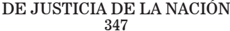

TOMO 347

Volumen 1

2024

## FALLOS DE LA CORTE SUPREMA DE JUSTICIA DE LA NACION

## CONSULTA DE JURISPRUDENCIA DE LA CORTE SUPREMA DE JUSTICIA DE LA NACIÓN

En  la  Colección  'Fallos'  se  publican  solo  las  sentencias  más trascendentes que emite el Tribunal (acordada 37/2003).

En  el  sitio  de  Internet www.csjn.gov.ar , se  puede  consultar la totalidad  de  las  sentencias en  forma  inmediata  a  su  dictado  y mediante diversos parámetros de búsqueda.

Entre las bases disponibles, se hallan las siguientes:

- 1.- Base única de Sumarios de fallos (desde 1863 - a la fecha)
- 2.- Base de Fallos Completos (desde 1994 - a la fecha)
- 3.- La biblioteca completa de los Tomos de la colección 'Fallos' (desde el Tomo 1°)
- 4.- Búsqueda de precedente por la Cita de la colección 'Fallos'
- 5.Suplementos de Actualización Jurisprudencial
- 6.- Posibilidad de consultar todas las sentencias por Acuerdo
- 7.- Las Novedades más importantes sobre la jurisprudencia del Tribunal

## R E P U B L I C A   A R G E N T I N A

FALLOS

DE LA

C o r t e

S u p r e m a

DE

## JuStiCia de la NaCioN

PUBLICACION A CARGO DE LA SECRETARIA DE JURISPRUDENCIA DEL TRIBUNAL

TOMO 347 - VOLUMEN I

ENERO-AGOSTO

2024

de JustIcIa de la NacIóN

347

## FEBRERO

NN y OtrO s/ INcIdeNte de INcOmpeteNcIa. deNuNcIaNte: GIustI, alIcIa matIlde

## COMPETENCIA ORDINARIA

Es competente la justicia ordinaria para entender en la denuncia realizada por quien advirtió un faltante de dinero en su caja de ahorro del Banco Nación debido a extracciones y transferencias no realizadas él, pues lo actuado revela de manera inequívoca una estricta motivación particular y,no existe la posibilidad de que resulte afectada la seguridad del Estado Nacional o alguna de sus instituciones, es decir no surge que las conductas investigadas hayan puesto en peligro intereses federales, ni tampoco es posible apreciar alguna otra circunstancia que determine la jurisdicción federal, de naturaleza excepcional y restrictiva.

-Del dictamen de la Procuración General al que la Corte remite-(*)

## COMPETENCIA TERRITORIAL

Es competente la justicia ordinaria de la Capital Federal para entender en la denuncia realizada por quien advirtió un faltante de dinero en su caja de ahorro del Banco Nación debido a extracciones y transferencias no realizadas él, pues tanto las extracciones por cajero automático como el destino de las transferencias fueron en dicha Capital, resultando de aplicación la doctrina de la Corte, según la cual, tanto el lugar donde se desarrolla el ardid propio de la estafa, como aquél en el que se verifica la disposición patrimonial, deben ser tenidos en cuenta para establecer la competencia territorial, la que debe resolverse, en definitiva, por razones de economía procesal.

-Del dictamen de la Procuración General al que la Corte remite-

(*)   Sentencia del 6 de febrero de 2024. Ver fallo.

## FallOs de la cOrte suprema 347

## GORRITI ECHEGARAY, DARÍO PEDRO c/ SWISS MEDICAL art s.a. y OtrOs s/ OtrOs reclamOs

## RECURSO EXTRAORDINARIO

No constituye sentencia definitiva a los fines del art. 14 de la ley 48 la decisión que estableció la competencia de la justicia laboral provincial para entender en la revisión judicial de decisiones de las comisiones médicas -Ley 27.348-, pues la misma no deniega el fuero federal ni el recurrente solicita su intervención y no coloca al impugnante en una situación de privación de justicia que afecte en forma directa e inmediata la defensa en juicio, en tanto no clausura la vía procesal promovida sino que atribuye competencia a la justicia laboral de su domicilio, que coincide, a su vez, con el lugar de prestación de tareas, donde puede ejercer la acción planteada.

-Del dictamen de la Procuración General al que la Corte remite-

## COMPETENCIA

Las decisiones en materia de competencia no constituyen fallos definitivos en los términos del artículo 14 de la ley 48, excepto que concurran circunstancias que autoricen su equiparación, y ellas son: la denegatoria del fuero federal o una efectiva privación de justicia.

-Del dictamen de la Procuración General al que la Corte remite-

## SENTENCIA DEFINITIVA

La ausencia de una decisión definitiva no puede ser suplida por la invocación de garantías constitucionales supuestamente vulneradas ni por la pretendida arbitrariedad del fallo o la alegada interpretación errónea del derecho que rige el caso.

-Del dictamen de la Procuración General al que la Corte remite-

## de JustIcIa de la NacIóN 347

## dIctameN de la prOcuracIóN GeNeral

Suprema Corte:

-I-

La Sala IV de la Cámara Nacional de Apelaciones del Trabajo confirmó la sentencia de primera instancia que declaró la incompetencia territorial del fuero nacional para entender en la presente demanda por diversos accidentes de trabajo (sentencia del 23 de junio de 2020, incorporada al expediente digital, al que me referiré en adelante salvo aclaración en contrario, el 15 de julio de ese año).

Señaló que, conforme a lo previsto en el artículo 2 de la Ley 27.348 Complementaria de la Ley sobre Riesgos del Trabajo, vigente al momento de la promoción de la demanda, la revisión judicial de las decisiones de las comisiones médicas corresponde a la justicia ordinaria del fuero laboral de la jurisdicción provincial o de la Ciudad Autónoma de Buenos Aires, según corresponda al domicilio de la comisión médica que intervino.

En ese marco, indicó que, de acuerdo a las constancias obrantes en el expediente, el actor compareció a la comisión médica jurisdiccional 23 de la ciudad de Salta, en razón de su domicilio y del lugar de prestación de tareas, en procura del cobro de las indemnizaciones sistémicas de la Ley 24.557 de Riesgos del Trabajo. Agregó que esa provincia adhirió al procedimiento de la ley 27.348 el 27 de junio de 2018, es decir, con anterioridad a la interposición de la demanda, mediante la ley local 8086.

Por ello, concluyó que para cuestionar lo decidido por ese órgano administrativo resulta competente la justicia laboral de Salta.

-II-

Contra esa decisión, el actor dedujo recurso extraordinario federal (fs. 98/115), que fue denegado (sentencia del 18 de diciembre de 2020, incorporada al expediente digital el 03 de febrero de 2021), lo que dio origen a la presente queja (escrito presentado en el expediente de queja digital el 11 de febrero de 2021).

Sostiene, sobre la base de la doctrina de la arbitrariedad, que la decisión recurrida carece de la debida fundamentación y no constituye una derivación razonada del derecho vigente a las circunstancias de la causa, lo que vulnera el principio protectorio del trabajador, su dere-

cho de propiedad y la garantía de defensa en juicio (artículos 14 bis, 17 y 18 de la Constitución Nacional).

En ese orden, resalta que al encontrarse entre los codemandados la Superintendencia de Riesgos del Trabajo, dependiente del Ministerio de Trabajo, Empleo y Seguridad Social de la Nación, corresponde la competencia de la justicia nacional del trabajo y ello no fue ponderado por la cámara al resolver. Asimismo, agrega que el tribunal tampoco consideró ninguno de los temas planteados por el actor con relación a la afectación de sus derechos laborales ni a los principios constitucionales invocados.

## -III-

Es jurisprudencia de la Corte Suprema de Justicia de la Nación que las decisiones en materia de competencia no constituyen fallos definitivos en los términos del artículo 14 de la ley 48, excepto que concurran circunstancias que autoricen su equiparación. Ellas son, en lo que aquí nos ocupa, la denegatoria del fuero federal o una efectiva privación de justicia (dictámenes de la Procuración General de la Nación a los que remitió la Corte Suprema en Fallos: 340:1401, 'Núñez Benítez'; 341:327, 'Lackovic'; CNT 60844/2016/1/RH1, 'Reboredo, Vanesa Paola c/ Autoservicios Telsan SA y otro s/ despido', del 6 de febrero de 2019, resuelto de manera concordante por la Corte Suprema de Justicia de la Nación el 21 de mayo de 2019, entre muchos otros).

En mi entender no se presentan esas excepciones en el caso.

Por un lado, la sentencia en crisis no deniega el fuero federal ni el recurrente solicita su intervención; por el contrario, la decisión atribuye competencia a la justicia laboral de Salta y el actor pretende la nacional del trabajo. Por otro lado, la decisión cuestionada no coloca al impugnante en una situación de privación de justicia que afecte en forma directa e inmediata la defensa en juicio, pues no clausuró la vía procesal promovida sino que atribuye competencia a la justicia laboral de su domicilio, que coincide, a su vez, con el lugar de prestación de tareas, donde puede ejercer la acción planteada (dictámenes de la Procuración General de la Nación a los que remitió la Corte Suprema en Fallos: 325:3476, 'Parques Interama S.A.'; 329:5094, 'Correo Argentino S.A.'; 340:1401, cit.; dictámenes de la Procuración General en los casos CNT 9027/2015/1/RH1, 'Pinto, Pablo Julián c/ Asociart ART SA s/ accidente - ley especial', del 2 de agosto de 2016, y CNT 60844/2016/1/RH1, 'Reboredo, Vanesa Paola c/ Autoservicios Telsan S.A. y otro s/ despido', del 6 de febrero de

2019, resueltos concordantemente por la Corte Suprema en sus sentencias del 3 de agosto de 2017 y del 21 de mayo de 2019).

A su vez, la ausencia de una decisión definitiva no puede ser suplida por la invocación de garantías constitucionales supuestamente vulneradas ni por la pretendida arbitrariedad del fallo o la alegada interpretación errónea del derecho que rige el caso (dictámenes de la Procuración General de la Nación a los que remitió la Corte Suprema en Fallos: 330:1447, 'Barros'; 344:2023, 'Bueno'; entre otros).

En tales condiciones, considero que la recurrente no logra acreditar el carácter definitivo de la decisión apelada en los términos del artículo 14 de la ley 48.

-IV-

Por lo expuesto, corresponde rechazar la queja. Buenos Aires, 22 de febrero de 2022. Víctor Ernesto Abramovich Cosarin.

## FALLO DE LA CORTE SUPREMA

Buenos Aires, 6 de febrero de 2024.

Vistos los autos: 'Recurso de hecho deducido por la parte actora en la causa Gorriti Echegaray, Darío Pedro c/ Swiss Medical ART S.A. y otros s/ otros reclamos', para decidir sobre su procedencia.

## Considerando:

Que los agravios del apelante encuentran adecuada respuesta en el dictamen del señor Procurador Fiscal, a cuyos fundamentos corresponde remitir, en razón de brevedad.

Por ello, de conformidad con lo dictaminado, se desestima la presentación directa. Notifíquese y, previa devolución de los autos principales, archívese.

HOracIO rOsattI - carlOs FerNaNdO rOseNkraNtz - JuaN carlOs maqueda.

## FallOs de la cOrte suprema

Recurso de queja interpuesto por Darío Pedro Gorriti Echegaray, parte actora sentado por el Dr. Juan Manuel Nacucchio.

Tribunal de origen: Sala IV de la Cámara Nacional de Apelaciones del Trabajo.

Tribunal que intervino con anterioridad: Trabajo n° 32.

, repreJuzgado Nacional de Primera Instancia del

LUDUEÑA, OSCAR ÁNGEL c/ aNses s/ retIrO pOr INvalIdez (art. 49 p .4. ley 24.241)

## RECURSO DE QUEJA

La queja reglada en los arts. 285 y siguientes del Código Procesal Civil y Comercial de la Nación requiere, para su procedencia, que se haya interpuesto y denegado una apelación extraordinaria por ante la Corte.

## FALLO DE LA CORTE SUPREMA

Buenos Aires, 6 de febrero de 2024.

Vistos los autos: 'Recurso de hecho deducido por la parte actora en la causa Ludueña, Oscar Ángel c/ ANSeS s/ retiro por invalidez (art. 49 P .4. ley 24.241).', para decidir sobre su procedencia.

## Considerando:

Que la queja reglada en los arts. 285 y siguientes del Código Procesal Civil y Comercial de la Nación requiere, para su procedencia, que se haya interpuesto y denegado una apelación extraordinaria por ante esta Corte, sin que en el caso bajo examen se haya dado cumplimiento a dicha exigencia.

Por ello, se desestima la presentación directa. Notifíquese y archívese.

HOracIO rOsattI - carlOs FerNaNdO rOseNkraNtz - JuaN carlOs maqueda.

## de JustIcIa de la NacIóN 347

Recurso de queja interpuesto por Oscar Ángel Ludueña, actor en autos, con el patrocinio del Dr. Lucas Martín Rocchia.

Tribunal de origen: Cámara Federal de la Seguridad Social, Sala III.

IRIGOYTÍA, CARLOS FRANCISCO y OtrOs c/ SUPERIOR GOBIERNO de la PROVINCIA de ENTRE RÍOS s/ OrdINarIO dañOs y perJuIcIOs

## RESPONSABILIDAD DEL ESTADO POR ERROR JUDICIAL

No resulta arbitraria la sentencia que rechazó el reclamo de daños y perjuicios  iniciado  contra  una  provincia  por  el  accionar  ilegítimo  del  poder judicial local derivado de la prisión preventiva y procesamiento del actor, toda vez que el tribunal fundó debidamente su decisión, al ponderar, a la luz de la doctrina de sus propios pronunciamientos -en coincidencia con el criterio de la Corte sobre la materia-, los hechos de la causa y los requisitos que podrían haber habilitado la reparación y que no concurrían en el caso.

-Del dictamen de la Procuración General al que la Corte remite-

## RESPONSABILIDAD DEL ESTADO POR ERROR JUDICIAL

No es arbitraria la sentencia que rechazó el reclamo de daños y perjuicios iniciado contra una provincia por el accionar ilegítimo del poder judicial local derivado de la prisión preventiva y procesamiento del actor , pues el tribunal valoró debidamente que no se había acreditado que el auto de procesamiento y la prisión preventiva decretada en contra de aquél haya estado en abierta contradicción con los elementos existentes en las actuaciones penales al tiempo de su dictado o con las normas que condicionan la aplicación de la medida.

-Del dictamen de la Procuración General al que la Corte remite-

## RESPONSABILIDAD DEL ESTADO POR ERROR JUDICIAL

La sola circunstancia de haber sido absuelto en la causa penal no basta para responsabilizar al Estado de los daños sufridos por el procesado durante el término de su detención.

-Del dictamen de la Procuración General al que la Corte remite-

## FallOs de la cOrte suprema 347

## RESPONSABILIDAD DEL ESTADO POR ERROR JUDICIAL

Como principio, sólo puede responsabilizarse al Estado por error judicial en la medida en que el acto jurisdiccional que origina el daño haya sido declarado ilegítimo y dejado sin efecto, pues antes de ese momento el carácter de verdad legal que ostenta la sentencia pasada en autoridad de cosa juzgada impide, en tanto se mantenga, juzgar que hay error.

-Del dictamen de la Procuración General al que la Corte remite-

## FACULTADES DE LA CORTE SUPREMA

No incumbe a la Corte revisar el acierto o error o injusticia de las decisiones de los tribunales de provincia en las cuestiones de su competencia, pues la vía excepcional del recurso extraordinario no tiene por objeto sustituir a los jueces de la causa en la solución de cuestiones que les son privativas ni abrir una tercera instancia ordinaria para debatir temas no federales.

-Del dictamen de la Procuración General al que la Corte remite-

## RESPONSABILIDAD DEL ESTADO POR ERROR JUDICIAL

No resulta dogmática ni carente de fundamentos la afirmación del superior tribunal provincial que negó la responsabilidad del Estado por error jurisdiccional por considerar que la ausencia de acusación por parte del fiscal y la posterior absolución de los imputados no resultan suficientes para calificar la actuación judicial cuestionada como error judicial, pues se trata de una interpretación posible, aunque debatible y/u opinable, de las normas locales y las pruebas del expediente, que descartan la tacha de arbitrariedad planteada (Voto del juez Rosatti).

dIctameN de la prOcuracIóN GeNeral

## Suprema Corte:

-I-

A  fs.  1037/1047  del  expediente  principal  (al  que  corresponderán las  siguientes citas,  salvo  cuando se indiquen otras actuaciones), el

Superior Tribunal de Justicia de la Provincia de Entre Ríos revocó el pronunciamiento de la Cámara de Apelaciones de Gualeguaychú -Sala Civil y Comercial- y, en consecuencia, desestimó la demanda de daños y perjuicios, planteada por Carlos Francisco I, Aldo Adrián I Ricardo José B y Julio César G contra el Superior Gobierno de la Provincia de Entre Ríos, derivados de su prisión preventiva y procesamiento, con fundamento en la responsabilidad de la Provincia por el accionar ilegítimo del poder judicial local.

Tras efectuar el examen de admisibilidad del recurso planteado ante sus estrados, en lo que interesa para dilucidar el sub lite, los magistrados examinaron el relato de la causa penal efectuado en el pronunciamiento de la instancia anterior (fs. 986), del cual surge que ella se había iniciado con la detención e incomunicación de los actores el 7 de enero del 2000, salteando las· actuaciones posteriores hasta la audiencia debate del 8 de abril del 2002. En concepto de los magistrados esta omisión, sobre la conducta de los actores a lo largo del proceso y la forma en que los jueces y funcionarios ejercieron su función, demostraba la procedencia del recurso planteado por la Provincia.

En ese sentido, recordaron que el 18 de enero del 2000 el juez de instrucción de Gualeguaychú dictó el auto de procesamiento y prisión preventiva con arreglo a los arts. 307 y 314 del Código Procesal Penal de la Provincia, al haberse demostrado que los entonces imputados podían eludir la acción de la justicia y trabar la continuidad de la investigación.

Acotaron que, según los dichos de la parte actora, este auto de procesamiento y prisión preventiva fue apelado, pero la Cámara de Apelaciones Penal de Concepción del Uruguay, lejos de revocarlo, lo confirmó. De lo expuesto, infirieron que este tribunal también tenía 'sospechas fundadas respecto a la existencia de los hechos y de la intervención de los  sujetos' en ellos,  de  lo  contrario  -dijeron-  no  lo hubieran confirmado.

Recalcaron que, dado el carácter provisorio del auto referido hasta el momento de su dictado, no hubo actos ilegítimos ni declarados como tal, y que los imputados fueron sometidos a un procedimiento en el cual se los procesó y privó de libertad con fundamento, pudiendo ejercer sus derechos respecto de dichos actos.

Señalaron que el tribunal que intervino en el debate (según obra a fs. 986 último párrafo de la sentencia de anterior instancia), a pesar de que declaró la nulidad de la requisitoria fiscal y de la elevación a juicio -fundada principalmente en 'la incongruencia por contradicción con la

imputación original...', existencia de vicios y anomalías- mantuvo el 'estado de detención', coincidentemente con los criterios de la instrucción y del tribunal que anteriormente había intervenido. En esta oportunidad -destacaron- tampoco se declaró ilegítimo el acto de prisión preventiva, ni los aquí actores recurrieron en casación para que se lo revocara.

Advirtieron que, posteriormente, se formuló una nueva requisitoria fiscal en la que se reiteraron las deficiencias que el tribunal penal había señalado en la oportunidad anterior, por lo cual éste nuevamente declaró la nulidad de dicho acto juntamente con las indagatorias y el procesamiento, ordenando la libertad de los encartados, pero sin constar que se hubiera declarado su ilegitimidad.

Por último, indicaron que se dictó un nuevo procesamiento y, llegado al debate oral, el tribunal que intervino, ante la falta de acusación de la fiscalía, absolvió a los aquí demandantes. Aclararon que en esa ocasión se hizo hincapié en la atipicidad de los hechos investigados y en que el instructor y la agente fiscal habían actuado al margen de las previsiones del código, sin embargo -siempre según el criterio del superior tribunal- de la sentencia absolutoria no surgía que se hubiera declarado la ilegitimidad del acto cuestionado.

Así pues advirtieron que, si bien en la sentencia de la sala civil y comercial de la cámara de apelaciones, los jueces dijeron que aplicaban el art. 1112 del Código Civil y la doctrina elaborada por el tribunal superior en torno a él, en los hechos soslayaron la ausencia de los requisitos necesarios para atribuir responsabilidad del Estado por error judicial.

De tal manera, ponderaron que la declaración de nulidades absolutas, la atipicidad, el hecho de obtener una sentencia absolutoria, no bastaban por sí solas para configurar un daño resarcible por error judicial sino que debía acreditarse, en el caso, que el acto jurisdiccional generador del daño -auto de prisión preventiva- había sido declarado ilegítimo y dejado sin efecto o había sido infundado o devenido irracional -art. 64 de la Constitución de la Provincia- supuestos que no encontraron configurados en el sub lite.

Concluyeron así que los daños que los actores manifestaban haber sufrido comportaban consecuencias normales y necesarias del ejercicio regular del servicio de justicia.

-II-

Disconformes, los actores interpusieron el recurso extraordinario de fs. 1050/1070, el que denegado por el a quo a fs. 1093/1097, da origen a la presente queja.

Sostienen que en la sentencia se ha efectuado una incorrecta valoración de la prueba y se han soslayado aplicar normas de carácter internacional (arts. 9.1, 9.5 y 14.6 del Pacto Internacional de Derechos Civiles y Políticos y 7.3, 7.5 y 10 del Pacto de San José de Costa Rica), transgrediendo así el art. 75 inc. 22 y los arts. 14, 16, 18 y 19 de la Constitución Nacional.

Rememoran que estuvieron privados de libertad durante un proceso en el cual se declararon nulidades insalvables y se determinó su absolución por atipicidad de sus conductas.

Expresan que se afectó el debido proceso penal y el principio de legalidad consagrado en la Constitución Nacional toda vez que, aun cuando se reparó en la inocencia advertida por el fiscal, igualmente se los mantuvo vinculados al proceso por hechos no delictivos debido a la actitud, carente de lógica, del instructor.

Destacan que la sentencia apelada resulta arbitraria por haberse prescindido de prueba decisiva que demuestra la existencia de error judicial

Además señalan que la falta de servicio se generó en la misma instrucción de la causa penal, cuyos vicios y anomalías se detectaron en la etapa previa a la oralidad. De igual modo, no se tuvo en cuenta que en dicha causa se declararon nulidades absolutas con relación a los actos principales del proceso.

Aclaran que si bien el auto de prisión preventiva no fue declarado ilegítimo, cuando se anuló el procesamiento, de hecho, la detención quedó sin efecto.

## -III-

Ante todo, es preciso examinar la procedencia formal del recurso interpuesto. A tal fin cabe recordar que el examen de normas de derecho público y las cuestiones de hecho y prueba constituyen, en principio, facultad de los jueces de la causa y no son susceptibles de revisión en la instancia extraordinaria. Ello, pues 'los agravios que se vinculan con las facultades de los tribunales provinciales, el alcance de su jurisdicción y la forma en que ejercen su ministerio, materia que se encuentra reglada por la Constitución y leyes locales, escapan a la instancia del recurso extraordinario del artículo 14 de la Ley 48, en virtud del respeto debido a las atribuciones de las provincias de darse sus propias instituciones y regirse por ellas' (Fallos: 305:112; 306:617, 1111; 311:100 y 1855, entre otros) , principio que cede cuando la decisión adolece de arbitrariedad (conf. doctrina de Fallos: 311:1435; 312:1722; 316:2477 y 3231).

Es por ese mismo respeto, que la Corte tampoco podría transformarse en el intérprete final de las decisiones que adoptan los tribunales  provinciales  dentro  de  sus  atribuciones,  por  aplicación  de  las normas que integran sus ordenamientos jurídicos, ni en un órgano de unificación de la jurisprudencia provincial, sin perjuicio de señalar que el Tribunal puede llegar a cumplir tales funciones cuando, excepcionalmente, le toque intervenir en causas que presenten cuestiones federales. Sobre la base de tales principios, advierto que no hay cuestión federal que habilite esta instancia como tampoco que concurra en el caso un supuesto de arbitrariedad de la sentencia, pues a mi juicio el superior tribunal funda debidamente su decisión, al ponderar, a la luz de la doctrina de sus propios pronunciamientos -en coincidencia con el criterio de la Corte sobre la materia-, los hechos de la causa y los requisitos que podrían habilitar la reparación y que no concurren en el caso.

En efecto, dicho tribunal valoró debidamente que no se había acreditado que el auto de procesamiento y la prisión preventiva decretada en contra de los actores haya estado en abierta contradicción con los elementos existentes en las actuaciones penales al tiempo de su dictado o con las normas que condicionan la aplicación de la medida.

Al respecto, es preciso tener en cuenta que en la doctrina de la Corte, aplicada a la responsabilidad extracontractual de las provincias (conf. Fallos: 318:1990 y sentencia en la causa S. 878.XXXV 'Solís, Hugo c/  Buenos Aires, Provincia de s/ daños y perjuicios' del 10 de junio de 2008, entre muchas otras) o incluso, en la órbita nacional (Fallos: 314:1668), la sola circunstancia de haber sido absuelto en la causa penal no basta para responsabilizar al Estado de los daños sufridos por el procesado durante el término de su detención.

Conforme a ello, cabe recordar, como principio, que sólo puede responsabilizarse al Estado por error judicial en la medida en que el acto jurisdiccional que origina el daño haya sido declarado ilegítimo y dejado sin efecto, pues antes de ese momento el carácter de verdad legal que ostenta la sentencia pasada en autoridad de cosa juzgada impide, en tanto se mantenga, juzgar que hay error. Lo contrario importaría un atentado contra el orden social y la seguridad jurídica, pues la acción de daños y perjuicios constituiría un recurso contra el pronunciamiento firme, no previsto ni admitido por ley (Fallos: 311:1007 y 318:1990).

La Corte aclaró, en este último fallo, que no obsta a dicha conclusión la circunstancia de que no se atribuya el perjuicio a la sentencia definitiva -que le fue favorable al actor-, sino a la prisión preventiva

dictada en la etapa sumarial y confirmada por la alzada, si la sentencia absolutoria pronunciada tras la sustanciación del plenario no importó descalificar la medida cautelar adoptada en su momento respecto del procesado (v. considerando 7' de Fallos: 318:1990).

A la luz de dicha doctrina, lucen carentes de fundamento los agravios de los actores referidos a que se prescindió de prueba conducente para la correcta solución de la caso y que demostraría que se incurrió en falta en el deber de prestar el servicio judicial, particularmente, durante la instrucción de la causa penal. Ello, pues el a quo descartó que se hubiera incurrido en arbitrariedad al adoptar las medidas provisorias durante esa etapa, sobre la base de valorar que el auto de procesamiento y prisión preventiva se había fundado en el hecho de que los imputados podían eludir la acción de la justicia y trabar la continuidad de la investigación. De esta manera, puede concluirse, como lo hizo dicho tribunal, que el juez penal tuvo en cuenta elementos objetivos que lo llevaron al convencimiento - relativo, obviamente, dada la etapa preliminar en que se encontraba el proceso- de que había mediado un delito y existía probabilidad cierta de que los imputados fueran sus autores.

Ello más aun cuando, como bien advierte el a quo, a pesar de que el tribunal que intervino en el debate declaró la nulidad de la requisitoria fiscal y de la elevación a juicio -sustentada principalmente en 'la incongruencia por contradicción con la imputación original...', existencia de vicios y anomalías- mantuvo el 'estado de detención', en coincidencia con los criterios de la instrucción y del tribunal, oportunidad en la que tampoco declaró ilegítimo el auto de prisión preventiva, ni los aquí actores recurrieron en casación.

Al respecto, la Corte ha sostenido, frente a circunstancias similares,  que  si  para  obtener  el  resarcimiento  de  eventuales  daños  derivados de un pronunciamiento judicial firme -por hallarse consentido, confirmado, ser irrecurrible o no haber sido atacado por los limitados medios que autorizan su revisión-, pudiesen otros jueces valorar nuevamente las circunstancias de la causa para determinar si hubo error en  la  anteriormente  tramitada,  no  se  verían  estos  últimos  exentos de la posibilidad de cometer un nuevo error. Así pues, el Tribunal en recordado Fallos: 12:134 expresó que 'si para escapar del peligro de error posible hubiera de concederse recurso de las decisiones de la Corte , para escapar a idéntico peligro, habría que conceder recurso de las decisiones del tribunal que pudiera revocar la decisiones de la Corte, y de éste a otro por igual razón, estableciendo una serie que jamás terminaría porque jamás podría hallarse un Tribunal en que

no fuera posible el error. Habría que establecer, por consiguiente, la eterna incertidumbre del derecho con la impotencia de los poderes sociales para poner fin a los pleitos; y por un temor de un peligro posible se caería en un peligro incierto, y sin duda alguna más grave, de una permanente anarquía', entendimiento que, si bien fue dicho respecto de la órbita nacional, reposa en principios generales, extensibles al ámbito de las provincias.

Es  por  esos  mismos  principios  que  corresponde  desestimar  las objeciones de los actores relativas a la omisión de tratar planteos que estiman conducentes para la solución del pleito, tales como el hecho de que durante el iter del proceso se anuló toda la causa penal desde el avocamiento y que la 'nulidad' del 'auto de procesamiento indudablemente hacía caer por su propio peso el auto de prisión preventiva'. Ello, toda vez que estas cuestiones sólo revelan las discrepancias de los apelantes con el criterio de apreciación del a quo respecto de los distintos aspectos no federales que se debaten como los ya señalados falta de declaración de ilegitimidad del auto de prisión preventiva-, sin que se demuestre que la solución a la que se llegó se apoye en meras afirmaciones dogmáticas o prescinda del texto legal aplicable.

No obsta a todo lo expuesto el hecho de que la Cámara en lo Criminal de la Cuarta Circunscripción Judicial de la Provincia de Entre  Ríos,  en  el  pronunciamiento  del  29  de  junio  de  2005  (v.  fs. 3541/3548 -cuerpo 18- de las actuaciones penales agregadas), haya decidido -cuando los aquí actores ya se encontraban en libertad la absolución de los encartados, pues dicha Cámara no se pronunció sobre sus conductas ni declaró nulidad alguna, por lo que no puede inferirse que aquella resolución absolutoria hubiera importado reconocer ilegitimidad  o  arbitrariedad  del  procesamiento  y  de  la detención que sufrieron los actores, ni menos la comprobación de una inocencia liminar suya.

Ello es así porque, como señala el a quo, el principal fundamento de dicho tribunal residía en que no hubo acusación por parte del Fiscal de Cámara -quien había pedido la absolución de los acusados por atipicidad de los hechos investigados- lo cual impedía a la alzada examinar el fondo de la causa. De esta conclusión no pude derivarse automáticamente que las medidas adoptadas por el juez de instrucción fueran manifiestamente infundadas (conf. en sentido similar causa S. 878.XXXV 'Solís, Hugo c/ Buenos Aires, Provincia s/ daños y perjuicios' sentencia del 10 de junio de 2008); máxime cuando -más allá de las irregularidades señaladas por dicha cámara que, según sus dichos 'dejaron al descubierto actuaciones del instructor y de la Sra. Agente

Fiscal que escapan (al) Código Procesal Penal '- existían en las actuaciones, como debidamente examinó el a quo, elementos objetivos suficientes que impedían calificar la actuación judicial cuestionada como falta  de  servicio  o  que  se  hubiera  incurrido  en  error  judicial,  en  los términos de su propia jurisprudencia.

Sabido es que no incumbe a la Corte revisar el acierto o error o injusticia de las decisiones de los tribunales de provincia en las cuestiones de su competencia (doctrina de Fallos: 316:46), pues hay que recordar que la vía excepcional del recurso extraordinario no tiene por objeto sustituir a los jueces de la causa en la solución de cuestiones que les son privativas ni abrir una tercera instancia ordinaria para debatir temas no federales (Fallos: 316:956).

En razón de lo expuesto, cabe descartar los agravios de los apelantes sobre la concurrencia en la especie de supuesto alguno que genere derecho a reparación con arreglo a tratados internacionales -con jerarquía internacional- que contemplan los casos de detención o.  encarcelamiento ilegales o arbitrarios o condena por error judicial (arts. 9.1, 9.5 y 14.6 del Pacto Internacional de Derechos Civiles y Políticos y 7.3, 7.5 y 10 de la Convención Americana sobre Derechos Humanos -Pacto de San José de Costa Rica-), pues resulta claro que en el sub lite la sentencia del a quo no resulta arbitraria, al no darse los requisitos que habilitan la reparación por irregular ejercicio de la función judicial.

-IV-

Opino, por lo tanto, que cabe desestimar la presente queja. Buenos Aires, 6 de noviembre de 2018. Laura M. Monti.

## FALLO DE LA CORTE SUPREMA

Buenos Aires, 20 de febrero de 2024.

Vistos los autos: 'Recurso de hecho deducido por la parte actora en la causa Irigoytía, Carlos Francisco y otros c/ Superior Gobierno de la Provincia de Entre Ríos s/ ordinario - daños y perjuicios', para decidir sobre su procedencia.

## Considerando:

Que esta Corte comparte y hace suyos los fundamentos y conclusiones del dictamen de la señora Procuradora Fiscal, a los que corresponde remitir en razón de brevedad.

Por ello, de conformidad con lo dictaminado por la señora Procuradora Fiscal, se desestima la queja. Declárase perdido el depósito de fs. 2. Notifíquese, devuélvanse los autos principales y, oportunamente, archívese.

HOracIO rOsattI ( según su voto )- JuaN carlOs maqueda - rIcardO luIs lOreNzettI.

vOtO del señOr presIdeNte dOctOr dON HOracIO rOsattI

## Considerando:

- 1°)  Que  el  Superior  Tribunal  de  Justicia  de  la  Provincia  de  Entre Ríos revocó el pronunciamiento de la Cámara de Apelaciones de Gualeguaychú y, en consecuencia, desestimó la demanda de daños y perjuicios, iniciada contra la Provincia de Entre Ríos por el accionar ilegítimo del poder judicial local, derivado de la prisión preventiva y procesamiento de los aquí actores.

Para decidir de esta manera, los jueces consideraron que no se encontraban reunidos los recaudos para la procedencia de la responsabilidad del Estado, y ponderaron especialmente que la declaración de nulidades absolutas en una causa penal, la declaración de atipicidad de la conducta y la absolución, son elementos que no bastan para configurar un daño resarcible por error judicial, sino que, de acuerdo al art. 64 de la Constitución de la provincia, debe acreditarse que el acto jurisdiccional generador del daño fue claramente infundado o irracional.

- 2°) Que contra esa sentencia interpusieron recurso extraordinario los actores, cuya denegación motivó la presente queja (fs. 1050/1070 y 1093/1097 de las actuaciones principales).

Sostienen que en la sentencia se ha efectuado una incorrecta valoración de la prueba y se omitió la aplicación de normas internacionales (arts. 9.1, 9.5 y 14.6 del Pacto Internacional de Derechos Civiles y Políticos y 7.3, 7.5 y 10 del Pacto de San José de Costa Rica), transgrediendo así el art. 75 inc. 22 y los arts. 14, 16, 18 y 19 de la Constitución Nacional.

Relatan que estuvieron privados de libertad durante un proceso en el cual se declararon nulidades insalvables y se determinó su absolución por atipicidad de sus conductas. Tachan de arbitraria la sentencia, por haber prescindido de prueba conducente para la solución del litigio, que acreditaría la existencia de error judicial.

- 3°) Que las cuestiones planteadas por los recurrentes remiten al examen de cuestiones propias de los jueces provinciales y ajenas a la competencia federal de esta Corte reglada por los arts. 31, 116 y 117 de la Constitución Nacional y el art. 14 de la ley 48. Los apelantes no han demostrado la arbitrariedad que alegan y solo expresan su desacuerdo con la interpretación de las normas provinciales que llevó a cabo el Tribunal Superior de Justicia para rechazar sus planteos.

Sabido es que no incumbe a la Corte revisar el acierto o error o injusticia de las decisiones de los tribunales de provincia en las cuestiones de su competencia, pues hay que recordar que la vía excepcional del recurso extraordinario no tiene por objeto sustituir a los jueces de la causa en la solución de cuestiones que les son privativas ni abrir una tercera instancia ordinaria para debatir temas no federales. Los defectos alegados no alcanzan el estándar definido por este Tribunal hace más de cincuenta años, y recordado hasta pronunciamientos recientes, para dar lugar a un supuesto de inequívoco carácter excepcional como es la arbitrariedad (caso 'Estrada, Eugenio ', Fallos: 247:713 citado en Fallos: 341:1869, voto del juez Rosatti).

En efecto, tal como ha señalado la señora Procuradora Fiscal, no resulta dogmática ni carente de fundamentos la afirmación del Superior  Tribunal  de  Justicia  provincial  que  negó  la  responsabilidad  del Estado por error jurisdiccional por considerar que la ausencia de acusación por parte del fiscal y la posterior absolución de los imputados no resultan suficientes para calificar la actuación judicial cuestionada como error judicial. Se trata de una interpretación posible, aunque debatible y/u opinable, de las normas locales y las pruebas del expediente, que descartan la tacha de arbitrariedad planteada.

## FallOs de la cOrte suprema 347

Por ello, de conformidad con lo dictaminado por la señora Procuradora Fiscal, se desestima la queja. Declárase perdido el depósito de fs. 2. Notifíquese, devuélvanse los autos principales y, oportunamente, archívese.

## HOracIO rOsattI.

Recurso de queja interpuesto por Carlos Francisco Irigoytía y otros , parte actora, representados por el Dr. Leandro Luis Ferrando .

Tribunal de origen: Superior Tribunal de Justicia de la Provincia de Entre Ríos, Sala en lo Civil y Comercial.

Tribunales que intervinieron con anterioridad: Juzgado de Primera Instancia en lo Civil y Comercial n° 1 y Cámara de Apelaciones en lo Civil, Comercial y Laboral, ambos de la ciudad de Gualeguaychú, Provincia de Entre Ríos.

## MERCAU, MARÍA DEL ROSARIO y OtrO c/ MUNICIPALIDAD de MERLO s/ accIóN cONteNcIOsO admINIstratIva

## DERECHO DE PROPIEDAD

Es arbitraria la sentencia que rechazó la indemnización reclamada por el propietario de un predio, el cual mediante ordenanzas municipales, fue  declarado  como  Reserva  Natural  Protegida  con  imposibilidad  de lotear y construir, pues concluyó dogmáticamente que las ordenanzas mencionadas impusieron una mera restricción administrativa omitiendo considerar que las limitaciones impuestas ostentaban un carácter y una extensión tales que desnaturalizaban el ejercicio del derecho de propiedad.

## DERECHO DE PROPIEDAD

Si bien las normas adoptadas por el municipio, en cuanto crearon un área como reserva natural protegida, prohibiendo determinados desarrollos urbanísticos inmobiliarios, comerciales o económicos, coinciden en la protección del bien jurídico ambiente definido en el art. 41 de la Constitución Nacional, ello no puede significar desnaturalizar el derecho de propiedad a tal punto que impida completamente su ejercicio

(arts. 14, 16, 17 y 28 de la Constitución Nacional) y ante ello, es necesario que el juzgador actúe con suma prudencia a los fines de ponderar la controversia entre el interés privado y el colectivo, a la luz de los principios constitucionalmente consagrados.

## PODER DE POLICIA

La Corte ha establecido como regla que el ejercicio regular de las funciones estatales atinentes al poder de policía no obsta a la responsabilidad del Estado si se priva a un tercero de su propiedad o se la lesiona en sus atributos esenciales y si bien esta doctrina fue afirmada respecto de la realización de obras, cabe su aceptación como principio respecto de la generalidad de las denominadas intromisiones estatales autorizadas.

## DERECHO DE PROPIEDAD

Las intromisiones que solo configuran una restricción administrativa, en tanto limitación  al  ejercicio  normal  del  derecho  de  propiedad  que deben soportar los integrantes de una comunidad en aras de la satisfacción del interés público, no son indemnizables e importan solo una reducción del carácter absoluto de la propiedad.

## DERECHO DE PROPIEDAD

Las acciones regulares del Estado que conllevan una privación de la propiedad o lesión de sus atributos esenciales, son indemnizables -entre otros- bajo el instituto de la expropiación, de la servidumbre administrativa, de la ocupación temporánea o, en su caso, de la responsabilidad estatal por su actividad lícita.

## DERECHO DE PROPIEDAD

Las políticas públicas que se adoptan a nivel local por razones ambientales no pueden alterar el contenido más esencial del derecho de propiedad, puesto que deben respetar los límites establecidos en la Constitución, que van desde la reglamentación razonable hasta la expropiación (Voto del juez Rosenkrantz).

## FallOs de la cOrte suprema 347

## FALLO DE LA CORTE SUPREMA

Buenos Aires, 20 de febrero de 2024.

Vistos los autos: 'Recurso de hecho deducido por la parte actora en la causa Mercau, María del Rosario y otro c/ Municipalidad de Merlo  s/  acción  contencioso  administrativa',  para  decidir  sobre  su procedencia.

## Considerando:

- 1°) Que el Superior Tribunal de Justicia de la Provincia de San Luis rechazó la demanda contencioso administrativa y de inconstitucionalidad promovida por Carlos Rodolfo y María del Rosario Mercau contra la resolución 176-DEM-2007 y su confirmatoria 202-DEM-2007 y las ordenanzas 741-HCD-2000 y 744-HCD-2000. Mediante la primera de tales resoluciones -y su confirmatoria- el Intendente de la Municipalidad de Villa de Merlo rechazó la indemnización que los actores reclamaron con sustento en que las referidas ordenanzas -de Ordenamiento Territorial y Urbanístico de dicha localidad- declararon 190 hectáreas de un predio urbano de su propiedad como Zona Turística T4 'Reserva Natural Protegida', prohibiendo los loteos o construcciones y permitiendo únicamente un uso 'turístico, paseos serranos, senderos peatonales, paradores, refugios'. Contra tal pronunciamiento, la actora dedujo recurso extraordinario, cuya denegación dio origen a la presente queja.
- 2°) Que, para así resolver, la corte local por mayoría afirmó -respecto de la demanda contencioso administrativa- que las restricciones administrativas no justifican por sí solas el derecho a la indemnización, salvo que constituyan un verdadero menoscabo o desmembramiento de la propiedad; y que no aparejan una lesión del derecho de propiedad sino que solo consisten en la fijación de límites a su ejercicio normal. Expresó asimismo que debe verificarse la necesaria proporcionalidad entre la restricción y el medio elegido; que el urbanismo ambiental sostenible supone una planificación que no atente contra el medio ambiente; y que la creación de una reserva natural importa un cúmulo de limitaciones al ejercicio pleno del derecho de propiedad y produce una tensión -en la que en principio prima el interés colectivo- que debe ser examinada con extrema prudencia para verificar si desnaturaliza el derecho de propiedad.

Sobre la base de tales consideraciones, la corte local estimó que las resoluciones 176-DEM-2007 y 202-DEM-2007 fueron dictadas en el marco de las ordenanzas municipales vigentes. Consideró asimismo que, de acuerdo con la ordenanza 744-HCD-2000, que modificó la ordenanza 741-HCD-2000, las Normas de Ordenamiento Territorial 'estarían sujetas a una permanente evaluación y actualización'; que por ordenanza 802-HCD-2006 se había convocado a las fuerzas vivas de la comunidad de Villa de Merlo para participar en la revisión de las zonas turísticas, entre ellas, las de propiedad de la actora; y que, por ordenanza 834-HCD-2006, se decidió diferir el tratamiento del tema, disponiendo que tales instrumentos sirvan de antecedentes para el Plan Estratégico de Desarrollo Local en marcha. Concluyó que, por lo tanto, 'el proceso de zonificación que se está llevando a cabo en el Municipio de Merlo puede sufrir futuras modificaciones'.

Por  otra  parte,  el  superior  tribunal  afirmó  que  era  necesaria  la consideración objetiva y puntual que demuestre la ilicitud del obrar del municipio, sin que a tal efecto baste la referencia a una secuencia de hechos y actos sin calificarlos desde su idoneidad ni en su calidad de factor causal del daño. Rechazó como hipotético y teórico el reclamo de la actora fundado en el valor de mercado del metro cuadrado de propiedades y loteos linderos, toda vez que solo es resarcible el daño cierto.  Sostuvo  que  no  advertía  que  se  encontrara  comprometida la responsabilidad del Estado por su actividad lícita porque es requisito ineludible la inexistencia de un deber jurídico de soportar el daño; la presencia de una relación de causa-efecto entre el hecho que se imputa a la Administración y el daño producido, y la existencia de un daño resarcible, que en autos no se había demostrado.

Respecto de la demanda de inconstitucionalidad, el superior tribunal afirmó que la actora no pretendía desconocer la potestad municipal de realizar un planeamiento territorial y urbanístico, sino que demandaba un resarcimiento por la lesión a su derecho de propiedad. Afirmó que las normas atacadas (resoluciones 176-DEM-2007 y 202-DEM-2007 del Intendente y ordenanzas 741-HCD-2000 y 744-HCD-2000) son válidas pues fueron dictadas por los órganos constitucionales competentes (art. 258 incisos '3' y '4' de la constitución provincial). Estimó que las  ordenanzas, emitidas por el Concejo Deliberante en ejercicio de sus atribuciones concernientes a la planificación urbana, no aparecían como arbitrarias,  manifiestamente  ilegales  o  irrazonables  y  que  no contenían vicios invalidantes toda vez que el proceso de ordenamiento

territorial, de preeminente competencia municipal, determina su estructura general, la de cada una de sus áreas y zonas constructivas, en especial, las de tipo urbano, estableciendo normas de uso, ocupación y subdivisión del suelo, dotación de infraestructura básica y morfología para cada una de ellas.

Por último, en lo que interesa, sostuvo que la circunstancia de que una ordenanza municipal restrinja las ventajas o facilidades con que contaba el titular de un inmueble, sin que medie privación o lesión en los atributos esenciales de propiedad no es motivo suficiente para declararla inválida.

## En disidencia, uno de los vocales hizo lugar a la demanda.

3°)  Que  la  actora,  en  el  recurso  extraordinario,  se  agravia  por  la violación de los derechos de igualdad, propiedad y de defensa en juicio consagrados en los arts. 16, 17 y 18 de la Constitución Nacional. Afirma que el a quo se atuvo a la literalidad del nombre dado al instituto 'restricción', sin examinar si en sus elementos esenciales las disposiciones impugnadas constituyen esa restricción o son una directa confiscación. Objeta que el superior tribunal sustentó el pronunciamiento en afirmaciones dogmáticas pues no explica ni fundamenta por qué considera que el gravamen impuesto (imposibilidad absoluta de construir y lotear) no causa un perjuicio indemnizable. Añade que hay una falta de relación de la argumentación de la sentencia con la causa petendi y los hechos comprobados de la causa en cuanto a que la zonificación T4, declarando gran parte del inmueble como Reserva Natural Protegida, lo torna 'inaprovechable o prácticamente inútil para el uso, goce y disponibilidad por  parte  de  sus  propietarios,  quedando  aniquilado  su  uso  funcional o  reducido  a  condiciones  inexpresivas'.  En  tal  sentido,  aduce  que  el inmueble quedó destinado a un mero 'paisaje' y que la prohibición de lotear y construir impide 'hacer cualquier uso útil de su propiedad […] acorde a su valor patrimonial'. Postula que bajo estas condiciones, el gravamen impuesto excede la mera restricción. Sostiene que la revisión a  la  que  estarían  sujetas  las  normas  de  ordenamiento  territorial  no demuestra  absolutamente  nada  pues  las  futuras  modificaciones  que vaticina podrían ser aún más gravosas para los actores y que no hubo modificación o actualización alguna. Concluye en que probó el daño cierto y que el superior tribunal lo confunde con su cuantificación, la que en su caso -tal como resolvió la disidencia y prevén las normas procesales locales- puede determinarse 'sumariamente'.

- 4°) Que si bien los agravios del apelante remiten al examen de cuestiones de hecho, prueba y derecho público local, ajenas a la instancia extraordinaria del art. 14 de la ley 48, tal circunstancia no constituye óbice decisivo para habilitar la vía elegida cuando median razones de entidad suficiente para invalidar el pronunciamiento (Fallos: 304:471 y 308:2626) toda vez que en su fundamentación se prescinde de una ponderación circunstanciada del agravio constitucional que se invoca.
- 5°) Que la actualización y evaluación permanentes a las que -conforme las ordenanzas 741-HCD-2000 y 744-HCD-2000-, están sometidas las normas de ordenamiento territorial resulta inhábil para enervar la afectación del predio que se invoca por aplicación de sus previsiones, habida cuenta de que no se ha alegado que en el marco de dicho proceso se hayan modificado o derogado.
- 6°) Que en el presente caso, se ventila una cuestión vinculada a una aparente colisión entre propiedad y ambiente, en el marco del Derecho Urbanístico Ambiental.

Por un lado, el derecho del que es titular la parte actora, quien alega que el accionar del Municipio de Villa de Merlo afecta el derecho de propiedad (art. 17 de la Constitución Nacional). Por el otro, la posición que adopta este último de defensa de la creación de una Reserva con fines turísticos, mediante un régimen de restricciones, en un Área especialmente protegida.

- 7°) Que el derecho ambiental no se reduce a la tutela de la naturaleza, sino que comprende la preservación y protección del 'patrimonio natural y cultural' según el art. 41 de la Constitución Nacional. En el ámbito urbano, ello implica articular las actividades mediante la implementación del ordenamiento ambiental del territorio, con fines de sustentabilidad, y en base al control del impacto ambiental que puedan tener los distintos usos del suelo. Ese ejercicio del poder de ordenamiento ambiental del territorio ha sido establecido en la Ley General del Ambiente (art. 10, ley 25.675).

Los actuales procesos de cambio que viven nuestras sociedades se manifiestan territorialmente en una creciente competencia y conflictividad entre diversos usos del suelo. Ello es particularmente notorio en el ámbito urbano, en el cual el equilibrio ambiental constituye una de las cuestiones más desafiantes para lograr que las ciudades y asenta-

mientos humanos sean 'inclusivos, seguros, resilientes y sostenibles' como fue delineado en la Agenda 2030 para el Desarrollo Sostenible (25 de septiembre de 2015 A/RES/70/1, de la Asamblea General de las Naciones Unidas, conforme objetivo 11).

- 8°)  Que  no  se  controvierte  en  autos  que  las  autoridades  locales tienen -de conformidad con los arts. 121 y 122 de la Constitución Nacional-  'la  facultad  de  dictar  normas  de  policía  sobre  urbanismo  y planeamiento, tendientes a la mejor distribución de las ciudades, de manera de satisfacer el interés general que a ella incumbe proteger. El ejercicio de estas facultades no vulnera las garantías consagradas en la Constitución Nacional, puesto que el derecho de propiedad no reviste carácter absoluto y es susceptible de razonable reglamentación' (Fallos: 277:313; 308:2626 y 320:222).
- 9°) Que en este caso el Municipio de Villa de Merlo dispuso la creación de un área protegida con fines turísticos, prohibiendo determinados desarrollos urbanísticos inmobiliarios, comerciales o económicos -como construcciones, loteos o fraccionamientos parcelarios-, que pueden afectar el ambiente. Ello apunta a prevenir las consecuencias o efectos que acciones o proyectos públicos o privados pueden causar al equilibrio ecológico del ecosistema comprometido, a la tutela de la calidad de vida y a la preservación de los recursos naturales existentes.

Villa de Merlo es una localidad turística atractiva por su entorno natural, como consecuencia de lo cual hubo una explosión demográfica, y de la construcción, lo que trajo aparejado la necesidad de ordenar ese crecimiento, dando lugar a las ordenanzas controvertidas en autos, así como también -en lo que concierne específicamente a las tierras de propiedad de la parte actora- a preservar el faldeo de la Sierra del Comechingones, principal patrimonio natural de la Villa de Merlo, según alegó el Municipio al contestar la demanda.

La zona donde se encuentran las tierras de propiedad de los recurrentes constituye un ecosistema cuyo valor jurídico va más allá del paisaje protegido o de la función o finalidad turística que lo caracteriza por su indiscutible belleza natural, que lo identifica como recurso natural panorámico o escénico, sino que el valor ambiental como área especialmente protegida, comprende la conservación del sistema ecológico en sí mismo, la preservación y el cuidado de la biodiversidad, y del hábitat de la flora y fauna que la habitan.

10) Que tiene dicho esta Corte que ' los jueces deben considerar el principio in dubio pro natura que establece que 'en caso de duda, todos los procesos ante tribunales, órganos administrativos y otros tomadores de decisión deberán ser resueltos de manera tal que favorezcan la protección y conservación del medio ambiente, dando preferencia a las alternativas menos perjudiciales' ' (Fallos: 342:1203).

11) Que de tal manera, las normas adoptadas por la Municipalidad de Villa de Merlo coinciden en la protección del bien jurídico ambiente definido en el art. 41 de la Constitución Nacional.

Ello no obstante, no puede significar desnaturalizar el derecho de propiedad a tal punto que impida completamente su ejercicio (arts. 14, 16, 17 y 28 de la Constitución Nacional). Ante ello, es necesario que el juzgador actúe con suma prudencia a los fines de ponderar aquella controversia entre el interés privado y el colectivo, a la luz de los principios constitucionalmente consagrados.

Las ordenanzas, regulatorias del Ordenamiento Territorial y Urbanístico de la localidad de Villa de Merlo, declararon 190 hectáreas de un predio urbano de propiedad privada de los recurrentes, como Zona Turística T4 'Reserva Natural Protegida'. Han significado la imposición de un cúmulo de restricciones al ejercicio pleno del derecho  de  propiedad  -impuestos  al  instaurar  el  área  especialmente protegida desde el punto de vista del derecho urbanístico ambiental-, que conllevan limitaciones a los derechos de los titulares dominiales, hasta donde lo requiera el interés general que las referidas normas pretenden satisfacer.

12) Que la Corte ha establecido como regla que el ejercicio regular de las funciones estatales atinentes al poder de policía 'no obsta a la responsabilidad del Estado si se priva a un tercero de su propiedad o se la lesiona en sus atributos esenciales' (Fallos: 253:316; 310:2824). Si bien esta doctrina fue afirmada respecto de la realización de obras, cabe su aceptación como principio respecto de la generalidad de las denominadas 'intromisiones estatales autorizadas' (Fallos: 312:659).

El Tribunal distinguió ese supuesto (cuya expresión máxima es la expropiación) de las meras restricciones administrativas, las que -en tanto solo consisten en la fijación de límites al ejercicio normal u ordinario del derecho de propiedad- no dan lugar, en principio, a un de-

recho indemnizatorio (Fallos: 308:2626; art. 2611 Código Civil; art. 1970 del Código Civil y Comercial de la Nación). En la causa CSJ 179/2012 (48-R)/CS1 'Rossi, Norberto Aldo y otro c/ Gas Natural Ban S.A. (GNBSA) s/ daños y perjuicios', sentencia del 25 de febrero de 2014, esta Corte precisó que las restricciones administrativas 'no trasuntan ni implican una carga impuesta a la propiedad privada. Técnicamente, no apareja 'sacrificio' alguno para el propietario. Sólo consiste en la fijación de límites al ejercicio normal u ordinario del derecho de propiedad. No implica avance, lesión ni deterioro alguno a este derecho: no hay desmembramiento de éste. Tal es la esencia de la restricción administrativa, o sea constituye una 'condición normal del ejercicio del derecho de propiedad' (conforme Marienhoff, Miguel, 'Tratado de Derecho Administrativo', Tomo IV , Cuarta Edición Actualizada, Abeledo Perrot, página 45 y ss)'.

13)  Que,  bajo  este  entendimiento,  el  Tribunal  en  Fallos:  308:2626 consideró que 'la obligación legal de no edificar a mayor altura que la señalada por la autoridad administrativa, fundada en motivos de interés general constituye, sin duda, una mera restricción impuesta a la propiedad privada. Ella encuentra justificación jurídica en el poder de policía local y no es indemnizable, ya que se trata simplemente de una carga general impuesta a todos los propietarios por razones de planeamiento urbano'. Similar criterio adoptó en Fallos: 311:297. En Fallos: 312:648 consideró que la disminución del valor venal de una propiedad por la construcción de una autopista (en el caso, por la desaparición de su emplazamiento favorable o de acceso directo a una calle sin necesidad de hacer un desvío) no era indemnizable en los términos del art. 2620 del Código Civil entonces vigente pues constituía solo la pérdida de una ventaja de la que gozaba el propietario. Y en Fallos: 310:2824 descartó que el cambio de fisonomía del vecindario por efecto de obras realizadas para la traza de una autopista configurara una lesión indemnizable.

Tales ejemplos ilustran sobre la entidad de las intromisiones que solo configuran una restricción administrativa que, en tanto limitación al ejercicio normal del derecho de propiedad que deben soportar los integrantes de una comunidad en aras de la satisfacción del interés público, no son indemnizables e importan solo una reducción del carácter absoluto de la propiedad.

14) Que las acciones regulares del Estado que conllevan una privación de la propiedad o lesión de sus atributos esenciales, son indem-

nizables -entre otros- bajo el instituto de la expropiación, de la servidumbre administrativa, de la ocupación temporánea o, en su caso, de la responsabilidad estatal por su actividad lícita. En la causa 'Rossi' ya mencionada la Corte juzgó como justa y prudente la decisión de la cámara que había considerado como una servidumbre administrativa a la restricción permanente para urbanizar y darle un uso industrial a un inmueble a raíz de la instalación en un predio contiguo y a menos de 400 metros de una planta de almacenamiento de gas natural para aplanamiento de picos de consumo. El Tribunal consideró que 'el sacrificio que estos (los titulares del inmueble) debieron soportar en su dominio excede los límites al ejercicio normal u ordinario de su derecho de propiedad, pues la carga que se les impone es en bien del público, para evitar el deterioro de su salud y modo de vida'. En el precedente de Fallos: 308:1282, el Tribunal estimó que, si como consecuencia directa de la traza de la autopista, el inmueble es edificable reglamentariamente, pero resulta inútil por las escasas dimensiones (7,25 m2) tal restricción 'impide a su titular la libre disponibilidad del predio, toda vez que la carga administrativa impuesta ostenta un carácter y una extensión tales que desnaturalizan el ejercicio del derecho de propiedad'. Y resolvió confirmar la sentencia de cámara que había hecho lugar a la expropiación irregular pues la propiedad -con motivo de una ley de declaración de utilidad pública- devino de hecho 'indisponible (…) por su evidente dificultad para poder utilizarlo en condiciones normales' (art. 51, inciso b, de la ley 21.499).

Como se advierte, los casos mencionados refieren, en definitiva, a la imposibilidad o privación de un uso y goce útil de la propiedad, mediante  su  aprovechamiento  económico  por  parte  de  su  titular.  Y resultan claramente diferenciables de las llamadas restricciones administrativas,  de  las  que  ilustran  aquellos  fallos  mencionados  en  el considerando 13.

15) Que, bajo estas condiciones, la declaración de Reserva Natural Protegida de 190 hectáreas del inmueble de la actora, mediante una clasificación  de  zona  turística  en  la  que  su  uso  dominante  (y  excluyente) es 'turístico, paseos serranos, senderos peatonales, paradores, refugios' y con imposibilidad de lotear y construir (fs. 64, 65 y 96), 'ostenta un carácter y una extensión tales que desnaturalizan el ejercicio del derecho de propiedad' (Fallos: 308:1282). En consecuencia asiste razón al recurrente en cuanto atribuye al superior tribunal haber concluido  dogmáticamente  que  en  el sub  examine las  ordenanzas  741-

HCD-2000 y 744-HCD-2000 impusieron una mera restricción administrativa y que para ello omitió ponderar concretamente la intensidad de las limitaciones impuestas a su derecho de propiedad.

En los términos señalados, media en el caso una relación directa e inmediata entre la decisión objeto de recurso y las garantías constitucionales que se invocan como vulneradas, razón por la cual corresponde descalificar la sentencia apelada con arreglo a la doctrina de esta Corte sobre arbitrariedad.

16) Que, por último, cabe precisar que lo aquí resuelto no implica pronunciarse sobre la indemnización pretendida por la actora, la que en su caso deberá ser determinada por el a quo , ni sobre la incidencia en el sub examine de la Ley IX-332-2004 -invocada por la Municipalidad a fs. 148/157 y 644 vta. de los autos principales- y sus normas reglamentarias y complementarias.

Por ello, se hace lugar a la queja, se declara procedente el recurso extraordinario y se deja sin efecto la sentencia apelada. Con costas. Vuelvan los autos al tribunal de origen para que, por quien corresponda, se dicte un nuevo pronunciamiento con arreglo al presente. Reintégrese el depósito de fs. 3. Agréguese la queja al principal. Notifíquese y devuélvase.

HOracIO rOsattI - carlOs FerNaNdO rOseNkraNtz ( según su voto )-JuaN carlOs maqueda - rIcardO luIs lOreNzettI.

vOtO del señOr vIcepresIdeNte dOctOr dON carlOs FerNaNdO rOseNkraNtz

## Considerando que:

1°) Carlos Rodolfo y María del Rosario Mercau plantearon un reclamo administrativo ante la Municipalidad de Villa de Merlo, Provincia de San Luis, con el objeto de ser indemnizados bajo las pautas de la  doctrina  de  la  responsabilidad  estatal  por  actividad  legítima,  con motivo del dictado de las ordenanzas 741-HCD-2000 y 744-HCD-2000. Tales ordenanzas aprobaron las 'Normas Básicas del Ordenamiento

Territorial' de la localidad y establecieron zonas turísticas con diferentes grados de restricciones al dominio. En lo que aquí interesa, los reclamantes alegaron que 190 hectáreas de un predio de 261 hectáreas de su propiedad quedaron afectadas a la 'Zona Turística T4' en la llamada 'Reserva Natural Protegida de la Sierra del Comechingones', dentro de la cual se prohibieron loteos, y se estableció que el 'uso dominante' sería 'turístico, paseos serranos, senderos peatonales, paradores y refugios', para lo cual debían emplear 'materiales del lugar, con alto contenido significativo de los usos y costumbres de la zona, con aprovechamiento de las técnicas y sistemas artesanales y de bajo impacto ambiental, totalmente integrados con la naturaleza'.

- 2°)  Mediante  resolución  176-DEM-2007  y  su  confirmatoria  202DEM-2007 el Intendente de la Municipalidad de Villa de Merlo rechazó la indemnización reclamada por los actores. Ello dio lugar a la interposición de una acción de inconstitucionalidad y de una acción contencioso administrativa en las que los propietarios del inmueble pidieron la declaración de inconstitucionalidad de las ordenanzas y de los actos dictados en su consecuencia, y, congruentemente con lo reclamado en sede administrativa, peticionaron el pago de una indemnización con sustento en la doctrina de la responsabilidad estatal por actividad lícita.
- 3°) El Superior Tribunal de Justicia provincial, en instancia originaria y por mayoría, rechazó ambas demandas en una sentencia única.

Para así resolver, el voto que hizo mayoría afirmó que las restricciones administrativas no justifican por sí solas el derecho a la indemnización, salvo que constituyeran un verdadero menoscabo o desmembramiento de la propiedad; y que no aparejan una lesión del derecho de propiedad, sino que solo consisten en la fijación de límites a su ejercicio normal. Expresó, asimismo, que debe verificarse la necesaria proporcionalidad entre la restricción y el medio elegido; que el urbanismo ambiental sostenible supone una planificación que no atente contra el medio ambiente; y que la creación de una reserva natural importa un cúmulo de limitaciones al ejercicio pleno del derecho de propiedad y produce una tensión que debe ser examinada con extrema prudencia para verificar si desnaturaliza el derecho de propiedad.

Sobre  tales  bases,  estimó  que  las  resoluciones  176-DEM-2007  y 202-DEM-2007 fueron dictadas en el marco de las ordenanzas munici-

pales vigentes. Consideró que, de acuerdo con la ordenanza 744-HCD2000, de modificación de la ordenanza 741-HCD-2000, las Normas de Ordenamiento  Territorial  'estarían  sujetas  a  una  permanente  evaluación  y  actualización';  que  por  ordenanza  802-HCD-2006  se  había convocado a las fuerzas vivas de la comunidad de Villa de Merlo para participar en la revisión de las zonas turísticas, entre ellas, las de propiedad de la actora; y que, por ordenanza 834-HCD-2006, se decidió diferir  el  tratamiento  del  tema,  disponiendo  que  tales  instrumentos sirvan de antecedentes para el Plan Estratégico de Desarrollo Local en marcha. Concluyó que, por lo tanto, 'el proceso de zonificación que se está llevando a cabo en el Municipio de Merlo puede sufrir futuras modificaciones'.

Por otra parte, rechazó como hipotético y teórico el reclamo de la actora fundado en el valor de mercado del metro cuadrado de propiedades y loteos linderos, toda vez que solo resulta resarcible el daño cierto.  Sostuvo  que  no  advertía  que  se  encontrara  comprometida la responsabilidad del Estado por su actividad lícita porque es requisito ineludible la ausencia de un deber jurídico de soportar el daño, la presencia de una relación de causa-efecto entre el hecho que se imputa a  la  Administración y el daño producido, y la existencia de un daño resarcible, que en autos no se había demostrado.

En cuanto a la demanda de inconstitucionalidad, el superior tribunal afirmó que la actora no pretendía desconocer la potestad municipal de realizar un planeamiento territorial y urbanístico, sino que demandaba un resarcimiento por la lesión a su derecho de propiedad. Sostuvo que las normas atacadas eran válidas pues fueron dictadas por los órganos constitucionales competentes (art. 258 incisos '3' y '4' de la constitución provincial). Estimó que las ordenanzas, emitidas por el Concejo Deliberante en ejercicio de sus atribuciones concernientes a la planificación urbana, no aparecían como arbitrarias, manifiestamente ilegales o irrazonables, y que tampoco contenían vicios invalidantes toda vez que el proceso de ordenamiento territorial, de preeminente competencia municipal, determina su estructura general, la de cada una de sus áreas y zonas constructivas, en especial, las de tipo urbano, estableciendo normas de uso, ocupación y subdivisión del suelo, dotación de infraestructura básica y morfología para cada una de ellas.

Por  último,  sostuvo  que  la  circunstancia  de  que  una  ordenanza municipal restrinja las ventajas o facilidades con que contaba el titular

de un inmueble, sin que medie privación o lesión en los atributos esenciales de propiedad no era motivo suficiente para declararla inválida.

4°) Contra tal pronunciamiento, la actora dedujo recurso extraordinario, cuya denegación dio origen a la presente queja.

La recurrente se agravia por la violación de los derechos de igualdad, propiedad y de defensa en juicio consagrados en los arts. 16, 17 y 18 de la Constitución Nacional. Sostiene que la sentencia es arbitraria porque omitió examinar si las disposiciones impugnadas constituyen una mera restricción o son una directa confiscación. Objeta que el superior tribunal sustentó el pronunciamiento en afirmaciones dogmáticas pues no explica ni fundamenta por qué considera que el gravamen impuesto (imposibilidad absoluta de construir y lotear) no causa un perjuicio indemnizable. Añade que hay una falta de relación de la argumentación de la sentencia con la pretensión y con los hechos comprobados de la causa en cuanto a que la zonificación T4, que declara gran parte del inmueble como 'Reserva Natural Protegida', lo torna 'inaprovechable o prácticamente inútil para el uso, goce y disponibilidad por parte de sus propietarios, quedando aniquilado su uso funcional o reducido a condiciones inexpresivas'. En tal sentido, aduce que el inmueble quedó destinado a un mero 'paisaje' y que la prohibición de lotear y construir impide 'hacer cualquier uso útil de su propiedad acorde a su valor patrimonial'. Postula que, bajo estas condiciones, el gravamen impuesto excede la mera restricción. Sostiene que la revisión a la que estarían sujetas las normas de ordenamiento territorial es irrelevante pues las futuras modificaciones podrían ser aún más gravosas y que de todos modos no hubo modificación o actualización alguna. Concluye en que probó el daño cierto y que el superior tribunal lo confunde con su cuantificación, la que en su caso -tal como resolvió la disidencia y prevén las normas procesales locales- puede determinarse 'sumariamente'.

5°) Si bien los agravios de la recurrente remiten en forma preponderante al examen de cuestiones de hecho, prueba y derecho público local que, en principio, son ajenas a la instancia extraordinaria, la sentencia recurrida ha prescindido de considerar las concretas circunstancias de la causa que resultan conducentes para arribar a una correcta solución de la disputa (doctrina de Fallos: 317:377 y 327:2584, entre otros). A ello cabe agregar que la decisión se sustenta en una fundamentación dogmática que omite una ponderación circunstanciada del agravio consti-

tucional invocado por la actora a la luz de las concretas disposiciones de las ordenanzas municipales dictadas por la demandada.

- 6°) En autos no se encuentra controvertido que las autoridades locales tienen la facultad de dictar normas de policía sobre urbanismo y planeamiento, de manera de satisfacer el interés general que les incumbe proteger. La actora pretende ser indemnizada bajo la doctrina de la responsabilidad del Estado por su actividad lícita pues entiende que el tenor de las restricciones al dominio impuestas a parte de su inmueble en las ordenanzas territoriales dictadas por la Municipalidad de Villa de Merlo afecta su derecho de propiedad.
- 7°) En principio, las consecuencias necesarias y normales del ejercicio regular de los poderes estatales no dan lugar a indemnización, ni aun bajo las reglas de la responsabilidad por actividad lícita (Fallos: 317:1233; 329:3966 y 341:1555, voto del juez Rosenkrantz). De lo contrario, tal como quedó expuesto en el precedente citado en último término, toda acción estatal traería aparejada la obligación de reparar pues es habitual que dicho accionar frustre algún interés individual y esa conclusión haría imposible la tarea de gobernar.
- 8°) Ahora bien, el principio asentado en el punto anterior no es absoluto. La Corte ha distinguido los supuestos de intromisiones estatales permitidas que dan lugar a una indemnización de aquellos que no justifican una reparación. La distinción, como se verá a continuación, está dada por el grado o intensidad de la intromisión estatal.

En tal sentido, las meras restricciones administrativas, que solo consisten en la fijación de límites al ejercicio normal u ordinario del derecho de propiedad, no dan lugar, en principio, a un derecho indemnizatorio (conf. Fallos: 308:2626; art. 2611 Código Civil; art. 1970 del Código Civil y Comercial de la Nación). Ello es así pues de ordinario esta clase de restricciones no producen un desmembramiento del derecho de propiedad (causa CSJ 179/2012 (48-R)/CS1 'Rossi, Norberto Aldo y otro c/ Gas Natural Ban S.A. (GNBSA) s/ daños y perjuicios', sentencia del 25 de febrero de 2014, con cita de Marienhoff, Miguel, Tratado de Derecho Administrativo , Tomo IV , Cuarta Edición Actualizada, Abeledo Perrot, página 45 y siguientes).

En el citado precedente de Fallos: 308:2626, criterio que luego fue reiterado en Fallos: 311:297, la Corte consideró que 'la obligación legal

de no edificar a mayor altura que la señalada por la autoridad administrativa, fundada en motivos de interés general constituye, sin duda, una mera restricción impuesta a la propiedad privada. Ella encuentra justificación  jurídica  en  el  poder  de  policía  local  y  no  es  indemnizable, ya que se trata simplemente de una carga general impuesta a todos los propietarios por razones de planeamiento urbano'. En Fallos: 312:648 estimó que la disminución del valor venal de una propiedad por la construcción de una autopista (en el caso, por la desaparición de su emplazamiento favorable o de acceso directo a una calle sin necesidad de hacer un desvío) tampoco era indemnizable en los términos del art. 2620 del Código Civil entonces vigente pues constituía solo la pérdida de una ventaja de la que gozaba el propietario. Y en Fallos: 310:2824 descartó que el cambio de fisonomía del vecindario por efecto de obras realizadas para la traza de una autopista configurara una lesión indemnizable.

Tales ejemplos ilustran sobre la entidad de las intromisiones que configuran una mera restricción administrativa no indemnizable.

9°) Por el contrario, las acciones regulares del Estado que conllevan una privación de la propiedad o lesión de sus atributos esenciales, son indemnizables bajo el instituto de la servidumbre administrativa, de la expropiación o de la responsabilidad estatal por su actividad lícita. Ello es así pues si bien es cierto que la propiedad que la Constitución Nacional garantiza es aquella que se utiliza 'conforme a las leyes que reglamentan su ejercicio' -art. 14-, también lo es que cuando la limitación es tan intensa que constituye en la práctica una supresión del derecho, solo el pago de una justa indemnización podría salvarla del calificativo de 'confiscación' -art. 17-.

En la causa 'Rossi', ya citada, la Corte estimó que resultaba justa y prudente la decisión de la cámara que había considerado como una servidumbre administrativa a la restricción permanente para urbanizar y darle un uso industrial a un inmueble a raíz de la instalación en un predio contiguo y a menos de 400 metros de una planta de almacenamiento de gas natural para aplanamiento de picos de consumo. El Tribunal consideró que 'el sacrificio que éstos (los titulares del inmueble)  debieron  soportar  en  su  dominio  excede  los  límites  al  ejercicio normal u ordinario de su derecho de propiedad, pues la carga que se les impone es en bien del público, para evitar el deterioro de su salud y modo de vida'. En el precedente de Fallos: 308:1282, el Tribunal sos-

tuvo que, si como consecuencia directa de la traza de la autopista el inmueble es edificable reglamentariamente pero resulta inútil por las escasas dimensiones (7,25 m2), tal restricción 'impide a su titular la libre disponibilidad del predio toda vez que la carga administrativa impuesta ostenta un carácter y una extensión tales que desnaturalizan el ejercicio del derecho de propiedad'. Consecuentemente, resolvió confirmar la sentencia de cámara que había hecho lugar a la expropiación irregular pues en los hechos la propiedad se convirtió en indisponible.

Como se advierte, los casos citados refieren, en definitiva, a la imposibilidad o privación de un uso y goce útil de la propiedad, mediante su aprovechamiento económico por parte de su titular. Y resultan claramente diferenciables de las llamadas restricciones administrativas a las que se aludió en el considerando anterior, que no impiden ese aprovechamiento.

10) En el caso, el superior tribunal de la causa concluyó dogmáticamente que las ordenanzas 741-HCD-2000 y 744-HCD-2000 impusieron una mera restricción administrativa pues para ello omitió ponderar concretamente la intensidad de las limitaciones impuestas por dichas ordenanzas en el derecho de propiedad de la actora.

En efecto, la afectación de 190 hectáreas del inmueble en cuestión mediante una clasificación de zona turística en la que el uso dominante es 'turístico, paseos serranos, senderos peatonales, paradores, refugios' y con imposibilidad de lotear y construir por fuera de ese uso (fs. 64, 65 y 96), tiene un carácter y una extensión tales que prácticamente impiden realizar cualquier actividad económica y por ende desnaturalizan el ejercicio del derecho de propiedad.

11) También resulta dogmático el argumento ensayado en la sentencia relativo a la actualización y evaluación permanentes a las que están sometidas las normas de ordenamiento territorial de la Municipalidad de Villa de Merlo. Ello es así pues transcurridos más de veinte años de la sanción de las ordenanzas que afectaron a parte del inmueble de la actora a la 'Zona Turística T4' no se ha alegado que en el marco de dicho proceso se hayan modificado o derogado.

12) Por lo demás, la invocada naturaleza ambiental de la regulación territorial que suscita esta contienda tampoco justifica el rechazo de la pretensión indemnizatoria de la actora.

En efecto, tal como lo ha resuelto esta Corte en fecha reciente en el precedente de Fallos: 344:3476, las políticas públicas que se adoptan a nivel local por razones ambientales no pueden alterar el contenido más esencial del derecho de propiedad puesto que deben respetar los límites establecidos en la Constitución, que van desde la reglamentación razonable hasta la expropiación.

13) En los términos señalados, media relación directa e inmediata entre lo resuelto por el superior tribunal de la causa y las garantías constitucionales que se invocan como vulneradas (art. 15 de la ley 48), razón por la cual corresponde descalificar el pronunciamiento impugnado con arreglo a la doctrina de esta Corte sobre arbitrariedad de sentencias.

14)  Finalmente, cabe precisar que esta decisión no implica pronunciarse sobre la procedencia de la indemnización pretendida por la actora, la que en su caso deberá ser determinada por el a quo ,  ni sobre la incidencia de la ley provincial IX-332-2004 -invocada por la Municipalidad a fs. 148/157 y 644 vta. de los autos principales y de la cual nada dijo la sentencia recurrida- y sus normas reglamentarias y complementarias.

Por ello, se hace lugar a la queja, se declara procedente el recurso extraordinario y se deja sin efecto la sentencia apelada. Con costas. Vuelvan los autos al tribunal de origen para que, por quien corresponda, se dicte un nuevo pronunciamiento con arreglo al presente. Reintégrese el depósito de fs. 3. Agréguese la queja al principal. Notifíquese y devuélvase.

carlOs FerNaNdO rOseNkraNtz.

Recurso de queja interpuesto por los señores Carlos Rodolfo y José Eliseo Mercau, parte actora , representados por el Dr. Juan Calabria , con el patrocinio letrado de los Dres. Rodolfo Carlos Barra y Beltrán María Fos.

Tribunal de origen: Superior Tribunal de Justicia de la Provincia de San Luis.

## FallOs de la cOrte suprema 347

RUIZ, JUAN CARLOS y OtrOs INterNOs pab. b2, c1 y c2 cOmp. Fed. v y OtrOs s/ INcIdeNte de recursO extraOrdINarIO

## SENTENCIA ARBITRARIA

Es arbitraria la sentencia, dictada en el marco de un habeas corpus por agravamiento de las condiciones de detención, que se remitió a los fundamentos y conclusiones de un caso anterior, pues solo causas prácticamente idénticas y contemporáneas permitirían considerar fundamentación válida a una remisión, en tanto la alegación oportuna de distintas condiciones materiales en los dos mencionados establecimientos penitenciarios imponía el deber de realizar una valoración específica de las diferencias señaladas, como forma de dar una respuesta concreta para la solución del litigio.

-Del dictamen de la Procuración General al que la Corte remite-

## SENTENCIA ARBITRARIA

Es arbitraria la sentencia que se remitió a los fundamentos y conclusiones oportunamente expresados en un caso anterior, toda vez que el tribunal apelado puso el acento en las similitudes que indudablemente existen entre ambos casos, pero con la simple remisión basada en ese parecido no efectuó una valoración crítica de los argumentos que marcaban diferencias posiblemente relevantes, expresamente alegadas por la accionante en sustento de su pretensión.

-Del dictamen de la Procuración General al que la Corte remite-

## SENTENCIA ARBITRARIA

La remisión a lo resuelto en pronunciamientos anteriores, en principio, no importa de por sí la arbitrariedad de una sentencia, pero puede resultar insuficiente si con ello quedan sin responder cuestiones oportunamente debatidas y conducentes a la solución del litigio o se omiten tratar aspectos del hecho relevantes

-Del dictamen de la Procuración General al que la Corte remite-

## HABEAS CORPUS

Lo decidido acerca del alcance que el artículo 43 de la Constitución Nacional y la ley 23.098 le asignan al hábeas corpus como medio para hacer efectivas las garantías reconocidas en el artículo 18 de la Ley Fundamental, suscita cuestión federal suficiente para ser analizada en la instancia extraordinaria y del mismo modo que si lo resuelto por el a quo es tachado bajo la doctrina de la arbitrariedad y el agravio se vincula de manera inescindible con el alcance de tales reglas federales.

-Del dictamen de la Procuración General al que la Corte remite- dIctameN de la prOcuracIóN GeNeral

Suprema Corte:

-I-

El Juzgado Federal n° 2 de Neuquén hizo lugar a la acción de hábeas corpus presentada por los representantes del Ministerio Público Fiscal , de la Defensa y de la Procuración Penitenciaria de la Nación en beneficio de los internos alojados -actuales y futuros- en las celdas unipersonales del Complejo Federal Penitenciario V de Senillosa, en esa provincia, y prohibió al Servicio Penitenciario Federal el alojamiento compartido en esas celdas y los trabajos de colocación de cuchetas dobles que a tal fin se estaban realizando.

En  sustento  de  lo  decidido,  el  juez  sostuvo  que  el  proyecto  de duplicar la población en los módulos diseñados para alojar a un solo recluso por celda, sumado a la inherente reducción de la superficie por interno en las áreas comunes, constituye una amenaza actual de agravamiento de las condiciones de detención. Tomó como referencia la superficie mínima recomendada en las Reglas Penitenciarias Europeas del Comité Europeo para la Prevención de la Tortura y en el Manual sobre Agua, Saneamiento, Higiene y Hábitat en las Cárceles, elaborado por la Cruz Roja Internacional y constató que en el caso del Complejo Federal V esas dimensiones no se alcanzarían si se llevara a cabo el aumento del cupo proyectado. Además, hizo referencia a los resultados de una inspección ocular que ilustraban que la al tura desde la litera superior al techo era de sólo noventa centímetros y, por lo tanto,  inferior  al  parámetro  establecido  en  la  normativa,  del  mismo modo que la distancia entre ambas cuchetas, por lo que una persona

de contextura media no podía permanecer sentado en posición erguida en ninguna de ellas. También advirtió, entre otras consideraciones, que el Servicio Penitenciario no informó haber tomado las previsiones necesarias para afrontar la consecuente mayor demanda de servicios, ni contempló la readecuación de la cantidad de personal que cumple funciones allí (conf. sentencia del 28 de diciembre de 2018 en el expte. principal agregado en formato digital).

A su turno, el tribunal de alzada rechazó la impugnación del Servicio Penitenciario basada en la afirmación de su facultad exclusiva de fijar el cupo de los establecimientos carcelarios, bajo el argumento de que tal facultad, no controvertida en el sub lite , no era ajena al control judicial cuando éste es suscitado en un caso contencioso e instado por una parte que considera que su ejercicio en el caso concreto ha afectado sus derechos de acuerdo a la ley (conf. sentencia del 11 de enero de 2019).

Por su parte, la Sala I de la Cámara Federal de Casación Penal, por mayoría, declaró procedente el recurso interpuesto por el apoderado de la autoridad demandada contra este último pronunciamiento, declaró su nulidad por falta de fundamentación y ordenó el dictado de uno nuevo conforme a los lineamientos establecidos por el tribunal. El a quo se remitió a los fundamentos y conclusiones oportunamente expresados al resolver lo que consideró una cuestión análoga que había sido planteada en un caso anterior (FBB 22371/2018/1/CFC1, ver fs. 3/9).

Contra este fallo la defensa oficial dedujo recurso extraordinario que, al ser denegado también por la mayoría, dio lugar a la presente queja (fs. 13/32, 36/38 y 40/44).

-II-

Con fundamento en la doctrina de la arbitrariedad, la recurrente aduce que la sentencia carece de fundamentación al haber omitido tratar su argumento contra la legitimación de la autoridad requerida para recurrir en casación la sentencia que hace lugar al hábeas corpus.

Por otra parte, sostiene que la prohibición judicial de ampliar el cupo del establecimiento no supone invadir una competencia exclusiva del Poder Ejecutivo, sino que se trata del control jurisdiccional que prevé la ley de hábeas corpus al fijar como causal de procedencia el agravamiento ilegítimo de las condiciones de detención provocado por un acto u omisión de autoridad pública. Desde este punto de vista, la recurrente considera que no había cuestiones federales en

juego  ni  una  causal  de  arbitrariedad  que  habilitara  la  revisión  del fallo por la cámara de casación.

Añade que la remisión a un criterio sentado en una sentencia anterior del tribunal, que reconoció al Servicio Penitenciario Federal la facultad de fijar el cupo de los diversos establecimientos y la distribuir la  población  detenida,  resulta  una  respuesta  dogmática  y  abstracta por no tomar en cuenta las particularidades del complejo V de Senillosa, que determinan que la colocación de cuchetas dobles en celdas unipersonales restringe las condiciones de habitabilidad en un grado tal que constituye un agravamiento de las condiciones de la detención.

En tal sentido, considera que con la colocación de una cama adicional en las celdas unipersonales con el fin reconocido de ampliar la capacidad de alojamiento de la unidad, se duplica la cantidad de internos y el lugar deja de cumplir las pautas mínimas en términos de superficie libre por recluso que están establecidas en diversas guías de referencia producidas a nivel regional y mundial. En particular, la recurrente  vuelve  a  citar  las  conclusiones  de  los  informes  técnicos producidos en la causa y de la inspección ocular, a los que se refirió el juez de primera instancia en su sentencia.

## -III-

De acuerdo con la doctrina de V .E., lo decidido acerca del alcance que el artículo 43 de la Constitución Nacional y la ley 23.098 le asignan al hábeas corpus como medio para hacer efectivas las garantías reconocidas en el artículo 18 de la Ley Fundamental, suscita cuestión federal suficiente para ser analizada en esta instancia extraordinaria (Fallos: 323:4108 y sus citas), del mismo modo que si lo resuelto por el a quo es tachado bajo la doctrina de la arbitrariedad y el agravio se vincula, como en el sub lite ,  de manera inescindible con el alcance de tales reglas federales. En estos casos, ambas cuestiones deben ser examinadas en forma conjunta (Fallos: 295:1005, considerando 21; 322:3154 y 323:1625).

En este sentido, es pertinente marcar que la defensora aplicó esa tacha a la sentencia, en primer lugar, por considerar que el a quo omitió tratar su argumento referido a la falta de legitimación del Servicio Penitenciario Federal para recurrir ante la cámara de casación. Sin embargo, estimo que esa crítica no es acertada pues el voto de la mayoría abordó esa cuestión en el punto 2° del fallo, donde la admisibilidad de la impugnación fue fundada en el deber de tratar la cuestión federal planteada por ese organismo conforme la doctrina de Fallos:

328:1108 y en las facultades recursivas que la ley 23.098 reconoce a la autoridad requerida (ver fs. 6/vta.). En presencia de tales argumentos, que brindan razonable fundamento al criterio adoptado, estimo que la protesta no debe ser admitida.

La conclusión es distinta con respecto al segundo motivo de la apelación, según el cual la remisión lisa y llana a un criterio sentado para un caso anterior no constituye fundamento bastante, al soslayar las diferencias fácticas decisivas con el presente, puestas de resalto por los tribunales de las instancias anteriores y oportunamente señaladas por su par te cuando intervino en el trámite del recurso de casación.

Al respecto, V .E. tiene establecido que la remisión a lo resuelto en pronunciamientos anteriores, en principio, no importa de por sí la arbitrariedad de una sentencia, pero puede resultar insuficiente si con ello quedan sin responder cuestiones oportunamente debatidas y conducentes a la solución del litigio o se omiten tratar aspectos del hecho relevantes (Fallos: 308:54; 328:327; entre otros). Por ello, para llegar a una conclusión fundada es imprescindible examinar las circunstancias particulares del caso (Fallos: 307:1092).

El precedente al que el a quo se remitió (expte. FBB 22371/2018/1/ CFC1, 'Internos U-4 del SPF', del 21 de mayo de 2019, publicado en línea en el sitio del Centro de Información Judicial) trataba, en efecto, del aumento del cupo de un establecimiento penitenciario de la provincia de La Pampa mediante la colocación de cuchetas dobles en alguno de sus módulos. Sin embargo, a diferencia del sub lite, en aquel caso el hábeas corpus había sido denegado en las instancias ordinarias y la cámara de casación confirmó ese temperamento porque entendió que no se había probado que la medida hubiera implicado un agravamiento de las condiciones de detención.

En particular sostuvo que 'el juez interviniente dispuso una inspección ocular, específicamente en los pabellones donde se había comenzado a implementar el protocolo (se refiere los que estaban siendo acondicionados para ampliar su capacidad de alojamiento), ejerciendo el  control  reservado  a  la  autoridad  judicial'  y  luego  'detalló  de  forma  razonada  cuáles  fueron  los  distintos  elementos  que  impidieron tener por verificado el agravamiento en las condiciones de detención de conformidad con lo establecido en el inciso 2º del artículo 3 de la ley 23.098, con ajuste a las reglas de la sana crítica racional' pues 'el tribunal de la instancia anterior tuvo en consideración los estándares mínimos que deben cumplir los lugares de detención establecidos en el ordenamiento nacional y en los instrumentos internacionales, como

así también las facultades propias de la administración penitenciaria al respecto y aquél las de control reservadas a la autoridad judicial, y efectuó un análisis razonado de las circunstancias relevadas. Valoró además, como se dijo, el seguimiento mensual de la implementación del Protocolo y de las condiciones de vida y edilicias de los pabellones'.

En cambio, en el sub judice la conclusión del juez de primera instancia, avalada por su alzada, luego de las inspecciones y demás medidas probatorias del caso fue -tal como se ha referido más Arriba- la contraria. Por lo tanto, sin entrar a considerar el fondo del asunto, resulta  manifiesto  que  el  tribunal  apelado  puso  el  acento  en  las  similitudes  que  indudablemente existen entre ambos casos, pero con la simple  remisión  basada  en  ese  parecido  no  efectuó  una  valoración crítica de los argumentos que marcaban diferencias posiblemente relevantes, expresamente alegadas por la accionante en sustento de su pretensión.

Estimo que en casos como el presente, en los que el supuesto de hecho de la norma demanda comprobar un particular estado de cosas en un momento dado id  est las  condiciones de habitabilidad de las celdas-, solo causas prácticamente idénticas y contemporáneas permitirían considerar fundamentación válida a una remisión como la del sub examine (conf. Fallos: 327:954, voto del juez Fayt); por el contrario, ya la alegación oportuna de distintas condiciones materiales en los dos mencionados establecimientos penitenciarios imponía el deber de real izar una valoración específica de las diferencias señaladas, como forma de dar una respuesta concreta para la solución del litigio, tarea que no quedó suplida por la aplicación automática de un criterio jurídico cuya pertinencia dependió en su momento de la constatación de una situación contingente y que, por lo tanto, resulta difícilmente extrapolable.

En tales condiciones, considero que lo resuelto de esa forma solo cumple de manera aparente la exigencia de constituir una derivación razonada de las normas vigentes con aplicación particular a las circunstancias de la causa y debe ser descalificado como acto jurisdiccional válido.

Por ello, opino que V .E. debe hacer lugar a la queja y, con el alcance expuesto, dejar sin efecto el pronunciamiento apelado. Buenos Aires, 7 de febrero de 2022. Eduardo Ezequiel Casal.

## FallOs de la cOrte suprema 347

## FALLO DE LA CORTE SUPREMA

Buenos Aires, 20 de febrero de 2024.

Vistos los autos: 'Recurso de hecho deducido por la defensa en la causa Ruiz, Juan Carlos y otros internos Pab. B2, C1 y C2 Comp. Fed. V y otros s/ incidente de recurso extraordinario', para decidir sobre su procedencia.

## Considerando:

Que al caso resultan aplicables, en lo pertinente, los fundamentos y conclusiones del dictamen del señor Procurador General de la Nación interino a los que corresponde remitirse en razón de brevedad.

Por ello, concordemente con lo allí dictaminado, se hace lugar a la queja, se declara procedente el recurso extraordinario y se deja sin efecto la sentencia apelada. Remítase para su agregación a los autos principales y para que, por quien corresponda, se dicte un nuevo pronunciamiento con arreglo a lo expuesto. Notifíquese y cúmplase.

carlOs FerNaNdO rOseNkraNtz - JuaN carlOs maqueda - rIcardO luIs lOreNzettI.

Recurso de queja interpuesto por la Dra María Florencia Hegglin, Defensora Públi-. ca Oficial, y el Dr. Guillermo Ariel Todarello, Defensor Público Oficial, cotitular de la Comisión de Cárceles.

Tribunal de origen: Sala I de la Cámara Federal de Casación Penal.

Tribunal que intervino con anterioridad: Cámara Federal de Apelaciones de General Roca.

## de JustIcIa de la NacIóN

## GIL DOMÍNGUEZ, ANDRÉS s/ FOrmula petIcIóN

## RECURSO EXTRAORDINARIO

La impugnación al art. 280 del Código Procesal Civil y Comercial de la Nación, por resultar violatorio del art. 8.2.h. de la Convención Americana sobre Derechos Humanos formulada en el recurso extraordinario exhibe una manifiesta carencia de fundamento que la torna ineficaz e impide su consideración por parte de la Corte.

## VOTO

La doctrina constitucional de nuestro país coincide en que los votos afirmativos, a los efectos del cómputo previsto en la Constitución Nacional, son aquellos que se pronuncian por una fórmula determinada y que, por consiguiente, los votos en blanco quedan excluidos de dicho cómputo (Voto del juez Rosatti).

## VOTO

Debe rechazarse el argumento de que no considerar al voto en blanco en igualdad de condiciones con el resto de los sufragios válidamente emitidos implica una situación de desigualdad injustificable, pues es la Constitución Nacional la que establece la distinción entre los votos que se computan y los que no se computan a los fines de la elección y la que, en ese sentido, dispone que solo se computarán los votos afirmativos válidamente emitidos, es decir que luego de garantizar la universalidad y la igualdad del sufragio (artículo 37), establece los requisitos que debe reunir el voto para ser computado a los fines previstos en sus artículos 97 y 98 (afirmativo y válido) (Voto del juez Rosatti).

## VOTO

Debe rechazarse el argumento de que no considerar al voto en blanco en igualdad de condiciones con el resto de los sufragios válidamente emitidos  implica  una  situación  de  desigualdad  injustificable,  pues  el elector sabe que al votar en blanco en la primera vuelta electoral terminará favoreciendo a la fórmula que resulte más votada, en la medida en

## FallOs de la cOrte suprema 347

que su voto no será parte de la totalidad de los votos emitidos a los efectos de establecer los porcentajes exigidos para la proclamación de la fórmula vencedora o la realización de la segunda vuelta electoral (Voto del juez Rosatti).

## VOTO

Debe rechazarse el argumento de que no considerar al voto en blanco en igualdad de condiciones con el resto de los sufragios válidamente emitidos implica una situación de desigualdad injustificable, pues el no cómputo de los votos en blanco se vincula con el propósito de favorecer un resultado electoral positivo, en tanto aumenta las chances de alcanzar el umbral electoral constitucionalmente exigido en la primera vuelta para proclamar como ganadora a una fórmula presidencial y ello, asimismo, encuentra respaldo en la intención perseguida con la adopción de la particular fórmula electoral prevista en los artículos 97 y 98 de la Constitución Nacional, que, al prescindir del requisito de mayoría absoluta de los votos atemperó las mayorías necesarias y generó de ese modo condiciones para facilitar los triunfos en primeras vueltas (Voto del juez Rosatti).

## LEGITIMACION

Quien invocó la calidad de elector carece de legitimación para promover una acción declarativa de certeza tendiente a dilucidar si los votos en blanco emitidos por los electores en oportunidad de la realización de la primera vuelta electoral son parte de la totalidad de los votos emitidos a los efectos de establecer los porcentajes exigidos para la proclamación de la fórmula vencedora o la realización de la segunda vuelta electoral, pues no ha demostrado ser titular de una relación jurídica sustancial que justifique su legitimación en este proceso y a simple vista, carece de un interés suficientemente directo, concreto y personal -diferenciado del que tienen el resto de los ciudadanos- en el resultado del pleito que propone (Voto del Juez Rosenkrantz).

-Del voto del juez Rosenkrantz en el precedente 'Gil Dominguez' (CNE 5731/2019/1/RH1) de esta misma fecha al que remite-

## LEGITIMACION

El actor que invocó su calidad de elector carece de legitimación para promover una acción declarativa de certeza tendiente a dilucidar si los votos en blanco emitidos por los electores en oportunidad de la realización de la primera vuelta electoral son parte de la totalidad de los votos emitidos a los efectos de establecer los porcentajes exigidos para la proclamación de la fórmula vencedora o la realización de la segunda vuelta electoral, pues dicha condición es de una generalidad tal que no permite tener por configurada la existencia de una causa, caso o controversia propone (Voto del Juez Rosenkrantz).

-Del voto del juez Rosenkrantz en el precedente 'Gil Dominguez' (CNE 5731/2019/1/RH1) de esta misma fecha al que remite-

## FALTA DE LEGITIMACION ACTIVA

Si la Corte -o cualquier otro tribunal nacional- interviniese en asuntos donde el peticionario carece de legitimación transgrediría el severo límite al poder judicial que surge del artículo 116 de la Constitución y que es propio del esquema de división de poderes que ella organiza propone (Voto del Juez Rosenkrantz).

-Del voto del juez Rosenkrantz en el precedente 'Gil Dominguez' (CNE 5731/2019/1/RH1) de esta misma fecha al que remite-

## FALLO DE LA CORTE SUPREMA

Buenos Aires, 20 de febrero de 2024.

Vistos los autos: 'Recurso de hecho deducido por la actora en la causa Gil Domínguez, Andrés s/ formula petición', para decidir sobre su procedencia.

## Considerando:

1°) Que Andrés Gil Domínguez, letrado en causa propia, invocando su condición de 'elector', planteó una acción declarativa de certeza a fin de '… dilucidar la siguiente incertidumbre constitucional-convencional: ¿Conforme lo establece el art. 37 de la Constitución ar-

gentina y los artículos concordantes de los Instrumentos Internacionales sobre derechos humanos con jerarquía constitucional en los cuales se determina que el sufragio es igual, los votos en blanco emitidos por los electores en oportunidad de la realización de la primera vuelta electoral en los términos provistos por los artículos 97 y 98 de la Constitución argentina son parte de la totalidad de los votos emitidos a los efectos de establecer los porcentajes exigidos para la proclamación de la fórmula vencedora o la realización de la segunda vuelta electoral ?'.

- 2°) Que la jueza de primera instancia rechazó la demanda. Esa decisión fue apelada por el actor y la Cámara Nacional Electoral declaró abstracta la pretensión. Para resolver de ese modo, el tribunal consideró que la Asamblea Legislativa ya había proclamado al presidente y vicepresidenta de la Nación y que aquellos habían prestado juramento el 10 de diciembre de 2019.

Contra esa decisión, el actor interpuso un recurso extraordinario en el que planteó, además, la inconvencionalidad del artículo 280 del Código Procesal Civil y Comercial de la Nación, por resultar violatorio del artículo 8.2.h. de la Convención Americana sobre Derechos Humanos. El recurso fue denegado por la cámara, lo que motivó el presente recurso de queja.

- 3°) Que la impugnación del artículo 280 del Código Procesal Civil y Comercial de la Nación exhibe una manifiesta carencia de fundamento que la torna ineficaz e impide su consideración por parte de esta Corte.
- 4°) Que, por lo demás, el recurso extraordinario, cuya denegación motivó esta queja, resulta inadmisible (artículo 280 del código citado).
- 5°) Que sin perjuicio de ello, resulta conveniente realizar algunas consideraciones sobre la cuestión planteada por el recurrente.
- La Constitución Nacional, en su artículo 97, dispone que '[c]uando la fórmula que resultare más votada en la primera vuelta, hubiere obtenido más del cuarenta y cinco por ciento de los votos afirmativos válidamente emitidos, sus integrantes serán proclamados como Presidente y vicepresidente de la Nación'. Por su parte, en el artículo 98 establece la proclamación automática de la fórmula presidencial por

proporción y disparidad mínimas entre fórmulas, en los siguientes términos: '[c]uando la fórmula que resultare más votada en la primera vuelta hubiere obtenido el cuarenta por ciento por lo menos de los votos afirmativos válidamente emitidos y, además, existiere una diferencia mayor de diez puntos porcentuales respecto del total de los votos afirmativos válidamente emitidos sobre la fórmula que le sigue en número de votos, sus integrantes serán proclamados como Presidente y vicepresidente de la Nación'.

La doctrina constitucional de nuestro país coincide en que los 'votos afirmativos', a los efectos del cómputo previsto en la Constitución Nacional, son aquellos que se pronuncian por una fórmula determinada y que, por consiguiente, los votos en blanco quedan excluidos de  dicho  cómputo  (García  Lema,  Alberto  M.,  'Elección  directa  del presidente y vicepresidente por doble vuelta', en Rosatti, Horacio D. y otros, La reforma de la Constitución: explicada por miembros de la Comisión de Redacción ,  Santa Fe, Rubinzal-Culzoni, 1994, p. 359; Sagüés,  Néstor  P ., Derecho  constitucional ,  T .  II,  1ª  edición,  Astrea, 2017, p. 345; Ekmekdjian, Miguel Ángel, Tratado de derecho constitucional: Constitución de la Nación Argentina, comentada y anotada con legislación, jurisprudencia y doctrina ,  T .  V ,  2ª  edición,  Buenos Aires, De Palma, 1999, p. 55; Badeni, Gregorio, Tratado de Derecho Constitucional , T . III, 3ª edición ampliada y actualizada, Buenos Aires, La Ley, 2010, p. 580; Gelli, María Angélica, Constitución de la Nación Argentina: comentada y concordada, T. II, 6ª edición ampliada y actualizada, Buenos Aires, La Ley, 2022, p. 471).

En concreto, el recurrente expresa que '[n]o considerar al voto en blanco en igualdad de condiciones con el resto de los sufragios válidamente emitidos implica una situación de desigualdad injustificable en términos de soberanía popular, pero sobre todo, nulifica la expresión del elector al quitarle todo efecto democrático a la decisión adoptada '. Sostiene, por consiguiente, que no computar el voto en blanco en la elección de presidente y vicepresidente implica tratar desigualmente al elector que vota de esa manera con relación a quien emite su voto por alguna de las fórmulas presentadas.

Este razonamiento debe ser rechazado, por tres razones que podrían denominarse 'argumento del límite constitucional', 'argumento del conocimiento de las reglas de juego' y 'argumento de la eficacia del proceso electoral'.

Conforme al primer argumento, es la Constitución Nacional la que establece la distinción entre los votos que se computan y los que no se computan a los fines de la elección y la que, en ese sentido, dispone que solo se computarán los votos 'afirmativos válidamente emitidos'. Del mismo modo que se efectúa el planteo respecto de los votos en blanco (votos válidamente emitidos, no afirmativos), podría sostenerse que la abstención y la anulación consciente (el no voto y el voto inválido, respectivamente) también deberían ser considerados, pues de lo contrario se vulneraría el derecho a la igualdad de quienes expresan una determinada posición política. No obstante, es la Norma Fundamental la que, luego de garantizar la universalidad y la igualdad del sufragio (artículo 37), establece los requisitos que debe reunir el voto para ser computado a los fines previstos en sus artículos 97 y 98 (afirmativo y válido).

Con respecto al segundo argumento, la igualdad se manifiesta en este supuesto en que cada uno de los electores tiene idéntico conocimiento, antes de tomar su decisión, del valor que se asignará a su voto, sea este afirmativo o negativo, asumiendo en este último caso la consecuencia de que su voto no será considerado a los fines del cómputo de las mayorías que prevén las normas constitucionales referidas. En otras palabras, el elector sabe que al votar en blanco en la primera vuelta electoral terminará favoreciendo a la fórmula que resulte más votada, en la medida en que su voto no será parte de la totalidad de los votos emitidos a los efectos de establecer los porcentajes exigidos para la proclamación de la fórmula vencedora o la realización de la segunda vuelta electoral.

Conforme al tercer argumento, el no cómputo de los votos en blanco se vincula con el propósito de favorecer un resultado electoral positivo, en tanto aumenta las chances de alcanzar el umbral electoral  constitucionalmente  exigido  en  la  primera  vuelta  para proclamar como ganadora a una fórmula presidencial. Ello, asimismo, encuentra respaldo en la intención perseguida con la adopción de la particular fórmula electoral prevista en los artículos 97 y 98 de la Constitución Nacional, que, al prescindir del requisito de mayoría absoluta de los votos -usualmente establecido en otros ordenamientos  que  prevén  segundas  vueltas-  atemperó  las  mayorías necesarias  y  generó  de  ese  modo  condiciones  para  facilitar  los triunfos en primeras vueltas.

Finalmente, cabe destacar que el hecho de que el voto en blanco no se compute, no significa que carezca de relevancia simbólica y política. La decisión de votar en blanco expresa insatisfacción, descontento, disconformidad o apatía con la oferta electoral, o peor aún, un rechazo hacia el funcionamiento de las instituciones. Por ello, en ocasiones, el elector que no encuentra atractiva la oferta electoral, conocedor de las consecuencias de no votar por ninguna fórmula, decide sufragar por alguna de ellas, evidenciando que con su actitud no expresa una 'elección' sino una 'opción'.

Por  ello,  se  desestima  la  presentación  directa.  Notifíquese  y archívese.

HOracIO rOsattI ( según su voto )- carlOs FerNaNdO rOseNkraNtz ( según su voto )- JuaN carlOs maqueda ( según su voto )- rIcardO luIs lOreNzettI ( según su voto ).

vOtO del señOr vIcepresIdeNte dOctOr dON carlOs FerNaNdO rOseNkraNtz

## Considerando:

Que los fundamentos expuestos por esta Corte en el día de la fecha en la causa CNE 5731/2019/1/RH1 -voto del juez Rosenkrantz-, a las que cabe remitir por razones de brevedad, impiden reconocer legitimación activa al recurrente.

Por ello, se desestima el recurso de queja interpuesto. Notifíquese y archívese.

carlOs FerNaNdO rOseNkraNtz.

## FallOs de la cOrte suprema 347

## vOtO del señOr mINIstrO dOctOr dON JuaN carlOs maqueda

## Considerando:

Que la impugnación al art. 280 del Código Procesal Civil y Comercial de la Nación, por resultar violatorio del art. 8.2.h. de la Convención  Americana  sobre  Derechos  Humanos  formulada  en  el  recurso extraordinario exhibe una manifiesta carencia de fundamento que la torna ineficaz e impide su consideración por parte de esta Corte.

Que, por lo demás, el recurso extraordinario, cuya denegación originó esta queja, resulta inadmisible (art. 280 del citado código).

Por  ello,  se  desestima  la  presentación  directa.  Notifíquese  y archívese.

JuaN carlOs maqueda.

vOtO del señOr mINIstrO dOctOr dON rIcardO luIs lOreNzettI

## Considerando:

Que la impugnación al art. 280 del Código Procesal Civil y Comercial de la Nación, por resultar violatorio del art. 8.2.h. de la Convención  Americana  sobre  Derechos  Humanos  formulada  en  el  recurso extraordinario exhibe una manifiesta carencia de fundamento que la torna ineficaz e impide su consideración por parte de esta Corte.

Que el recurso extraordinario, cuya denegación motivó esta queja, resulta inadmisible (art. 280 del código citado).

Que '…cabe poner de relieve -a fin de evitar interpretaciones erróneas acerca del alcance de los fallos de la Corte Suprema- que la desestimación de un recurso extraordinario mediante la aplicación de dicha norma no importa confirmar ni afirmar la justicia o el  acierto de la decisión recurrida…' (conf.  causa  'Vidal',  Fallos: 344:3156, suscripta por los jueces Rosatti, Maqueda, Highton de Nolasco y Lorenzetti).

Por  ello,  se  desestima  la  presentación  directa.  Notifíquese  y archívese.

rIcardO luIs lOreNzettI.

Recurso de queja interpuesto por el Dr. Andrés Favio Gil Domínguez letrado en cau-, sa propia.

Tribunal de origen: Cámara Nacional Electoral .

Tribunal que intervino con anterioridad: Juzgado Nacional en lo Criminal y Correccional Federal nº 1.

G., s. m. y OtrO c/ k., m. e. a. s/ alImeNtOs

## ALIMENTOS

Es arbitraria la sentencia que dejó sin efecto la actualización semestral de la cuota alimentaria fijada, con sustento en que ello violaba la prohibición de indexar deudas prevista por la ley 23.928, pues al eludir el análisis relativo a la aplicación de un mecanismo destinado a preservar en el tiempo el valor adquisitivo de la cuota alimentaria, sin que ello importe una actualización monetaria, indexación por precios, variación de costos o repotenciación de deudas en los términos de la citada ley 23.928, omitió brindar suficiente respuesta al planteo de la actora -quien así lo había solicitado en el escrito de inicio- y adoptó una interpretación de las normas civiles en juego que desatiende su finalidad y afecta los derechos fundamentales de la niña.

-Del dictamen de la Procuración General al que la Corte remite-

## ALIMENTOS

Es arbitraria la sentencia que dejó sin efecto la actualización semestral de la cuota alimentaria fijada, con sustento en que ello violaba la prohibición de indexar deudas prevista por la ley 23.928, pues el tribunal de alzada no ponderó que al dejar sin efecto la dicha actualización semestral conforme el costo de vida, sin fijar un mecanismo alternativo, disminuía al  ritmo del proceso inflacionario el valor económico de la prestación alimentaria y de ese modo, abstrayéndose de la situación macroeconó-

## FallOs de la cOrte suprema 347

mica del país, juzgó la depreciación monetaria como un hecho incierto, forzando a la actora a iniciar periódicamente nuevos incidentes y a probar, en cada caso, que la prestación devino insuficiente.

-Del dictamen de la Procuración General al que la Corte remite-

## ALIMENTOS

La sentencia que dejó sin efecto la actualización semestral de la cuota alimentaria fijada, con sustento en que ello violaba la prohibición de indexar deudas prevista por la ley 23.928, es arbitraria, pues sostuvo dicha prohibición de indexar sin explorar remedios alternativos adecuados a la situación de especial vulnerabilidad de la niña, dirigidos a preservar en el tiempo la significación económica de la condena alimentaria.

-Del dictamen de la Procuración General al que la Corte remite-

## ALIMENTOS

Es arbitraria la sentencia que dejó sin efecto la actualización semestral de la cuota alimentaria fijada, con sustento en que ello violaba la prohibición de indexar deudas prevista por la ley 23.928, pues exigir a la alimentada la tramitación periódica de nuevos procesos judiciales para obtener el aumento de la cuota cada vez que se deprecie su valor vulnera el derecho a la tutela judicial efectiva y los principios de celeridad y economía procesal que deben gobernar los procesos que conciernen a la protección de los derechos de personas menores de edad.

-Del dictamen de la Procuración General al que la Corte remite-

## ALIMENTOS

El proceso incidental regulado por la norma civil adjetiva para el trámite de una petición de aumento, disminución, cesación o coparticipación en los alimentos, que se tramita en la misma causa por expedientes separados, admite producción de prueba y se resuelve mediante una sentencia interlocutoria recurrible en apelación (arts. 175, 181, 182, 183, 184, 242 y 650, Código Procesal Civil y Comercial de la Nación), sólo tiene sentido ante un cambio de la situación económica o de ingresos del deudor o del beneficiario, pero no es la vía idónea para preservar la integridad de la cuota alimentaria frente a los efectos degradantes de la inflación.

-Del dictamen de la Procuración General al que la Corte remite-

## ALIMENTOS

La obligación alimentaria respecto de los hijos menores de edad comprende la satisfacción de sus necesidades de manutención, educación, esparcimiento, vestimenta, habitación, asistencia, gastos por enfermedad y los gastos necesarios para adquirir una profesión u oficio y puede integrarse con prestaciones monetarias o en especie, proporcionales a las posibilidades económicas de los obligados y a las necesidades del alimentado (art. 659 Código Civil y Comercial de la Nación) y esta obligación emerge de la responsabilidad parental, y apunta la protección integral de la infancia y la adolescencia, por lo que se relaciona directamente con el derecho fundamental a la vida en condiciones de dignidad (art. 75, inc. 22, Constitución Nacional).

-Del dictamen de la Procuración General al que la Corte remite-

## ALIMENTOS

La interpretación del artículo 659 del Código Civil y Comercial de la Nación -y normas concordantes-, exige considerar las pautas brindadas por el artículo 2, como el sistema de fuentes establecido en el artículo 1 de ese cuerpo legal; así estos artículos disponen que los casos que este Código rige deben ser resueltos según las leyes que resulten aplicables, conforme con la Constitución Nacional y los tratados de derechos humanos en los que la República sea parte (art. 1) y que la ley debe ser interpretada teniendo en cuenta sus palabras, sus finalidades, las leyes análogas, las disposiciones que surgen de los tratados sobre derechos humanos, los principios y los valores jurídicos, de modo coherente con todo el ordenamiento (art. 2).

-Del dictamen de la Procuración General al que la Corte remite-

## ALIMENTOS

El estudio de problemas relativos a créditos de naturaleza alimentaria exige una consideración particularmente cuidadosa a favor de los derechos de los beneficiarios, por cuanto, en definitiva, gozan de protección constitucional.

-Del dictamen de la Procuración General al que la Corte remite-

## FallOs de la cOrte suprema 347

## LIMITES DEL PRONUNCIAMIENTO

Si bien la jurisdicción de los tribunales de segunda instancia está limitada por el alcance de los recursos concedidos, que determinan el ámbito de su competencia decisoria no existe exceso en el pronunciamiento de la cámara, si se ha pronunciado sobre los artículos 7 y 10 de la ley 23.928, modificados por el artículo 4 de la ley 25.561, en tanto son de orden público y tal carácter impone a los jueces su consideración aun de oficio.

-Del dictamen de la Procuración General al que la Corte remite-

## LIMITES DEL PRONUNCIAMIENTO

La jurisdicción de las cámaras está limitada por los términos en que quedó  trabada  la  relación  procesal  y  el  alcance  de  los  recursos  concedidos, que determinan el ámbito de su facultad decisoria, y la prescindencia de tal limitación infringe el principio de congruencia que se sustenta en los arts. 17 y 18 de la Constitución Nacional (Voto del juez Rosenkrantz)

-Del precedente 'Milantic' (Fallos: 344:1857) al que el voto remite-

## COSA JUZGADA

La cosa juzgada es uno de los pilares fundamentales sobre los que se asienta nuestro régimen constitucional y por ello, salvo en los supuestos excepcionales en los que se ha admitido la nulidad de un pronunciamiento judicial firme, no es susceptible de alteración ni aun por vía de la invocación de leyes de orden público, toda vez que la estabilidad de las sentencias, en la medida en que constituye un presupuesto ineludible de seguridad jurídica, es también exigencia del orden público con jerarquía superior (Voto del juez Rosenkrantz)

-Del precedente 'Milantic' (Fallos: 344:1857) al que el voto remite-

## LIMITES DEL PRONUNCIAMIENTO

Los tribunales de apelación no pueden exceder -en materia civil- la jurisdicción devuelta por los recursos deducidos ante ellos, limitación ésta que tiene jerarquía constitucional (Voto del juez Rosenkrantz)

- -Del precedente 'Milantic' (Fallos: 344:1857) al que el voto remite-

## COSA JUZGADA

Si bien es exacto que la facultad de suplir el derecho autoriza a los jueces a calificar autónomamente los hechos del caso y a subsumirlos en las normas jurídicas que lo rijan (iura novit curia), esa facultad reconoce excepción respecto de los tribunales de alzada, en el ámbito de los puntos resueltos con carácter firme en primera instancia (Voto del juez Rosenkrantz)

-Del precedente 'Milantic' (Fallos: 344:1857) al que el voto remite- dIctameN de la prOcuracIóN GeNeral

## Suprema Corte:

-I-

La Sala A de la Cámara Nacional de Apelaciones en lo Civil modificó parcialmente la sentencia de primera instancia y, en consecuencia, redujo el importe fijado en concepto de pensión alimentaria de $20.000 a $17.000; y dejó sin efecto la actualización semestral de su valor (fs. 1258/1261, 1328/1332 y 1334 de los autos principales, a los que me referiré salvo aclaración en contrario).

En lo que aquí interesa, consideró que el reajuste automático de la cuota, con base en el aumento sostenido del costo de vida, vulnera la prohibición legal de indexar deudas y que, pese a no haber sido objeto del recurso, correspondía a ese tribunal pronunciarse al respecto pues se trata de una norma de orden público (art. 7 y concs., Ley 23.928 de Convertibilidad).

Afirmó que ello no obsta a que la alimentada reclame el aumento de la cuota por la vía correspondiente, si ésta deviene insuficiente.

-II-

Contra esa decisión, la actora dedujo recurso extraordinario federal, que fue contestado y denegado (fs. 1335/1347, 1349/1354, 1356/1357 y 1358/1359), lo que dio origen a la queja en estudio (fs. 29/33 del cuaderno respectivo).

En primer lugar, con base en la doctrina de arbitrariedad de sentencias,  la  recurrente  señala  que  la  cámara  vulneró  el  principio  de congruencia y las garantías de defensa en juicio y debido proceso al

dejar sin efecto la orden de actualización de la cuota alimentaria, pues ello no había sido motivo de agravio y, por lo tanto, no fue sustanciado ni debatido por las partes. Además, sostiene que el decisorio afecta la prohibición de la reformatio in peius pues empeora la situación de la niña T.M.K.G., pese a que no hubo recurso del adversario.

Agrega que, en todo caso, la cámara debió disponer otro mecanismo para asegurar la movilidad de la prestación y garantizar así la supervivencia y desarrollo de T.M.K.G. (art. 6, inciso 2, Convención sobre los Derechos del Niño), por cuanto a raíz del contexto inflacionario vigente y durante el tiempo que lleve la tramitación del juicio respectivo, la niña verá limitado el acceso inmediato a derechos básicos como alimentación, salud y vestimenta. Afirma que, además, la imposición de promover nuevos procesos vulnera los principios de celeridad y economía procesal y afecta la paz familiar.

Asimismo, sostiene que el pronunciamiento apelado es discriminatorio, en tanto la progenitora deberá asumir exclusivamente el aumento del costo de vida de la hija en común de las partes, hasta tanto se dicte una nueva sentencia.

Por otra parte, plantea la inconstitucionalidad de los artículos 7 y 10 de la ley 23.928, la ley 25.561 y sus prórrogas en tanto imposibilitan el pleno ejercicio de los derechos convencionales de niños, niñas y adolescentes (arts. 3; 12, inc. 2; y 40, inc. 2, de la Convención sobre los Derechos del Niño; art. 75 inc. 22, CN), al impedir que el instituto jurídico de los alimentos cumpla con el fin de satisfacer las necesidades de T.M.K.G, de tres años de edad.

## -III-

Esa  Corte  ha  reiterado  en  numerosas  oportunidades  que,  sin perjuicio de la naturaleza federal de algunas cuestiones planteadas, corresponde tratar, en primer lugar, los argumentos que atañen a la arbitrariedad, dado que de existir ésta no habría, en rigor, sentencia propiamente dicha (Fallos: 338:1545, 'Societé Air France S.A.'; entre muchos otros).

En tal sentido, si bien la jurisdicción de los tribunales de segunda instancia está limitada por el alcance de los recursos concedidos, que determinan el ámbito de su competencia decisoria (Fallos: 340:29, 'N., S. y otro c/ G.P ., M.J. s/ alimentos'); a mi juicio, no hubo en el caso un exceso en el pronunciamiento de la cámara, pues los artículos 7 y 10 de la ley 23.928, modificados por el artículo 4 de la ley 25.561, son de orden público (artículo 19 de la ley 25.561; CSJ 338/2012 (48-S) / CS1,

'Servicios Portuarios S.A. c/ H.I.E. Argener S.A. s/ indemnización servidumbre de electroducto', sentencia del 27 de octubre de 2015), y tal carácter impone a los jueces su consideración aun de oficio (Fallos: 339:1808, 'Sola'; entre muchos otros).

Por otra parte, estimo que resultan procedentes los agravios vinculados con la omisión de la cámara de analizar otros mecanismos de actualización posibles a fin de asegurar que la obligación alimentaria por parte del progenitor cumpla su finalidad. Al respecto y aun cuando tales aspectos remiten al examen de cuestiones fácticas y de derecho común y procesal, ajenas en principio a la instancia extraordinaria, ello no resulta óbice para su consideración por la vía intentada cuando, con menoscabo de garantías constitucionales, la cámara ha omitido considerar elementos conducentes para la solución del litigio y desatiende los fines tuitivos de la prestación reclamada (Fallos: 328:3864, 'Robledo'; 342:35, 'P . A., R.').

-IV-

Ante  todo,  es  preciso  señalar  que  la  obligación  alimentaria  respecto de los hijos menores de edad comprende la satisfacción de sus necesidades de 'manutención, educación, esparcimiento, vestimenta, habitación, asistencia, gastos por enfermedad y los gastos necesarios para adquirir una profesión u oficio'; y puede integrarse con prestaciones monetarias o en especie, proporcionales a las posibilidades económicas de los obligados y a las necesidades del alimentado (art. 659, Código Civil y Comercial de la Nación). Esta obligación emerge de la responsabilidad parental, y apunta la protección integral de la infancia y la adolescencia, por lo que se relaciona directamente con el derecho fundamental a la vida en condiciones de dignidad (art. 75, inc. 22, Constitución Nacional).

Además, la interpretación del artículo 659 mencionado -y normas concordantes-, exige considerar las pautas brindadas por el artículo 2, así como el sistema de fuentes establecido en el artículo 1 de ese cuerpo legal. Esos artículos disponen que 'los casos que este Código rige deben ser resueltos según las leyes que resulten aplicables, conforme con la Constitución Nacional y los tratados de derechos humanos en los que la República sea parte' (art. 1) y que 'la ley debe ser interpretada  teniendo  en  cuenta  sus  palabras,  sus  finalidades,  las  leyes análogas, las disposiciones que surgen de los tratados sobre derechos humanos, los principios y los valores jurídicos, de modo coherente con todo el ordenamiento' (art. 2).

Al respecto, la Corte Suprema ha señalado que el estudio de problemas relativos a créditos de naturaleza alimentaria exige una consideración particularmente cuidadosa a favor de los derechos de los beneficiarios, por cuanto, en definitiva, gozan de protección constitucional (Fallos: 323:1122, 'Bianculli'; entre otros).

En el caso, S.M.G., en representación de la hija en común de las partes T.M.K.G. -nacida el 15 de diciembre de 2015-, promovió demanda por alimentos contra M.E.A.K. y solicitó que, al hacer lugar a la pretensión, la sentencia ordenase al progenitor el pago directo del arancel escolar, fijara el monto correspondiente a la cuota alimentaria y estableciera un índice para su actualización (fs. 69/73).

El juez de grado hizo lugar a la demanda y condenó a M.E.A.K. a abonar la suma de $ 20.000 más todos los gastos relacionados con la escolaridad de la niña, y dispuso que la cuota alimentaria se actualizara 'conforme el costo de vida', cada seis meses (fs. 1258/1261). Para esa determinación, el magistrado tuvo en cuenta, principalmente, los gastos mensuales para la manutención de la niña presentados por la actora a fojas 70 (comprensivo de los importes detallados en concepto de habitación, subsistencia, vestuario, asistencia médica, movilidad, etc.), los cuales ascendían junto con la cuota del colegio, en noviembre de 2017, a $42.000.

La decisión fue apelada por el demandado, quien, en lo esencial, se agravió por la valoración que el magistrado hizo respecto de la prueba producida en esos autos, el modo en que se distribuyó la carga alimentaria entre ambos progenitores, el monto de la prestación y el momento a partir del cual esta debía abonarse (fs. 1271/1278).

Finalmente,  la  cámara  del  fuero  modificó  la  decisión  recurrida, y redujo el importe de la cuota mensual a $ 17.000. Además, dejó sin efecto su actualización semestral con sustento en que esa pauta viola la prohibición de indexar deudas prevista por la ley 23.928, cuya aplicación estimó obligatoria para los jueces por tratarse de normativa de orden público (fs. 1328/1332).

En mi opinión, la sentencia recurrida, al eludir el análisis relativo a la aplicación de un mecanismo destinado a preservar en el tiempo el  valor  adquisitivo  de  la  cuota  alimentaria  fijada,  sin  que  ello  importe una actualización monetaria, indexación por precios, variación de costos o repotenciación de deudas en los términos de la citada ley 23.928, omitió brindar suficiente respuesta al planteo de la actora -quien así lo había solicitado en el escrito de inicio- y adoptó una interpretación de las normas civiles en juego que desatiende su fi-

nalidad y afecta los derechos fundamentales de la niña T.M.K.G. involucrados en el caso (arts. 3, 6, inciso 2, y 27, Convención sobre los Derechos del Niño; art. 19, Convención Americana sobre Derechos Humanos; arts. 3, 7, 8 y 29 de la Ley 26.061 de Protección Integral de los Derechos de las Niñas, Niños y Adolescentes; Fallos: 328:4013, 'F ., L.', considerandos 11° y 12°).

Al  respecto,  en  función  del  contexto  inflacionario  imperante  en nuestro país, durante los últimos años se ha procurado en convenios y sentencias la conservación del valor real de la cuota de alimentos. Así, además del pago directo de ciertas prestaciones vinculadas con educación y salud, o el ajuste semestral conforme el índice R.I.P .T.E. (Remuneraciones Imponibles Promedio de los Trabajadores Estables) o el I.P .C. (Índice de Precios al Consumidor que publica el INDEC), se ha procedido, por ejemplo, a fijar el pago de la obligación en cuotas escalonadas, moneda extranjera -cuando esa es la modalidad en que el deudor percibe sus haberes-, o como el equivalente de un porcentaje del salario o de algún otro parámetro de referencia (entre ellos, el salario mínimo, vital y móvil y el JUS -una unidad de medida creada en algunas provincias para estandarizar el cálculo de honorarios, costas, multas u otros trámites judiciales- han sido los más utilizados).

Es que, como consecuencia de la pérdida del valor adquisitivo del peso, es razonable prever que las sumas nominales pactadas o fijadas judicialmente, por plazo indeterminado, resultarán prontamente insuficientes para atender las necesidades del alimentado debido a las sucesivas alzas de precios en los bienes y servicios. En efecto, el nivel general del I.P .C., representativo del total de hogares del país, registró en septiembre de 2019 una variación de 53,5% con relación al mismo mes del año anterior -fecha en la que fue dictado el fallo de primera instancia- y acumula, al mes de enero de 2020 otra suba de 13,6% (informes técnicos respecto del Índice de precios al consumidor, publicados periódicamente por el INDEC y disponibles en: https://www.indec. gob.ar/indec/web/Nivel4-Tema-3-5-31).

En el presente caso, el tribunal de alzada no ponderó que al dejar sin efecto la actualización semestral conforme el costo de vida, sin fijar un mecanismo alternativo, disminuía al ritmo del proceso inflacionario el valor económico de la prestación alimentaria. De ese modo, el tribunal abstrayéndose de la situación macroeconómica del país, juzgó la depreciación monetaria como un hecho incierto, forzando a la actora a iniciar periódicamente nuevos incidentes y a probar, en cada caso, que la prestación devino insuficiente.

En tales condiciones, resulta arbitraria la decisión pues sostuvo la prohibición de indexación de la ley 23.928 sin explorar remedios alternativos adecuados a la situación de especial vulnerabilidad de la niña, dirigidos a preservar en el tiempo la significación económica de la condena alimentaria.

Por otra parte, exigir a la alimentada la tramitación periódica de nuevos procesos judiciales para obtener el aumento de la cuota cada vez  que  se  deprecie  su  valor  vulnera  el  derecho  a  la  tutela  judicial efectiva y los principios de celeridad y economía procesal que deben gobernar los procesos que conciernen a la protección de los derechos de personas menores de edad (arts. 3 y 27, Convención sobre los Derechos del Niño; arts. 8, 19 y 25, Convención Americana sobre Derechos Humanos; art. 706, Código Civil y Comercial y art. 34, inc. 5, ap. V , Código Procesal Civil y Comercial; Fallos: 338:477, 'E., M. D.'; Corte IDH, caso 'Fornerón e hija vs. Argentina', sentencia del 27 de abril de 2012, párr. 51; y caso 'Furlán y familiares vs. Argentina', sentencia del 31 de agosto de 2012, párr. 127).

Ello es así en el supuesto de autos, pues el proceso incidental regulado por la norma civil adjetiva para el trámite de una petición de aumento,  disminución,  cesación  o  coparticipación  en  los  alimentos, que se tramita en la misma causa por expedientes separados, admite producción de prueba y se resuelve mediante una sentencia interlocutoria recurrible en apelación (arts. 175, 181, 182, 183, 184, 242 y 650, Código Procesal Civil y Comercial de la Nación), sólo tiene sentido ante un cambio de la situación económica o de ingresos del deudor o del beneficiario, pero no es la vía idónea para preservar la integridad de la cuota alimentaria frente a los efectos degradantes de la inflación. En este supuesto, reitero, corresponde al tribunal, en resguardo de los derechos fundamentales en juego, establecer de antemano, dentro del ámbito autorizado por la ley, un mecanismo efectivo para conservar el valor económico de la obligación.

-V-

Por lo expuesto, corresponde hacer lugar a la queja, declarar procedente el recurso extraordinario, dejar sin efecto la sentencia apelada y devolver los autos al tribunal de origen, a sus efectos. Buenos Aires, 19 de agosto de 2020. Víctor Ernesto Abramovich Cosarin.

## de JustIcIa de la NacIóN 347

## FALLO DE LA CORTE SUPREMA

Buenos Aires, 20 de febrero de 2024.

Vistos los autos: 'Recurso de hecho deducido por el demandado en la causa G., S. M. y otro c/ K., M. E. A. s/ alimentos', para decidir sobre su procedencia.

## Considerando:

Que los agravios del apelante han sido objeto de adecuado tratamiento en el dictamen del señor Procurador Fiscal, cuyos fundamentos esta Corte comparte y a los cuales se remite por razón de brevedad.

Por ello, de conformidad también con lo dictaminado por el señor Defensor General Adjunto de la Nación, se declara procedente esta queja, admisible el recurso extraordinario y se deja sin efecto el pronunciamiento recurrido. Vuelvan los autos al tribunal de origen a fin de que, por medio de quien corresponda, proceda a dictar un nuevo pronunciamiento de acuerdo a lo resuelto. Con costas (art. 68 del Código Procesal Civil y Comercial de la Nación). Agréguese la queja al principal. Notifíquese y, oportunamente, remítase.

HOracIO rOsattI - carlOs FerNaNdO rOseNkraNtz ( según su voto )-JuaN carlOs maqueda - rIcardO luIs lOreNzettI.

vOtO del señOr mINIstrO dOctOr dON carlOs FerNaNdO rOseNkraNtz

## Considerando:

Que los fundamentos de la sentencia dictada por la Sala A de la Cámara Nacional de Apelaciones en lo Civil y los agravios deducidos contra dicha decisión por la actora en el recurso extraordinario federal, cuya denegatoria motivó la presente queja, han sido debidamente desarrollados en los apartados I y II del dictamen de la Procuración General, a los que se remite por razón de brevedad.

El planteo de la recurrente relacionado con la violación del principio  de  congruencia por haber decidido la Cámara dejar sin efecto la actualización semestral de la cuota alimentaria según el costo de vida dispuesta en la sentencia de primera instancia, sin que dicha cuestión hubiera sido motivo de agravio por el demandado en la apelación, encuentra mutatis mutandis adecuada respuesta en lo decidido por esta Corte Suprema en 'Milantic Trans S.A.' (Fallos: 344:1857, considerandos 12, 13 y 14 del primer voto y considerandos 9, 10 y 11 del voto concurrente de los jueces Maqueda y Lorenzetti, a cuyos fundamentos cabe remitir dado que son plenamente aplicables al caso; en el mismo sentido, 'Ibarra' Fallos: 235:171 y 'Sonnenberg' Fallos: 235:512).

Por ello, oídos el señor Procurador Fiscal y el señor Defensor General Adjunto de la Nación, se declara procedente esta queja, admisible el recurso extraordinario y se deja sin efecto el pronunciamiento recurrido. Vuelvan los autos al tribunal de origen a fin de que, por medio de quien corresponda, proceda a dictar un nuevo pronunciamiento con el alcance precisado. Con costas (art. 68 del Código Procesal Civil y Comercial de la Nación). Agréguese la queja al principal. Notifíquese y, oportunamente, remítase.

## carlOs FerNaNdO rOseNkraNtz

Recurso de queja interpuesto por S. M. G., actora en autos , representada por la Dra. Eliana Gisela Groisman .

Tribunal de origen : Sala A de la Cámara Nacional de Apelaciones en lo Civil.

Tribunal que intervino con anterioridad: Juzgado Nacional de Primera Instancia en lo Civil nº 82.

## DA SILVA , CÉSAR JAVIER s/ extradIcIóN

## EXTRADICION

Es improcedente la extracción concedida a la República Federativa del Brasil respecto de quien fuera condenado en rebeldía por el delito de homicidio calificado, pues el a quo al resolver de esa manera incurrió

en contradicción con la actitud que previamente había asumido al haber deferido a la autoridad extranjera la calificación del auto de condena en que se sustentaba el pedido de extradición, por lo cual-en el marco de lo dispuesto por el artículo II del tratado bilateral aplicable- no podía luego arrogarse la competencia para adoptar la propia, sin dar razón de su proceder en ese sentido.

## SENTENCIAS CONTRADICTORIAS

La contradicción  de  criterios  entre  pronunciamientos  sucesivamente dictados en una misma causa no se compadece con la adecuada prestación del servicio de justicia, ya que la coherencia, que determina la validez lógica de cualquier expresión significativa, es particularmente exigible a los actos judiciales entre otras razones, para evitar la perplejidad de los litigantes.

## EXTRADICION

El recurso a la extradición, como un poderoso medio de prevenir la impunidad, solo ha de hacerse efectivo con apego a los convenios y leyes que la regulan, en la inteligencia de que no deben ser entendidos exclusivamente como instrumentos destinados a reglar las relaciones entre los estados en la materia, sino que también deben considerarse como garantía sustancial de que una persona no será entregada a un Estado extranjero sino en los casos y bajo las condiciones fijadas en el tratado o la ley aplicable.

## FALLO DE LA CORTE SUPREMA

Buenos Aires, 20 de febrero de 2024.

Vistos los autos: 'Da Silva, César Javier s/ extradición'.

## Considerando:

1°)  Que  el  juez  a  cargo  del  Juzgado  Federal  de  Primera  Instancia de Oberá, Provincia de Misiones declaró procedente la extradición de César Javier Da Silva a la República Federativa del Brasil para el

cumplimiento de la condena a 14 (catorce años) y 3 (tres meses) de reclusión por el delito de homicidio calificado (fs. 132/139).

- 2º) Que, contra esa decisión, interpuso recurso de apelación ordinario la defensora oficial del requerido (fs. 141) que fue concedido a fs. 142 y fundado en esta instancia por la señora Defensora General de la Nación (fs. 155/160). A su turno, el señor Procurador General de la Nación interino aconsejó confirmar el auto apelado.
- 3º) Que no existe controversia en el sub lite en cuanto a que -tal como tuvo por acreditado el juez de la causa- el pedido de extradición formulado por la República Federativa del Brasil, respecto de César Javier Da Silva, es para el cumplimiento de la condena referida, impuesta el 21 de noviembre de 2018, luego de sustanciarse un juicio por jurados que lo declaró culpable del delito de homicidio calificado cometido el 8 de julio de 2006, en violación al artículo 121 del Código Penal brasilero.
- 4º) Que, en la etapa procesal oportuna y al ofrecer prueba, el representante del Ministerio Público Fiscal planteó que 'Atento a que de las actuaciones remitidas por la República Federativa del Brasil, no surge con claridad cierta, se solicite al Estado Requirente amplíe información tendiente a conocer si el ciudadano Cesar Javier DA SILVA […] fue condenado en ausencia o en su defecto si ha comparecido a juicio y en tal caso remita totalidad de la documental pertinente conforme normativa aplicable' (fs. 97).

En virtud de ello, el juez dictó la providencia de fs. 98 señalando que en función de '…lo que surge del pedido formal de extradición y su traducción (ver fs. 79 al pie), siendo que el requerido DA SILVA habría sido condenado en ausencia, de conformidad con lo establecido en el Artículo II del Tratado de Extradición con la República Federativa del Brasil (ley 17.272), previo a la fijación de fecha de debate, requiérase al Estado peticionante […] informe […] si efectivamente la condena fue dictada en rebeldía y si realiza la promesa de reabrir el juicio a los fines de permitir la defensa del condenado '. Encuadró la medida en el marco del artículo 31 de la Ley de Cooperación Penal Internacional 24.767 según el cual 'Si, hasta el momento de dictar la sentencia, el juez advirtiera la falencia de requisitos de forma en el pedido, suspenderá el proceso y concederá un plazo, que no excederá de treinta días corridos, para que el Estado requi-

rente la subsane' .  Sobre esa base, concedió al país requirente ese plazo 'para subsanar dicho requisito'.

Mediante nota verbal nº 803 del 3 de diciembre de 2019, la Embajada de la República Federativa del Brasil acreditada en la Ciudad Autónoma de Buenos Aires, hizo llegar -solo en su texto traducido- un documento firmado digitalmente por el Juez de Derecho Víctor Hugo Aquino de Oliveira a cargo del Tribunal de Justicia del Estado de San Pablo, Comarca de Ilhabela dando respuesta a lo requerido. Surge de este que ' El reo ha sido citado regular y personalmente. En el curso de la tramitación procesal, con fundamento en el exceso de plazo de la prisión procesal, se le concedió libertad provisional. El condenado, ha sido libertado [sic] el 12 de noviembre de 2008, ocasión en que declaró como su domicilio Rua Acre, 143, Barra Velha, Ilhabela, lugar donde nunca se pudo emplazarlo. Se profirió la decisión de pronuncia con el afán de someter al reo a juicio ante el Tribunal del Jurado, ocasión en que no se lo localizó para la intimación. Tampoco por medio de exhorto, expedido a la Argentina, que no tuvo resultado […]. Así se intimó al condenado por medio de edicto de la sentencia de pronuncia […] y la tramitación se hizo a rebeldía del reo, tal como nos permite la legislación procesal penal brasileña, incluyendo su intimación por medio de edicto para que acudiera a la sesión plenaria del Tribunal del Jurado […]. Respecto a la posibilidad de reapertura del proceso con el afán de defenderse el condenado, le informo que no existe fundamento jurídico en la legislación brasileña para que este Juzgado le conceda el beneficio, una vez que se obtuvo la sentencia firme […] de la sentencia penal condenatoria' (fs. 119).

Esa respuesta -en su texto adelantado por fax (fs. 110/113)- fue sometida a consideración de las partes del procedimiento de extradición (fs. 114), y ambas guardaron silencio (fs. 120).

- 5°) Que, en el marco de esos antecedentes, cabe recordar que el sub lite se rigió por el Tratado de Extradición entre la República Federativa del Brasil y la República Argentina (aprobado por ley 17.272), en el cual las Partes Contratantes se comprometieron a la '…entrega recíproca, en las condiciones establecidas por el presente Tratado y de conformidad con las formalidades legales en vigor en el Estado requerido de los individuos […] procesados o condenados por las autoridades judiciales de una de ellas…' que 'se encuentran en el territorio de la otra'. Ese convenio incluye, además -como artículo

II- una cláusula específica según la cual, en el caso de 'condenados en rebeldía', la procedencia de la extradición queda sujeta a la 'promesa hecha, por el Estado requirente, de reabrir el juicio a los fines de la defensa del condenado' (art. cit. in fine ).

En la  inteligencia  de  que  los  Estados  Partes,  conocedores  de su propio derecho, incluyeron esa previsión convencional, frente al dispar tratamiento que el ordenamiento procesal penal que rige en cada uno de ellos le otorga al juzgamiento en ausencia del individuo sometido a proceso penal, en el intento por encontrar una formulación de consenso mínimo con el fin de facilitar la cooperación en materia de extradición.

- 6°) Que, sin embargo, el artículo II no aclara bajo qué condiciones cabe calificar a una persona como condenado en rebeldía ni tampoco fija cuál es la jurisdicción competente para definir el punto ni conforme a qué ley. Frente a ese silencio, la medida complementaria ordenada a fs. 98 -que no mereció reparos de las demás partes- supuso deferir al juez extranjero una calificación sobre el punto, entendiendo que se trataba de un requisito convencional que debía ser subsanado, tal como se puntualizó en el segundo párrafo del considerando 4° supra .
- 7°) Que, así entonces, el a quo -al resolver en el sentido expuestoincurrió en contradicción con la actitud que previamente había asumido a fs. 98. En efecto, habiendo deferido a la autoridad extranjera la calificación del auto de condena en que se sustentaba el pedido de extradición -según lo señalado- y (en el marco de lo dispuesto por el artículo II del tratado bilateral aplicable) no podía luego arrogarse la competencia para adoptar la propia, no solo sin dar razón de su proceder en ese sentido sino, además, prescindiendo -sin argumentos- del contenido de la comunicación cursada por el país requirente a fs. 119.

Por  tal  motivo,  resulta  pertinente  al  caso  la  jurisprudencia  de esta  Corte  que  tiene  dicho  que  la  contradicción  de  criterios  entre pronunciamientos sucesivamente dictados en una misma causa no se  compadece  con  la  adecuada  prestación  del  servicio  de  justicia, ya que la coherencia, que determina la validez lógica de cualquier expresión significativa, es particularmente exigible a los actos judiciales entre otras razones, para evitar la perplejidad de los litigantes (Fallos: 307:146; 327:608).

Ello es así porque el procedimiento de extradición, aun cuando posee características propias que lo diferencian del proceso penal al no revestir el carácter de un verdadero juicio criminal (pues no envuelve en el sistema de legislación nacional sobre la materia el conocimiento del proceso en el fondo ni implica decisión alguna sobre la culpabilidad o inculpabilidad del individuo en los hechos que dan lugar al reclamo), no por ello puede convertirse en un 'juego de sorpresas' que coloque al requerido en una situación como la generada en el caso. Esta seriamente compromete -de ser convalidada- los principios de progresividad y preclusión que justamente procuran no reeditar en la sentencia definitiva  -y  en  sentido  adverso  al  interés  del  requerido-  cuestiones respecto de las cuales ya existió una toma de posición en contrario del juez de la extradición, en el marco de una medida complementaria de las características que reviste la dispuesta a fs. 98.

A esta altura, parece propicio recordar que el recurso a la extradición, como un poderoso medio de prevenir la impunidad ( mutatis mutandis Fallos: 328:1268, considerando 25, primer párrafo con el que coinciden los votos particulares), solo ha de hacerse efectivo con apego a los convenios y leyes que la regulan, en la inteligencia de que no deben ser entendidos exclusivamente como instrumentos destinados a reglar las relaciones entre los estados en la materia, sino que también deben considerarse como garantía sustancial de que una persona no será entregada a un Estado extranjero sino en los casos y bajo las condiciones fijadas en el tratado o la ley aplicable (Fallos: 327:4168, considerando 4°).

8°) Que, en tales condiciones y con base en el contenido de la comunicación cursada a fs. 119, cabe declarar la improcedencia del pedido de extradición conforme lo dispuesto por el artículo II del tratado bilateral aplicable.

Esa específica regulación que incluye el tratado bilateral en materia de condenados en rebeldía y lo actuado en el sub lite sobre esa base, constituyen circunstancias diversas a las que presentaban casos previamente resueltos por el Tribunal, lo cual impide trasladar al sub examine la línea de argumentación que guió esas decisiones.

Por lo demás, este pronunciamiento está en línea con lo que reflejan sentencias previas adoptadas en pedidos de extradición formulados por la República Federativa del Brasil, en el marco del mismo

tratado de extradición aplicable al sub examine . En efecto, en la causa CSJ 43/2007 (43-P)/CS1 'Pires, Sergio Vilmar s/ pedido de extradición a Brasil' sentencia del 13 de octubre de 2009, se confirmó la declaración de improcedencia del pedido de extradición dictada en jurisdicción federal -también de la Provincia de Misiones- por sustentarse en una condena dictada en rebeldía y respecto de la cual el país requirente había informado que las leyes brasileñas no contemplaban una reapertura de la causa.

Asimismo, contrariamente a la afinidad que estableció el juez de la extradición con la situación resuelta en 'Machado de Souza', Fallos:  332:1322  (fs.  136  vta.),  cabe  señalar  que  esta  última  presentaba características diversas a las del sub lite ya que -frente al silencio del país requirente sobre si la condena extranjera calificaba como dictada en 'rebeldía'- era la defensa del allí requerido la que pretendía privar de efectos al acto extranjero que daba sustento al pedido, más allá de las particularidades que reflejaba ese caso, según recuerda la señora Defensora Oficial de la Nación en su memorial en esta instancia (fs. 158) y que fueron las que motivaron avanzar en esa ocasión por una declaración de procedencia.

Por lo expuesto, oído el señor Procurador General de la Nación interino, el Tribunal resuelve: Hacer lugar al recurso interpuesto por la defensa oficial de César Javier Da Silva y revocar la resolución apelada en cuanto declaró procedente su extradición a la República Federativa del Brasil disponiendo la improcedencia del pedido.

Notifíquese, tómese razón y devuélvase al juez de la causa para que cumpla con lo aquí resuelto.

HOracIO rOsattI - carlOs FerNaNdO rOseNkraNtz - JuaN carlOs maqueda.

Recurso ordinario interpuesto por César Javier Da Silva , asistido por la Dra. Malena Brodsky, Defensora Oficial Coadyuvante a cargo de la Defensoría Penal de Oberá. Tribunal de origen: Juzgado Federal de Primera Instancia de Oberá, Provincia de Misiones.

## de JustIcIa de la NacIóN

## JESÚS DIOS, MARÍA ELENA s/ recursO de queJa

## RECURSO DE CASACION

Es improcedente el rechazo del recurso interpuesto contra la sentencia condenatoria sustentado en la vulneración al derecho a ser juzgado en un plazo razonable, toda vez que el quo, brindó una respuesta dogmática y meramente aparente por la que eludió examinar en forma efectiva la cuestión federal planteada, lo que implicó no cumplir con la doctrina de la Corte en el precedente 'Di Mascio' (Fallos: 311:2478) en el que se sostuvo que, en los casos aptos para ser conocidos por la Corte según el artículo 14 de la ley 48, la intervención del superior tribunal de provincia es necesaria en virtud de la regulación que el legislador nacional hizo del artículo 31 de la Constitución Nacional.

## RECURSO DE CASACION

Es improcedente el rechazo del recurso interpuesto contra la sentencia condenatoria sustentado en la vulneración al derecho a ser juzgado en un plazo razonable, toda vez que en virtud de la doctrina que emana del precedente 'Salgado' (Fallos: 332:1512), los tribunales inferiores tiene el deber de dar respuesta respecto del tratamiento de la cuestión constitucional vinculada con el alcance que debe darse al derecho a obtener un pronunciamiento sin dilaciones indebidas, cuando se encuentra adecuadamente planteada por la recurrente la irrazonabilidad de esa prolongación.

## RECURSO EXTRAORDINARIO

El recurso extraordinario interpuesto resulta formalmente procedente toda vez que se dirige contra la sentencia definitiva dictada por el tribunal superior de la causa y suscita cuestión federal suficiente ya que, si bien en las decisiones que declaran la improcedencia de los recursos deducidos por ante los tribunales locales no justifican el otorgamiento de la apelación extraordinaria, cabe hacer excepción a este principio cuando la sentencia frustra la vía utilizada por el justiciable sin fundamentación idónea o suficiente, lo que se traduce en una violación de la garantía del debido proceso consagrada en el artículo 18 de la Constitución Nacional.

## FallOs de la cOrte suprema 347

## FALLO DE LA CORTE SUPREMA

Buenos Aires, 21 de febrero de 2024.

Vistos los autos: 'Recurso de hecho deducido por la defensa en la causa Jesús Dios, María Elena s/ recurso de queja', para decidir sobre su procedencia.

## Considerando:

- 1°) Que el Tribunal en lo Criminal n° 4 de La Plata en fecha 27 de febrero de 2014 resolvió condenar, respectivamente, a María Elena Jesús Dios a la pena de dos años de prisión de ejecución condicional por encontrarla partícipe necesaria del delito de peculado y a Oscar Varela a la pena de tres años de prisión de efectivo cumplimiento e inhabilitación absoluta perpetua por resultar autor penalmente responsable del delito mencionado.

Dicha sentencia fue confirmada por la Sala IV del Tribunal de Casación Penal de la Provincia de Buenos Aires que confirmó ese pronunciamiento, por considerar, en lo que aquí interesa, que el planteo de extinción de la acción por vulneración al derecho a ser juzgado en un plazo razonable que articulara la defensa oficial de María Elena Jesús Dios fue formulado de forma dogmática e infundada.

Contra esa decisión, la defensa de la imputada interpuso un recurso extraordinario de inaplicabilidad de ley. En dicha oportunidad, memoró que en el recurso de casación había señalado que el hecho por el que fue sometida a proceso su asistida databa del año 1993, que desde esa fecha habían transcurrido más de veinte años 'lo que ha conspirado seriamente para lograr una recreación aproximada de lo que ocurrió en aquella época…uno de los fundamentos que imponen el juzgamiento de los hechos…[en] un plazo razonable…es precisamente esta circunstancia objetiva que conspira contra la efectiva averiguación de la verdad real, amén de…una evidente mortificación para la persona que se encuentra sometida a proceso' y  que 'el extenso lapso de tiempo entre la comisión del hecho y la sentencia, más de veinte años (…) impedirán…en caso de quedar firme la sentencia que se cumplan los fines de la pena, tanto en sus aspectos de prevención general como especial' .  Expuso que oportunamente

señaló que su pupila no había desplegado ninguna actividad dilatoria y que 'de las constancias de la causa surge, con absoluta claridad, que no ha mediado en la investigación dificultad alguna. Tengamos en cuenta que la realización del juicio se llevó a cabo a los 9 años y 11 meses que fuera radicada la causa en el tribunal de juicio' .

El tribunal casatorio rechazó el agravio de violación al plazo razonable por entender, sucintamente, que '[la] parte no se ha ocupado de evidenciar tal circunstancia, teniendo en cuenta para ello el análisis de datos objetivos que demuestren la superación de los límites…razonables para llevar adelante la persecución y castigo de los hechos punibles' .

Contra esta sentencia la defensa oficial dedujo recurso de inaplicabilidad de ley en el que denunció que lo resuelto por el tribunal casatorio implicó una revisión aparente, que no satisfizo el derecho al doble conforme, ya que prescindió, mediante el uso de fórmulas dogmáticas y genéricas, de un examen integral del concreto planteo de violación al derecho a ser juzgada en un plazo razonable articulado con base en los artículos 18 y 33 de la Constitución Nacional y 7.5 y 8.1 de la Convención Americana sobre Derechos Humanos.

La denegación de ese recurso extraordinario local por parte del tribunal casatorio fue sustentada en la falta de refutación de los fundamentos del pronunciamiento impugnado. Esto motivó la presentación de la correspondiente queja ante la Suprema Corte de Justicia de la Provincia de Buenos Aires -en la que la defensa desplegó una crítica pormenorizada de la antedicha decisión- que fue rechazada por entender que la 'tacha de arbitrariedad' de la denegación de la instancia extraordinaria local 'quedó huérfana de sustento argumental' .

Contra esta decisión se interpuso el recurso extraordinario federal cuya denegación derivó en la interposición de la queja.

- 2°) Que el recurso extraordinario interpuesto resulta formalmente procedente ya que se dirige contra la sentencia definitiva dictada por el tribunal superior de la causa y suscita cuestión federal suficiente ya que, si bien en las decisiones que declaran la improcedencia de los recursos deducidos por ante los tribunales locales no justifican el otorgamiento de la apelación extraordinaria, cabe hacer excepción a este principio cuando la sentencia frustra la vía utilizada por el justiciable

sin fundamentación idónea o suficiente, lo que se traduce en una violación de la garantía del debido proceso consagrada en el artículo 18 de la Constitución Nacional (Fallos: 327:608; 329:2897; 330:3092; 330:4049; 330:4841 y 343:625, entre otros).

Máxime  cuando  en  el  caso  se  denuncia  el  apartamiento  de  la doctrina de los precedentes 'Strada' (Fallos: 308:490) y 'Di Mascio' (Fallos: 311:2478) al alegarse que el máximo tribunal local en forma dogmática se ha rehusado a abordar la cuestión federal sometida a su conocimiento (Fallos: 327:4432; 334:295; 339:194; 344:2977, entre otros).

3°) Que, esta Corte entiende que asiste razón a la recurrente en tanto el a quo , al rechazar habilitar su instancia para tratar el recurso de su especialidad que planteaba el agravio antes ya referido, brindó una respuesta dogmática y meramente aparente por la que eludió examinar en forma efectiva dicha cuestión federal, lo que implicó no cumplir con la doctrina sentada por esta Corte en el precedente 'Di Mascio' (Fallos: 311:2478) en el que el Tribunal sostuvo que, en los casos aptos para ser conocidos por la Corte según el artículo 14 de la ley 48, la intervención del superior tribunal de provincia es necesaria en virtud de la regulación que el legislador nacional hizo del artículo 31 de la Constitución Nacional.

En atención a ello, corresponde descalificar lo resuelto por resultar de aplicación, al sub examine ,  la  doctrina  que emana del precedente 'Salgado' (Fallos: 332:1512), en orden al deber que tienen los tribunales inferiores respecto del tratamiento de la cuestión constitucional vinculada con el alcance que debe darse al derecho a obtener un pronunciamiento sin dilaciones indebidas, cuando, como en el caso, se encuentra adecuadamente planteada por la recurrente la irrazonabilidad de esa prolongación.

Por ello, oído el señor Procurador General de la Nación interino, se hace lugar a la queja, se declara procedente el recurso extraordinario y se deja sin efecto la sentencia apelada. Remítase para su agregación a los autos principales y para que, por quien corresponda, y con la urgencia que el caso demanda, se dicte un nuevo pronunciamiento con arreglo a lo expuesto. Notifíquese y cúmplase.

HOracIO rOsattI - JuaN carlOs maqueda - rIcardO luIs lOreNzettI.

Recurso de queja interpuesto por María Elena Jesús Dios , asistida por el Dr. Mario Luis Coriolano, Defensor Oficial.

Tribunal de origen: Suprema Corte de Justicia de la Provincia de Buenos Aires.

Tribunales que intervinieron con anterioridad: Sala IV del Tribunal de Casación Penal y Tribunal en lo Criminal n° 4 del Departamento Judicial de La Plata, Provincia de Buenos Aires.

## MARCHI, HÉCTOR DANIEL c/ CARRIÓ, ELISA MARÍA AVELINA y OtrOs s/ dañOs y perJuIcIOs

## INMUNIDADES PARLAMENTARIAS

Corresponde revocar la sentencia que desestimó la excepción de falta de acción opuesta -como de previo y especial pronunciamiento en una acción de daños y perjuicios- por un diputado fundada en la inmunidad parlamentaria, pues las expresiones vertidas ante diversos medios periodísticos por el diputado demandado, en su carácter de legislador nacional, guardan conexidad con la función de control desempeñada por aquél en el marco de investigaciones llevadas a cabo, sobre la administración de los fondos del Poder Judicial y la denuncia penal formulada por aquél resultó una derivación de tales investigaciones.

-Del dictamen de la Procuración General al que la Corte remite-

## INMUNIDADES PARLAMENTARIAS

La inmunidad parlamentaria es de carácter absoluto y su atenuación mediante el reconocimiento de excepciones a la prohibición del art. 68 de la Constitución Nacional significaría, abrir un resquicio por el cual, mediante el argumento de que cabe distinguir entre las opiniones lícitas y las opiniones ilícitas de un legislador, podría penetrar la acción sojuzgadora, intimidatoria o simplemente perturbadora de otros poderes del Estado o aun de particulares, con desmedro del fin constitucional perseguido.

-Del dictamen de la Procuración General al que la Corte remite-

## FallOs de la cOrte suprema 347

## INMUNIDADES PARLAMENTARIAS

La inmunidad del art. 68 de la Constitución Nacional debe interpretarse en el sentido más amplio y absoluto, porque si hubiera un medio de violarla impunemente, se ampliaría con frecuencia por los que intentasen coartar la libertad de los legisladores.

-Del dictamen de la Procuración General al que la Corte remite-

## INMUNIDADES PARLAMENTARIAS

La posibilidad de que un miembro del Congreso pueda ser sometido a proceso, a fin de que en él sean indagados o interpretados judicialmente sus opiniones o votos legislativos y los móviles que los determinaron, contradice la idea que sobre la división de poderes tuvieron los autores de la Constitución.

-Del dictamen de la Procuración General al que la Corte remite-

## INMUNIDADES PARLAMENTARIAS

El  alcance  atribuido  por  nuestros  constituyentes  a  las  inmunidades parlamentarias (art. 68 Constitución Nacional) busca evitar el freno inhibitorio que podría resultar de la posibilidad de que los legisladores fueran sometidos a acusaciones penales o a acciones civiles por proferir sus opiniones.

-Del dictamen de la Procuración General al que la Corte remite-

## INMUNIDADES PARLAMENTARIAS

El  régimen  de  inmunidades  parlamentarias  no  altera  el  principio  de igualdad de los habitantes, porque de ese modo no se privilegia a una persona sino a la función, con base en razones de orden público relacionadas con la marcha regular de una recta administración de justicia.

-Del dictamen de la Procuración General al que la Corte remite-

## SENTENCIA EQUIPARABLE A DEFINITIVA

La sentencia que desestimó la excepción de falta de acción opuesta como de previo y especial pronunciamiento en una acción de daños y perjuicios- por un diputado fundada en la inmunidad parlamentaria, es equiparable a definitiva, pues ocasiona un agravio de imposible o tardía reparación ulterior, al impedir a los apelantes la posibilidad de ejercer útilmente un derecho en la oportunidad procesal habilitada por la ley, en tanto aquéllos deberán cursar un proceso civil en el cual podrían ser sometidos a interrogatorio judicial, neutralizando la garantía del art. 68 de la Constitución Nacional.

-Del dictamen de la Procuración General al que la Corte remite-

## INMUNIDADES PARLAMENTARIAS

El pronunciamiento que rechaza la posibilidad de discutir en forma previa la eficacia de las inmunidades parlamentarias y obliga a las partes que invocan esas prerrogativas constitucionales a transitar la totalidad de un proceso judicial produce un agravio de imposible reparación ulterior, por lo que el pronunciamiento debe ser equiparado a sentencia definitiva en los términos del art. 14 de la ley 48.

-Del dictamen de la Procuración General al que la Corte remite- dIctameN de la prOcuracIóN GeNeral

## Suprema Corte:

-I-

A fs. 469/478, la Cámara Nacional de Apelaciones en lo Civil Sala B-, al revocar el pronunciamiento de primera instancia, desestimó la excepción de falta de acción opuesta como de previo y especial  pronunciamiento por el diputado Fernando Sánchez, fundada en la inmunidad parlamentaria prevista en el art. 68 de la Constitución Nacional, y que hizo extensiva a la codemandada diputada Elisa María Avelina Carrió la cual había invocado dicha excepción en la audiencia de mediación.

Para así decidir, la alzada, al interpretar y determinar el alcance de la inmunidad de opinión parlamentaria que establece el art. 68 de la

Constitución Nacional, distinguió la denuncia penal que pueden entablar los legisladores, de la libertad de opinión o discurso que consagra dicha cláusula constitucional a favor de aquéllos.

Sobre la base de tal distinción, entendió que la eventual falsa imputación de un delito, aun cuando ella proviniera de un diputado de la Nación, al no ser una mera opinión en los términos y con los alcances del art. 68 de la Ley Fundamental, daba lugar a la habilitación de la instancia para que el actor accediera al derecho a peticionar (art. 18 de la Constitución Nacional). Ello, más aun -continuó diciendo- si se tiene en cuenta que tal indemnidad comprende a 'las opiniones o discursos en el desempeño de la función de legislador o con motivo de un informe, una resolución, un voto emitido en ejecución de los deberes y responsabilidades del empleo para el que ha recibido mandato popular, sean estos trabajos en el seno de una comisión u otras actividades legislativas (Fallos: 315:1470)' .

En ese contexto sostuvo que los demandados exorbitaron la inmunidad de opinión parlamentaria (art. 68 de la Constitución Nacional), pues concurrieron a otro poder para denunciar penalmente al actor imputándole la comisión de un delito, pretendiendo llevarlo a juicio.

Añadió que si se le negara al demandante el acceso a la jurisdicción para demostrar el hipotético daño que le habría causado tal conducta se violaría la garantía de igualdad ante la ley (art. 16 de la Constitución Nacional).

-II-

Contra tal pronunciamiento, los demandados articularon recurso extraordinario de la ley 48 (fs. 491/511), el que fue concedido únicamente por el planteo referido a la cuestión federal (fs. 531/532).

Los apelantes relatan que el actor promovió demanda en su contra, reclamándoles una indemnización por las lesiones al honor, a la dignidad, el decoro, la reputación y la profesión, al haberle formulado una denuncia infundada y manifestado públicamente en medios periodísticos hechos falsos y agraviantes.

Niegan, contrariamente a lo aducido por el demandante, haber difamado por los medios de comunicación a este último, buscando causarle daño en forma maliciosa a él o a terceras personas, sino que, por el contrario -afirman-, actuaron dentro de sus deberes y facultades en cumplimiento de la obligación de denunciar, en virtud del carácter de funcionarios públicos y representantes del pueblo.

Consideran que la resolución apelada debe ser equiparada a definitiva, toda vez que lo decidido en ella se traduce en una clara violación de la garantía constitucional del art. 68 de la Constitución Nacional, del derecho internacional, del debido proceso y en particular de la 'doble instancia', causándoles un evidente gravamen irreparable porque deberán atravesar todo un proceso civil en el cual podrían ser sometidos a un interrogatorio judicial, circunstancia que precisamente la norma constitucional pretende evitar así como los efectos negativos que ello podría generar sobre la actividad de los diputados nacionales.

Sostienen que en la causa se debaten temas de indudable carácter federal referentes al alcance que se debe asignar al art. 68 de la Constitución Nacional.

Entienden que la cámara se excedió de su jurisdicción al resolver como lo hizo, pues lo que debió hacer, en última instancia, era revocar la sentencia de primer grado disponiendo que se difiriera su tratamiento al momento de dictarse el fallo final de la causa por no tratarse de una cuestión de puro derecho, pero no pronunciarse más allá de lo pedido por las partes, adelantando opinión indebidamente sobre el fondo del asunto, lo cual los perjudica al vulnerar el debido proceso, ya que el tribunal falló ultra petita , violó el principio de congruencia y el derecho de defensa de ambos demandados.

Expresan que al distinguir la denuncia de la opinión, los jueces interpretaron que la única opinión amparada por el art. 68 es aquella que se emite de forma irreflexiva, fruto más de un exabrupto carente de toda razonabilidad o elementos que la sustenten, que de un convencimiento, presupuesto que rozaría lo absurdo y resultaría incoherente y contradictorio con el andamiaje jurisprudencial citado en el pronunciamiento, que detalla numerosas actividades de los diputados protegidas por la inmunidad que requieren la 'recopilación de los elementos necesarios que le den contenido, consistencia y razón de ser' (informes, proyectos, etc.) de igual modo que la elaboración de la denuncia.

Afirman que en el pronunciamiento se desconoce que es una función  propia  de  los  diputados  nacionales  controlar  al  Poder  Judicial, toda vez que son quienes tienen la facultad de iniciar juicio político de remoción por mal desempeño o por delitos en el ejercicio de sus funciones o por crímenes comunes a los integrantes de la Corte, así como por ser parte del Consejo de la Magistratura, entre otros modos de control. Además, aclaran que el art. 177 del Código Procesal Penal no describe taxativamente en cuáles casos procede la obligación de denunciar y en

cuáles no, ni establece excepciones, por ello, cualquier omisión en tal sentido podría generar responsabilidad para el funcionario que omita denunciar. Por lo demás -aseveran-, la presentación de la denuncia no constituye una imputación de delito -función del Ministerio Público Fiscal- sino el anoticiamiento de posibles hechos ilícitos que se ponen a conocimiento de la justicia penal para su investigación.

Consideran que la decisión de denunciar un hecho como posible ilícito penal también debe ser considerada como la expresión de una opinión ante una circunstancia conocida por los diputados, puesto que está basada en la propia evaluación que ellos hacen de los hechos sobre los que toma conocimiento y la creencia de que éstos deben ser dados a conocer a la ciudadanía y anoticiar a la justicia, quien determinará mediante la respectiva investigación y la consecuente sentencia, si debe atribuirse responsabilidades penales por ellos.

Destacan que en este caso en particular, la decisión de denunciar resultó de una actuación atinente a sus funciones, cual es la de control del Poder Judicial, tal como el informe de investigación sobre irregularidades en la administración de fondos públicos otorgados al Poder Judicial y la carta dirigida a la Corte del 5 de enero de 2017 a fin de solicitar información respecto de los fondos que tiene dicho cuerpo, en concepto de reserva, depositados en entidades financieras.

Por último, recusan al juez Ricardo Luis Lorenzetti por las razones que señala en este recurso.

## -III-

A mi modo de ver, la sentencia que se somete a apelación es equiparable a definitiva, pues ocasiona un agravio de imposible o tardía reparación ulterior, al impedir a los apelantes la posibilidad de ejercer útilmente un derecho en la oportunidad procesal habilitada por la ley, en tanto aquéllos deberán cursar un proceso civil en el cual podrían ser sometidos a interrogatorio judicial, neutralizando la garantía del art. 68 de la Constitución Nacional.

En efecto, la Corte declaró que el pronunciamiento que rechaza la posibilidad de discutir en forma previa la eficacia de tales inmunidades en esa etapa procesal y obliga a las partes que invocan esas prerrogativas constitucionales a transitar la totalidad de un proceso judicial produce un agravio de imposible reparación ulterior y que, por lo tanto, el pronunciamiento debe ser equiparado a sentencia definitiva en los términos del art. 14 de la ley 48 (conf. doctrina de Fallos: 339:1820, considerando 12)

Además, sus agravios suscitan cuestión federal para su examen por la vía intentada, toda vez que se ha puesto en tela de juicio la interpretación que cabe atribuir a una cláusula de la Constitución Nacional y la decisión adoptada ha sido contraria a la validez del derecho invocado por aquél con sustento en dicha cláusula (art. 14, inc. 3° de la ley 48).

## -IV-

Considero que las cuestiones planteadas en el sub lite son sustancialmente análogas a las examinadas y resueltas por V .E. en antiguos precedentes como los de Fallos: 1:297 y 248:462, criterio reiterado, entre muchos otros, en Fallos: 327:138 y 328:1893.

Es menester recordar que el art. 68 de la Constitución Nacional establece que ninguno de los miembros del Congreso puede ser acusado, interrogado judicialmente, ni molestado por las opiniones o discursos que emita desempeñando su mandato de legislador.

De modo inveterado la Corte ha sostenido el carácter absoluto de la inmunidad sub examine en atención a su propia naturaleza, como requisito inherente a su concreta eficacia. Así, ha expresado que la atenuación de ese carácter absoluto, mediante el reconocimiento de excepciones a la prohibición del art. 68, que esta norma contiene, significaría, presumiblemente, abrir un resquicio por el cual, mediante el argumento de que cabe distinguir entre las opiniones lícitas y las opiniones ilícitas de un legislador, podría penetrar la acción sojuzgadora, intimidatoria o simplemente perturbadora de otros poderes del Estado o aun de particulares, con desmedro del fin constitucional perseguido (Fallos: 248:462 citado, considerando 7°).

En  ese  entendimiento  V .E.,  en  uno  de  sus  primeros  pronunciamientos, del 19 de septiembre de 1864, declaró que la inmunidad del art. 68 'debe interpretarse en el sentido más amplio y absoluto; porque si hubiera un medio de violarla impunemente, se ampliaría con frecuencia por los que intentasen coartar la libertad de los legisladores' (Fallos: 1:297, considerando 1°). Y ello equivale a decir que una interpretación restrictiva como la que el actor encarece sería frustratoria de la garantía constitucional en examen.

Ello es así porque, si hubiera un medio de violarla impunemente,  se  emplearía  de  modo  frecuente  por  quienes  intentan  coartar  la libertad de los legisladores, dejando burlado su privilegio y frustrada la Constitución en una de sus más sustanciales disposiciones.

Además, la posibilidad de que un miembro del Congreso pueda ser sometido a proceso, a fin de que en él sean indagados o interpretados

judicialmente sus opiniones o votos legislativos y los móviles que los determinaron, contradice la idea que sobre la división de poderes tuvieron los autores de la Constitución.

Los constituyentes de 1853 legislaron acerca de las inmunidades parlamentarias con el designio de garantizar el libre ejercicio de la función legislativa, así como la integridad de uno de los tres poderes del Estado y aun su existencia misma en cuanto órgano gubernamental creado por la Constitución (Fallos: 54:432). Y, al definir el ámbito de esas inmunidades, se apartaron del modelo que principalmente habían tenido en vista y le reconocieron una dimensión mayor, una más acentuada eficacia protectora, tomando en cuenta 'razones peculiares a nuestra propia sociabilidad y motivos de alta política' (Fallos: 54:432). Resultaría contradictorio con semejante propósito, pues, que por vía interpretativa se asignara a la inmunidad del art. 68 una extensión menor que la reconocida a la norma equivalente de la Constitución de los Estados Unidos de América (Fallos: 327:138).

El alcance atribuido por nuestros constituyentes a esas inmunidades funcionales busca evitar 'el freno inhibitorio que podría resultar de la posibilidad de que fueran sometidos a acusaciones penales o a acciones civiles por proferir dichas opiniones' (Fallos: 327:138, considerando 13).

La Corte ha destacado que esas inmunidades funcionales se mantienen incluso con posterioridad a la finalización del ejercicio del cargo a fin de asegurar el ejercicio de la libertad de expresión que requiere el cumplimiento de las funciones de legislador (conf. doctrina de Fallos: 308:2540).

Vale recordar, asimismo, que este régimen 'no altera el principio de igualdad de los habitantes, porque de ese modo no se privilegia a una persona sino a la función, con base en razones de orden público relacionadas con la marcha regular de una recta administración de justicia…' (Fallos: 308:2540, considerando 5°, citado en el dictamen de esta Procuración en la causa CSJ 109/2014 (50-R)/CS1 'Righi, Esteban Justo c/ Garrido, Carlos Manuel s/ daños y perjuicios', del 11 de diciembre de 2015).

Es que el pensamiento de quienes consagraron este régimen específicamente tuitivo de la función legislativa se apoyó en la presunción de que toda incriminación o sometimiento a juicio de un legislador basada en la emisión de opiniones como las que originan este juicio, es política  e  institucionalmente dañosa o riesgosa y debe ser excluida, ya que es preferible tolerar el posible y ocasional exceso de un dipu-

tado o de un senador a introducir el peligro de que sea presionada o entorpecida la actividad del Poder Legislativo. Es así que resulta preferible adoptar un criterio amplio cuando se halla en juego la libertad de expresión y las inmunidades parlamentarias, pues de ese modo no se afectan las facultades de control del Poder Legislativo sobre las restantes instituciones.

Por otra parte, las demasías en que pudiera incurrirse al amparo de la disposición examinada no son irreprimibles, porque el privilegio constitucional, fruto de una larga lucha iniciada en Inglaterra, es el que asiste a los miembros del Parlamento para ser juzgados por sus pares. Los posibles abusos - establece el privilegio- deben ser reprimidos por los mismos legisladores, sin afectar la esencia de aquél (Chafee, Z., 'Three Human Rights in The Constitution', University of Kansas Press, 1956, pag. 89, v. Fallos 248:462, considerando 10).

Con particular referencia a los hechos de la causa, cabe recordar que las expresiones vertidas ante diversos medios periodísticos por la diputada Carrió en su carácter de legisladora nacional guardan conexidad con la función de control desempeñada por aquélla en el marco de investigaciones llevadas a cabo, juntamente con el codemandado Sánchez, sobre la administración de los fondos del Poder Judicial y la denuncia penal formulada por aquéllos resultó una derivación de tales investigaciones, de modo similar al caso 'Cossio' resuelto por V .E. en Fallos: 327:138.

Por lo demás, ese menester recordar el lugar privilegiado que V .E. ha acordado a la libertad de expresión y de opinión frente al estándar atenuado de protección -ante cuestiones de interés público o generalcuando el sujeto pasivo o destinatario de las críticas y opiniones es una persona pública, como es el caso del actor (doctrina de Fallos: 310:508; 316:2416; 331:1530, entre otros).

-V-

Por todo lo expuesto, considero que corresponde revocar la sentencia apelada. Buenos Aires, 28 de septiembre de 2020. Laura Mercedes Monti.

## FallOs de la cOrte suprema 347

## FALLO DE LA CORTE SUPREMA

Buenos Aires, 29 de febrero de 2024.

Vistos  los  autos:  'Marchi,  Héctor  Daniel  c/  Carrió,  Elisa  María Avelina y otros s/ daños y perjuicios'.

Considerando:

Que esta Corte Suprema comparte los fundamentos del dictamen de la señora Procuradora Fiscal, a cuyos términos corresponde remitir en razón de brevedad.

Por ello, se declara procedente el recurso extraordinario y se revoca la sentencia apelada. Con costas (art. 68 del Código Procesal Civil y Comercial de la Nación). Vuelvan los autos al tribunal de origen a fin de que, por quien corresponda, se dicte un nuevo pronunciamiento con arreglo a lo expresado. Notifíquese y devuélvase.

HOracIO rOsattI - carlOs FerNaNdO rOseNkraNtz - JuaN carlOs maqueda.

Recurso extraordinario interpuesto por Fernando Sánchez, con el  patrocinio  de  los Dres. Ignacio Joaquín Moro y Mariana Stilman; y por Elisa María Avelina Carrió, representada por la Dra. Mariana Stilman.

Traslado contestado por Héctor Daniel Marchi , con el patrocinio letrado del Dr. Hernán Luis Folgueiro .

Tribunal de origen: Sala B de la Cámara Nacional de Apelaciones en lo Civil.

Tribunal que intervino con anterioridad: Juzgado Nacional de Primera Instancia en lo Civil n° 109.

## de JustIcIa de la NacIóN 347

## PIONEER ARGENTINA srl tF 38718-a c/ dGa s/ recursO dIrectO de OrGaNIsmO exterNO

## INFRACCIONES ADUANERAS

Cabe confirmar la revocación de la multa impuesta por infracción al art. 954, ap. 1, inc. c), del Código Aduanero, toda vez que ha sido descartada la existencia de diferencias entre la declaración comprometida por la actora y el resultado de la comprobación de sus pagos a su proveedor, requisito ineludible para que se configure el tipo penal en examen.

-Del dictamen de la Procuración General al que la Corte remite-. -El juez Rosatti, en disidencia, consideró inadmisible el recurso extraordinario (art. 280 CPCCN)-

## INFRACCIONES ADUANERAS

Cabe confirmar la revocación de la multa impuesta por infracción al art. 954, ap. 1, inc. c), del Código Aduanero, pues la cámara concluyó que no correspondía aplicar dicha sanción al tener por acreditado que los precios declarados por la actora se correspondían con los efectivamente pagados por ella a una empresa vinculada, es decir limitó el análisis de la norma a la última venta realizada, independientemente de cuál había sido el precio pagado en la venta anterior y esta interpretación del art. 954, ap. 1, inc. c, del Código Aduanero coincide con la realizada por el Comité Técnico de Valoración en Aduana de la Organización Mundial de Aduanas, órgano encargado de asegurar, a nivel técnico, la uniformidad de la interpretación y aplicación del Acuerdo relativo  a  la  aplicación  del  artículo  VII  del  Acuerdo  General  sobre Aranceles Aduaneros y Comercio de 1994.

-El juez Rosatti, en disidencia, consideró inadmisible el recurso extraordinario (art. 280 CPCCN)-

## INFRACCIONES ADUANERAS

Cabe confirmar la revocación de la multa impuesta por infracción al art. 954, ap. 1, inc. c), del Código Aduanero, pues la Cámara tuvo por demostrado que no se configuró la infracción imputada y tal afirmación, basada en la valoración de los elementos de hecho y prueba que obran en el expediente, es irrevisable en esta instancia en tanto el auto de conce-

## FallOs de la cOrte suprema 347

sión del recurso extraordinario fue suficientemente explícito en cuanto circunscribió la admisibilidad de la apelación a la cuestión federal y el recurrente no interpuso queja con relación a la arbitrariedad denegada. -Del dictamen de la Procuración General al que la Corte remite-. -El juez Rosatti, en disidencia, consideró inadmisible el recurso extraordinario (art. 280 CPCCN)-.

## CODIGO ADUANERO

El texto del art. 954, ap. I, inc. c, del Código Aduanero, al no contemplar el supuesto de ventas sucesivas de una misma mercadería, no prevé que -a los efectos de establecer el precio que efectivamente correspondiere- deba prescindirse del precio de la última venta y atenderse a los precios de las ventas anteriores y tampoco surge de dicha norma presunción alguna que, para el caso de ventas sucesivas entre partes vinculadas, establezca que la diferencia de precios que pudiese existir obedezca a dicha vinculación, imponiendo por tal razón la inversión de la carga de la prueba y colocando en cabeza del importador o del exportador la demostración de que la vinculación no incidió en el precio o que tal precio es propio de una transacción celebrada entre partes independientes.

-El juez Rosatti, en disidencia, consideró inadmisible el recurso extraordinario (art. 280 CPCCN)-

## CODIGO ADUANERO

El bien jurídico tutelado por el art. 954 del Código Aduanero -que sanciona las declaraciones inexactas-, es, según su Exposición de Motivos, el principio de veracidad y exactitud de la manifestación o declaración de la mercadería objeto de una operación o destinación aduanera, pues en la confiabilidad de lo declarado mediante la correspondiente documentación, reposa todo un sistema dirigido a evitar que al amparo del régimen de exportación o importación, en su caso, se perpetren maniobras que lo desnaturalicen o perviertan.

-Del dictamen de la Procuración General al que la Corte remite-.

## INFRACCIONES ADUANERAS

El tipo infraccional del art. 954, ap. I, inc. c, del Código Aduanero circunscribe el examen de la discordancia entre el precio declarado y el importe egresado -tratándose de importaciones- a la última venta en supuestos de ventas sucesivas.

## INFRACCIONES ADUANERAS

En el tipo infraccional del art. 954, ap. I, inc. c, del Código Aduanero, el hecho de que la última de las ventas sucesivas entre partes vinculadas hubiese venido precedida por una venta a un precio menor, o incluso sustancialmente menor, no alcanza para desplazar la carga de la prueba hacia el importador a fin de que éste demuestre que se trató del precio que efectivamente correspondía a las mercaderías importadas.

## INTERPRETACION DE LA LEY

No le cabe a la Corte apartarse del principio primario de la sujeción de los jueces a la ley ni atribuirse el rol de legislador para crear excepciones no admitidas por éste, pues de hacerlo así olvidaría que la primera fuente de exégesis de la ley es su letra, y que cuando ésta no exige esfuerzo de interpretación la norma debe ser aplicada directamente, con prescindencia de consideraciones que excedan las circunstancias del caso expresamente contempladas en aquélla.

dIctameN de la prOcuracIóN GeNeral

## Suprema Corte:

-I-

A fs. 123/129, la Sala III de la Cámara Nacional de Apelaciones en lo Contencioso Administrativo Federal revocó la sentencia del Tribunal Fiscal de la Nación que, a su turno, había confirmado la multa por infracción al art. 954, ap. 1°, inc. c), del Código Aduanero (C.A.), aplicada a la actora por la resolución de la Dirección General de Aduanas (DE PRLA) 3.211/17.

Relató que de las constancias agregadas al expediente surgía que:

- a) En los años 2010 y 2011, Pioneer Argentina S.R.L. había importado maíz para siembra (posición arancelaria 1005.10.00.000Q) desde la República Federativa de Brasil.
- b) Dicha mercadería fue adquirida por Pioneer Argentina S.R.L. a Poineer Overseas Corporation Supply Management (POCSM), de los Estados Unidos de América, quien previamente la había comprado a Du Pont Brasil.
- c) Du Pont Brasil fue quien exportó dicha mercadería desde Brasil directamente hacia la República Argentina y lo hizo a un valor FOB inferior al documentado por Pioneer Argentina S.R.L. al introducir la mercadería a nuestro país.
- d)  La  diferencia entre el valor de exportación declarado por Du Pont  Brasil  y  el  de  importación  consignado  por  Pioneer  Argentina S.R.L. obedecía a la intervención de POCSM, operación en la que el organismo recaudador considera que no se verificarían aportes tangibles de valor agregado que justifiquen los incrementos de precios declarados por la actora.
- e) Las tres empresas intervinientes revestían el carácter de 'vinculadas' en los términos del ap. 4 del art. 15 de la parte I del 'Acuerdo relativo a la aplicación del artículo 7 del Acuerdo General sobre Aranceles Aduaneros y de Comercio' , aprobado por la ley 23.311, dado que pertenecían al mismo grupo económico multinacional.
- f)  POCSM había explicado que la diferencia entre los valores de salida de la mercadería de Brasil y el de ingreso a la Argentina obedecía a los riesgos que había asumido y a los costos asociados con el desarrollo de la semilla de fundación, la cual había suministrado a Du Pont Brasil para la producción de semillas comerciales.
- g) En tal sentido, POCSM especificó que Du Pont Brasil tenía un retorno garantizado sobre el costo incurrido en la producción, independientemente  de  los  resultados,  más  un  margen  del  10%, mientras  que  POCSM  asumía  todos  los  riesgos  económicos  relacionados con la producción de la semilla, incluyendo, entre otras causas, el  bajo  rinde,  las  malas  condiciones  climáticas,  el  uso  de técnicas inadecuadas en la cosecha y los defectos genéticos del producto  que  podrían  surgir  durante  el  proceso  de  producción  de  la semilla comercial.

Sentado ello, consideró que en autos se había acreditado fehacientemente que los precios declarados por Pioneer Argentina S.R.L. se correspondían con los efectivamente pagados por ella, lo que eli-

minaba toda posibilidad de configuración del supuesto previsto en el art. 954, ap. 1, inc. c) del C.A.

Especificó  que  dicha  circunstancia  se  encontraba  demostrada con la certificación contable sobre las operaciones de importación, con el detalle de las facturas del proveedor POCSM, con la registración de sus respectivos pagos y con las constancias del giro de divisas de las destinaciones de importación involucradas. Puso de relieve que el propio Tribunal Fiscal había reconocido que el giro de las divisas y su asiento contable no habían sido objetados por el servicio aduanero (cfr. fs. 50 vta.).

De este modo, advirtió que el Tribunal Fiscal había cometido un error al evaluar la prueba producida en la causa, pues en estas actuaciones no se discute un procedimiento de ajuste de valor -cuestión sobre la cual se refiere el 'Acuerdo Relativo a la Aplicación del art. VII del Acuerdo General sobre Aranceles Aduaneros y Comercio de 1994' - sino que se debate la inexactitud de una declaración jurada en los términos del art. 954, ap. 1°, inc. c), del C.A.

Explicó que la circunstancia reprochada por el organismo recaudador, esto es, que la declaración del precio de importación efectuada por la actora no coincidía con el precio consignado por el exportador Du Pont Brasil, no configura el tipo previsto en el art. 954, ap. 1°, inc. c), del C.A., ya que en los hechos no se advierte una diferencia entre lo declarado por la actora y los pagos verificados por el Fisco, sino que se evidencia la existencia de dos ventas sucesivas (de Du Pont Brasil a POCSM y de esta última a Pioneer Argentina S.R.L.), a dos precios diversos y respecto de los cuales no se ha probado que se trate de operaciones simuladas.

Añadió que la constatación, a través de la utilización del sistema informático Indira, de que la mercadería había sido exportada del mercado brasilero a un precio inferior al que se importó en la República Argentina no constituye, por sí sola, un elemento suficiente para reprochar la declaración efectuada por Pioneer Argentina S.R.L., pues la utilización de un esquema de ventas trianguladas (sucesivas) y el hecho de que las empresas fueran vinculadas no es suficiente para considerar que se trata de una maniobra simulada.

Manifestó que ello se condice con el hecho de que, como fue expresado por el Tribunal Fiscal, no fue materia de controversia que el precio declarado por Pioneer Argentina S.R.L. era idéntico al efectivamente facturado por POCSM, percibido y registrado contablemente.

## -II-

Disconforme con ese pronunciamiento, el Fisco Nacional interpuso el recurso extraordinario de fs. 136/153, que fue concedido en cuanto se discute la interpretación de normas de carácter federal y denegado en lo atinente a la arbitrariedad invocada.

En primer lugar, indica que en autos no se discute el valor en aduana de las semillas importadas, puesto que una incorrecta exteriorización de ese valor no podría, por sí misma, constituir una infracción al art. 954, ap. 1°, inc. c), del C.A. Lo controvertido, resalta, es el 'precio pagado' por Pioneer Argentina S.R.L. a POCSM, con fundamento en la vinculación que existía entre ellas, las ventas sucesivas de Du Pont Brasil a POCSM y de esta última a Pioneer Argentina S.R.L. y la constatación de importes radicalmente disimiles entre una y otra operación, sin perjuicio de su cercanía temporal, lo que impide considerar válidas las explicaciones proporcionadas por la actora.

Manifiesta que ese 'precio efectivamente pagado' puede ser impugnado mediante el empleo de la figura contemplada en el art. 954, ap. 1°, inc. c), del C.A., con el objetivo de castigar operaciones que impliquen el egreso hacia el exterior de un importe abonado distinto del que efectivamente correspondiere.

Considera que, de seguirse el criterio de la sentencia recurrida, solo podrían cuestionarse operaciones en las cuales se declare un precio determinado en el despacho en confianza y se termine abonando uno distinto, algo radicalmente burdo teniendo en cuenta el nivel de tecnificación y complejidad de las transacciones aduaneras y, en particular, de este tipo de negocios triangulares.

En segundo término, afirma que en el expediente obran una serie de elementos probatorios que, reunidos en su conjunto, permiten alcanzar el grado de certeza necesario para tener por configurada la infracción imputada en base a la vinculación existente entre las partes y el precio de las operaciones realizadas entre ellas según la información proporcionada por el sistema Indira.

Destaca que el Fisco Nacional nunca pretendió que dicho sistema, por si mismo, resulte un elemento válido y suficiente para tener por cometida la infracción que aquí se discute, pero sirve de base para requerir a la actora las explicaciones necesarias respecto de las diferencias detectadas entre los precios de exportación en Brasil y de importación en Argentina, las que si bien fueron brindadas resultaron, en su criterio, insuficientes para revertir la sanción aplicada.

Concluye, por ende, que la sentencia recurrida valora de manera incorrecta la prueba producida, lo que desvirtúa la aplicación al caso de la figura contemplada en el art. 954, ap. 1°, inc. c), del C.A.

## -III-

A mi modo de ver, el remedio federal es formalmente admisible, toda vez que se ha puesto en tela de juicio el alcance e interpretación de preceptos federales (ley 22.415) y la decisión definitiva del superior tribunal de la causa ha sido contraria al derecho que el recurrente ha sustentado en ellas (art. 14, inc. 3, de la ley 48).

Destaco que el recurso ha sido concedido únicamente en lo atinente al alcance e interpretación de normas federales, y rechazado en lo relativo a la arbitrariedad endilgada al pronunciamiento, sin que existan constancias de la presentación de la pertinente queja, razón por la cual la apelación extraordinaria se halla circunscrita al examen de esa causal (Fallos: 319:288, entre otros).

## -IV-

Liminarmente, en necesario recordar que el art. 954 del Código Aduanero establece: 'El que, para cumplir cualquiera de las operaciones o destinaciones de importación o de exportación, efectuare ante  el  servicio  aduanero  una  declaración  que  difiera  con  lo  que resultare de la comprobación y que, en caso de pasar inadvertida, produjere o hubiere podido producir:... c) el ingreso o el egreso desde o hacia el exterior de un importe pagado o por pagar distinto del que efectivamente  correspondiere,  será  sancionado  con  una  multa  de UNO (1) a CINCO (5) veces el importe de la diferencia' .

Tiene dicho el Tribunal que el bien jurídico tutelado por el citado precepto -que sanciona las declaraciones inexactas-, es, según su Exposición de Motivos, el principio de veracidad y exactitud de la manifestación o declaración de la mercadería objeto de una operación o destinación aduanera, pues en la confiabilidad de lo declarado mediante la correspondiente documentación, reposa todo un sistema dirigido a evitar que al amparo del régimen de exportación o importación, en su caso, se perpetren maniobras que lo desnaturalicen o perviertan (Fallos: 315:929; 321:1614; 325:786, 830 y 333:300, entre otros).

En especial, respecto del art. 954, ap. 1°, inc. c), del C.A., afirmó V.E. que '…la función primordial del organismo aduanero consiste en 'ejercer el control sobre el tráfico internacional de mercaderías',

cometido para lo cual no puede resultar indiferente la fiscalización de la correspondencia entre los importes emergentes de las declaraciones comprometidas por quienes actúan en dicho ámbito y los atribuibles  a  las  operaciones  efectivamente  realizadas.  Es  desde esta amplia perspectiva, que excede los fines estrictamente recaudatorios - tutelados por el inciso a) del art. 954- y se vincula y guarda coherencia con el ejercicio del poder de policía del Estado (confr. voto concurrente de los jueces Belluscio y Petracchi en el precedente 'Subpga', ya citado), como debe apreciarse lo establecido por el inciso c) del citado artículo, cuyo texto, por lo demás, no autoriza una interpretación contraria puesto que se refiere a importes distintos de  los  que  efectivamente  correspondieren  -con  lo  cual  obviamente abarca tanto a las diferencias en más como a las en menos- ya sea que se trate de operaciones o destinaciones de importación o de exportación.' (Fallos:  321:1641, cons. 7°; criterio reiterado en Fallos: 322:355, entre otros).

Sobre la base de esta asentada interpretación del art. 954, ap. 1°, inc. c), del C.A., tengo para mí que la Cámara, sobre la base de los hechos y las pruebas rendidas en la causa, tuvo por demostrado que los precios declarados por Pioneer Argentina S.R.L. se correspondían con los efectivamente pagados por ella a POCSM por las compras realizadas, lo que eliminaba toda posibilidad de configuración de la infracción imputada.

Tal afirmación, basada como dije en la valoración de los elementos de hecho y prueba que obran el expediente, es irrevisable en esta instancia pues el auto de concesión del recurso extraordinario fue suficientemente explícito en cuanto circunscribió la admisibilidad de la apelación a la cuestión federal y el recurrente no interpuso queja con relación a la arbitrariedad denegada (Fallos: 319:288, entre otros).

Desde esta perspectiva, forzoso es colegir que no se reúnen los elementos necesarios de la infracción prevista en el art. 954, ap. 1°, inc. c), del C.A., toda vez que ha sido descartada la existencia de diferencias entre la declaración comprometida por Pioneer Argentina S.R.L. y el resultado de la comprobación de sus pagos a su proveedor POCSM, requisito ineludible para que se configure el tipo penal en examen.

-V-

Por lo expuesto, opino que debe confirmarse la sentencia apelada en cuanto fue materia de recurso extraordinario. Buenos Aires, 21 de abril de 2021. Laura Mercedes Monti.

## FALLO DE LA CORTE SUPREMA

Buenos Aires, 29 de febrero de 2024.

Vistos los autos: 'Pioneer Argentina SRL TF 38718-A c/ DGA s/ recurso directo de organismo externo'.

## Considerando:

Que las cuestiones planteadas han sido correctamente tratadas en el dictamen de la señora Procuradora Fiscal, cuyos fundamentos son compartidos por el Tribunal y a los que cabe remitir en razón de brevedad.

A lo allí expuesto, cabe agregar que el tipo infraccional del art. 954,  ap.  I,  inc.  c,  del  Código  Aduanero,  al  sancionar  la  declaración aduanera que difiera de lo que resultare de la comprobación y que, en  caso  de  pasar  inadvertida  produjere  o  hubiere  podido  producir ' el ingreso o el egreso desde o hacia el exterior de un importe pagado o por pagar distinto del que efectivamente correspondiere ', circunscribe el examen de la discordancia entre el precio declarado y el importe egresado -tratándose de importaciones- a la última venta en supuestos de ventas sucesivas. En efecto, la cámara concluyó que no correspondía aplicar dicha sanción a la recurrente pues tuvo por acreditado que los precios declarados por Pioneer Argentina S.R.L. se correspondían con los efectivamente pagados por ella a Pioneer Overseas Corporation Supply Management (POCSM). Es decir, limitó el análisis de la norma a la última venta realizada, independientemente de cuál había sido el precio pagado en la venta anterior por POCSM a  Du  Pont  Brasil,  quien  exportó  dicha  mercadería  desde Brasil directamente hacia la Argentina.

Esta interpretación del art. 954, ap. I, inc. c, del Código Aduanero coincide con la interpretación realizada por el Comité Técnico de Valoración en Aduana de la Organización Mundial de Aduanas, órgano encargado de asegurar, a nivel técnico, la uniformidad de la interpretación y aplicación del 'Acuerdo relativo a la aplicación del artículo VII del Acuerdo General sobre Aranceles Aduaneros y Comercio de 1994' (en  adelante,  'Acuerdo  de  Valoración'),  aprobado  por  la  ley  24.425 (conf. art. 18 y Anexo II, art. 1).

En el Comentario 22.1 del Comité Técnico de Valoración en Aduana, referido al ' Significado de la expresión 'se venden para su exportación al país de importación' cuando existe una serie de ventas' adoptado en la 24a Sesión del 26 de abril de 2007 (recopilado en Zolezzi, Daniel, Valor en Aduana (Código Universal de la O.M.C.) ,  2da edición actualizada y ampliada, La Ley, Buenos Aires, 2008, p. 471 y ss.) se analiza cuál de las ventas, en una serie de ventas, debe ser utilizada para determinar el valor de transacción con arreglo a los arts. 1° y 8° del Acuerdo de Valoración.

El art. 1.1 del Acuerdo de Valoración establece que '[e]l valor en aduana de las mercancías importadas será el valor de transacción, es decir, el precio realmente pagado o por pagar por las mercancías cuando éstas se venden para su exportación al país de importación, ajustado de conformidad con lo dispuesto en el artículo 8…'. Al respecto, el Comentario 22.1 señala que el valor de transacción (el precio) es la primera base para la determinación del valor en aduana. A continuación, el comentario se refiere al supuesto de las 'ventas sucesivas' al sostener que '[e]n el caso de una serie de ventas es necesario establecer cuál de las ventas determina el precio realmente pagado o por pagar por las mercancías cuando éstas se venden para su exportación al país de importación. La serie de ventas implica una última venta que se efectúa en la cadena comercial antes de la introducción de las mercancías en el país de importación (la última venta) y una primera venta (o venta anterior) en la cadena comercial'.

El Comentario 22.1 concluye que 'el precio realmente pagado o por pagar por las mercancías importadas cuando éstas se venden para su exportación al país de importación es el precio pagado en la última venta que se produce antes de la introducción de las mercancías en el país de importación, y no en la primera venta (o venta anterior). Esto es conforme con la hipótesis subyacente y con los objetivos y el texto general del Acuerdo' (el  subrayado pertenece al Tribunal).

Cabe también destacar que el texto del art. 954, ap. I, inc. c, del Código Aduanero, al no contemplar el supuesto de ventas sucesivas de una misma mercadería, tampoco prevé que -a los efectos de establecer el precio que 'efectivamente correspondiere'- deba prescindirse del precio de la última venta y  atenderse a los precios de las ventas anteriores. Aún más, no surge de dicha norma presunción alguna que, para el caso de ventas

sucesivas entre partes vinculadas, establezca que la diferencia de precios que pudiese existir obedezca a dicha vinculación, imponiendo por tal razón la inversión de la carga de la prueba y colocando en cabeza del importador o del exportador la demostración de que la vinculación no incidió en el precio o que tal precio es propio de una transacción celebrada entre partes independientes.

En defecto de tales previsiones en el tipo infraccional del art. 954, ap. I, inc. c, del Código Aduanero, el hecho de que la última de las ventas  sucesivas entre partes vinculadas hubiese venido precedida por una venta a un precio menor, o incluso sustancialmente menor, no alcanza para desplazar la carga de la prueba hacia el importador a fin de que éste demuestre que se trató del precio que efectivamente correspondía a las mercaderías importadas.

No le cabe a esta Corte apartarse del principio primario de la sujeción de los jueces a la ley ni atribuirse el rol de legislador para crear excepciones no admitidas por éste, pues de hacerlo así olvidaría que la primera fuente de exégesis de la ley es su letra, y que cuando ésta no exige esfuerzo de interpretación la norma debe ser aplicada directamente, con prescindencia de consideraciones que excedan las circunstancias del caso expresamente contempladas en aquélla (Fallos: 218:56; 299:167; 313:1007). En tal sentido, independientemente del juicio de desvalor que puedan merecer las ventas sucesivas (triangulaciones) que involucren la sobrefacturación de importaciones o subfacturación de exportaciones, que van más allá de la materia aduanera para comprometer aspectos cambiarios y fiscales, no corresponde a los jueces juzgar el acierto o conveniencia de las disposiciones adoptadas por los otros poderes en ejercicio de sus facultades propias, debiendo limitarse a su aplicación tal como estos las concibieron (arg. Fallos: 277:25; 300:700; 340:644).

Por ello, de conformidad con lo dictaminado por la señora Procuradora Fiscal, se declara admisible el recurso extraordinario y se confirma la sentencia apelada. Con costas. Notifíquese y devuélvase.

HOracIO rOsattI ( en disidencia )- carlOs FerNaNdO rOseNkraNtz JuaN carlOs maqueda - rIcardO luIs lOreNzettI.

## FallOs de la cOrte suprema 347

dIsIdeNcIa del señOr presIdeNte dOctOr dON HOracIO rOsattI

## Considerando:

Que el recurso extraordinario es inadmisible (art. 280 del Código Procesal Civil y Comercial de la Nación).

Por ello, habiendo dictaminado la señora Procuradora Fiscal, se lo desestima. Con costas. Notifíquese y devuélvase.

## HOracIO rOsattI.

Recurso extraordinario interpuesto por la Dirección General de Aduanas, representada por el Dr. Pablo Sebastián Borgna , con el patrocinio letrado del Dr. Bruno Angriman .

Traslado contestado por Pioneer Argentina S.R.L .,  representada por el Dr. Hernán Cancellieri.

Tribunal de origen: Sala III de la Cámara Nacional de Apelaciones en lo Contencioso Administrativo Federal.

Tribunal que intervino con anterioridad: Tribunal Fiscal de la Nación.

ALFONSO, EDUARDO s/ INcIdeNte de recursO extraOrdINarIO

## PRISION DOMICILIARIA

Es arbitraria la decisión que concedió la detención cautelar domiciliaria a quien fuera condenado a la pena de prisión perpetua por delitos calificados como de lesa humanidad, pues el a quo se limitó a señalar cuáles son las patologías que sufre el condenado, sin demostrar que no ha recibido la atención médica necesaria por parte del Servicio Penitenciario Federal, ni explicar por qué serían mejor atendidas en el domicilio de aquél.

-Del dictamen de la Procuración General al que la Corte remite-. -El juez Rosenkrantz, en disidencia, consideró inadmisible el recurso extraordinario (art. 280 CPCCN).

## PRISION DOMICILIARIA

Es arbitraria la decisión que concedió la detención cautelar domiciliaria a quien fuera condenado a la pena de prisión perpetua por delitos calificados como de lesa humanidad, pues por un lado, no fue puesto en discusión que el requisito etario es insuficiente para conceder la detención domiciliaria y por otro lado, no se advierte que en el caso existan las razones humanitarias que justifican la concesión de la medida.

-Del dictamen de la Procuración General al que la Corte remite-. -El juez Rosenkrantz, en disidencia, consideró inadmisible el recurso extraordinario (art. 280 CPCCN).

## PRISION DOMICILIARIA

La decisión que concedió la detención cautelar domiciliaria a quien fuera condenado a la pena de prisión perpetua por delitos calificados como de lesa humanidad es arbitraria, pues si bien el a quo recordó que aquél se mantuvo a derecho durante los breves períodos en los que estuvo en libertad durante el proceso, omitió por completo que en los períodos aludidos todavía no se había dictado la condena a prisión perpetua y que se había demostrado que contaba con la capacidad suficiente para eludir la acción de la justicia, dado que se estuvo prófugo durante varios años cuando la causa todavía estaba en la etapa de instrucción.

-Del dictamen de la Procuración General al que la Corte remite-. -El juez Rosenkrantz, en disidencia, consideró inadmisible el recurso extraordinario (art. 280 CPCCN).

## PRISION DOMICILIARIA

Al pronunciarse sobre la procedencia de la detención domiciliaria, los jueces deben ponderar tanto si, en función de las particulares circunstancias  de  salud  que  registra  el  interesado,  además  de  su  avanzada edad, la privación de libertad en un establecimiento penitenciario puede comprometer o agravar su estado, como también si la unidad carcelaria correspondiente resulta apta para alojarlo, resguardarlo y tratarlo de forma adecuada.

-Del dictamen de la Procuración General al que la Corte remite-. -El juez Rosenkrantz, en disidencia, consideró inadmisible el recurso extraordinario (art. 280 CPCCN).

## FallOs de la cOrte suprema 347

## dIctameN de la prOcuracIóN GeNeral

Suprema Corte:

-I-

La Sala II de la Cámara Federal de Casación Penal no hizo lugar al recurso interpuesto por el representante de este Ministerio Público contra la decisión del Tribunal Oral en lo Criminal Federal n° 1 de San Martín, mediante la cual se le concedió la detención cautelar domiciliaria a Eduardo A condenado -con sentencia que aún no está firme- a la pena de prisión perpetua por delitos calificados como de lesa humanidad.

El a quo fundó su temperamento en que el tribunal oral ponderó la edad del acusado (73 años), que padece asma y enfermedad pulmonar obstructiva crónica, y que durante los períodos en que permaneció excarcelado durante el transcurso del proceso, por aplicación del artículo 317, inciso 5, del Código Procesal Penal de la Nación, se mantuvo a derecho. A ello añadió que la situación excepcional derivada de la pandemia declarada por la aparición del virus denominado COVID-19, aconsejarían confirmar la medida otorgada, al tener en cuenta la edad de  A  y  sus  patologías  de  carácter  respiratorio.  Por  último,  también afirmó que se habría neutralizado el riesgo de fuga mediante la resolución de someter al condenado al sistema de monitoreo electrónico de geoposicionamiento satelital. En suma, consideró que la resolución impugnada se encuentra adecuadamente fundada y que los agravios del recurrente sólo evidenciarían una opinión diversa sobre la cuestión debatida, sin demostrar la arbitrariedad invocada (cf. la copia digitalizada de la decisión citada, dictada el 10 de agosto de 2021).

Contra esa decisión, el señor fiscal general dedujo recurso extraordinario, en el que sostiene que lo resuelto por el a quo se basa en argumentos dogmáticos que lo descalifican como acto jurisdiccional válido. Con cita de varias sentencias de V .E., afirma que la detención domiciliaria se justifica en tanto el encarcelamiento del condenado constituya un trato cruel, inhumano o degradante, o afecte alguno de los derechos fundamentales que la prisión no debe afectar, por lo que tal circunstancia debe probarse aun en los casos de mayores de setenta años. Sin embargo, entiende que en el sub examine no se ha demostrado debidamente la existencia de tales razones. En efecto, por un lado, señala que no se cuenta con un informe actualizado del Cuerpo Médico Forense en el que se afirme que A padece patologías que no pueden ser tratadas adecuadamente en la unidad de detención en la que esta-

ba alojado, ni el a quo habría indicado cuál sería el riesgo concreto de que contraiga el virus aludido en esa unidad.

Por otro lado, en cuanto al peligro de que el condenado intente evadir el cumplimiento de su pena, señala que V .E. habría valorado, en su intervención anterior en esta causa al revocar la decisión que confirmó la excarcelación de A (Fallos: 343:1402), que se fugó del país en 2012 y se mantuvo en rebeldía durante cuatro años, por lo que ya se habría verificado suficientemente el riesgo que implica para la realización de los fines del proceso disponer de su libertad. Riesgo que -añade el recurrente- se ve incrementado a partir de que se ha dictado la sentencia de condena a prisión perpetua, la cual, cuando se produjo aquella fuga, todavía era solo probable (cf. págs. 19/36 de la copia digitalizada del escrito de interposición del recurso federal).

Ese recurso fue declarado inadmisible, lo que motivó la queja de la cual V .E. corre vista a esta Procuración General.

## -II-

En lo que respecta a la admisibilidad formal del recurso extraordinario deducido, observo circunstancias análogas a las analizadas por V.E. en el caso O. 296, XLVIII, 'Olivera Róvere, Jorge Carlos s/recurso de casación', sentencia del 27 de agosto de 2013, por lo que me remito a lo allí resuelto en beneficio de la brevedad y, en consecuencia, opino que corresponde declarar procedente la queja.

## -III-

En cuanto al fondo de la cuestión planteada, aprecio que lleva la razón el recurrente.

En efecto, por un lado, el a quo no ha puesto en discusión que el requisito etario es insuficiente para conceder la detención domiciliaria (cf. págs. 9/10 de la copia digitalizada de la decisión citada).

Por otro lado, tal como se sostiene en el recurso federal (cf. supra , punto I), no advierto que en el caso existan las razones humanitarias que justifican la concesión de la medida. El a quo se ha limitado a señalar cuáles son las patologías que sufre el condenado, sin demostrar que no han recibido la atención médica necesaria por parte del Servicio Penitenciario Federal, ni explicar por qué serían mejor atendidas en el domicilio de aquél.

A ese respecto, el recurrente objeta que no se cuenta con un informe actualizado del Cuerpo Médico Forense sobre el estado de salud de

A, por lo que cabe recordar que la Corte ha establecido -salvo la mejor interpretación que de sus propios fallos pueda hacer el Tribunal- que los  informes de aquel cuerpo no sólo son los de un perito, sino que constituyen el asesoramiento técnico de auxiliares de justicia cuya imparcialidad está garantizada por normas específicas (Fallos: 339:542, considerando 7°, y sus citas), de modo que su intervención en casos como el sub examine es ineludible (cf. Fallos: 340:493, en particular considerando 9° del voto que lidera el acuerdo).

Además, en cuanto al supuesto riesgo de que A contraiga COVID-19 en la unidad en la que estaba encarcelado, el a quo tampoco brinda argumentos suficientes para sostener que la detención domiciliaria es necesaria para aventarlo, como lo sería en el caso de que, por ejemplo, se hubiera verificado que en tal unidad no están vigentes  las  medidas  de  higiene  y  prevención  requeridas  por  los protocolos  elaborados  por  las  autoridades  competentes,  y  no  hubiera ninguna otra disponible, en la que sí se cumpliera con tales protocolos, para alojarlo.

Tal déficit de argumentación resulta especialmente criticable si se recuerda la jurisprudencia de V .E. según la cual, al pronunciarse sobre la procedencia de la detención domiciliaria, los jueces deben ponderar tanto si, en función de las particulares circunstancias de salud que registra el interesado, además de su avanzada edad, la privación de libertad en un establecimiento penitenciario puede comprometer o agravar su estado, como también si la unidad carcelaria correspondiente resulta apta para alojarlo, resguardarlo y tratarlo de forma adecuada (considerando 24 del voto que lidera el acuerdo en el precedente de Fallos: 340:493).

Por otro lado, al referirse al aumento del riesgo de fuga que importa, evidentemente, la excarcelación del condenado, el a quo recordó que se mantuvo a derecho durante los dos breves períodos en los que estuvo en libertad durante el proceso, y que tal riesgo estaría neutralizado al haberse dispuesto que se lo someta al sistema de monitoreo electrónico de geoposicionamiento satelital (cf. págs. 9/11 de la copia citada), pero omitió por completo que en los períodos aludidos todavía no se había dictado la condena a prisión perpetua, y que A ya ha demostrado que cuenta con la capacidad suficiente para eludir la acción de la justicia, dado que se mantuvo prófugo durante cuatro años en Paraguay cuando la causa todavía estaba en la etapa de instrucción (cf. págs. 22/24 de la copia digitalizada del escrito de interposición del recurso extraordinario).

En síntesis, entiendo que la decisión impugnada mediante recurso federal carece de fundamento idóneo y prescinde del análisis de circunstancias relevantes para la adecuada solución del caso, por lo que debe ser descalificada como acto jurisdiccional válido, de acuerdo con la tradicional doctrina del Tribunal sobre arbitrariedad de sentencias (Fallos: 314:547; 317:446; 318:920; 321:1019 y 325:2202, entre otros).

-IV-

Por todo lo expuesto, y los demás argumentos y conclusiones desarrollados por el señor fiscal general, mantengo la presente queja. Buenos Aires, 10 de febrero de 2022. Eduardo Ezequiel Casal.

## FALLO DE LA CORTE SUPREMA

Buenos Aires, 29 de febrero de 2024.

Vistos los autos: 'Recurso de hecho deducido por el Fiscal General  ante  la  Cámara  Federal  de  Casación  Penal  en  la  causa  Alfonso, Eduardo s/ incidente de recurso extraordinario', para decidir sobre su procedencia.

## Considerando:

Que esta Corte comparte y hace suyos, en lo pertinente, los fundamentos y conclusiones expresados por el señor Procurador General de la Nación interino, en oportunidad de mantener el recurso del Fiscal General, a cuyos términos se remite en razón de brevedad.

Por ello, se hace lugar a la queja, se declara procedente el recurso extraordinario y se deja sin efecto la sentencia apelada. Remítase digitalmente la queja al tribunal de origen a sus efectos y para que, por quien corresponda, se dicte un nuevo pronunciamiento con arreglo a lo expuesto. Notifíquese y cúmplase.

HOracIO rOsattI - carlOs FerNaNdO rOseNkraNtz ( en disidencia )-JuaN carlOs maqueda - rIcardO luIs lOreNzettI.

## FallOs de la cOrte suprema 347

## dIsIdeNcIa del señOr vIcepresIdeNte dOctOr dON carlOs FerNaNdO rOseNkraNtz

Considerando:

Que el recurso extraordinario, cuya denegación motivó esta queja, resulta inadmisible (art. 280 del Código Procesal Civil y Comercial de la Nación).

Por ello, se desestima la presentación directa. Notifíquese y, oportunamente, archívese.

carlOs FerNaNdO rOseNkraNtz.

Recurso de queja interpuesto por el Dr. Mario A. Villar, Fiscal General ante la Cámara Federal de Casación Penal.

Tribunal de origen: Sala II de la Cámara Federal de Casación Penal.

Tribunal que intervino con anterioridad: Tribunal Oral en lo Criminal Federal n° 1 de San Martín.

OLIVA, FABIO OMAR c/ cOma s.a. s/ despIdO

## CAPITALIZACION DE INTERESES

La  capitalización  periódica  y  sucesiva  ordenada  con  base  en  el  acta 2764/2022  de  la  Cámara  Nacional  de  Apelaciones  del  Trabajo  no  encuentra sustento en las disposiciones del Código Civil y Comercial de la Nación, pues el artículo 770 de dicho código establece una regla clara según la cual no se deben intereses de los intereses y las excepciones que el mismo artículo contempla son taxativas y de interpretación restrictiva, de modo que no puede ser invocada, como hace el acta mencionada, para imponer capitalizaciones periódicas sucesivas durante la tramitación del juicio.

## CAPITALIZACION DE INTERESES

Es arbitraria la sentencia que ordenó que al capital de condena se adicionaran intereses a calcularse según los términos del acta 2764/2022 de la Cámara Nacional de Apelaciones del Trabajo, pues la capitalización periódica y sucesiva de intereses dispuesta derivó en un resultado económico desproporcionado y carente de respaldo.

## CAPITALIZACION DE INTERESES

Es arbitraria la sentencia que ordenó que al capital de condena se adicionaran intereses a calcularse según los términos del acta 2764/2022 de la Cámara Nacional de Apelaciones del Trabajo, toda vez que las acumulaciones de intereses implicaron multiplicar de forma repetitiva el resultado de las tasas activas efectivas aplicadas y excedieron sin justificación cualquier parámetro de ponderación razonable.

## CAPITALIZACION DE INTERESES

La  capitalización  periódica  y  sucesiva  ordenada  con  base  en  el  acta 2764/2022  de  la  Cámara  Nacional  de  Apelaciones  del  Trabajo  deja  de lado el principio general fijado por el legislador y crean una excepción que no está legalmente contemplada.

## INTERESES

La utilización de intereses constituye solo un arbitrio tendiente a obtener una ponderación objetiva de la realidad económica a partir de pautas de legítimo resarcimiento; si ello no opera de ese modo, el resultado se vuelve injusto objetivamente y debe ser corregido por los magistrados.

## RECURSO EXTRAORDINARIO

Aun cuando lo atinente a los intereses aplicables a los créditos laborales es una materia ubicada en el espacio de razonable discreción de los jueces de la causa, cabe apartarse de tal principio cuando la decisión

## FallOs de la cOrte suprema 347

cuestionada, amén de carecer de sustento legal, arriba a un resultado manifiestamente desproporcionado que prescinde de la realidad económica existente al momento del pronunciamiento.

## FALLO DE LA CORTE SUPREMA

Buenos Aires, 29 de febrero de 2024.

Vistos los autos: 'Recurso de hecho deducido por la demandada en la causa Oliva, Fabio Omar c/ COMA S.A. s/ despido', para decidir sobre su procedencia.

## Considerando:

- 1º) Que la Sala IX de la Cámara Nacional de Apelaciones del Trabajo (CNAT) confirmó la condena en concepto de créditos salariales e indemnizaciones laborales, elevó su monto a la suma de $ 2.107.531,75 y dispuso, con pretendido arreglo a las disposiciones del Código Civil y Comercial de la Nación, que al capital de condena se adicionaran intereses a calcularse según los términos del acta 2764/2022 de la CNAT.

Esto último implicó imponer, desde la fecha de exigibilidad de los créditos laborales, el pago de intereses calculados según tasas activas, que dichos intereses se capitalicen al momento de la notificación de la demanda y que sigan capitalizándose sucesivamente en forma anual hasta la fecha de la liquidación de la condena.

- 2°) Que contra esa sentencia la parte demandada interpuso el recurso extraordinario cuya denegación motivó la presente queja.

Con invocación de la doctrina de la arbitrariedad, el recurso extraordinario plantea, por un lado, que la condena impuesta se basó en una deficiente valoración de las pruebas testifical e informativa. Y, por el  otro,  que  la  capitalización periódica de intereses dispuesta por la cámara comporta un apartamiento palmario de la regla del artículo 770 del Código Civil y Comercial de la Nación según el cual no se deben intereses de los intereses. Considera que el cómputo de intereses dispuesto ' conlleva  una  desmesurada  consecuencia  patrimonial ' que genera ' un enriquecimiento sin causa justificada' y  sostiene,

en definitiva, que la decisión produce una distorsión irrazonable de la condena que atenta contra la seguridad jurídica.

- 3º) Que en cuanto a los agravios que aluden a la valoración de la prueba  testimonial  e  informativa,  el  recurso  extraordinario  resulta inadmisible (artículo 280 del Código Procesal Civil y Comercial de la Nación).
- 4°) Que con relación al cálculo de los intereses, si bien los argumentos de la apelación federal remiten al examen de cuestiones de hecho y de derecho común ajenas al recurso del artículo 14 de la ley 48, corresponde hacer excepción a dicha regla cuando la sentencia recurrida exhibe una fundamentación legal solo aparente y consagra una solución palmariamente irrazonable con serio menoscabo de los derechos constitucionales de propiedad y de la defensa en juicio.

En particular, aun cuando lo atinente a los intereses aplicables a los créditos laborales es una materia ubicada en el espacio de razonable discreción de los jueces de la causa, cabe apartarse de tal principio cuando la decisión cuestionada, amén de carecer de sustento legal, arriba a un resultado manifiestamente desproporcionado que prescinde de la realidad económica existente al momento del pronunciamiento (Fallos: 315:2558; 316:1972).

- 5°) Que la capitalización periódica y sucesiva ordenada con base en el acta 2764/2022 de la CNAT no encuentra sustento en las disposiciones del Código Civil y Comercial de la Nación que el a quo dijo aplicar.

El  artículo  770  de  dicho  código  establece  una  regla  clara  según la cual ' no se deben intereses de los intereses ' y ,  por  consiguiente, las excepciones que el mismo artículo contempla son taxativas y de interpretación restrictiva. La excepción contemplada en el inciso ' b ' alude a una única capitalización para el supuesto de que una obligación de dar dinero se demande judicialmente, y en tal sentido aclara literalmente que, ' en este caso, la acumulación opera desde la fecha de la notificación de la demanda ' . De modo que no puede ser invocada, como hace el acta aplicada, para imponer capitalizaciones periódicas sucesivas durante la tramitación del juicio. A su vez, si bien el inciso ' a  del artículo 770 admite la estipulación convencional de capitaliza-' ciones periódicas, es claro que se refiere exclusivamente a capitalizaciones que fueron expresamente pactadas.

En definitiva, la decisión impugnada y el acta que la sustenta dejan de lado el principio general fijado por el legislador y crean una excepción que no está legalmente contemplada.

- 6°) Que en ese orden de ideas y tal como ha sostenido este Tribunal, la utilización de intereses constituye solo un arbitrio tendiente a obtener una ponderación objetiva de la realidad económica a partir de pautas de legítimo resarcimiento. Si ello no opera de ese modo, el resultado se vuelve injusto objetivamente y debe ser corregido por los magistrados (Fallos: 315:2558; 316:1972; 319:351; 323:2562; 326:259, entre otros).

En la causa, la capitalización periódica y sucesiva de intereses ordenada derivó en un resultado económico desproporcionado y carente de respaldo.

En efecto, el capital de condena expresado al 27 de febrero de 2015 arrojaba un total de $ 2.107.531,75 y, conforme surge de las actuaciones principales, con fecha 24 de noviembre de 2023 se aprobó una liquidación con capitalizaciones anuales progresivas de intereses que elevó año a año la condena a un total de $ 165.342.185,66, lo que representa un incremento del capital del 7745,30%. De tal manera, las acumulaciones de intereses cuestionadas implicaron multiplicar de forma repetitiva el resultado de las tasas activas efectivas aplicadas y excedieron sin justificación cualquier parámetro de ponderación razonable (cfr. pauta del artículo 771 del mismo código).

- 7°) Que, por lo expuesto, el fallo recurrido no constituye una derivación razonada del derecho vigente aplicable a las circunstancias comprobadas de la causa, por lo que corresponde descalificarlo con arreglo a la doctrina de esta Corte en materia de sentencias arbitrarias.

Por ello, se declara admisible la queja, parcialmente procedente el recurso extraordinario y se deja sin efecto la sentencia apelada con el alcance indicado. Costas por su orden en atención a la naturaleza de la cuestión debatida. Vuelvan los autos al tribunal de origen a fin de que, por quien corresponda, se dicte un nuevo pronunciamiento con arreglo a la presente. Reintégrese el depósito. Remítase la queja junto con el principal. Notifíquese y cúmplase.

HOracIO rOsattI - carlOs FerNaNdO rOseNkraNtz - JuaN carlOs maqueda - rIcardO luIs lOreNzettI.

Recurso de queja interpuesto por COMA S.A., representada por la Dra. Graciela Paganini.

Tribunal de origen : Sala IX de la Cámara Nacional de Apelaciones del Trabajo .

Tribunal que intervino con anterioridad: Juzgado Nacional de Primera Instancia del Trabajo n° 62.

l., m. e. c/ pamI (INssJyp) s/ amparO ley 16.986

## COSTAS

Es arbitraria la sentencia que, al hacer lugar a una acción de amparo contra una obra social por la provisión de prestaciones médicas, distribuyó las costas por su orden, pues no consideró que el art. 68 del Código Procesal Civil y Comercial de la Nación que citó resultaba inaplicable al caso, en tanto tratándose de un proceso de amparo las costas debían ser impuestas según lo normado en el art. 14 de la ley 16.986 que establece la imposición a la parte vencida con la sola excepción de que, con anterioridad a la contestación del informe previsto en el art. 8° de esa ley, se produzca el cese del acto u omisión en que se fundó el amparo, supuesto que no ocurrió en las actuaciones.

## COSTAS

Es arbitraria la sentencia que, al hacer lugar a una acción de amparo contra una obra social por la provisión de prestaciones médicas, distribuyó las costas por su orden, pues la cámara no proporcionó una razón válida para justificar el apartamiento de la ley 16.986, así como que -pese a haber confirmado in totum el fallo de la instancia anterior que había hecho lugar a la pretensión- modificó la imposición de las costas de ambas instancias, sin que esa decisión atendiera al resultado del pleito y utilizando como argumento decisivo el hecho de que la actora fue representada por la defensoría oficial, circunstancia que, además de no estar contemplada en la normativa aplicable al caso, carece de relevancia a los fines de la distribución de los gastos causídicos.

## RECURSO EXTRAORDINARIO

Si bien las cuestiones atinentes a la imposición de las costas del proceso, por ser de derecho común y procesal, resultan propias de los jueces de la causa y ajenas -como regla a la vía del art. 14 de la ley 48, a la par que la aplicación de la doctrina de la arbitrariedad es especialmente restringida en esta materia; tales principios admiten excepción cuando se denuncia que el fallo apelado afecta la garantía de defensa en juicio por otorgar un tratamiento inadecuado a la controversia suscitada, al utilizar una fundamentación dogmática y apartarse sin fundamentos de las normas concretamente aplicables al caso.

## FALLO DE LA CORTE SUPREMA

Buenos Aires, 29 de febrero de 2024.

Vistos los autos: 'Recurso de hecho deducido por la actora en la causa L., M. E. c/ PAMI (INSSJYP) s/ amparo ley 16.986', para decidir sobre su procedencia.

## Considerando:

- 1º) Que la Sala I de la Cámara Federal de Apelaciones de Salta, ante el recurso de apelación deducido por la demandada, confirmó el pronunciamiento de la instancia anterior mediante el cual se había hecho lugar a la acción de amparo iniciada por la actora, representada por el Defensor Oficial, para que el Instituto Nacional de Servicios Sociales para Jubilados y Pensionados (INSSJP) le provea las prestaciones médicas que requiere con motivo de su enfermedad. No obstante, modificó la decisión solo en lo atinente a la imposición de las costas, las que distribuyó por su orden en ambas instancias.
- 2º)  Que  para  así  decidir,  el  tribunal a  quo ,  tras  concluir  que  las manifestaciones esgrimidas por la enjuiciada resultaban insuficientes para modificar la solución dada por el juez de primera instancia, expresó -sin más- que 'por las particularidades del caso y porque es criterio sostenido por esta Sala que en cuestiones como la aquí planteada en las que concurre la intervención del Defensor Oficial en representación de la actora, las costas se distribuyen por el orden causado (art.

68, segundo párrafo, del CPCCN), corresponde modificar las de la instancia anterior, e imponerlas por su orden en todo el proceso'.

- 3°) Que contra esa decisión la demandante interpuso el recurso extraordinario cuya denegación motiva esta queja, en el que invoca como cuestión federal la doctrina de esta Corte en materia de sentencias arbitrarias. Sostiene que el tribunal de alzada dictó un fallo dogmático y se apartó manifiestamente de las circunstancias de la causa, así como de lo dispuesto en el art. 14 de la ley 16.986, aplicable al caso, con afectación de sus derechos de propiedad y debido proceso.
- 4º) Que los agravios planteados por la apelante suscitan cuestión federal suficiente para su tratamiento por la vía elegida, en tanto si bien  de  conformidad  con  reiterada  doctrina  de  esta  Corte  las  cuestiones atinentes a la imposición de las costas del proceso, por ser de derecho común y procesal, resultan propias de los jueces de la causa y  ajenas -como regla- a la vía del art. 14 de la ley 48 (Fallos: 278:48; 308:1076; 317:1139 y 339:1691), a la par que la aplicación de la doctrina de la arbitrariedad es especialmente restringida en esta materia (Fallos: 311:1950); tales principios admiten excepción cuando se denuncia que el fallo apelado afecta la garantía de defensa en juicio por otorgar un tratamiento inadecuado a la controversia suscitada, al utilizar una fundamentación dogmática y apartarse sin fundamentos de las normas  concretamente  aplicables  al  caso  (Fallos:  311:1189;  321:654; 322:464 y 329:2856).
- 5º) Que, en efecto, ello acontece en el sub examine en  tanto el tribunal a quo impuso las costas por su orden, sin considerar que el art. 68 del código de rito que citó resultaba inaplicable a este asunto, pues tratándose de un proceso de amparo las costas debían ser impuestas según lo normado en el art. 14 de la ley 16.986 -precepto vinculado directamente a la concreta situación suscitada en la causa- que establece la imposición de las costas a la parte vencida con la sola excepción de que, con anterioridad a la contestación del informe previsto en el art. 8° de esa ley, se produzca el cese del acto u omisión en que se fundó el amparo, supuesto que no ocurrió en estas actuaciones (Fallos: 329:2856).

Más aún, de las constancias de autos se advierte que la cámara no proporcionó una razón válida para justificar su apartamiento de la norma referida, así como que -pese a haber confirmado in totum el

fallo  de  la  instancia  anterior que había hecho lugar a la pretensiónmodificó la imposición de las costas de ambas instancias, sin que esa decisión atendiera al resultado del pleito y utilizando como argumento decisivo el hecho de que la actora fue representada por la defensoría oficial, circunstancia que, además de no estar contemplada en la normativa aplicable al caso, carece de relevancia a los fines de la distribución de los gastos causídicos.

- 6°) Que, en las condiciones expresadas, los graves defectos en que incurrió el tribunal de alzada afectan de modo directo e inmediato la garantía constitucional de defensa en juicio que asiste a la recurrente (ley 48, art. 15) y justifican la invalidación del pronunciamiento a fin de que la cuestión sea nuevamente decidida mediante un fallo constitucionalmente sostenible.

Por ello, se hace lugar a la queja, se declara procedente el recurso extraordinario y se deja sin efecto la sentencia apelada. Con costas a la demandada. Vuelvan los autos al tribunal de origen a fin de que, por quien corresponda, se dicte un nuevo fallo con arreglo al presente. Notifíquese y devuélvase.

HOracIO rOsattI - carlOs FerNaNdO rOseNkraNtz - JuaN carlOs maqueda - rIcardO luIs lOreNzettI.

Recurso de queja interpuesto por la actora, M. E. L., representada por el Dr. Martín Bomba Royo, Defensor Público Oficial.

Tribunal de origen: Cámara Federal de Apelaciones de Salta, Sala I.

Tribunal que intervino con anterioridad: Juzgado Federal n° 2 de Jujuy.

## de JustIcIa de la NacIóN

## REY C/ ROCHA (*)

## sObre el OrIGeN de la dOctrINa de arbItrarIedad

I. Introducción

II. El caso Rey c/ Rocha

III. Pronunciamientos posteriores

IV . El fallo Rey c/ Rocha en precedentes recientes

V. El expediente judicial original

## Introducción

Se admite pacíficamente que la primera presentación de la noción de sentencia arbitraria en un precedente de la Corte Suprema se remonta al año 1909. Fue en una causa conocida como ' Rey c/ Rocha ' que fue publicada en Fallos 112:384.

En dicha ocasión la Corte anticipó la facultad y la posibilidad de aplicar la doctrina, pero resolvió por otra vía.

Naturalmente, el precedente tuvo una enorme trascendencia. Hasta dicho momento, como enseñaba Luis Recasens Siches(**), el delicado problema de la arbitrariedad en el Derecho, estaba reservado casi exclusivamente al ámbito de la actuación del poder ejecutivo o del poder legislativo.

Estas pocas circunstancias, de por sí, justifican la importancia cuanto menos historiográfica del precedente citado.

La extraordinaria  labor  de  la Dirección  de  Archivo  de  la Corte Suprema de Justicia de la Nación ha permitido, una vez más, recuperar el expediente judicial original, posibilitando una reconstrucción fiel y, al mismo tiempo, de sumo interés para quienes valoran el acervo histórico de las causas más relevantes que tramitaron por ante el Tribunal.

Ponemos por tanto en manos del lector, la reproducción digital del expediente referido, acompañado por una nota vinculada al tema que fue elaborada por esta Secretaría de Jurisprudencia.

(*) Ver el expediente histórico digitalizado en: https://sj.csjn.gov.ar/homeSJ/ suplementos/suplemento/75/documento

(**)    'Tratado General de Filosofía del Derecho', 1959, pág. 213 y ss.

## El caso Rey c/ Rocha

Los autores son contestes en señalar en el precedente 'Rey, Celestino c/ Rocha, Alfredo y Eduardo s/ falsificación de mercadería y de marca de fábrica' del 2 de diciembre de 1909 (Fallos: 112:384) el origen de la doctrina de la arbitrariedad de sentencia elaborada por la Corte Suprema de Justicia de la Nación.(*)

En el caso, Celestino Rey había acusado a Eduardo y Alfredo Rocha por los delitos de falsificación de marca y venta de mercaderías con marca falsificada. El juez federal si bien tuvo por probado que  los  demandados  vendieron  mercaderías  usando  la  marca  de propiedad del querellante sin que éste lo supiera, entendió que los hechos denunciados, no constituían delito en los términos del art. 48 de la ley 3975, por lo cual los absolvió pero en su decisorio ordenó la destrucción de la marca de los productos secuestrados. Confirmada la sentencia por la Cámara los querellados interpusieron recurso extraordinario.

Llegada la causa a la Corte en 1908, se declaró admisible el recurso extraordinario (Fallos: 110:432), al entender que se invocaba por parte de los apelantes la violación de garantías constitucionales (arts. 14, 17 y 18 de la Constitución Nacional). (**)

En oportunidad de decidir sobre el fondo del planteo la Corte el 2 de diciembre de 1909 con la firma de los jueces Antonio Bermejo, Nicanor González del Solar y Mauricio P . Daract señaló : ' El requisito constitucional de que nadie puede ser privado de su propiedad sino en virtud de sentencia fundada en ley, da lugar a recurso ante la Corte Suprema en los casos extraordinarios de sentencias arbitrarias, desprovistas de todo apoyo legal, fundadas tan sólo en la voluntad de los jueces, y no cuando haya simplemente interpretación errónea de las leyes, a juicio de los litigantes, porque si así no fuera, la  Suprema Corte podría encontrarse en la necesidad de rever los fallos de todos los tribunales de la República en toda clase de causas, asumiendo una jurisdicción más amplia que la que le confieren los arts. 100 y 101 de la Constitución Nacional y 3 y 6 de la ley un. 4055'.

(*)    Sagües, Nestor 'Recurso extraordinario' T. 2 Ed. Astrea, 5ta edición p. 452; Lugones, Narciso (con la colaboración de Silvina Oubel) 'Recurso Extraordinario' Ed. Lexis Nexis, 2da. Edición p. 271; entre otros.

(**)    Constituía práctica habitual de la Corte que en un primer pronunciamiento se resolviera la admisibilidad del recurso extraordinario y posteriormente en otra sentencia se analizara el fondo de la cuestión (Lugones, Narciso, op. cit. p. 427).

Sin perjuicio de este señalamiento, el Tribunal resolvió que en el caso la sentencia apelada no debía ser revocada.

En primer lugar señaló que el art. 14 de la Constitución Nacional enumera derechos subordinados, en su ejercicio, a la reglamentación de las leyes, las cuales, a su vez deben tener en cuenta lo dispuesto por el art. 28.

Sostuvo luego que la destrucción de la marca ordenada por la sentencia no era una pena propiamente dicha, como lo demostraban los  arts.  6  y  54  de  la  ley  3975,  cuya  constitucionalidad  no  había  sido cuestionada;  por tanto, no tratándose de un castigo o pena, carecía de pertinente aplicación el art. 18 de la Constitución Nacional en cuanto dispone que ningún habitante puede ser penado sin juicio previo fundado en ley anterior al proceso.

Expresó con respecto al art 17 de la Constitución que la sentencia impugnada había justificado la medida de destrucción en el art. 53 de la citada ley 3975 y no constituyendo la inteligencia de ese artículo el objeto del recurso, no procedía examinar si éste había sido bien o mal interpretado.

En consecuencia resolvió que no había mérito para revocar el fallo ya que conforme a la doctrina y jurisprudencia, los jueces, dentro del procedimiento criminal, estaban habilitados a ordenar la destrucción de marcas aun cuando hubieran absuelto a los acusados.

En síntesis, podríamos decir, conforme Carrió que la aserción sobre la doctrina de la arbitrariedad de la sentencia fue hecha por la Corte en el precedente 'Rey' obiter dicta, ya que en definitiva el recurso no prosperó y la sentencia no fue revocada.(*). Lugones recalcó que la Corte al abrir el recurso en el citado precedente y admitir de antemano la existencia de agravio de naturaleza constitucional, luego al no hallar razones para revocar la sentencia, se vio obligado a dar una explicación al respecto(**)

## Pronunciamientos posteriores

Años más tarde en la causa 'Castro Milcíades,' (Fallos: 131:387), donde se discutía la nulidad de la adjudicación de unos bienes y subsidiariamente una acción de petición de herencia el Tribunal citan-

(*)    Carrió, Genaro-Carrió, Alejandro 'El recurso extraordinario por sentencia arbitraria', Ed. Abeledo Perrot, 3era. Edición. p. 28.

(**)    Lugones, Narciso, op. cit., p. 271.

do al precedente 'Rey c. Rocha' volvió a expresar que 'El requisito constitucional de que nadie puede ser privado de su propiedad, sino en virtud de sentencia fundada en ley, da lugar a recurso ante la Corte Suprema en los casos extraordinarios de sentencias arbitrarias, desprovistas de todo apoyo legal, fundadas tan sólo en la voluntad de los jueces, y no cuando haya simplemente interpretación errónea de leyes, a juicio de los litigantes'.

En 1921 con cita a 'Castro Milcíades' reitera el mismo concepto en la causa 'O. Bemberg y cia' (Fallos: 133:298).

En 'S.A. Quebrachales Fusionados' de 1927 (Fallos: 150:84), si bien resolvió que no procede el recurso extraordinario fundado únicamente en que el tribunal apelado ha aplicado disposiciones legales que a juicio del recurrente no habían entrado en vigencia, por no haber sido promulgadas ni publicadas oportunamente, ni llenados los requisitos que al respecto prescribe el Código Civil, por tratarse de cuestiones de hecho y de prueba referente a la fecha en que empezaron a regir aquéllas, reiteró entre sus argumentos que el requisito constitucional de que nadie puede ser privado de su propiedad, sino en virtud de sentencia fundada en ley, da lugar a recurso ante la Corte Suprema en los casos extraordinarios de sentencias arbitrarias.

Es recién en 1939 que nuestro Máximo Tribunal en 'Storani de Boidanich' (Fallos: 184:137) hizo aplicación explícita de la doctrina de la arbitrariedad invocado el precedente Rey c/ Rocha para revocar el fallo.

En el caso la señora Storani, viuda de Boidanich, inició demanda reclamando una indemnización en su nombre y en representación de sus hijos menores, por los daños y perjuicios sufrido a raíz de la muerte de su cónyuge. El juez de primera instancia hizo lugar al planteo condenando a los demandados a abonar una suma de dinero. La Cámara confirmó en lo principal la sentencia. Ya depositado el monto de la condena por los accionados y en oportunidad de una observación efectuada por el defensor oficial en relación al destino que debería darse a los fondos pertenecientes a los menores se originó una nueva apelación. Frente a ella la Cámara sostuvo que se había cometido un error al otorgar derecho a la indemnización a dos de los menores que no eran hijos legítimos de la persona fallecida, por lo cual correspondía proceder a corregir el mencionado error y modificar la sentencia, otorgando derecho a la indemnización únicamente a la viuda y a uno solo de los menores. Rechazado el recurso de reposición y extraordinario interpuesto por el defensor la causa llegó a la Corte.

En su pronunciamiento la Corte Suprema expresó nuevamente que ' el requisito constitucional de que nadie puede ser privado de su propiedad sino en virtud de sentencia fundada en ley, da lugar a recurso ante la Corte Suprema en los casos extraordinarios de sentencias arbitrarias , desprovistas de todo apoyo legal, fundadas tan sólo en la voluntad de los jueces'. Sostuvo además, que a pesar de no tratarse de una sentencia definitiva correspondía su  intervención  atento  a  que  las  actuaciones  aparecían  realizadas con trasgresión de principios fundamentales inherentes a la mejor y más correcta administración de justicia. Señaló que la sentencia que otorgaba la indemnización en favor de la viuda y sus tres hijos tenía autoridad de cosa juzgada y se había incorporado al patrimonio de los tres menores; derecho que se hallaba protegido por la Constitución Nacional en su artículo 17 que ampara todo aquello que forma parte del patrimonio del habitante de la Nación, sea que se trate de derechos reales o personales, bienes materiales o inmateriales. Culminó expresando que ' la resolución… al decidir, so  pretexto de haberse incurrido en error en la sentencia definitiva y firme, que la indemnización acordada por ésta a la viuda y a los tres menores sólo debe concederse a aquélla y a uno de éstos, no solo incurre en una manifiesta violación de las disposiciones de la ley procesal acerca de las sentencias pasadas en autoridad de cosa juzgada (art. 222 del Cod. Supletorio) sino que se aparta del cumplimiento de la ley para privarlos arbitrariamente de un derecho incorporado a su patrimonio cuya inviolabilidad está asegurada por disposición expresa de la Constitución (art. 17)'.

En 1948 en la causa 'Municipalidad de la Ciudad de Buenos Aires c/ Compañía Primitiva de Gas' (Fallos: 211:958) el Municipio actor reclamó por la vía ejecutiva a la empresa demanda una suma de dinero fundada en certificados de deuda y en la ley 12.704, art. 465 inc. 1 del Código Procesal y 979 inc. 5 del Código Civil. La empresa opuso excepciones invocando la nulidad, inconstitucionalidad y falsedad del título. El juez de primera instancia hizo lugar parcialmente a la demanda. La Cámara rechazó la demanda ejecutiva en todos sus términos acogiendo las excepciones opuestas. Interpuesto recurso extraordinario, la Corte revocó la decisión.

El Tribunal argumentó en primer lugar que si bien por regla general las sentencias dictadas en juicios ejecutivos y de apremio no son definitivas a los efectos del recurso extraordinario, excepcionalmente puede la Corte Suprema considerar que lo son cuando las pe-

culiaridades de aquellos fallos hagan factible el remedio federal para prevenir o corregir los efectos que cierta o verosímilmente no podrían repararse en otro juicio. En segundo lugar entendió que la acción iniciada debía ser encuadrada como ejecución de sentencia a efecto de la percepción de las rentas municipales autorizada en los términos del art. 4 de la ley 12.704 y no juicio ejecutivo como habían interpretado las instancias anteriores. Por último, expresó que la sentencia de Cámara había transformado la acción iniciada por la Municipalidad y por ende el debate sobre la causa fuente del derecho creditorio, alterando por voluntad de una de las partes todo el orden procesal elegido por la otra; lo que implicaba desnaturalizar la esencia del juicio de apremio. Por ello, para la Corte la sentencia estaba desprovista de apoyo legal y caía por tanto dentro de los pronunciamientos, que por sus peculiaridades, podían considerarse de carácter anómalo y permitían abrir excepcionalmente el recurso extraordinario a fin de impedir que esos pronunciamientos, al frustrar el derecho argüido, puedan causar un gravamen de imposible o tardía reparación ulterior. De esta forma por mayoría resolvió revocar la sentencia.

## El fallo Rey c/ Rocha en precedentes recientes

La Corte ha citado en varios de sus pronunciamientos al referido precedente Rey c/ Rocha relativo a doctrina de la arbitrariedad de sentencia. Entre ellos podemos destacar  la causa 'Benitez' (Fallos: 332:2815) en donde señaló que si bien es cierto que el excepcionalísimo supuesto de arbitrariedad de sentencia autoriza a que la Corte revise decisiones de los jueces de la causa en materia del derecho común, no lo es menos que la intervención de la Corte en esos casos no tiene como objeto sustituir a aquéllos en temas que le son privativos, ni corregir fallos equivocados o que se reputen tales. Agregó con expresa mención al fallo Rey c. Rocha: 'si así no fuera… podría encontrarse en la necesidad de rever los fallos de todos los tribunales de toda la República en toda clase de causas, asumiendo una jurisdicción más amplia que la que le confieren los artículos 100 y 101 de la constitución nacional, y 3 y 6 de la ley núm. 4055'.

En la causa 'Fernández de Kirchner' (Fallos: 343:195) recordó que en el mencionado fallo la Corte había expresado que para garantizar la revisión de sentencias arbitrarias correspondía ampliar por vía pretoriana  los  supuestos  de  procedencia  del  recurso  extraordinario federal, así expresó : 'Posteriormente, en 1909, este Tribunal con-

sideró que para garantizar la revisión de 'sentencias arbitrarias, desprovistas de todo apoyo legal' ('Rey c/ Rocha', Fallos: 112:384) correspondía ampliar por vía pretoriana los supuestos de procedencia del recurso extraordinario federal, dando inicio a la hoy centenaria doctrina de la arbitrariedad, a pesar de que tal supuesto no estaba incluido en el artículo 14 de la ley 48, dando inicio a la hoy centenaria doctrina de la arbitrariedad, a pesar de que tal supuesto no estaba incluido en el artículo 14 de la ley 48'.

## MARZO

## FIDEICOMISO EDIFICIO LA FAVORITA de ROSARIO c/

## DIRECCIÓN GENERAL IMPOSITIVA s/ recursO dIrectO de OrGaNIsmO exterNO

## FIDEICOMISO

Carece de sustento legal la determinación de oficio efectuada por el Fisco respecto del impuesto a las ganancias de un fideicomiso no financiero integrado por fiduciantes-beneficiarios residentes en el país y otros que residían en el exterior - se aplicó la alícuota del 35% sobre la totalidad de la renta obtenida por el fideicomiso-, pues no se desprende de ninguna de las normativas aplicables que la mecánica del impuesto establecida en relación con los fiduciantes-beneficiarios que residan en el país y que ha sido prevista fundamentalmente en el art. 49 de la ley 20.628, se encuentre condicionada a que todos los integrantes del fideicomiso tengan residencia dentro del territorio nacional.

-Del dictamen de la Procuración General al que la Corte remite-

## FIDEICOMISO

Carece de sustento legal la determinación de oficio efectuada por el Fisco respecto del impuesto a las ganancias de un fideicomiso no financiero integrado por fiduciantes-beneficiarios residentes en el país y otros que residían en el exterior - se aplicó la alícuota del 35% sobre la totalidad de la renta obtenida por el fideicomiso-, pues ello implica consagrar una exigencia a la liquidación y pago del tributo por parte de cada uno de los fiduciantes-beneficiarios nacionales integrantes del fideicomiso que no surge prescripta por el legislador

-Del dictamen de la Procuración General al que la Corte remite-

## FACULTADES DE LA CORTE SUPREMA

En su tarea de establecer la correcta interpretación de las normas de carácter federal, la Corte no se encuentra limitada por las posiciones del  tribunal  apelado  ni  del  recurrente,  sino  que  le  incumbe  realizar una  declaración  sobre  el  punto  disputado  según  la  inteligencia  que rectamente les otorgue.

-Del dictamen de la Procuración General al que la Corte remite-

## INTERPRETACION DE LA LEY

Cuando la ley es clara y no exige mayor esfuerzo interpretativo no cabe sino su directa aplicación.

-Del dictamen de la Procuración General al que la Corte remite-

## INTERPRETACION DE LA LEY

Cuando la letra de la ley no exige esfuerzo de interpretación debe ser aplicada directamente, sin atender a otras consideraciones.

-Del dictamen de la Procuración General al que la Corte remite- dIctameN de la prOcuracIóN GeNeral

Suprema Corte:

-I-

La Cámara Nacional de Apelaciones en lo Contencioso Administrativo Federal (Sala II), luego de disponer la habilitación de feria en este expediente, confirmó la sentencia del Tribunal Fiscal de la Nación que, a su turno, había revocado la resolución 158/2015 (DV RRR 1) suscripta por la Sra. Jefa (int.) de la División Jurídica a cargo de la División Revisión y Recursos de la Administración Federal de Ingresos Públicos- Dirección General Impositiva.

Indicó que, mediante dicho acto, el ente recaudador determinó de oficio el impuesto a las ganancias de Fideicomiso Edificio La Fa-

vorita de Rosario en los períodos fiscales 2009 a 2011, con más los intereses resarcitorios.

En primer lugar, explicó que la actora es un fideicomiso no financiero cuya actividad principal declarada es la de servicios inmobiliarios  realizados  por  cuenta  propia,  con  bienes  propios  o  arrendados. Su integración en el año 2009, según expuso la cámara, constaba de treinta y cinco fiduciantes que revestían el carácter de beneficiarios que residían en el país y cuatro que lo hacían en el exterior.

Relató que la demandante presentó las declaraciones juradas del impuesto a las ganancias en los períodos 2009, 2010 y 2011. En tales documentos, explicó, la actora había declarado la totalidad de la renta obtenida y dedujo de su base imponible, vía ajuste impositivo que disminuye la ganancia contable, el importe atribuido a los beneficiarios residentes en el país, tributando, de tal modo, la alícuota del 35% sobre las rentas correspondientes a los beneficiarios que resultan residentes en el exterior.

Disconforme con tal proceder, continuó explicando el a quo , el organismo recaudador inició la fiscalización del actor, que culminó con el dictado del acto ahora impugnado, por el cual la AFIP ajustó el tributo por los períodos fiscales arriba mencionados, gravando a la alícuota del 35% la totalidad de la renta obtenida por el fideicomiso.

La Cámara explicó que el ente recaudador había sustentado su decisión en el hecho de que el Fideicomiso Edificio La Favorita de Rosario estaba integrado por fiduciantes-beneficiarios  residentes en el país y en el exterior, por lo que no existía una normativa específica que regulara esa situación mixta, ya que el ordenamiento jurídico vigente en ese entonces solo contemplaba el tratamiento de la figura del fideicomiso desde una visión pura, estableciendo como norma la condición de sujeto del impuesto a las ganancias y como excepción la figura del fiduciante-beneficiario, sobre el cual recae la obligación del tributo.

Posteriormente, el a quo transcribió los artículos 49, 50 y 69 de la ley del impuesto a las ganancias vigente al momento en que acaecieron los hechos, el art. 6°, inc. e), de la ley 11.683 y el primer y cuarto artículo sin número agregados a continuación del art. 70 del decreto 254/1999, normas que consideró involucradas en la solución del pleito.

Una vez reseñadas las actuaciones y transcriptas las normas arriba detalladas, la cámara ingresó al análisis de la cuestión sobre el fondo del asunto.

Así, consideró que el ente recaudador no había rebatido ninguno de los fundamentos invocados por el Tribunal Fiscal, lo que sellaba la suerte adversa del recurso deducido por aquél.

No obstante ello, agregó que, si bien las normas que rigen la materia  en  debate  no  habían previsto la situación imperante en el sub examine , en la que el fideicomiso cuenta tanto con fiduciantes beneficiarios residentes en el país como en el exterior, ello no podía conducir a una interpretación que prescindiera del texto legal.

Indicó que, si bien la ley no podía prever en forma expresa todos y cada uno de los casos particulares susceptibles de acaecer, constituye una función central del intérprete subsumir adecuadamente la circunstancia fáctica involucrada en cada litigio, dentro del supuesto estipulado por aquélla.

Así, destacó que ninguno de los preceptos aplicables al caso de autos disponía que la excepción, contemplada en el art. 69, inc. a), apartado 6), de la ley 20.628, a la regla de que el fideicomiso debía tributar el impuesto a las ganancias a la alícuota del 35%, requiere que todos y cada uno de los fiduciantes beneficiarios residan en el país.

En el mismo sentido, agregó que la interpretación propiciada por la AFIP prescinde de considerar que, en el caso de que la parte fiduciante-beneficiaria fuera residente del país y se encuentre integrada por distintos sujetos individuales, cada uno de ellos debe declarar e ingresar el tributo por sí, conforme a su particular situación.

Finalmente, añadió que el decreto 1170/2018 modificó el texto del artículo sin número agregado a continuación del artículo 70 del decreto reglamentario de la ley del impuesto a las ganancias. Si bien resaltó que no resultaba aplicable al sub lite , ya que entró en vigencia con posterioridad a los hechos de la causa, indicó que esa norma contempla como recaudo la total coincidencia entre fiduciantes y beneficiarios del fideicomiso, aspecto que en la redacción anterior no acontecía.

Sobre tal base concluyó que ' …la digresión apuntada sirve para poner de resalto -ello, en atención al criterio sostenido por el ente fiscal en orden a que la normativa vigente contempla al fideicomiso desde una óptica pura y no prevé situaciones mixtas-, que con anterioridad al dictado del decreto que modifica el texto de la norma del decreto reglamentario apuntado, dicha regla no preveía la condición que ahora prevé: una total coincidencia entre fiduciantes y beneficiarios del fideicomiso; no resultando válido inferir que con anterioridad dicho recaudo rigiera '.

## -II-

Disconforme con tal pronunciamiento, el Fisco Nacional interpuso recurso extraordinario, que fue concedido en cuanto se discute la inteligencia de normas federales y denegado en lo atinente a la arbitrariedad y gravedad institucional.

Señaló que la ley del impuesto a las ganancias atribuye el hecho imponible al fideicomiso, al que instituye como contribuyente. Agrega que, en caso de tratarse de un fideicomiso ordinario (no financiero) en los que el fiduciante fuera a su vez beneficiario, este último será el sujeto pasivo de la gabela y no aquél. Sin embargo, indica, el propio legislador excluye de la excepción al fiduciante-beneficiario no residente en el país.

Es así como afirma ' En otras palabras, el fiduciante-beneficiario que encuadra en la excepción y es tratado como contribuyente, debe cumplir otra condición: ser residente argentino '.

Explica que la ley utiliza la expresión 'fiduciante-beneficiario' aludiendo a una parte contractual y no a un sujeto individual, por lo que el legislador ha dispuesto el tratamiento impositivo a otorgar al fideicomiso desde una óptica pura.

Así, indica que en el supuesto de que la parte contractual fiduciante  estuviera  compuesta  por  varios  sujetos  y  que  todos  fueran beneficiarios, el hecho de que uno solo de ellos resida en el exterior, como ocurre con la actora, torna inaplicable la excepción según la cual es contribuyente el fiduciante beneficiario residente argentino. En este caso, expone, permanece vigente la regla de que el sujeto pasivo es el fideicomiso.

Desde otro ángulo, expresa que la ley del impuesto a las ganancias no permite la tributación proporcional, sino que, por el contrario, establece dos situaciones diferenciadas desde la faz subjetiva, esto es, la tributación del fideicomiso o del fiduciante-beneficiario.

En esta línea, expone que el fideicomiso y los fiduciantes que posean la calidad de beneficiarios no pueden ser contribuyentes al mismo tiempo, bajo las mismas condiciones y circunstancias. Así, agrega que ' o se constata el supuesto de exclusión, debiendo tributar los fiduciantes-beneficiarios residentes en el país, o de lo contrario, será el fideicomiso quien deba hacerlo por todos los fiduciantes-beneficiarios '. En relación a este último punto, arguye que el único supuesto en que corresponde la exclusión del fideicomiso como sujeto del tributo es cuando existe una total adecuación entre fiduciantes y beneficiarios, lo que no ocurría en el caso de la actora.

Para finalizar, concluye que ' la  postura fiscal resulta ajustada a derecho por cuanto de acuerdo con el citado art. 69, inciso a) apartado 6.  de la ley del tributo: a) es contribuyente el fideicomiso cuando se trate de un fideicomiso financiero, el fiduciante no reúna simultáneamente la calidad de beneficiario, el beneficiario no fuera fiduciante o cuando aun tratándose de un fiduciante-beneficiario, fuere residente en el exterior; y b) es contribuyente el fiduciante que posea la calidad de beneficiario si y sólo si fuere residente argentino (y siempre que no fuere fiduciante-beneficiario de un fideicomiso financiero) '.

Por otro lado, afirma que el pronunciamiento apelado es arbitrario, ya que se aparta de los términos de la normativa aplicable a la solución de la presente causa, por lo que no constituye una derivación razonada del derecho vigente de acuerdo a las constancias de la causa.

Asimismo, indica que en el presente caso existe un supuesto de gravedad institucional, toda vez que lo resuelto por la cámara impide al Fisco ejercer su función, paralizando la recaudación tributaria indispensable para solventar los gastos del Estado.

## -III-

Estimo que el recurso resulta formalmente admisible, puesto que se halla en juego la inteligencia de normas federales (ley 20.628, sus normas reglamentarias y complementarias)) y la decisión definitiva del superior tribunal de la causa es contraria a los derechos que la vencida fundó en aquélla (art. 14, incs. 1 y 3, de la ley 48).

Asimismo, considero que no resulta ocioso recordar aquí que en su tarea de establecer la correcta interpretación de las normas de carácter federal, esa Corte no se encuentra limitada por las posiciones del tribunal apelado ni del recurrente, sino que le incumbe realizar una declaración sobre el punto disputado (art. 16 de le ley 48) según la inteligencia que rectamente les otorgue (Fallos: 307:1457; 320:1915, entre otros.)

## -IV-

En cuanto al fondo de la cuestión debatida, en primer lugar, considero pertinente señalar que se encuentra fuera de debate que:

- a) la actora es un fideicomiso no financiero, cuyos fiduciantes revisten la calidad de beneficiarios;

b) entre los años 2009 a 2011, el fideicomiso estuvo integrado por treinta y cinco fiduciantes-beneficiarios residentes en el país y cuatro que residían en el exterior;

c) el fideicomiso presentó las declaraciones juradas del impuesto a las ganancias por los períodos fiscales 2009, 2010 y 2011;

- d) allí declaró la totalidad de la renta que había obtenido y dedujo de la base imponible, vía ajuste impositivo que disminuye la ganancia contable, el importe atribuible a los beneficiarios residentes en el país. De tal modo, ingresó el tributo aplicando la alícuota del 35% sobre la utilidad correspondiente a los beneficiarios que residían en el exterior;
- e) la AFIP , mediante la resolución 158/2015 (DV RRR 1), determinó de oficio el impuesto a la ganancia de la actora por los períodos arriba mencionados;
- f) el Fisco Nacional entendió que el fideicomiso debía aplicar la alícuota del 35% sobre la totalidad de la renta obtenida, ya que la normativa no había previsto la posibilidad de que se realizaran liquidaciones proporcionales, de modo tal que si coexisten fiduciantes-beneficiarios residentes argentinos con otros no residentes, el sujeto pasivo del impuesto es el fideicomiso.

-V-

Sentado lo anterior, entiendo que el thema decidendum estriba en determinar si resulta ajustado a derecho que la actora haya liquidado e ingresado el impuesto a las ganancias únicamente por las utilidades correspondientes a los beneficiarios residentes en el exterior o si, tal como afirma el Fisco en el acto impugnado, debió abonar la gabela por la totalidad de las rentas obtenidas, es decir, incluyendo en la base imponible del impuesto, las ganancias atribuidas a los residentes en el país.

Para resolver este punto estimo que resulta pertinente reseñar el marco normativo aplicable a la cuestión.

Así,  los  arts.  49,  50  y  69  de  la  ley  del  impuesto  a  las  ganancias (texto vigente a la fecha de los hechos de la causa), disponían, en lo que aquí interesa:

Art. 49: ' Constituyen ganancias de la tercera categoría:

- d 1) las derivadas de fideicomisos en los que el fiduciante posea la calidad de beneficiario, excepto en los casos de fideicomisos financieros o cuando el fiduciante-beneficiario sea un sujeto comprendido en el título V; '.

Art. 50: ' El resultado del balance impositivo de las empresas unipersonales y de las sociedades incluidas en el inciso b) del artículo 49, se considerará, en su caso, íntegramente asignado al dueño o dis-

tribuido entre los socios aun cuando no se hubiera acreditado en sus cuentas particulares. '

- Art. 69: ' Las sociedades de capital, por sus ganancias netas imponibles, quedan sujetas a las siguientes tasas: a) Al 35% (treinta y cinco por ciento):
- 6. Los fideicomisos constituidos en el país conforme a las disposiciones de la ley 24.441, excepto aquellos en los que el fiduciante posea la calidad de beneficiario. La excepción dispuesta en el presente párrafo no será de aplicación en los casos de fideicomisos financieros o cuando el fiduciante-beneficiario sea un sujeto comprendido en el Título V .
- A efectos de lo previsto en los apartados 6 y 7 de este inciso, las personas físicas o jurídicas que asuman la calidad de fiduciarios y las sociedades gerentes de los fondos comunes de inversión, respectivamente, quedan comprendidas en el inciso e), del artículo 16, de la ley 11.683, texto ordenado en 1978 y sus modificaciones. '

Por su parte, el art. 6, inciso e), de la ley 11.683 (en su texto vigente al momento de los hechos de la causa, y que se corresponde con el art. 16, inc. e) mencionado por el art. 69 de la ley del impuesto a las ganancias) establecía: ' Están obligados a pagar el tributo al Fisco, con los recursos que administran, perciben o que disponen, como responsables del cumplimiento de la deuda tributaria de sus representados, mandantes, acreedores, titulares de los bienes administrados o en liquidación, etc., en la forma y oportunidad que rijan para aquéllos o que especialmente se fijen para tales responsables bajo pena de las sanciones de esta ley:…e)Los administradores de patrimonios, empresas o bienes que en ejercicio de sus funciones puedan determinar íntegramente la materia imponible que gravan las respectivas leyes tributarias con relación a los titulares de aquéllos y pagar el gravamen correspondiente; y, en las mismas condiciones, los mandatarios con facultad de percibir dinero. '

Finalmente, corresponde recordar que el decreto 254/99, en lo que aquí interesa, disponía:

- -' ARTICULO ... De acuerdo con lo previsto en los Apartados 6 y 7 del inciso a) del artículo 69 de la ley, las personas físicas o jurídicas que asuman la calidad de fiduciarios y las sociedades gerentes de los fondos comunes de inversión, respectivamente, deberán ingresar en cada año fiscal el impuesto que se devengue sobre:
- a) las ganancias netas imponibles obtenidas por el ejercicio de la propiedad fiduciaria, respecto de los fideicomisos comprendidos en el apartado 6 indicado, o

- b) las ganancias netas imponibles obtenidas por el fondo, respecto de los fondos comunes de inversión mencionados en el Apartado 7 aludido.
- A tales fines, se considerará como año fiscal el establecido en el primer párrafo del artículo 18 de la ley.

Para la determinación de la ganancia neta imponible, no serán deducibles los importes que, bajo cualquier denominación, corresponda asignar en concepto de distribución de utilidades.'

- -' ARTICULO ... Cuando el fiduciante posea la calidad de beneficiario del fideicomiso, excepto en los casos de fideicomisos financieros o de fiduciantes-beneficiarios comprendidos en el Título V de la ley, el fiduciario le atribuirá, en la proporción que corresponda, los  resultados obtenidos en el respectivo año fiscal con motivo del ejercicio de la propiedad fiduciaria. A los efectos previstos en el presente artículo resultará de aplicación las disposiciones contenidas en el artículo 50 de la ley, considerándose a los fines de la determinación de la ganancia neta del fiduciante-beneficiario tales resultados como provenientes de la tercera categoría .'

## -VI-

Ahora bien, a los fines de interpretar las disposiciones reseñadas es del caso recurrir a las pautas de hermenéutica establecidas por esa Corte en punto a que, cuando 'la ley es clara y no exige mayor esfuerzo interpretativo no cabe sino su directa aplicación' (Fallos: 320:2145, considerando 6° y su cita), así como también que 'cuando la letra de la ley no exige esfuerzo de interpretación debe ser aplicada directamente', sin atender a otras consideraciones (Fallos: 324:1740).

Sobre la base de estas asentadas pautas hermenéuticas, observo que, de acuerdo a la normativa transcripta y vigente a la época en la que se desarrollaron los hechos, el fideicomiso, como responsable de deuda ajena, ha sido instituido como el sujeto que debe liquidar e ingresar el tributo a la alícuota del 35%, de acuerdo a lo previsto en el art. 69, apartado 6, de la ley 20.628 antes transcripto.

Ahora bien, en el supuesto de que el o los fiduciantes posean la calidad de beneficiarios y residan en territorio nacional, las rentas derivadas del fidecomiso serán consideradas como ganancias de tercera categoría y la gabela será liquidada y abonada por cada uno de ellos, si es que existe una pluralidad de sujetos individuales. Se desprende de lo expuesto que esta situación constituye una excepción a la regla mencionada en el párrafo anterior, ya que son los beneficiarios y no el fideicomiso los que deben tributar por los ingresos derivados de este último.

Para que ello sea posible, se requiere que los fiduciantes sean al mismo tiempo beneficiarios del fideicomiso y tengan residencia en el país.

Tal excepción no opera, en lo que aquí interesa, en el supuesto de que los fiduciantes asuman el rol de beneficiarios y residan en el exterior. En este último caso, será el fideicomiso el encargado de abonar el tributo en representación de aquéllos.

Llegados a este punto, vale recordar que, en el presente proceso, el Fisco fundó su posición de gravar con la alícuota del 35% la totalidad de la renta obtenida por el fideicomiso en que ' …el legislador ha dispuesto el tratamiento impositivo a otorgar al fideicomiso desde una óptica pura, no admitiéndose la tributación proporcional (o situaciones mixtas), de modo tal que si coexisten fiduciantes-beneficiarios residentes argentinos con otros no residentes, el sujeto pasivo (contribuyente del impuesto) es el fideicomiso '.

A partir de lo expuesto, advierto que, contrariamente a lo que era menester, la postura asumida por la AFIP en el acto impugnado se encuentra huérfana de todo sustento legal.

Así lo creo, pues no se desprende de ninguna de las normas antes reseñadas que la mecánica del impuesto establecida en relación con los fiduciantes-beneficiarios que residan en el país y que ha sido prevista fundamentalmente en el art. 49 de la ley 20.628, se encuentre condicionada a que todos los integrantes del fideicomiso tengan residencia dentro del territorio nacional.

De este modo, la posición adoptada por el ente recaudador implica consagrar una exigencia a la liquidación y pago del tributo por parte de cada uno de los fiduciantes beneficiarios nacionales integrantes del fideicomiso actor, que no surge prescripta por el legislador (arg. de Fallos: 321:434).

En este sentido, esa Corte ha señalado que 'no puede entenderse que exista una redacción descuidada o desafortunada del legislador [quien podría haber establecido el requisito de que ninguno de los integrantes de un fideicomiso sea beneficiario del exterior, como afirma la AFIP] y [sin embargo] no lo hizo' (arg. de Fallos: 328:456), toda vez  que  '(l)a  inconsecuencia  del  legislador  no  se  presume'  (Fallos: 306:721; 307:518 y 319:2249).

En definitiva, resulta evidente que la postura asumida por el Fisco carece de adecuado sustento legal por lo que, en mi parecer, resultada ajustada a derecho la sentencia de la cámara en cuanto revocó la resolución 158/2015 (DV RRR 1).

## -VII-

Opino, por lo tanto, que corresponde declarar formalmente admisible el recurso extraordinario y confirmar la sentencia apelada. Buenos Aires, de julio de 2021. Laura Mercedes Monti.

## FALLO DE LA CORTE SUPREMA

Buenos Aires,5 de marzo de 2024.

Vistos los autos: 'Fideicomiso Edificio La Favorita de Rosario c/ Dirección General Impositiva s/ recurso directo de organismo externo'.

Considerando:

Que las cuestiones planteadas en la presente causa han sido correctamente  examinadas  en  el  dictamen  de  la  señora  Procuradora Fiscal, a cuyos fundamentos corresponde remitir, en lo pertinente, por razones de brevedad.

Por ello, de conformidad con lo allí dictaminado, se declara formalmente admisible el recurso extraordinario planteado y se confirma la sentencia apelada. Con costas por su orden en atención a la complejidad de la cuestión debatida (art. 68, segunda parte, del Código Procesal Civil y Comercial de la Nación). Notifíquese y devuélvase.

HOracIO rOsattI - carlOs FerNaNdO rOseNkraNtz - JuaN carlOs maqueda - rIcardO luIs lOreNzettI.

Recurso extraordinario interpuesto por la Administración Federal de Ingresos Públicos, representada por la Dra. Natalia Mariela De Simone , con el patrocinio letrado del Dr. Oscar Alberto Yulan .

Traslado contestado por Fideicomiso Edificio La Favorita de Rosario, representado por el Dr. Esteban Alfredo Laspina.

Tribunal de origen: Cámara Nacional de Apelaciones en lo Contencioso Administrativo Federal, Sala II.

Tribunal que intervino con anterioridad: Tribunal Fiscal de la Nación.

## de JustIcIa de la NacIóN 347

## GRAJLAH, JUAN MATÍAS c/ ZAPATA, GONZALO HUGO y OtrOs s/ dañOs y perJuIcIOs

## COMPETENCIA

Es competente la justicia federal para entender en la demanda que persigue el resarcimiento por el daño causado al actor por una mala praxis médica, toda vez que resulta accionada una obra social comprendida, en principio, en los términos de los artículos 1 y 2 de la ley 23.660 y 2, 15 y 38 de la ley 23.661 y el actor reclama por la falta de observación del deber de seguridad referente a la prestación médicoasistencial a la que estaba obligada, es decir el objeto de la causa involucra la inteligencia de las leyes federales.

-Del dictamen de la Procuración General al que la Corte remite-(*)

## COMPETENCIA

Los conflictos de competencia suscitados entre los magistrados nacionales ordinarios y los federales con asiento en la Ciudad Autónoma de Buenos Aires corresponde que sean resueltos por la Corte Suprema de Justicia de la Nación.

## COMPETENCIA

Con arreglo a lo previsto en el art. 24, inc. 7 del decreto-ley 1285/58, el órgano legalmente facultado para dirimir la contienda suscitada entre un juzgado nacional en lo civil y un juzgado civil y comercial federal con asiento en la Ciudad Autónoma de Buenos Aires es la cámara que reviste la calidad de tribunal de alzada del que primero conoció (Disidencia del juez Rosenkrantz).

(*)   Sentencia del 5 de marzo de 2024. Ver fallo.

## FallOs de la cOrte suprema 347

## LACAVE, FLORA B. y OtrOs c/ BUENOS AIRES, PROVINCIA de y OtrOs s/ dañOs y perJuIcIOs.

## DAÑOS Y PERJUICIOS

Corresponde establecer que el caso no se encuentra alcanzado por las disposiciones de la ley 26.944, ni por las del Código Civil y Comercial de la Nación aprobado por la ley 26.994, pues se trata de determinar la responsabilidad de los distintos codemandados en un hecho ocurrido con anterioridad a su entrada en vigor y, por lo tanto, debe ser juzgado de conformidad con la regulación prevista en el Código Civil entonces vigente, con los principios de derecho público aplicables y con la interpretación que de ellos ha realizado la Corte (artículo 7, Código Civil y Comercial de la Nación).

## RESPONSABILIDAD DEL ESTADO POR FALTA DE SERVICIO

La provincia debe responder de modo principal y directo por las consecuencias dañosas derivadas de la falta de una regular prestación del servicio de seguridad que ocasionó la muerte del esposo y padre de los actores, pues las conclusiones de las sentencias dictadas en sede penal demuestran que los integrantes de la policía provincial actuaron sin la más mínima consideración por el respeto al valor vida, de prioritario y reconocido alcance constitucional.

## RESPONSABILIDAD DEL ESTADO POR FALTA DE SERVICIO

La Provincia de Buenos Aires debe responder de modo principal y directo por las consecuencias dañosas derivadas de la falta de una regular prestación del servicio de seguridad que ocasionó la muerte del esposo y padre de los actores, pues pesaba sobre la policía provincial el cumplimiento de los principios y procedimientos básicos de actuación contemplados en la ley local 12.155, vigente a la fecha en que sucedieron los hechos, que disponía que cuando exista riesgo de afectar la vida humana o su integridad, el policía debe anteponer la preservación de ese bien jurídico al éxito de la actuación o la preservación del bien jurídico propiedad.

## RESPONSABILIDAD DEL ESTADO POR FALTA DE SERVICIO

La provincia debe responder de modo principal y directo por las consecuencias dañosas derivadas de la falta de una regular prestación del servicio de seguridad que ocasionó la muerte del esposo y padre de los actores, pues los antecedentes que surgen de la sentencia dictada en sede penal, y en particular el número de disparos que efectuaron los funcionarios policiales provinciales con armas de grueso calibre sobre el rodado y sus ocupantes, revelan por parte de ellos una conducta incompatible con la de quienes deben tener a su cuidado la preservación racional de la integridad física de los miembros de la sociedad y sus bienes.

## RESPONSABILIDAD DEL ESTADO POR FALTA DE SERVICIO

La provincia debe responder de modo principal y directo por las consecuencias dañosas derivadas de la falta de una regular prestación del servicio de seguridad que ocasionó la muerte del esposo y padre de los actores, pues la reacción policial desmedida e injustificada a la que hacen referencia las sentencias penales dictadas, demuestra que, en lugar de primar la táctica, la coordinación de fuerzas, la racionalidad y la prudencia por parte de los policías de la provincia en virtud de las particulares circunstancias del caso, lo que imperó fue el descontrol, la desmesura y el abuso de poder al disparar sus armas como lo hicieron.

## RESPONSABILIDAD DEL ESTADO

Es  improcedente  responsabilizar  al  Estado  Nacional  por  las  consecuencias dañosas derivadas de la falta de una regular prestación del servicio de seguridad que ocasionó la muerte del esposo y padre de los actores, toda vez que no fue acreditado de manera concreta la relación de la causalidad entre el accionar de la Policía Federal Argentina y los perjuicios sufridos.

## RESPONSABILIDAD DEL ESTADO

Es improcedente responsabilizar al Estado Nacional por las consecuencias dañosas derivadas de la falta de una regular prestación del servicio de seguridad que ocasionó la muerte del esposo y padre de los actores, pues los demandantes no individualizaron con la precisión que resulta

## FallOs de la cOrte suprema 347

exigible, ni probaron fehacientemente, cuál sería la conducta debida de la Policía Federal Argentina que hubiera podido evitar los daños padecidos por los damnificados.

## RESPONSABILIDAD DEL ESTADO

Cuando se trata de un servicio público que el Estado presta a la comunidad, aquel responde directamente por la falta de una regular prestación, esto es, aunque la falta sea derivada del hecho de los agentes, existe una imputación directa al titular del servicio y en efecto, la actividad de los órganos, funcionarios o agentes del Estado, realizada para el desenvolvimiento de los fines de las entidades de las que dependen, ha de ser considerada propia de este, el que debe responder de modo principal y directo por sus consecuencias dañosas.

## RESPONSABILIDAD DEL ESTADO POR FALTA DE SERVICIO

La responsabilidad del Estado, basada en la falta de servicio, ha sido definida por la Corte como una violación o anormalidad frente a las obligaciones del servicio regular y entraña una apreciación en concreto que toma en cuenta la naturaleza de la actividad, los medios de que dispone el servicio, el lazo que une a la víctima con el servicio y el grado de previsibilidad del daño; por lo cual el factor de atribución genérico deberá ser examinado en función de los elementos antes mencionados, mediante los que será posible aplicar en el caso concreto aquella regla general.

## RESPONSABILIDAD DEL ESTADO POR FALTA DE SERVICIO

La idea objetiva de la falta de servicio -por acción o por omisión- encuentra su fundamento en el artículo 1112 del Código Civil vigente a la fecha en que se produjeron los hechos, en cuanto establecía un régimen de responsabilidad por los hechos y las omisiones de los funcionarios públicos en el ejercicio de sus funciones, por no cumplir sino de una manera irregular las obligaciones legales que les están impuestas; ello pone en juego la responsabilidad extracontractual del Estado en el ámbito del derecho público, que no requiere, como fundamento de derecho positivo, recurrir al artículo 1113 del Código Civil.

## RESPONSABILIDAD DEL ESTADO POR FALTA DE SERVICIO

En relación a la falta de servicio se debe cumplir con la carga procesal de individualizar del modo más claro y concreto posible cuál ha sido la actividad o la omisión que específicamente se reputa como irregular, vale decir, describir de manera objetiva en qué ha consistido la irregularidad que da sustento al reclamo, sin que baste al efecto con hacer referencia a una secuencia genérica de hechos y actos, sin calificarlos singularmente tanto desde la perspectiva de su idoneidad como factor causal en la producción de los perjuicios, como en lo atinente a su falta de legitimidad.

## RESPONSABILIDAD DEL ESTADO

En los casos de omisión ilegítima rigen los presupuestos derivados de la responsabilidad extracontractual del Estado, y en consecuencia, como en toda pretensión indemnizatoria que involucre una reparación de daños y perjuicios, no puede estar ausente el nexo causal entre el daño invocado y la prescindencia estatal, de manera que las consecuencias dañosas puedan serle imputadas y dentro de este marco, quien reclame la  correspondiente  indemnización deberá probar, como principio, esa relación de causalidad.

## RESPONSABILIDAD DEL ESTADO

El deber genérico de proveer al bienestar y a la seguridad general no se traduce automáticamente en la existencia de una obligación positiva de obrar de un modo tal que evite cualquier resultado dañoso, ni la circunstancia de que este haya tenido lugar autoriza per se a presumir que ha mediado una omisión culposa en materializar el deber indicado; sostener lo contrario significaría tanto como instituir al Estado en un  asegurador  anónimo  de  indemnidad  frente  a  cualquier  perjuicio ocasionado por la conducta ilícita de terceros, por quienes no está obligado a responder.

## VALOR VIDA

La vida humana no tiene valor económico per se, sino en consideración a lo que produce o puede producir.

## FallOs de la cOrte suprema 347

## VALOR VIDA

La supresión de una vida, aparte del desgarramiento del mundo afectivo en que se produce, ocasiona indudables efectos de orden patrimonial como proyección secundaria de aquel hecho trascendental, y lo que se mide en signos económicos no es la vida misma que ha cesado, sino las consecuencias que sobre otros patrimonios acarrea la brusca interrupción de una actividad creadora, productora de bienes; así lo que se llama elípticamente la valoración de la vida humana no es otra cosa que la medición de la cuantía del perjuicio que sufren aquellos que eran destinatarios de todos o parte de los bienes económicos que el extinto producía, desde el instante en que esta fuente de ingresos se extingue.

## VALOR VIDA

El llamado valor vida no es en sí mismo un valor económico o susceptible de apreciación pecuniaria; se tiene derecho a la vida o, mejor aún, derecho a vivir y existe una protección legal a este derecho, la que se efectúa en diversos planos: constitucional, penal, civil y es este un derecho personalísimo esencial.

## VALOR VIDA

La privación de los beneficios actuales o futuros que la vida de la persona reportaba a otros seres que gozaban o podrían gozar de aquellos, constituye un daño cierto y así se mide el valor económico de la vida de la víctima por los bienes económicos que el extinto producía.

## VALOR VIDA

La vida es potencialmente fuente de ingresos económicos y de ventajas patrimoniales susceptibles de formar un capital productivo, pero esa vida no está en el comercio, vale por los frutos que produce la actividad que ella permite.

## VALOR VIDA

Para fijar la indemnización por valor vida, no han de aplicarse fórmulas matemáticas, sino considerar y relacionar diversas variables relevantes de cada caso en particular, tanto en relación con la víctima (edad, condición económica y social, profesión, expectativa de vida, etc.) como con los damnificados (grado de parentesco, edad, educación, etc).

## LUCRO CESANTE

En lo atinente al reclamo en concepto de lucro cesante, que representa la ganancia dejada de percibir por la víctima por un hecho ilícito, cuando sobreviene la muerte de ella y quien lo reclama es la cónyuge supérstite, dicho lucro no puede representar otra cosa más que la indemnización que prevé el artículo 1084 del Código Civil, es decir, aquella que se denomina como valor vida, más allá del rótulo que la parte le ponga al reclamar.

## DAÑOS Y PERJUICIOS

La presunción iuris tantum contenida en los artículos 1084 y 1085 del Código Civil, está restringida al caso de la viuda y sus hijos menores o incapaces con las salvedades contenidas en la última parte de la norma citada en segundo término; por consiguiente, y si bien por aplicación del principio general del artículo 1079 del citado código todo perjudicado por la muerte de una persona tiene derecho a obtener la reparación del daño sufrido, al  no  ser  dispensado  de  su  prueba,  el  reclamante  debe acreditar la procedencia de la reparación pretendida.

## DAÑO PSICOLOGICO

Aunque se reconozca autonomía conceptual al daño psíquico o psicológico por la índole de la lesión que se causa a la integridad psicofísica de la persona, ello no significa que haya de ser individualizado como un rubro resarcitorio autónomo para ser sumado al daño patrimonial o moral, toda vez que solo debe ser reparado de esa manera en la medida que asuma la condición de permanente.

## FallOs de la cOrte suprema 347

## DAÑO PSICOLOGICO

Admitir el resarcimiento del daño psicológico como perjuicio autónomo de orden extrapatrimonial supone tomar en cuenta no solo las repercusiones que, en lo espiritual, produce el ataque a bienes extrapatrimoniales del sujeto sino algo más: para poder hablarse de daños psíquicos propiamente dichos, la perturbación del equilibrio espiritual debe asumir el nivel de las patologías psiquiátricas o psicológicas y además, tales perturbaciones deben ser de carácter permanente, pues si puede superarse mediante un tratamiento psicoterapéutico lo que debe reconocerse es el costo de dicho tratamiento y no una indemnización por daño psíquico.

## DAÑOS Y PERJUICIOS

Cuando la víctima resulte disminuida de sus aptitudes físicas o psíquicas de manera permanente, esta incapacidad debe ser objeto de reparación al margen que desempeñe o no una actividad productiva, pues la integridad física tiene en sí misma un valor indemnizable y su lesión afecta diversos aspectos de la personalidad que hacen al ámbito doméstico, social, cultural y deportivo, con la consiguiente frustración del desarrollo pleno de su vida.

## DAÑOS Y PERJUICIOS

Para evaluar el monto del resarcimiento por la disminución de las aptitudes físicas no es necesario ajustarse a criterios matemáticos ni tampoco a los porcentajes fijados en la ley de accidentes de trabajo, aunque puedan ser útiles como pauta de referencia sino que deben tenerse en cuenta, además, las circunstancias personales del damnificado, la gravedad de las secuelas y los efectos que estas puedan tener en su vida laboral y de relación.

## DAÑO MORAL

Para la fijación del daño moral, debe tenerse en cuenta el carácter resarcitorio de este rubro, la índole del hecho generador de la responsabilidad, la entidad del sufrimiento causado, que no tiene necesariamente que guardar relación con el daño material, pues no se trata de un daño accesorio a este; así el dolor humano es apreciable y la tarea del juez es

realizar la justicia humana, no se trata de una especulación ilícita con los sentimientos sino de darle a la víctima la posibilidad de procurarse satisfacciones equivalentes a lo que ha perdido.

## DAÑO MORAL

En la evaluación del perjuicio moral, la dificultad en calcular los dolores no impide apreciarlos en su intensidad y grado por lo que cabe sostener que es posible justipreciar la satisfacción que procede para resarcir dentro de lo humanamente posible, las angustias, inquietudes, miedos, padecimientos y tristeza propios de la situación vivida.

## DAÑO MORAL

En lo concerniente a la fijación del quantum del daño moral, debe tenerse en cuenta el carácter resarcitorio de ese rubro, la índole del hecho generador de la responsabilidad, y la entidad del sufrimiento causado, aunque sea de dificultosa cuantificación.

## DAÑO MORAL

La indemnización del daño moral ha de incrementarse cuanto mayor es la profundidad del agravio causado a la condición humana de las víctimas, en virtud de que es razonable deducir que ello provocará un mayor -y, a veces, perpetuo- padecimiento emocional (Disidencia parcial de los jueces Rosenkranzt y Lorenzetti).

## FALLO DE LA CORTE SUPREMA

Buenos Aires, 5 de marzo de 2024.

Vistos los autos: 'Lacave, Flora B. y otros c/ Buenos Aires, Provincia de y otros s/ daños y perjuicios', de los que

Resulta:

I) A fs. 285/322 se presentan Flora Beatriz Lacave, Beatriz Esther Chaves,  Cecilia  Gabriela  Chaves,  Daniela  Chaves  y  Carlos  Gabriel Chaves e inician demanda de daños y perjuicios, luego ampliada a fs. 325/327, contra la Provincia de Buenos Aires -Ministerio de Gobierno (Policía local)-, el Estado Nacional -Ministerio del Interior (Policía Federal Argentina)-, Oscar Alberto Parodi, Carlos Sebastián Martínez y Aldo Antonio Cabral, a fin de obtener una indemnización por los daños y perjuicios derivados de la muerte de Carlos Antonio Chaves, esposo y padre de los demandantes, respectivamente, y por las lesiones sufridas por Flora Beatriz Lacave, como consecuencia de los disparos de armas de fuego recibidos en el marco de un enfrentamiento entre efectivos de la policía y delincuentes el 17 de septiembre de 1999, a raíz del asalto perpetrado contra el Banco de la Nación Argentina, sucursal Villa Ramallo, ubicado en la intersección de la Av. San Martín y la calle Sarmiento de esa localidad.

Relatan que el día anterior al trágico desenlace, ingresaron a la institución bancaria Martín René Saldaña, Javier Hernández y Carlos Sebastián Martínez, quienes portaban armas de fuego y explosivos, y tenían comunicación con el exterior.

Indican que luego de haber constatado la policía local la presencia de los delincuentes en el interior del banco, se solicitó apoyo logístico, medios y personal a la Departamental de Paraná, y acudieron al lugar el Comando Radioeléctrico de San Nicolás, la División Halcón, el Grupo G.E.O. de las Departamentales San Nicolás y Zárate-Campana, efectivos del cuerpo de infantería (dependientes de la Policía de la Provincia de Buenos Aires), el Grupo Especial de Operaciones Federales (G.E.O.F .) de la Policía Federal Argentina, y el juez federal de San Nicolás.

Exponen que en esas circunstancias fueron tomados como rehenes la actora Flora Lacave, su esposo y gerente de la institución Carlos Chaves, el contador Carlos Santillán, el empleado bancario Ricardo Pasquali y los señores Fernando Vilches y Diego Serra. Los tres últimos, luego de largas negociaciones, fueron liberados el 16 de septiembre de 1999 por la noche.

Describen los malos tratos a los que fueron sometidos los rehenes y dicen que, luego de haber transcurrido aproximadamente 20 horas dentro del edificio, los delincuentes decidieron huir con ellos en un au-

tomóvil Volkswagen Polo, color verde, de propiedad de Carlos Chaves, por la vereda de la calle Sarmiento en dirección a la Av. San Martín.

Precisan que en el asiento trasero del automóvil se ubicaron Santillán entre Saldaña y Hernández, al volante Chaves, Martínez en la butaca del acompañante y Lacave sobre este último a fin de cubrirlo. Los rehenes fueron obligados a abrir las ventanas del vehículo para que los policías y grupos especiales puedan verlos y no dispararan contra ellos.

Mientras  cruzaban  la  Av.  San  Martín  -continúan-,  Flora  Lacave alcanzó a percibir disparos de armas de fuego hacia quienes ocupaban el automotor. También alcanzó a oír a su marido cuando dijo 'me dieron', por lo que el automóvil quedó sin control, recorrió unos cien metros por la calle Sarmiento, tocó el cordón derecho de la vereda y embistió contra un árbol ubicado del lado izquierdo.

Afirman que Flora Lacave en su desesperación se inclinó de manera brusca sobre el pecho de su esposo para evitar una tragedia mayor, ya que temía que algún proyectil impactara contra el explosivo que los delincuentes le habían colocado en el cuello; a raíz de esa maniobra sufrió la fractura de sus dos peronés. Narran que como consecuencia del  'irracional  tiroteo'  provocado  por  las  fuerzas  de  seguridad  presentes en el lugar, murieron Carlos Chaves, Carlos Santillán y Javier Ernesto Hernández. Manifiestan que Martínez fue detenido, y que Saldaña también fue arrestado pero unas horas más tarde fue encontrado sin vida en la Seccional Segunda de la Policía de Ramallo.

Más adelante describen las tareas de inteligencia que realizaron Hernández y Saldaña los días previos al asalto y destacan que la banda recibió el apoyo externo de Mónica Cristina Saldaña, Silvia Viviana Vega, Raúl Oscar Mendoza, Jorge Andrés Aguilar, Aldo Antonio Cabral, Norberto Fabricio Céspedes, Alberto Aguirre y Angélica Beatriz Vilches, tal como surge de la causa penal caratulada 'Martínez, Carlos Sebastián y otros s/ robo calificado, privación ilegítima de la libertad agravada, asociación ilícita, tenencia de armas de guerra y explosivos, triple homicidio y lesiones graves calificadas - Ramallo', (expediente n° 1078/99), que tramitó ante el Juzgado Federal de San Nicolás n° 2.

Aducen que Flora Lacave recibió impactos de bala en una mano, en la espalda y en el cuero cabelludo, y que debió ser trasladada al

Hospital Zonal de Ramallo donde se le practicaron las primeras curaciones. De allí fue derivada a la Clínica Oeste de la ciudad de Lincoln, en la que permaneció internada desde el 17 de septiembre hasta el 4 de octubre de 1999, para continuar en el Policlínico Bancario de la Ciudad Autónoma de Buenos Aires a fin de operar su mano y colocarle un tutor. El 7 de octubre regresó a la Clínica Oeste, y el 4 de diciembre de ese mismo año se le dio el alta médica.

Por otra parte, alegan que los cuatro hijos del matrimonio, al tomar conocimiento por los medios de comunicación de la toma de rehenes en el Banco Nación, se trasladaron inmediatamente al lugar y permanecieron en las inmediaciones, por lo que fueron testigos de lo que aconteció con sus padres.

Arguyen que la vida de los actores dio un giro de ciento ochenta grados. En particular, describen los padecimientos de Flora Lacave por la pérdida de su compañero de casi cuarenta años, los extensos interrogatorios ante la justicia federal que le hacían revivir el pasado, la culpa que sentía por estar viva, los fuertes dolores físicos padecidos, la mudanza de la familia a Lincoln, la pérdida de amigos y el abandono de sus hijas de las carreras universitarias.

Sostienen que demandan a Oscar Alberto Parodi, quien se desempeñaba como suboficial del Comando Radioeléctrico de San Nicolás, por  ser  el  responsable  de  las  lesiones  que  produjeron  la  muerte  de Carlos Chaves. Individualizan las pruebas producidas en su contra en el marco de la causa caratulada 'Personal policial interviniente en el hecho ocurrido el 17/09/99 en la sucursal Banco Nación Argentina Villa Ramallo, del que resultaren víctimas Carlos Chaves, Carlos Santillán, Javier Hernández y Flora Lacave de Chaves - delitos de acción pública (triple homicidio, lesiones graves, abuso de armas, tentativa de homicidio e incumplimiento a los deberes de funcionario público)', expediente n° 1080/99, que tramitó ante el Juzgado Federal de San Nicolás n° 2.

En cuanto a Aldo Antonio Cabral (cabo primero del Comando Radioeléctrico  de  San  Nicolás),  fundan  su  responsabilidad  en  que  era parte  de  la  banda  de  delincuentes  que  ingresaron  al  Banco  Nación y que, en ese rol, participó de la logística previa y aportó un equipo de radio con el cual se comunicaban. Alegan que los días en los que se produjeron los hechos, Cabral estuvo apostado fuera de la entidad bancaria como parte de las fuerzas de seguridad intervinientes, y fue

quien luego de las trágicas muertes, trasladó a Saldaña a la Comisaría Segunda de Ramallo. Concluyen que su accionar ilícito fue concausa del daño ocasionado.

También dirigen su pretensión contra Carlos Sebastián Martínez, por ser el único integrante de la banda que sobrevivió de los tres que ingresaron al Banco Nación. Aducen que es autor del delito de asociación ilícita, robo calificado por el uso de armas de fuego -en grado de tentativa- el cual concurre materialmente con los delitos de tenencia de explosivos -en calidad de coautor-, privación ilegítima de la libertad agravada -en calidad de coautor- y homicidio en ocasión de robo, cuyas consecuencias dañosas soportan los actores.

Demandan a la Provincia de Buenos Aires ya que, según sostienen, de las causas penales seguidas con motivo de los hechos surge la participación activa de los grupos dependientes de la policía provincial en el evento dañoso, quienes actuaron ilícitamente.

Afirman que, con el dictamen pericial de los expertos de la Dirección de Policía Científica de la Gendarmería Nacional, se acreditó cuáles fueron las armas de fuego, cortas y largas, utilizadas y percutadas que impactaron en el cuerpo de las víctimas.

Entre otros argumentos, alegan que el Estado provincial es responsable: a) por los hechos ilícitos de sus dependientes, dada la responsabilidad subjetiva de Parodi, y por el actuar imprudente y negligente de los policías provinciales que dispararon indiscriminadamente sobre el automóvil en el que viajaban Flora Lacave y su esposo (artículos 43 y  1112  del  Código  Civil);  así  como  también  por  el  actuar  del  agente Cabral que integró la banda de delincuentes y les proporcionó información, armas y sistemas de comunicación; b) por ser la propietaria de las armas de fuego utilizadas por el Grupo G.E.O. -Grupo Especial Operativo de Zarate-Campana y de San Nicolás-, la División Halcón y el Comando Radioeléctrico de San Nicolás, que causaron la muerte de Chaves y presumiblemente las lesiones de Flora Lacave (artículo 1113 del Código Civil); c) en virtud de la obligación de indemnización directa y objetiva derivada de la irregular prestación de un servicio público (artículo 1112 del Código Civil) y d) conforme al artículo 1119 del Código Civil (responsabilidad colectiva), ya que si no se hubiera producido el intercambio de disparos entre los distintos grupos, no se habrían producido las consecuencias dañosas.

Desarrollan  consideraciones  sobre  la  responsabilidad  conjunta del Estado Nacional y la Provincia de Buenos Aires (artículo 1112 del Código Civil), en particular alegan que la causa de los daños se debió a la actividad policial evidentemente ilícita, no ajustada a las circunstancias, ni ejercida con el aplomo y diligencia que exigía la necesaria preparación  psíquica  y  técnica  que  deben  ostentar  sus  integrantes. Añaden que en virtud de la peligrosidad que han demostrado en su accionar, las consecuencias de la mala elección deben recaer sobre las entidades públicas que la han realizado.

Sostienen que el daño tiene un inocultable nexo de causalidad con la acción conjunta de los grupos que intercambiaron disparos en la vía pública.

Fundan su pretensión en los artículos 43, 512,  901,  902,  904,  906, 1068, 1072, 1073, 1077, 1078, 1084, 1085, 1086, 1109, 1111, 1112, 1113, 1119, 1121 y concordantes del Código Civil.

II) A fs. 343/351 se presenta Oscar Alberto Parodi y contesta el traslado de la demanda ordenado a fs. 334.

Argumenta que el 16 de septiembre de 1999, mientras prestaba servicios en el Comando de Patrullas Bonaerenses de la Jefatura Departamental de San Nicolás, tomó conocimiento de que en el Banco Nación, sucursal Ramallo, se cometía un ilícito con toma de rehenes, por lo que se le ordenó el traslado a dicho lugar con otros miembros de la repartición.

Explica que una vez allí estuvo bajo las órdenes del subcomisario Raúl Martínez y se dedicó a la custodia del lugar y a la identificación de personas. El día 17, continúa, aproximadamente a las 04:00 hs. de la madrugada, observó movimientos por parte de las fuerzas especiales, como así también que se abría el portón del garaje del Banco de la Nación Argentina y que un automóvil marca Volkswagen Polo comenzaba a hacer maniobras para salir.

Afirma que no efectuó disparo alguno, que solo se limitó a cumplir las órdenes que se le impartían y que con posterioridad a los disparos se dispuso a custodiar la puerta del garaje de la institución bancaria hasta que la Policía Federal lo relevó de dicha tarea.

Cuestiona los rubros reclamados y la cuantía de los daños. Ofrece prueba y pide que se rechace la demanda, con costas.

III) A fs. 352/356 contesta la demanda Aldo Antonio Cabral. Niega su responsabilidad, sostiene que en la causa penal no se probaron los delitos que se le imputan y que no puede ser relacionado directa o indirectamente con los hechos acaecidos a los fines resarcitorios.

Considera que en el escrito de demanda no existe una descripción detallada y causal del hecho que le permita defenderse, ni al Tribunal valorar la necesaria relación causal.

Opone la excepción de prescripción de la acción y solicita el rechazo de la pretensión.

IV) A fs. 366/370 se presenta la Provincia de Buenos Aires y contesta la demanda. Efectúa una negativa de los hechos invocados por la actora, niega la responsabilidad que se le atribuye por el hecho de sus dependientes y alega que los agentes policiales provinciales actuaron como auxiliares y subordinados del juez federal interviniente, y en tal carácter recibieron de este último directas instrucciones en virtud de la delegación efectuada a su favor por el Estado provincial, que se justificó en la emergencia del caso, por lo que ninguna responsabilidad le cabe.

Agrega que en la hipótesis de que se probara que los proyectiles que causaron la muerte de Chaves y las lesiones a Lacave provinieron de las armas de fuego portadas por la policía provincial, tampoco sería responsable, ya que en modo alguno puede considerarse que el hecho se realizó con su consentimiento (arg. artículo 1113 del Código Civil, último párrafo).

Por otro lado, esgrime que la policía provincial actuó para repeler un accionar ilícito -toma de rehenes con armas de fuego y explosivos-, y que los perjuicios ocasionados a terceros son una consecuencia accidental o remota (artículo 906 del Código Civil) provocada en el marco de una causa de fuerza mayor, que no puede generar ningún reproche culposo, toda vez que la conducta de los agentes policiales estaba justificada por mediar legítima defensa o estado de necesidad.

Impugna los rubros y montos reclamados y alega que a los hijos de la víctima no les alcanza la presunción del daño establecida en los artículos 1084 y 1085 del Código Civil, toda vez que son mayores de edad, por lo que deberá probarse la asistencia económica (artículo 1079 del mismo ordenamiento).

V) A fs. 379/393 se presenta el Estado Nacional - Policía Federal Argentina y opone la excepción de falta de legitimación pasiva, por considerar que no ostenta la calidad de legítimo contradictor en la acción deducida, ni debe responder por el hecho de un tercero.

Destaca que el actuar de la Policía Federal no fue cuestionado en la justicia, y que de las causas penales labradas surge que los autores materiales del hecho no fueron los integrantes del G.E.O.F ., quienes obraron en estricto cumplimiento de su deber y se encontraban bajo las órdenes del juez federal que fiscalizó el procedimiento, quien dio las directivas desde el lugar de los hechos y verificó su cumplimiento.

Reprocha la afirmación efectuada por los actores en cuanto a que la mera presencia del personal del G.E.O.F . en el teatro de operaciones, en virtud de una acción propia de su servicio y de una orden expresa, los convierta en responsables de los daños causados por terceros. Del cumplimiento de una orden, prosigue, nunca podría devenir un acto ilícito, y menos determinar responsabilidad alguna cuando el daño es ocasionado, como ya señaló, por la culpa de un tercero por el cual no debe responder.

En  subsidio,  contesta  la  demanda,  realiza  una  negativa  de  los hechos allí expuestos, y asevera que la multiplicidad de autoridades que intervinieron en los hechos, hizo que se conformara un 'comité de crisis' dirigido por el juez federal de San Nicolás. Añade que las fuerzas se ubicaron en los dos centros que funcionaban en el interior de la escuela que lindaba con el Banco de la Nación Argentina. Uno de ellos, era el Centro de Operaciones Táctico, en el que se coordinaban esfuerzos y se detallaba el plan de acción a seguir, y el otro, el Centro de Inteligencia Táctica, en el que se centralizaba la información que se recibía.

Puntualiza que su participación se limitó a vigilar la zona mediante dos efectivos y que, según el plan trazado, su tarea era la observación y efectuar una maniobra distractoria, mediante la voladura de los caje-

ros automáticos, que permitiera el acceso de los grupos G.E.O. y Halcón.  Los  acontecimientos determinaron -según afirma- que cuando salió el automóvil del garaje y comenzaron los disparos de armas de fuego, el personal del G.E.O.F . que estaba a cien metros, se desplazara -conforme al plan de acción inicial- hacia donde estaban los cajeros automáticos.

Recuerda que los miembros de la fuerza federal adoptaron una formación encolumnada y avanzaron por la calle Sarmiento hacia la Av. San Martín, mientras personal uniformado y de civil efectuaba disparos en todas las direcciones. Precisa que desconocían la cantidad de personas que habían quedado en el interior de la institución bancaria.

Da por reproducidas las conclusiones del peritaje n° 18.505 efectuado por la Dirección de Policía Científica de la Gendarmería Nacional, reitera que en sede penal quedó demostrado que las armas que lesionaron y mataron a Lacave y Chaves no pertenecían a la institución federal y que el G.E.O.F . no estuvo involucrado en la balacera.

Concluye que no se ha probado el nexo causal entre la acción de algún agente de la policía federal y el resultado dañoso producido.

Impugna  los  rubros  y  el  monto  de  la  indemnización  solicitada. Ofrece prueba y pide que se rechace la demanda, con costas.

VI) A fs. 396/400 la parte actora contesta el traslado que le fue conferido de la excepción de falta de legitimación pasiva opuesta por el Estado Nacional - Policía Federal Argentina, y a fs. 401 se difirió su tratamiento para la oportunidad del dictado de la sentencia definitiva.

VII) A fs. 403 se rechazó la excepción de prescripción opuesta por el codemandado Aldo Antonio Cabral.

VIII) A fs. 484 los actores denuncian como hecho nuevo que el 2 de octubre de 2002 el Tribunal Oral en lo Criminal Federal n° 1 de Rosario dictó sentencia en los autos caratulados 'Martínez, Carlos Sebastián y otros s/ asociación ilícita, suministro y tenencia de explosivos, privación ilegítima de la libertad calificada, robo calificado en grado de tentativa y homicidio en ocasión de robo', expediente n° 3/2002, y condenó a Carlos Sebastián Martínez y Aldo Antonio Cabral.

IX) A fs. 500 se ordenó la acumulación del proceso a la causa CSJ 520/2001  (37-P)/CS1  'Perret,  Liliana  María  y  otros  c/  Buenos  Aires, Provincia de s/ daños y perjuicios'.

X) A fs. 639 los demandantes denuncian como hecho nuevo que el 15 de diciembre de 2004 se dictó sentencia con motivo del juicio oral en los autos caratulados 'Parodi, Oscar Alberto y otros s/ homicidio, lesiones e incumplimiento de los deberes de funcionario público', expediente n° 159/2003, que tramitaron ante el Tribunal Oral en lo Criminal Federal n° 1 de Rosario, en el que resultó condenado el demandado Oscar Alberto Parodi a la pena de 20 años de prisión e inhabilitación absoluta por igual tiempo al de la condena, señalando que también fueron condenados otros miembros de la policía provincial.

XI) A fs. 643 Parodi informa que fue declarado prescindible de la institución policial y a fs. 647 asume su representación el señor Defensor Público Oficial de la Defensoría General de la Nación.

XII) Luego de producida la prueba ofrecida por las partes, presentaron sus alegatos el Estado Nacional - Policía Federal Argentina (fs. 1653/1656), la parte actora (fs. 1658/1681 y 1683/1684), y Oscar Alberto Parodi (fs. 1703/1711). A fs. 1745/1746 dictaminó la señora Procuradora Fiscal en virtud de lo ordenado por el Tribunal a fs. 1731/1732 y a fs. 1822 obra el llamado de autos para sentencia.

XIII) A fs. 1819/1822 se acreditó el fallecimiento del codemandado Carlos Sebastián Martínez, ocurrido el 1° de febrero de 2011, y el 22 de octubre de 2020 (fs. 1826) los actores desistieron de la acción contra sus posibles herederos, en virtud de lo cual las actuaciones quedaron en condiciones de dictar sentencia.

## Considerando:

1°) Que de conformidad con lo decidido a fs. 1731/1732 y por las razones allí expuestas, corresponde dejar de lado en el caso el concepto de causa civil definido por esta Corte en las causas 'Barreto' (Fallos: 329:759), 'Mendoza' (Fallos: 329:2316) y CSJ 865/2000 (36-B)/CS1 'Banda, Noemí y otros c/ Buenos Aires, Provincia de y otros s/ daños y perjuicios', pronunciamiento del 1° de diciembre de 2009, y mantener la competencia originaria del Tribunal para dictar sentencia definitiva en este asunto.

2°) Que, como surge de los antecedentes de la causa, en la mañana del día 16 de septiembre de 1999, alrededor de la hora 08:00, tres personas -Carlos Sebastián Martínez, Martín René Saldaña y Javier Ernesto Hernández- ingresaron con armas de fuego y explosivos a la sede del Banco Nación, sucursal Villa Ramallo (sito en la intersección de la Av. San Martín y la calle Sarmiento de esa localidad), y capturaron como rehenes al gerente de dicha institución Carlos Antonio Chaves, a su esposa Flora Beatriz Lacave de Chaves, al contador Carlos Alberto Santillán y a los señores Ricardo Alberto Pasquali, Diego José Serra y Fernando Raúl Vilches.

Los vecinos advirtieron movimientos extraños en el lugar y dieron aviso a la policía. Consecuentemente, fueron presentándose distintos integrantes de diferentes dependencias y fuerzas policiales, y funcionarios judiciales provinciales. Luego se apersonó el juez federal de San Nicolás, quien asumió la conducción del operativo y, junto con diversas autoridades, se instaló en la escuela lindera al Banco Nación, donde se constituyó el llamado 'comité de crisis'.

Personal  policial  especializado  entabló  negociaciones  con  los captores, logrando la liberación de tres de los rehenes (Pasquali, Serra y Vilches).

Alrededor de las cuatro de la mañana del día siguiente, 17 de septiembre de 1999, los secuestradores obligaron a la señora Lacave a abrir el portón del garaje de su casa -ubicada junto al banco-, y subieron todos al vehículo propiedad del gerente -un Volkswagen modelo Polo, verde oscuro, dominio BEW260-. El señor Chaves -a quien le habían colocado un collar de explosivos- conducía el rodado. A su lado se ubicó Martínez, quien hizo sentar encima suyo a la esposa del gerente. En la parte trasera se ubicaron Saldaña detrás del conductor, en el centro el contador Santillán y a su derecha Hernández.

Al  salir  del  garaje  el  rodado  embistió  a  un  vehículo  Volkswagen Saveiro color marrón (propiedad del rehén liberado Vilches) que se encontraba allí estacionado, y giró hacia la izquierda por la vereda de la calle Sarmiento en dirección a la calle Ginocchio.

Ante esta situación se suscitó un desordenado tiroteo, produciéndose disparos desde el interior del automóvil, a la vez que personal

policial abrió fuego contra el vehículo en movimiento, el cual recibió impactos de diferentes direcciones.

Al resultar mortalmente herido el conductor, el automotor continuó desplazándose unos metros más sobre la calle Sarmiento, dio contra el cordón del lado derecho y terminó embistiendo a un árbol emplazado sobre la vereda opuesta, próximo a la esquina de la calle Ginocchio.

Como resultado del enfrentamiento resultaron muertos Chaves, Hernández y Santillán, y fueron heridos la señora Lacave y Martínez. Saldaña fue detenido y encontrado sin vida en su celda pocas horas después.

- 3°)  Que,  con  carácter  previo  a  ingresar  en  el  tratamiento  de  las cuestiones planteadas, corresponde dejar establecido que el presente caso no se encuentra alcanzado por las disposiciones de la ley 26.944 (B.O. 8 de agosto de 2014), ni por las del Código Civil y Comercial de la Nación aprobado por la ley 26.994 (B.O. 8 de octubre de 2014), pues se trata de determinar la responsabilidad de los distintos codemandados en un hecho ocurrido con anterioridad a su entrada en vigor y, por lo tanto, debe ser juzgado de conformidad con la regulación prevista en el Código Civil entonces vigente, con los principios de derecho público aplicables y con la interpretación que de ellos ha realizado esta Corte (artículo 7°, Código Civil y Comercial de la Nación).
- 4°)  Que, descripta la plataforma fáctica del caso y establecido el marco jurídico aplicable, se examinará en primer término la responsabilidad atribuida a la Provincia de Buenos Aires en virtud de la actuación de los distintos integrantes de la policía provincial que intervinieron en los hechos relatados.

Cabe recordar al respecto que en reiteradas oportunidades el Tribunal ha sostenido que cuando se trata de un servicio público que el Estado presta  a  la  comunidad,  aquel  responde  directamente  por  la falta de una regular prestación, esto es, aunque la falta sea derivada del hecho de los agentes, existe una imputación directa al titular del servicio. En efecto, la actividad de los órganos, funcionarios o agentes del Estado, realizada para el desenvolvimiento de los fines de las entidades de las que dependen, ha de ser considerada propia de este, el que debe responder de modo principal y directo por sus consecuencias dañosas (Fallos: 321:1124; 330:2748; 333:1623 y 336:1642).

Esa responsabilidad directa, basada en la falta de servicio, ha sido definida por esta Corte como una violación o anormalidad frente a las obligaciones del servicio regular y entraña una apreciación en concreto que toma en cuenta la naturaleza de la actividad, los medios de que dispone el servicio, el lazo que une a la víctima con el servicio y el grado de previsibilidad del daño. En consecuencia, el factor de atribución genérico deberá ser examinado en función de los elementos antes mencionados, mediante los que será posible aplicar en el caso concreto aquella regla general (Fallos: 336:1642 y su cita).

La idea objetiva de la falta de servicio -por acción o por omisiónencuentra su fundamento en el artículo 1112 del Código Civil vigente  a  la  fecha  en  que  se  produjeron  los  hechos,  en  cuanto  establecía un régimen de responsabilidad por 'los hechos y las omisiones de los funcionarios públicos en el ejercicio de sus funciones, por no cumplir sino de una manera irregular las obligaciones legales que les están impuestas' (Fallos: 330:3447). Ello pone en juego la responsabilidad extracontractual del Estado en el ámbito del derecho público, que no requiere, como fundamento de derecho positivo, recurrir al artículo 1113 del Código Civil (Fallos: 306:2030; 330:3447; 331:1690 y 334:376).

5°) Que las conclusiones de las sentencias dictadas en sede penal demuestran el cumplimiento irregular del servicio por parte del personal de la policía provincial que intervino en los hechos, que concluyó -en lo que concierne a este pleito- con la muerte de Carlos Antonio Chaves y las lesiones que sufrió Flora Beatriz Lacave.

En efecto, en la sentencia n° 231/2004 dictada en la causa n° 159/2003 caratulada 'Parodi, Oscar Alberto y otros s/ homicidio, lesiones e incumplimiento de los deberes de funcionario público' (fs. 585/638), el Tribunal Oral en lo Criminal Federal n° 1 de Rosario señaló que intervinieron en el operativo diversas autoridades y efectivos de las fuerzas de seguridad de diferentes reparticiones. Entre las pertenecientes a la Policía de la Provincia de Buenos Aires, se encontraban apostados en el lugar efectivos de la División Halcón, del Grupo Especial Operativo (G.E.O.) de San Nicolás y de Zárate-Campana, del Cuerpo de Infantería, Bomberos y personal del Comando Radioeléctrico de San Nicolás. Los efectivos cumplían distintas tareas por cuanto no se impartieron órdenes para una efectiva conducción operativa dentro del contexto global de los hechos acaecidos. No se compatibilizaron jerarquías y disposiciones de mando concernientes a la faz operativa del accionar

policial, aun cuando concurrieron al lugar un gran número de efectivos, sin ninguna función específica, al solo efecto de prestar colaboración. Concretamente -destacó el referido tribunal-, no se tomaron los recaudos que resultaban necesarios para impedir la posible fuga de los delincuentes, ni se coordinaron las fuerzas para que el personal actuara en el hipotético caso de que esto sucediera, previendo que podía tratarse de la salida de los delincuentes solamente, como la de estos junto con los rehenes. Ello contradice lo normado en el Libro II, Capítulo I, de la ley 12.155 (Organización de la Policía de la Provincia de Buenos Aires). Las propias fuerzas de seguridad, que con su accionar debieron garantizar la integridad física y la vida de los ciudadanos, no adoptaron los recaudos mínimos que aquella situación exigía (fs. 594).

En la citada sentencia n° 231/2004 se puso de resalto que en el marco del dictamen pericial n° 18.505, realizado por la Dirección de Policía Científica de la Gendarmería Nacional -con la intervención conjunta de peritos oficiales de la Policía Bonaerense, de la Policía Federal Argentina y de la Prefectura Naval Argentina- se efectuó una inspección ocular sobre el vehículo Volkswagen Polo en el que intentaron huir los delincuentes junto con los rehenes, la que determinó que el rodado presentaba  cuarenta  y  ocho  impactos  directos  de  bala,  producidos por proyectiles de armas de fuego, describiéndose las ubicaciones y sus respectivas direcciones, ángulo de incidencia y trayectorias. Las conclusiones del peritaje indicaron cuáles fueron las armas de fuego, cortas y largas, utilizadas y percutadas que impactaron en los cuerpos de las víctimas y en el rodado (fs. 594/594 vta.).

El referido tribunal destacó asimismo que los testimonios recibidos y, en particular, la reiterada observación de las secuencias registradas fílmicamente, pusieron en evidencia 'la impericia con que actuaron los funcionarios policiales apostados en el lugar, quienes tenían la responsabilidad, por decisión del magistrado allí presente, de proteger la vida de los rehenes y evitar que lo que se ha llamado en el curso del debate como 'el foco de crisis', se traslade cruentamente del lugar donde debió haber sido contenido', y añadió que: 'No puede comprenderse que un numeroso y capacitado grupo táctico, que contaba con un fuerte armamento, no haya podido detener en su momento inicial la marcha del rodado Polo cuando estaba maniobrando lentamente y aún permaneció por instantes detenido frente a la puerta del garaje; ni aún cumplir con la… orden dada… de 'disparar a las gomas'' (sentencia n° 231/2004, considerando IV , fs. 601 vta.).

Cabe destacar al respecto que de la prueba pericial balística n° 18.505 ya referida surge que ninguno de los neumáticos del Volkswagen Polo resultó afectado por disparos; solamente se constató un proyectil sobre la llanta de la rueda trasera derecha, pero sin afectar el neumático (fs. 602 vta.).

6°) Que, en el mismo sentido, en el pronunciamiento del 14 de mayo de 2007 correspondiente a la causa n° 5273 caratulada 'Parodi, Oscar Alberto y otros s/ recurso de casación' (fs. 1467/1542), la Sala IV de la Cámara Nacional de Casación Penal fue categórica al expresar que disparar 'a las gomas' hubiera sido, al extremo, la acción más razonable en la situación descripta, ya que la oscuridad impedía observar quiénes se encontraban en el habitáculo del vehículo y no podía descartarse la presencia de rehenes, máxime cuando el intento de detener el automóvil resultaba innecesario, ya que el operativo montado en las inmediaciones del Banco obstaculizaría el escape. 'En consecuencia, la presencia del elemento doloso se encuentra demostrada' (fs. 1519 vta./1520).

Allí se agregó que: 'No resulta una cuestión menor la política implementada desde el inicio por el juez a cargo de la instrucción, quien optó por negociar con los malvivientes a fin de preservar la vida de los rehenes. La reacción policial ante el intento de fuga aparece como un despliegue desmedido en franco desconocimiento de los lineamientos establecidos por el magistrado a cargo. Estas pautas, en verdad, debieron inducir a los representantes de las fuerzas del orden a que se desempeñasen con suma prudencia; ello, no obstante que algunos efectivos apostados en la zona no contaran con una fluida información o comunicación que les permitiera estar detalladamente al tanto de los acontecimientos y resultados de las negociaciones' (fs. 1520).

7°) Que cabe añadir a lo expuesto que en sede penal pudo determinarse que efectuaron disparos sobre el vehículo y sus ocupantes los siguientes efectivos de las fuerzas de seguridad pertenecientes a la Provincia de Buenos Aires: a) el suboficial del Comando Radioeléctrico de San Nicolás, Oscar Alberto Parodi, y el sargento del G.E.O. Zárate-Campana, Ramón Ignacio Leyva, quienes fueron condenados como autores penalmente responsables del delito de homicidio simple, previsto y penado en el artículo 79 del Código Penal, a las penas de veinte años de prisión y dieciocho años de prisión, respectivamente, e inhabilitación absoluta por igual tiempo de la condena (artículo 12 del Código Penal),

por haber provocado la muerte de Carlos Antonio Chaves el primero y de Carlos Alberto Santillán el segundo, con el disparo de las armas que portaban el 17 de septiembre de 1999; b) los miembros del Grupo G.E.O. Zárate-Campana, Carlos Ariel Aravena y Ramón Darío Sánchez, y el integrante de la División Halcón, Sergio Guillermo Gabriel Susperreguy, quienes  fueron  condenados  como  autores  penalmente  responsables del delito de homicidio simple en grado de tentativa, previsto y penado en el artículo 79, en función del artículo 42, del Código Penal, a las penas de diez años de prisión el primero y de seis años de prisión los restantes, e inhabilitación absoluta por igual tiempo de las condenas (artículo 12 del Código Penal), y c) el cabo primero del Destacamento del Cuerpo de Infantería de San Nicolás, Sergio Daniel Garea, quien fue condenado como autor penalmente responsable del delito de abuso de armas, previsto y penado en el artículo 104 del Código Penal, a la pena de dos años de prisión, cuyo cumplimiento se dejó en suspenso (artículo 26 del Código Penal) e inhabilitación especial por igual tiempo de la condena para desempeñar cargo o empleo público (cfr. sentencia n° 231/2004 obrante en copias certificadas a fs. 585/638, la que se encuentra firme de conformidad con lo informado a fs. 1760; ver también sentencia del 14 de mayo de 2007 de la Sala IV de la Cámara Nacional de Casación Penal obrante en copias certificadas a fs. 1467/1541).

- 8°) Que de todo lo dicho surge que los referidos integrantes de la policía provincial actuaron sin la más mínima consideración por el respeto al valor vida, de prioritario y reconocido alcance constitucional (fs. 606).

Pesaba  sobre  ellos  el  cumplimiento  de  los  principios  y  procedimientos  básicos  de  actuación  policial  contemplados  en  la  ley  local 12.155 vigente a la fecha en que sucedieron los hechos (B.O. 11 de agosto de 1998). Esta ley de Organización de las Policías de la Provincia de Buenos Aires, establecía en su artículo 7°, inciso i, que el personal policial, en el desempeño de sus funciones, debía 'recurrir al uso de armas de fuego solamente en caso de legítima defensa propia o de terceros y/o situaciones de estado de necesidad en las que exista peligro grave, inminente y actual para la vida de las personas, o para evitar la comisión de un delito que entrañe ese peligro, debiendo obrarse de modo de reducir al mínimo los daños a terceros ajenos a la situación. Cuando exista riesgo de afectar la vida humana o su integridad, el policía debe anteponer la preservación de ese bien jurídico al éxito de la actuación o la preservación del bien jurídico propiedad'.

Cabe destacar que el Tribunal Oral en lo Criminal Federal n° 1 de Rosario descartó que los referidos policías hubieran actuado en legítima defensa (fs. 606/607). Asimismo, en la oportunidad de examinar la conducta asumida por el miembro del Grupo G.E.O. Zárate-Campana Ramón Darío Sánchez, dicho tribunal concluyó que quedó establecido que tanto él como los coprocesados conocían fehacientemente la existencia de rehenes dentro de la entidad bancaria como así también dentro del habitáculo del Volkswagen Polo (fs. 618 vta.).

A ello debe agregarse que la señora Lacave, en forma previa a que el vehículo emprendiera su marcha, pidió a gritos que no disparen y los  policías  provinciales,  pese  a  haberla  escuchado,  abrieron  fuego contra el automotor (v. fs. 608 vta., 1511 y 1512 vta.).

- 9°) Que los antecedentes reseñados en esa sentencia, y en particular el número de disparos que efectuaron los funcionarios policiales provinciales con armas de grueso calibre sobre el rodado y sus ocupantes, revelan por parte de ellos una conducta incompatible con la de quienes deben tener a su cuidado la preservación racional de la integridad física de los miembros de la sociedad y sus bienes.

La reacción policial desmedida e injustificada a la que hacen referencia las sentencias penales citadas, demuestra que, en lugar de primar la táctica, la coordinación de fuerzas, la racionalidad y la prudencia por parte de los policías de la Provincia de Buenos Aires en virtud de las particulares circunstancias del caso, lo que imperó fue el descontrol, la desmesura y el abuso de poder al disparar sus armas como lo hicieron.

10) Que, en definitiva, los elementos probatorios de los que se hizo mérito, apreciados concretamente en consideración a la naturaleza de la actividad desarrollada, los medios de que disponía el servicio, el lazo que unía a las víctimas con el servicio y el grado de previsibilidad del daño, determinan que la Provincia de Buenos Aires deba responder de modo principal y directo por las consecuencias dañosas derivadas de la falta de una regular prestación del servicio de seguridad.

11) Que, por otra parte, resulta incontrovertible la responsabilidad de los codemandados Parodi y Cabral, en virtud de las sentencias firmes de condena dictadas en sede penal (artículo 1102 del Código Civil). Y, consecuentemente, deben responder por los per-

juicios ocasionados en los términos previstos en el artículo 1109 del mismo ordenamiento legal.

En cuanto al entonces suboficial del Comando Radioeléctrico de San  Nicolás,  Oscar  Alberto  Parodi  -tal  como  se  señaló  en  el  considerando 7°- se ha probado que su conducta fue causa eficiente de la muerte de Carlos Antonio Chaves.

12) Que, con relación a Aldo Antonio Cabral, quien se desempeñaba como cabo en esa misma dependencia policial, cabe señalar que en la causa 3/2002 caratulada 'Martínez, Carlos Sebastián y otros s/ asociación ilícita,  suministro  y  tenencia  de  explosivos,  privación  ilegítima de la libertad calificada, robo calificado en grado de tentativa y homicidio en ocasión de robo' del registro del Tribunal Oral en lo Criminal Federal n° 1 de Rosario, fue condenado como partícipe primario del delito de robo con armas en grado de tentativa, en concurso ideal con el de privación ilegítima de la libertad de seis personas agravada por ser mujer una de ellas (artículos 56, 142 bis, inciso 1°, y 166, inciso 2°, del Código Penal), a las penas de diecisiete años de prisión e inhabilitación absoluta por igual tiempo al de la condena (artículo 12 del Código Penal), por su participación en los hechos que dieron lugar a la promoción de esta acción (cfr. sentencias obrantes en copias a fs. 413/483, 1570/1601 y 1807/1817, y oficio n° 559/2014 de fs. 1753 en el que se informó que dicha condena se encuentra firme).

En dicha sentencia, se destacó que el aporte de su conocimiento del lugar y de las personas sobre las que habría que actuar para conseguir el fin perseguido, la provisión de un elemento de comunicación que permitía vulnerar el accionar de las fuerzas de seguridad, como así también de un plano del lugar para conocer de antemano la disposición interna del objetivo, destacan el grado preponderante de su participación y responsabilidad. A ello debe agregarse el particular conocimiento que tenía el policía Cabral de las personas con las cuales se había unido para concretar el robo, dos de ellas con graves antecedentes penales en este tipo de hechos -Hernández y Saldaña-, lo cual debió necesariamente hacerle representar las gravísimas consecuencias que podían desencadenarse teniendo en su poder semejante poder ofensivo (fs. 447).

En  otras  palabras,  era  previsible  para  él  que  podía  resultar  la muerte o lesión de los rehenes en el interior de la institución bancaria o ante un intento de fuga.

Se unen aquí dos hechos para producir el resultado; uno el que realiza el agente -partícipe en la privación de la libertad de los rehenes- y un acontecimiento distinto, ligado con ese hecho, pero que solamente debido a la conexión de ambos resulta el efecto o consecuencia mediata. Por consiguiente, cabe concluir que Cabral es responsable, toda vez que media suficiente nexo causal entre el hecho antecedente y el resultado dañoso que le resulta imputable como consecuencia mediata previsible de su accionar (artículos 901, segundo párrafo, y 904 del Código Civil).

13) Que, en lo relativo a la actuación de la Policía Federal Argentina, la falta de imputación penal de los miembros del Grupo G.E.O.F . no es óbice para examinar en esta causa la responsabilidad patrimonial del Estado Nacional.

Sin embargo, es preciso recordar que, con particular referencia a la falta de servicio, esta Corte ha sostenido que debe cumplirse con la carga procesal de individualizar del modo más claro y concreto posible cuál ha sido la actividad o la omisión que específicamente se reputa como irregular, vale decir, describir de manera objetiva en qué ha consistido la irregularidad que da sustento al reclamo, sin que baste al efecto con hacer referencia a una secuencia genérica de hechos y actos, sin calificarlos singularmente tanto desde la perspectiva de su idoneidad como factor causal en la producción de los perjuicios, como en lo atinente a su falta de legitimidad (Fallos: 317:1233; 318:77; 319:2824; 323:3973; 344:1318, entre otros).

En este sentido, los actores no acreditaron de manera concreta la relación de la causalidad entre el accionar de la Policía Federal Argentina y los perjuicios sufridos.

En efecto, no se ha demostrado que alguno de los proyectiles que impactaron en el vehículo Volkswagen Polo en el que intentaron huir los delincuentes junto con los rehenes hubiera sido disparado por las armas que portaban los policías  federales  presentes  en  el  lugar  de los hechos, y menos aún que el personal del Grupo G.E.O.F . hubiera provocado la muerte de Chaves o las lesiones que sufrió Lacave, tal como lo reconocieron los propios demandantes en el apartado B-4 de su alegato de fs. 1658/1681. En este punto corresponde señalar que la circunstancia de que no se hubiera 'probado lo contrario' como allí se afirma, no constituye un fundamento válido para atribuirle responsa-

bilidad al Estado Nacional, pues ello implicaría admitir una infundada inversión de la carga probatoria (artículo 377, Código Procesal Civil y Comercial de la Nación).

Cabe destacar asimismo que, de acuerdo a lo declarado el 20 de septiembre de 1999 por el subcomisario de la Policía Federal Argentina Claudio Marcelo Pereyra, a cargo del Grupo G.E.O.F . en el lugar de los hechos, en el momento en el que el Volkswagen Polo salió de la sucursal del Banco Nación, los integrantes de dicho grupo táctico se encontraban en el interior de la escuela lindante y, al escuchar gritos  de  los  policías  bonaerenses  y  una  gran  cantidad  de  disparos  de armas de fuego, ordenó a su personal alinearse para ejecutar el plan de emergencia previamente pactado con la División Halcón, que tenía por objetivo producir una 'brecha' con material explosivo en los cajeros de la entidad bancaria que les permitiera ingresar. Es así que todos los hombres a su mando 'forman una columna y avanzan por la calle Sarmiento hacia San Martín, observando que desde todas direcciones, personal policial de uniforme y de civil, efectuaba disparos, a tal punto que el declarante como sus hombres escucharon el silbido clásico de las balas cuando pasan junto a la cabeza de una persona' y 'que algunos de estos proyectiles erráticos rebotaban o impactaban cerca de ellos', no obstante siguieron avanzando y cumplieron con el plan de acción coordinado (fs. 74/80 de la causa acumulada CSJ 520/2001 (37P)/CS1 'Perret, Liliana María y otros c/ Buenos Aires, Provincia de y otros s/ daños y perjuicios').

14) Que, a su vez, en los casos de omisión ilegítima rigen los presupuestos derivados de la responsabilidad extracontractual del Estado. En consecuencia, como en toda pretensión indemnizatoria que involucre una reparación de daños y perjuicios, no puede estar ausente el nexo causal entre el daño invocado y la prescindencia estatal, de manera que las consecuencias dañosas puedan serle imputadas. Así, solo deberá responder el Estado si el perjuicio es consecuencia de la omisión en una relación de causa a efecto. Dentro de este marco, quien reclame la correspondiente indemnización deberá probar, como principio, esa relación de causalidad (doctrina de Fallos: 317:1773; 318:74; 320:1352 y 344:1318).

En consecuencia, toda vez que los demandantes tampoco individualizaron con la precisión que resulta exigible, ni probaron fehacientemente, cuál sería la conducta debida del Grupo G.E.O.F . que hubiera

podido evitar los daños padecidos por los damnificados, no cabe imputar a la Policía Federal Argentina omisión alguna en el cumplimiento de sus deberes que pudiera significar una falta de servicio en los términos de la doctrina citada.

Cabe destacar al respecto que el deber genérico de proveer al bienestar y a la seguridad general no se traduce automáticamente en la existencia de una obligación positiva de obrar de un modo tal que evite cualquier resultado dañoso, ni la circunstancia de que este haya tenido lugar autoriza per se a presumir que ha mediado una omisión culposa en materializar el deber indicado. Sostener lo contrario significaría tanto como instituir al Estado en un asegurador anónimo de indemnidad frente a cualquier perjuicio ocasionado por la conducta ilícita de terceros, por quienes no está obligado a responder (Fallos: 329:2088 y sus citas).

15) Que, por lo demás, los restantes argumentos expuestos por los actores con relación a la responsabilidad del Estado Nacional en el apartado B-4 del alegato obrante a fs. 1658/1681, son fruto de una reflexión tardía, ya que no fueron introducidos en la etapa procesal oportuna.

Sin perjuicio de ello, no resulta ocioso poner de resalto que en la ya citada sentencia n° 231/2004, el Tribunal Oral en lo Criminal Federal n° 1 de Rosario se expidió con respecto a la actuación del señor juez federal de San Nicolás y destacó 'la valiosa decisión mantenida en todo momento y hasta el final del luctuoso hecho por dicho magistrado en el sentido de privilegiar ante todo el valor vida humana, en primer lugar, de las personas tomadas como rehenes como así también de aquellas que participaron en el trágico asalto, intentando durante todo el transcurso del mismo procurar mantener abierta la vía de la negociación a través del personal especializado' (fs. 636 vta.).

Por otro lado, la responsabilidad estatal que extemporáneamente pretende atribuirse en la referida presentación por los daños derivados de su actividad lícita, tampoco resulta procedente, toda vez que es necesario acreditar -aun desde este punto de vista- la existencia de una relación directa, inmediata y exclusiva, de causa a efecto, entre la conducta impugnada y el perjuicio cuya reparación se persigue, sin intervención extraña que pudiera influir en el nexo causal (Fallos: 312:2022).

En suma, ha quedado fehacientemente acreditada la responsabilidad  de  la  Policía  de  la  Provincia  de  Buenos  Aires,  respecto  de  los daños y perjuicios cuya reparación se reclama, derivada de su falta de servicio. En cambio, la participación de la Policía Federal Argentina en el operativo no constituye un fundamento suficiente para responsabilizarla de las consecuencias dañosas producidas por hechos respecto de los cuales no se ha probado su intervención directa.

16) Que, dilucidada la cuestión atinente a las distintas responsabilidades atribuidas por los actores a los codemandados, corresponde pronunciarse sobre la procedencia y monto de la indemnización reclamada por la esposa e hijos de Carlos Antonio Chaves.

En el escrito inicial los actores reclaman la reparación de los siguientes rubros: a) con relación a la muerte de Carlos Antonio Chaves piden el lucro cesante - valor vida; el daño psicológico y el daño moral (fs. 304/312 vta.), y b) respecto a Flora Beatriz Lacave solicitan que se indemnice la 'incapacidad - daño físico' en la que se incluye los gastos futuros de asistencia; la 'incapacidad - daño psíquico'; la 'incapacidad - daño estético' y el daño moral (fs. 312 vta./317).

17)  Que respecto al primero de los reclamos, los actores sostienen que la muerte de Carlos Antonio Chaves produjo en su familia un notable perjuicio económico, la pérdida de ingresos actuales -sueldo-, ascensos futuros, pérdida de la renta de la vivienda propia, ayuda económica a todos sus hijos, como así también que los privó de su compañía, apoyo y el fin de las carreras universitarias de las hijas mujeres (fs. 307 vta.).

18) Que a fin de establecer el daño emergente resultante de la falta de sostén material que supone la muerte de Carlos Antonio Chaves, es  de  destacar,  como  lo  ha  sostenido  reiteradamente  este  Tribunal, que 'la vida humana no tiene valor económico per se ,  sino en consideración a lo que produce o puede producir. No es dable evitar una honda turbación espiritual cuando se habla de tasar económicamente una vida humana, reducirla a valores crematísticos, hacer la imposible conmutación de lo inconmutable. Pero la supresión de una vida, aparte del desgarramiento del mundo afectivo en que se produce, ocasiona indudables efectos de orden patrimonial como proyección secundaria de aquel hecho trascendental, y lo que se mide en signos económicos no es la vida misma que ha cesado, sino las consecuencias que

sobre otros patrimonios acarrea la brusca interrupción de una actividad creadora, productora de bienes. En ese orden de ideas, lo que se llama elípticamente la valoración de la vida humana no es otra cosa que la medición de la cuantía del perjuicio que sufren aquellos que eran destinatarios de todos o parte de los bienes económicos que el extinto producía, desde el instante en que esta fuente de ingresos se extingue' (Fallos: 316:912; 317:728; 317:1006; 317:1921; 322:1393 y causa CSJ 1393/1996 (32-B)/CS1 'Bonansea, Cristina Margarita c/ Entre Ríos, Provincia de s/ daños y perjuicios', sentencia del 2 de noviembre de 2010, entre otros).

Así, el llamado 'valor vida' no es en sí mismo un valor económico o susceptible de apreciación pecuniaria. Se tiene derecho a la vida o, mejor aún, derecho a vivir y existe una protección legal a este derecho, la  que  se  efectúa  en  diversos  planos:  constitucional,  penal,  civil.  Es este un derecho personalísimo esencial.

Pero en situaciones como las que presenta el caso, no es la vida la que está en juego, pues lamentablemente ella es irrecuperable para Carlos Antonio Chaves. El objeto de estas actuaciones es un bien patrimonial. Se trata de medir económicamente el perjuicio que ocasionó a los actores la irrevocable pérdida de que se trata y, en ese sentido, cabe señalar que la vida es potencialmente fuente de ingresos económicos y de ventajas patrimoniales susceptibles de formar un capital productivo, pero esa vida no está en el comercio, vale por los frutos que produce la actividad que ella permite.

Esto no significa que la desaparición de alguien no perjudique a otros. La privación de los beneficios actuales o futuros que la vida de la  persona reportaba a otros seres que gozaban o podrían gozar de aquellos, constituye un daño cierto y así se mide el valor económico de la vida de la víctima por los bienes económicos que el extinto producía (causa CSJ 1393/1996 (32-B)/CS1 'Bonansea, Cristina Margarita c/ Entre Ríos, Provincia de s/ daños y perjuicios', ya citada).

19) Que en términos de Bidart Campos, 'la vida no está en el mercado económico, pero que la privación de la vida origina efectos dañinos, a los que hay que conmensurar económicamente para resarcir a quienes sufren la muerte de otra persona'. Advierte este autor que 'es difícil dejar bien trazadas las fronteras entre el valor vida, que no es económico, y la repercusión patrimonial que la supresión de la vida

causa, a la que hay que medir en dinero' (Bidart Campos, Germán J., comentario al Fallo 'Balbuena' antes citado, 'El Derecho', Buenos Aires, 1995, tomo 163, página 70).

20)  Que en este orden de ideas, este Tribunal ha sostenido que, para fijar la indemnización por valor vida, no han de aplicarse fórmulas matemáticas, sino considerar y relacionar diversas variables relevantes de cada caso en particular, tanto en relación con la víctima (edad,  condición  económica  y  social,  profesión,  expectativa  de  vida, etc.) como con los damnificados (grado de parentesco, edad, educación, etc., causa CSJ 368/1990 (23-B)/CS1 'Balbuena, Blanca Gladys c/ Misiones, Provincia de s/ daños y perjuicios', antes referida).

21) Que cabe aclarar en lo atinente al reclamo deducido en concepto de lucro cesante, que aquel representa la ganancia dejada de percibir por la víctima por un hecho ilícito, pero cuando sobreviene la muerte de ella y quien lo reclama es la cónyuge supérstite -como en este caso-, dicho lucro no puede representar otra cosa más que la indemnización que prevé el artículo 1084 del Código Civil, es decir, aquella que se denomina como valor vida, más allá del rótulo que la parte le ponga al reclamar. En este sentido, esta Corte ha sostenido en el precedente de Fallos: 308:698 que resulta improcedente computar las ganancias frustradas que la víctima podría haber obtenido durante el lapso probable de su vida. Ello porque el criterio propuesto por los demandantes fue desestimado por el codificador al establecer el derecho a la indemnización por muerte (artículo 1084 del Código Civil), ya que se apartó de la solución dada en ese sentido por Freitas (conf. artículo 3643, inc. 2° del proyecto), a pesar de que en sus manuscritos la había adoptado, y, además, porque la ley ha querido otorgar una reparación proporcionada a la pérdida sufrida, extendiéndola a 'lo que fuere necesario para la subsistencia de la viuda e hijos del muerto', sin que, como ya se señaló, resulten admisibles criterios matemáticos para graduar el monto de los perjuicios por este concepto (Fallos: 216:91; 300:1254; 329:3403 y causa CSJ 137/1996 (32-J)/CS1 'Jatib de Ardissono, Alicia Liliana c/ Entre Ríos, Provincia de y otros s/ daños y perjuicios', sentencia del 2 de noviembre de 2010).

22) Que está acreditado en autos que Carlos Antonio Chaves estaba casado con Flora Beatriz Lacave, que su actividad profesional se desarrolló desde 1963 en el Banco de la Nación Argentina, que al momento de su muerte se desempeñaba en el cargo de gerente de segun-

da de la referida institución en la sucursal de Villa Ramallo, que tenía 54 años, y era padre de cuatro hijos (Beatriz Esther, Carlos Gabriel, Cecilia Gabriela y Daniela, fs. 1/5, 273/282 y 884 vta.).

Asimismo, no pueden dejar de ponderarse a los efectos de la determinación de la cuantía del resarcimiento pretendido los ingresos de Chaves, que su salario constituía el único sostén económico de su esposa ama de casa y de sus tres hijas solteras, las que vivían en un departamento que alquilaba su padre en la Capital Federal, a fin de cursar sus estudios universitarios (fs. 282, 825 y 880).

A fs. 884/885 vta. el Banco de la Nación Argentina informó que desde el 4 de agosto de 1990 se le asignaron a Chaves funciones transitorias de gerente de segunda, que lo confirmaron en dicho cargo el 30 de julio de 1992, que desde el 10 de agosto de 1998 hasta la fecha de su fallecimiento se desempeñó en la sucursal de Villa Ramallo.

23) Que, en otro orden de consideraciones, es preciso poner de resalto que la muerte de Carlos Antonio Chaves y las especiales circunstancias en las que ocurrieron los hechos de Ramallo 'alteró profundamente la dinámica familiar'. A partir del 17 de septiembre de 1999 sus miembros debieron hacer a un lado sus proyectos personales para adaptarse a la nueva realidad que se les presentaba como consecuencia de la tragedia (fs. 248 y 1040).

A raíz de lo sucedido, su viuda debió dejar la casa lindante a la institución bancaria que les proporcionaba el Banco de la Nación Argentina y mudarse a un inmueble de su propiedad en la localidad de Lincoln que estaba alquilado, por lo que debió repararlo antes de habitarlo y perder la renta que percibía (fs. 988 y 989).

Sus tres hijas, ya sin la ayuda económica de su progenitor, debieron abandonar sus estudios en la Capital Federal y tuvieron que irse a vivir con su madre a Lincoln para cuidar de ella, dada su imposibilidad de 'desenvolverse sola' a raíz de las secuelas de las lesiones sufridas y para 'reconfortarse mutuamente' (fs. 1017/1018, 1020, 1024, 1026 y 1041).

24) Que así lo revela el informe socioambiental realizado por la licenciada Juanita Quintana que obra a fs. 1016/1043. Allí se señaló que

Flora Beatriz Lacave había recibido múltiples heridas de bala que la obligaron a permanecer internada durante varios meses, 'imposibilitada casi totalmente (no caminaba, no podía usar la mano derecha, con dolores múltiples)' y 'Agravado todo esto por el shock emocional que sufriera y que la sumió en una profunda depresión, que le impedía alimentarse y sin deseos de vivir'. Añadió que sus hijas debieron abandonar las carreras universitarias que cursaban en Buenos Aires 'ya que sin el apoyo económico del padre, se les volvía imposible', y decidieron radicarse junto a su madre en la localidad de Lincoln a fin de acompañarla en ese difícil trance (fs. 1017 y 1028).

También la licenciada Quintana informó que la viuda no trabajaba en relación de dependencia y que vivía de la pensión de su marido (fs. 1026).

En tales condiciones, la muerte de Carlos Chaves ha ocasionado a su viuda un perjuicio patrimonial que torna procedente el resarcimiento pretendido (arg. Fallos: 332:2842 y 338:652).

25) Que en lo que hace al reclamo efectuado por los hijos del fallecido, debe tenerse en cuenta, contrariamente a lo que sostienen los actores a fs. 306 in fine y 307 primer párrafo, que no rige la presunción iuris tantum contenida en los artículos 1084 y 1085 del Código Civil. Respecto de ellos, ya había cesado la obligación del padre de sostenerlos, motivo por el cual no es razonable obligar a los responsables de la muerte a proveer lo necesario para su subsistencia.

En todo caso, tendrían derecho a la indemnización del daño moral sufrido, que deriva del vínculo afectivo que ha sido afectado y no de las relaciones patrimoniales; y del daño material en cuanto demostrasen que existe, es decir, en la medida en que efectivamente el padre los ayudase económicamente y su muerte los hubiera privado de esa ayuda.

Así lo señaló esta Corte en Fallos: 329:3403, y sus citas, al sostener que la referida presunción iuris tantum contenida en los artículos 1084 y 1085 del Código Civil, está restringida al caso de la viuda y sus hijos menores o incapaces con las salvedades contenidas en la última parte de la norma citada en segundo término. Por consiguiente, y si bien por aplicación del principio general del artículo 1079 del citado código todo perjudicado por la muerte de una persona tiene derecho a obtener la

reparación del daño sufrido, al no ser dispensado de su prueba el reclamante debe acreditar la procedencia de la reparación pretendida.

26) Que con relación al sostén económico de sus hijas mujeres, se han acreditado los contratos de alquiler suscriptos por Chaves en 1995, 1997 y abril de 1999, de un departamento sito en la Capital Federal en el que vivían las tres hermanas y por el que se abonaba en 1995 el importe de U$S 380, y en los años 1997 y 1999 la suma de U$S 360 mensuales (fs.  254/259).  A  fs.  928  el  testigo  Solomonof  corroboró  que  Chaves  le alquilaba el departamento de su propiedad en Belgrano.

También se ha probado que Beatriz, Cecilia y Daniela no trabajaban a la fecha del deceso de su padre, que recibían el apoyo económico de este y que su muerte las privó de esa ayuda.

Respecto a Beatriz, la muerte de su progenitor hizo que cambiara su proyecto de vida, dejó sus estudios y su vida en Buenos Aires, para mudarse a la casa familiar de Lincoln. Del peritaje psicológico surge que en el año 2005 continuaba conviviendo con su madre (ver fs. 1261 y las declaraciones de los testigos Formariz, Guardia, Ledesma y Picón, que obran a fs. 988/993). La licenciada Quintana informó a fs. 1018 que la referida 'proyecta en breve formar su propia familia'.

Se probó además que el 21 de diciembre de 1999, comenzó a trabajar como empleada en el Banco de la Nación Argentina, en la sucursal de Lincoln, en el sector contaduría, y que contaba con cobertura de la obra social 'Jerárquicos Salud' (fs. 539 vta., 1026 y 1261). A fs. 49 del beneficio de litigar sin gastos declaró que el 10 de marzo de 2003 adquirió un inmueble en Lincoln. A fs. 540 negó haber recibido una indemnización del Banco de la Nación Argentina.

En cuanto a Cecilia, en noviembre de 2000 contrajo matrimonio y  formó  su  propia  familia,  desenvolviéndose  independientemente (fs. 538 vta. y 1028).

Cabe agregar que, en diciembre de 1999, ingresó al Banco de la Nación Argentina, sucursal Lincoln (fs. 538, 1030 y 1031), y a partir de su ingreso a la institución bancaria contó con la cobertura de la obra social 'Solidaridad'. A fs. 538 vta. negó haber recibido alguna indemnización por la muerte de su padre.

Daniela también ingresó a trabajar en la misma institución bancaria el 20 de diciembre de 1999 y, del mismo modo, contaba con la obra social de su trabajo (fs. 539, 1033 y 1353). Del informe socioambiental surge que contrajo matrimonio y tuvo una hija que a la fecha del informe -diciembre de 2003- tenía dieciocho meses (fs. 1018, 1020 y 1031). A fs. 539 negó haber recibido, al igual que sus hermanas, indemnización alguna.

27) Que respecto a la asistencia económica al hijo Carlos Gabriel, cabe señalar que había constituido su propia familia antes de la muerte de Chaves, a su fallecimiento tenía un hijo de dos años y trabajaba en un supermercado; por lo que ya había cesado la obligación de aquel de sostenerlo. No obstante se probó que su progenitor se hacía cargo del alquiler de su vivienda en la localidad de Los Toldos (fs. 995/995 vta., 1017, 1037 y 1038).

En este sentido, el testigo Formariz, inquilino de la casa de Lincoln, manifestó que Chaves depositaba el alquiler de la casa en una caja de ahorro en el Banco de la Nación Argentina y con ese dinero se pagaba el alquiler de la casa de su hijo (fs. 988).

En el peritaje psicológico el propio Carlos reconoció que su padre pagaba el alquiler de la casa de Los Toldos y que muchas veces lo ayudaban porque no le alcanzaba con lo que ganaba aunque ninguna prueba produjo al respecto (fs. 1299).

En diciembre de 1999, Carlos ingresó a trabajar en el Banco de la Nación Argentina, sucursal Los Toldos, con cobertura de obra social (fs. 537). Negó a fs. 537 vta. haber recibido indemnización alguna. En el año 2002 adquirió su propia casa con la ayuda de su madre al cobrar el seguro de vida (fs. 1040 y 1301).

28) Que, en tales condiciones, atendiendo a las circunstancias reseñadas y a las pruebas producidas en la causa, de acuerdo a la previsión contenida por el artículo 165, tercer párrafo, del Código Procesal Civil y Comercial de la Nación, el Tribunal encuentra adecuado fijar el resarcimiento del daño material de los actores por la muerte de su esposo y padre, en la suma de $ 256.144.000, de los cuales $ 184.425.000 se atribuyen a Flora Beatriz Lacave, $ 19.979.000 a Beatriz Esther Chaves, $ 19.979.000 a Cecilia Gabriela Chaves, $ 19.979.000 a Daniela Chaves y $ 11.782.000 a Carlos Gabriel Chaves.

29) Que, por otra parte, los actores peticionan una indemnización por los daños psicológicos producidos por la muerte de Carlos Antonio Chaves, y el padecido por la propia Flora Beatriz Lacave a raíz de las lesiones sufridas por la toma del Banco de la Nación Argentina y ser la 'protagonista directa de los hechos'.

En tal sentido, a fs. 1160/1254 y 1260/1376 obran los peritajes psicológicos realizados por el perito designado de oficio por el Tribunal, licenciado Juan Carlos Vechiato.

30) Que con relación a la incapacidad psíquica de Lacave el experto puso de resalto que 'la vida para Flora era una rutina de esfuerzo individual, trabajo compartido y simpleza en las costumbres'; que 'a través de sus manifestaciones y de sus producciones en todo el proceso diagnóstico, ha dejado sentado, de todas las maneras posibles que: 'perdió a su compañero, al padre de sus hijos, a su otra mitad'';  'se  le  anestesió  el  sentimiento  de  sí  y  la  conmocionó  psíquicamente'. 'A partir de allí, se instaló su derrumbe psíquico con el concomitante compromiso afectivo (depresión) y un duelo que no logra entrar en la secuencia de los pasos normales y se resiste una y otra vez como Duelo Patológico grave (c/ideas de y/o tentativas de autoeliminación)' (fs. 1433).

Asimismo, el perito puso en conocimiento del Tribunal que la ausencia del marido de Lacave 'provoca una situación de intensa soledad que dificulta seriamente el sentido de su vida'; 'a Flora le queda por tramitar la difícil tarea de hacer del horror, algo concebible'; 'El derrumbe  y  semejante  aislamiento/reclusión  le  marcan  un  cambio drástico y fulminante, colocando a la peritada en un grado de fragilidad extrema, ya que vivir en ese encierro y a expensas de la repetición de los sucesos traumáticos: la enmarcan en un importante porcentaje de incapacidad psíquica muy severa y transitoria que se estima en un 85% (ochenta y cinco por ciento), del punto 3.7.4. de Post Traumatic Stress Disorder ,  porcentaje que incluye el 25% por Duelo Patológico' (v. fs. 1163, 1170, 1253, 1433/1434 y 1443).

31) Que este Tribunal ha sostenido que aunque se reconozca autonomía conceptual al daño psíquico o psicológico por la índole de la lesión que se causa a la integridad psicofísica de la persona, ello no significa que haya de ser individualizado como un rubro resarcitorio autónomo para ser sumado al daño patrimonial o moral (Fallos: 326:847),

toda vez que, como lo ha sostenido esta Corte, solo debe ser reparado de esa manera en la medida que asuma la condición de permanente (Fallos: 326:820; 327:2722; 334:376 y causa CSJ 280/1999 (35-B)/CS1 'Bottino, Marcela Amanda c/ Buenos Aires, Provincia de y otros s/ daños y perjuicios', sentencia del 12 de abril de 2011, entre otros).

En otras palabras, admitir el resarcimiento del daño psicológico como perjuicio autónomo de orden extrapatrimonial supone tomar en cuenta no solo las repercusiones que, en lo espiritual, produce el ataque a bienes extrapatrimoniales del sujeto sino algo más: para poder hablarse de daños psíquicos propiamente dichos, la perturbación del equilibrio espiritual debe asumir el nivel de las patologías psiquiátricas o psicológicas. Además, tales perturbaciones deben ser de carácter  permanente,  pues  si  puede  superarse  mediante  un  tratamiento psicoterapéutico lo que debe reconocerse es el costo de dicho tratamiento y no una indemnización por daño psíquico.

En el caso de autos, no se encuentra probada la existencia de secuelas permanentes que justifiquen el resarcimiento de una incapacidad psíquica definitiva de Flora Beatriz Lacave. Aun cuando el perito psicólogo designado de oficio expresó que la actora presenta una incapacidad psíquica muy severa, estimándola en un 85%, del mismo dictamen se desprende que tal incapacidad no es permanente.

De tal manera, y teniendo en cuenta el dictamen en su conjunto, del  que  se  extrae  el  carácter  transitorio  de  la  afección  y  la  posibilidad de su superación con los tratamientos indicados, el rubro debe ser desestimado con el reconocimiento autónomo pretendido (arg. causa CSJ 280/1999 (35-B)/CS1 'Bottino, Marcela Amanda c/ Buenos Aires, Provincia de y otros s/ daños y perjuicios', ya citada).

32) Que, no obstante lo expuesto en el considerando precedente, el licenciado Vechiato recomendó una psicoterapia individual no inferior a una o dos veces por semana, una psicoterapia familiar de una vez por semana o quincenal, por un período no inferior a doce meses, y un tratamiento psiquiátrico a considerar por el profesional (fs. 1246).

En este contexto, cabe fijar una indemnización correspondiente a los gastos por los tratamientos indicados. En este aspecto el Tribunal no encuentra motivo para apartarse del tiempo estimado por el perito psicólogo. En tales condiciones, ante la ausencia de argumentos cien-

tíficos aptos para desvirtuar estas conclusiones que no han sido objeto de una crítica idónea por las partes (conf. causa CSJ 280/1999 (35-B)/ CS1 'Bottino, Marcela Amanda c/ Buenos Aires, Provincia de y otros s/ daños y perjuicios', ya citada), se fija prudencialmente esta partida, a valores actuales, en la suma de $ 2.600.000, con más los intereses respectivos que deberán calcularse desde la fecha en que fueron estimados los tratamientos (16 de febrero de 2005, fs. 1254).

33) Que con relación a Beatriz Esther Chaves el perito informó a fs. 1261/1295 y en las aclaraciones de fs. 1434/1435, que a raíz de los sucesos traumáticos se produjeron 'importantes alteraciones en su desarrollo y proyecto de vida que cambiaron abruptamente: de vivir con sus hermanas en Capital Federal y estudiar Periodismo Deportivo, a mudarse a Lincoln para cuidar a su madre que permaneció internada en la Clínica tres meses por secuelas que quedaron de la tragedia, permanecer viviendo con ella por temor a abandonarla por sentir que su familia se desmembró, por la muerte de su padre y por las condiciones de vulnerabilidad en que quedó su madre' (fs. 1434).

A continuación, el licenciado Vechiato puso de resalto que 'Junto a la pérdida de su padre, la peritada manifiesta recurrentemente que 'perdió una forma de ver la vida', ya no más deportes (dejó la carrera), presentando un cuadro que confirma haber quedado afectada psíquicamente por miedos recurrentes, la imposibilidad de elaborar por sí sola un duelo normal por la muerte de su padre y las pérdidas asociadas a esa muerte: cambio de ciudad y mudanza, cambio de proyecto de vida, abandono de carrera, pérdida tanto externa como interna de su familia de origen que para ella estaba siempre cohesionada' (fs. 1434).

Afirmó que Beatriz tiene un 'Duelo Patológico moderado: intervalo de 10 a 25' y que 'Los hechos traumáticos acontecidos marcaron un cambio radical en la peritada, tanto en la orientación psíquica como en el desarrollo y en los proyectos de vida, que marcan una Incapacidad Psíquica Transitoria moderada, código 3.7.2. de un 20% (veinte por ciento), del punto 3.7.4. de post Traumatic Stress Disorder, porcentaje que incluye el 10% por Duelo Patológico' (fs. 1434/1435).

34) Que las consecuencias psicológicas padecidas por Carlos Gabriel Chaves por la muerte de su padre, fueron consideradas por el perito psicólogo en los informes que obran a fs. 1296/1330 y 1435/1436. Allí  se  sostuvo  que  padece  de  trastornos  de  estrés  postraumático  -

TEPT- como severa reacción patológica, cuyo factor causante fue la tragedia de la que fue testigo y que atravesó a él y a toda su familia de origen (fs. 1321).

El perito afirmó que 'es a partir de los acontecimientos traumáticos vividos y experienciados que junto al notable incremento del estrés emocional e ideacional se registra un verdadero sobreesfuerzo al servicio de procesar la información, a la toma de decisiones y para la resolución de problemas'. Observó 'la presencia de esquemas mentales faltos de claridad y rigidizados, con tipo de razonamientos más ligado a lo concreto, sin posibilidades de poder simbolizar'. Concluyó que lo expuesto, 'ubica al peritado con una incapacidad psíquica transitoria severa del 35%' y 'la presencia de: Duelo Patológico moderado: intervalo de 10 a 25…; o sea que el grado de Incapacidad Psíquica Transitoria es del 60%' (fs. 1329 y 1436).

35) Que a fs. 1331/1350 y las aclaraciones de fs. 1436 obra el peritaje psicológico de Cecilia Gabriela Chaves. Allí se dijo con relación a su diagnóstico que 'hay presencia de Trauma y Daño Psíquico'. Destacó que 'queda encuadrada en TEPT como familiar directo de la Tragedia que involucró a sus padres y por sufrir directamente las consecuencias. Por ser víctima de actos violentos, seguidos de muerte, la de su padre; es una superviviente que arrastrará las consecuencias durante toda su vida, de no mediar un tratamiento' (fs. 1440).

36)  Que  en  lo  relativo  al  daño  psicológico  de  Daniela  Chaves,  a fs.  1351/1375 y 1436 el perito psicólogo Vechiato informó que presenta  'Trastornos de Adaptación con Síntomas de Estrés Postraumático (TAD) pero que, no alcanzan a cumplir con los criterios suficientes para TEPT'.

Afirmó que 'debió desarrollar una nueva forma de vida que brotó de la tragedia'; 'La atmósfera total de esa experiencia la predispuso a cambios básicos en su modo de vivir, sentir, pensar y actuar que la empujaron a una Incapacidad transitoria leve Psíquica del 10% (diez por ciento) más el desarrollo reactivo código 3.5.2. en su punto moderado configurando una Incapacidad Psíquica Transitoria del 35%' (fs. 1373 y 1436/1437).

37) Que, siguiendo el criterio enunciado en lo que respecta al daño psíquico o psicológico, que debe ser reparado en la medida en que asu-

ma la condición de permanente, cabe concluir que tal situación tampoco se configura en relación con los hermanos Chaves, toda vez que el resultado de los informes del perito en psicología no reconoce esa condición a las secuelas que denunciaron.

En cambio, lo que debe reconocerse es el valor de los tratamientos psicológicos individuales y familiares, y psiquiátricos, recomendados por el experto por el término de un año (fs. 1290, 1328, 1349 y 1374).

Ante la ausencia de argumentos científicos aptos para desvirtuar las conclusiones del perito y la inexistencia de pautas objetivas que permitan apartarse de la indicación profesional referida, esta partida prudencialmente se establece, a valores actuales, en la suma de $ 1.680.000 para cada uno de los hijos del fallecido, con más los intereses respectivos que deberán calcularse desde la fecha en que fueron estimados los tratamientos (15 de marzo de 2005, fs. 1376).

38) Que con relación al resarcimiento pretendido por la incapacidad  sobreviniente  de  la  actora  Flora  Beatriz  Lacave,  esta  Corte ha sostenido que cuando la víctima resulte disminuida de sus aptitudes físicas o psíquicas de manera permanente, esta incapacidad debe ser objeto de reparación al margen que desempeñe o no una actividad productiva, pues la integridad física tiene en sí misma un valor indemnizable y su lesión afecta diversos aspectos de la personalidad que hacen al ámbito doméstico, social, cultural y deportivo, con la consiguiente frustración del desarrollo pleno de su vida (Fallos: 308:1109; 312:752; 312:2412; 315:2834; 316:2774; 318:1715; 320:1361; 321:1124; 322:1792; 322:2002; 322:2658; 326:847; 326:1673 y 334:376, entre  muchos otros). Para evaluar el monto del resarcimiento por la disminución de las aptitudes físicas no es necesario ajustarse a criterios matemáticos ni tampoco a los porcentajes fijados en la ley de accidentes de trabajo, aunque puedan ser útiles como pauta de referencia. Deben tenerse en cuenta, además, las circunstancias personales del damnificado, la gravedad de las secuelas y los efectos que estas puedan tener en su vida laboral y de relación (Fallos: 320:1361; 325:1156; 330:563 y causa CSJ 31/2001 (37-M)/CS1 'Molina, Alejandro Agustín c/ Santa Fe, Provincia de y otros s/ daños y perjuicios', sentencia del 20 de diciembre de 2011, entre otros).

A tal fin ha de repararse en el hecho de que Flora Beatriz Lacave a la fecha del suceso contaba con 54 años de edad, estaba casada desde

hacía treinta y un años con Carlos Antonio Chaves, era madre de cuatro hijos y se desempeñaba como ama de casa (fs. 5, 180 y 182).

39) Que con las historias clínicas nros. 21439, 1586 y 110751 obrantes a fs. 188/197 y 198/247, correspondientes al Hospital 'José María Gomendio' de Ramallo, la Clínica Oeste S.A. de Lincoln y al Policlínico Bancario de la Ciudad de Buenos Aires (Solidaridad - Obra Social Bancaria Argentina), han quedado suficientemente comprobadas las lesiones que sufrió Flora Beatriz Lacave como consecuencia del accionar de la policía bonaerense.

De esos instrumentos surge que Lacave ingresó al Hospital 'José María Gomendio' de Ramallo el 17 de septiembre de 1999 en una ambulancia, con politraumatismo (fs. 726/740).

Se constató que fue herida por arma de fuego en el dedo mayor de su mano derecha, lo que produjo el estallido de primera falange. Además, sufrió la fractura de ambos tobillos y una herida cortante en cuero cabelludo. Se realizó en el dedo toilette quirúrgico con inmovilización, y férulas de ambos miembros inferiores (fs. 726 y 731). En virtud de 'las características de las lesiones padecidas' se la derivó en ambulancia de alta complejidad, con médico y enfermera a bordo y custodia policial, a la Clínica Oeste S.A. de Lincoln (fs. 735).

El mismo día ingresó al citado nosocomio y egresó el 4 de octubre de 1999. Se le realizaron diversos estudios tales como escala de Glasgow 15/15, radiografías de tórax, de abdomen, de mano derecha, de tobillo izquierdo, electrocardiograma, laboratorio y ecografía abdominal (fs. 188 vta./189, 191, 191 vta.).

Se le diagnosticó 'fractura en ambos maléolos peroneos, fractura expuesta conminuta de falange proximal del dedo medio, herida de bala en la región lumbar derecha con orificio entrada y salida y herida cortante en cuero cabelludo' (fs. 188 vta. y 960 vta.).

Se le efectuaron curaciones, entre ellas las del proyectil, antibióticoterapia y el 24 de septiembre se le retiraron sueros y 'pasa a vía bucal'. En los miembros inferiores se le colocaron yesos (botas) y en el miembro superior derecho se le colocó férula inmovilizadora (fs. 189 y 960 vta.).

Se dejó constancia de que la paciente ingresó con dos valvas posteriores de yeso en sus miembros inferiores y una valva posterior en la mano derecha. El 27 de septiembre se efectuaron curaciones en la pierna derecha (fs. 194 y 960 vta./961).

Se la derivó al Policlínico Bancario de la Capital Federal para continuar con la 'recuperación de osteosíntesis dedo medio mano derecha - fracturas de ambos tobillos de miembros inferiores' (fs. 195).

- 40) Que en la historia clínica labrada en el Policlínico Bancario se señaló que Lacave ingresó el 4 de octubre de 1999 'para tratamiento quirúrgico de lesión en el dedo medio de la mano derecha, presenta(ba) además - inmovilización de fracturas de ambos tobillos. herida en región lumbar herida en cuero cabelludo'. 'Herida de mano de tres semanas de evolución, fractura del carpo y de falanges', y fue internada para realizarle una cirugía reconstructiva programada (fs. 200, 201 y 961).

A fs. 209 consta el protocolo quirúrgico, donde se lee: 'fractura conminuta de falange del dedo mayor derecho, se realiza reducción y se coloca tutor externo' (fs. 209 y 961).

A fs. 227/228 se acompañaron radiografías de control con tutor implantado, y el 17 de noviembre de 1999 Lacave fue internada por veinticuatro horas a efectos de control (fs. 229). El 12 de diciembre de 1999 volvió a ser internada para retirarle el tutor externo de mano derecha, y el 13 de diciembre (protocolo quirúrgico) se le retiró tutor comprobándose buena estabilidad (fs. 239 y 245).

- 41) Que a fs. 252/253 obra el informe del licenciado en kinesiología José Luis Pacheco, del 17 de abril de 2001, en el que se informó que Lacave realizó tratamiento de rehabilitación entre diciembre de 1999 y mayo de 2000 debido a las secuelas de fracturas maleolares de tobillos y fractura interfalángica de dedo medio de la mano derecha (fs. 961 vta.).

Precisó que el tratamiento se inició en el período postoperatorio inmediato, en la Clínica Oeste, y con posterioridad, continuó en el consultorio particular. Se hicieron aplicaciones de fisioterapia, magnetoterapia, ultrasonido y laserterapia. También realizaron sesiones de ki-

nesioterapia que consistieron en ejercicios pasivos, pasivos-asistidos, activos y activos-resistidos.

Se destacó que durante el tratamiento se comprobó una evaluación favorable de su sintomatología y mejoría en los parámetros antes evaluados y que a la fecha del informe -17 de abril de 2001- 'presenta como secuelas (Artriodesis), rigidez en la articulación interfalángica proximal del dedo Medio de Mano Derecha y claudicación durante la Marcha'; por lo que sugirió 'evaluación traumatológica'.

42) Que las secuelas de las lesiones fueron corroboradas por el peritaje médico obrante a fs. 960/966, del cual el Tribunal no encuentra razón para apartarse (artículo 477 del Código Procesal Civil y Comercial de la Nación), y cuyas consideraciones -en lo que hace al porcentaje de incapacidad- no alcanzan a ser desvirtuadas por la débil impugnación efectuada a fs. 1125 por la codemandada Provincia de Buenos Aires (Fallos: 342:2198).

Allí, el doctor Hugo Alberto Correa dijo que desde el punto de vista médico legal ha de considerarse que, 'a pesar de preservar la anatomía del dedo, el mismo no cumple la función para la que existe, por ende se la homologa a la amputación del mismo, valorándose una incapacidad física sobreviniente del 10% en forma parcial y permanente, referida a la total valor vida (equivalente a la total obrera en el presente caso), empleando como baremo de referencia el Decreto 478/98 (Baremo Nacional)' (fs. 964 vta. y 966).

En las consideraciones finales el perito médico informó en cuanto a la fractura de los miembros inferiores que 'En el presente caso el mecanismo descrito (movimientos defensivos dentro [del auto] tiene entidad  suficiente  como  para  producirlas,  y  actualmente  se  individualizan secuelas identificadas como limitaciones en la movilidad en ambos tobillos, y edema residual en el tobillo izquierdo, que dificultan las marchas prolongadas, la menor tolerancia a las estancias de pie, y dificultades para el salto, la carrera, […] subir y bajar escaleras por lo que se valora la incapacidad física sobreviniente por estas secuelas en 20% (veinte por ciento) referida a la total vida, en forma parcial y permanente, teniendo como baremo de referencia el citado Baremo Nacional y el Anexo I de la Resolución 303/93 de la Subsecretaría del Trabajo de la Provincia de Buenos Aires (Tabla para la evaluación de las incapacidades laborales)' (fs. 965 vta. y 966 vta.).

Agregó, por último, con relación 'a las otras secuelas actuales halladas en el examen médico, cicatriz de herida cortante en cuero cabelludo, cicatrices de ojales de sedal producto de herida por proyectil de arma de fuego en la región lumbar y la cicatriz en la región glútea derecha, no alteran la armonía de la zona donde asientan ni la alteran fisiológicamente, por lo que se considera que no tienen carácter incapacitante desde el punto de vista físico' (fs. 965 vta.).

Concluyó que 'El pronóstico de las lesiones es bueno, hallándose actualmente curadas con secuelas desde el punto de vista traumatológico asistencial' (fs. 966 vta.).

43) Que la pretensión se integra, asimismo, con el resarcimiento de lo que se califica como 'daño estético' de Flora Beatriz Lacave (fs. 316 vta./317).

En este punto, debe estarse al dictamen del perito médico especialista en cirugía plástica que obra a fs. 969/971. Allí se destaca que en la 'Cabeza y Cuello: No se observan cicatrices ni deformidades' y que se presentan 'cicatrices de origen traumático en cuero cabelludo región parietal derecha, eutróficas, sin trastorno de la pigmentación, de difícil visualización'.

Expresó el experto que en el tórax 'se observa cicatriz traumática de trazo oblicuo en región inferior de parrilla costal derecha posterior, de 7 cm de longitud interrumpida brevemente en el sector medio, consolidada, visible a simple vista y desde cierta distancia. Presenta una ligera hipercromía. No presenta sobreelevación ni depresión'. Observó asimismo que 'presenta una cicatriz traumática sobre glúteo derecho de 4 cm de longitud, ensanchada, hipercrómica'.

Con relación a la mano derecha constató 'deformidad a nivel del dedo medio por rigidez en flexión de las articulaciones metacarpofalángicas con tumoración en borde interno de 1 cm de diámetro por 1 cm de altura, adherida a planos profundos'. Añadió que advirtió 'una cicatriz  traumática  en  la  base  de  dicho  dedo  sobre  la  cara  dorsal, breve, evidenciable a simple vista y desde cierta distancia'. Respecto a los miembros inferiores observó 'a nivel de los tobillos un engrosamiento disarmónico en relación a los miembros inferiores producto de la presencia de un edema crónico bimaleolar, duro a la palpación, con presencia de dolor a la compresión'. Destacó que 'Dicho edema

se hace más evidente sobre el tobillo derecho en donde logra establecer una deformidad' y que 'A nivel del tobillo izquierdo se observa una hipercromía'.

Reiteró que las cicatrices antes referidas 'obedecen a un origen traumático, así como también, la leve deformidad crónica de ambos tobillos y la actitud de flexión del dedo medio de la mano derecha' y afirmó que 'La repercusión evaluada en forma global sobre la Actora arroja una repercusión estética que reviste un cuadro de daño estético de grado leve'.

Según la estimación del experto -a título informativo-, 'el daño estético de grado leve le ocasionaría una incapacidad del cinco por ciento (5%) de la Total Vida de carácter permanente'. Añadió que la resolución de las secuelas cicatrizales mediante cirugía de tipo reconstructiva puede ser viable mediante la resección y resutura delicada. Explicó además que 'la presencia de edemas crónicos en los tobillos no tiene solución certera a través de procedimientos de la especialidad' y que 'La deformidad de mano corresponde ser resuelta por el especialista'.

Si bien la mentada experticia ha sido objeto de impugnación en la correspondiente etapa procesal, los fundamentos expuestos no alcanzan a restar valor a las conclusiones periciales reseñadas.

44) Que la suma que se fija para reparar el daño material por las lesiones padecidas por Lacave comprende lo reclamado en concepto de 'daño estético' y los demás gastos reclamados en el escrito inicial, rubros que más allá de la discriminación conceptual y la denominación empleada, persigue la reparación económica de la totalidad de las secuelas que la incapacidad origina en la víctima, atendiendo a su incidencia en los múltiples ámbitos en que el sujeto proyecta su personalidad, dimensión a la que atiende el concepto resarcitorio en examen (Fallos: 322:2002; 334:376 y 342:2198).

Por ello, en atención a lo precedentemente expuesto, teniendo en cuenta la actividad desarrollada por la damnificada a la época del hecho, la gravitación de las lesiones sufridas y la incapacidad sobreviniente, apreciadas a la luz de la doctrina de este Tribunal -en uso de las facultades que le otorga el artículo 165, tercer párrafo, del Código Procesal Civil y Comercial de la Nación-, se establece el resarcimiento en concepto de daño material en la suma de $ 21.618.000.

45) Que, en cuanto a la indemnización por daño moral, esta Corte ha expresado, en diversos pronunciamientos vinculados con infortunios resueltos en el contexto indemnizatorio del Código Civil anterior, que para 'la fijación del daño moral, debe tenerse en cuenta el carácter resarcitorio de este rubro, la índole del hecho generador de la responsabilidad, la  entidad del sufrimiento causado, que no tiene necesariamente que guardar relación con el daño material, pues no se trata de un daño accesorio a este' (Fallos: 321:1117; 323:3614; 325:1156 y 334:376, entre otros), y que 'el dolor humano es apreciable y la tarea del juez es realizar la justicia humana; no se trata de una especulación ilícita con los sentimientos sino de darle a la víctima la posibilidad de procurarse satisfacciones equivalentes a lo que ha perdido. Aun cuando el dinero sea un factor muy inadecuado de reparación, puede procurar algunas satisfacciones de orden moral, susceptibles, en cierto grado, de reemplazar en el patrimonio moral el valor que del mismo ha desaparecido' (Fallos: 334:376).

Por ello, en la evaluación del perjuicio moral, 'la dificultad en calcular los dolores no impide apreciarlos en su intensidad y grado por lo que cabe sostener que es posible justipreciar la satisfacción que procede para resarcir dentro de lo humanamente posible, las angustias, inquietudes, miedos, padecimientos y tristeza propios de la situación vivida' (Fallos: 344:2256).

46) Que en el caso este reclamo es procedente, ya que debe tenerse por configurado in re ipsa (artículo 1078 del Código Civil), por la sola producción del evento dañoso, que importó un episodio traumático teñido de dramatismo, que acarreó inevitables padecimientos y angustias a los demandantes.

En efecto, ninguna duda puede existir respecto de la conmoción y dolor que generó a los actores la trágica e inesperada pérdida de su esposo y padre; así como la aflicción espiritual por las lesiones recibidas por Lacave; de la que da cuenta el informe del perito psicólogo Juan Carlos Vechiato obrante a fs. 1160/1254, 1260/1376 y 1432/1444 ya reseñado en los considerandos anteriores.

La lesión a los intereses afectivos se intensifica en particular en el caso de la viuda si se repara en los padecimientos y la situación límite que le tocó experimentar durante tantas horas como rehén en la que su vida se vio amenazada, en un hecho violento y penoso como el de autos; además de ser testigo involuntaria de la muerte de su esposo.

- 47) Que en lo concerniente a la fijación de su quantum, debe tenerse en cuenta el carácter resarcitorio de ese rubro, la índole del hecho generador de la responsabilidad, y la entidad del sufrimiento causado, aunque sea de dificultosa cuantificación (Fallos: 321:1117; 323:3564; 323:3614; 325:1156; 332:2842; 334:1821 y 338:652, entre otros).

Con arreglo a estas pautas, y haciendo mérito particularmente de la gravedad de los hechos de los que fueron víctima los actores, que se encontraron sometidos a la más cruda irracionalidad de quienes paradójicamente deben proceder con la mayor de las diligencias para proteger la vida y la integridad física de los ciudadanos, el monto de la indemnización se establece en la suma de $ 120.000.000, la que se distribuye en $ 60.000.000 para Lacave y el resto en partes iguales entre los cuatro hijos ($ 15.000.000 para cada uno, artículo 165, Código Procesal Civil y Comercial de la Nación).

48) Que, en consecuencia, el monto total de la indemnización asciende a la suma de $ 407.082.000, de los cuales $ 268.643.000 corresponden a Flora Beatriz Lacave, $ 36.659.000 a Beatriz Esther Chaves, $ 36.659.000 a Cecilia Gabriela Chaves, $ 36.659.000 a Daniela Chaves y $ 28.462.000 a Carlos Gabriel Chaves.

Los intereses respectivos se deberán calcular a una tasa del 6% anual.

Respecto de las indemnizaciones por daños materiales y morales, dichos accesorios se computarán desde el 17 de septiembre de 1999. En el caso de las sumas correspondientes a los cinco tratamientos psicológicos recomendados por el perito, deberán calcularse a partir de las fechas ya referidas en los considerandos 32 y 37 precedentes.

49) Que las costas del proceso deberán ser soportadas por la Provincia de Buenos Aires, Oscar Alberto Parodi y Aldo Antonio Cabral, en su condición de vencidos (artículo 68 del Código Procesal Civil y Comercial de la Nación).

Las correspondientes a la actuación del Estado Nacional, serán impuestas en el orden causado, pues los actores tuvieron fundada razón en promover también la demanda en su contra, dado que, a la época de su interposición, no estaba a su alcance discernir con certeza la

autoría de los disparos que causaron la muerte de Carlos Antonio Chaves y las lesiones de Flora Beatriz Lacave (arg. causa CSJ 1264/1996 (32-B)/CS1 'Bouilly, Mario Guillermo c/ Buenos Aires, Provincia de y otro s/ daños y perjuicios', sentencia del 24 de noviembre de 1998; artículo 68, segundo párrafo, del código citado).

Por ello, se resuelve: I. Hacer lugar a la demanda seguida por Flora Beatriz Lacave, Beatriz Esther Chaves, Cecilia Gabriela Chaves, Daniela Chaves y Carlos Gabriel Chaves contra la Provincia de Buenos Aires, Oscar Alberto Parodi y Aldo Antonio Cabral, condenándolos a pagar, en el plazo de treinta días, la suma de $ 407.082.000, con más los intereses que se liquidarán de acuerdo a las pautas expuestas en el considerando respectivo. Con costas (artículo 68, Código Procesal Civil y Comercial de la Nación). II. Rechazar la demanda interpuesta contra el Estado Nacional - Ministerio del Interior - Policía Federal Argentina. Con costas por su orden (artículo 68, segundo párrafo, código citado). Notifíquese, comuníquese a la Procuración General de la Nación y, oportunamente, archívese.

HOracIO  rOsattI  -  carlOs  FerNaNdO  rOseNkraNtz  ( en  disidencia parcial )-  JuaN  carlOs  maqueda  -  rIcardO  luIs  lOreNzettI  ( en disidencia parcial )- rOcIO alcala.

dIsIdeNcIa parcIal del señOr vIcepresIdeNte dOctOr dON carlOs FerNaNdO rOseNkraNtz y del señOr mINIstrO dOctOr dON rIcardO luIs lOreNzettI

## Considerando que:

1°) Compartimos el voto de la mayoría en lo concerniente a la reconstrucción  de  los  hechos  que  culminaron  con  el  fallecimiento  de Carlos Antonio Chaves y las lesiones de su esposa, Flora Beatriz Lacave, demandante en autos. También coincidimos con la descripción de los daños que fueron causados directamente a la señora Lacave en el escenario de los acontecimientos y de aquellos otros perjuicios que, indirectamente, se derivaron de la violenta muerte del señor Chaves para ella y sus hijos Beatriz Esther Chaves, Cecilia Gabriela Chaves, Daniela Chaves y Carlos Gabriel Chaves.

Del  mismo  modo,  consideramos  adecuados  en  lo  sustancial  los fundamentos de la mayoría para, por un lado, atribuir la responsabilidad civil a la Provincia de Buenos Aires, a Oscar Alberto Parodi y a Aldo Antonio Cabral y, por otro lado, excluir de esa responsabilidad al Estado Nacional.

En lo que respecta a la estimación de los montos destinados a compensar los daños y perjuicios, solamente coincidimos con el correspondiente a la incapacidad sobreviniente de Flora Lacave ($ 21.618.000).

Por último, nos sumanos al voto de la mayoría en lo que respecta a la tasa de interés aplicable (6%), en cuanto al modo de calcular los accesorios (considerando 48, segundo y tercer párrafos) y en lo que decide sobre la distribución de costas (considerando 49).

Sin perjuicio de esta fundamental concordancia, existen otras decisiones en las que nos apartamos del criterio mayoritario.

- 2°) La primera discrepancia se vincula con los elementos a considerar  para  fijar  prudencialmente  el  importe  del  resarcimiento  en el marco del artículo 165, último párrafo del Código Procesal Civil y Comercial de la Nación. El juicio autorizado por esa disposición legal sobre la cantidad de dinero que es razonable reconocer a los demandantes debe ser el resultado de ponderar toda la información relevante disponible en el expediente.

Es así que, en nuestra opinión, debe tomarse en cuenta que a fs. 266/266 vta. fue acompañado el recibo n° 00064473 referente al pago efectuado por Nación Seguros de Retiro S.A. a la señora Lacave en agosto de 2001, en concepto de pensión por fallecimiento de su esposo correspondiente al período 31/7 al 25/8, por la suma de 1.998 dólares estadounidenses (v. a fs. 266 vta., el código 935) y que, a fs. 537, Lacave declaró haber cobrado un seguro de vida por la muerte de su marido.

Asimismo, en lo que respecta al sistema resarcitorio especial (Ley de Riesgos del Trabajo 24.557), debe consignarse que, del expediente acumulado CSJ 520/2001 (37-P)/CS1 'Perret, Liliana María y otros c/ Buenos Aires, Provincia de y otros s/ daños y perjuicios' (fs. 541/542), se desprende que Provincia A.R.T. depositó a la orden de Flora Lacave, en Nación AFJP , un total de $ 110.000, en cumplimiento de lo dispuesto

en el artículo 18 de la ley 24.557 de Riesgos del Trabajo. Esta suma, en atención a la regla sentada en el precedente 'Mosca' (Fallos: 330:563), también debe ser ponderada al determinarse el resarcimiento.

Así, tomando en consideración los elementos que ya están presentes en el voto de la mayoría (cfr. considerando 28 y anteriores), pero también aquellos que se acaban de mencionar, encontramos razonable, en concepto de resarcimiento del daño patrimonial de los actores por la muerte del esposo y padre, la suma total de $ 160.000.000, de los cuales $ 115.200.000 se atribuyen a Flora Lacave; $ 15.200.000 a Beatriz Chaves; $ 10.400.000 a Cecilia Chaves; $ 12.000.000 a Daniela Chaves y $ 7.200.000 a Carlos Chaves.

3°) Para fijar el monto que ha de otorgarse con el fin de atender a los gastos psicoterapéuticos recomendados por los expertos que actuaron en la causa, tomamos en consideración que Flora Lacave fue encontrada por el perito en una situación de 'fragilidad extrema' que le causaba un 85% de incapacidad psíquica severa, bien que transitoria. También tomamos en cuenta que el tratamiento recomendado incluye terapia psicológica individual, terapia familiar y terapia psiquiátrica, todas ellas por un período 'no inferior' a doce meses, semanal o quincenal. En tales condiciones, consideramos que debe reconocerse a Flora Lacave, por este concepto, $ 5.760.000. Sobre la base del mismo tipo de consideraciones, tomando en cuenta el diagnóstico y los tipos de terapia recomendados, se fija el crédito de $ 1.920.000 para cada uno de los hijos del fallecido Chaves.

4°) En nuestra opinión resulta insuficiente la suma reconocida por la mayoría a título de daño moral, es decir, como reparación del ultraje al que los demandantes fueron expuestos por la fuerza policial de la Provincia de Buenos Aires, considerando este daño en sí mismo y con independencia de las consecuencias patrimoniales. La indemnización del daño moral, en el sentido indicado, ha de incrementarse cuanto mayor es la profundidad del agravio causado a la condición humana de las víctimas, en virtud de que es razonable deducir que ello provocará un mayor -y, a veces, perpetuo- padecimiento emocional. Es difícil concebir, bajo un estado de derecho, una situación más traumática e inhumana que la atravesada por la demandante y su compañero, Carlos Chaves, cuando fueron fríamente ametrallados por la policía de la Provincia de Buenos Aires, desoyendo incluso la súplica de Flora Lacave para que no hicieran fuego. Lacave no solamente fue herida en

la balacera inexplicable, sino que, al mismo tiempo, debió atravesar la terrible experiencia de presenciar, junto a ella, la muerte de su esposo. Un trato de extrema crueldad prodigado por aquellos de quienes todo ciudadano  legítimamente  espera  recibir  exactamente  lo  contrario: protección y respeto.

Es por esta razón que, en nuestra opinión, corresponde condenar a la Provincia de Buenos Aires a pagar la suma de $ 220.000.000, como reparación del daño moral causado a Flora Lacave y a los cuatro hijos del matrimonio que mantuvo con el fallecido Carlos Antonio Chaves. De ese monto, el 40% corresponde a la señora Lacave y el 60% restante ha de ser distribuido entre sus cuatro hijos por partes iguales.

carlOs FerNaNdO rOseNkraNtz - rIcardO luIs lOreNzettI.

Nombre de los actores: Lacave, Flora Beatriz; Chaves, Beatriz Esther; Chaves, Cecilia Gabriela; Chaves, Daniela y Chaves, Carlos Gabriel.

Nombre de los demandados: Provincia de Buenos Aires; Estado Nacional; Oscar A. Parodi; Carlos S. Martínez y Aldo A. Cabral.

Profesionales intervinientes: doctores Eduardo Ricardo Maffía; Daniela M. Martín; Fernando R. Armendariz; Daniel Eduardo Schenone; Rubén Arturo Melazo; Jorge Oscar Minotti; Alejandro Juan Fernández Llanos; Daniel E. Luraschi y Antonio Víctor Hugo Linardi. A fs. 647 y 649 asumen la Defensoría Oficial ante este Tribunal por el codemandado Parodi, los doctores Eduardo Antonio Dromi y Stella Maris Martínez.

Ministerio Público: doctoras María G. Reiriz y Laura M. Monti.

## PERRET, LILIANA MARÍA y OtrOs c/ PROVINCIA de BUENOS AIRES y OtrOs s/ dañOs y perJuIcIOs

## RESPONSABILIDAD DEL ESTADO

Corresponde establecer que el caso no se encuentra alcanzado por las disposiciones de la ley 26.944, ni por las del Código Civil y Comercial de la Nación aprobado por la ley 26.994, pues se trata de determinar la responsabilidad de los distintos codemandados en un hecho ocurrido con anterioridad a su entrada en vigor y, por lo tanto, debe ser juzgado de conformidad con la regulación prevista en el Código Civil entonces

vigente, con los principios de derecho público aplicables y con la interpretación que de ellos ha realizado la Corte (artículo 7°, Código Civil y Comercial de la Nación).

## RESPONSABILIDAD DEL ESTADO POR FALTA DE SERVICIO

La provincia debe responder de modo principal y directo por las consecuencias dañosas derivadas de la falta de una regular prestación del servicio de seguridad que ocasionó la muerte del esposo y padre de los actores, pues las conclusiones de las sentencias dictadas en sede penal demuestran que los integrantes de la policía provincial actuaron sin la más mínima consideración por el respeto al valor vida, de prioritario y reconocido alcance constitucional.

-Del precedente 'Lacave', sentencia del 5 de marzo de 2024, al que la Corte remite-

## RESPONSABILIDAD DEL ESTADO

La Provincia de Buenos Aires debe responder de modo principal y directo por las consecuencias dañosas derivadas de la falta de una regular prestación del servicio de seguridad que ocasionó la muerte del esposo y padre de los actores, pues pesaba sobre la policía provincial el cumplimiento de los principios y procedimientos básicos de actuación contemplados en la ley local 12.155, vigente a la fecha en que sucedieron los hechos, que disponía que cuando exista riesgo de afectar la vida humana o su integridad, el policía debe anteponer la preservación de ese bien jurídico al éxito de la actuación o la preservación del bien jurídico propiedad.

-Del precedente 'Lacave', sentencia del 5 de marzo de 2024, al que la Corte remite-

## RESPONSABILIDAD DEL ESTADO POR FALTA DE SERVICIO

La provincia debe responder de modo principal y directo por las consecuencias dañosas derivadas de la falta de una regular prestación del servicio de seguridad que ocasionó la muerte del esposo y padre de los actores, pues los antecedentes que surgen de la sentencia dictada en sede penal, y en particular el número de disparos que efectuaron los funcionarios policiales provinciales con armas de grueso

## FallOs de la cOrte suprema 347

calibre sobre el rodado y sus ocupantes, revelan por parte de ellos una conducta incompatible con la de quienes deben tener a su cuidado la preservación racional de la integridad física de los miembros de la sociedad y sus bienes.

-Del precedente 'Lacave', sentencia del 5 de marzo de 2024, al que la Corte remite-

## RESPONSABILIDAD DEL ESTADO POR FALTA DE SERVICIO

La provincia debe responder de modo principal y directo por las consecuencias dañosas derivadas de la falta de una regular prestación del servicio de seguridad que ocasionó la muerte del esposo y padre de los actores, pues la reacción policial desmedida e injustificada a la que hacen referencia las sentencias penales dictadas, demuestra que, en lugar de primar la táctica, la coordinación de fuerzas, la racionalidad y la prudencia por parte de los policías de la provincia en virtud de las particulares circunstancias del caso, lo que imperó fue el descontrol, la desmesura y el abuso de poder al disparar sus armas como lo hicieron.

-Del precedente 'Lacave', sentencia del 5 de marzo de 2024, al que la Corte remite-

## RESPONSABILIDAD DEL ESTADO

Es  improcedente  responsabilizar  al  Estado  Nacional  por  las  consecuencias dañosas derivadas de la falta de una regular prestación del servicio de seguridad que ocasionó la muerte del esposo y padre de los actores, toda vez que no fue acreditado de manera concreta la relación de la causalidad entre el accionar de la Policía Federal Argentina y los perjuicios sufridos.

-Del precedente 'Lacave', sentencia del 5 de marzo de 2024, al que la Corte remite-

## RESPONSABILIDAD DEL ESTADO

Es improcedente responsabilizar al Estado Nacional por las consecuencias dañosas derivadas de la falta de una regular prestación del servicio de seguridad que ocasionó la muerte del esposo y padre de los actores, pues los demandantes no individualizaron con la precisión que resulta exigible, ni probaron fehacientemente, cuál sería la conducta debida de

la Policía Federal Argentina que hubiera podido evitar los daños padecidos por los damnificados.

-Del precedente 'Lacave', sentencia del 5 de marzo de 2024, al que la Corte remite-

## VALOR VIDA

El llamado valor vida no es en sí mismo un valor económico o susceptible de apreciación pecuniaria; se tiene derecho a la vida o, mejor aún, derecho a vivir y existe una protección legal a ese derecho, la que se efectúa en diversos planos: constitucional, penal, civil, así este un derecho personalísimo esencial.

## VALOR VIDA

La vida es potencialmente fuente de ingresos económicos y de ventajas patrimoniales susceptibles de formar un capital productivo, pero esa vida no está en el comercio, vale por los frutos que produce la actividad que ella permite.

## VALOR VIDA

La privación de los beneficios actuales o futuros que la vida de la persona reportaba a otros seres que gozaban o podrían gozar de aquellos, constituye un daño cierto y así se mide el valor económico de la vida de la víctima por los bienes económicos que el extinto producía.

## VALOR VIDA

Para fijar la indemnización por valor vida no han de aplicarse fórmulas matemáticas, sino considerar y relacionar diversas variables relevantes en cada caso particular, tanto en relación con la víctima (edad, condición económica y social, profesión, expectativa de vida, etc.) como con los damnificados.

## LUCRO CESANTE

En lo atinente al reclamo deducido en concepto de lucro cesante, que representa la ganancia dejada de percibir por la víctima por un hecho ilícito, pero cuando sobreviene la muerte de ella y quien lo reclama es la cónyuge supérstite, dicho lucro no puede representar otra cosa más que la indemnización que prevé el artículo 1084 del Código Civil, es decir, aquella que se denomina como valor vida, más allá del rótulo que la parte le ponga al reclamar.

## DAÑOS Y PERJUICIOS

La regla general concerniente a las personas que tienen derecho a exigir la reparación de los daños y perjuicios derivados de un delito se encuentra establecida por el artículo 1079 del Código Civil, que alcanza no solo al damnificado directo sino también a quien sufra un daño por repercusión o reflejo: el damnificado indirecto, que invoca un daño propio, no derivado del patrimonio de aquel y en tal circunstancia, para la procedencia del reclamo resulta necesaria la prueba del perjuicio sufrido.

## DAÑO PSICOLOGICO

Aunque se reconozca autonomía conceptual al daño psíquico o psicológico por la índole de la lesión que se causa a la integridad psicofísica de la persona, ello no significa que haya de ser individualizado como un rubro resarcitorio autónomo para ser sumado al daño patrimonial o moral, toda vez que solo debe ser reparado de esa manera en la medida en que asuma la condición de permanente.

## DAÑO MORAL

En la evaluación del perjuicio moral, la dificultad en calcular los dolores no impide apreciarlos en su intensidad y grado por lo que cabe sostener que es posible justipreciar la satisfacción que procede para resarcir dentro de lo humanamente posible, las angustias, inquietudes, miedos, padecimientos y tristeza propios de la situación vivida.

## CONTROL DE CONSTITUCIONALIDAD

El control de constitucionalidad de las normas debe realizarse de oficio, siempre y cuando se respete el principio de congruencia, es decir, que los jueces ciñan su decisión a los hechos y planteos definidos al trabarse la litis, por lo que no resulta exigible una expresa petición de la parte interesada.

## DERECHO A UNA REPARACION INTEGRAL

Es la violación del deber de no dañar a otro lo que genera la obligación de reparar el menoscabo causado y tal noción comprende todo perjuicio susceptible de apreciación pecuniaria que afecte en forma cierta a otro en su persona, en su patrimonio y/o en sus derechos o facultades y dicha reparación plena no se logra si los daños -en el caso, la afección espiritual derivada del fallecimiento de la persona que daba trato familiar ostensible y con quien convivían los reclamantes- subsisten en alguna medida.

## DERECHO A UNA REPARACION INTEGRAL

La indemnización debe ser integral, derecho que se ve frustrado si el perjuicio comprobado permanece sin ser reparado.

## DAÑO MORAL

Corresponde declarar la inconstitucionalidad del art. 1078 del Código Civil pues frente al trato familiar ostensible que el causante brindaba a los actores a quienes tenía bajo su cuidado, negarles la posibilidad de reclamar y obtener el resarcimiento de un perjuicio cierto y con adecuada relación de causalidad con el hecho dañoso, implica un trato desigual con aquellos demandantes legitimados por la norma, que no encuentra sustento en fundamento objetivo y razonable, y por ende, resulta contrario  a  la  garantía  contemplada por el artículo 16 de la Constitución Nacional y por los tratados internacionales que la integran.

## DAÑO MORAL

La aplicación directa de la restricción contemplada por el artículo 1078 del Código Civil conduce a privilegiar un concepto tradicional que no condice con la amplitud que en la actualidad se da al término familia, abarcativo de otro tipo de relaciones basadas en el afecto, conforme a ponderaciones sociales que se expresan históricamente en criterios legislativos y jurisprudenciales.

## DAÑO MORAL

Corresponde declarar la inconstitucionalidad del art. 1078 del Código Civil, pues de acuerdo a la amplitud con que debe entenderse el concepto familia y a las circunstancias comprobadas de la causa, negar la posibilidad de reclamar y obtener el resarcimiento de un perjuicio acreditado a quienes integraban el núcleo familiar de la persona fallecida, conduce a vulnerar el derecho a la protección integral de la familia (artículo 14 bis de la Constitución Nacional).

## DAÑO MORAL

La indemnización del daño moral ha de incrementarse cuanto mayor es la profundidad del agravio causado a la condición humana de las víctimas, en virtud de que es razonable deducir que ello provocará un mayor -y, a veces, perpetuo- padecimiento emocional (Disidencia parcial de los jueces Rosenkrantz y Lorenzetti).

## DAÑO MORAL

Corresponde rechazar el reclamo por daño moral efectuado por los hijos de la esposa de la víctima, pues debe respetarse la regla establecida en el artículo 1078 del Código Civil en cuanto niega acción para reclamar daño moral por muerte de una persona a otros sujetos que no sean sus herederos forzosos y en la demanda no se ha ofrecido otro fundamento normativo serio para justificar su pretensión resarcitoria fuera de la cita del mencionado artículo 1078 del Código Civil (Disidencia parcial de los jueces Rosenkrantz y Lorenzetti).

## DAÑO MORAL

Resulta improcedente avanzar en un examen de constitucionalidad de oficio del art. 1078 del Código Civil pues aun cuando la Corte ha admitido en algunas situaciones esa posibilidad, en la causa no se trata de una inconstitucionalidad palmaria y la parte demandada no se ha visto confrontada con la cuestión constitucional en ninguna etapa del proceso, es decir no ha tenido oportunidad de oponer sus defensas, lo cual implicaría un compromiso del principio de congruencia que manda limitar la decisión del pleito a lo que ha sido materia de debate (Disidencia parcial de los jueces Rosenkrantz y Lorenzetti).

## FALLO DE LA CORTE SUPREMA

Buenos Aires,5 de marzo de 2024.

Vistos los autos: 'Perret, Liliana María y otros c/ Buenos Aires, Provincia de y otros s/ daños y perjuicios', de los que

Resulta:

I) A fs. 24/35 se presentan Liliana María Perret, Andrea María de los Milagros Milesi y Gabriel Roberto Milesi e inician demanda de daños y perjuicios contra la Provincia de Buenos Aires -Ministerio de Seguridad-, el Estado Nacional -Ministerio del Interior (Policía Federal Argentina)-, Oscar Alberto Parodi, Ramón Ignacio Leyva y Carlos Ariel Aravena, a fin de obtener una indemnización por los daños y perjuicios derivados de la muerte de Carlos Alberto Santillán, esposo y padrastro de los demandantes, como consecuencia de los disparos de armas de fuego recibidos en el marco de un enfrentamiento entre efectivos de la policía y delincuentes el 17 de septiembre de 1999, a raíz del asalto perpetrado contra el Banco de la Nación Argentina, sucursal Villa Ramallo, ubicado en la intersección de la Av. San Martín y la calle Sarmiento de esa localidad.

Relatan que el 16 de septiembre, alrededor de las 8.00 hs., mientras Santillán  realizaba  sus  tareas  habituales  de  contador  en  la  referida institución, irrumpió un grupo de personas con fines de robo, portando armas de fuego y explosivos, y tomaron como rehenes al personal que estaba en su interior.

Afirman que los delincuentes tenían apoyo del exterior y permanecieron en el lugar aproximadamente durante veintidós horas. En ese lapso, dicen, se realizaron negociaciones para liberar a los rehenes, y se logró la liberación de solo tres.

En la madrugada del día 17, continúan, los delincuentes decidieron huir en un automóvil Volkswagen Polo, color verde, junto con Carlos Alberto Santillán, el gerente Carlos Chaves y su esposa Flora Lacave, los que fueron utilizados como 'escudos humanos'.

Exponen que al salir a la calle  la  policía  los  interceptó  con  una 'lluvia de balas' a pesar de que sabía que en el interior del automóvil viajaban los rehenes, lo que ocasionó el fallecimiento de tres personas, una de ellas era Santillán.

Más adelante señalan que el difunto estaba casado con Liliana Perret desde el 4 de junio de 1988, pero convivían desde el año 1984.

Explican que Andrea Milesi y Gabriel Milesi tenían la edad de 5 y 3 años, respectivamente, cuando comenzaron a convivir con Santillán, y que lo consideraban su verdadero padre, con quien conformaban una familia. Añaden que él fue su tutor, les dio amor, educación, se hizo cargo de la obra social y cubrió todas sus necesidades básicas, tanto las materiales como las espirituales, comportándose como un buen padre de familia en los dieciséis años que estuvieron juntos.

Alegan que su muerte truncó la vida familiar que llevaban, por lo que -según sostienen- cuentan con legitimación para accionar por los daños y perjuicios, dado que les produjo una lesión susceptible de ser indemnizada.

Pasan luego a fundar la legitimación pasiva de los demandados. Aducen al respecto que de las constancias de la causa penal que se instruyó como consecuencia de los hechos que aquí se describen, surge que el operativo estuvo a cargo del titular del Juzgado Federal de Primera Instancia n° 2 de San Nicolás. Agregan que intervinieron el grupo G.E.O.F. de la Policía Federal Argentina, así como la División Halcón, el grupo G.E.O., los efectivos del cuerpo de infantería de San Nicolás y la Policía de Seguridad de San Nicolás, pertenecientes a la Policía de la Provincia de Buenos Aires.

Destacan que de la causa penal antes referida se desprende que todas  las  fuerzas  de  seguridad  que  estaban  en  el  lugar  dispararon indiscriminadamente sobre el automóvil en el que viajaban los delincuentes con los rehenes, sin ninguna consideración con estos últimos.

Recuerdan que el juez federal que intervino en el caso ordenó el secuestro de todas las armas del personal policial que se encontraba en ese lugar, y que de las pericias balísticas que se realizaron surgió que se efectuaron disparos con las que pertenecían a cada uno de los grupos operativos que intervinieron en el hecho, lo que surge de la presencia de residuos de deflagración de pólvora encontrados.

Describen a continuación las armas cuyos proyectiles produjeron la muerte del gerente del Banco Nación y de Carlos Santillán y señalan que fueron utilizadas por el suboficial principal Oscar Alberto Parodi, por el sargento Ramón Ignacio Leyva y por el cabo Carlos Ariel Aravena.

Concluyen que el Estado Nacional y la Provincia de Buenos Aires deben responder por los daños causados por sus dependientes, toda vez que el ilícito se cometió en ocasión de la función.

Por último, practican una liquidación de los rubros que consideran que deben ser indemnizados por la muerte de Carlos Santillán, los  que  comprenden el 'valor vida', 'lucro cesante', 'gasto de sepelio', 'daño moral', 'daños psicológicos', 'asistencia psiquiátrica futura', 'daño biológico'.

Fundan su pretensión en los artículos 33, 43, 1078, 1079, 1084, 1085, 1109, 1113 y concordantes del Código Civil. Ofrecen prueba y piden que se haga lugar a la demanda, con costas.

II) A fs. 144/162 se presenta el Estado Nacional (Ministerio del Interior - Policía Federal Argentina) y opone las excepciones de falta de legitimación pasiva y activa.

Con relación a la primera alega que los hechos que pretenden imputarse genéricamente a todos los demandados no acontecieron por el obrar de la Policía Federal Argentina, la que ejerció sus funciones de manera legítima, sino que los daños que se reclaman fueron ocasionados por culpa de terceros por los que no debe responder.

Señala que la causa penal n° 1080/99 es esclarecedora, y que de los peritajes realizados surge que la Policía Federal Argentina no intervino en la parte final de los acontecimientos que son objeto de este reclamo. Aclara que los policías federales no efectuaron disparos contra el vehículo en movimiento y que las balas que provocaron la muerte de Santillán no corresponden al personal federal.

Arguye que el grupo G.E.O.F. mantuvo una actitud pasiva en los hechos, que se circunscribió a vigilar la zona circundante mediante dos efectivos en las alturas y que, en virtud del plan de acción trazado, debían observar y hacer maniobras distractorias mediante la voladura de los cajeros automáticos, para permitir el acceso de los grupos G.E.O. y Halcón.

Aduce que cuando ingresaron a la entidad bancaria los delincuentes ya se habían retirado con los rehenes en el automóvil Volkswagen Polo. Relata que cuando el vehículo salió del garage, el personal del G.E.O.F. estaba apostado a unos cien metros de allí. Es en esa circunstancia que se dirigen al Banco de la Nación Argentina, al lugar en que se encontraba el cajero automático, cuando escucharon y observaron los disparos con armas de fuego.

Por otro lado, plantea la excepción de falta de legitimación activa de los coactores Andrea y Gabriel Milesi, ya que -a su juicio- los artículos 1084 y 1085 del Código Civil solo legitiman a la viuda e hijos del muerto y a sus herederos necesarios, supuestos que no alcanzan a los citados actores.

Dice que en virtud del artículo 1078 del Código Civil, la acción por daño moral solo le compete al damnificado directo, y en el supuesto de la muerte de la víctima a los herederos forzosos. Concluye que la única heredera forzosa de Santillán es su viuda Liliana Perret; por lo que debe hacerse lugar a la excepción planteada con costas.

En subsidio, contesta la demanda. Realiza una negativa de carácter general, y asevera que la multiplicidad de autoridades que intervinieron en los hechos hizo que se conformara un 'comité de crisis' presidido por el juez federal ya mencionado. Las fuerzas, dice, se ubicaron en los dos centros que funcionaban en el interior de la escuela que lindaba con el Banco de la Nación Argentina, uno de ellos, era el Centro de Operaciones Táctico, en el que se coordinaban esfuerzos y

se detallaba el plan de acción a seguir, y el otro, el Centro de Inteligencia Táctica, en el que se centralizaba la información que se recibía.

Destaca que de acuerdo a las directivas dadas, de tener que efectuarse una irrupción, porque la emergencia así lo ameritaba, se haría en forma conjunta por el G.E.O.F . y el Grupo Halcón.

Da por reproducidas las conclusiones del peritaje n° 18.505 efectuado por la Dirección de Pericias de la Gendarmería Nacional, reitera que del expediente penal n° 1080/99 surge que las armas que lesionaron y mataron a los rehenes no pertenecían a la institución y que el G.E.O.F. no estuvo involucrado en la balacera.

III) A fs. 193/196 vta. se presenta la Provincia de Buenos Aires y contesta la demanda. Efectúa una negativa de los hechos invocados por la actora, niega la responsabilidad que se le atribuye por el hecho de sus dependientes y alega que los agentes policiales provinciales actuaron como auxiliares y subordinados del juez federal interviniente, y en tal carácter recibieron de este último directas instrucciones en virtud de la delegación efectuada a su favor por el Estado provincial, que se justificó en la emergencia del caso, por lo que ninguna responsabilidad le cabe.

Agrega que en la hipótesis de que se probara que los proyectiles que causaron la muerte de Santillán provinieron de las armas de fuego portadas por la policía provincial, tampoco sería responsable, ya que en modo alguno puede considerarse que el hecho se realizó con su consentimiento (arg. artículo 1113 Código Civil, último párrafo).

Impugna los rubros y montos reclamados, sostiene que los hijos de la actora carecen de la presunción de daño ante la muerte del cónyuge de su madre, quienes solo podrán reclamar como damnificados indirectos si probaren cabalmente la existencia del daño y su cuantía.

Pone de resalto que no se invocó ni probó la pérdida o la suspensión del ejercicio de la patria potestad de Roberto Milesi, padre de los entonces menores, por lo que resulta poco probable que al estar a su cargo la manutención de sus hijos, haya sido Santillán quien hubiera cubierto todas sus necesidades pecuniarias y espirituales. Aun en el supuesto de omisión de tales funciones, dice, siempre tendrán un crédito contra el incumplidor.

Por último, respecto al daño moral, invoca el artículo 1078 del Código Civil, e indica que los actores Andrea y Gabriel Milesi no revisten el carácter de herederos forzosos con relación a la víctima, por lo cual no se hallan legitimados para peticionar por este rubro.

Pide el rechazo de la demanda, con costas.

IV) A fs. 200/203 los actores contestan el traslado de las excepciones opuestas por el Estado Nacional y solicitan su rechazo sobre la base de los argumentos allí expuestos, y a fs. 224 vta. se difiere su tratamiento para la oportunidad del dictado de la sentencia definitiva.

V) A fs. 204 se intima al señor Gabriel Roberto Milesi a que comparezca en autos por haber alcanzado la mayoría de edad, quien se presenta por medio de apoderado a fs. 211.

VI) A fs. 216/223 contesta la demanda Carlos Ariel Aravena. Realiza una negativa general de los hechos invocados y sostiene que la naturaleza de los sucesos exigió un rápido y efectivo accionar de las fuerzas de seguridad.

Relata que en aquel momento se desempeñaba como policía del Grupo G.E.O. Zárate-Campana y que cuando se tomó conocimiento de que en la citada institución bancaria se cometía un ilícito con toma de rehenes, su superior jerárquico le ordenó que se trasladara al lugar de los hechos junto con otros miembros de la repartición. Una vez allí, continúa, estuvo bajo las órdenes de su jefe, el oficial principal Miguel Fontana, y se ocupó de las tareas que le fueron encomendadas.

Explica que sospechaban que los delincuentes recibían ayuda desde el exterior, sabían que estaban fuertemente armados y que contaban con explosivos en su poder.

Luego de desarrollar su versión de los hechos, afirma que los proyectiles que ocasionaron la muerte de Santillán son de un calibre distinto a la del arma que portaba. Señala asimismo que las lesiones a él atribuidas en sede penal fueron de carácter leve.

Aduce que en su caso, el factor de atribución es subjetivo, por lo que deberá probarse la conducta que por imprudencia, negligencia o

incumplimiento de los reglamentos ha violado el estándar de comportamiento debido de conformidad con las circunstancias de personas, de modo, de tiempo y de lugar (artículo 512 del Código Civil).

Como eximente de responsabilidad también invoca que recibió instrucciones de sus superiores y que no tenía facultades para decidir ni discutir las órdenes impartidas, las que eran legítimas, por lo que concluye que su conducta se ajustó a los reglamentos y a la debida obediencia jerárquica.

Impugna los rubros y la indemnización solicitada en la demanda y cuestiona además la legitimación de los actores Milesi -hijos de la viuda- para efectuar el reclamo de autos.

Por último invoca el artículo 6° de la ley 24.557, explica que el actor era empleado bancario y que el daño se produjo cuando realizaba su tarea, por lo que la merma en el deber de seguridad le es imputable a la entidad bancaria, ya que los hechos ocurrieron en ocasión del trabajo y no por el hecho del trabajo, lo que surge del texto normativo.

Ofrece prueba y pide se rechace la demanda, con costas.

VII) A fs. 226/231 vta. contesta la demanda Ramón Ignacio Leyva. Efectúa también una negativa de los hechos invocados y sostiene que no es responsable por la muerte de Santillán.

Reconoce los hechos relatados por los actores ocurridos el 16 de septiembre de 1999, como así también el intento de fuga de los delincuentes al día siguiente a las 04:00 hs. en un vehículo marca Volkswagen Polo, color verde, junto a tres rehenes.

Explica que en esas circunstancias, los oficiales a cargo del operativo ordenaron que se efectuaran disparos a los neumáticos del automóvil, los que fueron respondidos por los delincuentes y, a su vez, repelidos por el personal policial que estaba apostado en las inmediaciones de la calle Sarmiento, hasta que el vehículo colisionó contra un árbol y se detuvo en la esquina de la calle Ginocchio. Aclara que Carlos Chaves, Carlos Santillán y Javier Hernández fallecieron como consecuencia de los disparos de armas de fuego.

Alega que de la pericia balística n° 18.505 surge que las armas que se dispararon pertenecían a otros policías cuyos nombres indica. Aclara que la prueba que valoró el juez federal para dictar su procesamiento surge de un informe pericial que se contrapone con la antes mencionada. Hace consideraciones sobre el margen de error en las pericias balísticas -entre un 5% y 7% según sus dichos-, y dice que, en el caso particular, se llegó a conclusiones contradictorias, por lo que mal puede afirmarse con el grado de probabilidad necesaria, que el proyectil que se encontró en el cuerpo de Santillán haya sido disparado con el arma que él portaba.

Concluye que no es responsable ni subjetiva ni objetivamente de las muertes de Chaves y Santillán.

Objeta los rubros reclamados y el monto de la indemnización solicitada. Ofrece prueba y pide que se rechace la demanda, con costas.

VIII) A fs. 236/262 se presenta Oscar Alberto Parodi, contesta la demanda y niega los hechos expuestos por la actora.

Manifiesta que no efectuó disparo alguno y que solo se limitó a cumplir con las órdenes que impartía su jefe, por lo que con posterioridad a los disparos se dispuso a custodiar la puerta del garage del Banco de la Nación Argentina hasta que la Policía Federal lo relevó de dicha tarea.

Afirma que no fue el autor de la muerte de Carlos Santillán, lo que surge de las causas n° 1078/99 y 1080/99 ofrecidas como prueba por la propia actora.

Observa además que en el caso, el factor de atribución es subjetivo, por lo que la actora debería probar la conducta que por imprudencia, negligencia o incumplimiento de los reglamentos ha violado el  estándar del comportamiento debido, de conformidad con las circunstancias de personas, de modo, de tiempo y de lugar, en virtud de lo dispuesto en el artículo 512 del Código Civil.

Por otra parte, arguye que se le imputó el delito de homicidio por la muerte de Chaves y no de Santillán y que no se han acompañado elementos de juicio que permitan atribuirle responsabilidad por el ho-

micidio de este último, ni por el asalto y toma de rehenes al Banco de la Nación Argentina, sucursal Villa Ramallo.

También plantea como eximente o atenuante de su responsabilidad 'la obediencia debida por cumplimiento de un deber jurídico de actuar'.

Recuerda que los policías de la Provincia de Buenos Aires deben actuar conforme a las leyes n° 9550/80, 12.155 y el decreto reglamentario n° 1675/80, y que en el caso que se cuestiona en autos recibió instrucciones de participar en el operativo, de portar determinada arma y de llevar información; por lo que su conducta se ajustó tanto a los reglamentos como a la debida obediencia jerárquica.

En virtud de lo expuesto, plantea su falta de legitimación pasiva como defensa de fondo.

Cuestiona los rubros reclamados y la cuantía de los daños y, finalmente, invoca que el daño se produjo cuando Santillán estaba en ocasión de su trabajo, de modo que lo que falló fue el deber de seguridad del Banco de la Nación Argentina.

Funda en derecho su pretensión. Ofrece prueba y pide que se rechace la demanda, con costas.

IX) A fs. 337 asume la representación del codemandado Aravena el señor Defensor Público Oficial de la Defensoría General de la Nación.

X) Luego de producida la prueba ofrecida por las partes, presentaron sus alegatos la parte actora (fs. 994/997), el Estado Nacional Policía Federal Argentina (fs. 999/1002), la Provincia de Buenos Aires (fs. 1004/1005) y Carlos Ariel Aravena (fs. 1007/1013). A fs. 1029/1030 dictaminó la señora Procuradora Fiscal en virtud de lo ordenado por el Tribunal a fs. 1022 y a fs. 1097 obra el llamado de autos para sentencia.

## Considerando:

1°) Que de conformidad con lo decidido a fs. 1022 de este proceso y a fs. 1731/1732 de la causa acumulada CSJ 407/2001 (37-L)/CS1 'Lacave, Flora B. y otros c/ Buenos Aires, Provincia de y otros s/ daños y perjuicios', y por las razones allí expuestas, corresponde dejar de

lado en el caso el concepto de causa civil definido por esta Corte en las causas 'Barreto' (Fallos: 329:759), 'Mendoza' (Fallos: 329:2316) y CSJ 865/2000 (36-B)/CS1 'Banda, Noemí y otros c/ Buenos Aires, Provincia de y otros s/ daños y perjuicios', pronunciamiento del 1° de diciembre de 2009, y mantener la competencia originaria del Tribunal para dictar sentencia definitiva en este asunto.

- 2°)  Que,  con  carácter  previo  a  ingresar  en  el  tratamiento  de  las cuestiones planteadas, corresponde dejar establecido que el presente caso no se encuentra alcanzado por las disposiciones de la ley 26.944 (B.O. 8 de agosto de 2014), ni por las del Código Civil y Comercial de la Nación aprobado por la ley 26.994 (B.O. 8 de octubre de 2014), pues se trata de determinar la responsabilidad de los distintos codemandados en un hecho ocurrido con anterioridad a su entrada en vigor y, por lo tanto, debe ser juzgado de conformidad con la regulación prevista en el Código Civil entonces vigente, con los principios de derecho público aplicables y con la interpretación que de ellos ha realizado esta Corte (artículo 7°, Código Civil y Comercial de la Nación).
- 3°)  Que,  en  lo  relativo  a  la  descripción  de  la  plataforma  fáctica del caso y al examen de la responsabilidad atribuida a la Provincia de Buenos Aires y al Estado Nacional (Policía Federal Argentina), corresponde remitir a lo decidido por el Tribunal en las referidas actuaciones acumuladas CSJ 407/2001 (37-L)/CS1 'Lacave, Flora B. y otros  c/  Buenos  Aires,  Provincia  de  y  otros  s/  daños  y  perjuicios', sentencia de la fecha.

En consecuencia, en virtud de los fundamentos y las conclusiones expuestas por esta Corte en el pronunciamiento citado, los elementos probatorios de los que allí se hizo mérito, apreciados concretamente en consideración a la naturaleza de la actividad desarrollada, los medios de que disponía el servicio, el lazo que unía a las víctimas con el servicio y el grado de previsibilidad del daño, determinan que la Provincia de Buenos Aires deba responder de modo principal y directo por las consecuencias dañosas derivadas de la falta de una regular prestación del servicio de seguridad.

Por el contrario, no se ha demostrado con las pruebas producidas en ambos procesos que alguno de los proyectiles que impactaron en el vehículo Volkswagen Polo en el que intentaron huir los delincuentes junto con los rehenes hubiera sido disparado por las armas que porta-

ban los policías federales presentes en el lugar de los hechos, y menos aún que el personal del Grupo G.E.O.F . hubiera provocado la muerte de Carlos Alberto Santillán.

Tampoco se individualizó a su respecto con la precisión que resulta exigible cuál sería la conducta debida que hubiera podido evitar los daños padecidos por los damnificados.

Por consiguiente, frente a la ausencia de un nexo causal, no cabe imputar a la Policía Federal Argentina acción u omisión alguna en el cumplimiento de sus deberes que pudiera significar una falta de servicio en los términos de la doctrina del Tribunal, razón por la cual corresponde rechazar la demanda interpuesta en su contra.

- 4°) Que en cuanto al codemandado Oscar Alberto Parodi, quien se desempañaba como suboficial del Comando Radioeléctrico de San Nicolás, cabe destacar que, si bien fue condenado por el homicidio del gerente del Banco de la Nación Argentina, Carlos Chaves, tampoco se ha demostrado el nexo causal entre su conducta y la muerte de Santillán. Las lesiones sufridas por el contador y su fallecimiento fueron atribuidas en sede penal a otros agentes de la policía bonaerense, quienes resultaron condenados como se explicará en el siguiente considerando.

Lo expuesto es suficiente para admitir la excepción de falta de legitimación pasiva opuesta como defensa de fondo a fs. 236/262.

- 5°) Que, por otro lado, en la sentencia n° 231/2004 el Tribunal Oral en lo Criminal Federal n° 1 de Rosario condenó al sargento del Grupo Especial Operativo (G.E.O.) de Zárate-Campana, Ramón Ignacio Leyva, como autor penalmente responsable del delito de homicidio simple, previsto y penado en el artículo 79 del Código Penal, a las penas de dieciocho años de prisión e inhabilitación absoluta por igual tiempo de la condena (artículo 12 del Código Penal), por haber provocado la muerte de Carlos Alberto Santillán con el disparo del arma que portaba el 17 de septiembre de 1999, y también al cabo primero de la misma fuerza Carlos Ariel Aravena, como autor penalmente responsable del delito de homicidio simple en grado de tentativa, previsto y penado en el artículo 79, en función del artículo 42, ambos del Código Penal, a las penas de diez años de prisión e inhabilitación absoluta por igual tiempo de la condena (artículo 12 del Código Penal), como consecuencia de las lesiones que le ocasionó al contador Santillán con el disparo del arma que él por-

taba (cfr. copias certificadas a fs. 639/696 y 988/991, e informe de fs. 992 del que surge que dichas condenas se encuentran firmes; ver también sentencia del 14 de mayo de 2007 de la Sala IV de la Cámara Nacional de Casación Penal obrante en copias certificadas a fs. 864/940).

La circunstancia señalada en la citada sentencia n° 231/2004 relativa a que el disparo efectuado por Aravena que hirió a Santillán no haya sido mortal, como sí lo fue el atribuido a Leyva (v. fs. 668 vta. y 670 vta.), no lo exime de responsabilidad en esta causa, pues aun cuando ese extremo determinó que el cabo primero haya sido condenado por el delito de homicidio simple 'en grado de tentativa', lo cierto es que fue el accionar conjunto de al menos estos dos policías lo que provocó el resultado dañoso cuya reparación patrimonial aquí se persigue.

En consecuencia,  y  en  virtud  de  la  sentencia  firme  de  condena dictada en sede penal, la responsabilidad de dichos funcionarios policiales resulta incontrovertible en esta causa (artículo 1102 del Código Civil) y, consecuentemente, deben responder por los perjuicios ocasionados en los términos previstos en el artículo 1109 del mismo ordenamiento legal.

- 6°) Que establecido lo expuesto, el Tribunal debe expedirse acerca del alcance del resarcimiento pretendido, comprensivo del daño material y moral.

En el escrito inicial los actores reclaman la reparación de los siguientes rubros: a) valor vida; b) lucro cesante; c) gastos funerarios y/o de sepelio; d) daño moral; e) daño o trastorno psicológico; f) asistencia médica psiquiátrica futura de Perret y g) daño biológico.

- 7°) Que en lo que respecta al reclamo formulado por la viuda Liliana Perret, con sustento en los artículos 1084 y 1085 del Código Civil, cabe señalar que estas normas imponen a los responsables la obligación de solventar los gastos de subsistencia de la viuda respecto de los cuales rige una presunción iuris tantum del daño, la que resulta aplicable al caso ya que la peticionaria ha acreditado la condición de cónyuge supérstite al tiempo del infortunio (Fallos: 329:3403).
- 8°)  Que  como  lo  ha  sostenido  reiteradamente  este  Tribunal,  'la vida humana no tiene valor económico per se ,  sino en consideración

a lo que produce o puede producir. No es dable evitar una honda turbación espiritual cuando se habla de tasar económicamente una vida humana,  reducirla  a  valores  crematísticos,  hacer  la  imposible  conmutación de lo inconmutable. Pero la supresión de una vida, aparte del desgarramiento del mundo afectivo en que se produce, ocasiona indudables efectos de orden patrimonial como proyección secundaria de aquel hecho trascendental, y lo que se mide en signos económicos no es la vida misma que ha cesado, sino las consecuencias que sobre otros patrimonios acarrea la brusca interrupción de una actividad creadora, productora de bienes. En ese orden de ideas, lo que se llama elípticamente la valoración de la vida humana no es otra cosa que la medición de la cuantía del perjuicio que sufren aquéllos que eran destinatarios de todos o parte de los bienes económicos que el extinto producía, desde el instante en que esta fuente se extingue' (Fallos: 316:912; 317:728; 317:1006; 317:1921; 322:1393 y causas CSJ 368/1990 (23B)/CS1 'Balbuena, Blanca Gladys c/ Misiones, Provincia de s/ daños y perjuicios', sentencia del 5 de julio de 1994 y CSJ 1393/1996 (32-B)/CS1 'Bonansea, Cristina Margarita c/ Entre Ríos, Provincia de s/ daños y perjuicios', sentencia del 2 de noviembre de 2010, entre otros).

Así el llamado 'valor vida' no es en sí mismo un valor económico o susceptible de apreciación pecuniaria. Se tiene derecho a la vida o, mejor aún, derecho a vivir y existe una protección legal a ese derecho, la  que  se  efectúa  en  diversos  planos:  constitucional,  penal,  civil.  Es este un derecho personalísimo esencial.

Pero en situaciones como las que presenta el caso, no es la vida la que está en juego, pues lamentablemente, ella es irrecuperable para Carlos Santillán. El objeto de estas actuaciones es un bien patrimonial. Se trata de medir económicamente el perjuicio que ocasionó a los actores la irrevocable pérdida de que se trata y, en ese sentido, cabe señalar que la vida es potencialmente fuente de ingresos económicos y de ventajas patrimoniales susceptibles de formar un capital productivo, pero esa vida no está en el comercio, vale por los frutos que produce la actividad que ella permite.

Esto no significa que la desaparición de alguien no perjudique a otros. La privación de los beneficios actuales o futuros que la vida de la  persona reportaba a otros seres que gozaban o podrían gozar de aquellos, constituye un daño cierto y así se mide el valor económico de la vida de la víctima por los bienes económicos que el extinto produ-

cía (causa CSJ 1393/1996 (32-B)/CS1 'Bonansea, Cristina Margarita c/ Entre Ríos, Provincia de s/ daños y perjuicios', ya citada, entre otras).

- 9°) Que en términos de Bidart Campos, 'la vida no está en el mercado económico, pero la privación de la vida origina efectos dañinos, a los que hay que conmensurar económicamente para resarcir a quienes sufren la muerte de otra persona'. Advierte este autor que 'es difícil dejar bien trazadas las fronteras entre el valor vida, que no es económico, y la repercusión patrimonial que la vida causa, a la que hay que medir en dinero' (Bidart Campos, Germán J., comentario al Fallo 'Balbuena' antes citado, 'El Derecho', Tomo 163, página 70).
- 10)  Que en este orden de ideas, este Tribunal ha sostenido, que para fijar la indemnización por valor vida no han de aplicarse fórmulas matemáticas, sino considerar y relacionar diversas variables relevantes en cada caso particular, tanto en relación con la víctima (edad, condición económica y social, profesión, expectativa de vida, etc.) como con  los  damnificados  (grado  de  parentesco,  edad,  educación,  etc., causa CSJ 368/1990 (23-B)/CS1 'Balbuena, Blanca Gladys c/ Misiones, Provincia de s/ daños y perjuicios', antes referida).
- 11) Que cabe aclarar en lo atinente al reclamo deducido en concepto de lucro cesante, que aquel representa la ganancia dejada de percibir por la víctima por un hecho ilícito, pero cuando sobreviene la muerte de ella y quien lo reclama es la cónyuge supérstite -como en este caso-, dicho lucro no puede representar otra cosa más que la indemnización que prevé el artículo 1084 del Código Civil, es decir, aquella que se denomina como valor vida, más allá del rótulo que la parte le ponga al reclamar. En este sentido, esta Corte ha sostenido en el precedente de Fallos: 308:698 que resulta improcedente computar las ganancias frustradas que la víctima podría haber obtenido durante el lapso probable de su vida. Ello porque el criterio propuesto por los demandantes fue desestimado por el codificador al establecer el derecho a la indemnización por muerte (artículo 1084 del Código Civil), ya que se apartó de la solución dada en ese sentido por Freitas (conf. artículo 3643, inc. 2° del proyecto), a pesar de que en sus manuscritos la había adoptado, y, además, porque la ley ha querido otorgar una reparación proporcionada a la pérdida sufrida, extendiéndola a 'lo que fuere necesario para la subsistencia de la viuda e hijos del muerto', sin que, como  ya  se  señaló,  resulten  admisibles  criterios  matemáticos  para graduar el monto de los perjuicios por este concepto (Fallos: 216:91;

300:1254; 329:3403 y causa CSJ 137/1996 (32-J)/CS1 'Jatib de Artissono, Alicia Liliana c/ Entre Ríos, Provincia de y otros s/ daños y perjuicios', sentencia del 2 de noviembre de 2010).

12) Que está acreditado en autos que Carlos Alberto Santillán estaba casado con Liliana María Perret desde 1988, su actividad profesional se desarrolló durante treinta y ocho años en el Banco de la Nación Argentina, que a la fecha de su deceso contaba con 59 años y ocupaba el cargo de subjefe de contaduría de la referida institución, sucursal Ramallo (fs. 8, 9, 411, 440/527, 602 y fs. 90 del beneficio de litigar sin gastos). Asimismo, se ha probado que era el principal sostén económico de su hogar, aunque su salario no era el único ingreso que percibía la familia.

Además, no puede dejar de ponderarse a los efectos de la determinación de la cuantía del resarcimiento pretendido que, de acuerdo a las constancias obrantes en esta causa y en el incidente de beneficio de litigar sin gastos, al tiempo del fallecimiento de Santillán su esposa tenía 43 años, ejercía la actividad docente, la que quedó suspendida con la muerte de su marido, y que en adelante se dedicó a ser ama de casa (fs. 8, 603 y fs. 106 vta. del referido incidente).

A fs. 603, la perito psicóloga informó que Liliana Perret se desempeñó durante el año 1993 como maestra de actividades prácticas en el Centro Educativo Radial n° 293 del paraje La Previsora, Distrito Suardi, dependiente de la Escuela n° 559. En 1994, realizó cursos y seguía ejerciendo como docente en esa área, por ejemplo, en Telas Artesanales en la localidad de Suardi, Departamento de San Cristóbal, Provincia de Santa Fe. Desde 1995 hasta el año 2000 siguió desempeñándose como docente en escuelas primarias,  trabajó  en  escuelas  rurales  y coordinó talleres particulares de decoración para eventos sociales.

En ese sentido a fs. 431 la testigo Cairat declaró que el trabajo más importante lo hacía Santillán y que la señora Perret 'daba clases de pintura, pátinas, decoración, en su domicilio, y otras veces para alguna institución como ser para centros de jubilados, donde el sueldo no es elevado', que le constaba porque ella lo vio, ya que tenía alumnos particulares y también se intercambiaban materiales, pinceles, etc., para hacer distintas tareas (respuesta sexta).

Del mismo modo, la testigo De Vicenzi expresó que Liliana Perret le daba clases de pátina, y afirmó que a fines de 1999, los actores se

mudaron a Sunchales a una casa de su propiedad en la que vivían todos juntos, que Liliana era ama de casa y no trabajaba (fs. 44/45 del beneficio de litigar sin gastos, respuestas tercera y primera repregunta).

No se incorporaron elementos probatorios que acrediten el rendimiento económico de esas tareas docentes durante el matrimonio, ni que se hubiera jubilado como tal; no obstante, esta actividad de Perret desvirtúa lo declarado por el testigo Bruzzesi en cuanto a que 'Santillán era el único que trabajaba para que su familia estuviera bien, y sus hijos pudieran estudiar, que era el único sostén' (fs. 428, respuesta vigésimo séptima).

13) Que sin lugar a dudas la muerte de Carlos Santillán ha ocasionado a su viuda Liliana Perret un perjuicio patrimonial que torna procedente el resarcimiento pretendido (arg. Fallos: 332:2842 y 338:652).

En tales condiciones, atendiendo a las circunstancias señaladas y a las pruebas producidas en la causa, de acuerdo a la previsión contenida por el artículo 165, tercer párrafo, del Código Procesal Civil y Comercial de la Nación, el Tribunal encuentra adecuado fijar el resarcimiento del daño material de Liliana Perret en la suma de $ 98.000.000.

14) Que con relación al daño patrimonial, también reclamado por Andrea María de los Milagros Milesi y Gabriel Roberto Milesi, cabe señalar que -con independencia de que no son parientes ni herederos forzosos del muerto, extremos que excluyen la aplicación de los artículos 1084 y 1085 del Código Civil- la regla general concerniente a las personas que tienen derecho a exigir la reparación de los daños y perjuicios derivados de un delito se encuentra establecida por el artículo 1079 del citado ordenamiento legal, que alcanza no solo al damnificado directo sino también a quien sufra un daño por repercusión o reflejo: el damnificado indirecto, que invoca un daño propio, no derivado del patrimonio de aquel. En tal circunstancia, para la procedencia del reclamo resulta necesaria la prueba del perjuicio sufrido (Fallos: 316:2894).

15) Que en autos se ha acreditado que cuando se produjo la muerte de Carlos Santillán en septiembre de 1999, Andrea era mayor de edad (tenía 21 años), mientras que Gabriel era menor de acuerdo a la legislación entonces vigente (tenía 18 años); que convivieron con la víctima desde sus cinco y tres años hasta su fallecimiento conformando una familia, que efectivamente recibieron asistencia económica del falleci-

do, quien contribuía especialmente en su educación, y que su muerte los privó de dicha ayuda (fs. 10, 11, 204, 577 y 602).

Los  testigos  son  coincidentes  en  la  colaboración  económica  de Santillán a los hijos de Perret. Así el testigo Bruzzesi declaró que 'Santillán le manifestaba que su trabajo era para que sus hijos estudien', 'para que su familia estuviera bien, y sus hijos pudieran estudiar' (fs. 428, respuestas vigésimo quinta y vigésimo séptima). Por su parte, la testigo Cairat manifestó que 'Santillán colaboraba con la educación también y monetariamente', 'compraba lo que necesitaban para su educación' (fs.  431,  respuestas  sexta  y  vigésimo  primera).  También la testigo Vicenzi dio su testimonio y dijo que Santillán velaba por la educación de sus hijos y que 'era el sostén de la casa' (fs. 436/437, respuesta vigésimo quinta).

En este sentido, cabe señalar que no se han probado cuáles eran los estudios universitarios de Andrea y Gabriel Milesi a la fecha del accidente, aunque sí se informó los de años anteriores. En el peritaje psicológico se relató que en 1996, Andrea inició la carrera de 'Comunicadora Social' en San Nicolás y que se graduó en 1999 cuando aún vivía Santillán (fs. 589). También se dijo que cuando sucedieron los hechos de Ramallo, Andrea ya había aprobado el Ciclo Básico Común en la Universidad de Buenos Aires y que la muerte de Santillán hizo que abandonara sus estudios de 'Diseño de Imagen y Sonido'. Con relación a Gabriel la psicóloga expresó que estaba cursando las materias que correspondían a la Carrera de Técnico en Administración de Empresas (fs. 634), lo que tampoco se probó fehacientemente.

16) Que no puede soslayarse, al margen de la escasa prueba que aportaron los actores Andrea y Gabriel Milesi en la causa, que el deceso de Santillán se produjo en una edad en la que ese sostén material de quien era el esposo de su madre, significaba una ayuda muy importante pero no la única, ya que contaban con el aporte económico de sus propios padres biológicos; por lo que estas particulares circunstancias, se contemplarán al fijar el resarcimiento pretendido.

En efecto, como ya se dijo, la madre de los actores trabajó desde 1993 hasta el año 2000 como docente de escuelas primarias, por lo que con sus ingresos contribuía al sostén de sus hijos. Asimismo se acreditó que dos meses después de la muerte de Santillán, el 10 de noviembre  de  1999,  Andrea  Milesi  en  condominio  con  su  hermano  Gabriel

adquirieron la nuda propiedad de un inmueble sito en la localidad de Sunchales, Provincia de Santa Fe y su madre compró el usufructo vitalicio, por el precio de $ 50.000, según escritura de compraventa n° 74, pasada ante la escribana María G. Rotania, cuya copia obra a fs. 12/14.

Dicho  inmueble,  conforme  a  la  declaración  de  la  propia  Liliana Perret de fs. 102 del beneficio de litigar sin gastos, lo adquirió con la indemnización que recibió por el fallecimiento de su marido del Banco de la Nación Argentina (artículo 248 LCT).

A su vez, Andrea comenzó a trabajar recién el 1° de noviembre de 2000, como empleada de un laboratorio fotográfico, empleo que conservaba hasta la realización de la pericia psicológica en el año 2004 (fs. 588/589 y fs. 87 del beneficio de litigar sin gastos). Del mismo modo, se probó que Gabriel ingresó a trabajar al Banco de la Nación Argentina, sucursal de Humberto I, en diciembre de 2000 (fs. 577 y 603).

Por otro lado, los propios actores reconocieron además en la pericia psicológica que recibieron el aporte económico de su padre biológico, al expresar que Roberto Héctor Milesi 'nunca dejó de aportar la cuota prevista para la alimentación' y 'formación' (fs. 10, 11, 577 y 589).

Debe añadirse que en el referido peritaje Liliana Perret señaló que su separación no impidió que los niños 'continuaran viendo y manteniendo un vínculo constante y nunca interrumpido con su padre biológico', aunque las decisiones importantes sobre su educación las tomaba el señor Santillán (fs. 602). Cabe agregar que cuando se realizó el peritaje psicológico en el 2004, Gabriel ya había conformado su propia familia, estaba casado y era padre de una niña de dos meses (fs. 577).

Tales antecedentes permiten inferir que la muerte del señor Santillán gravitó en los recursos económicos de los actores Milesi con los alcances ya señalados, por lo que atendiendo a las especiales circunstancias del caso, en uso de las facultades conferidas por el artículo 165 del Código Procesal Civil y Comercial de la Nación, resulta procedente reconocerles el daño material en la suma de $ 5.448.000 para cada uno.

17) Que, por otro lado, la prueba producida en el expediente no es suficiente para demostrar la existencia del lucro cesante reclamado a fs. 28 vta./29 en lo que concierne a los hermanos Milesi, con el grado

de certeza necesario para que proceda su reparación (Fallos: 311:2683; 312:316 y causa CSJ 569/2010 (46-S)/CS1 'Schalscha, Germán c/ A.N.A. s/ daños y perjuicios', sentencia del 3 de julio de 2012, entre otros).

18) Que con relación al reclamo de los gastos de sepelio de Santillán, a fs. 616 el Banco de la Nación Argentina informó que el 7 de octubre de 1999 abonó la suma de $ 5.082 por este concepto. Así también lo reconoció la señora Perret en la absolución de posiciones a fs. 723 (respuesta tercera), por lo que también corresponde su rechazo.

19) Que el reclamo de los actores comprende el resarcimiento por los daños psicológicos y por 'asistencia médico psiquiátrica futura', y  para  acreditar  su  trascendencia  solicitaron  la  designación  de  una perito psicóloga y una perito psiquiatra (fs. 30 vta./31 vta.).

Al  respecto  cabe  destacar  que  aunque  se  reconozca  autonomía conceptual al daño psíquico o psicológico por la índole de la lesión que se causa a la integridad psicofísica de la persona, ello no significa que haya de ser individualizado como un rubro resarcitorio autónomo para ser sumado al daño patrimonial o moral (Fallos: 326:855), toda vez que, como lo ha sostenido esta Corte, solo debe ser reparado de esa manera en la medida en que asuma la condición de permanente (Fallos: 326:820;  327:2722  y  causa  CSJ  280/1999  (35-B)/CS1  'Bottino, Marcela Amanda c/ Buenos Aires, Provincia de y otros s/ daños y perjuicios', sentencia del 12 de abril de 2011, entre otros).

20) Que según el informe de la perito psicóloga Beatriz Bermúdez designada de oficio por este Tribunal que obra a fs. 596/611, la actora Liliana Perret presenta 'una dificultad para 'habitar' su momento actual'; 'el trauma padecido es el núcleo de la situación de peligro'; 'los cambios tan bruscos acontecidos en su núcleo familiar originan vivencias de ruptura, vivida como un desgarramiento del sí mismo' (fs. 611).

A fs. 601 la experta acompañó una carta titulada 'Autobiografía' redactada por Perret en la que da cuenta de su feliz matrimonio con Santillán  durante  dieciséis  años  hasta  el  día  en  el  que  falleció.  La perito psicóloga al interpretar dicha carta señaló que a la viuda se le 'hace difícil tolerar las incertidumbres, con lo cual aumenta la desesperanza y el miedo a que se repita lo imprevisible'. También destacó una 'distorsión en el contacto con los afectos'; que 'el factor desencadenante pasa a ser el suceso de la pérdida del esposo vinculado

con la forma de su desaparición'; que se produjo un 'episodio pleno de violencia que modifica sus mecanismos psíquicos'; que siente 'nostalgia' y un 'quiebre en su estabilidad psíquica'; que 'en la actora habría un imaginario donde la ausencia todavía no tiene explicación'; que padece 'sentimientos de terror a salir o a ser siniestrada', 'asedio de pensamientos raros', 'miedo a volverse loca o a morir' y 'desconfianza a los extraños'. Agregó que 'la violencia que padeció la familia con la pérdida del Sr. Santillán sigue siendo para ella un trauma acumulativo y continuo' y que 'por las características del episodio de Ramallo, la pérdida sorpresiva de un ser querido, la incidencia de lo social irrumpe en su aparato psíquico desorganizando estructuras tales como sus deseos inconscientes, la representación simbólica de los mismos y su actividad sublimatoria como su contacto con lo social' (fs. 610).

Bermúdez también relató que en las entrevistas psicológicas con Perret la inseguridad era notable, así como el 'estado angustioso de tener que recordar lo sucedido'. 'Se fatiga rápidamente y entra en episodio de llanto rápido y malestar físico, como falta de aire y sollozos'. Refirió que le informó 'haber tenido temblores, ahogos, opresión torácica, molestias abdominales, miedo a volverse loca' y que estas expresiones fueron corroboradas por el informe clínico de su médico (fs. 604).

En esa misma oportunidad la perito psicóloga concluyó que la señora Perret se encuentra dentro de un cuadro psicopatológico de Fobia Moderada, y le otorgó una incapacidad del 25% según el Baremo Neuropsiquiátrico para valorar Incapacidad Neurológica y Daño Psíquico del Dr. Mariano Castex y Daniel Silva (fs. 611).

Sin perjuicio de ello, no se encuentra probada la existencia de secuelas permanentes en Liliana Perret que justifiquen el resarcimiento de una incapacidad psíquica definitiva. Aun cuando la perito psicóloga designada de oficio expresó que la actora presenta un cuadro de fobia moderada, estimando en un 25% el porcentaje de incapacidad, del mismo dictamen se desprende que tal incapacidad no es permanente.

De tal manera, y teniendo en cuenta el dictamen en su conjunto, del que se extrae el carácter 'transitorio' de la afección y la posibilidad de su superación con un tratamiento psicológico, el rubro debe ser desestimado con el reconocimiento autónomo pretendido (arg. causa

CSJ 280/1999 (35-B)/CS1 'Bottino, Marcela Amanda c/ Buenos Aires, Provincia de y otros s/ daños y perjuicios', ya citada).

21) Que no obstante lo expuesto en el considerando precedente, la psicóloga Beatriz Angélica Bermúdez recomendó un tratamiento de no menos de dos años con una frecuencia de dos veces a la semana, con un costo promedio de $ 50 por sesión (fs. 611).

En este contexto, cabe fijar una indemnización correspondiente a los gastos por el tratamiento indicado. En este aspecto el Tribunal no encuentra motivo para apartarse del tiempo estimado por la perito. En tales condiciones, ante la ausencia de argumentos científicos aptos para desvirtuar estas conclusiones que no han sido objeto de una crítica idónea por las partes (conf. causa CSJ 280/1999 (35-B)/CS1 'Bottino, Marcela Amanda c/ Buenos Aires, Provincia de y otros s/ daños y perjuicios', ya citada), se fija esta partida, a valores actuales, en la suma de $ 4.160.000, con más los intereses respectivos, que deberán calcularse desde la fecha en que fueron estimados los costos (1° de abril de 2004, fs. 611 vta.).

22)  Que respecto al daño psicológico reclamado por Gabriel Milesi, la experta señaló que, a la fecha del informe pericial (1° de abril de 2004) el actor se encontraba dentro de un cuadro psicopatológico de Neurosis de Angustia otorgándole una incapacidad del 15% según el Baremo Neuropsiquiátrico para valorar Incapacidad Neurológica y Daño Psíquico del Dr. Mariano Castex y Daniel Silva, y recomendó un tratamiento psicológico de no menos de un año, con una frecuencia de dos sesiones semanales, a fin de evitar una fijación en esta patología y promover un restablecimiento (fs. 582).

En cuanto a Andrea Milesi la perito indicó que, a la misma fecha, se encontraba dentro de un cuadro psicopatológico de Neurosis Depresiva Moderada, y le otorgó una incapacidad del 20% según el Baremo ya citado, por lo que sugirió el mismo tratamiento (fs. 595).

En este contexto, siguiendo el criterio enunciado en lo que respecta al daño psíquico o psicológico, que debe ser reparado en la medida en que asuma la condición de permanente, cabe concluir que tal situación tampoco se configura en relación a los hermanos Milesi, toda vez que el resultado de los informes de la perito en psicología no reconoce esa condición a las secuelas que denunciaron.

En cambio, lo que debe reconocerse es el valor de los tratamientos psicológicos recomendados por la experta a fs. 582 y 595.

Ante la ausencia de argumentos científicos aptos para desvirtuar las conclusiones de la perito y la inexistencia de pautas objetivas que permitan apartarse de la indicación profesional referida, esta partida se establece, a valores actuales, en la suma de $ 2.080.000 para cada uno de ellos, con más los intereses respectivos, que deberán calcularse desde la fecha en que fueron estimados los costos (1° de abril de 2004, fs. 582 vta. y 595 vta.).

23) Que, en cuanto a la indemnización por daño moral, esta Corte ha expresado, en diversos pronunciamientos vinculados con infortunios resueltos en el contexto indemnizatorio del Código Civil anterior, que para 'la fijación del daño moral, debe tenerse en cuenta el carácter resarcitorio de este rubro, la índole del hecho generador de la responsabilidad, la entidad del sufrimiento causado, que no tiene necesariamente que guardar relación con el daño material, pues no se trata de un daño accesorio a éste' (Fallos: 321:1117; 323:3614; 325:1156 y 334:376, entre otros), y que 'el dolor humano es apreciable y la tarea del juez es realizar la justicia humana; no se trata de una especulación ilícita con los sentimientos sino de darle a la víctima la posibilidad de procurarse satisfacciones equivalentes a lo que ha perdido. Aun cuando el dinero sea un factor muy inadecuado de reparación, puede procurar algunas satisfacciones de orden moral, susceptibles, en cierto grado, de reemplazar en el patrimonio moral el valor que del mismo ha desaparecido' (Fallos: 334:376).

Por ello, en la evaluación del perjuicio moral, 'la dificultad en calcular los dolores no impide apreciarlos en su intensidad y grado por lo que cabe sostener que es posible justipreciar la satisfacción que procede para resarcir dentro de lo humanamente posible, las angustias, inquietudes, miedos, padecimientos y tristeza propios de la situación vivida' (Fallos: 344:2256, voto del juez Lorenzetti).

24) Que en el caso este reclamo es procedente con relación a la viuda, ya que debe tenerse por configurado in re ipsa (artículo 1078 del Código Civil), por la sola producción del evento dañoso, que importó un episodio traumático teñido de dramatismo, que acarreó inevitables padecimientos y angustias a los demandantes.

En efecto, ninguna duda puede existir respecto de la conmoción y dolor que generó a Liliana Perret la trágica e inesperada pérdida de su esposo.

25) Que en lo relativo al reclamo efectuado por el mismo rubro por los coactores Milesi, corresponde señalar que el artículo 1078 del Código Civil establecía que 'la acción por indemnización del daño moral sólo competerá al damnificado directo; si del hecho hubiere resultado la muerte de la víctima, únicamente tendrán acción los herederos forzosos'.

26) Que de las constancias comprobadas de la causa surge que Andrea y Gabriel Milesi, hijos de Liliana Perret, esposa de Carlos Alberto Santillán, convivieron con la víctima conformando una familia desde sus  cinco  y  tres  años,  respectivamente,  hasta  su  fallecimiento;  que entre ellos existía una relación de padre e hijos; y que los coactores padecieron cuadros psicopatológicos que tuvieron como factor directo el hecho de autos (conf. fs. 10, 11, 44/45, 204, 263, 428, 431, 436/437, 577, 582, 595 y 602).

Dichos elementos dan cuenta del trato ostensible de hijos que los hermanos Milesi recibieron de Carlos Alberto Santillán con quien convivían, junto a su madre, en forma notoria y pública, y ponen de manifiesto los perjuicios que les causó el trágico fallecimiento de aquel.

27) Que dadas las consideraciones efectuadas, corresponde determinar si, en el caso, el límite que establece el citado artículo 1078 supera el control de constitucionalidad al excluir a los coactores -por no reunir el carácter de herederos forzosos- de la posibilidad de reclamar y obtener el resarcimiento del daño moral derivado del fallecimiento de Carlos Alberto Santillán.

En tal sentido cabe destacar que, frente a la actual jurisprudencia de esta Corte, según la cual el control de constitucionalidad de las normas debe realizarse de oficio, siempre y cuando se respete el principio de congruencia, es decir, que los jueces ciñan su decisión a los hechos y planteos definidos al trabarse la litis (Fallos: 335:2333; 337:179; 337:1403; 343:345), no resulta exigible una expresa petición de la parte interesada.

El juez Rosatti se remite al respecto a su voto en el citado precedente publicado en Fallos: 343:345.

28) Que, en tales condiciones, admitida en los términos indicados la atribución de los jueces de ejercer de oficio un control de compatibilidad de las normas con la Constitución Nacional, es preciso poner de resalto que la consecuencia que el citado artículo 1078 produce en el presente caso es que, frente a la acreditación de los perjuicios sufridos, Andrea y Gabriel Milesi sean resarcidos solo por los menoscabos de naturaleza patrimonial (valor vida y tratamiento psicológico), quedando sin reparar la lesión de los sentimientos afectivos producidos por el fallecimiento del causante.

29)  Que,  en  ese  entendimiento,  cabe  señalar  que  es  la  violación del deber de no dañar a otro lo que genera la obligación de reparar el menoscabo causado y tal noción comprende todo perjuicio susceptible de apreciación pecuniaria que afecte en forma cierta a otro en su persona, en su patrimonio y/o en sus derechos o facultades. Dicha reparación plena no se logra si los daños -en el caso la afección espiritual derivada del fallecimiento de la persona que daba trato familiar ostensible y con quien convivían los reclamantes- subsisten en alguna medida (conf. Fallos: 324:2972; 326:2329 y 335:2333).

La indemnización debe ser integral, derecho que se ve frustrado si el perjuicio comprobado permanece sin ser reparado.

30) Que por otra parte, con expresa referencia a los hechos comprobados de la causa, frente al trato familiar ostensible que el causante brindaba a Andrea y Gabriel Milesi a quienes tenía bajo su cuidado, negarles la posibilidad de reclamar y obtener el resarcimiento de un perjuicio cierto y con adecuada relación de causalidad con el hecho dañoso, implica un trato desigual con aquellos demandantes legitimados por la norma, que no encuentra sustento en fundamento objetivo y razonable, y por ende, resulta contrario a la garantía contemplada por el artículo 16 de la Constitución Nacional y por los tratados internacionales que la integran (arg. Fallos: 340:1154, disidencias de los jueces Maqueda y Rosatti).

31) Que asimismo, tal como se señaló en el citado precedente de Fallos: 340:1154, disidencias de los jueces Maqueda y Rosatti, a cuyos fundamentos  y  conclusión  corresponde  remitir,  en  lo  pertinente,  la

aplicación directa de la restricción contemplada por el artículo 1078 del Código Civil conduce a privilegiar un concepto tradicional que no condice con la amplitud que en la actualidad se da al término 'familia', abarcativo de otro tipo de relaciones basadas en el afecto, conforme a ponderaciones sociales que se expresan históricamente en criterios legislativos y jurisprudenciales (conf. Fallos: 312:1681; artículo 1741 del Código Civil y Comercial de la Nación).

- 32) Que, en consecuencia, de acuerdo a la amplitud con que debe entenderse el concepto familia y a las circunstancias comprobadas de la causa, negar la posibilidad de reclamar y obtener el resarcimiento de un perjuicio acreditado en autos a quienes integraban el núcleo familiar de la persona fallecida, conduce a vulnerar el derecho a la protección integral de la familia (artículo 14 bis de la Constitución Nacional).
- 33) Que las consideraciones efectuadas llevan, en el caso, a declarar la inconstitucionalidad del artículo 1078 del Código Civil en cuanto limita la facultad de reclamar la indemnización por daño moral solo a los herederos forzosos del damnificado directo fallecido y, por ende, a considerar que Andrea y Gabriel Milesi poseen legitimación suficiente para demandar la citada reparación.

34) Que en lo concerniente a la fijación de su quantum, debe tenerse en cuenta el carácter resarcitorio de ese rubro, la índole del hecho generador de la responsabilidad, y la entidad del sufrimiento causado, aunque sea de dificultosa cuantificación (Fallos: 321:1117; 323:3564; 323:3614; 325:1156; 332:2842; 334:1821 y 338:652, entre otros).

Con arreglo a estas pautas, el monto de la indemnización se establece en la suma de $ 50.000.000, la que se distribuye en $ 25.000.000 para  Liliana  Perret,  que  comprende  el  denominado  a  fs.  31  vta./32 como 'daño biológico', y el resto en partes iguales entre Andrea y Gabriel Milesi -$ 12.500.000 para cada uno- (artículo 165, Código Procesal Civil y Comercial de la Nación).

35) Que, por consiguiente, el monto total de la indemnización asciende a la suma de $ 167.216.000, de los cuales $ 127.160.000 corresponden a Liliana Perret y $ 20.028.000 a cada uno de sus hijos, Gabriel y Andrea Milesi.

Los intereses respectivos se deberán calcular a la tasa del 6% anual.

Respecto de las indemnizaciones por daños materiales y morales, dichos accesorios se computarán desde el 17 de septiembre de 1999. En lo que se refiere a las sumas correspondientes a los tratamientos psicológicos recomendados por la perito, deben ser computados a partir de la fecha en que fueron estimados por la experta, esto es, desde el 1° de abril de 2004 (fs. 582 vta., 595 vta. y 611 vta.).

36) Que las costas del proceso deberán ser soportadas por la Provincia de Buenos Aires, Ramón Ignacio Leyva y Carlos Ariel Aravena en su condición de vencidos (artículo 68 del Código Procesal Civil y Comercial de la Nación).

Las  correspondientes  a  la  actuación  del  Estado  Nacional  y  de Oscar Alberto Parodi, serán impuestas en el orden causado, pues los actores tuvieron fundada razón en promover también la demanda en su contra, dado que, a la época de su interposición, no estaba a su alcance discernir con certeza la autoría de los disparos que causaron la muerte de Carlos Alberto Santillán (arg. causa CSJ 1264/1996 (32-B)/ CS1 'Bouilly, Mario Guillermo c/ Buenos Aires, Provincia de y otro s/ daños y perjuicios', sentencia del 24 de noviembre de 1998; artículo 68, segundo párrafo, del código citado).

Por ello, se resuelve: I. Hacer lugar a la demanda seguida por Liliana María Perret, Andrea María de los Milagros Milesi y Gabriel Roberto Milesi contra la Provincia de Buenos Aires, Ramón Ignacio Leyva y Carlos Ariel Aravena, condenándolos a pagar, en el plazo de treinta días, la suma de $ 167.216.000, con más los intereses que se liquidarán de acuerdo a las pautas expuestas en el considerando 35. Con costas (artículo 68, Código Procesal Civil y Comercial de la Nación). II. Rechazar la demanda interpuesta contra el Estado Nacional - Ministerio del Interior - Policía Federal Argentina y Oscar Alberto Parodi. Con costas por su orden (artículo 68, segundo párrafo, del código citado). Notifíquese,  comuníquese  a  la  Procuración  General  de  la  Nación  y, oportunamente, archívese.

HOracIO  rOsattI  -  carlOs  FerNaNdO  rOseNkraNtz  ( en  disidencia parcial )-  JuaN  carlOs  maqueda  -  rIcardO  luIs  lOreNzettI  ( en disidencia parcial )- rOcIO alcala.

dIsIdeNcIa parcIal del señOr vIcepresIdeNte dOctOr dON carlOs FerNaNdO rOseNkraNtz y del señOr mINIstrO dOctOr dON rIcardO luIs lOreNzettI

## Considerando que:

1°) Compartimos el voto de la mayoría en lo concerniente a la reconstrucción  de  los  hechos  que  culminaron  con  el  fallecimiento  de Carlos Alberto Santillán y coincidimos con la descripción de los daños que se derivaron de su violenta muerte para Liliana Perret, demandante en autos y cónyuge del occiso. Del mismo modo, consideramos adecuados en lo sustancial los fundamentos de la mayoría para, por un lado, atribuir la responsabilidad civil a la Provincia de Buenos Aires, a Oscar Alberto Parodi y a Aldo Antonio Cabral y excluir de esa misma responsabilidad al Estado Nacional.

Nos adherimos también a la mayoría en cuanto a la tasa de interés aplicable (6%), al modo de calcular los accesorios y a la distribución de costas (considerando 35, segundo y tercer párrafos y considerando 36).

Sin perjuicio de ello, disentimos con el criterio mayoritario en los siguientes puntos, que son explicados a continuación.

- 2°) La primera discrepancia se vincula con los elementos a considerar para fijar prudencialmente el importe del resarcimiento patrimonial en el marco del artículo 165, último párrafo del Código Procesal Civil y Comercial de la Nación. El juicio autorizado por esa disposición legal sobre la cantidad de dinero que es razonable reconocer a los demandantes debe ser el resultado de ponderar toda la información relevante disponible en el expediente.

Por lo tanto, debe tenerse en cuenta que el Banco de la Nación Argentina informó que el 29 de octubre de 1999 Provincia A.R.T. pagó una indemnización en el marco del artículo 18 de la ley 24.557, por la suma de $ 110.000, y que su beneficiaria fue Liliana Perret (fs. 541/543 y 615/616). Al respecto, corresponde tener presente lo resuelto por esta Corte en el precedente de Fallos: 330:563, en el sentido de que, ante una demanda de daños y perjuicios contra el tercero responsable con fundamento en las normas del Código Civil, 'se deducirá el valor de las prestaciones que haya percibido o deba recibir de la

A.R.T.' (artículo 39, inciso 4°, ley citada), ya que, a su vez, esta última podrá repetir del responsable del daño causado el valor de las prestaciones que hubieran abonado (artículo 39, inciso 5°, ley citada) (Fallos: 330:563, considerando 11).

Asimismo, del beneficio de litigar sin gastos se desprende que Liliana Perret percibe una pensión desde la muerte de su esposo (fs. 101 bis/102).

Así, tomando en consideración los elementos que ya están presentes en el voto de la mayoría, pero también que el pago realizado por Provincia A.R.T. indemnizó prácticamente en su totalidad el daño material que es objeto de la demanda promovida por la señora Perret y sus hijos, en especial si se toma en cuenta, como datos de mayor peso, el tiempo que le restaba a Carlos Santillán para acceder a su jubilación y el salario que percibía al momento de fallecer. Por este motivo, se estima que corresponde reconocer por este concepto un total de $ 5.000.000, de los cuales $ 4.000.000 corresponden a Liliana Perret y $ 500.000 a cada uno de sus dos hijos, Andrea y Gabriel Milesi.

- 3°) Para fijar el monto que ha de otorgarse para atender a los gastos psicoterapéuticos tomamos en consideración que Liliana Perret, según el diagnóstico de los expertos que actuaron en la causa, se hallaba al momento del examen con un cuadro de fobia moderada y un 25% de incapacidad psíquica, aunque sin secuelas permanentes. También tomamos en cuenta que el tratamiento recomendado incluye terapia psicológica por 'no menos' de dos años, dos veces por semana. En tales condiciones, consideramos que debe reconocerse a Liliana Perret, por este concepto, $ 3.840.000. Sobre la base del mismo tipo de consideraciones, tomando en cuenta el diagnóstico y los tipos de terapia recomendados, se fija el crédito de $ 1.920.000 para cada uno de los hermanos Milesi, hijos de Liliana Perret.
- 4°) Consideramos insuficiente la suma reconocida por la mayoría a título de daño moral, es decir, como reparación del ultraje sufrido a manos de la fuerza policial de la Provincia de Buenos Aires, por sí mismo y con independencia del perjuicio patrimonial establecido anteriormente. Cabe repetir aquí lo expuesto en la causa 'Lacave' (CSJ 407/2001): la indemnización del daño moral ha de incrementarse cuanto mayor es la profundidad del agravio causado a la condición humana de las víctimas, en virtud de que es razonable deducir que ello provoca-

rá un mayor -y, a veces, perpetuo- padecimiento emocional. Dicho esto, resulta difícil concebir, bajo un estado de derecho, una situación más traumática e inhumana que la atravesada por el señor Carlos Santillán y por la misma demandante mientras observaba el desarrollo de los hechos que culminaron en la muerte de su esposo, ametrallado por la policía de la Provincia de Buenos Aires. Todo ello configuró, como se dijo al fallar en 'Lacave', un trato de extrema crueldad prodigado por aquellos de quienes todo ciudadano legítimamente espera recibir exactamente lo contrario: protección y respeto.

Es por esta razón que, en nuestra opinión, corresponde condenar a la Provincia de Buenos Aires a pagar la suma de $ 110.000.000, como reparación del daño moral causado a Liliana María Perret.

- 5°) Por último, consideramos que corresponde rechazar el crédito por daño moral reclamado por los codemandantes Andrea M. Milesi y Gabriel R. Milesi, hijos de Liliana Perret y de Roberto Héctor Milesi.

Estimamos, al respecto, que debe respetarse la regla establecida en el artículo 1078 del Código Civil en cuanto niega acción para reclamar daño moral por muerte de una persona a otros sujetos que no sean sus herederos forzosos, condición esta última que -en el régimen del Código Civil- no cumplen los hermanos Milesi respecto del fallecido Santillán.

Por lo demás, en la demanda no se ha ofrecido otro fundamento normativo serio para justificar su pretensión resarcitoria fuera de la cita del artículo 1078 del Código Civil (fs. 33 vta.), disposición que, como se ha dicho no les reconoce la indemnización que pretenden.

En el caso, cabe aclarar, resulta improcedente avanzar en un examen de constitucionalidad de oficio de la norma aplicable al caso. Aun cuando esta Corte ha admitido en algunas situaciones esa posibilidad, lo ha hecho en el entendimiento de que se trata de una invalidez 'palmaria' (Fallos: 335:2333) y siempre que no se vea alterado el obligado equilibrio que debe mantenerse entre las partes del proceso (Fallos: 337:179).

En primer lugar, en autos no se trata de una inconstitucionalidad palmaria. Ello queda de manifiesto en el hecho de que existen pronun-

ciamientos de esta Corte que han desestimado la inconstitucionalidad del artículo 1078 del Código Civil (cfr. causa 'Alfredo Oscar González', de fecha 22 de abril de 2021, publicado en Fallos: 344:672 y sus citas).

En segundo lugar, la parte demandada no se ha visto confrontada con la cuestión constitucional concerniente a la validez del artículo 1078 del Código Civil, ni al contestar la demanda, ni tampoco en ninguna otra etapa del proceso. Es así que no ha tenido oportunidad de oponer sus defensas contra un reclamo de daño moral fundado directamente en la Constitución o en cualquier otra norma jurídica distinta del artículo 1078 del Código Civil. En tales condiciones, realizar en esta sentencia un examen de constitucionalidad de oficio resultaría sorpresivo e implicaría un compromiso del principio de congruencia que manda limitar la decisión del pleito a lo que ha sido materia de debate.

carlOs FerNaNdO rOseNkraNtz - rIcardO luIs lOreNzettI.

Nombre de los actores: Liliana M. Perret; Andrea M. Milesi y Gabriel R. Milesi.

Nombre de los demandados: Provincia de Buenos Aires; Estado Nacional; Oscar A. Parodi; Ramón I. Leyva y Carlos A. Aravena.

Profesionales  intervinientes: doctores  Liliana  M.  Alda;  Gustavo  Alberto  Pisauri; Hugo José Tomei; Daniela M. Martín; Fernando R. Armendariz; Daniel E. Schenone; Rubén A. Melazo; Jorge O. Minotti; Alejandro J. Fernández Llanos; Daniel E. Luraschi y Antonio V . Linardi; María Florencia Quiñoa; María José Asencio Ferrán; Rubén Miguel Citara; Luisa M. Petcoff; Mario A. Mac Dougall; la Defensoría Oficial ante este Tribunal por el codemandado Aravena, doctores Eduardo A. Dromi y Stella Maris Martínez.

c., G. a. y OtrO c/ SWISS MEDICAL sa s/ amparO de salud

## COMPETENCIA FEDERAL

Es competente la justicia federal para entender en la acción de amparo iniciada contra una empresa de medicina prepaga con el fin de que se brinde a la afectada -quien cuenta con certificado de discapacidad- diversas prestaciones para su tratamiento, pues el objeto del litigio conduce, prima facie, al estudio de las obligaciones asignadas a las empresas de

la medicina prepaga (ley 26.682, entre otras) y los procesos que versan, en último término, sobre situaciones alcanzadas por normas federales, deben tramitar ante ese fuero por razón de la materia.

- -Del dictamen de la Procuración General al que la Corte remite-(*)

## COMPETENCIA FEDERAL

Es competente la justicia federal para entender en la acción de amparo iniciada contra una empresa de medicina prepaga con el fin de que se brinde a la afectada -quien cuenta con certificado de discapacidad- diversas prestaciones para su tratamiento, pues el planteo autónomo de la cobertura prestacional, excede la competencia exclusiva y excluyente que concierne a los juzgados nacionales en lo civil -dedicados  a  los  asuntos  de  familia  y  capacidad  de  las  personas-; máxime cuando el trámite de determinación de la capacidad no ejerce fuero de atracción.

- -Del dictamen de la Procuración General al que la Corte remite-

## COMPETENCIA

El  conflicto  de  competencia  suscitado  entre  magistrados  nacionales ordinarios y federales con asiento en la Ciudad Autónoma de Buenos Aires, debe ser dirimido por la Corte Suprema.

## COMPETENCIA

Con arreglo a lo previsto en el art. 24, inc. 7 del decreto-ley 1285/58, el  órgano legalmente facultado para dirimir la contienda suscitada entre un juzgado nacional y un juzgado federal con asiento en la Ciudad Autónoma de Buenos Aires es la cámara que reviste la calidad de tribunal de alzada del que primero conoció (Disidencia del juez Rosenkrantz).

(*)   Sentencia del 12 de marzo de 2024. Ver fallo.

## FallOs de la cOrte suprema 347

## BAYER ARGENTINA s.a. c/ DIRECCIÓN GENERAL IMPOSITIVA s/ recursO dIrectO de OrGaNIsmO exterNO

## IMPUESTO A LAS GANANCIAS

Es improcedente la aplicación del rango intercuartil utilizado por el Fisco como sustento del ajuste practicado en el impuesto a las ganancias de la actora en el período fiscal 1999, pues la mediana y el rango intercuartil mencionado no resultaba de aplicación en el período y una conclusión contraria supondría un serio menoscabo de la seguridad jurídica e importaría prescindir de la necesidad de que el Estado prescriba claramente los gravámenes y exenciones, para que los contribuyentes puedan fácilmente ajustar sus conductas respectivas en materia tributaria.

-Del dictamen de la Procuración General al que la Corte remite-

## IMPUESTO A LAS GANANCIAS

Es improcedente la aplicación del rango intercuartil utilizado por el Fisco como sustento del ajuste practicado en el impuesto a las ganancias de la actora en el período fiscal 1999, pues permitir el empleo de la mediana y el citado rango intercuartil en el ejercicio 1999 cuando su utilización no estaba legalmente habilitada, implicaría sustituir al legislador en su tarea, aspecto vedado a los tribunales, quienes no pueden juzgar el mero acierto o conveniencia de las disposiciones adoptadas por los otros poderes en ejercicio de sus facultades propias, debiendo limitarse a su aplicación tal como estos las concibieron.

-Del dictamen de la Procuración General al que la Corte remite-

## IMPUESTO A LAS GANANCIAS

Corresponde confirmar la sentencia que revocó la determinación de oficio practicada por el fisco respecto del impuesto a la ganancias, pues no puede achacarse a la cámara que, de manera arbitraria, no haya hecho mérito de los agravios del Fisco, toda vez que, luego de estudiarlos, juzgó que las cuestiones planteadas habían sido decididas por el Tribunal Fiscal con fundamentos suficientes de hecho y prueba, ajenos al alcance de la revisión limitada prevista en el art. 86, inc. b), de la ley 11.683.

-Del dictamen de la Procuración General al que la Corte remite-

## PROCEDIMIENTO TRIBUTARIO

El art. 86, inc. b), de la ley 11. 683 otorga carácter limitado a la revisión de la cámara y, en principio, queda excluido de ella el juicio del Tribunal Fiscal respecto de los extremos de hecho.

-Del dictamen de la Procuración General al que la Corte remite- dIctameN de la prOcuracIóN GeNeral

Suprema Corte:

-I-

A fs. 618/626 de los autos principales (a los que se referirán las siguientes citas), la Sala II de la Cámara Nacional de Apelaciones en lo Contencioso Administrativo Federal confirmó el pronunciamiento del Tribunal Fiscal de la Nación que, a su turno, había revocado  la  resolución  (DV  DOGR)  107/05  de  la  División  Determinaciones  de  Oficio  del  Departamento  Técnico  Legal  de  Grandes Contribuyentes  Nacionales  de  la  Dirección  General  Impositiva (AFIP), del 9 de diciembre de 2005.

Dicho acto administrativo había determinado de oficio el resultado neto final por el ejercicio 1999 del impuesto a las ganancias de la actora, ajustando el saldo a favor de dicho tributo en la suma de $ 5.623.668,02.

En primer término, la sentencia señaló -en criterio que compartía- que el Tribunal Fiscal había considerado de aplicación lo resuelto por la Sala III de esa cámara, confirmado por V .E. en la causa 'Toyota Argentina S.A. (TF 26.860-I) c/D.G.I.' ,  sentencias  del  8/11/2012  y  del 2/09/2014, respectivamente

Indicó que en dicho precedente se había indicado que el método de rango intercuartil, empleado por el ente fiscal en su ajuste, no resultaba aplicable en el período fiscal 1999, pues recién entró en vigencia con la resolución general (AFIP) 1.122/2001 (B.O. del 31/10/2001).

También se había sostenido allí, agregó, que las directivas de la Organización para la Cooperación y el Desarrollo Económicos (OCDE) sirven para interpretar aspectos sobre los cuales la normativa argentina no tiene posición asumida y, de esta forma, solucionar varios de los  conflictos  relativos  al  funcionamiento  del  mecanismo  de  precios de transferencia. Sin embargo, ello no puede llevarse al extremo de

aplicar tales directivas en la forma pretendida por el organismo recaudador, cuando ellas contradicen las normas nacionales.

En  base  a  ello,  manifestó  que  las  expresiones  contenidas  en  el recurso constituían un intento vano de controvertir la aplicación del mencionado precedente jurisprudencial al caso bajo examen, con el pretendido fundamento de una falta de consideración de circunstancias de hecho que no sólo no fueron correctamente señaladas por el recurrente sino que tampoco se ajustan a la plataforma fáctica ni probatoria que compone el elenco reunido en este expediente.

En  segundo  lugar,  en  lo  relativo  a  la  falta  de  realización  de  un ajuste  de  comparabilidad  en  concepto  de  diferencias  por  intereses implícitos respecto de los precios adoptados como comparables en el segmento químico, sostuvo que el Fisco se circunscribió a defender el cálculo que había realizado en su determinación de oficio, sin expresar concreta y razonadamente las motivaciones por las cuales el Tribunal Fiscal debería haberse apartado de las conclusiones arrojadas por los informes periciales, tanto contable como económico, los que -por lo demás- fueron elaborados por los propios profesionales propuestos por cada parte.

Especificó que del punto 2° del informe pericial contable (cfr. fs. 293/341) surge que los plazos de financiación otorgados a los clientes en el mercado doméstico del segmento químico, transcurridos entre la emisión de las facturas y su vencimiento, ascienden a 91,2 días (promedio ponderado). Asimismo, el informe pericial económico (cfr. fs. 286/291 vta.) indica que la rentabilidad del sector de reventa de productos químicos se encontraría por encima del límite inferior del rango total de rentabilidades de la muestra de compañías (efectuada en el estudio de precios de transferencia y contenida en la determinación de oficio), ajustada por intereses implícitos por un plazo de financiación de ventas de 93 días.

De allí concluyó que los cálculos aportados por la actora durante la fiscalización respecto de este ajuste de comparabilidad no sólo resultan razonables con los obtenidos por los peritos contables, sino que además el rango de rentabilidad del sector de reventa se encuentra por encima del que se obtendría en operaciones con terceros independientes, en caso de contemplar un plazo de cobranza de 93 días.

Señaló que el Fisco Nacional vierte meras afirmaciones dogmáticas y sus discrepancias con el mérito de la prueba pericial valorada por el Tribunal Fiscal soslayan por completo la previsión normativa contenida en el art. 86, inc. b), de la ley 11.683 (t.o. 1998 y modif.), pre-

cepto que exige a quien pretende la revisión de la plataforma fáctica y de la prueba que gira en torno de ella, acreditar la arbitrariedad en del pronunciamiento, lo que no ha sucedido.

En último término, en lo relativo a la impugnación de las firmas Compañía Paulista de Fertilizantes (CPF , en adelante) y Opal Technologies Inc. como comparables en el análisis del segmento agroquímicos, puntualizó que el Tribunal Fiscal había desestimado tal reproche pues carecía de un estudio económico a título de evidencia probatoria para  corroborarlo,  por  lo  cual  resultaba  un  cuestionamiento  meramente dialéctico.

En respuesta a los agravios del Fisco en este punto, destacó que cobraba relevancia la sentencia de la Sala III de la cámara en la ya citada causa 'Toyota Argentina S.A.' en cuanto a que no resulta suficiente  que  el  organismo  recaudador,  con  sustento  en  meras  afirmaciones, cuestione los ajustes de comparabilidad practicados en el estudio de precios de transferencia presentado por el contribuyente y determine, con ese solo sustento, un incremento en los resultados vinculados con las operaciones de comercio exterior sin agregar, a tales efectos, otro resultado producto de una tarea de investigación, en modo tal de fundar la descalificación en conclusiones serias, distintas de una mera contradicción.

Subrayó que el organismo recaudador se encuentra relevado del resguardo del secreto fiscal  respecto  de  la  información  de  terceros (art. 101 de la ley 11.683) cuando ello resulta necesario para evaluar los factores utilizados por el contribuyente para cotejar sus operaciones. Esta dispensa, dijo, muestra que se trata de información en poder del Fisco Nacional o que éste puede obtener para fundar su impugnación a los ajustes de comparabilidad practicados en el estudio de precios de transferencia, tarea de obtención que, en este caso, no se practicó.

## -II-

Disconforme, la AFIP - DGI interpuso el recurso extraordinario de fs. 627/648 que, denegado a fs. 670, originó esta presentación directa.

Explica que el ajuste se originó en la verificación llevada a cabo por el organismo a fin de constatar si los precios de transferencia de los actos jurídicos celebrados entre la actora y sus empresas vinculadas que residían en el extranjero en el período fiscal 1999 respondían a las prácticas normales de mercado entre partes independientes.

En primer lugar, defiende la aplicación del método de rango intercuartil para impugnar el estudio de precios de transferencia presentado

por la actora en el período fiscal 1999 pues, como se desprende de la resolución general (AFIP) 702/99, los elementos a tener en cuenta para la comparabilidad 'coinciden' con los contenidos en las directrices de la OCDE vigentes desde 1995. Por ello, niega que la utilización de datos estadísticos contradiga la normativa vigente en el periodo fiscal en cuestión.

Resalta que la aplicación de la metodología de precios de transferencia exige la comparación con terceros independientes, por lo que resulta natural obtener más de un resultado, ya que es difícil que diferentes empresas independientes fijen el mismo precio, brinden la misma contraprestación u obtengan el mismo margen de rentabilidad, incluso para la misma transacción en situaciones comparables.

Por ende, considera razonable admitir que el empleo de los métodos de evaluación de precios de transferencia puede conducir a obtener un rango de cifras que podrían ser susceptibles, en principio, de ser comparables, pese a lo cual no todas las operaciones o cifras contempladas en dicho rango tendrían el mismo grado de aptitud para ser cotejadas, por cuanto una diferencia importante entre puntos del rango posiblemente sea evidencia de que los datos utilizados respondan a realidades afectadas por situaciones distintas.

En tal mérito, y a efectos de arribar a un análisis que permita establecer con mayor exactitud el intervalo de plena competencia, es que el Fisco optó por adoptar la medida estadística del rango intercuartil, para mejorar la calidad de la representatividad de los comparables que se hubieran obtenido con un rango total de muestras contra las cuales comparar el resultado de la testeada, pues procura filtrar las posibles dispersiones existentes, permitiendo eliminar valores extremos, atento a que no todas las diferencias pueden ser ajustadas.

Concluye que la ley de impuesto a las ganancias no prohibía el uso de funciones estadísticas, por lo cual el criterio fiscal no trasgrede disposición legal o reglamentaria alguna.

En segundo término, relata que, en función de la auditoría practicada, se observó que, en el sector químico, la actora había omitido ajustar los resultados de las compañías escogidas como comparables, con el fin de eliminar las diferencias existentes en concepto de intereses implícitos.

Describe que, en el curso normal de los negocios, las ventas no suelen efectuarse al contado, por lo que el lapso comprendido entre la  fecha de facturación y la de vencimiento otorgado al cliente para el  pago de la operación implica que el importe facturado incluya un interés implícito.

Aclara que el ajuste de los intereses implícitos resulta determinante para la comparación del nivel de rentabilidad de las partes, toda vez que modifica el nivel de los ingresos operativos sobre los que se proporcionarán las utilidades. Explica que si el ajuste resultara en un incremento en las ventas, con un nivel dado de ganancia, implicará un menor porcentaje de rentabilidad contra el cual se comparará la rentabilidad de la empresa local.

Especifica que en el presente caso la diferencia entre la postura del contribuyente y del Fisco radica en el plazo empleado para el cálculo de los intereses implícitos incluidos en la facturación (155 días para AFIP y 93 días para la actora), a los fines del ajuste de la comparabilidad de las ventas del sector químicos.

Destaca que el punto 2° del informe pericial contable producida en autos explica el método usado para el cálculo de la cantidad de días promedio ponderado, el cual consistió  en  considerar  el  volumen  de facturas emitidas por Bayer Argentina S.A. por el segmento químico durante el ejercicio en cuestión, y luego seleccionar una muestra del total de las facturas emitidas por el citado segmento en los meses de enero, abril, julio y octubre de 1999.

Se agravia pues dicho informe pericial no detalló separadamente los días según las distintas actividades del sector químico (manufactura  y  los  respectivos  niveles  de  reventa),  y  tampoco  explicó  el criterio  seguido para la selección de la muestra, máxime teniendo en cuenta la amplitud del plazo de cobro, el cual oscila entre 30 a 270 días desde la emisión de la factura. Sin embargo, resalta que primero el Tribunal Fiscal y luego la cámara, expresa y arbitrariamente, consideraron a dicha muestra como 'representativa' del total de las facturas emitidas por Bayer Argentina S.A. en el segmento químico del período fiscal 1999.

Señala que si la diferencia entre el criterio del Fisco y del contribuyente respondiera a que los saldos contables de los rubros 'créditos por ventas' y 'ventas' están formados por partidas que no responden específicamente a las operaciones en análisis, sería el contribuyente -por contar con toda la información relativa a sus operaciones- quien podría haber advertido sobre la necesidad de conciliar la información a efectos de arribar a resultados semejantes, demostrando así su interés en conciliar las posiciones en lugar de provocar demoras en la resolución del tema litigioso.

Por otra parte, con relación al sector agroquímico, manifiesta que las compañías escogidas por la actora para realizar la comparación

-CTF y Opal Technologies Inc.- no se encontraban en situaciones normales de negocios, distorsionando su aptitud para ser cotejadas.

Respecto de CTF, señala que sus estados contables - aportados por la propia actora- muestran que no atravesaba un nivel normal de actividad. Agrega que tampoco las características de las operaciones que desarrollaba resultan comparables (CTF había comenzado a brindar servicios a terceros en sus plantas fabriles, en la búsqueda por retornar a sus operaciones y recuperar su capital de giro, en tanto que Bayer Argentina S.A. se centraba en importaciones de materias primas y ventas en el mercado local), además de no compartir estrategias de negocios semejantes (en cuanto a penetración, permanencia y ampliación de sus mercados, dado que CTF procuraba recuperar su capital de giro, atento a su situación concursal, en lugar de mejorar su posición en el mercado).

En cuanto a Opal Technologies Inc., indica que -también a partir del análisis de sus estados contables traducidos- se encontraba en un proceso de reorganización societaria, que había adquirido dos empresas con un préstamo de su casa matriz, discontinuando actividades e iniciando otra, incurriendo en pérdidas por adaptación de la estructura productiva.

Todo ello, en su criterio, demuestra que esta compañía se hallaba en un momento particular de su propia actividad, que la colocaba en una posición no semejante a la de una empresa en marcha dentro de un mercado normal, por lo que no satisface los requisitos para considerarla comparable.

Se agravia de que dichos planteos no hayan sido merituados por la sentencia, lo que torna arbitrario el pronunciamiento en lo que respecta a la valoración de la prueba.

## -III-

Considero que el recurso extraordinario resulta formalmente admisible, pues se ha cuestionado la inteligencia otorgada por el superior tribunal de la causa a normas federales -ley 20.628, t.o. por decreto 649/97, texto según su similar 25.063 (LIG, en adelante), sus normas reglamentarias y modificatorias- y la sentencia definitiva ha sido contraria al derecho que el recurrente funda en ella (art. 14, inc. 3, ley 48).

Corresponde recordar que, en la tarea de establecer el correcto sentido de esas normas de naturaleza federal, la Corte no se encuentra limitada por las posiciones de las partes ni del tribunal apelado, sino que le incumbe realizar 'una declaratoria sobre el pun-

to' (art. 16 de la ley 48), según la inteligencia que ella les otorgue (arg. Fallos: 307:1457; 320:1915, entre otros).

## -IV-

En primer lugar, procederé a estudiar los agravios del Fisco dirigidos a defender la aplicación del rango intercuartil como sustento del ajuste practicado en el impuesto a las ganancias de la actora en el período fiscal 1999, lo que fue rechazado por las instancias anteriores al sostener que dicho instrumento carecía de consagración normativa en dicho período.

El art. 15, primer párrafo, de la LIG establecía, en lo que ahora interesa: 'Cuando por la clase de operaciones o por las modalidades de organización de las empresas, no puedan establecerse con exactitud las ganancias de fuente argentina, la Administración Federal de Ingresos Públicos podrá determinar la ganancia neta sujeta al impuesto a través de promedios, índices o coeficientes que a tal fin establezca con base en resultados obtenidos por empresas independientes dedicadas a actividades de iguales o similares características' .

Agregaba dicho precepto que, para determinar si los precios de transferencia respondían a prácticas normales de mercado entre partes independientes, debía aplicarse el método más apropiado para el tipo de operaciones

Al reglamentar esta disposición, la AFIP dictó la resolución general (AFIP) 702 (BO 15/10/1999), cuyo art. 4° estableció que los comprobantes y justificativos de los precios de transferencia consignados en el formulario 662 y de los criterios de comparación utilizados debían ser conservados hasta que opere la prescripción del gravamen. Entre otras, debía conservarse la documentación e información sobre los métodos utilizados para la determinación de los precios de transferencia, con indicación del criterio y elementos objetivos considerados para determinar el más apropiado para la operación o empresa (cfr. art. 4°, inc. k).

Por su parte, su art. 6° especificaba los aspectos que debían tenerse en cuenta para elegir el método más apropiado a fin de determinar si los precios de transferencia respondían a los precios normales de mercado entre partes independientes, mientras que su art. 8° regulaba los mecanismos de ajuste para eliminar las diferencias resultantes de la aplicación de los criterios de comparabilidad a que se refería el penúltimo párrafo del art. 15 de la LIG.

Sin embargo observo, tal como lo sostuvieron las instancias anteriores, que dicha resolución general no fijaba la obligación de determi-

nar la mediana o el rango intercuartil de los precios, de los montos de las contraprestaciones o de los márgenes de utilidad.

Tal circunstancia -como lo resalta la sentencia del Tribunal Fiscal-  es  reconocida  por  la  propia  resolución  determinativa  de  oficio aquí cuestionada, cuando sostiene: 'En el período bajo análisis (ejercicio 1999) estaba vigente el artículo 8 y 15 de la Ley del impuesto a las Ganancias y la Resolución General 702. Las normas citadas no contenían una definición específica del rango de mercado, ni fijan procedimientos para su determinación, ni estipulan si debe tomarse el  rango completo o utilizar algún tipo de herramienta estadística (rango intercuartil)…' (cfr .  pg.  14,  séptimo  párrafo de la resolución DV DOGR 107/05. Subrayado, añadido).

Por el contrario, y como también lo indicaron las instancias anteriores, dichas herramientas fueron consagradas recién por la resolución  general  (AFIP) 1122/2001 (B.O. del 31/10/2001), cuyo artículo 12 estableció: 'Cuando por aplicación de alguno de los métodos establecidos en el artículo 15 de la Ley de Impuesto a las Ganancias, texto ordenado en 1997 y sus modificaciones, y su reglamentación, se determinen dos o más transacciones comparables, se deberá determinar la mediana y el rango intercuartil de los precios, de los montos de las contraprestaciones o de los márgenes de utilidad. Si el precio, el monto de la contraprestación o el margen de utilidad fijado por el contribuyente se encuentra dentro del rango intercuartil, dichos precios, montos o márgenes se considerarán como pactados entre partes independientes' .

Por ende, en los términos en que ha sido planteada la controversia, forzoso es colegir que la mediana y el rango intercuartil no resultan de aplicación para sustentar el ajuste practicado a la actora en el impuesto a las ganancias del período fiscal 1999.

Pienso que no tuerce dicho razonamiento la 'coincidencia' , apuntada por el Fisco, entre los elementos que la resolución general (AFIP) 702/99  ordena  tener  en  cuenta  para  la  comparabilidad  con  aquellos contenidos en las directrices de la OCDE vigentes desde 1995, toda vez que tal 'coincidencia' no es apta para extender el derecho o imponer contribuciones más allá de lo previsto por el legislador.

Por otra parte, estimo que una conclusión contraria supondría un serio menoscabo de la seguridad jurídica, valor al que el Tribunal le ha reconocido jerarquía constitucional (Fallos: 220:5; 243:465; 251:78; 253:47;  254:62;  316:3231;  317:218),  e  importaría  prescindir  de 'la  necesidad  de  que  el  Estado  prescriba  claramente  los  gravámenes  y

exenciones, para que los contribuyentes puedan fácilmente ajustar sus  conductas  respectivas  en  materia  tributaria' (Fallos:  253:332; 315:820; 316:1115).

Por idénticas razones, tampoco puede admitirse la defensa del Fisco Nacional en cuanto sostiene que usó dichas herramientas estadísticas en su ajuste para arribar a un análisis que permita establecer, con mayor exactitud, el intervalo de plena competencia, mejorar la calidad de la representatividad de los comparables, filtrar las posibles dispersiones existentes y eliminar valores extremos.

Es que permitir, con dichos fundamentos, el empleo de la mediana y el rango intercuartil en el ejercicio 1999 cuando su utilización no estaba legalmente habilitada, implicaría sustituir al legislador en su tarea, aspecto vedado a los tribunales (Fallos: 273:418), quienes no pueden juzgar el mero acierto o conveniencia de las disposiciones adoptadas por los otros poderes en ejercicio de sus facultades propias, debiendo limitarse a su aplicación tal como estos las concibieron (Fallos: 277:25; 300:700).

-V-

Despejado lo anterior, resta estudiar los agravios del Fisco dirigidos a cuestionar la sentencia en cuanto revocó la determinación de oficio practicada con sustento en:

- a) La falta de realización de un ajuste de comparabilidad en concepto de diferencias por intereses implícitos a las empresas adoptadas como comparables del segmento químico.
- b) La impugnación de CPF y Opal Technologies Inc. como comparables en el análisis del segmento agroquímicos.

Respecto del primer concepto, el organismo recaudador especifica que la diferencia entre su postura y la del contribuyente radica en el plazo empleado para el cálculo de los intereses implícitos incluidos en la facturación (155 días para AFIP y 93 días para la actora).

Disiente con la opinión de los peritos designados en autos a propuesta de la actora y del Fisco Nacional, volcada en el punto 2° del informe contable, pues considera que no detallaron separadamente los días según las distintas actividades del sector químico (manufactura y los respectivos niveles de reventa), como tampoco fundaron el criterio seguido para la selección de la muestra, máxime teniendo en cuenta la amplitud del plazo de cobro, el cual oscila entre 30 a 270 días desde la emisión de la factura.

Por ello, afirma que es arbitrario que dicha muestra sea calificada de 'representativa' del  total de las facturas emitidas por Bayer Argentina S.A. por el segmento químico del período fiscal 1999, como lo hicieron primero el Tribunal Fiscal y luego la Alzada.

En cuanto al segundo concepto de ajuste, señala que CTF y Opal Technologies Inc. no se encontraban en situaciones normales de negocios, distorsionando su aptitud para ser cotejadas.

Afirma que ello es así pues CTF había comenzado a brindar servicios a terceros en sus plantas fabriles, en la búsqueda por retornar a sus operaciones y recuperar su capital de giro, mientras que Opal Technologies Inc. estaba transitando un proceso de reorganización societaria, incurriendo en pérdidas por adaptación de su estructura productiva.

Liminarmente, corresponde poner de relieve que el art. 86, inc. b), de la ley 11. 683 otorga carácter limitado a la revisión de la cámara y, en principio, queda excluido de ella el juicio del Tribunal Fiscal respecto de los extremos de hecho (Fallos: 300:985).

Si  bien  no  se  trata  de  una  regla  absoluta  y,  por  consiguiente,  la Cámara debe apartarse de las conclusiones del mencionado organismo  jurisdiccional  cuando  éstas  presentan  deficiencias  manifiestas (Fallos: 326:2987, entre otros), observo que lo resuelto por el a quo -en cuanto desestimó los agravios del Fisco Nacional y tuvo por válidos los hechos y pruebas valorados por el Tribunal Fiscal- no excede el marco de sus facultades ni exhibe una manifiesta arbitrariedad que permita descalificarlo como acto jurisdiccional.

En efecto, la cámara tuvo en cuenta que dicho tribunal administrativo había ratificado la razonabilidad del plazo empleado por la actora para el cálculo de los intereses implícitos incluidos en la facturación no sólo con sustento en la pericia contable sino también con fundamento en la pericia económica obrante a fs. 286/291, en función de la cual tuvo por probado que '…el rango de rentabilidad del sector de reventa se encuentra por encima del que se obtendría en operaciones con terceros independientes, en caso de contemplar un plazo de cobranza de 93 días' (cfr. sentencia del Tribunal Fiscal, pg. 13, séptimo párrafo).

Por otra parte, el Tribunal Fiscal también cuestionó el criterio seguido por el Fisco en el ajuste de las cuentas a cobrar, en cuanto había determinado los intereses implícitos devengados luego de tomar como parámetro el plazo real de cobro del contribuyente, pues afirmó que tal criterio desconocía que los intereses implícitos se producen sólo entre la fecha de la factura y su vencimiento, ya que con posterioridad ellos se fijan de modo explícito en las facturas de venta de la actora, como

surge de las copias que obran en las actuaciones administrativas (cfr. sentencia del Tribunal Fiscal, pg. 13, último párrafo).

En lo relativo a la impugnación de CPF y Opal Technologies Inc. como comparables en el análisis del segmento agroquímicos, la cámara convalidó la postura del tribunal administrativo que había rechazado tales impugnaciones, al sostener que el Fisco no había aportado un estudio económico solvente, a título de evidencia probatoria, para corroborar sus cuestionamientos, ni tampoco había detallado los mecanismos que había utilizado -o, en su caso agotado- para localizar otras empresas que pudieran reunir las características que, según el criterio fiscal, las habilitaran para ser empleadas en el cotejo (cfr. sentencia del Tribunal Fiscal, pg. 14, tercer párrafo).

Desde esta perspectiva, y contrariamente a lo sostenido por el recurrente, estimo que no puede achacarse a la cámara que, de manera arbitraria, no haya hecho mérito de sus agravios, toda vez que, luego de estudiarlos, juzgó que las cuestiones planteadas habían sido decididas por el Tribunal Fiscal con fundamentos suficientes de hecho y prueba, ajenos al alcance de la revisión limitada prevista en el art. 86, inc. b), de la ley 11.683.

Por  otra  parte,  observo  que  los  planteos  del  Fisco  enderezados a defender la validez de la resolución (DV DOGR) 107/05 en torno a la falta de realización de un ajuste de comparabilidad en concepto de diferencias por intereses implícitos a las empresas adoptadas como comparables  del  segmento  químico  y  al  cuestionamiento  de  CPF  y Opal Technologies Inc. como comparables en el análisis del segmento agroquímicos, sólo traducen una mera discrepancia con la valoración del material probatorio utilizado por los jueces de la causa, no cubierta por la tacha de arbitrariedad que sostiene el remedio federal (Fallos: 280:320; 295:165; 297:333), cuyo carácter excepcional no tiende a sustituir a los magistrados cuando deciden cuestiones que le son privativas (Fallos: 394:394: 295:356; 297:173), aun cuando se invoque error en la solución del caso (Fallos: 296:82, 445; 302:1030), razones por las cuales pienso que el recurso extraordinario interpuesto ha sido bien denegado en este aspecto.

-VI-

Por  lo  expuesto,  opino  que  corresponde  confirmar  la  sentencia recurrida con el alcance señalado en el acápite IV y, en lo restante, rechazar esta presentación directa. Buenos Aires, 24 de junio de 2021. Laura Mercedes Monti.

## FallOs de la cOrte suprema 347

## FALLO DE LA CORTE SUPREMA

Buenos Aires 12 de marzo de 2024.

Vistos los autos: 'Recurso de hecho deducido por la parte demandada en la causa Bayer Argentina S.A. c/ Dirección General Impositiva s/ recurso directo de organismo externo', para decidir sobre su procedencia.

## Considerando:

Que las cuestiones planteadas han sido correctamente examinadas por la señora Procuradora Fiscal en el dictamen que antecede, a cuyos fundamentos corresponde remitirse por razones de brevedad.

Por ello,  de  conformidad  con  lo  dictaminado,  se  hace  lugar  a  la queja y se declara formalmente admisible el recurso extraordinario con el alcance allí indicado, confirmándose la sentencia apelada en los términos del acápite IV del referido dictamen. Con costas. Exímase a la recurrente de integrar el depósito previsto en el artículo 286 del Código Procesal Civil y Comercial de la Nación, cuyo pago se encuentra diferido  de  conformidad con lo prescripto en la acordada 47/91. Notifíquese, agréguese la presentación directa a los autos principales y devuélvanse las actuaciones.

HOracIO rOsattI - carlOs FerNaNdO rOseNkraNtz - JuaN carlOs maqueda - rIcardO luIs lOreNzettI.

Recurso de queja interpuesto por la Administración Federal de Ingresos Públicos (AFIP - DGI) , representada por la Dra. Silvia Mónica Leiva , con el patrocinio letrado del Dr. Alberto Iraola.

Tribunal de origen: Sala II de la Cámara Nacional de Apelaciones en lo Contencioso Administrativo Federal.

Tribunal que intervino con anterioridad: Tribunal Fiscal de la Nación.

## de JustIcIa de la NacIóN 347

## DE SOUZA, LIZ HELENA s/ extradIcIóN

## EXTRADICION

Es procedente la extradición solicitada por la República de Panamá, pues si bien es cierto que, a los fines de la exigencia del artículo 5.b. de la Convención sobre Extradición suscripta en Montevideo en 1933 -aprobada  por  decreto-ley  1638/1956-,  la  pieza  procesal  extranjera agregada a la causa no califica como orden de detención emanada de juez competente, habiéndose constatado posteriormente la intervención de un juez competente, la exigencia convencional resulta cumplida, en tanto esa intervención supuso una ratificación o aprobación de lo actuado en sede extranjera por autoridad competente.

## EXTRADICION

Es improcedente la denegación de la extradición solicitada por la República de Panamá con sustento en que la orden de detención agregada en la causa era solo a los fines de la extradición, y por tanto insuficiente, pues surge con suficiente claridad del texto convencional que no existe ningún recaudo de procedencia del tenor que refirió el a quo y, por ende, ello supuso introducir unilateralmente una exigencia no contemplada por la Convención sobre Extradición de Montevideo de 1933, lo que resulta inadmisible a la luz de reiterada jurisprudencia de la Corte según la cual ello supone alterar unilateralmente lo que es un acto emanado del acuerdo, en el caso, de varias naciones.

## EXTRADICION

No solo es el juez de la extradición, durante el trámite judicial, el que puede y debe velar por hacer efectivo el interés superior del niño, sino también cada una de las demás autoridades estatales que intervinieron durante el trámite judicial como las que intervendrán en lo que resta del procedimiento de extradición, en las sucesivas decisiones y medidas que se adopten, quienes deberán estudiar, en la oportunidad y bajo la modalidad que mejor se ajuste a las particularidades del caso y en forma sistemática, cómo los derechos y los intereses de los menores a cargo de personas requeridas pueden verse afectados, recurriendo a los mecanismos que brinda el ordenamiento jurídico argen-

## FallOs de la cOrte suprema 347

tino para reducir, al máximo posible, el impacto negativo que, sobre la integridad del menor pudiera, generar la concesión de la extradición de su progenitor.

## FALLO DE LA CORTE SUPREMA

Buenos Aires 12 de marzo de 2024.

Vistos los autos: 'De Souza, Liz Helena s/ extradición'.

## Considerando:

- 1°) Que el señor juez a cargo del Juzgado Federal en lo Criminal y Correccional nº 1 de Lomas de Zamora, Provincia de Buenos Aires, declaró improcedente la extradición de Liz Helena De Souza solicitada por el Décimo Segundo Juzgado de Circuito Judicial del Primer Distrito Judicial de Panamá por el delito contra el orden económico en la modalidad de blanqueo de capitales.
- 2°) Que en contra de lo así resuelto el representante del Ministerio Público Fiscal en esa instancia interpuso recurso ordinario de apelación que fue concedido y fundado en esta instancia por el señor Procurador General de la Nación interino. A su turno, el señor Defensor General Adjunto de la Nación solicitó que se confirmara la sentencia apelada.
- 3º) Que el a quo consideró que no se había cumplido en autos con el requisito previsto en el artículo 5, inciso b de la Convención sobre Extradición  suscripta  en  Montevideo  en  1933  -aprobada  por  decreto-ley  1638/1956-  según  el  cual  cuando  el  individuo  es  solamente  un acusado, el pedido de extradición debe acompañarse, entre otros, de '… una copia auténtica de la orden de detención, emanada de juez competente …'.

Para así concluir sostuvo que la orden de detención acompañada por el país requirente no cumplía con esa exigencia porque emanaba '… de la Fiscalía Especial Anticorrupción del Estado de Panamá que fue, en definitiva, la que insertó la captura internacional de la Sra. De Souza '. Ello en referencia a la resolución de detención nº 1-19 del 11 de enero de 2019 dictada por la Fiscal Especial de Anticorrupción

de la Procuraduría General de la Nación, Licenciada Tania I. Sterling (fs. 131/141) y la posterior nº 5, de fecha 18 de enero de 2019, mediante la cual esa misma Fiscal autorizó a la Oficina Central Nacional Interpol Panamá a que emitiera notificación roja contra la requerida por el delito referido (fs. 142/144).

Tampoco consideró suficiente, a los fines de cumplir con la exigencia convencional bajo examen, la resolución de fecha 18 de junio de 2019 -en alusión a la pieza procesal extranjera obrante a fs. 209/213- mediante la cual el juez Décimo Segundo de Circuito Judicial del Primer Distrito Judicial de Panamá -el Licenciado Oscar Ernesto Carrasquilla Rodríguez- solicitó la ' detención preventiva con fines de extradición ' de De Souza. Al respecto, entendió que la misma solo tenía por finalidad que la requerida fuera detenida para ser extraditada cuando lo exigible era que se enviara ' también la resolución judicial que dispuso la detención de la justiciable en la República de Panamá '.

A esos efectos, invocó distintas resoluciones de la Corte Suprema que identificó, luego de lo cual destacó que '… sin perjuicio de que el país requirente haya podido reformar su sistema procesal, el Tratado que rige el caso no ha sido modificado a la fecha, encontrándose prohibida la analogía en el derecho penal 'in malam parte', es decir, aquella que resulta extensiva de la punibilidad '. Y que si bien, en el caso, se advertía '… la voluntad estatal del país requirente, la misma no puede ser equiparada a voluntad jurisdiccional …' en tanto constituye un '… presupuesto necesario para la procedencia de toda extradición y condiciona el principio de colaboración internacional en materia penal '.

En esa línea, el señor Defensor General Adjunto de la Nación, al mejorar los fundamentos del auto apelado, sostuvo que la última de esas resoluciones extranjeras '… pese a ser una orden judicial que persigue la detención de la requerida, su objeto es provisional a fin de permitir el arresto preventivo de la requerida durante el trámite extraditorio ' tratándose de actos diferentes en sus formas extrínsecas. Ello con base a diversas sentencias del Tribunal que -según su entendimiento- avalarían su parecer a partir de distinciones y/o similitudes que, según el caso, fue señalando con el sub lite .

4º) Que si bien es cierto que, a los fines de la exigencia del artículo 5.b. de la Convención en cuestión, la pieza procesal extranjera agrega-

da a fs. 131/141 no califica como ' orden de detención emanada de juez competente ', en modo alguno puede prescindirse de que, con posterioridad a ser dictada, intervino el juez a cargo del Juzgado Décimo Segundo de Circuito Judicial del Primer Distrito Judicial de Panamá, Ramo Penal, con competencia en el proceso ante el cual se procura someter a juzgamiento a Liz Helena De Souza; que ese magistrado invocó ese acto procesal extranjero como fundamento y razón de ser de su resolución de fecha 18 de junio de 2019 y que, además, acompañó ambos actos extranjeros al formular el pedido de extradición, ocasión en la cual destacó que ' La presente solicitud de detención preventiva con fines de extradición, constituye para el órgano judicial de la República de Panamá, una herramienta importante que coadyuvará a la correcta administración de justicia, cuyo proceso pretendemos no sea ilusorio para la evasión de la imputada plenamente identificada, como ocurre en el caso que nos ocupa '. Asimismo, manifestó que ' Esperamos que la reciprocidad que impera en las relaciones internacionales prevalezca en esta solicitud, en beneficio de una correcta Administración de Justicia, y que el traspasar las fronteras de un país no sea la garantía para que una persona evada el alcance de la acción penal, luego de la comisión de delitos ' (fs. 212/213).

- 5°) Que, en tales condiciones, la solución apelada desatiende la secuencia de la actuación estatal verificada tanto en la causa extranjera como así también en el sub lite ,  incurriendo en un excesivo rigor formal que privó de todo valor y efecto al contenido material del auto jurisdiccional extranjero de fecha 18 de junio de 2019.

Ello así porque no hay razón por la cual no pueda reconocerse que, en su sustancia, ese acto extranjero no deja de ser una resolución jurisdiccional que restringe la libertad de una persona siendo contradictorio sostener -al menos en las circunstancias de autos- que la misma se agotó con la finalidad para la cual fue dictada, es decir, para la detención preventiva de la requerida, cuando surge de lo actuado que fue dictada tiempo después de que Liz Helena De Souza fuera detenida el 21 de mayo de 2019 (fs. 10) y sometida a arresto provisorio por decisión del propio juez apelado (fs. 32).

- 6°) Que, por ende y contrariamente a la valoración que propicia el a quo y la parte apelada, habiéndose constatado la intervención de un ' juez competente ' -en circunstancias como las del sub lite -, la exigencia convencional resulta cumplida en tanto esa intervención supuso

una ratificación o aprobación de lo actuado en sede extranjera por autoridad competente, cualquiera sea la diferencia que pueda tener ese derecho con el del foro, en lo que a la autoridad competente para dictar una ' orden de detención ' contra la persona requerida concierne.

Tal la regla que consagró el Tribunal, frente a un escenario sustancialmente análogo en el que estaba en juego una problemática que tenía puntos de contacto con la del sub lite , aunque referida al artículo 13, inciso d, de la Ley de Cooperación Internacional en Materia Penal. Ocasión en la cual admitió que, habiendo sido la 'orden de detención' emitida en el país requirente por una autoridad que, aunque competente según su derecho, no se ajustaba a la calificación de 'resolución judicial' que contemplaba el marco legal allí aplicable, sin embargo, era factible que cumpliera con la finalidad exigida mediante posterior ratificación  o  aprobación  por  un  'juez  competente'  (conf. mutatis mutandis sentencia dictada, el 24 de agosto de 2004, en la causa CSJ 2/1999 (35-X)/CS1 'Xu Zichi s/ pedido de detención').

Asimismo, en una posterior intervención en ese mismo caso, la Corte precisó el concepto de ' voluntad jurisdiccional ' como ' emanación de un órgano jurisdiccional independiente ' y precisó que, mediante esa exigencia, se trata de verificar la configuración de un recaudo formal ' que revela la imputación que la justicia del Estado requirente formula contra el sujeto requerido y que permite descartar la cooperación que se solicite en virtud de un procedimiento tramitado por comisiones especiales ' (conf. mutatis mutandis Fallos: 327:3268 'Xu Zichi s/ pedido de detención', considerando 2° in fine ).

A la luz de lo expuesto, cabe considerar que, la resolución extranjera de fecha 18 de junio de 2019 se ajusta en las particularidades del sub lite, a las previsiones del convenio multilateral aplicable.

7°) Que lo expuesto introduce una regla consagrada por el Tribunal que distingue el sub lite de las circunstancias de hecho contempladas por la Corte Suprema en las sentencias previas invocadas, tanto en el auto apelado como por el señor Defensor General Adjunto de la Nación en defensa de los intereses de su pupila, lo que exime de entrar en mayores aclaraciones sobre las particularidades que confluían en cada uno de esos casos.

Solo cabe señalar que, contrariamente a lo sostenido por la parte apelada,  en Fallos:  331:2202  ('Lavezzari') la  Corte  no  se  expidió en el sentido que se expresa en el escrito de mejora de fundamentos. Fue el juez apelado -en ese caso- quien afirmó que la ' orden de detención preventiva con miras a extradición '  no  constituía  una 'resolución análoga' dentro de las exigencias del tratado bilateral allí  aplicado (con la República Oriental del Uruguay, artículo 13 de la ley 25.304) (considerando 9°, segundo párrafo). El Tribunal no solo nada valoró sobre ese punto, al resolver el caso por otro orden de razones sino que, además, explicitó que la decisión que adoptaba no implicaba ' convalidar la interpretación efectuada por el a quo en cuanto al concepto de 'resolución análoga' y su aplicación …' a ese caso (considerando 12 in fine ).

8º) Que, en un afín, pero diverso orden de ideas, es también inadmisible el restante argumento que hizo valer el a quo al considerar que la decisión jurisdiccional extranjera de fecha 18 de junio de 2019, a la cual ya se hizo referencia, '… no cumple con los requisitos exigidos a través del Tratado que rige el caso, toda vez que era necesario que se envíe también la resolución judicial que dispuso la detención de la justiciable en la República de Panamá '.

Surge con suficiente claridad del texto convencional que no existe ningún recaudo de procedencia del tenor que refirió el a quo y ,  por ende, ello supuso introducir unilateralmente una exigencia no contemplada por la Convención sobre Extradición de Montevideo de 1933, lo que resulta inadmisible a la luz de reiterada jurisprudencia del Tribunal según la cual ello supone alterar unilateralmente lo que es un acto emanado del acuerdo, en el caso, de varias naciones (Fallos: 322:1558, considerando 5° y sus citas; Fallos: 332:1309, considerando 4° y Fallos: 324:3713 y sus citas, entre otros).

9º) Que la solución que se propicia concilia los tres intereses en juego que confluyen en un procedimiento de extradición (Fallos: 311:1925; 330:3977). Por un lado, los intereses del individuo requerido, dado que se garantiza que, más allá de las diferencias que puedan existir con el derecho del foro, la decisión de privarlo de su libertad en el marco del proceso extranjero quedó sometida al control y decisión de un 'juez competente'. De otra parte, los del país requerido, porque salvaguarda debidamente la buena fe en la cooperación internacional a la luz de la jurisprudencia según la cual la existencia de diferencias en el modo

de regular un instituto, no implican necesariamente que la existencia de soluciones disímiles sean contrarias al orden público criminal de la Nación, ya que postular que en todos los casos en que la ley extranjera es diferente a la nacional esta debe prevalecer sobre aquella, implica consagrar que la única legislación extranjera aplicable sería la que coincidiera exactamente con las normas internas (conf. Fallos: 313:256 y 323:3680). Por último, los intereses del país requirente, al evitar que una denegación en los términos del auto apelado conduzca a una situación de impunidad u obstaculice la actuación judicial extranjera.

Adicionalmente, la solución que se adopta es conteste con las reglas y principios que consagra la Convención Internacional contra la Delincuencia Organizada Transnacional (aprobada por ley 25.632) vigente entre ambos países y que incluye el compromiso de procurar '… simplificar los requisitos probatorios correspondientes con respecto a cualquiera de los delitos a los que se aplica el presente artículo ' (artículo  16  'Extradición',  apartado  8º).  Asimismo,  el  de  aplicar  el ' mecanismo de consulta ' entre los Estados Partes conforme al cual ' Antes de denegar la extradición, el Estado Parte requerido, cuando proceda, consultará al Estado Parte requirente para darle amplia oportunidad de presentar sus opiniones y de proporcionar información pertinente a su alegato ' (artículo 16, inciso 16). Ello en términos sustancialmente análogos a los que consagra el artículo 44, parágrafo 17 de la Convención de las Naciones Unidas contra la Corrupción, aprobada por ley 26.097, que también obliga a ambos países.

10) Que, sobre la base de lo hasta aquí expuesto, cabe revocar la resolución apelada y dada la naturaleza de las demás cuestiones planteadas, el Tribunal se encuentra habilitado para resolver sobre el fondo con base en el artículo 253 del Código Procesal Civil y Comercial de la Nación (conf. mutatis mutandis CSJ 171/2013 (49-E)/CS1 'Echarri Pareja, Rolando s/ extradición', resuelta el 4 de febrero de 2016 y, más recientemente, FCB 18256/2013/CS1 'Ramírez, Marcelo Gastón s/ extradición', sentencia del 3 de marzo de 2020, considerando 8º).

11) Que dos son las demás cuestiones que la defensa de De Souza hizo valer en el debate para oponerse a la extradición de su pupila.

Primero, porque de acuerdo a publicaciones digitales obrantes en la página del Ministerio Público Fiscal del país requirente, el proceso extranjero al que se vincula el sub lite estaría paralizado. Al sustan-

ciarse una medida de prueba con la finalidad de esclarecer el punto, el país requirente informó que, pese a esa circunstancia, mantenía el interés por la extradición (fs. 410/413). Ante ello, la defensa cuestiona que esa respuesta no emanara del juez extranjero. Sin embargo, no tiene en cuenta que la información brindada invoca expresamente el oficio nº 326, del 14 de febrero de 2020, librado por ese magistrado y según el cual ' ciertamente el expediente donde se mantiene como imputada la señora De Souza se encuentra en espera de que sea resuelta la apelación presentada, sin embargo, mantiene el interés de que la misma sea extraditada a fin de que pueda responder a los hechos que le fueron imputados ' (conf. fs. 412 y 413).

Segundo, porque De Souza estaría a exclusivo cargo de una familia de organización monoparental que, de concederse su extradición, se vería negativamente impactada. En especial, la situación de su única hija menor de edad quien, si bien en un principio estuvo junto a la requerida al momento de ser detenida, regresó junto con su abuela materna y su hermana mayor al país de su nacionalidad (la República Federativa del Brasil) (conf. informe ambiental agregado a fs. 453/454).

Al respecto, es de aplicación la jurisprudencia del Tribunal según la cual no solo es el juez de la extradición, durante el 'trámite judicial', el que puede y debe velar por hacer efectivo el 'interés superior del niño', tal como sucedió en el sub lite en la medida en que así lo entendió el a quo y  las partes se lo propusieron en el marco de las reglas que rigen el procedimiento, sino también cada una de las demás autoridades estatales que intervinieron durante el 'trámite judicial' como las que intervendrán en lo que resta del procedimiento de extradición, en las sucesivas decisiones y medidas que se adopten, quienes deberán estudiar, en la oportunidad y bajo la modalidad que mejor se ajuste a las particularidades del caso y en forma sistemática, cómo los derechos y los intereses de los menores a cargo de personas requeridas pueden verse afectados, recurriendo a los mecanismos que brinda el ordenamiento jurídico argentino para reducir, al máximo posible, el impacto negativo que, sobre la integridad del menor pudiera, a todo evento, generar la concesión de la extradición de su progenitor (Fallos: 333:927, considerando 9° y sus citas).

Asimismo, que ya se ha señalado la flexibilidad que, en la etapa de 'decisión final' tiene el Poder Ejecutivo Nacional, a cargo de las relaciones internacionales (artículo 99, inciso 11, de la Constitución Nacio-

nal) para el diseño de soluciones que, en función de las circunstancias existentes al momento de la toma de decisión, permitan conjugar los distintos intereses en juego en este tipo de procedimientos ( mutatis mutandis Fallos: 311:1925, considerando 12 y 318:595).

Por ello,  el  Tribunal  resuelve:  Hacer  lugar  al  recurso  interpuesto por el Ministerio Público Fiscal y revocar la resolución apelada en cuanto rechazó el pedido de extradición de Liz Helena De Souza y declarar procedente su extradición a la República de Panamá para ser sometida a proceso por el delito contra el orden económico en la modalidad de blanqueo de capitales. Notifíquese, tómese razón y devuélvase al juez de la causa.

HOracIO rOsattI - carlOs FerNaNdO rOseNkraNtz - JuaN carlOs maqueda - rIcardO luIs lOreNzettI.

Recurso ordinario interpuesto por el Dr. Sergio Néstor Mola, Fiscal General Adjunto de la Procuración General de la Nación y Cristian Hernán Magone, Auxiliar Fiscal, de la Fiscalía Federal n° 1 de Lomas de Zamora. Mantenido por el señor Procurador General de la Nación interino Dr. Eduardo E. Casal.

Tribunal de origen: Juzgado Federal en lo Criminal y Correccional nº 1 de Lomas de Zamora.

COOPERATIVA FARMACÉUTICA de PROVISIÓN y CONSUMO ALBERDI ltda c/ prOvINcIa del cHacO s/ amparO

## IMPUESTO SOBRE LOS INGRESOS BRUTOS

Es arbitraria la sentencia que declara la constitucionalidad de la norma local que grava con el impuesto sobre los ingresos brutos cualquier actividad lucrativa o no con el argumento de que no ella no contradice sino que complementa al art. 9° de la Ley Nacional N° 23.548, pues tal interpretación desvirtúa y vuelve inoperante la solución normativa prevista en la ley de coparticipación federal de impuestos actualmente vigente. (Voto de los jueces Rosenkrantz y Maqueda).

## FallOs de la cOrte suprema 347

## IMPUESTO SOBRE LOS INGRESOS BRUTOS

Es arbitraria la sentencia que declara la constitucionalidad de la norma local que grava con el impuesto sobre los ingresos brutos cualquier actividad lucrativa o no con el argumento de que no contradice sino que complementa al art. 9° de la Ley Nacional N° 23.548, pues dicha interpretación torna superflua y carente de toda operatividad a la expresión 'con fines de lucro' empleada por el art. 9°, inc. b), pto. I, de la citada ley 23.548 (Voto de los jueces Rosenkrantz y Maqueda).

## IMPUESTO SOBRE LOS INGRESOS BRUTOS

Es arbitraria la sentencia que declara la constitucionalidad de la norma local que grava con el impuesto sobre los ingresos brutos cualquier actividad lucrativa o no, pues al atribuir a la expresión 'ejercicio de toda otra actividad habitual', empleada en la parte final de la norma citada, el carácter de una cláusula residual que habilitaría a gravar con el impuesto a cualquier actividad habitual onerosa aunque carezca de propósito de lucro, el a quo ha desvirtuado y vuelto inoperante el texto expreso que exige la finalidad de lucro, contrariando el canon interpretativo que establece que las normas deben interpretarse de conformidad con el sentido propio de las palabras (Voto de los jueces Rosenkrantz y Maqueda).

## IMPUESTO SOBRE LOS INGRESOS BRUTOS

Es arbitraria la sentencia que declara la constitucionalidad de la norma local que grava con el impuesto sobre los ingresos brutos cualquier actividad lucrativa o no con el argumento de que no contradice sino que complementa al art. 9° de la Ley Nacional N° 23.548, pues las escuetas referencias que fundaron la decisión contienen graves defectos de fundamentación, en tanto dan por sentado, sin mayores explicaciones, que el tratamiento al impuesto sobre los ingresos brutos previsto en la Ley de  Coparticipación  Federal  comprende  actividades  que  no  persiguen propósitos o fines de lucro (Voto del juez Rosatti).

## RECURSO EXTRAORDINARIO

Si bien el análisis de compatibilidad de una norma local con la Ley de Coparticipación  Federal  resulta  como  principio  una  materia  ajena  al

recurso extraordinario federal, ello no implica relevar a los superiores tribunales de llevar a cabo un análisis suficiente y riguroso de la letra y el espíritu de esa norma de vital trascendencia, que dé respuesta a los planteos de los contribuyentes de forma coherente con el derecho intrafederal (Voto del juez Rosatti).

## PROVINCIAS

La autonomía que la Constitución Nacional reconoce a las provincias requiere que se reserven a sus jueces las causas que -en lo sustancialversan sobre aspectos propios de esa jurisdicción, en virtud del respeto debido a sus facultades de darse sus propias instituciones y regirse por ellas (Voto del juez Rosatti).

## FALLO DE LA CORTE SUPREMA

Buenos Aires 19 de marzo de 2024.

Vistos los autos: 'Recurso de hecho deducido por la parte actora en  la  causa  Cooperativa  Farmacéutica  de  Provisión  y  Consumo  Alberdi LTDA c/ Provincia del Chaco s/ amparo', para decidir sobre su procedencia.

## Considerando:

1 º) Que Coopera ti va Farmacéutica de Provisión y Consumo Alberdi Limitada ( en adelante, 'Coopera ti va Farmacéutica') promovió una acción de amparo contra la administración tributaria de la Provincia del Chaco a fin de obtener la declaración de inconstitucionalidad del art. 116 del Código Tributario provincial -decreto ley 2.444/62, en adelante 'CTP')- y la nulidad de las resoluciones administrativas que, con fundamento en dicha norma, habían determinado una deuda en concepto de impuesto sobre los ingresos brutos por la actividad sin fines de lucro desarrollada por esa coopera ti va en el territorio provincial.

El mencionado art. 116 del CTP establece que '[p]or el ejercicio habitual y a título oneroso en jurisdicción de la Provincia del Chaco de comercio, industria, profesión, oficio, negocio, locaciones de bienes,

obras o servicios, inversión de capital o cualquier otra actividad, civil o comercial, lucra ti va o no cualquiera sea la naturaleza del sujeto que la  preste,  incluidas  las  sociedades  coopera  ti  vas  y  las  asociaciones mutualistas, y el lugar donde se realice (incluso en zonas portuarias, espacios ferroviarios, aeródromos y aeropuertos, terminales de transporte y en general edificios y lugares de dominio público y privado), se pagará un impuesto conforme a las normas que se establecen en el presente título...'.

Cooperativa Farmacéutica se agravió de que, al alcanzar con el impuesto sobre los ingresos brutos a actividades que carecen de un propósito de lucro, el art. 116 del CTP resulta inconstitucional por no ajustarse a lo establecido en el art. 9 °, inc. b), pta. I, de la ley 23.548 de coparticipación federal de impuestos que dispone que ' [r]  ecaerán sobre los ingresos provenientes del ejercicio de actividades empresarias (incluso unipersonales) civiles o comerciales con fines de lucro, de  profesiones,  oficios,  intermediaciones  y  de  toda  otra  actividad habitual excluidas las actividades realizadas en relación de dependencia y el desempeño de cargos públicos'.

- 2  °)  Que  la  sentencia  de  primera  instancia  rechazó  la  acción  de amparo promovida por Cooperativa Farmacéutica.

Sostuvo que art. 9 º, inc. b), pta. I, de la ley 23.548 permite gravar con el impuesto sobre los ingresos brutos a ' toda otra actividad habitual' sin requerir que persiga fines de lucro, de modo tal que alcanza a los ingresos brutos obtenidos por las cooperativas. Agregó que el art. 116 del CTP no contradice al mencionado art. 9 º , sino que lo complementa y especifica, pues esta última norma sólo establece las características básicas del impuesto sobre los ingresos brutos.

- 3 °) Que la Cámara de Apelaciones Civil y Comercial confirmó la sentencia de primera instancia, decisión que fue a su vez confirmada por el Superior Tribunal de Justicia de la Provincia del Chaco al desestimar el recurso de inconstitucionalidad deducido por Cooperativa Farmacéutica. A los fundamentos reseñados el Superior Tribunal agregó que -según lo sostenido por una de las juezas de cámara- el impuesto sobre los ingresos brutos no tiene en cuenta consideraciones personales del sujeto pasivo, sino que recae sobre el total de los ingresos brutos devengados originados en el ejercicio habitual de cualquier actividad comercial, industrial, de servicios, etc. Con base en ello con-

cluyó que la sentencia recurrida había efectuado un análisis acabado de los hechos debatidos y que carecía de omisiones o errores en la aplicación del derecho, no habiendo el recurrente replicado adecuadamente sus argumentos.

- 4 °) Que, contra esa decisión, Cooperativa Farmacéutica interpuso el recurso extraordinario cuya denegación motivó la interposición de esta queja. Sostiene que el art. 9 º, inc. b), pto. I, de la ley 23.548 circunscribe la aplicación del impuesto sobre los ingresos brutos al ejercicio de actividades 'con fines de 1 u ero', razón por la cual el art. 116 del CTP resulta inconstitucional al extender dicho impuesto a otras actividades que no son realizadas con tal propósito. Al respecto, señala que se trata de una coopera ti va regulada por la ley 20. 337 y que, por consiguiente, todas sus actividades carecen de fin de lucro.

Concluye que el desconocimiento de lo establecido en el mencionado art. 9 º conlleva una fractura del régimen de coparticipación federal y su modificación unilateral por parte de una de las provincias adheridas a él.

- 5°) Que los agravios del recurrente suscitan cuestión federal bastante para habilitar la vía intentada sin que obste a ello que las cuestiones debatidas sean de derecho público local y, como regla, ajenas al recurso del art. 14 de la ley 48. Ello es así, toda vez que lo decidido sobre temas de esa índole admite revisión en supuestos excepcionales cuando, como ocurre en autos, el criterio seguido por el fallo al aplicar normas locales -en este caso, el art. 9°, inc. b, punto I, de la ley 23.548- conduce a un apartamiento inequívoco de su contenido y finalidad (arg. Fallos: 318:1695) y lo resuelto no encuentra fundamento sino en una exégesis inadecuada de la norma aplicable que la desvirtúa y vuelve inoperante (Fallos: 319:2476; 320:2841; entre otros). Tales vicios impiden considerar que la resolución apelada constituya una derivación razonada del derecho vigente con aplicación a las circunstancias comprobadas de la causa (Fallos: 311:1826; 316:2382; entre otros), lo que impone su descalificación bajo la doctrina de la arbitrariedad de sentencias.
- 6°) Que se encuentra en discusión si el art. 9°, inc. b), pto. I, de la  ley  23.548  establece  al  propósito  de  lucro  como  un  requisito  al que deben sujetarse las legislaturas locales al definir el hecho imponible del impuesto sobre los ingresos brutos o si -como sostiene

la sentencia apelada- dicha norma permite gravar con el mencionado impuesto a toda otra actividad habitual onerosa, aunque sea realizada sin propósito de lucro.

- 7°) Que el art. 2°, inc. 2, de la ley 22.006 sustituyó el inc. b) del art. 9° de la ley 20.221 de coparticipación de impuestos, incorporando un agregado (pto. I) respecto del impuesto sobre los ingresos brutos en el  que  se  establecían  las  ' características básicas ' a las  cuales  debían ajustarse las respectivas leyes provinciales que sancionaran tal impuesto con el fin de que ' tengan cierto grado de homogeneidad en lo  que  hace,  fundamentalmente, a base y a hecho imponibles '  (cfr. párrafo 32 de la nota de elevación al Poder Ejecutivo del proyecto de la ley 22.006). Dichas características, entre las cuales se encuentra el requisito del propósito de lucro, subsisten inalteradas al haber sido mantenidas en la redacción del art. 9°, inc. b), pto. I, de ley 23.548.
- 8°) Que la sentencia recurrida convalida la constitucionalidad de la  norma local que grava con el impuesto sobre los ingresos brutos cualquier actividad ' lucrativa o no ' con el argumento de que ' no contradice sino que complementa al art. 9° de la Ley Nacional N° 23.548, constituyendo ambos parte del marco jurídico que regula el impuesto sobre los ingresos brutos ' (sentencia de la cámara citada por el Superior Tribunal local, fs. 225 del expediente principal).

Tal interpretación desvirtúa y vuelve inoperante la solución normativa prevista en la ley de coparticipación federal de impuestos actualmente vigente, lo que torna arbitraria la sentencia en este punto (arg. Fallos: 329:2206, 329:3761; 330:133). En efecto, la ley de coparticipación federal dispone en su art. 9° una serie de obligaciones que asumen las provincias -por sí y por sus municipios- que adhieren voluntariamente a su régimen (Fallos: 341:939, consid. 8°), entre las que se encuentra la de ' ajustarse ' a las ' características básicas ' del impuesto sobre los ingresos brutos, de modo de alcanzar el grado de homogeneidad  normativa  perseguido  por  el  régimen,  ya  recordado en el considerando 7° de este pronunciamiento. Bajo tales premisas, la sentencia apelada incurrió en un desacierto de extrema gravedad al afirmar la interpretación de las instancias anteriores, que equivale a atribuir a la expresión ' características básicas ' el sentido de pautas mínimas para complementar y especificar el impuesto según los propios intereses locales, pues dicha interpretación va en desmedro patente del mencionado propósito de homogeneidad normativa perse-

guido por la ley de coparticipación federal de impuestos respecto del impuesto sobre los ingresos brutos.

- 9°)  Que, descalificado el criterio sostenido por el a quo según el cual la norma local puede ' complementar ' las 'características básicas' fijadas en el art. 9° de la ley 23.548, corresponde analizar si resulta sostenible la interpretación efectuada en la sentencia recurrida que habilita a gravar cualquier actividad habitual onerosa, con prescindencia de que persiga fines de lucro.

10) Que es doctrina de esta Corte que las normas deben interpretarse de conformidad con el sentido propio de las palabras, computando que los términos utilizados no son superfluos, sino que han sido empleados con algún propósito, sea de ampliar, limitar o corregir los preceptos (Fallos: 200 :165; 315:1256; 326:2390; entre muchos otros).

La interpretación  de  la  sentencia  recurrida  que  permite  gravar con el impuesto sobre los ingresos brutos a toda otra actividad habitual onerosa, aunque sea realizada sin propósito de lucro, torna superflua y carente de toda operatividad a la expresión 'con fines de lucro' empleada por el art. 9°, inc. b), pto. I, de la ley 23.548. En efecto, al atribuir a la expresión 'ejercicio de toda otra actividad habitual', empleada en la parte final de la norma citada, el carácter de una cláusula residual que habilitaría a gravar con el impuesto a cualquier actividad habitual onerosa aunque carezca de propósito de lucro, el tribunal a quo ha desvirtuado y vuelto inoperante el texto expreso que exige la finalidad de lucro, contrariando el canon interpretativo recordado en el primer párrafo del presente considerando. La sentencia apelada resulta así arbitraria también en este punto y debe ser descalificada como acto jurisdiccional  válido  (Fallos:  308:1796;  311:2548;  319:2676;  326:4515; 331:964; 337:567; 339:459; 340:2021; 341:961; entre muchos otros).

Por ello, oída la señora Procuradora Fiscal, se hace lugar a la queja, se declara procedente el recurso extraordinario planteado y se revoca la sentencia apelada. Vuelvan los autos principales digitales al tribunal de origen a fin de que, por quien corresponda, dicte un nuevo fallo con arreglo a lo aquí expresado. Remítase la queja a sus efectos. Notifíquese, reintégrense los depósitos obrantes a fs. 69 y 70 y, oportunamente, cúmplase.

HOracIO rOsattI ( según su voto )- carlOs FerNaNdO rOseNkraNtz JuaN carlOs maqueda.

## FallOs de la cOrte suprema 347

vOtO del señOr presIdeNte dOctOr dON HOracIO rOsattI

## Considerando:

Que los hechos relevantes del caso se encuentran adecuadamente reseñados en los considerandos 1° a 5° de la decisión de la mayoría.

- 6°) Que la contribuyente plantea que el Código Tributario Provincial resulta inconstitucional ya que extiende el impuesto a los ingresos brutos a actividades que se llevan a cabo sin fines de lucro, en contra del artículo 9°, inciso b), punto I de la ley de coparticipación federal 23.548.
- 7°)  Que  esa  cuestión  fue  expresamente  llevada  a  conocimiento del Superior Tribunal de Justicia de la Provincia del Chaco por parte de la contribuyente. En el recurso extraordinario local, luego de diversas argumentaciones, citas de doctrina y jurisprudencia, planteó concretamente que ' el texto del artículo 9°, inciso b) apartado 1 de la ley 23.548 no es ambiguo ni ambivalente sino que, por el contrario, no deja margen de extensión o interpretación errónea para el hecho imponible a actividades que no sean con fines de lucro. A diferencia del texto del artículo 116 del Código Tributario -Decreto Ley 2444/62, la ley 23.548 no prevé una alternativa de opciones -lucrativas o no-, no contiene una exclusión por defecto -actividad a título oneroso- sino que se hace cargo de la descripción exacta de lo que el legislador quiso decir: actividades con fines de lucro' (fs. 195 del expediente principal).
- 8°) Que frente a dicho agravio, el Superior Tribunal se limitó a señalar que ' la denuncia efectuada, lejos de acreditar las deficiencias atribuidas al decisorio, solo formula sus discrepancias respecto a la subsunción jurídica que el juzgador realizó de los hechos en el caso sub-examine' y que el recurso suponía la mera disconformidad con la sentencia de la Cámara.

Consideró que el recurso local interpuesto era improcedente ya que del 'tratamiento normativo del impuesto a los ingresos brutos, tanto nacional como provincial surge claro que comprende a todo ingreso proveniente de todo tipo de actividad, lucrativas o no, no habiéndose demostrado la contradicción alegada a los efectos de brindar soporte a la inconstitucionalidad esgrimida ' (fs. 226).

9°) Que la autonomía que la Constitución Nacional reconoce a las provincias requiere que se reserven a sus jueces las causas que -en lo  sustancial-  versan  sobre  aspectos  propios  de  esa  jurisdicción,  en virtud del respeto debido a sus facultades de darse sus propias instituciones y regirse por ellas (artículos 5°, 121 y 122 de la Constitución Nacional y Fallos: 344:81 y sus citas).

Así, los pleitos radicados ante la justicia local '... será[n] sentenciado[s] y fenecido[s] en la jurisdicción provincial …' y la doctrina de la arbitrariedad resulta, en estos casos, particularmente restrictiva (artículo 14, ley 48 y doct. Fallos: 345:884).

10)  Que  las  escuetas  referencias  que  fundaron  la  decisión  del Superior Tribunal contienen graves defectos de fundamentación, en tanto dan por sentado, sin mayores explicaciones, que el tratamiento al impuesto sobre los ingresos brutos previsto en la ley de coparticipación federal comprende actividades que no persiguen propósitos o fines de lucro.

Si bien el análisis de compatibilidad de una norma local con la ley de coparticipación federal resulta como principio una materia ajena al recurso extraordinario federal, ello no implica relevar a los superiores tribunales de llevar a cabo un análisis suficiente y riguroso de la letra y el espíritu de esa norma de vital trascendencia, que dé respuesta a los planteos de los contribuyentes de forma coherente con el derecho intrafederal.

En tales condiciones, el defecto de fundamentación en que incurrió el tribunal provincial afecta de modo directo e inmediato la garantía de defensa en juicio que asiste a la recurrente (artículo 15, ley 48); vicio que, de conformidad con el estándar de arbitrariedad definido por esta Corte en el caso 'Estrada, Eugenio' (Fallos: 247:713), justifica la invalidación de la sentencia para que la pretensión sea nuevamente considerada y decidida mediante un fallo constitucionalmente sostenible. Lo aquí decidido no implica adoptar un criterio sobre el fondo del asunto.

Por todo lo cual, oída la señora Procuradora Fiscal, se hace lugar a la queja, se declara procedente el recurso extraordinario planteado y se revoca la sentencia apelada. Vuelvan los autos principales digitales al tribunal de origen a fin de que, por quien corresponda, dicte un

nuevo fallo con arreglo a lo aquí expresado. Remítase la queja a sus efectos. Notifíquese, reintégrense los depósitos obrantes a fs. 69 y 70 y, oportunamente, cúmplase.

## HOracIO rOsattI.

Recurso de queja interpuesto por Cooperativa Farmacéutica de Provisión y Consumo Alberdi LTDA representada por el Dr. Oriel Neri López , con el patrocinio letrado del Dr. Avelino Oscar Borelli .

Tribunal de origen: Superior Tribunal de Justicia de la Provincia del Chaco .

Tribunales que intervinieron con anterioridad: Cámara de Apelaciones en lo Civil y Comercial de Resistencia y el Juzgado Civil y Comercial n° 5 de la I° Circunscripción Judicial del Chaco.

l., c. c. c/ Oam (Obra asIsteNcIal mutual mar del plata) y OtrO s/ INcIdeNte

## COMPETENCIA FEDERAL

Es competente la justicia federal para entender en la acción de amparo  que  persigue  la  afiliación  de  la  actora  -quien  posee  certificado de discapacidad- a una entidad mutual provincial, pues el tema objeto de litigio conduce, en principio, al examen del alcance de las obligaciones impuestas a las mutuales y a las empresas de medicina prepaga por la ley 26.682 por lo cual procede estar a la doctrina según la cual los procesos que versan, en último término, sobre situaciones alcanzadas por normas federales deben tramitar ante ese fuero en razón de la materia.

-Del dictamen de la Procuración General al que la Corte remite-(*)

(*)   Sentencia del 19 de marzo de 2024. Ver fallo.

## de JustIcIa de la NacIóN 347

## pbb POLISUR sa c/ eN - dGa - resOl. 465/12 babl (expte. 664/12) s/ dIreccIóN GeNeral de aduaNas

## INFRACCIONES ADUANERAS

No resulta arbitraria la sentencia que confirmó la multa impuesta por la Dirección General de Aduanas por infracción al art. 954, ap. 1°, incs. a) y c), del Código Aduanero al considerar que había girado al exterior un importe de divisas superior al declarado en el despacho de importación, pues lo resuelto no excede el marco de las facultades de la Cámara ni exhibe una manifiesta arbitrariedad que permita descalificarlo como acto jurisdiccional (Voto de los jueces Maqueda y Lorenzetti).

-Del dictamen de la Procuración General al que el voto remite-

## INFRACCIONES ADUANERAS

Cabe desestimar el recurso planteado contra la sentencia que confirmó la multa impuesta por la Dirección General de Aduanas por infracción al art. 954, ap. 1°, incs. a) y c), del Código Aduanero al considerar que había girado al exterior un importe de divisas superior al declarado en el despacho de importación, toda vez que el a quo aportó fundamentos fácticos y probatorios que acuerdan sustento suficiente a lo resuelto, sin que las discrepancias del recurrente resulten eficaces para habilitar la vía excepcional intentada (Voto de los jueces Maqueda y Lorenzetti).

-Del dictamen de la Procuración General al que el voto remite-

## INFRACCIONES ADUANERAS

El  bien  jurídico  tutelado  por  el  art.  954  del  Código  Aduanero  -que sanciona  las  declaraciones  inexactas-,  es,  según  su  Exposición  de Motivos, el principio de veracidad y exactitud de la manifestación o declaración de la mercadería objeto de una operación o destinación aduanera, pues en la confiabilidad de lo declarado mediante la correspondiente  documentación,  reposa  todo  un  sistema  dirigido  a  evitar que al amparo del régimen de exportación o importación, en su caso, se perpetren maniobras que lo desnaturalicen o perviertan (Voto de los jueces Maqueda y Lorenzetti).

-Del dictamen de la Procuración General al que el voto remite-

## SENTENCIA ARBITRARIA

La arbitrariedad es de carácter excepcional y no tiende a sustituir a los jueces de la causa en cuestiones que les son privativas, ni a corregir en tercera instancia fallos equivocados o que se reputen tales, ya que sólo admite los supuestos de desaciertos y omisiones de gravedad extrema, a causa de los cuales los pronunciamientos no pueden adquirir validez jurisdiccional (Voto de los jueces Maqueda y Lorenzetti).

-Del dictamen de la Procuración General al que el voto remite-

## RECURSO EXTRAORDINARIO

Lo atinente la determinación de las cuestiones comprendidas en la litis y el alcance de las peticiones de las partes constituyen extremos de índole fáctica y procesal ajenos al recurso extraordinarios (Voto de los jueces Maqueda y Lorenzetti).

-Del dictamen de la Procuración General al que el voto remite-

## INFRACCIONES ADUANERAS

No es arbitraria la sentencia que confirmó la multa que la Dirección General de Aduanas impuso por infracción al art. 954, ap. 1°, incs. a) y c), del Código Aduanero al considerar que había girado al exterior un importe de divisas superior al declarado en el despacho de importación y expresado en la factura presentada ante el servicio aduanero, pues la Cámara rechazó la pretensión de la actora por no haber acreditado en el expediente que los importes excedentes girados al exterior correspondiesen a pagos de otras operaciones de importación diferentes a la que motivó la intervención aduanera en el caso. (Voto del juez Rosatti).

## SENTENCIA ARBITRARIA

La doctrina de la arbitrariedad no permite sustituir el criterio de los jueces de la causa en temas que les son privativos, ni tiene por objeto corregir en tercera instancia sentencias equivocadas o que se estimen tales según la divergencia del recurrente con la inteligencia de preceptos que no exceden el marco del derecho común o con la apreciación de los hechos o pruebas del proceso (Voto del juez Rosatti).

## dIctameN de la prOcuracIóN GeNeral

Suprema Corte:

-I-

A fs. 3/6 obra copia de la sentencia de la Sala I de la Cámara Nacional de Apelaciones en lo Contencioso Administrativo Federal que, al confirmar el pronunciamiento de la instancia anterior, ratificó la resolución de la Dirección General de Aduanas (AD BABL) 465/12, por la cual se había aplicado a la actora una multa por infracción al art. 954, ap. 1°, incs. a) y c), del Código Aduanero e intimado al pago de los tributos adeudados como consecuencia de haber transferido al exterior una suma en moneda extranjera superior a la declarada al documentar una operación de importación para consumo (destinación 08 003 IC65 000059 S).

En lo atinente a la infracción prevista en el art. 954, ap. 1°, inc. a), del  Código  Aduanero,  la  Cámara  recordó  que  en  ese  acto  administrativo se había determinado que ' el giro de divisas mayor al declarado sólo responde a la cancelación de UNA Factura Comercial Nº 87613097 referida únicamente a la operación de importación Nº DDT 080031C65000059S '. Agregó que si bien la recurrente había precisado que el 'pago anticipado se realizó no sólo a fin de abonar la factura involucrada […] sino que el mismo corresponde a pagos a cuenta' , dicha circunstancia nunca fue probada, en tanto no aportó a la causa ningún elemento que justificara sus dichos.

Señaló que el apelante había modificado luego su línea defensiva ante la Alzada, al denunciar ante esa instancia que era la Dirección General de Aduanas la encargada de demostrar la imputación al despacho de importación (DI) del importe total transferido en concepto de pago anticipado. Empero, consideró que el tratamiento de ese nuevo argumento se encontraba vedado en virtud de lo dispuesto por el artículo 277 del Código Procesal Civil y Comercial de la Nación (CPCCN), toda vez que no fue ofrecido ante el juez de primera instancia.

Por otra parte, en lo relativo al encuadramiento de los hechos en la figura del artículo 954, inc. c), del Código Aduanero, afirmó que el planteo  apoyado en el cumplimiento de los elementos de la declaración aduanera tampoco resultaba procedente, no sólo porque no había sido ofrecido en esos términos en la instancia anterior (art. 277 del CPCCN) sino porque había quedado demostrado un egreso de divisas por un importe distinto al declarado en la operación aduanera.

Por último, en lo atinente al cargo formulado en dólares estadounidenses, indicó que su improcedencia tampoco fue planteada en la demanda, circunstancia que impedía su examen por la Cámara (art. 277 del CPCCN).

## -II-

Disconforme con ese pronunciamiento, la actora presentó el recurso extraordinario cuya copia luce a fs. 7/18 que, denegado por la resolución que también en copia obra a fs. 25, dio origen a esta presentación directa.

En primer término, asevera que no hubo un egreso de divisas distinto al que correspondía al pago de la DI, pues la transferencia cursada para cancelar la operación abarcó -entre otros documentos aduaneros- el valor FOB de la mercadería amparada en el DI, posibilidad admitida según la legislación vigente al momento de los hechos.

Especifica que la comunicación 'A' 4.605 del Banco Central de la República Argentina era la norma que regulaba, en aquel momento, el pago anticipado de importaciones, y no exigía que se afectara una única DI por cada transferencia de divisas.

De  esta  forma,  explica,  los  pagos  anticipados  de  importaciones podían ser afectados a varias operaciones de importación, y aquellos no afectados podían regularizarse mediante devoluciones de fondos o, incluso, exceptuados de la obligación de acreditar el ingreso de los bienes o la liquidación de las divisas cuando su monto era inferior a diez mil dólares estadounidenses.

Denuncia que la sentencia consideró incorrectamente que la actora no había agregado a la causa ningún documento que justificara tales extremos cuando, por el contrario, ella acompañó documentación que acreditaba que ninguna diferencia existió respecto de la operación de importación, la que fue corroborada por el informe contable obrante a fs. 81/82 que, coincidentemente, señala que no existió un giro de divisas distinto al indicado en la factura y en el DI.

En segundo lugar, reseña que, al recurrir la sentencia de primera instancia, sostuvo que la DGA no había demostrado que el importe total de la transferencia efectuada en concepto de pago anticipado haya sido imputada al DI. También en esa oportunidad añadió que el art. 234 del Código Aduanero tampoco preveía, dentro de los elementos de la declaración aduanera, lo relativo al egreso de divisas.

Niega que estos dos argumentos constituyeran un nuevo planteo que haya modificado la línea argumental expuesta en primera instan-

cia y, por ende, que se encuentre vedado su tratamiento en la Cámara por aplicación del art. 277 del CPCCN, como sostuvo la sentencia recurrida. Indica que dicho precepto solo veda la introducción de pretensiones o defensas ajenas a las que fueron objeto de debate en la instancia original, más ello no obsta al aporte de nuevos argumentos o razones de la parte para sustentar su posición, en aras de reforzar intelectualmente  las  cuestiones  ya  presentadas  o  incluso  variarlas, realizando un nuevo enfoque jurídico del caso, solución que coincide con la aplicación del principio iura novit curia por parte del superior.

Por último, idéntico agravio sostiene respecto de la confirmación del cargo por tributos, al afirmar que la sentencia omitió que la recomposición de la base imponible que origina dicho cargo surge de la presunta subfacturación del DI, maniobra que fue rechazada desde la demanda, razón por la cual tampoco se trata de un nuevo planteo en los términos del art. 277 del CPCCN.

## -III-

No es ocioso recordar que el art. 954 del Código Aduanero establece: 'El que, para cumplir cualquiera de las operaciones o destinaciones de importación o de exportación, efectuare ante el servicio aduanero una declaración que difiera con lo que resultare de la comprobación y que, en caso de pasar inadvertida, produjere o hubiere podido producir: a) un perjuicio fiscal, será sancionado con una multa de uno (1) a cinco (5) veces el importe de dicho perjuicio; b) ... ; c) el ingreso o el egreso desde o hacia el exterior de un importe pagado o por pagar distinto del que efectivamente correspondiere, será sancionado con una multa de UNO (1) a CINCO (5) veces el importe de la diferencia.' .

Por su parte, el art. 956 de ese plexo legal aclara: 'A los fines de la aplicación de lo dispuesto en el artículo 954:…b) se entiende por perjuicio fiscal la falta de ingreso al servicio aduanero del importe que correspondiere por tributos cuya percepción le estuviere encomendada, el ingreso de un importe menor al que correspondiere por tal concepto o el pago por el Fisco de un importe que no correspondiere por estímulos a la exportación' .

Tiene dicho el Tribunal que el bien jurídico tutelado por el citado precepto -que sanciona las declaraciones inexactas-, es, según su Exposición de Motivos, el principio de veracidad y exactitud de la manifestación o declaración de la mercadería objeto de una operación o destinación aduanera, pues en la confiabilidad de lo declarado median-

te la correspondiente documentación, reposa todo un sistema dirigido a evitar que al amparo del régimen de exportación o importación, en su caso, se perpetren maniobras que lo desnaturalicen o perviertan (Fallos: 315:929; 321:1614; 325:786, 830 y 333:300, entre otros).

En especial, respecto del art. 954, ap. 1°, inc. a), del Código Aduanero, afirmó V .E. que 'sólo resultan punibles las inexactitudes y diferencias susceptibles de configurar una transgresión al deber jurídico de veracidad y exactitud en la declaración, acerca de la naturaleza, calidad, cantidad o propiedades de las mercaderías que constituyen el objeto de la operación de importación, y en tanto revistan entidad suficiente para producir el efecto previsto, o sea, un perjuicio fiscal' (Fallos: 312:1997).

Por su parte, en lo referido al art. 954, ap. 1°, inc. c), del citado Código, sostuvo esa Corte que '…la función primordial del organismo aduanero consiste en 'ejercer el control sobre el tráfico internacional de mercaderías', cometido para lo cual no puede resultar indiferente la fiscalización de la correspondencia entre los importes emergentes de las declaraciones comprometidas por quienes actúan en dicho ámbito y los atribuibles a las operaciones efectivamente realizadas. Es desde esta amplia perspectiva, que excede los fines estrictamente recaudatorios -tutelados por el inciso a) del art. 954- y se vincula y guarda coherencia con el ejercicio del poder de policía del Estado (confr. voto concurrente de los jueces Belluscio y Petracchi en el precedente 'Subpga', ya citado), como debe apreciarse lo establecido por el inciso c) del citado artículo, cuyo texto, por lo demás, no autoriza una interpretación contraria puesto que se refiere a importes distintos de los que efectivamente correspondieren -con lo cual obviamente abarca tanto a las diferencias en más como a las en menos- ya sea que se trate de operaciones o destinaciones de importación o de exportación.' (Fallos:  321:1641, cons. 7°; criterio reiterado en Fallos: 322:355, entre otros)

Sobre la base de esta asentada interpretación del art. 954, ap. 1°, incs. a) y c), del Código Aduanero pienso que lo resuelto por la Cámara -en cuanto desestimó los agravios del recurrente y tuvo por válidos los hechos y pruebas valorados por la sentencia de primera instancia- no excede el marco de sus facultades ni exhibe una manifiesta arbitrariedad que permita descalificarlo como acto jurisdiccional.

En efecto, tiene dicho el Tribunal que la arbitrariedad es de carácter excepcional y no tiende a sustituir a los jueces de la causa en cuestiones que les son privativas, ni a corregir en tercera instancia fa-

llos equivocados o que se reputen tales, ya que sólo admite los supuestos de desaciertos y omisiones de gravedad extrema, a causa de los cuales los pronunciamientos no pueden adquirir validez jurisdiccional (Fallos: 324:3421; 3494; 4123; 4321).

Bajo este prisma, entiendo que el recurso extraordinario planteado resulta inadmisible y ha sido bien denegado pues, para convalidar lo  resuelto por el pronunciamiento de grado, el a quo aportó fundamentos fácticos y probatorios que acuerdan -en mi criterio- sustento suficiente a lo resuelto, sin que las discrepancias del recurrente resulten eficaces para habilitar la vía excepcional intentada.

En efecto, la Cámara concluyó que no se habían aportado constancias suficientes para contrarrestar la afirmación contenida en la resolución impugnada, la que había tenido por demostrado que 'el giro de divisas mayor al declarado sólo responde a la cancelación de UNA Factura Comercial Nº 87613097 referida únicamente a la operación de  importación  Nº  DDT  080031C65000059S' (subrayado,  agregado). Frente a ello, señaló que la recurrente se había circunscripto a manifestar que el 'pago anticipado se realizó no sólo a fin de abonar la factura involucrada […] sino que el mismo corresponde a pagos a cuenta' ,  pero, contrariamente a lo que era menester, dicha circunstancia nunca fue probada.

De esta forma, sobre la base de los elementos obrantes en la causa, la Cámara tuvo por tipificada la infracción prevista en el art. 954, ap. 1°,  inc.  a),  del  Código  Aduanero, la cual requiere que exista una declaración inexacta -en el caso, relativa a la falta de veracidad del precio declarado como definitivo- y que ella produjere o hubiere podido producir un perjuicio fiscal.

En idéntico sentido, la sentencia recurrida tuvo por acreditado el encuadramiento de los hechos en la figura del art. 954, inc. c), del Código Aduanero, ante la constatación de un egreso de divisas por un importe distinto al contenido en la operación de importación.

Frente a ello, es claro para mí que los agravios de la recurrente, enderezados a defender su postura con fundamento en lo dispuesto por la comunicación 'A' 4605 del Banco Central de la República Argentina, no se hacen cargo del argumento central de la sentencia apelada en este aspecto, cual es la ausencia de prueba de las restantes operaciones de importación que habrían sido canceladas con el giro de divisas al exterior realizado.

En consecuencia, es mi parecer que las críticas de la actora sólo traducen una mera discrepancia con la valoración del mate-

rial probatorio utilizado por los jueces de la causa, no cubierta por la tacha de arbitrariedad que sostiene el remedio federal (Fallos: 280:320;  295:165;  297:333),  cuyo  carácter  excepcional  no  tiende  a sustituir a los magistrados cuando deciden cuestiones que le son privativas (Fallos: 394:394: 295:356; 297:173), aun cuando se invoque error en la solución del caso (Fallos: 296:82, 445; 302:1030), razones por las cuales pienso que el recurso extraordinario interpuesto ha sido bien denegado.

## -IV-

Agravia  también  a  la  recurrente  que  la  Cámara  -con  fundamento en lo dispuesto por el art. 277 del CPCCN- se haya negado a examinar sus planteos fundados en: a) la obligación que tendría la Dirección General de Aduanas de demostrar la imputación al DI del importe total transferido en concepto de pago anticipado; b) la inexistencia de previsión, dentro de los elementos de la declaración aduanera, del egreso de divisas (art. 234 del Código Aduanero) y; c) lo relativo a la improcedencia del cargo formulado en dólares estadounidenses. Ello así pues la Alzada consideró, respecto de cada uno de ellos, que se trataba de capítulos no propuestos a la decisión del juez de primera instancia.

Observo que la propia actora admite que no introdujo dichos planteos ante el juez de grado sino que, respecto del cargo formulado en dólares estadounidenses, su improcedencia se derivaría -según manifiesta- de la presunta subfacturación, situación sobre la cual se agravió en el escrito de demanda; mientras que los restantes no constituyen -en su criterio- defensas ajenas a la que fueron objeto de debate en la instancia original sino que representarían el aporte de nuevos argumentos o refuerzos intelectuales para sustentar su posición.

En este punto, corresponde recordar que lo atinente la determinación de las cuestiones comprendidas en la litis y el alcance de las peticiones de las partes constituyen extremos de índole fáctica y procesal ajenos al recurso extraordinarios (Fallos: 274:462; 278:135; 290:95; 302:265, entre otros).

Por ello, considero que los agravios del apelante, enderezados a cuestionar este aspecto de la sentencia, no son aptos para la apertura de la instancia extraordinaria, pues la doctrina establecida por esa Corte en materia de arbitrariedad de sentencias no autoriza a sustituir  el  criterio  de  los  jueces  de  la  causa  en  la  decisión  de  temas que, por su índole no federal, le son privativos (Fallos: 261:173;

265:146, 347, 514: 269:159, 143, entre otros); ni tiene por objeto corregir en tercera instancia sentencias equivocadas o que se estimen tales según la divergencia del recurrente con la inteligencia de preceptos que no exceden el marco del derecho común o con la apreciación de los hechos o pruebas del proceso (Fallos: 259:20; 263:100, 583; 264:452; 265:42, 140, 146; 269:413).

-V-

Por lo expuesto, opino que debe rechazarse esta presentación directa. Buenos Aires, 24 de febrero de 2021. Laura Mercedes Monti.

## FALLO DE LA CORTE SUPREMA

Buenos Aires 19 de marzo de 2024.

Vistos los autos: 'Recurso de hecho deducido por la actora en la causa PBB Polisur SA c/ EN - DGA - resol. 465/12 BABL (expte. 664/12) s/ Dirección General de Aduanas', para decidir sobre su procedencia.

## Considerando:

Que las cuestiones planteadas han sido correctamente examinadas en el dictamen de la señora Procuradora Fiscal, cuyos fundamentos son compartidos por el Tribunal y a los que corresponde remitirse por motivos de brevedad.

Por ello, de conformidad con lo dictaminado por la señora Procuradora Fiscal,  se  desestima  la  queja.  Declárase  perdido  el  depósito efectuado.  Notifíquese  y,  previa  devolución  de  los  autos  principales, archívese.

HOracIO rOsattI ( según su voto )- JuaN carlOs maqueda - rIcardO luIs lOreNzettI.

## FallOs de la cOrte suprema 347

vOtO del señOr presIdeNte dOctOr dON HOracIO rOsattI

## Considerando:

- 1º) Que los antecedentes de la causa han sido adecuadamente reseñados en los puntos I y II del dictamen de la señora Procuradora Fiscal, a los cuales corresponde remitir y se tienen por reproducidos por razones de brevedad.
- 2°) Que, en síntesis, en este caso la Dirección General de Aduanas consideró configurada la infracción tipificada en el artículo 954, inciso 1°, apartados a y c del Código Aduanero y condenó a la empresa importadora a abonar una multa y diferencia de tributos, al considerar que había girado al exterior un importe de divisas superior al declarado en el despacho de importación y expresado en la factura presentada ante el servicio aduanero.

La importadora, por su parte, no negó la transferencia de fondos por un monto superior a la factura, sino que sostuvo que el importe excedente correspondía a giros de divisas al exterior por el pago anticipado de operaciones de importación diferentes a la aquí involucrada.

- 3°) Que en su recurso extraordinario, la actora plantea que la cuestión federal a dirimir consiste en interpretar el artículo 954, inciso 1°, apartado  c,  en  cuanto  tipifica  las  declaraciones  aduaneras  inexactas que produjeren o hubieren podido producir el ingreso o el egreso desde o hacia el exterior de un importe pagado o por pagar distinto del que efectivamente correspondiere . Más precisamente, si resulta aplicable esta norma cuando la importadora lleva a cabo pagos por adelantado de diversas operaciones de importación en una misma transferencia.
- 4°) Que, sin embargo, tal cuestión no guarda una relación directa e inmediata con la decisión del caso, toda vez que la Cámara rechazó la pretensión de la actora por no haber acreditado en el expediente que los importes excedentes girados al exterior correspondiesen a pagos de otras operaciones de importación diferentes a la que motivó la intervención aduanera en este caso.

Dicha conclusión, netamente probatoria, no fue rebatida en el recurso extraordinario y, por tanto, no puede ser descalificada bajo la

excepcional doctrina de la arbitrariedad. En efecto, esa doctrina no permite sustituir el criterio de los jueces de la causa en temas que les son privativos, ni tiene por objeto corregir en tercera instancia sentencias equivocadas o que se estimen tales según la divergencia del recurrente con la inteligencia de preceptos que no exceden el marco del derecho común o con la apreciación de los hechos o pruebas del proceso (Fallos: 343:656, entre muchos otros).

Por ello, de conformidad con lo dictaminado por la señora Procuradora Fiscal,  se  desestima  la  queja.  Declárase  perdido  el  depósito efectuado.  Notifíquese  y,  previa  devolución  de  los  autos  principales, archívese.

## HOracIO rOsattI.

Recurso de queja interpuesto por PBB Polisur SA ,  representada por la Dra. María Laura Bacigalupo , con el patrocinio letrado del Dr. Eduardo Mallea.

Tribunal de origen: Sala I de la Cámara Nacional de Apelaciones en lo Contencioso Administrativo Federal.

Tribunal que intervino con anterioridad: Juzgado Nacional de Primera Instancia en lo Contencioso Administrativo Federal n° 2.

## QUIÑONES de LA CRUZ NÉSTOR PEDRO , s/ extradIcIóN

## EXTRADICION

Es improcedente rechazar la extradición con sustento en la violación del plazo razonable de duración del proceso conforme los estándares de la jurisprudencia de la Corte Interamericana y de la Corte Suprema aplicables a procedimientos judiciales internos, pues la cuestión de la duración razonable del procedimiento extranjero solo se podía analizar de acuerdo al estrecho marco de las reglas expresas de prescripción foráneas que regulan el punto en disputa, en razón de la limitación cognoscitiva que establece para el país requerido el artículo IV .1.b del tratado aplicable aprobado por la ley 26.082.

## EXTRADICION

Es improcedente rechazar la extradición solicitada por la República de Perú con sustento en que ello implicaría un perjuicio para los hijos menores del requerido, pues ni el tratado internacional aplicable al caso, ni la ley nacional, prevén como impedimento para concederla que aquél tenga una familia con hijos menores de edad, máxime si se tiene en consideración que -en el caso- quedarían al cuidado de su pareja.

-Del dictamen de la Procuración General al que la Corte remite-

## EXTRADICION

Es  improcedente  rechazar  la  extradición  solicitada  por  la  República de Perú con sustento en que ello implicaría un perjuicio para los hijos menores del requerido, pues el argumento del arraigo y la situación de familia del requerido -con hijos menores- en nuestro país, deberá ser ponderado en la etapa de decisión fnal por el Poder Ejecutivo Nacional.

## EXTRADICION

Es improcedente el rechazo de la extradición solicitada por la República de Perú con sustento en que ello implicaría un perjuicio para los hijos menores del requerido, pues el ordenamiento jurídico argentino regula mecanismos de tutela que el juez de la instancia y/o las demás autoridades a las que competa intervenir en lo que resta del procedimiento de extradición podrán utilizar para reducir al máximo posible el impacto negativo que sobre la integridad de los menores pudiera eventualmente generar la entrega de su progenitor.

-Del dictamen de la Procuración General al que la Corte remite- dIctameN de la prOcuracIóN GeNeral

## Suprema Corte:

-I-

El Juzgado Federal Nº 3 de Córdoba denegó la extradición de Néstor Pedro Q de la C, solicitada por las autoridades de la República del

Perú. Contra esa decisión, el fiscal interpuso recurso ordinario de apelación, que fue concedido y respecto del cual V .E. corrió vista a esta Procuración General.

## -II-

Como primera medida, debo decir que aun cuando los términos de la impugnación y el posterior trámite judicial no se ajustan a lo previsto en los artículos 245 y 254 del Código Procesal Civil y Comercial de la Nación, ni a la doctrina fijada por V .E. a partir del precedente 'Callirgós Chávez' (Fallos: 339:906, considerandos 3° a 6°), de conformidad con el criterio de progresividad y economía procesal allí adoptado, como así también con el tenor de la providencia del señor Secretario que ha dado intervención a este Ministerio Público Fiscal, pasaré a expedirme.

## -III-

Igualmente, de forma previa, no puedo dejar de señalar la aparente inconsistencia que se advierte de las distintas decisiones judiciales y gubernamentales que integran el pedido formal de extradición, en cuanto a los delitos por los cuales se solicita finalmente la entrega de Q de la C.

Entre las constancias acompañadas se cuenta, por un lado, con la  resolución  del  8  de  marzo  de  2021  emanada  de  la  Segunda  Sala Penal de Apelaciones de la Corte Superior de Justicia de Junín (páginas 134/140 del cuaderno de extradición digital) y con la posterior Decisión Consultiva de la Corte Suprema de Justicia de la República del Perú del 15 de abril de 2021 (páginas 150/156 idem ), en las que se solicita y se declara procedente tal petición, respectivamente, para que el requerido sea sometido a juzgamiento por la presunta comisión de robo agravado y daño agravado. Por otro lado, se encuentra la resolución suprema N° 043-2022-JUS del 9 de marzo de 2022, firmada por el Presidente del Perú y por sus Ministros de Justicia y Derechos Humanos y de Relaciones Exteriores, por la cual se accede al pedido de extradición para ser procesado por el primer delito, mas no por el segundo, en tanto éste 'habría prescripto' (páginas 157/158 ibidem ), lo  que  consecuentemente generó el libramiento del oficio del 8 de abril de 2022 de la Jefa de la Unidad de Cooperación Judicial Internacional y Extradiciones del Ministerio Público peruano, remitiendo la requisitoria internacional al Ministerio de Relaciones Exteriores de ese país 'únicamente por la presunta comisión del delito de robo agravado' (fojas 33/34 del expediente digital) y la Nota Verbal de la

Embajada del Estado requirente en nuestro país del 27 de abril de 2022 solicitando la entrega 'por la presunta comisión del delito de robo agravado' (fojas 35 idem ).

Esta situación, a su vez, generó que nuestra Cancillería cursara el  auxilio  internacional  rogado 'por  los  delitos  de  robo  agravado  y daño' ; que en oportunidad de la celebración de la audiencia prevista en el artículo 27 de la ley 24.767 se le informara al extraditurus que la causa que se le seguía en el país extranjero era por los delitos de robo agravado y daño agravado; y, finalmente, que en el debate las partes dieran su opinión respecto de ambos. Cabe destacar que en esa última diligencia, el representante de este Ministerio Público valoró expresamente 'que la solicitud de extradición es en relación al delito de robo agravado, ya que la acción penal por la posible comisión del delito de daños sí se encuentra prescripta' .

Por su lado, en la sentencia en crisis y sin mayores explicaciones, el a quo interpretó que la solicitud del Gobierno de la República del Perú fue formulada por el delito de robo agravado.

Así las cosas, estimo que sin perjuicio de las alteraciones en los antecedentes acerca del alcance de la solicitud de entreayuda y la posterior actuación del Ministerio de Relaciones Exteriores y Culto al darle trámite judicial (artículo 22 de la Ley de Cooperación Internacional en Materia Penal) e incluso durante el proceso así iniciado, lo cierto es que la resolución suprema del Presidente de la República del Perú, la consecuente presentación de la Embajada de ese país y lo expresado en igual sentido por la autoridad del Ministerio Público peruano, han ceñido el pedido al delito de robo agravado, tal como lo interpretaron -en definitiva- el fiscal interviniente y el juez a quo .

Lo hasta aquí expuesto, en mi opinión, y salvo mejor parecer de V.E., hace innecesario acudir, en el sub judice ,  al temperamento que el Tribunal juzgó pertinente in re 'Reyes Velásquez' (CFP 6939/2014/CS1, sentencia del 17 de diciembre de 2020, en especial considerando 8°).

-IV-

Efectuada la  salvedad  formal  precedente  y  en  el  entendimiento que ella carece de aptitud para poner en riesgo la inmunidad procesal que el principio de especialidad consagra, habré de expresar a continuación las razones por las que la extradición resulta procedente.

En este cometido, surge de la sentencia apelada que el a quo rechazó la entreayuda tras valorar que se habría violado el principio de

plazo razonable en el proceso llevado a cabo en territorio extranjero y, además, la concesión de la extradición afectaría el interés superior de los hijos del requerido.

-V-

En lo que se refiere a la aludida afectación de aquella garantía, estimo que corresponde efectuar algunas consideraciones previas a fin de otorgarle precisión al alcance que puede caberle en un trámite de una naturaleza tan singular como lo es el de extradición.

Cabe recordar que este principio no sólo es un corolario del derecho de defensa en juicio (artículo 18 de la Constitución Nacional -derivado del 'speedy trial' de la enmienda VI de la Constitución de los Estados Unidos de América), sino que se encuentra también previsto expresamente en los tratados internacionales incorporados a la Constitución Nacional (artículos 8.1 de la Convención Americana sobre Derechos Humanos y 14.3 del Pacto Internacional de Derechos Civiles y Políticos, en función del 75, inciso 22, de la Ley Fundamental; Fallos: 333:1987).

A este respecto, la Corte ha sostenido que la prosecución de un pleito inusualmente prolongado -máxime de naturaleza penal- conculcaría el derecho de defensa de los acusados en tanto 'debe reputarse incluido en la garantía de la defensa en juicio consagrada por  el  artículo  18  de  la  Constitución  Nacional  el  derecho  de  todo imputado a obtener -luego de un juicio tramitado en legal formaun pronunciamiento que, definiendo su posición frente a la ley y a  la  sociedad,  ponga  término,  del  modo  más  rápido  posible,  a  la situación de incertidumbre que comporta el enjuiciamiento penal' ('Mattei' , Fallos: 272:188).

En tal sentido, a partir del caso 'Mozzatti' (Fallos: 300:1102) V .E. consideró en su calidad de 'poder supremo en resguardo de la Constitución' que debía examinar la posible violación de esta garantía y comenzó a insinuar que el 'medio conducente' para  salvaguardarla  debía  ser  la  declaración  de  la 'extinción  de  la  acción  penal  por prescripción' ('Casiraghi' ,  Fallos:  306:1705; 'Bartra Rojas' ,  Fallos: 305:913; 'YPF' ,  Fallos:  306:1688; 'Amadeo de Roth' ,  Fallos:  323:982). Tan fue así, que posteriormente incluso la propia Corte declaró la extinción de la acción penal como vía jurídica idónea para determinar la cesación de la potestad punitiva estatal (I. 159, L. XLIV , in re 'Ibáñez' , sentencia del 11 de agosto de 2009).

La conclusión a la que arribó el juez de la instancia consiste en trasladar al trámite de extradición -y, por esa vía, al supuesto de au-

tos- aquel instituto, sin tener en consideración que el procedimiento penal y el extraditorio se encuentran caracterizados por un objeto y fin distintos (H. 116, L. XLVIII, in re 'Herrera Jiménez' , sentencia del 30 de septiembre de 2014, considerando 14).

Como es sabido, el presente no constituye un juicio en sentido estricto (Fallos: 323:1755) en virtud de que las normas de extradición no son reglamentarias del artículo 18 de la Constitución Nacional sino de su artículo 14, puesto que no es la finalidad de estos procedimientos expedirse sobre la culpabilidad o inculpabilidad de la persona por los hechos que se lo requiere (Fallos: 42:409, entre muchos otros, y artículo 30 de la Ley de Cooperación Internacional en Materia Penal), sino que importan excepciones a la libertad de entrar, permanecer y salir  del  país  (Fallos:  323:3749),  para  lo  cual  se  debe  constatar  si  se cumplen en la especie las condiciones legales o convencionales para hacer lugar a la pretensión del Estado requirente de que la persona le sea entregada.

Por esta razón es que el instituto del plazo razonable no tiene la virtualidad pretendida en el proceso de extradición sino, en todo caso, en el juicio principal; esto es, el que tramita en el Estado requirente -ante cuyos tribunales podrá eventualmente la parte alegarlo- por cuanto constituye una defensa de fondo y ajena, por definición, al objeto de este procedimiento (Fallos: 331:2249), máxime ante la imposibilidad práctica de evaluar de modo fehaciente y con relación a aquellas actuaciones, en su integridad, los elementos que la jurisprudencia en la materia ha determinado a tal fin, adecuadamente individualizados en la sentencia por el a quo con citas de precedentes de la Corte Interamericana de Derechos Humanos. En este sentido, la mera fecha del hecho y los datos del trámite que surgen exclusivamente del cuaderno de extradición, impiden ese examen de modo fundado al tiempo que la dogmática conclusión del juez federal pasa por alto la calidad de contumaz que Q de la C registró luego de no comparecer el 24 de noviembre de 2014 a la citación a juicio (páginas 114, 118 y 120 del cuaderno antes señalado).

Por lo demás, cabe señalar, a todo evento, que la demora en que puedan incurrir los tribunales de la parte requirente no se encuentra contemplada entre las causales para denegar una extradición, tanto en el tratado bilateral aplicable, como en los demás convenios celebrados por la Nación, ni tampoco en la ley nacional específica. Muy por el contrario, valoraciones de esa naturaleza podrían incluso configurar un incumplimiento de las condiciones a las que las partes se obligaron como sujetos de derecho internacional.

Resulta entonces que si -como consta en la página 138 del cuaderno de extradición- aún resta tiempo para el dies ad quem según la legislación del Estado requirente respecto de la imputación del delito de robo agravado, se impone concluir -más aún ante los expresos términos del tratado bilateral (artículo IV .1.b)- que el lapso transcurrido desde el 3 de abril de 2009, cuando tuvo inicio la causa -incluso con las vicisitudes del caso que el juez ha señalado- no puede ser tildado de irrazonable.

Cabe aquí destacar, ante la valoración que de la edad del extraditurus al  momento del hecho también ha efectuado el a quo ,  que la  propia  legislación  peruana  en  materia  de  prescripción  de  la  acción penal -artículo 81- pondera esa circunstancia y reduce a la mitad el plazo extraordinario -artículo 83- en razón de ella (cfr. página 138 idem ,  donde consta que en virtud de esa cláusula el tiempo de la  prescripción  se  limita  a  quince  años).  Es  pertinente  señalar,  en este sentido, por su directa vinculación con esta cuestión, que V .E. ha interpretado 'que la reducción en razón de la edad que consagra el art. 81 debería aplicarse tanto para determinar cuál es el plazo ordinario del art. 80 como el de duración razonable del proceso del art. 83 in fine ' (Fallos: 329:1245, considerando 30).

A todo evento y sin perjuicio de la citada previsión impediente del acuerdo aplicable, la doctrina de V .E. ha señalado la estrecha relación que guarda el derecho a ser juzgado en un plazo razonable con el régimen de prescripción de la acción penal (Fallos: 312:2075; 323:982 y 329:445, entre otros). Si bien, como lo he postulado en reiteradas ocasiones, esa reglamentación no agota el derecho que la Constitución garantiza (cfr. dictámenes de esta Procuración General en los casos S. 471 L. XLVIII 'Schlenker, Alan s/causa n° 13590' y B. 555 L. XLVIII 'Barmack, Gabriel s/ causa n° 14327', ambos del 17 de agosto de 2012), es ella el vehículo prioritariamente idóneo para tutelarlo. En las circunstancias descriptas y aun cuando en el sub examine la ley peruana rija al respecto, esta consideración refuerza el temperamento que propongo.

Solo resta añadir, a mayor abundamiento, que la consideración del a quo sobre cuya base rechazó la propuesta de la defensa de una calificación legal más atenuada del delito de robo para fundar su pedido de prescripción de la acción, observa la jurisprudencia de V .E. en cuanto a que 'los tribunales del país requerido no pueden modificar la calificación efectuada por los del país requirente porque ese extremo resulta ajeno al trámite de la extradición y debe ser resuelto en el proceso penal pertinente' (Fallos: 329:1245, considerando 43 y su cita).

Sin embargo, en contradicción a ese fundamento, ajustado a derecho, luego y en abono de su decisión de rechazar el pedido de entrega, valoró, a partir de la pena aplicada por la justicia peruana a un coimputado, la gravedad que allí se habría atribuido al hecho juzgado y la peligrosidad de la persona requerida. Tales consideraciones en virtud de lo actuado en aquel trámite respecto de un tercero, resultan, en mi opinión, impropias ante la naturaleza del juicio de extradición con arreglo al criterio de la Corte recién citado, razón por la cual carecen de la condición de fundamento válido.

-VI-

En cuanto a la valoración del magistrado de que la concesión de la extradición implicaría un perjuicio para la familia de Q de la C, debo decir que ni el tratado internacional, ni por caso la ley nacional, prevén como impedimento para concederla que el requerido tenga una familia con hijos menores de edad, máxime si se tiene en consideración que -en el caso quedarían al cuidado de su pareja, por lo que no se advierten circunstancias excepcionales que aconsejen, a criterio de esta Procuración, apartarse de la jurisprudencia sentada por V .E. in re 'Caballero de López' (Fallos: 339:94).

En este sentido, y sin perjuicio de la completa ausencia de constancias que abonen esa conclusión -a excepción de las partidas de nacimiento respectivas que ofreció como prueba la defensa- corresponde agregar con relación al alegado control de proporcionalidad entre el interés del Estado requirente y el del extraditurus y su familia, y sobre la base de lo hasta aquí considerado, que la clara vigencia de  la  acción  penal  de  acuerdo  a  la  legislación  de  la  República  del Perú, el avanzado estado del trámite que registra el proceso penal que motiva el pedido (reservado para fijar la audiencia oral hasta que sea habido el acusado y con dos de sus cómplices ya condenados por las  autoridades  competentes  peruanas),  la  circunstancia  de  poder continuar los hijos con su madre y los compromisos internacionales asumidos por la República Argentina a través del tratado bilateral (cfr. ley 26.082), permiten concluir que no se advierten razones que indiquen que la restricción de derechos que legalmente se encuentra así autorizada resulte desproporcionada con arreglo a los criterios que se admiten en el ámbito del derecho internacional de los derechos humanos (conf. sentencia in re 'Herrera Jiménez' ,  ya citada, considerando 15; y artículos 22.6 y 30 de la Convención Americana sobre Derechos Humanos).

Cabe asimismo recordar que en el marco de las normas aplicables, los niños no tienen una pretensión autónoma para oponerse a la declaración de procedencia de la entreayuda (cfr. 'Torres García' , Fallos: 338:342); que de prosperar ésta, los menores habrían de quedarse con su progenitora y que la separación temporal respecto de su padre por causas legales como la del sub judice es una situación expresamente contemplada por la Convención sobre los Derechos del Niño (artículo 9.4), que también ha sido reconocida por la Corte Interamericana de Derechos Humanos en la Opinión Consultiva OC 21/14 (párrafo 274 y siguientes).

Sin perjuicio de ello, como lo ha sostenido el Tribunal reiteradamente, no sólo los órganos judiciales sino toda institución estatal ha de aplicar el principio del 'interés superior del niño' , estudiando sistemáticamente cómo sus derechos e intereses puedan verse afectados por las decisiones y las medidas que adopten (Fallos: 331:2047).

En este sentido, el ordenamiento jurídico argentino regula mecanismos de tutela que el juez de la instancia y/o las demás autoridades a las que competa intervenir en lo que resta del procedimiento de extradición -aun luego de adquirir firmeza la declaración de procedencia (Fallos: 331:1352)- podrán utilizar para reducir al máximo posible el  impacto negativo que sobre la integridad de los menores pudiera eventualmente generar la entrega de su progenitor (Fallos: 333:927). Lo esencial de este criterio ha sido recientemente reafirmado por V .E. in re ' Mendoza Romero' (FLP 31345/2014/CS1, sentencia del 15 de noviembre de 2022, considerando 8° y sus citas).

## -VII-

Por todo lo expuesto, y en atención a que el pedido formal satisface las exigencias previstas por el tratado bilateral -tal como lo alegó el representante de este Ministerio Público en la audiencia de debate y se extrae de los términos de la sentencia-, mantengo el recurso ordinario de apelación interpuesto y solicito a V .E. que deje sin efecto la resolución recurrida y declare la procedencia de la extradición de Q de la C solicitada por la República del Perú por el delito de robo agravado. Buenos Aires, 25 de noviembre de 2022 Eduardo Ezequiel Casal.

## FallOs de la cOrte suprema 347

## FALLO DE LA CORTE SUPREMA

Buenos Aires 19 de marzo de 2024.

Vistos los autos: 'Quiñones de La Cruz, Néstor Pedro s/ extradición'.

Considerando:

- 1°) Que el señor juez a cargo del Juzgado Federal n° 3 de Córdoba denegó la extradición de Néstor Pedro Quiñones de La Cruz a la República del Perú para ser sometido a enjuiciamiento por el delito de robo agravado (artículo 189, incisos 2 y 4 del Código Penal extranjero) en función del cual había sido requerido.
- 2°) Que en contra de lo así resuelto, los representantes del Ministerio Público Fiscal dedujeron recurso ordinario de apelación que fue concedido y fundado en esta instancia por el señor Procurador General de la Nación interino. A su turno, el señor Defensor General Adjunto de la Nación abogó por la confirmación de la sentencia apelada.
- 3°) Que en su presentación ante esta instancia, la parte recurrente controvirtió los dos motivos que esgrimió la sentencia para fundar el rechazo de la entrega, marco en el cual criticó la inteligencia que se le había atribuido a la irrazonable duración del proceso extranjero en procedimientos como los de autos, en tanto causal que obstaba a la  procedencia (apartado V), como así también el alcance que se le atribuyó al hecho de que Quiñones de la Cruz tuviera una familia en nuestro país con hijos menores de edad (apartado VI).
- 4°) Que con carácter previo, y en atención a las consideraciones vertidas en los considerandos 3° a 5° de la sentencia dictada el 5 de septiembre de 2017 en la causa CFP 683/2015/CS1 'Polo Pérez, Johnny Omar s/ extradición art. 52', cabe exhortar al juez de la causa para que, en lo sucesivo, ajuste el trámite a las pautas legales que rigen el procedimiento según las prescripciones del artículo 245 del Código Procesal Civil y Comercial de la Nación (cf. 'Garín' Fallos: 344:21, considerando 3° y 'Danev' Fallos: 346:129, considerando 3°, entre otros).
- 5°) Que las consecuencias que la defensa oficial ha pretendido extraer de lo actuado por la fiscalía de grado al momento de fundar el re-

curso ordinario de apelación -ello con sustento en el precedente 'Callirgós Chávez' (Fallos: 339:906) y su progenie- no resulta concorde con el modo en que esta Corte ha venido procediendo sobre el particular, tanto en recursos de la fiscalía como de la propia defensa.

Por otra parte, cabe señalar que, en el dictamen presentado ante esta instancia, el señor Procurador General de la Nación interino no fundó el memorial por mera remisión al escrito de interposición motivado al momento de su articulación por el fiscal de grado y tampoco se observa que se haya limitado a 'ampliar la fundamentación' cumplida, sino que, por el contrario, le ha dado sustento autónomo.

- 6°) Que por las razones invocadas en el apartado III del dictamen que antecede, no existen dudas de que el único delito por el cual fue requerido Quiñones de La Cruz es el de robo agravado en los términos del artículo 189, incisos 2 y 4 del Código Penal peruano, tal como se desprende de la Resolución Suprema 043-2022-JUS suscripta por el entonces Presidente de la República foránea, el Ministro de Justicia y Derechos Humanos, y el Ministro de Relaciones Exteriores, publicada en 'El Peruano' de fecha 10 de marzo de 2022 (ver su copia en las páginas 157 y 158 del 'Cuaderno de Extradición' obrante a fojas 36/115 de los autos principales digitales).

Esa decisión aparece fundada en el artículo 37 '(…) de la Constitución  Política  del  Perú [que] dispone que la extradición solo se concede por el Poder Ejecutivo, previo informe de la Corte Suprema de Justicia de la República, en cumplimiento de la ley y los tratados (…)' y en el numeral 1) del artículo 514 del Código Procesal Penal según el cual '(…) corresponde al Gobierno decidir la extradición, pasiva o activa, mediante Resolución Suprema (…)'.

Del artículo 1° de la resolución se desprende explícitamente que solo se accedió a la solicitud de extradición activa por el mentado delito, mientras que no se lo hizo '(…) en el extremo referido a la presunta comisión del delito de daño agravado ', por razones de prescripción.

- 7°)  Que  en  la  sentencia  apelada,  luego  de  haber  descartado  las pretendidas falencias formales de la solicitud en lo tocante a que no contenía una ' breve exposición de las etapas procesales cumplidas ' en los términos del artículo VI.2.b del tratado aplicable aprobado por la ley 26.082 o de que haya operado la prescripción con base en una cali-

ficación legal más benigna por la cual habría sido condenado un coimputado en el proceso extranjero -tal como había bregado la defensa en ocasión de los alegatos-, el juez a quo consideró, en primer lugar, que se había violado el plazo razonable de duración del proceso en el extranjero, para lo cual acudió a estándares de la jurisprudencia interamericana que prevé, a esos efectos, la valoración de cuatro elementos: a) la complejidad del asunto; (b) la actividad procesal del interesado; c) la conducta de las autoridades judiciales; y d) la afectación generada en la situación jurídica de la persona involucrada en el proceso.

Así pues, luego de valorar determinadas circunstancias del proceso judicial foráneo y de citar precedentes de esta Corte aplicables a procedimientos judiciales internos, comprendió que cabía rechazar la extradición con sustento en el mentado derecho fundamental.

Por otra parte, ponderó la circunstancia de que se pretendía juzgar a Quiñones por un hecho perpetrado hacía trece años cuando contaba con dieciocho años de edad recién cumplidos, y que su situación de familia había variado ostensiblemente por cuanto residía en nuestro país con sus tres hijos menores de edad, punto frente al cual comparecía el principio del interés superior del niño en el marco del juicio de proporcionalidad que le correspondía formular.

Para concluir, valoró las circunstancias del hecho punible que se pretendía enjuiciar (' peligrosidad '); el extremo de que un del hecho coimputado haya sido condenado a una pena cuyo cumplimiento se dejó en suspenso y al factor de que Quiñones residía hace más de diez años en nuestro país -de manera regular- junto con su familia y trabajo. A ello agregó -como parte de su análisis- que '[u] na conclusión sensata de todo lo anterior nos demuestra que el tiempo transcurrido desde el supuesto hecho no puede considerarse como un plazo razonable (…) conceder la extradición del encartado no sólo afectaría la garantía del plazo razonable sino también el interés superior del niño (…)' (acápite de la sentencia apelada denominado ' Conclusión sobre los efectos de la resolución ').

- 8°) Que el primer argumento que fundó la decisión impugnada para rechazar la entrega -vinculado con la violación del plazo razonable del proceso extranjero- y que fue materia de agravio en el apartado V del dictamen, no resulta atendible.

En efecto, en el precedente 'Crousillat' (Fallos: 329:1245, considerando 30) la Corte Suprema ha interpretado -a los fines que aquí competen que no son otros que los de la cooperación internacional en materia de extradición- el alcance que cabía atribuirle a las disposiciones peruanas que regulan el instituto de la prescripción de la acción, y en particular, el sentido del plazo ordinario previsto por el artículo 80 en su vínculo con el extraordinario regulado por el artículo 83 del Código Penal de ese país (ambas normas, junto con la del artículo 81 -reducción del plazo a la mitad por razones etarias-, aparecen transcriptas en la página 138 del 'Cuaderno de Extradición' incorporado al sistema lex 100 el 24 de mayo de 2022, acápite séptimo de la resolución n°53/2021 -solicitud de extradición activa librada por la Segunda Sala Penal de Apelaciones de la Corte Superior de Justicia de Junín-, en función de lo previsto por el artículo VI.2.d del tratado bilateral aplicable).

En lo que aquí interesa, se ha sostenido que constituyen dos plazos de prescripción que, fundados en razones materiales, responden a fundamentos distintos. El primero (artículo 80), para poner un límite a la pretensión punitiva del Estado en condiciones razonables de tramitación de un proceso. El segundo (el del artículo 83 in fine ), para fijar un límite temporal con carácter general a partir del cual esa duración pasa a ser irrazonable y establecer, como sanción a esa irrazonabilidad imputable al Estado en la tramitación de un proceso, la prescripción de la acción penal (ver, además, considerando 4°, primer párrafo, in fine , de la sentencia de fecha 22 de junio de 2023 en la causa FMZ 8318 /2017/CS1 'Rojas Zevallos, Yoe s/ extradición').

- 9°) Que sentado lo expuesto, cabe señalar que el tratado bilateral que rige el caso prevé en su artículo IV .1.b que '[l] a extradición no será concedida : (…) si el delito o la pena hubiera prescrito con arreglo a la legislación del Estado Requirente '.

Dado que -como se lo ha puesto de manifiesto- la legislación peruana establece, en las reglas que disciplinan ese instituto, '(…) una suerte de extinción de la acción penal por plazo irrazonable de duración del proceso ' ('Crousillat', Fallos: 329:1245, considerando 27, in fine ) tabulada normativamente en el artículo 83 del Código Penal, era dentro de ese estrecho marco que la cuestión podía ingresar al conocimiento del juez de la cooperación, para lo cual solo le cabía analizar si, sobre la base de las normas foráneas, subsistía la pretensión punitiva

extranjera en función del transcurso de los plazos ordinario y extraordinarios contabilizados desde la fecha de comisión del hecho.

Ese resultaba ser, pues, el único campo posible dentro del cual la pregunta por la subsistencia de la persecución penal foránea por su duración irrazonable podía ser formulada, y solo por la razón de que el país extranjero, en su ordenamiento normativo, regula ese plazo dentro de las disposiciones atinentes a la prescripción. Delimitación cognoscitiva que se desprende, pues, del ya citado precepto del tratado bilateral aplicable allí cuando prevé como ' motivos para denegar la extradición ' o para no ' concederla ' la prescripción de la acción o de la pena con arreglo a las disposiciones del país requirente.

Ningún ejercicio de esa naturaleza podía ser llevado a cabo en un caso como el de autos con sustento en otros estándares, sino solo con base en lo que al respecto prevé la legislación peruana en su artículo 83 y únicamente porque el 'plazo extraordinario' como 'sanción' por la duración irrazonable del proceso ingresa a ese campo a través del instituto de la prescripción mentada por el tratado bilateral.

10) Que en tales condiciones, no puede pasarse por alto que fue la propia autoridad judicial extranjera que libró la solicitud la que identificó el punto en los términos antedichos.

Así pues, y tomando como dies a quo del plazo el día 3 de abril de 2009 (fecha de presunta comisión del hecho punible) expresó, en el acápite séptimo de la citada resolución 53, que '[e] l delito de robo agravado no ha prescrito a la fecha, puesto que, la pena máxima fijada para este delito es de veinte años (plazo ordinario), más la mitad de dicho tiempo (plazo extraordinario), plazos que suman treinta años, menos la mitad de ese plazo, dado que el acusado tenía 18 años en el momento de los hechos, se concluye que la prescripción operaría a los quince años contados desde la comisión del delito en mención ', extremo que resulta concorde con el texto de las normas extranjeras que fueron transcriptas en el pedido.

Esa inteligencia del punto fue la que debió haber observado el juez de la causa, máxime teniendo en cuenta, como ya se lo expresó en considerandos anteriores, que la cuestión de la duración razonable del procedimiento extranjero solo podía ingresar a su análisis en autos por el estrecho marco de las reglas expresas de prescripción

foráneas que regulan el punto en disputa, en razón de la limitación cognoscitiva que establece para el país requerido el ya citado artículo IV.1.b del tratado aplicable.

Por  tales  razones,  y  al  mantener  subsistencia  temporal  la  persecución penal en el país extranjero, con arreglo a las disposiciones expresas de su legislación, corresponde revocar la sentencia apelada en este aspecto. Ello más allá de las eventuales defensas que, a este respecto, pueda esgrimir el requerido en la jurisdicción extranjera, incluso con base en los elementos concretos ponderados por el juez de la causa en la sentencia apelada.

11)  Que  por  otra  parte,  y  en  orden  al  juicio  de  proporcionalidad cumplido por el a quo , corresponde remitir a lo ya señalado en el considerando 13 del precedente 'Caballero López' (Fallos: 339:94) como fundamento para revocar la sentencia a ese respecto. Lo propio cabe hacer en punto al argumento del arraigo y la situación de familia del requerido en nuestro país, extremo que, a todo evento, deberá ser ponderado en la etapa de 'Decisión Final' por el Poder Ejecutivo Nacional (cf., mutatis mutandis ,  sentencia de fecha 24 de noviembre de 2015 registrada en la causa CSJ 32/2013 (49-K)/CS1 'Klementova, Vilma s/ extradición', considerando 23).

Por lo demás y respecto de lo argumentado por el juez a quo en punto a la incidencia del hecho de ser padre -Quiñones- de tres hijos menores de edad, cabe remitir a las consideraciones formuladas en el dictamen en su apartado VI, con exclusión de su segundo párrafo, para dejar sin efecto la sentencia apelada en este aspecto.

12) Que a ello cabe agregar que los dos motivos invocados por la defensa oficial en el punto 4 de los fundamentos de su contestación en esta instancia, constituyen una mera reiteración de aquellos que ya había hecho valer la defensora durante la etapa de debate y que fueron abordados por la sentencia apelada. Esa parte no se ha hecho cargo de refutar los diferentes argumentos esgrimidos para desestimarlos, razón por la cual, las críticas aparecen infundadas.

13) Que por último, no mediando controversia respecto de los restantes recaudos de procedencia, solo cabe recordar que razones de equidad y justicia que reconocen sustento en las normas de derecho internacional de los derechos humanos, aconsejan que el juez de la

causa ponga en conocimiento del país requirente el tiempo de privación de libertad al que estuvo sujeto el requerido en este trámite de extradición,  con  el  fin  de  que  las  autoridades  judiciales  extranjeras arbitren las medidas a su alcance para que ese plazo de detención se compute como si el extraditado lo hubiese sufrido en el curso del proceso que motivó el requerimiento.

Por ello, de conformidad con lo dictaminado por el señor Procurador General de la Nación interino, el Tribunal resuelve: I) Encomendar al juez de la causa que, en lo sucesivo, atienda a la exhortación de que da cuenta el considerando 4°; II) Hacer lugar al recurso ordinario de apelación articulado por el Ministerio Público Fiscal, revocar la sentencia apelada y, en consecuencia, declarar procedente la extradición de Néstor Pedro Quiñones de la Cruz a la República del Perú para ser sometido a proceso por el delito de robo agravado. Notifíquese, tómese razón y vuelvan los autos al tribunal de origen para que se continúe con el procedimiento.

HOracIO rOsattI - carlOs FerNaNdO rOseNkraNtz - JuaN carlOs maqueda - rIcardO luIs lOreNzettI.

Recurso ordinario de apelación interpuesto por los Dres. Carlos María Casas Nóblega y Rodolfo José Cabanillas, Fiscal General y Auxiliar Fiscal, respectivamente, de la Fiscalía Federal n° 2 de Córdoba.

Tribunal de origen: Juzgado Federal n° 3 de Córdoba.

## ABRIL

## OLEAGINOSA OESTE s.a. c/ DIRECCIÓN GENERAL IMPOSITIVA s/ recursO dIrectO de OrGaNIsmO exterNO

## IMPUESTO A LAS GANANCIAS

Es arbitraria la sentencia que revocó parcialmente la determinación de oficio  del  impuesto  a  la  ganancias  practicada  por  la  AFIP ,  pues  tanto el Tribunal Fiscal como la Cámara omitieron pronunciarse sobre una cuestión debidamente introducida por aquella y reconocida por la empresa actora, conducente para la correcta solución del caso, referida a que la actora no había logrado demostrar fehacientemente la fecha de concertación de las ventas efectuadas por carecer de registros, lo que la obligó a determinarla mediante un cálculo aproximado en función de la fecha de facturación.

## IMPUESTO A LAS GANANCIAS

En relación al impuesto a la ganancias la determinación de si las operaciones son comparables o no a los fines de la aplicación del método del precio comparable no controlado, es una cuestión típica de hecho y prueba que corresponde a los jueces de la causa, salvo los supuestos de desaciertos y omisiones de gravedad extrema, a causa de los cuales los pronunciamientos no pueden adquirir validez jurisdiccional.

## JUECES

Los magistrados no están obligados a analizar todos y cada uno de los elementos que se arriman al pleito cuando la elocuencia de los estudiados  torna  inoficioso  profundizar  sobre  los  restantes,  no  resultando válido tal principio cuando los elementos elegidos por los magistrados están distantes de convencer sobre la racionalidad de la valoración efectuada.

## SENTENCIA ARBITRARIA

Si el juzgador ha prescindido de efectuar un tratamiento adecuado del asunto conforme a las pruebas producidas, y si los argumentos expuestos por la cámara han franqueado el límite de razonabilidad al que está subordinada la valoración de la prueba, soslayando el tratamiento de cuestiones decisivas oportunamente introducidas por las partes, el pronunciamiento no constituye un acto judicial válido.

## RECURSO EXTRAORDINARIO

El recurso extraordinario es improcedente si los agravios solo traducen una mera discrepancia con el criterio de selección y valoración del material probatorio utilizado por los jueces de la causa, no cubierta por la tacha de arbitrariedad que sostiene el remedio federal, cuyo carácter excepcional no tiende a sustituir a los magistrados cuando deciden cuestiones que le son privativas, aun cuando se invoque error en la solución del caso.

dIctameN de la prOcuracIóN GeNeral

## Suprema Corte:

-I-

A fs. 809/824, la Sala III de la Cámara Nacional de Apelaciones en lo Contencioso Administrativo Federal, en lo que ahora interesa, confirmó la sentencia del Tribunal Fiscal de la Nación que, a su turno, había revocado parcialmente la resolución (DV DOGR) 149/05 de la División Determinaciones de Oficio del Departamento Técnico Legal de Grandes Contribuyentes Nacionales de la Dirección General Impositiva (AFIP).

Por el citado acto administrativo, se había determinado de oficio el impuesto a las ganancias de Oleaginosa Oeste S.A. (OOSA) del período fiscal 1999, disminuyendo su quebranto, como resultado de ajustar los precios de transferencia de las exportaciones de aceite de soja y de aceite de girasol, realizadas a su empresa vinculada Atlantic Oils and Meals (AOM) , radicada en Suiza.

En síntesis, la Cámara:

1) Convalidó la utilización del precio publicado por la Secretaria de Agricultura, Ganadería y Pesca (SAGyP) a la fecha de 'concertación' de las exportaciones, en lugar de idéntico precio pero a la fecha de 'facturación', como lo pretendía el Fisco.

- 2) Descartó la aplicación del método 'precio comparable no controlado', que el organismo recaudador había empleado para fijar el valor de las exportaciones a AOM usando para ello los precios facturados por similares productos vendidos por OOSA a clientes independientes ubicados en la República de Chile durante el período fiscal 1999.

Respecto del primer punto, la sentencia recurrida consideró que el Tribunal Fiscal de la Nación había explicado prolijamente que, a diferencia de lo que ocurre a partir de la reforma introducida por la ley 25.784, no existía -en el período fiscal 1999- una previsión legal específica que obligue a considerar el precio a la fecha de concertación o bien el precio a la fecha de facturación.

En tal sentido, observó que el art. 15, inc. a), de la ley de impuesto a las ganancias (LIG, ley 20.628, texto según su similar 25.063, al que se referirán las citas siguientes), al regular el método 'precio comparable no controlado', disponía que '… se considerará el precio o el monto de las contraprestaciones que se hubieran pactado con o entre partes independientes en operaciones comparables' (el resaltado pertenece al original).

El vocablo 'pactado', agregó, se reproduce en los incs. b) y c) del art. 15 de la LIG, que contemplan los métodos de 'precio de reventa' y de 'costo adicional', razón por la que, razonablemente, resultaba factible concluir, en la especie -y sin que la solución del caso resultara, por vía de hipótesis extensible a otros supuestos en que difiera la mercadería exportada o el periodo fiscal 1999- que el momento relevante para fijar las variables comparables era -durante la vigencia del texto introducido a la LIG por la ley 25.063- el precio a la fecha de 'concertación' de las operaciones de exportación, momento en que se producía la transnacionalización de los riesgos derivados de la fluctuación diaria de los commodities agropecuarios.

Añadió que idéntico criterio emplea el art. 6° de la ley 21.453, en cuanto establece que, a los fines de la Liquidación de los derechos de exportación, reembolsos, reintegros, contribuciones, tasas, servicios y  demás tributos que gravaren o beneficiaren la exportación de las mercaderías, son de aplicación los regímenes tributarios, de alícuotas, arancelario y de base imponible (precio índice, valor FOB, valor FOB mínimo o equivalente) vigentes a la fecha de cierre de cada venta.

En definitiva, concluyó que, a los efectos de la determinación del impuesto a las ganancias del periodo fiscal 1999, debe estarse a los precios de la fecha de 'concertación' de las exportaciones celebradas por la actora.

En cuanto a la segunda cuestión, esto es, la comparabilidad de los precios de las operaciones realizadas con AOM con los obtenidos en las exportaciones efectuadas a la República de Chile, admitió que, si bien era cierto que el Tribunal Fiscal no había explicitado en extenso los fundamentos por los que revocaba el ajuste fiscal plasmado en la resolución (DV DOGR) 149/2005, lo cierto es que las fojas citadas en ese pronunciamiento -referidas a las pericias contables y a la prueba informativa rendida- habían sido consideradas ostensibles y suficientes para fundar la decisión adoptada.

Sin embargo, añadió, para rechazar el agravio y mantener lo decidido por el organismo jurisdiccional, que bastaba con explicitar que los precios de las exportaciones efectuadas a AOM no eran comparables con los obtenidos en las operaciones celebradas con las empresas independientes chilenas por las siguientes razones:

- 1) El único concepto que el Fisco Nacional depuró en el ajuste respecto de aquellas, consistió en detraer los cincuenta y cinco dólares (U$S 55) facturados, por cada tonelada, por OOSA a las firmas independientes, 'equivalente a los gastos que la rubrada debió soportar en razón de haber pactado con dichos sujetos la entrega de los productos en cuestión en el lugar de destino -Chile-, obteniendo así el valor FOB pactado'.
- 2) El ente fiscal no tuvo en cuenta las diferencias en el volumen total de las exportaciones de OOSA, pues el 93,5% corresponde a operaciones con AOM y sólo el 6,5% restante responde a operaciones destinadas a Chile.
- 3)  Tampoco ponderó el factor geográfico que se evidencia entre Chile y los 18 destinos involucrados en las operaciones con AOM, que abarcan a países situados en otros continentes o en el continente americano, pero a mayores distancias.
- 4) Soslayó la divergencia entre los plazos de concertación, facturación y embarque de las operaciones con clientes independientes de Chile, respecto de las exportaciones ala vinculada suiza, los cuales dan cuenta de periodos de 51 días para los primeros y de 16 días para los segundos.
- 5)  Obvió  estimar  las  diferencias  que  informó  la  Cámara  de  la Industria Aceitera Argentina que, en resumen, avalan la falta de la

comparación válida de las operaciones con el mercado chileno por los siguientes motivos: i) Chile no produce aceites de origen vegetal y representa un mercado muy pequeño en la escala de la producción mundial; ii) 'la insignificante masa crítica como mercado de demanda y la ubicación geográfica en relación con los principales polos de producción de aceites vegetales (Estados Unidos, Brasil y Argentina en la producción de aceite de soja; y Rusia, Ucrania, Europa Central y Argentina en la elaboración de aceite de girasol) dificulta el acceso de Chile a la producción mundial de aceites vegetales en iguales condiciones a los grandes importadores internacionales'; iii) como consecuencia de tales circunstancias adversas, Argentina aparece como la opción natural de abastecimiento de la demanda a Chile, ya que su baja masa crítica y su ubicación geográfica inciden en que debe pagar precios altos para adquirir aceites, siendo Argentina el país productor que puede ofrecer los precios más competitivos; iv) finalmente, también se evidencian mayores costos derivados de los fletes terrestres.

Por  tales  razones,  ratificó  lo  resuelto  por  el  Tribunal  Fiscal  en cuanto descartó la aplicación del método 'precio comparable no controlado' que el Fisco pretendía utilizar para fijar el valor de las exportaciones a AOM, basándose para ello en los precios facturados respecto de similares productos con clientes independientes ubicados en la República de Chile durante el período fiscal 1999.

## -II-

Disconforme, la demandada interpuso el recurso extraordinario de fs. 832/851, concedido por encontrarse en discusión la inteligencia de normas federales (ley 20.628, texto según ley 25.063) en lo relativo al precio que debe computarse para la determinación del impuesto a las ganancias en las operaciones de exportación de aceite de soja y de aceite de girasol realizadas por la actora durante el ejercicio 1999 (cfr. fs. 877, pto. I). En lo restante, la Cámara denegó el recurso fundado en la arbitrariedad endilgada a la sentencia (cfr. fs. 877, pto. II), lo cual originó  la  pertinente  queja  (expediente  CAF  40430/2016/l/RH1),  que corre por cuerda y que será tratada en este dictamen, por razones de economía procesal.

En primer lugar, el Fisco Nacional se agravia pues la sentencia convalidó el empleo del precio publicado por la SAGPyA a la fecha de 'concertación', tal como lo pretendía la actora, cuando debió tomar el correspondiente a la fecha de 'facturación'.

Destaca que la propia contribuyente admitió que no posee un registro con la fecha de negociación, razón por la cual si ella -quién más conoce su operatoria comercial- no pudo determinar con certeza la fecha de concertación, mal puede pretender que el Fisco la considere a los fines de determinar si las operaciones con su vinculada AOM cumplen con el principio del operador independiente.

Esgrime que la Cámara tampoco ha evaluado que las exportaciones eran acordadas a través de contratos que carecen de fecha cierta, que no prueban el lugar de celebración ni existe un registro oficial de ellos. No es óbice, agregó, que tales contratos hayan sido declarados en los permisos de embarque, ya que estos documentos no se encontraban intervenidos ni sellados por autoridad oficial alguna a la fecha en que se habrían celebrado.

Por dichos motivos, especificó, la AFIP debió tomar la fecha de la factura a los fines de determinar la ganancia del exportador del país, porque resulta ser el momento en el cual se exterioriza la transferencia de dominio de los commodities.

Indica que el impuesto a las ganancias reconoce la configuración de una renta que se encuentra bajo su ámbito de imposición -como lo es aquella generada con motivo de la compraventa de bienes tangibles- amparándose en la efectiva concreción de la operación acordada, entendiéndose dicho momento como la emisión de la factura o documento equivalente que la represente.

En tal sentido, subraya, la venta configurada jurídicamente con la emisión de la factura, evidencia el intercambio de dominio de los bienes entre los sujetos involucrados, como así también refleja el movimiento físico de las mercaderías, definido éste a partir de su despacho y embarque, al cumplirse ambas situaciones en idéntico lapso. A los fines del impuesto a las ganancias, las exportaciones a las que se refiere el art. 8° de la ley del gravamen son aquellas que tienen por objeto la salida del país de bienes, que en el caso bajo análisis se verifica en idéntica fecha que la factura, como resultado de lo cual se produce una renta de fuente argentina para el exportador del país que genera un hecho imponible en el impuesto a las ganancias.

En según término, el Fisco se agravia del rechazo a la aplicación del método 'precio comparable no controlado' previsto en el art. 15, inc. a), de la LIG.

Explica que el empleo de ese método tuvo por objetivo determinar  si  los  precios  considerados  por  OOSA  en  las  operaciones de exportación a su entidad vinculada AOM se correspondían con

aquellos  obtenidos  en  transacciones  del  mismo  tenor  realizadas con empresas independientes.

Relata que la inspección actuante verificó que OOSA simultáneamente realizó transacciones de aceite de soja y de aceite de girasol con sujetos independientes y vinculados, es decir, comparables de tipo interno, extraídos de sistema administrativo contable de la propia empresa fiscalizada.

Afirma que quedó probado que la actora vendió más caro a terceros independientes que a su vinculada, lo que permite sustentar el ajuste por precios de transferencia y evitar la disminución de la base imponible del impuesto a las ganancias.

Concluye que la Cámara no ha rebatido, de manera precisa, las conclusiones de la AFIP plasmadas en las actuaciones administrativas,  evidenciándose una arbitrariedad manifiesta, al apartarse también de las prácticas nacionales e internacionales en materia de precios de transferencia, ya que sin fundamento desecha los comparables internos, aun cuando el organismo recaudador efectuó los ajustes necesarios a los fines de incrementar su comparabilidad.

## -III-

En reiterada doctrina de V . E. que si en el recurso extraordinario se aduce la distinta interpretación de una norma federal y el vicio de sentencia arbitraria, este último planteo debe ser considerado en primer término puesto que, de existir la arbitrariedad alegada, no habría sentencia propiamente dicha (Fallos: 312:1034 y sus citas, entre otros).

## -IV-

Sentado ello,  creo  necesario  dejar  en  claro  el  fundamento  de  la pretensión tributaria aquí discutida.

Al conferir vista de las actuaciones, el Fisco Nacional manifestó: 'Que a fin de determinar la ganancia de fuente argentina sujeta al impuesto a las ganancias correspondiente al período fiscal 1999 , se adaptó proporcionalmente el precio de las exportaciones a AOM de los commodities 'Aceite Crudo Argentino Desgomado de Poroto de Soja' y de ' Aceite Crudo Argentino de Semilla de Girasol' (identificada· como TRANSACCIONES DE PRODUCTOS CON COMPARABLES INTERNOS o primer grupo) a los valores pactados por ella con partes independientes' (fs. 53, tercer párrafo, el subrayado pertenece al original).

Agregó seguidamente: 'Que, como corolario de lo hasta aquí expresado, la fiscalización entendió que los precios de transferencia de los actos jurídicos celebrados entre OOSA y su compañía vinculada AOM durante el ejercicio fiscal 1999 no respondían a las prácticas normales de mercado  entre  partes  independientes,  verificándose diferencias de precios que disminuían sustancialmente la base de tributación del Impuesto a las Ganancias del período fiscal 1999 en las sumas de...' (fs. 53, cuatro párrafo).

Esto criterio fue ratificado en la resolución determinativa de oficio, en la que el Fisco afirmó que los precios de las exportaciones aquí en estudio '...fueron adoptados a los importes a los cuales esa misma empresa [OOSA] arribó en operaciones similares con compañías independientes domíci1iadas en Chile (Coprona S.A., Lucchetti Chile S.A., Wall's Alimentos S.A., Industria de Maíz y Alimentos S.A., Nest1é Chile S.A.) durante idéntico período y bajo situaciones semejantes, acorde el método 'Precio Comparable no Controlado' previsto en el art. 15 de la ley de marras' (cfr. fs. 37, primer párrafo).

Añade a continuación: 'Que no resu1ta admisible la interpretación expuesta por la firma al deducir que, para estas últimas operaciones (CON COMPARABLES INTERNOS) se tomaron como 'precios comprables' aquellos valores comunicados por la SAGPyA en virtud de que la cotizaciones captadas de dicha entidad no fueron aplicadas en tal sentido, sino que se valoraron con el objeto de distinguir cuál  había  sido  el  comportamiento  de la  rubrada  evidenciado  en vender los commodities a su vinculada respecto de su actuar con las empresas independientes localizadas en Chile, lo cual ha quedado demostrado atento haberse comprobado que la rubrada sistemáticamente enajenó sus bienes de cambio a AOM a valores netamente inferiores no sólo a los precios de público y notorio conocimiento en el mercado sino también por debajo de los precios acordados con las compañías independientes -los que respetaron las pautas de plaza-' (cfr. fs. 37, segundo párrafo. Subrayado, añadido).

Al contestar la apelación ante el Tribunal Fiscal, el Fisco reiteró esta postura, al transcribir literalmente los dos párrafos precedentes (cfr. fs. 250, segundo y tercer párrafo).

De lo expuesto se advierte que la cuestión a dilucidar queda limitada a desentrañar si, para fijar el valor de las exportaciones de aceite crudo argentino desgomado de poroto de soja y de aceite crudo argentino de semilla de girasol de OOSA a AOM durante el periodo fiscal 1999, el organismo recaudador pudo válidamente emplear el método

'precio comparable no controlado' usando para ello los precios facturados por similares productos vendidos por OOSA a clientes independientes ubicados en la República de Chile.

## -V-

Como surge del relato efectuado en los puntos anteriores, la Cámara -al ratificar la sentencia del Tribunal Fiscal- resolvió, con fundamento en las pruebas obrantes en la causa, que los precios de dichas exportaciones efectuadas por OOSA a AOM no eran comparables con los obtenidos en las operaciones celebradas con las empresas independientes chilenas.

El ·Fisco Nacional plantea la arbitrariedad de ese pronunciamiento al señalar que, pese a quedar demostrado que la actora vendió más caro a terceros independientes que a su vinculada -lo cual permite sustentar el ajuste por precios de transferencia y evitar la disminución de la base imponible del impuesto a las ganancias-, la Cámara rechaza tal  conclusión sin rebatir los argumentos de la AFIP , aun cuando el organismo recaudador llevó a cabo los ajustes necesarios a los fines de incrementar su comparabilidad.

En este punto, pienso que el recurso ha sido bien denegado por la Cámara (cfr. fs. 877, pta. 11), pues el rechazo a la aplicación del método 'precio comparable no controlado' que el Fisco pretendía utilizar para fijar el valor de las exportaciones a la empresa vinculada AOM basándose para ello en los precios facturados por similares productos a clientes independientes ubicados en la República de Chile durante el período fiscal 1999- no excede el marco de sus facultades ni exhibe una manifiesta arbitrariedad que permita descalificarlo como acto jurisdiccional.

En tal sentido, tiene dicho el Tribunal que la arbitrariedad es de carácter excepcional y no tiende a sustituir a los jueces de la causa en cuestiones que les son privativas, ni a corregir en tercera instancia fallos equivocados o que se reputen tales, ya que sólo admite los supuestos de desaciertos y omisiones de gravedad extrema, a causa de los cuales los pronunciamientos no pueden adquirir validez jurisdiccional (Fallos: 324:3421; 3494; 4123; 4321).

Sobre la base de tales premisas, entiendo que el recurso planteado resulta inadmisible y ha sido bien denegado pues, para rechazar la pretensión fiscal, el a quo dio fundamentos de hecho y prueba que acuerdan -en mi criterio- sustento suficiente a lo resuelto, sin que las discrepancias del recurrente resulten eficaces para habilitar la vía excepcional intentada.

En efecto, la Cámara, al convalidar lo resuelto por el Tribunal Fiscal, explicó minuciosamente las razones y las pruebas por las cuales los precios de las exportaciones efectuadas a AOM no eran comparables con aquellos obtenidos en similares operaciones celebradas con las empresas chilenas, entre ellas, que el único concepto que el Fisco Nacional depuró en su ajuste fue el flete, sin tener en cuenta las diferencias en el volumen total de las exportaciones de OOSA, los plazos de facturación y embarque, y las divergencias entre los mercados según el informe rendido por la Cámara de la Industria Aceitera Argentina al respecto.

En este último informe, que el a quo citó y transcribió en su pronunciamiento, la citada entidad explicó que Chile no produce aceites de origen vegetal, que la República Argentina aparece como la opción natural de abastecimiento y que, debido a la baja masa crítica del mercado chileno y su ubicación geográfica, los importadores de ese país debe  pagar  precios  altos  para  adquirir  aceites,  siendo  Argentina  el país productor que puede ofrecer los más competitivos.

En tales condiciones, es claro para mí que los agravios del Fisco sólo traducen una mera discrepancia con el criterio de selección y valoración del material probatorio utilizado por los jueces de la causa, no cubierta por la tacha de arbitrariedad que sostiene el remedio federal (Fallos: 280:320; 295:165; 297:333), cuyo carácter excepcional no tiende a sustituir a· los magistrados cuando deciden cuestiones que le son privativas  (Fallos:  394:394:  295:356;  297:173),  aun  cuando  se  invoque error en la solución del caso (Fallos: 296:82, 445; 302: 1030) , razones por las cuales pienso que el recurso extraordinario interpuesto ha sido bien denegado en este aspecto (cfr. fs. 877, pto. II).

-VI-

En estas condiciones, y en atención a lo explicado IV , opino que deviene inoficioso el tratamiento de los restantes agravios.

## -VII-

En virtud de lo dicho, opino que debe declararse improcedente el recurso extraordinario interpuesto. Buenos Aires, 20 de mayo de 2019. Laura M. Monti

## FALLO DE LA CORTE SUPREMA

Buenos Aires 4 de abril de 2024.

Vistos los autos: 'Oleaginosa Oeste S.A. c/ Dirección General Impositiva s/ recurso directo de organismo externo'.

## Considerando:

1°) Que la Administración Federal de Ingresos Públicos (AFIP) determinó de oficio el impuesto a las ganancias de Oleaginosa Oeste S.A. (en adelante 'OOSA') correspondiente al período fiscal 1999. Sostuvo que los precios de transferencia de las exportaciones de commodities agropecuarios realizadas a la empresa vinculada Atlantic Oils &amp; Meals S.A. (en adelante 'AOM'), radicada en Suiza, no respondían a las prácticas normales de mercado entre partes independientes, conforme lo establecido en los arts. 8º y 15 de la ley de impuesto a las ganancias, texto  ordenado  en  1997,  según  la  modificación  dispuesta  por  la  ley 25.063 (en adelante la 'LIG').

La AFIP dividió su ajuste de los precios de transferencia de las exportaciones realizadas por OOSA en dos grupos, según existiesen o no comparables internos. El 'primer grupo o transacciones de productos con comparables internos' comprendió a las exportaciones de idénticos commodities -aceite crudo argentino desgomado de poroto de soja y de aceite crudo argentino de semilla de girasol- facturadas por OOSA a AOM y a diversas compañías independientes residentes en Chile. La AFIP observó que los precios de venta a AOM, una sociedad vinculada, eran inferiores a los precios acordados con empresas independientes radicadas en Chile. En razón de estas diferencias, consideró que el precio de las operaciones celebradas con AOM debía determinarse  por  aplicación  del  método  del  'precio  comparable  no controlado' establecido en el art. 15 de la LIG, tomando como referencia los precios acordados con empresas independientes radicadas en Chile con los ajustes correspondientes.

El 'segundo grupo o transacciones de productos sin comparables internos' comprendió a las exportaciones de harina de soja, pellets de extracción de poroto de soja argentino tostado y pellets de harina de semilla de girasol argentino realizadas exclusivamente a AOM.

Para determinar el precio de estas transacciones, la AFIP utilizó los valores publicados por la Secretaría de Agricultura, Ganadería, Pesca y Alimentación (en adelante la 'SAGPyA') vigentes a la fecha de facturación de cada operación en lugar de los valores vigentes a la fecha de su concertación adoptados por OOSA en su estudio de precios de transferencia. La AFIP ajustó los precios de las exportaciones únicamente en los casos en que el precio de la exportación declarada por OOSA resultaba inferior al publicado por la SAGPyA.

- 2°) Que el Tribunal Fiscal de la Nación revocó parcialmente la resolución determinativa de oficio dictada por la AFIP . En primer lugar, revocó el ajuste efectuado al segundo grupo de transacciones sin comparables internos al convalidar el criterio adoptado por la actora. Para así concluir, descartó que la AFIP hubiese aplicado de manera retroactiva  el  'sexto  método',  introducido en el art. 15 de la LIG por la ley 25.874, al considerar el precio de facturación. Sostuvo que el precio a la fecha de facturación no resultaba incompatible con el método del 'precio comparable no controlado' y las normas aplicables al período fiscal 1999. No obstante, concluyó que durante el período fiscalizado no se encontraba 'expresamente vedada [por la LIG] la posibilidad de testear las operaciones apelando a los precios [publicados por la SAGPyA] a la fecha de concertación' que había utilizado la actora (fs. 634).

Por otra parte, sostuvo que de las pericias contables y de la documental agregadas a la causa era 'factible observar que resultaba imposible comparar las exportaciones realizadas a Chile y las efectuadas a Atlantic Oils &amp; Meals, ya que existen diferencias de una envergadura tal, que resultan insusceptibles de ser depuradas' (fs. 634), destacando la 'manifiesta ausencia de comparabilidad' (fs. 634 vta.). Finalmente, le dio la razón a la AFIP respecto de que la determinación de los precios de transferencia debía hacerse teniendo en cuenta operación por operación, en lugar del criterio del precio promedio global del producto adoptado por OOSA.

- 3°) Que la Sala III de la Cámara Nacional de Apelaciones en lo Contencioso  Administrativo  Federal  confirmó  la  sentencia  del  Tribunal Fiscal de la Nación.

Respecto del ajuste efectuado al segundo grupo de transacciones sin comparables internos sostuvo que, a diferencia de lo que ocurrió a partir de la reforma introducida por la ley 25.784, no existía en el perío-

do fiscal 1999 bajo examen una previsión legal específica que obligase a considerar el precio a la fecha de concertación o de facturación. Al respecto, señaló que el art. 15 inc. a) de la ley de impuesto a las ganancias vigente durante el período 1999, al regular el método del 'precio comparable no controlado', disponía que se consideraría el precio de las contraprestaciones que se hubieran 'pactado' con o entre partes independientes  en  operaciones  comparables,  empleando  el  mismo término ('pactado') en los métodos de 'precio de reventa' y de 'costo adicional'. En base a ello, sostuvo que resultaba razonablemente factible concluir que el momento relevante para fijar las variables comparables era, durante la vigencia de la ley 25.063, el precio a la fecha de concertación de las operaciones de exportación, momento en el que se producía la transnacionalización de los riesgos derivados de la fluctuación diaria de los commodities agropecuarios. Agregó que idéntico criterio emplea el art. 6° de la ley 21.453 al disponer la aplicación de los regímenes tributarios, de alícuotas, arancelarios y de base imponible vigentes a la fecha de cierre de cada venta.

Respecto del ajuste efectuado al primer grupo de transacciones con  comparables  internos,  sostuvo  que  únicamente  le  asistía  razón a la AFIP en cuanto a que la sentencia del Tribunal Fiscal no había explicitado los fundamentos para descartar la comparabilidad entre las transacciones celebradas con AOM y las empresas independientes residentes en Chile, habiendo a tal efecto citado solo las fojas de las pericias contables y de la prueba informativa. Al respecto, expuso las razones por las cuales dichas exportaciones no eran comparables, teniendo en consideración las diferencias surgidas del volumen total de las exportaciones; el factor geográfico dado por los destinos de las exportaciones; los diferentes plazos de concertación, facturación y embarque de las operaciones; y las diferencias informadas por la Cámara de la Industria Argentina que avalaban la falta de la comparabilidad de las operaciones con el mercado chileno.

- 4°)  Que  contra  dicha  sentencia,  la  AFIP  interpuso  el  recurso extraordinario que fue concedido en lo concerniente a la interpretación de las normas federales involucradas y denegado en lo atinente a la arbitrariedad invocada. Contra esta denegatoria, la AFIP interpuso queja.

Respecto del ajuste efectuado al primer grupo de transacciones con comparables internos, la AFIP afirma que quedó probado que la

actora vendió más caro a las empresas independientes residentes en Chile que a su vinculada. Sostiene que la cámara ha incurrido en una arbitrariedad manifiesta al desechar como comparables a tales empresas independientes. Señala que la sentencia apelada no ha rebatido, de manera precisa, las conclusiones del Fisco plasmadas en las actuaciones administrativas, apartándose de las prácticas nacionales e internacionales en materia de precios de transferencia.

Respecto del ajuste efectuado al segundo grupo de transacciones sin comparables internos, la AFIP se agravia de que la cámara haya convalidado el empleo del precio publicado por la SAGPyA a la fecha de 'concertación', tal como lo pretendía la actora, cuando debió adoptar el correspondiente a la fecha de 'facturación'. Al respecto, destaca que la propia contribuyente admitió que no poseía un registro con la fecha de negociación y que la cámara no tuvo en cuenta que las exportaciones eran acordadas a través de contratos que carecen de fecha cierta, que no prueban el lugar de celebración ni existe un registro oficial de ellos. Sostiene que la actora debió tomar la fecha de la factura a los fines de determinar la ganancia del exportador del país porque es el momento en el que se exterioriza la transferencia de dominio de la mercadería exportada. Finalmente, señala que las exportaciones a las que se refiere el art. 8° de la ley del gravamen son aquellas que tienen por objeto la salida de bienes del país -que en el caso bajo análisis se verifica en idéntica fecha que la factura-, momento en que se produce la renta de fuente argentina para el exportador del país.

- 5°) Que sin perjuicio de la naturaleza federal de algunas cuestiones planteadas, corresponde tratar, en primer lugar, los agravios que atañen a la arbitrariedad, dado que de existir esta no habría, en rigor, sentencia propiamente dicha (Fallos: 312:1034; 318:189; 319:2264; 330:4706 y 339:683, entre otros).
- 6°) Que siguiendo el orden de los ajustes efectuados por la AFIP , en el correspondiente al primer grupo de transacciones con comparables internos, la cámara expuso las razones que la llevaron a concluir que las ventas de commodities de OOSA a empresas independientes radicadas en Chile no eran comparables con las ventas a AOM en razón de las diferencias de volumen; destino de las exportaciones; plazos de concertación, facturación y embarque; y las diferencias informadas por la Cámara de la Industria Argentina que avalaban la falta de la comparabilidad de las operaciones con el mercado chileno (fs. 824/824 vta.).

La determinación de si las operaciones son comparables o no a los fines de la aplicación del método del precio comparable no controlado, tal como sucede en este caso, es una cuestión típica de hecho y prueba que corresponde a los jueces de la causa, salvo los supuestos de desaciertos y omisiones de gravedad extrema, a causa de los cuales los pronunciamientos no pueden adquirir validez jurisdiccional (conf. doctrina de Fallos: 339:1066). La discrepancia entre la AFIP y la sentencia apelada en este punto se basa en que la AFIP consideró que las operaciones eran comparables, mientras que la cámara concluyó, basándose en las pericias contables y la prueba informativa, que existían diferencias no ajustables que afectaban la comparabilidad.

Asimismo, cabe destacar que la cámara reconoció que le asistía razón a la AFIP en cuanto a que el Tribunal Fiscal no había explicitado acabadamente las razones por las cuales había descartado la comparabilidad de las operaciones, valiéndose de la mera cita de las fojas de las pericias contables y de la prueba informativa obrantes en la causa. Por tal motivo, la cámara expuso concretamente los fundamentos que, a su entender, justifican su conclusión de que las operaciones bajo discusión no eran comparables, convalidando así lo decidido por el Tribunal Fiscal sobre este ajuste.

El  recurso  extraordinario  interpuesto  ha  sido  bien  denegado  en este aspecto (cfr. fs. 877, pto. II) pues, tal como sostiene la señora Procuradora Fiscal  en  su  dictamen  -a  cuyos  fundamentos  y  conclusión cabe remitirse en este punto- los agravios de la AFIP solo traducen una mera discrepancia con el criterio de selección y valoración del material probatorio utilizado por los jueces de la causa, no cubierta por la tacha de arbitrariedad que sostiene el remedio federal (Fallos: 280:320; 295:165; 297:333), cuyo carácter excepcional no tiende a sustituir a los magistrados cuando deciden cuestiones que le son privativas (Fallos: 295:356; 297:173; 304:1558), aun cuando se invoque error en la solución del caso (Fallos: 296:82; 296: 445; 302:1030) (cfr. acápite V , último párrafo).

7°)  Que respecto del ajuste efectuado al segundo grupo de transacciones sin comparables internos, la cámara confirmó el criterio del Tribunal Fiscal de que debía estarse a los precios de la fecha de 'concertación' -como sostiene la actora- y no a los precios de la fecha de 'facturación' -como pretende la AFIP-, siendo esta última idéntica o muy próxima a la fecha de embarque de las mercaderías (cfr. informe pericial, fs. 353/354).

Del examen de las actuaciones surge que, si bien OOSA afirma que corresponde establecer los precios de transferencia de sus exportaciones de acuerdo con el precio publicado por la SAGPyA a la fecha de 'concertación', en su Estudio de precios de transferencia correspondiente al período fiscal 1999 reconoció que no tenía certeza sobre dicha fecha. En efecto, al contestar la vista con la que se inició el procedimiento determinativo de oficio, OOSA transcribió el punto 7.1.3 'Exportaciones' de su Estudio de precios de transferencia en el que admitía que '… la compañía no mantiene un registro conteniendo la fecha de la negociación de cada operación, sino la fecha de facturación. Si bien dicha fecha puede ser identificada, la dificultad que ello implica, considerando el gran número de operaciones llevadas a cabo, el uso de la fecha de facturación en su lugar resulta más práctico. Dado que la política de la empresa es la de facturación en su lugar resulta más práctico' (nota 42, fs. 162, el subrayado pertenece al Tribunal).

Al carecer de la fecha de concertación, OOSA adoptó una metodología para estimar el precio de la SAGPyA a dicha fecha en función del precio de la fecha de facturación: '…el Estudio de OOSA efectuó, por motivos estrictamente operativos y administrativos, el siguiente cálculo: (a) identificó los precios oficiales de la SAGPyA de la fecha de facturación; (b) consideró las variaciones porcentuales de tales precios en los treinta días anteriores, plazo dentro del cual puede fijarse verosímilmente la fecha de concertación de cada operación; (c) ponderó tales variaciones porcentuales en las proporciones correspondientes a las ventas de cada producto comerciado; (d) en base al resultado de tales cálculos obtuvo un rango que permitía neutralizar las variaciones que se habían producido en los precios de la SAGPyA de la fecha de concertación -el parámetro de comparación para determinar si las operaciones eran acordes al estándar arm's length- y de la fecha facturación/embarque de las exportaciones' (fs. 162).

En la resolución determinativa de oficio, la AFIP impugnó esta metodología empleada por la empresa, al sostener que 'la responsable debió haber relevado en primer lugar…las fechas en que se concretaron las negociaciones en crisis y luego, en base a dicha data, captar directamente los precios publicados por la Secretaría de Agricultura, Ganadería, Pesca y Alimentación a fecha de concertación, y no, como intenta demostrarlo la encartada en esta instancia al sostener confusamente que '…el precio de la SAGPyA de la fecha de facturación sólo

fue utilizado en el Estudio de OOSA para calcular el precio de la SAGPyA de la fecha de concertación…'' (fs. 18).

En el escrito de contestación del recurso de apelación ante el Tribunal Fiscal, la AFIP reiteró la imprecisión y contradicción de los argumentos desarrollados por la actora para definir las fechas de concertación de las operaciones, así como destacó la endeblez de la prueba aportada para la acreditación de dicha fecha, consistente en copias simples y certificadas de contratos prefijados mediante los cuales se habrían instrumentado las transacciones, redactados en idioma inglés sin traducción, con firmas ilegibles, sin indicación de la identidad y el carácter asumido por quienes los suscribieron, sin encontrarse certificados y autenticados al momento de su expedición (cfr. fs. 254/257; act. adm. cuerpo O.I. 2364/7 'Contratos de exportaciones', fs. 3/77 y cuerpo de actuación nº 10983-1042-2005 - cuerpo principal V , fs. 830/904).

El Tribunal Fiscal no tuvo en cuenta las observaciones realizadas por la AFIP , limitándose a concluir que 'la preceptiva aplicable para el período en cuestión no constituye un valladar para el empleo de precios de referencia al momento de la concertación' (fs. 634).

Por su parte, al confirmar la sentencia del Tribunal Fiscal, la cámara convalidó los precios de la fecha de concertación empleados por la actora basándose como único fundamento en que 'el peritaje contable nº 1 indica que 'en base a la revisión realizada, se informa que hay coincidencia entre los datos expuestos en la planilla adjuntada a la apelación como Anexo III con los datos que surgen de los permisos de embarque. En cuanto a los contratos de exportación se verifica igual coincidencia de precios y fechas de concertación' (fs. 345). Asimismo, los expertos respondieron que 'los precios y las fechas de concertación de las exportaciones de Oleaginosa Oeste registrados en los permisos de embarque coinciden con los correspondientes datos que surgen de los respectivos contratos de exportación' (fs. 823 vta.).

En su recurso extraordinario la AFIP se agravia expresamente de que '…ha soslayado la Excma. Cámara que si la propia contribuyente -quién más conoce su operatoria comercial-, no pudo determinar con certeza la fecha de concertación, mal puede pretender que el Fisco considere esa fecha, a los fines de determinar si las operaciones con su vinculada AOM cumplen con el principio del operador independiente. Nada ha dicho la Sala III sobre este argumento del Fisco' (fs. 845).

De acuerdo con lo expuesto, tanto el Tribunal Fiscal como la cámara omitieron pronunciarse sobre una cuestión debidamente introducida por la AFIP y reconocida por la actora, conducente para la correcta solución del caso, referida a que OOSA no había logrado demostrar fehacientemente la fecha de concertación de las ventas efectuadas a AOM por carecer de registros, lo que la obligó a determinarla mediante un cálculo aproximado en función de la fecha de facturación.

Los magistrados no están obligados a analizar todos y cada uno de los elementos que se arriman al pleito cuando la elocuencia de los estudiados torna inoficioso profundizar sobre los restantes, no resultando válido tal principio cuando los elementos elegidos por los magistrados están distantes de convencer sobre la racionalidad de la valoración efectuada (arg. Fallos: 325:3083; 326:1741). En este orden, el Tribunal tiene dicho que si el juzgador ha prescindido de efectuar un tratamiento adecuado del asunto conforme a las pruebas producidas, y si los argumentos expuestos por la cámara han franqueado el límite de razonabilidad al que está subordinada la valoración de la prueba, soslayando el tratamiento de cuestiones decisivas oportunamente introducidas por las partes, el pronunciamiento no constituye un acto judicial  válido  (cfr.  Fallos:  323:3105;  326:4165  y  340:1600,  entre  otros). Por tal motivo, corresponde en este punto la descalificación de la sentencia de la cámara en los términos de la doctrina de esta Corte sobre arbitrariedad, sin que ello signifique abrir juicio sobre la decisión de fondo que corresponda dictar.

Por ello, de conformidad, en lo pertinente, con lo dictaminado por la señora Procuradora Fiscal, se declaran parcialmente procedentes la queja y el recurso extraordinario, y se revoca la sentencia apelada con el alcance que surge de los considerandos precedentes, debiendo volver los autos al tribunal de origen para que, por quien corresponda, se dicte un nuevo pronunciamiento de conformidad con lo aquí decidido. Con costas (art. 68 del Código Procesal Civil y Comercial de la Nación). Agréguese la queja al principal y reintégrese el depósito. Notifíquese y, oportunamente, remítase.

HOracIO rOsattI - carlOs FerNaNdO rOseNkraNtz - JuaN carlOs maqueda - rIcardO luIs lOreNzettI.

Recurso extraordinario interpuesto por el Fisco Nacional -AFIP-DGI, representado por la Dra. María Alejandra Repila , con el patrocinio letrado del Dr. Alberto Iraola .

Traslado contestado por Oleaginosa Oeste S.A. ,  representada por el Dr. Cristian E. Rosso Alba , con el patrocinio letrado del Dr. Juan Marcos Rougés .

Recurso de queja interpuesto por el Fisco Nacional -AFIP-DGI, representado por la Dra. Cristina Noemí González , con el patrocinio letrado del Dr. Alberto Iraola .

Tribunal de origen: Cámara Nacional de Apelaciones en lo Contencioso Administrativo Federal, Sala III .

Tribunal que intervino con anterioridad: Tribunal Fiscal de la Nación .

## FRANCO, ANA del VALLE c/ RENAULT s.a.s. y OtrOs s/ despIdO

## SENTENCIA EXTRANJERA

Es  arbitraria  la  sentencia  que  rechazó  la  excepción  de  cosa  juzgada opuesta por la accionada y sustentada en la existencia de una sentencia dictada en el extranjero, pues la alzada omitió el examen de las constancias probatorias de la causa, las cuales lucían conducentes para documentar el carácter de cosa juzgada de la sentencia foránea, apartándose así de los términos que impone la ley 24.107.

-Del dictamen de la Procuración General al que la Corte remite-

## SENTENCIA EXTRANJERA

La sentencia que rechazó la excepción de pago y cosa juzgada -sustentada en la existencia de una sentencia dictada en el extranjero-, por considerar que la decisión extranjera vulneró el orden público laboral argentino al admitir el pago de la condena mediante un cheque que no estaba dirigido nominalmente a la trabajadora es arbitraria, pues el pago o la ejecución de la sentencia constituyen actos autónomos e independientes de la decisión de fondo, por lo que lo relativo a su cumplimiento o incumplimiento no afecta su firmeza ni su alcance de cosa juzgada.

-Del dictamen de la Procuración General al que la Corte remite-

## FallOs de la cOrte suprema 347

## SENTENCIA EXTRANJERA

Es arbitraria  la  sentencia  que  rechazó  la  excepción  de  pago  y  cosa juzgada -sustentada en la existencia de una sentencia dictada en el extranjero-, por considerar que la decisión extranjera vulneró el orden público laboral argentino, toda vez que surge de las constancias de la causa que la accionante inició el proceso judicial, produjo prueba, fue notificada de la decisión definitiva y recibió el pago de la indemnización por despido sin apelar el contenido, el monto de condena ni su forma de pago, por lo cual no se evidencia, en este punto, la afectación del orden público que la norma federal exige para descartar el reconocimiento de la decisión foránea.

-Del dictamen de la Procuración General al que la Corte remite-

## SENTENCIA EXTRANJERA

La sentencia que rechazó la excepción de cosa juzgada -sustentada en la existencia de una sentencia dictada en el extranjero- por considerar que las  actuaciones judiciales argentinas fueron promovidas antes que la extranjera y, por ello, que se encontraba incumplido el requisito previsto en el artículo 2, inciso 6, de la ley 24.107 es arbitraria, pues si bien las actuaciones administrativas locales -SECLO-precedieron a la demanda promovida en el extrerior, el reclamo ante la jurisdicción nacional es posterior y pretender equiparar las actuaciones administrativas a las judiciales para descartar el reconocimiento de la sentencia extranjera, se aparta del texto del citado precepto federal.

-Del dictamen de la Procuración General al que la Corte remite-

## SENTENCIA EXTRANJERA

El artículo 517 del Código Procesal Civil y Comercial de la Nación, de similar contenido que la regla del art. 2, inc. 4, de la ley 24.107, sujeta el reconocimiento de la fuerza ejecutoria de una sentencia extranjera a que ésta no afecte los principios de orden público del derecho argentino, por ello, como principio, el examen de compatibilidad propio del exequátur no puede llegar al extremo de reeditar todas las cuestiones que ya fueron sometidas a decisión judicial foránea, como tampoco a equiparar aquel control con el propio de una revisión judicial ordinaria.

-Del dictamen de la Procuración General al que la Corte remite-

## dIctameN de la prOcuracIóN GeNeral

Suprema Corte:

-I-

La Sala VIII de la Cámara Nacional del Trabajo modificó la sentencia de grado y, en consecuencia, elevó el monto de la condena por despido incausado a la suma de $1.351.949,16 (fs. 963/969 del expediente principal, al que me referiré salvo aclaración).

Para así decidir, en lo que nos ocupa, confirmó el rechazo de la excepción de cosa juzgada. Dijo que, si bien el juez de mérito admitió la  existencia de una sentencia del Tribunal de Trabajo 7 de Boulogne-Billancourt,  República  de  Francia,  y  su  correspondiente  traducción, y ello fue consentido por la accionante, las partes que la invocan no cumplimentaron todos los requisitos del artículo 2 de la ley 24.107, que aprueba la Convención de Cooperación Judicial suscripta con la República Francesa, para que la resolución extranjera sea reconocida en nuestro país.

Al  respecto,  consideró  que  las  demandadas  no  acreditaron  los efectos de cosa juzgada pues para ello se requería un informe del tribunal francés, que no solicitaron.

A su vez, agregó que la sentencia extranjera vulnera el orden público laboral argentino ya que la demandada Renault SAS libró un cheque por el monto de la condena a nombre de un tercero ajeno al litigio y no hay constancia documentada de que la actora haya percibido esa suma, lo que resulta contrario al artículo 277 de la Ley de Contrato de Trabajo, LCT, que establece que los pagos en juicios laborales deben efectivizarse mediante giro judicial a nombre del titular del crédito.

Además,  remarcó  que  tampoco  se  cumple  con  el  requisito  del procedimiento judicial previo ya que las actuaciones labradas ante el Servicio de Conciliación Laboral Obligatoria, SECLO -que, a su juicio, constituyen el inicio del procedimiento judicial argentino-, comenzaron el 11 de abril de 2008 y finalizaron el 18 de diciembre de ese año, es decir, antes de la interposición del reclamo ante el tribunal francés, el 7 de abril de 2009.

Por otro lado, revocó la decisión de grado en cuanto admitió la excepción de pago, con sustento en que el concretado en el exterior no se realizó mediante un giro a la orden de la trabajadora ni se acreditó que hubiera percibido el importe de condena.

Por último, confirmó la sentencia en lo relativo al daño moral y a la multa del artículo 1° de la ley 25.323, y admitió la apelación por diferencias salariales y conceptos del artículo 80 de la LCT, que habían sido rechazados en la anterior instancia.

## -II-

Contra esa resolución, las codemandadas Renault Argentina SA y Renault SAS dedujeron recurso federal, que fue replicado y rechazado, lo que dio lugar a esta queja (cfse. fs. 971/991, 994/1013 y 1016/1017 y fs. 61/65 del legajo respectivo).

Se agravian apoyadas en la doctrina de la arbitrariedad pues afirman que el a quo realizó una errónea interpretación de la ley 24.107, se apartó de las constancias de la causa, prescindió de prueba dirimente y omitió expedirse sobre cuestiones conducentes oportunamente introducidas, todo lo cual se tradujo en la afectación de las garantías de defensa en juicio y propiedad (arts. 17 y 18 de la C.N.).

En primer lugar, sostienen que los requisitos que impone la ley 24.107  para  que  la  decisión  del  tribunal  francés  sea  reconocida  en nuestro país se encuentran cumplidos y acreditados.

Al respecto, alegan que arriba firme a la instancia que existe identidad de causa, sujetos y objeto entre este litigio y el desarrollado en Francia. Remarcan que acompañaron en autos un 'certificado de no apelación' emitido por el tribunal extranjero, junto con la correspondiente traducción al idioma español, y que ello no fue valorado por el a quo. Arguyen que tal extremo es dirimente ya que acredita que la sentencia foránea se encuentra consentida y, por ende, firme y con autoridad de cosa juzgada.

A su vez, manifiestan que la cámara se apartó del artículo 2, inciso 6, de la ley 24.107, que requiere que no se haya iniciado con anterioridad, ante autoridad judicial, un proceso con igualdad de partes, causa y objeto respecto del que intenta hacerse valer. En ese sentido, señalan que el litigio en Francia fue promovido por la trabajadora el 7 de abril de 2009, mientras que el reclamo ante la justicia nacional fue presentado el 24 de junio de 2010. Agregan que para tener por cumplimentado el requisito la cámara afirmó que el inicio del procedimiento local se produjo con las actuaciones formalizadas ante el SECLO, el 11 de abril de 2008, cuando resulta notorio que esa es una instancia administrativa y previa a la judicial.

Por otro lado, sostienen que consta acreditado que la actora percibió  efectivamente  el  monto  total  de  la  condena  en  el  exterior.  En

ese sentido, resaltan que la sentencia del tribunal francés condenó a Renault SAS a solventar la suma de Euros 164.997,34 -en concepto de preaviso, vacaciones e indemnización convencional por despido, más un agravante por ausencia de causa- y a la entrega de certificación laboral correspondiente al cese. Destacan que en varios pasajes de la sentencia el tribunal francés afirma que la accionante recibió el pago del sueldo y un cheque por el importe de la condena, y que percibió efectivamente las sumas mencionadas. Sobre esa base, consideran infundada la decisión apelada en cuanto interpretó que el pago efectuado en el exterior transgredió el orden público laboral argentino.

Por todo ello, aseveran que las excepciones de cosa juzgada y de pago deben prosperar. En este punto, argumentan que la accionante se sometió voluntariamente a la jurisdicción francesa y, por ello, el pago allí efectuado se rige por las normas de ese país y no es aplicable el artículo 277 de la LCT. Agregan que el abono del monto de condena es un acto independiente de la sentencia de fondo, por lo que la procedencia de esa excepción no está ligada a la de cosa juzgada ni se rige por la ley 24.107.

Por último, se quejan por la condena a pagar el daño moral, las diferencias salariales y las multas de los artículos 1 y 2 de la ley 25.323 y 80 de la LCT, y por la condena a entregar documentación prevista en el último precepto (v.fs. 971/991).

## -III-

A mi modo de ver, el recurso extraordinario fue mal denegado porque se encuentra en juego el alcance y la interpretación de una norma federal -Convención de Cooperación Judicial suscripta entre la República Argentina y la República Francesa aprobada por ley 24.107- y la decisión ha sido contraria a la pretensión que las apelantes basan en ella (art. 14, inc. 3, ley 48; Fallos: 333:2306, 'Álvarez'; y 334:178, 'Vargas Lerena'). Además, con la salvedad que se efectuará infra, los agravios referentes a la valoración de determinados extremos fácticos y probatorios se presentan inescindiblemente unidos a esa cuestión interpretativa, por lo que corresponde que se examinen en forma conjunta, con la amplitud que exige la garantía de la defensa en juicio (cfse. Fallos: 323:1625, 'Arcuri'; 333:2296, 'Pellejero', y sus citas; 338:757, 'Galindo'; y S.C. L. n° 263, L. XLV , 'Ledesma, Florencio c/ Citrus Batalla S.A. s/ sumarísimo', sentencia del 9 de septiembre de 2014).

## -IV-

Corresponde destacar que no se encuentra controvertido que la pretensora inició una acción judicial ante el Tribunal de Trabajo 7 de Boulogne-  Billancourt  (República  de  Francia),  contra  Renault  SAS, con el fin de obtener un resarcimiento por el despido sin causa y el cobro de diversos rubros derivados del contrato de trabajo (v. en especial fs. 296vta/298). Esa relación se desenvolvió en Francia, España y Argentina, donde se extinguió. A su vez, arriba firme a la instancia que el tribunal francés dictó sentencia sobre el fondo del asunto el 10 de febrero de 2011.

En ese contexto, la cuestión en debate se centra en determinar si, a la luz de las constancias del caso, se encuentran cumplidos los recaudos que impone la ley 24.107 para tener por reconocida la sentencia francesa en el proceso. Esa norma prevé, en su artículo 2, que 'Las sentencias pronunciadas en un Estado serán reconocidas y podrán ser declaradas ejecutorias en el otro Estado, cuando reúnan las siguientes condiciones:

- 1 - Que la decisión emane de un juez o tribunal que tenga competencia en la esfera internacional, según el derecho del Estado requerido.
- 2 - Que la decisión tenga fuerza de cosa juzgada en el Estado de origen y sea susceptible de ejecución; sin embargo, en materia de obligaciones alimentarias, de derecho de tenencia de un menor o de derecho de vista, la sentencia podrá ser simplemente ejecutada en el Estado de origen.
- 3 - Que las partes hayan sido regularmente citadas a comparecer, representadas, o si hubieran sido declaradas en rebeldía, que el acto introductivo de instancia haya sido notificado regularmente en tiempo y forma para que ejerzan su defensa.
- 4 - Que el fallo no afecte el orden público del Estado requerido.
- 5 - Que entre las mismas partes, fundada en los mismos hechos y sobre el mismo objeto que en el Estado de origen no se hubiera dictado sentencia por parte de las autoridades judiciales del Estado requerido en una fecha anterior a la de la sentencia cuyo reconocimiento se solicita.
- 6  -  Que  no  se  hubiera  iniciado  procedimiento  entre  las  mismas partes, fundado en los mismos hechos y sobre el mismo objeto que en el  Estado de origen ante cualquier autoridad judicial del Estado requerido, con anterioridad a la presentación de la demanda ante la autoridad que hubiera pronunciado la resolución de la que se solicitase reconocimiento.

- 7 - Que entre las mismas partes, fundado en los mismos hechos y sobre el mismo objeto que en el Estado de origen no se haya dado lugar a un fallo pronunciado en un tercer Estado en una fecha anterior a la de la sentencia de la que se solicita reconocimiento y que reúna las condiciones necesarias a tal fin en el Estado requerido'.

En ese marco, la alzada valoró que los requisitos de los incisos 1, 3 y 5 del precepto se encontraban acreditados, pero no así los establecidos en los incisos 2, 4 y 6.

Con respecto a la acreditación de esos requisitos, el artículo 4 de la  ley  24.107  establece  que  la  parte  que  invoque  el  reconocimiento o solicite la ejecución deberá presentar: 'una copia completa de la sentencia que deberá reunir las condiciones necesarias de autenticidad' (inciso 1); 'el original de notificación del fallo o de cualquier otro documento que implique que la notificación ha sido efectuada' (inciso 2), y 'cualquier documento mediante el cual se pueda establecer que la sentencia tiene fuerza de cosa juzgada y es ejecutoria dentro del territorio del Estado de origen…' (inciso 4). Por último, la norma aclara que los documentos 'deberán acompañarse de una traducción efectuada por traductor público o por cualquier otra persona autorizada a ese efecto en alguno de los dos Estados...' y 'contar con la apostilla prevista en la Convención suprimiendo la exigencia de la legalización de los documentos públicos extranjeros, de La Haya, del 5 de octubre de 1961'.

Sentado ello, la cámara entendió, en primer término, que las codemandadas no acreditaron los efectos de cosa juzgada pues no acompañaron un informe emanado del tribunal francés que demuestre que la decisión se encuentra firme.

Ahora bien, resulta de las constancias del expediente que las recurrentes acompañaron en su conteste una copia de la sentencia extranjera cuyo reconocimiento se pretende, del 10 de febrero de 2011, traducida y apostillada. En efecto, su traducción al idioma nacional fue concretada por la Traductora Pública María Cristina Nieves y refleja que cuenta con la Apostilla de la Convención de La Haya del 5 de octubre de 1961, certificada por el fiscal general ante la Cámara de Apelaciones de Versailles, y con la certificación del Colegio Público de Traductores de esta Ciudad (fs. 143, sobre cerrado).

Según el contenido de la decisión, el tribunal francés entendió que existió un único contrato de trabajo entre la actora y las codemandadas que se ejecutó -en lo que interesa- en Argentina y Francia, y que su extinción se produjo ante el despido sin causa dispuesto en nuestro

país y la omisión de repatriación de la empresa extranjera. Sobre dicha base, condenó a la demandada (Renault SAS) al pago del preaviso, vacaciones pagas, indemnización convencional por despido e indemnización por falta de causa en el distracto. A su vez, ordenó la entrega de los recibos de pago, certificado de trabajo y la certificación laboral denominada 'Polo Empleo'.

Luego,  a  fojas  543/581,  las  codemandadas  acompañaron  como prueba documental una sentencia posterior del mismo tribunal francés, dictada el 1 de marzo de 2012, y un 'certificado de no apelación'. Según  la  traducción,  dichos  documentos  también  se  encuentran apostillados y certificados (fs. 564vta., 570/571 y 573/575). En el mismo escrito se acompaña la certificación de firma y sello de la traductora por el Colegio Público de Traductores de la Ciudad de Buenos Aires (cf. fs. 576).

Vale señalar que esa segunda sentencia extranjera fue dictada en virtud de una nueva demanda presentada por la aquí actora, que cuestionó la confección y la fecha de entrega del certificado 'Polo Empleo' y  el  agregado en el recibo de haberes del término 'duplicata', además de reclamar el reembolso de los gastos de ejecución de la primera sentencia. Si bien esas cuestiones son ajenas a las aquí discutidas, el contenido de la decisión aporta elementos relevantes para resolver este proceso pues de allí surge que la sentencia cuyo reconocimiento se pretende fue notificada a las partes el 14 de febrero de 2011 y no fue apelada (ver fs. 567).

A su vez, el 'certificado de no apelación' (o 'certificat de nonappel'), refleja que -al 5 de mayo de 2011-, no se presentó ninguna apelación que impugne la sentencia que se pretende reconocer, extremo que fue certificado por el secretario de la Cámara de Apelaciones de Versailles y la apostilla se encuentra firmada por escribano y certificada por el fiscal ante la Cámara de Apelaciones de Paris (v.fs. 574/575).

En resumen, estimo que la alzada, al omitir el examen de las constancias probatorias referidas, las cuales fueron admitidas por el juez de grado (v.fs. 582) y lucen conducentes para documentar el carácter de cosa juzgada de la sentencia foránea, se apartó de los términos que impone la normativa federal bajo estudio.

-V-

Expuesto lo anterior, la juzgadora refirió, en segundo término, que la decisión francesa vulneró el orden público laboral argentino ya que admitió el pago de la condena mediante un cheque que no estaba diri-

gido nominalmente a la trabajadora y no hay una constancia documentada que dé cuenta de su efectiva percepción por ella.

Aprecio también que este razonamiento es erróneo. Y es que el pago o la ejecución de la sentencia constituyen actos autónomos e independientes de la decisión de fondo, por lo que lo relativo a su cumplimiento o incumplimiento no afecta su firmeza ni su alcance de cosa juzgada. En efecto, el fallo condenatorio cuyo reconocimiento se pretende data del 10 de febrero de 2011 y la demandada entregó el cheque el 22 de febrero de 2011, ante la ejecución de sentencia instada por la trabajadora (fs. 568). Sobre esa base, considero que el cuestionamiento de la cámara sobre la aceptación de la forma de pago objeta un acto del tribunal francés posterior e independiente de la decisión de fondo.

Por lo demás, respecto de la invocada vulneración del orden público, la Corte Suprema sostuvo, en el antecedente de Fallos: 342:1568, 'S.F .A. ', que el artículo 517 del código adjetivo, de similar contenido que la regla en estudio (v. art. 2, inc. 4, ley 24.107), '…sujeta el reconocimiento de la fuerza ejecutoria de una sentencia extranjera a que ésta 'no afecte los principios de orden público del derecho argentino'. Por ello, como principio, el examen de compatibilidad propio del exequátur no puede llegar al extremo de reeditar todas las cuestiones que ya fueron sometidas a decisión judicial foránea, como tampoco a equiparar aquel control con el propio de una revisión judicial ordinaria' (v. considerando 5° del pronunciamiento cit.).

A su vez, en Fallos: 319:2411 'Riopar SRL ', el Tribunal señaló que el principio del debido proceso adjetivo integra el orden público internacional argentino y a él debe conformarse no sólo todo procedimiento judicial que se lleve a cabo en su ámbito, sino también todo procedimiento que concluya en la sentencia o resolución dictada por autoridad judicial extranjera con efectos extraterritoriales en la República. Añadió que a él alude expresamente el art.2, inciso f, de la Convención Interamericana sobre eficacia extraterritorial de las sentencias y laudos arbitrales extranjeros cuando establece, como condición del reconocimiento de eficacia: 'que se haya asegurado la defensa de las partes' (ver cons. 5°; y Fallos: 336:503; 'Aguinda Salazar'; cons. 4°).

En el caso, incumbe destacar que, según la sentencia francesa del 10 de febrero de 2011, la accionante inició el proceso judicial, produjo prueba, compareció a las audiencias públicas y fue notificada de la decisión definitiva. A su turno, en la sentencia del 1 de marzo de 2012, el tribunal relata que '…Renault hizo entregar los siguientes documentos en mano al abogado de la Sra. Ana del Valle Franco: Una liquida-

ción de sueldo con la mención 'duplicata' correspondiente al preaviso, las vacaciones pagas sobre preaviso y la indemnización por despido. Un cheque 1168 del BNP PARIBAS por un monto de 164.997,34E'. Ponderó, también, que la pretensora '…Sra. Ana del Valle Franco recibió el recibo de pago del sueldo y el cheque como pago por la totalidad de la sentencia el 22 de febrero de 2011' y que 'recibió efectivamente la suma mencionada en la liquidación de sueldo' (verfs. 567/568).

Lo expuesto no fue impugnado por esa parte que, conforme lo expresado, no apeló la resolución e, incluso, inició un nuevo reclamo ante el mismo tribunal alegando una deficiencia en las certificaciones y solicitando el reembolso de los gastos de ejecución de la sentencia, pero no cuestionó su contenido, el monto de condena ni su forma de pago.

En  consecuencia,  la  sentencia  observada  no  evidencia,  en  este punto, la afectación del orden público que la norma federal exige para descartar el reconocimiento de la decisión foránea.

## -VI-

Por último, corresponde referir que la cámara concluyó que las actuaciones judiciales argentinas fueron promovidas antes que las francesas y, por ello, que se encuentra incumplido el requisito previsto en el artículo 2, inciso 6, de la ley 24.107. Basó dicha afirmación en que, a su ver, el inicio del proceso judicial argentino se produjo con las actuaciones ante el Servicio de Conciliación Laboral Obligatoria.

De las constancias de la causa se desprende que la etapa local de conciliación administrativa tuvo inicio el 11 de abril de 2008 y finalizó el 18 de diciembre de ese año; que la demanda ante el tribunal francés fue interpuesta el 7 de abril de 2009; y que el reclamo judicial incoado en este foro data del 24 de junio de 2010. En resumen, si bien las actuaciones administrativas locales precedieron a la demanda promovida en el extranjero, el reclamo ante la jurisdicción nacional es posterior.

En ese sentido, el texto de la regla federal es claro al requerir que no se haya iniciado un procedimiento previo, con igualdad de partes, hechos y objeto, '…ante cualquier autoridad judicial del estado requerido' (cf. art. 2, inc. 6; ley 24.107).

Por su parte, el artículo 1° de la ley 24.635, en lo que interesa, determina que: '[L]os reclamos individuales y pluriindividuales que versen sobre conflictos de derecho de la competencia de la justicia nacional del trabajo, serán dirimidos con carácter obligatorio y previo a la demanda judicial, ante el organismo administrativo creado por el art. 4º de esta ley, el que dependerá del Ministerio de Trabajo y Seguridad So-

cial'. De allí se desprende que la norma crea una etapa administrativa, previa a la judicial, que depende de un ministerio del Ejecutivo Nacional,  ajeno al Poder Judicial de la Nación. Además, los conciliadores que dirigen el servicio son seleccionados de un registro dependiente del Ministerio de Justicia (art. 5), y no a través de los mecanismos para la selección de jueces, por lo que no podrían ser equiparados a las autoridades judiciales en los términos de la ley 24.107.

En consecuencia, estimo que la resolución de la juzgadora, que pretende equiparar las actuaciones administrativas ante el SECLO a las judiciales para descartar el reconocimiento de la sentencia extranjera, se aparta del texto del precepto federal bajo análisis.

Por  todo  ello,  los  argumentos  de  la  sentencia  atacada  dirigidos a rechazar la excepción de cosa juzgada no se corresponden con las constancias de la causa ni con los términos de la ley 24.107.

La índole de la solución propuesta, considero que me exime de tratar los restantes agravios.

## -VII-

Por  lo  expuesto,  opino  que  corresponde  hacer  lugar  a  la  queja, declarar procedente el recurso extraordinario y revocar la sentencia apelada con el alcance indicado. Buenos Aires, 29 de marzo de 2021. Víctor Ernesto Abramovich Cosarin.

## FALLO DE LA CORTE SUPREMA

Buenos Aires 4 de abril de 2024.

Vistos los autos: 'Recurso de hecho deducido por la parte demandada en la causa Franco, Ana del Valle c/ Renault S.A.S. y otros s/ despido', para decidir sobre su procedencia.

## Considerando:

Que  los  agravios  de  las  apelantes  han  sido  objeto  de  adecuado tratamiento en el dictamen del señor Procurador Fiscal, cuyos fundamentos esta Corte comparte, en lo pertinente, y da por reproducidos en razón de brevedad.

## FallOs de la cOrte suprema 347

Por ello, de conformidad con lo dictaminado, se declaran procedentes la queja y el recurso extraordinario y se deja sin efecto la sentencia apelada, con el alcance indicado. Con costas por su orden, en atención a la especial naturaleza de las cuestiones debatidas (artículo 68, segundo párrafo, del Código Procesal Civil y Comercial de la Nación). Reintégrese el depósito de fs. 2. Agréguese la queja al principal y vuelvan los autos al tribunal de origen a fin de que, por quien corresponda, dicte un nuevo pronunciamiento con arreglo al presente. Notifíquese y, oportunamente, devuélvase.

HOracIO rOsattI - carlOs FerNaNdO rOseNkraNtz - JuaN carlOs maqueda - rIcardO luIs lOreNzettI.

Recurso de queja interpuesto por las demandadas Renault Argentina S.A. y Renault S.A.S., representadas por la Dra. María José González . Tribunal de origen: Sala VIII de Cámara Nacional de Apelaciones del Trabajo . Tribunal que intervino con anterioridad: Juzgado Nacional de Primera Instancia del Trabajo n° 44.

## BIONDI, DAMIÁN CARLOS y OtrOs s/ extradIcIóN

## EXTRADICION

Es procedente la extradición requerida por Estados Unidos a fin de someter a proceso a dos personas por los delitos de fraude electrónico y  postal,  pues  sin  perjuicio  de  la  denominación  que  las  autoridades requirentes le dieron a los delitos o la exigencia emanada de sus leyes federales para establecer la competencia de ese fuero en función de la  constatación de elementos particulares como la utilización de los servicios  postales  'u  otras  facilidades  que  afecten  el  comercio  interestatal o extranjero', lo cierto es que en virtud de los términos del artículo 2.3, incisos 'a' y 'b', del tratado aplicable, ambos Estados han convenido que esa previsión específica no obsta a la procedencia de la extradición cuando más allá de esa modalidad comisiva, el objeto de la investigación descripta se refiere a un grupo de personas envuelto en una maniobra defraudatoria.

## EXTRADICION

Es procedente la extradición de dos personas requerida por Estados Unidos en relación a los delitos de fraude electrónico y postal, pues la pretensión de la defensa de hacer valer las facilidades utilizadas (servicio postal y comunicación telefónica internacional) como un elemento que agrava la tipificación del fraude y, por esa vía, cuestionar la configuración del principio de doble incriminación, supone desatender que el uso de correos u otras facilidades que afecten el comercio interestatal o extranjero surge concebido, de acuerdo a los términos que recoge el Tratado aprobado por ley 25.126, como elemento que establece la jurisdicción en los Tribunales Federales de los Estados Unidos de América en cuyo caso, un delito es extraditable independientemente de que el delito fuera o no un delito para el cual las leyes federales de los Estados Unidos de América requieran esa constatación (artículo 3.2.b.).

## EXTRADICION

Que un tipo penal aparezca referenciado a solo un bien jurídico -que suele ser el de protección preponderante o más intensa- no implica que ese mismo tipo penal no esté al mismo tiempo protegiendo al unísono otros bienes jurídicos; de allí la relevancia que adquiere, a los fines de la doble incriminación, la sustancia de la infracción, máxime cuando como en el caso es claro que lo que el derecho extranjero persigue castigar es que se lleve a cabo una conducta fraudulenta y evitar que el medio de comisión que se utilice procure la realización de ese esquema.

## FALLO DE LA CORTE SUPREMA

Buenos Aires 4 de abril de 2024.

Vistos los autos: 'Biondi, Damián Carlos y otros s/ extradición'

## Considerando:

- 1°) Que la jueza a cargo del Juzgado Federal en lo Criminal y Correccional n° 1 de San Isidro declaró procedente la extradición de Damián Carlos Biondi y Carolina Cecilia Orellana para someterlos a proceso por los delitos de conspiración para cometer el delito de fraude

electrónico y postal ( CARGO 1 ), fraude postal o asistir e incitar a su comisión ( CARGOS 2 a 10 ) y fraude electrónico o asistir o incitar a su comisión ( CARGOS 11 a 15 ) (fs. 837/875).

- 2°) Que, en contra de lo así resuelto, interpuso recurso de apelación ordinario la defensa de ambos requeridos (fs. 878) que fue concedido (fs. 879) y fundado en esta instancia (fs. 883/894). A su turno, el señor Procurador General de la Nación interino dictaminó para que se confirmara el auto apelado.
- 3º) Que la tuvo en cuenta que la imputación a quo contra los requeridos, en sede extranjera, consiste en que -desde septiembre de 2011 aproximadamente hasta octubre de 2014- estuvieron involucrados en un negocio fraudulento de telemarketing con asiento en Buenos Aires (Argentina) y el condado de Broward, Florida; que el negocio operaba bajo la razón social 'Sumore LLC' y su continuadora 'Centro Natural Corporation'; que ambos supervisaban varios centros de llamadas de telemarketing en Argentina y que los trabajadores a su cargo realizaron declaraciones fraudulentas y amenazas ilegales cuando supuestamente intentaban vender productos de belleza y salud e inducían a muchos consumidores en los Estados Unidos a pagar sumas de dinero, mediante mentiras y amenazas, generando un perjuicio de U$S 2.000.000 (fs. 858 vta./859).
- 4°)  Que,  entre  los  distintos  agravios  introducidos  por  la  defensa de los recurrentes, está el que cuestiona el fundamento de la jueza en cuanto sostuvo que '...más allá de la modalidad comisiva (fraude electrónico y fraude postal), el objeto de la investigación descripta por EE.UU., en definitiva, alude a un grupo de personas -entre las que se encuentran Damián Carlos BIONDI y Carolina Cecilia ORELLANAinvolucrado en maniobras defraudatorias muy claras y precisas, tendientes a inducir mediante ardides o engaños a los consumidores (víctimas) a adquirir productos que una vez abonados no eran entregados según lo pactado' (fs. 860).

De esa afirmación la jueza apelada infirió que se constataba '... el ardid o engaño a terceras personas en virtud del cual habrían dispuesto  de  su  patrimonio  ocasionándoles  un  perjuicio  (verificándose los elementos del tipo previsto en art. 172 del Código Penal)', todo ello '...independientemente del medio que habrían empleado para su cometido (telecomunicaciones y correo postal)' (fs. cit.). Lo así resuelto,

en términos que compartió el señor Procurador General de la Nación interino al aconsejar desestimar el agravio esgrimido por el recurrente sobre el punto.

5°) Que la parte recurrente tilda de arbitraria esa afirmación y, por esa vía, persigue descalificar la subsunción que, a los fines de tener por configurado el principio de doble incriminación, según el derecho argentino, hizo la a quo . Su agravio específicamente apunta a lo sostenido en cuanto a que los productos, 'una vez abonados no eran entregados según lo pactado'. Argumenta que esa afirmación es inconsistente con el contenido de pasajes previos de la sentencia en los cuales -al describirse los hechos- la misma jueza aludió a que los productos se habían efectivamente entregado. Tal lo que entiende surge al señalarse que 'los paquetes se enviaban luego de que las víctimas habían enviado pagos en respuesta a llamadas amenazantes' 'en otras ocasiones se usaron los y paquetes como la base para las posteriores amenazas que se hacían a fin de inducir los pagos' (conf. transcripción a fs. 885 vta. del memorial que se corresponde con lo consignado a fs. 855 vta. de la sentencia y, a su vez, con la reseña incluida en la Acusación del Gran Jurado obrante a fs. 40/66, aquí fs. 45 y su traducción a fs. 92/103, aquí fs. 97).

Según la descripción acompañada por el país requirente, la maniobra de fraude endilgada a los requeridos consistía en que, bajo la supuesta venta de 'productos de salud y belleza', las víctimas incurrían en la 'erogación de sumas de dinero' mediante 'pretensiones, afirmaciones  y  promesas  esencialmente  falsas  y  fraudulentas'  que involucraban 'deudas inexistentes', 'costos y multas' 'tarifas de resolución' y derivadas de una supuesta obligación impaga vinculada a aquellos productos. A ello refiere el acta de Acusación Formal del Gran Jurado, al incluir una reseña de las 'declaraciones esencialmente falsas' que -como una suerte de - había 'guión' diseñado la 'asociación ilícita' a modo de ardid o engaño (conf. puntos 6 a 11 de esa Acusación Formal obrante a fs. 40 /51 y su traducción a fs. 92/103).

En tales condiciones, es dable sostener que el envío de paquetes por el servicio postal del país requirente solo aparece vinculado con alguno de los 'guiones' diseñados por la 'asociación ilícita' para cometer 'fraude postal y electrónico' y que, bajo el CARGO 1 , se le imputa a los requeridos (conf. traducción a fs. 93/98 del original a fs. 41 'conspiracy to commit mail and wire fraud'). Así, los CARGOS 2 a

10 calificados por el país requirente como 'fraude postal' y que refieren a que, en esos casos, los requeridos '...a sabiendas hicieron que se colocara en una oficina postal y depósito autorizado para material postal, material a ser enviado y entregado por el Servicio Postal de los Estados Unidos…' (conf. fs. 99 que se corresponde con el original de 'mail fraud' a fs. 47). En la misma línea, la Declaración Jurada de la Inspectora que intervino en el caso extranjero, Dña. Blanca Álvarez, del Servicio de Inspección Postal de los Estados Unidos (USPIS), presentada en apoyo del pedido de extradición (conf. puntos 7, 8, 9 y 15 de esa declaración obrante a fs. 57/66 y su traducción a fs. 109/117, aquí fs. 58/59 y 62 y su traducción a fs. 110/111 y 113/114, respectivamente).

Asimismo, que el ardid o engaño del que se valía la 'asociación ilícita' refiere a las 'declaraciones esencialmente falsas' que -como una suerte de - había diseñado esa 'guión' organización, algunas de las cuales incluso encuadran en las modalidades de calidad simulada, falsos títulos y apariencia de crédito que expresamente consagra el artículo 172 del Código Penal.

6º) Que otro de los agravios que da sustento al memorial presentado en esta instancia pone en tela de juicio la correspondencia que efectuó la entre los delitos de fraude postal y fraude electrónico que contemplan los artículos 1341 y 1343 del Código de los Estados Unidos, con el delito de estafa argentino (artículo 172 del Código Penal). Argumenta que la legislación norteamericana procura con ello 'proteger la afectación de los medios de comunicación postal y por cable' y no 'el patrimonio de las personas'. Refiere que se trata de delitos 'contra los Estados Unidos' -según entiende da cuenta la Acusación del Gran Jurado- sancionados con la gravísima pena de hasta veinte años de prisión. De modo tal que la utilización de esas facilidades como medios comisivos se erigen en una 'circunstancia fáctica agravante de la pena que formaría parte de la tipificación de delito agravado y que, por lo tanto, debería ser abarcada por el test de doble incriminación', siendo que en nuestra legislación no existe (conf. memorial a fs. 886 vta.).

El Tribunal ya ha desestimado, en fecha reciente, un agravio sustancialmente análogo en el entendimiento de que sin perjuicio de la denominación que las autoridades requirentes le dieron a los referidos delitos o la exigencia emanada de sus leyes federales para establecer la competencia de ese fuero en función de la constatación de elementos particulares como la utilización de los servicios postales 'u otras

facilidades que afecten el comercio interestatal o extranjero', lo cierto es que en virtud de los términos del artículo 2.3, incisos 'a' y 'b', del tratado aplicable, ambos Estados han convenido que esa previsión específica no obsta a la procedencia de la extradición cuando, como en el caso y más allá de esa modalidad comisiva, el objeto de la investigación descripta se refiere a un grupo de personas envuelto en una maniobra defraudatoria según lo antes descripto (conf. mutatis mutandis 'Herrero Gallego', Fallos: 344:66, resuelta por remisión al dictamen de la Procuración General de la Nación, aquí acápite III).

Ello en términos que, por lo demás, ya había aplicado en 'Hinojosa Benavides' Fallos: 332:1743 al desestimar un agravio de características sustancialmente análogas que cuestionaba la configuración del principio de doble incriminación porque el tipo penal extranjero allí comprometido incluía la expresión 'comercio exterior' (considerando 6º).

La pretensión de la defensa de hacer valer las facilidades utilizadas (servicio postal y comunicación telefónica internacional) como un elemento que agrava la tipificación del fraude y, por esa vía, cuestionar la configuración del principio de doble incriminación en el caso, supone desatender que el 'uso de correos u otras facilidades que afecten el comercio interestatal o extranjero' surge concebido, de acuerdo a los términos que recoge el Tratado entre los Estados Unidos de Norteamérica y la República Argentina, aprobado por ley 25.126, como elemento que establece 'la jurisdicción en los Tribunales Federales de los Estados Unidos de América' en cuyo caso, un delito es extraditable independientemente de que el delito fuera o no un delito para el cual las leyes federales de los Estados Unidos de América requieran esa constatación (artículo 3.2.b.).

En tales condiciones, la modalidad de comisión propia de la formulación típica extranjera en relación a los CARGOS 2 a 10 y CARGOS 11 a 15 -mediante la utilización, en el caso, ya sea de envíos postales o de comunicaciones telefónicas internacionales, respectivamente- en modo alguno desplaza la maniobra de estafa en procura de la cual se utilizó ese medio, sin perjuicio de la incidencia que pudieran tener, de acuerdo al derecho del país requirente, en la competencia de sus tribunales.

Por otra parte, que un tipo penal aparezca referenciado a solo un  bien  jurídico  -que  suele  ser  el  de  protección  preponderante  o

más intensa- no implica que ese mismo tipo penal no esté al mismo tiempo protegiendo al unísono otros bienes jurídicos. De allí la relevancia que adquiere, a los fines de la doble incriminación, la sustancia de la infracción siendo que, en el sub examine, es claro que lo que el derecho extranjero persigue castigar es que se lleve a cabo una conducta fraudulenta y evitar que el medio de comisión que se utilice procure la realización de ese esquema ('for the purpose of executing such scheme').

- 7°) Que admitida la subsunción de los CARGOS 2 a 10 y 11 a 15 endilgados a Orellana y Biondi, a los fines antes expuestos, como 'estafa', según el derecho argentino, adquiere virtualidad lo decidido por la a quo en punto al cumplimiento del principio de doble incriminación,  según  el  derecho  argentino,  para  el CARGO 1 de 'asociación ilícita para cometer fraude postal y electrónico' (artículo 210 del Código Penal).
- 8º) Que, en otro orden de ideas cabe también desestimar el agravio que hizo valer el apelante, en el memorial presentado en esta instancia, por falta de especificación de los hechos, a la luz de las previsiones del artículo 8.2.b. del tratado bilateral, en cuanto exige que la solicitud de extradición estará acompañada por 'una relación sumaria de los hechos del delito y una breve exposición de las etapas procesales cumplidas'.

En cuanto a la crítica que pone en tela de juicio la determinación de la fecha de comisión de los hechos que la a quo fijó  'en  el período comprendido entre el mes de septiembre de 2011 y octubre de 2014', surge del auto apelado que ese lapso incluye la totalidad de los quince (15) cargos imputados a los requeridos de acuerdo al detalle brindado por las autoridades extranjeras (fs. 862 vta.). Y que, tal como apunta el dictamen fiscal que antecede, el período señalado resulta ser el más amplio que se corresponde con aquel durante el cual operó la 'asociación ilícita para cometer el delito de fraude electrónico y postal' por la cual ambos requeridos surgen acusados, bajo el CARGO 1 y dentro del cual habrían sido cometidos los hechos puntuales de 'fraude postal' y 'fraude electrónico' alcanzados por los CARGOS 2 a 10 y los CARGOS 11 a 15 , respectivamente, conforme a los 'cuadros' a los que hace referencia el recurrente (conf. fs. 41 de la Acusación Formal y su traducción a fs. 93 y Declaración Jurada de Blanca Álvarez, fs. cit.).

Además, los antecedentes acompañados dan cuenta de una 'relación sumaria' de los hechos endilgados como 'fraude postal' y 'fraude electrónico', en términos que se ajustan a la exigencia convencional citada, si se tiene en cuenta que se presentan como actos llevados a cabo por la asociación ilícita y, por ende, la descripción acompañada a su respecto se integra, en lo pertinente, con la efectuada respecto del CARGO 1 , siendo que es en el marco del juzgamiento que se lleve a cabo en el proceso extranjero donde su defensa tendrá posibilidades de conocer las mayores especificaciones que aquí reclama.

En esa línea, esclarecer si las víctimas AC y AM, receptoras de los paquetes, son las mismas que recibieron los llamados telefónicos porque -de ser así- no serían hechos diferentes (conf. argumento a fs. 889 del memorial), constituye -a todo evento y de constatarse ese extremo de hecho- una cuestión de fondo vinculada a cómo operan en el derecho extranjero las reglas del concurso delictivo. Se trata de un factor que, al menos en las particularidades del caso, excede la competencia del juez de la extradición ya que no surge -ni es posible conocer- la incidencia que ello tendría en los recaudos de procedencia del pedido de extradición.

Por ello y a resultas del rechazo que se adopta también respecto de este agravio, deviene insustancial el vinculado con la violación al 'principio de especialidad'.

9º) Que, asimismo, la defensa de Orellana y Biondi refiere que no se cumplió en el sub lite con las previsiones del artículo 8.3.c. del tratado bilateral aplicable según el cual, al consagrar los recaudos a los que queda sometido el 'trámite de extradición y documentación requerida', estipula que 'La solicitud de extradición de una persona que es reclamada para ser imputada, también estará acompañada por: ... (c) la información que justificaría la detención de la persona reclamada si el delito se hubiera cometido en el Estado Requerido.'.

Solicita el apartamiento de la regla fijada en el considerando 4° de la sentencia dictada en Fallos: 331:2728 ('Schwartz'), invocada por la a quo para desestimar ese agravio a fs. 866 y según la cual esa exigencia convencional '…debe ser entendida en el sentido de que esa información amerite la iniciación de un proceso contra la persona requerida'. Entiende que no resulta adecuado poner a la par esta última locución con la que contempla el tratado atento a que 'la mera experiencia indi-

ca que la enorme mayoría de los casos penales se inician porque existen razones para iniciarlos pero sin que existan razones para detener a ninguna persona involucrada'.

El agravio esgrimido por el recurrente reconoce origen en un único presupuesto cual es el que rige para las medidas restrictivas de la libertad cuando el juez del foro interviene en un proceso penal. Sin embargo, el planteo es insuficiente para descalificar lo resuelto al no brindar el recurrente ningún tipo de razón por la cual la 'justificación de la detención' que exige el artículo 8.3.c. del tratado bilateral y la consecuente interpretación brindada por el Tribunal en los términos señalados, no quedarían alcanzadas por el supuesto de restricción de la libertad que regula la Ley de Cooperación Internacional en Materia  Penal  nº  24.767  al  consagrar,  en  el  Título  2  'Extradición  Activa' de la Parte II 'Extradición' que 'Para solicitar la extradición de un imputado, el juez de la causa deberá librar una orden de detención que contenga la relación precisa de los hechos, la calificación legal que correspondiere y los motivos por los que se sospecha que la persona requerida habría tomado parte en el delito' (artículo 63).

Deviene, pues, insustancial un reexamen de la interpretación que el  Tribunal  viene  efectuando  del  artículo  8.3.c.  del  tratado  bilateral como así también un análisis de los restantes agravios que la parte deriva de su propia hipótesis.

10) Que, por lo demás, cabe estar a las razones ya señaladas en los considerandos 5º a 8º para desestimar el agravio vinculado con que la información brindada en el requerimiento de extradición es insuficiente para acreditar algún hecho calificable como estafa en la República Argentina que habilite a avanzar en los términos de la exigencia del a quo en cuanto a que obran enunciados en el caso los 'elementos probatorios que darían sustento a las imputaciones (ver fs. 73/78, 92/103 y 109/117)' (fs. 866/867), sin que quienes recurren se hayan hecho cargo de rebatir este último fundamento del auto apelado.

11) Que, asimismo y tal como apunta el señor Procurador General de la Nación interino, ha sido tardíamente introducido -recién en esta instancia- el agravio que pone en tela de juicio la configuración del recaudo contemplado en el artículo 8.3.c. del tratado bilateral aplicable con eje en la extinción de la acción penal por conciliación o reparación integral del perjuicio (fs. 892/892 vta.).

12) Que los demás planteos que la defensa de Biondi y Orellana intentó hacer valer en esta instancia por violación a los principios de proporcionalidad, racionalidad y necesariedad, como así también de afectación de los derechos del hijo menor de ambos (fs. 891 vta./894) resultan infundados al ser mera reiteración de los que ya fueron ventilados en el debate (fs. 827 vta./831), sin que la parte se hiciera mínimamente cargo de lo decidido por la a quo al desestimarlos con base en el marco legal y convencional aplicable (fs. 868 vta./871 vta.), en términos que el dictamen fiscal en esta instancia aconsejó convalidar.

Por ello, de conformidad en lo pertinente con lo dictaminado por el señor Procurador General de la Nación interino, el Tribunal resuelve: Confirmar la resolución apelada en cuanto declaró procedente la extradición de Damián Carlos Biondi y Carolina Cecilia Orellana para someterlos a proceso por los delitos de conspiración para cometer el delito de fraude electrónico y postal ( CARGO 1 ), fraude postal o asistir e incitar a su comisión ( CARGOS 2 a 10 ) y fraude electrónico o asistir o incitar a su comisión ( CARGOS 11 a 15 ). Notifíquese, tómese razón y devuélvase a la jueza de la causa.

HOracIO rOsattI - carlOs FerNaNdO rOseNkraNtz - rIcardO luIs lOreNzettI.

Recurso ordinario de apelación interpuesto por Damián Carlos Biondi y Carolina Cecilia Orellana, asistidos por los Dres. Santiago Deluca y Adolfo Luis Tamini.

Tribunal de origen: Juzgado Federal en lo Criminal y Correccional n° 1 de San Isidro

ESTEPA, HÉCTOR DANIEL s/ recursO extraOrdINarIO de INaplIcabIlIdad de ley

## RECURSO DE CASACION

Es  arbitraria  la  sentencia  que  rechazó  el  recurso  interpuesto  contra la  sentencia condenatoria, toda vez que omitió pronunciarse sobre la cuestión federal articulada por la defensa mediante la cual cuestionó la arbitrariedad en la que habría incurrido el tribunal de casación al clausurar la vía de queja local y cómo ese proceder -en función a los modos

## FallOs de la cOrte suprema 347

en que se cumplieron los actos de notificación y el cómputo de los plazos para recurrir- había impactado en el ejercicio del derecho de defensa y, como derivación de él, en aquel que tutelaba el recurso del imputado en materia penal.

## RECURSO DE CASACION

La omisión del tribunal de ocuparse de la cuestión federal planteada adquiere singular importancia si de ese modo se frustró el último recurso disponible para que el imputado pudiera controvertir eficazmente su condena, extremo que debe ser ponderado en el marco del deber de garantizar el derecho al recurso que asiste a toda persona inculpada de delito (art. 8.2.h. del Pacto de San José de Costa Rica y art. 14.5 del Pacto Internacional de Derechos Civiles y Políticos).

## RECURSO EXTRAORDINARIO

Si bien no procede el recurso extraordinario cuando se pretende revisar las decisiones de los tribunales de la causa en materia de admisibilidad de los recursos por tratarse de un aspecto de naturaleza procesal, cabe hacer excepción a esa regla general cuando la resolución apelada conduce, sin fundamentos adecuados, a una restricción sustancial de la vía utilizada que afecta el debido proceso y el derecho de defensa en juicio.

## FALLO DE LA CORTE SUPREMA

Buenos Aires 9 de abril de 2024.

Vistos los autos: 'Recurso de hecho deducido por la defensa en la causa Estepa, Héctor Daniel s/ recurso extraordinario de inaplicabilidad de ley', para decidir sobre su procedencia.

## Considerando:

- 1°) Que el recurso extraordinario -cuya denegación originó la presente queja- fue interpuesto por la defensa oficial de Héctor Daniel Estepa en contra de la resolución de la Suprema Corte de Justicia de

la  Provincia de Buenos Aires que declaró mal concedido el recurso extraordinario de inaplicabilidad de ley articulado contra la resolución de la Sala II del Tribunal de Casación Penal de la provincia que había declarado extemporánea la queja por recurso de casación denegado. El recurso de casación -también declarado extemporáneo por el tribunal de debate en el juicio de admisibilidad- había sido deducido en contra de la sentencia del Tribunal en lo Criminal n° 7 de Lomas de Zamora que condenó al nombrado a la pena de 5 años y 4 meses de prisión, accesorias legales y costas como autor del delito de homicidio agravado por el empleo de arma de fuego en grado de tentativa.

2°) Que, según surge de las constancias digitalizadas de la causa, el tribunal de juicio pronunció la sentencia condenatoria el 2 de diciembre de 2015 (fojas 387/398 vuelta de los autos principales) y, ese mismo día, la defensa oficial formuló la respectiva 'reserva de recurrir en casación' en los términos del artículo 451 del Código Procesal provincial (fojas 399) que fue 'tenida presente' por dicho órgano mediante una providencia fechada el 3 de diciembre de tal año (fojas 400). La fundamentación del recurso fue presentada por la impugnante el día 28 de diciembre de 2015 a las 10:10 horas (fojas 11 del 'legajo de casación') y fue declarado inadmisible-por extemporáneo- por el tribunal de debate (fojas 78/78 vuelta del 'legajo de casación') sobre la base de haber considerado que el había dies ad quem tenido lugar, a su entender, el 23 de diciembre de 2015.

El día 11 de febrero de 2016 el imputado fue notificado personalmente de dicha decisión (fojas 81/82 vuelta del 'legajo de casación'), mientras que su defensora se notificó el 28 de febrero de tal año (ver la constancia manuscrita de fojas 83 del citado legajo) ocasión en la cual  dejó  '(…)  formal  constancia  de  haber  presentado  recurso  de queja' y, al día siguiente, dedujo la respectiva presentación directa (fojas  85/87  vuelta  del  legajo  'recurso  de  queja')  en  donde  ensayó diversos argumentos tendientes a objetar la declaración de inadmisibilidad dispuesta por el tribunal de juicio, con base en el exceso ritual manifiesto que ello había importado y en el derecho a la defensa letrada efectiva de Estepa.

A su turno, el tribunal de casación declaró extemporánea esa presentación directa para lo cual solo tomó como dies a quo del plazo para impugnar la fecha en la cual el imputado había sido notificado personalmente del rechazo del recurso de casación.

- 3°) Que en su recurso de inaplicabilidad de ley (ver fojas 112/115 del legajo de queja local) la Defensora Oficial cuestionó ese proceder bajo el argumento de que el tribunal de casación había privilegiado -en el caso y como punto de inicio del plazo para impugnar- la fecha de notificación al imputado -cumplida sin asistencia letrada alguna- en detrimento de aquella otra -posterior- en la cual fue notificada la defensa técnica, extremo que reputó arbitrario y que, a la par de ello, había frustrado el derecho de defensa junto con aquel otro que le garantizaba al imputado su derecho a recurrir la sentencia de condena.
- 4°) Que, para declarar mal concedido el recurso articulado, el tribunal pretendió que a quo los agravios de la recurrente solo remitían al análisis de una cuestión fundada en el derecho procesal local y, por tanto, ajena a la competencia de ese órgano cuanto de esta Corte, allí cuando conoce por medio de la vía prevista por el artículo 14 de la ley 48.
- 5°) Que en su apelación extraordinaria el impugnante expresó, en síntesis, que el pronunciamiento recurrido había dejado sin respuesta la cuestión federal articulada por esa parte dirigida a controvertir las razones que fundaron la clausura de la única vía con la cual contaba Estepa para impugnar la sentencia de condena, todo ello sobre la base de un excesivo rigor formal y de la pretensión según la cual los agravios carecían de naturaleza federal alguna.
- 6°) Que si bien no procede el recurso extraordinario cuando se pretende revisar las decisiones de los tribunales de la causa en materia de admisibilidad de los recursos por tratarse de un aspecto de naturaleza procesal, esta Corte ha establecido excepciones a esa regla general cuando la resolución apelada conduce, sin fundamentos adecuados, a una restricción sustancial de la vía utilizada que afecta el debido proceso y el derecho de defensa en juicio (Fallos: 339:408, considerandos 2° y 3°, entre muchos).
- 7°) Que este es uno de aquellos casos por cuanto el tribunal a quo , sobre la base de una argumentación que no consultó debidamente los términos en los que apareció fundado el recurso de inaplicabilidad de ley, omitió pronunciarse sobre la cuestión federal articulada por la defensa mediante la cual cuestionó la arbitrariedad en la que habría incurrido el tribunal de casación al clausurar la vía de queja local y cómo

ese proceder, en función de las particulares circunstancias del caso en lo tocante a los modos en que se cumplieron los actos de notificación y el cómputo de los plazos para recurrir (extremo que a juicio de la recurrente también abarcaba la declaración de inadmisibilidad del recurso de casación), había impactado en el ejercicio del derecho de defensa y, como derivación de él, en aquel que tutelaba el recurso del imputado en materia penal.

8°) Que, al respecto, cabe señalar que la omisión de ocuparse de esa cuestión federal -en discordancia con la doctrina de Fallos: 311:2478adquirió en el sub lite singular importancia por cuanto, de ese modo, se frustró el último recurso disponible para que el imputado pudiera controvertir eficazmente su condena, extremo que debió haber sido ponderado en el marco del 'deber de garantizar' el derecho al recurso que asiste a toda persona inculpada de delito (art. 8.2.h. del Pacto de San José de Costa Rica y art. 14.5 del Pacto Internacional de Derechos Civiles y Políticos) (Fallos: 329 :2265, considerando 8°).

Por ello, de conformidad en lo pertinente con lo dictaminado por el señor Procurador General de la Nación interino, se hace lugar a la queja, se declara procedente el recurso extraordinario y se deja sin efecto  el  pronunciamiento apelado. Remítase para su agregación al principal y vuelvan los autos al tribunal de origen para que, por intermedio de quien corresponda, se dicte una nueva sentencia con arreglo a lo dispuesto en la presente. Notifíquese y cúmplase.

HOracIO rOsattI - carlOs FerNaNdO rOseNkraNtz - JuaN carlOs maqueda - rIcardO luIs lOreNzettI.

Recurso de queja interpuesto por Héctor Daniel Estepa , asistido por el doctor Mario Luis Coriolano, Defensor Oficial de Casación de la Provincia de Buenos Aires y actualmente por la Dra. Ana Julia Biasotti, Defensora Adjunta .

Tribunal de origen: Suprema Corte de Justicia de la Provincia de Buenos Aires .

Tribunales que intervinieron con anterioridad: Sala II del Tribunal de Casación Penal y Tribunal en lo Criminal n° 7 del Departamento Judicial de Lomas de Zamora, ambos de la Provincia de Buenos Aires.

## FallOs de la cOrte suprema 347

## N.N. s/ INcIdeNte de INcOmpeteNcIa

## COMPETENCIA

Es competente la justicia local para entender en la denuncia realizada por un inspector del Registro Nacional de Trabajadores Rurales quien manifestó que hacía varios años que dos trabajadores rurales residían en un campo de la Provincia de Buenos Aires, en condiciones habitacionales paupérrimas, sin percibir ninguna remuneración de quien sería el dueño del lugar, pues si bien es posible colegir un posible aprovechamiento de la situación de vulnerabilidad de las víctimas, no surgen otras circunstancias que permitan, al menos de momento, vislumbrar la concurrencia de los supuestos a los que se refiere la ley 26.364 (cf. texto de la ley 26.842), pero sí exigen profundizar la investigación.

-Del dictamen de la Procuración General al que la Corte remite-(*)

MENDOZA, BEATRIZ SILVIA y OtrOs c/ ESTADO NACIONAL y OtrOs s/ dañOs y perJuIcIOs (dañOs derIvadOs de la cONtamINacIóN ambIeNtal del ríO mataNza-rIacHuelO)

## MEDIO AMBIENTE

Atento la necesidad de la Corte de contar con información para evaluar el grado de cumplimiento de la condena dictada en la causa 'Mendoza' (331:1622) corresponde solicitar la ACUMAR a que, en plazo de 30 días, presente un informe circunstanciado sobre el grado de avance en el cumplimiento de cada una de las mandas impuestas y a los juzgados en los que se delegó la ejecución, un informe sucinto, pero suficiente, acerca de todos los legajos que se encuentran en trámite en el marco de la mencionada ejecución.

(*)   Sentencia del 9 de abril de 2024. Ver fallo.

## FALLO DE LA CORTE SUPREMA

Buenos Aires 9 de abril de 2024.

Autos y Vistos; Considerando:

- 1°) Que en la sentencia dictada el 8 de julio de 2008 en esta causa (Fallos: 331:1622), se condenó al Estado Nacional, a la Provincia de Buenos Aires, a la Ciudad Autónoma de Buenos Aires y a la Autoridad de la Cuenca Matanza Riachuelo a cumplir con el Plan Integral de Saneamiento Ambiental ('PISA'), que debe perseguir tres objetivos simultáneos, consistentes en la mejora de la calidad de vida de los habitantes de la cuenca, la recomposición del ambiente en la cuenca en todos sus componentes (agua, aire y suelos) y la prevención de daños con suficiente y razonable grado de predicción (Fallos: 331:1622, considerando 17).

Para cumplir estos objetivos, el Tribunal estableció ocho mandas relacionadas con los siguientes temas: (i) información pública; (ii) contaminación de origen industrial; (iii) saneamiento de basurales; (iv) limpieza de márgenes de río; (v) expansión de red de agua potable; (vi) desagües pluviales; (vii) saneamiento cloacal y (viii) desarrollo de un plan sanitario de emergencia.

- 2°)  Que con fecha 27 de diciembre de 2016, esta Corte constató  deficiencia  en  el  cumplimiento  del  programa  establecido  en  el pronunciamiento dictado por el Tribunal. En función de ello, requirió  a  la  ACUMAR  que  establezca  un  sistema  de  indicadores  que, conforme a los criterios internacionales de medición disponibles, permitiera medir el nivel de cumplimiento de los objetivos fijados por la sentencia de ejecución. Asimismo, solicitó que se elevare un informe en el cual se detalle -en forma sintética y precisa- un calendario con los objetivos de corto, medio y largo alcance. Se dispuso que dicho informe debía contener el plazo de cumplimiento de cada uno de ellos (Fallos: 339:1795, considerando 3°).
- 3°) Que en Fallos: 340:1594, este Tribunal advirtió que el informe presentado por la ACUMAR en cumplimiento de la resolución mencionada en el considerando anterior era insuficiente. Asimismo, hizo notar que el informe presentado por la ACUMAR no respetaba la terminología que a partir de la sentencia dictada en la causa el 8 de julio

de 2008 esta Corte estableció para precisar las diversas mandas y que, de manera consistente, siguió utilizando en distintos pronunciamientos para identificar los distintos componentes del PISA. Por ello, solicitó que la ACUMAR adecue sus informes a la siguiente clasificación:

- I. Adopción de un sistema de medición.
- II. Información pública.
- III. Contaminación de origen industrial.
- IV . Saneamiento de basurales.
- V. Limpieza de márgenes de ríos.
- VI. Expansión de la red de agua potable.
- VII. Desagües pluviales.
- VIII. Saneamiento cloacal.
- IX. Plan Sanitario de emergencia.
- 4°)  Que a la luz del tiempo transcurrido, el Tribunal precisa contar con información actualizada a los fines de evaluar el grado de cumplimiento de la condena dictada en esta causa. A esos efectos, resulta imprescindible que la ACUMAR, en plazo de 30 días acompañe información actualizada acerca del cumplimento de las mandas de acuerdo a la clasificación indicada en el considerando 3°. 5º) Que al dictar sentencia con respecto a las pretensiones de recomposición y prevención del daño ambiental el 8 de julio de 2008 (Fallos: 331:1622), el Tribunal denegó la ejecución de la sentencia en un juzgado federal de primera instancia. Con posterioridad, el 19 de diciembre de 2012, la ejecución de la condena fue escindida transitoriamente en dos magistrados. En consecuencia,  la  Corte  dispuso  la  siguiente  distribución  material:  el control de los contratos celebrados o a celebrarse en el marco del plan de obras de provisión de agua potable cloacas (a cargo de AySA, APSA y ENOHSA) del tratamiento de la basura (a cargo de CEAMSE) así como su nivel de ejecución presupuestaria, quedaran transitoriamente bajo la competencia del Juzgado Nacional en lo Criminal y Correccional Fe-

deral n° 12. Todas las restantes competencias atribuidas en la sentencia del 8 de julio de 2008 que comprenden la cuenca baja (Avellaneda, Lanús, Lomas de Zamora y la Ciudad Autónoma de Buenos Aires), media (Almirante Brown, Esteban Echeverría, Ezeiza, La Matanza, Merlo y Morón) y alta (Cañuelas, Presidente Perón, San Vicente, Las Heras y Marcos Paz), quedarán transitoriamente bajo la competencia del Juzgado Federal en los Criminal Correccional n° 2 de Morón.

Que si bien los juzgados de ejecución han informado a este Tribunal con regularidad acerca de los distintos legajos formados a raíz de la competencia delegada, dado el tiempo transcurrido desde dicha delegación y a los fines de evaluar el estado de cumplimiento de la sentencia dictada en esta causa en el año 2008, el Tribunal considera necesario requerirles que, en el plazo de 30 días, presenten un informe sucinto pero suficiente acerca de todos los legajos que se encuentran en trámite en el marco de la ejecución de sentencia delegada.

Por ello, se resuelve:

I.  Requerir a la ACUMAR que, en plazo de 30 días, presente un informe circunstanciado sobre el grado de avance en el cumplimiento de cada una de las mandas impuestas en la sentencia dictada en la causa el 8 de julio de 2008 (Fallos: 331:1622), con particular referencia  a  los  plazos  ciertos  de  cumplimiento  informados  con  motivo  del requerimiento dispuesto el 12 de abril de 2018 y, en su caso, la debida justificación de los motivos de sus incumplimientos.

II.  Solicitar al Juzgado Nacional en lo Criminal Correccional Federal n° 12 y al Juzgado Federal en lo Criminal y Correccional n° 2 de Morón que, en el plazo de 30 días presenten un informe sucinto pero suficiente acerca de todos los legajos que se encuentran en trámite en el marco de la ejecución de la sentencia delegada.

III. Notifíquese a la ACUMAR, al Estado Nacional, a la Provincia de Buenos Aires, a la Ciudad Autónoma de Buenos Aires, a los integrantes del cuerpo colegiado, al Juzgado Nacional en lo Criminal y Correccional Federal n° 12 y al Juzgado Federal en lo Criminal y Correccional n° 2 de Morón. A tal fin, líbrense los oficios de estilo.

HOracIO rOsattI - carlOs FerNaNdO rOseNkraNtz - JuaN carlOs maqueda - rIcardO luIs lOreNzettI.

Buenos Aires 16 de abril de 2024.

Autos y Vistos; Considerando: Que en la sentencia digital de fecha 9 de abril de 2024, se ha deslizado un error material en la redacción del considerando 5°, donde se expresa '… el Tribunal denegó la ejecución de la sentencia en un juzgado federal de primera instancia…' debe decir '… el Tribunal delegó la ejecución de la sentencia en un juzgado federal de primera instancia…'. Por ello, se aclara el pronunciamiento del 9 de abril de 2024 en el sentido indicado. Notifíquese.

HOracIO rOsattI - carlOs FerNaNdO rOseNkraNtz - JuaN carlOs maqueda - rIcardO luIs lOreNzettI.

a., l. G. c/ r. G. F ., F . s/ alImeNtOs

## COMPETENCIA ORIGINARIA DE LA CORTE SUPREMA

Es ajena a la competencia originaria de la Corte la demanda por alimentos iniciada por quien se desempeña como Cónsul -en el Consulado General de la República Federativa del Brasil-, pues si bien le corresponde a la Corte entender en los asuntos concernientes a cónsules extranjeros incluyendo aquellos que los afectan personalmente, sea en su patrimonio, sea en su libertad o en su honor, la jurisdicción originaria del solo procede en la medida en que, en tales supuestos, estén en juego su libertad y su seguridad sin las que no podrían desempeñar su mandato; situación que no se verifica en el actual estado de la causa.(*)

(*)   Sentencia del 16 de abril de 2024. Ver fallo.

## de JustIcIa de la NacIóN 347

## LA RIOJA, PROVINCIA de c/ ESTADO NACIONAL s/ accIóN declaratIva de certeza

## ACCION DECLARATIVA DE CERTEZA

Cabe rechazar in limine la acción declarativa de certeza iniciada por una provincia contra el Estado Nacional a fin de que se declare la inconstitucionalidad del decreto de necesidad y urgencia 70/2023, pues la actora no ha puesto a consideración de la Corte una causa, asunto o caso contencioso cuya decisión corresponda a los tribunales de la Nación, de conformidad con los artículos 116 y 117 de la Constitución y 2 de la ley 27, ni ha definido ningún interés propio de la provincia (como persona jurídica diferenciada de sus vecinos) que se encuentre afectado de manera actual y concreta.

## ACCION DECLARATIVA DE CERTEZA

En el marco la acción declarativa de certeza iniciada por una provincia a fin de que se declare la inconstitucionalidad del decreto 70/2023 es improcedente el intento de la actora de fundar su legitimación activa en el artículo 128 de la Constitución, pues cualquiera sea la interpretación que se adopte de dicha norma, ella no puede conducir a una disolución de los presupuestos establecidos en la misma Constitución para habilitar el ejercicio de la atribución jurisdiccional de la Corte y de los demás tribunales federales.

## PLANTEO DE INCONSTITUCIONALIDAD

La discusión sobre la constitucionalidad o inconstitucionalidad de las leyes y, en general, de los actos de las otras dos ramas de gobierno no es por sí misma una cuestión sobre la que deban opinar los tribunales nacionales; solo deben hacerlo cuando es necesario examinar el tema para decidir una causa que verse sobre puntos regidos por la Constitución, los tratados y las leyes nacionales, a requerimiento de parte interesada.

## FallOs de la cOrte suprema 347

## CASO O CONTROVERSIA

El control encomendado a la justicia sobre las actividades ejecutiva y legislativa requiere inexorablemente de la existencia de un caso donde se debata la determinación de un derecho entre partes adversas, fundado en un interés específico, concreto y atribuible en forma determinada al litigante; este requisito debe ser observado rigurosamente, no para eludir cuestiones de repercusión pública, sino para asegurar la preservación del principio de división de poderes que excluye del poder judicial la atribución para expedirse en abstracto sobre la constitucionalidad de las normas emitidas por los otros departamentos de gobierno.

## ACCION DECLARATIVA DE CERTEZA

Una demanda declarativa solo da lugar a una causa o caso contencioso si la parte actora ha puesto a decisión de la Corte una controversia de intereses actual y concreta, no meramente posible o hipotética y además, es una condición insoslayable que la causa haya sido promovida por alguna de las partes de esa controversia, pues la jurisdicción de los tribunales federales solo procede cuando ella es requerida a instancia de parte, según lo establece en su letra el ya citado artículo 2° de la ley 27.

## FALLO DE LA CORTE SUPREMA

Buenos Aires 16 de abril de 2024.

Autos y Vistos; Considerando:

1°) Que el Gobernador de la Provincia de La Rioja, Ricardo Clemente Quintela, promueve demanda declarativa de certeza contra el Estado Nacional con el objeto de poner fin al estado de incertidumbre derivado -según alega- de la manifiesta inconstitucionalidad del decreto de necesidad y urgencia 70 /2023, publicado en el Boletín Oficial el 21 de diciembre de 2023. Expresa que este decreto produce perjuicios irreparables por resultar contrario a los artículos 1°, 5°, 14, 14 bis, 17, 19, 28, 29, 31, 36, 75, 99 y 121 de la Constitución federal, y a los artículos 26 y 30 de la Convención Americana sobre Derechos Humanos. En consecuencia, pide que se declare la nulidad absoluta e insanable del referido decreto.

Solicita, asimismo, que se disponga, con carácter de medida cautelar,  la  suspensión  total  de  los  efectos  del  decreto,  ordenándose  al Poder Ejecutivo de la Nación no aplicar ninguna de sus disposiciones hasta la resolución definitiva de la causa.

Justifica su legitimación activa en el artículo 128 de la Constitución Nacional, en cuanto establece que los gobernadores de provincia son agentes del gobierno federal para hacer cumplir la Constitución y las leyes de la Nación. Agrega que el decreto señalado altera múltiples actividades productivas y económicas y conmueve relaciones jurídicas que el Estado provincial mantiene con terceros; puso como ejemplo las  relaciones  de  empleo  público  reguladas  por  la  Ley  de Contrato de Trabajo 20.744.

Más adelante, la demandante aclara que busca prevenir los efectos de los eventuales actos de aplicación del decreto 70/2023, algunos de los cuales, como el aumento en los planes de medicina prepaga, ya se estarían produciendo. Otros efectos del decreto que la accionante estima de relevancia son la derogación de varias leyes del Congreso que tenían aplicación en el ámbito provincial y la alegada futura destrucción del orden constitucional y sus irremediables consecuencias en la órbita provincial. Según manifiesta, cabría presumir que la abrogación de leyes que rigen en la Provincia de La Rioja causaría por sí misma la afectación y conmoción de relaciones jurídicas de toda índole, de la actividad productiva en general, de los derechos fundamentales del pueblo riojano y de la administración pública provincial. En el capítulo VII, apartado 7, incluye una lista de los distintos bienes que a su entender se verían afectados por las derogaciones. Entre ellos, la protección a los productores locales frente a las principales marcas nacionales; la satisfacción de necesidades básicas que aseguraba la ley de abastecimiento; la protección contra la extranjerización de tierras, en especial las fronterizas; el acceso que la actividad vitivinícola tenía a los créditos de corto plazo y a la desgravación impositiva; la participación en la base de datos del Banco Nacional de Información Minera y el estímulo a la investigación sobre la producción y comercialización de aceite de cannabis que se estaría realizando en un laboratorio público de la provincia.

En lo que respecta a la invalidez constitucional del decreto 70/2023, la demandante presenta una lista de argumentos. Sostiene que su promulgación alteraría el principio republicano de gobierno establecido

en el artículo 1° de la Constitución; que dificultaría el cumplimiento de los 'recaudos' del artículo 5°; que lesionaría el artículo 14 de la Constitución en cuanto protege la industria y la producción; que, por la mismas causas, lesionaría los derechos establecidos en el artículo 14 bis de la Constitución; que desconocería el derecho al desarrollo progresivo del artículo 26 de la Convención Americana sobre Derechos Humanos; que violaría el derecho a la propiedad 'en función de las meras consideraciones ideológicas subjetivas'; que alteraría el 'espacio de legalidad' en el cual las personas proyectan su existencia; que estaría legislando de manera irrazonable; que se ubicaría 'al borde' de lo dispuesto en los artículos 29 y 36 de la Constitución; que desconocería la jerarquía normativa establecida en el artículo 31 de la Constitución y, finalmente, que el Ejecutivo estaría tomando medidas que ni el mismo Congreso podría tomar, por ser contrarias a los fines sancionados en los artículos 75, incisos 18 y 19 de la Constitución.

Niega,  además,  que  se  hayan  cumplido  las  condiciones  bajo  las cuales el artículo 99, inciso 3° de la Constitución autoriza la emisión de decretos de necesidad y urgencia al Poder Ejecutivo. A su entender, habiéndose convocado a sesiones extraordinarias, no podría sostenerse que resultaba imposible para el Congreso dictar las leyes que fueran  necesarias.  Tampoco  se  habría  presentado  una  urgencia  de tal  magnitud  que  no  admitiera  una  solución  legislativa,  siguiéndose para ello el trámite normal de las leyes. Traza una distinción entre las 'urgencias ónticas', fácticas, reales y las urgencias de creación 'ideológica', para señalar que estas últimas no pueden 'relevarse' a los efectos de la excepción del artículo 99 de la Constitución. Lo contrario implicaría, según dice, sumir a la Nación en un caos jurídico en que la acción estatal quedaría librada a la ideología de turno.

2°) Que la Provincia de La Rioja no ha puesto a consideración del Tribunal una causa, asunto o caso contencioso cuya decisión corresponda a los tribunales de la Nación, de conformidad con los artículos 116 y 117 de la Constitución y 2° de la ley 27.

Esta Corte ha considerado desde sus primeros tiempos (cfr. Fallos: 2:254) que la discusión sobre la constitucionalidad o inconstitucionalidad de las leyes y, en general, de los actos de las otras dos ramas de gobierno no es por sí misma una cuestión sobre la que deban opinar los tribunales nacionales; solo deben hacerlo cuando es necesario examinar el tema para decidir una causa que verse sobre puntos regidos

por la Constitución, los tratados y las leyes nacionales, a requerimiento de parte interesada.

Como se ha explicado en decisiones más recientes, el control encomendado a la justicia sobre las actividades ejecutiva y legislativa requiere inexorablemente de la existencia de un 'caso' donde se debata la determinación de un derecho entre partes adversas, fundado en un interés específico, concreto y atribuible en forma determinada al litigante (Fallos: 324:2381). Este requisito debe ser observado rigurosamente,  no  para  eludir  cuestiones  de  repercusión  pública, sino para asegurar la preservación del principio de división de poderes que excluye del poder judicial la atribución para expedirse en abstracto  sobre  la  constitucionalidad  de  las  normas  emitidas  por los otros departamentos de gobierno (Fallos: 306:1125; 307:2384; 310 :2342; 317:335 y 330:3109).

- 3°) Que, cuando se trata de pretensiones de carácter declarativo, el Tribunal se ha visto en la necesidad de deslindar las demandas que piden declaraciones necesarias para decidir una causa de aquellas otras presentaciones que -más allá de las formalidades y los términos empleados por las partes- buscan declaraciones que avanzan sobre la actividad propia de los otros dos poderes del gobierno nacional sin que ello sirva para poner a salvo los derechos de quien demanda.

Con este fin, se ha resuelto que una demanda declarativa solo da lugar a una causa o caso contencioso si la parte actora ha puesto a decisión de esta Corte una controversia de intereses actual y concreta, no meramente posible o hipotética (Fallos: 320:1556; 322:678; 327:1034; 327 :4658; 331:337). Pero, además, es una condición insoslayable que la causa haya sido promovida por alguna de las partes de esa controversia, pues la jurisdicción de los tribunales federales solo procede cuando ella es requerida a instancia de parte, según lo establece en su letra el ya citado artículo 2° de la ley 27.

- 4°) Que, como se desprende de la reseña que encabeza este pronunciamiento, la demanda no ha definido ningún interés propio de la provincia (como persona jurídica diferenciada de sus vecinos) que se encuentre afectado de manera actual y concreta.

En particular, y en relación con los agravios presentados como propios,  corresponde  señalar  que  no  tienen  entidad  para  revertir

esta apreciación las alegaciones sobre una eventual modificación de las relaciones que mantiene la administración provincial con sus empleados. Se trata de una referencia genérica a esa relación jurídica que omite toda precisión sobre su condición de empleadora y al interés que, en dicha condición, podría tener en promover la declaración de inconstitucionalidad del decreto 70/2023. Lo mismo cabe decir de la  mención a la elaboración de aceite de cannabis. No se ha explicado qué vinculación tiene la provincia con dicha actividad, ni se ha brindado información que permita determinar cómo estaría siendo afectada actualmente.

Esas definiciones son imprescindibles para conocer el contenido de la controversia y, por consiguiente, para determinar, entre otras cosas, si la Provincia de La Rioja cuenta con legitimación para demandar un remedio a los tribunales de la Nación y, en tal caso, cuál.

- 5°)  Que corresponde por último desestimar por improcedente el intento que hace la actora de fundar su legitimación activa en el artículo 128 de la Constitución. Cualquiera sea la interpretación que se adopte de dicha norma, ella no puede conducir a una disolución de los presupuestos establecidos en la misma Constitución para habilitar el ejercicio de la atribución jurisdiccional de esta Corte y de los demás tribunales federales.

Por ello, se resuelve rechazar in limine la demanda promovida por la Provincia de La Rioja. Notifíquese, comuníquese a la Procuración General de la Nación y, oportunamente, archívese.

HOracIO rOsattI - carlOs FerNaNdO rOseNkraNtz - JuaN carlOs maqueda - rIcardO luIs lOreNzettI.

Parte actora: Provincia de La Rioja , representada por el señor Gobernador, doctor Ricardo Clemente Quintela y los doctores Raúl Gustavo Ferreyra y Eugenio Raúl Zaffaroni (letrados patrocinantes).

Parte demandada: Estado Nacional, no presentado en autos.

## de JustIcIa de la NacIóN 347

## ASOCIACIÓN CIVIL pOr la IGUALDAD y la JUSTICIA c/ eN m. HACIENDA y OtrOs s/ amparO ley 16.986

## DEFENSOR DE MENORES

Dado que el señor Defensor Oficial no tuvo intervención sino solo en la etapa del recurso extraordinario, deben invalidarse las decisiones dictadas en la causa toda vez que la cámara, pese a tal omisión, confirmó el fallo de la instancia anterior en la que tampoco se había conferido la debida participación al Asesor de Menores, no obstante que ya del escrito de inicio se desprendía que estaban en juego los intereses y derechos de las niñas y niños involucrados.

## FALLO DE LA CORTE SUPREMA

Buenos Aires 16 de abril de 2024.

Vistos los autos: 'Recurso de hecho deducido por la Fundación Sur Argentina, Asociación Civil por la Igualdad y la Justicia y la Asociación para los Derechos de la Infancia en la causa Asociación Civil por la  Igualdad y la Justicia c/ EN - M. Hacienda y otros s/ amparo ley 16.986', para decidir sobre su procedencia.

## Considerando:

- 1º) Que, al confirmar la decisión de la anterior instancia, la Sala III de la Cámara Nacional de Apelaciones en lo Contencioso Administrativo Federal rechazó la acción colectiva de amparo interpuesta por la Asociación Civil por la Igualdad y la Justicia (ACIJ) contra el Estado Nacional, con el objeto de que se declarara la ilegitimidad e inconstitucionalidad de diversas normas que habían autorizado y dispuesto la reasignación presupuestaria de recursos destinados a garantizar derechos humanos básicos de niños y niñas de entre 45 días y 4 años de edad.

Contra dicho pronunciamiento, la asociación actora dedujo el recurso extraordinario federal cuya denegación dio origen a la queja en examen.

- 2º) Que este Tribunal dispuso dar intervención al señor Defensor General Adjunto de la Nación, que asumió la representación complementaria de los menores en los términos del art. 103 del Código Civil y Comercial de la Nación y arts. 36 y 43 de la ley 27.149.
- 3º) Que, al contestar la vista conferida, el señor Defensor General Adjunto de la Nación observó que no se había dado intervención al ministerio pupilar en ninguna de las instancias del proceso. Remarcó que dicha omisión no solo infringía lo dispuesto por el ya citado art. 103 del Código Civil y Comercial de la Nación; sino que había privado a los menores de gozar de su asistencia y representación, restringiendo indebida y gravemente su derecho de defensa en juicio. Como consecuencia de ello, solicitó que se decretara la  nulidad  de  todo  lo  actuado  sin  la  debida  intervención  de  dicho organismo.
- 4º)  Que  el  planteo  de  nulidad  efectuado  remite  al  examen  de cuestiones sustancialmente análogas a las resueltas por el Tribunal en los precedentes 'Carballo de Pochat' (Fallos: 332:1115), 'Rivera' (Fallos: 333:1152), 'Faifman' (Fallos: 334:419) y en la causa CSJ 148/2012 (48-R)/CS1 'Rodríguez, Raúl José y otro c/ Covisur S.A. y otros s/ daños y perjuicios' (sentencia del 16 de octubre de 2012) entre otros, a cuyos fundamentos corresponde dar por reproducidos en razón de brevedad.
- 5º) Que, dado que el señor Defensor Oficial no ha tenido intervención sino solo en la presente etapa recursiva, deben invalidarse las decisiones dictadas en autos toda vez que la cámara, pese a tal omisión, confirmó el fallo de la instancia anterior en la que tampoco se había conferido la debida participación al Asesor de Menores, no obstante que ya del escrito de inicio se desprendía que estaban en juego los intereses y derechos de las niñas y niños involucrados.

Por ello, habiendo tomado intervención el señor Defensor General Adjunto de la Nación, y resultando inoficioso que dictamine la Procuración General de la Nación, se declara la nulidad de todo lo  actuado  a  partir  de  la  contestación  de  la  demanda.  Sin  costas habida cuenta de la índole de las cuestiones debatidas. Vuelvan los autos al tribunal de origen a fin de que se sustancie el procedimiento con la debida intervención del Ministerio Pupilar con arreglo a lo

expresado en la presente. Notifíquese, agréguese la queja al principal y, oportunamente, remítase.

HOracIO rOsattI - carlOs FerNaNdO rOseNkraNtz - JuaN carlOs maqueda - rIcardO luIs lOreNzettI.

Recurso de queja interpuesto por la Fundación Sur Argentina , representada por su presidente Emilio García Méndez , con el patrocinio letrado de la Dra. Analía Aedo ; la Asociación Civil por la Igualdad y la Justicia , representada por su apoderado Sebastián Ezequiel Pilo y la Asociación para los Derechos de la Infancia , representada por su presidenta, Nora Pulido, ambas con el patrocinio letrado del Dr. Sebastián Ezequiel Pilo .

Tribunal de origen: Cámara Nacional de Apelaciones en lo Contencioso Administrativo Federal, Sala III .

Tribunal que intervino con anterioridad: Juzgado en lo Contencioso Administrativo Federal n° 10.

RIZZO, JORGE GABRIEL y OtrO c/ eN - dNu 70/23 s/ amparO ley 16.986

## ACCION DE AMPARO

Es inadmisible el recurso extraordinario interpuesto contra la sentencia que rechazó la acción de amparo iniciada por una asociación civil con el fin de que se declare la inconstitucionalidad del decreto de necesidad y urgencia 70/2023, pues el actor ha incumplido con la carga de refutar la conclusión central del pronunciamiento recurrido en relación a que ni él personalmente, ni la asociación que preside, poseen un interés concreto o sustancial en la declaración de inconstitucionalidad, es decir no explica de qué modo la aplicación de ese decreto les causa una afectación personal, diferenciada de la que, por hipótesis, podría recaer sobre el resto de la población.

## ACCION DE AMPARO

Es improcedente la invocación del actor de la condición de abogado interesado en la defensa de la legalidad para fundar su legitimación en la acción de amparo tendiente a que se declare la inconstitucionalidad del

## FallOs de la cOrte suprema 347

decreto de necesidad y urgencia 70/2023, pues no se advierte el modo en que una calidad de dicha naturaleza, desde una perspectiva procesal, se distinguiría de la condición de ciudadano a la que la Corte ha desconocido invariablemente legitimación para demandar.

## CASO O CONTROVERSIA

En nuestro sistema constitucional la existencia de un caso judicial es una  precondición  para  la  intervención  de  los  tribunales  nacionales  y constituye un requisito sine qua non de su accionar (artículo 116 de la Constitución Nacional; artículo 2° de la ley 27).

## CASO O CONTROVERSIA

Para que exista un caso es imprescindible que quien reclama tenga un interés suficientemente directo, concreto y personal -diferenciado del que tienen el resto de los ciudadanos- en el resultado del pleito que propone, de manera que los agravios que se invocan lo afecten de forma suficientemente directa o substancial, de lo contrario se transgrediría el severo límite al poder judicial que surge del artículo 116 de la Constitución y que es propio del esquema de división de poderes que ella organiza.

## CASO O CONTROVERSIA

El control encomendado a la justicia sobre las actividades ejecutiva y legislativa requiere que el requisito de la existencia de un caso sea observado rigurosamente, no para eludir cuestiones de repercusión pública sino, para la trascendente preservación del principio de división de poderes, al excluir al Poder Judicial de una atribución que, como la de expedirse en forma general sobre la constitucionalidad de las normas emitidas por los otros departamentos del gobierno, no le ha sido reconocida por el art. 116 de la Constitución Nacional.

## CASO O CONTROVERSIA

Los tribunales federales no han sido investidos por la Constitución de la facultad de analizar la constitucionalidad de normas o formular interpretaciones de ellas en abstracto, lo que impide pronunciamientos

meramente teóricos o consultivos y admitir pretensiones de esta naturaleza implicaría alterar radicalmente el carácter del Poder Judicial de la Nación, transformándolo en un órgano distinto al que crea nuestra Constitución.

## CASO O CONTROVERSIA

La ampliación de la legitimación derivada de la reforma constitucional del año 1994 no ha modificado la necesidad de que los tribunales de justicia comprueben la existencia de un caso, pues no se admite una acción que persiga el control de la mera legalidad de una disposición.

## SENTENCIA DE LA CORTE SUPREMA

El apropiado uso de los precedentes está rigurosamente condicionado a que en el nuevo caso se presenten las mismas circunstancias de hecho y jurídicas consideradas en la causa que se invoca.

## RECURSO EXTRAORDINARIO

El recurso extraordinario debe ser denegado si no rebate los argumentos de la sentencia de cámara en términos que satisfagan el requisito de fundamentación autónoma al que se refiere el artículo 15 de la ley 48, en tanto dicha exigencia supone que el escrito respectivo debe contener una crítica prolija de la sentencia impugnada; o sea que el apelante debe rebatir todos y cada uno de los fundamentos en que se apoya el juez para arribar a las conclusiones que lo agravian, a cuyo efecto no basta sostener un criterio interpretativo distinto del seguido en la sentencia.

## RECURSO EXTRAORDINARIO

Es carga del apelante que el recurso extraordinario federal satisfaga el requisito de fundamentación autónoma a fin de que la Corte pueda tratar los agravios que se pretenden traer a su conocimiento y, por ello, su incumplimiento implica la inadmisibilidad del recurso.

## FALLO DE LA CORTE SUPREMA

Buenos Aires 16 de abril de 2024.

Vistos los autos: 'Recurso de hecho deducido por la parte actora en la causa Rizzo, Jorge Gabriel y otro c/ EN - DNU 70 /23 s/ amparo ley 16.986', para decidir sobre su procedencia.

Considerando:

- 1°) Que el señor Jorge Rizzo, por derecho propio y en representación de la Asociación Civil Gente de Derecho, promovió acción de amparo contra el Estado Nacional a fin de que se declare la inconstitucionalidad 'integral del Decreto N° 70 de 2023 (B.O. del 21/12/2023)' (en adelante, 'DNU'), por entender que comporta una violación de lo dispuesto por los artículos 1°, 4°, 5°, 9°, 14, 14 bis, 16, 17, 18, 19, 31, 33, 41, 75 y 100 de la Constitución Nacional.

En lo que aquí importa, en la presentación inicial el actor indicó  que  la  asociación  civil  '…está  integrada  por  abogados  [que]  … tenemos  un  juramento  de  lealtad  con  la  Constitución  Nacional'  y que se consideran 'militantes de la defensa de la Supremacía de la Constitución Nacional'. Asimismo, alegó que '…de manera ilegítima el DNU legisla sobre una diversidad de materias que se encuentran expresamente reservadas a la competencia del Congreso Nacional (impuestos, derechos y libertades individuales y colectivos, trabajo, seguridad social, derechos económicos, sociales y culturales, reforma del estado, comercio exterior, bioeconomía, minería, energía, aerocomercial, justicia, código civil y comercial, salud, comunicación, deportes, sociedades, etc.)'.

- 2°) Que la Sala de feria de la Cámara Nacional de Apelaciones en lo Contencioso Administrativo Federal confirmó la decisión de primera instancia que había rechazado la acción con fundamento en que no se hallaba configurada la existenciade una 'causa', 'caso' o 'controversia' que corresponda al Poder Judicial de la Nación resolver en los términos del artículo 116 de la Constitución Nacional.

A tales efectos, el tribunal de alzada recordó que ' la inexistencia del derecho subjetivo a la legalidad, determina que -salvo hipótesis

excepcionales- la reacción impugnatoria no pueda ser promovida por quien no se encuentra personal y directamente perjudicado. Este factor opera como límite negativo. No basta cualquier interés; concretamente, no alcanza el interés en la legalidad, sino que se torna indispensable un interés calificado'.

También manifestó que 'la condición de ciudadano no es apta -en el orden federal- para autorizar la intervención de los jueces a fin de ejercer su jurisdicción, pues dicho carácter es de una generalidad tal que impide tener por configurado el interés concreto, inmediato y sustancial que permita considerar al pleito como una 'causa', 'caso' o 'controversia', en los términos de los arts. 116 y 117 de la Constitución Nacional, único supuesto en que la mentada función puede ser ejercida'.

Puso de resalto que el actor había fundado su legitimación en su condición de 'ciudadano' y en representación de una asociación que defiende los intereses de los profesionales del derecho. Al respecto, sostuvo que la condición de ciudadano alegada resultaba insuficiente '...para ser parte, pues dicha calidad, sin otro interés concreto jurídicamente protegido, no otorga legitimación suficiente para demandar'.

Con relación a la legitimación colectiva invocada por la asociación, entendió que se encontraba firme el rechazo de la tramitación de la acción como colectiva. Por lo demás, agregó que los cuestionamientos constitucionales efectuados eran de carácter genérico, sin demostrar ni  alegar  fundadamente  de  qué  manera  la  normativa  impugnada  le generaría una afectación concreta, directa e inmediata en su situación jurídica particularizada en tanto asociación civil; máxime cuando, como se dijo, el proceso había sido declarado y había tramitado como un amparo individual (artículo 43 párrafo 1° de la Constitución Nacional y ley 16.986).

- 3°) Que contra esta decisión el actor interpuso el recurso extraordinario cuya denegación originó la queja en examen.

En dicha presentación señaló que 'el fallo debe ser tachado de arbitrariedad puesto que en modo alguno se ha referido, ni ha tratado, ni estudiado, ni fundado en derecho, aquello alegado por el amparista como presupuesto básico de su petición: La de la inconstitucionalidad, nulidad e inaplicabilidad del DNU 70/23, cuyo dictado vulneró lo establecido en el art. 99 inc. 3 y ccs. de la CN'.

Afirmó que la cámara no había advertido que la inconstitucionalidad del DNU afectaba en un modo absoluto a todos los habitantes de la Nación y, consecuentemente, desconoció 'que una asociación de abogados cuyo fin es defender en forma irrestricta el texto constitucional, abarca a un grupo (los abogados y sus clientes, a la sazón todos los habitantes de la Nación que acudan o necesiten alguna vez acudir a ellos por el dictado del DNU cuestionado) afectado por cuestiones de hecho y de derecho que son comunes y homogéneas a todo el grupo '.

Invocó lo que, según su parecer, sería la doctrina de Fallos: 338:249 ('Colegio de Abogados de Tucumán') y destacó que, independientemente de la naturaleza individual o colectiva del proceso, lo determinante es 'como se evalúa la legitimación activa en las situaciones excepcionalísimas' como la presente, lo que obligaría a matizar la teoría del caso de modo de salvaguardar el orden republicano cuando está amenazado.

4°) Que el recurso extraordinario ha sido bien denegado pues no rebate los argumentos de la sentencia de cámara en términos que satisfagan el requisito de fundamentación autónoma al que se refiere el artículo 15 de la ley 48. Dicha exigencia supone que el escrito respectivo debe contener una crítica prolija de la sentencia impugnada; o sea que el apelante debe rebatir todos y cada uno de los fundamentos en que se apoya el  juez para arribar a las conclusiones que lo agravian, a cuyo efecto no basta sostener un criterio interpretativo distinto del seguido en la sentencia (ver Fallos: 310:2376; 327:4622; 328:3922; 331:563; entre otros). Es carga del apelante que el recurso extraordinario federal satisfaga el requisito de fundamentación autónoma a fin de que esta Corte pueda tratar los agravios que se pretenden traer a su conocimiento y, por ello, su incumplimiento implica la inadmisibilidad del recurso (Fallos: 315:142; 325:1478; 326:1478; 344:81; 345:89; 345:440, entre muchos otros).

El actor ha incumplido con esa carga pues no refuta la conclusión central del pronunciamiento recurrido de que ni él personalmente, ni la asociación que preside, poseen un interés concreto o sustancial en la declaración de inconstitucionalidad del DNU. En su recurso no explica de qué modo la aplicación de ese decreto les causa una afectación personal, diferenciada de la que, por hipótesis, podría recaer sobre el resto de la población. Tampoco ha rebatido lo afirmado por la cámara acerca de la firmeza de la decisión que desconoció carácter colectivo a esta acción, lo que impide analizar el gravamen que la norma cuestionada podría causar a terceras personas que no son parte en este pleito.

5°) Que los argumentos que sustentan la decisión de la cámara distan mucho de ser novedosos y se apoyan en una larga y consistente jurisprudencia de este Tribunal. El recurso extraordinario federal no se hace cargo en modo alguno de dichos argumentos.

Es sabido que en nuestro sistema constitucional la existencia de un caso judicial es una precondición para la intervención de los tribunales nacionales y constituye un requisito sine qua non de su accionar (artículo 116 de la Constitución Nacional; artículo 2° de la ley 27). Es por ello que la admisibilidad del recurso extraordinario interpuesto se encuentra subordinada a la existencia de un 'caso' o una 'controversia' en los términos de las normas citadas (Fallos: 334:236 y su cita).

En palabras de esta Corte, la existencia de 'caso' presupone la de 'parte', esto es la de quien reclama o se defiende y, por ende, la de quien se beneficia o perjudica con la resolución adoptada al cabo del proceso. Es decir, para que exista un caso es imprescindible que quien reclama tenga un interés suficientemente directo, concreto y personal -diferenciado del que tienen el resto de los ciudadanos- en el resultado del pleito que propone, de manera que los agravios que se invocan lo afecten de forma 'suficientemente directa' o 'substancial' (Fallos:  306:1125;  308:2147;  310:606;  326:3007;  333:1023;  342:853,  entre muchos otros). Si esta Corte -o cualquier otro tribunal nacional- interviniese en asuntos donde el peticionario carece de legitimación en los términos señalados transgrediría el severo límite al poder judicial que surge del artículo 116 de la Constitución y que es propio del esquema de división de poderes que ella organiza (conf. Fallos: 5:316; 30:281; 156:318, entre muchos otros).

6°) Que el actor se agravia porque la cámara no se pronunció sobre la constitucionalidad del decreto cuestionado sin advertir que la ostensible ausencia de un interés personal de su parte (y, por ende, de un caso contencioso) le impedía al tribunal emitir un pronunciamiento de esa índole.

En tal sentido, debe recordarse que 'el control encomendado a la justicia sobre las actividades ejecutiva y legislativa requiere que el requisito de la existencia de un 'caso' sea observado rigurosamente, no para eludir cuestiones de repercusión pública sino, como se dijo, para la  trascendente preservación del principio de división de poderes, al excluir al Poder Judicial de una atribución que, como la de expedirse

en forma general sobre la constitucionalidad de las normas emitidas por los otros departamentos del gobierno, no le ha sido reconocida por el art. 116 de la Constitución Nacional' (Fallos: 330:3109). En otras palabras, los tribunales federales no han sido investidos por la Constitución de la facultad de analizar la constitucionalidad de normas o formular interpretaciones de ellas en abstracto, lo que impide pronunciamientos meramente teóricos o consultivos. Admitir pretensiones de esta naturaleza implicaría alterar radicalmente el carácter del Poder Judicial de la Nación, transformándolo en un órgano distinto al que crea nuestra Constitución. En ese contexto, resulta evidente que el agravio de la apelante relativo a la falta de pronunciamiento de la cámara sobre los planteos de inconstitucionalidad del DNU impugnado es insuficiente para fundar mínimamente el recurso extraordinario federal que fuera, como se anticipó, correctamente denegado por el a quo.

- 7°) Que a lo largo de su presentación el recurrente invoca su condición, compartida con la de los socios de la entidad que representa, de abogado interesado en la defensa de la legalidad para fundar su legitimación. Sin embargo, no se advierte (y el recurrente tampoco lo explica) el modo en que una calidad de dicha naturaleza, desde una perspectiva procesal, se distinguiría de la condición de ciudadano a la que este Tribunal ha desconocido invariablemente legitimación para demandar (arg. de Fallos: 321:1252, con cita de 'Schlesinger v. Reservists Committee to Stop the War', 418 U.S. 208, especialmente págs. 222, 226/227; Fallos: 322:528; 324:2048; 333 :1023; 345:191, entre otros).

En tal sentido, esta Corte ha señalado en reiteradas oportunidades que la ampliación de la legitimación derivada de la reforma constitucional del año 1994 no ha modificado la necesidad de que los tribunales de justicia comprueben la existencia de un 'caso', pues no se admite una acción que persiga el control de la mera legalidad de una disposición (Fallos: 332:111, considerando 9°; 346:1257, entre otros).

En ningún pasaje del escrito recursivo se aprecia siquiera el esbozo de un argumento que apunte a diferenciar el objeto de esta acción de aquellos que, de acuerdo con la invariable jurisprudencia del Tribunal en la que se apoyó la decisión de la cámara, no habilitan la promoción de una pretensión en la justicia federal.

- 8°) Que, finalmente, cabe añadir que no basta para fundar el recurso promovido una transcripción parcial de la sentencia publicada en

Fallos: 338:249, sin explicar de qué manera las circunstancias tenidas en vista en aquella oportunidad serían análogas a las presentes.

En efecto, en el fallo invocado no se encontraba en juego un planteo  de  inconstitucionalidad  de  un  decreto  de  necesidad  y  urgencia, sino de normas constitucionales reformadas en alegada violación a las pautas que delimitaban la competencia reformadora de la convención constituyente. La diferencia es significativa. Por lo demás, en la sentencia recordada se consideró -contrariamente a lo que ocurre en los presentes obrados- que la asociación actora resultaba afectada de modo directo por las normas impugnadas. Concretamente, se dijo que lo allí decidido 'no debe equipararse a la admisión de la acción popular que legitima a cualquier persona, aunque no titularice un derecho, ni sea afectada, ni sufra perjuicio. En abierta contradicción a ella, la legitimación en este caso presupone que el derecho o el interés que se alega al iniciar la acción presentan un nexo suficiente con la situación del demandante, y aunque no se requiere que sea suyo exclusivo, resulta evidente que el Colegio -en su carácter de persona jurídica de derecho público con la categoría de organismo de la administración de justicia (art. 17 de la ley 5233)- será alcanzado por las disposiciones impugnadas […]' (considerando 12). Como se recordó en Fallos: 342:853, 'el apropiado uso de los precedentes está rigurosamente condicionado a que en el nuevo caso se presenten las mismas circunstancias de hecho y jurídicas consideradas en la causa' que se invoca. El actor no insinúa, siquiera, de qué modo las disposiciones que se pretenden impugnar por medio de la presente acción de amparo alcanzan de manera directa a los presentantes.

En virtud de las consideraciones precedentes, se desestima el recurso de queja interpuesto. Teniendo en cuenta el modo en que se decide, intímase a la recurrente para que, dentro del quinto día, haga efectivo el depósito previsto en el artículo 286 del Código Procesal Civil y Comercial de la Nación, de conformidad con la acordada 13/2022, a la orden de esta Corte y como perteneciente a estas actuaciones, bajo apercibimiento de ejecución (artículo 13, inciso b, de la ley 23.898; doctrina de Fallos: 333:1254). Notifíquese y, oportunamente, archívese.

HOracIO rOsattI - carlOs FerNaNdO rOseNkraNtz - JuaN carlOs maqueda - rIcardO luIs lOreNzettI.

Recurso de queja interpuesto por Jorge G. Rizzo, letrado en causa propia y en representación de la Asociación Civil Gente de Derecho .

Tribunal de origen: Cámara Nacional en lo Contencioso Administrativo Federal , Sala II .

Tribunal que intervino con anterioridad: Juzgado Nacional de Primera Instancia en lo Contencioso Administrativo Federal n° 10 .

## A S E A - A S O C I A C I Ó N EMPRENDEDORES ARGENTINOS ASOCIACIÓN CIVIL y OtrOs c/ INSPECCIÓN GENERAL de JUSTICIA s/ INcIdeNte de medIda cautelar.

## COMPETENCIA

Es competente el fuero en la nacional comercial para entender en la acción de amparo destinada a obtener la declaración de nulidad -por inconstitucionalidad- de las resoluciones generales de la Inspección General de Justicia 5, 9, 17, 20 y 23/2020 vinculadas a las sociedades por acciones simplificadas, pues se advierte que el contenido material de la pretensión requiere -primordialmente- establecer el sentido y alcance de normas de derecho común, típicas y especiales del derecho comercial; en tanto sin perjuicio de la caracterización que de estas sociedades formula la ley 27.349, lo cierto es que ella constituye un nuevo tipo societario, con aplicación supletoria de las disposiciones de la ley general de sociedades 19.550.(*)

## COMPETENCIA

Es  competente  la  justicia  comercial  para  entender  en  la  acción  de amparo destinada a obtener la declaración de nulidad -por inconstitucionalidad- de las resoluciones generales de la Inspección General de Justicia 5, 9, 17, 20 y 23/2020 vinculadas a las sociedades por acciones simplificadas, pues no se advierte que para la resolución del caso resulte necesario aplicar o establecer el sentido o alcance de normas de derecho federal.

(*)   Sentencia del 16 de abril de 2024. Ver fallo.

## COMPETENCIA

Las normas que atribuyen competencia a determinados tribunales para entender en ciertas materias son indicativas de una especialización que el ordenamiento legal les reconoce y que, a falta de disposición que imponga otra atribución, esa solución constituye una relevante circunstancia a meritar cuando esos mismos temas son objeto de una demanda.

## VIALE, CARLOS ALBERTO c/ UNIVERSIDAD NACIONAL de CATAMARCA (uNca) s/ accIóN de amparO ley 16.986 c/ cautelar

## CUESTION ABSTRACTA

Deviene abstracta la acción de amparo promovida contra una universidad a fin de impugnar las resoluciones emitidas el consejo directivo mediante las cuales se dispuso el inicio de juicio académico contra el actor, pues si bien al momento de iniciarse existía una situación de urgencia que tornaba necesaria la restitución inmediata de los derechos que se alegaron conculcados, lo cierto es que no podía soslayarse que el consejo superior había dictado una resolución que rechazaba el recurso jerárquico y que ello importaba el agotamiento de la vía administrativa, lo cual debía ser necesariamente impugnado empleando el remedio procesal que se considerara pertinente, tornado abstractas las cuestiones planteadas.

-Del dictamen de la Procuración General al que la Corte remite- dIctameN de la prOcuracIóN GeNeral

Suprema Corte:

-I-

A fs. 618/627 de los autos principales (foliatura a la que me referiré en adelante), la Cámara Federal de Apelaciones de Tucumán -por mayoría- confirmó la sentencia de la instancia anterior, que había admitido la acción de amparo promovida por el actor contra la Universidad Nacional de Catamarca declarando la nulidad de las resoluciones

65/2013 y 105/2013 dictadas por el Consejo Directivo de la Facultad de Derecho de aquella universidad, y de todas las decisiones, actos o resoluciones dictados en consecuencia.

En lo que aquí interesa, el tribunal consideró en primer lugar que la cuestión en debate consistía en determinar si el Consejo Directivo de la Facultad de Derecho contaba con facultades para dictar las resoluciones impugnadas -mediante las cuales se dispuso el inicio de juicio académico contra el actor- o si tal decisión debió ser adoptada por la decana de aquella casa de estudios.

Tras efectuar una reseña de las normas pertinentes del Reglamento de Juicio Académico de la Universidad Nacional de Catamarca -ordenanza 17/92- y con sustento en la doctrina que surge del fallo dictado por el Alto Tribunal en la causa 'Tomasella', concluyó en que el juicio académico fue promovido por un órgano que carecía de competencia para ello, pues tal facultad se encuentra atribuida en forma expresa al decano.

En consecuencia, consideró que el Consejo Directivo debió ajustarse al procedimiento previsto por la normativa universitaria a fin de garantizar el respeto a los principios inherentes al debido procesal legal y la defensa en juicio.

-II-

Disconforme con este pronunciamiento, la universidad demandada interpuso el recurso extraordinario de fs. 633/642 que, denegado, dio origen a la presente queja.

En lo sustancial, aduce que la cámara incurre en arbitrariedad al prescindir del marco normativo aplicable y efectuar una interpretación desacertada del derecho vigente, soslayando la competencia de los órganos de gobierno de las instituciones universitarias en ejercicio de su autonomía académica e institucional.

Pone de resalto que, además, se ignora el procedimiento administrativo que se cumplió en la esfera interna del Consejo Superior, órgano máximo de gobierno que, al dictar la resolución 9/14, rechazó el recurso del actor contra las resoluciones 65/13 y 105/13 y confirmó la resolución 110/13, todas ellas del Consejo Directivo. Sostiene que, teniendo en cuenta que quedó firme y consentida la resolución (CS) 9/14, la acción de amparo intentada por el actor devino abstracta. Al respecto, añade que existe una situación de gravedad institucional, pues se juzgaron los mismos hechos en forma paralela y simultánea en sede administrativa y judicial, vulnerando la autonomía universitaria al suplantar a los órganos naturales de gobierno universitario (art. 75, inc.

19, de la Constitución Nacional, Ley de Educación Superior y normas del Estatuto Universitario).

Efectúa una reseña de los argumentos expuestos por el juez que votó en disidencia para concluir en que las normas no prohíben expresamente  al  Consejo  Directivo  iniciar  un  juicio  académico  y  que ninguna disposición establece la sanción de nulidad del acto para el caso de que no fuera promovido por el decano. Destaca que lo actuado por el Consejo Directivo fue convalidado por la decana de la Facultad de Derecho en atención a que continuó con el procedimiento del juicio académico y no realizó en forma expresa ningún acto tendiente a desestimarlo.

Reitera que la cámara no puede limitar ni restringir las atribuciones derivadas del principio de autonomía universitaria que tiene raigambre constitucional y de la Ley de Educación Superior (art. 29, inc. b, y concordantes), en cuyo marco dictó la resolución (CS) 9/14.

## -III-

A mi modo de ver, el recurso extraordinario es formalmente admisible, toda vez que se encuentra en juego la validez de actos emanados de una autoridad nacional (resoluciones 65/13 y 105/13 del Consejo Directivo de la Facultad de Derecho de la Universidad Nacional de Catamarca) con sustento en la interpretación y aplicación de normas de carácter federal y la decisión definitiva del superior tribunal de la causa ha sido adversa a las pretensiones que la apelante funda en ellas (art. 14, inc. 3°, de la ley 48).

Asimismo, cabe recordar que, en la tarea de establecer la inteligencia de normas de la índole mencionada, la Corte no se encuentra limitada por las posiciones del tribunal apelado ni por los argumentos de las partes, sino que le incumbe realizar una declaración sobre el punto en discusión, según la inteligencia que rectamente le otorgue (Fallos: 326:2880).

## -IV-

Ante todo, cabe señalar que en autos se ha puesto en tela de juicio la competencia del Consejo Directivo de la Facultad de Derecho para dictar las resoluciones 65/13 y 105/13. La primera de ellas dispuso promover juicio académico al actor en su calidad de vice-decano de la Facultad de Derecho y profesor titular ordinario de la Cátedra de Derecho Comercial II y por extensión de su cargo y dedicación pro-

fesor titular de las Cátedras de Derecho Comercial I y Bancarrotas y Privilegios; asimismo, se lo suspendió preventivamente hasta la finalización del juicio. A su vez, mediante la resolución (CD) 105/13 se dispuso ampliar las causales de juicio académico por incumplimiento del régimen de licencias, justificaciones y franquicias vigente en aquella universidad.

También surge de las actuaciones que el juez de primera instancia hizo lugar al amparo promovido declarando la nulidad de los actos  mencionados,  decisión  que  posteriormente  fue  confirmada por la cámara. Sin embargo, en ninguno de los pronunciamientos se  tuvo  en  cuenta  que  el  Consejo  Superior  resolvió  la  impugnación planteada en sede administrativo mediante la resolución 9/14 mientras se encontraba en trámite el presente proceso (v. copia autenticada obrante a fs. 520/522), tal como puso de manifiesto la demandada en la presentación del informe previsto por el art. 8° de la ley 16.986.

Habida cuenta de ello, entiendo que, si bien al momento de iniciarse  el  amparo  y  de  solicitar  la  medida  cautelar  existía  una  situación de urgencia que tornaba necesaria la restitución inmediata de los derechos que el actor alegó que habían sido conculcados, lo cierto es que no podía soslayarse que, una vez que el Consejo Superior dictó la resolución 9/14 (21 de noviembre de 2014) rechazando el recurso jerárquico interpuesto por el actor, se han tornado abstractas las cuestiones planteadas en el sub lite . Ello es así, por cuanto aquel acto -que importa el agotamiento de la vía administrativa debía  ser  necesariamente  impugnado  empleando el  remedio  procesal  que  se  considerara  pertinente,  extremo  que  impide  cualquier consideración de la Corte al respecto, en la medida en que le está vedado expedirse sobre planteos que devienen abstractos (Fallos: 344:1230 y sus citas).

-V-

Opino, por lo expuesto, que corresponde declarar que la causa se ha tornado abstracta. Buenos Aires, 7 de septiembre de 2022. Laura Mercedes Monti.

## FALLO DE LA CORTE SUPREMA

Buenos Aires 16 de abril de 2024.

Vistos los autos: 'Recurso de hecho deducido por la demandada en la causa Viale, Carlos Alberto c/ Universidad Nacional de Catamarca (UNCA) s/ acción de amparo ley 16.986 c/ cautelar', para decidir sobre su procedencia.

## Considerando:

Que los agravios de la recurrente encuentran adecuada respuesta en el dictamen de la señora Procuradora Fiscal, a cuyos fundamentos y conclusiones corresponde remitir en razón de brevedad.

Que a ello cabe agregar que por aplicación de la doctrina establecida por el Tribunal en el precedente 'Peso' (Fallos: 307:2061), reiterada en pronunciamientos posteriores (Fallos: 315:123; 327:3655; 328:2991; 329:5068, entre otros), corresponde revocar la sentencia recurrida.

Por ello, de conformidad con lo dictaminado por la señora Procuradora Fiscal, se declara inoficioso un pronunciamiento del Tribunal y se revoca la sentencia apelada. Costas por su orden. Exímase a la recurrente de efectuar el depósito previsto en el art. 286 del Código Procesal Civil y Comercial de la Nación, cuyo pago se encuentra diferido de conformidad con lo prescripto en la acordada 47/91. Notifíquese, agréguese la queja al principal y devuélvase.

HOracIO rOsattI - carlOs FerNaNdO rOseNkraNtz - JuaN carlOs maqueda - rIcardO luIs lOreNzettI.

Recurso de queja interpuesto por la Universidad Nacional de Catamarca, parte demandada , representada por la Dra. Gabriela Elisabet Fuentes .

Tribunal de origen: Cámara Federal de Apelaciones de Tucumán .

Tribunal que intervino con anterioridad: Juzgado Federal de Catamarca.

## FallOs de la cOrte suprema 347

## FERNÁNDEZ, CRISTINA ELISABET c/ FEINMANN, EDUARDO GUILLERMO s/ dañOs y perJuIcIOs

## AUTO DE CONCESION

El auto de concesión del recurso extraordinario es nulo por carecer ostensiblemente de una debida fundamentación, si el tribunal a quo solo ha sustentado la viabilidad de la apelación federal en una motivación inexistente, es decir no formuló ninguna inteligencia sobre el alcance y aplicación al caso de una norma federal.

## AUTO DE CONCESION

Los órganos judiciales llamados a expedirse sobre la concesión del recurso extraordinario federal deben resolver categórica y circunstanciadamente si tal apelación -prima facie valorada- satisface todos los recaudos formales y sustanciales que condicionan su admisibilidad, pues de seguirse una orientación opuesta a la señalada, la Corte debería admitir que su jurisdicción extraordinaria se viese habilitada o denegada sin razones que avalen uno u otro resultado, lo cual infringe un claro perjuicio al derecho de defensa de los litigantes.

## FALLO DE LA CORTE SUPREMA

Buenos Aires 23 de abril de 2024.

Autos y Vistos; Considerando:

1°) Que la Sala F de la Cámara Nacional de Apelaciones en lo Civil confirmó la sentencia de primera instancia que había rechazado la demanda. Para así decidir, sostuvo que entre los dichos objeto de la demanda se podía distinguir entre los referidos a hechos susceptibles de ser probados y aquellos que expresaban una opinión.

Respecto del primer grupo, señaló que era aplicable la doctrina de la real malicia, que las circunstancias tenidas en cuenta por el magistrado de primera instancia 'en cuanto señala que las expresiones que

dieron origen a la causa fueron realizadas cuando ya se investigaban ciertos  y  determinados  delitos  sea  contra  la  accionante,  sea  contra funcionarios públicos que formaron parte del gobierno que ella presidió', y que a fin de evaluar la verdad o falsedad de la noticia en autos no era relevante lo que finalmente se decidiera en las causas penales, sino el hecho de que al momento en que el demandado realizó los comentarios en el programa televisivo la actora estaba siendo investigada. Agregó que no se había acreditado la intención de agraviar por parte del demandado.

En relación con el segundo grupo, mencionó que las expresiones cuestionadas no debían considerarse injuriantes 'ante la realidad de que en esa época se iban revelando noticias que provocaron la iniciación de diferentes causas penales' y que 'aunque sin duda tiene[n] una connotación desfavorable, estimo que ante las circunstancias del caso no tiene[n] entidad ofensiva suficiente para configurar un ataque al honor que prevalezca sobre la protección constitucional de la libertad de prensa y de expresión'.

- 2°) Que contra tal pronunciamiento la actora interpuso recurso extraordinario federal fundado en la existencia de arbitrariedad. El tribunal a quo, tras rechazar la apelación federal por dicha causal, concedió el recurso en los términos previstos en el artículo 14, inciso 2°, de la ley 48. Para así resolver, la cámara señaló -como único fundamento- 'que el artículo 14 de la ley 48 dispone que sólo podrán apelarse ante la Corte Suprema las sentencias definitivas pronunciadas por los tribunales superiores cuando la validez de una ley, decreto o autoridad de Provincia se haya puesto en cuestión bajo la pretensión de ser repugnante a la Constitución Nacional, a los Tratados o leyes del Congreso, y la decisión haya sido en favor de la validez de la ley o autoridad de provincia (inc. 2°), extremo que se dan en estas actuaciones'.
- 3°) Que este Tribunal ha señalado en forma reiterada que los órganos judiciales llamados a expedirse sobre la concesión del recurso extraordinario  federal  deben  resolver  categórica  y  circunstanciadamente si tal apelación -prima facie valorada- satisface todos los recaudos formales y sustanciales que condicionan su admisibilidad (Fallos: 310:1014; 313:934; 323 :1247; 329:4279 y 331:2280).
- 4°) Que el fundamento de esos precedentes se asienta en que, de seguirse una orientación opuesta a la señalada esta Corte debería ad-

mitir que su jurisdicción extraordinaria se viese habilitada o denegada sin razones que avalen uno u otro resultado, lo cual infringe un claro perjuicio al derecho de defensa de los litigantes (Fallos: 331:1906; 332:2813 y 333:360, entre otros).

- 5°) Que descartada la admisibilidad de la impugnación articulada por el carril de la arbitrariedad, los términos precedentemente transcriptos ponen en evidencia que el tribunal a quo solo ha sustentado la viabilidad de la apelación federal en una motivación inexistente. Ello es así, pues la cámara no formuló ninguna inteligencia sobre el alcance y aplicación al caso de una norma federal.
- 6°) Que, en tales condiciones, el auto de concesión carece ostensiblemente de una debida fundamentación, defecto que constituye una causal con entidad suficiente para privarlo de validez al no formar convicción acerca de la configuración de algún supuesto que justifique la intervención excepcional de esta Corte por vía del artículo 14 de la ley 48 (Fallos: 339 :299; 344:1435, entre otros).

En consecuencia, la concesión del recurso extraordinario no aparece debidamente fundada, por lo que debe ser declarada la nulidad del auto respectivo.

Por ello, se declara la nulidad de la resolución por la que se concedió el recurso extraordinario. Vuelvan los autos al tribunal de origen para que, por medio de quien corresponda, se dicte una nueva decisión sobre el punto con arreglo a este pronunciamiento. Notifíquese y remítase.

HOracIO rOsattI - carlOs FerNaNdO rOseNkraNtz - JuaN carlOs maqueda - rIcardO luIs lOreNzettI.

Recurso extraordinario  interpuesto  por Cristina  Elisabet  Fernández ,  representada por el Dr. Gregorio Jorge Dalbón , con el patrocinio letrado del Dr. Luis Joel Goldín. Tribunal de origen: Sala F de la Cámara Nacional de Apelaciones en lo Civil . Tribunal que intervino con anterioridad: Juzgado Nacional de Primera Instancia en lo Civil n° 110.

## de JustIcIa de la NacIóN 347

## ASCUA, MARCELO RAFAEL ERNESTO c/ ASOCIART art y OtrOs s/ accIdeNte - accIóN cIvIl

## ACCIDENTES DEL TRABAJO

Es arbitraria la sentencia que condenó a la ART en forma solidaria por los daños que sufrió el trabajador con motivo de un accidente laboral, pues mediante la formulación de elucubraciones genéricas acerca de las obligaciones de aquella y sin precisar cómo se habría configurado el  nexo de causalidad adecuada entre el siniestro y la conducta de la aseguradora -presupuesto necesario para la atribución de responsabilidad civil-, soslayó la valoración de la prueba producida en el expediente respecto de la actividad desplegada por aquella y las condiciones en que el actor laboraba.

-El juez Rosatti, en disidencia, consideró inadmisible el recurso extraordinario por incumplimiento de los requisitos de la acordada 4/2007-.

## ACCIDENTES DEL TRABAJO

Es arbitraria la sentencia que condenó a la ART en forma solidaria por los daños que sufrió el trabajador con motivo de un accidente laboral, pues la atribución de responsabilidad civil a la aseguradora por la sola producción del daño, como la efectuada en el fallo, carece del debido fundamento en tanto las pruebas colectadas en la causa, lejos de demostrar omisiones y/o conductas negligentes por parte de aquella, dan cuenta de la profusa actividad desplegada en cumplimiento de sus deberes legales y no permiten establecer un nexo de causalidad adecuada entre las omisiones que se le reprocharon y el hecho dañoso.

-El juez Rosatti, en disidencia, consideró inadmisible el recurso extraordinario por incumplimiento de los requisitos de la acordada 4/2007-.

## ACCIDENTES DEL TRABAJO

La sola circunstancia de que el trabajador hubiera sufrido daños como consecuencia de su labor no autoriza a concluir sin más que la aseguradora de riesgos del trabajo incumplió con sus deberes de prevención y vigilancia a los efectos de la eventual imputación de responsabilidad.

## FALLO DE LA CORTE SUPREMA

Buenos Aires 23 de abril de 2024.

Vistos  los  autos:  'Recurso  de  hecho  deducido  por  Asociart  S.A. ART en la causa Ascua, Marcelo Rafael Ernesto c/ Asociart ART y otros s/ accidente - acción civil', para decidir sobre su procedencia.

Considerando:

- 1°) Que la Sala III de la Cámara Nacional de Apelaciones del Trabajo confirmó la sentencia de la instancia anterior en cuanto había hecho lugar a la acción que, con fundamento en el derecho civil, entabló el actor contra su empleadora, a fin de obtener la reparación integral de los daños que padece con motivo de un accidente laboral que sufrió el 24 de julio de 2008. Asimismo, la revocó parcialmente pues elevó el monto resarcitorio a la suma de $ 363.000 ($ 300.000 por daño material; $ 60.000 por daño moral y $ 3000 por gastos derivados del siniestro), con más sus intereses desde la fecha del infortunio, e hizo extensiva la condena en forma solidaria a Asociart S.A. ART.
- 2°) Que, para así decidir, en lo que interesa, el a quo entendió que la aseguradora había incumplido sus obligaciones que le impone la ley 24.557 de Riesgos del Trabajo en materia de seguridad e higiene laborales pues no había previsto específicamente la posibilidad de que el trabajador pudiera sufrir la rotura del tendón de Aquiles al pisar un caño, como presuntamente ocurrió. Así, concluyó que resultaba responsable civilmente de las consecuencias dañosas del hecho en los términos del art. 1074 del Código Civil pues estimó que las aseguradoras de riesgos del trabajo (ART) solo pueden liberarse de responsabilidad si cumplen con su resultado (v. fs. 969/996 de los autos principales, foliatura a la que se aludirá en lo sucesivo).
- 3°)  Que  contra  dicha  decisión  Asociart  S.A.  ART  dedujo  el  recurso  extraordinario  de  fs.  1003/1019,  cuya  denegación  originó  la presente queja.

Sobre la base de la doctrina de la arbitrariedad la apelante impugna el fallo por cuanto sostiene que ha satisfecho cabalmente sus deberes en materia de prevención de riesgos y que no se ha indicado la relación

de causalidad entre la supuesta omisión que se le imputa y los perjuicios alegados. Aduce que, como lo acredita el peritaje técnico, realizó innumerables visitas al establecimiento donde el actor se lesionó, suministró cursos de capacitación y elementos de seguridad personal, a la vez que efectuó denuncias en la Superintendencia de Riesgos del Trabajo contra la empleadora al detectar defectos e incumplimientos.

Cuestiona que se hubiera admitido también la incapacidad psicológica (10% de la T.O.) y aduce que resulta desproporcionada con relación al porcentaje otorgado respecto de la incapacidad física (11%) ya que, dice, durante el tiempo de baja del trabajador, este no había desarrollado sintomatología psíquica.

Se queja también del monto de condena por considerarlo exagerado y plantea, por último, que el a quo, a diferencia de lo resuelto en la instancia anterior, no ordenó descontar de dicho monto la suma de $ 12.671 que oportunamente había abonado al actor a raíz del siniestro.

- 4°) Que si bien la apreciación de elementos de hecho y prueba constituye, como principio, facultad propia de los jueces de la causa y no es susceptible de revisión en la instancia extraordinaria, esta regla no es óbice para que el Tribunal conozca en los casos cuyas particularidades hacen excepción a ella cuando, como ocurre en el presente, la decisión impugnada no se ajusta al principio que exige que las sentencias sean fundadas y constituyan una derivación razonada del derecho vigente con aplicación a las circunstancias comprobadas de la causa (Fallos: 321:2131, entre muchos otros).
- 5°) Que, tal extremo se configura en el presente en el que el tribunal de alzada, mediante la formulación de elucubraciones genéricas acerca de las obligaciones de las ART y sin precisar cómo se habría configurado el nexo de causalidad adecuada entre el siniestro y la conducta de la aquí apelante -presupuesto necesario para la atribución de responsabilidad civil-, soslayó la valoración la prueba producida en el expediente respecto de la actividad desplegada por aquella y las condiciones en que el actor laboraba.
- 6°)  Que  es  apropiado  recordar  la  doctrina  del  Tribunal  según  la cual la sola circunstancia de que el trabajador hubiera sufrido daños como consecuencia de su labor no autoriza a concluir sin más que la

aseguradora de riesgos del trabajo incumplió con sus deberes de prevención y vigilancia a los efectos de la eventual imputación de responsabilidad (Fallos: 342:250; 344:535, entre otros).

En relación con ello y tal como alega la apelante, en las actuaciones obra registro de que el demandante participó de un curso de capacitación sobre normas de higiene y seguridad a los pocos días de ingresar a laborar (casi un mes antes del hecho motivo de la acción; fs. 166) y también quedó acreditado que se le habían suministrado elementos de protección personal, entre ellos calzado de seguridad (fs. 170).

- 7°) Que, asimismo, surge del expediente que la ART realizó con anterioridad al hecho (24 de julio de 2008), por lo menos 29 inspecciones en el lugar donde laboraba el demandante (20 de julio, 2 de octubre, 15 de septiembre y 23 y 29 de noviembre de 2006, fs. 343/348; 15 de enero, 12 y 20 de febrero, 15 y 27 de marzo, 8 de mayo, 26 de junio, 10 de julio, 8, 15 y 18 de agosto, 20 y 25 de septiembre, 19 de octubre, 1° y 15 de noviembre y 12 de diciembre de 2007, fs. 316/321, 335 /341 y 349/361; 25 de enero, 26 de febrero, 4 y 19 de marzo, 9 de abril, 21 de mayo y 3 de julio de 2008, fs. 308, 313/314 y 324/332). Y fue precisamente en la última inspección que tuvo lugar antes de producirse el accidente que la aseguradora aconsejó mantener la ropa de trabajo y los elementos de protección personal (casco, calzado de seguridad, guantes, protección ocular y auditiva, fs. 308).

También en autos existen constancias de numerosas denuncias efectuadas por la recurrente ante la Superintendencia de Riesgos de Trabajo por inobservancias de la empleadora del actor (fs. 363/379).

- 8°) Que, por otro lado, en cuanto a la superficie sobre la cual habría ocurrido el infortunio, que el actor describió como irregular, el peritaje técnico destacó que es de cemento, circunstancia coincidente con la declarada por el testigo Cisnero, quien añadió que está delimitada y que no hay caños en el piso, que estos van en forma aérea (fs. 524). En igual sentido, el testigo Armendari explicó que el suelo es regular, asfaltado y sin pozos (fs. 580 y 586). Solo el único testigo que corroboró la versión del actor sobre cómo ocurrió el accidente -Moyano- señaló que el caño que había pisado aquel, había sido recientemente desmontado (fs. 635).
- 9°) Que, en definitiva, la atribución de responsabilidad civil a la aseguradora por la sola producción del daño, como la efectuada en el fallo

resistido, carece del debido fundamento pues las pruebas colectadas en la causa, lejos de demostrar omisiones y/o conductas negligentes por parte de aquella, dan cuenta de la profusa actividad desplegada en cumplimiento de sus deberes legales y no permiten establecer un nexo de causalidad adecuada entre las omisiones que se le reprocharon y el hecho dañoso. Corresponde, pues, descalificar lo decidido con arreglo a la conocida doctrina del Tribunal sobre arbitrariedad de sentencias, razón por la cual se torna innecesario el tratamiento del resto de los agravios.

Por ello, se hace lugar a la queja, se declara procedente el recurso extraordinario deducido por Asociart S.A. ART y se revoca la sentencia apelada con el alcance indicado, con costas. Agréguese la queja al principal, devuélvase el depósito allí efectuado y vuelvan los autos al tribunal de origen para que, por quien corresponda, se dicte un nuevo pronunciamiento con arreglo al presente. Notifíquese y, oportunamente, remítase.

HOracIO rOsattI ( en disidencia )- carlOs FerNaNdO rOseNkraNtz JuaN carlOs maqueda - rIcardO luIs lOreNzettI.

dIsIdeNcIa del señOr presIdeNte dOctOr dON HOracIO rOsattI

Considerando:

Que el recurso de queja, por denegación del recurso extraordinario, no cumplió con el requisito previsto en el art. 7°, inc. c, del reglamento aprobado por acordada 4/2007.

Por ello, se desestima la presentación directa. Declárase perdido el depósito efectuado. Notifíquese y, oportunamente, archívese.

HOracIO rOsattI.

Recurso de queja interpuesto por Asociart S.A. ART ,  representada por el Dr.  Juan Pablo Traverso .

Tribunal de origen: Sala III de la Cámara Nacional de Apelaciones del Trabajo .

## FallOs de la cOrte suprema 347

Tribunal que intervino con anterioridad: Juzgado Nacional de Primera Instancia del Trabajo n° 34.

PARTIDO UNIÓN CELESTE   BLANCO y y OtrO s/ OFIcIalIzacIóN de caNdIdaturas - eleccIóN GeNeral del 22/10/23 - cateG. dIputadOs NacIONales y parlameNtarIOs del mercOsur - dIstrItO reGIONal

## ELECCIONES

Es inadmisible el recurso interpuesto contra la sentencia que tuvo por no oficializados a los candidatos de un partido para las categorías diputados nacionales y parlamentarios del Mercosur de un distrito provincial, con sustento en que la convención provincial de dicho partido no  había  proclamado  a  los  candidatos  después  de  las  PASO,  pues  el recurrente no funda adecuadamente la existencia de una cuestión federal  ni  demuestra  la  arbitrariedad  que  invoca  como  tampoco  refuta suficientemente la sentencia apelada en cuanto expresa que el artículo 44 de la ley 26.571 faculta exclusivamente a las agrupaciones distritales a proclamar candidatos para las categorías que se discuten; y que las autoridades partidarias nacionales carecen de potestad para solicitar el registro de esos candidatos.

## ELECCIONES

Es inadmisible el recurso interpuesto contra la sentencia que tuvo por no oficializados a los candidatos de un partido para las categorías diputados nacionales y parlamentarios del Mercosur de un distrito provincial, con sustento en que la convención provincial de dicho partido no había proclamado a los candidatos después de las PASO, pues el recurrente no critica la interpretación que la cámara efectuó del artículo 44 de la ley 26.571 ni proponen otra posible y no justifican, en lo más mínimo, por qué estiman que los apoderados de la alianza nacional estaban habilitados para registrar a los candidatos distritales ni invocan norma alguna que respalde esa afirmación.

## FALLO DE LA CORTE SUPREMA

Buenos Aires 23 de abril de 2024.

Vistos los autos: 'Recurso de hecho deducido por Alianza La Libertad Avanza - Partido Unión Celeste y Blanco en la causa Partido Unión Celeste y Blanco y otro s/ oficialización de candidaturas - Elección General del 22/10/23 - Categ. Diputados Nacionales y Parlamentarios del Mercosur - Distrito Regional', para decidir sobre su procedencia.

## Considerando:

1°) Que la Cámara Nacional Electoral confirmó la decisión del titular del Juzgado Federal n° 1 de Santiago del Estero y en consecuencia: 1) tuvo por no oficializados a los candidatos del partido Unión Celeste y Blanco para las categorías diputados nacionales titulares y suplentes y parlamentarios del Mercosur titular y suplente del Distrito Santiago del Estero; y 2) no hizo lugar a la pretensión de los apoderados de la alianza La Libertad Avanza -orden nacional- y del apoderado nacional del partido Unión Celeste y Blanco de tener por proclamados a los candidatos para las categorías en cuestión. De esta forma, el a quo descartó la oficialización con miras a las elecciones a celebrarse el día 22 de octubre de 2023.

Para decidir de esa forma, la cámara tuvo en cuenta que la Convención Provincial del partido Unión Celeste y Blanco había decidido no presentar candidatos locales en la categoría de diputados nacionales y parlamentarios del Mercosur para las elecciones generales a desarrollarse el día 22 de octubre de 2023 'en base a la evaluación política y las circunstancias institucionales partidarias actuales' y que, por ese motivo, no había proclamado a los candidatos después de las PASO, ni tampoco había realizado presentación alguna en el expediente.

Explicó que no obstaba a lo expuesto el hecho de que las autoridades partidarias nacionales hubieran solicitado la proclamación de los candidatos distritales, pues eran manifiestamente incompetentes para realizar un pedido semejante porque se trataba de una facultad exclusiva de las autoridades partidarias de distrito. Para llegar a esa conclusión, argumentó que dicha facultad surgía del artículo 44 de la ley 26.571 que, en su parte pertinente, disponía que 'las candidaturas

a senadores y a parlamentarios del Mercosur por distritos regionales provinciales y de la Ciudad Autónoma de Buenos Aires, se elegirán por lista completa a simple pluralidad de votos (…) Los juzgados federales con competencia electoral de cada distrito efectuarán el escrutinio definitivo de las elecciones primarias de las agrupaciones políticas de su distrito, y comunicarán los resultados (…) En el caso de las categorías senadores, diputados nacionales, y parlamentarios del Mercosur por distritos regionales provinciales y de la Ciudad Autónoma de Buenos Aires a las juntas electorales de las respectivas agrupaciones políticas, para que conformen la lista ganadora. Las juntas electorales de las agrupaciones políticas notificadas de acuerdo a lo establecido precedentemente, efectuarán la proclamación de los candidatos electos, y la notificarán en el caso de las categorías presidente y vicepresidente de la Nación y parlamentarios del Mercosur por distrito nacional al Juzgado Federal con competencia electoral de la Capital Federal, y en el caso de las categorías senadores, diputados nacionales, y parlamentarios del Mercosur por distritos regionales provinciales y de la Ciudad Autónoma de Buenos Aires a los juzgados federales con competencia electoral de los respectivos distritos'.

A lo expuesto agregó que tampoco resultaba útil invocar la intervención de la agrupación distrital por parte de las autoridades partidarias nacionales pues, tal como lo admitían los propios recurrentes en la expresión de agravios, dicha medida fue realizada en el expediente judicial con posterioridad al pedido de proclamación de candidatos por parte de los apoderados nacionales.

Finalmente, la cámara recordó que el 2 de septiembre de 2023 a las veinticuatro (24) horas había vencido el plazo para solicitar la registración de candidatos y destacó la importancia crucial que tenía el respeto del cronograma en materia electoral.

- 2°)  Que  contra  esa  decisión  los  apoderados  de  la  alianza  La  Libertad Avanza -orden nacional- y el interventor del partido Unión Celeste y Blanco -Distrito Santiago del Estero- interpusieron recurso extraordinario federal, cuya denegación, dio origen a la queja bajo examen.

Aducen que el remedio es admisible porque el caso reviste gravedad institucional y la sentencia de la cámara electoral es arbitraria.

Sostienen  que  el  tribunal  a  quo  incurrió  en  un  exceso  de  rigor formal y 'no analizó concretamente y bajo ningún concepto, la documentación presentada y que la misma lo fue dentro del plazo legal. La sentencia aquí cuestionada se limitó únicamente a sostener que quien realizó dicha presentación no se encontraba facultado a esos efectos, pero no valoró ni analizó el cumplimiento de los distintos extremos legales (…) De la misma forma no analizaron que existe un acuerdo de adhesión firmado con la Alianza Nacional que, en este contexto, el distrito Santiago del Estero estaría incumpliendo'. Se quejan, también, porque la cámara electoral se apartó del dictamen del fiscal y no dio fundamentos para ello.

En otro orden de ideas, afirman que la decisión apelada vulnera el principio de soberanía popular porque los candidatos de cuya participación se trata fueron elegidos en las PASO y obtuvieron más del 26% de los votos. Entienden que no dejarlos participar de los comicios desconoce los derechos del electorado y la regla que rige en la materia, según la cual ante deficiencias mínimas formales debe estarse a la solución que más favorezca la participación.

- 3°)  Que  el  recurso  extraordinario,  cuya  denegación  dio  lugar  a  la queja, es inadmisible pues no rebate los argumentos de la sentencia de cámara en términos que satisfagan el requisito de fundamentación autónoma al que se refiere el artículo 15 de la ley 48. Dicha exigencia supone que el escrito respectivo debe contener una crítica prolija de la sentencia impugnada, o sea que el apelante debe rebatir todos y cada uno de los fundamentos en que se apoya el juez para arribar a las conclusiones que lo agravian, a cuyo efecto no basta sostener un criterio interpretativo distinto del seguido en la sentencia (ver Fallos: 344:2779 y sus citas).
- 4°) Que los recurrentes no han cumplido con esa carga puesto que en el recurso extraordinario no fundan adecuadamente la existencia de una cuestión federal ni demuestran la arbitrariedad que invocan. Tampoco refutan suficientemente la sentencia apelada en cuanto expresa que el artículo 44 de la ley 26.571 faculta exclusivamente a las agrupaciones distritales a proclamar candidatos para las categorías que aquí se discuten; y que las autoridades partidarias nacionales carecen de potestad para solicitar el registro de esos candidatos.

Los recurrentes insisten con que los apoderados nacionales presentaron toda la documentación en tiempo y forma pero no explican

por qué -pese a la norma citada por el tribunal a quo- consideran que tenían facultades para hacerlo en el expediente judicial y registrar a los candidatos.

Tampoco critican la interpretación que la cámara efectuó del artículo 44 de la ley 26.571 ni proponen otra posible. No justifican, en lo más mínimo, por qué estiman que los apoderados de la alianza nacional estaban habilitados para registrar a los candidatos distritales ni invocan norma alguna que respalde esa afirmación.

- A lo expuesto, cabe agregar que ni siquiera intentan fundar sus facultades en la intervención de la agrupación santiagueña pues, tal como dijo la cámara, fue una medida posterior a su presentación ante el juzgado electoral.
- 5°) Que, a partir de lo expuesto, queda claro que los recurrentes no refutan todos y cada uno de los fundamentos de la sentencia recurrida y,  con ello, dejan en pie un argumento que, por sí solo, es suficiente para poner la decisión a resguardo de la tacha de arbitrariedad.
- 6°) Que solo a mayor abundamiento cabe mencionar que tampoco se encuentra fundado el razonamiento que sostiene que al no oficializar candidatos que fueron votados en las PASO se vulnera la voluntad popular expresada en las urnas. Ello es así ya que es el mismo artículo 44 de la ley 26.571 citado por la cámara el que pone plazos y recaudos que de no ser cumplidos por los partidos políticos traen como consecuencia la imposibilidad de competir en los comicios generales. Una vez más, los recurrentes no se hacen cargo de esa norma ni, mucho menos, plantean su inconstitucionalidad.

Por  ello,  se  desestima  la  presentación  directa.  Notifíquese  y archívese.

HOracIO rOsattI - carlOs FerNaNdO rOseNkraNtz - JuaN carlOs maqueda - rIcardO luIs lOreNzettI.

Recurso de queja interpuesto por Alianza La Libertad Avanza - Partido Unión Celeste y Blanco -Orden Nacional- y Partido Unión Celeste y Blanco -Distrito Santiago del Estero-, representados por el Dr. Santiago Viola, en su doble carácter de interventor de la agrupación distrital y apoderado de la alianza nacional .

Tribunal de origen: Cámara Nacional Electoral.

## de JustIcIa de la NacIóN 347

Tribunal que intervino con anterioridad: Juzgado Federal de Santiago del Estero n° 1.

## GIL DOMÍNGUEZ, ANDRÉS c/ eN s/ prOcesO de cONOcImIeNtO

## CASO O CONTROVERSIA

La acción cuyo objeto reside en exigir el mero cumplimiento de la legalidad- compeler a las Cámaras del Congreso de la Nación a que se aboquen al inmediato tratamiento de un decreto de necesidad y urgencia conforme ley 26.122- sin que se explique cuál sería la afectación concreta y particularizada que tendría el apelante, es insuficiente para tener por configurado un caso o controversia, en los términos de los artículos 116 de la Constitución Nacional y 2 de la ley 27, como así también de la clara y constante jurisprudencia de la Corte.

## RECURSO EXTRAORDINARIO POR SALTO DE INSTANCIA

La admisibilidad del recurso extraordinario se encuentra subordinada a la existencia de un caso o controversia en los términos de los artículos 116 de la Constitución Nacional y 2° de la ley 27 y dicho requisito surge de  los  principios  del  ordenamiento  constitucional  argentino  y  resulta aplicable al recurso previsto en el artículo 257 bis y ter del Código Procesal Civil y Comercial de la Nación.

## LEGITIMACION

La pretendida calidad de titular de una porción de la soberanía popular resulta indistinguible de la condición de ciudadano a la que la Corte ha desconocido invariablemente legitimación para demandar.

## GRAVEDAD INSTITUCIONAL

La existencia de la gravedad institucional alegada por el recurrente resulta ineficaz para habilitar la intervención de la Corte fuera de un caso o controversia.

## FallOs de la cOrte suprema 347

## GRAVEDAD INSTITUCIONAL

La noción de gravedad institucional que, según la ha definido la Corte, se refiere a aquellas situaciones que exceden el interés de las partes y atañen al de la comunidad, requiere la existencia de partes y en consecuencia la de un caso.

## FALLO DE LA CORTE SUPREMA

Buenos Aires 23 de abril de 2024.

Autos y Vistos; Considerando:

- 1°) Que el Juzgado Nacional en lo Contencioso Administrativo Federal n° 1 desestimó por ausencia de legitimación activa y, por consiguiente, de 'caso' o 'controversia', el 'proceso autosatisfactivo' promovido con el objeto de que se ordene a la Cámara de Diputados y a la Cámara de Senadores del Congreso de la Nación que en el plazo de treinta (30) días hábiles se aboquen al expreso e inmediato tratamiento del decreto de necesidad y urgencia 70/2023, a efectos de su aprobación o rechazo en los términos de la ley 26.122. Contra esa decisión el actor interpuso recurso extraordinario por salto de instancia.
- 2°)  Que,  en  lo  que  aquí  interesa,  el  recurrente  argumenta  que el juez de grado 'confundió a los efectos de habilitar la legitimación procesal activa del proceso autosatisfactivo, la calidad de 'ciudadano' (vinculada a la aptitud de cuestionar judicialmente una norma) respecto de la calidad de 'integrante del pueblo argentino como sujeto colectivo titular de la soberanía popular' (vinculada con el cumplimiento de las Cámaras del Congreso de la Nación de ejercer el control político ulterior en un plazo razonable)'. Señala que 'como integrante del pueblo argentino titulariz[a] la correspondiente 'porción de soberanía popular' en igual condición que el resto de las personas para instar ante el Poder Judicial federal que los representantes del pueblo deliberen en las condiciones establecidas por la Constitución argentina para determinar la validez o invalidez de un decreto de necesidad y urgencia. Si esto no se reconociese entonces el pueblo y la soberanía popular se transformarían en una mera entelequia o ilusión conceptual vacía de contenido epistémico y aplicaciones concretas'. Destaca

que la omisión de ambas Cámaras de realizar el control político ulterior del decreto de necesidad y urgencia 70/2023 genera una objetiva situación de gravedad institucional que afecta al pueblo argentino como titular de la soberanía popular. Para concluir afirma que 'Si un integrante del pueblo argentino que titulariza la soberanía popular no posee ni siquiera la aptitud procesal de instar ante la justicia que sus mandatarios cumplan con las obligaciones de control […] entonces […] el pueblo y la soberanía popular son una mera entelequia ficcional para 'entretener' a las masas y hacerles creer que viven en una democracia representativa'.

- 3°) Que la admisibilidad del recurso extraordinario se encuentra subordinada a la existencia de un caso o controversia en los términos de los artículos 116 de la Constitución Nacional y 2° de la ley 27 (Fallos: 306:1125; 334 :236; 342:853, entre otros). Dicho requisito surge de los principios del ordenamiento constitucional argentino y resulta aplicable al recurso previsto en el artículo 257 bis y ter del Código Procesal Civil y Comercial de la Nación.
- 4°) Que la pretendida calidad de titular de una 'porción de la soberanía popular' resulta indistinguible de la condición de ciudadano a  la  que  este  Tribunal  ha  desconocido  invariablemente legitimación para demandar (arg. de Fallos: 321 :1252, con cita de 'Schlesinger v. Reservists  Committee  to  Stop  the  War',  418  U.S.  208,  especialmente págs. 222, 226/227; Fallos: 322:528; 324:2048; 333:1023; 345:191; CAF 48194/2023/1 /RH1 'Rizzo, Jorge Gabriel y otro c/ EN - DNU 70/23 s/ amparo ley 16.986', sentencia del 16 de abril de 2024). La pretensión del actor consiste en compeler a las cámaras del Congreso de la Nación a que procedan de acuerdo a las que serían las exigencias establecidas en una ley, con la invocada finalidad de evitar que 'el pueblo y la soberanía popular' se transformen 'en una mera entelequia o ilusión conceptual'. Es decir, el objeto de la acción implica exigir el mero cumplimiento de la legalidad, sin que se explique cuál sería la afectación concreta y particularizada que tendría el apelante. Tal situación resulta insuficiente para tener por configurado un caso o controversia, en los términos de los ya citados artículos 116 de la Constitución Nacional y 2° de la ley 27, como así también de la clara y constante jurisprudencia de esta Corte ya recordada.
- 5°) Que, finalmente, la existencia de la gravedad institucional alegada por el recurrente resultaría ineficaz para habilitar la interven-

ción de esta Corte fuera de un caso o controversia. La propia noción de 'gravedad institucional' que, según la ha definido este Tribunal, se refiere a 'aquellas situaciones que exceden el interés de las partes y atañen al de la comunidad' (Fallos: 286:257; 306:480; 307:919; 346:1070, entre otros) requiere la existencia de 'partes' y en consecuencia la de un 'caso' (Fallos: 345:1531 y causa CAF 48194 /2023/1/RH1 'Rizzo, Jorge Gabriel', ya citada, entre muchos otros), lo que en estos obrados no se presenta.

Por ello, se declara inadmisible el recurso por salto de instancia interpuesto. Notifíquese y archívese.

HOracIO rOsattI - carlOs FerNaNdO rOseNkraNtz - JuaN carlOs maqueda - rIcardO luIs lOreNzettI.

Recurso  extraordinario  por  salto  de  instancia  interpuesto  por  el Dr.  Andrés  Gil Domínguez .

Tribunal de origen: Juzgado Nacional de Primera Instancia en lo Contencioso Administrativo Federal n° 1.

ZAMORA, RAÚL ESTEBAN c/ LÓPEZ, CRISTÓBAL NAZARENO y OtrO s/ INcIdeNte de INcOmpeteNcIa

## SUSPENSION DEL REMATE

La oposición del tribunal oral federal a que su par provincial lleve adelante la ejecución de su propia sentencia de remate no se encuentra debidamente justificada, pues aquél, como magistrado que trabó embargo sobre los bienes del imputado -en una causa por lavado de dinero-, carece de facultades para impedir la venta por mandato judicial o reclamar prioridades no previstas, siendo suficiente para el ejercicio de los derechos que estime corresponder la comunicación oportuna de la subasta.

-Del dictamen de la Procuración General al que la Corte remite-

## SUBASTA

La oposición del tribunal oral federal a que su par provincial lleve adelante  la  ejecución  de  su  propia  sentencia  de  remate  no  se  encuentra debidamente justificada, pues no es posible advertir, a partir de los motivos expresados para oponerse a la subasta, si tal interferencia en un proceso judicial ajeno resulta estrictamente necesaria en vista de un eventual perjuicio para la investigación o para el ejercicio de la pretensión punitiva, máxime si el patrimonio restante del imputado representa una garantía suficiente para asegurar el resultado del juicio.

-Del dictamen de la Procuración General al que la Corte remite-

## COMPETENCIA

La contienda no tradicional de competencia trabada entre un tribunal oral federal que resolvió la suspensión de la subasta que oportunamente dispuso un juzgado de ejecución provincial debe ser dirimida por la Corte habida cuenta la inexistencia de un órgano superior jerárquico común.

## SENTENCIA

Las sentencias no pueden ser interferidas o revisadas por una vía inadecuada, lo cual incluye otras decisiones que se dictan en causas diferentes en tanto se afecta el adecuado respeto que merecen las decisiones judiciales que no deben ser obstaculizadas con medidas dictadas en juicios diferentes y la Corte está habilitada para corregir estas actuaciones judiciales deformadas.

dIctameN de la prOcuracIóN GeNeral

Suprema Corte:

-I-

El 22 de mayo de 2018 el Juzgado Letrado de Ejecuciones n° 2 de Comodoro Rivadavia, provincia del Chubut, hizo lugar a la demanda promovida por Raúl Esteban Z contra Cristóbal Manuel y Cristóbal Nazareno L para el pago íntegro de una deuda de 9.856.576, 21 dólares

estadounidenses y a tal fin ordenó la ejecución de los bienes de los demandados sobre los que se había trabado embargo. Consecuentemente, dispuso la subasta de las cuotapartes que poseían en la sociedad de responsabilidad limitada G S E.

Cabe señalar que, en el marco de una causa penal por asociación ilícita y lavado de dinero, entre otros delitos, Cristóbal Manuel L fue procesado y se ordenó trabar embargo sobre sus bienes por 130 millones de pesos. Con posterioridad, la justicia federal en lo criminal dispuso una inhibición general para vender y gravar bienes a nombre del imputado. En el proceso que actualmente tramita ante el Tribunal Oral en lo Criminal Federal n° 5, la defensa de L solicitó la suspensión de la subasta decretada por el juez provincial. El tribunal hizo lugar a esa petición por entender que las medidas cautelares dictadas en el proceso penal están directamente conectadas con el fin de la acción penal y prevalecen sobre cualquier obligación de derecho privado, en virtud de la mayor jerarquía normativa de los deberes asumidos por el Estado frente a la comunidad internacional en materia de prevención y sanción del crimen organizado. Así pues, dada la preferencia que el tribunal criminal se asignó en lo que toca a la custodia de los bienes del imputado, le ordenó al juez de ejecución local 'abstenerse de adoptar cualquier disposición que torne inoperantes las medidas cautelares trabadas' en el proceso penal (fs. 342/348).

El juez local, por su parte, adujo que su competencia para intervenir en la ejecución de las sentencias que dicta surge de las normas provinciales de procedimiento y que había cumplido con los recaudos allí establecidos en cuanto prevén comunicar la subasta a todos los jueces embargantes para que los interesados hagan valer sus derechos con arreglo a las prioridades que establece la ley. Sin embargo, atento que esa competencia entraría en este caso particular en conflicto con las atribuciones que el tribunal federal considera prioritarias, decidió elevar las actuaciones a la Corte para que dirima la cuestión (fs. 413/416).

Aunque de la lectura de la decisión del juez local no se advierte con claridad cuál es su posición con respecto a su s atribuciones para ejecutar la sentencia de remate que dictó en este caso y, desde este punto de vista, podría valorarse que no se encuentra correctamente trabado el conflicto por la ausencia de una asertiva atribución mutua de la competencia, estimo que razones de economía procesal aconsejan dejar de lado ese reparo formal y expedirse sobre el fondo (conf. Fallos: 339:1671; 340:888; 344:769).

Tal como se advierte a partir de las constancias incorporadas al legajo, el planteo dirigido a suspender la subasta de las cuotapartes de L en G S H -ordenada por el Juzgado de Ejecuciones de Comodo-

ro Rivadavia para cumplir la sentencia firme de trance y remate- fue formulado por su defensa ante los distintos tribunales nacionales en los que se tramitan expedientes en los que es parte. En junio de 2020 la juez en lo comercial a cargo del proceso de quiebra de O C S.A. rechazó ese pedido por considerar, en concordancia con la opinión de la sindicatura y con apoyo en precedentes de su alzada, que la inhibición general tiene como único efecto impedir que el deudor venda o grave sus bienes, pero no concede prioridad sobre otra medida de igual naturaleza posterior y mucho menos respecto del acreedor que trabó embargo, en cuyo caso puede proceder a la subasta comunicando la medida a los demás jueces embargantes o inhibientes ( conf. art. 575 del CPCCN, ver fs. 275/277).

El 21 de agosto siguiente el Juzgado Nacional en lo Criminal y Correccional Federal nº 10 tomó una decisión del mismo tenor y la fundó en el carácter personal de la medida de inhibición general reconocido por la doctrina y la jurisprudencia, pues a diferencia del embargo no afecta ni individualiza un bien determinado, sino que restringe la facultad del deudor de vender y gravar sus bienes, sin conceder prioridad respecto de acreedores embargantes. A ello agregó que, de conformidad con lo expresado por el representante del Ministerio Público y lo averiguado en el legajo de investigación patrimonial, el valor de los bienes afectados a la subasta no influye en el embargo dictado en la causa penal, en tanto los demás bienes de L serían suficientes para cubrir ese monto (fs. 296 vta./301 vta.).

En opinión contraria, el 4 de marzo pasado el Tribunal Oral en lo Criminal Federal nº 5 se opuso a que el juez local llevara adelante la subasta. Lo justificó con base en principios de jerarquía superior a las leyes contenidos en tratados que comprometen al Estado a adoptar las medidas necesarias para identificar, localizar, embargar o incautar cualquier producto o instrumento de delitos como el lavado de dinero vinculado presumiblemente a actos de corrupción; y asimismo en el interés nacional preponderante que se encuentra comprometido en la investigación de delitos federales (ver fs. 345/347). De allí infirió que la justicia criminal federal tiene, en caso de colisión con las atribuciones de otro jue z referidas a pretensiones de contenido meramente patrimonial, prelación en lo que se refiere a la conservación de la totalidad de los bienes del imputado Cristóbal L (fs. 347).

Como consecuencia de esta última decisión, se suscita un conflicto entre órganos judiciales sin tribunal superior común que corresponde dirimir a la Corte, según lo previsto por el artículo 24, inciso 7º, del decreto ley 1285/58.

Es criterio de V .E. que no corresponde, por principio, que los órganos judiciales interfieran en las causas en trámite ante otros tribunales, ya que deben limitarse al marco del ejercicio de las facultades propias dadas por la competencia atribuida por la ley, lo cual no obsta a que se peticione el cumplimiento de medidas, delegadas para su realización a otros órganos judiciales, en el ámbito natural de colaboración que contribuye a la prestación debida del servicio de justicia (Fallos: 324:382).

Desde este punto de vista y atento las circunstancias particulares del presente conflicto, aprecio que la oposición del tribunal federal a que su par provincial lleve adelante la ejecución de su propia sentencia de remate no se encuentra debidamente justificada. Así lo pienso, ya que la justicia federal, pese al énfasis puesto en el interés nacional en juego y la prioridad de la pretensión penal sobre los bienes del imputado, no tomó ninguna medida de cautela real para la conservación específica de las cuotapartes de L en la sociedad Ganadera Santa Helena, dado que el embargo de 130 millones de pesos ordenado junto con el auto de procesamiento no se hizo efectivo sobre ese activo en particular, de acuerdo con el informe de la Inspección General de Justicia del Chubut que obra a fojas 302, del que surge que sólo se encuentra anotada la inhibición general de Cristóbal Manuel L, ordenada en la causa nº 4943/2016 por el Juzgado Nacional en lo Criminal y Correccional Federal nº 10. Por lo demás, ha sido un acreedor particular, ajeno al proceso penal, el que logró identificar y trabar embargo sobre esa participación societaria, sin que exista una razón imperativa para excluir en el caso la aplicación lisa y llana del régimen de prioridades legalmente establecido.

En consecuencia, no aprecio que en este caso las legítimas atribuciones del juez de provincia para hacer cumplir su propia sentencia de remate colisionen con las del tribunal federal, pues éste, como magistrado inhibiente, carece de facultades para impedir la venta por mandato judicial o reclamar prioridades no previstas, siendo suficiente para el ejercicio de los derechos que estime corresponder la comunicación oportuna de la subasta.

Todo ello con independencia de que tampoco es posible advertir, a partir de los motivos expresa dos para oponerse a la subasta, si tal interferencia en un proceso judicial ajeno resulta estrictamente necesaria en vista de un eventual perjuicio para la investigación o para el ejercicio de la pretensión punitiva, en especial si se tiene en cuenta el punto puesto de resalto por el otro magistrado federal al pronunciarse sobre este mismo planteo con anterioridad, en el sentido de que el pa-

trimonio restante del imputado -que cubriría de todos modos el monto del embargo estipulado en la causa penal- representa una garantía suficiente para asegurar el resultado del juicio.

Por ello, opino que corresponde desestimar el planteo del Tribunal Oral en lo Criminal Federal nº 5. Buenos Aires, 6 de octubre de 2022. Casal Eduardo Ezequiel .

## FALLO DE LA CORTE SUPREMA

Buenos Aires 23 de abril de 2024.

Autos y Vistos; Considerando:

- 1°)  Que se verifica en estas actuaciones una contienda no tradicional de competencia, que ha suscitado un conflicto entre tribunales. En efecto, el Tribunal Oral en lo Criminal Federal n° 5, al hacer lugar al  pedido  formulado por la demandada, dispuso la suspensión de la subasta que, oportunamente, había dispuesto el Juzgado Letrado de Ejecuciones n° 2 de Comodoro Rivadavia, Provincia del Chubut.
- 2°) Que este tipo de conflictos, referidos por el artículo 24, inciso 7°,  del  decreto-ley 1285/58, corresponde que sean dirimidos por esta Corte, habida cuenta la inexistencia de un órgano superior jerárquico común (Fallos: 317 :247; 322:2247, entre otros).
- 3°)  Que es doctrina del Tribunal que las sentencias no pueden ser  interferidas  o  revisadas  por  una  vía  inadecuada.  Ello  incluye otras decisiones que se dictan en causas diferentes (Fallos: 178:278; 254:95; 270:431; 331:2910, entre otros), en tanto se afecta el adecuado respeto que merecen las decisiones judiciales, pues debe impedirse que  se  las  obstaculice  con  medidas  dictadas  en  juicios  diferentes (Fallos: 319:1325; 327:4773 y causa 'Municipalidad de Berazategui', Fallos: 337:1024, entre otros).
- 4°)  Que  la  Corte  está  habilitada,  en  el  marco  señalado,  para  corregir  actuaciones  judiciales  deformadas  como  la  que  aquí  se  ha configurado.

- 5°) Que los fundamentos expuestos por el señor Procurador General de la Nación interino resultan suficientes y adecuados para dejar sin efecto la decisión del Tribunal Oral en lo Criminal Federal n° 5 con relación a la suspensión de la subasta dispuesta por la justicia provincial,  en  tanto  implicó  una  indebida  e  infundada  interferencia jurisdiccional.
- 6°) Que por lo demás, corresponde destacar que la inhibición general de bienes invocada por el tribunal que conoce en la causa penal del demandado como fundamento principal para disponer la suspensión de la subasta, es de carácter subsidiario al embargo de bienes y, además, no otorga preferencia alguna (artículo 228 del Código Procesal Civil y Comercial de la Nación). Más, aun cuando, en línea con lo ya dispuesto en la resolución del 17 de diciembre de 2019 -fs. 254-, el tribunal provincial, con carácter previo a la realización de la subasta deberá comunicar a la totalidad de los jueces embargantes e inhibientes, incluida la magistrada que conoce en la quiebra de Oil Combustibles S.A. (artículo 575 del Código Procesal Civil y Comercial de la Nación).

Por ello, y de conformidad con lo dictaminado, se resuelve tomar intervención en el conflicto y dejar sin efecto la decisión del Tribunal Oral en lo Criminal Federal n° 5 que dispuso la suspensión de la subasta de las cuotas partes de Ganadera Santa Elena SRL, oportunamente ordenada por la justicia provincial. Devuélvase la causa al Tribunal Oral en lo Criminal Federal n° 5 y hágase saber al Juzgado Letrado de Ejecuciones n° 2 de Comodoro Rivadavia, Provincia del Chubut.

HOracIO rOsattI - carlOs FerNaNdO rOseNkraNtz - JuaN carlOs maqueda - rIcardO luIs lOreNzettI.

## de JustIcIa de la NacIóN 347

## MUNICIPALIDAD de ALMIRANTE BROWN c/ BARRAZA, ELBA CRISTINA s/ medIda cautelar autóNOma

## COMPETENCIA FEDERAL

Es competente el Juzgado Federal Criminal y Correccional Federal n° 2 de Morón para entender en la acción cautelar autónoma que tiene por objeto desmantelar las edificaciones de un barrio localizado en la cuenca Matanza Riachuelo y el desalojo de bienes y personas que allí se encuentre, pues las cuestiones planteadas en el caso se vinculan al cumplimiento de la sentencia de la causa 'Mendoza' y, en particular, a la ejecución de los programas vinculados con la prevención y remediación ambiental y con la relocalización de vecinos y vecinas de la cuenca.

-Del dictamen de la Procuración General al que la Corte remite-(*)

## COMPETENCIA FEDERAL

Si bien la normativa ritual autoriza a los jueces federales con sede en las provincias a declinar la competencia en cualquier estado del proceso -art. 352, in fine, del Código Procesal Civil y Comercial de la Nación-, el ejercicio de esa facultad excepcional deviene impropio en supuestos donde se ha sustanciado y resuelto la medida cautelar objeto del proceso, pues ello constituiría un exceso de rigor formal, dado que sin perjuicio del orden público implicado en las reglas que regulan la competencia, igual tenor revisten las tendientes a lograr la pronta terminación de los procesos, en tanto no se opongan a ello principios fundamentales que pudieran impedirlo.

-Del dictamen de la Procuración General al que la Corte remite-

(*)   Sentencia del 30 de abril de 2024. Ver fallo.

## FallOs de la cOrte suprema 347

## NUEVA CHEVALLIER s.a. c/ LA PAMPA, PROVINCIA de s/ accIóN d e c l a r a t I v a d e INcONstItucIONalIdad

## MEDIDA DE NO INNOVAR

Es procedente la medida cautelar de no innovar solicitada a fin de que la  provincia  demandada se abstenga de exigir el pago del impuesto sobre los ingresos brutos correspondiente a la actividad de servicio público  de  transporte  interjurisdiccional  de  pasajeros  que  presta  la empresa actora, pues las constancias de la causa permiten tener por configurada la verosimilitud del derecho en tanto, prima facie, la situación descripta en la demanda es sustancialmente análoga a la resuelta por la Corte en pronunciamientos anteriores, circunstancia que no puede dejar de ponderarse y que determina que resulte aconsejable apartarse del criterio restrictivo con que deben considerarse este tipo de medidas cautelares.

## PELIGRO EN LA DEMORA

Se encuentra configurado el requisito de peligro en la demora que torna procedente la medida cautelar de no innovar solicitada a fin de que la provincia demandada se abstenga de exigir el pago del impuesto sobre los ingresos brutos correspondiente a la actividad de servicio público de transporte interjurisdiccional de pasajeros que presta la empresa actora, dadas la incidencia del impuesto reclamado y los efectos patrimoniales que podría traer aparejada su ejecución.

## MEDIDA DE NO INNOVAR

Las medidas cautelares suspensivas de reclamos y cobros fiscales resultan restrictivas en atención a la presunción de validez que rige a los actos administrativos y legislativos que los sustentan (Disidencia parcial del juez Rosatti).

## MEDIDA DE NO INNOVAR

Es improcedente la medida cautelar de no innovar solicitada a fin de que la provincia demandada se abstenga de exigir el pago del impues-

to sobre los ingresos brutos correspondiente a la actividad de servicio público  de  transporte  interjurisdiccional  de  pasajeros  que  presta  la empresa actora, pues las constancias de la causa no permiten tener por configurada la verosimilitud del derecho invocada a la luz de los precedentes de fondo que rigen la materia y en el limitado marco de conocimiento propio del instituto de las cautelares, los antecedentes invocados no demuestran, en principio, que la situación descripta en la demanda pueda ocasionar una tributación inconstitucional (Disidencia parcial del juez Rosatti).

## MEDIDA DE NO INNOVAR

Es improcedente la medida cautelar de no innovar solicitada a fin de que la provincia demandada se abstenga de exigir el pago del impuesto sobre los ingresos brutos correspondiente a la actividad de servicio público de transporte interjurisdiccional de pasajeros que presta la empresa actora, pues al argumentar sobre el peligro en la demora, la empresa no ha demostrado cómo impactaría concretamente el tributo cuestionado en su desenvolvimiento económico, ni ha explicado por qué motivo su interés no sería igualmente satisfecho si obtuviese -al finalizar el pleito- una repetición de los montos eventualmente ingresados durante el trámite del proceso (Disidencia parcial del juez Rosatti).

## FALLO DE LA CORTE SUPREMA

Buenos Aires 30 de abril de 2024.

Autos y Vistos; Considerando:

- 1°)  Que  a  fs.  198/244,  Nueva  Chevallier  S.A.  promueve  la  acción prevista por el artículo 322 del Código Procesal Civil y Comercial de la Nación contra la Provincia de La Pampa y la Dirección General de Rentas provincial, con el objeto de que se declare la inconstitucionalidad del impuesto sobre los ingresos brutos que le reclaman por la actividad de transporte interjurisdiccional de pasajeros que realiza.

Sostiene que esa imposición es contraria a lo establecido en los artículos 31 y 75, incisos 2° y 13, de la Constitución Nacional, la ley 23.548 y las normas federales que regulan su actividad.

Relata que es una empresa autorizada por el Estado Nacional (Comisión Nacional de Regulación del Transporte) para prestar el servicio público en el territorio nacional. Como consecuencia de ello, explica que su actividad se encuentra regulada por normas federales y que las tarifas de los servicios que presta son determinadas por la mencionada autoridad nacional, de manera unilateral y de acuerdo con las escalas y bases tarifarias por esta fijadas, sin que haya contemplado en su cálculo la incidencia de la gabela que aquí se discute (decreto nacional 2407/02 y normas reglamentarias y complementarias).

Sostiene que si el impuesto sobre los ingresos brutos no forma parte del costo contemplado a los fines de la fijación de la tarifa obligatoria establecida por la autoridad nacional para los servicios que presta, no puede ninguna jurisdicción provincial pretender su cobro, ni siquiera la jurisdicción de la Provincia de La Pampa, porque su imposición afectaría la renta de la sociedad que se encuentra sometida con exclusividad a los tributos nacionales coparticipables.

Finalmente, solicita el dictado de una medida cautelar de no innovar a los fines de que la parte demandada se abstenga de dictar, iniciar, promover o proseguir con actos, acciones o conducta alguna tendientes a la fiscalización, estimación, determinación, percepción, embargo, inhibición o cobro, judicial o extrajudicial, por sí o por medio de terceros (agentes de retención, percepción y recaudación, incluido el SIRCREB), de las presuntas obligaciones de la sociedad actora relativas al impuesto sobre los ingresos brutos.

- 2°) Que de acuerdo a los términos de la demanda (artículos 4° y 5° del Código Procesal Civil y Comercial de la Nación), y según lo resuelto por esta Corte en las causas 'Compañía Micrómnibus La Colorada S.A.C.I.' (Fallos: 332:1624), 'Autotransportes Andesmar S.A.' (Fallos: 332:2838); CSJ 4325 /2015 'Derudder Hermanos S.R.L. c/ Chaco, Provincia del s/ acción declarativa de inconstitucionalidad' y CSJ 335/2016 'Expreso Tigre Iguazú c/ Chaco, Provincia del s/ acción declarativa de certeza e inconstitucionalidad', sentencias del 20 de septiembre de 2016, entre otras, este juicio corresponde a la competencia originaria prevista en el artículo 117 de la Constitución Nacional.
- 3°)  Que, con relación a la pretensión cautelar, es dable recordar que este Tribunal ha establecido que si bien, por vía de principio, medidas como la requerida no proceden respecto de actos administrativos

o legislativos, habida cuenta de la presunción de validez que ostentan, tal doctrina debe ceder cuando se los impugna sobre bases prima facie verosímiles (Fallos: 250:154; 251:336; 307:1702 y 314:695).

- 4°) Que, en ese sentido, las constancias obrantes en el expediente permiten tener por configurada la verosimilitud del derecho invocada, dado que, en el limitado marco de conocimiento propio del instituto en examen, esos antecedentes resultan prima facie demostrativos de que la situación descripta en la demanda es sustancialmente análoga a la resuelta por esta Corte en los pronunciamientos correspondientes a las causas 'Derudder Hnos. S.R.L.' (Fallos: 335:2583) y CSJ 535/2012 (48-T)/CS1  'Transportes  Automotores  La  Estrella  S.A.  c/  Mendoza, Provincia  de  s/  acción  de  inconstitucionalidad',  sentencia  del  6  de marzo de 2012, entre otros,  circunstancia  que  el  Tribunal  no  puede dejar de ponderar y que determina que resulte aconsejable apartarse del señalado criterio restrictivo con que deben considerarse este tipo  de  medidas cautelares (arg. Fallos: 329:4176; 331:2893; y causas CSJ 697/2002 (38-T)/CS1 'Transnoa S.A. c/ Salta, Provincia de s/ acción declarativa  de  inconstitucionalidad  -  incidente  sobre  medida  cautelar'; CSJ 80/2002 (38-Y)/CS1 'Yacylec S.A. c/ Corrientes, Provincia de s/ acción declarativa'; CSJ 991/2004 (40-G) 'Gasnor S.A. c/ Tucumán, Provincia  de  s/  acción  declarativa  de  certeza  -incidente  de  medida cautelar- IN1', pronunciamientos del 26 de noviembre de 2002, 3 de diciembre de 2002 y 9 de agosto de 2005, respectivamente).
- 5º) Que lo mismo debe concluirse con relación al peligro en la demora, requisito que debe juzgarse de acuerdo con un juicio objetivo, o derivar de hechos que puedan ser apreciados incluso por terceros.

Ese extremo se configura en el caso en virtud de las diversas consecuencias  que  podría  generar  la  ejecución  de  la  pretensión  fiscal cuestionada. Sobre ese particular, cabe poner de resalto que este Tribunal no puede soslayar la particular situación descripta por la parte actora -reseñada en el segundo párrafo de fs. 239 vta. y a fs. 240/241 vta.- referente a la incidencia del impuesto reclamado y a los efectos patrimoniales que podría traer aparejada su ejecución, circunstancias contempladas expresamente por el Tribunal frente a situaciones similares (Fallos: 325:2842, y otras causas allí citadas).

- 6°) Que toda vez que la Dirección General de Rentas es un organismo que depende jerárquicamente de la Subsecretaría de Ingresos

Públicos, que a su vez es parte del Ministerio de Hacienda y Finanzas local (decreto 619/1953), la demanda habrá de ser sustanciada con la Provincia de La Pampa.

Por  ello,  y  de  conformidad  con  lo  dictaminado  por  la  señora Procuradora Fiscal, se resuelve: I. Declarar que la presente causa corresponde a la competencia originaria de esta Corte. II. Correr traslado  de  la  demanda  a  la  Provincia  de  La  Pampa  por  el  plazo de sesenta días (artículos 319, 322 y 338 del Código Procesal Civil y  Comercial de la Nación). A los fines de su notificación al señor Gobernador y al señor Fiscal de Estado, líbrese oficio al señor Juez Federal  de  la  ciudad  de  Santa  Rosa.  III.  Decretar  la  prohibición de innovar solicitada, a cuyo efecto corresponde hacer saber a la Provincia de La Pampa que deberá abstenerse de exigir a Nueva Chevallier S.A. el pago del impuesto sobre los ingresos brutos correspondiente a la actividad de servicio público de transporte interjurisdiccional de pasajeros (deuda determinada por resolución interna 39/2018, fs. 250/252) hasta tanto se dicte sentencia definitiva en las presentes actuaciones. A fin de notificar la medida dispuesta al señor Gobernador, líbrese oficio. Notifíquese y comuníquese a la Procuración General de la Nación.

HOracIO rOsattI ( en disidencia parcial )-carlOs FerNaNdO rOseNkraNtz - JuaN carlOs maqueda - rIcardO luIs lOreNzettI.

dIsIdeNcIa parcIal del señOr presIdeNte dOctOr dON HOracIO rOsattI

Considerando:

Que el infrascripto coincide con los considerandos 1° y 2° del voto que encabeza el presente pronunciamiento.

- 3°) Que las medidas cautelares suspensivas de reclamos y cobros fiscales  resultan  restrictivas  en  atención  a  la  presunción  de  validez que rige a los actos administrativos y legislativos que los sustentan (Fallos:  313:1420,  considerando  8°;  322:2275  y  disidencia  parcial  del juez Rosatti en la causa CSJ 735/2017/1 'Líneas Comahue Cuyo S.A. c/

Mendoza, Provincia de s/ incidente de medida cautelar', sentencia de fecha 4 de junio de 2020, considerando 7°, entre otros).

Esta Corte ha decidido -en forma reiterada- que la finalidad de las medidas precautorias consiste en asegurar la eficacia práctica de la sentencia, y la fundabilidad de la pretensión que constituye su objeto no depende de un conocimiento exhaustivo y profundo de la materia controvertida, sino de un análisis de mera probabilidad acerca de la existencia del derecho discutido. Ello es lo que permite que el juzgador se expida sin necesidad de efectuar un estudio acabado de las distintas circunstancias que rodean toda relación jurídica. De lo contrario, si estuviese obligado a extenderse en consideraciones al respecto, peligraría la carga que pesa sobre él de no prejuzgar, es decir, de no emitir una opinión o decisión anticipada -a favor de cualquiera de las partes- sobre la cuestión sometida a su jurisdicción (Fallos: 329:2949; 330 :3126; 340:757, entre otros).

Incluso en casos en los que procedió la acción declarativa solicitada el Tribunal consideró que la sustanciación del juicio podía llevarse a cabo sin impedir la percepción del impuesto pretendida, toda vez que el procedimiento reglado por el artículo 322 del Código Procesal Civil y Comercial de la Nación no excluye necesariamente el cobro compulsivo que la demandada estaría habilitada a intentar por las vías procesales que considere pertinentes (Fallos: 310 :606 y disidencia parcial del juez Rosatti en la causa CSJ 4870 /2015 'Chevron Argentina S.R.L. c/ Neuquén, Provincia del s/ acción declarativa', sentencia del 19 de febrero de 2019).

En ese sentido, las constancias obrantes en el expediente no permiten tener por configurada la verosimilitud del derecho invocada a la luz de los precedentes de fondo que rigen la materia. En el limitado marco de conocimiento propio del instituto en examen, los antecedentes invocados por la empresa transportista no demuestran, en principio, que la situación descripta en la demanda pueda ocasionar una tributación inconstitucional.

- 4°) Que, por otra parte, el examen de la concurrencia del peligro en la demora exige una apreciación atenta de la realidad comprometida, con el objeto de evaluar si las secuelas que han de producir los hechos que se pretenden evitar pueden restar eficacia al ulterior reconocimiento del derecho en juego, originado por la sentencia dictada como acto final y extintivo del proceso (Fallos: 319:1277).

Este requisito debe juzgarse con un juicio objetivo y no alcanza con la mera comprobación de la magnitud del quantum del monto requerido por el Estado provincial, si no se demuestra que la decisión provincial causa un gravamen que difícilmente podría revertirse en el supuesto de que la sentencia final de la causa admitiese su pretensión (Fallos: 323 :3853; 329:3890; disidencia del juez Rosatti en la causa CSJ 115/2020 'Rovella Carranza S.A. c/ Salta, Provincia de s/ acción declarativa de certeza', del 24 de noviembre de 2022). En ese orden, al argumentar sobre el peligro en la demora, la empresa actora no ha demostrado cómo impactaría concretamente el tributo cuestionado en su desenvolvimiento económico, ni ha explicado por qué motivo su interés no sería igualmente satisfecho si obtuviese -al finalizar el pleito- una repetición de los montos eventualmente ingresados durante el trámite del proceso.

Por ello, y de conformidad con lo dictaminado por la señora Procuradora Fiscal, se resuelve: I. Declarar que la presente causa corresponde a la competencia originaria de esta Corte. II. Correr traslado de la demanda a la Provincia de La Pampa por el plazo de sesenta días (artículos 319, 322 y 338 del Código Procesal Civil y Comercial de la Nación). A los fines de su notificación al señor Gobernador y al señor Fiscal de Estado, líbrese oficio al señor Juez Federal de la ciudad de Santa Rosa. III. Rechazar la medida cautelar de no innovar solicitada. Notifíquese y comuníquese a la Procuración General de la Nación.

HOracIO rOsattI.

Parte actora: Nueva Chevallier S.A. , representada por el doctor Román Alberto Uez , con el patrocinio letrado de la doctora Silvana Marcela Garrido Santos . Parte demandada: Provincia de La Pampa , no presentada en autos.

## de JustIcIa de la NacIóN 347

## OBRA SOCIAL para la ACTIVIDAD DOCENTE (Osplad) c/ CORRIENTES, PROVINCIA de s/ eJecucIóN FIscal

## INTERESES

Para detener el curso de los intereses no basta con el solo depósito judicial del monto adeudado; para que ese depósito extinga la obligación debe ser íntegro y comunicado al acreedor.

## INTERESES MORATORIOS

Los intereses moratorios, por imperativo legal, deben computarse hasta la cancelación del crédito en orden a satisfacer su integridad y producir el efecto liberatorio del pago para el deudor (art. 870 del Código Civil y Comercial de la Nación).

## PAGO

Para la cancelación de los reconocimientos judiciales el deudor debe adoptar las medidas necesarias para que la previsión presupuestaria sea comprensiva del capital de condena y de los intereses devengados hasta su efectivo pago.

## FALLO DE LA CORTE SUPREMA

Buenos Aires 30 de abril de 2024.

Autos y Vistos; Considerando:

1º) Que a fs. 151 y vta. la Provincia de Corrientes impugna la liquidación practicada a fs. 141/147 por la Obra Social Para La Actividad Docente (OSPLAD) en su presentación de fs. 148, por considerar que el cálculo de intereses efectuado por su contraria se hizo hasta 'el 22 de abril de 2022' -fecha en la que el Banco Nación realizó la transferencia a la cuenta bancaria de la actora-, cuando -según su

criterio- la fecha de corte debió ser el 15 de julio de 2021 -momento en el que la jurisdicción demandada efectivizó la transferencia a la cuenta judicial informada-.

Asimismo, sostiene que la ejecutante incurre en un error al obviar en su planilla de cálculo el pago realizado el 15 de julio de 2021 por el importe de $ 18.392.354,25.

- 2°) Que, corrido el traslado pertinente, a fs. 153 /154 la parte actora peticiona el rechazo de tales planteos. Señala que la suma indicada por la demandada debe restarse del monto total de la liquidación en pugna, pero que tal deducción debe realizarse teniendo en cuenta el momento en que se perfeccionó el pago, esto es, el 18 de abril de 2022.

Menciona, entre otras cosas, que el planteo de la ejecutada no resulta viable dado que su depósito fue acreditado en autos el 9 de septiembre de 2021, lo cual se hizo saber por medio de la providencia del 15 de septiembre de ese año.

A su vez, añade que la actitud de su contraria para hacer efectivo el pago como acto jurídico extintivo 'brilló por su ausencia' y que, de acuerdo con lo normado por el artículo 867 del Código Civil y Comercial de la Nación, el objeto del pago debe reunir los requisitos de identidad, integridad, puntualidad y localización, los cuales -a su entender- no se dan en autos.

- 3º) Que de la compulsa de las actuaciones surge, en lo que aquí interesa, que el 12 de junio de 2018 esta Corte resolvió mandar llevar adelante  la  ejecución  promovida  contra  la  Provincia  de  Corrientes, hasta hacerse a la acreedora integro pago del capital reclamado, los intereses y las costas, y que el 14 de agosto del mismo año se aprobó la liquidación practicada por la obra social actora al 20 de junio de 2018 y por la suma de de $ 18.392.354,25 (ver fs. 81, 82/89 y 93).

También resulta que, luego de ser intimada al pago de dicha suma (fs.  95),  la  provincia  demandada  informó  que  había  registrado  tales acreencias 'conforme Formulario de Registro de Deuda, como deuda del Estado Provincial en el Registro de Juicios según art. 3 de la Ley N° 5689, la que fue incluida en el presupuesto del año 2020', y entendió que gozaba del beneficio de inembargabilidad aun cuando el pago no se efec-

tivizara dentro del ejercicio para el cual hubiese efectuado la previsión presupuestaria y tuviese que pasar al ejercicio siguiente, de conformidad con lo establecido en el decreto provincial nro. 203/09 (fs. 96/97 vta.).

Ante un nuevo pedido de la actora (fs. 103), se le  requirió  a  la Provincia de Corrientes que informara en qué fecha haría efectivo el pago del monto resultante de la liquidación aprobada en autos (fs. 104), a lo que respondió que, debido 'a la situación actual de público conocimiento -generados a partir de la epidemia Covid 19- y de acuerdo a los saldos presupuestarios disponibles', estimaba que el referido pago sería afrontado en el ejercicio 2021, como remanente del ejercicio 2020, conforme a las disposiciones del artículo 3° de la ley local 5689 (fs. 105).

Luego de ciertas contingencias procesales, el 9 de septiembre de 2021 la provincia accionada acompañó el comprobante de 'Solicitud de Transferencia M.E.P . Judicial', emitido el 15 de julio de ese año, por el monto de la liquidación aprobada ($ 18.392.354,25, ver fs. 125), lo cual se condice con la información suministrada por el Banco Nación (ver 'consulta de movimientos' del 13 de septiembre de 2021, fs. 124), actuaciones que se le hicieron saber a las partes por medio del proveído del 15 de septiembre de 2021. Acto seguido, la ejecutante solicitó que se transfiriera la suma de la liquidación aprobada a su cuenta bancaria (17 de septiembre de 2021). Por último, debe añadirse que, por providencia del 22 de marzo de 2022, el Tribunal ordenó la transferencia de los fondos a la cuenta informada por la actora (fs. 136 y vta.) y que tal operación se produjo el 18 de abril de 2022 (ver oficios DEO nro. 5350589 y DEOX nro. 5746136, fs. 137 y 140).

- 4º) Que este Tribunal ha sostenido que para detener el curso de los intereses no basta con el solo depósito judicial del monto adeudado. Para que ese depósito extinga la obligación debe ser íntegro y comunicado al acreedor (conf. Fallos: 339:725 y 340:1671).
- 5°) Que, si bien la acreedora tomó conocimiento de que los aludidos fondos se encontraban depositados en la cuenta de autos el 17 de septiembre de 2021, lo cierto es que el curso de los intereses no se detuvo a partir del acaecimiento de tal circunstancia, pues no cabe otorgarle en este caso el carácter de íntegro al depósito efectuado por la Provincia de Corrientes.

Ello es así por cuanto, en causas en las cuales se debatían cuestiones sustancialmente análogas a la presente, esta Corte ha dicho que los intereses moratorios, por imperativo legal, deben computarse hasta la cancelación del crédito en orden a satisfacer su integridad y producir el efecto liberatorio del pago para el deudor (art. 870 del Código Civil y Comercial de la Nación). En efecto, los intereses son accesorios del capital, y en ese carácter constituyen una parte de la deuda (Llambías, Jorge J., Tratado de Derecho Civil, Obligaciones, Tomo II-B, sexta edición actualizada, Abeledo - Perrot, Buenos Aires, 2012, pág. 148).

En ese orden de ideas, el Tribunal ha precisado que, para la cancelación de los reconocimientos judiciales como el de autos, el deudor debe adoptar las medidas necesarias para que la previsión presupuestaria sea comprensiva del capital de condena y de los intereses devengados hasta su efectivo pago (conf. Fallos: 343:1894), circunstancia que no se verifica en el caso bajo examen.

Por ello, se resuelve: I. Rechazar la impugnación formulada por la Provincia de Corrientes a fs. 151 y vta. II. Aprobar, en cuanto ha lugar por derecho, la liquidación practicada a fs. 141/147 por la suma de $ 10.334.069,07. III. Imponer las costas a la demandada. IV . Intimar a la jurisdicción demandada para que, dentro del vigésimo día, acredite en el  expediente el pago de la suma antedicha, bajo apercibimiento de ejecución. Notifíquese.

HOracIO rOsattI - JuaN carlOs maqueda - rIcardO luIs lOreNzettI.

Parte actora: Obra Social para la Actividad Docente (OSPLAD ),  representada por los Dres. Lucas Gabriel Mayor, Fernando José Quintana María Gabriela Gallegos , y Horacio Ricardo González .

Parte demandada: Provincia de Corrientes , representada por el Dr. Gabriel Bouzat .

## PILAGÁ s.a. c/ PROVINCIA de FORMOSA s/ sumarIO

## IMPUESTO SOBRE LOS INGRESOS BRUTOS

No resultan inconstitucionales las resoluciones generales (DGR) 2/1994 y  47/2008 -en cuanto disponen la inscripción en el Padrón de Productores Primarios para la exención del pago de ingreso brutos- pues las exigencias allí mencionadas no alteren la sustancia de la exención contenida en el art. 229, inc. n), del Código Fiscal ni introducen restricciones ajenas a su espíritu, sino por el contrario, resultan compatibles con las atribuciones conferidas al organismo fiscal por los arts. 6 y 109 del Código Fiscal, dirigidas a constatar el carácter de productor primario de quien pretende quedar amparado por el beneficio.

-Del dictamen de la Procuración General al que la Corte remite-

## IMPUESTO SOBRE LOS INGRESOS BRUTOS

Las  resoluciones  generales  (DGR)  2/1994  y  47/2008  -en  cuanto  disponen la inscripción en el Padrón de Productores Primarios para la exención del pago de ingreso brutos- no son inconstitucionales, pues no alteran los fines ni el sentido con que la citada exención contenida en el art. 229, inc. n), del Código Fiscal fue sancionada, ya que la conformidad que debe guardar una reglamentación respecto de la ley no consiste en una coincidencia textual entre ambas normas, sino de espíritu, y en general, no vulneran el principio establecido en el art. 99, inc. 2°, de la Constitución Nacional, los reglamentos que se expidan para la mejor ejecución de las leyes.

- -Del dictamen de la Procuración General al que la Corte remite-

## IMPUESTO SOBRE LOS INGRESOS BRUTOS

Las resoluciones generales (DGR) 2/1994 y 47/2008 -en cuanto disponen la inscripción en el Padrón de Productores Primarios para la exención del pago de ingreso brutos- no son inconstitucionales, pues las facultades ejercidas por el organismo recaudador surgen de los claros términos del art. 109 del Código Fiscal, e ignorar dicha redacción implicaría extender la franquicia más allá de la letra de la ley y sustituir al legislador en su tarea, aspecto vedado a los tribunales, quienes no pueden

## FallOs de la cOrte suprema 347

juzgar el mero acierto o conveniencia de las disposiciones adoptadas por los otros poderes.

- -Del dictamen de la Procuración General al que la Corte remite-

## PRESCRIPCION

La prescripción de las obligaciones tributarias locales tanto en lo relativo a sus plazos, como al momento de su inicio, y a sus causales de interrupción o suspensión, se rigen por lo estatuido por el Congreso de la Nación de manera uniforme para toda la República.

-Del precedente 'Volkswagen' (Fallos: 342:1903) al que la Corte remite-

## PRESCRIPCION

Si las provincias no tienen competencia en materia de prescripción para apartarse de los plazos estipulados por el Congreso Nacional, tampoco la tiene para modificar la forma en que éste fijó su cómputo.

- -Del dictamen de la Procuración General al que la Corte remite-

## CONGRESO NACIONAL

La atribución del Congreso Nacional para el dictado de los Códigos Civil y Comercial procuró lograr la uniformidad normativa de estas ramas del derecho en todo el país, pero resulta excesivo interpretar que, además, buscó limitar facultades de derecho público de las que no se desprendieron en beneficio de la Nación (Disidencia del juez Rosatti).

## PRESCRIPCION

No cabe suponer que en el ordenamiento jurídico argentino exista una única relación jurídica y, por ende, solo un tipo de obligación, ni que la acción que se deriva de ella se extinga por un único plazo de prescripción, por lo cual unificar el enfoque jurídico de este tema y considerar que debe ser dirimido exclusivamente por el derecho civil supondría colocar a esta rama del derecho en una posición de preeminencia que no encuentra sustento en la Constitución Nacional y que, llevada al extre-

mo, culminaría por vaciar de competencias a las legislaturas locales en materia no delegada (Disidencia del juez Rosatti).

## PRESCRIPCION

No se puede limitar el federalismo de la Constitución con el unitarismo del Código Civil, habida cuenta de la preeminencia que tiene la Carta Fundamental sobre toda otra ley, y ante la presencia de una facultad no delegada al gobierno nacional, si el Código la hubiera rozado en forma tal que comportara una limitación, la inconstitucionalidad se hallaría en el Código Civil y no en la ley provincial que prescindiera de tal limitación (Disidencia del juez Rosatti).

dIctameN de la prOcuracIóN GeNeral

Suprema Corte:

-I-

A fs. 197/205 de los autos principales (agregados a la presente queja en forma digital y a cuyas fojas me referiré en adelante), el Superior Tribunal de Justicia de la Provincia de Formosa rechazó la demanda contenciosa administrativa dirigida a revocar la resolución 7.684/2012 del Ministerio de Economía, Hacienda y Finanzas (MEHF), que había confirmado la determinación de oficio practicada a la accionante en el impuesto sobre los ingresos brutos por diversos períodos fiscales que se extienden desde enero de 2004 hasta febrero de 2009.

En ese pronunciamiento, desestimó también la declaración de inconstitucionalidad de las resoluciones generales 2/1994 y 47/2008 de la Dirección General de Rentas (DGR) y de los arts. 103, 104 y siguientes del Código Fiscal vigente en los períodos bajo estudio (decreto ley 865, t.o. 1990, al que se referirán las citas siguientes).

Para así resolver, en primer término, rechazó la exención que invocaba la actora con fundamento en el art. 229, inc. n), del Código Fiscal, pues indicó que tal beneficio no opera de pleno derecho, sino que se encuentra sujeto a la verificación de ciertos requisitos por parte del solicitante, plasmados en las resoluciones generales (DGR) 2/1994 y 47/2008, cuyo cumplimiento el contribuyente no había demostrado.

Afirmó que el ente recaudador provincial cuenta con las facultades conferidas por los arts. 6° y 109 del Código Fiscal para exigir la presentación obligatoria de un formulario de empadronamiento de productores, como requisito para acceder a la dispensa prevista en el art. 229, inc. n), del Código Fiscal.

En segundo lugar, desestimó la defensa de prescripción de las acciones y poderes fiscales para perseguir el pago de los períodos 1/2004 a 10/2005.

Afirmó que el vencimiento del plazo para presentar la declaración jurada anual del impuesto sobre los ingresos brutos del periodo fiscal 2004 se produjo el 16 de mayo de 2005 y, por lo tanto, la DGR no podía reclamar el pago de la obligación hasta el vencimiento de dicho término, debiendo por ende computarse el plazo de prescripción a partir del 1° de enero del año 2006.

Especificó que, por tratarse el impuesto sobre los ingresos brutos de una obligación de pago anual, no es arbitrario ni contrapuesto con la ley de fondo el punto de partida adoptado por la demandada para contar el plazo de la prescripción conforme con los arts. 103 y 104 del Código Fiscal, porque el término debe comenzar a contarse a partir del 1° de enero del año siguiente a su exigibilidad cierta, lo cual arroja que recién el 1° de enero de 2006 comenzó a correr el plazo de prescripción del período fiscal 2004.

Finalmente, rechazó los agravios vertidos contra el cálculo de la base  imponible  y  los  importes  computados  como  bonificación  en  el ajuste practicado, pues sostuvo que se trataba de una mera reiteración de argumentos ya expuestos en sede administrativa, sin rebatir los fundamentos dados por el ente recaudador, lo cual sellaba el resultado negativo de su pretensión.

-II-

Disconforme, la actora interpuso el recurso extraordinario de fs. 217/235 que, denegado a fs. 261/263, origina esta presentación directa.

En primer lugar, señala que el pronunciamiento resulta descalificable como acto jurisdiccional válido, pues omitió dar respuesta al planteo de nulidad de la resolución (MEHF) 7.684/2012 impetrado por su parte. Manifiesta que dicho acto no contiene mención ni análisis alguno respecto de los agravios vertidos en el recurso jerárquico, limitándose a rechazarlo de manera genérica, sin brindar fundamento alguno en tal sentido, lo cual viola su derecho de defensa.

En segundo término, señala que el art. 229, inc. n), del Código Fiscal no impone ningún requisito formal para gozar de la exención, por lo  cual  no  puede supeditarse su reconocimiento a la inscripción del interesado en el 'Padrón de Productores Primarios' , como lo exigen las resoluciones generales (DGR) 2/1994 y 47/2008.

Sostiene que tal pretensión vulnera el principio de reserva de ley, así como también la garantía de razonabilidad, lo que determina la ilegalidad del accionar del organismo recaudador provincial, confirmado por la sentencia recurrida.

Con sustento en Fallos: 320:58, manifiesta que el incumplimiento de un mero requisito formal no debe obstar al reconocimiento de una exención, mientras que con fundamento en Fallos: 316:1115; 333:1942 y 342:99 afirma que no puede restringirse el alcance de un beneficio fiscal introduciendo requisitos que carecen de sustento en el texto de la ley.

Por último, esgrime que la sentencia, en cuanto rechaza el planteo de prescripción de las acciones y poderes fiscales por considerar que su plazo comenzó a correr desde el 1° de enero siguiente al año en que venció el término para presentar la declaración jurada anual, realiza una interpretación antojadiza e irrazonable de las normas aplicables, que transgrede lo dispuesto en el art. 3956 del Código Civil vigente en los períodos aquí involucrados y se aparta de la interpretación que de ella ha realizado V .E.

## -III-

En mi concepto, los planteos vinculados con la violación del principio de reserva de ley y con el rechazo de la defensa de prescripción suscitan cuestión federal suficiente para la apertura del recurso extraordinario, habida cuenta de que el superior tribunal de la causa se pronunció por la validez de las normas locales, cuestionadas oportunamente por ser contrarias a los arts. 5°, 17, 31 y 75 -inc. 12- de la Constitución Nacional (art. 14, inc. 2°, de la ley 48).

Por otra parte, habida cuenta de que los argumentos que sustentan la tacha de arbitrariedad del recurso de queja de la actora en este punto están inescindiblemente unidos a ese planteo de invalidez constitucional de las normas locales, pienso que corresponde que sean tratados en forma conjunta (Fallos: 327:3560; 238:1893 y 329:1440).

Por el contrario, pienso que los agravios referidos a la falta de respuesta, por parte de la sentencia recurrida, del planteo de nulidad de la resolución (MEHF) 7.684/2012, remiten, ineludiblemente, al examen

de aspectos de hecho, prueba y derecho procesal, ajenos, en principio, a la jurisdicción extraordinaria (Fallos: 300:391; 303:834; 304: 1699; 310:2844, entre otros), sin que se adviertan motivos para apartarse de tal regla cuando, como sucede en el caso, el Superior Tribunal resolvió con suficientes fundamentos las cuestiones principales para las que fue convocado y si bien no respondió expresamente a cada uno de los argumentos traídos por la actora, sabido es que los jueces de la causa no están obligados a tratarlos cuando a su juicio no sean decisivos para la correcta solución del caso (Fallos: 297:362; 310:267; 311:1191; 316:2908; 322:271).

Desde esa perspectiva,  tengo  para  mí  que  la  sentencia  apelada cuenta con motivaciones suficientes que, al margen de su acierto o error, le dan sustento como acto jurisdiccional (Fallos: 341:688, entre muchos otros), razón por la cual pienso que el recurso extraordinario interpuesto ha sido bien denegado en este aspecto.

-IV-

En lo atiente al agravio fundado en la violación del principio de reserva de ley, creo oportuno recordar que la actora funda su derecho en lo dispuesto por el art. 229, inc. n), del Código Fiscal, el cual establecía: 'Están exentos del pago de este gravamen: (...) n) Las actividades de producción primaria, excepto las hidrocarburíferas y sus servicios complementarios' .

Al mismo tiempo, el art. 109 del Código Fiscal especificaba: 'Las excepciones establecidas por este Código para los distintos impuestos comenzarán a regir desde el momento que fueran solicitadas en las condiciones que mediante resolución fundada establezca la Dirección' (subrayado, agregado).

A ello debe añadirse, como tuvo en cuenta la sentencia recurrida, que el art. 6º del Código Fiscal preveía: 'Todas las funciones administrativas referentes a la determinación, fiscalización, recaudación, devolución de los impuestos, tasas y contribuciones establecidas por este Código u otras leyes fiscales, la aplicación de sanciones y el dictado de normas interpretativas con carácter obligatorio y general dentro de la jurisdicción de la Provincia, corresponderán a la Dirección General de Rentas, que en este Código se denominará también la Dirección o la Dirección General' .

En uso de las facultades conferidas por dichos preceptos legales, se dictó la resolución general (DGR) 2/1994, que establecía la obligación de presentar el formulario 'Empadronamiento de Productores' ,

previsto en su anexo I, como requisito para solicitar el beneficio consagrado en el art. 229, inc. n), del Código Fiscal, exigencia cuya constitucionalidad la actora cuestiona.

En dicho formulario, el contribuyente debía consignar su nombre, apellido o razón social; número de identificación tributaria; DNI; domicilio  legal;  ubicación  del  predio;  número  de  partida  inmobiliaria; superficie a explotar; si era propietario, arrendatario o adjudicatario; especificar su actividad primaria (frutícola, forestal, agrícola, hortícola, ganadera o mixta); su marca y señal; si acopiaba productos primarios y, en tal caso, el número de registro otorgado por la Dirección de Comercio. Finalmente, debía presentar fotocopia legalizada y autenticada del título de propiedad, arrendamiento o tenencia de su predio.

Con posterioridad, dicha resolución general fue sustituida por su similar (DGR) 47/2008, a la que la actora también dirige sus embates, la cual -con idéntico fin- dispuso la inscripción de los interesados en el 'Padrón de Productores Primarios' mediante el formulario que luce en su anexo I.

La nueva reglamentación exigía a los interesados que confeccionaran la solicitud de inscripción y acompañaran fotocopia certificada del DNI. o del contrato social; constancia de CUIT; certificado de domicilio expedido por la policía o Juzgado de Paz, en caso de personas físicas; fotocopia certificada del título de propiedad del inmueble, para los propietarios, o constancia de tenencia de la tierra otorgada por el organismo pertinente si se trataba de ocupantes de tierras fiscales, y si  era  arrendatario, contrato de arrendamiento legalizado; fotocopia del boleto de marca y señal, en el caso de ser productor ganadero; y autorización actualizada de la Dirección de Bosques, para los productores forestales.

Contrariamente a lo sostenido por la recurrente, no encuentro que las exigencias transcriptas alteren la sustancia de la exención contenida en el art. 229, inc. n), del Código Fiscal ni introduzcan restricciones ajenas a su espíritu. Por el contrario, pienso que resultan compatibles con las atribuciones conferidas al organismo fiscal por los arts. 6° y 109 del Código Fiscal, dirigidas a constatar el carácter de productor primario de quien pretendía quedar amparado por el beneficio.

Por ello, toda vez que la conformidad que debe guardar una reglamentación respecto de la ley no consiste en una coincidencia textual entre ambas normas, sino de espíritu, y que, en general, no vulneran el principio establecido en el art. 99, inc. 2°, de la Constitución Nacional, los reglamentos que se expidan para la mejor ejecución de las le-

yes, entiendo que corresponde rechazar la inconstitucionalidad planteada, dado que las resoluciones generales (DGR) 2/1994 y 47/2008 no alteran los fines ni el sentido con que la exención contenida en el art. 229, inc. n), del Código Fiscal fue sancionada (Fallos: 151:5; 178:224, entre muchos otros).

En mi parecer, la solución que aquí propicio no se modifica por lo resuelto en Fallos: 316:1115; 333:1942 y 342:99 que la actora cita en apoyo de su postura, en los que V .E. sostuvo que no pueden establecerse 'por vía interpretativa' restricciones a los alcances de una exención que no surgen de los términos de la ley ni pueden considerarse implícitas en ella (cfr. Fallos: 333:1942, cons. 9° y su cita).

Pienso que ello es así a poco que se repare que, a diferencia de la situación que se verificaba en dichos precedentes, las facultades ejercidas aquí por el organismo recaudador surgen de los claros términos del art. 109 del Código Fiscal, el cual fija que tales beneficios ' … comenzarán a regir desde el momento que fueran solicitadas en las condiciones que mediante resolución fundada establezca la Dirección' (subrayado, agregado).

Ignorar dicha redacción implicaría extender la franquicia más allá de la letra de la ley y sustituir al legislador en su tarea, aspecto vedado a  los  tribunales  (Fallos:  273:418),  quienes  no  pueden  juzgar  el  mero acierto o conveniencia de las disposiciones adoptadas por los otros poderes en ejercicio de sus facultades propias, debiendo limitarse a su aplicación tal como estos las concibieron (Fallos: 277:25; 300:700).

En idéntico  sentido,  pienso  que  tampoco  puede  extenderse  a  esta causa el criterio sostenido en Fallos: 320:58, puesto que allí el Tribunal consideró irrazonable negar la exención '…por la sola circunstancia de que la demandada no haya realizado un trámite administrativo tendiente al reconocimiento de su calidad de institución de beneficencia o solidaridad social, cuando -como se señaló- por reiteradas disposiciones de la municipalidad, anteriores y posteriores a ese período, se asignó a aquélla un tratamiento fiscal que sólo pudo tener fundamento en la consideración de las tareas asistenciales desarrolladas por la entidad, y sin que se haya invocado que por ese entonces se hubiese producido una modificación de las circunstancias justificantes de la exención' .

Pienso que ello es así a poco que se repare que en autos, la actora no ha ofrecido prueba alguna tendiente a demostrar (cfr. punto VII de su demanda, fs. 123) que, por reiteradas disposiciones de la Provincia anteriores y posteriores al período reclamado, se le haya asignado un tratamiento fiscal que sólo pudo tener fundamento en la conside-

ración de las actividades de producción primaria desarrolladas por ella,  orfandad probatoria que resulta decisiva para sellar la suerte adversa de su pretensión.

-V-

Por último, en lo atiente al rechazo de la defensa de prescripción, observo que la cuestión se circunscribe a dilucidar si el Código Fiscal puede disponer un momento distinto para el inicio del cómputo del plazo de prescripción que el previsto por el legislador nacional de manera uniforme para toda la República, que se halla regulado en el art. 3956 del Código Civil.

En mi criterio esta cuestión es sustancialmente análoga a la ya resuelta por V .E. en la causa F . 391, L. XLVI 'Fisco de la Provincia c/ Ullate, Alicia Inés - ejecutivo - apelación - recurso directo' , sentencia del 1° de noviembre de 2011, doctrina reiterada en Fallos: 342:1903, y en la causas CSJ 778/2020/RH1 'Municipalidad de Posadas c/ Expreso Tigre Iguazú S.R.L. s/ ejecución fiscal' ; CSJ 1589/2020/CS1 'Fisco de la Provincia de Buenos Aires c/ Barragán y Cía. S.A.C.I.F .I.A.N. y otros s/ apremio provincial - recurso extraordinario de inaplicabilidad de ley ' y CSJ 434/2020/RH1 ' Recurso de hecho deducido por la demandada en la causa Dirección General de Rentas - Provincia de Misiones c/ Mareco, José Roberto s/ recurso extraordinario de inaplicabilidad de ley' (sentencias del 19 de agosto de 2021, 2 de septiembre de 2021 y 28 de octubre de 2021, respectivamente), entre otras, a cuyos fundamentos me remito en cuanto fueren aplicables a esta causa. En efecto, de la ratio decidendi de tales fallos se colige que si las provincias no tienen competencia en materia de prescripción para apartarse de los plazos estipulados por el Congreso Nacional, tampoco la tendrían para modificar la forma en que éste fijó su cómputo.

En tales circunstancias, la aplicación de dicha doctrina a las constancias de la causa, me llevan a propiciar que se deje sin efecto la sentencia recurrida en este aspecto.

-VI-

Por lo dicho hasta aquí, opino que corresponde admitir esta presentación  directa  en  los  términos  del  acápite  III,  confirmar  la  sentencia apelada según lo expresado en el acápite IV y revocarla con el alcance señalado en el acápite V , ordenando que se dicte una nueva según lo aquí dictaminado. Buenos Aires, 18 de febrero de 2022. Laura Mercedes Monti.

## FallOs de la cOrte suprema 347

## FALLO DE LA CORTE SUPREMA

Buenos Aires 30 de abril de 2024.

Vistos los autos: 'Recurso de hecho deducido por la actora en la causa Pilagá S.A. c/ Provincia de Formosa s/ sumario', para decidir sobre su procedencia.

## Considerando:

Que las cuestiones planteadas han sido correctamente tratadas en el dictamen de la señora Procuradora Fiscal, cuyos fundamentos y conclusiones son compartidos por el Tribunal y a los que cabe remitir en razón de brevedad.

Por ello, de conformidad con lo allí dictaminado, se hace lugar al recurso de hecho en los términos del punto III del dictamen y se declara procedente el recurso extraordinario, se confirma la sentencia apelada respecto de los agravios tratados en el punto IV y se la revoca de acuerdo con lo expuesto en el punto V . Costas por su orden en atención a la forma en la que se resuelve (artículo 68, segunda parte, del Código Procesal Civil y Comercial de la Nación). Reintégrese el depósito cuyo pago  se  encuentra  acreditado  mediante  boleta  incorporada  digitalmente con fecha 27 de octubre de 2020. Notifíquese y devuélvanse las actuaciones al tribunal de origen a fin de que, por quien corresponda, se dicte un nuevo pronunciamiento con arreglo a lo expresado en la presente. Remítase la queja a sus efectos.

HOracIO rOsattI ( en disidencia )- carlOs FerNaNdO rOseNkraNtz JuaN carlOs maqueda - rIcardO luIs lOreNzettI.

dIsIdeNcIa del señOr presIdeNte dOctOr dON HOracIO rOsattI

## Considerando:

- 1°) Que los antecedentes del caso resultan adecuadamente reseñados en los puntos I.- y II.- del dictamen de la señora Procuradora Fiscal, a los que cabe remitir.

- 2°) Que el recurso extraordinario resulta formalmente procedente respecto al planteo de inconstitucionalidad de la normativa del Código Fiscal local en lo relativo a que se aparta del Código Civil respecto al cómputo del plazo de prescripción, pues se dirige contra una sentencia definitiva emitida por el superior tribunal de la causa, y se encuentran en tela de juicio los arts. 5°, 75, inc. 12, 121 y 126, entre otros, de la Constitución Nacional y la decisión ha sido contraria al derecho federal invocado por el apelante.
- 3°) Que en este punto, la causa resulta sustancialmente análoga a la resuelta por este Tribunal en 'Volkswagen de Ahorro para Fines Determinados S.A.' (Fallos: 342:1903), disidencia del juez Rosatti.

Sintéticamente:

- i)  Es la Constitución Nacional la que define la jerarquía de cada una de las normas que integran el ordenamiento jurídico y, por ende, la que delimita su ámbito material y espacial de validez.
- ii)  No  cabe  suponer  que  en  el  ordenamiento  jurídico  argentino exista una única relación jurídica y, por ende, solo un tipo de obligación, ni que la acción que se deriva de ella se extinga por un único plazo de prescripción.
- iii) Unificar el enfoque jurídico de este tema y considerar que debe ser dirimido exclusivamente por el derecho civil supondría colocar a esta rama del derecho en una posición de preeminencia que no encuentra sustento en la Constitución Nacional y que, llevada al extremo, culminaría por vaciar de competencias a las legislaturas locales en materia no delegada.
- iv) La atribución del Congreso Nacional para el dictado de los Códigos Civil y Comercial procuró lograr la uniformidad normativa de estas ramas del derecho en todo el país, pero resulta excesivo interpretar que, además, buscó limitar facultades de derecho público de las que no se desprendieron en beneficio de la Nación.
- v) En función de su ubicación dentro del sistema jurídico argentino, las cláusulas del Código Civil y del Código Civil y Comercial de la Nación no solo no deben contradecir a la Constitución ni a los trata-

dos internacionales sino tampoco invadir el ámbito competencial de las  provincias: '…ni son los códigos superiores a las constituciones provinciales, porque son dictadas en consecuencia de la Constitución nacional, que dejó a las Provincias el poder no delegado en ella, de dictar su propia constitución [...] y regirse por sus propias instituciones locales, inclusos los códigos que son institución propia, local, cuando se aplican a cosas y personas que cayeren bajo su jurisdicción' (Obras de Domingo Faustino Sarmiento, t. XLVIII, Imprenta y Litografía Mariano Moreno, Buenos Aires, 1900, p. 66).

- vi)  No  se  puede  limitar  el  federalismo  de  la  Constitución  con  el unitarismo del Código Civil (Fallos: 243 :98), habida cuenta de la preeminencia que tiene la Carta Fundamental sobre toda otra ley. Y ante la  presencia de una facultad no delegada al gobierno nacional, si el Código la hubiera rozado en forma tal que comportara una limitación, la inconstitucionalidad se hallaría en el Código Civil y no en la ley provincial que prescindiera de tal limitación.
- 4°) Que los restantes agravios resultan inadmisibles (art. 280 del Código Procesal Civil y Comercial de la Nación). Por ello, habiendo dictaminado la señora Procuradora Fiscal, se hace lugar a la queja, se declara parcialmente procedente el recurso extraordinario y se confirma la sentencia apelada, con costas (art. 68, Código Procesal Civil y Comercial de la Nación). Reintégrese el depósito. Notifíquese, devuélvanse los autos principales y remítase la queja a sus efectos.

## HOracIO rOsattI.

Recuso de queja interpuesto por Pilagá S.A. ,  representada por la Dra. María Inés Batallé .

Tribunal de origen: Superior Tribunal de Justicia de la Provincia de Formosa.

## de JustIcIa de la NacIóN 347

## SUELDO, VÍCTOR OVIDIO c/ PROVINCIA art s.a.

s/ accIdeNte - ley especIal

## RECURSO DE QUEJA

La queja se tiene por interpuesta cuando se incorporan al sistema informático el escrito respectivo y la documentación requerida por la reglamentación, resultando irrelevante si el recurrente adjuntó los archivos en el momento en que despachó el correo electrónico requiriendo la habilitación del expediente.

## RECURSO DE REPOSICION O REVOCATORIA

Las sentencias definitivas e interlocutorias de la Corte Suprema de Justicia no son susceptibles de ser modificadas por el recurso de reposición (art. 238 y 160 del Código Procesal Civil y Comercial de la Nación).

## FALLO DE LA CORTE SUPREMA

Buenos Aires 30 de abril de 2024.

Autos y Vistos; Considerando:

Que el recurrente pretende la reposición de la sentencia dictada con fecha 23 de mayo de 2023. Tal petición resulta improcedente porque las sentencias definitivas e interlocutorias de la Corte Suprema de Justicia no son susceptibles de ser modificadas por la vía intentada (art. 238 y 160 del Código Procesal Civil y Comercial de la Nación); sin que se den en el caso circunstancias excepcionales que autoricen a apartarse de tal principio. Ello es así toda vez que la queja se tiene por interpuesta cuando se incorporan al sistema informático el escrito respectivo y la documentación requerida por la reglamentación, resultando irrelevante si el recurrente adjuntó los archivos en el momento  en  que despachó el correo electrónico requiriendo la habilitación del expediente (conf. acordadas 4/2020 y 12/2020 y doctrina de Fallos: 342:1548 y 343:1388).

## FallOs de la cOrte suprema 347

Por ello, se desestima lo solicitado. Notifíquese y cúmplase con lo dispuesto oportunamente por el Tribunal.

HOracIO rOsattI - carlOs FerNaNdO rOseNkraNtz - JuaN carlOs maqueda.

Recurso de revocatoria interpuesto por Víctor Ovidio Sueldo , parte actora, representado por el Dr. Gabriel Alejandro Salgado.

## GENTIL TENCA, OZEDES s/ extradIcIóN

## EXTRADICION

Es procedente la extradición del requerido a la República del Paraguay si el agravio traído por el recurrente remite al análisis de la validez de un acto procesal cumplido en el proceso extranjero que compromete el modo en que cabe interpretar las reglas procedimentales vinculadas con la decisión que lo declaró rebelde y con el domicilio en el que la notificación previa fue llevada a cabo -y su eventual impacto en la actividad procesal penal posterior-, aspectos que resultan ajenos al procedimiento de extradición y propios de los jueces foráneos, ante los cuales corresponde que sean planteados los reparos.

## PROCEDIMIENTO DE EXTRADICION

En materia  de  extradición  las  cuestiones  en  torno  a  la  validez  de  la prueba o de los actos celebrados deben ventilarse en el proceso que se le sigue a la persona en el país requirente.

## EXTRADICION

Razones de equidad y justicia que reconocen sustento en las normas de derecho internacional de los derechos humanos, aconsejan que el juez de la causa ponga en conocimiento del país requirente el tiempo de privación de libertad al que estuvo sujeto el requerido en el trámite

de extradición, con el fin de que las autoridades judiciales extranjeras arbitren las medidas a su alcance para que ese plazo de detención se compute como si el extraditado lo hubiese sufrido en el curso del proceso que motivó el requerimiento.

## dIctameN de la prOcuracIóN GeNeral

## Suprema Corte:

-I-

El magistrado a cargo del Juzgado Federal de Eldorado, provincia de Misiones, concedió la extradición de Ozedes G T, requerido por la República del Paraguay en orden al delito de lesión de confianza, previsto en el artículo 192 del Código Penal de ese país.

Contra esa decisión interpuso recurso ordinario de apelación su defensa, que fue concedido. Si bien el a quo advirtió que la parte había inobservado lo dispuesto en el artículo 245 del Código Procesal Civil y  Comercial de la Nación pues no se limitó a la mera interposición, sino que en esa presentación expresó agravios y solicitó la excarcelación, decidió, por única vez, remitirlo a V .E. sin más trámite. Luego de la providencia del Secretario del Tribunal en los términos del artículo 280 del Código Procesal Civil y Comercial de la Nación y con cita del precedente 'Callirgós Chávez' (Fallos: 339:906), la defensa presentó el memorial, del que se corrió vista a esta Procuración General.

-II-

La defensa sostiene que la extradición de su asistido no es procedente por incumplimiento de los presupuestos formales previstos en el artículo 10.2 del Tratado de Extradición suscripto con la República del Paraguay, aprobado por ley 25.302, que rige el trámite.

Aduce que la sentencia viola derechos y garantías reconocidos en tratados internacionales que establecen que nadie puede ser detenido si antes no fue informado del proceso penal iniciado en su contra. En ese sentido afirma que la notificación librada por el Juzgado Penal de Garantías n° 6 de Ciudad del Este fracasó en forma deliberada -y dio origen a la declaración de rebeldía, orden de captura internacional y pedido de extradición- porque se llevó a cabo donde se sabía que no se encontraría a su asistido pues resulta inverosímil que la empresa M I

S.A., que lo denunció por el delito de lesión de confianza, desconociera el domicilio de su tesorero, que fue su empleado veintiocho años.

Señala que el artículo 82 del código procesal paraguayo -en lo que aquí interesa- establece que la declaración de rebeldía procede cuando el imputado no comparezca a una citación sin justificación o se ausente sin aviso de su domicilio real; empero, en el sub lite el ujier del  juzgado  interviniente  se  constituyó  en  la  dirección  denunciada por la empresa, a pesar de que a través de su documento podría haberse obtenido su domicilio real, en Foz do Iguazú, Brasil, y por medio de los organismos de cooperación cumplir allí con la notificación válida.  Por  ello,  postula  que  la  declaración  de  rebeldía  'es  nula  o, en el menos grave de los casos totalmente ineficaz para erigirse en razón suficiente de privación de libertad'; que la falta de notificación efectiva 'vicia la decisión judicial que motivara la rebeldía y solo en apariencia funda el presente proceso a la luz del tratado internacional entre ambos países' y que además, por ese motivo, su asistido no pudo comparecer, conocer la imputación, solicitar la excarcelación ni ejercer su defensa.

Considera que la falta de notificación no resulta extraña al objeto del sub judice , pues no fue obstáculo para la declaración de rebeldía que funda el pedido de extradición.

Alega que solo en apariencia se observaron los recaudos establecidos en el artículo 10.2 del tratado que establece -en lo que aquí interesa- que a la solicitud de extradición deberá acompañarse: a) copia o transcripción de la sentencia condenatoria, o del auto de procesamiento, prisión o resolución análoga según la legislación de la parte requirente, con relación sumaria de los hechos, lugar y fecha en que ocurrieron, y b) cuantos datos sean conocidos sobre la identidad, nacionalidad y residencia del sujeto reclamado y, si fuere posible, su fotografía y huellas dactilares. Asimismo, rechaza el criterio del a quo que estimó suficiente para la declaración de rebeldía que el sujeto se ausentase 'del último lugar de residencia conocido' el cual, respecto de su asistido, en la República del Paraguay, era su domicilio laboral en las oficinas de la empresa, pues ninguna de las legislaciones de los dos países alude a esa clase de domicilio. Además, considera un despropósito creer que podría encontrarse en el lugar donde fue despedido meses antes y destaca que tampoco el juzgado paraguayo intentó notificarlo allí.

Concluye que, en virtud de que la declaración de rebeldía fue obtenida irregularmente, no puede considerarse comprendida dentro de

las 'resoluciones análogas según la legislación de la parte requirente' a las que hace referencia el tratado y que, en consecuencia, no procede la extradición de su asistido.

## -III-

Advierto  que  el  recurso  ordinario  interpuesto  no  cumple  con  la carga que impone el artículo 265 del Código Procesal Civil y Comercial de la Nación, que V .E. ha declarado aplicable a esta especie (Fallos: 328:3284; 339:906).

En efecto, el único agravio en el cual se sustenta el recurso es una mera reiteración del que ya fue ventilado en ocasión de sustanciarse el juicio, que fue considerado por el a quo de forma ajustada a las constancias de la causa y al tratado que rige la entrega sin que la parte se hiciera cargo de las razones brindadas en esa instancia para desestimarlo (Fallos: 333:927 y 1179; 345:189 y 694; 346:231), déficit que determina la suerte adversa de la impugnación.

En la sentencia que concede la extradición -en lo que aquí es relevante- el a quo juzgó que la República del Paraguay había aportado los documentos exigidos por el artículo 10.2 del tratado aplicable, entre ellos,  la  declaración de rebeldía y la orden de captura internacional de G T y señaló que el Ministerio de Relaciones Exteriores, Comercio Internacional y Culto los había analizado y estimado que cumplían con los requisitos formales. En ese sentido sostuvo que 'ha sido detenido en virtud de la solicitud de captura registrada en el Sistema I-24/7 de la Organización Internacional de Policía Criminal - OIPC Interpol Control  A-  9006/8-2019  presentando  Difusión  Roja  requerida  por  la OCN Asunción, República del Paraguay; en consecuencia, el ´auto o resolución análoga´ requerida a los efectos de la detención de G T fue librada por el Juzgado Penal de Garantías nº 6 de la Circunscripción Judicial de Ciudad del Este, República del Paraguay' respecto de la imputación formulada por la agente fiscal por el delito de lesión de confianza, previsto en el artículo 192 del código penal paraguayo, con orden judicial n° 662 expedida el día 20 de agosto de 2019 vigente hasta el 23 de octubre de 2024.

Señaló que el planteo de la defensa pretendía imponer un recaudo ajeno a las legislaciones de ambos países, pues el artículo 82 del código procesal paraguayo es análogo al 288 del Código Procesal Penal de la Nación y ninguno condiciona la declaración de rebeldía a la notificación previa; por el contrario -interpretó el a quo - implica que el sujeto se ausentó del último lugar de residencia conocido, que en el caso de G

T en la República del Paraguay, era su domicilio laboral en las oficinas de M I S.A. en Ciudad del Este, donde se desempeñaba como tesorero. Destacó que ni el requerido ni su defensa explicaron porqué después de veintiocho años dejó de concurrir a su trabajo y que al notificarse el pedido formal de extradición no plantearon que la documentación fuera inidónea, falsa o debiera de ser completada y tampoco lo hicieron en el término de citación a juicio. Así, por no haber logrado conmover la declaración de rebeldía ni demostrado que se hubiera presentado a estar a derecho ante el tribunal paraguayo, rechazó la pretensión de la defensa. Sostuvo que los cuestionamientos relativos a la observancia del código procesal paraguayo, deben ser articulados ante el Juzgado Penal de Garantías nº 6, por cuanto constituyen cuestiones de fondo ajenas al trámite de extradición (Fallos: 330:4313), que no autoriza una revisión exhaustiva de los elementos que integran el proceso que se le sigue a la persona en el país requirente (Fallos: 324:1694) pues no constituye un juicio en sentido propio y no caben en él otras discusiones que las referentes a la identidad de la persona requerida y a la observancia de los requisitos exigidos por las leyes y, eventualmente tratados aplicables para la admisibilidad y procedencia de la requisitoria de colaboración.

Luego el juez corroboró el cumplimiento de los demás requisitos previstos en el tratado y en la ley 24.767 de Cooperación Internacional en Materia Penal -en aquello que no dispone en especial el acuerdo- y descartó la existencia de impedimento alguno para conceder la extradición, aspectos que no fueron impugnados por la defensa.

En mi opinión, como adelanté, si se confronta el tenor de la cuestión presentada en el memorial con los términos de la resolución apelada, se desprende que el escrito introducido por la defensa no cumple con la carga exigida por el artículo 265 del Código Procesal Civil y Comercial de la Nación, pues no efectúa una crítica concreta y razonada de los argumentos del a quo reseñados.

Esa sola deficiencia resultaría apta para determinar per se el rechazo de la apelación con arreglo al criterio de Fallos: 333:927 y 1179 citados. Empero, teniendo en cuenta la función que asigna a este Ministerio Público el artículo 25 de la ley 24.767, estimo adecuado efectuar las siguientes consideraciones a fin de brindar una mejor respuesta jurisdiccional.

Cabe señalar que mediante auto interlocutorio (AI) n° 651 el magistrado a cargo del Juzgado de Garantías n° 6 de Ciudad del Este, República del Paraguay, admitió la imputación por el delito de lesión

de confianza presentada por el Ministerio Público contra Ge T -que había dejado de concurrir a su trabajo como tesorero en la empresa denunciante sin explicación alguna y, realizado el arqueo de caja, se comprobó que faltaban u$s 596.752- y fijó fecha para la sustanciación de la audiencia de imposición de medidas cautelares, previo ser oído el  imputado, de conformidad con el artículo 242 del código procesal paraguayo; ante la incomparecencia del procesado, que no pudo ser notificado por el ujier por no ser habido en el domicilio informado, por AI n° 740 lo declaró rebelde conforme el artículo 82 del código mencionado y ordenó la captura en todo el territorio del país. A instancias de la representante del Ministerio Público ordenó por AI n° 919 la captura y detención a nivel internacional con fines de extradición y libró oficio a Interpol. Así, al intentar ingresar al territorio argentino por el paso fronterizo Tancredo Neves, fue detenido por Gendarmería Nacional y puesto a disposición del Juzgado Federal de Eldorado, Misiones. Por auto interlocutorio n° 190 del 9 de marzo de 2020, el Juzgado de Garantías n° 6 resolvió solicitar la extradición y libró el exhorto correspondiente, acompañando los recaudos exigidos por el tratado vigente entre ambos países.

Observo que el agravio de la defensa dirigido a cuestionar la validez de la declaración de rebeldía prevista en el artículo 82 del código de forma paraguayo y de los actos procesales consecuentes, orden de captura internacional y pedido de extradición, remite al conocimiento de cuestiones de fondo que resultan ajenas a este trámite y que -en su caso- deben ser ventiladas ante los tribunales del Estado requirente, toda vez que se dirigen a cuestionar la legalidad del procedimiento extranjero (Fallos: 314:1132; 318:373; 333:1205).

Al  respecto  V .E.  ha  establecido  que  las  cuestiones  en  torno  a  la validez de la prueba o de los actos procesales celebrados deben ventilarse en el proceso que se le sigue a la persona en el país requirente (Fallos: 324:1694; 329:2523), pues el proceso de extradición no reviste el carácter de un juicio criminal, por lo que no caben otras discusiones que las referentes a la identidad del requerido y a la observancia de los requisitos exigidos por las leyes y los tratados aplicables (Fallos: 330:2065¸331:608; 344:2062).

En particular estimo aplicable al sub judice el  precedente de Fallos: 345:694, pues en esas actuaciones el país requirente también era la  República del Paraguay y la entrega regulada por el tratado aprobado por ley 25.302. La Corte consideró entonces que 'no compete en este procedimiento de extradición la revisión de los aspectos probatorios valorados por el juez extranjero que habrían justificado la orden de

detención que dio sustento al posterior pedido de extradición (Fallos: 329:2523, considerando 7°), ni tampoco la validez de la prueba incorporada al proceso extranjero y/o de los actos procesales allí celebrados, cuestión que debe ventilarse en la causa que se le sigue al requerido en el país requirente (conf. sentencia del 19 de junio de 2012 en la causa 'Iwaszewicz, Alejandro', Fallos: 335:954)' (considerando 8°). Ese criterio ya había sido sostenido en Fallos: 326:3696, donde el Tribunal afirmó que la cuestión referida a la validez formal de las órdenes de detención, constituyen cuestiones sobre el fondo que sólo pueden discutirse ante los tribunales del país requirente, y en Fallos: 339:94 en el que consideró que no corresponde en el procedimiento de extradición la revisión de los aspectos probatorios valorados por el juez extranjero que habrían justificado la orden de detención y posterior pedido de extradición.

Resta señalar, a todo evento y en virtud del orden público involucrado, que con arreglo al tratado aplicable y a la jurisprudencia de V.E. al respecto -incluso con referencia a ese acuerdo (Fallos: 343:1738, considerando 10 y su cita)- el auto del 9 de marzo del 2020 por el cual la justicia del Paraguay solicitó la entrega de G T, también interrumpe la prescripción de la acción penal.

En esas condiciones, pienso que corresponde rechazar el recurso de la defensa de G T.

-IV-

En mérito de lo expuesto, por hallarse reunidos los recaudos para la extradición, solicito a V .E. que confirme la sentencia en todo cuanto fue materia de apelación. Buenos Aires, 15 de febrero de 2024. Eduardo Ezequiel Casal.

## FALLO DE LA CORTE SUPREMA

Buenos Aires 30 de abril de 2024.

Vistos los autos: Gentil Tenca, Ozedes s/ extradición'

Considerando:

1°) Que el señor juez a cargo del Juzgado Federal de Eldorado Provincia  de  Misiones-  resolvió  conceder  la  extradición  de  Ozedes

Gentil Tenca a la República del Paraguay para ser sometido a proceso por el delito de lesión de confianza, previsto en el artículo 192 del Código Penal extranjero.

- 2°) Que en contra de lo así resuelto la defensa particular dedujo recurso ordinario de apelación que fue concedido y luego fundado en esta instancia. A su turno, el señor Procurador General de la Nación interino propuso confirmar la sentencia apelada.
- 3°)  Que  el  agravio  traído  por  el  recurrente  remite  al  análisis  de la validez de un acto procesal cumplido en el proceso extranjero que compromete el modo en que cabe interpretar las reglas procedimentales vinculadas con la decisión que lo declaró rebelde y con el domicilio en el que la notificación previa fue llevada a cabo -y su eventual impacto en la actividad procesal penal posterior-, aspectos que resultan ajenos al procedimiento de extradición y propios de los jueces foráneos, ante los cuales corresponde que sean planteados los reparos.

En este sentido, el apartado III del dictamen del señor Procurador General de la Nación interino ha recordado la jurisprudencia de este Tribunal según la cual las cuestiones en torno a la validez de la prueba o de los actos celebrados deben ventilarse en el proceso que se le sigue a la persona en el país requirente, razón por la cual, cabe remitir a esas citas en lo pertinente para darle respuesta a la cuestión.

- 4°) Que, por lo demás, de las constancias de la causa se desprende que el país requirente ha acompañado a su pedido de extradición de fecha 9 de marzo de 2020, la documentación reclamada por el artículo 10.2.a del tratado bilateral aplicable, aprobado por la ley 25.302.

Así pues, ha adjuntado copia del Acta de Imputación n° 127 cumplida por la fiscalía extranjera; su admisión jurisdiccional mediante A.I. n° 651 como así también la A.I. n° 740 de fecha 18 de junio de 2019 que dispuso la declaración de rebeldía y ordenó la captura de Gentil Tenca, del mismo modo que la orden de captura internacional -A.I. n° 919 de fecha 26 de julio de 2019-.

En función de lo expuesto, cabe desestimar las críticas esgrimidas en el memorial y confirmar, por tanto, la sentencia apelada.

- 5°) Que, por último, razones de equidad y justicia que reconocen sustento en las normas de derecho internacional de los derechos humanos, aconsejan que el juez de la causa ponga en conocimiento del país requirente el tiempo de privación de libertad al que estuvo sujeto el requerido en este trámite de extradición, con el fin de que las autoridades judiciales extranjeras arbitren las medidas a su alcance para que ese plazo de detención se compute como si el extraditado lo hubiese sufrido en el curso del proceso que motivó el requerimiento.

Por ello, de conformidad con lo dictaminado por el señor Procurador General de la Nación interino, se confirma la sentencia apelada en cuanto declaró procedente la extradición de Ozedes Gentil Tenca a la República del Paraguay para ser sometido a proceso por el delito de lesión de confianza. Notifíquese, tómese razón, y remítanse los autos al tribunal de origen para que continúe con el trámite.

HOracIO rOsattI - carlOs FerNaNdO rOseNkraNtz - JuaN carlOs maqueda - rIcardO luIs lOreNzettI.

Recurso ordinario de apelación interpuesto por Ozedes Gentil Tenca ,  asistido por el Dr. Nicolás Chemes Caranci .

Tribunal de origen: Juzgado Federal de Eldorado, Provincia de Misiones.

PETERSEN THIELE   CRUZ y s.a. de CONSTRUCCIONES y MANDATOS c/ MUNICIPALIDAD de VICENTE LÓPEZ s/ preteNsIóN aNulatOrIa

## SENTENCIA ARBITRARIA

Es arbitraria la sentencia que desestimó la nulidad planteada por la empresa actora respecto de la determinación de oficio practicada por el municipio en concepto de tasa de seguridad e higiene con sustento en el art. 35 tercer párrafo del Convenio Multilateral, pues el pronunciamiento impugnado prescindió de lo dispuesto en el art. 6 del citado Convenio Multilateral -que rige el supuesto especial de la actividad de construcción desarrollada por la actora-, que resultaba de aplicación según lo

establecido en el art. 35, segundo párrafo, del mencionado cuerpo legal, ante la ausencia de un acuerdo interjurisdiccional que lo reemplace (Voto de los jueces Rosenkrantz y Maqueda).

## SENTENCIA ARBITRARIA

Es arbitraria la sentencia que desestimó la nulidad planteada por la empresa actora respecto de la determinación de oficio practicada por el municipio en concepto de tasa de seguridad e higiene con sustento en el art. 35 tercer párrafo del Convenio Multilateral, pues ha omitido dar respuesta a una cuestión llevada a su conocimiento, esto es, la posible incidencia del art. 6 del Convenio Multilateral en la base imponible de la Tasa de Inspección de Seguridad e Higiene (Voto del juez Rosatti y voto del juez Lorenzetti).

## SENTENCIA ARBITRARIA

El pronunciamiento no constituye una derivación razonada del derecho vigente si ha omitido la consideración de normas que, si bien resultan de derecho público local, podrían resultar conducentes para la correcta solución del litigio (Voto del juez Rosatti).

## SENTENCIA ARBITRARIA

Si bien las objeciones a las sentencias, relativas a la apreciación de cuestiones de hecho y prueba o a derecho público local son ajenas -por principio- a la vía del recurso extraordinario, cabe admitir su procedencia en supuestos en los que el a quo ha dado un tratamiento inadecuado a la controversia suscitada, al omitir pronunciarse respecto a cuestiones relevantes para su decisión o apartarse de constancias comprobadas de la causa (Voto de los jueces Rosenkrantz y Maqueda).

## FallOs de la cOrte suprema 347

## dIctameN de la prOcuracIóN GeNeral

Suprema Corte:

-I-

A fs. 583/594 de los autos principales (a los que se referirán las citas  siguientes),  la  Suprema  Corte  de  Justicia  de  la  Provincia  de Buenos  Aires  rechazó  el  recurso  extraordinario  de  inaplicabilidad de ley interpuesto contra la sentencia de la Cámara de Apelación en lo Contencioso Administrativo de San Martin que, al confirmar parcialmente lo resuelto en la instancia anterior, había desestimado la demanda de nulidad presentada por Petersen, Thiele y Cruz S.A. (en adelante, 'PTCSA') contra la resolución 422/09, de fecha 13 de marzo de 2009, emitida por el Subsecretario de Hacienda de la Municipalidad de Vicente López.

Por ese acto administrativo, se había confirmado la determinación de oficio practicada a PTCSA en concepto de tasa de seguridad e higiene (en adelante, 'TSH') como consecuencia de los servicios específicos de inspección destinados a preservar la seguridad, salubridad e higiene prestados en un depósito de propiedad de la actora, situado en el territorio municipal, durante determinados períodos fiscales de los años 2002 a 2008.

Para así decidir, en primer lugar, dejó en claro que se configuraba el hecho imponible previsto para -la TSH de acuerdo con lo establecido en el art. 136 de la ordenanza fiscal local (ordenanza 13.951).

A esos efectos, estimó: i) que no se encontraba controvertido que el municipio había prestado los mencionados servicios en el depósito de la empresa; y ii-) que dicho depósito en el ejido local lo hacía pasible de encuadrar en el presupuesto de hecho previsto para este tributo.

En segundo término, compartió el criterio de la Cámara en cuanto aquélla había desestimado -por tardíamente incorporado a la litis- el agravio relativo a la base imponible especial cuya aplicación pretendía la actora para liquidar la TSH, en los términos regulados por el art. 141, inc. k), de la ordenanza fiscal. En tal sentido, aseveró que las expresiones de PTCSA en su escrito inicial y en la contestación de demanda no eran suficientes para tener por introducida la cuestión.

Por último, en lo referido a la aplicación del Convenio Multilateral, ponderó que la actividad de construcción de PTCSA era desarrollada en distintos partidos de la Provincia de Buenos Aires pero únicamente

contaba con local habilitado en el territorio bonaerense en el ejido municipal de Vicente López.

Por ello concluyó que, a la luz de lo previsto en el tercer párrafo del art. 35 del Convenio Multilateral, la demandada estaba habilitada a tomar como base imponible para liquidar la TSH el cien por ciento (100%) del monto atribuible al fisco provincial en el impuesto sobre los ingresos brutos.

-II-

Disconforme con esa decisión, la actora presentó el recurso extraordinario que luce a fs. 599/637, cuya denegación -a fs. 639/640- motivó esta presentación en queja.

En primer lugar,  aduce  que  en  autos  se  configura  una  cuestión federal  indirecta,  al  cuestionarse  la  validez  de  la  sentencia  por  ser contraria al derecho aplicable y desconocer la doctrina del Máximo Tribunal.

Además de ello,  califica  de  arbitrario  al  pronunciamiento  pues confirma la incorrecta aplicación realizada por el municipio del art. 2° del Convenio Multilateral (que prevé el régimen general), cuando, en realidad, su situación encuadra en lo establecido en el art. 6° (régimen especial) del mismo cuerpo normativo, ya que es este último precepto el que se refiere específicamente a la actividad de construcción que desarrolla.

Al respecto, explica que el segundo párrafo del art. 35 del Convenio Multilateral ordena que la distribución de la base imponible entre los municipios sea realizada de acuerdo con sus normas, salvo que exista un acuerdo interjurisdiccional que lo reemplace, supuesto que no se verifica en la Provincia de Buenos Aires. Por ello, añade, la distribución entre los municipios de la Provincia de Buenos Aires debe respetar los regímenes especiales previstos en el Convenio Multilateral cuando la actividad del contribuyente encuadre en uno de ellos.

En ese marco afirma que, por desarrollar la actividad de construcción durante los periodos fiscales aquí reclamados, la empresa debió asignar el noventa por ciento (90%) de los ingresos al lugar de ejecución de las obras y el diez (10%) restante al lugar en el que se ubica la sede de administración de sus negocios, como lo ordena el art. 6° del Convenio Multilateral.

Sin  embargo,  la  sentencia  recurrida  desconoce  esta  situación  y, sin fundamento, niega la aplicación del régimen especial del Convenio Multilateral que rige el caso.

En subsidio de lo anterior, esgrime que la aplicación del tercer párrafo del art. 35 del Convenio Multilateral realizada por el tribunal apelado también es incorrecta.

En este sentido, razona que esa disposición no habilita a las municipalidades a computar, para la base imponible de la TSH, al cien por ciento (100%) del monto imponible atribuible a la provincia en concepto de impuesto sobre los ingresos brutos con el único sustento de que posean un local o establecimiento en su territorio.

Mediante ese proceder, sostiene, la demandada pretende ilegítimamente acrecentar su base imponible en perjuicio de los demás municipios en los que también se desarrolló actividad, apropiándose de ingresos obtenidos por PTCSA en otras jurisdicciones.

En último lugar, plantea que, a raíz de que posee un depósito en el territorio de la demandada, el municipio debió aplicarse la base imposible especial establecida en el inc. k) del art. 149 de la ordenanza fiscal (t.o. 2000) al momento de liquidar la TSH.

De  acuerdo  con  lo  allí  establecido,  sostiene  que  debió  tomarse como base imponible del tributo los metros cuadrados del inmueble que posee la empresa en el Partido de Vicente López y no los ingresos obtenidos en la Provincia de Buenos Aires.

## -III-

Ante todo, cabe recordar que V .E. ha resuelto en forma reiterada que, en caso de basarse el recurso extraordinario en dos fundamentos, uno de los cuales es la arbitrariedad, corresponde examinar éste en primer término pues, sin perjuicio de la existencia de materia federal estricta, de constatarse esa tacha no habría en rigor sentencia propiamente dicha (Fallos: 321:1173; 327:5623; 330:4706, entre muchos otros).

Despejado lo anterior, advierto que se encuentra fuera de controversia que durante los periodos de este juicio PTCSA: i) se dedicó a la actividad de construcción y tributó en el impuesto sobre los ingresos brutos de la Provincia de Buenos Aires bajo el régimen especial del art. 6° del Convenio Multilateral (conf. fs. 367, punto 2° de la pericia contable); ii) que poseía solamente un depósito en el territorio de la demandada, que fue habilitado como tal por resolución 6.189/61 del propio municipio (ver fs. 46 vta., primer párrafo, de la demanda; fs. 278  -quinto  párrafo-  vta.  y  fs.  283,  estas  últimas  corresponden  a  la contestación de la demanda y, en especial, copia de esta resolución 6.189/61 acompañada por el municipio en su contestación de demanda, que obra fs. 88/89).

Sentado ello, entiendo que en el sub lite se configura un supuesto de arbitrariedad en los términos de la doctrina del Tribunal, toda vez que el superior tribunal local omitió el tratamiento de cuestiones oportunamente introducidas por el apelante sin dar razones valederas para ello, con desconocimiento de las constancias relevantes de la causa (doctrina de Fallos: 319:1609; 320:1663 y 326:697).

En efecto, la decisión recurrida se funda en lo dispuesto por el art. 35, tercer párrafo, del Convenio Multilateral. Con base en tal precepto sostiene que el municipio estaba habilitado para tomar como monto imponible de la TSH al cien por ciento (100%) de los ingresos provinciales, a raíz de la inexistencia de local en otro partido bonaerense.

Así  las  cosas,  advierto  que  el  pronunciamiento  prescindió  de  lo dispuesto en el art. 6° del Convenio Multilateral -que rige el supuesto especial de la actividad de construcción desarrollada por la actora-, el que resulta aplicable según lo establecido en el art. 35, segundo párrafo, del citado Convenio, ante la ausencia de un acuerdo interjurisdiccional que lo reemplace (conf. Fallos: 329:5).

En tales condiciones, considero que el pronunciamiento apelado no constituye una derivación razonada del derecho vigente con arreglo a las circunstancias del caso y tiene graves defectos en la consideración de las normas conducentes para la correcta solución del litigio, por lo que, al guardar el planteo de la apelante relación directa e inmediata con las garantías constitucionales invocadas, corresponde descalificar el fallo sobre la base de la doctrina de la arbitrariedad (conf. Fallos: 314:535; 319:2511 y 326:2205, entre otros).

## -IV-

Dada la solución que se propicia, entiendo que el tratamiento de los restantes planteos de la actora deviene inoficioso.

-V-

Opino, por lo tanto, que corresponde hacer lugar a la queja interpuesta, dejar sin efecto la sentencia apelada en cuanto fue materia de recurso extraordinario y devolver las actuaciones al tribunal de procedencia a fin de que se dicte una nueva conforme a lo expuesto. Buenos Aires, 11 de septiembre de 2018. Laura Mercedes Monti.

## FallOs de la cOrte suprema 347

## FALLO DE LA CORTE SUPREMA

Buenos Aires 30 de abril de 2024.

Vistos los autos: 'Recurso de hecho deducido por la actora en la causa Petersen Thiele y Cruz S.A. de Construcciones y Mandatos c/ Municipalidad de Vicente López s/ pretensión anulatoria', para decidir sobre su procedencia.

## Considerando:

- 1°) Que las circunstancias fácticas de la causa se encuentran debidamente reseñadas en los apartados I y II del dictamen de la señora Procuradora Fiscal, a los que cabe remitir por razones de brevedad.
- 2°) Que esta Corte ha sostenido en reiteradas oportunidades que, en caso de basarse el recurso extraordinario en dos fundamentos, uno de los cuales es la arbitrariedad, corresponde examinar este en primer término pues, de constatarse esa tacha, no habría en rigor sentencia  propiamente  dicha  (Fallos:  321:1173;  327:5623;  330:4706,  entre muchos otros).

En efecto,  si  bien  las  objeciones  a  las  sentencias,  relativas  a  la apreciación de cuestiones de hecho y prueba o a derecho público local son ajenas -por principio- a esta vía de excepción, cabe admitir su procedencia en supuestos en los que el a quo ha dado un tratamiento inadecuado a la controversia suscitada, al omitir pronunciarse respecto  a  cuestiones relevantes para su decisión o apartarse de constancias comprobadas de la causa (doctrina de Fallos: 325:1511; 326 :3734; 327:5438; 330:4983; 339:290, entre muchos otros).

- 3°) Que tal situación se configura en el sub lite toda vez que la actora llevó a conocimiento del superior tribunal local planteos que se destacan por su conducencia para incidir en el resultado del proceso y se omitió en la sentencia su debida consideración sin dar razones valederas para ello (doctrina de Fallos: 319:1609; 320:1663 y 326:697).

En este sentido, cabe indicar que se encuentra fuera de controversia que durante los períodos de este juicio la empresa demandante se dedicó a la actividad de construcción y tributó en el impuesto sobre

los ingresos brutos de la Provincia de Buenos Aires bajo el régimen especial del art. 6° del Convenio Multilateral (conf. fs. 367, punto 2° de la pericia contable); así como que poseía solamente un depósito en el territorio de la demandada, que fue habilitado como tal por resolución 6189/61 del propio municipio (ver fs. 46 vta., primer párrafo, de la demanda; fs. 278 -5º párrafo- vta. y fs. 283 de la contestación de demanda, y en especial fs. 88/89).

Se advierte, entonces, que la decisión recurrida se funda en lo dispuesto  en  el  art.  35,  tercer  párrafo,  del  Convenio  Multilateral  y concluye, con base en esa disposición, que el municipio está habilitado para tomar como monto imponible de la tasa de Seguridad e Higiene al 100% de los ingresos provinciales, al no existir local en otro partido bonaerense.

De esa manera, asiste razón a la recurrente en cuanto a que en el  pronunciamiento impugnado se prescindió de lo dispuesto en el art. 6° del Convenio Multilateral -que rige el supuesto especial de la actividad de construcción desarrollada por la actora-, y que resulta de aplicación según lo establecido en el art. 35, segundo párrafo, del mencionado convenio, ante la ausencia de un acuerdo interjurisdiccional que lo reemplace.

En tales condiciones, se concluye en que la sentencia en recurso no constituye una derivación razonada del derecho vigente, con arreglo a las circunstancias del caso y tiene graves defectos en la consideración de las normas conducentes para la correcta solución del litigio, por lo que, al guardar el planteo de la apelante relación directa e inmediata con las garantías constitucionales invocadas, corresponde descalificar el fallo sobre la base de la doctrina de la arbitrariedad (conf. Fallos: 314:535 y 326:2205, entre otros).

Por ello, se hace lugar a la queja, se declara admisible el recurso extraordinario y se deja sin efecto la sentencia apelada. Con costas. Reintégrese el depósito de fs. 5. Vuelvan los autos al tribunal de origen a fin de que, por quien corresponda, se dicte un nuevo fallo con arreglo a la presente. Agréguese la queja al principal, notifíquese y, oportunamente, devuélvase.

HOracIO rOsattI ( según su voto )- carlOs FerNaNdO rOseNkraNtz JuaN carlOs maqueda - rIcardO luIs lOreNzettI ( según su voto ).

## FallOs de la cOrte suprema 347

vOtO del señOr presIdeNte dOctOr dON HOracIO rOsattI

## Considerando:

- 1°) Que los hechos relevantes del caso se encuentran adecuadamente reseñados en los apartados I y II del dictamen de la señora Procuradora Fiscal, a los que cabe remitir por razones de brevedad.
- 2°) Que la interpretación del Convenio Multilateral configura una cuestión de derecho público local ajena al recurso extraordinario federal. En efecto, esta Corte, al fallar en el caso 'Papel Misionero' (Fallos: 332:1007) abandonó la doctrina sentada en las causas 'El Cóndor Empresa de Transportes S.A.' (Fallos: 324:4226) y 'Argencard S.A.' (Fallos: 327:1473), reinstaurando el tradicional entendimiento según el cual el Convenio Multilateral y la Ley de Coparticipación Federal forman parte del derecho público local (arg. doct. Fallos: 316:324; 316:327; 332:1007; 336:443; 344:1845, entre otros).
- 3°)  Que,  en  el  precedente  'Esso  Petrolera  Argentina'  (Fallos: 344:2123), esta Corte expuso el marco constitucional dentro del cual los municipios pueden ejercer su potestad tributaria. Específicamente, en lo atinente a la cuantificación de la tasa que aquí se cuestiona, el Tribunal señaló que en la selección de la base imponible resulta inobjetable que la fijación de su cuantía tome en consideración no solo el costo de los servicios que se ponen a disposición de cada contribuyente sino también su capacidad contributiva, en tanto ello no derive en resultados irrazonables, desproporcionados y disociados de las prestaciones directas e indirectas que afronta el municipio para organizar y poner a disposición el servicio.
- 4°) Que, sin embargo, en el caso bajo análisis se presenta una cuestión singular y diferenciada, ya que el contribuyente es una empresa dedicada a la actividad de la construcción, que ha invocado desde el inicio  del  litigio  el  art.  6°  del  Convenio  Multilateral,  sin  obtener  respuesta fundada sobre este punto de parte del superior tribunal de la causa (cfr., específicamente, fs. 552 y 583/594).
- 5°) Que en tales condiciones, la sentencia de la Suprema Corte de Justicia de la Provincia de Buenos Aires ha omitido dar respuesta a una cuestión llevada a su conocimiento, esto es, la posible incidencia

## del art. 6° del Convenio Multilateral en la base imponible de la Tasa de Inspección de Seguridad e Higiene.

Por lo tanto, el pronunciamiento no constituye una derivación razonada del derecho vigente ya que ha omitido la consideración de normas que, si bien resultan de derecho público local, podrían resultar conducentes para la correcta solución del litigio, por lo cual corresponde descalificarlo bajo la doctrina de la arbitrariedad.

Por ello, se declara admisible la queja, procedente el recurso extraordinario y se deja sin efecto la sentencia apelada. Con costas. Reintégrese el depósito de fs. 5. Vuelvan los autos al tribunal de origen a fin de que, por quien corresponda, se dicte un nuevo pronunciamiento con arreglo a la presente. Agréguese la queja al principal, notifíquese y, oportunamente, devuélvase.

HOracIO rOsattI.

vOtO del señOr mINIstrO dOctOr dON rIcardO luIs lOreNzettI

## Considerando:

- 1°) Que las circunstancias fácticas de la causa se encuentran debidamente reseñadas en los apartados I y II del dictamen de la señora Procuradora Fiscal, a los cabe remitir por razones de brevedad.
- 2°) Que, según reiterados precedentes de esta Corte, son descalificables por arbitrariedad las sentencias que omiten el examen y resolución sobre alguna cuestión oportunamente propuesta, siempre que así se afecte de manera sustancial el derecho del impugnante y lo silenciado sea conducente para la adecuada solución de la causa (Fallos: 274:249; 279:23; 299 :101; 302:348; 302:1392; 305:419; 308:1662; 312:1150; 314:1366; 318:634; 337:1494, entre muchos otros).
- 3°) Que a la luz de esa doctrina, se encuentra fundado el agravio que se formula, toda vez que el superior tribunal local omitió la consideración del planteo de la recurrente referido a que resultaría de aplicación al caso lo establecido en el art. 6° del Convenio Multilateral.

Por lo tanto, el pronunciamiento no constituye una derivación razonada del derecho vigente ya que no ha dado respuesta a una cuestión oportunamente llevada a su conocimiento, esto es, la posible incidencia de esa norma en la resolución de la controversia. En tales condiciones, corresponde descalificarlo sobre la base de la doctrina de la arbitrariedad, sin que ello implique abrir juicio sobre el fondo del asunto.

Por ello, se hace lugar a la queja, se declara admisible el recurso extraordinario y se deja sin efecto la sentencia apelada. Con costas. Reintégrese el depósito de fs. 5. Vuelvan los autos al tribunal de origen a fin de que, por quien corresponda, se dicte un nuevo fallo con arreglo a la presente. Agréguese la queja al principal, notifíquese y, oportunamente, devuélvase.

## rIcardO luIs lOreNzettI.

Recurso de queja interpuesto por Petersen Thiele y Cruz S.A. de Construcciones y Mandatos , representada por el Dr. Alejandro Mosquera , con el patrocinio letrado del Dr. Gonzalo Vidal Devoto .

Tribunal de origen: Suprema Corte de Justicia de la Provincia de Buenos Aires .

Tribunales que intervinieron con anterioridad: Cámara de Apelación en lo Contencioso Administrativo de San Martín y Juzgado en lo Contencioso Administrativo n° 1 de San Isidro .

## MAYO

## ANGIO SALUD s.a. c/ GOBIERNO de la PCIA . de SANTA CRUZ - MINISTERIO de ASUNTOS SOCIALES s/ cObrO de sumas de dINerO

## COMPETENCIA ORIGINARIA DE LA CORTE SUPREMA

Es ajena a la competencia originaria de la Corte la demanda promovida por una empresa de salud, con domicilio en la Ciudad Autónoma de Buenos Aires, contra una provincia a fin de obtener el pago de facturas por servicios médicos prestados a pacientes derivados por la demandada, toda vez que la pretensión se rige por el derecho público local.

-De dictamen de la Procuración General al que la Corte remite-(*)

## COMPETENCIA ORIGINARIA DE LA CORTE SUPREMA

Es ajena a la competencia originaria de la Corte la demanda promovida por una empresa de salud, con domicilio en la Ciudad Autónoma de Buenos Aires, contra una provincia a fin de obtener el pago de facturas por servicios médicos prestados a pacientes derivados por la demandada, pues para resolver el pleito se debería examinar, sustancialmente, normas y actos locales, interpretándolos en su espíritu y en los efectos que la soberanía local ha querido darles, lo que determina que sean los jueces provinciales los que tengan a su cargo el conocimiento y la decisión de tales cuestiones.

-De dictamen de la Procuración General al que la Corte remite-

## COMPETENCIA ORIGINARIA DE LA CORTE SUPREMA

Para que proceda la competencia originaria de la Corte establecida en los arts. 116 y 117 de la Constitución Nacional y reglamentada en el  art.  24,  inc.  1°,  del  decreto-ley  1285/58,  en  los  juicios  en  que  una provincia es parte, resulta necesario, además, examinar la materia

(*)   Sentencia del 7 de mayo de 2024. Ver fallo.

## FallOs de la cOrte suprema 347

sobre la que versa el pleito, es decir, que se trate de una causa de manifiesto contenido federal o de naturaleza civil, en cuyo caso resulta esencial la distinta vecindad o nacionalidad de la contraria, quedando excluidos de dicha instancia aquellos procesos que se rigen por el derecho público local.

-De dictamen de la Procuración General al que la Corte remite-

## CARRIZO, MÁXIMO ANTONIO y OtrO c/ PROVINCIA de TUCUMÁN y OtrOs s/ dañOs y perJuIcIOs

## RECURSO EXTRAORDINARIO

Si bien el tribunal superior local incumplió parcialmente con la sustanciación de los recursos extraordinarios interpuestos (art. 257 del Código Procesal Civil y Comercial de la Nación), y ello obligaría a devolver los autos para que el a quo cumpla con el recaudo legal ante sus estrados, dado el tiempo transcurrido y a fin de evitar un dispendio jurisdiccional y hacer compatible tanto el adecuado ejercicio del derecho de defensa de las partes como el resguardo de la jurisdicción de la Corte, corresponde correr traslado a los demandados de los recursos extraordinarios en los términos del artículo citado.

## FALLO DE LA CORTE SUPREMA

Buenos Aires 7 de mayo de 2024.

Autos y Vistos: ''Carrizo, Máximo Antonio y otro c/ Provincia de Tucumán y otros s/ daños y perjuicios'; CSJ 1590 /2017/RH1 'González, Luis Héctor c/ Provincia de Tucumán y otro s/ daños y perjuicios'; CSJ 2073/2017/RH1 'Luna de Monteros, Victoria c/ Provincia de Tucumán y otro s/ daños y perjuicios''.

Considerando:

Que en las causas de referencia la Corte Suprema de Justicia de la Provincia de Tucumán ha cumplido parcialmente con la sustanciación de los recursos extraordinarios interpuestos (art. 257 del Código Procesal Civil y Comercial de la Nación), no obstante lo cual denegó dichos recursos, resolución que, a su vez, motivó la interposición de las presentes quejas.

Que la estricta observancia de la norma citada obligaría a devolver los autos para que el a quo cumpla con el recaudo legal ante sus estrados. No obstante ello, y sin abrir juicio sobre la admisibilidad de la pretensión de la parte recurrente, el tiempo transcurrido desde el accidente que dio lugar a estos juicios y el dispendio jurisdiccional que dicha solución estricta implicaría, no se compadecería con la índole de los reclamos formulados.

Por ello, a los fines de hacer compatible tanto el adecuado ejercicio del derecho de defensa de las partes como el resguardo de la jurisdicción  de  este  Tribunal,  líbrese  oficio  electrónico  DEO  por  Secretaría al Juzgado Federal de Tucumán en turno, a fin de correr traslado a los demandados Raúl Alfredo Oyola, Manuel Antonio Garzón y Rolando Héctor Luján de los recursos extraordinarios en los términos del art. 257 antes mencionado por el plazo de diez días haciéndoles saber que deberán constituir domicilio en el radio de la Ciudad Autónoma de Buenos Aires, en los términos del art. 40 del Código Procesal Civil y Comercial de la Nación, y domicilio electrónico conf. acordadas 31/2011 y 36/2013 de este Tribunal, bajo apercibimiento de tener por notificadas las sucesivas resoluciones en la forma y oportunidad fijadas por el art. 133 del código citado.

A tal fin, déjese constancia en el oficio ordenado precedentemente de los domicilios denunciados correspondientes a las personas indicadas, y agréguense copias de las actuaciones referidas, solicitándole al señor juez que, una vez cumplida la diligencia encomendada, lo haga saber al Tribunal dentro del quinto día.

HOracIO rOsattI - carlOs FerNaNdO rOseNkraNtz - JuaN carlOs maqueda.

## FallOs de la cOrte suprema 347

## MIÑO, MANUEL ALEJANDRO s/ lesIONes Graves eN GradO de teNtatIva

## VIOLENCIA DE GENERO

La sentencia absolutoria es arbitraria toda vez que se fundó en la retractación de la víctima en el juicio oral, sin considerar su real alcance en el contexto de violencia de género en la que estaba inmersa; y los elementos de convicción incorporados al debate los valoró en forma parcial y sin visión de conjunto, a la vez que aquellos que tenían la finalidad de demostrar la situación personal de la víctima los descartó porque no aportaban datos concretos que probaran el hecho investigado.

- -Del dictamen de la procuración General al que la Corte remite-

## VIOLENCIA DE GENERO

Es arbitraria  la  sentencia  absolutoria  toda  vez  que  el  superior  tribunal sólo valoró el testimonio de la víctima en el debate, que estimó corroborado por los dichos de sus hijos, mientras que a los otros elementos de convicción - actuaciones de los juzgados de familia e instrucción, informes de los distintos organismos que intervinieron con motivo de la problemática de violencia familiar y de género, testimonios de los profesionales que la asistieron, de su hermana e hijaslos  excluyó por entender que no probaban el hecho a pesar de ser conducentes para la decisión.

-Del dictamen de la procuración General al que la Corte remite-

## VIOLENCIA DE GENERO

La sentencia absolutoria es arbitraria pues el a quo no ha observado los lineamientos establecidos en la ley 26.485 (arts. 16, inc. i, y 31) en el sentido de indagar los motivos que llevaron a la víctima a retractarse, ya que éstos pueden ser una manifestación de la violencia denunciada a través de coacciones o intimidaciones ejercidas por el agresor para que retire la denuncia.

-Del dictamen de la procuración General al que la Corte remite-

## VIOLENCIA DE GENERO

Es arbitraria la sentencia absolutoria si el superior se limitó a invocar el principio de que las pruebas que pueden fundar la sentencia deben surgir del debate oral sin atender a que la retractación de la víctima en esa etapa podría explicarse, precisamente por la violencia de género a la que estaba sometida.

-Del dictamen de la procuración General al que la Corte remite-

## SENTENCIA ARBITRARIA

Un pronunciamiento es arbitrario si fue adoptado merced a una consideración fragmentaria y aislada de las pruebas e indicios, incurriéndose en omisiones y falencias respecto de la verificación de hechos conducentes para la decisión del litigio, máxime si, para absolver al acusado, seleccionó únicamente las pruebas que permitieran su liberación, sin confrontarlas críticamente con la múltiple variedad producida en la causa.

-Del dictamen de la procuración General al que la Corte remite-

## ABSOLUCION DEL ACUSADO

La  duda  como  fundamento  de  la  absolución  no  constituye  obstáculo para concluir en la arbitrariedad del fallo, pues al no haber surgido como consecuencia de la debida consideración de los elementos de juicio esenciales y conducentes para la solución del litigio, la sentencia no reconoce otra razón más que la voluntad de quienes la pronunciaron-

-Del dictamen de la procuración General al que la Corte remite-

## RECURSO EXTRAORDINARIO

Aun cuando los agravios remiten al examen de cuestiones ajenas por regla y naturaleza al remedio del artículo 14 de la ley 48, no resulta óbice para su consideración por dicha vía cuando, con menoscabo de derechos de raigambre constitucional (Convención de Belém do Pará) el a quo ha omitido considerar elementos conducentes para la solución del litigio  y  realizado  afirmaciones  dogmáticas  que  dan  fundamento  sólo aparente a su resolución.

-Del dictamen de la procuración General al que la Corte remite-

## dIctameN de la prOcuracIóN GeNeral

Suprema Corte:

-I-

La Sala n° 1 en lo Penal del Superior Tribunal de Justicia de Entre Ríos,  por  mayoría,  resolvió  hacer  lugar  a  la  impugnación  extraordinaria de la defensa de M A M contra la sentencia de la Sala n° 1 de la Cámara de Casación Penal -que había confirmado la condena del nombrado a tres años y seis meses de prisión por el delito de tentativa de lesiones graves doblemente agravadas por el vínculo y por mediar violencia de género, en perjuicio de S M R dictada por el Tribunal de Juicio y Apelaciones de Paraná (unipersonal)- y, en consecuencia, lo absolvió en esa instancia.

Contra esa decisión interpuso recurso extraordinario la Procuradora Adjunta, que denegado dio origen a la presente queja.

-II-

En la sentencia impugnada la mayoría del a quo refirió que la sala de casación valoró el contexto de violencia de género en que se encontraba S M R y otras circunstancias secundarias, pero desestimó su declaración testimonial y la de sus hijos en el debate. Si bien consideró necesario el tratamiento de aquella cuestión, que reveló 'una situación familiar conflictiva y alarmante', sostuvo que es en el debate oral  donde debe producirse la prueba y ninguna acreditó la autoría del acusado. En ese sentido señaló que la hipótesis acusatoria -M le arrojó nafta a R con intención de prenderla fuego, que se frustró por la intervención de la víctima y sus hijos que lograron quitarle el encendedor- fue desvirtuada por la principal testigo de cargo pues declaró que fue ella quien, en estado de ebriedad, se roció con la nafta y amenazó con prenderse fuego y luego llamó al 911 para denunciar a su pareja 'porque hacía días que no lo veía' y sus dichos fueron corroborados por los testigos presenciales -sus hijos- ante el tribunal.

Afirmó que, a los fines probatorios, resultan intrascendentes las manifestaciones vertidas por los testigos en las entrevistas en la fiscalía durante la investigación penal preparatoria. Al respecto invocó normas del código procesal local que -en lo que aquí interesa- disponen que las actuaciones de esa etapa no tendrán valor probatorio para fundar la condena del acusado (art. 222) y que las declaraciones testimoniales no podrán ser suplidas por la lectura de las recibidas durante

la investigación penal preparatoria excepto a pedido de las partes 'si hubiere contradicciones o variaciones entre ellas y las prestadas en el debate o fuere necesario ayudar la memoria del testigo…la lectura de aquellas piezas no será prueba, sino que solo tendrá por objeto ayudar la memoria del testigo o evidenciar inconsistencias' (art. 446).

En ese marco, consideró que la declaración de R ante el fiscal en la etapa investigativa no era técnicamente una prueba y que resultaría paradójico y absurdo que se otorgue mayor valor o eficacia probatoria a un acto que lleva adelante una de las partes del proceso, con la finalidad de preparar los elementos que en el juicio sostendrán su hipótesis acusatoria, frente a una declaración testimonial, prestada bajo juramento ante un organismo jurisdiccional y en presencia de todas las partes, lo que posibilita el ejercicio del derecho de control.

Respecto de los elementos probatorios valorados consideró que sustentan ambas hipótesis: la de la autoría de M y la relatada en el juicio por la denunciante.

Señaló que R reconoció que llamó al 911 para denunciarlo, pero luego se había retractado y que los funcionarios policiales declararon que la ropa de la nombrada tenía olor a alcohol y combustible, extremo que fue corroborado por los peritajes. Respecto de los mensajes que R le envió a su hermana refiriendo 'No estoy cansada hermana ya no se que hacer', 'ya lo mande en cana a manuel porque llego rre empedo y a podrime la cabeza' y 'no salio de vuelo ante que llegara la policia' (sic sentencia del superior tribunal, ap. VII) , estimó que no sostenían la hipótesis de la fiscalía sino que 'cuadran perfectamente con la versión actual de la denunciante' y que, ante la duda, opera el principio in dubio pro reo .

Con relación a los legajos remitidos por los juzgados de familia e instrucción y los informes de la psicóloga Ormache y el del psiquiatra Coll valoró que, si bien ilustran la situación personal de R y el contexto de violencia de género, no aportan datos concretos que prueben el hecho aquí investigado ni permiten reconstruir lo ocurrido para dar así sustento a la acusación.

Por ello concluyó que correspondía la descalificación de la sentencia de casación como acto judicial válido en términos de la doctrina de arbitrariedad del Tribunal, y absolvió a M por el delito acusado.

## -III-

La representante del Ministerio Público Fiscal invocó arbitrariedad de sentencia vinculada a la cuestión federal relativa a la interpretación

y aplicación de la Convención Interamericana para Prevenir, Sancionar y Erradicar la Violencia contra la Mujer (Fallos: 336:392) y del artículo 16, inciso i, de su ley reglamentaria n° 26.485 (Fallos: 338:1021).

En ese sentido sostuvo que el a quo no demostró los vicios de la resolución de casación, sino que se introdujo en la valoración probatoria de la sentencia de grado y sin dar razones suficientes la invalidó.

Adujo que la convención citada exige exhaustividad en el análisis de la prueba y en la fundamentación de hecho y derecho en virtud de la obligación de investigar con debida diligencia la violencia de género (art. 7, incs. a y f ), a fin de no comprometer la responsabilidad internacional del Estado.

Destacó que la ley 26.485 garantiza la amplitud probatoria y que el Tribunal ha sostenido que la investigación penal relativa a actos de violencia contra la mujer debe incluir la perspectiva de género (CSJ 733/2018/CS1, 'R.C.E. s/ recurso extraordinario de inaplicabilidad de ley en causa n° 63.006', sentencia del 29 de octubre de 2019) y que esas pautas fueron desatendidas en el sub lite .

Señaló que, a partir de la regla según la cual las testimoniales deben ser recibidas en el  debate,  el a  quo extrajo  dos  consecuencias infundadas. La primera que tiene un rango probatorio superior al resto de los elementos de convicción, lo cual vulnera los principios de libertad probatoria y sana crítica. Asimismo, de aquella premisa derivó la credibilidad de los dichos textuales de la testigo víctima, vedando así la posibilidad de interpretar sus falsías como prueba de la realidad que pretendía ocultar. Agregó que el a quo invalidó la condena y su confirmación por la sala de casación al contraponer y dar preeminencia a la declaración de la víctima en el juicio respecto de la prestada en la etapa de investigación preparatoria ante los fiscales, a pesar de que el tribunal oral no la había valorado y tampoco había sido introducida al debate.

Afirmó que fue demostrada la autoría de M en el hecho acusado; al respecto consideró que la retractación de R fue un síntoma del contexto  de  violencia  en  la  que  estaba  inmersa  y  que  tuvo  la  intención de 'ocultamiento propia de su posición de minusvalía en la relación asimétrica  y  violenta  con  su  marido'.  Señaló  sus  contradicciones  e inconsistencias: dijo que llamó al 911 y después que no recordaba haberlo hecho aunque reconocía su voz; minimizó e incluso negó hechos de violencia precedentes que estaban documentados; no recordó denuncias anteriores contra M a pesar de lo que surge de los legajos y expedientes de familia agregados en los que reconoció todas sus fir-

mas; negó haberse entrevistado con personal de organismos públicos o asistentes sociales por denuncias anteriores aunque obran informes de las intervenciones estatales previas.

Destacó que el tribunal que condenó a M contrapuso la declaración de R con los audios de sus llamadas al 911; las actas y testimoniales de los funcionarios actuantes; la existencia de un antecedente similar por violencia e incendio en el que la hija de ambos de ocho años dijo que su papá había incendiado la casa y le había pegado a su mamá, donde también R se retractó; la declaración de las peritos que describieron la situación de devastación psíquica de la víctima, su vulnerabilidad, la variación de su relato desde los momentos más cercanos al hecho y la continuidad del sometimiento.

Por todo ello la señora fiscal recurrente requirió la apertura de la instancia federal por arbitrariedad.

## -IV-

Si bien los agravios remiten a cuestiones de hecho, prueba, derecho común y procesal que resultan ajenos, como regla, a la vía del artículo 14 de la ley 48, ello no es óbice para que la Corte pueda conocer en los casos cuyas particularidades hacen excepción al principio, con base en la doctrina de la arbitrariedad, toda vez que con ésta se tiende a resguardar la garantía de la defensa en juicio y el debido proceso, exigiendo que las sentencias de los jueces sean fundadas y constituyan una derivación razonada del derecho vigente con aplicación a las circunstancias comprobadas de la causa (Fallos: 311:948, 2402 y 2547; 312:2507; 318:652; 324:4123).

Asimismo, V .E. ha considerado que aun cuando los agravios remiten al examen de cuestiones ajenas por regla y naturaleza al remedio del artículo 14 de la ley 48, no resulta óbice para su consideración por dicha vía cuando, con menoscabo de derechos de raigambre constitucional (Convención de Belém do Pará) el a quo ha omitido considerar elementos conducentes para la solución del litigio y realizado afirmaciones dogmáticas que dan fundamento sólo aparente a su resolución (Fallos: 345:1374).

Bajo esas pautas, estimo que la vía federal ha sido mal denegada.

-V-

En efecto, en mi opinión, la sentencia absolutoria impugnada resulta arbitraria pues se fundó en la retractación de la víctima en el

juicio oral, sin considerar su real alcance en el contexto de violencia de género en la que estaba inmersa; y a los elementos de convicción incorporados al debate los valoró en forma parcial y sin visión de conjunto, a la vez que a aquellos que tenían la finalidad de demostrar la situación personal de la víctima y ese contexto (expedientes de juzgados de familia e instrucción, informes de distintos organismos y de profesionales que asistieron a la víctima, etc.), los descartó porque no aportaban 'datos concretos que prueben el hecho aquí investigado ni permiten reconstruir lo ocurrido para dar así sustento a la acusación'.

De ese modo el a quo dejó arbitrariamente sin efecto la condena de Miño -y su confirmación por la sala de casación- que estaba fundada por ser una derivación razonada del derecho vigente con aplicación a las circunstancias comprobadas de la causa.

En ese sentido estimo pertinente recordar que la juez del tribunal oral concluyó que M era autor del hecho acusado pese a la retractación de la víctima y de sus hijas en el debate. Entre otras pruebas valoró: la denuncia en la comisaría de R, el acta del procedimiento en el que intervinieron los policías Alexis De Souza, José Ojeda y Sergio Descamps, el informe químico y las llamadas telefónicas al 911 de Rodríguez que dijo 'estoy acá sentada acá afuera porque mi marido me roció con nafta, me quiso prender fuego' y de De Souza quien refirió que la damnificada 'manifestó que su ex pareja M en un momento, sin mediar razón alguna, le había arrojado líquido inflamable con las intenciones supuestas de prenderla fuego' pero pudo evitarlo porque con sus hijos le quitaron el encendedor. En el juicio Ojeda declaró que la hija estaba enojada con el padre y lo insultaba y que R estaba nerviosa, asustada y lloraba, y Descamps que habían concurrido reiteradas veces al domicilio de la denunciante y M.

Si bien R se retractó en el debate, reconoció haberse alojado con sus hijos en la Casa de la Mujer y relató que en una ocasión se lastimó la frente porque se resbaló en su casa y se cortó con una bisagra y que por ello fue internada en el hospital. La magistrada valoró que no era la primera vez que se desdecía pues ya lo había hecho en el expediente penal n° 9194 del cual surgía que había solicitado ayuda porque su pareja la había herido, siendo trasladada al hospital y que la hija de ambos de ocho años contó que su papá había prendido fuego la casa y le había pegado a su mamá.

Citó a una especialista en la materia que sostiene que el análisis de la retractación 'no puede realizarse sin el diagnóstico que rescate el origen de la negación' y al respecto consideró que el hecho juzgado se enmarca en un contexto de violencia de género y familiar.

En ese sentido hizo referencia a distintos informes del Equipo Interdisciplinario del Ministerio Público de la Defensa y del Programa de  Violencia  Familiar,  Maltrato  Infantil  y  Abuso  Sexual  del  Consejo Provincial del Menor que abarcan el período de junio de 2006 a octubre de 2011 donde se describe la problemática e historial de violencia del grupo familiar. Allí se indicó que R sufría maltrato físico (lesiones en la mano con un hacha, con un cuchillo) y psicológico (insultos, degradaciones y amenazas para que no concurra a tribunales, rompiendo las citaciones) y también sus hijos eran maltratados por M que en una ocasión fue excluido del hogar. En punto a la negación de la víctima los profesionales intervinientes observaron 'una minimización de los acontecimientos' y que 'deposita en terceros las conductas que su esposo asume hacia ella'.

En uno de los informes relativo a la internación en el hospital por una herida -ya referida- se consignó que según los médicos 'se salvó porque la punta del arma blanca fue frenada por el cráneo' y que la víctima manifestó que quince días antes había hecho una nueva denuncia por violencia familiar y refugiado en la casa de una amiga donde se presentó M y la amenazó con un arma. También valoró la juez la denuncia policial realizada en 2013 por violencia familiar de T R y L G M quienes refirieron que cuando fueron a visitar a su madre, M agredió a L y golpeó a su progenitora cuando intentó defenderla; agregaron que la amenazaba, no la dejaba salir a la calle y la golpeaba todos los días.

Asimismo, la juez tuvo en cuenta que la hermana de la víctima, S R , relató que presenció cuando M la agredió y que nunca se visitaban, circunstancia que, para el tribunal, ponía en evidencia el aislamiento al que la confinaba el imputado.

Destacó  que  la  psicóloga  Aranzazú  Ormache,  que  la  entrevistó después de realizada la denuncia que dio inicio a estas actuaciones, advirtió el poder que se le reconocía a M en la familia y que R cuidaba sus palabras más aún en la última entrevista, denotando su sometimiento. También tuvo en cuenta el temor y reticencia de T R y L M cuando declararon en el debate y que se desdijeron en varios tramos de sus relatos. La primera, negó haber presenciado episodios de violencia, aunque luego lo admitió; dijo que llevó a la víctima al hospital por una herida y que acompañó a su hermana L a hacer una denuncia porque su madre le tenía miedo a su padrastro. L M se retractó en el debate, pero reconoció que había denunciado a su padre y que éste golpeaba a su madre. También marcó las contradicciones en que incurrieron M y B M (hijos de la pareja), quienes dieron la misma versión que L y su madre en el debate.

En suma, la juez del tribunal oral afirmó que a los fines de establecer la credibilidad de los testimonios de la víctima y sus hijos en el debate, éstos debían evaluarse a la luz de la información aportada por los profesionales y del contexto de violencia constatado y concluyó, tras confrontarlos con las restantes pruebas, que 'no hay rasgos de verosimilitud' en aquellos testimonios, si se compara la acusación inicial y espontánea que efectuó R al llamar al 911 y ante los funcionarios intervinientes, con su rectificación en el juicio. Destacó que, como lo declaró, R no quería perjudicar a M su pareja de veinte años, que no conocía otra forma de relación, que él sustentaba económicamente el hogar y que ella, madre de nueve hijos, estaba dedicada a su cuidado y a las tareas de la casa, todo lo cual explicaba su retractación. Agregó que auto responsabilizarse era una característica de las mujeres víctimas de violencia perpetrada por su pareja pues se le presentan sentimientos ambivalentes, por las circunstancias mencionadas.

Por su parte, al revisar la condena, la sala de casación convalidó el análisis y conclusiones de la juez de mérito, con citas de precedentes del tribunal y de autores que explican porqué las mujeres soportan el maltrato de sus parejas (carecen de alternativas viables, dependencia económica, temor por la propia vida y de sus hijos, desconocimiento de la ley, falta de confianza, etc.) y que pueden retractarse luego de la denuncia pues en virtud de su historia de desvalimiento no se autoperciben como víctimas y tampoco imaginan su vida sin quien las maltrata, elementos que consideró constatados respecto de R. Agregó que el contexto violento también explicó la actitud cambiante de los hijos.

Los defectos de fundamentación que exhibe la sentencia absolutoria y que la descalifican por arbitraria, se desprenden de la confrontación del cúmulo de prueba ingresada al debate supra reseñada, de su análisis parcial por parte del a quo y del examen de la retractación de la víctima sin atender al contexto de violencia de género en el que estaba inscripta, que no sólo la explica, sino que también agrava al delito imputado.

En efecto, el superior tribunal sólo valoró el testimonio de la víctima en el debate, que estimó corroborado por los dichos de sus hijos, mientras que a los otros elementos de convicción -v.gr. actuaciones de  los  juzgados  de  familia  e  instrucción,  informes  de  los  distintos organismos que intervinieron con motivo de la problemática de violencia familiar y de género, testimonios de los profesionales que la asistieron, de su hermana e hijas- los excluyó por entender que no probaban el hecho aquí juzgado a pesar de ser conducentes para la decisión del sub judice .

En esas condiciones la decisión recurrida debe dejarse sin efecto pues de acuerdo a la doctrina del Tribunal un pronunciamiento es arbitrario si fue adoptado merced a una consideración fragmentaria y aislada de las pruebas e indicios, incurriéndose en omisiones y falencias respecto de la verificación de hechos conducentes para la decisión del litigio, lo que impidió una visión de conjunto de la prueba reunida (Fallos: 319:1728 y 320:1551). Máxime si, para absolver al acusado, seleccionó únicamente las pruebas que permitieran su liberación, sin confrontarlas críticamente con la múltiple variedad producida en la causa (Fallos: 308:640).

En particular, advierto que el a quo no ha observado los lineamientos establecidos en la ley 26.485 (arts. 16, inc. i, y 31), pese a que mediante la ley 10.058 la provincia de Entre Ríos adhirió a la ley reglamentaria de la convención, incluidas sus normas procesales. Pienso que ello es así pues, en ese sentido, se ha considerado que corresponde indagar sobre los motivos que llevaron a la víctima a retractarse, ya que éstos pueden ser una manifestación de la violencia denunciada a través de coacciones o intimidaciones ejercidas por el agresor para que retire la denuncia. (Comisión Interamericana de Derechos Humanos, Informe n° 80/11, 'Jessica Lenahan (Gonzáles) y otros vs. Estados Unidos', del 21 de julio de 2011, párr. 134 con cita de Tribunal Europeo de Derechos Humanos, caso 'Opuz vs. Turquía', demanda n° 33401/02, sentencia del 9 de junio de 2009, parr. 136).

En esa materia la experiencia indica, y ofrece referencias o conocimientos útiles para su interpretación, que la retractación de las mujeres víctimas de violencia de género responde a diversos motivos, entre otros, el temor a la represalia por parte del denunciado, la dependencia económica de la víctima que necesita ayuda para su manutención y de sus hijos -extremos que concurren en el sub lite - así como la dinámica del 'ciclo de violencia' y, en ese sentido, su hermana declaró que a pesar de las agresiones, siempre regresaba con el imputado.

No obstante ello, el superior tribunal provincial, a diferencia de la juez de mérito y de la cámara de casación, se limitó a invocar el principio de que las pruebas que pueden fundar la sentencia deben surgir del debate oral sin atender, como se dijo, a que la retractación de la víctima en esa etapa podría explicarse, precisamente por la violencia de género a la que estaba sometida (así como la reticencia de sus hijos, sus contradicciones y sus relatos desdiciéndose de lo antes expresado obedeció a la violencia familiar de la que ellos también eran víctimas, según lo acreditaron suficientemente los jueces que se pronunciaron por la condena).

Por ello, estimo que es aplicable al sub judice lo resuelto por V .E. en Fallos: 345:1374, en la medida en que descalificó por arbitrariedad a la sentencia que había sobreseído al imputado en orden al delito de abuso sexual contra su hija, con base en que se habían omitido informes que corroboraban los dichos de la menor y se había ponderado el pedido de archivo de las actuaciones de la madre abstraído del contexto de violencia de género en la cual se encontraba y que se consideró imprescindible para analizar su real alcance.

Por  último,  advierto  que  en  este  caso  el  defecto  de  fundamentación  apuntado  se  proyectó  sobre  la  indebida  aplicación  del  principio in  dubio pro reo ,  lo  cual  también  abona  la  procedencia  de  la apelación extraordinaria. En ese sentido, es doctrina de V .E. que la duda como fundamento de la absolución no constituye obstáculo para concluir en la arbitrariedad del fallo, pues al no haber surgido como consecuencia de la debida consideración de los elementos de juicio esenciales y conducentes para la solución del litigio, la sentencia no reconoce otra razón más que la voluntad de quienes la pronunciaron (Fallos: 311:512).

En síntesis, según mi criterio, la sentencia recurrida resulta arbitraria y desatiende la obligación establecida por la Convención Belém de Pará que obliga a actuar con la debida diligencia para prevenir, investigar y sancionar la violencia de género (art. 7º, b). Cabe recordar que en estos supuestos, el resguardo de los derechos constitucionales que asisten a las víctimas en general está especialmente garantizado por la Convención sobre la Eliminación de todas las Formas de Discriminación contra la Mujer, la Convención Interamericana para Prevenir, Sancionar y Erradicar la Violencia contra la Mujer y la citada ley 26.485 (Fallos: 343:103 y 344:2765; Corte IDH, caso 'González y otras -'Campo Algodonero'- vs. México', Excepción Preliminar, Fondo,  Reparaciones y Costas, sentencia de 16 de noviembre de 2009, párr. 258, entre otros).

-VI-

Por lo expuesto considero que debe hacerse lugar a la queja, declarar procedente el recurso extraordinario, dejar sin efecto la sentencia recurrida ordenando el dictado de una nueva conforme a derecho. Buenos Aires, 23 de abril de 2024. Eduardo Ezequiel Casal .

## FALLO DE LA CORTE SUPREMA

Buenos Aires 7 de mayo de 2024.

Vistos los autos: 'Recurso de hecho deducido por la Procuradora Adjunta del Poder Judicial de la Provincia de Entre Ríos en la causa Miño, Manuel Alejandro s/ lesiones graves en grado de tentativa', para decidir sobre su procedencia.

## Considerando:

Que esta Corte comparte y hace suyos, en lo pertinente, los fundamentos y conclusiones expresados por el señor Procurador General de la Nación interino a cuyos términos se remite en razón de brevedad.

Lo allí expuesto, puntualmente en torno a los defectos de fundamentación en la valoración probatoria efectuada por el a quo, permite descalificar la sentencia apelada como un acto jurisdiccionalmente válido con base en la doctrina de la arbitrariedad.

Por ello, se hace lugar a la queja, se declara procedente el recurso extraordinario y se deja sin efecto la sentencia apelada. Remítase para su  agregación a los autos principales y para que, por quien corresponda, se dicte un nuevo pronunciamiento con arreglo a lo expuesto. Notifíquese y cúmplase.

HOracIO rOsattI - carlOs FerNaNdO rOseNkraNtz - JuaN carlOs maqueda.

Recurso de queja interpuesto por la Dra. Cecilia Andrea Goyeneche , Procuradora Adjunta del Poder Judicial de la Provincia de Entre Ríos .

Tribunal de origen: Superior Tribunal de Justicia de la Provincia de Entre Ríos .

Tribunales que intervinieron con anterioridad: Tribunal de Juicio y Apelaciones de Paraná y Sala I de la Cámara de Casación Penal, ambos de la Provincia de Entre Ríos .

## FallOs de la cOrte suprema 347

b., p . H. e. s/ abusO sexual -art. 119 1° párraFO y ameNazas

## MENORES

La decisión que rechazó el pedido de sobreseimiento de un menor es arbitraria, pues pese a la claridad con que los pronunciamientos de la Corte explican que, de acuerdo con normas nacionales, constitucionales e internacionales, el límite de edad de los menores que no han cumplido dieciséis  años  de  edad,  impide  la  formación  del  proceso  respecto  del niño o la niña, el a quo omitió interpretar de manera estricta dicha regla, y afirmó dogmáticamente, por el contrario, que aquellas disposiciones permitían la promoción de la acción penal respecto del menor, su imputación formal, incluyendo su convocatoria a prestar declaración.

-Del dictamen de la Procuración General al que la Corte remite-

## MENORES

Es arbitraria la decisión que rechazó el pedido de sobreseimiento de un menor, pues el a quo tomó un camino, contrario al dispuesto en la Convención Internacional sobre los Derechos del Niño y la ley 22.278, y confirmó el impulso de la acción penal contra un menor de catorce años de edad que lo involucró directamente en ese procedimiento, al punto que sostuvo que en el marco de la investigación para determinar la existencia del delito se imponía escuchar al niño, en lugar de circunscribir la actuación respecto del menor, a tomar conocimiento de él, realizar nuevos informes conducentes al estudio de su personalidad y sus condiciones familiares y ambientales y en su caso, disponer otras medidas ajenas al procedimiento judicial, en protección de sus derechos.

-Del dictamen de la Procuración General al que la Corte remite-

## MENORES

Existen dos clases de actos que el juez puede llevar a cabo en un caso con un menor que no ha alcanza do la edad de punibilidad: por un lado, medidas que, sin involucrar a éste, permitan proceder a la comprobación del delito, de acuerdo con las disposiciones del ordenamiento procesal;  por  el  otro,  y  ahora  sí  atendiendo  exclusivamente  al  niño, mecanismos autónomos para tomar conocimiento de él, de su madre y de su padre o de quienes ejerzan su tutela, estudiar su personalidad

y las condiciones familiares y ambientales en que se encuentre y, en caso de ser necesario -sin perder de vista la tensión existente entre las disposiciones del artículo 40.4 de la Convención sobre los Derechos del Niño y la ley 22.278-, las medidas de derecho tutelar tendientes a su protección integral.

-Del dictamen de la Procuración General al que la Corte remite-

## MENORES

Desde hace casi un siglo, la legislación penal de menores de nuestro país ha mantenido, de modo invariable, la decisión de excluir del régimen punitivo a aquellos individuos que aún no alcanzaron determinada edad, a partir de la adopción de un criterio de política criminal que descansa en la consideración de una presunción irrefutable, juris et de jure, de inexistencia de los requisitos intelectuales y volitivos necesarios que habilitan a fundar un juicio de responsabilidad a su respecto; esquema éste que se encuentra en el régimen previsto en la ley 22.278.

-Del dictamen de la Procuración General al que la Corte remite-

## SENTENCIA EQUIPARABLE A DEFINITIVA

Revisten el carácter de sentencias equiparables a definitivas, por ocasionar perjuicios no susceptibles de reparación ulterior, medidas que pueden  importar  en  forma  inmediata  una  sustancial  restricción  de diversos derechos tutelados en la Convención sobre los Derechos del Niño -aprobada por ley 23.849-.

-Del dictamen de la Procuración General al que la Corte remite- dIctameN de la prOcuracIóN GeNeral

Suprema Corte:

-I-

El Superior Tribunal de Justicia de la provincia de Jujuy rechazó el recurso de inconstitucionalidad interpuesto por la defensa de P H E B contra el pronunciamiento del Tribunal de Casación Penal que -por mayoría- denegó la impugnación que había deducido contra la resolu-

ción que no hizo lugar a la apelación respecto de la decisión de la juez a cargo del Juzgado de Menores n° 3 de San Salvador de Jujuy que no había hecho lugar al pedido de sobreseimiento formulado a su respecto en relación con los hechos objeto de la causa , que habrían ocurrido cuando tenía catorce años de edad ( fs. 34/37).

Al respecto, el a quo sostuvo que de acuerdo con los términos de la ley 22.278 no es punible el menor que no haya cumplido dieciséis años de edad, y si existiere imputación contra alguno de ellos 'el juez debe tomar conocimiento directo del niño, por lo que le corresponde investigar sobre la comprobación del delito endilgado, lo que en modo alguno significa someter lo a un pleito criminal , pues, de lo que se trata es la sustanciación de una investigación a los fines de determinar la comprobación de la existencia de la figura delictiva enunciada y la participación o no, que le cupo al menor no punible en razón de la minoridad. Y para tener acabadamente este conocimiento, se impone escuchar al niño en un marco de respeto a las garantías de defensa en juicio y debido proceso y real izar una serie de investigaciones y peritaciones conducentes a determinar su personalidad, como asimismo de las condiciones familiares en las que desarrolla su vida. La recepción de la declaración del menor no punible, no sólo es relevante a los efectos que el mismo pueda ser oído como así lo establece la Convención sobre los Derechos del Niño (artículo 40 incisos 2 b) i, ii, iii y 3 b)), sino también a los efectos de la comprobación del hecho endilgado' (fs. 36/vta.).

Añadió que la cláusula de no punibilidad prevista en la ley 22.278 'significa que al menor de dieciséis años -como es el caso en análisis- no se le puede aplicar una pena. Pero de manera alguna implica que comprobada la conducta atribuida, estas circunstancias no produzcan consecuencias de índole práctica dado el carácter tuitivo de la norma en cuestión, lo que permitirá al magistrado actuante proceder conforme lo previsto en el art. 1 párrafo segundo de la ley citada …y según lo establecido en el art . 29 inc. 'd' de la ley 4721/94 en cuanto dispone que: ' en caso de inimputabilidad absoluta, cumplimentadas las medidas del caso y con los estudios interdisciplinarios, el Juez puede disponer las medidas tutelares adecuadas '.  En efecto, como bien lo refieren los precedentes citados, que no se admita la imposición de pena por un delito cometido en la niñez, no importa sustraer a los jueces competentes en causas relativas a menores inimputables de adoptar, cuando correspondiere, las decisiones que en el caso concreto sean requeridas para la salvaguarda de sus derechos y libertades y para su protección especial con arreglo a la

Constitución Nacional y a los tratados internacionales que rigen la materia ( cfr. CSJN, Fallos: 331 :2691 ). Y ello, sólo resultará viable en la medida que el magistrado conozca el hecho y el contexto que lo rodea, lo cual justifica irrefutablemente la continuidad de la investigación' (fs. 36 vta./37).

Contra esa resolución el Fiscal General del Ministerio Público de la Acusación de esa provincia dedujo recurso extraordinario federal (fs. 38/53), cuya denegatoria (fs. 54/56) dio lugar a la presente queja (fs. 67/ 71).

## -II-

El recurrente sostiene que la decisión apelada implica el incumplimiento de las obligaciones asumidas por el Estado Argentino al suscribir la Convención sobre los Derechos del Niño, entre las que señaló la de adoptar medidas para tratar, sin recurrir a procedimientos judiciales, a los niños respecto de quienes se alegue que infringieron la ley penal cuando no contaban con la edad mínima de punibilidad, con pleno respeto de los derechos humanos y las garantías legales.

Expresa que la decisión de someter al menor a un proceso judicial con el objeto de recibirle declaración, resulta contraria a la correcta interpretación en conjunto de la citada convención internacional y de las leyes 22. 278 y 26. 061, y que el derecho a ser oído debe ser satisfecho en el marco de otra actuación que no se desarrolle exclusivamente dentro de un procedimiento judicial.

## -III-

El Tribunal ha establecido que 'revisten el carácter de sentencias  equiparables  a  definitivas,  por  ocasionar  perjuicios  no  susceptibles de reparación ulterior, medidas que podían importar en forma inmediata una sustancial restricción de diversos derechos tutelados en la Convención sobre los Derechos del Niño -aprobada por ley 23.849-' (sentencia del 22 de diciembre de 2015 en los autos CSJ 551/2012 (48-R)/CS1, 'R., B. S. y otros s/ incidente tutelar', considerando 6° y sus citas).

Cabe señalar que sin perjuicio de lo aquí impugnado, similar criterio aplicó el a quo al declarar la admisibilidad formal del recurso de inconstitucionalidad, en contra de lo que había sostenido el tribunal de casación local (fs. 35 vta. /36).

## -IV-

Por otra parte, el recurrente puso en discusión la correcta inteligencia y aplicación de diversos derechos reconocidos por la Convención sobre los Derechos del Niño, y la decisión apelada ha sido contraria a su pretensión, por lo que considero que existe en el caso cuestión federal suficiente para su formal procedencia -art. 14, inc. 3°, ley 48 - (conf. Fallos: 344:1509, considerando 7°, y sus citas).

Asimismo, si bien, según jurisprudencia de la Corte, la tacha de arbitrariedad  debe  entenderse  como  particularmente  restrictiva  en los  casos  en  que  las  sentencias  recurridas  emanan  de  los  superiores tribunales de provincia en oportunidad de pronunciarse sobre los recursos extraordinarios previstos en el ordenamiento local (Fallos: 307:1100; 313:493; 326:621 y 750, entre muchos), también ha reconocido que cabe hacer excepción a ese principio en aquellos supuestos en los que median graves defectos de fundamentación que descalifican al fallo como acto judicial válido (conf. doctrina de Fallos: 343:184, considerando 6°, y sus citas , entre otros).

En el sub examine , el impugnante expuso que no fueron evaluados debidamente los planteos formulados con base en las leyes 22.278 y 26.061 en conjunto con la Convención sobre los Derechos del Niño, y considerando la evidente relación entre los argumentos formulados desde esa perspectiva y los derechos convencionales invocados, resulta adecuado analizar ambas cuestiones de manera conjunta.

-V-

Recientemente V .E. señaló que 'desde hace casi un siglo, la legislación penal de menores de nuestro país ha mantenido, de modo invariable, la decisión de excluir del régimen punitivo a aquellos individuos que aún no alcanzaron determinada edad, a partir de la adopción de un criterio de política criminal que descansa en la consideración de una presunción irrefutable, juris et de jure , de inexistencia de los requisitos intelectuales y volitivos necesarios que habilitan a fundar un juicio de responsabilidad a su respecto' (Fallos: 344:1509, considerando 8°).

Añadió allí que dicho esquema se encuentra en el régimen previsto en la ley 22.278, cuyo artículo 1° establece que no es punible el menor que no haya cumplido dieciséis años de edad; y explicó que 'desde la óptica del derecho procesal, el límite etario de responsabilidad penal es examinado entre el conjunto de los denominados presupuestos procesales , cuya ausencia impide la formación del proceso como

consecuencia de la regulación del derecho de fondo en la materia' (ibídem, considerando 9°).

El Tribunal agregó que ese límite se encuentra también comprendido dentro del marco constitucional a partir de la incorporación de la Convención sobre los Derechos del Niño a nuestro sistema normativo, cuyo artículo 40, parágrafo tercero, 'insta a los Estados Partes a adoptar todas las medidas apropiadas para ' promover el establecimiento de leyes, procedimientos, autoridades e instituciones específicos para los niños de quienes se alegue que han infringido las leyes penales o a quienes se acuse o declare culpables de haber infringido esas leyes, y en particular: a) El establecimiento de una edad mínima antes de la cual se presumirá que los niños no tienen capacidad para infringir las leyes penales; b) Siempre que sea apropiado y deseable, la adopción de medidas para tratar a esos niños sin recurrir a procedimientos judiciales, en el entendimiento de que se respetarán plenamente los derechos humanos y las garantías legales'' (considerando 10).

En relación con esa pauta, la Comisión Interamericana de Derechos Humanos, en su informe sobre 'Justicia Juvenil y Derechos Humanos en las Américas' (del  13  de  julio  de  2011),  expresó  que 'los Estados deben respetar y garantizar que los niños, niñas y adolescentes  que  no  hayan  cumplido  la  edad  mínima  para  infringir  las leyes penales no sean procesados por su conducta y mucho menos privados de su libertad' (parágrafo 56).

Asimismo, el  Comité  de  los  Derechos  del  Niño  de  las  Naciones Unidas,  en  su  Observación  General  n°  10/  2007  (' Los  derechos  del niño en la justicia de menores ') entendió que ese umbral 'significa lo siguiente: -los niños que cometen un delito cuando todavía no han cumplido esa edad mínima no podrán considerarse responsables en un procedimiento penal. Incluso niños (muy) jóvenes tienen la capacidad de infringir la ley penal, pero si cometen un delito antes de la EMRP el presupuesto irrefutable es que no pueden ser formalmente acusados ni considerárseles responsables en un procedimiento penal. Si es necesario, podrán adoptarse medidas especiales de protección en el interés superior de esos niños' (parágrafo 31). Conforme lo destacó V .E. en el mencionado pronunciamiento de Fallos: 344:1509, 'la reciente Observación General n° 24 (2019) relativa a los derechos del niño en el sistema de justicia juvenil, que sustituye a la anterior, mantiene este rumbo al precisar que 'los niños que no han alcanzado la edad mínima de responsabilidad penal en el momento de la comisión de un delito no pueden ser considerados responsables en procedimientos penales' y que 'los niños que no han alcanzado la edad mí-

nima de responsabilidad penal deben recibir asistencia y servicios de las autoridades competentes, según sus necesidades, y no deben ser considerados como niños que han cometido delitos penales' ( CRC/C/ GC/24, apartados 20 y 23 )' ' ( considerando 10).

En ese precedente, y en concreta referencia a la actuación que corresponde desarrollar respecto de los menores que no han cumplido dieciséis años de edad, la Corte explicó que la ley 22.278 'a diferencia del  mecanismo establecido para el tratamiento de los jóvenes que integran la franja etaria de responsabilidad penal, donde opera una remisión al régimen procesal general [...] en lo que respecta al grupo de los menores excluidos del sistema punitivo, la norma citada se ordena de manera autosuficiente, combinando los elementos que definen la naturaleza de las medidas que eventualmente corresponde adoptar a partir de la infracción cometida, con aquellos otros relativos al modo de reunir la información pertinente para decidir sobre la necesidad y, en su caso, el alcance de la intervención estatal. Acerca de este último aspecto, el precepto legal exige a los magistrados proceder a ' la comprobación del delito' , articulando mecanismos autónomos para tomar conocimiento del menor y de sus padres, o de quienes ejerzan su tutela, y establece el método para estudiar su personalidad y las condiciones familiares y ambientales en las que se encuentre' (considerando 12).

Salvo mejor interpretación que V .E. haga de su propia decisión, entiendo que tales consideraciones distinguen en la citada ley - en línea con los parámetros fijados en el ámbito internacional- dos clases de actos que el juez puede llevar a cabo en un caso con un menor que no ha alcanza do la edad de punibilidad: por un lado, medidas que, sin involucrar a éste, permitan proceder a la comprobación del delito, de acuerdo con las disposiciones del ordenamiento procesal; por el otro, y ahora sí atendiendo exclusivamente al niño, mecanismos autónomos para tomar conocimiento de él, de su madre y de su padre o de quienes ejerzan su tutela, estudiar su personalidad y las condiciones familiares y ambientales en que se encuentre y, en caso de ser necesario -sin perder de vista la tensión existente entre las disposiciones del artículo 40. 4 de la Convención sobre los Derechos del Niño y la ley 22. 278, expuesta en el considerando 5° del precedente de Fallos: 331:2691 -, las medidas de derecho tutelar tendientes a su protección integral.

Tal entendimiento, en mi opinión, se ajusta a la conclusión expuesta por el Tribunal en el sentido de que 'para el niño no pasible de sanción, en consecuencia, cobra toda su magnitud el art. 40.4 de la Convención relativo a las ' diversas medidas' ajenas a los procedimientos

judiciales, y a ' otras posibilidades alternativas a la internación en instituciones' , que debe prever el Estado' (ibídem, considerando 4°).

Sin  embargo,  pese  a  la  claridad  con  que  los  pronunciamientos hasta  aquí  mencionados  explican  que,  de  acuerdo  con  las  referidas normas  nacionales,  constitucionales  e  internacionales,  el  límite  de edad en cuestión impide la formación del proceso respecto del niño o la niña, y que constituye un presupuesto irrefutable que los menores comprendidos en esa franja etaria no pueden ser formalmente acusados , el a quo omitió interpretar de manera estricta dicha regla, y afirmó dogmática mente, por el contrario, que aquellas disposiciones permitían la promoción de la acción penal respecto del menor, su imputación formal, incluyendo su convocatoria a prestar declaración - y no solamente tomar conocimiento del niño y ordenar los informes conducentes al estudio de su personalidad y sus condiciones familiares y ambientales, o disponer, si fuere necesario y en el interés superior de aquél, otra medida especial de protección ajena al procedimiento judicial, de acuerdo con los términos empleados por el Comité de los Derechos del Niño-.

Aunque  el  superior  tribunal  provincial  añadió,  como  señalé  al comienzo, que 'de  lo  que  se  trata  es  la  sustanciación  de  una  investigación a los fines de determinar la comprobación de la existencia de la figura delictiva enunciada y la participación o no, que le cupo al menor', y que ello ' en modo alguno significa someterlo a un pleito criminal ', en lo que se podría ver como un intento por minimizar el alcance del proceso a su respecto, considero que las circunstancias concretas del sub lite no se ajustan a ese supuesto, desde que conforme lo reconoció en el pronunciamiento apelado, el fiscal de menores 'promovió acción penal en contra de P H E B ' -en ese momento de catorce años de edad- y la juez de menores ' se avocó al conocimiento de la causa y tuvo por promovida acción penal en el sentido supra aludido' (fs.  34).  En  consecuencia,  la  decisión impugnada - además- no se corresponde en este aspecto con las concretas constancias del expediente y, por consiguiente, no puede ser considerada como acto jurisdiccional válido (conf.  Fallos:  344:1675, 1499 y 1315; 340:1327, entre muchos otros).

Sumado a lo expuesto, no advierto en el pronunciamiento apelado alguna fundamentación para sostener que 'para tener acabadamente este conocimiento [sobre la comisión del hecho y la participación del menor], se  impone escuchar al niño en un marco de respeto a las garantías de defensa en juicio y debido proceso'. Sin perder de vista que del fallo no surgen las condiciones bajo las que el a quo planteó

' escuchar al niño ', aprecio que dicha aseveración es meramente dogmática y no cuenta con sustento en un previo análisis de las circunstancias de la causa que permita percibir la concreta utilidad que tal acto tendría para la situación de aquél.

A tal punto ello es así, que esas consideraciones pasan por alto que de los autos principales incorporados en formato digital, surge que el menor ya fue citado por la juez interviniente, ocasión en la cual no sólo pudo tomar ese conocimiento directo, sino también, en presencia de sus padres y del defensor oficial, le informó el hecho por el que 'viene acusado ' y su calificación legal, 'conforme la imputación efectuada por el Agente Fiscal de Menores '. En ese acto, B hizo uso de su derecho a abstenerse de 'prestar declaración indagatoria ' (audiencia del 26 de abril de 2017, fs. 56/57, en págs. 93/ 95). Estas constancias del proceso abonan la descalificación del fallo recurrido.

Sin perjuicio de lo dicho, estimo que aquél temperamento tampoco habría facultado a los magistrados a omitir el régimen autónomo descripto por V . E. en el pronunciamiento antes reseñado, en el que no se reconoció a esa situación como una posible excepción a los pasos allí  trazados.  El a quo ,  no  obstante,  tomó otro camino, contrario al dispuesto en la citada convención internacional y la ley 22.278, y confirmó el impulso de la acción penal contra un menor de catorce años de edad que lo involucró directamente en ese procedimiento, al punto que - en desconocimiento de lo actuado- sostuvo que en el marco de la investigación para determinar la existencia del delito se imponía 'escuchar al niño' (fs. 37 vta.), en lugar de circunscribir la actuación de la juez, respecto del menor, a tomar conocimiento de él, realizar nuevos informes conducentes al estudio de su personalidad y sus condiciones familiares y ambientales -artículo 1° de la ley 22.278 (si bien ya consta agregado a los autos principales -págs. 8/11 del segundo cuerpo, correspondientes a fs. 206/207 - el elevado el 16 de agosto de 2017 por la psicóloga interviniente)- y, en su caso, disponer otras medidas ajenas al procedimiento judicial, en protección de sus derechos.

No pierdo de vista que el superior tribunal provincial también invocó en sustento de su decisión el derecho del menor a ser oído, en los términos del artículo 12 de la Convención sobre los Derechos del Niño, en cuanto establece que '1 . Los Estados Partes garantizarán al niño que esté en condiciones de formarse un juicio propio el derecho de expresar su opinión libremente en todos los asuntos que afectan al niño, teniéndose debidamente en cuenta las opiniones del niño, en función de la edad y madurez del niño. 2. Con tal f in, se dará en particular al niño oportunidad de ser escuchado, en todo procedimiento

judicial o administrativo que afecte al niño, ya sea directamente o por medio de un representante o de un órgano apropiado, en consonancia con las normas de procedimiento de la ley nacional'.

Sin embargo, estimo que el criterio del a quo en el sub examine no se corresponde con el alcance de ese derecho en los términos de esa cláusula pues, sin perjuicio de que ningún detalle brindó sobre la 'recepción de la declaración del menor no punible ' (fs. 36 vta.), la imposición de escucharlo -que se sostuvo en el fallo apelado no obstante lo ya actuado al respecto - resulta contraria a la caracterización como una garantía cuyo ejercicio está condicionado por la opinión de aquél. Por lo demás, el propio texto del citado artículo 12 condiciona ese derecho del menor a ser oído, a 'las normas de procedimiento de la ley nacional ' y, como se ha desarrollado supra , en las condiciones del sub judice, ellas, precisamente, desautorizan el temperamento aplicado.

Al respecto, creo pertinente recordar que el Comité de los Derechos del Niño de las Naciones Unidas, órgano de vigilancia del tratado cuyas pautas han servido de guía al Tribunal en diversas oportunidades (conf. Fallos: 328:4343; 331:2047; 2691; 335:1136; 340:415; 1450 y 1795), en su Observación General n° 12/2009 ('El derecho del niño a ser escuchado ') precisó que 'el niño, sin embargo, tiene derecho a no ejercer ese derecho. Para el niño, expresar sus opiniones es una opción, no una obligación ' (apartado 16), y ' el niño tiene el 'derecho de expresar su opinión libremente'. 'Libremente' significa que el niño puede expresar sus opiniones sin presión y puede escoger si quiere o no ejercer su derecho a ser escuchado' (apartado 22).

Pienso que resulta significativo señalar, en este punto, que el criterio sostenido en el sub examine en las diversas instancias locales acerca de la persecución penal contra el menor y su declaración en tales actuaciones resultó contrario a la expresa oposición de quienes ejercieron, en cada etapa, su defensa técnica y solicitaron de manera continua su sobreseimiento en razón de la edad que tenía al momento del hecho.

En tales condiciones, considero que el fallo apelado no constituye derivación razonada del derecho vigente con arreglo a las circunstancias del caso, y debe entonces ser descalificado como un acto jurisdiccional válido (Fallos: 334: 725, considerando 4° y sus citas).

## -VI-

Por todo lo expuesto, opino que corresponde declarar procedente la queja, hacer lugar al recurso extraordinario interpuesto y revocar

el fallo apelado, a fin de que, por intermedio de quien corresponda, se dicte uno nuevo de acuerdo a derecho. Buenos Aires, 27 de diciembre de 2021. Eduardo Ezequiel Casal.

## FALLO DE LA CORTE SUPREMA

Buenos Aires 16 de mayo de 2024.

Vistos los autos: 'Recurso de hecho deducido por el Fiscal General en la causa B., P . H. E. s/ abuso sexual -art. 119 1° párrafo y amenazas', para decidir sobre su procedencia.

Considerando:

Que al caso resultan aplicables, en lo pertinente, los fundamentos y conclusiones del dictamen del señor Procurador General de la Nación interino a los que corresponde remitirse en razón de brevedad.

Por ello, se hace lugar a la queja, se declara procedente el recurso extraordinario y se deja sin efecto la sentencia apelada. Remítase para su  agregación a los autos principales y para que, por quien corresponda, se dicte un nuevo pronunciamiento con arreglo a lo expuesto. Notifíquese y cúmplase.

HOracIO rOsattI - carlOs FerNaNdO rOseNkraNtz - JuaN carlOs maqueda - rIcardO luIs lOreNzettI.

Recurso de queja interpuesto por el Dr. Sergio Enrique Lello Sánchez, Fiscal General de la Acusación, Ministerio Público de la Acusación de la Provincia de Jujuy .

Tribunal de origen: Sala Penal del Superior Tribunal de Justicia de la Provincia de Jujuy .

Tribunales que intervinieron con anterioridad: Juzgado de Menores n° 3, Cámara de Apelaciones y Control en lo Penal y Cámara de Casación en lo Penal, todos ellos de la Provincia de Jujuy .

## de JustIcIa de la NacIóN

## FROMETA ULLOA, MARCO DOROTEO c/ eN - m INTERIOR Op y v - dNm s/ recursO dIrectO dNm

## MIGRACIONES

La sentencia que anuló la orden de expulsión del migrante dictada por la Dirección Nacional de Migraciones por entender que dicha Dirección no se expidió respecto de la situación de los hijos menores de la pareja de aquél es arbitraria, pues no tuvo en cuenta que se trataba de alegaciones cronológicamente posteriores al dictado del acto y por ende, no era válido endilgar a la autoridad administrativa la falta de consideración de circunstancias respecto de las cuales carecía de conocimiento al momento de resolver la situación del migrante.

## MIGRACIONES

Es arbitraria la sentencia que anuló la decisión de la Dirección Nacional de Migraciones que dispuso la expulsión del migrante con fundamento en que la administración no valoró la dispensa basada en motivos  de  reunificación  familiar,  pues  según  surge  de  las  actuaciones administrativas, aquél no invocó en momento alguno ante la Dirección citada la referida dispensa y no fue sino hasta la interposición del recurso judicial cuando se refirió a dicho instituto, por lo que mal pudo aquélla haber tenido la oportunidad de ponderar dicho extremo (Voto del juez Rosatti).

-Del precedente 'Qui, Wenzhan' (Fallos 345:1015) al que el voto remite-

## MIGRACIONES

De acuerdo con los términos expresados en el art. 29, in fine de la ley 25.871, la dispensa por razones de reunificación familiar no constituye sino una facultad discrecional de la administración de carácter excepcional y restrictivo, lo cual presupone necesariamente la existencia de una solicitud concreta por parte del interesado ante la autoridad migratoria y su correspondiente fundamentación (Voto del juez Rosatti).

-Del precedente 'Qui, Wenzhan' (Fallos 345:1015) al que el voto remite-

## FallOs de la cOrte suprema 347

## SENTENCIA ARBITRARIA

Si los argumentos que sustentan la tacha de arbitrariedad están inescindiblemente unidos a la interpretación de normas federales, corresponde que sean tratados en forma conjunta, circunstancia que, además, autoriza a prescindir del recaudo de la presentación directa para su tratamiento por la Corte.

## FALLO DE LA CORTE SUPREMA

Buenos Aires 16 de mayo de 2024.

Vistos los autos: 'Frometa Ulloa, Marco Doroteo c/ EN - M Interior OP y V - DNM s/ recurso directo DNM'.

## Considerando:

- 1°) Que mediante la disposición 170720/2016 la Dirección Nacional de Migraciones declaró irregular la permanencia en el país de Marco Doroteo Frometa Ulloa, de nacionalidad dominicana, ordenó su expulsión del territorio de la República Argentina y prohibió su reingreso con carácter permanente. Para ello tuvo en cuenta que el ciudadano extranjero había sido condenado a la pena de cuatro (4) años y seis (6) meses de prisión por el delito de contrabando agravado por tratarse de estupefacientes inequívocamente destinados a su comercialización, en grado de tentativa, por lo que se configuraba la causal impediente de permanencia prevista en el art. 29, inc. c, de la ley 25.871 (texto anterior al decreto 70 /2017). Esa disposición fue confirmada mediante su par 189730 /2017.
- 2°) Que la Sala V de la Cámara Nacional de Apelaciones en lo Contencioso Administrativo Federal revocó la decisión de primera instancia que había rechazado el recurso judicial directo interpuesto por la parte actora y, en consecuencia, declaró la nulidad de las disposiciones impugnadas.

Para así decidir, consideró que al disponer la medida de expulsión la Dirección Nacional de Migraciones había omitido expedirse acerca del grado de afectación y vulnerabilidad que la medida podría provocar en los hijos de la pareja del actor, que eran menores de edad.

En ese sentido, sostuvo que 'la Dirección Nacional de Migraciones no analizó de manera concreta y circunstanciada la situación del demandante, con especial referencia y atención al principio del 'interés superior del niño' y el de reunificación familiar'.

- 3°) Que contra esa decisión la parte demandada interpuso recurso extraordinario federal, que fue parcialmente concedido.

Plantea que en el caso se encuentra en juego la aplicación e interpretación de principios y derechos amparados por la Constitución Nacional y Tratados Internacionales.

Agrega que la sentencia recurrida efectuó una interpretación de las previsiones de las leyes 19.549 y 25.871 que resulta arbitraria por falta de fundamentación suficiente y apartamiento de las constancias de la causa. En este orden de ideas, alega que los actos impugnados fueron  suficientemente  motivados  pues  expresamente  se  señalaron las razones por las que se denegó la dispensa solicitada. Señala que el actor no denunció en sede administrativa que se encontraba en pareja con una mujer que tenía varios hijos menores de edad.

También aduce que el fallo recurrido no respetó las facultades propias de la DNM y lesionó el principio de división de los poderes.

- 4°) Que el recurso extraordinario es formalmente admisible, toda vez que se ha puesto en tela de juicio la interpretación de una norma federal -ley 25.871- y la decisión definitiva del superior tribunal de la causa ha sido contraria al derecho que en ellas fundó el apelante (art. 14, inc. 3°, de la ley 48).

En ese orden de ideas, además, habida cuenta de que los argumentos que sustentan la tacha de arbitrariedad están inescindiblemente unidos  a  la  interpretación  de  las  normas  federales  citadas,  corresponde que sean tratados en forma conjunta (Fallos: 327:3560; 328:1893 y 329:1440), circunstancia que, además, autoriza a prescindir del recaudo de la presentación directa para su tratamiento por ese tribunal (arg. Fallos: 319:1716; 325:2875; 333:2141, entre otros).

- 5°) Que en primer término cabe señalar que la Cámara de Apelaciones declaró la nulidad de los actos que dispusieron la expulsión

del territorio nacional del actor por considerar que las autoridades administrativas  habían  omitido  expedirse  acerca  de  la  afectación que esa medida de expulsión podría provocar en los hijos de su pareja, menores de edad.

- 6°)  Que,  sin  embargo, del examen del expediente administrativo n° 250583/2015 no se desprende que en las presentaciones que efectuó el migrante ante la Dirección Nacional de Migraciones haya peticionado el otorgamiento de la dispensa por razones de reunificación familiar prevista en el artículo 29, in fine, de la ley 25.871 con sustento en su relación con los hijos de su pareja, menores de edad. Su pedido de concesión de la mencionada dispensa en sede administrativa solo se fundó en que en este país residían su madre, sus hermanas y sus sobrinos (confr. el recurso de reconsideración y la ampliación de fundamentos agregados a las mencionadas actuaciones administrativas, especialmente las páginas obrantes -en copia- fs. 92, 102 vta. y 176 de estos autos).

La invocación de la dispensa por razones de reunificación familiar en base al vínculo del migrante con su pareja y los hijos de ella recién fue introducida y desarrollada en el recurso judicial directo.

- 7°) Que, en tales condiciones, la sentencia objeto de recurso resulta descalificable como acto jurisdiccional válido con arreglo a la doctrina de arbitrariedad de sentencia. Ello pues la Cámara de Apelaciones declaró la nulidad de los actos impugnados por entender que la Dirección Nacional de Migraciones no se había expedido respecto de la situación de los hijos de la pareja del actor, sin tener en cuenta que se trataba de alegaciones cronológicamente posteriores al dictado de esos actos. Por ende, no era válido endilgar a la autoridad administrativa la falta de consideración de circunstancias respecto de las cuales carecía de conocimiento al momento de resolver la situación del migrante.

Por todo lo expuesto, se declara procedente el recurso extraordinario y se revoca la sentencia recurrida. Con costas. Vuelvan los autos al tribunal de origen a fin de que, por quien corresponda, se dicte un nuevo pronunciamiento con arreglo a lo resuelto. Notifíquese y remítase.

HOracIO rOsattI ( según su voto )- carlOs FerNaNdO rOseNkraNtz JuaN carlOs maqueda - rIcardO luIs lOreNzettI.

## vOtO del señOr presIdeNte dOctOr dON HOracIO rOsattI

## Considerando:

Que las cuestiones debatidas resultan, mutatis mutandis, análogas a las decididas en la causa 'Qiu, Wenzhan' (Fallos: 345:1015), a cuyos términos corresponde remitir.

Por ello, se declara procedente el recurso extraordinario y se revoca la sentencia recurrida. Con costas. Vuelvan los autos al tribunal de origen a fin de que, por quien corresponda, se dicte un nuevo pronunciamiento con arreglo a lo resuelto. Notifíquese y devuélvase.

HOracIO rOsattI.

G., a. J. c/ J., m. a. s/ cuIdadO persONal de lOs HIJOs

## INTERES SUPERIOR DEL NIÑO

La decisión que restableció una medida cautelar por la cual se prohibía a los progenitores alterar el domicilio del niño sin la conformidad del otro o con autorización judicial debe ser dejada sin efecto, pues mantener aquella medida, dictada hace más de 7 años, cuando el niño reside con su madre en otra ciudad desde hace varios años donde mantiene vínculo con la familia extensa materna y ha sido escolarizado, no se presenta como una decisión razonada del derecho vigente a la luz de las circunstancias particulares del caso, ni resulta contemplativa de su interés superior que debe primar en el proceso de toma de decisiones que lo afecten.

## INTERES SUPERIOR DEL NIÑO

El interés superior del niño debe orientar y condicionar toda decisión de los tribunales llamados al juzgamiento de los casos que atañen a los infantes en todas las instancias, incluida la Corte Suprema, a la cual,

## FallOs de la cOrte suprema 347

como órgano supremo de uno de los poderes del Gobierno Federal, le corresponde aplicar -en la medida de su jurisdicción- los tratados internacionales a los que nuestro país está vinculado, con la preeminencia que la Constitución Nacional les otorga (artículo 75, inciso 22, de la Ley Fundamental).

## RECURSO EXTRAORDINARIO

Los planteos de la recurrente atinentes a la inadecuada apreciación del caso bajo el principio del interés superior del niño, suscitan cuestión federal para su examen por la vía extraordinaria, desde que ponen en tela de juicio la inteligencia de una norma de naturaleza federal como es la contenida en el artículo 3.1 de la Convención sobre los Derechos del Niño y la sentencia recurrida es contraria al derecho que la apelante funda en ella (artículo 14, inciso 3, ley 48).

## RECURSO EXTRAORDINARIO

No basta para la admisibilidad del recurso extraordinario el hecho de que se haya invocado la obligación de los tribunales de atender como una consideración primordial al interés superior del niño (artículo 3.1 de la Convención sobre los Derechos del Niño) y criticado la forma en que dicha pauta fue aplicada al caso (Disidencia del juez Rosenkrantz).

## RECURSO EXTRAORDINARIO

No  tienen  entidad  suficiente  para  habilitar  la  instancia  extraordinaria los agravios referidos a cuestiones de hecho, prueba, derecho común y procesal propias de los jueces de la causa, resueltas con fundamentos idóneos de igual naturaleza que, más allá de su acierto o error, bastan para sustentar su pronunciamiento y excluir la aplicación de la doctrina excepcional sobre arbitrariedad, máxime cuando los apelantes no rebaten debidamente las razones fácticas y de derecho no federal en las que el tribunal sustentó lo decidido, ni muestran la relación directa e inmediata entre las cuestiones que como de naturaleza federal se alegan y lo debatido y decidido en la causa (Disidencia del juez Rosenkrantz).

## RECURSO EXTRAORDINARIO

La invocación de cláusulas de tratados internacionales, sin más, es insuficiente para habilitar la instancia del artículo 14 de la ley 48, pues el artículo 15 de ese cuerpo legal demanda que la cuestión federal tenga relación directa e inmediata con la materia litigiosa, lo que sucede cuando la solución de la causa requiere necesariamente el tratamiento de los agravios federales y ello es así no por apego a restricciones formales carentes de sentido, sino por razones constitucionales de primer orden (Disidencia del juez Rosenkrantz).

## RELACION DIRECTA

La exigencia de relación directa e inmediata entre las cuestiones federales invocadas y lo debatido y resuelto en una causa es consecuencia del emplazamiento de la Corte Suprema en el orden institucional de la República como cabeza del Poder Judicial, tribunal de garantías constitucionales e intérprete final de la Constitución Nacional (Disidencia del juez Rosenkrantz).

## CORTE SUPREMA

La Corte cumple cabalmente con su función cuando resuelve las importantes cuestiones constitucionales que le son presentadas en el marco de las causas o controversias que llegan a sus estrados, sentando líneas jurisprudenciales que puedan guiar a litigantes, magistrados y autoridades públicas de todo el país, mas resulta ajeno a su función corregir -al modo de una tercera instancia ordinaria- sentencias equivocadas o que se reputan tales (Disidencia del juez Rosenkrantz).

## RELACION DIRECTA

El requisito de que las cuestiones que, como de naturaleza federal, se pretende traer a conocimiento de la Corte guarden relación directa e inmediata con la solución del pleito es un importante elemento en la estructuración del federalismo judicial que la Constitución Nacional ordena a través de sus artículos 1, 5, 75, inciso 12, 116, 121 y 122 (Disidencia del juez Rosenkrantz).

## RECURSO EXTRAORDINARIO

Resulta inaceptable asignar a la simple invocación de que en una causa determinada está comprometido el interés superior del niño el alcance de federalizar la cuestión debatida y habilitar sin más la instancia extraordinaria, pues una posición tal, que supusiera eliminar el requisito de relación directa e inmediata, o que implicara considerarlo automáticamente satisfecho, llevaría a la conclusión de transformar a la Corte Suprema en un tribunal de revisión ordinaria en materia de familia y minoridad, lo que es contrario a su posición en el orden institucional de los poderes de la República Argentina (artículos 108 y 116, Constitución Nacional) y, en consecuencia, una interpretación inadmisible de las obligaciones internacionales asumidas a través de la ratificación de la Convención de los Derechos del Niño (artículo 27, Constitución Nacional) (Disidencia del juez Rosenkrantz).

## MENORES

La tarea de revisión de las decisiones concernientes a los niños recae en los jueces de las distintas instancias ordinarias o extraordinarias locales y solamente de modo excepcional y en el marco de sus funciones constitucionales en la Corte Suprema de Justicia de la Nación (Disidencia del juez Rosenkrantz).

## RECURSO EXTRAORDINARIO

Debe rechazarse el recurso extraordinario interpuesto contra la decisión que restableció una medida cautelar por la cual se prohibía a los progenitores alterar el domicilio del niño sin la conformidad del otro o con autorización judicial, si los fundamentos del a quo no lucen arbitrarios, y tienen en cuenta las particulares circunstancias de la causa, que el centro de vida es el lugar donde el niño transcurre en condiciones legítimas la mayor parte de su existencia (artículo 3°, inciso f, de la ley 26.061) y que, de acuerdo con las prescripciones del Código Civil y Comercial de la Nación (conf. Libro Segundo, Título VII, Capítulo 2), los progenitores no pueden alterar unilateralmente (Disidencia del juez Rosenkrantz).

## FALLO DE LA CORTE SUPREMA

Buenos Aires 16 de mayo de 2024.

Vistos los autos: 'Recurso de hecho deducido por M. A. J. en la causa G., A. J. c/ J., M. A. s/ cuidado personal de los hijos', para decidir sobre su procedencia.

## Considerando:

- 1°) Que en el marco de una demanda de cuidado personal, el Tribunal Superior de Justicia de la Provincia del Neuquén hizo lugar al recurso extraordinario de nulidad deducido por el actor y revocó la sentencia de cámara que, al ponderar las circunstancias del caso, había dejado sin efecto la medida cautelar dictada en el año 2017, fijado el domicilio del niño en la ciudad de San Martín de los Andes junto a su madre y establecido un régimen de comunicación a favor del progenitor. En tales condiciones, mantuvo aquella decisión cautelar que había prohibido a ambos progenitores alterar el domicilio del niño fuera de la ciudad de Neuquén en un radio superior a 30 km., sin la conformidad del otro o autorización judicial en su defecto.

Para decidir de ese modo, después de efectuar una reseña de los antecedentes del asunto, de las posturas de las partes y de las distintas causas conexas que existían en trámite, destacó que la medida cautelar cuestionada encontraba fundamento en la necesidad de mantener la estabilidad de la vida del hijo y de su centro de vida hasta tanto su madre y su padre, o en su caso el juzgado de familia interviniente, definieran el modo en que se organizaría el ejercicio de la responsabilidad parental que titularizaban, y de evitar que cualquiera de ellos pudiera avanzar por vías de hecho. Asimismo, exhortó a los progenitores a priorizar el interés superior de su hijo para arribar a acuerdos consensuados, comprendiendo que el citado ejercicio de la responsabilidad parental correspondía a ambos.

Contra dicho pronunciamiento la progenitora dedujo recurso extraordinario que, denegado, dio origen a la presente queja.

- 2°) Que es criterio reiterado del Tribunal que aun cuando las decisiones  que  ordenan,  modifican  o  levantan  medidas  cautelares,  no

revisten,  en  principio,  el  carácter  de  sentencias  definitivas,  en  los términos que exige el artículo 14 de la ley 48 (Fallos: 310:681; 313:116; 327:5068; 329:440, entre muchos otros), dicho principio no es absoluto, ya que cede cuando aquellas causen un agravio que, por su magnitud y circunstancias de hecho, pueda ser frustratorio de los derechos constitucionales en que se fundan los planteos por ser de tardía, insuficiente o imposible reparación ulterior (Fallos: 308:90; 319:2325; 321:2278).

Tal situación es la que se presenta en el caso dado que en las actuales circunstancias y a la luz de las constancias de la causa la decisión apelada -restablecimiento de una medida cautelar dictada en el año 2017- tiene entidad suficiente para ocasionar un perjuicio de difícil reparación ulterior, dadas las consecuencias que se derivan de ello en desmedro del interés superior del niño que, como premisa fundamental, debe guiar las resoluciones en los conflictos que lo atañen.

- 3°)  Que  los  planteos  de  la  recurrente  atinentes  a  la  inadecuada apreciación del caso bajo el citado principio del interés superior del niño, suscitan cuestión federal para su examen por la vía intentada, desde que ponen en tela de juicio la inteligencia de una norma de naturaleza federal como es la contenida en el artículo 3.1 de la Convención sobre los Derechos del Niño y la sentencia recurrida es contraria al derecho que la apelante funda en ella (artículo 14, inciso 3°,ley 48; Fallos: 328:2870; 330:642; 335:1136; 335:2307 y 341 :1733, entre otros).

El principio liminar que la norma mencionada prevé, la protección del 'interés superior del niño', ha sido una premisa concluyente en el fallo en cuestión. Por ende, lo decidido guarda relación directa con los agravios que, en este aspecto, sirven de fundamento al recurso (artículo 15 de la ley 48).

Por otro lado, en tanto las objeciones vinculadas con la arbitrariedad se encuentran inescindiblemente ligadas con los referentes a la inteligencia de una norma federal, resulta procedente tratar en forma conjunta ambos aspectos (Fallos: 328:1883; 330:3471; 330:3685; 330:4331; 342:584 y 342 :2100, entre muchos otros).

- 4°)  Que  corresponde  puntualizar  que  al  decidir  el  asunto  este Tribunal no puede dejar de ponderar que -como ha sido reiterado en numerosas ocasiones- sus sentencias deben adecuarse a las circunstancias existentes al momento en que se dictan, aunque ellas resul-

ten sobrevinientes a la interposición del recurso extraordinario (Fallos:  316:1824; 321:865; 330:642; 344:1149 y 344:2647, entre otros), a fin de dar una respuesta que contemple las concretas particularidades que se evidenciaron con posterioridad a dicha oportunidad procesal y que cuentan con entidad para incidir en la resolución del conflicto sometido a su conocimiento de manera de hacer efectivo un adecuado servicio de justicia.

5°) Que bajo esos parámetros, resulta pertinente recordar que el interés superior del niño debe orientar y condicionar toda decisión de los tribunales llamados al juzgamiento de los casos que atañen a los infantes en todas las instancias, incluida esta Corte Suprema, a la cual, como órgano supremo de uno de los poderes del Gobierno Federal, le corresponde aplicar -en la medida de su jurisdicción- los tratados internacionales a los que nuestro país está vinculado, con la preeminencia que la Constitución Nacional les otorga (artículo 75, inciso 22, de la Ley Fundamental). La consideración especial que suscita dicho principio, además de su recepción constitucional ya mencionada, también ha encontrado consagración infraconstitucional en el artículo 3° de la ley 26.061 de Protección Integral de los Derechos de las Niñas, Niños y Adolescentes, en los artículos 639, inciso a y 706, inciso c, del Código Civil y Comercial de la Nación, y a nivel local en los artículos 3° y 4° de la ley provincial 2302.

Ello así, este Tribunal ha destacado que los niños tienen derecho a una protección especial cuya tutela debe prevalecer como factor primordial de toda relación judicial, de modo que, ante un conflicto de intereses de igual rango, el interés moral y material de los infantes debe tener prioridad por sobre cualquier otra circunstancia que pueda presentarse en cada caso, aun frente al de sus progenitores (conf. doctrina de Fallos: 328:2870; 331:2047; 331:2691; 341:1733; 344:2647; 344 :2669; 344:2901 y 346:287).

Asimismo, ha enfatizado con firmeza que el 'interés superior del niño' no puede ser aprehendido ni entenderse satisfecho sino en la medida de las circunstancias comprobadas en cada asunto. En consecuencia, su configuración exigirá examinar en concreto, por un lado, las particularidades del caso para privilegiar, frente a las alternativas posibles de solución, aquella que contemple del mejor modo la situación real del infante, y por el otro, cómo se ven o se verán afectados sus derechos por la decisión que corresponda adoptar. Ello pues lejos

de presentarse como un concepto abstracto y vacío de contenido, el mencionado principio  constituye  un  vocablo  que  estará  delineado  y definido por la necesidad de satisfacción integral de los derechos fundamentales de aquel, dado que de lo que se trata es de alcanzar la máxima certidumbre respecto del modo como mejor se satisface ese interés (confr. Fallos: 330:642; 344:2647; 344:2901; 346:265 y 346:287).

- 6°)  Que  a  la  luz  de  las  consideraciones  formuladas  corresponde ponderar:
- a.- que el niño S. G. -nacido el 10 de mayo de 2016 en la ciudad de Neuquén- se encuentra residiendo junto a su progenitora en la ciudad de San Martín de los Andes hace más de siete años -esto es, la mayor parte de su vida o, al menos, la que recuerda-, donde mantiene víncu -lo con la familia extensa materna y ha sido escolarizado,

b.- que se ha establecido un régimen de comunicación y visita con su progenitor aun durante la situación de emergencia sanitaria con motivo de la pandemia por COVID-19 -desarrollándose, de modo pre -valente, por medio de videollamadas- (conf. fs. 538/540, 541/548 y 584 del expediente principal).

En ese marco, frente a la inexistencia de otras constancias, adquiere relevancia el informe realizado por la psicóloga del niño -a pedido del señor Defensor de los Derechos del Niño, Niña y Adolescente de la IV Circunscripción Judicial de la Provincia del Neuquén- que da cuenta de la situación conflictiva en que se encuentra inmerso el infante y de las consecuencias que le genera, al señalar que '…la presión mayor del niño hoy, está en la coercitividad de la medida a viajar e instalarse en Neuquén, pudiendo el padre trasladarse a San Martín con los permisos y medidas de aislamiento preventivo que considerasen los Agentes de Salud. La presión mayor para el niño es el vínculo y comunicación disfuncional entre los padres y el clima de amenaza que generan las medidas judiciales abusivas en lugar de contenedoras, orientadoras y protectoras de los vínculos y ámbitos donde el niño se desarrolla…' (confr. fs. 478/482 y 584/586 del expediente principal).

- 7°)  Que  las  circunstancias  descriptas  exigen  una  nueva  ponderación de las razones que inicialmente sustentaron la medida provisional dictada en el año 2017 -la estabilidad de la vida del niño y de su centro de vida en la ciudad de Neuquén-, de modo de verificar si

dicha medida importa hoy una solución que priorice los intereses del sujeto que cuenta con preferente tutela y sobre quien, en definitiva, recaen principalmente las consecuencias derivadas del ejercicio de la  responsabilidad  parental,  derecho  en  que  sus  progenitores  sustentan firmemente sus posturas contrarias respecto del lugar de residencia de su hijo.

8°) Que ante el cuadro fáctico descripto y frente al deber inexcusable de los jueces de garantizar a los infantes situaciones de equilibrio a través del mantenimiento de escenarios que aparecen como más estables (confr. doctrina de Fallos: 328:2870, reiterada en Fallos: 344:2901; 346:265),  confirmar  una  decisión  que  se  afinca  en  la  necesidad  de mantener una orden cautelar de prohibición de cambio de domicilio del niño aquí involucrado dictada hace siete años sin que, a estar a las constancias de la causa, se hubiese resuelto de manera definitiva el  modo en que los progenitores deberán ejercer la responsabilidad parental, con las implicancias que su ejecución trae aparejadas para aquel, no se presenta como una decisión razonada del derecho vigente a la luz de las circunstancias particulares del caso, ni resulta contemplativa de su interés superior que debe primar en el proceso de toma de decisiones que lo afecten.

9°) Que lo expresado no importa desconocer el legítimo derecho de aquellos a fijar de común acuerdo la residencia de su hijo, ni juzgar sobre la conducta adoptada en relación a ello, cuestión esta que, al margen de que es ajena al niño, podrá -eventualmente- ser objeto de oportuna consideración por los jueces de la causa. Por el contrario, de lo que se trata es de apreciar si en el caso concreto y bajo las circunstancias imperantes la medida cautelar controvertida mantiene su razón de ser y, en su caso, satisface en la actualidad los fines que inspiran el 'interés superior del niño'. Máxime cuando el carácter provisorio que identifica a estas medidas, autoriza su modificación y/o extinción en función de nuevas realidades que, en asuntos que involucran a infantes, presentan una dinámica cambiante propia que exige por parte los operadores judiciales una atenta y prudente ponderación a la hora de evaluar la solución que proteja, del mejor modo posible, al sujeto más vulnerable.

Una  apreciación  del  asunto,  bajo  el  prisma  del  referido  interés superior del niño, advierte sobre la inconveniencia de mantener una decisión que no prioriza al infante y, en definitiva, pese a una asevera-

ción en contrario, examina dicho interés solo desde la perspectiva del derecho de los progenitores, lo que conlleva a dejarla sin efecto.

- 10) Que los restantes agravios resultan inadmisibles (artículo 280 del Código Procesal Civil y Comercial de la Nación).
- 11) Que por último, dada la alta conflictividad que se advierte entre las partes y la importancia que el factor tiempo tiene en estos asuntos, esta Corte Suprema estima conveniente encomendar a los progenitores que obren con la premura y mesura que el caso amerita en la resolución definitiva de la controversia, profundizando sus esfuerzos para lograr soluciones respetuosas de los derechos y la condición personal del niño, entre los que se encuentra el derecho a mantener relaciones y contacto directo y permanente con ambos, el que no cabe admitir que pueda verse lesionado como consecuencia de sus comportamientos.

Asimismo, corresponde exhortar a los magistrados que entienden en el conflicto a aunar sus máximos esfuerzos en vías de lograr una pronta finalización de la controversia de modo de garantizar a todas las partes involucradas una tutela judicial efectiva y, en especial, a arbitrar los medios necesarios que estén a su alcance para, de entenderlo  así  conveniente  para  el  niño  y  ponderando  las  distintas  cuestiones planteadas al respecto, facilitar y continuar con la vinculación paterno-filial  hasta  tanto  se  resuelva  definitivamente  la  pretensión principal.

Por ello, y habiendo tomado intervención el señor Defensor General  Adjunto, se declara procedente la queja, parcialmente admisible el recurso extraordinario y, con el alcance indicado, se deja sin efecto la sentencia apelada. Exhórtese en los términos del considerando 11. Costas en el orden causado en atención a las circunstancias del caso. Notifíquese,  agréguese  la  queja  al  expediente  principal  y,  oportunamente, devuélvanse las actuaciones.

HOracIO rOsattI - carlOs FerNaNdO rOseNkraNtz ( en disidencia )-JuaN carlOs maqueda - rIcardO luIs lOreNzettI.

## dIsIdeNcIa del señOr vIcepresIdeNte dOctOr dON carlOs FerNaNdO rOseNkraNtz

Considerando:

- 1°) Que en el marco de una demanda entablada por A. J. G. contra M. A. J. por el cuidado personal de su hijo en común menor de edad, S. G., el Juzgado de Primera Instancia en lo Civil n° 1 de Neuquén, Provincia del Neuquén, ordenó, como medida cautelar, prohibir a ambos progenitores alterar el domicilio del niño fuera de la ciudad de Neuquén en un radio superior a 30 kilómetros sin la conformidad del otro o autorización judicial. Contra dicha decisión, la progenitora interpuso un recurso de reposición con apelación en subsidio, el que fue admitido por la Sala III de la Cámara de Apelaciones de Neuquén, que revocó la medida cautelar.
- 2°) Que, de conformidad con lo propiciado por el defensor general y el fiscal general, el Tribunal Superior de Justicia de Neuquén hizo lugar al recurso extraordinario de nulidad deducido por el actor, casó la sentencia de la cámara y dispuso que en los procesos de familia referidos a este conflicto intervenga otra sala. Asimismo, de conformidad con las normas procesales locales, analizó el recurso de apelación en subsidio interpuesto por la demandada contra la resolución del juez de grado, resolviendo confirmarla y exhortar a los progenitores a priorizar el interés superior de su hijo en común para arribar a acuerdos consensuados, comprendiendo que el ejercicio de la responsabilidad parental correspondía a ambos.

Para así resolver, en primer lugar, sostuvo que la cámara había decidido cuestiones ajenas al objeto del proceso -la autorización para que la madre modifique el lugar de residencia del niño y la fijación de un régimen de contacto entre el niño y su padre- o relativas al fondo de la causa -que estaba en etapa probatoria-, en violación del principio de congruencia.

En segundo lugar, respecto del análisis del recurso de apelación en subsidio, destacó que la recurrente no había cuestionado la existencia de los recaudos que dieron sustento a la medida cautelar. Además, tuvo por acreditada la verosimilitud del derecho en atención a la facultad del actor para oponerse al cambio de residencia del niño -conf. artículo 641, inciso b, del Código Civil y Comercial de la Nación- y a la

necesidad de asegurar el statu quo hasta el dictado de la sentencia que dirimiera el régimen de cuidado personal del niño. A su vez, consideró que se verificaba el riesgo de cambio unilateral del lugar de residencia del niño, lo que efectivamente ocurrió en dos oportunidades, encontrándose el niño y su progenitora en la ciudad de San Martín de los Andes de la Provincia del Neuquén. Destacó que la medida era necesaria tanto para mantener la estabilidad de la vida del niño y su centro de vida hasta que se resolviera definitivamente el conflicto como para evitar las vías de hecho.

Además, tras analizar las constancias de la causa y las normas del Código Civil y Comercial de la Nación, concluyó en que el actor se había opuesto expresamente al cambio de domicilio del niño y en que la demandada no podía alterarlo unilateralmente. En este sentido, aclaró que la medida no restringe en modo alguno la libertad de la demandada ni afecta sus derechos como trabajadora, puesto que la medida es provisional y que fue la propia demandada quien solicitó a su empleadora el traslado a la ciudad de San Martín de los Andes (fs. 61 del expediente principal), sin perjuicio de lo cual destacó que tales derechos no pueden ir en desmedro de la coparentalidad que ejerce respecto de su hijo en común.

Finalmente destacó que el interés superior del niño está determinado por su derecho a la coparentalidad de sus progenitores en su crianza y educación y a la estabilidad de su vida, lo que debe ser garantizado en forma primordial por encima de cualquier otro interés de conformidad con el artículo 3.1 de la Convención sobre los Derechos del Niño.

- 3°)  Que  contra  tal  decisión  la  demandada  interpuso  recurso  extraordinario federal cuya denegatoria motivó la presentación del recurso directo bajo examen.

La recurrente considera que la sentencia es equiparable a definitiva en tanto en octubre de 2018, tras la decisión de la cámara de apelaciones, se trasladó definitivamente a la ciudad de San Martín de los Andes -a la que califica como centro de vida actual del menor-, de modo que el pronunciamiento del Tribunal Superior de Justicia altera la situación real y actual del niño S. G. y de la demandada y pone en riesgo concreto su estabilidad emocional, familiar, económica y laboral.

Sostiene que la sentencia es arbitraria por adolecer de fundamentación aparente y desatender hechos y circunstancias decisivas para resolver la cuestión, lo que afecta su derecho de defensa, libertad ambulatoria, derecho a trabajar y al debido ejercicio de la responsabilidad parental, a la vez que altera el interés superior del niño.

Respecto de la casación de la sentencia alega que la cámara no violó el principio de congruencia, puesto que la recurrente había solicitado autorización para cambiar el domicilio y que, a pesar de que el juez de primera instancia no se había expedido al respecto, ello guardaba relación con la medida cautelar. Agregó que la cámara no se expidió sobre el fondo de la pretensión, sino que realizó un análisis integral de la problemática.

A su vez, respecto de la confirmación de la medida cautelar estima, en lo que interesa, que es arbitraria la evaluación que hizo el tribunal sobre el centro de vida del menor que, al haber sido entonces un lactante, 'era necesariamente el de su madre'. Agrega que al ser notificada de la medida cautelar ya se había mudado a San Martín de los Andes, que solo regresó a la ciudad de Neuquén por ser compelida por la fuerza pública a retornar a su hijo a esa ciudad, y que con posterioridad se mudó nuevamente a San Martín de los Andes junto con S.  G.,  donde  residen  desde  entonces.  Sostiene  que  el  tribunal  debió analizar esta cuestión 'a la luz de los hechos, más que el derecho en un marco cautelar' y que no debió tener por acreditada la verosimilitud en el derecho.

4°) Que aun cuando las decisiones que ordenan, modifican o levantan medidas cautelares, no revisten, en principio, el carácter de sentencias definitivas en los términos que exige el artículo 14 de la ley 48 (Fallos: 310 :681; 313:116; 327:5068; 329:440, entre muchos otros), dicho principio no es absoluto, ya que cede cuando aquellas causen un agravio que, por su magnitud y circunstancias de hecho -como lo es la modificación del lugar donde el niño reside desde hace varios añospueda ser de insuficiente o tardía reparación ulterior (Fallos: 308:90; 319:2325; 321:2278; 331:2135; 344 :2471 y sus citas).

Sin perjuicio de ello, el recurso extraordinario fue correctamente denegado puesto que, como inveteradamente ha sostenido esta Corte, no tienen entidad suficiente para habilitar la instancia extraordinaria los agravios referidos a cuestiones de hecho, prueba, derecho común y

procesal propias de los jueces de la causa, resueltas con fundamentos idóneos de igual naturaleza que, más allá de su acierto o error, bastan para sustentar su pronunciamiento y excluir la aplicación de la doctrina excepcional sobre arbitrariedad, máxime cuando los apelantes no rebaten debidamente las razones fácticas y de derecho no federal en las que el tribunal sustentó lo decidido (Fallos: 129:117; 326:2156; 326:3939; 326:4638; 344:1219 y 344 :1318, entre muchos otros), ni muestran la relación directa e inmediata entre las cuestiones que como de naturaleza federal se alegan y lo debatido y decidido en la causa (artículo 15, ley 48; doctrina de Fallos: 127:271; 262:302; 307:2031; 320 :1546; 340:914; 344:1070, entre otros).

- 5°)  Que,  desde esta perspectiva, no basta para la admisibilidad del recurso extraordinario el hecho de que se haya invocado la obligación de los tribunales de atender como una consideración primordial al interés superior del niño (artículo 3.1 de la Convención sobre los Derechos del Niño) y criticado la forma en que dicha pauta fue aplicada al caso.

Cabe recordar que la invocación de cláusulas de tratados internacionales, sin más, es insuficiente para habilitar la instancia del artículo 14 de la ley 48, pues el artículo 15 de ese cuerpo legal demanda que la cuestión federal tenga relación directa e inmediata con la materia litigiosa, lo que sucede cuando la solución de la causa requiere necesariamente el tratamiento de los agravios federales (Fallos: 125:313; 160:138; 187:624; 326:1893). Ello es así no por apego a restricciones formales carentes de sentido, sino por razones constitucionales de primer orden.

- 6°) Que, efectivamente, la exigencia de relación directa e inmediata  entre  las  cuestiones  federales  invocadas  y  lo  debatido  y  resuelto en la causa es consecuencia del emplazamiento de esta Corte Suprema en el orden institucional de la República como cabeza del Poder  Judicial  (Fallos:  286:17;  289:193;  305:504;  311:2478;  325:1603; 329:5913; 339:1077; 343 :1457; 344:3636, entre muchos otros), tribunal de garantías constitucionales (Fallos: 314:1687; 344:126; 344:507, entre otros) e intérprete final de la Constitución Nacional (Fallos: 1 :340; 280:228; 316:2940; 330:222; 344:3725, entre otros). El Tribunal cumple cabalmente con su función cuando resuelve las importantes cuestiones  constitucionales  que  le  son  presentadas  en  el  marco  de  las 'causas' o 'controversias' que llegan a sus estrados (doctrina de

Fallos: 328:566; 338:724; 339:1077, entre otros), sentando líneas jurisprudenciales que puedan guiar a litigantes, magistrados y autoridades públicas de todo el país, mas resulta ajeno a su función corregir -al modo de una tercera instancia ordinaria- sentencias equivocadas o que se reputan tales (Fallos: 290:95; 292:114; 308:2405; 312:195; 326:1877; 329 :4577; 343:1724, entre muchos otros).

En  razón  de  estos  principios,  cuando  la  necesidad  de  entender como alzada ordinaria, de acuerdo a las normas sancionadas por el Congreso, obstaculizó significativamente el desempeño de su función constitucional  principal,  el  Tribunal  declaró  la  inconstitucionalidad de las normas que preveían ciertos recursos ordinarios de apelación ('Anadón', Fallos: 338 :724; 'Itzcovich', Fallos: 328:566), aun cuando a través de ellos se canalizaban planteos de indudable repercusión económica e, incluso, de naturaleza alimentaria.

Asimismo, el requisito de que las cuestiones que, como de naturaleza federal, se pretende traer a conocimiento de esta Corte guarden relación directa e inmediata con la solución del pleito es un importante elemento en la estructuración del federalismo judicial que la Constitución Nacional ordena a través de sus artículos 1, 5, 75, inciso 12, 116, 121 y 122. La interpretación y aplicación del derecho común y local y el examen de los extremos fácticos de los litigios son cuestiones reservadas, como principio, a los jueces ordinarios de las distintas provincias argentinas, como parte de su facultad constitucional inherente de darse sus propias instituciones y regirse por ellas sin intervención del Gobierno Federal -lo que incluye a esta Corte Suprema- (Fallos: 330:4797; 340:914; 342 :343). Lo propio cabe decir de los jueces del fuero ordinario que ejercen su jurisdicción en la Ciudad Autónoma de Buenos Aires (artículo 129, Constitución Nacional; doctrina de Fallos: 342:533), cuyo carácter nacional es 'meramente transitorio' (Fallos: 339:1342;  340:103;  341:611,  voto  de  mayoría  y  disidencia  del  juez  Rosenkrantz; entre otros).

7°) Que en el marco constitucional reseñado resulta inaceptable asignar a la simple invocación de que en una causa determinada está comprometido el interés superior del niño el alcance de federalizar la cuestión debatida y habilitar sin más la instancia extraordinaria. Una posición tal, que supusiera eliminar el requisito de relación directa e inmediata ya recordado o que implicara considerarlo automáticamente  satisfecho,  llevaría  a  la  conclusión  de  transformar  a

esta Corte Suprema en un tribunal de revisión ordinaria en materia de familia y minoridad, lo que es contrario a su posición en el orden institucional de los poderes de la República Argentina (artículos 108 y 116, Constitución Nacional) y, en consecuencia, una interpretación inadmisible de las obligaciones internacionales asumidas a través de la ratificación de la Convención de los Derechos del Niño (artículo 27, Constitución Nacional).

El Estado Argentino cumple sus obligaciones en la materia al establecer  procedimientos  judiciales,  con  instancias  de  revisión, en los que el interés superior del niño sea una consideración primordial al momento de resolver y en los que las decisiones que se tomen a ese respecto resulten adecuadamente fundadas. Y si bien podría entenderse, razonablemente, que la obligación de atender al interés superior del niño, como consideración primordial, alcanza a los jueces de todas las instancias (artículo 3.1, Convención sobre los Derechos del Niño; Comité de los Derechos del Niño, Observación General n° 14 sobre el derecho del niño a que su interés superior sea una consideración primordial, artículo 3, párrafo 1 y párrafo 27), eso no significa que los tribunales de las distintas instancias deban desarrollar funciones idénticas a ese respecto. Tampoco significa que esta Corte deba formarse un juicio propio independiente y ex novo respecto de la ponderación de los distintos elementos que, en una causa concreta, llevan a una conclusión acerca del interés superior del niño, del modo en que lo haría un tribunal de alzada ordinario. En ese sentido, se ha afirmado que '[l]os Estados deben establecer mecanismos en el marco de sus ordenamientos jurídicos para recurrir o revisar las decisiones concernientes a los niños cuando alguna parezca no ajustarse al procedimiento oportuno de evaluación y determinación del interés superior del niño o los niños' (Observación General n° 14, citada, párrafo 98; énfasis añadido). Esa tarea de revisión recae en los jueces de las distintas instancias ordinarias o extraordinarias locales y solamente de modo excepcional y en el marco de sus funciones constitucionales en esta Corte Suprema de Justicia de la Nación.

Así entonces, debe distinguirse entre el contenido proposicional de la citada cláusula convencional -lo que suscita una cuestión federal en los términos del inciso 3° del artículo 14 de la ley 48- y la evaluación que los jueces hacen de los hechos de la causa para determinar de qué manera se atiende mejor al interés superior del niño según

las circunstancias comprobadas -aceptándose que solo se permite la apertura de la instancia extraordinaria federal cuando el tribunal apelado ha tomado una decisión que resulta descalificable en los términos de la doctrina sobre arbitrariedad de sentencias-. En ambos casos, es decir tanto cuando se invoca una cuestión respecto del contenido proposicional  de  la  cláusula  convencional  como  respecto  de  la  evaluación de los hechos de la causa, es imprescindible que el apelante demuestre la relación directa e inmediata entre tales cuestiones y la resolución de la causa.

8°) Que, en ese entendimiento, resulta inadmisible el recurso extraordinario federal cuando se discrepa de la evaluación de cuestiones fácticas y probatorias efectuada por los superiores tribunales de provincia o cámaras nacionales en decisiones que, más allá de su acierto o error, son una derivación razonada del derecho vigente de conformidad con las circunstancias comprobadas en la causa (doctrina de Fallos: 311 :621; 319:1903; 321:2310; 325:2817; 342:1376; 342:2106, entre muchos otros). Tal es el caso cuando en dicho remedio se presentan agravios relativos al modo en que los tribunales determinan, dadas las circunstancias existentes, cuál es el interés superior del niño y cómo se atiende en el caso concreto, pero sin demostrar la arbitrariedad de lo decidido. Son los jueces de la causa, respetando los principios que informan los procesos relativos a los niños (vgr. artículo 706 del Código Civil y Comercial de la Nación), quienes están en una mejor posición para evaluar en el caso concreto cuál es el interés superior del niño y cómo atenderlo como una consideración primordial.

9°) Que, en ese sentido, la recurrente omitió refutar fundamentos dirimentes de la sentencia como ser que el ejercicio de la responsabilidad parental correspondía a ambos progenitores, que ambos vivían en la ciudad de Neuquén, que el actor no había consentido el traslado de su hijo a la ciudad de San Martín de los Andes y que el interés superior del niño estaba determinado por su derecho a la coparentalidad de sus progenitores en su crianza y educación y a la estabilidad de su vida. Tales fundamentos fueron sustanciales para concluir en que el centro de vida del niño S. G. estaba en la ciudad de Neuquén y para tener por acreditada la verosimilitud en el derecho del actor para la procedencia de la medida cautelar cuestionada.

Por otra parte, los fundamentos que dio el Tribunal Superior de Justicia no lucen arbitrarios. En efecto, el a quo tuvo en cuenta las

particulares circunstancias de autos, que el centro de vida es el lugar donde el niño transcurre en condiciones legítimas la mayor parte de su  existencia  (artículo  3°,  inciso  f,  de  la  ley  26.061)  y  que,  de  acuerdo con las prescripciones del Código Civil y Comercial de la Nación (conf. Libro Segundo, Título VII, Capítulo 2), los progenitores no pueden alterar unilateralmente el centro de vida del niño. Como se advierte, la sentencia encuentra fundamentos fácticos y de derecho común suficientes para ser considerada un acto jurisdiccional válido (Fallos: 305:1145; 306:412; 325:918; 333 :866).

- 10)  Que  los  restantes  agravios  resultan,  asimismo,  inadmisibles (artículo 280 del Código Procesal Civil y Comercial de la Nación).

11)  Que,  por  último,  dado  que  el  interés  superior  del  niño  debe constituir la preocupación fundamental de los progenitores (artículo 18, inciso 1°, de la Convención sobre los Derechos del Niño), y teniendo en consideración los informes psicológicos relativos al menor (conf. fs. 478/481 y 584/586 del expte. principal) corresponde exhortar a las partes a fin de que obren con mesura en el ejercicio de sus derechos y, en particular, a que cooperen estrechamente en la etapa de ejecución de sentencia en la búsqueda de una solución amistosa que no se oriente en la satisfacción del interés subjetivo de cada uno, sino en el respeto tanto del bienestar y la integridad de su hijo S. G., como también de la relación parental -permanente y continua- con ambos padres que no puede verse lesionada por la decisión unilateral de uno de ellos (arg. Causa CSJ 908/2020/CS1 'R., M. N. c/ S., M. E. s/ acción de restitución internacional de menores de edad', sentencia del 22 de diciembre de 2020; Fallos: 345:358).

Del mismo modo, teniendo en consideración que en autos solamente se ha dictado una medida cautelar, que ha transcurrido desde su dictado un tiempo considerable y que dicho factor es un elemento esencial en todos los procesos en los que intervienen los niños en función de que tiene un efecto constitutivo en su personalidad (Fallos: 344:2471; causa 'G., A. C. y otro s/ guarda con fines de adopción', Fallos: 346:265, voto del juez Rosenkrantz), corresponde exhortar a los jueces competentes a fin de que resuelvan a la  mayor brevedad posible las controversias suscitadas tanto en este expediente como en los conexos, atendiendo al interés superior del niño.

Por ello, habiendo tomado intervención el señor Defensor General Adjunto, se desestima la queja. Notifíquese, devuélvanse los autos principales y, oportunamente, archívese.

## carlOs FerNaNdO rOseNkraNtz.

Recurso de queja Interpuesto Por M. A. J ., Representada por el Dr. Luis Virgilio Sánchez , Con el patrocinio letrado de la Dra. Laura Taffetani .

Tribunal de origen: Tribunal Superior de Justicia de la Provincia del Neuquén .

Tribunales que intervinieron con anterioridad: Juzgado de Primera Instancia en lo Civil N° 1 y Sala III de la Cámara de Apelaciones  Ambos de da Ciudad de Neuquén, , Provincia Homónima.

INSTITUTO de LOTERÍA y CASINOS de la PROVINCIA de CORRIENTES c / ADMINISTRACIÓN FEDERAL de INGRESOS PÚBLICOS s/ amparO ley 16.986

## PRINCIPIO DE CONGRUENCIA

Es arbitraria la sentencia que rechazó la acción de amparo por falta de idoneidad de la vía procesal elegida para cuestionar la exención de un impuesto, pues la demandada omitió expresar agravios sobre ese punto -cuestión que tampoco había sido abordada por el magistrado de grado-, por lo que el a quo no podía resolver del modo en que lo hizo sin vulnerar el principio de congruencia y lesionar las garantías establecidas en los arts. 17 y 18 de la Constitución Nacional.

-El juez Rosatti, en disidencia, consideró inadmisible el recurso extraordinario por no dirigirse contra una sentencia definitiva o equiparable a tal-.

## PRINCIPIO DE CONGRUENCIA

La jurisdicción que le compete a los jueces no se extiende a la admisión de defensas no esgrimidas oportunamente ni autoriza a apartarse de lo que tácitamente resulte de los términos del proceso.

## FALLO DE LA CORTE SUPREMA

Buenos Aires 16 de mayo de 2024.

Vistos los autos: 'Instituto de Lotería y Casinos de la Provincia de Corrientes c/ Administración Federal de Ingresos Públicos s/ amparo ley 16.986'.

## Considerando:

- 1°) Que la Cámara Federal de Corrientes, en lo que aquí importa, revocó parcialmente el pronunciamiento de primera instancia y rechazó la acción de amparo incoada respecto de la pretensión de exención del impuesto a los créditos y débitos en cuentas bancarias del Instituto de Loterías y Casinos de la Provincia de Corrientes (en adelante, el Instituto) -según art. 2°, inc. a, ley 25.413-, en relación al 2% de lo distribuido entre el personal del organismo gubernamental (art. 18, inc. a, ley provincial 3423).

Para así decidir, consideró que el debate arribado a su conocimiento no correspondía que fuera discutido mediante una acción de amparo, por no resultar ésta la vía procesal idónea, 'tal lo planteado por la demandada al tiempo de contestar el informe del art. 8° de la ley 16.986' (v. cons. 7° de la sentencia recurrida).

- 2°) Que contra ese fallo, el Instituto interpuso recurso extraordinario federal, que fue concedido, en el que tacha de arbitraria la sentencia afirmando, entre otros agravios, que la alzada resolvió cuestiones sobre las que la AFIP no se había agraviado en su recurso de apelación contra la resolución de primera instancia, como lo era lo atinente a la vía procesal. Por tal razón, si solamente debía avocarse a los planteos formulados por la quejosa, correspondía que el a quo sustentara o fundara su fallo respecto de lo argüido por el Fisco, determinando exclusivamente de ese 2% de las utilidades líquidas y realizadas del Instituto si estaba o no alcanzado por la ley referida.
- 3°)  Que  si  bien  son  extrañas  a  la  instancia  extraordinaria  las cuestiones de índole procesal, tal principio admite excepción si hubiere mediado arbitrariedad, ya que, de existir esta última, no ha-

bría sentencia propiamente dicha (Fallos: 297:71; 228:473; 323:35 y 326:4123, entre muchos otros).

- 4°) Que el art. 271 del Código Procesal Civil y Comercial de la Nación, en su última parte, establece que en la sentencia de cámara 'se examinarán las cuestiones de hecho y de derecho sometidas a la decisión del juez de primera instancia que hubiesen sido materia de agravios'. Surge de esta disposición que la cámara de apelaciones tiene una doble limitación en su competencia pues, por un lado, solo puede fallar sobre capítulos propuestos a la decisión del juez de primera instancia, requisito reiterado en el art. 277 del código citado; y, por otro, que aquéllos hayan sido materia de agravios ya que, por lo contrario, la decisión, en lo que quedó fuera de ellos, está consentida.
- 5°)  Que  del  cotejo  de  las  presentes  actuaciones  se  observa  que asiste razón al recurrente cuando afirma que, en el recurso de apelación ante la cámara, la AFIP omitió expresar agravios con relación a la vía procesal elegida -cuestión que tampoco había sido abordada por el magistrado de grado-. No obstante ello, la falta de idoneidad del amparo fue el único fundamento esbozado por el a quo para resolver del modo en que lo hizo.
- 6°)  Que  el  apartamiento de lo expresamente previsto por la disposición  procesal  citada  precedentemente,  y  la  prescindencia  de  la aplicación de ésta sin dar razón valedera para hacerlo, descalifica la decisión, que resulta entonces arbitraria (conf. Fallos: 255:21; 256:529; 261:284), circunstancia que ocurre máxime cuando, como en autos, la sentencia se funda en el acogimiento de una defensa no alegada en una instancia del juicio que veda al actor toda posibilidad de discutir su procedencia (conf. Fallos: 300:1015; 329:28, entre otros).
- 7°) Que en tales condiciones, lo decidido por el a quo excede el ámbito que le es propio, vulnera el principio de congruencia y lesiona las garantías establecidas en los arts. 17 y 18 de la Constitución Nacional, pues la jurisdicción que le compete a los jueces no se extiende a la admisión de defensas no esgrimidas oportunamente ni autoriza a apartarse de lo que tácitamente resulte de los términos del proceso.

Por ello, se declara procedente el recurso extraordinario concedido y se deja sin efecto lo resuelto con el alcance que surge de los considerandos precedentes. Vuelvan los autos al tribunal de origen a fin

de que, por medio de quien corresponda, se dicte una nueva sentencia. Con costas. Notifíquese y remítase.

HOracIO rOsattI ( en disidencia )- carlOs FerNaNdO rOseNkraNtz JuaN carlOs maqueda - rIcardO luIs lOreNzettI.

dIsIdeNcIa del señOr presIdeNte dOctOr dON HOracIO rOsattI

Considerando:

Que el recurso extraordinario no se dirige contra una sentencia definitiva o equiparable a tal (art. 14 de la ley 48).

Por ello, se lo desestima. Con costas. Notifíquese y devuélvase.

HOracIO rOsattI.

Recurso extraordinario interpuesto por el Instituto de Lotería y Casinos de la Provincia de Corrientes , representado por los Dres. Marcos Romero y Pablo Fernando Cano .

Traslado contestado por la Administración Federal de ingresos Públicos , representada por las Dras. Miriam Graciela Medina y Romina Evelin Monzón .

Tribunal de origen: Cámara Federal de Apelaciones de Corrientes . Intervino con anterioridad: Juzgado Federal n° 2 de Corrientes.

LEGUIZA, DAVID EZEQUIEL s/ recursO de queJa eN causa N º 73.369 del trIbuNal de casacIóN peNal - sala Iv

## NOTIFICACION

El plazo para deducir el recurso extraordinario debe computarse, en los casos de sentencia condenatoria en causa criminal, a partir de la notificación personal al procesado, con el fin de que tal clase de sentencias no quede firme por la sola conformidad del defensor o que la inactividad

de éste pueda perjudicar el derecho del encausado a recurrir las sentencias condenatorias por expiración del plazo legal.

-Del dictamen de la Procuración General al que la Corte remite-

## NOTIFICACION

La notificación de los defensores oficiales se realizará de forma personal y se instrumentará mediante su firma en el expediente, y no a través del mero ingreso de las actuaciones a la sede de la defensoría.

-Del dictamen de la Procuración General al que la Corte remite- dIctameN de la prOcuracIóN GeNeral

Suprema Corte:

-I-

La Suprema Corte de Justicia de la provincia de Buenos Aires desestimó la queja interpuesta por la defensa de David Ezequiel L , a raíz del rechazo de su recurso extraordinario de inaplicabilidad de ley deducido contra la decisión de la Sala IV del Tribunal de Casación Penal bonaerense, que revocó parcialmente la condena a prisión perpetua que se le dictó por considerárselo autor de homicidio calificado por alevosía y le impuso la pena de veinte años de prisión, tras recalificar el hecho imputado como homicidio agravado por el uso de arma de fuego (fs. 4/8).

Tal decisión del a quo fue  impugnada mediante recurso federal. Allí se planteó que la suprema corte provincial debía pronunciarse sobre dos agravios de naturaleza federal oportunamente introducidos, referidos a la omisión del tribunal de casación de realizar la audiencia de visu , prevista en el artículo 41, inciso 2 in fine , del Código Penal, y de fundamentar la nueva pena impuesta al condenado. Al desestimar la  queja,  de  acuerdo con el recurrente, el a quo se  habría  apartado de la doctrina sentada por V .E. en 'Maldonado' (Fallos: 328:4343), en relación  con  el  primer  agravio  mencionado,  y  en  'Castillo'  (Fallos: 332:494),  en  relación  con  el  segundo.  Desde  esa  perspectiva,  afirma que la decisión recurrida es arbitraria, en tanto desconocería la aludida doctrina de la Corte sin expresar los motivos por los cuales correspondería revisar los criterios que surgen de ella (fs. 14/27 vta.).

El  recurso  federal  fue  declarado  inadmisible  por  considerárselo extemporáneo. En efecto, el a quo afirmó que las actuaciones principales se remitieron a la sede de la defensoría oficial el 1° de diciembre de 2017, y que el titular de esa dependencia consignó el 7 del mismo mes como fecha de notificación de la desestimación de aquella queja. Un día antes, según la suprema corte provincial, fue notificado el condenado, quien manifestó su voluntad de impugnar el fallo. Por ello, se libró oficio a la defensoría oficial, el cual se diligenció el 28 de diciembre de 2017, y el 6 de febrero siguiente el señor defensor oficial requirió la remisión de las actuaciones, las que fueron recibidas en la defensoría dos días después. Finalmente, el letrado habría señalado en el expediente el 20 de febrero de 2018 como fecha de notificación, y el 6 de marzo del mismo año presentó el recurso extraordinario declarado inadmisible. En suma, la suprema corte local sostuvo que aun cuando se tomara en cuenta como dies a quo la fecha en que las actuaciones fueron recibidas por segunda vez en la defensoría, debería concluirse que transcurrió en exceso el plazo establecido en el artículo 257 del Código Procesal Civil y Comercial de la Nación (fs. 32/33).

Contra esa decisión, la defensa de L dedujo queja (fs. 36/39), de la cual V .E. corre vista a esta Procuración General.

## -II-

La parte tacha de arbitrario el rechazo de su recurso federal con base en la sentencia dictada por la Corte en el caso 'Dielma' (CSJ 647/2015/RH1, 'Dielma, Carlos Marcos s/homicidio simple', del 24 de abril de 2018). En particular, afirma que el a quo se  apartó injustificadamente de la normativa procesal aplicable, según la cual los defensores oficiales  deben  ser  notificados  de  forma  personal  y  ello  se debe instrumentar mediante su firma en el expediente, por lo que no puede considerarse como fecha de notificación el mero ingreso de las actuaciones a la sede de la defensoría. En consecuencia, según el recurrente, en el sub examine corresponde considerar que la fecha de notificación de la decisión que desestimó la queja contra el rechazo del recurso extraordinario de inaplicabilidad de ley es aquella señalada al firmar el defensor oficial el expediente luego de haber sido informado de la voluntad de impugnar manifestada por el condenado, es decir, el 20 de febrero de 2018 (cf. fs. 36 vta./39).

A mi modo de ver, la queja es procedente.

Por un lado, cabe recordar la tradicional doctrina de la Corte según la cual -salvo la mejor interpretación que de sus propios fallos pudiera

hacer el Tribunal-el plazo para deducir el recurso extraordinario debe computarse, en los casos de sentencia condenatoria en causa criminal, a partir de la notificación personal al procesado, con el fin de que tal clase de sentencias no quede firme por la sola conformidad del defensor (Fallos: 255:91; 291:572; 302:1276; 304:1179; 305:122, considerando 2°; y 320:854). Ese criterio busca asegurar la efectividad de un sistema recursivo como el vigente, en el cual la facultad de impugnación es propia del encausado, pues en su beneficio ha sido establecida, de modo tal que la inactividad de su defensor no puede perjudicar su derecho a recurrir las sentencias condenatorias por expiración del plazo legal (Fallos: 305:883, considerando 2°).

En  consecuencia,  corresponde  que  los  jueces  den  intervención al defensor oficial para que asuma su función y provea de adecuada asistencia al detenido cuando carece de abogado particular y, al ser notificado de una decisión que dejaría firme su condena, manifiesta su voluntad de impugnarla. Ello es necesario a fin de garantizar inmediatamente una concreta defensa de los intereses del justiciable, que no podrían quedar malogrados por una circunstancia -la omisión de impugnar- que no le es atribuible (Fallos: 297:134; 310:492; y S. 964, XLII, 'Salazar, Einer Fabián Erico s/homicidio calificado por alevosía y  ensañamiento -causa n° 27.705/05-', del 30 de septiembre de 2008, entre otros).

En el sub examine , según lo dicho (cf. supra , punto I), las actuaciones principales se remitieron a la sede de la defensoría oficial el 1° de diciembre de 2017, y el titular de esa dependencia consignó el 7 del mismo mes como fecha de notificación de la desestimación de la queja contra el rechazo del recurso extraordinario de inaplicabilidad de ley. Sin embargo, el 28 de diciembre el señor defensor oficial fue notificado, mediante oficio, de la voluntad de impugnar manifestada por L, tras ser notificado en la cárcel de la decisión que desestimó aquella queja. En consecuencia, lo ocurrido antes de aquel 28 de diciembre no debe tenerse en cuenta a los fines del cómputo del plazo para interponer recurso federal a favor del condenado, pues lo contrario, de acuerdo con la doctrina recordada previamente, importaría una afectación irremediable de su derecho a impugnar la sentencia de condena.

Luego de ser notificado de la voluntad recursiva de L, el señor defensor oficial requirió las actuaciones, las que fueron recibidas en su despacho el 8 de febrero de 2018, y en ellas se dejó constancia de que el 20 del mismo mes se tuvo por notificado. Finalmente, el 6 de marzo siguiente interpuso el recurso federal declarado inadmisible.

Tal como lo ha señalado V .E. en el citado fallo 'Dielma', al remitir al dictamen emitido por esta Procuración General, las normas locales aplicables disponen expresamente que la notificación de los defensores oficiales se realizará de forma personal y se instrumentará mediante su firma en el expediente, y no a través del mero ingreso de las actuaciones a la sede de la defensoría. Por lo tanto, una interpretación como la propuesta por el a quo desatiende los derechos de defensa en juicio, pues menoscaba la facultad de L de cuestionar de modo oportuno la sentencia del tribunal superior de la causa que dejaría firme su condena. Además, esa decisión compromete la función de los defensores oficiales de asesorar, representar y defender gratuitamente a los imputados y personas que carezcan de defensor particular o recursos suficientes para hacer valer sus derechos en juicio (artículo 37 de la ley provincial 14.442), así como la atribución especial de la Defensoría Oficial ante el Tribunal de Casación de 'interponer los recursos que correspondan cuando lo estime conveniente y necesario' (artículo 30 de la misma ley). Todo ello en perjuicio del justiciable.

En suma, considero que la apelación federal, contrariamente a lo afirmado por el a quo, fue interpuesta oportunamente.

Por otro lado, mediante tal recurso se impugnó una decisión emitida por el superior tribunal de la causa, equiparable a sentencia definitiva -en tanto dejaría firme la nueva condena del imputado al confirmar la improcedencia del recurso de inaplicabilidad de ley deducido contra  ella-  que  suscitaba  cuestión  federal  suficiente,  pues  la  parte plantea, por un lado, que, al determinar la pena que se le impuso a L , el tribunal de casación omitió realizar la audiencia de visu prevista en el artículo 41, inciso 2 in fine ,  del  Código Penal, lo cual, según la doctrina sentada en el citado precedente 'Maldonado', implicaría una transgresión del derecho constitucional del condenado a ser oído (cf., en particular, considerando 19 del voto de la mayoría); y, por otro lado, que la fijación de tal pena careció de fundamentación, lo que privaría de validez al fallo, pues al tener en cuenta la amplitud de la escala penal de la figura en la que se subsumió la conducta reprochada -como sostuvo V .E. in re 'Castillo', también invocado, mediante remisión al dictamen de esta Procuración- existe la obligación de justificar la elección del monto, ya que rige el principio de que toda operación intelectual, para ser juzgada, tiene que portar la posibilidad de la razón lógica y experimental.

Por todo ello, considero que el recurso federal interpuesto resulta procedente y que, en consecuencia, según la consolidada doctrina establecida en Fallos: 308:490 y 311:2478, la suprema corte provincial

no podía omitir, sin incurrir en arbitrariedad, un pronunciamiento sobre los agravios, oportunamente introducidos en esa instancia por el recurrente, ya que en los casos aptos para ser conocidos por la Corte según el artículo 14 de la ley 48, la intervención del superior tribunal de provincia es necesaria en virtud de la regulación que el legislador nacional hizo del artículo 31 de la Constitución.

## -III-

En conclusión, sin que esto importe emitir juicio sobre el fondo del asunto, opino que corresponde hacer lugar a la queja, declarar procedente el recurso extraordinario y revocar la decisión contra la cual se lo interpuso para que el a quo tome la intervención que le compete en la materia federal planteada. Buenos Aires, 14 de junio de 2022. Eduardo Ezequiel Casal .

## FALLO DE LA CORTE SUPREMA

Buenos Aires 16 de mayo de 2024.

Vistos los autos: 'Recurso deducido por la defensa en la causa Leguiza, David Ezequiel s/ recurso de queja en causa n° 73.369 del Tribunal de Casación Penal -Sala IV-', para decidir sobre su procedencia.

## Considerando:

Que esta Corte comparte los fundamentos y conclusiones del dictamen del señor Procurador General de la Nación interino, a cuyos términos se remite.

Por ello, se hace lugar a la queja, se declara procedente el recurso extraordinario y se deja sin efecto la sentencia apelada con el alcance indicado. Vuelvan los autos principales al tribunal de origen para que, por quien corresponda, se dicte un nuevo pronunciamiento con arreglo a lo resuelto, y remítase la queja. Notifíquese y cúmplase.

HOracIO rOsattI - carlOs FerNaNdO rOseNkraNtz - JuaN carlOs maqueda - rIcardO luIs lOreNzettI.

## FallOs de la cOrte suprema 347

Recurso de queja interpuesto por David Ezequiel Leguiza , asistido por el Dr. Mario Luis Coriolano Defensor Oficial , ; actualmente por la Dra. Ana Julia Biasotti, Defensora Adjunta .

Tribunal de origen: Suprema Corte de Justicia de la Provincia de Buenos Aires .

Tribunales que intervinieron con anterioridad: Sala Cuarta del Tribunal de Casación Penal y Tribunal en lo Criminal n° 4 de la Matanza, ambos de la Provincia de Buenos Aires.

## MELGAREJO, MARÍA del PILAR c/ CONSEJO GENERAL de EDUCACIÓN de la PROVINCIA s/ amparO

## EMPLEO PUBLICO

Es arbitraria la sentencia que rechazó la nulidad planteada por una docente contra la decisión del consejo general de educación que le otorgó licencia por cargo de mayor jerarquía pero sin goce de haberes, pues de la causa surge que la disposición impugnada no especificó causa o motivo alguno y que fue realizada sin la intervención de los organismos legales y técnicos que fundamenten la medida, por lo cual ante estas condiciones, mal pudo el a quo, sin incurrir en dogmatismo, avalar la disposición impugnada y no se demostró que el vicio fuera manifiesto o que la actora conociera el vicio

-Del dictamen de la Procuración General al que la Corte remite-

## ACTOS ADMINISTRATIVOS

Las razones y antecedentes, tanto fácticos como jurídicos, determinantes de la emisión de un acto administrativo, se dirige a garantizar una eficaz tutela de los derechos individuales, de modo que los particulares puedan acceder a un efectivo conocimiento de las motivaciones y fundamentos que indujeron a la administración al dictado de un acto que interfiere en su esfera jurídica, ello en función de un adecuado control frente a la arbitrariedad y del pleno ejercicio del derecho de defensa.

-Del dictamen de la Procuración General al que la Corte remite-

## de JustIcIa de la NacIóN 347

## dIctameN de la prOcuracIóN GeNeral

Suprema Corte:

-I-

A fs. 110/121 del expediente principal, el Superior Tribunal de Justicia de Corrientes -por mayoría- hizo lugar al recurso extraordinario de inaplicabilidad de la ley interpuesto por el Fisco Provincial y decidió rechazar la demanda de amparo iniciada por la señora María del Pilar Melgarejo, quien solicitó que se declare la inexistencia o, en subsidio, la nulidad de la disposición 138/2018 del Consejo General de Educación de la Provincia de Corrientes por la que se dispuso rectificar la disposición 471/2014 -dictada por el mismo órgano- que había otorgado a la actora licencia por cargo de mayor jerarquía con goce de haberes en su cargo de maestra de grado, por una licencia sin goce de haberes, con cargo de devolución de lo percibido.

Para decidir de ese modo el tribunal sostuvo que: 1) la licencia de la actora debió haber sido otorgada sin goce de haberes en razón de la incompatibilidad horaria para ejercer ambos cargos conforme al art. 46 de la ley 3723 (Estatuto del Docente) y su reglamentación, decreto 457/1983 y art. 28 del decreto 1482/1979 (Régimen de Licencias); 2) la evidente incompatibilidad aun sin tratarse de un vicio manifiesto y que pudo no ser conocido por la actora , permite la revocación del acto en sede administrativa, toda vez que iniciar una acción de lesividad sería apegarse a un criterio formalista que sólo postergaría la resolución final del conflicto y 3) el requisito necesario para la viabilidad de la acción de amparo es la ilegalidad o arbitrariedad manifiesta del acto que se impugna, lo que no se puede predicar respecto de la disposición 138/2018 y tampoco existe por parte de la Administración provincial un acto u omisión arbitraria o ilegal para la procedencia de una acción excepcional como el amparo.

-II-

Disconforme, la parte actora interpuso el recurso extraordinario federal (fs. 126/135 vta.) cuyo traslado fue contestado a fs. 140/147 vta. y denegado por el superior tribunal provincial a fs. 149/151 motivando la presentación en queja (expediente digital).

Los agravios de la recurrente se sintetizan de la siguiente manera: a) la sentencia del superior tribunal es arbitraria por falta de funda-

mentación y violación de las normas aplicables; b) el estatuto del docente deja librado a la autoridad si la licencia se otorga con o sin goce de haberes (art. 28) y en el sub lite se cumplieron todos los trámites legales para su otorgamiento con goce de haberes; c) no resulta aplicable el art. 46 sobre acumulación de cargos atento a la categoría del cargo a ejercer conforme al art. 72, todos del estatuto docente; d) existe un grosero vicio en la disposición 138/18 que rectifica la disposición 471/14 en tanto existían derechos subjetivos en cumplimiento y el estado provincial debió iniciar una acción de lesividad; e) considerar que hacer uso de la herramienta específica como es la acción de lesividad sería aplicar un criterio formalista o un procedimiento inútil, transforma a la sentencia en arbitraria; f) la disposición 138/18 padece de serios vicios que la tornan un acto inválido o inexistente, conforme al art. 192 de la ley 3460, en razón de la ausencia de dictamen jurídico previo a su dictado, la inexistencia de antecedentes o informes técnicos que justificaran la rectificación, la falta de audiencia previa al administrado, la ausencia de fundamentación y motivación del acto, la violación de los derechos adquiridos y en cumplimiento de la actora y la violación del principio de legalidad y del debido proceso administrativo ; y g) es grave y arbitraria la doctrina del superior tribunal por la que habilita a la administración a revocar un acto firme del que surgen derechos subjetivos en cumplimiento sin cumplir con las formalidades legales del procedimiento.

-III-

En mi opinión, el recurso extraordinario resulta procedente pues, si bien los agravios del apelante remiten al examen de cuestiones de hecho, prueba y de derecho público local, ajenas -en principio- a su ámbito, cabe hacer excepción a dicha regla cuando, como aquí ocurre, los jueces de la anterior instancia -en el voto de la mayoría- no han dado un adecuado tratamiento a la controversia de acuerdo a las constancias del expediente y la normativa aplicable y basaron su pronunciamiento en consideraciones que carecen de rigor lógico y en afirmaciones dogmáticas y contradictorias, lo que no satisface la exigencia de ser una sentencia razonada del derecho vigente.

Según surge de las constancias agregadas al proceso, como el expediente N° 810-4-3-852/18 del Consejo General de Educación del gobierno de la provincia de Corrientes, que este Ministerio Público solicitó que se adjunte a la causa, la disposición impugnada como nula por la actora sólo tendría por antecedente un memorándum que incluye escuetamente el modelo del articulo a rectificar y el acto en sí indi-

ca  que  'corresponde rectificar' la disposición 471/14 sin especificar causa o motivo alguno, lo que fue realizado sin la intervención de los organismos legales y técnicos que fundamenten la medida rectificatoria. Sobre estos temas tanto la provincia como el fallo cuestionado guardan silencio.

Es sabido que la mención expresa de las razones y antecedentes, tanto fácticos como jurídicos, determinantes de la emisión de un acto administrativo, se dirige a garantizar una eficaz tutela de los derechos individuales, de modo que los particulares puedan acceder a un efectivo conocimiento de las motivaciones y fundamentos que indujeron a la administración al dictado de un acto que interfiere en su esfera jurídica, ello en función de un adecuado control frente a la arbitrariedad y del pleno ejercicio del derecho de defensa (Fallos: 344:3573).

Ante estas condiciones, mal pudo el a quo , sin incurrir en dogmatismo, avalar la disposición impugnada.

Tampoco se demostró que el vicio fuera manifiesto o que la actora conociera el vicio; antes bien, de los propios términos del fallo cuestionado, surgen dudas al respecto pues en él se expresa 'aun sin tratarse de un vicio manifiesto y que pudo no ser conocido por la actora' al sostener la innecesariedad de haber iniciado una acción de lesividad.

Ello así, estimo que la conclusión del superior tribunal de considerar que 'declarar la ilegitimidad de aquella decisión para luego iniciar la acción de lesividad sería apegarnos a un criterio formalista que no llevaría beneficio alguno sino solamente postergar la resolución final del conflicto suscitado' (lo entrecomillado es original de fs. 115) cuando ello está previsto en las normas procedimentales legales, constituye, en mi criterio, una decisión injustificable y comporta una exégesis de las reglas aplicables contraria al principio de legalidad.

Con arreglo a lo expuesto, y sin que implique una decisión sobre el fondo del proceso -qué tipo de licencia le correspondía a la señora Melgarejo-, entiendo que la sentencia no cuenta con sustento suficiente para ser considerada como un acto jurisdiccional válido y merece su descalificación en términos de la doctrina de la arbitrariedad.

## -IV-

Por ello,  opino  que  corresponde admitir la queja, hacer lugar al recurso extraordinario y revocar el pronunciamiento apelado debiendo, por ende, devolverse la causa al tribunal de origen a fin de que se dicte uno nuevo ajustado a derecho. Buenos Aires, 1 de marzo de 2023. Laura Mercedes Monti .

## FallOs de la cOrte suprema 347

## FALLO DE LA CORTE SUPREMA

Buenos Aires 16 de mayo de 2024.

Vistos los autos: 'Recurso de hecho deducido por la actora en la causa Melgarejo, María del Pilar c/ Consejo General de Educación de la Provincia s/ amparo', para decidir sobre su procedencia.

## Considerando:

Que esta Corte hace suyos los fundamentos y conclusiones del dictamen de la señora Procuradora Fiscal, a los que corresponde remitir por razones de brevedad.

Por ello, se hace lugar a la queja, se declara procedente el recurso extraordinario deducido y se revoca la sentencia apelada. Con costas. Vuelvan los autos al tribunal de origen a fin de que, por quien corresponda, se dicte un nuevo fallo con arreglo al presente. Notifíquese, devuélvanse los autos principales y remítase digitalmente la queja.

HOracIO rOsattI - JuaN carlOs maqueda - rIcardO luIs lOreNzettI.

Recurso de queja interpuesto por María del Pilar Melgarejo , parte actora, representada por los Dres. Mauricio Goldfarb y Walter Goldfarb .

Tribunal de origen: Superior Tribunal de Justicia de la Provincia de Corrientes .

Tribunal que intervino con anterioridad: Cámara de Apelaciones en lo Contencioso Administrativo y Electoral .

FONTAINE, JUAN EDUARDO c/ PROVINCIA art s.a. s/ accIdeNte - ley especIal

## CAPITALIZACION DE INTERESES

La  capitalización  periódica  y  sucesiva  ordenada  con  base  en  el  acta 2764/2022  de  la  Cámara  Nacional  de  Apelaciones  del  Trabajo  no  encuentra sustento en las disposiciones del Código Civil y Comercial de

la Nación, pues el artículo 770 de dicho código establece una regla clara según la cual no se deben intereses de los intereses y las excepciones que el mismo artículo contempla son taxativas y de interpretación restrictiva, de modo que no puede ser invocada, como hace el acta mencionada, para imponer capitalizaciones periódicas sucesivas durante la tramitación del juicio.

- -Del precedente 'Oliva' (Fallos 347:100) al que la Corte remite-

## CAPITALIZACION DE INTERESES

Es arbitraria la sentencia que ordenó que al capital de condena se adicionaran intereses a calcularse según los términos del acta 2764/2022 de la Cámara Nacional de Apelaciones del Trabajo, pues la capitalización periódica y sucesiva de intereses dispuesta derivó en un resultado económico desproporcionado y carente de respaldo.

- -Del precedente 'Oliva' (Fallos 347:100) al que la Corte remite-

## RECURSO EXTRAORDINARIO

Se encuentran excluidas de la competencia apelada del artículo 14 de la ley 48 las cuestiones que, por la conducta discrecional del interesado, fueron deliberadamente sustraídas del conocimiento de los jueces de la causa.

## FALLO DE LA CORTE SUPREMA

Buenos Aires 16 de mayo de 2024.

Vistos los autos: 'Recurso de hecho deducido por la parte demandada en la causa Fontaine, Juan Eduardo c/ Provincia ART S.A. s/ accidente - ley especial', para decidir sobre su procedencia.

## Considerando:

Que  los  cuestionamientos  vinculados  con  la  aplicación  del  acta 2764/2022 de la Cámara Nacional de Apelaciones del Trabajo encuentran adecuada respuesta en el pronunciamiento dictado por esta Corte

en la causa 'Oliva, Fabio Omar' (Fallos: 347:100), a cuyos fundamentos y conclusiones corresponde remitir, en lo pertinente, en razón de brevedad. Por lo demás, debe recordarse que se encuentran excluidas de la competencia apelada del artículo 14 de la ley 48 las cuestiones que, por la conducta discrecional del interesado, fueron deliberadamente sustraídas del conocimiento de los jueces de la causa (Fallos: 324:2268, entre muchos otros).

Por ello, se declara admisible la queja, procedente el recurso extraordinario y se deja sin efecto la sentencia apelada con el alcance indicado. Costas por su ordenen en atención a la índole de la cuestión planteada. Vuelvan los autos al tribunal de origen para que, por quien corresponda, se dicte un nuevo pronunciamiento con arreglo al presente. Reintégrese el depósito. Remítase digitalmente la queja. Notifíquese y, oportunamente, cúmplase.

HOracIO rOsattI - carlOs FerNaNdO rOseNkraNtz - JuaN carlOs maqueda - rIcardO luIs lOreNzettI.

Recurso  de  queja  interpuesto  por Provincia  Aseguradora  de  Riesgos  del  Trabajo S.A., parte demandada , representada por la Dra. Andrea Fernanda Perepliochik.

Tribunal de origen: Cámara Nacional de Apelaciones del Trabajo, Sala V .

Tribunal que intervino con anterioridad: Juzgado Nacional de Primera Instancia del Trabajo n° 79 .

b., c. y OtrO s/ cONtrOl de leGalIdad - ley 26.061

## GUARDA PROVISORIA

Es arbitraria la decisión que declaró el estado de adoptabilidad de los infantes y dispuso el cese de la convivencia de ellos con el matrimonio guardador, toda vez que importó un examen parcial y riguroso del asunto que conllevó a desatender los derechos de los sujetos cuya protección constituía el objeto principal del juicio, enfocando el análisis solo desde la perspectiva de una de las partes involucradas, sin ponderar la situación real de los niños ni las consecuencias que podrían derivarse para ellos dada su vulnerabilidad.

## GUARDA PROVISORIA

Es arbitraria la decisión que declaró el estado de adoptabilidad de los niños  y  dispuso  el  cese  de  la  convivencia  de  ellos  con  el  matrimonio guardador, pues la circunstancia de que el éste no hubiera sido admitido en el RUAGA años atrás, no podía constituir un elemento con entidad suficiente para decidir la cuestión, máxime cuando la propia Cámara había hecho mérito de que no había sido posible una nueva evaluación del matrimonio por parte del organismo, extremo que impedía dotar de trascendencia a aquella circunstancia a los fines de juzgar sobre el mantenimiento de la citada guarda.

## GUARDA PROVISORIA

La decisión que declaró el estado de adoptabilidad de los infantes y dispuso el cese de la convivencia de ellos con el matrimonio guardador es arbitraria,  pues  no  dio  cuenta  de  la  conveniencia  para  aquellos  en  el contexto de la realidad que los contenía, con el fin de hacer efectivo el interés superior del niño, ni ponderó dos factores: uno, el posible riesgo de provocarles un daño psíquico y emocional al modificar su actual emplazamiento, y otro, la aptitud real de los guardadores para el ejercicio de su rol parental.

## GUARDA PROVISORIA

Más allá de la relevancia que adquiere la existencia y la validez de las gestiones a cargo de los registros nacionales o locales de adoptantes en resguardo de las personas menores de edad, resulta inadmisible que la exigencia de inscripción en el RUAGA constituya un obstáculo a la continuidad de una relación afectiva de los niños con quienes han demostrado, en principio, reunir las condiciones necesarias para continuar con la guarda que les fuera confiada.

## GUARDA PROVISORIA

Corresponde mantener la guarda judicial otorgada a un matrimonio, pues  habida  cuenta  las  sólidas  conclusiones  de  los  informes  de  la causa, no se advierten motivos de entidad que, al presente, atendiendo a los principios constitucionales e infraconstitucionales que guían estos asuntos, impongan adoptar una decisión diferente, desde que

## FallOs de la cOrte suprema 347

ello conllevaría a modificar el único ámbito socio-afectivo que los infantes  tienen,  reconocen,  aceptan  como  propio  y  en  el  que  desean mantenerse insertos (arts. 12 de la Convención sobre los Derechos del Niño; 3, inc. b y 24 de la ley 26.061, y 595, inc. f y 707 del Código Civil y Comercial de la Nación.

## SENTENCIA DE LA CORTE SUPREMA

Las sentencias de la Corte deben adecuarse a las circunstancias existentes al momento en que se dictan, aunque ellas resulten sobrevinientes a la interposición del recurso extraordinario, máxime cuando no es posible prescindir de ellas a fin de adoptar una decisión que atienda de manera primordial al interés superior del niño.

## JUECES

A la hora de definir una controversia, los jueces no deben omitir atender a las consecuencias que se derivan de ella a fin de evitar que, so pena de un apego excesivo a las normas, se termine incurriendo en mayores daños que aquellos que se procuran evitar, minimizar o reparar; conclusiones que adquieren ribetes especiales cuando se trata de niños, niñas y adolescentes.

## INTERES SUPERIOR DEL NIÑO

Constituye un deber indiscutible y primordial de todos los operadores judiciales que participan en los asuntos de niños, niñas y adolescentes dar una respuesta rápida, eficaz y útil, a fin de evitar que el mero transcurso del tiempo -por la repercusión que ejerce en los infantes involucrados y en los vínculos que se originan con sus guardadores- termine, de alguna manera, condicionando la decisión que deba adoptarse.

## GUARDA PROVISORIA

Dada la trascendencia que la guarda judicial tiene en la vida de los infantes, la prudencia que es exigible a quienes tienen a su cargo la adopción de una decisión de esa envergadura, requiere una valoración y pon-

deración rigurosa de las especiales circunstancias de cada caso, una precisa determinación de su alcance y finalidad, así como una diligente actividad judicial tendiente a definir la situación familiar de los niños con premura, a fin de evitar que se desvirtúe el único y principal objetivo que la guía, configurándose una situación socio-afectiva que luego difícilmente pueda modificarse sin provocar nuevos perjuicios a las personas que integran esa realidad.

## INTERES SUPERIOR DEL NIÑO

El interés superior debe orientar y condicionar toda decisión de los tribunales llamados al juzgamiento de los casos que los involucran, incluida la Corte Suprema y ante un conflicto de intereses de igual rango, el interés moral y material de los niños debe tener prioridad, aun frente al de sus progenitores.

## RECURSO EXTRAORDINARIO

Debe rechazarse el recurso extraordinario interpuesto contra la sentencia que dispuso el estado de adoptabilidad de los niños y el cese de la  guarda  provisoria,  si  las  cuestiones  federales  planteadas  son  inatendibles en los términos del art. 15 de la ley 48 por cuanto carecen de una relación directa e inmediata con la materia litigiosa, especialmente respecto de las normas de la Convención sobre los Derechos del Niño invocadas (Disidencia parcial del juez Rosenkrantz).

## RECURSO EXTRAORDINARIO

Está  correctamente  denegado  el  recurso  extraordinario  interpuesto contra la sentencia que dispuso el estado de adoptabilidad de los niños y el cese de la guarda provisoria, si el tribunal a quo lo hizo como consideración primordial del interés superior del niño y las concretas circunstancias del caso y los agravios de los recurrentes no son otra cosa que un mero disenso con la ponderación de las cuestiones de hecho, de las pruebas y de la opinión de los niños, de acuerdo con su edad y grado de madurez (Disidencia parcial del juez Rosenkrantz).

## FallOs de la cOrte suprema 347

## GUARDA PROVISORIA

Corresponde revocar la decisión que declaró el estado de adoptabilidad de los infantes y dispuso el cese de la convivencia de ellos con el matrimonio guardador y ordenar que los jueces de la causa dicten un nuevo pronunciamiento que atienda al interés superior de los niños, pues no puede dejar de considerarse que la sentencia que ordenaba la separación inmediata de los niños nunca se concretó, la edad de éstos en la actualidad y los informes que dan cuenta de las aptitudes del matrimonio y de la vinculación generada con los infantes (Disidencia parcial del juez Rosenkrantz).

## FALLO DE LA CORTE SUPREMA

Buenos Aires 16 de mayo de 2024.

Vistos los autos: 'Recurso de hecho deducido por G. A. V . y H. E. de M. en la causa B., C. y otro s/ control de legalidad - ley 26.061', para decidir sobre su procedencia.

## Considerando:

1°) Que en el marco de un proceso de control de legalidad en el que se había dispuesto la guarda provisoria de los hermanos C. y G. -de entonces 7 y 8 años de edad- a favor del matrimonio G. A. V . -H. E. de M., la Sala G de la Cámara Nacional de Apelaciones en lo Civil confirmó la decisión de primera instancia que, en lo que aquí interesa, había declarado el estado de adoptabilidad de los infantes y requerido al RUAGA los legajos de postulantes para su adopción, debiendo, en su oportunidad, cesar la convivencia de estos últimos con el referido matrimonio.

Para decidir de ese modo, la cámara hizo mérito de las actuaciones seguidas en la instancia de grado con posterioridad a su anterior intervención, oportunidad esta en la que había ordenado la adopción de medidas para evaluar una eventual declaración de adoptabilidad y solicitud de legajos de adoptantes, sin perjuicio de mantener la convivencia de los niños con los guardadores para evitar su reinstitucionalización y los mayores traumas e inseguridad emocional que podía traer aparejado. Ello, con apoyo en el informe especializado que daba cuenta

de la inexistencia de indicadores de riesgo que aconsejaran revertir la situación y restituirlos al dispositivo en el que habían estado alojados.

En tales condiciones, destacó que en esta ocasión no existían en la causa informes favorables a la continuidad de la convivencia de los niños con los guardadores, más allá de la relación que pudiera haberse generado entre ellos. Con relación a los niños, señalaban que uno se había adaptado a dicha situación y respecto del otro no podía emitirse una conclusión dado el corto tiempo de tratamiento, pero no se habían pronunciado sobre la conveniencia de mantener la convivencia. Con relación a los guardadores, tales informes recordaban la situación irregular de la guarda y las circunstancias de que no habían sido admitidos en el RUAGA en el año 2007 y se habían detectado comportamientos que no favorecían a los infantes, al exponerlos a situaciones de alta ansiedad e incertidumbre, realizándoles falsas promesas sobre el escenario existente a ese entonces y recomendándose prepararlos para una nueva filiación.

En ese contexto, y teniendo en cuenta el carácter temporario de la guarda provisoria, que durante el trámite de la causa la madre había fallecido, que los niños no contaban con filiación paterna establecida y que no existía posibilidad de insertarlos en su familia ampliada, el a quo confirmó la decisión de declararlos en situación de adoptabilidad y requerir los legajos de postulantes para su adopción. Enfatizó que no había quedado demostrado que los guardadores estuvieran en condiciones de continuar con la guarda o aspirar a la adopción del niño y de la niña, desde que no habían logrado regularizar su inscripción en el RUAGA ni se habían inscripto como referentes afectivos. Asimismo, entendió acertada la decisión de la jueza de grado sobre la innecesariedad de llevar a cabo la evaluación de interacción oportunamente sugerida por el Servicio de Psicología de la cámara junto al equipo de la Defensoría.

Por último, el tribunal señaló que las medidas ordenadas oportunamente solo habían tenido como propósito asegurar que la convivencia temporaria no comportara perjuicio a los niños, pero no consolidar  una  situación  irregular  con  miras  a  su  transformación  con carácter definitivo.

Contra  dicho  pronunciamiento  el  matrimonio  guardador  dedujo recurso extraordinario cuya denegación dio origen a la presente queja.

- 2°) Que el remedio interpuesto resulta formalmente admisible en la  medida  en  que  los  agravios  planteados  suscitan  cuestión  federal dado que ponen en tela de juicio la inteligencia y el alcance de una norma de naturaleza federal, como es la contenida en el art. 3.1 de la Convención sobre los Derechos del Niño -el interés superior del niñoy la sentencia apelada es contraria al derecho que los recurrentes fundan en ella (art. 14, inc. 3, ley 48; Fallos: 328:2870; 330:642; 335 :1136; 335:2307; 341:1733; 344:2647 y 344:2901, entre otros).

Por otro lado, toda vez que las críticas que sustentan la tacha de  arbitrariedad  están  inescindiblemente  unidas  a  la  interpretación del derecho federal, corresponde que sean tratados en forma conjunta  (Fallos:  328:1883;  330:3471;  330:3685;  330:4331;  342:584  y 342:2100, entre otros).

- 3°) Que habida cuenta de que el principio del interés superior del niño  no  puede  ser  aprehendido  ni  entenderse  satisfecho  sino  en  la medida de las circunstancias particulares comprobadas en cada caso y dada la dinámica propia que revisten estos asuntos que exige, a la hora de decidirlos, atender a la situación real en la que se encuentran inmersos todos los involucrados, este Tribunal requirió al juzgado interviniente, como medida para mejor proveer, la realización de los siguientes informes: i) psicológico de los niños y de los adultos; ii) ambiental e iii) interdisciplinario que reflejara la situación presente de los infantes con los guardadores y la incidencia que podría tener en ellos la separación de aquellos y su eventual ingreso a un nuevo hogar institucional. Tales medidas fueron realizadas y se encuentran agregadas a fs. 373, 377, 389/390 y 399, complementado a fs. 403, según constancias digitales.
- 4°) Que en tales informes los profesionales intervinientes llegaron a resultados categóricos, concluyentes y de un valor trascendental que imponen su consideración, en tanto son el producto de evaluaciones específicas  que  reflejan,  con  mayor  inmediatez  y  proximidad  en  el tiempo, la evolución de la situación en que se encuentran inmersos los infantes. En efecto, de su lectura se desprende que:
- a.- El niño G., hoy de 13 años de edad, expresa que los guardadores son sus 'papás del corazón' y que está cómodo con ellos, manifestando que siente 'mucho cariño por ellos, quiero estar siempre con ellos, todos juntos, quiero que me digan que nos vamos a quedar con ellos'.

Se destaca que se encuentra integrado al grupo familiar donde ha construido un lugar de pertenencia y ha establecido un vínculo sólido con los guardadores, plasmado en su negativa a que se le busque otra familia.

- b.-  La  niña  C.,  hoy  adolescente de 15 años de edad, también expresa su deseo de quedarse con quienes ejercen su guarda ya que se siente cuidada y tiene 'miedo de la decisión que puedan tomar'. Se destaca que, aunque inicialmente no logró integrarse en plenitud a ese grupo familiar como su hermano, mantiene una relación muy significativa con la guardadora y hoy, a pesar de sus dificultades, ha podido expresar explícitamente que desea vivir con los guardadores y que está contenta con ellos.
- c.- La señora G. A. V . evidencia 'capacidad empática (...), es decir para sintonizar con las emociones de los demás, logrando responder de manera apropiada a las necesidades especiales de los niños. De la imagen familiar introyectada se observa una adecuada discriminación de los vínculos con los niños, posicionándose desde un rol maternal, como figura que brinda seguridad y contención'. 'Se detectan indicadores que dan cuenta de un espíritu maternal, con aptitudes para el cuidado de los otros, tarea que disfruta y en la que insume gran caudal energético'.
- d.- El señor H. E. de M. evidencia capacidad empática para registrar e identificar los deseos y necesidades de los otros, y ha demostrado 'un adecuado ejercicio de las funciones parentales de sostén y apoyo, logrando responder a las necesidades de los niños de manera apropiada. Muestra una gran preocupación por el estado emocional producto del futuro incierto que pone en peligro la configuración familiar'.
- e.- Los infantes están integrados al dispositivo familiar del matrimonio guardador con lazos afectivos profundos, firmes y genuinos, lo que promueve su sano desarrollo psíquico y emocional, y garantiza su bienestar en las múltiples esferas de la vida de aquellos. Se destaca la importancia que tiene para los niños su pertenencia a este núcleo familiar, lugar de anclaje, sostén, contención y punto de partida para una vida menos traumática y disruptiva como la atravesada por su primera infancia.
- f.- A partir de la incorporación e integración con los guardadores 'se han ido construyendo lazos vinculares sólidos en base a experien-

cias  afectivas  positivas,  posibilitando  así  el  proceso  de  reparación  y resignificación (de las experiencias traumáticas pasadas) lo que les ha permitido no solamente comenzar a sanar sus heridas, sino también escribir una nueva historia en sus vidas'. En este devenir, los guardadores se han convertido en sus auténticos progenitores dentro de un vínculo sano y dando sobradas muestras, acorde a lo evaluado, del ejercicio de una adecuada y positiva parentalidad social, destacándose que 'están comprometidos con sus funciones parentales acompañando la construcción subjetiva de los niños'.

- g.- Los niños se encuentran inmersos en una dinámica familiar favorable desde hace varios años y 'cualquier modificación podría generar una situación traumática que produciría una situación muy grave para la construcción subjetiva de los niños'. Se señala que '…cualquier separación o ruptura de homeostasis ya conquistada, resultaría por demás devastadora y aniquilante para estos niños, dejándolos nuevamente en un estado de vulnerabilidad e indefensión que afectaría gravemente su desarrollo psicoemocional y psicoevolutivo'.
- 5°)  Que  esta  Corte  Suprema  ha  enfatizado  firmemente  sobre  la necesidad de resolver los asuntos que atañen a los infantes a la luz del  principio  del  interés  superior  del  niño,  en  tanto  sujetos  de  tutela preferente. En ese contexto, ha puntualizado que la consideración del referido interés superior debe orientar y condicionar toda decisión de los tribunales llamados al juzgamiento de los casos que los involucran, incluido este Tribunal, y en reiteradas ocasiones ha destacado que ante un conflicto de intereses de igual rango, el interés moral y material de los niños debe tener prioridad, aun fren e al de sus proget nitores (conf. doctrina de Fallos: 328:2870; 331 :2047; 331:2691; 341:1733; 344:2647; 344:2669; 344:2901 y 346 :287, entre otros).

Dicho principio encuentra consagración constitucional en la Convención sobre los Derechos del Niño e infraconstitucional en los arts. 3°  de  la  ley  26.061  de  Protección Integral de los Derechos de Niñas, Niños y Adolescentes, y 706, inc. c, del Código Civil y Comercial de la Nación. En tanto pauta de ponderación para decidir el conflicto, su implementación exige analizar sistemáticamente cómo los derechos del niño se ven o se verán afectados por las decisiones de los tribunales, adoptándose aquella que resulte más beneficiosa para el sujeto que requiere  de  una  especial  protección  (conf.  Fallos:  328:2870;  330:642; 331:147; 333:1376; 344:2647 y 346:287). No se trata solo de dar una res-

puesta judicial al conflicto concreto sino de la búsqueda de aquella que contemple primordialmente una visión de futuro que permita -en la medida de lo posible- definir la situación familiar de los infantes, evitándose mantener espacios de incertidumbre que redunden en perjuicio del efectivo goce de sus derechos, entre los que se destaca el de crecer en el seno de una familia.

6°) Que a la luz de tales pautas y más allá de las decisiones inicialmente tomadas en el marco de este proceso, la solución adoptada por la cámara con apoyo en el carácter provisorio de la guarda judicial y en la inexistencia de informes favorables a la continuidad de la convivencia, unido al hecho de convalidar la innecesariedad de obtener la evaluación de interacción sugerida, importó un examen parcial y riguroso del asunto que conllevó a desatender los derechos de los sujetos cuya protección constituía el objeto principal del juicio.

Ello así pues, por un lado, pese a haberse advertido y ponderado el carácter provisorio de la guarda en una oportunidad anterior, ante informes favorables a la convivencia, se había dispuesto mantenerla en los  mismos términos con el eventual riesgo que ello podía traer aparejado para la consolidación de vínculos en el marco de una conflictiva familiar compleja de larga data, de la que no eran ajenos los guardadores. Por el otro, el único informe en que con posterioridad se sustentó su inconveniencia, se enfocó solo en los adultos involucrados, a partir de la apreciación de cierta conducta adoptada por estos frente a los infantes que se estimó inapropiada dada la inestabilidad del vínculo, pues -como la misma cámara lo señaló- los informes emitidos respecto del niño y de la niña no se expresaron sobre el punto.

En tales condiciones, la decisión de la cámara enfocó el análisis del asunto desde la perspectiva de una de las partes involucradas, sin ponderar la situación real de la niña y del niño ni las consecuencias que podrían derivarse para ellos, máxime cuando -como ya se advirtió- no solo en una intervención anterior se había justificado la permanencia -aun provisoria- en ese núcleo social en razón de la inexistencia de elementos que autorizaran una solución diferente y determinaran el retorno al dispositivo institucional, sino también que el contexto familiar vigente a ese entonces no había variado sustancialmente.

Tanto los derechos que se encontraban en juego como los antecedentes  del  caso  y,  principalmente,  las  repercusiones  que  po-

dían seguirse, exigían justificar el cambio de criterio respecto de la guarda también desde la visión de los infantes, en tanto resulta ineludible que, dada su vulnerabilidad, son sobre quienes el impacto de la decisión adquiere una significación especial en el proceso de su desarrollo personal.

- 7°) Que por lo demás, la circunstancia de que el matrimonio guardador no hubiera sido admitido en el RUAGA en el año 2007, no podía constituir en un elemento con entidad suficiente para decidir la cuestión. Más allá de las razones que hubiesen sustentado dicha decisión administrativa, adoptada 12 años antes de su intervención, la propia cámara hizo mérito de que, al habérsele otorgado la guarda judicial aquí en debate, no había sido posible una nueva evaluación del matrimonio por parte de dicho organismo, extremo que impedía dotar de trascendencia a aquella circunstancia a los fines de juzgar sobre el mantenimiento de la citada guarda.

Asimismo, cabe recordar que, en cuanto a la falta de inscripción en el RUAGA, este Tribunal ha señalado que 'más allá de la relevancia que adquiere la existencia y la validez de las gestiones a cargo de los registros nacionales o locales de adoptantes en resguardo de las personas menores de edad, resulta inadmisible que tal exigencia constituya un obstáculo a la continuidad de una relación afectiva como la aquí considerada entre la niña y el matrimonio que la acogió de inicio, quienes han demostrado, en principio, reunir las condiciones necesarias para continuar con la guarda que les fuera confiada' (cfr. doctrina de Fallos: 331:147; 331:2047; 341 :1733 y 344:2901).

En esa misma línea de razonamiento, la circunstancia de que como  puntualizó  el  a  quo-  el  matrimonio  guardador  no  se  hubiera inscripto  como  un  'referente  afectivo',  tampoco  configuraba  en  el caso concreto un elemento que autorizara, sin más, la reversión de la guarda judicial con miras a su declaración de adoptabilidad y posterior adopción por otros posibles postulantes. Más allá de la importante  e  innegable  finalidad  que  reviste  dicha  inscripción,  no  puede desconocerse el estrecho vínculo escolar inicial de los infantes con la guardadora -a ese entonces directora del colegio al que asistían- y las distintas intervenciones de esta última en la conflictiva de larga data que presentaba el grupo familiar de origen en la que se encontraban insertos aquellos, hechos que la ubicaban en un rol que excedía el de un simple directivo escolar.

8°) Que, en tales condiciones, a la hora de juzgar el asunto no pudo perderse de vista que una decisión como la adoptada por el a quo debió haber sido fruto de un estudio que diera cuenta de su conveniencia para aquellos en el contexto de la realidad que los contenía, con el fin de hacer efectivo el 'interés superior del niño' en el caso concreto. Dicho análisis exigía la ponderación, necesaria y complementaria, de dos factores: uno, el posible riesgo de provocarles un daño psíquico y emocional al modificar su actual emplazamiento, y otro, la aptitud real de los guardadores para el ejercicio de su rol parental, aspectos que -conforme a lo que se ha expresado- no han sido motivo de adecuada consideración.

No puede soslayarse que entre todas las alternativas posibles para dar solución a un conflicto como el de autos es deber de los jueces llamados a dirimirlos evaluarlas a la luz de privilegiar la situación real de los sujetos más vulnerables, pues de lo que se trata es de alcanzar la máxima certidumbre respecto del modo como mejor se satisface el interés superior de los niños (conf. doctrina de Fallos: 344:2647; 344:2901; 345:905; 346:265 y 346:287).

9°) Que aun cuando lo hasta aquí expresado conllevaría a descalificar la sentencia apelada en cuanto confirma la decisión de mantener la declaración de estado de adoptabilidad y ordena requerir al RUAGA los legajos de postulantes para la adopción, habida cuenta de los intereses en juego y a fin de no dilatar la definición de la situación de los niños y su derecho a crecer en el seno de una familia, corresponde que este Tribunal decida el asunto a la luz de las circunstancias sobrevinientes, según dan cuenta los informes referidos en este pronunciamiento  y  la  repercusión  que  han  tenido  en  las  posturas adoptadas en el proceso tanto por el señor Defensor Público Tutor como por la señora Defensora Pública de Menores e Incapaces de primera instancia evidenciadas en los dictámenes de fs. 405/407 y 411 (constancias digitales).

Constituye un principio inveterado en la jurisprudencia de esta Corte Suprema que sus sentencias deben adecuarse a las circunstancias existentes al momento en que se dictan, aunque ellas resulten sobrevinientes a la interposición del recurso extraordinario (confr. Fallos: 269:31; 308:1087; 316:1824; 317:704; 321:865; 344:1149; 346:265 y 346:287, entre muchos otros), máxime cuando -como sucede en autos- no es posible prescindir de ellas a fin de adoptar una decisión

que atienda de manera primordial al interés superior del niño. La configuración de ese 'interés superior' exige examinar las particularidades del asunto y privilegiar, frente a las alternativas posibles de solución, aquella que contemple -en su máxima extensión- la situa -ción de los infantes.

10) Que en tal sentido, un detenido examen de las vicisitudes del caso  y  de  los  últimos  estudios  especializados,  apreciados  a  partir del deber inexcusable de los jueces de garantizar a las niñas, niños y adolescentes situaciones de equilibrio a través del mantenimiento de escenarios que aparecen como más estables, evitando así nuevos conflictos o espacios de incertidumbre cuyas consecuencias resultan impredecibles (confr. doctrina de Fallos: 328:2870, reiterada en Fallos: 344:2901 y 346:265), conduce a mantener la guarda judicial otorgada al matrimonio G. A. V . - H. E. de M. en tanto luce como la solución más respetuosa de su interés superior.

En efecto, habida cuenta las sólidas conclusiones de los informes anteriormente referidas, no se advierten motivos de entidad que, al presente,  atendiendo  a  los  principios  constitucionales  e  infraconstitucionales que guían estos asuntos, impongan adoptar una decisión diferente, desde que ello conllevaría a modificar el único ámbito socio-afectivo que los infantes tienen, reconocen, aceptan como propio y en el que desean mantenerse insertos (arts. 12 de la Convención sobre los Derechos del Niño; 3, inc. b y 24 de la ley 26.061, y 595, inc. f y 707 del Código Civil y Comercial de la Nación), máxime cuando -como ya ha sido señalado anteriormente- no se ha demostrado que su estadía en dicho entorno generaría un trauma mayor al que se derivaría de un cambio. Lejos de ello, los informes mencionados han puesto énfasis en la inconveniencia de una separación o de una ruptura del vínculo, so riesgo de colocarlos en una situación traumática y muy grave para su construcción subjetiva.

Al respecto, resulta elocuente una de las conclusiones elaboradas por el Equipo Técnico Infanto-Juvenil dependiente del Ministerio Público Tutelar de la Ciudad, respecto a la importancia que la figura del matrimonio guardador ha tenido -y tiene- en la vida de los infantes que les ha permitido superar y avanzar en el desarrollo de su personalidad y en la construcción de una nueva configuración familiar (conf. fs. 377 de las constancias digitales).

Dicho equipo ha puntualizado que '…Resulta imposible no soslayar que, durante los primeros años de la infancia, las experiencias traumáticas de abandono y malos tratos han dejado huellas en el psiquismo de estos niños y en la construcción de su personalidad. Estos sucesos traumáticos, que han desbordado su aparato psíquico, provocaron un daño que los ha llevado a una inhibición en el armónico desarrollo psicoevolutivo afectándolos en diversas áreas; cognitiva, conductual, emocional y social. Sin embargo, a partir de la incorporación e integración de H. y G. en su historia, se han ido construyendo lazos vinculares sólidos en base a experiencias afectivas positivas, posibilitando  así  el  proceso  de  reparación  y  resignificación  (de  las experiencias traumáticas pasadas) lo que les ha permitido no solamente comenzar a sanar sus heridas, sino también a escribir una nueva historia en sus vidas, cuyo sesgo predominante es un nuevo arquetipo  familiar.  En  este  devenir  del  complejo  proceso  vincular, simbólico y particular, los guardadores se han convertido en sus auténticos progenitores, constituyendo una parentalidad bientratante, cuyo ejercicio se basa fundamentalmente en establecer entre padres e hijos un vínculo sano…'.

También resultan elocuentes las conclusiones expresadas por el señor Defensor Público Tutor -a las que adhiere la señora Defensora Pública de Menores e Incapaces de primera instancia- producto, entre otros factores, de los mencionados informes y de la entrevista personal  que  mantuvo  con  sus  representados.  Dicho  Tutor  señala que '…en la actualidad, hay vastas evaluaciones favorables respecto del  matrimonio y el vínculo armónico que pudieron forjar con mis representados'; que '…el paso del tiempo forjó una relación y un vínculo sólido que si se llegara a romper podría ocasionar graves perjuicios a mis representados, conclusión a la que también han llegado los profesionales que han evaluado a los hermanos…'; que '…luego de todas las conclusiones de los profesionales que evaluaron a los niños, inclusive la reunión personal que mantuve con mis representados, no puedo negar que hay un vínculo forjado, hay cariño y contención y, principalmente, hoy son parte de una familia', y que 'también se pudo observar un cambio en el matrimonio. Si bien en un primer momento han sido evaluados de modo negativo, es innegable que hoy en día los niños tienen una red de contención brindada por ellos, cubren todas sus necesidades y son fuertemente unidos' (fs. 405/407 constancias digitales).

11) Que frente a la realidad presente de los infantes que revela su inserción en una situación de equilibrio y estable, a la ausencia de vínculos con su familia biológica -su progenitora ha fallecido y carecen de una paternidad establecida- y a la circunstancia de que la familia extensa no se encuentra en condiciones de asumir su cuidado, el mantenimiento de la guarda judicial otorgada al matrimonio G. A. V . - H. E. de M., se muestra como la decisión más adecuada a las directrices constitucionales que deben guiar el caso (art. 75, inciso 22, de la Ley Fundamental; art. 3° de la citada Convención sobre los Derechos del Niño). Solución que se refuerza frente a la ausencia de elementos que aseguren -o cuando menos indiquen- que su mantenimiento pueda redundar en perjuicio de los sujetos que requieren de una protección especial.

Este Tribunal ha señalado en reiteradas oportunidades que queda totalmente desvirtuada la misión específica de los tribunales en temas de familia si éstos se limitan a decidir problemas humanos mediante la aplicación de una suerte de fórmulas o modelos prefijados, desentendiéndose de las circunstancias del caso que la ley manda valorar (Fallos: 331:147; 331:2047; 344:2901 y 346:265). Del mismo modo, ha destacado que, a la hora de definir una controversia, los jueces no deben omitir atender a las consecuencias que se derivan de ella a fin de evitar que, so pena de un apego excesivo a las normas, se termine incurriendo en mayores daños que aquellos que se procuran evitar, minimizar o reparar (confr. doctrina de Fallos: 326:3593; 328:4818; 331:1262 y 346 :287), conclusiones que -valga remarcar- adquieren ribetes especiales cuando se trata de niños, niñas y adolescentes.

En esa particular evaluación no cabe desconocer la incidencia que el paso del tiempo -por motivos que le son extraños- tiene en los primeros años de vida de los infantes cuya personalidad se encuentra en formación, desde que es en ese curso temporal en el que se desarrollan los procesos de maduración y aprendizaje, convirtiéndose en determinadas circunstancias en un factor más que -pese a no ser lo deseableadquiere una connotación en la toma de decisiones que no puede ser desatendida por quienes tienen a su cargo dicha tarea, en la medida, claro está, que contribuya a la satisfacción plena del interés superior del niño (conf. Fallos: 346:265 y 346:287).

De ahí que constituye un deber indiscutible y primordial de todos los operadores judiciales que participan en estos asuntos dar una res-

puesta rápida, eficaz y útil, a fin de evitar que el mero transcurso del tiempo -por la repercusión que ejerce en los infantes involucrados y en los vínculos que se originan con sus guardadores- termine, de alguna manera, condicionando la decisión que deba adoptarse.

12) Que sin perjuicio de lo señalado, corresponde puntualizar que la decisión que aquí se adopta no importa desconocer que en supuestos determinados el otorgamiento de la guarda judicial de los infantes, excepcional y temporaria, se presenta como un instrumento que permite resguardar los derechos de los niños, niñas y adolescentes al incorporarlos transitoriamente a una familia diferente a la de origen, sujeta a la reversibilidad de la desvinculación de esta última o, en su caso, a la pronta adopción de una decisión definitiva sobre su situación familiar.

Dada la trascendencia de esa herramienta en la vida de los infantes, la prudencia que es exigible a quienes tienen a su cargo la adopción de una decisión de esa envergadura, requerirá una valoración y ponderación rigurosa de las especiales circunstancias de cada caso, una precisa determinación de su alcance y finalidad, así como una diligente actividad judicial tendiente a definir la situación familiar de los niños, con la premura que estos asuntos imponen a fin de evitar que -por distintos motivos- se desvirtúe el único y principal objetivo que la guía, configurándose una situación socio-afectiva que luego difícilmente  pueda  modificarse  sin  provocar  nuevos  perjuicios  a  las  personas que integran esa realidad.

13) Que, por último, habida cuenta de que una ponderación adecuada del citado interés superior del niño exige escuchar a quienes son los destinatarios principales de las decisiones que se adoptan (conf. art. 12 de la mencionada Convención sobre los Derechos del Niño; art. 707 del Código Civil y Comercial de la Nación), al resolver acerca de la situación familiar definitiva en el caso resultará indispensable tener presente las opiniones de los infantes expresadas en los informes mencionados en este pronunciamiento, dado que ponen de manifiesto de manera clara su propia visión acerca del contexto familiar en el que se encuentran inmersos y dentro del cual desean permanecer.

Por ello, habiendo tomado intervención el señor Defensor General Adjunto de la Nación, se declara procedente la queja, formalmente admisible el recurso extraordinario, se deja sin efecto la sen-

tencia apelada y, en uso de la facultad prevista en el art. 16 de la ley 48,  se  mantiene  la  guarda  de  los  infantes  a  favor  del  matrimonio G. A. V . - H. E. de M., sin perjuicio de que en la instancia de grado se adopten las medidas tendientes a definir su situación familiar. Costas en el orden causado en atención a las particularidades del asunto (art. 68, segundo párrafo, del Código Procesal Civil y Comercial  de  la  Nación).  Agréguese  la  queja  al  principal.  Notifíquese  y, oportunamente, devuélvase.

HOracIO  rOsattI  -  carlOs  FerNaNdO  rOseNkraNtz  ( en  disidencia parcial )- JuaN carlOs maqueda - rIcardO luIs lOreNzettI.

dIsIdeNcIa parcIal del señOr vIcepresIdeNte dOctOr dON carlOs FerNaNdO rOseNkraNtz

## Considerando:

- 1°) Que las presentes actuaciones se iniciaron con el objeto de controlar la legalidad de la medida excepcional dictada en junio de 2017 por el Consejo de los Derechos de Niñas, Niños y Adolescentes, mediante la que se dispuso el alojamiento en un hogar convivencial de los hermanos C. B. (nacida el 26 de enero de 2009) y de G. B. (nacido el 19 de diciembre de 2010). Dicha medida se adoptó a partir de la consulta de los directivos de la escuela a la que concurrían los niños con motivo de sus manifestaciones sobre los maltratos recibidos por parte de su madre biológica. En virtud de la situación de vulnerabilidad a la que estaban expuestos los niños se convalidó la medida y en julio de 2017 ambos ingresaron a un hogar.
- 2°)  Que por haber fallecido la madre de los niños se les designó un defensor público tutor. Asimismo, ante el ofrecimiento de la señora G. A. V . -directora de la escuela a la que concurrían los niños- de hacerse cargo de la guarda junto con su cónyuge (H. E. de M.), el 10 de octubre de 2017 se dispuso, como medida cautelar, otorgarle al matrimonio la guarda provisoria de C.B. y G.B. por el plazo de un año. La resolución fue apelada por la defensora de menores, la defensoría zonal y el defensor público tutor, no obstante lo cual el 20 de diciembre de 2017 el juez dispuso la entrega de los niños al matrimonio guarda-

dor con sustento en la forma en que había concedido los recursos y la proximidad de la feria judicial.

Previo dictamen de la defensora de cámara para que se revocara la guarda provisoria, el 31 de agosto de 2018 la Sala G de la Cámara Nacional de Apelaciones en lo Civil decidió confirmar la medida con carácter meramente cautelar y de modo temporal, y la sujetó a informes psicológicos de los niños y, en su caso, a una evaluación de interacción sugerida por los profesionales de la cámara. Para decidir de ese modo, el a quo destacó, por un lado, que la guarda provisoria había sido dispuesta sin un pedido formal de los interesados, sin que el juez tomara conocimiento personal de los guardadores ni indagado sobre sus antecedentes, sin escuchar a los niños, sin la conformidad de los ministerios públicos intervinientes y sin que estuviera justificada la premura con la que se tomó dicha decisión y se dispuso la entrega. También consideró un informe de 2007 del Registro Único de Aspirantes a Guarda con Fines Adoptivos (en adelante, RUAGA) sobre la falta de aptitud adoptiva mínima del matrimonio. Por otro lado, decidió mantener la guarda con carácter meramente cautelar en virtud del tiempo transcurrido desde la entrega de los niños, teniendo en cuenta que el servicio de psicología de la cámara había informado sobre la falta de indicadores de riesgo que prima facie sugirieran volver a institucionalizar a los niños.

- 3°) Que el 22 de mayo de 2019 la nueva titular del juzgado rechazó el pedido de los guardadores provisorios para que se designara un 'abogado del niño', declaró el estado de adoptabilidad de C. B. y G. B. y decidió requerir al RUAGA legajos de postulantes para la adopción.

En lo que aquí interesa, para disponer el cese de la convivencia de los niños con el matrimonio guardador la jueza consideró, además del mencionado informe del RUAGA y de los fundamentos de la sentencia de la cámara que había mantenido con carácter provisorio la guarda, un nuevo informe negativo de la Facultad de Psicología de la Universidad de Buenos Aires de agosto de 2018, como así también las entrevistas mantenidas con los niños, los profesionales y los defensores. Descartó, en tales circunstancias, la realización de una evaluación de interacción para no consolidar en el tiempo una situación que, según entendió, debía definirse de manera urgente en miras a garantizar los derechos de los niños. Sin desconocer las consecuencias de su decisión, la jueza entendió que para concretar el interés superior del niño

en el caso debían tomarse medidas especiales de protección permanente que facilitaran una solución definitiva a la situación de C.B. y G.B. Sobre esa base decidió que la separación debía concretarse en forma inmediata una vez firme la sentencia.

- 4°) Que apelada dicha decisión por los guardadores, el 3 de octubre de 2019 la cámara la confirmó en todos sus términos, de acuerdo con lo dictaminado por la defensora ante dicha instancia y teniendo como consideración primordial el interés superior del niño (art. 3.1 de la Convención sobre los Derechos del Niño, en adelante CDN), en concreto, el mayor beneficio para los hermanos C. B. y G. B. que, según destacó, debía prevalecer sobre los intereses de los guardadores.

En  lo  sustancial,  descartó  los  agravios  de  los  apelantes  acerca de la ponderación de los informes de la Fundación Causa Clínica por considerar que no indicaban que la permanencia de los niños con los guardadores fuese conveniente o la mejor solución para ellos y ponderó los restantes informes (en especial el informe de la Facultad de Psicología de la Universidad de Buenos Aires de agosto de 2018 sobre las capacidades parentales de los guardadores) en el mismo sentido que la jueza de primera instancia para concluir en que no eran favorables a  la  continuidad  de  la  convivencia  de  los  niños  con  los  recurrentes. Asimismo, si bien tuvo en cuenta la antigüedad del informe negativo del RUAGA señaló que no era posible una nueva evaluación de dicho organismo en virtud de la guarda provisoria otorgada y de las características con las que se había mantenido la medida. Destacó que los hermanos habían sido escuchados por la jueza quien, en consonancia con los defensores, había considerado que la decisión cuestionada era la que mejor resguardaba los derechos de los niños. Señaló que la guarda se había mantenido provisoriamente para evitar una nueva institucionalización de los niños y compartió la decisión de la jueza de no realizar una evaluación de interacción -que había sido sugerida en el contexto de la referida medida temporaria-, para no prolongar más la situación irregular.

Confirmada la sentencia, la jueza de primera instancia dispuso medidas para su ejecución. En ese marco, se agregó a la causa un oficio de la Dirección General de Niñez del Gobierno de la Ciudad de Buenos Aires, del 29 de enero de 2020, en el que se informó que no había 'familias de acogimiento' con el perfil requerido para brindar alojamiento a los hermanos C. B. y G. B. atento su franja etaria y que se estaban

haciendo las gestiones para determinar el 'dispositivo convivencial' que mejor se adaptara a la problemática de los niños a ese momento.

- 5°) Que contra la decisión de la cámara que confirmó la situación de adoptabilidad de los niños y el pedido de legajos al RUAGA, el matrimonio guardador interpuso recurso extraordinario cuya denegación motivó la presente queja.

Los recurrentes invocan, en lo sustancial, que existe cuestión federal pues la sentencia es contraria a los derechos amparados por la Constitución Nacional y diversos tratados internacionales, en especial la CDN. También invocan arbitrariedad de la decisión por dogmática y por incurrir en un exceso de rigor formal al basarse en informes caducos y estereotipados y prescindir del vínculo que consolidaron con los niños a través del tiempo transcurrido. Alegan que ninguna de las decisiones fundan en qué medida se tomaron en consideración las opiniones de los niños y ponen en duda si fueron realmente escuchados.

Tanto el defensor público tutor como la defensora pública de menores de cámara contestaron el traslado del recurso extraordinario y solicitaron su rechazo. En el mismo sentido dictaminó en marzo de 2020 el Defensor General Adjunto de la Nación ante esta Corte Suprema.

- 6°) Que la decisión recurrida, en cuanto importa el desplazamiento  de  la  guarda  provisoria  de  dos  niños,  es  equiparable  a  sentencia definitiva en los términos del art. 14 de la ley 48, pues por su crucial incidencia para la vida actual y futura de C. B. y G. B. es susceptible de configurar un agravio no susceptible de ulterior reparación (doctrina de Fallos: 312:869).

Sin perjuicio de ello, el recurso extraordinario fue correctamente denegado. Por un lado, como inveteradamente ha sostenido esta Corte, no tienen entidad suficiente para habilitar la instancia extraordinaria los agravios referidos a cuestiones de hecho, prueba, derecho común y procesal propias de los jueces de la causa, resueltas con fundamentos idóneos de igual naturaleza que, más allá de su acierto o error, bastan para sustentar su pronunciamiento y excluir la aplicación de la doctrina excepcional sobre arbitrariedad, máxime cuando los apelantes no rebaten debidamente las razones fácticas y de derecho no federal en las que el tribunal sustentó lo decidido (Fallos: 129:117; 326:2156; 326:3939; 326:4638; 344:1219; 344 :1318, entre muchos otros). Por otro

lado, las cuestiones federales planteadas son inatendibles en los términos del art. 15 de la ley 48 por cuanto carecen de una relación directa e inmediata con la materia litigiosa, especialmente respecto de las normas de la CDN invocadas, toda vez que la recurrente se limita a discrepar del modo en que el a quo determinó que mejor se atendía al interés superior del niño en el caso concreto (conf. causa CSJ 263/2020/ RH1 'G., A. J. c/ J., M. A. s/ cuidado personal de los hijos', sentencia de la fecha, voto del juez Rosenkrantz).

- 7°) Que, en efecto, el tribunal a quo decidió el cese de la guarda provisoria atendiendo, al igual que la jueza de grado, como consideración primordial el interés superior del niño (art. 3.1 de la CDN) y las concretas circunstancias del caso existentes al tiempo en que se dictó la sentencia recurrida. En virtud de ello, los agravios de los recurrentes no son otra cosa que un mero disenso con la ponderación de las cuestiones de hecho, de las pruebas y de la opinión de los niños, de acuerdo con su edad y grado de madurez, que hicieron los jueces de la causa para declarar la situación de adoptabilidad y disponer, de conformidad con los defensores públicos de C. B. y G. B., el cese inmediato de la guarda provisoria y el pedido de legajos al RUAGA como la solución que mejor resguardaba los intereses de los niños en esa oportunidad.
- 8°) Que no obstante lo anterior, es criterio de esta Corte Suprema que sus decisiones deben atender a las circunstancias existentes al momento en que se dictan, aunque ellas sean sobrevinientes al remedio federal (Fallos: 310:819; 311:870; 311:1810; 312:555; 345:1409).

Desde esa perspectiva es necesario destacar diversas circunstancias posteriores al dictado de la sentencia recurrida que podrían tener incidencia en la decisión acerca del cese de la guarda provisional y del pedido de legajos al RUAGA. Ello, en virtud de las características  esencialmente mutables de las decisiones sobre la guarda de los niños en los trámites de adopción y la trascendencia que tiene el tiempo transcurrido en ese tipo de procesos (doctrina de Fallos: 312:869, de la causa CSJ 1801/2002 (38-S)/CS1 'S., C. s/ adopción', sentencia del 2 de agosto de 2005, voto de los jueces Fayt, Zaffaroni y Argibay y de Fallos: 344:2471).

En primer lugar, con posterioridad a que la cámara confirmara el cese de la guarda provisoria y denegara el recurso extraordinario interpuesto por los guardadores, si bien la jueza de primera instancia

dispuso medidas para la ejecución de la sentencia, no fue posible su cumplimiento inmediato, tal como surge del oficio de la Dirección General de Niñez del Gobierno de la Ciudad de Buenos Aires del 29 de enero de 2020, como así también de la certificación del 28 de agosto 2020 en la que, a pedido de esta Corte Suprema, se dejó constancia de que los niños continuaban residiendo con los guardadores. Es decir,  después de quedar firme la sentencia dictada el 3 de octubre de 2019 no pudo concretarse la separación inmediata de los niños, lo que resultaba imprescindible a fin de evitar consolidar en el tiempo una situación que debía definirse de manera urgente en miras a garantizar los derechos de los niños, lo que había determinado que los jueces de la causa pidieran al RUAGA legajos de postulantes para la adopción.

En esa situación, con motivo de la medida para mejor proveer dictada por esta Corte Suprema el 4 de febrero de 2021, se agregaron nuevos informes (socio-ambiental del 23 de abril de 2021 y psicológicos del 31 de mayo y del 12 de agosto de 2021) que dan cuenta de la situación en la que se encontraban C.B. y G.B. como así también de las aptitudes del matrimonio guardador y de la vinculación generada con los niños a ese momento.

Finalmente, no es posible prescindir de la edad que tienen los niños en la actualidad (C. B. cumplió quince años en enero de este año y G. B. trece años en diciembre del año pasado) ni de las consecuencias que pueden derivarse de su opinión a los efectos de la adopción (arts. 595 inc. f y 617 inc. d, del Código Civil y Comercial de la Nación).

9°) Que las circunstancias precisadas en el considerando anterior imponen revocar la decisión de dejar sin efecto la guarda provisoria de C. B. y G. B., a fin de que los jueces de la causa dicten un nuevo pronunciamiento que atienda al interés superior de los niños en la actualidad.

Por ello, habiendo tomado intervención el señor Defensor General Adjunto de la Nación, se declara admisible la queja, procedente el recurso extraordinario con el alcance precisado y se deja sin efecto la sentencia recurrida. Costas en el orden causado. Vuelvan las actuaciones al tribunal de origen a fin de que proceda a dictar un nuevo pronunciamiento con arreglo al presente. Agréguese la queja al principal. Notifíquese y, oportunamente, devuélvase.

carlOs FerNaNdO rOseNkraNtz.

## FallOs de la cOrte suprema 347

Recurso de queja interpuesto por G. A. V . y H. E. de M ., con el patrocinio del Dr. Agustín Mariano Costal .

Tribunal de origen: Sala G de la Cámara Nacional de Apelaciones en lo Civil . Tribunal que intervino con anterioridad: Juzgado Nacional de Primera Instancia en lo Civil n° 23.

## CHAVERO, JORGE VALENTÍN c/ MUNICIPALIDAD de ROSARIO y OtrOs s/ dañOs y perJuIcIOs

## DAÑOS Y PERJUICIOS

Es arbitraria la sentencia que condenó a una municipalidad al pago de los daños y perjuicios ocasionados por el accidente en el que perdió la vida el hijo del actor, pues el a quo se limitó a aseverar en forma dogmática que el municipio demandado debía responder en razón de haber incumplido obligaciones a su cargo relativas a la adopción de medidas de seguridad, sin tener en cuenta las constancias de la causa ni los argumentos de la apelante.

-Del dictamen de la Procuración General al que la Corte remite-

## DAÑOS Y PERJUICIOS

Es arbitraria la sentencia que condenó a una municipalidad al pago de los daños y perjuicios ocasionados por el accidente en el que perdió la vida el hijo del actor, pues la cámara fundó la legitimación pasiva del municipio en los convenios que habría celebrado con la Dirección Nacional de Vialidad -los cuales no fueron acompañados- y en los dichos que la apelante expresó en la contestación de demanda pero sin embargo, en ese escrito se limitó a afirmar que mediante tales convenios se la autorizó  a  realizar  trabajos  de  desmalezamiento, recolección de residuos, zanjeo y saneamiento, lo que no importa admitir de manera alguna el incumplimiento de un deber legal.

-Del dictamen de la Procuración General al que la Corte remite-

## de JustIcIa de la NacIóN 347

## dIctameN de la prOcuracIóN GeNeral

Suprema Corte:

-I-

A fs. 483/494 de los autos principales (foliatura a la que me referiré en adelante), la Cámara Federal de Apelaciones de Rosario (Sala B) confirmó parcialmente la sentencia de la instancia anterior y, en consecuencia, condenó a la Dirección Nacional de Vialidad (DNV en adelante) y a la Municipalidad de Rosario a pagar, en forma concurrente, las sumas indicadas en primera instancia.

En lo que aquí interesa, el tribunal consideró que el hecho que dio origen al proceso ocurrió en jurisdicción de la DNV , pues el accidente en el que perdió la vida el hijo del actor se produjo sobre la Avenida Circunvalación de la Ciudad de Rosario, que se denomina Ruta Nacional A-008 y no pertenece al inventario de las rutas provinciales de Santa Fe. En cuanto al municipio codemandado, sostuvo que resulta responsable en los términos de los arts. 1109 y 1112 del Código Civil, en razón de que omitió realizar los trabajos autorizados y convenidos con la DNV relativos al desmalezamiento, recolección de residuos, zanjeo y saneamiento de la Avenida de Circunvalación, además de la conservación y mejoramiento de las calles colectoras a la avenida.

Con respecto a la calificación del vínculo entre las codemandadas, afirmó que se ha generado una obligación de las denominadas concurrentes. Al respecto, la cámara señaló que, en el caso de autos, la obligación de la DNV deviene de su carácter de guardián de la cosa riesgosa y la del municipio de la omisión de cumplir aquellos actos destinados a la adopción de medidas de seguridad, lo que pone de relieve un inadecuado ejercicio del poder de policía.

## -II-

Disconforme con esta decisión, la Municipalidad de Rosario interpuso el recurso extraordinario de fs. 496/507 que, denegado, dio origen a la presente queja.

En lo sustancial, aduce que la sentencia es arbitraria por cuanto no explicó en forma adecuada su responsabilidad en tanto formula un razonamiento que parte de que el hecho dañoso ocurrió en jurisdicción de la DNV . Añade que la cámara invocó los convenios celebrados entre ambas codemandadas, mas ello no resulta suficiente motivación, pues

el objeto de tales convenios no incluía el mantenimiento, reparación ni control de la cinta asfáltica de la vía principal de la Avenida de Circunvalación de Rosario, sino sólo de las 'calles colectoras', lo que impide endilgarle responsabilidad por una obligación que no tiene.

Por otra parte, sostiene que el tribunal a quo realizó una inadecuada valoración de las pruebas agregadas, toda vez que de su sola compulsa surge claramente que el deterioro de la cinta asfáltica -por la que circulaba la motocicleta que transportaba al hijo del actor- se encontraba en uno de los dos carriles centrales de la avenida en cuestión.

## -III-

Si bien V .E. tiene dicho que las cuestiones de hecho y prueba y la aplicación de normas de derecho común son propias de los jueces de la causa y resultan ajenas, como principio, a la vía extraordinaria del art. 14 de la ley 48, corresponde hacer excepción a dicha regla cuando el  fallo  no  se  encuentra suficientemente fundado en las constancias del litigio o carece de la fundamentación necesaria a los fines de la validez del acto jurisdiccional (v. doctrina de Fallos: 319:564 y sus citas).

Entiendo que tal situación se configura en la especie, toda vez que el a quo se limitó a aseverar en forma dogmática que el municipio demandado debe responder por el accidente ocurrido sobre la Avenida de Circunvalación de Rosario en razón de haber incumplido obligaciones a su cargo relativas a la adopción de medidas de seguridad, sin tener en cuenta las constancias de la causa ni los argumentos de la apelante.

En efecto, la cámara fundó la legitimación pasiva de la Municipalidad de Rosario en los convenios que habría celebrado con la DNV -los cuales no fueron acompañados tal como surge de la sentencia de primera instancia- y en los dichos que la apelante expresa en la contestación de demanda. Sin embargo, en ese escrito se limitó a afirmar que mediante tales convenios se la autorizó a realizar trabajos de desmalezamiento, recolección de residuos, zanjeo y saneamiento en la Avenida de Circunvalación, así como también para efectuar la conservación y mejoramiento de las calles colectoras, siempre contando con el aval de la DNV , lo que no importa admitir de manera alguna el incumplimiento de un deber legal, máxime cuando la propia DNV sostuvo que el sector por donde circulaba la motocicleta que transportaba al hijo del actor -en dirección sur/norte- corresponde a su jurisdicción.

De este modo, el a quo omitió brindar las razones concretas por las cuales consideró que no resultaban atendibles los argumentos ex-

puestos por el municipio codemandado fundados en el hecho de que no tenía ninguna obligación de seguridad ni de mantenimiento sobre los carriles centrales de la avenida donde ocurrió el accidente a causa del deterioro de la cinta asfáltica.

Tales consideraciones llevan a concluir que, sobre la base de meras apreciaciones dogmáticas, se ha prescindido de efectuar un adecuado examen de las cuestiones que se encuentran en juego en el sub lite ,  lo  que importa un serio menoscabo a los derechos de defensa y debido proceso de la recurrente (art. 18 de la Constitución Nacional).

En virtud de lo expuesto, considero que lo resuelto guarda nexo directo e inmediato con las garantías constitucionales que se invocan como vulneradas (art. 15 de la ley 48), por lo que corresponde su descalificación como acto jurisdiccional válido en los términos de la doctrina sobre arbitrariedad de sentencias.

## -IV-

Opino, por lo tanto, que corresponde admitir la queja interpuesta, declarar la procedencia del recurso extraordinario, dejar sin efecto la sentencia apelada y devolver las actuaciones al tribunal de procedencia, a fin de que se dicte una nueva conforme a derecho. Buenos Aires, 21 de agosto de 2020. Laura Mercedes Monti .

## FALLO DE LA CORTE SUPREMA

Buenos Aires 16 de mayo de 2024.

Vistos  los  autos:  'Recurso  de  hecho  deducido  por  la  demandada en la causa Chavero, Jorge Valentín c/ Municipalidad de Rosario y otros s/ daños y perjuicios', para decidir sobre su procedencia. Considerando:

Que esta Corte comparte y hace suyos los fundamentos y conclusiones del dictamen de la señora Procuradora Fiscal, a los que corresponde remitir en razón de brevedad.

Por ello, se hace lugar a la queja, se declara procedente el recurso extraordinario y se deja sin efecto la sentencia apelada, con costas. Vuelvan los autos al tribunal de origen para que, por medio de quien

corresponda, se dicte nuevo pronunciamiento con arreglo a la presente. Reintégrese el depósito de fs. 2. Notifíquese, agréguese la queja al principal y, oportunamente, devuélvase.

HOracIO rOsattI - carlOs FerNaNdO rOseNkraNtz - JuaN carlOs maqueda - rIcardO luIs lOreNzettI.

Recurso de queja interpuesto por la Municipalidad de Rosario , parte demandada , representada por el Dr. Guillermo Luis Martínez .

Tribunal de origen: Cámara Federal de Apelaciones de Rosario, Sala B .

Tribunal que intervino con anterioridad: Juzgado Federal de Rosario n° 1.

ESTADO NACIONAL - ADMINISTRACIÓN de PARQUES NACIONALES c/ ANTÁRTIDA COMPAÑÍA ARGENTINA de SEGUROS s.a. s/ INcumplImIeNtO de cONtratO

## SEGURO DE CAUCION

Es arbitraria la sentencia que rechazó la demanda interpuesta contra una aseguradora por el cobro de un seguro de caución, pues una adecuada solución del litigio exigía el tratamiento de las cláusulas del pliego, del contrato de obra pública y de la póliza del seguro de caución, más aun cuando ninguna de las partes en el proceso había puesto en tela de juicio la existencia del incumplimiento del convenio por parte de la contratista, circunstancia que, más allá de la causa, tornaba operativa la garantía y por tanto no resultaba suficiente aseverar que la declaración de quiebra de la contratista producía de pleno derecho la extinción de ambos contratos, con fundamento en una interpretación dogmática del art. 49 de la ley 13.064.

-Del dictamen de la Procuración General al que la Corte remite-

## SEGURO DE CAUCION

Es arbitraria la sentencia que rechazó la demanda interpuesta contra una aseguradora por el cobro de un seguro de caución al entender que la quiebra de la contratista produjo de pleno derecho la extinción del contrato de seguros, pues la decisión impugnada se aparta del objetivo

que la administración tuvo en miras al exigir un seguro de caución en el  pliego  de  condiciones,  en  tanto  una  de  las  finalidades  principales del contrato de obra pública es la de ejecutar los trabajos de tal suerte que resulten completos y adecuados a su fin y en condiciones fácticas y jurídicas adecuadas.

- -Del dictamen de la Procuración General al que la Corte remite-

## SEGURO DE CAUCION

Los seguros de caución tienen como nota esencial y propia, el carácter expeditivo de la ejecución de la garantía ante el solo incumplimiento del tomador.

- -Del dictamen de la Procuración General al que la Corte remite-

## SEGURO DE CAUCION

El siniestro en los seguros de caución se configura por el incumplimiento de la obligación garantizada una vez declarado mediante el acto formal previsto en la póliza y la causa o la medida de ese incumplimiento no afectan el derecho del asegurado, sin perjuicio de que el concesionario, tomador de la póliza, pueda discutir en sede judicial o administrativa los motivos invocados por el comitente (beneficiario) y que el asegurador,  en  su  caso,  una  vez  cancelada la indemnización en favor de éste último, pueda obtener -bajo ciertas circunstancias- su devolución por parte del tomador.

-Del dictamen de la Procuración General al que la Corte remite-

## RECURSO EXTRAORDINARIO

Si  bien  lo  relacionado  con  las  obligaciones  derivadas  del  contrato  de obra pública, así como la interpretación de sus cláusulas y la precisión de sus alcances, remite al análisis de cuestiones de hecho, prueba y derecho común, propias de los jueces de la causa e irrevisables por su naturaleza, como regla, en la instancia extraordinaria, cabe hacer excepción a dicho principio cuando los jueces asignan a las cláusulas del contrato un alcance reñido con la literalidad de sus términos y la clara intención de las partes u omiten ponderar argumentos y pruebas conducentes para la correcta solución del pleito.

-Del dictamen de la Procuración General al que la Corte remite-

## FallOs de la cOrte suprema 347

## dIctameN de la prOcuracIóN GeNeral

Suprema Corte:

-I-

A fs. 273/276 de los autos principales (foliatura a la que me referiré en adelante), la Cámara Nacional de Apelaciones en lo Civil y Comercial Federal (Sala III) confirmó la sentencia de la instancia anterior y, en consecuencia, hizo lugar a la excepción de falta de acción opuesta por la firma Antártida Compañía Argentina de Seguros S.A. al contestar la demanda promovida por la Administración de Parques Nacionales (APN, en adelante) con el objeto de obtener el cobro de la suma garantizada.

Para decidir de este modo, el tribunal efectuó en primer lugar una reseña de los antecedentes de la causa y detalló, en particular, que la Administración de Parques Nacionales -luego de tramitar el respectivo procedimiento licitatorio- suscribió un contrato de locación de obra con la firma Celcosur S.R.L. con el objeto de realizar la 'Refacción de edificio existente para uso público e infraestructura de servicios en el Área de Agua del Godo - Parque Nacional San Guillermo', ubicado en la Provincia de San Juan. La ejecución de dicho contrato fue garantizada con la póliza de caución n° 137.505 emitida por Antártida Compañía Argentina de Seguros S.A. por la suma de $533.704,42.

Relató que el directorio de la Administración de Parques Nacionales (APN) dispuso la rescisión del contrato de obra pública el 19 de agosto de 2010 sin tener en cuenta que la adjudicataria había sido declarada en quiebra el 21 de diciembre de 2009 (expediente 54579 en trámite ante el Juzgado Nacional de Primera Instancia en lo Comercial N° 17).

Señaló que la compañía aseguradora, al contestar la demanda, invocó la quiebra del empresario y adujo que el seguro no era exigible porque se extinguió la obligación principal.

Concluyó en que el juez se encontraba habilitado a expedirse sobre la vigencia del seguro frente a dos resoluciones contractuales sucesivas, una por la quiebra (art. 49 de la ley 13.064) y otra por la culpa de la contratista, declarada en sede administrativa.

En virtud  de  ello,  descartó  la  existencia  de  una  transgresión  al principio de congruencia y consideró que el recurso carecía de una crítica concreta y razonada del pronunciamiento apelado. Al respecto, indicó que la actora no explicó las razones por las cuales la resolución

contractual decidida por ella prevalecería sobre la primera provocada por la quiebra, omitió analizar el contenido de la póliza y, finalmente, no rebatió las defensas opuestas por la aseguradora que el juez de primera instancia no abordó debido al modo en que definió el conflicto.

## -II-

Disconforme  con  este  pronunciamiento,  la  actora  interpuso  el recurso extraordinario de fs. 281/296 que, denegado, dio origen a la presente queja.

En lo sustancial, aduce que la sentencia desconoce la validez de los actos administrativos dictados, negándole sus efectos propios y soslayando precedentes que reconocen la preeminencia de la ley 13.064 y la capacidad rescisoria allí contemplada en relación con la universalidad concursal.

Se agravia porque los jueces de la causa, aun admitiendo que no se encontraban configurados los requisitos para la liberación de la garantía, le impiden ejecutar el seguro de caución contra la aseguradora aquí demandada. Añade que, de este modo, se desconocen los elementos probatorios que demuestran que la contratista ya había incumplido el contrato y había abandonado la obra en forma previa a la declaración de quiebra.

Pone de resalto que la sentencia es ilegítima por cuanto se aparta de los hechos de la causa que demuestran que la rescisión dispuesta mediante la resolución (APN) 17/10 no fue producto de la quiebra de la contratista sino del abandono y los retrasos en que incurrió. En ese orden de ideas, solicita que se declare que las cláusulas del documento licitatorio y la Ley de Obras Públicas prevalecen frente al régimen concursal y que, por lo tanto, el acto de rescisión es válido y no puede ser descalificado como lo hizo la sentencia.

Expresa que la cámara, al afirmar que la APN no rebatió todas las defensas opuestas por la aseguradora, desconoce el marco normativo procesal aplicable, pues no se puede contestar el traslado más allá de lo dispuesto, correspondiendo al juez de la causa examinar la totalidad de los hechos planteados y la prueba producida en autos, sin limitarse a una única circunstancia al momento de resolver.

## -III-

Ante todo, cabe recordar que V .E. tiene dicho que, aunque las decisiones que declaran la improcedencia de los recursos ante los tri-

bunales de la causa, por su carácter fáctico y de derecho procesal, no justifican el otorgamiento de la apelación extraordinaria, cabe hacer excepción a esa doctrina cuando la decisión frustra la vía utilizada por el justiciable sin fundamentación idónea suficiente, lo que se traduce en una violación de la garantía del debido proceso consagrada en el art. 18 de la Constitución Nacional (Fallos: 314:629 y 326:249).

Asimismo, procede señalar que lo relacionado con las obligaciones derivadas del contrato de obra pública, así como la interpretación de sus cláusulas y la precisión de sus alcances, remite al análisis de cuestiones de hecho, prueba y derecho común, propias de los jueces de la causa e irrevisables por su naturaleza, como regla, en esta instancia extraordinaria (v. doctrina de Fallos: 307:146). Sin embargo, V .E. ha reconocido excepción a dicho principio cuando los jueces asignan a las cláusulas del contrato un alcance reñido con la literalidad de sus términos y la clara intención de las partes u omiten ponderar argumentos y pruebas conducentes para la correcta solución del pleito (v. doctrina de Fallos: 312:1458 y 315:379).

A mi modo de ver, tales situaciones excepcionales se hallan configuradas en el sub lite, puesto que el tribunal se limitó a descartar la existencia de una transgresión al principio de congruencia y a afirmar dogmáticamente que el recurso carecía de una crítica concreta y razonada del pronunciamiento y, al decidir en tal sentido, pone en evidencia un apartamiento de las constancias comprobadas de la causa y la omisión de tratamiento de cuestiones sustanciales planteadas por la apelante que pueden conducir a una correcta solución del litigio.

En efecto, el a quo soslayó, por un lado, los argumentos referidos a que se declaró la nulidad del acto de rescisión (resolución -APN- 17/10) sin efectuar un análisis pormenorizado de los vicios que supuestamente padecía, pese a que gozaba de presunción de legitimidad y su validez no fue cuestionada por ninguna de las partes. Por otro lado, tampoco tuvo en cuenta que la actora había alegado que no se hallaban configurados los requisitos para que se produzca la liberación de la garantía otorgada por la aseguradora. Este último extremo adquiere mayor importancia aún si se repara en que, tal como surge de las constancias de la causa, la contratista había incurrido en abandono de los trabajos y, en consecuencia, no se había efectuado la certificación final de la obra.

En este orden de ideas, se advierte que los señalamientos de la cámara acerca del modo en que debió argumentar la actora en su recurso sólo demuestran que, al amparo de razones de índole formal, se omitió examinar en profundidad las circunstancias que tornan opera-

tivos los preceptos que prevén el afianzamiento del cumplimiento de los compromisos asumidos por la firma contratista.

Ello es así, toda vez que una adecuada solución del litigio exigía el tratamiento de las cláusulas del pliego, del contrato de obra pública y de la póliza del seguro de caución, más aun cuando ninguna de las partes en el proceso puso en tela de juicio la existencia del incumplimiento del convenio por parte de la contratista, circunstancia que, más allá de la causa que lo provocó, tornaba operativa la garantía. A tal efecto, no resultaba suficiente aseverar que la declaración de quiebra de la contratista produce de pleno derecho la extinción de ambos contratos, con fundamento en una interpretación dogmática del art. 49 de la ley 13.064.

En ese contexto, entiendo que el criterio adoptado por el a quo no encuentra debida justificación e importa desconocer la doctrina sentada por V .E. en el precedente publicado en Fallos: 337:1408, en el que sostuvo que el seguro de caución tiene como objeto principal garantizar en favor de un tercero -el beneficiario- las consecuencias de los posibles incumplimientos del tomador. El negocio jurídico aparece así como un verdadero contrato de garantía bajo la forma y modalidades del contrato de seguro, donde el asegurador garantiza, como ya se dijo, el cumplimiento de las obligaciones del tomador frente al beneficiario.

Allí también el Tribunal efectuó una reseña de las normas que rigen la materia y señaló que los seguros de caución tienen como nota esencial y propia, el carácter expeditivo de la ejecución de la garantía ante el solo incumplimiento del tomador. Asimismo, precisó que el siniestro -en los seguros de caución- se configura por el incumplimiento de la obligación garantizada una vez declarado mediante el acto formal previsto en la póliza. La causa o la medida de ese incumplimiento no afectan el derecho del asegurado, sin perjuicio de que el concesionario, tomador de la póliza, pueda discutir en sede judicial o administrativa los motivos invocados por el comitente (beneficiario) y que el asegurador, en su caso, una vez cancelada la indemnización en favor de éste último, pueda obtener -bajo ciertas circunstancias- su devolución por parte del tomador.

En esas condiciones, la decisión impugnada se aparta del objetivo que la administración tuvo en miras al exigir un seguro de caución en el pliego de condiciones, toda vez que una de las finalidades principales del contrato de obra pública es la de ejecutar los trabajos de tal suerte que resulten completos y adecuados a su fin y en condiciones fácticas y jurídicas adecuadas (v. doctrina de Fallos: 307:130; 331:1186).

En virtud de lo expuesto, considero que media en el caso nexo directo e inmediato entre lo resuelto y las garantías constitucionales que se dicen vulneradas (art. 15 de la ley 48), por cuanto la falta de adecuado tratamiento de cuestiones conducentes para la correcta solución del litigio así como la incorrecta apreciación de las circunstancias obrantes en la causa, con grave afectación del derecho de defensa en juicio, determinan la admisión del recurso con sustento en la doctrina de la arbitrariedad.

## -IV-

Opino, por lo tanto, que corresponde hacer lugar a la queja interpuesta, declarar la procedencia del recurso extraordinario, dejar sin efecto la sentencia apelada y devolver las actuaciones al tribunal de origen para que se dicte una nueva conforme a lo expuesto. Buenos Aires, 20 de mayo de 2022. Laura Mercedes Monti.

## FALLO DE LA CORTE SUPREMA

Buenos Aires 16 de mayo de 2024.

Vistos los autos: 'Recurso de hecho deducido por la actora en la causa  Estado  Nacional  -  Administración  de  Parques  Nacionales  c/ Antártida Compañía Argentina de Seguros S.A. s/ incumplimiento de contrato', para decidir sobre su procedencia.

## Considerando:

Que las cuestiones planteadas encuentran adecuada respuesta en el dictamen de la señora Procuradora Fiscal, al que cabe remitir a fin de evitar reiteraciones innecesarias.

Por ello, se hace lugar a la queja, se declara procedente el recurso extraordinario y se revoca la sentencia apelada. Con costas. Exímase a la recurrente de integrar el depósito previsto en el art. 286 del Código Procesal Civil y Comercial de la Nación, cuyo pago se encuentra diferido de conformidad con lo prescripto en la acordada 47/91. Vuelvan los autos al tribunal de origen a fin de que, por quien corresponda, se

dicte nuevo pronunciamiento con arreglo a lo decidido en el presente. Agréguese la queja al principal. Notifíquese y remítase.

HOracIO rOsattI - carlOs FerNaNdO rOseNkraNtz - JuaN carlOs maqueda - rIcardO luIs lOreNzettI.

Recurso de queja interpuesto por la Administración de Parques Nacionales ,  parte actora, representada por la Dra. Luciana Carolina Mazzoni , con el patrocinio letrado de la Dra. Giselle Sabrina Zito .

Tribunal de origen: Cámara Nacional de Apelaciones en lo Civil y Comercial Federal, Sala III .

Tribunal que intervino con anterioridad: Juzgado Nacional de Primera Instancia en lo Civil y Comercial Federal nº 10 .

## MOREIRA, CRISTIAN ALBERTO s/ INcIdeNte de recursO extraOrdINarIO

## REINCIDENCIA

Es arbitraria la sentencia que considera que sólo puede contar como cumplimiento parcial, a los fines del régimen de agravación por reincidencia, la ejecución de una pena que haya permitido al condenado transitar todas las fases del período de tratamiento e ingresar al de prueba, según la ley 24.660, pues, no sólo no se ajusta al tenor literal de la regla del artículo 50 del Código Penal, ni a su historia legislativa, sino que tampoco da cuenta de la doctrina de la Corte de acuerdo con la cual es la mayor culpabilidad que cabe razonablemente atribuir a quien comete un nuevo delito después de haber experimentado pena por la comisión de un crimen anterior lo que da soporte constitucional al régimen de agravación punitiva por reincidencia que regula el citado Código.

-Del dictamen de la Procuración General al que la Corte remite-

## REINCIDENCIA

La exigencia de que el condenado haya completado satisfactoriamente todas las fases del tratamiento penitenciario que se le haya determinado para que pueda decirse de él que ha cumplido parcialmente la pena

## FallOs de la cOrte suprema 347

en el sentido en el que esta expresión figura en el artículo 50 del Código Penal, no se ciñe a la letra de esa regla, que no alude más que a que se haya cumplido una parte de la pena impuesta, sin cualificar ni cuantificar en modo alguno esa fracción.

-Del dictamen de la Procuración General al que la Corte remite-

## REINCIDENCIA

Los antecedentes del art. 50 del Código Penal muestran un margen de discreción judicial que permitiría omitir la declaración formal de reincidencia sólo en ciertas situaciones intermedias, límites o excepcionales cuando, por ejemplo, el tiempo de cumplimiento parcial es muy breve, casi insignificante.

-Del dictamen de la Procuración General al que la Corte remite- dIctameN de la prOcuracIóN GeNeral

Suprema Corte:

-I-

La  Sala  I  de  la  Cámara  Nacional  de  Casación  en  lo  Criminal  y Correccional de la Capital Federal, por mayoría, dejó sin efecto la declaración de reincidencia que había dispuesto el Tribunal Oral en lo Criminal n° 24 de esta ciudad respecto de Cristian Alberto M, al condenarlo como coautor del delito de robo agravado por su comisión con arma de fuego y fijarle una pena de ocho años de prisión.

La representante del Ministerio Público Fiscal interpuso entonces recurso extraordinario federal en el que atribuyó arbitrariedad al pronunciamiento impugnado (cf. copia del escrito de interposición, agregado como documento adjunto 2 al legajo digital). El a quo , a su turno, lo declaró inadmisible (cf. copia del auto denegatorio del 23 de diciembre de 2020, documento adjunto 4) y eso motivó la presentación de esta queja.

-II-

En lo que aquí interesa, la mayoría de la sala consideró que el período durante el cual M había cumplido efectivamente pena de prisión en virtud de las dos condenas previas que registraba al momento de

comisión del crimen por el que fue juzgado en este proceso, no sería suficiente para dar por satisfecho el requisito de cumplimiento parcial de pena privativa de la libertad anterior a la realización de un nuevo delito que exige el artículo 50 del Código Penal para la declaración formal de reincidencia.

Según lo entendieron los magistrados que conformaron esa mayoría,  sólo  podría  contar  como  cumplimiento  parcial,  a  los  fines  del régimen de agravación por reincidencia, la ejecución de una pena que haya permitido al condenado transitar todas las fases del período de tratamiento e ingresar al de prueba, según la regulación vigente de las etapas del régimen progresivo de ejecución de las penas privativas de la libertad que establece la ley 24.660, pues sólo a partir de ese punto el condenado habría 'recibido un tratamiento penitenciario suficiente' y tendría fundamento agravar la respuesta punitiva correspondiente al delito cometido después.

Como M, al cumplir sus penas anteriores, no habría llegado a la etapa de ejecución que la mayoría de la sala juzgó equivalente al período de prueba de la ley 24.660, el a quo concluyó que el requisito de cumplimiento parcial previo no estaba satisfecho y dejó sin efecto la declaración de reincidencia adoptada por el tribunal de juicio (cf. resolución del 20 de agosto de 2020, agregada digitalmente como adjunto 1 al legajo de la queja, en especial págs. 9/11 y 16/17).

## -III-

En mi entender, lleva razón la fiscal general impugnante y su queja debe, por lo tanto, ser acogida.

En efecto, a partir de la sentencia de Fallos: 308:1938, V .E. ha desechado  reiteradamente  por  arbitrarias  las  lecturas  del  requisito  de cumplimiento parcial de la pena que establece el artículo 50 del Código Penal que resultan -como la sostenida por la mayoría del a quo en este proceso- infundadamente restrictivas (cf., más recientemente, entre otros, Fallos: 337:637). En aquel precedente, el Tribunal consideró la propuesta según la cual sólo el cumplimiento efectivo de encierro carcelario por un lapso equivalente, al menos, a las dos terceras partes del total de la pena impuesta podría justificar la agravación por reincidencia de la condena por un delito posterior. Amén de la total carencia de apoyo en el texto legal o en su historia legislativa, la Corte observó que tal interpretación 'conduciría prácticamente a eliminar la reincidencia de nuestro derecho positivo' (cf. Fallos: 308:1938, considerando 6°), en abierta contradicción con la pauta hermenéutica que indica que

no corresponde dar a las leyes un alcance que, sin un asiento textual, las desvirtúe o vuelva inoperantes.

La tesis que sostiene la mayoría del a quo en las presentes actuaciones se ve afectada -según lo aprecio- por un déficit de fundamentación semejante.

Ciertamente, en primer lugar, la inteligencia propuesta, al exigir que el condenado haya completado satisfactoriamente todas las fases del  tratamiento  penitenciario  que  se  le  haya  determinado  para  que pueda decirse de él que ha 'cumplido parcialmente pena' en el sentido en el que esta expresión figura en el artículo 50 del Código Penal, no se ciñe a la letra de esa regla, que no alude más que a que se haya cumplido una parte de la pena impuesta, sin cualificar ni cuantificar en modo alguno esa fracción.

Los antecedentes de esa norma, a su vez, como lo ha puesto de manifiesto V .E. en su reiterada jurisprudencia en la materia, muestran un margen de discreción judicial que permitiría omitir la declaración formal de reincidencia sólo en 'ciertas situaciones intermedias, límites o excepcionales cuando, por ejemplo, el tiempo de cumplimiento parcial es muy breve, casi insignificante' (cf., entre otros, Fallos: 308:1938, considerando 5°, con cita del debate parlamentario de la ley 23.057, que introdujo el texto legal en cuestión).

El pronunciamiento en examen no sólo no se ajusta al tenor literal de la regla del artículo 50, ni a su historia legislativa, sino que tampoco da cuenta de la doctrina más reciente del Tribunal de acuerdo con la cual es la mayor culpabilidad que cabe razonablemente atribuir a quien comete un nuevo delito después de haber experimentado pena por la comisión de un crimen anterior lo que da soporte constitucional al régimen de agravación punitiva por reincidencia que regula el Código Penal (cf. Fallos: 329:3680, considerandos 12 a 18 del voto del juez Petracchi; 337:637 y el dictamen de esta Procuración General en esa causa, especialmente sección V).

En franco contraste con esa doctrina, la mayoría del a quo presupone que el fundamento que justifica la agravación de la nueva condena no es la mayor culpabilidad manifestada en el segundo hecho, sino que estaría dado por el fracaso preventivo del tratamiento insuficiente previo. El fundamento de la agravación implicaría, así, el sometimiento completo a tal tratamiento, de modo que uno trunco, como el que habría ejecutado M en sus anteriores condenas, no justificaría, entonces, el ajuste en la severidad del nuevo tratamiento penitenciario que reglamentaría el régimen vigente de reincidencia.

En definitiva, entiendo que la decisión mayoritaria presenta defectos de fundamentación tales que la privan de la capacidad de dotar de validez al pronunciamiento impugnado; pues ha consagrado una exégesis infundada del texto legal aplicable -lo que la descalifica por sí como arbitraria (cf., por ejemplo, Fallos: 310:799 y 2091; 315:1604; 325:1571; 326:4515)- que se aparta, a su vez, de precedentes, como los de Fallos: 308:1938 y 337:637, a cuya doctrina los jueces deben conformar sus decisiones (cf. Fallos: 311:1644; 312:2007; 315:2386; 324:2379).

-IV-

Por lo expuesto, mantengo la queja de la fiscalía y solicito que se  declare  procedente  el  recurso  extraordinario  interpuesto  y  se deje sin efecto la sentencia impugnada en la medida en que ha sido materia de apelación. Buenos Aires, 25 de agosto de 2021. Eduardo Ezequiel Casal .

## FALLO DE LA CORTE SUPREMA

Buenos Aires 16 de mayo de 2024.

Vistos los autos: 'Recurso de hecho deducido por el Fiscal General ante los Tribunales Orales en lo Criminal y Correccional de esta ciudad en la causa Moreira, Cristian Alberto s/ incidente de recurso extraordinario', para decidir sobre su procedencia.

## Considerando:

Que esta Corte comparte y hace suyos, en lo pertinente, los fundamentos y conclusiones expresados en el dictamen del señor Procurador General de la Nación interino, a cuyos términos corresponde remitir en razón de brevedad.

Por ello, y de conformidad con lo dictaminado, se hace lugar a la queja, se declara procedente el recurso extraordinario y se deja sin efecto el pronunciamiento apelado con el alcance indicado. Remítase al tribunal de origen, para que, por intermedio de quien co-

rresponda, se dicte una nueva sentencia con arreglo al presente. Notifíquese y cúmplase.

HOracIO rOsattI - carlOs FerNaNdO rOseNkraNtz - JuaN carlOs maqueda - rIcardO luIs lOreNzettI.

Recurso de queja interpuesto por la Dra. Ana Helena Díaz Cano, Fiscal General ante los Tribunales Orales en lo Criminal y Correccional de esta ciudad .

Tribunal de origen: Cámara Nacional de Casación en lo Criminal y Correccional, Sala I .

Tribunal que intervino con anterioridad: Tribunal Oral en lo Criminal y Correccional n° 24.

## GOLDEMBERG, DANIEL ALEJANDRO y OtrOs s/ OtrOs,

cONtrabaNdO, OtrOs y asOcIacIóN IlícIta

## GARANTIA DEL PLAZO RAZONABLE

Conculca el derecho a ser juzgado en un plazo razonable la decisión que ordena la realización de un nuevo debate, pues sin perjuicio de la potestad recursiva reconocida al Ministerio Público, ella contraviene la doctrina constitucional de la Corte establecida en el precedente 'Mattei' (Fallos: 272:188), al ser dispuesta más de diez años después de pronunciada la segunda sentencia absolutoria, tras un injustificadamente prolongado procedimiento de más de siete años sólo dedicado a resolver la cuestión incidental sobre la prescripción de la acción penal, y cuando ya han pasado veinticuatro años desde la comisión de los hechos imputados.

-Del dictamen de la Procuración General al que la Corte remite-

## GARANTIA DEL PLAZO RAZONABLE

Debe reputarse incluido en la garantía de la defensa en juicio consagrada por el artículo 18 de la Constitución Nacional el derecho de todo imputado a obtener -luego de un juicio  tramitado  en  legal  forma-  un pronunciamiento que, definiendo su posición frente a la ley y a la sociedad, ponga término, del modo más rápido posible, a la situación de

incertidumbre y de innegable restricción a la libertad que compota el enjuiciamiento pena.

- -Del dictamen de la Procuración General al que la Corte remite-

## GARANTIA DEL PLAZO RAZONABLE

La alegación razonable de que el derecho a ser juzgado en un plazo razonable ha sido conculcado exige tutela inmediata.

-Del dictamen de la Procuración General al que la Corte remite-

## GARANTIA DEL PLAZO RAZONABLE

Es una exigencia consustancial con el respeto debido a la dignidad de las personas, el reconocimiento del derecho de todo individuo a liberarse del estado de sospecha que importa la acusación de haber cometido un delito, mediante una sentencia que establezca, de una vez y para siempre, su situación frente a la ley penal.

- -Del dictamen de la Procuración General al que la Corte remite-

dIctameN de la prOcuracIóN GeNeral

Suprema Corte:

-I-

La defensa de Jorge Alberto S M ocurre en queja ante V .E. como consecuencia de la denegación del recurso extraordinario federal dirigido contra la resolución de la Sala II de la Cámara Federal de Casación Penal que -por mayoría- anuló la sentencia del Tribunal Oral en lo Penal Económico n° 3 que lo había absuelto respecto del delito de asociación ilícita, por el que había sido reenviado a juicio, y ordenó la realización de un nuevo debate.

En esencia, objeta que el pronunciamiento de la cámara -al que también atribuye arbitrariedad- habría conculcado derechos constitucionales a ser juzgado en un plazo razonable y a no ser perseguido más de una vez por un mismo delito.

## -II-

S M fue llevado a juicio, junto con otros diez imputados, a quienes se les atribuyó la comisión de treinta y ocho hechos de contrabando agravado, ocurridos entre febrero y septiembre de 1996, y el delito de asociación ilícita. El Tribunal Oral en lo Penal Económico n° 1, ante el cual tuvo lugar el debate, dictó su veredicto el 29 de diciembre de 2004, y condenó a S M y a otros tres de los acusados -Alejandro G Salvador Rafael L y Daniel Horacio S - como coautores de los delitos de contrabando por los que habían sido acusados, y les impuso penas de tres años de prisión, cuyo cumplimiento dejó en suspenso, e inhabilitaciones especiales y absolutas por distintos períodos de tiempo.

A su vez, absolvió al resto de los imputados por su alegada participación en esos hechos, y a todos los acusados por el delito de asociación ilícita que se les había endilgado. El tribunal comunicó los fundamentos de su sentencia el 4 de febrero de 2005 (cf. fs. 1372/1377 y 1384/1533 vta.).

Algo más de dos años después, el 17 de abril de 2007, la Sala III de la entonces Cámara Nacional de Casación Penal hizo lugar parcialmente a los recursos con los que el Ministerio Público Fiscal y la Administración General de Aduanas -parte querellante en el litigiohabían impugnado las absoluciones dispuestas, anuló en esa medida la  sentencia  y  ordenó  la  realización  de  un  nuevo  debate  (cf.  fs. 2704/2742). Los recursos que la defensa de S M y las de los acusados Carlos Jorge B, Juan Carlos P Salvador Rafael L y Alejandro F B dirigieron contra esa decisión fueron, en definitiva, rechazados mediante las resoluciones de V .E. del 26 de agosto de 2008, que desestimaron sus quejas por aplicación del artículo 7°, inciso c , de la acordada del Tribunal n° 4/2007 (cf. nota de fs. 3228, y sentencias de la Corte en los  expedientes L.904.XLIII, L.905.XLIII, L.908.XLIII y L.909.XLIII, todas del 26 de agosto de 2008).

El juicio de reenvío se llevó a cabo ante el Tribunal Oral en lo Penal Económico n° 3, entre el 2 de septiembre y el 13 de noviembre de 2008. En esta última fecha, el tribunal emitió su fallo mediante el que absolvió a todos los acusados por todos los cargos ventilados en ese segundo debate: a S M, G L y S respecto del delito de asociación ilícita, y a los restantes siete acusados por ese delito y también por su alegada participación en los treinta y ocho hechos de contrabando por los que los primeros cuatro habían sido condenados en el juicio anterior. Los fundamentos de la sentencia fueron comunicados el 20 de noviembre de 2008 (cf. fs. 3371/3374 y 3376/3498 vta.).

Las partes acusadoras impugnaron las absoluciones por la vía del recurso de casación (cf. fs. 3513/3563 vta. y 3564/3671 vta.), y las defensas de S M, L y S y la de otro de los imputados absueltos, Alejandro F B lo hicieron en relación con la exención de costas causídicas dispuesta en la sentencia (cf. fs. 3507/3512 y 3672/3678). El tribunal de juicio declaró admisibles los recursos el 11 de diciembre de 2008 (cf. fs. 3679/3684 vta.).

Tras la resolución de las recusaciones deducidas por las defensas de algunos de los imputados, las actuaciones quedaron radicadas en la Sala II de la cámara de casación el 3 de septiembre de 2009 (cf. fs. 3724). El 13 de abril de 2010, la sala advirtió que podría encontrarse prescripta la acción penal, y remitió el asunto a los jueces de la causa para que se expidieran al respecto (cf. fs. 3747). La solución definitiva de esta cuestión incidental tomaría más de siete años.

El derrotero comenzó el 17 de diciembre de 2010, cuando el Tribunal Oral en lo Penal Económico n° 3 declaró extinguida la acción penal por prescripción y, en consecuencia, sobreseyó a S M G L y S respecto del delito de asociación ilícita, y al resto de los acusados en relación con ese delito así como en lo relativo a su atribuida participación en los treinta y ocho hechos de contrabando (cf. fs. 3984/3987).

Cuatro años más tarde, el 19 de diciembre de 2014, la Sala II de la Cámara Federal de Casación Penal hizo lugar al recurso con el que la parte querellante había impugnado la declaración de extinción de la acción penal, anuló la decisión recurrida y devolvió las actuaciones para que un nuevo tribunal se pronunciara sobre el punto en disputa. La sala entendió que al resolver el asunto mediante la aplicación al caso de las causales de interrupción de la prescripción de la acción introducidas al Código Penal por la ley 25.990, y prescindir del régimen de suspensión que regía desde la modificación sancionada por la ley 25.188, el tribunal de la instancia anterior había incurrido en una interpretación arbitraria del derecho aplicable al caso, en los términos del precedente de V .E. registrado en Fallos: 329:5323 (cf. fs. 4177/4186).

La defensa oficial de uno de los imputados, Marcelo Claudio P impugnó ese pronunciamiento mediante la apelación del artículo 14 de la ley 48, que la sala declaró inadmisible más de un año después, el 27 de abril de 2016 (cf. fs. 4261). La parte ocurrió entonces en queja ante la Corte, y el Tribunal desestimó la presentación directa el 27 de diciembre  de  ese  año  (cf.  sentencia  en  el  expediente  CPE  990000174/1998/ TO1/1/RH1, cuya copia obra en fs. 4424).

El 7 de junio de 2017, el Tribunal Oral en lo Penal Económico n° 2 -que había recibido las actuaciones en virtud de la última sentencia

de casación, y suspendido su pronunciamiento sobre la cuestión de la prescripción a la espera de lo que resolviera V .E. respecto de la queja de la defensa de P (cf. fs. 4404/4408)- resolvió 'declarar la vigencia de la acción penal [con] relación a los hechos atribuidos en autos, debiéndose continuar el trámite respectivo' y remitió las actuaciones a la cámara de casación (cf. fs. 4434/4440 vta.). Entendió, en breve, que el asunto debía ser decidido con base en el régimen de suspensión e interrupción de la prescripción de la acción vigente al momento de los hechos de la causa, que el plazo de prescripción correspondiente era el de diez años en virtud de la pena prevista para los delitos de contrabando y asociación ilícita que se imputan, y que correspondía tener por 'secuela del juicio', en el sentido del artículo 67 del Código Penal declarado aplicable, los llamados a prestar declaración indagatoria, el auto de procesamiento, el requerimiento de elevación a juicio, la citación en los términos del artículo 354 del Código Procesal Penal de la Nación, la fijación de la audiencia de debate, la sentencia de casación que anuló las absoluciones y la fijación de la audiencia para el segundo debate.

Resuelta de ese modo la cuestión de la prescripción que había sido advertida el 13 de abril de 2010 (cf. fs. 3747), la Sala II de la cámara revisó la sentencia del juicio de reenvío dictada en noviembre de 2008. En su pronunciamiento, la mayoría de la sala consideró que el tribunal ante el que se llevó a cabo el segundo debate había realizado una valoración errónea de la prueba producida en el proceso, que reeditaba vicios en los que habían incurrido los magistrados que tuvieron a cargo el primer juicio, y no tomaba debidamente en cuenta las indicaciones que sobre la apreciación de la evidencia de la causa había formulado la sala de casación que anuló los pronunciamientos absolutorios del primer debate. De esa manera, la cámara, por mayoría, dispuso hacer lugar a los recursos de las partes acusadoras, anular parcialmente la sentencia del tribunal de reenvío en cuanto había absuelto nuevamente a los imputados, y devolver las actuaciones al Tribunal Oral en lo Penal Económico n° 2 -que había quedado a cargo del proceso con ocasión de la resolución del asunto de la prescripción de la acción- 'a fin de realizar con la celeridad que el caso impone un nuevo debate' (cf. fs. 4608/4648 vta.). La sentencia fue emitida el 10 de mayo de 2018. Para entonces, ya habían muerto cuatro de los once imputados: Gustavo Alberto C Salvador Rafael L Daniel Horacio S y Juan Carlos P (cf. fs. 3126, 4396 y 4865/vta.).

Contra esa decisión dirigió la defensa de Sc M el recurso extraordinario (cf. fs. 4702/4719) sobre cuya denegación (cf. fs. 4819/vta.) versa la presente queja.

## -III-

En mi opinión, la apelación ha sido erróneamente desestimada por el a quo . Si bien con ella se impugna un pronunciamiento que no pone fin al pleito sino que ordena su continuación mediante la realización de un nuevo debate, la decisión es incuestionablemente equiparable a sentencia definitiva, a los fines del artículo 14 de la ley 48, con arreglo a una asentada jurisprudencia del Tribunal (cf., entre otros, Fallos: 272:188, considerandos 2° a 4°; 321:2826, considerando 9°, y sus citas).

En efecto, la resolución apelada, por su índole y consecuencias, puede frustrar los derechos federales invocados por el recurrente, y acarrear perjuicios de imposible o tardía reparación ulterior. Como lo ha formulado V .E. en el citado precedente de Fallos: 272:188, 'debe reputarse incluido en la garantía de la defensa en juicio consagrada por el artículo 18 de la Constitución Nacional el derecho de todo imputado a obtener -luego de un juicio tramitado en legal forma- un pronunciamiento que, definiendo su posición frente a la ley y a la sociedad, ponga término, del modo más rápido posible, a la situación de incertidumbre y de innegable restricción a la libertad que compota el enjuiciamiento penal' (Fallos: 272:188, considerando 14).

Y, de conformidad con esa misma doctrina, la alegación razonable de que este derecho ha sido conculcado exige tutela inmediata (cf., por ejemplo, Fallos: 314:377, considerandos 3° y 4°; 315:2680, considerandos 3° y 4°; sentencia in re P .1289, L.XXXII, 'Pazos, Luis y otros s/ art. 110 C.P .', del 29 de abril de 1997, voto del juez Petracchi, considerando 4°).

Por ello, la queja es, en mi entender, formalmente admisible.

## -IV-

En cuanto al fondo del asunto llevado a la consideración de la Corte, también aprecio que lleva la razón el recurrente.

En efecto, la jurisprudencia de V .E. ha establecido, a partir de ese seminal precedente de Fallos: 272:188, que es una exigencia consustancial con el respeto debido a la dignidad de las personas, el reconocimiento del derecho de todo individuo 'a liberarse del estado de sospecha que importa la acusación de haber cometido un delito, mediante una sentencia que establezca, de una vez y para siempre, su situación frente a la ley penal' (Fallos: 272:188, considerando 10); y que la garantía de la defensa en juicio consagrada por el artículo 18 de la Constitución Nacional incluye 'el derecho de todo imputado a obtener -luego de un juicio tramitado en legal forma- un pronunciamiento que, definiendo su

posición ante la ley y la sociedad, ponga término, del modo más rápido posible, a la situación de incertidumbre y de innegable restricción de la libertad que comporta el enjuiciamiento penal' (ibídem, considerando 14; cf. también Fallos: 297:486; 305:913; 321:2826, entre otros).

Según lo aprecio, ese derecho aparece afectado en el caso en examen, en que después de una instrucción que tomó varios años, S M fue llevado a juicio en 2004 por hechos que habían sido cometidos ocho años antes, en 1996. En ese proceso, resultó condenado como coautor de treinta y ocho delitos de contrabando de importación y absuelto por el delito de asociación ilícita por el que también había sido acusado. La anulación de la absolución que dispuso la Sala III de la cámara de casación más de dos años después en razón de consideraciones vinculadas con la valoración de la prueba producida y la interpretación del derecho común aplicable, habilitó un nuevo debate.

Nuevamente enjuiciado en el año 2008, S M fue otra vez absuelto respecto de la acusación de haber integrado una asociación ilícita en los términos del artículo 210 del Código Penal.

Diez años después de esa segunda sentencia absolutoria -y tras un larguísimo tratamiento de la cuestión de la vigencia de la acción penal- la Sala II de la cámara, nuevamente en virtud de lo que entendió que serían desaciertos en la interpretación de la evidencia en la que se apoya la tesis de la acusación, vuelve a someter al imputado, ya dos veces absuelto, a un nuevo debate ante un tercer tribunal, a fin de enjuiciarlo, una vez más, respecto de la imputación de integrar una asociación ilícita, desechada ya en los dos plenarios anteriores.

En mi entender, sin perjuicio de la potestad recursiva reconocida al Ministerio Público, el nuevo debate que manda realizar el a quo en la sentencia impugnada contraviene la doctrina constitucional de V .E. derivada del ya citado precedente de Fallos: 272:188.

En este sentido, constituye a esta altura un imperativo funcional subrayar que resulta especialmente relevante el hecho de que la reanudación dispuesta ocurre más de diez años después de pronunciada la segunda sentencia absolutoria, tras un injustificadamente prolongado procedimiento de más de siete años sólo dedicado a resolver la cuestión incidental sobre la prescripción de la acción penal, y cuando ya han pasado veinticuatro años desde la comisión de los hechos imputados, por algunos de los cuales, vale recordar, S M a ha sido ya condenado en el primer juicio, junto con otros tres de sus consortes de causa -G b y los ya fallecidos L y S- como coautores de treinta y ocho hechos de contrabando agravado.

El dilatado mantenimiento de esa situación de incertidumbre procesal que ha afectado al recurrente y sus coimputados -que ha acompañado a cuatro de ellos hasta su muerte- no se condice, según lo aprecio, con los derechos que, con base en la garantía constitucional del debido proceso y en normas del derecho internacional de los derechos humanos con idéntica jerarquía, V .E. ha reconocido en su jurisprudencia en materia del derecho constitucional a ser juzgado y sentenciado sin dilaciones indebidas (cf. Fallos: 342:584, considerando 12 y sus numerosas referencias).

Cabe  rememorar  aquí,  en  particular,  el  precedente  de  Fallos: 300:1102, en el que el Tribunal afirmó que en un proceso penal que llevaba veinticinco años de duración sin que se hubiera llegado a una sentencia definitiva firme- poco más de lo que llevan las actuaciones del procedimiento actual- se veían por ello mismo 'agraviados hasta su práctica aniquilación, el enfático propósito de afianzar la justicia, expuesto en el preámbulo, y los mandatos explícitos e implícitos, que aseguran a todos los habitantes de la Nación la presunción de su inocencia y la de su defensa en juicio y debido proceso legal [...] Ello así, toda vez que dichas garantías constitucionales se integran por una rápida y eficaz decisión judicial' (considerando 3°).

La 'prolongación insólita y desmesurada' de aquel procedimiento -entendió- era 'equiparable, sin duda, a una verdadera pena que no dimana de una sentencia condenatoria firme, y se sustenta sólo en una prueba semiplena de autoría y culpabilidad. Con ella se hace padecer física y moralmente al individuo, no porque haya delinquido, sino para saber si ha delinquido o no' (Fallos: 300:1102, considerandos 3° y 4°; cf. también Fallos: 322:360, disidencia de los jueces Petracchi y Boggiano, y 327:327).

Los términos de esta doctrina y las especiales circunstancias del trámite del sub judice descriptas en la sección II de este dictamen, impiden, en mi opinión, convalidar el pronunciamiento recurrido.

-V-

Por todo lo expuesto, considero que corresponde hacer lugar a la queja, declarar admisible el recurso extraordinario interpuesto y revocar la sentencia apelada. Buenos Aires, 28 de octubre de 2020. Eduardo Ezequiel Casal.

## FallOs de la cOrte suprema 347

## FALLO DE LA CORTE SUPREMA

Buenos Aires 16 de mayo de 2024.

Vistos los  autos:  'Recurso de hecho deducido por la defensa de Jorge Alberto Schneckenburger Milanta en la causa Goldemberg, Daniel Alejandro y otros s/ otros, contrabando, otros y asociación ilícita', para decidir sobre su procedencia.

## Considerando:

Que al caso resultan aplicables, en lo pertinente, los fundamentos y conclusiones del dictamen del señor Procurador General de la Nación interino a los que corresponde remitirse en razón de brevedad.

Por ello, concordemente con lo allí dictaminado, se hace lugar a la queja, se declara procedente el recurso extraordinario y se deja sin efecto la sentencia apelada. Agréguese la queja al principal y remítase al tribunal de origen para que, por quien corresponda, se dicte un nuevo pronunciamiento con arreglo a lo expuesto. Notifíquese y cúmplase.

HOracIO rOsattI - carlOs FerNaNdO rOseNkraNtz - JuaN carlOs maqueda - rIcardO luIs lOreNzettI.

Recurso de queja interpuesto por Jorge Alberto Schneckenburger Milanta ,  con  la asistencia del doctor Rubén Vicente Alliaud .

Tribunal de origen: Sala II de la Cámara Federal de Casación Penal .

Tribunal que intervino con anterioridad: Tribunal Oral en lo Penal Económico n° 3.

RIZZI, LUIS MARÍA y OtrO s/ recursO res. 337/2023 pleNarIO del cONseJO de la maGIstratura

## JUECES

La sanción disciplinaria de multa y a que den cumplimiento a la obligación prevista en el artículo 1° de la ley 27.499 impuesta a los jueces

recurrentes debe ser confirmada, pues éstos no han logrado demostrar la arbitrariedad manifiesta de los fundamentos que sustentan en forma independiente la sanción de la comisión de actos ofensivos al decoro de la función judicial, el respeto de las instituciones democráticas y los derechos humanos o que comprometen la dignidad del cargo (artículo 14, inc. a, ap. 4°, de la ley 24.937, texto según ley 26.855).

## JUECES

Cabe confirmar la sanción disciplinaria de multa y a que den cumplimiento a la obligación prevista en el artículo 1° de la ley 27.499 impuesta a los jueces recurrentes, pues no resulta irrazonable la conclusión del Consejo de la Magistratura en cuanto a que la inclusión en el cuerpo de la sentencia de una fotografía del pie diseccionado del feto, extraída luego de la interrupción del embarazo de la víctima configura una flagrante infracción a las normas de decoro de la función judicial, su inserción era innecesaria para la decisión del caso y constituyó un acto cruel y revictimizante.

## JUECES

La sanción disciplinaria de multa y a que den cumplimiento a la obligación prevista en el artículo 1° de la ley 27.499 impuesta a los jueces recurrentes debe ser confirmada, pues no resulta arbitraria la conclusión del Consejo de la Magistratura en cuanto sostuvo que ciertas calificaciones realizadas en la sentencia son indecorosas, y contrarias a la previsión del artículo 14, inc. a, ap. 4°, de la ley 24.937, en especial la caracterización de los médicos que llevan a cabo interrupciones legales de embarazos como 'asesinos a sueldo' o ' sicarios', y la comparación de los protocolos del Ministerio de Salud para la práctica de abortos con un 'manual de salvajadas inhumanas'.

## JUECES

La posición que adopte un tribunal inferior sobre algún precedente de la Corte debe guardar el decoro y la mesura exigibles a todos los jueces de la Nación, tanto más cuanto se están refiriendo a la máxima autoridad judicial del país, por lo cual es evidente que la calificación del precedente  como 'perverso' no cumple con la previsión del artículo 14, inciso a, ap. 4°, de la ley 24.937 y justifica por tanto la sanción impuesta por el Consejo de la Magistratura.

## FallOs de la cOrte suprema 347

## JUECES

La plena libertad de deliberación y de decisión de los jueces son un presupuesto necesario de la función de juzgar, que resultaría afectada si los magistrados estuvieran expuestos al riesgo de ser removidos -o sancionados- por el solo hecho de que las consideraciones realizadas en sus sentencias sean objetables, siempre que ellas no constituyan  delitos  o  traduzcan  ineptitud  moral  o  intelectual  para desempeñar el cargo.

## JUECES

La inmunidad de los jueces por el contenido de sus sentencias no supone permitir la comisión de infracciones a otras normas como la previstas en el artículo 14 de la ley 24.937 -y sus modificatorias-.

## JUECES

La intervención de la Corte en materia de revisión de sanciones disciplinarias a jueces de los tribunales inferiores resulta procedente cuando media arbitrariedad o manifiesta extralimitación en el ejercicio de facultades sancionatorias por las autoridades respectivas y cuando razones de orden general lo tornan conveniente.

## JUECES

Debe confirmarse la sanción disciplinaria de multa y a que den cumplimiento a la obligación prevista en el artículo 1° de la ley 27.499 impuesta a los jueces recurrentes, pues los planteos de éstos no son suficientes para demostrar la arbitrariedad de la resolución del Consejo de la Magistratura, en tanto se reducen a reiterar los argumentos desarrollados en instancias precedentes y a expresar disconformidad con el criterio adoptado (Voto del juez Lorenzetti).

## FALLO DE LA CORTE SUPREMA

Buenos Aires 16 de mayo de 2024.

Autos y Vistos; Considerando que:

- I. En mérito a las razones invocadas y a lo dispuesto en el artículo 30 del Código Procesal Civil y Comercial de la Nación, corresponde aceptar la excusación formulada por el señor Presidente de la Corte Suprema de Justicia de la Nación, Doctor Don Horacio Rosatti, para intervenir en la presente causa.
- II.  Mediante  resolución  337/2023  el  Consejo  de  la  Magistratura del Poder Judicial de la Nación impuso a Luis María Rizzi, juez del Tribunal Oral en lo Criminal y Correccional n° 30, y a Javier Anzoátegui, juez del Tribunal Oral en lo Criminal y Correccional n° 8, la sanción disciplinaria de multa equivalente al cincuenta por ciento (50%) de sus haberes, por única vez. Asimismo, instó a los magistrados a que den cabal y pronto cumplimiento a la obligación prevista en el artículo 1° de la ley 27.499 a los efectos de procurar la debida actualización en materia de perspectiva de género. Y, finalmente, dispuso que el monto de la multa fuera destinado a L. E. R. -víctima en la causa n° CCC 63642/2017/TO1-.

Para así decidir, el Consejo consideró que los mencionados jueces incurrieron en la falta disciplinaria prevista en el artículo 14, inciso a, apartado 4, de la ley 24.937, que sanciona los 'actos ofensivos al decoro de la función judicial, el respeto a las instituciones democráticas y los derechos humanos o que comprometan la dignidad del cargo', por la actuación desplegada en la causa n° CCC 63642/2017/TO1, que tramitó ante el Tribunal Oral en lo Criminal y Correccional n° 8. Destacó que en dicha causa se juzgó, entre otros delitos, el abuso sexual agravado en perjuicio de L. E. R., quien al cursar el quinto mes de embarazo generado como consecuencia del hecho delictivo decidió interrumpirlo.

Señaló que en la sentencia definitiva dictada en el expediente citado los jueces fundaron la orden de extracción de testimonios -para denunciar la posible comisión de los delitos de homicidio, aborto e incumplimiento de los deberes de funcionarios públicos- en un apartado del voto del juez Anzoátegui, al que adhirió el juez Rizzi, titulado

'Excursus acerca de la muerte de una niña', en referencia a la interrupción del embarazo de L. E. R. Reseñó que en dicho apartado se expusieron numerosas consideraciones cuestionables sobre la interpretación del artículo 86 del Código Penal (según el texto de la ley 11.179, entonces vigente, con anterioridad a las reformas de la ley 27.610), y la inconstitucionalidad de las leyes y protocolos que autorizaban la interrupción voluntaria de los embarazos. Agregó que los jueces también cuestionaron la interpretación adoptada sobre el punto por esta Corte Suprema en el caso 'F., A. L.' (Fallos: 335:197), al que calificaron de 'perverso'. También indicó que tal apartado contenía una fotografía del pie diseccionado del feto que obraba como prueba en la causa.

El Consejo de la Magistratura calificó la inclusión de la mencionada fotografía como 'cruel' y 'revictimizante'. Cuestionó que se calificara  a  la  práctica  médica  realizada  a  la  menor  como  un  'crimen aberrante', como así también que se caracterizara como 'sicarios' y 'asesinos a sueldo' a los médicos que participan de tales procedimientos. Del mismo modo, reprochó que los jueces calificaran al precedente 'F ., A. L.' como 'directamente perverso' y al Protocolo del Ministerio de Salud para la práctica de abortos legales como un 'manual de salvajadas inhumanas'. Criticó que los magistrados se hubiesen apartado de la doctrina de la citada sentencia de esta Corte Suprema y del texto del artículo 86 del Código Penal entonces vigente. Y sostuvo que en todo caso los magistrados debieron evitar efectuar juicios sobre la constitucionalidad del aborto -cuestión que no estaba en discusión en la causa penal-, limitándose a formular una denuncia mediante una simple extracción de testimonios 'sin ningún tipo de calificación ni mucho menos adjetivaciones peyorativas y hasta ofensivas'.

Por otro lado, el Consejo de la Magistratura consideró que el citado apartado estuvo 'destinado a formular consideraciones marcadamente revictimizantes, discriminatorias y violatorias de los derechos humanos de L.E.R.', que resultaban contrarias a lo dispuesto en la ley 27.372. Señaló que la víctima del delito de abuso 'se vio obligada a extender su permanencia dentro del proceso penal' para solicitar a la alzada la exclusión de las partes de la sentencia que la agraviaron, planteo que fue admitido por la Cámara Nacional de Casación en lo Criminal y Correccional, que dispuso que se testara de la sentencia el mencionado apartado. Además, estimó que la madre de L. E. R. recibió un trato 'vejatorio e inhumano ' al ser interrogada en el juicio oral respecto de los pormenores del aborto practicado a su hija.

A partir de los elementos reseñados, el Consejo de la Magistratura concluyó en que los magistrados habían incurrido en una 'conducta que colisiona con las normas de decoro y el estándar de 'conducta irreprochable' que la Constitución y las leyes imponen a los magistrados, constituido por la concatenación de calificaciones agraviantes, de comparaciones impertinentes y persecutorias, todas ellas vinculadas en torno a justificar su extralimitación en una causa judicial y a imponer sus posiciones ideológicas por sobre la normativa imperante. Esta conducta se vio materializada en el capítulo denominado 'Excursus' […] que revela la voluntad de anteponer su ideología y sus prejuicios personales en detrimento de la institución Judicial, al incurrir en faltas  de  las  elementales  reglas  éticas  de  decoro  y  preservación  de  la percepción pública de su imparcialidad y de la dignidad de su cargo'.

III. Los jueces Rizzi y Anzoátegui dedujeron por separado el recurso previsto en el artículo 14, apartado c, de la ley 24.937 (texto según ley 26.855).

III.1. En su presentación ante esta Corte, el juez Rizzi solicita que se 'declare la nulidad de la resolución dictada y se devuelva al organismo de origen para la prosecución del trámite' y, subsidiariamente, que 'se revise y revoque la resolución dictada, expidiéndose sobre la justa resolución del caso' (fs. 1719 vta./1720). Se agravia de que la resolución contiene una motivación aparente y menoscaba el principio de imparcialidad por la participación en la resolución de una consejera que integró una de las asociaciones denunciantes. Sostiene que medió violación del principio de preclusión, que no se produjo la prueba ofrecida y que, en definitiva, le han reprochado el cumplimiento de la obligación contenida en el artículo 177, inc. 1°, del Código Procesal Penal de la Nación.

Afirma que en la sentencia cuestionada adhirió en lo sustancial al voto del juez Anzoátegui, mas no al modo en que estaba escrito, que considera personal de cada juez. Asimismo, critica que se lo hubiera sancionado por el maltrato a la madre de L. E. R. en las audiencias de juicio por cuanto no le hizo ninguna pregunta. Y en lo atinente a la imputación sobre la revictimización de L. E. R. y de su madre expresa que 'ha de tenerse en cuenta, que la condición de víctima de un delito conlleva necesariamente un padecimiento inevitable en la investigación de los hechos, que por supuesto, es necesario atemperar en la medida de lo posible' (fs. 1717 vta.).

Destaca que 'el denostado excursus no es más que […] una manifestación de ideas y opiniones vinculadas a justificar la extracción de testimonios respecto de ciertas particularidades de las que se tomó conocimiento' (fs. 1716); y que 'no puede seriamente afirmarse que ha habido un apartamiento irrazonable del fallo 'F ., A. L.', pues de las piezas objetadas surgen claramente críticas razonables y fundamentadas, apoyadas además en análisis doctrinarios. Se trata en definitiva de cuestiones interpretativas, y una de las bases de la independencia judicial,  como  eje  fundamental  del  sistema  republicano,  es  precisamente la libertad de los jueces de interpretar la aplicación de las leyes al  caso  concreto  traído  a  su  conocimiento'  (fs.  1716/1717).  Sostiene, pues, que se encuentra afectado su derecho a la libertad de opinión.

Finalmente, aduce que 'la cuestión trasunta, a todas luces, eminente gravedad institucional por cuanto afecta la independencia del Poder Judicial de la Nación. No es posible, dentro del esquema constitucional de división de poderes, que quien ostenta la potestad disciplinaria sobre los integrantes del Poder Judicial se arrogue el poder de sancionarlos por el contenido de sus sentencias, lo que redunda en una interferencia inaudita en la libertad de decisión del juez' (fs. 1718 vta.).

III.2.  En  su  recurso,  el  juez  Anzoátegui  plantea  -en  lo  sustancial- agravios y argumentos de defensa similares a los empleados por el juez Rizzi. Sostiene que se lo juzgó por el contenido de su sentencia poniendo de resalto la gravedad institucional que ello acarrea. Afirma que en el 'Excursus', de su autoría, fundó la propuesta de extraer testimonios para investigar la posible comisión de ciertos delitos. Y aduce que ' no se verifica más que un desacuerdo teórico -o ideológico- con las consideraciones y conclusiones incluidas en una decisión jurisdiccional' (fs. 1805).

Señala que 'la menor L.E.R. no fue escuchada por el Tribunal en el juicio, sino que su declaración en los términos del art. 250 bis del Código Procesal Penal de la Nación fue reproducida por exhibición en el debate, de modo que resultaba materialmente imposible que el Tribunal hubiese dispensado a la niña 'un trato vejatorio e inhumano'' (fs. 1807 vta./1808). En cuanto a la extracción de testimonios para la investigación de eventuales delitos, expone que ha 'repetido incansablemente que no es cierto que haya tenido el propósito de provocar  mayores  sufrimientos  a  la  víctima  L.E.R.  ni  a  su  madre, lo cual queda perfectamente claro para cualquiera que lea la causa

penal y el fallo  con  un  mínimo de atención'; y que jamás tuvo por objeto imputar delito alguno a L. E. R. -quien era inimputable en virtud de su edad- ni a su madre (fs. 1808 vta./1810 vta.). Agrega que 'el Tribunal tuvo, tiene y tendrá el máximo respeto por las víctimas de todos los delitos. Ocurre que aquí tomó conocimiento de la posible comisión de otros delitos, cometidos en perjuicio de otra víctima' (fs. 1811 vta.). En tal sentido, señala que existía la obligación de denunciar los delitos perseguibles de oficio, de acuerdo con el artículo 177, inc. 1°, del Código Procesal Penal de la Nación y con el artículo 248 del Código Penal, especialmente en cuanto dispone que: ' Será reprimido con prisión de un mes a dos años e inhabilitación especial por doble tiempo, el funcionario público que […] no ejecutare las leyes cuyo cumplimiento le incumbiere' (fs. 1815 vta.).

Por otro lado, sostiene que 'no ha existido […] un apartamiento irrazonable del fallo 'F ., A. L.', y las críticas a su contenido no sólo han sido  suficientemente  fundamentadas,  sino  que  coinciden  con  las  de buena parte de la doctrina nacional' (fs. 1820 vta.).

Finalmente, y con respecto a la falta de producción de prueba que invoca, expresa que ello lo ha colocado en un estado de indefensión (fs. 1842).

IV .  A  fs.  53/60  la  vicepresidenta  del  Consejo  de  la  Magistratura, ejerciendo la representación del organismo, funda la elevación de los recursos en los términos del último párrafo del apartado c del artículo 14 de la ley 24.937, modificada por la ley 26.080.

En lo que aquí interesa, señala que los hechos que motivaron la aplicación de la sanción no se encuentran controvertidos y que los recursos planteados carecen de una crítica razonada de las sanciones aplicadas,  limitándose  a  cuestionar  la  valoración  de  los  hechos  que efectuó el Consejo y la ponderación de la prueba efectuada. Destaca que los planteos formulados se insertan en el plano de la mera discrepancia con lo resuelto y se identifican con los que fueron opuestos oportunamente en el trámite de las actuaciones disciplinarias, de modo tal que las quejas se presentan como una reedición de defensas que fueron oportunamente incoadas y circunstanciadamente tratadas.

Por último, respecto de los reiterados argumentos expuestos por los recurrentes en torno a la producción y valoración de la prueba, la

representante subraya la diferencia entre las responsabilidades penales y las disciplinarias, citando jurisprudencia de este Tribunal sentada en oportunidad de ejercer la instancia revisora de conformidad con lo establecido en el artículo 14, apartado c, de la ley 24.937, en el sentido de que ''…el derecho disciplinario no se rige por el principio penal constitucional consagrado en el art. 18 de la Constitución Nacional en la medida en que las sanciones de este tipo no importan el ejercicio de la jurisdicción criminal propiamente dicha ni el poder ordinario de imponer penas, particularmente porque se aplican a las personas que están en una relación -jerárquica o no- de sujeción y persiguen imponer la observancia de los deberes funcionales' (Res. CSJN n° 2346 /2022, con cita de Fallos: 316:855; 316:2787 y 327:694)'.

V. Así planteada la cuestión, cabe recordar que la intervención de esta Corte en materia de revisión de sanciones disciplinarias a jueces de los tribunales inferiores resulta procedente cuando media arbitrariedad o manifiesta extralimitación en el ejercicio de facultades sancionatorias por las autoridades respectivas y cuando razones de orden general lo tornan conveniente (doctrina de Fallos: 308:137; 308 :251; 311:2756; 313:1102, respecto del recurso de avocación previsto en el artículo 22 del Reglamento para la Justicia Nacional; resoluciones CSJN 318/04, 1747/09, 2235/15 y 3745/18, referidas a la vía revisora que aquí se ha intentado).

VI. A juicio de este Tribunal no se verifica ninguna de las hipótesis que habilitan su intervención por la vía requerida.

En este sentido, debe señalarse que no asiste razón a los recurrentes en cuanto alegan que la sanción impuesta resulta violatoria de lo establecido en el artículo 14, inc. b, de la ley 24.937, que establece que: '[q]ueda asegurada la garantía de independencia de los jueces en materia del contenido de las sentencias'. La protección de los jueces prevista en dicha disposición legal, sobre todo en lo que se refiere a  la  interpretación  de  las  normas  jurídicas,  tutela  la  independencia e imparcialidad que requiere la función de administrar justicia bien y  legalmente (artículo 112, Constitución Nacional). Como lo expresó esta Corte en el precedente 'Arigós' (Fallos: 274:415), la plena libertad de deliberación y de decisión son un presupuesto necesario de la función de juzgar, que resultaría afectada si los magistrados estuvieran  expuestos  al  riesgo  de  ser  removidos  -o  sancionados,  en  este caso- por el solo hecho de que las consideraciones realizadas en sus

sentencias sean objetables, siempre que ellas no constituyan delitos o traduzcan ineptitud moral o intelectual para desempeñar el cargo. Tal limitación de la potestad disciplinaria impide que funcione como una vía indirecta de cercenar la libertad de los jueces que no se conforman a la línea jurídica, ideológica o política establecida por la mayoría del órgano que decide sobre la procedencia de la sanción o remoción de los magistrados.

VII. De todos modos, en el caso y a juicio de esta Corte, la sanción impuesta a los jueces Rizzi y Anzoátegui no encuentra sustento en la opinión jurídica que desarrollaron respecto del alcance del artículo 86 del Código Penal (texto según ley 11.179), de la constitucionalidad de la no punibilidad de determinados tipos de aborto, o del criterio adoptado por esta Corte Suprema en Fallos: 335:197. Más allá de su acierto o error, la opinión de los magistrados recurrentes sobre tales cuestiones se encuentra protegida en forma expresa por el artículo 14, inc. b, de la ley 24.937.

Tal como lo resolvió el Consejo de la Magistratura, la inmunidad de los jueces por el contenido de sus sentencias no supone permitir la comisión de infracciones a otras normas previstas en el mismo artículo 14 de la ley 24.937 -y sus modificatorias-. Y en este sentido, los recurrentes no han logrado demostrar la arbitrariedad manifiesta de los fundamentos que sustentan en forma independiente la sanción impuesta por la comisión de 'actos ofensivos al decoro de la función judicial,  el  respeto  de  las  instituciones  democráticas  y  los  derechos humanos o que comprometen la dignidad del cargo' (artículo 14, inc. a, ap. 4°, de la ley 24.937, texto según ley 26.855).

En efecto, no resulta irrazonable la conclusión del Consejo de la Magistratura en cuanto a que la inclusión en el cuerpo de la sentencia de una fotografía del pie diseccionado del feto, extraída luego de la interrupción del embarazo de la víctima L. E. R., configura una flagrante infracción a las normas de decoro de la función judicial. Más allá de que la fotografía constituya uno de los numerosos elementos de prueba valorados en el juicio, su inserción en la sentencia, que naturalmente tiene como una de sus destinatarias a la víctima del ilícito juzgado, era innecesaria para la decisión del caso o para fundar la opinión jurídica que expresaron los magistrados en el apartado titulado 'Excursus'.

Por otro lado, teniendo en cuenta las particularidades que presentaba la controversia, en la que se juzgaba un abuso sexual infantil en virtud del cual la víctima quedó embarazada y luego interrumpió el embarazo, tampoco parece arbitraria la conclusión del Consejo de la Magistratura relativa a que la inclusión de la fotografía antes descripta constituyó un acto 'cruel' y 'revictimizante' de L. E. R. Tal conducta, además de afectar el decoro que exige el cumplimiento de la función judicial, resulta contraria al artículo 4°, inciso c, de la ley 27.372, según el cual 'la víctima no será tratada como responsable del hecho sufrido, y las molestias que le ocasione el proceso penal se limitarán a las estrictamente imprescindibles'.

Tampoco resulta arbitraria la conclusión del Consejo de la Magistratura en cuanto sostuvo que ciertas calificaciones realizadas en el apartado titulado 'Excursus' del voto del juez Anzoátegui son indecorosas. En especial, resultan contrarias a la previsión del artículo 14, inc. a, ap. 4°, de la ley 24.937 la caracterización de los médicos que llevan a cabo interrupciones legales de embarazos como 'asesinos a sueldo' o ' sicarios', y la comparación de los protocolos del Ministerio de Salud para la práctica de abortos con un 'manual de salvajadas inhumanas'.

Lo mismo cabe para la calificación de un fallo de esta Corte Suprema sobre la materia como 'directamente perverso '. En este punto, si bien es cierto que los jueces de tribunales inferiores pueden apartarse de los criterios sentados por la Corte en una determinada materia, para lo cual deben brindar argumentos que no fueron considerados en el precedente (conf. 'Cerámica San Lorenzo', Fallos: 307:1094, entre muchos otros), ello requiere de una rigurosa carga argumentativa (conf. 'Viñas', Fallos: 341:570), que no parece haberse verificado en la sentencia que dio lugar al proceso disciplinario. Y, en cualquier caso, la posición que adopte el tribunal inferior sobre el precedente debe guardar el decoro y la mesura exigibles a todos los jueces de la Nación, tanto más cuanto se están refiriendo a la máxima autoridad judicial del país. Es evidente, en ese sentido, que la calificación del precedente como 'perverso' no cumple con la citada previsión del artículo 14, inciso a, ap. 4°, de la ley 24.937.

VIII.  Por  otro  lado,  tampoco  resultan  procedentes  los  planteos efectuados  por  el  juez  Rizzi  a  título  individual,  sobre  la  autoría  del apartado de la sentencia penal y sobre la participación en la resolución cuestionada de una de las consejeras que era integrante de una de las asociaciones que efectuaron la denuncia en su contra.

En cuanto al primer planteo, a simple vista se advierte que el juez Rizzi adhirió sin más al voto del juez Anzoátegui. Por lo tanto, no es irrazonable lo decidido por el Consejo en este punto pues si discrepaba, o tenía alguna reserva sobre los términos empleados en dicho voto, debió dejar sentada su posición.

Respecto a la intervención de la consejera Siley en el plenario que decidió la sanción disciplinaria, el agravio resulta improcedente en virtud de las particularidades del proceso disciplinario, en las que incluso el hecho de haber actuado como instructor no constituye óbice para integrar el órgano colegiado que decidirá el caso (doctrina de res. CSJN 2650/14 y 584/16; arg. de Fallos: 313:1439). Por lo demás, no se advierte de qué modo se habría producido una afectación al derecho de defensa del recurrente si se tiene en cuenta que la resolución 337/2023 fue adoptada, en lo que a este punto interesa, por una mayoría de 16 votos contra 3.

- IX. Finalmente, las objeciones planteadas por los magistrados en torno a la violación del derecho de defensa en juicio se revelan como insustanciales. En particular, respecto de los agravios referidos a la falta de producción de la prueba ofrecida por las defensas, los recurrentes no explicaron cómo tales elementos de prueba resultarían aptos para desvirtuar los fundamentos precedentemente enunciados (vinculados a la valoración de la sentencia dictada en la causa de referencia cuya copia fue agregada al expediente) y de ese modo incidir en la decisión del caso (arg. de Fallos: 306:1740; 310:2085; 327 :4635; 329:5567; 336:562).

## Por ello, SE RESUELVE:

- 1) Aceptar la excusación formulada por el señor Presidente de la Corte Suprema de Justicia de la Nación, Doctor Don Horacio Rosatti.
- 2) No hacer lugar a los recursos deducidos por los jueces Luis María Rizzi y Javier Anzoátegui contra la resolución 337 /2023 del Consejo de la Magistratura del Poder Judicial de la Nación.

Notifíquese, hágase saber y archívese.

carlOs FerNaNdO rOseNkraNtz - JuaN carlOs maqueda - rIcardO luIs lOreNzettI ( según su voto ).

vOtO del señOr mINIstrO dOctOr dON rIcardO luIs lOreNzettI

## Considerando:

- I. Que en mérito a las razones invocadas y a lo dispuesto en el artículo 30 del Código Procesal Civil y Comercial de la Nación, corresponde aceptar la excusación formulada por el señor Presidente de la Corte Suprema de Justicia de la Nación, Doctor Don Horacio Rosatti, para intervenir en la presente causa.
- II. Que los doctores Luis María Rizzi, juez del Tribunal Oral en lo Criminal y Correccional n° 30, y Javier Anzoátegui, juez del Tribunal Oral en lo Criminal y Correccional n° 8, ambos de esta ciudad, dedujeron el recurso previsto en el artículo 14, apartado c, de la ley 24.937 (texto según ley 26.855), contra la resolución 337/2023 del Consejo de la Magistratura del Poder Judicial de la Nación, mediante la cual dicho órgano les impuso la sanción disciplinaria de multa equivalente al  cincuenta por ciento (50%) de sus haberes, por única vez; instó a los mencionados magistrados a que den cabal y pronto cumplimiento a  la  obligación  prevista  en  el  artículo  1°  de  la  ley  27.499,  de  manera periódica a los efectos de procurar la debida actualización en materia de perspectiva de género; y dispuso que el monto de la multa fuera destinado a L.E.R., víctima del proceso CCC 63642/2017/TO1, debiendo resguardarse en ese trámite su identidad.

III. Que, para así decidir, el Consejo consideró que los presentantes incurrieron en la falta disciplinaria prevista en el artículo 14, inciso a, apartado 4 de la ley 24.937 (texto según ley 26.855): actos ofensivos al decoro de la función judicial, el respeto de las instituciones democráticas y los derechos humanos o que comprometen la dignidad del cargo, por la actuación desplegada en la causa CCC 63642/2017/TO1, que tramitó ante el Tribunal Oral en lo Criminal y Correccional n° 8. Más concretamente, entendió que los magistrados habían preterido su obligación legal y constitucional de proteger a las víctimas de los delitos objeto de investigación y las habían sometido, innecesaria e ilegítimamente, a nuevos padecimientos, sumados a los ya sufridos a raíz de los ilícitos.

En la motivación de la resolución se explicó que, de las pruebas del expediente, surgía que la niña víctima había interrumpido voluntariamente un embarazo, que era producto de la violación investigada en

la causa. Frente a tal información, los jueces no se habían limitado a condenar al encartado, sino que habían decidido ordenar la extracción de testimonios y el libramiento de oficios a las autoridades que habían intervenido en el procedimiento médico, a los fines de que 'se investigue la comisión del delito de homicidio prenatal o aborto, toda vez que la interpretación del art. 86, inc. 2°, del Código Penal y las directivas que surgen del fallo 'F .A.L. s/ medida autosatisfactiva' de la Corte Suprema de Justicia de la Nación, y de los protocolos de actuación ante casos de aborto, dictados como consecuencia de dicho precedente, son violatorios de la Constitución Nacional, de la Convención sobre los Derechos del Niño y de la ley 26.061'.

Para justificar la orden de extracción de testimonios, los magistrados habían suscripto un capítulo adicional de la sentencia (que formaba parte del voto de Anzoátegui y al que Rizzi se había adherido en forma específica). Dicho apartado, que constaba de 28 páginas y se denominaba 'Excursus acerca de la muerte de una niña', estaba dedicado -en su mayor parte- a demostrar la inconstitucionalidad de las leyes y precedentes vigentes que autorizaban la interrupción voluntaria de los embarazos. Además, contenía juicios de valor y expresiones ofensivas y agraviantes que calificaban la práctica médica realizada a la niña víctima como un homicidio aberrante y a los profesionales intervinientes durante el procedimiento como criminales.

A partir de los elementos reseñados, el Consejo concluyó en que los magistrados habían incurrido en una ' conducta que colisiona con las normas de decoro y el estándar de 'conducta irreprochable' que la Constitución y las leyes imponen a los magistrados, constituido por la concatenación de calificaciones agraviantes, de comparaciones impertinentes y persecutorias, todas ellas vinculadas en torno a justificar su extralimitación en una causa judicial y a imponer sus posiciones ideológicas por sobre la normativa imperante. Esta conducta se vio materializada en el capítulo denominado 'Excursus', incorporado en las resultas de la sentencia de fecha 24 de septiembre de 2020 que revela la voluntad de anteponer su ideología y sus prejuicios personales en detrimento de la institución Judicial, al incurrir en faltas de las elementales reglas éticas de decoro y preservación de la percepción pública de su imparcialidad y de la dignidad de su cargo'.

IV .  Que en su presentación ante esta Corte, el juez Rizzi solicita que se 'declare la nulidad de la resolución dictada y se devuelva al

organismo de origen para la prosecución del trámite' y 'subsidiariamente, se revise y revoque la resolución dictada, expidiéndose sobre la justa resolución del caso' (fs. 1719 vta./1720).

Se agravia de que la resolución fue dictada en menoscabo de las garantías del debido proceso y la defensa en juicio, de que se han conculcado los principios de imparcialidad y preclusión, de la falta de producción de la prueba ofrecida, de la afectación del derecho a la libertad de opinión y expresión de ideas y, por último, de que se lo imputó injustamente por desconocimiento del derecho y por cumplir con la obligación contenida en el artículo 177, inc. 1° del Código Procesal Penal de la Nación.

Con relación a la extracción de testimonios ordenada en el fallo, señala que 'es obligación de los jueces y de todo funcionario público denunciar o mandar investigar los hechos cuya ilicitud adviertan, presuman o sospechen, y cumplir con esa manda es lo que hemos hecho. Así lo prescribe el art. 177 inc. 1° del Código Procesal Penal de la Nación' (fs. 1703).

Respecto de la imputación por desconocimiento del derecho y afectación del derecho a la libertad de opinión, destaca que 'El denostado excursus no es más… que… una manifestación de ideas y opiniones vinculadas a justificar la extracción de testimonios respecto de ciertas particularidades de las que se tomó conocimiento' (fs. 1716); y que 'no puede seriamente afirmarse que ha habido un apartamiento irrazonable del fallo 'F .,A.L.', pues de las piezas objetadas surgen claramente críticas  razonables  y  fundamentadas,  apoyadas  además  en  análisis doctrinarios. Se trata en definitiva de cuestiones interpretativas, y una de las bases de la independencia judicial, como eje fundamental del sistema republicano, es precisamente la libertad de los jueces de interpretar la aplicación de las leyes al caso concreto traído a su conocimiento' (fs. 1716/1716 vta.).

En lo atinente a la imputación sobre la revictimización de L.E.R. y de su madre expresa que 'Ha de tenerse en cuenta que la condición de víctima de un delito conlleva necesariamente un padecimiento inevitable en la investigación de los hechos, que por supuesto, es necesario atemperar en la medida de lo posible' (fs. 1717 vta.).

Asimismo,  manifiesta  que  el  procedimiento  sancionatorio  está teñido  de  arbitrariedad  en  virtud  de  la  '  motivación  sólo  aparente'

de la resolución dictada y la ' violación del debido proceso adjetivo y sustantivo, fundamentalmente por haber prescindido de la producción de la prueba de descargo ofrecida [por] los denunciados'.

Finalmente, aduce que 'la cuestión trasunta, a todas luces, eminente gravedad institucional por cuanto afecta la independencia del Poder Judicial de la Nación. No es posible, dentro del esquema constitucional de división de poderes, que quien ostenta la potestad disciplinaria sobre los integrantes del Poder Judicial se arrogue el poder de sancionarlos por el contenido de sus sentencias, lo que redunda en una interferencia inaudita en la libertad de decisión del juez' (fs. 1718 vta.). V . Que, por su parte, el juez Anzoátegui recurre ante este Tribunal interponiendo idéntico remedio y reiterando -en lo sustancial- los agravios y los argumentos de defensa esgrimidos por el juez Rizzi. Así, hace hincapié en el cercenamiento del debido proceso adjetivo y sustantivo, la arbitrariedad de la resolución cuya nulidad pretende y la inexistente producción de la prueba ofrecida.

Alega que se lo juzgó por el contenido de su sentencia poniendo de resalto la gravedad institucional que ello acarrea, pues constituye -según entiende- un atropello a la independencia del Poder Judicial de la Nación.

Hace especial referencia al 'Excursus…' de su autoría introducido en la sentencia como capítulo II de su voto, expresando que fundó en esa pieza su decisión de extraer testimonios y que su intención jamás fue la de agraviar o revictimizar a las víctimas del proceso.

Sostiene  que  'no  se  verifica  más  que  un  desacuerdo  teórico  -o ideológico-  con  las  consideraciones  y  conclusiones  incluidas  en  una decisión jurisdiccional'.

Señala que 'la menor L.E.R. no fue escuchada por el Tribunal de juicio, sino que su declaración en los términos del art. 250 bis del Código Procesal Penal de la Nación fue reproducida por exhibición en el debate, de modo que resultaba materialmente imposible que el Tribunal hubiese dispensado a la niña 'un trato vejatorio e inhumano'' (fs. 1807 vta. y 1808).

En cuanto a la extracción de testimonios para la investigación de eventuales delitos, expone que 'h[a] repetido incansablemente que no

es cierto que haya tenido el propósito de provocar mayores sufrimientos a la víctima L.E.R. ni a su madre, lo cual queda perfectamente claro para cualquiera que lea la causa penal y el fallo con un mínimo de atención'; y que 'jamás tuvo por objeto imputar delito alguno a L.E.R. ni a su madre' (fs. 1808 vta.).

En ese sentido, formula que 'El Tribunal tuvo, tiene y tendrá el máximo respeto por las víctimas de todos los delitos. Ocurre que aquí tomó conocimiento de la posible comisión de otros delitos, cometidos en perjuicio de otra víctima' (fs. 1811 vta.). Es así como concluye su argumento defensista haciendo hincapié en la obligación de denunciar los delitos perseguibles de oficio contenida en el artículo 177, inc. 1°, del Código Procesal Penal de la Nación y las disposiciones del artículo 248 del Código Penal, especialmente en cuanto refiere a que 'Será reprimido con prisión de un mes a dos años e inhabilitación especial por doble tiempo, el funcionario público que… no ejecutare las leyes cuyo cumplimiento le incumbiere' (fs. 1815 vta.).

Afirma que 'No ha existido… un apartamiento irrazonable del fallo 'F ., A.L.', y las críticas a su contenido no sólo han sido suficientemente fundamentadas, sino que coinciden con las de buena parte de la doctrina nacional'.

Así, expuso que 'si [sus] argumentos de defensa exigen la consideración de cuestiones vinculadas a la interpretación de la ley, es evidente que los cargos que se [le] hacen no son pasibles de una sanción disciplinaria' (fs. 1820 vta.). Asimismo, hace alusión a la carta escrita por el Papa Francisco, titulada '¿Es justo eliminar una vida humana para resolver un problema?', con la finalidad de robustecer su postura.

Finalmente, y con respecto a la falta de producción de prueba que invoca, expresa que ello lo ha colocado en un estado de indefensión, y que 'si deb[e] ser sancionado, [que] sea tras la sustanciación de un proceso justo, en el cual se respete el derecho a defender[se]' (fs. 1842).

VI. Que a fs. 53/60 la señora Representante del Consejo de la Magistratura funda la elevación de los recursos en los términos del último párrafo del apartado C, del artículo 14 de la ley 24.937, modificada por la ley 26.855, señalando -en lo que aquí interesa- que los hechos que motivaron la aplicación de la sanción no se encuentran controvertidos

y que los recursos planteados carecen de una crítica razonada de las sanciones aplicadas, limitándose a cuestionar la valoración de los hechos que efectuó ese Cuerpo y la ponderación de la prueba en la que se los sostuvo.

Asimismo, destacó que los planteos formulados se insertan en el plano de la mera discrepancia con lo resuelto y se identifican con los que fueron opuestos oportunamente en el trámite de las actuaciones disciplinarias, de modo tal que las quejas se presentan como una reedición de defensas que fueron oportunamente incoadas y circunstanciadamente tratadas.

Por último y respecto de los reiterados argumentos expuestos por los  recurrentes en torno a la producción y valoración de la prueba, la  Representante  subrayó  la  diferencia  entre  las  responsabilidades penales y las disciplinarias, citando jurisprudencia de este Tribunal sentada en oportunidad de ejercer la instancia revisora de conformidad con lo establecido en el artículo 14, apartado C de la ley 24.937, en el sentido de que '…el derecho disciplinario no se rige por el principio penal constitucional consagrado en el art. 18 de la Constitución Nacional en la medida en que las sanciones de este tipo no importan el ejercicio de la jurisdicción criminal propiamente dicha ni el poder ordinario de imponer penas, particularmente porque se aplican a las personas que están en una relación -jerárquica o no- de sujeción y persiguen imponer la observancia de los deberes funcionales' (conf. res. 2346 /2022 y Fallos: 316:855; 316:2787 y 327:694).

VII. Que es aplicable al caso -aun cuando no se refiera a la avocación prevista en el artículo 22 del Reglamento para la Justicia Nacional- la doctrina del Tribunal con arreglo a la cual su intervención en materia disciplinaria resulta procedente cuando media arbitrariedad o manifiesta extralimitación en el ejercicio de facultades sancionatorias por las autoridades respectivas y cuando razones de orden general lo tornan conveniente (Fallos: 308:137; 308:251; 311 :2756; 313:1102; resoluciones CSJN 318/04, 1747/09, 2235/15 y 3745/18, entre otras).

VIII. Que de la compulsa de las actuaciones no se verifica ninguna de las hipótesis que habilite la intervención de este Tribunal por la vía requerida, por lo que corresponde rechazar los recursos interpuestos contra la resolución impugnada.

Por un lado, porque el Consejo de la Magistratura actuó en el marco de las facultades disciplinarias que le confiere la ley 24.937 y sus modificatorias, respetando las etapas procesales de acusación, defensa, prueba y sentencia.

Por el otro, porque el mentado 'Excursus' constituyó, en efecto, un acto de revictimización ilegítimo e innecesario.

En primer término, se observa que está absolutamente injustificada la decisión de extraer testimonios para que 'se investigue la comisión del delito de homicidio prenatal o aborto, toda vez que la interpretación del art. 86, inc. 2°, del Código Penal y las directivas que surgen del fallo 'F .A.L. s/ medida autosatisfactiva' de la Corte Suprema de Justicia de la Nación, y de los protocolos de actuación ante casos de aborto, dictados como consecuencia de dicho precedente, son violatorios de la Constitución Nacional, de la Convención sobre los Derechos del Niño y de la ley 26.061'. De sus propios términos surge, como evidente, que si los profesionales intervinientes actuaron conforme a la legislación vigente en materia de interrupción voluntaria del embarazo, no habría elementos que justificaran la investigación de delito alguno.

En segundo lugar, porque dicho apartado está plagado de expresiones revictimizantes absolutamente innecesarias ya que, para cumplir acabadamente con la obligación contenida en el artículo 177, inciso 1°, del Código Procesal Penal de la Nación, habría alcanzado con que los jueces hubiesen ordenado la extracción de testimonios para que se investigaran los hechos y las personas que estimaran pertinentes.

Cabe destacar que el extenso desarrollo dedicado a demostrar la inconstitucionalidad de las leyes que permiten la interrupción voluntaria del embarazo; y las innumerables acusaciones y adjetivaciones aberrantes respecto de la específica práctica médica que se le realizó a la niña no solo eran innecesarias, sino que revictimizaron gravemente a la menor, añadiéndole todavía más padecimientos de los que ya había sufrido a manos del perpetrador de los abusos.

En  este  aspecto,  cobra  especial  preeminencia  lo  expresado  en el punto 8° de la resolución en crisis en cuanto a que 'El daño que el trato de los jueces ha generado a L.E.R y a su madre, no constituye una construcción teórica de este organismo, sino que la afectación ha sido plasmada por la propia víctima, quien se vio obligada a extender

su permanencia dentro del proceso penal pero, esta vez, para peticionar a la Cámara Nacional de Casación en lo Criminal y Correccional la exclusión de las partes de la sentencia que tanto la lastimaron '. Más aún, en concordancia con lo solicitado, en fecha 20 de mayo de 2022 la Cámara Nacional de Casación Penal hizo lugar a la petición de L.E.R. y ordenó: 'a) Desglosar íntegramente el punto 'II Excursus' del voto del juez Anzoátegui; b) En el sistema Lex 100, pasar a secreto el archivo digital de la sentencia de condena y sustituirlo por la digitalización de la sentencia testada de conformidad con el punto precedente; c) Hacer saber al Director del Centro de Información Judicial que la publicación de los fundamentos de la sentencia de condena de la presente causa, brindados con fecha 24 de septiembre de 2020, sólo podrán ser publicados en la medida en que el archivo digital se adecue… en el presente'.

Teniendo en cuenta lo anterior, se aprecia que los recursos bajo examen no son suficientes para demostrar la arbitrariedad de la resolución del Consejo; pues se reducen a reiterar los argumentos desarrollados en instancias precedentes y a expresar disconformidad con el  criterio  del  Consejo.  Ello  no  basta  para  demostrar  arbitrariedad, especialmente frente a los sólidos fundamentos que justificaron la imposición de la sanción.

Tampoco alcanzan  sus  argumentos  para  demostrar  la  invocada vulneración al debido proceso, por no habérseles permitido producir prueba. Sus planteos se limitan a enumerar medidas que pretendían incorporar al trámite y a quejarse porque no les permitieron hacerlo. No advierten que esa sola alegación no es suficiente para una efectiva afectación de su derecho de defensa en juicio. En este punto, resulta aplicable la tradicional jurisprudencia de esta Corte según la cual no procede hacer lugar a un planteo fundado en la pretendida violación de la defensa en juicio, si el recurrente no precisa de qué pruebas o defensas se vio privado y cuál sería la incidencia que aquellas habrían tenido en la decisión del caso (Fallos: 300:1047; 302:1564; 310:2085; 327:4635 y sus citas; 329 :5567; causa CSJ 71/2008 (44-T)/CS1 'Tiscornia, Guillermo Juan s/ pedido de enjuiciamiento - causa n° 26', resuelta el 30 de junio de 2009, entre muchos otros). En otras palabras, los recurrentes no llenan el presupuesto esencial de admisibilidad de esta clase de planteos, pues omiten desarrollar, con argumentos consistentes, la directa relación existente entre la prueba descartada y la conclusión del Consejo de tener por demostrados los hechos que motivaron la sanción (confr. doctrina de Fallos: 336:562 y 340:1927).

- IX. Que, por último, esta Corte no puede soslayar las repercusiones que tuvo el accionar de los encausados, conforme surge de las actuaciones examinadas y del propio texto de la resolución en crisis, con el consiguiente menoscabo de la confianza que la sociedad deposita en este Departamento del Gobierno Federal, todo lo cual impone confirmar lo decidido por el Consejo de la Magistratura mediante la resolución 337/2023.

## Por ello, SE RESUELVE:

- 1) Aceptar la excusación formulada por el señor Presidente de la Corte Suprema de Justicia de la Nación, Doctor Don Horacio Rosatti.
- 2) No hacer lugar a los recursos deducidos por los jueces Luis María Rizzi y Javier Anzoátegui contra la resolución 337 /2023 del Consejo de la Magistratura del Poder Judicial de la Nación.

Notifíquese, hágase saber y archívese.

rIcardO luIs lOreNzettI.

Presentaciones efectuadas por los Dres. Luis María Rizzi y Javier Anzoátegui, representados por los Dres. Rodolfo C. Barra y Beltrán María Fos .

BALSELLS, ANTONIA ESTER y OtrO c/ OBRA SOCIAL del PERSONAL de DIRECCIÓN de SANIDAD LUIS PASTEUR s/ amparO de salud

## CADUCIDAD DE LA INSTANCIA

Es arbitraria la declaración de caducidad de la instancia pues se apartó de lo normado en los arts. 15 de la ley 16.986 y 251 del Código Procesal Civil y Comercial de la Nación, que colocan en cabeza del oficial primero la obligación de remitir los expedientes a la alzada una vez contestado el traslado correspondiente; como así también de lo establecido en el art. 313, inc. 3, de ese código en cuanto excluye la caducidad cuando la prosecución del trámite dependiere de una actividad

que  ese  ordenamiento  o  las  reglamentaciones  de  superintendencia imponen al secretario o al oficial primero.

## CADUCIDAD DE LA INSTANCIA

Si la parte está exenta de la carga procesal de impulso, su pasividad no puede ser presumida como abandono de la instancia, porque ello importaría imputarle las consecuencias del incumplimiento de las obligaciones que corresponden a los funcionarios judiciales responsables.

## CADUCIDAD DE LA INSTANCIA

Por tratarse la caducidad de la instancia de un modo anormal de terminación del proceso y de interpretación restrictiva, la aplicación que de ella se haga debe adecuarse a ese carácter sin llevar el criterio que la preside más allá del ámbito que le es propio.

## CADUCIDAD DE LA INSTANCIA

Los agravios planteados por la apelante suscitan cuestión federal suficiente para su tratamiento por la vía extraordinaria, pues, si bien las cuestiones  atinentes  a  la  caducidad  de  la  instancia  resultan  -por  ser de índole fáctica y de derecho procesal- ajenas al art. 14 de la ley 48, esa doctrina admite excepción cuando, se denuncia que el fallo apelado afecta la garantía de defensa en juicio por apartarse de las normas concretamente aplicables al caso, sin expresarse fundamentos para ello o cuando la solución alcanzada parte de un examen de las constancias de la causa llevado a cabo con injustificado rigor formal que afecta la garantía de defensa en juicio y lo resuelto, además, pone fin al pleito o causa un gravamen de imposible o insuficiente reparación ulterior.

## FALLO DE LA CORTE SUPREMA

Buenos Aires 21 de mayo de 2024.

Vistos los autos: 'Recurso de hecho deducido por la actora en la causa Balsells,  Antonia  Ester  y  otro  c/  Obra  Social  del  Personal  de

Dirección de Sanidad Luis Pasteur s/ amparo de salud', para decidir sobre su procedencia.

## Considerando:

- 1°) Que la Sala II de la Cámara Nacional de Apelaciones en lo Civil y Comercial Federal admitió el planteo de caducidad de la instancia efectuado por la demandada por considerar que, desde la última actuación de la peticionaria tendiente a impulsar el proceso hasta dicho pedido, había transcurrido el plazo fijado en el artículo 310, inciso 2°, del Código Procesal Civil y Comercial de la Nación.
- 2°) Que para así decidir, el tribunal a quo expresó que, si bien la actora había alegado que en distintas oportunidades solicitó la elevación de la causa para que se tratara su recurso, esos actos habían sido anteriores al 26 de marzo de 2021, día en el que el juzgado interviniente tuvo por contestado por parte de la enjuiciada el traslado que se le había conferido. Debido a ello, consideró que correspondía declarar operada la caducidad de la instancia, toda vez que desde esa fecha y hasta el acuse de caducidad, efectuado por la demandada el 8 de julio de 2021, había transcurrido el plazo de tres meses previsto en la disposición referida.
- 3°) Que contra esa decisión la actora interpuso el recurso extraordinario,  cuya  denegación  motivó  esta  queja,  en  el  que  invoca  como cuestión federal la doctrina de esta Corte en materia de sentencias arbitrarias. Sostiene que la decisión no resulta una derivación razonada del derecho vigente con arreglo a las circunstancias de la causa, dado que el tribunal de alzada frustró su acceso a la segunda instancia con un  criterio  excesivamente  ritual,  al  trasladarle  una  responsabilidad que la ley procesal impone al oficial primero del juzgado interviniente.
- 4°) Que los agravios planteados por la apelante suscitan cuestión federal suficiente para su tratamiento por la vía elegida, pues, si bien las cuestiones atinentes a la caducidad de la instancia resultan -por ser de índole fáctica y de derecho procesal- ajenas al art. 14 de la ley 48, esa doctrina admite excepción cuando, como en el presente, se denuncia que el fallo apelado afecta la garantía de defensa en juicio por apartarse de las normas concretamente aplicables al caso, sin expresarse fundamentos para ello (Fallos: 311:1189; 321:654; 322:464 y 329:2856). Asimismo, es posible apartarse de aquel criterio cuando la solución

alcanzada parte de un examen de las constancias de la causa llevado a cabo con injustificado rigor formal que afecta la garantía de defensa en juicio y lo resuelto, además, pone fin al pleito o causa un gravamen de imposible o insuficiente reparación ulterior (Fallos: 306:1693; 320:1821 y 327:4415).

5º) Que esas circunstancias se configuran en el sub examine en tanto el tribunal a quo declaró la caducidad de la instancia, apartándose de lo normado en los arts. 15 de la ley 16.986 y 251 del Código Procesal Civil y Comercial de la Nación, que colocan en cabeza del oficial primero la obligación de remitir los expedientes a la alzada una vez contestado el traslado correspondiente; como así también de lo establecido en el art. 313, inc. 3°, de ese código en cuanto excluye la caducidad cuando '...la prosecución del trámite dependiere de una actividad que este Código o las reglamentaciones de superintendencia imponen al secretario o al oficial primero...'.

Además, frente a estas concluyentes disposiciones, el fallo no explica  por  qué  traslada  a  la  actora  una  responsabilidad  atribuida  explícitamente al oficial primero (confr. Fallos: 340:2016), ni tampoco da respuesta alguna a los precisos argumentos que al respecto le habían sido llevados por la actora.

En ese marco, resultaban insoslayables tanto la cuidadosa evaluación de las normas referidas como la adecuada respuesta a los argumentos que en lo atinente a ello le habían sido presentados, pues su omisión conlleva la pérdida de un derecho.

Más aún, de las constancias de autos se desprende que el juzgado de primera instancia concedió el recurso de apelación articulado por la peticionaria contra la sentencia de primera instancia, ordenó correr el pertinente traslado a la enjuiciada y dispuso la oportuna elevación de las actuaciones al tribunal de alzada. Sin embargo, con posterioridad y pese a haber tenido por contestado dicho traslado, omitió dar cumplimiento a la elevación que expresamente había ordenado.

Debido a ello, el pronunciamiento solo satisface en apariencia el requisito de ser derivación razonada del derecho vigente, con arreglo a las probanzas de la causa y revela un exceso de rigor formal.

En tal sentido, no cabe extender al justiciable una actividad que no le es exigible -en tanto la ley procesal no se la atribuye- sin riesgo de incurrir en una delegación no prevista. En otros términos, si la parte está exenta de la carga procesal de impulso, su pasividad no puede ser presumida como abandono de la instancia, porque ello importaría imputarle las consecuencias del incumplimiento de las obligaciones que corresponden a los funcionarios judiciales responsables (Fallos: 333:1257; 335:1709 y 340:2016).

- 6°) Que, por lo demás, resulta pertinente recordar que por tratarse la caducidad de la instancia de un modo anormal de terminación del proceso y de interpretación restrictiva, la aplicación que de ella se haga debe adecuarse a ese carácter sin llevar el criterio que la preside más allá del ámbito que le es propio (Fallos: 306:1693; 311:665; 320:1821; 327:1430; 327:4415 y 327:5063, entre otros).

En las condiciones expresadas, los graves defectos en que incurrió el tribunal de alzada afectan de modo directo e inmediato la garantía constitucional de defensa en juicio que asiste a la recurrente (ley 48, art. 15) y justifican la descalificación del pronunciamiento impugnado para que la cuestión sea nuevamente decidida mediante un fallo constitucionalmente sostenible.

Por ello, se hace lugar a la queja, se declara procedente el recurso extraordinario y se deja sin efecto el pronunciamiento apelado. Con costas. Vuelvan los autos al tribunal de origen para que, por quien corresponda, se dicte un nuevo fallo con arreglo al presente. Exímase a la recurrente de efectuar el depósito previsto en el art. 286 del Código Procesal Civil y Comercial de la Nación. Agréguese la queja al principal. Notifíquese y, oportunamente, remítase.

HOracIO rOsattI - carlOs FerNaNdO rOseNkraNtz - JuaN carlOs maqueda - rIcardO luIs lOreNzettI.

Recurso de queja interpuesto por Antonia Ester Balsells, actora, por sí y en representación de Sergio Claudio Giusti , con el patrocinio letrado del Dr. Facundo Francisco Naberan .

Tribunal de origen: Cámara Nacional de Apelaciones en lo Civil y Comercial Federal, Sala II .

Tribunal que intervino con anterioridad: Juzgado Civil y Comercial Federal n° 11 .

## de JustIcIa de la NacIóN 347

## ALOY, ELEONORA CLAUDIA y OtrO c/ NOTO CORDERO, MARÍA FLORENCIA s/ eJecucIóN de acuerdO

## RECURSO DE QUEJA

Como resulta del art. 285 del Código Procesal Civil y Comercial de la Nación, la queja allí contemplada constituye un medio de impugnación solo de decisiones que deniegan recursos deducidos por ante la Corte y no es idónea, en cambio, para cuestionar otras decisiones aun cuando ellas se relacionen con el trámite de aquellos recursos.

## DENEGATORIA DEL RECURSO EXTRAORDINARIO

Frente a la ausencia de toda decisión denegatoria -expresa o implícita- del recurso extraordinario, la queja es inadmisible por no configurar la vía procesalmente apta para obtener la revisión del pronunciamiento impugnado.

## FALLO DE LA CORTE SUPREMA

Buenos Aires 21 de mayo de 2024.

Vistos los autos: 'Recurso de hecho deducido por la demandada en la causa Aloy, Eleonora Claudia y otro c/ Noto Cordero, María Florencia s/ ejecución de acuerdo', para decidir sobre su procedencia.

Considerando:

- 1°) Que la Sala F de la Cámara Nacional de Apelaciones en lo Civil, al declarar desierto el recurso de apelación deducido, dejó firme la sentencia de la instancia anterior que había rechazado la defensa de inhabilidad de título y había mandado llevar adelante la ejecución promovida. Contra dicho pronunciamiento la ejecutada interpuso recurso extraordinario.
- 2°) Que el tribunal a quo, al admitir el planteo de las ejecutantes, resolvió tener por no presentado el mencionado recurso del art. 14

de la ley 48 y, asimismo, declarar la nulidad de las providencias dictadas en consecuencia.

Para así decidir, la alzada consideró que el escrito -subido digitalmente al sistema informático- carecía de firma ológrafa de la presentante conforme los estándares establecidos por esta Corte en las acordadas 4/2020 y 31/2020 para las presentaciones digitales en el ámbito de la Justicia Nacional y Federal.

Frente a esa resolución la ejecutada ocurre en queja ante el Tribunal por denegación del recurso extraordinario federal.

- 3°) Que como resulta del art. 285 del Código Procesal Civil y Comercial de la Nación, la queja allí contemplada constituye un medio de impugnación solo de decisiones que deniegan recursos deducidos por ante esta Corte y no es idónea, en cambio, para cuestionar otras decisiones,  aun  cuando  ellas  se  relacionen  con  el  trámite  de  aquellos recursos. A su vez, este Tribunal ha sostenido que tales asuntos, de suscitar agravios de carácter federal, deben ser articulados en la forma prevista en el art. 257 de dicho ordenamiento (Fallos: 305:2058; 318:2440; 324:356 y su cita; 327:242 y 341:1617).
- 4°) Que en tal comprensión, frente a la ausencia de toda decisión denegatoria -expresa o implícita- del recurso extraordinario, la presente queja es inadmisible por no configurar la vía procesalmente apta para obtener la revisión del pronunciamiento impugnado (conf. causa CSJ 517/2012(48-C) /CS1 'Carat Fax S.A. c/ Unión Cívica Radical (Comité Capital) s/ ordinario', sentencia del 30 de septiembre de 2014, y sus citas).

Por ello, se desestima la queja. Declárese perdido el depósito efectuado. Notifíquese y, oportunamente, archívese.

HOracIO rOsattI - carlOs FerNaNdO rOseNkraNtz - JuaN carlOs maqueda - rIcardO luIs lOreNzettI.

Recurso de queja interpuesto por María Florencia Noto Cordero con el patrocinio letrado de la Dra. Verónica N. Rodríguez .

Tribunal de origen: Cámara Nacional de Apelaciones en lo Civil, Sala F .

Tribunal que intervino con anterioridad: Juzgado Nacional de Primera Instancia en lo Civil n° 102 .

## de JustIcIa de la NacIóN 347

## r., p . c/ Osde s/ sumarísImO de salud

## SENTENCIA ARBITRARIA

Es arbitraria la sentencia que rechazó la acción de amparo contra una obra social para que se brinde la cobertura de las prestaciones educativas previstas en la ley 24.901, pues los argumentos dados constituyen observaciones dogmáticas y contradictorias desde sus propias premisas, en tanto la cámara comenzó su razonamiento procurando evidenciar la carga probatoria definida por la Corte en el precedente 'R., D' (sentencia de fecha 27 de noviembre de 2012), pero seguidamente descartó la procedencia del reclamo, sin ponderar que la actora había demostrado las circunstancias exigidas en dicho precedente, relativas tanto a la condición de su hijo y a su carácter de afiliado, como a la prescripción profesional sobre la necesidad de la prestación educativa que reclamaba.

## SENTENCIA ARBITRARIA

Es arbitraria la sentencia que rechazó la acción de amparo contra una obra social para que se brinde la cobertura de las prestaciones educativas previstas en la ley 24.901, toda vez que soslaya las pautas atinentes a la prueba que pesaban sobre las partes, en tanto era la enjuiciada la que debía ocuparse concretamente de probar y poner a disposición de la peticionaria una institución adecuada para satisfacer la prestación, así como de demostrar que la modificación de la institución educativa de que se trate no resultaría nociva para la evolución del niño.

## FALLO DE LA CORTE SUPREMA

Buenos Aires 21 de mayo de 2024.

Vistos los autos: 'Recurso de hecho deducido por la actora en la causa R., P . c/ OSDE s/ sumarísimo de salud', para decidir sobre su procedencia.

Considerando:

- 1°) Que la Sala I de la Cámara Nacional de Apelaciones en lo Civil y Comercial Federal hizo lugar al recurso de apelación deducido por

la demandada y, en consecuencia, revocó la sentencia de la instancia anterior que había admitido la acción de amparo deducida contra la Organización de Servicios Directos Empresarios (OSDE) para que se le brindara al actor la cobertura de las prestaciones educativas previstas en la ley 24.901.

2º) Que, para así decidir, el tribunal a quo especialmente destacó que esta Corte en la causa CSJ 104/2011 (47-R)/CS1 'R., D. y otros c/ Obra Social del Personal de la Sanidad s/ amparo' (sentencia de fecha 27 de noviembre de 2012), había expresado que era el agente del servicio de salud quien debía ocuparse concretamente de probar una alternativa entre sus prestadores que proporcionara un servicio educativo análogo al que se perseguía en juicio, así como de demostrar la exorbitancia o sin razón de la elección paterna; a la par que se desnaturalizaba el régimen de la discapacidad al dejar sin cobertura una necesidad central con el único fundamento de la falta de una prueba negativa, referida a la ausencia de una oferta educativa estatal adecuada que la ley no exigía. Asimismo, sostuvo que, en dicho precedente, si bien la demandada se había puesto a disposición de los padres para la búsqueda de una escuela común pública, no había ofrecido una alternativa concreta ni había dado razones para descalificar la opción de los progenitores. Ello fue lo que había llevado a acoger la pretensión, sin que hubieran sido óbices la existencia de oferta pública o que la afiliación se hubiera concretado después de la inscripción del niño en la escuela. En ese esquema, los padres debían probar solamente la condición de su hijo, su carácter de afiliado y la prescripción profesional, mientras que al agente de salud le incumbía demostrar que podía proveer por otros medios prestaciones de jerarquía técnica igual o mayor o que la modificación de establecimiento que proponía no era nociva para la evolución del niño.

Por otra parte, la cámara explicó que en la causa registrada en Fallos: 340:1062 ('M., F . G. y otro c/ OSDE s/ amparo de salud') esta Corte revocó por arbitrariedad el fallo que había omitido explicar, frente a planteos concretos de la demandada, por qué era insuficiente haber puesto a disposición su equipo de asistentes sociales para trabajar con los padres en la elección de una escuela común pública, a la par de no haberse indicado qué conducta debía asumir la enjuiciada ante la reticencia de aquellos en efectuar una búsqueda conjunta o de qué modo debía concretarse el ofrecimiento de la alternativa. En ese precedente, la alzada había considerado el informe médico que señalaba la conve-

niencia de que el niño continuara en el mismo establecimiento educativo al que concurría, pero había prescindido, sin brindar argumentos, de las razones dadas por la empresa de medicina prepaga para sostener que no correspondía acceder a la pretensión (criterio ratificado posteriormente en los precedentes de Fallos: 341:585 y 341:966).

Precisó que, en el sub examine, la demandada ofreció efectuar un relevamiento de escuelas para determinar la oferta pública estatal disponible, así como que puso a disposición de los actores sus servicios sociales para asesorarlos sobre la oferta escolar adecuada. En función de ello, consideró -sin más- que no podía afirmarse que no existía una oferta educacional estatal adecuada para el niño y ponderó la conducta asumida por OSDE para demostrar la improcedencia de la obligación de cubrir la prestación, según lo expuesto en el precedente de Fallos: 340:1062  reseñado,  cuyos  aspectos  fácticos  y  jurídicos,  a  su  criterio, guardaban similitud con los de este litigio.

A continuación, expresó que la actora no había negado la existencia ni la idoneidad de una oferta educacional estatal adecuada a la  discapacidad  del  niño  -supuesto  expresamente  aprehendido  por la  norma reglamentaria- ni había demostrado adecuadamente que fuera  imprescindible  su  asistencia  al  establecimiento  al  que  había concurrido hasta el año 2020 y, menos aún, al que lo había hecho desde el año 2021; como tampoco había justificado el perjuicio que entrañaría para el proceso educativo el pase a una tercera escuela. Agregó que los peticionarios tampoco habían acreditado que la asistencia a escuelas públicas resultaba inconveniente en relación con el cuadro de salud del pequeño.

Aseveró que el art. 377 del ordenamiento procesal ponía en cabeza de los litigantes el deber de probar los presupuestos invocados como fundamento de su posición -más allá de la condición de actor o demandado- y quien no ajustara su conducta a esos postulados, debía soportar  las  conclusiones derivadas de su inobservancia, consistentes en que el órgano judicial tuviera por no verificados los hechos opuestos. Señaló, por último, que si bien resultaba encomiable la aspiración de los padres a que su hijo recibiera el mejor nivel de educación posible, no podía soslayarse que la decisión debía estar fundada en la ley por lo que correspondía rechazar la pretensión dado que la prestación se había solicitado varios meses después del ingreso del niño al establecimiento 'Centro Educativo Buenos Aires', al que había concurrido

durante los ciclos lectivos 2016-2020; como también había sucedido con el pedido de la escolaridad en el 'Colegio Nuevo Pensar', con posterioridad al inicio del ciclo 2021, sin dar intervención y /o petición alguna a la enjuiciada.

- 3°) Que contra esa decisión la actora interpuso el recurso extraordinario, cuya denegación origina esta queja, en el que tacha el fallo de arbitrario, pues -según afirma- el tribunal a quo dio una solución al asunto que colisiona manifiestamente con la doctrina de esta Corte expuesta -justamente- en el precedente que cita, en lo referente a la carga probatoria en la materia analizada. Al respecto, destaca que efectivamente demostró la condición del niño, así como la necesidad de contar con la prestación educativa que solicita. Plantea también que la sentencia incurre en un error decisivo en la interpretación de la ley 24.901 y de la resolución 428 /1999 del Ministerio de Salud y Acción Social de la Nación y se aparta de normas de jerarquía constitucional. En ese sentido, señala expresamente la Convención sobre los Derechos del Niño y la Convención sobre los Derechos de las Personas con Discapacidad.
- 4°) Que el recurso extraordinario es admisible en los términos en los que ha sido promovido, pues se advierte que aun cuando algunos de los agravios planteados remiten al examen de cuestiones procesales de hecho y prueba, ajenas -como regla- a la instancia del art. 14 de la ley 48, suscitan cuestión federal suficiente para su tratamiento por esta vía, toda vez que se denuncia que el fallo emitido por el superior tribunal de la causa afecta la garantía de defensa en juicio, en tanto presenta graves defectos de fundamentación que lo descalifican como acto jurisdiccional válido (Fallos: 318:495; 326:2205; 327 :4126; 335:1709, 343:184 y 345:116). En ese orden, no obstante la naturaleza federal de las  restantes  cuestiones  esgrimidas,  corresponde  tratar  en  primer lugar los agravios relativos a la arbitrariedad del fallo, dado que de existir esta no habría, en rigor, sentencia propiamente dicha (Fallos: 312:1034; 319:2264; 330:4706; 339:508; 340:1252 y 341:1106, entre otros).
- 5°)  Que, en efecto, en el sub lite el tribunal a quo desarrolló sus argumentos para mostrar que la demandada no debía cubrir la prestación solicitada. Sin embargo, esos señalamientos constituyen observaciones dogmáticas y notoriamente contradictorias desde sus propias premisas, pues la cámara comenzó su razonamiento procurando evidenciar la carga probatoria definida por esta Corte en la citada causa

'R.,D.',  pero  seguidamente  descartó  la  procedencia  de  la  reclamación, sin ponderar que la actora había demostrado las circunstancias exigidas a la parte peticionaria en dicho precedente, relativas tanto a la condición de su hijo y a su carácter de afiliado, como a la prescripción profesional sobre la necesidad de la prestación educativa que reclamaba.

De esa forma, el fallo soslaya las circunstancias de la causa relativas a las pautas atinentes a la prueba que pesaban sobre las partes que expresamente detalló, las que aparecen palmariamente relacionadas con la concreta situación fáctica suscitada en las actuaciones y aluden puntualmente, además, a que era la enjuiciada la que debía ocuparse concretamente de probar y poner a disposición de la peticionaria una institución adecuada para satisfacer la prestación, así como de demostrar que la modificación de la institución educativa de que se trate no resultaría nociva para la evolución del niño, supuestos que -como se desprende del propio pronunciamiento impugnado- no se verifican en este asunto.

6°) Que, a su vez, la cámara se limitó a expresar que el caso estudiado resultaba análogo al analizado en el precedente de Fallos: 340:1062, que también describió, pero no brindó argumento alguno para justificar la semejanza que propuso entre ambas causas.

En las condiciones expresadas, los defectos en que incurrió el pronunciamiento apelado vulneran de modo directo e inmediato la garantía constitucional de defensa en juicio que asiste a la recurrente (ley 48, art. 15) y justifican la invalidación del pronunciamiento a fin de que la pretensión sea nuevamente considerada y decidida mediante un fallo constitucionalmente sostenible.

Por ello, habiendo tomado intervención el Defensor General Adjunto de la Nación, se hace lugar a la queja, se declara procedente el recurso extraordinario deducido por la actora y se deja sin efecto la sentencia apelada. Con costas. Vuelvan los autos al tribunal de origen a fin de que, por quien corresponda, se dicte un nuevo fallo con arreglo al presente. Notifíquese y devuélvase.

HOracIO rOsattI - carlOs FerNaNdO rOseNkraNtz - JuaN carlOs maqueda.

## FallOs de la cOrte suprema 347

Recurso de queja interpuesto por P.R ., representado por su madre, S.S., parte actora , con el patrocinio letrado del Dr. Juan Carlos González .

Tribunal de origen: Cámara Civil y Comercial Federal, Sala I .

Tribunal que intervino con anterioridad: Juzgado Civil y Comercial Federal n° 9.

## ADMINISTRACIÓN de PARQUES NACIONALES c/ RÍO NEGRO, PROVINCIA de s/ accIóN d e c l a r a t I v a d e INcONstItucIONalIdad

## PARQUES NACIONALES

Son inconstitucionales las leyes 3978 y 4559 de la Provincia de Río Negro en cuanto anexaron al ejido de la Municipalidad de San Carlos de Bariloche varias hectáreas, toda vez que éstas integran la Reserva Nacional Nahuel Huapi -zona Gutiérrez y zona centro- y el Parque Nacional Nahuel Huapi, y han sido excluidas de los bienes que debían transferirse con motivo de la provincialización dispuesta por la ley 14.408, lo que impide a la provincia efectuar actos de disposición con relación a ellos (artículo 75, inciso 30, de la Constitución Nacional).

## ACCION DECLARATIVA

La acción declarativa deducida constituye la vía idónea para motivar la intervención de la Corte, toda vez que no se trata de dar solución a una hipótesis abstracta, sino que se propone precaver los efectos de la aplicación de las leyes 3978 y 4559 de la Provincia de Río Negro a las que la actora atribuye ilegitimidad y lesión al régimen constitucional federal, a la par de fijar las relaciones legales que vinculan a las partes en el conflicto.

## ACCION DECLARATIVA

Constituye la vía idónea para motivar la intervención de la Corte la acción iniciada a fin que se declare la inconstitucionalidad de normas provinciales que anexaron al ejido municipal varias hectáreas, pues según lo planteado en la demanda tales terrenos se encuentran afectados al

régimen de Parques Nacionales de la ley 22.351 y en su mayoría forman parte del dominio público del Estado Nacional, por lo cual la actora -Administración de Parques Nacionales- tiene un interés sustancial y directo en la decisión de la controversia.

## FALLO DE LA CORTE SUPREMA

Buenos Aires 28 de mayo de 2024.

Vistos los autos: ' Administración de Parques Nacionales c/ Río Negro, Provincia de s/ acción declarativa de inconstitucionalidad', de los que

Resulta:

I)  A  fs.  6/12  la  Administración  de  Parques Nacionales promueve demanda contra la Provincia de Río Negro, a fin de obtener que se declare la inconstitucionalidad, invalidez y nulidad de las leyes locales 3978 y 4559, mediante las que, según afirma, se anexaron al ejido de la Municipalidad de San Carlos de Bariloche 2484,14 hectáreas de la Reserva Nacional Nahuel Huapi -Zona Gutiérrez-, 29.850 hectáreas de la Reserva Nacional Nahuel Huapi -Zona Centro- y 81.690 hectáreas del Parque Nacional Nahuel Huapi.

Señala, además, que en la superficie anexada mediante la ley 4559, se  incorporaron  parcelas  de  propiedad  privada  situadas  en  el  loteo Brazo Machete Country Club (300 hectáreas) y en el paraje Millaqueo (1260 hectáreas).

Sostiene  que  al  sancionar  las  leyes  impugnadas  la  provincia  se arrogó la facultad de ejercer actos de administración y disposición sobre bienes del dominio público y exclusivo del Estado Nacional que están regidos por la ley 22.351, y que revisten la condición de imprescriptibles e inalienables.

Destaca que no se trata en el caso de una porción de territorio provincial adquirida por compra o cesión, ni federalizada a los efectos del ejercicio de jurisdicción con reserva de dominio por la demandada, sino que pertenece a la Nación desde sus orígenes, con anterioridad a la creación de la Provincia de Río Negro.

Aduce que el parque y las reservas nacionales referidas conforman un establecimiento de utilidad nacional, cuya finalidad es la de preservar y aprovechar de manera sustentable el área reservada que los compone, su flora y fauna.

Afirma que el dictado de las normas cuestionadas importa el uso ilegítimo de las potestades legislativas locales, en tanto desconocen el dominio y la jurisdicción nacional en tales establecimientos, lo que -a su juicioresulta violatorio del artículo 75, inciso 30, de la Constitución Nacional.

Solicita asimismo el dictado de una medida cautelar a fin de que la Provincia de Río Negro se abstenga de aplicar las leyes impugnadas y toda otra norma o acto administrativo dictado en consecuencia. II)

A fs. 22/23 se declaró la competencia originaria de esta Corte para entender en el caso, se ordenó correr traslado de la demanda y se rechazó la medida cautelar solicitada.

III) A fs. 44/53 la Provincia de Río Negro contesta la demanda y solicita su rechazo.

Considera que la acción resulta improcedente, pues una eventual resolución que declare la invalidez solicitada no respondería a un fin práctico sino a la satisfacción de un mero interés teórico o hipotético incompatible con la exigencia de demostrar la existencia de un daño o perjuicio, o un vicio conceptual, que habilite el dictado de una sentencia en tal sentido.

Luego  alega  haber  actuado  en  ejercicio  de  los  derechos  que  le son inherentes en función de la autonomía provincial que consagra la Constitución Nacional.

Expone que la ley 12.103 establece que: 'A los fines de esta ley, podrá declararse parques o reservas nacionales aquellas porciones del territorio de la Nación, que por su extraordinaria belleza, o en razón de algún interés científico determinado, sean dignas de ser conservadas para uso y goce de la población de la República' (artículo 7°), y que: 'Ningún parque o reserva situado en el territorio de una provincia será incluido en el sistema de parques nacionales, si antes

la  provincia  no  cede  al  gobierno  nacional el  dominio y jurisdicción dentro de sus límites' (artículo 9°).

Explica que la provincia fue creada mediante la ley 14.408 con los límites del entonces territorio nacional de Río Negro, efectúa la reseña de las normas pertinentes contenidas en las leyes 17.830, 19.292 y 22.351, y asevera que la correcta hermenéutica de las leyes involucradas otorga suficiente fundamento a la anexión que cuestiona la actora.

En tal sentido sostiene que una vez dictada la ley 14.408 citada y luego de vencidos los tres años contemplados en su artículo 10 para que la Nación estableciera por ley los bienes que se reservaría para destinar a un uso o servicio público nacionales, cualquier modificación o inclusión de los límites de parques o reservas existentes que se dispusiera excediendo dicho plazo, debió contar con la conformidad expresa de la provincia a los fines de que fuera válida.

Por otra parte, expresa que, a excepción de los inmuebles efectivamente ocupados por el Estado Nacional, las tierras de la Colonia Agrícola Nahuel Huapi -según las normas que invoca- pertenecen al dominio privado del Estado provincial, sin perjuicio de los derechos que podrían esgrimir quienes ocupan en forma legítima esas tierras desde hace décadas. Añade que la 'reserva' efectuada mediante la resolución del 12 de abril de 1937 dictada por el Presidente de la Dirección de Parques Nacionales sobre una superficie de aproximadamente cinco mil (5000) hectáreas con destino al Ministerio de Guerra, en el mejor de los casos pudo generar el derecho del Ejército Argentino a la posesión de lo que efectivamente ocupaba en 1968 al sancionarse la ley 17.830, pero de ninguna manera comprende la totalidad de las tierras de la Colonia Agrícola.

Por último, señala que la supuesta titularidad del Ejército Argentino o del Estado Nacional surge de anotaciones en los folios parcelarios de la Dirección General de Catastro y Topografía de la Provincia de Río Negro, registraciones que tienen carácter provisorio y se encuentran sujetas a revisión cuando se refieren a tierras fiscales.

IV) Una vez clausurado el período probatorio y luego de que las partes presentaran sus alegatos (fs. 299/309 y 313 /319), dictaminó la señora Procuradora Fiscal (fs. 322/328) y a fs. 330 obra el llamado de autos para sentencia.

## Considerando:

- 1°)  Que de conformidad con lo decidido a fs. 22/23, este juicio es de la competencia originaria de esta Corte (artículos 116 y 117 de la Constitución Nacional).
- 2°) Que la acción deducida constituye una vía idónea para motivar la  intervención de este Tribunal, pues no se trata de dar solución a una hipótesis abstracta, sino que se propone precaver los efectos de la aplicación de las leyes 3978 y 4559 de la Provincia de Río Negro a las que la actora atribuye ilegitimidad y lesión al régimen constitucional federal, a la par de fijar las relaciones legales que vinculan a las partes en el conflicto (Fallos: 311:421; 318:30; 323:1206 y 327:1034).

En efecto, desde la óptica de la actora la vigencia de las leyes mencionadas supone alterar per se la condición jurídica de los terrenos anexados al ejido de la ciudad de San Carlos de Bariloche. Ello es así pues, según lo planteado en la demanda, tales terrenos se encuentran afectados al régimen de Parques Nacionales de la ley 22.351 y en su mayoría forman parte del dominio público del Estado Nacional. Consecuentemente, la actora tiene un interés sustancial y directo en la decisión de la controversia que hace viable la acción intentada.

En tales  condiciones,  cabe  considerar  reunidos  los  requisitos exigidos por el artículo 322 del Código Procesal Civil y Comercial de la Nación.

- 3°) Que la cuestión de fondo sometida a decisión de esta Corte consiste en determinar si la Provincia de Río Negro podía válidamente anexar al ejido municipal de San Carlos de Bariloche los territorios consignados en las leyes provinciales 3978 y 4559 o si, por el contrario, como lo sostiene la Administración de Parques Nacionales, tales normas resultan inconstitucionales por disponer de bienes que son del dominio público y exclusivo del Estado Nacional regidos por la ley 22.351.

En este sentido, corresponde puntualizar que, en cuanto aquí interesa, la demandada ha limitado el sustento de su posición a que la interpretación que propone de las leyes nacionales 12.103, 14.408, 17.830, 19.292 y 22.351 otorgaría fundamento suficiente a la anexión que pretende y que cuestiona la actora. Ello por derivar la provincia de dicha

exégesis -que considera la correcta- la falta de 'reserva' al respecto por parte del Estado Nacional, o bien su inoportunidad.

4°) Que la ley provincial 3978 dispuso en su artículo 1° anexar 'al ejido municipal de San Carlos de Bariloche, la jurisdicción que se describe en el mapa que se adjunta y forma parte indisoluble de la presente ley...' y, asimismo, fijó los límites del territorio añadido. En los fundamentos del proyecto de ley se señaló la importancia de las múltiples actividades comerciales que se desarrollan en la zona que comprende el aeropuerto internacional 'Teniente Luis Caldelaria' sin la debida fiscalización municipal, lo que justifica su integración definitiva al ejido a fin de aplicar las reglamentaciones, ordenanzas y códigos vigentes. También se advirtió que tales actividades no tributan al erario municipal por cuanto el aeropuerto '...se encuentra dentro de la jurisdicción de la Reserva Gutiérrez del Parque Nacional Nahuel Huapi...' y que 'es importante que esa zona se integre al ejido municipal de San Carlos de Bariloche, único municipio que puede absorberlo en su jurisdicción' (v. copia obrante a fs. 74/80).

Por su parte, la ley local 4559 dispuso anexar al mismo ejido municipal el territorio que se exhibe en el plano del anexo I que forma parte de la ley y, seguidamente, lo delimitó. En la comunicación 670CM-10 del Concejo Municipal de San Carlos de Bariloche, mediante la cual se puso en conocimiento de la Legislatura de la Provincia de Río Negro la urgente necesidad de ampliar los límites del ejido municipal, se mencionan las normas nacionales y locales que otorgarían fundamento a la afirmación de que el Lago Nahuel Huapi es de propiedad de la provincia hasta la línea de ribera sur que linda con la Municipalidad de Bariloche y luego, más al este, con el Departamento de Pilcaniyeu. Allí  se  señaló  que  el  dominio de los cursos de agua pertenece a las provincias y no a la Nación, ya sean cursos de agua navegables o no navegables, sea que nazcan o mueran dentro de una misma provincia o atraviesen más de una, pues lo único que las provincias cedieron al Gobierno Nacional en esta materia es la jurisdicción en los cursos de agua navegables interprovinciales, para lo relacionado con la navegación (v. copia obrante a fs. 235/237).

5°) Que la ley 12.103, que creó la Dirección de Parques Nacionales (artículo 1°), también creó el Parque Nacional Nahuel Huapi, fijando sus límites (artículo 21). El artículo 15 declaró bienes del dominio público las tierras de propiedad fiscal, situadas dentro del perímetro de

cada parque o reserva, con las limitaciones del artículo 22. Esta norma excluyó las tierras pertenecientes al dominio privado, las destinadas a asentamientos poblacionales y los lotes que hubieran sido adjudicados en venta. En particular, excluyó de la declaración de dominio público las fracciones fiscales existentes dentro de la colonia agrícola Nahuel Huapi, el pueblo San Carlos de Bariloche y sus ensanches (inciso a); una fracción de 400 hectáreas situada en el frente de los lotes pastoriles 1, 2, 3 y 4 de la colonia Nahuel Huapi, destinada al trazado de un centro de población (inciso f); y los sobrantes fiscales que puedan existir en los lotes agrícolas y pastoriles adjudicados en venta a la fecha de sanción de la ley (inciso j).

La Dirección de Parques Nacionales debía resolver, en el plazo de diez años contados desde la sanción de la ley, la ubicación y destino de esas superficies, y las que no fueran objeto de una resolución especial quedarían incorporadas al dominio público.

Posteriormente, en junio de 1955, a través de ley 14.408, se provincializaron varios territorios nacionales, entre ellos el correspondiente a la actual Provincia de Río Negro. En lo que aquí interesa, el artículo 10 dispuso que 'pasarán al dominio de las nuevas provincias los bienes situados dentro de sus respectivos límites territoriales que pertenezcan al dominio público o privado de la Nación, excepto aquellos que necesite destinar a un uso o servicio público nacionales, en cuyo caso la reserva deberá establecerse por ley de la Nación dentro de los tres años de promulgada la presente'.

Antes de cumplirse dicho plazo, se dictó el decreto-ley 654/58 (ratificado por la ley 14.467), norma que declaró expresamente que continuaría perteneciendo al dominio del Estado Nacional, entre otros, el Parque Nacional Nahuel Huapi, manteniendo los límites fijados por las normas respectivas.

6°) Que de los textos legales citados en el considerando precedente se desprende la existencia de dos categorías de bienes: aquellos expresamente exceptuados por voluntad de la autoridad nacional de la transferencia a las provincias y los demás que, ipso jure, pasaban a integrar el dominio de los nuevos estados (Fallos: 323:4046).

Tal conclusión fue ratificada por la ley 17.830, del 5 de agosto de 1968 -que se dictó para determinar el alcance del primer párrafo del

artículo 10 de la ley 14.408- al establecer en su artículo 1° que la transferencia  de  dominio  a  las  provincias  prevista  por  dicha  norma,  'no comprende los bienes pertenecientes al dominio público o privado de la  Nación  que  al  tiempo  de  la  provincialización  estaban  afectados  o destinados a servicios o usos de utilidad o interés público nacional, los cuales continuarán en el dominio de la Nación, siempre que ésta se encuentre en posesión de dichos bienes, a la fecha de la promulgación de la presente ley'.

La nota que acompañó a la ley 17.830 justificaba su dictado en la necesidad de 'salvaguardar el derecho de la Nación sobre bienes que le  son  imprescindibles para prestar actividades de carácter general ineludibles' y de manera explícita distinguía la situación de los bienes ya destinados a ese propósito al tiempo de producirse la provincialización, de aquellos que se iban a afectar a servicios semejantes en el futuro, entendiendo que la obligación de reserva del artículo 10 de la ley 14.408 no alcanzaba a los primeros sino tan solo a los segundos. Lo expuesto indica con absoluta certeza la voluntad del legislador nacional de mantener la afectación al dominio público estatal de las tierras que integran hoy los Parques Nacionales Nahuel Huapi y Lanín (v. Fallos: 323:4046 antes citado).

7°) Que, tal como lo señala la señora Procuradora Fiscal en su dictamen de fs. 322/328, con posterioridad se dictó la ley 19.292 (B.O. 16 de noviembre de 1971) que, si bien declaró parque nacional y reserva nacional las superficies comprendidas dentro de los límites que allí se fijan (artículo 3°, punto 2. Parque Nacional Nahuel Huapi; artículo 4°, punto 4. Reserva Nacional Nahuel Huapi -zona Centro- y punto 5. Reserva Nacional Nahuel Huapi -zona Gutiérrez-), lo cierto es que tal declaración no constituye un acto de creación del parque ni de las reservas nacionales posterior a la provincialización.

En efecto, de la nota al Poder Ejecutivo que acompañó el proyecto de ley surge claramente que el único objetivo de su dictado fue fijar los límites definitivos de los parques y las reservas nacionales, en cumplimiento de lo dispuesto por el artículo 13 de la ley 18.594. Asimismo, expresa que el criterio adoptado para el 'deslinde' de los parques se vincula con las áreas a conservar en su estado primitivo, sin otras alteraciones que las necesarias para asegurarse su control y la atención del visitante y, por otro lado, que se entiende por reservas nacionales aquellas superficies que interesan para la conservación de sistemas

ecológicos, el mantenimiento de zonas de transición o la creación de zonas de conservación independiente, cuando la situación existente no requiera el régimen legal de un parque nacional, dedicándose estas reservas nacionales al uso múltiple.

- 8°)  Que,  por  otro  lado,  la  ley  22.351  de  parques  nacionales,  monumentos naturales y reservas nacionales estableció que las tierras fiscales existentes en ellos son del dominio público nacional, carácter que mantienen hasta tanto no sean desafectadas por la autoridad de aplicación (artículo 2°). Determinó que 'La creación de nuevos Parques Nacionales, Monumentos Naturales o Reservas Nacionales, en territorio de una provincia, sólo podrá disponerse previa cesión de la misma a favor del Estado Nacional, del dominio y jurisdicción sobre el área respectiva' (artículo 3°). Asimismo, dispuso que la Administración de Parques Nacionales -ente autárquico del Estado Nacional- es la autoridad de aplicación con las atribuciones y funciones que allí se especifican (artículos 18 y 19) y, en su artículo 32, se previó que '...en razón de las reservas oportunamente dispuestas por el Estado Nacional o cesión de dominio y jurisdicción de las respectivas provincias, integran a la fecha el sistema de Parques Nacionales, Monumentos Naturales y Reservas Nacionales, sin perjuicio de los que se incorporen en el futuro, los siguientes: . 3. Parque Nacional Nahuel Huapi (ley 12.103 y modificatorias, leyes 14.487, 19.292, 20.594 y 21.602). 23. Reserva Nacional Nahuel Huapi Zona Centro (ley 19.292). 24. Reserva Nacional Nahuel Huapi Zona Gutiérrez (leyes 19.292 y 21.602)'.
- 9°)  Que las consideraciones precedentes no se ven desvirtuadas por las conclusiones del perito ingeniero y agrimensor designado de oficio (fs. 272/275) pues, tal como lo señala la parte actora en su impugnación de fs. 279/285, el perito omitió considerar la reserva concretada por el Estado Nacional mediante el ya citado decreto-ley 654/58 (ratificado por la ley 14.467) cuya aplicabilidad y vigencia fue reconocida por esta Corte en el precedente de Fallos: 323:4046.

En tal sentido cabe recordar que la prueba pericial en nuestro sistema no reviste -en principio- el carácter de prueba legal vinculante, de acuerdo con lo prescripto por el artículo 477 del Código Procesal Civil y Comercial de la Nación (Fallos: 342:824).

- 10) Que, por lo demás, según surge de la planimetría obrante a fs. 181, la Colonia Agrícola Nahuel Huapi no se encuentra comprendida

en los territorios que la provincia pretende anexar mediante las leyes impugnadas; por lo tanto, los argumentos formulados al respecto exceden el objeto de la litis y, por consiguiente, resultan irrelevantes para la solución del caso.

11) Que en virtud de todo lo expuesto, corresponde concluir que las tierras consignadas en las leyes 3978 y 4559 de la Provincia de Río Negro, en cuanto se encuentran comprendidas dentro de los límites dispuestos por las normas nacionales examinadas y en el territorio de dicha provincia, integraron e integran la Reserva Nacional Nahuel Huapi  -Zona  Gutiérrez-,  la  Reserva  Nacional  Nahuel  Huapi  -Zona Centro- y el Parque Nacional Nahuel Huapi, respectivamente, y han sido excluidas de los bienes que debían transferirse con motivo de la provincialización dispuesta por la ley 14.408, lo que impide a la provincia demandada efectuar actos de disposición con relación a ellos (artículo 75, inciso 30, de la Constitución Nacional).

12) Que las consideraciones precedentes son suficientes para resolver el caso y tornan innecesario el tratamiento de los restantes argumentos expuestos por las partes.

Por ello, y de conformidad con lo dictaminado la señora Procuradora Fiscal, se resuelve: I. Hacer lugar a la demanda entablada por la Administración de Parques Nacionales y, en consecuencia, declarar la inconstitucionalidad de las leyes 3978 y 4559 de la Provincia de Río Negro. Con costas (artículo 68, Código Procesal Civil y Comercial de la Nación). Notifíquese, comuníquese a la Procuración General de la Nación y, oportunamente, archívese.

HOracIO rOsattI - carlOs FerNaNdO rOseNkraNtz - JuaN carlOs maqueda - rIcardO luIs lOreNzettI.

Parte actora: Administración de Parques Nacionales , representada por sus apoderados, doctores Adriana Beatriz Villani, Lorena Paola Traba, José Manuel Ubeira y Nicole Jaureguiberry , con el patrocinio letrado del doctor Guillermo Julio Borda . Parte demandada: Provincia de Río Negro ,  representada por su apoderado, doctor Carlos Alberto Pega.

## FallOs de la cOrte suprema 347

## MAIDANA, KARINA de LOURDES y OtrOs s/ sup/ rObO calIFIcadO -capItal - expte N° 8768 c.c.1

## DOBLE INSTANCIA

Si bien la doctrina de la Corte -en cuanto dispone que ante el dictado de una sentencia condenatoria en sede casatoria, la garantía de la doble instancia  debe  ser  salvaguardada  en  dicho  ámbito  mediante  la  interposición de un recurso que deberán resolver otros magistrados de ese tribunal (Fallos: 342:2389)-, fue vertida con el fin de habilitar la instancia revisora en sede casatoria, ella resulta aplicable mutatis mutandis cuando el recurrente procura obtener el doble conforme de un fallo condenatorio dictado por el superior tribunal provincial.

## DOBLE INSTANCIA

Tratándose de un nuevo criterio jurisprudencial de la Corte resulta necesario fijar la línea divisoria de aplicación respecto al recaudo de superior tribunal de la causa en relación a la garantía del doble conforme y precisar que ésta no regirá en las causas en que la sentencia condenatoria dictada por el superior tribunal provincial haya sido notificada con anterioridad al presente pronunciamiento.

## FALLO DE LA CORTE SUPREMA

Buenos Aires 28 de mayo de 2024.

Vistos los autos: 'Maidana, Karina de Lourdes y otros s/ sup/robo calificado-capital-expte n° 8768 C.C.1».

## Considerando:

1°) Que el Superior Tribunal de Justicia de Corrientes resolvió rechazar el recurso de casación deducido por la defensa de Karina de Lourdes Maidana contra la sentencia que la condenó a la pena de cuatro años de prisión por considerarla autora del delito de robo calificado por haber sido cometido en poblado y en banda y, al hacer lugar al re-

curso del Ministerio Público Fiscal, revocó la absolución dictada por el Tribunal Oral Penal n° 1 de Corrientes y condenó a Karina de Lourdes Maidana, Diego Roberto Díaz Martínez, Gabriel Alejandro Maidana, Ricardo Andrés Caballero y Fernando Blanco a la pena de seis años de prisión por considerarlos coautores del delito de robo calificado por ser en poblado y en banda en concurso real con el delito de ser miembros de una asociación ilícita y también condenó por este último delito, a la pena de tres años de prisión, a Javier Luis Olivares.

- 2°) Que contra dicha resolución, los nombrados interpusieron recurso extraordinario federal en donde se agraviaron sosteniendo que el a quo arbitrariamente revocó las absoluciones dictadas por el tribunal de mérito adoptando un temperamento que vulneró la garantía de la doble instancia. Dichos recursos fueron concedidos a fs. 4030/4032.
- 3°) Que los recursos extraordinarios se dirigen contra una sentencia definitiva dictada por el superior tribunal de la causa y suscitan cuestión federal suficiente, pues se encuentra en tela de juicio el alcance del derecho a recurrir ampliamente la primera sentencia condenatoria (artículos 14 de la ley 48, 18 de la Constitución Nacional, 8.2.h. Convención Americana sobre Derechos Humanos y 15.5 del Pacto Internacional de Derechos Civiles y Políticos).
- 4°) Que en Fallos: 342:2389 esta Corte estableció que ante el dictado de una sentencia condenatoria en sede casatoria, la garantía de la doble instancia que asiste al imputado debe ser salvaguardada directamente en dicho ámbito mediante la interposición de un recurso de casación que deberán resolver otros magistrados que integren ese tribunal, sin necesidad de que el imputado deba previamente recurrir a esta Corte para obtener una decisión que ordene que tenga lugar dicha revisión.

Ello a fin de hacer inmediatamente operativo el acceso a la etapa revisora de la sentencia condenatoria dictada en instancia casatoria y de resguardar adecuadamente el derecho del imputado a obtener un pronunciamiento en un plazo razonable que ponga término del modo más rápido posible a la situación de incertidumbre de innegable restricción de la libertad que comporta el enjuiciamiento penal (Fallos: 272:188).

- 5°) Que si bien dichas consideraciones fueron vertidas con motivo del recurso deducido ante la denegación, por la Cámara Federal de

Casación Penal, de la habilitación de la instancia revisora de la condena dictada en esa sede, en aras de resguardar del mejor modo los derechos  mencionados  en  el  considerando  anterior,  éstas  resultan aplicables mutatis mutandis al presente caso en el que los recurrentes procuran obtener el doble conforme de un fallo condenatorio dictado por el superior tribunal provincial.

- 6°) Que, en consecuencia, atento que el presente caso constituye la primera oportunidad en que se aplica dicho criterio respecto de un caso proveniente de la jurisdicción local, la aplicación en el tiempo del nuevo criterio asentado, ha de ser presidida por una especial prudencia con el objeto de que los logros propuestos no se vean malogrados en ese trance (Fallos: 308:552; 318:1089; 328:1108, entre muchos otros).

En mérito de ello, es necesario fijar la línea divisoria de aplicación de esta nueva jurisprudencia respecto al recaudo de superior tribunal de la causa y precisar que ésta no regirá en las causas en que la sentencia condenatoria dictada por el superior tribunal provincial haya sido notificada con anterioridad al presente pronunciamiento.

- 7°) Que, por ello, a los efectos de no contrariar el criterio explicitado, ni tampoco vulnerar los derechos de los recurrentes, corresponde remitir nuevamente las actuaciones a la instancia de origen, para que, en la forma que lo disponga, asegure a la defensa de los imputados la revisión del fallo condenatorio mediante la interposición del recurso correspondiente, habilitándose a tal efecto los plazos pertinentes a partir de la notificación de la radicación de los autos en el tribunal de origen.

Por último, en razón de lo aquí resuelto deviene inoficioso que esta Corte se pronuncie respecto de los demás agravios formulados por la defensa de Karina de Lourdes Maidana.

Por  ello,  se  declaran  admisibles  y  procedentes  los  recursos  extraordinarios  concedidos,  con  el  alcance  indicado.  Notifíquese  y  devuélvanse los autos al tribunal de origen para que, por quien corresponda, se les asegure a los recurrentes el derecho consagrado en el artículo 8.2.h. de la Convención Americana sobre Derechos Humanos.

HOracIO rOsattI - JuaN carlOs maqueda - rIcardO luIs lOreNzettI.

Recursos extraordinarios articulados por Karina de Lourdes Maidana, Diego Roberto Díaz Martínez, Gabriel Alejandro Maidana y Javier Luis Olivares, asistidos por el Dr. Diomedes Guillermo Rojas Busellato ; y por Ricardo Andrés Caballero y Fernando Blanco , asistidos por el Dr. Jorge Adrián Barboza . Traslados contentados por el Fiscal Adjunto Jorge Omar Semhan .

Tribunal de origen: Superior Tribunal de Justicia de la Provincia de Corrientes .

Tribunal que intervino con anterioridad: Tribunal Oral Penal n° 1 de Corrientes

.

## LÓPEZ, CRISTÓBAL y OtrOs s/ INcIdeNte de recursO extraOrdINarIO

## ADMINISTRACION FRAUDULENTA

Es arbitraria la sentencia que absolvió a los imputados como partícipes necesario del delito de administración fraudulenta en perjuicio del Estado, pues al concluir que la conducta de aquellos se limitó a la mera solicitud de facilidades de pago, el a quo efectuó un recorte arbitrario de una trama mucho más compleja y esa selección se reflejó indudablemente en el razonamiento probatorio, en tanto se valoraron de manera individual, aislada y fuera de contexto los plurales indicios que probaban la acusación, y con ello se prescindió de la visión de conjunto indispensable para la realización de inferencias razonables.

-Del dictamen de la Procuración General al que la Corte remite-

## ADMINISTRACION FRAUDULENTA

Es arbitraria la sentencia que absolvió a los imputados como partícipes necesario del delito de administración fraudulenta en perjuicio del Estado, pues de la causa surge que una estrategia de financiamiento como la diseñada por aquellos, por el volumen de los fondos y la persistencia en el tiempo que requería, no podría llevarse adelante sin la certeza práctica acerca de que AFIP otorgaría contra legem las facilidades de pago solicitadas.

-Del dictamen de la Procuración General al que la Corte remite-

## FallOs de la cOrte suprema 347

## ADMINISTRACION FRAUDULENTA

Es arbitraria la sentencia que absolvió a los imputados como partícipes necesario del delito de administración fraudulenta en perjuicio del Estado, pues con la evidencia ofrecida por la parte acusadora acerca de la trama densa de relaciones personales y comerciales de  mutuo  beneficio  entre  los  imputados  y  los  que  eran  en  aquel momento altos funcionarios de la administración pública, afirmar que los contribuyentes no tenían injerencia en el sistema que otorga o deniega facilidades de pago excepcionales constituye más una descripción formal del sistema que un enunciado fáctico sobre su concreto despliegue.

-Del dictamen de la Procuración General al que la Corte remite-

## ADMINISTRACION FRAUDULENTA

Es arbitraria  la  sentencia  que  absolvió  a  los  imputados  como  partícipes necesario del delito de administración fraudulenta en perjuicio del Estado, pues la acción de pedir facilidades de pago no puede ser calificada como acción estándar, neutral, conforme al rol socialmente adecuada, sino que su objetivo se comprende a partir del contexto: un modelo de crecimiento que requería de la elusión del pago del impuesto para financiar con esos fondos otros negocios, el consecuente y sistemático incumplimiento y, por fin, el propiciar el quebranto del deber del funcionario.

- -Del dictamen de la Procuración General al que la Corte remite-

## RECURSO EXTRAORDINARIO

El incumplimiento parcial de la exigencia prevista en el artículo 7, inciso c, de la acordada 4/2007 no constituye un obstáculo insalvable para la admisibilidad del recurso planteado, por lo corresponde hacer uso de la excepción prevista en el artículo 11 de esa norma.

## de JustIcIa de la NacIóN 347

## dIctameN de la prOcuracIóN GeNeral

## Suprema Corte:

-I-

En esta causa, en la que se juzgó el otorgamiento de planes de regularización de deudas impositivas por falta de pago oportuno de las liquidaciones correspondientes al impuesto a los combustibles líquidos (ICL) , fue condenado quien se desempeñó en el momento de los hechos como administrador federal de ingresos públicos, por haber concedido indebidamente tales facilidades a determinados sujetos obligados (la empresa O C y otras también inscriptas como responsables de ese tributo, pertenecientes al mismo grupo económico -G I-). Además del titular de la AFIP , cuya conducta fue encuadrada en el delito de administración fraudulenta en perjuicio del Estado, habían sido imputados Fabián d S y Cristóbal L -el primero, miembro del órgano de gobierno de la empresa y el segundo presidente de la sociedad controlante de O C - como partícipes necesarios en el delito. En la acusación se sostuvo que los empresarios, contando con la anuencia de AFIP , financiaron la expansión de su grupo económico mediante préstamos 'intercompany' por montos equivalentes al dinero que dejaban de abonar al fisco en concepto de ICL, cuyo pago diferían sistemáticamente gracias a los planes de regularización ilegalmente concedidos por el funcionario competente.

El tribunal de juicio sostuvo que la parte acusadora no había probado más allá de toda duda razonable que la intervención de D S y L fuera otra cosa que ' mero hecho de peticionar planes de facilidades de pago', lo cual consideraron un aporte causal incapaz de crear un riesgo jurídicamente desaprobado ; y, en consecuencia, los absolvió.

Por otra parte, la fiscalía había solicitado al tribunal que ordenara la reparación integral del perjuicio ocasionado por el delito, de conformidad con lo previsto en los artículos 29 y 30 del Código Penal, lo que fue denegado por carecer de una determinación precisa de la reparación pretendida.

La  Sala  I  de  la  Cámara  Federal  de  Casación  Penal  rechazó  el recurso  interpuesto  por  el  representante  del  Ministerio  Público  y, asimismo, denegó el recurso extraordinario que contra esa decisión dedujo oportunamente el fiscal general, decisión que motivó la presente queja.

## -II-

En su apelación federal, el recurrente expuso, con fundamentos que comparto, que al concluir que la conducta de L y D S se limitó a la mera solicitud de facilidades de pago, el a quo efectuó un recorte arbitrario de una trama mucho más compleja. Esa selección se reflejó indudablemente en el razonamiento probatorio, pues se valoraron de manera individual, aislada y fuera de contexto los plurales indicios que probaban la acusación, y con ello se prescindió de la visión de conjunto indispensable para la realización de inferencias razonables.

La atomización de la prueba es, según lo aprecio, consecuencia de un deliberado desdén por el contexto o las circunstancias concomitantes del hecho, aparentemente justificado bajo la premisa de que indagar los motivos del delito era una desviación psicologista sobre un extremo, en principio, irrelevante para fundamentar la imputación (ver sentencia del Tribunal Oral en lo Criminal Federal n° 3, voto del juez Machado Pelloni, punto XII). La generalización inapropiada de esa máxima llevó al sentenciante a marginar de su análisis el hecho de que el financiamiento del grupo económico de L y D S vía diferimiento del pago de impuestos fue central en su estrategia financiera, algo que estaba demostrado por la correspondencia aproximada entre el monto que O C declaraba en concepto de ICL y las operaciones de crédito 'intercompany' durante todo el período investigado. Sobre este punto, a fin de evitar repeticiones ociosas, me remito a la exposición muy completa del señor fiscal general en su recurso extraordinario.

Para tener una idea acerca del desempeño tributario de la empresa en relación con el ICL, basta con señalar que a poco de comenzar su operación -en mayo del 2011- la empresa dejó de cumplir con su obligación. Apenas en julio de ese año comenzó a solicitar su inclusión en planes generales de regularización que tampoco se pagaban y eran objeto de posteriores reformulaciones. El lapso investigado en esta causa, entre mayo de 2013 y noviembre de 2015, abarca treinta y un períodos fiscales de los que el cumplimiento regular se observa sólo en cinco.

Es propio de la actividad empresarial emprender bajo riesgos calculados y una estrategia de financiamiento como la diseñada por los imputados, por el volumen de los fondos y la persistencia en el tiempo que requería, no podría llevarse adelante sin la certeza práctica acerca de que AFIP otorgaría contra legem las facilidades solicitadas.

Tomados en conjunto, los indicios concordantes que justifican esa inferencia han sido debidamente presentados a lo largo del juicio. Dan

cuenta de circunstancias anómalas que, en definitiva, minaron la capacidad de control de la AFIP y genera ron las condiciones para que solicitudes  manifiestamente  improcedentes  pudieran  transitar  con éxito las diferentes instancias burocráticas sin disparar alarmas.

En su escrito, el fiscal general alude al conveniente mantenimiento de O C en una dependencia fiscalizadora regional en vez de estar a cargo de la Dirección de Grandes Contribuyentes Nacionales, como lo estaban otras compañías del rubro, formando parte de un padrón más acotado de compañías controladas por agentes experimentados en las cuestiones técnicas del ICL y al tanto de la actualidad económico-financiera del sector. Para contrastar la situación de O C con otras empresas comparables, repárese en que la tasa de incumplimiento en el área de grandes contribuyentes nacionales, según declaró en juicio su subdirector, era de sólo 1%.

Desde el punto de vista administrativo, nunca se aclaró el porqué de varias 'desconfirmaciones' manuales de la deuda que O C iba acumulando, aunque se sabe que este paso impedía la emisión de la boleta de deuda y, con ello, obstaba para dar comienzo a los procedimientos dirigidos al cobro del impuesto vencido.

Si a ello se suma la evidencia ofrecida por la parte acusadora acerca de la t rama densa de relaciones personales y comerciales de mutuo beneficio entre los imputados y los que eran en aquel momento altos funcionarios de la administración pública -conocidas a partir hechos cuya revelación motivó el ejercicio de la acción penal (al respecto, ver p. 26 y siguientes del recurso extraordinario)-, afirmar que los contribuyentes no tenían injerencia en el sistema que otorga o deniega facilidades excepcionales (ver voto del juez Machado Pelloni, p. 375) constituye más una descripción formal del sistema que un enunciado fáctico  sobre su concreto despliegue, según pudo ser probado en la causa.

Esa mirada supone una explicación de los hechos alternativa a la colusión que surge de la valoración conjunta y contextual de la prueba. Como reflexiona el señor fiscal de manera crítica en el final de su apelación, esa alternativa afirma, de manera contraria al sentido común, que la intervención esencial de L y D S se mantuvo en el límite de la conducta socialmente adecuada, ajena al sentido criminal que le infundió el funcionario al quebrantar su deber.

En mi opinión, ese razonamiento aísla artificialmente la acción de pedir facilidades de pago y la califica, así en abstracto, como acción estándar, neutral, conforme al rol, socialmente adecuada.

Sin embargo, su sentido objetivo sólo se comprende a partir del contexto:  un  modelo  de  crecimiento  que  requería  de  la  elusión  del pago del impuesto para financiar con esos fondos otros negocios, el consecuente y sistemático incumplimiento y, por fin, el propicia r el quebranto del deber del funcionario. Éste, en tan to autor del delito, tampoco obró en el vacío. Según ha quedado probado en el juicio, la práctica de conceder planes particulares de facilidades a simple petición implicó el abandono de una interpretación muy restrictiva de la AFIP sobre la posibilidad de otorgarlos (que siempre exigió una evaluación exigente de la situación económico financiera crítica) que se mantuvo solo mientras E estuvo en el cargo. Además, y en especial, la concesión de tales planes no respondía a ningún criterio objetivo o procedimiento establecido en aras de la neutralidad o imparcialidad.

No importa aquí cuán frecuentes hayan sido estas prácticas durante cierta coyuntura, pues en cualquier caso al sostener su adecuación social se proyecta una imagen invertida de la sociedad, en la que incumplir sería la norma y cumplir la excepción, una máxima incompatible con su propia capacidad de subsistir, el primero de los intereses generales de la sociedad por los que, junto con la legalidad, debe velar  este  Ministerio  Público  Fiscal  (artículo  120  de  la  Constitución Nacional).

Por ello, y las demás razones fundadas por el fiscal general, mantengo la queja interpuesta. Buenos Aires, 7 de marzo de 2024. Eduardo Ezequiel Casal.

## FALLO DE LA CORTE SUPREMA

Buenos Aires 28 de mayo de 2024.

Vistos los autos: 'Recurso de hecho deducido por el Fiscal General ante la Cámara Federal de Casación Penal nº 1 en la causa López, Cristóbal y otros s/ incidente de recurso extraordinario', para decidir sobre su procedencia.

Considerando:

- 1°) Que en primer término corresponde aclarar que el incumplimiento parcial de la exigencia prevista en el artículo 7°, inciso c, de

la acordada 4/2007 no constituye un obstáculo insalvable para la admisibilidad del recurso planteado, por lo corresponde hacer uso de la excepción prevista en el artículo 11 de esa norma.

- 2°) Que esta Corte entiende, de conformidad con los argumentos y conclusiones expresados por el señor Procurador General de la Nación interino en el dictamen que antecede -con exclusión del párrafo octavo del segundo apartado-, que asiste razón al recurrente en cuanto alega que el fallo apelado dio un tratamiento aparente a los agravios que oportunamente planteara en el recurso de casación deducido contra la absolución de los imputados Carlos Fabián De Souza y Cristóbal Manuel López y por los que sostuvo la arbitraria -por dogmática y fragmentariavaloración de las pruebas incorporadas a este proceso.
- 3°) Que respecto de los restantes agravios relacionados con el levantamiento de las medidas cautelares dispuestas respecto de Carlos Fabián De Souza y Cristóbal Manuel López y de las empresas en las que tienen participación, así como del rechazo del pedido de reparación integral del daño causado por el ilícito por el que fuera condenado Ricardo Etchegaray, el recurso extraordinario, cuya denegación motivó esta queja, no se dirige contra una sentencia definitiva o equiparable a tal (art. 14 de la ley 48).

Por ello, y oído el señor Procurador General de la Nación interino, se hace lugar parcialmente a la queja, se declara en esa medida procedente el recurso extraordinario y, con el alcance señalado, se deja sin efecto la sentencia apelada. Remítase para que, por quien corresponda, se dicte un nuevo pronunciamiento con arreglo a lo expuesto. Notifíquese y cúmplase.

HOracIO rOsattI - carlOs FerNaNdO rOseNkraNtz - JuaN carlOs maqueda - rIcardO luIs lOreNzettI.

Recurso de queja interpuesto por el Dr. Mario Villar , Fiscal General a cargo de la Fiscalía n° 1 ante la Cámara Federal de Casación Penal .

Tribunal de origen: Sala I de la Cámara Federal de Casación Penal .

Tribunal que intervino con anterioridad: Tribunal Oral Federal nº 3.

## FallOs de la cOrte suprema 347

## MAGALLANES, ERNESTO RODRIGO y OtrOs s/ HOmIcIdIO sImple

## SENTENCIA CONDENATORIA

Es arbitraria la sentencia de la cámara de casación que confirmó la anulación de la absolución y condenó a los imputados, pues omitió tratar adecuadamente el agravio sobre afectación de la garantía constitucional del juicio previo y de los principios que rigen el juicio oral en el proceso penal (artículos 18, 24 y 118 de la Constitución Nacional y 8.5 de la Convención Americana sobre Derechos Humanos); omisión ésta que no se remedia a partir de lo desarrollado por el a quo en punto a que la vía establecida en el fallo 'Duarte' constituye una solución adecuada para garantizar el derecho del imputado a la doble instancia y a la revisión amplia de una condena, dado que esa conclusión no aborda ni responde el mentado agravio (Voto de los jueces Rosatti y Rosenkrantz).

## SENTENCIA CONDENATORIA

Es arbitraria la sentencia de la cámara de casación que confirmó la anulación de la absolución y la condena impuesta a los imputados, pues el a quo ha incumplido con el delicado mandato encomendado por la Corte en su anterior pronunciamiento en la causa, dado que ha soslayado tratar agravios oportunamente deducidos y conducentes para la correcta resolución de la causa, llevando a la pérdida de derechos que cuentan con amparo constitucional (Voto de los jueces Rosatti y Rosenkrantz).

## SENTENCIA CONDENATORIA

Es arbitraria la sentencia de la cámara de casación que confirmó la anulación de la absolución y la condena impuesta a los imputados, pues omitió tratar adecuadamente el cuestionamiento referido a la afectación a la garantía constitucional de defensa en juicio previo y debido proceso y de los principios de oralidad, contradicción, inmediación y continuidad del juicio oral que había formulado con sustento en los artículos 18, 24, y 118 de la Constitución Nacional y 8 de la Convención Americana sobre Derechos Humanos (Voto de los jueces Maqueda y Lorenzetti).

## FALLO DE LA CORTE SUPREMA

Buenos Aires 28 de mayo de 2024.

Vistos los autos: 'Recurso de hecho deducido por la defensa de Héctor Gerónimo Di Siervi y Juan Carlos Irazábal en la causa Magallanes, Ernesto Rodrigo y otros s/ homicidio simple', para decidir sobre su procedencia.

## Considerando:

1°) Que a raíz de un recurso deducido por la parte querellante, la Sala IV de la Cámara Federal de Casación Penal -por mayoría- anuló la absolución de Héctor Gerónimo Di Siervi y Juan Carlos Irazábal y los condenó a las penas de ocho y nueve años de prisión, respectivamente, accesorias legales y costas de la instancia anterior, como coautores del delito de homicidio simple, cometido en perjuicio de Elio Gabriel Salas.

A partir del recurso extraordinario federal articulado por la defensa -en su intervención anterior en los presentes actuados- esta Corte resolvió aplicar mutatis mutandis las consideraciones desarrolladas en el precedente 'Duarte' (Fallos: 337:901) y remitió la causa a la citada cámara para asegurar a los recurrentes el derecho consagrado en el artículo 8.2 de la Convención Americana sobre Derechos Humanos. Ello derivó en una nueva intervención de la Sala IV de la Cámara Federal de Casación Penal que, con otra integración y por mayoría, confirmó la condena impuesta.

Contra ese último pronunciamiento, la defensa dedujo un nuevo recurso  extraordinario  federal,  cuya  denegación  motivó  la  presente queja.

- 2°) Que en el remedio federal y con base en la doctrina de la arbitrariedad de sentencias, los apelantes plantearon que el a quo ha omitido tratar y pronunciarse sobre diversas cuestiones oportunamente esgrimidas y conducentes para resolver el litigio, entre las que se encontraba, la vulneración de la garantía constitucional del juicio previo y de los principios de oralidad, contradicción, continuidad e inmediación, que rigen el debate en el proceso penal.

Sobre este particular, habían alegado que el procedimiento en la instancia de casación que derivó en la sentencia condenatoria no había cumplido con ninguno de los principios que gobiernan el juicio oral y, por ende, que el a quo carecía de potestad constitucional para dictar pronunciamientos que impliquen empeorar la situación procesal de los  imputados, una vez anulada una absolución por aplicación de la doctrina de la arbitrariedad, tanto en la determinación de los hechos como en la valoración de la prueba.

- 3°) Que el recurso extraordinario interpuesto resulta formalmente procedente, ya que la sentencia impugnada reviste carácter de definitiva y pone fin al pleito. Además, proviene del tribunal superior de la causa y suscita cuestión federal suficiente, toda vez que se debate el alcance otorgado al derecho del imputado a recurrir la sentencia condenatoria consagrada por el artículo 8.2.h de la Convención Americana sobre Derechos Humanos y el artículo 14.5 del Pacto Internacional de Derechos Civiles y Políticos, que forman parte de la Constitución Nacional, a partir de su inclusión en el artículo 75, inciso 22; a la par que se denuncia la violación a las garantías de la defensa en juicio y debido proceso protegidas por el artículo 18 de la Constitución Nacional (Fallos: 328:3399, entre otros).

Así las cosas, dado que existe relación directa e inmediata entre las normas constitucionales invocadas y el pronunciamiento impugnado y teniendo en cuenta que la decisión es contraria a los derechos federales alegados por los recurrentes, resulta pertinente el tratamiento por la vía establecida en el artículo 14 de la ley 48.

- 4°) Que acierta la defensa al afirmar que, en la sentencia apelada, se omitió tratar adecuadamente el agravio sobre afectación de la  garantía constitucional del juicio previo y de los principios que rigen el juicio oral en el proceso penal (artículos 18, 24 y 118 de la Constitución Nacional y 8.5 de la Convención Americana sobre Derechos Humanos).

Esta omisión no se remedia a partir de lo desarrollado por el a quo en punto a que la vía establecida en el fallo 'Duarte' constituye una solución adecuada para garantizar el derecho del imputado a la doble instancia y a la revisión amplia de una condena, dado que esa conclusión no aborda ni responde el mentado agravio. Esas expresiones, en todo caso, aluden a la pertinencia del procedimiento de

revisión de la condena aplicado en autos, pero nada dicen sobre la materia de las cuestiones a revisar.

- 5°) Que por su parte, resulta pertinente analizar la interpretación esgrimida por uno de los magistrados sobre los alcances que -a su criterio- corresponde reconocer a la doctrina sentada por esta Corte en el fallo 'Duarte', máxime porque a partir de ella se coligió que la aplicación del precedente a estas actuaciones había significado excluir el tratamiento del precitado agravio de la competencia revisora de esa cámara en su segunda intervención.

Para intentar fundar esta conclusión, se tuvo en cuenta que esta Corte, en su primera intervención en estos actuados, había dispuesto con base en el pronunciamiento citado, que el tribunal de casación  revisara,  por  otra  sala,  la  condena  dictada  en  esa  instancia, en vez de declarar su nulidad. Esa solución, se razonó, solo podía significar que se había convalidado la competencia positiva asumida por el revisor para dictar condena y por ello, en aplicación de la doctrina del leal acatamiento, no correspondía tratar el mencionado planteo de la defensa.

- 6°)  Que  para  esclarecer  estas  cuestiones,  exponer  la  exégesis acertada del precedente 'Duarte' (Fallos: 337:901) y los alcances de su  aplicación  al  presente  caso,  resulta  pertinente  recordar  que,  en aquel fallo, se analizó si la decisión del tribunal de casación que había revocado una absolución y dictado sentencia condenatoria (lo que en doctrina se conoce como 'casación positiva') debía ser revisada 'en forma amplia' en  los  términos  del  precedente  'Casal'  (Fallos: 328:3399). Además, de ser así, correspondía resolver el modo y /o el órgano jurisdiccional que debía cumplir con esa revisión, siempre en resguardo de la garantía constitucional del doble conforme (artículos 18 de la Constitución Nacional y 8.2.h de la Convención Americana sobre Derechos Humanos).

En esa ocasión, se sostuvo que el recurso extraordinario federal no constituía un medio de impugnación procesal penal y que su 'escaso margen revisor… dejaría afuera una cantidad de aspectos esenciales que no podrían ser abordados sin poner en crisis el propio alcance de la excepcional vía de competencia del máximo tribunal constitucional' (considerando 8°).

Atento  a  ello,  este  Tribunal  dispuso  que  otra  sala  de  la  propia cámara de casación actuara como tribunal revisor de la sentencia condenatoria dictada en esa misma instancia, por entender que, de conformidad con la estructura del Código Procesal Penal de la Nación, esta solución constituía el mejor mecanismo para asegurar la garantía del doble conforme y el derecho a la amplia revisión que amparan al imputado.

- 7°) Que a la luz de lo aquí expresado, cabe concluir que al aplicar el precedente 'Duarte' en su primera intervención en la presente causa, esta Corte se limitó a resguardar el derecho de los apelantes a recurrir la condena dictada en instancia de casación y garantizar que se revisen, con la mayor amplitud posible y de manera integral, los agravios oportunamente planteados por la defensa. Para ello, aplicó la vía recursiva pretorianamente definida en el citado precedente, conjurando las restricciones inherentes a la vía extraordinaria.

Esa decisión no implicó convalidar la competencia positiva asumida por el tribunal de casación al dictar condena en el sub judice , ni en supuestos similares, así como tampoco brindó respuesta alguna al  agravio de los recurrentes en punto a la presunta afectación a la garantía constitucional del juicio previo y de los principios que rigen el juicio oral. Por el contrario, la decisión se circunscribió, meramente, a encomendar al a quo la tarea de revisar -de conformidad con el estándar fijado en el precedente 'Casal'- todas estas cuestiones, así como todas aquellas planteadas adecuada y oportunamente por los recurrentes.

- 8°)  Que las implicancias de lo aquí expuesto también se revelan en jurisprudencia más reciente del Tribunal, como ocurre en Fallos: 342:2389, donde se afirmó que 'ante el dictado de una sentencia condenatoria en sede casatoria, la garantía de la doble instancia que asiste al imputado debe ser salvaguardada directamente y sin mayores  dilaciones  en  dicho  ámbito  mediante  la  interposición  de  un recurso de casación que deberán resolver otros magistrados que integren ese tribunal, sin necesidad de que el imputado deba previamente recurrir a esta Corte para obtener una decisión que ordene que tenga lugar dicha revisión' (considerando 12).

Si bien este precedente es posterior y no se aplica al presente caso, la referencia resulta pertinente porque pone en evidencia que, para res-

guardar la revisión amplia y la garantía de doble conforme de las condenas dictadas en instancia de casación, esta Corte ha omitido hacer mérito sobre el fondo de las cuestiones materia de recurso, cuya revisión -justamente- ha encomendado a otros magistrados del mismo tribunal.

- 9°) Que de todo lo aquí expresado se desprende que el a quo ha incumplido con el delicado mandato encomendado por este Tribunal en su anterior pronunciamiento en estos actuados, dado que ha soslayado tratar agravios oportunamente deducidos y conducentes para la correcta resolución de la causa, llevando a la pérdida de derechos que cuentan con amparo constitucional.

Este defecto de tratamiento priva al fallo recurrido de fundamentos suficientes que lo sustenten como acto jurisdiccional válido y torna ociosa toda consideración respecto de los restantes agravios, por lo cual y sin que importe abrir juicio sobre el fondo del asunto, corresponde hacer lugar a la vía intentada y descalificar la sentencia recurrida, con estos alcances.

Por ello, de conformidad con lo dictaminado por el señor Procurador General de la Nación interino, se hace lugar a la queja, se declara procedente el recurso extraordinario y se deja sin efecto la sentencia apelada con el alcance indicado. Agréguese al principal y vuelvan los autos al tribunal de origen a efectos de que, por quien corresponda, se dicte un nuevo pronunciamiento con arreglo a lo aquí resuelto. Notifíquese y cúmplase.

HOracIO  rOsattI  -  carlOs  FerNaNdO  rOseNkraNtz  -  JuaN  carlOs maqueda ( según su voto )- rIcardO luIs lOreNzettI ( según su voto ).

vOtO de lOs señOres mINIstrOs dOctOres dON JuaN carlOs maqueda y dON rIcardO luIs lOreNzettI

Considerando:

1°) Que, a raíz de un recurso deducido por la parte querellante, la Sala IV de la Cámara Federal de Casación Penal -por mayoría- condenó a Héctor Gerónimo Di Siervi y Juan Carlos Irazábal a las penas de

ocho y nueve años de prisión como coautores del delito de homicidio simple y respecto del que habían sido absueltos por el Tribunal Oral en lo Criminal n° 15, de esta ciudad.

A partir del recurso extraordinario federal articulado por la defensa -en su intervención anterior en los presentes actuados- esta Corte resolvió aplicar mutatis mutandis las consideraciones desarrolladas en el precedente 'Duarte' (Fallos: 337:901) y remitió las actuaciones a la cámara de casación para que se asegurara a los recurrentes el derecho consagrado en el artículo 8.2 de la Convención Americana sobre Derechos Humanos. Ello derivó en una nueva intervención de la Sala IV de la Cámara Federal de Casación Penal que, con otra integración, resolvió por mayoría confirmar la condena.

Contra este pronunciamiento, la defensa interpuso la apelación federal que, denegada, motivó la presentación de esta queja.

- 2°)  Que  el  recurso  extraordinario  interpuesto  resulta  formalmente procedente ya que la sentencia impugnada reviste carácter de definitiva y proviene del tribunal superior de la causa. A su vez, suscita cuestión federal suficiente toda vez que se debate el alcance otorgado al derecho del imputado a recurrir la sentencia condenatoria  consagrada por el artículo 8.2.h de la Convención Americana sobre Derechos Humanos y el artículo 14.5 del Pacto Internacional de Derechos Civiles y Políticos que poseen jerarquía constitucional y el leal acatamiento de un fallo anterior del Tribunal recaído en la presente causa, a la par que se denuncia la violación a las garantías constitucionales  de  defensa  en  juicio  y  debido  proceso,  al  derecho a ser juzgados en un plazo razonable y a los principios de ne bis in idem ,  oralidad,  contradicción,  continuidad  e  inmediación  del  juicio oral y el de inocencia.

Finalmente, existe relación directa e inmediata entre los agravios constitucionales incoados y el pronunciamiento impugnado y la decisión es contraria al derecho federal que invocan los recurrentes.

- 3°) Que esta Corte entiende que asiste razón a la defensa oficial de los imputados en cuanto alega que, en la sentencia apelada, se omitió tratar adecuadamente el cuestionamiento referido a la afectación a la garantía constitucional de defensa en juicio previo y debido proceso y de los principios de oralidad, contradicción, inmediación y continuidad

del juicio oral que había formulado con sustento en los artículos 18, 24, y 118 de la Constitución Nacional y 8 de la Convención Americana sobre Derechos Humanos.

En consecuencia, el fallo recurrido carece de la debida fundamentación y, en tales condiciones, ha de acogerse favorablemente el recurso.  Asimismo,  atento  el  temperamento  adoptado,  deviene  inoficioso pronunciarse respecto de los restantes agravios.

Por ello, de conformidad con lo dictaminado por el señor Procurador General de la Nación interino, se hace lugar a la queja, se declara procedente el recurso extraordinario y se deja sin efecto la resolución recurrida. Agréguese al principal y vuelvan los autos al tribunal de origen para que por quien corresponda se dicte un nuevo pronunciamiento con arreglo a lo aquí resuelto. Notifíquese y cúmplase.

JuaN carlOs maqueda - rIcardO luIs lOreNzettI.

Recurso de queja interpuesto por Héctor Gerónimo Di Siervi y Juan Carlos Irazábal , asistidos por el Dr. Nicolás Ramayón y la Dra. Gabriela N. Jugo, Defensores Públicos Coadyuvantes .

Tribunal de origen: Sala IV de la Cámara Federal de Casación Penal . Tribunal que intervino con anterioridad: Tribunal Oral en lo Criminal n° 15 .

VICENTÍN s.a.I.c. c/ DIRECCIÓN GENERAL IMPOSITIVA s/ recursO dIrectO de OrGaNIsmO exterNO

## IMPUESTO A LAS GANANCIAS

La aplicación que hizo el fisco del cuarto párrafo del art. 8°, inc. a, de la ley de impuesto a la ganancias -a los efectos de establecer el precio mínimo de los productos exportados en base al índice FOB oficial fijado por la SAGPyA- es improcedente pues desconoce que el segundo párrafo de dicho inciso dispone que la ganancia neta de fuente argentina sujeta a impuesto debe establecerse en base al precio de venta pactado por el exportador argentino, por lo cual siendo tal precio de venta pactado por el exportador la premisa adoptada por la legislador, su desestimación por parte del fisco procedía únicamente cuando se encontrasen

## FallOs de la cOrte suprema 347

reunidas las condiciones para aplicar la excepción contemplada en los párrafos tercero y cuarto de la norma citada.

## IMPUESTO A LAS GANANCIAS

La determinación de oficio del impuesto a la ganancias -ejercicios fiscales 2001 y 2002- practicada por el fisco por la cual sostuvo que los precios de las exportaciones de commodities realizadas por la actora a empresas independientes -residentes o no en países de baja o nula tributación- que resultaron inferiores al índice FOB oficial fijado por SAGPyA debían ajustarse a dicho índice a los efectos de determinar la ganancia neta de fuente argentina debe ser desestimada, pues resulta aplicable lo dispuesto en el segundo párrafo del art. 8 inc a de la ley de impuesto a la ganancias que da prevalencia al precio de venta pactado entre empresas independientes.

## IMPUESTO A LAS GANANCIAS

Tratándose  del  precio  de  exportaciones  de  commodities  realizadas  a empresas independientes no residentes en países de baja o nula tributación que resultaron inferiores al índice FOB oficial el fisco no estaba autorizado a tomar como referencia al precio mayorista de destino o, en su defecto, de origen cuando al exportador pudiese efectivamente demostrar que los precios de venta pactados por él con empresas independientes eran precios de libre competencia, por ser esa la premisa de la que parte la ley de impuesto a la ganancias para determinar la ganancia neta de fuente argentina sujeta a impuesto.

## IMPUESTO A LAS GANANCIAS

La sentencia que convalidó lo resuelto por el Tribunal Fiscal respecto de que las exportaciones realizadas por la actora a empresas independientes no residentes en países de baja o nula tributación en los ejercicios fiscales 2001 y 2002 se ajustaron a las condiciones normales de mercado, es el resultado del criterio de selección y valoración del material probatorio que corresponde a los jueces de la causa, sin que tal conclusión exhiba una manifiesta arbitrariedad que permita descalificar a lo decidido como acto jurisdiccional.

## IMPUESTO A LAS GANANCIAS

Dado que el legislador no estableció que el precio índice u oficial establecido para la ley 21.453 debiese ser utilizado también para fijar el precio mayorista vigente en el lugar de origen a los efectos de determinar la ganancia neta de fuente argentina, dicha omisión no autoriza a los jueces a sustituir a un órgano de otro poder de gobierno en una función que le ha sido conferida por ser el más apto para cumplirla.

## INTERPRETACION DE LA LEY

La primera fuente de interpretación de la ley es su letra, sin que sea admisible una inteligencia que equivalga a prescindir del texto legal y en esa tarea es deber de los magistrados conciliar el alcance de las normas aplicables, dejándolas con valor y efecto, evitando darles un sentido que ponga en pugna las disposiciones destruyendo las unas por las otras.

## INTERPRETACION DE LA LEY

Los textos normativos no deben ser considerados, a los efectos de establecer su sentido y alcance, de manera aislada, sino correlacionándolos con los que disciplinan la misma materia, como un todo coherente y armónico, como partes de una estructura sistemática considerada en su conjunto y teniendo en cuenta la finalidad perseguida por aquéllos.

## FALLO DE LA CORTE SUPREMA

Buenos Aires 28 de mayo de 2024.

Vistos los autos: 'Recurso de hecho deducido por la parte demandada en la causa Vicentín S.A.I.C. c/ Dirección General Impositiva s/ recurso directo de organismo externo', para decidir sobre su procedencia.

Considerando:

1°)  Que  la  Administración  Federal  de  Ingresos  Públicos  (AFIP) determinó de oficio el impuesto a las ganancias de Vicentín S.A.I.C.

correspondiente a los períodos fiscales 2001 y 2002 y aplicó una multa en los términos del art. 46 de la ley 11.683 (t.o. en 1998 y sus modificaciones). Sostuvo que los precios de las exportaciones de commodities realizadas por la actora a empresas independientes -residentes o no en países de baja o nula tributación- que resultaron inferiores al índice FOB oficial fijado por la Secretaría de Agricultura, Ganadería, Pesca y Alimentación (SAGPyA) el día de la operación respectiva debían ajustarse a dicho índice a los efectos de determinar la ganancia neta de fuente argentina conforme lo dispuesto por los arts. 8° y 15 de la ley de impuesto a las ganancias por entonces vigente (texto según la modificación introducida por la ley 25.239, en adelante, la 'LIG').

- 2°) Que el Tribunal Fiscal de la Nación revocó la determinación de oficio de la AFIP con el voto concurrente de los dos vocales intervinientes. El vocal preopinante Pérez, sostuvo que el art. 8º de la LIG facultaba al fisco a desechar los 'precios de venta' pactados por el exportador y aplicar en su lugar los 'precios mayoristas de origen' cuando los primeros fuesen ficticios y perjudicasen el interés fiscal, debiendo el fisco acreditar que el precio de venta no representaba al precio real de la exportación. Luego de reseñar los informes producidos por el Director de Mercados Agroalimentarios de la SAGPyA y por J. J. Hinrichsen S.A. -corredor que intermedió en las exportaciones de la empresa- y de valorar el peritaje contable producido en autos, concluyó que los precios de las exportaciones realizadas por la actora en los ejercicios fiscales 2000 a 2002 se encontraban dentro de los márgenes determinados por aplicación de la dispersión de precios diarios obtenidos en la Bolsa de Chicago sobre los índices FOB oficiales de la SAGPyA, ajustándose a las condiciones normales de mercado entre partes independientes. Destacó que los precios de algunas operaciones eran superiores o iguales a los índices FOB oficiales. El vocal Magallón adhirió al voto de su colega. Sostuvo que mediante la prueba aportada y producida -en particular la pericia contable- había quedado acreditado que el precio utilizado por la actora constituía el precio de mercado.
- 3°) Que la Sala II de la Cámara Nacional de Apelaciones en lo Contencioso Administrativo Federal confirmó la revocación de la determinación de oficio. Respecto de las exportaciones realizadas a empresas independientes no residentes en países de baja o nula tributación, concluyó que había quedado acreditado que los precios pactados por la actora se ajustaron a las condiciones normales de mercado entre

partes independientes. Señaló la importancia de las operaciones realizadas en la Bolsa de Chicago, a la cual tuvo como mercado rector en la comercialización del tipo de productos exportados por la actora y principal referente de los precios de mercado a nivel mundial. Destacó que el informe contable producido en autos -que había demostrado que los precios de las exportaciones se encontraban dentro de los márgenes determinados por aplicación de la dispersión de precios diarios obtenidos en la mencionada Bolsa de Chicago sobre los índices FOB oficiales fijados por la SAGPyA- había sido confeccionado y suscripto tanto por el experto ofrecido por la actora como por el contador público designado a propuesta del fisco, no habiendo este último impugnado dicha pericia.  Respecto  de  las  exportaciones  a  empresas  independientes residentes en países de baja o nula tributación, desechó el agravio fiscal de que la empresa no había utilizado comparables independientes válidos. Concluyó que la AFIP no había realizado una crítica razonada de los factores que podían afectar el precio pactado con clientes independientes que permitiese concluir fundadamente que no se trataban de comparables válidos.

4°) Que la AFIP interpuso el recurso extraordinario cuya denegación dio origen a esta presentación directa. Sostiene que la empresa debió determinar el precio de venta de sus exportaciones mediante el cotejo del precio pactado con las empresas independientes con el precio de venta mayorista vigente en el lugar de destino, para luego tomar el  mayor de ellos. Señala que la empresa no aportó documentación dirigida a demostrar que hubiese realizado dicho cotejo, por lo que incumplió con el parámetro de mercado definido por el legislador a los fines de la determinación del impuesto. Agrega que, al no conocer la AFIP necesariamente los precios mayoristas en cada lugar de destino de las mercancías negociadas, el fisco quedó habilitado para emplear el precio mayorista vigente en el lugar de origen, como lo autoriza el art. 8°, inc. a, cuarto párrafo, de la LIG. Al respecto, sostiene que el precio mayorista vigente en el lugar de origen, de público conocimiento y fácil acceso, es el índice FOB publicado por la SAGPyA.

Respecto de las operaciones efectuadas a clientes ubicados en países de baja o nula tributación, sostiene que la empresa no utilizó comparables válidos puesto que se valió de los precios de sus exportaciones a empresas independientes no residentes en países de baja o nula tributación sin superar la prueba prevista por el legislador en el art. 8° de la LIG para ser consideradas como operaciones de mer-

cado. Finalmente, se agravia de que la sentencia tenga por válida la pericia contable. Sostiene que las conclusiones arribadas en base a tal pericia le causan un gravamen irreparable pues de sus anexos se desprende que la empresa registró exportaciones de commodities a sujetos independientes del exterior a valores inferiores a los índices FOB oficiales de la SAGPyA, los cuales fueron adoptados en la determinación recurrida para efectuar el ajuste en función de lo dispuesto en los arts. 8° y 15 de la LIG.

- 5°) Que el recurso extraordinario resulta admisible puesto que se halla en juego la inteligencia de normas federales (arts. 8° y 15 de la LIG, sus normas reglamentarias y complementarias) y la decisión definitiva del superior tribunal de la causa es contraria a los derechos que la vencida fundó en aquélla (art. 14, inc. 3, de la ley 48).

Al encontrarse en discusión el alcance que cabe asignar a normas de derecho federal, la Corte no se encuentra limitada en su decisión por los argumentos de las partes o de la cámara, sino que le incumbe realizar una declaración sobre el punto disputado (Fallos: 311:2553; 314:529;  316:27;  321:861,  332:306,  entre  muchos  otros),  circunstancia que impone examinar la interpretación que realizó el juzgador de las normas aplicables al litigio.

Toda vez que los reproches relativos a la arbitrariedad de la sentencia que surge de la queja interpuesta se encuentran vinculados de modo inescindible con los planteos referidos a la inteligencia de normas federales, corresponde proceder a su examen en forma conjunta  (Fallos:  307:493;  321:703;  327:5515;  329:1951;  330:2206;  342:654, entre otros).

- 6°) Que se encuentra en discusión si los precios de las exportaciones de commodities realizadas por la actora en los períodos fiscales 2001 y 2002 a empresas independientes -residentes o no en países de baja o nula tributación- que resultaron inferiores al índice FOB oficial fijado por la SAGPyA el día de la operación respectiva, debieron ajustarse a dicho índice oficial por aplicación de los arts. 8° y 15 de la LIG por entonces vigente.
- 7°) Que el art. 8°, inc. a, de la LIG establecía que '[l]a determinación de las ganancias que derivan de la exportación e impor-

tación de bienes entre empresas independientes se regirá por los siguientes principios:

- a) Las ganancias provenientes de la exportación de bienes producidos, manufacturados, tratados o comprados en el país, son totalmente de fuente argentina.

La ganancia neta se establecerá deduciendo del precio de venta el costo de tales bienes, los gastos de transporte y seguros hasta el lugar de destino, la comisión y gastos de venta y los gastos incurridos en la REPÚBLICA ARGENTINA, en cuanto sean necesarios para obtener la ganancia gravada.

Cuando no se fije el precio o el pactado sea inferior al precio de venta mayorista vigente en el lugar de destino, corresponderá, salvo prueba en contrario, tomar este último, a los efectos de determinar el valor de los productos exportados.

Asimismo,  la  ADMINISTRACIÓN  FEDERAL  DE  INGRESOS PÚBLICOS, entidad autárquica en el ámbito del MINISTERIO DE ECONOMÍA Y OBRAS Y SERVICIOS PÚBLICOS, podrá también establecer el valor atribuible a los productos objeto de la transacción, tomando el precio mayorista vigente en el lugar de origen. No obstante, cuando el precio real de la exportación fuere mayor se considerará, en todos los casos, este último' (el subrayado pertenece al Tribunal).

- 8°) Que en su interpretación del 8° de la LIG respecto de las operaciones de exportación celebradas por la actora con empresas independientes no residentes en países de baja o nula tributación, la AFIP sostuvo que dicho artículo 'ni ninguna otra norma dispone un orden de prelación en la aplicación de los precios mayoristas de origen o destino en cada caso, dependiendo el empleo de uno u otro de las características de la operación de que se trate' . Señaló que las modificaciones introducidas por las leyes 25.063 y 25.039 al mencionado art. 8° habían tenido por finalidad 'darle mayor flexibilidad a la mecánica' para la determinación de la renta de fuente argentina, incorporando 'como facultad de esta Administración la posibilidad de establecer el valor atribuible a los productos comercializados recurriendo a los precios mayoristas del lugar de origen, en el caso de las exportacio-

- nes… ' . Destacó que 'con ello se intenta dar mayor operatividad y practicidad a la aplicación de la norma en las fiscalizaciones, atento las dificultades que pueden surgir en la obtención de la información de otras jurisdicciones tributarias' .

Señaló que, al no haber aportado la actora documentación sobre los  precios  mayoristas en el lugar de destino de las exportaciones realizadas, correspondía aplicar el cuarto párrafo del art. 8°, inc. a, de la LIG y computar los precios mayoristas vigentes en el lugar de origen del día de las operaciones. Sostuvo que tales precios debían ser '-por lo menos- iguales a los precios de la SAGPyA' , fijados por tal organismo en uso de las atribuciones conferidas por el art. 8° del decreto 1177/1992, máxime considerando que los valores publicados por la Bolsa de Cereales de Buenos Aires tenían a los índices de la SAGPyA como fuente de información (cfr. resolución determinativa de oficio, fs. 14 vta.).

- 9°) Que esta Corte ha afirmado reiteradamente el principio según el cual la primera fuente de interpretación de la ley es su letra, sin que sea admisible una inteligencia que equivalga a prescindir del texto legal (Fallos: 312:2078; 344:3006). En esa tarea es deber de los magistrados conciliar el alcance de las normas aplicables, dejándolas con valor y efecto, evitando darles un sentido que ponga en pugna las disposiciones destruyendo las unas por las otras (Fallos: 310:195; 310:1715; 312:1614; 321:793; 330:1910; 341:500; 344:3749, entre muchos otros). Para ello,  los  textos  normativos  no  deben  ser  considerados,  a  los  efectos de establecer su sentido y alcance, de manera aislada, sino correlacionándolos con los que disciplinan la misma materia, como un todo coherente y armónico, como partes de una estructura sistemática considerada en su conjunto y teniendo en cuenta la finalidad perseguida por aquéllos (arg. Fallos: 324:4367; 344:102).
- 10) Que, desde esa perspectiva, la aplicación que hizo el fisco del cuarto párrafo del art. 8°, inc. a, de la LIG -a los efectos de establecer el precio mínimo de los productos exportados en base al índice FOB oficial  fijado  por  la  SAGPyA-  desconoció que el segundo párrafo de dicho inciso disponía que la ganancia neta de fuente argentina sujeta a impuesto debía establecerse en base al 'precio de venta' pactado por el exportador argentino. Tal razonamiento importó obviar que la norma adoptaba al 'precio de venta' como aquel que es el resultado de una negociación 'entre empresas independientes' , según lo estable-

cía su primer párrafo. Por lo tanto, siendo tal precio de venta pactado por el exportador argentino la premisa adoptada por la legislador para determinar la ganancia neta de fuente argentina -por ser el que refleja un precio expuesto a la libre competencia en el mercado agroexportador y, por ende, al amparo de cualquier manipulación-, su desestimación por parte del fisco procedía únicamente cuando se encontrasen reunidas las condiciones para aplicar la excepción contemplada en los párrafos tercero y cuarto de la norma bajo examen.

11) Que cuando en sus operaciones con empresas independientes no residentes en países de baja o nula tributación el exportador argentino no hubiese fijado un precio o habiéndolo fijado éste resultase inferior  al  precio  de  venta  mayorista  vigente  en  el  lugar  de  destino (cfr. tercer párrafo del art. 8°, inc. a, de la LIG), los párrafos tercero y cuarto del art. 8°, inc. a, de la LIG preveían dos parámetros diferentes -el precio mayorista vigente en el lugar de destino y en el lugar origen, respectivamente- a los efectos de determinar el valor de los productos exportados. Ante la ocurrencia de alguna de las circunstancias mencionadas (v.gr. ausencia de precio o precio inferior al mayorista de destino), la norma establecía que -en primer lugar- correspondía tomar al precio de venta mayorista vigente en el lugar de destino. Sin embargo, en ausencia de dicha información la norma autorizaba al fisco a reemplazar al precio de venta pactado por el exportador por el mayor precio mayorista vigente en el lugar de origen.

A pesar de estar redactada en distintos párrafos en razón de remitir cada uno de ellos a un parámetro distinto de valuación, la excepción contemplada en el art. 8°, inc. a, de la LIG era una sola y se aplicaba con el orden de prelación señalado. Al utilizar el adverbio 'asimismo' al comienzo del cuarto párrafo, la norma no dejaba lugar a dudas respecto de que la utilización por parte de la AFIP del precio mayorista vigente en el lugar de origen como precio mínimo de valuación resultaba aplicable bajo las mismas condiciones que las establecidas en el tercer párrafo. Es decir, dicho precio de referencia podía ser utilizado por el fisco 'salvo prueba en contrario' (cfr. tercer párrafo del art. 8°, inc. a, de la LIG) por parte del exportador argentino respecto de que -a la luz de la premisa contemplada en el primer y segundo párrafo del incisoel precio de venta se trataba efectivamente de un precio pactado bajo condiciones  de  mercado  entre  partes  independientes.  Esto  permite concluir que el fisco no estaba autorizado a tomar como referencia al precio mayorista de destino o, en su defecto, de origen cuando al ex-

portador pudiese efectivamente demostrar que los precios de venta pactados por él con empresas independientes eran precios de libre competencia, por ser esa la premisa de la que partía la norma para determinar la ganancia neta de fuente argentina sujeta a impuesto.

12)  Que  la  conclusión  a  la  que  arribó  la  Cámara,  al  convalidar lo  resuelto por el Tribunal Fiscal respecto de que las exportaciones realizadas por la actora a empresas independientes no residentes en países de baja o nula tributación en los ejercicios fiscales 2001 y 2002 se ajustaron a las condiciones normales de mercado, es el resultado del criterio de selección y valoración del material probatorio que corresponde a los jueces de la causa, sin que tal conclusión exhiba una manifiesta arbitrariedad que permita descalificar a lo decidido como acto jurisdiccional. La arbitrariedad es de carácter excepcional y no tiende a sustituir a los jueces de la causa en cuestiones que les son privativas, ni a corregir en tercera instancia fallos equivocados o que se reputen tales, ya que sólo admite los supuestos de desaciertos y omisiones de gravedad extrema, a causa de los cuales los pronunciamientos  no  pueden  adquirir  validez  jurisdiccional  (Fallos:  339:1066; 344  :1070)  por  haberse  producido  un  apartamiento  inequívoco  de  la solución normativa o una absoluta carencia de fundamentación (Fallos: 328:3922; 329:2206; 329:3761; 330:133; 343:919; 344 :1070). Por ende, resulta aplicable lo dispuesto en el segundo párrafo del art. 8°, inc. a, de la LIG, correspondiendo dar prevalencia al precio de venta pactado entre empresas independientes a efectos de determinar la ganancia neta de fuente argentina derivada de las exportaciones realizadas y, en consecuencia, confirmar la desestimación del ajuste de la AFIP que pretendió reemplazarlo por el índice FOB oficial fijado por la SAGPyA.

13) Que, cabe agregar, carece de sustento legal la pretensión de la AFIP de que los índices fijados por la SAGPyA fuesen el 'precio mayorista vigente en el lugar de origen' al que hacía referencia el cuarto párrafo del art. 8°, inc. a, de la LIG.

Si  bien  es  cierto  que  debe  preferirse  la  inteligencia  que  favorece y no la que dificulta los fines perseguidos por las normas (Fallos: 311:2751; 315:1922), propósito que no puede ser obviado por los jueces bajo el pretexto de imperfecciones técnicas en la instrumentación legal (Fallos: 315:1922; 317:672; 327:5649), no lo es menos que el principio de legalidad en materia tributaria exige que una ley formal tipifique de manera completa el hecho que se considere imponible y que cons-

tituya  la  posterior  causa  de  la  obligación  tributaria  (Fallos:  155:290; 248:482; 294:152; 303:245; 312 :912; 316:2329; 321:366; 323:3770, entre muchos otros), incluida la definición de sus elementos esenciales (arg. Fallos: 329:1554, cons. 10°). Tal principio, que se erige como base de la imposición, constituye también el límite frente al cual debe detenerse el  proceso interpretativo, impidiendo que el silencio o la omisión en esta materia sea suplido por la vía de la interpretación analógica (arg. Fallos: 329:59).

El art. 8° del decreto 1177/1992, reglamentario de la ley 21.453, dispone que la SAGPyA es la encargada de establecer ' los precios FOB oficiales o índices' respecto de la mercadería comprendida en las previsiones de dicha ley, los cuales 'obrarán como base imponible de los derechos de exportación, contribuciones, tasas y demás tributos que gravaren la exportación para consumo o cuya percepción estuviera  encomendada a la Administración Nacional de Aduanas con motivo de su exportación para consumo' . La finalidad de la ley 21.453 al fijar el mencionado índice oficial no fue la de determinar la ganancia neta de fuente argentina derivada de exportaciones regulada por el art. 8°, inc. a, de la LIG, sino permitir que las ventas al exterior de productos de origen agrícola registradas quedasen sujetas a los regímenes tributarios, de alícuotas, arancelario y de base imponible 'vigentes a la fecha de cierre de cada venta' (cfr. art. 6°, primer párrafo, ley 21.453). El objetivo de tal 'régimen especial' fue otorgar certeza a los exportadores respecto de la carga fiscal que debía satisfacerse por la exportación, colocándolos 'al abrigo de posteriores normas  que  aumenten  la  carga  tributaria  de  las  exportaciones' (Fallos: 320:2656, cons. 7° a 9°).

No habiendo el legislador previsto legalmente que el precio índice u oficial establecido para la ley 21.453 debiese ser utilizado también para fijar el precio mayorista vigente en el lugar de origen a los efectos de determinar la ganancia neta de fuente argentina, dicha omisión no autoriza a los jueces a sustituir a un órgano de otro poder de gobierno en una función que le ha sido conferida por ser el más apto para cumplirla (Fallos:  316:1190;  CSJ  501/2007(43-D)/CS1 'Devotto Solari, Oscar N. (TF 18.489-I) c/D.G.I.', sentencia del 8 de junio de 2010). Esta Corte ha puesto de relieve la necesidad de que el Estado prescriba claramente los gravámenes y exenciones para que los contribuyentes puedan fácilmente ajustar sus conductas respectivas en materia tributaria (Fallos: 253:332; 315:820; 316 :1115; 321:153;

330:3994), preservando así la seguridad jurídica, valor al que el Tribunal ha reconocido jerarquía constitucional (Fallos: 220:5; 243:465; 251:78; 253:47; 254:62; 316:3231; 317:218).

14) Que en lo referido a las exportaciones realizadas por la actora a empresas independientes residentes en países de baja o nula tributación, la AFIP se opuso a que, al aplicar el método de precios comparables entre partes independientes, utilizase un índice que contemplaba el precio de las exportaciones concertadas por ella con empresas independientes no residentes en países de baja o nula tributación. A criterio del fisco, tales precios no superaban la prueba prevista por el legislador en el art. 8°, inc. a, de la LIG al no ajustarse al índice FOB oficial fijado por SAGPyA.

15) Que el art. 15, segundo párrafo, de la LIG establecía que '[l]as transacciones que establecimientos estables domiciliados o ubicados en el país o sociedades comprendidas en los incisos a) y b) y los fideicomisos previstos en el inciso agregado a continuación del inciso d) del primer párrafo artículo 49, respectivamente, realicen con personas físicas o jurídicas domiciliadas, constituidas o ubicadas en los países de baja o nula tributación que, de manera taxativa, indique la reglamentación, no serán consideradas ajustadas a las prácticas o a los precios normales de mercado entre partes independientes' .

Entre los métodos previstos por el mencionado art. 15 para ajustar las transacciones no conformes con las prácticas del mercado entre partes independientes y determinar los precios de las transacciones se encontraba el método 'de precios comparables entre partes independientes' (cfr. sexto párrafo) utilizado por la actora. El art. 21.1, inc. a, del decreto reglamentario (texto según decreto 1037/00) definía al precio comparable entre partes independientes como el 'precio que se hubiera pactado con o entre partes independientes en transacciones comparables' (el subrayado pertenece al Tribunal).

Habiendo quedado fuera de discusión la conclusión de la Cámara respecto de que los precios de las exportaciones concertadas por Vicentín S.A.I.C. con empresas independientes no residentes en países de baja o nula tributación estuvieron ajustados a las condiciones normales de mercado, tales precios pudieron ser válidamente empleados por la actora para determinar si los precios de sus exportaciones a empresas independientes residentes en países de baja o nula tributa-

ción eran también precios de libre competencia. En efecto, se trataba del 'precio que [la actora] hubiera pactado con […] partes independientes en transacciones comparables' (cfr. art. 21.1, inc. a, del decreto  reglamentario) previsto como comparable interno para aplicar el método de precios comparables entre partes independientes (cfr. art. 15, sexto párrafo, LIG) a fin de determinar si los precios se ajustaban 'a las prácticas o a los precios normales de mercado entre partes independientes' (cfr. art. 15, segundo párrafo, LIG).

Por ello, de conformidad con lo dictaminado por la señora Procuradora Fiscal, se hace lugar parcialmente a la queja y, con el alcance que surge de los considerandos precedentes, se declara admisible el recurso extraordinario y se confirma la sentencia apelada. Reintégrese el depósito efectuado en los términos del art. 286 del Código Procesal Civil y Comercial de la Nación. Agréguese la queja al principal. Notifíquese y, oportunamente, devuélvase.

HOracIO rOsattI - carlOs FerNaNdO rOseNkraNtz - JuaN carlOs maqueda - rIcardO luIs lOreNzettI.

Recurso de queja interpuesto por el Fisco Nacional (AFIP-DGI) , representado por la Dra. María Alejandra Repila , con el patrocinio letrado del Dr. Alberto Iraola .

Tribunal de origen: Cámara Nacional de Apelaciones en lo Contencioso Administrativo Federal, Sala II .

Tribunal Intervino con anterioridad: Tribunal Fiscal de la Nación .

## JUNIO

## PUPATO, MARIELA y OtrOs s/ INcIdeNte de INcOmpeteNcIa

## COMPETENCIA ORDINARIA

Es competente el fuero ordinario para entender en la causa donde se denuncia irregularidades en la administración de una empresa y la realización de balances falsos, pues tanto en el caso en que pueda considerase que el balance falso hubiera sido confeccionado como medio para llevar a cabo la presunta defraudación, como en el que aparece cometido para ocultar el delito contra la propiedad, corresponde su investigación a la justicia nacional ordinaria, desde que ésta posee más amplia competencia que la que ejerce el fuero en lo penal económico.

-Del dictamen de la Procuración General al que la Corte remite-(*)

## COMPETENCIA

Los conflictos de competencia suscitados entre los magistrados nacionales ordinarios y los federales con asiento en la Ciudad Autónoma de Buenos Aires, deben ser resueltos por la Corte Suprema de Justicia de la Nación.

## COMPETENCIA

Con arreglo a lo previsto en el art. 24, inc. 7º del decreto-ley 1285/58, el órgano legalmente facultado para dirimir la contienda suscitada entre un juzgado nacional en lo criminal y correccional y un juzgado nacional en lo penal económico es la cámara de apelaciones que reviste la calidad de tribunal de alzada del juez que primero conoció (Disidencia del juez Rosenkrantz).

(*)   Sentencia del 4 de junio de 2024. Ver fallo.

## FallOs de la cOrte suprema 347

## LARA, LUCIANO HERNÁN c/ CODERE ARGENTINA s.a. y OtrO s/ despIdO

## SENTENCIA ARBITRARIA

Es arbitraria la sentencia que omitió el tratamiento de un punto conducente para la adecuada solución del caso -inclusión del prorrateo del bono anual en la indemnización por despido-, pues el propio tribunal a quo, al conceder el recurso extraordinario, admitió haber incurrido en la omisión reprochada al tratar las cuestiones llevadas a su conocimiento por la parte actora.

## FALLO DE LA CORTE SUPREMA

Buenos Aires 4 de junio de 2024.

Vistos los autos: 'Lara, Luciano Hernán c/ Codere Argentina S.A. y otro s/ despido'.

## Considerando:

- 1°) Que la Sala IV de la Cámara Nacional de Apelaciones del Trabajo (fs. 568 del registro digital del expediente principal, cuya foliatura se citará en adelante), confirmó el fallo de primera instancia en cuanto reconoció créditos en concepto de salarios e indemnizaciones, pero lo  modificó  -por  mayoría-  respecto  a  la  extensión  de  las  acreencias reconocidas.
- 2°)  Que  contra  tal  pronunciamiento, la parte actora interpuso el recurso extraordinario que fue concedido solo en lo referente 'a la pretendida inclusión del prorrateo del bono anual en la base indemnizatoria' (cfr. sentencia interlocutoria n° 63251), aspecto acerca del cual la cámara señaló que -tal como lo había afirmado la actora recurrentehabía sido soslayado en su sentencia definitiva.
- 3°) Que si bien, en principio, el agravio propuesto remite al examen de una cuestión de índole fáctica y de derecho común y procesal

ajena, como principio y por su naturaleza, a la instancia del art. 14 de la ley 48, ello no es óbice para su tratamiento cuando, como ocurre en el sub lite, lo resuelto ha omitido el tratamiento de un punto conducente para la adecuada solución del caso (cfr. Fallos: 339:1489, considerando 3° y sus citas).

- 4°) Que, en efecto, como ya se mencionó, el propio tribunal a quo admitió haber incurrido en la omisión reprochada al tratar las cuestiones llevadas a su conocimiento por la parte actora (cfr. fs. 503/553).

En tales condiciones, corresponde descalificar el fallo recurrido en el  aspecto indicado con base en la conocida doctrina en materia de arbitrariedad de sentencias pues media en el caso el nexo directo e inmediato entre lo debatido y resuelto y las garantías constitucionales que se dicen vulneradas (art. 14 de la ley 48).

Por ello, con el alcance indicado, se declara procedente el recurso extraordinario y se deja sin efecto la sentencia apelada con el alcance indicado.  Costas  por  su  orden  en  atención  a  la  ausencia  de  réplica. Vuelvan los autos al tribunal de origen a fin de que, por quien corresponda, se dicte un nuevo pronunciamiento con arreglo al presente. Notifíquese y remítase.

HOracIO rOsattI - carlOs FerNaNdO rOseNkraNtz - JuaN carlOs maqueda - rIcardO luIs lOreNzettI.

Recurso extraordinario interpuesto por la parte actora, Luciano Hernán Lara, representada por el Dr. Enrique Héctor Bergalli .

Tribunal de origen: Sala IV de la Cámara Nacional de Apelaciones del Trabajo .

Tribunal que intervino con anterioridad: Juzgado Nacional de Primera Instancia del Trabajo n° 72.

## FallOs de la cOrte suprema 347

## BRONWAY TECHNOLOGY s.a. c/ aFIp s/ INc. apelacIóN

## IMPUESTO

Es arbitraria la sentencia que rechazó la cautelar tendiente a que la AFIP se abstenga de reclamar a la actora un importe mayor al impuesto interno al tabaco que le corresponde ingresar conforme al primer párrafo del art. 15 de la ley 24.674, pero simultáneamente accedió a esa solicitud, al eximirla de emplear la versión 5 del aplicativo establecido por la resolución general 5290/2022, pues si el pronunciamiento concluyó que no se había demostrado el peligro en la demora para otorgar la cautelar, resultaba contradictorio que luego tenga por acreditado dicho extremo respecto del deber de emplear la versión 5 del aplicativo mencionado, el cual relata como un mero mecanismo de liquidación automática del impuesto, que recepta ese piso mínimo fijado en el art. 15, segundo párrafo, de la ley 24.674.

-Del dictamen de la Procuración General al que la Corte remite-

## IMPUESTO

Es arbitraria la sentencia que rechazó la cautelar tendiente a que la AFIP se abstenga de reclamarle a la actora un importe mayor al impuesto interno a los tabacos que le corresponde ingresar conforme al primer párrafo del art. 15 de la ley 24.674, pero simultáneamente accedió a esa solicitud, al eximirla de emplear la versión 5 del aplicativo establecido por la resolución general 5290/2022, pues no ha esgrimido que la versión 5 del citado aplicativo se aparte de lo dispuesto en el art. 15, segundo párrafo, de la ley 24.674, lo cual adquiere singular importancia a la luz de la reiterada jurisprudencia de la Corte que sostiene que las disposiciones  reglamentarias emanadas de los órganos competentes, en la medida en que se ajusten a la ley que reglamentan y respeten su espíritu, son parte integrante de ella y tienen idéntica validez y eficacia.

-Del dictamen de la Procuración General al que la Corte remite-

## IMPUESTO

Resulta ostensible la inconsistencia en la que incurrió la sentencia que rechazó la medida cautelar solicitada por la actora tendiente a que la AFIP se abstenga de reclamarle un importe mayor al impuesto interno

al tabaco que le corresponde ingresar conforme al primer párrafo del art. 15 de la ley 24.674 y al mismo tiempo hizo lugar a la suspensión de la aplicación de la versión 5 del aplicativo establecido por la resolución general 5290 /2022, pues, paradójicamente, permite que en la práctica se determine e ingrese el impuesto citado sin aplicar el monto mínimo establecido en el artículo 15, segundo párrafo, de la ley 24.674 de impuestos internos.

## MEDIDA CAUTELAR

Los jueces deben verificar con rigurosidad los recaudos de procedencia de las medidas cautelares y al evaluar el interés público comprometido sobre los tributos -impuesto al tabaco- debe tenerse presente que es el legislador el que cuenta con atribuciones constitucionales para establecer -dentro de parámetros razonables- tributos que procuren desincentivar consumos nocivos.

## MEDIDA CAUTELAR

Si bien las resoluciones que se refieren a medidas precautorias, ya sea que las ordenen, modifiquen o extingan, no autorizan el otorgamiento del recurso extraordinario ya que no revisten, en principio, el carácter de sentencias definitivas, cabe hacer excepción a dicha regla cuando lo resuelto excede el interés individual de las partes y atañe también a la comunidad toda, en razón de su aptitud para perturbar la oportuna y tempestiva percepción de las rentas públicas.

-Del dictamen de la Procuración General al que la Corte remite-

## RECURSO EXTRAORDINARIO

Los agravios suscitan cuestión federal suficiente para habilitar la vía extraordinaria, si lo resuelto no constituye una derivación razonada del derecho  vigente  con  particular  y  pormenorizada  aplicación  a  las  circunstancias de la causa e incurre en una autocontradicción evidente que la descalifica como acto jurisdiccional válido de acuerdo a la doctrina de la arbitrariedad de la Corte.

-Del dictamen de la Procuración General al que la Corte remite-

## FallOs de la cOrte suprema 347

## dIctameN de la prOcuracIóN GeNeral

## Suprema Corte:

-I-

El 29 de diciembre de 2022 (según surge de la página web www.pjn. gov.ar, a la que se referirán las citas siguientes), con la aclaración del 2 de enero de 2023, la Sala B de la Cámara Federal de Rosario desestimó parcialmente el recurso de apelación interpuesto por la actora. En consecuencia, confirmó el rechazo de la medida cautelar dispuesto por la sentencia de grado, pero se apartó de lo allí resuelto en lo referido al pedido de suspensión de la versión 5 del programa aplicativo denominado 'Impuesto interno y adicional de emergencia a los cigarrillos' -implementado  por  la  resolución  general  (AFIP)  5290/2022-  respecto de lo cual hizo lugar a la apelación deducida. Por ende, autorizó a Bronway S.A. a declarar el impuesto interno a los tabacos (IIT, en adelante) conforme los arts. 13 y 14 de la ley 24.674 y 11 de la ley 11.683 por un plazo de tres meses.

Para así decidir, recordó que el art. 15, primer párrafo, de la ley 24.674 (texto según su similar 27.430, al que se referirán las citas siguientes)  establece:  'Los  cigarrillos,  tanto  de  producción  nacional como importados, tributarán sobre el precio de venta al consumidor, inclusive impuestos, excepto el impuesto al valor agregado, un gravamen del setenta (70%)', mientras que el segundo párrafo añade: 'No obstante lo establecido en el párrafo anterior, el impuesto que corresponda ingresar no podrá ser inferior a veintiocho pesos ($ 28) por cada envase de veinte (20) unidades'.

Relató  que  la  actora  plantea  la  inconstitucionalidad  del  art.  15, segundo párrafo, de la ley 24.674, pues denuncia que transgrede los derechos y garantías previstos en los arts. 4°, 14, 16, 17, 28, 33, 42 y concordantes de la Constitución Nacional, atento a que el IIT mínimo allí fijado absorbe la totalidad de su renta.

Agregó que pide también, como medida cautelar, que se ordene a la AFIP abstenerse de: a) exigirle un porcentaje mayor al IIT que le corresponde ingresar conforme al primer párrafo del art. 15 de la ley 24.674, hasta tanto se dicte sentencia definitiva en estas actuaciones, b) realizar futuras determinaciones de oficio, aplicación de intereses o multas, fundadas en las diferencias que se originen por aplicación del segundo párrafo del art. 15 de la ley 24.674, sus modificatorias y normas concordantes, o por el aplicativo de la AFIP-DGI instaurado por la

resolución general (AFIP) 5113/2021 o el que lo sustituya en el futuro, y c) trabar medidas precautorias de cualquier tipo por este concepto.

Ante esa solicitud, la sentencia sostuvo que, analizada la causa y vistos los agravios expresados, en el caso no se encontraban configurados  los  presupuestos  de  admisibilidad  exigidos  para  acceder  a  la cautelar requerida.

Por una parte, en lo referido al requisito de verosimilitud en el derecho, compartió lo expuesto por el pronunciamiento de grado y su remisión a Fallos: 344:1051 ('Tabacalera Sarandí S.A. c/EN- AFIP-DGI s/proceso de conocimiento').

Por otro lado, en lo atinente al peligro en la demora, afirmó que no  se  alcanzaban  a  vislumbrar  acabadamente  los  distintos  efectos que podían provocar la aplicación de las  normas impugnadas. Ello, además, considerando los diversos planteos realizados en relación al monto mínimo del IIT a ingresar, tales como la confiscatoriedad alegada, la imposibilidad de continuar en actividad, el trato desigual, la vulneración del derecho a trabajar y de ejercer la industria lícita, y el fortalecimiento del oligopolio del mercado del tabaco por las grandes empresas, entre otros, extremos complejos que requerían de imprescindible aporte probatorio.

Sin perjuicio de ello, puntualizó que la AFIP había dictado la resolución general 5113/2021 (reemplazada por su similar 5290/2022), que puso en vigencia el uso obligatorio de un aplicativo para confeccionar la declaración jurada del IIT, el cual liquida automáticamente el impuesto fijo mínimo del art. 15, segundo párrafo, de la ley 24.674 e impide, de ese modo, la autodeterminación del impuesto dispuesta en los arts. 13 y 14 de la ley 24.674 y en el art. 11 de la ley 11.683.

Destaca  que  la  actora  denuncia  que  el  uso  de  dicho  aplicativo implica una auténtica determinación de oficio del IIT por parte de la AFIP , que impide el ejercicio de su derecho de defensa, deja expedita la vía de apremio y su inobservancia impide acceder a los instrumentos fiscales de control (IFC, comúnmente 'estampillas'), lo que trae aparejado la paralización de la actividad del contribuyente, ya que no puede despachar a plaza los cigarrillos que no contengan esos IFC.

En ese aspecto, entendió que se encontraba configurado el requisito de verosimilitud en el derecho, ante los serios y graves indicios de ilegitimidad que derivan de la probable supresión del ejercicio de la facultad que tiene la contribuyente de autodeterminar el IIT, la que se encuentra expresamente establecida en los arts. 13 y 14 de la ley 24.674 y 11 de la ley 11.683, así como también los que derivan de la sujeción

de la entrega de los IFC al pago conforme a la versión del aplicativo aprobado, que pareciera impedir la autodeterminación, anular el derecho de defensa y afectar derechos individuales, privando de los instrumentos fiscales necesarios para la comercialización de los productos en modo general y no como resultado de un procedimiento individual.

En lo concerniente al peligro en la demora, lo tuvo por acreditado ante el riesgo de paralización de la actividad industrial y comercial de la actora por imposibilidad de despacho a plaza de los atados de cigarrillos sin los IFC, extremo que configura un grave contenido aflictivo sobre los derechos del contribuyente y de terceros vinculados comercialmente con su actividad.

De ese modo, accedió parcialmente (art. 204 CPCCN) a lo solicitado por la actora, suspendió la exigencia de emplear la versión 5 del programa aplicativo 'Impuesto interno y adicional de emergencia a los cigarrillos' implementado por la resolución general 5290/2022 y la autorizó a determinar el tributo conforme a los arts. 13 y 14 ley 24.674 y 11 de la ley 11.683 por un plazo de tres meses, utilizando para ello la versión 4 contemplada en el citado reglamento.

-II-

Disconforme con este pronunciamiento, la AFIP-DGI interpuso recurso extraordinario que, denegado por resolución del 2 de marzo de 2023, origina esta presentación directa.

Denuncia que la sentencia recurrida resulta manifiestamente contradictoria ya que, por un lado, rechaza la cautelar pretendida por la actora -cuyo objeto era que la AFIP se abstenga de reclamarle un importe mayor al IIT que le corresponde ingresar conforme al primer párrafo del art. 15 de la ley 24.674, hasta tanto se dicte sentencia definitiva en estas actuaciones- pero simultáneamente accede a esa solicitud, al eximirla de emplear la versión 5 del aplicativo establecido por la resolución general 5290/2022, con lo cual el contribuyente logra transitoriamente el objetivo de su demanda, esto es, liberarse del pago del impuesto mínimo fijado por el art. 15, segundo párrafo, de la ley 24.674.

Señala que la actora no ha acreditado el peligro en la demora que puede ocasionarle el empleo de la versión 5 del aplicativo establecido por la resolución general 5290/2022 y el consecuente pago del impuesto mínimo fijado por el art. 15, segundo párrafo, de la ley 24.674, toda vez que no aportó constancia alguna para demostrar la situación perjudicial e irreversible que permita suspender la vigencia de dichas normas por el término de tres meses.

Especifica que tampoco se verifica la verosimilitud en el derecho requerida para este tipo de medidas precautorias, pues la resolución general 5290/2022 se ajusta a lo dispuesto por la ley 24.674 a la cual reglamenta, por lo cual debe entenderse que es parte integrante de ella y posee idéntica validez y eficacia.

Explica que si bien la versión 4 de la resolución general 5290/2022 permite autoliquidar el tributo, ella es utilizada sólo por aquellos contribuyentes a los que se le ha otorgado una medida cautelar como consecuencia de la demostración judicial de los requisitos que las tornan procedentes, situación que difiere de lo ocurrido en autos, en lo que expresamente la sentencia recurrida rechazó tal solicitud pues consideró que dichos extremos no habían sido demostrados, incurriendo así en una clara y grave contradicción.

Para  finalizar,  señala  que  la  medida  cautelar  otorgada  afecta  la percepción normal, íntegra y oportuna de la renta pública y el fin extrafiscal del impuesto, que procura preservar la salud pública y la reducción del consumo del tabaco.

## -III-

Tiene dicho la Corte que las resoluciones que se refieren a medidas precautorias, ya sea que las ordenen, modifiquen o extingan, no autorizan el otorgamiento del recurso extraordinario ya que no revisten, en principio, el carácter de sentencias definitivas (Fallos: 300:1036; 308:2006, entre otros). Sin embargo, cabe hacer excepción a dicha regla cuando lo resuelto excede el interés individual de las partes y atañe también a la comunidad toda, en razón de su aptitud para perturbar la oportuna y tempestiva percepción de las rentas públicas (arg. Fallos: 268:126; 297:227; 298:626; 312:1010; 313:1420; 318:2431; 319:1317, entre otros).

A mi entender, las referidas circunstancias excepcionales se verifican en la especie y, además, los agravios de la quejosa suscitan cuestión federal suficiente para habilitar la vía extraordinaria, toda vez que lo resuelto no constituye una derivación razonada del derecho vigente con particular y pormenorizada aplicación a las circunstancias de la causa (arg. Fallos: 318:2431) e incurre en una autocontradicción evidente que la descalifica como acto jurisdiccional válido de acuerdo a la doctrina de la Corte (Fallos: 238:550; 262:459, entre otros).

En efecto, pienso que asiste razón al organismo recaudador cuando indica que si el pronunciamiento concluyó que la actora no había demostrado el peligro en la demora que le acarrea la obligación de

pago del tributo mínimo fijado en el art. 15, segundo párrafo, de la ley 24.674,  resulta  contradictorio  que  luego  tenga  por  acreditado  dicho extremo respecto del deber de emplear la versión 5 del aplicativo establecido por la resolución general 5290/2022, el cual relata como un mero mecanismo de liquidación automática del IIT, que recepta ese piso mínimo fijado en el art. 15, segundo párrafo, de la ley 24.674.

En tal sentido, no puede soslayarse que la sentencia recurrida no ha esgrimido que la versión 5 del aplicativo establecido por la resolución general 5290/2022 se aparte de lo dispuesto en el art. 15, segundo párrafo, de la ley 24.674, lo cual adquiere singular importancia a la luz de la reiterada jurisprudencia de V .E. que sostiene que las disposiciones reglamentarias emanadas de los órganos competentes, en la medida en que se ajusten a la ley que reglamentan y respeten su espíritu, son parte integrante de ella y tienen idéntica validez y eficacia (Fallos: 308:682; 328:2682).

Las circunstancias reseñadas, en mi parecer, privan a la sentencia recurrida de aquello que debe constituir su esencia; una unidad lógico jurídica, cuya validez depende -entre otras consideraciones- de que constituya un todo indivisible en el que la parte dispositiva no es sino la conclusión final y necesaria del análisis de los presupuestos fácticos y normativos efectuado en su fundamentación (Fallos: 306:2173; 315:2291; 321:1642; 324:1584, entre muchos otros). Tal criterio, como lo señaló ese Tribunal, no autoriza a admitir antagonismos entre ambas partes del pronunciamiento, sino que, por el contrario, exige que ineludiblemente lo vertido en la primera aparezca como una razonable derivación de las argumentaciones que lo sustentan (Fallos: 317:465; 324:1584, entre otros).

En el caso de autos, como señalé, no hay correspondencia entre lo decidido respecto del peligro en la demora derivado del empleo de la versión 5 del aplicativo establecido por la resolución general 5290/2022 y el fundamento para rechazar dicho peligro respecto de la obligación del pago del impuesto mínimo fijado en el art. 15, segundo párrafo, de la  ley  24.674,  implicando  una  contradicción  que  torna  descalificable el fallo, como pronunciamiento judicial (conf. arg. de Fallos: 300:993; 308:1160, 1214; 310:233; 311:2120).

## -IV-

Por lo expuesto, opino que corresponde hacer lugar al recurso extraordinario y revocar la sentencia apelada. Buenos Aires, 9 de febrero de 2024. Laura Mercedes Monti.

## FALLO DE LA CORTE SUPREMA

Buenos Aires 4 de junio de 2024.

Vistos los autos: 'Recurso de hecho deducido por la demandada en la causa Bronway Technology S.A. c/ AFIP s/ inc. apelación', para decidir sobre su procedencia.

Considerando:

- 1°) Que esta Corte comparte los fundamentos del dictamen de la señora Procuradora Fiscal, a cuyos términos corresponde remitir en razón de brevedad.
- 2°) Que, respecto de lo allí expuesto, resulta ostensible la inconsistencia en la que incurrió la cámara al rechazar la apelación contra la denegatoria de la medida cautelar solicitada por la actora y, al mismo tiempo, hacer lugar a la suspensión de la aplicación de la versión 5 del aplicativo establecido por la resolución general (AFIP) n° 5290 /2022, pues, paradójicamente, permite que en la práctica se determine e ingrese el impuesto interno al tabaco sin aplicar el monto mínimo establecido en el artículo 15, segundo párrafo, de la ley 24.674 de impuestos internos.
- 3°) Que, por su parte, al analizar el requisito de la verosimilitud del derecho, la cámara confirmó la aplicación al caso del precedente de Fallos: 344:1051, 'Tabacalera Sarandí S.A.', realizada por la sentencia  de  primera  instancia.  De  esa  manera,  desestimó  el  agravio de la actora referido a que la sentencia de grado había ignorado que la aplicación del impuesto mínimo conllevaba un distingo arbitrario en su contra. Concretamente, ante la cámara se sostuvo que fijar un mínimo de impuesto al tabaco tiene como única finalidad fortalecer el oligopolio de las grandes empresas que lo comercializan, violando el principio de igualdad, puesto que tal gravamen representa un porcentaje mayor del precio de venta al público de los cigarrillos de bajo precio comercializados por ella en comparación con los vendidos por las empresas dominantes.

Respecto de tal planteo, cabe reiterar lo sostenido por el Tribunal en el mencionado precedente 'Tabacalera Sarandí S.A.' en el sentido

de que los posibles efectos que las leyes tributarias -como sucede con el impuesto mínimo al tabaco aquí impugnado- pudieran tener sobre la competencia y la regulación de los mercados constituyen cuestiones de relevancia constitucional que cuentan con mecanismos específicos de  protección,  ajenos  a  la  pretensión  fiscal.  El  tratamiento  de  tales cuestiones, representadas por el agravio de la actora sobre el fortalecimiento del oligopolio del mercado del tabaco que -a su entenderprovocaría  la  convalidación  del  impuesto  impugnado,  no  podría  ser desplazado de su ámbito específico e idóneo de discusión, ni abordado a través de una aplicación matizada de los principios constitucionales de la tributación.

- 4°) Que la conclusión anterior se ve reforzada si se tiene en consideración que, como también se ha afirmado en el precedente 'Tabacalera Sarandí S.A.', en la evaluación de los principios de igualdad y capacidad contributiva no deben descartarse los fines extra-fiscales que pudiere haber tenido en cuenta el legislador para crear el impuesto.

En casos como este, entran en juego los referidos fines extra-fiscales, que exceden la mera recaudación y demandan un análisis que contemple los antecedentes de la sanción del impuesto mínimo, las características específicas de dicho mecanismo y los objetivos a los que responde su naturaleza de impuesto selectivo al consumo.

El antecedente inmediato del impuesto mínimo impugnado fue la sanción de la ley 26.467 que tuvo 'por objeto establecer medidas económicas para desalentar el consumo de productos elaborados con tabaco…' (cfr. artículo 1°). El legislador previó como medida económica disuasoria la creación de un impuesto mínimo al tabaco con un precio de referencia de mercado -la categoría más vendida de cigarrillosen  el  artículo  15,  segundo  párrafo,  de  la  ley  de  impuestos  internos. Esta imposición mínima fue ratificada por la ley 27.430, que fijó una forma  de  cálculo  diferente,  basada  en  un  importe  fijo  actualizable trimestralmente sobre la base de las variaciones del Índice de Precios al Consumidor (IPC).

De acuerdo con el mensaje de elevación del proyecto de la ley 27.430 enviado por el Poder Ejecutivo al Congreso de la Nación, el impuesto  específico  fijo  mínimo  consiste  en  un  tributo  selectivo al  consumo -el tabaco- que busca gravar un bien que tiene un impacto social negativo. Concretamente, el mensaje de elevación

señaló  que  la  implementación  del  mecanismo  fiscal  adoptado  es recomendada internacionalmente para alcanzar un sistema tributario  más simple y eficiente; presenta ventajas frente a los sistemas ad valorem puros; ha sido implementado por otros países de la región (Chile, Colombia, Ecuador, Perú y Uruguay); es una práctica común en el resto del mundo y contribuye a la disminución del consumo al incrementar más homogéneamente los precios, entre otras razones.

Bajo  tales  premisas,  si  el  legislador  ha  procurado  desalentar  el consumo de tabaco, el impacto que esa decisión pudiese tener sobre la oferta en dicho mercado constituiría un aspecto inherente al mecanismo fiscal adoptado. Si el efecto, hipotéticamente, fuese negativo sobre tales actividades y sectores, los jueces no podrían pasar por alto que ese fue justamente el propósito perseguido a fin de tutelar la salud de la población. Dicho efecto no solo impediría descalificar a este tipo de impuestos selectivos al consumo, sino que avalaría el cumplimiento de los fines extra-fiscales que la ley tuvo en miras alcanzar.

5°)  Que,  en  definitiva,  los  jueces  deben  verificar  con  rigurosidad los recaudos de procedencia de las medidas cautelares como la aquí analizada, y recordar que al evaluar el interés público comprometido sobre este tipo de tributos debe tenerse presente que es el legislador el que cuenta con atribuciones constitucionales para establecer -dentro  de  parámetros  razonables-  tributos  que  procuren  desincentivar consumos nocivos.

Todas estas consideraciones conducen a concluir en que la decisión de la cámara de suspender la aplicación de la versión 5 del aplicativo que liquida automáticamente el impuesto, resulta irreconciliable con la de no hacer lugar a la medida cautelar tendiente a evitar el pago del impuesto mínimo -que se sustentó incluso en los fines extra-fiscales de la ley 27.430 y, concretamente, en la protección del derecho a la salud (cfr. voto de la jueza Élida Vidal, considerando 1°)-.

Por ello, de conformidad con lo dictaminado por la señora Procuradora Fiscal, se hace lugar a la queja, se declara procedente el recurso extraordinario interpuesto y se revoca la sentencia apelada. Con costas. Vuelvan los autos al tribunal de origen a fin de que, por quien corresponda, dicte un nuevo fallo con arreglo a lo aquí expresado. Remítase la queja y los autos y exímase a la recurrente de efectuar el de-

## FallOs de la cOrte suprema 347

pósito previsto en el artículo 286 del Código Procesal Civil y Comercial de la Nación. Notifíquese y cúmplase.

HOracIO rOsattI - carlOs FerNaNdO rOseNkraNtz - JuaN carlOs maqueda - rIcardO luIs lOreNzettI.

Recurso de queja interpuesto por la Administración Federal de Ingresos Públicos Dirección General Impositiva , representada por las Dras. Roxana A. Ibarra y Daniela H. Capovila , con el patrocinio letrado del Dr. Luciano Martín Giunta .

Tribunal de origen: Cámara Federal de Apelaciones de Rosario, Sala B .

Tribunal que intervino con anterioridad: Juzgado Federal n° 2 de Rosario.

## PÉREZ, HUGO ANTONIO c/ MINISTERIO de JUSTICIA, SEGURIDAD   DERECHOS HUMANOS y de la NACIÓN s/ dañOs y perJuIcIOs

## RESPONSABILIDAD DEL ESTADO

Es arbitraria la sentencia hizo lugar a la demanda promovida contra el Estado Nacional para que se indemnice al actor los daños y perjuicios que le habían ocasionado la imputación de un delito, su detención y procesamiento, pues la cámara no tuvo en consideración que la declaración de nulidad, en la cual sustentó la condena contra el Estado Nacional, no derivó del reconocimiento por parte de los órganos judiciales intervinientes de la ilegitimidad de las resoluciones que dispusieron la detención y el procesamiento del actor, sino que obedeció a la falta de neutralidad del magistrado que tuvo su primera manifestación en una fecha posterior al dictado de los pronunciamientos que habrían ocasionado perjuicios al actor.

-Del dictamen de la Procuración General al que la Corte remite-

## RESPONSABILIDAD DEL ESTADO

Es arbitraria la sentencia hizo lugar a la demanda promovida contra el Estado Nacional para que se indemnice al actor los daños y perjuicios que le habían ocasionado la imputación de un delito, su detención y procesamiento, pues omitió evaluar concretamente si las resolucio-

nes que dispusieron la prisión preventiva y el procesamiento de aquél fueron manifiestamente arbitrarias o infundadas, lo cual resultaba indispensable a fin de determinar si los magistrados que intervinieron incurrieron en errores que hubieren derivado en un anormal funcionamiento del Poder Judicial.

-Del dictamen de la Procuración General al que la Corte remite-

## RESPONSABILIDAD DEL ESTADO

Para responsabilizar al Estado por error judicial el acto jurisdiccional que origina el daño debe ser previamente declarado ilegítimo y dejado sin efecto, pues antes de ese momento el carácter de verdad legal que ostenta la sentencia pasada en autoridad de cosa juzgada impide juzgar que hay error y ello es así, ya que de lo contrario la acción de daños y perjuicios constituiría un recurso contra el pronunciamiento firme, no previsto ni admitido por la ley.

-Del dictamen de la Procuración General al que la Corte remite-

## RESPONSABILIDAD DEL ESTADO

La indemnización por la privación de la libertad durante el proceso no debe ser reconocida automáticamente a consecuencia de la absolución sino únicamente cuando el auto de prisión preventiva se revele como incuestionablemente infundado o arbitrario, mas no cuando elementos objetivos hubiesen llevado a los juzgadores al convencimiento -relativo, obviamente, dada la etapa del proceso en que aquél se dictade que medió un delito y de que existe probabilidad cierta de que el imputado sea su autor.

-Del dictamen de la Procuración General al que la Corte remite-

## RESPONSABILIDAD DEL ESTADO

La demanda de daños y perjuicios derivados del invocado anormal funcionamiento del Poder Judicial debe ser rechazada cuando la prisión preventiva resultó razonable y compatible con las circunstancias fácticas del auto de procesamiento, con la complejidad y particularidades del caso y con la severa penalidad prevista por la ley sustantiva y sólo la insuficiencia probatoria determinó el dictado de la absolución.

-Del dictamen de la Procuración General al que la Corte remite-

## FallOs de la cOrte suprema 347

## RESPONSABILIDAD DEL ESTADO

La sola anulación o revocación de la sentencia condenatoria dictada en una causa penal, a raíz de una instancia apta como lo es el recurso de revisión, es condición necesaria pero no suficiente para responsabilizar civilmente al Estado por un acto dictado en ejercicio de su función jurisdiccional, pues la reparación solo procede cuando resulta manifiesta la materialidad de la equivocación, lo que presupone un resultado erróneo, no ajustado la ley.

-Del dictamen de la Procuración General al que la Corte remite- dIctameN de la prOcuracIóN GeNeral

Suprema Corte:

-I-

A fs. 575/581 de los autos principales (foliatura a la que me referiré en adelante), la Cámara Nacional de Apelaciones en lo Civil y Comercial Federal (Sala III) revocó el pronunciamiento de primera instancia e hizo lugar a la demanda promovida por Hugo Antonio P contra el Estado Nacional (Ministerio de Justicia, Seguridad y Derechos Humanos) con el objeto de que se lo indemnizara por los daños y perjuicios que le habrían ocasionado la imputación del delito de encubrimiento, su detención y procesamiento ordenados en el marco de la denominada 'causa A.M.I.A.'.

Tras detallar los hechos relevantes que derivaron en el presente caso y que no habían sido objeto de debate, señaló que el caso no se regía por la ley 26.944 ni por las disposiciones del Código Civil y Comercial de la Nación, ya que los hechos descriptos habían sucedido con anterioridad a la entrada en vigencia de aquellos cuerpos normativos. Por tal motivo, indicó que la responsabilidad del Estado debía ser dilucidada con arreglo a la doctrina de la Corte Suprema de Justicia, los principios constitucionales relacionados con el tema y las disposiciones del Código Civil vigente en aquel momento.

Recordó que, según la jurisprudencia de la Corte, el funcionamiento regular de la administración de justicia no acarreaba el derecho a ser indemnizado, con excepción del supuesto en el que el acto jurisdiccional que originaba el daño hubiese sido declarado ilegítimo y dejado sin efecto.

Sobre dicha base, consideró que tal recaudo se encontraba acreditado en el caso analizado. Sostuvo que la prueba dirimente a ese fin era el fallo dictado por el Tribunal Oral en lo Criminal Federal n° 3, en el que ' … fue declarada nula la resolución judicial del juez Galeano del 31 de octubre de 1995 mediante la cual se había ordenado la instrucción de la causa denominada ' Brigadas  y, asimismo, fueron ' declarados nulos todos los actos procesales instructorios cumplidos con relación a Hugo Antonio P quien, como consecuencia de ello, fue absuelto por el Tribunal… el pronunciamiento devino firme ya que la Cámara Nacional de Casación Penal, Sala II, lo confirmó (ver fs. 123.406/123.551 de la causa penal cit., que consta en el cuerpo de fotocopias cit. y Fallos: 332:1210)' .

Finalmente, constató y fijó la cuantía de la indemnización en atención al daño físico, psíquico y moral padecido por el actor.

-II-

Disconforme con este pronunciamiento, el Estado Nacional dedujo recurso extraordinario federal, cuya denegación dio origen a la presente queja.

En primer lugar, sostiene que el pronunciamiento apelado resulta arbitrario ya que, según postula, efectuó una deficiente consideración del contenido de la causa penal y prescindió de la sentencia registrada en Fallos: 332:1210.

Señala que la mera revocación o anulación de resoluciones judiciales provisorias, como las que cuestiona el actor, no otorga el derecho a solicitar una indemnización pues 'sólo cabe considerar como error judicial aquel que ha sido provocado de modo irreparable por una  decisión  de  los  órganos  de  la  administración  de  justicia,  cuyas consecuencias perjudiciales no han logrado hacerse cesar por efecto de los medios procesales ordinarios previstos a ese fin en el ordenamiento' .

Agrega que en el presente caso el único pronunciamiento firme y pasado en autoridad de cosa juzgada es el que resolvió la absolución del actor, razón por la cual no se encuentra cumplido el requisito exigido por esa Corte para que el Estado responda por error judicial.

Pone de resalto que la sentencia dictada por el Tribunal Oral en lo Criminal Federal N° 3 en la causa n° 1156 (ex 487/00), 'Telleldín, Carlos Alberto y otros s/ homicidio calificado' declaró la nulidad de la resolución del 31 de octubre de 1995, que había dispuesto instruir la denominada causa 'Brigadas', y absolvió de culpa y cargo al actor en orden al

delito de encubrimiento por el que había sido procesado. Sin perjuicio de ello, agrega, ninguna de las sentencias dictadas en la causa penal 'declaró  nulos  todos  los  actos  procesales  instructorios  cumplidos con relación al Sr. P' .

En esta línea explica que, incluso las nulidades que habían sido decretadas por aquel tribunal respecto de los actos procesales relativos a Carlos Alberto Telleldín, fueron dejadas sin efecto por V .E. en la sentencia del 27 de mayo de 2009. En particular, hace referencia al considerando 16 de este pronunciamiento.

Sobre esa base, arguye que la nulidad dispuesta por el Tribunal Oral no se extendió a todas las actuaciones llevadas a cabo por la instrucción antes del 31 de octubre de 1995.

Manifiesta que, en el momento en que se dictó el auto de procesamiento sin prisión preventiva del actor, existían elementos objetivos que habían sido obtenidos en la etapa instructoria y revelaban la vinculación de aquél con los hechos investigados en la causa penal.

Por otro lado, cuestiona que el fallo impugnado haya condenado al Estado Nacional por error judicial y no al juez que se desempeñaba en el Juzgado de Instrucción quien fue, a su criterio, el autor de ese error o conducta disvaliosa.

Finalmente, impugna la tasa de interés fijada por la alzada. Así, sostiene  que  en  el  presente  caso  debía  aplicarse  la  tasa  pasiva  del Banco Central desde que se generó la acreencia y luego de la consolidación, la tasa correspondiente a los bonos respectivos.

## -III-

Ante todo, se advierte que la cámara hizo lugar a la demanda interpuesta por el actor al entender que los actos instructorios a él referidos habían sido declarados nulos y dejados sin efecto dentro del mismo proceso, lo que resultaba suficiente para condenar al Estado por error judicial.

En atención a ello, considero que resulta pertinente recordar, en primer  lugar,  los  principios  elaborados  por  la  Corte  con  relación  al tema debatido en autos.

Así, ha dicho V .E. que para responsabilizar al Estado por error judicial el acto jurisdiccional que origina el daño debe ser previamente declarado ilegítimo y dejado sin efecto, pues antes de ese momento el carácter de verdad legal que ostenta la sentencia pasada en autoridad de cosa juzgada impide juzgar que hay error. Ello es así, pues

de lo contrario la acción de daños y perjuicios constituiría un recurso contra el pronunciamiento firme, no previsto ni admitido por la ley (Fallos: 311:1007 y 328:3797).

También ha señalado ese Tribunal que la indemnización por la privación de la libertad durante el proceso no debe ser reconocida automáticamente a consecuencia de la absolución sino únicamente cuando el auto de prisión preventiva se revele como incuestionablemente infundado o arbitrario, mas no cuando elementos objetivos hubiesen llevado a los juzgadores al convencimiento -relativo, obviamente, dada la etapa del proceso en que aquél se dicta- de que medió un delito y de que existe probabilidad cierta de que el imputado sea su autor (Fallos: 327:1738 y sus citas; 328:4175; 329:3806,3894, entre otros).

En ese sentido, la Corte ha entendido que corresponde rechazar la demanda de daños y perjuicios derivados del invocado anormal funcionamiento del Poder Judicial cuando la prisión preventiva resultó razonable y compatible con las circunstancias fácticas del auto de procesamiento, con la complejidad y particularidades del caso y con la severa penalidad prevista por la ley sustantiva y sólo la insuficiencia probatoria determinó el dictado de la absolución (conf. Fallos: 329:3894).

Por último, cabe destacar que la sola anulación o revocación de la sentencia condenatoria dictada en una causa penal, a raíz de una instancia apta como lo es el recurso de revisión, es condición necesaria  pero no suficiente para responsabilizar civilmente al Estado por un acto dictado en ejercicio de su función jurisdiccional, pues la reparación solo procede cuando resulta manifiesta la materialidad de la equivocación, lo que presupone un resultado erróneo, no ajustado la ley (Fallos: 332:552).

Ahora bien, a la luz de los principios elaborados por V .E. en los precedentes citados, estimo que en el sub lite asiste razón al apelante en cuanto afirma que la sentencia recurrida resulta arbitraria, pues se sustenta en afirmaciones meramente dogmáticas, que le dan al fallo un fundamento sólo aparente y lo descalifican como acto jurisdiccional (v. Fallos: 320:1534; 323:1779; 327:5528).

En efecto, la cámara no tuvo en consideración que la declaración de nulidad, en la cual sustentó la condena contra el Estado Nacional, no derivó del reconocimiento por parte de los órganos judiciales intervinientes de la ilegitimidad de las resoluciones que dispusieron la detención y el procesamiento del actor en enero de 1995, cuestión que no se halla debatida en esta instancia extraordinaria.

Por el contrario, aquella decisión obedeció a la parcialidad exhibida por el titular del Juzgado Nacional en lo Criminal y Correccional Federal N° 9 en la instrucción de la causa a partir del 31 de octubre de 1995, circunstancia que fue recogida por la propia cámara en su sentencia. Es decir, la falta de neutralidad del magistrado que justificó la declaración de nulidad tuvo su primera manifestación en una fecha posterior al dictado de los pronunciamientos que habrían ocasionado perjuicios al actor.

En este punto, resulta útil recordar que V .E., en oportunidad de examinar los recursos deducidos contra la sentencia de la Cámara Nacional de Casación Penal que confirmó la nulidad declarada por el Tribunal Oral en lo Criminal Federal N° 3, consideró arbitraria la decisión de extender los efectos de la nulidad del decreto del 31 de octubre de 1995 a actos procesales previos a aquél. Señaló en forma específica que ' … en tanto la imparcialidad del juzgador -tal como el propio tribunal señaló- se presume, debieron ser concretos los motivos por los cuales extendieron los efectos nulificantes a aquel tramo de la investigación en el que, a diferencia de lo decidido a partir del 31 de octubre, nada se dijo acerca de la violación de aquella garantía constitucional (en rigor de verdad, no se trata de  una  nulidad  propiamente dicha, pues si bien en cuanto a la cuestión que aquí se trata el resultado fue equivalente, la materialidad del hecho sí se tuvo por acreditada) . ' (v. Fallos: 332:1210, considerando 9°).

Por ello, la lógica del razonamiento en el que se funda la cámara resulta sólo aparente, por cuanto omitió evaluar concretamente si las resoluciones que dispusieron la prisión preventiva y el procesamiento del demandante fueron manifiestamente arbitrarias o infundadas, tal como lo ha exigido la Corte en los precedentes citados para reconocer la responsabilidad del Estado por error judicial.

Considero que dicho análisis resultaba indispensable a fin de determinar si los magistrados que intervinieron en el proceso penal aludido, al dictar las sentencias vinculadas a la situación procesal del accionante, incurrieron en errores que hubieren derivado en un anormal funcionamiento del Poder Judicial.

Tales circunstancias, en mi opinión, desautorizan a la sentencia como acto jurisdiccional válido en tanto el juzgador se sujetó a la declaración de nulidad dispuesta por el Tribunal Oral en lo Criminal Federal N° 3 de la Capital Federal sin constatar si se verifican las pautas que la doctrina de la Corte ha marcado para responsabilizar al Estado.

Lo expuesto hasta aquí basta, según mi parecer, para revocar la sentencia apelada y, por ende, torna innecesario examinar los restantes agravios expuestos por el recurrente.

En tales condiciones, es mi opinión que la sentencia recurrida no satisface sino en forma aparente la necesidad de ser derivación del derecho vigente, con adecuada referencia a los hechos de la causa, por lo que correspondería atender los agravios del apelante en cuanto a la arbitrariedad que imputa a lo resuelto (Fallos: 318:1151).

Sin perjuicio de ello, no resulta ocioso advertir que la tacha que se propugna no implica abrir juicio sobre la solución que, en definitiva, corresponda arbitrar sobre las cuestiones planteadas.

-IV-

Por todo lo expuesto, considero que corresponde hacer lugar a la queja,  declarar  la  procedencia  del  recurso  extraordinario,  dejar  sin efecto la sentencia apelada y devolver la causa al tribunal de origen para que, por quien corresponda, se emita un nuevo pronunciamiento con arreglo a lo aquí expresado. Buenos Aires, 22 de agosto de 2022. Laura Mercedes Monti.

## FALLO DE LA CORTE SUPREMA

Buenos Aires 04 de junio de 2024.

Vistos los autos: 'Recurso de hecho deducido por la demandada en la causa Pérez, Hugo Antonio c/ Ministerio de Justicia, Seguridad y Derechos Humanos de la Nación s/ daños y perjuicios', para decidir sobre su procedencia.

## Considerando:

Que esta Corte comparte y hace suyos los fundamentos y conclusiones del dictamen de la señora Procuradora Fiscal, a los que corresponde remitir en razón de brevedad.

Por ello, de conformidad con lo dictaminado, se hace lugar a la queja, se declara admisible el recurso extraordinario y se deja sin efecto

la sentencia apelada. Vuelvan los autos al tribunal de origen a fin de que, por medio de quien corresponda, dicte nuevo pronunciamiento con arreglo a lo expresado. Con costas. Agréguese la queja al principal. Notifíquese y devuélvase.

carlOs FerNaNdO rOseNkraNtz - JuaN carlOs maqueda - rIcardO luIs lOreNzettI.

Recurso de queja interpuesto por el Estado Nacional- Ministerio de Justicia y Derechos Humanos, parte demandada , representado por la Dra. Andrea Viviana Etcheverry , con el patrocinio letrado del Dr. Alejo Arturo Martínez Araujo .

Tribunal de origen: Cámara Nacional de Apelaciones en lo Civil y Comercial Federal, Sala III .

Tribunal que intervino con anterioridad: Juzgado Nacional de Primera Instancia en lo Civil y Comercial Federal n° 9 .

TABACALERA SARANDÍ sa c/ eN - aFIp dGI s/ prOcesO de cONOcImIeNtO

## EJECUCION DE SENTENCIA

Corresponde la suspensión del incidente de ejecución de sentencia en tanto se invoca que el a quo, mediante la admisión de una pretendida ejecución anticipada de la sentencia declarativa de la inconstitucionalidad de los artículos 103, 104 y 106 de la ley 27.430 -y acudiendo al artículo 258 del Código Procesal Civil y Comercial de la Nación-, en la práctica, ha inhibido potestades fiscales por un monto excepcionalmente elevado y alterado el efecto del recurso interpuesto por la apelante contra la sentencia de fondo, requiriendo para ello solamente la caución juratoria de la parte apelada (Voto de los jueces Rosatti y Maqueda).

## EJECUCION DE SENTENCIA

Corresponde la suspensión del incidente de ejecución de sentencia si los argumentos planteados en el recurso extraordinario y mantenidos en la queja podrían, prima facie, y sin que implique pronunciamiento sobre el fondo de la cuestión debatida, involucrar cuestiones suscepti-

bles de examen en la instancia del artículo 14 de la ley 48 (Voto de los jueces Rosatti y Maqueda).

## EJECUCION DE SENTENCIA

Las sentencias confirmadas pueden ejecutarse conforme lo dispone el  artículo  258  del  Código  Procesal  Civil  y  Comercial  de  la  Nación  y la Corte Suprema puede ordenar la suspensión de esa ejecución, de modo  excepcionalísimo,  en  casos  específicamente  determinados  en precedentes del Tribunal, a saber: a) la existencia de irregularidades del  procedimiento;  b)  el  apartamiento  injustificado  de  precedentes consolidados de la Corte Suprema; c) la posibilidad de que, de la ejecución, se derive un agravio de muy difícil reparación ulterior; d) que se trate de un caso de relevancia institucional en los términos que la Corte los ha definido (Voto del juez Lorenzetti).

## EJECUCION DE SENTENCIA

El presupuesto procesal para la suspensión de la ejecución de sentencia confirmada requiere la existencia de un recurso, por ante la Corte Suprema, respecto de la sentencia y del incidente de ejecución y dicha suspensión no implica pronunciamiento sobre el fondo de la cuestión debatida, pero existe verosimilitud del derecho o una razonable probabilidad de revisar la decisión en los términos del artículo 14 de la ley 48 (Voto del juez Lorenzetti).

## EJECUCION DE SENTENCIA

Corresponde la suspensión del incidente de ejecución de sentencia toda vez que la decisión estableció una fianza (art. 258 del Código Procesal Civil y Comercial de la Nación) que de ninguna manera cubre los posibles perjuicios derivados de su ejecución (Voto del juez Lorenzetti).

## EJECUCION DE SENTENCIA

Corresponde  la  suspensión  del  incidente  de  ejecución  de  sentencia, pues es inadmisible que el tribunal haya permitido la ejecución bajo una caución juratoria, cuando existe clara evidencia de que los montos eco-

## FallOs de la cOrte suprema 347

nómicos son de una gran magnitud, que la Corte Suprema ha revocado varias medidas cautelares en relación con el caso, y que puede haber una  retroactividad  en  materia  de  devolución  de  montos  no  pagados (Voto del juez Lorenzetti).

## EJECUCION DE SENTENCIA

Corresponde  la  suspensión  del  incidente  de  ejecución  de  sentencia, toda  vez  que  la  ejecución  implica  paralizar  el  ejercicio  de  la  facultad impositiva del Estado Nacional, excediendo el interés individual de las partes, lo que permite definir al caso como de relevancia institucional (Voto del juez Lorenzetti).

## FALLO DE LA CORTE SUPREMA

Buenos Aires 6 de junio de 2024.

Autos y Vistos; Considerando:

- 1°)  Que con fecha 14 de marzo de 2024, la Sala IV de la Cámara Nacional de Apelaciones en lo Contencioso Administrativo Federal resolvió admitir, bajo caución juratoria, la ejecución anticipada de la sentencia declarativa de inconstitucionalidad, con invocación del artículo 258 del Código Procesal Civil y Comercial de la Nación.
- 2°) Que el día 28 de mayo del corriente año, esta Corte dejó sin efecto las medidas cautelares decretadas en la causa, con remisión a lo decidido en Fallos: 344:1051, por considerar que los fundamentos que justificaron la revocación de la primera medida precautoria no habían variado.
- 3°) Que el Tribunal ha resuelto que corresponde la suspensión del incidente de ejecución de sentencia si los argumentos planteados en el recurso extraordinario y mantenidos en la queja podrían, prima facie, y sin que implique pronunciamiento sobre el fondo de la cuestión debatida, involucrar cuestiones susceptibles de examen en la instancia del artículo 14 de la ley 48. Ello resulta aplicable en el presente caso, en tanto se invoca que el a quo, mediante la admisión de una pretendida

ejecución anticipada de la sentencia declarativa de la inconstitucionalidad de los artículos 103, 104 y 106 de la ley 27.430 -y acudiendo al artículo 258 del Código Procesal Civil y Comercial de la Nación-, en la práctica, ha inhibido potestades fiscales por un monto excepcionalmente elevado y alterado el efecto del recurso interpuesto por la apelante contra la sentencia de fondo, requiriendo para ello solamente la caución juratoria de la parte apelada (arg. Fallos: 327:3801).

Por ello, se hace lugar a la queja y se decreta la suspensión de la ejecución de la sentencia. Exímase a la recurrente de integrar el depósito oportunamente presupuestado. Notifíquese a las partes y a los terceros, y hágase saber al señor juez de primera instancia lo resuelto en la presente. Agréguese esta queja digital al expediente principal que se encuentra radicado en esta Corte.

HOracIO rOsattI - JuaN carlOs maqueda - rIcardO luIs lOreNzettI ( según su voto ).

vOtO del señOr mINIstrO dOctOr dON rIcardO luIs lOreNzettI

## Considerando:

- 1°)  Que con fecha 14 de marzo de 2024, la Sala IV de la Cámara Nacional de Apelaciones en lo Contencioso Administrativo Federal resolvió admitir, bajo caución juratoria, la ejecución anticipada de la sentencia declarativa de inconstitucionalidad, con invocación del artículo 258 del Código Procesal Civil y Comercial de la Nación.
- 2°) Que el día 28 de mayo del corriente año, esta Corte dejó sin efecto las medidas cautelares decretadas en la causa, con remisión a lo decidido en Fallos 344:1051, por considerar que los fundamentos que justificaron la revocación de la primera medida precautoria no habían variado.
- 3°) Que la ley dispone, claramente, que en el caso de que la sentencia  de  la  cámara  o  tribunal  fuese  confirmatoria  de  la  dictada  en primera instancia, la parte beneficiada por ambas decisiones puede solicitar la ejecución de esa decisión (art 258 del Código Procesal Civil y Comercial de la Nación).

La exigencia de una fianza es el modo que previó el legislador para responder de lo que percibiese si el fallo fuera revocado por la Corte Suprema.

En  esos  términos,  en  el  caso  de  autos,  el  recurso  extraordinario,  aun concedido formalmente, no suspende la ejecutoriedad de la sentencia  y,  en  principio,  no  procede  lograr  ese  resultado  directa  o indirectamente.

- 4°) Que esta Corte Suprema ha dispuesto la suspensión de ejecuciones de sentencias recurridas, de manera excepcionalísima, y corresponde analizarlas  para  extraer  los  criterios  que  definen  los  supuestos en los que esa excepción es admisible.

Ello es necesario por razones de seguridad jurídica y con la finalidad de cumplir con la exigencia de dictar una sentencia fundada en razones y no en la mera autoridad.

- 5°) Que la suspensión ordenada por esta Corte en Fallos: 335:1301 (suscripto  por  los  jueces  Maqueda,  Lorenzetti,  Petracchi,  Zaffaroni, Fayt) se basó en las serias irregularidades que había tenido el trámite ante los  diversos  tribunales  intervinientes.  En  efecto,  se  trataba  de sanciones impuestas a las actoras por infracción a la ley de Defensa de la Competencia 22.262, y los recursos de casación interpuestos por las sancionadas tuvieron procedimientos irregulares y contradictorios que llevaron a este Tribunal a intervenir en más de una oportunidad.

A su vez, en la suspensión dictada en la causa CIV 39582/2015/2/ RH1 'Fundación Cristiana de Evangelización c/ BCBF S.R.L. y otros s/ daños y perjuicios', del 20 de mayo de 2021 (votos de los jueces Rosenkrantz, Highton de Nolasco y Lorenzetti) se tuvieron en consideración los argumentos de la citada en garantía expresados en el recurso extraordinario y mantenidos en la queja, vinculados a la declaración de inoponibilidad del límite de cobertura del seguro pactado entre la aseguradora y la empresa constructora. En este caso, se trataba del apartamiento de un tribunal de grado respecto de una reiterada jurisprudencia de la Corte. Se ha señalado que los jueces inferiores tienen el deber de conformar sus decisiones a las sentencias de este Tribunal dictadas en casos similares y solo pueden apartarse en casos excepcionales (arg. Fallos: 307:1094; 312:2007; 316:221; 318:2060; 319:699; 321:2294; 332: 616; 340:2001; 343:42; 344:3156; 345:1387; entre muchos otros).

En otro caso (Fallos: 345:250) se consideró la trascendencia institucional de la cuestión y las circunstancias invocadas por el Estado Nacional que, con sustento en elementos verosímiles, podrían ocasionar agravios de muy dificultosa reparación ulterior (votos de los jueces Rosenkrantz, Maqueda y Lorenzetti). En este caso, el juez Rosatti firmó en disidencia por entender que no se advertían circunstancias que pudiesen ocasionar agravios de muy dificultosa reparación ulterior o que exigieran preservar la jurisdicción del Tribunal para el dictado de una sentencia útil en la causa. El criterio de la mayoría fue, entonces, la existencia de la posibilidad de causar un agravio de difícil reparación ulterior.

Por  otra  parte,  en  FGR  8355/2020/2/RH2  'Comunidad  Mapuche Millalonco - Ranquehue c/ Poder Ejecutivo Nacional - Ministerio de Defensa y otros s/ amparo ley 16.986', del 29 de marzo de 2023 (suscripto por los jueces Rosatti, Rosenkrantz, Maqueda y Lorenzetti), el Tribunal entendió que la intimación al Poder Ejecutivo Nacional a que, en un plazo perentorio, transfiriera a título gratuito el dominio de las tierras para su inmediata adjudicación a la comunidad actora, implicó avanzar en la ejecución de la sentencia de primera instancia aun cuando no se encontraban configuradas las condiciones expresamente previstas en dicho pronunciamiento para proceder de ese modo, en tanto la decisión no se encontraba firme. En este caso, el criterio fue similar al anterior, ya que el avance de la ejecución era de muy difícil reparación ulterior.

Por último, en el caso que motivó el pronunciamiento del pasado 28  de  mayo  ('CNT  95336/2016/1/RH1.  Jiménez,  Claudio  c/  Provincia ART S.A. s/ accidente - ley especial', voto de los jueces Rosenkrantz, Maqueda y Lorenzetti) se discutía la sentencia que declaró de oficio la inconstitucionalidad del art. 12.1 de la LRT y, en consecuencia, ordenó actualizar el capital nominal por el índice RIPTE. Este Tribunal suspendió la ejecución por considerar que los argumentos expresados en el recurso extraordinario y mantenidos en la queja podrían, prima facie, involucrar cuestiones de orden federal susceptibles de examen en la instancia del art. 14 de la ley 48.

- 6°)  Que  de  todo  ello  surge  que  la  regla  es  que  las  sentencias confirmadas pueden ejecutarse conforme lo dispone el artículo 258 del Código Procesal Civil y Comercial de la Nación y que la Corte Suprema puede ordenar la suspensión de esa ejecución, de modo

excepcionalísimo, en casos específicamente determinados en precedentes del Tribunal.

Esos supuestos son: a) la existencia de irregularidades del procedimiento; b) el apartamiento injustificado de precedentes consolidados de la Corte Suprema; c) la posibilidad de que, de la ejecución, se derive un agravio de muy difícil reparación ulterior; d) que se trate de un caso de relevancia institucional en los términos que esta Corte los ha definido.

El presupuesto procesal requiere la existencia de un recurso, por ante  la  Corte  Suprema,  respecto  de  la  sentencia  y  del  incidente  de ejecución.

Asimismo, esta suspensión no implica pronunciamiento sobre el fondo de la cuestión debatida, pero existe verosimilitud del derecho o una razonable probabilidad de revisar la decisión en los términos del artículo 14 de la ley 48.

- 7°) Que en el caso bajo examen existe la clara posibilidad de que la ejecución derive en un agravio de difícil reparación ulterior.

La sentencia estableció una fianza (art 258 del código citado) que de ninguna manera cubre los posibles perjuicios derivados de su ejecución. Ello sólo es suficiente para detener la ejecución. Es inadmisible que el tribunal haya permitido la ejecución bajo una 'caución juratoria', cuando existe clara evidencia de que los montos económicos son de una gran magnitud, que esta Corte Suprema ha revocado varias medidas cautelares en relación con este caso, y que puede haber una retroactividad en materia de devolución de montos no pagados.

Asimismo,  debe  agregarse  que  la  ejecución  implica  paralizar  el ejercicio de la facultad impositiva del Estado Nacional, excediendo el interés individual de las partes, lo que permite definir al caso como de relevancia institucional.

Por ello, se hace lugar a la queja y se decreta la suspensión de la ejecución de la sentencia. Notifíquese a las partes y a los terceros, y hágase saber al señor juez de primera instancia lo resuelto en la presente. Exímase a la recurrente de integrar el depósito oportunamente

presupuestado. Agréguese esta queja digital al expediente principal que se encuentra radicado en esta Corte.

rIcardO luIs lOreNzettI.

Recurso de queja interpuesto por la Administración Federal de Ingresos Públicos Dirección General Impositiva ,  representada por el Dr. Carlos Santiago Ure ,  con el patrocinio letrado de la Dra. María del Rosario Creixent Laborde .

Tribunal de origen: Cámara Nacional de Apelaciones en lo Contencioso Administrativo Federal, Sala IV .

Tribunal que intervino con anterioridad: Juzgado Nacional de Primera Instancia en lo Contencioso Administrativo Federal n° 6 .

CORREO OFICIAL de la REPÚBLICA ARGENTINA s.a. c/ ENTRE RÍOS, PROVINCIA de s/ accIóN d e c l a r a t I v a d e INcONstItucIONalIdad

## MEDIDA CAUTELAR

Es procedente la medida de no innovar solicitada por una sociedad respecto de la pretesión de cobro de la provincia del impuesto a los ingresos brutos y de sellos pues los antecedentes resultan prima facie demostrativos de que la situación descripta en la demanda es sustancialmente análoga a la resuelta por la Corte en otros casos.

## MEDIDA DE NO INNOVAR

Se encuentra acreditado el peligro en la demora que torna procedente la medida de no innovar solicitada por una sociedad respecto de la pretensión de cobro de la provincia del impuesto a los ingresos brutos y de sellos, en razón de las diversas consecuencias que podría generar la ejecución de la pretensión fiscal referente a la incidencia de los impuestos reclamados, a la suspensión provisoria del registro de proveedores del Estado por su supuesto incumplimiento en el pago de tributos locales, a la falta de cobro de las facturas adeudadas por tal motivo, y a las consecuencias patrimoniales que podría traer aparejada su ejecución.

## FallOs de la cOrte suprema 347

## MEDIDA DE NO INNOVAR

Es improcedente la medida cautelar de no innovar solicitada por la sociedad actora respecto de la pretensión de cobro de la provincia del impuesto inmobiliario, si de las constancias de la causa surge que existe un juicio de apremio ya iniciado, en tanto no corresponde, por la vía que se pretende, interferir en procesos judiciales ya existentes, con afectación del adecuado respeto que merecen las decisiones judiciales en cuanto impide que se las obstaculice con medidas de no innovar dictadas en juicios diferentes.

## MEDIDA CAUTELAR

Si bien por vía de principio las medidas cautelares -de no innovar- no proceden respecto de actos administrativos o legislativos habida cuenta de la presunción de validez que ostentan, tal doctrina debe ceder cuando se los impugna sobre bases prima facie verosímiles.

## COMPETENCIA ORIGINARIA DE LA CORTE SUPREMA

Es competente la Corte en su instancia originaria para entender en la acción declarativa de inconstitucionalidad iniciada contra una provincia a fin de que se declare inconstitucional la pretensión de gravar con los impuestos de sellos, inmobiliario y sobre los ingresos brutos la actividad que despliega la sociedad actora, pues es parte una provincia en una causa de manifiesto contenido federal, que exige dilucidar si la potestad tributaria que pretende ejercer la provincia interfiere el ámbito que le es propio a la Nación en torno al servicio oficial de correo que fue reasumido transitoriamente por el Estado Nacional.

-Del precedente 'Correo Oficial de la República Argentina S.A', sentencia del 5 de febrero de 2008 al que la Corte remite- dIctameN de la prOcuracIóN GeNeral

Suprema Corte:

A fs. 8/64 vta., el Correo Oficial de la República Argentina S.A., con domicilio en la Ciudad Autónoma de Buenos Aires, promueve acción

declarativa de inconstitucionalidad, en los términos del art. 322 del Código Procesal Civil y Comercial de la Nación contra la Provincia de Entre Ríos, a fin de obtener que se declare ilegítima e inconstitucional la pretensión de la provincia demandada de gravar con los impuestos de sellos, inmobiliario y sobre los ingresos brutos la actividad que despliega en ella.

Señala que dicha pretensión encuentra sustento en lo dispuesto en los arts. 132, 137, 138, 139, 140, 150, 151, 152, 153, 155, 194, 195, 196, 197, 198, 199, 200, 201, 202, 203, 245, siguientes y concordante s del código fiscal de la provincia demandada -t.o. 2014, sus reformas 'y/o' complementos-, normas que considera contrarias a diversas disposiciones de la Constitución Nacional.

Puntualiza que la demandada rechazó en varias instancias su pedido para ser excluido como sujeto pasivo de los referidos tributos, lo que se veía agravado por las numerosas retenciones y percepciones efectuadas en sus cuentas y por su suspensión provisoria del registro de proveedores del Estado por su supuesto incumplimiento en el pago de impuestos locales, en este último caso con fundamento en lo dispuesto en el decreto provincial 2725/2016, cuya declaración de inconstitucionalidad  también  solicita.  Afirma  que  todo  ello  no  sólo  resulta violatorio de lo dispuesto en los arts. 4°, y 75, inc. 14, de la CN sino que también afecta sus derechos adquiridos y encuadra en la 'repudiada 'doctrina de los propios actos'' (v. doctrina emanada de diversos precedentes de esa Corte)

Sostiene que dados los sujetos involucrados, las pretensiones y la materia de que se trata, la causa debe tramitar ante la competencia originaria de V .E. (v. fs. 11)

Finalmente, solicita que, hasta tanto recaiga sentencia definitiva en esta causa, V .E. disponga como medida de cautelar: a) la suspensión de las normas impugnadas por inconstitucionales e ilegítimas; b) ordenar a la Provincia de Entre Ríos y a los agentes de recaudación por ella designados, abstenerse de ordenar o realizar percepciones o retenciones por los tributos que aquí cuestiona, tanto en sus facturas como en las acreditaciones de sumas de dinero en las cuentas bancarias del Correo Oficial -emitiéndose un certificado de no retención-, así como de iniciar cualquier otra acción tendiente al cobro de los referidos impuestos, por entender que ello afecta la renta del correo como recurso del Tesoro Nacional y c) que se deje sin efecto la suspensión del Correo Oficial de la República Argentina S.A. del registro de proveedores de la provincia demandada.

A fs. 65, se corre vista, por la competencia, a este Ministerio Público.

-II-

A mi modo de ver, en atención a la naturaleza de las partes que han de intervenir en el pleito, este corresponde a la competencia originaria del Tribunal ratione personae .

En efecto, toda vez que es demandada la Provincia de Entre Ríos -a quien le concierne la competencia originaria de la Corte, de conformidad con el art. 117 de la Constitución Nacional- y la actora es una entidad nacional -(v. decreto 721/04, por el que se constituyó Correo Oficial de la República Argentina S.A., y resolución 440/04 del Ministerio de Planificación Federal, Inversión Pública y Servicios, mediante la que se aprobó su acta constitutiva y los estatutos), que tiene derecho al  fuero federal, según lo dispuesto en el art. 116 de la Constitución Nacional-,  entiendo  que  la  única  forma  de  conciliar  ambas  prerrogativas  jurisdiccionales  es  sustanciando  la  acción  en  esta  instancia (Fallos: 319:2020; 324:740; 325:1761; 330:4673 y sentencias in re E.190. L.XXXVI, 'ENCOTESA c/ Neuquén, Provincia del s/ ordinario', del 9 de noviembre de 2000 y C.664, L.XLVII, Originario, 'Correo Oficial de la República Argentina S.A. c/ Misiones, Provincia de s/ acción declarativa' , sentencia del 29 de noviembre de 2011).

## -III-

En tales condiciones, opino que el proceso debe tramitar ante los estrados del Tribunal. Buenos Aires, 6 de junio de 2017. Laura M. Monti.

## FALLO DE LA CORTE SUPREMA

Buenos Aires 13 de junio de 2024.

Autos y Vistos; Considerando:

1°) Que a fs. 8/64 se presenta el Correo Oficial de la República Argentina S.A. y promueve acción declarativa de inconstitucionalidad en los términos del artículo 322 del Código Procesal Civil y Comercial de la Nación contra la Provincia de Entre Ríos, a fin de  que  se  declare  inconstitucional  la  pretensión  de  la  provincia

demandada de gravar con los impuestos de sellos, inmobiliario y sobre los ingresos brutos la actividad que despliega en ella.

Señala que dicha pretensión encuentra sustento en lo dispuesto en los arts. 132, 137, 138, 139, 140, 150, 151, 152, 153, 155, 194, 195, 196, 197, 198, 199, 200, 201, 202, 203, 245, siguientes y concordantes del código fiscal de la provincia demandada -t.o. 2014, sus reformas 'y/o' complementos-, normas que considera contrarias a diversas disposiciones de la Constitución Nacional.

Puntualiza que la demandada rechazó en varias instancias su pedido para ser excluido como sujeto pasivo de los referidos tributos, lo que se agravó por las numerosas retenciones y percepciones efectuadas en sus cuentas y por la suspensión provisoria del registro de proveedores del Estado por su supuesto incumplimiento en el pago de impuestos locales, en este último caso con fundamento en lo dispuesto en el decreto provincial 2725/2016, cuya declaración de inconstitucionalidad también solicita. Afirma que ello resulta violatorio de lo dispuesto en los artículos 4° y 75, inc. 14, de la Constitución Nacional, y que también afecta sus derechos adquiridos.

Solicita que hasta tanto se dicte sentencia definitiva en esta causa,  se  disponga  como  medida cautelar: a) la  suspensión de las normas impugnadas por inconstitucionales e ilegítimas; b) se ordene a la Provincia de Entre Ríos y a los agentes de recaudación provinciales abstenerse de ordenar o realizar percepciones o retenciones por los tributos que aquí cuestiona, tanto en sus facturas como en las acreditaciones de sumas de dinero en las cuentas bancarias del Correo Oficial -emitiéndose un certificado de no retención-, así como de iniciar cualquier otra acción tendiente al cobro de los referidos impuestos, por entender que ello afecta la renta del correo como recurso del Tesoro Nacional y, c) que se deje sin efecto la suspensión del Correo Oficial de la República Argentina S.A. del registro de proveedores de la provincia demandada.

2°) Que a fs. 91 la parte actora denuncia que la Administración Tributaria de Entre Ríos, el 12 de septiembre de 2017, mediante la resolución n° 09-2017, aprobó las liquidaciones sobre ingresos brutos y la intimó a su pago en el plazo de 15 días bajo apercibimiento de iniciar juicio de apremio.

Asimismo, a fs. 105/106, señala que el 12 de marzo de 2021 la Secretaría de Energía, dependiente del Ministerio de Planificación, Infraestructura y Servicios del Gobierno de Entre Ríos, la intimó a presentar en el plazo de cinco días la constancia de libre deuda de ATER bajo apercibimiento de dar de baja todo servicio y/o contrato que se encuentre vigente con esa empresa.

- 3°) Que de conformidad con lo dictaminado por la señora Procuradora Fiscal, y de acuerdo a lo resuelto por este Tribunal en las causas CSJ 976/2007(43-C) /CS1 'Correo Oficial de la República Argentina S.A. c/ Corrientes, Provincia de s/ acción declarativa de inconstitucionalidad'; CSJ 974 /2007(43-C)/ CS1 'Correo Oficial de la República Argentina S.A. c/ Misiones, Provincia de s/ acción declarativa de inconstitucionalidad';  CSJ 664/2011(47-C)/CS1 'Correo Oficial de la República Argentina S.A. c/ Misiones, Provincia de s/ acción declarativa', CSJ 462/2013(49-C)/CS1 'Correo Oficial de la República Argentina S.A. c/ Córdoba, Provincia de s/ acción declarativa de inconstitucionalidad', y CSJ 4232/2015 'Correo Oficial de la República Argentina S.A. c/ Buenos Aires, Provincia de s/ acción declarativa de inconstitucionalidad', sentencias del 5 febrero de 2008 las dos primeras, del 29 de noviembre de 2011, 10 de diciembre de 2013 y 4 de agosto de 2016 las restantes, entre otros, a cuyos fundamentos corresponde remitir en razón de brevedad y con el fin de evitar repeticiones innecesarias, este juicio es de la competencia originaria de esta Corte.
- 4°) Que este Tribunal ha establecido que si bien por vía de principio medidas como las requeridas no proceden respecto de actos administrativos o legislativos habida cuenta de la presunción de validez que ostentan, tal doctrina debe ceder cuando se los impugna sobre bases prima facie verosímiles (Fallos: 250:154; 251:336; 307:1702; 316:2855).

En el presente caso, se encuentran acreditados los presupuestos establecidos en los incisos 1° y 2° del artículo 230 del Código Procesal Civil y Comercial de la Nación para acceder a la medida pedida con relación a los impuestos sobre ingresos brutos y de sellos.

- 5°) Que, en efecto, las constancias obrantes en el expediente permiten  tener  por  configurada  la  verosimilitud  del  derecho  invocada, dado  que  esos  antecedentes  resultan  prima  facie  demostrativos  de que la situación descripta en la demanda es sustancialmente análoga a la resuelta por esta Corte en otros casos (conf. causas citadas

anteriormente CSJ 976/2007 (43-C)/CS1 'Correo Oficial de la República Argentina S.A. c/ Corrientes, Provincia de s/ acción declarativa de inconstitucionalidad' y CSJ 4232/2015 'Correo Oficial de la República Argentina S.A. c/ Buenos Aires, Provincia de s/ acción declarativa de inconstitucionalidad').

- 6°) Que lo mismo debe concluirse con relación al peligro en la demora, requisito que debe juzgarse de acuerdo con un juicio objetivo, o derivar de hechos que puedan ser apreciados incluso por terceros.

Ese extremo se configura en el caso en virtud de las diversas consecuencias  que  podría  generar  la  ejecución  de  la  pretensión  fiscal cuestionada. Sobre ese particular, cabe poner de resalto que este Tribunal no puede soslayar la particular situación descripta por la parte actora -reseñada a fs. 14 /vta., 15, 35 vta., 91 y fs. 105/106- referente a la incidencia de los impuestos reclamados, a la suspensión provisoria del registro de proveedores del Estado por su supuesto incumplimiento en el pago de tributos locales, a la falta de cobro de las facturas adeudadas por tal motivo, y a las consecuencias patrimoniales que podría traer aparejada su ejecución.

- 7°)  Que,  por  último,  la  parte  actora  incluye  en  su  pretensión que  la  medida  cautelar  de  no  innovar  alcance  también  al  impuesto inmobiliario.

Sobre  esta  cuestión,  el  Departamento  de  Sellos  de  la  Administración Tributaria de la Provincia de Entre Ríos informa que existe una deuda de la parte actora en concepto de impuesto inmobiliario con juicio de apremio iniciado (ver lo señalado a fs. 12 del escrito de demanda).

En este sentido, debe señalarse que esta Corte ha establecido que no corresponde, por la vía que se pretende, interferir en procesos judiciales ya existentes, con afectación del adecuado respeto que merecen las decisiones judiciales en cuanto impide que se las obstaculice con medidas de no innovar dictadas en juicios diferentes (Fallos: 319:1325; 327:4773; 328 :1438, causas CSJ 1023/2012 (48-A)/CS1 'Asociación de Bancos Argentinos (ADEBA) y otros c/ Misiones, Provincia de s/ acción declarativa de certeza'; CSJ 313/2008 (44-T), 'Transportadora Cuyana S.A. c/ San Juan, Provincia de y otro -Estado Nacional citado como tercero- s/ medida cautelar -INC. 01-', pronunciamientos del 2

de julio y 17 de diciembre de 2013, respectivamente, y CSJ 1100/2016 'San Juan, Provincia de c/ Obra Social para la Actividad Docente s/ acción declarativa de certeza', sentencia del 15 de agosto de 2017).

De manera tal que no cabe admitir la medida cautelar con relación a este concepto, sin perjuicio de que la parte interesada pueda ocurrir ante el juez que interviene en ese proceso a fin de hacer valer los derechos que considere tener.

Por ello, y de conformidad con lo dictaminado por la señora Procuradora Fiscal, se resuelve: I. Declarar que la presente causa corresponde a la competencia originaria de esta Corte. II. Correr traslado de la demanda interpuesta contra la Provincia de Entre Ríos que se sustanciará por la vía del proceso ordinario, por el plazo de sesenta días (artículo 338 y concordantes, del Código Procesal Civil y Comercial de la Nación). Para su comunicación al señor Gobernador y al señor Fiscal de Estado, líbrese oficio al señor juez federal en turno de la ciudad de Paraná. III. Decretar parcialmente la prohibición de innovar solicitada, y ordenar a la Provincia de Entre Ríos que se abstenga de efectuar percepciones o retenciones en concepto de ingresos brutos e impuesto de sellos sobre la actividad postal desarrollada por el Correo Oficial de la República Argentina S.A., en sus facturas como en las acreditaciones de sumas de dinero en sus cuentas bancarias, así como de iniciar cualquier reclamo tendiente al cobro de esos impuestos con fundamento en los artículos 132, 137, 138, 139, 140, 150, 151, 152, 153, 155, 194, 195, 196, 197, 198, 199, 200, 201, 202, 203, 245 del Código Fiscal de la Provincia de Entre Ríos, y que se deje sin efecto la suspensión de la actora en el registro de proveedores en la Provincia de Entre Ríos, hasta tanto recaiga sentencia definitiva en el presente asunto. IV . No hacer lugar a la medida cautelar pedida con relación al impuesto inmobiliario. Líbrese oficio al señor Gobernador a fin de poner en su conocimiento la presente decisión. Notifíquese y comuníquese a la Procuración General de la Nación.

HOracIO rOsattI - JuaN carlOs maqueda - rIcardO luIs lOreNzettI.

Parte actora: Correo Oficial de la República Argentina S.A .,  representada  por  los Dres. Horacio A. Desimone, Pablo Martín Krzyzanowski y Juan Pablo D'Errico; y la Dra. Paola Regina De Decco .

Parte demandada: Provincia de Entre Ríos, aún no presentada en autos .

## SPREAFICO, SONIA GABRIELA s/ INcIdeNte sObre tasa de JustIcIa

## TASA DE JUSTICIA

Corresponde el pago de la tasa de justicia de conformidad con lo establecido por los artículos 2 y 4, inciso a, de la ley 23.898, pues la actora pretende el pago de un resarcimiento económico que ella misma estima en el escrito de inicio y cuando el citado artículo 2 de la ley 23.898 se refiere al objeto litigioso, lo que está en juego es el valor comprometido en el proceso.

## FALLO DE LA CORTE SUPREMA

Buenos Aires 13 de junio de 2024.

Autos y Vistos; Considerando:

- 1°) Que la parte actora se opone -en los términos del artículo 11 de la ley 23.898- a la intimación para que practique liquidación y abone la tasa de justicia correspondiente (fs. 25 y 29 del expediente principal).

Funda su oposición en que los rubros reclamados en la demanda constituyen 'deudas de valor', que no pueden ser consideradas sumas de dinero. En consecuencia, alega, deben aplicarse los artículos 5° y 6° de la ley 23.898 y considerarse que el presente proceso carece de monto económico a los fines del cálculo de la tasa de justicia.

- 2°) Que la representante del Fisco, en su dictamen incorporado a las actuaciones, solicitó el rechazo de la oposición interpuesta.
- 3°) Que de los términos del escrito de demanda surge que la actora persigue que se la indemnice por los daños y perjuicios que alega haber sufrido como consecuencia de una serie de actos realizados por la Provincia de Entre Ríos, a los que califica de discriminatorios y que -siempre según sus dichos- habrían sido efectuados por la demandada durante el trámite de ciertos concursos en los que participó con el

objeto de acceder a diversos cargos en la justicia provincial. Estima el daño causado en la suma de $ 300.000 en concepto de daño moral, más intereses (página 33 de escrito de demanda) y en la suma de $ 2.500.000 por 'pérdida de chance' (página 35 de esa misma presentación).

- 4°) Que, al respecto, este Tribunal ha resuelto que cuando el artículo 2° de la ley 23.898 se refiere al objeto litigioso, lo que está en juego es el valor comprometido en el proceso (Fallos: 323:439 y causa CSJ 108/2020/1 'Corredor Central S.A. s/ incidente sobre tasa de justicia', sentencia del 25 de octubre de 2022); y resulta indudable que la acción aquí deducida tiene un explícito contenido patrimonial, en la medida en que la actora pretende el pago de un resarcimiento económico que ella misma estima en los puntos citados del escrito de inicio (causa CSJ 989/2004 (40-B)/CS1 'Barattini, Norma Beatriz c/ Salta, Provincia de s/ acción declarativa de inconstitucionalidad', sentencia del 14 de agosto de 2007).
- 5°) Que, en su mérito, el ingreso efectuado el 27 de noviembre de 2020 será considerado como un pago a cuenta y la parte actora deberá integrar la tasa de justicia restante sobre la base del contenido económico de estas actuaciones, explicitado en los puntos citados de la demanda y de conformidad con lo establecido por los artículos 2° y 4°, inciso a, de la ley 23.898.

Por ello, se resuelve: Rechazar la oposición formulada y, en consecuencia, intimar a Sonia Gabriela Spreafico para que, en el plazo de diez días liquide y abone la tasa de justicia restante de acuerdo con lo establecido en este pronunciamiento, bajo apercibimiento de lo dispuesto por el artículo 11 de la ley 23.898. Notifíquese.

HOracIO rOsattI - JuaN carlOs maqueda - rIcardO luIs lOreNzettI.

Parte actora: Dra. Sonia Gabriela Spreafico , por su propio derecho con el patrocinio de la Dra. Araceli Alejandra Seimandi .

Parte demandada: Provincia de Entre Ríos, no presentada en autos.

## de JustIcIa de la NacIóN 347

## GONZÁLEZ, CLAUDIO MARTIN y OtrOs s/ INcIdeNte de INcOmpeteNcIa

## COMPETENCIA

Es competente la justicia federal para entender en la causa donde se investiga el comercio de estupefacientes, pues de los datos colectados podría inferirse que el hecho excedería la mera comercialización de estupefacientes al consumidor final, existiendo entre los imputados una cadena de comercialización.

-Del dictamen de la Procuración General al que la Corte remite-(*)

## COMPETENCIA

Corresponde a la justicia federal profundizar la investigación respecto de las armas incautadas, si aún no se ha corroborado si sus numeraciones  registrales  han  sido  adulteradas,  lo  que  resulta  indispensable para determinar la competencia material, en tanto luego de la reforma introducida por la ley 25.886, la infracción al artículo 189 bis, apartado 5, del Código Penal, se encuentra incluida entre aquellos delitos de competencia federal, de acuerdo con lo normado en el artículo 33, apartado 1, inciso e), del Código Procesal Penal de la Nación.

-Del dictamen de la Procuración General al que la Corte remite-

## COMPETENCIA

Si bien la ley 26.052 modificó sustancialmente la competencia material para algunas de las conductas típicas contenidas en la ley 23.737, la intervención del fuero federal es prioritaria en la materia (arts. 3 y 4 de la ley 26.052).

-Del dictamen de la Procuración General al que la Corte remite-

(*)   Sentencia del 13 de junio de 2024. Ver fallo.

## FallOs de la cOrte suprema 347

## CAMBREA, JUAN RODOLFO c/ ceamse s/ escrIturacIóN

## HONORARIOS DE ABOGADOS Y PROCURADORES

Si una de las partes manifestó disconformidad con la estimación del valor del inmueble efectuada por los letrados de la otra parte no corresponde que se establezca la base regulatoria sobre dicha estimación sino que se de cumplimiento al trámite previsto por el artículo 23, segunda parte, de la ley 21.839.

-Del dictamen de la Procuración General al que la Corte remite-

## HONORARIOS DE ABOGADOS Y PROCURADORES

Es arbitraria la sentencia que, a pesar de la inexistencia de consenso entre las partes sobre el valor del inmueble, fijó la base regulatoria en la valuación acompañada por los letrados de una de las partes, pues ello importa desconocer las constancias de la causa e imponerle a  la  accionada  una  carga  procesal  desmedida que excede la finalidad de la ley 21.839 que no es otra que evidenciar el disenso con la estimación de la otra parte en el proceso y establecer los valores de referencia para discernir quién cargará con las costas de la tasación judicial a practicar.

-Del dictamen de la Procuración General al que la Corte remite-

## HONORARIOS DE ABOGADOS Y PROCURADORES

La ley arancelaria no exige ninguna formalidad en el modo de valuar los bienes, sino que se limita a disponer que se dará vista al profesional y al obligado al pago del honorario, para que en el plazo de tres días estimen dichos valores, es decir el régimen arancelario no obliga a tasar el bien, sino que invita a las partes a que manifiesten en tal sentido.

-Del dictamen de la Procuración General al que la Corte remite-

## INTERPRETACION DE LA LEY

Cuando la ley emplea determinados términos, la regla más segura de interpretación es que no son superfluos sino que su inclusión se ha rea-

lizado con algún propósito, de allí que es deber del intérprete dar pleno efecto a la voluntad del legislador.

-Del dictamen de la Procuración General al que la Corte remite-

## RECURSO EXTRAORDINARIO

Si  bien  las  cuestiones  referentes  a  los  honorarios  regulados  en  las instancias ordinarias, las bases adoptadas para tal fin, así como la interpretación y aplicación de normas arancelarias son, en virtud de su carácter fáctico, procesal y de derecho común, materia extraña a la vía  del  artículo  14  de  la  ley  48  y,  en  consecuencia,  ajenas  al  recurso extraordinario, no cabe aplicar esa regla cuando se advierte algún supuesto de arbitrariedad.

-Del dictamen de la Procuración General al que la Corte remite- dIctameN de la prOcuracIóN GeNeral

Suprema Corte:

-I-

La Sala B de la Cámara Nacional de Apelaciones en lo Civil hizo lugar al recurso interpuesto por los letrados de la parte actora y, en consecuencia, dejó sin efecto la decisión de grado que había fijado la base regulatoria en el monto indicado en el boleto de compraventa con más intereses (cf. resolución del 25/08/2020 incorporada a fs. 1025 del expediente digital principal CIV 61.605/2016 al que me referiré en adelante, salvo aclaración en contrario).

En primer lugar, el tribunal se refirió a la aplicación del artículo 23  de  la  Ley  21.839  de  Aranceles  Profesionales.  Al  respecto,  consideró que si la sentencia de fondo hubiera entendido que para la determinación de la base regulatoria solo restaba el cómputo de los intereses contenidos en el boleto de compraventa, hubiese regulado los honorarios en esa oportunidad. De tal modo, era contradictorio que la jueza a quo volviera sobre cuestiones juzgadas y consentidas por las partes. Por ello, declaró procedente la estimación del monto del proceso a los fines arancelarios mediante el procedimiento dispuesto en esa norma.

En segundo lugar, la cámara se expidió sobre la determinación de la base regulatoria. Explicó que si bien no se discutía el derecho de dominio sino la obligación de escriturar, mediante esta clase de juicios se consolida la adquisición del derecho. Agregó que la demandada no negó el dominio de la actora en sentido estricto pero tampoco dio cumplimiento a su obligación de escriturar y, en razón de esa resistencia, resultó vencida en costas.

Por otro lado, señaló que la demandada confunde el precio acordado en el boleto de compraventa celebrado en el año 2009 con la fijación de la base regulatoria al momento de determinar los honorarios luego de diez años de firmado el contrato. Advirtió que al impugnar el valor estimado por los letrados, la demandada se limitó a cuestionarlo dogmáticamente sin presentar su propia valuación.

En ese contexto, indicó que la tasación acompañada fue efectuada en función de los usos, reglamentaciones, autorizaciones y demás características del boleto de compraventa, y no fue descalificada en base a la existencia de algún vicio.

De  tal  forma,  resolvió  que  correspondía  aprobar  la  estimación acompañada por los letrados de la accionante, estableció el monto del proceso a los efectos regulatorios en la suma U$S 15.700.000, y adecuó los honorarios regulados fijándolos en los mínimos correspondientes a la escala de la ley arancelaria aplicable.

-II-

Contra ese pronunciamiento, Coordinación Ecológica Área Metropolitana  Sociedad  del  Estado  ('CEAMSE')  dedujo  recurso  extraordinario federal (cf. escrito 'Interpone recurso extraordinario federal', incorporado el 8/09/2020 a fs. 1026/1046), que fue contestado por los letrados de la parte actora (cf. escrito 'Se notifica. Contesta traslado de recurso extraordinario', incorporado el 3/11/2020 a fs. 1051/10694) y fue denegado (cf. resolución del 17/11/2020 incorporada a fs. 1091). Esta circunstancia dio origen a la interposición de  una  queja  (cf.  escrito  'Interpone  queja  por  recurso  extraordinario federal denegado', incorporado el 24/11/2020 al cuaderno de queja digital).

La recurrente señala que el fallo recurrido emana del superior tribunal de la causa y se dirige contra una sentencia definitiva. Manifiesta que, si bien las cuestiones de derecho común, hecho y prueba como así también las relativas a honorarios son -en principio- materia ajena al  recurso  extraordinario,  corresponde  hacer  excepción  a  esa  regla

porque la decisión contradice las constancias de la causa e importa un palmario apartamiento de la solución normativa.

Descalifica la sentencia en base a la doctrina de la arbitrariedad. En este sentido, explica que no se llevó a cabo el procedimiento legal previsto por el artículo 23 de la ley 21.839, que, además, fue declarado aplicable por la propia cámara. Recuerda que esa norma no exige que la parte condenada en costas acompañe una tasación o impugne en base a ciertos fundamentos, sino simplemente que se expida sobre si presta su conformidad -o no- con la estimación de valores efectuada por la otra parte interesada. Postula que ante el traslado conferido por la magistrada de primera instancia con relación a la estimación formulada por los letrados de la actora, la presentación que acompañó en autos era una clara muestra de su disconformidad e impugnación.

En este escenario, considera que ante la evidente falta de acuerdo de valores entre los abogados y CEAMSE, correspondía que la cámara dispusiera la intervención de un perito tasador. En cambio, el tribunal le reprochó no haber tasado el inmueble, tuvo por válida la base regulatoria propuesta unilateralmente por los letrados y aprobó la tasación acompañada. De este modo, incurrió en evidente autocontradicción a la vez que convalidó un enriquecimiento sin causa a favor de los beneficiarios de la decisión, mediante la expresa vulneración de las garantías de defensa en juicio, debido proceso y propiedad.

También aduce que la sentencia recurrida contraviene la prohibición de indexar e invoca lo decido al respecto en el precedente registrado en Fallos: 341:1975, 'Romero'. Manifiesta que no obstante su parte, desde la primera oportunidad procesal sostuvo que correspondía estar al precio del inmueble objeto del proceso a efectos de fijar la base regulatoria, la cámara consolidó un valor en dólares que jamás ingresó en su patrimonio, multiplicando en casi trescientas veces el monto del proceso. Ello así, pues la suma de $ 1.198.000 del monto del boleto de compraventa -convertida a la cotización oficial de $ 3,8 correspondiente a la fecha del contrato- arroja un monto poco superior a los US$ 315.000, mientras que la base que fijó la alzada asciende a U$S 15.700.000.

Finalmente,  sostiene  que  el  caso  reviste  gravedad  institucional porque afecta las garantías constitucionales de defensa en juicio y debido proceso legal. Para más, los efectos del pronunciamiento se proyectan sobre la prestación de un servicio declarado esencial -como es la gestión de residuos sólidos urbanos-, y avanza sobre el derecho de propiedad de una sociedad del Estado cuyos titulares son, en definiti-

va, los contribuyentes de la Ciudad Autónoma de Buenos Aires y de la provincia de Buenos Aires.

## -III-

Sentado ello, cabe precisar que la Corte Suprema declaró formalmente admisible la queja y dispuso la suspensión del procedimiento de ejecución (cf. resolución del 28/10/2021 del cuaderno de queja digital). En este sentido, sostuvo que los argumentos de la demandada, podrían prima facie involucrar cuestiones de orden federal susceptibles de examen en la instancia extraordinaria.

En ese contexto, es necesario indicar que las cuestiones referentes a los honorarios regulados en las instancias ordinarias, las bases adoptadas para tal fin, así como la interpretación y aplicación de normas arancelarias son, en virtud de su carácter fáctico, procesal y de derecho común, materia extraña a la vía del artículo 14 de la ley 48 y,  en consecuencia, ajenas al recurso extraordinario (Fallos: 308:881, 'Minetti'; dictamen de la Procuración General al que remitió la Corte  Suprema en Fallos 341:1975, 'Romero' y sus citas; entre muchos otros). Empero, también se ha entendido que no cabe aplicar esa regla cuando se advierte algún supuesto de arbitrariedad (Fallos: 321:2307, 'Genoff'; 329:3148, 'Zambrana Serrudo'; entre otros).

Considero que esta situación excepcional ocurre en el sub lite y su conocimiento se encuentra, además, amparado por la amplitud de la índole federal con que la Corte Suprema admitió la procedencia formal de la queja.

-IV-

Por las razones que seguidamente expondré, entiendo que el pronunciamiento es descalificable en los términos y con el alcance de la doctrina de la arbitrariedad de sentencias.

A tal efecto, cabe precisar que no se encuentra controvertido en esta instancia que la cuestión relativa a los honorarios profesionales de los letrados de la parte actora ha de juzgarse, en el caso, a la luz de la ley 21.839. En cuanto aquí interesa, el artículo 32 de la Ley Arancelaria establece que el monto del proceso en las acciones por escrituración será el valor de los bienes determinado de acuerdo a lo dispuesto por el artículo 23 del mismo cuerpo legal.

En particular, esta norma prevé la intervención del profesional y del obligado al pago de los honorarios para la estimación del valor de

los bienes. Asimismo, fija de manera categórica el procedimiento que deberá seguirse en caso que no exista consenso entre las partes sobre el  valor  de  bienes  inmuebles al disponer que: '…el Tribunal, previo dictamen de un perito tasador designado de oficio, determinará el valor del bien y establecerá a cargo de quien quedará el pago del honorario de dicho perito, de acuerdo con las posiciones sustentadas respectivamente por las partes'.

Conforme surge de las constancias de la causa, a raíz de un planteo  introducido  por  CEAMSE y admitido por la jueza a quo, la sentencia recurrida revocó lo decidido en la instancia anterior y declaró procedente la estimación del monto del proceso a los fines arancelarios mediante el procedimiento dispuesto por el artículo 23 de la ley 21.839. Despejada esta cuestión, fijó la base regulatoria en la valuación acompañada por los letrados, pues interpretó que la demandada no había formulado su propia estimación del valor de los inmuebles en los términos de la citada norma.

En tales condiciones, opino que la conclusión a la que arriba la alzada no responde a las circunstancias de la causa y es resultado de una interpretación arbitraria de la normativa arancelaria aplicable.

Considero que ello es así pues los letrados beneficiarios de los honorarios y CEAMSE tuvieron oportunidad de expresarse acerca del valor de los bienes tal como lo prevé el artículo 23, primera parte, de la ley 21.839 (cf. escrito 'Estiman monto del proceso - Adjuntan tasación - Se corra traslado al obligado al pago - Eventualmente se designe perito tasador de oficio - Se forme incidente - Se reserven las actuaciones en secretaría' presentado el 10/10/2019 e incorporado a fs. 906/909 y escrito 'Contesta traslado e impugna tasación - Fija monto del proceso - Manifiesta - En subsidio adhiere y formula reservas - Caso federal' presentado el 17/10/2019 e incorporado a fs. 914/918).

Del contenido de esas presentaciones surge con nitidez la inexistencia de consenso entre las partes sobre el valor de los inmuebles. Así, mientras los letrados solicitaron la fijación del monto del proceso a los fines arancelarios en la valuación que surge de la tasación que acompañaron (U$S 15.700.000), el CEAMSE impugnó esa tasación y explicó las deficiencias que a su criterio contiene, manifestó que debía considerarse el valor del inmueble contenido en el boleto de compraventa, y, en subsidio, solicitó la designación de un perito tasador en los términos del artículo 23, segunda parte, de la ley 21.839.

En esa presentación, la demandada precisó que el inmueble es un relleno sanitario y que del boleto de compraventa se desprende que

el  adquirente se comprometió a respetar una serie de restricciones destinadas a la preservación ambiental de las áreas de población circundantes, acuíferos y atmósfera. De ese documento surge que está prohibido para el señor Cambrea y para futuros adquirentes o explotadores del bien -entre otras actividades- realizar movimiento de suelos, reabrir, en cualquiera de sus formas, el módulo de relleno sanitario, sobrepasar los límites de peso permitidos por los entes de fiscalización, perforar en modo alguno las membranas de contención de líquidos  lixiviados,  colocar  columnas  o  plataformas  de  traspaso.  En  ese contexto, la accionada afirmó que la tasación presentada por la parte actora no ponderó las circunstancias mencionadas y su impacto en el valor real del inmueble, y ni siquiera menciona la depreciación en el precio de la limitación en su destino.

En ese marco, resulta excesivo el señalamiento que la alzada le realiza a CEAMSE relativo a que no efectuó su propio cálculo del valor de los inmuebles, así como las gravosas consecuencias que derivan de ello. En efecto, le asiste razón al recurrente en cuanto a que la ley arancelaria no exige ninguna formalidad en el modo de valuar los bienes, sino que se limita a disponer que se dará vista 'al profesional y al obligado al pago del honorario, para que en el plazo de tres (3) días estimen dichos valores'. Es decir, el régimen arancelario no obliga a tasar el bien, sino que invita a las partes a que manifiesten en tal sentido.

Al respecto, cabe destacar que el CEAMSE, al contestar la estimación del monto del proceso practicada por los actores, tras cuestionarla, postuló que a todos los efectos se tomara el valor consignado en el boleto de compraventa (v. fs. 7 del escrito del 17/10/2019 'Contesta traslado e impugna tasación - Fija monto del proceso - Manifiesta - En subsidio adhiere y formula reservas - Caso federal').

En tales condiciones, la aplicación que realiza el a quo del artículo 23 de la ley 21.839 importa desconocer las constancias del expediente antes reseñadas, para imponerle a la accionada una carga procesal desmedida que excede la finalidad de la norma en lo vinculado a este aspecto, que no es otro que evidenciar el disenso con la estimación de la otra parte en el proceso y establecer los valores de referencia para discernir quién cargará con las costas de la tasación judicial a practicar, tal como la misma cámara lo consigna al rechazar el recurso extraordinario (párr. 10, punto 6, resolución del 17/11/20).

Así entendida la cuestión, esa hermenéutica se opone a la jurisprudencia de la Corte según la cual, cuando la ley emplea determinados términos, la regla más segura de interpretación es que no son super-

fluos sino que su inclusión se ha realizado con algún propósito de allí que es deber del intérprete dar pleno efecto a la voluntad del legislador (Fallos: 326:1778, 'Alianza Frente por un Nuevo País'; 344:3070, 'Neuquén, Provincia del', entre muchísimos otros).

Cabe agregar que la disconformidad de CEAMSE con la estimación efectuada por los letrados quedó exteriorizada en el expediente y, de las citadas presentaciones, surge la evidente disparidad de criterios existente entre las dos posturas. Así las cosas, no correspondía que la cámara estableciera la base regulatoria sino que ordenara que se cumpliera con el trámite previsto por el artículo 23, segunda parte, de la ley 21.839. Además, los letrados y CEAMSE habían expresado su conformidad con la realización de una tasación de los inmuebles por vía pericial  (escrito  de  la  actora  del  10/10/2019  'Estiman  monto del proceso - Adjuntan tasación - Se corra traslado al obligado al pago - Eventualmente se designe perito tasador de oficio - Se forme incidente - Se reserven las actuaciones en secretaría'; y escrito de la demandada del 17/10/2019 'Contesta traslado e impugna tasación - Fija monto del proceso - Manifiesta - En subsidio adhiere y formula reservas - Caso federal').

En conclusión, el pronunciamiento recurrido resulta descalificable en virtud de la doctrina de la arbitrariedad de sentencias, puesto que no constituye una aplicación razonada del derecho vigente a las circunstancias comprobadas de la causa, lo que afecta los derechos y garantías reconocidos en los artículos 17 y 18 de la Constitución Nacional.

-V-

Por  todo  lo  expuesto,  opino  que  corresponde  dejar  sin  efecto  la decisión recurrida y devolver las actuaciones para que -por quien corresponda- se dicte una nueva ajustada a derecho. Buenos Aires, 17 de octubre de 2022. Víctor Ernesto Abramovich Cosarin.

## FALLO DE LA CORTE SUPREMA

Buenos Aires 25 de junio de 2024.

Vistos los autos: 'Recurso de hecho deducido por la parte demandada en la causa Cambrea, Juan Rodolfo c/ CEAMSE s/ escrituración', para decidir sobre su procedencia.

## Considerando:

Que esta Corte comparte las consideraciones del dictamen del señor Procurador Fiscal de la Nación a cuyos términos cabe remitir en razón de brevedad.

Por ello, se declara procedente el recurso extraordinario y se deja sin efecto la sentencia apelada. Vuelvan los autos al tribunal de origen para que, por quien corresponda, se dicte un nuevo pronunciamiento con arreglo al presente. Con costas (art. 68 del Código Procesal Civil y Comercial de la Nación). Notifíquese y remítase la queja junto con los autos principales.

HOracIO rOsattI - carlOs FerNaNdO rOseNkraNtz - JuaN carlOs maqueda.

Recurso de queja interpuesto por la demandada, Coordinación Ecológica Área Metropolitana  Sociedad  del  Estado  (CEAMSE) ,  representada  por  la Dra.  Daiana Mariel Saiz .

Tribunal de origen: Cámara Nacional de Apelaciones en lo Civil, Sala B .

Tribunal que intervino con anterioridad: Juzgado Nacional de Primera Instancia en lo Civil n° 18.

RODRÍGUEZ, JONATHAN DAVID c/ SECRETARÍA de ESTADO de la NIÑEZ, ADOLESCENCIA   FAMILIA y s/ apelacIóN.

## SENTENCIA ARBITRARIA

Es arbitraria la sentencia que rechazó la acción de amparo iniciada contra la Provincia de Río Negro con el objeto de que se reincorpore al actor en sus funciones y se declare la inconstitucionalidad del art. 4 inc. c, de la ley 3487, pues el tribunal decidió mediante una simple remisión a los argumentos de un precedente propio y omitió examinar los planteos del actor relacionados con el alcance del art. 50 de la Constitución local y la inconstitucionalidad de la norma mencionada en relación con sus circunstancias particulares.

## SENTENCIA ARBITRARIA

Es arbitraria la sentencia que, mediante la simple remisión a un precedente, rechazó la acción de amparo iniciada contra la Provincia de Río Negro con el objeto de que se reincorpore al actor en sus funciones y se declare la inconstitucionalidad del art. 4 inc. c de la ley 3487, toda vez que el citado precedente se basaba en la comisión de un delito doloso distinto del de esta causa -robo- y ello obligaba al tribunal a expedirse expresamente respecto de los planteos del actor, en tanto los delitos por él cometidos no encuadraban en el impedimento para la función pública previsto expresamente en la Constitución local.

## EMPLEO PUBLICO

Siendo la idoneidad la condición de la admisibilidad en los empleos -tal como afirma el art. 16 de la Constitución Nacional-, es jurídicamente posible su razonable reglamentación (art. 28); así tal concepto de idoneidad consagrado en la Norma Fundamental nacional supone un conjunto de requisitos de distinta naturaleza que pueden ser estatuidos por la Constitución, ley o el reglamento, tanto nacionales como provinciales, e incluso locales (Voto del juez Rosatti).

## RECURSO EXTRAORDINARIO

Si bien los agravios del actor remiten al examen de cuestiones fácticas y probatorias reservadas, en principio, a los jueces de la causa y ajenas a la instancia extraordinaria del art. 14 de la ley 48, cabe hacer excepción a esa regla cuando el pronunciamiento apelado omite tratar cuestiones conducentes para la correcta solución del litigio y se aparta de las constancias de la causa, apoyándose en meras afirmaciones dogmáticas que impiden considerarlo sentencia fundada en ley (Voto de los jueces Rosenkrantz y Maqueda).

## RECURSO EXTRAORDINARIO

Si bien los pronunciamientos por los cuales los más altos tribunales provinciales deciden acerca de los recursos locales que le son llevados a su conocimiento no son susceptibles de revisión por la vía del recurso extraordinario, ni tampoco las cuestiones que se suscitan en torno a los hechos y las pruebas aportadas al juicio, ello no es óbice

## FallOs de la cOrte suprema 347

para que la Corte pueda conocer en planteos recursivos articulados contra decisiones de tal naturaleza, cuando se demuestre una lesión clara a un derecho de raigambre federal o que la sentencia, por sus graves defectos de fundamentación o razonamiento, no constituye una derivación razonada del derecho vigente, aplicado a las circunstancias de la causa (Voto del juez Rosatti).

## FALLO DE LA CORTE SUPREMA

Buenos Aires 25 de junio de 2024.

Vistos los autos: 'Recurso de hecho deducido por la actora en la causa Rodríguez, Jonathan David c/ Secretaría de Estado de la Niñez,  Adolescencia  y  Familia  s/  apelación',  para  decidir  sobre  su procedencia.

## Considerando:

- 1°) Que el actor promovió acción de amparo contra la Provincia de Río Negro -Secretaría de Estado de la Niñez, Adolescencia y Familia- con el objeto de volver a prestar funciones en la administración pública y que se declare la inconstitucionalidad del art. 4°, inc. c, del Estatuto General y Básico para el Personal de la Administración Pública de la demandada, aprobado mediante la ley provincial 3487, en tanto establece que 'no podrá ingresar […] c) El que haya sido condenado por delito doloso o por delito en perjuicio de la administración pública nacional, provincial, municipal o del Gobierno de la Ciudad de Buenos Aires'.

Planteó que la norma impugnada resulta contraria a la garantía de igualdad, conculca los derechos a trabajar, a la estabilidad, de propiedad y a la integridad personal, y se opone al principio de separación de poderes y funciones de gobierno.

Relató que fue beneficiario del Programa de Becas de Capacitación en Servicio e Investigación, en los términos del decreto 1063/97, a partir del 1° de febrero de 2013. En ese marco, llevó a cabo tareas en la Subsecretaría de Fortalecimiento Familiar de la Secretaría de Niñez, Adolescencia y Familia de la provincia demandada. Agregó que, cuatro

años después de que comenzara a prestar tareas, se decidió incorporar a los becarios como personal transitorio, mediante el dictado del decreto 1976/17, en el que se invocó la finalidad de jerarquizar el trabajo de los becarios que hubiesen ingresado hasta el 1° de diciembre de 2017. En ese contexto, indicó, el 18 de diciembre de 2017 inició los trámites tendientes a su contratación, mas la Secretaría de la Función Pública dictaminó que no era apto para ingresar a la Administración Pública, de conformidad con lo establecido en el art. 4°, inc. c, de la ley 3487, y en consecuencia el 8 de junio de 2018 se le notificó que quedaba 'desafectado de toda relación con la SENAF'.

## 2°) Que el Superior Tribunal de Justicia de la Provincia de Río Negro revocó la decisión de la instancia anterior y rechazó la demanda.

Para fundar esa decisión, el a quo solo remitió a los argumentos de la sentencia dictada por ese tribunal en los autos 'Tripailao, Lucas Matías s/ amparo s/ apelación' (expte. 30109/18-STJ). En ese precedente, el máximo tribunal local había argumentado que la faz ética del requisito de idoneidad para acceder a un cargo público se resiente cuando existen indicios de que una persona ha perdido esa aptitud, lo que ocurre cuando es sometida a un proceso por delitos comunes. Asimismo, aseveró que el impedimento del señor Tripailao para acceder al cargo público pretendido era el haber cometido un delito contra la administración pública, previsto no solo en el art. 4°, inc. c, de ley 3487 -que aquel había cuestionado- sino también en el art. 50 de la Constitución provincial, cuya invalidez constitucional no había sido planteada o declarada de oficio por el magistrado que conocía en la causa. Sostuvo que la ley 3487 no hacía más que reglamentar el art. 50 de la Constitución provincial, que dispone que: 'Los agentes públicos condenados por delitos contra la administración, o por delitos electorales, quedan inhabilitados a perpetuidad para ingresar a la administración provincial o municipal y no pueden desempeñar cargos electivos'. Desestimó la aplicación al caso del principio de resocialización de las penas y señaló que el programa de becas difería del régimen de la relación de empleo público, que prevé condiciones más rigurosas para el acceso a la función. Finalmente, rechazó los planteos de violación del principio non bis in ídem, discriminación indebida y lesión a la garantía de igualdad, explicando que el requisito de no contar con antecedentes penales para el ingreso a la administración se aplica a todas las personas y no configura una pena, sino una exigencia vinculada a la idoneidad para acceder a la función pública.

- 3°) Que contra esta decisión la parte actora interpuso el recurso extraordinario cuya denegación motivó la presente queja.

En el remedio federal plantea la arbitrariedad de la sentencia, argumentando que el a quo resolvió mediante la remisión a los fundamentos de un precedente dictado en base a diferentes circunstancias fácticas, pues en aquel pleito el actor había sido condenado por cometer un delito contra la Administración Pública, lo que no ocurre en este caso, y por ello la decisión impugnada vulnera el derecho de defensa en juicio y la garantía del debido proceso.

- 4°) Que si bien los agravios del actor remiten al examen de cuestiones fácticas y probatorias reservadas, en principio, a los jueces de la causa y ajenas a la instancia extraordinaria del art. 14 de la ley 48, cabe hacer excepción a esa regla cuando el pronunciamiento apelado omite tratar cuestiones conducentes para la correcta solución del litigio y se aparta de las constancias de la causa, apoyándose en meras afirmaciones dogmáticas que impiden considerarlo sentencia fundada en ley (doctrina de Fallos: 327:5717; 339:499, entre otros).
- 5°) Que tal supuesto se configura en el caso ya que el Superior Tribunal local, al decidir mediante una simple remisión a los argumentos  de  un  precedente  propio  ('Tripailao,  Lucas  Matías  s/  amparo  s/ apelación'), omitió examinar los planteos del actor relacionados con el  alcance  del  art.  50  de  la  Constitución  local  y  la  inconstitucionalidad del art. 4°, inc. c, de la ley 3487 en relación con sus circunstancias particulares.

La respuesta a esos planteos resultaba necesaria a poco que se repare en las diferencias que presenta el sub examine con el precedente en cuestión. En efecto, en este último, el máximo tribunal provincial motivó la decisión de convalidar la separación del cargo del actor en la existencia de una condena por comisión de delitos contra la administración pública -supuesto previsto constitucional y legalmente en el ámbito provincial como impedimento para acceder a un cargo público-. En el sub lite ,  por el contrario, la decisión administrativa que se cuestiona fue causada por las condenas a veinte (20) días de prisión en suspenso y a tres (3) años de prisión en suspenso por los delitos de robo en grado de tentativa y de robo con arma de fuego no apta para el disparo, en concurso ideal con robo en poblado y en banda y lesiones leves, respectivamente.

Tales diferencias resultaban relevantes para la resolución del sub examine pues en la sentencia dictada en el citado caso 'Tripailao' el tribunal local puso especial énfasis en la existencia de una condena por la comisión de un delito contra la administración pública y la invocó como motivo de la decisión, en tanto dijo que '[e]l obstáculo que detenta el amparista es el haber cometido un delito contra la administración pública, previsto no sólo en la cuestionada ley L. 3487 -art. 4 inc. c- sino también en el art. 50 de la Constitución Provincial, cuyo planteo de inconstitucionalidad no ha sido efectuado, ni tampoco fue contemplado oficiosamente por el Juez del Amparo, no obstante la potestad que para ello le reconoce el artículo 196 de la Constitución Provincial' (fs. 208 vta./209).

En  consecuencia,  la  existencia  de  condenas  por  delitos  dolosos distintos de los crímenes contra la administración pública obligaba al tribunal a expedirse a quo expresamente respecto de los planteos del actor -en particular el relativo a la inconstitucionalidad de la ley 3487pues  los  delitos  por  él  cometidos  no  encuadran  en  el  impedimento para la función pública previsto expresamente en la Constitución local.

- 6°) Que, en tales condiciones, en tanto el tribunal a quo ha prescindido de considerar cuestiones alegadas por el actor y, prima facie, conducentes para la correcta solución del litigio, se verifica un menoscabo de la garantía de defensa en juicio que torna la sentencia pasible de descalificación con arreglo a la doctrina de la arbitrariedad.

Por ello, se declara procedente la queja, formalmente admisible el  recurso extraordinario interpuesto y se deja sin efecto la sentencia. Con costas. Vuelvan los autos al tribunal de origen a fin de que, por medio de quien corresponda, se dicte nuevo pronunciamiento con arreglo a la presente. Agréguese la queja al principal, notifíquese y, oportunamente, remítase.

HOracIO rOsattI ( según su voto )- carlOs FerNaNdO rOseNkraNtz JuaN carlOs maqueda.

## FallOs de la cOrte suprema 347

vOtO del señOr presIdeNte dOctOr dON HOracIO rOsattI

## Considerando:

- 1°)  Que el actor promovió acción de amparo contra la Provincia de Río Negro -Secretaría de Estado de la Niñez, Adolescencia y Familia-, invocando la tutela del efectivo goce de su derecho a trabajar como empleado del Estado provincial y la inconstitucionalidad del art. 4°,  inc.  c,  del  Estatuto  General  Básico  para  el  Personal  de  la  Administración Pública de la demandada (ley provincial 3487), en cuanto establece que 'no podrá ingresar […] c) El que haya sido condenado por delito doloso o por delito en perjuicio de la administración pública nacional, provincial, municipal o del Gobierno de la Ciudad de Buenos Aires'.

Explicó que a partir del 1° de febrero de 2013 se desempeñó ante la Subsecretaría de Fortalecimiento Familiar en la Secretaría de la Niñez, Adolescencia y Familia de la provincia demandada a través del Programa de Becas de Capacitación en Servicio e Investigación, en los términos del decreto 1063/97. Mientras gozaba de tal condición, se adoptó el decreto 1976/2017 por el que se decidió incorporar a los becarios como personal transitorio, a fin de 'jerarquizar' el trabajo de tales becarios que hubiesen ingresado hasta el 1° de diciembre de 2017. Al considerarse comprendido por el beneficio citado, en fecha 18 de diciembre de 2017 inició los trámites pertinentes mediante expediente administrativo 181.181/2017 /SENAF . Luego de una serie de medidas, la  Secretaría de la Función Pública dictaminó que no era apto para 'ingresar' a la Administración Pública, de conformidad con lo establecido en el art. 4°, inc. c, de la ley 3487. Finalmente, ante un pedido de pronto despacho y en fecha 8 de junio de 2018, se le notificó que quedaba 'desafectado de toda relación con la SENAF'. Ante esta circunstancia, inició el reclamo judicial objeto de estudio, solicitando en definitiva que se garantice el reconocimiento de su efectivo goce de su derecho a trabajar como empleado del Estado provincial, al igual que al conservar el cargo y peticionando como medida cautelar la restitución en el cargo que detentaba.

- 2°) Que el juez de primera instancia resolvió hacer lugar al pedido de medida cautelar, por lo que ordenó que se reincorpore al actor en la misma situación que la gozada hasta el momento del cese, lo que recibió como respuesta por parte de la autoridad respectiva que la manda

judicial resultaba 'de imposible cumplimiento', por aspectos propios a la reglamentación del programa, a la par que advirtió que el actor era beneficiario de un subsidio (fs. 94 de los autos principales).

- 3°) Que, por su parte, al contestar el traslado del informe evacuado por la demandada, la actora sostuvo que se acreditaron los extremos invocados por ella en relación a su desempeño ante la Subsecretaría mencionada, y sus condiciones de vinculación, así como advirtió de diferencias entre los certificados de desempeño laboral expedidas por la SENAF, irregularidades que, a su criterio, implicaría que se ha procurado modificar los antecedentes obrantes en el expediente administrativo para descalificar al peticionante, lo que, sostiene, 'lo expone más aún a la arbitrariedad de la administración' (fs. 104 del expte. principal).
- 4°) Que, por otro lado, al contestar el informe respectivo, la demandada solicitó el rechazo del amparo. Fundó su posición en la improcedencia de la vía intentada (por falta de ilegalidad y arbitrariedad manifiesta) y en que el postulante no cumple con los requisitos de ingreso a la administración que determina el decreto y el art. 4°, inc. c, de la ley 3487, en tanto posee antecedentes penales por la comisión de delitos dolosos.

Explicó  que  el  programa  de  Becas  en  Servicio  e  Investigación creado  en  el  marco  del  decreto  1063/97  fue  derogado  por  decreto 142/18, de lo que concluye la imposibilidad material para que el amparista continúe como beneficiario. Agrega que el trámite oportunamente iniciado por el actor había sido continuado en virtud de que este había omitido consignar sus antecedentes penales, los que fueron agregados posteriormente a las actuaciones administrativas, lo que dio lugar al consecuente dictamen con carácter 'no apto' de la Secretaría de la Función Pública.

- 5°) Que en fecha 28 de noviembre de 2018 se resolvió hacer lugar al amparo, y se declaró la inconstitucionalidad en el caso del art. 4°, inc. c, de la ley L 3487. En apretada síntesis, se resolvió que la norma en crisis establece una inhabilidad perpetua para el ingreso a la administración pública de aquellas personas que hayan sido condenadas por delitos dolosos, lo que implica una lesión al principio conforme al cual 'no pueden las legislaturas locales, aplicar penas accesorias a las penas impuestas por los jueces. No pueden tampoco agravar las impues-

tas, ni imponer otras distintas', el principio penal de 'non bis in ídem' (art. 14, inc. 7, PIDCP), y la división de poderes, toda vez que el Poder Legislativo concluye imponiendo una pena por un delito allí donde el Poder Judicial no la impuso (fs. 128/129 de los autos principales).

- 6°) Que el Superior Tribunal de Justicia de la Provincia de Río Negro revocó la decisión y rechazó la demanda, remitiendo como fundamento de su sentencia a los argumentos sostenidos en un precedente propio adoptado en los autos 'Tripailao, Lucas Matías s/ amparo s/ apelación' (expte. 30109 /18-STJ).

En  dicho  precedente,  el  máximo  órgano  judicial  local  había  expuesto que la faz ética del requisito de idoneidad para acceder a un cargo público se resiente cuando existen indicios de que una persona ha perdido esa aptitud, lo que ocurre cuando es sometida a un proceso por delitos comunes.

Asimismo, con base en las particulares  circunstancias  de  aquel caso, en que se ventilaba la constitucionalidad del art. 4°, inc. c, de la ley L 3487 con relación a su aplicación en el supuesto de una persona que había cometido un delito contra la administración pública, el tribunal expuso que el impedimento no solo se basaba en dicha previsión, sino también en el art. 50 de la Constitución provincial, cuya invalidez constitucional no había sido planteada o declarada de oficio por el magistrado que conocía la causa. En consecuencia, sostuvo que la ley L 3487 no hacía más que reglamentar el art. 50 de la norma suprema local, que dispone que 'Los agentes públicos condenados por delitos contra la administración, o por delitos electorales, quedan inhabilitados a perpetuidad para ingresar a la administración provincial o municipal y no pueden desempeñar cargos electivos'.

Por su parte, desestimó la aplicación al caso del principio de resocialización de las penas y señaló que el programa de becas difería del régimen de la relación de empleo público, que establece condiciones más rigurosas para el acceso a la función. A su vez, rechazó los planteos de violación del principio non bis in ídem, discriminación indebida y lesión a la garantía de igualdad, explicando que el requisito de no contar con antecedentes penales para el ingreso a la administración se aplica a todas las personas, y no configura una pena, sino una exigencia vinculada a la idoneidad para acceder a la función pública.

7°) Que contra esta decisión la parte actora interpuso el recurso extraordinario federal, cuya denegación motivó la presente queja. Invocó la arbitrariedad de la decisión por entender que el resolvió mediante la a quo remisión a los fundamentos de un precedente dictado en base a diferentes circunstancias fácticas, que alteran también la base normativa aplicable, pues en el pleito citado el actor había sido condenado por cometer un delito contra la Administración Pública, lo que hizo aplicable el art. 50 de la Constitución provincial, en articulación con el art. 4°, inc. c, de la ley L 3487, mientras que tal elemento no se verificaría en el presente, en el que se trataría de delitos dolosos -robo en grado de tentativa y robo con arma de fuego no apta para el disparo, en concurso ideal con robo en poblado y en banda y lesiones leves- hechos en que no estuvo involucrada la administración, ni fueron ejecutados en el ejercicio del empleo público, por lo que no se encuentran comprendidos en el art. 50 citado. Agrega que la resolución impugnada vulnera el derecho en defensa en juicio y la garantía del debido proceso.

8°) Que si bien los pronunciamientos por los cuales los más altos tribunales provinciales deciden acerca de los recursos locales que le son llevados a su conocimiento no son susceptibles de revisión por la vía del recurso extraordinario, ni tampoco las cuestiones que se suscitan en torno a los hechos y las pruebas aportadas al juicio, ello no es óbice para que esta Corte pueda conocer en planteos recursivos articulados contra decisiones de tal naturaleza, cuando se demuestre una lesión clara a un derecho de raigambre federal o que la sentencia, por sus graves defectos de fundamentación o razonamiento, no constituye una derivación razonada del derecho vigente, aplicado a las circunstancias de la causa (Fallos: 337:659, entre muchos otros).

9°) Que tal supuesto se configura en los presentes, ya que el Superior Tribunal local, al decidir en el caso mediante una simple remisión a los argumentos de un precedente propio ('Tripailao, Lucas Matías s/ amparo s/ apelación'), que consideró asimilable 'desde lo fáctico, lo jurídico y en función de los planteos presentados por las partes', con la 'única aclaración' de que en el precedente se había argumentado también la no definitividad de lo resuelto en sede administrativa (fs. 202), omitió examinar los argumentos del actor relacionados con el alcance del art. 50 de la Constitución local y la inconstitucionalidad del art. 4°, inc. c de la ley L 3487 en relación a sus circunstancias particulares.

La respuesta a tales planteos particulares del recurrente en autos  se  presenta  como  imprescindible  en  virtud  de  las  particulares distinciones que se verifican entre las bases fácticas y jurídicas del sub examine y el precedente citado por el máximo tribunal local. En efecto, en este último tuvo prevalencia en la motivación la decisión de convalidar la separación del cargo del actor en la existencia de una condena por comisión de delitos contra la administración pública,  supuesto  que  recibía  específica  regulación  como  impedimento para acceder a un cargo público tanto por la norma constitucional provincial, como por la legislación local aplicable. Por el contrario, en  el  presente  caso,  la  decisión  administrativa  cuestionada  por  el recurrente se basa en antecedentes de condena por la comisión de delitos dolosos sobre bienes jurídicos diversos -robo en grado de tentativa y robo con arma de fuego no apta para el disparo, en concurso ideal con robo en poblado y en banda y lesiones leves-, que dieron lugar a la condena a veinte (20) días de prisión en suspenso y a tres (3) años de prisión en suspenso, respectivamente. A ello se suma los argumentos vertidos por el recurrente en torno al procedimiento de adopción del acto administrativo respectivo.

La consideración particularizada de tales elementos distintivos no solo resultan relevantes para la resolución del presente caso, sino en especial para su diferenciación del precedente del tribunal citado, ya que en dicha causa se tuvo específicamente en cuenta la existencia de una condena por la comisión de un delito contra la administración pública, lo que hacía encuadrable los hechos 'no sólo en la cuestionada ley L. 3487 -art. 4 inc. c- sino también en el art. 50 de la Constitución Provincial, cuyo planteo de inconstitucionalidad no ha sido efectuado, ni  tampoco fue contemplado oficiosamente por el Juez del Amparo, no obstante la potestad que para ello le reconoce el artículo 196 de la Constitución Provincial' (fs. 208 vta./209).

En consecuencia, el no tratamiento de tales aspectos de diferenciación por el Superior Tribunal de Justicia resulta de particular trascendencia, máxime cuando el recurrente ha hecho referencia en su propio escrito de demanda a que no resultaba aplicable en su caso el impedimento previsto en el art. 50 de la Constitución local, en virtud, justamente de que no se trataban de delitos contra la administración pública, ni habrían sido cometidos siendo él empleado público. Asimismo, el recurrente invocó que la aplicación de la norma citada a un supuesto diverso al comprendido en ella resultaría discriminatorio (al no

distinguir donde la Constitución distingue), violatorio de los artículos 1°, 16 y 43 de la Constitución Nacional y 39 de la Constitución provincial (ver fs. 8/15), argumentos que no recibieron consideración en el pronunciamiento recurrido.

10) Que, en tales condiciones, en tanto el tribunal a ha prescindido de considerar cuestiones alegadas por el quo actor y, prima facie, conducentes para la correcta solución del litigio, se verifica un menoscabo de la garantía de defensa en juicio que torna la sentencia pasible de descalificación con arreglo a la doctrina de la arbitrariedad de sentencias.

11) Que lo aquí resuelto no importa desconocer la trascendencia de los principios constitucionales involucrados en la normativa cuya validez se cuestiona en el presente caso (L. 3487 -art. 4°, inc. c, así como en el art. 50 de la Constitución de la Provincia de Río Negro, y que fueron tenidos en consideración por el Superior Tribunal en su decisión en la causa, en particular la previsión de la inhabilidad como requisito para acceder a un cargo público, con el norte de garantizar la idoneidad en la función, a la luz del art. 16 de la Constitución Nacional.

En efecto, siendo la idoneidad la condición de la admisibilidad en los empleos -tal como afirma el art. 16 de la Constitución Nacional-, es jurídicamente posible su razonable reglamentación (art. 28, C.N.). Tal concepto de idoneidad consagrado en la Norma Fundamental nacional supone un conjunto de requisitos de distinta naturaleza que pueden ser estatuidos por la Constitución, ley o el reglamento, tanto nacionales  como  provinciales,  e  incluso  locales.  En  tal  sentido,  ha sostenido este Tribunal que 'la aptitud técnica, física y en particular la moral, configuran exigencias de carácter genérico, en tanto otras […] lo son para determinadas funciones, ya que no se trata de una cualidad abstracta sino concreta, que ha de ser juzgada con relación a la diversidad de funciones y empleos' (Fallos: 321:194). En ese entendimiento, en el diseño constitucional argentino tal regulación admite un importante margen de apreciación local que las provincias se han reservado con la finalidad de mantener la diversidad cultural local, que enriquece al régimen federal (arg. voto del juez Rosatti en Fallos: 345:730, entre otros).

Por ello, se hace lugar a la presente queja, se declara procedente el recurso extraordinario y se deja sin efecto la sentencia apelada.

Con costas. Vuelvan los autos al tribunal de origen a fin de que, por quien corresponda, se dicte un nuevo pronunciamiento con arreglo a lo expresado. Notifíquese, agréguese la queja al expediente principal y, oportunamente, devuélvase.

## HOracIO rOsattI.

Recurso de queja interpuesto por Jonathan David Rodríguez , parte actora, patrocinado por el Dr. Ariel Alice , Defensor General de la Provincia de Río Negro . Tribunal de origen: Superior Tribunal de Justicia de la Provincia de Río Negro . Tribunal que intervino con anterioridad: Cámara de Apelaciones en lo Civil, Comercial, Familia y de Minería de Viedma.

SÁNCHEZ, RAMÓN (víctIma) s/ muerte pOr causa dudOsa

## COMPETENCIA FEDERAL

Es competente la justicia federal para entender en la causa que investiga la muerte de un tripulante ocurrida a raíz de la colisión, en aguas de Río Paraná, de un navío remolcador de bandera paraguaya con una lancha de pesca, pues si bien no fue afectada la navegabilidad del canal del río, se habría comprometido la seguridad de la navegación que compete preservar a la Prefectura en aguas de tráfico y circulación fluvial interjurisdiccional.

-Del dictamen de la Procuración General al que la Corte remite-(*)

(*)   Sentencia del 25 de junio de 2024. Ver fallo.

## JULIO

## CANTALUPPI, SANTIAGO s/ accIóN de INcONstItucIONalIdad

## TASAS

Es ilegítimo el cobro de la denominada ecotasa establecida por la ordenanza fiscal 2374 CM 12 de la Municipalidad de San Carlos de Bariloche, pues respecto de la concreta individualización de la actividad estatal que sirve de causa a la obligación tributaria, la mención efectuada en la norma no satisface un requisito fundamental respecto de las tasas, como es que al cobro de dicho tributo debe corresponder siempre la concreta, efectiva e individualizada prestación de un servicio referido a algo no menos individualizado (bien o acto) del contribuyente.

- -Del dictamen de la Procuración General al que la Corte remite-

## TASAS

Es ilegítimo el cobro de la denominada ecotasa establecida por la ordenanza fiscal 2374 CM 12 de la Municipalidad de San Carlos de Bariloche, pues la norma mencionada utiliza una fórmula de imposición de enorme laxitud y, por lo tanto, los términos allí empleados no logran precisar, con la claridad necesaria para controlar su existencia y prestación, cuáles son los servicios concretos, efectivos e individualizados referidos a un bien o acto no menos individualizado del contribuyente, a la luz de la reiterada doctrina de la Corte.

-Del dictamen de la Procuración General al que la Corte remite-

## TASAS

Es ilegítimo el cobro de la denominada ecotasa establecida por la ordenanza fiscal 2374 CM 12 de la Municipalidad de San Carlos de Bariloche,  pues  las  prestaciones  que  el  municipio  alegó  haber  brindado no representan -a la luz de la jurisprudencia de la Corte- una efectiva

## FallOs de la cOrte suprema 347

prestación de un servicio individualizado en el contribuyente, elemento indispensable para justificar la validez de la imposición de una tasa, sino por el contrario, se trata de actividades que favorecen a la comunidad en su conjunto y no solo a los turistas que pernocten en establecimientos ubicados dentro del ejido municipal.

- -Del dictamen de la Procuración General al que la Corte remite-

## TASAS

La denominada ecotasa establecida por la ordenanza fiscal 2374 CM 12 de la Municipalidad de San Carlos de Bariloche no es un impuesto, pues el legislador local diseñó el presupuesto de hecho adoptado para hacer nacer la obligación de pago de la gabela tomando en cuenta la prestación a los turistas que pernocten en el municipio de ciertos servicios comprendidos en una serie de actividades estatales que allí enumera, de forma no taxativa (servicios e infraestructura turísticas y aquellos potenciales que la Municipalidad presta en concepto de conservación patrimonial, mejoramiento y protección de los sitios y paseos turísticos, comprensivos de ingresos y portales a la ciudad, sendas, accesos a lagos y sus playas, ríos y montañas, puntos panorámicos, miradores, servicios de información y atención turística, baños públicos).

- -Del dictamen de la Procuración General al que la Corte remite-

## TASAS

La denominada ecotasa establecida por la ordenanza fiscal 2374 CM 12 de la Municipalidad de San Carlos de Bariloche no es un impuesto, pues el empleo, en el artículo 363 de la norma citada, del término contraprestación seguido de los servicios allí descriptos indica que la intención del legislador fue retribuir la realización de esas actividades mediante la creación de la ecotasa, exhibiendo así la vinculación directa entre hecho imponible -desarrollo de una actividad estatal que atañe al obligado- y una obligación tributaria extraña a la especie impositiva.

- -Del dictamen de la Procuración General al que la Corte remite-

## TASAS

La diferencia entre tasa e impuesto queda indubitablemente determinada por la existencia o no -en sus respectivos presupuestos de hecho- del

## de JustIcIa de la NacIóN 347

desarrollo de una actividad estatal que atañe al obligado. -Del dictamen de la Procuración General al que la Corte remite-

## TASAS

Es inconstitucional la denominada ecotasa establecida por la ordenanza fiscal 2374 CM 12 de la Municipalidad de San Carlos de Bariloche, pues del cúmulo de las actividades descriptas por el municipio en la causa, que fungirían como causas justificantes del pago del tributo, se colige que buena parte de ellas refieren a tareas comunes a cualquier municipio y otras son obras que serán aprovechadas predominantemente por los vecinos de la ciudad durante todo el año razonabilidad (Voto del juez Rosatti).

## TASAS

La denominada ecotasa establecida por la ordenanza fiscal 2374 CM 12 de la Municipalidad de San Carlos de Bariloche es inconstitucional, pues la inclusión de una disposición residual en la definición de la gabela que alcanza a todo otro servicio turístico exacerba el nivel de indeterminación  normativa  y  genera  confusión  respecto  de  los  sujetos  obligados (Voto del juez Rosatti).

## TASAS

Es inconstitucional la denominada ecotasa establecida por la ordenanza fiscal 2374 CM 12 de la Municipalidad de San Carlos de Bariloche, pues la determinación del sujeto obligado y el mecanismo de recaudación expresados en la normativa permiten concluir que para el municipio es turista -y consecuentemente sujeto obligado al pago del gravamen- toda aquella persona que se hospeda en un establecimiento de alojamiento turístico, cualquiera sea su tipo y categoría y ello es una inferencia inexacta, por cuanto: a) no toda persona que se aloja en un establecimiento del tipo mencionado es necesariamente un turista, aunque sea un visitante; y b) no todo visitante, sea turista o no, se hospeda en dichos ámbitos, pudiendo hacerlo en la morada de un amigo/a o familiar (Voto del juez Rosatti).

## TASAS

La denominada ecotasa establecida por la ordenanza fiscal 2374 CM 12 de la Municipalidad de San Carlos de Bariloche es inconstitucional, pues la degradación ambiental que justificaría -conforme a la ordenanza citada- el cobro de la tasa no puede derivar en la creación de un tributo con el nivel de imprecisión y vaguedad que ésta tiene (Voto del juez Rosatti).

## TASAS

La denominada ecotasa establecida por la ordenanza fiscal 2374 CM 12 de la Municipalidad de San Carlos de Bariloche es inconstitucional, pues el hecho de que la tasa se pague por un monto equivalente a tres días de pernocte en la Ciudad como máximo (art. 120 ), con prescindencia de que el visitante continúe hospedado por más tiempo, carece de lógica y desafía el carácter contra-prestacional de la tasa y el fundamento degradatorio del ambiente que opera como causa justificante (Voto del juez Rosatti).

## MEDIO AMBIENTE

Dentro de las políticas ambientales, el sistema tributario puede brindar herramientas para prevenir, mitigar o, en un extremo, recomponer el daño ocasionado, pero todo instituto al que se acuda -incluido el fiscaldebe ajustarse a las exigencias constitucionales (Voto del juez Rosatti).

## TASAS

La regulación de la tasa como especie tributaria debe respetar -entre otros  los  principios  de  legalidad,  igualdad,  finalidad  y  razonabilidad (Voto del juez Rosatti).

## PRINCIPIO DE LEGALIDAD

El principio de legalidad proyectado al ámbito municipal exige respaldar las obligaciones tributarias en ordenanzas que especifiquen el hecho imponible, el criterio de delimitación de la esfera jurisdiccional del sujeto activo, el sujeto pasivo del gravamen, el criterio que sirve de base

para establecer el quantum del tributo, las modalidades de pago y las exenciones (Voto del juez Rosatti).

## IGUALDAD

El principio de igualdad ante las cargas públicas (art. 16 Constitución Nacional) no implica igualitarismo, sino equivalencia de trato, lo que permite  al  legislador  contemplar  de  manera  distinta  situaciones  que considere diferentes en la medida en que dichas distinciones no se formulen con criterios arbitrarios, de indebido favor o disfavor, privilegio o inferioridad personal o clase, ni importen ilegítima persecución de personas o grupos de ellas (Voto del juez Rosatti).

## RAZONABILIDAD

El principio de razonabilidad invalida la manifestación arbitraria de las autoridades estatales y exige que sus conductas (en lo que se hace y en lo que se deja de hacer) estén primariamente fundadas en las exigencias constitucionales, antes que en el capricho o el libre arbitrio y la nuda voluntad de las autoridades nacionales, provinciales y municipales (Voto del juez Rosatti).

## OBLIGACIONES TRIBUTARIAS

El principio de finalidad implica que todo sistema tributario tiene que estar orientado al interés público o común y dirigido a la satisfacción de necesidades públicas (Voto del juez Rosatti).

dIctameN de la prOcuracIóN GeNeral

Suprema Corte:

-I-

Según surge de las actuaciones digitales obrantes en el sistema de consulta de causas web del Poder Judicial de la Nación (al que se referirán las citas siguientes), el 20 de octubre de 2021 el Superior Tribunal

de Justicia de la Provincia de Río Negro rechazó la acción deducida -en los términos del art. 793 del Código Procesal Civil y Comercial de esa Provincia por los señores Santiago Cantaluppi, Marcelo Eduardo Aguirre, Juan Manuel Aguirre y la señora María Isabel Cabral, en su carácter de titulares o representantes de diversos establecimientos hoteleros, contra el Municipio de San Carlos de Bariloche (Provincia de Río Negro), con el objeto de que se declare la inconstitucionalidad de las ordenanzas locales 2809-CM-16 y 2810-CM-16 en cuanto establecieron la denominada 'ecotasa'.

En primer lugar, la sentencia explicó que esa gabela es la contraprestación que se cobra a los turistas que pernoctan en la ciudad de San Carlos de Bariloche, cualquiera sea el tipo y categoría del establecimiento de alojamiento, por los servicios de infraestructura turística brindados por el ente demandado.

Luego, y en relación al fondo del asunto, indicó que las normas cuestionadas fueron dictadas por el municipio de acuerdo a las competencias y facultades impositivas que le reconoce la Constitución Nacional. En esta línea, agregó que no había sido acreditada la violación a preceptos constitucionales ni tampoco el incumplimiento de los presupuestos que caracterizan jurídicamente a la tasa.

Señaló que la actividad estatal que sirve de causa a la obligación tributaria fue concretamente individualizada por la ordenanza fiscal. Así,  destacó  que  el  legislador  local  diseñó  el  presupuesto  de  hecho para generar el pago del tributo tomando en consideración la prestación a los turistas de ciertos servicios comprendidos en una serie de actividades estatales enumeradas en la norma de forma no taxativa.

En cuanto al análisis de razonabilidad de los preceptos impugnados, sostuvo que no podía soslayarse que San Carlos de Bariloche es una ciudad turística en la que circula una gran cantidad de visitantes y que ' se encuentra sometida a una degradación extraordinaria del ambiente que acarrea un costo adicional de preservación y sostenimiento .'

Señaló, con cita de doctrina especializada en la materia, que los tributos que poseen finalidad de control medioambiental tienden a facilitar la puesta en práctica de la regla según la cual quien contamina ha de soportar el costo económico asociado con la reparación del ambiente.

Con base en ello, consideró razonable que los servicios de mantenimiento y conservación de los espacios e instalaciones de esa ciudad sean solventados con el aporte de los turistas que pernoctan en ella

por más de un día.

Por otro lado, indicó que, conforme a la prueba producida en el expediente,  el  servicio  establecido  en  la  norma  había  sido  efectivamente prestado por el municipio y se encontraba a disposición de los contribuyentes. Así, sostuvo: ' la ejecución de diversas obras de infraestructura y servicios turísticos en el ejido municipal, de acuerdo con el presupuesto de hecho referido por la norma y con destino a los sujetos imponibles, permite desechar los argumentos del actor en torno a la alegada afectación del principio de legalidad y el incumplimiento de los postulados de validez de la tasa, luciendo la reglamentación analizada de conformidad con las pautas delineadas en la jurisprudencia del cimero Tribunal '.

En lo referido a la proporcionalidad entre el monto del gravamen y  el  costo  de  los  servicios,  manifestó  que  el  municipio  demandado, mediante la prueba informativa producida en el expediente, había demostrado que la cuantía de la tasa guardaba un grado razonable de proporcionalidad con los servicios efectivamente prestados.

Desde otro punto de vista, rechazó que la norma cuestionada incurra en una doble imposición y que, por lo tanto, infrinja la prohibición de establecer tributos locales análogos a los nacionales coparticipables.

En este punto explicó, con cita de jurisprudencia de V .E., que los impuestos locales resultan análogos a los nacionales cuando contienen definiciones sustancialmente coincidentes de los hechos imponibles o adoptan una base de medición equivalente a la prevista en las gabelas nacionales.

Manifestó que ninguna de esas situaciones acontecía con la tasa cuestionada. Así, arguyó que la base imponible descripta por el legislador comunal se encontraba directamente vinculada a los servicios efectivamente prestados a los contribuyentes.

A modo de conclusión, afirmó: ' resulta indubitable que la Ecotasa al reclamarse en virtud de los servicios municipales referidos en su presupuesto de hecho, no puede ser clasificada como un impuesto, tal como pretende el accionante, ya que reúne las condiciones de una tasa, conforme ha quedado demostrado. La escueta y genérica alegación de inconstitucionalidad impetrada por el actor, desprovista de sustento fáctico y jurídico consistente, resulta insuficiente para que este Superior Tribunal ejerza la atribución que reiteradamente ha calificado como la más delicada de las funciones que pueden encomendarse a un tribunal de justicia '.

## -II-

Disconforme con tal pronunciamiento, Santiago Cantaluppi dedujo recurso extraordinario, cuya denegación dio origen a la presente queja.

En primer lugar, sostiene que la sentencia apelada resulta arbitraria en la medida en que desechó sin argumentos jurídicos válidos la acción de inconstitucionalidad planteada, acudiendo a formulaciones meramente genéricas y fundamentos que no resultan aplicables al caso, por lo que, en su opinión, contiene una motivación aparente.

Además, y en línea con lo anterior, expone que lo resuelto por el tribunal local no guarda coherencia con consolidados principios constitucionales y la normativa vigente.

En síntesis, subraya que la 'ecotasa' es inconstitucional, tanto si se la considera una tasa como si se la analiza bajo la naturaleza de un impuesto, pues, según su criterio, vulnera los artículos 4°, 16, 17, 28, 31 y 75 -inc. 2°- de la Constitución Nacional.

En relación al primer supuesto, sostiene que la gabela impugnada no retribuye la prestación de ningún servicio diferenciado para el turista que pernocta y resulta obligado a su pago.

Indica que todas las obras de infraestructura y los supuestos 'servicios ¿turísticos?' enumerados 'no taxativamente' en la norma, y a los que aludió la sentencia apelada, benefician de manera indiscriminada a toda la comunidad y también al turista que solo pasa el día en la ciudad sin pernoctar.

Insiste en que la fórmula utilizada por el legislador municipal es genérica, indefinida y abstracta, y omite definir los 'servicios turísticos' que presta el municipio a los sujetos pasivos.

Impugna, asimismo, la constitucionalidad del mentado tributo visto como impuesto, por contrariar el régimen de coparticipación federal y el ' Pacto Fiscal para el Empleo, la Producción y el Crecimiento '.

Desde tal perspectiva, señala que resulta inevitable que, al aplicar el gravamen, se verifique un supuesto de doble imposición, ya sea que se considere a la 'ecotasa' como un impuesto que recae sobre el consumo hotelero de los turistas (materia imponible ya alcanzada por el impuesto al valor agregado), la renta de esos establecimientos hoteleros (alcanzada por el impuesto a las ganancias) o sus ingresos (alcanzados por el impuesto sobre los ingresos brutos).

Finalmente, arguye que la aplicación de la tasa bajo examen desconoce lo dispuesto en el 'Pacto Federal para el Empleo, la Produc-

ción y el Crecimiento', suscripto por la Nación y varias Provincias el 12 de agosto de 1993, mediante el cual las partes contratantes se comprometieron a '(promover) la derogación de las Tasas Municipales que afecten los mismos hechos económicos que los impuestos provinciales detallados en los párrafos anteriores (…) '.

## -III-

A mi modo de ver, el recurso federal intentado es formalmente admisible, en tanto se ha puesto en tela de juicio la validez constitucional de una norma local y la sentencia definitiva del superior tribunal de la causa ha sido a favor de la validez de aquélla (art. 14, inc. 2°, de la ley 48).

## -IV-

Liminarmente, cabe destacar que el art. 363 de la ordenanza fiscal 2374 CM 12 dispone, al referirse al hecho imponible de la 'ecotasa': ' DEL HECHO IMPONIBLE. Es la contraprestación que la Municipalidad exige a los turistas que pernoctan en esta ciudad, cualquiera sea el tipo y categoría del establecimiento de alojamiento turístico, por los  servicios  turísticos  y  de  infraestructura  turística,  directos e indirectos, y aquellos potenciales que la Municipalidad presta en concepto de conservación patrimonial, mejoramiento y protección de los sitios y paseos turísticos, comprensivos de ingresos y portales a la ciudad, sendas, accesos a lagos y sus playas, ríos y montañas, puntos panorámicos, miradores, servicios de información y atención turística, baños públicos, y todo otro servicio turístico, garantizando un turismo sustentable desde el punto de vista social, ambiental y económico' (subrayado, agregado).

Por su lado, el artículo 366 de ese cuerpo normativo indica que : 'Son agentes de percepción los titulares o responsables de los establecimientos turísticos que presten un servicio de alojamiento, cualquiera sea su clase, categoría o modalidad'.

Asimismo, el art. 369 de la ordenanza antes aludida señala que : 'Los  establecimientos  obligados  a  percibir  la  presente  tasa  por cuenta  y  orden  de  la  Administración  Municipal,  deberán  en  forma mensual, confeccionar y presentar la declaración jurada sobre cantidad de ocupación registrada y depositar los montos percibidos en la cuenta bancaria que disponga el área competente. El incumplimiento a las disposiciones de la presente implicará la aplicación de las penalidades previstas en el Anexo II de la Ordenanza Tarifaria 2375-CM-12'.

-V-

Una vez reseñadas las disposiciones que regulan el tributo aquí cuestionado, el primer punto a dilucidar estriba en determinar su naturaleza. Concretamente, si se trata de una tasa o, por el contrario, constituye un impuesto.

Al respecto, ha señalado ese Tribunal que la tasa es una categoría tributaria derivada del poder de imperio del Estado, que si bien tiene una estructura jurídica análoga al impuesto, se diferencia de éste por el presupuesto de hecho adoptado por la ley, que consiste en el desarrollo de una actividad estatal que atañe al obligado y que, por ello, desde el momento en que el Estado organiza el servicio y lo pone a disposición del particular, éste no puede rehusar su pago aun cuando no haga uso de aquél, o no tenga interés en él, ya que el servicio tiene en mira el interés general (Fallos: 251:50 y 222; 312:1575; 323:3770; 326:4251; 332:1503; 335:1987, entre otros).

Con  la  guía  certera  de  esta  consolidada  jurisprudencia,  resulta prístino  que  la  diferencia  entre  tasa  e  impuesto  queda  indubitablemente determinada por la existencia o no -en sus respectivos presupuestos de hecho- del desarrollo de una actividad estatal que atañe al obligado (Fallos: 332:1503).

Cabe destacar que esta distinción entre especies tributarias no es meramente académica, sino que además desempeña un rol esencial en la coordinación de potestades tributarias entre los diferentes niveles de gobierno, a poco que se advierta que el art. 9°, inc. b), de la ley 23.548 excluye a las tasas retributivas de servicios efectivamente prestados de la prohibición de aplicar gravámenes locales análogos a los nacionales distribuidos.

-VI-

Marcada la clara diferencia entre impuestos y tasas, es claro para mí que la denominada 'ecotasa' no encuadra dentro de los primeros.

En este punto es prudente recordar que la primera fuente de exégesis de la ley es su letra, y que cuando ésta no exige esfuerzo de interpretación debe ser aplicada directamente, con prescindencia de consideraciones que excedan las circunstancias del caso expresamente contempladas por la norma (Fallos: 320:61 y 305; 323:1625, entre otros).

Sobre la base de ese asentado criterio hermenéutico es evidente que el legislador local diseñó el presupuesto de hecho adoptado para hacer nacer la obligación de pago de la gabela tomando en cuenta la

prestación a los turistas que pernocten en San Carlos de Bariloche de ciertos servicios comprendidos en una serie de actividades estatales que allí enumera, de forma no taxativa (servicios e infraestructura turísticas y aquellos potenciales que la Municipalidad presta en concepto de conservación patrimonial, mejoramiento y protección de los sitios y paseos turísticos, comprensivos de ingresos y portales a la ciudad, sendas, accesos a lagos y sus playas, ríos y montañas, puntos panorámicos, miradores, servicios de información y atención turística, baños públicos).

Es que el empleo, en el art. 363 de la ordenanza fiscal 2374 CM 12, del término ' contraprestación ' seguido de los servicios allí descriptos indica que la intención del legislador fue retribuir la realización de esas actividades mediante la creación de la ' ecotasa ', exhibiendo así la vinculación directa entre hecho imponible -desarrollo de una actividad estatal que atañe al obligado- y una obligación tributaria extraña a la especie impositiva (Fallos: 332:1503).

## -VII-

Puesta en claro así su naturaleza de tasa, corresponde analizar su legitimidad a la luz de lo ventilado en el sub lite .

El superior tribunal provincial ratificó la procedencia de la pretensión tributaria con fundamento tanto en la concreta individualización -en la ordenanza fiscal- de la actividad estatal que sirve de causa a la obligación tributaria, cuanto en la acreditación, por parte del municipio, de la efectiva prestación de esos servicios y su puesta a disposición de los contribuyentes.

Disiento de su postura. Respecto de la concreta individualización de la actividad estatal que sirve de causa a la obligación tributaria, observo que la mención, en el art. 363 de la ordenanza fiscal 2374 CM 12, de los ' servicios turísticos y de infraestructura turística, directos e indirectos, y aquellos potenciales que la Municipalidad presta en concepto de conservación patrimonial, mejoramiento y protección de los sitios y paseos turísticos, comprensivos de ingresos y portales a la ciudad, sendas, accesos a lagos y sus playas, ríos y montañas, puntos panorámicos, miradores, servicios de información y atención turística, baños públicos, y todo otro servicio turístico, garantizando un turismo sustentable desde el punto de vista social, ambiental y económico ', no satisface un requisito fundamental respecto de las tasas, reiteradamente exigido por la extensa y constante jurisprudencia del Tribunal, como es que al cobro de dicho tributo debe corresponder

siempre la concreta, efectiva e individualizada prestación de un servicio referido a algo no menos individualizado (bien o acto) del contribuyente (Fallos: 234:663; 236:22; 251:222; 259:413; 312:1575; 325:1370; 329:792; 331:1942, entre otros).

En efecto, el art. 363 de la ordenanza fiscal 2374 CM 12 utiliza una fórmula de imposición de enorme laxitud (Fallos: 344:2728) y, por lo tanto, los términos allí empleados no logran precisar, con la claridad necesaria para controlar su existencia y prestación, cuáles son los servicios concretos, efectivos e individualizados referidos a un bien o acto no menos individualizado del contribuyente, a la luz de la reiterada doctrina de V .E. a la que hice referencia previamente.

No parece ocioso recordar aquí lo expresado por el Tribunal en la causa de Fallos: 312:1575, en el voto concurrente del Dr. Belluscio, sobre un tributo de similar alcance al aquí enjuiciado, en cuanto a que si los servicios que se pretenden hacer retribuir por una tasa son prestados uti universi , la norma resulta irrazonable, 'toda vez que carga sobre aquellos contribuyentes que realizan actividades comerciales, industriales o de servicios la supuesta manutención de servicios públicos indiscriminados que beneficiarían a toda la comunidad, consagrando así una manifiesta iniquidad '.

Aplicada dicha doctrina a las constancias de autos, queda en evidencia que la pretensión fiscal de la demandada carece de todo ajuste a los principios y reglas desarrollados en los párrafos anteriores, los cuales encuentran sustento en el art. 17 de la Constitución Nacional, por lo que resulta ilegítimo su cobro (Fallos: 312:1575 y sus citas).

## -VIII-

Aun cuando lo expuesto en el acápite anterior sella, en mi parecer, la suerte adversa de la pretensión fiscal, no se me escapa que la prueba rendida en autos dista de acreditar la prestación de un servicio concreto  e  individualizado  en  el  contribuyente,  como  erróneamente sostiene la sentencia apelada.

En efecto, de las constancias que invocó el tribunal provincial para sustentar su pronunciamiento se desprende que las obras que realizó el municipio demandado con los fondos provenientes de la 'ecotasa', fueron las siguientes: a) la construcción de un 'Skatepark ', b) la iluminación del Paseo del Sur, c) el Centro de Informes Turísticos, d) diversos trabajos de pintura en el Centro Cívico, e)el soterramiento del Centro Cívico, f) la parquización del paseo Juan Manuel de Rosas y, g)

la construcción de miradores y senderos en el Parque Municipal Llao Llao y en el jardín botánico.

Tales prestaciones, que la municipalidad alegó haber brindado, y que fueron tomadas en consideración por la sentencia apelada y, en la inteligencia de ambas, darían lugar al derecho de la demandada a exigir la retribución pretendida, no representan -a la luz de la jurisprudencia del Tribunal ya citada- una efectiva prestación de un servicio individualizado en el contribuyente, elemento indispensable para justificar la validez de la imposición de una tasa.

Por el contrario, se trata de actividades realizadas por el municipio que favorecen a la comunidad en su conjunto y no solo a los turistas que pernocten en establecimientos ubicados dentro del ejido municipal.

Por este motivo, en mi opinión, es ilegítimo el cobro de la gabela aquí tratada (Fallos: 312:1575 y sus citas).

No altera lo dicho la justificación intentada por la sentencia recurrida, que se vincula con el carácter ambiental de la gabela en estudio. Es que ello no modifica su naturaleza de tasa, y, en este punto, basta señalar que el municipio no alegó, ni mucho menos probó, el desarrollo de una actividad o la prestación de un servicio tendiente a conservar, preservar o reparar el medio ambiente.

En ese contexto, y sin perjuicio de la falta de identificación en la norma de los servicios tendientes aconservar, preservar o reparar el medioambiente, vale destacar que, de acuerdo a lo resuelto en Fallos: 335:1987 y 344:2728, le correspondía al municipio acreditar la organización y puesta a disposición de dichos servicios, lo que no aconteció en el sub examine . Ello, ratifica -en mi criterio- la suerte adversa respecto de sus postulaciones.

-IX-

Atento a la forma como se dictamina, el tratamiento de los restantes agravios deviene, en mi parecer, inoficioso.

-X-

En virtud de lo dicho, considero que corresponde admitir la queja, declarar formalmente procedente el recurso extraordinario interpuesto y revocar la sentencia apelada. Buenos Aires, 21 de abril de 2023. Laura Mercedes Monti.

## FallOs de la cOrte suprema 347

## FALLO DE LA CORTE SUPREMA

Buenos Aires 2 de julio de 2024.

Vistos los autos: 'Recurso de hecho deducido por la actora en la causa  Cantaluppi,  Santiago  s/  acción  de  inconstitucionalidad',  para decidir sobre su procedencia.

## Considerando:

Que las cuestiones planteadas han sido correctamente tratadas en el dictamen de la señora Procuradora Fiscal, cuyos fundamentos son compartidos por el Tribunal y a los que cabe remitir en razón de brevedad.

Por ello, de conformidad con lo dictaminado por la señora Procuradora Fiscal, se hace lugar a la queja, se declara formalmente admisible el recurso extraordinario y se revoca la sentencia apelada. Con costas (art. 68 del Código Procesal Civil y Comercial de la Nación). Reintégrese el depósito del art. 286 del código citado. Remítase la presentación directa. Notifíquese y vuelvan los autos al tribunal de origen a fin de que se dicte un nuevo pronunciamiento de conformidad con la presente.

HOracIO rOsattI ( según su voto )- carlOs FerNaNdO rOseNkraNtz JuaN carlOs maqueda - rIcardO luIs lOreNzettI.

vOtO del señOr presIdeNte dOctOr dON HOracIO rOsattI

## Considerando:

- 1°)  Que Santiago Cantaluppi promovió la presente acción contra la Municipalidad de San Carlos de Bariloche con la finalidad de que se declarase la inconstitucionalidad de los arts. 363 a 371 de la ordenanza 2374-CM-12 (t.o.) y la ordenanza tarifaria 2375-CM-12 (t.o.). En función de tales normas, se crea un tributo ('Ecotasa') por el que se exige a los turistas que pernocten en San Carlos de Bariloche una contra-

prestación por diversos servicios turísticos e instituye como agentes de percepción a los titulares o responsables de establecimientos que brinden alojamiento.

Básicamente, la parte actora argumentó que la normativa municipal desconoce los lineamientos constitucionales de las tasas retributivas; en especial, la prestación de un servicio individualizado y la proporcionalidad que debe existir entre su cuantía y el costo del servicio. Añadió que, violentando el principio de igualdad, se impuso arbitrariamente una carga tributaria a una categoría de sujetos por servicios que se brindan con carácter general.

Finalmente expresó que bajo el ropaje de una 'tasa retributiva', el legislador instauró un impuesto encubierto que resulta contrario al art. 9°, inc. b, de la ley 23.548, de coparticipación federal de impuestos.

En apoyo a su tesitura, invocó los arts. 4°, 16, 17 y 75, inc. 2°, de la Constitución Nacional.

- 2°) Que el Tribunal Superior de Justicia rechazó la demanda interpuesta por Cantaluppi.

Para así decidir, tras reseñar las competencias fiscales de los municipios, señaló que en la normativa cuestionada '…se encuentra concretamente individualizada la actividad estatal que sirve de causa a la obligación tributaria…' . En tal sentido, agregó que '…el legislador local diseñó el presupuesto de hecho adoptado para hacer nacer la obligación de pago de la Ecotasa tomando en cuenta la prestación a los particulares de ciertos servicios comprendidos en una serie de actividades estatales…'.

En cuanto al análisis de razonabilidad de los preceptos impugnados, entendió que no se podía soslayar que San Carlos de Bariloche es una ciudad turística en la que circulan una gran cantidad de visitantes y que se encuentra sometida a una degradación extraordinaria del ambiente que acarrea un costo adicional de preservación y sostenimiento. También expresó que en los tributos con finalidad medioambiental es aceptado que quien contamina ha de soportar el costo asociado a ello. De este modo, consideró que no resulta irrazonable que los servicios de mantenimiento y conservación de espacios

e instalaciones turísticas sean solventados con el aporte de los turistas que pernocten en ella.

A su vez, de la prueba producida, sostuvo que el servicio había sido efectivamente prestado por el municipio y que se encontraba a disposición de los contribuyentes. Sobre el punto, dijo que '…la ejecución de diversas obras de infraestructura y servicios turísticos en el ejido municipal, de conformidad con el presupuesto de hecho referido por la norma y con destino a los sujetos imponibles, permite desechar los argumentos del actor en torno a la alegada afectación del principio de legalidad y el incumplimiento de los postulados de validez de la tasa, luciendo la reglamentación analizada de conformidad con las pautas delineadas en la jurisprudencia del cimero Tribunal…' .

Por otra parte, descartó el carácter discriminatorio del gravamen habida cuenta que '…la pretensión tributaria del municipio se dirige a todos los turistas que pernocten en la ciudad, sin efectuar distinciones arbitrarias […] y que la norma atiende a la capacidad contributiva del obligado al pago, al establecer valores que varían en función de la categoría de alojamiento…' .

Con relación a la proporcionalidad entre el monto del gravamen y el costo de los servicios, manifestó que el municipio demandado, mediante la prueba informativa, había demostrado que la cuantía de la tasa guardaba un grado razonable de proporcionalidad con los servicios efectivamente prestados.

- 3º) Que la parte actora dedujo recurso extraordinario federal que, luego de ser contestado por la demandada, fue denegado por la máxima instancia local. Ello derivó en su presentación en queja ante la Corte, en la que cuestionó la sentencia por haber desechado su acción recurriendo a formulaciones genéricas y argumentos no aplicables al caso.

Argumentó  que  la  'ecotasa'  es  inconstitucional,  tanto  si  se  la considera una tasa como si se la analiza bajo la naturaleza de un impuesto, pues, según su criterio, vulnera los arts. 4°, 16, 17, 28, 31 y 75 -inc. 2°- de la Constitución Nacional.

Sostuvo que como 'tasa' no retribuye ningún servicio diferenciado para el turista que pernocta. Puntualizó que '…las obras de infraestructura y los supuestos servicios [turísticos] enumerados 'no taxa-

tivamente' en la norma, benefician a toda la comunidad y al turista que viene a pasar el día' .  Enfatizó que la fórmula empleada por el legislador municipal es genérica e indefinida.

Añadió que la máxima instancia local dio por válidas las manifestaciones relativas a la degradación extraordinaria del medioambiente atribuida al turismo; sin embargo, el municipio no acreditó cuál sería esa degradación ni cómo fue paliada con la 'ecotasa'. Más adelante, expresó que el gravamen en cuestión no constituye una 'tasa ambiental', pues no internaliza los costos derivados de la contaminación, ni tampoco se encuentra vinculada a la prestación de un servicio y a la realización de obras medioambientales.

Finalmente, manifestó que si la 'ecotasa' fuese un impuesto es inconstitucional por contrariar el régimen de coparticipación federal. Desde tal perspectiva, señaló que resulta inevitable que, al aplicar el gravamen, se verifique un supuesto de doble imposición, bien se considere al tributo como un impuesto que recae sobre el consumo hotelero de los turistas (materia imponible ya alcanzada por el impuesto al valor agregado), la renta de esos establecimientos hoteleros (alcanzada por el impuesto a las ganancias) o sus ingresos (alcanzados por el impuesto sobre los ingresos brutos).

- 4°) Que, en resumen, la parte actora persigue la inconstitucionalidad de la 'ecotasa' instituida por el Municipio de San Carlos de Bariloche, pues -a su entender- si se la considerase una 'tasa retributiva' no existiría ningún servicio que se preste a los contribuyentes incididos, sino que abarcaría a la generalidad de la comunidad. Por otra parte, aduce que de ser entendida como un impuesto sería inválida al confrontar con el art. 9°, inc. b, de la ley de coparticipación federal.

El municipio demandado defiende la validez del tributo sobre la base de que su finalidad primordial es la prestación de servicios turísticos. Sostiene que se encuentran individualizadas las prestaciones a su cargo y que, con lo recaudado, se emprendieron diversas obras de mejoramiento de la infraestructura turística.

- 5°) Que el recurso extraordinario resulta formalmente admisible habida cuenta que se cuestiona la validez de una norma local que confronta con normas constitucionales y una ley nacional, y la decisión judicial fue en favor de la norma local (art. 14, inc. 2°, ley 48).

- 6º) Que, como ha dicho esta Corte, la regulación de la 'tasa' como especie  tributaria  debe  respetar  -entre  otroslos  principios  de  legalidad,  igualdad,  finalidad  y  razonabilidad.  A  partir  del  modo  en  que quedó reseñado el caso, el Tribunal debe analizar el presente caso de acuerdo con tales principios constitucionales.

El principio de legalidad proyectado al ámbito municipal exige respaldar las obligaciones tributarias en ordenanzas que especifiquen el hecho imponible, el criterio de delimitación de la esfera jurisdiccional del sujeto activo, el sujeto pasivo del gravamen, el criterio que sirve de base para establecer el quantum del tributo, las modalidades de pago y las exenciones (arg. doctrina de Fallos: 326:2653; 338:313).

El principio de igualdad ante las cargas públicas (art. 16, Constitución  Nacional)  no  implica  'igualitarismo',  sino  'equivalencia' de trato, lo que permite al legislador contemplar de manera distinta situaciones que considere diferentes en la medida en que dichas distinciones no se formulen con criterios arbitrarios, de indebido favor o disfavor, privilegio o inferioridad personal o clase, ni importen ilegítima persecución de personas o grupos de ellas (art. 28, Constitución Nacional y doct. de Fallos: 115:111; 123 :106; 127:167; 182:398; 236:168; 271:124; 273:228; 295:455; 306 :1560; 318:1256 y 344:2728, voto de los jueces Rosatti y Maqueda).

El principio de razonabilidad invalida la manifestación arbitraria  de  las  autoridades  estatales  y  exige  que  sus  conductas  (en  lo que se hace y en lo que se deja de hacer) estén primariamente fundadas en las exigencias constitucionales, antes que en el capricho o el libre arbitrio y la nuda voluntad de las autoridades nacionales, provinciales y municipales. En el marco de un sistema republicano de  gobierno,  las  competencias  de  las  autoridades  públicas  se  caracterizan por ser un poder esencialmente limitado, sometido a la juridicidad y a la razonabilidad constitucional (arts. 1º, 19 y 28 de la Constitución Nacional) (Fallos: 344:3476, voto de los jueces Rosatti y Maqueda).

El principio de finalidad implica que todo sistema tributario tiene que estar orientado al interés público o común (Fallos: 312:1575) y dirigido a la satisfacción de necesidades públicas (Fallos: 344:2728, voto de los jueces Rosatti y Maqueda).

7º)  Que en la presente causa se registran serias deficiencias en el cumplimiento de los principios constitucionales tributarios citados precedentemente. En efecto: i)

Del cúmulo de las actividades descriptas en el alegato presentado por la demandada en el expediente, que fungirían como causas justificantes del pago del tributo cuestionado, se colige que buena parte de ellas  refieren  a  tareas  comunes  a  cualquier  municipio  (obras  de bacheo sobre una avenida, retiro de escombros y restos de chatarra, colocación de cestos de basura, arbolado e instalación de barandas y luminarias en la costanera, limpieza de espacios verdes, instalación de juegos de plaza, realización de obras de riego, parquización e instalación de 'juegos saludables', entre otras). Y en cuanto a otras actividades y servicios, que el municipio demandado puntualiza, tales como el embellecimiento de la entrada a la ciudad de Bariloche o la construcción de un 'Pumptruck' y un 'Skate Park', de miradores, senderos, o de acceso a playas, ¿no son obras que serán aprovechadas predominantemente por los vecinos de la ciudad durante todo el año?

Asimismo, la inclusión de una disposición residual en la definición de la gabela que alcanza a 'todo otro servicio turístico' (art. 363 de la ordenanza fiscal 2374) exacerba el nivel de indeterminación normativa y genera confusión respecto de los sujetos obligados. Sobre el particular, debe recordarse que este Tribunal ha invalidado una tasa que describía el hecho imponible con excesiva generalidad, al considerarlo impropio de la tipificación de las contribuciones de su clase, haciendo notar la impertinencia de acudir a descripciones residuales de la actividad estatal que hace nacer la obligación tributaria en este tipo de gravámenes (Fallos: 344:2728, voto de los jueces Rosatti y Maqueda, considerando 11).

ii)  La  determinación  del  sujeto  obligado  y  el  mecanismo  de  recaudación expresados en la normativa permiten concluir que para el municipio es turista -y consecuentemente sujeto obligado al pago del gravamen- toda aquella persona que se hospeda en un establecimiento de alojamiento turístico, cualquiera sea su tipo y categoría. Se trata de una inferencia inexacta, por cuanto: a) no toda persona que se aloja en un establecimiento del tipo mencionado es necesariamente un turista, aunque sea un visitante; y b) no todo visitante, sea turista o no, se hospeda en dichos ámbitos, pudiendo hacerlo en la morada de un amigo/a o familiar.

iii) La degradación ambiental que justificaría -conforme a la ordenanza citada- el cobro de la 'ecotasa' no puede derivar en la creación de un tributo con el nivel de imprecisión y vaguedad como el que se analiza.

iv) Las ciudades turísticas tienen como compensación por el mayor gasto que significa la afluencia de visitantes (en el caso, específicamente, de acuerdo a la descripción que realiza la demandada, la colocación de tótems sobre una avenida con información y lugares de interés o la construcción de baños públicos) la obtención de beneficios económicos que ese fenómeno produce, tanto para los vecinos de manera directa (actividad de gastronomía, hotelería, comercio en general) como para el municipio de manera indirecta (mayor recaudación de tributos derivada de la actividad turística; vgr: 'derechos por  habilitaciones  de  actividades  económicas'  -art.  115-,  'tasa  por inspección, seguridad e higiene' -art. 120-, 'tasa por servicios turísticos en general' -art. 284-, 'tasa por evaluación de alojamiento turístico' -art. 289-, entre otros).

v) El hecho de que la tasa se pague por un monto equivalente a tres días como máximo (art. 120 de la ordenanza tarifaria 2375-CM12),  con  prescindencia  de  que  el  visitante  continúe  hospedado  por más tiempo, carece de lógica y desafía el carácter contra-prestacional de la tasa y el fundamento degradatorio del ambiente que opera como causa justificante. Pues, en definitiva, ¿debería entenderse que después del tercer día el visitante cesa automáticamente de degradar el ambiente? ¿o presumir que el visitante continuará degradando al ambiente pero se abstendrá de utilizar los servicios diferenciales que validarían la gabela?

Ha de quedar claro que, dentro de las políticas ambientales, el sistema tributario puede brindar herramientas para prevenir, mitigar o, en un extremo, recomponer el daño ocasionado. Pero todo instituto  al  que  se  acuda  -incluido  el  fiscal-  debe  ajustarse  a  las exigencias  constitucionales.  Dicho  en  otras  palabras:  el  mandato constitucional de protección del medioambiente -transversal a los distintos niveles gobierno (nacional, provincial y municipal) y a la sociedad  en  su  conjunto-  debe  lograrse  con  estricto  apego  a  los principios, derechos y garantías reconocidos en la Norma Fundamental y no extramuros de ellos.

8º)  Que  habiéndose demostrado que la 'ecotasa' implementada por el Municipio de la Ciudad de San Carlos de Bariloche vulnera los principios constitucionales propios de un tributo de su especie, corresponde sea declarada su inconstitucionalidad. En función de lo dicho, resulta  ocioso  expedirse  sobre  el  agravio  referido  a  la  congruencia jurídica entre la 'ecotasa' en cuestión y la Ley de Coparticipación Federal 23.548.

Por ello, de conformidad -en lo pertinente- con la señora Procuradora Fiscal, se declara admisible la queja, formalmente procedente el recurso extraordinario y, por las razones expuestas, se revoca la sentencia apelada. Con costas (art. 68 del Código Procesal Civil y Comercial de la Nación). Reintégrese el depósito. Remítase la queja. Notifíquese y vuelvan los autos principales al tribunal de origen para que dicte un nuevo pronunciamiento de conformidad con lo aquí decidido.

## HOracIO rOsattI.

Recurso de queja interpuesto por Santiago Cantaluppi , con el patrocinio letrado de las Dras. María Marta Peralta, María Laura Loureyro y María Eugenia Bianchi .

Tribunal de origen: Superior Tribunal de Justicia de la Provincia de Río Negro.

## d.G.I. c/ IBERÁ s.a. INVERSIONES y MANDATOS s/ cObrO de pesOs

## SENTENCIA ARBITRARIA

Es arbitraria la sentencia que frente al reclamo del fisco condenó al banco demandado a pagar una suma de dinero por retenciones indebidas de tributos recaudados por este último en el marco del convenio de recaudación suscripto entre el organismo fiscal y dicha entidad bancaria, pues se advierte que la nueva decisión de la cámara se aparta claramente de los antecedentes de la causa y de lo decidido por la Corte Suprema en sus pronunciamientos previos.

## FallOs de la cOrte suprema 347

## SENTENCIA ARBITRARIA

Es arbitraria la sentencia que frente al reclamo del fisco condenó al banco demandado a pagar una suma de dinero por retenciones indebidas de tributos recaudados por este último en el marco del convenio de recaudación suscripto entre el organismo fiscal y dicha entidad bancaria, pues siendo el caso, por su naturaleza, un juicio de conocimiento, el modo en que quedó trabada la litis, exigía del Fisco Nacional tener que demostrar acabadamente el quantum inicialmente reclamado y, en su caso, la medida en que esa deuda debía ser asumida por la accionada, sin que la prueba producida en el proceso haya alcanzado acabadamente tal propósito.

## FALLO DE LA CORTE SUPREMA

Buenos Aires 2 de julio de 2024.

Vistos los autos: 'D.G.I. c/ Iberá S.A. Inversiones y Mandatos s/ cobro de pesos'.

## Considerando:

- 1°) Que la ex Dirección General Impositiva demandó por cobro de pesos contra Iberá S.A. Inversiones y Mandatos, continuadora del ex Banco del Iberá S.A., por las sumas provenientes de retenciones indebidas de tributos recaudados por este último en el marco del convenio de recaudación suscripto entre el organismo fiscal y dicha entidad bancaria. En el proceso se dispuso la citación como tercero, en los términos del art. 94 del Código Procesal Civil y Comercial de la Nación, del Banco de Corrientes S.A., en su condición de adquirente parcial de los activos y pasivos de aquel.
- 2°) Que en el caso, este Tribunal ha tenido ocasión de pronunciarse ya en dos oportunidades con motivo de conocer en distintas impugnaciones deducidas contra las sucesivas sentencias de mérito dictadas en la causa.

En primer término, en su decisión del 21 de abril de 2015, admitió  la  impugnación  planteada  por  el  Banco  de  Corrientes  S.A.

contra la sentencia de cámara que confirmaba la de primera instancia que lo condenaba al pago de la deuda reclamada por el Fisco y rechazaba la demanda contra Iberá S.A. Inversiones y Mandatos (cf. fs. 1842/1847).

Para revocar esa sentencia, este Tribunal advirtió sobre la relevancia que para el caso tenía el contenido del requerimiento efectuado en el memorando 12 del Banco Central de la República Argentina (BCRA en adelante) y la respuesta brindada por la mencionada entidad, actuaciones 'no desvirtuadas' por el Fisco Nacional ni por Iberá S.A. Inversiones y Mandatos. En efecto, en el considerando 7° de esa resolución señaló que:

'…en el marco del proceso de contralor de la transferencia, el Banco Central objetó ciertas partidas del activo obligando al Banco de Corrientes S.A. a su calificación como irrecuperable y a previsionarlas en un 100% (memorando 2 del 22.9.95, fs. 964/966). En consecuencia de ello, el directorio de éste dictó la resolución 10 del 3.10.95 mediante la cual, a los fines de equilibrar esas dos cuentas (conf. art. 35 bis, ap. II, inc. c, introducido por la ley 24.485), excluyó pasivos por un importe equivalente, que comprende el crédito aquí reclamado (fs. 409 vta./410).

A tales efectos, resulta relevante lo expuesto en el memorando 12 del BCRA (fs. 969) -del que se infiere que la autoridad monetaria habría convalidado lo [decidido] por la resolución 10 del directorio del Banco de Corrientes S.A.- y la cláusula 4 del tercer convenio del 17.7.96, por el que se dio finiquito a la transferencia en cuestión en los términos de los convenios antecedentes y de la mencionada resolución 10 de[l] directorio del Banco de Corrientes S.A. del 3.10.95. Del mismo modo, cabe tener en cuenta la respuesta brindada por la entidad bancaria adquirente a dicho requerimiento (ver fs. 970/971).

Ello no aparece debidamente desvirtuado en la causa ni por la actora ni por la demandada principal y no puede ser soslayado'.

En segundo término, en la sentencia del 17 de octubre de 2019, esta Corte dejó sin efecto la siguiente resolución de la cámara que, esta vez, había revocado la decisión de primera instancia y admitido la procedencia de la pretensión contra Iberá S.A. Inversiones y Mandatos (fs. 2288 /2292). En ella sostuvo que la alzada había resuelto de ese modo

empleando un 'fundamento aparente' (cf. sent. cit., considerando 6°) para lo cual, en lo pertinente, advirtió:

'…precisamente se ha omitido examinar -como lo indicó esta Corte en el considerando 7° de su anterior decisión- el contenido del requerimiento efectuado en el memorando 12 del Banco Central (fs. 969 del expediente principal) y la respectiva '...respuesta brindada por la entidad bancaria adquirente [Banco de Corrientes S.A.]...' (fs. 970/971 del expediente principal y sus anexos).

En efecto, de la lectura de ambas piezas -en lo que aquí interesaresulta: 1) que el Banco de Corrientes S.A. manifestó que el monto de las obligaciones '...en concepto de cobranzas por cuenta de la DGI y la [ANSES]...' que originalmente le fueron transferidas por el ex Banco del Iberá S.A. había sido modificado por la resolución 10 del directorio del Banco de Corrientes S.A. -ver punto a. 5) de la respuesta-; 2) que el monto del pasivo del ex Banco del Iberá S.A. que habría quedado en cabeza de éste, esto es, el importe de las obligaciones '...no asumidas [por el Banco de Corrientes S.A.] y excluidas [de la transferencia] mediante la resolución 10 ya mencionada, asciende a $ 2.546.330,93' -ver punto c) de la respuesta-, monto muy inferior al que reclamó el Fisco ($ 11.860.854,50, liquidado al 28/6 /96, con más sus accesorios) y por el que la cámara ordenó que prosperara la demanda dirigida contra Iberá S.A. Inversiones y Mandatos (fs. 2 y 1872 vta. del expediente principal); 3) finalmente, que no existían por parte del Banco de Corrientes S.A. obligaciones remanentes -ver punto d. 2) de la respuesta-.

Dicho examen resultaba ineludible a los efectos de determinar el monto por el cual debe progresar la demanda respecto de la aquí recurrente, en especial, si se repara en la posición asumida en el transcurso del pleito por el banco citado en calidad de tercero que sostuvo que excluyó de la transferencia en cuestión un pasivo de $ 2.546.330,93 y, que  el  pasivo  que  efectivamente  asumió,  consistente  en  $ 4.701.126,86, se hallaría totalmente cancelado (conf., en especial, fs. 161 vta.; 1166/1166 vta.; 1312 vta., último párrafo, 1313 y 1321/1321 vta.; 1556 a 1557 del expediente principal).

En consecuencia, más allá de la solución que en definitiva quepa adoptar,  no  existe  en  la  sentencia  recurrida  explicación  alguna  con apoyo en las pruebas producidas en la causa para sostener -como lo ha hecho- que Iberá S.A. Inversiones y Mandatos debía ser condenada al

pago de la suma total reclamada en este pleito, esto es, $ 11.860.854,50, con más sus accesorios (conf. escrito de interposición de la demanda de fs. 2 /10 del expediente principal)' (considerando 6°, párrafos 3°, 4°, 5° y 6°, énfasis original).

3°) Que, el 18 de febrero de 2021, la Cámara Federal de Resistencia dictó nueva sentencia por medio de la cual resolvió: a) revocar la sentencia de primera instancia; b) hacer lugar parcialmente a la demanda por cobro de pesos y, en consecuencia, 'CONDENAR a Iberá S.A. Inversiones y Mandatos al pago de la suma de PESOS SIETE MILLONES CIENTO CINCUENTA Y NUEVE MIL SETECIENTOS VEINTISIETE CON SESENTA Y CUATRO CENTAVOS ($ 7.159.727,64) con más los intereses pactados conforme al convenio de recaudación que vinculara a la actora con el ex Banco de Iberá S.A.'; y c) imponer las costas de ambas instancias en el orden causado respecto a la citación a juicio del Banco de Corrientes S.A., y, con relación a la procedencia de la acción, a Iberá S.A. Inversiones y Mandatos 'en proporción al monto por el que prosperó la acción', mientras que al Fisco Nacional 'en relación al monto que fuera cancelado por el Banco de Corrientes S.A. con anterioridad a la promoción del juicio' (cf. sent. cit.).

Para resolver de ese modo, tuvo en cuenta que la decisión a adoptar debía ajustarse a los lineamientos explicitados por esta Corte Suprema en sus sentencias del 21 de abril de 2015 y 17 de octubre de 2019, en función de la obligatoriedad de su seguimiento, añadiendo, ya en el marco de su propio examen, que 'la tercera citada ha cancelado la suma de [$] 4.701.126,86, los que en consecuencia deben ser deducidos del total aquí reclamado', de modo que '[e]l saldo, por no haber integrado la transferencia parcial, permanece en cabeza de Iberá S.A., quien como continuadora de la explotación del ex Banco del Iberá S.A. resulta ser la obligada a la cancelación de la deuda, con los accesorios pactados oportunamente en el convenio de recaudación'.

Asimismo, y con el objeto de precisar el monto por el cual resultaba procedente el cobro de pesos, señaló: a) que 'la demanda ha sido promovida por la suma de $ 11.860.854,50, no existiendo controversia al respecto' y, de esa suma, cuyo deudor original era el Banco del Iberá S.A. 'una parte equivalente a $ 7.247.457,79 fue transferida mediante convenio del 31/03/95', mientras que '[l]a diferencia, por lo tanto, permaneció en cabeza del banco aquí demandado, es decir, $ 4.613.396,71 de la deuda reclamada por el Fisco nunca fueron comprendidos en el

procedimiento de transferencia de activos y pasivos' (sic); b) que '[d]e los $ 7.247.457,79 transferidos en el convenio original, a requerimiento del BCRA, el Banco de Corrientes excluyó […] la suma de $ 2.546.330,93, asumiendo la deuda con DGI por un importe de $ 4.701.126,86, el que fue cancelado, así como fueron oportunamente rendidas las retenciones efectuadas durante el período en el que el Banco de Corrientes continuó  ejecutando  el  contrato  con  el  mismo  código  que  utilizaba Iberá, conforme surge de la pericial contable'; y c) que, de ese modo, debía concluirse que 'del monto originalmente reclamado […] se han cancelado por el Banco de Corrientes la suma de $ 4.701.126,86' por lo que 'la suma a abonar asciende a $ 7.159.727,64 con sus accesorios, los que -como se señalara- deben ser ejecutados contra Iberá S.A. Inversiones y Mandatos, en su carácter de continuadora de la explotación del Banco de Iberá S.A.'.

Por último, sostuvo que por el modo en que se resolvía el recurso incoado por el Banco de Corrientes S.A. 'deviene inoficiosa la consideración de los agravios vertidos por la accionante'.

- 4°) Que, contra esa sentencia, el Fisco Nacional e Iberá S.A. Inversiones y Mandatos interpusieron sendos recursos extraordinarios, los que el 9 de abril de 2021 fueron concedidos por la alzada, en razón de considerar que se ponía en tela de juicio la interpretación de los alcances de un fallo de la Corte Suprema, comportando una cuestión federal simple en los términos de la jurisprudencia aplicable, así como de una norma federal (art. 35 bis de Ley de Entidades Financieras).
- 5°) Que el Fisco Nacional sostiene que la sentencia afecta sus intereses con transgresión a las garantías constitucionales de propiedad (arts. 14 y 17), igualdad ante la ley (art. 16), defensa en juicio (art. 18), razonabilidad (art. 28) y debido proceso (art. 33). En particular, como agravios específicos, señala que: a) en el 'Anexo C' acompañado a la demanda podía observarse que el monto del proceso era de $ 8.574.525,99 en concepto de capital, con más sus intereses, y no de $ 11.860.854,50; b), del Anexo K (fs. 4/6) surgía que el pago efectuado por el Banco de Corrientes S.A. estaba deducido del monto reclamado en la demanda; c) de la prueba pericial producida en autos (cf. punto 3.3.B.6, punto 3.1.A.6, punto 3.2.2) surgía que '...con el paso del tiempo las partes fueron depurando la deuda...detallando por concepto y período la deuda al 06/07/98, siendo el capital a esa fecha la suma de $ 8.112.854,71. Monto y detalle éste, a partir del cual se ana-

lizó la deuda, pudiendo corroborarse por las registraciones tanto de la demandada y citada a juicio según informo en los distintos anexos...' ; d) en idéntico sentido 'al formularse los alegatos de nuestra parte, se concluyó que '…los pagos realizados por el Banco de Corrientes S.A. de las sumas transferidas, asciende[n] a la suma de $ 4.717.965,64 (Planilla Anexa III, Tomo I, fs. 30/32 Informe pericial), monto abonado, que no cancela de ninguna manera la pretensión fiscal' y que, [m]uy por el contrario, del análisis pormenorizado del perito en autos, queda acreditado que el monto de capital adeudado a mi mandante por el período en cuestión, asciende al 6/06/98 a la suma de $ 8.112.854,71 -una vez depurado por las partes- (Conf. 3.2.2 y 3.1.A.6. Informe pericial, fs. 407/408 y 420 vta. de autos)'' , de modo tal que 'El dictamen pericial refleja la exactitud de los hechos vertidos por mi parte en la demanda, debiendo V .S. conferir a las conclusiones un subido valor probatorio...' (la cursiva es original); y, e) el monto reclamado no podía verse disminuido sin afectarse gravemente el derecho de propiedad y el erario público, por tratarse de retenciones de fondos percibidos por la demandada de los contribuyentes y no rendidos oportunamente (cf. rec. cit.).

6°) Que Iberá S.A. Inversiones y Mandantos funda su crítica a la sentencia con base en que: a) la interpretación del art. 35 bis de la ley 21.526 no admitía que una entidad financiera que hubiese adquirido activos y pasivos de otra y hubiese sido autorizada para ello por el BCRA pudiera repudiar y desligarse unilateralmente, en forma total  o  parcial,  del  pasivo  asumido,  razón  por  la  cual  la  deuda  por  $ 2.546.330,93, con sus intereses y accesorios, correspondía al Banco de Corrientes S.A.; b) el alcance que debía asignarse al art. 35 bis de la ley 21.526 hacía a la eficacia del instituto allí diseñado por las autoridades federales para conjurar crisis financieras individuales o sistémicas, comportando gravedad institucional la interpretación que se hacía de esa norma en la sentencia atacada; c) la simple compulsa de las fs. 2/10 y 32 /37 demostraba que el monto demandado no era de $ 11.860.854,50 sino de $ 8.112.854,71, por lo que todos los cálculos que la sentencia recurrida realizó a partir de la primera cifra considerada estaban equivocados; d) no resultaba de las constancias de la causa que la mayoría absoluta del directorio del BCRA hubiera autorizado la modificación del acuerdo de exclusión de activos y pasivos, ni había existido consentimiento alguno de Iberá S.A. Inversiones y Mandantos al respecto, ni devolución de activos para cancelar el pasivo que se le pretendía restituir; e) no se había demostrado que existiera

pasivo alguno del ex Banco de Iberá S.A. con el Fisco que no hubiera sido transferido al Banco de Corrientes S.A. pero, en subsidio y en cualquier caso, debía tenerse en cuenta el 'aporte en efectivo de $ 6.000.000 con específica imputación a cancelar la deuda con DGI al 12.5.1995', haciendo notar que a todo evento aquel 'no podría ser mayor a la suma de $ 865.396,92 (que es la diferencia entre $ 8.112.854,71, capital  demandado, y $ 7.247.457,79, monto transferido al BANCO), ampliamente cancelada con el aporte del 12.5.1995 de $ 6.000.000…'; y, f) se había demostrado que su parte 'no adeuda[ba] nada a la DGI y que la sentencia no pudo desobligar al [Banco de Corrientes S.A.] de la deuda que había asumido' (cf. rec. cit.).

- 7°) Que los recursos federales deducidos son formalmente procedentes en tanto la interpretación de las sentencias de la Corte Suprema en las mismas causas en que ellas han sido dictadas constituye cuestión federal suficiente para ser examinada en la instancia extraordinaria cuando la decisión impugnada consagra un inequívoco apartamiento de lo dispuesto por el Tribunal y desconoce en lo esencial aquella decisión (Fallos: 308:215; 321:2114; 330:1236; 340:236 y 342:1769, entre otros).
- 8°) Que, ante todo, examinadas las impugnaciones contra la sentencia del a quo del 18 de febrero de 2021, se advierte que los planteos realizados por el Fisco Nacional para que se objete en la nueva decisión la falta de condena a Iberá S.A. Inversiones y Mandatos por el total del monto efectivamente pretendido en autos, y por esta última para que, por el contrario, se descalifique toda condena a su respecto por haber realizado la transferencia de activos y pasivos al Banco de Corrientes S.A., deben ser enfáticamente rechazados, por cuanto su examen importaría reeditar cuestiones ya decididas previamente. En efecto, volver sobre tales extremos comportaría, en uno y otro caso, un ejercicio impropio de la jurisdicción.
- 9°) Que, sentado lo anterior, y en relación a los restantes argumentos esgrimidos por las recurrentes, se advierte que la nueva decisión de la alzada, en cuanto condena a Iberá S.A. Inversiones y Mandatos al pago de la suma de $ 7.159.727,64 con más los intereses pactados conforme al convenio de recaudación que vinculó al Fisco Nacional con el ex Banco de Iberá S.A., se aparta claramente de los antecedentes de la causa y de lo decidido por esta Corte Suprema en sus pronunciamientos previos, circunstancia que, se adelanta, justifica hacer mérito

parcial de la impugnación de la demandada principal y descalificar lo decidido con ese alcance.

En efecto, la alzada, para determinar el aludido monto de condena en cabeza de Iberá S.A. Inversiones y Mandatos, afirma que 'la demanda ha sido promovida por la suma de $ 11.860.854,50, no existiendo controversia al respecto'; y, partiendo de esa cifra, realiza a continuación el siguiente cálculo: a) como primer paso, sustrae de ese monto la suma de $ 7.247.457,79 que, según lo informado por el Banco de Corrientes S.A. en respuesta al memorando 12 del BCRA, fue inicialmente comprendida en la transferencia de pasivos operada; y b) como segundo paso, a esa diferencia de $ 4.613.396,21 adiciona el monto de $ 2.546.330,93 que más tarde se excluyó de la mencionada transferencia en virtud de la resolución 10 del directorio del Banco de Corrientes S.A. (cf. sent. cit., consid. IX).

Sin embargo, y ante todo, es preciso señalar que ambos recurrentes coinciden en reconocer que de los antecedentes de la causa surge que el monto de capital por el que reclama el Fisco Nacional en autos no es el indicado por la cámara sino, en realidad, la suma de $ 8.112.854,71 (cf., entre otros, contestación del traslado de la excepción de defecto legal por el Fisco Nacional, fs. 34; recurso extraordinario del Fisco Nacional, pág. 30 y cctes.; y recurso extraordinario de Iberá S.A. Inversiones y Mandatos, pág. 5 y ccts.). Por ello, aun cuando se admitiera el razonamiento propuesto por la alzada, la circunstancia de tomar como punto de partida para el cálculo la suma de $ 11.860.854,50 -consignada en el objeto de la demanda como monto total reclamado pero según liquidación practicada al '28/06/96' (fs. 2)- conduce a partir de una premisa errónea que altera per se su resultado.

Ahora bien, y con prescindencia de ello, lo cierto es que, en autos, no es posible concluir que en cabeza de Iberá S.A. Inversiones y Mandatos haya que reconocer, como deuda pendiente a su cargo, un monto de capital mayor al excluido de la correspondiente transferencia de pasivos oportunamente operada a raíz de la ya mencionada resolución 10 del directorio del Banco de Corrientes S.A., por $ 2.546.330,93, con más los intereses que en su caso correspondan.

Tal conclusión es la que se desprende, razonablemente, de las resoluciones ya adoptadas por esta Corte Suprema el 21 de abril de 2015 y el 17 de octubre de 2019, en el marco de las circunstancias propias de

la causa, y por los términos en que se dirimió la contienda según las pruebas producidas respecto de los hechos controvertidos.

10) Que, en efecto, a lo ya expuesto y decidido por este Tribunal en sus pronunciamientos anteriores se añade, por un lado, que siendo el sub lite, por su naturaleza, un juicio de conocimiento, el modo en que quedó trabada la litis exigía del Fisco Nacional tener que demostrar acabadamente el quantum inicialmente reclamado y, en su caso, la medida en que esa deuda debía ser asumida por Iberá S.A. Inversiones y Mandatos o por el Banco de Corrientes S.A., sin que la prueba producida en el proceso haya alcanzado acabadamente tal propósito, respecto de la primera, en una medida mayor que la ya indicada.

Pese a los dichos del Fisco Nacional sobre cuánto surgiría demostrado de los anexos 'C' y 'K' acompañados a la demanda, la compulsa de las actuaciones da cuenta de que dicha parte, con posterioridad a las contestaciones a su demanda por Iberá S.A. Inversiones y Mandatos y por el Banco de Corrientes S.A., quienes -entre otras defensas- negaron la existencia de la deuda y su responsabilidad, no produjo prueba conducente ni aportó precisiones relevantes que permitan formar convicción suficiente sobre el mérito de su mayor reclamo económico dirigido respecto de la demandada principal (Iberá S.A. Inversiones y Mandatos). Esto último tampoco se desprende del informe pericial (cf. fs. 402/424 y 480/482).

Por lo demás, y aunque el demandante remite en apoyo de su impugnación a supuestas conclusiones -consignando, incluso, supuestas citas textuales, entre comillas- formuladas en 'los alegatos de nuestra parte' (cf. rec. extr., pág. 29), del cotejo del expediente surge que el Fisco Nacional no ha presentado escrito alguno en esa específica oportunidad procesal en que se posibilitó ejercer la facultad de hacer mérito tanto de la prueba como del mejor derecho suyo respecto de Iberá S.A. Inversiones y Mandatos (cf., cuerpo sexto, fs. 1174).

11) Que, por otro lado, respecto de la aludida deuda por $ 2.546.330,93, sobre la cual esta Corte ya advirtió que sí había recaído en cabeza de Iberá S.A. Inversiones y Mandatos (cf., en particular, la sentencia del 17 de octubre de 2019), ella no puede tenerse por extinguida sin más frente al Fisco Nacional, como pretende la demandada, por el 'aporte en efectivo de $ 6.000.000 con específica imputación a cancelar la deuda con DGI al 12.5.1995' (cf. rec. extr., págs. 37 y 39).

La copia simple de la actuación que fue acompañada a la causa, con membrete del Banco de Corrientes S.A., donde se consignaría la existencia de un crédito por ese monto al '12/5 /95' (cf. primer cuerpo, fs. 132 y 148), nada prueba fehacientemente respecto de la deuda reasumida con motivo de la ya mencionada resolución 10 del directorio del Banco de Corrientes S.A., de fecha posterior a aquella, ni, en cualquier caso, sobre su efectiva cancelación frente al Fisco Nacional.

12) Que, por último, el modo en que se decide no implica desconocer el especial carácter que pueda tener el reclamo del Fisco, originado en supuestas retenciones de fondos percibidos de contribuyentes y no rendidos oportunamente, en tanto tal circunstancia no puede liberar al actor de la carga procesal de demostrar la cuantía de la deuda reclamada en el proceso judicial iniciado a la vez que de justificar su imputación jurídica a la persona que estima responsable, lo que en autos solo sucedió en la medida ya mencionada.

Por  ello,  se  resuelve:  1)  rechazar  el  recurso  extraordinario  del Fisco Nacional, con costas; 2) hacer lugar parcialmente al recurso extraordinario de Iberá S.A. Inversiones y Mandatos, con el alcance que surge de los considerandos precedentes y, en consecuencia, revocar la sentencia apelada, ordenando que vuelvan los autos al tribunal de origen para que, por quien corresponda, se dicte un nuevo pronunciamiento de acuerdo con lo decidido en la presente; con costas a la contraria en la medida en que resultó vencida. Notifíquese y devuélvase.

HOracIO rOsattI - carlOs FerNaNdO rOseNkraNtz - JuaN carlOs maqueda.

Recursos  extraordinarios  interpuestos  por  la Administración  Federal  de  Ingresos Públicos - DGI , representada por la Dra. María Cecilia Nachón ; y por Iberá S.A. Inversiones y Mandatos , representada por la Dra. Silvia Katz , con el patrocinio del Dr. Horacio Tomás Liendo .

Traslados contestados por: Iberá S.A. Inversiones y Mandatos ,  representada por la Dra. Silvia Katz ; Administración Federal de Ingresos Públicos - DGI , representada por la Dra. Miriam Graciela Medina y ,  respecto  de  ambos recursos, Banco de Corrientes S.A. , representado por la Dra. Gabriela Alejandra Modi .

Tribunal de origen: Cámara Federal de Resistencia .

Tribunales que intervinieron con anterioridad: Juzgado Federal de Primera Instancia de Resistencia y Corte Suprema de Justicia de la Nación .

## FallOs de la cOrte suprema 347

## DOPAZO, LUIS ALBERTO y OtrO c/ méNdez, carlOs albertO y OtrO s/ dañOs y perJuIcIOs

## DEPOSITO PREVIO

Es arbitraria la decisión de la corte provincial que declaró mal concedido el recurso extraordinario de inaplicabilidad de ley con sustento en que al tiempo de interponerlo no se había promovido el beneficio de litigar sin gastos, pues de la lectura del art. 280 del Código Procesal de la Provincia de Buenos Aires no surge que sea imprescindible que se haya iniciado el beneficio, sino por el contrario, prevé expresamente que cuando se omitiere el depósito o se lo efectuare en forma insuficiente o defectuosa, se hará saber al recurrente que deberá integrarlo en el término de cinco días con determinación del importe, bajo apercibimiento  de  denegar  el  recurso  interpuesto  o  declararlo  desierto, según fuere el caso.

-El juez Maqueda, en disidencia, consideró inadmisible el recurso extraordinario (art. 280 CPCCN)-.

## DEPOSITO PREVIO

Es arbitraria la decisión de la corte provincial que declaró mal concedido el recurso extraordinario de inaplicabilidad de ley con sustento en que al tiempo de interponerlo no se había promovido el beneficio de litigar sin gastos, pues hizo caso omiso de la conducta de la parte -que luego de la intimación de la sala efectuó el depósito pertinente- y exigió el cumplimiento de recaudos no previstos por la ley, lo cual importa negar injustificadamente al recurrente el acceso a la justicia.

-El juez Maqueda, en disidencia, consideró inadmisible el recurso extraordinario (art. 280 CPCCN)-.

## FALLO DE LA CORTE SUPREMA

Buenos Aires 2 de julio de 2024.

Vistos los autos: 'Recurso de hecho deducido por la codemandada en la causa Dopazo, Luis Alberto y otro c/ Méndez, Carlos Alberto y otro s/ daños y perjuicios', para decidir sobre su procedencia.

## Considerando:

- 1°) Que contra el pronunciamiento de la Suprema Corte de Justicia de la Provincia de Buenos Aires que declaró mal concedido el recurso extraordinario de inaplicabilidad de ley deducido por la parte demandada y ordenó la restitución del depósito efectuado a fs. 493/494, el vencido interpuso la apelación extraordinaria federal cuya denegación dio origen a la presente queja.
- 2°)  Que  para  adoptar esa decisión el tribunal a quo sostuvo que, al articular el recurso de inaplicabilidad de ley, el apelante había manifestado carecer de medios económicos para afrontar los gastos del presente proceso y de la carga impuesta por el art. 280 del código procesal local, solicitando se le otorgue el beneficio de litigar sin gastos. Empero, vencido el plazo otorgado por la alzada sin haber iniciado el trámite de la franquicia ni realizado depósito alguno, fue emplazado por la cámara a acreditar el pago del depósito en el plazo de cinco días, lo que fue cumplido por la recurrente sin realizar manifestación alguna.
- 3°) Que la corte provincial señaló -con cita de precedentes de ese tribunal- que al tiempo de interponer el recurso de inaplicabilidad resultaba necesario que el beneficio de litigar sin gastos hubiese sido promovido. Agregó que cumplido ese recaudo, se podía conceder un plazo razonable para lograr la concesión definitiva del referido beneficio. Sin embargo, dicha circunstancia no se verificaba en autos puesto que nunca fue iniciado dicho trámite, por lo que tampoco correspondía -como indebidamente lo había hecho la alzadahaber otorgado un plazo para efectuar el depósito legal.
- 4°)  Que  los  agravios  del  apelante  suscitan  cuestión  federal  para su consideración en la vía intentada, pues aunque las decisiones que declaran la improcedencia de los recursos ante los tribunales de la causa, por su carácter fáctico y de derecho procesal, no justifican el otorgamiento de la apelación extraordinaria, cabe hacer excepción a esa doctrina cuando la decisión frustra la vía utilizada por el justiciable sin fundamentación idónea suficiente, lo que se traduce en una violación de la garantía del debido proceso consagrada en el art. 18 de la Constitución Nacional (Fallos: 314:629 y 326:249).
- 5°) Que ello es así, pues de la lectura del art. 280 del ordenamiento procesal de la Provincia de Buenos Aires no surge que al tiempo de

interponer el recurso de inaplicabilidad de ley resulte imprescindible que se haya iniciado el beneficio de litigar sin gastos. Por el contrario, dicho artículo prevé expresamente que '[cuando] se omitiere el depósito o se lo efectuare en forma insuficiente o defectuosa, se hará saber al recurrente que deberá integrarlo en el término de cinco (5) días con determinación del importe, bajo apercibimiento de denegar el recurso interpuesto o declararlo desierto, según fuere el caso…'.

- 6°)  Que tal temperamento fue adoptado por la sala interviniente que, una vez acreditado el vencimiento del plazo acordado a fs. 480 para iniciar el trámite del beneficio o, en su defecto, realizar el depósito a los fines de sostener la vía recursiva, intimó a la recurrente a acreditar esto último bajo apercibimiento de denegarse el recurso interpuesto (conf. fs. 490), y frente a esa intimación, la parte procedió a integrarlo (conf. fs. 493/495) con el objeto de satisfacer la exigencia del art. 280 citado.
- 7°) Que de tal modo, el apelante ha demostrado su interés en que la causa fuese examinada por la corte provincial y efectuó el depósito correspondiente a fin de superar el obstáculo establecido por el citado art. 280 del ordenamiento procesal local, que se encuentra dirigido a desalentar la interposición de recursos apresurados o que buscan dilatar  injustificadamente  la  tramitación  de  las  causas.  La  decisión apelada -que hizo caso omiso de la conducta de la parte y ha exigido el cumplimiento de recaudos no previstos por la ley importa negar injustificadamente al recurrente el acceso a la justicia.
- 8°) Que idéntico criterio ha sido sostenido por esta Corte en el precedente 'Club de Regatas Bella Vista Asoc. Civil' (Fallos: 341:1704).
- 9°) Que en tales condiciones, las garantías constitucionales que se invocan como vulneradas guardan relación directa e inmediata con lo resuelto (art. 15 de la ley 48), por lo que corresponde descalificar la sentencia y mandar que se dicte una nueva.

Por ello, resultando inoficioso que dictamine la Procuración General de la Nación, se declara procedente el recurso extraordinario y se deja sin efecto la sentencia apelada. Con costas (art. 68 del Código Procesal Civil y Comercial de la Nación). Vuelvan los autos al tribunal de origen a fin de que, por medio de quien corresponda, proceda

a dictar un nuevo fallo con arreglo a lo expresado. Agréguese la queja al principal. Reintégrese el depósito de fs. 19. Notifíquese y, oportunamente, devuélvase.

HOracIO rOsattI - carlOs FerNaNdO rOseNkraNtz - JuaN carlOs maqueda ( en disidencia )- rIcardO luIs lOreNzettI.

dIsIdeNcIa del señOr mINIstrO dOctOr dON JuaN carlOs maqueda

## Considerando:

Que el recurso extraordinario, cuya denegación originó esta queja, es inadmisible (art. 280 del Código Procesal Civil y Comercial de la Nación).

Por ello, se desestima la presentación directa y se da por perdido el depósito. Notifíquese y, previa devolución de los autos principales, archívese.

JuaN carlOs maqueda.

Recurso de queja interpuesto por el codemandado, Alberto Manuel Méndez ,  con el patrocinio letrado del Dr. Jorge Adrián Curutchet .

Tribunal de origen: Suprema Corte de Justicia de la Provincia de Buenos Aires .

Tribunales que intervinieron con anterioridad: Sala Primera de la Cámara Primera de Apelación en lo Civil y Comercial y el Juzgado de Primera Instancia en lo Civil y Comercial n° 13, ambos del Departamento Judicial de San Isidro, Provincia de Buenos Aires .

## FallOs de la cOrte suprema 347

## GARAY, DIEGO SEBASTIÁN c/ PROVINCIA de MENDOZA s/ amparO

## AUTONOMIA INDIVIDUAL

La obligación del uso del cinturón de seguridad en la vía pública -cuyo incumplimiento es sancionado como una falta- no es una interferencia indebida en la autonomía individual, pues lo que procura es la prevención de un riesgo cierto de daño a terceros, que es una de las hipótesis previstas por el artículo 19 de la Constitución Nacional para habilitar la intervención estatal y la jurisdicción de los magistrados.

## AUTONOMIA INDIVIDUAL

La obligación del uso del cinturón de seguridad en la vía pública -cuyo incumplimiento es sancionado como una falta- no resulta una interferencia indebida en la autonomía individual, pues aún si se tratara de un conductor solitario o fuera un riesgo consentido entre los ocupantes adultos, lo cierto es que la falta de correajes de seguridad genera el riesgo de dañar a los terceros fuera del vehículo que forman parte del sistema de circulación vial.

## AUTONOMIA INDIVIDUAL

La obligación del uso del cinturón de seguridad no viola el derecho a la autonomía, pues el riesgo de graves daños que se puedan ocasionar entre sí diferentes personas en el tránsito, por una colisión o impacto a una velocidad superior a la propiamente pedestre, justifica el interés estatal de preservar la salud pública, que sin erigirse en un poder ilimitado, encuentra fundamento en la atribución de mejoramiento de la seguridad vial que es propia y específica de la autoridad estatal.

## AUTONOMIA INDIVIDUAL

Corresponde rechazar el planteo de inconstitucionalidad de la norma que obliga al uso del cinturón de seguridad por violar el derecho a la autonomía, pues el recurrente sostiene que dicho uso obligatorio del

cinturón agravia sus convicciones liberales -incluso cuando otros las reputen imprudentes- pero en su presentación no refuta el riesgo a terceros que también tienen convicciones y para cuyo ejercicio requieren gozar de la vida, que puede peligrar por la actitud omisiva de conductores como el recurrente.

## AUTONOMIA INDIVIDUAL

La obligación del uso del cinturón de seguridad no viola el derecho a la autonomía y ello no implica considerar a la salud como un fin en sí mismo, ni asumir desde el Estado un rol paternalista o adherir a un ideal uniforme de persona sana y/o de persona virtuosa; menos aun adscribir a las teorías que propugnan mediante una suerte de perfeccionismo o moralismo jurídico fijar ejemplos estereotipados de vida que deban ser imitados, sino que la libertad de una persona adulta de tomar las decisiones que le conciernen a ella directamente puede ser válidamente limitada en aquellos casos que responda a un interés público derivado de la obligación estatal de preservar la salud de los terceros que circulan en la vía pública (Voto de los jueces Rosatti y Maqueda).

## DERECHO A LA SALUD

La protección de la salud (tal el objetivo de la norma local que considera falta grave conducir sin los correajes y cabezales de seguridad, instrumentos diseñados para sujetar y mantener en su asiento a un ocupante de un vehículo si ocurre un accidente, con el fin de que no se lesione al hacer de freno del cuerpo frente a la brusca desaceleración producida por el impacto) tiene consagración jurídica en épocas relativamente recientes y está vinculada al llamado Estado de Bienestar, por el que se asignan nuevas responsabilidades y competencias al Estado, poniendo en tensión la siempre compleja relación entre libertad y autoridad.

## DERECHO A LA SALUD

Se afectan los derechos de terceros cuando se pone en riesgo la salud de la comunidad.

## FallOs de la cOrte suprema 347

## DERECHO A LA PRIVACIDAD

En virtud  de  la  protección  de  que  gozan  las  acciones  privadas,  para juzgar la constitucionalidad de la normativa que sanciona la acción del conductor de no abrocharse el cinturón de seguridad en la vía pública, es irrelevante que la medida estatal no revista naturaleza penal o que tenga escasa significación económica y tampoco cabe admitir, a la luz de lo dispuesto en el artículo 19 de la Constitución Nacional, argumentos de corte perfeccionista que aspiren a imponer una concepción del bien personal para justificar el obrar estatal (Voto del juez Rosenkrantz).

## DERECHO A LA PRIVACIDAD

Las normas que establecen la obligatoriedad de utilizar el cinturón de seguridad, delimitan un ámbito preciso de aplicación; no están dirigidas a regular el uso de bienes privados (vgr. los automóviles en sí mismos) ni tampoco a regular la circulación ni el comportamiento dentro de la órbita privada (vgr. conducir por un camino que forma parte de un predio de propiedad privada), sino por el contrario, ellas pretenden regular una conducta que se lleva adelante en predios públicos en el contexto del tránsito vehicular (Voto del juez Rosenkrantz).

## AUTONOMIA INDIVIDUAL

La normativa provincial que impone el uso del cinturón de seguridad en la vía pública, no resulta contraria al artículo 19 de la Constitución Nacional, pues la colisión de un automóvil en la vía pública de un conductor que no utiliza el cinturón de seguridad no solo dificulta la realización de  los  objetivos  que  la  actividad  colectiva  del  tránsito  legítimamente persigue sino que supone un costo económico y de oportunidad para la comunidad toda (Voto del juez Rosenkrantz).

## AUTONOMIA INDIVIDUAL

La normativa provincial que impone el uso del cinturón de seguridad en la vía pública, no resulta contraria al artículo 19 de la Constitución Nacional, pues su uso es una carga que deben soportar quienes participan en la actividad colectiva del tránsito vehicular para beneficio mutuo y de la comunidad, incluyendo al propio actor y dicha carga no aumenta de modo dramático su costo y, por otro lado, está compensada por los

beneficios de la fluidez y seguridad del tránsito que él y todos obtienen (Voto del juez Rosenkrantz).

## AUTONOMIA INDIVIDUAL

La pretensión de conducir sin cinturón de seguridad no tiene vinculación alguna con el derecho a ser dejado a solas protegido por el artículo 19 de la Constitución Nacional ni con la protección de la capacidad de tomar determinaciones autónomas en la elección de un plan de vida, es decir no se trata del tipo de conducta que esté exenta de la autoridad de los magistrados (Voto del juez Rosenkrantz).

## DERECHO A LA SALUD

El derecho a la salud está íntimamente relacionado con el derecho a la vida, siendo este último el primer derecho de la persona humana que resulta reconocido y garantizado por la Constitución Nacional; ello así por ser el eje y centro de todo el sistema jurídico, siendo su vida un valor fundamental, con respecto al cual los restantes valores tienen siempre carácter instrumental (Voto del juez Lorenzetti).

## DERECHO A LA SALUD

La tutela del derecho a la salud es una manda consagrada por la Constitución Nacional y por los tratados internacionales que tienen tal jerarquía, lo que implica la obligación impostergable del Estado Nacional para garantizarlo con acciones positivas, sin perjuicio de las obligaciones que deban asumir en su cumplimiento las jurisdicciones locales, las obras sociales o las entidades de la llamada medicina prepaga (Voto del juez Lorenzetti).

## AUTONOMIA INDIVIDUAL

El conflicto -que debe resolver la Corte- entre la supuesta contradicción entre la ley que dispone el uso obligatorio del cinturón de seguridad y lo dispuesto en el artículo 19 de la Constitución Nacional, no se trata de una antinomia de reglas, sino de una colisión de principios: la diferencia es relevante a la hora de argumentar y resolver un conflicto, porque el

## FallOs de la cOrte suprema 347

primer supuesto conduce a aplicar una de ellas y excluir a la otra ya que sus efectos son incompatibles, mientras que la aplicación de un principio no desplaza al otro, sino que lo precede conforme al juicio de ponderación en el caso concreto encontrando un punto de equilibrio (Voto del juez Lorenzetti).

## REGLAMENTACION DE LA LEY

La constitucionalidad de la reglamentación de los derechos está condicionada, por una parte, a la circunstancia de que estos sean respetados en su sustancia y, por la otra, a la adecuación de las restricciones a las necesidades y fines públicos que las justifican, de manera que no aparezcan infundadas o arbitrarias, sino razonables, es decir, proporcionadas a las circunstancias que las originan y a los fines que se procuran alcanzar con ellas (Voto del juez Lorenzetti).

## RECURSO EXTRAORDINARIO

El recurso extraordinario es admisible, pues el accionante ha planteado la invalidez de una ley local como contraria al artículo 19 de la Constitución Nacional, y la decisión definitiva que se impugna ha sido favorable a la validez de la primera, en contra del derecho propuesto por el apelante (artículo 14, inciso 2°, de la ley 48).

## FACULTADES DE LA CORTE SUPREMA

Cuando se encuentra en debate el alcance que cabe asignar a una norma de derecho federal, la Corte Suprema no se encuentra limitada a su decisión por los argumentos de las partes o del a quo, sino que le incumbe realizar una declaratoria sobre el punto disputado.

## RECURSO EXTRAORDINARIO

Cuando los agravios referidos a la arbitrariedad de la sentencia están indisolublemente ligados a la interpretación de una norma de derecho federal corresponde su tratamiento conjunto.

## FALLO DE LA CORTE SUPREMA

Buenos Aires 2 de julio de 2024.

Vistos los autos: 'Recurso de hecho deducido por la actora en la causa Garay, Diego Sebastián c/ Provincia de Mendoza s/ amparo', para decidir sobre su procedencia.

Considerando:

1°) Que el actor promovió una acción de amparo contra la Provincia de Mendoza, a fin de que se declare la inconstitucionalidad de ciertos artículos de la ley 6082 de tránsito local, que establecían el uso obligatorio del cinturón de seguridad para quienes circularan en la vía pública y calificaban su incumplimiento como una falta vial grave. Explicó que, en virtud de esa norma provincial, se le había labrado un acta de infracción por no usar el cinturón de seguridad mientras conducía un automóvil -como único ocupante- en la intersección de Acceso Norte y Reconquista, departamento de Las Heras, Mendoza. Señaló que, en consecuencia, se le había impuesto una multa y retenido su licencia de conducir. Planteó que la citada infracción vial resulta inconstitucional porque su conducta constituye una acción privada amparada por el artículo 19 de la Constitución Nacional.

En lo que aquí interesa, la Quinta Cámara de Apelaciones en lo Civil de Mendoza rechazó ese planteo de inconstitucionalidad. Contra esa decisión, el actor interpuso un recurso local que fue, a su vez, rechazado por la Suprema Corte de Justicia de la Provincia de Mendoza.

Para así decidir, el máximo tribunal local señaló que en la especie debía resolver si el deber impuesto por la ley de tránsito afectaba, con los alcances que justifican una declaración de inconstitucionalidad, el ámbito de privacidad (artículo 19 de la Constitución Nacional) o si, por el contrario, se hallaba dentro de los límites propios del poder de policía constitucionalmente ejercido por el legislador (artículo 14 de la Constitución Nacional). Sostuvo luego, que el tema exigía el examen de convencionalidad y constitucionalidad a la luz de las garantías individuales que emergen de la Convención Americana sobre Derechos Humanos y comprometen 'interna e internacionalmente' a nuestro país (artículo 75, inciso 22, de la Carta Magna).

Ese tribunal local concluyó que el uso obligatorio del cinturón de seguridad en la vía pública no violaba el derecho a la autonomía, sobre la base de cuatro argumentos.

En primer lugar, consideró que en este caso no resultaba apropiada una 'directa traspolación' de la doctrina emergente de los fallos 'Bazterrica' y 'Arriola' (Fallos: 308 :1392 y 332:1963), pues aquí no se trata de una condena penal sino de una falta vial (fs. 228). En tal sentido, manifestó que la afectación que acarrea una condena precedida de un proceso penal es incomparable en su gravedad con la que provoca, hipotéticamente, el cumplimiento del deber de usar el cinturón de seguridad para transitar y aun la sanción que su omisión provoca. Por ello consideró improcedente la cita de los precedentes judiciales citados.

En segundo término, sostuvo que la obligación del uso del cinturón de seguridad no constituye una violación de la autonomía, sino que  se  trata  de  un  'escaso  sacrificio  personal'  que,  en  todo  caso, busca asegurarla. En el mismo sentido, rechazó el argumento de la imposibilidad de realizar un examen de razonabilidad al tratarse de la  privacidad de una persona, pues un componente imprescindible de tal principio está dado por el de proporcionalidad que exige que el medio empleado por la ley se ajuste a la finalidad perseguida, sin imponer sacrificios innecesariamente gravosos a aquellos a quienes la regla se dirige. Después de recordar la sentencia anterior, en cuanto había sostenido que la obligación en cuestión no implica una actitud paternalista -puesto que la regulación no impone un ideal de virtud ni interfiere con los ideales éticos del individuo-, el máximo tribunal local afirmó que la norma se limita a proteger al individuo frente a una debilidad de su voluntad. Agregó que 'en cierta medida, es una defensa de la misma autonomía' por cuanto busca proteger la vida (fs. 230). Para ello citó a la Corte Constitucional de Colombia (Sentencia C-309/97 del 25 de junio de 1997 que a su vez en este punto cita a Ernesto Garzón Valdés '¿Es éticamente justificable el paternalismo jurídico?' en Derecho, ética y política. Madrid: Centro de Estudios Constitucionales, 1993, p. 372).

En tercer lugar, rechazó el alcance dado por el actor al derecho a la privacidad del artículo 19 de la Constitución Nacional, con fundamento en que si bien puede estarse ante decisiones íntimas relacionadas con el propio cuerpo, en este caso (sobre la omisión del uso del cinturón

de seguridad) trascienden el ámbito íntimo y se practican en la vía pública, en una materia en la que la seguridad vial se presenta como objetivo paradigmático y fin superior derivado del principio alterum non laedere , además del deber de prevención que implica.

Finalmente, en cuarto lugar, el superior tribunal provincial consideró que la norma encuentra una justificada razón de ser en la prevención de daños que afectan a terceros pues 'nadie puede predecir con certeza la conclusión de su recorrido' en un automóvil cuando ocurre un accidente vial (fs. 229). Sostuvo que en el caso de múltiples pasajeros se impiden daños recíprocos hacia el interior del automotor y que en el supuesto de un conductor solitario el cinturón asegura su persistencia en el lugar donde operan los comandos del automóvil, lo cual resulta relevante pues disminuye el riesgo de daños a terceros con los que, en caso de un accidente, puede interactuar (fs. 229). Adicionalmente, expresó que la obligación cuestionada busca preservar las mayores responsabilidades 'para los terceros, eventualmente involucrados en el accidente' (cf. fs. 230 vta. y su cita de María Angélica Gelli, 'Constitución de la Nación Argentina', La Ley, p. 262).

Por estos motivos, concluyó en la validez de la medida ante la mínima incomodidad impuesta para evitar posibles perjuicios a los demás usuarios de los caminos, aun a los que comparten el mismo vehículo y, por tanto, consideró válida la multa con la que la sanciona su omisión, que -además- no fue cuestionada en cuanto al carácter grave.

- 2°) Que contra esta decisión, el actor interpuso el recurso extraordinario que, denegado, dio origen a esta presentación directa. Allí, el recurrente plantea distintos agravios.

En primer término, destaca que la decisión de la corte local equivoca la apreciación que debe hacerse de la doctrina de los actos emergentes  de  los  fallos  'Arriola'  y  'Bazterrica',  pues  ella  se  extiende sobre normas de todo tipo: penal, civil, o administrativas. Achaca al pronunciamiento valerse de argumentos paternalistas y, en definitiva, sostiene que es incomprensible que la simple conducta de no llevar cinturón de seguridad pueda ser coercible, frente a otras acciones que no lo son, como consumir drogas, alcohol o arrojarse en paracaídas.

En segundo lugar, argumenta sobre la irrazonabilidad de la exigencia del uso del cinturón de seguridad a la luz de la correcta inter-

pretación del artículo 19 de la Constitución Nacional, y la imposibilidad de aplicar el test de razonabilidad cuando se trata del derecho a la autonomía de la persona, la privacidad y el derecho a elegir sobre su propio cuerpo y proyecto de vida. En este sentido sostiene que la cuestión no versa sobre si el Estado impone un 'escaso sacrificio personal' sino si está habilitado a hacerlo (fs. 239 vta.). A su vez, con base en reiteradas referencias a una obra de Carlos S. Nino, afirma que su cuestionamiento al uso obligatorio del cinturón de seguridad se encuentra amparado por el principio de autonomía que desarrolla ese autor -sin perjuicio de que el constitucionalista allí ciñe su argumento a la invalidez de la punibilidad del uso del cinturón de seguridad y de que en otras obras había considerado 'ampliamente justificada' la obligatoriedad del uso del cinturón de seguridad- (cf. Carlos S. Nino 'Ética y Derechos Humanos', Astrea, 2da. edición 1989, p. 414-416 mientras que a fs. 241-244 cita a Carlos S. Nino, 'Fundamentos de Derecho Constitucional', Astrea, p. 312, primera edición 1992).

En tercer lugar, argumenta que -según la jurisprudencia de esta Corte- el hecho de que una conducta sea realizada en la vía pública no significa que no se encuentre amparada por el artículo 19 de la Constitución Nacional como una acción privada.

Finalmente, plantea que no corresponde justificar la norma en hipotéticas colisiones que en este caso no ocurrieron. Argumenta que, dado que no medió un accidente vial, cualquier consideración sobre si el conductor pudo 'salir despedido del vehículo' por el no uso del cinturón  de  seguridad  supondría  justificar  la  sanción  en  un  peligro abstracto, cuestión que -a su criterio- no sería permisible a la luz del artículo  19  de  la  Constitución  Nacional  (fs.  243).  Respecto  del  argumento de las mayores responsabilidades de terceros en caso de un accidente, señaló que la cita de su autora no se corresponde con el texto original (fs. 245).

- 3°) Que el recurso extraordinario es admisible, pues el accionante ha planteado la invalidez de una ley local como contraria al artículo 19 de la Constitución Nacional, y la decisión definitiva que se impugna ha sido favorable a la validez de la primera, en contra del derecho propuesto por el apelante (artículo 14, inciso 2°, de la ley 48).

En tales condiciones, conviene recordar que cuando se encuentra en debate el alcance que cabe asignar a una norma de derecho federal,

la Corte Suprema no se encuentra limitada a su decisión por los argumentos de las partes o del a quo, sino que le incumbe realizar una declaratoria sobre el punto disputado (Fallos: 308:647; 319:1269; 330:2286 y 333:604, entre otros).

Por lo demás, los agravios referidos a la arbitrariedad de la sentencia están indisolublemente ligados a la interpretación federal señalada, por lo que corresponde su tratamiento conjunto (Fallos: 321:703; 325:586, entre otros).

- 4°)  Que la cuestión a decidir en este caso, entonces, consiste en definir si el uso obligatorio del cinturón de seguridad en la vía pública -cuyo incumplimiento se sanciona como una falta vial- constituye una interferencia estatal prohibida sobre las acciones privadas amparadas por el artículo 19 de la Constitución Nacional.
- 5°) Que previo a reseñar los estándares constitucionales relevantes en la materia cabe tener presente el texto de la norma provincial cuya validez se cuestiona. En lo que aquí importa, la ley 6082 de la Provincia de Mendoza (B.O. provincial 17 de enero de 1994 y sus modificatorias), definía como una falta vial grave la siguiente conducta:

' Artículo 85.2- Se considerarán faltas graves: […] (j) Conducir sin los correajes y cabezales de seguridad'.

A su vez, el artículo 94 de la citada norma ordenaba que: 'Cada infracción del usuario de la vía pública a las reglas de la circulación prevista en la ley será sancionado con multas de hasta cien (100) U.F . por faltas leves, hasta setecientos (700) U.F . por faltas graves y hasta mil (1000) U.F . por faltas gravísimas'.

En el año 2017, los citados artículos de la ley 6082 fueron reemplazados por una regulación que califica la omisión del uso del cinturón de seguridad como una falta gravísima en la ley 9024 bajo sanción de multa (B.O. provincial, 1° de diciembre de 2017).

- 6°) Que la protección de la salud (tal el objetivo de la cláusula local que considera falta grave conducir sin los correajes y cabezales de seguridad, instrumentos diseñados para sujetar y mantener en su asiento a un ocupante de un vehículo si ocurre un accidente, con el fin

de que no se lesione al hacer de freno del cuerpo frente a la brusca desaceleración producida por el impacto) tiene consagración jurídica en épocas relativamente recientes y está vinculada al llamado Estado de Bienestar, por el que se asignan nuevas responsabilidades y competencias al Estado, poniendo en tensión la siempre compleja relación entre libertad y autoridad.

Respecto de la tutela de la salud en el específico ámbito vial, el problema de la indiferencia o de la atención jurídica por las consecuencias de la actividad ha tenido distintas etapas de regulación. El uso del 'cinturón de seguridad' comenzó a legislarse en la década del 80, siendo importante destacar que si bien actualmente su utilización constituye un hábito indiscutido, hasta no hace tanto tiempo era corriente que solo se usase en trayectos largos o en rutas, a lo que se sumaba que la mayoría de los vehículos no los traía en los asientos traseros.

En nuestro país, la obligatoriedad a nivel nacional rige desde la ley 24.449 (B.O. de fecha 10 de febrero de 1995), que establece como requisito indispensable para poder circular con automotor que sus ocupantes usen los correajes de seguridad que por reglamentación deben poseer (artículo 40, inciso k) e invita a las provincias a adherir a ese régimen (artículos 1° y 91 de la ley 24.449). En el caso en análisis, el legislador provincial, al considerar falta grave el no uso del cinturón de seguridad en la ley 6082 (B.O. 17 de enero de 1994), ya había establecido una directriz proteccionista en consonancia con aquella sentada por la Nación en la Ley de Tránsito.

Con la incorporación de los tratados internacionales sobre derechos humanos consagrado en la reforma de 1994 (artículo 75, inciso 22, de la Constitución), nuestro país reconoció el derecho a la salud, tanto en lo individual como en lo colectivo, con el máximo rango normativo (Pacto Internacional de Derechos Económicos, Sociales y Culturales, artículo  12,  inciso  c;  Convención  Americana  sobre  Derechos Humanos, artículos 4° y 5°; Pacto Internacional de Derechos Civiles y Políticos, artículo 6, inciso 1).

La consagración del derecho a la salud no solo se lee en normas nacionales e internacionales; también en las constituciones de las provincias del Chaco (artículo 36); Buenos Aires (artículo 36, inciso 8°); Río Negro (artículo 59); Catamarca (artículo 64); Salta (artículo 41); Tucumán (artículo 146); Córdoba (artículos 19, inciso 1°, y 59); Corrien-

tes (artículo 47); del Chubut (artículo 18, inciso 2°); Entre Ríos (artículo 19); Formosa (artículo 80); Jujuy (artículo 21); La Pampa (artículo 6°); La Rioja (artículo 59); Misiones (artículo 39); del Neuquén (artículos 36, 134 y 141); Santa Cruz (artículo 57); Santa Fe (artículo 19); Santiago del Estero (artículo 16, inciso 2°); San Luis (artículo 57); San Juan (artículo 61); Tierra del Fuego (artículo 14, inciso 2°); y asimismo en la Ciudad Autónoma de Buenos Aires (artículo 20).

Siguiendo dicha línea de pensamiento, esta Corte ha reafirmado la obligación impostergable que tiene la autoridad pública de garantizar el derecho a la salud de sus habitantes con acciones positivas (Fallos: 323:3229 in re 'Campodónico de Beviacqua'; 323:1339, mayoría y votos concurrentes y dictamen del señor Procurador General de la Nación a cuyos fundamentos se remiten).

7°) Que, desde una perspectiva individual, la ampliación de atribuciones gubernamentales suele contestarse con la invocación del contra-derecho; así, por ejemplo, frente al derecho a asociarse se opone aquel otro -también lícito- a no asociarse y frente al derecho a peticionar, el de no hacerlo.

En el caso bajo examen, el actor sigue esa línea de razonamiento al plantear la renunciabilidad al derecho a la salud (concretado por el no uso voluntario del cinturón de seguridad) con amparo en el artículo 19 de la Constitución Nacional. Su argumentación remite a sostener que frente al derecho a la salud hay otro derecho a la 'no salud' que, encuadrado dentro de la elección personal de la forma de  vida  (y  eventualmente  de  muerte),  y  sin  agraviar  el  orden,  la moral públicos, o los derechos de terceros, tiene la misma entidad y reclama similar tutela jurídica.

Debe recordarse que, en otros ámbitos, la frontera entre ambas realidades (la salud y la no salud como derechos), que marca el límite de la intervención estatal, asumió recorridos cambiantes; en ocasiones en favor de la libertad, en otras en favor de la autoridad. El ejemplo más demostrativo de lo dicho es el de la tenencia para consumo personal de estupefacientes y el debate en torno a si debía ser pasible de sanción.

8°) Que, sentado lo anterior, cuadra examinar el planteo jurídico que presenta el actor, en el sentido de que su conducta omisiva se encuentra amparada por el artículo 19 de la Constitución Nacional.

Para ello, corresponde reseñar el estándar de esta Corte sobre el alcance de esa garantía constitucional que tutela 'las acciones privadas de los hombres que de ningún modo ofendan al orden y a la moral pública, ni perjudiquen a un tercero'.

Según doctrina de este Tribunal, el artículo 19 de la Constitución Nacional asegura a cada persona un ámbito de libertad en el cual ella es soberana para adoptar decisiones fundamentales que hacen a su plan  de  vida,  incluso  cuando  sus  creencias  legítimas  la  conducen  a anteponer  otro  valor  por  sobre  su  propia  vida  ('Bazterrica'  Fallos: 308:1392,  voto  del  juez  Petracchi;  'Bahamondez',  voto  de  los  jueces Barra y Fayt, disidencia de los jueces Belluscio y Petracchi en Fallos: 316:479; 'Asociación Lucha por la Identidad Travesti Transexual' Fallos: 329:5266; 'Arriola', Fallos: 332:1963; 'Albarracini Nieves', Fallos: 335:799; y 'D., M.A.', Fallos: 338:556).

La reserva de este ámbito de autonomía constituye un rasgo característico de nuestro orden constitucional. Ello no solo porque encuentra su origen en los primeros ensayos de nuestra organización constitucional, sino también porque con el restablecimiento de la democracia en 1983 ese ámbito de autodeterminación individual fue señalado como una 'esencial diferenciación' con las formas autoritarias de gobierno (cf. Estatuto Provisional del 5 de mayo de 1815, sección séptima, artículo I; Reglamento Provisorio de 1817, sección séptima, artículo 1°; Constitución de 1819, artículo 112; Constitución de 1826, artículo 162; como también los ya citados casos 'Bazterrica' voto del juez Petracchi, Fallos: 308:1392, 'Asociación Lucha por la Identidad Travesti Transexual', Fallos: 329:5266, -y su cita de la disidencia del juez Fayt en 'CHA', Fallos: 314:1531- y arg. de 'Portillo', Fallos: 312:496).

En este sentido, el Tribunal entendió que la Constitución valora la inviolabilidad y la autodeterminación de las personas y -en consecuencia-  protege 'la  diversidad  de  [sus]  pensamientos  y  valores' sin forzarlas a 'una uniformidad' (' Asociación Lucha por la Identidad Travesti Transexual', Fallos: 329:5266, y 'Portillo', Fallos: 312:496, 'Arriola', Fallos: 332:1963 citados y arg. 'Maldonado', Fallos: 328:4343).

Se ha dicho que esa protección no consiste en 'una fórmula vacía' que solo preserva el fuero íntimo sin repercusiones en el mundo exterior sino que se extiende también a sus comportamientos en espacios públicos más allá de que, por supuesto, resulte relevante evaluar

las  circunstancias  en  que  se  exterioriza  esa  conducta  ('Albarracini Nieves', Fallos: 335 :799, y su cita de la disidencia de los jueces Belluscio y Petracchi en 'Bahamondez', Fallos: 316:479; 'Bazterrica', voto del juez Petracchi, Fallos: 308:1392; 'Arriola', Fallos: 332 :1963, y 'N.N. o U., V . s/ protección y guarda de personas', Fallos: 335:888).

Este Tribunal también señaló que mientras una persona no traspase el límite del artículo 19 de la Constitución Nacional, sus comportamientos están protegidos aunque 'resulten molestos' o incómodos para  los  demás,  expresen  convicciones 'que  la  mayoría  rechace' , 'desentonen con pautas del obrar colectivo' o 'incluso cuando parezcan irracionales o imprudentes' ('Portillo', Fallos: 312:496; 'Albarracini Nieves', Fallos: 335:799, y 'N.N. o U., V . s/ protección y guarda de personas', Fallos: 335:888, ya citados).

Teniendo en cuenta el tipo de interferencia estatal en diferentes ámbitos, la Corte precisó el alcance del artículo 19 frente a la prohibición del divorcio vincular ('Sejean', Fallos: 308:2268), al deber de prestar servicio militar ('Portillo', Fallos: 312:496), a la denegación de personería a una asociación que buscaba erradicar la discriminación de personas travestis y transexuales ('Asociación Lucha por la Identidad Travesti Transexual', Fallos: 329:5266), a la obligación de un tratamiento médico contra la voluntad del paciente ('Albarracini Nieves', Fallos: 335:799, y 'D., M.A.', Fallos: 338:556), o al castigo penal de la tenencia de estupefacientes para consumo personal en ciertas condiciones ('Bazterrica', Fallos: 308:1392, y 'Arriola', Fallos: 332:1963).

En ese marco, y para resolver este planteo contra una infracción a la regulación de la circulación vial, resulta decisivo recordar que este Tribunal ya entendió que se afectaban los derechos de terceros cuando se 'pone en riesgo la salud' de la comunidad ('N.N. o U., V .', Fallos: 335:888). Repárese que, en este último precedente, al rechazar el planteo contra el régimen obligatorio de vacunación de menores, esta Corte no consideró necesario el efectivo contagio a terceros o la infección del propio niño, sino que -al comprometer la eficacia de la política de erradicación de ciertas enfermedades contagiosas- el riesgo sanitario era suficiente para justificar la norma sin que ello implique agravio al artículo 19 de la Constitución Nacional. Esa idea de prevención del riesgo cierto de dañar a terceros ya se encontraba en el citado precedente 'Portillo', en el que la Corte definió la afectación de intereses de

terceros como aquella en la que 'está latente la posibilidad cierta de causarles perjuicios' (Fallos: 312:496).

No se trata, sin embargo, de que cualquier riesgo habilite cualquier tipo de intervención estatal. Pues, como dijo el juez Petracchi 'la libertad entraña ella misma riesgos' y  -por ejemplo- la criminalización de una conducta no puede justificarse solamente en que una actividad como 'conducir automóviles, disponer de equipos de transmisión pública' pueda potencialmente facilitar la comisión de ciertos delitos sin un 'nexo razonable' entre ambas acciones (considerandos 25, 19 y 22, voto del juez Petracchi en 'Bazterrica', Fallos: 308:1392, citado en 'Arriola').

- 9°) Que a la luz de la doctrina anteriormente reseñada debe ponderarse el planteo introducido por el recurrente en cuanto a que su conducta omisiva se encuentra amparada por el artículo 19 de la Constitución Nacional.

Este argumento debe ser rechazado en la medida en que la obligación del uso del cinturón de seguridad en la vía pública -cuyo incumplimiento es sancionado como una falta- no resulta una interferencia indebida en la autonomía individual, pues lo que procura es la prevención de un riesgo cierto de daño a terceros, que es una de las hipótesis previstas por el mencionado artículo 19 para habilitar la intervención estatal y la jurisdicción de los magistrados.

En el caso de la conducción con -al menos- un pasajero adicional, el  recurrente  no  refuta  que  la  falta  de  correajes  de  seguridad  por parte de alguno de ellos pone en mayor riesgo a los demás ocupantes del  vehículo.  La  Organización  Mundial  de  la  Salud  señala  algunos de los estudios empíricos que buscaron comprobar esta afirmación, especificar esos riesgos y sus circunstancias (cf. Organización Mundial de la Salud, 'Cinturones de seguridad y sistemas de retención infantil: un manual de seguridad vial para decisores y profesionales', Londres, FIA Foundation for the Automobile and Society, 2009, y su cita de Broughton J. 'The threat posed by unrestrained rear seat car passengers',  TRL  Report  563,  Crowthorne,  United  Kingdom,  TRL Ltd, 2003 y Evans L. 'Safety belt effectiveness: the influence of crash severity and selective recruitment', Accident Analysis and Prevention, 1996, 28:423-433).

Pero  incluso  si  fuera  un  riesgo  consentido  entre  los  ocupantes adultos, o si se tratara de un conductor solitario -como en este casolo cierto es que la falta de correajes de seguridad genera el riesgo de dañar a los terceros fuera del vehículo que forman parte del sistema de circulación vial. En efecto, como sostuvo la sentencia recurrida, el uso obligatorio del cinturón procura asegurar al conductor al comando de control del automóvil a fin de que ante un accidente se disminuya el riesgo de que el vehículo continúe desplazándose -pero sin control- y produzca mayores daños a los terceros que circulan en la vía pública.

En este punto, el recurrente se limita a señalar dogmáticamente que la hipótesis de la pérdida de control del automóvil -o su expulsión del mismo- ante la ocurrencia de un accidente constituye una hipótesis abstracta. Sin embargo, al hacerlo pierde de vista que, por la propia dinámica del sistema de tránsito, resulta justificada la norma que obliga a asegurar el cinturón durante toda la marcha del vehículo. Pues sería cuanto menos ilógico permitir que los conductores solitarios circulen sin cinturón, pero exigir a su vez que lo abrochen antes de una colisión repentina -que deberían adivinar- o cada vez que se cruzan con otra persona en el tránsito. Por el contrario, tal desatención del tablero de control por parte del conductor generaría nuevos riesgos de colisiones entre los múltiples agentes de tránsito cuya acción debe coordinar un sistema de seguridad vial.

A su vez, no debe perderse de vista que el artículo 19 de la Constitución Nacional constituye también una protección frente a un Estado que, al amparo de una determinada visión ética, pretenda reemplazar decisiones fundamentales de un individuo sobre sus planes de vida. En efecto, el recurrente sostiene que el uso obligatorio del cinturón agravia sus convicciones liberales -incluso cuando otros las reputen imprudentes- pero en su presentación no refuta el riesgo a terceros en que la sentencia del tribunal local justifica la validez de ese deber. Terceros que también tienen convicciones y para cuyo ejercicio requieren gozar de la vida; una vida que puede peligrar por la actitud omisiva de conductores como el recurrente de estos autos.

10) Que por lo ya dicho la obligación del uso del cinturón de seguridad cuestionada no viola el derecho a la autonomía.

Por lo demás, no se puede soslayar la relación entre la regulación vial  y  el  rol  de  garante  de  la  salud  pública  del  Estado  argentino.  El

riesgo de graves daños que se puedan ocasionar entre sí diferentes personas en el tránsito, por una colisión o impacto a una velocidad superior a la propiamente pedestre, justifica el interés estatal de preservar la salud pública. Sin erigirse en un poder ilimitado encuentra fundamento en la atribución de mejoramiento de la seguridad vial que -como se dijo en otro contexto- es propia y específica de la autoridad estatal (conf. arg. 'De La Fuente', Fallos: 344:566).

Similar enfoque, vinculando la preservación de la seguridad vial y el rol del Estado como garante de la salud pública, motivó al Secretario General de las Naciones Unidas a recomendar a la Asamblea General, en el año 2003, que procure encarar 'la crisis de seguridad vial en el mundo' (A/58/228) bajo un 'enfoque sistémico' de los distintos factores de riesgo en el tránsito, manifestando una particular preocupación porque en ese entonces el 2,2% de la mortalidad del mundo se producía como consecuencia de accidentes viales.

Teniendo en cuenta este informe, la Asamblea General de las Naciones Unidas adoptó diversas resoluciones tendientes a incrementar la seguridad vial y solicitó a la Organización Mundial de la Salud que prepare programas de acción con ese objetivo, cometido que esta última cumplió mediante sendos Planes Mundiales para el Decenio de  la  Acción  de  Seguridad  Vial  2011-2020  y  2021-2030  (cf.  A/64/255; A/RES/74/299, entre otras). Fue en ese marco que la Organización Mundial de la Salud señaló que 'una revisión de las investigaciones realizadas sobre la efectividad de los cinturones de seguridad ha puesto de manifiesto que el uso reduce la probabilidad de resultar muerto en un 40 a 50% para conductores y pasajeros de los asientos delanteros y en cerca de un 25% para pasajeros en los asientos traseros' (cf.  OMS, 'Cinturones de seguridad y sistemas de retención infantil' ob. cit., 2009, p. 13).

Desde una perspectiva sistémica de la crítica situación vial, la Organización Mundial de la Salud también resaltó los costos económicos que tales accidentes cargan en el sistema de salud, máxime cuando, como en el nuestro, parte de ese sistema se sostiene por la comunidad de contribuyentes (cf. OMS, 'Cinturones de seguridad y sistemas de retención infantil' ob. cit. 2009, ps. 14 y 43 y su cita de Rutledge R et al. 'The cost of not wearing seat-belts' Annals of Surgery, 1993, 217(2) :122-127). Sin que implique pronunciarse sobre la aplicabilidad de su

argumento en extenso a nuestro marco constitucional, Ronald Dworkin también reparó en la dimensión económica de los accidentes viales a la hora de evaluar la legitimidad del uso obligatorio del cinturón de seguridad (cf. Ronald Dworkin, 'La Justicia para erizos a debate', Lecciones y Ensayos n° 34, Buenos Aires, Abeledo Perrot, Volumen 94, Año Edición 2016 p. 364).

11)  Que  los  razonamientos  anteriores  no  implican  considerar  a la  salud como un fin en sí mismo, ni asumir desde el Estado un rol paternalista o adherir a un ideal uniforme de 'persona sana' y/o de 'persona virtuosa'; menos aun adscribir a las teorías que propugnan mediante una suerte de 'perfeccionismo o moralismo jurídico' fijar ejemplos estereotipados de vida que deban ser imitados. Por el contrario, en el ejercicio del derecho a la privacidad, las personas tienen la opción de elegir sin interferencias del Estado el proyecto de vida; ello no obsta a que la libertad de una persona adulta de tomar las decisiones que le conciernen a ella directamente pueda ser válidamente limitada en aquellos casos que, como el planteado en autos respecto de la obligatoriedad del uso del cinturón de seguridad, responda a un interés público derivado de la obligación estatal de preservar la salud de los terceros que circulan en la vía pública.

12) Que, en función de lo hasta aquí dicho, cuadra reiterar que el obrar del actor está incurso dentro de las acciones y omisiones sujetos a la regulación estatal, la que, en este caso, está plasmada en la ley provincial de tránsito y en un plan general de seguridad vial. Su comportamiento no expresa el ejercicio de un derecho o contra-derecho humano como los que se consiguen después de penosos procesos de sufrimiento o postergación social.

Asimismo, debe quedar claro que no se encuentra en tela de juicio en autos la prerrogativa de decidir para sí un modelo de vida (artículo 19 de la Constitución Nacional), sino el límite de aquella, que está dado por la afectación de una política pública de seguridad vial que considera a la salud como un capital social.

Por ello, y de conformidad con lo dictaminado por la señora Procuradora Fiscal, se hace lugar a la queja, se declara admisible el recurso extraordinario y se confirma la sentencia recurrida con el alcance aquí indicado. Con costas en el orden causado, en atención a la naturaleza

de la cuestión debatida (artículo 68, segunda parte, del Código Procesal Civil y Comercial de la Nación). Notifíquese, agréguese la queja al principal y devuélvase.

HOracIO rOsattI - carlOs FerNaNdO rOseNkraNtz ( según su voto )-JuaN carlOs maqueda - rIcardO luIs lOreNzettI ( según su voto ).

vOtO del señOr vIcepresIdeNte dOctOr dON carlOs FerNaNdO rOseNkraNtz

Considerando que:

1°)  El  19  de  noviembre de 2014 Diego Sebastián Garay conducía su auto particular en soledad por la vía pública en el departamento de Las Heras (Provincia de Mendoza) y fue detenido en un control de tránsito llevado a cabo por la autoridad local. Al comprobarse que no llevaba puesto el cinturón de seguridad, se le retuvo la licencia de conducir y se le impuso una multa.

La medida adoptada se sustentó en lo dispuesto en los artículos 28, 40, inciso a, y 85, apartado 2, inciso j, de la ley provincial 6082 vigente por ese entonces (la normativa fue sustituida en 2017 por la ley 9024,  que  contiene  previsiones análogas en sus artículos 31, inciso a, y 78). El artículo 28 de la ley citada impone el retiro de la licencia de conducir en caso de faltas viales graves y gravísimas. El artículo 40,  por  su  parte,  regula  los  dispositivos  mínimos de seguridad que deben tener los  automotores,  entre  los  cuales  figuran  en  el  inciso a  los 'correajes y cabezales de seguridad conforme lo establezca la reglamentación' . Finalmente, el artículo 85, apartado 2, enumera las 'faltas graves' , entre las cuales se encuentra 'conducir sin los correajes y cabezales de seguridad previstos por el art. 40 inc. a de la presente ley' .

El actor planteó una acción de amparo ante la justicia provincial en la que cuestionó la constitucionalidad de la citada normativa local por considerarla violatoria del artículo 19 de la Constitución Nacional y solicitó que se le devolviera la licencia de conducir retenida.

2°) La acción prosperó en primera instancia por considerarse que: a) el uso del cinturón de seguridad no estaba expresamente previsto como falta grave en el artículo 85 de la ley citada; b) se había afectado el derecho de defensa del actor puesto que el retiro de la licencia fue inmediato; c) la medida resultó desproporcionada.

La cámara de apelaciones confirmó parcialmente esa sentencia con el siguiente alcance: a) la falta de uso del cinturón de seguridad es una falta grave de acuerdo con la ley local; b) el artículo 28 de la ley de tránsito es inconstitucional porque impone el retiro de la licencia sin posibilidad de defenderse, limitando de ese modo el derecho a circular; c) la medida es irrazonable porque el retiro de la licencia va acompañado de una autorización provisoria para manejar; d) la obligación de utilizar cinturón de seguridad prevista en el artículo 85 de la ley de tránsito no viola el artículo 19 de la Constitución Nacional.

- 3°) El pronunciamiento solo fue cuestionado por el actor mediante recurso de inconstitucionalidad, que fue rechazado por la Sala Primera de la Suprema Corte de Justicia de la Provincia de Mendoza.

Para así decidir, el superior tribunal de la causa circunscribió el tema a decidir en los siguientes términos: si el deber impuesto por la ley de tránsito afecta el ámbito de privacidad amparado constitucionalmente o si se halla dentro de los límites propios de las facultades del poder de policía legislativo. Sobre esa base, afirmó que la  doctrina  sentada  por  la  Corte  en  los  precedentes  'Bazterrica' y 'Arriola' no era directamente aplicable al caso puesto que aquí no se trata de una condena penal. En segundo lugar, sostuvo que la obligación cuestionada no constituye una violación de la autonomía personal del actor sino que se trata de un 'escaso sacrificio personal' que,  en  todo  caso,  busca  asegurar  esa  autonomía.  Por lo  tanto,  consideró que era procedente examinar la razonabilidad y proporcionalidad de la restricción, y que la norma se limitaba a proteger al individuo de su voluntad, que en 'cierta medida, es una defensa de la misma autonomía' porque busca proteger la vida. En tercer lugar, rechazó el alcance dado por el actor al artículo 19 de la Constitución Nacional pues en el caso se trata de acciones que trascienden el ámbito íntimo y se practican en la vía pública, en una materia en el que la seguridad vial se presenta como una derivación del principio de alterum non laedere .

Finalmente, afirmó que la norma encuentra justificación en la prevención de daños que afectan a terceros en tanto 'nadie puede predecir con certeza' lo que puede suceder en un accidente vial. Sostuvo que en el  caso  de  múltiples  pasajeros  se  impiden  daños  recíprocos dentro del vehículo y que en el supuesto de un conductor solitario el cinturón asegura su persistencia en el lugar donde operan los comandos del automóvil, lo cual disminuye el riesgo de daños a terceros con los que puede interactuar en caso de un accidente.

- 4°) El actor cuestionó la sentencia mediante recurso extraordinario, cuya denegación dio lugar a esta queja.

El recurrente insiste en la solicitud de declaración de inconstitucionalidad del artículo 85 de la ley local 6082 por afectar la garantía constitucional del artículo 19, así como en la arbitrariedad del fallo por fundarse en hechos y pruebas -estadísticas y avances científicosque no fueron alegados ni probados. Sostiene que la cuestión debatida no se trata de la constitucionalidad o no de sancionar la ausencia de uso del cinturón en caso de colisión, sino de si la mera conducta omisiva es pasible de ser sancionada por el Estado o solo se trata de una 'acción privada de los hombres' . Señala que el fallo consagra un criterio paternalista que aniquila el principio de privacidad, abriendo la puerta para que 'con cualquier 'mínima' restricción a la libertad el Estado pueda imponer sanciones graves' . Expresa que la sentencia comete un error de interpretación, apartándose de los términos del artículo 19 de la Constitución Nacional, que no deja en manos de lo 'razonable' a la reglamentación del derecho. Sostiene que no importa si la conducta de restricción es mínima o razonable, sino que por tratarse de una acción privada está exenta de reglamentación por la autoridad estatal. Finalmente, el actor se pregunta cómo es posible que la simple conducta de no llevar un cinturón de seguridad pueda ser coercible, cuando no lo es, dentro del ámbito de la autonomía personal, el beber alcohol, drogarse o realizar deportes de riesgo. En este sentido, critica al tribunal local cuando insiste en que es mejor imponer el deber de autoprotección por medio de medidas coercitivas preventivas.

- 5°)  El  recurso  extraordinario  es  admisible  pues  se  cuestiona  la constitucionalidad de una ley provincial (artículo 85 de la ley 6082) por ser contraria a la Constitución Nacional (artículo 19) y la decisión del superior tribunal ha sido adversa a los derechos que el apelante fundó en esta última (artículo 14, inciso 2°, de la ley 48).

Por otro lado, las causales de arbitrariedad invocadas por la recurrente -en sustancia, defectos de fundamentación- se hallan inescindiblemente vinculadas con los temas federales en discusión, por lo  que  corresponde  su  examen  en  forma  conjunta  (Fallos:  308:1076; 330:1855; 341:1460, entre muchos otros).

- 6°) La cuestión litigiosa sobre la que debe pronunciarse esta Corte se limita a determinar si resulta constitucional la norma provincial que impone utilizar el cinturón de seguridad al conductor que se desplaza solo en su automotor por la vía pública. No es materia de controversia la  extensión de la regla a los posibles acompañantes. Y, de acuerdo con la reseña efectuada, ha quedado firme lo resuelto en las instancias locales acerca de la inconstitucionalidad de la sanción de retiro de la licencia de conducir aplicada en el caso.

El argumento central del recurrente es que la conducta sancionada por la normativa de la Provincia de Mendoza se encuentra amparada por el artículo 19 de la Constitución Nacional. Por consiguiente, para resolver la controversia es necesario determinar si la protección de las conductas individuales establecida por la norma constitucional impide a la provincia demandada controlar y eventualmente sancionar la falta de uso del cinturón de seguridad por parte de un conductor que transita con su vehículo sin acompañante por la vía pública.

- 7°) El artículo 19 de la Constitución Nacional reconoce al individuo un ámbito de libertad en el cual puede adoptar libremente las decisiones acerca de su persona, sin intervención alguna por parte del Estado o de los particulares, en tanto dichas decisiones no violen el orden, la moral pública o los derechos de terceros (conf. 'Bazterrica', Fallos: 308:1392; 'Asociación Lucha por la Identidad Travesti-Transexual', Fallos: 329:5266; 'Arriola', Fallos: 332:1963; 'Albarracini Nieves', Fallos: 335:799; 'N.N. o U., V .', Fallos: 335:888; 'D., M.A.', Fallos: 338:556; 'Asociación Civil MACAME y otros', Fallos: 345:549).

La norma protege, en palabras del juez Petracchi, el derecho del individuo  a  ser  dejado  a  solas  (conf.  considerando  9°  de  su  voto  en la citada causa 'Bazterrica'). El derecho a ser dejado a solas es un derecho instrumental para la realización de la autonomía. De todos modos, la importancia instrumental del derecho a ser dejado a solas para asegurar la determinación autónoma no agota toda su relevancia constitucional. El derecho a ser dejado a solas es un derecho aun

más básico y fundamental en tanto protege, tal como lo establecieron los jueces Carrió y Fayt en su voto conjunto en 'Ponzetti de Balbín' (Fallos:  306:1892,  considerando  8°), 'un  ámbito  de  autonomía  individual constituido por los sentimientos, hábitos y costumbres, …reservad[o]s al propio individuo' cuya ausencia no solo nos impediría vivir  autónomamente sino que, además, nos haría imposible experimentar nuestra vida como propia. En otras palabras, de acuerdo con la doctrina aceptada por esta Corte en los precedentes mencionados, el derecho a ser dejado a solas -es decir, la existencia de un ámbito protegido de la observación, del escrutinio y, sobre todo, del reproche del Estado- es un requisito imprescindible para poder vivir nuestras vidas con dignidad (Fallos: 344:2409, disidencia del juez Rosenkrantz y 345:869, voto concurrente del juez Rosenkrantz y del conjuez Antelo).

Finalmente, es importante destacar que esta Corte estableció con claridad que la protección del artículo 19 de la Constitución no se circunscribe al fuero íntimo de la conciencia de las personas (voto del juez Petracchi en la causa 'Bazterrica' ya citada, y Fallos: 335:799), ni tampoco se limita exclusivamente a conductas que los individuos desarrollan en sus domicilios privados (ver, por caso, 'Spinosa Melo', Fallos: 329:3617, considerando 9° del voto de los jueces Petracchi y Zaffaroni, y del voto de la jueza Highton de Nolasco y la conjueza Corchuelo de Huberman; 'Arriola' ya citado y 'Baldivieso', Fallos: 333:405).

- 8°) Con sustento en dicho esquema interpretativo, la jurisprudencia de la Corte se ha ocupado de poner límites a las interferencias estatales indebidas con fundamento en el artículo 19 de la Constitución Nacional en numerosos casos de indudable trascendencia institucional.

Así, declaró que  resultaban constitucionalmente protegidas como acciones privadas la tenencia de estupefacientes para consumo personal ('Bazterrica'), incluso encontrándose el tenedor circulando por la vía pública ('Arriola'), el rechazo fundado en creencias religiosas a la portación de armas en el servicio militar ('Portillo', Fallos: 312:496) o a realizarse una transfusión de sangre ('Albarracini Nieves', citado), la negativa a revelar dichas creencias ('Castillo', Fallos: 340:1795) y la aceptación o rechazo de tratamientos médicos ('D., M. A.', citado), entre otros.

En virtud de la protección de que gozan las acciones privadas, para juzgar la constitucionalidad de la normativa que sanciona la ac-

ción del conductor de no abrocharse el cinturón de seguridad en la vía pública, es irrelevante que la medida estatal no revista naturaleza penal o que tenga escasa significación económica. Tampoco cabe admitir, a la luz de lo dispuesto en el artículo 19 de la Constitución Nacional, argumentos de corte perfeccionista que aspiren a imponer una concepción del bien personal para justificar el obrar estatal. No corresponde a esta Corte -ni a ningún otro órgano estatal- hacer un juicio de valor sobre las decisiones que integran el ámbito de autonomía de una persona.

9°) Este es el marco conceptual general dentro del cual deben evaluarse las normas que establecen la obligatoriedad de utilizar el cinturón de seguridad, tanto en el presente caso (la ley local 6082, luego sustituida por la ley 9024) como a nivel nacional. Estas normas delimitan un ámbito preciso de aplicación. No están dirigidas a regular el uso de bienes privados (vgr. los automóviles en sí mismos) ni tampoco a regular la circulación ni el comportamiento dentro de la órbita privada (vgr. conducir por un camino que forma parte de un predio de propiedad privada). Por el contrario, las normas cuestionadas pretenden regular una conducta que se lleva adelante en predios públicos en el contexto del tránsito vehicular.

El  tránsito  vehicular  es  una  actividad  colectiva  cuya  realización requiere de la coordinación de todos aquellos que participan en ella. Involucra relaciones entre factores heterogéneos (peatones, conductores,  vehículos,  rutas,  etc.)  cuyo  funcionamiento  coordinado  es  indispensable para garantizar, como mínimo, el tráfico fluido en condiciones seguras de personas, bienes y servicios (a nivel provincial, ver artículo 16, incisos a y b, de la ley 6082, y artículo 4, incisos a, b y c de la ley 9024). Se trata además de una práctica para beneficio mutuo que aprovecha a quienes participan en ella y que proyecta su incidencia sobre prácticamente toda la comunidad -todos transitamos para llevar adelante nuestra vida cotidiana y también transita casi todo aquello que necesitamos para producir bienes y casi todo aquello que consumimos-. De allí la obligación de soportar las cargas que la realización del objetivo común impone.

10) Es en el contexto de una actividad colectiva de esas características que la ley local controvertida por el actor impone la obligación de usar el cinturón de seguridad.

Las estadísticas publicadas por la Organización Mundial de la Salud sobre el uso del cinturón de seguridad dan cuenta de que 'reduce la probabilidad de resultar muerto en un 40 a 50% para conductores y pasajeros de los asientos delanteros y en cerca de un 25% para pasajeros en los asientos traseros. El impacto que tienen sobre heridas graves es casi igual de grande, mientras que el efecto sobre heridas menores es de un 20-30%. Análisis más detallados indican que los cinturones de seguridad ofrecen la mayor efectividad en impactos frontales y en accidentes en los que se sale de la carretera, en los que la probabilidad de salir expulsado si no se lleva el cinturón de seguridad es alta' ( conf. Cinturones de seguridad y sistemas de retención infantil: un manual de seguridad vial para decisores y profesionales ,  Londres, FIA Foundation for the Automobile and Society, 2009).  Estas estadísticas demuestran que la probabilidad de que un conductor sufra heridas graves o muera en una colisión se incrementa notoriamente cuando no utiliza cinturón de seguridad. Y es innegable que el accidente grave derivado de la falta de uso del cinturón de seguridad conlleva una pérdida de la fluidez y seguridad de la circulación, sin contar los recursos invertidos en la atención del siniestro. Estas consecuencias son aun más gravosas si se considera el mayor riesgo de que una colisión produzca la inconciencia del conductor, incrementando las probabilidades de pérdida de control del vehículo y afectando directamente a terceros. Es claro, entonces, que la colisión de un automóvil en la vía pública de un conductor que no utiliza el cinturón de seguridad no solo dificulta la realización de los objetivos que la actividad colectiva legítimamente persigue sino que supone un costo económico y de oportunidad para la comunidad toda.

Por consiguiente, la pretensión del actor, según la cual estamos frente a una mera conducta omisiva de índole personal, constituye una caracterización distorsionada del tipo de conducta de que se trata. El uso del cinturón es una carga que deben soportar quienes participan en esta actividad colectiva para beneficio mutuo y de la comunidad, incluyendo al propio actor. Dicha carga no aumenta de modo dramático el costo del actor y, por otro lado, está compensada por los beneficios de la fluidez y seguridad del tránsito que él y todos obtienen.

Ello pone en evidencia que la pretensión de conducir sin cinturón de seguridad no tiene vinculación alguna con el derecho a ser dejado a solas protegido por el artículo 19 de la Constitución Nacional ni con la protección de la capacidad de tomar determinaciones autónomas en la

elección de un plan de vida. Para usar el lenguaje algo anticuado pero elegante del texto constitucional, no se trata del tipo de conducta que esté exenta de la autoridad de los magistrados.

- 11) En síntesis, a juicio de esta Corte la normativa provincial cuestionada, en tanto impone el uso del cinturón de seguridad en la vía pública, no resulta contraria al artículo 19 de la Constitución Nacional.

Esta conclusión supone que la acción reprochada al actor puede ser limitada mediante regulación estatal razonable (artículos 14 y 28 de la Constitución Nacional). Es claro, sin embargo, que el interesado en la declaración de inconstitucionalidad de la normativa local no ha cumplido suficientemente con la carga de argumentar y eventualmente probar la falta de razonabilidad de la obligación legal y de la sanción derivada de su incumplimiento (Fallos: 335:2418, entre otros).

Por  ello,  en  sentido  concorde  con  lo  dictaminado  por  la  señora Procuradora Fiscal, se hace lugar a la queja, se declara admisible el recurso extraordinario y se confirma la sentencia apelada. Costas por su orden en razón de la naturaleza y novedad de la cuestión planteada. Notifíquese, agréguese la queja al principal y devuélvase.

carlOs FerNaNdO rOseNkraNtz.

vOtO del señOr mINIstrO dOctOr dON rIcardO luIs lOreNzettI

Considerando:

Que el infrascripto remite a los considerandos 1° a 6° del voto de los jueces Rosatti y Maqueda.

- 7°) Que, en el sentido indicado, cabe recordar que el derecho a la salud está íntimamente relacionado con el derecho a la vida, siendo este último el primer derecho de la persona humana que resulta reconocido y garantizado por la Constitución Nacional; ello así por ser el eje y centro de todo el sistema jurídico, siendo su vida un valor fundamental, con respecto al cual los restantes valores tienen siempre carácter instrumental (confr. arg. de Fallos: 302:1284; 310:112; 316

:479; 323:3229; 329:4918 y 338:1110). Asimismo, el Tribunal ha sostenido que la tutela de este derecho es una manda consagrada por la Constitución Nacional y por los tratados internacionales que tienen tal jerarquía, lo que implica la obligación impostergable del Estado Nacional para garantizarlo con acciones positivas, sin perjuicio de las obligaciones que deban asumir en su cumplimiento las jurisdicciones locales, las obras sociales o las entidades de la llamada medicina prepaga (Fallos: 321:1684; 323:1339; 323:3229; 329:1638; y artículo 75, inciso 22, de la Ley Suprema; artículo 12, inciso c, del Pacto Internacional de Derechos Económicos, Sociales y Culturales; inciso 1 de los artículos 4° y 5° de la Convención Americana sobre Derechos Humanos -Pacto de San José de Costa Rica-; inciso 1°, del artículo 6° del Pacto Internacional de Derechos Civiles y Políticos; como así también el artículo XI de la Declaración Americana de los Derechos y Deberes del Hombre y el artículo 25 de la Declaración Universal de Derechos Humanos; 'Farmacity', Fallos: 344:1557, voto de los jueces Highton de Nolasco y Lorenzetti).

8°)  Que frente a los derechos esgrimidos por la provincia se encuentran los que pretende tutelar la parte actora y que se vinculan con el ámbito de libertad reconocido al individuo en el artículo 19 de la Constitución Nacional.

Esta  Corte  ha  entendido  que  según  dicho  precepto  el  individuo puede adoptar libremente las decisiones fundamentales acerca de su persona, sin intervención alguna por parte del Estado o de los particulares, en tanto dichas decisiones no violen el orden, la moral pública o los derechos de terceros. Es decir, mientras una persona no ofenda el orden, la moral pública, o los derechos ajenos, sus comportamientos -incluso públicos- están protegidos por el artículo 19 y hay que respetarlos aunque a lo mejor resulten molestos para terceros o desentonen con pautas del obrar colectivo (Fallos: 335:888).

En esa misma dirección, se ha sostenido que toda persona adulta es soberana para tomar decisiones libres sobre el estilo de vida que desea (artículo 19 de la Constitución Nacional). Una sociedad civilizada es un acuerdo hipotético para superar el estado de agresión mutua (Hobbes, Thomas, 'Leviatán o la materia, forma y poder de una república, eclesiástica y civil', México, Fondo de Cultura Económica, 1994), pero nadie aceptaría celebrar ese contrato si no existen garantías de respeto de la autonomía y dignidad de la persona pues 'aunque los

hombres, al entrar en sociedad, renuncian a la igualdad, a la libertad y al poder ejecutivo que tenían en el estado de naturaleza, poniendo todo esto en manos de la sociedad misma para que el poder legislativo disponga de ello según lo requiera el bien de la sociedad, esa renuncia es hecha por cada uno con la exclusiva intención de preservarse a sí mismo y de preservar su libertad y su propiedad de una manera mejor, ya que no puede suponerse que criatura racional alguna cambie su situación con el deseo de ir a peor' (Locke, John, 'Segundo Tratado sobre el gobierno civil', capítulo 9, Madrid, Alianza, 1990). Esta libertad que se reserva cada individuo fue definida (artículos 4° y 5° de la Declaración de Derechos del Hombre y el Ciudadano, Francia, 26 de agosto de 1789) como el poder de hacer todo lo que no dañe a terceros. Su ejercicio no tiene otros límites que los que aseguran a los demás miembros de la sociedad el goce de estos mismos derechos, de modo que la ley no puede prohibir más que las acciones perjudiciales a la sociedad (Fallos: 332:1963, voto del juez Lorenzetti).

9°) Que, como ha quedado expuesto, el conflicto que debe resolver esta Corte Suprema es la supuesta contradicción entre la ley 6082 de la Provincia de Mendoza y lo dispuesto en el artículo 19 de la Constitución Nacional.

No se trata de una antinomia de reglas, sino de una colisión de principios. La diferencia es relevante a la hora de argumentar y resolver un conflicto, porque el primer supuesto conduce a aplicar una de ellas y excluir a la otra ya que sus efectos son incompatibles, mientras que la aplicación de un principio no desplaza al otro, sino que lo precede conforme al juicio de ponderación en el caso concreto encontrando un punto de equilibrio (arg. de Fallos: 337:205, voto del juez Lorenzetti,  considerando 13). Los principios son normas que establecen juicios de deber ser que receptan valores aspiracionales, de modo que su configuración normativa es, prima facie , inacabada y susceptible, por lo tanto, de ser completada. Un principio jurídico es un mandato destinado a lograr su máxima satisfacción de un modo compatible con otros principios competitivos que resulten aplicables en el mismo campo de argumentación. Es lo que ocurre en el caso, en el que se debe ponderar el ejercicio del poder de policía estatal con la libertad individual reconocida por el artículo 19 de la Constitución Nacional. En estos supuestos, la tarea judicial consiste en establecer un diálogo entre ellas (artículos 1° y 2° del Código Civil y Comercial de la Nación); de modo que la interpretación sea coherente y armónica (Fallos: 186:170;

296:432), considerando las consecuencias de la decisión en los valores constitucionalmente protegidos (Fallos: 330:3098, disidencia de los jueces Lorenzetti y Zaffaroni; Fallos: 344:1151, voto del juez Lorenzetti).

10) Que, en ese contexto, cabe señalar que la constitucionalidad de la reglamentación de los derechos está condicionada, por una parte, a la circunstancia de que estos sean respetados en su sustancia y, por la otra, a la adecuación de las restricciones a las necesidades y fines públicos que las justifican, de manera que no aparezcan infundadas o arbitrarias, sino razonables, es decir, proporcionadas a las circunstancias que las originan y a los fines que se procuran alcanzar con ellas (Fallos: 247:121; 338:1444).

Al  respecto, cabe recordar que, desde el antiguo precedente de Fallos: 31:273, la Corte ha reconocido al Poder Legislativo la facultad de restringir el ejercicio de los derechos establecidos en la Constitución Nacional a fin de preservar otros bienes también ponderados en ella.  Ello  es  así,  porque  nuestro  ordenamiento  jurídico  no  reconoce la  existencia de derechos absolutos sino limitados por las leyes que reglamentan su ejercicio, con la única condición de no alterarlos en su substancia y de respetar los límites impuestos por las normas de jerarquía superior (artículos 14, 28 y 31 de la Constitución Nacional y Fallos: 249:252; 257:275; 262:205; 296:372; 300:700; 310:1045; 311:1132; 316:188, entre muchos otros). Desde esta perspectiva, el Tribunal ha establecido que el límite sustancial que la Constitución impone a todo acto estatal, y en particular a las leyes que restringen derechos individuales, es el de la razonabilidad (Fallos: 288:240). Esto implica, según la Corte, que las leyes deben perseguir un fin válido a la luz de la Constitución Nacional; que las restricciones impuestas deben estar justificadas en la realidad que pretenden regular; y que los medios elegidos deben ser proporcionados y adecuados para alcanzar los objetivos proclamados (artículos 14 y 28 de la Constitución Nacional, y doctrina de Fallos: 243:449; 248:800; 334:516; 335:452, entre otros). Asimismo, cabe recordar que la proporcionalidad supone que las restricciones que se impongan no deben valorarse en abstracto sino en función de la entidad del bien que se pretende proteger (doctrina de Fallos: 313:1638; 330:855; 334:516 y 'Farmacity', Fallos: 344:1557, voto de los jueces Highton de Nolasco y Lorenzetti).

11) Que, en ese marco, y para resolver este planteo contra una infracción a la regulación de la circulación vial, resulta decisivo recordar

que este Tribunal ya entendió que se afectaban los derechos de terceros cuando se 'pone en riesgo la salud' de la comunidad ('N.N. o U., V.', Fallos: 335:888). Repárese que, en el referido precedente, al rechazar el planteo contra el régimen obligatorio de vacunación de menores, esta Corte no consideró necesario el efectivo contagio a terceros o la infección del propio niño, sino que -al comprometer la eficacia de la  política  de  erradicación  de  ciertas  enfermedades  contagiosas-  el riesgo sanitario era suficiente para justificar la norma sin que ello implique agravio al artículo 19 de la Constitución Nacional. Esa idea de prevención del riesgo cierto de dañar a terceros ya se encontraba en el precedente 'Portillo', en el que la Corte definió la afectación de intereses de terceros como aquella en la que 'está latente la posibilidad cierta de causarles perjuicios' (Fallos: 312:496).

No se trata, sin embargo, de que cualquier riesgo habilite cualquier tipo de intervención estatal. Pues, como dijo el juez Petracchi 'la libertad entraña ella misma riesgos' y -por ejemplo- la criminalización de una conducta no puede justificarse solamente en que una actividad como 'conducir automóviles, disponer de equipos de transmisión pública' pueda potencialmente facilitar la comisión de ciertos delitos sin un ' nexo razonable' entre ambas acciones (considerandos 25, 19 y 22, voto del juez Petracchi en 'Bazterrica', Fallos: 308:1392, citado en 'Arriola').

12)  Que,  bajo  tales  premisas,  el  planteo  introducido  por  el  recurrente en cuanto a que su conducta omisiva se encuentra amparada por el artículo 19 de la Constitución Nacional, debe ser rechazado.

Ello es así puesto que la obligación del uso del cinturón de seguridad en la vía pública -cuyo incumplimiento es sancionado como una falta- no resulta una interferencia indebida en la autonomía individual, pues lo que procura es la prevención de un riesgo cierto de daño a terceros, que es una de las hipótesis previstas por el mencionado artículo 19 para habilitar la intervención estatal y la jurisdicción de los magistrados.

En el caso de la conducción con -al menos- un pasajero adicional, el recurrente no refuta que la falta de correajes de seguridad por parte de alguno de ellos pone en mayor riesgo a los demás ocupantes del vehículo. La Organización Mundial de la Salud señala algunos de los estudios empíricos que buscaron comprobar esta afirmación, especi-

ficar esos riesgos y sus circunstancias (cf. Organización Mundial de la  Salud,  'Cinturones de seguridad y sistemas de retención infantil: un manual de seguridad vial para decisores y profesionales', Londres, FIA Foundation for the Automobile and Society, 2009, y su cita de Broughton J. 'The threat posed by unrestrained rear seat car passengers', TRL Report 563, Crowthorne, United Kingdom, TRL Ltd, 2003 y Evans L. 'Safety belt effectiveness: the influence of crash severity and selective recruitment', Accident Analysis and Prevention, 1996, 28:423-433).

Pero  incluso  si  fuera  un  riesgo  consentido  entre  los  ocupantes adultos, o si se tratara de un conductor solitario -como en este casolo cierto es que la falta de correajes de seguridad genera el riesgo de dañar a los terceros fuera del vehículo que forman parte del sistema de circulación vial. En efecto, como sostuvo la sentencia recurrida, el uso obligatorio del cinturón procura asegurar al conductor al comando de control del automóvil a fin de que ante un accidente se disminuya el riesgo de que el vehículo continúe desplazándose -pero sin control- y produzca mayores daños a los terceros que circulan en la vía pública.

En este punto, el recurrente se limita a señalar dogmáticamente que la hipótesis de la pérdida de control del automóvil -o su expulsión del mismo- ante la ocurrencia de un accidente constituye una hipótesis abstracta. Sin embargo, al hacerlo pierde de vista que, por la propia dinámica del sistema de tránsito, resulta justificada la norma que obliga a asegurar el cinturón durante toda la marcha del vehículo. Pues sería cuanto menos ilógico permitir que los conductores solitarios circulen sin cinturón, pero exigir a su vez que lo abrochen antes de una colisión repentina -que deberían adivinar- o cada vez que se cruzan con otra persona en el tránsito. Por el contrario, tal desatención del tablero de control por parte del conductor generaría nuevos riesgos de colisiones entre los múltiples agentes de tránsito cuy acción debe coordinar un sistema de seguridad vial.

A su vez, no debe perderse de vista que el artículo 19 de la Constitución Nacional constituye también una protección frente a un Estado que, al amparo de una determinada visión ética, pretenda reemplazar decisiones fundamentales de un individuo sobre sus planes de vida. En efecto, el recurrente sostiene que el uso obligatorio del cinturón agravia sus convicciones liberales -incluso cuando otros las reputen imprudentes- pero en su presentación no refuta el riesgo a terceros en que la sentencia del tribunal local justifica la validez de ese deber. Ter-

ceros que también tienen convicciones y para cuyo ejercicio requieren gozar de la vida; una vida que puede peligrar por la actitud omisiva de conductores como el recurrente de estos autos.

13) Que, por otra parte, no puede soslayarse la relación entre la regulación vial y el rol de garante de la salud pública del Estado argentino. El riesgo de graves daños que se puedan ocasionar entre sí diferentes personas en el tránsito, por una colisión o impacto a una velocidad superior a la propiamente pedestre, justifica el interés estatal de preservar la salud pública. Sin erigirse en un poder ilimitado encuentra fundamento en la atribución de mejoramiento de la seguridad vial que -como se dijo en otro contexto- es propia y específica de la autoridad estatal (conf. arg. 'De La Fuente', Fallos: 344:566).

Similar enfoque, vinculando la preservación de la seguridad vial y el rol del Estado como garante de la salud pública, motivó al Secretario General de las Naciones Unidas a recomendar a la Asamblea General, en el año 2003, que procure encarar 'la crisis de seguridad vial en el mundo' (A/58/228) bajo un 'enfoque sistémico' de los distintos factores de riesgo en el tránsito, manifestando una particular preocupación porque en ese entonces el 2,2% de la mortalidad del mundo se producía como consecuencia de accidentes viales.

Teniendo en cuenta este informe, la Asamblea General de las Naciones Unidas adoptó diversas resoluciones tendientes a incrementar la seguridad vial y solicitó a la Organización Mundial de la Salud que prepare programas de acción con ese objetivo, cometido que esta última cumplió mediante sendos Planes Mundiales para el Decenio de  la  Acción  de  Seguridad  Vial  2011-2020  y  2021-2030  (cf.  A/64/255; A/RES/74/299, entre otras). Fue en ese marco que la Organización Mundial de la Salud señaló que 'una revisión de las investigaciones realizadas sobre la efectividad de los cinturones de seguridad ha puesto de manifiesto que el uso reduce la probabilidad de resultar muerto en un 40 a 50% para conductores y pasajeros de los asientos delanteros y en cerca de un 25% para pasajeros en los asientos traseros' (cf.  OMS, 'Cinturones de seguridad y sistemas de retención infantil' ob. cit., 2009, p. 13).

Desde una perspectiva sistémica de la crítica situación vial, la Organización Mundial de la Salud también resaltó los costos económicos que tales accidentes cargan en el sistema de salud, máxime cuando

como en el nuestro, parte de ese sistema se sostiene por la comunidad de contribuyentes (cf. OMS, 'Cinturones de seguridad y sistemas de retención infantil' ob. cit. 2009, ps. 14 y 43 y su cita de Rutledge R et al. 'The cost of not wearing seat-belts' Annals of Surgery, 1993, 217(2) :122-127). Sin que implique pronunciarse sobre la aplicabilidad de su argumento en extenso a nuestro marco constitucional, Ronald Dworkin también reparó en la dimensión económica de los accidentes viales a la hora de evaluar la legitimidad del uso obligatorio del cinturón de seguridad (cf., Ronald Dworkin, 'La Justicia para erizos a debate', Lecciones y Ensayos n° 34, Buenos Aires, Abeledo Perrot, Volumen 94, Año Edición 2016 p. 364).

- 14) Que, en función de lo hasta aquí dicho, la obligación de usar el cinturón de seguridad es una cuestión sujeta a la regulación estatal, la que, en este caso, está plasmada en la ley provincial de tránsito y en un plan general de seguridad vial.
- 15) Que, por último, debe quedar claro que no se encuentra en tela de juicio en autos la prerrogativa de decidir para sí un modelo de vida (artículo 19 de la Constitución Nacional), sino el límite de aquella, que está dado por la afectación de una política pública de seguridad vial que considera a la salud como un capital social.

Por ello, y de conformidad con lo dictaminado por la señora Procuradora Fiscal, se hace lugar a la queja, se declara admisible el recurso extraordinario y se confirma la sentencia recurrida con el alcance aquí indicado. Con costas en el orden causado, en atención a la naturaleza de la cuestión debatida (artículo 68, segunda parte, del Código Procesal Civil y Comercial de la Nación). Notifíquese, agréguese la queja al principal y devuélvase.

rIcardO luIs lOreNzettI.

Recurso  de  queja  interpuesto  por Diego  Sebastián  Garay ,  representado  por  el Dr. Omar Esteban Fornetti .

Tribunal de origen: Suprema Corte de Justicia de la Provincia de Mendoza .

Tribunal que intervino con anterioridad: Quinta Cámara de Apelaciones en lo Civil de la Primera Circunscripción Judicial de la Provincia de Mendoza.

## de JustIcIa de la NacIóN 347

BRITO de lOs RÍOS, NOELIA GRISELDA y OtrOs c/ ESTADO NACIONAL ARGENTINO -p .e.N.- mINIsterIO de seGurIdad - dIreccIóN NacIONal de GeNdarmería s/ cONteNcIOsO admINIstratIvO - varIOs

## PLAZO PARA INTERPONER EL RECURSO

Es arbitrario  el  rechazo  por  extemporáneo  del  recurso  de  apelación, toda vez que la cámara, a la hora de decidir acerca de la oportunidad de apelación, tomó en cuenta la fecha de incorporación de las copias digitales al sistema Lex 100, cuando debía tomar la fecha de la presentación en el expediente en soporte papel ante el juez de primera instancia, máxime si se considera que, de acuerdo a lo establecido en la acordada 4/2020, solo a partir de una fecha posterior a estas actuaciones la Corte dispuso que todas las presentaciones que se realizaran en el ámbito de la justicia nacional y federal serían completamente en formato digital.

## PLAZO PARA INTERPONER EL RECURSO

Es arbitraria la decisión de la cámara que para declarar extemporáneo el recurso de apelación tuvo en cuenta la fecha en que fueron ingresadas las copias digitales al sistema Lex 100, pues para tener por no presentada la apelación (por falta de incorporación de las copias digitales), debió mediar en el caso una intimación en los términos del art. 120 del Código Procesal Civil y Comercial de la Nación.

## PLAZO PARA INTERPONER EL RECURSO

Es arbitraria la decisión de la cámara que para declarar extemporáneo el recurso de apelación tuvo en cuenta la fecha en que fueron ingresadas las copias digitales al sistema Lex 100, toda vez que dicho escrito, conforme a la normativa vigente, había sido presentado dentro del plazo legal en formato papel; arbitrariedad que no se ve salvada por la invocación del art.  120  del  CPCCN ya que exige que el tribunal intime al presentante del escrito carente de copias a suplir esa omisión dentro de un plazo determinado y en forma previa a tenerlo por no presentado (Voto del juez Rosenkrantz).

## FallOs de la cOrte suprema 347

## FALLO DE LA CORTE SUPREMA

Buenos Aires 2 de julio de 2024.

Vistos los autos: 'Recurso de hecho deducido por la parte actora en la causa Brito de los Ríos, Noelia Griselda y otros c/ Estado Nacional Argentino -P .E.N.- Ministerio de Seguridad - Dirección Nacional de Gendarmería s/ contencioso administrativo - varios', para decidir sobre su procedencia.

## Considerando:

- 1°) Que el 9 de agosto de 2021, la Cámara Federal de Apelaciones de Resistencia declaró mal concedido, por extemporáneo, el recurso de apelación interpuesto por la parte actora contra la sentencia del 4 de noviembre de 2019 que había hecho lugar a la excepción de prescripción planteada por la demandada (fs. 101/102).

Para fundar su decisión sostuvo que, según constancia digital en el Sistema LEX 100, la recurrente había quedado notificada del fallo el 4 de noviembre de 2019 por lo que, considerando que el plazo para interponer el recurso de apelación era de 5 días (art. 244 del Código Procesal Civil y Comercial de la Nación), este se había extinguido en las dos primeras horas del día 13 de noviembre de 2019 (art. 124 in fine del referido texto legal). Agregó que, en razón de ello y habida cuenta de que el recurso que obraba a fs. 105 del expediente digital había sido interpuesto el 25 de noviembre de 2019, correspondía declararlo extemporáneo.

- 2°) Que contra dicho pronunciamiento los demandantes dedujeron recurso  de  revocatoria  in  extremis.  En  esa  presentación  señalaron que la decisión de la cámara había tomado en consideración la fecha de la presentación digital de la apelación sin advertir que, en ese momento se encontraba en plena vigencia el formato papel, único posible para la continuación del trámite procesal del expediente.

Destacaron que, conforme lo acreditaba la foto del escrito original que obra en el expediente en papel (que acompañó al recurso de revocatoria), la apelación había sido presentada correctamente en el juzgado de primera instancia el 12 de noviembre de 2019 a las 7.46 hs. De manera que el escrito era oportuno.

Agregaron que la pieza digital aludida en el fallo había sido incorporada incorrectamente en el Sistema LEX 100 (por un error involuntario del proveyente) como 'presentado', cuando en realidad la constancia correspondía a la copia digital subida por la parte.

Adujeron que el escrito en cuestión fue incorporado digitalmente a posteriori del plazo por su parte, por inconvenientes surgidos por la falta del carácter de interviniente y al no ser apercibido por el art. 120, dicha incorporación resultaba -a su entender- válida.

2°) Que contra dicho pronunciamiento los demandantes dedujeron recurso  de  revocatoria  in  extremis.  En  esa  presentación  señalaron que la decisión de la cámara había tomado en consideración la fecha de la presentación digital de la apelación sin advertir que, en ese momento se encontraba en plena vigencia el formato papel, único posible para la continuación del trámite procesal del expediente. Destacaron que, conforme lo acreditaba la foto del escrito original que obra en el expediente en papel (que acompañó al recurso de revocatoria), la apelación había sido presentada correctamente en el juzgado de primera instancia el 12 de noviembre de 2019 a las 7.46 hs. De manera que el escrito era oportuno. Agregaron que la pieza digital aludida en el fallo había sido incorporada incorrectamente en el Sistema LEX 100 (por un error involuntario del proveyente) como 'presentado', cuando en realidad la constancia correspondía a la copia digital subida por la parte. Adujeron que el escrito en cuestión fue incorporado digitalmente a posteriori del plazo por su parte, por inconvenientes surgidos por la falta del carácter de interviniente y al no ser apercibido por el art. 120, dicha incorporación resultaba -a su entender- válida.

3°) Que dicho recurso fue desestimado por el a quo. A tales efectos destacó que si bien la parte '…expresamente reconoce y acepta que subió tardíamente el escrito de apelación al Sistema LEX 100 cuando señala: 'Que, el escrito en cuestión fue subido a posteriori del plazo por mi parte por inconvenientes surgidos por la falta del CARÁCTER DE INTERVINIENTE noviembre de 2019', lo cierto es que según surge del Sistema, los apoderados (de) la actora estuvieron cargados como intervinientes de manera correcta además, de haber subido al Sistema LEX 100 al respectivo poder, de lo que se deriva que la misma parte no tuvo ningún tipo de inconveniente en la carga, siendo correctamente notificada de la sentencia de la anterior instancia…'.

Destacó que no resultaba atendible la denuncia de afectación de la defensa en juicio y del debido proceso, ya que los demandantes tuvieron oportunidad de suplir la omisión cuando el tribunal le había requerido la carga virtual del escrito en cuestión. Ello era así pues -contrariamente a lo alegado- mediaron dos intimaciones, tal como surgía del informe de Secretaría.

Agregó, que si bien la presentación del escrito en papel ante el Tribunal fue realizada el día 12 de noviembre de 2019, la incorporación de las copias digitales al Sistema LEX 100 debió efectuarse dentro de las 24 hs. de la fecha antedicha y no el 25 de noviembre de 2019, como tardíamente lo había hecho el recurrente, a lo que se sumaba el hecho de que la presentación carecía del correspondiente cargo, del cual surgiría la fecha y hora de la apelación.

Indicó que el juez de primera instancia, el 28 de febrero de 2020, a fs. 116 del expediente digital, había intimado a las partes a dar cumplimiento a la presentación de las copias previstas por el art. 120 del Código Procesal Civil y Comercial de la Nación mediante digitalización establecida por las acordadas 3/2015 y 35/2015 de la Corte Suprema de Justicia de la Nación, dentro del plazo de 2 días de presentado el escrito en soporte papel, valiendo esta intimación para toda presentación que las partes realicen en el futuro (art. 120, segundo párrafo del código citado), bajo apercibimiento de esa norma y acordadas citadas.

Asimismo, a fs. 121, el 25 de agosto de 2020 el a quo volvió a ordenar, previo a la elevación de las actuaciones a la Alzada, que ellas fueran digitalizadas.

Por ello, cabía concluir en que la parte actora había tenido oportunidad de subsanar el déficit incurrido, y no lo había hecho.

- 4°) Que contra la decisión del 9 de agosto de 2021 los demandantes interpusieron el recurso extraordinario, cuya denegación motivó la presente queja.

Alegan que el a quo incurrió en excesivo rigor formal y violó su derecho de defensa. Expresan que la falta de incorporación de la copia digital del escrito de apelación al Sistema Lex 100 dentro del plazo legal no implicó una total y absoluta omisión sino que se trató de

un inconveniente técnico (la doctora Maciel coapoderada litigante no estaba cargada en ese sistema). Sostienen que, de acuerdo a lo prescripto por la acordada 3/2015, en el año 2019 no se había eliminado el requisito de la presentación en papel de los escritos, que por el contrario ellos debían ser presentados primero en soporte físico en la mesa de entradas del juzgado, y luego ingresar la copia digital al Sistema LEX 100. Expresan que el art. 5° de la acordada 3/2015 estableció que sería obligatorio el ingreso de copias digitales al sistema por el usuario dentro de las 24 horas de la presentación en soporte papel. Agregan que si bien la Corte Suprema de Justicia de la Nación no estipula expresamente una sanción para el caso de que no se ingresen las copias digitales, equipara la situación a la prevista en el art. 120 del código de rito,  que establece que si no se acompañan copias de determinadas presentaciones se intimará a la parte para que lo haga en el término de 2 días y, en el supuesto de no acompañarla en dicho plazo se las tendrá por no presentadas. Manifiestan que el escrito fue incorporado a posteriori del plazo por inconvenientes surgidos por la falta del carácter de interviniente y que nunca fueron apercibidos en los términos del citado art. 120 por este inconveniente.

5°) Que, si bien los agravios de los recurrentes remiten al examen de  cuestiones  de  índole  procesal,  ajenas  en  principio  a  la  instancia extraordinaria, esta Corte tiene dicho que corresponde apartarse de dicha regla sobre la base de la doctrina de la arbitrariedad de sentencias, si media menoscabo al derecho de defensa, en razón de haberse frustrado con exceso ritual el acceso a la instancia judicial revisora; si se han preterido cuestiones sustanciales planteadas por las partes o preceptos conducentes para la solución del caso; o cuando la fundamentación es aparente, por apoyarse en consideraciones de carácter dogmático (Fallos: 313:228; 317:387; 329:1391; 330: 1072).

6°) Que tal circunstancia se verifica en el sub examine puesto el a quo, al decidir de la forma en que lo hizo, no atendió debidamente las constancias de la causa, ni las normas aplicables que resultaban conducentes a una solución ajustada del litigio. Ello es así pues, conforme surge del expediente en soporte papel, que este Tribunal tiene a la vista, el recurrente interpuso su recurso de apelación ante el juzgado de primera instancia el 12 de noviembre de 2019 a las 7:46 hs. (confr. cargo obrante a fs. 105). En consecuencia, era esa fecha, y no la de la incorporación al sistema Lex 100 de la copia de dicho escrito, la que debió tomarse en consideración a la hora de decidir acerca de la oportunidad

de apelación. Máxime si se considera que, de acuerdo a lo establecido en la acordada 4/2020, solo a partir del 18 de marzo de 2020 esta Corte dispuso que todas las presentaciones que se realizaran en el ámbito de la justicia nacional y federal serían completamente en formato digital.

- 7°) Que tampoco resulta admisible lo sostenido por el tribunal de grado al rechazar el recurso de revocatoria interpuesto por los demandantes en cuanto a que '…si la presentación del escrito papel ante el Tribunal fue realizado el día 12/11/2019, el ingreso de las copias digitales al Sistema LEX 100 debió realizarse dentro de las 24 hs. de la fecha antedicha y no el 25/11/2019 como tardíamente lo hizo la recurrente…'.

Ello es así por cuanto, este nuevo y sorpresivo argumento, además de extemporáneo, no resulta acertado. En efecto, y como bien señalan los  actores,  para  tener  por  no  presentada  la  apelación  (por  falta  de incorporación de las copias digitales), debió mediar en el caso una intimación en los términos del art. 120 del código citado, lo que no ocurrió en el caso.

En este orden de ideas, debe destacarse que la intimación para que las  partes  digitalizaran  las  actuaciones,  con  el  correspondiente apercibimiento que menciona el a quo, recién se realizó el 28 de febrero de 2020, es decir, en una fecha posterior a aquella en la que la parte actora incorporó la copia del escrito en cuestión al Sistema Lex 100.

- 8°) Que, en razón de todo lo expuesto, la decisión impugnada, en tanto impidió el acceso a la instancia de apelación sin atender a las constancias de la causa y a las circunstancias alegadas por el recurrente, solo satisface de modo aparente la exigencia de constituir una derivación razonada del derecho vigente, lo que autoriza su descalificación sobre la base de la doctrina de la arbitrariedad.

Por ello, se hace lugar a la queja, se declara procedente el recurso extraordinario y se deja sin efecto la sentencia apelada. Con costas. Vuelvan los autos al tribunal de origen para que, por quien corresponda, se dicte un nuevo pronunciamiento con arreglo al presente. Notifíquese, devuélvanse los autos principales y remítase digitalmente la queja.

HOracIO rOsattI - carlOs FerNaNdO rOseNkraNtz ( según su voto )-JuaN carlOs maqueda - rIcardO luIs lOreNzettI.

## de JustIcIa de la NacIóN 347

## vOtO del señOr vIcepresIdeNte dOctOr dON carlOs FerNaNdO rOseNkraNtz

Considerando que:

- 1°) La Cámara Federal de Apelaciones de Resistencia declaró mal concedido el recurso de apelación interpuesto por la parte actora en formato papel el 12 de noviembre de 2019, contra la sentencia de la anterior instancia que había hecho lugar a la excepción de prescripción planteada por su contraria. Para ello, consideró que el recurso resultaba extemporáneo porque, de acuerdo con las constancias del Sistema Lex 100, la recurrente había quedado notificada de la sentencia el 4 de noviembre de 2019 y recién había presentado el recurso mencionado en forma digital el día 25 de ese mes, cuando estaba fenecido el plazo recursivo de cinco días previsto en el artículo 244 del Código Procesal Civil y Comercial de la Nación.
- 2°) La actora cuestionó la sentencia mediante revocatoria in extremis y mediante recurso extraordinario, que fueron desestimados por el tribunal de alzada. La denegación del segundo recurso dio lugar a la presentación de esta queja.

En síntesis, la recurrente alega que de acuerdo con lo dispuesto en la acordada 3/2015, vigente al momento de los hechos, la presentación del recurso de apelación debía hacerse en formato papel. Destaca que en el caso el escrito recursivo fue presentado en tiempo y forma, y que la falta de incorporación de la copia digital del escrito de apelación al Sistema Lex 100 dentro del plazo de 24 horas previsto en la citada normativa obedeció a la circunstancia de que la letrada presentante no estaba incorporada como interviniente en dicho sistema. En tal sentido, agrega que, aun cuando la falta de presentación en el plazo citado de las copias digitales de escrito papel podía tornar aplicable el artículo 120 del Código Procesal Civil y Comercial de la Nación, la norma requería que el tribunal cursara una intimación en forma previa a tener por no presentado el recurso.

- 3°)  Si  bien  los  agravios  planteados  por  la  actora  remiten  principalmente al examen de cuestiones procesales, como reglas ajenas a esta instancia, en el caso cabe hacer excepción a dicha regla pues la decisión impugnada carece de la fundamentación exigible a los pronunciamientos judiciales y no resulta una derivación razonada del de-

recho vigente de conformidad con las circunstancias comprobadas en la causa, con menoscabo de los derechos de defensa en juicio y debido proceso de la recurrente (Fallos: 311:621; 319:1903; 321:2310; 325 :2817; 342:2106; 344:1308, entre muchos otros).

- 4°) La acordada 3/2015 estableció la obligatoriedad de ingresar copias digitales en el Sistema Lex 100 dentro de las 24 horas de la presentación del escrito en soporte papel (punto dispositivo n° 5). También previó para las presentaciones de mero trámite que su ingreso en formato digital eximía de presentar el original en papel (punto dispositivo n° 6). Este esquema solo fue modificado con la acordada 4/2020, que dispuso que todas las presentaciones que se realizaran en el ámbito de la Justicia Nacional y Federal -con excepción de las que dieran inicio a las actuaciones- debían ser efectuadas en formato digital a partir del 18 de marzo de ese año (punto dispositivo n° 11).
- 5°) De acuerdo con la normativa citada, cuando se suscitaron los hechos que dan lugar a esta controversia en el mes de agosto de 2019 la presentación de los escritos judiciales en formato papel seguía siendo obligatoria para las partes y la incorporación de las copias digitales de esos escritos no suplía esa obligación, salvo para las presentaciones de mero trámite.

Consecuentemente, resulta descalificable la decisión de la cámara que tuvo en cuenta la fecha en que fueron ingresadas las copias digitales para declarar extemporáneo el recurso de apelación de la actora que había sido presentado dentro del plazo legal en formato papel.

- 6°) Por lo demás, la mencionada arbitrariedad no se ve salvada por la invocación del artículo 120 del Código Procesal Civil y Comercial de la Nación realizada por la cámara al rechazar la revocatoria.

Tal como lo destaca la actora en el recurso extraordinario la norma citada exige que el tribunal intime al presentante del escrito carente de copias a suplir esa omisión dentro de un plazo determinado y en forma previa a tenerlo por no presentado (ver segundo párrafo). Y de las actuaciones principales que se tienen a la vista no surge que se hubiera cursado tal intimación en forma previa al ingreso digital de las copias del escrito recursivo. Por el contrario, la intimación para que las partes concretaran la digitalización de las actuaciones, con el

correspondiente apercibimiento que menciona la norma procesal, recién se realizó el 28 de febrero de 2020, es decir, en una fecha posterior a aquella en la que la parte actora incorporó la copia del escrito en cuestión al Sistema Lex 100.

- 7°) En los términos señalados, media relación directa e inmediata entre lo resuelto por el superior tribunal de la causa y las garantías constitucionales que se invocan como vulneradas (artículo 15 de la ley 48), razón por la cual corresponde descalificar el pronunciamiento impugnado con arreglo a la doctrina de esta Corte sobre arbitrariedad de sentencias.

Por ello,  se  hace  lugar  a  la  queja,  se  declara  procedente  el  recurso extraordinario y se deja sin efecto la sentencia apelada. Con costas. Vuelvan los autos al tribunal de origen para que, por quien corresponda, se dicte un nuevo pronunciamiento con arreglo al presente. Notifíquese, devuélvanse los autos principales y remítase digitalmente la queja.

## carlOs FerNaNdO rOseNkraNtz.

Recurso de queja interpuesto por Noelia Griselda Brito de los Ríos y otros, parte actora, representados por el Dr. Juan Alberto Manuel Liva .

Tribunal de origen: Cámara Federal de Apelaciones de Resistencia .

Tribunal que intervino con anterioridad: Juzgado Federal n° 2 de Formosa .

COMUNIDAD MAPUCHE MILLALONCO - RANQUEHUE c/ PODER EJECUTIVO NACIONAL MINISTERIO de DEFENSA y OtrOs s/ amparO ley 16.986.

## NULIDAD PROCESAL

Corresponde declarar la nulidad de todo lo actuado en la acción de amparo iniciada por una comunidad de pueblos originarios contra el Estado Nacional a fin de que se instrumente en su favor el título de propiedad sobre las tierras que alega ocupar, toda vez que el proceso no fue integrado correctamente, es decir se omitió dar intervención a la Pro-

## FallOs de la cOrte suprema 347

vincia de Río Negro, cuya citación resultaba necesaria para que pudiera ejercitar su derecho de defensa en juicio y se dictara una sentencia que le fuera oponible y, por lo tanto, resultara útil.

## NULIDAD PROCESAL

Corresponde declarar la nulidad de todo lo actuado en la acción de amparo iniciada por una comunidad de pueblos originarios contra el Estado Nacional para que se instrumente en su favor el título de propiedad sobre las tierras que alega ocupar, pues se omitió dar intervención a la Provincia de Río Negro y su interés en el conflicto y legitimación resultaban evidentes, en tanto las provincias tienen un claro interés institucional en defender el ejercicio de sus atribuciones concurrentes en materia de derechos de los pueblos indígenas; y están habilitadas para actuar en juicio con esa finalidad.

## NULIDAD PROCESAL

Debe declararse la nulidad de todo lo actuado en la acción de amparo iniciada por una comunidad de pueblos originarios contra el Estado Nacional para que se instrumente en su favor el título de propiedad sobre las tierras que alega ocupar, toda vez que la actora pretende instrumentar una resolución del Instituto Nacional de Asuntos Indígenas -INAI- y de las actuaciones administrativas no surge que se haya dado intervención a la Provincia de Río Negro durante el trámite, pese a que las tierras objeto de reclamo estaban ubicadas en su territorio.

## RECURSO EXTRAORDINARIO

Si  bien  las  sentencias deben limitarse a lo peticionado por las partes en el  recurso  extraordinario,  constituye  un  requisito  previo  emanado de la función jurisdiccional el control, aun de oficio, del desarrollo del procedimiento cuando se encuentran involucrados aspectos que atañen al orden público, toda vez que la eventual existencia de un vicio capaz de provocar una nulidad absoluta y que afecta una garantía constitucional no podría ser confirmada por las sentencias ulteriores.

## RECURSO EXTRAORDINARIO

Si la lectura del expediente pone al descubierto una trasgresión a las garantías constitucionales de la defensa en juicio y el debido proceso de tal entidad que, más allá de cualquier imperfección en la habilitación de la competencia de la Corte para conocer de los agravios expresados respecto de la sentencia apelada, afecta la validez misma de su pronunciamiento, dicha circunstancia debe ser atendida y declarada con antelación a cualquier otra cuestión que se hubiera planteado.

## FALLO DE LA CORTE SUPREMA

Buenos Aires 2 de julio de 2024.

Vistos los autos: 'Recursos de hecho deducidos por el Ministerio Público Fiscal de la Nación (FGR 8355/2020/2/RH2); y por el Estado Nacional - Estado Mayor General del Ejército (FGR 8355/2020/1/RH1) en la causa Comunidad Mapuche Millalonco - Ranquehue c/ Poder Ejecutivo Nacional - Ministerio de Defensa y otros s/ amparo ley 16.986', para decidir sobre su procedencia.

## Considerando:

1°) Que la Comunidad Mapuche Millalonco - Ranquehue promovió demanda contra el Estado Nacional -Ministerio de Defensa-, con el objeto de que se instrumente en su favor el título de propiedad comunitaria sobre las tierras que alega ocupar en forma actual, tradicional y pública -alrededor de 180 ha en la ladera oeste del Cerro Otto, en el Municipio de San Carlos de Bariloche, Provincia de Río Negro-, según fue  reconocido por la resolución 1174/2012 del Instituto Nacional de Asuntos Indígenas (en adelante, INAI), de conformidad con el resultado del relevamiento técnico, jurídico y catastral realizado por ese organismo conforme lo dispuesto en el art. 3° de la ley 26.160.

- 2°) Que el Juzgado Federal de San Carlos de Bariloche hizo lugar a la acción de amparo y ordenó al Poder Ejecutivo Nacional 'que en el término de 60 días -a partir de que quede firme [la] sentencia-, transfiera a título gratuito, al Instituto Nacional de Asuntos Indígenas, el dominio de las tierras cuya mensura fue aprobada por Resolución N° 1174

del INAI, a los efectos de su adjudicación -en forma inmediata-, en propiedad a la Comunidad accionante. Ello, en los términos del art. 8° de la ley 23.302 y conforme los considerandos del presente decisorio'.

- 3°)  Que  la  Cámara Federal de Apelaciones de General Roca declaró mal concedido el recurso de apelación deducido por el Ejército Argentino contra aquella decisión, con sustento en que había sido presentado en forma extemporánea, una vez vencido el plazo previsto en el art.15 de la ley 16.986.
- 4°) Que, contra esa sentencia, el Estado Nacional -Ministerio de Defensa, Ejército Argentino- y la Fiscal General designada para actuar ante la mencionada Cámara Federal interpusieron recurso extraordinario federal. Ambos remedios fueron denegados y dieron origen a las quejas de referencia.
- 5°) Que el 29 de marzo de 2013, previa solicitud de los autos principales, el Tribunal dispuso hacer lugar a los dos recursos directos y decretar la suspensión del curso del proceso, en los términos de la doctrina de Fallos: 308:249 ('Ogallar'). Para adoptar tal temperamento, ponderó que los argumentos aducidos en los recursos extraordinarios involucraban, prima facie ,  cuestiones de orden federal susceptibles de examen en la instancia del art. 14 de la ley 48; que el magistrado de primera instancia había ordenado ejecutar la sentencia pese a que no se encontraban configuradas las condiciones expresamente previstas en dicho pronunciamiento para proceder de ese modo, y que existía una prohibición de innovar ordenada en la causa penal.
- 6°) Que, previo a todo análisis, cabe recordar que esta Corte ha señalado en reiteradas oportunidades que si bien sus sentencias deben limitarse a lo peticionado por las partes en el recurso extraordinario, constituye un requisito previo emanado de su función jurisdiccional el control, aun de oficio, del desarrollo del procedimiento cuando se encuentran involucrados aspectos que atañen al orden público, toda vez que la eventual existencia de un vicio capaz de provocar una nulidad absoluta y que afecta una garantía constitucional no podría ser confirmada por las sentencias ulteriores (Fallos: 312 :1580; 325:2019; 330:2131; 331:1583 y 338:474).

Como consecuencia de tal principio, se ha afirmado que si 'la lectura del expediente pone al descubierto una trasgresión a las garan-

tías constitucionales de la defensa en juicio y el debido proceso de tal entidad que, más allá de cualquier imperfección en la habilitación de la competencia de la Corte para conocer de los agravios expresados respecto de la sentencia apelada, afecta la validez misma de su pronunciamiento (…) [dicha] circunstancia (…) debe ser atendida y declarada con antelación a cualquier otra cuestión que se hubiera planteado' (Fallos: 319:192; 325:2019; 326:3634).

- 7°) Que el estudio de los autos bajo examen revela una infracción de la magnitud referida, ya que el proceso no fue integrado correctamente. Se omitió dar intervención a la Provincia de Río Negro, cuya citación resultaba necesaria para que pudiera ejercitar su derecho de defensa en juicio y se dictara una sentencia que le fuera oponible y, por lo tanto, resultara útil.
- 8°) Que cabe recordar que el art. 75, inc. 17, de la Constitución Nacional confiere facultades concurrentes al gobierno federal y a los estados locales en diversas cuestiones relacionadas con los derechos de los pueblos indígenas; entre ellas, la de reconocer 'la posesión y propiedad comunitarias de las tierras que tradicionalmente ocupan'.
- El  Tribunal  se  refirió  específicamente  a  dichas  potestades  en  el precedente de Fallos: 341:1148 y en el voto concurrente del juez Rosatti al cual se remite (en especial, considerandos 4°, 5°, 6°, 10 y 11). En esa oportunidad, expresó que 'el concepto de facultades o atribuciones concurrentes al que apela el art. 75, inc. 17 de la Constitución alude a una regla de distribución que otorga al Congreso competencia para tomar decisiones concernientes a los intereses del país como un todo (Fallos: 249:292, voto del juez Oyhanarte) y a las provincias para dictar leyes con imperio exclusivamente dentro de su territorio ( Fallos: 239:343). De esta manera, el ejercicio de las facultades concurrentes, manteniéndose en sus propias esferas jurisdiccionales, permite la coexistencia  legislativa  (ibídem,  p.  347),  lo  cual  está  de  conformidad con la doctrina de este Tribunal, que ha establecido el siguiente principio: el gobierno de la Nación no puede impedir o estorbar a las provincias el ejercicio de aquellos poderes de gobierno que no han delegado o reservado, porque por esa vía podría llegarse a anularlos por completo (ibídem, p. 348). Son, por lo dicho, poderes que pueden ser ejercidos en los dos niveles de gobierno, el local y el nacional, sin que de ello derive violación de principio o precepto jurídico alguno, aunque todo ello con sujeción a dos restricciones específicas. Por un

lado, el ejercicio que de estas atribuciones haga el Estado Nacional no ha de impedir por completo el campo de acción de los gobiernos locales; por otra parte, la actividad desplegada por estos últimos en uso de tales potestades concurrentes no debe constituir un obstáculo al imperio y propósitos de las leyes nacionales; no han de tener con ellos una 'repugnancia efectiva'' .

Siguiendo tales lineamientos, esta Corte explicó que la Nación no podía asumir la totalidad de las competencias en materia de reconocimiento de personería jurídica de comunidades indígenas. Sostuvo que la concurrencia de atribuciones no otorgaba poder al gobierno federal para sustituir al provincial en los actos de legislación y administración relacionados con las personas y las cosas que caen bajo su jurisdicción territorial; y afirmó que, por ese motivo, el INAI sólo podía registrar comunidades indígenas si, previamente, daba intervención al Estado local en cuyo territorio se asentaban y, además, obtenía su conformidad.

- 9°) Que, en el mismo orden, es importante señalar que incluso antes de la reforma constitucional de 1994 se encontraba prevista la actuación coordinada de la Nación con las autoridades provinciales en todo lo relativo a la registración de las comunidades de los pueblos indígenas y al reconocimiento de la propiedad sobre las tierras que ocupan.

En tal sentido, la ley 23.302 dispone la adjudicación de la propiedad de tierras a las comunidades indígenas que se encuentren debidamente inscriptas (art. 7°). Para ello, otorga al INAI las funciones de llevar el Registro Nacional de Comunidades Indígenas y de disponer la inscripción de las comunidades que lo soliciten, coordinando su acción con los gobiernos provinciales (art. 6°, inc. c; ver además: decreto 155/1989, art. 16, y decreto 410/2006, anexo II, punto 10). También especifica que corresponde al INAI 'elaborar e implementar planes de adjudicación y explotación de las tierras' (art. 6, inc. d). Y, a tales efectos, al igual que lo que sucede en materia de registro, su reglamentación establece que la mencionada entidad podrá '[e]laborar y/o ejecutar, en coordinación con las autoridades nacionales y provinciales competentes , planes de mensura, adjudicación en propiedad y explotación de tierras' (art. 3°, inc. e, del decreto reglamentario 155/1989, énfasis agregado)'.

10)  Que  tales  consideraciones  resultan  relevantes  para  el  caso bajo examen. Ello se debe a que la actora pretende instrumentar una

resolución del INAI en la que también se han ejercido potestades que el artículo 75, inciso 17, asigna en forma concurrente a la Nación y a las provincias (reconocer la posesión y propiedad comunitaria de las tierras que tradicionalmente ocupan los pueblos indígenas); y tampoco en estos autos se ha dado participación al Estado local.

En efecto, la comunidad Mapuche Lof Ranquehue se presentó ante el INAI y solicitó que se realizara el relevamiento técnico-jurídico-catastral previsto en el artículo 3° de la ley 26.160 sobre 180 hectáreas que su parte ocupaba en la Provincia de Río Negro; ello, con miras a que posteriormente se le reconociera la posesión y propiedad comunitaria sobre las tierras. La presentación dio origen al expediente administrativo 50.278/2009; en ese marco se llevaron a cabo las tareas de relevamiento y se dictó la resolución final, que reconoció que la comunidad requirente ocupaba dichas tierras en forma actual, tradicional y pública (resolución INAI 1174/2012).

De las actuaciones administrativas referidas no surge que se haya dado intervención a la Provincia de Río Negro durante el trámite, pese a que las tierras objeto de reclamo estaban ubicadas en su territorio. No sólo se la excluyó deliberadamente de las tareas de relevamiento -a raíz de un pedido expreso de la comunidad mapuche-, sino que tampoco hay constancias de que se la haya citado a comparecer en ninguna otra etapa del procedimiento.

En este punto, resulta importante realizar algunas precisiones. La reglamentación vigente en aquel momento ya contemplaba la participación de los Estados locales en la confección de los relevamientos técnico-jurídico-catastrales, pues encargaba su implementación a las Unidades Provinciales, compuestas por delegados del Consejo de Participación Indígena, un representante del Poder Ejecutivo provincial y un Equipo Técnico Operativo (ver resolución 587/2007, Anexo I, punto 4. Metodología de Implementación). También es relevante mencionar que existía un convenio específico con la Provincia de Río Negro, que creaba el programa local para llevar a cabo los relevamientos en dicha jurisdicción (ver decreto 412/2009, obrante a fs. 14/17 del expediente administrativo).

Pese a ello, en este caso el INAI hizo excepción a la regla general (en uso de las facultades que le reconoce la resolución 587/2007, Anexo I, punto 4.1) y apartó al Estado local para abordar el asunto de forma

centralizada. Fundó su decisión en una presentación de la comunidad en la que se requería que ' el relevamiento territorial -ley 26.160- se realice con el equipo central del INAI y no desde el ETO provincial (…) por las características particulares que atraviesa esta comunidad en conflicto con el Ejército Argentino - Estado Nacional' (ver expediente administrativo fs. 21/22 y 121/144; y considerandos de la resolución INAI 1174/2012).

Sin embargo, no hay constancia en las actuaciones administrativas de que la resolución INAI 1174/2012 fuera notificada a la Provincia de Río Negro.

11) Que las circunstancias relatadas son suficientes para advertir, sin mayor esfuerzo, que la Provincia de Río Negro debe ser convocada a efectos de integrar la Litis correctamente. Su interés en el conflicto resulta evidente, pues la actora pretende instrumentar una resolución del INAI que fue dictada sin el debido respeto a los poderes concurrentes de la provincia en la materia. También es clara su legitimación para reclamar judicialmente participación en el asunto. Es que, tal como lo señaló la Corte en el ya referido precedente de Fallos: 341:1148 y voto concurrente del juez Rosatti, las provincias tienen un claro interés institucional en defender el ejercicio de sus atribuciones concurrentes en materia de derechos de los pueblos indígenas; y están habilitadas para actuar en juicio con esa finalidad (considerandos 2°, 7° y 8°).

12)  Que en tales condiciones, se justifica que esta Corte haga uso de las facultades de excepción que empleó en casos similares en procura de la debida salvaguarda de las garantías constitucionales de la defensa en juicio y del debido proceso y anule todo lo actuado  sin  la  intervención  de  la  Provincia  de  Río  Negro  (Fallos 335:1412; causa CSJ 327/2013 (49-B)/CS| 'Bragnoni, Elsa Beatriz c/ Universidad Nacional de Cuyo s/ apelación Ley n° 24.521', fallada el 25 de marzo de 2015; y causa FMP 81013653/2011/CS2 'Castañeiras, Claudia Elena c/ Universidad Nacional de Mar del Plata s/ recurso directo ley de educación superior 24.521', fallada el 11 de abril de 2017; entre otras). Ello, a efectos de que el Estado local tenga oportunidad de defenderse y de manifestar lo que estimare pertinente respecto  del  ejercicio  de  las  atribuciones  constitucionales  que  le competen en la materia, habida cuenta de que ellos podrían verse afectados, eventualmente, por la resolución final de la causa (CSJ 294/2012 (48-E)/CS1 'Estado Nacional (Ministerio de Economía Fi-

nanzas Públicas) c/ Catamarca, Provincia de nulidad de acto administrativo', fallada el 28 de mayo de 2019).

13) Que, atento al modo en que se resuelve, se torna innecesario pronunciarse respecto de la admisibilidad y procedencia de los recursos interpuestos.

Por ello, habiendo dictaminado el señor Procurador General de la Nación interino, se declara la nulidad de las actuaciones llevadas a cabo con posterioridad al traslado de la demanda y se devuelven los autos al tribunal de origen a fin de que integre la litis correctamente, de conformidad con lo expresado en los considerandos precedentes. Notifíquese y remítase.

HOracIO rOsattI - carlOs FerNaNdO rOseNkraNtz - JuaN carlOs maqueda - rIcardO luIs lOreNzettI.

Recursos de queja interpuestos por el Estado Nacional -Estado Mayor del Ejército Argentino-, parte demandada , representado por el Dr. Gustavo Daniel Said , con el patrocinio letrado del Dr. Juan Francisco Alcántara y  por la Dra. María Claudia Frezzini Fiscal General Interina ante la Cámara Federal de Apelaciones de Gene-, ral Roca .

Tribunal de origen: Cámara Federal de Apelaciones de General Roca .

Tribunal que intervino con anterioridad: Juzgado Federal de San Carlos de Bariloche.

RETA, MIGUEL ÁNGEL c/ UNIVERSIDAD NACIONAL de SAN JUAN s/ cIvIl y cOmercIal - varIOs

## ACTOS ADMINISTRATIVOS

El ejercicio de facultades discrecionales por parte de un órgano administrativo para remover a una persona del cargo para el cual había sido designada, aun con carácter transitorio o precario, no lo exime de cumplir los recaudos que para todo acto administrativo exige el art. 7 de la ley 19.549.

-Del dictamen de la Procuración General al que la Corte remite-. -El juez Rosatti, en disidencia, consideró inadmisible el recurso extraordinario (art. 280 CPCCN)-.

## FallOs de la cOrte suprema 347

## ACTOS ADMINISTRATIVOS

Es ilegítimo el acto administrativo que dispuso el cese del interinato del actor, pues si bien no pueden desconocerse las facultades que tiene la universidad demandada para reorganizar la estructura administrativa para su adecuado funcionamiento, dicho acto debía contener la motivación exigida por las normas aplicables para ser considerado válido, sin que esa conclusión se vea modificada por la invocación que efectuó la demandada de razones de crisis económica y social que habrían dado origen al dictado de una serie de medidas de emergencia, pero que no fueron expresadas en la oportunidad pertinente.

-Del dictamen de la Procuración General al que la Corte remite-. El juez Rosatti, en disidencia, consideró inadmisible el recurso extraordinario (art. 280 CPCCN)-.

## ACTOS ADMINISTRATIVOS

Toda vez que la universidad accionada fundó la decisión que dispuso el cese del interinato del actor no corresponde a los jueces revisar si ese fundamento resultaba suficiente o insuficiente, pues ello implicaría darles la potestad de sustituir las funciones que el ordenamiento jurídico había asignado a otro poder del Estado (Disidencia del juez Rosenkrantz).

dIctameN de la prOcuracIóN GeNeral

Suprema Corte:

-I-

A fs. 273/280 de los autos principales (foliatura a la que me referiré en adelante), la Cámara Federal de Apelaciones de Mendoza hizo lugar a la apelación deducida por el actor y, en consecuencia, revocó las resoluciones 402/98 y 1089 dictadas por el rector de la Universidad Nacional de San Juan y 48/99 del Consejo Superior y dispuso que se lo reponga en el cargo interino de director administrativo, agrupamiento administrativo 01, categoría 10, hasta que se reintegre su titular, con el consiguiente ajuste de las retribuciones que dejó de percibir.

Para decidir de este modo, el tribunal entendió en primer lugar que el solo transcurso del tiempo en un cargo interino en razón de la

emergencia declarada por la universidad no es suficiente para adquirir la calidad de permanente. Luego examinó la normativa aplicable al caso y los actos impugnados por el actor para determinar que, si bien el carácter transitorio de su nombramiento no dio origen a un derecho subjetivo a que dicha transitoriedad se convirtiera en permanente por el mero transcurso del tiempo, la resolución que lo designó en el cargo de director administrativo de la Facultad de Ingeniería contenía una condición resolutiva introducida por la autoridad universitaria que no puede ser desconocida por ella misma. Añadió que la única forma de poner fin anticipadamente a la designación interina por una circunstancia distinta al llamado a concurso debía ser que existiera una causa de suma gravedad que constara en los motivos de la resolución 402/98, sin que bastara alegar genéricamente razones operativas de reorganización o reasignación de funcionarios. Concluyó en que los actos impugnados tienen vicios en la causa y en la motivación que los tornan nulos, por lo que corresponde restablecer la situación jurídica lesionada reponiendo al actor en el cargo hasta que se reintegre su titular o hasta que aquél sea cubierto mediante concurso.

## -II-

Disconforme con este pronunciamiento, la Universidad Nacional de San Juan interpuso el recurso extraordinario de fs. 290/301 que, denegado, dio origen a la presente queja.

En lo sustancial, aduce que la sentencia es arbitraria porque omite aplicar normas de carácter federal (art. 75, inc. 19, de la Constitución Nacional, arts. 29 de la ley 24.521, 146 y 147 de la ordenanza 05/98 y estatuto universitario).

Señala que mediante la resolución 691/91-R se asignaron al actor interinamente las funciones de director administrativo de la Facultad de Ingeniería (categoría 10), estableciendo que la vacante temporal producida quedara congelada hasta el reintegro de su titular. Ello demuestra, a su entender, el carácter precario de la designación y que la resolución fue dictada en función de la autonomía universitaria dentro del marco de las leyes de emergencia económica, reforma del Estado y contención del gasto público imperantes en ese momento. Añade que en 1998, con la finalidad de producir un reordenamiento administrativo dentro de la facultad y de satisfacer el interés general universitario re adecuando el gasto público, se limitaron las funciones asignadas al actor mediante la resolución 402/98-R y se designó en su reemplazo a otro agente que dependía de la Secretaria de Bienestar Universitario, sin que ello implicara erogación alguna.

Expresa que la cámara omitió considerar que no se trató de una mera reorganización operativa genérica, sino que tuvo como objetivo que la Facultad de Ingeniería continuara con una adecuada prestación de sus servicios, dentro de una delicada crisis inflacionaria, económica y social, que obligó a las autoridades universitarias a adoptar medidas de restricción presupuestaria y contención del gasto público, de conformidad con las leyes 23.696 y 23.697, decretos 435/90 y 612/90 y resolución 338/9l-R relativa a la asignación de funciones correspondientes a cargos vacantes de titulares de unidades orgánicas de nivel jerárquico no inferior a departamento.

Por otra parte, aduce que la sentencia es arbitraria por invocar un precedente que no resulta aplicable al caso, pues no se adecua a las circunstancias de la causa, en un contexto de crisis económica y social, como el acontecido entre 1990 y 2000 inclusive. Asimismo, señala que es de cumplimiento imposible en cuanto ordena reponer al actor en el cargo de director administrativo de la Facultad de Ingeniería, en atención a que dicho puesto ha sido cubierto de manera efectiva por otro agente a partir del 10 de julio de 2007 en virtud de lo dispuesto por la resolución 32/07-CS.

Finalmente, en lo que concierne al reajuste de las retribuciones que el actor dejó de percibir, sostiene que lo resuelto es contrario a la doctrina sentada por el Alto Tribunal en el sentido de que no corresponde el pago de remuneraciones por funciones no desempeñadas durante el período que media entre la separación del agente dado ilegítimamente de baja y su reincorporación, salvo disposición expresa y específica.

## -III-

A mi modo de ver, el recurso extraordinario interpuesto es formalmente admisible, toda vez que se halla en juego la aplicación e interpretación de normas de carácter federal (leyes 19.549 y 24.521 y estatuto universitario).

Asimismo, se ha puesto en tela de juicio la validez de actos emanados de autoridad nacional, y la sentencia definitiva del superior tribunal de la causa ha sido adversa a las pretensiones que el apelante funda en ellas (art. 14, incs. 10 y 3°, de la ley 48).

-IV-

Ante todo, cabe señalar que no se encuentra discutido en autos el  carácter  precario  o  transitorio  de  la  designación  del  actor  en  el

cargo de director administrativo, ni las facultades discrecionales que poseen las autoridades universitarias para designar y, eventualmente, remover al personal no docente, sino que la cuestión a dilucidar queda circunscripta a determinar si el acto que dispuso el cese del interinato debía cumplir con el requisito de motivación que prevé el art. 7° de la ley 19.549.

A tales efectos,  procede recordar que, según surge de las constancias de la causa, al actor se le asignaron con carácter interino las funciones de director administrativo de la Facultad de Ingeniería , designándolo en un cargo del agrupamiento administrativo 01, categoría 10 y, al mismo tiempo, se le concedió licencia sin goce de haberes hasta tanto dure su situación en el cargo del mismo agrupamiento, categoría 09, en el que se desempeñaba con carácter efectivo. Mediante la resolución 402/98 se limitaron aquellas funciones transitorias y se lo reintegró al último cargo mencionado en el que cumplía las funciones de jefe del Departamento de Personal. Ante la impugnación de dicho acto, el rector dictó la resolución 1089/98 convalidando lo actuado y el Consejo Superior hizo lo propio mediante la resolución 48/99, sobre la base de un informe de la asesoría letrada.

A mi modo de ver, no puede sostenerse válidamente que el ejercicio de facultades discrecionales por parte de un órgano administrativo para remover a una persona del cargo para el cual había sido designada, aun con carácter transitorio o precario, lo exima de cumplir los recaudos que para todo acto administrativo exige el arto 7' de la ley 19.549.

Al respecto, cabe recordar que V .E. ha reconocido que el control judicial de los actos denominados tradicionalmente discrecionales o de pura administración encuentra su ámbito de actuación, por un lado, en los elementos reglados de la decisión -competencia, forma, causa, finalidad y motivación- y, por el otro, el examen de su razonabilidad (Fallos: 315:1361, entre otros).

Asimismo, ha señalado el Tribunal al dictar sentencia en el caso 'Schnaiderman' (Fallos: 331:735), '...la circunstancia de que la entidad administrativa obrare en ejercicio de facultades discrecionales, en manera alguna puede constituir un justificativo de su conducta arbitraria, como tampoco de la omisión de los recaudos que, para el dictado de todo acto administrativo, exige la ley 19.549. Es precisamente la legitimidad -constituida por la legalidad y la razonabilidad con que se ejercen tales facultades, el principio que otorga validez a los actos de los órganos del Estado y que permite a los jueces, ante planteos

concretos de parte interesada, verificar el cumplimiento de dichas exigencias (doctrina de Fallos: 307:639 y 320:2509)'.

En virtud de lo expuesto, entiendo que, sin desconocer las facultades la universidad para reorganizar la estructura administrativa de la Facultad de Ingeniería para lograr un adecuado funcionamiento, el acto administrativo mediante el cual se limitó la designación interina del actor debía contener la motivación exigida por las normas aplicables para ser considerado válido, sin que esa conclusión se vea modificada por la invocación de las razones que la demandada intenta hacer valer tardíamente en este proceso relativas a la situación de crisis económica y social que habrían dado origen al dictado de una serie de medidas de emergencia, pero que no fueron expresadas en la oportunidad pertinente.

Tal omisión torna ilegítimo el acto, sin que quepa dispensar la ausencia de las razones que lo justifiquen por el hecho de haberse ejercido  facultades  discrecionales,  las  que,  por  el  contrario  imponen  una observancia mayor de la debida motivación (Fallos: 331:735 y, más recientemente, sentencia del 22 de agosto del corriente año, in re FRO 9979/2015/CA2-CS1, 'Scarpa, Raquel Adriana Teresa cl Estado Nacional - Ministerio de Justicia y Derechos Humanos s/ amparo ley 16.986').

-V-

Opino, por lo tanto, que corresponde declarar la admisibilidad formal de la queja y del recurso extraordinario interpuestos y confirmar la sentencia apelada. Buenos Aires, 29 de agosto de 2019. Laura M. Monti.

## FALLO DE LA CORTE SUPREMA

Buenos Aires 2 de julio de 2024.

Vistos los autos: 'Recurso de hecho deducido por la demandada en la causa Reta, Miguel Ángel c/ Universidad Nacional de San Juan s/ civil y comercial - varios', para decidir sobre su procedencia.

Considerando:

Que esta Corte comparte los fundamentos y conclusiones del dictamen de la señora Procuradora Fiscal, con exclusión del último

párrafo del apartado IV , cuyos términos se dan por reproducidos en razón de brevedad.

Por ello, y de conformidad con el referido dictamen, se hace lugar a la queja, se declara procedente el recurso extraordinario interpuesto y se confirma la sentencia apelada. Con costas. Reintégrese el depósito de fs. 59. Agréguese la queja al principal. Notifíquese y remítase.

HOracIO  rOsattI  ( en  disidencia )- carlOs  FerNaNdO  rOseNkraNtz ( en disidencia )- JuaN carlOs maqueda - rIcardO luIs lOreNzettI - marcOs mOráN.

dIsIdeNcIa del señOr presIdeNte dOctOr dON HOracIO rOsattI

Considerando:

Que el recurso extraordinario, cuya denegación originó esta queja, es inadmisible (art. 280 del Código Procesal Civil y Comercial de la Nación).

Por ello, habiendo dictaminado la señora Procuradora Fiscal, se desestima la presentación directa. Declárase perdido el depósito de fs. 59. Notifíquese, devuélvanse los autos principales y, oportunamente, archívese.

HOracIO rOsattI.

dIsIdeNcIa del señOr vIcepresIdeNte dOctOr dON carlOs FerNaNdO rOseNkraNtz

Considerando que:

1°) En lo que se refiere a la reseña de los antecedentes de la causa y a la admisibilidad del recurso extraordinario planteado por la demandada, comparto lo expuesto por la señora Procuradora Fiscal en

los puntos I, II y III de su dictamen, a los que cabe remitir a fin de evitar reiteraciones innecesarias.

- 2°) En la presente causa se discute la validez de la decisión adoptada en el seno de la Universidad Nacional de San Juan por la cual se dio por terminado el interinato en el que se encontraba el actor y se lo reintegró a las funciones que prestaba en su cargo efectivo.

En tal sentido, conviene precisar que el rector de la referida universidad asignó al actor, en forma interina, funciones de Director de Administración de la Facultad de Ingeniería y le concedió licencia en su cargo efectivo (resolución 691/91). Transcurridos más de seis años, la misma autoridad dispuso que el actor debía reintegrarse a su cargo efectivo, lo que implicó la terminación del interinato en el que se encontraba prestando funciones (resolución 402/98, confirmada por la resolución 1089/98 del propio rectorado y por la resolución 48/99 del Consejo Superior de la Universidad Nacional de San Juan). Para ello, las autoridades universitarias invocaron lo dispuesto en la resolución 394/98 -por la cual había comisionado a otra persona para cumplir las funciones interinas del actor-, la ausencia de estabilidad en el cargo y el carácter discrecional de la medida adoptada (en este sentido, dictamen n° 194/98, copiado a fojas 6/13 de los autos principales).

- 3°)  Ahora  bien,  tal  como  lo  expone  la  señora  Procuradora  Fiscal en su dictamen, no está discutido el carácter precario del cargo interino que ostentaba el actor ni la existencia de facultades discrecionales de las autoridades universitarias para designar y remover al personal no docente. En esta instancia la controversia se limita a decidir si los actos que dieron por terminado su interinato y confirmaron esa medida cumplieron con el recaudo de motivación previsto en el art. 7° de la ley 19.549.
- 4°) Partiendo de esa base, la cuestión planteada guarda sustancial analogía con la examinada en mi voto disidente en la causa 'Scarpa' (Fallos: 342:1393), en la que también se discutió si se encontraba motivada la decisión administrativa que había dado por terminada una designación precaria en un cargo administrativo por parte de una autoridad nacional.

Tal como lo expuse en dicha causa, el carácter precario del interinato permitía revocar el acto de designación por razones de opor-

tunidad, mérito o conveniencia. Por lo tanto, si bien la administración debió fundar la decisión adoptada -extremo que se verificó en el caso, tal como surge del considerando 2°- no corresponde a los jueces revisar si ese fundamento resultaba suficiente o insuficiente pues ello implicaría darles la potestad de sustituir las funciones que el ordenamiento jurídico había asignado a otro poder del Estado. Y lo cierto es que, ante la falta de una norma que disponga lo contrario, el principio de paralelismo de las formas impide exigir a la administración una mayor motivación en el acto de remoción del agente que la que había expresado en el acto de designación en un cargo precario.

En virtud de lo expuesto, oída la señora Procuradora Fiscal, estimo que corresponde hacer lugar a la queja de la demandada, declarar procedente el recurso extraordinario, revocar la sentencia con el alcance indicado y disponer el dictado de un pronunciamiento por quien corresponda, con costas. Reintégrese el depósito efectuado. Agréguese la queja al principal. Notifíquese y, oportunamente, remítase.

carlOs FerNaNdO rOseNkraNtz.

Recurso de queja interpuesto por la Universidad Nacional de San Juan , representada por los Dres. José Luis Miolano, Alejandro Alberto Páez y Claudio Fabián Tracchia . Tribunal de origen: Cámara Federal de Apelaciones de Mendoza, Sala B . Tribunal que intervino con anterioridad: Juzgado Federal n° 2 de San Juan .

ENEQUE de la CRUZ, GIANCARLOS HÉCTOR c/ DIRECCIÓN NACIONAL de MIGRACIONES s/ dIrectO a JuzGadO

## MIGRACIONES

Corresponde considerar que no se vulneró el derecho al debido proceso en el procedimiento administrativo que culminó con el dictado del acto de expulsión y su ratificación, pues el migrante contó con asistencia jurídica luego del dictado del acto y tuvo oportunidad de impugnar esas decisiones a través de los recursos administrativos y judiciales previstos en la ley migratoria vigente.

## MIGRACIONES

Frente a la expulsión del migrante por la causal de art. 29, inc. c, de la ley 25.871 no resulta aplicable el procedimiento previsto por el art. 61 de la ley citada, pues dicha norma solo alcanza a los casos en que se verifique una irregularidad en la permanencia de un extranjero en el país.

## MIGRACIONES

Corresponde revocar la sentencia que declaró la nulidad del acto de expulsión del migrante con fundamento en que la presentación de aquel con  patrocinio  letrado  se  había  producido  luego  del  dictado  del  acto, pues ante la falta de demostración de una lesión efectiva al derecho de defensa y la ausencia de incumplimiento de un precepto normativo expreso y específico, el invocado derecho a la asistencia jurídica oportuna no puede ser interpretado con tal extensión que conduzca a declarar la nulidad del acto de expulsión solo por la ausencia de previa notificación al interesado de la consagración de ese derecho.

- -Del precedente 'Zuluaga' (Fallos: 345:1114) al que la Corte remite-

## MIGRACIONES

Es arbitraria la sentencia que declaró la nulidad de la resolución que ordenaba con fundamentos en el 29, inciso c, de la ley 25.871 la expulsión del actor, pues si bien éste planteó en sede administrativa la dispensa por razones de reunificación familiar invocando meramente los vínculos familiares, la administración, en uso de sus facultades discrecionales, resolvió no admitirla sobre la base de la entidad y gravedad del delito por el que fue condenado; por lo cual la negativa a conceder la dispensa, que es excepcional, fue adoptada dentro del ámbito de valoración que la ley atribuye a la autoridad de aplicación y encuentra suficiente motivación en la mención de aquella circunstancia que se formuló en los considerandos de los actos administrativos cuestionados en la causa.

- -Del precedente 'Otoya Piedra' (Fallos: 344:3600) al que la Corte remite-

## MIGRACIONES

Corresponde confirmar la sentencia que declaró nulo el acto de expulsión del migrante con fundamento en que la presentación de aquel con

patrocinio letrado se había producido luego del dictado del acto, pues del carácter voluntario que indudablemente tiene el patrocinio letrado en favor de los migrantes no se sigue que la Dirección Nacional de Migraciones esté exenta del deber de comunicar la existencia de ese derecho (Disidencia del juez Rosenkrantz)

-Del voto en disidencia del juez Rosenkrantz en el precedente 'Zuluaga' (Fallos: 345:1114) al que se remite-

## MIGRACIONES

La única manera eficaz de que un extranjero sobre quien pesa una orden de expulsión conozca los derechos que le asisten es mediante la intervención de un abogado y esto requiere no solamente que el derecho a la asistencia jurídica exista cuando se carezca de medios económicos -como de hecho existe en virtud de lo dispuesto por el artículo 86 de la ley 25.871- sino que, además, dicho derecho sea oportunamente comunicado, pues de lo contrario, el derecho consagrado en la ley no sería más que una quimera (Disidencia del juez Rosenkrantz).

-Del voto en disidencia del juez Rosenkrantz en el precedente 'Zuluaga' (Fallos: 345:1114) al que se remite-

## FALLO DE LA CORTE SUPREMA

Buenos Aires 2 de julio de 2024.

Vistos los autos: 'Recurso de hecho deducido por la demandada en la causa Eneque de la Cruz, Giancarlos Héctor c/ Dirección Nacional de Migraciones s/ recurso directo a juzgado «, para decidir sobre su procedencia.

## Considerando:

1°) Que la Dirección Nacional de Migraciones, mediante la disposición SDX 241401/15, ratificada por la disposición SDX 125830/17, declaró irregular la permanencia en el país de Giancarlos Héctor Eneque de la Cruz, de nacionalidad peruana, ordenó su expulsión del territorio nacional y prohibió su reingreso al país por el término de ocho (8) años con sustento en el art. 29, inc. c, de la ley 25.871. Ello por haber sido

condenado el migrante a la pena de cuatro (4) años y seis (6) meses de prisión por resultar penalmente responsable del delito de comercialización de estupefacientes y tenencia de estupefacientes con fines de comercialización.

- 2°) Que la Cámara Federal de Apelaciones de Córdoba, Sala B, revocó la sentencia de la instancia anterior que había rechazado el recurso judicial directo interpuesto por el migrante en los términos de la ley 25.871, y declaró la nulidad de las disposiciones SDX 241401/15 y SDX 125830/17.

Para decidir de esa forma sostuvo que el acto por el que se dispuso la expulsión era nulo por vulneración de las normas del debido proceso ya que la Dirección Nacional de Migraciones, luego de recaída la sentencia penal en contra del migrante, había dictado el acto de expulsión sin haber dado intervención previa al interesado para ejercer el derecho a ser oído y producir prueba, en total violación de lo dispuesto por el art. 61 de la ley 25.871.

Por otra parte, sostuvo que no existían constancias de que, al momento de la notificación de la disposición SDX 241401/15 se hubiera informado al interesado su derecho a contar con asistencia jurídica gratuita. De manera que se lo había privado de ejercer adecuadamente su derecho de defensa puesto que de las actuaciones administrativas surgía que la presentación del migrante con patrocinio letrado sólo se había producido luego del dictado de la disposición SDX 241401/15.

Finalmente, señaló que la Dirección Nacional de Migraciones omitió analizar la dispensa por razones de reunificación familiar invocada por Eneque de la Cruz en sede administrativa.

- 3°)  Que contra esa decisión la parte demandada interpuso recurso extraordinario federal que, al ser denegado, dio origen a la presente queja.

Aduce que el procedimiento migratorio se ajustó a la ley 25.871 ya que en los trámites de permanencia -como el presente- no se requiere dar traslado al migrante con anterioridad al acto de expulsión sino que recién a partir de allí se habilita la vía recursiva, previa notificación al interesado.

Sostiene que el art. 61 de la ley migratoria se aplica cuando se verifica que el extranjero hubiere desnaturalizado los motivos que autorizaron su ingreso al territorio nacional o cuando se verifica que un extranjero permanece en el territorio argentino vencido el plazo acordado, supuestos que no se configuran en la causa.

Alega que la decisión del tribunal a quo se basó en una interpretación errónea del art. 86 de la ley 25.871 pues conforme a lo establecido en dicho precepto, en los supuestos en que no existe un requerimiento  del  migrante  no  es  obligatorio  dar  intervención  a  la  Defensoría Pública Oficial.

Manifiesta que el actor no acreditó razones de reunificación familiar invocadas durante el trámite administrativo.

Asimismo, se queja porque el fallo recurrido no respeta las facultades propias de la Dirección Nacional de Migraciones, en vulneración del principio de división de los poderes que consagra la Constitución Nacional.

- 4°) Que el recurso extraordinario es formalmente admisible toda vez que en autos se discute la validez de un acto de autoridad nacional con fundamento en la interpretación y aplicación de normas de carácter  federal  y  la  decisión  ha  sido  contraria  a  las  pretensiones  que  el recurrente fundó en ellas (Fallos: 344:3600). Por lo demás, los agravios deducidos con apoyo en la doctrina de la arbitrariedad de sentencia, al estar referidos a la cuestión federal indicada, quedan comprendidos en ella y, por ende, serán tratados en forma conjunta (doctrina de Fallos: 323:1625, entre otros).
- 5°) Que en el caso bajo examen no se encuentra controvertido que el migrante contó con asistencia jurídica luego del dictado del acto por el que se dispuso su expulsión del territorio nacional por la existencia de una condena penal y que pudo cuestionarlo en las instancias administrativas y judiciales correspondientes. En efecto, con patrocinio jurídico de la Defensoría Pública Oficial interpuso el recurso jerárquico en sede administrativa, el recurso directo -en los términos del art. 84 de la ley 25.871- ante los tribunales federales de primera instancia, el recurso de apelación ante la cámara federal de apelaciones y contestó el recurso extraordinario federal interpuesto por la demandada.

- 6°) Que, en consecuencia, asiste razón a la Dirección Nacional de Migraciones cuando sostiene que no se vulneró el derecho al debido proceso en el procedimiento administrativo que culminó con el dictado del acto de expulsión y su ratificación, pues el migrante tuvo oportunidad de impugnar esas decisiones a través de los recursos administrativos y judiciales previstos en la ley migratoria vigente.

En este mismo orden de ideas, es preciso señalar que, contrariamente a lo afirmado por el tribunal a quo, no resulta aplicable al caso el procedimiento previsto por el art. 61 de la ley 25.871. En efecto, esta norma solo alcanza a los casos en que se verifique una irregularidad en la permanencia de un extranjero en el país, excluyendo supuestos en los que -como el que aquí se examina- la expulsión se dispone con motivo de haber incurrido el migrante en una de las causales impedientes de ingreso y permanencia previstas en el art. 29 de la ley migratoria 25.871 (conf. arg. Fallos: 344:3580, causa 'Huang, Qiuming').

- 7°) Que en cuanto a la supuesta omisión de comunicar al migrante el derecho de contar con asistencia letrada, consagrado en el art. 86 de la ley 25.871, según la redacción vigente al momento en que se dictó el acto de expulsión, corresponde remitir a lo decidido por esta Corte en la causa 'Zuluaga Celemin' (Fallos: 345:1114), considerando 7°.
- 8°) Que, finalmente, en atención a las consideraciones formuladas por esta Corte en Fallos: 344:3600 'Otoya Piedra', a cuyas consideraciones corresponde remitir por razón de brevedad, el pronunciamiento objeto del recurso también resulta descalificable, al declarar la nulidad de las disposiciones impugnadas por entender que la Dirección Nacional de Migraciones no se había expedido respecto de la dispensa de reunificación familiar solicitada.

Por ello, se hace lugar a la queja, se declara procedente el recurso extraordinario y se revoca la sentencia apelada. Vuelvan los autos al tribunal de origen a fin de que, por quien corresponda, se dicte un nuevo pronunciamiento con arreglo a lo resuelto. Con costas. Notifíquese, agréguese la queja al principal y devuélvase.

HOracIO rOsattI - carlOs FerNaNdO rOseNkraNtz ( en disidencia )-JuaN carlOs maqueda - rIcardO luIs lOreNzettI.

## de JustIcIa de la NacIóN 347

## dIsIdeNcIa del señOr vIcepresIdeNte dOctOr dON carlOs FerNaNdO rOseNkraNtz

## Considerando que:

Las cuestiones planteadas por la demandada en su recurso extraordinario  son  sustancialmente  análogas  a  las  examinadas  en  mi voto disidente en la causa 'Zuluaga, Celemín' (Fallos: 345:1114), a cuyos fundamentos cabe remitir a fin de evitar reiteraciones.

En virtud de lo expuesto, se hace lugar a la queja, se declara admisible el recurso extraordinario y se confirma la sentencia apelada. Con costas. Notifíquese, agréguese la queja al principal y devuélvase.

## carlOs FerNaNdO rOseNkraNtz.

Recurso de queja interpuesto por la Dirección Nacional de Migraciones , parte demandada, representada por el Dr. Luis Alejandro Guasti .

Tribunal de origen: Cámara Federal de Apelaciones de Córdoba, Sala B .

Tribunal que intervino con anterioridad: Juzgado Federal n° 3 de Córdoba .

GARCETE, SONIA ELIZABETH c/ ASOCIART art s.a. s/ accIdeNte - ley especIal

## ACCIDENTES DEL TRABAJO

No es arbitraria la sentencia que hizo lugar a la demanda por accidente de trabajo, si explica con claridad las razones por las cuales se apartó de las conclusiones sobre el nexo causal del informe médico pericial y los argumentos que brindó no fueron adecuadamente rebatidos en el remedio federal, cuyos agravios remiten, en esencia, al examen de cuestiones ajenas a la instancia extraordinaria.

-Del dictamen de la Procuración General al que la Corte remite-. -El juez Rosatti,  en  disidencia,  consideró  inadmisible  el  recurso  extraordinario (art. 280 CPCCN)-.

## FallOs de la cOrte suprema 347

## ACCIDENTES DEL TRABAJO

Es arbitraria la sentencia que actualizó el piso mínimo de la prestación dineraria de la ley de riesgos del trabajo con base en una resolución que no estaba vigente al momento del infortunio, sino con una que expresamente fue prevista para regir los siniestros acaecidos con una fecha posterior al infortunio, en tanto se apartó de la solución normativa aplicable a las circunstancias de la causa.

-Del dictamen de la Procuración General al que la Corte remite-. -El juez Rosatti,  en  disidencia,  consideró  inadmisible  el  recurso  extraordinario (art. 280 CPCCN)-.

## RECURSO EXTRAORDINARIO

Los agravios que cuestionan la naturaleza profesional de la enfermedad, el baremo aplicado y las conclusiones de la pericia remiten a cuestiones fácticas y de derecho común y procesal, materia propia de los jueces de la causa y ajena a la instancia del artículo 14 de la ley 48; máxime cuando la sentencia se funda en argumentos no federales que, más allá de su grado de acierto, resultan suficientes para sustentarla e impiden su descalificación como acto judicial.

-Del dictamen de la Procuración General al que la Corte remite-

## SENTENCIA ARBITRARIA

La doctrina de la arbitrariedad es de carácter excepcional y no tiene por objeto corregir fallos meramente equivocados, sino aquellos en los que las deficiencias lógicas del razonamiento o la total ausencia de fundamento normativo impiden considerar el decisorio como sentencia fundada en ley, a la que aluden los artículos 17 y 18 de la Constitución Nacional.

-Del dictamen de la Procuración General al que la Corte remite- dIctameN de la prOcuracIóN GeNeral

Suprema Corte:

## -I-

La Sala III de la Cámara Nacional de Apelaciones del Trabajo revocó, por mayoría, el fallo de primera instancia y, en consecuencia, hizo lugar a la demanda por accidente de trabajo y condenó a la aseguradora a abonar la indemnización prevista en la Ley 24.557 de Riesgos del Trabajo (LRT), actualizada y con intereses desde la fecha del infortunio (fs. 130 del expediente digital, al cual me referiré en lo sucesivo salvo aclaración en contrario).

Señaló que no se había discutido en autos la naturaleza laboral del accidente ocurrido el 25 de junio de 2015, ni las prestaciones médicas por dolor lumbar brindadas por la asegurada hasta considerarlas el fruto  de  una  enfermedad  preexistente  -hernia  discal-.  Entendió,  en contra de esa postura, que la demandada no había acreditado la preexistencia de la dolencia, inclinándose por el carácter laboral del daño acreditado.

Declaró la inconstitucionalidad del decreto 472/2014, reglamentario de la ley 26.773, con sustento en que vulnera el principio de progresividad y la garantía de igualdad de trato, en tanto prevé que solo algunas prestaciones se actualizan con el índice RIPTE (Remuneraciones Promedio de los Trabajadores Estables) y constituye un exceso reglamentario ya que distingue donde la norma no lo hace (arts. 14 bis, 16 y 28 de la Constitución Nacional.

Con sustento en esa tacha, multiplicó el monto que arrojó la fórmula del artículo 14, inciso 2 a, por el coeficiente RIPTE establecido en la resolución 70/2020 SRT (vigente desde el 1 de septiembre de 2020 hasta el 28 de febrero de 2021), lo que arrojó como resultado la suma de $404.579,21 ($88.143,62 x 4,59). No obstante, cotejó esa suma con el piso mínimo que prevé la norma (también actualizado conforme resolución 70/2020 SRT) y concluyó que ese piso era superior. A ello, le sumó la prestación adicional del artículo 3 de la ley 26.773 y, en consecuencia, elevó la indemnización a $ 627.026,76 ($522.522,30 + $104.504,46).

Aplicó  intereses  compensatorios  -conforme  tasas  determinadas en actas 2601, 2630 y 2658 de esa cámara- desde la fecha del siniestro, invocando al efecto los artículos 622, 1078, primer párrafo, y 1109 del Código Civil.

-II-

Contra esa decisión, la demandada dedujo recurso extraordinario federal  (fs.  133/145)  que  fue  contestado  (fs.  147/148)  y  denegado  (fs.

150), lo que dio origen al presente recurso de hecho (escrito presentado el 8 de noviembre de 2021 en la queja digital constancias del cuaderno digital de queja).

Se agravia porque la cámara definió el pleito de modo arbitrario, en perjuicio los derechos constitucionales de defensa y de propiedad de la aseguradora.

Aduce que la cámara desconoció los términos de la pericia médica practicada en autos y del baremo obligatorio de la ley 24.557, empleado por el perito, al determinar que la accionante padece incapacidad relacionada con el accidente invocado. Postula que la sentencia condenatoria viola el principio de congruencia al haber reconocido la actora la  existencia  de  una  enfermedad inculpable en ocasión de apelar la sentencia de grado.

Señala que el monto de la condena es excesivo e injustificado, fruto de la aplicación incorrecta del índice RIPTE, del sistema de pisos mínimos y de la actualización de ese resultado por tasa activa desde la fecha del siniestro. Arguye que el criterio adoptado se apartó del fijado por la Corte Suprema en Fallos: 339:781, 'Espósito'. En ese sentido, argumenta que el índice RIPTE solo actualiza los pisos mínimos y no el resultado de la fórmula. Además, sostiene que la cámara no debió utilizar el índice vigente al dictado de la sentencia de grado sino el correspondiente a la fecha del accidente, tal como lo estableció la Corte en Fallos: 342:1450, 'Aiello'.

Concluye que la incorrecta aplicación del índice RIPTE sumado a la imposición de la tasa activa de interés desde la fecha del accidente provoca un resultado desproporcionado y desajustado de la realidad económica, por lo que debe ser descalificado en los términos de la doctrina sentado por la Corte en Fallos: 342:162, 'Bonet'.

## -III-

Considero  los  agravios  que  cuestionan  la  naturaleza  profesional de la enfermedad, el baremo aplicado y las conclusiones de la pericia remiten a cuestiones fácticas y de derecho común y procesal, materia propia de los jueces de la causa y ajena a la instancia del artículo 14 de la ley 48 (Conf. Fallos: 307:1246, 'Larroza' y 310:860, 'Gramajo'; dictamen de la Procuración General al que remitió la Corte en el caso CNT 44331/2010/1/RH1, 'Monsalvo, Marcela Alejandra c/ Provincia ART SA s/ accidente - ley especial', sentencia del 2 de julio de 2019 y sus citas, entre otros); máxime cuando la sentencia se funda en argumentos no federales que, más allá de su grado de acierto, resultan suficientes para

sustentarla  e  impiden  su  descalificación  como  acto  judicial  (Fallos: 310:860, cit.; dictamen de la Procuración General de la Nación al que remitió la Corte en Fallos: 340:1331, 'Parra', y sus citas, entre otros).

Asimismo, es preciso indicar que la doctrina de la arbitrariedad es de carácter excepcional y no tiene por objeto corregir fallos meramente equivocados, sino aquellos en los que las deficiencias lógicas del razonamiento o la total ausencia de fundamento normativo impiden considerar el decisorio como sentencia fundada en ley, a la que aluden los artículos 17 y 18 de la Constitución Nacional (dictámenes de la Procuración General a los que remitió la Corte en Fallos: 344:1070, 'Escalona'; 344:1675, 'Pelozo'; 344:3689, 'Dávila').

En el caso, la sentencia en crisis se apartó parcialmente de la pericia médica, que había considerado que la enfermedad denunciada por la actora se trataba de una patología de base crónica, degenerativa y evolutiva de naturaleza inculpable, no vinculable con los hechos de la demandada. En ese sentido, la cámara consignó que no era posible atribuir el daño a un factor preexistente, toda vez que el empleador no había aportado el examen pre ocupacional o de ingreso previsto en la  resolución 37/2010 de la Superintendencia de Riesgos del Trabajo (SRT). A su vez, señaló que a la fecha del accidente la dolencia se encontraba prevista en el listado de enfermedades profesionales como 'Enfermedad Hernia Discal Lumbo-Sacra con o sin compromiso radicular que afecte a un solo segmento columnario' (decreto 49/2014), la cual demandaba prevenir factores de carga, posiciones forzadas y gestos repetitivos de la columna vertebral lumbosacra -agente de riesgo (80011) del código ESOP- y actividades que pueden generar exposición por movimientos repetitivos o posiciones forzadas de la columna lumbosacra, que en su desarrollo requieren levantar, trasladar, mover o empujar objetos pesados.

En ese marco, el a quo consideró razonable atribuir a la dolencia un nexo de causalidad con esos factores de riesgo, que pudieron generar o agravar la enfermedad. Ponderó el tipo de padecimiento, la edad de la trabajadora, las tareas realizadas, la mecánica del accidente y la ausencia de exámenes periódicos.

Argumentó que el baremo invocado por el perito -Altube-Rinaldiresultaba solo indicativo y reivindicó la facultad judicial para determinar la existencia o no de incapacidad, a través de la interpretación de los artículos 386 y 477 del CPCCN.

En efecto, la pericia médica diagnosticó que la actora padece protrusión discal entre las vértebras L5 y S1 (última vértebra lumbar y

primera sacra) y consideró que ello se debe a factores crónicos ajenos a la prestación de tareas. El perito en su aclaración ante la Cámara indica que el decreto 659/96 no determina incapacidad para esta dolencia. Sin embargo, cabe observar que el decreto 49/2014, que actualizó y  reformó el listado de enfermedades profesionales y el baremo del sistema de riesgos del trabajo (decretos 658/96 y 659/96), establece que la hernia discal lumbosacra puede ser causada por factores de riesgo laborales que, como lo señala la cámara, son coincidentes con las tareas que realizaba la actora.

En ese marco, considero que la sentencia explica con claridad las razones por las cuales se apartó de las conclusiones sobre el nexo causal del informe médico pericial y los argumentos que brindó no fueron adecuadamente rebatidos en el remedio federal, cuyos agravios remiten, en esencia, al examen de cuestiones ajenas a la instancia extraordinaria (Fallos: 344:3689, 'Dávila').

-IV-

Por el contrario, considero que los agravios que cuestionan la aplicación de la resolución 70/2020 de la SRT al caso son procedentes pues, si bien remiten al examen de cuestiones fácticas y de derecho común, ajenas en principio a la instancia extraordinaria, la Corte Suprema tiene dicho que ello no constituye un obstáculo para admitir el remedio federal cuando se ha omitido dar un tratamiento adecuado a la contienda de acuerdo a los términos en que fue planteada y se apartó de la solución normativa prevista para el caso por lo que el pronunciamiento no configura un acto judicial válido (Fallos: 342:1450, 'Aiello'; 344:1695, dictámenes de la Procuración General a los que remitió la Corte en Fallos: 343:1135, 'Quispe' y 344:1695, 'Corvalán').

En efecto, tal como lo destacó la sentencia en crisis, la Corte se ha pronunciado en Fallos: 339:781, 'Esposito', en contra de la aplicación de los ajustes de las prestaciones dinerarias y sus pisos mínimos previstas en la ley 26.773 a accidentes ocurridos con anterioridad a su entrada en vigencia. En ese sentido, sostuvo que '...del juego armónico de los arts. 8 y 17.6 de la ley 26.773 claramente se desprende que la intención del legislador no fue otra que la de: (1) aplicar sobre los importes fijados a fines de 2009 por el decreto 1694 un reajuste, según la evolución que tuvo el RIPTE entre enero de 2010 y la fecha de entrada en vigencia de la ley, que los dejara 'actualizados' a esta última fecha; y (2) ordenar, a partir de allí, un reajuste cada seis meses de esos importes de acuerdo con la variación del mismo índice'.

En el presente, arriba firme a la instancia que el accidente que provocó la patología de la actora ocurrió el 25 de junio de 2015, es decir, durante la vigencia de la resolución 6/2015 de la Secretaría de Seguridad Social, que actualizó, en lo que aquí interesa, los pisos mínimos de la LRT desde el 1 de marzo de 2015 hasta el 31 de agosto de ese año.

En ese marco fáctico, y siguiendo el razonamiento de la Corte sentado en los casos 'Espósito', 'Aiello', 'Quispe' (cit.), entre otros, considero que la decisión de la cámara, en cuanto actualizó el piso mínimo de la prestación que le corresponde a las actoras con base en una resolución que no estaba vigente al momento del infortunio, sino que expresamente fue prevista para regir los siniestros acaecidos desde el 1 de septiembre de 2020 hasta el 28 de febrero de 2021 inclusive, se apartó de la solución normativa aplicable a las circunstancias de la causa.

En igual sentido,  se  pronunció  esta  Procuración  General  en  los dictámenes  del  5  de  febrero  de  2018,  in  re  CNT  44994/2013/1/RH1, 'Chapo, Claudia José c/ Galeno Aseguradora de Riesgos del Trabajo SA s/ accidente-ley especial', y del 24 de septiembre de 2018, in re CNT 48773/2013/l1RH1, 'Graffigna, Bruno Laureano c/ SMG ART SA s/ accidente-ley especial', además del citado dictamen emitido en el caso 'Quispe', a los que cabe remitirse en todo lo pertinente por razones de brevedad. Esos precedentes fueron resueltos por la Corte, en forma concordante en cuanto al punto aquí debatido, en sus sentencias del 3 de septiembre de 2019 y del 23 de julio de 2020.

En tales condiciones, la decisión del a quo, al utilizar una normativa  prevista  para  contingencias posteriores aparece desprovista de fundamento normativo por lo que corresponde la descalificación del fallo en este aspecto con arreglo a la conocida doctrina en materia de arbitrariedad. La solución propuesta me exime de tratar los planteos que denuncian que la aplicación de la resolución 70/2020 SRT en conjunto con intereses a tasa activa provocan un exorbitante resultado en el monto de condena.

-V-

Por lo expuesto, corresponde admitir parcialmente la queja y el recurso extraordinario, revocar la sentencia apelada y devolver las actuaciones al tribunal de origen a fin de que, por quien corresponda, se dicte un nuevo pronunciamiento con arreglo a lo expuesto en el acápite IV del presente. Buenos Aires, 28 de febrero de 2023. Víctor Ernesto Abramovich Cosarin.

## FallOs de la cOrte suprema 347

## FALLO DE LA CORTE SUPREMA

Buenos Aires 2 de julio de 2024.

Vistos los autos: 'Recurso de hecho deducido por la parte demandada en la causa Garcete, Sonia Elizabeth c/ Asociart ART SA s/ accidente - ley especial', para decidir sobre su procedencia.

## Considerando:

Que los agravios de la apelante encuentran adecuada respuesta en el dictamen del señor Procurador Fiscal, a cuyos fundamentos y conclusiones corresponde remitir, en lo pertinente, en razón de brevedad.

Por ello, de conformidad con lo dictaminado, se hace lugar a la queja, se declara parcialmente procedente el recurso extraordinario y se deja sin efecto la sentencia apelada, con el alcance indicado. Costas por su orden en atención a la índole de la cuestión debatida. Reintégrese el depósito. Vuelvan los autos al tribunal de origen a fin de que, por quien corresponda, dicte un nuevo pronunciamiento con arreglo al presente. Remítase la queja con el principal. Notifíquese y, oportunamente, devuélvase.

HOracIO rOsattI ( en disidencia )- carlOs FerNaNdO rOseNkraNtz JuaN carlOs maqueda - rIcardO luIs lOreNzettI.

dIsIdeNcIa del señOr presIdeNte dOctOr dON HOracIO rOsattI

Considerando:

Que el recurso extraordinario, cuya denegación originó esta queja, es inadmisible (art. 280 del Código Procesal Civil y Comercial de la Nación).

Por ello, oído el señor Procurador Fiscal, se desestima la presentación directa. Declárase perdido el depósito. Notifíquese, devuélvanse los autos principales y, oportunamente, archívese.

HOracIO rOsattI.

Recurso de queja interpuesto por Asociart Aseguradora de Riesgos del Trabajo ART S.A., parte demandada , representada por l a Dra. Marta Marcela Botta Diego . Tribunal de origen: Sala III de la Cámara Nacional de Apelaciones del Trabajo . Juzgado Nacional de Primera Instancia del

Tribunal que intervino con anterioridad: Trabajo n° 23.

GIl lOzaNO, claudIa FerNaNda c/ eN s/ amparO ley 16.986

## MERCOSUR

El artículo 16 de la ley 27.120 no impone al Estado Nacional la obligación de pagar directamente la dieta a los parlamentarios del Mercosur electos por sufragio popular directo; así la norma es concluyente al declarar su carácter supletorio, en tanto prevé su ámbito de aplicación en todo lo que no estuviese previsto por el Protocolo Constitutivo del Mercosur o no se regulare por los organismos competentes y siempre que no hubiere disposición específica (Voto del juez Rosatti).

-La Corte, por mayoría, declaró inadmisible el recurso extraordinario (art. 280 CPCCN)-

## MERCOSUR

Es el Mercosur, como persona jurídica diferente, y más precisamente el  Parlasur, a través de su Mesa Directiva y Presidencia -y no el Estado Argentino- el obligado a resolver y pagar las remuneraciones de los parlamentarios y los fondos para esas erogaciones provienen de su presupuesto, financiado con los aportes de los Estados Parte quienes, en definitiva, son los que afrontan las remuneraciones de los parlamentarios elegidos de forma directa, entre otros gastos de funcionamiento (Voto del juez Rosatti).

-La Corte, por mayoría, declaró inadmisible el recurso extraordinario (art. 280 CPCCN)-

## FallOs de la cOrte suprema 347

## MERCOSUR

Es improcedente condenar al Estado Nacional al pago de la remuneración de quien es legislador del Parlamento del Mercosur, pues así como es cierto que no existe ninguna norma en el ordenamiento que consagre su labor ad honorem, tampoco se ha invocado de forma certera disposición alguna que otorgue a los parlamentarios crédito directo contra la Nación (Voto del juez Rosatti).

-La Corte, por mayoría, declaró inadmisible el recurso extraordinario (art. 280 CPCCN)-

## MERCOSUR

Ante  la  existencia  de  varios  reclamos  ante  la  Corte  para  que  se ordene al Estado Nacional a pagar las remuneraciones de los legisladores del Parlamento de Mercosur, lo cual da cuenta de la recurrencia y persistencia de la cuestión frente a la continuidad del Mercosur, debe exhortarse al Estado Nacional a dar cumplimiento con su obligación de remitir los fondos para garantizar el normal desenvolvimiento del Parlasur, que es su expresión parlamentaria (Voto del juez Rosatti).

-La Corte, por mayoría, declaró inadmisible el recurso extraordinario (art. 280 CPCCN)-

## FALLO DE LA CORTE SUPREMA

Buenos Aires 2 de julio de 2024.

Vistos los autos: 'Recurso de hecho deducido por la actora en la causa Gil Lozano, Claudia Fernanda c/ EN s/ amparo ley 16.986', para decidir sobre su procedencia.

## Considerando que:

El recurso extraordinario, cuya denegación originó esta queja, es inadmisible (artículo 280 del Código Procesal Civil y Comercial de la Nación).

Por ello, habiendo dictaminado la señora Procuradora Fiscal, se desestima la presentación directa. Notifíquese, devuélvanse los autos principales y, oportunamente, archívese.

HOracIO rOsattI ( según su voto )- carlOs FerNaNdO rOseNkraNtz JuaN carlOs maqueda - rIcardO luIs lOreNzettI ( según su voto ).

vOtO del señOr presIdeNte dOctOr dON HOracIO rOsattI

Considerando:

- 1°) Que Claudia Fernanda Gil Lozano interpuso acción de amparo contra el Estado Nacional a fin de que sea condenado al pago de su remuneración derivada del ejercicio del cargo de legisladora del Parlamento del Mercosur (Parlasur).

Explicó que resultó electa como parlamentaria del Mercosur por la República Argentina en los comicios generales realizados en el año 2015 y que, desde el 14 de diciembre de ese año cumplió funciones ante ese organismo regional sin recibir contraprestación alguna.

Fundó su derecho en diversas disposiciones dictadas por órganos del Mercosur, en la ley 26.146 y en el artículo 16 de la ley 27.120, normas que, a su criterio, establecen una dieta equivalente a la de un Diputado Nacional que debe ser abonada por el Estado argentino.

- 2°) Que la Sala II de la Cámara Nacional de Apelaciones en lo Contencioso Administrativo Federal confirmó la sentencia de primera instancia y rechazó el amparo.

Consideró -en síntesis- que la asimilación que prevé el artículo 16 de la ley 27.120 solo refiere a cuestiones no previstas en el Protocolo  Constitutivo del Parlamento del Mercosur, y que ese instrumento contiene disposiciones específicas sobre el régimen remuneratorio de los legisladores del Mercosur. Asimismo, resolvió que no correspondía obligar al Estado argentino a hacerse cargo de las remuneraciones mientras el órgano regional se encontraba en etapa de transición, ya

que la normativa bajo análisis no preveía mecanismo alguno de retribución de los representantes durante dicho lapso.

- 3°)  Que  la  actora  interpuso  recurso  extraordinario  federal,  cuya denegación motivó la presente queja.

Invoca,  como  cuestión  federal,  la  interpretación  de  los  artículos 27 y 75, inciso 24 de la Constitución Nacional, así como diversas normas vinculadas al Mercosur (principalmente, las leyes 24.560, 26.146 y 27.120). Entiende que se configura un caso de gravedad institucional, pues la decisión proyectará efectos fuera de las partes, incidirá en toda la comunidad y tendrá repercusión en las relaciones internacionales de la Nación.

Se agravia de la interpretación llevada a cabo por la Cámara con relación al artículo 16 de la ley 27.120 y señala que el Parlasur es un organismo de integración regional que se encuentra en pleno funcionamiento, en contra de lo afirmado por la Cámara.

Entiende que los parlamentarios del Mercosur no pueden quedar sujetos a sueldo exclusivo de un organismo internacional o de una potencia extranjera. Admite que el Parlamento del Mercosur es la autoridad  competente  para  fijar  la  remuneración  de  sus  legisladores, pero argumenta que, al no haberse concretado esa regulación, resulta aplicable el mecanismo subsidiario diseñado por el artículo 16 de la ley 27.120, norma que habría creado -a su entender- una obligación a cargo del Estado Nacional.

Con relación a esa ley, funda su interpretación en los antecedentes parlamentarios y en la ausencia de disposiciones que ordenen el pago en cuestión en el ámbito comunitario.

- 4°) Que el recurso extraordinario resulta formalmente admisible pues se encuentra en juego la interpretación de normas de naturaleza federal (ley 27.120 y Protocolo Constitutivo del Parlamento del Mercosur, ratificado por ley 26.146) y la decisión adoptada ha sido contraria a la pretensión que la apelante fundó en ellas.

Los agravios vinculados a la doctrina de la arbitrariedad de sentencias se encuentran relacionados con la cuestión federal indicada, por

lo que serán tratados en forma conjunta. Cabe recordar que cuando se discute la inteligencia de normas federales, la Corte no se encuentra limitada por los fundamentos de los tribunales ni las posiciones de las partes, sino que ha de formular una declaración sobre el punto disputado según la recta interpretación que le otorgue.

- 5°) Que la cuestión federal a dirimir consiste en determinar si el Estado Nacional se encuentra obligado a pagar a la actora la remuneración que le corresponde por su desempeño como legisladora del Parlasur.

Para dar respuesta a ese interrogante, corresponde: i) enmarcar dicha institución dentro del ordenamiento jurídico argentino; ii) evaluar lo atinente a su financiamiento; y iii) determinar quién debe abonar la dieta reclamada.

- 6°) Que el ordenamiento jurídico argentino conforma un sistema integrado por una pluralidad de normas de diferente naturaleza, rango y autoría, con una disposición estructural jerárquica en cuya cúspide se ubica la Constitución, con aptitud para lograr la finalidad de regular la convivencia y dirimir los conflictos en base a la interpretación coordinada de sus componentes (Fallos: 344:2175).

Desde este enfoque, el conflicto que aquí se plantea no queda agotado con la exclusiva interpretación de una sola norma (v.gr.: el artículo 16 de la ley 27.120, el Protocolo Constitutivo del Parlasur, aprobado por la ley 26.146, u otra disposición comunitaria) pues ninguna de ellas puede reputarse 'autónoma' o 'autosuficiente' a los efectos de dirimir la materia en disputa. Lo verdaderamente autónomo, lo que permite el funcionamiento regular y coordinado, es el sistema jurídico en su conjunto y no sus componentes subordinados, al punto que la alteración sustancial de alguno de ellos habrá de repercutir en el conjunto.

- 7°) Que en la República Argentina el artículo 31 de la Constitución Nacional, vigente desde 1853, es la norma que determina el orden jerárquico de los distintos componentes del sistema jurídico, al establecer, en lo pertinente, que la 'Constitución, las leyes de la Nación que en su consecuencia se dicten por el Congreso y los tratados con las potencias extranjeras son la ley suprema de la Nación; y las autoridades de cada provincia están obligadas a conformarse a ella, no obstante cualquiera disposición en contrario que contengan las leyes o constituciones provinciales…'.

La reforma constitucional de 1994, sin alterar el texto del artículo citado, determinó la jerarquía supralegal de todos los tratados internacionales y los tipificó en base a la materia objeto de regulación. El disímil contenido de los tratados prohíja una jerarquización que se expresa en su articulación con la Constitución y la ley y en la facultad /dificultad  con  que  pueden  ingresar,  progresar  o  egresar  al  sistema jurídico nacional.

En lo que aquí interesa, la Constitución reconoce diferentes categorías de tratados internacionales, a saber: a) tratados sobre derechos humanos (artículo 75, inciso 22, párrafos 2° y 3°); b) tratados de integración (artículo 75, inciso 24); c) tratados no incluidos en los ítems anteriores celebrados con otras naciones o con organizaciones internacionales, también llamados tratados de paz y comercio (artículo 75, inciso 22, párrafo 1° y artículo 27); d) concordatos con la Santa Sede (artículo 75, inciso 22, párrafo 1°); y, e) convenios celebrados por las provincias con conocimiento del Congreso Nacional (artículo 124).

La jerarquía de los tratados internacionales celebrados por el Estado Nacional es la siguiente: a) tratados con jerarquía constitucional (artículo 75, inciso 22, párrafo 2°); b) tratados con jerarquía superior a la ley; que a su vez pueden sub-clasificarse en: i) tratados que pueden alcanzar la jerarquía constitucional (artículo 75, inciso 22, párrafo 3°); y, ii) tratados que no pueden alcanzar la jerarquía constitucional (artículo 75, inciso 22, párrafo 1° e inciso 24).

- 8°) Que en 1991 la Nación suscribió el Tratado de Asunción, con el objeto de constituir un mercado común entre Argentina, Brasil, Paraguay y Uruguay, que fue aprobado por la ley 23.981. Este pacto encuadra en los términos del artículo 75, inciso 24 citado y, por lo tanto, corresponde tipificarlo constitucionalmente como un instrumento que: i)  expresa  un  sistema  de  integración  con  estados  latinoamericanos delegando competencias con ese fin; ii) tiene jerarquía superior a las leyes y no puede alcanzar jerarquía constitucional.

El Mercosur expresa una hipótesis de 'supraestatidad', o sea de vinculación entre dos o más Estados que, tratándose como iguales, crean (o adhieren a) una escala decisional que -por voluntad de ellos mismos- los suplanta en algún sentido. El 'Derecho Supraestatal' así generado (tal el caso del Mercosur) no pretende diluir a los Estados nacionales sino lograr su accionar coordinado.

9°) Que, sentado lo anterior, debe consignarse que el artículo 34 del Protocolo de Ouro Preto, aprobado por la ley 24.560, otorga personalidad jurídica propia de derecho internacional al Mercosur, diferente a la de los Estados Parte.

A su vez, el Protocolo Constitutivo del Parlamento del Mercosur, aprobado por la ley 26.146, fue adoptado por los Estados Parte por la Decisión del Consejo Mercado Común n° 23 del 2005 que modificó sensiblemente la estructura institucional del bloque, al crear un nuevo órgano del subsistema de integración. De ese instrumento surge que el Parlasur es la expresión parlamentaria del Mercosur, órgano de representación de los pueblos, independiente y autónomo (artículo 1°), con facultades para dictar su reglamento interno y aprobar su propio presupuesto (artículos 4°, 14 y 20) y está integrado por parlamentarios elegidos por los ciudadanos de los respectivos Estados Parte, a través de sufragio directo, universal y secreto (artículos 1°, 5° y 6°).

La elección popular directa de los integrantes quedó sujeta a una transición cuya fecha límite fue prorrogada hasta el 31 de diciembre de 2030 (según Decisión CMC 9/20, del 4 de diciembre de 2020). No obstante, la República Argentina la puso en práctica en el año 2015 y, para ello, sancionó la ley 27.120 que se abordará más adelante.

10) Que el artículo 20 del Protocolo Constitutivo señalado establece que '[e]l Parlamento elaborará y aprobará su presupuesto, el que será solventado con aportes de los Estados Partes, en función del Producto Bruto Interno y del presupuesto nacional de cada Estado Parte' (cursiva agregada).

A su vez, el Parlasur, en ejercicio de las facultades que le reconoce el artículo 4°, inciso 21 del Protocolo citado, dictó su Reglamento Interno regulando cuestiones específicas vinculadas a las remuneraciones de los parlamentarios en casos de licencias e inasistencias y dispuso que su Mesa Directiva sea el órgano competente para '…resolver acerca del reembolso de los gastos y el pago de la remuneración de los Parlamentarios y Parlamentarias' (artículos 22 a 26 y 43, inciso d).

Ya iniciado el litigio, en el año 2022, el Parlasur dictó la Disposición 03/2022, mediante la cual estableció que mientras dure la etapa de transición única hasta la completa conformación con representantes votados directamente por el pueblo de los Estados Parte, 'las

dietas, aportes previsionales y demás gastos correspondientes de los parlamentarios electos por el voto directo, deberán ser afrontadas por el Estado Parte al cual pertenecen, según la normativa vigente en cada país' (artículo 1°). Y en ese orden debe leerse la ley 27.120, destinada a modificar el derecho interno para incorporar entre los cargos electivos la categoría de parlamentarios del Mercosur, cuyo artículo 16 establece que '[E]n todo lo que no estuviese previsto por el Protocolo Constitutivo del Parlamento del Mercosur o no se regulare específicamente por los organismos competentes, los parlamentarios  del  Mercosur en representación de la ciudadanía argentina, serán asimilados en el derecho interno a los diputados nacionales. Serán aplicables a su respecto, siempre que no hubiere disposición específica, las disposiciones que regulan la condición de aquéllos en cuanto  a  inmunidades  parlamentarias,  regímenes  remuneratorios, laborales, previsionales y protocolares'.

11)  Que  la  primera  regla  de  interpretación  de  un  texto  legal  es asignar pleno efecto a la voluntad del legislador, cuya fuente inicial es la letra de la ley, sin presumir su inconsecuencia. Toda interpretación debe evitar asignar a las normas un sentido que ponga en pugna sus disposiciones, destruyendo las unas por las otras, y adoptando como verdadero el criterio que las concilie y suponga la integral armonización del ordenamiento jurídico. Por tal motivo, este Tribunal ha señalado que debe indagarse el verdadero alcance de las normas mediante un examen de sus términos que consulte su racionalidad, no de una manera aislada o literal, sino computando la totalidad de sus preceptos, y atendiendo a la finalidad que se tuvo en miras con su sanción.

12) Que el artículo 16 de la ley 27.120 no impone al Estado Nacional la obligación de pagar directamente la dieta a los parlamentarios del Mercosur electos por sufragio popular directo. La norma es concluyente al declarar su carácter supletorio, en tanto prevé su ámbito de aplicación 'En todo lo que no estuviese previsto por el Protocolo Constitutivo del Mercosur o no se regulare por los organismos competentes' y 'siempre que no hubiere disposición específica'.

Desde allí, dado que existen normas específicas que regulan esta cuestión en el ámbito supraestatal, una lectura del subsistema comunitario integrada al sistema que constituye el ordenamiento jurídico argentino permite razonablemente concluir que:

i) es el Mercosur, como persona jurídica diferente, y más precisamente el Parlasur, a través de su Mesa Directiva y Presidencia -y no el Estado Argentino- el obligado a resolver y pagar las remuneraciones de los  parlamentarios (cfr.  Artículo  34  del  Protocolo  de  Ouro  Preto; artículos 4°, inciso 20 y artículo 20 del Protocolo Constitutivo del Parlamento del Mercosur; y 22 a 26, y específicamente artículos 43, inciso d y 52, inciso m del Reglamento Interno);

ii) los fondos para esas erogaciones provienen de su presupuesto, financiado con los aportes de los Estados Parte quienes, en definitiva, son los que afrontan las remuneraciones de los parlamentarios elegidos de forma directa, entre otros gastos de funcionamiento (artículo 20 del Protocolo Constitutivo y artículo 1° de la Disposición PM 03/2022).

13) Que de lo expuesto se deriva la imposibilidad de condenar al Estado Nacional al pago que se pretende pues, así como es cierto que no existe ninguna norma en el ordenamiento que consagre su labor ad honorem, tampoco se ha invocado de forma certera disposición alguna que otorgue a los parlamentarios crédito directo contra la Nación.

Ahora  bien,  la  existencia  de  otros  reclamos  ante  este  Tribunal da cuenta de la recurrencia y persistencia de la cuestión frente a la continuidad del Mercosur, como un sistema de integración regional asumido por la Nación en los términos del artículo 75, inciso 24 de la Constitución Nacional. Por tal motivo, debe exhortarse al Estado Nacional a dar cumplimiento con su obligación de remitir los fondos para garantizar el normal desenvolvimiento del Parlasur, que es su expresión parlamentaria.

Por ello, de conformidad con lo dictaminado por la señora Procuradora Fiscal, se resuelve: I. Declarar admisible la queja y el recurso extraordinario y confirmar la sentencia apelada, con el alcance indicado. II. Exhortar al Estado Nacional a fin de que dé cumplimiento a su obligación de afrontar los gastos que demande el pago por parte del Parlasur de las remuneraciones de los parlamentarios por la República Argentina. III. Con costas. Notifíquese, agréguese la queja al principal y, oportunamente, devuélvase.

HOracIO rOsattI.

## FallOs de la cOrte suprema 347

vOtO del señOr mINIstrO dOctOr dON rIcardO luIs lOreNzettI

## Considerando:

Que el recurso extraordinario, cuya denegación originó esta queja, es inadmisible (artículo 280 del Código Procesal Civil y Comercial de la Nación).

Que '...cabe poner de relieve -a fin de evitar interpretaciones erróneas acerca del alcance de los fallos de la Corte Suprema- que la desestimación de un recurso extraordinario mediante la aplicación de dicha norma no importa confirmar ni afirmar la justicia o el acierto de la decisión recurrida...' (conf. causa 'Vidal', Fallos: 344:3156, suscripta por los jueces Rosatti, Maqueda, Highton de Nolasco y Lorenzetti).

Por ello, habiendo dictaminado la señora Procuradora Fiscal, se desestima la presentación directa. Notifíquese, devuélvanse los autos principales y, oportunamente, archívese.

rIcardO luIs lOreNzettI.

Recurso de queja interpuesto por Claudia Fernanda Gil Lozano la actora , , con el patrocinio letrado del Dr. Mario Fernando Ganora .

Tribunal de origen: Sala II de la Cámara Nacional de Apelaciones en lo Contencioso Administrativo Federal .

Tribunal que intervino con anterioridad: Juzgado Contencioso Administrativo Federal nº 3.

## KARLEN, ALEJANDRO HERNÁN c/ ESTADO NACIONAL PODER EJECUTIVO de la NACIÓN s/ amparO

## MERCOSUR

Es arbitraria la sentencia que ordenó al Estado Nacional que proceda a contemplar, dentro de las partidas presupuestarias pertinentes, no solo los montos correspondientes para hacer frente a los gastos normales del Parlamento del Mercosur, sino también aquellos necesarios

para que dicho organismo realice el pago de las dietas a los parlamentarios, pues la cámara debió limitarse a determinar si le corresponde pagar o no al Estado las remuneraciones a los parlamentarios, no encontrándose habilitada a disponer una medida que resultaba ajena al modo en que quedó trabada la relación procesal, en tanto ello vulnera del principio de congruencia que se sustenta en los arts. 17 y 18 de la Constitución Nacional.

-Del dictamen de la Procuración General al que la Corte remite-

## MERCOSUR

Es arbitraria la sentencia que ordenó al Estado Nacional que proceda a contemplar, dentro de las partidas presupuestarias pertinentes, no solo los montos correspondientes para hacer frente a los gastos normales del  Parlamento  del  Mercosur,  sino  también  aquellos  necesarios  para que dicho organismo realice el pago de las dietas a los parlamentarios, pues la cámara en lugar de limitarse a determinar si le corresponde al Estado pagar o no las remuneraciones a los parlamentarios, ordenó que el legislador nacional contemple, entre las partidas presupuestarias, los montos necesarios para que aquel órgano del Mercosur realice el pago de  las  dietas  a  los  parlamentarios,  extremo  que  importa  un  evidente apartamiento de los términos de la litis.

-Del dictamen de la Procuración General al que la Corte remite-

## MERCOSUR

El artículo 16 de la ley 27.120 no impone al Estado Nacional la obligación de pagar directamente la dieta a los parlamentarios del Mercosur electos por sufragio popular directo; así la norma es concluyente al declarar su carácter supletorio, en tanto prevé su ámbito de aplicación en todo lo que no estuviese previsto por el Protocolo Constitutivo del Mercosur o no se regulare por los organismos competentes y siempre que no hubiere disposición específica (Voto del juez Rosatti).

-Del voto del juez Rosatti en el precedente 'Gil Lozano', sentencia del 2 de julio de 2024, al que remite-

## MERCOSUR

Es el Mercosur, como persona jurídica diferente, y más precisamente el  Parlasur, a través de su Mesa Directiva y Presidencia -y no el Estado Argentino- el obligado a resolver y pagar las remuneraciones de los parlamentarios y los fondos para esas erogaciones provienen de su presupuesto, financiado con los aportes de los Estados Parte quienes, en definitiva, son los que afrontan las remuneraciones de los parlamentarios elegidos de forma directa, entre otros gastos de funcionamiento (Voto del juez Rosatti).

-Del voto del juez Rosatti en el precedente 'Gil Lozano', sentencia del 2 de julio de 2024, al que remite-

## MERCOSUR

Es improcedente condenar al Estado Nacional al pago de la remuneración de quien es legislador del Parlamento del Mercosur, pues así como es cierto que no existe ninguna norma en el ordenamiento que consagre su labor ad honorem, tampoco se ha invocado de forma certera disposición alguna que otorgue a los parlamentarios crédito directo contra la Nación (Voto del juez Rosatti).

-Del voto del juez Rosatti en el precedente 'Gil Lozano', sentencia del 2 de julio de 2024, al que remite- dIctameN de la prOcuracIóN GeNeral

Suprema Corte:

-I-

A fs. 124/133 de los autos principales (foliatura a la que me referiré en adelante), la Cámara Nacional Electoral confirmó parcialmente la sentencia de la instancia anterior y ordenó al Estado Nacional que proceda a contemplar, dentro de las partidas presupuestarias pertinentes, no solo los montos correspondientes para hacer frente a los gastos normales del Parlamento del Mercado Común del Sur (Mercosur), sino también aquellos necesarios para que dicho organismo realice el pago de las dietas a los parlamentarios.

Para decidir de este modo, el tribunal consideró que el Protocolo  Constitutivo del Parlamento del Mercosur, su reglamento interno

y  el  Acuerdo  de  Sede  contienen normas que regulan el pago de las remuneraciones correspondientes a los parlamentarios. Sin embargo, señaló que el Estado Nacional tiene la obligación de realizar los aportes previstos por el arto 20, inc. 1', del Protocolo Constitutivo a fin de solventar el presupuesto que el Parlamento del Mercosur debe elaborar y aprobar, e informar sobre su ejecución al Consejo del Mercado Común, circunstancia por la cual los legisladores deben contemplar las partidas presupuestarias pertinentes (v. en particular los considerandos 13 y 14). ,

-II-

Disconforme con este pronunciamiento, el Estado Nacional interpuso el recurso extraordinario de fs. 138/159 que, denegado, dio origen a la presente queja.

En lo sustancial, aduce que la sentencia apelada es de imposible cumplimiento, pues le ordena proceder para que los legisladores incluyan una cuestión presupuestaria en franca violación al principio de división de poderes establecido por la Constitución Nacional y transgrede normas de un tratado internacional soslayando la jerarquía normativa establecida por el art. 75, incs. 22 y 24, de la Ley Fundamental.

Por otra parte, señala que la decisión es arbitraria por apartarse de las normas aplicables, por carecer de fundamentación y por incurrir en autocontradicción. Al respecto, sostiene que la postura adoptada por el tribunal concuerda con la defensa del Estado Nacional en los siguientes aspectos: el pago de las remuneraciones de los parlamentarios es una cuestión de estricta competencia del Parlamento del Mercosur; ello implica que el arto 16 de la ley 27.120 sólo cobra vigencia en caso de inexistencia de una norma específica; y por último, el Estado sólo tiene la obligación de realizar los aportes al Parlamento.

Tales conclusiones -continúa la recurrente- son la consecuencia ineludible de la correcta interpretación de las normas aplicables. Pese a  ello,  la  cámara  dispuso  'transferir  al  Parlamento  del  Mercosur el aporte correspondiente' al considerar que se trata de un deber a cargo del Poder Ejecutivo Nacional. Pone de resalto que dicho aporte no es fijado por el Estado Argentino sino por el Parlamento del Mercosur, de conformidad con lo que surge de las recomendaciones emitidas por aquel órgano y según los criterios de distribución que define el Consejo del Mercado Común. Concluye en que la obligación de pago establecida por la sentencia al margen de la ley importa una vulneración al principio de legalidad.

## -III-

Ante todo, resulta necesario advertir que el tribunal confirmó el rechazo del amparo deducido por el actor contra el Estado Nacional a fin de percibir su remuneración como miembro del Parlamento del Mercosur con fundamento en la asimilación que prevé el arto 16 de la  ley  27.120.  Al  mismo tiempo, dispuso que, en el marco del debate parlamentario del proyecto de Ley de Presupuesto General de la Administración Nacional para el ejercicio fiscal 2017, los legisladores contemplen entre las partidas los montos pertinentes para hacer frente a los gastos normales y también los necesarios para que aquel órgano del Mercosur realice el pago de las dietas a los parlamentarios.

En atención a que únicamente la demandada interpuso recurso extraordinario -y la pertinente queja ante la denegación- contra aquel pronunciamiento, la cuestión a resolver ha quedado delimitada por los argumentos relativos a la arbitrariedad de la sentencia por su falta de fundamentación, ser autocontradictoria y de imposible cumplimiento por parte del Estado Nacional.

Al respecto, entiendo que asiste razón a la recurrente en cuanto alega que la cámara debió limitarse a determinar si le corresponde pagar o no las remuneraciones a los parlamentarios, mas no se encontraba habilitada a disponer una medida que resulta ajena al modo en que quedó trabada la relación procesal, pues ello traduce una vulneración del principio de congruencia que se sustenta en los arts. 17 y 18 de la Constitución Nacional (Fallos: 341:1075).

En efecto, al haber ordenado que el Estado Nacional proceda según lo expresado en los considerandos 13 y 14 de la sentencia apelada, el tribunal a quo ha incurrido en un exceso en el límite de su potestad jurisdiccional, pues el actor solicitó expresamente que se diera cumplimiento a lo dispuesto por el art. 16 de la ley 27.120 -en lo que atañe a su equiparación con los diputados nacionales- e hizo hincapié en que el Estado Nacional es quien debe abonar su remuneración 'para garantizar el pleno ejercicio del cargo de representante del estado ante un organismo supra estatal', excluyendo de este modo la existencia de una obligación en tal sentido por parte del Parlamento del Mercosur.

Sin  embargo,  en  la  inteligencia  de  que  en  el  art.  20,  inc.  10,  del Protocolo Constitutivo se encuentra prevista la obligación del Estado argentino de realizar los aportes necesarios a fin de solventar el presupuesto que el Parlamento del Mercosur debe elaborar y aprobar, la cámara ordenó que el legislador nacional contemple, entre las partidas presupuestarias, los montos necesarios para que aquel órgano del

Mercosur realice el pago de las dietas a los parlamentarios, extremo que importa un evidente apartamiento de los términos de la litis.

En este sentido, cabe recordar que V . E. tiene dicho que una sentencia  resulta  arbitraria  cuando  el  objeto  de  la  condena  no  resulta congruente con la demanda y la decisión no significó suplir una omisión del litigante sino variar la acción que se dedujo (Fallos: 312:2011; 329:28) o cuando se resuelve acerca de capítulos no propuestos en el correspondiente memorial de agravios, lo que importa un menoscabo a las garantías constitucionales consagradas por los arts. 17 y 18 de la Constitución Nacional (Fallos: 319:305).

Por  lo  demás,  entiendo  que  la  decisión  apelada  omitió  tener  en cuenta que -tal corno señala la demandada- la autonomía e independencia de las que goza el Parlamento del Mercosur, según los términos de un tratado internacional que fue incorporado a nuestro derecho interno, no pueden ser soslayadas por un mandato judicial que carece de sustento legal. Ello es así, en virtud de que el órgano parlamentario es el que debe contemplar y fijar el monto de la remuneración de quienes fueron electos como representantes de los pueblos del Mercosur y tiene competencia para requerir a cada Estado parte que realice el aporte correspondiente, motivo por el cual el Estado Nacional no puede inmiscuirse -por medio de ninguno de sus tres poderes- en una materia que le resulta ajena.

En tales condicione s y aun cuando pudiera considerarse que ha devenido abstracto el tratamiento de los agravios planteados por la recurrente al haber transcurrido el ejercicio financiero 2017 en el cual debía cumplirse lo ordenado por el a quo, estimo que se ha arribado a una conclusión extraña al conflicto efectivamente sometido a su conocimiento, en perjuicio del derecho de defensa en juicio de la recurrente, lo que descalifica la sentencia como acto jurisdiccional válido.

## -IV-

Opino, por todo lo expuesto, que corresponde hacer lugar a la queja,  declarar  la  procedencia  del  recurso  extraordinario  interpuesto  y dejar sin efecto la sentencia apelada en cuanto dispuso que Buenos Aires, 12 de marzo de 2020. Laura M. Monti.

## FallOs de la cOrte suprema 347

## FALLO DE LA CORTE SUPREMA

Buenos Aires 2 de julio de 2024.

Vistos los autos: 'Recurso de hecho deducido por la demandada en la causa Karlen, Alejandro Hernán c/ Estado Nacional - Poder Ejecutivo de la Nación s/ amparo', para decidir sobre su procedencia.

## Considerando:

Que las cuestiones planteadas por la recurrente encuentran adecuada respuesta en el dictamen emitido por la señora Procuradora Fiscal, a cuyos fundamentos y conclusiones corresponde remitir por razones de brevedad, con exclusión de los dos últimos párrafos del punto III.

Por ello, de conformidad con lo dictaminado por la señora Procuradora Fiscal, se declara admisible la queja, procedente el recurso extraordinario y se deja sin efecto la sentencia apelada en cuanto dispuso que se procediera conforme a los términos de sus considerandos 13 y 14. Con costas. Vuelvan los autos al tribunal de origen para que, por quien corresponda, se dicte un nuevo fallo con arreglo a la presente. Reintégrese el depósito de fs. 56. Agréguese la queja a los autos principales. Notifíquese y, oportunamente, remítase.

HOracIO rOsattI ( según su voto )- carlOs FerNaNdO rOseNkraNtz JuaN carlOs maqueda - rIcardO luIs lOreNzettI.

vOtO del señOr presIdeNte dOctOr dON HOracIO rOsattI

## Considerando:

Que  las  cuestiones  planteadas  guardan  sustancial  analogía  con las debatidas y resueltas por esta Corte en la causa CAF 12611/2016/1/ RH1 'Gil Lozano, Claudia Fernanda c/ EN s/ amparo ley 16.986', voto del juez Rosatti, sentencia del día de la fecha, a la que cabe remitir en razón de brevedad.

La exhortación que se efectúa en esta decisión, dada su naturaleza, no supone exceder el objeto de la litis.

Por ello, oída la señora Procuradora Fiscal, se declara admisible la queja, procedente el recurso extraordinario y se deja sin efecto la sentencia apelada con el alcance indicado. Exhórtese al Estado Nacional a fin de que dé cumplimiento a su obligación de afrontar los gastos que demande el pago por parte del Parlasur de las remuneraciones de los parlamentarios por la República Argentina. Con costas. Reintégrese el depósito de fs. 56. Agréguese la queja a los autos principales. Notifíquese y, oportunamente, remítase.

## HOracIO rOsattI.

Recurso de queja interpuesto por el Estado Nacional- Jefatura de Gabinete , representado por los Dres. Arturo H. Abriani , María Fernanda Arcuri ,  con el patrocinio letrado de la Dra. María Angélica Fortuna .

Tribunal de origen: Cámara Nacional Electoral .

Tribunal que intervino con anterioridad: Juzgado Nacional en lo Criminal y Correccional Federal nº 1, con competencia Electoral, Secretaría Electoral.

KECHIYAN, INÉS SILVIA y OtrO c/ HEREDIA, SERGIO OSVALDO y OtrOs s/ dañOs y perJuIcIOs (acc. tráN. e/ les. O muerte)

## HONORARIOS DE ABOGADOS Y PROCURADORES

El  nuevo  régimen  legal  de  honorarios  profesionales  -esto  es,  la  ley 27.423- no es aplicable a los procesos fenecidos o en trámite, en lo que respecta a la labor desarrollada durante las etapas procesales concluidas durante la vigencia de la ley 21.839 y su modificatoria ley 24.432, o que hubieran tenido principio de ejecución (arg. art. 7 del decreto 1077/2017, considerandos referidos al art. 64 de la ley).

## FallOs de la cOrte suprema 347

## HONORARIOS DE ABOGADOS Y PROCURADORES

En el caso de los trabajos profesionales el derecho se constituye en la oportunidad en que se los realiza, más allá de la época en que se practique la regulación.

## RECURSO EXTRAORDINARIO

Los agravios en torno a la estimación de los honorarios profesionales suscita cuestión federal bastante para su consideración por la vía extraordinaria, pues si bien es cierto que la decisión de temas vinculados con la validez intertemporal de normas de derecho común constituye materia ajena al recurso extraordinario, no lo es menos que la aplicación de una ley nueva no puede modificar o alterar derechos incorporados al patrimonio al amparo de una legislación anterior sin menoscabar el derecho de propiedad reconocido en el art. 17 de la Constitución Nacional.

-El juez Maqueda, en disidencia, consideró inadmisible el recurso extraordinario (art. 280 CPCCN)-

## FALLO DE LA CORTE SUPREMA

Buenos Aires 2 de julio de 2024.

Vistos los autos: 'Recurso de hecho deducido por la parte actora en la causa Kechiyan, Inés Silvia y otro c/ Heredia, Sergio Osvaldo y otros s/ daños y perjuicios (acc. trán. c/ les. o muerte)', para decidir sobre su procedencia.

## Considerando:

- 1°) Que los agravios del apelante en torno a la estimación de los honorarios  profesionales  suscita  cuestión  federal  bastante  para  su consideración por la vía intentada, pues si bien es cierto que la decisión de temas vinculados con la validez intertemporal de normas de derecho  común  constituye  materia  ajena  al  recurso  extraordinario (Fallos: 310:315; 310 :1080; 311:324; 312:764, entre otros), no lo es menos que la aplicación de una ley nueva no puede modificar o alterar derechos incorporados al patrimonio al amparo de una legislación anterior

sin menoscabar el derecho de propiedad reconocido en el art. 17 de la Constitución Nacional (Fallos: 305:899).

- 2°) Que en materia arancelaria, esta Corte tiene dicho que en el caso de los trabajos profesionales el derecho se constituye en la oportunidad en que se los realiza, más allá de la época en que se practique la regulación (Fallos: 321:146; 328:1381; 329:1066, entre muchos otros). Por ello, el nuevo régimen legal -esto es, la ley 27.423- no es aplicable a los procesos fenecidos o en trámite, en lo que respecta a la labor desarrollada durante las etapas procesales concluidas durante la vigencia de la ley 21.839 y su modificatoria ley 24.432, o que hubieran tenido principio de ejecución (arg. art. 7° del decreto 1077/2017, considerandos referidos al art. 64 de la ley 27.423 y doctrina de Fallos: 268:352; 318:445 -en  especial  considerando  7°-;  318:  1887;  319:1479;  323:2577;  331:1123, entre otros y en las causas 'Establecimiento Las Marías SACIFA', Fallos: 341:1063, y 'All, Jorge Emilio, y otros', Fallos: 345:220).
- 3°) Que en tales condiciones, cabe concluir que le asiste razón a los recurrentes en punto a que la regulación de honorarios por la labor profesional desarrollada a partir del 30 de junio de 2014 y concluidas durante la vigencia de la ley 21.839 y su modificatoria ley 24.432, o que hubieran tenido principio de ejecución, debe efectuarse conforme esta última.
- 4°) Que por lo demás, el recurso extraordinario, cuya denegación originó la interposición del recurso de queja, es inadmisible (art. 280 del Código Procesal Civil y Comercial de la Nación).

Por ello,  oído  el  señor  Procurador  Fiscal,  se  hace  lugar  parcialmente a la queja y se declara admisible el recurso extraordinario. En consecuencia, se revoca la sentencia solo en cuanto se refiere a la regulación de honorarios profesionales. Vuelvan los autos al tribunal de origen para que, por medio de quien corresponda, se dicte un nuevo pronunciamiento con arreglo al presente. Costas por el orden causado. Reintégrese el depósito de fs. 2/3. Notifíquese, agréguese la queja al principal y, oportunamente, devuélvase.

HOracIO rOsattI - carlOs FerNaNdO rOseNkraNtz - JuaN carlOs maqueda (eN dIsIdeNcIa)- rIcardO luIs lOreNzettI.

## FallOs de la cOrte suprema 347

## dIsIdeNcIa del señOr mINIstrO dOctOr dON JuaN carlOs maqueda

Considerando:

Que el recurso extraordinario, cuya denegación originó esta queja, es  inadmisible (art.  280  del  Código  Procesal  Civil  y  Comercial  de  la Nación).

Por ello, se desestima la presentación directa. Declárese perdido el depósito de fs. 2/3. Notifíquese y, oportunamente, archívese.

JuaN carlOs maqueda.

Recurso de queja interpuesto por Inés Silvia Kechiyan y Eduardo Jorge Derghazarian parte actora , , representado por el Dr. Gustavo José Roncarolo .

Tribunal de origen: Sala I de la Cámara Nacional de Apelaciones en lo Civil . Tribunales que intervinieron con anterioridad: Juzgado Nacional de Primera Instancia en lo Civil n° 47 .

BALBIANI, CARLOS IGNACIO c/ peN ley 25561 dtOs. 1570/01 214 /02 (bONtes) s/ prOcesO de cONOcImIeNtO - ley 25561.

## SENTENCIA ARBITRARIA

Es arbitraria la sentencia que dispuso que a los efectos de la cancelación de la deuda contenida en los títulos públicos exceptuados en el art. 47, inc. 'd', apartado I, de la ley 25.967, el actor debía seguir el procedimiento establecido en la ley 27.2497, si con ello interpretó erróneamente lo resuelto por la Corte en la misma causa en lo referente al modo en que el crédito de la actora debía ser satisfecho, asignando un alcance ajeno al que surge de sus propios términos.

-Del dictamen de la Procuración General al que la Corte remite-

## TITULOS DE LA DEUDA PUBLICA

El procedimiento al que se refiere el art. 6 de la ley 27.249 (que fue reglamentado por la resolución 5616/19 del Ministerio de Hacienda) no puede constituirse en la vía de ejecución de la sentencia que reconoce que la situación del actor se halla comprendida en las excepciones al diferimiento de los pagos de los servicios de la deuda pública previstas en el artículo 47, inciso d, apartado I, de la ley 25.967 -respecto de los bonos del tesoro en dólares-, pues para que el acuerdo de cancelación regulado por aquella resolución entre en vigencia y se pueda ejecutar, es requisito ineludible la previa renuncia al derecho invocado o reconocido en las actuaciones judiciales iniciadas respecto de los títulos públicos cuyo cobro se pretende.

-Del dictamen de la Procuración General al que la Corte remite-

## TITULOS DE LA DEUDA PUBLICA

La ejecución judicial de la sentencia que reconoció a la parte actora que - con relación a los bonos del tesoro en dólares- su situación se hallaba alcanzada por una de las excepciones al diferimiento de los pagos de los servicios de la deuda pública, no resulta compatible con el procedimiento administrativo reglamentado por la resolución 516/19 del Ministerio de Hacienda, toda vez que, si la actora optara por percibir el crédito emanado de aquellos títulos públicos en la forma y según los términos previstos en esa norma reglamentaria, debería desistir de la acción y del  derecho cuyo reconocimiento pretende y, de ese modo, no habría sentencia judicial susceptible de ser ejecutada.

-Del dictamen de la Procuración General al que la Corte remite-

## RECURSO EXTRAORDINARIO

El recurso extraordinario interpuesto es procedente, pues la interpretación de las sentencias de la Corte Suprema en las mismas causas en que ellas han sido dictadas constituye cuestión federal suficiente para ser examinada en la instancia de excepción cuando el fallo impugnado consagra un inequívoco apartamiento de lo dispuesto por el Tribunal y desconoce, en lo esencial, aquella decisión.

-Del dictamen de la Procuración General al que la Corte remite-

## RECURSO EXTRAORDINARIO

Si bien la cámara denegó el recurso extraordinario interpuesto por la parte actora por no haber cumplido con los requisitos de admisibilidad formal establecidos en el artículo 3°, incisos b, c, d y e, del reglamento aprobado por la acordada 4/2007, corresponde hacer lugar a la queja si la Corte, en uso de su sana discreción, considera que dichos incumplimientos no constituyen un obstáculo insalvable para la admisibilidad de la vía recursiva atento a la índole de la cuestión planteada (artículo 11 del citado reglamento).

## dIctameN de la prOcuracIóN GeNeral

## Suprema Corte:

-I-

En su sentencia del 27 de agosto de 2020, V .E. -por mayoría de votos- se remitió a los fundamentos y conclusiones del dictamen de este Ministerio Público y, al hacer lugar a la queja deducida por la actora, declaró procedente el recurso extraordinario interpuesto por la misma parte y revocó parcialmente la decisión de la Cámara Nacional de Apelaciones en lo Contencioso Administrativo Federal (sala II), con los alcances expuestos en aquel dictamen; en consecuencia, ordenó la devolución de los autos al tribunal de origen para que se dictara un nuevo fallo con arreglo a lo resuelto.

-II-

A raíz del reenvío dispuesto, la cámara (por intermedio de su sala I) emitió una nueva sentencia el 4 de febrero de 2021.

En ella, al desestimar los agravios de la parte actora y admitir parcialmente los de la demandada, modificó la decisión de primera instancia y, en consecuencia, consideró que la situación del actor se hallaba comprendida en las excepciones al diferimiento de los pagos de los servicios de la deuda pública previstas en el art. 47, inc. 'd', apartado I, de la ley 25.967, respecto de la cantidad de 234.000 Bonos del  Tesoro  u$s  (BONTES);  asimismo,  dispuso  que,  a  efectos  de  la cancelación de la deuda contenida en los títulos públicos exceptuados por la norma examinada, el actor debería seguir el procedimiento establecido en la ley 27.249.

## -III-

Disconforme, la actora interpuso el recurso extraordinario previsto por el art. 14 de la ley 48, el que -previo traslado de ley, que fue contestado por la demandada- fue desestimado con fundamento en que el escrito no cumplía con los requisitos establecidos por el art. 3° -incs. b), c), d) y e)- del reglamento aprobado por la acordada 4/07 de esa Corte, lo que motivó que la recurrente interpusiera la queja en examen.

## -IV-

En sus agravios, la actora trae a colación lo decidido por V .E. en esta misma causa (sentencia publicada en Fallos: 343:827) y afirma que, si bien los autos volvieron a la cámara para que se resolviera nuevamente sobre el fondo del asunto, nada autorizaba a que se obligara a la parte actora a reclamar su crédito por una vía administrativa perimida.

Considera que el a quo tomó -de manera aislada- un párrafo del dictamen de este Ministerio Público y lo descontextualizó de un modo alejado del sentido lógico de aquél y del ideal de justicia, y por ello la conclusión del fallo apelado es contraria a lo principal del dictamen en que se basó.

Agrega que el art. 8° de la ley 27.249 señala el carácter voluntario del acogimiento a ese régimen, razón por la cual no se la puede compelir a la vía administrativa; y que, al resultar una actividad constitucionalmente delegada, debe renovarse en cada ley de presupuesto, lo que no se hizo para el ejercicio 2020.

Aduce que la sentencia recurrida viola su derecho de defensa, la igualdad ante la ley, el debido proceso y el principio de congruencia.

-V-

Ante todo, cabe señalar que el a quo declaró inadmisible el recurso extraordinario porque el escrito de interposición no había cumplido en debida forma con los requisitos establecidos por el art. 3° -incs. b), c), d) y e)- del reglamento aprobado por la acordada 4/07 de esa Corte.

Considero que el cumplimiento de las aludidas exigencias, como así también el de los relativos al presente recurso de hecho, corresponde que sean examinados, en principio, por esa Corte, en atención a que se vinculan con el dictado del citado reglamento.

Por ende, de estimar el Tribunal que los defectos que la cámara reprocha a la apelación de la actora no son esenciales ni importan un

obstáculo insalvable para admitirla, podría dejar de lado tales reparos para el caso de autos y realizar el examen de las cuestiones que aquélla plantea ante vuestro estrado, eventualidad frente a la cual ingreso al tratamiento del tema de fondo.

## -VI-

A mi modo de ver, el recurso extraordinario interpuesto es procedente, pues la interpretación de las sentencias de la Corte Suprema en las mismas causas en que ellas han sido dictadas constituye cuestión federal suficiente para ser examinada en la instancia de excepción cuando, como ocurre en el sub lite , el fallo impugnado consagra un inequívoco apartamiento de lo dispuesto por el Tribunal y desconoce, en lo esencial, aquella decisión (Fallos: 321:2114; 325:3389; 339:638, entre otros).

Ello es así toda vez que la cámara, al disponer que 'a efectos de la cancelación de la deuda contenida en los títulos públicos exceptuados en la norma examinada, el actor deberá seguir el procedimiento establecido en la ley 27.249', interpretó erróneamente lo resuelto por V .E. en lo referente al modo en que el crédito de la actora debe ser satisfecho, y asignó a lo expresado en el acápite V del dictamen al que esa Corte se remitió un alcance ajeno al que surge de sus propios términos.

Así lo pienso, toda vez la referencia hecha en el anteúltimo acápite del dictamen cuyos fundamentos hizo suyos el Tribunal, en cuanto a  que  cabía  'hacer  notar  lo  dispuesto  por  el  art.  6°  de  la  ley  27.249, en cuanto autoriza al Ministerio de Hacienda y Finanzas Públicas a realizar todos los actos necesarios para cancelar la deuda con los tenedores de títulos públicos elegibles (o sus representantes) que no estuvieren comprendidos en los acuerdos de cancelación a los que se refiere el art. 5°, en los términos y las condiciones a las que alude aquella norma', no implicó -como parece haber entendido el a quo - establecer que la ejecución de la sentencia a ser dictada por el tribunal de origen en virtud del reenvío ordenado por esa Corte debería ser canalizado por la vía de los acuerdos de cancelación previstos por aquella disposición legal, que fue posteriormente reglamentado por la resolución 516/19 del Ministerio de Hacienda.

En efecto, tanto de los términos del art. 6° -inc. ii)- de la ley 27.249, como de las previsiones de la resolución 516/19, se advierte que la vía allí  establecida para la cancelación de los créditos instrumentados en los títulos públicos elegibles (definición que no se limita a aquellos

títulos públicos alcanzados por alguna de las excepciones al diferimiento de los pagos de los servicios de la deuda pública -v. art. 4° de la ley 27.249-) resulta de acogimiento voluntario para los tenedores de aquéllos.

Es más, el procedimiento al que se refiere el art. 6° de la ley 27.249 (que fue reglamentado por la resolución 5616/19 del Ministerio de Hacienda) no podría constituirse en la vía de ejecución de la sentencia que reconoce que 'la situación del actor se halla comprendida en las excepciones al diferimiento de los pagos de los servicios de la deuda pública previstas en el artículo 47, inciso 'd', apartado I, de la ley 25.967, respecto de la cantidad de 234.000 Bonos del Tesoro u$s (BONTES)' (v.  consid. V ,  primer párrafo, de la sentencia apelada), toda vez que, para que el acuerdo de cancelación regulado por aquella resolución entre en vigencia y se pueda ejecutar, es requisito ineludible la previa renuncia al derecho invocado o reconocido en las actuaciones judiciales iniciadas respecto de los títulos públicos cuyo cobro se pretende (v. anexos I -punto III, ap. C- y V de la resolución 516/19).

En tales condiciones, se advierte que la ejecución judicial de la sentencia que reconoció a la parte actora que -con relación a la cantidad de 234.000 Bonos del Tesoro u$s- su situación se hallaba alcanzada por una de las excepciones al diferimiento de los pagos de los servicios de la deuda pública, no resulta compatible con el procedimiento administrativo reglamentado por la resolución 516/19 del Ministerio de Hacienda, toda vez que, si la actora optara por percibir el crédito emanado de aquellos títulos públicos en la forma y según los términos previstos en esa norma reglamentaria, debería desistir de la  acción  y  del  derecho  cuyo  reconocimiento pretende en estas actuaciones y, de ese modo, no habría sentencia judicial susceptible de ser ejecutada.

En conclusión, desde mi punto de vista, más allá de que la actora podría, si quisiera, acogerse al régimen de cancelación de créditos instrumentados en los títulos públicos elegibles establecido por la  ley  27.249  y  reglamentado  por  la  resolución  516/19  del  Ministerio de Hacienda (normas que se encuentran vigentes, por no haber sido  derogadas),  imponerle  que  acuda  a  ese  procedimiento  como vía para la ejecución de la sentencia dictada en esta causa implica someterla a un trámite que, según fue concebido, es de naturaleza voluntaria para los tenedores de la deuda pública cuyos pagos fueron diferidos, además de que requiere la previa renuncia al derecho reconocido judicialmente.

## -VII-

Por lo expuesto, opino que corresponde hacer lugar a la queja interpuesta, y dejar sin efecto la sentencia apelada en cuanto dispone que 'a efectos de la cancelación de la deuda contenida en los títulos públicos exceptuados en la norma examinada, el actor deberá seguir el  procedimiento  establecido  en  la  ley  27.249'.  Buenos  Aires,  21  de abril de 2023. Laura Mercedes Monti.

## FALLO DE LA CORTE SUPREMA

Buenos Aires 2 de julio de 2024.

Vistos los autos: 'Recurso de hecho deducido por la actora en la causa Balbiani, Carlos Ignacio c/ PEN ley 25561 dtos. 1570 /01 214/02 (Bontes) s/ proceso de conocimiento - ley 25561', para decidir sobre su procedencia.

## Considerando:

- 1°) Que la Sala I de la Cámara Nacional de Apelaciones en lo Contencioso Administrativo Federal denegó el recurso extraordinario interpuesto por la parte actora por no haber cumplido con los requisitos de admisibilidad formal establecidos en el artículo 3°, incisos b, c, d y e, del reglamento aprobado por la acordada 4/2007.
- 2°) Que el Tribunal, en uso de su sana discreción, considera que dichos incumplimientos no constituyen un obstáculo insalvable para la  admisibilidad de la vía recursiva atento a la índole de la cuestión planteada (artículo 11 del citado reglamento).
- 3°)  Que los agravios de la apelante han sido objeto de adecuado tratamiento  en  el  dictamen  de  la  señora  Procuradora  Fiscal,  cuyos fundamentos y conclusiones son compartidos por el Tribunal, y a los que corresponde remitirse por razones de brevedad.

Por ello, de conformidad con lo dictaminado por la señora Procuradora Fiscal, se hace lugar a la queja, se declara procedente el recurso extraordinario y se revoca parcialmente la sentencia apelada

en cuanto dispuso que 'a efectos de la cancelación de la deuda contenida en los títulos públicos exceptuados en la norma examinada, el actor deberá seguir el procedimiento establecido en la ley 27.249'. Con costas.

Notifíquese, vuelvan los autos al tribunal de origen a fin de que, por quien corresponda, se dicte un nuevo fallo con arreglo a lo decidido en la presente y remítase la queja.

HOracIO rOsattI - carlOs FerNaNdO rOseNkraNtz - JuaN carlOs maqueda - rIcardO luIs lOreNzettI.

Recurso de queja interpuesto por Ana Lía Balbiani Alejandro Javier Balbiani, César , Bernardo Balbiani, María Cecilia Balbiani, Raúl Eugenio Balbiani, Paula Balbiani, Pilar Balbiani, Rosario Balbiani y Martín Balbiani , representados por el Dr. Guillermo Ernesto Ferrari , con el patrocinio letrado de los D res. Luis Badino Lynch y Jorge Martín Ferraro .

Tribunal de origen: Sala I de la Cámara Nacional de Apelaciones en lo Contencioso Administrativo Federal .

Tribunales que intervinieron con anterioridad: Juzgado Nacional de Primera Instancia en lo Contencioso Administrativo Federal n° 3; Sala II de la Cámara Nacional de Apelaciones en lo Contencioso Administrativo Federal y Corte Suprema de Justicia de la Nación .

## BORRAS PERALTA, SANTIAGO EMMANUEL s/ INFraccIóN ley 23.737

## RECURSO DE CASACION

Es arbitraria la sentencia que al negarse a examinar la cuestión federal  que  le  fuera  propuesta por el Ministerio Público Fiscal, relativa a la imposibilidad de imponer una condena por debajo del mínimo legal previsto en el art. 5°, inc. c, de la ley 23.737 sin declarar su inconstitucionalidad, incurrió en consideraciones puramente dogmáticas y omitió, de ese modo, aplicar la jurisprudencia de la Corte que precisa en qué condiciones las limitaciones recursivas establecidas en el art. 458 del código procesal resultan constitucionalmente válidas.

## FallOs de la cOrte suprema 347

## RECURSO DE CASACION

Sin perjuicio de la validez de las restricciones a las facultades recursivas del Ministerio Público según lo decidido en el precedente 'Arce' (Fallos: 320:2145) respecto de cuestiones de derecho común o meros errores in procedendo, cuando está en juego el examen de un agravio de carácter federal no es posible soslayar la intervención de la Cámara Federal de Casación Penal como tribunal intermedio.

## RECURSO DE CASACION

Es arbitrario el rechazo del recurso de casación interpuesto por el Ministerio Público Fiscal donde cuestionó la condena fijada por debajo del mínimo legal previsto en el art. 5°, inc. c, de la ley 23.737 sin declarar su inconstitucionalidad, pues el fondo de ese planteo supone la existencia de una cuestión federal suficiente, relativa a la separación de poderes en materia de fijación de escalas penales, que pone en juego la inteligencia de normas constitucionales y que, en razón de ello, debió haber sido ser abordada por la Cámara Federal de Casación Penal.

## RECURSO EXTRAORDINARIO

Si bien es cierto que las cuestiones relativas a la admisibilidad de los recursos ordinarios no son, por regla, revisables en la instancia extraordinaria, ello admite excepción cuando lo decidido se apoya en consideraciones dogmáticas y se aparta de los precedentes de la Corte sobre la materia, sin dar razones suficientes que, no habiendo sido examinadas por el Tribunal, pudieran justificar arribar a una decisión distinta.

## FALLO DE LA CORTE SUPREMA

Buenos Aires 2 de julio de 2024.

Vistos los autos: 'Recurso de hecho deducido por el Fiscal General ante la Cámara Federal de Casación Penal en la causa Borras Peralta, Santiago Emmanuel s/ infracción ley 23.737', para decidir sobre su procedencia.

## Considerando:

1°) Que el Tribunal Oral en lo Criminal Federal n° 2 de Rosario, en lo que aquí interesa, condenó a Santiago Emmanuel Borras Peralta por considerarlo autor penalmente responsable del delito de tráfico de estupefacientes en la modalidad de transporte (art. 5°, inc. c, ley 23.737), apartándose de la escala mínima penal prevista en dicha figura. Fijó, entonces, como pena la de tres (3) años de prisión de ejecución condicional, multa de trescientos pesos ($ 300) e impuso las costas al condenado.

Para decidir la imposición de una pena menor al mínimo de la escala, el tribunal consideró que 'se presenta[ba] un dilema en la difícil tarea de hacer justicia aplicando el derecho al caso concreto, dado que éste reviste particularísimos ribetes, que escapan al común de los casos que llegan a estos estrados para su resolución'. Concretamente, destacó el 'contexto histórico, político y social de emergencia económica declarada por el Servicio Penitenciario Federal, al menos, por los próximos tres años', situación que, a su juicio, impediría la resocialización del condenado, 'fin primero y último de la pena'. Respecto de las circunstancias personales del condenado, refirió la impresión causada en el juzgador a través del conocimiento de visu, de la que surgía que se trataba de una persona joven, arrepentida y que estaba logrando reencauzar su vida, en una 'resocialización 'no institucionalizada''. A ello agregó que se trataba de un supuesto de afectación menor al bien jurídico tutelado, en razón de la sustancia secuestrada y la cantidad que podría fraccionarse con el instrumento de medición encontrado en poder del condenado. En ese marco, advirtió que se presentaba 'una dicotomía: cumplir con la ley, haciendo abstracción de toda particularidad […] o buscar una solución que por adecuarse a las necesidades del caso y ponderar todas las circunstancias aludidas resulte más justa y beneficiosa no solo para el imputado, sino también para la actual población penitenciaria superpoblada y, en definitiva, para la sociedad toda que solventa en última instancia este sistema penitenciario hoy colapsado'. En esas condiciones, concluyó, 'la solución no puede ser otra que el apartamiento del mínimo de la pena impuesta por la figura en análisis'.

2°) Que contra esa decisión el Ministerio Público Fiscal interpuso recurso de casación, que fue declarado mal concedido por la Sala II de la Cámara Federal de Casación Penal. Dicho tribunal consideró que la

vía recursiva interpuesta no podía prosperar por cuanto 'el ordenamiento procesal vigente excluye -por razones de política legislativalos asuntos que, a juicio del legislador, no contienen un agravio considerable, estableciéndose entonces, mediante esa pauta, una limitación objetiva a la posibilidad de recurrir' que, en el caso, operaba en virtud del inc. 1° del art. 458 del Código Procesal Penal de la Nación. Concretamente, dado que en el caso la acusación fiscal había solicitado que Borras Peralta fuera condenado a la pena de cuatro (4) años y seis (6) meses de prisión, más multa, accesorios legales y costas, resultaba de aplicación la limitación prevista en la norma citada. Agregó, con base en precedentes de esta Corte, que tal limitación recursiva resultaba consistente  con  las  normas  constitucionales,  y  concluyó  señalando que en el recurso llevado ante sus estrados no se había argumentado adecuadamente una cuestión federal que requiriese su intervención como tribunal intermedio, en los términos de la doctrina 'Di Nunzio' (Fallos: 328:1108), puesto que los agravios presentados no serían más que 'juicios discrepantes con el decisorio cuya impugnación se postula', sin alcanzar a rebatir los fundamentos del fallo apelado.

- 3°)  Que la decisión de la Sala II fue recurrida mediante recurso extraordinario federal que, denegado por el a quo, motivó la presente queja, mantenida ante esta instancia por el señor Procurador General de la Nación interino.
- 4°) Que si bien es cierto que las cuestiones relativas a la admisibilidad de los recursos ordinarios -como el que fuera declarado mal concedido por el a quo - no son, por regla, revisables en esta instancia extraordinaria (Fallos: 311 :926; 313:1045, entre otros), ello admite excepción cuando lo decidido se apoya en consideraciones dogmáticas y se aparta de los precedentes de esta Corte sobre la materia, sin dar razones suficientes que, no habiendo sido examinadas por este Tribunal, pudieran justificar arribar a una decisión distinta (doctrina de Fallos: 307:1094; 311:1644; 321:3201; 342:584; 342:1903; 345 :1387, entre otros). Tales sentencias carecen de fundamentos y resultan, por ello, descalificables bajo la doctrina de la arbitrariedad, como surge de una invariable jurisprudencia (Fallos: 324:3764; 329:2614; 330:704; 344:3156, entre otros).
- 5°) Que la sentencia apelada presenta el vicio reseñado, puesto que al negarse a examinar la cuestión federal que le fuera propuesta por el Ministerio Público Fiscal, relativa a la imposibilidad de imponer una

condena por debajo del mínimo legal previsto en el art. 5°, inc. c, de la ley 23.737, sin declarar su inconstitucionalidad, incurrió en consideraciones puramente dogmáticas y omitió, de ese modo, aplicar la jurisprudencia de esta Corte que precisa en qué condiciones las limitaciones recursivas establecidas en el art. 458 del código procesal resultan constitucionalmente válidas.

Así, el Tribunal tiene dicho que, sin perjuicio de la validez de las restricciones a las facultades recursivas del Ministerio Público según lo decidido en el precedente de Fallos: 320:2145 ('Arce') respecto de cuestiones de derecho común o meros errores in procedendo , cuando está en juego el examen de un agravio de carácter federal no es posible soslayar la intervención de la Cámara Federal de Casación Penal como tribunal intermedio (Fallos: 338:1021 y sus citas).

Debe recordarse que en el recurso de casación que el a quo consideró inadmisible se cuestiona la decisión que, sin declarar la inconstitucionalidad de la norma contenida en el inc. c del art. 5° de la ley 23.737, prescindió de aplicar una pena comprendida dentro de la escala punitiva allí prevista, agravio que se presenta como un típico supuesto de arbitrariedad (Fallos: 308:2013; 316:2599; 330:3787; 344:1411, entre otros) que, en tanto potencialmente apto para abrir la competencia extraordinaria de esta Corte, debió haber sido examinado por el tribunal superior de la causa (arg. Fallos: 311:2478; 328:1108). Ese argumento es suficiente  para  fundar  el  recurso  y,  por  ello,  la  afirmación de la cámara según la cual se trataría de una 'mera discrepancia' con el criterio del Tribunal Oral en lo Criminal Federal n° 2 de Rosario es decididamente dogmática. Lo mismo ocurre con el argumento del Ministerio Público -estrechamente vinculado al anterior- según el cual la pena impuesta, al carecer de apoyo legal, habría implicado que el tribunal de juicio hubiera asumido una función que corresponde a otro poder del Estado. El fondo de ese planteo -sin adelantar juicio sobre su procedencia- supone la existencia de una cuestión  federal  suficiente,  relativa  a  la  separación  de  poderes  en materia de fijación de escalas penales, que pone en juego la inteligencia de normas constitucionales y que, en razón de ello, debió haber sido ser abordada por la Cámara Federal de Casación Penal (Fallos: 328:1108; 329:6002, entre otros).

6°) Que, en las condiciones reseñadas, lo decidido guarda relación directa e inmediata con las garantías que se invocan como vulneradas

(art. 15, ley 48), por lo que corresponde descalificar el decisorio apelado en los términos de la doctrina sobre arbitrariedad de sentencias.

Por ello, en sentido concordante con lo dictaminado por el señor Procurador General de la Nación interino, se hace lugar a la queja, se declara procedente el recurso extraordinario y se deja sin efecto la sentencia apelada. Remítase para su agregación a los autos principales y para que, por quien corresponda, se dicte un nuevo pronunciamiento con arreglo a lo expuesto. Notifíquese y cúmplase.

HOracIO rOsattI - carlOs FerNaNdO rOseNkraNtz - JuaN carlOs maqueda - rIcardO luIs lOreNzettI.

Recurso de queja interpuesto por el Dr. Mario A. Villar , Fi scal General ante la Cámara Federal de Casación Penal .

Tribunal de origen: Sala II de la Cámara Federal de Casación Penal .

Tribunal que intervino con anterioridad: Tribunal Oral en lo Criminal Federal 2 de Rosario.

## SKANSKA s.a. y OtrOs s/ INcIdeNte de NulIdad

## RECURSO DE CASACION

La decisión que anuló el sobreseimiento que no había sido recurrido por las partes no carece de una instancia de revisión, pues el artículo 449 del código procesal prevé el recurso de apelación contra las resoluciones expresamente declaradas apelables o que causen gravamen irreparable y al hallarse involucrada la cosa juzgada y el ne bis in idem la situación suscitada en la causa encuadra en el segundo supuesto.

-Del dictamen de la Procuración General al que la Corte remite-

## RECURSO DE CASACION

Toda vez que la anulación del sobreseimiento cuya revisión pretenden los recurrentes fue dictada por la cámara de apelaciones, a fin de asegu-

rar el derecho de impugnar establecido en el ordenamiento procesal y con ello las garantías del debido proceso y defensa en juicio, corresponde que el a quo habilite su instancia.

-Del dictamen de la Procuración General al que la Corte remite-

## RECURSO DE CASACION

Corresponde hacer excepción a la doctrina según la cual no revisten la calidad de sentencia definitiva las resoluciones cuya consecuencia sea la obligación de seguir sometido a proceso penal, en los supuestos en los que el recurso se dirige a lograr la plena efectividad de la prohibición de la doble persecución penal, pues ese derecho solo es susceptible de tutela inmediata y no veda únicamente la aplicación de una nueva sanción por un hecho anteriormente penado, sino también la exposición al riesgo de que ello ocurra mediante un nuevo sometimiento a juicio de quien ya lo ha sufrido por el mismo hecho

-Del dictamen de la Procuración General al que la Corte remite-

## RECURSO DE CASACION

Cabe dejar sin efecto la sentencia que sin atender a la sustancia real del planteo efectuado, desestimó la vía casatoria por considerar que el rechazo de la excepción no encuadraba en los supuestos de sentencias recurribles que contiene el artículo 457 del Código Procesal Penal, toda vez que la exclusión de la competencia del a quo se basó en una interpretación irrazonable de dicha norma que no armoniza con las restantes normas del ordenamiento jurídico, correspondiendo hacer excepción a la doctrina según la cual no revisten la calidad de sentencia definitiva las resoluciones cuya consecuencia sea la obligación de seguir sometido a proceso penal, en los supuestos en los que el recurso se dirige a lograr la plena efectividad de la prohibición de la doble persecución penal (Voto del juez Rosenkrantz).

- -Del precedente 'Carreras' (Fallos: 337:1252) al que el voto remite-

## FallOs de la cOrte suprema 347

## dIctameN de la prOcuracIóN GeNeral

Suprema Corte:

-I-

La Sala IV de la Cámara Federal de Casación Penal -en lo que aquí interesa- declaró por mayoría inadmisibles los recursos de casación interpuestos por las defensas de Fulvio M ; Hugo Daniel M y Daniel C; Pablo F y Jorge G ; Raúl Nicolás O y Javier A, respectivamente, contra la decisión del 8 de octubre de 2018 de la Sala I de la Cámara Nacional de Apelaciones en lo Criminal y Correccional Federal que revocó el rechazo del planteo de nulidad articulado por el fiscal contra la resolución dictada el 10 de noviembre de 2011 por esa Sala I -que había sobreseído a los primeros cinco y revocado el procesamiento de los restantes-, la anuló por presentar un vicio grave en su fundamentación, y extendió la sanción a lo actuado en consecuencia de ese pronunciamiento.

Contra esa resolución las defensas interpusieron recursos extraordinarios que, por mayoría, el a quo declaró inadmisibles por no dirigirse contra una sentencia definitiva ni equiparable a tal y ausencia de una cuestión federal suficiente debidamente fundada. Consideró que si bien los recurrentes invocaron la presunta vulneración de garantías constitucionales, sus impugnaciones se basan en la reedición de agravios que tuvieron adecuada respuesta y en meros juicios discrepantes con el criterio adoptado, lo cual no satisface el requisito exigido por el artículo 15 de la ley 48. Agregó que tampoco demostraron graves defectos en la decisión para que prospere la vía por arbitrariedad.

Dicho temperamento dio origen a las quejas respectivas.

-II-

Para mayor claridad, estimo pertinente reseñar los antecedentes relevantes de la decisión impugnada. Dejo constancia de que, además de lo acompañado por la defensa, he consultado los registros publicados en el Centro de Información Judicial (CIJ).

El 9 de diciembre de 2015 el Tribunal hizo lugar a la queja por recurso extraordinario denegado, oportunamente interpuesto por el titular de la Fiscalía Nacional de Investigaciones Administrativas (F .I.A.) contra la resolución de la Sala IV de la Cámara Federal de Casación Penal que declaró inadmisible el recurso de la especialidad contra la

decisión del 19 de mayo de 2008 de la Sala I de la Cámara Federal de Apelaciones que había excluido, como medios de prueba, la grabación de la conversación entre el auditor Claudio C y el gerente comercial de S , Javier A , la copia acompañada por el apoderado de la empresa y el testimonio de C, y declarado la nulidad de su llamado a prestar declaración indagatoria y de los actos que eran su consecuencia.

Ese  pronunciamiento  no  había  sido  impugnado  por  el  fiscal  de cámara.

Sostuvo entonces V .E. que el segundo párrafo del artículo 45 de la Ley Orgánica del Ministerio Público (n° 24.946) dispone que la Fiscalía de Investigaciones Administrativas podrá asumir, en cualquier estado de la causa, el ejercicio directo de la acción pública cuando los fiscales competentes tuvieren un criterio contrario a la prosecución de la acción pública. Consideró que en el sub lite la falta de recurso por parte del fiscal ante la cámara de apelaciones contra la decisión de ese tribunal, que apartaba un elemento probatorio cuya relevancia era sostenida por la F .I.A., resultaba equiparable al criterio referido y conllevaba a la habilitación de su facultad recursiva para que sus agravios fuesen tratados en la instancia casatoria, que había sido declarada inadmisible por el a quo en virtud de una interpretación inadecuada de las normas que regulan la intervención del organismo. En la misma fecha, con remisión a los fundamentos y conclusiones reseñados, hizo lugar a la queja del fiscal general ante el a quo -que había adherido al recurso de casación declarado inadmisible- en lo atinente a la legitimación de la F .I.A. para impugnar aquella decisión.

En consecuencia, el 13 de abril de 2016 la Sala IV de la Cámara Federal de Casación resolvió hacer lugar al recurso de la Fiscalía de Investigaciones Administrativas, casar la resolución de la Sala I del 19 de mayo de 2008, estar a lo resuelto por el juez de la instrucción en cuanto había rechazado el planteo de nulidad y remitir las actuaciones para que, con la celeridad que el caso imponía, se continuara con la tramitación de las actuaciones.

Devuelta la incidencia, el fiscal interviniente promovió una acción de nulidad por cosa juzgada írrita contra el fallo dictado por la Sala I de la Cámara Federal de Apelaciones del 10 de noviembre de 2011. Al respecto, cabe recordar que con posterioridad a la citada resolución del 19 de mayo de 2008 de la Sala I que excluyó los medios de prueba antes mencionados, el 10 de noviembre de 2011 ese tribunal - en lo que aquí interesa- había decidido revocar los procesamientos y confirmatorias de embargos y sobreseer a Fulvio M , Pablo F y Jorge G en orden

a los hechos por los que fueran indagados, hacer extensivo y sobreseer a Hugo M y Daniel C y revocar los procesamientos y confirmatorias de embargos respecto de Javier A y Raúl O y estar a la espera de la definición de la contienda de competencia con el Juzgado Nacional en lo Penal Tributario n° 1.

Ese pronunciamiento no fue recurrido por las partes.

El juez federal declaró procedente el planteo del fiscal y lo elevó a consideración de la cámara que, al devolvérselo, le indicó que le diera respuesta; por razones formales, el magistrado no hizo lugar a la acción referida. El representante del Ministerio Público impugnó esa decisión.

El 8 de octubre de 2018, la Sala I de la cámara de apelaciones revocó la resolución, anuló la del 10 de noviembre de 2011 por presentar un vicio grave en su fundamentación y extendió la sanción a todo lo actuado en consecuencia.

Puso de relieve que hubo una alteración de la lógica temporal del proceso y que la discusión sobre la validez de una prueba esencial para acreditar la hipótesis de cohecho -la grabación entre el auditor y el gerente comercial de S - fue definida recién en 2016, con posterioridad a que el 10 de noviembre de 2011 esa cámara descartara ese ilícito por falta de prueba, revocara los procesamientos y sobreseyera a parte de los imputados. A ello se añadió la distinta postura del Ministerio Público Fiscal frente a los pronunciamientos: mientras que la F .I.A. impugnó la exclusión probatoria, la otra decisión no fue recurrida 'a pesar de que uno de sus principales fundamentos era la ausencia de prueba demostrativa de los sobornos, es decir la carencia de elementos de juicio como aquel cuya validez se discutía vía incidental'. Recordó que se investiga, en el marco de contrataciones para la ejecución de obras comprendidas en el Proyecto de Expansión de Gas 2005, la existencia de un acuerdo espurio entre funcionarios públicos e integrantes de S por el cual éstos habrían entregado dinero a los primeros con el objetivo de lograr el direccionamiento de las adjudicaciones, y para encubrir los retornos simularon operaciones comerciales con distintas firmas, imputándolas  como  gastos  inherentes  a  los  proyectos  adjudicados, justificando así el egreso del dinero con que se habría beneficiado a los funcionarios.

Estimó la Sala I  que  la  convalidación  de  la  prueba  por  la  Sala IV del a quo en su resolución del 13 de abril de 2016 antes citada y su reincorporación al proceso, habilitaba a revisar la validez de la decisión anterior de ese tribunal -con distinta integración- del 10 de

noviembre de 2011 donde se había tenido por acreditada la existencia de una ingeniería de facturación simulada para elevar los gastos de S  pero  conectada  a  una  posible  evasión  tributaria  y  concluido  que 'nada hay que demuestre que el destino final de ese dinero haya sido el pago de coimas ni que esas empresas conocieren siquiera su aplicación'. Destacó la importancia de la previa exclusión del audio en esa argumentación, en tanto su contenido podría responder a los interrogantes de 'cuándo, dónde, cómo, cuánto, quién y por qué' de los presuntos retornos y, con cita de precedentes del Tribunal, concluyó que la resolución que no la había incluido en su análisis no podía ser considerada un acto jurisdiccional válido. Afirmó que no advertía obstáculos procesales o constitucionales a la sanción de la nulidad, a pesar de que la decisión no fue recurrida por las partes legitimadas pues 'lo decidido no llegó a consolidarse' en virtud de que la discusión sobre la validez de la grabación se mantuvo indefinida a raíz de la impugnación de la F .I.A. en un incidente paralelo, hasta ser zanjada por la Cámara Federal de Casación en 2016, a la que debía reconocerse las 'consecuencias propias derivadas del efecto de los recursos', conteste, además, con lo ordenado por ese tribunal al instar a la prosecución del trámite de las actuaciones.

## -III-

Como señalé al comienzo de este dictamen, la mayoría de la Sala IV de la Cámara Federal de Casación Penal consideró inadmisibles los recursos de casación contra la decisión del 8 de octubre de 2018, reseñada en el punto precedente, por no cumplir con el requisito de impugnabilidad objetiva requerido por el artículo 457 del Código Procesal Penal de la Nación al no tratarse de una sentencia definitiva ni auto que ponga fin a la acción, a la pena o haga imposible que continúen las actuaciones o deniegue la extinción, conmutación o suspensión de la pena. También afirmó que si bien la jurisprudencia de la Corte Suprema ha establecido como regla que no revisten la calidad de sentencia definitiva las resoluciones cuya consecuencia sea la obligación de seguir sometido a proceso penal, y ha hecho excepción en los supuestos en los que el recurso se dirige a lograr la plena efectividad de la prohibición de la doble persecución penal, en el sub lite los interesados no habían demostrado la arbitrariedad ni cuestión federal suficiente que habilitase su jurisdicción en su calidad de tribunal intermedio con arreglo a la doctrina de Fallos: 328:1108.

## -IV-

En el recurso extraordinario federal cuya denegatoria suscita esta queja la defensa de Pablo F y Jorge G sostuvo que la resolución impugnada resulta equiparable a sentencia definitiva, en tanto declara inadmisible el recurso de casación contra la nulidad del sobreseimiento firme de sus defendidos y es doctrina del Tribunal que las decisiones que revocan una sentencia pasada en autoridad de cosa juzgada y conculcan la prohibición de ne bis in idem (arts. 18 de la Constitución Nacional, 8.4 de la Convención Americana sobre Derechos Humanos y 14.7 del Pacto Internacional de Derechos Civiles y Políticos) revisten aquel carácter, pues la garantía no sólo proscribe la imposición de una nueva pena sino también la exposición al riesgo que ello ocurra mediante un nuevo sometimiento a juicio de quien ya lo ha sufrido por el mismo hecho.

Adujo que el a quo incurrió en arbitrariedad pues, si bien reconoció la doctrina mencionada negó, en forma dogmática que la decisión que  reabrió  un  proceso  donde  existía  un  sobreseimiento  firme  sea equiparable a sentencia definitiva en los términos del artículo 457 del código procesal y de ese modo afectó las citadas garantías fundamentales. Añadió que ese criterio restrictivo, además, desconoce el carácter de tribunal intermedio de la cámara de casación establecido Fallos: 318:514 e implica una denegación de justicia.

Asimismo, rechazó la falta de demostración de arbitrariedad o cuestión federal argüida para denegar la instancia. A ese respecto, señaló que en el recurso de casación había alegado que se violó el principio de congruencia en tanto el fiscal dedujo la acción por cosa juzgada írrita -a su criterio, sin verificarse ninguna de sus causales- y la cámara anuló la resolución basada en un argumento autónomo no aplicable al caso; que se dio un alcance excesivo a la validación de la grabación; que se vulneraron la garantías del doble conforme y de defensa en juicio al no examinar si la prueba validada tenía alguna incidencia respecto de sus asistidos; que se soslayó que el sobreseimiento estaba firme porque no fue recurrido por los acusadores y se otorgó al recurso contra una decisión anterior un hipotético efecto extensivo; todo ello con menoscabo de las garantías constitucionales de defensa en juicio, debido proceso y, como reseñé, cosa juzgada y ne bis in idem . Sostuvo que los agravios de naturaleza federal habilitaban el acceso a la instancia casatoria, y que al omitir pronunciarse sobre esas cuestiones conducentes para la solución caso, el a quo incurrió en arbitrariedad.

Por último, alegó que al no revisar la resolución adversa dictada por la cámara de apelaciones, se lesionó el derecho al doble conforme (arts. 8.2.h. CADH y 14.5 PIDCP) extendido por la Comisión Americana, en particular en su Informe 55/97, a 'todos los  autos procesales importantes'.

## -V-

La jurisprudencia del Tribunal afirma que no procede el recurso extraordinario deducido contra la decisión cuya consecuencia sea la obligación de continuar sometido a proceso criminal ya que no reúne, por regla, la calidad de sentencia definitiva a los efectos del artículo 14 de la ley 48 (Fallos: 312:573 y 577; 329:5590). No obstante, ha considerado como definitivas -aunque sin serlo en estricto sentido procesal- las resoluciones anteriores a la sentencia que, por su índole y consecuencias pueden llegar a frustrar el derecho federal invocado, acarreando perjuicios de insuficiente, imposible o tardía reparación ulterior (Fallos: 306:1705, considerando 2° y sus citas; Fallos: 310:2214, voto de los jueces Fayt y Bacqué).

Asimismo, ha establecido que el remedio del artículo 14 de la ley 48 resulta por regla improcedente cuando se pretende revisar las decisiones de los tribunales de la causa en materia de admisibilidad de los recursos, por tratarse de un aspecto de naturaleza procesal; empero ese criterio admite excepción cuando la resolución impugnada conduce, sin fundamentos adecuados, a una restricción sustancial de la vía utilizada que afecta el debido proceso (Fallos: 343:897; 344:1444).

En mi opinión, el sub examine es uno de esos supuestos que habilitan la jurisdicción de la Corte.

## -VI-

En forma previa corresponde indicar que, con agravio a la parte recurrente, la resolución del a quo omitió realizar distinción alguna entre la situación procesal de los imputados que fueron sobreseídos en la decisión no recurrida por las partes y luego anulada (sea por haber impugnado el procesamiento -F , G y M - o bien por resultar favorecidos por el efecto extensivo de los recursos - M y C -) y la de aquéllos a quienes se les revocó el procesamiento y se dispuso estar a la espera de la definición de una contienda de competencia (A y O ).

Con relación a la lesión al derecho consagrado en el artículo 8°, apartado  2,  inciso  h),  de  la  Convención  Americana  sobre  Derechos

Humanos, que el recurrente invoca fundado en el Informe 55/97 de la Comisión Interamericana de Derechos Humanos que consideró que el derecho de recurrir el fallo ante un tribunal superior comprende no sólo a éste sino también a los 'autos procesales importantes' - categoría en la que la defensa asimiló la resolución de la cámara que anuló el sobreseimiento-, estimo pertinente hacer remisión a las consideraciones expuestas al dictaminar el 11 de junio de 2021 en el expediente CFP 1610/2015/3/2/RH2 'Recurso Queja N° 2. Legajo N° 3. Denunciado: D, Horacio Pedro y otro s/ legajo de apelación' que, en mi opinión, no se han visto mermadas, en lo sustancial, por los términos de la sentencia dictada por V .E. en esas actuaciones el 28 de diciembre de 2021 (Fallos: 344:3782). En efecto, al haberse limitado a revocar lo resuelto por arbitrariedad en virtud de la omisión del tratamiento de cuestiones conducentes que allí había planteado el recurrente, ello no ha importado establecer doctrina en la materia que impida a esta Procuración General reiterar aquel criterio (conf. contrario sensu Fallos: 341:570; 342:533 y 2344).

Sin perjuicio de lo anterior, cabe observar que la decisión que anuló el sobreseimiento que no había sido recurrido por las partes, no carece de una instancia de revisión.

En ese sentido, el artículo 449 del código procesal -en lo que aquí interesa- prevé el recurso de apelación contra 'las resoluciones expresamente declaradas apelables o que causen gravamen irreparable ' (énfasis agregado). Al respecto, al hallarse involucrada la cosa juzgada y el ne bis in idem la situación suscitada en el sub judice encuadra en el segundo supuesto.

Ahora bien, en tanto la anulación del sobreseimiento cuya revisión pretenden los recurrentes fue dictada por la cámara de apelaciones, a fin de asegurar el derecho de impugnar establecido en el ordenamiento procesal y con ello las garantías del debido proceso y defensa en juicio, el a quo debía habilitar su instancia.

En esa línea, y como ya mencioné, la mayoría consideró inadmisible el recurso de casación por no encuadrar la decisión impugnada en el artículo 457 del código procesal, pero omitió evaluar que ese ordenamiento también le atribuye competencia cuando el recurso de casación sea interpuesto contra autos que, por sus efectos, sean equiparables a sentencias definitivas (art. 465 bis), carácter que de acuerdo a la jurisprudencia del Tribunal -expresamente citada por el recurrente -  exhiben tanto el dictado por la cámara de apelaciones, impugnado por la vía del artículo 456, como el que viene aquí recurrido.

En ese sentido, V .E.  ha  establecido  que  corresponde  hacer  excepción a la doctrina según la cual no revisten la calidad de sentencia  definitiva  las  resoluciones  cuya  consecuencia  sea  la  obligación de seguir sometido a proceso penal, en los supuestos en los que el recurso se dirige a lograr la plena efectividad de la prohibición de la doble persecución penal (Fallos: 329:1541; 337:1252) pues ese derecho solo es susceptible de tutela inmediata (Fallos: 319:43) y no veda únicamente la aplicación de una nueva sanción por un hecho anteriormente penado, sino también la exposición al riesgo de que ello ocurra mediante un nuevo sometimiento a juicio de quien ya lo ha sufrido por el mismo hecho (Fallos: 314:377). Por ese motivo resultaría tardío atender el agravio en ocasión del fallo final pues aunque la sentencia fuese absolutoria, el perjuicio que se quiere evitar ya se habría concretado (conf. dictamen de la Procuración General al que remitió la Corte en Fallos: 331:1744).

Asimismo, también estimo aplicable mutatis mutandis el criterio del Tribunal del precedente publicado en Fallos: 337:1252 donde dejó sin efecto la sentencia que sin atender a la sustancia real del planteo efectuado -se recurría la decisión que no había hecho lugar a la excepción de falta de acción y cosa juzgada ne bis in ídem - se había desestimado la vía casatoria por considerar que ese rechazo no encuadraba en el artículo 457 del Código Procesal Penal de la Nación, por entender que la  exclusión de la competencia del a quo se basó en una interpretación irrazonable que no armonizaba con las restantes normas del ordenamiento jurídico y consideró que correspondía hacer excepción a la doctrina según la cual no revisten la calidad de sentencia definitiva las resoluciones cuya consecuencia sea la obligación de seguir sometido a proceso penal, en los supuestos en los que el recurso se dirige a lograr la plena efectividad de la prohibición de la doble persecución penal.

De igual modo considero a tal fin el criterio de Fallos: 314:377, donde la Corte afirmó que resultaba equiparable a sentencia definitiva la decisión que disponía que continuara el trámite de las actuaciones, que el recurrente consideraba violatorio de su derecho a no ser juzgado dos veces por el mismo hecho, ante la existencia de un sobreseimiento definitivo dictado a su respecto en una causa anterior por ese hecho.

En esa misma línea, in re 'Di Nunzio' (Fallos: 328:1108) resolvió que aun cuando el citado artículo 457 hace referencia al concepto de sentencia definitiva, los artículos 14 de la ley 48 y 6 de la ley 4055 contienen idéntica redacción, sin perjuicio de lo cual ha establecido el concepto de sentencia equiparable a definitiva para aquellos pronuncia-

mientos que si bien no ponen fin al pleito, pueden generar un perjuicio de imposible o tardía reparación ulterior, y por lo tanto requieren tutela judicial inmediata. En consecuencia, sostuvo que siempre que se invoque una cuestión federal o la arbitrariedad, el concepto de sentencia equiparable a definitiva para el recurso extraordinario no difiere del establecido para el recurso de casación, tomando en cuenta el carácter de tribunal intermedio de la cámara homónima y concluyó que los agravios de naturaleza federal que habiliten la competencia de la Corte por vía extraordinaria en el ámbito de la justicia penal nacional conforme el ordenamiento procesal vigente, deben ser tratados previamente por la Cámara Nacional de Casación Penal, constituyéndose en tribunal superior de la causa para la justicia nacional en materia penal, a los efectos del artículo 14 de la ley 48 (considerando 13).

De lo antes expuesto se desprende que, como en el sub judice se verifica el requisito de resolución equiparable a definitiva a los fines del artículo 14 de la ley 48, la cámara de casación no debió rehusar el examen de la cuestión federal planteada (referida a la afectación de las garantías que amparan la cosa juzgada y ne bis in idem ) llevada a su conocimiento por la defensa y, al decidir de ese modo, se apartó del criterio fijado en el citado precedente 'Di Nunzio'. Esa deficiencia descalifica lo resuelto y determina que corresponda devolver las actuaciones al tribunal de origen para que habilite su instancia revisora en materia que le es propia.

## -VII-

Por lo expuesto, opino que debe hacerse lugar a la queja, declarar procedente el recurso extraordinario interpuesto, dejar sin efecto la resolución impugnada y devolver los autos al a quo para que dicte una nueva conforme a derecho. Buenos Aires, 24 de mayo de 2022. Eduardo Ezequiel Casal .

## FALLO DE LA CORTE SUPREMA

Buenos Aires 2 de julio de 2024.

Vistos los  autos:  'Recurso de hecho deducido por la defensa de Pablo Ferrero y Jorge García en la causa Skanska S.A. y otros s/ incidente de nulidad', para decidir sobre su procedencia.

## Considerando:

Que el Tribunal comparte y hace suyos, en lo pertinente y con exclusión del segundo párrafo del apartado VI, los fundamentos y conclusiones expresados por el señor Procurador General de la Nación interino, a cuyos términos se remite en razón de brevedad.

Por ello, de conformidad con lo dictaminado por el señor Procurador General de la Nación interino, se hace lugar a la queja, se declara procedente el recurso extraordinario y se deja sin efecto la sentencia apelada con el alcance indicado. Reintégrense los depósitos efectuados. Agréguese al principal y vuelvan los autos al tribunal de origen para que, por quien corresponda, se dicte un nuevo pronunciamiento con arreglo a lo aquí resuelto. Notifíquese y cúmplase.

HOracIO rOsattI - carlOs FerNaNdO rOseNkraNtz ( según su voto )-JuaN carlOs maqueda - rIcardO luIs lOreNzettI.

vOtO del señOr vIcepresIdeNte dOctOr dON carlOs FerNaNdO rOseNkraNtz

## Considerando:

Que al caso resulta aplicable, mutatis mutandis y en lo pertinente lo resuelto por el Tribunal en Fallos: 337:1252, a cuyos fundamentos y conclusiones corresponde remitir por razones de brevedad.

Por ello, oído el señor Procurador General de la Nación interino, se hace lugar a la queja, se declara procedente el recurso extraordinario y se deja sin efecto el pronunciamiento apelado. Reintégrense los depósitos efectuados. Remítase la queja al tribunal de origen para que sea agregada a los autos principales y para que, por quien corresponda, se dicte un nuevo pronunciamiento con arreglo a lo expuesto. Notifíquese y cúmplase.

carlOs FerNaNdO rOseNkraNtz.

## FallOs de la cOrte suprema 347

Recurso de queja interpuesto por Pablo Ferrero y Jorge García , asistidos por el doctor Pedro J. M. Andereggen , con el patrocinio letrado del doctor Juan Pablo Vigliero . Tribunal de origen: Sala IV de la Cámara Federal de Casación Penal. Tribunal que intervino con anterioridad: Sala I de la Cámara Nacional de Apelaciones en lo Criminal y Correccional Federal.

## VALLE, OSCAR CELESTINO c/ SUÁREZ, PASCUALA y OtrOs s/ sumarísImO

## SENTENCIA ARBITRARIA

Es arbitraria la sentencia que desestimó el recurso extraordinario provincial deducido contra la suspensión del proceso de desalojo, pues las constancias de la causa dan cuenta de que -contrariamente a lo sostenido por el superior tribunal local- la cuestión federal había sido introducida de manera adecuada en el proceso y mantenida en las distintas presentaciones posteriores, oportunidades en que la parte actora dio argumentos suficientes para sustentarla en términos que obstaban a su falta de tratamiento.

## SENTENCIA ARBITRARIA

Es arbitraria la decisión que desestimó el recurso extraordinario provincial deducido contra la suspensión del proceso de desalojo, pues constituye un exceso de rigor formal, incompatible con el adecuado servicio de justicia hacer hincapié en un supuesto incorrecto encuadramiento en los términos del art. 261, inciso 3°, del Código Procesal Civil y Comercial de la Provincia de La Pampa -referido a la violación de la constitución provincial- como un impedimento para tratar los agravios del actor vinculados con la violación de la Constitución Nacional.

## SENTENCIA ARBITRARIA

Es arbitraria la sentencia que desestimó el recurso extraordinario provincial deducido contra la suspensión del proceso de desalojo, pues incurre en un excesivo rigor formal en la valoración de los requisitos de

admisibilidad del recurso local, incompatible con el adecuado servicio de justicia y con la exigencia -constitucional y legal- de fundamentación adecuada, y se presenta como una desestimación arbitraria de los agravios constitucionales invocados por el actor con apoyo en los arts. 17, 18, 28, 31 y 75 incisos 12 y 17, de la Ley Fundamental, defectos que imponen su revocación como acto jurisdiccional válido.

## RECURSO EXTRAORDINARIO

Aun cuando la decisión recurrida, en cuanto remite a la aplicación de una norma local que suspende temporalmente un proceso judicial, no configura, en principio, sentencia definitiva en los términos del art. 14 de la ley 48, resulta equiparable a tal dado que ocasiona al apelante un gravamen que, por su magnitud y circunstancias de hecho, puede ser de insuficiente o de tardía reparación ulterior, como lo es la convalidación de la suspensión de desalojos por leyes transitorias que fueron prorrogadas por más de 20 años.

## RECURSO EXTRAORDINARIO

Si bien en principio las cuestiones relativas a la admisibilidad de los recursos locales son privativas de los superiores tribunales de provincia y, en consecuencia, no resultan aptas para habilitar la instancia extraordinaria  federal,  esta  regla  reconoce  como  excepción  -entre  otras-  los supuestos en que el superior tribunal de provincia ejerce sus facultades de juzgar sobre la admisibilidad de tales remedios de modo arbitrario, con excesivo rigor formal o bien cuando su denegación se sustenta en argumentos dogmáticos o ritualistas que importan una efectiva privación de justicia o cuando se omite el tratamiento de cuestiones federales oportunamente planteadas y sometidas a su conocimiento.

## RECURSO EXTRAORDINARIO

La decisión de la corte local que desestimó el recurso extraordinario provincial deducido habilita la competencia de la Corte si a partir de una fundamentación inadecuada a la luz de las circunstancias particulares de la causa y, so pretexto de un ritualismo excesivo, denegó una vía útil para el examen de agravios constitucionales, lo que importa una efectiva privación de justicia.

## FallOs de la cOrte suprema 347

## SENTENCIA DEFINITIVA

Aun cuando la decisión recurrida, en cuanto remite a la aplicación de una norma local que suspende temporalmente un proceso judicial, no configura, en principio, sentencia definitiva en los términos del art. 14 de la ley 48, resulta equiparable a tal dado que ocasiona al apelante un gravamen que, por su magnitud y circunstancias de hecho, puede ser de insuficiente o de tardía reparación ulterior, como lo es la convalidación de la suspensión de desalojos por leyes transitorias que fueron prorrogadas por más de 20 años.

## FALLO DE LA CORTE SUPREMA

Buenos Aires 2 de julio de 2024.

Vistos los autos: 'Recurso de hecho deducido por la actora en la causa Valle, Oscar Celestino c/ Suárez, Pascuala y otros s/ sumarísimo', para decidir sobre su procedencia.

Considerando:

- 1°)  Que en el marco de un interdicto de recobrar deducido por Oscar Celestino Valle contra Pascuala, Sebastián y Raúl Suárez, con fundamento en los actos de perturbación de la posesión que estos últimos habrían efectuado desde el año 2009 sobre un lote de su propiedad de 4335 hectáreas ubicado en el Departamento de Limay Mahuida, Provincia de La Pampa, el juez de primera instancia resolvió suspender el proceso -en el que en el año 2013 se había ordenado el desalojo- por aplicación de lo dispuesto por la ley local 2222, sancionada en el año 2005.

Dicha norma disponía la suspensión por un año de los juicios de desalojo de inmuebles rurales situados en un sector del oeste pampeano -donde se encuentra el lote disputado en autos- siempre que tales terrenos 'fuesen ocupados por cualquier título, por familias o habitantes, indígenas u originarios, o sus descendientes' .  Esta ley fue prorrogada en numerosas oportunidades, encontrándose actualmente vigente de conformidad con la ley provincial 3543.

Apelada esa decisión, la cámara compartió el dictamen del Fiscal Adjunto en cuanto consideró que la citada norma se ajustaba a las pautas constitucionales -nacionales y locales- e internacionales de tutela de derechos indígenas, pero entendió que resultaba condición esencial para aplicarla realizar una información sumaria a fin de acreditar la pertenencia de los demandados a un 'pueblo indígena u originario', por lo que, manteniendo la suspensión decretada, ordenó la producción de dicha medida. Ello motivó que ambas partes dedujeran sendos recursos extraordinarios locales que fueron prima facie declarados admisibles.

2°) Que el Superior Tribunal de Justicia de La Pampa, en primer término, declaró inadmisible el recurso interpuesto por la parte actora con sustento en su insuficiencia técnica. Ello así, por entender que la pretensión recursiva había sido incorrectamente encuadrada en la causal prevista en el art. 261, inciso 3°, del código procesal local; que la cuestión constitucional no había sido oportuna y debidamente introducida en el proceso y que la arbitrariedad no era una causal prevista en el citado art. 261 que habilitara la instancia extraordinaria provincial. Además, manifestó que no había existido omisión de tratamiento de la cuestión constitucional invocada.

En segundo término, examinó el recurso deducido por los demandados y lo admitió. Después de formular variadas consideraciones en torno a la labor de interpretación de una norma y al criterio que ha seguido esta Corte Suprema en la materia, sostuvo que aunque '…una primera lectura pareciera indicar que está destinada a familias o habitantes indígenas ('originarios' como sinónimo)...' , la tarea interpretativa exigía atender a la voluntad del legislador expresada en los antecedentes parlamentarios que permitía concluir que el beneficio de la suspensión de los desalojos que otorgaba dicha ley a 'familias o habitantes, indígenas u originarios, o sus descendientes' comprendía tanto a los indígenas como a los habitantes tradicionales de la zona denominados 'puesteros del Oeste'.

En tales condiciones, al entender que los demandados -que nunca habían invocado su condición de indígenas- estaban comprendidos dentro de la última de las categorías mencionadas, estimó que no correspondía mantener la decisión de la cámara que ordenaba realizar una nueva información sumaria y resolvió ratificar la suspensión del presente proceso.

- 3°) Que contra dicho pronunciamiento el actor dedujo recurso extraordinario federal, cuya denegación dio origen a la presente queja.

Invoca que existe cuestión federal, sobre la base de considerar que la ley local 2222, sus prórrogas y la interpretación que de ella realizó el superior tribunal de justicia de la provincia, son incompatibles con la ley nacional 26.160 y con los principios y reglas constitucionales que protegen el derecho de propiedad y el debido proceso.

Aduce que el a quo ha desestimado arbitrariamente su recurso extraordinario local que había sido correctamente interpuesto según las normas procesales provinciales; que la cuestión constitucional ha sido  oportuna y debidamente planteada en su primera intervención en el pleito y que había demostrado la arbitrariedad de la sentencia de cámara. Arguye que el superior tribunal local no dio cumplimiento a  la  doctrina  de  esta  Corte  establecida en los precedentes 'Strada' (Fallos:  308:490),  'Christou'  (Fallos:  310:324)  y  'Di  Mascio'  (Fallos: 311:2478) y que, en consecuencia, debió haber declarado la admisibilidad de su recurso y tratado las cuestiones constitucionales propuestas -esenciales y conducentes- para la correcta solución del conflicto.

Ello así, pues sostiene que la corte local ha omitido -so pretexto de óbices formales arbitrariamente considerados- entender en sus planteos constitucionales que exigían una debida ponderación de la inexistencia de una declaración de emergencia que autorice la suspensión prolongada del proceso -lo que importa un claro menoscabo de su derecho de propiedad y del principio de razonabilidad, así como el desconocimiento de su derecho a la jurisdicción y al debido proceso- y de la improcedencia de extender los beneficios de la norma a los denominados 'puesteros del Oeste', desde que ello no solo va más allá de lo dispuesto por la ley nacional 26.160, sino que, principalmente, se encuentra en pugna con la Constitución Nacional que habilita un tipo de propiedad distinta -y su consecuente protección- limitada únicamente para los pueblos originarios. Concluye que toda extensión -en los mismos términos- a otro grupo humano deviene claramente inconstitucional (arts. 17, 18, 28, 31 y 75 inciso 17 y concordantes de la Constitución Nacional).

En esa misma línea de razonamiento, formula variadas consideraciones acerca de la interpretación que el superior tribunal -último intérprete en el orden local- ha efectuado del alcance de la ley

en cuestión, la que estima violatoria de normas constitucionales que protegen derechos allí reconocidos (arts. 14, 17, 18, 28, 31, 75 inciso 22) y lesiva de la supremacía de las facultades nacionales (arts. 5°, 31, 75 incisos 12 y 17). En ese cometido, advierte también que la exégesis admitida contradice el objetivo del Poder Ejecutivo local que, al tiempo de propiciar la sanción de una de las tantas leyes que prorrogaron las disposiciones de la citada ley 2222, fundó el pedido en las normas constitucionales (nacionales y provinciales) e internacionales que protegen la propiedad comunitaria de los pueblos originarios, sin que dichos fundamentos se pudieran extender a otro grupo social.

Asimismo, pone de manifiesto que respecto de los antiguos pobladores, la Provincia de La Pampa ha dictado la ley 2876 que crea el 'Programa Provincial para la Regularización de la Tenencia de la Tierra', cuyo objetivo es llevar a cabo acciones tendientes a informar, registrar, analizar y regularizar los títulos y derechos de las personas que adueñen la ocupación de tierras rurales y sub rurales en todo el territorio provincial, y establece como beneficiarios del régimen a las personas físicas que reúnan ciertos requisitos entre los que se encuentran los que 'resulten pobladores originarios o descendientes de pobladores originarios, o pobladores nativos u ocupantes' (arts. 1° y 2°).

Finalmente, alega que el caso reviste gravedad institucional por cuanto requiere un cuidadoso equilibrio entre los derechos de los pueblos originarios argentinos y los de los propietarios legítimos de los predios afectados.

- 4°) Que la señora Procuradora Fiscal, con remisión a su dictamen emitido en la causa CSJ 238/2020/RH1 'Arzani, Nélida Alicia c/ Suárez, Pascuala y otros s/ sumarísimo', sostuvo que se debe hacer lugar a la queja interpuesta, dejar sin efecto la sentencia apelada y devolver los autos al tribunal de origen para que, por quien corresponda, se dicte un nuevo pronunciamiento en los términos de los precedentes 'Strada' (Fallos: 308:490) y 'Di Mascio' (Fallos: 311:2478).

Entendió que las constancias de autos daban cuenta de que el actor introdujo debidamente la cuestión federal en la demanda y que la mantuvo en cada uno de los escritos recursivos presentados con posterioridad, por lo que la omisión por parte del superior tribunal provincial de todo pronunciamiento sobre los derechos que el apelante fundó

en normas de carácter indudablemente federal resultaba palmaria y constituía un obstáculo para que la Corte Suprema ejerza en forma correcta su competencia apelada.

- 5°)  Que aun cuando la decisión recurrida, en cuanto remite a la aplicación de una norma local que suspende temporalmente un proceso judicial, no configura -en principiosentencia definitiva en los términos del art. 14 de la ley 48, resulta equiparable a tal dado que ocasiona al apelante un gravamen que, por su magnitud y circunstancias de hecho, puede ser de insuficiente o de tardía reparación ulterior (Fallos: 308 :90; 319:2325; 321:2278; 344:2471 y sus citas, entre otros), como lo es la convalidación de la suspensión de desalojos por leyes transitorias que fueron prorrogadas por más de 20 años.
- 6°)  Que  en  el  recurso  extraordinario  interpuesto  por  el  actor  se han planteado agravios con apoyo en la doctrina de la arbitrariedad, los que se considerarán en primer término dado que de existir no habría, en rigor, una sentencia propiamente dicha (confr. Fallos: 330:2564; 330:4706; 337:88; 340:411, entre muchos otros).
- 7°) Que es una regla constante en la jurisprudencia de esta Corte que en principio las cuestiones relativas a la admisibilidad de los recursos locales son privativas de los superiores tribunales de provincia y, en consecuencia, no resultan aptas para habilitar la instancia extraordinaria  federal  (Fallos:  310:1424;  311:100;  313:1045;  329:4775, entre otros). Ello, puesto que las provincias conservan todos los poderes no delegados por la Constitución al gobierno federal (art. 121) -entre los cuales aparece sin duda alguna el de dictar las normas que regulan los procedimientos ante sus propios tribunales (Fallos: 308:490; 311:2478; 330:164, entre otros)- y se dan sus propias instituciones y se rigen por ellas (art. 122). Sus máximas autoridades judiciales son las intérpretes finales de las normas procesales locales y, en consecuencia, jueces últimos respecto de las vías de acceso a sus propios estrados (Fallos: 243:210; 334:1054).

Empero, esta regla reconoce como excepción -entre otras- los supuestos en que el superior tribunal de provincia ejerce sus facultades  de  juzgar  sobre  la  admisibilidad  de  tales  remedios  de  modo arbitrario,  con  excesivo  rigor  formal  o  bien  cuando  su  denegación se  sustenta  en  argumentos  dogmáticos  o  ritualistas  que  importan una efectiva privación de justicia o cuando se omite el tratamiento de

cuestiones federales oportunamente planteadas y sometidas a su conocimiento (conf. Fallos: 325:1227; 329:4775; 331:2195; 337:1102; 342:93; 342:186 y 342:584, entre muchos otros).

8°) Que bajo esas premisas, la decisión de la corte local que desestimó el recurso extraordinario provincial deducido por la parte actora habilita  la  competencia de este Tribunal, desde que a partir de una fundamentación inadecuada a la luz de las circunstancias particulares de la causa y, so pretexto de un ritualismo excesivo, denegó una vía útil para el examen de agravios constitucionales, lo que importa una efectiva privación de justicia.

Ello así, pues, en primer lugar, las constancias de autos dan cuenta de que -contrariamente a lo sostenido por el superior tribunal local y como ha sido destacado por la señora Procuradora Fiscal en su dictamen- la cuestión federal había sido introducida de manera adecuada en el proceso y mantenida en las distintas presentaciones posteriores, oportunidades en que la parte actora dio argumentos suficientes para sustentarla en términos que obstaban a su falta de tratamiento.

En  segundo  lugar,  las  limitaciones  recursivas  que  se  invocaron para denegar la instancia extraordinaria local no tienen la entidad pretendida para justificar la desestimación del remedio intentado.

En las particulares circunstancias del caso, constituye un exceso de rigor formal, incompatible con el adecuado servicio de justicia (Fallos: 320:2326; 325:1227; 330 :164; 332:1616), hacer hincapié en un supuesto incorrecto encuadramiento en los términos del art. 261, inciso 3°, del Código Procesal Civil y Comercial de la Provincia de La Pampa -referido a la violación de la constitución provincial- como un impedimento para tratar los agravios vinculados con la violación de la Constitución Nacional.

Ello por cuanto no surge del escrito de interposición que el recurso extraordinario local se hubiese limitado a un inciso en particular de la referida norma que, por otra parte, no prevé expresamente entre sus supuestos el recurso por violación a la Constitución Nacional, omisión que no puede obstar al tratamiento de las cuestiones federales planteadas, según la doctrina que surge de los ya citados precedentes 'Strada' y 'Di Mascio'. En cambio, el recurrente expresamente mencionó que interponía dicho remedio agraviándose de la inconstitucio-

nalidad de la ley provincial 2222 -por ser contraria a diversas normas de la Constitución Nacional, de la constitución provincial y de la ley nacional 26.160-, así como de la arbitrariedad de la sentencia recurrida (conf. fs. 451 del expediente principal). Además, el a quo no citó norma alguna que obligara al apelante a encuadrar su recurso en solamente uno de los supuestos del citado art. 261 del código procesal provincial ni que su incumplimiento ocasionara su inadmisibilidad.

- 9°) Que, en consecuencia, la sentencia apelada incurre en un excesivo rigor formal en la valoración de los requisitos de admisibilidad del recurso local, incompatible con el adecuado servicio de justicia y con la exigencia -constitucional y legal- de fundamentación adecuada, y se presenta, en definitiva, como una desestimación arbitraria de los agravios constitucionales invocados por el actor con apoyo en los arts. 17, 18, 28, 31 y 75 incisos 12 y 17, de la Ley Fundamental, defectos que imponen su revocación como acto jurisdiccional válido.

Por consiguiente, corresponde hacer lugar al recurso extraordinario pues media relación directa e inmediata entre lo decidido y las garantías constitucionales que se dicen vulneradas (art. 15 de la ley 48).

Por ello, y de conformidad con las conclusiones de la señora Procuradora Fiscal, se declara procedente la queja, admisible el recurso extraordinario y se deja sin efecto la sentencia apelada. Con costas (art. 68 del Código Procesal Civil y Comercial de la Nación). Reintégrese el depósito. Vuelvan los autos al tribunal de origen para que, por quien corresponda, proceda a dictar un nuevo fallo con arreglo a lo expresado. Notifíquese, devuélvanse digitalmente los autos principales y remítase la queja para su agregación.

HOracIO rOsattI - carlOs FerNaNdO rOseNkraNtz - JuaN carlOs maqueda - rIcardO luIs lOreNzettI.

Recurso de queja interpuesto por Oscar Celestino Valle, parte actora ,  representado por el Dr. Román Molín y por la Dra. Valeria Inés Mereu , con el patrocinio letrado de los Dres. Eugenio Luis Palazzo y Cristina Margarita Rosa Hofkamp .

Tribunal de origen: Tribunal Superior de Justicia de La Pampa.

Tribunales que intervinieron con anterioridad: Juzgado de Primera Instancia en lo Civil, Comercial, Laboral y de Minería n° 1 de la Tercera Circunscripción, Provincia

de La Pampa; y Cámara de Apelaciones en lo Civil, Comercial, Laboral y Minería de Santa Rosa, Provincia de La Pampa .

VOLKSWAGEN s.a. de aHOrrO para FINes determINadOs c/ PROVINCIA de TIERRA del FUEGO y OtrO s/ cONteNcIOsO admINIstratIvO

## IMPUESTO DE SELLOS

La pretensión de la provincia de aplicar el impuesto de sellos sobre solicitudes de adhesión a planes de ahorro se encuentra en pugna con la obligación asumida en el art. 9, inc. b), ap. II, de la ley 23.548, pues las mencionadas solicitudes no reúnen los requisitos y caracteres exigidos por la ley de coparticipación federal para la configuración del instrumento que resulta gravable por el impuesto de sellos, en tanto mediante ellas, los firmantes únicamente requieren a la empresa que los incorpore a un grupo, cuya conformación está sujeta a que se admita una determinada cantidad de solicitudes según el plan que corresponda.

-Del dictamen de la Procuración General al que la Corte remite-

## IMPUESTO DE SELLOS

La pretensión de la provincia de aplicar el impuesto de sellos sobre solicitudes de adhesión a planes de ahorro se encuentra en pugna con la obligación asumida en el art. 9, inc. b), ap. II, de la ley 23.548, toda vez que  no  puede  sostenerse  que  los  documentos  mencionados  revistan por sí mismos, y con la mera firma de los solicitantes, los caracteres exteriores de un título jurídico -dispuestos en dicha ley- con el cual se pueda exigir el cumplimiento de las obligaciones allí pactadas, ni mucho menos atribuir al interesado el carácter de comprador, tal como fue invocado por la demandada.

-Del dictamen de la Procuración General al que la Corte remite-

## FallOs de la cOrte suprema 347

## dIctameN de la prOcuracIóN GeNeral

## Suprema Corte:

-I-

Según surge de las actuaciones digitales obrantes en el sistema de consulta de causas web del Poder Judicial de la Nación, a fs. 163/176 de las actuaciones principales (al que se referirán las citas siguientes),  el  Superior  Tribunal  de  Justicia  de  la  Provincia  de  Tierra  del Fuego  rechazó  la  demanda  contencioso  administrativa  interpuesta por Volkswagen S.A. Planes de Ahorro para Fines Determinados (en adelante, Volkswagen) y confirmó la resolución 69/14 de la Dirección General de Rentas (DGR) y sus confirmatorias (resoluciones 206/2014 y 15/2015 de la DGR y 816/2016, del Ministerio de Economía), por medio de las cuales se había determinado de oficio el impuesto de sellos con relación a 399 solicitudes de adhesión a planes de ahorro, con más intereses, cargos y multa.

En cuanto aquí interesa, en primer término, rechazó el cuestionamiento relativo a la aplicación retroactiva de la ley provincial 906, que fue formulado por la actora con sustento en la inconstitucionalidad del art. 112 de la Constitución Provincial, al considerar que ésta se había apartado de lo regulado por el Código Civil nacional entonces vigente, al estipular de manera diferente el momento a partir del cual entran en vigencia las normas locales.

Para así decidir, señaló que la Constitución local no atenta contra el principio de supremacía establecido en art. 31 de la Constitución Nacional, porque la Nación Argentina adoptó para su gobierno el sistema federal, el cual supone una distribución territorial de competencias en el  que  las  provincias ejercen sus atribuciones respecto de todos los poderes no delegados a la Nación. En función de ello, y debido a que la determinación de la entrada en vigencia de las leyes locales es una facultad del constituyente provincial, sostuvo que el planteo de la actora carecía de sustento.

En cuanto al fondo de la cuestión, destacó que las solicitudes de adhesión revestían los caracteres de un contrato, toda vez que ' la propuesta es confeccionada íntegramente por la firma actora y los solicitantes se limitan a aceptar las condiciones por ella establecidas, entendiendo que con la firma de los mencionados formularios se perfecciona el contrato, reuniendo los caracteres de instrumentalidad y autosuficiencia exigidos '.

También, destacó que las circunstancias de esta causa difieren de las  examinadas por V .E. en la causa ' Telefónica Móviles Argentina S.A. c/ Tucumán, Provincia de s/ acción declarativa de certeza ' (Fallos: 342:971), porque quien suscribe la solicitud de adhesión acepta voluntariamente las condiciones establecidas por la demandante. Agregó que esas condiciones prestablecidas constituyen una manifestación concreta de voluntad de la empresa actora y que, una vez suscripta la solicitud de adhesión, el contrato se perfecciona y queda sujeto ' a la circunstancia adicional o condición de conformación del grupo de acuerdo al plan al que se adhiere, dentro de los plazos y condiciones establecidas en la Solicitud de Adhesión '.

Reconoció que la no conformación del grupo implicaba el rechazo de la solicitud y el reintegro de los importes abonados. Sin embargo, sostuvo que ello no significaba que el contrato no se hubiera oportunamente perfeccionado ni que las obligaciones de las partes estuvieran sujetas a la suscripción de otro documento.

Por ello, afirmó que sujetar la evaluación de la solicitud de un servicio a la situación crediticia del firmante, como en el precedente referido anteriormente, es diferente de supeditar el comienzo de las obligaciones ya pactadas al cumplimiento de una condición específica o a una circunstancia adicional. Además, destacó que la actora no había identificado cuáles eran los documentos o actos posteriores que privarían a las solicitudes de adhesión de ' autosuficiencia ', ni había acreditado el rechazo de alguna de las solicitudes examinadas en la especie.

## -II-

La  actora  interpuso  el  recurso  extraordinario  de  fs.  184/202vta., cuyo rechazo por el a quo a fs. 217/221 motivara la presente queja.

La demandante, en primer lugar, se agravia del pronunciamiento apelado, porque considera que ' apoya su postura primordialmente en la negación del principio de instrumentalidad previsto en la Ley de Coparticipación Federal de Impuestos '.

En tal sentido, cuestiona que se haya considerado a las solicitudes de adhesión a los planes de ahorro como un contrato de consumo, porque resalta que ese tipo contractual no estaba previsto en el Código Civil vigente al momento de la suscripción de las solicitudes examinadas en el caso. Destaca que esa modalidad contractual recién fue tipificada como tal en el nuevo Código Civil y Comercial de la Nación y, por tales motivos, entiende que resulta 'equivoco' aplicar esta última norma en la especie.

Asimismo, sostiene que los documentos en los cuales se sustentó la  determinación formulada por el fisco local ' no son acuerdos instrumentados, por cuanto no encierran un concierto de voluntades sino que solamente revelan la voluntad del adherente de incorporarse a un sistema de comercialización '. Agrega que en las solicitudes ' no existe ninguna aceptación expresa, sino actos materiales de mi mandante de incorporación al sistema '.

Recuerda que para que un acto o contrato realizado a distancia quede alcanzado por el tributo, debe estar presente la aceptación de la propuesta o del pedido, junto con una reproducción íntegra de la oferta o sus elementos esenciales con la firma de los destinatarios, aspectos que no tuvieron lugar en estas actuaciones.

Por tales motivos, razona que el fisco local ' ha confundido el perfeccionamiento del contrato con el instrumento autosuficiente , ' porque destaca que si bien ' hay contrato… no hay instrumento autosuficiente ' en los términos exigidos por el art. 9°, inc. b), ap. 2°, de la ley 23.548 y la jurisprudencia de V .E. en la materia. Ello es así, aclara, porque el contenido de las solicitudes no habilita a exigir por sí mismo el cumplimiento de prestación alguna.

En otro orden de agravios, cuestiona la aplicación de la ley provincial 906 a las solicitudes de adhesión suscriptas durante el mes de diciembre de 2012. Precisa que, conforme a lo dispuesto en el art. 2° del Código Civil entonces vigente, esa ley comenzó a regir el 4 de enero de 2013, debido a que había sido publicada en el boletín oficial el día 26 de diciembre de 2012.

Al respecto, opina que el art. 112 de la Constitución provincial se apartó de la normativa establecida en el código de fondo, en cuanto dicha norma local establece que si las leyes provinciales no designaran una fecha para su entrada en vigencia ' serán obligatorias a partir del día siguiente al de su publicación oficial '. Agrega que esa materia fue delegada al Estado Nacional y su ejercicio se encuentra expresamente vedado a las provincias, de conformidad con lo dispuesto en los arts. 75 -inc. 12- y 126 de la Constitución Nacional y la doctrina de Fallos: 326:3899, entre muchos otros.

Por tales motivos, concluye que el pronunciamiento recurrido carece de sustento legal y constitucional, no constituye una derivación razonada del derecho vigente y no debe ser considerado un acto jurisdiccional válido.

## -III-

En estos términos, corresponde -en primer lugar examinar si las solicitudes mencionadas constituyen 'instrumentos' que puedan ser gravados con el impuesto de sellos tal como lo pretende la demandada.

Para ello, corresponde recordar que la ley 23.548 -al igual que la anterior 20.221, reformada por la 22.006- estableció una serie de obligaciones a la que deben sujetarse las provincias con el fin de obtener el armónico funcionamiento del sistema de distribución de competencias tributarias y lograr un reparto equitativo del producido  de  los  impuestos  nacionales  que  integran  dicho  mecanismo (Fallos: 326:2164; 342:971).

Concretamente, en lo relativo al impuesto de sellos, en el art. 9°, inc. b), la citada ley preceptúa que deberá recaer ' sobre actos, contratos y operaciones de carácter oneroso instrumentados, sobre contratos  a  título  oneroso  formalizados  por  correspondencia,  y  sobre operaciones monetarias que representen entregas o recepciones de dinero que devenguen interés, efectuadas por entidades financieras regidas por la Ley 21.526 '.

Asimismo, precisa que: ' Se entenderá por instrumento toda escritura, papel o documento del que surja el perfeccionamiento de los actos, contratos y operaciones mencionados en la primera parte del párrafo anterior, de manera que revista los caracteres exteriores de un título jurídico por el cual pueda ser exigido el cumplimiento de las obligaciones sin necesidad de otro documento y con prescindencia de los actos que efectivamente realicen los contribuyentes '.

Al respecto, en Fallos: 321:358 se ha señalado que la inclusión de esta norma en el capítulo de la ley 23.548 titulado ' Obligaciones emergentes del régimen de esta ley ', tiene por finalidad autónoma evitar  la  regulación  dispar  del  impuesto  en  las  diversas  jurisdicciones.  Se  agregó  allí  que  la ratio  legis inspiradora de la fijación original de las pautas caracterizadoras de los gravámenes estuvo orientada a restringir dentro de cauces uniformes el ejercicio del poder tributario local,  para  obtener  un  mínimo  de  homogeneidad en la imposición autorizada, y que también se tuvo en miras evitar anticipadamente, por medio de dicho marco regulatorio, la eventual superposición del impuesto de sellos con otros tributos nacionales coparticipados. Dicho precepto fue reiterado en Fallos: 326:2164 y 342:971, entre otros.

## -IV-

Sentado ello, advierto que las cuestiones debatidas en estas actuaciones son sustancialmente análogas a las examinadas por V .E. en Fallos: 326:2164 y 342:971, a cuyos fundamentos y conclusiones cabe remitirse en razón de brevedad.

Ello es así, porque -en mi opinión- las solicitudes de adhesión agregadas a fs. 118/124 no reúnen los requisitos y caracteres exigidos por la ley de coparticipación federal para la configuración del ' instrumento ' que resulta gravable por el impuesto de sellos. En efecto, mediante ellas, los firmantes únicamente requieren a Volkswagen que los incorpore a un grupo, cuya conformación está sujeta a que se admita una determinada cantidad de solicitudes según el plan que corresponda (cfr. art. 2°, pto. II, de las condiciones generales).

Para ratificar lo expuesto basta con observar que, si hubiere alguna discrepancia entre las partes con relación al vínculo que una de ellas alegase que las une, se requeriría de la acreditación de otros extremos, como por ejemplo la demostración de que la solicitud de adhesión fue admitida y notificada por Volkswagen al solicitante dentro del plazo de 90 días de que éste efectúe el pago fijado al efecto.

Cabe destacar que, si la demandante omite notificar la admisión al interesado dentro del plazo referido , éste tiene derecho a requerir el reintegro de los importes que hubiera abonado (cfr. art. 2°, pto. V), sin embargo, de las Condiciones Generales no surge que pueda exigir a Volkswagen su incorporación a un determinado grupo.

Al contrario, de las estipulaciones examinadas surge que ' La Sociedad Administradora podrá hacerle saber al Solicitante mediante comunicación por carta-sobre la denegación de su Solicitud de Adhesión, poniendo a su disposición la totalidad de los fondos oportunamente ingresados… , ' y, a su vez, que el solicitante podrá desistir de su petición durante el plazo anteriormente referido, teniendo derecho al reembolso solamente del porcentaje del valor móvil que hubiera ingresado (cfr. art. 2°, ptos. IV y VI).

En tales condiciones, considero que no puede sostenerse que los documentos examinados revistan por sí mismos, y con la mera firma de los solicitantes, los caracteres exteriores de un ' título jurídico ' con el cual se pueda exigir el cumplimiento de las obligaciones allí pactadas, ni mucho menos atribuir al interesado el carácter de ' comprador ', tal como fue invocado por la demandada en su réplica (cf. fs. 212/vta.).

Por ello, pienso que la pretensión de la Provincia de aplicar el impuesto de sellos sobre solicitudes como las agregadas a fs. 118/124, se

encuentra en pugna con la obligación asumida en el art. 9°, inc. b), ap. II,  de  la  citada  ley  23.548,  al  carecer  de  la  autosuficiencia  requerida para  exigir  el  cumplimiento  de  las  obligaciones  en  ellas  plasmadas ' sin necesidad de otro documento y con prescindencia de los actos que efectivamente realicen los contribuyentes '.

En consecuencia, al sustraerse de la voluntad contractual expresamente declarada en las solicitudes de adhesión, advierto que el pronunciamiento recurrido asigna a las cláusulas prescriptas en ellas un sentido reñido con la literalidad de sus términos y la intención de las partes, aun cuando sus expresiones son claras y terminantes, lo cual lo descalifica como un acto jurisdiccional válido (Fallos: 314:363).

Consiguientemente, estimo que lo decidido no se basa en explícitas razones suficientes de derecho (Fallos: 306:85; 312:1458; 313:919), y, por tales motivos, estimo que la decisión impugnada -al confirmar la determinación tributaria de la provincia demandada en los términos expuestos- resulta descalificable como acto jurisdiccional válido, con arreglo a la doctrina de esta Corte Suprema sobre arbitrariedad de las sentencias (Fallos: 326:2164; 331:47; 338:203 entre otros).

-V-

Finalmente, frente a la solución que aquí propicio, considero que el tratamiento de los restantes planteos deviene inoficioso.

-VI-

En virtud de las consideraciones que antecede, y para la hipótesis de que V . E. comparta los fundamentos expuestos precedentemente, entiendo que corresponde hacer lugar al presente recurso de hecho, declarar formalmente admisible el recurso extraordinario, revocar la sentencia apelada y ordenar que -por quien corresponda- se dicte una nueva conforme a derecho. Buenos Aires, 5 de diciembre de 2022. Laura Mercedes Monti.

## FALLO DE LA CORTE SUPREMA

Buenos Aires 2 de julio de 2024.

Vistos los autos: 'Recurso de hecho deducido por la parte actora en la causa Volkswagen S.A. de ahorro para fines determinados c/ Pro-

vincia de Tierra del Fuego y otro s/ contencioso administrativo', para decidir sobre su procedencia.

## Considerando:

Que las cuestiones planteadas han sido correctamente tratadas en el dictamen de la señora Procuradora Fiscal, cuyos fundamentos son compartidos por el Tribunal y a los que cabe remitir por razones de brevedad.

Por ello, de conformidad con lo allí dictaminado, se hace lugar a la queja, se declara procedente el recurso extraordinario y se revoca la sentencia apelada. Con costas. Reintégrese el depósito. Notifíquese, devuélvanse los autos al tribunal de origen a fin de que, por quien corresponda, se dicte un nuevo pronunciamiento con arreglo a lo expresado en la presente y remítase la queja.

HOracIO rOsattI - carlOs FerNaNdO rOseNkraNtz - JuaN carlOs maqueda - rIcardO luIs lOreNzettI.

Recurso de queja interpuesto por Volkswagen S.A. de ahorro para fines determinados , representada por la Dra. María Eugenia Bianchi , en su doble carácter de letrada patrocinante y apoderada.

Tribunal de origen: Superior Tribunal de Justicia de la Provincia de Tierra del Fuego.

ARMANI, RAFAEL ARIEL c/ FISCO de la PROVINCIA de BUENOS AIRES s/ accIdeNte de trabaJO - accIóN especIal

## SENTENCIA ARBITRARIA

Es arbitraria la sentencia que declaró inhabilitada la vía procesal ante la justicia laboral con fundamento en la validez y aplicación al caso de la ley de la Provincia de Buenos Aires 14.997, que establece un procedimiento administrativo previo y obligatorio ante las comisiones médicas y una instancia de revisión judicial por vía de apelación que, a criterio del tribunal, el actor no había agotado, pues no tuvo en cuenta que éste inició las actuaciones administrativas y agotó ese procedimiento duran-

te la vigencia de la ley 15.057 y a su vez presentó demanda dentro del plazo previsto por el artículo 2, inciso j, de esa norma; extremos fácticos y jurídicos que no fueron ponderados por la decisión.

-Del dictamen de la Procuración General al que la Corte remite-

## RECURSO EXTRAORDINARIO

Si bien es jurisprudencia de la Corte Suprema que la decisión en materia de habilitación de instancia resulta una cuestión de índole procesal ajena al recurso del artículo 14 de la Ley 48, se exceptúan de ese principio aquellos casos en los cuales se causa un agravio de imposible o inoportuna reparación ulterior, pues se veda al recurrente el acceso a la jurisdicción de los tribunales y se restringe sustancialmente su derecho de defensa.

-Del dictamen de la Procuración General al que la Corte remite- dIctameN de la prOcuracIóN GeNeral

Suprema Corte:

-I-

La Suprema Corte de Justicia de la Provincia de Buenos Aires revocó la sentencia del Tribunal de Trabajo 4 de La Plata que había declarado la inconstitucionalidad de la ley provincial 14.997 y del artículo 46 de la ley 24.557 y, en consecuencia, declaró la incompetencia de dicho tribunal para entender en la presente causa (sentencia del 16/06/2020, incorporada al expediente digital el 23/06/2021al expediente electrónico, al que me referiré en adelante salvo aclaración en contrario).

En ese sentido, la Suprema Corte provincial remitió a los fundamentos  y  conclusiones  expresados  en  sus  precedentes  'Marchetti' (13/5/2020), 'Szakacs' y 'Delgadillo' (ambas del 28/5/2020), en los que consideró constitucionalmente válido el procedimiento administrativo previo y obligatorio ante las comisiones médicas instaurado por la ley 27.348 y afirmó que la adhesión a ese régimen, efectuada por la ley provincial 14.997, es una técnica válida de incorporación de normativa nacional al derecho bonaerense.

## -II-

Contra esa decisión, el accionante dedujo recurso extraordinario federal, que fue contestado y concedido (escritos incorporados al expediente electrónico el 23 de junio de 2021).

En primer lugar, sostiene que la decisión cuestionada resulta equiparable  a  sentencia  definitiva  pues  al  declarar  la  incompetencia  de la justicia provincial del trabajo clausuró la vía procesal promovida y puso fin al debate sobre la habilitación de instancia.

En segundo lugar, se agravia con base en la doctrina de la arbitrariedad en tanto afirma que el pronunciamiento recurrido es una mera aplicación dogmática de la doctrina legal del tribunal al caso, que no deriva  razonablemente  del  derecho  vigente  y  de  las  circunstancias comprobadas y que resulta contrario a la jurisprudencia de la Corte Suprema y de la propia corte provincial en la materia.

En ese sentido, destaca que la sentencia no ponderó que el actor agotó la vía administrativa ante la Comisión Médica Jurisdiccional (CMJ) 132 de Punta Alta, provincia de Buenos Aires, y que ello no se encuentra controvertido por las partes. Aduce que la decisión le ocasiona un gravamen irreparable puesto que impide el ejercicio de la acción ordinaria prevista en el artículo 2, inciso j, de la ley local 15.057, vigente al momento de la interponer la demanda. Sobre esa base, afirma que la decisión de la corte provincial, vulneró sus garantías constitucionales de defensa en juicio, acceso a la justicia y debido proceso.

## -III-

En primer término, cabe señalar que si bien es jurisprudencia de la Corte Suprema que la decisión en materia de habilitación de instancia resulta una cuestión de índole procesal ajena al recurso del artículo 14 de la Ley 48, se han exceptuado de ese principio aquellos casos en los cuales se causa un agravio de imposible o inoportuna reparación ulterior, pues se veda al recurrente el acceso a la jurisdicción de los tribunales y se restringe sustancialmente su derecho de defensa (Fallos: 323:1919, 'Acosta'; 330:4024, 'Instituto Nacional de Servicios Sociales Para Jubilados y Pensionados'; 344:2307, 'Pogonza'; dictamen de la Procuración General al que remitió la Corte en Fallos: 344:692, 'Carrio', entre otros). Estimo que ello acontece en el sub lite pues la decisión recurrida declaró la falta de aptitud jurisdiccional de la justicia provincial del trabajo, clausurando la vía procesal promovida.

En segundo término, considero que la apelación resulta procedente pues, si bien es cierto que las cuestiones de hecho, prueba y derecho procesal son ajenas, como regla, a la vía del artículo 14 de la ley 48, corresponde hacer excepción a dicho principio cuando, como en el caso, el tribunal a quo no ha dado un tratamiento adecuado a la controversia de acuerdo con las constancias de la causa y la normativa aplicable (Fallos: 340:1331, 'Parra'; 344:692, cit., 344: 692, 'Carrió', entre muchos otros).

En el sub lite , la sentencia recurrida declaró la falta de aptitud jurisdiccional  con  fundamento en la validez y aplicación al caso de la ley provincial 14.997, de adhesión plena a la ley nacional 27.348, que establece un procedimiento administrativo previo y obligatorio ante las comisiones médicas y una instancia de revisión judicial por vía de apelación que, a su criterio, el actor no había agotado.

Surge de las constancias de la causa que el actor inició el expediente  administrativo  49.997/19  ante  la  CMJ  132  el  14  de  febrero  de 2019. A su vez, esa comisión dictaminó el 22 de abril de 2019, que el señor Armani padece una incapacidad laboral permanente parcial del 2,4% de la total obrera (fs. 3/6).

Sobre ese porcentaje, el Servicio de Homologación liquidó la indemnización sistémica y emitió el acto de cierre de la instancia el 10 de mayo de 2019.

Disconforme con lo dispuesto en sede administrativa, el actor inició demanda ante el Tribunal de Trabajo 4 de La Plata el 31 de mayo de 2019 (cf. pág. 32 del escrito de demanda), es decir, durante la vigencia de la ley 27.348 (publicada el 24 de febrero de 2017) y de la ley provincial de adhesión 14.997 (publicada el 8 de enero de 2018), pero también luego de la sanción de la ley 15.057 (publicada el 27 de noviembre de 2018), modificatoria, en lo que aquí interesa, de la anterior, en los términos del artículo 103.

En ese marco fáctico, resulta relevante señalar que, si bien la ley local 14.997 establecía que los dictámenes de las CMJ podían ser revisados por la justicia laboral a través de un recurso de apelación, cuyo plazo fue fijado por la Superintendencia de Riesgos del Trabajo en 15 días hábiles, la ley 15.057 modificó ese aspecto del procedimiento y la forma de acceso a la justicia. En efecto, el artículo 2, inciso j, de esa norma confiere al trabajador la potestad de interponer una acción laboral ordinaria contra las resoluciones dictadas por las Comisiones Medicas Jurisdiccionales, dentro del plazo de 90 días hábiles judiciales desde su notificación. A ello, cabe agregar que el artículo

103 estableció, como disposición transitoria, que 'Desde la sanción de la presente ley y hasta tanto se pongan en funcionamiento los Juzgados y Cámaras de Apelación del Trabajo previstos en la presente, la revisión establecida en el artículo 2 para las resoluciones dictadas por las Comisiones médicas jurisdiccionales así como el recurso de apelación establecido para las resoluciones dictadas por la Comisión Médica Central deberán interponerse ante los actuales Tribunales del Trabajo que resulten competentes'.

En resumen, el actor inició las actuaciones administrativas y agotó ese procedimiento durante la vigencia de la ley 15.057. A su vez, presentó demanda dentro del plazo previsto por el artículo 2, inciso j, de esa norma.

Esos extremos fácticos y jurídicos lucen relevantes y conducentes para resolver la cuestión en debate pero no fueron ponderados por la sentencia en crisis, que, con remisión a precedentes que no resultan análogos al caso de autos, se limitó a declarar la validez constitucional de las leyes 27.348 y 14.997, y declaró inhabilitada la vía procesal ante la justicia laboral local sin brindar fundamentos adicionales que justifiquen su postura. En consecuencia, la decisión recurrida debe ser descalificada con fundamento en la doctrina de la arbitrariedad.

-IV-

Por  lo  expuesto,  opino  que  corresponde  declarar  procedente  el recurso extraordinario, revocar la sentencia apelada y declarar habilitada  la  instancia  ante  la  justicia  laboral  local.  Buenos  Aires,  20  de diciembre de 2021. Víctor Ernesto Abramovich Cosarin.

## FALLO DE LA CORTE SUPREMA

Buenos Aires 11 de julio de 2024.

Vistos los autos: 'Armani, Rafael Ariel c/ Fisco de la Provincia de Buenos Aires s/ accidente de trabajo - acción especial'.

## Considerando:

Que las cuestiones traídas a conocimiento de esta Corte encuentran adecuada respuesta en el dictamen del señor Procurador Fiscal,

a cuyos fundamentos y conclusiones corresponde remitir, en lo pertinente, por razones de brevedad.

Por ello, se declara formalmente admisible el recurso extraordinario, se deja sin efecto la sentencia apelada y, con el alcance que surge del aludido dictamen, se habilita la instancia ante la justicia local. Costas por su orden en atención a la índole de la cuestión traída (art. 68 in fine del Código Procesal Civil y Comercial de la Nación). Notifíquese y remítase.

HOracIO rOsattI - carlOs FerNaNdO rOseNkraNtz - JuaN carlOs maqueda.

Recurso extraordinario interpuesto por Rafael Ariel Armani , parte actora, representado por el Dr. Alberto César Haag .

Traslado contestado por la Fiscalía de Estado de la Provincia de Buenos Aires parte , demandada , representada por la Dra. Josefina Tonelli .

Tribunal de origen: Suprema Corte de Justicia de la Provincia de Buenos Aires .

Tribunal que intervino con anterioridad: Tribunal de Trabajo n° 4 del Departamento Judicial de La Plata, Provincia de Buenos Aires .

Gcba c/ CORREO OFICIAL de la r.a. s.a. y OtrO s/ eJecucIóN FIscal trIbutarIOs

## PRORROGA DE LA COMPETENCIA

Toda vez que Gobierno de la Ciudad de Buenos Aires -ejecutante en la causa- ha prestado su conformidad con la tramitación del proceso ante los tribunales en lo Contencioso Administrativo Federal, ello debe ser entendido como una renuncia a la prerrogativa de litigar en la competencia originaria y una prórroga a favor del mencionado fuero.(*)

(*)   Sentencia del 11 de julio de 2024. Ver fallo.

## FallOs de la cOrte suprema 347

## TORRES, MARCELO ÁNGEL s/ INcIdeNte de INcOmpeteNcIa

## TRATA DE PERSONAS

Es competente la justicia federal para entender en la causa donde se denuncia la situación de precariedad laboral de dos personas de más de sesenta años de edad que no se encontrarían registrados en el sistema laboral, no percibirían salarios ni se les brindaría alimentos, y a los que el imputado les habría retenido los documentos nacionales de identidad, pues el abuso de la condición de vulnerabilidad y la dominación de la voluntad de las víctimas, junto con otros indicadores que surgen de los testimonios (analfabetismo, ofrecimiento engañoso de mejora laboral, aislamiento en un lugar inhóspito e incomunicado de los centros de población, falta de agua potable, de electricidad y retaceo en la provisión de alimentos e indumentaria) impiden descartar la existencia de conductas en infracción a la ley de prevención y sanción de la trata de personas.

-Del dictamen de la Procuración General al que la Corte remite-(*)

## JIMÉNEZ PEREIRA, FULGENCIO c/ eN-dNm s/ recursO dIrectO dNm

## MIGRACIONES

La interpretación plausible del inc. c, del art. 29 de la ley 25.871 es que tanto  la  'condena'  como  los  'antecedentes',  para  poder  justificar  la prohibición de entrada o la expulsión de un migrante, deben relacionarse con alguna de las cinco categorías de delitos que se mencionan en el inciso -tráfico de armas, de personas, de estupefacientes, lavado de dinero o inversiones en actividades ilícitas-, o bien con cualquier otro delito que para la legislación argentina merezca una pena privativa de libertad de tres años o más.

-Del precedente 'Apaza León' (Fallos 341:500) al que la Corte remite-

(*)   Sentencia del 11 de julio de 2024. Ver fallo.

## MIGRACIONES

El uso de la disyuntiva 'o' en el texto del art. 29, inc. c, de la ley 25.871 no evidencia que el legislador buscara que dicha disyunción operase como excluyente entre 'antecedentes' y 'condena', ya que la interpretación contraria dejaría sin sentido a las previsiones de los incs. f, g y h del mismo artículo.

-Del precedente 'Apaza León' (Fallos 341:500) al que la Corte remite-

## SENTENCIA DE LA CORTE SUPREMA

Corresponde revocar la sentencia si las razones invocadas por la cámara, para no aplicar la doctrina sentada en un precedente de la Corte, no resultan idóneas ni suficientes para cumplir con la rigurosa carga argumentativa que se exige para justificar la inobservancia del deber que tienen los jueces de las instancias anteriores de conformar sus decisiones a las sentencias del Tribunal.

## SENTENCIA DE LA CORTE SUPREMA

Los tribunales inferiores deben conformar sus decisiones a las sentencias de la Corte cuando estas fijan la interpretación de una norma federal, pero pueden apartarse de la doctrina fijada cuando acercan nuevas y  fundadas razones, no consideradas por el Tribunal, para demostrar claramente el error grave del precedente y la inconveniencia de mantener su aplicación y en ese supuesto, existe una rigurosa carga argumentativa para justificar la inobservancia del deber de seguimiento de los fallos de la Corte Suprema en su carácter de intérprete máximo de todo el derecho federal, incluida la Constitución Nacional y los tratados internacionales sobre derechos humanos que gozan de jerarquía constitucional (Voto del juez Rosenkrantz).

## MIGRACIONES

La sentencia que confirmó la expulsión del migrante con sustento en los antecedentes penales de éste vinculados a la violencia de género debe ser dejada sin efecto, pues al crear una causal de expulsión no prevista normativamente, la decisión de la cámara incurre en una indebida sustitución de atribuciones que corresponden a otros poderes y produce

## FallOs de la cOrte suprema 347

una afectación a los derechos del recurrente consagrados en los artículos 14, 19 y 20 de la Constitución Nacional, tal como se encuentran regulados en la ley que reglamenta su ejercicio (Voto del juez Rosenkrantz).

## MIGRACIONES

La expulsión del migrante con sustento en los antecedentes penales de éste vinculado a la violencia de género debe ser dejada sin efecto, pues si  bien  normas  internacionales  -Convención  sobre  la  Eliminación  de todas las Formas de Discriminación contra la Mujer y Belém do Paráreconocen a las mujeres, especialmente en situación de vulnerabilidad, una mayor protección del Estado mediante la adopción de políticas públicas, no contienen disposiciones específicas sobre el estatus migratorio de los extranjeros ni establecen causales de expulsión por razones de violencia de género, y ello tampoco se deriva del artículo 75, inciso 23 de la Constitución Nacional ni de la ley argentina que no incluyó los delitos por los que fue condenado el migrante entre las causales de expulsión (Voto del juez Rosenkrantz).

## MIGRACIONES

La sentencia que confirmó la expulsión del migrante con sustento en los  antecedentes penales de éste vinculados a la violencia de género debe ser dejada sin efecto, pues la condena penal impuesta al actor en la que se fundó el acto de expulsión no encuadra en ninguna de las cinco categorías de delitos que se mencionan en el artículo 29, inciso c, de la ley 25.871 -tráfico de armas, de personas, de estupefacientes, lavado de dinero o inversiones en actividades ilícitas-, ni alcanza el mínimo de tres años de pena privativa de la libertad (Voto del juez Rosenkrantz).

## JUECES

Los jueces deben sujetar su actuación a la ley, razón por la cual no pueden asumir el rol de legislador para crear previsiones o excepciones no admitidas por este, por convenientes, necesarias o valiosas que pudieran parecer a los magistrados (Voto del juez Rosenkrantz).

## JUECES

Los jueces deben sujetar su actuación a la ley, pues de otro modo podría arribarse a una interpretación que -sin declarar la inconstitucionalidad de la disposición legal- equivaliese a prescindir de su texto (Voto del juez Rosenkrantz).

## FALLO DE LA CORTE SUPREMA

Buenos Aires 11 de julio de 2024.

Vistos los autos: 'Recurso de hecho deducido por la parte actora en la causa Jiménez Pereira, Fulgencio c/ EN-DNM s/ recurso directo DNM', para decidir sobre su procedencia.

## Considerando:

Que las cuestiones planteadas guardan sustancial analogía con las debatidas y resueltas por esta Corte en la causa 'Apaza León' (Fallos: 341:500), a la que corresponde remitir por razón de brevedad.

Que las razones invocadas en la sentencia de cámara, para no aplicar la doctrina sentada en el citado precedente, no resultan idóneas ni suficientes para cumplir con la rigurosa carga argumentativa que se exige para justificar la inobservancia del deber que tienen los jueces de las instancias anteriores de conformar sus decisiones a las sentencias de este Tribunal (conf. Fallos: 307:1094; 315:2386; 332:616; 343:42, entre otros).

Por ello, se hace lugar a la queja, se declara procedente el recurso extraordinario y se revoca la sentencia apelada. Con costas. Vuelvan los autos al tribunal de origen para que, por quien corresponda, se dicte un nuevo fallo con arreglo a lo decidido en la presente. Notifíquese y remítase la queja con el principal.

HOracIO rOsattI - carlOs FerNaNdO rOseNkraNtz ( según su voto )-JuaN carlOs maqueda.

## FallOs de la cOrte suprema 347

## vOtO del señOr vIcepresIdeNte dOctOr dON carlOs FerNaNdO rOseNkraNtz

Considerando que:

- 1°) Mediante disposición SDX 198293/17 la Dirección Nacional de Migraciones declaró irregular la permanencia en el país del ciudadano de nacionalidad paraguaya Fulgencio Jiménez Pereira, ordenó su expulsión del territorio nacional y prohibió su reingreso por el término de diez (10) años. A tales efectos consideró que se configuraba la causal del artículo 29, inciso c, de la ley 25.871 -texto según decreto de necesidad y urgencia 70/2017- pues el migrante tenía antecedentes penales por una condena a la pena única de dos años de prisión por ser autor de los delitos de lesiones leves calificadas por la relación de pareja entre el imputado y la víctima, en concurso ideal con amenazas coactivas -en dos oportunidades-, y desobediencia a un funcionario público.
- 2°) La Sala IV de la Cámara Nacional de Apelaciones en lo Contencioso Administrativo Federal confirmó la sentencia de primera instancia que rechazó el recurso judicial deducido por el actor contra la disposición SDX 230441/17 de la Dirección Nacional de Migraciones, que a su vez había desestimado el recurso jerárquico interpuesto por Jiménez Pereira contra la citada disposición SDX 198293/17.

Para así decidir, el tribunal de alzada estimó que si bien por la fecha del certificado de antecedentes penales del actor no era aplicable el  decreto  70/2017,  igualmente  resultaba  correcta  la  expulsión  dispuesta por la autoridad migratoria. En tal sentido, destacó la especial protección que la Constitución Nacional consagró explícitamente, desde el año 1994, a la mujer, junto a otros colectivos vulnerables (artículo 75, inciso 23, de la Constitución Nacional). Con citas de la Convención sobre la Eliminación de todas las Formas de Discriminación contra la Mujer y de la Convención de Belém do Pará, sostuvo que el propio ordenamiento jurídico argentino estipula que la violencia ejercida en desmedro de la mujer no solo exige la mayor de las protecciones a sus víctimas sino que requiere de los tres poderes del Estado -incluido, naturalmente, el Judicial- la adopción de 'medidas positivas' para erradicarla, con las sanciones que correspondan según el caso. Al respecto, destacó que la omisión del legislador

de incorporar 'sanciones' a aquellas conductas violatorias de la ley 26.485 -circunstancia que no ha podido pasar por alto frente a las diversas observaciones efectuadas por el Comité de Expertas del Mecanismo de Seguimiento de la Convención de Belém do Pará- 'no constituye argumento suficiente para que este Tribunal permanezca imperturbable ante la comisión de delitos con semejantes connotaciones, toda vez que la propia legislación imperante -tanto de orden público nacional como de jerarquía supralegal- le reclama de forma explícita una intervención activa'.

Por tales  motivos,  destacó  que  cobraba  especial  trascendencia en el caso la conducta por la que fue sancionado penalmente el recurrente pues la índole del delito bajo examen afectó hondamente los derechos de una persona particularmente vulnerable y víctima de violencia, aspectos que exigían de los jueces un deber de tutela reforzado. Consecuentemente, consideró que la naturaleza de los hechos perpetrados por el actor, la recriminación penal que se le formuló, el tratamiento diferenciado y la protección que corresponde brindar a la situación de vulnerabilidad de la víctima, imponían un nuevo examen del precepto legal (artículo 29, inciso c, de la ley 25.871, texto originario)  que  hacían  inaplicables  las  directrices  del  precedente 'Apaza León' (Fallos: 341:500).

- 3°) El actor cuestionó la sentencia mediante recurso extraordinario cuya denegación da lugar a esta queja.

Afirma que para confirmar la expulsión la cámara se apartó de lo  resuelto  por  la  Corte  en  'Apaza  León'.  Agrega  que  la  decisión viola el principio de división de poderes porque la determinación de si una conducta merece sanción corresponde al legislador. Sostiene que la interpretación de la sentencia amplía en forma arbitraria los supuestos de expulsión previstos en el artículo 29 de la ley 25.871 porque el delito que cometió no está previsto en dicha norma como causal de expulsión.

- 4°) El recurso extraordinario es admisible pues se encuentra debatida la interpretación del artículo 29, inciso c, de la ley 25.871 -de indudable naturaleza federal según lo resuelto por la Corte Suprema en Fallos: 341:500- y la decisión de la cámara ha sido contraria al derecho que el actor fundó en dicha norma.

- 5°) En esta instancia está fuera de discusión que resulta aplicable al caso el texto original del artículo 29, inciso c, la ley 25.871. Lo que corresponde determinar es si los antecedentes penales del actor dan lugar a la causal de expulsión prevista en dicha norma.

Según la interpretación de la norma realizada por esta Corte en el  precedente 'Apaza León', a cuyos términos cabe remitir a fin de evitar reiteraciones innecesarias, la respuesta a ese interrogante es negativa. Ello es así pues la condena penal impuesta al actor en la que se fundó el acto de expulsión no encuadra en ninguna de las cinco categorías de delitos que se mencionan en el inciso -tráfico de armas, de personas, de estupefacientes, lavado de dinero o inversiones en actividades ilícitas-, ni alcanza el mínimo de tres años de pena privativa de la libertad.

- 6°) La sentencia de cámara reconoce lo expuesto anteriormente, pero concluye, mencionando diversas disposiciones constitucionales e internacionales, en que corresponde apartarse del precedente de la Corte y confirmar la expulsión del actor por la naturaleza del delito cometido.

Ahora  bien,  es  un  principio  asentado  desde  el  caso  'Cerámica San Lorenzo' de 1985 (Fallos: 307:1094) que los tribunales inferiores deben conformar sus decisiones a las sentencias de la Corte cuando estas fijan la interpretación de una norma federal (ver, además, Fallos: 315:2386; 332:616; 337:47; 343:42, entre otros). Tal principio no es absoluto: los tribunales pueden apartarse de la doctrina fijada cuando acercan nuevas y fundadas razones, no consideradas por este Tribunal, para demostrar claramente el error grave del precedente y la inconveniencia de mantener su aplicación. En ese supuesto, existe una rigurosa carga argumentativa para justificar la inobservancia del deber de seguimiento de los fallos de la Corte Suprema (conf. 'Viñas', Fallos: 341:570), en su carácter de intérprete máximo de todo el derecho federal, incluida la Constitución Nacional y los tratados internacionales sobre derechos humanos que gozan de jerarquía constitucional.

- 7°) En el caso, las razones dadas por la cámara para no aplicar la doctrina sentada en el precedente 'Apaza León' resultan insuficientes para cumplir con la carga argumentativa calificada a la que se hizo alusión en el considerando anterior.

No hay duda de que las normas internacionales a las que alude la sentencia recurrida reconocen a las mujeres, especialmente cuando están en situación de vulnerabilidad, una mayor protección del Estado mediante la adopción de políticas públicas. Sin embargo, esas normas no contienen disposiciones específicas sobre el estatus migratorio de los extranjeros que residen en un país ni establecen causales de expulsión por razones de violencia de género. Ello tampoco se deriva del artículo 75, inciso 23, de la Constitución Nacional citado por la cámara.  Por  el  contrario,  el  legislador  argentino,  ejerciendo la atribución que le confiere el artículo 75, inciso 18, de la Constitución Nacional, ha dictado la ley 25.871 sobre Política Migratoria Argentina en la cual determinó las causales de expulsión de los migrantes en conflicto con la ley penal. Y, tal como se expuso antes, dentro de esas causales no se encuentran los delitos por los que fue condenado el recurrente.

Es por ello que, al crear una causal de expulsión no prevista normativamente, la sentencia de cámara incurre en una indebida sustitución de atribuciones que corresponden a otros poderes y produce una afectación a los derechos del recurrente consagrados en los artículos 14, 19 y 20 de la Constitución Nacional, tal como se encuentran regulados en la ley que reglamenta su ejercicio. Es importante recordar, en ese orden de consideraciones, que los jueces deben sujetar su actuación a la ley, razón por la cual no pueden asumir el rol de legislador para crear previsiones o excepciones no admitidas por este (Fallos: 313:1007; 316:1247; 347:83, entre muchos otros), por convenientes, necesarias o valiosas que pudieran parecer a los magistrados. De otro modo podría arribarse a una interpretación que -sin declarar la inconstitucionalidad de la disposición legal- equivaliese a prescindir de su texto (Fallos: 279:128; 300:687; 301:958; 313:1007; 321:1434; 323:3139; 346:1501, entre muchos otros).

Eso es precisamente lo que ha sucedido en este caso y por lo tanto corresponde revocar la decisión de la cámara.

Por ello, se hace lugar a la queja, se declara procedente el recurso extraordinario y se deja sin efecto la sentencia apelada. Con costas. Vuelvan los autos al tribunal de origen a fin de que, por quien corresponda, se dicte un nuevo pronunciamiento con arreglo al presente. Notifíquese y remítase la queja con el principal.

carlOs FerNaNdO rOseNkraNtz.

## FallOs de la cOrte suprema 347

Recurso de queja interpuesto por Fulgencio Jiménez Pereira ,  actor en autos, representado por el Dr. Santiago Roca, en su carácter de Defensor Público Oficial, cotitular de la Comisión del Migrante de la Defensoría General de la Nación .

Tribunal de origen: Cámara Nacional de Apelaciones en lo Contencioso Administrativo Federal, Sala IV .

Tribunal que intervino con anterioridad: Juzgado Nacional de Primera Instancia en lo Contencioso Administrativo Federal n° 11 .

## AGOSTO

## MUNICIPALIDAD de TANTI c/ CÓRDOBA, PROVINCIA de s/ accIóN declaratIva de certeza

## COMPETENCIA ORIGINARIA DE LA CORTE SUPREMA

Es ajena a la competencia originaria la demanda por la cual una municipalidad pretende que se declare que lo dispuesto en una ley provincial no le resulta aplicable o en su defecto que tal la norma sea declarada inconstitucional por resultar contraria a la autonomía municipal reconocida por los arts. 180 de la Constitución de la Provincia de Córdoba, y 5 y 123 de la Constitución Nacional, pues los términos en los que ha sido planteada la controversia demuestran que, para resolverla, deberá acudirse necesariamente a la hermenéutica y aplicación del derecho público provincial, más específicamente, a las normas locales que conforman el régimen municipal, interpretándolas en su espíritu y en los efectos que la soberanía ha querido darle, cuestión que no es del resorte de la Corte, ya que no es apta para instar la competencia del art. 117 de la Constitución Nacional.

## COMPETENCIA ORIGINARIA DE LA CORTE SUPREMA

La apertura de su jurisdicción originaria en razón de la materia -cuando es parte una provincia- sólo procede cuando la acción entablada se funda directa y exclusivamente en prescripciones constitucionales de carácter nacional, leyes del Congreso, o tratados, de tal suerte que la cuestión federal sea la predominante en la causa, por lo tanto, quedan excluidos de dicha instancia aquellos procesos en los que se debatan cuestiones de índole local que traigan aparejada la necesidad de hacer mérito de estas o que requieran para su solución la aplicación de normas de esa naturaleza, o el examen o revisión en sentido estricto de actos administrativos de las autoridades provinciales, legislativos o judiciales de carácter local.

## FallOs de la cOrte suprema 347

## COMPETENCIA ORIGINARIA DE LA CORTE SUPREMA

A fin de determinar si el proceso es de aquellos donde se debaten cuestiones de índoles local no basta con indagar la naturaleza de la pretensión, sino que es necesario, además, examinar su origen, no sobre la base exclusivamente de los términos formales de la demanda, sino con relación a la efectiva substancia del litigio por cuanto más allá de la voluntad de los litigantes en sus expresiones formales, es necesario considerar la realidad jurídica de cada caso particular, ya que lo contrario importaría dejar librado al resorte de aquellos la determinación de la competencia originaria de la Corte.

## dIctameN de la prOcuracIóN GeNeral

## Suprema Corte:

-I-

Luis Horacio Azar, en su calidad de intendente de la Municipalidad de Tanti (Provincia de Córdoba) y en representación de ese municipio, promueve la acción declarativa prevista por el art. 322 del Código Procesal Civil y Comercial de la Nación contra la mencionada provincia a fin de obtener que se declare que el art. 7° de la ley provincial 10.406 no es aplicable a esa municipalidad o que, en caso de entenderse que sí lo es, se declare su inconstitucionalidad por violar la autonomía municipal.

Refiere que la consecuencia de esa norma -cuyo texto transcribe-, que modificó la ley provincial 8102 (ley orgánica municipal), es que impide la reelección de miembros del Tribunal de Cuentas, intendentes y concejales para el próximo período electoral de quienes, a la fecha de su entrada en vigencia, se encuentren desempeñando sus mandatos.

Resalta que la Municipalidad, al entender que esa disposición legal no podía afectar la materia electoral que es propia de los municipios, y  en  ejercicio  de  su  autonomía  'política,  administrativa,  económica, financiera e institucional' que garantizan los art. 180 de la Constitución provincial y 123 de la Constitución Nacional, sancionó y publicó su propio Código Electoral (ordenanza 1356/22), el que, si bien establece una limitación a la reelección de sus autoridades, ésta empieza a regir a partir del dictado de esa norma.

Apunta que esa situación dio lugar a diversas controversias e interpretaciones y cita una acción de inconstitucionalidad de la mencio-

nada ordenanza, promovida por concejales de la oposición, que tramita ante el Tribunal Superior de Justicia de la Provincia de Córdoba.

Afirma que la norma provincial pretende imponer a la municipalidad sus decisiones en materia electoral, a pesar del reconocimiento expreso de la autonomía política e institucional que la Constitución local le ha acordado; y que la Legislatura provincial no estaba habilitada constitucionalmente para extender a los municipios aquellas limitaciones, al punto que el art. 8° de la ley 10.406 establece que no puede hacerlo en los casos de municipalidades que cuentan con su propia Carta Orgánica.

Agrega que el art. 184 de la Constitución provincial incluso habilita a los municipios a establecer 'diferentes tipos de gobierno', lo que -a su entender- demuestra hasta qué punto el constituyente extiende el grado de autonomía de los municipios.

Entiende que la limitación que surge de la ley local 10.406 alcanza una actividad o materia de contenido político e institucional que está reservada a las municipalidades.

Menciona precedentes del Tribunal que se refieren a la autonomía municipal y concluye en que ella no es una mera declamación constitucional, sino que se concreta en el efectivo ejercicio de sus potestades, que no pueden ser sustituidas por otro estamento de gobierno, ni provincial ni nacional.

Considera que la habilitación otorgada por la Constitución provincial a la Legislatura para dictar la ley orgánica municipal (art. 104, inc. 10) se debe compatibilizar con sus restantes previsiones, entre ellas, el reconocimiento de la autonomía municipal (art. 180) y con lo dispuesto por los arts. 5° y 123 de la Constitución Nacional.

Enfatiza que los municipios no son menos autónomos por el hecho de no haber dictado su carta orgánica (art. 182 de la Constitución local), sino que la potestad de dictarla es la demostración de su autonomía.

Añade que el art. 7° de la ley provincial 10.406 también debe ser declarado inconstitucional porque prevé su aplicación retroactiva, prohibida por la Constitución local (art. 111) y por el Código Civil y Comercial de la Nación (art. 7°), al considerar el período vigente al momento de su dictado ('actual mandato') como 'primer período' a los fines de la reforma electoral impuesta, modificación que implica incurrir en la prohibición constitucional y legal de no afectar derechos amparados por garantías constitucionales (arts. 14, 17 y 37 de la Constitución Nacional).

Finalmente, destaca que la ley local 10.407 (arts. 9°, 10, 11, 12, 13 y concordantes), que pretende imponer tiempos electorales a las muni-

cipalidades, produce idéntica violación constitucional y, por ende, debe ser declarada inconstitucional por las razones planteadas respecto del art. 7° de la ley provincial 10.406.

En ese estado, se confiere vista, por la competencia, a este Ministerio Público.

## -II-

Para que proceda la competencia originaria de la Corte establecida en los arts. 116 y 117 de la Constitución Nacional y 24, inc. 1°, del decreto-ley 1285/58, en los juicios en que una provincia es parte, resulta necesario examinar la materia sobre la que versan, es decir, que se trate de una causa de manifiesto contenido federal o de naturaleza civil, en cuyo caso resulta esencial la distinta vecindad o nacionalidad de la contraria (Fallos: 322:1514 y 3572; 323:1854; 324:533; 329:759).

En el primero de los supuestos enunciados, para que la causa revista manifiesto contenido federal la demanda deducida debe fundarse directa y exclusivamente en prescripciones constitucionales de carácter nacional, en leyes del Congreso o en tratados con las naciones extranjeras, de tal suerte que la cuestión federal sea la predominante (Fallos: 322:1470; 323:2380 y 3279).

Pero ello no sucederá cuando en el proceso se debatan cuestiones de índole local que traigan aparejada la necesidad de hacer mérito de ellas o que requieran, para su solución, la aplicación de normas de esa naturaleza o el examen o la revisión en sentido estricto de actos administrativos, legislativos o jurisdiccionales de las autoridades provinciales (Fallos: 319:2527; 321:2751; 322:617, 2023 y 2444; 329:783 y 5675).

En este orden de ideas, es mi parecer que en la causa se presenta esta última hipótesis y, por ende, la cuestión constitucional que se invoca no reviste un manifiesto contenido federal, por lo que no es apta para surtir la competencia originaria de la Corte.

En efecto, según se desprende de los términos de la demanda -a cuya exposición de los hechos se debe atender de modo principal para determinar la competencia, de conformidad con lo dispuesto en los arts. 4° y 5° del Código Procesal Civil y Comercial de la Nación y la doctrina de Fallos: 306:1056; 308:1239 y 2230-, la Municipalidad de Tanti (Provincia de Córdoba) pretende que se declare que lo dispuesto por el art. 7° de la ley provincial 10.406 (y, consecuentemente, las previsiones de los arts. 9°, 10, 11, 12, 13 y concordantes de la ley 10.407 del mismo orden), no le resulta aplicable o, en su defecto, que tales normas sean declaradas inconstitucionales, todo ello por resultar contrarias a la au-

tonomía municipal reconocida por los arts. 180 de la Constitución de la Provincia de Córdoba y 5° y 123 de la Constitución Nacional.

En los términos en que ha sido planteada la controversia, resulta evidente, pues, que para resolverla deberá acudirse, necesariamente, a la hermenéutica y aplicación del derecho público provincial, más específicamente, a las normas locales que conforman el régimen municipal (arts. 104 -inc. 10-, 180, 183, 184 y concordantes de la Constitución de la Provincia de Córdoba; ley local 8102 y sus modificaciones), interpretándolas en su espíritu y en los efectos que la soberanía ha querido darle, cuestión que no es del resorte de la Corte, ya que no es apta para instar la competencia del art. 117 de la Constitución Nacional (v. doctrina de Fallos: 338:515; 345:22, y sus citas).

Al respecto, resulta aplicable la doctrina según la cual los conflictos entre autoridades locales deben hallar solución -jurídica o política- en el ámbito provincial, sin injerencia de la justicia de la Nación (Fallos: 136:147; 264:7; 291:384, que comparte el dictamen del entonces Procurador General de la Nación doctor Enrique C. Petracchi).

En igual sentido, Joaquín V . González sostenía: 'Es regla de todo gobierno  federativo,  que  estas  cuestiones  -los  conflictos  o  disputas sobre derechos o atribuciones que pueden ocurrir entre los poderes internos de una misma provincia- corresponden al fuero local, ya para ser resueltas por el pueblo mismo, ya por el poder o los poderes que las respectivas constituciones hubiesen creado para ejercerlo, pues tal es el objetivo de ellas… Tal es el sentido de las palabras de la Constitución relativas a las Provincias: 'se dan sus propias instituciones y se rigen por ellas'; eligen sus funcionarios 'sin intervención del gobierno federal'; cada una 'dicta su propia Constitución'; y tal fue el sentido de la  reforma de 1860, que eliminó de entre las atribuciones del Poder Judicial de la Nación, el decidir en los conflictos entre los diferentes poderes públicos de una misma provincia' (Manual de la Constitución Argentina, edición 1987, págs. 770/771) (v. dictamen de esta Procuración General del 6 de mayo de 2009 en la causa M. 1373, XLIV , 'Municipalidad de Paso de los Libres c/ Corrientes, provincia de y Estado nacional s/ amparo', cuya sentencia compartió el Tribunal el 1° de septiembre de ese mismo año).

## -III-

Lo expresado anteriormente no varía por la alegada violación de lo dispuesto por el art. 7° del Código Civil y Comercial de la Nación en cuanto al efecto temporal de la ley provincial 10.406.

El Tribunal ha dicho que dentro de las atribuciones del Congreso de la Nación y de los distintos tipos de leyes que sanciona, se encuentra la de dictar las que se denominan de 'derecho común', cuya aplicación corresponde a los tribunales federales o locales, según que las cosas o las personas caigan bajo sus respectivas jurisdicciones, tal como expresamente lo establece el art. 75, inc. 12, de la Constitución Nacional (conf. causa N.425.XLII, 'Nestlé Argentina S.A. c/ Buenos Aires, Provincia de s/ acción declarativa de certeza -Sellos-', sentencia del 24 de noviembre de 2009).

En la misma oportunidad, señaló que el propósito perseguido por el  constituyente,  al  conferir  al  Poder  Legislativo  Nacional  tal atribución, no fue otro que el de lograr la uniformidad de las instituciones sustantivas o de fondo, salvaguardando al propio tiempo la diversidad de jurisdicciones que corresponde a un sistema federal de gobierno (Fallos: 278:62), y que, por ese motivo, la competencia atribuida por el art. 116 de la Constitución Nacional a esa Corte y a los tribunales inferiores de la Nación con respecto a las causas que versen sobre puntos regidos por las leyes de la Nación encuentra como límite también la reserva hecha en el citado inc. 12 del art. 75 y, por consiguiente, la demanda que, como en el sub lite ,  se funda directamente en la falta de validez de normas de la Provincia de Córdoba por considerarlos además contrarios a las disposiciones del derecho común debe ser juzgada por los jueces locales, ya que su aplicación le corresponde a ellos al caer las cosas de que se trata bajo su jurisdicción.

V.E. concluyó -con cita de Gondra ('Jurisdicción Federal', página 423)- en que, si a través de la competencia originaria se pudiesen juzgar los casos vinculados con actos de los poderes públicos provinciales, con relación a los cuales, en ejercicio de sus deberes y facultades administrativas, las autoridades han hecho una determinada aplicación de la legislación común, se habría establecido una subordinación de aquéllas con respecto al gobierno central, en desmedro de las autonomías locales que constituyen la esencia del sistema federal de gobierno adoptado por nuestra Constitución.

Asimismo, corresponde traer a colación que el art. 31 de la Constitución Nacional consagra expresamente el principio según el cual esa Constitución, las leyes de la Nación que en su consecuencia se dicten por el Congreso y los tratados con las potencias extranjeras, son la ley suprema de la Nación; y las autoridades de cada provincia están obligadas a conformarse a ella, no obstante cualquier disposición en con-

trario que pudieren contener las leyes o constituciones provinciales. Esa disposición constitucional, que rige en el ámbito de toda la Nación, es la que determina la atribución que tienen y el deber en que se hallan los  tribunales de justicia locales de examinar las leyes en los casos concretos que se plantean, interpretándolas adecuadamente, y, en su caso, comparándolas con el texto de la Constitución para averiguar si guardan o no conformidad con ésta, y abstenerse de aplicarlas, si se encuentran en oposición con ella (Fallos: 308:490; 311:2478; 312:2494; 313:1513, entre otros).

Tal estado de cosas trae aparejado que no exista óbice para que todo magistrado argentino, federal, nacional o provincial, sea cual fuere su competencia, se pronuncie sobre las cuestiones constitucionales que pudiesen proponerse en los asuntos que deba juzgar (causa 'Strada', Fallos: 308:490), en virtud de la naturaleza difusa del control de constitucionalidad que ejercen todos los jueces del país (causa 'Di Mascio', Fallos: 311:2478; entre otros), de nuestro sistema federal y de las autonomías provinciales (Fallos: 311:1588 y 1597; 313:548; 323:3859 y sus citas; 328:425).

En tales condiciones, es mi parecer que el proceso debe tramitar ante la justicia de la Provincia de Córdoba, dado que el respeto del sistema federal y de las autonomías provinciales exige que sean dichos magistrados los que intervengan en las causas que se ventilen cuestiones de ese carácter, sin perjuicio de las de índole federal que también puedan comprender esos pleitos sean susceptibles de adecuada tutela por vía del recurso extraordinario regulado por el art. 14 de la ley 48 (Fallos: 318:2534 y 2551; 324:2069; 325:3070).

## -IV-

Por todo lo expuesto, y dado que el art. 117 de la Constitución Nacional  establece  de  modo  taxativo  los  casos  en  que  la  Corte ejercerá su competencia originaria y exclusiva, la cual, por su raigambre, no es susceptible de extenderse a otros casos no previstos (Fallos: 322:1514; 323:1854; 325:3070), opino que este proceso resulta ajeno a dicha instancia. Buenos Aires, 22 de marzo de 2023. Laura Mercedes Monti.

## FALLO DE LA CORTE SUPREMA

Buenos Aires 1 de agosto de 2024.

Autos y Vistos; Considerando:

- 1°) Que la descripción de los hechos en los que se funda la demanda, así como su objeto, han sido debidamente reseñados en el apartado I  del dictamen de la señora Procuradora Fiscal, al que corresponde remitir por razones de brevedad.
- 2°) Que esta Corte reiteradamente ha establecido que la apertura de su jurisdicción originaria en razón de la materia -cuando es parte una provincia- sólo procede cuando la acción entablada se funda directa y exclusivamente en prescripciones constitucionales de carácter nacional, leyes del Congreso, o tratados, de tal suerte que la cuestión federal sea la predominante en la causa (Fallos: 311:1588; 315:448; 322:1470; 323:3279; 345:1070, entre otros).

Por lo tanto, quedan excluidos de dicha instancia aquellos procesos en los que se debatan cuestiones de índole local que traigan aparejada la necesidad de hacer mérito de estas o que requieran para su solución la aplicación de normas de esa naturaleza, o el examen o revisión en sentido estricto de actos administrativos de las autoridades provinciales, legislativos o judiciales de carácter local (Fallos: 245:104; 311:1597; 319:2527; 329:937, entre otros).

- 3°) Que a fin de determinar si el proceso reúne esa característica no basta con indagar la naturaleza de la pretensión, sino que es necesario, además, examinar su origen, no sobre la base exclusivamente de los términos formales de la demanda, sino con relación a la efectiva substancia del litigio (Fallos: 311:1791; 311:2065; 312:606; 329:224), por cuanto más allá de la voluntad de los litigantes en sus expresiones formales,  es  necesario  considerar  la  realidad  jurídica  de  cada  caso particular, ya que lo contrario importaría dejar librado al resorte de aquellos la determinación de la competencia originaria (conf. causa 'Enecor S.A' -Fallos: 330:4372-).
- 4°) Que, en ese sentido, la naturaleza y las implicancias de la acción interpuesta exigen recordar que este Tribunal, desde sus prime-

ros pronunciamientos, jamás ha descuidado la esencial autonomía y dignidad de las entidades políticas por cuya voluntad y elección se reunieron los constituyentes argentinos, y ha sentado el postulado 'que la  Constitución Federal de la República se adoptó para su gobierno como Nación y no para el gobierno particular de las Provincias, las cuales según la declaración del artículo 105, tienen derecho a regirse por sus propias instituciones, y elegir por sí mismas sus gobernadores, legisladores y demás empleados; es decir, que conservan su soberanía absoluta en todo lo relativo a los poderes no delegados a la Nación, como lo reconoce el artículo 104' (conf. Fallos: 7:373 y 317:1195).

- 5°) Que, en efecto, como lo determina el artículo 122 de la Constitución Nacional, las Provincias se dan sus propias instituciones y se rigen por ellas. Eligen sus gobernadores, sus legisladores y demás funcionarios de provincia 'sin intervención del Gobierno federal', con la obvia salvedad de que en este precepto la palabra 'Gobierno' incluye a la Corte Suprema, a la que no le incumbe -tal como lo sostuvo en el caso registrado en Fallos: 177:390, al debatirse la validez de la Constitución de Santa Fe de 1921- 'discutir la forma en que las provincias organizan su vida autónoma conforme al artículo 105 de la Constitución Nacional'.
- 6°) Que es por ello que una de las más importantes misiones de la  Corte consiste en interpretar la Constitución Nacional de modo que el ejercicio de la autoridad nacional y provincial se desenvuelvan  armoniosamente. Del logro de ese equilibrio  debe  resultar  la adecuada coexistencia de dos órdenes de gobierno cuyos órganos actuarán en dos órbitas distintas, debiendo encontrarse solo para ayudarse (Fallos: 186:170; 307:360).
- 7°) Que, en ese marco, corresponde destacar que la organización de los gobiernos municipales es una materia que los artículos 5° y 123 de la Constitución Nacional reconocen que se ha mantenido en la jurisdicción de los gobiernos locales, y son las constituciones provinciales quienes deben materializar el mandato de autonomía en el orden institucional, político, administrativo, económico y financiero (causa CSJ 150 /2012 (48-I)/CS1 'Intendente Municipal Capital s/ amparo', sentencia del 11 de noviembre de 2014).

En efecto, el artículo 123 de la Ley Fundamental -incorporado por la reforma de 1994- no confiere a los municipios el poder de reglar las materias que le son propias sin sujeción a límite alguno. La cláusula

constitucional les reconoce autonomía en los órdenes 'institucional, político, administrativo, económico y financiero' e impone a las provincias la obligación de asegurarla, pero deja librado a la reglamentación que estas realicen la determinación de su 'alcance y contenido'. Se admite así un marco de autonomía municipal cuyos contornos deben ser delineados por las provincias, con el fin de coordinar el ejercicio de los poderes que estas conservan (artículos 121, 122, 124 y 125 de la Constitución Nacional) con el mayor grado posible de atribuciones municipales en los ámbitos de actuación mencionados por el artículo 123 (Fallos: 325:1249, considerando 7°).

- 8°) Que en el presente caso, según se desprende de los términos de la demanda -a cuya exposición de los hechos se debe atender de modo principal para determinar la competencia-, la Municipalidad de Tanti pretende que se declare que lo dispuesto por el art. 7° de la ley provincial 10.406 (y, consecuentemente, las previsiones de los arts. 9°, 10, 11, 12, 13 y concordantes de la ley 10.407 del mismo orden), no le resulta aplicable o, en su defecto, que tales normas sean declaradas inconstitucionales, todo ello por resultar contrarias a la autonomía municipal reconocida por los arts. 180 de la Constitución de la Provincia de Córdoba, y 5° y 123 de la Constitución Nacional.

En ese sentido,  tal  como  lo  señala  la  Procuradora  Fiscal  en  su dictamen, los términos en los que ha sido planteada la controversia demuestran que, para resolverla, deberá acudirse necesariamente a la hermenéutica y aplicación del derecho público provincial, más específicamente, a las normas locales que conforman el régimen municipal (arts. 104 -inc. 10-, 180, 183, 184 y concordantes de la Constitución de la Provincia de Córdoba; ley local 8102 y sus modificaciones), interpretándolas en su espíritu y en los efectos que la soberanía ha querido darle, cuestión que no es del resorte de la Corte, ya que no es apta para instar la competencia del art. 117 de la Constitución Nacional (v. doctrina de Fallos: 338 :515).

- 9°) Que, lo dicho hasta aquí, determina la incompetencia de esta Corte para intervenir en el proceso por la vía prevista en el art. 117 de la Constitución Nacional; sin perjuicio de que una eventual cuestión federal en los términos de los arts. 5° y 123 de la Constitución Nacional pueda habilitar la instancia extraordinaria ante esta Corte Suprema (arg.  Fallos:  308:2057;  308:2467;  308:2564;  310:295;  310:1074;  310:2308; 310:2841; 311:1791; 312:282; 312:943; 312:1297; 314:94 y sus citas).

Por ello, de conformidad con dictaminado por la señora Procuradora Fiscal, se resuelve: Declarar que la presente causa es ajena a la competencia originaria de la Corte Suprema de Justicia de la Nación. Notifíquese, y comuníquese a la Procuración General de la Nación.

HOracIO rOsattI - carlOs FerNaNdO rOseNkraNtz - JuaN carlOs maqueda - rIcardO luIs lOreNzettI.

Requirente: Luis Horacio Azar ,  en su calidad de intendente de la Municipalidad de Tanti (Provincia de Córdoba) , con el patrocinio letrado del doctor Roberto Olmedo .

## ORDOÑEZ, RUBÉN DARÍO s/ queJa eN causa N° 90.938

## SENTENCIA ARBITRARIA

Es arbitraria la decisión de la corte local de no habilitar su jurisdicción para tratar los planteos del condenado, alegando que la impugnación remitía a una cuestión de índole procesal, pues soslayó analizar tanto el procedimiento seguido por el tribunal de casación provincial ante la imposibilidad de notificar la confirmación de la condena a la defensa particular, como la posterior decisión de rechazar por extemporáneo el recurso de inaplicabilidad de ley, sin valorar con adecuada entidad que el encausado había expresado de manera inequívoca su voluntad recursiva al tomar conocimiento de la decisión adversa, dejándolo en estado de indefensión.

-Los jueces Rosenkrantz y Lorenzetti, en disidencia, consideraron inadmisible el recurso extraordinario (art. 280 CPCCN)-

## SENTENCIA ARBITRARIA

Es arbitraria la decisión de la corte local de no habilitar su jurisdicción para tratar los planteos del condenado, alegando que la impugnación remitía a una cuestión de índole procesal, pues éste había manifestado su indubitable determinación de recurrir la sentencia adversa en el mismo acto de la notificación personal y si bien es cierto que el remedio fue interpuesto por su defensa fuera del plazo legal, en la medida en que la sala de casación conocía la voluntad impugnativa de aquél y ante la

## FallOs de la cOrte suprema 347

imposibilidad de localizar a su letrado de confianza, debió procurar lo necesario para encauzar esa voluntad recursiva dando inmediata intervención a la defensa oficial a los fines de asegurar el correcto ejercicio de su defensa, máxime teniendo en cuenta que se trataba de una persona privada de libertad.

-Los jueces Rosenkrantz y Lorenzetti, en disidencia, consideraron inadmisible el recurso extraordinario (art. 280 CPCCN)-

## SENTENCIA ARBITRARIA

Es arbitraria la sentencia de la corte local que al examinar los requisitos para pronunciarse, incurrió en un criterio ritualista, en claro menoscabo del derecho de defensa invocado por el apelante.

-Los jueces Rosenkrantz y Lorenzetti, en disidencia, consideraron inadmisible el recurso extraordinario (art. 280 CPCCN)-

## DERECHO DE DEFENSA

El  ejercicio  del  derecho  de  defensa  debe  ser  cierto,  de  modo  tal  que quien sufre un proceso penal ha de encontrarse provisto de un adecuado asesoramiento legal que le asegure la realidad sustancial de la defensa en juicio, así no basta para cumplir con las exigencias básicas del debido proceso que el acusado haya tenido patrocinio letrado de manera formal, sino que es menester además que aquel haya recibido una efectiva y sustancial asistencia de parte de su defensor.

## DEFENSA EN JUICIO

La protección de la garantía fundamental, consagrada en el artículo 18 de la Constitucional Nacional, no es considerada función exclusiva de la Corte, sino que debe ser resguardada por los jueces de las diferentes instancias, incluidos los estrados locales al conocer respecto de la procedencia de los recursos previstos en los ordenamientos provinciales, pues en una materia tan delicada como la que concierne a la defensa en sede penal, los juzgadores están legalmente obligados a proveer lo necesario para que no se produzcan situaciones que la frustren.

## RECURSO EXTRAORDINARIO

Si bien las resoluciones por las cuales los superiores tribunales de provincia deciden acerca de la procedencia o improcedencia de los recursos  extraordinarios  de  carácter  local  que  se  interponen  ante ellos no son, en principio, revisables en la instancia del artículo 14 de la ley 48 y la tacha de arbitrariedad a su respecto es sumamente restrictiva,  la  regla  admite  excepciones  cuando  la  decisión  impugnada revela la existencia de un excesivo rigor formal, susceptible de lesionar la garantía de defensa en juicio o causar una frustración a los derechos federales invocados.

dIctameN de la prOcuracIóN GeNeral

## Suprema Corte:

-I-

La  Suprema  Corte  de  Justicia  de  la  provincia  de  Buenos  Aires rechazó la queja interpuesta in pauperis forma por Rubén Darío O, contra la decisión de la Sala V del Tribunal de Casación Penal que había denegado por extemporáneo el recurso de inaplicabilidad de ley, presentado -también con esa modalidad- a raíz del fallo de esa misma sede que desestimó la impugnación contra la sentencia del Tribunal en lo Criminal N° 3 del Departamento Judicial de Mar del Plata que condenó al nombrado a la pena de cinco años y seis de prisión, accesorias legales y costas, con más la declaración de reincidencia, como autor de los delitos de portación de arma de guerra y encubrimiento agravado, en concurso real entre sí.

Contra  ese  pronunciamiento,  la  asistencia  técnica  dedujo  el  recurso extraordinario que, también denegado, motivó la presentación directa aquí a estudio.

-II-

En el escrito que contiene su apelación federal, el recurrente alegó que el a quo impidió la revisión de los argumentos formulados por la anterior defensa, y convalidó el rechazo de la impugnación por ' el hecho de haber excedido el plazo previsto por el plexo normativo para fundamentar ', sin tomar en cuenta que se trataba de un recurso interpuesto in pauperis forma por el encausado.

Así, sostuvo que el criterio es desacertado en la medida que tales cuestionamientos no implican una mera discrepancia u opinión divergente del juicio de admisibilidad, sino que versan sobre la necesidad de garantizar al imputado el acceso a la justicia y su derecho a recurrir, premisa que ' prevalece inexorablemente sobre las falencias que podemos ostentar los letrados que intervenimos en el expediente . '

En ese contexto, remarcó que no es admisible el rechazo de una impugnación por exceder el plazo legal sin observar que su génesis reside en la voluntad de la persona privada de la libertad; y que, en todo caso, en la medida que el codefensor fue quien omitió fundarla en tiempo y forma, ' esa parte debió ser la real destinataria de las objeciones a plantear respecto de la labor llevada a cabo, pudiendo tranquilamente el Tribunal proceder a apartarlo del cargo por considerar que incurrió en ´abandono de defensa´ '.

Con citas de jurisprudencia de V .E. y del informe 55/97 de la Corte Interamericana, destacó que la potestad recursiva expresada por el imputado guarda especial relación con la inviolabilidad del derecho de defensa en juicio, y con ' la necesidad de garantizar el control suficiente y la revisión integral de la resolución, a fin de remediar los errores que obsten a un adecuado decisorio, no pudiendo válidamente oponerse contra esta finalidad restricciones o formalidades que afecten la esencia misma del derecho a recurrir el fallo '; de modo tal que lo decidido implica un excesivo apego a las formas que, además, compromete su libertad ambulatoria y configura una visible denegación de justicia.

En otro orden, agregó que un análisis razonable de la prueba producida conduce inexorablemente a la nulidad del procedimiento que culminó con la detención de O que tuvo lugar sin orden judicial ni peligro cierto para que la policía actúe de ese modo, por lo cual correspondía su absolución. Supletoriamente, se agravió de que el encuadre bajo la figura de portación ilegal de arma de guerra implica la afectación del principio in dubio pro reo , puesto que en su opinión se trata de una simple tenencia, sobre la base de que dicho elemento permaneció dentro de un espacio físico privado y sin posibilidad de disposición.

Por último, apuntó que al contemplarse agravantes que no eran de aplicación al caso se violaron también los principios de razonabilidad y proporcionalidad de las penas, aspecto que pone en evidencia la arbitrariedad de la decisión.

## -III-

Para pronunciarse por la inadmisibilidad del recurso, la Suprema Corte provincial consideró que 'el núcleo decisivo de lo resuelto en el fallo atacado conduce hacia una cuestión de índole procesal, privativa de los tribunales locales y ajena a la vía del art. 14 de la ley 48'.

En ese orden señaló que, en lo sustancial, la defensa 'insiste con los cuestionamientos efectuados en las impugnaciones previas (recurso extraordinario de inaplicabilidad de ley y vía directa) haciendo una somera mención al decisorio reseñado en el apartado II, sin refutar sus fundamentos, en franco incumplimiento de lo dispuesto por la Regla 3 'd' de la Acordada 4/2007 de la Corte Suprema de Justicia de la Nación'; y que tales carencias impiden 'tener por refutados los fundamentos por los que esta Corte desestimó la queja, y demostrada la relación directa e inmediata entre la arbitrariedad argüida, las infracciones denunciadas, y lo debatido y resuelto en el caso'.

## -IV-

Si bien la Corte ha establecido que las resoluciones por las cuales los superiores tribunales de provincia deciden acerca de la procedencia o improcedencia de los recursos extraordinarios de carácter local que se interponen ante ellos no son, en principio, revisables en la instancia del artículo 14 de la ley 48 y la tacha de arbitrariedad a su respecto es sumamente restrictiva (Fallos: 307:819; 308:174; 327:5416), la regla admite excepciones cuando la decisión impugnada revela la existencia de un excesivo rigor formal, susceptible de lesionar la garantía  de  defensa  en  juicio  o  causar  una  frustración  a  los  derechos federales invocados (Fallos: 329:2265 y 5762).

En mi opinión, en el sub lite se configura esa situación excepcional  que  habilita  la  intervención  del  Tribunal  puesto  que,  al  examinar los requisitos para pronunciarse, la corte local resolvió con un criterio ritualista susceptible de menoscabar el derecho de defensa invocado por el apelante, que conduce a su descalificación con fundamento en la doctrina de la arbitrariedad (B. 412. XLIX, in re ' Bocazzi, Mariano Marcelo y otros s/causa nº 34126/10 , sentencia del 12 de ' mayo de 2015).

Sin ingresar al fondo de la cuestión, pues lo que aquí se pretende es que la corte local habilite su jurisdicción, observo que el a quo pasó por alto que el tribunal de casación había declarado extemporáneo el recurso de inaplicabilidad de ley, sin valorar con adecuada entidad que el encausado -apenas tuvo conocimiento de la decisión- había expre-

sado de manera inequívoca su voluntad de apelar, razón de por sí suficiente para que el remedio procesal fuera considerado interpuesto en tiempo y forma, en atención al criterio de V .E. en materia de recurso in pauperis .

Sin perjuicio de ello, estimo además que del devenir del expediente surgen una serie de elementos que, razonablemente considerados, dan cuenta que el procedimiento aplicado por el tribunal de casación provincial -ante la imposibilidad de notificar la confirmación de la condena a la defensa particular- implicó un claro menoscabo del derecho al recurso del encausado, que derivó en un estado de indefensión.

Es que tal como consta en los autos principales agregados al legajo digital,  el  22  de  abril  de  2019  la  Sala  V  de  aquella  sede  remitió un oficio dirigido al Servicio Penitenciario bonaerense a fin de que se notificara el fallo a O en forma personal y, a la vez, cursó la notificación a su defensor al domicilio constituido en el expediente. Asimismo, el 2 de mayo de ese año el oficial a cargo certificó que se trataba de una agencia de Loterías, donde fue atendido por una persona que 'se negó a recibir copia de la presente por manifestar que, el requerido, no se domiciliaria más allí, razón por la cual procedí a dar cumplimiento a  lo  normado por el Art. 128 del CPP , fijando una cédula, de igual tenor a la presente, con copias, con testigo, quien firma ut supra, en la puerta de acceso' (cfr. p. 108 de los autos principales añadidos al legajo digital el 21 de marzo de 2024, énfasis agregados).

A continuación, y ante la falta de constancia de la notificación personal, el 6 de septiembre siguiente la Sala dispuso la remisión al Tribunal Oral en lo Criminal N° 3 de Mar del Plata para que arbitraran los recaudos pertinentes para ello, y que, para el caso que el imputado 'formule manifestación alguna que guarde relación con su legítimo derecho de defensa, se solicita que la misma sea puesta en conocimiento de su representante legal' (cfr. p. 110).

El condenado tomó conocimiento de lo decidido recién el 20 de septiembre de 2019 y, en ese mismo acto, manifestó su voluntad de apelar, frente a lo cual el tribunal revisor -con fecha 21 de noviembre- determinó que 'a los fines de garantizar el legítimo derecho de defensa, y de conformidad con lo resuelto por la Suprema Corte de Justicia en fallos P87.558 y P100.064, intímese al Defensor Particular del imputado, Dr. WENCESLAO MENDEZ para que en el término de 10 (diez) días manifieste si ha canalizado la voluntad recursiva del encartado' (cfr. p. 122). Por esa razón, el 3 de diciembre siguiente el agente notificador se presentó nuevamente al domicilio, donde se le reiteró que

el letrado no se domiciliaba más allí; frente a lo cual, de todos modos, volvió a fijar una cédula con copia en la puerta de acceso (cfr. p. 125).

Así, recién el 1 de julio de 2020 el doctor Wenceslao Méndez presentó el recurso extraordinario de inaplicabilidad de ley, que fue rechazado por extemporáneo por el tribunal revisor, con sustento en que 'si el defensor fue notificado el tres de diciembre del dos mil diecinueve (fs. 60/61) y el imputado el 20 de septiembre del mismo año (fs. 56), el recurso interpuesto el primero de julio de dos mil veinte es extemporáneo, toda vez que se presentó vencido el plazo de diez días hábiles establecido por el artículo 483 del Código Procesal Penal, operado el 18 de diciembre del año dos mil diecinueve' (cfr. p. 120/121).

No pierdo de vista que esta transcripción podría parecer sobreabundante. Sin  embargo,  estimo  que  resulta  necesaria  en  la  medida que  hace  evidente  que,  desde  un  primer  momento,  Rubén  Darío  O manifestó indubitablemente su determinación de recurrir; y si bien es cierto que el remedio fue interpuesto por su defensa fuera del plazo legal y que correspondía a su letrado poner en conocimiento del tribunal el cambio de domicilio, pienso que tal falencia en modo alguno puede operar en detrimento del imputado sin afectar su derecho de defensa, máxime si se tiene en cuenta que en el expediente existe constancia -desde el 2 de mayo de 2019- de que era inútil intentar nuevamente notificarlo allí (cfr. p. 108 ya citada).

Precisamente, y en la medida que en la Sala V se tenía pleno conocimiento de lo expresado por O y de la imposibilidad de localizar a su letrado de confianza, hubiera correspondido en ese momento dar intervención a la defensa oficial para encauzar su voluntad recursiva, a los fines de proporcionarle debidamente la revisión de lo resuelto, al amparo de lo establecido por la V .E., en cuanto a que los reclamos de quienes se encuentran privados de su libertad, más allá de los reparos formales que pudieran merecer, deben ser considerados como una manifestación de interponer los recursos de ley (Fallos: 308:1386; 310:492;  324:3545);  este  derecho,  en  definitiva,  pertenece  exclusivamente al imputado y prevalece inexorablemente sobre las falencias que pudieran ostentar sus letrados como señala el recurrente.

Sobre este punto, es de interés remarcar -como lo hice al dictaminar en el legajo CSJ 2460/2019/RH1, ' G Carlos Alberto y otro s/recurso de queja , el 27 de diciembre de 2021- que la Corte ha establecido que ' en materia criminal, en la que se encuentran en juego los derechos esenciales de la libertad y el honor, deben extremarse los recaudos que garanticen plenamente el ejercicio del derecho de defensa (Fallos:

311:2502;  319:1496;  320:854;  321:1424;  325:157;  327:3087,  5095;  329:1794; 342:122; 343:2181). Ese ejercicio debe ser cierto, de modo tal que quien sufre un proceso penal ha de ser provisto de un adecuado asesoramiento legal que le asegure la realidad sustancial de la defensa en juicio (Fallos: 311:2502; 315:2984; 319:192 y 1496; 320:854; 321:2489), por lo  que  no  basta  para  cumplir  con  las  exigencias  básicas  del  debido proceso que el acusado haya tenido patrocinio letrado de manera formal, sino que es menester además que aquel haya recibido una efectiva y sustancial asistencia de parte de su defensor (Fallos: 310:1934; 315:1043; 327:103; 331:2520; 343:2181).

En el dictamen de cita, hice a su vez hincapié en que la protección de la garantía consagrada en el artículo 18 de la Constitución Nacional no es función exclusiva de la Corte, sino que debe ser resguardada por los jueces de las diferentes instancias, incluidos los tribunales locales al conocer respecto de la procedencia de los recursos previstos en los ordenamientos provinciales (Fallos: 310:1797; 319:1496; 321:1424; 323:1440, disidencia del juez Bossert; 329:1794, 4245), pues como V .E. señaló en Fallos: 310:1797, supra aludido, en una materia tan delicada como es la que concierne a la defensa en sede penal, los juzgadores están legalmente obligados a proveer lo necesario para que no se produzcan situaciones que la frustren.

Dicho esto, y toda vez que lo actuado implicó un cercenamiento del derecho al recurso que asiste al imputado, es razonable concluir que en autos existió un estado de indefensión respecto de O , que si bien pretendió subsanarse mediante la interposición del recurso de inaplicabilidad de ley por parte de la defensa, se prolongó en el tiempo con el rechazo por juzgarlo extemporáneo, cuando -como se dijo- el propio tribunal revisor omitió dar inmediata intervención a la defensa oficial a los fines de asegurar el correcto ejercicio de su defensa.

En consecuencia, aun cuando la impugnación que finalmente se interpuso tuvo lugar fuera del plazo normativo, ese retraso en modo alguno puede operar en detrimento del encausado, quien -como fue detallado precedentemente e incluso por ser un recurso in pauperis -expresó su pretensión de recurrir dentro del término legal. Por ello, estimo que su rechazo se asienta en un excesivo rigor que, en los hechos, ha afectado sus garantías constitucionales.

Por las razones expuestas, opino que corresponde hacer lugar a la queja, declarar procedente el recurso extraordinario y dejar sin efecto

la sentencia impugnada para que se dicte una nueva conforme a derecho. Buenos Aires, 4 de abril de 2024. Eduardo Ezequiel Casal.

## FALLO DE LA CORTE SUPREMA

Buenos Aires 1 de agosto de 2024.

Vistos los autos: 'Recurso de hecho deducido por la defensa en la causa Ordoñez, Rubén Darío s/ queja en causa n° 90.938', para decidir sobre su procedencia.

## Considerando:

- 1°) Que los antecedentes del caso, los fundamentos de la resolución apelada y los agravios que sustentaron el recurso extraordinario cuya denegatoria motivó la vía directa aquí articulada, han sido correctamente reseñados en el dictamen del señor Procurador General de la Nación interino, a cuyos términos corresponde remitir por razones de brevedad y para evitar reiteraciones innecesarias.
- 2°) Que si bien esta Corte tiene dicho que las resoluciones por las cuales los superiores tribunales de provincia deciden acerca de la procedencia o improcedencia de los recursos extraordinarios de carácter local que se interponen ante ellos no son, en principio, revisables en la instancia del artículo 14 de la ley 48 y la tacha de arbitrariedad a su respecto es sumamente restrictiva (Fallos: 307:819; 308:174; 327:5416), la regla admite excepciones cuando la decisión impugnada revela la existencia de un excesivo rigor formal, susceptible de lesionar la garantía  de  defensa  en  juicio  o  causar  una  frustración  a  los  derechos federales invocados (Fallos: 329:2265 y 329:5762).
- 3°) Que tal es la situación excepcional que se ha configurado en el presente caso, dado que, al examinar los requisitos para pronunciarse, la corte provincial incurrió en un criterio ritualista, en claro menoscabo del derecho de defensa invocado por el apelante, circunstancia que conduce a la descalificación de la decisión, con fundamento en la doctrina de la arbitrariedad de sentencias (Fallos: 329:2265; 329:5762 y 330:2915, entre otros).

- 4°) Que esta Corte tiene dicho que, en materia criminal, en la que se encuentran en juego los derechos esenciales de la libertad y el honor, deben extremarse los recaudos que garanticen plenamente el derecho de defensa en juicio (Fallos: 311:2502; 319:1496; 321:1424; 325:157; 327 :3087; 327:5095; 329:1794; 342:122; 343:2181; CSJ 8/2015/RH1 'Ferreira, Juan Carlos s/ homicidio simple', resuelta el 3 de octubre de 2017).

La tutela de dicha garantía ha preocupado a este Tribunal desde sus orígenes y, en línea con ello, se ha afirmado que el ejercicio del derecho de defensa debe ser cierto, de modo tal que quien sufre un proceso penal ha de encontrarse provisto de un adecuado asesoramiento legal que le asegure la realidad sustancial de la defensa en juicio (Fallos:  311:2502;  315:2984;  319:192;  319:1496;  320:854;  321:2489;  327:5095). No basta para cumplir con las exigencias básicas del debido proceso que el acusado haya tenido patrocinio letrado de manera formal, sino que es menester además que aquel haya recibido una efectiva y sustancial asistencia de parte de su defensor (Fallos: 310:1934; 315:1043; 327:103; 331:2520; 343:2181).

Más aún, la protección de esta garantía fundamental, consagrada en el artículo 18 de la Constitucional Nacional, no es considerada función exclusiva de este Tribunal, sino que debe ser resguardada por los jueces de las diferentes instancias, incluidos los estrados locales al  conocer  respecto  de  la  procedencia  de  los  recursos  previstos  en los ordenamientos provinciales (Fallos: 319:1496; 321:1424; 329 :1794 y 329:4245), pues en una materia tan delicada como la que concierne a la defensa en sede penal, los juzgadores están legalmente obligados a proveer lo necesario para que no se produzcan situaciones que la frustren (Fallos: 310:1797; CSJ 8 /2015/RH1 'Ferreira, Juan Carlos s/ homicidio simple', resuelta el 3 de octubre de 2017).

Por último, corresponde recordar la seriedad con que ha de atenderse a los reclamos de quienes se encuentran privados de su libertad que -más allá de los reparos formales que pudieran merecer- deben ser considerados como una manifestación de interponer recursos de ley (Fallos: 308:1386; 310:492 y 324:3545).

- 5°) Que en la sentencia apelada y sin ingresar aquí a los agravios de fondo esgrimidos contra la condena, la corte local decidió no habilitar su jurisdicción para tratar esos planteos, alegando que la  impugnación remitía -principalmente a una cuestión de índole

procesal. Con ese solo argumento, soslayó analizar tanto el procedimiento seguido por el tribunal de casación provincial ante la imposibilidad de notificar la confirmación de la condena a la defensa particular, como la posterior decisión de rechazar por extemporáneo el recurso de inaplicabilidad de ley, sin valorar con adecuada entidad que el encausado había expresado de manera inequívoca su voluntad recursiva al tomar conocimiento de la decisión adversa. Estas circunstancias, que habían configurado un claro menoscabo del derecho al recurso del encausado y lo habían dejado en estado de indefensión, fueron soslayadas por la corte provincial en la sentencia aquí apelada.

En concreto, Rubén Darío Ordoñez había manifestado su indubitable determinación de recurrir la sentencia adversa en el mismo acto de la notificación personal y si bien es cierto que el remedio fue interpuesto por su defensa fuera del plazo legal y que correspondía a su letrado hacer saber al tribunal del cambio de domicilio, en la medida en que la sala de casación conocía la voluntad impugnativa del condenado y ante la imposibilidad de localizar a su letrado de confianza, debió procurar lo necesario para encauzar esa voluntad recursiva dando inmediata intervención a la defensa oficial a los fines de asegurar el correcto ejercicio de su defensa, máxime teniendo en cuenta que se trataba de una persona privada de libertad.

- 6°) Que la secuencia de serias falencias ocurridas en el trámite del presente proceso permite concluir que, aquí, se ha configurado un estado de indefensión respecto del apelante Ordoñez que, si bien eventualmente pretendió subsanarse mediante la interposición fuera del plazo legal del recurso de inaplicabilidad de ley, se terminó prolongando en el tiempo al ser rechazado por extemporáneo, cuando -en este contexto- el incumplimiento del plazo normativo no debió operar en detrimento del encausado.

Al respecto, cabe aclarar que -como ya se ha sostenido- la solución excepcional aquí propuesta no implica propugnar que se deje librado al capricho del interesado el plazo para ejercer su derecho a ser oído y acceder a una instancia superior en las formas previstas por la ley, desconociendo con ello que los plazos procesales y el régimen de preclusión tiene por finalidad reglar la forma en que se llegará a una decisión definitiva de certeza. En rigor, lo que se pretende es evitar que el derecho al recurso resulte ilusorio en este caso, ante la posibilidad

de que no se haya cumplido con aquellos recaudos que la ley procesal exige para garantizar su ejercicio eficiente (Fallos: 345:348).

- 7°) Que a la luz de la consolidada doctrina del Tribunal en la materia -reseñada previamente-, la corte provincial no podía, sin incurrir en arbitrariedad, dejar de ponderar las circunstancias concretas del presente caso, bajo el solo y formal argumento de la naturaleza procesal de la cuestión debatida. Por ende, la decisión aquí impugnada solo satisface de modo aparente la exigencia de constituir una derivación razonada del derecho vigente con arreglo a las constancias efectivamente comprobadas en la causa, todo lo cual redunda en menoscabo del derecho de defensa en juicio y del debido proceso, lo que autoriza a su descalificación como acto jurisdiccional válido, con base en la alegada doctrina de la arbitrariedad de sentencias.

Por ello, y oído el señor Procurador General de la Nación interino, se hace lugar a la queja, se declara procedente el recurso extraordinario y se deja sin efecto la sentencia apelada. Agréguese la queja al principal y vuelvan los autos al tribunal de origen para que, por quien corresponda, se dicte un nuevo pronunciamiento con arreglo a lo expuesto. Notifíquese y cúmplase.

HOracIO rOsattI - carlOs FerNaNdO rOseNkraNtz ( en disidencia )-JuaN carlOs maqueda - rIcardO luIs lOreNzettI ( en disidencia )-cOssIO marINa JOseFa.

dIsIdeNcIa del señOr vIcepresIdeNte dOctOr dON carlOs FerNaNdO rOseNkraNtz

Considerando:

Que el recurso extraordinario, cuya denegación originó esta queja, es  inadmisible (art.  280  del  Código  Procesal  Civil  y  Comercial  de  la Nación).

Por ello, se desestima la presentación directa. Intímese a la parte recurrente a que, dentro del quinto día de notificada, efectúe el depó-

sito que dispone el art. 286 del código citado, a la orden de esta Corte y bajo apercibimiento de ejecución. Notifíquese y archívese.

carlOs FerNaNdO rOseNkraNtz.

## dIsIdeNcIa del señOr mINIstrO dOctOr dON rIcardO luIs lOreNzettI

## Considerando:

Que el recurso extraordinario, cuya denegación originó esta queja, es inadmisible (art. 280 del Código Procesal Civil y Comercial de la Nación). Que '…cabe poner de relieve -a fin de evitar interpretaciones erróneas acerca del alcance de los fallos de la Corte Suprema- que la desestimación de un recurso extraordinario mediante la aplicación de dicha norma no importa confirmar ni afirmar la justicia o el acierto de la decisión recurrida…' (conf. causa 'Vidal', Fallos: 344:3156, suscripta por los jueces Rosatti, Maqueda, Highton de Nolasco y Lorenzetti).

Por ello, se desestima la presentación directa. Intímese a la parte recurrente a que, dentro del quinto día de notificada, efectúe el depósito que dispone el art. 286 del código citado, a la orden de esta Corte y bajo apercibimiento de ejecución. Notifíquese y archívese.

rIcardO luIs lOreNzettI.

Recurso de queja interpuesto por Rubén Darío Ordoñez ,  asistido por el Dr. César Raúl Sivo .

Tribunal de origen: Suprema Corte de Justicia de la Provincia de Buenos Aires .

Tribunal en lo Criminal n° 3 del Depar-

Tribunales que intervinieron con anterioridad: tamento Judicial de Mar del Plata y Tribunal de Casación Penal, Sala V .

## FallOs de la cOrte suprema 347

## CORONEL, RUBÉN ALBERTO s/ lesIONes aGravadas

## INTERVENCION DE LA CORTE SUPREMA

En atención al breve plazo de prescripción de la acción penal que correspondería al delito que se discute en la causa, resulta de aplicación la doctrina sentada por la Corte en precedentes en los que ponderó cómo, por diversas circunstancias, el factor temporal tornaba harto difícil que, en la  práctica,  lleguen  a  su  estudio  importantes  cuestiones  federales sin haberse vuelto abstractas, por ello, a fin de remediar esta situación frustratoria del rol que debe poseer todo Tribunal al que se le ha encomendado la función de garante de los derechos humanos, resultan justiciables aquellos casos susceptibles de repetición pero que escaparían a su revisión por circunstancias como la antes mencionada, aplicando tal criterio incluso a causas penales (Disidencia del juez Maqueda).

-La Corte, por mayoría, suspendió el trámite de la queja hasta que se resuelva la cuestión de prescripción-

## VIOLENCIA DE GENERO

Es arbitraria la sentencia que declaró la nulidad de lo actuado y absolvió al imputado con fundamento en que no se había formulado denuncia en los términos exigidos por la ley al entender que la Oficina de Violencia Doméstica no sería una de las autoridades competentes para recibir denuncias por delitos de acción pública - incluidos los dependientes de instancia privada-, pues no se comprende por qué razón habría de negársele el carácter de denuncia a la comunicación de un hecho delictivo que la propia víctima formula ante una oficina creada en el ámbito Corte Suprema, que depende y actúa bajo la dirección de su Presidencia y que luego es puesta inmediatamente en conocimiento del juez de primera instancia (Disidencia del juez Maqueda).

-Del dictamen de la Procuración General al que la disidencia remite-. -La Corte, por mayoría, suspendió el trámite de la queja hasta que se resuelva la cuestión de prescripción -

## VIOLENCIA DE GENERO

Es arbitraria la sentencia que declaró la nulidad de lo actuado y absolvió al imputado con fundamento en que no se había formulado denuncia en

los términos de la ley al entender que la Oficina de Violencia Doméstica no sería una de las autoridades competentes para recibir denuncias por delitos de acción pública -incluidos los dependientes de instancia privada-, pues instituir mediante una acordada una estructura jurisdiccional especializada en perspectiva de género como la OVD para que, entre otras tareas, oficie de puente entre la víctima y el sistema de administración de justicia, de ningún modo importa delegar la facultad de recibir denuncias en un operador estatal cualquiera ni modificar por voluntad de la Corte las autoridades ante las que puede instarse la promoción del proceso penal, sino el diseño de un curso de acción en línea con la política internacional en materia de violencia de género para garantizar la tutela judicial efectiva de las víctimas. (Disidencia del juez Maqueda).

-Del dictamen de la Procuración General al que la disidencia remite-. -La Corte, por mayoría, suspendió el trámite de la queja hasta que se resuelva la cuestión de prescripción -

## dIctameN de la prOcuracIóN GeNeral

Suprema Corte:

-I-

Contra la decisión de la Sala 1 de la Cámara Nacional de Casación en lo Criminal y Correccional, que anuló todo lo actuado en la causa y absolvió al imputado del delito de lesiones leves dolosas, agravadas por el vínculo (artículos 89 y92, en función del artículo 80, inciso 1°, del Código Penal), el titular de la entonces Fiscalía Nacional en lo Correccional n° 3, conjuntamente con la Fiscal Federal a cargo de la Unidad Especializada en Violencia contra las Mujeres (UFEM), interpuso recurso extraordinario cuya denegatoria motivó la presentación de esta queja (fs. 2/12,22/23 vta. y24/28 vta., respectivamente).

-II-

Contrariamente a lo afirmado por el a quo, estimo que en el escrito que contiene la apelación extraordinaria los representantes de este Ministerio Público plantearon de manera oportuna y fundada el carácter federal de su agravio, en tanto expusieron con argumentos suficientes la cuestión constitucional implícita en la interpretación que los jueces hicieron de las normas que regulan el ejercicio de la acción penal por delitos de acción pública dependientes de instancia privada y, en particular, de las que definen las autoridades competentes para

recibir denuncias, dejando en claro que no se trata de una mera discrepancia acerca de la exégesis de preceptos de derecho común.

Por ello, además de los fundamentos desarrollados por los magistrados apelantes, a los que me remito y doy aquí por reproducidos en beneficio de la brevedad, estimo conveniente realizar algunas consideraciones sobre la arbitrariedad en que, a mi modo de ver, ha incurrido el a quo, pues no sólo se trata de un aspecto conducente para juzgar la viabilidad del recurso presentado ante V .E. (Fallos: 299:268, 310:572, 314:629), sino porque a consecuencia de su rechazo se ha impedido el examen de la cuestión de gravedad institucional planteada.

En ese sentido, me permito señalar que la línea argumental seguida por el a quo para declarar nula la formación de la causa y, por consiguiente, dejar sin efecto todo lo obrado en ella, tiene su génesis en la idea de que en el sub lite no se formuló denuncia en los términos exigidos por la ley aplicable pues, al decir de los magistrados, la Oficina de Violencia Doméstica (en adelante OVD) no sería una de las autoridades competentes para recibir denuncias por delitos de acción pública - incluidos los dependientes de instancia privada-, en el marco del Código Procesal Penal de la Nación, cuyo artículo 174 designa a la policía, al agente fiscal y al juez.

Sin embargo, una inteligencia rígida y excesivamente formalista de la ley como la que propone el a quo, y que, como bien señalan los recurrentes, en modo alguno refleja la interpretación efectuada hasta el  momento por los tribunales en la materia (fs. 9), parece soslayar que la norma de procedimiento en cuestión no alude a una atribución personalísima de los funcionarios que en ella se mencionan, sino a una facultad -e incluso un deber- que es propio de los organismos o instituciones a las que dichos funcionarios pertenecen y que, en gran medida, han sido diseñadas a tal fin.

Desde esta perspectiva, no se comprende por qué razón habría de negársele el carácter de denuncia, en los términos del artículo 174 del código de rito, a la comunicación de un hecho delictivo que la propia víctima formula ante una oficina creada en el ámbito de la máxima instancia judicial de la Nación, que depende y actúa bajo la dirección de la Presidencia de la propia Corte (artículo 10 de las Acordadas n039/06, y 40/2006), y que luego es puesta inmediatamente en conocimiento del juez de primera instancia.

En todo caso, el argumento que invocan con carácter dirimente los integrantes del tribunal a quo, relativo a que el catálogo de autoridades competentes para recibir denuncias por delitos de acción pú-

blica puede ser ampliado por una ley que modifique o complemente el código, más no por una norma infralegal, como lo es una acordada de la Corte Suprema de Justicia de la Nación (d., fs. 12 de la sentencia que en copia se acompaña), no es idóneo, en mi opinión, para dar fundamento válido a la postura que en este punto se adoptó en la resolución impugnada

Es que, por lo ya expresado, el supuesto en el marco del cual resultaría aplicable el criterio esbozado por los magistrados no es elde que se presenta en el sub lite. En efecto, instituir mediante una acordada de la  Corte  Suprema de Justicia de la Nación una estructura jurisdiccional especializada en perspectiva de género como la OVD para que, entre otras tareas, oficie de puente entre la víctima y el sistema de administración de justicia, y dotarla, a tal fin, de funciones tales como, entre otras, 'recibir el relato de los afectados que concurran y labrar las actas pertinentes para efectuar, en su caso, las derivaciones a la justicia civil y/ o penal, según corresponda' (artículo 3°, Acordada n° 39/06), de ningún modo importa delegar la facultad de recibir denuncias en un operador estatal cualquiera ni modificar por voluntad de V .E. las autoridades ante las que puede instarse la promoción del proceso penal, como parece interpretar el a quo.

Se trata tan sólo del diseño de un curso de acción que, en línea con la política internacional en materia de violencia de género y en el marco de las facultades que le son propias, el máximo Tribunal de la  Nación juzgó eficiente para atender una problemática compleja y garantizar a sus víctimas el derecho básico que les asiste de acceder a una tutela judicial efectiva (cf., Acordada n° 33/04), reconocido en diversos  instrumentos  internacionales  sobre  derechos  humanos  y,  en particular,  en  la  Convención  Interamericana  para  Prevenir,  Sancionar y Erradicar la Violencia contra la Mujer (Convención de Belém do Pará), aprobada por la ley 24.632.

Por último, y sin perjuicio de lo señalado, estimo que por la índole de la cuestión involucrada en el caso y la proyección que el criterio postulado por el a quo pueda tener sobre otras causas, como bien apuntan los representantes de este Ministerio Fiscal, concurren también razones que justifican que, de conformidad con la doctrina sobre gravedad institucional, V .E. prescinda de óbices formales y tome intervención en el caso a fin de asegurar una correcta administración de justicia (Fallos: 320:2697, 321:1472, 323:2161, 324:533, entre otros).

## -III-

A mérito de lo expuesto, y de los demás fundamentos vertidos en los escritos de fojas 2/12 y24/28 vta., mantengo la presente queja. Buenos Aires, 22 de mayo de 2017. Eduardo Ezequiel Casal.

## FALLO DE LA CORTE SUPREMA

Buenos Aires 1 de agosto de 2024.

Autos y Vistos; Considerando:

Que en razón de que podría encontrarse prescripta la acción en los autos principales derivada de los delitos previstos en los arts. 89 y 92 en función del 80, inc. 1 del Código Penal, debido al tiempo transcurrido desde el dictado de la sentencia condenatoria (11 de febrero de 2015), corresponde ordenar la suspensión del presente recurso de queja para que el juzgado de origen se expida sobre la cuestión.

Por ello, se resuelve: Suspender el trámite del recurso de queja hasta la resolución definitiva de la cuestión de prescripción. Hágase saber al tribunal de origen que deberá comunicar a esta Corte la decisión definitiva sobre la cuestión. Notifíquese y resérvese.

HOracIO rOsattI - carlOs FerNaNdO rOseNkraNtz - JuaN carlOs maqueda ( en disidencia )- rIcardO luIs lOreNzettI.

dIsIdeNcIa del señOr mINIstrO dOctOr dON JuaN carlOs maqueda

## Considerando:

Que corresponde aclarar que, si bien es cierto que, en principio, la cuestión podría eventualmente haberse tornado abstracta por los efectos que el tiempo transcurrido apareja en orden a la prescripción de la acción penal, esta Corte considera que en el sub lite concurren

circunstancias de excepción que mantienen incólume la atribución jurisdiccional que -por mandato constitucional- le asiste para 'decir el derecho' sobre la controversia suscitada, efectuando la declaración sobre el punto en disputa (arts. 116 de la Constitución Nacional y 16 de la ley 48).

En efecto, en atención al breve plazo de prescripción de la acción penal que correspondería al delito en trato, resulta de aplicación la doctrina sentada por el Tribunal en distintos precedentes en los que ponderó cómo, por diversas circunstancias, el factor temporal tornaba en diversas situaciones harto difícil que, en la práctica, lleguen a su estudio importantes cuestiones federales sin haberse vuelto abstractas. Así, a fin de remediar esta situación frustratoria del rol que debe poseer todo Tribunal al que se le ha encomendado la función de garante supremo de los derechos humanos, esta Corte ha establecido que resultan justiciables aquellos casos susceptibles de repetición pero que escaparían a su revisión como último garante constitucional por circunstancias como la antes mencionada, aplicando tal criterio incluso a causas penales (conf. 'Ríos' Fallos: 310:819, considerandos 6° y 7° del voto de la mayoría y de la disidencia, y sus citas; 'B.A.' Fallos: 324:4061; 'A.M.B.' Fallos: 333:777 y sus citas; causa 'F . A. L. s/ medida autosatisfactiva' Fallos: 335:197, considerandos 5° y 6° y CSJ 502/2009 (45-D)/CS1 'D'Acosta, María Inés y Marclay, Raúl Daniel s/ querella por injurias -causa n° 3408', sentencia del 21 de diciembre de 2022, disidencia del juez Maqueda).

En consecuencia,  resulta  necesario  decidir  los  agravios  planteados por el Ministerio Público Fiscal con la finalidad de que el criterio del Tribunal sea expresado y conocido para la solución de casos análogos que puedan presentarse en el futuro en aras de asegurar eficazmente el acceso a la justicia de las víctimas de violencia de género. Ello teniendo en cuenta el compromiso estatal -asumido en  el  artículo  7°  de  la  Convención  Interamericana  para  Prevenir, Sancionar y Erradicar la Violencia contra la Mujer ('Convención de Belem do Pará', aprobada por la ley 24.632)- de actuar con la debida diligencia para prevenir, investigar, sancionar y erradicar la violencia  contra  la  mujer  y  de  asegurar  un  procedimiento  legal  justo  y eficaz para la mujer que incluya 'un juicio oportuno' y el 'acceso efectivo' a tal procedimiento (conf. 'Góngora' Fallos: 336:392; 'Rivero' Fallos: 345:140, entre muchos otros).

## FallOs de la cOrte suprema 347

Que sobre la base de la atribución señalada se tiene en especial consideración que por acordada 39/06 se dispuso crear, en el ámbito de esta Corte Suprema de Justicia de la Nación, la Oficina de Violencia Doméstica encomendándole, con el fin de asegurar el efectivo acceso a la justicia, las funciones allí enumeradas, entre las que se destaca para lo que aquí se discute, la de 'recibir el relato de los afectados que concurran y labrar las actas correspondientes' (art. 2°, inc. b). Asimismo, resulta ineludible precisar que por acordada 40 /06 se aprobó el reglamento funcional de esta Oficina, en el que se especifica el procedimiento a seguir respecto de los delitos de acción pública dependiente de instancia privada, asegurando debidamente el respeto por la voluntad de la persona afectada de instar o no la acción penal (cf. especialmente los arts. 23 y 28).

Habida cuenta de lo  expresado,  y  sin  perjuicio  de  lo  que  pueda resolverse en las instancias correspondientes respecto de la posible prescripción de la acción penal, esta Corte comparte y hace suyos -en lo pertinente- los fundamentos y conclusiones expresados por el señor Procurador Fiscal ante la Corte Suprema de Justicia de la Nación, en oportunidad de mantener el recurso de los fiscales en la instancia, a cuyos términos se remite en razón de brevedad.

Por ello, se hace lugar a la queja, se declara procedente el recurso extraordinario y se deja sin efecto la sentencia apelada. Notifíquese y vuelvan los autos al tribunal de origen con el fin de que se dicte un nuevo pronunciamiento con arreglo a lo expuesto.

JuaN carlOs maqueda.

Recurso de queja interpuesto por Guillermo Cicchetti Fiscal Nacional en lo Correc-, cional n° 3 y por Mariela Labozzetta , titular de la Unidad Fiscal Especializada en Violencia Contra las Mujeres .

Tribunal de origen: Sala I, Cámara Nacional de Casación en lo Criminal y Correccional .

Tribunal que intervino con anterioridad: Juzgado Nacional en lo Correccional n° 9 .

## de JustIcIa de la NacIóN 347

## DE VIDO, JULIO MIGUEL y OtrO s/ INcIdeNte de recursO extraOrdINarIO

## SENTENCIA ARBITRARIA

Es arbitraria la sentencia que impuso al imputado una pena de cinco años y ocho meses de prisión por considerarlo partícipe necesario del delito de defraudación en perjuicio de la administración pública, pues en función de la absolución de aquél respecto del delito de estrago, tal suceso no podía ser luego valorado como una circunstancia agravante al determinar la pena a imponer por el delito de defraudación, máxime cuando la defensa había criticado adecuadamente este aspecto y pese a ello, se omitió tratar el agravio que era conducente para la correcta solución de la causa.

- -El juez Rosatti y la conjueza Cossio, en disidencia, consideraron inadmisible el recurso extraordinario (art. 280 CPCCN)-13

## SENTENCIA ARBITRARIA

Es arbitraria la sentencia que impuso al imputado una pena de cinco años y ocho meses de prisión por considerarlo partícipe necesario del delito de defraudación en perjuicio de la administración pública, pues no justificó por qué motivo, a pesar de haber sido absuelto del delito de estrago, le cabía una sanción más gravosa que la impuesta a sus consortes de causa que fueron condenados tanto por la defraudación como por el estrago, más allá de afirmar -de manera dogmática- que existía un justo equilibrio entre el monto de tales condenas.

-El juez Rosatti y la conjueza Cossio, en disidencia, consideraron inadmisible el recurso extraordinario (art. 280 CPCCN)-

## SENTENCIA ARBITRARIA

Es arbitraria la sentencia que impuso al imputado una pena de cinco años y ocho meses de prisión por considerarlo partícipe necesario del delito de defraudación en perjuicio de la administración pública, pues el a quo omitió toda consideración sobre la concreta alegación de que el tribunal oral había pasado por alto el planteo defensivo relativo a que el estado de salud y la avanzada edad del condenado debían ser consideradas como atenuantes en atención a su incidencia en las condiciones de

## FallOs de la cOrte suprema 347

detención y pese a ello la cámara nada expresó al respecto.

-El juez Rosatti y la conjueza Cossio, en disidencia, consideraron inadmisible el recurso extraordinario (art. 280 CPCCN)-14

## SENTENCIA ARBITRARIA

Es arbitraria la sentencia en cuanto a la determinación de la pena, si el a quo omitió el tratamiento de los agravios, inequívocamente conducentes -en tanto remiten a las consideraciones empleadas por el tribunal oral para agravar la pena-, o bien los desestimó mediante fundamentos dogmáticos, y lo decidido guarda relación directa e inmediata con las garantías que se invocan como vulneradas.

-El juez Rosatti y la conjueza Cossio, en disidencia, consideraron inadmisible el recurso extraordinario (art. 280 CPCCN)-

## PENA

La determinación de la pena, además de compadecerse formalmente con la escala autorizada por la figura que reprime la conducta ilícita que se le reprocha al condenado, debe ser adecuadamente fundada de conformidad con las pautas de los arts. 40 y 41 del Código Penal, pues no se trata de un mero cálculo matemático o una estimación dogmática, sino de la apreciación de los aspectos objetivos del hecho mismo y de las calidades de su autor que deben ser ponderados conjuntamente.

## PENA

El ejercicio de la competencia para graduar la pena privativa de la libertad, en definitiva la sanción más gravosa de nuestro ordenamiento jurídico, merece una especial atención por parte de los tribunales en lo que respecta a su fundamentación.

## PENA

En la relación a la graduación de la pena, si bien es cierto que el principio de igualdad no obsta a que se aplique un tratamiento distinto a situaciones que se consideren diferentes, ello no exime a los sentencian-

tes del deber de fundamentar, en forma adecuada y suficiente, en qué consisten las diferencias que consideran relevantes para justificar un trato disímil entre los consortes en un caso concreto.

## RECURSO EXTRAORDINARIO

Si bien, en principio, la cuestión de la determinación de la pena constituye el ejercicio de una facultad propia de los jueces de la causa, que resulta ajena a la vía excepcional por remitir a la interpretación de los hechos, prueba y derecho común, cabe el apartamiento de dicha regla, de conformidad con la doctrina de la arbitrariedad, cuando la decisión impugnada adolece de fundamentación aparente y omite el tratamiento de una cuestión conducente planteada, con menoscabo de los derechos de defensa en juicio y debido proceso del recurrente.

## FALLO DE LA CORTE SUPREMA

Buenos Aires 1 de agosto de 2024.

Vistos los autos: 'Recurso de hecho deducido por la defensa de Julio Miguel De Vido en la causa De Vido, Julio Miguel y otro s/ incidente de recurso extraordinario', para decidir sobre su procedencia.

## Considerando:

- 1°) Que el Tribunal Oral en lo Criminal Federal n° 4 de esta ciudad condenó a Julio Miguel De Vido a la pena de cinco años y ocho meses de prisión, inhabilitación especial perpetua, accesorias legales y las costas del proceso, por considerarlo partícipe necesario del delito de defraudación en perjuicio de la administración pública cometido por los responsables de Trenes de Buenos Aires S.A. ('TBA'), previsto en el art. 174 inc. 5° y último párrafo -en función del 173 inc. 7° del Código Penal-, y lo absolvió en orden al delito de estrago culposo (referido a los sucesos de la tragedia en la estación Once de Septiembre, del día 22 de febrero de 2012).
- 2°) Que para arribar a la pena de cinco años y ocho meses de prisión impuesta a De Vido, el tribunal oral ponderó diversos factores, en

el marco de las circunstancias enunciadas en los arts. 40 y 41 del Código Penal. Estimó como causas de agravación objetiva del reproche que el condenado 'contribuyó a facilitar que la explotación comercial fraudulenta desplegada por TBA continúe perpetrándose por largos años, con la persistente lesión in crescendo -y particularmente gravosa-  del  patrimonio  estatal  representado  por  cuantiosos  bienes públicos de altísimos valores económicos, que fueron otorgados en concesión a tal empresa privada, para la prestación y explotación comercial del servicio de la línea Sarmiento', que los bienes involucrados, además del valor económico que tienen en el mercado, 'son preciados para la comunidad por su valor de uso, por cuanto estaban -y están- afectados a la prestación del transporte ferroviario de pasajeros: un servicio público de consumo masivo'. También ponderó que el condenado 'inobservó [sic] reiteradamente -y a sabiendas- ciertos deberes institucionales que lo conminaban a conjurar esa gestión empresarial fraudulenta, a entorpecerla, a intervenirla, o bien a denunciarla, a los que debió sujetar su cabal proceder'. Sostuvo, asimismo, que se trató de un 'grave suceso de corrupción estatal y corporativa, que generó la obtención de jugosas ganancias ilícitas y millonarias en detrimento del erario público' y que 'es claro que constituyen extremos que ciertamente deben ser especialmente ponderados con singular peso -y como causas objetivas de agravación del reproche-, tanto la naturaleza de los aportes atribuidos a Julio Miguel De Vido por haber omitido los cursos de acciones esperados o indicados por el ordenamiento jurídico-penal, como el consecuente aumento de los daños producidos por TBA a los bienes públicos concesionados, esto es,  sobre  el  patrimonio  estatal'.  Expresó  que  tales  circunstancias 'justifican  desvalorar  significativamente  el  comportamiento  reprochado a Julio Miguel De Vido -en acto y resultado- con un grado de magnitud tal que amerita, razonablemente, apartarse del mínimo de la escala penal aplicable, que, por ende, habrá de incrementarse casi hasta acercarse a su máximo legal; ello, en los términos del artículo 41, inciso 1° del Código Penal de la Nación'.

En cuanto a los medios empleados, el referido tribunal indicó que '[s]e valora como otra circunstancia agravante objetiva del reproche que, en razón de haberse desempeñado como titular de esa cartera ministerial, Julio Miguel De Vido incumplió con sus elementales deberes impuestos por la ley y hasta por el contrato de concesión respectivo  del  que  era  autoridad  de  aplicación.  Esto[s]  deberes  le indicaban claramente a Julio Miguel De Vido que, en el caso, esta-

ba constreñido a desplegar varios procederes que se vislumbraban nítidamente -y ex ante y con probabilidad rayana en la certezacomo palmariamente idóneos para impedir, entorpecer, paliar, poner al descubierto, denunciar, o intervenir la gestión empresarial fraudulenta de TBA; y no allanarla o posibilitarla de manera apaciblemente dolosa. De modo que Julio Miguel De Vido contó con expresas atribuciones, estuvo sujeto al cumplimiento de expresos deberes legales y contractuales, ejerció la máxima autoridad ministerial en materia de transporte ferroviario -entre muchas otras-, y tenía bajo sus riendas las líneas jerárquicas de las que podía disponer para, entre otros menesteres, impulsar la marcha de la UNIREN en miras a apresurar con diligencia las gestiones necesarias para renegociar los términos del contrato de concesión, activar su revocación, denunciar el comportamiento de tinte delictual de TBA, adoptar para el caso alguna medida administrativa eficaz, o incoar otras de carácter judicial. Sin embargo y a pesar de todo eso, Julio Miguel De Vido claudicó su natural competencia como titular de la cartera ministerial, desatendió todos los recursos legales y administrativos a su alcance, y omitió dolosamente siquiera intentar desplegar las conductas esperadas o indicadas por el ordenamiento jurídico-penal, que resultaban idóneas para conjurar, atenuar o interrumpir, la flagrante y cruenta lesión al patrimonio estatal'.

Por  otro  lado,  valoró  'como  otra  causa  de  agravación  objetiva del reproche, que el comportamiento del exministro Julio Miguel De Vido adquirió una entidad de tal magnitud como para afectar, severamente, el sentimiento de confianza que los ciudadanos depositan en sus funcionarios públicos, de los que se espera que sus respectivos desempeños institucionales, lejos de propiciar o facilitar la corrupción y el lucro indebido de empresarios inescrupulosos, se ajusten al estricto cumplimiento de la ley para prevenir, evitar, entorpecer o denunciar esos graves sucesos'. Luego, sostuvo que 'emparentado en cierto sentido con esa temática, cabe apreciar que la gestión empresarial fraudulenta de TBA, no está del todo exenta de ser analizada como un hipotético factor criminógeno del siniestro. Porque sin desmedro de las absoluciones, que en orden al delito de estrago culposo agravado habrán de recaer respecto de Julio Miguel De Vido [...] no parece que se pueda del todo prescindir de ese enfoque para calibrar, hasta qué punto, esa fraudulenta gestión de TBA podría explicar mediata o remotamente- y dentro del ámbito operacional de la línea Sarmiento a su cargo, las características del luctuoso siniestro y las

responsabilidades penales de sus directivos y responsables condenados en la causa que es antecedente de la presente'.

En cuanto a las circunstancias personales de determinación de la pena, el tribunal expresó que 'se computan la edad de Julio Miguel De Vido, su educación universitaria, nivel profesional y cultural, y vasta trayectoria desplegada en diversas áreas de la función pública, como así también, que aquél contaba con medios económicos suficientes para obtener su propio sustento y el de su grupo familiar. Todo ello permite concluir, con meridiana claridad, que el exministro Julio Miguel De Vido pudo en el caso ajustar -holgadamente- su proceder a las exigencias del  orden  jurídico-penal.  [...]  Como  causa  de  atenuación  subjetiva  se valora que el encausado Julio Miguel De Vido no posee antecedentes computables, más allá de registrar varias causas penales en trámite'.

- 3°)  Que  contra  dicha  sentencia  la  defensa  de  De  Vido  interpuso recurso de casación en el que, entre otros agravios, criticó la fundamentación de la determinación de la pena por parte del tribunal oral al considerar arbitraria y antojadiza la imposición de un castigo cercano al máximo legal y solicitó, en cuanto interesa, su reducción al mínimo de la escala.

Por un lado, consideró que la pena impuesta resultaba violatoria de los principios de igualdad y culpabilidad, además de resultar desproporcionada en relación con las sanciones fijadas para otros condenados por ambos delitos. Sostuvo que era irrazonable que quienes fueron condenados como autores de la defraudación y del estrago culposo -en el que murieron 52 personas y 789 resultaron lesionadas- solamente hubiesen recibido penas ligeramente mayores a la impuesta a De Vido (como máximo, un año y cuatro meses más de prisión); que una persona condenada como partícipe necesario de ambos delitos hubiese sido condenado a cinco años de prisión; que Juan Pablo Schiavi -también funcionario público- hubiera sido condenado a dos meses menos de prisión a pesar de 'resultar más cercano (funcionalmente hablando) al trágico suceso en comparación a nuestro asistido -por ser, específicamente, secretario de transporte-' y haber sido condenado también por el estrago; y que otros condenados con una idéntica calificación jurídica que el recurrente hubiesen recibido la pena de dos años y ocho meses de prisión. En esa dirección, alegó que las penas de los otros imputados no son bajas, sino que la impuesta al recurrente es 'excepcionalmente elevada'.

Criticó, asimismo, que no se hubiese cuantificado el perjuicio, por lo que su magnitud no podía considerarse como una agravante de la pena y consideró irrelevante la 'valúa social' (sic) de los bienes concesionados y de la lucha contra la corrupción a los efectos de la determinación de la pena.

Adujo que la posición de De Vido como ministro debió haber sido ponderada como una atenuante, en atención a la menor cercanía funcional del nombrado con el ilícito; que la afirmación del tribunal sobre la lesión de la confianza pública es dogmática; y que, de conformidad con el principio de prohibición de la doble valoración, 'lo determinante sería el resultado acaecido en base a datos objetivos y no la 'gravedad' de los hechos'. Agregó que es 'inadmisible que el propio Tribunal que absolviendo a Julio De Vido en relación al delito de Estrago avala que la  supuesta administración infiel nada tuvo que ver con los trágicos resultados acaecidos venga luego, a la hora de imponer pena, a tratar de ponderar ese hecho como una circunstancia agravante' (sic).

Finalmente,  objetó  que  no  se  consideraran  otras  circunstancias atenuantes referidas a su edad avanzada y al ' estado actual del sistema penitenciario argentino', así como una acreditada condición de salud referida a una diabetes con insulinodependencia que encuadraría dentro del 'síndrome de hipoglucemia inadvertida', que genera un riesgo de neuroglucopenia. Señaló que durante el cumplimiento de la prisión preventiva, De Vido 'ha atravesado episodios que lo han colocado en riesgo de supervivencia'; y que el tribunal no tuvo en cuenta la ausencia de necesidad de resocialización, lo que surgía de sus estudios universitarios, la existencia de medios de vida lícitos y la ausencia de cualquier antecedente penal.

- 4°) Que la Sala III de la Cámara Federal de Casación Penal rechazó el recurso de casación.

En cuanto a la determinación de la pena, el juez Riggi, a cuyo voto adhirió la jueza Catucci, relató los fundamentos del tribunal oral sobre el punto, aunque sin mencionar el referido a la apreciación del estrago. Luego, concluyó en que, a su entender, los magistrados de la instancia anterior habían fundamentado en forma correcta y pormenorizada la sanción impuesta al condenado. Ello, toda vez que 'en la sentencia se expresaron los motivos por los cuales se consideraba apropiado imponer la pena de cinco años y ocho meses de prisión, efectuándose un

análisis ajustado a los parámetros de los artículos 40 y 41 del Código Penal, al tamizar la magnitud del injusto y la culpabilidad de De Vido por el hecho atribuido. En este sentido, cabe señalar que pese a la evidente disconformidad de la defensa, los sentenciantes dieron precisas y sobradas razones para imponer un monto de pena rayano al máximo, fundamentos especialmente vinculados con la magnitud y trascendencia institucional de la conducta reprochada'.

Así entonces, el juez que lideró el acuerdo estimó que 'el tribunal de grado ponderó la situación de De Vido, en sintonía y encontrando un justo equilibrio con los condenados en la causa 'Once I', partiendo naturalmente de la magnitud del injusto, la culpabilidad por el hecho cometido y las condiciones personales del acusado'. Afirmó 'que la prolongada extensión de la gestión del nombrado como máxima autoridad  en  materia  de  transporte,  conduce  a  que  su  participación esencial en la maniobra defraudatoria llevada adelante por los responsables de TBA pudiera ser ejecutada exitosamente a lo largo de los años, lapso durante el cual bien pudo haber encauzado el curso de los acontecimientos para evitar el evidente y comprobado deterioro del material rodante y, con ello, el daño causado al patrimonio estatal. De este modo, la especial posición que el acusado ostentaba y lo disvalioso del comportamiento probado a su respecto, nos conduce a descartar de plano las objeciones defensistas y, por añadidura, a convalidar la mensuración de la pena efectuada por el a quo'.

Por otro lado, sostuvo que 'el caso de marras se inscribe dentro del concepto de actos de corrupción, conforme los instrumentos internacionales que regulan la materia. En este sentido, debemos tener particularmente  presente  los  compromisos  asumidos  por  el  Estado Argentino  a  través  de  la  Convención  Interamericana  contra  la  Corrupción (aprobada por ley n° 24.759, publicada en el Boletín Oficial el  17/01/1997) y la Convención de las Naciones Unidas contra la Corrupción (aprobada por ley n° 26.097, publicada en el Boletín Oficial el 9/6/2006), tendientes a la prevención, detección, sanción y erradicación de conductas como las aquí juzgadas. […] De esta manera, habiendo ostentado De Vido la calidad de funcionario público, luce acertada la inhabilitación especial perpetua que le fuera impuesta, por aplicación de las previsiones del art. 174 in fine del Código Penal'.

En conclusión, sostuvo que 'las críticas expuestas por el recurrente responden a su exclusiva disconformidad con el monto de la pena

impuesta, y al respecto cabe recordar que su graduación sólo compete al tribunal de mérito en la medida en que importa la ponderación de situaciones de hecho cuya apreciación le está reservada. En efecto, la fijación del monto de la sanción, mientras cuente con suficiente fundamentación y el tipo y la escala hayan sido respetados, es una tarea que se encuentra dentro de los poderes discrecionales del Tribunal de juicio y por ello no puede ser atacada por la vía intentada, salvo evidente arbitrariedad que en el caso no se aprecia'.

- 5°) Que contra dicha decisión la defensa técnica de De Vido interpuso recurso extraordinario federal, el cual fue denegado, lo que motivó la presentación de la queja bajo examen.

En su remedio federal, insistió en la falta de responsabilidad penal de su asistido con relación al hecho por el que resultó condenado, a la vez que adujo la violación del derecho a la revisión de la sentencia condenatoria por un tribunal superior, defectos en la imputación, la violación del principio de congruencia, la violación del principio de legalidad en atención a la 'falta de determinación del perjuicio ' infringido al erario público y la violación de los principios in dubio pro reo y de imparcialidad del juzgador.

Por otro lado, criticó que no se haya llevado a cabo una audiencia de visu en la instancia casatoria.

También se agravió por la ratificación, por parte del tribunal a quo, de la arbitraria determinación de la pena efectuada por el tribunal de mérito y reeditó sus agravios referidos a la arbitraria determinación de la pena, en particular, los referidos a la valoración del estrago como una circunstancia agravante de la pena a pesar de la absolución dispuesta respecto de ese delito, la desproporción entre las penas impuestas a su asistido y las fijadas para los restantes condenados en la causa y la omisión de considerar sus agravios referidos a su delicado estado de salud.

Agregó, en esa dirección, que se violó la prohibición de doble valoración, por cuanto se tuvo en cuenta que el condenado tenía el rango de  ministro  cuando  tal  condición  'ya  había  sido  valorada  para  atribuir[le] la posición de garante'. En cuanto a las condiciones personales, adujo que el 'desempeño anterior en la función pública no puede ser valorado como agravante por lo siguiente: no se identificó ningún

hecho anterior 'de la función pública' disvalioso [...] que haya sido discutido en el debate, por lo cual se debe presumir que sus actos en la función pública fueron 'valiosos'' y que ello 'conduce necesariamente a la disminución de la pena'.

Finalmente, cuestionó que se hubiera valorado al efecto de la determinación de la pena la existencia de la Convención Interamericana contra la Corrupción, en tanto 'no puede ser un 'factor extra' para la medición de la pena, pues ésta ordena que los supuestos actos de 'corrupción' sean penados, si es que el legislador del caso no lo ha hecho aún', en tanto previó una pena de inhabilitación especial perpetua, y criticó que el a quo hubiese ponderado una pretendida lesión de la confianza pública.

- 6°) Que los agravios referidos en los párrafos segundo, tercero y sexto del considerando anterior son inadmisibles (art. 280 del Código Procesal Civil y Comercial de la Nación).

En sentido opuesto, se aprecia que en los restantes agravios referidos a la arbitrariedad de la sentencia en cuanto a la determinación de la pena (y su deficiente revisión por parte de la Sala III de la Cámara Federal de Casación Penal), el recurso es admisible, en tanto se dirige contra una sentencia definitiva y aquellos suscitan cuestión federal suficiente para la apertura de esta instancia.

Si  bien,  en  principio,  la  cuestión  de  la  determinación de la pena constituye el ejercicio de una facultad propia de los jueces de la causa, que resulta ajena a esta vía excepcional por remitir a la interpretación de los hechos, prueba y derecho común (conf. Fallos: 306:1669; 308:2547; 315:807 y 315:1699), cabe el apartamiento de dicha regla, de conformidad con la doctrina de la arbitrariedad, cuando, como en el caso,  la  decisión  impugnada adolece de fundamentación aparente y omite el tratamiento de una cuestión conducente planteada, con menoscabo de los derechos de defensa en juicio y debido proceso del recurrente (Fallos: 315:1658; 320:1463; 324:4170; 329:3006; 330:490).

- 7°) Que la determinación de la pena, además de compadecerse formalmente con la escala autorizada por la figura que reprime la conducta ilícita que se le reprocha al condenado, debe ser adecuadamente fundada de conformidad con las pautas de los arts. 40 y 41 del Código Penal, pues no se trata de un mero cálculo matemático o una estima-

ción dogmática, sino de la apreciación de los aspectos objetivos del hecho mismo y de las calidades de su autor que deben ser ponderados conjuntamente (conf. Fallos: 320:1463; 329:3006; 330:490). El ejercicio de esta competencia para graduar la pena privativa de la libertad, en definitiva la sanción más gravosa de nuestro ordenamiento jurídico, merece una especial atención por parte de los tribunales en lo que respecta a su fundamentación.

- 8°) Que la decisión impugnada es arbitraria por haberse omitido el  tratamiento  de  agravios  planteados  por  la  defensa  que  eran  conducentes para la solución del pleito o bien por haberlos desestimado mediante fundamentos dogmáticos.

El primero de estos agravios era el referido a la valoración del estrago (por el cual De Vido fue absuelto) como un motivo para agravar la pena.

En efecto, el a quo consideró razonables los fundamentos del tribunal  oral  para  determinar  la  pena  en  tanto  aquel  afirmó  que  este había 'fundamentado en forma correcta y pormenorizada la sanción impuesta al condenado'. No obstante, al reseñar tales fundamentos omitió mencionar que el tribunal de mérito había considerado que 'sin desmedro de las absoluciones' en orden al estrago 'cabe apreciar' que la existencia del delito de administración infiel 'no está del todo exenta de ser analizada como un hipotético factor criminógeno del siniestro', por lo que estimó que 'no parece que se pueda del todo prescindir de ese enfoque para calibrar, hasta qué punto, esa fraudulenta gestión de TBA podría explicar -mediata o remotamente- y dentro del ámbito operacional de la línea Sarmiento a su cargo, las características del luctuoso siniestro'.

Tal  afirmación  es  abiertamente  contradictoria  con  los  términos de la absolución de De Vido respecto del siniestro dictada por el tribunal oral que, además de haberse fundado en el 'principio de confianza frente a quienes conducían los trenes cotidianamente', se basó en que 'tampoco las imputaciones avanzaron en establecer, si las posibles conductas alternativas y conformes al derecho, que supuestamente debieron haber desplegado De Vido y Simeonoff habrían o no evitado el resultado; y en caso afirmativo, con qué grado de probabilidad, incluyendo una posibilidad rayana en la certeza. Esta última alternativa no se puede afirmar categóricamente, pues existen dudas más que razo-

nables a ese respecto, y esto contribuirá a cimentar el temperamento que se adoptará con relación a estas imputaciones'. Por consiguiente, en función de la absolución respecto del delito de estrago, tal suceso no podía ser luego valorado como una circunstancia agravante al determinar la pena a imponer por el delito de defraudación. La defensa había criticado adecuadamente este aspecto de la decisión del tribunal oral en su recurso de casación. Pese a ello, el a quo omitió tratar el agravio planteado, que era conducente para la correcta solución de la causa.

A ello se agrega que, como señaló el recurrente al describir sus agravios referidos a la presunta vulneración de los principios de igualdad y proporcionalidad, el a quo no justificó por qué motivo, a pesar de haber sido absuelto por el estrago, le cabía al recurrente una sanción más gravosa que la impuesta a sus consortes de causa que fueron condenados tanto por la defraudación como por el estrago, más allá de afirmar -de manera dogmática- que existía 'un justo equilibrio' entre el  monto de tales condenas. Si bien es cierto que el principio de igualdad no obsta a que se aplique un tratamiento distinto a situaciones que se consideren diferentes, ello no exime a los sentenciantes del deber de fundamentar, en forma adecuada y suficiente, en qué consisten las diferencias que consideran relevantes para justificar un trato disímil entre los consortes en el caso concreto. Del examen de las actuaciones se desprende claramente que dicha exigencia de fundamentación no fue cumplida por el tribunal de mérito en la sentencia de condena, y que tal deficiencia, pese a haber sido denunciada por la defensa en su recurso de casación, fue tratada por el a quo en el decisorio apelado mediante una fundamentación aparente, con el solo sustento de la voluntad de los magistrados.

Por último, y sin que ello suponga abrir juicio sobre el fondo del planteo, la sentencia también es descalificable por cuanto el a quo omitió toda consideración sobre la concreta alegación de que el tribunal oral había pasado por alto el planteo defensivo relativo a que el estado de salud y la avanzada edad del condenado debían ser consideradas como atenuantes en atención a su incidencia en las condiciones de detención.  A  tal  fin,  la  defensa  del  recurrente  mencionó  elementos probatorios que constatarían episodios, durante su permanencia en prisión preventiva, en los cuales su vida habría estado en riesgo. Sin embargo, a pesar de las particulares circunstancias que habrían sido documentadas en la causa y de que la cámara de casación había dado cuenta de tales agravios, nada expresó al respecto.

En consecuencia, la sentencia debe ser descalificada como acto jurisdiccional válido en cuanto a la determinación de la pena de conformidad con la doctrina de la arbitrariedad de sentencias, puesto que el a quo omitió el tratamiento de los referidos agravios, inequívocamente conducentes -en tanto remiten a las consideraciones empleadas por el tribunal oral para agravar la pena-, o bien los desestimó mediante fundamentos dogmáticos, y lo decidido guarda relación directa e inmediata con las garantías que se invocan como vulneradas (Fallos: 315:1658; 324:4170).

Por ello, se hace lugar parcialmente a la queja, se declara parcialmente procedente el recurso extraordinario y se deja sin efecto la sentencia apelada con el alcance que surge de los considerandos precedentes. Agréguese la queja al principal y vuelvan los autos al tribunal de origen para que, por quien corresponda, se dicte un nuevo pronunciamiento con arreglo a lo aquí dispuesto. Notifíquese y remítase.

HOracIO rOsattI ( en disidencia )- carlOs FerNaNdO rOseNkraNtz rIcardO luIs lOreNzettI - marINa JOseFa cOssIO ( en disidencia )-marIaNO HerNaN bOrINskI.

dIsIdeNcIa del señOr presIdeNte dOctOr dON HOracIO rOsattI y de la señOra cONJueza dOctOra dOña marINa cOssIO

## Considerando:

Que el recurso extraordinario, cuya denegación originó esta queja, es  inadmisible (art.  280  del  Código  Procesal  Civil  y  Comercial  de  la Nación).

Por ello, se desestima la presentación directa. Intímese al recurrente a que, dentro del quinto día de notificado, efectúe el depósito que dispone el art. 286 del código citado, a disposición del Tribunal, bajo apercibimiento de ejecución. Notifíquese y, oportunamente, archívese.

HOracIO rOsattI - marINa cOssIO.

## FallOs de la cOrte suprema 347

Recurso de queja interpuesto por Julio Miguel De Vido , con la asistencia técnica de los Dres. Maximiliano Rusconi y Hugo Gabriel Palmeiro , con el patrocinio letrado del Dr. Rodolfo Carlos Barra .

Tribunal de origen: Sala III de la Cámara Federal de Casación Penal .

Tribunal que intervino con anterioridad: Tribunal Oral en lo Criminal Federal n° 4 .

MOREYRA, ANDRÉS GUSTAVO c/ smG art s.a. s/ accIdeNte - accIóN cIvIl

## ACCIDENTES DEL TRABAJO

Es arbitraria la sentencia que hizo lugar al reclamo que entabló el trabajador contra la ART a fin de obtener la reparación integral del daño auditivo que dijo padecer a raíz de las tareas que desplegaba para su empleadora, pues el a quo omitió ponderar que el peritaje técnico había dado cuenta de que, al poco tiempo de su ingreso al establecimiento, al trabajador se le habían suministrado elementos de protección auditiva.

-El juez Rosatti, en disidencia, consideró inadmisible el recurso extraordinario (art.280 CPCCN)-

## ACCIDENTES DEL TRABAJO

Es arbitraria la sentencia que hizo lugar al reclamo que entabló el trabajador contra la ART a fin de obtener la reparación integral del daño auditivo que dijo padecer a raíz de las tareas que desplegaba para su empleadora, pues la pericia había concluido que la accionada efectuó mediciones e inspecciones en el lugar de trabajo e informó que el nivel sonoro del establecimiento si bien era cercano al límite permitido, se encontraba dentro de los valores admisibles por la normativa aplicable.

-El juez Rosatti, en disidencia, consideró inadmisible el recurso extraordinario (art.280 CPCCN)-

## ACCIDENTES DEL TRABAJO

La sola circunstancia de que el trabajador haya sufrido daños como consecuencia de su labor no autoriza a concluir sin más que la aseguradora

de riesgos del trabajo ha incumplido con sus deberes de prevención y vigilancia a su cargo a los efectos de la eventual imputación de responsabilidad en los términos del art. 1074 del Código Civil.

## RECURSO EXTRAORDINARIO

Si bien la apreciación de elementos de hecho y prueba constituye, como principio, facultad propia de los jueces de la causa y no es susceptible de revisión en la instancia extraordinaria, esta regla no es óbice para que la Corte conozca cuando la decisión impugnada no se ajusta al principio que exige que las sentencias sean fundadas y constituyan una derivación razonada del derecho vigente con aplicación a las circunstancias comprobadas de la causa.

## FALLO DE LA CORTE SUPREMA

Buenos Aires 1 de agosto de 2024.

Vistos los autos: 'Recurso de hecho deducido por Swiss Medical ART S.A. en la causa Moreyra, Andrés Gustavo c/ SMG ART S.A. s/ accidente - acción civil'', para decidir sobre su procedencia.

Considerando:

- 1°) Que la Sala X de la Cámara Nacional de Apelaciones del Trabajo revocó la sentencia de la instancia anterior e hizo lugar a la demanda que, con fundamento en el derecho civil, entabló el actor a fin de obtener la reparación integral del daño auditivo que dijo padecer a raíz de las tareas que desplegaba para su empleadora. En consecuencia, condenó a Swiss Medical ART S.A. a abonarle la suma de $ 640.000 ($ 540.000 por daño material y $ 100.000 por daño moral) con más sus intereses a computarse desde la fecha de la sentencia.
- 2°) Que, para así decidir, el a quo estimó que no había pruebas de que al demandante se le hubieran suministrado elementos de protección auditiva y de que la aseguradora hubiera dado cumplimiento a sus deberes en materia de higiene y seguridad laboral. De ese modo estimó que la ART había omitido acatar tales obligaciones y que ello

guardaba un nexo de causalidad adecuado con la hipoacusia que aquel presenta y le significa una incapacidad del 8% de la T.O. Así, concluyó que la demandada resultaba responsable civilmente en los términos del art. 1074 del entonces vigente Código Civil.

- 3°) Que contra dicha decisión la ART dedujo el recurso extraordinario cuya denegación origina la presente queja.

Sobre la base de la doctrina de la arbitrariedad la apelante impugna que se le hubiera atribuido responsabilidad por los perjuicios en la salud del actor. Sostiene que el a quo no efectuó una correcta valoración de la prueba producida en el expediente. Aduce que el peritaje técnico dio cuenta de que al demandante se le habían suministrado elementos de seguridad auditiva y que también había efectuado las pertinentes inspecciones y verificaciones en el establecimiento donde aquel laboraba (tejeduría de medias), a la vez que realizado las correspondientes denuncias ante la Superintendencia de Riesgos del Trabajo.

- 4°) Que si bien la apreciación de elementos de hecho y prueba constituye, como principio, facultad propia de los jueces de la causa y no es susceptible de revisión en la instancia extraordinaria, esta regla no es óbice para que el Tribunal conozca en los casos cuyas particularidades hacen excepción a ella cuando, como ocurre en el presente, la decisión impugnada no se ajusta al principio que exige que las sentencias sean fundadas y constituyan una derivación razonada del derecho vigente con aplicación a las circunstancias comprobadas de la causa (Fallos: 321:2131, entre muchos otros).
- 5°) Que, en ese sentido, como lo pone de relieve la apelante, se observa que el a quo omitió ponderar que el peritaje técnico había dado cuenta de que, al poco tiempo de su ingreso al establecimiento empleador, al trabajador se le habían suministrado elementos de protección auditiva (v. respuesta 11 a los puntos de pericia de la parte actora), cuya constancia fue acompañada por el perito en el Anexo Documental donde figura el nombre, firma y documento del demandante.
- 6°)  Que  tampoco la cámara evaluó que el mencionado dictamen pericial había concluido que la ART efectuó mediciones e inspecciones en el lugar de trabajo, aun cuando muchas de ellas hayan sido con posterioridad a los hechos de autos. El ingeniero destacó, también, las denuncias realizadas por la aseguradora ante la Superintendencia de

Riesgos del Trabajo e informó que el nivel sonoro del establecimiento (variable entre 82 y 84 dB), si bien era cercano al límite permitido, se encontraba dentro de los valores admisibles (85 dB) por la normativa aplicable (resolución 295/03).

Es preciso advertir que, con relación a este último aspecto, la aislada y genérica referencia efectuada por un solo testigo en el sentido de que el lugar era 'muy ruidoso' no basta para desvirtuar las constataciones del peritaje, como hizo el tribunal de alzada.

Si a las mencionadas constancias probatorias se añade el escaso tiempo en que trabajó el actor en las condiciones indicadas (menos de un año y medio), cabe concluir que la atribución de responsabilidad civil a la ART -en función de haberse comprobado que padece de hipoacusia- no resulta razonable ni adecuadamente fundada.

7°) Que, al respecto, debe recordarse que la sola circunstancia de que el trabajador haya sufrido daños como consecuencia de su labor no autoriza a concluir sin más que la aseguradora de riesgos del trabajo ha incumplido con sus deberes de prevención y vigilancia a su cargo a los efectos de la eventual imputación de responsabilidad en los términos del art. 1074 del entonces vigente Código Civil (Fallos: 342:250 y 344:535).

Tales consideraciones habilitan a hacer lugar a la pretensión recursiva e imponen dejar sin efecto la sentencia impugnada.

Por ello, se hace lugar a la queja, se declara procedente el recurso extraordinario y se deja sin efecto la sentencia apelada. Con costas. Reintégrese el depósito efectuado. Vuelvan los autos principales junto con la queja al tribunal de origen a fin de que, por quien corresponda, se dicte un nuevo pronunciamiento con arreglo al presente. Notifíquese y cúmplase.

HOracIO rOsattI ( en disidencia )- carlOs FerNaNdO rOseNkraNtz JuaN carlOs maqueda - rIcardO luIs lOreNzettI.

## FallOs de la cOrte suprema 347

dIsIdeNcIa del señOr presIdeNte dOctOr dON HOracIO rOsattI

## Considerando:

Que el recurso extraordinario, cuya denegación origina esta queja, es  inadmisible (art.  280  del  Código  Procesal  Civil  y  Comercial  de  la Nación).

Por ello, se desestima la presentación directa. Declárase perdido el depósito. Notifíquese y, previa devolución de los autos principales, archívese.

## HOracIO rOsattI.

Recurso de queja interpuesto por Swiss Medical ART S.A. ,  parte demandada representada por la Dra. Laura Cecilia Cetera , con el patrocinio letrado de la Dra. Vanesa Roxana Di Giacovo .

Tribunal de origen: Sala X de la Cámara Nacional de Apelaciones del Trabajo .

Tribunal que intervino con anterioridad: Juzgado Nacional de Primera Instancia del Trabajo n° 34 .

## BAZ BARBOZA, CLAUDIO MARCELO c/ eN - m INterIOr Opyv - dNm s/ recursO dIrectO dNm

## MIGRACIONES

Toda vez que el migrante goza del estatus de residente permanente en el país en virtud de la decisión adoptada por la Administración y es progenitor de un niño argentino, su pretensión fundada en la citada relación de parentesco debe ser encuadrada en las previsiones del artículo 62 de la ley migratoria -anteúltimo párrafo-, que regula la dispensa fundada en vínculos familiares de un modo diferente al que corresponde para la generalidad de los casos alcanzados por la parte final del artículo 29 (Disidencia del juez Rosenkrantz).

-La Corte, por mayoría, desestimó el recurso por no rebatir todos y cada uno de los fundamentos de la sentencia apelada-

## MIGRACIONES

La invocación de Administración para rechazar los planteos de reunificación familiar de migrantes expulsados por la comisión de delitos con el único argumento de 'la naturaleza del delito' que configura la causal de expulsión, en principio resulta válida en los casos regidos por el artículo 29 de la ley 25.871 de acuerdo con lo resuelto en los fallos 'Barrios Rojas' (Fallos: 343:990) y 'Otoya Piedra' (344:3600), pero no es extrapolable al supuesto del anteúltimo párrafo del artículo 62, pues en esta norma, el legislador ha invertido la regla expresando que aquella 'dispensará' el cumplimiento de la cancelación de la residencia otorgada salvo resolución debidamente fundada, es decir el otorgamiento de la dispensa es la regla y su rechazo excepcional (Disidencia del juez Rosenkrantz).

-La Corte, por mayoría, desestimó el recurso por no rebatir todos y cada uno de los fundamentos de la sentencia apelada-

## MIGRACIONES

La discrecionalidad que otorga el artículo 62 de la ley 25.871 no habilita a la Administración a soslayar la clara previsión legal que determina que la regla es que debe admitirse el pedido de dispensa por reunificación familiar y que su rechazo requiere debida fundamentación, es decir el margen de valoración reconocido por el legislador para rechazar el planteo se encuentra acotado por la regla legal (Disidencia del juez Rosenkrantz).

-La Corte, por mayoría, desestimó el recurso por no rebatir todos y cada uno de los fundamentos de la sentencia apelada-

## MIGRACIONES

La debida fundamentación que requiere el rechazo de la dispensa efectuada por un residente permanente es diferente a la que debe observase en los casos en los cuales el migrante se encuentra en una situación migratoria precaria (Disidencia del juez Rosenkrantz).

-La Corte, por mayoría, desestimó el recurso por no rebatir todos y cada uno de los fundamentos de la sentencia apelada-

## MIGRACIONES

La simple y genérica alusión de la gravedad o naturaleza del delito que da lugar a la expulsión para justificar el rechazo de la dispensa prevista en el anteúltimo párrafo del artículo 62 de la ley 25.871 resulta insuficiente para cumplir con la fundamentación exigida por la norma, en tanto la circunstancia de que la entidad administrativa obrare en ejercicio de facultades  parcialmente discrecionales no puede constituir un justificativo de su conducta arbitraria, en especial, no permite soslayar los recaudos que, para el dictado de todo acto administrativo, exige la ley 19.549 (Disidencia del juez Rosenkrantz).

-La Corte, por mayoría, desestimó el recurso por no rebatir todos y cada uno de los fundamentos de la sentencia apelada-

## MIGRACIONES

La exigencia de una justificación razonada y genuina para decidir el rechazo de la dispensa -prevista en el anteúltimo párrafo del artículo 62 de la ley 25.871- persigue que las razones ofrecidas por la Administración puedan ser controladas por la parte interesada y por los tribunales a los cuales la ley migratoria encomienda la revisión de esa actuación (Disidencia del juez Rosenkrantz).

-La Corte, por mayoría, desestimó el recurso por no rebatir todos y cada uno de los fundamentos de la sentencia apelada-

## MOTIVACION DEL ACTO ADMINISTRATIVO

La razonabilidad con que se ejercen las facultades discresionales es el principio que otorga validez a los actos de los órganos del Estado y que permite a los jueces, ante planteos concretos de parte interesada, verificar el cumplimiento de dicha exigencia (Disidencia del juez Rosenkrantz).

-La Corte, por mayoría, desestimó el recurso por no rebatir todos y cada uno de los fundamentos de la sentencia apelada-

## FALLO DE LA CORTE SUPREMA

Buenos Aires 6 de agosto de 2024.

Vistos los autos: 'Baz Barboza, Claudio Marcelo c/ EN - M Interior OPyV - DNM s/ recurso directo DNM'.

Considerando:  Que  el  recurso  extraordinario  no  rebate  todos  y cada uno de los fundamentos de la sentencia apelada.

Por ello, habiendo dictaminado la señora Procuradora Fiscal y tomado intervención el señor Defensor General Adjunto de la Nación, se lo desestima. Con costas. Notifíquese y devuélvase.

HOracIO rOsattI - carlOs FerNaNdO rOseNkraNtz ( en disidencia )-JuaN carlOs maqueda - rIcardO luIs lOreNzettI.

dIsIdeNcIa del señOr vIcepresIdeNte dOctOr dON carlOs FerNaNdO rOseNkraNtz

Considerando que:

1°) Mediante la disposición SDX 25057/2013 el Subdirector Nacional de Migraciones canceló la residencia permanente otorgada el 25 de marzo de 1993 a Claudio Marcelo Baz Barboza -migrante de nacionalidad uruguaya-, declaró irregular su permanencia en el país, dispuso su expulsión del territorio  nacional  y  prohibió  su  reingreso por  el  término  de  quince  años  (conf.  fs.  50/53  del  expediente  DX  n° 809510/2005, acompañado en copia certificada).

Para ello, tuvo en cuenta que el 9 de mayo de 2007 el Tribunal Oral en lo Criminal n° 7 condenó al actor a la pena única de tres años y seis meses de prisión, comprensiva de dos delitos diferentes: a) tentativa de robo en dos oportunidades; y b) robo agravado por efracción que anteriormente había dado lugar a la suspensión del juicio a prueba. Por lo tanto, consideró que la situación encuadraba en lo dispuesto en los artículos 29, inciso c, y 62, inciso b, de la ley 25.871.

- 2°) El actor, representado por la Comisión del Migrante de la Defensoría General de la Nación, cuestionó la disposición mediante recurso de reconsideración con jerárquico en subsidio. Entre otras razones, argumentó que resultaba inaplicable al caso lo dispuesto en el artículo 29, inciso c, de la ley 25.871 en atención a que se trataba de un residente permanente. También invocó el derecho de reunificación familiar y el interés superior del niño por ser padre de un menor nacido en el país. En una presentación posterior, denunció ser portador de HIV y beneficiario de una pensión por invalidez (conf. fs. 82/105 de las actuaciones citadas).
- 3°)  El  26  de  septiembre  de  2017,  mediante  disposición  SDX  n° 188977, el Director Nacional de Migraciones rechazó el recurso planteado por el actor. A tales efectos, tuvo en cuenta dos nuevas condenas penales que no habían sido consideradas anteriormente: a) a la pena de un año y seis meses de prisión impuesta el 31 de marzo de 2015 por el Tribunal Oral en lo Criminal n° 13 por el delito de hurto simple en grado de tentativa, reiterado en tres oportunidades en concurso real con el de lesiones agravadas por género, y b) a la pena de dos años de prisión impuesta el 6 de julio de 2015 por el Tribunal Oral en lo Criminal n° 26 por el delito de hurto agravado por haber sido cometido con escalamiento. Respecto de las alegaciones del actor fundadas en su situación familiar y en su estado de salud, consideró que 'la naturaleza de los delitos por los que fue condenado, obsta la revisión del temperamento oportunamente adoptado' (conf. fs. 129/132 del expediente administrativo citado).

Frente a ello, el actor planteó el recurso judicial previsto en la ley 25.871, en el que pidió la intervención de la Defensoría Pública Oficial de Menores e Incapaces en representación de su hijo argentino menor de edad, que se concretó según surge de las constancias de fs. 64/66 de las actuaciones judiciales. El juez de primera instancia rechazó el mencionado recurso, decisión que fue apelada por el propio migrante y por el Defensor Público Oficial.

- 4°) La Sala IV de la Cámara Nacional de Apelaciones en lo Contencioso Administrativo Federal declaró mal concedida la apelación del Defensor Público Oficial y rechazó la planteada por el migrante.

Para así decidir, consideró que el hijo menor del migrante no tenía legitimación para recurrir la sentencia de grado por considerar que no reviste per se la condición de parte del proceso.

En cuanto al recurso del actor, sostuvo que su situación estaba comprendida en el artículo 62, inciso b, de la ley 25.871 en tanto existió una conducta reiterante en la comisión de delitos. Desestimó el agravio referido a la dispensa por reunificación familiar sobre la base de lo expresado en un precedente en el que esa misma sala había afirmado que, de acuerdo con los términos del artículo 62 in fine de la ley migratoria, resulta facultativo para la Dirección Nacional de Migraciones su aplicación dependiendo de cada caso en particular y que en este expediente la autoridad de aplicación justificó expresamente por qué motivos no procedía. En cuanto a la dispensa por razones humanitarias pedida por el actor en función de su enfermedad, consideró que tales razones no fueron establecidas a favor de migrantes con residencia permanente en el país sino para los extranjeros que ingresan al país en situaciones de manifiesta vulnerabilidad. Finalmente, con remisión a otro precedente del propio tribunal, desestimó el agravio fundado en el interés superior del niño y su derecho a vivir junto con su progenitor, por considerar que se encuentran amparados en el derecho de reunificación familiar regulado en la ley migratoria.

5°) Tanto el migrante como el Defensor Público Oficial plantearon recursos extraordinarios contra la sentencia definitiva. La cámara concedió el recurso del actor únicamente en lo relativo a la cuestión federal planteada y denegó el planteado por la representación de su hijo, lo cual dio lugar a la presentación de una queja (expediente CAF 77546/2017/2/RH1).

En lo principal, el migrante cuestiona la interpretación de la dispensa por reunificación familiar realizada por la cámara. Sostiene que en los casos de residencia permanente como el suyo, contemplados en el artículo 62 in fine de la ley 25.871, ' la regla es el otorgamiento de la dispensa en los casos como el aquí analizado, donde la persona migrante resulta padre de nacionales argentinos y la excepción es su no otorgamiento' . En cuanto al planteo fundado en razones humanitarias, afirma que el razonamiento de la cámara no encuentra fundamento en el texto de la ley y resulta irrazonable pues 'colocaría al máximo estatus migratorio como el residente permanente en peor situación en cuanto a sus derechos que el residente temporario o una persona en situación irregular' . Manifiesta, finalmente, que la cámara omitió tomar en cuenta el interés superior del niño y solicita la intervención del Defensor Oficial ante la Corte Suprema de Justicia de la Nación en representación de este último.

- 6°) El 30 de junio de 2021 el señor Defensor General Adjunto contestó la vista conferida por el Tribunal y pidió la revocación de la sentencia apelada.
- 7°) En lo que respecta al agravio fundado en el derecho de reunificación familiar el recurso extraordinario ha sido bien concedido pues se encuentra en tela de juicio la interpretación de una norma federal (artículos 62 y concordantes de la ley 25.871) y la decisión de la cámara resulta contraria a la pretensión que el actor fundó en ella (conf. artículo 14, inciso 3°, de la ley 48).

Al encontrarse en discusión el alcance que cabe asignar a normas de derecho federal, la Corte no se encuentra limitada en su decisión por los argumentos de las partes o de la cámara, sino que le incumbe realizar una declaración sobre el punto disputado (Fallos: 311:2553; 314:529; 316:27; 321:861, entre muchos otros).

- 8°) La cuestión a resolver en esta instancia se refiere a la interpretación del alcance del derecho de reunificación familiar previsto en el artículo 62 de la ley 25.871, en un caso en el que el migrante afectado por una orden de expulsión es residente permanente en el país y tiene un hijo argentino. La solución de esta controversia requiere, entonces, determinar si la decisión por la que se desestimó el pedido de dispensa por razones de reunificación familiar formulado por el actor implicó el ejercicio regular de las prerrogativas otorgadas a la autoridad administrativa en esta materia.
- 9°) La ley 25.871, sancionada en el año 2003, derogó la ley de facto 22.439 y fijó una nueva política migratoria para nuestro país.

Los  objetivos  del  nuevo  ordenamiento  fueron  explicitados  en  el texto de la propia ley. Por un lado, en lo que a este caso interesa, se eliminaron criterios potencialmente discriminatorios para la admisión de extranjeros y se determinaron una serie de impedimentos de carácter objetivo para su ingreso y permanencia en el país (artículos 3°, inciso f, 29 y 62 de la ley). Por el otro, el legislador procuró garantizar el derecho a la reunificación familiar, precisando que el vínculo protegido por este derecho alcanza a los padres, cónyuges, hijos solteros menores o hijos mayores con discapacidad del migrante (artículos 3°, inciso d, y 10, de la ley).

10) En su redacción actual, la ley 25.871 fija reglas diversas para la concesión del derecho de reunificación de acuerdo con las circunstancias de cada caso. Esas reglas otorgan diferentes facultades a la autoridad migratoria a la hora de evaluar un pedido de dispensa fundado en las circunstancias familiares del migrante.

En primer lugar, respecto de los extranjeros alcanzados por alguna de las causales de expulsión enumeradas en la norma, el artículo 29 in fine establece que la autoridad migratoria ' podrá admitir, excepcionalmente,  por  razones  humanitarias  o  de  reunificación familiar, en el país en las categorías de residentes permanentes o temporarios, mediante resolución fundada en cada caso particular' (énfasis agregado).

En segundo lugar, el artículo 62, anteúltimo párrafo, para los supuestos de cancelación de la residencia otorgada previamente por la autoridad migratoria dispone, en lo que aquí importa, que el Ministerio  del  Interior ' dispensará ' el  cumplimiento  de  dicha  cancelación 'cuando el extranjero fuese padre, hijo o cónyuge de argentino, salvo decisión debidamente fundada por parte de la autoridad migratoria' . El párrafo siguiente del artículo señala que la referida dispensa también ' podrá ser otorgada teniendo en cuenta el plazo de permanencia, legal inmediata anterior a la ocurrencia de alguna de las causales previstas en los incisos a) a d) del presente artículo, el que no podrá ser inferior a dos (2) años, debiendo tenerse en cuenta las circunstancias personales y sociales del beneficiario' (sic. énfasis agregado).

11) En el precedente 'Barrios Rojas' (Fallos: 343:990), en el que la actora no tenía una residencia otorgada en los términos del artículo 22 de la ley 25.871 y había incurrido en la causal de expulsión prevista en el artículo 29, inciso c, de la ley citada, esta Corte delimitó la interpretación de la dispensa por reunificación familiar prevista en la parte final de este artículo. Concretamente, señaló que en el artículo 29 de la ley el legislador fijó supuestos específicos que obstan el ingreso o permanencia de extranjeros en el país y, frente a esa regla general, facultó a la Dirección Nacional de Migraciones, solo por razones humanitarias o de reunificación familiar, a dispensar excepcionalmente su aplicación de modo fundado. Sobre esa base, destacó que las razones de reunificación familiar o humanitarias resultan una excepción a la regla legal que manda a expulsar a los migrantes que incurren en

alguna de las causales previstas en la norma y, por lo tanto, deben ser interpretadas de modo restrictivo (confr. considerandos 10 y 11 de mi voto conjunto con la jueza Highton de Nolasco; 10 y 11 del voto de los jueces Maqueda y Lorenzetti y 8° y 13 del voto del juez Rosatti).

Esta doctrina fue complementada en la causa 'Otoya Piedra' (Fallos: 344:3600), que también involucraba a un migrante con residencia precaria. Allí, la Corte consideró que el rechazo de la dispensa por reunificación familiar fundado, al igual que en este caso, en la entidad y gravedad del delito por el que había sido condenado el migrante, fue adoptada dentro del ámbito de valoración que la ley atribuye a la autoridad de aplicación y por lo tanto cumplía con el requisito de motivación requerido para los actos administrativos (considerando 9° del pronunciamiento mayoritario; en sentido similar, considerando 5° de mi voto).

12) Ahora bien, a diferencia de lo que sucedía en los precedentes citados, el aquí actor goza del estatus de residente permanente en el país en virtud de la decisión adoptada por la Administración el 25 de marzo de 1993 cuando tenía ocho años de edad (ver fs. 1/2 del expediente SDX n° 544480/1993, cuya copia fue acompañada a las actuaciones). Sumado a ello, es progenitor de un niño argentino nacido el 11 de diciembre de 2009 (ver copia del documento nacional de identidad obrante a fs. 89 del principal). Por lo tanto, la pretensión del migrante fundada en la citada relación de parentesco debe ser encuadrada en las previsiones del artículo 62 de la ley migratoria, que regula la dispensa fundada en vínculos familiares de un modo diferente al que corresponde para la generalidad de los casos alcanzados por la parte final del artículo 29.

Es importante señalar que la situación migratoria del actor no es precaria, tiene estabilidad y se encuentra sujeta a un régimen de revocación especial que no resulta aplicable a la expulsión de migrantes que tienen una residencia precaria (conf. Fallos: 343:1434, 'Rodríguez Buela'). En tal sentido la Corte ha dicho que el carácter de residente permanente no se adquiere en forma automática por el mero vínculo familiar con los ciudadanos argentinos mencionados en el artículo 22 de la ley 25.871 sino que requiere del dictado de un acto administrativo expreso, tal como se verificó en la causa (conf. 'Fúnez López, Charles', Fallos: 345:1086). El dictado de ese acto administrativo regular es el que justifica que el caso deba ser resuelto a la luz de lo dispuesto en el artículo 62 de la ley 25.871.

13) El artículo citado prevé dos supuestos de dispensa de la expulsión para el caso de los migrantes con residencia otorgada por la autoridad administrativa: vínculo familiar del migrante con ciudadanos argentinos (anteúltimo párrafo), y tiempo de duración de la residencia del migrante (último párrafo). En el primer supuesto, la  norma utiliza lenguaje imperativo para delimitar la competencia de la autoridad administrativa que debe analizar el pedido de dispensa del migrante ('dispensará'). En cambio, en el segundo supuesto  su  otorgamiento  resulta  facultativo  para  esa  autoridad ('podrá ser otorgada').

La situación del actor resulta subsumible en el anteúltimo párrafo del artículo 62 toda vez que la dispensa solicitada al recurrir la orden de expulsión se funda en el vínculo familiar con un ciudadano argentino (su propio hijo menor de edad).

14) Según surge de los precedentes citados, de una innumerable cantidad de causas que han tramitado ante el Tribunal y de las constancias obrantes en este expediente, invariablemente la Administración rechaza los planteos de reunificación familiar de migrantes expulsados por la comisión de delitos con un mismo y único argumento: la naturaleza del delito que configura la causal de expulsión. No examina ni pondera el estatus migratorio del interesado ni la existencia de sus vínculos familiares con ciudadanos argentinos. Tampoco explicita en qué consiste la 'naturaleza del delito' que sustenta el rechazo de los planteos de reunificación.

Tal  solución,  que  en  principio  resulta  válida  en  los  casos  regidos por el artículo 29 de la ley 25.871 de acuerdo con lo resuelto en 'Barrios Rojas' y 'Otoya Piedra', no es extrapolable al supuesto del anteúltimo párrafo del artículo 62. En esta norma, el legislador ha invertido la regla fijada en la parte final del artículo 29 de la ley 25.871, sobre la cual se pronunció la Corte en los precedentes citados. De acuerdo con el texto el artículo 62, frente a la acreditación de un vínculo familiar como el que se ha invocado en este caso, la Administración 'dispensará' el cumplimiento de la cancelación de la residencia otorgada salvo 'resolución debidamente fundada'. Dada la claridad del lenguaje imperativo utilizado por el legislador, no cabe sino entender que el otorgamiento de la dispensa es la regla y su rechazo excepcional. Esta conclusión resulta consistente con la reiterada jurisprudencia de esta Corte que sostiene que '(e)l primer método de

interpretación al que debe acudir el juez es el literal, conforme al cual debe atenderse a las palabras de la ley' (Fallos: 345:533 y sus citas).

15) Es cierto que la norma aplicable, al facultar a la Administración a  rechazar la  dispensa por razones fundadas, otorga un margen de discrecionalidad a la hora de considerar la petición formulada por residentes permanentes o temporarios que tienen familiares argentinos.

Ahora  bien,  es  importante  recordar  que  la  discrecionalidad  administrativa nace del ordenamiento jurídico y su ejercicio puede ser revisado  judicialmente  a  través  de  los  elementos  reglados  del  acto. No implica en absoluto que los órganos estatales tengan un ámbito de actuación desvinculado de la ley o que aquella no resulte fiscalizable (Fallos: 315:1361, 'Consejo de Presidencia'). Como lo expuso la Corte en ese precedente, 'aun en aquellos actos en los que se admite un núcleo de libertad no puede desconocerse una periferia de derecho toda vez que la discrecionalidad otorgada a los entes administrativos no implica el conferirles el poder para girar los pulgares para abajo o para arriba, en tanto ello llevaría a consagrar (…) una verdadera patente de corso en favor de los despachos administrativos' (considerando 8° y sus citas).

Por otro lado, la discrecionalidad que otorga el artículo 62 de la ley 25.871 no habilita a la Administración a soslayar la clara previsión legal que determina que la regla es que debe admitirse el pedido y que su rechazo requiere debida fundamentación. El margen de valoración reconocido por el legislador para rechazar el planteo se encuentra acotado por la regla legal, conclusión que resulta consistente con el criterio interpretativo sostenido reiteradamente por la Corte, según el cual las excepciones a un determinado régimen deban ser aplicadas con criterio restrictivo (Fallos: 302:1116; 306:467; 314:1027; 316:1754; 318:1226 y 343:990).

16) Sobre tales bases, la regularidad de la decisión adoptada por la autoridad migratoria respecto del pedido de dispensa del migrante requiere examinar si el acto estuvo motivado a la luz de la regla fijada en la norma especial, requisito exigido con carácter general para los actos administrativos por el artículo 7°, inciso e, de la ley 19.549.

Tal como se dijo más arriba, la naturaleza del delito es esgrimida genéricamente por la Administración en todos los casos para rechazar

las dispensas por reunificación familiar, sin importar el estatus migratorio del extranjero, los vínculos familiares con ciudadanos argentinos o bien el tipo penal por el cual el migrante fue condenado. Esto mismo sucede en autos en donde no se ha dado una explicación que permita saber qué particularidad presenta la situación del actor o cuál sería concretamente la naturaleza de los delitos cometidos que justifique rechazar la dispensa fundada en el hecho de que es progenitor de un menor nacido en el país.

Ahora bien, es evidente que la debida fundamentación que requiere el rechazo de la dispensa efectuada por un residente permanente es diferente a la que debe observase en los casos en los cuales el migrante se encuentra en una situación migratoria precaria. Esta conclusión se ajusta a lo resuelto por la Corte en el precedente 'Rodríguez Buela', ya citado, en el que se decidió que el régimen de cancelación de la residencia permanente o temporaria regulada en el artículo 62 de la ley migratoria no resultaba aplicable a los residentes precarios. En tal sentido, cabe destacar que al momento de fijar las causales de expulsión en el inciso b del artículo 62, que por regla resultan mucho más acotadas que las previstas para la generalidad de los casos en el artículo 29, el legislador ha examinado cuáles son los delitos que justifican la expulsión. Concretamente, en el caso de los residentes se requiere condena judicial por delito doloso con pena privativa de libertad mayor a cinco años o conducta reiterante en la comisión de delitos. Es decir que la norma aplicable ya ha determinado cuáles son las conductas típicas que por su entidad justifican la medida expulsiva. En otras palabras, si la regla que fija la norma es que la expulsión causada en una determinada conducta penal no da lugar a la expulsión del migrante cuando cuenta con residencia permanente y familia argentina, la excepción no se puede configurar invocando meramente la existencia de esa misma conducta penal.

De modo tal que la simple y genérica alusión de la gravedad o naturaleza del delito que da lugar a la expulsión para justificar el rechazo de la dispensa prevista en el anteúltimo párrafo del artículo 62 de la ley 25.871 resulta insuficiente para cumplir con la fundamentación exigida por la norma. 17)

En  definitiva,  la  circunstancia  de  que  la  entidad  administrativa obrare en ejercicio de facultades parcialmente discrecionales no puede constituir un justificativo de su conducta arbitraria. En especial, no

permite soslayar los recaudos que, para el dictado de todo acto administrativo, exige la ley 19.549. Máxime en un caso como el de autos en el que la norma especial aplicable establece que el rechazo del planteo del actor es la excepción a la regla de la dispensa y exige que cuente con debida fundamentación.

La razonabilidad con que se ejercen tales facultades es el principio que otorga validez a los actos de los órganos del Estado y que permite a los jueces, ante planteos concretos de parte interesada, verificar el cumplimiento de dicha exigencia (Fallos: 313:153, 'Ducilo' y sus citas, entre otros). En el caso concreto, la exigencia de una justificación razonada y genuina para decidir el rechazo de la dispensa persigue, después de todo, que las razones ofrecidas por la Administración puedan ser controladas por la parte interesada y por los tribunales a los cuales la ley migratoria encomienda la revisión de esa actuación.

18) Lo expuesto en los párrafos anteriores justifica la revocación de la sentencia recurrida y torna innecesario el tratamiento de los restantes agravios planteados por el actor.

Esta solución no implica, en modo alguno, sustituir las facultades propias de la Administración en materia migratoria ni adentrarse en el examen de las razones de oportunidad, mérito o conveniencia que pueden invocarse para ejercer la competencia fijada en el artículo 62 de la ley 25.871. Simplemente se ha examinado la legalidad de la actuación administrativa a la luz de las concretas disposiciones aplicables al caso, lo cual es una de las atribuciones básicas de las que se encuentra investido el Poder Judicial en el sistema de división de poderes.

Por ello, oída la señora Procuradora Fiscal, se hace lugar al recurso extraordinario planteado por el actor y se revoca la sentencia apelada. Con costas. Vuelvan los autos al tribunal de origen a fin de que, por quien corresponde, se dicte nuevo pronunciamiento con arreglo a lo decidido en la presente. Notifíquese y devuélvase.

## carlOs FerNaNdO rOseNkraNtz.

Recurso extraordinario interpuesto por Claudio Marcelo Baz Barboza , representado por el Dr. César Augusto Balaguer Defensor Público Oficial , .

Traslado contestado por la Dirección Nacional de Migraciones ,  representada por el Dr. Luis Alejandro Guasti .

## de JustIcIa de la NacIóN 347

Tribunal de origen: Cámara Nacional de Apelaciones en lo Contencioso Administrativo Federal, Sala IV .

Tribunal que intervino con anterioridad: Juzgado Nacional de Primera Instancia en lo Contencioso Administrativo Federal n° 6.

## MIRANDA SORIA, LAUTARO GABRIEL s/ INcIdeNte de INcOmpeteNcIa

## ENCUBRIMIENTO

Debe concluirse que el delito de encubrimiento de un ilícito penal investigado por la justicia nacional ordinaria no afecta la administración de justicia nacional en los términos del art. 3°, inciso 3°, de la ley 48, excluyéndose así la competencia federal para tales casos.

-Del precedente 'Galarza' sentencia del 17 de diciembre de 2019, al que la Corte remite-

## ENCUBRIMIENTO

Corresponde disponer que, de aquí en más, no cabe asignar competencia al fuero federal para entender en delitos que se vinculen con un ilícito investigado por la justicia nacional ordinaria, los que quedarán sujetos a las normas de competencia pertinentes a la naturaleza del delito en cuestión.

-Del precedente 'Galarza' sentencia del 17 de diciembre de 2019, al que la Corte remite-

## COMPETENCIA

La circunstancia de que ya no corresponda equiparar a los tribunales nacionales ordinarios con los tribunales federales que tuviesen asiento en la Ciudad Autónoma de Buenos Aires deja sin sustento el motivo que justificaba la intervención del fuero de excepción para entender en supuestos en los que -como regla- no eran de su competencia.

-Del precedente 'Galarza' sentencia del 17 de diciembre de 2019, al que la Corte remite-

## FallOs de la cOrte suprema 347

## ENCUBRIMIENTO

Los cambios normativos y jurisprudenciales ocurridos a partir de 1994 en torno al estatus constitucional de la actual Ciudad Autónoma de Buenos Aires determinan que la posición según la cual debe atribuirse la competencia al juez federal con asiento en la jurisdicción provincial en la  que  se  hubiera cometido el delito de encubrimiento haya devenido errónea y deba ser modificada, en tanto se trata de causas suficientemente graves como para hacer ineludible un cambio de criterio (Voto del juez Rosenkrantz).

## ENCUBRIMIENTO

Las razones que dieron sustento a la línea jurisprudencial iniciada en Fallos: 233:218 y mantenida hasta 'Galarza', sentencia del 17 de diciembre de 2019, se han visto alteradas radicalmente con el nuevo estatus constitucional de la Ciudad Autónoma de Buenos Aires, conferido por el art. 129 de la Constitución Nacional (Voto del juez Rosenkrantz).

## ENCUBRIMIENTO

Corresponde adoptar, de modo concordante con lo resuelto en la causa 'Galarza', sentencia del 17 de diciembre de 2019, el criterio según el cual, de aquí en más, no cabe asignar competencia al fuero federal para entender en delitos que se vinculen con un ilícito investigado por la justicia nacional ordinaria, los que quedarán sujetos a las normas de competencia pertinentes a la naturaleza del delito en cuestión (Voto del juez Rosenkrantz).

## FALLO DE LA CORTE SUPREMA

Buenos Aires 6 de agosto de 2024.

## Autos y Vistos:

De conformidad con lo dictaminado por el señor Procurador General de la Nación interino, se declara que resulta competente para entender en las actuaciones -respecto del encubrimiento y los delitos

previstos en el art. 289, inc. 3 del Código Penal- el Juzgado de Garantías n° 4 del Departamento Judicial de Avellaneda-Lanús (anteriormente Juzgado de Garantías n° 12 del Departamento Judicial de Lomas de Zamora), Provincia de Buenos Aires, al que se le remitirán. Hágase saber al Juzgado Nacional en lo Criminal y Correccional n° 5.

HOracIO rOsattI - carlOs FerNaNdO rOseNkraNtz ( según su voto )-JuaN carlOs maqueda - rIcardO luIs lOreNzettI.

vOtO del señOr vIcepresIdeNte dOctOr dON carlOs FerNaNdO rOseNkraNtz

## Considerando:

- 1°) Que se suscitó una contienda de competencia entre el Juzgado de Garantías n° 4 del Departamento Judicial de Avellaneda-Lanús (anteriormente Juzgado de Garantías n° 12 del Departamento Judicial  de  Lomas de Zamora) y el Juzgado Nacional en lo Criminal y Correccional n° 5.
- 2°)  Que las presentes actuaciones se iniciaron en el partido de Lanús, de la Provincia de Buenos Aires, a raíz del secuestro de una motocicleta, sin dominio colocado, en poder de Lautaro Gabriel Miranda Soria. Dicho vehículo tenía un pedido de secuestro activo en virtud de que habría sido sustraído dos meses antes en la Ciudad de Buenos Aires.

El magistrado a cargo del juzgado provincial declinó la competencia en favor del juez nacional en función de la estrecha vinculación que tiene el desapoderamiento de un bien ajeno y su encubrimiento.

A su turno, el juez nacional sostuvo que no resulta posible vincular al imputado en cuyo poder se halló el vehículo con la sustracción de la motocicleta debido al tiempo transcurrido entre el desapoderamiento y el secuestro, sumado a que dicho desapoderamiento se concretó por personas desconocidas, en ausencia del damnificado, sin testigos presenciales ni cámaras que pudieran haber captado el momento del hecho.  Consecuentemente,  afirmó  que  no  resta  medida  probatoria

alguna por producir que permita modificar tal conclusión, estimando que la imputación debía proseguirse en contra de Miranda Soria únicamente en torno a la posible recepción espuria del bien en cuestión, por lo que rechazó la atribución de competencia.

Con  la  insistencia  del  magistrado  declinante,  quedó  trabada  la contienda.

- 3°) Que esta Corte ha destacado de manera reiterada que el delito de encubrimiento obstruye el buen servicio de la administración de justicia del juez que investiga el delito principal (Fallos: 253:78; 315:312; 322:1216).  Por  dicho  motivo,  en  las  cuestiones  de  competencia  para entender en el delito de encubrimiento en una jurisdicción provincial de un hecho juzgado por la justicia nacional ordinaria, el Tribunal ha dispuesto la intervención de la justicia federal en lugar de la justicia local  (Fallos:  264:66;  306:2000;  311:443;  315:312,  entre  muchos  otros), considerando de aplicación lo dispuesto en el art. 3°, inc. 3 de la ley 48.
- 4°) Que  este  criterio  fue  alterado  en  el  fallo  de  autos  CCC 65897/2015/1/CS1  'Galarza,  Leandro  Gastón  s/  encubrimiento  (art. 277, inciso 1°)', sentencia del 17 de diciembre de 2019, oportunidad en la que la mayoría del Tribunal dispuso que 'de aquí en más, no cabe asignar competencia al fuero federal para entender en delitos que se vinculen con un ilícito investigado por la justicia nacional ordinaria, los que quedarán sujetos a las normas de competencia pertinentes a la naturaleza del delito en cuestión'.
- 5°)  Que,  por  las  razones  que seguidamente se expresan, corresponde abandonar el criterio jurisprudencial descripto en el considerando 3° y adoptar la solución alcanzada por la mayoría del Tribunal en la citada causa 'Galarza', coincidente en lo sustancial con la posición que sostuviera originalmente esta Corte en la línea jurisprudencial iniciada en Fallos: 167:382 y reiterada en numerosos precedentes hasta la sentencia publicada en Fallos: 233:218.

Como se verá seguidamente, los cambios normativos y jurisprudenciales ocurridos a partir de 1994 en torno al estatus constitucional de la actual Ciudad Autónoma de Buenos Aires determinan que la posición según la cual en conflictos como el presente debe atribuirse la competencia al juez federal con asiento en la jurisdicción provincial en la que se hubiera cometido el delito de encubrimiento haya devenido

errónea y deba ser modificada. Se trata, como ha dicho el Tribunal, de 'causas suficientemente graves como para hacer ineludible un cambio de criterio' (Fallos: 183:409; 337:47, entre otros).

6°) Que, a fin de presentar de manera ordenada el argumento, conviene rememorar brevemente la evolución de la tipificación legislativa del delito de encubrimiento y, en ese contexto, precisar la posición inicial de esta Corte respecto de la competencia para investigar dicho delito, cuando su comisión ocurre en una provincia y se vincula con un delito primario investigado en el ámbito territorial de la Ciudad de Buenos Aires por la justicia nacional, federal u ordinaria.

La ley 49, sancionada el 14 de setiembre de 1863, preveía solo delitos típicamente federales -como la traición a la patria y la sedicióny no contemplaba la figura del encubrimiento. Al no existir una ley nacional que sancionara el encubrimiento, no se presentaba la cuestión vinculada a la posible competencia de la justicia federal, en el marco de lo dispuesto en el art. 3°, inc. 3, de la ley 48, en tanto el encubrimiento no podía encuadrar entre '[l]os crímenes cometidos en el territorio de las Provincias en violación de las leyes nacionales'.

El Código Penal de 1886 -ley 1920- contempló el encubrimiento en su parte general dentro del Libro Primero ('Disposiciones Generales'), Sección Primera ('Delitos y Personas Responsables'), Título Sexto ('Encubridores'), pero no lo tipificó como delito autónomo. Esta posición, a su vez, se vio reflejada en el art. 236 del Código de Procedimientos en Materia Penal -ley 2372-. Tampoco se presentaba, entonces, la cuestión de la posible competencia federal, en el marco del citado art. 3°, inc. 3, de la ley 48, pues este modo de concebir el delito de encubrimiento determinaba la intervención del juez a cargo de la investigación del delito principal.

Fue en el Código Penal de 1921 que el encubrimiento fue tipificado como un delito independiente (art. 277, ubicado en el Libro Segundo, Capítulo XIII del Título XI, referido a los 'Delitos contra la administración pública') y, en consecuencia, recién entonces pudo surgir la cuestión de qué juez debía investigar los encubrimientos cometidos en las provincias pero que afectaran la investigación de un delito primario, a cargo de la justicia nacional, federal u ordinaria con asiento en la Capital Federal.

7°) Que, en ese marco legal, esta Corte decidió en Fallos: 152:428 que el delito de encubrimiento es un delito especial e independiente, que no está exento de la jurisdicción del lugar en el que se cometió, sin que se advierta 'la necesidad de que el Juez del delito encubierto sea el mismo que el del encubrimiento, cuando este ha sido realizado en otra jurisdicción territorial, no prorrogable'.

Con base en esta doctrina, se decidió en Fallos: 167 :382 que el encubrimiento perpetrado en Dolores, Provincia de Buenos Aires, de un hurto de automóvil cometido en la Capital Federal e investigado por el juez nacional de instrucción, correspondía a la competencia de la justicia provincial. En Fallos: 195:129 se aplicó la misma doctrina y se explicó que el delito de encubrimiento 'es un delito independiente contra la administración pública, aun cuando presuponga la existencia de un delito o de delitos anteriores, y nada obsta a que sea juzgado por un juez distinto de aquel a quien compete el delito o delitos anteriores,… cuando por razones de jurisdicción así corresponde. La jurisdicción criminal es improrrogable -art. 19 del Código de Procedimientos-, el conocimiento de los delitos comunes cometidos en el territorio de las provincias compete a sus propios tribunales -arts. 67, inc. 11, 100 y 102 de la Constitución Nacional [actuales arts. 75, inc. 12, 116 y 118]mientras que la jurisdicción federal es de carácter restrictivo y de excepción, y está circunscripta, en materia criminal, a los casos expresamente determinados por la ley, en ninguno de los cuales se encuentra el de autos. Art. 3°, ley 48. Doctrina del fallo 184, 153. Fallos: 152, 428; 167, 382;…179, 353'.

Esta posición fue aplicada en diversos pronunciamientos (Fallos: 179:353;  202:343,  202:466;  210:474;  214:342;  217:761),  incluso  contra  la opinión del Procurador General, quien en su dictamen en la decisión publicada en Fallos: 214:342 había propiciado la competencia del fuero federal, a pesar de que el delito principal era de carácter común, por entender que la cuestión decisiva para atribuir la competencia radicaba en determinar cuál era la administración de justicia -nacional o provincial- que resultaba afectada por el encubrimiento y no la naturaleza ordinaria o federal del delito principal.

Como se advierte con claridad, la línea jurisprudencial reseñada se asienta sobre la base de que, dado que la competencia territorial es improrrogable, el encubrimiento debe ser investigado por el juez del lugar en que los hechos ocurren, dependiendo de la naturaleza del

delito principal si corresponde la intervención de la justicia ordinaria de la provincia o de la justicia federal.

8°) Que con posterioridad, siguiendo la posición que había sostenido la Procuración General en el dictamen emitido en Fallos: 214:342, el Tribunal comenzó a considerar que el encubrimiento de un delito investigado por la justicia  nacional,  fuese  de  competencia  ordinaria o federal, obstruye 'el buen servicio o desempeño de quienes como representantes de uno de los poderes públicos [nacionales] [que] administran  justicia,  desde  que  la  comisión  del  mismo  les  dificulta  la consecución de los fines propios de su función', razón por la cual encuadra en el art. 3°, inc. 3, de la ley 48, que determina la competencia de la justicia federal con asiento en la provincia en la que se haya cometido el encubrimiento ('Juan Carlos Rota y otros', Fallos: 233:218; la línea jurisprudencial ya había sido puesta en duda, indirectamente, en Fallos: 214:515; 216:89 y 222:496). El factor determinante de la atribución de competencia, para esta posición, es cuál es la administración de justicia que resulta afectada por el encubrimiento -nacional o provincial-.

Con  algunas  excepciones  aisladas  (por  ejemplo,  Fallos:  286:224; sobre la base de motivos distintos, Fallos: 291:438; 293:360), el criterio fue reiterado en numerosas ocasiones (Fallos: 234:35; 242:529; 252:375; 253:78; 264:66; 268 :73; 279:388, entre otros) y, a partir de 1984, consolidado en la jurisprudencia del Tribunal (Fallos: 306:2000; 308:1677; 310 :1696; 311:443; 311:1001; 311:2103; 314:239; 315:312, entre otros), hasta la decisión en la ya citada causa 'Galarza, Leandro Gastón'.

9°) Que la línea jurisprudencial recordada en el considerando anterior  solo  pudo  encontrar  sustento  en  que  la  justicia  ordinaria  con jurisdicción en la Capital Federal -hoy, asentada sobre la Ciudad Autónoma de Buenos Aires (arts. 3 y 129 de la Constitución Nacional; art. 1° de la ley 1029, del 21 de setiembre de 1880)- suponía el desempeño de funciones que únicamente podía ejercer el Gobierno federal en el distrito de idéntica naturaleza. De ese modo, se consideró que el encubrimiento de un delito investigado por tales jueces suponía la afectación del buen servicio de justicia que, aunque de carácter local en cuanto a su competencia (arg. Fallos: 95:375; 110:148; 115:178; 264:66, entre otros), era necesariamente impartida por magistrados integrantes del Poder Judicial de la Nación.

En este sentido, resultan esclarecedoras las consideraciones formuladas en el dictamen del Procurador General, que fuera compartido por el Tribunal, en Fallos: 236:8. Allí se dijo que la potestad de administrar justicia es un atributo inherente a la soberanía y que, de acuerdo a las normas constitucionales entonces vigentes, 'solamente participan de ese carácter el pueblo de la Nación y el de las provincias. Al de la capital, en cambio, no se le puede reconocer ese carácter con el mismo alcance que a los anteriores, pues salvo su derecho de constituirse como ente municipal, no está investido de la facultad que tienen aquéllos de darse, en el orden respectivo, sus propias instituciones y regirse por ellas'. A ello se agregó que la organización constitucional argentina, desde el punto de vista territorial, solamente admitía dos jurisdicciones: una exclusiva de la Nación y otra concurrente entre la Nación y las provincias, '[m]as en aquellos sitios en que sólo existe la primera no hay posibilidades de coexistencia de poderes constitucionalmente reconocidos u organizados como tales, ni por lo tanto concurrencia factible con otra jurisdicción'. Toda vez que la Capital Federal era un ente político que no podía contar con poderes propios -a diferencia de lo que ocurre hoy con la Ciudad Autónoma de Buenos Aires-, en 'la Capital Federal la justicia no puede [rectius: podía] administrarse sino por organismos integrantes del Poder Judicial de la Nación' y, dada la jurisdicción exclusiva que sobre su territorio ejercían las autoridades federales, el Poder Judicial de la Nación debía aplicar, a través de los tribunales que el Congreso entendiera conveniente establecer, el derecho común a los casos suscitados en esa jurisdicción que así lo requirieran. En razón de ello, continuó argumentando el Tribunal, ya con sus propios fundamentos ampliatorios de los expuestos por el Procurador General, la ley 182 de la Confederación estableció 'la unidad del fuero en el territorio federalizado al disponer que los jueces nacionales del mismo ejercerían no sólo la jurisdicción federal sino también la ordinaria de provincia', unidad que -cabe agregar- subsistió inalterada hasta la reforma constitucional de 1994.

10)  Que,  como  se  advierte,  las  razones  que  dieron  sustento  a  la línea  jurisprudencial  iniciada  en  Fallos:  233:218  y  mantenida  hasta 'Galarza' se han visto alteradas radicalmente con el nuevo estatus constitucional de la Ciudad Autónoma de Buenos Aires, conferido por el art. 129 de la Constitución Nacional.

La Capital Federal tiene asiento hoy en el territorio de un ente político dotado de facultades propias de jurisdicción, análogas a las pro-

vinciales (arg. Fallos: 342:533, voto de la mayoría y voto concurrente del juez Rosenkrantz). Por esa razón, los magistrados con competencia ordinaria que ejercen su jurisdicción en el ámbito de esta ciudad integran el Poder Judicial de la Nación con carácter 'meramente transitorio' (Fallos: 339:1342; 341:611, voto de la mayoría y disidencia del juez Rosenkrantz; 342:509, disidencia del juez Rosenkrantz) y su permanencia en él, dispuesta por el art. 8° de la ley 24.588, fue parte de un sistema que procuró conjurar una situación 'excepcional y transitoria, dando una solución acorde a las exigencias del proceso de transición iniciado con la reforma de 1994' (Fallos: 320:875; 342:509, disidencia de la jueza Highton de Nolasco).

El hecho de que la capital de la Nación tenga su asiento en el ámbito territorial de la Ciudad Autónoma de Buenos Aires, ente político que, según el art. 129 de la Constitución Nacional, se da sus instituciones y se rige por ellas, inclusive -en lo que aquí interesa- en lo relativo a la jurisdicción, supone que la competencia sobre las materias ordinarias  o  locales  ya  no  se  encuentre  sometida  inexorablemente, como ocurría en el régimen constitucional en el que se enmarcó la jurisprudencia que aquí se abandona, a su ejercicio a través de autoridades nacionales.

11) Que, en razón de las consideraciones anteriores, no cabe ya interpretar que '[l]os crímenes cometidos en el territorio de las Provincias en violación de las leyes nacionales, como son todos aquellos que […] obstruyan o corrompan el buen servicio de sus empleados' (art. 3°, inc. 3, ley 48; art. 33, inc. c, Código Procesal Penal de la Nación; art. 11, inc. c, ley 27.146) comprenden a aquellos que, como el encubrimiento de un delito de naturaleza común investigado por magistrados con competencia no federal con asiento en la Ciudad Autónoma de Buenos Aires, no suponen la concreta afectación de un interés federal (arg. art. 1°, ley 27; CSJ 1051/2007 (43-C) /CS1 'Bentolila, Ariel Gastón y otro s/  falsificación  de  documentos públicos', sentencia del 8 de abril de 2008; CFP 14747/2016/1/CS1 'N.N. s/ falsedad ideológica y falsificación de documentos públicos. Denunciante: Ciarrocchi, Constanza y otro', sentencia del 8 de julio de 2020; entre otros), interés que no se advierte en el caso, más allá del carácter transitoriamente nacional que puedan revestir, todavía hoy, los mencionados magistrados.

Las consideraciones expresadas en el presente llevan a adoptar, de modo concordante con lo resuelto en la causa 'Galarza, Leandro

Gastón', el criterio según el cual, de aquí en más, no cabe asignar competencia al fuero federal para entender en delitos que se vinculen con un ilícito investigado por la justicia nacional ordinaria, los que quedarán sujetos a las normas de competencia pertinentes a la naturaleza del delito en cuestión.

12) Que, de acuerdo a lo expuesto, corresponde declarar la competencia del Juzgado de Garantías n° 4 del Departamento Judicial de Avellaneda-Lanús. En lo que respecta a los delitos previstos en el art. 289, inc. 3, del Código Penal que se habrían verificado en territorio bonaerense, como correctamente señala el señor Procurador General de la Nación interino en su dictamen, resulta de aplicación la doctrina que surge de Fallos: 328:3960 y de lo decidido en la causa CSJ 602 /2008 (44-C)/CS1 in re 'Galarza, Juan José s/ denuncia', sentencia del 25 de noviembre de 2008, por lo que ese mismo juzgado provincial debe asumir su conocimiento.

Por ello, de conformidad en lo pertinente con lo dictaminado por el  señor  Procurador  General  de  la  Nación  interino,  se  declara  que resulta competente para entender en las actuaciones -respecto del encubrimiento y de los delitos previstos en el art. 289, inc. 3, del Código Penal- el Juzgado de Garantías n° 4 del Departamento Judicial de Avellaneda-Lanús (anteriormente Juzgado de Garantías n° 12 del Departamento Judicial de Lomas de Zamora), Provincia de Buenos Aires, al que se le remitirán. Hágase saber al Juzgado Nacional en lo Criminal y Correccional n° 5.

carlOs FerNaNdO rOseNkraNtz.

## de JustIcIa de la NacIóN 347

## OBRA SOCIAL EMPRESARIOS PROFESIONALES y MONOTRIBUTISTAS Osdepym c/ IGJ 353459/7851068 y

OtrOs s/ recursO dIrectO a cámara

## RECURSO DE NULIDAD

Las decisiones de la Corte Suprema por las que rechaza los recursos de queja por apelación denegada no son, como principio, susceptibles de reposición ni de recurso de nulidad, sin que en el caso se configure algún supuesto excepcional que permita a apartarse de tal criterio.

## SENTENCIA

El requisito de mención del lugar de dictado de la sentencia establecido en el art. 163, inc. 1, del Código Procesal Civil y Comercial de la Nación, se corresponde a la sede del órgano que la pronunció y hace a la validez del fallo en cuanto permite determinar fehacientemente la competencia del órgano jurisdiccional, por lo cual en la medida en que la decisión del Tribunal es precedida de la deliberación y del acuerdo celebrado por todos los miembros que intervienen, resulta irrelevante que sus decisiones tomadas con arreglo a las normas establecidas fuesen suscriptas dentro o fuera del Salón de Acuerdos del Tribunal, en tanto resulten fruto de una decisión mayoritaria de opiniones.

## FALLO DE LA CORTE SUPREMA

Buenos Aires 6 de agosto de 2024.

Autos y Vistos; Considerando:

1°) Que la parte actora promueve incidente de nulidad contra el pronunciamiento de este Tribunal que desestimó la queja por recurso extraordinario federal denegado con sustento en que la presentación no desvirtuaba el motivo de la resolución denegatoria referente a que el remedio federal había sido deducido en forma extemporánea (conf. fs. 84).

- 2°)  Que  tal  petición  resulta  improcedente  ya  que  las  decisiones de la Corte Suprema por las que rechaza los recursos de queja por apelación denegada no son, como principio, susceptibles de reposición ni de recurso de nulidad (conf. Fallos: 286:50; 291:80; 294:33; 310:1001; 311:1455; 312:2106; 313:428; 313:508; 316:64; 316:1706; 317:1688 y 318:2106, entre muchos otros), sin que en el caso se configure algún supuesto excepcional que permita a apartarse de tal criterio.
- 3°) Que sin perjuicio de ello, resulta oportuno señalar que el requisito de mención del lugar de dictado de la sentencia establecido en el art. 163, inc. 1, del Código Procesal Civil y Comercial de la Nación, se corresponde a la sede del órgano que la pronunció y hace a la validez del fallo en cuanto permite determinar fehacientemente la competencia del órgano jurisdiccional.

Por lo demás, en la medida en que la decisión del Tribunal es precedida de la deliberación y del acuerdo celebrado por todos los miembros que intervienen, como se dio en el caso, resulta irrelevante que sus decisiones tomadas con arreglo a las normas establecidas fuesen suscriptas dentro o fuera del Salón de Acuerdos del Tribunal, en tanto resulten fruto de una decisión mayoritaria de opiniones (confr. Fallos: 244:43; 310:1485; 319:406).

- 4°) Que, asimismo, resulta pertinente recordar que con anterioridad al dictado del pronunciamiento aquí cuestionado, esta Corte Suprema había previsto, ante situaciones excepcionales o de emergencia como las verificadas en autos, la posibilidad de que los acuerdos de Ministros se realicen por medio virtuales, remotos o de forma no presencial con la misma validez que la prevista en el art. 11 del decreto-ley 1285/58 -ratificado por ley 14.467- y los arts. 70 y 71 del Reglamento para la Justicia Nacional (conf. considerando VIII y punto resolutivo 4° de la acordada 11 /2020).

Por ello, se desestima el recurso de nulidad. Notifíquese y estese a lo resuelto por el Tribunal a fs. 84.

HOracIO rOsattI - carlOs FerNaNdO rOseNkraNtz - rIcardO luIs lOreNzettI.

## de JustIcIa de la NacIóN 347

Incidente  de  nulidad  interpuesto  por  la Obra  Social  Empresarios  Profesionales  y Monotributistas OSDEPYM representada por los Dres. Claudio César Cacio y José Ramón N. Martos.

## SECCIONAL CUARTA s/ INvestIGacIóN s/ ImpuGNacIóN

## GARANTIA DE PLAZO RAZONABLE

Son inconstitucionales los artículos 146 y 147 del Código Procesal Penal de la Provincia del Chubut en cuanto establecen el tiempo máximo de tres años de duración del procedimiento penal y la posterior extinción de la acción penal, pues la determinación de un plazo razonable como causal  de  extinción  de  la  acción  penal  no  configura  una  hipótesis  de ejercicio del margen de apreciación local derivada de nuestro sistema federal de gobierno (Voto del juez Rosatti).

-La Corte, por mayoría, remitió al precedente 'Price' (Fallos: 344:1952)-

## GARANTIA DE PLAZO RAZONABLE

Los artículos 146 y 147 del Código Procesal Penal de la Provincia del Chubut en cuanto establecen el tiempo máximo de tres años de duración del procedimiento penal y la posterior extinción de la acción penal son inconstitucionales, pues si la autoridad local contradice o desconoce una norma o decisión nacional emanada de autoridad competente y, de ese modo, se violenta derechos fundamentales o principios de derecho público nacional, comprometiendo la subsistencia de la federación, no hay margen de apreciación, sino lisa y llana inconstitucionalidad. (Voto del juez Rosatti).

-La Corte, por mayoría, remitió al precedente 'Price' (Fallos: 344:1952)-

## GARANTIA DE PLAZO RAZONABLE

Son inconstitucionales los artículos 146 y 147 del Código Procesal Penal de la Provincia del Chubut en cuanto establecen el tiempo máximo de tres años de duración del procedimiento penal y la posterior extinción de la acción penal, pues una solución que propiciara la descentraliza-

## FallOs de la cOrte suprema 347

ción legislativa y la proliferación de normas locales sobre el plazo razonable de un proceso judicial, generaría una disparidad de criterios para la persecución penal, en la medida en que los lapsos temporales serían distintos según la jurisdicción de que se trate y se afectaría de este modo el principio de igualdad que debe regir para todos los habitantes de la Nación (Voto del juez Rosatti).

-La Corte, por mayoría, remitió al precedente 'Price' (Fallos: 344:1952)-

## GARANTIA DE PLAZO RAZONABLE

Son inconstitucionales los artículos 146 y 147 del Código Procesal Penal de la Provincia del Chubut en cuanto establecen el tiempo máximo de tres años de duración del procedimiento penal y la posterior extinción de la acción penal, pues aun cuando no puede pretenderse una simetría legislativa tal que imponga la completa igualdad en todos los procedimientos del país, en desmedro del principio federal, la autonomía legislativa procesal no puede engendrar situaciones tan disímiles y asimétricas que cancelen por completo el derecho a la igualdad ante la ley, en tanto entre las facultades reservadas a las legislaturas provinciales no está la atribución de establecer soluciones diferentes según el lugar del país donde los hechos supuestamente ilícitos hayan sido cometidos (Voto del juez Rosatti).

-La Corte, por mayoría, remitió al precedente 'Price' (Fallos: 344:1952)-

## EXTINCION DE LA ACCION PENAL

Declarar la extinción de la acción penal mediante una vía autónoma de las previstas en el código de fondo excede el ámbito de lo aplicativo, que es propio de lo procesal, y constituye una innovación -antes que una mera aplicación- en una materia propia del derecho penal sustantivo, por lo cual corresponde al Congreso Nacional, órgano constitucionalmente competente para dictar la normativa de fondo, establecer armónica y uniformemente las condiciones bajo las cuales podría declararse la extinción de la acción penal por violación de la garantía del plazo razonable (Voto del juez Rosatti).

- -La Corte, por mayoría, remitió al precedente 'Price' (Fallos: 344:1952)-

## FACULTADES DELEGADAS

La Constitución Nacional es contundente en torno a la asignación de competencias en función de la naturaleza sustantiva o procesal de una materia: en el primer caso su regulación corresponde al gobierno federal, a través del Congreso Nacional, y en el segundo a las jurisdicciones locales (Voto del juez Rosatti).

-La Corte, por mayoría, remitió al precedente 'Price' (Fallos: 344:1952)-

## CODIGO PENAL

En nuestro esquema constitucional, la delegación al Congreso de la Nación para el dictado del Código Penal procuró la uniformidad normativa de esta rama del derecho y, por ende, la sujeción de todas las personas al mismo régimen de derecho penal sustantivo, por lo cual las normas locales que alteran las condiciones establecidas en los códigos de fondo socavan la unidad y uniformidad de la ley penal y sujetan a individuos, por actos iguales llevados a cabo en jurisdicciones distintas, a normas desiguales (Voto del juez Rosatti).

-La Corte, por mayoría, remitió al precedente 'Price' (Fallos: 344:1952)-

## FALLO DE LA CORTE SUPREMA

Buenos Aires 6 de agosto de 2024.

Vistos los autos: 'Seccional Cuarta s/ investigación s/ impugnación'.

Considerando: Que las cuestiones debatidas en el sub lite resultan sustancialmente análogas a las tratadas y resueltas en la causa 'Price, Brian Alan' (Fallos: 344:1952) (voto de cada uno de los infrascriptos), a cuyos fundamentos cabe remitirse en razón de brevedad.

Por ello, se declara procedente el recurso extraordinario y se revoca la sentencia apelada. Notifíquese y devuélvase.

HOracIO rOsattI ( según su voto )- carlOs FerNaNdO rOseNkraNtz JuaN carlOs maqueda - rIcardO luIs lOreNzettI.

## FallOs de la cOrte suprema 347

vOtO del señOr presIdeNte dOctOr dON HOracIO rOsattI

## Considerando:

- 1°) Que la Cámara en lo Penal de Comodoro Rivadavia, Provincia del  Chubut,  declaró  extinguido  el  plazo  razonable  de  juzgamiento  y sobreseyó a Jorge David Nieves en la causa en la que había sido condenado por el delito de homicidio simple agravado por el uso de arma de fuego. Para así decidir, el tribunal consideró que al momento de su intervención se había superado el tiempo máximo de tres años de duración del procedimiento establecido en el artículo 146 del Código Procesal Penal local.

El Ministerio Público Fiscal provincial interpuso contra esa decisión una impugnación extraordinaria, en la que planteó la inconstitucionalidad del referido artículo 146 y solicitó que se revocara el sobreseimiento dispuesto.

El Superior Tribunal de Justicia de la provincia rechazó el recurso y convalidó la constitucionalidad de la norma. Los jueces que integraron  la  mayoría  consideraron  que  las  provincias  tienen  competencia para regular la garantía del plazo razonable en sus procedimientos criminales locales. Argumentaron que se trata de una facultad no delegada a la Nación y que, por tanto, puede ser ejercida por las provincias sin invadir las atribuciones federales previstas en la Constitución Nacional.

- 2°) Que contra esa decisión el Ministerio Público Fiscal provincial dedujo recurso extraordinario federal, que fue concedido.

El recurrente sostiene que los artículos 146 y 147 del Código Procesal Penal local son inconstitucionales porque el legislador provincial reguló una materia de competencia del Congreso Nacional, como lo son las causales de extinción de la acción penal. Además, aduce que la sentencia apelada es arbitraria en tanto no examinó el agravio vinculado al desconocimiento del derecho a la tutela judicial efectiva de las víctimas como consecuencia del sobreseimiento.

- 3°) Que el recurso extraordinario es formalmente admisible, toda vez que se dirige contra una sentencia definitiva dictada por el supe-

rior tribunal de la causa y en el caso se suscita una cuestión federal suficiente, pues se ha puesto en cuestión la validez constitucional de normas provinciales y la decisión ha sido contraria al derecho federal invocado por el recurrente. Además, el planteo tiene relación directa e inmediata con el pronunciamiento impugnado.

- 4°) Que el artículo 146 del Código Procesal Penal provincial establece que '[t]odo procedimiento tendrá una duración máxima de tres años improrrogables contados desde la apertura de la investigación salvo que el término de la prescripción sea menor o que se trate del procedimiento para asuntos complejos [artículos 357 y siguientes]. No se computará el tiempo necesario para resolver los recursos extraordinarios, local y federal. La fuga del imputado interrumpirá el plazo de duración del procedimiento. Cuando comparezca o sea capturado se reiniciará el plazo'.

Por su parte, el artículo 147 dispone que '[v]encido el plazo previsto en el artículo anterior, el juez o tribunal, de oficio o a petición de parte, declarará que se ha superado el término razonable de duración del proceso […] dictará el sobreseimiento del acusado por esta causa, en su caso, y archivará las actuaciones'.

- 5°) Que la cuestión a dirimir consiste en determinar si la garantía del plazo razonable para juzgar un delito tiene naturaleza sustantiva o  procesal, pues de ello dependerá la jurisdicción que se encuentra constitucionalmente  facultada  para  regularla  y,  en  consecuencia,  la suerte de las normas cuestionadas.
- 6°)  Que  el  federalismo  argentino  supone  un  sistema  cultural  de convivencia,  cuyas  partes  integrantes  no  actúan  aisladamente  sino que interactúan en orden a una finalidad que explica su existencia y funcionamiento, por lo que el ejercicio de las competencias constitucionalmente asignadas debe ser ponderado como una interacción articulada (Fallos: 340:1695). Ello no implica subordinación de los Estados particulares al gobierno central, sino coordinación de esfuerzos y funciones dirigidos al bien común, tarea en la que ambos deben colaborar para la consecución eficaz de aquel fin (Fallos: 304:1186; 305:1847; 322:2862; 327:5012; 330:4564).

A esos efectos, la Constitución Nacional prevé diversas modalidades de colaboración, mediante estándares de asignación de competen-

cias de las jurisdicciones federal y provincial. Entre esas modalidades, en lo que aquí importa, el texto estructura la pluralidad jerárquica con complementación sustantivo-adjetiva, conforme a la cual cada escala de decisión (Estado central y Estados miembros) tiene competencias exclusivas para regular y controlar íntegramente un aspecto del tema o actividad concernida, estableciéndose una complementación forzosa entre ambas. Este tipo de colaboración es el previsto en el artículo 75, inciso 12, de la Constitución Nacional, con la regulación del dictado de códigos de fondo y procesales, respectivamente (Fallos: 345:951, voto del juez Rosatti).

La Norma Fundamental, al respecto, dispone que es el Congreso Nacional quien debe '[d]ictar los códigos Civil, Comercial, Penal, de Minería, y del Trabajo y Seguridad Social, en cuerpos unificados o separados, sin que tales códigos alteren las jurisdicciones locales…' (artículo 75, inciso 12) y, como correlato, prohíbe a las provincias '… dictar los Códigos Civil, Comercial, Penal y de Minería, después que el Congreso los haya sancionado…' (artículo 126). A su vez, la decisión sobre el contenido de las normas procesales recae en las provincias, pues ellas no han delegado en la Nación el dictado de los códigos de procedimiento con los que hacen aplicación de las leyes de fondo en  sus  respectivas  jurisdicciones  (Fallos:  327:608).  Por  consiguiente, la Constitución Nacional es contundente en torno a la asignación de competencias en función de la naturaleza sustantiva o procesal de una materia: en el primer caso su regulación corresponde al gobierno federal, a través del Congreso Nacional, y en el segundo a las jurisdicciones locales.

7°) Que sobre la distinción entre normas sustanciales (o sustantivas) y procesales (o adjetivas), se ha sostenido que '[p]arece corresponder a las primeras la fijación del Derecho en la comunidad (como fijación de deberes, límites de conductas y reparto de bienes) y a las segundas los sistemas por los cuales se hace respetar el derecho de fondo y los modos o vías por las que se logra la reparación en casos de violación. La ubicación de unas y otras normas tiene numerosas zonas grises, tanto por el lugar donde se incluyen […], cuanto por el verdadero alcance' (Falcón, Enrique M., Tratado de Derecho Procesal, Parte General, volumen 1, tomo I, Rubinzal-Culzoni, 2018, págs. 333 y 334; en el mismo sentido, Palacio, Lino E., Derecho Procesal Civil, tomo I, 3ª ed., Abeledo-Perrot, 2011, pág. 14).

En materia específica de legislación penal, lo sustantivo se vincula con la potestad de determinar las infracciones punibles y las sanciones, así como las condiciones del castigo o de la aplicación de las medidas asegurativas (Núñez, Ricardo C., Tratado de Derecho Penal, tomo I, 2ª ed., Lerner, 1987, págs. 10 y 11).

La frontera entre lo sustancial y lo procesal puede reconocer en ocasiones zonas de indefinición o confusión, habiéndose incluso experimentado algunas modificaciones en los últimos años. Como ejemplo, puede mencionarse la acción de amparo, inicialmente asumida como un instituto procesal y consecuentemente local, luego dotada de 'sustantividad constitucional' y parcialmente federalizada por la incidencia del artículo 43 de la Constitución Nacional.

- 8°)  Que  esta  Corte  ha  reconocido  que  el  derecho  del  imputado a ser juzgado en un plazo razonable constituye un corolario del derecho de defensa en juicio y del principio de inocencia (artículo 18 de la Constitución Nacional), además de encontrarse previsto expresamente en los tratados internacionales incorporados a la Constitución como parte del debido proceso legal y de la garantía de acceso a justicia (artículo 8.1 de la Convención Americana sobre Derechos Humanos y artículo 14.3 del Pacto Internacional de Derechos Civiles y Políticos), (Fallos: 333:1987; 342:2344).

Para dilucidar la naturaleza sustantiva o adjetiva del instituto en cuestión no puede perderse de vista que la consecuencia inmediata de la efectiva verificación de la violación de la garantía del plazo razonable es la extinción de la acción penal. En efecto, aunque se trata de una causal que opera de modo independiente y bajo presupuestos diferentes de la prescripción -pues el plazo razonable debe ser determinado judicialmente en cada litigio, tomando en consideración los rasgos particulares del caso concreto- su violación determinará la extinción de  la  pretensión  punitiva  aun  cuando  los  términos  de  prescripción dispuestos en la ley ordinaria indiquen lo contrario (Fallos: 327:327; 338:1538; 346:319).

- 9°) Que en distintas ocasiones esta Corte ha resuelto que la determinación de las causales de extinción de la acción penal corresponde a la competencia del Congreso Nacional, dando la pauta de que su contenido resulta sustantivo.

Así, en el caso 'Mustazzi' (Fallos: 178:31), el Tribunal declaró la inconstitucionalidad de una norma de la Provincia de Entre Ríos que establecía un plazo de prescripción distinto del previsto en el Código Penal. Para arribar a esa conclusión, sostuvo que la jurisdicción de las provincias se encuentra limitada a la aplicación de los códigos comunes, cuando las cosas o las personas cayeren bajo sus respectivas jurisdicciones, pero no pueden alterar o modificar en modo alguno la ley de fondo, cualquiera sea el propósito de su legislación.

Luego, en la causa 'Miranda' (Fallos: 219:400), donde se cuestionaba la constitucionalidad de una ley de la Provincia de Córdoba que establecía como causal de extinción de la acción penal la renuncia del querellante, el Tribunal destacó que la materia legislativa asignada al Congreso de la Nación por el entonces artículo 68, inciso 11, de la Constitución Nacional es perfectamente propia, separable e inconfundible de la que el mismo precepto atribuye a las provincias. Sostuvo que la renuncia aludida no constituye materia procesal, en la que cada provincia pueda legislar indistintamente conforme a la citada norma constitucional, sino que se trata de una causa de extinción de la acción prevista especialmente en el Código Penal. Agregó que lo mismo ocurre con la prescripción, donde no solo el tiempo y la inacción bastan para determinarla sino que existen también otras condiciones que de igual modo escapan a las facultades de las provincias, como sucede con las circunstancias que suspenden o interrumpen el curso de los plazos, aspectos que solo el Congreso de la Nación se encuentra autorizado a regular.

Con  posterioridad,  la  Corte  reiteró  este  criterio  en  las  causas 'Nazareno' (Fallos: 267:468), 'Rouges' (Fallos: 276:376) y 'Echarde' (Fallos: 308:2140), en las que declaró la inconstitucionalidad de leyes provinciales similares.

Por  último,  más  recientemente,  en  la  causa  'Price'  (Fallos: 344:1952), el Tribunal declaró la inconstitucionalidad del artículo 282 del Código Procesal Penal de la Provincia del Chubut, que establece el sobreseimiento del imputado para el caso en que la etapa preparatoria del proceso penal se extendiera por más de seis meses, contados desde la realización de la audiencia de apertura de la investigación. Los jueces que conformaron la mayoría, en sus respectivos votos, concluyeron que las legislaturas locales no se encuentran facultadas para alterar las previsiones contenidas en la normativa de fondo, cuya regulación compete al Congreso Nacional.

10) Que, de acuerdo con lo anterior, declarar la extinción de la acción penal mediante una vía autónoma de las previstas en el código de fondo excede el ámbito de lo aplicativo, que es propio de lo procesal, y constituye una innovación -antes que una mera aplicación- en una materia propia del derecho penal sustantivo.

Por  consiguiente,  corresponde  al  Congreso  Nacional,  órgano constitucionalmente  competente  para  dictar  la  normativa  de  fondo, establecer armónica y uniformemente las condiciones bajo las cuales podría declararse la extinción de la acción penal por violación de la garantía del plazo razonable, tal como lo hizo, por ejemplo, con la regulación de las causales de suspensión e interrupción de la prescripción penal (artículo 67 del Código Penal).

11)  Que,  por  otra  parte,  la  determinación  de  un  plazo  razonable como causal de extinción de la acción penal no configura una hipótesis de ejercicio del margen de apreciación local, potestad inherente a la autonomía de los Estados locales y derivada de nuestro sistema federal de gobierno.

El margen de apreciación local ha sido invocado para la resolución de causas donde los alcances de los contenidos en disputa reflejaban la heterogeneidad ínsita a todo régimen federal y en las que, por tanto, cada provincia debía ser quien definiera el standard jurídico conforme a su específica e intransferible realidad (arg. Fallos: 343:580 y 344:1151, voto de los jueces Maqueda y Rosatti). Este criterio ha sido aplicado, entre otros, en casos donde se discutía la pluralidad de enfoques existentes en el derecho público provincial en materia de educación religiosa (Fallos: 340:1795, disidencia parcial del juez Rosatti); la previsión provincial del sistema del doble voto simultáneo (Fallos: 341:1869, voto del juez Rosatti); la reglamentación de la garantía judicial de intangibilidad de los salarios (Fallos: 342:1938, voto del juez Rosatti); la mayor o menor amplitud de las inmunidades de legisladores provinciales (Fallos: 343:580, voto de los jueces Maqueda y Rosatti); la regulación de las festividades locales y las potestades provinciales en materia educativa (Fallos: 345 :730, voto del juez Rosatti); y la variedad de criterios de determinación o fijación territorial de los municipios (Fallos: 346:580, disidencia parcial de los jueces Maqueda y Rosatti).

En el presente caso no se trata de imponer a las provincias una solución legislativa única sobre una cuestión que se ubica en el espacio

de la indefinición normativa o que involucra la razonable percepción diferenciada de una norma, derivada de las peculiares características observables en una jurisdicción determinada, sino de respetar la vigencia del esquema de distribución de competencias entre las unidades que componen el sistema federal, a la luz de la específica asignación prevista por la propia Constitución Nacional. No hay margen de apreciación, sino lisa y llana inconstitucionalidad, si la autoridad local contradice o desconoce una norma o decisión nacional emanada de autoridad competente y, de ese modo, violenta derechos fundamentales o principios de derecho público nacional, comprometiendo la subsistencia de la federación.

12)  Que una solución que propiciara la descentralización legislativa y la proliferación de normas locales sobre el plazo razonable de un proceso judicial, generaría una disparidad de criterios para la persecución penal, en la medida en que los lapsos temporales serían distintos según la jurisdicción de que se trate y se afectaría de este modo el principio de igualdad que debe regir para todos los habitantes de la Nación.

Es oportuno recordar que la garantía consagrada en el artículo 16 de la Constitución Nacional no importa otra cosa que impedir distinciones arbitrarias o inspiradas en un propósito manifiesto de hostilidad contra determinadas personas o clases (Fallos: 327:2435; 328:4542; 329:4570; 344:1151; 345 :1342), y que el elevado fin que domina este principio  es  el  derecho  de  todos  a  que  no  se  establezcan  excepciones  o privilegios que excluyan a unos de lo que se concede a otros en iguales circunstancias (Fallos: 328:2829; 329:2986; 345:1342).

En nuestro esquema constitucional, la delegación al Congreso de la Nación para el dictado del Código Penal procuró la uniformidad normativa de esta rama del derecho y, por ende, la sujeción de todas las personas al mismo régimen de derecho penal sustantivo (arg. Fallos: 342:1903; 343:1218). Las normas locales que alteran las condiciones establecidas en los códigos de fondo socavan la unidad y uniformidad de la  ley  penal (Fallos: 178:31) y sujetan a individuos, por actos iguales llevados a cabo en jurisdicciones distintas, a normas desiguales.

Es cierto que pueden existir peculiaridades locales que permitan prever una mayor o menor duración en la tramitación de un proceso en las distintas jurisdicciones, derivadas de la organización de la jus-

ticia en cada una de ellas o del sistema adoptado (por ejemplo, juicio por tribunal letrado o por jurados), entre otros factores. No obstante, una diferencia notoria en la determinación del plazo de finalización inexorable de los procesos para el juzgamiento de los mismos delitos en el mismo país conllevaría una desigualdad inadmisible para nuestro sistema federal.

En suma, aun cuando no puede pretenderse una simetría legislativa tal que imponga la completa igualdad en todos los procedimientos del país, en desmedro del principio federal, la autonomía legislativa procesal no puede engendrar situaciones tan disímiles y asimétricas que cancelen por completo el derecho a la igualdad ante la ley (Fallos: 328 :1146). Ello es así pues entre las facultades reservadas a las legislaturas provinciales no está la atribución de establecer soluciones diferentes según el lugar del país donde los hechos supuestamente ilícitos hayan sido cometidos (Fallos: 319:2925).

13) Que, además, el derecho del imputado a ser juzgado en un plazo razonable no es el único que está en juego en el caso. También debe ser ponderado el derecho de la víctima, el de sus familiares y el de la población en general a que el hecho sea esclarecido. Y este derecho al esclarecimiento no puede ser temporalmente disímil en función del territorio en que el presunto ilícito se cometa, pues en su raíz está la común voluntad de la sociedad.

Ambos ideales deben ser considerados, protegidos y compatibilizados. Como ha sostenido esta Corte, la idea de justicia impone que el derecho de la sociedad a defenderse contra el delito sea conjugado con el del individuo sometido a proceso, de modo que ninguno de ellos sea sacrificado en aras del otro, procurándose así conciliar el derecho del individuo a no sufrir persecución injusta con el interés general de no facilitar la impunidad del delincuente (Fallos: 272:188; 280 :297; 311:652; 320:1717; 320:2105; 337:354).

14)  Que,  finalmente,  diferentes  regulaciones  acerca  del  plazo razonable como causal de extinción de la acción penal conspirarían contra la seguridad jurídica, otro valor fundamental que también es necesario resguardar.

La arquitectura constitucional resuelve la tensión entre las atribuciones del poder público y los derechos individuales a partir del

mandato explícito contenido en el artículo 19 de la Constitución Nacional.  El  principio  de  juridicidad  expresa  delimitaciones  precisas entre lo que se puede hacer, lo que se está obligado a hacer y lo que no se debe hacer para garantizar la convivencia. La precisión y actuación real de las reglas preestablecidas genera un clima de seguridad en el cual los particulares conocen de antemano a qué reglas se sujetará la actuación de los gobernantes, de manera que la conducta de estos sea previsible y, en caso contrario, quien ostente la potestad suficiente, pueda corregir el error y responsabilizar eficazmente al transgresor (Fallos: 326:417; 341:1017).

La seguridad jurídica constituye una de las bases principales de sustentación de nuestro ordenamiento y es reiteradamente reclamada por distintos sectores de la sociedad como presupuesto necesario para su desarrollo (Fallos: 343:1457). Su aseguramiento requiere que la normativa aplicable esté determinada de forma clara, precisa y previsible, más aún en procesos penales, donde confluyen singular y sensiblemente los derechos del acusado y de la víctima y las expectativas de la sociedad.

Por ello, se hace lugar al recurso extraordinario, se declara la inconstitucionalidad de los artículos 146 y 147 del Código Procesal Penal de la Provincia del Chubut y se revoca la sentencia apelada. Notifíquese y devuélvase.

## HOracIO rOsattI.

Recurso extraordinario interpuesto por el Procurador General de la Provincia del Chubut , Dr. Jorge Luis Miquelarena .

Tribunal de origen: Superior Tribunal de Justicia de la Provincia del Chubut (Sala Penal) .

Tribunal que intervino con anterioridad: Cámara en lo Penal de Comodoro Rivadavia, Provincia del Chubut.

## de JustIcIa de la NacIóN 347

## DIRECCIÓN NACIONAL de MIGRACIONES c/ ALMADA BENÍTEZ, CHRISTIAN DANIEL s/ OrdeN de reteNcIóN -

mIGracIONes

## EXPULSION DE EXTRANJEROS

Corresponde declarar la nulidad de todo lo actuado -pedido de retención del migrante y orden de expulsión-, pues de la causa surge que la misma ha tramitado sin que el migrante haya comparecido en el pleito por sí o a través de sus representantes, es decir la Defensoría General de la Nación no asumió ni se le confirió la representación procesal del artículo 86 de la ley 25.871 y en su reglamentación, tampoco se invocó la figura del gestor de negocios (artículo 48 del Código Procesal Civil y Comercial de la Nación) y el migrante no fue notificado del pedido de retención formulado por la Dirección Nacional de Migraciones, habiéndose solo conferido vista a la defensoría de turno (Disidencia del juez Rosenkrantz).

-La Corte, por mayoría, declaró inadmisible el recurso extraordinario (art. 280 CPCCN)-

## EXPULSION DE EXTRANJEROS

Corresponde declarar la nulidad de todo lo actuado -pedido de retención del migrante y orden de expulsión-, pues la vista conferida a la defensoría de turno no suple la debida participación en el pleito de la parte interesada, en tanto la intervención de los defensores oficiales en las causas que involucran a migrantes no puede ser llevada adelante con prescindencia de la voluntad de quienes resultan ser los legitimados para ser parte en las actuaciones administrativas o judiciales y ni el artículo 86 de la ley 25.871 ni su decreto reglamentario ponen en cabeza de la Defensoría General de la Nación una suerte de representación legal de los migrantes (Disidencia del juez Rosenkrantz).

-La Corte, por mayoría, declaró inadmisible el recurso extraordinario (art. 280 CPCCN)-

## EXPULSION DE EXTRANJEROS

Cabe declarar la nulidad de todo lo actuado -pedido de retención del migrante y orden de expulsión-, pues ante la falta de un acto de apoderamiento preexistente del migrante en favor de un funcionario de la

## FallOs de la cOrte suprema 347

Defensoría General de la Nación era menester que el pedido de retención fuera notificado por cédula al interesado en tanto comporta un acto equivalente al traslado de la demanda (arg. artículo 339 del Código Procesal Civil y Comercial de la Nación) (Disidencia del juez Rosenkrantz).

-La Corte, por mayoría, declaró inadmisible el recurso extraordinario (art. 280 CPCCN)-

## MIGRACIONES

Aun cuando los migrantes sean considerados sujetos vulnerables en los términos de las Reglas de Brasilia sobre Acceso a la Justicia de las Personas en Condiciones de Vulnerabilidad, a las que adhirió la Corte mediante acordada 5/2009, ello no implica la existencia de una representación legal en cabeza de la Defensoría General de la Nación (Disidencia del juez Rosenkrantz).

## DEFENSA EN JUICIO

La garantía constitucional de la defensa en juicio requiere, en el orden normal de las instituciones, que los derechos de los habitantes no sean definitivamente dilucidados sin que se oiga a sus titulares y se les permita invocar y demostrar los hechos que consideren conducentes a su defensa; así lo que tutela la garantía no es la mera formalidad de la citación de los litigantes sino la posibilidad de su efectiva participación útil en el litigio (Disidencia del juez Rosenkrantz).

## FALLO DE LA CORTE SUPREMA

Buenos Aires 13 de agosto de 2024.

Vistos  los  autos:  'Dirección  Nacional  de  Migraciones  c/  Almada Benítez, Christian Daniel s/ orden de retención - migraciones'.

Considerando:

Que el recurso extraordinario es inadmisible (artículo 280 del Código Procesal Civil y Comercial de la Nación). Por ello, habiendo tomado

intervención el señor Defensor General Adjunto de la Nación, se lo desestima. Con costas. Notifíquese y devuélvase.

HOracIO rOsattI - carlOs FerNaNdO rOseNkraNtz ( en disidencia )-JuaN carlOs maqueda - rIcardO luIs lOreNzettI ( según su voto ).

vOtO del señOr mINIstrO dOctOr dON rIcardO luIs lOreNzettI

## Considerando:

Que el recurso extraordinario es inadmisible (artículo 280 del Código Procesal Civil y Comercial de la Nación). Que '…cabe poner de relieve -a fin de evitar interpretaciones erróneas acerca del alcance de los fallos de la Corte Suprema- que la desestimación de un recurso extraordinario mediante la aplicación de dicha norma no importa confirmar ni afirmar la justicia o el acierto de la decisión recurrida…' (conf. causa 'Vidal', Fallos: 344:3156, suscripta por los jueces Rosatti, Maqueda, Highton de Nolasco y Lorenzetti).

Por ello, habiendo tomado intervención el señor Defensor General Adjunto de la Nación, se lo desestima. Con costas. Notifíquese y devuélvase.

rIcardO luIs lOreNzettI.

dIsIdeNcIa del señOr vIcepresIdeNte dOctOr dON carlOs FerNaNdO rOseNkraNtz

## Considerando que:

1°) La Cámara Federal de Mar del Plata confirmó por mayoría la sentencia de la anterior instancia que había hecho lugar al pedido de retención de Christian Daniel Almada Benítez, migrante de nacionalidad paraguaya sobre quien pesa una orden de expulsión dispuesta por la Dirección Nacional de Migraciones en los términos del artículo 61 de la ley 25.871.

Para así decidir, el tribunal de alzada estimó que se había respetado el debido proceso en el trámite administrativo iniciado por el propio migrante a fin de que se le concediera el estatus de residente puesto que las diferentes intimaciones cursadas y el posterior acto de expulsión fueron notificados en su domicilio constituido.

- 2°) El Defensor Público Oficial cuestionó la sentencia mediante recurso extraordinario, que fue concedido por la cámara.

En apretada síntesis, sostuvo que la orden de expulsión no estaba firme porque no fue notificada en forma fehaciente al migrante en sede administrativa, circunstancia que tornaba inadmisible el pedido de retención formulado por la Dirección Nacional de Migraciones.

- 3°) El señor Defensor General Adjunto ante esta Corte asumió la representación de la hija menor del demandado y alegó, entre otras razones, que en el caso se ha soslayado el procedimiento previsto en el artículo 61 de la ley 25.871, según el cual la expulsión allí dispuesta tiene efecto suspensivo y requiere que la Dirección Nacional de Migraciones inste la revisión judicial de la medida.
- 4°) En forma previa a tratar las cuestiones planteadas en la causa, corresponde determinar si la litis ha sido correctamente integrada.

No es óbice para ello la falta de alegación de las partes pues aun cuando las sentencias de la Corte deben limitarse a lo peticionado en sus recursos extraordinarios, constituye un requisito previo emanado de su función jurisdiccional el control del desarrollo del procedimiento cuando se encuentran involucrados aspectos que atañen al orden público, toda vez que la existencia de un vicio capaz de provocar la nulidad absoluta del fallo no podría ser confirmado por sentencias ulteriores (conf. doctrina de Fallos: 319:1496, entre otros).

- 5°)  Mediante la disposición SDX 117743/2015 la Dirección Nacional de Migraciones rechazó el pedido de residencia efectuado por el señor Almada Benítez fundado en el hecho de ser progenitor de una ciudadana argentina puesto que no había presentado en debida forma el certificado de antecedentes penales de su país de origen. Asimismo, con fundamento en el artículo 61 de la ley 25.871, lo intimó a iniciar una nueva solicitud de regularización migratoria bajo apercibimiento

de disponer su expulsión (conf. fs. 59/62). Al no dar cumplimiento a la intimación, mediante disposición SDX 1946/16 ordenó su expulsión y le prohibió el reingreso al país por el término de cinco (5) años (conf. fs. 81/83). Los actos referidos fueron notificados al migrante en el domicilio constituido en sede administrativa, de acuerdo con lo previsto en el artículo 54 de la ley 25.871 (ver fs. 64/65 y 86/86 vta.). Asimismo, en cumplimiento de lo previsto en el artículo 86 de la reglamentación de la ley 25.871 aprobada por el decreto 616/2010, la autoridad administrativa cursó una notificación a la Defensoría Pública Oficial en la que solo se adjuntó copia de la disposición SDX 117743/2015, se le hacía saber la suspensión de los plazos procesales por diez días, tras lo cual se reanudarían los plazos previstos en la ley 25.871 para interponer los recursos allí previstos (ver nota 421 /2016, fs. 87/88). Esta última notificación dio lugar a una presentación del Defensor Público ante los Tribunales Federales de Mar del Plata en la que pidió que se mantuviera la suspensión de plazos porque no podía ubicar al migrante (conf. fs. 89). Posteriormente, personal de dicha dependencia tomó vista y retiró copias de las actuaciones administrativas (conf. fs. 90).

Transcurridos varios meses sin que se proveyera el planteo de la Defensoría ni se realizara otra presentación, la Dirección Nacional de Migraciones solicitó judicialmente la retención del migrante en los términos del artículo 70 de la ley 25.871. Alegó que se encontraban firmes los dos actos administrativos citados puesto que no se había presentado recurso alguno (conf. fs. 100/104).

La señora Fiscal Federal, al contestar la vista conferida por el juzgado, sostuvo -entre otros argumentos- que la instancia judicial no estaba habilitada puesto que no se había dado cumplimiento al procedimiento de control judicial del acto de expulsión previsto en el propio artículo 61 de la ley 25.871 (conf. fs. 117). Por su parte, el juez de primera instancia no dio traslado del pedido de retención al migrante, sino que se limitó a disponer el pase de la causa a la Defensoría Federal en turno (conf. fs. 117). El titular de dicha dependencia, sin precisar el alcance de su presentación, contestó traslado y pidió el rechazo de la retención solicitada (ver fs. 118/119).

El juez federal de primera instancia declaró habilitada la instancia judicial e hizo lugar al pedido de retención por considerar que el migrante fue debidamente notificado en sede administrativa y no planteó recurso alguno contra el acto de expulsión. No analizó el planteo del

Fiscal fundado en el artículo 61 de la ley 25.871 ni se pronunció sobre la validez de la expulsión (conf. fs. 120/121). Tal decisión, que no fue notificada personalmente o por cédula al migrante ni a la Fiscal, solo fue apelada por el Defensor Oficial y resultó confirmada por la cámara en los términos reseñados en el punto 1° de la presente.

- 6°) La reseña efectuada muestra que la presente causa judicial ha tramitado sin que el demandado haya comparecido en el pleito por sí o a través de sus representantes.

En efecto, la Defensoría General de la Nación no asumió ni se le confirió la representación procesal del señor Almada Benítez prevista en el artículo 86 de la ley 25.871 y en su reglamentación. Tampoco invocó la figura del gestor de negocios para actuar sin la intervención de la parte interesada (artículo 48 del Código Procesal Civil y Comercial de la Nación). Del mismo modo, el migrante no fue notificado del pedido de retención formulado por la Dirección Nacional de Migraciones puesto que el juzgado se limitó a conferir una vista a la Defensoría de turno.

Es  importante  señalar  que  la  referida  vista  no  suple  la  debida participación en el pleito de la parte interesada. Ello es así pues la intervención de los defensores oficiales en las causas que involucran a migrantes no puede ser llevada adelante con prescindencia de la voluntad de quienes resultan ser los legitimados para ser parte en las actuaciones administrativas o judiciales. Ni el artículo 86 de la ley 25.871 ni su decreto reglamentario ponen en cabeza de la Defensoría General de la Nación una suerte de representación legal de los migrantes. Esa representación tampoco surge del artículo 42, inciso a, de la Ley Orgánica del Ministerio Público de la Defensa 27.149. Por lo demás, aun cuando los migrantes sean considerados sujetos vulnerables en los términos de las Reglas de Brasilia sobre Acceso a la Justicia de las Personas en Condiciones de Vulnerabilidad, a las que adhirió esta Corte mediante acordada 5/2009, ello no implica la existencia de una representación legal en cabeza de la Defensoría General de la Nación. El propio Ministerio Público de la Defensa ha reconocido la necesidad de que los defensores oficiales cuenten con un instrumento que los habilite a ejercer la representación del migrante en sede administrativa o judicial (ver resolución DGN 1445/2018).

Tampoco se presenta en el caso, al menos hasta este momento, un supuesto de ausencia del demandado que justifique reconocerle al

Ministerio Público de la Defensa la representación del demandado en los términos del artículo 42, inciso a, de la ley 27.149. Además de que no se ha invocado que la parte revista la condición de ausente, la declaración como tal requiere del cumplimiento de un trámite específico que hasta el momento no se ha cumplido (artículos 59, 343 y concordantes del Código Procesal Civil y Comercial de la Nación).

Consecuentemente, resultan aplicables las reglas generales sobre representación en juicio y patrocinio letrado, según las cuales es necesario que el interesado confiera poder mediante el instrumento pertinente o bien suscriba personalmente las presentaciones junto con el letrado que lo asiste (artículos 46, 47 y 56 del código procesal citado; artículo 1° de la ley 10.996; artículo 42, inciso p, de la ley 27.149). Y en tal sentido es bueno recordar que, a falta de un acto de apoderamiento o de la invocación de la gestión de negocios, la Corte ha considerado que la firma de la parte es un recaudo insoslayable para la realización de  presentaciones  judiciales  (ver  Fallos:  303:1099;  311:1632;  317:767; 328:790; 340:130, entre otros).

7°) Por otro lado, incluso si se entendiera que el domicilio constituido por el migrante en sede administrativa en los términos del artículo 54 de la ley 25.871 subsiste en la instancia judicial, cuestión sobre la que no cabe abrir juicio en esta oportunidad, resulta claro que a los efectos de permitir su efectiva y real participación en el juicio no bastaba con conferir una vista al Defensor Oficial. Por el contrario, ante la falta de un acto de apoderamiento preexistente a favor de dicho funcionario era menester que el pedido de retención fuera notificado por cédula al interesado en tanto comporta un acto equivalente al traslado de la demanda (arg. artículo 339 del Código Procesal Civil y Comercial de la Nación). En tal sentido, esta Corte ha destacado la vital importancia del traslado de la demanda en tanto de su regularidad depende la válida constitución de la relación procesal y la efectiva vigencia del principio de bilateralidad (conf. Fallos: 340:212 y sus citas).

8°) En tales términos, se advierte que el migrante no ha sido debidamente citado en las actuaciones judiciales llevadas a cabo con motivo de la orden de expulsión dispuesta por la autoridad migratoria ni ha tenido oportunidad de ejercer su derecho de defensa, circunstancia que determina la nulidad de todo lo actuado con posterioridad a la presentación de fs. 118/119.

Tal  como lo  ha  expresado  esta  Corte  desde  antiguo,  la  garantía constitucional de la defensa en juicio requiere, en el orden normal de las instituciones, que los derechos de los habitantes no sean definitivamente dilucidados sin que se oiga a sus titulares y se les permita invocar y demostrar los hechos que consideren conducentes a su defensa. Lo que tutela la garantía no es la mera formalidad de la citación de los litigantes sino la posibilidad de su efectiva participación útil en el litigio (conf. Fallos: 215:357, 'Rojo, Luis César').

Por ello, se declara la nulidad de todos los actos procesales cumplidos con posterioridad a la presentación de fs. 118/119. Vuelvan los autos a fin de que se le otorgue al migrante demandado la debida participación en el pleito con arreglo a lo expresado en este pronunciamiento para  que  pueda  hacer  valer  los  derechos  que  estime  corresponder. Notifíquese y remítase.

## carlOs FerNaNdO rOseNkraNtz.

Recurso extraordinario interpuesto por Daniel Rubén Darío Vázquez , Defensor Público Oficial ante los Tribunales Federales de Primera y Segunda Instancia de Mar del Plata , en representación de la parte demandada, Christian Daniel Almada Benítez . ,  representada por el

Traslado contestado por la Dirección Nacional de Migraciones Dr. Carlos Germán Montero .

Tribunal de origen: Cámara Federal de Apelaciones de Mar del Plata

Tribunal que intervino con anterioridad: Juzgado Federal n° 2 de Mar del Plata

. .

p ., m. b. s/ medIdas precautOrIas

## ADOPCION

Es arbitraria la decisión que reencausó el proceso de acuerdo al nuevo Código Civil y Comercial y estableció el inicio del trámite de declaración judicial de situación de adoptabilidad del niño, pues ante las críticas de la progenitora que cuestionó con sólidos argumentos la validez del consentimiento dado para la adopción de su hijo por nacer, un examen adecuado de la controversia imponía expedirse sobre tales planteos que resultaban inescindibles del examen a su cargo.

## ADOPCION

Es arbitraria la decisión que reencausó el proceso de acuerdo al nuevo Código Civil y Comercial y estableció el inicio del trámite de declaración judicial de situación de adoptabilidad del niño, pues incluso si por hipótesis se soslayaran las serias deficiencias invocadas por la progenitora respecto del consentimiento dado para la adopción del niño por nacer, relativas a la falta  de  asistencia  letrada  y  la  falta  de  comprensión  de los alcances de dicho acto, y se prescindiera del informe del perito que daba cuenta de que por la corta edad, aquélla no estaba en condiciones de comprender el acto, la corte local no podía omitir considerar que en el caso el consentimiento exigido para la declaración de la situación de adoptabilidad del niño no era válido.

## ADOPCION

La decisión que reencausó el proceso de acuerdo al nuevo Código Civil y Comercial y estableció el inicio del trámite de declaración judicial de situación de adoptabilidad del niño es arbitraria, pues la corte local al diferir el tratamiento de una cuestión medular como la relativa a la validez del consentimiento dado por la progenitoria para la adopción del niño importó no sólo omitir el examen de temas conducentes sino también dilatar innecesariamente la definición de un proceso que ya estaba demorado más allá de lo razonable para asuntos en los que se encuentran involucrados los derechos de los niñas, niños y adolescentes, y en el que el punto central cuyo análisis posterga había sido materia de debate en las instancias locales ordinarias.

## ADOPCION

La sentencia que reencausó el proceso de acuerdo al nuevo Código Civil y Comercial y estableció el inicio del trámite de declaración judicial de situación de adoptabilidad del niño es arbitraria, pues la corte local omitió  considerar  que  la  progenitora  recurrente  -entonces  menor  de edad- solamente habría prestado el consentimiento de la entrega del niño en guarda con fines de adopción durante el embarazo, lo que no estaba permitido por la ley entonces vigente (arts. 317 y 325 del Código Civil), ni lo está hoy por el actual art. 607, inc. b), del actual Código Civil y Comercial de la Nación.

## FallOs de la cOrte suprema 347

## ADOPCION

Es inadmisible que los jueces de las causas en las que intervienen niños, niñas y adolescentes soslayen que el tiempo es un elemento esencial, especialmente en los trámites vinculados con la adopción, y omitan tomar y  ejecutar las medidas adecuadas para resolver tempestivamente los casos que les son presentados, en tanto durante estos procesos transcurren etapas de particular trascendencia en las que aquéllos adquieren hábitos y afectos que contribuyen a la formación de su personalidad.

## RECURSO EXTRAORDINARIO

Aun cuando la sentencia que decide sobre el trámite procesal que debe seguir el proceso no constituye, como regla, sentencia definitiva a los fines del art. 14 de la ley 48, corresponde hacer excepción a dicho principio y considerarla equiparable a tal en tanto, por la crucial incidencia que tiene la dilación indefinida de este proceso para la vida actual y futura del niño y de la recurrente, es susceptible de configurar un agravio de muy difícil o imposible reparación ulterior en razón de las consecuencias que se derivan de ella.

## FALLO DE LA CORTE SUPREMA

Buenos Aires 13 de agosto de 2024.

Vistos  los  autos:  'Recurso  de  hecho  deducido  por  la  actora  en la  causa  P .,  M.  B.  S/  medidas  precautorias',  para  decidir  sobre  su procedencia.

## Considerando:

- 1°)  Que en el marco de un proceso sobre medidas precautorias, la Corte Suprema de Justicia de la Provincia de Santa Fe, al declarar improcedente el recurso de inconstitucionalidad deducido por M.B.P ., madre biológica de I.P ., dejó firme la decisión dictada el 1° de octubre de 2015 por la jueza de trámite del Tribunal Colegiado de Familia n° 5 de la ciudad de Rosario que -con motivo de haber entrado en vigencia el nuevo Código Civil y Comercial de la Nación- dispuso, entre otras cuestiones: 'Adecuar el presente a las disposiciones del Código Civil

y Comercial y en consecuencia establecer que el presente juicio versa sobre la declaración de situación de adoptabilidad del niño [I. P .]' .

Con carácter previo a examinar los planteos sometidos a su conocimiento, la corte local relató que las actuaciones se iniciaron en el año 2014 con motivo de la intervención de la Defensora Provincial de Niñas, Niños y Adolescentes de Santa Fe en atención al estado de gravidez de M. B. P . -de entonces doce años de edad- y a la inminencia del parto; que en dicho marco, la niña y su madre habrían expresado su voluntad para 'entregar en guarda preadoptiva y posterior adopción plena al bebé por nacer' -voluntad a la que el padre de la niña habría prestado consentimiento-; y que, tras el nacimiento ocurrido el 23 de agosto de 2014, el niño fue entregado por orden de la jueza a un matrimonio inscripto en el Registro Único de Aspirantes a Guarda con Fines Adoptivos, que posteriormente solicitó la guarda provisoria. Asimismo, hizo mención a una serie de circunstancias ocurridas con posterioridad al nacimiento del niño vinculadas con la situación personal de M. B. P . -antes y después de dar a luz a su hijo- y con un cambio en la voluntad oportunamente manifestada por aquélla y la abuela de I. P . respecto de su guarda y cuidado.

Sentado ello, puntualizó que la recurrente había cuestionado la decisión  por 'arbitrariedad  legal  y  fáctica' ;  había  alegado  que  el inicio de las actuaciones fue irregular en tanto la Defensora Provincial  de  Niñas,  Niños  y  Adolescentes  de  Santa  Fe  carecía,  según  la ley local, de legitimación procesal; había solicitado la declaración de nulidad del supuesto consentimiento otorgado por la adolescente y su madre para la guarda con fines de adopción por ser anterior al nacimiento, y había criticado que se hubiera decidido la adecuación del procedimiento mediante un decreto de mero trámite sin otorgarle derecho de defensa previo.

2°) Que en tales condiciones, la corte provincial resaltó que 'lo que en este estadio se encuentra controvertido es el encauce del sub lite en la primera etapa del nuevo procedimiento de adopción regulado en el Código Civil y Comercial -'declaración judicial de la situación de adoptabilidad'-' y que 'si bien un examen asaz somero del decisorio cuestionado y de las actuaciones principales, podría llevar a considerar que el mismo debe ser refrendado sin más, al no alterar el estado de familia de los involucrados sino que sólo dicha variación -o no- se hallaría 'en ciernes', lo cierto es que dado los intereses en

juego y la complejidad de las circunstancias obrantes, resulta inexorable un tratamiento particular del caso' .

En ese marco de decisión y a fin de precisar el contexto en el que debían examinarse los agravios propuestos, recordó que el delicado sustrato fáctico del caso había dado lugar al 'inicio de las presentes actuaciones a través del pedido -supuestamente espontáneo, libre y voluntario- de la niña [M.] -con la anuencia de su madre y su padre […]- de dar en adopción a su hijo por nacer [I.], articulado por la Defensora Provincial de Niñas, Niños y Adolescentes de la Provincia de Santa Fe, y derivó -ante la proximidad del parto […]- en la orden de entregar al menor al momento de dar a luz, con la advertencia de la '...provisoriedad de la voluntad materna de dar a su hijo en adopción […]''.

Ante dicho contexto, sostuvo que los únicos planteos que en ese momento podrían llegar a incidir en la decisión adoptada -inicio del trámite de declaración judicial de situación de adoptabilidad- eran los relativos a la legitimación de la defensora provincial, a la falta de asistencia letrada al momento de dar al niño y al tipo de resolución mediante la cual se había exteriorizado la manda (una providencia simple).

En ese orden de ideas, estimó que la actuación de la Defensora Provincial no había excedido las facultades reconocidas por la ley local y, con relación a las restantes objeciones, expresó que 'a fin de evaluar los cuestionamientos esgrimidos por la recurrente denunciando irregularidades que podrían haber teñido de inválidas las actuaciones prístinas, resulta primordial no perder de vista que el prisma a través del cual debe ser ponderado el caso lo configura el interés superior de [I.] -como concepto dinámico y flexible-, el cual desalienta cualquier mirada rigorista formal, para dar paso a una que sea respetuosa de los derechos consagrados en la Constitución Nacional, Convención sobre los Derechos del Niño y que mejor responda a los intereses de los sujetos involucrados (Fallos: 344:2669)' .

A renglón seguido, afirmó que 'en ese marco de razonamiento, los achaques relativos al 'consentimiento' y al distinto curso de acción (positiva) que podría haberse llevado a cabo a fin de garantizar -o cuanto menos posibilitar- la permanencia en el grupo familiar originario -a priori 'el mejor núcleo familiar' […]-, deberán ser materia de tratamiento de los tribunales inferiores a la hora de valorar

si resulta factible y aconsejable -o no- el dictado de la 'declaración judicial de la situación de adoptabilidad' y por qué razón', destacando la necesidad de priorizar por sobre todas las cosas el interés superior del niño el cual encontraba consagración constitucional en la Convención sobre los Derechos de Niño y en la Convención Americana sobre Derechos Humanos (art. 19), e infraconstitucional en el art. 3° de la ley 26.061, art. 706 inc. c) del Código Civil y Comercial de la Nación y art. 4° de la ley local 12.967.

- 3°) Que, sin perjuicio de lo expresado, la corte local agregó que no podía soslayarse que, en virtud de las contingencias procesales que enumeró, el niño I. había permanecido 'en un determinado (único) ambiente socioafectivo, durante ocho años. En ese marco, atento a que en cuestiones como la del sub lite la coincidencia entre el interés del niño y el de sus progenitores u otros sujetos individuales no resulta lógicamente necesaria, se deberá priorizar el interés del primero (Fallos: 328:2870), por lo que, frente a las alternativas posibles de solución, se deberá adoptar la que contemple -en su máxima extensión- la situación real del infante (Fallos: 344:2647)' .

En  esa  línea  de  razonamiento,  declaró  que 'si  aún  fuera  posible tributar al principio de celeridad y economía procesal luego de tantas vicisitudes, el sub lite deberá conducirse con una diligencia y celeridad excepcionales, a fin de no vulnerar lo preceptuado por los artículos 8.1 y 17.1 de la Convención Americana sobre Derechos Humanos y aventar el acaecimiento de una situación de hecho irreversible'. Asimismo, y atendiendo a lo manifestado por la progenitora desde el primer momento acerca de que sus deseos se veían orientados a 'decidir lo mejor para su hijo' , encomendó a los jueces de grado que, entre las soluciones posibles, adoptaran la mejor alternativa para el sujeto más vulnerable de los involucrados, I., y ponderaran, con base en informes hodiernos, la particular importancia que revisten tanto los 'lazos de sangre' como los 'de apego' y la figura del 'triángulo adoptivo afectivo'.

- 4°) Que contra tal decisión M. B. P . interpuso recurso extraordinario federal, cuya denegatoria motivó la presentación del recurso directo bajo examen.

En síntesis, la recurrente alega que la sentencia es arbitraria y que media cuestión federal en tanto lo resuelto violó la ley 26.061 -ley

provincial 12.967- y los arts. 317 del Código Civil, y 607 y 634 del Código Civil y Comercial de la Nación, además de que afectó el derecho a la familia, el debido proceso, el derecho a la identidad y el interés superior del niño. Aduce que existe gravedad institucional en tanto la Comisión Interamericana de Derechos Humanos dictó una medida cautelar y un informe de fondo respecto del caso, que habrían sido desconocidos por la corte provincial.

Reedita sus agravios referidos a la falta de legitimación de la Defensora Provincial de Niñas, Niños y Adolescentes de Santa Fe por cuanto se basa en una 'amplia interpretación del inc. B del art. 41 de la ley 12.967, que no se sustenta en una interpretación integral de la ley' y critica su intervención en el inicio de las actuaciones. Aduce que es nulo el consentimiento relativo a la entrega del niño I. en guarda con fines de adopción y a la posterior adopción plena -entre otros motivos- por cuanto no contó con patrocinio jurídico al momento de la suscripción de un documento que no pudo comprender cabalmente y  por  cuanto no se respetó lo previsto por el art. 317 del Código Civil -ley 340- que establecía que tal consentimiento solamente podía brindarse luego del nacimiento del niño y ante un juez.

- 5°) Que aun cuando la sentencia que decide sobre el trámite procesal que debe seguir el proceso no constituye, como regla, sentencia definitiva a los fines del art. 14 de la ley 48, corresponde hacer excepción a dicho principio y considerarla equiparable a tal en tanto, por la crucial incidencia que tiene la dilación indefinida de este proceso para la vida actual y futura del niño y de la recurrente, es susceptible de configurar un agravio de muy difícil o imposible reparación ulterior en razón de las consecuencias que se derivan de ella (Fallos: 308:90; 312:869; 319:2325; 321:2278; 331:941; 331:2135; 344:2471 y sus citas).

Asimismo, si bien es cierto que, en principio, la cuestión en debate resulta ajena a esta vía excepcional en tanto remite la interpretación de  hechos,  prueba  y  de  derecho  común  -materia  extraña,  por  su naturaleza, a la instancia extraordinaria-, cabe apartarse de dicha regla cuando, como en el caso, lo decidido no resulta una derivación razonada del derecho vigente de conformidad con las circunstancias comprobadas en la causa, con menoscabo de los derechos de defensa en juicio y debido proceso. Ello así en tanto, sobre la base de fundamentos dogmáticos y so pretexto de encontrarse el caso en una etapa inicial, la sentencia eludió la consideración de la totalidad de

los agravios atinentes a la pertinencia de reencauzar el proceso bajo un nuevo encuadre legal que conllevaba prescindir de la aplicación de  los  arts.  317  del  Código  Civil  y  607  del  Código  Civil  y  Comercial de la Nación -invocados por la recurrente para rechazar dicho encuadre- sin declarar su inconstitucionalidad ni expresar argumentación alguna que pudiese autorizar una decisión en ese sentido (Fallos:  308:2013;  311:621;  313:255;  313:1007;  316:2599;  319  :1903;  320:305; 321:2310;  325:1525;  325:2817;  326:4909;  329  :1040;  330:3787;  342:2106; 344:1308; 344:1411, entre muchos otros).

6°) Que el citado art. 317 del Código Civil - vigente al inicio de las actuaciones- establecía: 'Son requisitos para otorgar la guarda: a) Citar a los progenitores del menor a fin de que presten su consentimiento para el otorgamiento de la guarda con fines de adopción. El juez determinará, dentro de los sesenta días posteriores al nacimiento, la oportunidad de dicha citación. No será necesario el consentimiento […] cuando los padres hubiesen sido privados de la patria potestad, o cuando hubiesen manifestado judicialmente su expresa voluntad de entregar al menor en adopción. […] El juez deberá observar las reglas de los incisos a), b) y c) bajo pena de nulidad.' . En términos similares, el actual art. 607 del Código Civil y Comercial de la Nación requiere la necesidad de contar con el referido consentimiento parental para la procedencia de la declaración judicial de la situación de adoptabilidad.

De ahí que frente a los claros términos de la citada normativa, habiendo advertido la corte local que ' dado los intereses en juego y la complejidad de las circunstancias obrantes, resulta inexorable un tratamiento particular del caso ' y ante las críticas de la recurrente que cuestionó con sólidos argumentos la validez del consentimiento tenido en cuenta en autos, un examen adecuado de la controversia sometida a su conocimiento imponía expedirse en dicha oportunidad sobre tales planteos que resultaban inescindibles del examen a su cargo.

7°) Que, por consiguiente, a la hora de juzgar sobre los agravios mediante los que se cuestionaba la tramitación de un proceso tendiente a la obtención de una resolución que declare al niño en situación de adoptabilidad, la corte local no pudo desconocer que, a la luz de las normas referidas, no se presentaba ninguno de los supuestos previstos en la ley como requisitos para ello y para el posterior otorgamiento de la guarda con fines de adopción.

En efecto, incluso si por hipótesis se soslayaran las serias deficiencias del referido consentimiento acusadas por la apelante, relativas a la falta de asistencia letrada y a la alegada falta de comprensión de los alcances de dicho acto, y se prescindiera del informe del Consultorio Médico Forense efectuado en el año 2014 que da cuenta de su 'bloqueo emocional selectivo, en relación al hecho de marras' y  de  que,  en atención a ello 'y a su corta edad, no está en condiciones de comprender el alcance del presente acto' , la corte local no pudo omitir considerar que en el caso se verificaba que el consentimiento exigido para la declaración de la situación de adoptabilidad del niño no era válido.

Ello es así en tanto la recurrente -entonces menor de edad- solamente habría prestado un consentimiento de la entrega del niño en guarda con fines de adopción durante el embarazo, lo que no estaba permitido por la ley entonces vigente (arts. 317 y 325 del Código Civil), ni lo está hoy por el actual art. 607, inc. b), del actual Código Civil y Comercial de la Nación. A ello se agrega el hecho de que el propio tribunal provincial destacó que ese consentimiento habría sido provisorio, sin que se hubiere ratificado ante el juez en una audiencia convocada a tal efecto dentro de los plazos legales posteriores al nacimiento del niño, máxime cuando los acontecimientos ulteriores -reseñados en el pronunciamiento recurrido- demostraban que tal consentimiento, calificado por el a quo como 'supuestamente espontáneo, libre y voluntario' , no fue mantenido más allá de esa etapa inicial.

8°) Que en tales condiciones, la postura adoptada por la corte local de diferir el tratamiento de planteos que hacían a la cuestión medular, importó no sólo omitir el examen de temas conducentes sometidos oportunamente a su conocimiento, sino también -y principalmente- dilatar de manera innecesaria la definición de un proceso que ya estaba demorado más allá de lo razonable para asuntos en los que se encuentran involucrados los derechos de niñas, niños y adolescentes, y en el que el punto central cuyo análisis posterga -la ausencia de un consentimiento válido de la guarda con fines de adopción- había sido materia de debate en las instancias locales ordinarias. Así entonces, al confirmar la decisión de reencauzar el proceso, mantuvo indefinidamente una situación fáctica y jurídica sobre el estado familiar del niño I., con las consecuencias que dicha postergación tiene respecto de la situación por el paso del tiempo, en desmedro del derecho de defensa en juicio de M. B. P . y de su hijo I. P .

Además,  la  corte  provincial  subordinó,  mediante  fundamentos dogmáticos, la procedencia del agravio sobre la ausencia de un consentimiento válido a un análisis posterior sobre la 'conveniencia' de la declaración de la situación de adoptabilidad a la luz del interés superior del niño. Esa decisión, que justificó el mantenimiento de la readecuación del proceso, importó prescindir -en los términos y del modo señalado en este pronunciamiento- de los arts. 317 del Código Civil y 607 del Código Civil y Comercial de la Nación, lo que torna arbitraria la  sentencia  apelada  (doctrina  de  Fallos:  308:2013;  313:255;  316:2599; 330:3787; 344:1411; entre otros).

- 9°)  Que en función de ello, lo decidido guarda relación directa e inmediata con las garantías que se invocan como vulneradas (art. 15, ley 48), por lo que corresponde descalificar el decisorio apelado en los términos de la doctrina sobre arbitrariedad de sentencias.
- 10) Que los restantes agravios son inadmisibles (art. 280 del Código Procesal Civil y Comercial de la Nación).
- 11) Que no obstante lo señalado, esta Corte Suprema no puede soslayar la demora que presenta la tramitación de este litigio que reconoce su causa en múltiples factores. Tal demora es inadmisible ya que, por la naturaleza y entidad de los derechos en juego, la celeridad y la premura en su resolución constituyen el norte que debe guiar la actuación de todos los operadores -judiciales y administrativos- así como de los representantes de las partes que intervienen en estos asuntos.

Dicha circunstancia -ajena al sujeto que, en definitiva, hoy se pretende tutelar- afecta seriamente tanto el interés superior del niño I. -que es la consideración primordial en el trámite de adopción (arts. 21 de la Convención sobre los Derechos del Niño y 595 del Código Civil y Comercial de la Nación)- quien todavía no tiene su situación familiar legalmente definida, como así también los derechos que invocan su madre biológica y sus actuales guardadores.

La situación señalada coloca a esta Corte Suprema en la posición de tener que revisar una decisión dictada en el año 2015, que resolvió reencauzar el proceso ante un cambio legislativo y que, por diferentes motivos, terminó prolongando un trámite que -como se enfatizó- exigía una pronta resolución. Esta demora en decidir definitivamente sobre la situación del niño se dio incluso a pesar de que

este Tribunal, al desestimar anteriormente en el presente conflicto un recurso por salto de instancia, había exhortado a la jueza de la causa 'a fin de que arbitr[ara] los medios necesarios para alcanzar una resolución de mérito a la mayor brevedad posible' , exhortación que también se ordenó comunicar a la corte suprema local (causa CSJ 920/2017 /CS1 'P ., M. s/ medidas precautorias', sentencia del 10 de agosto de 2017).

Frente al estado actual de indefinición y atento los plazos previstos en el Código Civil y Comercial de la Nación para los supuestos en los que debe decidirse la situación familiar del niño, niña o adolescente, corresponde nuevamente exhortar a los jueces provinciales a que adopten, en forma inmediata, una decisión que de manera definitiva ponga fin a la situación de incertidumbre familiar y socio afectiva en que se encuentran insertos todos los involucrados, con respeto de las garantías y los recaudos que establecen el citado Código Civil y Comercial de la Nación y la ley 26.061 -ley provincial 12.967-, con el objeto de resguardar los derechos de defensa en juicio de las partes y de tutelar el interés superior del niño.

12) Que resulta pertinente recordar que este Tribunal ha señalado en reiteradas oportunidades que no es admisible que los jueces de las causas en las que intervienen niños, niñas y adolescentes soslayen que el tiempo es un elemento esencial, especialmente en los trámites vinculados con la adopción, y omitan tomar -y ejecutar- las medidas adecuadas para resolver tempestivamente los casos que les son presentados. Durante estos procesos transcurren etapas de particular trascendencia en las que aquéllos adquieren hábitos y afectos que contribuyen a la formación de su personalidad (Fallos: 312:869). Así pues, el factor tiempo tiene un efecto constitutivo en la personalidad del niño, ya que es en esa etapa en la que se desarrollan los procesos de maduración y aprendizaje, por lo que no puede prescindirse de dicha circunstancia al momento de tomar decisiones en las que debe tenerse en consideración el 'interés superior del niño' (conf. doctrina Fallos: 328:2870, voto de los jueces Fayt, Zaffaroni y Argibay; 344:2471; 346 :265, voto de la mayoría y del juez Rosenkrantz).

Por último, el Tribunal exhorta a todas las partes intervinientes a obrar con mesura en el ejercicio de sus derechos y, principalmente,  a  profundizar  sus  esfuerzos  para  garantizar  a  I.  el  derecho  a crecer en el seno de una familia, a conocer su realidad biológica y

a preservar -en su caso- sus vínculos con su familia de origen, los que no cabe admitir que puedan verse lesionados como consecuencia de los comportamientos de quienes tienen la obligación de protegerlo. Constituye su deber primordial extremar las medidas a su alcance tendientes a hacerlo efectivo (conf. arts. 3°, 9°, 10 y 11 de la Convención sobre los Derechos del Niño; art. 11 de la ley 26.061ley provincial 12.967-).

13) Que habiéndose decidido la cuestión sometida a conocimiento de este Tribunal en los términos referidos en este pronunciamiento, cabe mencionar que durante la tramitación de la causa el 22 de agosto de 2023 la Corte Interamericana de Derechos Humanos dictó una sentencia en el caso 'María y otros vs. Argentina', vinculado con los hechos de esta causa. Así entonces, resulta pertinente hacer saber a los jueces provinciales lo allí resuelto.

Por ello, oído el señor Procurador Fiscal y habiendo intervenido la señora Defensora General de la Nación, se hace lugar parcialmente a la queja y al recurso extraordinario federal y se deja sin efecto la sentencia apelada con el alcance indicado en los considerandos precedentes. Costas por su orden atento a las particularidades del asunto. Vuelvan los autos al tribunal de origen a fin de que proceda a dictar un nuevo fallo con arreglo a lo expresado. Notifíquese y remítase la queja junto con el principal.

HOracIO rOsattI - carlOs FerNaNdO rOseNkraNtz - JuaN carlOs maqueda.

Recurso de queja interpuesto por M. B. P ., representada por las Dras. Araceli Margarita Díaz, María Claudia Torrens y Marta Nora Haubenreich , con el patrocinio de la Dra. Carmen María Maidagan .

Tribunal de origen: Corte Suprema de Justicia de la Provincia de Santa Fe . Tribunales que intervinieron con anterioridad: Tribunal Colegiado de Familia n° 5 y Sala II de la Cámara de Apelaciones en lo Civil y Comercial, ambos de Rosario,

Provincia de Santa Fe .

## FallOs de la cOrte suprema 347

## QUINTANA, JORGE LUIS y OtrOs s/ recursO extraOrdINarIO

## AGRAVANTE

Es arbitraria la sentencia que resolvió que no correspondía aplicar la agravante del art. 41 bis del Código Penal a la calificación del delito de homicidio en ocasión de robo, en grado de tentativa, pues la interpretación que de la referida norma se realizó en el fallo excedió el límite de interpretación posible de este precepto ya que, en verdad, lo desvirtuó y lo volvió inoperante, lo que equivale a decidir en contra o con prescindencia de sus términos, por lo que constituye una causa definida de arbitrariedad.

## AGRAVANTE

Es arbitraria la sentencia que resolvió que no correspondía aplicar la agravante del art. 41 bis del Código Penal a la calificación del delito de homicidio en ocasión de robo, en grado de tentativa, pues resulta claro, atendiendo al sentido literal de la norma, que ella resultaría aplicable al delito cometido -homicidio en ocasión de robo cometido con arma de fuego-, en tanto la primera fuente de interpretación de la ley es su letra y cuando esta no exige esfuerzo de comprensión debe ser aplicada directamente, sin que sea admisible efectuar consideraciones ajenas al caso que aquella contempla .

## AGRAVANTE

El fundamento vertido en el fallo recurrido en cuanto a que no corresponde aplicar la agravante del art. 41 bis del Código Penal a la calificación del delito de homicidio en ocasión de robo, en grado de tentativa, porque 'una interpretación conforme al fin de la norma que funda la agravante  impone  en  estos  casos  una  aplicación  restrictiva  en  tanto el  empleo de un instrumento mortal para causar la muerte no puede agravar el homicidio' es absolutamente dogmático al desconocer que el legislador sí efectuó esa valoración al dictar esta norma -cuya validez no fue descalificada constitucionalmente-, siendo que, además, no se condice con una interpretación sistemática de las demás previsiones que integran el cuerpo penal y que prevén agravantes según los medios empleados para la comisión de distintos delitos.

## REINCIDENCIA

El instituto de la reincidencia -art. 50 del Código Penal- se sustenta en el desprecio que manifiesta por la pena quien, pese a haberla sufrido antes, recae en el delito; el autor que ha experimentado el encierro que importa la condena, y a pesar de ello, reincide, demuestra su insensibilidad ante la amenaza de un nuevo reproche de esa naturaleza, cuyo alcance ya conoce, ese desprecio por la pena anterior se refleja en una mayor culpabilidad, que autoriza una reacción más intensa frente al nuevo hecho

-Del precedente 'Arévalo' (fallos: 337:637) a que la Corte remite-

## FALLO DE LA CORTE SUPREMA

Buenos Aires 13 de agosto de 2024.

Vistos los autos: 'Recurso de hecho deducido por el Fiscal General ante la Cámara Federal de Casación Penal en la causa Quintana, Jorge Luis y otros s/ recurso extraordinario', para decidir sobre su procedencia.

## Considerando:

1°) Que la Sala II de la Cámara Federal de Casación Penal, respecto del recurso de su especialidad deducido por el Ministerio Público Fiscal, por un lado, declaró parcialmente inadmisibles los agravios relativos a la absolución parcial de Néstor Javier Peralta y a la calificación de los hechos por los que fueron condenados Jorge Luis Quintana y Hugo Mauricio Lenczicki- y, por el otro, rechazó el agravio vinculado a la subsunción legal de los hechos por cuya comisión fueron condenados Jorge Luis Quintana y Néstor Javier Peralta. Asimismo, al hacer lugar al recurso de los condenados, modificó la calificación del delito de tentativa de homicidio en ocasión de robo atribuido a Jorge Luis Quintana y Hugo Mauricio Lenczicki, eliminando la agravante por su comisión con arma de fuego prevista en el art. 41 bis del Código Penal, y declaró la nulidad de la declaración de reincidencia dictada respecto de Quintana, Lenczicki y Peralta.

Contra dicha decisión, el representante del Ministerio Público Fiscal interpuso recurso extraordinario federal en el que denuncia que

medió arbitrariedad: (a) al resolverse en contra de su pretensión recursiva; (b) al modificarse la calificación legal eliminando la agravante prevista en el art. 41 bis del Código Penal; y (c) al declararse la nulidad de las declaraciones de reincidencia. Su denegatoria motivó esta presentación directa, la que fue mantenida en esta instancia por el señor Procurador Fiscal en los términos del dictamen obrante a fs. 41.

- 2°) Que el agravio reseñado en primer término (a), sobre la calificación y subsunción legal de los hechos atribuidos, no resulta apto para habilitar la instancia extraordinaria pues remite, en rigor, al examen de cuestiones de hecho, prueba y derecho común y procesal y, a este respecto, el fallo que se pone en tela de juicio cuenta con suficientes argumentos sobre el punto, lo que lleva a descartar la tacha de arbitrariedad, que supone siempre un desacierto extremo o una equivocación tan grosera que aparezca como algo inconcebible dentro de una racional administración de justicia (Fallos: 314: 678, entre otros).

Que, en cambio, los restantes agravios (b) y (c) resultan formalmente admisibles pues suscitan cuestión federal suficiente al denunciarse violación a las garantías de defensa en juicio y debido proceso protegidas por el artículo 18 de la Constitución Nacional que exigen que las sentencias constituyan una derivación razonada del derecho vigente con aplicación de las circunstancias comprobadas de la causa (Fallos: 331:1090; 328:4580 y sus citas). Por lo tanto, corresponde hacer lugar a la queja para examinar estos planteos.

- 3°)  Que, el art. 41 bis del Código Penal, previsión introducida mediante ley 25.297, establece que 'cuando alguno de los delitos previstos en este Código se cometiera con violencia o intimidación contra las personas mediante el empleo de un arma de fuego la escala penal prevista para el delito de que se trate se elevará en un tercio en su mínimo y en su máximo, sin que ésta pueda exceder el máximo legal de la especie de pena que corresponda. Este agravante no será aplicable cuando la circunstancia mencionada en ella ya se encuentre contemplada como elemento constitutivo o calificante del delito de que se trate'.
- 4°) Que en la resolución que es objeto de recurso, el a quo resolvió que no correspondía aplicar esta agravante al delito de homicidio en ocasión de robo por cuya comisión, en grado de tentativa, fueron condenados Quintana y Lenczicki (art. 165 del Código Penal). A tal efecto, con base en el principio de máxima taxatividad legal y con cita de ju-

risprudencia de esa misma sala, sostuvo que 'la razón de la agravación genérica debe buscarse en el mayor peligro creado para un bien jurídico por el empleo de un instrumento eventualmente mortal. Aunque no puede descartarse que en ciertos casos podría resultar aplicable la agravante genérica en homicidios dolosos, una interpretación conforme al fin de la norma que funda la agravante impone en estos casos una interpretación restrictiva, porque el empleo de un instrumento mortal para causar la muerte no puede agravar el homicidio, sin  perjuicio  de  que  la  naturaleza  del  instrumento  empleado  pueda ser considerada al graduar la pena en el marco de la escala penal del homicidio, como ya posibilita la naturaleza de los medios empleados prevista como circunstancia en la redacción del art. 40, y así resulta entendido por los autores y su práctica'. Asimismo, remarcó que 'De lo que se trataba, en la censura de la aplicación del art. 41 bis, es de una infracción al principio ne bis in ídem que, en el caso del 'homicidio con arma' había motivado la elevación del marco punitivo por encima de la moldura legal del homicidio…'.

- 5°) Que el recurrente tacha de arbitraria la interpretación y aplicación que del art. 41 bis del Código Penal efectuó la Sala II de la Cámara Federal de Casación Penal. Remarcó que el fundamento valorado por el legislador al incorporar esta agravante radicó en la especial protección que merecen los bienes jurídicos vida e integridad física frente al mayor poder ofensivo que presentan las armas de fuego, las cuales provocan un peligro superior a cualquier otra arma. Arguye, en este sentido, que esta agravante fue desechada antojadizamente por el a quo , dado que la norma que la contempla se aplica a todos los delitos que se cometen con violencia física contra las personas mediante el empleo de un arma de fuego, cuando es factible llevarlos a cabo con otro tipo de armas o sin ellas.
- 6°) Que, a juicio del Tribunal, se verifica la tacha denunciada por el recurrente en tanto la interpretación que de la referida norma se realizó en el fallo excedió el límite de interpretación posible de este precepto ya que, en verdad, lo desvirtuó y lo volvió inoperante, lo que equivale a decidir en contra o con prescindencia de sus términos, por lo que constituye una causa definida de arbitrariedad (Fallos: 310: 927; 311:2548; entre otros).

Esto así por cuanto, reconocido que la primera fuente de interpretación  de  la  ley  es  su  letra  y  que  cuando  esta  no  exige  esfuerzo  de

comprensión debe ser aplicada directamente, sin que sea admisible efectuar consideraciones ajenas al caso que aquella contempla (Fallos: 330:4476; 339:434), resulta claro, atendiendo al sentido literal de la norma en trato que ella resultaría aplicable al delito de homicidio en ocasión de robo cometido con arma de fuego.

A lo expuesto cabe agregar que según reiterada jurisprudencia de esta Corte, la inteligencia de las leyes debe practicarse teniendo en cuenta el contexto general y los fines que las informan y, a ese objeto, la labor del intérprete debe ajustarse a un examen atento y profundo de sus términos que consulte la racionalidad del precepto y el espíritu de la norma (Fallos: 335:622, entre muchos otros).

En esta línea, resulta ineludible resaltar que de los antecedentes parlamentarios, cuya utilidad para conocer su recto sentido y alcance ha sido siempre reconocida (Fallos: 330 :4476), surge con claridad que el legislador al sancionar la ley 25.297, en ejercicio de su facultad de establecer la política criminal por medio del dictado de leyes penales, expresamente contempló, entre otros extremos, el notorio aumento de los homicidios cometidos con arma de fuego que superaba el cometido con otra clase de armas -por ejemplo, las blancas- y ponderó el mayor poder lesivo de este medio de cara a la vulnerabilidad de la víctima como importantes razones para el dictado de esta norma que agravaría la pena para los delitos cometidos contra las personas en los que la violencia o intimidación fuera cometida mediante arma de fuego (cf. Cámara de Diputados, 36ª Reunión, 10ª sesión ordinaria, 24 de noviembre de 1999, y Diario de sesiones de la Cámara de Senadores de la Nación, 42ª reunión, 15- sesión ordinaria, 9 de agosto de 2000).

Resulta claro, entonces, que el fundamento vertido en el fallo recurrido en cuanto a que no corresponde aplicar esta norma porque 'una interpretación conforme al fin de la norma que funda la agravante impone en estos casos una interpretación restrictiva porque el empleo de un instrumento mortal para causar la muerte no puede agravar el homicidio' es absolutamente dogmático al desconocer que el legislador sí efectuó esa valoración al dictar esta norma -cuya validez no fue descalificada constitucionalmente-, siendo que, además, no se condice con una interpretación sistemática de las demás previsiones que integran el cuerpo penal y que prevén agravantes según los medios empleados para la comisión de distintos delitos.

De este modo, teniendo en cuenta la clara letra de la ley y lo que surge de los antecedentes parlamentarios, se concluye que el a quo no pudo afirmar válidamente que, de lege data, el modo de producción de la muerte no sea una pauta relevante para fundar un mayor grado de punición.

Por último, cabe aclarar que este déficit de fundamentación no se ve suplido con la mera invocación al principio de taxatividad que se efectúa en la sentencia apelada ya que, como lo señaló recientemente el Tribunal en el precedente 'Demaría' (Fallos: 337:354), cuando se ha partido 'de una irracional interpretación del concepto (...), no puede luego sostenerse so pena de incurrir en idéntico vicio, su aplicación al  caso concreto' (cf. considerando 15). Tampoco dicha carencia argumentativa puede ser subsanada con la sola referencia al 'ne bis in ídem', en la medida que no hay -ni tampoco se advierte- un desarrollo que conecte una violación a dicho principio en el supuesto en trato en tanto el delito base -homicidio en ocasión de robo, en grado de tentativa- en ningún momento en su formulación típica hace referencia a la utilización de armas de fuego.

Por todo ello, se concluye que ha mediado arbitrariedad en la interpretación del art. 41 bis del Código Penal que derivó en que esta norma inválidamente no fuera aplicada pese a no haber sido declarada inconstitucional.

- 7°) Que, por último, respecto del agravio por el que se cuestiona la  nulidad  de  la  declaración  de  reincidencia  de  Quintana,  Lenczicki y de Néstor Javier Peralta, que fue dispuesta por el a quo con base en que no se había verificado que los condenados hubieran cumplido dos tercios de la pena anterior, resultan aplicables las consideraciones vertidas en el precedente 'Arévalo' (Fallos: 337:637 y su cita de Fallos: 308:1938), al que cabe remitirse en razón de brevedad.

Por  ello,  se  declara  parcialmente  admisible  la  queja  y,  en  igual medida, procedente el recurso extraordinario y se deja sin efecto la sentencia con los alcances indicados. Vuelvan los autos al tribunal de origen para que, por quien corresponda, se dicte un nuevo fallo con arreglo al presente. Agréguese la queja al principal, notifíquese y oportunamente devuélvase.

HOracIO rOsattI ( según su voto )- carlOs FerNaNdO rOseNkraNtz ( según su voto )- JuaN carlOs maqueda - rIcardO luIs lOreNzettI.

## FallOs de la cOrte suprema 347

vOtO del señOr presIdeNte dOctOr dON HOracIO rOsattI

## Considerando:

- 1°) Que el infrascripto comparte los considerandos 1° a 6° del voto de los jueces Maqueda y Lorenzetti.
- 7°) Que por último y en lo concerniente a los agravios del recurrente relativos a la nulidad de la declaración de reincidencia de Jorge Quintana, Mauricio Lenczicki y Néstor Peralta dispuesta por el tribunal de casación, corresponde su desestimación en tanto el recurso extraordinario federal no refuta todos y cada uno de los fundamentos de la resolución apelada.

Ello así, toda vez que el recurrente se limitó a brindar argumentos para convalidar la constitucionalidad de la reincidencia, mientras que el a quo motivó la declaración de nulidad en la deficiente fundamentación de la sentencia del tribunal oral en torno a la verificación del efectivo cumplimiento de penas anteriores por parte de los condenados y dispuso su reenvío, sin abordar los planteos de inconstitucionalidad del instituto (cfr. fs. 12 vta./13).

Por lo expuesto, se declara parcialmente admisible la queja y, en igual medida, procedente el recurso extraordinario y se deja sin efecto la sentencia apelada con los alcances indicados. Agréguese la queja al principal. Vuelvan los autos al tribunal de origen para que, por quien corresponda, se dicte un nuevo fallo con arreglo al presente. Notifíquese y, oportunamente, devuélvase.

HOracIO rOsattI.

vOtO del señOr vIcepresIdeNte dOctOr dON carlOs FerNaNdO rOseNkraNtz

## Considerando:

Que los agravios referidos en los párrafos primero y segundo del dictamen del señor Procurador Fiscal resultan inadmisibles (art. 280 del Código Procesal Civil y Comercial de la Nación).

Que en cuanto a los argumentos por los cuales se dejó sin efecto  la  declaración  de  reincidencia,  al  caso  resulta  aplicable,  en  lo pertinente, lo  resuelto  por  el  Tribunal  en  el  expediente  'Arévalo' (Fallos: 337:637, a cuyas consideraciones corresponde remitirse por razones de brevedad.

Por ello, se hace lugar parcialmente a la queja y, en igual medida, se declara procedente el recurso extraordinario y se revoca la sentencia apelada solo en cuanto deja sin efecto la declaración de reincidencia de los imputados. Agréguese la queja al principal. Vuelvan los autos al tribunal de origen para que, por quien corresponda, se dicte un nuevo pronunciamiento con arreglo a lo aquí resuelto. Notifíquese y cúmplase.

carlOs FerNaNdO rOseNkraNtz.

Recurso de queja interpuesto por el Dr. Ricardo Gustavo Wechsler , Fiscal General an e la Cámara Federal de Casación Penal t .

Tribunal de origen: Sala II de la Cámara Federal de Casación Penal .

Tribunal que intervino con anterioridad: Tribunal Oral en lo Criminal n° 9 de la Capital Federal .

## GONZÁLEZ, CLAUDIA ADRIANA c/ aNses s/ retIrO pOr INvalIdez (art. 49 p .4. ley 24.241)

## BENEFICIO PREVISIONAL

Es arbitraria la decisión que confirmó el dictamen de la Comisión Médica Central que adjudicó a la actora un porcentaje de incapacidad inferior al requerido por la ley 24.241 para acceder al beneficio de retiro transitorio por invalidez, pues el a quo resolvió ello con prescindencia del informe técnico que debía producir el Cuerpo Médico Forense, de conformidad con lo dispuesto por la normativa previsional, es decir el citado cuerpo no cumplió con su obligación legal -art. 49, punto 4, tercer párrafo-, aun cuando no haya podido someter a la accionante a una nueva revisión médica, lo que constituye tan solo una facultad excepcional del organismo, tal como se encuentra establecido en el inciso b del dispositivo mencionado, cuyo ejercicio infructuoso no lo sustrae de su deber de informar sobre los puntos requeridos por el tribunal de alzada.

## FallOs de la cOrte suprema

## BENEFICIO PREVISIONAL

Es arbitraria la decisión que confirmó el dictamen de la Comisión Médica Central que adjudicó a la actora un porcentaje de incapacidad inferior al requerido por la ley 24.241 para acceder al beneficio de retiro transitorio por invalidez, pues el a quo resolvió ello con prescindencia del informe técnico que debía producir el Cuerpo Médico Forense y dicha inobservancia importa una violación del derecho de defensa de la actora en la medida en que priva a la recurrente de poder contar con una opinión médica en el marco de un proceso judicial -fuera de las instancias administrativas- que hace a la posibilidad de que se efectivice su derecho a la prestación previsional pretendida.

## RECURSO EXTRAORDINARIO

Aun cuando los agravios esgrimidos por la recurrente se vinculan con cuestiones de hecho, prueba y derecho común, ajenas -como regla y por su naturaleza- a la vía de excepción intentada, ello no resulta óbice para habilitar la instancia extraordinaria cuando lo decidido prescinde de la norma aplicable al caso y desatiende los fines tuitivos de la legislación previsional, con grave menoscabo de garantías constitucionales.

## FALLO DE LA CORTE SUPREMA

Buenos Aires 13 de agosto de 2024.

Vistos los autos: 'Recurso de hecho deducido por la actora en la causa González, Claudia Adriana c/ ANSeS s/ retiro por invalidez (art. 49 P .4. ley 24.241)', para decidir sobre su procedencia.

## Considerando:

1°) Que contra el pronunciamiento de la Sala I de la Cámara Federal de la Seguridad Social que confirmó el dictamen de la Comisión Médica Central que había adjudicado a la actora un porcentaje de incapacidad inferior al requerido por la ley 24.241 para acceder al beneficio de retiro transitorio por invalidez, la peticionaria dedujo el recurso extraordinario, cuya denegación origina la presente queja.

- 2°)  Que  para  así  decidir,  la  alzada  consideró  que  la  injustificada conducta omisiva por parte de la actora, al no haberse presentado a la citación del Cuerpo Médico Forense a fin de que se le practicara una nueva revisión médica, como tampoco haber comparecido ni brindado razón alguna para justificar su actitud, impedía al tribunal contar con la opinión del citado organismo y de tal modo poder evaluar su apelación contra lo dictaminado en sede administrativa, por lo que correspondía confirmar dicha resolución, sin perjuicio de la posible reapertura del proceso en el supuesto de que la accionante aportara nuevos elementos de juicio en los términos de la ley 20.606.
- 3°) Que la recurrente se agravia de la sentencia apelada por entender que lesiona las garantías consagradas en los arts. 14, 17, 18 y 33 de la Constitución Nacional, en la medida en que resuelve sin haber evaluado las pruebas ni las circunstancias de la actora y la priva con ello de su beneficio previsional, lo que le causa un gravamen irreparable. Alega que al momento de correrse traslado de lo manifestado por el Cuerpo Médico Forense en cuanto a su incomparecencia, dicho informe no se encontraba digitalizado, razón por la cual no se pudo tomar vista, más allá de agregar que nunca había sido citada ni ella ni su letrado apoderado, pues, de haber sido así, habría solicitado una ambulancia para su traslado a la ciudad de Buenos Aires. Se agravia asimismo de que el Cuerpo Médico Forense tampoco haya evaluado el caso con las constancias de autos, y de que la cámara haya omitido tomar en cuenta las circunstancias particulares de la causa, entre ellas, la distancia, la supuesta citación errónea y la prueba médica obrante en el expediente.
- 4°) Que aun cuando los agravios esgrimidos por la recurrente se vinculan con cuestiones de hecho, prueba y derecho común, ajenas -como regla y por su naturaleza- a la vía de excepción intentada, ello no resulta óbice para habilitar la instancia extraordinaria cuando lo decidido prescinde de la norma aplicable al caso y desatiende los fines tuitivos de la legislación previsional, con grave menoscabo de garantías constitucionales (Fallos: 311:809; 320:1492, entre muchos otros).
- 5°) Que del análisis de las actuaciones, no puede sino concluirse que los agravios incoados por la actora deben ser atendidos favorablemente en esta instancia.

En efecto, el a quo resolvió confirmar el dictamen de la Comisión Médica Central con prescindencia del informe técnico que debía pro-

ducir el Cuerpo Médico Forense, de conformidad con lo dispuesto por la normativa previsional y según lo había requerido a fs. 56.

En este sentido, es de advertir que el Cuerpo Médico Forense no cumplió con su obligación de emitir un dictamen sobre el grado de invalidez de la afiliada en los términos del art. 49, punto 4, tercer párrafo, de la ley 24.241 con sustento en las constancias de autos, aun cuando no haya podido someter a la accionante a una nueva revisión médica, lo que constituye tan solo una facultad excepcional del organismo, tal como se encuentra establecido en el inciso b del dispositivo citado, cuyo ejercicio infructuoso no lo sustrae de su deber de informar sobre los puntos requeridos por el tribunal de alzada.

- 6°) Que dicha inobservancia por parte del Cuerpo Médico Forense y la ulterior sentencia dictada en su consecuencia importan una violación del derecho de defensa de la actora en la medida en que priva a la recurrente de poder contar con una opinión médica en el marco de un proceso judicial -fuera de las instancias administrativas- que hace a la posibilidad de que se efectivice su derecho a la prestación previsional pretendida.
- 7°) Que en las condiciones expuestas, la decisión de la alzada de confirmar el dictamen de la Comisión Médica Central en ausencia del informe pericial antedicho impide considerar el fallo como un acto jurisdiccional válido y lleva a su descalificación.

Por ello, se declara procedente la queja, formalmente admisible el recurso extraordinario y se deja sin efecto la sentencia apelada. Vuelvan los autos al tribunal de origen para que, por quien corresponda, se dicte un nuevo pronunciamiento con arreglo a lo expresado. Costas por su orden atento a la naturaleza de la cuestión debatida. Notifíquese, agréguese la queja al principal y, oportunamente, devuélvase.

HOracIO rOsattI - carlOs FerNaNdO rOseNkraNtz - JuaN carlOs maqueda - rIcardO luIs lOreNzettI.

Recurso de queja interpuesto por Claudia Adriana González , representada por el Dr. Luis Miguel Irós .

Tribunal de origen: Cámara Federal de la Seguridad Social, Sala I .

## de JustIcIa de la NacIóN 347

## LACUADRA, JONATAN DANIEL c/ dIrectv ARGENTINA s.a. y OtrOs s/ despIdO

## INTERESES

El acta 2783/2024 dictada por la Cámara Nacional de Apelaciones del Trabajo por el que se contempló un reajuste de los créditos laborales sin tasa legal de acuerdo al CER -Coeficiente de Estabilización de Referencia- más una tasa pura del 6% anual, aplicado al caso, es arbitraria, pues no encuentra fundamento en las disposiciones del Código Civil y Comercial de la Nación y arroja resultados igualmente irrazonables.

## INTERESES

El acta 2783/2024 dictada por la Cámara Nacional de Apelaciones del Trabajo por el que se contempló un reajuste de los créditos laborales sin tasa legal de acuerdo al CER -Coeficiente de Estabilización de Referencia- más una tasa pura del 6% anual es arbitraria, pues en virtud de la génesis, finalidad y forma de cálculo establecidas en las normas que implementaron el CER, resulta evidente que en modo alguno es una tasa de interés reglamentada por el BCRA, lo cual se evidencia con mayor claridad aún ante la directiva de que al capital obtenido por aplicación del mencionado coeficiente debe adicionarse, a su vez, un interés puro del 6% anual.

## INTERESES

El método de reajuste instituido por la Cámara Nacional de Apelaciones del Trabajo en el acta 2783/2024 -CER (Coeficiente de Estabilización de Referencia) más una tasa pura del 6% anual- implica apartarse sin fundamento de las facultades acordadas a los jueces por el inciso c del artículo 768 del Código Civil y Comercial de la Nación ya que comporta la aplicación de un coeficiente para la actualización del capital y no de una tasa de interés fijada según las reglamentaciones del Banco Central.

## FallOs de la cOrte suprema 347

## INTERESES

La imposición de accesorios del capital constituye solo un arbitrio tendiente  a  obtener  una  ponderación  objetiva  de  la  realidad  económica a partir de pautas de legítimo resarcimiento y si ello no opera de ese modo, el resultado se vuelve injusto objetivamente y debe ser corregido por los magistrados.

## RECURSO EXTRAORDINARIO

Si bien los argumentos de la recurrente remiten al examen de cuestiones de hecho y de derecho común, ajenas al recurso del artículo 14 de la ley 48, corresponde hacer excepción a dicha regla y admitir la apelación cuando la sentencia recurrida exhibe una fundamentación legal solo  aparente y arriba a un resultado manifiestamente desproporcionado que prescinde de la realidad económica existente al momento del pronunciamiento. 2

## FALLO DE LA CORTE SUPREMA

Buenos Aires 13 de agosto de 2024.

Vistos los autos: 'Recurso de hecho deducido por la codemandada DIRECTV Argentina S.A. en la causa Lacuadra, Jonatan Daniel c/ DIRECTV Argentina S.A. y otros s/ despido', para decidir sobre su procedencia.

## Considerando:

1º) Que la Sala X de la Cámara Nacional de Apelaciones del Trabajo (CNAT) confirmó la condena dispuesta en primera instancia en concepto de créditos salariales e indemnizaciones laborales de $ 687.735,12 y ordenó, con pretendido arreglo a las disposiciones del Código Civil y Comercial de la Nación (CCyCN), que al capital se le adicionaran los accesorios previstos en el acta 2783/2024 de la citada cámara.

Esto último implicó imponer, desde la fecha de exigibilidad de los créditos laborales, la aplicación del CER (Coeficiente de Estabiliza-

ción de Referencia) sobre el capital de condena, más una tasa de interés pura del 6% anual, con una única capitalización -exclusivamente sobre esa tasa pura- a la fecha de notificación de la demanda.

- 2°) Que contra esa sentencia la codemandada DIRECTV Argentina S.A. interpuso el recurso extraordinario cuya denegación motivó la presente queja.

En la  apelación  federal,  deducida  con  invocación  de  la  doctrina de la arbitrariedad, la recurrente señala que, tras lo resuelto por esta Corte en 'Oliva' (Fallos: 347:100), la CNAT emitió el acta 2783/2024 por la que estableció una forma de actualización monetaria prohibida por la ley 23.928 (modificada por las leyes 25.561 y 27.249).

Afirma que el modo de cálculo dispuesto 'viola cualquier tipo de razonabilidad', 'lleva a un resultado económico del pleito totalmente irrazonable y alejado de la realidad económica' y supone 'una indexación encubierta (…), que no fue peticionada en ningún momento de la demanda', a la par que arroja montos finales superiores a los establecidos en su predecesora acta 2764/2022 CNAT, que fue descalificada por esta Corte en el precedente antes citado. Explica que, por la aplicación del nuevo parámetro, el capital de condena ascendería a $ 119.009.716, en tanto que con el acta 2764/2022 CNAT hubiera sido de $ 109.596.153.

Entiende que lo resuelto es contrario a lo establecido en el artículo 768 del CCyCN que, a falta de acuerdo de partes o de una ley especial,  solo  permite a los jueces fijar tasas de interés según las reglamentaciones del Banco Central, mientras que el CER constituye un índice creado para ser aplicado a obligaciones expresadas en moneda extranjera, transformadas en pesos y que, de ningún modo puede asimilarse a una tasa de interés. Finalmente, cuestiona la capitalización de intereses sobre un monto actualizado.

- 3°) Que, si bien los argumentos de la recurrente remiten al examen de cuestiones de hecho y de derecho común, ajenas al recurso del artículo 14 de la ley 48, corresponde hacer excepción a dicha regla y admitir la apelación cuando la sentencia recurrida exhibe una fundamentación legal solo aparente y consagra una solución palmariamente irrazonable con serio menoscabo de los derechos constitucionales de propiedad y de defensa en juicio. Dicha excepción se torna insoslayable cuando,

como en el caso, se arriba a un resultado manifiestamente desproporcionado que prescinde de la realidad económica existente al momento del pronunciamiento (Fallos: 315:2558; 316:1972; 347:100; 347:472).

- 4°)  Que  recientemente en la causa 'Oliva' (Fallos: 347:100) esta Corte descalificó por arbitrario el criterio asentado por la CNAT en su anterior acta 2764/2022 (utilización de tasas de interés activas con capitalización anual desde la fecha de notificación del traslado de la demanda) porque carecía de respaldo en las disposiciones del Código Civil y Comercial de la Nación y, además, arrojaba un resultado económico desproporcionado. Tal descalificación fue reiterada poco tiempo después en el caso 'Fontaine' (Fallos: 347:472).

Con el fin de reemplazar aquel criterio de cálculo de los intereses, la cámara laboral dictó el acta 2783/2024 en la que contempló el ya mencionado reajuste de 'los créditos laborales sin tasa legal de acuerdo a la tasa CER… más una tasa pura del 6% anual'. Pero este nuevo criterio de reajuste, aplicado al caso en examen, tampoco encuentra fundamento en las disposiciones del código citado y arroja resultados igualmente irrazonables.

- 5°) Que el coeficiente de estabilización de referencia (CER), cuyo método de cálculo tiene por base la evolución del índice de precios al consumidor -IPC- (artículo 1º de la ley 25.713 y artículo 1º de la resolución 47/2002 del Ministerio de Economía), fue creado tras la pérdida de vigencia del sistema de convertibilidad del peso, con la finalidad de compensar la mengua experimentada por las obligaciones que originariamente habían sido expresadas en dólares estadounidenses u otra moneda extranjera y que fueron transformadas a pesos a partir de la sanción de la ley 25.561 (cfr. artículo 1º de la ley 25.713).

De ese modo, el coeficiente se aplicó a los depósitos constituidos en moneda extranjera que, por imperio legal, fueron convertidos a pesos a la relación de $ 1,40 por cada dólar estadounidense (artículos 2 y 4 del decreto 214 /2002). Asimismo, la reglamentación dispuso su aplicación a las deudas en dólares u otra moneda extranjera con el sistema financiero -cualquiera fuera su origen o su naturaleza-, a las no  vinculadas  con  dicho  sistema  y  a  las  transmitidas  por  las  entidades financieras en propiedad fiduciaria a fideicomisos financieros que se convirtieron a pesos a razón de un dólar un peso (artículos 8 y 11 del decreto referido).

En virtud de la génesis, finalidad y forma de cálculo establecidas en las normas que lo implementaron, resulta evidente que el CER en modo alguno es una tasa de interés 'reglamentada por el BCRA' como lo afirma la nueva acta de la cámara. Lo cual se evidencia con mayor claridad aún ante la directiva de que al capital obtenido por aplicación del mencionado coeficiente debe adicionarse, a su vez, un interés 'puro' del 6% anual.

- 6°) Que, como lo ha sostenido el Tribunal en el precedente registrado en Fallos: 346:143, el artículo 768 del CCyCN establece tres criterios para la determinación de la tasa del interés moratorio: lo que acuerden las partes, lo que dispongan las leyes especiales y 'en subsidio, por las tasas que se fijen según las reglamentaciones del Banco Central'.

El método de reajuste instituido por la cámara en el acta 2783/2024 implica apartarse sin fundamento de las facultades acordadas a los jueces por el inciso c del artículo citado ya que comporta la aplicación de un coeficiente para la actualización del capital y no de una tasa de interés fijada según las reglamentaciones del Banco Central.

- 7°) Que es preciso poner de relieve, asimismo, que esta Corte ha sostenido reiteradamente que la imposición de accesorios del capital constituye solo un arbitrio tendiente a obtener una ponderación objetiva de la realidad económica a partir de pautas de legítimo resarcimiento. Si ello no opera de ese modo, el resultado se vuelve injusto objetivamente y debe ser corregido por los magistrados (Fallos: 315:2558; 316:1972; 319:351; 323:2562; 326:259; 347:100 entre otros). Tal es la situación que se configura en esta causa.

Ciertamente, se desprende de las actuaciones principales que el capital por el que se hizo lugar a la demanda fue fijado, a valores del 11 de julio de 2013, en $ 687.735,12, en tanto que, en la liquidación practicada por la parte actora el 30 de mayo de 2024, según las directivas del acta 2783/2024, el monto de la condena se elevó a $ 137.013.897,60, lo que representa un incremento del 19.822,48%. Y no resulta un dato menor que la suma determinada es, incluso, considerablemente superior a aquella a la que se arribaría de conformidad con la anterior acta 2764/2022 -$ 109.596.153-, cuyo criterio sobre aplicación de intereses, como ya se destacó, fue descalificado por esta Corte y que la cámara laboral intentó -infructuosamente- corregir con el dictado de la aquí cuestionada acta 2783/2022.

En las condiciones expresadas, la forma en la cual se ha dispuesto la  adecuación del crédito y la liquidación de los accesorios conduce a un resultado manifiestamente desproporcionado, que excede cualquier parámetro de ponderación razonable sin el debido sustento legal (conf. artículo 771 del CCyCN).

- 8°)  Que, en consecuencia, el fallo apelado debe ser descalificado -en el tramo pertinente- con arreglo a la doctrina de esta Corte en materia de arbitrariedad de sentencias. La solución que se propone torna innecesario el tratamiento de los restantes agravios articulados en el recurso extraordinario.

Por ello, se declara admisible la queja, procedente el recurso extraordinario y se deja sin efecto la sentencia apelada con el alcance indicado. Costas por su orden en atención a la naturaleza de la cuestión debatida. Vuelvan los autos al tribunal de origen a fin de que, por quien corresponda, se dicte un nuevo pronunciamiento con arreglo al presente. Reintégrese el depósito. Remítase la queja junto con el principal. Notifíquese y cúmplase.

HOracIO rOsattI - carlOs FerNaNdO rOseNkraNtz - JuaN carlOs maqueda - rIcardO luIs lOreNzettI.

Recurso de queja interpuesto por DIRECTV Argentina S.A. , codemandada en autos, representada por el Dr. Nahuel Nehuén Espinillo .

Tribunal de origen: Sala X de la Cámara Nacional de Apelaciones del Trabajo .

Tribunal que intervino con anterioridad: Juzgado Nacional de Primera Instancia del Trabajo n° 44 .

DOMÍNGUEZ, YANINA VANESA c/ MURESCO s.a. s/ despIdO

## APORTES PREVISIONALES

Es inconstitucional el art. 132 bis de la LCT pues la irrazonabilidad de la aplicación de la norma al caso queda puesta de manifiesto, sin más, por la evidente falta de proporcionalidad entre la sanción y su finalidad de prevención o punición de la evasión fiscal, a poco que se repare que

por la deuda establecida se impuso una multa equivalente a 53 salarios mensuales de la actora y ello en el marco de una relación laboral que duró un año y ocho meses, desentendiéndose así el fallo de la realidad económica subyacente en la causa.

## APORTES PREVISIONALES

Es inconstitucional el art. 132 bis de la LCT pues la irrazonabilidad de la aplicación de la norma al caso queda puesta de manifiesto, sin más, por la evidente falta de proporcionalidad entre la sanción y su finalidad de prevención o punición de la evasión fiscal; falta de proporcionalidad que obedece a la ausencia de previsión legal que posibilite la graduación de la multa o la inexistencia de todo tope, máxime cuando el incumplimiento oportuno de las obligaciones aquí involucradas ya tiene otras sanciones previstas en el régimen legal impositivo así como en el penal.

## RAZONABILIDAD

La Corte, en cuanto intérprete final de la Constitución Nacional, ha impuesto como requisito para la validez de una norma legal el de su razonabilidad, sin que quepa a los jueces arrogarse facultades para decidir sobre el mérito ni sobre la conveniencia del criterio adoptado por el legislador, en cuanto lo cuestionado al respecto no revista jerarquía constitucional.

## FALLO DE LA CORTE SUPREMA

Buenos Aires 13 de agosto de 2024.

Vistos los autos: 'Recurso de hecho deducido por la parte demandada en la causa Domínguez, Yanina Vanesa c/ Muresco S.A. s/ despido', para decidir sobre su procedencia.

## Considerando:

1º) Que la Sala X de la Cámara Nacional de Apelaciones del Trabajo confirmó, en lo principal, la sentencia de primera instancia que ha-

bía hecho lugar a la demanda de indemnizaciones por despido y, en lo que es materia de agravio, mantuvo la condena al pago de la multa por retención de aportes prevista en el art. 132 bis de la Ley de Contrato de Trabajo (LCT), vigente al momento de los hechos hasta su derogación por la ley 27.742 (B.O. del 8 de julio de 2024). Concretamente, por haber omitido aportes por un valor cercano a los de $ 11.400, se impuso a la demandada una multa de $ 194.775, equivalente a 53 salarios mensuales de la actora (confr. fs. 228 y fs. 338; anexo n° 9500).

2º) Que para así decidir el a quo rechazó el planteo de inconstitucionalidad del aludido art. 132 bis LCT -deducido por la empleadora desde su contestación de demanda- señalando que no advertía 'una conculcación ostensible de los derechos de propiedad y defensa legal'. Entendió que, desde la perspectiva de los principios de 'razonabilidad' de la ley y de 'proporcionalidad' entre el medio escogido por el legislador y la finalidad perseguida que emanan de la doctrina de la Corte  Suprema de Justicia  de  la  Nación,  'no  resulta  irrazonable  la norma cuestionada' pues 'el resarcimiento que impone se propone combatir la evasión fiscal respecto del empleador que no cumple con las obligaciones que precisa el citado art. 132 bis', en tanto que se verificaba 'una adecuada relación entre el medio escogido al legislar y la finalidad de sesgo fiscalista que persigue la norma'.

Por otro lado, consideró probado el incumplimiento patronal y los restantes requisitos para la procedencia de la sanción, más allá de que la demandada hubiera exhibido al perito contador constancias de haberse adherido a un plan de facilidades ante la Administración Federal de Ingresos Públicos.

Finalmente, limitó el cálculo de la sanción hasta la fecha de la sentencia  de  primera  instancia,  destacando  que  'los  pronunciamientos judiciales no pueden condenar para el futuro'.

3º)  Que contra tal decisión, la demandada dedujo el recurso extraordinario federal (fs. 362/376), replicado por la actora (fs. 379/384), en el que afirma que en la sentencia se han vulnerado los derechos de igualdad, propiedad, debido proceso y razonabilidad. Argumenta que la sanción prevista en el art. 132 bis de la LCT 'en comparación con el incumplimiento determinado constituye una franca violación del derecho de propiedad... y la seguridad jurídica toda vez que la norma en cuestión no resiste la regla de la razonabilidad'. Afirma que el pre-

cepto es 'a todas luces irrazonable' pues 'no contempla la posibilidad judicial de graduar, atenuar o eximir de la pena en supuestos de incumplimientos menores'.

Por otra parte, acusa de arbitrario al fallo por haberse efectuado una evaluación parcial de las pruebas documental, pericial contable e informativa a la AFIP , de cuyo examen conjunto surge no solo su acogimiento a un plan de facilidades de pago de los aportes, sino también la cancelación de esas cuotas.

La denegación de ese remedio dio origen a la queja en examen.

- 4°) Que en cuanto se alega arbitrariedad en el fallo atacado, el recurso extraordinario resulta inadmisible (art. 280 del Código Procesal Civil y Comercial de la Nación).
- 5º) Que, por el contrario, en tanto plantean la inconstitucionalidad del art. 132 bis de la LCT, los agravios del remedio federal son hábiles para habilitar esta instancia pues tal cuestionamiento fue oportunamente deducido ante los jueces de la causa y la decisión apelada ha sido contraria a la pretensión que el recurrente fundó en preceptos constitucionales (art. 14, inc. 3°, de la ley 48).
- 6º) Que esta Corte, en cuanto intérprete final de la Constitución Nacional, ha impuesto como requisito para la validez de una norma legal  el  de  su  razonabilidad,  sin  que  quepa  a  los  jueces  arrogarse facultades para decidir sobre el mérito ni sobre la conveniencia del criterio adoptado por el legislador, en cuanto lo cuestionado al respecto no revista jerarquía constitucional (Fallos: 308:1631; 325:11, entre muchos otros).
- 7º)  Que  la  norma  impugnada  en  el  sub  lite,  incorporada  por  el art. 43 de la ley 25.345 (B.O. del 17 de noviembre de 2000) decía que el empleador que hubiera retenido aportes de un empleado con destino -entre otros- a los organismos de la seguridad social y no los hubiere ingresado total o parcialmente a estos al producirse la extinción del contrato de trabajo, 'deberá a partir de ese momento pagar al trabajador afectado una sanción conminatoria mensual equivalente a la remuneración que se devengaba mensualmente a favor de este último al momento de operarse la extinción del contrato de trabajo, importe

que se devengará con igual periodicidad a la del salario hasta que el empleador acreditare de modo fehaciente haber hecho efectivo el ingreso de los fondos retenidos. La imposición de la sanción conminatoria prevista en este artículo no enerva la aplicación de las penas que procedieren en la hipótesis de que hubiere quedado configurado un delito del derecho penal'.

- 8°) Que la irrazonabilidad de la aplicación a este caso concreto de la norma cuestionada queda puesta de manifiesto, sin más, por la evidente falta de proporcionalidad entre la sanción y su finalidad de prevención o punición de la evasión fiscal, a poco que se repare en que por una deuda que ascendía a $ 11.406,21, se impuso una multa de $ 194.775, equivalente a 53 salarios mensuales de la actora y ello en el marco de una relación laboral que duró un año y ocho meses, desentendiéndose así el fallo de la realidad económica subyacente en la causa.

La  aludida  falta  de  proporcionalidad  obedecía  a  la  ausencia  de previsión legal que posibilitase la graduación de la multa, tal como sí se preveía en otras leyes laborales que establecían agravamientos indemnizatorios (v.gr. art. 16 de la ley 24.013 o art. 2° de la ley 25.323), circunstancia a la que se suma la inexistencia de todo tope. Máxime cuando el incumplimiento oportuno de las obligaciones aquí involucradas ya tiene otras sanciones previstas en el régimen legal impositivo así como en el penal.

En consecuencia, cabe declarar, para el caso, la inconstitucionalidad del art. 132 bis de la LCT, vigente al momento del despido, en orden a la sanción prevista en él.

- 9°) Que, sin embargo, y dado que la censura formulada a la norma en ciernes no podía implicar la impunidad de la disvaliosa conducta de la empleadora respecto de su dependiente, corresponde que se ajuste el importe de la sanción recurriendo a la prudencia judicial, labor que ha de ser llevada a cabo por los jueces de la causa en atención a las constancias y datos que surgen del expediente.

Por ello,  y  habiendo  dictaminado el señor Procurador Fiscal, se hace lugar parcialmente a la queja y al recurso extraordinario interpuestos,  y  se  revoca  la  sentencia  apelada  con  el  alcance  indicado,

de manera que la causa deberá ser devuelta a fin de que, por quien corresponda,  sea  dictado  un  nuevo  pronunciamiento  con  arreglo  al presente. Costas en el orden causado en atención a la índole de los derechos en juego (art. 68 del Código Procesal Civil y Comercial de la Nación). Reintégrese el depósito. Notifíquese, agréguese la queja al principal y vuelvan los autos al tribunal de origen.

HOracIO rOsattI - carlOs FerNaNdO rOseNkraNtz - JuaN carlOs maqueda - rIcardO luIs lOreNzettI.

Recurso de queja interpuesto por Muresco S.A. , parte demandada, representada por el Dr. Daniel Ricardo Rosso .

Tribunal de origen: Sala X de la Cámara Nacional de Apelaciones del Trabajo

Tribunal que intervino con anterioridad: Trabajo n° 49 .

. Juzgado Nacional de Primera Instancia del

SAAVEDRA, MARCELO EDUARDO c/ GALENO ASEGURADORA de RIESGOS del TRABAJO s.a. s/ accIdeNte de trabaJO - accIóN especIal

## COMISION MEDICA

Es arbitraria la decisión que declaró la falta de aptitud jurisdiccional de la justicia laboral con fundamento en la validez y aplicación al caso de la ley de la Provincia de Buenos Aires 14.997, de adhesión al procedimiento previsto en la ley nacional 27.348, que establece un procedimiento administrativo previo y obligatorio ante las comisiones médicas, pues no ponderó que si bien la demanda fue interpuesta luego de la entrada en vigencia de las citadas leyes el actor ya había agotado con anterioridad la instancia administrativa previa que imponía la ley 24.557 en su redacción original, con lo cual tenía expedita la vía judicial, apartándose así la sentencia de las constancias de la causa y la normativa aplicable.

-Del dictamen de la Procuración General al que la Corte remite-

## FallOs de la cOrte suprema

## RIESGOS DEL TRABAJO

La naturaleza de los derechos discutidos en la causa -indemnización por incapacidad laboral-, el tiempo transcurrido desde que el accionante inició la vía administrativa, y el prolongado procedimiento recursivo que se desarrolló hasta la instancia extraordinaria, conducen a la Corte, en resguardo de un buen servicio de justicia, a hacer uso de la facultad conferida por el artículo 16, segunda parte, de la ley 48 y en consecuencia declarar la inconstitucionalidad del artículo 46, inciso  1,  de  la  ley  24.557  -texto  vigente  al  inicio  de  las  actuaciones administrativas- y ordenar que el proceso continúe su trámite ante la justicia laboral local.

-Del dictamen de la Procuración General al que la Corte remite-

## RECURSO EXTRAORDINARIO

Si bien la decisión en materia de habilitación de instancia resulta una cuestión de índole procesal ajena al recurso del artículo 14 de la Ley 48, cabe hacer excepción a ese principio en aquellos casos en los cuales se causa un agravio de imposible o inoportuna reparación ulterior, pues se veda al recurrente el acceso a la jurisdicción de los tribunales y se restringe sustancialmente su derecho de defensa.

- -Del dictamen de la Procuración General al que la Corte remite-

## FALLO DE LA CORTE SUPREMA

Buenos Aires 13 de agosto de 2024.

Vistos  los  autos:  'Saavedra,  Marcelo  Eduardo  c/  Galeno  Aseguradora de Riesgos del Trabajo S.A. s/ accidente de trabajo - acción especial'.

## Considerando:

Que las cuestiones propuestas por el apelante encuentran adecuada respuesta en el dictamen del señor Procurador Fiscal, a cuyos fundamentos y conclusiones cabe remitir en razón de brevedad.

Por ello, de conformidad con lo dictaminado, se declara formalmente admisible el recurso extraordinario, se deja sin efecto la sentencia apelada con el alcance indicado y se declara habilitada la instancia ante la justicia laboral local. Con costas (art. 68 del Código Procesal Civil y Comercial de la Nación). Vuelvan los autos al tribunal de origen. Notifíquese y remítase.

HOracIO rOsattI - carlOs FerNaNdO rOseNkraNtz - JuaN carlOs maqueda.

Recurso extraordinario interpuesto por Marcelo Eduardo Saavedra , parte actora, representado por la Dra. María Victoria Wright .

Tribunal de origen: Suprema Corte de Justicia de la Provincia de Buenos Aires .

Tribunal que intervino con anterioridad: Tribunal del Trabajo n° 2 de Olavarría, Pro- vincia de Buenos Aires .

## CARGILL s.a.c. e I. c/ CHACO, PROVINCIA del s/ accIóN d e c l a r a t I v a  d e INcONstItucIONalIdad

## SOCIEDADES

Son inválidos el artículo 3 de la resolución 1734/2012 de la Administración Tributaria de la Provincia de Chaco y la nota 1083/2012 dictada en consecuencia, en cuanto condicionan la actuación en el territorio provincial de la sociedad actora a la previa inscripción de una sucursal ante la Inspección General de Personas Jurídicas y Registro Público de Comercio de esa jurisdicción, pues invade una atribución expresa del Congreso Nacional, como es la atinente a la regulación de las sociedades comerciales (normadas mediante la ley 19.550) y, como consecuencia de ello, impone un condicionamiento ilegítimo a la actividad de aquella.

## PROVINCIAS

Si bien las provincias tienen la facultad para organizar un registro público de comercio dentro de sus territorios y así fiscalizar a las sociedades y sucursales que allí se inscriban, el ejercicio de tales prerrogativas propias no puede invadir la facultad, de naturaleza exclusiva, conferida a la

## FallOs de la cOrte suprema 347

Nación de dictar los códigos y leyes comunes, alterando o modificando el contenido de tales leyes sustantivas.

## FALLO DE LA CORTE SUPREMA

Buenos Aires 20 de agosto de 2024.

Vistos los autos: 'Cargill S.A.C. e I. c/ Chaco, Provincia del s/ acción declarativa de inconstitucionalidad', de los que

Resulta:

A fs.  305/329  se  presenta  Cargill  Sociedad  Anónima Comercial e Industrial e inicia acción declarativa en los términos del artículo 322 del Código Procesal Civil y Comercial de la Nación contra la Provincia del Chaco, a fin de que se declare la inconstitucionalidad de la ley local 6723, y de las regulaciones y actos dictados en consecuencia, en cuanto den sustento a la pretensión de la demandada de condicionar su actuación en el territorio provincial a la previa inscripción de una sucursal ante la Inspección General de Personas Jurídicas y Registro Público de Comercio de esa jurisdicción.

Relata que la empresa se encuentra debidamente inscripta como sociedad en la Inspección General de Justicia y que su centro de administración y finanzas se encuentra localizado en la Ciudad de Buenos Aires, desde donde concentra sus operaciones como exportadora de granos y subproductos de oleaginosas del país.

Destaca que la actividad que desarrolla, por su propia naturaleza, tiene carácter netamente interjurisdiccional en tanto se extiende por las distintas regiones del territorio nacional. Al respecto, indica que tiene presencia física en ocho provincias y que posee una importante red de acopios, molinos, plantas industriales y puertos en el interior del país, que constituyen eslabones necesarios para la comercialización de granos y productos industrializados.

En la Provincia del Chaco -continúa diciendo- es titular de un molino  harinero sito en la ciudad de Resistencia, en el que se procesa

el trigo que proviene de diversas provincias, cuyo producido se destina en su mayoría al mercado interno y el porcentaje restante a la exportación. Expone que también realiza operaciones desde las instalaciones portuarias de la localidad de Puerto Vilelas, que permiten el  transporte  de  las  mercaderías  hacia  otras  jurisdicciones  para  su comercialización.

Manifiesta que, mediante la ley provincial 6723, la demandada creó la Inspección General de Personas Jurídicas y Registro Público de Comercio en el ámbito local, a la que le otorgó facultades para el registro de las filiales, sucursales y delegaciones cuyo domicilio principal se encuentre fuera de la jurisdicción provincial. Explica que la norma impugnada prevé que la falta de inscripción de la entidad importa el impedimento para desarrollar actividades en su territorio (artículo 3°) y  añade que la ley en cuestión otorga al organismo local facultades sancionatorias (artículos 5°, 13 y 14).

Señala que, a su vez, el artículo 3° de la resolución 1734/2012 de la Administración Tributaria Provincial establece que 'se considerará  que  existe  sucursal,  agencia,  filial  con  o  sin  fines  de  lucro,  como cualquier  especie  de  representación  permanente  o  establecimiento productivo en la Provincia del Chaco que da lugar al nacimiento de la obligación tributaria en materia de la Tasa Retributiva de Servicio, cuando se realicen actividades de producción primaria, manufacturera, comercial o de prestación de servicios por parte de las entidades a que se refiere el artículo 1° de la presente, y las mismas se desarrollen mediante la utilización de bienes registrables a nombre de los sujetos obligados, o locales alquilados o inmuebles arrendados en esta Provincia destinados a tal fin, u otros medios que permitan verificar la existencia de actividad económica en la Provincia del Chaco'.

Denuncia que la Inspección General de Personas Jurídicas local emitió la nota 1083/2012, en el marco del expediente 124-0921/06 'E', por medio de la cual se la intimó a proceder a la inscripción de sucursal y se le otorgó el plazo de diez (10) días para ello, bajo apercibimiento de la aplicación de las previsiones contenidas en la ley 6723.

Expone que al contestar la intimación adujo que no tenía constituida sucursal alguna en la provincia, y que, de conformidad con lo dispuesto en la legislación nacional vigente, la inscripción de una sociedad ante el Registro de su domicilio social la habilita para ejercer

el comercio de forma regular en todo el territorio nacional, por lo que -a su entender- resulta innecesaria la inscripción adicional ante los registros de otras jurisdicciones.

Sostiene que la inscripción de las sucursales prevista en el artículo 5° de la Ley de Sociedades Comerciales no habilita a las provincias a exigir a una sociedad que adopte esa forma de descentralización como condición para operar en sus respectivas jurisdicciones, ni tampoco a asumir que existe sucursal por el hecho de que la sociedad de que se trate tenga una actividad económica en territorio provincial.

Menciona que la constitución de una representación de esa naturaleza le exigiría modificar su administración y esquema de organización,  descentralizar actividades en una sucursal, llevar contabilidad separada respecto de las actividades en la Provincia del Chaco y, probablemente, la asignación de un capital de trabajo a esa descentralización administrativa. También aduce que podría ser sometida a un tratamiento tributario distinto del que corresponde.

En tales condiciones, considera que las disposiciones de la ley provincial 6723 resultan contrarias a la legislación nacional y desconocen la competencia exclusiva y excluyente del Gobierno Federal prevista en los artículos 75, incisos 12 y 13, 121 y 126 de la Constitución Nacional.

Por último, desarrolla las razones por las cuales, a su entender, se cumplen los requisitos para la admisibilidad de la acción declarativa y argumenta sobre la competencia de este Tribunal para entender en estos autos. Cita jurisprudencia en apoyo de su postura, ofrece prueba y peticiona que se haga lugar a la demanda, con costas.

II) A fs. 335/337 dictaminó la señora Procuradora Fiscal, y sobre la base de esa opinión, a fs. 346/348 este Tribunal declaró su competencia originaria para entender en la presente causa.

Por otra parte, a fs. 379/380 del incidente CSJ 1672 /2012 (48-C)/CS2 'Cargill S.A.C. e I. c/ Chaco, Provincia del s/ medida cautelar' se concedió la medida precautoria peticionada en la demanda.

En dicha oportunidad, se tuvo por verosímil el derecho invocado dado que, al encontrarse la sociedad accionante inscripta en la Ins-

pección General de Justicia (v. fs. 2/131), 'no le resultarían exigibles, en principio, inscripciones adicionales en otras jurisdicciones en las que desarrolle actividades o tenga presencia comercial, en tanto no se configure el supuesto expresamente previsto en el artículo 5° de la ley 19.550'. A su vez, se consideró aconsejable 'mantener la situación existente e impedir que la demandada le aplique a la actora las sanciones anunciadas en la nota 1083/12 de la Inspección General de Personas Jurídicas' provincial, 'hasta tanto se dicte sentencia definitiva' (v. considerando 3°, fs. 379/379 vta.).

III) A fs. 439/444 la Provincia del Chaco contesta la demanda y solicita su rechazo.

Respecto del fondo del asunto, afirma que ley 6723 simplemente reorganiza y unifica, en el ámbito del Ministerio de Gobierno, Justicia, Seguridad y Trabajo, la Inspección General de Personas Jurídicas y el Registro Público de Comercio y determina las funciones administrativas, de fiscalización, procedimiento y régimen de personal.

Sostiene que la ley en pugna ha sido sancionada de conformidad con lo dispuesto por el artículo 5° de la ley 19.550 pues -recuerda- esta última determina que las sucursales de las sociedades deben ser inscriptas en el registro público de comercio correspondiente al asiento de cada una de ellas.

Manifiesta que su contraria opera un molino harinero en el territorio de la provincia y que allí realiza diferentes actividades económicas, tales como la recepción, almacenamiento y procesamiento de granos de trigo y sus productos derivados, por lo que la empresa no podría desconocer que 'desarrolla una gran actividad económica en la provincia del Chaco'. Por ello, continúa diciendo, con fundamento en la resolución general 1734 /2012 de la Administración Tributaria local, la actividad económica de producción primaria y manufacturera de la actora sería -a su entender- constitutiva de una sucursal que, como tal, debe ser inscripta ante el referido organismo registral de la provincia.

Por otro lado, resalta que la demandante no acreditó de qué modo la  aplicación  de  las  normas  que  impugna  vulnera  sus  derechos.  En este sentido, entiende que el escrito de demanda contiene alegaciones genéricas sobre la afectación de garantías constitucionales que implican una mera discrepancia o disconformidad con las leyes locales, lo

que constituye -a su parecer- un valladar infranqueable para la procedencia de la acción declarativa entablada.

IV) A fs. 922/928 dictaminó la señora Procuradora Fiscal en sentido favorable a la admisión de la demanda, y a fs. 929 se dispuso el llamado de autos para dictar sentencia.

Considerando:

- 1°) Que, tal como lo decidió el Tribunal a fs. 346 /348, este juicio es de la competencia originaria de la Corte Suprema de Justicia de la Nación (artículos 116 y 117 de la Constitución Nacional).
- 2°) Que la acción deducida constituye la vía idónea para motivar la intervención del Tribunal, ya que es sabido que la declaración de certeza, en tanto no tenga carácter simplemente consultivo, no importe una indagación meramente especulativa y responda a un caso, constituye causa en los términos de la Ley Fundamental (Fallos: 310:606; 310:977; 311 :421, entre otros).

En ese sentido, en los presentes actuados se advierte que ha mediado una conducta estatal explícita de la demandada a partir de la cual se condiciona la actividad de la sociedad actora en el territorio de la Provincia del Chaco.

En  efecto,  las  actuaciones  llevadas  adelante  por  la  Inspección General de Personas Jurídicas y Registro Público de Comercio local durante el trámite del expediente 124-0921/06 'E' (ver nota 1083/2012, del 10 de octubre de 2012), evidencian que la actividad administrativa desplegada tiene entidad suficiente para sumir a la sociedad actora en un estado de incertidumbre sobre la existencia, alcance y modalidad de una relación jurídica, por lo que la controversia es actual y concreta (Fallos: 310:606 y 311:421, precedentemente citados, entre otros).

En consecuencia, la alegada improcedencia formal de la acción por parte de la representación provincial no se ajusta a las circunstancias concretas de la causa, toda vez que la actividad de sus órganos basta para justificarla (causa CSJ 147/2008 (44-I)/CS1 'Intesar S.A. c/ Chubut, Provincia del y otro s/ acción declarativa de certeza', sentencia del 18 de diciembre de 2012 y sus citas).

- 3°) Que, llegado a este punto, cabe precisar que el tema a decidir se circunscribe a desentrañar si la intimación de la Provincia del Chaco, relativa a que Cargill S.A.C. e I. inscriba 'la sucursal' en la Inspección General de Personas Jurídicas y Registro Público de Comercio provincial, resulta compatible con las prescripciones de nuestra Constitución Nacional. En concreto, se deberá determinar si la inscripción que pretende imponer la jurisdicción demandada, por el hecho de tener la sociedad actora una determinada actividad económica en el territorio provincial, importa un condicionamiento ilegítimo (conf. artículos 5° y 7°, de la ley 19.550).
- 4°) Que, en tales condiciones, resulta conveniente reseñar las disposiciones y actos, así como los antecedentes fácticos, que dan origen a esta controversia.

En primer término, se encuentra fuera de debate que la firma Cargill S.A.C. e I. tiene su domicilio social en la Ciudad Autónoma de Buenos Aires y que se encuentra inscripta ante la Inspección General de Justicia (artículo 5°, ley 19.550).

Tampoco es objeto de discusión que en la Provincia del Chaco la citada sociedad es propietaria y opera un molino harinero (en la ciudad de Resistencia), y que también realiza operaciones desde sus instalaciones portuarias (ubicadas en la localidad de Puerto Vilelas).

Ahora bien, respecto de las normas involucradas en la contienda corresponde señalar que, mediante la ley 6723, la provincia demandada creó la Inspección General de Personas Jurídicas y Registro Público de Comercio (IGPJ y RPC) en el ámbito del Poder Ejecutivo local y le otorgó, entre otras atribuciones, competencia para entender en el '...registro de las filiales, sucursales y delegaciones cuyo domicilio principal se encuentre fuera de la jurisdicción provincial' (ver artículo 3°, inciso q). A su vez, dispuso que '...las entidades no inscriptas en el registro  de  la  Inspección  General  de  Personas  Jurídicas  y  Registro Público de Comercio, no podrán en tal carácter funcionar ni realizar ninguna actividad en esta provincia' (artículo citado, párrafo final).

En  similar  sentido  y  con  anterioridad,  la  Disposición  General 43/1997 de la Dirección de Personas Jurídicas (del Ministerio de Gobierno, Justicia y Trabajo provincial) determinó en su artículo 1° que '(l)as  agencias,  sucursales  o  cualquier  clase  de  representación  que

las entidades con domicilio legal en otro lugar de la República o fuera de la  misma establecieran en esta provincia deberán: 1) inscribirse en el Registro General...'. Entre los recaudos a presentar para dicha inscripción, se requirió copia de la documentación societaria de la que surgiera la legalidad de la ' decisión de instalar las filiales o sucursales a inscribir' en la jurisdicción (inciso f del artículo citado).

Por su parte, mediante la ya citada ley 6723 (en sus artículos 36 a 38) y el decreto 136/2012 (en su artículo 8°), se creó un fondo especial de la IGPJ y RPC con el objeto de contribuir al cumplimiento de sus funciones, cuya percepción de los recursos que lo integrarían se dejó en manos del organismo recaudador del estado provincial, al que se le defirió la reglamentación de 'la forma de dicha percepción'. Con el declarado propósito de cumplir con tales normas y 'establecer la modalidad de ingreso de las tasas' por servicios administrativos, la Administración Tributaria de la Provincia del Chaco dictó la resolución general 1734/2012, por medio de la cual, después de establecer que entre los sujetos obligados al pago se encuentran '(l)as filiales, sucursales, delegaciones o cualquier otra especie de representación permanente, cuyo domicilio principal se encuentre fuera de la jurisdicción provincial' (artículo 1°, inciso 17), dispuso que '(s)e considera que existe sucursal, agencia, filial con o sin fines de lucro, como cualquier especie de representación permanente o establecimiento productivo en la Provincia del Chaco que da lugar al nacimiento de la obligación tributaria en materia de la Tasa Retributiva de Servicio, cuando se realicen actividades de producción primaria, manufacturera, comercial o de prestación de servicios por parte de las entidades a que se refiere el artículo 1° de la presente, y  las  mismas  se  desarrollen  mediante  la  utilización  de  bienes  registrables a nombre de los sujetos obligados, o locales alquilados o inmuebles arrendados en esta Provincia destinados a tal fin, u otros medios que permita verificar la existencia de actividad económica en la Provincia del Chaco' (artículo 3°).

Finalmente, unos meses después de la citada resolución de la administración tributaria, y si bien lo hizo con fundamento expreso en las normas que regulan lo atinente a la inscripción registral, el titular de la IGPJ y RPC local emitió la nota 1083/2012, a través de la cual informó a Cargill S.A.C. e I. que debía '...dar cumplimiento a lo establecido en la Disposición General 043/97, de este organismo, inscribiendo la sucursal, debido a que la firma no se halla inscripta, en esta Inspec-

ción General de Personas Jurídicas y Registro Público de Comercio [...] bajo apercibimiento de la aplicación de lo previsto en la Ley 6723'.

5°)  Que, efectuada la reseña que antecede, cabe poner de resalto que la cuestión planteada concierne al deslinde de competencias entre el Estado Nacional y las provincias en torno de la constitución y regulación de las sociedades comerciales. Ello exige interpretar el alcance de las disposiciones normativas relacionadas con el ejercicio por parte de las provincias de los poderes no delegados a la Nación (artículo 121 de la Constitución Nacional) y con las facultades que la Ley Fundamental acuerda al gobierno federal, a fin de determinar si, como lo afirma la actora, la demandada se ha arrogado funciones que no le competen.

El  diseño  del  sistema  federal  previsto  en  la  Constitución  Nacional reconoce la preexistencia de las provincias y la reserva de todos los poderes que estas no hubiesen expresamente delegado en el gobierno central.

En el marco de estos principios, esta Corte ha resaltado que los poderes de las provincias son originarios e indefinidos y los delegados a la Nación son definidos y expresos. Por ello, cuando el aspecto regulado por la provincia corresponde al ejercicio de facultades propias al que concurre una regulación del Congreso federal, el estándar de análisis exige adentrarse en la comparación de si media entre ambas una incompatibilidad intolerable, toda vez que la mera cohabitación de  normas  emanadas  de  diferentes  autoridades  no  resulta  inconciliable (Fallos: 137:212; 239:343 y 338:1110). En cambio, si se entiende que mediante la regulación de la materia por parte de la provincia se ha invadido el ejercicio de las facultades delegadas exclusivamente a la Nación, la consecuencia fatal es la invalidez de la normativa local, pues en tal caso la convivencia competencial se convierte en sí misma en insostenible (Fallos: 137:212 citado).

Sentado lo expuesto, cabe señalar que entre aquellas facultades que  la  Constitución  confiere  a  la  Nación  con  carácter  exclusivo  se encuentran precisamente las del artículo 75, inciso 12, que imponen al Congreso federal el 'dictar los Códigos Civil, Comercial, Penal, de Minería, y del Trabajo y Seguridad Social, en cuerpos unificados o separados, sin que tales códigos alteren las jurisdicciones locales'. A su vez, la Carta Fundamental les prohíbe a las provincias dictar el Código Civil y Comercial (artículo 126), de manera que ello surge como una

clara atribución exclusiva del Poder Legislativo Nacional y así lo ha sostenido esta Corte (Fallos: 57:337; 252:26; 332:1704 y 335:6).

Tal prerrogativa implica la atribución del Congreso Federal para regular  lo  concerniente  al  régimen  de  las  sociedades  comerciales (arg. Fallos: 267:158), y es en uso de estas facultades exclusivas que el legislador nacional sancionó la ley general de sociedades 19.550.

Así, el artículo 5° del citado cuerpo normativo establece: 'El acto constitutivo, su modificación y el reglamento, si lo hubiese, se inscribirán en el Registro Público del domicilio social y en el Registro que corresponda al asiento de cada sucursal, incluyendo la dirección donde se instalan a los fines del artículo 11, inciso 2...'. Por su parte el artículo 7° señala: 'La sociedad solo se considera regularmente constituida con su inscripción en el Registro Público de Comercio'.

- 6°) Que, en razón de lo hasta aquí expuesto, el artículo 3° de la resolución 1734/2012 de la Administración Tributaria provincial, invocado por la demandada en la causa en sustento de su pretensión, al definir lo que debe entenderse por sucursal invadió una atribución expresa del Congreso Nacional, como es la atinente a la regulación de las sociedades comerciales (normadas mediante la ley 19.550) y, como consecuencia de ello, impuso un condicionamiento ilegítimo a la actividad de la actora.

Sobre la base de lo manifestado, la conducta de la demandada plasmada en la nota (IGPJ) 1083/2012 resulta igualmente ilegítima, colisionando además con la legislación nacional, con la consecuente lesión al principio de supremacía reconocido en el artículo 31 de la Constitución Nacional.

- 7°) Que, finalmente, lo expuesto no implica menoscabar la facultad que asiste a la provincia accionada para organizar un registro público de comercio dentro de su territorio y así fiscalizar a las sociedades y sucursales que allí se inscriban (arg. Fallos: 235:516). Sin embargo, el ejercicio de tales prerrogativas propias no puede invadir la facultad, de naturaleza exclusiva, conferida a la Nación de dictar los códigos y leyes comunes, alterando o modificando el contenido de tales leyes sustantivas (Fallos: 156:20 y 321:3108).

Por ello, y oída la señora Procuradora Fiscal, se decide: Hacer lugar a la demanda seguida por Cargill Sociedad Anónima Comercial e

Industrial y, en consecuencia, declarar la invalidez del artículo 3° de la resolución 1734/2012 de la Administración Tributaria Provincial y de la pretensión de la Inspección General de Personas Jurídicas y Registro Público de Comercio de la Provincia del Chaco plasmada en la nota 1083 /2012, del 10 de octubre de 2012, dictada en el expediente administrativo 124-0921/06 'E', en los términos que surgen de este pronunciamiento. Con costas (artículo 68, Código Procesal Civil y Comercial de la Nación). Notifíquese, comuníquese a la Procuración General de la Nación y, oportunamente, archívese.

HOracIO rOsattI - carlOs FerNaNdO rOseNkraNtz - JuaN carlOs maqueda - rIcardO luIs lOreNzettI.

Parte actora: Cargill Sociedad Anónima Comercial e Industrial . Parte demandada: Provincia del Chaco .

Profesionales intervinientes: doctores Héctor A. Mairal, Enrique V . Veramendi, Mariela G. Viarenghi, Ricardo A. Ostrower, Horacio Daniel García Pietro, María Laura Roude, Luis Santiago Soria, Mariana Inés Almirón, José Miguel Braceras y Julia Elena Duarte Articona .

PEREIRA, GABRIEL c/ BANCO MACRO s.a. y OtrO/a s/ amparO

## DEPOSITO PREVIO

Es  posible  acceder  a  la  suprema  instancia  provincial  sin  efectuar  el depósito correspondiente cuando se encuentre en trámite el pedido de concesión del beneficio de litigar sin gastos.

## FALLO DE LA CORTE SUPREMA

Buenos Aires 20 de agosto de 2024.

Vistos los autos: 'Recurso de hecho deducido por la actora en la causa Pereira, Gabriel c/ Banco Macro S.A. y otro/a s/ amparo', para decidir sobre su procedencia.

## Considerando:

- 1°) Que contra el pronunciamiento del Superior Tribunal de Justicia de la Provincia de Misiones que -por voto de la mayoría- declaró inadmisible el recurso de inaplicabilidad de ley con sustento en que el recurrente había omitido efectuar el depósito previsto por el art. 287 del código procesal local y tampoco había acreditado que se  le  hubiese  acordado  el  beneficio  de  litigar  sin  gastos,  el  actor interpuso el recurso extraordinario federal cuya denegación motivó la presente queja.
- 2°) Que si bien, como regla, las decisiones que declaran la improcedencia  de  los  recursos  planteados  por  ante  los  tribunales locales no justifican el otorgamiento de la apelación extraordinaria federal -en virtud del carácter fáctico y procesal de las cuestiones que suscitan-, cabe hacer excepción a ese principio cuando la decisión frustra la vía utilizada por el justiciable sin fundamentación idónea suficiente, lo que se traduce en una violación de la garantía del debido proceso tutelada por el art. 18 de la Constitución Nacional.
- 3°) Que en diversos pronunciamientos esta Corte ha reconocido la posibilidad de acceder a la suprema instancia provincial sin efectuar el depósito correspondiente cuando -como sucede en el sub litese encuentre en trámite el pedido de concesión del beneficio de litigar sin gastos ('Sarubbi' Fallos: 338:1045 y sus citas; CSJ 2335/2019/ RH1 'Zuetta, Selva Raquel c/ Guillermo T. Gava y/o Q. R. R. s/ daños y perjuicios', sentencia del 8 de julio de 2021 y CSJ 1908/2021 /RH1 'Cáceres, Vicenta c/ Isolina Sandrigo y otros s/ recurso extraordinario de inaplicabilidad de ley, nulidad y arbitrariedad', sentencia del 12 de septiembre de 2023).
- 4°) Que, en tales condiciones, corresponde declarar procedente el recurso extraordinario e invalidar lo decidido, pues media relación directa e inmediata entre lo resuelto y las garantías constitucionales que se dicen vulneradas (art. 15 de la ley 48).

Por ello, se hace lugar a la queja, se declara procedente el recurso extraordinario y se deja sin efecto la sentencia apelada con el alcance indicado. Con costas. Vuelvan los autos al tribunal de origen a fin de

que, por medio de quien corresponda, proceda a dictar un nuevo fallo con arreglo a lo expresado. Remítase la queja. Notifíquese y cúmplase.

HOracIO rOsattI - carlOs FerNaNdO rOseNkraNtz - JuaN carlOs maqueda - rIcardO luIs lOreNzettI.

Recurso de queja interpuesto por Gabriel Pereira , con el patrocinio letrado de la Dra. Claudia Alejandra Müller .

Tribunal de origen: Superior Tribunal de Justicia de la Provincia de Misiones .

Tribunales que intervinieron con anterioridad: Sala II de la Cámara de Apelaciones en lo Civil, Comercial, de Familia y Fiscal Tributario y Juzgado de Primera Instancia en lo Civil y Comercial n° 4 , ambos de la Primera Circunscripción Judicial, Provincia de Misiones .

## PETROARSA s.a. c/ PROVINCIA de TUCUMÁN s/ INcONstItucIONalIdad

## IMPUESTO SOBRE LOS INGRESOS BRUTOS

Es arbitraria la sentencia que rechazó el planteo de inconstitucionalidad del art. 1 de la ley 8834 de la Provincia de Tucumán -que incrementa la alícuota del impuesto sobre los ingresos brutos en función de los ingresos gravados, no gravados y exentos del contribuyente por el desarrollo de cualquier actividad dentro o fuera de la provincia- pues pese haber reconocido un vínculo innegable entre el hecho imponible y la base imponible del impuesto, omitió todo análisis respecto de si, al igual que el hecho imponible, la base imponible y la alícuota del impuesto debían -en razón de dicho vínculo- cumplir con el requisito de sustento territorial, quedando en consecuencia excluidos los ingresos obtenidos fuera de la provincia a los efectos de fijar la progresividad del impuesto, soslayando así el tratamiento de cuestiones decisivas con afectación al derecho de defensa en juicio (Voto de los jueces Rosenkrantz y Maqueda).

## IMPUESTO SOBRE LOS INGRESOS BRUTOS

Las facultades de imponer contribuciones y percibirlas sin intervención  de  autoridad  extraña  han  de  ser  ejercidas  por  las  provincias  y

## FallOs de la cOrte suprema 347

sus municipios sobre aquellas actividades creadoras de riqueza que se producen dentro del ámbito físico de sus respectivos Estados pues, cuando ellas gravan operaciones realizadas fuera de sus territorios, exceden el  ámbito  de  sus  potestades  e  invaden  otras  jurisdicciones (Voto del juez Lorenzetti).

- -Del dictamen de la Procuración General al que el voto remite-

## IMPUESTO SOBRE LOS INGRESOS BRUTOS

Cada provincia puede cobrar el impuesto sobre los ingresos brutos únicamente a la actividad ejercida dentro de su territorio y los ingresos formarán parte de su base imponible en tanto representen un índice razonable para medir la riqueza producida por la actividad desarrollada dentro de ese ámbito espacial, por lo cual es forzoso colegir que los ingresos generados por actividades desarrolladas fuera de la provincia -en tanto se trata de una riqueza ajena al alcance de las potestades tributarias- no pueden ser tenidos en cuenta para cuantificar el monto de la obligación tributaria devengada por la actividad desempeñada dentro de esa provincia -única que puede ser gravada por la jurisdicción-, sea que  pretenda  considerárselos  para  formar  la  base  imponible  del  impuesto o bien para graduar su alícuota (Voto del juez Lorenzetti).

-Del dictamen de la Procuración General al que el voto remite-

## RECURSO EXTRAORDINARIO

Es inadmisible el recurso extraordinario interpuesto contra la sentencia que rechazó el planteo de inconstitucionalidad del art. 1 de la ley 8834 de la Provincia de Tucumán, pues se deriva de la pretensión del contribuyente que la cuestión se sustenta en dos conflictos normativos entre la ley provincial y el Convenio Multilateral y la Ley de Coparticipación Federal 23.548, ambos, de naturaleza local que forman parte del derecho público local y por tanto remite al examen de cuestiones propias de los jueces provinciales y ajenas a la competencia federal de la Corte reglada por los artículos 31, 116 y 117 de la Constitución Nacional y el artículo 14 de la ley 48 (Disidencia del juez Rosatti).

## RECURSO EXTRAORDINARIO

Es inadmisible el recurso extraordinario interpuesto contra la sentencia que rechazó el planteo de inconstitucionalidad del art. 1 de la ley 8834 de la Provincia de Tucumán , pues no demuestra la arbitrariedad que alega y solo expresa su desacuerdo con la interpretación de las normas provinciales que llevó a cabo el tribunal y los defectos alegados no alcanzan el estándar definido por la Corte para dar lugar a un supuesto de inequívoco carácter excepcional como es la arbitrariedad (Disidencia del juez Rosatti).

## RECURSO EXTRAORDINARIO

Es inadmisible el recurso extraordinario interpuesto contra la sentencia que rechazó el planteo de inconstitucionalidad del art. 1 de la ley 8834 de la Provincia de Tucumán, pues se trata de cuestiones de derecho público local ajenas al recurso extraordinario federal, resueltas mediante una interpretación posible y fundada de la corte local, cuya arbitrariedad no se configura por el posterior cambio de criterio que esta llevó a cabo (Disidencia del juez Rosatti).

## RECURSO EXTRAORDINARIO

El cambio de criterio de un superior tribunal provincial sobre aspectos de derecho público local no configura por sí mismo una causal de arbitrariedad del pronunciamiento revertido (Disidencia del juez Rosatti).

## RECURSO EXTRAORDINARIO

Resulta  ineficaz  para  la  apertura  del  recurso  extraordinario  el  argumento fundado en la diversa inteligencia que los tribunales de la causa hubiesen dado a una disposición de índole no federal, en tanto la letra y el espíritu de la Constitución Nacional y de las leyes orgánicas rechazan la pretensión de que la Corte expida un pronunciamiento de casación extraño a sus funciones y la posible existencia de sentencias contradictorias en materia de derecho común o local no plantea un problema constitucional ni autoriza la intervención de ella a fin de unificar pronunciamientos en temas no federales (Disidencia del juez Rosatti).

## PROVINCIAS

Tanto la igualdad como la seguridad jurídica son intereses por los cuales deben velar las provincias evitando posturas antitéticas de sus tribunales y garantizando el respeto al debido proceso y el principio de igualdad, mediante remedios de casación de su propio derecho que dejen en pie la unidad y coherencia del ordenamiento jurídico (Disidencia del juez Rosatti).

## PROVINCIAS

La armonización de los institutos locales no debe ser impuesta por la Corte mediante una interpretación constitucional que erradique la facultad de las provincias para darse leyes y ordenanzas de impuestos, elegir objetos imponibles y formalidades de su percepción, porque entre los derechos que hacen a su autonomía es primordial el de imponer contribuciones y percibirlas sin intervención de autoridad extraña (Disidencia del juez Rosatti).

dIctameN de la prOcuracIóN GeNeral

## Suprema Corte:

-I-

A fs. 2/6 de este recurso de queja (a los que se referirán las siguientes citas), obra copia de la sentencia de la Corte Suprema de Justicia de la Provincia de Tucumán que revocó el pronunciamiento de la Sala III de la Cámara en lo Contencioso Administrativo, el cual, a su turno, había declarado la inconstitucionalidad del art. 1° de la ley local 8.834.

Para así decidir, recordó que el citado precepto incrementa la alícuota del impuesto sobre los ingresos brutos (ISIB, en adelante) en función de los ingresos gravados, no gravados y exentos del contribuyente por el desarrollo de cualquier actividad dentro o fuera de la Provincia, lo cual -en criterio de la cámara- colisionaba con el requisito de sustento territorial del tributo y constituía un exceso del Fisco local.

Señaló que, contrariamente a lo sostenido por la sentencia recurrida, no se verificaban tales reproches pues el precepto legal impugnado

no alcanzaba a privar, siquiera indirectamente, de sustento territorial al hecho generador como así tampoco a la base imponible del ISIB.

En ese sentido, especificó que la porción gravada por las distintas alícuotas previstas en el art. 1° de la ley local 8.834 se circunscribe a los ingresos provenientes de aquellas actividades que, por desarrollarse en jurisdicción de la provincia, ya estaban alcanzadas por el ISIB (cfr. art. 214 del Código Tributario provincial), limitados además por  el  régimen  del  Convenio  Multilateral  para  los  contribuyentes comprendidos en sus disposiciones (cfr. art. 7°, ley ND 8.467, modificada por su similar 8.834).

Afirmó que considerar todos los ingresos del contribuyente por el desarrollo de cualquier actividad, dentro o fuera de la Provincia, en tanto manifestación de la capacidad contributiva global del sujeto obligado al pago a los fines de fijar progresivamente la alícuota final que éste debe abonar en concepto de ISIB -cuyo hecho y base imponibles respetan el sustento territorial-, condice con el reiterado criterio que sostiene que las provincias pueden elegir el método adecuado para la determinación del tributo, que así percibido será válido y legítimo en la medida que con ello no se grave específicamente actividades extraterritoriales.

En consecuencia, hizo lugar al recurso de casación interpuesto por la demandada y fijó la siguiente doctrina legal: 'Incurre en arbitrariedad y. por ende, resulta descalificable como acto jurisdiccional válido, la sentencia que, distorsionando el alcance del requisito de sustento territorial, declara, por reputarlo violatorio de este último, la inconstitucionalidad de una norma provincial que establece un incremento diferencial de la alícuota correspondiente al Impuesto Sobre los Ingresos Brutos en función de lo que el legislador local ha adoptado como parámetro indicativo de la capacidad contributiva del sujeto obligado, siendo que el hecho y la base imponibles de dicha gabela se mantienen debidamente dentro de los límites de la jurisdicción de la Provincia de Tucumán'.

## -II-

Disconforme, la actora interpuso el recurso extraordinario cuya copia luce a fs. 11/22 que, denegado por la resolución que también en copia se encuentra agregada a fs. 39, originó esta presentación directa.

Razona que, según el art. 9° de la ley 23.548, el ISIB sólo puede gravar actividades que el contribuyente desarrolla dentro del territorio provincial. Por ende, si la alícuota se incrementa en función de los

ingresos brutos obtenidos en todo el país, entonces ya no se limita a los ingresos por esa actividad desplegada en la provincia, sino que abarca también los provenientes de otras actividades realizadas fuera del límite territorial, violentando así el precepto mencionado.

Manifiesta que el hecho imponible del ISIB únicamente admite una forma de adecuarse a la ley 23.548 y consiste en captar, como manifestación de capacidad contributiva, el desarrollo de la actividad en el territorio de la provincia. El ingreso, añade, sólo posee relevancia cuando representa la retribución de esa actividad gravada en la provincia.

Considera que la sentencia confunde la riqueza sobre la que recae el ISIB y que, a partir de dicho error, se generan los restantes yerros en los que incurre. En especial, niega que dicho tributo tenga en cuenta la capacidad contributiva global del sujeto, como entiende que se deriva de la decisión en crisis, sino que solo se dirige a una de sus manifestaciones indirectas.

Finalmente, denuncia que el ISIB, como consecuencia de las alícuotas progresivas fijadas por el art. 1° de la ley local 8.834, queda desnaturalizado en su esencia e incurre en un supuesto de analogía con el impuesto a las ganancias, lo que se encuentra vedado por la ley 23.548.

Tal  analogía,  en  su  criterio,  se  verifica  tanto  respecto  del  hecho cuanto de la base imponible. Respecto de la primera, pues los efectos impositivos de ambos tributos se despliegan a partir de la sola constatación de ingresos brutos obtenidos en el país y con absoluta independencia del lugar en que se hubiere desarrollado la actividad. En cuanto a la segunda, pues las dos gabelas toman como base de medición los ingresos del contribuyente.

## -III-

Desde el lejano precedente registrado en Fallos: 151:359, V .E. convalidó la validez constitucional de los tributos progresivos, al explicar que '…tanto los impuestos llamados proporcionales como los progresivos, son aceptados dentro del campo de las finanzas públicas y  que  ambos tienen fundamento científico con arraigo en la opinión de los autores y en la práctica de las Naciones, dividiéndose aquéllos, solamente, al apreciar las consecuencias y la justicia de su adopción, teniendo en cuenta que los primeros están caracterizados por la uniformidad y constancia de la tasa, en tanto que en los  segundos  el  divisor  es  variable  de  acuerdo  con  la  progresión establecida en las leyes respectivas, oponiéndose de esta manera,

al sistema de la proporcionalidad material del impuesto la teoría de la proporcionalidad del sacrificio'.

Añadió  allí  el  Tribunal  que,  establecido  que  la  igualdad  de  una contribución no se ataca en el impuesto progresivo desde que este es uniforme dentro de las categorías que crea, por la misma razón, es también proporcional, toda vez que se mantiene el mismo porcentaje para las grandes divisiones que dan margen a la progresión, para concluir así que la proporción y la progresión no son términos opuestos, pudiéndose mantener aquella dentro de ésta.

Años  más  tarde,  en  Fallos:  171:390,  rechazó  las  impugnaciones constitucionales formuladas a un impuesto progresivo sobre los predios rurales, al señalar que siendo dicho tributo igual y uniforme para todos los propietarios que tienen igual superficie, la progresión establecida no es contraria al principio de igualdad consagrado en el art. 16 de la Constitución Nacional (criterio mantenido en Fallos: 187:495, entre muchos otros).

Empero,  es  también  inveterada  doctrina  de  esa  Corte  que 'de acuerdo con el sistema político adoptado por nuestra Constitución, los poderes de la soberanía se encuentran divididos entre el gobierno nacional y los gobiernos provinciales: los del primero revisten la calidad de supremos y absolutos y se aplican en todo el territorio de la República, es decir, aún dentro del perteneciente a las propias provincias; los de los segundos presentan los mismos caracteres, pero únicamente pueden ser ejercitados dentro de los límites territoriales de la provincia' .

'Ninguna provincia puede legislar si no es con referencia a las cosas y a las personas que se hallen dentro de su propia jurisdicción, pues los poderes conferidos por la Constitución son para ser ejercidos dentro de su territorio. La forma federal de gobierno, ha dicho esta Corte, supone la coexistencia de un poder general y de poderes locales que actúen en su esfera propia de acción y con imperio en toda la Nación el primero, y sólo en una provincia determinada el segundo, de manera que es dentro de sus respectivos límites que las últimas ejercen todo el poder no delegado al gobierno federal, con arreglo al art. 104 de la Constitución' [actual 121] (Fallos: 147:239 y su cita; criterio reiterado en Fallos: 337:822).

En particular, respecto los poderes tributarios, ya había señalado V.E. que: '…la creación de impuestos, elección de objetos imponibles y formalidades de percepción, son del resorte exclusivo de las pro-

vincias, cuyas facultades sobre este particular, dentro de sus respectivas jurisdicciones, tienen la propia amplitud que su poder legislativo, ya se trate de personas, propiedades, posesiones, franquicias, privilegios, profesiones o derechos; siendo indudable en la doctrina, que ellas pueden exceptuar de gravar a determinada clase de bienes, o a hacer que este recaiga de diversa manera sobre los distintos ramos del comercio, ocupaciones y profesiones; determinar el monto de dicho gravamen por el valor de la propiedad, su uso o poder de producción, y adoptar el valor nominal o real de los papeles comerciales para los mismos fines, así como otros sistemas tributarios razonables y conforme a los usos generales; sin que los Tribunales de la Nación puedan declararlos ineficaces a título de ser opresivos, injustos o inconvenientes, si no son contrarios a la Constitución General' (Fallos: 105:273, subrayado, agregado).

Es por ello que las facultades de imponer contribuciones y percibirlas sin intervención de autoridad extraña han de ser ejercidas por las provincias y sus municipios sobre aquellas actividades creadoras de riqueza que se producen dentro del ámbito físico de sus respectivos Estados (Fallos: 307:360, cons. 15) pues, cuando ellas gravan operaciones realizadas fuera de sus territorios, exceden el ámbito de sus potestades e invaden otras jurisdicciones (Fallos: 149:260; 151:92; 163:285; 166:109; 174:435; 182:170, entre muchos otros). Criterio que, implícita pero indudablemente, también surge de Fallos: 319:2211 (cons. 5º, segundo párrafo, in fine).

Con mayor precisión aún, remarcó el Tribunal que las provincias pueden elegir el método adecuado para la determinación del impuesto sobre las actividades lucrativas (antecedente del ISIB aquí discutido), pudiendo hacerlo por medio del precio de venta de los productos o cualquier otro '…que le permita establecer el quantum de la actividad desarrollada dentro de su territorio. Va de suyo, que la gabela así percibida será válida y legítima en tanto no grave específicamente actividades extraterritoriales' (Fallos: 286:301, cons. 12; subrayado agregado). Criterio reiterado en Fallos: 307:360, en el cual sostuvo: 'Que, como corolario de los principios enunciados es que las provincias pueden elegir el método adecuado para la determinación del impuesto, a cuyo fin cabe que tomen en cuenta -a más de las locales- las ventas realizadas al exterior, toda vez que ese criterio constituye un razonable sistema de imposición que responde, en última instancia, a la actividad creadora de riqueza que se produce en el ámbito físico del Estado' (cons. 15, el subrayado no obra en el original).

Desde esta perspectiva, es claro que cada provincia puede cobrar el  ISIB  únicamente  a  la  actividad  ejercida  dentro  de  su  territorio  y que los ingresos formarán parte de su base imponible en tanto representen un ' índice razonable para medir la riqueza producida» por la actividad desarrollada dentro de ese ámbito espacial (Fallos: 286:301, cons. 11 y sus citas).

En estas condiciones, forzoso es colegir que los ingresos generados por actividades desarrolladas fuera de la Provincia de Tucumán -en tanto se trata de una riqueza ajena al alcance de las potestades tributarias de dicha provincia (Fallos: 134:259, 267; 149:260, entre otros)no pueden ser tenidos en cuenta para cuantificar el monto de la obligación tributaria devengada por la actividad desempeñada dentro de esa provincia -única que puede ser gravada por la jurisdicción-, sea que pretenda considerárselos para formar la base imponible del ISIB o bien para graduar su alícuota.

La postura contraria encierra, en mi parecer, una insalvable contradicción: negar que los ingresos obtenidos por actividades desarrolladas fuera de la Provincia de Tucumán formen parte de la base imponible de su ISIB -dado que ellos no resultan un 'índice razonable para medir la riqueza producida' en el territorio-, pero afirmar, en simultáneo, que son 'un índice razonable para medir la riqueza producida' en el territorio a fin de graduar la intensidad de la alícuota.

Es que, tanto a fin de formar la base imponible cuanto de graduar la intensidad de la carga tributaria mediante el incremento o disminución de la alícuota, dichos ingresos generados por actividades desarrolladas fuera de la provincia son un baremo extraño para medir 'la actividad creadora de riqueza que se produce en el ámbito físico del Estado' (Fallos: 307:360, cons. 15, ya citado).

Ello  no  implica  desconocer  las  amplias  facultades  provinciales para distribuir las cargas públicas ni cercenar sus legítimas atribuciones para gravar los actos, bienes y personas con la mayor o menor intensidad que se considere necesaria según la prudencia y sabiduría de cada gobierno, en tanto dicha intensidad no adopte como parámetro, tal como sucede en este caso, manifestaciones de capacidad contributiva ajenas a sus potestades territoriales, toda vez que ello constituye un inadmisible desborde de tales poderes de imposición (causa  H.340,  L.XXXIX,  ' Helicópteros  Marinos  S.A.  c/  Tierra  del Fuego, Provincia de s/ acción declarativa' , sentencia del 8 de junio de 2010 y Fallos: 307:374, cons. 21).

## -IV-

Dada la solución que aquí se propicia, considero que deviene inoficioso el tratamiento de los restantes agravios.

-V-

Por lo expuesto, opino que corresponde hacer lugar esta presentación directa, revocar la sentencia apelada en cuanto ha sido motivo de recurso extraordinario y ordenar que, por quien corresponda, se dicte una nueva según lo aquí dictaminado. Buenos Aires, 2 de julio de 2021. Laura Mercedes Monti.

## FALLO DE LA CORTE SUPREMA

Buenos Aires 20 de agosto de 2024.

Vistos los autos: 'Recurso de hecho deducido por la actora en la causa  Petroarsa  S.A.  c/  Provincia  de  Tucumán  s/  inconstitucionalidad', para decidir sobre su procedencia.

Considerando:

- 1°) Que Petroarsa S.A. demandó la inconstitucionalidad del art. 1° de la ley 8834 de la Provincia de Tucumán que incrementa la alícuota del impuesto sobre los ingresos brutos (ISIB, en adelante) en función de  los  ingresos  gravados,  no  gravados  y  exentos  del  contribuyente por el desarrollo de cualquier actividad dentro o fuera de la provincia. Sostuvo que el modo de determinar la alícuota del ISIB no respeta el requisito de sustento territorial del tributo y constituye un exceso del Fisco local.
- 2°) Que la Corte Suprema de Justicia de la Provincia de Tucumán revocó el pronunciamiento de la Sala III de la Cámara en lo Contencioso Administrativo que había declarado la inconstitucionalidad del art. 1° de la ley local 8834. Sostuvo que el modo de calcular la alícuota por parte de la ley impugnada no alcanzaba a privar, siquiera indirectamente, de sustento territorial al hecho generador, como así tampoco a la base imponible del ISIB.

- 3°)  Que contra esta sentencia Petroarsa S.A. interpuso recurso extraordinario  federal,  cuya  denegación  originó  la  presente  queja. Sostiene que la alícuota establecida en el art. 1° de la ley local 8834 violenta lo establecido en el art. 9° de la ley 23.548 según el cual el ISIB solo puede gravar actividades que el contribuyente desarrolla dentro del territorio provincial. Señala que la única forma en que el hecho imponible del ISIB puede adecuarse a la ley 23.548 es captando como manifestación de capacidad contributiva el desarrollo de la actividad en el territorio de la provincia pues el ingreso obtenido solo posee relevancia cuando representa la retribución de esa actividad gravada en la provincia.
- 4°)  Que  los  agravios  del  recurrente  suscitan  cuestión  federal bastante para habilitar la vía intentada sin que obste a ello que las cuestiones debatidas sean de derecho público local -y, como regla, ajenas al recurso del art. 14 de la ley 48- toda vez que lo decidido sobre temas de esa índole admite revisión en supuestos excepcionales cuando, como en el presente, se ha prescindido de la consideración de argumentos conducentes para la correcta decisión del caso, la que resultaba necesaria en atención a la forma en que se trabó la litis (conf. Fallos: 312:1054 y 327:4474).
- 5°) Que para desechar el agravio de inconstitucionalidad planteado por la recurrente, la sentencia apelada -con el voto del juez Posse, al que adhirieron los jueces Estofán y Acosta- señaló la distinción existente entre el hecho imponible del ISIB (el desarrollo de una actividad con fin de lucro dentro del territorio de la provincia) y su base imponible (los ingresos brutos derivados de dicha actividad) que, a su entender, permitía a la provincia fijar alícuotas incrementales sin sujeción al requisito de sustento territorial, pudiendo computar a tal efecto los ingresos obtenidos por el contribuyente fuera de la provincia. Sin embargo, la sentencia apelada reconoció que 'ambas nociones [el hecho imponible y la base imponible] aparecen conceptualmente separadas, aunque desde luego, no desvinculada' (sic) (fs. 450 de los autos principales, el subrayado pertenece al Tribunal).
- 6°) Que, pese haber reconocido un vínculo innegable ('desde luego') entre el hecho imponible y la base imponible del ISIB, la sentencia apelada omitió todo análisis respecto de si, al igual que el hecho imponible, la base imponible y la alícuota del impuesto debían -en razón de dicho vínculo- cumplir con el requisito de sustento territorial, que-

dando en consecuencia excluidos los ingresos obtenidos fuera de la provincia a los efectos de fijar la progresividad del ISIB. Dicha omisión significó  soslayar  el  tratamiento  de  cuestiones  decisivas,  oportunamente introducidas por las partes y reconocidas por la propia sentencia apelada, con la consecuente afectación irremediable del derecho de defensa en juicio (arg. Fallos: 342:93).

7°) Que cabe destacar que con posterioridad al dictado de la sentencia apelada, la Corte Suprema de Justicia de Tucumán declaró la inconstitucionalidad  del  art.  1°  de  la  ley  local  8834  en  la  causa  CSJ 1021/2021/CS1 'Gasnor S.A. c/ Provincia de Tucumán s/ inconstitucionalidad', sentencia del 27 de octubre de 2020, adoptando la misma solución en CSJ 1022/2021 /CS1 'Yuhmak S.A. c/ Provincia de Tucumán s/ inconstitucionalidad', sentencia del 26 de noviembre de 2020, causas en las que se discuten cuestiones sustancialmente idénticas a la presente, resueltas por este Tribunal en el día de la fecha.

En la mencionada causa 'Gasnor', el juez preopinante Estofán sostuvo, en voto al que adhirió el juez Gandur, que 'el art. 1° de la ley 8.834, al establecer un sistema de alícuotas progresivas que vienen determinadas por la capacidad contributiva global del sujeto legal tributario, mensurada por sus ingresos obtenidos en cualquier jurisdicción del país y provenientes de cualquier actividad gravada, no gravada o exenta, quiebra la congruente y razonable vinculación que ineludiblemente debía existir entre el hecho imponible, el quantum de la exacción fiscal y el sustento territorial del tributo' (el subrayado pertenece al Tribunal). Agregó que 'es indudable que las rentas devengadas en extraña jurisdicción resultan en definitiva veladamente gravadas, ya que son ellas las que ocasionan la aplicación de un mayor porcentual, y con ello, el incremento del quantum debeatur'.

En el mismo sentido, el juez Posse tuvo en consideración que 'la separación conceptual de lo que la ley denomina como hecho imponible y como base imponible; no implica una desvinculación lógica de los referidos elementos, pues ambos están normativa y operativamente vinculados por el principio de territorialidad, de manera tal que, si el presupuesto fáctico o material del Tributo configurado por el hecho imponible está constitucionalmente circunscripto a la jurisdicción local, el presupuesto económico de la determinación del monto implicado en la base imponible no puede soslayar esa limitación; que es lo que

ocurre cuando la norma determina una alícuota diferenciada más gravosa y por ende regresiva para los contribuyentes a quienes se les computan los ingresos de otras jurisdicciones' (el subrayado pertenece al Tribunal). Agregó que 'analizada la estructura lógica de la norma local (…) quedó evidenciada en el razonamiento del precedente 'Petroarsa (…)' (sic) la falacia de no advertir la extensión inconstitucional de la base imponible (presupuesto económico de la norma) que incluye para su ponderación a los ingresos provenientes de las actividades extra-jurisdiccionales'.  Concluyó  que  '[l]o  considerado sella desfavorablemente la constitucionalidad del artículo analizado, tornando innecesario abordar otras aristas del tema debatido; lo que me lleva a fijar un criterio diferenciado del establecido en 'Petroarsa S.A. vs. Provincia de Tucumán s/ Inconstitucionalidad' (Sentencia N° 1.236 del 26/07/2019) y a sostener la sentencia en crisis en cuanto ha declarado la inconstitucionalidad del art. 1° de la ley 8.834…' .

Es  doctrina  del  Tribunal  que  sus  fallos  deben  atender  a  las  circunstancias existentes al momento en que se los dicta (Fallos: 313:584; 313:701; 314:568, entre muchos otros). Las consideraciones expuestas revelan que para decidir la inconstitucionalidad del art. 1° de la ley local 8834 en las causas 'Gasnor S.A.' y 'Yuhmak S.A.' el tribunal superior provincial tuvo en consideración la cuestión omitida en la sentencia apelada, relativa al vínculo existente entre el hecho imponible y la base imponible del ISIB con relación al cumplimiento del requisito de sustento territorial para la fijación de alícuotas. Ello demuestra con claridad que la solución adoptada en la sentencia apelada se sustenta en afirmaciones meramente dogmáticas que le dan un fundamento solo aparente y que la descalifican como acto jurisdiccional (Fallos: 339:372; 342:1459), resultando descalificable con arreglo a la doctrina de esta Corte sobre arbitrariedad de las sentencias (Fallos: 301:865; 303:160 y sus citas).

Por ello, oída la señora Procuradora Fiscal, se hace lugar a la queja, se declara procedente el recurso extraordinario planteado y se revoca la sentencia apelada. Vuelvan los autos principales digitales al tribunal de origen a fin de que, por quien corresponda, dicte un nuevo fallo con arreglo a lo aquí expresado. Remítase la queja a sus efectos. Notifíquese, reintégrese el depósito obrante a fs. 1 bis y, oportunamente, cúmplase.

HOracIO rOsattI ( en disidencia )- carlOs FerNaNdO rOseNkraNtz JuaN carlOs maqueda - rIcardO luIs lOreNzettI ( según su voto ).

## FallOs de la cOrte suprema 347

vOtO del señOr mINIstrO dOctOr dON rIcardO luIs lOreNzettI

## Considerando:

Que las cuestiones planteadas en la presente causa han sido correctamente  examinadas  en  el  dictamen  de  la  señora  Procuradora Fiscal, a cuyos fundamentos corresponde remitir, en lo pertinente, por razones de brevedad.

Por ello, se hace lugar a la queja, se declara formalmente admisible el recurso extraordinario planteado, y se revoca la sentencia apelada. Vuelvan los autos digitales al tribunal de origen a fin de que, por quien corresponda, dicte un nuevo fallo con arreglo a lo aquí expresado. Remítase la queja a sus efectos. Notifíquese, reintégrese el depósito obrante a fs. 1 bis y, oportunamente, cúmplase.

rIcardO luIs lOreNzettI.

dIsIdeNcIa del señOr presIdeNte dOctOr dON HOracIO rOsattI

## Considerando:

1°)  Que la empresa Petroarsa S.A. inició una demanda contra la Provincia de Tucumán, con el objeto de que se declare la inconstitucionalidad de la ley 8834, publicada en el año 2016, que dispuso un incremento de la alícuota del impuesto sobre los ingresos brutos (ISIB), computando 'el total de ingresos gravados, no gravados y exentos del contribuyente obtenidos por el período fiscal 2014' y en base al desarrollo de cualquier actividad dentro o fuera de la provincia (fs. 14 /19 vta. del expediente principal).

Explicó que, de acuerdo a la norma cuestionada, para calcular el impuesto  a  ciertos  contribuyentes,  debían  computarse  los  ingresos brutos  mensuales  declarados  en  la  Provincia  de  Tucumán,  y  luego aplicar sobre ellos una alícuota mayor (sobretasa) en función de los ingresos totales de todo el país. Sostuvo que 'el impuesto determinado sin la sobretasa es de $944.453,60. Si, por el contrario, aplicáramos la sobretasa de 0,5% el impuesto a ingresar sería de $1.104.920,80, es de-

cir, $160.467,20 más de lo que correspondería a los ingresos gravados por el impuesto sobre los Ingresos Brutos por la actividad desarrollada en la jurisdicción Tucumán' (fs. 15 vta.).

Esgrimió dos cuestionamientos contra esa norma local: i) la violación del principio de territorialidad, que impide la creación de tributos  que tengan efectos jurídicos sobre jurisdicciones extrañas; ii) el incumplimiento del artículo 9°, inciso 'b' de la ley 23.548 de coparticipación federal de impuestos, que prohíbe la aplicación de gravámenes locales análogos a los nacionales, ya que en este caso el alegado 'nuevo' hecho imponible se superpondría con el impuesto a las ganancias.

- 2°) Que la Cámara Contencioso Administrativo de la Provincia de Tucumán hizo lugar a la demanda y declaró la inconstitucionalidad del artículo 1° de la ley 8834, por considerarlo contrario al principio de territorialidad. Sostuvo que 'de aceptar el criterio interpretativo propuesto por la accionada, se puede llegar al supuesto de que se superpongan distintas jurisdicciones provinciales y sobre el mismo hecho imponible, imponiéndole al agente múltiples imposiciones en las veinticuatro jurisdicciones provinciales' (sic) (conf. fs. 388 /396, específicamente 394).
- 3°)  Que  la  Corte  Suprema de Justicia de Tucumán hizo lugar al recurso de casación interpuesto por la provincia, revocó la sentencia de cámara y rechazó la demanda del contribuyente (fs. 448/452 vta.).

Con citas de diversos precedentes y en base a la disidencia de la jueza Argibay en el precedente de esta Corte CSJ 340/2003 (39-H)/ CS1 'Helicópteros Marinos S.A. c/ Tierra del Fuego, Provincia de s/ acción declarativa', del 8 de junio de 2010, sostuvo que 'no se advierte en la especie un exceso de jurisdicción que invalide a la disposición contenida en el artículo 1 de la Ley N° 8.834, habida cuenta que la modificación legislativa allí dispuesta no alcanza a privar, siquiera indirectamente, de sustento territorial al hecho generador como así tampoco a la base imponible del Impuesto Sobre los Ingresos Brutos. Esto es así por cuanto la porción gravada por las distintas alícuotas que prevé la ley modificatoria se circunscribe en definitiva a los ingresos provenientes de las mismas actividades que -precisamentepor desarrollarse 'en jurisdicción de la Provincia' ya estaban alcanzadas por el impuesto de marras (cfr. art. 214 del Código Tributario), y con expreso respeto del 'límite de ingresos atribuidos a la Provincia

de Tucumán (…) para el supuesto de contribuyentes comprendidos en el régimen del Convenio Multilateral' (cfr. art. 7 Ley N° 8.467, modificada por Ley N° 8.834)' (fs. 451 vta.).

Y agregó que 'la mera consideración del total de ingresos del contribuyente por el desarrollo de cualquier actividad dentro o fuera de la Provincia, en tanto manifestación de la capacidad contributiva global del sujeto obligado al pago, a los fines de fijar progresivamente la alícuota final que éste debe abonar en concepto de impuesto sobre los ingresos brutos, cuyo hecho y base imponibles conservan de modo incontrastable (...) el correspondiente sustento territorial, condice con la máxima pretoriana de que las provincias pueden elegir el método adecuado para la determinación del tributo, que así percibido será válido y legítimo en la medida que con ello no se grave específicamente actividades extraterritoriales' (fs. 452).

En tres oportunidades diferentes, el superior tribunal provincial consideró que la decisión no implicaba sentar una opinión final sobre la validez de la norma, sino que se acotaba a los términos de las pretensiones planteadas y la fundamentación del recurso de casación local (fs. 451 vta., segundo párrafo, 452 segundo y tercer párrafos).

4°)  Que,  contra  esa  sentencia  interpuso  recurso  extraordinario la empresa actora, cuya denegación motivó la presente queja (fs. 457/468 vta. y 485). Plantea que 'se ha puesto en tela de juicio una norma contenida en una ley de carácter federal como es la ley 23.548 -Ley de Coparticipación Federal-', y que 'en el caso de autos se discute la lesión que provoca la Ley 8.834 de la Provincia de Tucumán al régimen instituido por la ley 23.548, por el Convenio Multilateral' (fs. 459 vta. y 460). Manifiesta que el hecho imponible de este impuesto únicamente admite una forma de adecuarse a la ley 23.548 y consiste en captar, como manifestación de capacidad contributiva, el desarrollo de la actividad en el territorio de la provincia. El ingreso, añade, solo posee relevancia cuando representa la retribución de esa actividad gravada en la provincia.

Sostiene que 'si bien la base imponible no se ve alterada, puesto que la sobre tasa/alícuota se aplica sobre los ingresos proveniente de la Provincia de Tucumán, sí se altera el hecho imponible que es precisamente esa manifestación de capacidad contributiva: capta ingresos provenientes de actividades desarrolladas en otras jurisdicciones' (fs. 460 vta.). Entiende que la base imponible no debe incluir elementos

extraños a la determinación de la capacidad contributiva, ni una manifestación de capacidad contributiva ajena a la que fue contemplada en el hecho imponible gravado.

Cuestiona los precedentes citados por la decisión apelada e invoca el caso 'Pan American Energy' (Fallos: 335:996) resuelto por esta Corte. Reitera que el esquema tributario aplicado deriva en una contribución análoga al impuesto a las ganancias contraria a la ley 23.548 y opuesta al artículo 122 de la Constitución Nacional, ' en cuanto reconoce a las provincias la potestad de dictar sus propias leyes y regirse por ellas, minando tanto la posibilidad de dictar normas que excedan el marco de su soberanía como la afectación de la suya propia por normas de otras provincias ' (fs. 468).

- 5°) Que la ley provincial 8834 dispuso un incremento del impuesto en cuestión, tomando como base los ingresos gravados y declarados por los contribuyentes en el período fiscal 2014 y aplicando una escala de alícuotas para cuya determinación debían considerarse los ingresos brutos totales (originados dentro o fuera de la provincia).

Dado que, históricamente, en este tributo el hecho imponible ( la actividad dentro de la jurisdicción ) ha tenido un vínculo singular con su base imponible ( los ingresos brutos ), la reforma local puso en pugna dos posiciones, en principio, antagónicas:

- a) por un lado, el contribuyente considera que mediante ese sistema, al utilizar como referencia los ingresos totales del contribuyente, el Fisco provincial amplió de forma indirecta e ilegítima el hecho imponible captando capacidad contributiva foránea;

b) por el otro, la Provincia de Tucumán, refrendada por la posición de la Corte Suprema de Justicia local en este caso, entendió que el hecho imponible se mantiene intacto, ya que no se gravan nuevos contribuyentes ni actividades diferentes a los anteriores, sino que solamente se genera un incremento marginal de la base imponible sobre algunos contribuyentes.

En el caso, en cambio, no se encuentra discutida ni planteada una cuestión vinculada a la igualdad de tratamiento de sujetos (por interjurisdiccionalidad o progresividad) o bienes (por aduanas interiores).

6°) Que, como puede advertirse de las constancias del expediente, la parte actora ha iniciado este proceso y trae a la Corte dos cuestionamientos a la modificación al ISIB llevada a cabo por la ley 8834; a ambos los considera de naturaleza federal: i) la vulneración del principio de territorialidad, por captación de ingresos provenientes de otras jurisdicciones; y ii) la violación a la Ley de Coparticipación Federal, en la medida que el esquema provincial crearía un tributo nuevo análogo al impuesto a las ganancias.

i) Con relación a la territorialidad, debe recordarse que el sustento territorial del impuesto a los ingresos brutos en lo atinente a su base imponible, y la posibilidad de que los fiscos provinciales capten el total de ellos (dentro o fuera de la provincia) fue la cuestión que asumió el Convenio Multilateral del 18 de agosto de 1977, dado que la jurisprudencia de esta Corte Suprema de Justicia de la Nación consideraba lisa y llanamente 'una distinción entre el hecho imponible y la base imponible, descartando todo impedimento constitucional para que el fisco en el cual se verifica el hecho imponible (aunque sea en parte), elija con amplitud la base de aplicación del gravamen; distinción que luego sería aplicada al Impuesto a las Actividades Lucrativas primero e Ingresos Brutos luego' (Bulit Goñi, Enrique, Convenio Multilateral , Depalma, Buenos Aires 1992, p. 17, coincidiendo y citando en la nota al pie 15 a Jarach y Giuliani Fonrouge, énfasis agregado).

El Convenio Multilateral de 1977 presupone que más de un fisco grava la misma base con el impuesto sobre los ingresos brutos y procura evitar los efectos económicos de una imposición múltiple distribuyendo esa base imponible, y se instauró debido a la jurisprudencia de esta Corte que consideraba que el método para la determinación de la cuantía del impuesto, por sí solo, no da lugar a objeciones de carácter constitucional cuando tome en cuenta ingresos provenientes de otras jurisdicciones (Fallos: 208:521).

ii) Por su parte la creación de tributos locales análogos se encuentra vedada por el artículo 9°, inc. b, de la Ley de Coparticipación Federal, que dispone que '[l]a adhesión de cada provincia se efectuará mediante una ley que disponga: […] b) [q]ue se obliga a no aplicar por sí y a que los organismos administrativos y municipales de su jurisdicción, sean o no autárquicos, no apliquen gravámenes locales análogos a los nacionales distribuidos por esta Ley. En cumplimiento de esta obligación no se gravarán por vía de impuestos, tasas, contribuciones

u otros tributos, cualquiera fuere su característica o denominación, las materias imponibles sujetas a los impuestos nacionales distribuidos ni las materias primas utilizadas en la elaboración de productos sujetos a los tributos a que se refiere esta ley, esta obligación no alcanza a las tasas retributivas de servicios efectivamente prestados…'.

- 7°)  Que de lo expuesto en el considerando precedente se deriva que la pretensión del contribuyente se sustenta en dos conflictos normativos entre la ley provincial y el Convenio Multilateral (en punto a la territorialidad) y la Ley de Coparticipación Federal 23.548 (en lo atinente a la analogía), ambos, de naturaleza local.

Esta Corte, al fallar en el caso 'Papel Misionero' (Fallos: 332:1007) abandonó  la  doctrina  sentada  en  las  causas  'El  Cóndor  Empresa de  Transportes  S.A.'  (Fallos:  324:4226)  y  'Argencard  S.A.'  (Fallos: 327:1473), reinstaurando el tradicional entendimiento según el cual el Convenio Multilateral y la Ley de Coparticipación Federal forman parte del derecho público local (arg. doct. Fallos: 316:324; 316:327; 332:1007; 336:443; 344:1845, entre otros).

En tales condiciones, el recurso extraordinario interpuesto remite al examen de cuestiones propias de los jueces provinciales y ajenas a la competencia federal de esta Corte reglada por los artículos 31, 116 y 117 de la Constitución Nacional y el artículo 14 de la ley 48.

- 8°)  Que  el  recurso  extraordinario  no  demuestra la arbitrariedad que alega y solo expresa su desacuerdo con la interpretación de las normas provinciales que llevó a cabo el tribunal superior provincial para rechazar sus planteos. Los defectos alegados no alcanzan el estándar definido por este Tribunal hace más de cincuenta años, y recordado hasta pronunciamientos recientes, para dar lugar a un supuesto de inequívoco carácter excepcional como es la arbitrariedad (caso 'Estrada, Eugenio', Fallos: 247:713 citado en Fallos: 341:1869, voto del juez Rosatti).

Es cierto que luego de expedirse en esta causa, la Corte tucumana declaró la inconstitucionalidad del artículo 1° de la ley local 8834 argumentando que el sistema de alícuotas progresivas determinado sobre  la  capacidad  contributiva  global  del  contribuyente  desvincula irrazonablemente al hecho imponible y la base imponible, como puede comprobarse en recursos de queja que se encuentran actualmente en

trámite ante esta Corte, (CSJ 1021/2021/CS1 'Gasnor S.A. c/ Provincia de Tucumán s/ inconstitucionalidad'; CSJ 1022/2021/CS1 'Yuhmak S.A.  c/  Provincia  de  Tucumán  s/  inconstitucionalidad'; CSJ  1713 /2021/CS1 ' Argenti Lemon S.A. c/ Provincia de Tucumán s/ inconstitucionalidad'; y CSJ 1714/2021/CS1 'SMG Life Seguros de Vida S.A. c/ Provincia de Tucumán s/ inconstitucionalidad' ).

Sin embargo de allí no se deriva que la sentencia aquí apelada haya omitido resolver sobre el sustento territorial de la base imponible, por tres  motivos  determinantes que surgen del relato del considerando 3° del presente: i) el pronunciamiento fijó una posición clara sobre el punto, citando, entre sus fundamentos, el voto en disidencia de la jueza Argibay en el precedente 'Helicópteros Marinos S.A.', resuelto en ejercicio de competencia originaria, que explícitamente consideró que 'en la medida que una 'porción' de [la] actividad lucrativa se realiza dentro de los límites de la provincia demandada, (...) el impuesto con que se pretenda gravarla cumplirá el requisito de territorialidad y superará, consiguientemente, aquellas impugnaciones fundadas en el exceso de jurisdicción' (considerando 4° de ese voto); ii) el texto de la sentencia aclara que esa postura podía no ser la opinión final sobre la validez de la norma y se circunscribía a los argumentos de las partes; iii) la decisión cuestionada estimó que la Provincia de Tucumán no podía llevar a cabo una apropiación de base imponible foránea ya que -a su entender-, el artículo 7° de la ley local 8467 derivaba al sistema del Convenio Multilateral al contribuyente en distintas jurisdicciones.

- 9°) Que, en cambio, lo que se desprende de los pronunciamientos posteriores es directamente un cambio de criterio del superior tribunal provincial.

El juez Estofán sostuvo que si bien no había avalado la inconstitucionalidad de la norma, 'lo cierto es que un nuevo estudio de la  cuestión,  me  lleva  a  revisar  el  criterio  que  suscribiese ,  apartándome del mismo', citando expresamente precedentes de cambio de criterio de esta Corte (cfr. fs. 345 del expediente principal de la causa CSJ 1021/2021/CS1 'Gasnor S.A.' ,  en donde ese juez cita, entre otros, el precedente 'Schiffrin', Fallos: 340:257, énfasis agregado). Y, además, introdujo fundamentos vinculados a la 'posición desventajosa' del contribuyente de diversas jurisdicciones, aspecto vinculado a la igualdad y las alícuotas diferenciales que sí tiene naturaleza federal y expresamente excluido del análisis en el caso que

aquí se resuelve como ya se ha explicado (cfr. punto 7 del voto del juez Estofán en el caso 'Gasnor S.A.').

Afirmaciones  similares  se  advierten  en  el  voto  del  juez  Posse, quien adhirió al voto del juez Estofán y consideró 'necesario revisar y apartarse' del criterio sentado en esta causa.

10) Que el cambio de criterio de un superior tribunal provincial sobre aspectos de derecho público local no configura por sí mismo una causal de arbitrariedad del pronunciamiento revertido. Tampoco es un indicio certero de ella si la cuestión resulta opinable para la propia Corte Suprema de Justicia de la Nación, calificación evidente dado que la primera decisión se fundó en parte en una opinión de una de sus juezas (Argibay).

En  este  caso  no  se  ha  planteado  una  violación  del  principio  de igualdad, sino que frente a la cuestión de derecho público local debatida, existen dos alternativas en principio excluyentes: o bien la 'sobretasa' capta una porción de capacidad contributiva en contra del Convenio Multilateral y la Ley de Coparticipación Federal, o no lo hace. Si esta Corte descalifica por arbitrariedad una de las dos opciones por la supuesta omisión de un razonamiento conducente para la decisión del caso, culmina por adoptar elípticamente una de ellas, erigirse en un tribunal de casación, uniformar el derecho público local y malograr la excepcionalidad de la arbitrariedad.

Esta Corte ha resuelto invariablemente que resulta ineficaz para la  apertura del recurso extraordinario el argumento fundado en la diversa inteligencia que los tribunales de la causa hubiesen dado a una disposición de índole no federal. La letra y el espíritu de la Constitución Nacional y de las leyes orgánicas rechazan la pretensión de que  el  Tribunal  expida  un  pronunciamiento  de  casación  extraño  a sus funciones. La posible existencia de sentencias contradictorias que en este caso, ni siquiera se ha alegado- en materia de derecho común o local no plantea un problema constitucional ni autoriza la intervención de la Corte a fin de unificar  pronunciamientos en temas no federales (Fallos: 187:330; 189 :234; 193:138; 262:302; 276:254; 287:130; 302:1037; 307:752 y 332:2815).

11) Que como se sostuvo en el precedente 'Volkswagen de Ahorro para Fines Determinados S.A.' (Fallos: 342:1903, disidencia del juez Rosatti, considerando 10), lo aquí resuelto no supone desconocer el in-

dudable valor que debe otorgarse a la igualdad, la seguridad jurídica y la certeza sobre el ordenamiento jurídico tributario, a condición que se respeten las siguientes dos observaciones que se llevaron allí a cabo:

En primer término, tanto la igualdad como la seguridad jurídica son intereses por los cuales también deben velar las provincias evitando posturas antitéticas de sus tribunales y garantizando el respeto al debido proceso y el principio de igualdad, mediante remedios de casación de su propio derecho que dejen en pie la unidad y coherencia del ordenamiento jurídico. Un caso de Corte demanda a las instancias inferiores (en esta oportunidad locales) una maduración definitiva de las controversias jurídicas que permita adoptar una decisión perenne y eminentemente constitucional.

En segundo lugar, la armonización de los institutos locales no debe ser impuesta por este Tribunal mediante una interpretación constitucional que erradique (arranque de raíz), la facultad de las provincias para darse leyes y ordenanzas de impuestos, elegir objetos imponibles y formalidades de su percepción, porque entre los derechos que hacen a su autonomía es primordial el de imponer contribuciones y percibirlas sin intervención de autoridad extraña (Fallos: 3:131; 7:373; 51 :349; 105:273; 114:282; 137:212; 150:419; 174:358; 235:571; 243 :98; 302:1181; 320:619 y 331:1412, citados en 342:1903, disidencia del juez Rosatti, cit.). Por el contrario, un sistema armónico es el que procura garantizar la igualdad y uniformarlos a través de mecanismos propios de la concertación fiscal federal, como el Convenio Multilateral y la Ley de Coparticipación, que dan respuesta suficiente a este caso.

12) Que, en síntesis, se han planteado en esta causa cuestiones de derecho público local ajenas al recurso extraordinario federal, resueltas mediante una interpretación posible y fundada de la Corte Suprema de Justicia de Tucumán, cuya arbitrariedad no se configura por el posterior cambio de criterio que esta llevó a cabo y se constata en otros expedientes en trámite ante la Corte.

Por todo lo cual, habiendo dictaminado la señora Procuradora Fiscal,  se  declara inadmisible el recurso extraordinario interpuesto y se desestima la queja. Declárase perdido el depósito obrante a fs. 1 bis. Notifíquese y, previa devolución digital de los autos principales, archívese.

HOracIO rOsattI.

## de JustIcIa de la NacIóN

Recurso de queja interpuesto por Petroarsa S.A. ,  representada  por  el Dr.  Leandro Stok , con el patrocinio letrado del Dr. Avelino Oscar Borelli .

Tribunal de origen: Corte Suprema de Justicia de la Provincia de Tucumán .

Tribunal que intervino con anterioridad: Sala III de la Cámara en lo Contencioso Administrativo de Tucumán .

RAMOS, JOSÉ LUIS s/ HOmIcIdIO aGravadO pOr alevOsía casacIóN crImINal

## SENTENCIA ARBITRARIA

Es arbitraria la sentencia que revocó la condena por el delito de homicidio agravado por ensañamiento y confirmó la de homicidio simple, pues el a quo dirigió su esfuerzo a neutralizar el valor probatorio de los resultados de la autopsia y el claro y coherente testimonio del médico forense, mediante la dogmática afirmación de que sólo ello no bastaba para tener por acreditado el dolo de la figura, es decir mediante una consideración fragmentaria y aislada de las pruebas e indicios, incurriendo en omisiones y falencias respecto de la verificación de hechos conducentes para la decisión del litigio, lo que impidió una visión de conjunto de la prueba reunida.

-Del dictamen de la Procuración General al que la Corte remite-

## SENTENCIA ARBITRARIA

Es arbitraria la sentencia que revocó la condena por el delito de homicidio agravado por ensañamiento y confirmó la de homicidio simple, si no cumple con la exigencia de que las sentencias deben estar fundadas y constituir una derivación razonada del derecho vigente con aplicación de las constancias efectivamente comprobadas, máxime si se atiende a que los antecedentes y circunstancias de la causa lo sitúan en el contexto de violencia contra la mujer, que el a quo dejó sin respuesta.

-Del dictamen de la Procuración General al que la Corte remite-

## FallOs de la cOrte suprema 347

## SENTENCIA ARBITRARIA

La doctrina de la arbitrariedad no puede ser invocada a fin de provocar un nuevo examen de cuestiones no federales cuya solución es del resorte exclusivo de los tribunales de provincia, salvo que se demuestre su notorio desvío de las leyes aplicables o una total ausencia de fundamento, pues esa doctrina no pretende convertir a la Corte en un tribunal de tercera o cuarta instancia, ni tiene por objeto corregir fallos equivocados, sino que sólo pretende suplir defectos realmente graves de fundamentación o razonamiento que impidan considerar a la sentencia como el acto jurisdiccional al que toda parte en un proceso tiene un derecho constitucionalmente garantizado.

-Del dictamen de la Procuración General al que la Corte remite-

## SENTENCIA ARBITRARIA

La tacha de arbitrariedad no es aplicable a la mera discrepancia del apelante con la apreciación crítica de los hechos de la causa y la interpretación de las pruebas y normas de derecho común y procesal efectuadas por el tribunal que decidió el juicio, pero ese principio debe ceder si el razonamiento argumentativo que sustenta el fallo lleva a prescindir e invalidar pruebas infringiendo las reglas de la sana crítica judicial de modo tal que, en el caso, prime una solución claramente contraria a la lógica y la experiencia, esto es, al correcto entendimiento judicial.

-Del dictamen de la Procuración General al que la Corte remite- dIctameN de la prOcuracIóN GeNeral

## Suprema Corte:

-I-

El Superior Tribunal de Justicia de la provincia de Santiago del Estero hizo lugar parcialmente al recurso de casación interpuesto por la defensa de J L R revocó la resolución del Tribunal de Alzada en lo Penal que lo condenó a la pena de prisión perpetua como autor del delito de homicidio agravado por ensañamiento y confirmó la sentencia de la Cámara de Juicio Oral de Tercera Nominación que había dispuesto condenarlo como autor del delito de homicidio simple (art. 79 del Código Penal), imponiéndole por mayoría la pena de veintiún años de prisión (fs. 55/72 vta.).

Contra esa sentencia dedujo recurso extraordinario el Fiscal General del Ministerio Público provincial (fs. 74/88), que fue denegado (fs. 91/99) y dio origen a la presente queja (fs. 100/104 vta.).

## -II-

1. Surge de las actuaciones que la Cámara de Juicio Oral de Tercera Nominación condenó a J L R como autor del delito de homicidio simple y le impuso, por mayoría, la pena de veintiún años de prisión tras  analizar  y  descartar,  por  un  lado,  que  el  nombrado  hubiera  actuado  en  un  estado  de  emoción  violenta,  planteado  por  la  defensa; por el otro, desecharon la aplicación de las agravantes de alevosía y ensañamiento que habían postulado el fiscal interviniente  y  el  querellante particular. Se tuvo por probado que el 19 de marzo de 2012, aproximadamente a las 22.30, E Y Á arribó al domicilio de R y tras ingresar ambos, ya encontrándose ella en un dormitorio para recoger sus pertenencias, fue atacada sorpresivamente con un arma blanca por el imputado, propinándole un golpe de puño en el arco superciliar izquierdo, desestabilizándola, para luego, ya inmovilizada, producirle diecinueve heridas en distintas partes del cuerpo, entre ellas la cara y la mama izquierda, y asestándole una puñalada que atravesó su cuello, quitando el cuchillo y volviéndolo a introducir en la misma zona, lo que produjo su muerte.

2. En lo que aquí interesa, la representante del Ministerio Público Fiscal y la querella interpusieron recurso de alzada solicitando la revocación del veredicto por entender que el hecho debió ser subsumido bajo las previsiones del artículo 80, inciso 2°, del Código Penal por haber sido cometido con alevosía y ensañamiento, y la aplicación de la pena de prisión perpetua. El Tribunal de Alzada en lo Penal, si bien afirmó la inexistencia del actuar alevoso, al estimar acreditado que el autor dio muerte a la víctima apuñalándola con saña, sometiéndola a sufrimientos innecesarios y acrecentando deliberadamente la agresión, juzgó verificada la agravante de ensañamiento, e impuso la pena requerida por la acusación.

3. El Superior Tribunal de Justicia de la provincia de Santiago del Estero hizo lugar parcialmente al recurso de casación interpuesto por la defensa de J L R revocó la resolución previamente mencionada y confirmó la sentencia de la cámara de juicio -que había impuesto la pena de veintiún años de prisión- por considerar, en síntesis, que la alzada había apoyado sus conclusiones sólo con base en la declaración testimonial brindada en el debate por el médico forense que

practicó la autopsia -doctor G - y que no se encontraba acreditado el elemento subjetivo del ánimo de ensañamiento.

## -III-

En el recurso extraordinario el fiscal general admitió que su planteo es de naturaleza excepcional, pues no le corresponde a V .E. sustituir a los jueces de la causa en temas de prueba y de derecho común que son propios de éstos, salvo que hubieran incurrido en desaciertos u omisiones de gravedad extrema; y que la doctrina de la arbitrariedad no pretende convertir a la Corte en un tribunal de tercera o cuarta instancia, ni tiene por objeto corregir fallos equivocados, sino que sólo pretende suplir defectos realmente graves de fundamentación o razonamiento que impidan considerar a la sentencia como el acto jurisdiccional al que toda parte en un proceso tiene un derecho constitucionalmente garantizado.

Sobre esa base, consideró que en el sub judice se verifica dicha excepción pues la hipótesis de la acusación fue descartada de manera arbitraria por el fallo del Superior Tribunal, al tergiversar los razonamientos del tribunal de instancia anterior y realizar una parcializada valoración de la prueba colectada, de tal forma que resulta viable abrir la jurisdicción de V .E. por tratarse de una cuestión de mayor envergadura que una mera discrepancia sobre la valoración de la prueba y constituir un desacierto de gravedad extrema, con falta de aplicación de las reglas de la sana crítica, lo que hace que la sentencia carezca de motivación o fundamentación.

Por último sostuvo que, aunque el hecho es anterior a la incorporación legislativa de la figura de femicidio, el delito aquí juzgado debe ser evaluado dentro del contexto de violencia de género, conforme los pactos internacionales vigentes desde la reforma de nuestra Constitución Nacional en 1994.

## -IV-

Debe recordarse que, tal como lo ha sostenido reiteradamente V.E., el recurso extraordinario por arbitrariedad de sentencia es de naturaleza excepcional, pues no le corresponde a la Corte sustituir a los jueces de la causa en temas de prueba y de derecho común que son propios de éstos, salvo que hubieran incurrido en desaciertos u omisiones de gravedad extrema (cf. Fallos: 315:449; 332:2815, entre muchos otros); y que su aplicación debe ser considerada como particularmente  restrictiva  cuando  las  sentencias  recurridas  emanan

de los superiores tribunales de provincia en oportunidad de pronunciarse sobre los recursos extraordinarios previstos en el orden local (Fallos: 330:4211; 340:1089).

En tal sentido, es criterio de V .E. que la doctrina de la arbitrariedad no puede ser invocada a fin de provocar un nuevo examen de cuestiones no federales cuya solución es del resorte exclusivo de los tribunales de provincia, salvo que se demuestre su notorio desvío de las leyes aplicables o una total ausencia de fundamento, pues esa doctrina no pretende convertir a la Corte en un tribunal de tercera o cuarta instancia, ni tiene por objeto corregir fallos equivocados, sino que sólo  pretende  suplir  defectos  realmente  graves  de  fundamentación o razonamiento que impidan considerar a la sentencia como el acto jurisdiccional al que toda parte en un proceso tiene un derecho constitucionalmente garantizado (cf. Fallos: 304:106; 312:608; 334:541, entre muchísimos).

Pienso que el sub  examine es  uno  de  esos  casos  de  excepción, pues coincido con el recurrente en que la conclusión a la que arribó el a quo se basó en una parcial apreciación de las argumentaciones que brindó el Tribunal de Alzada para contemplar que hubo ensañamiento en el accionar de R En efecto, así lo considero pues observo que el a quo afirmó que el mencionado tribunal había basado su decisión en las apreciaciones que realizó el médico forense, efectuadas a partir del examen del número, gravedad y profundidad de las heridas sufridas por la víctima y que, solamente a partir de ello, coligieron colmado el aspecto subjetivo que requiere el tipo del artículo 80, inciso 2°, del Código Penal (fs. 60 vta. y ss.).

Sin embargo, de la lectura del pormenorizado voto que encabezó el  fallo  de  la  alzada  es  dable  advertir  de  sus  considerandos  que,  en primer lugar, la magistrada emprendió el examen de cada uno de los testimonios brindados y demás elementos probatorios de relevancia de autos. Además evaluó que, en el caso, no hubo testigos presenciales ni registros audiovisuales del momento y modo del accionar causante del resultado y, seguidamente, desarrolló un detallado análisis sobre la prueba indiciaria, así como también plasmó su postura negativa con relación a los planteos vinculados a la emoción violenta y la alevosía, que respectivamente alegaron la defensa y la acusación.

Y en esta línea, al abordar específicamente el análisis de la agravante en cuestión, describió las características de las heridas provocadas en vida de la víctima y la de carácter fatal y, a su vez, contrastó la reconstrucción de lo sucedido con la versión que dio el imputado; con

fundamento en todo ello, arribó a la conclusión de que no era válida la solución de la Cámara de Juicio Oral (fs. 47 vta./48 vta.).

En aquella primera sentencia, para descartar la figura de homicidio  con  ensañamiento  se  expresó  que  'resulta  más  lógico  pensar que en la alocada y violenta acción del atacante, que tiraba puntazos, mientras la víctima se defendía interponiendo los brazos, el cuchillo llegó a lesionar también el rostro, hasta que en esa acción, loca rápida violenta, una puñalada le atravesó el cuello hasta su muerte' (fs. 14). Esta afirmación, en contraste con las conclusiones del médico forense, luce insuficientemente motivada, lo que fue advertido y rectificado por el Tribunal de Alzada.

Para ello, este último tuvo en consideración que si bien algunas heridas revisten características de defensivas, otras no, pues fueron de carácter leve o intensidad moderada, ya durante el momento en que la víctima se encontraba inmovilizada, lo que resulta indicio bastante del propósito de hacer sufrir con una crueldad innecesaria, antes de asestar la herida que produjera la muerte (cf. fs. 48 vta.).

Así entiendo que, dadas la plataforma fáctica del caso y del tipo penal en análisis, el a quo dirigió su esfuerzo a neutralizar el valor probatorio de los resultados de la autopsia y el claro y coherente testimonio del médico forense, mediante la dogmática afirmación de que sólo ello no basta para tener por acreditado el dolo de la figura. La solución contraria a la que postula el recurrente, tampoco halla basamento en otros elementos probatorios.

-V-

Por lo expuesto, pienso que en el sub lite corresponde habilitar la intervención de la Corte pues la conclusión a la que se arribó fue posible merced a una consideración fragmentaria y aislada de las pruebas e indicios, incurriéndose en omisiones y falencias respecto de la verificación de hechos conducentes para la decisión del litigio, lo que impidió una visión de conjunto de la prueba reunida (Fallos: 313:559; 314:346 y 833; 319:1728 y 320:1551), cuyo análisis, dentro del contexto propio del conocimiento, resultaba indispensable para salvaguardar la adecuada protección de los derechos que la recurrente consideraba conculcados (conf. Fallos: 320:1512).

Por consiguiente, en la medida que el fallo recurrido no cumple con la exigencia de que las sentencias deben estar fundadas y constituir una derivación razonada del derecho vigente con aplicación de las constancias efectivamente comprobadas, se configura una excepción

que habilita la intervención del Tribunal que se reclama con base en la doctrina de la arbitrariedad, que procura asegurar las garantías de la defensa en juicio y del debido proceso, que también amparan al Ministerio Público (del dictamen de la Procuración General al que la Corte remitió en Fallos: 340:1283).

Lo hasta aquí desarrollado permite concluir que la impugnación resulta procedente.

## -VI-

Por otra parte, en línea con los atendibles argumentos del magistrado provincial recurrente, me permito señalar que la conclusión anterior resulta de mayor entidad si se atiende a que los antecedentes y circunstancias del sub lite lo sitúan en el contexto de violencia contra la mujer, que el a quo dejó sin respuesta.

En efecto, la Corte Interamericana de Derechos Humanos ha señalado en diversos precedentes que la investigación penal en casos de supuestos actos de violencia contra la mujer debe incluir la perspectiva de género (conf. casos 'Veliz Franco y otros Vs. Guatemala. Excepciones Preliminares, Fondo, Reparaciones y Costas', sentencia de 19 de mayo de 2014, párr. 188; 'Espinoza Gonzáles Vs. Perú. Excepciones Preliminares, Fondo, Reparaciones y Costas', sentencia de 20 de noviembre de 2014, párr. 309 y ''Velásquez Paiz y otros Vs. Guatemala. Excepciones Preliminares, Fondo, Reparaciones y Costas', sentencia de 19 de noviembre de 2015, párr. 146).

En esta línea, tal como certeramente destaca el fiscal general (fs. 87), la Cámara de Juicio Oral al juzgar el accionar de R dentro del contexto social y personal de víctima y victimario, plasmó diversas consideraciones con contenidos estereotipados de género (ver fs. 21 vta./22) que podrían vulnerar la Convención para la Eliminación de Todas las Formas de Discriminación contra la Mujer (CEDAW), en particular, en su artículo 5, inciso a), en cuanto establece que los Estados partes tomarán todas las medidas apropiadas para: 'Modificar los patrones socioculturales de conducta de hombres y mujeres con miras a alcanzar la eliminación de los prejuicios y las prácticas consuetudinarias y de cualquier otra índole que estén basados en la idea de la inferioridad o superioridad de cualquiera de los sexos o en funciones estereotipadas de hombres y mujeres' (aprobada por ley 23.179, sancionada el 8 de mayo de 1985).

Por vía de principio, la tacha de arbitrariedad no es aplicable a la mera discrepancia del apelante con la apreciación crítica de los hechos de la causa y la interpretación de las pruebas y normas de dere-

cho común y procesal efectuadas por el tribunal que decidió el juicio. Mas, ese principio debe ceder si -como se invoca en el sub judice - el razonamiento argumentativo que sustenta el fallo lleva a prescindir e invalidar pruebas infringiendo las reglas de la sana crítica judicial de modo tal que, en el caso, prime una solución claramente contraria a la lógica y la experiencia, esto es, al correcto entendimiento judicial (Fallos: 292:418 y conf. Fallos: 308:1825; 314:685; 319:1266; 321:2990; 335:729).

## -VII-

En definitiva, opino que V .E. debe hacer lugar a la queja, declarar procedente el recurso extraordinario, dejar sin efecto la sentencia apelada y ordenar el dictado de una nueva conforme a derecho. Buenos Aires, 28 de octubre de 2020. Eduardo Ezequiel Casal.

## FALLO DE LA CORTE SUPREMA

Buenos Aires 20 de agosto de 2024.

Vistos los autos: 'Recurso de hecho deducido por el Fiscal General de la Provincia de Santiago del Estero en la causa Ramos, José Luis s/ homicidio agravado por alevosía - casación criminal', para decidir sobre su procedencia.

## Considerando:

Que esta Corte comparte y hace suyos, en lo pertinente, los fundamentos y conclusiones expresados por el señor Procurador General de la Nación interino, en oportunidad de mantener en esta instancia el recurso del Fiscal General, cuyos términos se dan por reproducidos en razón de brevedad.

Por ello, de conformidad con lo expresado, se hace lugar a la queja, se declara procedente el recurso extraordinario y se deja sin efecto la sentencia apelada. Remítase para su agregación a los autos principales y para que, por quien corresponda, se dicte un nuevo pronunciamiento con arreglo a lo expuesto. Notifíquese y cúmplase.

HOracIO rOsattI - JuaN carlOs maqueda - rIcardO luIs lOreNzettI.

## de JustIcIa de la NacIóN 347

Recurso de queja interpuesto por el Fiscal General de la Provincia de Santiago del Estero .

Tribunal de origen: Superior Tribunal de Justicia de la Provincia de Santiago del Estero .

Tribunal que intervino con anterioridad: Cámara de Apelación y Control y Alzada en lo Penal de la Provincia de Santiago del Estero.

p ., a. y OtrO s/ autOrIzacIóN

## MINISTERIO FISCAL

El Ministerio Público Fiscal carece de legitimación para recurrir la sentencia que autorizó la destrucción de embriones criopresenrvados, pues el caso no es de aquellos en los que el Ministerio Público Fiscal hubiere sido formalmente parte demandada, tampoco se trata de un supuesto en el que exista expresa autorización legal que valide la actuación de dicho ministerio, los actores consintieron la decisión, la clínica que preserva los embriones manifestó no tener interés en ser parte y la titular del Ministerio Público de la Defensa desistió del recurso de queja, por lo tanto el proceso judicial se encuentra concluido y la Corte está impedida de dictar un pronunciamiento por ausencia de caso o controversia que habilite su jurisdicción.

## EMBRIONES

Dada  la  trascendencia  de  la  problemática  de  la  criopreservación  de embriones y la incertidumbre que genera en los distintos sujetos que intervienen en las técnicas de reproducción humana asistida derivadas principalmente de la falta de regulación en la materia, la Corte considera pertinente exhortar al Congreso de la Nación para que estime la necesidad o conveniencia de hacer uso de sus atribuciones constitucionales para regular específicamente la materia en cuestión.

## FallOs de la cOrte suprema 347

## MINISTERIO FISCAL

El Ministerio Público Fiscal carece de legitimación para recurrir la sentencia que autorizó a los actores la destrucción de embriones criopresenrvados, pues éste invocó como interés la defensa de los embriones criopreservados, apoyándose para ello en que ostentan la condición de humanidad y en que el Código Civil y Comercial de la Nación reconoce la existencia de persona desde su concepción, pero la defensa de ese particular interés fue atribuida por el legislador específicamente a la otra rama del Ministerio Público -Ministerio Público de la Defensa- (art. 43 y concordantes de la ley 27.149) por lo cual aquél no podía pretender asumir una tutela asignada legalmente y de modo específico al Ministerio Público de la Defensa (Voto del juez Rosatti).

## CASO O CONTROVERSIA

El concepto de caso exige que quien pretende traer un conflicto ante los tribunales de justicia cuente con legitimación procesal, esto es, que el ordenamiento jurídico le reconozca un interés suficiente que habilite su intervención en el pleito (Voto del juez Rosatti).

## MINISTERIO PUBLICO

El cometido constitucional de promover la actuación de la justicia en pos de la defensa de la legalidad y de los intereses generales de la sociedad otorgado por la Constitución al Ministerio Público no puede entenderse como la asignación de competencias idénticas o superpuestas a la dos ramas -fiscal y de la defensa-, pues de ser así no tendría sentido el modo en que la Constitución Nacional diseñó la integración del órgano (Voto del juez Rosatti).

## FERTILIZACION ASISTIDA

Toda vez que en ejercicio de la atribución conferida por el artículo 75 inciso 12 de la Constitución Nacional, el Congreso Nacional difirió al dictado de una ley especial la regulación de los embriones no implantados y esa norma no ha sido aún sancionada, corresponde exhortar al Congreso de la Nación para que, en cumplimiento del compromiso asumido, sancione la ley indicada en la norma transitoria segunda del artículo 9 de la ley 26.994 (Voto del juez Rosatti).

## de JustIcIa de la NacIóN 347

## FALLO DE LA CORTE SUPREMA

Buenos Aires 20 de agosto de 2024.

Vistos los autos: 'Recurso de hecho deducido por el señor Fiscal General ante la Cámara Nacional de Apelaciones en lo Civil en la causa P ., A. y otro s/ autorización', para decidir sobre su procedencia.

## Considerando:

- 1°) Que estas actuaciones fueron iniciadas por A. P . y M. M. con el objeto de obtener la autorización judicial para interrumpir la criopreservación de tres embriones obtenidos a través de técnicas de reproducción humana asistida, que se encuentran en la Clínica Procrearte S.A. De esa forma pretenden poner fin a la relación contractual que tienen con la referida institución.

Señalaron que Procrearte S.A. les informó que solo pueden interrumpir la criopreservación de embriones con una autorización judicial, toda vez que dicha cuestión no se encuentra legislada.

En la instancia de grado, como primera medida, se ordenó que los peticionarios comparecieran con diferente patrocinio, atento la posibilidad de intereses contrapuestos, lo que fue cumplido por el señor M. M.

Corrido el traslado de la demanda, la Clínica Procrearte S.A. manifestó no ser parte en el asunto. Asimismo, se dio vista a los Ministerios Públicos. El señor Defensor Público de Menores e Incapaces sostuvo que no existían intereses de personas menores de edad, incapaces, ni restringidas en su capacidad por las que debiera intervenir. Por su parte, el Fiscal propició que se hiciera lugar a la autorización pretendida por los coaccionantes y, en consecuencia, cesara la criopreservación de los embriones.

- 2°)  Que  la  jueza  de  primera  instancia  rechazó  la  autorización perseguida.

Apelada la sentencia por la actora A. P ., nuevamente se dio vista a los Ministerios Públicos. La señora Defensora de Menores e Incapaces de cámara tomó intervención 'en representación de las personas

por nacer involucradas' y solicitó que se rechazara el recurso y se confirmara la sentencia de grado. El señor Fiscal General de cámara, a su turno, también propició que se confirmara la decisión impugnada.

La Sala I de la Cámara Nacional de Apelaciones en lo Civil, luego de celebrar una audiencia a la que comparecieron la parte actora, el representante de la clínica médica, la defensora coadyuvante de la Defensoría de Menores e Incapaces de cámara y el señor Fiscal General de cámara, resolvió revocar la resolución.

Consideró que al no estar controvertida por las partes la decisión de finalizar el contrato con la Clínica Procrearte S.A., era innecesaria la autorización judicial para el descarte de los embriones. Sostuvo que los actores se encontraban habilitados para decidir el destino de dichos embriones sin que la co-contratante pudiera oponerse y, por lo tanto, quedaba habilitada la vía para que se cumpliera con el deseo de los peticionarios en el legítimo y libre ejercicio de la autonomía de la voluntad.

- 3°) Que, contra esta decisión, el señor Fiscal General y la señora Defensora Pública de Menores e Incapaces ante la Cámara Nacional de Apelaciones en lo Civil interpusieron recursos extraordinarios federales que fueron denegados.

Ello motivó la presentación de dos recursos directos ante esta Corte Suprema. Uno, bajo examen, interpuesto por el señor Fiscal General y mantenido por el señor Procurador General de la Nación interino. El otro recurso fue interpuesto por la señora Defensora de cámara.

- 4°) Que el recurso del Ministerio Público de la Defensa fue mantenido por el señor Defensor General Adjunto de la Nación, quien asumió la representación de los embriones criopreservados y solicitó que se  revocara la sentencia (fs. 51 /80 del expte. CIV 7628/2021/2/RH2). Para sustentar su posición,  sostuvo  que  correspondía  asumir  dicha representación más allá de la discusión relativa a su status como personas humanas.

Entre otros argumentos, el señor Defensor General Adjunto destacó el 'notorio salto argumental realizado en el fallo recurrido, ya que de la negación de la calidad de persona pasa directamente a concluir

que el Derecho no protege de modo alguno al embrión […] lo que revela una decisiva falta de fundamentación por haber omitido un adecuado análisis de todos los intereses y derechos involucrados'. Asimismo, hizo consideraciones respecto de la disposición transitoria contenida en el art. 9°, norma segunda, de la ley 26.994 aprobatoria del Código Civil y Comercial de la Nación, que respecto del art. 19 del referido código establece: 'La protección del embrión no implantado será objeto de una ley especial'.

También destacó que el caso 'Artavia Murillo' de la Corte Interamericana de Derechos Humanos no resulta análogo al presente caso pues 'no se encuentra en juego en la especie el derecho a procrear y la decisión de ser madre o padre. Y en particular, no se afecta la maternidad como parte esencial del libre desarrollo de la personalidad de las mujeres', sino que lo 'que se persigue aquí es algo bien distinto,  que consiste en la destrucción de los embriones remanentes del procedimiento médico realizado, esto es aquellos que aún no fueron implantados'.

Con posterioridad, la señora Defensora General de la Nación desistió del recurso interpuesto por el Ministerio Público de la Defensa argumentando que la intervención en el caso en representación de embriones no implantados excedía el mandato legal de dicho ministerio, por no revestir aquellos el carácter de personas en los términos de la normativa vigente y de lo decidido por la Corte Interamericana de Derechos Humanos en el caso 'Artavia Murillo'. En virtud de ello, la Corte Suprema el 21 de marzo de 2023 tuvo por desistido el mencionado recurso.

5°) Que, por otro lado, en su recurso extraordinario, el señor Fiscal General funda su legitimación para actuar en lo dispuesto en el art. 120 de la Constitución Nacional, que le asigna al Ministerio Público Fiscal de la Nación la función de promover la actuación de la justicia en defensa de la legalidad y de los intereses generales de la sociedad, así como en la Ley Orgánica del Ministerio Público Fiscal -27.148que, en su art. 2°, al regular las funciones de defensa de la Constitución Nacional y de los intereses generales de la sociedad, atribuye a dicho Ministerio Público la facultad de intervenir, según las circunstancias e importancia del asunto, en los casos presentados en cualquier tribunal federal del país, siempre que en ellos 'se cuestione la vigencia de la Constitución' o se trate, entre otros supuestos, de 'conflictos en

los que se encuentre afectado el interés general de la sociedad o una política pública trascendente'.

Señala que, complementariamente, el art. 31 de la ley 27.148 contempla las funciones de los fiscales con competencia en materia no penal, enumerando entre ellas la de 'peticionar en las causas en trámite donde esté involucrada la defensa de la legalidad y de los intereses generales de la sociedad, en especial, en los conflictos en los que se encuentren afectad(as)… normas de orden público y leyes no disponibles por los particulares'.

En cuanto al fondo del asunto, atribuye arbitrariedad al pronunciamiento impugnado, en tanto, según su criterio, omitió valorar los argumentos de los Ministerios  Públicos  relativos  a  la  existencia  de normas que obligarían a garantizar alguna protección a los embriones humanos no implantados generados a través de técnicas de reproducción asistida.

Además, sostiene que el a quo asignó una errónea e irrazonable interpretación a las normas constitucionales y convencionales invocadas en su decisión, con un alcance contrario al que les corresponde y a lo dispuesto por el art. 19 del Código Civil y Comercial de la Nación y su norma transitoria, la cláusula segunda del art. 9° de la ley 26.994.

Alega que no existe vacío legal en relación al deber de proteger a los embriones no implantados, que no son cosas y que cuentan con un estatus jurídico que impediría su descarte sin autorización judicial.

Asimismo, acusa de regresiva y errada la interpretación que hace la cámara de la sentencia de la Corten Interamericana de Derechos Humanos 'Artavia Murillo',  con  fundamento  en  que  su  doctrina  no implica  la  prohibición  de  brindar  protección  jurídica  al  embrión  no implantado.

- 6°) Que, ante todo, corresponde determinar si el señor Fiscal General  con  actuación  ante  la  cámara,  podía  recurrir  la  sentencia  del modo en que lo hizo, en ejercicio de las facultades que, según adujo, le son atribuidas al Ministerio Público Fiscal por la Constitución Nacional y la ley aplicable.

7°) Que en la causa 'Universidad de La Matanza y otros' (Fallos: 346:970) esta Corte ha delineado el alcance de la actuación del Ministerio Público Fiscal en procesos no penales, cuyos fundamentos corresponde dar por reproducidos por razón de brevedad.

De acuerdo con dichos fundamentos y a tenor de la naturaleza de la pretensión ejercida por los actores, se advierte que el caso de autos no es de aquellos en los que deba reconocerse al Ministerio Público Fiscal el carácter de 'parte' o, incluso sin alcanzar tal condición, la aptitud suficiente para, con total prescindencia de la actitud procesal de las partes en conflicto, controvertir lo decidido por la cámara en la sentencia que puso fin al juicio.

En efecto, la controversia ventilada en el sub lite difiere, claro está, de aquellas en las que el Ministerio Público Fiscal hubiere sido formalmente parte demandada (cf. Fallos: 331:1583 y causa CSJ 30/2008 (44-K)/CS1 'Kollmann, Gustavo Ernesto c/ EN - M° Público - (Defensoría General de la Nación) s/ empleo público', pronunciamiento del 2 de marzo de 2010). Tampoco se trata de un supuesto en el que exista expresa autorización legal que valide la pretendida actuación de dicho ministerio (cf., por ejemplo, ley 24.522, art. 276; y ley 24.240, arts. 52 y 54).

Asimismo, los actores consintieron la decisión que puso fin al pleito,  la  clínica que preserva los embriones manifestó no tener interés en ser parte del litigio y la titular del Ministerio Público de la Defensa -que ante la cámara y ante esta Corte, a través del señor Defensor General Adjunto de la Nación, había asumido la representación de los embriones- desistió del recurso de queja (arts. 4°, 8° y 10 de la ley 27.149).

En tales circunstancias, el presente proceso judicial, por los contornos  que  reviste,  se  encuentra  concluido,  por  lo  que,  consecuentemente, el Ministerio Público Fiscal de la Nación carece de aptitud procesal (autónoma) para cuestionar la sentencia y el Tribunal está impedido de dictar en estos autos un pronunciamiento por ausencia de caso o controversia que habilite su jurisdicción (art. 116 de la Constitución Nacional).

8°) Que no obstante ello, no se puede soslayar la trascendencia de la problemática de fondo y la incertidumbre que esta genera en los dis-

## FallOs de la cOrte suprema 347

tintos sujetos que intervienen en las técnicas de reproducción humana asistida con criopreservación de embriones, derivadas principalmente de la falta de regulación en la materia. Ello se evidencia en las diferentes posiciones asumidas por el Ministerio Público de la Defensa en torno a la representación de los embriones y en el modo en que ha quedado concluido este proceso judicial. Por tal motivo, esta Corte Suprema considera pertinente exhortar al Congreso de la Nación para que estime la necesidad o conveniencia de hacer uso de sus atribuciones constitucionales para regular específicamente la materia en cuestión.

Por ello, se desestima la presentación directa. Notifíquese y, previa devolución de las actuaciones principales, archívese.

HOracIO rOsattI ( según su voto )- carlOs FerNaNdO rOseNkraNtz JuaN carlOs maqueda - rIcardO luIs lOreNzettI.

vOtO del señOr presIdeNte dOctOr dON HOracIO rOsattI

Considerando:

- 1°) Que A. P . y M. M. promovieron una acción con el objeto de obtener  la  autorización  judicial  para  interrumpir  la  criopreservación de  tres  embriones  obtenidos  mediante  la  técnica  de  reproducción humana asistida que se encuentran en la Clínica Procrearte S.A. y, de ese modo, poner fin a la relación que mantienen con dicho centro asistencial.

Expresaron que, como resultado del tratamiento, en 2015 nació su única hija, que en abril de 2018 concluyeron su convivencia y que no desean retomar la relación ni intentar tener otro hijo, dado que carecen de voluntad procreacional. Argumentaron que, sin embargo, la clínica les informó que solo podía accederse a lo solicitado con una autorización judicial, en tanto no existe legislación sobre el punto.

- 2°) Que la Clínica Procrearte S.A. sostuvo no ser parte en el pleito. Al conferirse vista a la Fiscalía en lo Civil y Comercial n° 3 y a la Defensoría Pública de Menores e Incapaces n° 1, sostuvieron:

- i) El Ministerio Público Fiscal, que correspondía hacer lugar a la autorización solicitada por los actores, por cuanto '…de una lectura sistémica de las disposiciones de nuestro ordenamiento civil […], de los preceptos contenidos en la ley 26.862 de Acceso Integral a las Técnicas de Reproducción Humana Asistida, y de la doctrina emanada de la Corte IDH en el fallo 'Artavia Murillo…', la solución que mejor se ajusta a nuestro sistema legal actual es interpretar que al no estar anidados, los embriones criopreservados no se ven incluidos dentro del marco de la concepción…' .
- ii) El Ministerio Público de la Defensa, en lo sustancial, que '…respecto de los tres embriones no implantados criopreservados denunciados, la ingeniería del CCCN, otras leyes asociadas temáticamente y la específica definición de sujetos por los que como Defensor Público de Menores e Incapaces debía intervenir (art. 103 del citado código) indican que se encuentran fuera de [su] esfera de actuación' .
- 3°) Que el Juzgado Nacional de Primera Instancia en lo Civil n° 77 rechazó la autorización solicitada por los actores.

Apelada la sentencia por A. P ., se confirió vista a la señora Defensora Pública de Menores e Incapaces ante la Cámara Nacional de Apelaciones en lo Civil y al señor Fiscal General ante dicha cámara. La primera, con invocación del art. 103 del Código Civil y Comercial de la Nación y del art. 43 de la ley 27.149, tomó intervención 'en representación de las personas por nacer' y pidió que se confirmase la decisión de primera instancia. El Fiscal también solicitó la confirmación de la sentencia.

La cámara revocó la decisión y declaró que '…no hallándose controvertido entre las partes la decisión de finalizar el contrato con Procrearte deviene innecesario el pronunciamiento sobre el trámite de autorización judicial […] y por lo tanto los actores se encuentran habilitados para decidir su destino, sin que la co-contratante pueda oponerse, quedando de esta forma expedita la vía para cumplimentarse con el deseo de los peticionarios en el legítimo y libre ejercicio de la autonomía de la voluntad…'.

- 4°) Que la señora Defensora Pública y el señor Fiscal ante la cámara dedujeron sendos recursos extraordinarios que, denegados, derivaron en las respectivas quejas.

- i) El señor Defensor General Adjunto mantuvo ante esta Corte la queja CIV 7628/2021/2/RH2 interpuesta por la señora Defensora Pública ante la cámara en representación de los embriones criopreservados. Sin embargo, la señora Defensora General de la Nación desistió luego de dicho recurso, al considerar que los embriones no implantados 'no revisten el carácter de persona en los términos de la normativa vigente…' . El Tribunal tuvo por desistido ese recurso.
- ii)  El señor Procurador General de la Nación interino sostuvo la queja interpuesta por el Fiscal ante la cámara. Este último fundó su legitimación procesal en el art. 120 de la Constitución Nacional y en los arts. 2° y 31 de la ley 27.148, al estar en juego un conflicto que, según sus dichos, afecta el interés general de la sociedad o una política pública trascedente.

En primer lugar, cuestionó la decisión de la cámara por entenderla lesiva del debido proceso, al considerar que pasó por alto las alegaciones realizadas oportunamente por el Ministerio Público de la Defensa y el Fiscal con relación a que la temática debatida es de orden público e indisponible por las partes y que decidió el asunto como si se tratase de una mera cuestión contractual.

En segundo lugar, argumentó que se realizó una interpretación errónea del Código Civil y Comercial de la Nación. Señaló que el ordenamiento jurídico no habilita el descarte de los embriones, a punto tal que el Congreso de la Nación 'dejó para una legislación especial la 'protección' del embrión no implantado. Siendo ello así, en función de los principios pro homine, protectorio y de progresividad, es claro que nunca la eventual laguna normativa alegada por la Sala, puede implicar el descarte de aquellos…' .

En tercer lugar,  objetó  la  interpretación  que  hizo  la  cámara  del precedente 'Artavia Murillo' de la Corte Interamericana de Derechos Humanos, por considerarla regresiva, restrictiva y disvaliosa. Invocó diversos pactos internacionales, entre ellos, la Convención sobre los Derechos del Niño.

- 5°)  Que  corresponde  determinar  si  el  Ministerio  Público  Fiscal cuenta con aptitud procesal para deducir el recurso extraordinario federal cuya denegación motivó esta queja.

- 6°)  Que, de acuerdo al texto constitucional, '[c] orresponde a la Corte Suprema y a los tribunales inferiores de la Nación, el conocimiento y decisión de todas las causas que versen sobre puntos regidos por la Constitución, y por las leyes de la Nación…' (art. 116). El concepto de 'caso', en lo que aquí importa, exige que quien pretende traer un conflicto ante los tribunales de justicia cuente con legitimación procesal, esto es, que el ordenamiento jurídico le reconozca un interés suficiente que habilite su intervención en el pleito.
- 7°)  Que  la  reforma  constitucional  de  1994  instituyó  al  Ministerio Público como 'un órgano independiente con autonomía funcional' cuya  función  consiste  en 'promover la actuación de la justicia  en defensa de la legalidad de los intereses generales de la sociedad en coordinación con las demás autoridades de la República' . Está integrado por 'un procurador general de la Nación y un defensor general de la Nación y los demás miembros que la ley establezca' (art. 120).

Es así que la Constitución Nacional erigió como Ministerio Público un órgano bicéfalo y asignó tanto a la rama fiscal como a la rama de la defensa la custodia de la legalidad y de los intereses generales de la sociedad. La concreción de esa fórmula constitucional se encuentra en las respectivas leyes orgánicas (ley 27.148 para el Ministerio Público Fiscal y ley 27.149 para el Ministerio Público de la Defensa), que establecen el ámbito y las condiciones en que corresponde el ejercicio de dicha atribución a cada una de ellas.

Por consiguiente, el cometido constitucional de promover la actuación de la justicia en pos de la defensa de la legalidad y de los intereses generales de la sociedad no puede entenderse como la asignación de competencias idénticas o superpuestas a ambas ramas, pues de ser así no tendría sentido el modo en que la Constitución Nacional diseñó la integración del órgano.

- 8°) Que, en su recurso extraordinario, el Ministerio Público Fiscal invocó como interés la defensa de los embriones criopreservados, apoyándose para ello en que ostentan 'la condición de humanidad' y en que el art. 19 del Código Civil y Comercial de la Nación 'reconoce la existencia de persona desde su concepción' .

No obstante, la intervención en defensa de ese particular interés ha sido atribuida por el legislador específicamente a la otra rama del

Ministerio Público (art. 43 y concordantes de la ley 27.149) que, como se señaló, declinó ante esta Corte su intervención en el caso. En definitiva,  bajo  la  pretensión de proteger los intereses generales de la sociedad, el Ministerio Público Fiscal pretende asumir una tutela asignada legalmente y de modo específico al Ministerio Público de la Defensa.  En  consecuencia, el Ministerio Público Fiscal carece en este caso de aptitud procesal para intervenir en representación del interés que invoca.

Al ser ello así, y en razón de la actitud asumida en la causa por la señora Defensora General de la Nación, este Tribunal se encuentra inhibido de pronunciarse sobre la cuestión controvertida en las instancias anteriores.

- 9°) Que, en razón de estas particularidades, el caso difiere del precedente 'Universidad Nacional de La Matanza' (Fallos: 346:970, disidencia del juez Rosatti). En dicho voto se reconoció la aptitud del Ministerio Público Fiscal para recurrir una sentencia que había declarado la inconstitucionalidad de una ley y que había sido consentida por el Estado Nacional. Para así decidir, en lo que aquí interesa, se consideró que negar su legitimación tenía como consecuencia práctica la subordinación de la actuación del Ministerio Público Fiscal a las instrucciones impartidas por funcionarios dependientes del Poder Ejecutivo Nacional, lo que implicaba una colisión frontal con la competencia reconocida por la reforma constitucional de 1994 (considerando 15).

Por el contrario, en este caso no se presentan circunstancias análogas ni puede configurarse una vulneración a la autonomía del Ministerio Público Fiscal, pues este pretende aquí mantener en pie una contienda declinada por el mismo órgano constitucional en su faz defensiva, el Ministerio Público de la Defensa.

10) Que, sin perjuicio de lo anterior, cabe señalar que al sancionarse el Código Civil y Comercial de la Nación, la ley 26.994 dispuso como norma transitoria  que  '[l]a protección  del  embrión  no  implantado será objeto de una ley especial' (art. 9°, norma transitoria segunda).

Así, en ejercicio de la atribución conferida por el art. 75, inciso 12, de la Constitución Nacional, el Congreso Nacional difirió al dictado de una ley especial la regulación de los embriones no implantados. No obstante, esa norma no ha sido aún sancionada, de modo

que el  Poder  Legislativo  no  ha  cumplido  el  compromiso  asumido hace ya una década.

En consecuencia, corresponde exhortar al Congreso de la Nación para que, en cumplimiento del compromiso asumido, sancione la ley indicada en la norma transitoria segunda del art. 9° de la ley 26.994.

Por ello, se desestima la presentación directa. Notifíquese y, previa devolución de las actuaciones principales, archívese.

## HOracIO rOsattI.

Recurso de queja interpuesto por Javier Ignacio Lorenzutti, Fiscal General ante la Cámara Nacional de Apelaciones en lo Civil .

Tribunal de origen: Sala I de la Cámara Nacional de Apelaciones en lo Civil .

Tribunal que intervino con anterioridad: Juzgado Nacional de Primera Instancia en lo Civil n° 77 .

## b., r. a. c/ INSTITUTO NACIONAL de SERVICIOS SOCIALES para JUBILADOS   PENSIONADOS y s/ amparO ley 16.986

## DISCAPACIDAD

La restricción consagrada por el artículo 10 de la resolución 1100/2006 del INSSJP que impide a una persona con discapacidad acceder a la cobertura de salud que acuerda la ley 19.032 -en el caso, como integrante del grupo familiar del afiliado titular-, si no renuncia a la pensión social que le corresponde en derecho, resulta irrazonable y desproporcionada, y por ende inconstitucional, pues el propósito de alcanzar sistemas sociales sustentables y coherentes no puede justificar reglas de incompatibilidad entre prestaciones que tienden a cubrir riesgos sociales diferentes y complementarios, que, además, responden al cumplimiento de obligaciones constitucionales distintas en resguardo de los derechos de las personas con discapacidad.

-Del dictamen de la Procuración General al que la Corte remite-

## DISCAPACIDAD

La pensión no contributiva por invalidez es una prestación dineraria conferida  ante  la  situación  de  precariedad  económica  y  la  dificultad para generar ingresos laborales, y resguarda el derecho a la seguridad social, que cubre los riesgos de subsistencia (art. 14 bis, Constitución Nacional y art. 9, Pacto Internacional de Derechos Económicos, Sociales y Culturales); y el acceso a un nivel de vida adecuado, que comprende alimentación, vestido y vivienda, como así también una mejora continua de las condiciones de existencia (art. 11, inc. 1, Pacto Internacional de Derechos Económicos, Sociales y Culturales), mientras que la cobertura de salud, por el contrario, se relaciona con el derecho de toda persona al disfrute del más alto nivel posible de salud física y mental (75, inc. 22, Constitución Nacional, art. 12 del Pacto Internacional de Derechos Económicos, Sociales y Culturales, aprobado por ley 23.313, y arts. 25 y 26 de la Convención sobre los Derechos de las Personas con Discapacidad, aprobada por ley 26.378).

-Del dictamen de la Procuración General al que la Corte remite- dIctameN de la prOcuracIóN GeNeral

Suprema Corte:

-I-

La  Cámara  Federal  de  Apelaciones  de  Bahía  Blanca  revocó  la sentencia de primera instancia que había hecho lugar a la acción de amparo y ordenado al Instituto Nacional de Servicios Sociales para Jubilados y Pensionados (en adelante, INSSJP) la inmediata afiliación de R.A.B. -quien padece retraso mental grave y hemiplejía con certificado de discapacidad y goza de una pensión no contributiva otorgada por el Ministerio de Desarrollo Social- como adherente de su padre J.L.B. (fs. 1071108 del expediente principal al que me referiré, salvo aclaración en contrario).

A tal  efecto,  el  tribunal  sostuvo  que  el  artículo  10  de  la  resolución 1100/2006 del INSSJP impide la afiliación de familiares, convivientes o no, cuando gocen de una pensión graciable o no contributiva otorgada por el Ministerio de Desarrollo Social Precisó que, en ese caso, el obligado a dar cobertura médica es el Programa Federal 'Incluir Salud' (ex PROFE).

Explicó que, si bien en el fallo dictado el 3 de julio de 2018, por esa misma cámara, en la causa FBB 5740/2017/CA3, caratulada 'Lucero,

Diego Alberto c/ INSSJP s/ amparo ley 16.986', ese mismo tribunal había entendido que el actor, beneficiario de una pensión no contributiva, podía afiliarse al INSSJP en calidad de titular, la interpretación dada al artículo 2 de la resolución antes mencionada no podía escindirse de las circunstancias fácticas. En ese sentido, afirmó que allí el actor había solicitado la afiliación con base en el incumplimiento del Programa Federal 'Incluir Salud' respecto del suministro de la medicación para tratar su dolencia, pese a que contaba con sentencia firme a su favor; y que, por el contrario, en el sub lite no obra una sola mención a la deficiencia del referido programa en la atención de R.A.B.

## -II-

Contra  dicho  pronunciamiento,  la  amparista  dedujo  recurso  extraordinario (fs. 111/118) que, rechazado (fs. 124), dio origen a la queja en estudio (fs. 16/20 del cuaderno respectivo).

En primer lugar, señala que existe cuestión federal en tanto el a quo decidió el asunto aplicando el artículo 10 de la resolución 1100/2006 del INSSJP , cuya validez había sido discutida por desconocer el sistema de protección de los derechos de las personas con discapacidad (Convención sobre los Derechos de las Personas con Discapacidad, Ley 22.431 del Sistema de protección integral de los discapacitados y Ley 24.901 del Sistema de prestaciones básicas en habilitación y rehabilitación integral a favor de las personas con discapacidad) y vulnerar los derechos constitucionales a la salud y a la vida de R.A.B. (arts. 33 y 75, inc. 22 y 23, Constitución Nacional; arts. I, XI y XVI, Declaración Americana de Derechos y Deberes del Hombre; arts. 3, 22 y 25.1, Declaración Universal de los Derechos Humanos; arts. 9 y 10, Pacto Internacional de Derechos Económicos, Sociales y Culturales; y arts. 4 y 5.1, Convención Americana sobre Derechos Humanos).

Explica  que,  al  impedir  la  afiliación  de  la  joven  con  el  fundamento de que percibe una pensión no contributiva para paliar su situación de extrema vulnerabilidad, la norma le exige tácitamente renunciar a ella para obtener la cobertura de salud del INSSJP , lo que importa una conducta regresiva en el goce de sus derechos y vulnera el artículo 75, inciso 23 de la Constitución Nacional y los instrumentos internacionales que tutelan, especialmente los derechos de las personas con discapacidad. Máxime si se tienen en cuenta las  serias  y  recurrentes falencias asociadas al Programa Federal 'Incluir Salud' en la provincia de Buenos Aires, que reputa de público y notorio conocimiento.

Por otra parte, con base en la doctrina de arbitrariedad de sentencias, sostiene que el fallo impugnado resolvió la cuestión planteada de manera dogmática y con manifiesto apartamiento de la legislación aplicable, lo que impide considerarlo una derivación razonada del derecho vigente. Agrega que, además, carece de fundamentación y desconoce la doctrina precedente del mismo tribunal.

## -III-

Ante todo, corresponde advertir que la causa se inició, desarrolló y culminó con la exclusiva intervención del Defensor Público, en carácter de apoderado de la señora L.I.A., progenitora de la afectada directa: una persona mayor de edad con discapacidad mental y motora (fs. 2 a 6). Sin embargo, no se ha adoptado ninguna medida para esclarecer la aptitud jurídica de esta y, a pesar de lo manifestado a fojas 15 y 16, tampoco se acreditó la promoción y el avance del respectivo proceso por determinación de su capacidad.

No obstante, habida cuenta de la vista conferida y dado que el cuadro de salud de la joven no está discutido, me expediré en este estado; sin perjuicio de que esa Corte cite a R.A.B. a comparecer al juicio por su propio derecho o requiera que se justifique la representación invocada.

-IV-

A mi modo de ver, el recurso extraordinario es formalmente admisible pues el tribunal, al resolver negativamente sobre la afiliación de  R.A.B.  al  INSSJP ,  desestimó  tácitamente  el  planteo  de  la  recurrente en cuanto postula que el artículo 10 de la resolución 1100/2006, dictada por ese mismo instituto, es contrario a las disposiciones de los artículos 33 y 75, inc. 22 y 23 de la Constitución Nacional, a las leyes 22.431 y 24.901 y a la Convención sobre los Derechos de las Personas con Discapacidad, configurándose así una resolución contraria implícita al derecho federal invocado (d. dictamen de esta Procuración General al que remitió la Corte Suprema en el precedente registrado en Fallos: 310:1065, 'Salandria', y sus citas; Fallos: 313:1714, 'Pay TV'; 322:1201, 'Cresta'; dictamen de esta Procuración General al que remitió la Corte Suprema en el precedente registrado en Fallos: 327:4103, 'Cadegua'; y dictamen de esta Procuración General al que remitió la Corte Suprema en el precedente registrado en Fallos: 341:1322, 'Mayorga Vidal'; entre muchos otros).

Asimismo, en la tarea de interpretar y aplicar normas federales esa Corte no se encuentra limitada por las posiciones de los jueces de la instancia ni del apelante, sino que le incumbe realizar una declaratoria sobre el punto disputado, según la interpretación que rectamente le otorgue (Fallos: 342:208, 'Savoia', en muchos otros).

-V-

En la presente causa, constituyen hechos no controvertidos que R.A.E. nació el 16 de julio de 1997, es una persona con discapacidad, se encuentra a cargo de sus progenitores y, hasta el mes de agosto de 2017, fue beneficiaria de la Obra Social del Personal Rural y Estibadores de la República Argentina (OSPRERA) como integrante del grupo familiar que titularizaba su padre J.L.B., momento en que ambos fueron dados de baja de esa institución. En septiembre de 2017, el señor J.L.B. se incorporó al INSSJP en carácter de afiliado titular por haberse acogido al beneficio previsional, en tanto que a R.A.B. le fue rechazada la solicitud de afiliación con sustento en lo dispuesto en el artículo 10 de la resolución 1100/2006 . Además, no se discute que R.A.B. es titular de una pensión no contributiva por invalidez y que nunca fue incorporada al Programa Federal 'Incluir Salud' (ex Programa Federal de Salud, PROFE).

Por otra parte, la joven cumple los requisitos exigidos por el INSSJP para revestir el carácter de beneficiaria (art. 2, Ley 19.032 de creación del Instituto de Servicios Sociales para Jubilados y Pensionados; y art. 4, inc. e, de la resolución 1100/2006) , y no se encuentra afiliada a ningún otro agente del Sistema Nacional de Seguro de Salud en forma superpuesta, por lo que no incurre en la incompatibilidad prevista en el artículo 8 del decreto 292/95 .

En ese contexto fáctico, entiendo que el caso suscita el examen de cuestiones análogas a las dictaminadas por esta Procuración General, el 26 de abril de 2016, en el punto IV de la causa FCB 22477/2014/ CS1 'G.M.S. y otro en representación de su hija c/ INSSJP - PAMI s/ afiliaciones', cuyos términos y consideraciones se reproducen aquí, en lo pertinente.

En lo esencial, allí se puntualizó que tanto la Ley 19.032 de creación del Instituto de Servicios Sociales para Jubilados y Pensionados (art. 2) como la resolución 1100/2006 (art. 4, inc. e), prevén la posibilidad de incorporar como afiliados a los integrantes del grupo familiar primario,  incluidos los hijos/as del titular o cónyuge incapacitados para el trabajo, cualquiera sea su edad o estado civil, que se encuentren a car-

go del afiliado; además, el artículo 1 del decreto 945/97, reglamentario de la Ley 24.734 de Utilización de Servicios de Cobertura Médica, dispone que los beneficiarios de pensiones no contributivas por invalidez tendrán derecho de hacer uso de los servicios del sistema de salud, siempre que no gozaren de otra obra social, ya sea como afiliados directos o como adherentes a cargo de un familiar. Al respecto, la Corte Suprema ha entendido que la afiliación al Programa Federal de Salud no posee carácter obligatorio sino que constituye una opción para la persona con discapacidad (Fallos: 335:168, 'P . de C.').

En tales condiciones, se señaló que el artículo 10 de la resolución 1100/2006 -en cuanto prohíbe la incorporación al instituto de familiares, convivientes o no, cuando gocen de una pensión graciable o no contributiva otorgada por el Ministerio de Desarrollo Social- desconoce y desnaturaliza el derecho que surge de normativa de rango superior (art. 28 y 31, Constitución Nacional). En ese orden, se puntualizó que si bien las reglas de incompatibilidades pueden perseguir un fin legítimo -esto es, evitar que se superpongan prestaciones que pueden brindar diferentes sistemas públicos, incluso de diferentes jurisdicciones, en aras de asegurar la sostenibilidad y coherencia de estos sistemas y el uso racional de los recursos públicos disponibles-, la imposición que subyace de la resolución cuestionada, es la renuncia a la pensión no contributiva para acceder a la cobertura de salud, lo cual resulta desproporcionado e irrazonable.

En esa oportunidad, se explicó que la cobertura de la salud y la de orden previsional obedecen a fines diversos y resguardan diferentes riesgos sociales, aunque responden a sendas vertientes de la seguridad social que están llamadas a coexistir y cuyo ejercicio efectivo obtiene respaldo, en lo que aquí interesa, a partir de la obligación estatal de suprimir barreras injustificadas de accesibilidad (Comité de Derechos Económicos, Sociales y Culturales, Observación General 5, párr. 6, 9, 10, 17, 28, 30 Y 33; Observación General n° 19, párr. 13, 20, 22, 24, 28, 29, 31 y 45). Máxime cuando se trata de personas con discapacidad, cuyos derechos deben ser objeto de preferente tutela (art. 75, inc. 23, Constitución Nacional).

Así,  en  el  caso,  la  asistencia  no  contributiva  que  recibe  R.A.B. está destinada a personas de alta vulnerabilidad social con una discapacidad mínima del 76% (física o mental), no amparadas por otro régimen de previsión, sin ingresos ni bienes ni recursos que permitan su subsistencia, y sin parientes que estén obligados legalmente a dar alimentos en condiciones de brindarlos (art. 1, dec. 432/97). Es decir, esta prestación dineraria es conferida ante la situación de pre-

cariedad económica y la dificultad para generar ingresos laborales, y resguarda el derecho a la seguridad social, que cubre los riesgos de subsistencia (art. 14 bis, Constitución Nacional y art. 9, Pacto Internacional de Derechos Económicos, Sociales y Culturales); y el acceso a un nivel de vida adecuado, que comprende alimentación, vestido y vivienda, como así también una mejora continua de las condiciones de existencia (art. 11, inc. 1, Pacto Internacional de Derechos Económicos,  Sociales  y  Culturales)  -dictamen  de  esta  Procuración  en autos, FRO 73023789/2011, 'T., V .F . c/ANSES y otro s/ varios', del 3 de febrero de 2017-.

Tal como señalamos en 'G.M.S 'la cobertura de salud, por el contrario,  se  relaciona  con  el  derecho  de  toda  persona  al  disfrute  del más alto nivel posible de salud física y mental (arts. 42 y 75, inc. 22, Constitución Nacional, art. 12 del Pacto Internacional de Derechos Económicos, Sociales y Culturales, aprobado por ley 23.313, y arts. 25 y 26 de la Convención sobre los Derechos de las Personas con Discapacidad, aprobada junto por ley 26.378). En particular, para las personas con discapacidad, la Convención sobre los Derechos de las Personas con Discapacidad exige a los Estados firmantes la adopción de medidas para garantizar el acceso de las personas con discapacidad a las prestaciones de rehabilitación relacionadas con la salud, a proporcionar los servicios que requieran como consecuencia de la discapacidad y a adoptar medidas efectivas y pertinentes para que estas personas puedan alcanzar y mantener la máxima independencia, inclusión y participación en todos los aspectos de la vida (Fallos: 335:168, 'P . de C.'; dictamen de esta Procuración General en autos CSJ 701/2013 (49-G)/ CS1, 'G.L c/ Swiss Medical S.A. s/ amparo ley 16.986', del 28 de abril de 2015).

En concordancia con ello, cabe recordar que la Ley 24.901 de Sistema de Prestaciones Básicas en Habilitación y Rehabilitación Integral a favor de las Personas con Discapacidad asume como objetivo la implementación de un sistema de prestaciones básicas de atención integral a favor de las personas con discapacidad, contemplando acciones de prevención, asistencia, promoción y protección, con el objeto de brindarles una cobertura integral a sus necesidades y requerimientos.

En ese plano, la restricción consagrada por el artículo 10 de la resolución  1100/2006  que  impide  a  una  persona  con  discapacidad acceder  a  la  cobertura  de  salud  que  acuerda  la  ley  19.032  -en  el caso, como integrante del grupo familiar del afiliado titular-, si no renuncia a la pensión social que le corresponde en derecho, resulta

irrazonable y desproporcionada, y por ende inconstitucional. Ello es así, pues el propósito de alcanzar sistemas sociales sustentables y  coherentes no puede justificar reglas de incompatibilidad entre prestaciones que tienden a cubrir riesgos sociales diferentes y complementarios, que, además, responden al cumplimiento de obligaciones constitucionales distintas en resguardo de los derechos de las personas con discapacidad.

-VI-

Por tal motivo, opino que corresponde hacer lugar a la queja, declarar admisible el recurso extraordinario y revocar la decisión recurrida. Buenos Aires, 4 de septiembre de 2019. Víctor Abramovich.

## FALLO DE LA CORTE SUPREMA

Buenos Aires 20 de agosto de 2024.

Vistos los autos: 'Recurso de hecho deducido por la parte actora en la causa B., R. A. c/ Instituto Nacional de Servicios Sociales para Jubilados y Pensionados s/ amparo ley 16.986', para decidir sobre su procedencia.

## Considerando:

Que los agravios de la apelante encuentran adecuada respuesta en el dictamen del señor Procurador Fiscal, a cuyos fundamentos corresponde remitir en razón de brevedad, con exclusión del párrafo sexto del punto V del referido dictamen, de la referencia al artículo 42 de la  Constitución Nacional en el párrafo octavo del mismo punto y de la  referencia de los dictámenes correspondientes a las causas FRO 73023789/2011 'Tejera, Valeria Fernanda c/ Anses y otro s/ varios' del 3 de febrero de 2017, y CSJ 701/2013 (49-G)/CS1 'G., I. c/ Swiss Medical S.A. - Servicio Nacional de Rehabilitación s/ amparo ley 16.986', del 28 de abril de 2015.

Por ello, de conformidad con lo dictaminado, se hace lugar a la queja, se declara procedente el recurso extraordinario y se deja sin efecto la sentencia apelada. Con costas. Vuelvan los autos al tribu-

nal de origen a fin de que, por quien corresponda, se dicte un nuevo fallo con arreglo al presente. Agréguese la queja al principal, notifíquese y cúmplase.

HOracIO rOsattI - carlOs FerNaNdO rOseNkraNtz - JuaN carlOs maqueda - rIcardO luIs lOreNzettI.

Recurso de queja interpuesto por L.I.A. en representación de R.A.B. , , con el patrocinio del Defensor Federal Dr. Gabriel Darío Jarque .

Tribunal de origen: Cámara Federal de Apelaciones de Bahía Blanca .

Tribunal que intervino con anterioridad: Juzgado Federal n° 2 de Bahía Blanca .

## TUBIO, OSCAR c/ ASOCIACIÓN CIVIL CLUB ATLÉTICO BOCA JUNIORS y OtrO s/ dañOs y perJuIcIOs

## COMPETENCIA

Es competente la justicia civil para entender en la acción destinada a que se disponga el cese del uso no autorizado de un diseño cuya propiedad intelectual exclusiva invoca el actor y la reparación de los daños y perjuicios que su utilización con fines comerciales le habría ocasionado, pues el objeto principal del juicio se vincula -en principio- con la interpretación, sentido y alcance de aspectos relativos a los derechos de autor y de propiedad intelectual sobre el diseño indicado por el actor, regulados por la ley 11.723

-Del dictamen de la Procuración General al que la Corte remite-(*)

(*)   Sentencia del 20 de agosto de 2024. Ver fallo.

## FallOs de la cOrte suprema 347

## u., l. N. c/ INSTITUTO de OBRA SOCIAL de la PROVINCIA de ENTRE RÍOS s/ accIóN de amparO

## ACCION DE AMPARO

Es arbitraria la sentencia que rechazó la acción de amparo interpuesta a fin de obtener la incorporación de la actora como afiliada al Instituto de Obra Social de Entre Ríos, en su carácter de beneficiaria previsional de la Caja de Jubilaciones y Pensiones de la Provincia de Entre Ríos, pues el tribunal interpretó con infundado ritualismo los recaudos para la admisibilidad del amparo al exigir que aquella acredite la ausencia de otra cobertura de salud, sin ponderar la naturaleza de los derechos implicados en la acción, cuyo objeto es asegurar el goce de los derechos a la vida y al disfrute del más alto nivel posible de la salud, que se encuentran ampliamente reconocidos en la Constitución Nacional y los instrumentos internacionales.

-Del dictamen de la Procuración General al que la Corte remite-

## ACCION DE AMPARO

Es arbitraria la sentencia que rechazó la acción de amparo interpuesta a fin de obtener la incorporación de la actora como afiliada al Instituto de Obra Social de Entre Ríos, en su carácter de beneficiaria previsional de la Caja de Jubilaciones y Pensiones de la Provincia de Entre Ríos, pues la vía del amparo es particularmente pertinente cuando se trata de la preservación de la salud y la integridad psicofísica, más aún cuando la peticionaria pertenece al colectivo de personas mayores, cuyos derechos a la vida y a vivir con dignidad en la vejez, a la salud, y a la protección judicial efectiva, se encuentran especialmente protegidos por la Convención Interamericana sobre Protección de los Derechos Humanos de las Personas Mayores, aprobada por ley 27.360.

-Del dictamen de la Procuración General al que la Corte remite-

## ACCION DE AMPARO

La sentencia que rechazó la acción de amparo interpuesta a fin de obtener la incorporación de la actora como afiliada al Instituto de Obra Social de Entre Ríos, en su carácter de beneficiaria previsional de la Caja de Jubilaciones y Pensiones de la Provincia de Entre Ríos es ar-

## de JustIcIa de la NacIóN 347

bitraria,  pues  el  a  quo  interpretó  y  aplicó  los  requisitos  del  amparo regulado por la ley local, soslayando el derecho a la tutela judicial efectiva y a interponer un recurso rápido y sencillo ante tribunales competentes frente a la vulneración de derechos fundamentales (art. 43, Constitución Nacional y arts. 8 y 25, Convención Americana sobre Derechos Humanos), más aun considerando que la determinación de la existencia o inexistencia del derecho de la actora no exigía una mayor amplitud de debate o de prueba.

-Del dictamen de la Procuración General al que la Corte remite-

## ACCION DE AMPARO

Si bien la acción de amparo no está destinada a reemplazar medios ordinarios instituidos para la solución de las controversias, su exclusión no puede fundarse en una apreciación meramente ritual, toda vez que la institución tiene por objeto una efectiva protección de derechos, más que una ordenación o resguardo de competencias.

-Del dictamen de la Procuración General al que la Corte remite-

## RECURSO EXTRAORDINARIO

Si bien la resolución que rechaza una acción de amparo carecen de la calidad de sentencia equiparable a definitivas a los efectos del artículo 14 de la ley 48 en tanto deja subsistente la instancia ordinaria, ello no obsta la procedencia del recurso federal cuando lo resuelto causa un agravio de difícil o imposible reparación ulterior.

-Del dictamen de la Procuración General al que la Corte remite-

## ACCION DE AMPARO

Es arbitraria la sentencia que rechazó la acción de amparo interpuesta a fin de obtener la incorporación de la actora como afiliada al Instituto de Obra Social de Entre Ríos, en su carácter de beneficiaria previsional de la Caja de Jubilaciones y Pensiones de la Provincia de Entre Ríos, pues teniendo en cuenta la edad de la actora, su condición de jubilada y el tiempo transcurrido desde la interposición de la demanda, constituye un excesivo rigor formal sostener, como hizo el tribunal apelado, que la vía elegida no es idónea (Voto del juez Rosenkrantz).

## FallOs de la cOrte suprema 347

## dIctameN de la prOcuracIóN GeNeral

Suprema Corte:

-I-

El Superior Tribunal de Justicia de Entre Ríos revocó el fallo de instancia anterior y rechazó la acción de amparo interpuesta por la actora a fin de obtener la incorporación como afiliada al Instituto de Obra Social de Entre Ríos (en adelante, IOSPER), en su carácter de beneficiaria previsional de la Caja de Jubilaciones y Pensiones de la Provincia de Entre Ríos (cfr. actuaciones sin foliar incorporadas al expediente digital el 30/12/2021, a las que me referiré en adelante salvo aclaración en contrario).

En lo que aquí interesa, el tribunal señaló que la admisibilidad de la vía excepcional del amparo exige ponderar la existencia de urgencia y necesidad de la pretensión así como también si el derecho constitucional que se invoca ha sido violentado y la irreparabilidad del daño denunciado requiere un trámite expedito y rápido.

En ese sentido, apuntó que la peticionaria, quien se desempeñó como docente en instituciones educativas de gestión privada, tiene  un  plan  privado  de  salud  contratado  con  Organización  de Servicios Directos Empresarios (OSDE) lo cual, según el voto de uno de los jueces que conforman la mayoría, surge de la consulta pública de la base de datos del padrón de beneficiarios disponible en la página web de la Superintendencia de Seguros de Salud de la Nación. Por ello, concluyó que el reclamo no puede tramitar por la vía del amparo.

-II-

Contra ese pronunciamiento, la actora interpuso recurso extraordinario, que fue denegado, lo que motivó la queja bajo examen (presentada el 10/06/2021).

La recurrente alega la existencia de cuestión federal puesto que la sentencia la deja sin cobertura médica afectando sus derechos constitucionales a la salud, a la tutela judicial efectiva, al debido proceso y a la igualdad ante la ley, así como el principio de legalidad.

Además, sostiene que la sentencia es arbitraria ya que, contrariamente a lo sostenido por el a quo ,  no cuenta con cobertura privada de OSDE dado que debió darse de baja por falta de recursos

económicos para abonar la cuota del plan a partir del 31/01/2021. En función de ello, solicita se tenga por acreditada la situación de urgencia que funda el amparo.

## -III-

A mi modo de ver, la cuestión debatida resulta sustancialmente análoga a la analizada en el dictamen de esta Procuración del 4 de junio de 2020 en la causa CSJ 1836/2018/CS1, 'González Pastor, Nélida Nora c/ IOSPER s/ acción de amparo' y, a su vez, presenta similares características al precedente de Fallos: 330:4647, 'María Flavia Judith' allí citado. Por ello, corresponde remitir a dichos fundamentos, en lo pertinente, por razones de brevedad.

En dichos casos se consideró que la sentencia es equiparable a definitiva a los efectos del artículo 14 de la ley 48 dado que, si bien es cierto que, en principio, carecen de esa calidad las resoluciones que rechazan la acción de amparo pero dejan subsistente la instancia ordinaria, la Corte Suprema ha sostenido que ello no obsta la procedencia del recurso federal cuando lo resuelto causa un agravio de difícil o imposible reparación ulterior (Fallos: 330:4647, 'María Flavia Judith'; 335:794, 'Toloza'; 339:201, 'Martínez'; 339:1423, 'Custet Llambí'). Las circunstancias del caso y la naturaleza de los derechos debatidos hacen que la reapertura del debate a través de los carriles ordinarios no satisfaga la exigencia de tutela judicial efectiva (art. 18, Constitución Nacional y art. 25, Convención Americana sobre Derechos Humanos, y normas concordantes).

Por otro lado, también se puntualizó que aunque las resoluciones de los superiores tribunales provinciales que versan sobre los recursos de orden local no son, en principio, susceptibles de revisión por medio  de  la  apelación  federal,  corresponde  habilitar  el  recurso  extraordinario cuando la decisión de los órganos de justicia locales no constituye una derivación razonada del derecho vigente con arreglo a las circunstancias de la causa, o se realiza un examen de los requisitos que debe reunir la apelación con inusitado rigor formal que lesiona garantías constitucionales (Fallos: 339:201, 'Martínez' y sus citas). Si bien la acción de amparo no está destinada a reemplazar medios ordinarios instituidos para la solución de las controversias, su exclusión no puede fundarse en una apreciación meramente ritual, toda vez que la institución tiene por objeto una efectiva protección de derechos, más que  una  ordenación  o  resguardo  de  competencias  (Fallos:  330:4647, 'María Flavia Judith' y sus citas).

Considero que esas circunstancias excepcionales se presentan en el caso donde el tribunal, con excesivo rigor formal, y apartándose de las  circunstancias de la causa, resolvió que la acción de amparo no es la vía procesal a fin de que la actora -quien se desempeñó como docente en diversas instituciones educativas de gestión privada y que, en la actualidad, es beneficiaria previsional de la Caja de Jubilaciones y Pensiones de la Provincia de Entre Ríos- reclame su derecho a obtener la cobertura de salud del Instituto de Obra Social de Entre Ríos.

En primer lugar, el tribunal interpretó con infundado ritualismo los recaudos para la admisibilidad del amparo al exigir que la actora acredite la ausencia de otra cobertura de salud, sin ponderar la naturaleza de los derechos implicados en la acción de amparo.

En efecto, esa acción tiene por objeto asegurar el goce de los derechos a la vida y al disfrute del más alto nivel posible de la salud, que se encuentran ampliamente reconocidos en la Constitución Nacional y los instrumentos internacionales (art. 75, inc. 22, Constitución Nacional; art. 4, Convención Americana sobre Derechos Humanos; art. 12, Pacto Internacional de Derechos Económicos, Sociales y Culturales).

En tal sentido, la Corte Suprema ha dicho en reiteradas oportunidades que la vía del amparo es particularmente pertinente cuando se trata de la preservación de la salud y la integridad psicofísica (Fallos: 330:4647, 'María Flavia Judith'; 332:1200, 'P ., S.E.'; 336:2333, 'L., S.R.'; entre otros). A ello cabe agregar que la peticionaria pertenece al colectivo de personas mayores, cuyos derechos a la vida y a vivir con dignidad en la vejez, a la salud, y a la protección judicial efectiva, se encuentran especialmente protegidos por la Convención Interamericana sobre Protección de los Derechos Humanos de las Personas Mayores, aprobada por ley 27.360 (arts. 3, incs. f, g, k, l y n ; 4, inc. c , 6, 19, primer párrafo y 31). En particular, el artículo 31 dispone que 'La actuación judicial deberá ser particularmente expedita en casos en que se encuentre en riesgo la salud o la vida de la persona mayor' (cuarto párrafo).

Además, ese tribunal expuso que la relevancia y la delicadeza de los derechos en juego deben guiar a los magistrados no sólo en el esclarecimiento y decisión de los puntos de derecho sustancial, sino también de los vinculados con la 'protección judicial' prevista en el artículo 25 de la Convención Americana sobre Derechos Humanos, que tiene jerarquía constitucional, máxime cuando los denominados recursos de amparo no deben resultar  'ilusorios  o  inefectivos'  (Fallos:  331:2119, 'Comunidad Indígena Eben Ezer'; Corte Interamericana de Derechos

Humanos, 'Comunidad Mayagna (Sumo) Awas Tingni vs. Nicaragua', sentencia del 31 de agosto de 2001, párr. 134, sus citas, entre otros).

En  segundo  lugar,  contrariamente  a  lo  sostenido  por  el  tribunal,  la  actora  no  se  encuentra  afiliada  a  OSDE,  de  acuerdo  con  los resultados de la consulta efectuada a la base de datos web de la Superintendencia  de  Seguros  de  Salud  de  la  Nación.  Ello,  por  cuanto tras ingresar el número de documento de la actora surge que se ha dado  de  baja  la  última  cobertura  el  31/01/2021,  tal  como  manifiesta en el recurso extraordinario interpuesto (/www.sssalud.gob.ar/index. php?page=bus650&amp;user=GRAL&amp;cat=consultas).

En estas circunstancias, entiendo que el a quo interpretó y aplicó los requisitos del amparo regulado por la ley local, soslayando el derecho a la tutela judicial efectiva y a interponer un recurso rápido y sencillo ante tribunales competentes frente a la vulneración de derechos fundamentales (art. 43, Constitución Nacional y arts. 8 y 25, Convención Americana sobre Derechos Humanos), más aun considerando que la determinación de la existencia o inexistencia del derecho de la actora no exige una mayor amplitud de debate o de prueba.

Finalmente, estimo oportuno señalar que la especial naturaleza de los derechos debatidos y la circunstancia de que una persona jubilada se encuentre sin cobertura social, transcurrido casi un año desde la interposición de su demanda, ameritan que el tribunal a quo , dicte sentencia con la mayor celeridad.

-IV-

Por lo expuesto, corresponde admitir la queja, declarar procedente el recurso extraordinario y dejar sin efecto la sentencia apelada a fin de que sea dictada una nueva que garantice el pleno acceso a la jurisdicción de amparo. Buenos Aires, 8 de abril de 2022. Víctor Ernesto Abramovich Cosarin.

## FALLO DE LA CORTE SUPREMA

Buenos Aires 20 de agosto de 2024.

Vistos los autos: 'Recurso de hecho deducido por la parte actora en la causa U., L. N. c/ Instituto de Obra Social de la Provincia de Entre Ríos s/ acción de amparo', para decidir sobre su procedencia.

## FallOs de la cOrte suprema 347

## Considerando:

Que esta Corte comparte los fundamentos y conclusiones del dictamen del señor Procurador Fiscal, cuyos términos se dan por reproducidos en razón de brevedad.

Por ello, se hace lugar a la queja, se declara procedente el recurso extraordinario y se revoca la sentencia apelada. Con costas. Notifíquese y vuelvan los autos al tribunal de origen para que, por quien corresponda, se dicte nuevo pronunciamiento.

HOracIO rOsattI - carlOs FerNaNdO rOseNkraNtz ( según su voto )-JuaN carlOs maqueda - rIcardO luIs lOreNzettI.

## vOtO el señOr vIcepresIdeNte dOctOr dON carlOs FerNaNdO rOseNkraNtz

## Considerando:

- 1°) Que el Superior Tribunal de Justicia de Entre Ríos revocó el fallo de la instancia anterior que había hecho lugar a la acción de amparo interpuesta por la actora a fin de obtener la incorporación como afiliada al Instituto de Obra Social de Entre Ríos (en adelante, IOSPER) en su carácter de beneficiaria previsional de la Caja de Jubilaciones y Pensiones de la Provincia de Entre Ríos.

Para así resolver, el primer vocal opinante señaló que la admisibilidad de la vía excepcional del amparo exigía ponderar la existencia de urgencia y necesidad de la pretensión, si el derecho constitucional invocado ha sido violentado y si la irreparabilidad del daño denunciado requería un trámite expedito y rápido. En ese sentido, sostuvo que la actora había reconocido expresamente en su memorial que tenía un plan privado de salud (OSDE), dejando expuesto que no se encontraba en la situación de vulnerabilidad que denunció. El segundo vocal opinante adhirió a las consideraciones de su colega y sostuvo que la afiliación de la actora a OSDE surgía, no solo de los dichos de la amparista, sino también de la consulta pública al padrón de beneficiarios de

agentes nacionales del seguro en la página Web de la Superintendencia de Seguros de la Nación.

- 2°)  Que contra ese pronunciamiento la actora interpuso recurso extraordinario, que fue denegado y motivó la queja bajo examen. La recurrente alega la existencia de cuestión federal puesto que -afirmala sentencia afecta sus derechos constitucionales a la salud, a la tutela judicial efectiva, al debido proceso y a la igualdad ante la ley, así como el principio de legalidad. Además, afirma que la sentencia es arbitraria ya que, contrariamente a lo sostenido por el a quo, no cuenta con cobertura privada OSDE dado que debió darse de baja por falta de recursos económicos para abonar la cuota del plan a partir del 31/01/2021.
- 3°) Que la sentencia es equiparable a definitiva a los efector del artículo 14 de la ley 48. Si bien es cierto que, en principio, carecen de esa calidad las resoluciones que rechazan la acción de amparo pero dejan subsistente la instancia ordinaria, la Corte Suprema ha sostenido que ello no obsta la procedencia del recurso federal cuando lo resuelto causa una agravio de difícil o imposible reparación ulterior ('Custet Llambí', Fallos: 339:1423).
- 4°)  Que  los  agravios  del  apelante  justifican  su  examen  por  la vía intentada pues, si bien la acción de amparo no está destinada a reemplazar los medios ordinarios para la solución de las controversias  (Fallos:  300:1033),  su  exclusión  por  la  existencia  de  otros recursos no puede fundarse en una apreciación meramente ritual. La institución tiene por objeto una efectiva protección de derechos más  que  una  ordenación  o  resguardo  de  competencias  (Fallos: 327:2920; 327:2955; 330:1635).
- 5°) Que en el caso la actora, quien reviste el carácter de jubilada y es beneficiaria previsional de la Caja de Jubilaciones y Pensiones de la Provincia de Entre Ríos, inició una acción de amparo persiguiendo la cobertura de salud del IOSPER. Al contestar demanda, dicha entidad adujo que la vía era inidónea y sostuvo, sobre el fondo del asunto, que la actora carecía del derecho invocado. Producida toda la prueba, la sentencia de la instancia anterior rechazó la defensa formal de la demandada y dio la razón a la actora, admitiendo la demanda, lo que motivó la apelación del IOSPER. El Tribunal Superior de Justicia hizo lugar al dicho recurso y revocó la decisión con fundamento en que la vía del amparo no era admisible.

## FallOs de la cOrte suprema 347

Teniendo en cuenta la edad de la actora, su condición de jubilada y el tiempo transcurrido desde la interposición de la demanda, constituye un excesivo rigor formal sostener, como hizo el tribunal apelado, que la vía elegida no es idónea. No hay prueba pendiente de producción y es innecesario mayor debate. Ello revela que el empleo de la vía del amparo no ha reducido las posibilidades de defensa de la demandada (artículo 18 de la Constitución Nacional). En ese contexto, las circunstancias del caso y la naturaleza de los derechos debatidos hacen que la reapertura del debate a través de los carriles ordinarios no satisfaga la exigencia de tutela judicial efectiva (artículos 18 y 43 de la Constitución Nacional, artículo 25 de la Convención Americana sobre Derechos Humanos).

- 6°) Que, en función de lo expuesto, cabe concluir que lo resuelto por el superior tribunal de justicia guarda nexo directo e inmediato con  las  garantías  constitucionales  que  se  invocan  como  vulneradas (artículo 15 de la ley 48), por lo que -sin perjuicio de lo que quepa decidir en cuanto al fondo del asunto- corresponde su descalificación como acto jurisdiccional en los términos de la doctrina de esta Corte sobre arbitrariedad.

Por lo expuesto, oído el señor Procurador Fiscal, se hace lugar a la queja, se declara procedente el recurso extraordinario y revoca la sentencia apelada. Con costas. Notifíquese y vuelvan los autos al tribunal de origen para que, por quien corresponda, se dicte un nuevo pronunciamiento.

carlOs FerNaNdO rOseNkraNtz.

Recurso de queja interpuesto por L. N. U., parte actora, representada por el Dr. Álvaro Sebastián Kisser .

Tribunal de origen: Superior Tribunal de Justicia de la Provincia de Entre Ríos

.

Tribunal que intervino con anterioridad: Sala 2 de la Cámara de Apelaciones del Trabajo de Paraná .

## l., J.l. s/ autOrIzacIóN

## RECURSO EXTRAORDINARIO

Corresponde declarar mal concedido el recurso interpuesto contra la sentencia que rechazó la autorización solicitada por la actora para utilizar, en un tratamiento de fertilización asistida post mortem, el material genético crioconservado de quien en vida fuera su cónyuge, pues los planteos de naturaleza federal invocados resultan inatendibles, en tanto carecen de una argumentación suficiente que lo sustenten y se presentan como una manifestación genérica sin entidad para modificar la decisión cuestionada y que no logran demostrar -con la exigencia que es debida- su relación directa e inmediata con la materia litigiosa (Voto del juez Rosatti).

-Los jueces Rosenkrantz y Maqueda, en su voto, consideraron mal concedido el recurso extraordinario por no cumplir con el requisito de fundamentación autónoma-

## FERTILIZACION ASISTIDA

El gameto -masculino o femenino-, considerado aisladamente, no constituye una persona física protegida por el orden jurídico como tal; no es un nasciturus o persona por nacer, su disponibilidad no pone en riesgo una vida que no existe -porque no se la ha generado aún- ni tampoco la de quien los ha producido (Voto del juez Rosatti).

## FERTILIZACION ASISTIDA

Frente al interrogante de si existe norma que regule el consentimiento de una persona que ha fallecido para la utilización de su material genético con fines reproductivos, corresponde considerar que no hay ausencia sino existencia normativa y ella es el art. 560 del Código Civil y Comercial de la Nación, cuyo contenido es claro e inequívoco, y prescribe el necesario consentimiento de los titulares de los gametos, masculino o femenino, en cada intento de sujeción a la técnica de reproducción humana asistida (Voto del juez Rosatti).

## FallOs de la cOrte suprema 347

## FERTILIZACION ASISTIDA

Toda vez que el art. 560 del Código Civil y Comercial de la Nación dispone que el consentimiento de los titulares de los gametos, masculino o femenino, debe renovarse en cada intento de sujeción a la técnica de reproducción humana asistida, queda invalidada toda pretensión que sustente dicha expresión de voluntad en una mera presunción o en una manifestación realizada para una ocasión anterior (Voto del juez Rosatti).

## FERTILIZACION ASISTIDA

Frente al interrogante de si existe norma que regule el consentimiento de una persona que ha fallecido para la utilización de su material genético con fines reproductivos, corresponde considerar que a) existe una norma específica que lo regula, por lo que no hay un vacío normativo que habilite la remisión al segundo párrafo del artículo 19 de la CN (reserva de la ley); b) la norma en cuestión -art. 560 CCyC- prohíbe el consentimiento presunto al exigir una afirmación explícita, con los requisitos y formalidades previstos en el art. 561 y concordantes del citado código, en cada procedimiento; c) la norma prohíbe también el consentimiento anticipado; resultando todo ello conteste con los principios de libertad, dignidad y autonomía de la voluntad, de rango constitucional (Voto del juez Rosatti).

## INTERPRETACION DE LA LEY

La primera fuente de exégesis de la ley es su letra y cuando es clara y no exige mayor esfuerzo interpretativo, no cabe sino su directa aplicación, con prescindencia de consideraciones que excedan las circunstancias del caso expresamente contempladas por la norma (Voto del juez Rosatti).

## RECURSO EXTRAORDINARIO

Corresponde declarar mal concedido el recurso interpuesto contra la sentencia que rechazó la autorización solicitada por la actora para utilizar, en un tratamiento de fertilización asistida post mortem, el material genético crioconservado de quien en vida fuera su cónyuge, pues no cumple con el requisito de fundamentación autónoma, en tanto no

## de JustIcIa de la NacIóN 347

rebate todos y cada uno de los fundamentos en que se apoya el juez para arribar a las conclusiones que agravian al recurrente, a cuyo efecto no basta sostener un criterio interpretativo distinto del seguido por el tribunal (Voto del juez Lorenzetti).

-Los jueces Rosenkrantz y Maqueda, en su voto, consideraron mal concedido el recurso extraordinario por no cumplir con el requisito de fundamentación autónoma-

## FERTILIZACION ASISTIDA

El  consentimiento  en  las  técnicas  de  reproducción  humana  asistida debe cumplir con las formas requeridas para su validez y el consentimiento necesario para la disposición de un derecho personalísimo, según nuestro derecho positivo, no se presume, es de interpretación restrictiva, y libremente revocable (art. 55 del Código Civil y Comercial), por lo cual no cabe presumir un asentimiento realizado post mortem, en tanto estos requisitos se justifican porque la voluntad procreacional es el eje central de la filiación por este tipo de técnicas de reproducción asistida (Voto del juez Lorenzetti).

## FERTILIZACION ASISTIDA

Todo el diseño jurídico de la voluntad procreacional se edifica sobre la libertad y no puede haber ninguna presunción acerca de que se ha renunciado a ejercerla, en tanto la Constitución Nacional consagra una esfera de libertad personal (artículo 19) y toda renuncia o restricción respecto de la misma, es, lógicamente, de interpretación restrictiva y la consecuencia de ello es que no puede presumirse que una persona renuncia o dispone de un derecho personalísimo (Voto del juez Lorenzetti).

## FERTILIZACION ASISTIDA

El consentimiento informado es un elemento que garantiza el ejercicio de la libertad de autodeterminación respecto de un derecho personalísimo, lo cual se fundamenta en la esfera de libertad de las personas humanas (Voto del juez Lorenzetti).

## FallOs de la cOrte suprema 347

## AUTONOMIA INDIVIDUAL

El respeto por la autonomía de la voluntad, y en definitiva de la libertad personal, implica que nadie puede ser forzado a ser padre o madre, incluso luego de la muerte, tal como se desprende de la Convención Americana sobre Derechos Humanos en su art. 32, inciso 23 (Convención Americana de Derechos Humanos, Pacto de San José de Costa Rica, art. 32, inciso 2) y es así que en pos del pleno respeto a la autonomía, la libertad,  autodeterminación y la dignidad humana, las normas deben ser interpretadas de forma restrictiva, a fin de salvaguardar la voluntad de la persona fallecida (Voto del juez Lorenzetti).

## FERTILIZACION ASISTIDA

La existencia de gametos y embriones, por sí misma, no significa que hubiera un proyecto parental post mortem (Voto del juez Lorenzetti).

## FERTILIZACION ASISTIDA

La  voluntad  procreacional  requiere,  ineludiblemente,  constatar  con claridad la voluntad actual de las personas que han dado su consentimiento en las técnicas de reproducción humana asistida, y en este sentido, no hay un derecho del gameto o del embrión al implante, pues si se admitiera esta posibilidad, podría darse la situación de que se solicitara judicialmente que se obligue a una mujer a implantarse embriones crioconservados, formados con su material genético, lo que afectaría el derecho a decidir sobre su cuerpo (Voto del juez Lorenzetti).

## FACULTADES DEL PODER JUDICIAL

No compete al Poder Judicial sustituir la labor del Honorable Congreso de la Nación, poniendo en vigencia proposiciones que no fueron promulgadas. Semejante pretensión implicaría desconocer la arquitectura del sistema jurídico. No sería lícito que los magistrados, a sabiendas, con prescindencia de su carácter de órgano de aplicación del derecho vigente, se atribuyeran la facultad de sustituir al legislador en las decisiones de política jurídica. (Voto del juez Lorenzetti).

## de JustIcIa de la NacIóN 347

## FACULTADES DEL PODER JUDICIAL

El ordenamiento jurídico no confiere a los magistrados el poder de prescindir de lo dispuesto por la ley respecto del caso, so color de desacierto o injusticia (Voto del juez Lorenzetti).

## FALLO DE LA CORTE SUPREMA

Buenos Aires 21 de agosto de 2024.

Vistos los autos: 'L., J.L. s/ autorización'.

Considerando:

Que el recurso extraordinario no cumple con el requisito de fundamentación autónoma.

Por  ello,  se  lo  declara  mal  concedido.  Con  costas.  Notifíquese  y devuélvase.

HOracIO rOsattI ( según su voto )- carlOs FerNaNdO rOseNkraNtz JuaN carlOs maqueda - rIcardO luIs lOreNzettI ( según su voto ).

vOtO del señOr presIdeNte dOctOr dON HOracIO rOsattI

## Considerando:

1°) Que la actora, en su carácter de cónyuge supérstite de A.H.S., fallecido el 17 de septiembre de 2020, solicita que se le otorgue autorización judicial para continuar con el Programa de Inyección Intracitoplasmática de Espermatozoides (ICSI), programa iniciado en vida de aquel con material genético de su parte. Manifiesta que, en virtud del contrato celebrado oportunamente, ese material genético se encuentra  crioconservado  en  poder  de  la  Clínica  de  Fertilidad  SEREMAS FENIX MEDICINA SRL y que dicha institución exige para la conti-

## FallOs de la cOrte suprema 347

nuación del tratamiento referido una autorización judicial que supla la voluntad de su cónyuge fallecido.

En su presentación, la actora relata que contrajo matrimonio con el causante el 5 de noviembre de 2003; que tenían como proyecto en común formar una familia;  que  el  30  de  mayo  de  2016  suscribieron el consentimiento informado sobre Fecundación Asistida para el inicio  del  tratamiento, y que en el mes de febrero de 2013 el causante otorgó -mediante escritura pública- un poder general amplio de administración y disposición a su favor que en su cláusula XIV expresa '…Así también queda autorizada para la cantidad de veces que se considere necesario de las muestras de semen del compareciente las cuales se hallan en el laboratorio de SEREMAS…' . Estima que dicho poder la autoriza a intervenir e interesarse en todo lo concerniente a la muestra de esperma suministrada a los fines de la fecundación asistida, sin que el fallecimiento de su otorgante obste a su validez, máxime cuando en vida no ha efectuado acto alguno del que pueda presumirse su disconformidad con la continuación del tratamiento.

Continúa el relato, reseñando precedentes jurisprudenciales que han admitido el uso del material genético masculino crioconservado con posterioridad a la muerte del esposo, y señalando que en su calidad de heredera del difunto puede ejercer todas las acciones transmisibles que le correspondían (artículos 2280 y 2337 del Código Civil y Comercial de la Nación) y que su intención de continuar con el procedimiento de fertilización no es sorpresivo ya que se inició hace años, la voluntad del causante permaneció inalterada hasta el momento de su muerte y que no persigue interés económico -directo o indirectoalguno sino que solo responde a elevadas finalidades axiológicas que exteriorizan la voluntad de ser madre.

Funda su pretensión en los artículos 14, 14 bis -en especial en el principio de protección integral de la familia-, 17, 19, 33, 42 y 43 de la Constitución  Nacional;  en  los  artículos  1026,  2228,  2337,  2433  y  concordantes del Código Civil y Comercial de la Nación (CCyC), 7° y concordantes de la ley 26.682, en Tratados Internacionales con jerarquía constitucional o supralegal y en la jurisprudencia que cita.

- 2°) Que la Sala A de la Cámara Nacional de Apelaciones en lo Civil confirmó la sentencia de primera instancia que denegó la autorización solicitada por la actora para utilizar, en un tratamiento de fertilización

asistida post mortem, el material genético crioconservado de quien en vida fuera su cónyuge.

- 3°) Que contra dicho pronunciamiento la actora dedujo recurso extraordinario, que fue concedido solo por cuestión federal con apoyo en que se encuentran en pugna derechos de clara raigambre constitucional. Específicamente, para dar por acreditada la cuestión constitucional federal se alude a la interpretación del artículo 19 de la Norma Fundamental sobre reserva de la ley y del artículo 14 bis sobre la protección integral de la familia, como así también de la Convención sobre la Eliminación de todas las formas de discriminación contra la Mujer, vigente con jerarquía constitucional por reenvío del inciso 22 del artículo 75 de nuestra Carta Magna.
- 4°) Que los planteos de naturaleza federal invocados resultan inatendibles, pues carecen de una argumentación suficiente que lo sustenten y se presentan como una manifestación genérica sin entidad para modificar la decisión cuestionada. Tales manifestaciones no logran demostrar -con la exigencia que es debida- su relación directa e inmediata con la materia litigiosa (artículo 15 de la ley 48; conf. arg. Fallos: 346:1075, voto juez Rosatti).
- 5º) Que, sin perjuicio de las circunstancias señaladas, suficientes para invalidar el recurso por falta de fundamentación autónoma y declararlo mal concedido, tal como habrá de resolver esta Corte, estimo conveniente formular las siguientes consideraciones, a fin de esclarecer -para causas futuras- la materia bajo examen. Para ello, se formularán y responderán, por su orden, en los considerandos 6º, 7º, 8º, 9º y 10, los siguientes interrogantes: i) en la utilización del material genético involucrado en la especie (espermatozoides), ¿está en juego la vida de una persona o de terceros?; y ii) ¿existe norma que regule el consentimiento de una persona fallecida para la utilización de su material genético con fines reproductivos después de su muerte?
- 6º) Que con relación al primer interrogante, aquel que pregunta sobre si la utilización de material genético de una persona pone en debate el derecho a la vida de esa persona o de un tercero, la respuesta debe ser negativa. En efecto, el gameto -masculino o femenino-, considerado aisladamente, no constituye una 'persona física' protegida por el orden jurídico como tal; no es un nasciturus o persona por nacer. Su disponibilidad no pone en riesgo una vida que no existe -porque no se

la ha generado aún- ni tampoco la de quien los ha producido, porque -en el caso en examen- ya ha fallecido.

7º) Que con relación al segundo interrogante, aquel que pregunta sobre si existe norma que regule el consentimiento de una persona que ha fallecido para la utilización de su material genético con fines reproductivos, pueden plantearse dos respuestas: una negativa y otra positiva, ambas con base en el artículo 560 del CCyC.

La tesis de la ausencia normativa habilitaría a recurrir al criterio general del segundo párrafo del artículo 19 de la Constitución Nacional; frente al silencio normativo, cobraría vigencia la regla de la permisión ('nadie está obligado a hacer lo que la ley no manda ni privado de lo que ella no prohíbe').

La tesis de la existencia normativa se sustentaría en la literalidad del  artículo  560  del  CCyC,  en  tanto  prescribe  el  necesario  consentimiento de los titulares de los gametos, masculino o femenino, en cada intento de sujeción a la técnica de reproducción humana asistida ('el centro de salud interviniente debe recabar el consentimiento previo, informado y libre de las personas que se someten al uso de las técnicas de reproducción humana asistida. Este consentimiento debe renovarse  cada  vez  que  se  procede  a  la  utilización  de  gametos  o embriones' ).

En mi opinión, no hay ausencia sino existencia normativa. Se trata  del  mencionado artículo 560 del CCyC, cuyo contenido es claro e inequívoco, por lo que resulta de aplicación en el caso la inveterada jurisprudencia de la Corte que, frente a diversas circunstancias y en distintas épocas, ha sostenido que la primera fuente de exégesis de la ley es su letra y que cuando esta es clara y no exige mayor esfuerzo interpretativo, no cabe sino su directa aplicación, con prescindencia de consideraciones que excedan las circunstancias del caso expresamente contempladas por la norma (Fallos: 344 :3156; 345:1086; 346:25; 346:683 y 346:1501, entre muchos otros).

En efecto, cuando se afirma que el 'consentimiento debe renovarse  cada vez que…' ,  queda  invalidada  toda  pretensión  que  sustente dicha expresión de voluntad en una mera presunción o en una manifestación realizada para una ocasión anterior.

- 8º) Que, conforme a lo hasta aquí dicho: a) existe una norma específica que regula la presente causa, por lo que no hay un vacío normativo que habilite la remisión al segundo párrafo del artículo 19 de la CN (reserva de la ley); b) la norma en cuestión prohíbe el consentimiento presunto , que la recurrente pretende acreditar con la autorización realizada en vida por el cónyuge, porque la cláusula exige una afirmación explícita con los requisitos y formalidades previstos en el artículo 561 y concordantes del CCyC en cada procedimiento; c) la norma bajo análisis prohíbe también el consentimiento anticipado, tal como se pretende al incorporar el poder que, suscripto en el año 2013, autoriza la utilización a futuro del semen oportunamente extraído, por cuanto la cláusula de marras afirma que la manifestación de voluntad 'debe renovarse cada vez que se procede a la utilización de gametos o embriones' .  Abona este criterio la posibilidad legalmente reconocida de revocar libremente el consentimiento (mientras no se haya producido la concepción en la persona o la implantación del embrión, conforme al artículo 561 del CCyC), opción que no podría ejecutar nunca la persona fallecida.
- 9º) Que lo sostenido en el considerando anterior es conteste con los principios de libertad, dignidad y autonomía de la voluntad, de abolengo constitucional. No debe olvidarse que en un caso como el presente lo que está en juego no es la voluntad de la persona supérstite sino de la persona que ha fallecido, pues de la utilización de su material genético se trata.
- 10) Que, en síntesis: 1) no está en juego en la presente causa el derecho a la vida de una persona viva o de una por nacer; 2) no está en discusión la protección de una familia constituida ni la de sus miembros, cuya integridad no se ve comprometida ni amenazada; 3) no se advierte una hipótesis de discriminación a la mujer supérstite, por cuanto lo que se debate es la utilización del material genético de cónyuge fallecido; 4) hay una norma específica que regula el consentimiento exigible para estos tratamientos de fertilización humana asistida, aplicable al fallecido; 5) del texto de la norma surge con claridad la prohibición del consentimiento presunto y del consentimiento anticipado del fallecido para este tipo de prácticas médicas.
- 11) Que sin perjuicio de las afirmaciones formuladas en los considerandos 6º a 10, el presente recurso debe ser declarado -tal como se señaló en los considerandos 4º y 5º- mal concedido, por carecer de fundamentación autónoma.

## FallOs de la cOrte suprema 347

Por ello, se declara mal concedido el recurso. Con costas. Notifíquese y devuélvase.

HOracIO rOsattI.

vOtO del señOr mINIstrO dOctOr dON rIcardO luIs lOreNzettI

## Considerando:

1°) Que la actora solicitó que se otorgue autorización judicial supletoria de la que debería formular su cónyuge fallecido - A.H.S. -, para la  continuación  del  Programa  de  Inyección  Introcitoplasmática  de Espermatozoides (ICSI) iniciado en vida de este último con donación de material genético de su parte. Manifestó que ese material genético se encuentra en poder de la clínica de fertilidad SEREMAS FENIX MEDICINA S.R.L con la que celebró un contrato para concretar el tratamiento de fertilización con técnica de reproducción medicamente  asistida  de  alta  complejidad  (TRHA)  y  luego  del  fallecimiento  de A.H.S. el 17 de septiembre de 2020 la mencionada clínica le solicitó una autorización judicial a los efectos de continuar con la TRHA.

Relató que contrajo matrimonio con A.H.S. el 5 de noviembre de 2003; que tenían el proyecto en común de formar una familia; y que tras el fallecimiento de su marido, estaría en condiciones de continuar con el tratamiento de fertilización para el cual solicita la autorización.

Señaló que contaba con la pertinente documentación que acreditaba la voluntad procreacional 'post mortem'. En ese sentido agregó, por un lado, un poder general amplio de administración y disposición que le otorgara A.H.S. el 22 de febrero de 2013 que, en lo que aquí interesa, establecía a su favor que '… queda autorizada para la cantidad de veces que se considere necesario de las muestras de semen del compareciente las cuales se hallan en el laboratorio de SEREMAS' ; y por el otro, un contrato de consentimiento informado para concretar el tratamiento de fertilización con técnicas de reproducción humana asistida de alta complejidad (FIV-ICSI) de fecha 30 de mayo de 2016, firmado por la actora y su cónyuge (fs. 12/13 se acompaña copia), mediante el cual se autorizó a la clínica SEREMAS a realizar el trata-

miento. Destacó que la voluntad procreacional del fallecido permaneció  inalterada hasta que se produjo su deceso y que la autorización judicial que solicita no persigue un interés económico 'sino tan solo las elevadas finalidades axiológicas de rango superior que exteriorizan la voluntad de ser madre'.

- 2°) Que la Sala A de la Cámara Nacional de Apelaciones en lo Civil confirmó la sentencia de primera instancia que denegó la autorización requerida por la actora.

En lo que aquí interesa, el tribunal señaló que en nuestra legislación no se encuentra regulada la fertilización asistida post mortem, por lo que la autorización judicial peticionada debía ser resuelta bajo el prisma de la normativa vigente. Afirmó que resultan aplicables los artículos 560, 561 y 562 del Código Civil y Comercial de la Nación que exigen que la voluntad procreacional debe plasmarse en el consentimiento previo, informado y libre; y que no puede ejercerse por representación ni puede ser presumido en tanto constituye el ejercicio de un derecho personalísimo.

- 3°) Que contra dicha resolución, la actora dedujo recurso extraordinario el que fue desestimado por las causales de arbitrariedad y de gravedad institucional, sin que se haya deducido la queja pertinente, siendo concedido por cuestión federal sustentado en los artículos 19 -reserva de ley- y 14 bis -protección integral de la familia- de la Constitución Nacional; por la Convención sobre la Eliminación de todas las formas de discriminación contra la Mujer y por haber fundado la cámara su decisorio en la falta de acreditación de voluntad procreacional para después de la muerte expresada a través del consentimiento informado, el cual se enmarca en el ámbito de los derechos personalísimos y se vincula con la dignidad de la persona humana.
- 4°) Que el recurso extraordinario no cumple con el requisito de fundamentación autónoma, por lo que corresponde declararlo mal concedido. En efecto, es inadmisible pues no rebate los argumentos de la sentencia de cámara en términos que satisfagan el requisito de fundamentación autónoma al que se refiere el artículo 15 de la ley 48. Dicha exigencia supone que el escrito respectivo debe contener una crítica prolija de la sentencia impugnada, o sea que el apelante debe rebatir todos y cada uno de los fundamentos en que se apoya el juez para arribar a las conclusiones que lo agravian, a cuyo efecto no basta sostener

un criterio interpretativo distinto del seguido en la sentencia (ver Fallos: 310:2376; 327:4622; 328:3922; 329:1191 y 344:2779, entre otros)

- 5°) Que sin perjuicio de lo que aquí se resuelve, no se puede soslayar la indudable trascendencia de la cuestión de fondo y la incertidumbre que esta genera en los distintos sujetos que intervienen en las técnicas de reproducción humana asistida, y en el caso especial de la fertilización post mortem.

En  virtud  de  dicha  trascendencia,  es  pertinente  realizar  las  siguientes  consideraciones  en  miras  a  otros  supuestos  que  puedan presentarse.

- 6°) Que en el caso concreto, se trató, por un lado, de un documento denominado 'contrato de consentimiento informado para concretar el tratamiento de fertilización con técnicas de reproducción humana asistida de alta complejidad (FIV-ICSI)' de fecha 30 de mayo de 2016, firmado por la actora y su cónyuge (fs. 12/13) el que fuera exteriorizado cuatro años antes de su fallecimiento y que la recurrente pretende hacer valer en la actualidad, y por el otro, de un 'poder general amplio de administración y disposición' que le otorgara A.H.S. a la actora el 22 de febrero de 2013.
- El Código Civil y Comercial de la Nación establece con claridad la exigencia de un consentimiento previo, informado y libre (artículo 560), que 'debe renovarse cada vez que se procede a la utilización de gametos o embriones', y que ello requiere el cumplimiento de requisitos de forma dispuestos para su validez (artículo 561) y que 'es libremente revocable mientras no se haya producido la concepción en la persona o la implantación del embrión' (artículo 561). En forma coincidente dispone la ley 26.862 de Acceso a las Técnicas de Reproducción Humana Asistida (artículo 7°).

Los requisitos que establecen las normas citadas requieren que el consentimiento se renueve cada vez que se procede a la utilización de gametos o embriones.

Asimismo, el consentimiento debe cumplir con las formas requeridas para su validez; y el consentimiento necesario para la disposición de un derecho personalísimo, según nuestro derecho positivo, no

se presume, es de interpretación restrictiva, y libremente revocable (artículo 55 del Código Civil y Comercial) razón por la cual no cabe presumir un asentimiento realizado 'post mortem'. Estos requisitos se justifican porque la voluntad procreacional es el eje central de la filiación por este tipo de técnicas de reproducción asistida.

- 7°) Que en relación a una persona fallecida, corresponde señalar que todo el diseño jurídico de la 'voluntad procreacional' se edifica sobre la libertad y no puede haber ninguna presunción acerca de que se ha renunciado a ejercerla.

La Constitución Nacional consagra una esfera de libertad personal (artículo 19) y toda renuncia o restricción respecto de la misma, es, lógicamente, de interpretación restrictiva. La consecuencia de ello es que no puede presumirse que una persona renuncia o dispone de un derecho personalísimo.

En este sentido, el consentimiento informado es un elemento que garantiza el ejercicio de la libertad de autodeterminación respecto de un derecho personalísimo, lo cual se fundamenta en la esfera de libertad de las personas humanas.

Esta Corte ha enfatizado este ámbito señalando que la Constitución Nacional, en su artículo 19, consagra una esfera de la individualidad  personal,  que  comprende  tanto  derechos  patrimoniales  como extrapatrimoniales, que presupone la disposición voluntaria y sin restricciones que la desnaturalicen.

Además no se trata solo del respeto de las acciones realizadas en privado, sino del reconocimiento de un ámbito en el que cada individuo es soberano para tomar decisiones libres sobre el estilo de vida que desea.

Esa frontera construida sobre las bases históricas más memorables de la libertad humana no puede ser atravesada por el Estado ni tampoco por quienes invocan una legitimación extraordinaria. 'Este poderoso reconocimiento de la libertad personal significa que toda limitación  es  de  interpretación  estricta  y  quien  la  invoca  debe  demostrar que hay una restricción razonable y fundada en la legalidad constitucional' ('Mujeres por la vida', Fallos: 329:4593 disidencia del juez Lorenzetti).

En innumerables precedentes esta Corte ha resaltado el valor de la autodeterminación de la persona humana con fundamento en el artículo 19 de la Constitución Nacional no solo como límite a la injerencia del Estado en las decisiones del individuo concernientes a su plan de vida, sino también como ámbito soberano de este para la toma de decisiones libres vinculadas a sí misma (Fallos: 332:1963; 335:799; 338:556).

En la misma línea, este Tribunal ha recordado que nuestro sistema jurídico no admite la cosificación del ser humano…lo que presupone su condición de ente capaz de autodeterminación (Fallos: 328:4343).

- 8°) Que la Corte Interamericana de Derechos Humanos ha sostenido que 'el consentimiento informado del paciente es una condición sine qua non para toda práctica médica (...) asegura el efecto útil de la norma que reconoce la autonomía como elemento indisoluble de la dignidad de la persona' (CIDH, caso 'I.V . vs. Bolivia', sentencia del 30 de noviembre de 2016, párrafo 159).

Asimismo, el mismo tribunal señaló que 'un aspecto central del reconocimiento de la dignidad constituye la posibilidad de todo ser humano de auto-determinarse y escoger libremente las opciones y circunstancias que le dan sentido a su existencia, conforme a sus propias opciones y convicciones' (caso 'I.V . vs. Bolivia' citado, párrafo 150). Esta afirmación ya había sido utilizada por dicho tribunal en el caso 'Artavia Murillo y otros (Fecundación in Vitro) vs. Costa Rica', sentencia del 28 de noviembre de 2012, párrafo 142.

El respeto por la autonomía de la voluntad, y en definitiva de la libertad personal, implica que nadie puede ser forzado a ser padre o madre, incluso luego de la muerte, tal como se desprende de la Convención Americana sobre Derechos Humanos en su artículo 32, inciso 23 (Convención Americana de Derechos Humanos, Pacto de San José de Costa Rica, artículo 32, inciso 2). Es así que en pos del pleno respeto a la autonomía, la libertad, autodeterminación y la dignidad humana, las normas deben ser interpretadas de forma restrictiva, a fin de salvaguardar la voluntad de la persona fallecida.

El Tribunal Europeo de Derechos Humanos afirmó, en la misma línea argumental, que la fecundación asistida con esperma crioconservado está permitida por la legislación checa únicamente para parejas

e inter vivos; 'para proteger no sólo el libre albedrío del hombre que ha consentido la reproducción asistida, sino también el derecho del feto a conocer a sus padres, la ley SHS exige la existencia de una pareja que desee someterse a dicho tratamiento y quien debe dar su consentimiento por escrito antes de cada intento de fecundación' (caso 'Pejřilová vs. República Checa' Application no. 14889/19, sentencia del 8 de diciembre de 2022).

- 9°) Que en relación a los gametos y embriones, es preciso señalar que su existencia, por sí misma, no significa que hubiera un proyecto parental post mortem.

La  voluntad  procreacional  requiere,  ineludiblemente,  constatar con claridad la voluntad actual de las personas que han dado su consentimiento. En este sentido, no hay un derecho del gameto o del embrión al implante. Si se admitiera esta posibilidad, podría darse la situación de que se solicitara judicialmente que se obligue a una mujer a implantarse embriones crioconservados, formados con su material genético, lo que afectaría el derecho a decidir sobre su cuerpo.

10) Que el anteproyecto del Código Civil y Comercial de la Nación incluía una propuesta relativa a la filiación post mortem en las técnicas de reproducción humana, que disponía: 'Artículo 563.- Filiación post mortem en las técnicas de reproducción humana asistida. En caso de muerte del o la cónyuge o conviviente de la mujer que da a luz, no hay vínculo filial entre la persona nacida del uso de las técnicas de reproducción humana asistida y la persona fallecida si la concepción en la mujer o la implantación del embrión en ella no se había producido antes del fallecimiento. No rige lo dispuesto en el párrafo anterior si se cumple con los siguientes requisitos: a) la persona consiente en el documento previsto en el artículo 560 o en un testamento que los embriones producidos con sus gametos sean transferidos en la mujer después de su fallecimiento; b) la concepción en la mujer o la implantación del embrión en ella se produce dentro del año siguiente al deceso'.

Esta propuesta no fue incorporada, y aún cuando se estimase, con criterio laxo, que lo proyectado puede ser utilizado como pauta interpretativa, lo cierto es que también es claro en que hay una prohibición y excepciones estrictamente reguladas.

## FallOs de la cOrte suprema 347

No compete al Poder Judicial que sustituya la labor del Honorable Congreso de la Nación, poniendo en vigencia proposiciones que no fueron promulgadas. Semejante pretensión implicaría desconocer la arquitectura del sistema jurídico. No sería lícito que los magistrados, a sabiendas, con prescindencia de su carácter de órgano de aplicación del derecho vigente, se atribuyeran la facultad de sustituir al legislador en las decisiones de política jurídica.

Tal como lo ha sostenido este Tribunal desde antiguo y hasta en sus fallos más recientes, nuestro ordenamiento jurídico no confiere a los magistrados el poder de prescindir de lo dispuesto por la ley respecto del caso, so color de desacierto o injusticia (Fallos: 234:82; 249:425; 306:1472; 314:1849; 318:785; 329:1586; 333:866 y 338:488).

Por  ello,  se  lo  declara  mal  concedido.  Con  costas.  Notifíquese  y devuélvase.

rIcardO luIs lOreNzettI.

Recurso extraordinario interpuesto por J.L.L., actora , representada por el Dr. Edgardo Pedro Daniel Manara .

Tribunal de origen: Cámara Nacional de Apelaciones en lo Civil, Sala A .

Tribunal que intervino con anterioridad: Juzgado Nacional de Primera Instancia en lo Civil n° 25 .

GÓMEZ, JULIO CÉSAR y OtrO c/ d IRECCIÓN GENERAL de ESCUELAS s/ recursO extraOrdINarIO de INcONstItucIONalIdad - casacIóN

## RECURSO EXTRAORDINARIO

Es inadmisible el recurso interpuesto contra la sentencia que hizo lugar parcialmente a la demanda promovida por padres de un niño fallecido al salir de la escuela limitando a un 30% la condena por entender que el hecho se debió en un 70% a una cardiopatía que sufría la víctima, pues los agravios de la apelante remiten al examen de cuestiones de hecho y prueba y a la aplicación de derecho común y procesal, relativos al re-

## de JustIcIa de la NacIóN 347

sarcimiento de los daños y perjuicios que derivan del fallecimiento del menor al salir del establecimiento educativo, sin que sus críticas alcancen a rebatir adecuadamente los argumentos en que se sustenta el pronunciamiento, ni a demostrar su arbitrariedad.

-Del dictamen de la Procuración General al que la Corte remite-

## RECURSO EXTRAORDINARIO

Cabe rechazar el recurso interpuesto contra la sentencia que hizo lugar parcialmente a la demanda promovida por padres de un niño fallecido al salir de la escuela limitando a un 30% la condena por entender que el hecho se debió en un 70% a una cardiopatía que sufría la víctima, pues la conclusión fue producto del examen de la prueba obrante en la causa, sin que resulte procedente invalidar los estudios, las declaraciones y los informes médicos obrantes en sede penal por la sola circunstancia de que se trata de elementos probatorios que no fueron aportados o producidos por las demandadas.

-Del dictamen de la procuración General al que la Corte remite-

## ESTABLECIMIENTOS EDUCATIVOS

Es arbitraria la sentencia que limitó al 30 % la responsabilidad de las demandadas por los daños ocasionados a raíz de la muerte de un niño ocurrida a la salida de una escuela por entender que la víctima tenía una cardiopatía  preexistente,  pues  el  peritaje  médico  realizado  en  la causa, que concluyó que la muerte súbita del menor fue causada por la situación de stress postraumático sufrido momentos antes del hecho dañoso, no fue impugnado por las demandadas y esa carga se justificaba por la regulación especial aplicable a este supuesto de responsabilidad objetiva previsto en el artículo 1117 del Código Civil (Disidencia del juez Rosenkrantz).

## ESTABLECIMIENTOS EDUCATIVOS

Es arbitraria la sentencia que limitó al 30 % la responsabilidad de las demandadas por los daños ocasionados a raíz de la muerte de un niño ocurrida a la salida de una escuela por entender que la víctima tenía una cardiopatía preexistente, pues las conclusiones del experto que realizó la autopsia no tuvieron la contundencia que luego les asignó para tener

## FallOs de la cOrte suprema 347

por configurada no solo la cardiopatía del menor sino además la existencia de un caso fortuito que operó como eximente de responsabilidad (Disidencia del juez Rosenkrantz).

## ESTABLECIMIENTOS EDUCATIVOS

Es arbitraria la sentencia que limitó al 30 % la responsabilidad de las demandadas por los daños ocasionados a raíz de la muerte de un niño ocurrida a la salida de una escuela por entender que la víctima tenía una cardiopatía preexistente, pues en cuanto al porcentaje de responsabilidad atribuido el único argumento que dio la sentencia de cámara fue  que  resultaba  marcadamente más relevante como causa la cardiopatía preexistente ya que cualquier esfuerzo físico extraordinario podía provocar la muerte del súbita del niño, es decir una afirmación dogmática e infundada sin sustento en la prueba producida (Disidencia del juez Rosenkrantz).

dIctameN de la prOcuracIóN GeNeral

Suprema Corte:

-I-

A fs. 653/663 de los autos principales (foliatura a la que me referiré en adelante), la Suprema Corte de Justicia de la Provincia de Mendoza rechazó el recurso extraordinario local y, en consecuencia, confirmó la sentencia dictada en la instancia anterior, mediante la cual se hizo lugar en forma parcial a la demanda promovida por los actores -padres del niño fallecido al salir de la Escuela N° 1-178 de enseñanza primaria de la ciudad de Malargüe, Provincia de Mendoza- limitando a un 30% la condena a pagar una indemnización de daños y perjuicios a cargo de la Dirección General de Escuelas y, en forma subsidiaria, de la Provincia de Mendoza, al determinar que aquel hecho se debió en un 70% a una cardiopatía que sufría el niño.

Para resolver de este modo, el tribunal consideró que la cámara que intervino había efectuado un pormenorizado examen de la prueba obrante en la causa penal y que la ponderación de la existencia de concausas para determinar el grado de incidencia de cada uno de los nexos causales en la provocación del daño también fue realizada de

modo adecuado. Al respecto, señaló que tampoco existió arbitrariedad en el análisis de la relación de causalidad, la que consideró interrumpida en un 70% por la enfermedad del niño o la falla cardíaca que sufrió y que fue, desde el punto de vista médico, la que le provocó la muerte.

Asimismo, afirmó que quedó demostrado el caso fortuito que exime de responsabilidad a la demandada aunque no en su totalidad sino con una incidencia causal del 30%, pues no pudo evitar el sufrimiento y angustia que generó en el niño la discusión con un compañero dentro de la escuela y al salir de ella. Acerca del caso fortuito señaló que se trató de un hecho súbito, repentino e imprevisible, y que se podría haber presentado en cualquier otra oportunidad, puesto que -como señalaron los médicos- cualquier esfuerzo físico lo hubiera llevado a la muerte en cualquier momento.

## -II-

Disconformes con este pronunciamiento, la parte actora dedujo el recurso extraordinario de fs. 665/684 que, denegado, dio origen a la presente queja.

En lo sustancial, aduce que la sentencia es arbitraria y viola el derecho de defensa pues, pese a que resulta claro que la responsabilidad de los establecimientos escolares es objetiva y que sólo se liberan de su deber de responder probando la existencia de caso fortuito, en la causa la demandada no probó que se hubiera registrado tal eximente. Añade que, al hacer lugar a la demanda sólo en un 30%, resuelve con ostensible arbitrariedad, pues prescinde por completo de las constancias de la causa y sustituye la carga probatoria que pesaba sobre la demandada, valiéndose de prueba producida en una causa penal que no pudo controlar.

Sostiene que se acreditó fehacientemente la conexión fáctica entre la agresión física y psicológica al niño -que se produjo en horario escolar y en el establecimiento educativo al que asistía- y el resultado de muerte a los pocos minutos de ser víctima de golpes. Añade que la sentencia, tras reconocer la existencia del nexo causal por no haber evitado la demandada el sufrimiento y la angustia que le provocó al niño la discusión con un compañero, estimó probada la causal eximente de responsabilidad que invocó la demandada, lo que le ocasiona un agravio irreparable.

Expresa, además, que se basa en afirmaciones dogmáticas al tener por probados dos extremos determinantes que debían ser acreditados por las demandadas para ser exoneradas de responsabilidad y no lo

hicieron: la existencia de una cardiopatía anterior y que dicha afección revistiera una gravedad tal que permitiera ser considerada causa adecuada del fallecimiento del menor. Señala que las consideraciones que efectuó el doctor Agüero en la causa penal no son concluyentes, motivo por el cual el tribunal no pudo llegar a la conclusión de que quedó probada la afección y mucho menos su gravedad, lo que impide tener por acreditada la causal de fuerza mayor.

Afirma que la valoración de la prueba efectuada por el tribunal apelado es absurda, dogmática y arbitraria. Añade que se tiene por probado un hecho respecto del cual faltan mínimos elementos que permitan formar razonablemente una convicción y tener la certeza de que existiera la cardiopatía y su gravitación sobre el resultado.

En cuanto a la distribución de responsabilidad en la provocación del daño, sostiene que el tribunal sólo invoca razones de valoración subjetiva y personal al afirmar que considera marcadamente más relevante a la cardiopatía, sin fundar esa supuesta mayor importancia ni explicar el motivo por el cual la responsabilidad del establecimiento educativo sería proporcionalmente menor (30%).

## -III-

A mi modo de ver, el recurso extraordinario es formalmente inadmisible, ya que los agravios de la apelante remiten al examen de cuestiones de hecho y prueba y a la aplicación de derecho común y procesal, relativos al resarcimiento de los daños y perjuicios que derivan del fallecimiento del menor al salir del establecimiento educativo, sin que sus críticas alcancen a rebatir adecuadamente los argumentos en que se sustenta el pronunciamiento, ni a demostrar su arbitrariedad.

En efecto, la actora se agravia de que los magistrados intervinientes no han valorado que quedó debidamente probada la existencia del nexo causal entre el fallecimiento del menor y las agresiones que sufrió en el ámbito escolar y que, por el contrario, no quedó acreditado el caso fortuito como eximente, pues la demandada no habría aportado elementos que permitan llegar a la conclusión de que el niño padecía una afección cardíaca. Sin embargo, se desprende del fallo que los jueces de la causa, teniendo en cuenta la prueba producida en sede penal, consideraron que quedó demostrado que la causa del fallecimiento fue la muerte súbita derivada de una falla cardíaca (necropsia, estudio de anatomía patológica, declaraciones de los médicos y estudio histopatológico de los órganos comprometidos). El tribunal tampoco encontró arbitrariedad en el análisis efectuado con respecto a la relación de

causalidad, que consideró interrumpida en un 70% por la falla cardíaca que sufrió el niño, eximiendo de responsabilidad a la demandada en ese porcentaje por haberse demostrado la existencia de caso fortuito. Tal  conclusión fue producto del examen de la prueba obrante en la causa, sin que resulte procedente invalidar los estudios, las declaraciones y los informes médicos obrantes en la causa penal por la sola circunstancia de que se trata de elementos probatorios que no fueron aportados o producidos por las demandadas.

En consecuencia, entiendo que no es correcto afirmar que los magistrados ignoraran las pruebas producidas y los hechos invocados, sino que en su pronunciamiento efectuaron un análisis razonable de ellos para concluir que la conducta de las demandadas tuvo una incidencia causal del 30% en el hecho que dio origen al litigio, lo que llevó al tribunal a confirmar lo resuelto en la instancia anterior.

En este orden de ideas, cabe recordar que V .E. tiene reiteradamente dicho que las discrepancias del apelante con el criterio de selección y apreciación de las pruebas no autoriza a la Corte a sustituir a los jueces en la decisión de cuestiones que, por su naturaleza, le son privativas (Fallos: 312:1141; 314: 312; 325:1922, entre muchos otros). Ello es así, en razón del carácter excepcional de la doctrina de la arbitrariedad, que no tiene por objeto corregir sentencias equivocadas o que el apelante considere tales a raíz de su mera discrepancia con el criterio de selección y valoración de las pruebas, incluso presunciones, sino que reviste un carácter estrictamente excepcional y exige que medie un inequívoco apartamiento de las normas que rigen el caso o una decisiva carencia de fundamentación (doctrina de Fallos: 313:1222 y 323:4028, entre otros). Máxime cuando, como ocurre en el sub lite , la lectura del recurso lleva a concluir que la apelante sólo reitera argumentos ya vertidos en instancias anteriores y que sus críticas no rebaten los fundamentos en que se apoya el pronunciamiento recurrido.

Sobre la base de tales principios, entiendo que los agravios de la apelante referidos a que las demandadas no aportaron elementos probatorios tendientes a demostrar la interrupción del nexo causal, al igual que los dirigidos a cuestionar el análisis efectuado por el a quo acerca de las constancias de la causa para responsabilizarlas en un 30% por el fallecimiento del menor, sólo traducen sus discrepancias con relación a cuestiones de hecho y prueba extrañas al remedio federal que se intenta (Fallos: 318:73) y revelan, a mi modo de  ver,  una  apreciación  diferente  sobre  el  criterio  de  selección  y evaluación  de  los  extremos  aportados  a  la  causa,  sin  demostrar apartamiento de las reglas aplicables, falta de fundamentación en

los hechos conducentes, o la irrazonabilidad de las conclusiones (v. doctrina de Fallos: 303:509; 330:2639, entre otros).

-IV-

Opino, por lo tanto, que corresponde rechazar la queja interpuesta. Buenos Aires, de septiembre de 2021. Laura Mercedes Monti.

## FALLO DE LA CORTE SUPREMA

Buenos Aires 27 de agosto de 2024.

Vistos los autos: 'Recurso de hecho deducido por Julio César Gómez y Marissa Irene Muñoz en la causa Gómez, Julio César y otro c/ Dirección General de Escuelas s/ recurso extraordinario de inconstitucionalidad - casación', para decidir sobre su procedencia.

## Considerando:

Que este Tribunal comparte las consideraciones expuestas en el dictamen de la señora Procuradora Fiscal, a cuyos fundamentos y conclusiones corresponde remitir por razones de brevedad.

Por ello, se desestima la presentación directa. Notifíquese y, previa devolución de los autos principales, archívese.

HOracIO rOsattI - carlOs FerNaNdO rOseNkraNtz ( en disidencia )-JuaN carlOs maqueda - rIcardO luIs lOreNzettI.

dIsIdeNcIa del señOr vIcepresIdeNte dOctOr dON carlOs FerNaNdO rOseNkraNtz

Considerando que:

1°) J. G. era un alumno de nueve años que cursaba segundo grado en una escuela pública de Malargüe, Provincia de Mendoza y que el

26 de abril de 2002 falleció a la salida del establecimiento. Sus padres demandaron el pago de los daños y perjuicios sufridos a la Dirección General de Escuelas y a la Provincia de Mendoza en el entendimiento de que la crisis cardíaca que provocó la muerte del niño fue producto de la agresión de un compañero de la institución, cuando estaba bajo supervisión de la autoridad educativa.

2°) En lo que aquí interesa, la Primera Cámara de Apelaciones en lo Civil, Comercial, Minas de Paz, Tributario y Familia de la Segunda Circunscripción Judicial de la Provincia de Mendoza modificó la sentencia de primera instancia que había hecho lugar a la demanda por la suma de 350.000 pesos más intereses y limitó la responsabilidad de las demandadas a un 30% de los daños sufridos por entender que la muerte del niño también había sido consecuencia de una cardiopatía preexistente, a la que encuadró como caso fortuito en los términos del antiguo artículo 1117 del Código Civil. De ese modo, condenó a la Dirección General de Escuelas y, en forma subsidiaria, a la Provincia de Mendoza a pagar a los actores una indemnización de $ 105.000 más los intereses fijados en la sentencia de primera instancia (tasa pura del 5% hasta la fecha de su dictado -5 de diciembre de 2016- y luego tasa activa hasta el pago).

A los efectos de llegar a esa conclusión, el tribunal se apartó del peritaje médico producido en la causa -sobre el que se apoyó la decisión de primera instancia que admitió íntegramente la demanda-, que había sostenido que, ante la ausencia de diagnóstico de cardiopatía preexistente, la muerte súbita del niño fue consecuencia del stress postraumático y de las lesiones que había sufrido por la agresión padecida en la escuela. Justificó tal decisión en que, además de contener defectos de fundamentación, el informe pericial era contrario a los producidos en sede penal en los cuales el experto decía sustentarse, que daban cuenta de que el niño tenía una cardiopatía preexistente que no había sido diagnosticada y de que los traumatismos leves que presentaba no eran producto del hecho sucedido en la escuela.

Por otro lado, la cámara tuvo por probado que el hijo de los actores fue víctima de una agresión por parte de un compañero que ocurrió cuando los niños estaban bajo el control de la autoridad educativa y que le produjo un estado de temor, angustia y agitación. Destacó que ese estado 'fue el disparador que provocó la 'activación' de la cardiopatía que sufría' Consecuentemente, consideró que existían dos

hechos -la patología preexistente y la agresión del compañero- que fueron causa eficiente del daño, que no se hubiera producido sin la concurrencia simultánea de ambos factores. Y estableció que las demandadas solo debían cargar con el 30% de la responsabilidad porque resultaba 'marcadamente más relevante como causa la cardiopatía preexistente, ya que -tal como han indicado los profesionales consultados en sede penal-... cualquier esfuerzo físico extraordinario (provocado éste en el caso por la agresión... de otro compañero escolar) podía provocar la muerte súbita del niño '.

La decisión fue cuestionada únicamente por la actora mediante los recursos extraordinarios locales de inconstitucionalidad y de casación.

- 3°) La Suprema Corte de Justicia de la Provincia de Mendoza rechazó los recursos planteados y confirmó la decisión del tribunal de segunda instancia.

Para así resolver, consideró que la sentencia objetada había efectuado un pormenorizado examen de la prueba de la causa penal y que la ponderación de la existencia de concausas para determinar el grado de incidencia de cada uno de los nexos causales en la producción del daño también fue realizada de modo adecuado. Señaló que tampoco existió arbitrariedad en el análisis de la relación de causalidad, la que consideró interrumpida en un 70% por la enfermedad del niño o la falla cardíaca que sufrió y que fue, desde el punto de vista médico, la que le provocó la muerte. También afirmó que quedó demostrado el caso fortuito que exime de responsabilidad a la demandada, aunque no en su totalidad sino con una incidencia causal del 30%, pues no pudo evitar el sufrimiento y angustia que generó en el niño la discusión con un compañero dentro de la escuela y al salir de ella. Acerca del caso fortuito señaló que se trató de un hecho súbito, repentino e imprevisible, y que se podría haber presentado en cualquier otra oportunidad, puesto que -como señalaron los médicos- cualquier esfuerzo físico lo hubiera llevado a la muerte en cualquier momento.

- 4°)  La parte actora cuestionó esa decisión mediante recurso extraordinario federal, cuya denegación da lugar a esta queja.

En lo sustancial, sostiene que la sentencia es arbitraria porque no está debidamente probado el caso fortuito.

Afirma que la decisión prescinde por completo de las constancias de la causa y sustituye la carga probatoria que pesaba sobre las demandadas valiéndose de prueba producida en una causa penal que no pudo controlar. Sostiene que se acreditó fehacientemente la conexión fáctica entre la agresión física y psicológica al niño -que se produjo en horario escolar y en el establecimiento educativo al que asistía- y el resultado de muerte a los pocos minutos de ser víctima de golpes, tal como fue reconocido en las instancias anteriores. Expresa, además, que las sentencias se basan en afirmaciones dogmáticas al tener por probada la existencia de una cardiopatía anterior que revistiera una gravedad tal que permitiera ser considerada causa adecuada del fallecimiento del menor. Afirma que, para exonerarse de responsabilidad, tales extremos debieron ser probados por las demandadas. Señala que las consideraciones que efectuó el médico que intervino la causa penal no eran concluyentes, motivo por el cual mal pudo el tribunal de alzada sostener que quedó probada la afección y mucho menos su gravedad.

En cuanto a la distribución de responsabilidad, sostiene que el tribunal de alzada solo invocó razones de valoración subjetiva y personal al afirmar que consideraba marcadamente más relevante a la cardiopatía, sin fundar esa supuesta mayor importancia ni explicar el motivo por el cual la responsabilidad del establecimiento educativo sería proporcionalmente menor (30%).

- 5°) Si bien los agravios planteados por la actora remiten al examen de cuestiones de hecho, prueba, derecho procesal y derecho común, ajenos como regla a la instancia extraordinaria, el recurso extraordinario resulta admisible porque se ha omitido dar un tratamiento adecuado a la contienda de acuerdo a los términos en que fue planteada, el derecho aplicable y la prueba rendida, no configurando el pronunciamiento, en tal caso, un acto judicial válido (doctrina de Fallos: 330:4459; 330:4983; 344:1291, entre muchos otros).
- 6°) En esta instancia no se encuentra discutido que el hijo de los actores fue agredido por un compañero de escuela en dos momentos diferentes del día de su fallecimiento, ni que tuvo una crisis cardíaca a la salida del establecimiento luego de la segunda agresión, que fue desatada por ese hecho violento y que le provocó la muerte. Tampoco hay controversia acerca de que la agresión resulta atribuible a las demandadas, al menos en forma parcial, por aplicación del antiguo artículo 1117 del Código Civil, que disponía que: '[l]os propietarios de

## FallOs de la cOrte suprema 347

establecimientos educativos privados o estatales serán responsables por los daños causados o sufridos por sus alumnos menores cuando se hallen bajo el control de la autoridad educativa, salvo que probaren el caso fortuito' .

El pronunciamiento que debe efectuar la Corte requiere evaluar si resulta arbitraria la decisión del superior tribunal de confirmar la sentencia que: a) consideró probado que el niño tenía una cardiopatía preexistente y que ella operó como caso fortuito; y b) si dicha cardiopatía fue la responsable del 70% del daño sufrido por el menor y por ende la responsabilidad de las demandadas debía limitarse a un 30% de los daños sufridos.

- 7°) La conclusión de los tribunales inferiores acerca de la existencia de un supuesto de caso fortuito que operó como concausa del fallecimiento del hijo de los actores resulta descalificable bajo la doctrina de la arbitrariedad.

El peritaje médico realizado en la causa, que concluyó que la muerte súbita del menor fue causada por la situación de stress postraumático sufrido momentos antes del hecho dañoso, no fue impugnado por las demandadas en la oportunidad correspondiente ni rebatido al momento de presentar los alegatos. El punto, mencionado por el tribunal de segunda instancia, resultaba relevante para la decisión del caso pues corría por cuenta de quien había alegado el hecho eximente la carga de demostrar la existencia de caso fortuito y particularmente su incidencia causal en el daño padecido por los actores. Esa carga no solo se justifica por un elemental imperativo procesal que fuera destacado oportunamente por la actora, sino que tiene sustento en la regulación especial aplicable a este supuesto de responsabilidad objetiva previsto en el artículo 1117 del Código Civil y que los tribunales de la causa consideraron configurado en el caso. No puede dejar de advertirse, en tal sentido, que la regla que fijaba la norma era que el propietario del establecimiento resultaba responsable por los daños causados a los alumnos menores que estaban bajo control de la autoridad educativa. De ahí que estaba a cargo de los demandados probar la configuración del eximente de caso fortuito previsto por el legislador.

Pues bien, de acuerdo con la reseña de la propia sentencia de cámara, el informe de la autopsia obrante en dicha causa dio cuenta de que se había observado en el hijo de los actores 'un aumento del ta-

maño del corazón, hígado y órganos abdominales, que se interpretó como una falla cardíaca de tipo congestiva con un éxtasis sanguíneo en hígado y órganos abdominales que podrían haber ocasionado la muerte del menor' . Luego, sobre la base de un estudio histopatológico de los órganos, el mismo médico que practicó la autopsia precisó, por un lado, que el aumento del tamaño del corazón ' se pudo deber una cardiopatía previa', y por el otro de ciertas características que presentaba el órgano vital 'evidencia [n] una falla cardíaca, es decir que era un chico que estaba previamente con un corazón enfermo que podrá haber sufrido la muerte en cualquier circunstancia que le hubiese demandado esfuerzo físico' (ver transcripción realizada en el punto 5.2 del voto inicial de la sentencia de cámara, fs. 546 vta. y 547 de los autos principales, énfasis agregado). Como se advierte de la transcripción realizada por la propia cámara, las conclusiones del experto que realizó la autopsia no tuvieron la contundencia que luego les asignó para tener por configurada no solo la cardiopatía del menor sino además la existencia de un caso fortuito que operó como eximente de responsabilidad. Tampoco consta que la agresión que padeció el actor y que, según la sentencia desencadenó la crisis cardíaca, implicara un esfuerzo físico para la víctima que le provocó la muerte.

- 8°) En igual sentido, también resulta descalificable por aplicación de la doctrina de la arbitrariedad la decisión adoptada por los tribunales provinciales en cuanto al porcentaje de responsabilidad atribuido a las demandadas.

El único argumento que dio la sentencia de cámara para sostener que las demandadas solo fueron responsables por un 30% del daño fue que resultaba 'marcadamente más relevante como causa la cardiopatía  preexistente  ya  que  cualquier  esfuerzo  físico  extraordinario podía  provocar  la  muerte  súbita  del  niño' .  La  afirmación  resulta dogmática e infundada porque, además de que no tiene sustento en la prueba producida, de acuerdo con la propia sentencia de cámara sin la agresión recibida en el ámbito educativo imputable a las demandadas, el daño no se habría producido. En este punto, es importante remarcar que las autoridades locales no cuestionaron la decisión de segunda instancia, cuya conclusión central fue, justamente, que la conducta de un compañero del hijo menor de los actores resultó desencadenante de la crisis cardíaca que provocó su muerte en el ámbito educativo. Y, en cualquier caso, siguiendo la pauta mencionada en el considerando anterior respecto de la carga de probar el eximente de responsabili-

dad, eran las demandadas las que debieron acreditar la mayor incidencia causal de la condición de la víctima en el desenlace dañoso.

- 9°) Por consiguiente, media relación directa e inmediata entre lo resuelto  por  el  superior  tribunal  de  la  causa  y  las  garantías  constitucionales que se invocan como vulneradas (artículo 15 de la ley 48), extremo que justifica descalificar el pronunciamiento impugnado con arreglo a la doctrina de esta Corte sobre arbitrariedad de sentencias.

En virtud de lo expuesto, habiendo dictaminado la señora Procuradora Fiscal, se hace lugar a la queja, se declara procedente el recurso extraordinario y se deja sin efecto la sentencia. Con costas (artículo 68 del Código Procesal Civil y Comercial de la Nación). Vuelvan los autos al  tribunal  de  origen  para  que,  por  medio  de  quien  corresponda,  se dicte un nuevo pronunciamiento con arreglo a la presente. Notifíquese y, oportunamente, devuélvase.

## carlOs FerNaNdO rOseNkraNtz.

Recurso de queja interpuesto por Julio César Gómez y Marissa Irene Muñoz , parte actora , representados por el Dr. Arturo Juri Julio con el patrocinio letrado de los Dres. Ernesto Bustelo y Guadalupe Simone Cajal .

Tribunal de origen: Suprema Corte de Justicia de la Provincia de Mendoza . Tribunal que intervino con anterioridad: Cámara de Apelaciones en lo Civil, Comer- cial, Minas, Paz, Tributario y Familia de la Segunda Circunscripción Judicial de la Provincia de Mendoza .

## GONZÁLEZ, MARÍA NORMA c/ aNses s/ reaJustes varIOs

## PENSION

Es arbitraria la sentencia que dispuso el reajuste del haber de pensión conforme lo establecido en el Convenio de Transferencia del Sistema de Previsión Social de la Provincia de San Luis que preveía que el Estado Nacional tomaba a su cargo el pago de las prestaciones de jubilados y pensionados transferidos con los límites de las leyes 24.241 y 24.463, pues si bien son ciertos los argumentos dados en cuanto a que el acuerdo referido trajo aparejada la derogación de todas las normas locales de

## de JustIcIa de la NacIóN 347

naturaleza previsional y su sustitución por la movilidad establecida en el sistema de las leyes nacionales 24.241, 24.463 y 26.417 (cláusulas primera y tercera del convenio), pasa por alto el hecho de que en el convenio se incluyó un apartado específico referido a la transferencia de beneficios relativos al Régimen de Retiros del Personal Policial.

## PENSION

Es arbitraria la sentencia que dispuso el reajuste del haber de pensión conforme lo establecido en el Convenio de Transferencia del Sistema de Previsión Social de la Provincia de San Luis que preveía que el Estado Nacional tomaba a su cargo el pago de las prestaciones de jubilados y pensionados transferidos con los límites de las leyes 24.241 y 24.463, pues surge claramente del texto de la cláusula novena -no considerada por el a quo- que a partir de la entrada en vigencia del convenio la ANSeS deberá respetar los derechos adquiridos de los retirados y pensionados del mencionado régimen y cumplir con las pautas de movilidad de las prestaciones otorgadas de acuerdo con lo dispuesto por la legislación provincial vigente.

## FALLO DE LA CORTE SUPREMA

Buenos Aires 27 de agosto de 2024.

Vistos los autos: 'González, María Norma c/ ANSeS s/ reajustes varios'.

## Considerando:

- 1°)  Que  la  Sala  III  de  la  Cámara  Federal  de  la  Seguridad  Social revocó el fallo de la instancia anterior que había ordenado a la ANSeS que reajustara la pensión de la actora respetando su movilidad por la ley provincial 3900, vigente al momento del cese de su cónyuge, quien había prestado servicios en el cargo de Sargento 1° de la Policía de la Provincia. Por ello, el juez de grado había estimado que su prestación debía calcularse en el 75% del 82% móvil del mencionado cargo.
- 2°) Que para ello la alzada tuvo en cuenta la cláusula tercera del Convenio de Transferencia del Sistema de Previsión Social de la Pro-

vincia de San Luis que preveía que el Estado Nacional tomaba a su cargo el pago de las prestaciones de jubilados y pensionados transferidos con los límites de las leyes 24.241 y 24.463.

Consideró que la prestación de la actora, a partir de la entrada en vigencia del referido convenio, había quedado sometida a las disposiciones de las leyes nacionales, por lo que dispuso el reajuste de su haber de pensión conforme el art. 7°, ap. 2° de la ley 24.463 y los lineamientos fijados por esta Corte en las causas 'Badaro' (Fallos: 330:4866) y CSJ 2674/2002 (38-P)/CS1 'Padilla, María Teresa Méndez de c/ ANSeS s/ reajustes varios', sentencia del 29 de abril de 2008.

- 3°) Que contra dicho pronunciamiento, la actora interpuso recurso extraordinario que fue concedido por encontrarse en juego la inteligencia y aplicación de normas de carácter federal, como lo son las cláusulas del convenio de transferencia suscripto entre la Nación y la Provincia de San Luis (art. 14, inc. 3° de la ley 48).
- 4°) Que la recurrente sostiene que la sentencia es arbitraria pues, al no permitir que se le otorgue al beneficio obtenido al amparo de la ley provincial el 82% móvil que dicha normativa dispone, se está afectando discrecionalmente un derecho adquirido y protegido por el ordenamiento constitucional.
- 5°) Que los agravios de la recurrente son procedentes. Esto es así pues, si bien son ciertos los argumentos dados por la cámara en cuanto a que el acuerdo referido trajo aparejada la derogación de todas las normas locales de naturaleza previsional y su sustitución por la movilidad establecida en el sistema de las leyes nacionales 24.241, 24.463 y 26.417 (ver cláusulas primera y tercera del convenio, ratificado por la ley provincial 5089 y el decreto nacional 63/97), pasa por alto el hecho de que en el convenio se incluyó un apartado específico referido a la transferencia de beneficios relativos al Régimen de Retiros del Personal Policial.
- 6°) Que surge claramente del texto de la cláusula novena -no considerada por el a quo- que a partir de la entrada en vigencia del convenio la ANSeS deberá respetar los derechos adquiridos de los retirados y pensionados del mencionado régimen y cumplir con las pautas de movilidad de las prestaciones otorgadas de acuerdo con lo dispuesto por la legislación provincial vigente.

## de JustIcIa de la NacIóN

Por ello,  se  declara  procedente el recurso extraordinario, se revoca la sentencia apelada y se remiten las actuaciones al tribunal de origen a fin de que se dicte un nuevo pronunciamiento con arreglo a la mencionada normativa. Sin costas atento a la falta de contradictorio. Notifíquese y devuélvase.

HOracIO rOsattI - JuaN carlOs maqueda - rIcardO luIs lOreNzettI.

Recurso extraordinario interpuesto por María Norma González, actora en autos , representada por la Dra. Soledad Resca Sabatini ,  con  el  patrocinio  del Dr. Raúl Edi Bernardis.

Tribunal de origen: Sala III de la Cámara Federal de la Seguridad Social

Tribunal que intervino con anterioridad: Juzgado Federal de San Luis

. .

## GUTIÉRREZ PATRICIA, VALLS GUSTAVO y OtrOs s/ recursO extraOrdINarIO de INcONstItucIONalIdad

## JUICIO POLITICO

Corresponde  rechazar  el  recurso  interpuesto  contra  la  decisión  que destituyó al actor del cargo de Fiscal de Estado, toda vez que el recurrente no demostró que se hubiera transgredido en forma nítida, inequívoca y concluyente las reglas estructurales del debido proceso, por lo cual no hay materia federal que habilite la intervención de la Corte en el marco de los rigurosos límites de su competencia que, para asuntos de esta naturaleza, le imponen los arts. 31, 116 y 117 de la Constitución Nacional, y el art. 14 de la ley 48.

## JUICIO POLITICO

Corresponde confirmar la decisión que destituyó al actor del cargo de Fiscal de Estado, pues no se ha puesto en tela de juicio que éste fue imputado por cargos definidos, en base a conductas descriptas con suficiente precisión; pudo ejercer su derecho de defensa, efectuando su descargo sobre la base de los hechos concretos que le fueron imputados; su conducta fue evaluada y juzgada dentro de un plazo razonable; y fue destituido -con sustento en los mismos hechos- por el órgano en

1062

## FallOs de la cOrte suprema 347

cuyas manos la constitución provincial puso el ejercicio exclusivo de dicha atribución; y promovido el control judicial de dicho enjuiciamiento, la sentencia dictada dio fundada respuesta a los planteos.

## JUICIO POLITICO

El recurso interpuesto contra la decisión que destituyó al actor del cargo de Fiscal de Estado debe ser rechazado, pues el apelante se limitó a reseñar jurisprudencia del sistema interamericano sobre los alcances del derecho a la protección judicial y de contar con un recurso idóneo y  de  allí  desprendió,  dogmáticamente, que una postura restrictiva en cuanto a la revisión de pronunciamientos del Jury no satisfacía ni resultaba concordante con las previsiones de la Convención Americana de Derechos Humanos.

## JUICIO POLITICO

Cabe  rechazar  el  recurso  interpuesto  contra  la  decisión  que  destituyó al actor del cargo de Fiscal de Estado, pues la sola reseña de jurisprudencia del sistema interamericano efectuada por el apelante no es suficiente para justificar sus conclusiones; máxime cuando se trata de un procedimiento de juicio político, cuya especificidad impide trasladar derechamente criterios fijados en procesos judiciales que no guardan identidad con la naturaleza del juicio que aquí se trata.

## JUICIO POLITICO

El recurso interpuesto contra la decisión que destituyó al actor del cargo de Fiscal de Estado debe ser rechazado, toda vez que el recurrente no se hace cargo de los fallos en los que la Corte se pronunció en favor de la validez constitucional del estándar de revisión restrictiva que cuestiona, en los que se postuló expresamente su compatibilidad con los artículos 8 y 25 de la Convención Americana sobre Derechos Humanos.

## JUICIO POLITICO

Cuando se trata de revisar judicialmente las decisiones tomadas en un procedimiento de juicio político, el alcance del control no sólo debe ga-

## de JustIcIa de la NacIóN 347

rantizar los derechos de los funcionarios destituidos, sino también preservar otros principios constitucionales fundamentales, tales como la división de poderes y el respeto a las autonomías provinciales.

## JUICIO POLITICO

Quien pretende la revisión judicial de una decisión adoptada en un procedimiento de remoción de magistrados y funcionarios deberá demostrar en forma nítida, inequívoca y concluyente, con flagrancia, un grave menoscabo a las reglas del debido proceso y a la garantía de defensa en juicio que, asimismo, exhiba relevancia bastante para variar la suerte de la causa, en función de la directa e inmediata relación que debe tener la cuestión federal invocada con la materia del juicio (art. 18 de la Constitución Nacional; arts. 8 y 25 de la Convención Americana sobre Derechos Humanos; art. 15 de la ley 48).

## JUICIO POLITICO

Las decisiones en materia de los llamados juicios políticos o enjuiciamiento de magistrados en la esfera provincial, cuyo trámite se efectuó ante órganos ajenos a los poderes judiciales locales, configura una cuestión justiciable en la que compete intervenir a la Corte por la vía del recurso extraordinario solo cuando se acredite la violación del debido proceso legal (Voto de los jueces Rosenkrantz y Lorenzetti).

## JUICIO POLITICO

Por ser el objetivo del instituto del juicio político, antes que sancionar al magistrado, el de determinar si éste ha perdido los requisitos que la ley y la Constitución exigen para el desempeño de una función de tan alta responsabilidad, el sentido de un proceso de esta naturaleza es muy diverso al de las causas de naturaleza judicial, por lo que sus exigencias revisten una mayor laxitud legal (Voto de los jueces Rosenkrantz y Lorenzetti).

## FallOs de la cOrte suprema 347

## FALLO DE LA CORTE SUPREMA

Buenos Aires 27 de agosto de 2024.

Vistos los autos: 'Recurso de hecho deducido por Joaquín De Rosas, Fiscal de Estado de la Provincia de Mendoza en la causa Gutiérrez Patricia, Valls Gustavo y otros s/ recurso extraordinario de inconstitucionalidad', para decidir sobre su procedencia.

## Considerando:

- 1°) Que el Jury de Enjuiciamiento de la Provincia de Mendoza, mediante veredicto del 28 de abril de 2014, destituyó al doctor Joaquín De Rosas de su cargo como Fiscal de Estado de la misma Provincia, por considerar encuadrada su conducta en la causal de 'mal desempeño' , prevista en el artículo 11, inciso a) de la ley 4970, reglamentaria de los artículos 164 y 165 de la Constitución local.

El proceso de destitución se inició a raíz de una presentación en la que seis legisladores provinciales reprochaban a De Rosas haber actuado irregularmente en varios expedientes judiciales y administrativos. El Jury admitió formalmente la denuncia y decidió abrir la causa sólo respecto a uno de los cargos que se le endilgaban: su mal desempeño en las causas judiciales en las que tramitaba la expropiación de terrenos de propiedad de Daniel E. Vila, Alfredo Luis Vila Santander y Dalvian S.A; así como también en un expediente administrativo, en el que se evaluaba la posibilidad de compensar deudas que aquéllos tenían con la Provincia de Mendoza. Resulta importante aclarar que, en las causas mencionadas, De Rosas había intervenido en calidad de Fiscal Adjunto subrogante del Fiscal de Estado ya que, en ese entonces, todavía no era titular del organismo. La conducta que se le imputaba era, por ende, anterior a su designación en el cargo del que se lo pretendía destituir.

- 2°) Que previo a que se produjera la prueba oral, el enjuiciado opuso una defensa preliminar 'de incompetencia y. Adujo que se lo estaba juzgando sobreseimiento de la causa' por hechos ya conocidos y evaluados por el órgano que lo había designado como Fiscal de Estado; y sostuvo que ello era ilegítimo por vulnerar el principio de separación de poderes y la garantía constitucional que prohíbe el doble juzgamien-

to. En sustento de sus afirmaciones, citó las actuaciones desarrolladas en la Cámara de Senadores al momento de producirse el acuerdo para su designación; y destacó que el cuerpo legislativo había debatido en forma específica sobre los cuestionamientos a su nombramiento que se fundaban, precisamente, en su desempeño en las causas relacionadas con la expropiación de los terrenos de Divisadero Largo. Concluyó en que, frente a dicha evidencia, el Jury no podía fundar la remoción en los mismos hechos.

Ya iniciada la etapa de debate oral y público, el Tribunal de Enjuiciamiento se abocó a resolver las cuestiones preliminares y desestimó las defensas de incompetencia, violación de las garantías de ne bis in idem y  de  defensa en juicio, y extinción de la acción. Para fundar el rechazo, argumentó que estaba facultado para investigar conductas previas a la designación del acusado y, eventualmente, fundar en ellas la destitución; y explicó que sólo estaría impedido de hacerlo cuando el órgano constitucionalmente previsto en la intervención del trámite de nombramiento (Senado) hubiera conocido plenamente los hechos objeto de acusación, pues en tal caso carecería de potestad para revisar las razones de mérito, oportunidad o conveniencia consideradas por aquél cuerpo legislativo para prestar su acuerdo a la propuesta del Poder Ejecutivo. Agregó que esta última situación no se configuraba en el caso porque a la luz de 'la denuncia que oportunamente realizara Alberto Ortubia y las versiones taquigráficas correspondientes a la audiencia pública, si bien el H. Senado tuvo conocimiento del cuestionamiento por la actuación del dr. De Rosas en la caso denominado 'Divisadero Largo', no puede inferirse que tal conocimiento lo haya sido en la dimensión cuantitativa que tuvo en el Jury; ya que sólo se refirió al primer tramo del problema el cual se completó transcurridos dos años, con las sentencias de la Sala I de la Suprema Corte de Justicia en los autos n° 99.571 y n° 99.573, en las que aparece determinado el perjuicio para la Provincia (…) Sólo con las sentencias de la Suprema Corte de Justicia aparece determinada con precisión la dimensión cuantitativa del perjuicio por lo que la H. Cámara de Senadores no tuvo la posibilidad material de conocer en plenitud la entidad de los hechos denunciados'.

- 3°) Que una vez culminado el debate, el Jury tuvo por acreditados los cargos y procedió -por mayoría- a destituir al encartado. Según surge de las constancias acompañadas a esta queja, el veredicto se basó en un doble orden de argumentos.

Por un lado, se sostuvo que De Rosas había actuado sin la debida diligencia que le imponía la función en la tramitación de las acciones expropiatorias de los terrenos ubicados en la Reserva Divisadero Largo (expedientes n° 124.663 'Thomé S.A.', n° 124.657 'Dumit', n° 124.660 'Zuking S.A.C.I.', n° 124.665 'Agarcross Ltda.', n° 124.652 'Vila' y n° 124.651 'Dalvian S.A.'). Concretamente, se le reprochó no haber apelado la sentencia de primera instancia en los dos últimos expedientes, pese a que había fijado un valor de los inmuebles superior en diez (10) veces al de los terrenos colindantes, apartándose del dictamen del Tribunal de Tasaciones. También se tuvo en cuenta que 'tales sentencias de primera instancia resultaron ser las únicas que quedaron firmes, pues al momento de ser registradas para el pago (cfr. art. 40 de la Constitución provincial y sus leyes reglamentarias), trámite a cargo de la misma Fiscalía de Estado, el Dr. García Espetxe (en ese entonces Director de Asuntos Judiciales) instruyó para que se apelaran y/o recurrieran en instancia extraordinaria las otras sentencias que siguieran el criterio adoptado por el 23º Juzgado Civil. Así entonces, en las actuaciones nº 124.660 /11.452 ('Zuking y ots.') la Cámara de Apelaciones 5ta., y en los autos 124.665/32.400 ('Agar Cross Ltda.') la Cámara de Apelaciones 3ra., respectivamente, hicieron lugar a las apelaciones  deducidas;  como  así  también,  en  los  autos  nº  108.847 /42952/103.847 ('Dumit, Víctor y ots.'), n° 124.659/41.063 /99.571 ('Alberto Tohmé y ot.') y n° 124.663/41.131/99.573 ('Alberto Tohmé y ot.'), la Sala 1 de esta S.C.J. acogió los recursos extraordinarios interpuestos' (ver relato de antecedentes, apartado g, sentencia del 29 de mayo de 2020).

Por otra parte, se tuvo por probado que De Rosas había instruido indebidamente al Ente de Fondos Residuales de los ex bancos provinciales [EFOR] para que compensara la deuda que Daniel Eduardo Vila y Dalvian S.A. mantenían con la Provincia, con la indemnización por la expropiación de los terrenos de su propiedad ubicados en la Reserva Divisadero Largo. Al respecto, el Jury explicó que 'a finales del 2001, cuando Daniel E. Vila, Alfredo Luis Vila Santander y Dalvian SA en su calidad de deudores del EFOR solicitaron a Fiscalía de Estado que se expidiera sobre la posibilidad de compensar, fue el Dr. De Rosas, en su calidad de Fiscal de Estado subrogante, en fecha 12 de marzo del 2001, quien irregularmente resolvió como compensables la deuda que se tramitaba administrativamente por expedientes n° 268-E-0002693, n° 116-E-99-02693 (I y II cuerpos) y legajos de Dalvian S.A. y Estornell S.A.C.I.F .I., con el importe de la expropiación que surgiría de la acción expropiatoria que mandó iniciar (…) Estas actuaciones

se produjeron en el expediente administrativo que habían iniciado los mismos sres. Vila y Dalvian S.A. por la demora del EFOR en expedirse sobre su pedido de compensación. Al respecto, la Comisión de Evaluación y Resolución (creada por Ley 6758) resolvió que no era factible hacer lugar a la compensación (en fecha 29 de junio de 2001), no obstante lo cual el Dr. De Rosas continuó pidiendo informes a la directora del EFOR y le hizo saber que debía concluir fijando un monto con relación a la deuda de los presentantes (…) Finalmente, el EFOR rechazó la presentación mediante resolución del 29 de junio de 2001. Con lo cual, la actuación del Dr. De Rosas luce apresurada y excesiva de las facultades exclusivamente investigativas previstas en las leyes 728 y 4418, cuando todavía no se advertía daño al fisco, arrogándose una indebida injerencia sobre las competencias del EFOR asignadas por leyes 6523, 6758 y 6282' (ver relato de antecedentes, apartado g, sentencia del 29 de mayo de 2020).

- 4°) Que contra tal pronunciamiento, el funcionario destituido interpuso un recurso de inconstitucionalidad local ante la Suprema Corte de Justicia de Mendoza, que lo declaró formalmente inadmisible por entender que la vía utilizada no era apta para cuestionar la arbitrariedad del veredicto.

Dicha sentencia fue revocada por esta Corte el día 26 de septiembre de 2017. En esa oportunidad, se hizo lugar al recurso extraordinario del ex Fiscal de Estado sobre la base de que el pronunciamiento apelado  exhibía 'un  desarrollo  argumentativo  autocontradictorio, dogmático e inconsistente que no satisface la garantía constitucional de fundamentación de las sentencias judiciales, y cuya consecuencia inmediata es la afectación del derecho a la tutela judicial que  pregona  el  recurrente' .  En  consecuencia,  se  ordenó  remitir  el expediente al máximo tribunal provincial para que ejerciera un control judicial efectivo sobre el veredicto, mediante un pronunciamiento constitucionalmente sostenible (CSJ 1013/2015/CS1 'Gutiérrez, Patricia y otro s/ a determinar', sentencia del 26 de septiembre de 2017, publicada en Fallos: 340:1311).

- 5°) Que en su nueva intervención, la corte local volvió a rechazar el recurso. Esta vez, ingresó en el examen de los agravios sustanciales planteados por De Rosas y consideró que en ninguno de ellos se había logrado acreditar una grave afectación a las reglas estructurales del debido proceso que justificara la revisión judicial del veredicto.

## FallOs de la cOrte suprema 347

Para fundar su sentencia, el a quo recordó que, según la tradicional  jurisprudencia  de  esta  Corte  en  la  materia,  quien  pretenda la  revisión  judicial  de  una  decisión  adoptada  en  ese  tipo  de  procedimientos  políticos  deberá  demostrar  en  forma  nítida,  inequívoca y concluyente, con flagrancia, un grave menoscabo a las reglas del debido proceso y a la garantía de defensa en juicio que, asimismo, exhiba relevancia bastante para variar la suerte de la causa, en función  de  la  directa  e  inmediata  relación  que  debe  tener  la  cuestión federal invocada con la materia del juicio. También destacó que dicha revisión jamás puede extenderse a los aspectos valorativos del enjuiciamiento ni a la apreciación fáctica o jurídica que haya realizado el órgano juzgador para subsumir los hechos en las causales de destitución. Desde esa perspectiva, evaluó los planteos del recurrente y consideró que no lograban demostrar una afectación constitucional de la magnitud señalada.

Por un lado, se refirió al agravio que postulaba la incompetencia del Jury para fundar la destitución en conductas que ya habían sido conocidas y ponderadas por la Cámara de Senadores, al momento de prestar el acuerdo para su designación. Recordó que el Tribunal de Enjuiciamiento había desestimado el planteo en una resolución interlocutoria sobre la base de que el cuerpo legislativo 'no había conocido y evaluado el cuestionamiento al dr. De Rosas por su actuación en la causa denominada 'Divisadero Largo' en toda la dimensión cuantitativa que se formuló, debatió y analizó durante el juicio político, pues la trama surgió en su completitud dos años después, con las sentencias dictadas por la Sala I de esta Corte en los autos n° 99.571  ('Alberto  Thome  S.A.  y  ot.')  y  n°  99.573  ('Thomé  S.A.  y  ot.'); recién  entonces  aparece  determinada  con  precisión  la  dimensión cuantitativa del eventual perjuicio' . Remarcó que todas las críticas del apelante estaban dirigidas a refutar dicha conclusión fáctica; pero no disputaban, en lo más mínimo, que el Jury tenía atribuciones para juzgarlo y removerlo por hechos anteriores a su nombramiento, salvo cuando el Senado hubiera conocido esos hechos al momento de acordar su nombramiento.

A partir de tales antecedentes, el que la sustancia el agravio se reducía 'exclusivamente a una cuestión valorativa fáctica, consistente en determinar si, en definitiva, como pregona el recurrente, es insostenible la conclusión a la que llega el H. Tribunal de Enjuiciamiento en cuanto afirma que la H. Cámara de Senadores no conoció

## de JustIcIa de la NacIóN 347

en plenitud los hechos que se le endilgaron en el juicio político, materia que únicamente podría habilitar la intervención de esta Suprema Corte si la conclusión alcanzada es descalificable con base en la doctrina de la arbitrariedad'. Con tal comprensión, concluyó en que tal supuesto de inequívoco carácter excepcional no se configuraba en autos, 'puesto que al tratar esta cuestión el H. Tribunal de Enjuiciamiento formó su decisión apreciando los elementos de juicio producidos en el debate y, mediante una exposición de fundamentos que aparecen como razonados y coherentes, fijó una circunstancia de hecho sobre cuya base descarta las objeciones del recurrente, esto es,  que  la  entidad  de  las  conductas  y  omisiones  denunciadas sólo se pudo conocer integralmente luego de llegadas las causas por expropiación a la S.C.J. y de que, en instancia extraordinaria, a requerimiento de la Sala Primera interviniente, se confeccionara una nueva tasación de la que surgió el perjuicio para la Provincia, que sustentó la denuncia que dio causa al juicio de destitución'.

Sentado lo anterior, la corte provincial pasó a abordar el agravio fundado en la incongruencia entre las causales de acusación y destitución. Explicó que, según el recurrente, el fallo que lo destituyó fundó el perjuicio patrimonial que su actuación le había provocado a la Provincia; y ese hecho, a su criterio, no formaba parte de la acusación. El a quo discrepó y sostuvo que no se trataba de un hecho nuevo; pues la acusación había apuntado en forma amplia a toda su actuación relacionada con la expropiación de los terrenos que actualmente conforman el Área Natural Protegida Divisadero Largo, mientras se desempeñó como Fiscal de Estado Subrogante hasta junio del año 2010, cuando asumió como Fiscal de Estado. Asimismo, creyó oportuno remarcar que 'según surge de los mismos fundamentos del fallo recurrido, el mal desempeño en el ejercicio de sus funciones atribuido al dr. De Rosas no estriba en el resultado de su conducta omisiva (de no apelar sentencias claramente gravosas para los intereses del fisco) o en las consecuencias de la resolución que dictó ordenando una improcedente compensación de créditos, sino en que tales negligencias carecen de una explicación que las justifique en términos jurídicos y técnico-profesionales, exigibles a las funciones y competencias del cargo que estaba mandado a cumplir '.

A continuación, el a quo se encargó de descartar otras varias irregularidades procesales denunciadas por el apelante.

## FallOs de la cOrte suprema 347

Por un lado, consideró inatendibles las objeciones a la producción de la prueba pericial contable porque 'ninguno de los hechos que se consideraron probados y fueron subsumidos por el Jury en la causal de mal desempeño se sustentan en prueba pericial alguna, de donde en nada podrían cambiar las conclusiones a que arriba el Jurado de Enjuiciamiento' .

Por otra parte, desestimó el reproche que el recurrente le hacía al fallo del Tribunal de Enjuiciamiento sobre la base de que los dos miembros que votaron por la absolución no habían expresado los motivos que justificaban su decisión. Sostuvo que 'la decisión la voluntad del Jury se conforma de manera suficiente mediante la exposición de las razones que motivaron a quienes conforman la mayoría, desde que son ellas las que deben sustentarse desde la exigencia de racionalidad. Ni el texto del art. 38 de la Ley 4970 (entonces vigente), ni el art. 431 del código procesal penal al que aquél remitía, exigían que la sentencia debiera contener -bajo pena de nulidad- tanto los fundamentos de la mayoría condenatoria como de las eventuales disidencias absolutorias. En los órganos colectivos el sistema democrático exige la implementación respetuosa de la decisión que se adopta conforme la regla de mayoría, de donde es la justificación de esa voluntad mayoritaria el cimiento sobre el que se construye y se debe sostener el resto de la solución jurídica. Ello, sin perjuicio de la posibilidad asegurada a la minoría de manifestar una opinión diversa, de expresar su posicionamiento y aun de dejar a salvo sus postulados'. También opinó que anular un fallo por la falta de motivación del voto disidente implicaría un absurdo 'en tanto con su sólo silencio esa minoría podría neutralizar la validez formal de la solución que no admite y, de ese modo, evitar sus efectos' .

Por último, el máximo tribunal provincial expresó que el resto de los agravios estaban vinculados con el análisis de los hechos discutidos en la causa, las pruebas rendidas y la existencia de la causal de 'mal desempeño' , aspectos que, frente a la rigurosa jurisprudencia de la Corte Suprema de Justicia de la Nación relativa a la improcedencia del control judicial sobre ellos, resultaban claramente insustanciales y debían ser desestimados.

6º) Que contra ese pronunciamiento, el ex Fiscal de Estado dedujo el recurso extraordinario federal cuya denegación dio lugar a la queja bajo examen.

En primer término, se queja porque la corte local aplicó la doctrina clásica sobre el limitado alcance de la revisión judicial en asuntos de esta naturaleza, según la cual quien pretenda la revisión judicial de una decisión adoptada en ese tipo de procedimientos políticos deberá demostrar en forma nítida, inequívoca y concluyente, con flagrancia, un grave menoscabo a las reglas del debido proceso y a la garantía de defensa en juicio que, asimismo, exhiba relevancia bastante para variar la suerte de la causa.

Alega que dicho estándar de revisión resulta violatorio de la Convención Americana sobre Derechos Humanos, en particular de los derechos a contar con un recurso judicial efectivo y a obtener una revisión amplia del fallo condenatorio ante una instancia jerárquicamente superior. Cita algunos precedentes de la Corte Interamericana en los que se postula que el derecho al recurso está garantizado en términos amplios; que no sólo está destinado a proteger derechos fundamentales reconocidos por la Convención, sino también por la Constitución y las leyes de los Estados; que no basta con el reconocimiento de una vía formal, sino que debe ser idónea y efectiva para remediar la situación denunciada. Alega que el estándar que aplicó el a quo -que es, además, el utilizado por esta Corte en asuntos de esta naturaleza- no satisface las referidas exigencias internacionales y se agravia, particularmente, porque entiende que no se ha realizado un control de  arbitrariedad  del  fallo  del  Jury  de  Enjuiciamiento.  Sin  perjuicio de lo anterior, aduce que su parte acreditó las violaciones al debido proceso que invocaba, pero la corte estadual no evaluó seriamente sus planteos y los rechazó con argumentos ritualistas y dogmáticos. En particular, se queja porque no se le trató el agravio relacionado con  la  admisión  ilegítima  de  la  prueba  testimonial.  Explica  que  el presidente del Tribunal de Enjuiciamiento emplazó a los denunciantes para que en tres días hábiles concretaran la identidad precisa de los testigos ofrecidos con domicilio y pliegos de interrogaciones, bajo apercibimiento de tenerla por desistida de esa prueba; y destaca que la denunciante Gutiérrez contestó dicho requerimiento en forma extemporánea. Relata que, frente a ello, su parte dedujo un recurso de reposición. Se agravia porque el Jury no resolvió su recurso; dio inicio al debate oral y público y admitió la prueba cuestionada. Asevera que dicha irregularidad no sólo constituye una grave afectación del debido proceso, sino que también es suficiente para variar la suerte de la causa porque, a su criterio, esas declaraciones fueron determinantes para su destitución. Para fundar esta última afirmación, cita un tramo

de la sentencia apelada en el que se reseñan los fundamentos del fallo del Tribunal de Enjuiciamiento y se expresa que los hechos que justificaron la remoción 'se estimaron respaldados en las declaraciones testimoniales del dr. Pedro García Espetxe, del dr. De la Reta, de la cdora. Silvia Lemos, y del cdor. Toledo' .

También critica a la corte mendocina por haber desestimado sus objeciones a la producción de la prueba pericial contable con el argumento de que 'ninguno de los hechos que se consideraron probados y fueron subsumidos por el Jury en la causal de mal desempeño se sustentan en prueba pericial alguna, de donde en nada podrían cambiar las conclusiones a que arriba el Jurado de Enjuiciamiento'. Para atacar la validez del razonamiento expresa que 'si acá lo único relevante son las conclusiones a las que arriba el Jury (sin importar que haga o deshaga con las pruebas) claramente el mensaje que nos da la SCJ Mza, es que el desarrollo del proceso en legal forma deviene innecesario e inocuo (…) Es decir, que se destituye a un Fiscal de la  Provincia, con la importancia institucional que tiene tal hecho, por un supuesto perjuicio patrimonial, y ni siquiera existe prueba pericial contable que lo funde' .

En otro orden de ideas, reprocha a la corte provincial haber convalidado la destitución pese a la incongruencia entre los hechos imputados en la acusación y los que fundaron el veredicto. Menciona que en la acusación sólo se le imputaba una supuesta actuación irregular en las expropiaciones de los terrenos de la Reserva Divisadero Largo y en un expediente administrativo en el que se evaluaba la compensación de una deuda de los propietarios de dichos Estado inmuebles con la Provincia. Resalta que 'no existió en la imputación una tercera causal de mal desempeño, relativa al perjuicio patrimonial que sufriere la Provincia de Mendoza como consecuencia directa o indirecta de mi desempeño como Fiscal de Estado'; y entiende que, por ello, esa circunstancia no puede ser causal válida para su destitución.

Se queja porque el a quo interpretó ampliamente los términos de la acusación y porque sostuvo que su destitución no estuvo fundada 'en el resultado de su conducta omisiva (…) sino en que tales negligencias carecen de una explicación que las justifique en términos jurídicos y técnico-profesionales, exigibles a las funciones y competencias del cargo que estaba mandado a cumplir'. Califica a dicha 'causal [como] totalmente infame, endeble e insuficiente para la destitución

de un Fiscal de Estado' y sostiene que 'si las causales por las que fui sometido al Jury no fueron comprobadas, simplemente se me debería haber absuelto (…) pero de ninguna manera condenarme porque las explicaciones no fueron suficientes '

Por último, insiste en que la falta de motivación de los votos en disidencia acarrea la nulidad del fallo destitutorio y critica a la corte provincial por menospreciar la relevancia de las opiniones minoritarias. Alega que la exigencia de motivación de los votos disidentes surge del 'principio de publicidad de los actos del juicio, que es parte vital del debido proceso' ; y, en tal sentido, expresa: 'la sentencia el principal acto de los jueces: ha de ser público todo su contenido' . En sustento de su postura, cita un fallo de la corte provincial en el que se anuló la resolución que decidió someter a juicio político a un concejal porque no había dado tratamiento al dictamen minoritario que había presentado la Comisión Investigadora del Concejo Deliberante. También reseña un voto del juez Vázquez en el caso 'Barrionuevo, José Luis' -fallado por esta Corte el 4 de julio de 2003- en la que se postula que, para que un fallo sea válido tiene que ser el resultado de una deliberación libre y completa por parte de todos y cada uno de sus jueces, por lo que, cuando cualquiera de ellos exprese la necesidad de contar con la previa opinión del Ministerio Público para posteriormente expresar su voto, no puede una circunstancial mayoría imponerle un camino distinto.

7º) Que cabe recordar que el alcance de la revisión judicial en la instancia del art. 14 de la ley 48, en asuntos de esta naturaleza, parte del tradicional principio establecido en el precedente 'Graffigna Latino' (Fallos: 308:961) y se realiza conforme al estándar delineado, con mayores precisiones, en el conocido caso 'Nicosia' (Fallos: 316:2940), que fue mantenido con posterioridad a la reforma de 1994, en el caso publicado en Fallos: 326:4816, y aplicado de modo invariable por la Corte, tanto al ámbito de los enjuiciamientos de magistrados provinciales como al de los juicios políticos en el orden federal (Fallos: 329:3235 y 339:1463 y sus citas).

En esos antecedentes se señaló que el proceso de remoción de un magistrado tiene una naturaleza esencialmente política, cuyo objetivo reside, antes que en sancionar al acusado, en determinar si éste ha perdido los requisitos que la ley y la Constitución exigen para el desempeño de una función de tan alta responsabilidad. Esa especificidad explica que el juicio político no pueda equipararse llanamente a una

causa judicial; que las exigencias formales durante su trámite revistan una mayor laxitud; y que el control judicial posterior sobre sus resultados se realice bajo un estándar francamente riguroso (doctrina de Fallos: 316:2940; 329:3027; 341:512, entre otros).

- 8°) Que de conformidad con tal criterio, quien pretenda la revisión judicial de una decisión adoptada en ese tipo de procedimientos políticos deberá demostrar en forma nítida, inequívoca y concluyente, con flagrancia, un grave menoscabo a las reglas del debido proceso y a la garantía de defensa en juicio que, asimismo, exhiba relevancia bastante para variar la suerte de la causa, en función de  la  directa  e  inmediata  relación  que  debe  tener  la  cuestión  federal invocada con la materia del juicio (art. 18 de la Constitución Nacional; arts. 8 y 25 de la Convención Americana sobre Derechos Humanos; art. 15 de la ley 48).
- 9°) Que la primera crítica del recurrente se dirige a cuestionar el estándar de revisión aplicado por la Corte mendocina con argumentos bastante confusos, que atentan gravemente contra la fundamentación del agravio y determinan su desestimación.

Por empezar, no es posible dilucidar si el recurrente ataca el estándar de revisión limitada que utiliza tradicionalmente esta Corte para revisar la destitución de magistrados y funcionarios mediante procedimientos en los que se ventila su responsabilidad política, con el argumento que garantiza los derechos reconocidos en los artículos 8 y 25 de la Convención Americana sobre Derechos Humanos-; o si, en cambio, considera que dicho criterio es válido, pero fue incorrectamente aplicado por la corte provincial. Así, por un lado, se queja porque el a  quo ' se  aparta  de  la  corriente  jurisprudencial  internacional asentada por la CorteIDH, que claramente postula una revisión material y más amplia, y se mantiene por un sentido más tradicional  (…)  [en  la]  línea  mantenida  y  diseñada  por  nuestra Corte Federal'  Pero, por otra parte, considera 'necesario aclarar . que la mención que esta parte realice respecto de cuestiones fácticas y el eventual relato de hechos, no se desarrolla con el fin de obtener un re-análisis del mismo, sino lo es en el sentido y con el fin de demostrar la ausencia de valoración de la prueba, y la falta de congruencia en el accionar del Jury de Enjuiciamiento, que en definitiva se vislumbra como una afectación lisa y llana del debido proceso y derecho de defensa. Ruego a la CSJN lo interprete en tal

sentido y no como una mera reiteración de argumentos fácticos, lo que estaría vedado en la instancia a la que se busca ingresar'.

Sin perjuicio de la referida contradicción, lo cierto es que el agravio está decididamente infundado. El apelante se limita a reseñar jurisprudencia del sistema interamericano sobre los alcances del derecho a la protección judicial y, en particular, sobre la obligación estatal de garantizar que toda persona cuente con un recurso idóneo y efectivo ante los tribunales competentes de su país para reclamar frente a la vulneración de sus derechos fundamentales. De allí desprende, dogmáticamente, que 'una postura restrictiva en cuanto a la revisión de  pronunciamientos  del  Jury  (…)  no  satisface  ni  resulta  concordante con las previsiones contenidas en la Convención Americana de Derechos Humanos, en sus arts. 8 y especialmente art. 8.2.h'; que 'sistemáticamente se ha reconocido (Corte IDH) la aplicación del artículo 8.2.h) a juicios de naturaleza sancionatoria no penal, dando la posibilidad de recurrir ante una autoridad superior jerárquica para obtener una revisión de los hechos establecidos, de la prueba utilizada o de las causales aplicables'; y que 'el grado de revisibilidad y análisis de la controversia suscitada en el marco del Jury va más allá de las meras violaciones al debido proceso' .

Es claro que esa sola reseña de jurisprudencia no es suficiente para justificar sus conclusiones; máxime cuando se trata de un procedimiento de juicio político, cuya especificidad impide trasladar derechamente criterios  fijados  en  procesos  judiciales  que  no  guardan identidad con la naturaleza del juicio que aquí se trata. Cabe recordar, en este punto, que cuando se trata de revisar judicialmente este tipo de decisiones, el alcance del control no sólo debe garantizar los derechos de los funcionarios destituidos, sino también preservar otros principios constitucionales fundamentales, tales como la división de poderes  y  el  respeto  a  las  autonomías  provinciales  (arg.  de  Fallos: 326:4816, voto del juez Maqueda, considerandos 15 a 17; y causa CSJ 181/2013(49-S)/CS1 'Sevilla, Silvia Amanda s/ jurado de enjuiciamiento p/ denuncia formulada p. Miguel l. Urrutia Molina en representación de la Municipalidad de El Colorado', sentencia del 30 de septiembre de 2014, considerando 16 y sus citas).

Pero lo que resulta aún más criticable es que el apelante no haga un análisis de los precedentes que se refieren, específicamente, a las garantías judiciales en torno a los procedimientos políticos de desti-

tución de magistrados y funcionarios. Es que, lejos de sustentar su posición, dichos pronunciamientos exponen que, en esta materia, la Corte Interamericana nunca descalificó la idoneidad o eficacia de un recurso judicial de revisión por limitarse a controlar el respeto del debido proceso, ni por excluir las cuestiones valorativas que las normas domésticas atribuyeron en forma privativa a otros órganos del Estado (ver CIDH 'Caso del Tribunal Constitucional Vs. Perú' , sentencia de 31 de enero 2001 - Fondo, Reparaciones y Costas, parágrafos 77, 84 y 94; y 'Caso Rico vs. Argentina', sentencia del 2 de septiembre de 2019 - Excepción Preliminar y Fondo).

Por último, sella definitivamente la suerte negativa del planteo, el hecho de que el recurrente tampoco se hace cargo de los fallos en los que esta Corte se pronunció en favor de la validez constitucional del estándar de revisión que cuestiona, en los que se postuló expresamente su compatibilidad con los artículos 8 y 25 de la Convención Americana sobre Derechos Humanos (ver Fallos: 326:4816, especialmente considerandos 15 a 20 del voto del juez Maqueda; causa CSJ 181 /2013(49-S)/ CS1 'Sevilla', ya citada, considerando 16; y Fallos: 330:725, considerando 10; 339:1048, considerando 8°; y 344:2441, considerando 8°).

10) Que el resto de los agravios que el apelante mantuvo en esta instancia federal tampoco pueden prosperar, pues en ninguno de ellos se ha logrado demostrar una afectación al debido proceso de la entidad constitucional requerida para habilitar la revisión judicial en asuntos de esta naturaleza.

- 11) Que la objeción relacionada con la admisión extemporánea de la  testimonial  ofrecida  por  la  denunciante  es  inadmisible  porque  el apelante no demuestra cuál fue la incidencia concreta que ese supuesto vicio tuvo sobre el apropiado ejercicio de su derecho de defensa, ni tampoco su relevancia para variar la suerte final del enjuiciamiento (confr. doctrina de Fallos: 336:562 y 342:1343; entre muchos otros).

Resulta insuficiente, a tales efectos, la breve afirmación del recurrente en el sentido de que, según el a quo los hechos que justificaron su remoción 'se estimaron respaldados en las declaraciones testimoniales del dr. Pedro García Espetxe, del dr. De la Reta, de la cdora. Silvia Lemos, y del cdor. Toledo' .  No sólo porque de las constancias de la queja resulta que existen otras pruebas que también fueron consideradas por el Jury para tener por acreditados los mismos hechos,

sino porque se trata de una cita que fue recortada, alternado su verdadero sentido. En palabras de la corte mendocina, los hechos que justificaron la remoción 'se estimaron respaldados en las declaraciones testimoniales del dr. Pedro García Espetxe, del dr. De la Reta, de la cdora. Silvia Lemos, y del cdor. Toledo; en las constancias de los expedientes judiciales del fuero civil n° 124.652, 32.400, 124.660, 124.665, 124.651; en instancia extraordinaria de la Sala I de la Suprema Corte de Justicia n° 99.571 y 103.847; y de los expedientes administrativos n° 187-D-06-05179, 577-T-2006-5179, 2703-V-00-80527, 268-E-00-02693, 116E-99-02693, 3100-D-04-02694 y 291-D-2008-05179'.

- 12)  Que  con  similares  argumentos,  corresponde  desestimar  el agravio vinculado a la producción de la prueba pericial contable. En este caso, la ausencia de relación directa con el resultado final del juicio fue expresamente remarcada por la corte provincial, al señalar que 'ninguno de los hechos que se consideraron probados y fueron subsumidos por el Jury en la causal de mal desempeño se sustentan en prueba pericial alguna, de donde en nada podrían cambiar las conclusiones a que arriba el Jurado de Enjuiciamiento' .  El  recurrente no sólo omite refutar tal afirmación, sino que se queja del criterio aplicado por el a quo , sin advertir que se trata de un recaudo exigido por la jurisprudencia de esta Corte a la que se hizo referencia en el considerando anterior.
- 13) Que no corre mejor suerte la queja vinculada al principio de congruencia, pues el escrito de interposición del recurso extraordinario no contiene un relato suficiente que permita examinar cuál era la plataforma fáctica que integraba la acusación, por lo que no es posible verificar si los hechos que sustentaron la imputación inicial fueron los mismos que fundaron la remoción.

A lo dicho todavía cabe adicionar que el apelante tampoco refuta adecuadamente la sentencia apelada en este aspecto; pues nada dice respecto a que la acusación apuntó en forma amplia a toda su actuación  relacionada  con  la  expropiación  de  los  terrenos  de  Divisadero Largo, por lo que el perjuicio patrimonial que derivó de ella no podría considerarse como un hecho novedoso introducido tardíamente al momento de fundar el veredicto.

- 14) Que lo mismo ocurre, por último, con el agravio atinente a la falta de motivación expresa de los votos minoritarios.

## FallOs de la cOrte suprema 347

El apelante se concentra en resaltar, en forma general y abstracta, la relevancia institucional que los votos minoritarios y disidentes tienen dentro de los pronunciamientos judiciales. También cita precedentes que no guardan analogía con el conflicto que plantea. Nada de ello resulta conducente, ni suficiente, para desvirtuar los sólidos argumentos con los que la corte mendocina desechó su planteo; entre ellos, que ninguna norma vigente exige que los votos minoritarios tengan motivación expresa y que la interpretación que propicia su parte acarrearía una consecuencia irrazonable y disvaliosa 'en tanto con su sólo silencio esa minoría podría neutralizar la validez formal de la solución que no admite y, de ese modo, evitar sus efectos'.

15) Que por los motivos expresados, no puede ponerse fundadamente en tela de juicio que el ex Fiscal de Estado de la Provincia de Mendoza fue imputado por cargos definidos, en base a conductas descriptas con suficiente precisión; pudo ejercer su derecho de defensa, efectuando su descargo sobre la base de los hechos concretos que le fueron imputados; su conducta fue evaluada y juzgada dentro de un plazo razonable; y fue destituido -con sustento en los mismos hechos- por el órgano en cuyas manos la Constitución provincial puso el ejercicio exclusivo de dicha atribución, con una integración que no ofende garantía alguna de la Constitución Nacional, tras tener por acreditada la causal contemplada en el ordenamiento provincial por la cual el apelante fue acusado y oído. Promovido el control judicial de dicho enjuiciamiento, la sentencia dictada por la corte provincial, integrada por magistrados cuya ausencia de imparcialidad no ha sido demostrada, dio fundada respuesta a los planteos considerados, mediante desarrollos argumentativos que la sostienen suficientemente como acto judicial válido.

De ahí que, ausente la demostración por parte del recurrente de haberse transgredido en forma nítida, inequívoca y concluyente las reglas estructurales del debido proceso, no hay materia federal que habilite la intervención de esta Corte en el marco de los rigurosos límites de su competencia que, para asuntos de esta naturaleza, le imponen los arts. 31, 116 y 117 de la Constitución Nacional, y el art. 14 de la ley 48 político (causas CSJ 32/2011(47-B)/CS1 ' Badano, Eduardo José s/ juicio' , sentencia del 14 de febrero de 2012, y sus citas; CSJ 425/2013(49R)/CS1 'Reuter, Javier Enrique s/ legajo de evaluación 10/09 CM.', sentencia del 15 de mayo de 2014).

Por ello, se desestima la queja. Reintégrese el depósito por no corresponder. Notifíquese y, oportunamente, archívese.

HOracIO rOsattI - carlOs FerNaNdO rOseNkraNtz ( según su voto )-JuaN carlOs maqueda - rIcardO luIs lOreNzettI ( según su voto ).

vOtO del señOr vIcepresIdeNte dOctOr dON carlOs FerNaNdO rOseNkraNtz y del señOr mINIstrO dOctOr dON rIcardO luIs lOreNzettI

## Considerando:

Que los infrascriptos concuerdan con los considerandos 1° a 6° del voto que encabeza este pronunciamiento, que dan íntegramente por reproducidos por razones de brevedad.

- 7°) Que cabe precisar, en primer lugar, que el alcance de la revisión en la instancia del art. 14 de la ley 48 en asuntos de esta naturaleza, se encuentra delineado a partir del estándar fijado en el conocido precedente 'Graffigna Latino' (Fallos: 308:961), según el cual las decisiones en materia de los llamados juicios políticos o enjuiciamiento de magistrados en la esfera provincial, cuyo trámite se efectuó ante órganos ajenos a los poderes judiciales locales, configura una cuestión justiciable en la que compete intervenir a este Tribunal por la vía del recurso extraordinario solo cuando se acredite la violación del debido proceso legal.
- 8°) Que en efecto, por ser el objetivo del instituto del juicio político, antes que sancionar al magistrado, el de determinar si éste ha perdido los requisitos que la ley y la Constitución exigen para el desempeño de una función de tan alta responsabilidad, el sentido de un proceso de esta naturaleza es muy diverso al de las causas de naturaleza judicial, por lo que sus exigencias revisten una mayor laxitud. De ahí, pues, que como concordemente lo ha subrayado este Tribunal desde su tradicional precedente sentado en la causa 'Nicosia' (Fallos: 316:2940) -y lo ha mantenido con posterioridad a la reforma de 1994 en la causa 'Brusa' (Fallos: 326:4816) y aplicado de modo invariable hasta en sus decisiones más recientes-, quien

pretenda el ejercicio de aquel escrutinio deberá demostrar un grave  menoscabo  a  las  reglas  del  debido  proceso  y  a  la  garantía  de defensa en juicio que, asimismo, exhiba relevancia bastante para variar  la  suerte  de  la  causa  en  función  de  la  directa  e  inmediata relación que debe tener la cuestión federal invocada con la materia del juicio [art. 18 de la Constitución Nacional; arts. 8° y 25 de la Convención Americana sobre Derechos Humanos; art. 15 de la ley 48; causa 'Saladino' (Fallos: 340:1927), voto de los jueces Lorenzetti y Rosenkrantz; causa 'Samamé' (Fallos: 341:54), voto de los jueces Lorenzetti y Rosenkrantz].

Que los infrascriptos concuerdan, asimismo, con los considerandos 9° a 14 del voto que encabeza este pronunciamiento, que dan íntegramente por reproducidos por razones de brevedad.

15) Que por los motivos expresados, no puede ponerse fundadamente en tela de juicio que el ex Fiscal de Estado de la Provincia de Mendoza fue imputado por cargos definidos, en base a conductas descriptas con suficiente precisión, pudo ejercer su derecho de defensa, efectuando su descargo sobre la base de los hechos concretos que le fueron imputados, su conducta fue evaluada y juzgada dentro de un plazo razonable, y fue destituido -con sustento en los mismos hechos- por el órgano en cuyas manos la Constitución provincial puso el ejercicio exclusivo de dicha atribución, con una integración que no ofende garantía alguna de la Constitución Nacional, tras tener por acreditada la causal contemplada en el ordenamiento provincial por la cual el apelante fue acusado y oído. Promovido el control judicial de dicho enjuiciamiento, la sentencia dictada por la corte provincial, integrada por magistrados cuya ausencia de imparcialidad no ha sido demostrada, dio fundada respuesta a los planteos considerados, mediante desarrollos argumentativos que la sostienen suficientemente como acto judicial válido.

De ahí que, ausente la demostración por parte del recurrente de una grave transgresión a las reglas estructurales del debido proceso,  no  hay  materia  federal  que  habilite  la  intervención  de  esta Corte en el marco de los rigurosos límites de su competencia que, para asuntos de esta naturaleza, le imponen los arts. 31, 116 y 117 de  la  Constitución  Nacional,  y  el  art.  14  de  la  ley  48  (causas  CSJ 32/2011(47-B)/CS1  ' Badano, Eduardo José s/juicio político' ,  sentencia  del  14  de  febrero  de  2012,  y  sus  citas;  CSJ  425/2013(49-R)/

## de JustIcIa de la NacIóN 347

CS1 ' Reuter, Javier Enrique, s/ legajo de evaluación n° 10/09 CM.' , sentencia del 15 de mayo de 2014).

Por ello, se desestima la queja. Reintégrese el depósito por no corresponder. Notifíquese y, oportunamente, archívese.

carlOs FerNaNdO rOseNkraNtz - rIcardO luIs lOreNzettI.

Recurso de queja interpuesto por el Dr. Joaquín De Rosas, Fiscal de Estado de la provincia de Mendoza , con el patrocinio letrado del Dr. Julio César Molina .

Tribunal de origen: Suprema Corte de Justicia de la Provincia de Mendoza .

Tribunal que intervino con anterioridad: Jury de Enjuiciamiento de la Provincia de Mendoza.

## INDUSTRIAS ISACO s.a. s/ quIebra c/ PROVINCIA de BUENOS AIRES s/ exprOpIacIóN IrreGular

## RETARDO DE JUSTICIA

Corresponde admitir la queja por retardo de justicia, pues desde hace más de 9 años el proceso -acción de expropiación inversa- se encuentra tramitando ante el tribunal superior provincial, con motivo de los recursos extraordinarios de inaplicabilidad de ley incoados, sin que aún haya recaído resolución alguna.

## RETARDO DE JUSTICIA

La dilación injustificada de un tribunal no puede redundar en un perjuicio irreparable para los recurrentes que, como consecuencia de una conducta ajena y que no pueden modificar, se ven impedidos de obtener una sentencia definitiva en tiempo útil.

## FallOs de la cOrte suprema 347

## FALLO DE LA CORTE SUPREMA

Buenos Aires 27 de agosto de 2024.

Autos y Vistos; Considerando:

- 1°) Que Industrias Isaco S.A. se presenta directamente ante esta Corte con motivo de la demora que atribuye a la Suprema Corte de Justicia de la Provincia de Buenos Aires en resolver los recursos interpuestos en un juicio en el que ella es parte actora; solicita a este Tribunal que ordene la resolución del asunto.

De dicha presentación y de la documentación acompañada resulta que la actora, en junio de 2009, Martín y que, promovió una acción de expropiación inversa ante la justicia en lo Contencioso Administrativo del Departamento Judicial de San el 11 de septiembre de 2014, la cámara de apelaciones confirmó la sentencia definitiva dictada en la instancia anterior. Contra esa decisión las partes interpusieron sendos recursos extraordinarios de inaplicabilidad de ley, que fueron concedidos.

También se desprende de las constancias obrantes en autos que en el mes de noviembre de 2014 las actuaciones fueron recibidas en la Suprema Corte de Justicia de la Provincia de Buenos Aires y que el 21 de abril de 2015 se dispuso llamar los autos para resolver los recursos extraordinarios de inaplicabilidad de ley que habían sido concedidos (ver cédula de notificación).

La peticionaria aduce que el superior tribunal de la provincia aún no ha resuelto los recursos incoados, pese a sus pedidos de pronto despacho (efectuados el 19 de febrero de 2018, el 20 de noviembre de 2019 y el 18 de noviembre de 2021).

- 2°) Que, requerido por disposición de esta Corte Suprema el informe pertinente, la Suprema Corte de Justicia de la Provincia de Buenos Aires comunicó, sin otra precisión, que la causa cuya pronta resolución pretende la actora se encuentra en circulación entre los jueces a los fines del dictado de la sentencia.
- 3°) Que esta Corte ha reiterado en varios precedentes que la dilación injustificada de un tribunal no puede redundar en un perjuicio

irreparable para los recurrentes que, como consecuencia de una conducta ajena y que no pueden modificar, se ven impedidos de obtener una sentencia definitiva en tiempo útil (argumento de Fallos: 233:213; 307:2504; 315 :1940; 322:2424; 327:3510 y 340:1383).

- 4°) Que, asimismo, debe tenerse presente que, en supuestos de manifiesta excepcionalidad, el Tribunal ha admitido quejas por retardo de justicia con referencia a asuntos en trámite ante jurisdicciones provinciales, cuando las circunstancias del caso exigían la intervención de esta Corte; medida extrema que fue utilizada como último recurso, para evitar una efectiva privación de justicia (Fallos: 315:1940; 336:832; 340:1383 y 346:403).
- 5°) Que en el caso se configura uno de esos supuestos excepcionales ya que del informe recibido resulta que asiste razón a la presentante en su planteo pues desde hace más de nueve (9) años el proceso se encuentra tramitando ante los estrados del tribunal superior provincial, con motivo de los recursos extraordinarios de inaplicabilidad de ley incoados, sin que aún haya recaído resolución alguna.

La excesiva demora en resolver adquiere aún mayor gravedad si se tiene en cuenta que la presentante alega que integran la masa concursal de la quiebra de Industrias Isaco S.A. ciento once (111) trabajadores de la empresa, que son perjudicados por la imposibilidad de acceder al cobro de sus créditos laborales.

Por ello, se hace lugar a la queja por retardo de justicia y se dispone que la Suprema Corte de Justicia de la Provincia de Buenos Aires se pronuncie sin dilación alguna sobre los recursos interpuestos ante sus estrados. Notifíquese y remítanse las actuaciones al superior tribunal provincial para ser agregadas a los autos principales y proceder de conformidad con lo resuelto. Hágase saber al citado tribunal que deberá comunicar a esta Corte Suprema el dictado del pronunciamiento pertinente.

HOracIO rOsattI - carlOs FerNaNdO rOseNkraNtz - JuaN carlOs maqueda - rIcardO luIs lOreNzettI.

Recurso de queja por retardo de justicia interpuesto por la Sindicatura de Industrias Isaco S.A. s/ quiebra , representada por el Dr. Gabriel Celso Gallego.

Tribunal de origen: Suprema Corte de Justicia de la Provincia de Buenos Aires .

## FallOs de la cOrte suprema 347

## IRIARTE, LUIS y Otra c/ PROVINCIA de TUCUMÁN s / INcONstItucIONalIdad

## RECURSO EXTRAORDINARIO

Es inadmisible el recurso extraordinario interpuesto contra la decisión que acogió parcialmente la acción declarativa de inconstitucionalidad por la cual se cuestionaban varios artículos de la Constitución de Tucumán, pues los agravios relativos a los artículos 48, 49, 67, inciso 26; 68 y 101, inciso 2, de la Constitución provincial, no involucran cuestiones federales aptas para habilitar la vía del artículo 14 de la ley 48 (Voto de los jueces Rosatti y Maqueda y del juez Lorenzetti).

## RECURSO EXTRAORDINARIO

Es inadmisible el recurso extraordinario interpuesto contra la decisión que acogió parcialmente la acción declarativa de inconstitucionalidad por la cual se cuestionaban varios artículos de la Constitución de Tucumán, pues con relación a la impugnación del artículo 41, inciso 2, de la Constitución local, los recurrentes carecen de legitimación para plantearlo en la instancia federal (Voto de juez Rosenkrantz, del juez Lorenzetti y del conjuez Bertuzzi).

## RECURSO EXTRAORDINARIO

El recurso extraordinario interpuesto en cuanto controvierte la declaración de nulidad de los artículos 48, 49, 67, inciso 26; 68 y 101, inciso 2°, de la Constitución de Tucumán fue bien denegado, toda vez que por su intermedio la recurrente pretende que se proceda a revisar una decisión del tribunal superior provincial acerca de una materia que integra el derecho público local y que ha sido resuelta sobre la exclusiva exégesis de normas provinciales, tanto en lo concerniente a la legitimación activa de los accionantes como en lo relativo al examen de compatibilidad entre la ley 7469 que declaró la necesidad de reforma parcial de la Constitución local,  y  las  disposiciones  sancionadas  por  la  convención  reformadora (Voto de los jueces Rosatti y Maqueda y del juez Lorenzetti).

## de JustIcIa de la NacIóN

## SENTENCIA ARBITRARIA

Corresponde desestimar la tacha de arbitrariedad del decisorio si las críticas que el recurrente procura introducir se limitan a ser meras discrepancias con la resolución adoptada por el tribunal local sobre temas de derecho público provincial que, más allá de su acierto o error, no revisten entidad suficiente como para privar al pronunciamiento de su validez decisoria (Voto de los jueces Rosatti y Maqueda).

## RECURSO EXTRAORDINARIO

Los agravios relativos a la inteligencia que el tribunal apelado ha dado al artículo 41, inciso 2°, de la Constitución de la Provincia de Tucumán son inadmisibles para su tratamiento vía el recurso del artículo 14 de la ley 48, puesto que no media resolución contraria al derecho federal invocado, sino que la decisión en crisis ha sido a favor de la invalidez de la norma provincial, por considerarla incompatible con el artículo 41 de la Constitución Nacional, en cuanto enfáticamente establece que se prohíbe el ingreso al territorio nacional de residuos actual o potencialmente peligrosos, y de los radiactivos (Voto de los jueces Rosatti y Maqueda).

## RESIDUOS PELIGROSOS

La invalidación constitucional 'se prohíbe' dispuesta en el art. 41 de la Constitución Nacional, que no está seguida por aclaración alguna, descalifica todo tipo de permisión o morigeración infra constitucional como la realizada en el artículo 41 de la Constitución de Tucumán (Voto de los jueces Rosatti y Maqueda).

## RESIDUOS PELIGROSOS

La prohibición de ingreso al territorio nacional de residuos actual o potencialmente peligrosos, y de los radiactivos prevista en el art. 41 de la Constitución Nacional desde el punto de vista espacial (territorio nacional) comprende a las provincias y a la Ciudad Autónoma de Buenos Aires y desde el punto de vista subjetivo subjetivo, la prohibición involucra a todos los habitantes del país, pues debe recordarse que está inserta en el capítulo segundo de la primera parte de la Constitución Nacional (sobre Nuevos Derechos y Garantías) que se refiere a toda la población, lo que se refuerza con el reconocimiento de una legitimidad activa amplia

## FallOs de la cOrte suprema 347

(artículo 43) para reclamar la vigencia del derecho a gozar de un medio ambiente sano y equilibrado y el correlativo cumplimiento del deber de preservarlo (Voto de los jueces Rosatti y Maqueda).

## RESIDUOS PELIGROSOS

La prohibición de ingreso de residuos actual o potencialmente peligrosos, de los radiactivos al territorio nacional -art. 41 de la Constitución Nacional- no admite excepciones ni morigeraciones infra constitucionales (Voto de los jueces Rosatti y Maqueda).

## RECURSO EXTRAORDINARIO

La amplia legitimación que la legislación procesal local puede reconocer resulta irrelevante a los efectos de evaluar los recaudos de intervención de la Corte en la instancia extraordinaria, pues la Constitución Nacional no consiente que normas de naturaleza provincial extiendan la jurisdicción federal a situaciones no previstas por ella; del mismo modo que los estados provinciales no pueden, sin vulnerar la esencia del régimen federal, desconocer la autoridad de aquella en los términos del artículo 14 de la ley 48 para revisar las cuestiones federales decididas en las sentencias definitivas dictadas por los órganos jurisdiccionales más altos de las provincias y tampoco está entre sus poderes crear o extender una atribución que no hace pie en la cláusula de la Constitución que regula la jurisdicción federal (art. 116) (Voto del juez Rosenkrantz).

## PODER JUDICIAL

El Congreso de la Nación no cuenta con aptitud para, en ejercicio de sus atribuciones legislativas propias y excluyentes, imponer la intervención del Poder Judicial de la Nación por fuera de los casos que menciona el artículo 116 de la Constitución (Voto del juez Rosenkrantz).

## CASO O CONTROVERSIA

La existencia de un caso judicial es una precondición para la intervención de los tribunales nacionales y constituye un requisito sine qua non de su accionar y tan central resulta la concurrencia de un

## de JustIcIa de la NacIóN 347

caso que su existencia es comprobable de oficio en cualquier estado del proceso y su desaparición importa también la del poder de juzgar (Voto del juez Rosenkrantz).

## CASO O CONTROVERSIA

Nuestro sistema constitucional no reconoce a nivel federal legitimación en abstracto para el mero control de la legalidad de una disposición, en tanto admitir la legitimación en un grado tal que la identifique con el generalizado interés de todos los ciudadanos en el ejercicio de los poderes del gobierno deformaría las atribuciones del Poder Judicial de la acción en sus relaciones con el Poder Ejecutivo Nacional y el Congreso y lo expondría a la imputación de ejercer el gobierno por medio de sus decisiones (Voto del juez Rosenkrantz).

## CONTROL DE CONSTITUCIONALIDAD

Por sus modalidades y consecuencias, el sistema de control de constitucionalidad en la esfera federal excluye el control genérico o abstracto o la acción popular (Voto del juez Rosenkrantz).

## RECURSO EXTRAORDINARIO

Debe ser declarado inadmisible el recurso extraordinario si fue interpuesto en un proceso que, si bien pudo ser instituido válidamente por una provincia dentro de sus atribuciones para organizar su sistema judicial, no reúne la elemental condición de constituir un caso contencioso que habilite la jurisdicción federal, en tanto los actores -en su condición de ciudadanos- no alegan, ni tampoco pretenden demostrar, que las normas impugnadas les causen un perjuicio personal y concreto, sino que expresan claramente que su objetivo reside en preservar los principios arquitectónicos del sistema republicano en la provincia (Voto del juez Rosenkrantz).

## CASO O CONTROVERSIA

Resulta ajeno a la jurisdicción de la Corte pronunciarse respecto de los agravios con relación a la arbitrariedad en la que habría incurrido el

## FallOs de la cOrte suprema 347

tribunal local si no existe causa o controversia alguna que sustente su intervención (Voto del juez Rosenkrantz).

## CORTE SUPREMA

El derecho de las provincias a darse sus propias instituciones y a regirse por ellas sin intervención del gobierno federal, consagrado en el artículo 122 de la Constitución, incluye el deber de la Corte de abstenerse de interferir en procesos judiciales estructurados a nivel local que no satisfacen los requisitos constitucionales para suscitar la jurisdicción federal; conclusión que no implica que la Corte resigne su facultad de interpretar la Constitución Nacional con carácter final y de ser custodio de las garantías constitucionales, por cuanto siempre podrá intervenir frente  a  agravios  suficientemente  concretos  que  configuren  un  caso (Voto del juez Rosenkrantz).

## RECURSO EXTRAORDINARIO

Resulta ajeno a la instancia extraordinaria el examen de decisiones que resuelven cuestiones regidas por el derecho público provincial, porque son privativas de los tribunales locales, en virtud del respeto debido a las atribuciones de las provincias de darse sus propias instituciones y regirse por ellas (Voto del juez Lorenzetti).

## SENTENCIA ARBITRARIA

El  escrutinio  utilizado  por  el  tribunal  local  para  resolver  que  la  convención constituyente se extralimitó en sus funciones, no es arbitraria, pues aquel fundó el juicio de discordancia entre la habilitación legal y las reformas introducidas a la Constitución de Tucumán a partir de la inteligencia acordada a las categorías hermenéuticas modificaciones, agregados y prohibiciones contenidas en la ley provincial 7469 y a los artículos 151 a 153 de la constitución de local, sobre la base de la doctrina elaborada por el propio tribunal en torno de la reforma constitucional de 2006 (Voto del juez Lorenzetti).

## de JustIcIa de la NacIóN

## CONSTITUCIONES PROVINCIALES

En el precedente Colegio de abogados de Tucumán (Fallos 338:249) la Corte sentó una regla con respecto a aquellos casos en los que se denunciara la violación de un proceso de reforma constitucional; pero de sus considerandos no puede extraerse, de ningún modo, la conclusión de que -en el orden federal- todo ciudadano tiene derecho a solicitar judicialmente el control sustancial del contenido de cualquier cláusula constitucional (Voto del juez Lorenzetti).

## CASO O CONTROVERSIA

En razón de la hermenéutica correspondiente a los términos causas y asuntos, singularizados en el artículo 116 de la Constitución Nacional, la presencia de caso judicial (o controversia) es imprescindible para que actúe la Justicia Nacional y su inexistencia refleja un impedimento insustituible para avanzar en el conocimiento del texto (Voto del conjuez Bertuzzi).

## CASO O CONTROVERSIA

La jurisdicción federal (artículo 116 Constitución Nacional) impone la condición de que exista caso (interés puntual), en contraposición con las peticiones genéricas o abstractas, para inmiscuirse en el estudio del expediente (Voto del conjuez Bertuzzi).

## RECURSO EXTRAORDINARIO

Es inadmisible el recurso extraordinario interpuesto contra la decisión que acogió parcialmente la acción declarativa de inconstitucionalidad por la cual se cuestionaba varios artículos de la Constitución de Tucumán, pues la crítica de los demandantes (ciudadanos que viven, trabajan y tributan en la Provincia de Tucumán), no apunta a demostrar que los cambios introducidos en la Constitución provincial les causaron un perjuicio concreto y directo, sino que priorizan, en su presentación, el mantenimiento de los principios arquitectónicos del sistema republicano en la Provincia de Tucumán (Voto del conjuez Bertuzzi).

## FallOs de la cOrte suprema 347

## RECURSO EXTRAORDINARIO

Es inadmisible el recurso extraordinario interpuesto contra la decisión que acogió parcialmente la acción declarativa de inconstitucionalidad por la cual se cuestionaba varios artículos de la Constitución de Tucumán, pues el pronunciamiento emitido por la máxima instancia tucumana estuvo alineado con la legislación de esa provincia -sancionada y sujetada en los pilares republicanos de la Nación- en la cual, la entidad impuesta a la expresión caso contencioso no se asimila con aquella exigida en los sistemas federales (artículo 116 CN), así de esta forma, la ausencia de un caso imposibilita la revisión de la sentencia por la Corte en la instancia del artículo 14 de la ley 48 (Voto del conjuez Bertuzzi).

## FALLO DE LA CORTE SUPREMA

Buenos Aires 27 de agosto de 2024.

Vistos los autos: 'Recurso de hecho deducido por la parte demandada en la causa Iriarte, Luis y otra c/ Provincia de Tucumán s/ inconstitucionalidad', para decidir sobre su procedencia.

HOracIO  rOsattI  ( según  su  voto )-  carlOs  FerNaNdO  rOseNkraNtz ( según su voto )- JuaN carlOs maqueda ( según su voto )- rIcardO luIs lOreNzettI ( según su voto )-pablO daNIel bertuzzI ( según su voto ).

vOtO del señOr presIdeNte dOctOr dON HOracIO rOsattI y del señOr mINIstrO dOctOr dON JuaN carlOs maqueda

Considerando:

1°) Que los abogados Luis Iriarte y Carmen Fontán promovieron una  demanda  declarativa  de  inconstitucionalidad  contra  la  Provincia de Tucumán. Como fundamento de su legitimación invocaron su condición de 'ciudadanos que viven, trabajan, pagan sus impuestos y tienen familia en esta provincia, ejercitando igualmente...la honrosa condición de auxiliares del Poder Judicial que nos reconoce... el artículo 4 de la Ley Orgánica de Tribunales, de integrantes de la

Comisión de Asuntos Constitucionales del Colegio de Abogados de Tucumán y como profesores asociados de Derecho Constitucional de la Facultad de Derecho y Ciencias Sociales de la UNT, aspiramos igualmente a competir por cargos públicos en las próximas elecciones provinciales conforme nuestra condición de afiliados y dirigentes del [partido político denominado] 'Movimiento Popular Tres Banderas (MP3)' de nuestra provincia'.

En tales términos, peticionaron que se declare la invalidez de diversas cláusulas de la Constitución provincial incorporadas en la reforma producida en el año 2006. Fundamentaron su pretensión en que la convención constituyente respectiva había actuado fuera de su competencia al incorporar temas cuyo tratamiento no había sido habilitado por la ley local que declaró la necesidad de la reforma. A su vez, agregaron que varias de las modificaciones introducidas eran repugnantes a la Constitución Nacional, por desconocer los principios arquitectónicos del sistema republicano de gobierno y derechos humanos por ella garantizados y los tratados internacionales a ella incorporados.

- 2°) Que la Sala II de la Cámara en lo Contencioso Administrativo de la provincia admitió la legitimación activa de los actores, y resolvió: a) declarar abstracto emitir pronunciamiento sobre las pretensiones declarativas de inconstitucionalidad de los artículos 43, incisos 1° y 16; 90, 101, inciso 5°; 125 a 131, 155, 159 y 162; b) declarar inadmisibles las pretensiones declarativas de inconstitucionalidad de los artículos 56, 67, inciso 26; 68, 69, 71, 79, 101, inciso 2° y 130; c) hacer lugar a la pretensión declarativa de inconstitucionalidad de los artículos 48 y 49; d) declarar la inconstitucionalidad del último párrafo del artículo 41, inciso 2°; e) hacer lugar a la pretensión declarativa 'de inconstitucionalidad' del artículo 47 in fine ;  f)  hacer  lugar a la pretensión declarativa de inconstitucionalidad del artículo 67, inciso 26 y g) declarar la inconstitucionalidad del artículo 31, 2do. párrafo, in fine .
- 3°)  Que  la  Corte  Suprema  de  Justicia  de  la  provincia  hizo  lugar parcialmente a los recursos de casación articulados y, en cuanto aquí interesa, admitió la demanda declarativa de inconstitucionalidad deducida respecto de los artículos 41, inciso 2°; 48, 49, 67, inciso 26; 68 y 101, inciso 2°, de la Constitución provincial.

En primer lugar, confirmó el reconocimiento de la legitimación activa de los actores sobre la base de lo dispuesto por el artículo 90 in

## FallOs de la cOrte suprema 347

fine del Código Procesal Constitucional Local, que habilita 'la defensa por parte de cualquier persona o asociación de los intereses públicos que se encuentran protegidos explícita o implícitamente por el orden jurídico nacional, provincial o internacional, aplicables en la provincia'. En tal sentido, explicó que 'la jurisprudencia provincial consolidada con autoridad de cosa juzgada a partir del caso líder 'Colegio de Abogados', tiene sentado que existe en Tucumán por creación pretoriana y por mandato de la ley procesal constitucional una acción declarativa de inconstitucionalidad local diferente y de excepción ('una excepcional acción declarativa, preventiva y directa contra normas jurídicas generales… que es connaturalmente una acción de incidencia colectiva' 'en defensa del interés público' y está habilitada en el conjunto procesal formado por los artículos 89 y 90 del código procesal constitucional de Tucumán', con alcance tal que 'a  la  admisión exclusiva del particular damnificado se le sumó la acogida  amplia  de  cualquier  persona  o  asociación  comprometida con la defensa de los intereses públicos que se encuentran protegidos explícita o implícitamente por el orden jurídico nacional, provincial o internacional'' (fs. 2452 de los autos principales).

En cuanto al fondo de lo peticionado, expuso en primer lugar que se hallaba consolidada con autoridad de cosa juzgada la doctrina legal interpretativa de la ley 7469 y de los artículos 151 a 153 de la Constitución  provincial,  según  la  cual: '...para  la  válida  'incorporación' por reforma constitucional de 2006 a la Constitución de Tucumán de una norma de derecho nuevo con máxima intensidad innovadora no prevista anteriormente en el texto constitucional, era preciso que la competencia jurídica para la 'agregación' de este punto hubiera sido especificada en la ley 7469 de convocatoria a la Convención Constituyente y que una vez determinado este punto hubiera sido convenientemente publicado por espacio de dos meses cuando menos en los principales diarios de la provincia, antes de convocarse al pueblo para la elección de los convencionales...' .

Sentado ello, el Tribunal provincial declaró la inconstitucionalidad y nulidad absoluta de las siguientes disposiciones de la ley fundamental local: a) los artículos 48, 49 y 67, inciso 26, en cuanto exigen mayorías legislativas diferenciadas para decidir la acusación, destitución y declaración de inhabilidad del Gobernador y del Vicegobernador, en virtud de su comparación con las mayorías requeridas, para los mismos supuestos, con relación a las autoridades superiores de otros po-

deres del Estado; b) el artículo 68, parte final, en lo que refiere a las facultades del Vicegobernador para fijar la dieta de los legisladores; c) artículo 101, inciso 2, párrafo cuarto -en la porción que atribuía al silencio legislativo un efecto convalidatorio con respecto a los decretos de necesidad y urgencia- y d) el artículo 41, segundo párrafo, que regulaba la potestad provincial de celebrar acuerdos internacionales relativos a la introducción de residuos peligrosos en su territorio.

Con relación a los artículos 48, 49 y 67, inciso 26, basó su criterio en que se trataba de un agregado no previsto por la ley 7469 y que, al  establecer  una  mayoría agravada solo en relación al Gobernador y  Vicegobernador -manteniendo los dos tercios para el resto de las autoridades  provinciales-  atentaba '...contra  el  umbral  mínimo  del equilibrio jerárquico de trato igualitario más elemental entre los tres poderes superiores del Estado -que es un piso mínimo garantido en el art. 1 del sistema republicano de la CN- en forma manifiestamente irrazonable, grave, y sin duda alguna' .

Con relación a las potestades ejecutivas de fijar la dieta de los legisladores, luego de desarrollar la tradición constitucional de Tucumán y efectuar un análisis comparado de las constituciones provinciales en esa materia, la Corte local revocó la decisión de la instancia anterior y concluyó que el artículo 68 de la constitución, que habilitaba tal facultad, era inconstitucional y nula de nulidad absoluta por comportar un ostensible apartamiento de la competencia atribuida por la ley 7469, y por afectar de modo grave y sustancial los principios republicanos de legalidad y división de poderes.

Consideró también atentatorio contra la división de funciones al artículo 101, inciso 2°, párr. 4° del texto constitucional, al señalar que el mecanismo allí previsto para la ratificación de los decretos de necesidad y urgencia que otorgaba efecto convalidatorio al silencio del Poder Legislativo, lo que, a su criterio, equivalía a sancionar una ley ficta, sin que dicho órgano se haya expedido sobre su validez.

Confirmó la decisión de la Cámara que había declarado la inconstitucionalidad parcial de la norma del artículo 41, inciso 2°, de la Constitución provincial -en lo relativo a las atribuciones de la provincia para propiciar acuerdos con estados extranjeros e instituciones privadas relativos a la prohibición de ingreso de residuos peligrosos y radiactivos-, por hallarse en contradicción con el artículo 41 in fine de la Constitu-

ción Nacional. En relación a este punto, consideró legitimados a los actores para impugnar por reconocerles un interés directo en su carácter de titulares del derecho a gozar de un ambiente sano, a lo que agregó el  carácter preventivo y anticipatorio de cualquier daño que tiene la acción del artículo 90 del Código Procesal Constitucional de Tucumán.

Al respecto, la Corte local consideró que se verificaba una 'inconciliable oposición' entre el artículo 41 in fine de la Constitución Nacional, que establece la prohibición de ingreso al territorio nacional de residuos actual o potencialmente peligrosos y de los radiactivos, y la aceptación de la posibilidad de crear sistemas de tránsito y tratamiento  y  disposición  final  de  residuos  peligrosos  y  radiactivos  habilitada en el artículo 41, inciso 2°, de la Constitución provincial. Expresó que estaba en juego un bien jurídico extremadamente acuciante y delicado para la salud de las personas y el medio ambiente provincial y advirtió que la Cámara circunscribió al mínimo la intervención jurisdiccional, al limitarse a invalidar las palabras 'estados extranjeros e instituciones privadas' con prudencia y respeto del principio conforme al cual la descalificación constitucional debe ser la ultima ratio (v. fs. 2458/2459).

- 4°) Que contra tal decisión tanto la actora como la demandada dedujeron recursos extraordinarios, los que fueron desestimados. Ante ello, únicamente la Provincia de Tucumán interpuso recurso de hecho, a consideración de este Tribunal.

La provincia sostiene que la sentencia del máximo tribunal local implica una resolución contraria al derecho federal por vulnerar las prerrogativas públicas provinciales instituidas al amparo de los artículos 1°, 5° y 121 a 123 de la Constitución Nacional y conceder al derecho a peticionar ejercido por los demandantes una proporción ilimitada, contraria a la división de poderes y al sistema republicano de gobierno. Alega, asimismo, que la sentencia es arbitraria en cuanto resuelve la procedencia parcial de una declaración de inconstitucionalidad a partir de un inequívoco apartamiento de las constancias relevantes de la causa y del ordenamiento jurídico aplicable, así como una marcada omisión sobre cuestiones debidamente introducidas y conducentes para la adecuada solución del litigio. Invoca, además, gravedad institucional.

Entiende desacertada la lectura del tribunal de las competencias encomendadas a la Convención Constituyente provincial para la re-

forma de la Constitución de Tucumán en 2006. Afirma que la aplicación al caso de lo dispuesto por este Tribunal en la causa 'Colegio de Abogados de Tucumán' (Fallos: 338:249) implica una injustificada restricción  de  la  competencia  reformadora  que  desatiende  lo  dispuesto por el artículo 2° de la ley 7469 y se aparta de la doctrina tradicional del Máximo Tribunal.

Argumenta que, en el caso, a diferencia del precedente citado, el ejercicio de la potestad modificatoria de la Convención Constituyente provincial resulta ajustado a la habilitación contenida en la ley declaratoria de necesidad de reforma parcial de la Constitución, en cuyo marco, afirma, la convención goza de libertad de configuración. Alega, asimismo, que el tribunal esgrime una lectura auto contradictoria de la ley provincial 7469. Por su parte, insiste en que los actores, en su carácter de ciudadanos, no pueden estimarse titulares de un interés público colectivo que los habilite a solicitar el control judicial con el alcance propugnado, en tanto no han alegado agravio alguno. En su opinión, la corte local reconoce la legitimación activa y entiende configurado un 'caso' a partir de una lectura equivocada de las normas provinciales.

En subsidio aduce, con relación a lo dispuesto en los artículos 48, 49 y 67, inciso 26, de la Constitución provincial, que la introducción de una mayoría especial agravada se ajusta al sistema de gobierno, electoral  y  de  partidos  políticos  establecido  en  el  ordenamiento  jurídico provincial respecto del cual manifiesta que los actores no expresaron agravio alguno. En lo concerniente a la potestad otorgada al vicegobernador para fijar la dieta de los legisladores, dice que el tribunal efectuó una interpretación literal y asistemática del artículo 68 de la Constitución local que implica un marcado desconocimiento del alcance que cabe darle al principio de legalidad al que apela para invalidar dicha incorporación. Se agravia de que, al estimar procedente la pretensión de inconstitucionalidad promovida por los demandantes respecto del apartado del artículo 101, inciso 2°, la decisión del tribunal carece de fundamentación suficiente. Expone, entre otras consideraciones, que la norma alude razonablemente a la vigencia del DNU en cuanto acto normativo en sí y no a la necesidad de 'ratificación' o 'convalidación' legislativa para su existencia o efectos.

Por último, respecto del artículo 41, inciso 2°, de la norma fundamental provincial, cuestiona la decisión del tribunal en cuanto omitió

## FallOs de la cOrte suprema 347

ponderar que la potestad de regular el régimen de los residuos peligrosos y radiactivos es concurrente del Estado Nacional y las provincias. Aduce la falta de legitimación de los actores ante la ausencia de un interés directo, concreto, actual e inmediato respecto de dicha potestad provincial, máxime cuando -agrega- el estado provincial no ha procedido hasta la fecha a dictar disposición normativa alguna que pueda considerarse violatoria del derecho a un ambiente sano.

- 5°) Que, reseñados los antecedentes de la causa, corresponde expedirse sobre la sustancia de los agravios planteados.

En tal sentido, esta Corte coincide con el criterio sostenido por la señora Procuradora Fiscal en el acápite III de su dictamen, en lo referente a que el recurso extraordinario interpuesto fue bien denegado en cuanto controvierte la declaración de nulidad de los artículos 48, 49, 67, inciso 26; 68 y 101, inciso 2°, de la Constitución provincial, toda vez que por su intermedio la recurrente pretende que se proceda a revisar una decisión del tribunal superior provincial acerca de una materia que integra el derecho público local y que ha sido resuelta sobre la exclusiva exégesis de normas provinciales, tanto en lo concerniente a la legitimación activa de los accionantes como en lo relativo al examen de compatibilidad entre la ley 7469, que declaró la necesidad de reforma parcial de la Constitución, y las disposiciones sancionadas por la convención reformadora.

En efecto, tales agravios no habilitan la apertura de esta instancia extraordinaria ante la Corte, en cuanto se dirigen a cuestionar la sentencia del máximo tribunal provincial que declaró la nulidad e inconstitucionalidad de diversas disposiciones adoptadas por la Convención Constituyente, por estimar que dicho órgano se extralimitó en sus funciones al concluir sobre la incompatibilidad entre el texto sancionado al respecto por aquel cuerpo y las materias habilitadas por la norma provincial preconstituyente (ley 7469). Es evidente que la decisión sobre tales temas de derecho local es materia propia de la competencia de los poderes provinciales en tanto se examina el procedimiento jurídico político de la organización de una provincia.

También corresponde desestimar la tacha de arbitrariedad del decisorio en crisis sobre el punto, dado que las críticas que el recurrente procura introducir se limitan a ser meras discrepancias con la resolución adoptada por el tribunal local sobre temas de derecho público

provincial que, más allá de su acierto o error, no revisten entidad suficiente como para privar al pronunciamiento de su validez decisoria. Como ha resuelto esta Corte con anterioridad, al pronunciarse sobre la  interpretación realizada por el Poder Judicial local sobre las previsiones de la ley 7469, 'el eje del juicio que cabe realizar en el caso no pasa por inclinarse con mayor fundamento por una de las opciones hermenéuticas que permitían las normas comprendidas sino de reconocer, precisamente, que existían estas soluciones alternativas dentro de una comprensión racional del asunto, situación que se verifica en la especie y que lleva a excluir la arbitrariedad postulada' (Fallos: 338:249, considerando 17, párr. 2°).

En cuanto a los agravios relativos a la inteligencia que el tribunal apelado ha dado al artículo 41, inciso 2°, de la Constitución de la Provincia de Tucumán, los mismos han sido debidamente considerados por la señora Procuradora Fiscal en su dictamen, al concluir la inadmisibilidad de su tratamiento vía el recurso del artículo 14 de la ley 48, puesto que no media resolución contraria al derecho federal invocado, sino que la decisión en crisis ha sido a favor de la invalidez de la norma provincial, por considerarla incompatible con el artículo 41 de la Constitución Nacional, en cuanto enfáticamente establece que se 'prohíbe el ingreso al territorio nacional de residuos actual o potencialmente peligrosos, y de los radiactivos'.

- 6°) Que, sentado lo anterior, y en virtud de la repercusión que el tema planteado en la causa pueda tener a futuro respecto de otras jurisdicciones, esta Corte desea formular las siguientes consideraciones jurídicas en referencia a la interpretación del último párrafo del artículo 41 de la Constitución Nacional, que textualmente expresa: 'Se prohíbe el ingreso al territorio nacional de residuos actual o potencialmente peligrosos, y de los radiactivos'.

La cláusula es contundente y no deja lugar a dudas, ni permite diferentes interpretaciones en torno al sentido del mandato, a su ámbito espacial y a su incidencia subjetiva.

Desde el punto de vista lógico la invalidación constitucional ('se prohíbe'), que no está seguida por aclaración alguna, descalifica todo tipo de permisión o morigeración infra constitucional como la descripta en el artículo 41 de la Constitución provincial.

## FallOs de la cOrte suprema 347

Desde el punto de vista espacial (' territorio nacional ') la prohibición  comprende  a  las  provincias  y  a  la  Ciudad  Autónoma  de Buenos Aires.

Desde el punto de vista subjetivo, la prohibición involucra a todos los habitantes del país, pues debe recordarse que está inserta en el capítulo segundo de la primera parte de la Constitución Nacional (sobre Nuevos Derechos y Garantías) que se refiere a toda la población, lo que se refuerza con el reconocimiento de una legitimidad activa amplia (artículo 43 CN) para reclamar la vigencia del derecho a gozar de un medio ambiente sano y equilibrado y el correlativo cumplimiento del deber de preservarlo.

En conclusión la prohibición de ingreso de residuos actual o potencialmente peligrosos, y de los radiactivos al territorio nacional no admite excepciones ni morigeraciones infra constitucionales.

- 7°) Que, en definitiva, la decisión del superior tribunal tucumano no merece reproche alguno, pues los agravios sobre el sueldo de los legisladores, mayoría para enjuiciar, interpretación de aprobación de DNU provincial se encuadran dentro del margen de apreciación local y en cuanto a la disputa normativa referida a la cláusula medio ambiental, la sentencia del tribunal cimero provincial establece la prevalencia de la disposición de la Constitución Nacional.

HOracIO rOsattI - JuaN carlOs maqueda.

vOtO del señOr vIcepresIdeNte dOctOr dON carlOs FerNaNdO rOseNkraNtz

Considerando:

- 1°) Que los abogados Luis Iriarte y Carmen Fontán promovieron una  demanda  de  'inconstitucionalidad,  invalidez  y  nulidad'  contra la Provincia de Tucumán con relación a diversas disposiciones de su Constitución que habían sido incorporadas en la reforma que tuvo lugar en el año 2006.

Para sustentar su legitimación invocaron su condición de 'ciudadanos que viven, trabajan, pagan sus impuestos y tienen familia en esta provincia, ejercitando igualmente... la honrosa condición de auxiliares del Poder Judicial que nos reconoce... el artículo 4 de la Ley Orgánica de Tribunales, de integrantes de la Comisión de Asuntos Constitucionales del Colegio de Abogados de Tucumán y como profesores asociados de Derecho Constitucional de la Facultad de Derecho y Ciencias Sociales de la UNT, aspiramos igualmente a competir por cargos públicos en las próximas elecciones provinciales conforme nuestra condición de afiliados y dirigentes del [partido político denominado] 'Movimiento Popular Tres Banderas (MP3)' de nuestra provincia' (fs. 14 de los autos principales, a cuya foliatura se hará mención en lo sucesivo).

En razón de encontrarse comprometido el 'orden constitucional e institucional de la Provincia' dieron encuadramiento a su pretensión en el último párrafo del artículo 90 del Código Procesal Constitucional local (en adelante, CPC).

Dicha pretensión, desde el punto de vista sustancial, se fundó en un doble orden de argumentos: i) la convención constituyente provincial  actuó fuera de su competencia al incorporar puntos cuyo tratamiento no había sido habilitado por la ley 7469, que declaró la necesidad de la reforma; y ii) varias de las modificaciones introducidas eran repugnantes a la Constitución Nacional por desconocer los principios arquitectónicos del sistema republicano de gobierno, así como también derechos humanos garantizados tanto por la Ley Fundamental como por los tratados internacionales a ella incorporados.

- 2°) Que, al modificar la sentencia de la Sala II de la Cámara en lo Contencioso Administrativo de Tucumán que había hecho parcialmente lugar a la acción, la Corte Suprema de Justicia de la Provincia de Tucumán invalidó seis de las cláusulas constitucionales impugnadas en la demanda.

Concretamente,  declaró  la  nulidad  parcial  de  las  siguientes disposiciones:

i) artículo 41, inciso 2º, en relación con las atribuciones de la provincia para propiciar acuerdos con estados extranjeros e instituciones privadas para prohibir el ingreso de residuos peligrosos y radiactivos;

- ii) artículos 48, 49 y 67, inciso 26, en cuanto establecían mayorías legislativas diferenciadas para decidir la acusación, destitución y declaración de inhabilidad del Gobernador y del Vicegobernador;

iii) artículo 68, parte final, en lo concerniente a las facultades del Vicegobernador para fijar la dieta de los legisladores;

iv)  artículo  101,  inciso  2°,  párrafo  cuarto,  que  atribuía  al  silencio legislativo un efecto convalidatorio de los decretos de necesidad y urgencia emitidos por el Poder Ejecutivo.

- 3°) Que, para fundar su decisión, la corte provincial consideró, en primer término, que la legitimación invocada encontraba sustento en el artículo 90, in fine , del Código Procesal Constitucional que habilita 'la defensa por parte de cualquier persona o asociación de los intereses públicos que se encuentran protegidos explícita o implícitamente por el orden jurídico nacional y provincial o internacional aplicables en la Provincia'.

Al respecto, explicó que 'la jurisprudencia provincial consolidada con autoridad de cosa juzgada a partir del caso líder 'Colegio de Abogados', tiene sentado que existe en Tucumán por creación pretoriana y por mandato de la ley procesal constitucional una acción declarativa de inconstitucionalidad local diferente y de excepción ('una excepcional acción declarativa, preventiva y directa contra normas jurídicas generales... que es connaturalmente una acción de incidencia colectiva' 'en defensa del interés público' y está habilitada en 'el conjunto procesal formado por los arts. 89 y 90 del Código Procesal Constitucional de Tucumán', con alcance tal que 'a la admisión exclusiva del particular damnificado se le sumó la acogida amplia de cualquier persona o asociación comprometida con la defensa de los intereses públicos que se encuentran protegidos explícita o implícitamente por el orden jurídico nacional, provincial o internacional...)'' (fs. 2452).

Agregó que 'la primacía y libertad del poder constituyente merece deferencia en el escrutinio judicial, incluso en el caso de duda; por lo que, en el contexto de las muy singulares circunstancias de la  Convención  Reformadora local  de  2006,  la  amplitud  de  la  legitimación  personal  excepcionalísima  proponemos  admitirla  sólo  con respecto a aquellos tópicos en los que se verifique con última y muy extrema gravedad insalvable el desborde de los límites autónomos y

heterónomos de la reforma constitucional provincial sancionada el 6 de junio de 2006' (fs. 2456).

Con tal comprensión, concluyó en que 'los actores se encuentran aquí legitimados e incididos en común en sus intereses colectivos de índole institucional sólo en relación a determinados puntos que alcanzaron (…) la extrema gravedad de significar insalvablemente una extralimitación de la competencia reformadora habilitada por la ley 7469 y el art. 152 de la Constitución de Tucumán; el desmantelamiento sustantivo de pilares institucionales básicos -como legalidad y división de poderes- de la forma republicana de gobierno recibida en la Constitución de Tucumán; o la violación de derechos humanos fundamentales e inderogables -como el derecho a un medio ambiente sano-' (fs. 2456).

Con relación al alcance de la competencia de la convención constituyente, la corte local aplicó un estándar de revisión riguroso y estricto que ya había sido delineado por ella en precedentes anteriores.

Dicho estándar partió de una concepción de la ley 7469 que limitaba notoriamente el ámbito de actuación de la convención constituyente y, en particular, su discrecionalidad para realizar modificaciones al contenido de los artículos sujetos a reforma. Según esa concepción, era fundamental tener en cuenta que el artículo 2° de dicha ley enumeraba, separadamente, aquellos artículos susceptibles de sufrir 'Modificaciones ', los que podían ser objeto de 'Supresiones ' y, por otra parte, aquellos temas e instituciones con respecto a los cuales el órgano reformador podía incorporar ' Agregados '.

A raíz de esa clasificación, concluyó en que el legislador había tenido la intención de autorizar reformas, pero reconociendo distintos grados de libertad al poder constituyente según los temas.

Más concretamente, precisó que cuando el legislador pre-constituyente había tenido la clara voluntad de autorizar cambios trascendentes que implicaran la incorporación de 'una norma de derecho nuevo con máxima intensidad innovadora', había incluido el artículo constitucional correspondiente bajo el título 'Agregados' .  En cambio,  cuando  la  enumeración  de  un  artículo  se  había  hecho  bajo  el acápite titulado 'Modificaciones ', la ley solo autorizaba a realizar cambios no sustanciales del texto original y de ningún modo habili-

taba al constituyente a cambiar su contenido como creyera conveniente (fs. 2456 vta./2457 vta.).

Sobre la base del criterio reseñado, concluyó en que las reformas introducidas a los artículos 48, 49, 67, inciso 26; 68 -parte final- y 101, inciso 2°, párrafo cuarto, habían excedido la habilitación otorgada al constituyente por la ley 7469, pues introdujeron innovaciones sustanciales en cláusulas que solo estaban enunciadas en el acápite de 'Modificaciones' pero no habían sido mencionadas en el apartado de 'Agregados'.

- 4°)  Que  sin  perjuicio  de  que  lo  decidido  en  cuanto  a  la  extralimitación de la competencia de la convención reformadora resultaba suficiente -por sí solo- para anular las cláusulas mencionadas, la corte  tucumana  realizó,  además,  un  control  de  constitucionalidad sustancial de los artículos impugnados y concluyó en que su contenido afectaba de modo grave los principios republicanos de legalidad y división de poderes que las provincias tenían la obligación de respetar y garantizar en virtud del umbral impuesto por el artículo 5° de la Constitución Nacional.

Específicamente, en lo relativo a los artículos 48, 49 y 67, inciso 26, consideró que erigían un privilegio ilegítimo en favor del Gobernador y del Vicegobernador, pues fijaban mayorías diferenciadas y más difíciles de lograr para decidir la acusación, destitución o inhabilitación de esos funcionarios.

Con respecto al artículo 68, entendió que afectaba gravemente el principio estructural de la división de poderes, dado que eliminaba una garantía indispensable para que el Poder Legislativo ejerciera sus funciones en forma independiente: la competencia para fijar las dietas de sus miembros.

En relación con el artículo 101, inciso 2°, párrafo cuarto, expresó que el mecanismo allí previsto para la ratificación de los decretos de necesidad y urgencia -que otorgaba efecto convalidatorio al silencio del Poder Legislativo- equivalía a sancionar una ley en forma ficta. Juzgó que ello era inadmisible en un sistema republicano de gobierno por 'propender a la eliminación de la deliberación plural que es el método propio de la función legislativa (…) [y] es la regla de juego de la democracia, por excelencia' (fs. 2467 vta.).

Finalmente, en lo atinente al artículo 41, inciso 2°, el tribunal superior local se limitó a realizar un control sustancial de su contenido pues, a diferencia de los artículos mencionados precedentemente, en este supuesto no existía controversia respecto a la competencia de la convención reformadora para modificar este punto.

Específicamente, entendió que el reconocimiento de facultades a la provincia para que propiciara 'mecanismos de acuerdos con el Estado Nacional, con otras provincias, o con la Ciudad Autónoma de Buenos Aires, estados extranjeros e instituciones privadas, con el objeto de crear sistemas de tránsito, tratamiento y/o disposición final de los mismos' resultaba absolutamente incompatible con la prohibición de ingreso al territorio nacional de residuos peligrosos y radiactivos que establecía el artículo 41 de la Constitución Nacional. Sobre esa base, confirmó la sentencia de cámara en cuanto había declarado la inconstitucionalidad de la norma impugnada en la parte en la que hacía referencia a los 'estados extranjeros e instituciones privadas' (fs. 2459).

- 5°) Que la Provincia de Tucumán interpuso recurso extraordinario federal contra dicha decisión (fs. 2477/2497) que fue denegado (fs. 2590/2596) y por ello ocurre en queja ante esta Corte (fs. 168/172 vta. del expediente CSJ 1079/2018 /RH1).

En primer lugar, la recurrente tacha de arbitraria a la sentencia recurrida y considera que implica 'un quebrantamiento del principio republicano de gobierno' (fs. 2487).

En ese sentido, expresa que el razonamiento del máximo tribunal provincial no solo resulta alejado de la letra y de la finalidad del artículo 90 del CPC, sino que deviene claramente desajustado del sistema institucional de resolución de controversias establecido, en el que la legitimación y la existencia de 'caso' suponen condiciones sustanciales e inescindibles para la habilitación de la potestad judicial (fs. 2487).

Repasa la clásica jurisprudencia de esta Corte sobre el punto y subraya que si bien la aludida norma procesal 'supone una indudable ampliación de la legitimación en relación con la acción declarativa de inconstitucionalidad, […] no implica un ' cambio de paradigma ' ', toda vez que esta Corte ha dicho, con relación a ella, que no se trata de 'una acción popular, abstracta y pública' (menciona el considerando 12 del voto de la mayoría en el precedente de Fallos: 338:249, 'Colegio de Abo-

gados de Tucumán'). Añade que dicha ampliación no ha modificado la exigencia del requisito de 'perjuicio o lesión' con suficiente grado de concreción o inminencia (fs. 2487 vta.).

Alega que la 'posición sostenida por los demandantes en relación con la 'dimensión colectiva' que invocan […] evidencia una generalidad tal que convive con otros intereses […] igualmente contrapuestos que impiden concluir [en] que en su sola condición de tales (ciudadanos […]) representen por sí una homogeneidad suficiente para que pueda justificadamente estimarse preeminente o prevalente al resto de la comunidad' (fs. 2489).

Puntualiza que la Corte Suprema de Justicia de Tucumán prescindió de las nociones de 'caso contencioso', 'perjuicio' y 'lesión' instituidas en los artículos 89 y 90 del CPC (fs. 2489 vta.).

Seguidamente,  argumenta  que  ante  la  eventualidad  de  que  se rechacen sus planteos relativos a la inexistencia de caso, resulta improcedente la declaración de inconstitucionalidad emitida por la corte local, pues, por más valiosa que sea la disconformidad de un 'ciudadano' con una disposición normativa, ella resulta ajena a los estrados judiciales (fs. 2490).

Con esa misma técnica de eventualidad, ofrece las razones por las cuales estima que lo decidido con relación a los artículos 41, inciso 2º; 48, 49, 67, inciso 26; 68 y a los decretos de necesidad y urgencia (artículo 101, inciso 2°) es arbitrario (fs. 2490/2496).

A modo de conclusión, sostiene que lo resuelto provoca un 'quebrantamiento del sistema de división del poder público, así como del sistema democrático -representativo - republicano - federal de gobierno, no sólo encomendado, sino también asegurado, a un Estado local por la CN (cf. Arts. 1, 5, 121-123, CN)' (fs. 2496).

- 6°)  Que  la  admisibilidad  del  recurso  extraordinario  se  encuentra  condicionada a la existencia de un caso o controversia (Fallos: 334:236; 342:853, entre otros), puesto que la existencia de vías procesales creadas por normas locales mal podría conducir a que esta Corte tenga que intervenir en la instancia del artículo 14 de la ley 48 en un proceso que no presenta la condición exigida por el artículo 116 de la Constitución Nacional.

Como quedó expuesto, la demanda fue admitida con fundamento en una disposición procesal provincial que autoriza a 'cualquier persona o asociación' a cuestionar judicialmente la validez de normas locales; ello, sin necesidad de demostrar que estas los afectan de modo personal y concreto y con el solo objetivo de defender 'los intereses  públicos  que  se  encuentran  protegidos  explícita  o  implícitamente por el orden jurídico nacional, provincial o internacional aplicables en la Provincia'.

Dicha norma de acuerdo con la interpretación que realiza la máxima autoridad judicial provincial -que, en ese carácter, resulta ser la intérprete final de las normas procesales locales (arg. Fallos: 243:210; 334:1054)- autoriza una acción de inconstitucionalidad con carácter puramente abstracto.

No escapa a este Tribunal que las provincias cuentan con la atribución de organizar sus propias instituciones, sin intervención del gobierno federal (artículos 5°, 121 y 122 de la Constitución Nacional). De allí se deriva su facultad para organizar el poder judicial, dictar las reglas de procedimiento y determinar concretamente en qué supuestos y ante el requerimiento de qué sujetos puede intervenir la justicia local. En ejercicio de tales atribuciones, resulta claro que las provincias pueden válidamente diseñar una instancia de control de constitucionalidad diferente a la del orden federal; siempre y cuando, por supuesto, esa regulación respete el umbral infranqueable que el artículo 5° de la Ley Fundamental les impone.

A  partir  de  estas  premisas,  debe  afirmarse  con  toda  claridad que la  amplia  legitimación  que  la  legislación  procesal  local  reconoce para un supuesto como el de autos resulta irrelevante a los efectos de evaluar los recaudos de intervención de esta Corte en la instancia extraordinaria, pues la Constitución Nacional no consiente  que  normas  de  naturaleza  provincial  extiendan  la  jurisdicción federal  a  situaciones  no  previstas  por  ella.  Del  mismo  modo  que los estados provinciales no pueden, sin vulnerar la esencia del régimen federal establecido por la Constitución Nacional, desconocer la autoridad de esta Corte en los términos del artículo 14 de la ley 48 para revisar las cuestiones federales decididas en las sentencias definitivas  dictadas  por  los  órganos  jurisdiccionales  más  altos  de las provincias (Fallos: 308:490 y 311:2478), tampoco está entre sus poderes crear o extender una atribución -como la que aquí se halla

en tela de juicio- que no hace pie en la cláusula de la Constitución que regula la jurisdicción federal (artículo 116).

- 7°) Que siguiendo esta tesitura resulta importante aclarar que el Congreso de la Nación tampoco cuenta con aptitud para, en ejercicio de sus atribuciones legislativas propias y excluyentes, imponer la intervención del Poder Judicial de la Nación por fuera de los casos que menciona el artículo 116 de la Constitución (doctrina de Fallos: 115:163;  238:288;  302:150;  317:1548;  342:1591,  disidencia  del  juez  Rosenkrantz, entre otros).

En su clásica obra sobre la jurisdicción federal, Jorge Gondra explica que el 'único requisito del cual no podría prescindir el Congreso es que los 'asuntos' o 'causas' sean materia de apreciación judicial, es decir, que exista o pueda existir un derecho amenazado, lesionado o reclamado, que el pronunciamiento debe prevenir, reparar o declarar' (Gondra, Jorge M., 'Jurisdicción Federal', Buenos Aires, 1944, pág. 34).

- 8º) Que, a partir de lo expuesto en el considerando anterior, es imprescindible rememorar que en nuestro sistema constitucional la existencia de un caso judicial es una precondición para la intervención de los tribunales nacionales y constituye un requisito sine qua non de su accionar (artículo 116 citado; artículo 2°, ley 27). Tan central resulta la concurrencia de un 'caso' que su existencia es comprobable de oficio (Fallos: 308:1489; 325:2982; 330:5111; 334:236; 345:1531, entre otros) y en cualquier estado del proceso y que, como ha sostenido esta Corte, su desaparición importa también la del poder de juzgar (doctrina de Fallos: 340:1084; 341:1356; 342:853, entre otros).

En otros términos, esta Corte Suprema y los demás tribunales inferiores de la Nación son tribunales donde, a la luz del derecho vigente, se discuten y deciden los agravios que las partes en una controversia puedan tener unas contra otras (arg. de Fallos: 1:27; 1:455; 2:254; 3:139; 4:75; 12:372; 15 :65; 95:51; 103:53; 107:179; 157:110; 184:358; 215:526; 218 :590; 293:451; 313:562; 327:4023, entre muchos otros).

Cabe recordar que al debatirse la primera ley orgánica del Poder Judicial de la Nación en el Congreso de la Confederación, su miembro informante fue el senador Martín Zapata, quien también había sido miembro de la Comisión de Negocios Constitucionales que presentara

el proyecto de Constitución a la Convención de Santa Fe en 1853. El senador Zapata explicó el sentido de los artículos 3° y 7° de la ley 182, que después de 1860, fueron refundidos en el artículo 2° de la ley 27, actualmente vigente. Al discutirse en particular el artículo 3°, el senador Zapata declaró que 'la acción de la justicia federal en el ejercicio del gran poder político que se le confiaba, había de ser tan eficaz, como limitada por su propia naturaleza' y luego aclaró que era limitada 'porque ella solamente se había de hacer sentir en los casos contenciosos, en la aplicación particular de la ley sobre un hecho dado, de modo que desaparecería todo temor de invasión espontánea a los otros poderes públicos, y de la declaración en abstracto sobre las leyes o disposiciones gubernativas como inconstitucionales…' (cfr. Congreso Federal del Paraná, Actas de sesiones del año de 1857 40ª Sesión Ordinaria del 18 de agosto de 1857, página 223).

El claro y contundente principio constitucional de la exigencia de un caso o controversia para habilitar la intervención del Poder Judicial consagrado en el artículo 116 de nuestra Constitución no solamente fue ratificado a nivel legislativo, en el ya citado artículo 2° de la ley 27, sino que encontró un amplio reconocimiento en la jurisprudencia histórica y actual de esta Corte (Fallos: 1:27; 2:254; 2:261; 307:2384; 330:3109; 343:195, entre muchos otros). Este modo de organización institucional, que limita la actuación del Poder Judicial a la resolución de 'casos' contenciosos hace a la esencia del sistema institucional fijado en la Constitución Nacional y del control de constitucionalidad atribuido a los jueces federales.

En este aspecto, resulta relevante tener presente la doctrina constitucional  de  los  Estados  Unidos,  pues  al  margen de las diferencias que se observan en los textos fundamentales, no puede discutirse su importancia en la interpretación del modelo republicano que estructuran ambos sistemas constitucionales.

Refiriéndose a los términos 'caso' y 'controversia', contenidos en el artículo III de la constitución estadounidense -origen de nuestro artículo 116, como se explicara en Fallos: 2 :36; 306:1125; 307:2384; 310:2342, entre otros-, la Suprema Corte de ese país tiene dicho que '[c]omo ocurre con frecuencia en las decisiones judiciales en materia constitucional, aquellas dos palabras tienen la cualidad de un iceberg, ya que debajo de la simplicidad superficial contienen complejidades sumergidas que tocan el corazón mismo de nuestra forma

constitucional de gobierno. Dentro de las palabras 'caso' y 'controversias'  existen  dos  limitaciones  complementarias  pero  en  alguna medida diferentes. En parte, aquellas palabras limitan las funciones de los tribunales federales a cuestiones presentadas en un contexto entre partes adversas y concebidas históricamente como susceptibles de ser resueltas a través del proceso judicial. Y en parte, aquellas palabras definen el rol asignado al poder judicial en una distribución tripartita del poder para asegurar que los tribunales federales no se entrometerán en las áreas reservadas a los otros poderes del gobierno' ('Flast v. Cohen', 392 U.S. 83, 94-95 (1968), opinión de la Corte por el Chief Justice Earl Warren).

- 9°)  Que  una consecuencia indudable de los principios expuestos es que nuestro sistema constitucional no reconoce a nivel federal legitimación en abstracto para el mero control de la legalidad de una disposición. Admitir la legitimación en un grado tal que la identifique con el generalizado interés de todos los ciudadanos en el ejercicio de los poderes del gobierno deformaría las atribuciones del Poder Judicial de la Nación en sus relaciones con el Poder Ejecutivo Nacional y el Congreso y lo expondría a la imputación de ejercer el gobierno por medio de sus decisiones (arg. de Fallos: 321:1252, con cita de 'Schlesinger v. Reservists Committee to Stop the War', 418 U.S. 208 (1974), especialmente págs. 222, 226/227; criterio reiterado en Fallos: 331:1364; 331:2287; 333:1023; 345:191).

En suma, por sus modalidades y consecuencias, el sistema de control de constitucionalidad en la esfera federal excluye, como se dijo, el  control  genérico  o  abstracto,  o  la  acción  popular  (Fallos:  317:335; 333:1023; 339:1223). La idea según la cual 'la tarea de los tribunales federales es corregir los errores constitucionales y […] los 'casos o controversias' son, en el mejor de los casos, meramente vehículos convenientes para hacerlo y, en el peor, molestias de las que puede prescindirse cuando se transforman en obstáculos para esa trascendente empresa' no tiene lugar en nuestro sistema constitucional, tal como ha señalado con precisión la Corte Suprema de los Estados Unidos ('Valley Forge College v. Americans United', 454 U.S. 464 -1982-), enunciando un principio enteramente aplicable a nuestro sistema federal.

- 10) Que, sobre la base de lo expuesto, el recurso en examen debe ser  declarado  inadmisible,  en  tanto  fue  interpuesto  en  un  proceso que, si bien pudo ser instituido válidamente por la provincia dentro

de sus atribuciones para organizar su sistema judicial, no reúne la elemental condición de constituir un caso contencioso que habilite la jurisdicción federal.

Ello se debe a que los actores -en su condición de ciudadanosno alegan, ni tampoco pretenden demostrar, que las normas impugnadas les causen un perjuicio personal y concreto. Por el contrario, expresan claramente que su objetivo, al iniciar este pleito, reside en preservar los principios arquitectónicos del sistema republicano en la Provincia de Tucumán. A su vez, las diversas condiciones que invocan para justificar su legitimación son de tal grado de generalidad que no logran más que reflejar que su interés equivale al que puede tener cualquier ciudadano tucumano en que se respeten las normas constitucionales provinciales y nacionales.

Parece claro, entonces, que la sentencia apelada no fue dictada en el marco de un caso contencioso en los términos descriptos anteriormente, lo que impide la posibilidad de obtener la revisión de lo decidido en sede provincial en la instancia del artículo 14 de la ley 48, pues las decisiones locales que no afectan derechos de sujetos concretos, no afectan tampoco el orden federal de un modo que pueda dar lugar a la intervención del Poder Judicial de la Nación.

En el mismo sentido, y frente a una cuestión similar planteada en relación con la acción prevista en la ley 2130 de la Provincia del Neuquén, se sostuvo que el procedimiento seguido por ante su tribunal superior, de acuerdo con lo dispuesto en el derecho local 'tiene por objetivo el ejercicio del control de constitucionalidad abstracto, concentrado y con efectos derogatorios en caso de que se resuelva la inconstitucionalidad de la ley […]. Ahora bien, ni los tribunales inferiores de la Nación, ni esta Corte Suprema cuentan con jurisdicción para dictar fallos  en  abstracto -sin la presencia de un caso o controversia- y con efecto abrogatorio de las leyes (art. 2° de la ley 27; doctrina de Fallos:  12:372;  24:248;  115:163;  139:65;  183:76;  247:325;  313  :1010;  315:276; 339:1223, entre otros) […]'. Sobre la base de esta diferencia se resolvió que correspondía únicamente entender a este Tribunal en dos de las cuestiones planteadas por los recurrentes -que la ley 2439 al crear un municipio de tercera categoría había vulnerado sus derechos a ser consultadas de manera previa y a participar en el funcionamiento del municipio- por cuanto solo esas dos cuestiones tenían un efecto concreto y actual sobre sus derechos; por el contrario, se decidió que el

resto de los puntos tratados por el superior tribunal local se relacionaban con la compatibilidad en abstracto de la ley 2439 con disposiciones y principios constitucionales provinciales, cuestiones que resultaban extrañas a la jurisdicción del Poder Judicial de la Nación y, por consiguiente, al recurso extraordinario (ver disidencia del juez Rosenkrantz en Fallos: 344:441, en especial el considerando 6°).

11) Que en razón de las consideraciones precedentes resulta ajeno a la jurisdicción de esta Corte pronunciarse respecto de los agravios de la provincia demandada con relación a la arbitrariedad en que -a su criterio- habría incurrido la corte local puesto que no existe 'causa' o 'controversia' alguna que sustente su intervención.

En efecto, si bien resultan correctas las afirmaciones contenidas en el dictamen de la señora Procuradora Fiscal en el sentido de que los  planteos  formulados  en  el  recurso  extraordinario  tienen  una  inequívoca naturaleza de derecho público local, es erróneo considerar si las conclusiones de la sentencia apelada resultan arbitrarias o no (véase, en especial, punto III del dictamen). Un juicio de esa naturaleza supone que esta Corte tendría jurisdicción para revisar aquella sentencia, si ella fuese efectivamente arbitraria, aun en ausencia del requisito constitucional de 'caso' o 'controversia' que habilitase la actuación de la justicia federal.

Una conclusión tal es inadmisible y hace flaco favor al federalismo que consagra la Constitución Nacional (artículos 1°, 5°, 121, 122 y concordantes). El derecho de las provincias a darse sus propias instituciones y a regirse por ellas sin intervención del gobierno federal, consagrado en el artículo 122 citado, incluye el deber de esta Corte de abstenerse de interferir en procesos judiciales estructurados a nivel local que no satisfacen los requisitos constitucionales para suscitar la jurisdicción federal. Esta conclusión no implica, en modo alguno, que este Tribunal resigne su facultad de interpretar la Constitución Nacional con carácter final y de ser custodio de las garantías constitucionales, por cuanto siempre podrá intervenir frente a agravios suficientemente concretos que configuren un 'caso' en los términos antedichos.

carlOs FerNaNdO rOseNkraNtz.

vOtO del señOr mINIstrO dOctOr dON rIcardO luIs lOreNzettI

## Considerando:

- 1°) Que los abogados Luis Iriarte y Carmen Fontán promovieron, por derecho propio, una demanda declarativa de inconstitucionalidad contra la Provincia de Tucumán.

En ella requirieron que se declarara la invalidez de un importante número de cláusulas de la constitución provincial que habían sido incorporadas en la reforma constitucional del año 2006.

Para sustentar su legitimación, los actores invocaron su condición de ciudadanos que viven, trabajan, pagan sus impuestos y tienen familia en esta provincia, ejercitando igualmente la honrosa condición de auxiliares del Poder Judicial que les reconoce el artículo 4° de la Ley Orgánica del Poder Judicial, como integrantes de la Comisión de Asuntos Constitucionales del Colegio de Abogados de Tucumán y como profesores asociados de Derecho Constitucional de la Facultad de Derecho y Ciencias Sociales de la Universidad Nacional de Tucumán, aspirando igualmente a competir en cargos públicos en las próximas elecciones provinciales en su condición de afiliados y dirigentes del partido político denominado 'Movimiento Popular Tres Banderas (MP3)' de la provincia.

En cuanto al fondo del asunto, su pretensión hizo pie en un doble orden de argumentos.

Por una parte, sostuvieron que la convención constituyente provincial había actuado fuera de su competencia, al incorporar puntos cuyo tratamiento no había sido habilitado por la ley 7469, que declaró la necesidad de la reforma.

Por otra parte, alegaron que varias de las modificaciones introducidas eran repugnantes a la Constitución Nacional, por desconocer los principios  arquitectónicos  del  sistema  republicano  de  gobierno,  así como también derechos humanos garantizados tanto por la Ley Fundamental como por los tratados internacionales a ella incorporados.

2°) Que, al modificar la sentencia de la Sala II de la Cámara en lo Contencioso Administrativo de Tucumán que había hecho parcialmen-

te lugar a la acción, la Corte Suprema de Justicia de la provincia invalidó seis de las cláusulas constitucionales impugnadas en la demanda.

Concretamente, declaró la nulidad parcial de las siguientes disposiciones: artículo 41, inciso segundo -en punto a las atribuciones de la provincia para propiciar acuerdos con estados extranjeros e instituciones privadas relativos a la prohibición de ingreso de residuos peligrosos y radiactivos-; artículos 48, 49 y 67, inciso 26 -en cuanto establecían mayorías legislativas diferenciadas para decidir la acusación, destitución y declaración de inhabilidad del Gobernador y del Vicegobernador; ello, en comparación con las mayorías requeridas, para los mismos supuestos, con respecto a las autoridades superiores de otros poderes del Estado-; artículo 68, parte final -en lo concerniente a las facultades del Vicegobernador para fijar la dieta de los legisladores-; y artículo 101, inciso 2°, párrafo cuarto -en la porción que atribuía al silencio legislativo un efecto convalidatorio con respecto a los decretos de necesidad y urgencia-.

- 3°) Que, para fundar su decisión, la corte provincial desarrolló los siguientes argumentos:
- a)  En  cuanto  a  la  legitimación  de  los  actores,  la  admitió  sobre la base de lo dispuesto por el artículo 90 in fine del Código Procesal Constitucional local, que habilitaba 'la defensa por parte de cualquier persona o asociación de los intereses públicos que se encuentran protegidos explícita o implícitamente por el orden jurídico nacional y provincial o internacional aplicables en la Provincia'.

Al respecto, explicó que 'la jurisprudencia provincial consolidada con autoridad de cosa juzgada a partir del caso líder 'Colegio de Abogados', tiene sentado que existe en Tucumán por creación pretoriana y por mandato de la ley procesal constitucional una acción declarativa de inconstitucionalidad local diferente y de excepción ('una excepcional acción declarativa, preventiva y directa contra normas jurídicas generales... que es connaturalmente una acción de incidencia colectiva' 'en defensa del interés público' y está habilitada en 'el conjunto procesal formado por los arts. 89 y 90 del código procesal constitucional de Tucumán', con alcance tal que 'a la admisión exclusiva del particular damnificado se le sumó la acogida amplia de cualquier persona o asociación comprometida con la defensa de los intereses públicos que se encuentran protegidos explícita o implícitamente por el orden jurídico

nacional, provincial o internacional' (fs. 2452 de los autos principales, cuya foliatura se citará en lo sucesivo).

A lo dicho agregó que, 'la primacía y libertad del poder constituyente merece deferencia en el escrutinio judicial, incluso en el caso de duda; por lo que, en el contexto de las muy singulares circunstancias de la Convención Reformadora local de 2006, la amplitud de la legitimación  personal  excepcionalísima  proponemos  admitirla  sólo  con respecto a aquellos tópicos en los que se verifique con última y muy extrema gravedad insalvable el desborde de los límites autónomos y heterónomos de la reforma constitucional provincial sancionada el 6 de junio de 2006' (fs. 2456).

Con tal comprensión, concluyó en que 'los actores se encuentran aquí legitimados e incididos en común en sus intereses colectivos de índole institucional sólo en relación a determinados puntos que alcanzaron (…) la extrema gravedad de significar insalvablemente una extralimitación de la competencia reformadora habilitada por la ley 7469 y el art. 152 de la Constitución de Tucumán; el desmantelamiento  sustantivo  de  pilares  institucionales  básicos  -como  legalidad  y división de poderes- de la forma republicana de gobierno recibida en la Constitución de Tucumán; o la violación de derechos humanos fundamentales  e  inderogables  -como  el  derecho  a  un  medio  ambiente sano-' (fs. 2456).

b)  Con  relación  al  alcance  de  la  competencia  de  la  convención constituyente, aplicó un estándar de revisión riguroso y estricto, que ya había sido delineado por la jurisprudencia provincial en precedentes anteriores. El mencionado estándar partía de una singular exégesis de la ley 7469, que limitaba notoriamente el ámbito de actuación de la convención constituyente y, en particular, su discrecionalidad para realizar modificaciones al contenido de los artículos sujetos a reforma. Según esa interpretación, era fundamental tener en cuenta que el artículo 2° de la ley enumeraba, separadamente, aquellos artículos susceptibles de sufrir 'Modificaciones', los que podían ser objeto de 'Supresiones'  y,  por  otra  parte,  aquellos  temas  e  instituciones  con respecto a los cuales el órgano reformador podría incorporar 'Agregados'. De tal clasificación, los jueces provinciales extraían la conclusión de que el legislador había tenido la intención de autorizar reformas, pero reconociendo distintos grados de libertad al poder constituyente, según los temas.

Más  concretamente,  cuando  el  legislador  preconstituyente  había  tenido  la  clara  voluntad  de  autorizar  cambios  trascedentes,  que implicaran  la  incorporación  de  'una  norma  de  derecho  nuevo  con máxima intensidad  innovadora',  había  incluido  el  artículo  constitucional correspondiente bajo el título 'Agregados'. En cambio, cuando la enumeración de un artículo se había hecho bajo el acápite titulado 'Modificaciones', la ley solo autorizaba a realizar cambios no sustanciales del texto original y, de ningún modo, habilitaba al constituyente a cambiar su contenido del modo que creyera conveniente (ver fs. 2456 vta./2457 vta.).

- c) Sobre la base del criterio reseñado, concluyó en que las reformas introducidas a los artículos 48, 49, 67 -inciso 26-, 68 -parte final- y 101 -inciso 2°, párrafo cuarto- habían excedido la habilitación otorgada al constituyente por la ley 7469; pues habían introducido innovaciones sustanciales en cláusulas que solo estaban enunciadas en el acápite de 'Modificaciones', pero no habían sido mencionadas en el apartado de 'Agregados'.
- d) Sin perjuicio de que lo decidido en cuanto a la extralimitación de la competencia de la convención reformadora resultaba suficiente por sí solo para anular las cláusulas mencionadas; la corte tucumana decidió realizar, además, un control sustancial de constitucionalidad de los artículos impugnados y concluyó en que su contenido afectaba de modo grave y sustancial los principios republicanos de legalidad y división de poderes, que las provincias tenían la obligación de respetar y garantizar en virtud del umbral impuesto por el artículo 5° de la Constitución Nacional.

Concretamente, en lo relativo a los artículos 48, 49 y 67, inciso 26, consideró que erigían un privilegio ilegítimo en favor del Gobernador y el Vicegobernador; pues fijaban mayorías diferenciadas y más difíciles de lograr para decidir la acusación, destitución o inhabilitación de esos funcionarios.

Con respecto al artículo 68, entendió que afectaba gravemente el principio estructural de la división de poderes; dado que eliminaba una garantía indispensable para que el Poder Legislativo ejerciera sus funciones en forma independiente: la competencia para fijar las dietas de sus miembros.

Por último, con relación al artículo 101, expresó que el mecanismo allí previsto para la ratificación de los decretos de necesidad y urgencia -que otorgaba efecto convalidatorio al silencio del Poder Legislativo- equivalía a sancionar una ley en forma ficta. Juzgó que ello era inadmisible en un sistema republicano de gobierno por 'propender a la eliminación de la deliberación plural que es el método propio de la función legislativa (…) [y] es la regla de juego de la democracia (…) por excelencia' (fs. 2467 vta.).

- e)  Finalmente, en lo atinente al artículo 41, inciso 2, el a quo se limitó a realizar un control sustancial de su contenido; pues no existía controversia respecto a la competencia de la convención reformadora para modificar ese punto.

Concretamente, entendió que el reconocimiento de facultades a la provincia para que propiciara 'mecanismos de acuerdos con el Estado Nacional, con otras provincias, o con la Ciudad Autónoma de Buenos Aires, estados extranjeros e instituciones privadas, con el objeto de crear sistemas de tránsito, tratamiento y/o disposición final de los mismos' resultaba absolutamente incompatible con la prohibición de ingreso al territorio nacional de residuos peligrosos y radiactivos que establecía el artículo 41 de la Constitución Nacional; y sobre esa base, confirmó la sentencia de Cámara en cuanto había declarado la inconstitucionalidad de la norma impugnada en la parte en la que hacía referencia a los 'estados extranjeros e instituciones privadas' (fs. 2459).

- 4°) Que, contra esa decisión, la Provincia de Tucumán interpuso recurso extraordinario federal (fs. 44/64 vta.) que, denegado (fs. 159/164 vta.), dio lugar a la queja en examen (fs. 168/172 vta.).

Para fundar la admisibilidad del recurso, la apelante tachó la sentencia de arbitraria y alegó que la corte tucumana había vulnerado el ejercicio legítimo de las potestades constituyentes de la provincia para modificar su propia Ley Fundamental, amparada por los artículos 1°, 5°, 121, 122 y 123 de la Constitución Nacional.

- 5°) Que es doctrina de esta Corte que resulta ajeno a la instancia extraordinaria el examen de decisiones que resuelven cuestiones regidas por el derecho público provincial, porque son privativas de los tribunales locales, en virtud del respeto debido a las atribuciones  de  las  provincias  de  darse  sus  propias  instituciones  y  regir-

se  por  ellas  (doctrina  de  Fallos:  305:112;  324:1721;  324:2672;  entre otros), salvo claro está, supuestos de arbitrariedad.

En efecto, de acuerdo con lo previsto en los artículos 5° y 122 de la Constitución Nacional, las provincias se dan sus propias instituciones y se rigen por ellas y eligen a sus autoridades 'sin intervención del gobierno federal'. En este precepto, la palabra 'Gobierno' incluye a la Corte Suprema, a la que no le incumbe discutir las formas en que las provincias organizan su vida autónoma (Fallos: 330:4797).

En tales condiciones, el recurso extraordinario fue bien denegado en cuanto controvierte la declaración de nulidad de los artículos 48, 49, 67, inciso 26; 68 y 101, inciso 2°, de la Constitución provincial, toda vez que los agravios se refieren a una materia que integra el derecho público local y que, en tal sentido, ha sido resuelta sobre la exclusiva interpretación de normas provinciales, tanto en lo concerniente a la legitimación activa de los accionantes como en lo relativo al examen de compatibilidad entre la ley 7469, que declaró la necesidad de reforma parcial de la Constitución, y las disposiciones sancionadas por la convención reformadora, cuestiones que, además, coinciden con el criterio expuesto por esta Corte en Fallos: 338:249 ('Colegio de Abogados de Tucumán').

- 6°) Que ambas cuestiones fueron, como se dijo, tratadas por el Tribunal en el precedente citado.

Cabe recordar que, en ese caso, el Colegio de Abogados de Tucumán había interpuesto una demanda en la que cuestionaba la validez de diversas cláusulas incorporadas a la Constitución provincial en el año 2006, con el argumento de que la convención constituyente había actuado  fuera  de  su  competencia,  al  incorporar  puntos  cuyo  tratamiento no había sido habilitado por la ley que había declarado la necesidad de la reforma.

A raíz de un recurso de queja deducido por el Estado Provincial, esta Corte explicó que, en situaciones francamente excepcionales, los conceptos de ciudadano y afectado coinciden; y la sola comprobación de  aquella  calidad  resulta  suficiente  para  tener  por  demostrada  la existencia del interés 'especial' o 'directo' requerido para la configuración de un caso contencioso en el orden federal. Ello ocurre, a criterio de la Corte, cuando lo que se pretende defender es el respeto

del procedimiento que la propia Constitución fijó para su reforma. Es que, en tal supuesto, la envergadura genuinamente extraordinaria del bien jurídico que se busca tutelar determina que todos y cada uno de los ciudadanos tengan un interés personal y directo en que se respeten las reglas fundacionales de todo el sistema jurídico.

Particularmente,  el  Tribunal  expresó  que 'en  este  caso  no  está en debate la interpretación de las normas de la Constitución, sino las mismas reglas que permiten modificarla. En el marco de su acción, el demandante sostiene que la asamblea constituyente violó los principios de la organización republicana del poder al modificar las reglas que enmarcaban el alcance de sus tareas. Si efectivamente se incumplieron las normas que constituían el presupuesto para que la  decisión mayoritaria fuese válida, entonces no está en juego la pretensión de utilizar el texto constitucional para fundamento de alguno de los derechos que de él se derivan, sino que peligra el mismo derecho fundamental a que la Constitución se mantenga (…) En supuestos como el examinado no se está frente a un problema de legitimación corriente, pues lo que se invoca es la afectación de la fuente misma de toda legitimidad. Por este motivo, la configuración del 'caso' resulta diferente a la delineada por el Tribunal en precedentes que involucraban otro tipo de derechos .

En  estas  situaciones  excepcionalísimas  (…)  la  simple  condición de ciudadano resultaría suficiente para tener por demostrada la existencia de un interés 'especial' o 'directo' (…) ya que, cuando están en juego las propias reglas constitucionales 'no cabe hablar de dilución de un derecho con relación al ciudadano, cuando lo que el ciudadano pretende es la preservación de la fuente de todo derecho. Así como todos los ciudadanos están a la misma distancia de la Constitución para acatarla, están también igualmente habilitados para defenderla cuando entienden que ella es desnaturalizada, colocándola bajo la amenaza cierta de ser alterada por maneras diferentes de las que ella prevé' .

7°) Que en cuanto al escrutinio utilizado por el tribunal para resolver que la convención constituyente se extralimitó en sus funciones, la decisión del a quo no es arbitraria. Ello es así, porque aquel fundó el juicio de discordancia entre la habilitación legal y las reformas introducidas a la Norma Fundamental local a partir de la inteligencia acordada a las categorías hermenéuticas 'modificaciones', 'agregados'

y 'prohibiciones' contenidas en la ley 7469 y a los artículos 151 a 153 de la Constitución local, sobre la base de la doctrina elaborada por el propio tribunal en torno de la reforma constitucional de 2006.

En  este  último  aspecto,  esta  Corte  en  el  precedente  de  Fallos: 338:249 citado, al resolver sobre la razonabilidad de la interpretación efectuada por ese tribunal provincial acerca de las previsiones de la ley 7469, destacó: 'La decisión es indudablemente rigurosa y bien podría haber sido la contraria de realizarse una interpretación de mayor amplitud con respecto a las atribuciones de la convención reformadora. Además, hubiese sido más consistente con la especial naturaleza de la materia sobre la cual se llevaba a cabo el escrutinio judicial. Pero el  eje  del  juicio  que  cabe  realizar  en  el  caso  no  pasa  por  inclinarse con mayor fundamento por una de las opciones hermenéuticas que permitían las normas comprendidas sino de reconocer, precisamente, que existían estas soluciones alternativas dentro de una comprensión racional del asunto, situación que se verifica en la especie y que lleva a excluir la arbitrariedad postulada'.

8°) Que, sin embargo, es necesario aclarar que existe una diferencia con el precedente de Fallos: 338:249 que está dada por la circunstancia de que -a diferencia de lo que allí ocurría- la demanda de autos no tuvo como único objeto que se revisara judicialmente si había existido un exceso en la competencia de la convención constituyente; en el sub examine , los actores también solicitaron que se realizara un control sustancial de constitucionalidad sobre el contenido de las cláusulas que impugnaron, punto sobre el cual la Corte Suprema provincial también se expidió.

En este aspecto, solo una interpretación deformada del precedente antes citado podría abonar la conclusión de que, en el orden federal,  cualquier  ciudadano -con la mera invocación de tal condición y sin acreditar un interés personal y concreto- tiene derecho a solicitar judicialmente el control sustancial del contenido de cualquier cláusula constitucional.

En ese sentido, debe recordarse que lo determinante en aquel caso fue, como se destacó en el considerando 6° de esta resolución, el contenido del reclamo, que no ponía 'en debate la interpretación de normas de la Constitución, sino las mismas reglas que permiten modificarla'.

En síntesis, en el precedente citado el reconocimiento de la legitimación  extraordinaria  tuvo  como  fundamento  la  trascendencia arquitectónica del bien jurídico que se buscaba proteger: 'el mismo derecho fundamental a que la Constitución se mantenga', 'la afectación de la fuente misma de toda legitimidad '. Por ello, en todo momento se dejó claro que lo determinante fue el contenido del reclamo, que no ponía 'en debate la interpretación de las normas de la Constitución, sino pues solo las mismas reglas que permiten modificarla' Pues solo 'en estas situaciones excepcionalísimas (…) la simple condición de ciudadano resultaría suficiente para tener por demostrada la existencia de un interés 'especial' o 'directo' (…) ya que, cuando están en juego las propias reglas constitucionales 'no cabe hablar de dilución de un derecho con relación al ciudadano, cuando lo que el ciudadano pretende es la preservación de la fuente de todo derecho'' .

Lo dicho implica que dicho fallo sentó una regla con respecto a aquellos casos en los que se denunciara la violación de un proceso de reforma constitucional; pero de sus considerandos no puede extraerse,  de  ningún modo, la conclusión de que -en el orden federal- todo ciudadano tiene derecho a solicitar judicialmente el control sustancial del contenido de cualquier cláusula constitucional.

Esta  interpretación  estricta  del  precedente,  además,  es  la  que mejor armoniza con el resto de la jurisprudencia del Tribunal, en la que consistentemente se ha dicho que la exigencia de 'caso' para la intervención de la justicia nacional se mantiene incólume y que el control de constitucionalidad en el orden federal no puede ser consistir en 'un recurso abstracto orientado a la depuración objetiva del ordenamiento jurídico que es ostensiblemente extraño al diseño institucional de la República' (Fallos: 332:111, considerando 9° - 'Halabi'; Fallos :339:1223, considerando 25 - 'Abarca').

rIcardO luIs lOreNzettI.

vOtO del señOr cONJuez dOctOr dON pablO daNIel bertuzzI

Considerando:

- 1°) Que los abogados Luis Iriarte y Carmen Fontán introdujeron, por  derecho  propio,  una  demanda  de  inconstitucionalidad  contra  la Provincia de Tucumán con respecto a ciertas cláusulas constitucionales que habían sido incorporadas en la reforma del año 2006.

Con relación a la legitimación, explicaron que son ciudadanos que viven, trabajan y pagan sus impuestos en esa provincia, y actúan con la categoría de auxiliares que les otorga el artículo 4° de la Ley Orgánica del Poder Judicial, dado que integran la Comisión de Asuntos Constitucionales del Colegio de Abogados de Tucumán y son profesores de Derecho Constitucional de la Facultad de Derecho y Ciencias Sociales de la UNT. Además, recalcaron que iban a participar en los comicios electorales locales en representación del 'Movimiento Popular Tres Banderas' (fs. 14).

Para justificar la acción [prevista en el artículo 90 del Código Procesal Constitucional de Tucumán -CPC-], argumentaron que la convención  constituyente  había  excedido  el  marco  de  su  competencia, al incorporar cuestiones ajenas a aquellas estipuladas en la ley 7469 que  había  declarado  la  necesidad  de  la  reforma.  Incluso  agregaron que algunas modificaciones eran contrarias al espíritu de la Constitución Nacional, porque desconocían los principios arquitectónicos del sistema republicano y los derechos humanos garantizados por la Ley Fundamental.

- 2°) Que, al modificar la sentencia de la Sala II de la Cámara en lo Contencioso Administrativo de Tucumán, que había hecho parcialmente lugar a la acción, la Corte Suprema de Justicia de la provincia invalidó seis de las cláusulas constitucionales impugnadas en la demanda.

Específicamente, declaró la nulidad parcial de las siguientes disposiciones: artículo 41, inciso 2° -en relación a las atribuciones de la provincia para propiciar acuerdos con estados extranjeros e instituciones privadas para prohibir el ingreso de residuos peligrosos y radiactivos-; artículos 48, 49, 67, inciso 26, -en cuanto establecían mayorías legislativas diferenciadas para decidir la acusación, destitución y declaración de inhabilidad del Gobernador y Vicegobernador-; artículo 68, parte final -alusivo a las facultades del Vicegobernador para fijar las dietas de los legisladores-; y artículo 101, inciso 2°, párrafo cuarto -que atribuía al silencio legislativo la potestad para convalidar los decretos de necesidad y urgencia-.

3°) Que, para fundar su decisión, la corte provincial señaló que la legitimación de los actores reposaba en el artículo 90, in fine, del Código Procesal Constitucional. Explicó, al respecto, que el antecedente provincial 'Colegio de Abogados', había certificado que existe en esa jurisdicción, por creación pretoriana y por mandato de la ley procesal constitucional, una acción declarativa de inconstitucionalidad local de excepción (regulada en los artículos 89 y 90 del Código Procesal Constitucional)  a  favor  de  cualquier  persona  o  asociación  comprometida con la defensa de los intereses públicos que se encuentran protegidos explícita o implícitamente por el orden jurídico nacional, provincial o internacional (fs. 2452).

Con esa apoyatura, concluyó que 'los actores se encuentran aquí legitimados e incididos en común en sus intereses colectivos de índole institucional solo en relación a determinados puntos que alcanzaron (…) la extrema gravedad de significar insalvablemente una extralimitación de la competencia reformadora habilitada por la ley 7469 y el artículo 152 de la Constitución de Tucumán; el desmantelamiento sustantivo de pilares institucionales básicos -como legalidad y división de poderes- de la forma republicana de gobierno recibida en la Constitución de Tucumán; o la violación de derechos humanos fundamentales e inderogables -como el derecho a un medio ambiente sano-' (fs. 2456).

Relativo al alcance de la competencia de la convención constituyente, el tribunal supremo provincial aplicó un test de revisión riguroso y estricto, que ya había sido delineado por la jurisprudencia provincial en otros precedentes. Dicho estándar partió de una singular interpretación de la ley 7469, que limitaba exponencialmente la competencia de la convención constituyente y, en particular, su discrecionalidad para modificar al contenido de los artículos sujetos a reforma.

Expresó que el artículo 2° de la ley enumeraba, separadamente, aquellos artículos susceptibles de sufrir 'Modificaciones', los que podían ser objeto de 'Supresiones ' y, finalmente, aquellos temas e instituciones con respecto a los cuales el órgano reformador podría incorporar ' Agregados' . En tal sentido, interpretó que el legislador había tenido la intención de autorizar reformas, pero reconociendo distintos grados de libertad al poder constituyente según los temas.

De ese modo consideró que cuando el legislador pre-constituyente había tenido la clara voluntad de autorizar cambios trascendentes,

que implicaran la incorporación de 'una norma de derecho nuevo con máxima intensidad innovadora', había incluido el artículo constitucional correspondiente bajo el título 'Agregados '. En cambio, cuando la enumeración de un artículo se había hecho bajo el acápite ' Modificaciones ', la ley solo autorizaba a realizar cambios no sustanciales del texto original (ver fs. 2456 vta./2457 vta.).

Sobre la base del criterio reseñado, la corte provincial entendió que las reformas introducidas a los artículos 48, 49, 67 -inciso 26-, 68 -parte final- y 101 -inciso 2, párrafo cuarto- habían excedido la habilitación otorgada al constituyente por la ley 7469, pues habían introducido innovaciones sustanciales en cláusulas que solo estaban enunciadas en el acápite de ' Modificaciones' pero no habían sido mencionadas en el apartado de ' Agregados'.

- 4°) Que, al margen de que lo decidido en cuanto a la extralimitación de la competencia de la convención reformadora resultaba suficiente -por sí solo- para anular las cláusulas mencionadas, la corte tucumana efectuó, además, un control de constitucionalidad de los artículos impugnados y concluyó en que su contenido afectaba gravemente los principios republicanos de legalidad y división de poderes, que las provincias tenían la obligación de respetar y garantizar en virtud del umbral impuesto por el artículo 5° de la Constitución Nacional.

Referente a los artículos 48, 49 y 67, inciso 26 consideró que erigían un privilegio ilegítimo en favor del Gobernador y Vicegobernador, pues fijaban mayorías diferenciadas y más difíciles de lograr para decidir la acusación, destitución o inhabilitación de esos funcionarios.

Apuntó, en alusión al artículo 68, que afectaba gravemente el principio  estructural  de  la  división  de  poderes,  dado  que  eliminaba  una garantía indispensable para que el Poder Legislativo ejerciera sus funciones en forma independiente: la competencia para fijar las dietas de sus miembros.

En relación al artículo 101, inciso 2°, párrafo cuarto, expresó que el mecanismo allí previsto para la ratificación de los decretos de necesidad y urgencia -la convalidación a partir del silencio del Poder Legislativo- equivalía a sancionar una ley en forma ficta y juzgó que ello era inadmisible en un sistema republicano de gobierno.

Al finalizar, en lo atinente al artículo 41, inciso 2°, el a quo se circunscribió a realizar un control sustancial de su contenido, en tanto no existía controversia respecto a la competencia de la convención reformadora para modificar ese punto.

Puntualmente subrayó que resultaba absolutamente incompatible la prohibición de ingreso al territorio nacional de residuos peligrosos y radiactivos -establecida por el artículo 41 de la Constitución Nacional-, con el reconocimiento de facultades a la provincia para que propiciara 'mecanismos de acuerdos con el Estado Nacional, con otras provincias, o con la Ciudad Autónoma de Buenos Aires, estados extranjeros e instituciones privadas, con el objeto de crear sistemas de tránsito, tratamiento y/o disposición final de los mismos'. Sobre esa base, confirmó la sentencia de cámara en cuanto había declarado la inconstitucionalidad de la norma impugnada en la parte en la que hacía referencia a los 'estados extranjeros e instituciones privadas' (fs. 2459).

- 5°)  Que,  contra  esa  decisión,  la  Provincia  de  Tucumán  interpuso recurso extraordinario federal (fs. 2477 /2497) que, denegado (fs. 2590/2596), dio lugar a la queja en examen (fs. 168/172 de esta incidencia).

Para reclamar la admisibilidad, la apelante tachó la sentencia de arbitraria, porque había quebrantado el principio republicano de gobierno. Sostuvo que la Corte Suprema local hizo una interpretación del artículo 90 del CPC que no se condice con la esencia de la norma, la cual, según jurisprudencia de esta Corte, no estableció una acción popular, abstracta y pública (citó Fallos: 338:249 'Colegio de Abogados de Tucumán', considerando 12).

Alegó que el tribunal tucumano evitó evaluar la existencia de 'caso contencioso', 'perjuicio' y 'lesión' previstos en los artículos 89 y 90 del CPC.

Destacó que la motivación esbozada con respecto a lo decidido sobre los artículos 41, inciso 2°; 48, 49, 67, inciso 26; 68 parte final y 101, inciso 2°, es arbitraria.

Al finalizar indicó que se configura una cuestión federal, ya que el superior local había vulnerado el ejercicio legítimo de las potestades

provinciales  para  modificar  su  propia  Ley  Fundamental,  amparada por los artículos 1°, 5°, 121, 122 y 123 de la Constitución Nacional.

- 6°) Que la admisibilidad del recurso de queja se encuentra sujeta al análisis de los elementos específicos que integran el universo debatido en estos autos 'Iriarte, Luis y otra c/ Provincia de Tucumán s/ inconstitucionalidad'.

La actora respaldó su demanda en el Código Procesal Constitucional tucumano -ley 6944- que enuncia, en su artículo 89, la 'Acción declarativa'  para  'obtener'  la  declaración  de  inconstitucionalidad parcial o total de una norma de derecho público local. El artículo 90 in fine extiende su alcance a cualquier persona o asociación que defienda los intereses públicos protegidos explícita o implícitamente por el orden jurídico nacional o provincial.

El superior tribunal provincial, última instancia judicial de Tucumán, valoró la legalidad de esta acción legislada para aplicarse en ese distrito, y modificó el fallo de la Sala II de la Cámara en lo Contencioso Administrativo de esa localidad. Concretamente declaró la nulidad parcial de la reforma -generada por ley 7469- de algunos artículos de la Constitución de aquella jurisdicción -41, inciso 2°; 48, 49, 67 inciso 26; 68 en su parte final y 101, inciso 2°-.

A partir de esta lectura se observa que la materia expuesta aparece íntimamente vinculada con leyes -que habilitaron la revisión y enmienda del catálogo aludido-, compendios -que estipulan la vía seleccionada y la calidad de los accionantes para formularla- y órganos judiciales  -Cámara  Contencioso  Administrativo  y  CSJ-  locales.  Los efectos de la promoción de la acción declarativa de inconstitucionalidad y el pronunciamiento del supremo provincial, repercuten en la Provincia de Tucumán (Fallos: 334:1054).

- 7°)  Que  esta  línea  argumentativa,  está  directamente  relacionada con la autonomía que poseen las provincias para autogobernarse -regular sus propios poderes ejecutivo, legislativo y judicial, con las implicancias que conlleva la labor de dichos estamentos, desde la sanción de una ley que debe ser promulgada y puede ser cuestionada, en función de una acción expresamente prevista, ante la justicia- sin la intromisión del estado federal (artículos 121 y 122 CN).

Esta reseña trasluce que es la propia Ley Fundamental la que edificó  el  sistema  republicano,  y  permitió  que  los  estados  provinciales ejerzan su autoridad con independencia del gobierno nacional, siempre y cuando respeten el estándar delimitado en el artículo 5° de la CN, ya que, en caso contrario, el artículo 14 de la ley 48 faculta a la Corte a intervenir en el pleito (Fallos: 308:490 y 311:2478).

Dentro de este marco, la Provincia de Tucumán creó la acción declarativa de inconstitucionalidad, la cual no prevé la exigencia de que deba plantearse frente a un caso concreto, y prolonga la capacidad de accionar a cualquiera que defienda '…los intereses públicos que se encuentran protegidos explícita o implícitamente por el orden jurídico nacional, provincial e fine internacional aplicables en la Provincia' (artículos 89 y 90 in del CPC). En otras palabras, podría intentarse la acción que posibilita el control de constitucionalidad, aun sin que hubiese una afectación directa y personal, si se cumplen los requisitos definidos en la ley procesal constitucional.

- 8°) Que, tras la exégesis relatada en los considerandos 6° y 7°, es determinante conocer la motivación en la cual se ampara la Constitución Nacional para viabilizar la actuación de la jurisdicción federal.

En el Capítulo II 'Atribuciones del Poder Judicial' de la Carta Magna, el artículo 116 trasluce que la Corte y los tribunales inferiores de la Nación podrán intervenir ante la existencia de 'causas' y/o 'asuntos' que les fuesen asignados, conforme a su competencia.

Con relación a este tópico, la doctrina puntualiza que: 'En general se acepta que en virtud del papel encomendado por el constituyente a través del artículo 116 de la Constitucional nacional, el Poder Judicial debe actuar frente a casos concretos y no ante planteos abstractos' (Laplacette, Carlos José, 'Teoría y práctica del CONTROL DE CONSTITUCIONALIDAD', Editorial Bdef, 2016, pág. 361).

Siguiendo con el contenido del mismo precepto, sostiene que: 'La Constitución refiere a las causas, esto es, a las controversias, asuntos, litigios judiciales que se inician por impulso de las partes en las que puede intervenir el Poder Judicial Federal. De resultas de ello, los magistrados no pueden emitir opiniones consultivas, declaraciones  en  abstracto  o  interpretaciones  generales  acerca  del alcance de la Constitución, los tratados y las leyes, si no lo hacen

en  un  caso  concreto'  (Gelli,  María  Angélica,  'Constitución  de  la Nación Argentina. Comentada y Concordada', 2° Edición, Buenos Aires, La Ley, 2004, págs. 807/808).

En razón de la hermenéutica correspondiente a los términos 'causas' y 'asuntos', singularizados en el artículo 116 de la CN, la presencia de 'caso judicial' (o controversia) es imprescindible para que actúe la Justicia Nacional (artículo 14 de la ley 48), y su inexistencia refleja un impedimento insustituible para avanzar en el conocimiento del texto (Fallos: 340:1084; 342:853, entre otros).

Además, puede observarse que el Congreso de la Nación, al sancionar la ley 27 'Organización de la Justicia Nacional', había jerarquizado el intelecto de este concepto. En el Capítulo I, artículo 1 expone: 'La Justicia Nacional procederá siempre aplicando la Constitución y las leyes Nacionales a la decisión de las causas en que se versen intereses, actos o derechos de Ministros o agentes públicos, de simples individuos, de Provincia o de la Nación'. El artículo 2: 'Nunca procederá de oficio y sólo ejerce la jurisdicción en los casos contenciosos en que es requerida a instancia de parte'.

- 9°) Que, la Corte Suprema de Justicia tucumana analizó la pretensión subrayada por la parte, en sintonía con la normativa plasmada en el CPC. En conclusión, aceptó parcialmente la demanda, en el entendimiento de que el fallo reposa en una ley procesal constitucional local, que amplifica la categoría de la actora aun en el sentido abstracto del requerimiento, con el fin de reconocer el derecho a la tutela judicial efectiva de la ciudadanía.

De modo subsiguiente, debe considerarse que los poderes públicos de la Provincia de Tucumán, en uso de sus aptitudes formalizadas en la Constitución Nacional (artículos 5°, 122 y 123), dieron origen a una acción declarativa de inconstitucionalidad en esa jurisdicción. Y sus características, que están identificadas en los artículos 89 y 90 del CPC, facilitan el acceso a las personas, sin el imperativo de que se invoque una lesión a un derecho o un interés puntual en el reclamo, cuando realcen la defensa de los intereses públicos resguardados jurídicamente a nivel nacional y provincial.

Ante esta afirmación, puede inferirse que la jurisdicción federal (artículo 116 CN) impone la condición de que exista 'caso' (interés pun-

tual), en contraposición con las peticiones genéricas o abstractas, para inmiscuirse en el estudio del expediente (Fallos: 317:335; 333:1023).

Entonces, es preciso recordar que la crítica de los demandantes (ciudadanos que viven, trabajan y tributan en la Provincia de Tucumán), no apunta a demostrar que los cambios introducidos en la Constitución provincial les causaron un perjuicio concreto y directo, sino que priorizan, en su presentación, el mantenimiento de los principios arquitectónicos del sistema republicano en la Provincia de Tucumán (confrontar considerando 1°).

Así, esta interpretación revela que el pronunciamiento emitido por la máxima instancia tucumana estuvo alineado con la legislación de esa provincia -sancionada y sujetada en los pilares republicanos de la  Nación- en la cual, la entidad impuesta a la expresión 'caso contencioso' no se asimila con aquella exigida en los sistemas federales (artículo 116 CN). De esta forma, la ausencia de 'un caso' imposibilita la revisión de la sentencia por esta Corte en la instancia del artículo 14 de la ley 48, y la queja se declara inadmisible.

Inclusive, esta fundamentación impide dar respuesta a la causal de arbitrariedad, ya que si así se hiciera, sería contradictorio con el desarrollo lógico de los argumentos brindados en los considerandos, porque significaría que hay 'caso' para responder el agravio.

Por ello, habiendo dictaminado la señora Procuradora Fiscal, y de acuerdo con los argumentos expresados en cada uno de los votos, se resuelve:

- 1.  Con respecto de los agravios vinculados a los artículos 48, 49, 67, inciso 26; 68 y 101, inciso 2, de la Constitución provincial, el recurso resulta inadmisible por no involucrar cuestiones federales aptas para habilitar la vía del artículo 14 de la ley 48 (mayoría integrada por los jueces Rosatti, Maqueda y Lorenzetti).
- 2. Con relación al artículo 41, inciso 2, de la Constitución local, el recurso resulta inadmisible por carecer los recurrentes de legitimación para plantearlo en esta instancia federal (mayoría integrada por los jueces Rosenkrantz, Lorenzetti y Bertuzzi).

## FallOs de la cOrte suprema 347

En tales condiciones, se desestima la queja. Se da por perdido el depósito. Notifíquese, devuélvanse los autos principales y, oportunamente, archívese.

## pablO daNIel bertuzzI.

Recurso de queja interpuesto por la Provincia de Tucumán, parte demandada representada por el Dr. Marcelo Iván Eduardo Pautassi .

Tribunal de origen: Corte Suprema de Justicia de la Provincia de Tucumán

.

Tribunal que intervino con anterioridad: S ala II de la Cámara en lo Contencioso Administrativo de la mencionada provincia .

## NATUSUR s.a. c/ aFIp - dGI s/ cONteNcIOsO admNIstratIvO varIOs

## CONDONACION DE MULTAS

Para acceder al beneficio de la condonación de multas no debe cumplirse con los requisitos establecidos en el art. 9 de la ley 27.541 -desistir de la acción y del derecho, asumir costas y gastos causídicos- ni presentar el  formulario de declaración jurada 408 del art. 7 de la resolución general (AFIP) 4.667/2020, pues dicha exigencia se encuentra establecida para gozar de los beneficios previstos para las obligaciones que se regularizan dentro de las modalidades previstas en el título IV , capítulo 1, de la ley 27.541, pero no para la condonación de las multas originadas en obligaciones sustanciales ya canceladas a la fecha de entrada en vigencia de la ley 27.562 (cfr. art. 12, cuarto párrafo, de la ley 27.541).

-Del dictamen de la Procuración General al que la Corte remite-

## INTERPRETACION DE LA LEY

No cabe presumir la inconsecuencia o falta de previsión del legislador, sin que quepa atribuir a las normas un alcance que implique la tacha de inconsecuencia en el órgano del cual emanan.

-Del dictamen de la Procuración General al que la Corte remite-

## de JustIcIa de la NacIóN 347

## dIctameN de la prOcuracIóN GeNeral

## Suprema Corte:

-I-

El 26 de marzo de 2021 (según surge de la página web www.pjn.gov.ar, a la que se referirán las citas siguientes), la Cámara Federal de Mar del Plata rechazó el pedido de condonación de la multa aquí discutida, efectuado por la actora con fundamento en lo dispuesto por el art. 12, cuarto párrafo, de la ley 27.541 (texto según su similar 27.562, al que me referiré en adelante).

Sostuvo  que,  para  acceder  a  ese  beneficio,  deben  cumplirse  los requisitos establecidos en el art. 9° de la ley 27.541, esto es, el desistimiento de la acción y del derecho por parte del contribuyente, así como la asunción de las costas y gastos causídicos, debiendo presentar también el formulario 408 (nuevo modelo), contemplado en el art. 7° de la resolución general (AFIP) 4.667/2020.

Indicó que la actora no había acompañado dicho formulario en este expediente, motivo por el cual no correspondía acceder a su petición.

-II-

Disconforme, la actora interpuso recurso extraordinario, que fue concedido el 18 de junio de 2021 en cuanto se ha puesto en tela de juicio la validez e inteligencia de normas federales y denegado en lo atinente a la arbitrariedad endilgada al pronunciamiento.

Relata  que  el  ente  recaudador  dictó  la  resolución  (DI  RMDP) 119/2018, por la cual le impuso una multa de $103.849,29 por encontrarlo responsable de la infracción tipificada en el art. 46 de la ley 11.683 (t.o. 1998) respecto de su declaración jurada del impuesto a las ganancias del período fiscal 2014.

Explica que recurrió a sede judicial para impugnar esa decisión y allí solicitó la condonación de la multa, por encuadrarse en lo dispuesto por el art. 12, cuarto párrafo, de la ley 27.541. En tal sentido, manifiesta que la obligación tributaria sustancial, que dio origen a la multa aplicada, se encontraba cancelada a la fecha exigida por la ley y que había acompañado el certificado MiPYME, exigido por el art. 25 de la resolución general (AFIP) 4.667/2020.

Pese a encontrarse reunidos los requisitos para acceder a su pedido, esgrime que la Cámara erróneamente se apoya en lo dispuesto por los arts. 8° y 9° de la ley 27.541 para rechazarlo.

Considera  que  el  allanamiento  exigido  por  dichos  preceptos  se aplica para los sujetos que se acojan al régimen de regularización de deudas tributarias, por las obligaciones vencidas al 31 de julio de 2020 o infracciones relacionadas con dichas obligaciones.

Por el contrario, especifica que dicho requisito no resulta exigible cuando se trata, como en el caso, de multas correspondientes a obligaciones sustanciales devengadas al 31 de julio de 2020, la cuales quedan condonadas de pleno derecho, siempre que no se hubieren encontrado firmes a la entrada en vigencia de la ley 27.562 y la obligación principal hubiere sido cancelada a dicha fecha (cfr. art. 12 de la ley 27.541).

## -III-

A mi modo de ver, el remedio federal es formalmente admisible, toda vez que se ha puesto en tela de juicio el alcance y la interpretación de preceptos federales (leyes 22.415 y 27.541, sus normas reglamentarias y modificatorias) y la decisión definitiva del superior tribunal de la causa ha sido contraria al derecho que el recurrente ha sustentado en ellas (art. 14, inc. 3, de la ley 48).

Destaco que el recurso ha sido concedido únicamente en lo atinente al alcance e interpretación de normas federales, y rechazado en lo relativo a la arbitrariedad endilgada, sin que se haya deducido la pertinente queja, razón por la cual la apelación extraordinaria se halla circunscripta al examen de esa causal (Fallos: 319:288, entre otros).

-IV-

En los términos en que ha quedado planteada la controversia, el tema a decidir se ciñe a determinar si, para acceder al beneficio de la condonación de la multa aquí discutida, la actora debe cumplir los requisitos establecidos en el art. 9° de la ley 27.541 -esto es, desistir de la acción y del derecho, asumir las costas y gastos causídicos- y presentar también el formulario de declaración jurada 408 (nuevo modelo), contemplado en el art. 7° de la resolución general (AFIP) 4.667/2020.

En mi opinión, dicha exigencia se encuentra establecida para gozar de los beneficios previstos para las obligaciones que se regularizan dentro de las modalidades previstas en el título IV , capítulo 1°, de la ley 27.541, pero no para la condonación de las multas originadas en obligaciones sustanciales ya canceladas a la fecha de entrada en vigencia de la ley 27.562 (cfr. art. 12, cuarto párrafo, de la ley 27.541).

En efecto, el título IV , capítulo 1°, de la ley 27.541 creó un régimen de ' Regularización de obligaciones tributarias, de la seguridad social y aduanera '.

En su art. 8° establece: ' Los contribuyentes y las contribuyentes y responsables de los tributos y de los recursos de la seguridad social cuya aplicación, percepción y fiscalización estén a cargo de la Administración  Federal  de  Ingresos  Públicos,  entidad  autárquica en el ámbito del Ministerio de Economía, podrán acogerse, por las obligaciones vencidas al 31 de julio de 2020 inclusive o infracciones relacionadas con dichas obligaciones, al régimen de regularización de deudas tributarias y de los recursos de la seguridad social y de condonación de intereses, multas y demás sanciones que se establecen en el presente capítulo ' (este subrayado, así como los siguientes, me pertenecen).

A continuación, su art. 9° aclara: ' Quedan incluidas en lo dispuesto en el artículo anterior las obligaciones allí previstas que se encuentren en curso de discusión administrativa o sean objeto de un procedimiento administrativo o judicial a la fecha de publicación en el Boletín Oficial de la presente ley modificatoria. En esos casos, el acogimiento al presente régimen tendrá como efecto el allanamiento incondicional por las obligaciones regularizadas o, en su caso, el desistimiento de acciones, reclamos o recursos en trámite, asumiendo el responsable el pago de las costas y gastos causídicos. Asimismo, el acogimiento al régimen importará el desistimiento de todo derecho, acción o reclamo, incluso el de repetición, respecto de las obligaciones regularizadas '

La lectura de ambos preceptos permite colegir, sin hesitación, que el desistimiento y la renuncia a toda acción y derecho, incluso el de repetición, se exige respecto de las obligaciones vencidas al 31 de julio de 2020 que se regularizan dentro de las modalidades previstas en el título IV , capítulo 1), de la ley 27.541 (cfr. art. 9° y cctes.).

Para regularizar la obligación vencida en esas condiciones excepcionales -lo cual acarrea la condonación de las multas y demás sanciones vinculados a ella (art. 11, ley 27.541)- el contribuyente debe allanarse a su pago, así como desistir y renunciar a toda acción y derecho a su respecto, incluso el de repetición.

Distinto es el supuesto regulado en el art. 12 de la ley 27.541, que no  se  ocupa  de  la  ' regularización '  de  obligaciones  vencidas,  sino de la ' condonación ' de multas formales, materiales y de intereses resarcitorios.

En lo que ahora interesa, el cuarto párrafo de este precepto establece que: ' Las multas y demás sanciones correspondientes a obligaciones sustanciales devengadas al 31 de julio de 2020 quedarán condonadas de pleno derecho, siempre que no se encontraren firmes a la fecha de entrada en vigencia de la presente ley modificatoria y la obligación principal hubiera sido cancelada a dicha fecha '.

De la lectura de los preceptos transcriptos se colige que la procedencia de la condonación prevista en el art. 12, cuarto párrafo, de la ley 27.541 no requiere de desistimiento por parte del contribuyente, ni tampoco de la asunción, por el responsable, del pago de las costas y gastos causídicos del proceso judicial en el que se impugna la infracción sustancial.

Como lógica derivación de lo expuesto, tampoco puede requerirse la presentación del formulario de declaración jurada 408 (nuevo modelo),  a  poco  que  se  repare  que  ello  se  encuentra  previsto  para  los contribuyentes o responsables que deben allanarse o desistir de toda acción y derecho por los conceptos y montos por los que formulen su acogimiento al régimen de regularización de deudas (cfr. art. 7° de la resolución general AFIP 4.667/2020),

No escapa a mi criterio que el legislador podría haber replicado en el art. 12 de la ley 27.541 la exigencia contenida en su art. 9° y, por ende, requerido al contribuyente que ' desista y renuncie a toda acción y derecho, incluso el de repetición' respecto de las obligaciones ya canceladas a la entrada en vigencia de la ley 27.562, para que proceda la condonación de la multa sustancial vinculada a ellas, pero, sin embargo, no lo hizo.

Frente a ello, no cabe presumir la inconsecuencia o falta de previsión  del  legislador  (arg.  Fallos:  315:1922;  321:2021  y  2453;  322:2189; 329:4007, entre otros), sin que quepa atribuir a las normas un alcance que implique la tacha de inconsecuencia en el órgano del cual emanan (Fallos: 310:1689, entre otros).

-V-

Por lo expuesto, opino que corresponde revocar la sentencia en cuanto ha sido motivo de recurso extraordinario y ordenar, por quien corresponda, que se dicte un nuevo pronunciamiento. Buenos Aires, 14 de octubre de 2022. Laura Mercedes Monti.

## FALLO DE LA CORTE SUPREMA

Buenos Aires 27 de agosto de 2024.

Vistos los autos: 'Natusur S.A. c/ AFIP - DGI s/ contencioso administrativo - varios'.

## Considerando:

Que esta Corte comparte el dictamen de la señora Procuradora Fiscal, a cuyos fundamentos y conclusiones corresponde remitir por razones de brevedad.

Por ello, se declara procedente el recurso extraordinario y se revoca la sentencia apelada. Con costas. Vuelvan los autos al tribunal de origen para que, por quien corresponda, se dicte un nuevo pronunciamiento con arreglo al presente. Notifíquese y devuélvase.

HOracIO rOsattI - carlOs FerNaNdO rOseNkraNtz - JuaN carlOs maqueda - rIcardO luIs lOreNzettI.

Recurso extraordinario interpuesto por Natusur S.A., representada por Rosario Daniel Pennisi , con el patrocinio letrado del Dr. Marcos Jaureguiberry .

Traslado contestado por la Administración Federal de Ingresos Públicos -Dirección General Impositiva representada por la Dra. Mirta Susana Calvo .

Tribunal de origen: Cámara Federal de Apelaciones de Mar del Plata . Tribunal que intervino con anterioridad: Juzgado Federal n° 4 de Mar del Plata.

## FallOs de la cOrte suprema 347

## G., p . J. c/ MEDICUS s/ ley de dIscapacIdad

## COSTAS

Es arbitraria la sentencia que impuso en un proceso de amparo las costas en el orden causado, pues el tribunal a quo resolvió el punto sin brindar motivos para apartarse de la regla general atiente a las costas en tal tipo de proceso, prevista en el art. 14 de la ley 16.986, que establece su imposición a la parte vencida con la sola excepción de que, con anterioridad a la contestación del informe previsto en el art. 8 de esa ley, se produzca el cese del acto u omisión en que se fundó el amparo, supuesto que no ocurrió en las actuaciones.

## COSTAS

Es arbitraria la sentencia que impuso en el proceso de amparo las costas en el orden causado, pues prescindió de las circunstancias de la causa y a pesar de haber admitido la cobertura de las prestaciones solicitadas por el actor, modificó la imposición de las costas para distribuirlas en el orden causado en ambas instancias, sin atender al resultado del pleito.

## RECURSO EXTRAORDINARIO

Los agravios planteados por la apelante suscitan cuestión federal suficiente para su tratamiento por la vía extraordinaria, pues si bien las cuestiones atinentes a la imposición de las costas del proceso, por ser de derecho común y procesal, resultan propias de los jueces de la causa y ajenas -como regla- a la vía del art. 14 de la ley 48 y a la par que la aplicación de la doctrina de la arbitrariedad es especialmente restringida en esta materia; tales principios admiten excepción cuando se denuncia que el fallo apelado afecta la garantía de defensa en juicio por otorgar un tratamiento inadecuado a la controversia suscitada, al utilizar una fundamentación dogmática y apartarse sin argumentos de las normas concretamente aplicables al asunto.

## FALLO DE LA CORTE SUPREMA

Buenos Aires 27 de agosto de 2024.

Vistos los autos: 'Recurso de hecho deducido por el actor en la causa G., P . J. c/ Medicus s/ ley de discapacidad', para decidir sobre su procedencia.

## Considerando:

- 1º) Que el juez de primera instancia hizo lugar parcialmente a la acción de amparo iniciada por el actor contra Medicus S.A. de Asistencia Médica y Científica y, en consecuencia, ordenó que esta le brindara la cobertura de un conjunto de prestaciones. En cambio, denegó la pretensión en lo atinente a la internación en el hogar geriátrico 'Dos Valles'. Finalmente, impuso las costas del proceso a la vencida.

Ante los recursos de apelación de ambas partes, la Cámara Federal de Apelaciones de Mar del Plata, rechazó el deducido por la parte enjuiciada e hizo lugar parcialmente al interpuesto por el peticionario. En función de ello, dispuso que la empresa de medicina prepaga cubriera también la internación en la institución mencionada, conforme la  resolución 428/1999 del Ministerio de Salud. A su vez, declaró las costas de ambas instancias en el orden causado.

- 2º) Que para así decidir, el tribunal a quo ,  en  lo  que aquí interesa, expresó que la prestación de geriatría se encontraba contemplada en la resolución 428/1999 del Ministerio de Salud de la Nación por lo que debía ser brindada en los términos de esa norma en relación con los honorarios máximos que podían facturarse (con cita de Fallos: 340:1269). Por otra parte, indicó -sin más- que 'atento el modo de resolución del presente litigio', correspondía imponer las costas de ambas instancias en el orden causado.
- 3°)  Que  contra  esa  decisión  el  actor  interpuso  el  recurso  extraordinario cuya denegación motiva esta queja, en el que invoca como cuestión federal la doctrina de esta Corte en materia de sentencias arbitrarias. Sostiene que el fallo presenta defectos de fundamentación y se aparta manifiestamente del principio objetivo de la derrota, así como de la solución normativa prevista para el caso

en el art. 14 de la ley 16.986, con afectación de sus derechos de propiedad y defensa en juicio.

- 4º) Que los agravios planteados por la apelante suscitan cuestión federal suficiente para su tratamiento por la vía elegida, pues si bien de conformidad con reiterada doctrina de este Tribunal las cuestiones atinentes a la imposición de las costas del proceso, por ser de derecho común y procesal, resultan propias de los jueces de la causa y ajenas -como regla- a la vía del art. 14 de la ley 48 (Fallos: 278:48; 308 :1076; 317:1139 y 339:1691), a la par que la aplicación de la doctrina de la arbitrariedad es especialmente restringida en esta materia (Fallos: 311:1950); tales principios admiten excepción cuando se denuncia que el fallo apelado afecta la garantía de defensa en juicio por otorgar un tratamiento inadecuado a la controversia suscitada, al utilizar una fundamentación dogmática y apartarse sin argumentos de las normas concretamente aplicables al asunto (Fallos: 311:1189; 321 :654; 322:464 y 329:2856).
- 5º) Que, en efecto, ello acontece en el sub examine en tanto el tribunal a quo resolvió el punto sin brindar motivos para apartarse de la regla general atiente a las costas en los procesos de amparo, prevista en el art. 14 de la ley 16.986, que establece su imposición a la parte vencida con la sola excepción de que, con anterioridad a la contestación del informe previsto en el art. 8° de esa ley, se produzca el cese del acto u omisión en que se fundó el amparo, supuesto que no ocurrió en estas actuaciones (Fallos: 329:2856).

Más aún, la cámara prescindió de las circunstancias de la causa, en tanto, a pesar de haber admitido la cobertura de las prestaciones solicitadas por el actor, modificó la imposición de las costas para distribuirlas en el orden causado en ambas instancias, sin atender al resultado del pleito.

En las condiciones expresadas, los defectos en que incurrió el tribunal de alzada afectan de modo directo e inmediato la garantía constitucional de defensa en juicio que asiste a la recurrente (art. 15 de la ley 48) y justifican la invalidación del pronunciamiento a fin de que la cuestión sea nuevamente decidida mediante un fallo constitucionalmente sostenible.

Por ello, se hace lugar a la queja, se declara procedente el recurso extraordinario y se deja sin efecto la sentencia apelada. Con costas a la

## de JustIcIa de la NacIóN 347

demandada. Agréguese la queja al principal y vuelvan los autos al tribunal de origen a fin de que, por quien corresponda, se dicte un nuevo fallo con arreglo al presente. Notifíquese y devuélvase.

HOracIO rOsattI - carlOs FerNaNdO rOseNkraNtz - JuaN carlOs maqueda - rIcardO luIs lOreNzettI.

Recurso de queja interpuesto por P .  J.  G.  actor ,  con el patrocinio letrado de la Dra. Andrea Lorena Occhi .

Tribunal de origen: Cámara Federal de Apelaciones de Mar del Plata .

Tribunal que intervino con anterioridad: Juzgado Federal n° 2 de Mar del Plata.

## AGÜERO, JULIO CÉSAR s/ INcIdeNte  de recursO extraOrdINarIO

## EJECUCION DE LA PENA

Es arbitraria la sentencia que corrigió el monto mínimo de la escala penal fijada para el delito de tentativa de contrabando de exportación de estupefacientes destinados a la comercialización a fin de habilitar su cumplimiento en suspenso, pues los argumentos esgrimidos a fin de habilitar la ejecución condicional de la pena no autorizan a soslayar lo reglado por el art. 26 del Código Penal ni a modificar el monto mínimo de la escala penal correspondiente, sin que medie excepción legal expresamente prevista a esos fines ni declaración de inconstitucionalidad de la ley aplicable al caso concreto, porque ello supone prescindir de lo estipulado por el legislador.

## EJECUCION DE LA PENA

Es arbitraria la sentencia que corrigió el monto mínimo de la escala penal fijada para el delito de tentativa de contrabando de exportación de estupefacientes destinados a la comercialización a fin de habilitar su cumplimiento en suspenso, pues los jueces dejaron sin efecto la modalidad de ejecución de la pena que -por ley- corresponde a los hechos de la causa y propiciaron una solución que contradice y/o prescinde de las disposiciones expresas de la normativa aplicable al caso sin decla-

## FallOs de la cOrte suprema 347

rar su inconstitucionalidad, desoyendo el mandato constitucional de reconocer la supremacía de las leyes por encima del criterio individual de los magistrados.

## CONTRABANDO

Conforme al ordenamiento legal vigente, el delito de contrabando de exportación de estupefacientes destinados inequívocamente a su comercialización, en grado de tentativa (arts. 864, inc. d, 866 segundo párrafo y 871 del Código Aduanero y art. 45 del Código Penal), contempla una escala penal que no admite la determinación de pena de prisión en suspenso.

## DIVISION DE LOS PODERES

El principio constitucional de la separación de poderes no consiente a los jueces el poder prescindir de lo dispuesto por la ley respecto al caso, so color de su posible injusticia o desacierto, así la misión más delicada de la justicia es la de saberse mantener dentro del ámbito de su jurisdicción, sin menoscabar las funciones que incumben a los otros poderes.

## EJECUCION DE LA PENA

Es arbitraria la sentencia que corrigió el monto mínimo de la escala penal fijada para el delito de tentativa de contrabando de exportación de estupefacientes destinados a la comercialización a fin de habilitar su cumplimiento en suspenso, pues se adoptó una solución desvinculada de lo previsto en la norma aplicable, cuya constitucionalidad no estaba controvertida, con sustento en argumentos que no son admisibles (Voto del juez Lorenzetti).

## FUNDAMENTOS DE LA SENTENCIA

Las sentencias deben ser razonablemente fundadas y esta regla que hoy tiene recepción legal en el art. 3 del Código Civil y Comercial de la Nación, es aplicable a todo tipo de sentencias, cualquiera sea la especialidad, en tanto la presentación de argumentos razonablemente funda-

dos permite que las partes puedan controlar y, en su caso, impugnar la sentencia en base a una pretensión de corrección normativa y asimismo, la sociedad en su conjunto tiene derecho al debate democrático sobre el discurso jurídico, que es inviable si no se conocen los argumentos (Voto del juez Lorenzetti).

## FUNDAMENTOS DE LA SENTENCIA

La exigencia de que las sentencias deben ser razonablemente fundadas cumple una doble finalidad: por un lado, garantiza el examen por parte de los justiciables de la interpretación y aplicación del derecho al  caso  concreto  realizado  por  el  sentenciante;  por  el  otro,  desde  la perspectiva del Estado de Derecho, hace posible un control democrático por parte de la sociedad sobre el ejercicio del poder jurisdiccional (Voto del juez Lorenzetti).

## FUNDAMENTOS DE LA SENTENCIA

El fundamento de las sentencias no puede encontrarse en la sola voluntad libre del juzgador, ni en interpretaciones que no están basadas en un criterio jurídicamente aceptable, en tanto la magna labor de administrar justicia no se basa en la sola voluntad o en el derecho libremente aplicado, sino en leyes, ya que nadie está sobre ellas, siendo que nuestra Constitución estableció un Poder Judicial integrado por jueces que actúan conforme a reglas que la comunidad debe conocer, y a las que deben ajustarse para que las soluciones sean previsibles, todo lo cual la Corte debe hacer respetar porque constituyen un elemento de la garantía constitucional del debido proceso (Voto del juez Lorenzetti).

## SENTENCIA

La decisión judicial exige, como primer paso lógico, la delimitación de los  hechos  (elemento  fáctico),  la  identificación  de  la  norma  aplicable (elemento normativo) para elaborar el juicio de subsunción (elemento deductivo);  así,  cuando,  mediante  este  procedimiento,  se  comprueba que existe una norma jurídica aplicable, los jueces no pueden apartarse de ella (Voto del juez Lorenzetti).

## FallOs de la cOrte suprema 347

## JUECES

Los jueces no pueden dejar de lado la ley porque no están de acuerdo con ella, o les parece inconveniente; el juicio que corresponde emitir a los tribunales es el referente a la constitucionalidad de las leyes, a fin de discernir si media restricción de los principios consagrados en la Carta Fundamental (Voto del juez Lorenzetti).

## JUECES

Resulta ajeno al control judicial el examen sobre la conveniencia, oportunidad, acierto o eficacia del criterio adoptado por el legislador en el ámbito propio de sus funciones (Voto del juez Lorenzetti).

## DIVISION DE LOS PODERES

Las limitaciones al control judicial sobre las normas son directa consecuencia de un principio fundamental de nuestro sistema político que es la división del Gobierno en tres departamentos, el Legislativo, el Ejecutivo y el Judicial, independientes y soberanos en su esfera, de la que se sigue forzosamente que las atribuciones de cada uno le son peculiares y exclusivas, pues el uso concurrente o común harían necesariamente desaparecer la línea de separación entre los tres altos poderes políticos, y destruiría la base de nuestra forma de Gobierno (Voto del juez Lorenzetti).

## JUECES

Los jueces solo pueden dejar de aplicar las leyes sancionadas por el Congreso cuando declaren que las mismas resultan incompatibles con la Constitución Nacional, de lo contrario, se invaden competencias propias de otro poder del Estado, afectando la división de poderes establecida -precisamente- en la Carta Magna (Voto del juez Lorenzetti).

## FALLO DE LA CORTE SUPREMA

Buenos Aires 27 de agosto de 2024.

Vistos los autos: 'Recurso de hecho deducido por el Fiscal General en la causa Agüero, Julio César s/ incidente de recurso extraordinario', para decidir sobre su procedencia.

## Considerando:

- 1°) Que el 10 de junio de 2015, el Tribunal Oral en lo Penal Económico n° 2 condenó a Julio César Agüero a la pena de cuatro años y siete meses de prisión como autor del delito de tentativa de contrabando de exportación de estupefacientes destinados inequívocamente a la comercialización (arts. 864 inc. d, 866 segundo párrafo y 871 del Código Aduanero).

Ante un recurso de la defensa, la Sala II de la Cámara Federal de Casación Penal declaró inconstitucional el art. 872 del citado código en cuanto equipara la pena de la tentativa de contrabando a la que le corresponde al delito consumado. En esta línea, anuló parcialmente la sentencia de mérito y remitió las actuaciones a un nuevo tribunal para la determinación de la pena. Contra esa sentencia, el Fiscal interpuso un recurso extraordinario que dio lugar a la anterior intervención de la Corte en esta causa. En aquella oportunidad, este Máximo Tribunal remitió al precedente 'Chukwudi, Anthoni' (Fallos: 344:3458), que había convalidado la equiparación de la escala penal prevista para el delito tentado y consumado, y por ello revocó la inconstitucionalidad que había declarado la cámara y ordenó que se dictara una nueva decisión (cf.  pronunciamiento del 25 de noviembre de 2021 en CPE 518/2014/ TO1 /4/1/RH1).

En virtud  de  ese  reenvío,  la  Sala  II  de  la  Cámara  Federal  de Casación Penal resolvió, por mayoría, anular parcialmente la sentencia de mérito en cuanto había impuesto una pena de prisión 'de cumplimiento  efectivo'.  Para  así  decidir,  consideró  razonable  el monto de la pena impuesta a Agüero, pero entendió que en virtud de una 'interpretación de equidad' correspondía 'corregir el monto mínimo de esa pena en abstracto […] de modo tal que habilite su cumplimiento en suspenso' . A tales efectos, ponderó la vida ex-

tramuros desarrollada por el condenado en el tiempo transcurrido desde el dictado de la sentencia y la duración del presente proceso judicial no reprochable al encartado.

Contra esa decisión, el Fiscal General interpuso un nuevo recurso extraordinario, cuya inadmisibilidad motivó la presente queja.

- 2°) Que el recurrente plantea que la decisión apelada resulta un apartamiento de la letra de los códigos aduanero y penal que suponen -de forma indiscutida- la efectiva ejecución de la pena de prisión impuesta a Agüero. Afirma que aquello que la sentencia recurrida califica de una 'corrección' del monto mínimo de la escala penal 'en verdad no es más que prescindir de la escala punitiva prevista por el Legislador, que esta Corte Suprema ya había considerado constitucional en su anterior intervención en este proceso'. Por ello, plantea que el pronunciamiento apelado constituye un 'solapado alzamiento contra la autoridad institucional del máximo tribunal' pues por vía elíptica, 'corrigiendo' la letra del art. 872 del Código Aduanero, insiste en evitar su aplicación, cuando ello era la consecuencia directa del precedente 'Chukwudi, Anthoni' (Fallos: 344:3458). Concluye que, de esa forma, la sala de casación resolvió -en forma definitiva- que la pena debía aplicarse en suspenso contra la letra de la ley y la autoridad de este Tribunal.
- 3°) Que el recurso extraordinario resulta formalmente admisible, en tanto se dirige contra una decisión que proviene del superior tribunal de la causa y media cuestión federal. Ello es así, pues se denuncia la violación a la garantía de debido proceso del art. 18 de la Constitución Nacional que exige que las sentencias constituyan una derivación razonada del derecho vigente (Fallos: 331:1090; 328:4580 y sus citas). Además, en atención a las reseñadas particularidades de este caso, corresponde aplicar la jurisprudencia según la cual la sentencia recurrida resulta equiparable a definitiva (Fallos: 344:3458 y sus citas) porque, pese al tenor de la parte resolutiva, se funda en argumentaciones que sellan de modo definitivo la pretensión del recurrente (Fallos: 337:354; 342:1376, entre otros).
- 4°) Que conforme al ordenamiento legal vigente, el delito de contrabando  de  exportación  de  estupefacientes  destinados  inequívocamente a su comercialización, en grado de tentativa (arts. 864, inc. d, 866 segundo párrafo y 871 del Código Aduanero y art. 45 del Código

Penal), contempla una escala penal que no admite la determinación de pena de prisión en suspenso.

En efecto, el Código Aduanero establece, en lo que aquí importa, que quien 'ocultare, disimulare, sustituyere o desviare, total o parcialmente, mercadería sometida o que debiere someterse a control aduanero, con motivo de su importación o de su exportación' (art. 864 inc. d) será reprimido con pena de 'prisión de tres (3) a doce (12) años en cualquiera de los supuestos previstos en los arts. 863 y 864 cuando se tratare de estupefacientes en cualquier etapa de su elaboración o precursores químicos.

Estas penas serán aumentadas en un tercio del máximo y en la mitad del mínimo […] cuando se tratare de estupefacientes elaborados o semielaborados o precursores químicos, que por su cantidad estuviesen inequívocamente destinados a ser comercializados dentro o fuera del territorio nacional' (art. 866).

Por otra parte, el Código Penal de la Nación estipula que: 'En los casos de primera condena a pena de prisión que no exceda de tres años, será facultad de los tribunales disponer en el mismo pronunciamiento que se deje en suspenso el cumplimiento de la pena' (art. 26 primera parte).

Finalmente, en el caso no está debatida la razonabilidad, proporcionalidad y adecuación del monto de la pena impuesto -cuatro años y siete meses de prisión efectiva-, en tanto se confirmó que el mismo se correspondía con la gravedad y el disvalor del injusto penal atribuido al autor y su grado de responsabilidad.

- 5°) Que el principio constitucional de la separación de poderes no consiente a los jueces el poder prescindir de lo dispuesto por la ley respecto al caso, so color de su posible injusticia o desacierto (Fallos: 241:121; 249:425; 342:1376; 344:3458; 346:25, entre otros). La misión más delicada de la justicia es la de saberse mantener dentro del ámbito de su jurisdicción, sin menoscabar las funciones que incumben a los otros poderes (Fallos: 338:488, entre otros).

En este sentido, esta Corte tiene dicho que cuando la ley no exige  esfuerzo  de  interpretación  debe  ser  aplicada  directamente,  con

prescindencia de consideraciones que excedan las circunstancias del caso expresamente contempladas por la norma. De otro modo podría arribarse a una interpretación que, sin declarar la inconstitucionalidad de la disposición legal, equivaliese a prescindir de su texto (Fallos: 313:1007; 320:61; 321:1434; 323:1625; 323:3139; 326:4909; 346:1501).

- 6°) Que los argumentos esgrimidos por el tribunal de casación a fin de habilitar la ejecución condicional de la pena no autorizan a soslayar lo reglado por el art. 26 del Código Penal ni a modificar el monto mínimo de la escala penal correspondiente, sin que medie excepción legal expresamente prevista a esos fines ni declaración de inconstitucionalidad de la ley aplicable al caso concreto, porque ello supone prescindir de lo estipulado por el legislador.

Al  resolver  de  la  manera  aquí  detallada,  los  jueces  del  tribunal de casación dejaron sin efecto la modalidad de ejecución de la pena que -por ley- corresponde a los hechos de la causa y propiciaron una solución que contradice y/o prescinde de las disposiciones expresas de  la  normativa  aplicable  al  caso  sin  declarar  su  inconstitucionalidad. De ese modo, se desoyó el mandato constitucional de reconocer la  supremacía de las leyes por encima del criterio individual de los magistrados.

- 7°) Que en virtud de todo lo expuesto, corresponde descalificar la decisión recurrida, con base en la doctrina sobre arbitrariedad de sentencias, por apartarse de la solución legal aplicable al caso. En consecuencia, el pronunciamiento apelado no constituye una derivación razonada del derecho vigente con arreglo a las circunstancias probadas de la causa, quedando demostrada la relación directa entre lo debatido y las garantías constitucionales de defensa en juicio y debido proceso.

Por ello, oído el señor Procurador General de la Nación interino, se hace lugar a la queja, se declara procedente el recurso extraordinario y se deja sin efecto la sentencia impugnada en cuanto fuera materia de apelación. Remítase la queja junto con los autos principales al tribunal de origen a fin de que, por quien corresponda, se dicte nuevo pronunciamiento con arreglo al presente. Notifíquese y cúmplase.

HOracIO rOsattI - carlOs FerNaNdO rOseNkraNtz ( según su voto )-JuaN carlOs maqueda - rIcardO luIs lOreNzettI ( según su voto ).

## vOtO del señOr vIcepresIdeNte dOctOr dON carlOs FerNaNdO rOseNkraNtz

Considerando:

1°) Que, el 10 de junio de 2015, el Tribunal Oral en lo Penal Económico n° 2 condenó a Julio César Agüero a la pena de cuatro años y siete meses de prisión como autor del delito de tentativa de contrabando de exportación de estupefacientes destinados inequívocamente a su comercialización (arts. 864, inc. d, 866 segundo párrafo y 871 del Código Aduanero).

Ante un recurso de la defensa, la Sala II de la Cámara Federal de Casación Penal declaró inconstitucional el art. 872 del citado código en cuanto equipara la pena de la tentativa de contrabando a la que le corresponde al delito consumado. En esta línea, anuló parcialmente la sentencia de mérito y remitió las actuaciones a un nuevo tribunal para la determinación de la pena. Contra esa sentencia, el señor Fiscal General interpuso un recurso extraordinario que dio lugar a la anterior intervención de la Corte en esta causa. En aquella oportunidad, este Tribunal se remitió al precedente 'Chukwudi, Anthoni' (Fallos: 344:3458), que declaró constitucional el referido art. 872 y por ello revocó la sentencia apelada y ordenó que se dictara una nueva decisión (cf.  pronunciamiento  del  25  de  noviembre  de  2021  en  la  causa  CPE 518/2014/TO1/4/1 /RH1).

En virtud de ese reenvío, la Sala II de la Cámara Federal de Casación Penal, por mayoría, descartó que se hubiese vulnerado el derecho del imputado a ser juzgado dentro de un plazo razonable y anuló parcialmente la sentencia de mérito en cuanto impuso una pena de prisión 'de cumplimiento efectivo'.

Para decidir así, el magistrado preopinante consideró razonable la cuantía de la pena de prisión impuesta al condenado pero entendió que su situación particular exigía 'un análisis peculiar para que la ejecución de la sanción no se muestre como irrazonable por las consecuencias innecesarias que provocaría al día de hoy', para lo cual acudió a la 'noción de equidad'. Argumentó que la 'interpretación de equidad' resulta procedente cuando 'se verifica que la literalidad del texto, por su naturaleza general, aplicada al caso concreto, produce un resultado injusto o irrazonable que obsta a su progreso'. Así entonces, sostuvo

que 'resultaría probablemente contrario a los objetivos de reinserción social -satisfechos los preventivo generales positivos y retributivosque el nombrado, después de largos años en libertad, integrado, se vea ahora extraído de esa situación para cumplir una pena que ha dejado de mostrarse como enteramente necesaria en su ejecución efectiva, existiendo la posibilidad de un aseguramiento condicional sobre la cuestión. En conclusión, considero que corresponde efectuar una interpretación en equidad para corregir el monto mínimo de esa pena en abstracto, readaptando la punibilidad de la concreta sanción privativa de libertad, de modo tal que habilite su cumplimiento en suspenso -en los límites que se desprenden del art. 26 del C.P .- y la imposición de reglas de comportamiento -art. 27 bis C.P .-. […] Entiendo, de ese modo, que se satisfacen los criterios retributivos y preventivos generales positivos del injusto culpable demostrado y, al mismo tiempo, se aseguran funciones preventivo especiales congruentes con la proporcionalidad, que impiden una pena de prisión de efectivo cumplimiento, cuya falta de necesidad la haría contraria a los fines que le son propios' (sic).

La jueza que votó en segundo término adhirió a tal solución. Refirió que 'resultaría contrario a los objetivos de reinserción social que Agüero, después de casi siete años en libertad, habiendo reconstruido su vida extramuros, manteniendo una conducta conforme a derecho y mostrando marcadores de integración social y laboral positivos (conforme las constancias del caso y lo alegado por la defensa), se vea ahora extraído de esa situación para cumplir una pena que ha dejado de mostrarse como enteramente necesaria en su ejecución efectiva'.

Contra esa decisión, el Fiscal General interpuso un nuevo recurso extraordinario, cuya inadmisibilidad motivó la presente queja.

- 2°) Que el recurrente plantea que la decisión apelada resulta un apartamiento de la letra de los códigos aduanero y penal que suponen -de forma indiscutida- la efectiva ejecución de la pena de prisión impuesta a Agüero. Afirma que aquello que la sentencia recurrida califica  de  una  'corrección'  del  monto  mínimo  de  la  escala  penal  'en verdad no es más que prescindir de la escala punitiva prevista por el Legislador, que esta Corte Suprema ya había considerado constitucional en su anterior intervención en este proceso'. Por ello, plantea que el pronunciamiento apelado constituye un 'solapado alzamiento contra la autoridad institucional del máximo tribunal' pues por vía elíptica, 'corrigiendo' la letra del art. 872 del Código Aduanero, insiste en

evitar su aplicación, cuando ello era la consecuencia directa del precedente 'Chukwudi, Anthoni' (Fallos: 344:3458). Concluye que, de esa forma, la sala de casación resolvió -en forma definitiva- que la pena debía aplicarse en suspenso contra la letra de la ley y la autoridad de este Tribunal.

- 3°) Que el recurso extraordinario resulta formalmente admisible, en tanto se dirige contra una decisión que proviene del superior tribunal de la causa y media cuestión federal. Ello es así, pues se denuncia la violación a la garantía de debido proceso del art. 18 de la Constitución Nacional que exige que las sentencias constituyan una derivación razonada del derecho vigente (Fallos: 331:1090; 328:4580 y sus citas).

Además,  en  atención  a  las  reseñadas  particularidades  de  este caso, corresponde aplicar la jurisprudencia según la cual la sentencia recurrida resulta equiparable a definitiva (Fallos: 344:3458 y sus citas) porque, pese al tenor de la parte resolutiva, se funda en argumentaciones que sellan de modo definitivo la pretensión del recurrente (Fallos: 337:354; 338:1538; 342:1376, entre otros).

- 4°) Que conforme al ordenamiento legal vigente, el delito de contrabando  de  exportación  de  estupefacientes  destinados  inequívocamente a su comercialización, en grado de tentativa (arts. 864 inc. d, 866 segundo párrafo y 871 del Código Aduanero y art. 45 del Código Penal), contempla una escala penal que no admite la determinación de pena de prisión en suspenso.

Por otra parte, en el caso no está debatida la razonabilidad, proporcionalidad y adecuación del monto de la pena impuesto -cuatro años y siete meses de prisión efectiva-, en tanto se confirmó que el mismo se correspondía con la gravedad y el disvalor del injusto penal atribuido al autor y su grado de responsabilidad.

- 5°) Que el principio constitucional de la separación de poderes no consiente a los jueces el poder prescindir de lo dispuesto por la ley respecto al caso, so color de su posible injusticia o desacierto (Fallos: 241:121; 249:425; 342:1376; 344:3458; 346:25, entre otros).

Los argumentos esgrimidos por el tribunal de casación a fin de habilitar la ejecución condicional de la pena no autorizan a soslayar lo

reglado por el art. 26 del Código Penal ni a modificar el monto mínimo de la escala penal aplicable al caso, sin que medie excepción legal expresamente prevista a esos fines ni declaración de inconstitucionalidad de la ley aplicable al caso concreto, porque ello supone prescindir de lo estipulado por el legislador.

Al  resolver  de  la  manera  aquí  detallada,  los  jueces  del  tribunal de casación dejaron sin efecto la modalidad de ejecución de la pena que -por ley- corresponde a los hechos de la causa y propiciaron una solución que contradice y/o prescinde de las disposiciones expresas de  la  normativa  aplicable  al  caso  sin  declarar  su  inconstitucionalidad. De ese modo, se desoyó el mandato constitucional de reconocer la  supremacía de las leyes por encima del criterio individual de los magistrados.

- 6°) Que en virtud de todo lo expuesto, corresponde descalificar la decisión recurrida, con base en la doctrina sobre arbitrariedad de sentencias, por apartarse de la solución legal aplicable. En consecuencia, el pronunciamiento apelado no constituye una derivación razonada del derecho vigente con arreglo a las circunstancias probadas de la causa, quedando demostrada la relación directa entre lo debatido y las garantías constitucionales de defensa en juicio y debido proceso.

Por ello, oído el señor Procurador General de la Nación interino, se hace lugar a la queja, se declara procedente el recurso extraordinario y se deja sin efecto la sentencia impugnada en cuanto fuera materia de apelación. Remítase la queja junto con los autos principales al tribunal de origen a fin de que, por quien corresponda, se dicte nuevo pronunciamiento con arreglo al presente. Notifíquese y cúmplase.

carlOs FerNaNdO rOseNkraNtz.

vOtO del señOr mINIstrO dOctOr dON rIcardO luIs lOreNzettI

Considerando:

- 1°) Que en lo que respecta la reseña del derrotero de la causa, lo resuelto en la sentencia apelada, los agravios del recurrente y los

hechos del caso, me remito, en razón de la brevedad, a lo señalado en el voto de la mayoría.

- 2°) Que las sentencias deben ser razonablemente fundadas.

Esta regla que hoy tiene recepción legal en el art. 3° del Código Civil y Comercial de la Nación, es aplicable a todo tipo de sentencias, cualquiera sea la especialidad. Es una regla general de la decisión judicial, de antigua raigambre en la historia jurídica, ampliamente admitida en la filosofía del derecho y en la teoría de la argumentación. La presentación de argumentos razonablemente fundados permite que las partes puedan controlar y, en su caso, impugnar la sentencia en base a una pretensión de corrección normativa. Asimismo, la sociedad en su conjunto tiene derecho al debate democrático sobre el discurso jurídico, que es inviable si no se conocen los argumentos.

Esta exigencia cumple una doble finalidad: por un lado, garantiza el examen por parte de los justiciables de la interpretación y aplicación del derecho al caso concreto realizado por el sentenciante; por el otro, desde la perspectiva del Estado de Derecho, hace posible un control democrático por parte de la sociedad sobre el ejercicio del poder jurisdiccional (Fallos: 342:1261).

- 3°) Que el fundamento de las sentencias no puede encontrarse en la sola voluntad libre del juzgador, ni en interpretaciones que no están basadas en un criterio jurídicamente aceptable.

La magna labor de administrar justicia no se basa en la sola voluntad o en el derecho libremente aplicado, sino en leyes, ya que nadie está  sobre  ellas,  siendo  que  nuestra  Constitución  estableció  un  Poder Judicial integrado por jueces que actúan conforme a reglas que la comunidad debe conocer, y a las que deben ajustarse para que las soluciones sean previsibles, todo lo cual esta Corte debe hacer respetar porque constituyen un elemento de la garantía constitucional del debido proceso (cfr. Fallos: 344:3345, considerando 6° del voto del juez Lorenzetti; Fallos: 332:967 'De la Cruz c/ Chilavert Paredes', disidencia del juez Lorenzetti, considerando 5° y Fallos: 330:3432 'Farías c/ Clínica Privada Psiquiátrica Esquirol S.A.', disidencia parcial del juez Lorenzetti, considerando 5°).

- 4°) Que la decisión judicial exige, como primer paso lógico, la delimitación de los hechos (elemento fáctico), la identificación de la norma aplicable (elemento normativo) para elaborar el juicio de subsunción (elemento deductivo).

Cuando, mediante este procedimiento, se comprueba que existe una norma jurídica aplicable, los jueces no pueden apartarse de ella (Fallos: 313:1007), que es lo que ha ocurrido en el caso.

Los  jueces  no  pueden  dejar  de  lado  la  ley  porque  no  están  de acuerdo con ella, o les parece inconveniente. El juicio que corresponde emitir a los tribunales es el referente a la constitucionalidad de las leyes, a fin de discernir si media restricción de los principios consagrados en la Carta Fundamental (Fallos: 257:127; 293:163; 300:642; 301:341).  Resulta  ajeno  al  control  judicial  el  examen  sobre  la  conveniencia, oportunidad, acierto o eficacia del criterio adoptado por el  legislador  en  el  ámbito  propio  de  sus  funciones  (Fallos:  257:127; 293:163; 300:642; 301:341; 314:424).

- 5°) Que la sentencia en recurso, en la que no se encuentra controvertida la constitucionalidad de la norma aplicable al caso, se adoptó una solución desvinculada de lo previsto en la misma con sustento en argumentos que no son admisibles, lo cual la convierte en arbitraria y debe ser descalificada.

Al respecto, cabe señalar que limitaciones al control judicial sobre las normas son directa consecuencia de [que es] '…un principio fundamental de nuestro sistema político la división del Gobierno en tres departamentos, el Legislativo, el Ejecutivo y el Judicial, independientes y soberanos en su esfera, [de la que] se sigue forzosamente que las atribuciones de cada uno le son peculiares y exclusivas, pues el uso concurrente o común […] harían necesariamente desaparecer la línea de separación entre los tres altos poderes políticos, y destruiría la base de nuestra forma de Gobierno' (Fallos: 1:32; 338:1060, entre muchos otros). En esa misma dirección, esta Corte Suprema agregó también que -en tal contexto- la misión más delicada de la Justicia es la de saber mantenerse dentro del ámbito de su jurisdicción, sin menoscabar las funciones que incumben a los otros poderes ni suplir las decisiones que aquellos deben adoptar (Fallos: 155:248; 272:231; 311:2553; 328:3573; 329:1675; 329:3089; 338:488; 339:1077, entre muchos otros).

Lo que se desprende de la doctrina jurisprudencial delineada en los precedentes citados es que los jueces solo pueden dejar de aplicar las leyes sancionadas por el Congreso cuando declaren que las mismas resultan incompatibles con la Constitución Nacional. De lo contrario, se invaden competencias propias de otro poder del Estado, afectando la división de poderes establecida -precisamente- en la Carta Magna.

- 6°)  Que  como  corolario  de  lo  expuesto,  resulta  forzoso  concluir que el decisorio apelado no cumple, en orden a esta cuestión, con la exigencia  que  demanda  que  las  sentencias  constituyan  una  derivación  razonada  del  derecho  vigente  con  aplicación  a  las  constancias efectivamente  comprobadas  en  la  causa  (Fallos:  311:948;  311:2402; 311:2547; 313:559; 315:2969; 316:2718; 319:103 y 321:1909), lo que impone su revocación.

Por ello, oído el señor Procurador General de la Nación interino, se hace lugar a la queja, se declara procedente el recurso extraordinario y  se  deja  sin  efecto  la  sentencia  apelada.  Remítase la queja con los autos principales para que, por quien corresponda, se dicte un nuevo pronunciamiento con arreglo a lo expuesto. Notifíquese y cúmplase.

rIcardO luIs lOreNzettI.

Recurso de queja interpuesto por el Dr. Raúl Omar Pleé representante del Ministe-, rio Público Fiscal .

Tribunal de origen: Sala II de la Cámara Federal de Casación Penal .

Tribunal que intervino con anterioridad: Tribunal Oral en lo Penal Económico nº 2 de esta ciudad .

LOMA NEGRA cIasa c/ DIRECCIÓN GENERAL IMPOSITIVA s/ recursO dIrectO de OrGaNIsmO exterNO

## IMPUESTO A LAS GANANCIAS

Es procedente la deducción realizada por la empresa actora de los pagos efectuados al sindicato -por deudas de empresas contratistas-, pues con dicho pago consiguió que se levantaran las medidas de acción direc-

## FallOs de la cOrte suprema 347

ta sindicales que habían bloqueado sus plantas de producción y dejó de ser destinataria de la pretensión salarial y sindical que las motivó, por lo cual resulta evidente que aquella recibió una contraprestación como consecuencia del pago realizado -el levantamiento del bloqueo sindical-, como así también que esa contraprestación guarda una indiscutible relación de causalidad con la generación de las rentas gravadas -mantener  en  funcionamiento  dichos  establecimientos  industriales-,  motivos por los cuales su deducción debe ser admitida a luz de lo dispuesto por los arts. 17 y 80 de la ley de impuesto a las ganancias.

## IMPUESTO A LAS GANANCIAS

Es procedente la deducción realizada por la empresa actora de los pagos efectuados al sindicato -por deudas de empresas contratistas-, pues dicho pagos fueron un gasto necesario para obtener, mantener y conservar sus ganancias gravadas, en tanto si no los hubiese abonado le habría sido imposible mantener y conservar la fuente productora de las ganancias o bien obtener renta, por cuanto las medidas sindicales resultaban de tal magnitud que ponían en crisis el desarrollo mismo de la actividad industrial y comercial.

## IMPUESTO A LAS GANANCIAS

Es improcedente el carácter de liberalidad asignado por el fisco a los pagos que la empresa actora efectuó al sindicato -por deudas de empresas contratistas-, pues su accionar no fue beneficiar a las empresas transportistas contratadas sino que perseguía por un lado, cancelar la pretensión salarial  y  sindical  que  la  tenía  como  destinataria  y,  por  el otro, levantar la medida sindical que bloqueaba sus plantas, impidiéndole su normal actividad en forma completa o casi, para mantener así en funcionamiento su fuente productora de renta.

## IMPUESTO A LAS GANANCIAS

Es improcedente el carácter de liberalidad asignado por el fisco a los pagos que la empresa actora efectuó al sindicato -por deudas de empresas contratistas-,  pues  dicho  criterio  soslaya  que  la  deuda  fue  reclamada directamente por el sindicato a la empresa en los términos del art. 30 de la ley 20.744, precepto que establece a responsabilidad de quienes contraten  o  subcontraten  trabajos  o  servicios  correspondientes  a  la

actividad normal y específica propia del establecimiento, por las obligaciones incumplidas de sus cesionarios, contratistas o subcontratistas respecto del personal que ocuparen en la prestación de dichos trabajos o servicios y que fueren emergentes de la relación laboral, incluyendo su extinción, y de las obligaciones de la seguridad social.

## IMPUESTO A LAS GANANCIAS

Es improcedente el carácter de liberalidad asignado por el fisco a los pagos que la empresa actora efectuó al sindicato -por deudas de empresas contratistas-, pues más allá de que no media constancia alguna que demuestre que dichas empresas transportistas hayan intentado deducirlo en sus propias declaraciones del impuesto a las ganancias, cabe remarcar que es la actora quien tiene derecho a deducir como gasto necesario el pago de la deuda por aportes previsionales, de obra social, sindicales y de federación que le fue determinada, por cuanto fue quien la debió cancelar y efectivamente la soportó, sin exigir su devolución a las empresas transportistas.

## FALLO DE LA CORTE SUPREMA

Buenos Aires 27 de agosto de 2024.

Vistos los autos: 'Recurso de hecho deducido por la demandada en la causa Loma Negra CIASA c/ Dirección General Impositiva s/ recurso directo de organismo externo', para decidir sobre su procedencia.

## Considerando:

1°) Que según surge de las presentes actuaciones, el 8 de marzo del 2006 Loma Negra CIASA (LN en adelante) suscribió un acta-acuerdo con el Sindicato de Trabajadores Camioneros y Servicios de la Capital Federal y Provincia de Buenos Aires ('el sindicato') y la Federación Nacional de Trabajadores de Camioneros y Obreros del Transporte Automotor de Cargas, Logística y Servicios ('la federación'), a fin de combatir el trabajo en negro y evitar el riesgo de reclamos por falta de pago de aportes previsionales, de obra social, sindicales, y de federación por parte de las empresas que prestaban el servicio de transporte a esa compañía. En ese documento, LN se comprometió a requerir a

sus dadores de cargas la presentación del certificado de 'Libre Conflicto Gremial emitido por la Organización Sindical' (fs. 43).

Un tiempo después, el 14 de abril de 2008, el Secretario General del sindicato -Seccional San Nicolás- invocó el acuerdo referido en el párrafo precedente y comunicó a LN su obligación de exigir los referidos certificados a las empresas transportistas que dependían del sindicato, bajo apercibimiento de adoptar medidas gremiales.

El 16 de abril del 2008, LN puso en conocimiento del Ministerio de Planificación Federal, Inversión Pública y Servicios, del Ministro de Economía y Producción, del Ministro de Trabajo, Empleo y Seguridad Social, del Secretario de Comercio Interior, y del entonces Embajador del Brasil en Buenos Aires, que estaba llevando a cabo el trabajo de control al que se había comprometido aun cuando ello 'claramente corresponde a sus clientes, bajo la supervisión de las autoridades administrativas y/o gremiales que les correspondan'. Asimismo, remarcó que había solicitado la intervención de las autoridades mencionadas a fin de impedir que se hicieran efectivas las medidas de fuerza.

El 28 de abril siguiente, el sindicato notificó a la actora una deuda de $26.836.806,99 en concepto de aportes y contribuciones debidas por las empresas transportistas que cargan en distintas plantas de cemento de LN.

El 7 de mayo de ese mismo año LN denunció ante el Ministerio de Trabajo, Empleo y Seguridad Social las medidas de acción directa promovidas por el sindicato que impedían el ingreso y egresos de personal, mercadería, insumos y transporte en nueve plantas de su propiedad, solicitando el dictado de la conciliación obligatoria, y haciendo saber que no poseía personal encuadrado ni afiliado en ese Sindicato de Choferes de Camiones, adjuntando, asimismo, diversas actas notariales que daban cuenta de las acciones sindicales referidas.

Al día siguiente, los representantes del sindicato y LN suscribieron un acta- acuerdo ante el Director de Negociación Colectiva del Ministerio de Trabajo, Empleo y Seguridad Social, mediante el cual LN solicitó un plazo hasta el 19 de mayo de 2008 para culminar con la revisión de la documentación respaldatoria y la comparación con los registros de LN, y de las empresas terceras transportistas -contratadas directamente por LN- mediante un proceso de revisión de liquidación sa-

larial y sus correspondientes aportes y contribuciones. Asimismo, en dicho documento LN se comprometió a asumir, en los términos del art. 30 de la ley de contrato de trabajo (LCT), y respecto de los transportistas contratados por ella, las deudas que pudiesen surgir de la citada revisión. Frente a ello, el Sindicato aceptó el otorgamiento del plazo requerido para culminar el proceso de revisión y accedió a 'suspender las medidas legítimas de acción sindical que pudieren encontrarse en curso de ejecución, mientras dure el plazo solicitado'.

El 19 de mayo de 2008 se labró una segunda acta acuerdo, en la cual LN manifestaba que, con los resultados parciales obtenidos, no había logrado consensuar acuerdo alguno con el sindicato, quien, a su turno, precisó que el plazo otorgado en el acta del 8 de mayo de 2008 era para la revisión de la documentación respaldatoria y su comparación con los registros de la compañía, pero no para efectuar una auditoría, como había referido LN. Por esta circunstancia, el sindicato dejó sin efecto la suspensión de las medidas gremiales y solicitó a la autoridad administrativa que intimase a LN a cumplir el acuerdo del 8 de mayo de 2008.

Seguidamente, el 20 de mayo de 2008, LN comunicó al sindicato la impugnación de la deuda de $26.836.806,99 que le había sido notificada por éste en los términos del art. 30 de la LCT.

Mediante acuerdo del 21 de mayo de 2008, LN, 'al sólo efecto conciliatorio, y con el único objeto de poner fin al conflicto laboral', se obligaba a pagar a la parte sindical, a la obra social, sindicato y federación por cuenta y orden de las empresas que presten o hayan prestado servicios de transporte de cargas en forma directa por LN, la suma de $7.500.000, reservándose el derecho de repetir contra las empresas de transporte de cargas. Asimismo, se estableció que LN desistía de la impugnación del día anterior, reajustando, por el lado de la parte sindical, el reclamo por diferencias salariales a la suma ofrecida en ese acuerdo.

En la misma fecha, LN se comprometió a abonar por cuenta y orden de las empresas transportista, en concepto de gratificación a cada uno de los trabajadores la suma de $5.000, reservándose el derecho a reclamar a dichas empresas los montos pagados.

- 2°)  Que dentro del escenario recién descripto, el Fisco Nacional emitió la orden de intervención (O.I). N° 623.466, en cuyo marco obser-

vó que la deducción efectuada por LN con relación a los pagos efectuados al sindicato era improcedente, atento lo contemplado en el art. 7° la Ley de Asociaciones Sindicales de Trabajadores 24.642, en el art. 21 de la ley de Obras Sociales -23.660-, y en función a que la deuda informada por el sindicato no había sido realizada con las formalidades previstas en la RG 79/98.

En esa línea, la inspección detalló que lo deducido por la contribuyente conforme los acuerdos laborales celebrados con empleados de terceros y los acuerdos con el Sindicato de Choferes de Camiones no correspondía, toda vez que ellos tendrían que haberse registrado como crédito, según lo enunciado en las cláusulas de ambos acuerdos. Añadió que, si se hubiese cumplido con los requisitos del art. 136 del decreto reglamentario (DR) de la ley del impuesto a las ganancias (LIG), se podría haber deducido su incobrabilidad, circunstancia que tampoco se había verificado.

A su turno, la Sección Determinaciones de la AFIP objetó la deducción realizada por LN bajo el entendimiento que se encontrarían dados los elementos para considerar que ella ostentaba el carácter de una liberalidad, cuya imposibilidad de deducción se estipulaba en el inc. i) del art. 88 de la LIG. Concluyó de esa manera, por cuanto LN se había hecho cargo de deuda perteneciente a terceros, sin que hubiese contraprestaciones por parte de éstos. En esa dirección, trajo a colación que LN, al desligar su responsabilidad solidaria en los términos del art. 30 de la LCT, había establecido la clara distinción de actividades entre ella y las empresas de transporte, entendiendo que éstas eran contratadas por sus clientes y no formaban parte del negocio de LN, ya que sus ventas se realizaban a valor FOB.

Con este último fundamento, la AFIP corrió vista y, posteriormente, dictó la resolución determinativa que motivó el recurso de apelación deducido por la actora ante el Tribunal Fiscal de la Nación (TFN), el que fue desestimado por ese organismo administrativo.

- 3°)  Que, a su turno, la Sala IV de la Cámara Nacional de Apelaciones en lo Contencioso Administrativo Federal revocó el pronunciamiento apelado.

Para así decidir, luego de transcribir lo dispuesto en los arts. 17 y 80 de la LIG (t.o. en 1997), recordó que su art. 81 enumeraba una serie

de conceptos deducibles con carácter general y que el art. 82 lo hacía respecto  de  las  deducciones  especiales  que  se  admitirían  sobre  las cuatro categorías de ganancias, con las limitaciones allí estipuladas. Finalmente, refirió que los arts. 85, 86 y 87 especificaban cuáles eran las deducciones especiales para la primera, segunda y tercera categorías, respectivamente, y que el art. 88 hacía alusión en forma expresa a una serie de gastos cuya deducción no sería permitida, cualquiera fuese la categoría de que se tratase.

Sentado lo anterior, el a quo puntualizó que, del juego armónico de esas disposiciones se desprendía que cuando los gastos hubiesen sido realizados con el propósito de mantener y conservar la fuente u obtener, mantener y conservar las ganancias gravadas, y en tanto no se verificase alguno de los casos que el art. 88 de la LIG no admite, la deducción de tales gastos era procedente en todas las categorías, por responder a la idiosincrasia del impuesto a la renta neta, sin que el organismo recaudador se encontrase autorizado a trabar su cómputo so pretexto de no compartir el criterio de necesidad o pertinencia del gasto realizado por el contribuyente.

Enfatizó que el control del organismo no podía ir tan lejos como para determinar la inutilidad del gasto o la exageración de su monto para la producción de la ganancia juzgando discrecionalmente sobre la buena administración de la empresa que se tratase.

Por  estos  motivos,  concluyó  en  que  la  deducción  de  los  gastos necesarios para obtener la ganancia o para mantener y conservar la fuente no exigía otro recaudo que la comprobación de orden teleológico, respecto a que la erogación se había destinado a lograr ganancia o mantener y conservar la fuente de dicha renta.

En ese orden de ideas, añadió que esta Corte, en la causa CSJ 868/2012(48-P)/CS1  'Pan  American  Energy  LLC  Sucursal  Argentina (TF 28.823)-I c/ DGI', sentenciada el 26 de agosto de 2014, había sostenido que 'el gasto puede considerarse vinculado al giro del negocio de la sociedad, en la medida en que resulta una herramienta utilizada para lograr una mayor eficiencia en el cumplimiento de su objeto social (art. 87 inc. a, ley del impuesto a las ganancias)'.

En igual sentido, recordó que, en el caso de Fallos: 304:661, la Corte afirmó, refiriéndose a la actual LIG -ley 20.628- que ella '…no man-

tuvo un criterio riguroso -particularmente en las ganancias de la 3ª categoría- en cuanto al carácter 'necesario' de los gastos, como ocurría con la ley 11.682, sino a través de la finalidad económica de los mismos' (cons. 6°).

Así, rememoró que en el citado precedente 'Pan American' se había desestimado el criterio fiscal que había calificado como 'liberalidad' el pago de un plan de pensión por parte de esa empresa respecto de los ex empleados de Amoco -empresa antecesesora en el proceso de reorganización llevado a cabo entre las dos sociedades-. Indicó que, para así resolver, este Tribunal había señalado que 'una eventual negativa de la accionante a cumplir con los compromisos derivados de ese plan la hubiera expuesto al riesgo cierto de reclamos por parte de los ex empleados que ya gozaban del beneficio o a la posible denuncia de los contratos laborales de los empleados provenientes de Amoco con sustento en los arts. 242, 246 y cctes. de la ley del contrato de trabajo. Al ser ello así, resulta inexacto sostener, como lo hizo el a quo, que el correcto cumplimiento de las obligaciones derivadas del plan de pensión no reportaba beneficio alguno a la accionante. En efecto, por el contrario -y como surge de lo expuesto- la observancia de esas obligaciones por parte de Pan American Energy, lejos de constituir una liberalidad, la ponía a cubierto de tales reclamos, por lo cual, también desde este punto de vista, se llega a la conclusión de que los gastos efectuados son deducibles' (consid. 9°).

Con ese norte, luego de reseñar los hechos de la causa, concluyó que, a pesar de que la actora había desconocido la responsabilidad que le había endilgado el sindicato, lo cierto era que había renunciado a la impugnación de la deuda que había articulado, y acordó pagar parte del reclamo efectuado. Dicha circunstancia, a criterio del a quo , puso en duda la contundencia del argumento relativo a la ajenidad de LN con respecto al reclamo salarial incoado por el sindicato, conclusión que no implicaba pronunciarse respecto al alcance de la normativa laboral, por cuanto excedía la competencia de ese tribunal.

Sin perjuicio de ello, estimó que el hecho de que los desembolsos habían sido realizados por cuenta y orden de las empresas transportistas en su calidad de 'destinatarias reales del reclamo salarial' era insuficiente para subsumirlos en el concepto 'liberalidad' al que alude el inc. i) del art. 88 de la LIG, puesto que, a cambio del pago, LN, por un lado, había conseguido levantar las medidas sindicales que habían

bloqueado sus plantas de producción y, por el otro, había dejado de ser destinataria de la pretensión salarial y sindical que la había motivado. En este contexto, recordó el criterio fijado por esta Corte en el citado caso 'Pan American Energy', advirtiendo que los desembolsos de dinero efectuados por la actora a favor del sindicato y de empleados de terceros la habían puesto al resguardo de los reclamos gremiales y le habían permitido evitar las perjudiciales consecuencias que su persistencia le hubiese traído aparejada.

Al respecto, destacó que surgía del informe pericial obrante a fs. 555/556 que la pérdida de facturación de la actora durante los cuatro días  de  las  acciones  sindicales  directas  había  sido  cuantificada  por el  perito  de  LN  -en  función  del  promedio  diario  de  despachos-  en $13.478.376,55. Sobre el punto, tras señalar que el experto designado por la demandada se había abstenido de emitir opinión sobre dicho tópico, consideró que era evidente que los bloqueos efectuados habían perjudicado a LN. En esa línea, recordó que surgía de las actas notariales que el sindicato: a) había impedido el ingreso y egreso de camiones para la carga y/o provisiones de la planta de la localidad de Barker; b) había obstruido la entrada y salida de camiones de las plantas de Olavarría, Vicente Casares y Ramallo; c) había producido una quema de cubiertas en la planta de Frías, que obstaculizó el acceso de todo vehículo particular, a los camioneros que se dirigían a cargar cemento, y a otros que pretendían trasladar la materia prima de uso de la fábrica; d) había impedido el acceso de carga y descarga de mercadería y materia prima en la planta de Zapala; y e) había obstaculizado la entrada y salida en forma pacífica a la planta de San Juan.

En virtud de lo expuesto, la cámara concluyó que, de acuerdo con el criterio de 'finalidad económica' del gasto, surgía claro que las erogaciones impugnadas por la AFIP habían estado dirigidas a la obtención de ganancias gravadas, o bien a mantener o conservar la fuente (arts. 17 y 80 de la LIG), circunstancia que sellaba la suerte adversa de la pretensión fiscal. En esa línea, indicó que de los recibos glosados al expediente surgía LN como sujeto pagador.

Añadió que si bien LN se había reservado el derecho de acción de reintegro, puntualizó que no existía constancia de que lo hubiese intentado ejercer ni tampoco se habían arrimado a la causa elementos que demostrasen la deducción de los montos abonados por LN por parte de las empresas transportistas involucradas.

## FallOs de la cOrte suprema 347

Finalmente, puso de relieve que el Fisco había fundado su ajuste en el inc. i) del art. 88 de la LIG, y había dejado de lado la calificación traída a colación por el TFN en cuanto había aseverado que los fondos utilizados para cancelar deudas de las empresas contratistas comportaban un 'verdadero crédito (derecho) y no un gasto' (conf. fs. 14/38, 520 vta. y 282 del cuerpo principal n° 2). En este sentido, remarcó que la demandada había señalado que la circunstancia que LN se hubiese reservado el derecho de accionar no necesariamente implicaba que debía registrarlo de manera obligatoria en su contabilidad, puesto que ello era una circunstancia facultativa del contribuyente.

Por las razones expuestas, la cámara consideró que debía revocarse la sentencia apelada y hacer lugar al reclamo incoado por LN.

- 4°) Que el Fisco Nacional interpuso recurso extraordinario federal contra esa sentencia, cuya denegación originó la presente queja.

Manifiesta que en la LIG solamente se consideran necesarios los gastos que guardan relación con la actividad, por lo que la erogación no puede ser juzgada sólo desde el punto de vista de la libertad del contribuyente de realizarla sino que deberá probarse que existió una relación de causalidad con la generación de las rentas gravadas.

Afirma que LN no logró demostrar la vinculación causal entre la  erogación  a  favor  del  gremio  relacionado  con  los  transportistas independientes y los ingresos gravados que hubiera podido obtener por ella, dado que no recibió contraprestación alguna por parte de estos sujetos.

Relata que la actora contrató en forma directa con varias empresas de transporte, siendo éstas las empleadoras de los trabajadores camioneros y, por ende, las deudoras de las diferencias salariales y los aportes y contribuciones sindicales y de obra social pagadas por LN.

Por ello, considera que, al no existir deuda propia, la contribuyente asumió un pasivo que no había contraído y, por lógica consecuencia, no puede deducir su cancelación como un gasto propio.

Señala que LN debió solicitar a los titulares de la deuda la devolución del importe pagado en su nombre, pero no deducir un gasto cuya

responsabilidad ella desconoce, porque se beneficiaría, en definitiva, de una deducción derivada de un concepto respecto del cual la propia actora afirma que no le pertenece ni es responsable.

Sostiene que, de seguirse el criterio de la cámara, la actora también  pudo  obtener  el  levantamiento  de  las  medidas  enmarcando  el desembolso en un préstamo que le generaría un crédito comercial y la colocaría a resguardo de las acciones gremiales.

Afirma que LN adoptó una conducta empresarial y, al pretender encuadrarla como 'gasto necesario' en los términos de la LIG, trasladó esa carga económica para que la asuma el Estado, en lugar de soportarla ella misma, dado que fue su propia decisión abstenerse de exigir lo pagado a las empresas transportistas.

Finalmente, especifica que el pago realizado sin obligación legal -aun cuando el sujeto pudiera poseer eventualmente 'algún interés' en hacerlo-, efectuado sin reconocer hechos o derechos y sin recibir contraprestación alguna por ellos, constituye un típico caso de liberalidad en términos lingüísticos y jurídicos, corroborado por el hecho de que, pese a haberlo reservado en los convenios, tales erogaciones no fueron reclamadas contra las empresas transportistas que la parte actora instituyó expresamente como únicos deudores.

5°) Que el recurso extraordinario interpuesto por el Fisco Nacional resulta formalmente admisible, toda vez que se halla en tela de juicio la interpretación de normas federales -ley 20.628-, la decisión definitiva del superior tribunal de la causa ha sido contraria a ella (art. 14, inc. 3º, de la ley 48) y los agravios vinculados con la arbitrariedad de sentencia se encuentran inescindiblemente ligados con los referentes a la inteligencia de esa norma federal, por lo que resulta procedente tratar en forma conjunta ambos aspectos (Fallos: 330 :4331; 330:3685; 330:3471; 328:1883 entre muchos otros).

Asimismo, cabe agregar que, en casos como el presente, la Corte no se encuentra limitada en su decisión por los argumentos expuestos por las partes o el a quo , sino que le incumbe realizar una declaración sobre el punto disputado según la interpretación que rectamente le otorgue (Fallos: 307:1457; 310:2682; 311:2553; 319:2931; 327:5416, entre muchos otros).

- 6°) Que, en primer lugar, corresponde abordar los agravios de la demandada dirigidos a cuestionar el carácter necesario del gasto incurrido por LN, toda vez que, según su criterio, dicha erogación no evidenciaría relación de causalidad con la generación de las rentas gravadas y la actora no habría recibido contraprestación alguna como consecuencia de su pago.

Al respecto, y tal como lo expone la Procuración General de la Nación, resulta acertada la afirmación del a quo en cuanto concluyó que los pagos realizados por LN fueron un gasto necesario para obtener, mantener y conservar sus ganancias gravadas.

En efecto, cabe señalar, por un lado, que las actas notariales acompañadas  e  identificadas  en  el  considerando  3º  del  pronunciamiento apelado acreditaron que '…el Sindicato impidió: (i) el ingreso y egreso de camiones para la carga y/o provisiones de la planta de Barker (fs. 124 vta. y 129); (ii) la entrada y salida de camiones en las plantas de Olavarría, Vicente Casares y Ramallo (fs. 136 vta., 182 y 205); (iii) el paso con quema de cubiertas a la planta de Frías que obstaculizó 'el acceso de todo vehículo particular y a los camioneros que se dirigen a la fábrica a cargar cemento y a otros que trasladan materia prima de uso de la Fábrica, como por ejemplo un camión cargado de carbón' (fs. 149/149vta.); (iv) el acceso de carga y descargas de mercadería y materias primas de la planta de Zapala (fs. 154); y (v) la entrada y salida 'en forma pacífica de camiones' a la planta de San Juan, impidiendo 'el acceso de los camiones con materia prima para descargar y, como consecuencia, su salida con material a destino' (fs. 171 y 176)' (cfr. pg. 11, último párrafo, de la sentencia recurrida).

Asimismo,  es  oportuno  destacar  que  dichas  medidas  gremiales afectaron el desarrollo de las actividades industriales y comerciales de LN, la cual sufrió una pérdida de facturación, cuantificada por el perito  de  la  actora  en  función  al  promedio  diario  de  despachos,  de $13.478.376,55. 7°)

Que, en consecuencia, al abonar las sumas cuya deducción aquí se discute, LN consiguió que se levantaran las medidas de acción directa sindicales que habían bloqueado sus plantas de producción y dejó de ser destinataria de la pretensión salarial y sindical que las motivó, por lo que resulta evidente que la actora recibió una contraprestación como consecuencia del pago realizado -el levantamiento del bloqueo

sindical a sus plantas-, como así también que esa contraprestación guarda una indiscutible relación de causalidad con la generación de las  rentas  gravadas  -mantener en funcionamiento dichos establecimientos industriales-, motivos por los cuales su deducción debe ser admitida a luz de lo dispuesto por los arts. 17 y 80 de la LIG.

Dicho de otro modo, si LN no hubiese abonado las sumas cuya deducción aquí cuestiona la AFIP , le hubiese sido imposible mantener y conservar la fuente productora de las ganancias o bien obtener renta, por cuanto las medidas sindicales resultaban de tal magnitud que ponían en crisis el desarrollo mismo de la actividad industrial y comercial de LN.

En este punto, cabe recordar que el último de los preceptos citados establece que: 'Los gastos cuya deducción admite esta ley, con las restricciones expresas contenidas en la misma, son los efectuados para obtener, mantener y conservar las ganancias gravadas por este impuesto y se restarán de las ganancias producidas por la fuente que las origina'.

En este sentido, no es ocioso remarcar que este Tribunal ha señalado que '…del texto de la norma transcripta se infiere que el principio general de la materia debatida consiste en la facultad del contribuyente de deducir la totalidad de los gastos que ha efectuado para obtener,  mantener  y  conservar  sus  ganancias  gravadas,  y  que  las restricciones a esta regla general deben estar 'expresamente' legisladas' (causa CSJ 868/2012 (48-P)/CS1 'Pan American Energy LLC Sucursal Argentina TF 28823-I c/ DGI', sentencia del 26 de agosto de 2014, cons. 6°, ya citada).

Dentro de la misma línea argumental, cabe destacar que esta Corte ya había explicado, al referirse a la actual ley 20.628, que ella: '… no  mantuvo un criterio  riguroso  -particularmente  en  las  ganancias de 3° categoría- en cuanto al carácter 'necesario' de los gastos, como ocurría con la ley 11.682, sino a través de la finalidad económica de los mismos' (Fallos: 304:661).

Por ende, la existencia de una contraprestación como consecuencia del pago realizado, que guarda indiscutible relación de causalidad con la generación de las rentas gravadas, permite tener por acreditado, a la luz de su finalidad, el carácter necesario del gasto incurrido

por LN, lo cual, ante la ausencia de una restricción expresa para su deducción, impone el rechazo de los agravios del Fisco Nacional en este punto, toda vez que 'no puede entenderse que exista una redacción descuidada o desafortunada del legislador [quien podría haber establecido una restricción puntual respecto de la circunstancia como la acaecida en autos] y no lo hizo' (arg. de Fallos: 328:456), ello por cuanto '(l)a inconsecuencia del legislador no se presume' (Fallos: 319:2249 y Fallos: 342:2100).

- 8°) Que despejado lo que antecede, resta analizar el argumento del organismo recaudador fundado en que LN se hizo cargo de deudas pertenecientes a terceros, sin contraprestaciones por parte de éstos, por lo cual ha incurrido en una 'liberalidad' que no resultaba deducible en virtud de lo dispuesto por el art. 88, inc. i), de la LIG.

Al respecto, este Tribunal coincide con lo afirmado por el Ministerio Público Fiscal, en tanto la visión del organismo recaudador es parcial y sesgada pues soslaya que la deuda fue reclamada directamente por el sindicato a LN en los términos del art. 30 de la ley 20.744, precepto que establece la responsabilidad de quienes contraten o subcontraten trabajos o servicios correspondientes a la actividad normal y específica propia del establecimiento, por las obligaciones incumplidas de sus cesionarios, contratistas o subcontratistas respecto del personal que ocuparen en la prestación de dichos trabajos o servicios y que fueren emergentes de la relación laboral, incluyendo su extinción, y de las obligaciones de la seguridad social.

En igual sentido, cabe añadir, en consonancia con lo dictaminado por la Procuración General de la Nación, que las cartas de pago -suscriptas por los trabajadores involucrados- se encuentran dirigidas a LN y que ella no ha solicitado la devolución de tales importes a las empresas transportistas.

Bajo este prisma, corresponde señalar que no puede sostenerse con éxito que los pagos efectuados por LN hayan sido una 'liberalidad', cuyo fin fuera beneficiar a las empresas transportistas, sino que, por el contrario, su accionar perseguía por un lado, cancelar la pretensión salarial y sindical que la tenía como destinataria y, por el otro, levantar la medida sindical que bloqueaba sus plantas, impidiéndole su normal actividad en forma completa o casi, para mantener así en funcionamiento su fuente productora de renta.

9°) Que, finalmente, más allá de que no media constancia alguna que demuestre que las empresas transportistas hayan intentado deducirlo  en  sus  propias  declaraciones  del  impuesto  a  las  ganancias, cabe remarcar -como bien lo afirma el dictamen del Ministerio Público Fiscal que antecede- que es LN quien tiene derecho a deducir como gasto necesario el pago de la deuda por aportes previsionales, de obra social, sindicales y de federación que le fue determinada, por cuanto fue quien la debió cancelar y efectivamente la soportó, sin exigir su devolución a las empresas transportistas.

10) Por todo lo expuesto, corresponde rechazar la postura fiscal pues no debe desatenderse a la verdad jurídica objetiva de los hechos que aparecen en la causa como de relevancia para la correcta decisión del litigio (Fallos: 287 :153; 303:2048), toda vez que la necesidad de acordarle primacía reconoce base constitucional (Fallos: 247:176) y la renuncia consiente a ella es incompatible con el servicio de justicia (Fallos: 238:550; 261:322; 240:99; 305:944 y 307:1174).

Al respecto, cabe recordar que 'la interpretación de las leyes impositivas debe atenerse al fin de las mismas y a su significación económica, a la verdadera naturaleza del hecho imponible y a la situación real de base', lo cual impide desconocer que la erogación soportada por LN fue -en las particulares condiciones reseñadas anteriormente- necesaria para levantar el bloqueo de sus plantas industriales y así poder retomar la actividad de la fuente productora de renta (doctrina de Fallos: 287:408; 315:1284).

Por ello, de conformidad con lo dictaminado por la señora Procuradora Fiscal, se hace lugar a la queja, se declara formalmente admisible el recurso extraordinario deducido y, por los fundamentos expuestos en la presente, se confirma la sentencia apelada. Con costas. Reintégrese el depósito previsto en el art. 286 del Código Procesal Civil y Comercial de la Nación que se encuentra acreditado con fecha 18 de agosto de 2022 conforme el asiento informático que surge del sistema Lex 100. Devuélvanse los autos principales que fueron elevados digitalmente al Tribunal con fecha 19 de mayo de 2021, y remítase la queja. Notifíquese y cúmplase.

HOracIO rOsattI - JuaN carlOs maqueda - rIcardO luIs lOreNzettI.

## FallOs de la cOrte suprema 347

Recurso de queja interpuesto por la Administración Federal de Ingresos Públicos, representada por la Dra. Verónica I. Carrá .

Tribunal de origen: Sala IV de la Cámara Nacional de Apelaciones en lo Contencioso Administrativo Federal .

Tribunal que intervino con anterioridad: Tribunal Fiscal de la Nación .

SHELL COMPAÑÍA ARGENTINA de PETRÓLEO sa c/ eN scI - resOl. 25/06 y 54/06 s/ prOcesO de cONOcImIeNtO

## VENTA DE COMBUSTIBLES

Es nula la resolución 25/2006 de la Secretaría de Comercio Interior, mediante la cual se estableció la obligación de las empresas refinadoras y/o expendedores de cubrir en forma razonablemente justificada la demanda de gasoil, conforme al cupo mínimo determinado, pues en cuanto a sus requisitos formales, no existió en los términos del artículo 4 del decreto 2284/1991 una ley del Congreso de la Nación que declarara la emergencia de abastecimiento y restableciera en forma expresa, consecuentemente, las facultades otorgadas al Poder Ejecutivo por ley 20.680, no pudiendo ser suplido por el decreto 722/1999.

## VENTA DE COMBUSTIBLES

Es nula la resolución 25/2006 de la Secretaría de Comercio Interior, mediante la cual se estableció la obligación de las empresas refinadoras y/o expendedores de cubrir en forma razonablemente justificada la demanda de gasoil, conforme al cupo mínimo determinado, pues en cuanto a sus requisitos de causa o motivación, las circunstancias consideradas en el decreto 722/1999 -piquetes y cortes de rutas ubicados a la salida de centros abastecedores de alimentos- resultan ajenas a la situación de desabastecimiento de gasoil tenida en cuenta al momento del dictado de la mencionada resolución 25/2006.

## de JustIcIa de la NacIóN

## VENTA DE COMBUSTIBLES

Es  nula  la  resolución  25/2006  de  la  Secretaría  de  Comercio  Interior, mediante la cual se estableció la obligación de las empresas refinadoras  y/o  expendedores  de  cubrir  en  forma  razonablemente  justificada la demanda de gasoil, conforme al cupo mínimo determinado, pues de acuerdo con el decreto 2284/1991, tanto por la literalidad de sus términos como por la finalidad que lo inspiró, no bastaba cualquier declaración de emergencia de abastecimiento por parte del Congreso para que se tuvieran por restablecidas las facultades de la ley 20.680 para su ejercicio por el Poder Ejecutivo, sino que era necesaria la expresa manifestación en ese sentido.

## VENTA DE COMBUSTIBLES

La resolución 25/2006 de la Secretaría de Comercio Interior debe considerarse enmarcada dentro del inciso d del artículo 2 de la ley 20.680, pues si bien en los considerandos de aquella se citó genéricamente el artículo 2 de la ley 20.680, también lo es que expresamente invocó las previsiones de los decretos 2284/1991 y 722/1999 para sustentar la medida adoptada, por lo que no puede sostenerse que para dictar el acto cuestionado el Estado hizo ejercicio exclusivo de la atribución reconocida en el inciso c de dicho artículo 2.

## VENTA DE COMBUSTIBLES

La resolución 25/2006 de la Secretaría de Comercio Interior debe considerarse enmarcada dentro del inciso d del artículo 2 de la ley 20.680, pues ella impuso la obligación de cubrir razonablemente el total de la demanda, al menos -como mínimo según la cláusula primera del anexo-, por el equivalente a los volúmenes oportunamente abastecidos en igual mes del año inmediato anterior, más la correlación positiva existente entre el incremento de demanda de gasoil y el incremento del Producto Bruto Interno -cláusula segunda-, lo cual remite inequívocamente a la facultad prevista en el mencionado artículo 2, inciso d, de la ley 20.680, en cuanto habilita a obligar a continuar con la producción, industrialización, comercialización, distribución o prestación de servicios dentro de los niveles o cuotas mínimas que estableciere la autoridad de aplicación, a cuyo efecto se tendrá en cuenta, entre otros, al : volumen habitual de producción, fabricación, ventas o prestación de servicios.

## FallOs de la cOrte suprema 347

## FALLO DE LA CORTE SUPREMA

Buenos Aires 27 de agosto de 2024.

Vistos los autos: 'Shell Compañía Argentina de Petróleo SA c/ EN - SCI - resol. 25/06 y 54/06 s/ proceso de conocimiento'.

## Considerando:

1°) Que la Sala I de la Cámara Nacional de Apelaciones en lo Contencioso Administrativo Federal (fs. 1407/1420), al revocar la sentencia de primera instancia, declaró la nulidad de la resolución 25/2006 de la Secretaría de Comercio Interior mediante la cual se estableció la obligación de las empresas refinadoras y/o expendedores de cubrir en forma razonablemente justificada la demanda de gasoil, conforme al cupo mínimo determinado por volúmenes del año anterior ajustados por las pautas allí indicadas. Contra tal pronunciamiento, el Estado Nacional -Ministerio de Economía y Finanzas Públicas- interpuso el recurso extraordinario de fs. 1426/1445 que fue replicado a fs. 1448/1467 y concedido a fs. 1469 por encontrarse en tela de juicio normas de derecho federal y denegado en cuanto a la arbitrariedad y gravedad institucional alegadas por el recurrente, lo que motivó que ocurriera en queja ante el Tribunal.

2º) Que para así decidir, el a quo consideró en primer lugar que la resolución 25/2006 obligó a las empresas refinadoras y a los expendedores de gasoil a cubrir de forma razonablemente justificada el total de la demanda de conformidad a los volúmenes que le sean requeridos. Sobre esta base, determinó que la facultad de imponer cupos de producción y comercialización, así como también la de fijar parámetros vinculados con volúmenes, estaba claramente precisada en el inciso d del artículo 2° de la ley 20.680, razón por la que debía rechazarse la postura del Estado según la cual la resolución 25/2006 fue dictada en ejercicio de la potestad atribuida en el inciso c de dicha cláusula.

En segundo término, el tribunal anterior en grado puso de relieve que el artículo 4° del decreto de necesidad y urgencia 2284/1991 -ratificado por el artículo 29 de la ley 24.307-, suspendió el ejercicio de las facultades otorgadas por la ley 20.680, con excepción de las previstas en el artículo 2°, inciso c, y que podía ser restablecido -para utilizar to-

das o cada una de las medidas en ella articuladas-, 'previa declaración de emergencia de abastecimiento por el Congreso de la Nación, ya sea a nivel general, sectorial o regional'. En este orden de consideraciones, la cámara apuntó que 'para sortear la suspensión dispuesta por la norma antedicha, la Secretaría de Comercio Interior aludió -en la resolución que aquí se impugna- al decreto de necesidad y urgencia 722/1999 (B.O. 8 de julio de 1999) que declaró el estado de emergencia de abastecimiento a nivel general a los efectos de restaurar el ejercicio de las facultades contenidas en la ley de abastecimiento, suspendido por el decreto 2284/1991'. Sin embargo, la cámara interpretó que el decreto 722/1999 no se adecuó a las exigencias previstas en esta última norma para restablecer la vigencia de las facultades otorgadas en la ley de abastecimiento respecto de las medidas adoptadas en la resolución 25/2006.

A tal fin consideró que la situación fáctica que se invoca en los considerandos del decreto de necesidad y urgencia 722/1999 para justificar su dictado -piquetes y cortes de ruta a la salida de centros abastecedores de alimentos u otros elementos básicos-, difiere de la aludida por la resolución 25/2006 -escasez de gasoil por las razones allí indicadas- y que aun cuando se entendiera que el decreto estuvo justificado en la fecha de su dictado en razón de las circunstancias imperantes en ese momento, 'es de público conocimiento que ellas cesaron años antes del dictado de la norma impugnada'.

Como corolario, el tribunal anterior en grado concluyó en que el ejercicio de las facultades contempladas en el artículo 2°, inciso d, de la ley 20.680 se encontraba suspendido por el artículo 4° del decreto 2284/1991 -ratificado por la ley 24.307-; el restablecimiento de las facultades de la ley de abastecimiento solo podía efectuarse previa declaración de emergencia de abastecimiento por el Congreso de la Nación; y esa circunstancia no se verificó en el caso, toda vez que el decreto de necesidad y urgencia 722/1999 no pudo ser válidamente invocado por la Secretaría de Comercio Interior para justificar la medida adoptada en la resolución 25/2006, por cuanto era público y notorio que aquellas circunstancias que justificaron su dictado ya no persistían en la actualidad.

Añadió que no obstaba a la nulidad de la resolución 25/2006 las previsiones de la ley 24.344 y del decreto 496/2002 porque únicamente modificaron el monto de las multas de los artículos 9° y 19 de la ley 20.680

y carecieron en consecuencia de virtualidad para operar la condición exigida en el decreto 2284/1991. Afirmó por último, que la ley 26.045 en cuanto restableció la ley 20.680 en lo referente al abastecimiento de precursores químicos, precisó que, en ese supuesto, no será de aplicación la suspensión establecida por el decreto 2284/1991, 'por lo cual es indudable, a contrario sensu que para otras hipótesis rige la suspensión allí dispuesta'.

Sobre la base de lo expuesto, consideró que resultaba inoficioso pronunciarse sobre la inconstitucionalidad de la ley 20.680 argüida por la actora, revocó la sentencia de primera instancia y declaró la nulidad de la resolución 25/2006.

- 3º) Que en el remedio federal de fs. 1426/1445 el Estado sostiene que se encuentra en juego una norma de derecho federal cuya validez desconoció la cámara (resolución 25/2006) y que a ese efecto partió de una interpretación arbitraria de los decretos 2284/1991 y 722/1999, concluyendo que al momento de su dictado el artículo 2°, inciso d, de la ley 20.680 se hallaba suspendido. Invoca gravedad institucional.

Se agravia, en primer lugar, porque considera dogmático encuadrar la resolución 25/2006 en el inciso d del artículo 2° de la ley 20.680 porque del texto de la norma surge que tuvo por objeto establecer un marco normativo para la comercialización, intermediación, distribución y/o producción de gasoil, extremos que coinciden con las atribuciones previstas en el artículo 2, inciso c. En segundo término, aduce que la cámara rechazó que el decreto 722/1999 hubiera removido la suspensión de la ley 20.680 (en particular del artículo 2°, inciso d) dispuesta por el decreto 2284/1991, introduciendo como requisito el mantenimiento de las condiciones que lo motivaron a la  fecha de la resolución 25/2006. Ello, según postula el recurrente,  importa  prescindir  del  decreto  722/1999  y  también  del  decreto 2284/1991, porque este último suspendió algunos artículos de la ley 20.680 'hasta que el Congreso Nacional por una ley, o en este caso, por un decreto de la misma jerarquía, resolviera levantar la suspensión'.  Sostiene  que  la  cámara  admite  que  el  decreto  722/1999 restableció  la  vigencia  de  la  ley  20.680  y  que,  contra  lo  concluido por ella, debe afirmarse que no contiene condición o plazo, es decir, no previó condicionar el levantamiento de la suspensión, no correspondiendo al Poder Judicial incorporar una cláusula accidental inexistente.  En  consecuencia,  mientras  otra  norma  no  dejara  sin

efecto el decreto 722/1999 el restablecimiento de la vigencia de las facultades de la ley 20.680 no podría desconocerse. En tercer lugar, en relación con la ley 26.045 citada por la cámara, afirma que no cabe remitirse a una norma especial que contempló una situación específica -abastecimiento de precursores químicos- para extraer arbitrariamente de ella conclusiones generales en orden a enervar los efectos del decreto 722/1999.

Análoga imputación de arbitrariedad realiza respecto a la conclusión de la cámara según la cual la ley 24.344 solo tuvo la virtualidad jurídica de actualizar multas vinculadas al uso de las facultades otorgadas en el inciso c del artículo 2° de la ley 20.680.

- 4º) Que el recurso extraordinario es admisible pues se encuentra en tela de juicio la interpretación de normas federales -como lo son en el caso la ley 20.680, los decretos 2284/1991 y 722/1999 y la resolución 25/2006- y la decisión apelada ha sido contraria al derecho que el apelante fundó en ellas (artículo 14, inciso 3°, de la ley 48).
- 5°) Que de manera preliminar es necesario reseñar dicho marco normativo.

La ley 20.680 -de acuerdo con el texto vigente anterior a las reformas introducidas por la ley 26.991- otorgó al Poder Ejecutivo facultades de regulación de las cosas muebles, obras y servicios que individualizó, comprendiendo ' cualquier otro bien mueble o servicio que satisfaga  -directamente  o  indirectamente-  necesidades  comunes o corrientes de la población' y 'todos los procesos económicos relativos a dichos bienes, prestaciones y servicios y toda otra etapa de la actividad económica vinculada directamente o indirectamente a los mismos' . El artículo 2° estableció las distintas potestades del Poder Ejecutivo con relación a lo comprendido en el artículo precedente, debiendo destacarse, para lo que al caso interesa, el inciso c según el cual podía 'dictar normas que rijan la comercialización, intermediación, distribución y/o producción' y el inciso d que lo autorizaba a 'obligar a continuar con la producción, industrialización, comercialización, distribución o prestación de servicios, como también a fabricar determinados productos, dentro de los niveles o cuotas mínimas que estableciere la autoridad de aplicación. Esta última, a los efectos de la fijación de dichos niveles o cuotas mínimas, tendrá en cuenta, respecto de los obligados, los siguientes datos y elementos: 1.

Volumen habitual de producción, fabricación, ventas o prestación de servicios. 2. Capacidad productiva y situación económica' .

El decreto de necesidad y urgencia 2284/1991 -ratificado por la ley 24.307- en su artículo 4° suspendió 'el ejercicio de las facultades otorgadas por la Ley Nº 20.680, el que solamente podrá ser reestablecido, para utilizar todas o cada una de las medidas en ella articuladas, previa declaración de emergencia de abastecimiento por el HONORABLE CONGRESO DE LA NACIÓN, ya sea a nivel general, sectorial o regional' , exceptuándose de dicha restricción las atribuciones otorgadas al Poder Ejecutivo en el artículo 2°, inciso c, de la citada ley.

El decreto de necesidad y urgencia 722/1999 declaró el 'estado de emergencia de abastecimiento' a  nivel general de conformidad con las  previsiones  del  artículo  4°  del  decreto  de  necesidad  y  urgencia 2284/1991  'restableciéndose  el  ejercicio  de  las  facultades  otorgadas por la Ley Nº 20.680 y sus modificatorias'.

La  resolución  25/2006  del  Secretario  de  Comercio  Interior,  aquí cuestionada, invocando las facultades conferidas por el artículo 2° de la ley 20.680 y por el decreto 722/1999, impuso a las empresas refinadoras y/o los expendedores mayoristas y/o minoristas el deber de 'cubrir de forma razonablemente justificada el total de la demanda de gasoil, de conformidad a los volúmenes que le sean requeridos a partir de las prácticas usuales de mercado' (cláusula primera del anexo). Precisó  que,  en 'dicha  actividad  de  comercialización,  (se)  deberá respetar  como  mínimo,  los  volúmenes  oportunamente  abastecidos en igual mes del año inmediato anterior, más la correlación positiva existente entre el incremento de demanda de gasoil y el incremento del Producto Bruto Interno, acumulada a partir del mes de referencia hasta la fecha' (cláusula segunda).

- 6°) Que a los efectos de resolver el sub examine corresponde, en primer  término,  discernir  si  la  resolución  25/2006  debe  enmarcarse dentro del inciso c o d del artículo 2°  de  la  ley  20.680  y,  en  su  caso, determinar si el ejercicio pleno de las atribuciones previstas en la ley 20.680 fue restablecido en los términos del decreto 2284/1991 por obra del decreto 722/1999.
- 7º) Que, en punto a lo primero, la proposición del Estado Nacional es inconsistente con su propia intelección del asunto al momento de

dictar la resolución 25/2006 toda vez que si bien en los considerandos de esta última citó genéricamente el artículo 2° de la ley 20.680, también lo  es  que  expresamente invocó las previsiones de los decretos 2284/1991 y 722/1999 para sustentar la medida adoptada, por lo que mal puede ahora sostener que para dictar el acto cuestionado hizo ejercicio exclusivo de la atribución reconocida en el inciso c de dicho artículo 2°. En efecto, en tanto las facultades conferidas por este último inciso nunca fueron suspendidas, la invocación de las citadas normas solo pudo responder al hecho de que el propio Secretario de Comercio Interior considerara que su decisión se apoyaba en otro de los incisos del mencionado artículo 2° de la ley 20.680, específicamente en el apartado d, cuya vigencia, suspendida por el decreto 2284/1991, reputó restablecida por el decreto 722/1999.

Pero sobre todo, la pretensión de excluir al inciso d como fuente de la competencia para dictar el acto encuentra un obstáculo insalvable cuando se coteja la medida dispuesta en la resolución 25/2006 y la potestad otorgada por aquel. En efecto, en tanto la resolución 25/2006 impuso la obligación de cubrir razonablemente el total de la demanda, al menos -'como mínimo' según la cláusula primera del anexo-, por el equivalente a 'los volúmenes oportunamente abastecidos en igual mes del año inmediato anterior, más la correlación positiva existente entre el incremento de demanda de gasoil y el incremento del  Producto Bruto Interno' -cláusula  segunda-,  ello  remite  inequívocamente a la facultad prevista en el artículo 2°, inciso d, de la ley 20.680, en cuanto habilita a 'obligar a continuar con la producción, industrialización,  comercialización,  distribución  o  prestación  de servicios… dentro de los niveles o cuotas mínimas que estableciere la autoridad de aplicación' , a cuyo efecto se tendrá en cuenta, entre otros, al '1. Volumen habitual de producción, fabricación, ventas o prestación de servicios'.

Se trata de una norma específica que no podría obviarse bajo la pretensión de que la amplitud del artículo 2°, inciso c, -'dictar normas  que  rijan  la  comercialización,  intermediación,  distribución y/o producción'- es abarcativa de los supuestos previstos en ella porque una regla segura y de inexcusable aplicación es que 'la inconsecuencia o falta de previsión del legislador no se suponen, por lo que la interpretación debe evitar asignar a la ley un sentido que ponga en pugna sus disposiciones, destruyendo las unas por las otras y adoptando como verdadero el criterio que las concilie y su-

ponga la integral armonización de sus preceptos' (Fallos: 306:721; 307:518; 307:993 y 313:1149).

8º) Que, respecto de la segunda cuestión, cabe reiterar que, salvo el artículo 2°, inciso c, de la ley 20.680, el artículo 4° del decreto 2284/1991 -ratificado por la ley 24.307- dispuso 'la suspensión del ejercicio' de las facultades otorgadas por aquella.

Toda vez que el decreto 2284/1991 preveía que 'solamente podrá ser  reestablecido,  para  utilizar  todas  o  cada  una  de  las  medidas en ella articuladas, previa declaración de emergencia de abastecimiento por el HONORABLE CONGRESO DE LA NACIÓN, ya sea a  nivel  general,  sectorial  o  regional' ,  cabe  inquirir  si  a  tal  efecto -como postula el Estado- bastaba con que una norma posterior -en el caso, el decreto 722/1999- contuviera una declaración de esa índole para restablecer de manera permanente la plenitud de las facultades de la ley 20.680.

La  respuesta  se  encuentra  en  los  considerandos  del  decreto 2284/1991, el que inspirado en la política de entonces de afianzar 'la libertad económica, la desregulación y la conformación de una verdadera economía popular de mercado' estimó incompatible y generadora de inseguridad jurídica la existencia de las facultades otorgadas al Poder Ejecutivo por la ley de abastecimiento, 'haciendo altamente necesaria la suspensión de tales facultades, y limitándolas a situaciones  de  emergencia,  previa  declaración  del  HONORABLE  CONGRESO DE LA NACIÓN' . De ello se desprende que la previa declaración del Congreso habilitando el ejercicio de tales potestades legales debía estar orientada a paliar una concreta emergencia de abastecimiento y representaba un primer valladar para la proposición del Estado Nacional de otorgarle al decreto 722/1999 un efecto de restablecimiento permanente al ejercicio de las atribuciones de la ley 20.680.

Adicionalmente,  cabe  señalar  que,  de  los  considerandos  del  decreto 722/1999 surge que su dictado -y con ello la justificación de la medida- estuvo motivada en los piquetes y cortes de rutas ubicados a la salida de centros abastecedores de alimentos u otros elementos básicos afectando su regular aprovisionamiento. La situación de desabastecimiento que impulsó el dictado de la resolución 25/2006, tal como se describe en los considerandos de esta, resultó ajena a las circunstancias consideradas en el decreto 722/1999, por lo que no puede razo-

nablemente aceptarse que esta norma operó el restablecimiento de las facultades de la ley 20.680 en orden a enfrentar a aquella.

Corolario de lo antedicho, la resolución 25/2006 del Secretario de Comercio Interior encuentra dos obstáculos insalvables; por un lado, en cuanto a sus requisitos formales, ya que no existió en los términos del  artículo  4°  del  decreto  2284/1991  una  ley  del  Congreso  de  la  Nación que declarara la emergencia de abastecimiento y restableciera en forma expresa, consecuentemente, las facultades otorgadas al Poder Ejecutivo por ley 20.680, no pudiendo ser suplido -como se indicó- por el pretendido decreto 722/1999 y; por el otro, en cuanto a sus requisitos  de  causa  o  motivación,  pues  las  circunstancias  consideradas en la referida norma -decreto 722/1999- resultan ajenas a la situación de desabastecimiento de gasoil tenida en cuenta al momento del dictado de la resolución 25/2006.

- 9°) Que, en definitiva, de acuerdo con el decreto 2284/1991, tanto por la literalidad de sus términos como por la finalidad que lo inspiró, no  bastaba  cualquier  declaración  de  emergencia  de  abastecimiento por parte del Congreso para que se tuvieran por restablecidas las facultades de la ley 20.680 para su ejercicio por el Poder Ejecutivo, sino que era necesaria la expresa manifestación en ese sentido. Una interpretación que asignara a la sola declaración de emergencia el efecto asociado -y ciertamente implícito- de otorgar al Poder Ejecutivo las atribuciones  de  la  ley  20.680,  desvirtuaría  la  voluntad  del  Congreso -expresada en la ley 24.307  de  ratificación  del  decreto  2284/1991-  de sustraerlas del ámbito de dicho poder y habilitarlas solo cuando el legislador lo dispusiera por considerarlas necesarias.

10)  Que  la  hermenéutica  propuesta  en  los  considerandos  que anteceden se encuentra respaldada por el temperamento adoptado por el Congreso de la Nación en otro supuesto en el que se refirió a las normas aquí involucradas. En efecto, al sancionar la ley 26.045, que reguló las medidas para la prevención de la drogadicción y la lucha  contra  el  narcotráfico  y  el  control  del  abastecimiento  de  los precursores químicos, el legislador dispuso expresamente que la autoridad de aplicación de la ley ejercerá las atribuciones previstas en la ley 20.680, sin que resulte de aplicación la suspensión establecida por el decreto 2284/1991, ratificado por la ley 24.307. Ello evidencia inequívocamente que las facultades de la ley 20.680 no se encontraban restablecidas de forma permanente por el decreto 722/1999 como

pretende el Estado Nacional y que ese restablecimiento requería de una expresa manifestación por parte del Congreso.

- 11) Que, en las condiciones expuestas, ni la ley 24.344 y el decreto 496/2002 invocados por el Estado, ni las normas citadas en el dictamen del señor Procurador Fiscal eran idóneas para satisfacer las previsiones del artículo 4° del decreto 2284/1991 en orden al restablecimiento del ejercicio de las facultades de la ley 20.680.

Por ello, habiendo dictaminado el señor Procurador Fiscal, se hace lugar a la queja, se declara admisible el recurso extraordinario y se confirma la sentencia apelada. Costas por su orden en atención a la naturaleza de la cuestión debatida (artículo 68, segunda parte, del Código Procesal Civil y Comercial de la Nación). Exímase al recurrente de integrar el depósito cuyo pago se encuentra diferido de conformidad con lo prescripto en la acordada 47/91. Agréguese la queja al principal. Notifíquese y devuélvase.

JuaN carlOs maqueda - rIcardO luIs lOreNzettI - beatrIz estela araNGureN - luIs reNatO rabbI baldI cabaNIllas.

Recurso extraordinario interpuesto por el Estado Nacional - Ministerio de Economía y Finanzas Públicas , representado por los Dres. Cecilia A. Rocca y Adrián Osvaldo Decundo , con el patrocinio letrado de la Dra. María Esther Abbona, Procuradora del Tesoro de la Nación .

Traslado contestado por Shell Compañía Argentina de Petróleo S.A. ,  representada por el Dr. Fabián Braghieri , con el patrocinio letrado de los Dres. L. Santiago Soria y Enrique V . Veramendi .

Recurso de queja interpuesto por el Estado Nacional - Ministerio de Economía y Finanzas Públicas , representado por la Dra. Cecilia A. Rocca , con el patrocinio letrado del Dr. Adrián Osvaldo Decundo .

Tribunal de origen: Sala I de la Cámara Nacional de Apelaciones en lo Contencioso Administrativo Federal .

Tribunal que intervino con anterioridad: Juzgado Nacional de Primera Instancia en lo Contencioso Administrativo Federal n° 8 .

NOmbres de las partes

## INDICE POR LOS NOMBRES DE LAS PARTES

A

A., L. G. c/ R. G. F., F. s/ Alimentos: p. 320 AAETA c/ EN - CNRT s/ Proceso de conocimiento: p. 1844

Ascua, Marcelo Rafael Ernesto c/ Asociart ART y Otros s/ Accidente - acción civil: p. 347 Asociación Civil por la Igualdad y la Justicia c/ EN - M. Hacienda y Otros s/ Amparo ley 16.986: p. 327

AC Blanco S.A. y Otros s/ Legajo de apelación: p. 1843

- A s e a - A s o c i a c i ó n Emprendedores Argentinos Asociación Civil y Otros c/ Inspección General de Justicia s/ Incidente de medida cautelar.: p. 338
- Acosta, José Alberto c/ EN - M Seguridad PFA s/ Personal Militar y Civil de las FFAA y de Seg.: p. 1184

Administración de Parques Nacionales c/ Río Negro, Provincia de s/ Acción d e c l a r a t i v a d e inconstitucionalidad: p. 552

- Agüero, Julio César s/ Incidente  de recurso extraordinario: p. 1137
- Alfonso, Eduardo s/ Incidente de recurso extraordinario: p. 94
- Aloy, Eleonora Claudia y Otro c/ Noto Cordero, María Florencia s/ Ejecución de acuerdo: p. 545
- Alves Costa, Marina c/ Embajada de la República Federativa del Brasil, en quiebra y Otros s/ Despido: p. 1248
- Ambrosio, Norberto Nilo c/ Hipódromo Argentino de Palermo SA y Otros s/ Daños y perjuicios: p. 1353
- Angio Salud S.A. c/ Gobierno de la Pcia. de Santa Cruz - Ministerio de Asuntos Sociales s/ Cobro de sumas de dinero: p. 411

Armani, Rafael Ariel c/ Fisco de la Provincia de Buenos Aires s/ Accidente de trabajo acción especial: p. 818

- Asociación Civil Universidad del Salvador c/ IGJ 359207/7902016 s/ Recurso directo a cámara: p. 1802
- Asociación de Magistrados y Funcionarios de la Justicia del Neuquén y Otros c/ Provincia del Neuquén s/ Acción de inconstitucionalidad: p. 2221
- Asociación por la Defensa de Usuarios y Consumidores c/ Telefónica de Argentina SA s/ Ordinario: p. 1820

Astillero Naval Federico Contessi SACIFAN c/ AFIP - DGI s/ Cobro de pesos/sumas de dinero: p. 1223

- Aurora, Carina Rosa c/ ANSeS s/ Retiro por invalidez (art. 49 P.4. ley 24.241): p. 1697

## B

- B., C. y Otro s/ Control de legalidad - ley 26.061: p. 474
- B., L. B. y Otros c/ Grondona, Mariano y Otros s/ Daños y perjuicios: p. 1593
- B., M. y Otros c/ Editorial La Página S.A. y Otro s/ Daños y perjuicios: p. 1648
- B., P. H. E. s/ Abuso sexual -art. 119 1° párrafo y amenazas: p. 426
- B., R. A. c/ Instituto Nacional de Servicios Sociales para Jubilados y Pensionados s/ Amparo ley 16.986: p. 1013
- Balbiani, Carlos Ignacio c/ PEN ley 25561 dtos. 1570/01 214 /02 (Bontes) s/ Proceso de conocimiento - ley 25561.: p. 778

- Balsells, Antonia Ester y Otro c/ Obra Social del Personal de Dirección de Sanidad Luis Pasteur s/ Amparo de salud: p. 540
- Barrientos, Gabriela Alexandra y Otros c/ Ocorso, Damián y Otros s/ Daños y perjuicios (acc. trán. c/ les. o muerte): p. 1446
- Bayer Argentina S.A. c/ Dirección General Impositiva s/ Recurso directo de organismo externo: p. 216
- Baz Barboza, Claudio Marcelo c/ EN - M Interior OPyV - DNM s/ Recurso directo DNM: p. 880
- Behrens, Roberto Oscar c/ Asociart ART SA s/ Accidente - ley especial: p. 1709
- Benítez, Andrés 'hoy Smit, María Blanca' c/ Eriday - UTE s/ Accidente de trabajo: p. 1277
- Biocorba SA y otros c/ EN - M Energía y Minería de la Nación s/ Proceso de conocimiento: p. 1363
- Biondi, Damián Carlos y Otros s/ Extradición: p. 302
- Bofill, Alejandro Arturo y Otros s/ Legajo de casación: p. 1839
- Borras Peralta, Santiago Emmanuel s/ Infracción ley 23.737: p. 785
- Brito de los Ríos, Noelia Griselda y Otros c/ Estado Nacional Argentino -P.E.N.Ministerio de Seguridad - Dirección Nacional de Gendarmería s/ Contencioso administrativo - varios: p. 721
- Bronway Technology S.A. c/ AFIP s/ Inc. apelación: p. 596
- Bruno, Irma Beatriz c/ Honorable Tribunal de Cuentas de la Provincia de Mendoza s/ Acción procesal administrativa.: p. 2241
- Bunge Argentina S.A. c/ Chaco, Provincia del s/ Acción declarativa de certeza: p. 2242

## C

- C., G. A. y Otro c/ Swiss Medical SA s/ Amparo de salud: p. 214
- Cambrea, Juan Rodolfo c/ CEAMSE s/ Escrituración: p. 632
- Cantaluppi, Santiago s/ Acción de inconstitucionalidad: p. 653
- Carballude, Giselle Melina c/ OSDE y Otro s/ Daños y perjuicios - resp. prof. médicos y aux.: p. 1340

| Cargill S.A.C. e I. c/ Chaco, Provincia  del s/ Acción d e c l a r a t i v a  d e  inconstitucionalidad: p. 959                                                                        |
|----------------------------------------------------------------------------------------------------------------------------------------------------------------------------------------|
| Carrizo, Máximo Antonio y Otro c/ Provincia  de Tucumán y Otros s/ Daños y perjuicios:  p. 412                                                                                         |
| CARSA SA - TF 34186-I c/ Dirección General  Impositiva s/ Recurso directo de organismo  externo: p. 2041                                                                               |
| Chacón, Luis Gustavo s/ Audiencia de  sustanciación de impugnación (art. 362): p.  1434                                                                                                |
| Chaparro, Miguel Ángel c/ UBA - Facultad de  Derecho s/ Proceso de conocimiento: p.  1701                                                                                              |
| Chavero, Jorge Valentín c/ Municipalidad de  Rosario y Otros s/ Daños y perjuicios: p. 496                                                                                             |
| Chiemena, Uhiara c/ EN - Ministerio Interior OP  y V - DNM s/ Recurso directo para juzgados:  p. 1185                                                                                  |
| Comunidad Indígena Toba La Primavera -  Navogoh c/ Formosa, Provincia de y Otros s/                                                                                                    |
| Comunidad Mapuche Millalonco - Ranquehue  c/ Poder Ejecutivo Nacional Ministerio de  Defensa y Otros s/ Amparo ley 16.986.: p.  729                                                    |
| Confederación Frente Amplio Formoseño c/  Formosa, Provincia de s/ Amparo: p. 2044                                                                                                     |
| Consejo Profesional de Ciencias Económicas  de la Provincia de Buenos Aires c/ Consejo  Profesional de Ciencias Económicas de Bs.  As. y/o y Otro s/ Proceso de conocimiento:  p. 1288 |
| Consumidores Libres Cooperativa Ltda.  de Provisión de Servicios de Acción  Comunitaria c/ Belt S.A. y Otro s/  Incumplimiento de contrato: p. 2314                                    |
| Cooperativa Farmacéutica de Provisión y  Consumo Alberdi LTDA c/ Provincia del  Chaco s/ Amparo: p. 237                                                                                |
| Coronel, Rubén Alberto s/ Lesiones agravadas:  p. 856                                                                                                                                  |
| Correo Oficial de la República Argentina S.A. c/  Entre Ríos, Provincia de s/ Acción d e c l a r  a t i v a d e inconstitucionalidad: p. 621                                           |
| Cruz, José María y Otro c/ Provincia de                                                                                                                                                |
| Tucumán y Otros s/ Daños y perjuicios: p.  2146                                                                                                                                        |

## D

| D.G.I. c/ Iberá S.A. Inversiones y Mandatos s/  Cobro de pesos: p. 673                                                         |
|--------------------------------------------------------------------------------------------------------------------------------|
| Da Silva , César Javier s/ Extradición: p. 62                                                                                  |
| De Ángelis, Mauro Darío y Otros s/ Incidente de  incompetencia: p. 1184                                                        |
| De Souza, Liz Helena s/ Extradición: p. 229                                                                                    |
| De Vido, Julio Miguel y Otro s/ Incidente de  recurso extraordinario: p. 863                                                   |
| Delta Dock S.A. c/ Buenos Aires, Provincia de  s/ Acción declarativa de certeza: p. 2278                                       |
| Dirección Nacional de Migraciones c/ Almada  Benítez, Christian Daniel s/ Orden de  retención - migraciones: p. 917            |
| Domecq, Tatiana Agustina c/ Trenes de Buenos  Aires S.A. y Otros s/ Daños y perjuicios (acc.  trán. c/ les. o muerte): p. 1827 |
| Domínguez, Yanina Vanesa c/ Muresco S.A. s/  Despido: p. 952                                                                   |
| Dopazo, Luis Alberto y Otro c/ Méndez, Carlos  Alberto y Otro s/ Daños y perjuicios: p. 684                                    |
| Dueñas García, Juan Pablo c/ Galeno ART S.A.  s/ Recurso ley 27.348: p. 1377                                                   |

## E

- E., M. C. c/ OSPACA y Otro s/ Amparo de salud: p. 1250
- EN - CONICET (expte. 7334/98) y Otro c/ Andereggen, Ignacio Eugenio y Otro s/ Proceso de conocimiento: p. 1403
- Echeverría, Martín y Otros s/ Incidente de incompetencia: p. 1762
- Editorial Sarmiento SA c/ EN - AFIP dto. 1520/99 y Otros s/ Daños y perjuicios: p. 1632
- Eneque de la Cruz, Giancarlos Héctor c/ Dirección Nacional de Migraciones s/ Directo a juzgado: p. 745
- Engel, Rodolfo Mario y Otros c/ Estado Nacional - Ministerio de Justicia y DDHH s/ Personal Militar y Civil de las FFAA y de Seg.: p. 1191
- Equimac SA c/ EN - DNV - resol. 777/01 y Otras (expte. 17123 /10) s/ Proceso de conocimiento: p. 1313
- Estado Nacional - Administración de Parques Nacionales c/ Antártida Compañía Argentina de Seguros S.A. s/ Incumplimiento de contrato: p. 500

Estepa, Héctor Daniel s/ Recurso extraordinario de inaplicabilidad de ley: p. 311 Expreso Tigre Iguazú SRL c/ EN - M Transporte

- y Otro s/ Proceso de conocimiento: p. 2015

## F

## F., C. S. s/ Amparo: p. 1381

- Fanciullo, José María c/ Colegio Público de Abogados s/ Beneficio de litigar sin gastos: p. 1807
- Fernández, Cristina Elisabet c/ Feinmann, Eduardo Guillermo s/ Daños y perjuicios: p. 344
- Fernández de Kirchner, Cristina y Otros s/ Incidente de recurso extraordinario: ps. 1871 y 2025
- Ferrari, María Alicia c/ Levinas, Gabriel Isaías s/ Incidente de incompetencia: p. 2286
- Fideicomiso Edificio La Favorita de Rosario c/ Dirección General Impositiva s/ Recurso directo de organismo externo: p. 116
- Fontaine, Juan Eduardo c/ Provincia ART S.A. s/ Accidente - ley especial: p. 472
- Franco, Ana del Valle c/ Renault S.A.S. y Otros s/ Despido: p. 291
- Frometa Ulloa, Marco Doroteo c/ EN - M Interior OP y V - DNM s/ Recurso directo DNM: p. 437

## G

| G., A. J. c/ J., M. A. s/ Cuidado personal de los  hijos: p. 441                                       |
|--------------------------------------------------------------------------------------------------------|
| GCBA c/ Correo Oficial de la R.A. S.A. y Otro s/  Ejecución fiscal tributarios: p. 823                 |
| G., F. en la representación invocada c/  Asociación Mutual Sancor Salud s/ Amparo  ley 16.986: p. 1230 |
| G., P. J. c/ Medicus s/ Ley de discapacidad:  p. 1134                                                  |
| G., S. M. y Otro c/ K., M. E. A. s/ Alimentos:  p. 51                                                  |
| Galmarini, Sebastián c/ Frade, Mónica Edith y  Otro s/ Daños y perjuicios: p. 1586                     |
| Garay, Diego Sebastián c/ Provincia de  Mendoza s/ Amparo: p. 688                                      |
| Garcete, Sonia Elizabeth c/ Asociart ART S.A.  s/ Accidente - ley especial: p. 751                     |
| Gentil Tenca, Ozedes s/ Extradición: p. 392                                                            |

| Georgakas, Chronis y Otros s/ Incidente civil:  p. 1885                                                                            |
|------------------------------------------------------------------------------------------------------------------------------------|
| Gil Domínguez, Andrés c/ EN s/ Proceso de  conocimiento: p. 357                                                                    |
| Gil Domínguez, Andrés s/ Formula petición:  p. 43                                                                                  |
| Gil Lozano, Claudia Fernanda c/ EN s/ Amparo  ley 16.986: p. 759                                                                   |
| Goldemberg, Daniel Alejandro y Otros s/ Otros,  contrabando, otros y asociación ilícita: p.  512                                   |
| Gómez, Julio César y Otro c/ Dirección General  de Escuelas s/ Recurso extraordinario de  inconstitucionalidad - casación: p. 1046 |
| González, Claudia Adriana c/ ANSeS s/ Retiro  por invalidez (art. 49 P.4. ley 24.241): p. 943                                      |
| González, Claudio Martin y Otros s/ Incidente  de incompetencia: p. 631                                                            |
| González, Florencio Antonio c/ Colicheo,  Florentino y Otros s/ Interdicto (sumarísimo):  p. 1858                                  |
| González, María Norma c/ ANSeS s/ Reajustes  varios: p. 1058                                                                       |
| Gorriez, Vilma Noemi s/ Recurso extraordinario  de inaplicabilidad de ley: p. 1177                                                 |
| Gorriti Echegaray, Darío Pedro c/ Swiss Medical  ART S.A. y Otros s/ Otros reclamos: p. 2                                          |
| Goyeneche, Cecilia Andrea s/ Recurso  extraordinario de inconstitucionalidad: p.  1963                                             |
| Grajlah, Juan Matías c/ Zapata, Gonzalo Hugo y  Otros s/ Daños y perjuicios: p. 127                                                |
| Greco Hnos. S.A. s/ Quiebra s/ incidente  de pronto pago promovido por Agrícola  Pergamino SRL s/ quiebra: p. 2154                 |
| Guerra, Andrea Elizabeth c/ Despegar. Com. Ar  S.A. y Otro s/ Ordinario: p. 1383                                                   |
| Guerra, Sebastián Alejandro y Otros s/  Incidente de recurso extraordinario: p. 1770                                               |
| Gutiérrez Patricia, Valls Gustavo y  Otros s/ Recurso extraordinario de  inconstitucionalidad: p. 1061                             |

## I

Industrias Isaco S.A. s/ Quiebra c/ Provincia de Buenos Aires s/ Expropiación irregular: p. 1081

- Instituto de Lotería y Casinos de la Provincia de Corrientes c / Administración Federal de Ingresos Públicos s/ Amparo ley 16.986: p. 459
- Iriarte, Luis y otra c/ Provincia de Tucumán s / Inconstitucionalidad: p. 1084
- Irigoytía, Carlos Francisco y Otros c/ Superior Gobierno de la Provincia de Entre Ríos s/ Ordinario - daños y perjuicios: p. 7

## J

- Jesús Dios, María Elena s/ Recurso de queja: p. 69
- Jiménez Pereira, Fulgencio c/ EN-DNM s/ Recurso directo DNM: p. 824

## K

- K., G. E. por su hijo menor c/ O.S.D.E. y Otro s/ Ley de medicina prepaga: p. 1360
- Karlen, Alejandro Hernán c/ Estado Nacional - Poder Ejecutivo de la Nación s/ Amparo: p. 768
- Kechiyan, Inés Silvia y Otro c/ Heredia, Sergio Osvaldo y Otros s/ Daños y perjuicios (acc. trán. e/ les. o muerte): p. 775

## L

- L., C. c/ EN-M Interior OP y V-DNM s/ Recurso directo DNM: p. 1201
- L., C. C. c/ OAM (Obra Asistencial Mutual Mar del Plata) y Otro s/ Incidente: p. 246
- L., J.L. s/ Autorización: p. 1031
- L., M. E. c/ PAMI (INSSJYP) s/ Amparo ley 16.986: p. 105
- L., M. y otros c/ Organización de Servicios Directos Empresarios (OSDE) y Otro s/ Prestaciones quirúrgicas: p. 1620
- La Nueva Fournier SRL s/ Concurso preventivo s/ Incidente de verificación tardía promovido por la AFIP: p. 1210
- La Rioja, Provincia de c/ Estado Nacional s/ Acción declarativa de certeza: p. 321
- Lacave, Flora B. y Otros c/ Buenos Aires, Provincia de y Otros s/ Daños y perjuicios.: p. 128
- Lacuadra, Jonatan Daniel c/ DIRECTV Argentina S.A. y Otros s/ Despido: p. 947

Lara, Luciano Hernán c/ Codere Argentina S.A. y Otro s/ Despido: p. 594

- Leguiza, David Ezequiel s/ Recurso de queja en causa n º 73.369 del Tribunal de Casación Penal - Sala IV: p. 462
- Lobayza, Francisco Oscar s/ Legajo de apelación: p. 1492
- Loma Negra CIASA c/ Dirección General Impositiva s/ Recurso directo de organismo externo: p. 1151
- López, Cristóbal y Otros s/ Incidente de recurso extraordinario: p. 565
- Ludueña, Oscar Ángel c/ ANSeS s/ Retiro por invalidez (art. 49 P.4. ley 24.241): p. 6

## M

- M., D. A. y Otros c/ V., C. R. s/ Nulidad de convenio - incidente familia: p. 1384
- M. R., L. c/ EN - M Interior y T - DNM s/ Recurso directo DNM: p. 2002
- M. S., M. G. c/ F., M. V. s/ Restitución internacional de menores: p. 1234
- Machado, Juan Carlos c/ Superintendencia de Riesgos del Trabajo y Otros s/ Accidente ley especial.: p. 1463
- Magallanes, Ernesto Rodrigo y Otros s/ Homicidio simple: p. 572
- Maidana, Karina de Lourdes y Otros s/ Sup/ robo calificado -capital - expte n° 8768 C.C.1: p. 562
- Marchi, Héctor Daniel c/ Carrió, Elisa María Avelina y Otros s/ Daños y perjuicios: p. 73
- Martín, Raúl Eugenio y Otros s/ Incidente de
- recurso extraordinario: p. 1344
- Martínez, José Domingo y otros c/ EN M° Seguridad - PSA s/ Personal Militar y Civil de las FFAA y de Seg.: p. 1327
- Medina, Pablo Ezequiel c/ Gestión Buenos Aires S.A. y Otro s/ Accidente - acción civil: p. 1396
- Melgarejo, María del Pilar c/ Consejo General de Educación de la Provincia s/ Amparo: p. 468
- Mendoza, Beatriz Silvia y Otros c/ Estado Nacional y Otros s/ Daños y perjuicios (daños derivados de la contaminación ambiental del río Matanza-Riachuelo): p. 316
- Mendoza, Beatriz Silvia c/ Estado Nacional y Otros s/ Daños y perjuicios (daños derivados de la contaminación ambiental del río Matanza-Riachuelo): p. 1495
- Menem, Carlos Saúl y Otro s/ Incidente de recurso extraordinario: p. 1787
- Mercau, María del Rosario y Otro c/ Municipalidad de Merlo s/ Acción contencioso administrativa: p. 18
- Miño, Manuel Alejandro s/ Lesiones graves en grado de tentativa: p. 414
- Miranda Soria, Lautaro Gabriel s/ Incidente de incompetencia: p. 893
- Moliné O'Connor, Eduardo José A. c/ Estado Nacional - Ministerio de Desarrollo Social - resol. 3085/04 219/05 (dto. 1319/05) s/ Proceso de conocimiento: p. 1673
- Moreira, Cristian Alberto s/ Incidente de recurso extraordinario: p. 507
- Moreno, Ramón Roberto s/ Información posesoria: p. 1215
- Moreyra, Andrés Gustavo c/ SMG ART S.A. s/ Accidente - acción civil: p. 876
- Municipalidad de Almirante Brown c/ Barraza, Elba Cristina s/ Medida cautelar autónoma: p. 367
- Municipalidad de Tanti c/ Córdoba, Provincia de s/ Acción declarativa de certeza: p. 833

## N

- N.N. s/ Incidente de incompetencia: p. 316 N.N. s/ Incidente de incompetencia. Damnificado. Testimonios, causa n° 83437/2018: p. 1763
- NN y Otro s/ Incidente de incompetencia. Denunciante: Giusti, Alicia Matilde: p. 1
- Natusur S.A. c/ AFIP - DGI s/ Contencioso admnistrativo varios: p. 1128
- Nueva Chevallier S.A. c/ La Pampa, Provincia de s/ Acción d e c l a r a t i v a d e inconstitucionalidad: p. 368

## O

- O., N. C. c/ OSDE s/ Civil y comercial - varios: p. 1471
- Obra Social Empresarios Profesionales y Monotributistas OSDEPYM c/ IGJ 353459/7851068 y Otros s/ Recurso directo a cámara: p. 903

- Obra Social Para La Actividad Docente (OSPLAD) c/ Corrientes, Provincia de s/ Ejecución fiscal: p. 375
- Oleaginosa Oeste S.A. c/ Dirección General Impositiva s/ Recurso directo de organismo externo: p. 273
- Oliva, Fabio Omar c/ COMA S.A. s/ Despido: p. 100
- Ordoñez, Rubén Darío s/ queja en causa n° 90.938: p. 843
- Organización Veraz S.A. c/ Open Discovery S.A. s/ Cese de uso de marca: p. 2186
- Ozafrain, Lisandro y Otro c/ Despegar com ar S.A. s/ Incidente de incompetencia.: p. 1218

## P

- P., A. y Otro s/ Autorización: p. 1001 P., M. B. s/ Medidas precautorias: p. 924 Páez, Ángel s/ Incidente de incompetencia: p. 1376
- Panchita G de Navegación S.A. c/ Secretaría de Transporte Subsecretaría de Transporte Aerocomercial Fluvial y Marítimo y Otro s/ Acción meramente declarativa: p. 1891
- Partido Unión Celeste y Blanco y Otro s/ Oficialización de candidaturas - Elección General del 22/10/23 - Categ. Diputados Nacionales y Parlamentarios del Mercosur Distrito Regional: p. 352
- Pavón, Eduardo Andrés c/ Asociart S.A. Aseguradora de riesgos del Trabajo s/ Accidente in-itinere: p. 1385
- PBB Polisur SA c/ EN - DGA - resol. 465/12 BABL (expte. 664/12) s/ Dirección General de Aduanas: p. 247
- Pego, Natalia Mariel c/ Estado Nacional - Ministerio de Ambiente y Desarrollo Sustentable - Adm. Parques Nac. s/ Impugnación de acto administrativo: p. 1990
- Peralta Anido, Silvio Iván c/ Transportes Cantarini S.R.L. y Otro s/ Accidente - acción civil: p. 1254
- Pereira, Gabriel c/ Banco Macro S.A. y Otro/a s/ Amparo: p. 969
- Pérez, Hugo Antonio c/ Ministerio de Justicia, Seguridad y Derechos Humanos de la Nación s/ Daños y perjuicios: p. 606
- Perret, Liliana María y Otros c/ Provincia de Buenos Aires y Otros s/ Daños y perjuicios: p. 178
- Petersen Thiele y Cruz S.A. de Construcciones y Mandatos c/ Municipalidad de Vicente López s/ Pretensión anulatoria: p. 400
- Petroarsa S.A. c/ Provincia de Tucumán s/ Inconstitucionalidad: p. 971
- Pilagá S.A. c/ Provincia de Formosa s/ Sumario: p. 379
- Pilquiman, Crecencio c/ Instituto Autárquico de Colonización y Fomento s/ Acción de amparo: p. 2160
- Pioneer Argentina SRL TF 38718-A c/ DGA s/ Recurso directo de organismo externo: p. 83
- Pupato, Mariela y Otros s/ Incidente de incompetencia: p. 593

## Q

- Quintana, Jorge Luis y Otros s/ Recurso extraordinario: p. 936
- Quiñones de La Cruz, Néstor Pedro s/ Extradición: p. 257

## R

- R., P. c/ OSDE s/ Sumarísimo de salud: p. 547 Ramos, José Luis s/ Homicidio agravado por alevosía - casación criminal: p. 993

Reta, Miguel Ángel c/ Universidad Nacional de San Juan s/ Civil y comercial - varios: p. 737 Rey c/ Rocha: p. 109

- Rizzi, Luis María y Otro s/ Recurso res. 337/2023 Plenario del Consejo de la Magistratura: p. 520
- Rizzo, Jorge Gabriel y Otro c/ EN - DNU 70/23 s/ Amparo ley 16.986: p. 329
- Robledo, María Alicia y Otros c/ Programa Federal Incluir Salud (ex Programa Federal de Salud) - Ministerio de Salud de la Nación y Otros s/ Daños y perjuicios.: p. 1378
- Rodríguez, Jonathan David c/ Secretaría de Estado de la Niñez, Adolescencia y Familia s/ Apelación.: p. 640
- Ruiz, Juan Carlos y Otros internos Pab. B2, C1 y C2 Comp. Fed. V y Otros s/ Incidente de recurso extraordinario: p. 36

S

S., I. N. c/ A., C. L. s/ Impugnación de filiación: p. 1527

- Saavedra, Marcelo Eduardo c/ Galeno Aseguradora de Riesgos del Trabajo S.A. s/ Accidente de trabajo - acción especial: p. 957
- Sánchez Gálvez, Andrés Mauricio y Otros s/ Infracción ley 23.737 e infracción art. 303: p. 2001
- Sánchez, Ramón (víctima) s/ Muerte por causa dudosa: p. 652
- Seccional Cuarta s/ Investigación s/ impugnación: p. 905
- Seoane, Manuel c/ Banco de la Nación Argentina s/ Proceso de conocimiento: p. 2177
- Shell Compañía Argentina de Petróleo SA c/ EN - SCI - resol. 25/06 y 54/06 s/ Proceso de conocimiento: p. 1166
- Silveira Quintas, Martín y Otro c/ Swiss Medical ART S.A. y Otro s/ Accidente - ley especial.: p. 1834
- Sindicato Unido de Trabajadores y Empleados del PAMI SUTEPA c/ Instituto Nacional de Servicios Sociales para Jubilados y Pensionados s/ Juicio sumarísimo: p. 1259

Skanska S.A. y Otros s/ Incidente de nulidad: p. 790

- Socolinsky, Mario Bernardo y Otros c/ Amaizon, Beatriz y Otros s/ Daños y perjuicios: p. 1737 Sosa de Michlig, Ligia Amelia c/ Provincia del

Chaco s/ Acción de inconstitucionalidad. csj.1004.2018.cs1: p. 1932

Soto, Joaquín s/ Homicidio agravado: p. 2324

- Spreafico, Sonia Gabriela s/ Incidente Sobre Tasa de Justicia: p. 629
- Sueldo, Víctor Ovidio c/ Provincia ART S.A. s/ Accidente - ley especial: p. 391
- Syngenta Agro S.A. c/ EN - AFIP - DGI - resol. 6/10 (REGN) períodos fiscales 2002/3/4 y Otros s/ Dirección General Impositiva: p. 2334

## T

- Tabacalera Sarandí SA c/ EN - AFIP DGI s/ Proceso de conocimiento: p. 614
- TABES SA c/ EN - M Hacienda - AFIP - DGI s/ Inc. de medida cautelar: p. 1476
- Telecom Argentina S.A. (TF 70161445-I) c/ Dirección General Impositiva s/ Recurso directo de organismo externo: p. 2352
- Tes, Fernando c/ EN - M. Justicia - RENAR y Otro s/ Empleo público: p. 1996
- Torres, Marcelo Ángel s/ Incidente de incompetencia: p. 824
- Toyota Argentina S.A. c/ Provincia de Misiones - Dirección General de Rentas s/ Demanda contencioso administrativa: p. 1813
- Tubio, Oscar c/ Asociación Civil Club Atlético Boca Juniors y Otro s/ Daños y perjuicios: p. 1021

## U

- U., L. N. c/ Instituto de Obra Social de la Provincia de Entre Ríos s/ Acción de amparo: p. 1022
- Usín, Leandro Gustavo y Otros s/ Incidente de incompetencia: p. 1375
- Usuarios y Consumidores Unidos c/ DG Medios y Espectáculos S.A. s/ Sumarísimo: p. 2318

## V

- V., V. c/ Mutual Federada 25 de Junio Federada Salud s/ Prestaciones médicas: p. 1218
- Valle, Oscar Celestino c/ Suárez, Pascuala y Otros s/ Sumarísimo: p. 802
- Vecchi, Amado Alejandro c/ Google Inc. s/ Daños y perjuicios: p. 1726
- Viale, Carlos Alberto c/ Universidad Nacional de Catamarca (UNCA) s/ Acción de amparo ley 16.986 c/ cautelar: p. 339
- Vicentín S.A.I.C. c/ Dirección General Impositiva s/ Recurso directo de organismo externo: p. 579
- Villalba, Carlos Alberto y Otro s/ Robo: p. 1386
- Villegas, Tito c/ Sociedad Tiro Gimnasia y Esgrima Jujuy s/ Recurso de inconstitucionalidad: p. 1757
- Volkswagen S.A. de ahorro para fines determinados c/ Provincia de Tierra del Fuego y Otro s/ Contencioso administrativo: p. 811

W

Wagner, Sebastián José Luis y Otros s/ Abuso sexual con acceso carnal... - para Pavón altern. encub. agravado y... recurso de casación s/ Impugnación extraordinaria: p. 1944

Z

Zamora, Raúl Esteban c/ López, Cristóbal Nazareno y Otro s/ Incidente de incompetencia: p. 360

## INDICE GENERAL

## TOMO 347 - VOLUMEN I

| Fallos de la Corte Suprema           | Pág. 1   |
|--------------------------------------|----------|
| Febrero                              | 1        |
| Marzo                                | 116      |
| Abril                                | 273      |
| Mayo                                 | 411      |
| Junio                                | 593      |
| Julio                                | 653      |
| Agosto                               | 833      |
| Indice por los nombres de las partes | (I)      |

## TOMO 347 - VOLUMEN II

|                                      | Pág.   |
|--------------------------------------|--------|
| Fallos de la Corte Suprema           | 1177   |
| Septiembre                           | 1177   |
| Octubre                              | 1375   |
| Noviembre                            | 1697   |
| Diciembre                            | 1844   |
| Acordadas                            | 2361   |
| Indice por los nombres de las partes | (XIII) |