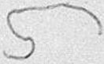
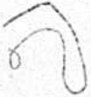

TOMO 307

Volumen 1

1985

## A R G E N IINA

FALLOS

DE LA

Co R T E

DE

## JusTICIA DE LA NACION

A CARGO DEL DBPARTAMENTO

PUBLICACION DB JURISPRUDENCIA Y PUBLICACIONES DEL TRIBUNAL

TOMO 307

VoLUMEN 1

1985

FALLOS DE LA CORTE SUPREMA DE JUSTICIA DE LA NACION

## R E P U B L I C A A R G E N T I N A

FALLOS

DE LA

Co R T E Su P R E M A

DE

JusTICIA DE LA NACION

CON LA RELACION DE SUS RESPECTIVAS CAUSAS

PUBLICACION A CARGO DEL DEPARTAMENTO DE JURISPRUDENCIA Y PUBLICACIONES DEL TRIBUNAL

FEBRERO AGOSTO TOMO 307 VoLUMEN

MAPCOS VICTOR DURRUTY , Improsor Buenos Alros 1985

## 1 9 8 5

## FEBRERO . AGOSTO

## DE EMPLFADOS DFL MEDIDSS DE FUFRZ [

N"

En Bucnos Aire . Icunidos en la Sala de Acuerdosdel Ministro Decano de dc Justicia de 1a Nacion. en cjercicio de don   Jose Sevcro Caballero 1 R 5. don

## Consideraron:

Quc del Poder Judlicial haanunciando dc Para las pantir delas

Quc ine Icusable   recordar Acordada del 21 de 1962. no 0n admisibics {n cl funcionamiento de los Pucs Coo controversias de único impedimenio dcl 4 Ja {uetza cesacion constiluye n evento de  singular pravedad institucional

## Kesoh icron:

personal ficl cumplimiento de bajo   apercibimiento de adhcsion Ja apar Jundo correspondiente descucntode haberes

Todo lo 5. Craviono de de 1985 , cunidos en Aueraosdel 4 Ministro cjercicio 1 don Severo Caballero don Belluscio.

ror 22.192 Fesponde los 1 7 Con affeglo al indice oficial

Qu dejulio de

- por de Eadistiea 4 Censos   correspondientes los Meses de junio de

nontosfijandos en corobuenen

Reaju-tar 17 . inciso 81 indican en el considerando 1 ley

1 comunicase egisR. CkRIÓ oy

## CORTF SUPREMA DF FUNCIONRIOS

N" 3

En Buenos ires. 2 los de Salade Acuendosdel Tribunal el seiorMinistro Dcano en cjercicio de la Prcsidencia doctor don JoséSevero Cahallero Jucces doctores don Carlos Auguslo César  Belluscio don  Enrique  Santiago Petracchi.

## Consieraron:

Que mediante Acordaula 64 del 7 de junio ppo. aclarada 14 esla Corte eslableció que ladesignacion de funcionarios en los de con-

1984 . se llamó Concurso Sccretario Lctrado en reemplazo J Rolriguez Villalan:: Secrelario Letrado en rcemplazo del doclor Cristian 1 . P. Mitrani: Sccrelario rcemplazo de Ja doctora María   del Carmen Jeannerel de la Nación en reemplazo del doctor  Amado Gary (h) Secrelario de la Defensoría de   Pobres Incapaces Ausentes anle Tribunales Federales en rzemplzo  de doctora Lidia

Comisión Asesora designada los   mencionados concursos procedió de los   poslulantes mérilo de

Por ello.

Se resuelve:

Efectuar de Justicia dc V" 5.296.901 clase 1943); Letrado. doctor Enriqu 1 . Bianchi N" 4.567.809 en Ja Procuración General N" 4520.940 Ausents ante prena Tribunales Federales. 14.222050 clase los cuales ocuparon Cn cl orden de  mérito.

Tolo lo cual dispusieron comunicane regislrase fc . Luis   Albento

## DE LA DE FUNCIONARIOS

F 7 dus del de de reunidos Cn e del ehor Ministro Decano en clercicio de 1 don Jose Sever Caballero Jucces doctorcs on Carlos $. Augusto Bclluscio don Enrique   Santiago Pe-

## Consideraron:

Qu N 21 de  junio de 1984, el Tri1dcsignacion Suprema defaco cono confirmaciones provenientes de Jicho roder. Ilulo diferent: del dc auloridades   constitucionale

Que. Un pronunciamiento  relativo prosecrelarioslelrados dc de Csla prema, 0 confirmados con  anterioridad u

1 Cono Lelrados del Tribunal de los Alicia Sihia Omar como dc los doctorcs Inés Kenclla. Luis Mario Garcia. Susana dcl Allio de María

Fodo lo cual dispusicron registrase

## DFL PODER JUDICIAL.

6

ircs. los dias dcl dc 198 rcunidos en la Sal de del Iribunal schor Ministro Dccano de Corte   Suprema de 'usticia de de la Presidencia, doctor José Severo Caballero ! Belluscio Enrique   Santiago Petracchi.

## Consideraron:

Quc la Unión Poler Judicial haanunciado medidas de para el día de   hoy. consistentes en el abandono partir de

Que Corte   considera inecusable recordar lal como lo expresara n Acordad del 21 de   julio de 1962. no son admisibles medidas el funcionamiento de los   tribunales   pues "a cono razón de Ja sancion de los   delitos como   único  impedimento del directo la fuerza quc un evento de singular gravedad institucional'

## Resohicron:

Exhortar al personal fiel   cumplimienio de sus deberes. bajo   apercibimiento de quc la adhesión medida de fuerza arriba señalad traerá aparejado el correspondiente   descucnto de haberes.

Todo lo cual dispusicron y mandaron; ordenando se comunicas registrase en el libro correspondiente, por ante mi, que Augusto Cissk Eduardo doy

## TRIBUNAL FORENSE. RENUNCIAS

N? 8

En  Bucnos   Aires, los 2 días del mes de abril de 1985 , reunidos en la Sala dc Acuerdos del Tribunal schor Ministro Decano cjercicio dc la Presidencia   doctor don JoséScvero Caballero y los señores Jueces doctores don Carlos $. Fayt, don Auguslo César Belluscio y don Enrique   Santiago  Petracchi,

## Consideraron:

Que la renuncia presentada por el doctor Jorge Rodriguez Mancini (fs. 868) fue   aceptada   parcialmente en los   lérminos dc Ja Acordada 52/83 (fs. 869) pOr esle Tribunal en su composición anterior .

Quc Ja nueva presentación de {  997. no puede aceptada.tola una carga púiblica.

Por ello,

Resolvieron:

No accplar renuncia del doctor Jorge   Rodriguez Mancini al Tribunal dc Etica Forense para el año 1981.

Caktos $ Eduurdlo D

## EMPLEADOS JUDICIALES. MEDIDAS DE FUERZA

9 \_

En Bucnos Aires, los días   del reunidos en la Sula de Acucrios del Tritunal. scñor Ministro   Decano, de Caballero. y don  Carlos $. Fayt, don Augusto César Belluscio y don   EnriqueSantiago Petracchi.

Consideraron:

64 del 22 deoctubre dc 1984 . 72 del 19 1 del 18 de fcbrero del año en curso, Y 6 del 19 de Corte frente al anuncio de  diversas medidas de{ucrza ror parte de la entidad gremial que agrupa los empleados   judiciales \_ canortó al  normal   cumplimiento de sus larcas. scñalando quc no son   admisibles las medidas que perturben dc como razón de scr la solución   pacifica dc las   controversias " la   sanción de los delitos como único impedimento  del direclo lafuerza, por lo quc sucesación constituye manal Tribunal a ordenar  cl descucnto dc los haberes correspondientes a los días 0 a las horas de interrupción de las tareas.

Que aclilud ha alcanzado manifestaciones deextrema gravedad en la {echa, mediante el ingreso en el Palacio Je Justicia de personas que altcraron el orden cn su   ingerior.

Que cla Corte no ha mostrado  insensiblc los legítimos   reclamos del  personal   judicial 0 lícita ha rcconocido adoptando inclusive  resoluciones   tendientes suprimir limitaciones anteriormentc impuestas inadecuadas. como la   prohibición de la   actividad   política de los emplados 0 la negaliva   de las  licencias los   integrantes de sus cuerpos directivos reconocidas   por la  legislación

Que. sin embargo. el Tribunal la  preslación de uno de a Cargo como lo de administrar  justicia Nación.

Qu: Congreso  de la Nación en relación malcrias de   competencia de   dicho Federal Sus (atl 14 de Constilución) rro cjercido libremente   fuera del horario en cumplidas obligaciones sin alterar orden en ciales ni en proximidades. pues   dicho ejercicio no de   ocasión para   impedir de Jas instituciones. podcr

Que las anles referidas   decisiones de esla Corte han inspirado en cl principio dc que la liberlad debc ser ejercitada ordenadamente y dentro del marco de Jas instituciones   políticas crcadas por la Constitución. reconociendo como función del gremialismo la de encauzar Marcon la  misma firmeza con principios   derivados Fundamental. Ley

## Resolvicron:

Disponer que en caso de rcilerarse el abandono total 0 parcial de sus lareas por   parle del personal del Poder   Judicial. apliquen   progresivamente por esla dc 0 por  las Camaras de Apelaciones en el dc su supcrintendencia,   delegada las  sanciones que   prevé el 16 del Decrelo-Ley 1.285/58.

Advertir que en caso de pruucirse nuevas alteraciones del orden en el in0 bien en aplicara directamcnte los   resronsables  la sancion de cesantía. proxi-

Todo lo cual dispusieron y mandaron. ordenando registrase Eduardo D Craviotto  (Sccrelario)

## CORTE SUPREMA DE JUSTICIA DESIGNACION

En Buenos los 24 días del de abril de 1985 . rcunidos Sala de Acuerdos del Tribunal. los Jueccs doctores don   José Severo Caballero. don Auguslo Belluscio, don Carlos 5. Fayt, Endon   Jorge 4 Bacqué. con  asistencia del señor Proculos efectos de proccder Presidente 4: de Justicia de la   Nación, con por &amp; 79 del Reglamento para la Justicia Nacional (según Acordadade Fallos: 249.212) " previo  cambio don

## Dcidieron:

Cahallero.

Todo nandauon, ordenando comunicase y libro   correspondiente. los Secrelarios, que dan fe. JosÉ ExRI Fernando Vocos, Hugo R. Galmarini, Jorge E. Burral icopoldo  Schiffrin, Juan  Escribano Eduardo D Craviotto. regis-

## PRESIENTE DE DELEGACION DE FUNCIONES

N" 14

En Buenos   Aires, 1985 , reunidos en la Sala de Acuerdos del Tribunal. schor Presidente 4 la Corle   Suprema dc Justicia de Ja Nación, doctor don Jose Severo Caballero los scñorcs Jucccs daclorcs don Augusto Belluscio, dor Carlos 5. Fayl don Enriquc   Santiago Petracchi y don Jorge Intonio Bacqué, con l asistencia del senor Procurador GeJuan Octavio Gauna.

19 del art. 79 del   Reglamento   para Ja Jusque   quedara redactado de la siguiente   forma:

Fl Presidente de la Corte Suprema y el Ministro Decano serán elegidos por mayoría absoluta de volos los Ministros del Tribunal durará años en cl cjcrcicio de funciones'

29) Agregar como arliculo 87 bis  cl siguiente:

DELEGACION DE FUNCIONES: En Caso de considerarlo necesario. el Prcsidente  podrá  delegar el ejercicio de algunas de sus funciones, transitoria 0 per manentemenle, en el Ministro Dcano

Todo lo cual dispusieron mandaron, ordenando sc comunicase trasc libro   correspondiente, por ante mí, que fe. JosÉ [LERO FAYT ENRIQUE   SANTIAGO PEIRACCHI Eduardo D. Craviotto (Secrctario) regisdoy

## CORTE SUPREMA DE JUSTICIA. DESIGNACION DE MINISTRO DECANO

N? 15

En   Buenos   Aires, los 25  días del mes de abril de 1985 . reunidos en la Sala de Acuerdos del Tribunal, el senor Presidente Je la Corte Suprema de Jusicia dela Nación, doctordon José   Severo Caballcro, tracchi Y don   Jorge Bacqué. con la  asistencia del señor   Procurador Gencral doctor don Juan Oclavio Gauna, los   cfectos de proceder a Ja clccción del señor Ministro Decano. con arreglo bis del Reglamento para la Justicia Nacional (según texto de la Acordada  14/85)

## Decidieron:

Designar Minislro   Decano de de   Justicia dc Nación, don  Auguslo César  Belluscio.

Resolvieron igualmente cslablecer cl orden dc antiguedad de los senores Jucces a los fines previslos en el art. 87 del Reglamento para la Justicia   Nacional, designando al cfecto los doctores don  Carlos $. Fayt don Enrique   Santiago Petracchi y don  Jorge Anlonio   Bacqué.

Todo lo cual   dispusieron mandaron. ordenando comunicase y regispor anle mi, quc fe. JosÉ ENRIQUE   SANTIAGO D. Craviotto (Secretario) doy

## DE JULIO

N" 16

En   Kuenos Jos deabril de reunidos en Ja Sala de sehor Ministro   Decano en ejercicio de Caballero Relluscio

## Kesolicron:

1 Di-poner judicial paralos Tribunales

Federales con arreglo en la respeclivas   jurisaicciones Un fcriado   judicial de dic/ 2

Todo mandaron.  ordenando comunicase regisPor ane mí. {e. Josi SEVFRO 5. F D

## DESIGNACION

los 7 dias del nes demayo de 1985 . reunidos la Acuerdo on don Carlos $. Fayt. don Enrique Suntiago Petracchi cordada N" 34 del 7 de  junio de 1984 , aclarada por Corle eslableció que la   designación

16 de oclubre de 1984. Ilamó a Procuración

neral de la Nación, en Grandoli (h) y Eduardo Francisco Allende.

Que Ja   Comisión Ascsora   designada para dictaminar en los   mencionados concursos procedió de  los antecedentes de los   postulantes y cl mérito de la prueba escrita.

Por ello,

Se resuelve:

Efectuar la siguiente designación cn la Corle   Suprema de   Justicia dc la Nación: Secretario Letrado: en la Procuración   General al doclor clase 1953), el cual ocupó el primer

Todo cual   dispusieron sc   comunicase regisante mí, que LLERO BELLUSCIO CARLOS S. FAYT ENRIQUE   SANTIAGO PEIRACCI JoRGE Eduardo D Craviotto (Sccrelario) doy

## DONACION DE LA CONDECORACION DE LA GRAN CRUZ DE SAN RAIMUNDO DE PENAFORTT

En Bucnos Aires, los 9 días del mayo de 1985 , reunidos cn la ticia de la Nación; doctor don José Severo Caballero y los señorcs Jueces doctores don Jorge 4 Bacqué.

## Resolvicron:

- 19) Aceptar la donación de la condecoración de la Gran Cruz de San Rai-
- recepción SC realizará en aclo privado el 10 de mayo las 1, en el Salón de Audiencias   del Tribunal.
- 39) Encomendar al señor   Presidente   del Tribunal agradecimienlo

Todo mandaron.  ordenando comunicase registrase en el libro correspondiente. por anle mi. fc. Josi SEVERO CABA CARIOS $. Jokal vionio Hcovi . Eduardo D Craviotto (Sccrelario) doy

## DISCURSO PRONUNCIADO POR EL DOCTOR MIGUEL ANGEL AL HACFR ENTREGA LA CORTE SUPREMA DF LA GRAN CRUZ DF SAN RAIMUNDO DE PENAFORT FL 10 DE MAYO DE

sehor Presidente de 1 Corte   Suprema de Justicia Ja Nación, de Espana. sehoras y

Fn ocaslon del viaje que hiciera Espana. en junio de 1973. de Presidente de L Corte   Suprema de Justicia . acompañando Fxcmo, Presidentede doctor Héctor J. Cámpora. fui honrado Gobierno de Madre con Ja Gran Cruz deSan Raimundo dc Penafort

Tal condecoración virtud de Decreto, propuesla del Ministro Justicia los   magistrados quc se Administración de  Justicia quienes   contribuyen con sus (rahajos méritos al desarrollodel

Por 20.696 del H. Congeso de Ja Nación;   promulgada por cl Podcr de   Julio de 1974 9 de agosM: aulorizó aceplar la Condecoración conlerida.

Sibien por de España   personalmentc mi en cl Titulo respcctivo cllo ha sido. con toda evidencia, en mi en 1973, de acuerdo las eslablecidas en la Constitución Nacional.

laCorte   Suprema   designada dc acucrdo a a quien  pertencce en propiedad. y considerado, mi querida espos.   fallecida hace muy mis hijas razón por la cual hemos decidido hacer   entrega Alto Tribunal. de Gran cuya insignia tiene forma de cruz abierta. en un collar de elabones con flamas con banda de seda color rojo oscuro con Y dc oro. para la solapa.

Corte   Suprema. caheza del Poder Judicial de Ja Nación. conslituida uclualmente  conforme a Derecho, ha   accplado en Acucrdo la donación   hecha, en para colocar laCondecoración qu la honra. como Institución, cl Despacho del scñor Presidente "ad perpetuam

He   dicho quc lo dentro del orden constitucional pentino. con igual jerarquia perennidad   democrálica que los olros dos   poderes del Eslado. Yo en Csa perennidad democrática. como crco en el equilibrio en Ja Justicia y en el porvenir de soberana unida para el logro sus grandes designios que ahincan en corazones. pesar dc los node   estabilidad   dinámica. que nos oca sivir

Scñalo quc sólo colocado en Ja solapa, del cual no puedo   desprenderme. sin menoscabo del respelo que debo España me alta distinción. de   profundis, más que personalmente, como Presidente de la Corte, como   ciudadano de la   República Argentina.

No puedo concluir eslas palabras, que descubren mi conducta, que al hacer la donación origen csle no pretendo una regla gencral aplicable si bien pueden   parecer no lo son por las   particularidades de hecho Y de derccho que dan mi actilud.

Señor   Presidente. señores Jueces del Alto Tribunal. mi famiJia Y me habéis  dispensado al escucharme. propio.

## PALABRAS DEL SEÑOR PRESIDENTE DE LA CORTE; DOCTOR JOSE SEVERO CABALLERO

Señores  Minislros de la Corle Suprema de Juslicia de la   Nación SeñorSecrelario de Cultura de

Señoras y Señores:

En nombre de la  Corte   Suprema de   Justicia dc Nación   tengo la   satisfacción de recibir Ja Gran Cruz de la Orden de San quc cl doctor   Miguel Angel   Berçailz ha donado rccientemente Poder   Judicial dela Nación y qu2 ésle ha aceplado formalmente.

Queremos destacar con aclo el gesto gencroso de un Presidentc constitucional de se   desprende del contenido malerial de una condecoración que el Gobicrno Español le otorgara en 1973 cuando ejercía la Presidencia   del Tribunal, dc reconocimiento   personal doctor   Berçailz   por su colaboración   eficaz al desarrollo   delderecho

Conforme y obluvo sar esla honros distinción que importa c reconocimiento del Estado Fspanol 4 quien da relevantes en la sangre de dedicación a la dura ajusle los Depaís

Joctor   Bersaitz . ademas lestimoniar lo   dice expresala Corle   Suprema constitucional dado fue   Olorgada en de Presidente del Tribuna orpanizado en 1973 conforme de nuestra Carta   Magna.

Fa inspiracion   republicana hace sobreslient: geslo por lodo ello   apradecemos su obsequio felicilamos por inspiracion.

## OFICINA DF NOIFICACIONES PARA LA JUSTICIA NACIONAL. MODIFICACION DEL REGLAMENTO

N" 20

Buenos   Aires. de Mayo de 1985 . reunidos en la salade Acuerdos del Iribunal. de la Corte Suprema de don Cevar   Belluscio Fayt don Enrique  Santiago PeAntonio   Bacqué,

Para la organizacion func: niento de Oficina de Notificaciones Justicia Nacional.   aprobado por Acordada laResolución N" 507/79 ingrese en Oficina dc Notificaciones para Justicia Federal Con oficial notificador . permanecer Cn 5 años la fecha dc su designación.   quedando   comprendidos disposición los agentes qu2 antcs dc incorroración 4 1oficina ocupaban 1administración de   justicia incluidos los correspondientes

para la promoción del oficial notificador de úlima   categoría de   quienes   desempenaaccedian de notificanlor 4

Que . no obslante. de mejor servicio aconsejan Tevision 2 implantación recesidad de n:ior aprovechamienlo de los

Sustituir el at. Funcionamiento de la Oficina de Nolificaciones 1a Justicia Macional   aprohado por   AcorN" 19/80 por e siguiente a laOficina e Yotificaciones Nacional Federal . Cn caracter de oficial notifiUn periodo de de su los agenles con Su incorporación (ficina como oficiales notificadore` ocupen cualquier cargo Poder   Judicial que lanenle de Corle   Suprema d: Justicia de jefe   podrá proponer debidamente   fundado, anlecedenles calificacion promoción la  calegoría inmediala   superior de hayan cumplido los requisitos   de permanencia en

Todo lo cual   dispusieron ordenando comunicasc en el libro   correspondiente. por mi. ERIQUE Eduarao " Craviotto (Secrelario) Tegis-

## DE FUERZA

N" 21

Fn a los 21 días del de de Ja Sala de Acucrdos del Tribunal. Presidente Corte Suprema dc cs don   Auguslo (ésar Belluscio. Pedon   Jorge Anlonio   Bacqué.

## Consideraron:

Que no exisle, cn cl Poder Judicial de norma   general alguna pago deremuneraciones al personal que   participe medidas

nacional (Decrelo 4973/65):

esla Corte   Suprema, en virtud Constilución Nacional.

Que   Fesulta conveniente   adoptar resultante del de-

19 Las habilitaciones de Cámaras Nacionales dc Ipelaciones no 1a liquidación de los haberes del rersonal d: dependencia   correspondientes jornada de labor durante 2 las 0 0 declaradas dc 'Irabajo 'trabajo reglamento' "trabajo código" 0 similares. Todo  ello desgano' viosin rrjuicio  de Jas sanciones  disciplinarias quc pudieran   corresponder por los en aada ajustarán 4 lo que

Los descuentos previstos aliculo   precedente efecluarán, sin Cn que conirario de esla Corte. PrO- maAndaon   ordenando que 5. Fn Eduardo D. Craviotto (Secrelario)

los 21 díasdel de de Acuerdos del Iribunal. Corte Suprema de on Augusto Cr Belluscio. don   Jorge

## Consileraron:

1 cion:

20 no pasible de mentación   normaliva de   apreciación judicial, lo debe armonizar con las demás garantías y derechos de la Constitución Nacional (Fallos: 250,418; 251:18 regla-

39 Que de orden de ideas surge claramente la conclusión de que el cjcrcicio del dcrecho no puede  afectar   sustancialmente la continuidad dc los servicios públicos, ni el orden social, ni la paz pública; valores cuya tutela halla cargo del una imposición   constitucional rcconoccrlc facultades quc fuesen   necesarias para asegurarla (Fallos: 254-56; 259.218) Al cabo, constitucional de  huelga un rango  superior la serie facultades del Eslado, tambiën dc que vinculan con la dc

Que , sobre el pa icular. no cabe Juda d: que dicha continuidad en la preslación d: la   justicia que   condiciona cl cumplimiento eficaz de la función   judicial y sustancialmente   menoscabada, si el ejercicio del derecho de huelga desplegara en medidas tendientes a la paralización   tolal dc los agentes del Poder Judicial . El servicio quc debe ser caraclerizado como uno los   fines específicos   del por lo   expueslo, Corte   asgure prestación   cficaz ininterrumpida en los hechos. al   desconocimiento dlderccho de huelga.

Quc de  lal modo. la ecesidad de hacer compatibles  el interés   gencral los   intereses   profesionales.   conduce eslablecer limitaciones   razonables al dercno haya en cucnla la presencia 0 ausencia una scrie y de   fondo. ya la  mencionada   medida fue" hade sr 'ultima ratio" en el camino de reclamos que s estimen dignos de hacerse valer (Fallos: 251:472: 254856, 65, Por lo demás, no cabe olvidar la  vigencia de   disposiciones   que  indirectamente vinculan deaquel   derecho, Y que establecen Jey

## Resolvicron:

19) Exhortar. una Poder   Judicial de Ja Nación, 01 fiel cumplimiento de deberes.

28) Disponer las   caimaras de apelaciones los mera   instancia comisionen al nunero de empleados que sean nccesarios   para la alención de los asuntos que no admitan   demora y para   prestar su   colaboración en las   audiencias que deban celebrarsc en las horas de paro. pri-

6" dichos magistrados aplicar las sanciones previstis 16   deldecrelo-ley los empleados nieguen cumplir las comisiones

Eauardo

## DF

Fn ires. dasdel Me de 1985 . reunidos en Presidente  Je la Corte Suprema de Jus4 .

## Consnleraron:

Unionde Fmpleados del Podler Judicialha anunciado la realización 29del corriente.

Quc Corte mediante las (4 del 22 1984 . 1 del 18 de mayo de 1985 .

Cn en orortunidad de   diclar Acordauudas 9 del de abril último " 22

Resohicron:

Disponer   quc de hacerse paro mencionado. las   cámalo dispuesto en las Acondulas N" arlicu- lo cual dispusieron mandaron ordenando que comunicase de inmedialo y registrase en el libro correspondiente. fe . Josi ENRIQUE Eduardo D Craviotto (Secr:lario) doy

## PROCURACION GENERAL DE LA NACION. DESIGNACION DE SECRETARIO LETRADO

N? 24

En Buenos Aires. a mayo de Sala de Acuerdos del Tribunal, el señor Presidente de la Corte Suprema de Juslicia de la Nación; doctor don José Severo Caballero Y los señores Jucccs docdon Augusto César Belluscio, don Carlos $. Fayt, don Enrique   Santiago Petracchi don Jorge 4 Bacqué y el Procurador   General doctor Juan 0 Gauna,

## Consideraron:

mediante   Acordada N" 34 del 7 de   junio de 1984 , aclarada por la N? 53 del 14 de agosto del mismo ano, esla Corle estableció que la designación de   funcionarios Cn los requieren habilitante debc efectuarse por el régimen de concursos.

Que Resolución N" 1.029/84 de fecha 16 de octubre de 1984, Ilamó por concurso para cubrir dos cargos de Secretario Letrado en la   Procuración Gcncral de la Nación, en reemplazo de los doctores Mariano  Hipólito  Grandoli (h) " Eduardo Francisco Allende.

Que Asesora designada para   Jictaminar en los   mencionados concursos procedió los   antecedentes de los   poslulantes cl mérito de la prueba escrita

Por ello.

Se resuelve:

Efecluar   la siguiente  designación la  Procuración Gencral de la   Nación:

Secretario Letrado a clase 1952), la cual el primer lugar en el orden de  mérito conjuntamente R. Grancro. ocupó

Todo Jo cual   dispusieron mandaron. ordenando se   comunicase Y en cl libro correspondiente, por  ante mí, que fe. Josi SEVERO BELLUSCIO CARLOS ENRIQUE SANTIAGO [LERO JoRGE Eduardo D Craviotto PETRACCHI (Secrelario). regisdoy

## CORTE SUPREMA DE JUSTICIA. PERITOS.

Fn Bucnos Aires, mayo de [985 . rcunidos en la Sala de Presideule de la Corle Suprema de JusJosé Severo Caballero docBelluscio, don Carlos $ Fayt. don Enrique   Santiago Pctracchi y don   Jorge A Bacqué.

## Consideraron:

d: replamentar la   designación de profesionales para como pcritos   en que   tramitan por anle el Tribunal,  disponcn crear un cn las   especialidadks se  indican siguientes:

Punto Resistro de profesionales

Agrimensorcs

Arquitecto

Dactores en Ciencias Económicas

Doclores en quimica

Enólogos  {ruticultores

Folointérpreles

Gcólogos

Ingenieros civiles

Ingenicros  aprónomos

Ingenicros con cspecialidad en hidraulica

Ingenicros   industriales

Ingenieros mecánicos

Meteorolopos

Veterinarios.

## Punto 2"

En los no incluia utilizar las listas de inscripciones ue la Cámara Federal.

## Punto 3 '

En los casos en que SC demucstrela necesidad  de proceder al registro dc otras   actividadcs no   incluidas en la  enumcración del  punto 1" abrirá perpara el año siguiente. previa   resolución dc Tribunal .

## Punto 4" INSCRIPCIONES

Plazo: Las inscripciones  del   perilo la lista   respectiva en la Oficina dc el scrá válida sca dado dc baja  por   alguna dc las

Para mantencr Su inclusión cn la nomina pcriodos anuales   subsimanifestar voluntad en sentido } concurrir en las condicioncs reglamentaria .

lal cfccto al haráconstar dicha manifes domicilio ylo Iclcfono. su caso

## Requisitos

Los intcrcsados debcrán creditar identidad . constituir domicilio cn la ciudad dc quc no hallare   rcglamentada procederá   conformc lo dissentará un informe   delallado de actividad espccialización la   credencial recibo   correspondir"c año en quc se rcaliza la inscripción.

## Punlo $" LISTAS

## Lista   provisoria

Con " las   ratificaciones de los ya inscriptos confcccionará una lista   provisoria dc los   poslulantes dccada cialidad . la que en a del 12 de aposto 0 siguiente día hábil. de plazo   podrán cfcctuarse impupnaciones 0 solicilar aclaraciones. caducando con poslerioridad cl haccrlo. partir

Para rclacionado con su inscripción los   pcritos deber ín prcsenlar laconslancia dc recepción de su  solicilud 0 ratificación cn la Sccrclaría de Superintendencia, requisito sin el cual no SC dará curso a ningún reclamo.

## Lista  dclinitiva

La misma scrá aprobada habilila naciones por no pudiendo hacerse nombramientos de prOLa Secredisposición de las dependencias de esta su conocimiento.

## Punto 6'

Ldesignaciones de oficio irrenunciables para los inscriptos. siendo oblipalorio el desempeno dc aun en juicios que tramiten

## 7 DI

Los inscriptos por causales sobrev inienles eslimen para cl caso designados suspensión cancelación de la   inscripción delo que nota en ladependencia cargo del Repistro.

## Funto 8"

no 0 comparecicren dentro del plzo previsto en del Codigo justificada.

lo Jispueslo por 470 del Código Procesal 473, in finc, del mismo leMo legal no hayan  praxedido cunplir 40 inscripción.

denuro del   quinto dia Presidenci Ileven al respectivo colegio profesional.

inscripción para del si-

## Punto

Con las solicitudes de insctipción. documentación   acompañada.  impugnaciones un expediente. al que agregará loda otra documenlación   relacionada con el presente  régimen conscrrada en JaOficina cargo del Registro.

## Punto

senle Acordada, de cllo conslancia en de recepción que les entregue. pre-

Todo cual   dispusieron mandaron. ordenando comunicase libro   correspondiene. ror anle mi.  que fe. 5. D doy

## CORTF SUPREM

N" 26

En Buenos Aires. los días  del mes Salde doctor don José Severo Caballero y don Augusto César   Belluscio. don Carlos Fayt don Enrique   Santiago Petracchi y don   Jorge A Bacqué.

## Resolvieron:

Qu: en alención quc por   resolución del de Mayo del   corriente suprimió el cargo d Matricula.   corresponde modificar Acordada 13 del 23 de   junio de 1984 sustituir la  denominación "Subsccre-

Todo mandaron; ordenando comunicase en el libro correspondiente, por anle mí. que   doy fe. JosÉ   SEVERO 5. FAYI JoRGE D regis-

## CORTE SUPREMIA DE JUSTICIA CREACION DE LA SECRETARIA 3

N" 27

En Kuenos Aire . los días   del mcs 1985 . reunidos en la Salade Acuerdos del Tribunal. cl schor Presidente de la Corte Suprema de liciade la Nación, doctor don José Severo Caballcro, don Auguslo César Bclluscio. don Carlos $. Fayt, don Enrique   Santiago Pctracchi don   Jorge Bacque.

## Consideraron:

Que Corle   Suprema Justicia   de Nación Y dela Oficina dc de decisioncs  dc publicacion Tribunal.

Que mediantc de Tribunal.

Acordaron:

que J Sccrclaria N" 5 enienderá:

ben L regislracion

- en lo alincnt 2 lasisematización dc de Fallos
- 4 resolucioncs   dcl Tribunal:
- comisiones   espcciales de caracier   judicial administralivo encomcndare cl Prcsidente:

0 en Ls funciones quc csiimare cl Tribunal.

- Copias dc
- su

sCcomunicasc y registrasc AUGUSIO CÉSAR FAYT PEIRACCHI D Craviotto (Secretario)

## MAGISTRADOS JUDICIALES. REMUNERACIONES

N? 30

En Buenos Aircs. los mcs reunidos cn la Sala de de la Corte Suprema de la Nación doctor don José Sevcro Caballcro. Ministro Decano doctor don Augusto César Bclluscio 5. Fayt. don Enrique  Santiago Petracchi y don  Jorge A Bacqué. Jus-

## Considcraron:

las   condiciones   necesarias para cl dc quicnes tienen administración de justicia.

Que dicho detcrioro ha inducido jucccs ilustrados ? renunciar para   dedicarse Ja aclividad   privada. cn la quc cncucntran salisfacción sus moderados   requcrimienios   cconómicos.

Por otra parte. la   prolifcración dc dcmandas de amparo   iniciadas por magistrados, que procuran la tutela del dcrecho quc emana del art. 96 dela Constitución   Nacional, da lupar a que aumentan la la un clima quc bucn servicio icia .

Que las   circunstancias aludidas dan precisamente   cuando. una multiplican los   reclamos   dirigidos a Poder Judicial.  cumpliendo {unción modcradora,  arbitre conflictos dc

Que. refiriéndose declinación   adquisitiva dc las   compensaciones   judisu prcocupación por lal hecho, y advirtió la forma en que ello pone en peligro Ja indey los   principios y garantías con que la Constitución latutela, la  trascendenlal misión que la confía.

Tribunal. como  órgano de la Judicalura nacional. dc Conslitución:  apela solemnenenle lasituacion menordenadodesarrollo de

Y

Por ello. en conocimienlo del Poder Ejcutivo Nacional del  Honorable (ongreso Nacional. mediante ofi4 4los schores Presidentes

Fodo lo cual dispusicron nandaron. ordenando comunicase regislrase que doy fe. Josi 5

## (ENTRO DE JUDICIAL

N" 32

los 198S . rcunidos en la Sala de sehor  Presidente de JusDecano Belluscio doctore&gt; don Carlos $ don   Jorge Bacqué.

Consideraron:

Direclor de Delención Judicial ha  señalado los inconvenienles qu2 con ello se mayores comunicados en dependencia as prolucen en los casos Cn quelas obre seguir   cuando detenidos  que han comparecidlo niegan rcintegrados unidades de origen. riesgo ley 22.278. menor de   cdad laps institutos especializados 6" En los 2"de l cilada inc. cabo en instilutos de igual naluraleza. en

Quc por resolución 1344/81 autorizó  la aplicación del "Manual de   Procedimienos " Normas   Opcrativas   Judiciales del Centro dc Delención Judicial. Esc cuerpo regula lo relalivo al ingreso, comparendo rermanencia dc menorcs en la Unidad  28. En cuanto esta   última, establece quc sólo podrán permanecer alojados en el Centro los menores   varoncs de 18 a 21 años de edad procedentes  de dependencias   policiales y organismos con quc en edad serán que   correspondan.

la Jurisdicción lo Criminal Correccional  de  la Capital Federal   (Acordada S/N" de la Cámara Nacional de Apelaciones en lo Criminal y Corrcccional. de fecha 30 de agosto de 1979) establece que los menorcs de 4 de 18 años si fueran acusados de contravenciones   serán manlenidos de los   demás   detenidos durante las horas de noche no podrán   permanecer en Alcaidía , debiendo remitirseles  aunque (ueratransitoriamente los eslablecimientos   de   detención Cu rrespondientes Su 0

del de los menores quc SC observa en las dos   reglamentaciones   precedentemente   aludidas hace   aconsejable que esla Corte adecue el procedimiento a las finalidades tutelares y preventivas que subyacen

Que. ~Manual de   Procedimientos y Normas   Operalivas Judiciales' cl establecimiento los mayores de 21 años de edad. comunicados 0 incomunicados. con expresa orden del magistrado que interviene en la mientras que vadas al establecimienlo de detención correspondiente.

Que. los   delenidos 0 disposición Ja recepción de su indagaloria 0 para la  realización de  diligencias   urgenles que requieran su presencia   constante

Que.  por parte. el Tribunal. mediante   Resolución N" 1335/81. modificó el Reglamento antes mencionado en cuanlo  prohibía  absolulamente que nidas   pernoctaran Y autorizó al Centro de Delención Judicial alojar en Sus dependencias.  durante la noche. las   delenidas  incomunicadas que deban permanecer esas  condiciones por orden de los   magistrados cuya disposición en un criterio forme en relación al alojamiento noclurno de   detenidos. adecuadauni-

en rclación al Iramite seguir en los casos de   detenidos niegan Sus unidades de origen, sin perjuicio de Se cncuentran vipencia las facultades   disciplinarias acordadas las autoridades   pcnitenciarias por (decrelo N" 10.240/ 56  aplicable los scrvicios dc Alcaidía   dependienle dcl Poder   Judicial convenio cclcbrado Nacion   del 26 de dc 1981   laprobado por   resolución N' 328/81 CSJN)  lambién rcsulta convcniente   dictar normas que lo regulen. en funCorte rerintendencia quc según

Los sca no rodran alojados bajo   ninguna circunstancia cn Judicial: durante las horas diurnas, medianie cl procedimiento prcvislo para cl ingreso comparendo dc Manual dc Procedimientos Normas   Opcrativas Iudicialcs' aprobado por   Resolución 1344/81 dc cste Tribunal. 4 Jucces disposicion encucnuren los Su dcrivación un  cstablecimiento udccuado del Scrvicio Penitenciario Fcdcral. Comisaría algun   eslablecimicnto  dependicnte dc la Dirccción Nacional Familia . olro instituto espccializando corres0 cdud on lo disponc N" 22278. scgún cn dcpendencias  del (entrodc Dctcnción Judicial . y cuando lo consideren  cstricordcnar lambicn. por resolución fundada. el alojamicnlo dc mcnorcs. Cn Cuyo Centro copia 0 transcripción  integra de lo eslablezca, dondc qucdará archivada disposición alojar a} inicrno cn cclda indiv idual

las facultades   disciplinarias quc corrcspondcn dc Dctención Judicial (dccrclo N" 10.240/56 los jueces que har dispueslo el comparendo de un   dctcnido a estrados ~cualquicra sca motivo debcran adoptar las   medidas   condu- schor dc Delención Judicial a los Nacionales  deApclacioncs cn lo Criminal y Corrcccional Fcdcral. cn lo Criminal y Corrcccional en lo Penal   Económico, a

efeclos de que se ponga en conocimiento de los jueces del fucro respectivo. Déjese copia de la presente en los expedientes S. 162. 5. 163 y S. 164 y archivesc. JosÉ SEVERO CABAL LERO AUGUSTO CíSAR BELLUSCIO CARLOS $. Fayr ENRIQUE SaNTIAGO PETRACCHI JORGE Antonio BACQUÉ. Jorge  Barral  (Secretario)

## SUPERINTENDENCIA DE LA CORTE SUPREMA LICENCIAS DE' PERSONAL

N" 33

En Buenos Aires, los 18 días   del de 1985 . reunidos en la Sala de ticia de la Nación. doctor don José  Severo Caballero los scñores Ministros doctores   don Augusto César Petracchi don   Jorge A Bacqué.

## Consideraron:

Que  resulta conveniente. en alención dispuesto en el art. 93 in finc del Reglamento para la  Justicia Nacional en la Acordada N? 25 dcl 8 de mayo dicial " Administraliva.   determinar las   autoridades quc las solicitudes delicencias.

## Acordaron:

[ en los  Secretarios dc   Superintendencia   decidirán las   solicitudes de licencias dc los   funcionarios Y personal su dependencia de acuerdo la

Todo lo cual dispusieron y mandaron, ordenando sc comunicase y registrase en el libro correspondiente, por ante mí, que doy fe. JosÉ SEVERO CABALLERO CARLOS $. FAYT ENRIQUE   SANTIAGO PETRACCHI JoRGE

## PROCURADOR GENERAL. INTERVENCION EN LAS CAUSAS SOMETIDAS CONOCIMIENTO DE LA CORTE SUPREMA

N? 34

En Bucnos Aires. reunidos en la Sala  de Acuerdos   del Tribunal. cl señor Presidente de la Corte   Suprema de

Justicia doctor los schores Jucces Petracchi don   Jorge 4 Bacqué.

## Consideraron:

del 17 de diciembre de 1952 las funciones del Procurador General hallan de marzo d aludido magistrado mantenimiento d: norma del 87 en segundo   lérmino. pues   obliga recabar   dicho Corte Suprema.

Que consejo del Procuranor General. que cl más alto   representante Ja tradición argentina, componente de Tribunal, para Jas referentes malerias qu2. de aquél. como por   ciemplo. de   compctencia las quc revislan trascendencia instilucional ley cultativo de la opinión del Procurador Gencral, y en consedel ano 1948 .

asimisno adecuar reglamentaria Jas rariaciones la representación del Fisco.

del 87 del   Reglademarzo d: 1948:

decisión del Tribunal. no intervenga en los procedimientos deSuperintendencia. inclusive en los refcrenJa malricula de   abogados procuradores. Procurador Gencral actúa, Minislerio Público Corle   Suprema.

Todo lo cual dispusicron registrase fe . Josi 5. Fraviotto (Secretario) doy

## UNION DE EMPLEADOS DEL PODER JUDICIAL. MEDIDAS DF FUERZA.

N" 35

En Buenos Aires. los 25 1985 , reunidos en la Sala de Acuerdos   del Tribunal. c sehor Presidente de Corle   Suprema Justicia   de Nación. doctor don José Severo Caballero, los Jueces doctoresdon Pelracchi don   Jorge A Bacqué.

## Consideraron:

Quela Union de Empleados del Poder   Judicial ha anunciado el abanlono

Quc una 1984 . 1 del 18 dc febrero del corriente año. 6 del 19 de y 22 del 21 de mayo:

Que   resultan  aplicables en csla ocasión el Tribunal en Acordada 9 del la 22 ya cilada.

## Resolvicron:

Prevenir personal las Cámaras las sanAcordada N" 21/85. lodo cllo previo inform: de los jueces.

Por lo cual dispusieron y mandaron; ordenando que se comunicase de inmedialo y registrase en el libro correspondiente. por mi. fe. JosÉ   SEVERO CARLOS $ FAYT JoRGE Juan   Escrihano (Secrelario) doy

FERIA DESIGNACION DE JUFZ Y FUNCIONARIOS LOS MINISTERIOS PUBLICOS.

NP 36

días   del mes   de junio dc 1985. reunidos en la don   Jorge Bacqué. nombrar Jucces de Feria en

Suprema para cl de   julio  del corriente año. con arrcglo 1 cl arliculo 75 del Reglamenlo para la Justicia Nacional los   funcionarios dc

## Resolvieron designar:

19 los doctorcs don Enrique   Santiago Petracchi Y don   Jorge Antonio Bacqué como Jueces de Feria en la Corte Suprema.

29) Aldoctor Osvaldo Casas a dc dc laNación.

Aldoctor  don Carlos A Tavares litular de la Defensoría ante la Corte Suprema y

Todo lo cual dispusieron y mandaron, ordenando s comunicase y registrase cn el libro correspondiente, por anle mi. que fe. JosÉSEVERO CABALLERO JoRGE Eduardo D Craviotto (Secretario) doy

## DEL PODER JUDICIAL DE LA NACION

N" 37

Fn Huenos Aircs, mcs de junio de en la Sala de Acuerdos   del Tribunal. Prcsidente Ja Corte Suprema dc Justicia   dela Nación. doctor don José Severo Caballero, los po Petracchi,

## Consideraron:

las   disposiciones de la Obra un imporlante número en situación familiar   irregular, habida cucnta quc medio de dicha   enlidad tienden a asegurar nccesidades vilales minimas para cuya   prolección no puede   requerirse la fección del eslado de familia.

## Resolvieron:

19 Anadir  como párrafo "m 6 del Eslatuto la Nación. aprobado por Acordada 43/81 (Fallos: siguiente:

M) matrimonial que haya persistido durante un lapso no inferior a

requerirá el cumplimiento de ese perodo si hubiere un hijo del titular y la pcrsona conviviente quc sido rcconocido por ambos. si la segunda se hallare embarazada. Las   circunstancias   tenidas cn se acreditarán mediante información sumaria   judicial. y para la afiliación de la pcrsona quc convive con el litular deberá pagarsc una cuOla especial. haya cl art. a por m)'

3" 6 la cuola

Todo lo cual dispusieron en el libro corrcspondiente. por anic mi. que Eduardo D. Craviotto (Secretario) doy

## CORTE SUPREMA DF JUSTICIA. REMUNERACIONES

N" 38

En los mes de   julio de 1985 . reunidos en la Sala   de Acuerdos del Tribunal . Presidenie de la Corte   Suprema dc Justicia de la Nación. doctor don José Severo Caballero. el senor Ministro Decano doctor don Augusto César  Belluscio. y Ministros doctoresdon Carlos s Fayt, don Enrique  Santiago Petracchi

## Consideraron:

19) Que de acucrdo con lo prescripio por los   arliculos 3 6 de la 23.199. esla Corte debe fijar de miembros. a partir del 1985 y hasta  la   promulgación Nación del   cjercicio 1986. ley laintangibilidad de las rcmuncraciones delos jueces de la Nación. fin indcpendencia   del Poder   Judicial como condición de   vigencia

con dichos principios Acordadasde bunal números 6 y 55 del año 1984 y 30 del año 1985 .

ello no   obsla la paula   contenida cl arliculo 3 . primer dc laley 23.199. en cuanto limila cl monto de la remupá-

neración   correspondiente de abril de 1985 , ella debe enlenderse como Una Tefcrencia expresamente   establecida sólo para dicha   oportunidad , Y ajuste   posterior   determinará el "limite mínimo de remuneración para un nistfo a Cora (debate   parlamentario de lasesion laCamara de Senadorcsde del 26 de   junio de mi-

Que con los   fundamentos epueslos. procede   fijar la remuncracion de los miembros de laCorle en ejercicio dc a facultad dele3 compensación funcional  para mapistrados funcionarios de la Justicia Nacional . alcanzará a aquellos los que ción con la mismas   evigencias que en dicha norma eslablecen. salvo para los supueslos de los   funcionarios para   quienes no rigen Cn plenitud las   incom8 para por reglamentariamente aulorizados pala profesiones desem0 aeplo regular

Por ello. secidicron conforme loeslablecido resolutiva de

Presidente don José  Severo Caballero   dijo:

3 Y 6 23.199. esia Corte lolal mensual del Jucz de la Corle   Suprema de Nación. 1" de   junio de 1985 hasla Nación 1986 .

Que dicha delegada dcbe Ienerse en cuenla 23.199 no que las   exigencias de la de  Contabilidad de Nacion 13 . 30 93) suponen la exislencia de partida decir . que par-

Qule. en primer lermino. debe tenere cucnta de Presupuesto aun vigencia. por no haberse aprobado presupueslo de 1985 13deldecreto-ley 23354/56. ralificado por la 14.467) cuyo arliculo faculto Ejecutivo fijar Iotal del Mcs con decreto 1070 Mes. publicado en 4 Boletin   Oficial   del 1" eslablecio cl sueldo del pesos argentinos   quinientos ochenla mil sciscientos dos(Sa 580.6321. Ley ley adicionarse los magislradlos funcionarios, compensción funcional al de la 23.199 faculta ley

esla Corte   Suprema eslablecer sobre la  remuneración mensual lolal cucnla lus   circunstancias   presupueslarias   precedentes. n

Quc sehalada en cl arliculo 3" e la ley 28.199. referente al monlo para el de cl máximo de adecuación periodo.

en ejercicio la facultad   delegada por el arliculo 39. segundo rrafo. procede   regular lambien la   compensación funcional para mugistrados iuncionarios   de Justicia Nacional . aquellos que   posean los a los 4uC refiere cl decrelo 4107/84. en igual   proporción con las mismas   exigencias dicha norma eslablecen. Salvo para los   supueslos en plenitud   lasincompalibilidades  que eslaluye e 8 del   Reglamenlo para la Justicia Nacional. por eslar  reglamenlariamenle   aulorizados para cjercer profesión, descmpeñar olres empleos en

19 Fijar mensual del Jucz de laCorle Suprema de lusticia de Ja Nación   correspondiente de 1985 . en cantidad de   quinientos  ochenta  australes dos ( . 580.6321.

20) Eslablecer la compensación funcional para magistrados funcion; en el nomenclador de  funciones y porcenlajes   de Justicia Nacional Ancxo la defaclo 22.969 . igual forma proporciones Jas dispuestas decrclo 4107/84 con en c último considerando   precedente.

En consecuencia de

19 Fijar la remuneración lotal mensual dc los miembros Corte dela Nación partir   del 1" de   junio de 1985 . en Ja cancon Ireinla ocho

2") Eslablecer la  compensación funcional magistrados funcionarios comprendidos cn cl Nonenclador de Funciones Porcentajes   de la  Justicia Nacional Ancxo la dcfaclo 22.969. Cn igual   forma proporciones que las dispueslas por cl decrelo con la salvedad epuesla en considerando N" $. ley

Tolo lo cual   dispusicron mandaron. ordenando en correspondiente comunicase Poder Ejecutivo Nacional. por anle mi. Josi   SEVERO En   disidencia) Cisak JoRGE Lcopoldo Schiffrin (Secretario) doy

## BONIFICACION POR TULO

No 39

Buenos  Aircs. los ? dias del 1985 . reunidos en la Sala dc Acucrdos del Tribunal, Presidente Corte Suprema dc Justicia Nación. doctor los señores Jucces doctores don Augusto César Kelluscio. don Carlos $. Fayt, don Enrique  Santiago Pctracchi Y don Jorge A

## Consideraron:

Que 19.362 el personal   administralivo obrero. de   scrvicio dcl Poder Judicial norna. ror y secundario quc asignado 0 los empleados comprendidos el escalafón para el personal civil dc 1  administracion   pública nacional ley

Que 4107/84   sustituye ariculo 44 dicho escalafón, que  resulte  necesrio replamenar el olorgamiento de   dicho adicional con sujcción disposiciones.

Por ello.

19 La rercepción del adicional por   parte de los   agentes mencionados en L presentc Acordada   corresponde los quetengan tilulo universita0 si olra norma, no lo cxigen para cl desempeño del salvo los contemplados cn los incisos del   punto 1 del  articulo 44 del   escalafón para el pcrsonal   civil de administración   pública (dccrelo 4107/84) siempre quc los   agentes que lo pofuncioncs dc especialidad, debiendo enlenderse aun cuando no sea imprescindible cursados  relativos especifica delservicio Iraducc en una mayor eficacia cumplimienio dc cle . propias aplicacion de la propucsla dc las Canaras Nasionales Federales dc   Apelaciones

Todo lo cual mandaron   ordenando comunicase a Fedcrales de   Apelaciones de Admi nistracion cumrlimiento.

Registrese en el libro correspondienle, por ante mí. quc fe. JosÉ SEVERO CABAI LFRO CARLOS $. FAYT ENRIQUE   SanJoRGE ANTONIO  BACQUÉ. Eduardo D Craviotto (Secrelario) doy

## CORTE SUPREMA DE JUSTICIA MEDIDAS DE AUSTERIDAD

N" 40

En Buenos los dias del mes 1985 reunidos en la Sala de Acuerdos   del Tribunal schor Presidente dc Ja Corte Suprema dc Juslicia de don José   Severo Caballcro, Y los   scñores Jucccs Petracchi y don   Jorge A Bacqué. con asistencia Jel señor Procurador Gencral, doclor don Juan Octavio Gauna.

## Consideraron:

Que  mediante comunicación cursada por cl señor Ministro de Educación Y Justicia dc la Nación con fecha 18 de junio último; en cumplimiento de lo estaeste Tribunal una invitación a los efeclos de adoptar nOr mas   similares a las   fijadas en materia decontención del gasto público para los organismos   dependien:es  del Poler Ejecutivo Nacional.

Que la prave situación que afecta al erario impone a todoslos Podcrcs cl deber de adoptar disposiciones en la medida quc Sca factible para aliviar c déficit   presupucstario.

yeclar el presupueslo para el cjcrcicio 1985, fijándosc como objctivo una adecuada restricción de gastos ante la impcriosa   necesidad dc unamáxima austcridad exi(confr. Acordada país

Quc, aclarar quc ~salvo  exccpciones \_ cn las últimas   décadasla adminislración ha visto   restringida en materia presupuestaria para poder  slucionar los innumcrables   problemas dc inadecuada instalación de tribunales Y organismos en Capital   Federal interior; mcro dc   magistrados, funcionarios " empleados cs el mínimo indispensable para el cumplimiento de las tarcas funcionamiento no cubren las   necesidades, conformc lo ha   declarado cl Tribunal en numcrosas  Acordadas.

Que Corte   Suprema comparte cl crilcrio de parquedad que la siluación dificil   impon:. ~in cllo   menoscabe la

19 Aplicar del Poder Judicial de Nación las  siguientes

- la   adquisición de centrales  lelefónicas. intercomimeógrafos.  máquinas de   escribir   eléctricas, clectróni4 la instalación de nuevas  líncas lelefónicas;
- formularios impresos;
- 0 lo minimo necesario;
- debaja u poslerior   asignación destinos;
- incrementar % planta de personal   lemporario  (contralados):
- noauloriar nuevos servicios  exlraordinarios   (horas
- dar Cuiso para designar personal   suplente en los lecnico.
- 2 Recomendar a losIribunales cion. laadopcion de las medidas de  contención de   gastos   compatibles entre olras a:
- la percepción de viáticos pasajes;
- b) losrdidos de obras  juridicas losrestantes bienes no enumerados
- 0 los servicios de luz. 2a leléfono, elc. los cle-
- 4
- dc y adscripcioncs:
- cl esricto cumplimiento del horario y
- no  designacion personal en el mesdediciembre.

de los tribunales organismos   judiciales debcrán comunicar 4 la Corle Suprema la existencia dep:rsonal sobrante 0 de bienes que no utilizados. otros   destinos.

- 42 losenumerados en el articulo incisos archivados. salvo cuenlen con aprobación de la Corte Suprema encuentre Cn Irámile Su adquisición 0 provisión.

las soliciludes 0 no reilcración riores sólo les   dara Cn aquellos 0 urgencia,debidamente   acredilados.

- Fhorlar empleados   del Poder   Judicialde la Nación el desempeño de Sus respectivas   funciones ajusten Su accionar las normas de   ausleridad la siluación cconómica por la que atraviesa la Nación. ~en
- 69 Comunicar la presente al Poder   Ejecutivo   Nacional. por intermedio del Minislerio deEducación Justicia de la Nación.

Todo lo cual dispusieron y mandaron. ordenando SC comunicase registrase en cl libro correspondiente por ante mi. fe. JoRGE Juan 0. Guna. Juan Escrihano (Secrelario) doy

PAGO DF HONORARIOS Y LIQUIDACIONES JUDICIALES

En Buenos   Aires, los días del de   julio de 1985 . reunidos la Sala de Presidente de Corte Suprema dc Justicia de la   Nación. doctor don José   Severo Caballero, Y Jucces Petracchi y don Jorge A Bacqué.

## Consideraron:

frente aclualizaciones las sunas originalmente   reguladas por perjuicio.

acomnpanar los   elementos P.adeterminar la procedencia   del pago solicita .

intersencion de para aprobación de los montos un faclor quc contribuye

## Resoh icron:

19 aprohacion honorarios liquidaciones Poder   Judicial delega en el Subsecretario dc Administracion. cualquiera que 4 monto dc Suna

2" Solo dur requiere el interviniente en 1a el prolesional recibe   relribución copia dacion del aulo aprobalorio copia

mandaron, ordenando registrase 5. PEIRACCHI Eduardo D Joy

## CoMPENSACION FUNCIONAL. ALCANCES

En Bucnos Aires, de 1985 rcunidos  en Ja Sala de Acuerdos   del sehor Presidente dc la Corle Suprema de Justicia dc Jon Jose Severo Caballero, y Pctracchi y don Jorge Bacqué.

## Consideraron:

Que cl régimen de la compensación  funcional   eslablecido por la Acordada N? 38/85, sol0 comprende los   magistrados y funcionarios Cn actividad, porlo con respeclo los   beneficiarios de

regimenes   previsionales.   adecuando los requisitos contenidos en cl punto 5 de aquella.

## Resolvieron:

La compensación funcional establecida por el art. 3 segundo párrafo, de la 23.199, alcanzará los   beneficiarios de regímenes   previsionales de la Justicia Nacional que se mencionan continuación de acuerdo con las siguientes reglas: ley

- 1 los magistrados   jubilados  por Ja 19.939. ley
- 2. 4 los por los   restantes ncs previsionales.   siempre que   cumplan los   requisitos   exigidos por Ja Acordada se encuentra insno descmotros empleos, ni realiza actividades   lucrativas. A lal fin le cxigirá la regímepeña
- 3 . los   pensionados de la ley 19.939.
- 4 sante  poseía   los   titulos los   que 4107/84, sicmpre hubieran cumplido a su respecto las exigencias que en dicha norma se establecen, cn igual

Todo lo cual dispusieron y mandaron, ordenando se comunicase y rcgistrase en cl libro correspondienle por ante mí, que dov fe. JosÉ SEVERO CABALLERO FAYT PEIRACCHI Juan

## CORTE SUPREMA DE JUSTICIA. REMUNERACIONES

N? 44

En Buenos Aires. los 25 días dcl en Sala   de Acucrdos   del Tribunal. cl sehor Presidente Ja Corte Suprema dc Justicia doctor Jon José   Severo Caballero, y los   señores Jueces Petracchi y don Jorge 4 Bacqué,

## Consideraron:

Que la 23.199, promulgada por el Decreto 1201/85, faculta a esla Corte Suprema a fijar a remuneración lolal de sus miembros a partir   del dc 1985 . Ley

Acordda paraeslablecer Jas desdelal fecha.

mente fijado Para el inciso Personal. por Acordada N" 75/84

Por ello.

Kesohieron:

Modificar cl monto cslablecido Acordada para c inciso de Australes cincuenta millonesdoscientos

Comuniquese Acordada Poder Fjccutivo   Nacional por inlermedio del Ministro de Fducación Juslicia para elevación la de Diputados. Asimismo. pongase en conocimiento del   schor

Hagase d: Administración las

Todo lo cual dispusieron mandaron. ordenando comunicase repistrase cl libro correspondiente por mí. Quc fe. Josi Juan Escribano (Secrelario) doy

## DF PERITOS

N" 45

En Buenos dias del mes de   julio  de reunidos en la Sala de Acuerdos   del Tribunal. Presidente de la Corle Suprema dc Kacion. doctor don Jose Severo Caballero. los   sehores Jucces don   Jorge 4.

## Consideraron:

en Ja cordanda como perilos   ante esle Tribunal. Por   ello, 4" hasta c último día

1} de sepliembr: parlir de la cual

Asimismo.  inclúyese en la conlenida mencionada Acordada,

Dése por   intermedio delaOficina de Prensa.

Todo lo cual dispusieron y mandaron, ordenando se comunicase y registrase en el libro correspondienle por que fe. JosÉSEVERO CAnAl LERO Fn ENRIQUE Santago JoRGE Eduardo D Craviotto (Secretario) doy

## CORTE SUPREMA DE JUSTICIA . PERITOS NAVALES.

N" 46

En Buenos   Aires, a los 25 dias del mes de julio de 1985, reunidos en la Sala   de  Acuerdos   del Tribunal. el senor Presidenie dc Ja Corte Suprema Justicia dc doclor don José   Severo Caballero. y Jueces doctores Petracchi y don Jorge ABacqué,

## Consideraron:

Acordada de mayo   último, Corte   dispuso en causas que Iramitan por anie ella y creó esos fines un registro para inscripción.

Que en virlud de ello es necesario adoptar una   decisión con relación a los pcritos navales con titulo   expedido   por la Prefectura Naval Argentina. mencionados en laAcordada N? 20/74.

Que al respeclo dcbe lencrse   presenle lo informado por Ja Sccrelaría dc Juicios   Originarios   del Tribunal lo solicilado en Su oportunidad por el Minis tcrio de Educación " Justicia dela Nación.

## Acordaron:

la Acordada N" 20/74 del de   junio 1974 lo   dispueslo en razón de ella por resolución del Tribunal N" 961/75.

Todo lo cual dispusieron y mandaron. ordenando comunicase 3 registrase cn mí. que CARLOS $. FY Eduardo D Craviotto (Secrelario) doy

## CORTE SUPREMA DE JUSTICIA. REMUNERACIONES.

N" 47

En Buenos Aires. Sala de Acuerdos  dcl Tribunal. el señor Presidente de la Corte Suprema de Justicia de la Nación, scñor Minisiro   Decano, doctor don Augusto César Belluscio, los sehores Ministros doctorcs don Carlos 5. Fayt, don Jorge A por mayoría

## Consideraron:

Que dictada cn cjercicio de la facullad que la ley 23.199 olorga al Tribunal, y su íntegro cumplimicnio &amp; adecuada respuesla la clausula   constitucional que consagra la intancibilidad delas remuncraciones Jc Nación, que incumbe 0 esla

23.199 y a la Acordada N? 38/85 (providencias Nros. 1245/85 y 1266/85, respeclivamenle) por   resolución N" 518/85. requirió al Podcr   Ejccutivo quc incrementara os créditos del inc. dc hacerlo hasla cl monto dc ridad al no Sc pudieron cubrir cn su lotalidad las necesidadesemergentes dc los requerimientus que surgen de la ley

Poder   Ejecutivo hizo saber quc ha   proyeclado un menJa   imposibilidad dc cubrir Jas diferencias resultantes. fin de quc Jas aulorizaciopresupueslarias   correspondientes.

Que si de no prevé una específica   imputación presupueslaria, cllo no auloriza considerarla como una ficción inocua. pues no admisible suponer la inconsecuencia 0 falla de   previsión en el   legislador (Fallos: 278,62; 297:142; Cnlre olros) ni   aquella hipólesis compadece Con los   objctivos de   aularquía   judicial que la   inspiraron, ni con el prolongado tramite   parlamentario que Ja precedió.

Que . en mismo orden de   ideas, cumplimiento   parcial   por el Podcr Ficcutivo con los límites los reficre la  comunicación anles   citada. al de la facullad dicho Poder le acuerda cl 8 dc L ley 23.110, Ja concrela   cjccución de 23.199 que   reviste caracler de   complementaria del presupueslo   gencral 16 de la  ley de conlabilidad)

Que a la  polestad quc con amplitud acucrda a la Corte Suprema la 16,432, Cuyo arl. 17, primer párrafo. la faculta reajustar los créditos dc su presupuesto   jurisdiccional, dentro dcl respectivo lOlal dc créditos aulorizados.   siempre quc no originen aumentos automáticos para   ejrcicios fuluros, ni incremenlos las   remuneraciones   individuales u otros   conceplos gastos en personal. ley

Que dicha   potestad corresponde con la alribuida al Podcr   Ejecutivo en el art. 10 de 2 fin de que rcalicelas reestructuraciones considere necesarias. incluido cambio de   finalidad, {unción,  jurisdicción 6 inciso. ley

Que a Ja fecha. según el informe dc Administración, existen saldos de libre disponibilidad que   pueden afcctados cubrir Jas difcrencias nccesarias para dar   íntegro   cumplimiento a lo ordcnado por la Acordada N? 38/85. sin que ello importe una erogación no contemplada el presupuesto   vigente. Antes bien, la medida significa cl USO transitorio dichos   recursos motivado en la   asignación   parcial de los crédilos POr parte dcl Poder Ejecutivo, hasta el Congreso de Nación, en oportunidad dc sancionar el nucvo presupuesto, dote  de los quc scan precisos para atendcr el por Otra cido por el Poder   Ejeculivo en el 13 del decrcto 1070/85. por

Que así   dispuesta, la modificación que sc cfectúa con base en cl mencionado art. 17, primer   párrafo, constituye un vigente (ley 23.110 normas concordantcs que   rigen cn el ámbito dcl Poder Judicial) quc no origina aumenlos automáticos   para cjercicios futuros. pucs las normas cuya virtud seexige Ja mayor   crogación son  la 23.199 Y la Acordada la  medida por finalidad   financiar los gastos   imprescindibles para el cumplimiento de lo prescripto cn aquéllas. Por igual   fundamento, dicha   financiación tampoco implica incremenlar las muncracioncs individuales ni los   gastos en personal. ley

Que, en consecuencia, resultan estrictamentc   aplicables 1 esta   circunstancia las   previsiones del decreto-ley 6335/63, cuyo diclado obedeció a la   consideración de que dc separación delos poderes del  Estado. consagrado por la Constitución Nacional, dotando al Poder Judicial   de los   medios   financicros   ncccsarios para quc la administración dc justicia   pueda desenvolversc forma normal € complementaron "las disposiciones   pertinenles dc la  lcy de contabilidad y art. 17 16.432  (incorporado a la 11.672), eslablecicndo dimienio a (una. disponibilidad de dichos medios financicros' ley ley en   síntesis, el cumplimiento dc Y las   exigencias   resultantes de la ley 23.199. de la Acordada N?   38/85 N" 516/85 dc csla Corle, aún no salisfechos pOr cl mecanismo 8 de la ley 23.110. lornan procedente oportuno que se requicra al Podcr prevé

Fjecutivo quc Poder Judicial eslime para alender   compromisos encontrindose en situación de juicio. cancelacion in las cuales dcberan precisarse los   correspondientes libramientos d: de enirega Para hacer de haberes del mes 1985 dc laprimera seformularán parlidas Poder Judicial:   Programa Parlidas 41-4120. 51-5120; Programa 5701 . 6701 70.01 . 70.02, 73,01. 76.01 . 79.01 . 93.01.

Quc . lal los reajustes   presupuestarios pertinenles comunicar Poder Fjeculivo las modilicacioncs disponen 17

Presidente doclor don JoséSevero Caballero Ministro doctor

Corresponde la circunslancia de ejecución presupueslaria no formular libramientos de papo entrega para hacer efectivas diferencias de Suna basica de 667 australes con diez cenlavos más el mes de junio prograna s 0n2 ()4 de la  partida (: Podcr Judicial destinados por el rresupueslo gastos de administración de   justicia de primera la  construcción 0 remodelamiento de cdificios en en Iodo Tampoco procede formular   requerimiento alguno al c pago de   compromisos inmediala pudiera" como consecucncia del uso de lales   partidas os fines de incrementación de sucldos más alla dc la suma establecida ror nola SPH N" 7/85 del 17 del corrientc dirigida Corte por los sehores Ministros de Educación Justicia de Economía . país.

Fundan csla decisión en las   siguientes   consideraciones:

19) Qe eslablecer una clara distinción en la normalividad que   rcpula la ciccución presupuestaria aquella que   liende delerminar monlo de las partidas que las  necesidade administración. La confusion de csos conceplos soluciones equivocadas

2" Que . con distingo. resula claro lo resuclto por Ja Acordada de   julio de 1985 . dando cuenta dc las modificaciones que sC prelenden con relacion al inciso 11 Personal rrespondiente Poder Judicial comunicar al Poder Ejecutivo para su cion Honorable Cmara de Diputados de representa una acluación knuro del marco del 17, párrafo 16.432 y por la nola SPH N" 7/85 17 del   corriente   dirigida esa Corte por los Ministros de Educación Justicia Economia.   tendiente ley

del   presupueslo   incluyendo Jas previsiones la lación delamencionada Acordada. Jey

Poder Fjecutivo del 17 de julio de 1985 tiene el sentido de someter Congreso diferente asignación por de la aulorización presupueslaria vigente ~y Sus modificaciones como Caso la que corresponde oblener cn la Acordada N" 38/85. desprende de la invocación que hacc del 17 de la 16,432 incorporada como complementaria permanente del según ley invocacion del 17 por cl Poder Ejecutivo en lal nola  sólo puede referirse Su párrafo 39 nación de la norma presupueslaria en cuanto faculta al Poder Ejecutivo a enviar al Tribunal de Cuentas cuando las eslimaciones efectuadas por la Corte 0 el Tribunal de Cuentas no coinciden con las del proyeclo general de Presupueslo.

50) Que igual sentido de distinguir entre ejecución de presupueslo y minación ha  lenido la   resolución No 347/85 delseñor Minislro de  fcria doctor Petracchi en cuanlo instruyó Subsecretaría de Administración de la Corte Suprema para que "impute cl libramienlo d: pago resultante de la   aplicación cl Ejecutivo en 8 23.110, loda se   verifica la circunslancia   contemplada por   dicha norma en cuanlo cl rcferido supcra las   previsiones credilicias conlenidas en la cilada y consliuye una mayor erogación en el inciso 11 Personal la instrumentación de la   politica   salarial nacional" . ley ley .

6 20 de la 16.432. Y es sólo con esa finalidad que faculta al "Presidente Je la Corte Suprema y al Tribunal de Cuentas de la Nación pura reajuslar los créditos del  presupuesto jurisdiccional dentro del respectivo lolal de créditos aulorizados sin originar aumenios aulomálicos para ejercicios   fuluros   ni incrementos cn las   remuneraciones individuales sobre asignaciones U otros conceptos análogos de gastos de personal 0 compensaciones reintegros en favor del mismo. la Corte Suprema es personal a los fines de su responsabilidad como administrador presupueslarios   para 0 rcinlcgros en favor del personal. ley

Entendemos que el volo de la mayoría significa, en el hecho administrativo. un incremenlo de remuneraciones 0 compensacioncs.

Poder   Judicial que   tienen pagar la dile-

marco del y suma de 813 aUstrales. 25 % dos 0 cn la csfcra dc previa la actuación que cslablece con {orme 17. pirrafo 8 dc ley 8" la de  Presuruesto 23.110.

8" no obsla en cl considerando precedenle lo dispueslo 1070/85 en cuanto auloriza a Jos 'Servicios administrativos de distintas   jurisdicciones utilizar saldo no comprometido difcrentes de de personal para pago dc rercioncs.

En cfecto. rcficre ejecución   presupuestaria en proceso inflacionario corrige parclalmentc   mediante laindexación delos sueldos que alcanzaría sólo al 90 % de 85 del Poder Fjecutivo) La autoriración los servicios   administrativos para partidas hasta lanto incorporen los creditos necesarios no tiene ni siquiera e alcance de una compcnución   igualitaria en c mes de   junio por debe descarlarse todo   sentido de por no se contrariaba la qucobliga no incrementar las partidas dc presupucslo. pues ello solo facultad del Poder Ejecutivo. sucldo jel jucz de Corte   Suprema,   adquiría   expresión individualizada en parrafo 1" del decrelo citado y su fundamento legal en el arl. 57 entonces de presupuesto 23.110. ley

Que el verdadero significado del 13 del decrelo 1070/85 actuando con Suprema importa un incremenio dcellas. Por reginen del art. de los 'Servicios  Administralivos' Y, por ende, conscrvaba su plena vigencia pro(undada por arl 13 cilado.  dcspreciando su significación originaria sistemática frente al espiritu qu2 anima una política ceneral de congelamiento de remuneraciones a partir del primero dc julio de 1985 Y para el scclor Polcr Ejccutivo N" 1/93/85) como para cl scctor   público 17 del corriente dirigida a esta Corle por los señores MiY Justicia y de Economía). Por oiro lado cl art. 13 del dcposi-

Que  tampoco puede fundarsc la redistribución los programas delas enc mandalo conslilucional

prema para 'dictar reglamento intcrior cconómico" En efecto, la se exliende. al reglamento económico Poder Judicial   concretado en las   obscrvaciones 0 pedidos dc partidas frenic al anleproyeclo proyecto de   presupuesto del Poder Ejecutivo. Con ello sc Ilegaba, más allá de la literalidad del art. 21 (delo interno de la Corte a lodo el Poder Judicial), pcro de ninguna mancra ha significado la  dcterminación dc las   partidas su   redistribución, cumbe al Congreso de la Nación (art. 67. contribuciones (inc. ~fija el presupueslo de pastos de la Nación" , a quien 'aprobar descchar la cuenta de inversión" (inc. 79). cilando esa facultad puede cl Congreso investigar el ciercicio lodos los   poderes por Nacional" (inc. La facultad   del inciso  7" en función de 70). cl Congreso supueslo, su  reforma por la 16.432 que cl contralor del Uso de las partidas Uc presupucs!0 realice por el Presidente de la Corte Suprema. inley

Ja fera dc acluación del art. 99 dela Conslitución Nacional   resulta   explicitada por arl. 21 dcl   decreto-ley 1285/58, ratificado por la ley Es por eso quc volo de la mayoría (Fallos: 240.6; 241:109; se encuadran cn cl marco de sistemática interpretación conslitucional. Es interesante destacar que la jurisprudencia norlcamcricana sobre carecc do una decisión que   haya Ilegado quc la   mayoría   acuerda la   expresión "dictar el reglamento intcrior y cconómico" 99 dc la  Constitución Nacional.

en tampoco excedió marco, no obstante afirmaciones aisladas que en los momentos de juridicidad sin Congreso   pudieran haber sOslenido na mayor

Que esta redistribucion de  partidas no importa el cjercicio del poder jurisdiccional Jc la Corte quc ejercila en las "causas' 0 "casos' los arte. 100 y 101 de superintendencia comprendidos en el art. 99 de la Constitución  Nacional  (confr. sus   modificalorias) no  contempla la posibilidad queregula cl art 17 dc a  ley 16.432 y no tiene esc alcance "la disposición 0 mancjos de fondos' que sc ficre cl art. 81 reglamento.

10) Que. la redistribución de (Administtacion d 2da. instancias) 004 (Construcción delamiento de del Presupueslo jurisdicción Poder Iudicial lolal   disronible millones selecienlos vinte mil afeclar pago de remuneraciones. imporlaría. Cn por Un dispusiera d: los fondos de   incremenios cl mismo   poder ha fijado. no ésla de impulación  presupueslaria.

Por lales onc . disentimos de

Qu: en minoria .

Que de ditar ci Poder Judicial olorga Corle Suprema de  Justicia delNación. de acuerdo lo  prescriplo por 0 de Consulucion Nacional (Fallos: 240:6 109: 291:549; 03.48:  doctrina 289.365: 293.493: 302.27: Acordadas Nros. 47/82; Tribunal   disponer lodo refiera maleria aunque. lo que eslablezcan las no alteren cl mandalo cons-

Que . de que Ja Corle   Suprema n0 cual derzcho   aplicable. sino que  lambien lo expresa, cabe 17 16.432 confiere al Presi dene de la Cone. delas  facultades de propias por  impcrio de la Constilución.

Quc . la  aulorización legal referida SC vincula con las funReplmento para l Justicia Nacional.  aprobado por Acordada   del 17 de  diciembre dc de represenlar al Tribunal los   otros rxleres   públicos de firmar "las comunicaciones \_ referentes a disposición 0 manejo de fondos

Que mérito resultado de votación   preceTribunalencomiende Presidente la   realización dc loos los aclos que  fueran mencsler. rcajusle   presupueslario, fin de que cumpla lo dispueslo por la Corle en esla Acordada.

Fn consecuencia. pur   mayoría,

Resolsicron:

de  la  jurisdicción 05 Poder

Judicial . cilados en el olo de la mayoría fin de que. con arreglo cllos, formulen para hacer efectivas las diferencias de haberesde los julio de 1985 de la primera cuola del

Todo lo cual dispusieron mandaron. ordenando se comunicase registrase en libro   correspondiente. por anlc mi que Josi SEVERO CarlOS $. (en disidencia) Schif doy

## FUERO CRIMIINAL Y CORRECCIONAL. DESIGNACION DE SECREIARIOS

N" 49

En Buenos   Aires. a los mes de agoslo de 1985 , reunidos cn la Sala de Acuerdos del Tribunal. el señor President dc la Corte   Suprema de Justicia de la   Nación, doctor don José   Severo Caballero y los señores   Jueces Enrique Santiago Petracchi don   Jorge A Bacqué ,

## Consideraron:

las Tazones que   delerminaron eldictado de la Acordada N" 29 de fecha 25 de oclubre de 1977 han perdido actualidad, toda de concurso de antecedentes oposición   establecido por esla Corte (Acordada N? 34/84 y un criterio lectivo Y no designación los   Juzgados Nacionales  de Primera   Inslancia   del Fuero Criminal y Correccional. amplio

Resolvicron:

Acordada N? 29 de fecha 25 de oclubrc de 1977.

Todo lo cual dispusieron en el libro   correspondiente, por ante mi. que doy fe. JosÉ SEVERO

y mandaron; ordenando se comunicase y registrasc ENRIQUE SANTIAGO PEIRACCHI

## MAGISTRADOS Y FUNCIONARIOS JUBILADOS. REMUNERACIONES.

En Buenos   Aires. los 13   diasdel mes de aposlo dc 1985 . rcunidos en la Sala de Acucrdos   del Tribunal. cl schor dc la Corle   Suprema de Justicia de Nación, doctor don los scñorcs  Jucccs Fayt.don Enrique  Santiapo Pctracchi A Bacqué .

Considcraron:

ha dado lugar inicrPrclaciones quc cccden

Por cllo.

Resohicron:

Recmplazar el punto 2 Acordada 43/85 por el siguiente:

2 Jos magistrados y funcionarios   jubilados por  los rcslantes ncs no  descmpcñar   actividades alcanzadas por de   incompalibilidades   para trados funcionarios en aclividad. emergente de las   leyes reglamentos en vigencia. Loscfcclos de micntras sca percibida la compensación {uncional. regímcmagis-

Todo lo cual dispusicron y mandaron. ordcnando se comunicase Y registrase libro   cortespondicnie, por anic mí. quc fe. Josi Eduardo D. Craviotto (Secretario) doy cn

## FUNCIONARIOS Y EMPLEADOS DEL PODER JUDICIAL

En Bucnos Aires. 2 los reunidos en la Sala dc Acucrdos   del Tribunal. Presidcnte dc la Corte   Suproma dc Justicia dc la   Nación, doctor don Josc Scvcro Caballcro los Enrique Santiago Pctracchi don   Jorge A Bacqué,

Consideraron:

las   disposicioncs dcl pare la Justicia Nacional al nombramiento de funcionarios y cmpleados del

Poder   Judicial. fin de   hacerlas   compatibles con el requisito establecido 16 dc la Constitución   Nacional.

Resolvieron:

1/ del   Reglamento para la Justicia Nacional. cl cual quedará  redactado de la siguienteforma:

argentino mayor decdad para la dc empleado, argcnlino mayor de dicciocho años, tencr los mismos   estudios, y rendir un cxamen dc suficicncia mccanografía,   redacción y orlografía, sin perjuicio dc olros requisitos  quepuedau exigirse a deban   desempeñar lareas para las cualcs scan   necesarios   conocimientos cspeciales. Dicho examen será   lomado, cn 0 funcionarios que por Corte   Suprema, la   Procuración General Nación, y indicados prcccucniemenie, organismos con asiento en localidades difcrenics de   aquellas en as cuales eslán instaladas dichas Cimaras.

No designará personal obrero menor de dicciocho anos. prefcrencia 4 argentinos.

la   designación de   personal   administrativo, de  maestranza la oblención  del certificado de salud expedido, la   Capital Fedcral. por cl Servicio Médicos inc. d, Acordada N? 17/78). y en el inlerior. por Minislcrio dc Salud y Acción Social 0. su defocto, por la provincial   correspondiente. según como segundo párraio del art. 78 el siguienle  texlo:

deingreso a quc arl 41 scrá lomado, la Cortc Suprema Secretaria deSuperintendencia cn Pro uración Gencral dc la Nación por   quien detcrminc cl scñor Procurador Géncral. en

30) Derogar la Acordada   d:l

Y rcgistrasc en cl libro correspondicnic, por anic quc fe. ENRIQUE SANTIAGO PETRACCHI JoRGE Eduardo Craviotto (Secrclario) doy

## DF JUSTICIA REMUNERACIONES.

53

los 21 1985 , rcunidos en la Sal de schor Presidente de Corle Suprcma dc Justicia don Jose   Severo Caballero. schor Ministro doctor Belluscio los sehores don don   lorge A Bacque, por 1-

## Consideraron:

obseracion   legal del Iribunal

Que   dicha ohservacion contiene precisos   que encuentra   dirigida cueslionar decislón de instilucional la Corte   Suprema. dictada con imocacion de 99 de la Constitución Nacional principio. de  igual indole constitucional. de csla aplicable. sino también li mencionada observación posible euraer con cl debido sustento  crediticio preno aplicable el primer   parrafo del 17 la Iey 16,432 ley

conduce rosicion contradictoria , pucs un cuando ad justamente del citado cialdel Poder Fjccutivo en cuanto necesarios para aender resultantes de 23.199 d: Acordada 88 Y dicho Poder Ienía poleslad para  hacerlo de ley

Mlentadaasercion no alhaher 23.199 1 Corle Suprema fijar de por consecllenc Jas escalas previslas en la 22.969. indias de lodos funcionarios empleados del Poder Judicial conlempl necesariamente una eropución no previsla en cl ror lo ley debe   considerarse como complenornais de cjecución de inclusión cn Jey

€ de que son insuficientes las inciso 1/ en personal, en los programas que  componen el presupuesto para primer   lérmino. bado para el año 1985. ademas. rior hasta la sanción del que eslablezca Cn debe hacersc complemento referido en pre-

Que aun cuando Se entendiera la aplicación por esla 17 un  incumplimiento de parte de ésle de lo dispueslo por el tribunal cl marco de las alribuciones  delegadas por la 23.199 por lo que frente ello cabría hacer para lograr el cumplimiento de Sus

Que la falacia la falta de  previsión de Su financiamiento por la de   remuneraciones dopuestos por hasta eslablecida por * Poder Ejculivo; pues si así alendida. A lal  aparente imprevisión no corresponde con precaución quc deben suponerse en cl legislador. ni con Ja 23.199. ni Con el mencionado concrelo cumplimienio de la de  los aclos  dictados en Su virtud. ley

Que   lambien cabe poner de relieve la ligereza de los argumentos expuestos los cuales no han ponderado los  antecedentes que   originaron resolución observada. ni han lenido en norMa &gt; reglamentos que juzgó aplicables.

han prelerido los que consagran los articulos 96 99. no puede  escindirsede su anlecedente. la se   deslacó la vigencia la N" 38/85 . cuyo "integro   cumplimiento da adecuada respuesla lacláusula constilucional de los jueces de la esla Corle Suprema   preservar' en la medida de  la  dclegación dispuesla   por la ley " cllo ha estructurado en cuanio concierne al Tribunal Iravés de las decision:s normalivas dc en ejercicio de de  diclar su menlo económico. en particular   aquella fondos   :signados cn propio presupueslo (Fallos: 291.5491. regla -

Quc . de que formula . menoscaba dicha facullad conslilucional. la Vez quc opcra virtualmente raducción de la compensación que perciben los jueces con Cn

plo 4 las normas vigentes 23 199 Acordada N" 38/85. ambas sin obscrvade Cuentas, conf. providencias   Nros 1245/85 1266/85). vulncrandose de lal mancra de   intangibilidad Jo cual conduce quc sin  dilaciones con especial   énfasis, la  insistcncia cjccutoriedad quc ~sin inadvertencia podría haber frustrado los mencionados preccptos dc la Constitucion, cuyo  cumplimiento la independencia dcl Podcr Judicial de la ley

Quc esla Corte. qu popular. no   liene ni bolsa ni espada. Su autoridad apoya la  confianza pública sobre el prcstigio Iécnico moraldc nistraliva posiblc atribuir mayor 0 a la indole  delos quc en virtud adoptan. sin prolucir un menoscabo suslancial de csa Y. es obvio dccurlo. los Eslado. 0 orpanismos   dependientes, pudiesen discrecionalmente las decisiores normalivas, de   cualquicr   especie. de   aquella auloridad según udmi-

Que por los Acordada. ) los expuestos en la los antecedenles quc clla citan. corrcsponde quc ponga 87 dcconlabilidad. cn Icy

19 Que el suscripto compare Jas apreciacioncs del Tribunal de pucs complementan el plano de Fundamental quc hicicra | dictarse Acordaud N" 47/85 cspecialmente los del Considerando 9"cahe rcmilir por esla tolal dc Sus 1986, no previó cl financiamiento  dcbido al régimen cable en 17 de la ley 16,432. incorporado 11.672, no podrá implique   originat aumcnios aulomäticos {ututos 0 incrcmentos en lasremuncracioncs   indis iduales, Poder Fjccutivo olorguc un refucrzo   pr-supucslario rarai financiar dichos mayorcs no contarsc con provision  de no correspondc insistir . como lo hace J mayoria del miapliLey

20) Qu:. dicha conclusión Con cl principio Je que las faculConstilucion Nacional los   poderes   del Estado no son delegables. Cabe. sin embargo. la  delegación defacullades propias cuando no SC afeclan las   alribuciones de naluraleza institucional 0 política de los otros órganos del gobierno. Dc la prelación reslrictiva  de la dclegación. aqui además. las cuesliones bajo   Iratamiento la adminislos   cuales €s dominanic la potcstad dcl coadministrador la   cjecución  presupuestaria no existe la injerencia de un derecho individual y subjetivo, confrontado con los requerimientos dc la estructura en la división de los podcres; confrontación  que aguna vez Ilevó csla Corte alenuar la in-

la  iniciación de del constilucionalismo. cs fijc el plan de los gastos públicos. Por a un deber. seevidencia 4 través del control preventivo dictando la dc  Presupueslo poslerior ~rcvisando la cucnla de inversión Ley

5%)Que. cn consecuencia. la facullad de "dictar reglamento interior cconómico' que conficre la Corle Suprema el arl 99 la Constitución Nacional. no puede   sustituir las mencionadas atribucionecs   del Poder   Legislativo, pucs no pasa dc polestad de   derivación dc segundo grado de la dc presupuesto sus complementarias. quc no lo primer grado en la Constilución Poder   Lepislalivo; y lambién   pcrmite que la   rcglamentación quc la Corle 0 posleriori lo sca cn plenitud. a su cargo exclusivo. incluso obviando del Poder   Fjecutivo 86. inc. dc la Constilución dc urgencia y necesidad que cabe los quc dicte esc Poder con Fundamental. ley Ley

69 Que a como lo deslacara cl Tribunal Ilos que ~Fallos: 178:355 y principio dcl rigc cn la   República quc lanlo Ja organización social como politica y económica del país reposan en la ley. Y si bien la exégesis dc esla expresión no ha Uecaracterizarla como un conccplo formal. no lo menos qledebe estimarla como cxcluyente de la crcación 'ex nihilo' norma legal. por parte de de su aplicación, como son, en ejercicio de su magisIrados   judiciales \_ doctrina   que, con mayor   razón. resulta  adecuada la  interprelación delas de la administración que repulan cl Uo de los dineros   públicos.

Que . asimismo. anlecedente ehalo quc en consecuencia, el inpente  Papel laclaboracion del derecho incumb los   jueces. comprensivo de declracion interprelacion de las juridicas   generales vidc sislemalización suplencia de Sus lagunas, principios conocidos 16   del Código Civil no hasla Ja facultad dc No € licilo Con prescindencia de   aplicación del ni alibuirse. por invocación dc concepciones 0

dehe   insistir Tribunal d: Cuenlas de la de Cuentas de la Nación Acordada N" 47/85. el considerando del minoría .

Disponer que c Presidente de la cumplimiento de contabilidad. ley mandaron.  ordenando se comunicase y registrase mi. fe. Josi Caklos 5. FAY FRIQU / Jokal

## MA / RICUL DF ABOGADOS

N"

1985 . rcunidos Sal Acuerdos   del Tribunal, scñor Presidenle la Corle Suprema de Justicua doclor don Jose  Severo Caballero. el scñor Ministro Ddon Belluscio, los sehores Jueces don Carlos don Fnrique Sant Pelracchi don   Jorge Bacqué, iapo

## Consideraron:

1 Que ror Mario N" 5 . en Cuya

esfera dencias mencionadas Tribunal sobre cl lemperamenlo 4 seguir respecto de los abogados matriculados en las Cámaras Federales del Interior ante las nucvas normas quc contiene 23.187.

20 Que cl Fde la 22.192, cilada 23.187. en cualesquiera  de sus formas en regirá mencionada 22.192. A Su para cjercer en la malriculacrcada por dicha ley

Además. el Reglamento aprobado por la Acordada N" 13 del 23 de   junio de 1980 (Fallos: determina en 20 que e Regisro. interior las Camaras Federales de Apelaciones.

Por lo cl Registro Ilevado la 21 Subsecrelaría por las Cámaras habilitaba para cl cjercicio   profesional anle loda la   justicia   nacional , lanlo la   quc tiene Cn la  Capilal Federal con asiento en las provincias 0 en el Terrilorio de Tierra del Fuego. Anlártida Islas del por

El art 65 de la 23.187 viene eslablecer. en cambio. la separación entre malricula de abogados para la   Capital Federal ~scan cllos federales u ordinarios " la que corresponde ley norma deroga laley defaclo 22.192 en lo que A Su cl arl. 20 23.187 eslablece que. para ejercer de   abogado en jurisdicción d: Ja malricula pio Público de Abogados de la Capital Federal. quedicha ley ley

En consecuencia. la   obligación de matriculars: ante las Cámaras Federales interior  impuesta por 2" de la ley 22.192 y por Acordada 13 del 23 de   junio de 1980 antes   cilada, subsiste plenamentc. pais

Nación cs requisito eslar   inscripto la malrícula   de abogado de la Capital Federal las Cámaras Federales  del interior.

Es cierto que el mencionado inc. b). dc no será exigible la inscripción en la matrícula de la Capital Federal al profesional qu2 liligue ante la Corle Suprema  de Justicia de la Nación, pero ello no significa quepara anle cslc Tribunal de la inscripción en los TCgistros de la justicia  federal. pues csle recaudo 22.192 " dcsde la Acordada dcl 1872 (Reley

gistrado 19 del Libro dc art. 50 dc la ley N" 4} (confr. la doctrina de Fallos: 184-555).

Dc Olra la acluación dc los abogados un tribunal federal quedaría   supeditada las rcgulaciones que lableciesen los   podcres   locales, conclusión no cabe admitir en ausencia dc lisposiciones  exprcsas emanadas Nacional.

Quc, dc  acucrdo con no cabe efecluar  cancelaciones parcialcs n inscripcion con valor habilitante anic los   Iribunales no subsiste malricula Ilevada antes dc aclualmenic por Judicial N" dicho la malricula del Colegio Público dc laCapital (art. 60. 23.187) en ley

8" Corte   Suprema de   Justicia Nacional ins-

Fcderal. crcada por la 21187: 0

b) en alguno de intcrior del

Adcmis. 1inscripción los repistros Camaras   aludidas habilita lodos los Iribunales   federales del interior pcro no respcclo dc los Iribunales nacionalc&gt; inferiores con compctencia sedc cn Buenos   Aires.

Subscerclaria de Matricula dc la Corte Suprema, con arreglo 22.192, ueben solamente anle los Iribunales  fedcrales del interior y no lienen interés en integrar Público dc la Capital Federal Y poder   litigar   entonccs anic los tribunalcs nacionales infcriorcs dc la de Bucnos Aires. los fines dc anie los cfectuar una nucva   inscripción edcral con jurisdicción en el lugar dc su  domicilio. ley

Por ello.

Resoh icron:

Secrelario dc la Oficina   de Malrícula para quc en el considerando Cun arreglo los   principios epuestos en el presenie acuerdo. 1"

en el libro correspondiente, por ante mí, que fe. JosÉ SEVERO CABALLERO AUGUSTO CisAR CARLOS $. doy

## UNION DE EMPLEADOS DE LA JUSTICIA NACIONAL. PARO DE ACTIVIDADES.

N" 56

En los 27 dias del 1985 . reunidos en la Sala dc Acuerdos del Tribunal. cl señor Presidente la Corte Suprema dc Justicia de don el señor Minislro cano doctor don   Auguslo César Belluscio. los señores Jucces doctores don Carlos $. Fayt. don Enrique   Saniiago Pctracchi don   Jorge Antonio   Bacqué,

## Consideraron:

1) Quc la Unión Empleados   dela Justicia dela Nación ha adhcrido al paro de actividades programado  por la  Confederación   General   del Trabajo para cl día 29 del corriente a partir de las 1/ horas, al cual una concentración cn lugar público seguirá

Il)   Quc, en tales   condiciones, resultan   aplicables las   consideracioncs vertidas cn las   Acordadas 21 y 22 dcl 21 mayo   último, sinperjuicio de quc aclarcn dificultadcs   interprelativas.

Quc. por otra parte. la  trascendencia SCr vicio público dela justicia hacc quc ésla   pueda conciliarse, en con la disposición manifeslar   públicamente qu pudieren tener   empleados   del Podcr antes  mencionada  concentración se realizará fuera del horario es'ablccido para la   atención del público en las   oficinas   judiciales.

disposiciones:

- 19) Exhortar al personaldel pcrmancccr en la  totalidad del horario de atención al público cl día 29 dc agosto   próximo.

SC apliquen en la oportunidad las demás adopladas en las Acordadas 21/85 y 22/85. reglas

- dc empleados comisionados no mayor dos por unidad funcional cuales   deberán 0 magistrado del quc depcnden numcro que pOdrá scr ampliado por resolución escrita y fundada ello   ncccsario larcas mcncionadas cn el punto referido; quc las   comisiones no podrán sobre los empleados  quedesempeñan funciones gremiales. ~los
- FI señor   Ministro Decano doctor don Aupusto César Bclluscio y cl scñor Juez docior don Enrique Santiago Petracchi expresaron que, si bien comparten los fundamentos   formulados en los Considerandos 1) Il) y Ill) y en cuanto al punto 3") de esle último, cl cual a su juicio debe rezar así:
- de empleados   comisionados sca de uno por unidad funcional cl cual debcrá scr dcsignado por el tribunal magistrado del qu2dependen númcro que   podrá ser ampliado por resolución escrila fundada en caso dc scr ello necesario para alcnder las  larcas mencionadas cn y que las comisioncs no podrán recacr sobre los empleados que desempeñen funciones   gremiales.

En consecuencia, por mayoría,

Resolvicron:

- Poder   Judicial de la Nación permanecer cn Sus durantc Ja lolalidad delhorario de atención dc
- 20 Disponcr  que apliquen en en las Acordadas 21/85 y 22/85.
- Acordada   22/85, estableciendo quc cl númcro de empleados comisionados no mayor Je dos por unidad funcional ~los cua0 magistrado del que dependen -, númcro ser ampliado por resolución escrita y fundada en caso dc cllo neccsario para atender las   tarcas mcncionadas en cl punto refcrido; quc las comisiones no podrán sobre los empleados quc desempcñen funcioncs gremiales.

Todo lo cual dispusieron y mandaron; ordenando se comunicasc y registrasc FAYI

## D E LA

## ACTUALIZACION DE MONTOS. LEY 21.708

Buenos   Aires, 19 de fcbrero de 1985.

Vislas eslas actuaciones, expediente de Supcrinlendencia   S-2323/78 y lo dispueslo por el artículo 40 la 21.708 con la reforma   introducida por la ley

## Considerando:

Que  corresponde 0 dc los montos fijados en los articulos 20 y 3" dedicha con arreglo los  índiccs oficiales dc precios   mayorislas noagropecuarios. ley

20) Que de acuerdo con la publicación   realizada de Estadística Censos, los índices   mencionados   correspondientes los mcscs de agosto de 1984 y

El coeficiente que corresponde   aplicar por cl quc corrc desdc

39) Que multiplicando dicho   coeficienle por   los montos   fijados la Resolución N" 916/84

- a) Arlículo 16 del   Dccreto-ley 1285/58: Sa 3.205.
- b) Artículo 24. inc. 69, ap. a) del mismo: Sa 32.066.531 .
- c) Ley

Por lo cxpucsto.

Sc resuelve:

19)   Rcajustar los montos   previstos en las normas mencionadas  en cl conallí   cstablecida . forma

20)Repístresc, saber publiqucse cn cl Boletín José SEVERO AuGusto  CÉSAR BELLUSCIO CARLOS hágase

## MEDIDAS DF FUERZA. SANCIONES

N" 101

12 de marzo dc 1985.

Visto Considerando:

este Tribunal exhorló al personal al fiel cumsus  debcres. bajo apcrcibimiento de quc la adhesión a la medida &amp;c {ucrza anunciada por la Unión de Empleados del Poder Judicial traería aparcjado cl corrcspondiente kscuento de haberes.

Quc partc del personal   abandonó Sus lareas cl dia a partir dclas

Por ello,

Haccr saber que cn irtud dcl cilado incumplimiento deberá descontarsc mcdio  día de sueldo

Regístrese hágax saber. Josi SEVFRO CÉSAR CAkLOS $. FAT.

117

Bucnos   Aires. 19 dc marzo de 1985.

Vislas lo   previslo por afl dc 22.434 . ley

(onsiderando:

1%) Que la 22.434, corresponde montos   eslablecidos en cI Comercial la Nación, con arreglo prccios al por ley según

Quc por  Resolución N" 942/84 que corrc desde el 26/9/84 al 26/3 de este año.

delos   prccios   señalados para los mcscs k scplicmbre dc respectivamente, de14.961,1 de 34.731,2

El cocficiente que corresponde aplicar para el semestre que va desde el 26/3 al 26/9 es, pues, de 2.32.

Quc en el supueslo al 242, cl indice aplicar Cs de   prccios mayoristas no   agropecuarios. quc cn cl mcs de   septiembre   ascendió a 14.594,6 34.240.2; el coeficiente en esle caso Cs 2,34. 40)

59) Que   multiplicando  dichos   cocficienles   por los tan las siguicnles cantidades:

29: Sa 21.604.

Artículo 45: Sa 7.201 y Sa 312.110.

Articulo 128: Sa

7.201

Arlículo 130: Sa 1.921 y Sa192.066.

145: Sa 3.601

Articulo 242: Sa 25.127.

Articulo 286: Sa 21.604.

Artículo 320, inc. 1?: Sa 19.205 y Sa 312.110.

Arlículo 321, inc. 19.205 .

Articulo 329, ler. párrafo: Sa

Artículo 329, 1.199 y Sa 19.205

Articulo 399: Sa

360.

1.199 21.604 .

Artículo 436: Sa 2.401 a Sa 36.01

Arliculo 446: Sa 1.199 .

Articulo 640, inc. 3.601 y Sa 72.027.

Arlículo 691: Sa 16.804 .

Por ello,

Sc resuelve:

1" Reajustar los montos eslablecidos articulos nxcncionados en cl considerando 5" de la   presenle. fijándolos en las  cantidades allí   consignadas.

2") Dichos  montos   regirán 4 partir del 26 de marzo dcl corriente año.

Repístresc, hágasc saber en el Boletin Oficial . Cabai LERO BELLUSCIO FAYT ENRIQUE   SAN-

## ACIUALIZACION

N? 204

Buenos   Aire  23 de abril de 1985 .

## Considerando:

1" Que por la aclualización ordenada por el articulo NP 22.38}, quc se aplicó desde noviembre ley

2") Que   corresponde  ahora. conforme con quc regirá rara el semeslre comprendido entre los meses de mayo y noviembre de 1985 .

3" Esladística 1984 1985 son. respcctivamente, de 17.259,4 y

- los

| Art, 27   |     |                  |       | Sa 5.061   |      |           |
|-----------|-----|------------------|-------|------------|------|-----------|
|           |     | Art. 28, inc. 19 | Sa    | 5.061      |      |           |
|           |     |                  | Sa    | 17.446     |      |           |
| rl        | 130 |                  | de Sa | 699        | Sa   | 4.175     |
|           | 13} |                  | de Sa | 699 a Sa   |      | 4.175     |
| Art.      | 142 |                  | de Sa |            | a Sa | 5.061     |
| Art.      | 186 |                  | de Su | 1.74       |      | 17.290    |
| Art. 291  |     |                  | de Sa | 699        | Sa   | 4.175     |
|           |     |                  |       | Sa 13.957  |      |           |
|           |     |                  |       | 6.858      |      |           |
|           |     |                  | d: Sa | 6.858      |      | Sa 17.446 |
|           |     |                  |       | 6.858      | 4 Sa | 17.446    |

Por ello.

Se resuehe:

Rcajustar los montos previslos en las normas mencionadas en el considerando en c Bolelin   Oficial.

## ACTUALIZACION DE MONTOS. LEY 21.708.

N" 445

Buenos   Aires, 22 de agoslo de1985.

lo dispueslo 21.708 con la reforma introducida por la 22.434, y Jey

## Considerando:

19 Que   corresponde los   índices oficiales de precios  mayorislas no apropecuarios.

20 con la   publicación   realizada por el Instituto Nacional dc Estadistica Censos, los índices mencionudos   correspondientes los meses de febrero y julio &amp;e 1985 Son, respeclivamenle: 35.102.5 y 112.103.5.

El cocficiente quc corresponde aplicar corre desde sep1986 es, pues, de 3.19.

30) Que multiplicando por los montos   fijados en la Resolución N" S0/8s las siguientes cantidades:

- a) Articulo R 10.224.
- ap. 9 del mismo: ^
- c) 17.116, arliculo 6" Ley

Por lo expueslo,

## Sc resuelve:

Reajustar los montos  previstos en las normas mencionadas en cl consideran-

Regístresc, hágase saber publíqucse en Bolclín Oficial . Josi SEVERO Cabal / ERO Fayi

AUGUSIO

## HOJA COMPLEMENTARIA

Hoja incorporada a los efectos de permitir la búsqueda por página dentro del Volumen.

## F A L L 0 $ D E L A

## JOSEFA PFRFZ DE FILGUEIRAS Y ESPERANZA FILGUEIRAS DE DIETL YOTROS

JURISDICCION Y COMPETENCIA: Cuestiones de competencia. Inhibitorla. Planteamiento lo cstablecido cn cl 13S , inc. 12), Civil Comcrcial la Provincia dc Buenos Aires,   corresponde mugistrado su  incompctencia notilique su   resolución. ya sca personalmente 0 por cédula, a los   interesados

## ENEAS A. MOLINARI AEROLINEAS ARGENTINAS EMPRESA DEL ESTADO

RECURSO EXTRAORDINARIO:  Rcquisitos   formales.  Interposición   del Fundamento.

Es improcedente ~por no salisfacer el requisito de adccuada fundamentación que exigen el art. 1S dc la 48 y jurisprudencia de la Cortc \_ c recurso   extraordinario cuyo cscrito de   interposición carccc de un rclato Jey

NACIONAL: Control de constitucionalidad. Facultades del Poler   Judicial.

Teniendo cn cuenla vcrsa   sobre una cueslión de derccho no de hccho, la potestad dclos jueces &amp; dcrecho no invocan 0 invocan crróncamente ~trasuntada adagio iura novit curia \_ incluyc cl dcbcr dc mantcncr la supremucíu dela Constitución  (art. 31 dc la descchando la de rango   inferior, correspondc Corte analicc   la suplir antiguo

5 de {cbrero. Fallos: 288.106.

7 de febrero. Fallos: 300:1063; 302:795, 1564; 304.1306, 1588.

posición dcl de adecuada fundamentación (Disidencia del doctor Carlos $. Fayt) (')

## inconstitucionalidad. Leyes nat ionales. Cowes

teniendo en cumplimiento  del deber   constilucional del EsJprotección del trabajador contra cl despido arbitrario 14 Nacional).  corresponde  al  legislador lablecer las las relaciones dcl   trabujo Y 0 conveniencia

## CARLOS JUAN REYNAL

## RECURSO Requisitos comunes. Gravamen.

El agravio relalivo a prucba en Ja  alzada de excepción, si el apelante no especificó de cia que cllas habrían tenido en la decisión del pleito @)

RECURSO EXTRAORDINARIO: Requisitos   propios. Cuestiones "o federales. Interpretacion de locales   de  procedimientos. Casos varios.

Y el modo de emitir son exlremos quc por sU naturaleza procesal no cabe rever en la instancia extraordinaria, la cuestionada adhesión dcl magistrado que voló en segundo término la   conclusión   final que arribó el vocal   preopinante quc, por acrcditado cucrpo del delito no obstante carecerse de los documentos originales, y no como respecto de la la vista en anterior oportunidad

- Comp. 40:  Inhibiloria . Por e Juzgado de   Instrucción Militar 50 1984 .
- Fallos: 238,60.
- Fallos: 304.1699.

RECURSO EXTRAORDINARIO: Requisitos   propios: Cucstiones Interprelación dle locales   de   procedimientos Casos varios

Las   circunslancias   referidas la   arbitraria   ponderación la   prueba, milen malerias propias de los jueces de Ja exlrañas al conocimiento de la Corte, y las discrepancias del recurrenle con el crilerio seguido por la Cámara sobre no sustentan la tacha de arbitrariedad en la apelación aun cuando invoque cl crror de la solución que impugna (')

RECURSO EXTRAORDINARIO: Requisitos Cuestiones Jederales. Sentencias arbitrarias.  Principios  generales propios.

La lacha de arbilrariedad revisle   carácler estrictamente   excepcional y no en lercera  instancia   decisiones  equivocadas 0 quc reputen tales. sino que aliende a supueslos de gravedad extrema en los quc media un aparlamiento   inequivoco de la solución   normativa   prevista para el Caso 0 una absoluta carencia de fundamentación ()

## RECURSO EXTRAORDINARIO: Requisitos   propios. Tribunal   Superior .

dirige oral   p.evisto art. 535 del  Código de forma de la  Provincia   de Río para   sentencia y sortear cl orden de volación dc los bunal   mediantc cl rccurso de  nulidad, el quc consideró y resolvió   lales de cse modo la   sentencia   final del   superior   Tribunal

## JUAN BAUTISTA DUARTE EMIPRESA CENTRAL EL RAPIDO SA. ylu OTROS

RECURSO EXTRAORDINARIO:  Requisitos   propios. Resolución   contraria.

Procedc el recurso exlraordinario si media dencgación del fuero federal oporlunamente   reclamado ( ')

- y 1073; 302.932; 303:135, 386, 888 1281 .
- Causa: "Mayer Mauricio s/Inhabilitación art. 152 Bis' dcl 26 dc agosto d 1980.
- 12 dc febrero.

Disvecindad .

Para  determinar laprocedencia federal por distinto   domicilio, nacionalidad 0 vecindad. en los supucstos en quc como en ci caso = pretendcejercer una acción solidaria contra varios  demandados, mencs48). L circunstancia conlcslar lademanda. es obstáculo la   prctensión del recurrente. por hade   prevalerse de ley

## CARLOS LUIS MOLTENI NACION ARGENTINA

JURISDICCIO ria dela Corte. Gencralidades.

reglamentarias   pertinentes   atribuyen ginaria  (arts. 101 de la Constitución Nacional y art. 24, inc. dccrcto-ley 1285/58)la causa por quc pretende la   declaración dc de Jucz Fcderal y la rcposición en el mismo (')

DRES RAUL V DANIELSEN

JURISDICCION la Cort Suprema.

mentalesque dirimirla cuestión de competencia sin más   Irámite,doctrina como en cl prcsenle, resuclvc   sobrc hcchos no exprcsamente incluidos cn aquélla.

JURISDICCION Y COMPETENCIA: Competencia fedcral. Causas penales. Delitos que obstruyen e normal   funcionamiento de las institucioncsnacionales.

En las causas cn las quc terventorcs   {cderalcs, raiz dc actos cumplidos cn cl cjcrcicio 0 con

- 12 de febrero. Fallos: 241.50; Rcsol.  995/84. "Horacio Buzzetti Thompson' dcl 27 &amp; scpticmbre de 1984.

motivo de sus funciones, corresponde intervenir la   jurisdicción federal. csos efectos  debc equipararse Jos   gobernadores   designados por quien ejerció el Poder Ejecutivo   Nacional en pcríodos   defacto.

JURISDICCION Y COMPETENCIA: Competencia federal. Causas penales. Defuncionamiento de las instituciones nacionales.

Si el nombramiento de los gobernadores de provincia n0 tienc origen cn disposición alguna  provincial. sus actos no eslán sujetos las   responsabilidades ni lasacciones que  las leyes locales  eslablecen respeclo de gobernantes, sino en cuyo nombre acluan. Por razón. consideran funcionarios nacionales sujctos en consecuencia se les imputan como comelidos en cl desempcño dc sus   funciones. propios

JURISDICCION Y COMPETENCIA: Competencia federal. Causas penales. Deelnormal   funcionamiento litos

Corresponde la justicia federal de Santiago del Estero conocer de lodas las causas que sc vinculan con los delitos quc el ex gobernador de dicha sus funcioncs   propias.   Tal crilerio es exensivo respecto de las causas en las quc sc denuncia además a otros funcionarios de la administración pública provincial que no rcvistcn calidad hechos   aparecencometidos en forma  indivisible. lo que impone su juzgamiento por un solo tribunal; cllo sinperjuicio de que si, cx gobernador {ucraliberado dc alguno delos cargos que sele formulan, se dé nucva intervención la justicia   provincial   para el juzgamiento de los otros funcionarios.

JURISDICCION Y COMPETENCIA: Competencia federal. Causas penalcs. Dcdclas instituciones nacionales.

Corresponde a la   justicia fedcral que tado dc los decrelos   que aulorizaban diversas compras  directas;   prescinPor el contrario, las demás irregularidadcs quc se denuncian aparccen en cstc cstado de la causa imputadas únicamcnle un Ministro &amp; Bicnestar   Social por lo que al dc las causa y los remila al Juzgado de Instrucción misma   provincia.

JURISDICCION COMPETENCIA: Competencia  federal. Causas penales. Dede las instituciones  nacionales.

Corresponde seinvesconducla del ex gobernador  de   Santiago del Estero   quien habría dado  orden que aulorizara una   línca de crédito para cl personal docente Csa provincia.   créditos que se   Otorgaron una tasa de interés menor la vigente. para lo cual habrían distraido fondos no eslar  vinculada al cjercicio d: funciones. las   conslancias de la causa   pcrmiten   presumir que del   imputado Csluvo rclacionada con su   investidura respondía los   objetivos   políticos   que habría   propueslo

Y Causas   penales. De-

Corresponde y no la federal. cnlender cn causa cn la quc la   irregularidad quc SC habría   cometido en laconcesión un crédito por el banco Provincia   de Sanliago del Fslero una sociedad. que beneficiaria no rcuniria los minimos   exigibles para la   opcración. Ello así. pucs la aprecia cion gobernador de la mencionada Provincia   está vinculado no basla para eslablecer vinculación una supuesla misiva   dirigida ror él al cntonces  Ministro delInterior dc la Nación donde le habria solicitado   tratamiento  preferencial para csta firma   porque nada indica que cxistiera alguna

DICTAMEN DEL PROCURADOR FISCAL DE LA CORTE SUPREMA

Suprema  Corte:

Ante cl procesamiento ordenado por la justicia de la Provincia de Santiago del Estero contra el ex Gobernador de ésta durante el Ilamado Proceso de Reorganización  Nacional,  Gencral de Brigada (R) D. César F Ochoa, cl Juez Federal, acogiendo el planteo de la defensa, se declaró competente  para entender en autos, requiriéndoles a los dos locales   quc se inhibiesen de continuar conociendo en ellos, con magistra -

apoyo en la   reiterada   jurisprudencia del   Tribunal a los gobernadores   defacto con los interventores   federales, sujetándolos, por ende, en los procesos que se les instruya por presuntos delitos cometidos durante el desempeño de sus funciones, a la justicia   federal.

en defender pias   jurisdicciones   mediante   cuestionar, en lo principal, equiparamiento; motivo por el que se llama a VE a dirimir cl conflicto. aquel

Estimo que por encima de los respetables argumentos desarrollados por los jueces locales sobre el particular, en especial los  referentes a la obvia invalidez constitucional de tales gobernantes, se impone reconocer que 4 esta altura ya es que atendiendo, en lo esencial, al resguardo de la continuidad y de la seguridad jurídica, ha venido a convalidar, en punto precisamente a sus efectos   jurídicos, la   subsistencia de los actos de los gobiernos de esa índole, y dentro de esta tradición aceptada resulta a mi criteun entre el gobernador defacto y cl interventor   federal, desde que ambos, sobre todo, responden a las directivas delGobierno Nacional. rio,

En tales  condiciones y tras señalar que la  jurisdicción  federal en Procurador General en la causa "Groshaus, Chil A. s/denuncia" dictaminada el 27 de marzo de 1984, opino que corresponde que entienda en estos autos el Juez Federal de   Santiago del Estero. Buenos   Aires, 14 dc enero José   Augusto Lapierre.

## FALLO DE LA CORTE SUPREMA

Buenos Aires, 12 de febrero de 1985.

Autos y Vistos; Considerando:

19) Que a petición de la defensa de César Fermín Ochoa, el Juez Federal   de Santiago del Estero se declaró competente para el juzga- citada   provincia, cuya comisión se atribuyó al nombrado Ochoa Cn ocasión del ejercicio del cargo de gobernador, el que fue designado por el llamado "Proceso de Reorganización Nacional" En consecuencia de cllo. e magistrado federal  libró los corrcspondientes   oficios  inhibitorios a los titulares de los  juzgados provinciales citados, los que, en su momento. dicron lugar a la incidencia resuelta por la Corte a fs. 49/50. Las contiendas positivas de competencia quedaron luego trabadas cntre los jucces locales y cl magistrado federal fs. 88/89, 98/98 bis y 92 de la presente )\_ lo que motivó la elevación de este incidente y de las causas  criminales cuyo objeto  procesal a efcctos de mas   ordenada   decisión de la contienda. para

- 20 ) Que por antc cl Juzgado de Instrucción lo Criminal y Code Santiago del Estcro sc instruye el sumario N? 801/84 por denuncia de Michel del Valle Sayah Correa, imputa César Fermín Ochoa el delito de malversación de dales   públicos que   habría cometido al durante todos los de gestión gobernador de la provinciaun operalivo un auto del patrimonio provincial Iraslado de su hija   desde hasta el colegio de la Asimismo se le imputó haber usufructuado la  residencia   oficial   del Gobernador lucgo dc cesado Cn Por se le recibió declaración inda23 . 84 ! 35 ) . se le concedió la  excarcelación   anticipa quien

3" Quc con intervención del tribunal citado Cn cl considerando se instruye cl expedicnte raiz de la denuncia formulada por el Fiscal de Estado de la Provincia de Santiago del Eslero, en la que imputa al ex Gohernador Ochoa, a su ex Ministro de Economía, Su Agricultura,   Ganadería y Bosques 5 al Direclo; " Bosques Fauna. comisión de 173. 174. Código Fllos se habrian comctido ralíz del decreto del Poder Ejecutivo Provincial que adjudicó a la firma Lumik S.A cl derecho a cl lo que dispone la ley nacional  13.273. La adjudicación se habriahecho cuando la empresa se encontraba aún legalexplolar

mente constituida y. segun el denunciante . sin tener la solvencia técnica ex Gobernador Ochoa, la Dirección General de Bosques y Fauna, dictó la resolución administrativa interna N? 117, por la que autorizó a Lumik iniciar trabajos de explotación forestal en un área de 1.000 hectáreas, cuando todavía no se había firmado el contrato de adjudicación. se denuncian las irrcgularidades en el trámite que se detallan fs. 1/7 del expediente. El sumario sC encontraba en etapa de pre vención  policial al momento de la traba de la contienda.

40) Que por ante el Juzgado de Instrucción en lo Criminal y Correccional de la Cuarta Nominación de la Provincia de   Santiago del Estero, tramitan 16 expedientes en los cuales estaría involucrada la ponsabilidad   penal de César Fermín Ochoa, que integran la   contienda positiva de competencia trabada el scñor juez federal de la misma provincia Y quc continuación se individualizan. En cl expediente N? 628/84 de esc tribunal se denunció la presunta infracción a los arts. 260, 265 y 248 del Código Penal. La denuncia se vincula con Ja resolución 3.550/81 y circular gencral  1.733/81 dictadas por el Dircclorio del Banco de mediante   las cuales sc dispuso una línea de crédito preferencial para la adquisición dc vehículos de transporte, cuyo beneficiario cra cl personal docente de la provincia. Los créditos   mencionados a una tasa de interés menor la   vigente, para lo cual se habrían distraído fondos originariamente destinados a créditos promoción agropecuaria. Los en la causa  coinciden en que ladecisión fue tomada a raíz de una orden expresa dada  personalmente en su carácter de hernador de la provincia. En la causa se ordeno la detención y se tomó declaración indagatoria a César Fermín Ochoa fs. 237 vta. y 247/248)Dante Julio Rozze ( fs. 255 y 393 Luis Alberto Caporaletti fs. 255 y 296/298) Cristóbal  Simón Oller López (fs. 255 y 377/378) Fmilio  Francisco Lavaisse Ruiz (fs. 255 y 299/301 ) su carácter Banco de la Provincia Con excepción del primero, cuya excarcelación fue denegada (confr. fs. 384 vta. y 30/38 dcl inci dente de excarcelación que corrc por cuerda)los restantes fueron excarcclados 457/vta. 381, 457/vta. y 381, respectivamente )

Que 314 de los mencionados cl considerando el juez instructor solicitó su expedientes Nros. 920, 921 y 923/84 para su acumulación de conformidad Con procedimientos   locales. Esas fueron 2217/84 ! 2216/84. respectivamenle.

Que Cn cl expediente   2215/84 a César Fermín Ochoa Val Dr. Mariano Juan segundo cursó por disposición del primero al Registro de la Propiedad  Automotor y al Registro de la Propiedad   Inmueble de la provincia,  mediante lus cuales permitírseles la transferencia de que  tuvieran   inscriptos. con  invocación de la Ilamada Acta 18 de junio de 1976. no obstante que ella sólo conferia facultades a la Junta Militar no permitía  delegciones confr . fs. 1 1/2. 10/11. 20/23, 26 y 33/35) En la se ordenó l  declaración indagatoria de César Fermín Ochoa ({s. 35) la que no se ha Ilevado a cabo hasta el momento. Por esos mismos hechos, alvunos de los particulares interesados  formularon las correspondientes enuncias registraron los expedientes Nros. 2244/84, 2245/ 84. 2256/84. 2268/84 ! 2299/84. En todos csos expedientes la actividud procesal se limitó a la recepción de la denuncia y no dispuso la instrucción  del sumario ni al expediente N? 2215/84 4 citado

Quc se ha denunciado a César Fermin Ochoa por el presunto delilo de abuso de autoridad. que habría comletido aldonar en 1 iolación alo dispuesto por el art. 67, vincial. Desde la elevación de las actuaciones de prevención  policial no

8" Que cl expediente   2217/84 se   denunció Ja irregularidad en la concesión de un crédito por el Banco de Ja provincia de Santiago del Eslero a 'Campos Santiagucños S.A. no obstante que la beneficiaria no reuniria los requisitos   mínimos exigibles

Entre olros anlecedentes. los denunciantes invocaron que la sociedad no sC encontraba radicada en la provincia  ni inscripta Cn el Registro   Público de Conercio local. que su   estado patrimonial arrojaba saldo negativo con millones de dólares. suSsocios se domiciliaban en cl extranjero Los denunciantes vinculan al General Ochoa con esa operación a raiz de ex Ministro del Inlerior de la Nación. en la que propiciaba que se concediera el tratamiento preferencial esa firma por ser una presa de interés provincial' confr. fs. 3/4). En la causa no obra copia de la mencionada de las actuaciones de prevención policial no se han realizado diligencias sumariales.

Que en la causa N? 2188/84 imputa César Fermín Ochoa ex Ministros de Bienestar Social Coroneles Pedro Enrique Ramírez y Carlos Alberto Canudas, confcrme fs. 1/7. cl abuso de   autoridad que habrían comctido emitir decretos rcsoluciones que autorizaban diversas compras directas. en violación a la ley de contrataciones de la provincia; exigía el procedimiento de licitación.

10) Que en el expediente NP 2197/84. acumulado fs. 10) se denuncia el presunto delito que   habría   cometido cl ex Gobernador trato celcbrado con la  firma "Constructora SApara la construcción de viviendas en el Barrio Contreras, argumentando 'procederes reñidos con ins laurado por las Fuerzas Armadas" (confr. texto de la orden de fs. 12) En la causa no se ha ordenado aúr la instrucción de sumario, ni adoptado otro temperamento procesal.

11) Que también por ante el Juzgado de Instrucción en lo Criminal Estero, tramitan otras causas en las que se imputa responsabilidad no se encuentran acumuladas las ya resenadas, se incluyeron  también cn el de inhibitoria de fs. 19. 55 y 67. En la causa N? 2206/84 se ha denunciado la infracción penal pedido

Penal . que habría cometido el cX Gobernador al designar como Presidente del Tribunal de Cuentas local. en violación de los arts. 95 de la ConstiN" 3643. que que ese funcionario La aclividad procesal ha   limitado 4 la redispuso la instrucción del sumario hasta el presenle. Código exigen cepción

12) Quclos expedientes Nros. 2227/84, 2228/84 ! 2240/84 escl considerando 10 raiz de la   rescisión   del contrato con Constructora SA. ya senalada; el gobernador de la provincia ordenó 'todos los antecedentes relacionados con el incumplimiento de las obligaciones contractuales por parte de esa emnuncia 0 acción que corresponda, a los fines de la determinación de las 1esponsabilidades y sanciones que   legalmente scan pertinentes' (confr. lexlo del Decreto Serie F N? 2051. cuya copia obra a fs. 7 del expediente N? 2197/84). En estas causas los integrantes de la empresa denuncian al Los denunciantes habían sido procesados y luego sobreseídos definitivamente por cl Juzgado Federal en relación a la denuncia efectuada por el Fiscal de Estado, La actividad procesal recepción de la denuncia y hasta el presente no Se ha dispuesto la instrucción del sumario. aqui

13 ) Que expediente N? 2269/84, ha denunciado que el 24 de marzo de 1976 el Coronel Daniel Virgilio Correa Aldana, al asumir el gobierno de la Provincia de Santiago del Estero, decretó cl congelamien:o   de los fondos   depositados cn entidades bancarias del todos  los organismos   gremiales,   partidos políticos; cajas populares de ahorro y crédito, y de los funcionarios que aquella fecha (confr. decreto de {s. 4) Se denuncia que posteriormente el cx Gobernador Ochoa autorizó a los intercsados a operar   normalmente con  las cuentas   bloqucadas  "siempre que no extraigan los fondos existentes al cierre de las   operaciones del día 23 dc marzo (confr. decreto de fs. 5) A juicio del denunciante, estas

de autoridad. En la recepción de la denuncia; y dispuso hasta  el presente la instrucción del sumario.

14 ) Que. finalmente. debe   destacarse que conforme Con lapresente. se ha  remitido a csta Corte el exrdicnte NP 924 del registro del Juzgado de Instrucción en lo Criminal Correccional de la Segunda Nominación de Santiago del Estero que no encontró   explícitamente  incluido en cl oficio inhibitorio del Juez Federal dc provincia: Tanto expediente, como los números 920 923. corresponden dc unaúnica denuncia formulada ante el citado juzgado local, y se formaron con testimonios dc ella. La causa N? 922 acumuló a los autos N? 628/84 del Juzgado de la Cuarta   Nominación (confr. diente ) por tratarse del mismo hecho denunciado en ambas. Los expcdicntes números 920 921 y 923, lambién Sc acumularon los   autos el mitido por el titular del Juzgado de la Cuarta Nominación, no ha sido rcgistrado en los libros de ese tribunal, y por tal razón tampoco se encuentra incluido en la certificación de fs. 12/13 vta. dc la presente. En el refcrido expediente se imputa a César Fermín Ochoa cl delito de abus0 de autoridad que habría   comctido al dictar el decreto mediante el cual se un convenio celebrado entre el Instituto Provincial de Vivienda y Urbanismo, cl Banco  Hipotecario Nacional, y una  cmpresa constructora, pOr el que se sustituyó al segundo por el primero en los derechos y obligaciones emergentes de un contrato para la construcción y financiamiento de un barrio en el territorio provincial. Los denuncianies imputan que con ello se ha violado el art. 32 de la Constitución local, quc para actos de cse tipo exige el procedimiento de licitación.  También aparecen imputados un funcionario del Instituto Provincial de Vivienda y Urbanismo y otro del Banco Hipotecario Nacional. La causa fuc tida a la   autoridad   policial   para la   instrucción del   sumario de vención, y   posteriormente elevada al Juzgado de la Cuarta Nomi nación . aprobó remi -

15) Que cn atención a lo señalado en el considerando  anterior, y toda vez que la petición de los defensores del Gral. César Fermín Ochoa

lograr el apartamiento del Jucz de Instrucción lo Criminal y CoCn todos  los sumarios que tramiten ante cl nombrado contra el ex Gobernador  Ochoa, la causa N? 924 ya mencionada  debe Ienerse por incluida Cn la  contienda de  competencia sido expresamente mencionada por el magistrado fedel porque esa   omision prescindir de que ncrezca la forma la Fallos: doctrina que aplicable resllelve sobre hechos no expresamente incluidos en aquélla Fallos: 388 ) haya

16 ) causas reschadas en los considerandos anteincidencia de la invesIndura de los gobernadores defaclo para la atribución de la competencia: hilidad  penal actos cumplidos en el ejercicio 0 con motivo de sus funciones. corresponde intervenir l jurisdicción federal 3i0: 205:40: 258:198: 293:601 297:287) fucron cquipara 'os los gobernadores designados por ejerció el Poder Ejecutivo Nacional en períodos defacto (Fallos: 274:96; 276.464; 282:88 doctrina que se mantuvo cuando se discutió la responsabilidad   penal   de los   gobernadores dc   provincia   designados el 12 del Ilamado Estatuto para el Proceso Fallos: 295:117; 296:595: 297.247 y 384; 300:615: 302:732: y Competencias N? 490 "Daract, Carlos resuclta el N? 699 Merlo. Antonio Luis s/coacción agravada resuelta cl 25 de oclubre de 1983) quien según

17 ) Que ello se funda en que el nombramiento de esas auloridades ticne disposición alguna  provincial, no estain sujetos las responsabilidades ni a las   acciones quelas leves locales eslablecen respecto de sus propios gobernantes, sino a las que les imponorigen

Cn cuyo nombre actúan Fallos: 154:192) Por se consideran funcionarios nacionales ! sujetos en consecuencia a la jurisdicción federal en los delitos que se les imputan como metidos en el desempeño de sus funciones tas ) El criterio recordado en este considerando y en el anterior, es compartido por el Tribunal en composición, y fue ratio decidendi 0 la Procurador Fiscal Fedcral . promueve cuestión de competencia por inhibitoria' de fecha 31 de mayo de 1984.

18 ) Que por Estcro para conocer de los delitos en los que se involucran la responsabilidad de César Feren los   considerandos   segundo, séptimo. décimo, undécimo y decimotercero causas allí relatadas se vinculan con delitos quc el nombrado habría cometido el desempeño de sus funciones  propias. A igual   solución debe barse respecto de las causas que se relatan en los considerandos tercero. sexto, duodécimo y decimocuarto, pues si bien en ellas se denuncia adenás a otros funcionarios de la administración pública provincial que no revisten la calidad de funcionarios federales (confr. Fallos: 205:40; 282: 88; 293:601 y 295:117). los hechos aparecen cometidos en forma insu juzgamiento por un solo tribunal   ( Fallos: 274296); ello sin perjuicio de que si, en el {uturo, el ex Gobernador Ochoa fucra liberado de algunos de los cargos que se le formulan, se dé nueva intervención a la  justicia   provincial   para el juzgamiento de los otros funcionarios (Fallos: 289:45 y 297:287)\_ penal arri-

19) Que, en cambio; en cuanto se refiere reseñada en el considerando noveno sólo corresponde a la justicia federal intervenir respecto de los hechos relacionados con el dictado de N? 836 y Serie D. N? 1002 mediante los cuales se habría prescindido del procedimiento de licitación. Por el contrario, las demás   irregularidades  que se denuncian  aparecen cn este estado de la causa imputadas únicamente a un ex Ministro de por lo que al scr los hechos divisibles por aplicación de la jurisprudencia citada en el considerando anterior corresponde que el juez federal de Santiago del  Estero extraiga testimonios  de las   partes   pertinentes de la causa y

los remila al Juzgado de Instrucción en lo Criminal y Correccional  de la Cuarta Nominación. de la misma provincia.

20) Que merece consideración   aparte cl expediente cuyo objeto procesal sc resumió en el considerando cuarto. En esa causa no la   supuesta 'orden del Gral . Ochoa para que se autorizara la linea de crédito culada al ejercicio de las (unciones que como Gobernador de la Provincia le correspondían; puesto quc desde ese punto de vista, no surgC que incluya dentro de la órbita de su competencia % dictado de directivas particulares a un banco provincial que funciona como una entidad autár quica confr. Carta Orgánica agrepada del corre por cucrda) . Sin embargo, resulta rclevante el hccho de que los intcgrantes del directorio del banco que se encuentran impulados en la causa coincidan en soslener que la decisión fue lomada por disposición verhal del eX Giobernador Ochoa (confr. y 377/ 0 sugerencia del nombrado, la cual habria   sido tomada como una orientación del gobierno de la provincia en materia de política economica (confr. fs, 393/394) El mismo imputado César Fermín Ochoa manifestó que en una conversación informal con el ex presidente del banco Provincial le expresó 'que analizara la  posibilidad de que los macstros pudieran acceder a un   medio de transporte económico para   trasladarse cumplir Con su misión nombrado   también expresó que fue unla preoupación de su gobierno la de tralar de mejorar la situación de los lo que constituyó de de su rolitica (conlr. 247/248) Todo ello   permite   presumir, al mcnos César Fermín  Ochoa respecto de esle estuvo  rclacionada con su investidura de pobernador , respndía a los objetivos políticos que habra propuesto en su gestión. En esas condiciones. de constituir algún delito corresponde que sea juzgado por la justicia federal porque hecho  también debe   reputarse   cometido en cl ejercicio de Los ex funcionarios del Banco de la Provincia de Santiago del Eslero también deberain juzgados por el fuero de excepción con la   presente. para

21 ) Que, finalmente, corresponde pronunciarse respecto de la cau-

/84 ) A diferencia dc los reslantes. estos aulos deben continuar en nocimiento de la justicia provincial. En efecto; sin perjuicio de destacar no elementos que permitan determinar concretamente la calificación legal que podría caberle al hecho que se denuncia, la apreciación dc quc el ex Gobernador Ochoa está   vinculado con él aparece hasta el momento como prematura. Además de señalar que cl nombrado caria . no basta   para cstablecer esa   vinculación con cl olorgamiento del crédito a "Campos Santiagucnos S.A una  supuesta misiva dirigida por él al entonces Ministro del Intcrior de la Nación donde le habz: olici tado 'tratamicnto preferencial' esa firma porqucnada indica ~al menos micntras no SC cuente con el texto de la nota \_ que existiera alaquclla Porlas razonces apuntadas Cn cl expediente el juez quc previno; sin perjuicio dc que si cn cl futuro apareciera  comprometida la responsabilidad de César Fcrmín Ochoa en su carácter de gobernador, el jucz provincial   dicte la resolución   pertinente   para poner en conoci Fallos: 295:117) hay para

Por ello, de conformidad con lo dictaminado en sentido concordancia {cderal dc Santiago del Estero conocer en las causas Nros. 801/84, 1465/84 628/84, 2215/84, 2244/84 , 2256/84, 2268/84, 2299 2216/84, 2188/84, 2197/84, 2290/84, 2269/84 y 924/84; y al Juzgado de Instrucción en lo Crimi nal y Correccional de la 4ta. Nominación dc la misma provincia, en primer término al Juez exlracr los testimonios   correspondientes y remitirlos al jucz provincial antes citado, como está ordenado en el considerando decimonoveno dc la   presente. Asimismo,   devuélvase a éste cl lo resuelto al Juzgado Ira Nominación de Santiago del Estero. /84. aquí

GENARO R CARRIÓ JosÉ SEVERO CABA {LERO CARLOS 5. FAYT CÉsAR BELLUSCIO

## DF CRU7 SOCIFDAD ESTADO

lo dispueslo Por dela ConstiluciónNacional € deSanta Yacimientos Petroliferos Fiscales. So-

## 1368/67

laresolución del Presidentede de Ls de Camara Nacional de   Apelacione` del enlead quien habia acreditado suficientemente de del Consorcio de Propielarios   compromelno mvormente cuando € intenta sometcr 1 en aenion cueslionado liene carácler de del cilaulo remedio del 14 de la ley 48.lo cual determina 257

Requivitos   propios. honorarios indole   procesal que y ajena 2 la 14de 48:mivine si la decision   recurrida en modifico por cl jucz deprimera   inslancia concluido el pedido de quiebra. las impuso en lolalidad

Jdeudora no susccptible de descalificacion por   arbitrariedad habida en interpretación ladeudora que. juicio de la Camara. encuadra en lo previslo por el arl. 70, aP. Procesal Civil y Comercial. cn cuanlo cumplimiento en tiempo propio dc sus oblivaciones   justificó c pedido de   quiebra del acrcedor . aunque el pago hecho

Vistos los aulos: ~Recurso de hecho  deducido por Sycic S.Aen s/pedido de quicbra por Cleanosol S.A. para decidir sobre procrdencia.

## Considerando:

Quela Sala D de la Cámara   Nacional de Apelaciones lo Comercial   modificó la distribución del cargo de las costas dispuesta Por el juez de primera   instancia que dio por  concluido el pedido de cuiebra, y las impuso en su totalidad a la deudora. Contra dicha resolución se interpuso recurso cxtraordinario y su denegación motiva la sente queja. pre-

20) régimen de las costas, en razón de la índole procesal que reviste, tiiuye matecria rescrvada a los jueces de la causa y ajena a la apelación del art. 14 de la 48 (Fallos: 246:159; 285.353; 286: 202, 213, 81 . ley no Cs susceptible de descalificación por   arbitrariedad pues está suficientemente   fundada en interpretación razonable d la conducta   asumida  por la   deudora el no cumplimiento tiempo propio de sus obligaciones justificó el pedido de quiebra del acreedor, aunque el pago posterior haya hecho cesar estado aquel

Quc. en lales condiciones las garantías constitucionales que se sicen vulneradas no puardan con o que fue materia de decisión la relacióndirccta inmediala que exipe el 48 para la procedencia del recurso exlraordinario.

R. CARRIÓ CARLOS $ FAYT

## 5. E ABDO

Cuesiones no Jederales. Dcfectos 47 de habilitar el remedio federal los agravios han desestimado por improcedentes deducidos cllos, dicho cipio mcrccc una suficicnte valoracion de   conslancias Ja Asi en l decidir sobre la   cuestión   constitucional. cl qu0 cn consideración la sfectuada en el memorial , insuficiente. sin Iener en el apclante había u lesde vulncraba de los dercchos dc defensa en juicio qu0   debio  vincular esla manifeslación la fin de   dclerminar Irala dc un exremo conduprin -

RECURSO Cucstiones Jederales. de inaphcabilidad de deban prospa culaudos 1aplicación dc

Ello asi. puc qu0 tales agravios  invocados pur el apelanie. quien con rcferencia prescindencia

## DIRECCION GENERAL IMPOSITIVA MEXICAN

RECURSO Requisitos   prvpios Cuesstiones Jederales. Sentencias Frocedencia del Defectos la   Jundamentación normativa .

Corresponde   dejar sin cfeclo lo decidido si qu0. con la escala arancclaria sino también la complejidad del   procedimiento, mérito de calidad. eficacia. exlensión Una rctribucion  justa. no son suficienles para suslentar la regulación quc praclicó. monto evidencia que no obslanle lo qu: se afirmó, en realidad. sc ha  prescindido de la norma que tribunal   consideró aplicable (') propio

## NOEMI CREATURE

## IABEAS CORPUS.

Laacción de habeas objclo. cual dc reslablecer la libertad   personal afeclada por de algún funcionario público; y si bien el alcance que deba lener en cada caso la investigación constituye cn principio materia ajena la instancia exraordinaria.   correspondc que la Corte admita vía   cuando el crilcrio instituto ()

Para la procedencia del hheas corpus requiere la exislencia de un aclo u omisión  de funcionario derccho

- 14 defebrero.
- Rene" del 22 demayo y 5 de junio de 1984, respectivamente)

habitante a desa esle procedimiento decbe hacia la   comprobacion el pedido deamparo dehe ser decir. que para Con de SC pronunciamienio ahstracto.

por completo las detenpudieran haberse ordenando durante récinen que fecha. aun Cn de que la accion d: lor Ma de de libertad. no exisle   indicio alguno de que  clla pued tener aclualmente como aclo omisión   ilegitimo de :ul0ficientes Ministerio del Inemitidos con posterioridad 4 aquella fecha merecen crePorque aulos que  rermita siquiera contenido.

## (ORPUS

L eravedad de en incertino basta   para  juslificar. en hallan en curso los procedimientos   pertinentes

## CORNELIS DIRK ZEFMAN DEL VALLF SA

RECURSO Requisitos propiow (uestiones haber   omitido el de   plusreticion inexcusable. por que cl actor su profesional las haber   impuesto éslas al  apclante es unadecisión

Aguinalde, deObra Social"

## JU RICARDO

## Y

de competencia Cs pueslo necesario que intersinientes atribuyan   recíprocael jucz provincial de considleró competente igual de ciudad de San Martin . quien dbio remitirla. Cab Una jurisdicción inhiken por entender quc Cusa corresponde a pueden obligados remitirla tribunal   competente acucrdo con c derecho procesal de Cuva interprelación aplicación los jueces (en cl declarado   incompetente 76 ladeclinaloria por enlender de  haberse   producido  los sucesos de Malerial dada

## DICTAMEN DEL PROCURADOR   GENERAL

## Suprema Corte:

El scñor Jucz en lo Penal de Morón. Provincia dc Buenos   Aires, rechazó la competencia quc le atribuyera el senor Juez Nacional en lo Penal   Económico 6 respecto de los delitos de falsificación de cheque y estafa por entender que no sc habían Consumado dentro de su jurisdicción, pero reconociendo que ducido en territorio provincial. pro-

- la justicia nacional se inhibe a raíz de corresponder la causa a los tribunales locales. no puede estar obligada 9 enviarla al juez provincial competente de acuerdo interpretación y aplicación es obviamente ajena a la jurisdicción nacional (Fallos: 297:161; 300:884; doct. dc Fallos: 304:1877 entre muchos otros)

diciembre de 1984. Juan Carlos Gauna.

## DF LA CORTE SUPREMA

Buenos   Aires. 14 de febrero dc 1985.

Autos Vistos: Considerando:

1" Juez Nacional lo Penal   Económico 4 cargo conocer en quereIla por entender que los hechos denunciados , consistentes en la supuesta ~arts. 292 297 y 172 del Codigo Penal resultaban ajenos &amp; su competencia. para

2" Penal N? 5 de Morón. Provincia de Buenos   Aires, rechazó la declinatoria en cuestión. pues   consideró que. de haberse producido los sucesos  de falsificación material y estafa, la jurisdicción criminal estaría dada por el lugar donde esdecir. en el Departamento  Judicial de San Martin.

3" Que conforme : la jurisprudencia del Tribunal, no existe en cl concrela conticnda ncgaliva loda para su existencia es presupuesto necesario que los tribunales interviniensucedc en la a su igual de la ciudad de San Martín a en esc caso debió remitir la. Cabe recordar que cuando los tribunales de una jurisdicción se inhino sen estar obligados a remitirla al tribunal competente de acuerdo con el derecho procesal de esta última sede judicial, cuya interpretación y ción es ajena a los   jueces de la primera Fallos:  304:342 y 1877, y resuelta el 20 de noviembre de 1984, quien pueaplica-

Por ello. de conformidad con lo dictaminado por el señor Procurador General. corresponde  entender al señor Juez en lo Penal N? 5 de Morón; Provincia de Buenos Aires, a

quien Hgase saher al titular del Juzgado Nacional Penal Económico N? 6

CARRIó LLIRO 5. AUGUSTO

## F7O SCALETTA

RECURSO

senlenci que   condenó Tesponsable deldelito d: casion. los requisilos que etigen e1 48 la Corte, cuales Un concrctod: loshechosde Cuisa dela 1 determinada solución juridica en lanto clla Cor relerencia las circunstancias del a los

## PERASC.A 1 MUNICIPALIDAD BUENOS AIRES

ratrimonio 4u no objeto d: cumplida oporluna   reparación de indemnizacion. que tiene 17 deL Constitucion Macional reslituye integramente mismo lo 19 algupiva

Aunque no 2 fin decorregir la del signo monclario. Pafa apar-

- 1588, 1728.
- 19 619: 302.529.

de oficiale` deben criterios cconomicos expropiado pucs que   admite lablas tgidas dice hacer lo posibles L realidad. no especifica son monto de condena apartánaproximacion

Frincipios supervisión de Conta dle deVa quc no tiene por de aplos

Requisitos.

Couesponde acción de amparo tendiente nombramiento  del aclor como Inspector General en cl la ausenineficacia   de L Un agravio irreparahle derivado de la

Cuestiones Jederales.

de Ja

## DICTAME N PROCURADOR GESERAL

Suprena Corte:

El actor inició la presente acción de amparo contra el Ministerio de Educación en lo que a la suspensión de la aplicación de la Resolución N? 709/83" el Consejo Nacional de Educación Tecnica (CONET) en lo que se refiere a la Resolución que no hace Iususpensión.

La Resolución N? 709 de la fecha de su dictado ! 18 de mayo de 1983 ) la designación del aclor en un cargo titular de Inspector General Planificación de Planos Prodidáctic:s y creaciones ) indice 101. Cn la de Educación de la Escuela Nacional de Educación Técnica N? 1 "República de Bolivia de Boulogne, Provincia de Sc dispone que quede en disponibilidad. con goce de sueldo, hasta reubique en las 6 horas de cátedra de que cra Técnica procurará el reintegro la misma 0 similar  situación en que revistiera al momento de designación cfecluada por Resolución N? 1234/78" /83 guías que tular fuc clcctuada durante la suspensión   del arl 127 del Estatuto del nes   efectuadas   durante tal suspensión, "las mismas,   adquirieron la Cstabilidad quc consagra cl art. 69, inciso a) de dicho ordenamiento lcgal y el art. 14 bis de la Constitución Nacional" \_ y por ende 'no puede ser dejada sin efecto como si fuera una dc las tantas designaciones   transi -

1

impugnar constiluye en rigor dela Resolución narra requnriendo suspension la mentada Resolución 709 /83 . la cumpliera con sus ultima   decisión. presi dispo-

Su sentencia de 1 135 137. que: 1" la Resolucion impugnada arbitra 0 manifiesas Unade en apariencia la Mas  armonica con el régimen del los preceptos Cn palmaria inconstilucionalidad. ni carencia de eficaces para proleger los derechosdel aclor: su aspecto principal. estan impugna, y frente al evenMal rctardo en art. 28 de la Icy 19.549 16.986

Coniene rccordar. quc VE tiene   dicho que susccptible de n0 media arbitrariedad ni palmario desconocimiento de garantias destinado 0 reemplazar los medios vormalmente instituidos para la decisión de controversias jurídicas FaIlos: 301 489 muchos otros)

fundamentalmente. destacar que cuando cl accion de ejercilada la vía susceptible de revisión excepcional. de  arbitraricdad cumplimiento

del includible de la sentencia   definitiva fin de   habilitar la rertinencia  del recurso exraordinario. requisito

En ha   venido ocurrir eslimo que cl recurrente exigible el cumplimiento irreparabilidad de la invocada lesión a leindica. dc se  limita expresar su  discre-€ ilegalidad   manifiestas rigor probar esle respecto conviene  lambién poner de resalto quo mentaciones que virtió en lorno a los preceptos aplicables lo fueron con de  dejar esclarecido entender  dicha   falta de   manifiesta ilegalidad, y los agravios que Su propósito desarrolla apelante  esln lejos de evidenciar l presunta  arbitrariedad   del fallo sobre la base del Fresupuesto de fundamentación aparente.

Enlonces, cabe VE invocación de garantías constitucionales ) de la lacha de arbitrariedad no requisito de que sean pronunciamientos finales los que se 48 ( Fallos: ley

Por tanto. recurso  extraordinario  deducido mal   concedido. Bucnos Aires. 4 de septiembre  de  1984. Juan (ctavio Gauna. opino

Buenos Aires. 19

aulos: aarro Juan Carlos `/acción

## Considerando:

Que la Sala III Nacional  de  Apelaciones en lo Contencioso   Administrativo Federal (fs. 135/137) confirmó la senten-

cia de primera   inslancia la acción de amparo prelendió suspendicra "la ejecución de la Resolucion   Minislerial No 709/83 hayan agotado los procedimientos que la legislación  vigente establece pág. 28 in  fine ) Contra lal pronunciamiento interpuso cl recurso  extraordinario que Iue concedido controvirtió la inteligencia de normas   fede1 denegado respecto de la lacha de arbitrariedad, aspecto este úlcorrespondiente queja.

2" lacitada  resolución ministerial   dispuso limitar Tecnica. su reintegro al cargo de Dircctor TiEcucla Vacional de Educación  Técnica N? 1 . y su era litular. Se ordenó momento  de la designación reubi -

3" esa conclusión a la Resolucion   Ministerial 709 /83 fundó una interpretación ra/onable  del art. 127 del Estalulo  del Docente lo que desconfiguracion de la arbitrariedad 0 ilegalidad maniliesta ' que requisilo para la procedencia   del amparo conforme a lo establecido actor repueslo en la situación laboral fue designado en el cargo de Inspector GeCn y las 10 horas (6 interinas y 4 suplentes) Cn cl surge, en consccuencia. la eistencia de palmaria   inconstitucionalidad 0 falta   de vías Jey csti -

4" Que conforme conocida doctrina de esla Corte. la razón dc la supervisión judicial el desempeno de los organismos   administrativos sino la de proveer remedio contra la arbitrariedad de sus actos que puedan lesionar dere-

chos  constitucionales Fallos: senlencia  del 31 de in 'Velázquez. Luis c/Estado Nacional (Mrio. de Cultura y Educación ) s/acción de amparo no innovar" ) 1a acción de que se conslituye excepcional quc Fallos: 259:285: 262: 364. entre otros ) ni la de urgirlos ( Fallos: 256:575: 262:181. sentencia c/ Dirección Nacional d Fiscalización Comercialización Agricola

Que Cn cl cl fallo la Cmara compatible  con la expusieron nohan sidodebidamente cucstionados por el expresar su discrepancia con el criterio interprelativo del a qu0 en punto a la ausencia de arbitrariedad € ilcgalidad manifieslas. pero no demucsirreparable  derivado de lautilización

69 Que . cabe apartarse de ncral quc declara irrevisable Cn la instancia exlraordinaria lodecidido ror los les aptos para la lulela del derecho invocado por promueve (doctrina delas sentencias in re "Scrafini. Aguslín Pedro Néstor Ricardo  Serafini s/acción de amparo y "Blanco, Tránsito Juan del 15 de legaquien

Por cllo. de acuerdo lo  diclaminado por cl senor Procurador (ieneral cn sentido concordante. se confirma la sentencia  apelada. Con Costas arl y Comercial de la   Nación )

Notifíquese

GFNARO R FA)/

OSCR

Jederales. In -

1 improcedente deducido senlencia que en concepto de precio Irenle cumplimiento del conhizo lugar cohro del Fllo 2 procesal, suficienic de ipual nauraleza. lo del Ldoctrina sobre

Jedlerales. In- de inslancia eMraordinaria. si de decia cuantía de

## Suprema Corte:

un conralo de compra-venta de cinco aulopromovió la ejecución de la condena consistente en la entrega dedichos  vehiculos la obligación Cn plimiento 418/424 . 464. 468 &gt; Verificado este último extre480 ) . la cuesiioon centrada en la determinación del resarcimicnto prometidos en venta por la accionada circunscribiendo asi Por (fs. 469. aparlado 20) prin -

La jucz de primera   instancia la pretensión y resolvió que la demandada debería ingresar al comprador cl valor   'Ictualizado de los omnibus. deincremento fs. 653/658) Apelada la Sala € de la Cámara  Nacional €" lo Civil la revocó con el voto de mayoría de sus miembros fs. 605/701 ) desestimando la acción ierpuesta. ucogió previa

Para rcsolver de ese modo. la mayoría del tribunal tuvo en cuenta, otras   consideraciones. que "el actor no desembolsó  ni antes   ni #hora suma alguna con respecto al contrato dc compraventa de Jos vehiculos' por lo que "habría   retenido. con la presumible   utilización rentable, el total del ver {s. 697 vta., voto del Dr. Alterini ) . Y. asimismo. que "la ausencia de patrimonial   acrerecrear racionalmente la idea de una indemnización, 0 sustitución   resarciloria de perjuicio' fs. 698. voto del Dr. Cifuentes) Ambos vocales citados   coincidieron sin   embargo, en que la solución alcanzada no implica quc sin reparación los del   incumplimiento contractual  de la demandada, sino que sólo aquellos los que el actor circunscribió su pclición  ejecutoria acreditados debidamente fs. 697 vta., 698 y precio queden

Contra cste pronunciamiento dedujo el actor recurso extraordinario cuya   Jenegaloria de fs. 720 dio   origen tación   directa.

Sostiene cl apelante  que vulncrado su derecho de propiedad, al despojárselo de un valor patrimonial   que se le había reco nocido por sentencia firme, consistente en ~la adquisición de los cinco vehículos  contra el pago del valor nominal   pactado en 1974" lo SC  traduciría ~anle la imposibilidad de cumplimiento en la diferencia entre ambos valores. Tacha de arbitrario al fallo por aparcausa y alterar los términos y consecuencias de una   decisión firme,  apoyándose en razones   inexistentes. Agrega que conduce a cumplir la condena, debía pagar los daños y perjuicios sustitutivos; perjuicios no existen especie\_

mi  juicio, los agravios del recurrenle al extraordinaria   elegida. loda remiten al regidas por el derecho común y procesal, que han   sido resucltas con fundamento suficiente de igual naturale/a. lo que obsta a la descalificación del fallo con base en la doctrina sobre arbitrariedad.

1a Cosa juzgada materia   propia d los   jueces de la causa y ajena, regla. a la instancia extraordinaria Fallos: 298:59 586; 300:93, 596. 944; 303:2091; 304:1792; entre No se   advierten en Ja cspecic autoricen apartamiento de dicho   principio. Si bien Cn el   principal   preveía  la conversión de la ebligación de entregar los vehículos   prometidos en la de resarcir los perjuicios   consiguientes, nada dccla sobre la   clase, entidad 0 cuantía de tales danos, de modo que no parece incongruente el rechazo de algunos. 0 salvo olros vgr. lucro cesante que no integraban la pretensión.

En este orden de ideas cabe recordar que, como decía Raymundo M. Salvat, una 'condición exigida para la ejecución indirecta de la obligación; es que la inejecución 0 retardo hayan causado perjuicios al acreedor; no   existiendo el perjuicio; ide se quejaría el acrecdor?; el es la medida de las acciones y, por consiguiente, no  habiendo perjuicio   tampoco  puede haber (Tratado de Derccho Civil Argentino,  Obligaciones en general, Tomo I, La Buenos   Aires,  1946) qué Ley.

Cs explícito el fallo recaído en el principal en el sentido que la condena entregar los vehículos fuese   impuesta contra cl pago del 'valor nominal  pactado en 1974" afirma el Iecurrente. La cuestión no deja de ser opinable y las discrepancias con la solución adoptada por el a quo no sustentan la tacha de arbitrariedad articulada. A lo que cabe añadir que no han merecido objeción con creta del recurrente ciertas reflexioncs del vocal preopinante, conducentes para  fundar aquella  solución, en cuanto concluye de los peritajes obrantes en autos que 'cabría pensar en que el valor actual de los vehículos Leyland del año 1967 sería muy reducido por haberse extinguido (fs. 697 vta ) según

En las condiciones cxaminadas. no parece irrazonable  que, descarla posibilidad   de cumplimiento en especie, y habier 0 cobrado vigencia la condena alternativa al pago de daños y perjuicios; el tribunal se hallaba autorizado para evaluar los distintos aspectos de esta última, que el actor perseguir, incluso, por vía de ejecución de la misma sentencia   definitiva de la podría

Opino, cn consecuencia. que las garantías   constitucionales   invocadas no guardan   relación directa € inmediata con lo rcsuelto en autos y corresponde, por lanto. desestimar esla presentación directa . Bucnos Juan Octavio Gauna.

## FALLO DE LA CORTE SUPREMA

Buenos Aires, 19 de febrero de 1985.

"Recurso de hecho deducido por la actora cn la cauSa : Ramos.  Osvaldo Oscar c /Decaroli, Isacson y Cía. S.AIC: para decidir sobre su procedencia.

Considerando:

los   argumentos   expuestos por cl señor Procurador   General en se dan pOr reproducidos por razones de brevedad.

Por ello, sC dcsestima la  queja, con costas. Declárase perdido el depósito de fs. 1 . Hágase saber y devolución de los autos cipales,  archivese. previa

GENARO R CARRIÓ CARLOS FAYT BELLUSCIO.

## EMPRFS |

RECURSO Jederal. Cuestio federales.

Pn 1 e 48 de  lo   dispueslo no qu0 posee por en ley ley

## MUNICIPALIDAD

Dctectos n consideracion de resolución muniFllo pucs lacomilente. para que de Ja rescicion con olvido emplazó un plan {eninode dc contralo por incumplimiento como resulunlo Un " Ja preenlación del plan dc comunal Jo que implica comportamiento merituado por

## VENENDAL

RECURSO EXTRAORDINARIO: Requisitos propios. Sentencia definitiva.  Resoluciones anteriores Farias .

no constituye senlencia definitiva Cn acepción del al 14 de la 48, pucs no pone   fin al pleito. ni  impide continuación 0 Causa agravio de   imposible 0 insuficiente reparación ulterior. recaudo ésle no resulta  excusable por invocarse arbitrariedad garantías  conslitucionales; ello es así sin perjuicio de la intervención que al Tribunal   pueda corresponder con motivo del fallo final quc se dicte ley

RECURSO EXTRAORDINARIO: Requisitos Cuestiones federales. 1 honorarios. propios

Lo alinente en las   instancias   ordinarias consa la minación del 1a apreciación de los  trabajos profesionales cumplidos son, cn procesal   irrevisables en la instancia de cepción: FEn cl caso lante agravia fijada   importa dicz Veces el capital orien lademanda. demuestra   concrelamente sobre hayan excedido los   márgenes arancelarios que resulte irrazo-

## SARA PEREZ

## JUIILACION

Corresponde   dejar senlencia confirmó los médicos forense del diclamen requerido por Ja Corte concluyeron d reaperlura del   procedimiento aministrativo de lolal obrera y por ende Por

umhral acccder hneficio hacen innecesario la  prolonuna nueva presenlación (' )

## GENFRAL FABRIL FININCIERA S.A FMPRESA TELECOMUNICACIONES

Sentencia   definitiva. Reso- en con la cjcdictado modo de corregir el ella quc. que c recurrenle haya demostrado quemedie

## HFCIOR FILLOY

Cuestiones Jederales 1

E improcedente el Camara Primera de   Apelaciones en y Comercial de Córdoba confirmó Ja resolución recurrida desempenaban como jueces de primera instancia de la justicia público provincial. ajenas en principio la instancia excepcional ( )

21 defehrero

- 21

## LIRIO TORCUATO POLINI PROVINCIA BUENOS AIRES

RECURSO EXTRAORDIVARIO: Requisitos   propios. Cuestiones federales: Interpretacion   de 1 actos loales general.

de  derecho público local. maleria ajena como regla por nalura14 de la ley 48. es improcedente craordinario deducido el  pronunciamiento de la Suprema Corte Buenos   Aires que rechazó la demanda con lenciosoadministraliva por nulidad de la resolución dispuso la baja quo expresó que la invocación de cilas de las   disposiciones  legales   aplicadas consbaja de agentes no regía el art. 108 de la ley 7647 de dicha Prov incia)

## FALLO DE LA CORTE SUPREMIA

Buenos Aires, 21 de febrcro de 1985.

Vistos los autos: "Recurso de hecho deducido por la actora en la causa  Polini, Lirio Torcuato c /Provincia de Buenos Aires" para decidir sobre su procedencia.

## Considerando:

Suprema Corte de Justicia de la Provincia de Buenos Aires que rechazó la demanda conten ciosoadministrativa  por nulidad de la rcsolución que dispuso la baja del actor como agente público, y del decreto que rechazó el recurso   jerárquico correspondiente, dedujo el recurso extraordinario cuya dcnegación origina la presente  queja. aquél

20) Que los agravios del apclante remiten al examen de cuestiones de hecho y de derecho público local, materia propia de los jucces de la causa y ajena como regla y por su naluraleza la instancia   del art. 14 de la 48, máxime cuando la decisión Sc basa en argumen0 error, eliminan la tacha de arbitraricdad invocada. ley

30 Que por otra parle. al no haberse cuestionado la constitucionalidad de las leyes de  prescindibilidad. las objeciones de la licnen por objeto lainvalid/ del administrativo por lacueslión queda   reducida 4 eslablecer si la referencia rvones de servicio invocadas con mención de la norna 0 no elido del acto referido.

40 Que . en tal senlido. y luego de hacer nérilo de   distintos aspectos que se vinculan a quo 6 'preso que la invocación de razones de servicio y las citas de las disposiciones   legales   aplicadas constiluían motivación suficiente de Jos disponen la baja de agentes por el régimen de prescindibilidad. pues a no regla el art. 108 de la ley 7647. ya que tal rccaudo esencial desvincularse  dela amplitud  de las   facultadesde excepción ejercidas por la administracion podía

Que la fundamentación senalada acuerda sustento a lo resuelto impide aceptar el remedio federal, ya que las objeciones del recurrente eponer sus divergencias con los  aspectos   señalados, cual es insuficiente para abrir el recurso.

Que . lales   condiciones. las   garantías   constitucionales   que se dicen vulneradas no puardan nexo directo e inmediato con lo resuclto segun lo exige el art. 15 de la citada 48; por lo que corresponde el Iey

Por ello. perdido el depósito. Notifiquese archivese.

CARRIó CARLOS $. FAYT BELLUSCIO.

ADOLFO HAUSVIRTH

Resolu- los decjecución desenlencia e caracler de  definitivos los

los   supuestos imporle Un apartamiento palmario de l que habida no incumb: Corte revisar lasdecisiones por tribunales eslablecen 2l alcance crilerio de

Una unidadha de alenderse. su interprclacion. no Sl0 lambien Sus fundaconclusione` parciales.

RECURSO Requisitos   propios Cuestiones Jederales. del el agravio referido la sentencia   impugnada   desconoció los efeclos de la jwzgada. Fllo pucs si bien en clla plazo condiciones   eslablecidas en cl pronunciamiento cabe razonabledicha remisión. relativa a las modalidades no modificadas expresamente. anual que comprendido en la Suna fijada. prc-

## FRANCISCO RICCIO

RECURSO EXTRAORDIN ARIO: Resolucion . Limites   del   pronunciamiento.

el alcance de la apclación concedida y de la legislación que reglamenta e recurso eMraordinario, la  cual sólo la auloriza confirmar la   resolución apelada, revocarla mandando que la causa nuevamente  juzgada. 0 bien fesolver sohre el fondo aun ordenar la cjecución,

## RECURSO EXTRAORDINARIO: Resolucicn . Limites del   pronunciamiento.

Resulta   ajeno de cl dictado Cn una que no corresponde   por eslar fucra dc las   previsiones   constitucionales \_ de una medida caulelar ~l demandante solicitó que se  dispusiera la prohibición de innovar en la causa hasta quc la Corte ley 23.149 sobre la cual no anpro-

Mabilidaddel denicgan ese tipo de jurisdicción abiena por 1 48

sobre procedencia   dehepartirse del presupueslo quc c derecho no la sola  consideque si intentada no pertinente   implícitamente has de   jurisdicción conocer clla (Volo del doctor Juan

## RECURSO

por medio del fedcral las   facultades los para salvaguardar correclo cjercicio csta conclusión el hecho de 48, al reglamentar no Ja Corte a adoptar medidas  como la solicil prohibición de innovar hasla  lanto cl Tribunal se sobre la implícitos que le corresponden para  evitar jurisdiccional  de un R. Carrió Y Carlos $. Fayt) expida

## DE

preservar la razón de sustenta en los principios generales del   adecuado  ejercicio   del Poder Judicial. conservacion. duranle  el juicio, del k. Carrio y Carlos

## DE LA CORTF SUPREMA

Buenos   Aires, 26 de febrero de 1985.

Vistos los aulos: Francisco Riccio s/recurso de amparo'

Considerando:

Que a fs. 41 la demandante   solicila que disponga la prohibición  de innovar en la causa. hasta tanto csla Corte sc expida sobre la  validez constitucional  de la 23.149. fundándose Instituto   Nacional   de   Vitivinicultura, al no autorizar las   solicitudes de fraccionamiento de vinos que presentó después del 30 de enero pasado, ha   comenzado a aplicar las disposiciones de la mencionada impi diéndole el ejercicio de la actividad que desarrolla sin que haya recaído pronunciamiento definitivo ley ley .

Que la jurisdicción originaria de la Corte está limitada; por el art. 101 de la Constitución. a los asuntos concernicntes embajudores, ministros y cónsules extranjeros, y a aquéllos en que una provincia sea parte. En los demás casos la primera parte del mismo artículo sól0 ejerce su jurisdicción por apelación; las reglas y excepciones que prescriba cl Congreso. ~según según

Que en el presente caso la intervención del Tribunal está dada por el recurso extraordinario de apelación concedido por el 4 quo a fs. 38 de conformidad con lo prescripto por el art. 14 de la 48, Cs decir, de la regla fundamental  establecida por la legislación dictada por el Congreso en antes   mencionada disposición de la Carta Magna. ley

40) Que, en consecuencia, facultades   están detcrminados por el alcance de la apelación concedida y de la legislación lución apelada, revocarla mandando que la causa sea  nuevamente juzgada; 0 bien resolver sobre el fondo y aun ordenar la cjecución (art. 16 48) Jey

59) Que, por tanto; resulta ajeno a la jurisdicción apelada de la Corte el dictado en una suerte de ejercicio de la jurisdicción originaria

corresponde por eslar fuera de las previsions constitucionales no hubo   pronunclamiento en las nnstancias anteriores La negativa  emanada  de  dichas   inslancias   podría dar lugar a pronunciamiento los excepcionales Casos que c Tribunal ha   admnitido la viabilidad del recurso extraordinario contra autos deniegun ese lipo de  medidas. fuera de sus atribuciones la su dictado en única instancia, jurisdiccion abierta por la interposición del recurso del art. 14 de la 48 la queda ley

Pr ello. la medida dc innovar pedida .

GENARO R. CARRIÓ (en   disidencia) JosÉ SEVFRO CABALLERO CARLOS S. FAYT (en disidencia) AUGUSTO CÉSAR LLUSCIO voto).

Considerando:

esla Corte la valide7 constitucional de la ley 23.149. fundándose en que el Instituto no autorizar las solicitudes de fraccionamencionada impidiéndole el de que   desarrolla sin recaido   pronun-

2" prohihicion de innovar qu2 de la acción de amparo. En que clderecho invocado fuere verosimil . de que le priori

rudiese asistir razón peticionante.   sino pertinente   implícitamente carencia de jurisdicción para hay

30 Que de lo expuesto esla Corte 4 emitir Un pronunciamiento sobre una acción instaurada, resulta imposible acceder a la petición debiéndose por ende desestimar lamedida de no innovar solicitada .

DIsIENCIA DFL SENOR PRESIDENTE DOCTOR DON GENARO R CARRIÓ Y DON CARLOS $. FAYT

## Considerando:

Libición de innovar en la causa, hasta  tanto esta Corte se expida sobre la validez constitucional de la 23.149. fundándose en que el Instituto Nacional de Vitivinicultura al de pasado, ha comenzado aplicar   las disposiciones de aquel texto legal, impidiéndole el ejercicio de la actividad que desarrolla sin que recaído pronunciamiento  definitivo Jey haya

20) Quc toda constitucional suscitada en la causa €s de caracter sustancial. la aplicación dc la impugnada  llevaTía, en lascondiciones del caso. a frustrar la posibilidad de una tutela jurisdiccional cficaz del derecho invocado. si clla cn   definitiva corrcspondiere. vía   de amparo intentada 0 eventualmente por la ordinaria . lcy

30) por medio para salvaguardar el correclo ejercicio de la función   jurisdiccional. No obsta a esla   conclusión el hecho de que la 48.

de aquella   jurisdicción, no facultado expresamente a esta Corte a adoptar   medidas como la solicitada. Esa   facultad, como la de otorgar, especiales, efecto suspensivo al recurso de queja a que se refiere   dicha fluye de los poderes   implícitos que corresponden al Fribunal  para evitar que la oportuna   protección   jurisdiccional  de un derecho se torne ilusoria durante la tramitación de un pendiente ane haya Jey . aquél.

- 40 Fallos: 250:154, que la  medida   de no innovar un arbitrio tendiente preservar la razón de ser de la función jurisdiccional , que SC sustenta en los principios generales   del derecho, con fundamento en las exigencias del   adecuado ejercicio del Poder  Judicial. y cuyo objeto el juicio, del status qu0 erat ante.

Por ello, como medida de no innovar, se decide:

- Ordenar al Instituto Nacional de Vitivinicultura que autorice la actora peticione  durante la secuela del juicio y hasta la   notificación de la sentencia definitiva.
- 2) Hacerle saber al mencionado organismo quedurante cl trans norma legal invocada.
- Ordenar a la estampillado necesario para el vino envasado que comercializa:

GENARO R. CARRIÓ CARLOS FAYT\_

La cueslión de la existencia de dos sociedades diferenciadas desde cl punto unificadas económicamente conduce al examen del problema  referido al alcance del concepto de la 'realidad cconómica' da prcc-

minencia, para configurar la cabal intención del contribuyenle. 1 la situación pueden ser  inadecuadas 0 no responder esa realidad económica.

## IMPUESTO: Interprelación de normas impositivas.

El renovado instrumental   jurídico quc resulta de valoración   crítica de industrial en masa luras económico sociales en Iransformación. no importa consagrar institutos que (uncionen unilateralmente en favor exclusivo de uno solo de los sujetos de la rclación tributaria. de la teoria de la penetración y asimismo, admitir la invocación de la teoría 0 cquivalentes. va que de lo quc se trala de la necesaria   prevalecencia de la razón del derecho sobre cl ritualismo jua la   justicia, aprehendiendo la verdad   jurídica objetiva, sea   ésla   favorable al fisco 0 al contribuyente.

## IMPUESTO: Principios generales.

Corresponde   admitir que cl proceder de la actora, quc reformuló sus declaraciones   juradas por los   impuestos   cucstionados conforme a la   teoría del conjunto cconómico, como consecuencia impuso su   rclación con la casa malriz del rior,   tiene dcrccho a igual tratamiento en el ámbito interno respccto de la otra empresa, sucursal argentina, con la que sc halla asimismo vinculada

## IMPUESTO: Principios gencrales.

Corresponde   rechazar la   impugnación Uc la DGI , que sólo radica cn circunslancia de que la actuación del conjunlo padece, en el caso de socicdadcs quc poscen personalidad jurídica independiente reconocida para nucstro derecho. una modificación   deliberada de su capacidad   contribuliva interés fiscal, si lal   alirmación no   fuc demostrada cn la causa.

## IMPUESTO: Principios generales.

Las   particulares   circunstancias bajo las cuales la  recurrente lasucursal, constituidas como sociedades   anónimas en nucstro   país,   desarrollaron su actividaddurantelos períodos   fiscales   sometidos a discusión,   autorizan cl tratamiento excepcional que la Corte ha dispensado a nómicos, sin que ello importe reconocer aquella   vinculación cl estaluto aulónomo de un sujeto pasivo de la   obligación   tributaria para los gravámenes controvertidos en la

durante molivan en un conjunto eco-

## PROCURADOR FISCAL DF SUPREMIA

## Suprema  Corte:

mi modo de recurso extraordinario  deducido procedente, toda ve/ que se cuestiona el alcance  asignado posiciones de naluraleza federal lo resuelto ha  sido contra las pretenciones de la recurrente

En Estado Nacional (Dirección General   Impositiva ) aclúa por   medio de apoderado  especial las   cuestiones  debatidas   revisten carácter estrictamente   patrimonial, VE opinión. Buenos ires. 9 de abril de 1984 . José  Augusto Lapierre.

## FALLO DF LA CORTE SUPREMIA

Buenos   Aires, 26 de febrero de 1985.

Vistos los aulos: 'Kellogg Co. SACI y F. s/recurso de apelacion impuesto los rédilos' Arg

## Considerando:

Io Contencioso Administrativo Federal confirmó la decisión del Tribunal Fiscal de la Nación; que no hizo lugar a la solicitud de la firma Kellogg Co: Argentina S.A.CI y F. de que se dejaran sin efecto las resoluciodeterminado obligación tributaria frente al   impueslo los réditos cjercicios 1970. regularización

impositiva 20.532) \_periodos fiscales cerrados hasta el 30 de € impuesto sustitutivo del gravamen a la transmisión por los ciercicios 1968 a 1973 (ley

20 Que conira dicha sentencia la sociedad actora interpuso recurso cxlraordinario 356. y que es formalmente procedente. toda la   inteligencia  asignada siciones federales y la decisión del superior tribunal de la causa es conde Ja 48 )\_ dispoley como una sociedad anóRepública  Argentina  al confeccionar sus declaraciones juraGas a los períodos 1970, 1971 y 1972, dedujo importes por regalías. intereses de préstamos contraprestaciones   por   servicios técnicos de los cuales resultaban acreedores Su casa matriz del exterior, Kellogg Co. Bautle Creek EEUU.) otras  afiliadas extranjeras; des contó también las diferencias de cambio sobre dichos rubros y sobre la deuda  que mantenía Asimismo. a idénticos importes y conceptos que los correspondientes a aqucllas deducciones. Con   relación al impuesto sustitutivo del gravamen la   transmisión  gratuita  de bienes, incluyó en a1972 las Kellogg Co. rencias de cambio de revalúos de deudas con las afiliadas inglesa y alemana de la citada casa extranjera. las provisiones para intereses correspondientes a la sociedad dominante   estadounidense , las regalías a favor de csta última las   diferencias de cambio activadas por los bienes de us0 que habían sido aportados por la casa matriz. Por último; en lo que impuesto especial regularización   impositiva;  instituido por la 20.532. compensó las rentas   omitidas con   saldos provenientes de su tesis la cual correspondía excluir de sus ingresos las carçadas Kellogy  Sales sucursal argentina, a fin de determinar su cargó Icy según

49 Que  como consecuencia del resultado delos recursos ya suslanciados dc las   impugnaciones que cl cnle rccaudador   formuló al

accionar de la empresa apelante. Kellogg Co. Argentina S.A., la materia aclualmente litigio quedó circunscripta determinar la procedencia los cargos que aquélla efectuara Kellogg Sales; sucursal   argentina, su pasivo sustitutivo ! la posibilidad  de compensar rentas   omitidas favor derivados de su propia actividad en el impuesto especial regularización  impositiva 20.532) (ley

5" esgrimido por el Fisco   Nacional   para lormar las   declaraciones   juradas   originales de la   empresa aclora Cn el sentido de que da cuenta lo expuesto en cl considerando precedente acerca de las cuestiones sometidas a decisión reposa en la circunstancia luida cn {orma independiente de su casa matriz norteamericana, al estiambas   integran un   conjunto económico; en lanto quc, en cl orden interno. respecto de Kellogg Sales,  sucursal  argentina; no acepla avuélla mantiene Con a apelante por la tcoría del   operador independiente. que

69 quc acontecieron los hechos imponibles controvertidos. sc le dispense un tratamiento impositivo uniforme tanto en sus relaciones extratcrritoriales como en las maba  parte de un conjunto   societario inescindible; ya que cuando Ke Argentina organizó en 1968 para fabricar articulos   dc copetín: no con el consiguiente riesgo de que perdiera su capital al afronlar la etapa de comercialización y se produjera su disolución como sociematriz   dispuso que en la estructura societaria, la actora fabricara los (empresa   lambién iba comercializar; como consecuencia de lo cual que era la que obtenía el beneficio.  soportaba, vez. las obligaciones Iribularias correspondientes a las transferencias de los cargos provenien Ies de los aportes enviados desde cl exlerior.

quedó consagrada por medio del instrumento agregado a los antecedentes   administativos fs 47/48, cpo. 1 ) . cuya validez no lue cucsKellogg Sales la actora. acordándosc el precio de compra cl monto equivalente al incrementado un destinado acubrir los gslos administrativos. país

80) contable   producida sede   administrativa, ccnsistente en la compulsa de  los libros  rubricados y demás documentción complementaria de Kellogg Co. Argentina y Kellogg Sales carsal argentina ) \_ surge que: a) ambas llevaron su contabilidad en forma legal en el b ) la sociedad anónima 'vende' (transfiere ) la  totali dad de su la sucursal  únicamente 'compra mercadería   de la sociedad   anónima; d) la   totalidad de conccptos montos   impugnados por la inspección  del ente   fiscal scciedad anónima fueron cargados por ésta a la sucursal. como consecuencia de lo cual los citados gastos y suS correspondientes   recuperos no han tenido incidencia alguna en los resultados de la sociedad anónima local, excepto el recargo del % destinado cubrir administrativos: €) la sucursal   acreditó à portes y conceptos que fueron impugnados por la inspección; f) la su cursal incorporó en sus declaraciones juradas del impuesto a los réditos los cargos registrados cn su cuadro de pérdidas y ganancias, y que cojuradas de la sociedad   anónima. En el impuesto sustitutivo la sociedad erónima no consideró como activo computable el saldo deudor de la sucursal y no computó como pasivo deducible Ios exlerior a su principal accionista. A su vez, la sucursal no computó como pasivo deducible el saldo que adeudaba a la sociedad anónima local; examen de las declaraciones juradas   correspondientes al impuesto las ventas y al impuesto a las actividades de que ambas sociedades locales liquidaron dichos   gravámenes como conjunto económico desdela   primera declaración   que   presenlaron al fisco: h) durante los   períodos   cuestionados cl representan te 4 cargo de la sucursal  fue presidente del   directorio de la sociedad pericia país; gastos

gerenle  general: € 1) la   distribución del perempleado la siguiente: 1 ) el personal de fábrica   pertenece el establecimiento fabril. 2) el personal administrativo pertenece la  sociedad anónima local, pero efec Wa de ambas sociedades el personal dc perlenece a la sucursal

For anlerior grado, que de las del   Registro d: Asistencia de accionistas de la recurrente se desprende que Kellogg Co. un volo, sobre primera. Asimismo. los ba lances   comparalivos consolidados   correspondientes los anos   1968 1973 de Kelloge €o de EEUU. y sus   subsidiarias   estadounidenses y 1 los estados consolidados para dichos anos que sc presenValores ("Securities and Exchange  Comission' de tanto la recurrente como un conjunto económico multinaKellogg €o. de EEUU. copias que susancial delerminar si la cono) resultado de la inspección efectuada por el ente recaudador, tenía gravámenes que se discuten vale decir. si resulta  admisible que base  de considerarse incluida en junto cconomico interno Cn nuestro sociedad anonima de la la recurrenle aparece

11 ) Que sobre el topico esla Corte. integración. con precedente 'csta de  visla del derecho privado pero unificadas   económicamente conduce problema   propio de la materia en recurso planteado

(arts. 11 y 12 Cn 1962 ) ley

"En el primero de que 'en la interpretaesla impositivas   sujetas su régimen se atenderá al fin de las mismas y a su significación para  determinar la verdadera  naturaleza del hecho   imponible a los actos, situaciones ! relaciones   económicas que efectivamente establezcan configurándose   la intención legal del precepto en los párrafos siguientes' dispone ley leyes

"Tal regulación normativa da preeminencia, para configurar la cabal intención del  contribuyente, con prescin dencia de las estructuras jurídicas   utilizadas que pueden ser inadecuadas 0 no responder a Fallos: 237:246; 249:256 y

12) Que la citada regla de interpretación debe complementada con la doctrina que emana del precedente registrado en Fallos: 287:79 conforme al cual "el renovado   instrumental   juridico, cuya claboración es permanente tarea de la doctrina y de la jurisprudencia, es el resultado dustrial pero de unilateralmente en favor exclusivo de uno solo de los sujetos de la relación tributaria.  Los Tribunales   pueden descorrer el velo societario en el inlleoria de la   penetración y asimismo admitir  la invocación como de la teoría del conjunto económico 0 sus equivalentes, ya (ue como  dijera (in r: Companía   Swift dc La Frigorifica s/convocatoria  de acreedores, expte. se trata es de la necesaria prevalecencia de la razón del derecho sobre el ritualismo   juridico   formal. sustitutivo   de la sustancia que   define a la justicia    aprehendiendo la scal ésta favorable al fisco 0 al contribuyente'

13 ) Que Sc dejan resenados   significa admitir que cl proceder de la actora,  que reformuló

sus declaraciones juradas por los impuestos cucstionados   conforme a la que le impuso dicho temperamento en su relación con la casa matriz del exlerior. tiene derecho a igual tratamiento en el ámbito interno respecto dc la ~Kellogg Sales; sucursal argentina con la que sc conjunto Baste al efecto advertir que el meollo de la impugnación de DGL solo radica la  circunstancia de que la actuación  del produce. independiente   reconocida   para una modificac 6. delisu capacidad contributiva en detrimento del interés   fiscal. aquel

Pues bien, tal afirmación no ha sido demostrada en la causa, en la ni   siquiera resultó   impugnada la   contabilidad  de la recurrente perjuicio que la  demandada  dice quc ha Irrogado la exislencia y puesta práctica de la   señalada   vinculación "únicamente  adquieren relevancia y efeclos tributarios ls operaciones realizadas por el conjunto con los ter0 ingreso de mercadería del 0 al patrimonio del  mentado conjunto. ciedad que juridica y contablemente realizó la operación cuanto la forma cumplimiento de la preslación' Fallos: 287:79)

14 ) en homenaje la debida lealtad procesal y haya desmedro en la seriedad del planteo como condición de la acción del contribuyente que desarma su beneficio la ficción que creó, que exremos legales que impone la confesión de la existencia de dicho conjunto  económico Fallos: 287:79). toda vez que resulta de las conslancias de la causa que la recurrente y la empresa Kellogg Sales, sucurCn sus declaraciones  juradas la especial condicion años en cuestión.

15 ) Que las particulares circunstancias bajo las cuales la recurrente Kellogg Sales. constituidas como sociedades anónimas en nuestro país,

desarrollaron cusión, autorizan el tralamiento excepcional que esta Corte ha sado &amp; otros conjuntos económicos, las argumentaciones expuestas sin quc ello importe rcconocer aquella   vinculación el estatuto   autónomo dc un tidos en esta causa, ya que debe ponerse de resalto "que para la solución pital   perfeclamente   delimitadas  conforme al orden jurídico   privado; ni lampoco la   personería   juridica dela sociedad local. Pero tales   datos, asentados en los principios del derecho común cn materia de sociedades, 10 son óbice para establecer la efectiva unidad cconómica de aquéllas y su comunidad de intereses a través de la 'significación económica de los hechos examinados' Fallos: 286:97) dispensegún

16) Que, como consecuencia de lo expuesto; corresponde  concluir que resulta ajustado a las normas legales y principios tributarios en juego, quc la actora liquide los tributos cuestionados; durante los años que motivan la controversia, sobre la base de considerarse  incluida en un conjunto económico interno e internacional,  integrado también Cn nuestro territorio por Sales, sucursal  argentina, Kelloge

Por ello. y habiendo dictaminado cl señor Procurador   Fiscal , se rcvoca la sentencia de fs. 329/332. Costas por su orden habida cuenta de la complejidad de la cuestión debatida. Notifíquese y devuélvase.

GENARO R. CARRIÓ CARLOS $.

## PILAR SERRANO AMORELLI OrRos

RECURSO EXTRAORDIVARIO: Sentencias   arhitrarias. Defectos dc laacción rcisi. leniendo en cuenta uno delos  presupueslos de dicha configuración del despojo, la oposición delos demandados lupar

por quienes dc herederos   aparentes Cn art. delCodigo Civil. sido objelo del debido Ello Pu bien 1a afirmacion del en acciona quc quC

Jederales

1 accion Je   reiv indicación del de   disrosicior dicha conclusión fundda 6 Mayode 1969 Linvalidez de formulados por la posen dichoinstrumento. 4 instancia \_ conlinuar no los los requisitos  legales demuesde que Por

Jederales.

in cleclo hizo lugar del qu0 de Con de psesión  de 1 1

## 1

RECURSO Cuestio- encueniran controvertidas las que olorgan beneficios eacepcionales hasido contaria 2

conform: con Provincl de Bucnos Aire . Ello asi. pues ni las nornas del régimen de reciprocidad   jubilaloria decrclo-ley 9316/46 ni los arts. inc. b 9" 18.464. modificado por J ley 21.293. auloequipatar e cargo desempenado en la justicia  provincial 4 los preTeficre los magistrados iuncionariosdel Poder   Judlicial Ministerio Público dela Nación. en

## 1

Si bien en maleria   previsional no desconocimienio de de con olorgar   beneficios no conlemplan: ~como lo que persigue jubilación   excepcional ~reajuste de Primcra Inslanciade la Justicia Nacional Con base en de Camara   desempenado Con ri-

- Jubilacion' y 'Gallos, Pensión 1984 .
- 30:1173 Causa: Amclia Rufina  Entraigas de del 6 de 1979.

## ANCROLA TUTUNDJIAN

RECURSO federales. Farias. propios.

Corresponde dejar sin efecto un departamento en que recepcion de esión delinmueble sin por aparenle puc ` blen el adquirente no podía neIonar la "plicacion   indiscriminada aceptar renuncia lálabasc de de Una doctrina contemplan cubren no puede   pensarse qu2 por ia del edificio por Su quc

Ldemaanda Por cumplimiento  de   contralo proenlender 4u aplicable a Un lallo   plenario  del del inmueble sin de responsubilidad   por los   vicios de Lude propia copropiedad   de las Conunes n en conscponer Ilacion 0n 4: derecho de propiedad, consi-

## PRUURADOR

La Por cumplimiento de contrato a fin de que cendene aldemandado a danos perjuicios   proveaqué-

rientes de la demora en finiquitar la obra. El juez rechazó la dema 'da por considerar que se tralaba de vicios aparentes respecto de los cuales n0 existia reserva alguna acta donde constató la entrega de la rosesión   del  departamento (fs. 62) Por su parle. la Cámara   Nacional CI lo Civil. Sala €. confirmó cl fallo por   aplicación de un plenario cuya convocatoria había quedado sujeta la causa (fs. 367/370)-

Contra este la actora recurso   extraordinario la   aplicación al caso de la doctrina   plenaria antes aludida. El a fs. 387. lo que dio origen queja.

Reiteradamente  ha dicho la Corte que la tacha de arbitrariedad Cs lardía y puede considerarse en lainstancia excepcional cuando se la invoca en cl escrilo de interposición  del recurso extraordinario respecto sentencia del   tribunal de alzada instancia . impugnada oportunamente como tal Fallos: 297:521; Esa doctrina aplicable al suh lite, pues la articuló csa tacha al expresar agravios contra la sentencia de primera instancia fs. 335/341 ) la cual se basó en una interpretación que. en esencia, fue la adoptada luego en el plenario. (cf.

Tampoco objetó la recurrente el sometimiento del presente  juicio a la convocatoria de la Camara en pleno (fs. 361 ). no obstante habérsele notificado de csta queja, porque la Corte no podría rever. sin recurso ni reserva de ya   precluida.

Por último. sin perjuicio de que cl vocal preopinante expuesto personal   criterio. no   coincidente la doctrina   plenaria, es claro que concluyó su aplicabilidad al caso de autos ver fs. 386 vta. lambién su   disidencia en 20 Las divergencias de la apelante al respecto remiten al análisis de una cuestión de hecho y derecho común que. cono principio. cs causa (cf. Fallos: sin  que suficicntes que auloricen Un aparlamiento de   dicho   principio, maxime ante la conformidad de la recurrente con la resolución de fs. 361 haya

Por los motivos expresados que corresponde desestimar esta [0 de agosto de 1984. Juan  Octavio Gauna opino

Bucnos Aires 26 de febrero de 1985.

Vislos los aulos: 'Recurso de hecho deducido por la actora en Ja Ancarola. Héctor Simón para   decidir procedencia:

Considerando:

laciones cumplimiento de contralo promovida dedujo cl Tecurso eMraordinario denegación origina queja.

cl 4 qu0 fundo su  decisión la  doctrina de un fallo recepción de la posesinn del inmuchle sin por parte  del  comprador. liberaba al responsabilidad por los vicios aparentes

3" Quelos agravios de la apelante suscitan cuestión federal basaplicación lisa y Ilana de doctrina solo sigue la irresponsabilidad  del vendedor por Con anterioridad dicho aclo ni por la de las comunes del aquella partes

4" udquirente posesion del departamento en las   condiciones estipuladas la aplicación indiscriminada del plenario Ilevaría 4 aceptar una Por cl incumplimicnto del  vendedor, base de Una estipulacion Una   doctrina que contemplan y podía

cuhren olras   siluaciones. Ja que dejara al actor ! riespo.

no da   respuesta valida pucs no restringe el ámbito de aplicación   del fallo citado ni contempla que la  solución admitida  desalicnda una de las finalidades principales del contrato. cual era la de oblener el dominio de la cosa propia y la copropiedad de las partes comuen condiciones [acticas ! juridicas  adecuadas.

69 se dicen uxneradas  guardan nexo direclo € inmedialo con al frustrar al actor la expectativa de obtener el cumplimiento cabal de las obligaciones contraidas por el vendedor ! poncr a su cargo la terminación del edificio, con serio menoscabo de su derecho de propiedad; conclusión que autoriza la admisión del recurso sin que sea nccesario dada la forma introducir planteo previo de orden constitucional.

Por ello. habiendo diclaminado c schor Procurador   Gencral. sC hace lugar a la queja, ror nccesaria mayor suslanciación, sc recurso exlraordinario deja sin   clccto 1. de su procedencia por quien corresponda

GENARO R CARLOS $. FAYT

## ASP 0i GROPECUARIA

Corresponde   dejar Jademanda de nuaclora con fundamento en

motivacion habla   decidido basada Jas de 1 empleada, instruccion del correspondiente mario administativo No empece verdadera de seguridad y de los motivos 4ue un amplio

## 1

Jas Fesoluciones haher   jubilalorio de seria   disminución Coio consecuencia de   eajusles contemplron del del 70 del monto de

Dehn seseslimarse de   inconstitucional aplicacion del de de haberes no eislen disposicion der 2 los u con-

- de Fallo: 280,24: Kulolfo jubilacion' Fnriqu: jubilación' del e Poire. Mari F Instituto Municipal de Prevision Soclal" Instituto Municipal de Previsión Aire del deabril
- 803.1674 .

## 1 PENSIOM .

Corresponde   dejar sin efeclo plicabilidad de planteado repeclo d: las resoluciones   administrativas ha citado de mancra concrcla las normas cuya constilucionalidad pelición seencamina oblener la   declaración de invalidlez de   aquellas derecho jubilatorio. punto lal de crear deactividad d: scrio menoscabo de 14 bis 17 de Constilucion Nacional En   consecuencia. limitación aviene con amplitud   de criterio con deben interprelarse cn resula manifiesto quclas impugnacione` persiguen acorde con cl aaracler susitutivo

RECURSO EXTRAORDINARIO: Requisitos seniencia Jas resolucioncs administrativas que deneparan el reajuste del haber jubilatorio por entender que el accionante Un planleo concrelo de inconstitucionaluad. dc sustancia de la prelensión finalidad quc haber jubilatorio en pro-

RECURSO Jederales. Sentencias   arhitrarias. del nor - mecánico navc-

26 de 292447:

- Fallos: Causa: Aguilar /jubilacion del 7de agoslu de 1984 .

de   derechu  previsional Con por na48, ello haconducir considera 14,499 que incula lo prescribe apara del principio de Iono por ley el inchnendo percihió rerjudicar derecho loda los irrenunciable

## 5

de

2 de Ldemand deanos rerjuicios i n de las que liberaloria si instantin:u hace epi-

1 no constituir resueltoderivación del derecho   vigente con aplicacion Jos hechos comprobados

## DUBFDOUT 1 LA VASCONGADA

Sentencia   definitiva. Reso Iucionesanleriores senlencia   definitiva. Juicios 1

y de apremio no son. como principio. susceptibles del recurso eMraordinario. pues no revislen el carác14 de la ley 48. Dicho recaudo aunque se invoque arbitrariedad 0 violación de garantias constitucionales,  especialmente si el apelante cuenta con la del  juicio   ordinario para oblener el reconocimicnlo de sus derechos y no Sc la eislencia de 0 insuficiente

Corresponde   desestimar las   objeciones relalivas rcajuste por dcpreciación monctaria   implica una ampliación del campo congnoscitivo del proceso en nada afeclan los caracleres del   juicio cjecutivo que solo nccesaria una corrccción arilmética de la suma sin allerar suslancia de su   literalidad ni Ja y sin que sca menester Un proceso dc congnición mais   amplio ni discutir la de la  obligación () surgir .

## PEDRO GEROLA

## RECURSO

Si el arelante desistió de acción   entablada. loda   consideración actual inoficiosa. resulta   incompalible con la deducción del recurso directo carece, en consecuencia, de idoneidad para molivar un

- 26 de febrero. Fallos: 295.227. 1094 .

## FAlO DF LA CORTF SUPREMA

Buenos   Aires. 26 de febrero de 1985.

la causa Gerola, Pedro s/jubilación' decidir sobre su procedencia. para

## Considerando:

Quc razón de quc apelante  desistió de la   acción entablada 135 ) toda  consideración actual de la queja   resulta   inoficiosa, ya la actitud expresada resulta incompatible curso  directo y carcce, en consecuencia; de idoneidad para motivar un pronunciamiento al respecto.

lución de los autos principales.

GENARO R CARRIÓ CARLOS $ FAYT BELLUSCIO.

## IRMA JOSEFA BONFLLI DF ROSSIGNOL JUAN CARLOS ROSSIGNOL

RECURSO EXTRAORDINARIO: Requisitos Cuestiones Interpretaclon de normas propios.

quc se hizo lugar al divorcio por causal de los   hijos  al cónyuge inocente son y derecho común y procesal, dc los jucces Je causa la inslancia  extraordinaria   salvo arbitrariedad, no ya quc los agravios dcl recurrente sólo trasuntan su discrcpancia Con el critcrio del quo Cn cuanio a la ciación aplicación al caso los 67, 76 de la 2393 y la   mencionada lacha (') propias apreley

## JUAN CARLOS LOPEZ MIOAR MIUNICIPALIDAD CIUDAD AIRES

RECURSO EXTRAORDINARIO: Requisitos   propios. Cuesstiones "o federales. 1

Es   imprucedente recurso  eMraordinario   interpuesto Contra la   sentencia que hizo lugar por cobro de haberes impapos, con más sus Y los   apravios de la apelante  remiten al cxamen de cuestiones de hecho. prueba dederecho procesal, común Y público local. materia   propia de los   jueces de Y ajena, como su naturalcza. al remcdio del arl 14 dc la ley 48. máximc cuando la decisión de acierto 0 eliminan la lacha de   arbitrariedad invoregla

RECURSO EXTRAORDINARIO: Requisitos Cuestiones federales. Interpretación de Casos varios. propios.

Corresponde   desestimar las   objeciones   vinculadas con la   defensa   de prescripción. la  litis y los alcances asignados las  peticiones de las partes. configuran aspectos insusceptibles de revisión cn la   via dcl art. 14 dc la 48, sobretodo cuando cl tribunal con la interprelación la no aprecia en ello lesión alguna al derecho de defensa en juicio. ley

RECURSO EXTRAORDINARIO: Requisitos   formalcs. Interposición   del Fundamento.

No corresponde  admitir Jaimpugnación alinente misma dc la  relación de empleo público, tema vinculado con los principios que rigen de la prueba con dcmandada no   cuestiona mcdiante unacrilica concreta razonada quc dc-

RECURSO EXTRAORDINARIO: Requisitos Cuestiones no propios.

Aceptada por la Cámara la condición de empleado invocada por el aclor Ja aplicación de la Ordenanza comunal que admite el dcrecho a percibir los salarios  devengados, no traducc   fallas de   fundamentación ni   aparlamiento de solución   legal que fedcral.

## 1 0 ESTADO

1 presentacion pedido demor fue 1promoción de dc L director dc 1 de los   agravios referentes la areinte loda no subsiste iniciloente inferido que justifique intersencion de

ResoFarias .

1 senlencia que haber enlablndo aclor otros aministrativos no 1asenlencia defi-

## Dl NACION

Rvquisitos de   rension solicitado 1 monentodel Gallecimiento la revocación

1afirmacion de la Camara de quc no Ja demandante, separada de hecho, sin interprelacion que brinda 1 del dede  modo que no

## JOSF VOLANTE 1 , ARGFNTINA

RECURSO Requisitos propios. Cuesiones federales.

F improcedente que rechazó deamparo lendiente ohtener el reconocimiento del derecho rarticipar concurso cubrir  cargos jerarquicos en Hospital de Maternidad 2 Infancia. pues los agravios del apelante remilen al examen de derecho   público local. los   jueces por su naturaleza, laley no se advierle quo asignado Ja adquiridos que cficacia los fines no federal que impiden la apertura sin que las divergencias de aquél con la interprelación  admiregla haya

## RECURSO del

Fs improcedene el que rechazó de amparo lendiente obtener el reconocimiento delderecho raricipar rara cubrir en hospilal. si cl actor que nola pudiera obviar el cumplimiento ni que condiciones   del cuando del derecho inoquienes en similares condiciones la respecliva pudicran ley

- 26de fchrero

0 equidad, hace que el aclo configure Una expresión como lademanda   promov ida de principio. prohibida Para declaración de   disposiciones   legales reglamentarias: por lo un r pimn   promocional en médica   hospitalaria. Su sigencia como manifestacion 4 una politica Maleria 4 revisión por Poder   Judicial, con en 1 poder

## FUARDO BARRFTO MORENO OIROS NACIONAI TFLECOMUNICACIONES

Defensa Juicio. Procesentencia.

lacha no ha sido  objelo en el olorpamiento  del remedio  federal concedido en cuanto tiona inteligencia dc normas federales igualmente consideCuvo debido   resguardo   impone de  alender los agravios del amplitud que exige la garantía de la defensa en juicio ()

## RECURSO EXTRAORDINARIO:  Requisitos   formales. Interposicion   del

exraordinario contra la sentencia que condenó Nacional de  Telecomunicaciones indemnizar los:clores sufridos raiz de interrupciones servicio telefónico de 53 del del N" 91.698/36 del   decreto 1773/80. lacual ells Jimitan de al reintegro 1 parte   proporcional de abono. en según comuni-

- Fallo : 994, 1593 . 1659: 303.593 , 1/97, 1633 Caua: "Giura. Héclor c/Eslado   Nacional slordinario" . del

solución juridica quc no con relación las circunstancias del

## RECURSO Interposicion   del Fundamento.

Para la   procedencia del eMraordinario no basta un terio interpretativo distinto del seguido en la sentencia sino que es preciso " concrcla delodos cada uno de los   argumentos epueslos la misma. cri-

## RECURSO del Fundamento.

Si no  demuestra en consistiría omisión mienlo en que  incurricra el qu0 ni cuáles   serían lascuestioncs oportuconducentes para  la solución del meriló. resulla manificslo cl incumplimiento qué que

## ALFREDO PEDRO RAMIREZ

RECURSO EXTRAORDINARIO: Requisitos   propios. Cuestiones o federales: Sentencias arhitrarias. Procedencia del Falta de   fundamentación suficiente.

Corresponde   dcjar a la acción civil madrede la  victima dehomicidio culposo y condenó a los   responsables  del vehiculo que causó la mucrle daria cien millones de pesos, pues si bien las paulas sentadas por el a qu0 no son susceptibles como principio en la instancia ordinaria,  dada la  naluraleza no federal de las   cuestiones el fundamenio del fallo a nan el resarcimiento. lo que no resulta suficiente para suslentar lo decidido. dc clla no desprende necesariamente la suma la arriba: por lampoco precisan las circunstancias concrclas en virtud de las cuales Ja aplicación de cada uno de los concepios que luvicron forma determinada tenido ( remipudo

## CoRT

1

evposición circulacion de nor malmente numero   indetermi128 del Codigo Penal) coopcran publicidad aquell Cuando cooperacion no fortuita. concontractualment: eslablecida. no la el mismo hecho 45 46 del Có128 por la ley 23.077 obliga como  criterio   predominante sobre a declara compelencia de domicilio la empreva diera pues   lralandose e n delito cualquier dc los posiedipropósilo

## JORGF OMAR ALTAMIRA

Se de Iicencia dc la poce  postcrior de quien pago

## ARGENTIN 1

RECURSO

cuestiona la inIeligencia de federales 19.101 replamenlación si sería analizable. como cirio. omitidlo no difier:. esencin de los

## Derechos

Corresponde  confirmar devengados de la convocaloria del aclor por   entender que el accionante. podría invocar como a Su domicilio. que aquella   denominación correspondía que leasignó para preslar servicios   durante la movilización. Ello asi. si derecho genzra cuando el personal militar deb abandonar Iransitoriamente lugar de deslino ció siempre en la unidad que configuró el supuesto de hecho la reglamentación   contempla acordar crédito reclama. no advirtiéndose la desigualdad que invoca.

## ERNESTO ALFREDO ROITJER

RECURSO Curstio-

Procede el recurso craordinario cuando se clestiona la validez de una nacional 19.101. modificada  por y la decisión definitiva del superior   tribunal de la ley ley

- de

## Y

nismos administralivos dejaron sin efecto benelicio de   jubilación 19 de la ley 19.101 . modificado por   ley sobre de que contrado dicho beneficio incorporado al palrimonio del titular, la aplicación 22,477 comportaba Una arl 17 dela Constilución Nacional. Fllo los beneficios   previsionales   regularmente conccdidos quedan bajo cl amparo dc la garantía propiedad y no pueden dicha conccsión pues

## EMPRESA (ONSTRUCTORA ING. JUAN ALFIR PILAS PROVINCIA DF CATAMARCA

RECURSO EXTRAORDINARIO: Requisitos   propios. Cuestiones federales. generul .

Lo relacionado con las obligaciones derivadas del contralo de obra pública complementarios   que vincularon a las   partes; interprelación dc cliusulas y precisión dc sus alcances, prucedencia 'por limpieza de cañcrías' por pintura lanque clevado" costo financicro, impositivo bencficio Y danos perjuicios, remite  al análisis derecho común local propias Causa € irrevisablespor su naturaleza, como principio, en la de arbitraricdad la critica dcl   apelante quc eprcsa Su discrepancia con las   conclusiones del quo los distintos rubros (?)

## FERROCARRILES   ARGENTINOS

RECURSO EXTRIORDINARIO: Consenerulidades.

de la primera instancia, dcbc considerarsc dcfinitiva

marzo.

Fallos: 299.229, 346; 302.877.

términos  del 14 de la currido de  lo. crédilos que   originan la demanda. ley

RECURSO EXTRAORDINARIO: Requisitos   propios: Cuestiones "o federales.

No obsla dela cuestión. pucs la   perención de instancia al menos cn principio. incompalible con deber   legal de   impulsar dc oficio los procedimientos   laborales 46 de la 18.345). y si bien es cierto quc cl art. 2 de Ja 22.241 quc dispuso que las causas entre trabajadores Y empleadores que Iramilan anle repirán por las dissuslancian en la justicia vigencia los   plcitos qu2 se iniciaren con poslerioridad a publicación, esta circunstancia, sobre la quc apoya el qu0 para   declarar la caducidad la litis   trabada anles de dicha   publicación, no es {undamcnto suficiente cn los lérminos de la doctrina de cxpresado en de  motivos deaquella de cubrir un vacio legislativo. ley lcy ley

## 1 aplicacion.

Lamisión   judicial no agola con la sola consideración indeliberada dc es ineludible función delos jueces, cn cuanto órganos de aplicación del ordenadc Ja norma aplicable al caso.

## LEY: Interpretacion aplicacion.

Es misión del intérprete indapar cl verdadcro scntido y alcancc de la mediante un camen alcnlo Y profundo dc sus   términos realidad del precepto cn cucnla quc cualquiera que mejor que el que tienc primordialmentc cn cucnta la finalidad de aquélla. ley . hay

## LEY: Interpretación aplicación .

Lainterprelación dela tendicntc armonizarla dc la Constitución con cl objcto dc cvitar su invalidez. lambién dcbcpraclicarsc los   fines de con los   principios   básicos de la aludida Carla. ley

41 des-

22241 impide 1 4u proleccion Cona mejor   concicrua 1

o los aclos evlar deloslitigantes.

## PROCURADOR

Suprema Corte:

mi modo de ver. el recurso extraordinario concedido : fs. 139 no salisface requisito de fundamentación autonoma que vincular los agravios expuestos los argumenimprocedente la maxime cuando ella Sc lacha que exige una  acabada esla instancia conf. SC. Ps. Pardo Rodolfo Raul senlencia del 26 dc junio de 1984.

que pretende  someler conocidiscrepancia del apelante sobre la interajena esla ins-

Juan Octavio Gauna.

Buenos Aires. 5 de marzo de 1985.

Visloslos aulos: 'Luna. Juan Sebastian c !Ferrocarriles Argentinos s /ordinario

Considerando:

Que contra la sentencia de la Camara Federal de Córdoba quc Istancia. imterpuso el extraordinario que fue concedido fs. 139

2") Que dicho Tribunal compartió el criterio de la instancia anlede   aplicar mencionado del Código Procesal Civil y Comercial dela  Nación; anadiendo que la 18.345 no aplicable este  proceso por haber   sido promovido antes de la vigencia de la 22.241, y que el impulso procesal  de oficio no puede dominar de manera absoluta € ilimitada, punto de suplir el abandono del   litigio por las partes. ley

Que cabe poner de relieve, ante lodo. quc el tiempo transcurrido habria   ocasionado la prescripción de la demanda, por lo que la decisión impugnada debe considerarse sentencia definitiva en los lérminos del art. 14 de la 48. ley

- no obsta &amp; la habilitación de la vía extraordinaria Ja naturaleza procesal de la cuestión en debate, pues la perención de inslancia cs. al menos en principio, incompatible con el deber legal de los jueces de impulsar de oficio los procedimientos laborales (art. 46 de la 18.345 ) ley

50) que las causas trabajadores empleadores que Iramitan ante la justicia   federal regiran por las disposiciones  procesiderando anterior. se encuentra 'el impulso de olicio"

2 de la citada 22.241 limita su publicación: Jey

publicación; damento suficiente en los terminos de la doctrina de la arbitrariedad.

70 Quc . en efecto. en la "Nota al al proyecto de 22.241 se expresa que la tiene por finalidad cua raiz de que "los juicios entre trabajadores ! cmpleadores que por razón de competencia deban quedar sometidos a la justicia  federal carecen de normas especificas, debiendo por proccdimientos inadecuados ese tipo de juicio' ley ley regirse

Que los motivos transcriptos  ponen de manifiesto el indudable proposito del legislador de subsanar csa falta de adecuación ritual  diclando reglas especiales que recibieran los elementos del derecho procesal UnO de cuyos   principios inconclusos, que   caracterizan al de dicho derecho, es, precisamente, el del "impulso de oficio" scse ha senalado por la doctrina y por las leyes de diversas provincias. perfil recogido

90 Que , en lales  condiciones y con ese alcance. el jus receptum por  la 22.241 quedaría sustancialmente  desvirtuado si la   limitación de su art. 20 se aplicara al pie de la letra.

10) Que a ese respecto ha declarado esta Corte que la misión judicial En término porque; sin mengua de ella; es ineludible función de los jucces, en cuanto órganos de aplicación del ordenamiento jurídico vigente, determinar la versión; técnicamente elaborada, de la norma primer apli -

1/) Que ha   enunciado   reiterada mente el Tribunal que es misión del intérprete indagar el verdadero sentido y alcance de la mediante un examen atento y profundo de sus del   legislador y que cualquiera que sea la indole de la norma no método de   interpretación mejor que el que tiene primordialmente en cuenta  la finalidad de (Fallos: 241.267; 258:17; 264:152; 265:256; 284:9, entre muchos mis) ley. hay aquélla

12) Que a ello corresponde agregar quc la interpretación de la lendiente  a armonizarla con los preceptos de la Constitución con el obJey

jeto de evitar su invalidez (doctrina de Fallos: 258:75, sus citas y muchos otros) , también debe practicarse : los fines de que la hermenéutica legal adquiera consonancia con los principios básicos de la aludida Carta.

13) Que en tal orden de ideas, entender que el citado art. 29 no impide la aplicación de la que lo contiene a esta causa en la que se irvoca protección contra el despido arbitrario es la inteligencia que mejor concierta con la garantía del art. 14 bis de la Constitución  Nacional (invocado por el apelante) . dentro de cuyo marco tutelar se encuentra comprendida esa situación ley

14) Que esa interpretación debe ser aplicada en este caso, además, por cuanto ya había sido la que fundó la anterior  resolución de fs. 97, y la contradicción de criterio entre pronunciamientos sucesivamente diclados en una misma causa no se compadece con la adecuada prestación del   servicio de justicia. La coherencia, que determina la validez lógica de cualquier expresión significativa, es particularmente exigible a los acgantes.

Por ello, habiendo dictaminado el señor Procurador General, y sin perjuicio de señalar Ja manifiesta incuria en que ha incurrido el letrado patrocinante ante las instancias ordinarias , susceptible de generar responsabilidades disciplinarias que esos jueces deberían tener cn cuenta en el tratamiento del caso, se revoca la sentencia apelada. Costas por su orden en razón de que la cuestión   planteada   pudo ser   considerada   jurídicamente dudosa.  Notifíquese y devuélvansc.

JosÉ SEVERO CABALLERO CARLOS $. FAYT BELLUSCIO ENRI QUE SANTIAGO PETRACCHI .

RUCURSO

4/ resolver Un 1 bitra -

## FORA 1

Rvquisitos Jedvrales.

admiten los hecho sufi-

## 1

Con1

4 deducido por incidentisla contra pronunciamiento no hizo lugar al desembargo propiepue` los  agravios del apelante cual del decrelo-ley equiparada depretende  hacer Una u oportunidad .

- 5 E c Caslell. del 19 dc
- 5 de 302:

ror e 5" quc venelicio eslablecido mencionada, CoMprende no a los bienes Con destino aquellos comprados Con misno por   hipotecas hubicran nedinte de

## GENERAL

Primera   de Apclación lo Civil y Corercial de vrincipales cl incidente de desembargo del inmueble propiedad del demandado Contra esa decisión interFuso recurso extraordinario la incidentista fs. 337/341 ) cuya denegaloria   motivó esla presentación   directa.

A mi modo de el remedio intentado resulta   procedente desde cl punto dc vista formal. oda trala de la  interpretación de una norma federal (art. 50 del decreto ley 5167/58) y el fallo le atribuyó una inteligencia   contraria al derccho quc cl CI clla. estimo que la sentencia prelende el reconocimiento de garantía que solamente puede cxinanera útil oportunidad   (confr. mi dictamen del 25 de junio pasado en la causa B. 647. LXIX. Recurso de Hecho

En destacar quc en cl prose declaró que cl bien de quc SC encuentra cuhierto por la inembargabilidad dispuesta por cl dccrelo 5167/58. gludo por puesto cl olorgado Cn cl lo fue para

Tal interpretación de la sostiene la   quejosa resulta mentaria ! desnaturaliza su espiritu; al restringir el alcance de la inembargabilidad frag

Ello porque. su enlender. en la referencia del mencionado aquellos   sujetos gravámenes de Una antigüedad mayor a los Ires anos 4 cuya cancelación aplique un Entiende . pues, que lan estricta  inteligencia de las norMas juego importa   afectación garantia de art. 17 de la Constitución prevé. propiedad a la apelante, pues   considero que cl mino "obtenidos empleado por la norma. la suficiente nola de imprecision que originaria  del dominio, como la   resolución eurrida. Me si dc organismos del sistema nacional de previsión social es el de otorgar 'cancelación de hipotecas u otros graváme art. 2 del precitado deaplicacion del dehe  perderse de vista que aplicación para cancelar la garantía   real constituida en favor de un persigue el cambio del titular de tal derecho de afectación Irasladando esa titularidad al Estado. Con lo que se procura asegurar la nucleo  familiar querida por el legislador al tender cl suscripto su dictamen de anterior cila Mteniendone. pues. 0 préstamos   hipolecarios concedidos  pr los organismos de previsión social los que se olorguen por el régimen del prescnte decreto-ley' cl art. 50 recordado comprende de adquisición  originaria de bienes   inmuevivienda. sino lambien el de cancelación dc una con el mismo posee cré-

la inembargabilidad por ella eslablecida   concuerda iguales   disposiciones de las   leyes 11.173, decreto-ley 14.535/44) de lus que no es posible in-

ferir que cl del recurrenle de aulos detraido dclas mismas.

Porlodo ello. que  corresponde cl pronunciamiento apelado. de oclubre de 1984. Juan  Octavio Gauna. opino

## CORTF SUPRFMA

Buenos Aires. 5 de marzo de 1985.

aulos: Recurso de hecho  deducido por  Elida  Carmen Coni de Hariyo Cn la Juan €. c/Gervasio, Juan J. y Para decidir sobre procedencia.

## Considerando:

Apelación en lo Civil Comercial de La Plata (fs. 326, autos principales ) que confirmó la   resolución de primera instancia (fs. 300 autos principales ) nohabía hecho lugar al   desembargo de deldemandado. la incidentista  interpuso el propiedad

20 ) Que los agravios de la apelante suscitan cuestión  federal bas lanle para su examen en la vía intentada \_ pues se refieren a la interpretación de una 5.167 la sentencia   del tribunal debe equiparada a defini pretende hacer valer una garantía que sólo puede exigirse úlilmente esla oportunidad sentencia   del 8 de noviembre de 1984 7/58.

30 Que al resolver mantener cl embargo, cl a quo consideró que la inembargabilidad   dispuesta por cl 50 del decreto-ley   cilado no reglado por esa norma sino con anterioridad. y el préstamo otorgado se utilizó para cancelar la hipoteca que lo gravaba.

Que. como se schala Cn cl dictamen  precedente, cuyos fundalos   objetivos de afianzamiento de la

vvienda familia de permiten interpretar la eravamenes que hubieramn sido cancelados aplicacion de prevé.

procedente el recurso exraordinario ! Reintégrese cl deposito 12 .

(o honoramonto con en 1 1 e compelencia anle de de

## IU CRLOS BARRIOS IPS 1M

RECURSO Jederales.

monto delaindemnizacion accidente Laboral. insuficiente acredilar 4: deservicios en similares demandanda anles

Cuestio $ Jederales.

por n rerjuicios por  accidente labo-

RE( URSO arhitrarias. del de del apelante  Telalivos miento de Ls de decision cl daio Io ohslan: conocimiento dela Cásolucion del  litigio. no acciene laboral

## DUCIO $A

RECURSO Jederales Sentencias   arhitrarias. del de

Corresponde   dejar sin cieclo indemniralorias del actor sohre de que la emplendora provocado paro promovic dicha medidla como del esludio

si ror elactor confcsion no € prima   Jacie. incompatible Con

Jederales.

Po empleadora Por haber instigado provopor no invocaron los concre21 plan de Irabajo los en cueslión, que cambios produciria 4 plan sehalado reducAOI de aprovmadamente

## 0i

federales de

41 declrau de Por muetle   deldependiente disminuyó la indemnizain fijad prineta de Pautas releridas condición social. nivel no precivn en lerminos siquiera de Una reducción Un en lampoco Corte qu0   dice Inedid en cuenta tales motivan acluaciones

máimesi que los guarismos alli reconocidos han sufrido alteraciones en virtud dcl

## FALLO DF

Buenos   Aires. 5 de marzo de 1985.

'Recurso de hecho deducido por la actora la otros c/Mrio. dc Bienestar Social Loteria Nac. de   Hipódromos' para decidir sobre procedencia.

## Considerando:

bujo confirmó la sentencia de primera instancia en cuanto declaró la res ponsabilidad de la demandada por la muerte del dependiente, como consecuencia del golpe recibido por éste al ser pateado por un caballo en aninal había sido llevado para su curación. que si bien no mediaba culpa de la victima, la indemnización  fijada por el jucz debla ser disminuida y modificó con ese alcance la sentenci..

20 ) Que  contra esle último aspecto del pronunciamiento la   viuda y los hijos menores del accidentado interponen recurso exlraordinario. cl cual al ser presente  queja. La recurrente   sostiene que la Cámara incurre en arbitrariedad porque "sin ninguna otra funda mentación que algunas   particularidades   del caso que sólo describen, sin   analizarlas de acuerdo 4 las constancias de aulos. razonadamente, determina unal   reducción del monto condena a idénticos valores que  los  fijados por la Corte Suprema Cn los autos: "Garcia de Alarcón c/ Provincia de Buenos Aires s/danos y perjuicios sentenciada en febrero de 1982 causa G.283. XVIII ) , citando como antecedente la causa Audicio de Fernández c / Provincia de Salta s/danos y perjuicios causa F.97. XVIII) de 1980, como si los montos indemnizatorios determinados en   dichos expedientes   constituyeran unal vcrdad incucstionable cl valor de la vida humana

Que si bien lo concerniente al monto  indemnizatorio  establecido por los jucces revisle un caracler quc, Cono csla excluido de 14 de la Tribunal   habilite la instan cia cuando\_ n0 se encuentra debida-

Quc. anle paulas semelanles beneficio   jubilatopension' 4 criterio que resulta de los fallos de la Corte ya 'esla Sala acoslumbra  reconocer importes muchos me(s. 208 enunciación de tales de primera  instancia, ninimos. cual ha  sido el cálculo 0 aplicación permite extraer de lales bases una reducción sC cl qu0 los   fallos Cn dice apoarse anerores 1 segun

5") Qu . 41 Monode por cl dano  malerial   reclamado. la forma aparente la exigencia   de consderivacion razonada del derecho vigente con aplicación los particularidad que impone Su descalifica doct . de Fallos: 301:472 ) sus cilas; causa Mochi. La Plala Molla Elcban danos ! perjuicios' fallada

Por cllo la sentencia uehvan los aulos al Iribunal de su procedencia a fin de que. por corresponda. se dicle un nuevo pronunciamiento con al prescnle quien arreglo

(art. 16. primera parte. de la 48 ) Acumúlese la queja al principal, rcintégrese cl depósito de [s. 40 ! remitanse. Hgase saber.

Co

RECURSO Requisitos   propios Cuestioes Jederales. Interprelacion

Es inprocedente c Ja senlencia que  revocó el fallo de primera instancia que habia de los favor del Banco Nacional deDesarrollo. y dispuso que lasubasla máquinas   prendadas al suscribirse cl contralo. con eclusión delos bienes   incorporados con posterioridad la inscripción   originaria. Fllo :si. pues del   apclante remiten a cueslione` dehecho. prueba y Ja recurso intentado: si han sido naturaleza, que excluyen aplicación dc lacuai no cubre la   discrepancia del con lainterpretación asignada conla  aplicación de preceptos de orden no federal de la 19.551 y 3 Con

## COMPAIA FINANCIFRA SAN MARTIN $A. AnTOnIO JOSE FALCO

RECURSO Requisitos   propios Sentencia   dlefinitiva. Resodefinitiva. Juicios de apremio 1

no consliluyen la sentencia definitiva 48 no hizo lupar al planteo

- dc 278:135; 298:30.

deudora juicio   ejccutivo ninguna circunslancia que por su excepcional gravedad autorice a apartarse de dicho principio. no configura por la mera ción de quc cl juicio ordinario posterior implicaría una reparación imposible la  terminación del   ejecutivo importa nada menos quc la de única vivienda de familia . donde desempenan propia

Requisitos federales Sentencias arhitrarias Improcedencia  del recurso propios.

la sentencia que no hizo Iugar de  cesión de   crédito con formulda lo alinente las consecuencias quepodrían derivar para cl un tercero del crédito cjecutado, en cuanto lo privaria 1posibilidad de ampararse en emanadas del Banco Central en maleria de   refinanciación de los préslamos concedidos financicras construcción compra de niends de un agravio configura   cuestiin federal Quc habilite inslancia de lema sólo pone de   manifiesto Con Japlicación de los preceptos del Código Civil que e qu0 juzgó conducenes para la correcla solución narco restringido tipo seçún

ARACELA 4 HECTOR RICARDO GARCIA

RECURSO EXTRAORDINARIO: Rvquisitos   propios Cucstiones Ilo federales. de la senlencia demanda los   apravios de apelante hecho. prueba derecho común. y ajena; como rcpla y por su nalu14 de Iribunal ha suficientes de igual más   allá de Su acierlo 0 climinan Ja lacha   de arbitrariedad   invocada () pucs

- 5 de Fallos: 284.236: 292.121: 2948359: 295.227;
- 5

RECURSO EXTRAORDINARIO: Requisitos Cuestioncs "o Jederales. Sentencias arhitrarias.  Improcedencia dvl propios.

No   procede contra quc rechazó la demanda  de alimentos si no se adsierle que al hacer mérilo de lasconslancias obrantes en el juicio de divorcio y delas reglas que rigen derecho alimenlario enlre cónyuges, el graves   de  fundamentación 0 en aparlamiento de  la   solución legal   prevista con lo dccidido al para respecio sc encuentren amparadas por el remedio intentado: En este sentido. el reconocimiento que hizo la parte en el juicio de divorcio ha   sido ponderado de decidir un quc   requería una luación d: aclilud. la subsistencia de la oblipación reclamada de la  observancia de cierlos   deberes deconducta la alzada con fundamenlos no susceptibles de revisión cn Ja instancia {ederal la apreciación de la   prueba   atinenle esc   punlo no de   orden público. ~según

## DOMINGO VARGAS

Requisitos   propios Cuestiones federales.

Es  improcedenle recurso   exraordinario deducido contra pronuncia la  jubilación por  invalidez por no los requisilos   exigidos   por cl arl. 33 de Ello Son coincidenies los informes médicos dc a Gerencia dc Medicina   Social del Cuerpo Médico Forense en cuanto afirman incapacidad del recurrenle no alcanzaba ~al solicitar el bencficio los no demostró en formu   inequívoca imposibilidad no  resultando suficiente a los   fines pcrseguidos la declaración de su ineptitud   para laborando como   estibador   portuario ('2 aquél seguir

## MARCELA CARMEN MONNERET VILLARS OIROS NORA ANA SOFIA KOLUNGIA

Requisitos Cuestiones federales Interpretacion procedimientos. Casos varios. propios.

recurso  cxraordinario   interpuesto contra quc revocó había hecho   lugar a la

5 marzo.

de jwgad opuesta por a Ja demanda por los con base en lo dispueslo del Código Civil. Ello así. pues  determinar las condicione` sentencia para qu2 pueda oponible Con quiene , no han sido parte de los jueces " las por qu0 en lales secumplen acierlo 0 suficientes en lanlo no Un ulterior   reparación ('2 propia requi-

Sentencia   definitiva. Reso Farias.

requiere el Ja ley excepción de Por del Jc jederales.

Lo relcionaudo Con del   convenio de el cailculo  debido analisis de hecho. prueba derecho común. propias  de los como la

Requisitos federales.

F conliene n eamen medilado de los

Con pruebas acompanads inteligencia  asignada Jas convencionales leyes

## DICTAMEN

Suprena  Corle:

La aclora reclamó la adjudicación del 32.5 %  del patrimonio de la cmpresa FAD.O. Cn cumplimiento del  convenio de disolución de ciedad suscripto con el codemandado Silvio Albino Freschi y de la senIencia dictada en pleito anterior.

Pidió   lambién Fracchia SACL Olimpia   Isabel responsables   solidarios por las obligaciones   asumidas por Silvio Albino Freschi como consecuencia dc lo cstablecido en aquel

La Cámara 984/99} rechazó la demanda. Esta   decisión que la accionante fundó fs. 1048/1065. ley

EI Is. 1067/1087 hizo lugar esle  último y declaró que ambos codemandados son resronsables solidariamente con Fracchia S.A. a la fecha  del convenio de disolución; con el debido ajuste por deprecia -

Contra esla sentencia se opuso el remedio federal de fs. 1093/1138 Ello motivó la   presentación directa traida ahora conocimiento de VE

En éstal quc el fallo es arbitrario y que lesiona pres-

En mi opinión la   presentación direcla, en cuanto los agravios alegan  omisión de  pronunciamiento por parte del origina   cucstión federal bastante  para habilitar la vía del art. 14 de la 48. Jey

En cuanto al fondo del :sunto entiendo que el remedio federal debe

bía   dado la razón a la firma   demandada, Fracchia S.A imponc  considerar las defensas opueslas, al expresar agravios contra el fallo dc primera instancia que le fuera adverso'

a hacerlo onitió considerar la delensa de prescripción que   dicha   parte opuso en ese   memorial de fs. 887/907, tal prescindencia en el tratamiento de una cuestión conducente para ~aun cuando el intcresado planteó csal defensa en la contestación de que formuló a fs. 1048/1064 configura, como lo ha sostenido agravios

En consccuencia. Con el alcance indicado, y sin que implique este la   admisibilidad de la articulación cl renedio federal de fs. 1093/1138 cs dcnte y que corresponde dejar sin cfecto el pronunciamiento recurrido apelación y ordenar sC dicte lo 7 de mayo de 1984. Juan Ocprocc pudo arreglo

## LA CORIF SUPREMA

Buenos   Aires. 5 de marzo de 1985.

Vistos los autos: "Recurso de hecho deducido por Fracchia S.AC. para decidir sobre Su procedencia:

## Considerando:

Que la Supremaa Corte de Justicia de la Provincia de Buenos  Aires (fs. 1067/1087 autos principales ) hizo lugar al recurso de inaplicaresponsabilidad de ambos demandados es solidaria con la lirma Fracchia S.A. en el pago del valor patrimonio d F.A.D.O. a la fecha del convenio de disolucion. con correspondiente ajuste  por depreciación   monetaria €

intereses al 8 % anual. Contra   lal   pronunciamiento la citada   sociedad interpuso el recurso exlraordinario quc. denegado, motiva la  presente queja.

20 Que la recurrente sostiene que el a quo ha incurrido en arbidir cuestiones que habían quedado firmes ~intereses y fecha límite para cl calculo del 32.5 % dc arlncias de la causa y efectuar afirmaciones   dogmáticas.

30 ) Que las cuestiones resueltas en causa e irrevisables por su naluraleza . principio. la instancia   de  excepción. Tal carácter cn electo, lo relacionado con la   interpretación del convenio de disolución;   transferencia  del fondo decomercio, conducta de los intervinientes; solidaridad de la condena. examen de los argumentos  hechos valer por las partes.  valoración del hecho nucvo. fecha para el cálculo debido intereses. ctc. (doctrina de las sentencias las  causas "Obra SA. de Ahorro y Préstamo para la  Vivienda c/Da Representaçao; Américo y otra del 5 y 12 de julio de 1984) .

49) Que no se dan en el caso circunstancias de excepción que pcrlas actuaciones, y un examen meditado de los elementos de convicción; propias,   sin quc sustente de  arbitrariedad la discrepancia del   apelante con la apreciación de las   circunstancias   fácticas,   pruebas acompanadas € inteligencia asignada a las normas convencionales y lcyes comunes Fallos:

en Cuanto a la defensa de  prescripción por extemporánea en ei fallo de Cámara (fs. 988) sin que haya mediado agravio al respecto Y. Cn consecuencia; la apertura de la instancia superior se limitó la mnandados .

Tampoco cahe admitir la impugnacion de exceso en la sentencia del prinera  instancia si la decisión en lo principal. apeló

6 Quc. la senlencia  recurrida ~al margen ser descalificada como sobre arbitrariedad cstablepuede sc deseslima la queja.

1 , CAJ DE RETIROS JUBILACIONES POLICA FEDERAL

improcedent: 1 del ror decrelo 290/79 pago i lallo aparlamiento de "6 dc Ic: principiv cfcclo 6 del los jucces han 1

4 dehale ade-

## FRANCISCO RODRIGUFZ 1 PROVINCIA DI IUENOS AIRES

## Rcvistro propiedad .

Una adquisicion por   parle d: los aclorcs de 36  lotes   de tcrreno. no adsierte el motivo ror cl sienten  perjudicado  en valor de los inmuehles que compraron. quc ni sola   desaparición del prolocolo notarial domini . ni del escribano intervinicnte que a molivar no originó   siquiera denuncia   penal Cn csle prOcCSO. significan quc  los No eisle elemento dejuicio alguno del cual sederive la inexistencia dcl demanda  Iendiente despojar no quc habido  lurbaciones. haya

## DAOS

El concepto deindemnización de perjuicios   Ileva   implicila la realidad dc 2 eslablecimiento la   comprobación suficicnte d: rcalidad. Cuando

No corresponde la facultad dc enajenar la {racción respecto cicrlo que   puede  derivar de la   imposibilidad de vender al prccio normal de mercado 0 del   capital hasta el momento cn que c dominio definitivamentc medianle la   prescripción quisitiva, si la   irregularidad de que se quejan los aclores pudo y debió ser advertida por motivo de escribana interviniente pes la   irregularidad en quc incurrió dc  escriturar sin certificado de dominio. luvo anterior. la mensu inscripción y cl nombre Jel cribano   desliluido.

La inscripción lardía delCódigo Civil. 20 5? de la ley 17.801). pcro lo que impide denegarla por la sola circunslancia de que prelenda inscribir una escritura de antigua dala. En el caso, no hay inexactitud regislral,   pues no qu2 no corresponda los   asientos respectiun lílulo falsificado, buido al regislro de propiedad. priva alri-

## FALLO DF: LA CORTF SUPREMA

Buenos Aires, 7 de marzo de 1985.

Vistos los autos: "Rodríguez, Mario y Francisco c / Buenos   Aires, Provincia dc ~Minislerio   de Economía de los que

## Resulta:

1) 103/24 Mario y Francisco Rodríguez inician demanda de dainos y perjuicios contra la Provincia de Bucnos Aires. Dicen que el 29 de enero de 1977 adquirieron a Jesús Villanueva y Guillermo Hortal 36 lotes de tcrreno el Partido de Exaltación de la Cruz por escritura y que al pretender expedi dos con una nola de prevención; la cual no debía certificarse, desni  procesarse   documentación alguna sin   previa consulla de determinado expediente. Ello impidió Ia proyectada. según

Continúan   diciendo quc ante  tal  circunstancia,   practicaron   ciertas averigua 'iones mediante las   cuales lomaron conocimiento de que una inscripción antecedente sobre esos bienes se había originado en la conducta  ilícila del escribano Carlos F. Storni, habría   fraguado una venta anterior de Benito Esma a Marcos Félix Gaviria, a su vez vendedor 9 Villanueva y Hortal de su fccha, cuando sCencontraba destituido de susfuncioncs. Sostienen que la  admisión de esas inscripciones Registro de la quien pues

Propiedad Inmueble   provincial facilitó la rcalización de transacciones ulteriores  que sustento por no existir causa para la transmisión del dominio.

Expresan que el estudio del caso hace presumir, entre otras   cosas, que las cscrituras matrices son inexistentes, y que los testimonios presenStorni, facilitada por la actitud de los dependientes de la demandada.

A fs. 136/42 contesla cl estado provincial. los   hechos cxpuestos en la demanda que no rcconozca expresamente, y atribuye a los aclores cl carácter dc adquirentes de buena fe amparados por el art. 1051 del Civil. motivo por cl cual sostiene que de los hechos relatados en la demanda no derivar para ellos perjuicio alguno. Niega Código puede prevención inserta en los   certificados   sólo indica una   situación anormal que no impedía la disposición de los inmuebles, y quc la circunstancia de haberse procedido a inscribir un doun notario destituido de sus   funciones no supone daño para los reclamantes, quienes no se encuentran legitimados para iniciar esta demanda cn su contra

Opone también la prescripción del art. 4037 del Código Civil; afirmando que desde que aquéllos conocieron la situación del inmueble transcurrió el plazo  fijado en dicha disposición legal.

Que a fs. 155/60 los actorcs alegan como hecho nuevo que han tomar conocimicnto de que la escritura antecedentc, por la cual el señor Benito Esma aparecía vendiendo los lotes, cra falsa, ya que no la protección del art. 1051 del Código Civil,   toda vez que su dominio cacría frente al verus dominis, como lo cra el señor Esma. Citan en su apoyo doctrina y jurisprudencia y reafirman; sobre esas bases; su derecho a perseguir cl   resarcimiento del   perjuicio sufrido contra la   Provincia podido

IV) tados como terceros a cste rios, y que tuvieron noticia de las irregularidades   registrales  producidas cipropieta -

Dicen que su causante murió en 1968 y que en su sucesión no se denunciaron los lotes en cuestión\_ todo derecho a los actores, puesto que sus ya que propiedad, la cual valida mene . Nicgan

Oue esle juicio es de la competencia originaria de la Corte Suprcm 101 de la Constitución )

- 20 ) Que la excepción de prescripción cn cl del art. 4037 del Código Civil desde que los actores olorgaron la escritura de compra que invocan, ya que clla fue auto rizada por la notaria   teniendo años después del otorgamiento de la escritura por solicitud de bano destituido en cl intervalo. plazo

Cn rigor el hecho que fundaría la demanda no sería lo ardío de la inscripción sino la falsedad de la escritura así insoportunidad de #legar hecho y cuyo conocimiento habrían   obtenido después de no pudo correr antes de iniciado este proceso; lo que hace improcedente la defensa opuesta.

30) Que, tal como ha quedado precisado el fundamento de la demanda Cn oportunidad de alepar los actores un hecho nuevo, los daños SC persigue derivarían de que una de las transmisiones del dominio anleriores a adquisición por ellos de los  lotes   sería un no habría participado sujeto necesario.

a Marcos en 1974 pedido de un cscribano ya   destituido Cn Storni (fs. 276, 278/9) , como así también que el protocolo de ese escribane correspondiente al ano 1968 no ha podido ser incautado ni está

Cn aquél; por lo que se desconoce su paradero (fs. 278/9, 290, 291/3, 737). También prisión por estafa apropiación indebida fs. 808) indiquen  que mediado falsificación de la escritura recientemente mencionada.  Tampoco Ios herederos de Esma  han  promovido ninguna   acción contra los actorcs de cste proceso, tendiente mediante la compraventa que invocan. poder haya perjudicados en el valor de los inmuebles que compraron. Ni la sola desaparición del protocolo notarial en el cual debería estar asentado uno de los antecedentes del dominio. ni la conducta delictuosa  del escribano interviniente. quc 9 las presunciones motivar originó  siquiera denuncia   penal en   reiación la   falsificación   afirmada en este proceso, signilican que los actores vayan a verse necesariamente privados del dominio quc adquirieron. No existe elemento de juicio alguno del cual se derive la inexistencia del acto antecedente; y ni siquicra se ha intentado demanda tendiente a despojar a los demandantes del dominio que han   adquirido. cuyo respccto turbaciones.

40) Que, por tanto, n0 se advierte que exista un daño cierto que deba ser objeto de resarcimiento actual arts. 1067 y 1069 del Código Civil) sino mcramente conjetural, que producirsc 0 no, y que no puede dar lugar indemnización sin riesgo de que éslal represente un enriquecimiento sin causa para los supuestos dam nificados si definitiva la eventualidad n0 tiene lugar. Con tal criterio, ha   decidido el Tribunal. cn anteriores   composiciones, que el concepto su   eslablecimiento   judicial,  requiere la comprobación   suficiente de tal quier decisión sólo puede ser conjetural Fallos: 196.406; 211:1429; 232.362; 273:269) podrai cual -

50) Que; no obstante la clara improcedencia de otorgar a los actores una   indemnización

1 imposihilidad derivar imposihilidad de vender al bien de la prescripción adquisitiva. puede Precio

Quc ni pretende puede

Ana Danonte. inegularidad sin certilicado de 475 4 469/73 fs. 476 ) . en el anlecedente impugnado Con la  mencion de la inscripcion. ! el nombre del escribano desSi obligación legal de tener 1 23 de la 17,801 ) cohocimiento de escribana de la suficicne Pudo 1 ! pleno si se aiende cl La inscleclo Ierccros 17.801 ) pero se rcalice. Por la sola circunslancia de que pretenda En delinitiva. ha expedidlo certilicado qu2 corresponda

Por ello

JosÉ SEVERO CABALLERO CARLOS $. FAYT

competene 0 diligenque ningun decisiones aho 2

1

de los hallarse   comprometidox que hae habidl

7

hnecho gencrador de responpropiedad.

hallainternad en 1 que   deriva internacion   Mencionanda Comercial

## PKOCURADOR GESERAL

S1 bien la declaración de inconrelencia   del Juc/ de nanifestaciones 22. indican voluntad  del de consecucncia, porque 1 celeridad juicios lo fs 25 Por provincial, debe que VE debe   dirimir, por cl resoherlo 7" asi puede de :cuerdo dispuesto en el ar5" 8" en los procesos por declasordomudez . en los derivados 0 inhahilitado: sldefecto clde su de esle último   supuesto, ver (s. 5) por intermedio de la Ohra Social SUP.A. que gestionó paciente sí cl dc silo Cn Republiquetas  3990 de esla Capital Federal

qu2 corresponde dirimir esla contienda declarando la competencia del schor Buenos Aires. de 1984 opino

Aulos ! Vistos:

Considlerando:

10) Que . del Probien expresamente. ción de incompetencia cargo del Juzgado  Nacional lo Civil proveido de fs. 19 en los oficios de resignar jurisdicción. En consecuencia. loda azoncs de de Primera   Instancia en lo Civil 1 de Zamora. Provincia de Buenos Aires, ha rehusado igualmente conocer del 21.708 ) magistrado aquei según

20 Que la determinación del domicilio del presunto insano cono surgC de los precedentes de Fallos: 10:191 y 219:198, cierta amplitud de prucba. hallarse conprometidos la   dirección  consignada Cn dico de (s. 17 que coincide con cl domicilio que en ese parte sc alribuye al solicitante de la internación no resulta   bastante  para resolver la cuestión de conppelencia Con base lados

Que. sentado lo anterior. presunta halla  internada eslablecimiento de la Capital   Federal, cuya  justicia civil ha   adoptado del caso Con 22.914. cabe que esta Corte. de dirimir el conflicto, la residencia  que deriva de la internación mencionada párrafo, del Código Procesal Civil y Comercial de la Nación) . arreglo

Por cllo. lo dictaminado por el señor Procurador (cneral. en el presente eslado de la causa, corresponde

## Di

7 de mar/o ae 1985.

de Primcra   Instancia en lo magistrado y hagase saber al señor juez cargo del Juzgado de Primera Instancia en lo Civil y Comercial N? Lde Lomas de Zamora.

AUGUSTO CÉsAR BELLUSClo

ARGENTINA

Acos no aquellas Son compleja , Por o lanto €xigen de elementos de en la siluacion. manera evident esolucion suspendida en cuanto aplicación del 2 incio del decrelo-ley 5340/63 . ba Cn una ponderainversione` formulandlo por aclora Con de Ja deskiacion de   poder el dicladlo dela resolución n que 1procedencia del amparo Con pretende . recljuicio pri-

Principios lo resuelto en Ldemanda de deducida Un una que hacen a} pod:r   administrador posible lodo dano que  pudiera resullar de 1 cubierto on

a procedencia demanda de amparo cuales son los de los agravios de Iasapelaciones. habida   cuenta que la Cámara ha que alane al la  politica   cconómica  Jel Fstado. circunstancia que de  perurbación en la actividad industrial   orientada por

DI: Requisitos

Un encuentra rendiente  de decisión. improcedencia del naluraleza no puede debalida del conocimiento de la interesado.

L evislencia de en principio. admisibilidad del amparo. pues €sle medio

DE AMMRO: Actos

La accion de amparo debe para Jas delicadas siluaciones cn las que. la salvaimpropia   cuando 2 Va administrativa Fesultado. en conjetur:s sobre empleo

DICTAMEN DEL PROCURADOR GENERAL

Suprema  Corte:

Mediante   Resolución N?118/84 la   Secretaría de   Industria de Nación el plan de integración industrial e inversiones  sometido aprobó

Provincia de Dicho aprohado 1 dclar plan

Frente 16.986 cl

Dice . Iraves de lamedida perjuicio favor permitida de esla suerle importar ! der al venta permitirsel quc por   considerarlo volunta del accionanle. de las vías arbitrariedad Una etepcional acción cjercida. puede propia ordi \_ mani ampliud

uibunal que Pata suspensión adnnistrativo exepcionales' sede administrativa ha respetado el derecho de deQue: 1 por la primer

laaccionante para oponerse al dictado de la resolucion 118/84; b) n0  hallán ha podido su alaance cl del Código Procesal; €) de Conio la unica Va para c laactilud asumida por la auloridad   administrativa evidencia que exigir el cumplimiento del reclamo  previo €) la lesión al derecho de defensa ha sido grave. mientras que el Cvenperjuicio al cl Iecurso jerairquico 0 bien purificando los vicios referidos lagaranapta consecuencia. resolución impugnada la  medida que clla caricter nacional los Kobe SA: asigna

IV

recursos exlraordinarios el Estado Nacional ! Kobe $.A

Advierto que desde técnico   procesal cl primer impone  analizar cl que vincula al cumplimiento del requisito de la sentencia  definitiva, habida cucnta de que la deci sion de una medida   precautoria , principio,   dicha sentencia   definitiva en los términos del 48. dada la  naturaleza visional Jey pro -

Pero VE liene Teileradamente   dicho que cabe equiparar 4definitiva que , pesar de decidir sohre la aceptación 0 cl agravios que por su magnitud Ps. 347, 516

suspensión de los efeclos del aclo administrativo de que se Irata como especial escrilode Kobe SA Coio 1a suspensión   del desarrollo   del plan industrial iniciado bajo los auspicios de la resolución 118/84 esto es, significar la la suspensión de menlas, lal manera  puede Vetse incluso frustrado.

E mtido. mi enlender. que perjuicio si bien   pvrece secisno cl Io ncnos palpable   respecto del Elado Macional quc rclardada su política puede

Iras concluir. cnlonces. TC quisito de la delinitividad   del perjuicio. paso analizar cl fondo del suspensión ha que  resultaba indefectible. cual la prescncia del  pravamen inminente irreparable por salvaguardar. padealgo

dc importancia   primordial que constituir   practicamente razón dc scr de la  acción de anparo cl de irrcparahilidad del perjuicio invoca por los lo cual. justamente. imprescindi la habilitación de rcquisito la irreparabilidad por vias Sc vincula estrechamente con la naluralcza del perjuicio que. como aebe 'futuro inminente

En bien resulta verlible dano que sobrevenirle la accionantc Cn de qucdar firne la Resolución 118/84 ~sobre cuya entidad por las por sCr Irelevante improcedente cambio Cn modo   alguno visi la  menada irreparabilidad   del  dano  presunto . frente la no suspensión de los acto durante el  relativamente no exlenso adpodría aqui

hasta   la  decisión del pendiente, naxime si se liene consideración  que  cualquiera la magnitud   de la solvencia del Estado   garantiza cobertura (T. 300, P. 1036, plazo aquél plena

Estimo que cs decisiva para la admisibilidad de los recursos   interpueslos Iransforma Cn abstractos al grueso dc los agravios vertidos por  los apelantes.

dicho, la aceptación del amparo con defccto puede traer como consecuencia   perjuicios   realmente de   dificil   reparación a la empresa recurrente del Eslado. mientras en cambio el juzgador ha   omitido pesar y poner Cn actora que su decisión   pretende   resguardar. queda

VE tiene dicho que la acción de amparo proceso excepcional, sólo  utilizable en las   delicadas situaciones las que por la   carencia de olras vías   legales aplas   peligra la   salvaguarda dc derechos fundamentales, requiriendo su aperlura   circunstancias de muy   definida   excepción,  tipificadas por la presencia  de arbitrariedad,  irrazonabilidad € ilegalidad   manifies tencia de un dano concreto y grave sólo reparable por esa acción urgente expeditiva (T. 301:1061)

En la especie, como digo, cl qu0 no dejó fundamentada tencia del daño   irreparablc. ni actora   logró tampoco de su lado acreditarlo toda vez que convalidar la medida   bajo este  scrio defecto dispuesta  pucde  irrogarle  danos   ciertos a la  empresa recurrente y per turbar   lambién de modo grave la política industrial  del Estado, opino interpucsto febrero de 1985. Juan  Octavio Gauna.

7

cional Ministerio de para decidir

Qu pronunciamieno de la Cmara de Apelacione` Conencioso Administrativo Federal a la demanda Kohe SA. interpusieron sendos oiginan lasquejas cuva acumula-

4 cl qu0 eslimó que hallarse hahilitada la Va judicial . a icdidas cautelares correspondientes. por lo que la demanda riapa puhlico confrometido por la suspensión dispuesta hallar   remedio  idóneo la administración. 2a sca  resolviendo cl Poder confotme derecho Con celeridad cl Iccurso jerárquico 'ya confirmando provisoriamente el acto lucgo de los argureglamentación la   resolución la Secretaria de Indusuria sustento  normativo quc torne   innccesarios   los fundapermila reiteración podía propia

los agravios  de los apelantes   suscitan cucstión federal Cn la instancia del art. 14 de la 48 ,

procedlencia de la deman16.986. la Cmara ha   resuelto suspender   los efectos de una   resolución   administrativa que al concreto  desarrollo de la politica economica del factor de retardo ! de en la actisidad  industrial oriende los intereses dela comunidad por ley

Quc . al respecto 1 2 la del 20 se12 existencia dc la protección de los ptincipio, la admisibilidad 132: 296:727) pues

Que . por ello haya  planteado pendiente  de decisión, cs de n pude ser utilizada para sustraer la cuestión deIa   autoridad   que   interviene ella por Fallos: 303.419. 422 sUs  citas)

inlas dc sulvaguardia utilización cs imPero cuando vía prpia solo administrativa que Fallos: 303.422) empleo lodemas, que la   demandantc de desconfian/a sobre la actitud rersigue anle una deducida con apoyo 12 19.549. prescindir   del a qu0 sohre el exceso rilual: conclusión que obustecida si cl la actora a los que sustentan paliar petición quc

Quc Jas a la circunslarcia de que buena parte de los hechos sustanciales que funda pretensión   hayan sido ncgados pr lademandada por la sociedad autorizada, obliga al Tribunal si de amparo excluyente delas descarta aquellas que complejas 0 apone de clementos de juicio  que pueden   producirse en cl reglamentacion legal.

10 ) Que de Una cvidente en 4 la Tesolucion 118/84. cuanlo aplicacion del art. h 0 ponderaciomn de plan € inverKohe 5A: ha sido   objeto dc impugde 1 privilegio que importa  para la   sociedad para   decidir correctamente la procedencia  del amparo electo limitado que pretende . plan poder

1 Que . lesion   constitucional SC invoca Con bien reparacion adecuada Cn dicha sede. evenlualmente. correspondiente demanda cual del   juicio ordinario podran sustenlar Sus del   codigo procesal para propia

12 ) vías legales mediante un prOlener una visión   cabal Cn aspectos que ha adnmistrador ! posible nixime   cuando Procu de Eslado. poder

Por cllo fundamentos  concordantes del dictamen del schor Procurador General. dispone acumular ambas quejas y se declaran prolos Iccursos exraordinarios. En rcvoca enlencia

CRLOS $.

Cono del eMraordinario consGucional inadmisibilidad del forn:alndo para ante Ja Cor motivo dc lo   dispuesio por Nacional de Prevision  Social ley no puede considerarsel como considerase quc Ja pronunci Por concesión del   remedio del 14 de 1a 48 desestimar presenlación direcla Pucs no   concierne del   superior Iribunal de la como Jugar de dirigido alo administrativo aludido, del hecho de haber de cir -

## JOSF

(uestiones

L del 1

2 no cqunalen

- L 4 1 sin gastos Por definitiva s

de de 1 Coe

- 1622: Causa: lou Maio del 26 d

1 nulidad en los docentes 21274 Un derecho Por 1 amparado por de cuestion que nadla desenicio

## de los requiitos

determinacon de 1 constitucional la haja en relacion con 4a ha{ornado. en c demand propia   naluraleza lales 1 designación plazo

## Suprema Corle:

El actor inició la presente demanda a {in de obtener la declaración militar cn ' Facultad de V Ciencias   Sociales. así como las turno Aircs. aplicarsele la de prescindibilidad 21.274.

qu0 estimo que la cuestion litigiosa "0 ofrecia dife rencias Con las quc los últimos   tiempos   dirimié Cono consecuencia la aplicación de las prescindibilidad ehlonces. los  principios   que sobre lal maferia ha venido desarrollando jurisprudencia, rechazó los agravios deducidos por el accionante ! dencgó la acción entablada.

Contta lal decision interpone cl perdidoso que 1 242 Suslancialmene Sus Cn ladecision expresión aleance crilerio resulla   arbitrario. expresión 'constituye una alocucion   amhigua que aparece  confirmada por   hechos conslituir aprcciacion subjetiva que conduce a la arbitraricla la legitimidad   del acto Cono ocurre comprometendo 30 Maxime . de la 21274 'expresú que las bajas seran efectivizadas teniendo en producir 0 secloria concepción legal implica una deshace  cuestionable aclo u persona. administrativo de que ! puede   quedar  subsanada lo Al respecio,  senala omitió  toda consideración d las circunslancias cuando "el Poder Judicial está facullas razoncs generales qu2 sinciones   encubiertas  motivasi por el contrario se Irala de politicas' Poder   Judicial no está Por de servicio' sea suficiente para palabra molivacion aclo  :lministrativo; que escape del dar /240 genérica equidad recientemenle la Cusa Delfor 0. c/ dicho s/despido' sentencia   del 28 de febrero   del Fenocartiles   Argentinos la  doctrina

principio largamente   sostenido Cn la constitucional publico n comporta un derecho ahsoluto 2 permanencia €n equitativo resarcigarantia empleado

miento cuando por cl Poder Legislativo decide empleo 0 cl Poder   Ejecutivo empleudo. sin culpa de esle 276:323: 279:352: 280:53; 294:87: 295:83: 300:521 1258; 301: 484 Y 1099: 302:192) suprimir

AI lal consugrada   jurisprudencia cabe poner de resalto las dos conclusiones de   importancia que de clla devienen: que procede requerir de parte de la   autoridad   admiexplicitación de que pertenecen laesfera de su  exclusiva   potestad por   tal razón Cn Fallos:  261:336); y b) quc mediar   culpa la   decisión de la baja,   porquc cuaindo cosa  ocurriese la   autoridad.  fundamentalmente. lo endilpara de modo expreso, estaríase ante una manifiesta falta de fundamenlacion de la medida.   habida cucnla tal circuns tancia  que atender gencrales de servicio. lo cual el ejercicio de la potestad de  referencia. aqui

Eslimo de peso precisar eslo último. porque ello permitirá  aclarar mayor   nitidez la   facultad eventual   del jurisdiccional de visar cada ha   influido en la declaración de prescindibilidad   de un aspectos que rcmiten culpas presuntas de ésle que. ademas. le son claramente achaimpersonales  del servicio poder empleado

Cuando la Corte ha   sostenido veces que "lo atinente la política   administrativa ponderavión de las aptitudes   personales de los agentes sión judicial la declaración de prescindibilidad de aquéllos, en tanto tal mcdida importe   sanción  disciplinaria;   descalificación del empleado cesantía   encubierta Fallos: 297:33. 356. 301:82. 215. 524. 806. 807. 1099 . y esta marcando con justeza el límite entre la fundamentación legitima 0 la falta   de la   referida   fundamentación prescindibilidad decretada.  alendiendo la que define la prescindibilidad  de los agentes públicos, cual no la inculpación de conduclas   irregulares de los empleados sino   las

de la Poder Jupopias inmiscuirse. ponderan en si tales conductas dicial hacen a la bucno fallos   anleriores los últinamente   resenados VE tiene   dicho que la aplicación de las leyes de prescindibilidad autorizan dar de baja a los agentes del Estado cuando se considera conveniente mejor   desenvolvimicnto del servicio Fallos: Con fundamento la necesidad   de reestructucuadros   administrativos' Fallos: 279:62) que no son judicialmente porque n se esta   frente una   medida disciplinaria Fallos: 272.99. elc.): de allí que no son d cicio de facultades privativas del Estado (Fallos: 283.301 ) puede revi - una zona   dudosa ha venido una   gran cantidad de causas se hayan 0 desbaratar la verlido conjunto de apravios que Jalide/ prescindibilidades  dispuestas de lal suerte   mediante n0 por verdaderas 'razoncs servicio modo   directo a las Con empleados, quienes se les habría imputado cl cometido práctica de ciertas ideojuzgadas   inconvenientes 0 bien   delictivas, ctc. surgir

Picnso del Tribunal su actual   integración a del mentado caso "Oliva' impide , lineas   generales.  atender la   medida en en dfinitiva. hacen cargo del  principio   sustancioso la  materia consislente sostener. conio 1 atribuyc a su pcrsu incumbencia puede   inmiscuirse e Poder   Judicial. Cun cl único Icde  quc se indemnice al agente prescindido. partir quedó que quisito aceptado sumo coherente la jurisprudencia del Tribunal cuando

afirma, ejemplos, que no resulta fundado el agravio que Ileva examinar  las razones que en sede administrativa han dado oria la separación   del agente motivada   por leyes de  prescindibilidad, siempre que se haya cumplido Con el recaudo de la debida indemnización Fallos:   301:484): que 'ante medidas   fundadas Cn las  leyes de prescindibilidad agravio que Ileve a examinar las concrelas la separación   del   trabajador, en en que éste haya de  percibir la reparación pecuniaria Fallos: 302:1096) valgan

Porque   mientras cl duzca la voluntad cxclusiva de  ejercitar cindir de agente por 'razones de servicio cualquier invocación sugerir que su caso tomaron CI cuenta   cuestiones   personales, una problemática abstracta   que carece de cfectividad lanto   ello. aun cuando fuesc   cicrto, subsumido la   calificación de la   prescindibilidad   fundada en razoncs que no son   revisables por el juzgador atento su laleza. queda

Empero, suele  darse 4 quc agravic de las sombras quc sobre su persona   puedan echar   tales   entretelones, les que. criterio, motivaron en rigor la  disponibilidad de la  baja, cs donde la   denominada cesantía encubierta aquí

mi   juicio, este  lérmino peca de cierta   vaguedad que debe sCr disipada a fin de esclarecer con disquisición   sobre cl runto, de modo de dejar bien definidas las   diferentcsinstituciones.

Si la decisión administrativa  dispone  la  prescindibilidad del agente 'por razones de servicio" se  está anle un supuesto donde administrador sc mueve dentro de la amplitud de su órbita excluyente si sulta   irrevisable. en casos   dondelos   empleados sospechas algunas; el tenor de las razones, debe   resultarlo igualmente en aquellas donde el empleado aduce  haber sido alcanzado de sospecha en torno a su conducta, rorque lanto Cn Uno como Cn -valga   reiterarlo no poder grado

lbaja de involucrar a la persona del agente Cn la comisión de aclosde inconductas punibles   sino 'razonesde ser gencrales de la incumbencia exclusiva del administrador. poder sospechado de cslar presuntamente   incurso Prelender aclo que   dispuso su prescindibilidad.  pues eslo, valga repetirlo sin que resulte ocioso, está fundado en su cuestionamiento judicial de que puede . por tanto. indagar que  ponen en evidencia. de por s. la ausencia de acusación alguna que ir en desmedro de la honorahilidad   del empleado. poder pueda

Mas puede ocurrir, como de hecho recientemente tuve oportunidad dictamen del 30 de ha venido Tas6lo se alendieron; en rigor. para decidir la baja del empleado estriclas  cuesliones que   expresamente sC le imputan al unisono. ! politica administrativa que al no existir hacen cacr Expresé en tal circunslancia conviene 'era nitido que disponer la   autoridad   administrativa no ha Icnidlo del servicio, alrihuibles por lo contrario. extremos parde   modo concreto la conducta de éste. específi los informados la   accionada   por algunos servicios de inteligencia. en autos está rente prescindibilidad. desde   que como ha sido VE implicar sancion   disciplinaria Una grave descalilicación  del  empleado: ya del sumario los cargos ! que  medie oporMnidad   adecuada de   ejercer repetirlo aqui puede aquélla

importarí   convalidar  decisiones   administrativas  que  proyecten sombras reputación de los   funcionarios 0 empleados quienes les imputan hechos   que legal forma, vulnepor via,   garantías   constitucionales'

Es decir   que supuesto el   indicado   precedentemente, cial esinmiscuirse las 'razones  de servicio' invocadas hechas vaicr   dentro dc la  exclusiva potestad administrativa, salvo de la intromisión de los jueces. quienes si en cambio. intervenir cuando es la   propia   autoridad la  que revela mediante tales   razones  generales no existen ! que Cn su lugar se ha tomado en cuenta para disponcr el lo cual   constituye. enlonces, nás   que una denominada   cesantía encubicrta les  formalidades que requiere su dictado. Cn las que remiten la indispensable acreditación de los cargos que se efeclúan a la oporde que el afectado ejercitar su derecho dc defensa . legitimando. por   ende, cl contralor   jurisdiccional. puede pueden especial puede

Como última hipótesis  primaria que asimismo cabe poner de Io cuadra   aceptar probanzas arrimadas la pucda acreditarse de modo palmario ~y dentro de un marco de estricta excepcionalidadque en rigor han mediado. entre las razones que vinieron ocasionar motivos   subalternos por   ejemplo, perse cuciones  personales  por rivalidades que lal evidente la  desnaturalización del instiulo y hacen posible su anulación judicial alento 6l que se configuraria una nitida   traición al de caido Cn desviación de quc la justicia debe   reparar. resal espíritu poder

De  lodo Cn 0) micntras se invoquen 'razones de servicio" acto administrativo por el cual dispone' la baja del avente cuestionables y por endc éslas  vengan a constituir el levantamiento de cargos contra la   persona empleado; b) cuando a pesar de invocarse dichas 'razones de vicio aquellas

Jainculpacion irregularidade` inconductas sanciona por impliCai 0) igualmente dentro de marco de evepcionalidad acto puede anularse cuando ohslante la Causa que Motivos que  configurarian Una desviación de planteadas ! resumidas las la  persona   del   profesor accionante. For que irrelevantes los agravios   del dl acto sobre la base de sostener negativamente con su realidad resulta insuslo ha venido a prescindir con dentro del marco de la incumbencia para   disponer   bajas por Una sin Ievantaran 4 la honorahilidae   de poco de la prueha  producida en la causa surja  acreditada la presencia de suhalternos que  pudlieran   configurar un   desviado

particular 1 agravio vertido por el mí que el 'depurativ elo prIncipio las   quejas   esgrimidas por los Sus personas reputa   necesaria   para pudo empleo

'nccesidad de intro-

implican el las   imperfecciones de la sin connotaciones de otraindole Fallos: 301: 1099 . olros ) quilar

1 que el vocablo depuralivo n0 tiene alusioves personales. sino genéricas referidas ai apade la prescindir de sus empleados precisamente. imputables las personas de éslos.

En razón de todo l expuest que si bien e malmente   procedente remile la   inteligencia de norma federal.  corresponde desecharlo confir la sentencia   apelada: 29 de  junio dc 1984 . Juan opino

Buenos   Aires 12 de 1985.

Vislos los autos: Frugoni de  Buenos Aires olro Ireincorporación

## Considerando:

Que la Sala IV de la Cimara  Nacional de  Apelaciones lo Contencioso   Administrativo Federal fs ciade mediante  las cuales cl actor fue declarado prescin21.274. Contra evraordinario. fue concedido la medida en que cuestionaba la interpretación de y denegado Cn Cuanto fundaba de la sentencia.

20 recurso concedido. los agravios vertidos 4 fs. 246 y siguientes sólo pueden ser examinados en tanto se r:lacionan con la única garantía consti-

dice   conculcada. la del   derecho de consael recurrente se habria relicren SC Hedad que ha quedado fucra del propiedad scgún pueden la determinación de Ia  valiciez constituQue. Pvr Con el art. 14 bis de ha   lornado. en el caso, abstracta por el transcurso Constitución demand:   únicamente en su naturaleza de   tales quc. por prœpia la eslabilidad consagrada en la disposición ordinaria,   efectuada el 13 Una sula designación vencido. 1971 sehalla de pueden consti -

la de que la Quc . un   derccho   adquirido por el recurrentc resolución   impugnada constitucional   de la 249 y la   cueslión  federal, )a planteamiento fundó la Cn 0 cesaillía  por razones de que snvicio (art. de propie lad cual dictaminado Senor   Procurador   Gereral. SC Per cllo. habiendo

FAYT BFLLUSC0.

## ASORTF $L

Rrquivitos cuando encuenlra intelilas atriJusticia al derecho e Ldecisión

General de Justicia un   conflicto particucjercicio de facultades   jurisliccionales de Jas descobien hacerlo de oficio ejerció Cglada de control y fiscalización al adecuar las   dispobL del deicho ordenamiento lecal pudlo

Conesponde   dejar sin anul; de Inspeccion dc Justicia en cuanto habu   declarado irrcgulares los ajustes  praclicados un suscriptor de un plan de ahorro y preslamo 0insi ineficaces Su fiscalización  cuando scan contrarios 0 inc. Iualmente   comprendidas en del  cumplimiento de decisiones Ja posibilidad   de ocurrir

Aun cuando administrativo irreguUn sscriptor de ahorro préstamo intimó para que procediera Una aclividad   jurisdiccional. lampoco habiJilaba 4u0 desconocimiento poslerior   declaración de nulidad. Ioda e del art. 16 de la a las depor lo quc impugnad.

Suprema Corte:

suscriplor de un plan de ahorro préslamo para de aulomovil   denunció ante la Inspección General d procedimiento  irregular cobro de cierlas cuolas. Cn Justicia de la  sociedad  administradora vino 9 ajustes retroque sohre cuotas dicha   Inspección; por cslimar que la de sociedad configura Una violación disposiciones dictadau de   atribuciones   legales   específicas' N" 8/1982 ) . intimó la denunciada, dentro del declarar para de de   notificada   proceda alreintegro al suscriptor de percihidas eccso aplicar que plazo de Frente al el dictamen de fs. 117/9.

Su ctiterio el ordenamiento   juridico  especifico  que las funcioe  del organismo regula sustancial la Inspección ha   atribuido faculEn conflicto  suscitado Funiculare~ emitiendo condena. opina

dice inc 1 4 b) . de la juicio  del fiscal  ninguna de estas normas   concede a la alriJey

Su crilcrio la 22.315 faculta a la inspección inelicacia solo los   efectos  adminis(art 6. inc . pecuniaria respeclo de de 2) a cjercer funciones

de contralor y fiscalización  del   funcionamiento de las sociedades   dc (art 9 inc. b): 3) a interpretar y fiscalizar la aplicación de las normativas de caracter peneral (art. 21. inc. b)

En cuanto al art. 56 del Dto. 142.277/43 expresa que   también cl contralor general de las entidades de ahorro y préstamo pero 'no admite la intervención Cn resolución de conflictos Si bien ente   administrativo declarar la   procedencia  del reembolso de lo aportado por el suscriptor, ello 'distinto dela orden intimación efectivizar la  devolución   punto que consttuye evidentemente actuación jurisdiccional" . regula cs

Por lo demás concluye  dicho aclo de   naturaleza jurisdiccio nal incompleto. pucs organismo carece de imperium  legal para hacer efectiva la condena' procedimiento Cs irregular porque sC ha marginado  precisamente ha   dado lugar a la causa con su denuncia quien

Contra   dicha decisión dedujo la   Inspección Gencral de   Justicia recurso extraordinario; principales agravios son: a)   arbitrariamente el a qu0 dice que en autos no se trala de un 'aporte' efectuado por el cuando efectivamente lo es, b) no se trata, en cambio, como suscriptor, lo pretende cl a quo de una "sanción patrimonial" , sino del reintegro dc percibida  indebidamente; c ) el acto producido por la Inspección un acto  administrativo en cjercicio de su facultad de contralor; d) no se trata de un conflicto entre la sociedad y el suscripcomprobación   de una irregularidad, contra cuya declaración alza la   sociedad; ello judicial.

IV

Estimo que el procedente por hallarse en juego Ja inteligencia que cabe asignar a normas de naturaleza  federal, debe perar. pros- a quo, consistc; las   fundamentaciones del Fiscal de Cámara a las que remite, cn scgún

considerar que la   Inspección  General de Justicia ha   venido resolver particulares, arrogánsuetc poteslades   jurisdiccionales  que no le  competen.

Ello as1 fuera. porque en rigor raleza jurisdiccional al acto cuestionado es cl propio tribunal a quo, sin advertir que realidad,  al sesgo, como queda dicho, de sus  clemenlos es de un nítido acto administrativo Inspección 'raduce el ejercicio de sus facultades de conFalor fiscalizacion para lo cual quien

Tales   facultades n0  sólo distan   de scr la causa , sino que la decision del analisis de normas invocadas Cn resolución rccurrida. A tales dichos   preceptos normativos cabe  añadir que surge enunciada en el inc. [) del art. es decir. la de "declarar irregulares € ineficaces al estatuto 0 a los reglamentos' cl inciso c) del Inspeccion esta la de 'recibir sustanciar   denuncias de los interesados que promuevan  el ejercicio de quc y fiscalización del funcionamiento actividad  de las   sociedades   que  rcalizan   operaciones de ción ahorro. negadas capitaliza-

Inspección General de   Justicia irregularidad de los ajusles practicados por Asorte SA. en virtud de entender que éstos contranvienen las   disposiciones   reglamentarias de la Res. IGJ. (G) 8/82 , n0 ha  venido adirimir un pleito entre particulares   mediante ejercicio de facultades  jurisdiccionales ~acerca de las entonces 0 n0 vedadas  sino que ha dictado Con apoyo en la normativa  que organismo fiscalizador. A los   mismos Tesultados   podría haber   Ilegado la mentada   Inspección como con acierto isla lo apunta si lugar de haber acque regula

luado en razón de la   denuncia dc de oficio.

así, procede revocar la   sentencia en tanto  decide la   nulidad del uno de naturaleza jurisdiccional   sin base   normativa y devolver los aulos al   tribunal de medio de corresponda  dicte uno nuevo cn origen para que por lindes   recursivos, la legalidad   del el  cual Sc controle, dentro de los cuestionado, así como los alcances de a devolución ordenada dc acto irregulares, aspectos   sobre los   quc, en   consccuencia, no os   importes cabe que V.E. adelante Bucnos apelada quien opinión.

## FALLO DE LA CORTE SUPREMA

Buenos   Aires, 12 de marzo de 1985.

"Recurso de hecho deducido por el Estado NaVistos los aulos: cional Asorte SA. s/devolución  importe Jorge 0. Roma relli para   decidir sobre su procedencia.

## Considerando:

Que contra pronunciamiento de la Sala B de la Cámara la Inspección   General de   Justicia en cuanto   había   declarado   irregularcs los   ajustes practicados al suscriptor Jorge Oscar  Romanelli eintimaba Asorte SA. de al   reintegro delas sumas pcrcibidas en exceso, la   vencida la  presente interpuso queja.

20) Quelos agravios de la suscitan cuestión  federal bassu tratamiento  por la vía intentada, toda vez que se encuentante para tra en juego la inteligencia de normas   de esa   naturaleza   que sociedades  anónimas de capitalización y ahorro; y la decisión Cs contraria al derecho que la apelante fundó en de la 48). apelante regulan aquéllas ley

39 Que. sobre el particular. al remitir a los fundamentos del Fisqu0   concluyo que el organismo administrativo no resolución particulares. ejercicio defacultandes jurisdiccionales de las que carecía.

cl caso, la recurrenbien hacerlo de oficio \_ ejercilo actividad   :dministativa   reglada dc control y fiscalial adecuar Asorte S.A. de ahorro para fines determinados' disposiciones de resolución (IGJ. con 0) de la del Je dicho ordenamiento legal. pudo general

5" posihilidad de declarar irregulares los   cfectos fiscalización cuando con inc. f), deben virtualmente   comprendidas su lavor las   atribuciones quc cumplimiento de suS   decisiones asimismo, la de ocurrir antc el juez competente  para hacerlas efectivas.

6" Por parte. la al 56 del decreto resla validez a lo decidido pues, habia   establecido concretamente prerrogativas que caso cular. de la interpretación   armónica normas que rigen la   instisurge implicitamente otorgada  la facultad para encauzar y legalidad a entidades como la apelada. parti aqui

Que. por ultimo. ! aun cuando acto desconocimiento posterior declaracion denulidad. encontrarse   Salvada la  garantía del dc la 22.315, corresponderia examinar las   defensas atinentes la   legi timidad d las   decisiones   impugnadas, por lo que debc dejarse   sin eleclo la resolucion impugnada. ley

Por cllo y de conformidad lo   dictaminado   precedentemente por cl señor Procurador   General sC declara   procedente e recurso cXse deja sin cfecto la sentencia.

JosÉ SEVERO CABALLERO CARLOS $. FAYT BELLUSCIO.

## ANA ROS 1 AMBROGI CAMEA S.A

RECURSO EXTRAORDIVARIO: Cuestiones fedcrales.

de una   decisión   implícita   favorable a la suficiencia   dc dicho remedio (' )

RECURSO EXTRAORDIMARIO: Requisitos   propios. Cuestiones federales.

a de   forma. insustancial para fundar la arr

RECURSO EXTRAORDINARIO: Requisitos   propios. Cuestiones federales.

la   sentencia ine-

## RODOLFO GOLDSCHWART7

RECURSO

partes en de cuestiones dc

hecho pr naluraleza , 14 de J 48. con fundamentos   suficientes dc 0 arbilrariedad  invocada('

no hizo menlos. Ello pues las apreciaciones   genéricas   sobre  violación de apelante escrilo dc no baslan para requisito inlervención de seguir cumplir

## JOSE NAZARIO ACEVEDO

encuentra   precedido de Ja investigación prmila   determinar la   calificación del hecho cl imputado depósilo plazo fijo ajeno. para lo cual habría   utilizado el documento de ello obsta a su decisión definitiva   pues solo en relación un delito concreto es que cabe De modo que no pudiendo determinarse Ja relación que pudiera existir enire conocimienlo corresponde al Juez Provincial Cuyo de cobro del certificado en la Capital debe dividirse la investigación porque n0 pueden 37

- Julio" del 21 Je agoslo de 1984.

## A

## ALBERTO ROQUE CALIGIURI

## EXCARCELACION.

que ~al denegar la excarcelación \_ c pronunciamiento tuvo en cuenla antecedentes cuyo registro habría cadula cilada norma (')

## LFANDRO JOSE QUIROGA YACIMIENTOS PETROLIFEROS FISCALES

RECURSO EXTRAORDINaRIO: Requisitos   propios. (uestiones federales.

tendientes la Los agravios en la forma y en la finalidad del acto admiexistencia de vicios en la causa, nistrativo quc   dispuso la baja, remiten al examen de cuestiones de hecho como judicial . repla.

de carvos

- el sislema de Las leyes que reglamentan medida disciplina vocadas como suslento normativo idóneo para fundar una ria de afeclado de ejercer cl respeclivos y en cl que   medie  oportunidad para 0 la proyeclen repulación de los funcionaadministrativas que hechos que n han sido demosrios 0 empleados lesimpulan J Conslitución  Nacional.

Jederales

El hecho 4 qu0 la   doctrina   sostenida por la Corte Una

## DLL

Suprema Corte:

Iribunal lite la  accionada   empleó indebidamente las facultades que le acordase la 21.274 al declarar dentro de prescindible   al actor, en razón de que en consideración al efecto de decidir  dicho presuntas   inconductas. lo cual vicne configurar típico ejemplo de encubicrta la   ausencia de   sumario   adminisley previo.

Por de brevedad me   remito las   consideraciones rales que sobre la maleria   verti mi dictamen de fecha 29 de junio de   1984 Causa "Frugoni Guillermo c/U.B.A. s/reincorpoTacion Tecurso eMraordinario  deducido por  Yacimientos   Petrolíferos Fiscals genere- causa "Nesich. Ricardo en éste cilaeventual la   medida que le ha sido de manera expresa imputada en los considerandos del acto que dispuso por   exclusivas 'Tazoncs de scrvicio" resulta por sí sola para   controvertir  dicho aclo suscripto ejercicio de las "mplias   facultades   acordadas por la 21.274 para   que la   autoridad administrativa pueda disponer cescs de los agentes públicos en atención ra/ones   de servicio de Su particular   incumbencia, toda vez que de 12 haja en razones impersonales  de servicio sino en concretos cargos al empleado. enremo que configura   causal de que no de rigor cuando la reputación  del  agente, lo cual torna   nulo al acto que dispuso aquélla  por falsa   motivación. pucde

Por tanto.   opino que   procede rcchazar cl rccurso   extraordinario interpucsto Cn aulos confirmar la sentencia   apelada.   Buenos Aires, de septiembre de 1984. Juan  Octavio Gauna.

## FALLO DE LA CORTE SUPREMA

Buenos   Aires, 19 de marzo de 1985.

Vistos los autos: "Quiroga.  Lcandro José  c / Yacimientos Petrolí fcros Fiscales   s /ordinario'

Considerando:

10) Que cl actor que desempenaba comu delegado   titular Luján de Cuyo de YPF. inicia   demanda   tendiente a que sedecrete la  nulidad de la cesantía  que le fuc impuesla   mediante la   Resolución sccuentemente. ésla  al pago de la   totalidad de los   sala rios   caidos subsidiariamente de las indemnizaciones   que menciona.

20 ) € hizo lugar a la demanda   condenando Yacimientos   Petrolíferos   Fiscales al pago de las indemnizaciones   previstas los y 245 de la Ley de Contralo de Trabajo. y la correspondiente al período dc bilidad   reconocido Cn la Icy 22.105 (arts. 49 y 54) . Contra tal   pronunciamiento, la   demandada dedujo cl recurso   extraordinario concedido a fs. 220/222. especial

Que para  arribar aquellas conclusiones &amp; a quo consideró: a) que en la resolución por la que Sc declaró  prescindible al actor se expresó: atento lo establecido en los arts. 21.274 por prescindibilidad resolución' por lo que dichos antecedentes  componían  la motivación del acto   administrativo; b) que en tales antecedentcs, como en las constancias   obrantes los expedientes   administrativos   agregados, sc hace   referencia y perturbador de las tarcas del actor; c) que tales antecedentes fueron, verdad, los   que conformaron la   voluntad   administrativa cn secuencia el órgano autor del acto cuestionado al usar con fincs disciplinarios   las   atribuciones   para  prescindir a agentes   por   racionalización ley baja administratival.   ejerció cl de la empresá,   encubriendo Una medida   disciplinaria de cesanlía , diendo del sumario quedasen   acreditados  los cargos respecoportunidad de ejercer cl derecho de defensa; descalificación  de la   medida   adoptada, en la cual. mayor abundamiento; se' arrojan sombras sobre la conducta del expresi   remisión  que clla hace alos antecedenlesde ley poder prescin -

Que el recurrente sostiene que la  medida decretada contra el acor medida   disciplinaria de cesantía encubierta, ya calificó al demandante ni suslentó la  medida en juicio de valor que proyectara  sombras sobre u repulacion, sino que. por el contrario, Cn razones empreen las facultades conceacto por sin  que que 4 actor percibió   íntegramente   la indemnización. Afirna se considerara &amp; la   resolución como ilegítima, la solucion brindada a las Su parte   agravio fea juicio, a la actual jurissobre tal   elccto los prece1409 . cstimando. rvacion  del 4" de la ley 21.274. podria

5" Que los agravios del apelante  tendientes revisar las conclusiones del 4qu0 referentes a la existencia de vicios en la causa, en la forma ! acto) administrativo que dispuso la baja, reprueba,   ajenas, como regla, que han sido decididas con  fundaque sustentar el fallo como aclo judicial .

base. puede   sostenerse cono lo hace el que la solucion de la Cmara prescinda aparte en Fallos: 303:1060. 1409 entre su actual integra-

ción Sc pronuncie. en csla a la forma en quc

70) Quc aun cuando considerara que se encuentra en juego la inteligencia brindada  por el a quo a la norma   federal aplicable, cl Icno prosperar. toda vez que este Tribunal tiene ya reiteracurso damente   decidido quc las   leyes  que   reglamenlan el sistema dc cindibilidad pueden fundar una   medida   disciplinaria de cesantía . prescindiendo del rcspectivos y en el que medie el afectado de cjercer el derecho de defensa 0 la pooportunidad  para sibilidad de ser oído para cuestionar los   antecedentes  invocados en su contra. Lo contrario   importaría crnvalidar decisiones   administrativas la reputación de  los   funcionarios 0 cmhan sido demostrados en esa   vía garantías   consagradas en la Nacional Fallos: 300:955 y sus citas; sentencia del 4 de octubre cia Fallos:  303:1409; 305:115, entre muchos   otros) doctrina que, puede presque pleados haber desoído el tribunal a quo la doctrina sostenida por la Cortc, como aduce la apelante, no constituye de por si una cuestión federal, como reiteradamente   resuelto este  Tribunal (Fallos: 280.430; 296: loticne 610, entre otros)

CARLOS $. FAYT AuGUSTO CÉSAR BELLUScIO ENRIQUE SANTIAGO PETRACCHI.

Por   ello, habiendo   dictaminado el señor Procurador   Gencral, se declara improcedente el recurso extraordinario.

COMISION NACIONAL SoBRE DESAPARICION DF PERSONAS

JURISDICCION Y COMPETENCIA: Conflicto entre jueces

Si el Jucz de Federal de Córdoba, solicitándole que se declarara incompetente en un gado

cuestioin Iugat , rosleriormente l Camara Federal de Apclunconflicto Corte 24 in:. 79 deldecrelo-ley 1285 /58

## , RODOLFO PFRZINO COMIERCIAL

54de la 1 haher 0 denuncia en infracción planta industrial de la emJey

5

1

1 de

Ilanada requiriendo el Iribunal no la cueslion a no sino que por cl Ianco Central lafacullad de  superintenley

4 22.267 a los finesde proceder 0 fusión de una cconómico financiero del banco intervenido. qu2 contienen las conc'usiones vadas cabo por la autoridad de aplicación de la ley 21.526 y que constidispuso la revocación de la aulorización para   funcionar, SC en de superación d: los problemas de liquidez &gt; solvencia que afeclan sin que en inslancia   judicial las conclusiones   relalivas dicho aspecio concrcla exigian las circunstancias ley

No correspondehacer no haber examinado las no dan l respuesla pormenorizada Tevocó la aulorización

funcionar como banco privado nacional,  los cuales no son susceptibles Para lo con-

RECURSO EFTRAORDINARIO: Requisitos Jormales Introduccion dc la cuestión traordinario

Resulta cvemporánco el plantco de inconstitucionalidad de las leyes 21.526 22,267 poslerioridad prescnlación del memorial encontraba vencido el término respectivo.

DICAMEN PROCURADOR GENERAL

Suprema  Corte:

Se Me corre visla del recurso ordinario de apelación deducido por cl actora contra la   sentencia de la  Cámara Nacional lo Contencioso   Administrativo   Federal ~Sala IV \_ que confirmó Banco Central de la República  Argentina, de po la que se dispuso revocar la ación   para operar como Banco   privado nacional a la recurrente en pérdida de capital. resultaba   del balance practicado autori - agravios  contenidos en la apelación; traidos con invocación en: La falta de consideración por el a quo de la existencia de   tratativas  anteriores aplicación al caso de la ley 22.529. 2) La   supuesta   invalidez administrativo por haberse dictado cn infracción a lo estableacto cido en el inc. a) del art. 14 de la ley 19.549, dada la falta de interCn la confección y aprobación del balance que sirvió de base la   medida y la carencia de facultades del interventor emitir documento  societario, conforme a la 22.267. 3) para vinculadas, basicamente, a las  "excesivas   medidas' del Las protestas apelante ley aquel

interve Ición Iiquidación del Banco Hispano Corfin:

oportunidad,   dictada  la 22.529 la aclora la En su pensión de la   remisión de la causa al Banco Central que se al las previsiones de aquélla; quc contiene para sancatorias   más favorables que las  previstas en su anotras   soluciones la 22.267. AI resolver   sobre el punto cl a quo tecedente sca . rechazó la pretensión por considerar que no se había  acreditado en los existencia de tratativas tendientes a incluir en las autos la previsiones   de la pidió ley aplicara ley aquélla ley .

la   sentencia es arbitraria,  pues el tribunal   conocía la Agrega que existencia de tratativas   anteriores y en su oportunidad  declaró de aplicación al caso la 22.529 por lo esta   decisión desconoce resolución quebrantando el   principio de defensa.   Impugna una fallo violación al cl por la   decisión fue diversa a la de la causa 'Banco Regional   Norte" , nCS. resuelta por el mismo  tribunal. que ley previa sostiene  que esta   decisión quiebra las La de la lógica   pues. a su entender. no cra necesaria la   existencia reglas distintas de las   reconocidas por el tribunal en otros de  otras tratativas de hacer aplicación   del   régimen más bencpasajes ficioso para cl enjuiciado. apelante

Aun cuando SC invoca la aplicación de una norma de carácter federal y violación nativos que se   mencionan remiten al   análisis de cuestiones Esto lo   rclativo a la  existencia de tratativas   adecuadas tendientes a hallar una solución saneatoria dentro de las previsiones de 22.529. Por   ello, entiendo que cl punto se refiere siluacioncs de orden fáctico, cuya existencia 0 no detcrmina la aplicación de aqueIlas   normas; y lo decidido por el 4 quo se apoya en fundamentos de la misma  naturaleza, sustentados CI constancias de la causa, razón por la cual   la cuestión resulta   ajena mi dictamen. ley

IV

Tampoco suscila cucslion federal cl tema relativo invalidez del acto por haberse dictado supuestamente en infracción 4 lo

Ello asi. el asunto remite al análisis de la validez del  balance en que fue resuelta por el con argumentos de naturaleza tactica procesal   excede el límite de mi intervención en la instancia. pues

IC Mcrecen los   reslantes   agravios   contenidos la apelavión habida cucnla de que no remiten al arIiculo 87 ) Buenos  Aires. 21 de junio de 1984. Juan  Octavio Gauna. aná-

Bucnos Aires. 19 de marzo de 1985.

Vislos los aulos: Banco Hispano   Corfin S.A (en liquidación )

## Considerando:

10) Que la Sala N" 4 de la Camara   Nacional de   Apelacioncs del Banco Central de la República   Argentina,  mediante la cual se vocó la aulorizacion para funcionar como banco comercial privado nacional Banco Hispano Corfin S.A SC dispuso su liquidación.

20 Quc dicho   pronunciamiento, el banco  privado inter ordinario de   apelación. procedencia declaró   esta presentó su memorial   (fs. 298/306) que fue conteslado por el Banco Central fs. 403/408) AI expedirse con mocuestiones   planteadas en el suh examine son ajenas a su intervención la  instancia (fs. 427/428) quedan  así los :utos en estado para

Que de las actuaciones agregadas   resulta que una inspección practicada por Banco Central la   entidad financiera, comprobó 'Iransgresiones a las (fs. 2 29 cpo. agregado ) , de un de regularización saneamiento   que   contemplara: a) la incorporación de aportes genuinos de capital; b) el compromiso de las pérdidas   de explotación por cargos, a través de aportes de c) adoptar las medidas que le permitan superar la desfavorable sitación  patrimonial y económico financiera; y regularizar su  situación materia  de  relaciones técnicas. y d) la adecuación de su operatoria en las Circulares RF. 25. pto. 3, y RF. 343 (resolulo ción BCRA. NP 360/80) el Banco Central destacó en laparte  N? 4 cl veeduría   designada por critico eslado fundaban tal   conclusión (fs. cpo. cit.). Con poslos integrantes   del directorio de la los socios que representaban  más del 90 % del cacntidad, junto con accionario. por   considerar "quc la   entidad   financiera   registra en pital hace su solvencia y/0 liquidez situación   seriamente comlo que intervención prometida' solicitaron al Banco Central que dispusiera su decidiera "librcmente su suerte de acuerdo con las   alternativas ' que la 22.267. en cuenta que entre ellas se enventa   del  paquete   accionario, "los rios   de las   acciones que presentaron irrevocable sus tenencias manifestando que sC someten   sin el Banco Central de la Rereserva alguna la   voluntad quc exprese Argentina en el marco de la precitada ley' (fs. 39 cpo. cit.) plan precisó ley propieta pública

En virtud de los antecedentes reseñados, el Banco Central dejó sin clecto la   resolución Banco   Hispano  Corfin S.A. el término de 120 días; fin de procurar su venta con ajustc por del art. 4 de la ley 22.267 a las prescripciones dispuso la  venta de la entidad resolución la no concretarse porque Lafalta de entrega de acciones dc los principales accionistas.  representativos dc por lo menos cl 80 % del impidió cumplir los requisitos consistentes presentación del   balance pudo cual capital, especial la 5 y 6 de la citada

de banco   comercial   privado nacional   otorgada al acucrdo con lo previsto inc . 4) 45 de la de   entidades financicras. 0) los antecedentes expuesla ausencia de  presentaciones formales de terccros que efectuade capital para la compra 0 intervenida: de perfeccionamiento de la propuesta  de  dación de Zunino (accionista   mayoritario ) para   cancclar otros pasivos. por  la ausencia la   entidad   atendiendo a que resulta de "los balances confeccionados por el Interventor al 31-1-81 ha podido ser superada la   delicada posición inicial . lal como queda   rcflejada por los conceptos más destacados que Iransctihen concluyó que os demostralivos de incapacidad de para operar Con u objetivo socielario ! cumplir sus obligaciones resolucion 389 /81 ) . N?

agravia porque el tribunal  de alzada rcsolicilud de que suspendieran sC   remitiera fin de que aplicaran las previsiones   de no sehabía acredilado en autos tndad del ordenamiento. sostiene que Pa ello ener Cn Cucna las   tratativas  anteriores, reconocidas la situación referida por la apelilucion concluyéndose   que no Banco Central iniciar sin que pueda sostenerse que éste   fucra   responsable

del desinterés posterior de los ofertantes por la falta de suministros de información, en revisten el carácler de cn firme, sino sólo la lantes no nanifestación de un interés que luego a cslar las   constancias de autos' y con relación al "supuesto interés"   del a Piutsburgh   National   Bank,  afirma el no se tación alguna en   dicho sentido. postuconcreló presen -

Por último; corresponde deslacar que las razones que  autorizan desestimar cl agravio que se trala en examen de los alcances del art. 36 de la 22.529 para establecer si el control Banco Central sC extiende al cjercicio de las facultades que la acuerda a dicho organismo, en su carácter de autoridad de aplicación. ley ley

En las condiciones expuestas. no se verifica la   violaconstitucional  de la defensa juicio que aducc la ción de la recurrente. pues u agravio se sustenta en atribuirle al fallo impugnado afirmación que no contiene. una omisión que no ha configurado. desde que en él fueron analizadas expresamente anteriores' requiriendo el tribunal su respecto que, para que Banco Central a fin de quelas (uer: procedente de laley 22.529, revistiesen considerara a la luz de los   preceptos caracter de ofertas Cn firme, aspeclo que no ha sido controvertido en Ja apelación: especie garantía segundo agravio se refiere a la tacha de arbitrariedad del   fallo haber   omitido de por resolución   del Banco Central N?  389/81. dictada con sustento en art. 14. inc. hechos  inexactos sión fue adoptada   teniendo como sustento cl interventor   designado, carece de facultades   para   sustituir por societario ~asumbleaal órgano ha significado la vulneración de sus derechos recurrente que lo resuelto de " tunidad de   dichos  instrumentos. quien propiedad para

Al respecto; la Cámara juzgó que el interventor actuó como funla   actividad de policía

por lo que la auaprobacion de la asamblea no puede resultar fundamento para descalificar cl documento si n0 encuentra la impugnación que lafalta de intervención de funcionarios 0 dircctivos del banco intervenido Cn los balances demostrandose  la  realidad de situación.  Finalmente . desestimó cl planteo rclativo 0 política  de liberación  dispuesta relacion 4 los cargos por incumplimientos en medida  ello pudo inliquidación: qué

En primer   término que la 21.526 a las causales de disolución desociedades que cl 94 de la 19.550 . no perdida  del capital social (inc. 5?). sino que comprende  tambien los otros supuestos. 81 en los balances confeccionados laintervencion demostrativosde incapacidad  de la entidad para operar conforme cumplir Sus obligaciones atl. 94 de la ello conduce afirmar que la verifi 4 ejercicio de la facultad dc superinten dencia naleria de   funcionamiento solvencia de Mercado financiero. ha   sido la imposi de  lograr la consecución del objeto para el cual 4 del citado att. 94. prevé ley Icy dehe  deseslimarse el argumento de la recurrente allo por haber admitido balance   vinculando art. 94, inc. 5 19 550

uno Son cl instrumento balance CsFeclal que contempla e 22.267 a los fines de proceder fusiosn de

inlervenido. que contienen las   conclusiones y verificación Ilevadas a cabo por la autoridad  de   aplicación de la 21.526 quc constituyeron cl anteccdente   necesario para adoptar  las medidas   previstas frente al incumplimiento de las normas   que cl régimen al que la rccurrenle se encontraba   sujeta. En tal scntido. para disponer la  revocación   dc la autorización SC CI la ~lalta de superación de los problemas  de liquidez a la entidad" originariamente   denunciados por el banco y que luego fueron constatados ror la intervención. sin que en la instancia   judicial las   conclusiones lativas a dicho aspecto fueran objeto de la  impugnación concreta  qu2 exigian las circunstancias del regulan minado las banco intervenido. al respeclo sostiene que la reversión de los intereses correspondientes a guientes   reflexiones: los  intereses devengados cobrados son créditos que acceden sibien el legislador indica como práctica recomendable que se efectúen previsiones en atención al bancaria   desaconseja LF. 267. BCRA.)

Las afirmaciones que contiene el planteo precedente, son de carácler genérico pormenorizada a cada uno de los Banco Central y que sirvieron de antecedentes de los cuales no susceptibles de conmola instancia sin la debida   réplica: máxime quela no reversión de los intereses, ya había sido considerada en el Parte de Veeduría N? que "haciendo abstracción de depuración el banco en el brantos debido la fuerte carga que rcpresentan los intereses  punitorios 1051 por dinero Cn cuslodia   (Circular RF. 432 ). costo del dincro prestado cl que pueden recupcrar de los clientes, Con lo cual precisó

7" ) Que el planteo de inconstitucionalidad delas leyes 21.526, 1/470. posterioridad presentación del memorial término   respectivo (fs. 470 lo cual autoriza a desestimarlo por ser extemporáneo. No obstan a aducen para   justificar su la actual integración de esla Corte con arreglo a la Conspues. al margen de otros aspectos que conducirían rechazar el resulta aplicable al suh examine el virtud se exige la rectitud y buena fe en el ejercicio de las cipio en cuya la conducta de la al que se opone formuló ante el   tribunal a quo el planteo en cueslion la instancia extraordinaria, en cl supuesto de rechazo prin agravio.

AUGUSTO CÉSAR BELLUS-

Por cllo lo dictaminando en sentido concordante por cl señor Proconfirma la sentencia de fs. 239/241 en cuanto fue maleriade ordinaria. materia. Y Particular .

de cheques contra un Banco de Eslado Fvranjero. de no comprende   los de en alencion al lugar Je ires 4u delitos provinci

81 . del 16 de agoso de 1984

## DE

## CLAUDIO

JURISDICCIOA Y COMPETENCIA: Competencia federal. Causas penales. Delitos

Corresponde al La Plala entender n Causa la quc un miembro de las Fuerzas los andenes de la cslación Koca. Ello :si, una   acción delictiva que no puede ser escindida por la naturaleza de los objetos robados. pucs esle habiendo sido objelo del robo entre otros clementos un bien de propiedad a la   justicia de

## OSVALDO :RANCISCO DF LUCA

RECURSO EXRAORDINARIO: Cuestioncs o Jederales.

No habilita la instancia exraordinaria el agravio referido a la existencia del del   critcrio emselección valoración la   decisión cucnta en ese punto con suficientes   fundamentos de hecho

Procede cl del alcance de nornade caracler fedcral Penal alteracion de la monedaeMranjera. como asi lambién quien la intro-

- 19 de Comp 190, "Castellano. 1984 .

0 cuculcion en condicione&gt; Ello no &amp;riva de 0 eMensiva de de una 4 de integración con las figuras a las que clla remite de molo expreso. con ap"n en la logica Ja

Un

Supema

Apelaciones en lo Criminal Correccional a lo prision presente queja. Senala que el delito por eslá previsto en la pues el artículo moneda exranjera, sólo evpendio principio de reprime

de juego  entiendo Fallos: 288.106 )

18 ohliga que la debe  interpretarse penal

de modo discreto y razonable, de forma tal que se cumpla su propósito (cfme. Fallos: 180:360; 182:486; 254.362; 256:277)

En este sentido, si bien es cierto, como destaca el apelante, que el ex 0 poner en circulación. pienso que igualmente   incrimina   tales conductas   mediante la   remisión electuada a los casos de los arts. 282, 283 y 284. Entiendo que no validamente afirmarse que esa remisión en hipótesis;  carecería de sentido el reenvío al art. 284 del Código Penal, que sólo el expendio 0 la circulación de la moneda de curso en consecuencia;   dicha   remisión sólo cobra  razonabilidad  si consideran incluidas en el art. 286 el expendio a la circulación. pender puede reprime que cl legislador protegió la fe pública mediante la amenaza de sanción 0 alteraren quienes introdujeran; expendieren 0 pusieran en circulación. Diferenció Csos Casos previstos en los arts. 282, 283 y 284. de los contemplados en el art. 286 que el supuesto en que tales conductas se realizaran así, pues aunque la fe pública se ve afectada en ambos supuestos, en el primero se afecta ademas la confianza tado  Nacional.  La distinción radica, en consecuencia. la intensidad con que se afecta el bien jurídico; y no Cn la clase de conductas que pueden  vulnerarlo. Por  ello. desde este ángulo de análisis sustancial , no encuentro razón valorativa   alguna para   excluir ciertas   acciones del art. 286 del Código Penal. Creo consecuencia   que scrá punible dolosamente expenda 0 ponga en circulación moneda falsa 0 alterada, sca ésta nacional 0 extranjera. reprime quien

Finalmente; y en apoyo de la interpretación que realizo, cabe destacar que en su obra el "Código Penal y sus antecedentes' 385 Rodolfo Moreno h), autor del proyecto sancionado como Código Penal 1921 . sustenta la tesis que propongo.

Por todo lo cual, que debe hacerse lugar a la qucja deducida; declarando   procedente el recurso   extraordinario  intentado, y confirmar la   sentencia   dictada Cn cuanto ser apclación.   Buenos Aires, 3 de julio de 1984. Juan Octavio Gauna opino pudo

Recurso de hecho deducido por el ahogado deOsfenso Francisco para de5

Fonsiderando:

mediante la senlencia de ( 1468/1475. la Camara Quc Federal. Sala 1 cional de impuesla por el juez de Miguel Raul Expedito grado prisión pronunciamiento 2" dinatio También los principios de letipicidad. art 0 falsilicada: El rechazo de dicho remedio (fs. 1510) d moneda evranjera galidad expendio

3" habilita la instancia 4de a que Su contenido   remite al examen del Por 303:834: 304:1699 Fallos: prevista empleado prueba

4 Penal Fallos: 247,358; corresponde Iralar el

5" 0 alteren moneda de curso legal. lainfalsiliquen, cercenen quienes reprimen

troduzcan. expendan 0 de reciba de buena fe la moneda adulterada y la expenda supuesto circulación con conocimiento de esa circunstancia. su VCZ , 0 ponga en el arl. 286 de  los arts. 282. 283 y 284 Esta  remisión demuestra que las conIos ductas sólo varían intensidad de la sanción; que es es también menor la   afectación dcl bien jurídico la fc pública, al de curso legal. quien protegido. especie interpretación que propone el recurrente: en el sentido cl de que resultado absurdo. En efecto. si así fuera. por la ción. conduce un Icferencia el art. 286 hace al art. 284. no cabría duda sobre la tipique cidad de la conducta de recibe de moneda   extranjera falsa, alterada 0 cercenada. y la expende 0 pone en circulación conociendo el vicio: y el absurdo si se siguiera la hipótesis aludida; porseria cn cambio quien  recibe la   moneda adulterada de mala fe ! la expende 0 pone en circulación. La falta   de   razonabilidad consecuencia   revela cl error del criterio quien surgiría, punible

70 Que. por lo expuesto, n0 corresponde sino desechar la solución sostiene &amp;l apelante; y convalidar lo resuelto por &amp; a qu0, en cl discernimiento de que el art. 286 del Códipo Penal incrimina tanto la falsiticación. cercenamiento 0 alteración de la moneda extranjera; como así tambien a laintroduzca. expenda ponga en circulación csas condiciones. Estas  conclusiones no derivan de una interpretación sino de Una exégesis concrela de los gica de su integración con las figuras a las que ella 1 Con apoyo la lógica y en la   razonabilidad delas consecuencias, que abarca asimismo el el cual se Ja La que  impone la inteligencia  estricta de las   normas excluye al sentido común en el entendimiento de sus textos, renales no resultado   absurdo que presumirse  querido quien analó penal. ley propósito para puede

el legislador del 5 de julio de por 1984. !

Por cllo. de conformidad con lo dictaminado por el scñor Prosado en el considerando 4"

AUGUSIO CÉSAR ExRIQUF SANTIAGO PETRAC -

Requisito Cucstiones tederales en 2 accidente. cruzaba calle fucra de 1 si.de resultas de esa 'lanto cl aulomovilisla como el peatón; tienen obligacion ambos deben responder  por Ja peligross cumplimiento de remile al eamen de de   derecho común propias de lox jueces de lainstancia del art. 14 de la ley 48. regla,

Rvquisitos Jederalev n nno no Fllo rersonale` familiares sobre la base de los mismos elenntos concretos no basla por sí sola, para justificar aclara en Iérminos siquiera 0 el mélodo seguido para eMraer de bases

RECURSO jederalcs.

Corresponde   dejar la compensación dano moral . qu0   particulariza imposibilitada de lener olros. sola enunciación de ambas circunshabia  ponderado. no permile monlo que

## DIC FAMEN 0LL

Suprema  Corte:

Contrala sentencia de la Cámara Federal de Apelaciones de La Plata Sala Civil 1 dictada a (s. 423/430. en la que se hizo lugar parperjuicios derivados de un accidente de tránsito; interpuso la parte actora cl recurso extraordinario de fs. 440/ 447. cuya denegatoria determinó presentación   directa.

apelante que el fallo es arbitrario y que vulnera lo dispuesto en los arts. 16. 17 y 18 de la Constitución   Nacional.

do. Por una parte a la determinación de que la accionante debe soportar un veinte por ciento de responsabilidad y por la otra al monto indemnizatorio   fijado.

En mi opinión, la protesta no debe tener favorable. acogida

En efecto, respecto de la primera  de las cuestiones los agravios se han planteado extemporáneamente. ya que lo decidido recoge los agravios expresados por los codemandados  en especial por Eduardo Alberto haya propuesto al : quo cuestión federal alguna cuando contestó el traslado de los respectivos memoriales en las presentaciones de fs. 402/406, 407/410, 411/413 y 414/416.

para habilitar la vía del art. 14 de la 48 corriente ley según aptas

jurisprudencia de la Corte salvo arbitrarie dad que n0 encuentro configurada en la especie, toda vez que el pronunciamiento alacado, como se desprende de las argumentaciones expuestas de derecho común suficientes para sustentarlo. prucba

Por lo expuesto, considero que corresponde desestimar la queja en Buenos  Aires 27 de noviembre de 1984 Juan  Octavio Gauna.

## DF

Bucnos Aires. 19 de marzo de 1985 .

Recurso de hecho deducido por la actora en la Cau Vicolas L c/Loiotile. Eduardo E para dcidir sohre procedencia.

1" de La Provincia de Aires, al parcialmentc demanda por cohnde los danos perjuicios derivados de la muerle de un nino en de la culpa por redujo pronunciamiento los nombrado interpusicton ui denegación motiva comprobación, 'lanto cl aulomovilista cumplimiento de sus deheprincipales) remite al cucsdederecho conun propias

la instancia del art. 14 de la 48 (FaIlos: 294:425 ) El agravio que suscita la solución olorgada dichos pues sólo plantea  la  discrepancia de los recurrentes con los fundamentos que. lentan el fallo 296:568 y 301:1062 ) regla,

For uno de los codemandados en el memorial presentado ante la alzada a fs. la determinación de las cuestiones comprendidas en la litis que justifique

40 respeclo del monto indemnizatorio   fijado por e un carácter factico ! probatorio que. como principio. es ajeno a la vía del recurso cuando como la decisión Sc debidamente   fundada.

el juez de inferior: "edad de la   victima estado civil (soltero ) profesión cstudiante, normal fs. 319 ). oficio ninguno ) sición del grupo familiar sin hermanos. vida   probable considerarse S0cial de  litigar sin   gastos \_ Esla Margen de la nifiesta obviedad de algunos de sus detalles, no basta por si sola sin emla   considerable   reducción  de que   habia 0 el método bases similares. montos tan   distintos. grado padre seguido compensación por el dano moral, que el particulariza como sulrido por aquél

imposibilitado  de 428 de La de mera   instancia   habia   asimismo ponderado, permite   inferir   tampoco pri asig lascntencia aplicación los   hechos particularidad que impone su descalificación como jurisdiccional do:.de Fallos: :01:472 ! sus citas: causa "Mochi Julio Elehan indemniracion danos perjuicios' fallada cl 21 de junio de 1984 )

Por cllo. se

AUGUSIO CÉSAR BELLUSUo

## OIROS

Cuestiones dc presunta viclima,

Interposicion  del recurso. Fundlamento.

en Su conocimiento resulta   imprescindible, mento en que debe considerarse comenzado el proceso del nacimiento a los Y de las particularidades los   hechos   denunciados ('

## MARIA VICTORIA CANCFL

RECURSO EXTRAORDINARIO: Requisitos Cuestioncs no Interpretacion de normas para viajar al exterior con su hija menor y rechazó la oposición   deducida por el padre. Fllo asi, pues los apravios del apelante remilen al examen de cuesliones de hecho. prucba y derecho común, mate14 de la ley 48, máxime cuando el tribunal ha exprecrror. eliminan la tacha de arbitrariedad invocada ()

RECURSO EXTRAORDINARIO: Requisitos   propios. Cuestiones Jederales.

Las objeciones   relacionadas con la impugnación del contrato laboral acompunado por la actora y la  frustración del derccho de Ja rccurrenlc para producir pruebus sobre su carácler simulado carecen de entidad para alcanzar la apertura del olorgó su hija menor y Techazó la oposición deducida por el padre, pues cl tribunal ha reslado im a los finzs de conceder la autorización solicitada y Su aclualconsideración no tiene  incidencia sobre la solución del caso.

- 19 de Marzo.

Requisitos sobre  lenencia autorizacion hja Menor 0 oposicumpli-

Cuestiones Jederales.

aulorizacion para viajar oposición   deducida por el pahayaomitido Un talamiento   pormenorizado de los argumentos del implica una   absoluta prescindencia  de corresponde inva-

## MARIA IMBROSCIANO Hvos.

Requisitos   propios federales.

improcedente cl eMraordinario contra la sentencia quc no hizo Iugar perjuicios promovida sobre la base del fallo Un la oposición al regislro de Y procesal que la competencia cian Con 0l los presupuestos 1071 del Código Jocual no propone  ninguna   cuestión federal que habilite la vía del

RECURSO EXTRAORDINARIO: Requisitos   propios Cucstiones Jederales han encarado la valoración de la prueba los tribunales   ordinarios: ni constituye lampoco una impugnacion eficaz en ese orden la alegada prescindencia lanlo no concreclamente se demueslra sU eficacia para la solución del litigio. En el caso en el que se rechazó la demanda de danos y perjuicios  promovida sobre la basc de la sentencia quc. infundada la   oposición al regislro de la marca que habia solicitado la actora no se advierte ninpuna omisión que   descalifique conforme dicha doctrina.   puesto que el punlo alinente perjuicios   concretos que había sufrido la actora como lamicnto por c

RECURSO EXTRAORDINARIO: Requisitos Cuestiones "o federales propios.

Lo atinenle al cargo de las coslas revisle carácter procesal y cipio, cucstión no revisable en la instancia de excepción; doctrina de la cual no cab: apartarse Cn c considera que deben imponerse plantear su divergencia con el criterio empleado para aplicar   dicha   regla () prin -

## ALBERTO OTERO JORGE MELLA SALC.

RECURSO EXTRAORDINARIO: Requisitos   propios. Cuestiones federales. Interprelación de normas locales de procedimientos. Casos varios

Es improcedente cl exlraordinario deducido mienio que   declaró la caducidad d: la instancia entender currido cl término que establece el art. 310. inc. 20, del Código de rilo para los juicios de carácler sumario como el del caso. Ello asi. pues lo afirmado 0 cedimiento. conficre al y procesal que impide razón de arbitrariedad(

202;

19 de

Requisitos Cucstiones jederales. propios.

justifican lacha de   arbitrariedad pues, en rigor, solo taducen un criterio  distinto al adoptado, en cuanto proponen atribuir clectos suspensivos olro   juzgado, pero no Canara hubiera   incurrido en aparlamiento   inequi0

## 1 RFCAUDACION PREVISIONAL

Cuestio

Proede SC discute la interpretación de federal la   inteligencia   acordada por Yu0 contraria al derecho que en ella funda cl recurrente. Icy por  cobro de daños Dirección Nacional de   RecauJación Previsional cual sólo delas obligaciones   previsionale s Ello asi, pucs la del  texlo del decrelo 5738 ~reglamentario de aquélla cuyo los casos la ley reglamentada, como asi lambién de lo expresado Cn sus considerandos en el senlido Dirección   General deServicios CoMuncs de  Previsión cs el organismo que conforme al 16, inc. c) dc cl cjercicio de las acciones judiciales por cobro multas cualquier   otra obligacion  emergente dc las  leyes   nacionales de previsión" , surgC claraadecuada los alcances ellaa   quiso atribuir el legislador. país

## DICTAMEN PROCURADOR GENERAL

Suprema Corte:

El ente previsional había invocado la mencionada oponerse letrado percibiera  directamente  honorarios que le habían sido a quc su el juicio. El tribunal   entendió, con cargo a la contraparte cn base en los antecedentes que precedieron a su sanción, en cambio, con 18.371 sólo es aplicable cn materia de fiscalización del cumque la como plimiento de las obligaciones previsionales; pero no en supucstos donde se trata de una acción ordinaria por daños y perjuicl dc aulos cios contra la Dirección  Nacional. ley para regulados ley actuaciones a conocimiento de VE virtud del reLlegan estas la   Dirección  Nacional curso extraordinario deducido 659/666 por Previsional, contra la resolución  dictada 649/651 de Recaudación confirmó la de primera instancia por la Cámara Federal de Córdoba que 18.371 había   declarado la inaplicabilidad al caso de la ley en cuanto (considerando II de fs. 650).

Se agravia la recurrente porque considera errónca esa interpretacióo el régimen impuesto por la de marras, en tanto impoy sostiene que los honorarios a cargo de terceros ingresen : una cuenta ne que con la distinción efectuada por el a quo. no se El recurso fuc concedido a fs. 689 ley especial compadece

En cuanto al fondo del asunto; estimo adecuada la interpretación el que adoptan fuera del alcance de la citada. caso sub examine sc encuentra quc ley

Creo, ante todo, que la extraordinaria es procedente desde de vista formal y ha sido bien concedida por la Cámara, toda el punto es objeto de controversia; afecta vez que la ley 18.371, cuya inteligencia el status Nacionales de Previsión y de la Dirección detrocinio de las Cajas dentro de la mandada en su carácter de descentralizado así como las administración éstas, por lo que cabe admitir que una relaciones entre y Constitución Nanaturaleza   federal (art. 67, inc. de la materia de cional; ver Fallos: 302:1128, entre otros) apelación aqui organismo regula aquéllos

proyeclo al Poder Ejecutivo: al que aluden ambas sentencias sino lanbien en cl texto mismo del decreto reglamentario N? 5738 del 24 de scptembre de 1969 10 circunscribe el área posible de aplicación de las leyes que reglamenta los casos a 16. inc. 17.575" acciones  judiciales por cobro de contribuciones, aportes multas 5 cualquier otra obligación emergente de las leyes nacioprevision' ley

Por consiguiente: Una aplicación extensiva como la que pretende la de las   previsiones   legislativas, con evidente afectación de los derechos que  tienen los interesados 4 la Ictribucion de su labor profesional.

Opino en sinlesis, que corresponde confirmar la sentencia en cuanBuenos   Aires. de octubre de 1984.

## DF

Vislos losautos: de Recaudacion

## Considerando:

- 1" Que contra la sentencia de la Sala Civil de la Cámara  Federal de   Apelaciones de Córdoba, que confirmó la de primera   instancia  que habia considerado inaplicable al caso la 18.371. la apoderada de la ley
- 2" enlendió quc del examen de la csposicion de  motivos disposiciones de la referida ley surgía cen indudable claridad que el caso sub judice ~acción ordinaria por coperjuicios contra la Dirección Nacional de  Recaudación Pzevisional I0 eslaba en modo alguno regido por las disposiciones de

1 18.371 . la cual sólo aplicable  en materia  de  fiscalización cumplimiento de las obligaciones previsionales  conforme : lo que expresa acompanando el proyecto. estima   equivocada la inteligencia   asignada por al texto de la ley y al enfoque efectuado de la fuente por ella escogida: Afir ma, así. que el motivo de la fue  posibilitar  recurrir a  profesionales dependientes delas Cajas Nacionales,   fijando las   pautas  de honorarios y consignando expresamente tengan relación de dependencia no tienen derecho a la percepción de los honorarios que todo el resto de la se encarga de determinar para los abopados no dependientes. parte. ley

30 Que como destaca el senor  Procurador General su  dictaprocedente en virtud de encontrarse discutida en autos la interpretación de una ley federal y ser la inteligencia acordada por el contraria al derecho que en ella funda el recurrente art. 14, inc. 3" de la 48) Jey

40 Que a la luz del texto del decreto 5738 ~reglamentario de la ley 18.371 cuyo art. 1ì circunscribe cl art. 16. inc. €) de la ley 17.575 el ámbito de aplicación de la sus considerandos en el sentido que: "la Dirección General de Servicios Comunes de Previsión es el organismo que conforme al art. 16, inc. e) de la ley 17.575, tiene a sU cargo en todo el el ejercicio de las acciones judiciales por cobro dc contribuciones, aportes; multas y cualquier otra obligación emergente de las leyes nacionales de previsión" surge claramente que la interpretnción efectuada por la Cámara dc la norma en examen resulta  la adecuada los alcances que a ella atribuir el legislador . ley país quiso

Por lo expuesto; de acuerdo con lo dictaminado por el señor Procurador General, se confirma la sentencia apelada en cuanto fue materia de

CARLOS $. FAYT CIO

## 0

## 1

que 4u2no habu a por forma simultanea con los servicios de carácquc de L 4u0 Se aparla dc 1 del decrelo-ley 6277/58 Jos en simul-

PROCURADOR DE LACORTE SUPREMA

Segun desprende de eslas actuaciones el empleado categoría   19 dela Presidencia de la  Mación Secretaría   de Información Pública entre el 15-12-35 y el 19-4-63 solicitó, #nte la Caja de Retiros. Jubilaciones y otorgamiento de jubilación voluntaria: A tal fin 'ntentó hacer valer, no sólo los servicios que prestara luego de acceder al retiro sino también las periodos comprendidos entre el 20-1-36 y el 30-9-51 y del 31-10-51 al 31-3-63.

Directorio de la   mencionada   Caja, fundándose en los   términos Interior (caso "René

la cual, de acucrdo a lo preceptuado por el art. Antonio Verón ) segun servicios  prestados en 19 del decrelo-ley 6277 no cabía computar los con los de carácter militar, denegó el bccl orden civil simultáneamente lal   circunstancia neficio impetrado al no resultar computables   por cjerciera bajo el régimen de autónomos, el peticionanic los servicios apartado reunía el tiempo encuentra ubicado el 2". del decreto-ley 333 bajo cuyo régimen sC de la Presidencia de la Nación fs. 132/134). personal pucs. que /58.

de ello el solicitante interpuso recurso de anle En razón Contenciosoadministrativo Fela Camara  Nacional de Apelaciones en lo dictamen del senor Procurador  Fiscal de deral. solicitud . mediante la sentencia de fs. 222 hizo lugar a su Cámara. apelación previo /223.

fuc aprobada por Resolución N? 325/80, dictada Esta denegatoria uncionario que  posteriormente &gt; por el entonces Ministro del Interior . desesti Resolución 1391/81 denegó el recurso de reconsideración y por mó la denuncia de ilegitimidad (. fs. 139/140 y le comunicó el agolamiento de la   via   administrativa 158/161 ) .

del  tribunal  que la dilucidación de la maEntendieron  los jucces silos años de   servicios quedaba referida determinar simultá civiles   preslados   por el interesado como trabajador autónomo pctividad castrense que le sirvió para acceder al retiro neamente con la de obtener el beneficio que mnilitar, debían 0 no ser computados a efectos solicitó.

sintesis, puntualizaron que, como se desAbordando el tema. y en precedentes   de las Salas del tribunal   que citaban Cn prendía  de los 6277/58 una inteligencia Jos que se atribuía al art. 19 del decreto-ley (Fallos: similar a en su momento los servicios autónomos en cuestión aunquc coetáncos 298:653 ) como el otorgamiento del los militares, no fueron tenidos en cucnta con retiro militar, debían ser contemplados al fin requerido. para no les era Aunque Tribunal asignó a la norma en debate una inteligencia dismente cl Alto producirse tal cambio dos de tinta (Fallos: 304:1865), el hecho que al

unido a la circunstancia que la Corte contaba con Una integración. los Ilevaba insistir  respetuosamente con la interpretación que surgía de aquellos debua ser favorable ala pretensión del peticionante.

apoderado  del organismo previ -

En Su presentacion cl recurrente de los Jueces ajustada que, puntualiza, dispone claramene que las personas que' gozan de lograr beneficios   jubilatorios el orden civil exccplo cuando los servicios civiles invocados se hubieran prestado los de caracter militar' CI

Por lal razon que se' Iraduce en la violación de expresas garantías constitucionales. ) porque lo resuelto por la Cámara, n0 sólo se mucstra conlradiccion con cl principio sentado por la Corte cl cual, las normas que olorgan beneficios que importar privilegio en el sistema   jubilatorio deben   interpretarse   restrictivaIencia que impugna. scgún pueden

Los agravios del apelante. cono advierte. traducen una 6277/58 0 lo que es lo mismo, en planteo de arbitrariedad, aspecto medie constancia de haberse  interpuesto la pertinente   queja. que

Por lo demas, la norna cuestión no forma   parte  del   régimen aplicable al titular por haherlo así dispuesto las leyes Nros.  19.396 ! 19.560 y decreto N" 3540/72.

El preceplo en debate no reListe, mi juicio. carácter federal y no ha sido tampoco cuestionada su

validez constitucional.  Reducida  pues la cuestión a la exégesis de una

En tal sentido considero que el decisorio impugnado ofrece ese caracter. ! no siendo atacable por vía de arbitrariedad soy del parecer que corresponde declarar improcedente el remedio federal intentado. Buenos Aires. 16 de octubre de 1984.

Buenos Aires. 21 de marzo de 1985 .

Vistoslos autos: laciones ! Pensiones de la Policía Federal s/jubilación'

## Considerando:

Caja de Retiros. Jubilaciones y que no había   hecho lugar al de jubilación volunt ria   efectuado por el debían tenerse por válidos los anos de servicios prestados en el orden civil por el intcresado como trabajador autónomo en forma simultánca con los servicios de carácter militar que sirvieron para obteer su rctiro como suboficial cipal de la Marina de Guerra. Contra pronunciamiento, la demandada interpuso el recurso extraordinario, que fue concedido parcialmente. pedido pedido prin aquel

20 ) Que el recurso deducido resulta formalmente procedente, puesto que en él se postula una interpretación de las normas federales en jucgo resulta distinta de en la que el tribunal superior de la causa aquella

Que en su actual integración el Tribunal comparte la doctrina de Fallos: 304:1865. a la que cabe remitirse por razones de brevedad, atención a la sustancial similitud que se advierte entre el suh lite y las vez que del decreto-ley 6277/58 ~norma cuya constitucionalidad no se cuestio-

1a que dispone que los militares retirados  pueden adquirir beneficios jubilatorios en el orden civil, excepto cuando los servicios civiles fueron computados para el olorgamiento del retiro 0 cuando. como en el caso, con los de caracter militar, corresponde revocar el fallo impugnado.

Por cllo. habiendo dictaminado el senor Procurador Fiscal. se deja apelada.

AUGUSTO CÉsAR BELLUSCIO.

Requisitos   propios (uestiones o contra que   confiruna firma una multa abslenga de invocar, en 0 condición de Ford Motor Arequiocus relacionadas con los  otros 1" Y 26. incs. b) cuestiona la interpretación de la ley efectuada Por * en Su resolvieron (emas de hecho prucha Jos alinentes a la existenCn gencral, lasubsiscondiciones. Jey

DICFAMEN PROCURADOR  GENFRAL

Suprema Corte:

La Sala Primera de la Cámara Nacional de Apelaciones en lo Penal

Igarreta S.A. una   multa y la orden de que en el futuro abstenga de invocar. 0 carrozados su condición de representante de Ford Motor   Argentina SA. para   cvitar   equívocos inexactitudes   relacionadas con los otros eventuales oferentes al mismo acto arts. 19 y 26 incs. b) y c) de la 22.262) ley

La cláusula que dio lugar a cn nucstro cade que las unidades marca 'Ford' ofrecidas 0 vendidas por firmas NO concesionarias de la marca, NO están amparadas por la garantía de abrica El a quo afirmó que de las constancias   obrantes en la causa, caso de alteraciones 0 reparaciones fuera del lugar de negocios del concesionario de la marca siempre que a criterio de éste, hayan afectado Juncionamiento, estahilidad 0 confiabilidad . Entendió de tal modo que sólo quedan excluidos los casos quc   analizados  individualmente y evaluados por el concesionario se establezca que se ha afectado el funcionamiento; la estabilidad 0 la confiabilidad del vehículo. Por ello consideraron los magistrados intervinientes que era inadmisible que un oferente   pretenda electo a priori; en forma total y absoluta la garantía de fábrica, cuando no puede   anticipadamente conocer si las modificaciones  que deberán hacer los otros licitantes  serán efectuadas 0 no de conformidad 0 en socicdad con olro concesionario de la marca, 0 coincidiendo fielmente incluso con el modelo ofrecido por la firma apelante. propio

Entendieron pues esos magistrados que la garantía de fábrica no se excluía por la venta a través de agentes no concesionarios , sino sólo porque  las modificaciones rcalizadas sobre el vehículo lo afecten   del modo indicado

En el recurso federal  intentado contra esa decisión el apelante entiende que la cláusula de marras, que he transcripto ut supra, no es inexacta en sus afirmaciones, sino que responde a la más absoluta realidad pues aclara al eventual comprador sobre la falta de garantía de los veno vendidos directamente cs sólo una advertencia que responde a la estricta verdad.

Entiende que la no ha sido violada pues la restricción expuesta ley

perjudicarla. La abrica de aulomóviles ha designado con exclusividad con   modificaciones lo cual no evita que otras firmas puedan vender productos de la marca . Silo hacen lo vender la

Sostiene Causar perjuicio, sino al contrario la Cs precisa 22.262.

Subsidiariamente  entiende que el fallo Je la Camara  agravia la gano se lo ruede  sancionar por senalar su oferta ad! fundada. del riespo que corre de adquirir una   unidad modificada. concesionario de la marca.

Advierto que caso interpretación sino el alcance que debe buirse a la   cláusula   impugnada. en el presente divergencia de opinión del apelante sobre el criterio con que los jueces de apreciaron las consprueba. Tal tema por resultar propio delos mapistrados intervinientes, resulta insusceptible de tratamiento Cnasignaron Cs uno de los posibles ! lada con arbitrariedad. alrigrado

Eslimo   asimismo que el fundado Cn la violación delas garantías constiucionales carece de los fundamentos requeridos   para su procedencia. La Forte ha dicho que "ni cl derecho de usar y disponer de la propiedad. ningún otro derecho reconocido por la Constitución, Un derecho ilimitado sería una concepción  antisocial. La replamentación 0 limitación del cjercicio de rechos   individuales es agravio)

Reglamentar un derecho es limitarlo. es hacerlo compatible con el derecho de los demás dentro de la comunidad y con los intereses superiores de esta  última. La misma Constitución ha consignado limitaciones especiales respecto de algunos derechos; pero no siendo posible prever y tablecer en clla todas las condiciones a que sería menester subordinarlos hacerlos   adaptables ha   confiado al Poder rara Legislativo la   misión reglamentar su ejercicio, poniendo al  mismo tiempo un límite a esa facultad reguladora (arts. 14 y 28) (Fallos: 136: 161 ) "El límite mencionado por la Corte exige que las leyes sean razo nables. cl el apelante no la norma ! Ja   sanción impugnada. Cabe agregar al respecto que no se de las de prisión   establecidas en la misma de defensa  de la competencia, sino sólo de una   sanción de multa ! de abslención de la  reiteración de una   clausula idéntica. penas ley

Opino por lo expuesto que  corresponde   declarar   improcedente cl rcmedio federal intentado. Buenos Aires. 12 de setiembre de 1984. Juan Octavio Gauna.

## LA CORTF SUPREMA

Buenos Aires, 21 dc

Vistos los autos: "Igarreta S.AC. e 1 22.262" sfinfr. ley

## Considerando:

una multa por haber distorsionado la comptencia procedimiento que utiliza el Estado para la compra de ambulancias con afectación del interés económico general  y dictó orden de ccsc a fin de que la  referida empresa se abstuviera de invocar en ofertas de equipos 0 carrozados su condición de representante de Ford Motor Argentina S.A. para evitar cquívocos 0 inexactitudes rclacionados con los otros eventuales oferentes al mismo acto (artículos IP y 26 incs. b) dc la 22.262) La firma imputada dedujo recurso de ción; que fuc concedido. Contra la sentencia de la Cámara  Nacional de apela ley Y c)

cionada interpuso el recurso exraordinario, que también fuc concedido.

Que esta Corte comparte los fundamentos y conclusiones del dictamen que antecede, al que cabe remitirse por razones de brevedad. En agravios articulados en el recurso de fs. 130/142 no contieren cuesliones de  naturaleza  federal que habiliten la prevista en e aiculo 14 de la 48, por no eslar  dirigidos impugnar lo decidido la interpretación de la 22.262 de defensa de a competencia, sino al alcance que debe atribuirse a la cláusula que dehccho derecho común. cuales son los nentes &amp; la existencia de modificaciones en los vehiculos que se pensaba general, a la subsistencia de la garantía del fabricante del chasis en esas condiciones: sin que lampoco autorice cl examen de arbitrariedad invocada por la recurrente. pues los jueces de la causa han cfectuado una interpretación posible de la antedicha cláusula que permite constitucional de comerciar no tener cabida, pues cl punto no ha sido planteado  de apelación Jey ley resol atipuede recurso

Jost SEVERO CABALLERO CARLOS S. FAYT ENRI QUF SANTIAGO PETRACCHL .

## MARIA BECKFR RIOS

de culpa   concurrenle no resulta rclevante para establecer responsabilidad  por el hecho. sino que lo culpa de   causalidad. scgún

1a circunstancia de deducido acusación contra la conductora del aulomovil penalmenle   responsable del   delito de homicidio culposo absleniéndos del molociclela impide la Corte scguir los procedimientos   contra de  rilo Una analoga a compclencia originaria. Lo apuntado ! rosibilidad de que el juicio de cerleza sobre la   participacion culpabilidad de la  acusada csposa del República   Argentina absolutorio hacen procedente  adoptar culpabiliad   del  conducton de lamolociclela.

4 la conductora conno obliga a Ja Corte sobre el runto Sólo  podrá en oportunidad Icrminaron Cusa donde asisticron la  victima pudieron resultado de muerte corresponde  suspender cl trámite  del plenario respecto de la acusada. nueva   visla al Ministerio Público fin de que &gt; sobre si exisle  merito para continuar la investigación de la conducla de los médicos expida

DICTAMEN DEL PROCURADOR   GENERAL

Suprema Corte:

El día 27 de dniembre de 1981 a las 20 horas, en la intersección de las calles Av. Norte y Mundial 78 de la localidad de Merlo, Provincia de San Luis, se produjo una colisión entre un automóvil   conducido por Rosa María Becker de Ríos, esposa del agregado diplomático de la Embajada de Perú en la Argentina y Una molocicleta conducida   por

Jose   ArislobuloPinto a acompanaba informe (s hecho las personas local   donde cl Dr. Valdarenas director del nosocomio (informe fs. 7 y 8) Este facullalivo entendió que no había en ese momento posibilidades de internar a orma  Teresa Pinto el hospital [s. 189/91 ) . Llamado de hemorragia cerebral. quien pudo

## 1 Maria Becker

Juicio de ha   acreditado de Rios conduciendo Un   aulomóvil. intentó erdo los a [ 271 Asimismo cl acta de /274.

dicha   prucha obran las   declaraciones por hora. se arrastraba debajo de &amp;. hacia la izquierda  volviéndose la cua algo

La excusa alegada se ve desvirtuada por lo alirmado en el párrafo final   del  peritaje obrante 339/341 donde se eslablece qu2 el giro habcr sido provocado por el impacto de la moto  debido a la gran   diferencia   de Cn juego, la   velocidad   relativa   insuficiente para lal fin y argularidad del impacto. pudo a fs. 67.

La rclación de causalidad existente entre la acción imprudente y el obrante a fs. 326/331 que en respuesla afirma que, dada   la concatenación de los hechos. la muerte de la victima sobrevino consecuencia   de las lesioncs   sufridas en el accidente: suhta evidente. juicio del médico firmante. que el traumatismo de cránco fuc el originante de la hemorragia de cerehro consignada en cl acta de defunción.

## Autoria

juicio de este Ministerio Publico no se ha acredilado en la causa la conducta realizada por José Aristóbulo Pinto calificarsc de imprudente 0 negligente en los términos del arl. 84 del  Código Penal, por lo que corresponde diclar en su favor cl sobreseimiento   definitivo. pueda que

## Autoria 1 responsahilidad de Julio J . Valdarenas Jucn  Jacoho Nicto

La falta de la oportuna realización de la posibilidad de realizarla en l actualidad quc da cuenta cl peritaje obranIc a fs. 325/331. delerminan que cslablecerse con la certeza nccesaria   la existencia de relación lada los   facultativos   intervinientes ! de la por pueda de muerte, pero no es seguido

esle delito, prevista en el primer parrafo del art. 106 del Código Penal.

Ioda vez que de lal modo han perdido virtualidad  las razones tenidas 117 182 para declarar la competencia d VE correspondientes remitirlas al juzgado provincial.

Para   graduar la penalidad  requerida Con respecto Rosa Maria Iecker d Ríos lengo en cuenta los informes de la  Policía  Federal fs. 107/113) y la falta de antecedentes.

de las condiciones penalmente   responsable   del delito de homicidio culposo ! solicito que en el momento de dictar sen4 la pena de un ano de prisión € inhabilitación Cspecial para conducir automoviles por el término de 7 anos. Buenos Aires,

## DF

Bucnos Aires. 21

Autos ! Vislos:

Considerando:

1") Que la presente Causa se inició coll   motivo del accidente de Cn cl camino que Merlo Picdra   Blanca. en la Provincia por Rosu María Becker de Ríos, y una motocicleta conacompañado por segundo de los quina contraria. ! bajo las Pinto (confr. en lo concordante: las declaraciones de los procesados proguiado quien

tagonistas   del hecho 104/106 y 260/260 va.). Surge lambién de la causa que la accidentada fue trasladada al Hospital de Merlo (fs 8 y 71 ), fs. 37)

competencia originaria (fs. 102 ) por hallarse imputada en autos la esposa del Agregado Civil de Ja Embajada del Perú la República   Argentina;  asimismo acumuló la ante la justicia de la Provincia de San Luis a fin de establecer a la víctima con motivo del accidente pudieron haber incurrido en el delito de abandono de persona del resultado muerte (art. del Código Penal) toda VCz que en ambos   procesos   dehía   determinarse siexistía nexo causal entre las conductas en ellos investigadas. fallecimiento de Norna Teresa Pinto (confr. fs. 117 y 182) seguía scguido

30 ) Que se imprimió al proceso el trámite previslo en el art. 570 y concordantes del Código de Procedimientos en Materia Penal (fs. 182) y se rcalizaron las diligencias solicitadas por Jas partes y ordenadas por el Presidente del Tribunal   para la investigación de los hechos (fs. 290/ 291. 321 vta-. 332 y 335). Luego se corrió vista para que se expidiera sobre el mérito de lo actuado :l señor Procurador General 350). quien acusó Rosa   María como aulora rente responsable del delito de homicidio culposo en perjuicio de Norma Teresa Pinto. y solicitó que se sobreseyera definitivamente en la causa y respecto del otro procesado; José   Aristóbulo  Pinto, por estimar que se ha acreditado que su conducta calificarse de imprudente 0 nCgligente en los términos del art. 84 del Código Penal: Asimismo; solicitó Ja desacumulación  de las actuaciones mencionadas en el   considerando 20, sobre la base de que si bien no se responsabilizar a los médicos por los   delitos  de   homicidio  culposo y abandono de   muerte, cllo no constituiría   obstáculo  para   atribuirles la comisión del delito dc abandono.  previsto primera parle del art. 106 del Código Penal, circunstancia que haría  perder virtualidad a las razones tenidas en cuen/321 (fs. penal pueda podía scguido

40 declaración indagatoria   ante presló

mlesló. interesa, que el día del accidente "conducia una aproximadamente a 60 km/h.. el auto estaba por la parte de la declarante pero fuera del afalto. de que se encontraba estacionada choque que luvo (sic) 13 provincial. y asimismo los dichos de los tesligos Tomas Praxedes Ferrero (fs. 271/272 ) Marta (fs. 273/273 vla. ) . a la Merece lambién singular atención la informacion proporcionada al Tribunal por el Cn accidentologia   vial 339/341 ) sibien de cfecluar las (fs. 335) Pran diferencia de a la velocidad relativa insuficicnte angularidad de impacto\_ lo que de alguna manera aqui perito quien pudo clementos aseverar que José  Arislóbulo Pinto obró responsabilidad la circunstancia de que el imputado n resulta coherente en todas las declaraciones presA fs. 13 declaró a velocidad" 67/68 dijo lo hacía a unos 20 260) "que iba aproximadamente a 60 km./h.' lo   declarado por a 1 que regular aquél

particular  importancia determinar si cl imputarse' haherle cabido : José Aristóbulo la existencia dc conpueda pudo culpa penal

rclevante para  eslablecer la responsabilidad por el hecho. sino que sólo lo es la culpa de pueda ser considerado autor las que rigen la relación de causalidad. Ahora bien. la circunstancia de que cl Procurador  General  haya deducido acusación únicamente contra la primera, absteniéndose' de hacerlo respecto del segundo. impide Corte los procedimientos contra ésle. pues cl código de rito no establece una norma análoga a la del segundo párrafo del art. 460 para los juicios de su competencia originaria. Lo apuntado, y la posibilidad de que el juicio de certeza sobre la participación y culSca absolutorio. hacen procedente adoptar una   decisión provisional respecto de la participación ! quien reglas según scguir

Procurador Gieneral al acusar hoprobada la relación de causalidad existente entre su conducta que provocó el accidente. y la muerte de aquélla, no obliga al Tribunal en cste estado de los procedimientos. la declaración de certeza sobrc ser emitida luepo del plenario. Cn oportunidad de la sentencia. Ello basta para afirmar que subsisten las razones que determinaron la acumulación dispuesta a fs. 182. Por lo tanto. corresponde suspender el trámite del plenario respccto de la acusada; y correr nueva vista al Ministerio Público 4 fin de que se sobre si existe  mérito para continuar la investigación de podrá expida

Por cllo, de  conformidad con lo  dictaminado concor dante por el senor Procurador General. se resuelve: 1) sobreseer  parcial provisionalmente en la presente causa, y respecto de José  Aristóbulo de homicidio culposo por el que fue indagado art. 435. inc. 20. del Código de Procedimientos en Malcria Penal ) dejándose sin efecto su procesamiento art. citado. último párrafo): &gt; 2) no hacer lugar a la desacumulación solicitada por el Ministerio Público; suspender el trámite del plenario contra la acusada  Rosa   María Becker de Ríos. y corrcr nueva vista al señor Procurador General para quc se sobre el mérito de lo actuado en relación Julio José Valdarenas y Juan Jacobo Nieto, expida conforme lo senalado considerando  séptimo. Hágase saber muniquese al senor Jefe de la Policía Federal Y al Registro Nacional de Reincidencia

CARLOS $. FAYT BFLLUSCIO SANGO

## LZAR V7U OiRS

qu0   consislente considerar que. 2 Docente. el interinato sólo 0 que los alcances de L devgnacion de interentor rctrogradación del s suspendido en Sus funciono puede privado ez del cobro in una  justa causa que lo delermine Ieligencia L no dogmática sostiene que la desigun modo no reglado de cubrir,

## JFA&lt;

1 origi Ia Avenles  diplomaticon consulares Emhajadorcs infracción  imputada

26 de

al nueslro país. dispónese

## DELGADO BAEZ (iko

RECURSO

La a Corte en corregir   fallos equivocados 0 cubrir   casos cional los del   razonamiento 0 una lolal sencia fundamento normalivo. impiden considerar el   pronunciamiento € sentencia  fundada relcrencia los aiculos 17 18 de laConstitución Nacional (* no

RECURSO Requisitos Fuestiones federales. Dcfectos Jundamentación propios proporcional altiempo Irabajado. Fllo asi. pues lo   decidido importa evidente apartamiento de las 123 156 de la Lcv de Conlralo de Trabajo deabonarlos proporcionalmente serLicio. cualquicra sca ditos. no fue recurrida qu0, de manera que el pronunciaasimismo. violalorio de loslímitesde compelencia. cré-

- Dan~Sumario  instruido Comisaría 15" Policía   Federal por Alfonso olro"= ~Sumario instruido Comisaría N" 1233 y "Stiglich Bernizon, Jaime Mlarcos del 29 d: noviembre de 1957 . 3 de 1972. 1979 1980. respectivamente).
- 26 de

Icchuo Ja indemniza0 L (orte. 4: de derecho del de laausa 1 contempl runtos

Jederales.

improcedente Lsenlencia reajuste del haber ENCOTEL dehían los agravios del   organismo maxime  cuando Con Ma &gt; alla de aclo

51 que los de 1 sebu  fiiar haber   aplicando lo 4 de la "pli-

De dc

## MUNICIPALIDID CIUDID DENARI

Requisito

Cn de  derecho común público local. quc 4 maxime cuando el fallo impugnado. cono cn fallas que lo   descalifiquen aclo del

ecrito de  interposicion del eMraordinario rara atribar

Corresponde   desestinar montode los honorarios mita cumplidos la de   Arancel. sin lales ni   referirlos las circunslancias de la procedencia  del recurso etraordinario por ley

## RECURSO

Para ha Medianlo Ja senenci que a los via, sin que   puedan por

- 26 de de Bucnos

monlo   Jificre Por reflexiones federales

1asentencia que dc del apelante los ajna. 2 por los 131 6u los recurtente diverdel  tribunal no federales 1 revocó

1 HIDRONOR HIROELECIRICA NFUQUEN

procedimiento utilizado para la desigperilos   unicos de   olicio si conducta fuc

## PERIOS.

atl 36. inc. b del Codigo Procevl faculta laCorle disponer  la comparecencia Jelos   peritos para   inlerrogarlos de lo creycra

## MARCOS RUSSO Oikos RAFAFL ZACARIAS

Reso no quc   interprclan 0 delerminan menos quc hubicra configurado inslancia por lo cuai regulaba honorarios los   profesionales inters inientes no corresponde delal principio. las regulalo cual Cn modo alguno

RECURSO EATRAORDIVARIO: Jederales

Si cl qu0 enlendió que la del   juez de   primera   inslancia, al hacer de pretensión indemnizaloria sobre una sola de las parles, contrariaba un por   dicha   prelensión habían   impueslo en orden caUsado. fundamenlación para   anular sicha resolucion. en lanto remile decision  anterior. firme propia

28 de marzo. Fallos: 298:522 1222.

## DF FIRF ANCHORFNA

Dnda 26 de rr mencionaado téginkn arancelario cabe concluir ubicacion que analogía previsiones bio eslrecha basado Ello sentado. la falta dc 1 2} conclusion la que no obsta de 1 lener   por   acreditado cl de profzsionaales n Jegulen

Bucnos Aires . 28 de marzo de 1985.

Autos Vislos: (onsiderando:

1" Quc 4 fs. 336 SC dio vista los profesionales   actuantes dc apoderado de la actora: las  demandadas. cambio. excepción aplicable en Cra impugnaron la estimación presentada.

2" ubicación arancelario cacion de  inmuchles: la   cuestión   dehatida   guarda una Csque corresIraló

ponde cl de   revocación basado Cn la inaplicabilidad de esla norMa pedido

30 ) Que cllo nlado. alento la  falta de la conformidad que exige cl referido art. 2 la que surge del escrito de fs. 335/335 conclusión el silencio de una de las demandadas cabe lener por  acredilado e nonto del juicio lo los honorarios profesionales   se in Mas tramite. como sC peliregulen

Por cllo. hace lugar al pedido de revoxación uc' 336 scdeclara quc corresponde   regular  los   honorarios UC los profesionales   actuantes hasta lanto monto   del proceso

JosÉ  SEVERO CABALLERO ENRI -

## CABUT IRGFNTINA APLICADA

Cuando de función de la   depreciación monclaria no importa Un heneficio rara damnificaudo ni metido sino que Ja Cosa jwgada cumplido

## Suprena Corte:

Sc Irac queja por denegatoria  del recurso exlraordinario interpucsla resolución de fs. 105/106 en cuanto no hizo lugar al incremento por dpreciación monetaria   del  monto  mandado a pagar por la sentencia desde el momento de su dictado hasta la fecha del cfectivo

Afirma la apelante que también dirige su protesta contra la declaracion de   inadmisibilidad del recurso de   inaplicabilidad  de quc simuhtaneamente Con la apelación  federalque lo decidido cs arbitrario que  lesiona lo prescripto por el art. 17 de la Constitución Dice asuic gravedad   institucional. ley

Fn la presentación   directa debe tener favorable. acogida

En agravios   dirigidos contra lo decidido a (s. 128 rCSinaplicabilidad de son improcedentes pronunciamiento no planteó cl remedio  del arl. 14 48. n0  resultando ley apropiada

Los reslantes reparos se refieren 0 Conun ajenas Conio principio, la   instancia federal. Si bien csle principio reconoce excepxión aquellos casos ha incurrido no ha   dado esa   circunstancia

Ello   asi. porquc qu0 proporcionó   adecuada   fundamentación al epresar que correspondía   admitir la rcpotenciala sentencia el desconocimiento de los   efectos de la inmutahilidad. inimpugnabilidad coercibilidad  propios de la co- se había   establecido que incumplimiento de la condena el deudor debía pagar intereses de acuerdo lasa   bancaria   vigente.

Corresponde recordar, además. que la nente interpretación   del alcance de la cosa juzgada es del exclusivo resorte de los jueces de la causa y que sólo procede su tratamien10 por la art. 14 de la ley 48 cuando media un flagrante apartamiento de lo dispuesto por sentencia firme ( Fallos: 301: 1032; 304:1792; 304:106, 1792. causa: "Municipalidad de  Córdoba c/Martínez   Villada. M. 662 L. XIX. sentencia   del 24 de mayo de 1984. entre  otros) lo quc no advierto en autos.

Por considero que   corresponde   desestimar la   queja Buenos Aires. 14 dc diciembre de Juan Octavio

## FALLO DE LA CORTE SUPREMA

Buenos Aires, 28 de marzo de 1985.

Vislos los autos: "Recurso de hecho deducido por la demandada para decidir sobre su procedencia.

## Considerando:

Quc contra c pronunciamiento dela Sala D de la   Cámara Nacional  de  Apelaciones en de dora   dedujo cl recurso   extraordinario  cuyo rcchazo   origina esta sentación directa. pedido

20 Que los agravios de la apelante suscitan cuestión federalbas lante para su examen en la vía intentada, pues el Tribunal tiene resuelto que cuando se trata de la ejecución de una sentencia debe resguardarse nerse en cuenta que el aumento del monto nominal de la condena en función de la depreciación monetaria no importa un beneficio para el damnificado ni un perjuicio para el deudor, sino que sólo mantiene el valor   económico de aquélla frente al paulatino   envilecimiento de Ja moneda (Fallos:   301:1002)

lal ha   sehalado la Corte   que la 30 Que . del importe de la condena   fijado en el fallo no comproactualización la   autoridad dela juzgada,  pues lo que fijar  definitivamente el-texto formal   del   pronunciabusca solución adoptada  por el juez en su fallo, la cual del esultarla  frustrada de dcudor. cumplido su debido tiempo (confr. Fallos: 300: 777. 853. 944 . 301:104 )\_ rcal aquél

4" las   conclusiones   expresádas sC precedentes Ci los  cuales hace   mérito de principios   constitucionales reclamo similar, cs la situación anormal y de cmerinflacionario Fallos: 300:1056; 301: implica el proceso 104 ) : lo quc corresponde concluir que el reajuste de sumas de dipor se dispone en un pronunciamiento  firme, no compromete la autoridad de la cosa juzgada Fallos:   302:1391 )

5" Que. tales   condiciones, sin perjuicio de que la   alzada proceda realidad   económica del pleito, procede  atcnder a los agravios   propuesa quo lesiona la entidad de su crédito en los términos señalados precedentemente.

oído dente el recurso extraordinario y

JosÉ SEVERO CABALLERO CARLOS $. FAYT BELLUSCIO EnRIQUE PETRACCHL.

EXTRAORDINARIO: Requisitos Cuestiones federales. Scntencias propios.

Si bien los agravios del apelante remiten al examen de cuestiones de hecho sin  cfeclo cl pronunciamiento mediante una   afirmación   dogmálica

denegó el derecho de habilación licio graluito previsto por el en que tardía   porque inmucble había salido de la masa heredilaria . encontrandose propiedad de una porción proindivisa del pias de la sucesión universal" .

## SUCESIOM .

previsto por el art. 3573 bis del Codipo Civil si resulta   indudable la existencia dc eMinguida por Eslado   provincial el cónla  oportunidad de la partición, de manera que hasla esc momenlo no podía verse  limitado el peticionario en en que el beneficiario no ha ejercido :clos que revelen dicha   facullad pues no procedió siquiera la   inscripción el repistro inmobiliario dc " no puede   soslano encontró en la   necesidad de hacer  valer sus dercchos. por lo la  cxigencia del qu0 en tal sentido no compudece con las circunstancias dela causa, las que evidencian que su interés en formular la pelición  recién al inlervención en autos el represenlanle del Fisco. surgió

Eslado pro3588). lampoco puede asimilado un tercero ajeno al proceso sucesorio dado que se hulla intimamente  vinculado que. conforme afl 3589 . sus derechos obligaciones son los mismos

## aplicación.

Icmo del 3573 bis del Código Civil no

## GENERAL

Suprema Corte:

Sc queja por   denegaloria del recurso extraordinario interpueslo contra la sentencia de fs. 125/129 apclante de constitución a su favor del derecho real dehabitación S0a fs. 7 y 62.

y que vulnera lo  dispuesto

Expresa cl 4 la época del fallecimiento de la cónyuge han cumplimentados los demás   requisitos   exigibles.

recicn formuló después del falleciniento de su suegra, de que se declavacante la sucesión de ésla y cuando había aceptado curador delinitivo oportunamente designado, es decir cuando el inmueble habia salido de la porción proindivisú del bien un tercero extraño a las Iclaciones de comunidad de la sucesión   universal y fuera, por ende. de los estrictos margenes del art. 3573 bis del Código Civil,  lo de  aplicar cl instituto que dicha norma regula. lacual. dadas las al   legislador para su institucion   dehe ser interpretada forma   restrictiva. propias decisorio   origine cueslión federal,   porque los agravios aparecen basados una   distinta   interpretación por parte dlel impugnante de constancias de la causa y de prescripciones de derecho materias que no habilitan federal. como lo ticne eslablecido la Corte.

sobre   arbitrariedad de senlencias aplicación cstrictamente excepcional y que no pretenderse. por intermedio, el reexamen de cuestiones no federales, cuya solución es del puede

un notorio desvío de las leyes aplicables 0 una total 0 error, no se advicrten en la solución atacada.

Por lo expuesto, considero que debe descstimarse la queja Buenos Aires. 27 de febrero de 1985. Juan  Octavio Gauna .

## FALLO DF LA CORTE SUPREMA

Buenos   Aires. 28 de marzo de 1985.

Vistos los autos: "Recurso de hecho deducido por Félix Z. Román para deci dir sobre su procedencia:

## Considerando:

19 Que la Suprema Corte de Justicia de la Provincia de Buenos Aires hizo lugar al rccurso de inaplicabilidad de interpuesto, y revocó la sentencia de la Cámara de Apelación en cuanto Ja petición del cónyuge de que constituyera a favor el derecho de habitación previsto por el art. 3573 bis del   Código Civil. Contra   dicho   pronunciamiento dedujo cl recurso   extraordinario que, a ser denegado; dio lugar a la presente  queja. acogió supérstite aquél

20) Que si bien los agravios  del   apelante  remiten al examen de cuestiones de hecho y de derecho común ajenas a la instancia extraordinaria . corresponde apartarse  de dicha rcgla cuando; como sucede en cl no constituye derivación  razonada   del recho vigente con relación a las circunstancias de la causa. apelada

Quc . la denegación   por cl 1 derecho de salido de la masa  hereditaria;   encontrándose la propiedad de ción   proindivisa del fundo en cabeza de un tercero, extraño a las rclaciones de comunidad  propias de la sucesión universal" (fs. 126

4" Que  ello Cs asi porque resulta   indudable la existencia de eslado de indivision sobre los bienes de la sociedad conyugal extinguida ror Estado  provincial el cónyuge su nera que hasta ese momento no podia verse limitado peticionario Cn el ejercicio del derecho conferido por la por la en que el beneficiario no ha ejercido renuncia dicha   facultad cono senaló el juez de procedió   siquiera la inscripción el   registro d ladeclaratoria de herederos 77 ) puede soslavarse la circunstancia de que hasta el deceso de su suegra n0 compadece con las circunstanal intervencion en aulos e representante  del Fico Jey petiurgl6

los argumentos supuesle  condominio Con Evlado  provincial igualmente de sustento en vigente. copropiedad de la causante con un provincia surCoo consecuencia de hecho eventual ocurrido   posteriormente. puede alectar derecho derivado   delfallecimiento de

6 Por acertada la Con clusion del cuanto equipara al Eslado  provincial Con juridica sucesoria pues. si bien revisel sentido técnico de la palabra nola se halla intimamente vinculado Con ele cuando de qu2. conforme al art. 3589. sus derechos y obligaciones son los mismos de  aquéllos interpretación Suprema Corte  de Justicia  de Buenos   Aires compadece con el fundamento asistencial que motivó la sanción de dicha norma y conduce hacer ilusorio el derecho conferido por éste.

Por ello. habiendo   dictaminado el señor Procurador   General, se se declara procedente el recurso extraordinario ! deja   sin efecto la sentencia apelada.

EvRIQUE SANTGO

## JUAN LANDUCCI

## JUBILACION Y

La aplicacion del del decrelo 11.732/60 reglamentario importa la negación del derecho percibir la jubilación incompatible con del beneficio con el carácter de la jubilación  ordinaria   será equivalente al 82 % ción mensual   asignada 0 función de fuere   lilular 0 Junción de mayor jerarquia hubivra desempenado" . la disposición reglamentaria  que eslablece que para aclvalizar los   sueldos   correspondientes los   años de  labor lizara cl mismo   coeficiente del del desconocc los   lérminos la lev y frustra  la  intención del legislador. conclusión que encuentra cular apoyo en épocas de moneda inestable  por proyección respecto del haber del beneficiario. parti- inconstitucionalidad . Decre-

al imponcr un recaudo  adicional al de los de la que regula el derecho invocado. impide  dc una manera   irrazonable injustificada acceder al becl mcjor desempeñado   durante la aclividad laboral, situación que importa lesionar los arts. 14 bis, 17 y 18 de la Constitución Nacional. ley

PR( URADOR FISCAL DF SF"REMA

## Suprema Corte:

Social. la  solicitud de  reajuste  que impetrara el litular de En clecto. ambos organismos   sostuvieron que cl ha 14,499 . se' consideró el promedio de los sueldos que percibiera 1 aplicó el coeficiente del año del cese ( 1966)

Discontorme Con lo decidido. 4 beneficiario   recurrió por la vía del 14 de la 14.236 Nacional de   Apelaciones Con base que solicito.  confirmó resoluciones administrativas. Para atibar esa conclusión. Ysobre la base de lo establecido por el del   decrelo-ley los   jueces desestimaron la aplicaran Para liquidar su haber . cochcientes diversos a que  consideró la Caja. aquél senlencia interpuso Iccurso exlraordinario. juicio; cahe reputar imrrocedente.

Ello por cl qu0. concuerda la a arl del de11.732 60 Fallos: 269:225: 271:26: 281: 208: 295,138 ) seguido

Por lo denas. decisiones que la compatibilidad de la que   reglamentan cuando ésla de drcho (Fallos: 263:152: 276.332: muchos por que  corresponde desestimar la   queja. Bucnos Aire&lt; 23 de oclubre de 1984.

Bucnos Aires. 28 de de 1985 .

Vistos los autos: "Recurso de hecho deducido por Juan Landucci la Causa Landucci. para   decidir sobre su pro-

## Considerando:

Que contra el pronunciamiento de la Sala F de la Cámara Nacional de Apelaciones del Trabajo, confirmatorio de la resolución de la Comisión  Nacional del haber de jubilación; el  solicitante  dedujo el recurso extraordinario cuyo rechazo  origina la   presente   queja.

20 Que los agravios del  apelante atinentes la inconstituciona lidad  del inc. d ) del arl 10. del decreto 11.732/60. por   contradecir de la 14.499 ~a la cual reglamentó conducir de   garantías   consagradas   por la  Constitución Nacional . habilitan la vía del art. 14 de la 48. toda vez que la reglamentación que desconoce el derecho a la mejor prestación que olorgaba la respectiva. espíritu ley ley aplicar ley cación del € inc. citados ha importado negación del derecho a percibir la jubilación compatible con la naturaleza   sustitutiva   del beneficio &gt; el carácter integral arl 14 bis de la Constitución Nacional .

40) prescribe  que "el haber de la jubilación   ordinaria   será   equivalente   al 82 móvil   de la   remuneración   mensual   asignada al  cargo, oficio 0 función de que fuere titular cl afiliado, a la fecha de la cesación 0 al momento de serle otorgada la prestación; 0 bien al cargo; oficio 0 de mayor   jerarquía que hubiera   desempeñado' disposición  reglamentaria que establece que para   actualizar los  sueldos

lodos cl mismo ano del cese. desconoce frustra la ciente de   moneda   inestable por proyeccion  respecto del haber   del epocas coefiJey

5" lale condiciones. la   exigencia   contemplada por cl 10 del decreto 11.732/66. al imponer recaudo cional a1 de los de la que  rcgula el derecho   invocado, impide de maner:I irrazonable € injustificada acceder al bencficio desempenado durante la   actividad  laboral.   situación que im14 bis. 17 ! 18 de la Constitución Nacional. adi según

Por ello oido el senor Procurador Fiscal, sCdeclara procedente deja sin efecto la sentencia apelada.

CARLOS $. FAYT

## [UIS MARIO VOLONTE

1

perjuicio  económico que   ocasionó para   determinar prestación, dado sus aporles en categorías superiores dentro no fue valorado por limito 4 norma   literalmente.   sin  realizar una de las disposiciones examinad propios inconstitucionalidad .

Si minimo fin siluación mayor   eslabilidad   económica tranquilidad durante la vejz. ese esfuerzo debe vcrse   reflejado obviamente respectiva resultaría invocadas. impedir  que se

maleria   previsional. Por ello. corresponde   declarar la 1974) dado que de que   arriba la senlencia por aplicación literal de   dicha aceplari la  incoherencia dc colocar en ipual siluacion losque hicicron   aportes   opcionales con aquellos que contribuir calegoria con evidente del derecho reconocido por 12 de 1 del   principio de en

RECURSO Jederales  simplsInterpretacio

83 bis. 16 5

Cuana 0 lmisma en qu: ponerse en colision con que aplicación aplicacion de la Fundamenlal.

los   sistemas   jubilalorios con sujeción Jas cuales acuerden los de aquéllos. debe  enlendersc condicionada quc faculades ejercilen dentro de   límiles bles. sea de modo qu: no hicra de suslancial  los derechos emergenles de social acOrdados las personas   comprendidas en

DICTAMEN DEL PROCURADOR DE LA CORTE SUPREMA

## Suprema Corte:

eslas   acluaciones, don Luis   Mario Volonté . solicitó jubilación   ordinaria de   conformidad con las prescripciones de la 18.038 La petición fue despachada favorablemente reley

conociéndosele el derecho al beneficio y fijando como monto dedicha prestación el correspondiente a la jubilación mínima; en razón de que el haher de cómputo superaba el límite de esta última (fs. 1 2 y 118 foliatura a citar en adelante )

interesado  recurrió de lo decidido en cuanto al monto de su benelicio con   fundarento haber  aportado en la categoría "G, licitud 121 como asi tampoco posterior de que la 22.193 (fs. 126 128 ) ley aplicara pedido

Elevadas las actuaciones Comisión Nacional de Previsión  Social organismo, a la Caja otorgante "informe circunstanciado demostrativo  del régimen   legal para la   determinación sus  sucesivos incrementos' 140 ) . requerimiento   satisfecho Cn los   términos de las constancias de ( 142 143. en   sentido   aprobatorio de lo resuclto L Caja. resolución del 17 de mayo de 1982. Por expidió

Tal decisión fue recurrida por el beneficiario por la vía del art. 14 Apclaciones del  Trabajo.

En presentación   scñaló. su  vida activa voluntariamente durante varios la categoría máxima actividad como manera de mantener el 'nivel eslablecida para su de vida alcanzado pero que. una ver jubilado, tal situación no sC crislali/ó pues se le abonan haberes   mínimos.

superior lo permitía la y que consecuencia del procedimiento  reglado por la misma para determinar e haber   jubilatorio, lales   aportes no tengan   ninguna inci dencia   positiva en el resultado  económico de la prestación, ya que a lodos los   beneficiarios le abonan haberes   mínimos, demuestra una irrazonable   contradicción entre las disposiciones dc Ja norma quc se en   definitiva, en Un menoscabo al derecho dc de quiens optaron por acogerse a categorías superiores. ley

Por tal razón. previo tachar de inconstitucional el art. 33 de la 18,038 = L.o en /974 disposición tomada en cuenta para determinar su lcy

inber.  soliciló que éste sca liquidado por el sistema   prescripto por la ley 22.193, único modo de reparar el perjuicio que a sus derechos, amparados porlos arts. 14 nuevo 17 dc la   Constitución le irrogó la norma cuya invalidez sostiene.

mencionado, compartiendo el criterio sostenido en su dictamen por la señora Sub Procuradora General del Trabajo, rechazaron el planteo de inconstitucionalidad y confirnaron la resolución impugnada en todas sus partes.

be haber   jubilatorio, los   jucces   sostuvieron que no les correspondía   juzgar de los  presupuestos   extranormativos  de la disposición cuestionada al Estado como responsable antc la pues las normas previsiona Jes n0 sólo regulaban c derecho de los   eventuales   beneficiarios   sino también el fondo común con quc se alienden las   prestaciones acorda dias los  afiliados.

cllo debc sumarse. agrega el   pronunciamiento, que Ja declaración de invalidez de una  norma , el criterio de la Corte, constituye la más delicada de las funciones encomendadas a un tribunal de  justicia, sólo practicable como medida extrema del  pronunciamiento según según

Contra esta   sentencia   interpuso el accionante recurso extraordinario, cuya   denegatoria   motivó esta   presentación directa quc a cuanto la interpretación y aplicación de la de garantías constitucionales, en particular las que se refieren a la propiedad y a la   igualdad.

Sibien reclamante no efectuó aportes pordientes a la categoría   mínima   obligatoria de su actividad, csto categoría F y "G", en la ocasión   correspondiente, cslo no quiere decir que quede enervado el cuestionamiento que formula y carcnte de virtualidad su pretensión.

Ello así, porque la prestación que la correspondiente a la mínima del Régimen de Autónomos en su conjunto y no en

quienes  dentro del  régimcn havan desarrollado otras actividades por las cuales el minimo  obligatorio de  aportes era inferior reciben mismo plano que el recurrenle. ésle clectuado) un desembolso mayor.

La pretende hacerle. abonándole el monto 502 76. altera igualdad   proporcional adaequatio \_ que

Privar de sus clectos al cumplimiento de la obligación de aportar. de sus consecuencias nccesarias 0 sca. la obtención de un beneficon lo ingresado ror el aliliado que se halla csnsonancia la escala   económica las prestaciones,   simétrila de aportes

Por consiguiente. veT. considerar aisladamente al Una una En electo. cuestion desde primigenio   eslableció un rectro de las preslaciones por acordarse  enunciadas en una   escala cre4 hasta la este  cuadro correspondía otro de aportes   proporcionales cada caleporía. Los   afiliados   podían optar, 12, por Esle en texto ordenado en 1974 de dicha esactiplan

Pero es de ohservar. por cleclo del   envilecimiento del signo monctario, la   autoridad incrementar l monto   mínimo del   régimen sin (v. fs. 134, 142/ 143 ) . de calegorias más   altas  quedaron  sumergidos   bajo la cota pero

Eslal   consecuencia rcconoce cono   causal. por un   lado como ya se   dijo. cl haber   aunentado solamente la preslación de la categoría

mínima 2 por cl hecho dc que para   determinar cl haber de cómputo de: los afiliados de categorías superiores. se respeta el límite del 70 % que establece el art. 33

Conceptuó. por no parece aceplable una exégesis parcializada   que trunque el equilibrio entre cargas y beneficios, lo quc producto de de   factores   distorsionantes del el legislador originariamente como son, los incrementos sucesivos de los haberes minimos decretos  1840/75 , 502/ 76. 2013/77. 290/78.1837/79 ) quc Marcan una linea superior trazada por el 70 % computa categorías  superiores.

Tiene   reiteradamente   declarado el Tribunal que la inconsecuencia 0 la falta de previsión no se suponen en el legislador y por csto se conoce como principio que las leyes deben interpretarse   siempre  evilando darles un sentido que ponga en pugna sus disposiciones, destruyendo las unas por las otras. adoptando como verdadero el las de la (Fallos: 297.142; 299.93; 301:460; 302:1600) que cn esta materia Fallos: 303.857) que ley

Creo que el criterio que dejo expuesto encuentra   respaldo en los principios que informaron cl pronunciamiento de Fallos: 277.329 ~Martinsen emitido ante una situación que analogía con la de autos. l0 que juzgo adecuado remitirme  a esa doctrina. guarda For

En estas condiciones, si la solución a la que apunto no logra marse pOr oponérsele el art. 33 de la 18.038 ~to. en 1974 en cuanto   limita el haber de pasividad al   70 % del   promedio, el procedimiento allí indicado, impone remover ese obstáculo dar plenitud a la   pretensión que el accionante puso bajo la protección de garantías   constitucionales. plasley scgún para

Opino, por ende, que corresponde  dejar sin efecto la   sentencia apelada para  que Sc   dicte una nucva. Buenos Aires, 6 de   noviembrc Máximo [. Gómez Forgues.

Buenos Aires. 28 de los Recurso de hecho   deducido por Luis Mario Volonte Ja Luis Mario   `/jubilación' para   Jecidir sobre

## Considerando:

1" Que 4 pronunciamiento de la   Sala 1 de Macional de   Apelaciones del Trabajo que  confirmó las resoluciones administrantivas que al reajusle del haber   jubilatorio. el solicitante   dedujo cl denegación   origina la presenle   queja.

3" al respeclo cabe senalar quc esta Corte ha   declarado cuando preceplo frustra 0desvirtúa los propósitos de la misma que cncucnira inserto. de  modo quc ponerse Cn colision constitucional . 0 que su ción torna   ilusorios   derechos por éslos consagrados, el juzgador a efectos de asegurar la primacía de cono   medio de afianzar encargado de   administrar (Fallos: 292.363 ) Ilega aplica puede

2" ) Quelos agravios del apelante  habilitan la 14 de la ellos se cuestiona la   validez del dela 16 17 de la Constitución Nacional. la   decisión ha   sido  adversa pretensiones que el recurrente  fundó nornas . ley base . la   latitud de falegislador   para organizar los sistemas cslablecer las   condiciones con sujcción las   cuales Sc Fallos: 247:551; 258: 315 ) . dehe  entenderse  condicionada ejerciten dentro delimites   razonables. 0 sca de modo que no hicra   de Mancra suslancial los seguridad  social   acordados las  personas comprendidas en los regímenes  jubilatorios.

50) con particular ` referencia al tema Cn debate, cabe rclorma ha   modificado el sistema quc consagraba  el arl se-

33 18,038 para calcular cl que pone de   manifiesto de alzunos   jubilados si la   validez de norma . raliar aquella

Que. cfecto, resulta   inequívocamente   demostrado el juicio cconómico quc ocasionó al recurrente el cómputo realizado para cieterminar prestación; dado que después de haber   realizado suS aportes   en categorías   superiores dentro de la escala que la legislación eslablecc 18.038 (1.0. en 1974)sólo se le liquida la jubilación no fue valorado por el a mitó aplicar la literalmente. sin una interprelación que los fines   propios   de las disposiciones   examinadas. ley

70 Que. por ello, si la auloriza realizar voluntariamente aporles al mínimo   exigido afin una situación de eslabilidad económica tranquilidad durante la   vejez , cse esverse reflejado obviamente cl monto  del   haber, pues de lo contrario la norma respectiva   resultaría   violatoria de las   garanal impedir que su naturale a sustilutiva Fallos:   279:389: 280:424: 292.447) que cs uno dc los   pilares fundamentales en que se apoya la materia previsional.

Por ello. y fundamentos concordantes del dictamen del señor ProFiscal. declara   procedente el recurso extraordinario la   sentencia   apelada.

Que . corresponde declarar la   inconstituciode mantea la arriba la sentencia   por aplicación de  dicha aceptaría como razonable la incoherencia de colocar igual siluación los quc no   hicieron   aportes opcionales con aquellos   quc aceptaron   contribuir categoría mayor, con   evidente desmedro delderecho reconocido por cl art. 12 dc la cilada y del principio de  igualdad antc la quc quc ley ley.

SEVERO CABALLERO AUGUSTO CÉSAR BELLUSCIO ENRI QUF SANTIAGO PETRACCIL. JosÉ

de

~aco cilacion sin de 1 Con Fllo habrian aclo

Requisitos  popios Con-

1 los ennienda de insufi4i 4 cieute haberse sin   que nuncud implica di-pendio i

JuicioPrinci- os

prescindio de cami-

1201 condiciones

Suprema Corte:

hahía   demandado  por consignación del  saldo de preLa apelan: de inmueble cancelación de hipoteca cio de na compraventa demandada   resisconstituida   sobre la   unidad   funcional   adquirida. La Una sociedad de hecho que harechazó Ja hría   ligado de instancia mientras quc la Cmara endemanda   :cogiendo cl negocio  vinculane  habia sido su taban viabilidad  de las acciones deducidas. primera parles.

conocimiento de E Llegan Camara Cn lo Civil 2Comercial de San dictada   por la  Sala 1 dc  la Dicho  recurso eMraordinario fue   denegado fs . Isidro a 1s. 600/605 . 626.

considera   arbitraria esil   decisión. la   recurrenle   porque concurrían Jos exremos   'ecesarios la que procedencia de la consignación &gt; requería la   participación autos del   acrcedor hipotecario Provincia   de Bucnos Aires como) afirma el Banco de la habrian pretendido únicos deuliberen   concerlando sustitución de dores al la (fs. 617). Por fueron inuhimo   lambién queja la  apelante por la forma Cl consider;   debieron  declararse cl orden sado) 1 u exclusivo cargo agravia para mi   modo de ha quedado   resuclta la no 4 la decisión

48. pues ella n0 impide un replanteo de las prelensiones   deducidas suh  lite. integrando el proceso Con la Provincia  de  Buenos Aires Cn su calidad de acreedor hipotecario:  maxime cuando el recurrente su interés hallar salisfacción Por esal via (confr. doctrina de Fallos: 298:85. pucda e de  derecho procesal.  ajenas como a la instancia peticiones de las partes asi como los requisitos  para admisibilidand. han   sido Con (undamentos senlencia Coio aclo jurisdliccional. Tegla aqui

2 las postulaciones iniciales (ucron claras Cn cuanto a si sostenia la invalidez 0 iroponihilidad de las  hipotecas   constituidas   sobre su unidad 1s. 16} apartado d.fs. 167 de modo que el trihu na/ tados los derechos del Banco. particularmente Cn orden a los   sujelos situación que   lambién Sc refleja en la frasc anles pudo

Por Cn pronunciamiento sobre las costas del accesoria excepción aunque l decidido por el qu0 sohre cl particular   pudiera   resultar opinahle. cuenla Con lundamentos   suficientes vinculados al la Causa lo que excluye la

Por las expresadas que   corresponde desestimar Aires. 26 de octubre de 1984 . Juan opino

Buenos   Aires. 28 de Mat70 de 1985.

Vistos los aulos: 'Recurso de hecho deducido por Daniel Alberto Santos la causa   Santos. Daniel Alberto c/Valentini , Ricardo Héclor ! para   decidir S0hre su procedencia.

## Considerando:

la  sentencia de la  Sala 1 de la Cánara Primera de   Apelación Cn lo Civil Isidro,   parcialmente rcvocaloria   de la dictada Cn que no hizo   lugar Ja demanda   de   consignación y daños v perjuicios   promovida por los actores. éstos dedujeron recurso exlraordinario que. al ser denegado. dio origen a la prescnte   queja. La

20 Quc se ca de que. al no haberse integrado la litis con el Banco de la Provincia existía   un fecto subjetivo en la proposición de la demanda que obligaba zarla (. (s 601 considerando 30) Asimismo. consideran arbi Iraria la apreciación de los hechos efectuada por la Cámara en lo relacionado con los

30 ) Quc de la constancias de autos surge que. cl bolcto de compraventa   oportunamente   firmado entre las   partes (fs. 48)\_ la demandada   vendió los   actores la  unidad funcional  sita cl letra "B" complementarias   del inmucble   ubicado la   calle 25 de Mayo 128/42 de San Isidro; fijandose un precio total de $ 266.773.340, del cual reslaba abonar la cantidad de $ 11.750.00. pugadera en el mcs de junio de 1981. Dicho inmueble fue construido sobre lotcs de terreno objclo del boleto de compraventa de fecha 8 de octubre de 1976, por el cual los actores se obligaron a cnajenar a la demandada  la   veinticuaIro ava   parte  indivisa de aquéllos y ésta a la construcción y posterior venta de Un departamnento (v. de la cscrilura obrante 4 fs. 49/66 surge quc, al dividirse el condominio existente scgún

13.512 a los distribuyeron las  hipotecas que los uctores por la

4 que cl gravamen que les adjudicada fue el n cjercicio indebido del mandato oportunamente conlerido 1 que la constitucion de dicho derecho real adquirentes apartaba   de las condiciones De lal nancra promovicron la   presente acción Se condenara a cancclar la hiconsignaron   judicialmente Cn concepto 1 158 /69 resultó

5" a qu0 vincuno con   relación 2 han prelendido los  demandantes la cancelcion de la hipoteca por c cual deja   sin la inscripcion del gravamen en el Registro para lo cual sí consenlimieno citación juicio del acrcedor  hipotecario (an 3199 3203 del Código Civil ). sino que s limitaron a peticionar que la exinción cancelación de la de la operación  de celhrada las parles. Desde punto de vista, su faculde la deuda cl inmucble liheracion del comprador po1

relacion requisito de la sentencia   definitiva exi-

Procurador General en el diclamen precedente. cabe senalar que corresequiparar a lales sentencias aquellas que origiran agravios enmienda en la prima   jacie  entidad bastante   para   conducir resultado   diverso del in suliciente imposihle:   reparación  ulterior   (doctrina de Fallos: 295:190 ronde

Quc . pronunciado sobre algunos de los puntos discutidos por las partes sin que ninguna   norma asi lo disponga. dispendio inútil de la Ilevan de 'raimitc. Tampoco la lite que aclora resuhan de elevada actipuede suh

80 a quo fundamentos idópronunciamiento acerca de la cuestión planteada. lo resuelto juicio. ésta   lambién supone la posibilidad de  ocurrir ante los  tribunales pues oblener de  ellos sentencia  útil   relativa de   justicia y doctrina Fallos:  264:192: 265:94: 292.392 395: los   litigantes 300:152) . agravia

Que la do prescindió de examinar al respecto por las la luz del 1201 los  hechos expueslos la  litis   por parles aquéllas.

10 ) Que eslas condiciones    corresponde   declarar   procedente cl deducido mediar   cueslión federal   suficicnte de lo precedentemente   expuesto,  dejar sin eleclo el fallo apelado, sin la  solución

Por ello.  hahiendo   dictaminado cl sehor Procurador Gencral. hace luxar a la queja ! se deja sin efecto el pronunciamiento apelado.

ERIQUE

Keuln 4u0 runto 1 demanpor   aplicación de coherencn no derecho originariamente   Paclado; que cllo no evensible no entraba en del ror del . 17,418 . propia

PROCURADOR

## Suprema Corle:

recurso exlraordinario interpuesde fs. 474/481 que hizo lugar parcialmente a la demanda la CnAremar €LFSA y eximió de responsabilidad Cn la condena

Afirna el fallo es arbitrario y que lesiona lo prescriplo por los arts. 17 y 18 de la Constitución Nacional.

En mi opinión la protesta

los remiten cuesliones quc como de valoración de la interpretación aplicación al caso la habilitar la vía   del normas de derecho común 48, como 1o tiene decidido reiteradamente la Corte. 14 de la ley agravios prucba

Si bien esla  doctrina reconoce incurrido en arbitrariedad. no me parece qu2 el decisorio atacado sca susceptible de tal tacha. aqucllos excepción al reclamo  de la actora luego de examinar, dentro del marco causa, elementos probatorios  tales de las fs. 18 a 22. 130 y 135 a 138: absolucomo las constancias obrantes à posiciones de fs. 263/264; declaración testimonial de s. 2780 ción la misiva de fs. 23. donde la demandada afirma que 279 ). Cn celebrado los incrementos de costo producidos con motivo del contrato tenían un   caracter  extraordinario € imprevisible y que, la   actora cl art. 1198 del por ende. gozaban del reconocimiento   autorizado por Civil. la accionada   habia IcCódigo viabilidad del reclamo de la actora, cl conocido   inequívocamente la de orden ético. correspondí admitir, entonces, incluso por razones especial. propia que

tribunal CSa conclusión a la ComAgregó cl que no había   efectuado un reconocimiento en forma implícita, no había sido parte en el conasumió  frente la Irato de obra y en razón de que la obligación que demandada de   pagar las reparaciones   contratadas como   consecuencia del siniestro entraban en el supuesto del seguro de responsabilidad panía a fs. 285, la   accioCreo de nada  principal había aceptado que su aseguradora pagara el monto que Cn demanda   total parcialmente, siempre que no hubiera existido a la actora, del na aceptación 0 con los trabajos de reajuste por mayores rcalizados. ningureparación

mi entender. la argumentación expuesta  por la Cámara   resulta

suliciente . allá de su acicrto 0 error, para dejar salvo cl fallo impugnado de la invocada arbitrariedad.

Por lo expuesto; considero que' debe desestimarse la queja en exaBucnos Aires, de febrero de 1985. Juan Octavio Gauna.

## DF LA (ORTF SUPREMA

Buenos   Aires, 28 de

Vislos los autos: "Recurso de hecho deducido por la  demandada A c/ Aremar CFS.A. Para  decidir sobre su procedencia.

## Considerando:

Que la Sala 1 de la Cámara Nacional de Apelacioncs en lo Civil y Comercial Federal hizo lugar parcialmente a la demanda iniciada por Garland   Reparaciones Navales  SA contra Arcmar   Comercial, Industrial Financiera   Sociedad Anónima y absolvió de responsabilidad a en garantía. Contra dicho  fallo. la  accionada dedujo el recurso extraordinario a fs. copiado

Que. como destaca cl scñor Procurador   General con argumentos que esla Corte comparte ! reproducidos en razón de brevedad. a qu0 expuso fundamentos suficientes en punto a la valoración y alcances de las pruebus producidas a la causa en virtud de los cuales conclusó que rcclano no a obtener un reajuste del ginariamente pactado; que ello no era extensible a Ja aseguradora porquc de parte de esta no medió un reconocimiento\_análogo y no había   sido parte en el contrato de obra: y que la obligación asumida frente a ArcCn cl supucsto del seguro dc responsabilidad   civil alcanzado por la previsión del art. 118 de la 17.418. Tales argumende su acierto 0 error, resultan suficientes sustentar el pronunciamicnto como acto jurisdiccional. podía precio oripara grado

Por ello, de acuerdo con lo dictaminado por cl señor Procurador Gencral. sC desestima la queja.

CARLOS 5. FAYT AUGUSTO CÉSAR BE LLUSCIO ENRIQUE SANTIAGO PETRACCHI.

RECURSO EXTRAORDINARIO: Requisitos   propiox Sentencia   definitiva. Resola   sentencia definiiva. Farias.

El   pronunciamiento que   rechazó de   quiebra por   entender que correspondía   al acreedor  verificar su crédilo de la deudora. no   evisle el carácter desentencia definitiva Cn los términos 14 d la 48. pues al acreedor   peticionario de quiebra la posibilidad de   ocurrir concurso preventivo de la deudora con e fin de  encontrar   salisfacción lensiones (' ley prc-

## MARIA CRISTINA QUINTANA FACULTAD DE  CIENCIAS ECONOMICAS 1 SOCIALES DF UNIVERSIDAD NACIONAL PLATA.

DE AMPARO: Actos Principios generales.

irrevisable en la instancia   exraordinaria la   sentencia que  rechazó la demanda deamparo si el tribunal ha   señalado quc carecía de   ulilidad para ella qu2 ya que para persona 0

Principios

Las decision?s en los juicios de amparo deben alender

- 28 de

monentode 4 clonal solo ro-ible  cuando inminencia del dno ilusoria

## CHFILFR $4

Rvquisito

Jos Ldeciden. no dispuso computo delos Tesliluir ror demanda. resultan ineficaces habilataur de  remitir al examen hecho como regla " por na14 dc de   arbitrariedad invoCon rosible   menosprecio

federales.

celebración. si concluyo después que sevoher accesorios debia comsolo pues lo hizo sobre la base e Ja vendedora   cuando recibió  los Zal solucion cuyo soporte  normalivo nogos evidencia Un apartamiento   inzquivoco de precio

28de

28de

## HUMBERIO LUS PECORA 1 , SALTA

aclos administrativos  mediante Jos cuales la;ubilación ordinaria solicitada con 19 del decrelo-ley   provincial 21/75. pues para roder   acceder henelicio modo. no Ilenar el requisito de 30 anos de servicios exigidos por Ja circunslancia compular  servicios tiene  reconocidos por la Cajas de Industria Comercio En consecuencia. tiene que  acudir dicho régimen de reciprocidad. no livos ladeterminación de

## 1

No admisible acogerse en favorece al Tequirente de Un beneficio   previsional en lo Ic en ilegitimos   los actos  administrativos Mediante habia   denegado al aclor L jubilación   ordinaria   solicitada con base lo previslo en del beneficio la Nacional  para Trabajadores Aulónomos, Cn cual el afiliado registraba no aparece como violalorio de derechos Con un preceplo correspondiente maleria  cuya regulación ha sido delegada al Gobierno  Federal 67 . inc. Fundamental) dcbc prevalecer sobre el derecho provincial.

2 de abril.

Fallos: 271:124; 292.404.

## aplicacion.

Cuando una aplicasión de poder   deferido choquc con aplicación Je deferido. por consecuencia de la Constitución por el Conobligadas conformarse autoridades locale . no en contrario leve poder poder

## ASTRI) NORA FAAG ADMINISTRACION NACIONAL DF ADUANAS

la intelivencia federales 10 de la sentencia asignada contraria la prelensión  que 1 apelanie  funda de la ley posterioridad al hecho incrimisancionada con en definitiva. Un nado  derare que, indiviaplicada   Inlegramente. relación la ley anresulten desvenlajosos con lerior penal

ahslenerse de pu-

- del 8

ulos queda encuadrada en los lérminos del art. 172. 49 párrafo. de l dc normas del Código Aduaconsagran la aclualizacion en vista para limposición de las multas que prevé(')

## GARCIALANAS

RECURSO EFTRAORDINARIO: Requisitos Jederales. propios clestiona normas   federales la ley 21.898 21.369 lainterIribunal de la contraria funda Cn 14 . inc. dela Jey

## ADUANA: Penalidades.

la luz delas disposiciones de la 21.369 la aclualización de las penas sólo procede. como repla. en los supueslos de mora desdeque lal situación normas respcctivas acuerdan para pagarlas cuando no dio alguno tendiente a impupnar la resolución condenaloria, 0 cuando fenecc para   ingresarla, pronunciamiento definitivo quc confirma dicho aclo Un que había   suspendido ley en

## ROSA MARIA ESMEF HOULIN UNIVERSIDAD DE AIRES

Univcrsidades   Nacionales el orden interno disciplinario y docente no como Cn Cc-

- Fallos: Publaddo. Heclor c/ Administración Nacional de   Aduanas de septiembre de
- 2 de abril.
- Fallos: 364:1927. curso de apclación' del 19 de  junio de 1984.

de Fllo a a no Participación en el incidente  que de irregularidades analizandas ecepcion interno, discidecisione` plinatio Disilenci' del

Administración Pública argumentos descalificar qu0 dc que clla ror del doctor cualquiera de 2 encuadramiento   juridico conducta apelante empleados como cevani, por parle de la   aludida discutislo que  el hecho no haber 1 imputando la comisión dedesin cllo vias rersonal equivalente lo suspendió obregular(Di-

confiana Fl clemento

en aplicable  al personal docente dependiente d: las dispuesla lo previsto en el decreto 4013/77. lo conUniversidades   Nacionales templetido en equivalente en cuanlo obliga conducta 'Jigna \_ u no imdesconocer clemento   mencionado como fundamental   (Disidencia rorle según aclua]

PROCURADOR

Suprema Corte:

Contra la   sentencia   dictada   por la Sala 1 de Apelaciones en lo Contenciosoadministrativo Federal a (s. 208/215, demandada extraordinario fs. 219 que, interpuso la   parte previo traslado, concedicra a fs. 228.

Estimo en lugar el rccurso es formalmente   procedente, desde sc halla en juego la validez de un acto de una autoridad naque cional, y la decisión ha   sido contraria al mismo\_ que primer fue declarada ccsante en en la Carrera La actora, de   Psicología de la   Universidad   Nacional   de Buenos Aires.   demandó nulidad de la Resolución NP 1134 del 7 de noviembre de 1979 dictada el Delegado en esa Carrera, la reposición en su cargo, el pago perjuicios y daño moral. y el reconocimiento de su antigüedad a los   fincs previsionales. quien

En primera   instancia fuc íntegramente su   demanda. El tribunal quo   confirmó pronunciamiento, con excepción de la haberes caídos, y modificando el monto refcrido a la incondena   por demnización por la acogida

Sostuvo el vocal preopinante a cuyo Jos   otros quc en el caso sC arbitraria la rcputaba cesantla   dispuesla, € imputaba al sumario una sustanciación   irregular Con violación de normas   constitucionales.

dos las causas invocadas por Ja autoridad adrinistrativa para   disponer la cesantía de la aclor:: el incidente man tenido con compañero de tareas, y las imputaciones, calificadas de lalsas,  dirigidas contra agentes.  Desestimó la primera como fundamlenlo de la sanción aplicada 'ya que el Otro protagonista del suceso solo fuc pasible de una sanción de tres días de suspensión" ; y la segunda por cuanto "más allá de las expresiones de la actora, cualquiera de las versiones proporcionadas por ella acerca de los   dichos de otros la   universidad   demandaban una investigación por parte de luego de la   cual sólo hallarse condiciones de extraer  conclusiones   válidas acerca del carácter de denuncia por lo que ~en cl caso carece de base el calificativo dc alos dichos de la accionante. "en podría

La recurrente arguye que el fallo atacado se aparta de la doctrina de VE a la irrevisabilidad de todo pronunciamiento de Jas Universidades en cl orden interno, disciplinario;   administrativo do cenle; sin que haya arbitrariedad 0 ilegitimidad manifiesta que autoricen apartamiento, ya que no violación de garantías constitucionales y el acto es arreglado a derecho y dictado por la autoridad competente. Añade quc el decisorio resulta violatorio del principio de separación de poderes pues importa una invasión de la competencia de la administralos incs. art. 86 de la Constitución Kacional. hay

Cuestiona también la procedencia de la reparación por daño moral argumentando que sólo es viable cuando media un incumplimiento conIractual 0 extracontractual  de la administración; y la indemnización por privación de los servicios de Obra Social, dado que la pérdida de esas prestaciones es consecuencia de una legítima cesantía.

Es rellerada la doctrina de VE, ya mencionada tanto por el a quo como por el recurrcnte, en el sentido qu2 las resoluciones que dicten

cente que les es propio no son; como principio, susceptibles de revisión judicial. Pero también lo es que tal principio mantiene vigencia en tanto aquellas resoluciones respeten en sustancia derechos y garantías establecidos en la Constitución   Nacional y no constituyan un proceder manifiestamente   arbitrario   (conf. fallos allí citados)\_

Ja luz de este criterio, considero que en el sub lite se configura un supuesto que autoriza al apartamiento de aquel principio general; pOFquc pienso que la decisión de la Universidad \_analizada en cl marco delas particulares circunstancias de la causa, Y en orden a mentos invocados para disponer la cesantía de Houlin \_ evidencia adolecer de arbitrariedad tal como lo consideró el a qu0 para justificar su revisión.

En efecto; del contenido de la Resolución 1134 dcl Delegado de la  Carrcra dc  Psicología de la Universidad   Nacional  de Buenos Aires que en copia corre agregada a fs. 63/65 del sumario obrante por cuerda, resulta como lo señalara el a quo \_ que los fundamentos de la cesan tía de la accionante son su participación en el incidente motivo del suma rio, y la falsa imputación de irregularidades en trámites de licitación supcriores jerárquicos y compañeros.

Frente a tal conclusión, no se compadecen las sanciones aplicadas días de suspe:sión, Houlin fue cesanteada; y esta notable desproporción resulta aún más evidente si sc observa que la actora carecía de antece-

En cuanto al primero de los fundamentos invocados, cabe señalar que en el incidente en cuestión fueron   partícipes la   dcmandante y el agente  Jorge  Hugo Cabrera; habiéndose   producido en presencia  de a agente Díaz Vélez únicamente. Y si bien es cierto que las imputaciones formuladas por la actora en su denuncia no fueron acabadamente demosse  desvirtúa con testimoniales recibidas al resto del personal (concretamente al estado de embriaguez que atribuyó al agente Cabrera) no lo es menos que no ha quedado claramente establecido a cabe atribuir responsabilidad en la provocación del incidente, ni tampoco el y carecterísticas de la participación que cupo a sus protagonistas, aunque si no dudas  de la intervención de Cabrera en el cpisodio. quién grado hay

dentes legajo   personal , n0 aparece clara al respecto la siluación la  contradicción que se advierte entre lo expresado en las conclusiones del sumariante (fs. 49 2d0. párrafo, del sumario agregado por cuerda) Junta   de Calificación yDisciplina fs. 2do. párrafo de las mismas acluaciones )

En cuanto al segundo fundamento de la sanción, coincido el buido a las que'  pretendió   negarles el carácter de denuncia su presentación de 1s exposición de fs. 62 del sumario; exigían de la accionada Una avalsen aquellos dichos; actividad que la  Universidad no Ilevó a cabo, linitandose a cesantear sus   manifesta ciones como consecuencia ~nada más uuc del resultado negativo dc requerimiento: aquel

Por ello, la   demandante resulta   manifiestamente arbitraria y no halka suficientes fundamentos en como ya adelantara \_ permite a mi juicio el apartamiento del criterio consagrado por V.E en torno a la irrevisabilidad de actos de las vniversidades de la naturaleza del que se impugnara en autos.

IV

a la condena por indemnización por dano moral y por resarcimiento por la privación   del de las prestaciones que brinde la Obra Social, sin dejar de señalar que los agravios   vertidos carecen de entidad como para considerarlos sulicientes fundamentos del recurso, estimo que remite al análisis terprelación de normas de derecho común y problemas de hecho y cuyo tratamiento es ajeno a la instancta extraordinaria prue ba.

Opino, en conclusión, la sentencia apelada en cuanto ha sido materia de agravios. Buc.os Aires, dc septiembre de 1984 . Juan Octavio Gauna .

## LA CORTF SUPREMA

Bucno; Aires, 2 de abril

Vistos los aulos: "Houlin. Rosa   María Esmee € Universidad de Buenos   Aires s/ordinario"

## Considerando:

Cámara   Nacional de Apelaciones en lo Contencioso Administrativo  Federal.  Sala I, confirmó la   sentencia   de  primera tancia en cuanto dcclaró la nulidad de la resolución de cesantía de la actora, hizo lugar a la reparación por daño material y moral y al recono cimiento de su antigüedad del pago de los salarios caídos y modificó el monto de la indemnización por privación de los servicios de la obra social.  Contra lal pronunciamiento la Universidad   demandada   interpuso Tecurso   cxtraordinario, que fue concedido.

20 Que, en el caso; la sanción de cesantía se a la empleada 'por haber sostenido un altercado en dependencias de la Carrera y en horas de trabajo € imputar falsamente a superiores jerárquicos y compañeros delabor irregularidades trámites   de   licitación Resolución aplicó

30) Que la recurrente defiendc la legalidad y razonabilidad del acto administrativo por haber sido dictado por autoridad competente dentro del marco de atribucioncs que le son propias.  Sostiene que el fallo del 2 quo vulnera los incisos 19 y 10 del art: 86 de la Constitución Nacional. por pérdida de CSas prestaciones es consecuencia de una ccsantía

Que el a quo consideró que se había configurado en el caso un supuesto de excepción al principio general;, que limita la revisión judicial delos actos   administrativos sólo al control de su cesantía   resultaba   manifiestamente   arbitratia en atención a las   causales la desproporción con la suspensión de tres días impucsta al otro protagonista del incidente; y desestimó la scgunda a los   ascrtos

302

Houlin carece de base' pues al no haberse realizado investigación alguna para comprobar la verosimilitud de las imputaciones de la actora autoridad   universitaria no estaba en condiciones de extraer conclusiones válidas.

conocida   jurisprudencia;   las decisiones de las Universidades  Nacionales en el orden interno, disciplinario y docente no son. como principio; susceptibles de revisión judicial Fallos: 251:276; 267.450; 283.189; 302:1503. entre otros) se configura en el caso un supuesto de excepción que obliga a dejar de lado la citada doctrina.

Que ello es así ya que como lo destaca el señor Procurador General en su dictamen; con fundamentos que esta Corte comparte y da por reproducidos en mérito a la brevedad. las razones expresadas en la resolución que dispuso la cesantía de la actora ~participación en cl incidente que motivó el sumario y falsa imputación de irregularidades en trámites de   licitación superiores { jerárquicos y compañeros analizadas a la luz de las constancias de la   causa, tornan desmedida Ja grave   sanción adoptada que carece, por su entidad, de suficientes fundamentos.

70 ) Que las escuetas   referencias de la resolución  impugnada ver fs. 64 y 65 del sumario administrativo que corre por cuerda) en nada avalan la conclusión a que se arribó en la resolución referente al carácter de las imputaciones efectuadas por la denunciante. A la luz de aquéllas; se habría podido calificar ~a lo más \_ de irresponsables; pcro no de falsas.

Por lo demás. no se observa que la actitud de la actora ~adoptada un sumario  administrativo en el cual se analizaba un altercado de ella con un compañero de tareas pasara   de ser la expresión  de la causa que, a la animadversión que hacia Su persona enrostra al agente suspendido.

Por ello, y lo demás dictaminado por el señor Procurador General se confirma la sentencia apelada en cuanto fue materia de agravios.

GENARO R CARRIÓ CARLOS $ FAYT BELLUSCIO ENRIQUE SANTIAGO PETRACCHI (en disidencia).

## DISIDENCIA DEL SEÑOR MINISTRO DOCTOR DON ERIQUE SANTIAGO PETRACCHI

Considerando:

19) Que la Cámara Nacional de Apelaciones en lo Contencioso Adhizo lugar a la reposición en el cargo, a la reparación por daño material y moral y al reconocimiento de su antigüedad a los fines previsionales; de los   servicios de la' obra   social. Contra   tal   pronunciamiento la Universidad demandada   interpuso el recurso extraordinario, que fue concedido.

20) Que; en el caso; la sanción de cesantía se a la empleada en a superiores   jerárquicos y compañeros de labor irregularidades en trámites de licitación' (Resolución 1134/79 fs 63/65, expte. agreg. ) aplicó

30) Quela   recurrente   defiende la legalidad y razonabilidad del acto administrativo por haber   sido dictado por   autoridad   competente dentro  del marco de atribuciones Ic son Sostiene   que cl demnización por privación de los servicios de la Obra Social,  dado que la pérdida de esas prestaciones es consecuencia de una cesantía legítima. propias. que

40) Que, conocida jurisprudencia, las decisiones de las Universidades Nacionales en el orden interno, disciplinario y docente no son, como principio; susceptibles de revisión judicial (Fallos: 251:276; 267: 450; 283:189; 302:1503, entre otros) salvo manifiesta  arbitrariedad en el proceder  administrativo (Fallos: 279.65; 288:44; 304.391) scgún a quo consideró que sc había configurado en el caso un supuesto de excepción al principio general,  que limita la revisión judicial de los actos administrativos sólo al control de su regularidad, pues la cesantía resultaba manifiestamente arbitraria en atención a las causales invocadas .  Descartó la primera como suficiente para fundar el cese, por

desproporcion que dicha medida guarda con la suspensión de tres días impuesta al segunda  por considerar que "el calificativo de falso atribuido a los asertos de Houlin universilaria n0 estaba en condiciones de exraer conclusiones validas.

6" los para  descalificar los fundamentos de la cesantía, en aplicación de normas legales la agente fue sulicientemente oida.  Tal conclusión sC impone pucs en el elercicio del disciplinario la ronderación de las aptitudes rersonales de sus empleados hu de reconocerse Administración Púpreslación de los servicios públicos; materia con la que se vincula el cipio d la división y autonomía de los poderes aptos poder prin - de la ~fectuó la Universidad demandada y los términos empleados caupara   disponer su cesanlía. no de la aludlida  institución de altos estudios. apelante parte pudo.

cl hecho. discutido en verbalmente la comisión de delitos imputado sin para ello las regularmente   eslablecidas. ser considerado equivalenie a del otro agente, al que sólo se lo suspendió. Al respeclo. no debe confundirse cl deber de la  Administración de investigar una denuncia;  que ni ser objeto de pleito, con sus facultades   propias de determinar si mantiene la confianza en sus empleados. puede seguir podría

8" Que sobre este último es fundamental en la relación de El Esta aprobudo por cl decreto 6666/57 cl fundó  la sanción dispuesta aplicable   al personal no docente dependiente de las Universidades   Nacionales lo previsto en el decrelo 4013/77. expresamente inc. b) y si bien el lo contemplaba público. empleo según

aclual establecido en la defacto 22.140 no lo reproduce en régimen equivalente art. 27. inc. b) obligaba a obscrvar una su conducta de la   confianza que su   estado  oficial   exige no parece que la omisión importe desconocer #l elemento mencionado como fundamental . la jurisprudencia cslal Corle Fallos: 262:105: 294:36 y ley aquél ~digna

Por ello. habiendo dictaminado cl señor Procurador   General, se revoca la sentencia.

Que. en tales condiciones. corresponde revocar el fallo apelado cuanto declaró la nulidad de la resolución de cesantía de la actora, Cn de la   condena la reposición cl cargo, como indemnización   material y moral yreconocimiento de antigüedad los fines previsionales, que derivó como consecuencia de la invalidez del acto.

ENRIQUE SANTIAGO PETRACCHI

## JUAV F FULLANA 5.A

## A

Loshonorarios sus específicas ción en no constiluyen de   finalización del período  fiscal que se discute, los efectos de la determinación de la basc decalculo por   inflación  instituido por Ja ley 21.894.

seCxpresa sistema la   práctica   funcionará "como a los dicho no alterando por 1o tanto 2l tralamiento fiscal que los distintos contribuyentes deban otorgar resultado de acuerdo con las normas quc scan de aplicación en dicho eslablecido en el conjunto de norcada caso" y que "Salvo lo expresamente lo instrumentan (se refiere al ajuste)   continúan  siendo de del  gravamen' (vale decir, la ley de aplicación las   restantes   disposiciones impueslo las panancias) propio

impositivav

Fl concepto de "deuda' componente   del  Pasivo compulable los   fines dcl no aparece definido por cl legislador . Ello impone lo manifestado e Mensajeque acompanó el proyecto deley- que los   fincs dc su correcta   interpretación cl sislema   normativo (rala leprado con que aplican a camina en c honorarios delos   dirccsindicos según en

## 4

de los   direclorcs de empresa proviene  del   desempeno de funciones Iccnicas, administrativas 0 gerenciales, quc Iraducen en 0 remuneraciones   mensuales 0 periódicas,   previstas cn el dispilestas en una suma fija, no plantean dificultad alenna frente al ajuste rurinflacion. loda de ganancias pérdidas del ejercicio (art. 64. inc. b). punto 1, de la ley 19.550) lales remuneraciones  devengadas durante el ejercicio y no papadas al cierre dehen computarse como deuda.

## 4

Si las retribuciones los   directores de empresas. son establecidas  bajo la sujetas al arbitrio de asamblea constituyendo una Jistribución dc utilidades   expuestas 'eslado de resultados   acumulados' 71 261 de la 19.550) no a fin de determinar el cstado dc lornan en consideración como pasivo en la cuenta   patrimonial. sino en las bles. avaladas por los   organismos de control. los   honorarios gastos repistrados en la fecha de   realización de la asamblea de   accionistas, como 'pasivo' en los asientos de contabilidad de ese ley resul-

Y sindicos. por sus específicas funciones de tales como paren realizadas   de la   sociedad no   tiene, en lasprácticas técnicas contables ~no desconocidas ni rechazadas por el   legislador de de hacer jugar  retroactivamente lales   estipendios  como un que   influya en la   cuenta dc aprobución, 0 como un ratrimonial   de gasto

## IMPUESTO 4 LAS GANANCIAS.

Con anterioridad al aclo decisorio no una precisa   afectación de la utilidad empresaria y criterio que   concuerda notoriamente con el   carácter   estático dcl aiusle, impide. ante la falta de una quc contablemente cualquiera dc tales   supuestos la fccha dc un trolraer ejercicio cerrado. Ello una consccuencia de las  particularidades   dcl sistema. en cuanto reconoce origen en la ganancia que la   inflación originar cuando se financia el activo mediante un constituido por fondos  de definición inflación no puede incluir en el pasivo computable la   parte del   beneficio consolidado al momento dc eslableccr la   influencia facempresario conslituye   contablemente   capilal   propio d tor   inflacionario que dad. A ello no empec: el previslo derecho a la relribución quc reposa en cabeza los   integrantes  del   directorio dc la empresa, pueslo con dela asamblea de accionistas quc la reconoce fija . puedc 'pasivo"

## IMPUESTO 4 LAS GANANCIAS.

El arl. 118 del decrelo reglamentario de la ley de impuesto ganancias correctamente   interpretado si se   estima que los   honorarios dc los resulla directores síndicos   votados   en de   accionistas como partici n no constituyen un si una deducción  admitida en el balance impositivo del ejercicio el que aquéllas se regulan al sólo efecto de la determinación del por pación resul-

## IMPUESTO

En el régimen de la ley 21.894 no debe entenderse que la deducción de las remuneraciones  de directores y síndicos; admitida en el balance impositivo del   ejercicio por regulan,   traiga   aparejada una modificación en el pasivo, pues no entre rubros homogéncos. El inflación opera en forma  directa sobre el estado  patrimonal de ajuste por indirectamente   influya sobre los   resultados) cn lanto la   sociedad (aunque que el impuesto a duce   cfectos directos  sobre el denominado  balance   impositivo; cuya   finalidad Cs del  "resullado' gravable.

## LEY: Interpretación apicacion.

El debido resguardo de la  independencia   del Poder Judicial y el ejercicio consecuenle del control de   razonabilidad dc los aclos   públicos, impiden

Un no mis qu legislativa destinad dc ha calicano inaceplable, Ya que no lo

## Dercho de propiedad .

obligaciones   sustanciales rcquisitos   formales previslos Para do. inadmnsible supresión por una Jey   poslerior sin agraviar al derecho constitucional de propiedad:. que el conoportunidad la   Jeclaración   jurada del   impuesto con sujeción de modo una siluación   tribularia patrimonial   consolidada no ulterior . gene-

## impositivas.

un   crilerio generalizado en virabona los   miembros   del   directorio y 0 20.628 de las Pautas de hermeneutica de las leyes tributarias un gasto 0 cosio de por (alaise una Carfa de los administración dc sociedad   anonima. que no puede   confundirse Ja naluraleza de base   para csla blecer 8u ni con el origen de las sumas destinadas su pago Disidencia  del Genaro R. Carrió) ley explo-

## impositivas.

abonan miembros   del directorio, con sejo organismos que aclúan un gasto necesario, su deducción en 17 prolimite   previslo 126 del decreto 2126/74. 126 dcl del doctor Genaro R Carrio)

d: contribuyenles quc adoptaron de imputar las

ficio   correspondiente al ejercicio en el que preslaron los   servicios; conclusión quc no ohsla la particularidad dc no exigibles  los emoa no hallarse su monto determinado en los principios quc definen el procedimiento mencionado, la ganancia debe apro. piarse al periodo en que  acaecieron los  hechos que la   generan 0 son su los   gastos   deben   deducirse   correlativamente de la renla que con tribuyen producir 18 del doctor Genaro R. Carrió) arreglo

## de  normas impositivas.

ncla 17 del   llamado "ajusle por inflación" (título VII de laley cilada) los honorarios sindicos conslituyen una deuda comprendida en cn quc Jey

## IMPUESTO: Interprctacion de   normas\_ impositivas.

En la medida en quc el derecho la retribución de  los   directores sindicos nace con cl cumplimiento de la   prestación su Cargo al cierre   dcl ejercicio comercial, Jelerminados con la   verificación que la condición. no puede   alribuirse la   poslerior   decisión de la asamblea de accionistas por la que ser causa de una  modificación patrimonial, en tanto ella no es consliluliva de aquel derecho; por no pueden   considerarse comprendidos  en las  expresiones   del mensaje que   acompañó al proyecto de la ley 21.894 quc explicaban el carácter   eslático del  ajuste  (Disidencia del doctor Genaro R. Carrió)

## IMPUESTO: Interpretación normas impositivas.

Admilido que de acuerdo al mélodo de apropiación que atiende al devengamiento de éslos, los emolumentos delos integrantes de los   órganos de   administración y fiscalización   privada   constituyen un cargo del período fiscal en el que se desenvolvió la gestión remunerada; no Tesulta   alendible la   objeción   fundada cn la  inexistencia un beneficio derivado dlfenómeno de la   desvalorización de la moneda por   ausencia de un pasivo monelario 0 expueslo a en cuenla quc, cconómicamente, no existen   diferencias enlrc los   gastos   mencionados y las obligaciones sujetas a un plazo no vencido à la fecha en que concluyc el ejercicio (Disidencia del docior  Genaro R. Carrió).

DFL PRUURADOR   FISCAL DE LA CORTE SUPREMA

## Suprema Corte:

mi modo de recurso  extraordinario   deducido es formal mente procedente, toda vez que se cuestiona el alcance asignado a disposiciones de   naturaleza  federal y lo   rcsuelto ha sido contrario a las pretensiones   de la recurrente.

En cuanlo al fondo  del asunto, el Estado Nacional (Dirección General   Impositiva ) Cs parte, actúa por medio de apoderado especial las cuestiones   debatidas revisten carácter estrictamente   patrimonial, razón por la que  pido a VE se me exima de emitir  opinión. Buenos Aires. 13 de marzo de 1984 José   Augusto Lapierre.

## FALLO DE LA CORTE SUPREMA

Buenos Aires, 2 de abril de 1985.

Vistos   los autos: 'Juan F Fullana S.A s/Recurso de Apelación impuesto 0 las ganancias

## Considerando:

19) Que en autos se controvierte si los honorarios de los integrantes de los órganos directorio y sindicatura, por sus específicas funciones de tales, votados por la asamblea de accionistas después del cierre del ejercicio 1977, como participación en las utilidades líquidas y realizadas de la sociedad, constituyen 0 no pasivo en el estado patrimonial de esta última votación por la asamblea, a los efectos de la determinación de la base de cálculo del ajuste por inflación instituido por la 21.894 . ley

20) Que la citada que modificó la del impuesto a las cias en 1977) dispuso, en lo interesa para  la resolución del caso, que a los fines de determinar la ganancia neta imponible los contribuyentes a que se refieren los incisos a) y b) del art. 48 de la segunimpositivo del ejercicio que se liquidaba el Ilamado ajuste por inflación; ganan ley, que

consistente la   diferencia ~actualizada mediante la aplicación del pertinente índice entre   ciertos items del activo y del   pasivo com putables,  estimados al

En el inciso b) del segundo artículo agregado a la de impuesa las ganancias por la 21.894, se estableció que entenderá por pasivo: las deudas (las provisiones y previsiones a consignar, serán las admitidas por esta sc refiere a la N? 20.628 las que se computarain por los importes que ella autoriza) ley ley "se ley

Que  la naturaleza   del   sistema   instituido surge   del texto  del nensaje que acompañó al proyecto de ley, en cuanto en sc expreen la práctica   funcionará "como un   ajuste más a los fines de la determinación del resultado neto del ejercicio, no alterando por lo tanto el tratamiento fiscal que los distintos contribuyentes deban   otorgar a de acuerdo con las normas que sean de aplicación en cada caso y que "salvo lo expresamente  establecido Cn el conjunto de (se refieren al   propio ajuste) continúan   siendo de aplicación  las restantes   disposiciones   del gravamen vale decir, la de impuesto a las ganancias) \_ aquél ley

En el mismo ordcn de ideas agrega el mensaje que adoptado "obliga a que se deba aceptar técnica y prácticamente que la contabilidad, a sus cifras de patrimonio y resultados, sea la base para practicar los ajustes que indique la legislación tributaria aplicable" También debe ponerse de relieve cl carácter estático del ajuste en cuanto no contempla "las modificaciones cial que durante el transcurso del ejercicio puede alterarse por la inte gración 0 rebaja del capital, el pago de utilidades en efectivo y la in corporación de resultados

49 Que el concepto de "deuda componente del pasivo computable no aparece definido por el legislador. Ello impone, con base en las explicaciones   referidas en cl considerando  anterior, que a los fines de su correcta interpretación el  sistema normativo de que se  trata estime integrado con las   reglas y principios   técnicos contables que se aplican a situaciones como la que se examina en el caso.

50) Que sobre el particular debe formularse una distinción previa, que cmana de la diversa   modalidad que origina la retribución

a los directores de la empresa; sea que provenga del desempeno de   {unciones   lécnicas. administrativas 0 gerenciales, que se (raducen 0 remuneraciones  mensuales 0 periódicas,  previstas 0 como tales, son cara la cuenta de ganancias y pérdidas  del ejercicio art. 64 inc. y sujetas al arbitrio de la asamblea, conslituvan una distribución de   utilidades   expuestas cn el "estado de (arts 71 y 261 de la citada de sociedades) ley

6" Que la primera de posibilidades. con independencia del atribuírsele al no considerar al directorio como órgano asignar 0 su estructura las características de un contrapreslación de   servicios de dependencia, no parecc remuneraciones   devengadas  durante el ejercicio al cicrre dehen computarse cono deuda. pueda pagadas

7" Que . en cambio. Cn la segunda de las hipótesis. habitualmente 13 ) los honorarios no sC computan   contablemente afin de   determinar el estado de ganancias y pérdidas del ejercicio tampoo se toman en consideración como pasivo en la cuenla fecha   del balance. Por el contrario. en las avaladas por los organismos   de control,   los honorarios se  consideran   gastos   registrados en de la asamblea reflejan como afectación de ldos gaslo ) 'eslado de resultados   acumulados' decontabilidad de cse ejercicio   posterior. Pasivo no cancelado a la fecha de cicrre de csc nuevo ejerpráctiresul 'pasi - cictaria se hace referencia. no tiene. en las   mencionadas  técnicas präcticas   conlables desconocidas ni  rechazadas por el legislador de el clecto de hacer   jugar   rctroactivamente a tales estipendios como un que influya en la cuenta de resultados del balance sometido aprobación. 0 como un en el estado patrimonial de ese balance. gasto pasivo

Que en el mismo sentido; cabe advertirse que con anterioridad decisorio no suponerse  una precisa afectación de la utilial acto dad empresaria y que ésta, en todo caso. revestir   características diversas (constitución de capitalización, mantenimiento cn cuenta. elc.) criterio  que concuerda notoante lafalta de norna expresa sentido contrario, retrotraer   contablemente cualquiera de tales supuestos a la fecha de un ejercicio cerrado. puede puede

10) Que lo expuesto es también una consecuencia de las su origen en la ganancia que la   inflación originar   cuando se   financia cl activo   mediante un constituido por fondos de terceros   (aparte del capital; reser utilidades  acumuladas) . circunstancia demuestra   que la defirición   del ajuste trala puede   incluir en cl del computable (deuda ) aquella parle del beneficio empresario consolidado al momento de establecer la   influencia delfactor inflacionario que  constituye contablemente   capital \_ propio de la   entidad. cllo no empece cl previsto   derecho a la   retribución que reposa en caheza de los integrantes del directorio de la empresa; puesto que desde cl punto motivo de la   realización de la asamblca de   accionistas que la re conoce ! fija ver considerandos   79, 89 y 13) particu puede 'pasivo que capítulo pasivo

Quc a lo expresado, el art. 118 del decreto re glamentario de la lev de impucsto a las ganancias  resulta correctamente interprelado si se   estima  que las  aludidas   remuneraciones no constitusí una deducción admitida en cl balance impositivo del cjercicio por el que aquéllas ción  del  resultado 0 ganancia   gravable. gasto regulan

Pero, aunque su deducción como tal en el impuesto a las ganancias del ejergasto, sólo resulta cicio por el que se pagan del art. 118 mencionado. Si ese artículo no hubiera exisnorma  expresa iido. los  honorarios   sólo se  habrían podido deducir cn el cjercicio siguiente. 0 en otro posterior, el sistema de lo devengado 0 bido   adoptado por cl contribuvente posible perci según

Es necesario poner de relieve que la legalidad 0 constitucionalidad de esta norna no ha sido materia de decisión en el pleito.

12 ) l0 expuesto precedentemente no implica quc en el régide la 21.894 deba. correlativamente, entenderse que deducción   traiga   aparejada una modificación el pasivo, pues no se dela interacción cntre rubros homogéneos. El ajuste  por   inflapatrimonial de Ja sociedad aunque   indirectamente   influya sobre los   resultados ) entanto que cl impucsto a las   ganancias ~al que dicha  deducción   pertenece produce efectos directos sobre el   denominado balance   impositivo. cuya finalidad la  determinación   inmediata   del 'resultado gravable. aquella

En corsecuencia , habría   requerido una norma expresa para considerar como pasivo a los honorarios de los directores, cuando aun una norna expresa para considerarlos como deduccion determinar cl resultado   (previo al ajuste por intlación ) cl impuesto las   ganancias, en el ejercicio por el pagan requirió para cual

13 ) Que. por lo demás. la   decisión adecuan la soluci n   adoptada porla común, a los   criterios las prácticas Con lables empresarias   prevalecientes al tiempo de sanción de la ley de ajuste inflación:   incluye fundamentos de hecho prueba quc, epuestus por el Tribunal   Fiscal mantenidos por la Cámara a qu0, ueton objeto de agravios autónomos por la recurrente; pues el Fisco se limitó : oponerles una interpretación distinta de la 21.894. Ade coincide con el régimen  establecido en (de impuesto sobre los capitales) ley ley propicia

14 ) predicado de aclaratoria con que se ha calificado a la 22438 es inaceptable: suficiente el legislador lo enunTCSuardo de la independencia del Poder Judicial y el ejercicio consecucnte del control de   razonabilidad públicos,   impiden acalar un mandato que una  reforma legislativa destinada a invadir la esfera propia de los magistrados (Fallos: 234:717). que que

15) Que ello es así, toda vez que cuando bajo la vigencia de una en c caso la 21.894, el particular ha cumplido todos los actos y obligaciones   sustanciales requisitos formales en ella   previstos   para ser tiular de un derecho, debe tenérselo por adquirido; y es inadmisible su supresión por una posterior sin agraviar al derecho constitucional de propiedad (Fallos:   296:719 723; 298.472, hipótesis se da en el caso, en que el contribuyente en su oportunidad la   declaración   jurada del   impuesto a las ganancias 1978 con sujeción la   ley 21.894 entonces vigente, generando de lal modo una situación tributaria y patrimonial consolidada no susceptible de ser menoscabada por una ulterior. ley . ley presentó que ley

16) Que en cuanto alañe los   honorarios   del   síndico; siguen la susrte de lo dicho respecto de los de los directores, porque al no corresponder actividades   prestadas en relación dedependencia (art. 286, inc. 20 de la ley 19.550). dcben ser determinados y aprobados   por la asamblea conforme a las pautas antes señaladas (arts. 292 y 234, inc.

17) Que como consecuencia de lo expuesto cabe concluir que los honorarios de los órganos  directorio y sindicatura, por sus   específicas funciones de tales, votados por la asamblea de accionistas como pación y realizadas de la sociedad, no constituyen pasivo en el estado patrimonial de a la fecha de finaliza ción del período fiscal que se discute, a los efectos de la determinación de la base de cálculo del ajuste por inflación instituido por la 21.894. partici aquélla lcy

Por ello, y lo dictaminado por cl señor Procurador Fiscal   acerca de la procedencia formal del recurso extraordinario, se confirma la senlencia de fs. 99/100. Costas por su orden habida cuenta de la complejidad  de la  cuestión   controvertida.

GENARO R CARRIÓ (en disidencia) CAR FAYT AuGusTo CÉSAR BELLUS ENRIQUE SANTIAGO PETRACCHI

## Considerando:

en lo Contencioso Administrativo   Federal   revocó cl pronunciamiento de Juan F. Fullana SA.

2" de los integrantes del directorio de la actora, al igual que los del síndico: constiluven al cierre del ejercicio inmediato anterior aquel dentro del generó la ganancia gravada, los   efectos del ajuste por inflacion previsto en el Titulo VII de la en 1977, modificado por la 21.894 ) . lo cual privaba de sustento a los reparos la   declaración jusivo cuai

Que contra la   decisión referida  interpuso recurso extraordina rit el representante del ente recaudador, remedio que resulta procedente ciamiento definitivo del superior  ribunal de la causa es contrario a Ja apelante  funda Cn aquéllas (art. de la 48 )

49 Cn la sentencia dictada por esta Corte el 19 de autos (-101 . AG; de apelación' ella   cabe. pues. remitirse   por rón de brevedad.

Por cllo lo  dictaminado por recUrso  exlraordinario. revoca la sen-

GESARO R CARRIÓ .

## MAXiMO DIEGO RUDELLI ADMIINISTRACION NACIONAL DI ADUANAS

RECURSO EXTRAORDINARIO: Requisitos Cuestioncs propios.

Procede e de 21.898 y Código Aduanero perior   tribunal de la contraria Ja prelensión Ja apelante 14. inc. 3 481. lcy ley

Fn orden a que eslablece que si la norma penal  vigenle al Iiempo de cometerse la infracción de Ja pronunciarsc  el fallo 0 en cl más   benigna al imputado Ja leyes aplicación   correspondiere' regla quc deriva ción del   principio al Poder   LcgisJativo eslablecer ls   disposiciones que contemplen los hechos punibles y las respeclivas sancione . apreciación de  las   conductas prochables Cpropia

Con 2 del Código Aduanero. penal   sancionada   con  poslerioridad  al hecho incriminado   depare. en   definitiva. tralamiento Mas favorable  al impulado, aplicada   íntegramente.  inclusendo aquellos aspectos que, individualmente considerados. resullen destentajosos con relación la anterior. arreglo Jey ley

Por   medio del 926del Código   Aduanero impuso la aclualización delos  valores que deben onados cuenla en las   resoluciones que condenen al infiere que una nornas. cun Merilando ambos decir. ajusle de aquéllos la   escala deésla cuando trala 899. de la pena contemplada Cn Una norna concrela en  consecuencia, desconoce

## ADUAVA; Penalidade s

En los que la conducta   juzgada mcrece en el Códipo Aduancro una sanción menos vigente a la fecha hecho ilícito. la  revalorización de mullas no puede scr no sölo opone la regla de aplicación inegral de la ley más benigni, que impide orpanismo  recaudador Y los   jucces   construir norma con los asquienes   de lo contrario aparedc la conducu sino lambién la particularidad de no efecto   mencionado consecucncia de norna quc lo  imponga de manera   imperativa. ley ley   poslerior consagra n Iralamiento más  riguroso sólo cabe abslenerse aun

Ladeclaración de   inconstitucionalidad de una norma que integra el régiMen renal de Aduana. como lo laley 21.898, para   luego imponer el castigo previslo en el Código Aduanero, sin ajustar los   valores que compularse cleclo. importa   aplicación parcial de de leyes sucesivas,  criterio vedado por el principio de virtud del cual únicamente Ie Tesultante del dc la   Ley dc Aduana 19622 sin ella Ja circunslancia dc haberse   cuestionado valisancion prescindible de los   articulos dez 926 977 de codigo

FISCAL DI LA CORTE SUPREMA

## Suprema Corte:

Contra la sentencia de la Sala II de la Cámara Nacional de Apela ciones Contenciosoadministrativo Federal   que, por aplicación del Aduanero conio mas benigna   declaró  extinguido el comiso   aplicado por la   Administración   Nacional Aduanas,   dedujo fue concedido a fs. 71. penal ley

Para  arribar a la decisión que impugna, sostuvo el a quo que la  actitud del sumariado de no declarar oportunamente las mercaderías traídas con su draba en la figura prevista por el art. 179 de la de Aduana en 1962) en Su último párrafo. Ley pesar de ello, expuso el tribunal, atento a la vigencia del Aduanero que prescribe la aplicación obligatoria de la penal ulterior más benigna y al hecho que en este ordenamiento no se ha sanción de comiso para transgresiones como las analizadas en la espccie (arts 977, 978 y cc.) cabía dejar sin efecto la pena impuesta y Or denar la mercadería secuestrada   previo pago de Jos derechos correspondientes . Código ley

Por su parte, la rccurrente sostiene que la conducta por la que fue sancionado el   pasajero, no ha sido disincriminada a partir de la vigencia del Código Aduanero, cuyo la infracción antes reprimida por el art. 179 de la de Aduana. Ley

A mi modo de ver, el recurso extraordinario es formalmentc procedente, en la medida en que ha mediado por parte dc la Cámara un pronunciamiento  contrario a los  derechos quc la recurrente funda art. 978 del Aduanero. Código norma vigente al tiempo de cometersela infracción fueredistinta de la que estuviere vigente al pronunciarse el fallo 0 cn el tiempo intermedio. se lo cual de las normas penales de las leyes cuya aplicación correspondiere: penal

Sentado ello. creo convenientedestacar que aun con cicrta imprecisión. cl tribunal   admitió que la   conducta del   accionante resulta penada con sanciones de distinta naturaleza en la ley 22.415, criterio que, à mi entender. no aparece desacertado a la luz de lo establecido por el art. 978 de ese cuerpo. que encuadra dentro de sus previsiones la actividad antes sancionada por el art. 179 de la de Aduana ver exposición de motivos del Aduanero, Capítulo Decimoprimero, punLey Código

Como consecuencia de ello y en virtud de lo dispuesto por los arts. qu0 debió analizar no sólo si la especie de en el répena gimen del Codipo Aduanero. sino comparar aplicarla en consecuencia.

Por ello. opino que corresponde dejar sin cfecto el pronunciamienproceda de   acuerdo Cn cl Buenos 8 de octubre de 1984. Jorge Augusto Lapierre .

## DF SUPRFMA

Buenos Aires, 2 de abril de 1985.

losaulos: 'Rudelli. Miximo c la Nación (ANA.) denanda   contenciosa' Diegn

Considerando:

de Apelaciones en lo Contencioso Administrativo Federal, que por apliAduanero Cono ley más benigna   dejó sin clcclo la de comiso impuesta a la actora, la   Administración Na cional de Aduanas   dedujo recurso   exraordinario, que fue  concedido 2 74 . penal pena

20 ) se controvierte la inteligencia asignada a disposiciones {ederales ! la sentencia del superior tribunal de la causa es contraria a que la apelante funda Cn ellas de la

3" Que las  objeciones  que la recurrente   formula al pronuncia miento septiembre de 1983. CI dc cuyas   conclusiones cabe dar por  reproducidas por razón de brevedad: apelado

40 Que sobre el particular, corresponde   destacar que la decisión à la que arribó el a quo no es derivación correcta de los principios cuyo alcance a cfecto blecer la que debe regir el caso y como sC advierte en el dictamen que antecede. no cabe prescindir de la circunstancia de que la conducta del imputado resulta  penada con sanciones de distinta naturaleza en la 22.415; especialmente a laluz de lo dispuesto en su art. 978, que la actividad antes de aduana en 1962 y sus modificaciones ) ley prevé

Fiscal. SC revoca la sentencia de fs. 56/57 en cuanto fue materia del interpuesto

GENARO R CARRIÓ JosÉ SEVERO CABA LLERO CARLOS FAYT .

## WALTER ABFL BFIRAL FERROCARRILES ARGENTINOS

EMPLEADOS Momhramienlo 1

en cl que hizo lupar al pago de indemnizaciones dc Contralo de Trabajo por   enlender dependienle no se hallaba   encuadrado en el régimen dela ley bida cuenta   que disponibilidad fue   nolificada   cuando había   dejado de dicha norma una atribución   reconocida por sistema de   reordenamiento administrativo   olorgando órgano   empresario facultades eorbilantes del derecho   privado. Su aplicación al dehe   regirse por los principios de derecho   administrativo aunque se invoque la naluraleza   común de la lación   laboral. Ley que hizo lupar al pago delas indemnizaciones   de Trabajo   por no hallarsc cl deEllo así. aupues

cabo. dentro del plazo d: que  {uera notificada con poslerio2 aptitud partir

/ dedisponibilidad fue notificada cuando habia dejudo de igenci   lemporal dicha noina de alribución   reconocida por hasido puesla Cn juicio, L sisten al del derecho   privado. aplicación ror los principios del   derecho  administrativo naluraleza comun de laboral (Volo del doctor Augulo Belluscio)

## DFL PROCURADOR GENERAL

## Suprema Corte:

Contra la sentencia dictada por la Sala V de la Cámara  Nacional exlraordinario a fs. 75 que, traslado, fue concedido a {s. 84. previo

Entiendo   que lal procedente, desde   que se   halla en juego la interpretación y aplicación de una de carácter federal, y la decisión apelante. ley

Estim que la naturaleza federal de la 21.580 ha sido reconocnla por VE en su anterior composición al fallar en la causa "Milacher, Uhaldo de   pesos' cl 7 de oclubre de 1982. Asimismo, creo del caso señalar que la citada para cl personal de  plnta de Fcrrocarriles   Argentinos  que resulte  afectado medidas   emergentes de la ejecución delos   programas dc ordenamiento  ferroviario suspendiendo las disposiciones   legales " 17 en cuanto sc le opongan, ley ley cspecial reglamen-

como asi lambién las   cláusulas Jas convenciones colectivas que menciona.

Ello así, y teniendo en cuenta además que no se ha cuestionado la validez de la citada 21.580, creo que es aplicable al caso la doctrina que emana del fallo dictado por VE cl 28 de junio de 1977 in re "Cic/Télam S.A s{despido Fallos:   298:172) cita do por la recurrente; en el cual \_si bien referido a una de dibilidad denotificación dentro   del término de vigencia de la no hace a la   validez del aclo sino a su  cficacia (considerando 6" que no ve aleclada por el hecho de que se invoquen normas   del contrato de trano cues{ionarse la  validez de la norma que autoriza la declaración de dibilidad. su aplicación al caso debe regirse por los   principios   propios del   derecho   administrativo, habida cuenta del carácter   exorbitante al derecho privado que contiene el dispositivo legal   (considerando 79) ley prescin ley prescin - se reiteró en cuanto a la cuestión vinculada notificación y cfectividaddel acto   administrativo. en el   considerando 39 del fallo recaído en la causa 'Perelli, Carlos c / Ferrocarriles Argen tinos s/despido' el 23 de febrero de 1978, al que mc remito.

mi juicio. tal criterio resulta de aplicación en el suh lite, en atención al caracter federal y la  naturaleza administrativa de la ley 21.580 que he aludido anteriormente,  circunstancias   coincidentes con las de la 20.713 4 la que se refieren ambos decisorios. ley

Por   ello. Cn mi opinión debe  revocarse la   sentencia   recurrida, y devolver los autos al tribunal de origenspara que por medio de corresponda se dicte una nueva. Buenos Aires; 18 de septiembre de 1984. quien

## LA CORTF SUPREMA

Iuenos   Aires. 2 de abril de 1985.

Vislos los aulos: ~Bciral. Walter Abel c / Ferrocarriles   Argentinos s/despido'

Considerando:

19) consta aulos. el 15 de 1978 Fvrrocarriles   Arventinos   resolvió  declarar disponibilidad apartado delservicio al actor. de acuerdo a lo dispuesto en la ley 21.580, decision que le fue notificada el 11 de enero de 1979 cuando ya había de vigencia   temporal   dicha norma.

20 Quc en atención Con sus empleados deben juzgarse desde la perspectiva de las normas laborales; la Sala V de la Cámara Nacional de Apelaciones   del  Trabajo (fs 71)   confirmó  la  sentencia de primera instancia que habí hecho lugar al pago de las indemnizaciones de Contrato de Trabajo por no hallarse el dependiente debidamente   encuadrado Cn el régimen de la ley 21.580.

Que   contra pronunciamiento la   demandada   interpuso cl disponibilidad apartamiento del servicio del agente importó la rcalización de un acto valido de su parte y que su falta de notificación dentro del término de vigencia de la no hace a su validez sino a su clicacia. ley

4" federal. que instrumentaba un   sistema de órgano   empresario facul Iades exorbitantes del derecho privado (doctrina en la causa: ~Serantoni. José Emérico y otros c/EFA. s/despido cobro de del 11 de  diciembre de 1984 ) aplicación al caso debe regirse por los cipios de derecho administrativo aunque se invoque la naturaleza común de la   relación  laboral. Jey pesos' prin - disponibilidad de la actora fue efectuada por la autoridad competente con legal para llevarla : cabo, deny la circunstancia de que fuera notificada acto respectivo sino que sólo determina fccha cual sera cficaz doctrina   de 298;172 ) aptitud partir

con lodiclaminado por el senor Procurador General. la sentencia apelada. Vuelvan los   autos al tribunal de su procedencia 1 fin de que por quien corresponda se dicte un nucvo lallo conforme lo resuelto el presenie.

GENARO R. CARRIÓ CARLOS $ FAYT AUGUSTO CÉSAR BELLUSCIO (según ENRIQUE SANTIAGO

Considerando:

19) Que, consta en aulos, el 15 de diciembre de 1978 FcIocarriles Argentinos resolvió   declarar en disponibilidad y   apartado cel servicio al actor, de acuerdo a lo dispuesto en la ley 21.580, deci 11 judo de lener vigencia   temporal   dicha norma . según

20) Que alención a lales circunstancias y considerando que las rclaciones de la empresa estatal con sus empleados deben juzgarse desdela perspectiva de las V de la Cámara Nacional dc   Apclaciones del   Trabajo (fs. confirmó la sentencia de primera instancia que había hecho lugar al pago de las indemnizaciones dc la de Contrato de Trabajo por no hallarsc cl dependiente debidamente encuadrado cn el régimen de la 21.580 71) Lcy ley

30 esc pronunciamiento la   demandada   interpuso cl ICCurso que   la declaración Cn disponibilidad y el apartamiento del servicio del agente importó la realización de un acto válido de su parte y que su falta de notificación no hacc a su   validez sino

40 Que al Iralarse en cl sub examine del   ejercicio de una atribución reconocida   por una ley federal cuya validez no ha   sido puesta tela de juicio en este  proceso; la cual instrumentaba un sistema de rcordenamiento   administrativo   otorgando al órgano   empresario facul tades   exorbitantes   del derecho privado doctrina en la causa: ~Seran-

Américo olros c/EFA. s/despido-cobro de del 11 loni. José de diciembre de 1984 ) por los cipios pcsos' prin regirse

5" Que la d.claración de disponibilidad de la actora fue efectuada la   autoridad   competente Con legal para   llevarla cabo, por del fijado por la dentro nolificada Con posterioridad acto sino que sólo determina de la cual scrá eficaz (doctrina de Fallos: 291:591: 298;172) \_ aptitud ley . plao respectivo partir

Por ello. de acuerdo con lo dictaminado por el señor Procurador Gieneral Vuelvan de su procedencia 9 fin de que por corresponda se dicte un nuevo el presente. quien

BELLUSCIO.

## SUBTERRANFOS 0l

convención C01 prescripciones ohslante haber con ror 1 legitimarse con aulonomia 4 donde n0 conice armonico denno dispoiciones de Iolas cumplido rige Por

reciprocamente. sino Ie

La ley Fundamental forlodo coherente Una cuidarse que no altere

2

no rro como "ubi sociclasibi ius' Y . bajo esle aspeclo, cab: la valoración  judicialdela considera Un bien  social Un momenlo medio será   :misible si n0 suprime ni hiere suslancialmente Otos bienes   amparados por

## inconstitucionalidad .

La dada las   dificuhtades covunurales inocon 21.476 fin impuso limitación sino lisa Ilanamente.   suprimió los 4 2 inc. lods as convencionales que  eslablecian n:orcs los Consa grados en e de trahajo de los corresEslado 0 de empresas Fsd puede aclor fundamento convencion coleclisa 42/75. funle Constitucion Nacional: Pero

Ieniendo que   dicha   convención no ha  sido impugnada nilampoco Constitución garantizados por la Nacional en resultar prelension   del de-pido bajo el amparo de la Ley Suprema paclo ley accio-

RECURSO actos  Mucionales.

ha   planteado la   validez 2 14 bis 31 de la lo dispuesto por los Jdecision los derechos inc. 3" de los 1

colectivas de el derecho concertación convenciones constituyen na Por 14 bis de norcondiciones Por bien indiscutible aun cuando olorguen Irabajador que las comunes de la ley laboral, puepusleriores . Una en derogadas convenciones contrario, homologacion no constitucional de Su valor   como eslaría   supeditada lo 'igencia Carlos $. Fayl 4

2 aederechos   reconocidos en clla no pueden ser posibilidad   de  que cjercicio: de   limitar 0 los lugar de en

La agrepación del art. 14 bis ~poslerior 31 de la Constitución Nacional cuanto incluye una fucnte de derecho laboral antcs no prevista determina que ésta deba ser insertada en ese orden las   caracleristicas que Ie son de modo de cumplir el   principio el cual Ja interpretación de las normas constitucionales no debc modo unas anulen 0 dejen sin valor ya que e quc dehe analizado como un conjunto armónico. dentro del   cual cada una de las   disposiciones   ha de   acuerdo Con el conno inconeta (Volo de los docFy Auguslo César   Belluscion en scgún propias sgún

NACIONAL: Constitucionalidad inconstitucionalidad . nacionales. Comunes.

Fl inc. de la lanto   deroga   todas las normas convencionales   que   eslablecían mayores   beneficios qu2  los consagrados en de   Irabajo resulta violaloria dcl el régimen de  contrato Constitución   Nacional (Voto de los doclores   Carlos $. Fayt y Auguslo la César   Belluscio). ley

DICTAMEN DEL PROCURADOR FISCAL DE LA CORTE SUPREMA

## Suprema Corte:

En lo que intercsa es de señalar que Ja Sala III de la Cámara Nacional  de   Apelacioncs  del  Trabajo, confirmando lo resuelto pOr el Infcrior; no hizo lugar a la tacha de inconstitucionalidad  planteada por inc. a) de la 21.476. aquí ley

Entendió el a quo que dicha norma derogatoria de todas   las convencionales que establecían  mayores  beneficios que los conen el régimen de contrato de trabajo, en 1976 RCT, entre cllos indemnización por despido del personal de Empresas del Estado en los   varios tipos que enumera si bien afectó a la convención colectiva 42/75. no disminuyó la garantía otorgada al trabajador  por la Constiacreedor a las indemnizaciones legales correspondientes conforme al RCT. sagrados

También declaró el juzgador que una convención   celcbrada la ley 14.250 ser modificada por otra posterior sin que quepa según ley puede

en el suh lite hablar de derechos adquiridos, porque éslos sólo son cables cuando produce el hecho que les sirve de condición (cf. fs. 349 . último prrafo y 349 invo-

Fontra eslas conclusiones se alza el accionantc a tenor del recurso exraordinario de fs. 350/357. el cual, traslado de le es conccdido ley . previo

Arguye el apelante que su pretensión de colocarse bajo el amparo del indemnización por despido, por serle más favorable esa norma convencional que la del art. 245 del RCT, ya que toma como basc dø la indemnización mes de remuneración  total,  vale decir, sin la limi lacion del un máximo dc Ires veces el salario mínimo vital vigente al tiempo del cese, a los efectos de calcular la retribución mensual computable.  Agrega el interesado que invocada   convención colectiva fue celebrada con arreglo a Ja 14.250 y quc CSC tipo de convenios se ha convertido, a de incorporación del art. 14 nuevo a la Fundamental, en una fuente tución; garantía y reconocimiento que no ser disminuido por una posterior que al trabajador  del   derecho de raíz   constitu cional a la  mejor   protección: Impugna   asimismo el fallo en cuanto éste considera que el demandante no es titular de ningún derecho adquirido En este sentido expresa: "Es obvio que el actor no reclamar despido arbitrario, pero eso para nada impide que ya antes de tal hecho =y por e hecho de estar  vinculado 0 la demandada por un contrato por el convenio colectivo un derecho de relativa)   mejor   protegido. Es este mejor derecho de esta bilidad lo que, ante el hecho del despido arbitrario, le da derecho a una indemnización superior a la de la RCT" aquélla partir ley Ley puede prive pudo regido

El carcter de fuente autónoma del derecho laboral, que el recuatribuyc a las   convenciones   colectivas con la secuencia de ser subordinadas   solamente a Ja supralegalidad constitucional, Ja de la inscrción en la nuc el cual garantiza alos gremios   concertar  tales convenciones colectivas. De deduce la parte, en sus agravios, que una común ley aquél ley aquí

no desconocer un beneficio pactado en alguno de tales actos, en el caso, cl de mejor protección que la otorgada por la común contra el despido arbitrario, el cual se traduce, el convenio 42/75, en una base  indemnizatoria  de   mayor   significación   pecuniaria   comparada con la que acuerda el RCT en su art. 245. puede ley según intangibilidad quc   pretende  adjudicar cl accionante a la convención colectiva citada, la cual, no obstante  haber cumplido con las prescripciones de la ley 14.250, entre las que cuenta la homologación por la autoridad administrativa, debe ser relativizada no puede legitimarse con el argumento de art. en art. 31 de la Constitución   Nacional,  de donde   vendría las   normas   convencionales.

Tal   tesitura no condice con   reiteradas   decisiones   de la Corte cn las que se ha sentado doctrina acerca de la interpretación  correcta de la   Constitución; fuente que "debe analizarse como un conjunto armónico dentro del cual cada parte ha de interpretarse a la luz de las disposiciones de todas las demás' (Fallos: 240.311, pág. 319)

Agregó también allí el Tribunal. con cita de Fallos: 181:343 cons. 20, "que la interpretación del instrumcnto político que nos rige no dcbe hacerse poniendo frente a frente las   facultades   enumeradas por é para que se destruyan recíprocamente; sino armonizándolas dentro del espíritu que le dio vida" La ley Fundamental prosiguió diciendo la Corte \_ es una estructura   sistemática; suS distintas   partes forman un todo coherente y en la inteligencia de una de sus cláusulas ha de cuidarse que no se altcre cl equilibrio del conjunto (ibid) Con ceptos como los expresados se encuentran reproducidos 1461 , voto en disidencia   del   Ministro Subrogante  Mario Justo López, pág.  1482, cons. 39

A la luz de esa doctrina no cabe admitir, como parece haccrlo el apelante,   antinomia   alguna entre cl art. 14 nuevo y el art. 31 de la Constitución   Nacional. Antes bien; su hipotética oposición ha de verse en una síntcsis de las respectivas cláusulas; y si alguna ha de vilegiarse debc ser la del art. 31 por ser cláusula cimera   para  determijerarquía de la normativa jurídica resol pri global .

Dc cllo vienc a resultar quc una a condición de haber sido ley ,

sancionada en consecuencia de la Constitución; puede   válidamente norma convencional. pri - entonces, que preciso   examinar si la cueslionada ley 21.476 ha sido dictada en consecuencia de la Constitución, no ya en no ha cuanto que  despoja al accionante, conforme con lo que éste alega. de una   mejor   protección contra el despido arbitrario.

Las   grandes metas de la política   del Estado en cl Preambulo de la Constitución.

La  acción del   poder   político estatal para   lograr esas metas no judicialmente en cuanto decisión política.  Pero como ésta, necesariamente, debe instrumentarse   mediante normas   jurídicas "ubi sociclas ibi ius Y, bajo cste aspecto; cabe la valoración judicial de los medios   empleados. Esto no cosa   que conse cución de lo que se considera un bien social en un momento dado. Ese no 'suprime ni hiere sustancialmente otros biencs amparados por la misma estructura   constitucional.

Corrobora cn el citado precedente  de Fallos: 172:21 cuando expresa el Tribunal, con apoyo en doctrina de la Corte de EEUU., que "la cuestión no es si la acción legislativa afecta los contratos. dircctamente 0 indirectamente, sino si la legislación está dirigida a un fin legítimo, y si las medidas adopta das son razonables y

Es   oportuno tracr a colación que en jurisprudencia de antigua data . como son, por cjemplo; los  pronunciamientos   registrados en FaIlos: 136:161 y 172:21 , cuyos   principios   sustanciales aparecen rcile y de las   obligaciones   nacidas de los   contratos, ción de emergencia, siempre   que las restricciones   aludidas   dejen a ivo la sustancia del derecho que limita, ya que, como se expresó en Fallos: 243,467. cualquiera sea gravedad de la situación a que   respondan

de excepción; no las leyes de la Constitución Nacional.

hasta enunciados, de Aplicando los principios es imprescindible determinar si las razones invocadas respectivo  proyecto, describen un   estado de emergencia dc bencficios laborales   exorbitantes   del régimen común en Ja cidad de maleria. aqui

En el aludido mensaje se expresa que no se lo  esencial la situación laboral   existente en ese momento ( 10-XII-76) scnobjeto de preservar 1a estabilidad de Ias relaciones colcctivas de con a de ciertos   intereses scctoriales en aras del supremo inla postergación terés de la Nación.

consideraciones,   consignadas cn forma   sucinta, Con   tales mérito;   evidentemente, de un estado de emergencia quc hacer restricciones 0 de derechos nacidos de las conconvalidara las venciones   colectivas detrabajo. aqui quiso pérdida

Cabe  admitir, pues; que la emergencia fue cl presupuesto que determinó la sanción de la el justificativo que se le dar convalidar mente sus disposiciones. ley para quiso

Se en consccuencia   ponderar si "el supremo  interés de imponc reza el predicho   mensaje,   estaba   comprometido en la Nación" como hiciera   nccesario abolir beneficios obtenidos a través de tal que convenios del Eslado sas del Estado 0 de ñala el art. 20 de la ley en cuestión. grado propiedad términos,   resulta   ineludible   decidir acerca de Ja Dicho Olros de necesidad colectiva; que cs la emergencia, imponiendo para los supuesde despido arbitrario de los trabajadores contemplados en la norma de indemnización que no  difiera del acordado por el derecho un tipo

común general expresudo Cn el RCT. la 'mejor  protección que invoca cl apelante,  derivada ésla del pacto laboral: protección mejor que. como otras ventajas reconocidas cn csos instrumenlos, constituye en rigor un verdadero privilegic, dicho ello sin   connotación   peyorativa alguna sino Cn el prístino sentido de la carácter que en cicrto modo forma de producir el derecho a través del procedimiento legal de concerlación de las convenciones colectivas.

En la oportunidad de tener que   resolver la Corte una   situación similar en cierlos aspectos que Sc examina, cual fuc la de pronunciarse   sobre la  validez constitucional  de la 11.741 . Ilamada de moratoria   hipotecaria, que restringía   obligaciones nacidas dc los contralos respectivos, y tildada  por sus impugnadores  de violatoria de de la propiedad, cl Tribunal   abordó  resuelcconómica imperante. como paso previo para Ilegar declarar la validez de la aqui ley ley.

Lo hizo en ios términos que exhibe el considerando 120 del precedente de Fallos: 172:21 ( págs. 72 y ss.) de reiterada y obligada cita, haber enunciado los principios que sustentan los   poderes inherenles al Eslado para haccr frente hechos {uera de lo ordinario, ante los cuales puede abdicar de su función gerencial  del bien común.

En la ocasión referida entendió la Corte ser una respuesta adecua da la que dio a los reclamos imperiosos de la realidad nacional de enlonces la 11.741, por lo que se limitaron temporariamente los derechos de los acreedores hipotccarios, entre los que se contaban los dos Fancos nacionales a la sazón existentes, el de la Nación y el Hipotccario. aqucl ley

Aquel por el Tribunal con   vigorosos trazos } cl remedio arbitrado por el legislador para mitigar los males que aqueJaban a la  sociedad Cn su cconomía, si sc lo compara con la situación bajo analisis permite  advertir que la respuesta dada a las dificultades coyunturales que se invocaron mediante la ley 21.476, cami ver de la   razonable proporción de  medio a fin ya que esta diferencia de la 11.741 , no impuso una limitación dc derechos. sino que, lisa y lanamente, los que enumeraba  la ley suprimió

correspondientes beneficios a  trabajadores   del Estado 0 de empresas que le pertenecen, mencionadas

El cfecto producido por dicha norma excede, mi  juicio, el ejer cicio válido de los   poderes de emergencia del Estado, ya que aun en cstas situaciones, como se recordó más arriba, no se válidamente Irasponer el límite que señala el art. 28 de la Constitución   Nacional. puede

Se podría decir que e "derecho a una mejor protección contra el despido arbitrario invocado por actor con {undamento en Ja cor vención colectiva 42/75, no tiene su   (uente inmediata en la Constitución   Nacional . Pero esta   objeción se resuelve; a mi ver   teniendo en cucnta que dicha   convención no ha   sido impugnada en cuanto a su regularidad , nitampoco lo ha   sido la 14.250. que   reglamcnta ese cn su art. 14 nucvo, que también garante la protección contra el despido arbitrario. Dedonde   viene a resultar accionantc se encuentra bajo el amparo de la Ley Suprema a través   de un pacto   regularmente concertado. ley compartiere el criterio que he dejado expuesto, que corresponde revocar la sentencia apelada en lo que fuc matcria  de rccurso extraor ainario. Buenos Aires, 16 de mayo de 1984. Máximo I. Gómez Forgues. opino

## FALLO DE LA COPTE SUPREMA

Buenos   Aires, 2 de abril de 1985.

Vistos los autos: "Nordensthol, Gustavo Jorge c /Subterráneos de Buenos   Aires   Sociedad del   Estado   s/despido"

## Considerando:

Que este   Tribunal  comparte. y hacc suya, la opinión   dcl señor Procurador  Fiscal  de la Cortc.

Por cllo, de conformidad con lo dictaminado, sc revoca la senten cia recurrida cn cuanto ha sido materia de la apclación extraordinaria.

Costas Por su  orden Cn alención 4 la exislencia de precedentes contraTribunal Su anterior   composición.

(;ENARO R CARkIÓ Josi SEVERO CABA LLERO CARLOS $. (en  disidencia de jundamentos) AUGUSIO CÉSAR BE LLUSCIO (en disidencia de fundamentos) ERIQUE PETRACCHI.

DON BELLUsCIo

Considerando:

Que la senlencia de Sala de la   Cámara Nacional d: Apelaciones del Trabajo   confirmó cl fallo de primera   instancia que hahía   admitido demanda por   despido  arbitrario   pcro ~al rechazar el planteo CI lugar de la establecida Cn la   convención colectiva de 353 57. fue   concedido.

20 ) federal bassu examen por la vía intentada; toda vez que se ha planteado validez   constitucional de pretensión dc la dispuesto por los ars. 14 bis; 31 y 33 de la Constitución Naciona ! 48 ) ley

30 Que   para   desestimar la   inconstitucionalidad, cl argu14.250 regula el alcance y la extensión de las convenciones colectivas de trabajo, pero ello no impide que una posterior modifique los términos de los convenios con la condición de que no ;se disminuya la garantía otorgada al trabajador por Ja Constitución Naciono había   acontecido cl caso, habida cucnta de que el demandante se había hecho acreedor a las indemnizaley

ciones   legales  que corresponden la generalidad   de los   trabajadores. Asimismo adquiridos   al   mantenimiento agregó

40 Que la actora sostiene en su recurso la inconstituciona lidad del art. 2. inc. a) de la ley 21.476 porque, en virtud del carácter de fuente aulónoma de derecho de las convenciones colectivas; basado ellas no pueden ser dejadas   sin posterior sin afectar la garantía constitucional; y pOrse   violaria derecho   incorporado al patrimonio garantizado por cl 17. al   sustraérselo del   régimen de   estabilidad mejor  protegido que el de la de Contrato de Trabajo. parte Ley

50) Que Corte . en su actual   composición; no comparte el crilerio del caso de Fallos: 301:608.

convenciones   colectivas de trabajo, el derecho cuya concerLas lación eslá garantizado por el aru 14 bis de la Constitución; constituyen una fuente de derecho de origen   extraestatal pero incorporada al réginormativo laboral después de su homologación (arts. 3, 8 y 9 de men 14.250) Por tanto; si bien es indiscutible que aun cuando otorla ley condiciones más favorables   para el trabajador que sCr derogadas por otras   convenciones riores, una vez otorgada homologación no podrían ser dejadas sin efecto la De lo contrario, toda   eficacia el reconocipor miento constitucional de su valor como 'uente de derecho autónoma. que su vigencia   estaría  supeditada a en contrario la que otorga dicho reconocimiento: una No obsta csa conclusión la circunstancia de las garantías constitucionales no sean absolutas; pues conforme a lo que resulta de la doctrina de los arts. 14 y 28 de 1a Carta Magna, las  garantías y derechos reconocidos en ella no pueden ser alterados por las leyes que len su ejercicio; y la posibilidad de que dejen de lado por posterior las normas de los  convenios   colectivos más favorables   para los trabajadores   excluiría en lugar de limitar 0 reglamentar la cn cuestión.  Tampoco está en juego la prelación normativa estatuida en el art. 31 de la Constitución; ya que la agregación del art. 14 bis, cn cuanincluye antes no prevista; determina en esc orden las   caractcrísticas  que que poste perdería ley. que reglamen ley garantía según

cl cual la interpretación de las normas constitucionales olras, ya que el texto debc ser analizado ciones ha de interpretarse de acuerdo con el contenido de las demás y irconexa Fallos: voto del Dr. López en Fallos: 301:1122)según

Que . atención ha de arribarse a la conclusión de que la norma impugnada viola el art. 14 bis de la Constitución, especial  la razonabilidad 0 irrazonabilidad de la   disposición.

Por ello. habiendo   dictaminado el señor Procurador   Fiscal, se sentencia   recurrida en cuanto ha sido   materia de   apelación: sido materia de apelación.

CARLOs $. FAYT AUGUsTO CÉSAR BELLUSCIO,

DIRFCCION DE VIALIDAD

Constitucionalidad inconstitucionalidad . Leyes prescindencia   de no deecluir . por decisión unilatcral. dc las Convenen contravención   de lo   pactado y aprobado 14 nuevo de la Constitución Nacional. que garantiza esle"po dc contralación inclusive del 17 de la 19.549. pudo ley

Fonstituc ionalidad inconstitucionalidad . Leyes Comnnes.

21418 pucden limitar razonablemente los derechos

Ja Constilución sin de 28. que Corresponde declarar la   inconstitucionalidad de dicha   ley en cuanto de3258/73 deja sin la  Convención Colectiva dc trabajo suscripta en consecuencia norma   derogada.

RECURSO EXTRAORDINARIO: Requisitos Cuestion   federal. Cuestiones de 4 actos nacionales. propios.

Procede cl cuando plantea invalidez   constiUna 21.418 ser contraria 14 bis. 68 73 de la   Constilución Nacional la decisión los dercchos que el recurrenle   fundó en dichas 14 inc. ley 48) (Disidencia los doctores Carlos $. Fayl ley

Sancionada promulgada   de  acuerdo sus disposiciones. lanlo si provienen d: un poder   constitucional   diferente. como de un poder   defacto (Disidencia de los   doclores  Carlos 5. Fayt hay regida

## GOBIERNO DEFACTO.

de una ley dictada por cl Poder Ejecutivo   constitucional 0 por un   tribunal   judicial. la Ja dictada por el pobierno dcfacto, la voluntad   expresada   individualmente  por quien ejerce el Poder  Ejecutivo de hecho, 0 por ésle acompanado de 0 siones de   uscsoramiento  legislativo  que han existido. Sin embargo,  media la posibilidad  de que Jos aclos de lal índole  sean   ratificados 0 convalida dos al aclo quC no Esa por ser 0 (Disidencia   de los doctores   Carlos ratificación   puede expresa S. Fayt Auguslo César   Belluscio) ley comi-

## GOBIERNO DEFACTO.

dc las auloridades   constitucionales, aun cuando el Congreso no ha pronunciado  explícilamente   sobre la   ratificación delos aclos  de contenido legislativo  dictados por el anterior gobierno mien  cambio ha producido leyes   que  implican  admitir la   continuación de su vigencia. lo que constituye sin  lugar dudas un supueslo de ratificación   lácita   (Disidencia de los doctores   Carlos 5. Fayt Auguslo César Belluscio)

## Interpretacin

rugnada Por por Ja de   origen 0 no ror reconocisoluntad de ai de doctores Carlos $ Belluscio)

1a les Ls colectivas asoclacion   profesional empleadores un empleador 4: empleadore con lo ambilo de aplicaeion laboral   privada. contralo de no com19  del deno regulará mediante Con de  Irabajo del personal ocupado por la administracion   pública nacional,   provincial municipalcon excepcion el donde en admita aplicación Disidencia de los Carlos 5. Fayt Auguslo Belluscion

1aconvencion fuc celebrada que aulorizo 1 Men del Dirccción Nucional de Vialidad mediante   convenciones de Irabajo. de acuerdo las Jisposiciones de L Pero 1 de la ley Con de la   administración  Fública   nacional del régimen de W ley 14.250, su inclusión   por un decrelo poslerior deJada sin efecto por un cuerpo al cual ha nocido fueua Auguslo aeglo ley pudo

## DE

de 1 concerlcion de 14 bis de consultando el   propósito del preceplo Con de bienestar   publico  emergente dc la propia 0 inconveniencia de eMender conci-

8u tores Carlos $. Fay Auguslo Cesar Belluscion

Dercchos Derecho de

Resulta   insoslenible del 17 de la  Constitución si no ha dejado derechos incorporados al   palrimonio del con   anterioridad su sanción, invocan en apoyo de la   demandada datan del año 1980   (Disidencia de los doctores  Carlos $. Fayt y Auguslo César BeIluscio)

DICTAMEN DEL PROCURADOR FISCAL DE LA CORTE SUPREMA

## Suprema Corte:

actor reclamó por la demanda que hace cabeza de estas actuaciones la indemnización prevista en el art. 212, cuarto párrafo del ré gimen de contrato de trabajo (1.0. en 1976, RCT); Puntualizó cl mismo que la relación laboral con Vialidad, sc regía por el respectivo convenio colectivo de trabajo.

La accionada reconoció haber dado de baja al actor el 19 de nO viembre de 1980 pOr aplicación de la 21.274, pero   alegó no ser invocable en el caso el art. 212 del RCT toda vez que la convención colectiva E-75 derogada  por la 21.418. ley ley quedó

Esta defensa   encontró   favorable en primera instancia con el consiguiente rechazo de la demanda; ello tuvo en cuenta el sentenciante que la predicha el decreto 3258/73, había incluido en el régimen de la ley 14.250 sobre convenciones colcctivas de trabajo al personal de la entidad estatal demandada,  poniendo de manifiesto, asimismo, que aun cuando la ción pretendida  habría sido también improcedente a tenor del art. la 21.274 por cuya virtud se dispuso la baja del agcnte. acogida para ley que lcy

Apeló el vencido y tachó dc inconstitucional la 21.418 cn razón de su origen y dc su contenido, con refucrzo de los argumentos ya esley

fs. 36/37 con el anadido que la ley 21.274 del derecho indemnización del art. 212 del RCT. priva

Llamada decidir la cuestión por la apelación que dedujo la parte rechazó los agravios que expresó tocante la invalidez constiIucional de la cuestionada 21.418 y confirmó, pOr ende, la cia del inferior. Con excepción del orden de imposición de costas aquélla

Interpuso el demandante recurso exlraordinario, el cual, concedido previo traslado   de ley procedente pOr la   indole de matcria Cn debate y por ser la decisión definitiva del superior tribunal de la causa adversa pretensión del recurrente (art. 14. inc. de la 48)

En cuanto al fondo del asunto, que la 21.418, con pres cindencia de legitimidad   de no derogar   válidamente el decreto 3258/73 excluir . por   decisión unilateral . al   personal   de la demandada   del   régimen de las   convenciones   colectivas de   trabajo. contravención de lo puctado y aprobado y en violación del art. 14 nuevo de la Constitución  Nacional, que parantiza el derecho esc tipo de contralación € inclusive  del 17 de ley pienso pudo origen.

E de recordar que enfrentar situaciones emergencia supuesto tal carácter en la N? 21.418 \_ pueden limitar   razonablemente los derechos que la Constitución reconoce mas   sin traspasar &amp; límite de su artículo 28. como tuve oportunidad de decirlo al  dictaminar rccicntemente (16-V-184) en la causa N. 127, XIX. "Nordensthol Buenos Aircs" actualmente a TC solución del Tribunal, a lo que me remito en lo pertinente. Me parccc oportuno senalar que en Causa y ocasión consideré  inválida la 21476 en cuanto dejaba sin efecto, en virtud dc su inc. a) clusulas de convenciones colectivas exorbitantes del   régimen laboral general .

En cl suh lite el exceso de poder. con la consiguiente   transgresión constitucional, exhibe mayor gravedad, ya que no son cláusulas lares las que quedan nulificadas sino no convención íntegra de que forMan particu parte.

En tales condiciones. creo que corresponde   declarar caso Ja inconstitucionalidad de la 21.418 en cuanto deroga cl decreto ley

3258/73 consecuencia de la norma derogada, convención   identilicada en aplicación en la especie.

Cabe dejar en claro quc. en mi   concepto, aparace   insostenible Cn la solución del   presente   pleito; el aserlo del a quo en el sentido de que cl carácter de empleo público del vinculo que ligó a las partes Ilegó firme a la Alzada, pues ello aparece indudablemente en oposición con los términos  inequívocos dcl memorial de fs. 46/47 vla.. donde el actor impetra el amparo de normalivalaboral

Por todo ello. estimo que' se torna innecesario el análisis del agraa la  alegada invalidez por su origen de la 21.418, y además, que   acredilada con la pericia médica impugnada dc 30/32 la incapacidad laboral absoluta ypermanente dcl actor; éstc la indemnización que reclama, de acuerdo con la trina de la causa D. 308, L. XIX, Degrandi" fallo del 17 de abril del suS citas ley

Opino, en suma, que corresponde revocar la sentencia   apelada. Buenos  Aires, 6 de junio de 1984. Máximo [. Gómez Forgues.

## FALLO DF LA CORTF SUPREMA

Buenos   Aires, 2 de abril de 1985.

Vistos   los aatos:   'Soria, Silverio Florencio c/Dirección   Nacional de Vialidad s /cobro de pesos'

## Considcrando:

Que tal como ocurrió con el criterio expuesto por el scñor Procucausa ~Nordensthol, Gustavo Jorge c/ Buenos   Aires   Sociedad del Estado s/despido" cuyas características guardan similitud con la prcsente, este Tribunal   comparmagistrado ha   vertido precedentemente.

Por cllo. Ma -

CARRIó JosÉ SEVERO CABA LLERO CARLOS $ FAYT (en disidencia) CisAk BELLUSCIO (en disiden-

DE MIxIsROS IXOCTORES

## Considerando:

laciones   del Trabajo   confirmó la   sentencia de instancia   que con base en el fo. deContrato de  Trabajo. Se expresó como  fundamento no Cra aplicable a la   Administración Pública   Nacional . salvo quc el  legislador   expresamente las incluycra. Esa situación de excepción sC configuró   mediante cl que  autorizó sistema de convenciones coleclos derechos y obligaciones del Fersonal de la Dirección Nacional de Vialidad y la convención colecF-75 que se firmó en consecuencia; pero dichas disposiciones fueI0n posteriormente  derogadas por la 21.418. Apprimera párra regular ley

20) contra tal pronunciamiento se   interpuso cl recurso que fue concedido. de  origen de la 21.418 por haber   sido dictada por cl presidente defacto sin observar los procedimientos   formales establecidos en los articulos 68 73 de la Ley Fundamental; La impugna también en cuanto el articulo 14 bis de la Constitución  Nacional   reconoce a los greley

30) Que   los agravios del suscitan   cuestión   federal bas lante para su examen por la vía clegida; toda vez que se encuentra apclante plan-

la invalidez constitucional de una pretensión de ser contraria a lo dispuesto Nacional ser la decisión adversa : los derechos que el recurrente funy dó en dichas garantías   (art. 14. inc. 39. 48)\_ ley

Por el contrario, si la  Nación está por la Constitución, no más que la   sancionada y promulgada de acuerdo a sus siciones   (conformc, doctrina de Fallos: 174:225) tanto si provienen constitucional   diferente, como dc un defacto. No dc un existe   diferencia esencial entrc de una dictada   pOr el Poder Ejecutivo constitucional 0 por un tribunal judicial, y la de la diclada  por el gobierno defacto; trátese de la voluntad cxpresada individualmente por quien ejerce cl Poder Ejecutivo de hecho, 0 por éste acompuñado de otro órgano también defacto; como las juntas  militares comisioncs   de asesoramiento  legislativo  que han   existido. regida dispopoder podcr ley Jey

40 Quc csta Corte, en su actual   composición; no comparte el criterio   sentado. entrc olros. en los precedentes de Fallos: 207:207; 295:264, 706 Y 809, el cual las disposiciones de contenido normativo dictadas por los gobiernos   defacto con la denominación de decrelos-leyes, 0 simplemente leyes ticnen vigencia hasta lanto sean derogadas por la   autoridad   legislativa   constitucional; ni, tampoco, el máslimitativo el cual esis normas carecen en su origen de legalidad en tanto no   emanen del Poder   Legislativo  que la   Constitución su efectividad, aplicación que hacen de ellas los gobernantes en particulares en su proceder, voluntaria forzadamente ellas como normas tanto atengan obligalorias (Fallos: 289:177; según según

Sin   embargo,  media la posibilidad de que los ratificados 0 convalidados por cl Congreso; convirtiendo así en ley acto que no lo cra. Esa ratificación ser expresa 0 lácita, según expedientes S-1650/83 y S-372/84. respectivamente. puede la   rcinstalación  de  las   autoridades   constitucionales. aun cuando el Congreso no se ha pronunciado  explícitamente sobre por

admitir la   continuacion de vigencia, dudas un supuesto de ratificación lácita. Ello ha ocurrido al ser derogaque deroga la 21.295: 23.(68, que deroga la 22.207; 23.075. que deroga la 21.318: 23.083. que deropa la 21.773: 23.115 . quc deroga 23.154. que deroga la 22.163; 23.137. quc seroga la 21.599: 23.161. que deroga la 20.863). al ser modificadas 23.,043. que modifica artículos de la Carta Orgánica de Nacional de   Ahorro Seguro   aprobada por 21.963; 23(55 que   modifica la 21.740; 23.048. que sustituye un arlículo 22627: 23.095. que modifica el 6 de la   23.027; introduce Un agregado al afl 3 de la 22.334) quizás nor claridad. suspenderse   transitoriamente normas dc las 23,061. que suspende la vigencia de disposiciones de la 22.667: 23,072 aplicación de diversos ar0 al prorrogárselas muilicaciones, suspensiones prórrogas   carecerían de hubiese  partido de la base de que las leyes defacto contiCongreso no disponga lo contrario. ley ley ley ley ley ley ley Jey ley Jey ley goiierno militar continuan vigencia mientras no scan dero0 nodific:nlas. n0 por  reconocimiento judicial de ha manifestado su volunconti-

7" ) 14.250 a las convenciones colectivas dc Se celebren por Una asociación   profesional   de   emplcadoempleador grupo de empleadores* (art. 1 ) queda claramente limitado su ámbito de aplicación a la relación laboral privada, contralo de público, ya que Iación   publica n0 estai comprendida expresión  transcripta. Con cordantemente. decrcto reglamentario 6582/54 establece empleo

mediante   convenciones   colectivas cl régimen de o Sc Iabajo del personal ocupado por la administración provincial 0 municipal con excepción del de aquellas actividades donpúblico, en cada caso, Se admita su cación regularai pública aplipoder

Que la convención colectiva cuya aplicación pretende el recurrente. [ue celebrada Con al decreto 3258/73, que autorizó la Tgulación del régimen del trabajo del personal  de la Dirección Nacio nal de Vialidad mediante convenciones colectivas de trabajo, de acuerdo disposiciones de la ley 14.250. Pero esc decreto fue derogado por 1 de la 21.418. con lo la convención invocada su base normativa. Dada la   exclusión del   personal de la   administración 14.250. su inclusión por un de crelo poslerior legitimamente ser dejada sin efecto por un cuerpo a! cual Ic ha   reconocido  fuerza de arreglo perdió quc ley ley pudo ley .

Quc la garantía de la concertación de convenios colectivos de Irabajo   acordada a los gremios pOr el art. 14 bis de la Constitución, como todas las establecidas por la Carta Magna, no es absoluta; por Jo que el legislador ha podido consultando la  razón y el del precepto conciliarlo con olras exigencias   de   bienestar emcr de la propia Ley Fundamental.  apreciando Ja conveniencia 0 inconveniencia de extender su régimen al   personal de la   administración ública. propósito público genles

10) Que. Ja   alegada   violación del at. 17 de la Constitución en lanto la ley en cuestión no ha dejado sin electo con lerioridad su sanción. ya que los hechos que se invocan en apoyo de la  demanda   datan del año 1980.

1/) Quc.  finalmente. la cuestión planteada punto IV de 60 guardan vinculación rccurso, no conclusión del juzgamiento de l0 que excluye la aplicacion del régimen de contrato de Irabajo lo dispuesto en según

Por ello. habiendo  dictaminado cl señor Procurador Fiscal, sC confirma la sentencia recurso

CARLOS $ BELLUSCIO.

CORPORACION AGRO-FCONOMICA

Requisiton propiox Cucstiones Jederales 1

las condenando diversas Sumas conceplo de inror despido confipura una cuestion   ajena. del eraordinario. máxime en fue Cun que impiden descaen los terminos de propia prvpiox Cuestiones de

la Lecision d funda Cn sula en autos no rubros epresados por cl aclor de Su demanda por haber sido la demandada en Por no Ilevar contabilidad en Para solucion  del  plcito la delerminación opcraciones de comision cllas 2 de hahres adeuCn prescindió   de lon cl ni squicra fue   remilida deducido.

RECURSO Requisitov propios Cuestiones federales. Sentencias arhitrarias. Procedencia del Dcfectos la que   condenó la demandada pagar en conceplo de salarios adcudados. sueldo anual complementario vacaciones   proporcionules,   integración del mcs dc despido,   preaviso antigüedad. 4 lo revocó respecto la   indemnización por clientela si no fucron objcto adecuada consideración las impugnaafirmación de quc no eislian elementos   probalorios cn la   contabilidad de la demandada ni merecieron Ja demandada rubro kenominado 'haberes impapos por no haberse discriminado comisiones   correspondían cobranzas y cuales Jas venno cumplidas qué

## LUIS ALFREDO SOURIGUES FERROCARRILES ARGENTINOS

RECURSO EXTRAORDINARIO: Rvquisitos   propios Curstio- recurso ekraordinario cuando sC halla en cuestión lación brindada disposiciones federales   contenidas en la ley 21.274 y la decision   definitiva del dc la contraria los en ellas funda el apelanle lart.

EMPLEADOS Prescindihilidud supresicn de cargos.

en el que s hizo lugar al reclamo indemnizalorio del aclor. declurado prescindible lenur d: las   disposiciones de la  ley 21.274 unal atribución reconocida por una ley federal. que instrumentaba un sistema de reordenamiento   administrativo olorgando facultades eorbitantes del   derecho su aplicación al por los principios del derccho administralivo aunque invoque naluraleza   común de Jasuh pri-

## 2 dc abril.

- y olros  c/EFA. `/despido" y Beiral. Waller Abel c/Ferrocarriles   Argentinos  s/despido" del de   diciembre de1984

Prescindibilidad sion

Si prewindibilidad del actor de   diciembre de 31 de baja por deservicio personal dentro no hace de L cual será ey partir

## (iko

Irihunal local. solo resulta  impuuna va quc ella apla la   resolución impupnada. en no 44 cuanlo del cual dehe   provenir lasentencia

Si Corte Justicia provincial mal   concedido no coligo  adktivo local. sin   considerar agravios Ilepronunciamiento no revisle el carácter de definitio en 4 (Voto de pronunciamiento Carlos $ prevé

R.quisilos

4u sinn0 probado haberse   desistido

Keiral. Ahel del 2

apelnte solo Su discrepancia con cl criterio de selección y valono resulta cubicrto por la lacha de arbitrariedad: máxime si al haber renunciado expresamente parle no resulla  conculcada la   impulsión las didas   probalorias 7718) (Volo de Carlos $. Fayt)

DICTAMEN DFL PROCURADOR FISCAL DE LA CORTE SUPREMA

## Suprema  Corle:

1 de la ciudad de Azul, provincia de Buenos Aires. rechazó la demanda que por   intermedio de apoderado instauraron la Federación Obrera Industria   del  Vestido y Afines (FONIVA.) y el Sindicato Obrero de la Industria del Vestido y Afines (SOIVA.), tendientc al cobro de contribuciones Gbra social. cuolas   sindicales y otros rubros detallados en cl cscrito inicial.

El llegó por enten que al haber desistido la parte uctora de la prueba pericial confs. 88) no existen,  para establecer el monto de la   demanda reer

Contra esla   decisión.  interpuso la accionante recurso   extraordina a fs. 123 en el cual se agravia formulando tacha de arbitrariedad. ley .

Considero ineficaces las   alegaciones del  apelante pancia con la   valoración no cubre la tacha de arbitrariedad Fallos: 296.49

Es de señalar, Cn particular, quela impulsión de oficio del pro ceso laboral provincia de Buenos Aires, de acuerdo a Jo previsto local 7718. art. 12, en lo que se rcfiere a las   medidas lorias Cs potestativo de los jueces, reza el lexto citado, a lo que prucba contable. proba según pericial

aparecen en aulos circunsIancias   configuralivas de cuestión iederal habilitante de la   instancia de quc corresponde declarar la improcedencia   del Buenos Aires. 4 de octubre de 1984.

## 1io DE

2 de abril de 1985.

Vislos ls aulos: "FONIVA 2 c/Textil Las Flores s/cobro de

## Considerando:

1 Azul. Provincia  de  Buenos sindical en virtud de considerar probado por haberse desistido la pericial contablecl crédito reclamado. Contra   dicho lallo se interpusicron el recurso local de inaplicabilidad de y el exTraordinario federal,  concedidos  respectivamente 104 y 123. prucba ley

Que que la Suprema  Corte de Justicia de Buenos Aires declaró mal   concedido el primero   de los   recursos   intentados   por no haherse cfectuado el depósito establecido en el artículo 280 del Código Procesal loxal . slo resulta imputable a la conducta discrecional  de la parte la pérdida de una vía que ella consideró apta para resolver e graproducía la resolución impugnada, lo quc determina en el inadmisibilidad  del recurso federal que no Ilena  los recaudos a dehe provenir la sentencia definitiva Fallos: 55:228; 99: cual

Por ello, habiendo dictaminado cl senor Procurador  Fiscal. clara   improcedente el recurso extraordinario  intentado.

GENARO R. CARRIó JosÉ  SEVERO CABA LLERO (en disidencia de fundamentos) CARLOS $. FAYT (por mi voto) AUGUSBELLUSCIO ENRIQUE SAN -

Voro DF CABALLFRO

Considerando:

Que el Tribunal del Trabajo N? 1 de Azul, Provincia de BucAires tidad sindical actora, en virtud de considerar no probado por haberse dicho fallo se interpusieron dos recursos, el local de inaplicabilidad de y el extraordinario federal. concedidos respectivamente a fs. 104 y 123 Icy

Suprema Corte de Justicia provincial,  declaró mal concedido el recurso ante ella deducido por no haberse efecIuado el depósito que el artículo 280 del código adjetivo local, sin su pronunciamiento no reviste el carácter de definitivo en los términos del artículo 14 de la 48, revistiendo tal  carácter el pronunciamiento del tribunal de instancia   única prevé ley

30) Que los agravios planteados por el apelante sólo trasuntan su discrepancia con el criterio de selección y valoración de Ja tuada por el a quo, extremo que, conforme reiterado   criterio que expone la jurisprudencia del Tribunal, no resulta cubierto por la tacha de arbitrariedad . prueba

40 Que por otra parte, cabe scñalar, que al haber   renunciado expresamente la parte a la pericial   contable, no resulta conculcada la impulsión de oficio del proccso laboral, el que por lo demás, prueba

probatorias potestativo de los jueces (art. 12. 7718)

Por ello. de conformidad Con lo   dictaminado en sentido dante por cl schor Procurador Fiscal . se  declara improcedente cl recurso eMraordinario intentado.

CARLOS $. FAYT .

KLEPE SALC.

somletimiento de los Un régimen   juridico, sin impugnación   poslerior con base

1a  propiedad   privada   pueden 0 propias manifcstaciones conducta quepa alribuir importan acalaimpugnan como contrarios las   aludidas que condenó la demandada 1  aplicacion del "basico  minimo   ponderado' para cl kilode previslo Cn la Resol. 1//74 dc la Nacion la Prov incia Negro 'para 4uc Corporacion Frulicola   Argentina   aceptara los   przcios de dicha Tesolucion nececonlo precio inconstitucionalidad . Reso

resolución 11/74 por Poder Ejecutivo está con rclación los 1" para dictar normas que rijan pucs

intermediación 1 distribucion especiales, coslumbres   comerciales 4" inc. en

## inconstitucionalidud .

1" 4 de la ley 19.508 15. inc. 49. de la en cuanlo aulorizan al Poder Ejecutivo por 0 por medio del Minislerio de Fconomia a eslablecer   previsiones sobre la   comercialización. intermediación.   Jistribución en espciales. la   producción de bienes servicios. dentro del marco de 11/74 de la Secrelaría deComercio de la el planteo dcbe desestidicha   resolución. ley .

Toda decrelo 92/74 de la Provincia ejercicio de facultades   otorgadas los gobiernos   provinciales por el dc Comercio de la  Nación rivadlo de Su aplicación. cllo lorna inoficioso la Corle sobre inconstitucionalidad . dc-

Planteamicnto escrito del extraordinario.

Si en la  conleslación de   demanda el accionado titucional alguna   respeclo de lo hac: en cambio respecto de olras normas memorial   diceque dc Csus planteos. pro esacausal planteo en cl recurso  exraordinario   resulta   exemporáneo   (Disidencia de los   doclores Carlos $. Fayt Auguslo César Belluscio) le,

No   puede ser considerada por la Corte la   impugnación de   inconstitucionalidad   del 49. de la resolución  11/74 dl la Nación si no ha   sido  adecuadamente mantenida en todas las instancias del proceso (Disidencia de los doctores Carlos Auguslo César   Belluscio)

2 inconstilucionalidad del deJa para consccuencia fue   dictado cl decrelo local   impugnado, 4u sulnera. end: 4distribucion de Voto los octores Carlos $ Auguslo Cesar

PROCURADOR FISCAL DE

## Suprema Corte:

recurso cxrordinario contra la sentencia de fs. 621/ 62} que hiz lugar fue'   incoada en dos normas  inconstila   resolución

Afirma que 11 . 86 inc. 2" cho de que consagra cl art. 17 de nuestra Ley Fundamental. propiedad lambién las   leves modificada  por la 20.125 ) las cuales también habian fundado el pronunciamiento.

En el memorial de agravios de fs. 607/612 va: dice que no desis de csos 'planteos de inconstitucionalidad" 610), pcro no introIc duce protesla alguna por esa causal sobre la 19.508. (fs. ley

En la   contestación de   demanda cl accionado no plantea   cuestión de la 19.508 (fs. 96/103 vta. ): lo conslitucional alguna   respecto forcambio con referencia las   restantes normas, aunque cn hace Cn ma poco clara respecto de las de la ley 20.524. ley

De ello se desprende que los contenidos en rcmedio federal SObre sus preceptos resultan  extemporáneos Fallos:

Por delos  confusos   términos de de sobre cl dccreto provincial.

Ello se deduce de lo que manifiesta a fs. 610/611. cuando expresa sólo se presentan dos posibilidades   lópicas una   dada cono la nor imperativas y por ello no resultarían  inconstitucionasca   orientativa sólo decreto Fundamental. Ley

En mi opinión lo expuesto traduce que la cuestión federal   antedicha sobre el art. 15, inc. 49 de la ley 20.524 y la resolución 11/74 del no ha sido adecuadamente tcnida lal doctrina   de VE

aun cuando hubiera sido sostenida   correclamente, norma   ministerial cabe recordar que la Corle en Fallos: 299:62; 303:1839 decidió la validez de la   refcrida resolución minislerial .

Por   último " cuanto los agravios   dirigidos  al decreto 92/74 entiendo que habilitan la vía del art. 14 de la 48 dado que sc impugna  la constitucionalidad del mismo ley

En Cuanto enliendo que protesta no dehe tener   acogida   favorable.

Ello en razón dc que cl art. 20 de la resolución 11/74 ya mencionada   expresamente   faculló los gobiernos   provinciales adoptar las medidas necesarias   para   fiscalizar cl cumplimiento de por la norma y es dccreto precitado, el cual no vulnera, por ende, la distribución de funcioncs por la Constitución   Nacional. reglada

Respeclo de la no sc dc aplicadas al un   indebido perjuicio  patrimonial  al demandado: Este no rcbate la gumentación del coincidió en fijar como precio el de la   resolución 11/74 que es el local   denomina como ~básico mínimo   ponderado" 199 ) partes

Por la sentencia de 621/623 vta. en lo que scr 627/636. Buenos   Aires. 12 de abril de 1984. José  Augusto Larivrre. pudo

Bucnos Aires, 2 de abril de 1985.

Vislos los aulos : Alberto Ambrosio c/Klepe SAIC.

## Considerando:

10) Que la Cimara   Nacional de Apelaciones en lo Civil,   Sala A (fs. 621/623 ) confirmó la sentencia de primera  instancia que condenó alademandada a abonar al productor   frutícolu la   diferencia de saldo de resultante   de la aplicación  dl "básico mínimo   ponderado" para el kilogramo de peras y manzanas; previsto en la Resolución 11/74 Provincia de Río   Negro. Contra   tal   pronunciamiento interpuso el precio

20 ) Que la recurrente   tacha dc inconstitucionalidad las normas del a ~resolución 11/74 y decreto local 92/74 las leyes 19.508 en y 20.524 en su art. 15, inc. 49. cn cuanto delegan el Poder   Ejecutivo la competencia de legislar sobre materias de derecho comun inc . 86. ine. 2. de la Constitución Nacional.

30) Quc esta Corte ha resuelto  reiteradamentc que cl voluntario sometimiento de los interesados a un tcrmina  la improcedencia de su impugnación posterior con base constitucional (Fallos: 299:373: 300:51 62, 147 y 480) Cabe   rccordar que las garantías constitucionales   atinentes a la dcn ser de manera expresa 0 lácita Fallos: 249:51 y suS   citas) y ello sucede, verbigracia, cuando cl in teresado realiza actos que sus propias   manifestaciones 0 el significado  que a su conducta quepa   atribuir \_ importan el acatamiento de los preceptos quc sC impugnan como contrarios a las   aludidas ga rantías. según

40 Que tal principio aplicable en autos, alento que en el contrato que firmaron las partes se convino quc: "Para el caso que la Corporación  Frutícola   Argentina   aceptara los precios de la   resolución 11/74 por haber cl gobierno nacional otorgado el cambio necesario, reéstos la   sumisión norna que ahora se pretende objetar. girain

5?) Que, por lo demás, ción   ministerial en el pronunciamiento   registrado en Fallos  299:62, a cuyos   fundamentos   corresponde   remitirse por razoncs de brevedad.

inc. a ) de la ley 19.508 y art. 15, inc. 49. de la 20.524 . en cuanto aulorizan al Poder Ejecutivo por sí 0 por medio del Ministerio de Economía a establecer   previsiones sobre la   comercialización, intermediación; distribu ción y, en casos especiales, la producción de bienes y servicios, dentro del marco de la se articuló porque esas fueron las normas que suslentaron la   mencionada   resolución 11/74. En consecuencia, el planteo debe ser desestimado por mediar sometimiento a dicha rcsolución 11/74 que causó su agravio. ley ley,

Que respecto del decreto local, cabe señalar que fue dictado en no ha demostrado que exista gravamen  autónomo derivado de su aplicación, lo que su constitucionalidad.

dictaminado el señor Procurador   Fiscal, dcPor cllo. habiendo clara   improcedente el recurso extraordinario.

GENARO JosÉ SEVERO CABA LLERO CARLOS $ FAYT (en disidencia) en   disiden-

MINISTROS DOCTORES CARLOS DF BELLUSCIO

## Considerando:

Nacional de Apelaciones lo Civil.  Sala A (fs. Que confirmó la sentencia de primera instancia que condenó a la 621/623 ) . fruticola la   diferencia de saldo de demandada abonar productor resultante  de la aplicación del "básico minimo ponderado" para de  peras manzanas, previsto en la Resolución  11/74 el kilogramo Comercio de la Nación y en el decreto 92/74 de la de la Secretaría de Provincia de Río   Negro Contra pronunciamiento cl

Que esla Corle comparte y da por reproducidos en razón de brevedad los argumentos ! conclusiones expuestos por el señor Porcurador Fiscal Cn su   dictamen.

Por ello. apelada.

AUGusto CÉSAR BELLUSCIO.

## MaRWICK Di MISIONES

conslitucional ha de Iender desenvolvimiento locales no choquc oposición de cllas.

interpr:lar 1afuncion nacional provincial interfereneias 0 roces susceptibles deensuelva

de acrecenlar de e equilibrio debe resultar ladesprovinciales vicevers. Del logro perfecla Cnir: unilaria federal. Alberdi amalgama coexislencia  de dos ordenes de gobierncs cuyos 6rdebiendo   encontrarse sólo ayudarse [ero suloridad   nacional Para el comercio con las   nacioel comercio que eMranjras ns desenvuelve enire comercial   enire los la  libertad   del   intercambio dc impedimentos intercambio, ados. es nación soberana en su relación con no subozdinado   como   principio ningún poder   reservado nacioncs. que el que alane al comerdel interno. bien que 'an censo como el arbitrio la inteligencia cio Congreso necesurio   comprenderla para   realizar regular Csamplios propósito" .

Nacional del   poder de   sujetar determinadas La concesión al Congresu internacional. asi como la   correlativa reglas cl-comercio interprovincial ciertamente prohibición  que  dispone tribulario   provincial sobrc aqueno implica el comercio significa diclar leycs Ilas   actividades. Ello así. pues determinado el cjercicio esle   derecho un fundamentales para todo la   iniciación. funciona0. palabras.   disponer la prohibición de replar miento organización   de una   aclividad: empero. gravamcnecesariamenle   involucra el comercio cl imponen nes  carenles de fin repulador, comu dc Con una molo de condición para finalidad   prohibiliva. poder reglar país un

## Fucultades   impositivas de la Provincias Municipalidades IPUESTO:

de reglar el comercio no rige mcnos quc ésla comproLa prohibición represenlada por uniformimeta   claramente la "integridad   argentina ' trámitcs de navcreglamentos y comcrcio" . asi unión dcla navegución  transatlángación complelan y hacen valer Mulualica con la navegación fluvial.   quk:

2 Municipulidades.

Constilución Nacional no   conficre Gobierno Federal la polcslad La exclusiva   de   imposición sobre   lodas   las   actividades susceptibles dc consi-

Po 1 del 67 inciso 12 en eclusivilu limitado eslricto Ls de Ja finalmente quc

Iw-

12 ! Nacional n los tribulos este una que sin advierta en laCarta Magna Muenles provincia 0 de Por pilal Federal dehan   rermanenlemente subsidiar los servicios utilizan de aquella   indole.

inconstitucionalidad .

que los   eimiesc de Iodo prano ániprivilegio  inmutable rerpcluo no condicion del regimen federal ni de la que   importe   preeslablecer d: aun cuando no con cibe qu: que   harían   ilusorios instilucion. obvio que ha sido olorgada qu: Ja neccnacional   fequieren en Un momento

## impositivas.

Ouando concede delerminados desustraerlos de delal supucslo el olorprivilegios ha sido librado al crilerio de los poderes Un balance dc comproincs. 16, y 28, 87, 11 12 20). impo-

Constitucionalidlad inconstituc ionalidad . purstos

Co ~repelición d: las pagadas en conceplo impueslo a Con Provincia del Chubut   gravó la aclividad aclora como maritimo dora deservicios de esliba de aquellas una Isad   legislaliva nacional prov incial pucdan cjercerse conjunta de   principio Fundamental presla-

Constitucionalidadl inconstitucionalidad . Iwpuestos contrihuciones provinciale

Los   principios   contenidos n los aiculos 10 las facuhades prcvislas en 4 9. 67 . inciso 12 . de la Constilución Nacional impiden quc los   tributos locales que exijan   puedan de una politica discrimine el comercio eMerior en función dc origen. respeclo del interior en bneficio de éle: apliquen modo de  condición para  ejercerlo. 0 desenvohimiento 0

Provincias Municipalidlades.

mélodo adecuado para determinación del   impueslo. cuyo fin cabe lomen en Cucnla masdelas loales Vez que Cse crilerio constiuye un razonable sistema de   imposición quc responde. última instancia. la activ idad crcadora que produce en ámbilo fisico del Eslado. reconocida al impueslo que. conjuntamenle con su propósito fondos a tesoro   público. constiluye un valioso instrumcnto dc regulación de la cconomía.  complemento necesario del  principio, con raigambre constitucional. inc. 2 Constitución) al que   conduce la finalidad de impulsar desarrollo pleno justo

Constitucionalidad inconstitucionalidad . Inpuestos contribuciones   provinciales.

No en caso Cn cl que rcclama la   repelición de lus sumas pagadas ingresos brulos Con el que

Una impositiva quc destino ulterior . aqui  cuestionaa se   molo sohre Jas circunstancla, lo que aplicada,  resulla impone os del ambilo   provincial

## impoitivas

esuln incenle` aclora la 1 197 0 cn Materia como 1 de inequivoca   admisión de preexistente de beneficio seMejante. Cuyo Fonocimenlo 0 desconocimiento al ejercicio discre de oporunidlad acierlo no subamplio

## Municipalidades.

Misiones conceplo de impueslo Con que operaciones de exporlacion ha aplique unicamnente exporla0 cir-

FonMolor del 1984 . los  requisitos cumplimenlar Para de  repeticion delerminar si el iniciador dc 1 los precios del   enriquecimiento eslado sohre e fondo de (olo del doctor Carlos $ Fayt

Municipalidude

La reculación del   comercio  interprovincial alribución   delegada al Gobierno Federal ejercida por lanto, cluidadei riquela   producida Parte dc a condicion de criminatorio 0 de aleun modo   impida 0 dificulte   actividandes  interjurisliccionales. Ello no significa desconocer Menos de Iransporle de personas nu quitar   renlabilidad del revisle   indudable

PROCURADOR DE CORTE SUPREMA

Suprema Corte:

VE es competente para conociendo de causa lenor de lo dictaminado a fs. 15. seguir

En cuanto al fondo del asunto; la actora reclama las sumas pagadas a la Provincia  de Misiones en concepto de impuesto los ingresos brutos. Iributo con fisco local según   afirma, las   operaciones de exportación de té rcalizadas  por el período comprendido gravó,

Fundó repelición Cn la inconstitucionalidad delas normas impositivas provinciales que acordaron derecho lar esa actitud durante cl cilado período, por considerarlas  repugnantes de lo asimismo. quelas mencionadas operaciones de exportación gozaron de exención antes ! después de la legislación  vigente en dicho lapso.

Toda que. en definitiva, mi opinión resultara contraria pretensiones de la demandante . pienso   que resulta innecesario exlenderme acerca de lo alegado por la Provincia de  Misiones acerca de las consecuencias   del reconocimiento de su  deuda

positiva instrumentado por la local 1418. ley

Ello sentado Cn lo que hace al problema vinculado la cabe destacar que si bien la jurisprudencia  de la Corle se habia   encaminado hasta el pronuncia miento del 31 de T Transporles Vidal SA declarar la de locales que gravaban d: las  actividlades comerciales. Cono lo ponen de manificsto las   deci300:310 otros.

Los antccedentes mencionados   dejan claro las   provincias delegadas al Gobierno Federal y por consiguiente.  pueden eslablecer tributos sobre  todaslas Su alecle 0 la libre  circulación mercaderias. 0 cono lo ha senlado c1 Tribunal. Cn 9 12. 67. 12 . 108 solo estan destinados 'preservar el comercio interprovincial de los   gravamenes   discriminatorios, de la superposición de trihulos encarezcan su desenvolvimiento al dificultar 0 impedir la libre   circulación   territorial doctrina de 1984 . ~Transportes Vidal S.A pronunciamiento por el cual la que ya me he TCaclividades  alcanzadas por la cláusula comercial de la Constitución. Jas

Habida cuenta desprende de autos que el inpuesto motivo de la repetición luzca el caracter de  discriminatorio circunstanBuenos

## FALLO DF LA CORTF SUPREMA

Buenos  Aires. 2 de abril de 1985 .

Visloslos autos: Marwick SA c /Misiones, Provincia de s/repelicion de impuestos'

Resulta:

fs. repetición de la suma de $ 798, con más faturas ampliaciones y depreciación  monetaria. Dice que es una antigua   empresa dedicada a laprocucción de Ié con cn la Provincia de  Misiones y que. consecuencia  de cslai inscripta como contribuyente la respectiva Dirección de Rentas.

Expresa que hasla el 30 de abril de 1978, durante la vigencia del Código Fiscal (1.0. en 1977 ). las operaciones de exportación estaban exenlas del impuesto con fines de lucro pero que a dela sanción de la ley 979. que estableció gravamen a los ingresos brutos, se omitió toda   referencia a las exporlaciones como supuesto exento del tributo. partir aquél

Esa   misión n0 alteró manifiesta  \_ la base imponible porjuicio no la ley local alcanzar al comercio internacional, cuya regulación   compete al gobierno  federal por la cláusula contenida vigencia del recordado texto legal   continuó   tributando el impuesto sin concreta a la exención cra por estimarse descontada su calidad de exenta, Tanto cs así continúa que una nueva volvió al régimen anterior con expresa exclusión de las actividades vinculadas la   cxportación 1108. art. 131, inc. d) ~según podía falta de pugo durante la vigencia de la ley 979 por lo quc, en atención observación. se a las disposiciones dictadas en concepto de moratoria (ley 1418) ingresó las sumas que denuncia a fs. 12 vta. Poco etecluó los   pertinentes   reclamos   administrativos   para la repetición; Jos acogió

las   autoridades. Por lo demanda conducta procesal con rechaza la interpretación de los hechos qu2 realiza la actora. Puntualiza acogimiento a moratoria que se   denuncia sefiende la constilucionalidad de impositivas, que han do reconocidas cita

19 Quc juicio competencia   originaria de la Corte 101

Cusa desprende 1 mugnilud En cambio. discrepan aca de de Provincia de Misiones para de la demandada los ingresos povenienes del comerciode exportación.

"Agencia Marítima San Blas Provincia del rpetición  de impuestos' dictada fecha. cl suh   eamine Una cueslión dos conforme al cual corresponde al Congreso de 12. de la Constitución   Nacional ) , por  otra, provincias   pueden eslablecer libremente   impuestos sobre dentro de cllas sobre las cosas que forman cono determinarlos medios  de distri huirls. in las que resulten de la Constitución amplias y discrecionales Fallos: princi aquel

4" lodo   corresponde recordar que Tribunal ha declarado que la interpretación constitucional ha al desen -

volvimiento   armonioso de las   auloridades   federales al choque 2 oposición de ellas Fallos: 137.212 considerando 90 181 :

5") Que en lal orden   de ideas. bien mús importante de esta Corte consiste en interpretar la Constitución de la   autoridad nacional provincial sedesenvuelva   armoniosamente, evitando   interferencias roces susceptibles   de equilibrio debe  resultar amalgama perfecta entre las tendencias unitarias y federal; que Alberdi propiciara mediante la   coexistencia de dos órdenes gobiernos cuyos órganos actuaran encontrarse sólo destruirse Fallos: 186:1 70; disiden cia de los doctores Corvalan Nanclares y Masnalla Fallos: 292:26, considerando 18)

Que cl cio con las naciones extranjeras ha  sido considerado distinto del de reglar cl comercio que desenvuelve entre los estados.  porque   mientras y la libertad del intercambio comercial entre los últimos. es decir, para evitar la creación de impedimentos intercambio cl primero cl a una nación soberana en su relación con otras naciones, no subordinado como principio ningún rescrvado dc los   estados disidencia de los jueces Fuller. Brewer. Shiras y Peckham en Cn varios aspectos más que el que alañe al comercio interno (286 US. 427 ) bien que 'tan extenso cono el arbitrio y la inteligencia del  Congreso su propósito' (González.  Joaquín V. Obras Completas. V página 39) \_ regular poder poder amplio

70 Que. sin embargo. la concesión al Congreso Nacional del poder de sujelar a determinadas reglas el comercio interprovincial € internacional , asi como la correlativa prohibición que dispone el art. 108 de la Fundamental,  ciertamente no implica la abdicación total del der   tributario   provincial   sobre   aquellas  actividades. Lev

80 'reglar el comercio significa "dictar leyes funGamentales para el ejercicio de este derecho en determinado" país

Gonzalez. Joaquin 0. palabras, disponer lodo lo rclativo la iniciación, organización  de una actividad Fallos: 188: 247 ) no sariamente involucra la de exigir el pago de gravamenes carentes de un regulador como los que se imponen a modo de condición para el desenvolvimiento de la actividad una finalidad prohibitiva Fallos: 154.1(; 188:247: 257:159; 299:149; 305:327); Cs decir siempre que la exigencia de la gabela comprometa claramente Ja "integridad   argentina' representada por ~la uniformidad de las tarifas, reglamentos y trámites de navegación comer cio as1 como por "la unión de la navegación transatlántica con la navegación fluvial, que hacen valer mutuamente (Albcr lono V. Apéndice a la integridad

Que la Constitución Nacional n0 confiere al Gobierno Federal la poteslad  exclusiva de imposición sobre todaslas   actividades susceptibles de considerarse alcanzadas por la facultad del artículo 67. inciso importacion exporlación (art. Fallos: 137:212. especial   dictala  página 215)nlado estricto de lal concesión dan  debida cuenta las intervenciones los   diputados que Cn el Congreso General   Constituyente de 1853 norma finalmente aprobada. y la renuencia a la manificsto 4 representante de la Provincia de Santa Fe participación de y Leiva en 419 de 1 23 de abril )

10 ) Quc pronunciamiento dictado el 31 de mavo cn esta Corte 12 . 67. inc. 12 2 Macional fueron concebidos para invalidar absolutamente comercio  interprovincial, conociendo aesle inmunidad 0 privilegio que lo libere de la polas   provincias, " Magna ni en sus fucntes de interpretacion elementos   que evidencien la cxistencia de razoncs por las pasado

cuales los contribuyentes de una provincia 0 de la Capital Federal servicios   que utilizan las   entidades  dedicadas al comercio de aquella índole.

Que  lales  conclusiones  lambien son   válidas   para   las actividades sobre las quc versa el suh examine dictamen del señor Procurador Gencral en Fallos: pues, aun cuando los beneficios que a la comunidad traen el comercio interprovincial y el exterior podrían  justificar quc se los eximiese de todo gravamen local doctrina delas   disidencias de los doctores   Bermejo Daract en Fallos: 105: 333. considerando 13; 329 US. 249) lo cierto Cs que no nablemente  afirmarse que estuviera en el ánimo de  los  constituyentes conferir privilegio inmutable y perpetuo ~no requerido como con dición vital del régimen federal adoptado, ni de la libertad de comercio anhelada forma un instrumento de alcance indefinido, al margen de la voluntad de aquellos órganos a los medidas para alcanzar aun cuando concedan   facultades truncas al Congreso, que harían de su institución; es obvio que la potestad exclusiva de rcglar el comercio exterior que le ha sido otorgada tiene el alcance que la necesidad pública y que la conveniencia  nacional   requieren en un momenlo deV ob. cit., pág. 50) puede

12 ) Quc en cl mismo sentido debc deslacarse que cuando la Fundamental concede a determinados   individuos   extraños al Gobierno Federal el beneficio de sustraerlos de los poderes de imposición, lo hace de modo expreso (art. 25); y fucra de tal supuesto el otorgamiento de ese y otros   privilegios ha sido librado al criterio de los poderes  popara cfectuar un balance de los intereses comprometidos en cada instante de la vida de la Nación (arts. 67. incs. 16 y 28; y 87, incs. 4. 11, 12 y 20) Ley que aptos

13 ) Que como consecuencia de lo expuesto; puede afirmarse que lamatcria sobre la que vcrsa el sub examine es una de aquellas  que admite que una potestad   legislativa nacional y una provincial ejercerse   conjunta y simultáneamente, sin que de esa   circunstancia de rive  violación de principio puedan

limitaciones Fundamental les

14 ) Quc cabe senalar que . por Un lado los principios contenidos en los articulos 10 ) y las facultades preimpiden que los trihulos qu2 se exijan puedan ser fruto de una discrimine el comercio exterior en función de su origen, 0 respecto c modo de   condición cncarezcan Su desenvolvimiento al 0 impedirlo dictamen del señor Procurador GeFallos: 12: 298.341 ) política

15 ) Oue   com corolario de los principios   enunciados las determinación del impuesto ese criterio constituye un razonable sistema de imposición que responde, en última instancia, a sustento, por lo demás, en Ja al conjuntamente con su de allegar fondos al tesoro de revulación de la cconomía,   complemento necesario   del   principio, raigambre   constitucional.   que atender al bien art. 67. inc . 20 de la Constitución al que conduce la finalidad de impulsar el desarrollo pleno y justo de las fuerzas productivas (Fallos: 151:359; 243:98: 300:1232. considerando ~B. J. Service  c /Mendoza, Provincia de propósito general prevé

16 ) Quc no surge de autos que la producción de la actora sufra discriminada carga impositiva que atienda cspecíficamente a su desUna La ley 979. no ductos derivados al consumo local y los que se afectan a la exportación, Sc por objeto de imposición. Así  aplicano grava específicamente   actividades Iraterritoriales ! SC impone como motivo 0 como requisito aqui quc para

permitir la salida de los efectos del ámbito provincial Fallos: 286:30; 302.1232)

17 ) Que no resultan  convincentes   las argumentaciones de la aclora accrca de la interpretación que la reforma   tributaria de la 979 ! la subsistencia de la exención anterior contemplada en cl Código Fiscal (1.0. en 1977 ) Fn lugar. porque todo privilegio erención se   trata, debc surgir dc una expresa incquívoca  admisión  legal Y. Cn segundo término, porque no cabe inferir de un preexistente régimen tributario la implícita de beneficio   semejante; cuyo reconocimiento 0 desconocimiento csla  sujeto al ejercicio amplio y discrecional   de las facultades impositivas sobre cuya oportunidad 0 acierto no cabe  revisión judicial (Fano comprometan los Ics. infranqueables. del lexlo  constitucional. mereció ley primer aqui persis -

18 ) Que en virtud de lo expresado, no habiéndosc probado que el impuesto discutido sC aplique únicamente en ocasión de la extracción su exportación; ni que la ley local   cntorpezca, frustre 0 impida  la   circulación de aquéllas 0 las ncgociaciones con las naciones   extranjeras Fallos: 286:301 . consid. 13 ) corrcsponde dcseslimar esta repetición:

Por ello. " habiendo dictaminado cl señor Procurador   Fiscal . se rcchaza la demanda .

SEVERO CABALLERO FAYT por mi voto) BE LLUSCIO ENRIQUE SANTIAGO PETRACmi voio en "Transportes Vidal" ) JosÉ según

Voro MINIsTRO DOCTOR FAYT

Considerando:

Que sin perjuicio de lo expuesto en la caus:  Ford Motor Argentina del 20 de septiembre de   1984, orden a los requisitos cumplimentar  para la admisión de las   demandas de repetición, atento

a losfines de salisfacer exigencias del art

Por cllo. habiendo dictaminado cl Procurador Fiscal.

CARLOS $

## DEL CHUBUT

detensa opuesla Por Ja provincia demandada fundada omision aclora hubrí   Padecido de los concepto brulos n presla dora encuenlran   comprendidas 67 . 12 . Kacional. descarga internacional. maritimo armador del   buque lodos los cfeclos responsabilidades

interprelacion constitucional ha dc tender no al choque y oposición

## acional: Principios   genrales.

Lafuncion ns   imporante de en Consnacional provincial armoniosamente, evilando interferencias susceplibles de  actecenlar los poleres del gobierno central en detrimento de las facullades   provinciales Dcl logro de esc equilibrio debe resultar la pro- debiendo encontrarse nunca para destruirse.

El de la autoridad nacional para las naciones exranjeras ha sido considerado distinlo del dc reglr el comercio que se dev nvuelve entre los eslados. porque   mientras la liberlad enire los cstados. es decir para evitar la creación de  impedimentos intercambio. una nación soberana en su rclación con olras naciones, no subordinado como principio a ningún poder rzscrvado de los eslados. Y en al comercio interno bien eMlenso como el arbitrio y Con gresu necesario  comprenderla   para rcalizar propósilo" . poder amplios

## IMPUESTO: Facultades   impositivas de la Nacion,  Provincias Municipalidades.

Laconcesión Congreso Nacional   del   poder de sujetar delerminadas replas el comercio  interprovincial internacional.  así como la   correlativa prohibición  que   dispon: cl arl de l  Ley   Fundamental, ciertamente no implica la   abdicación el comercio significa dictar leyes funun delerminado 0 en la   iniciación;  funcionamiento organización de una   aclividad; empero, la   prohibición de reglar cio no necesariamente   involucra lesde un fin regulador, como el quc lienen SC imponen modo de condición para el desenvolvimiento de la   actividad 0 con una   finalidad prohibitiva. reglar pais

## COMERCIO MARIiMO Y FLUVIAL

La prohibición de reglar el comcrcio no rige menos que ésla comprometa claramente represenlada por "launiformidad dc de las aduanas, dc los   reglamcntos y trámites de navegación comercio" , asi como por "a unión dc la navepación   transatlántica   con la navegación   fluvial,   que se completan y hacen valer  mutuamente" .

IMPUESTO: Facultades   impositivas de la Provincias Municipalidades.

La Constitución Nacional clusiva de   imposición inciso 12, sino que únicamente le   olorga en exclusividad la   facullad de exigir   derechos de im-

leMode 1 ahlicacion de

12 concebulos Iodos lo provincial. reconociendo 0 poleslad de   imposicion la evidencien de   interprclacion clemenlos 4: Por L cuales los contribuyenles de provincia o ad ineonstitucionalidad . Iw-

de sincial local no requeridlo ni libertad anheln en importe   prceslablecer instruindefinido, a Porqu: cuando concibe que de ilusorios los   fines dc de   reglar el comercio Jeha sido momento   determinado.

## impositivas

delerminados cion. Jo h sido   librado al criterio de los olorgamenlo de unicos aplos un balance dc los incs. 16 87 , 4 12 201

inconstituc ionalidad . Im-

La Maleria e pagadas e hrutos Con Provincia del concepto de cono agente   mariimo preslapoleslad nacional 1 provincial   puedan conjunta Y preceplo

Iw- contenidos 10 las facultandes preprincipios slas 4 4 12. dela Constitución Nacional los Iributos frulo dc Un / impiden discrimine en funcion de origen. quc beneficio de quc apliquen respecio del inlerior en desenvolv imiento al 0 impedirlo.

Incontrihuciones provinciales

El principio   de  supremací   nacional obsla que los gravámenes impidan   determinada ponormas sancionadas en virtud de los   deheres de las atribuciones  previslas  en 67. incisos 12. 16 y 28, de la Ley Fundamental (Fallos 286:301. considehansido encomendados.

Corresponde   rechazar demanda promovida   contra la Provincia del servicios de esliba losingresos brutos. Fllo asi. la   prelensión la aclora sustenta eclusivamente en una inteligencia del 67 . inc. 12, de la Constitución Nacional con arreplo no ha   invocado que el gravamen pagado en norma   nacional. 0 un principio 0 implicilo de un convenio   inlernacional en el la Nación preso

adujo opcracione ni de in-

1 Municipa'idades modificando por eportaciones eslibaje. depo1 prctrogativa Jas hubieran ley

de orden requisilos cumplimentar para determinar los   precios fin alento el eslado de del decrelo-ley 1285/58 , volo de la deldoctor Carlos 5. Fayt)

1 Municipalidlades.

atribución   delegada 1 Goterrilorio. parle condicion de no discri0 0 dificulte   aclividades   interjurisliccionales Fllo Ls nacional. por lo que la presion quilar   rentabilidad del indudable

## Suprema Corle:

pata conociendo de l presente de lo  dictaminado 42. seguir

En cuanto al fondo del asunto, la actora repite las suias pagadas en concepto de impuesto sobre ingresos brutos con que la Provincia del Chubut en opcrar Cn el estibaje desestibaje de buques al transporte   interjuen la intermediación en la venta de Iletes pasajes y en de dichas   embarcaciones. gravó

Respecto de la  actividad de   intermediación   precedentemente mencionada . hc lenido   oportunidad dc expedirme contrario a con fecha 24 de Warzo Cn la cauSal Dodero   Viajes SA c /Municipalidad de la Ciudad de   Buenos Aires' D. 77. L XIX, razón de que, a mi juicio, dicha   actividad forma   necesaria con el comercio dc las provincias entre si. 0 con cl exterior. es decir que su imposición por los fiscos locales sería  ajena la facultad reservada por marítimo lcrrestre con las   naciones  extranjeras de las provincias SI como lo en su arl 67. inc. 12 . dispone

Pienso, cambio, que la uctividad de estibaje y desestibaje queda fuera de la potestad impositiva local en función de lo resuelto por la Corte Cn Fallos:   282:/04. donde tal   decisión Cn el carácter   especial de   dichas larcas como integrantes del conjunto de operaciones que constituyen el transporte por agua, sin que quepa considerarlas como complementarias de  dicho  transporte.

en lo que atane en lorno de la 22.006   mantengo la  remisión; lantas veces puesta de manifiesto casos   similares, a lo diclaminado cl 10 de septiembre  de 1981 en Ja ~Austral Líncas Aércas S.A c/Mendoza Pcia. de   s/repeti ción A 628, L. XVIII, sin dejar de tener   presente lo decidido V.E en cl considerando 79, del pronunciamiento dictado el 3 de agosto último in "Organización Coordinadora   Argentina SRL. c / Buenos Aires. Provincia de" 0 20. L XVIIL por el que se entendió que, a de la sanción del cuerpo legal  mencionado modificalorio de la ley 20.221 ) las   provincias se encontraban  facultadas, lucgo de producir su   adhesión esas   reformas, los   ingresos de quicnes realizan   transporte   interjurisdiccional. partir

fallodictado antes 3 lendria sustento Una interpretación que su diclado SC pretendió   restituir a provincias en lorma implicita el delegado peclo del Ieprincipio Con las disposiciones no ha que corresponde atribuirle Con la pacifica   jurisprudencia del   Tribunal Cn elsentido de interpretación de las leyes del legislador.   computando la lolalidad de Con lante principios 5 garantías de la Constitución  Nacional Fapoder pienso por aplicación de la doctrina delos de Fllos: 298:392 cabe hacer lugar 4la repelicion  intentada en cuanto alcanza a los impuestos por las de eslibaje desestibaje rechazarla   respecto  del Por actividades de la Buenos Aires. 22 1982 Mariv Justo Lópe: pagados

Bueno)s   Aires. 2 de abril de 1985.

los Agencia Marntina San Blas Provincia repeticion de  impueslos' de los que

Resulta:

1 Quc San Blas SRL promueve Provincia   del Chubut por cobro de la peargentinos dic/ mil selecientos noventa cinco centavos 10) 709.95 ) la que  corresponda para compensar la deinlereses costas.

Aducehaber dicho   monto en concepto de impuesto los su  actividad cono pgudo

presladora de servicios de   estiba durante los 1979 . los primeros meses del ano 1981.

Funda pretensión en la invalidez de las leyes locales que rigen mehcionado asi como de Ja 22.006. por   resultar su cl Iributo juicio   violaloria  del 12 de la  Constitución Nacional .

Quc 54/59 comparece por medio la Provincia en la que opone como dcfensa particularidad de que la actora no ha invoprogreso haberse empobrecido de los pagos  efectuacado ni  demostrado os. argumenta   sobre de los prcceptos   impugnados   por ésta.

Considerando:

19) Quc esla esde competencia   originaria de la Corte Su10/ de la Constitución  Nacional ) prena

20 ) discuten la  índole de la   actividad que la actora  manifiesta deIcs efecluados. Cabe sarrollar. ni la   rcalidad de los pagos cmpresa que desempena como pues, destacar que maritimo la   Provincia   del Chubut Cn cl peCn riodo ya  mencionado. magnitud aquélla cl pronunciamiento de Tribunal   versará sobre los gravámenes   satisfechos durante   todos esle demandada no ha efectuado los períodos  mencionados.  porque la  parte relativa la forma   como fucron objeción alguna 1979 1980 a los meses de encro abril de rresponden a los aios y y a lo dispuesto en el articulo pagados segundo arreglo

30 Quc. Cn cambio las discrepan acerca del cumplimiento repetición; / consde los la a las efectúa asi cono por operaciones   que facultó las provincias las legislador  nacional vidades conexas las exportaciones. partes requisilos acli-

provincial aCderecho de repelicion cuando intención le!

5" cmpoa procedente.   habida de quC cl Codigo Fiscal de para  demandar la de   pravamenes  pagados  indehidamente

6 Quc comprendidas 67. inc. 12. Consesliba descarga operacion   propia del Iransporte   interprovincial interFallos: 28;366: 282.104. considerados 5 . 6 7: 302 422 ) . maritimo €s represenla al 0 armador del buque los responsa193 de la 20.094: FaIlos: Us. 150) capiquicn

704)Que del   problema   planteado en e suh eamine cueslión dos PO conforme al cual corresponde al Congreso el comercio maritimo terrestre las  naciones eMranjera Nacional ) libremente   impuestos sobre dentro de cllas sobre las forman Parle de asi cono   determinar los Irhuirlos. sin quc resulten de la Constitu Sus facultades. dentro de límites,   amplias discrecionales prin rylar

8" Que ante lodo corresponde recordar que este Tribunal ha declarado que ha de   Iender al desenvollocales. oposicion de cllas Fallos: 137:212. considerando 9: 181:343:

orden de ideas. bien Mas importante esla Corte   consisle Cn interpretar la   Constitución

de modo que el ejercicio dela  autoridad nacional ! provincial se dcsusceptibles de:crecentar los poderes del gobierno central Cn detrimento de Jas lacultades   provinciales vicevers:l. Del   logro dc equilibrio debe resultar la amalgama   perfecta las tendencias unitaria y federal, Alberdi propiciaba   mediante la coexistencia de dos órdenes de p0biernos cuyos órganos ac(uaran órbitas distintas. debiendo enconsólo pura   ayudarse pero nunca para destruirse Fallos: 186: 170: disidencia dc los doctores Corvalan Nanclares Masnatla en Fallos: 292:26. considerando 18)

10) Que el cl comer cio Con las naciones   extranjeras ha sido considerado   distinto del de el comercio quc mientras ésle fue concebido asegurar la igualdad y la libertad del interde impedimentos cl primero cs cl que   pcrienece una nación soberana relación naciones. no subordinado cono principio ningún reservado de Jos estados (disidencia de los jueces Fuller. Brewer. Shiras y Peckhan 188 Us. 312. gina 373). Cn el que atane al mercio interno 286 US. 427 ). bicn que 'tan extenso como el arbitrio la inteligencia   del Congreso comprenderla para su González. Joaquin V Obras   Completas. ( V. gIna 39 ) regular poder reglar para poder reali propósito'

12 ) 'reglar el comercio' significa 'dictar  leyes fundamentales  para cl ejercicio de cste derecho Cn un determina do' (Gonzlez. Joaquín V ob. cit.. V. pág. 37). bras.  disponer todo lo rclativo nización   de una actividad Fallos: 188:247) Empero, la prohibición de reglar el comercio la  de exigir el pago de  gravámenes carentes  de Un fin regulador. cono el quc tienen los que se imponen modo de  condición para el desenvolvimiento de la país pala -

1/ ) Quc. sin   embargo. la   concesión Congreso Nacional del poder de sujetar determinadas reglas cl comercio   interprovincial inlernacional. asi prohibición quc dispone   cl art 108 de la Fundamental. cicrtamente no implica   la abdicación total del tributario provincial sobre aquellas   actividades. Ley poder

actividad prohibitiva Fallos: 154:104: 188:247: 257:159: Fdecir. la prohihición de la  gahela rige a comprometa la "integridad representada por de los reglamentos navegación comercio hacen Faler Mutuamente Alberdi. Juan Bau 1 . Apendice de la Recompletan que

13 ) Que la Fonstitucion Maciomnal conficre (iobierno Federal eIclusiva de imposición  sohre todas las   actividades unicamenle ke olorga facultad de importación exportación 4: Fallos: 212. especial  dictamen del senor Procurador  General en la   pagina 215 ) Del caracter   limitado d lal concesión dan debida norma   finalmente apro1 ahdicación de   manifieslo cl represenlante de Ja Provincia de Santa F participacion Lciva cn 23

14 ) pronunciamient diclado el 31 de esla Corte 12. 67 . inc. 12 fucron concehidos Data invalidar absolutamente sohre el comcrcio interprovincial. inmunidad que corresponde las provincias. desMagna ni prelacion que   evidencien exislencia de razones   por las cuales de provincia de la   Capital Federal dhan  permanenemente las   entidaindoie. pasado aquella

15" lamhien Procu -

rador General en Fallos: 188:48. 435 US. 734) pues aun cuando los bencficios que 2 lacomunidad traen comercio interprovincial cXlos   eximiese de todo gravamen local considerando 13: 329 US. 249) lo cierto es qu: no razonablemente alirmarse que   estuviera en cl ánimo Constitu yentes conferir un privilegio inmutable y perpetuo ~no requerido como condición  vital   del  régimen  federal   adoptado, ni delalibertad de nercio anhelada en forma   tal que importe  preestablecer instru alcance indefinido. al margen de la voluntad de   aquellos órganos a los que. pornaturaleza, incumbe la elección de las medidas bienestar dc la población.  Porque aun cuando no se concibe que concedan facultades truncas al Congreso, harían ilusorios  losfines de su institución, obvio que la potestad exclusiva el alcance que la necesidad   pública y que la conveniencia nacional   requieren en momento determinado   (conf. González.  Joaquin V ob. 1. V pg. 50) puede cuando la Fundamental concede a determinados   individuos extraños al  Gobicrno Federal el beneficio de sustraerlos de los poderes de imposición; lo hace de modo expreso (art. 25) y que fuera de tal supuesto el otorgamiento dc ese ! otros privilegios ha sido librado al criterio de los podcres popara efectuar un balance de los intereses comprometidos en cada instante de la vida de la Nación 28. y 87. incs. 11, 12 y 20) Ley aptos

17) Quc como consecuencia la  maleria sobre ìa que versa cl sub examine cs una de aqucllas que admite  que una potestad   legislativa nacional y una provincial   puedan ejercerse conjunta Y simultaneamente. sin que de esa   circunstancia derive violación de principio 0 precepto jurídico alguno, siempre que ambas actúen   respetando las limitaciones que la Fundamental les impone. Lcy

18 ) Que por un   lado,

los  tributos locales quc sc  exijan ser fruto de una impiden que discrimine el comercio exterior en función de su que del interior en beneficio de éste; como también que se 0 respecto quen a modo de condición para  ejercerlo cncarezcan su desenvolvi miento al extremo de dilicultarlo 0 impedirlo (dictamen del señor Procurador Gencral en Fallos: 280:176, párrafos   19, 20 y 22; Fallos: puedan origen, política apli -

19 ) Que, en sentido, por olro   lado, cl principio de nacional (art. 31) obsta a que los gravámenes que sc im{upremacía frustren 0 impidan   determinada del Go pongan entorpezcan. sancionadas en virtud de los debierno Federal   expresada en normas de las atribuciones previstas en los artículos 25. 27 y beres en uso incisos 12, de la Ley Fundamental (Fallos: 286.301 considerando 13) así como también que recaigan sobre los instrumenmedio de los cuales persigue satisfacer los altos fines que tos por 23:560; 173.128, considerando 49 le han sido encomendados Fallos: política aquél

20) Que en virtud de las consideraciones que anleceden, esta Corle. Con con los fundamentos   que y 282: sustentaron 104. en la medida en que. éstos, las normas constitucionales examinadas   sustraen   totalmente   del de imposición provincial al mercio  internacional las actividades   conexas, toda jante alcance no puede   derivar  de la   finalidad que   justifica   aquellos preceptos. scgún poder

21 ) Que la aclora vulncre una exención   contenida una norma   nacional, 0 principio   expreso de un convenio internacional en el que la  Nación sca parte, implicito discriminatorio 4u2 le haya sido exigido como conni dicion ejercer su actividad. Tampoco adujo que el tributo   encaPata Sus operaciones en tal que desaliente la actividad principal; de un   desborde de los límites territoriales del producto imposición   de la   demandada.  Sólo funda la   acción Cn una del   mencionado art. 67. inc. cn virtud de la cual la inteligencia actividad que  realiza es inmune pagado grado poder

22 en tales   condiciones, cuenta de lo   expuesto cabe concluir que el impuesto sobre los ingresos brutos de la Provincia 1980 los nueve primeros mcse &gt;  del año 1981 no susceptible de   descalificación   constitucional la luz dcl fundamcnto en que la actora   apoya su pretensión; Y que el reparo que   formula con base en la doctrina precepto de la ley 20.221, modificado por la 22.006, que   permite gravar con el impuesto a los ingresos brutos las actividades conexas a ias exportaciones 'transporte,   eslingaje,  estibaje, depósito y toda Olra de   similar naturaleza " ) promueve cl examen de una   cuestión insus tancial,. ya que el olorgamiento de esa facultad no importó conferir una prerrogativa que las provincias no se hubieran reservado. ley

Por   ello, habiendo   dictaminado el señor Procurador General, se   decide: por su orden, te niendo en cucnta el sustento que dan a la pretensión de la actora los precedentes   de cste Tribunal   citados cn el considerando 20 (art. 68,

GENARO R. CARRIÓ JosÉ  SEVERO CABALLERO (por mi voto) BELLUSCIO ENRI QUE SANTIAGO PETRACCHI (según  mni voto en 'Transportes Vidal")

Voto DEL SENOR DOCTOR CARLOS FAYT

Considerando:

Que sin perjuicio de lo expuesto en la causa Ford Motor  Argena los requisitos el estado de la 23 del decreto-ley 1285/58, cl suscripto comparte la decisión adoptada sobre cl fondo del asunto en cl voto de la mayoría.

Por ello, y habiendo dictaminado el señor Procurador General, se decide: rechazar la demanda interpuesta. Costas por su orden, teniendo

el sustento que dan a la prctensión de la actora los preceen cuenta el considerando 20 (art. 68, 2! par dentes de este Tribunal citados en del Código Procesal  Civil y Comercial de la Nación)

CARLOS $ FAYT .

## CARLOS Al BAMONTE

Si 1 de ha   quedado   planleada dos jueces de rrimera   inslanci, corresponde Corte   dirima 1285/58, conflicto

ROBFRTO ARIAS PROVINCIA TUCUMAN

Rrquisitos no RFCURSO

Corre pond dcerelu que   dispuo cioronlminisirativa cuanio Catgo y la   admitió Un alinenle la indlemnización reclamada. si los anlccelo de de organización; por intervención de Con sio

sistena 4: prescindibilidad no pueden fundar una prescindiendo del sumario en c que acredilen los plinaria

tación de  los   funcionario, empleados a quienes les   imputan hechos han sido   demostrados en legal forma, vulnerándose, por csa

RECURSO EXTRAORDENARIO: Curstiofederales complejas. Inconstitucionalidad denormas Yactos provinciales.

Procede el recurso exraordinario si se decrelo provincial decreto 3644/14 . dc la Provincia Buenos Aires bajo la prelensión de ser repugnante a los arts. 14 bis, 17 la decisión ha sido en favor de la  validez de dicho  decreto (Disidencia del doctor César   Belluscio)

COnSTITUCION Derechos 1 garantias Eslahilidad   dcl emplcado público.

La conccpción de la eslabilidad empleado   público   introducida Cn 14 bis de la Constilución no compadece con a interprclación   conforme la cual no la garantía de lidad en sentido sin   causa justificada cuya violación trae   consigo dc reincorporación,   posibilitando rclomar curso de la ésta consicuiente la carrcra quc inpor al conceplo de estabilidad  (Disidencia del doctor  Augusto César BeIcera Iluscio). eslabipropio,

## Derechos gurantias. dcl   emplcado público.

El derecho la eslabilidad en el emplco público quc. como todos los que la   Constilución Nacional . no consagra auloriza que a ser rcincorporado, quc Cs de principio y posibilitu rclomar cl curso de Ja  carrera administrativa. en un mero derecho indemnizalorio, que por ser de carácter sustitutivo, eslar reservado para excepcionales de   justicia objetiva (Disidencia del doctor Auguslo César   Belluscio)

Derechos público.

La eslabilidad  del empleado público es armonizable con las facultades atribuidas al Poder Ejecutivo por el art. 86, incisos 1" y pues entendida ésla como un todo coherente y armónico, dichas facultades debcn

Ja Constitución deben ejercidos   conforme por los  reglamenten 13) lampoco son   absolutas las constiucional. Con mayor razón, conspran virtud del orden jerarquico 103 , inc. 49 de la Consdebe ejercida   con 14 bisde titucion aquella  (Disilenciu del Belluscion potes - con indemnización   pueden hallarse invocadas en el decreto 3644/14. 79 dela Provincia ellas la pcro para quc de fundarse por la administración dc su concrelamente. de Ja supresion del cargo ocupado por la nepasuslituion por invocan de   Facionalizaación   administrativa  que de cl referido  decrelo (Disidencia de deldoctor

del  agente   público y admitio   parcialmente lo alinente la la no solo no media la   demostración de quela cesantía por bucn   nombre honor olrosanlecccoherentes con pero no parecen el ascenso  merecida cahnicacion administralivo con auapreciacion el debido   proceso Nacional   (Disidencia   del  doctor Augusto César 18 haya en

Cn sentencia, Para cl de de impugnacion   conslitucional de deberán anos prolucidos (Disidencla del doclor AuIelluscion empleu con

## DICTAMEN DEL PROCURADOR   GENERAL

caso de un agente de policía de la Provincia que fue declarado prescindible por dc servicio" con arreglo a normas de derecho público local cuya revisa ción; por ende no es posible en principio; en esta alta instancia federal.

Empero, que existe cn la especie una nota   distintiva quc, con apoyo en la doctrina que acerca de la arbitrariedad de las sentencias elaborada por la Corte, permite la descalificación del  fallo en retras cl acogimiento de los agravios   del apelante.

En efecto, cn concordancia con los   principios   vigentes en la maleria en el orden   nacional , que por mi parte rcseñé y explicité recaído en la causa 'Frugoni Buenos   Aires s /rcincorporación los   cuales por reproducidos en homenaje a la vedad. el tribunal a qu0 convalidó la prescindibilidad decretada cn el a quc se efectuó sobre la base de invocar Iazoncs dc scrvicio generales   que no podían afectar, a nistrador dcterminaban la imposibilidad dc su   revisión por parte   del Poder   Judicial . Rey. aquí doy cn el suh  júdice justamente una nota. como modo sustancial cn cl enfoque del asuncual cs la existencia en los dcl acto cn cuestión del   vocablo 'moralizdor' ausente Cn generalidad de Jos casos   similares   de bajas por razones dc servicio de los empleados públicos   provinciales 0 nacionales. 10 ,

Es nítido que   dicho vocablo puede ser equiparado, al elccto de precisar sus alcances dentro   dcl legal, los   términos "dcpurador' "depurativo' que suelen emplearse en la mentada  genera lidad , toda vez que si bien éstos cabe interprelarselos cono por mi parte lo hice en el citado caso "Frugoni Rey" como aparato en si de la administración, sin connotaciones   personales, espiritu aquél nitidamente alcana la honorabilidad de los empleados   prescindidos sobre su base.

cste al iniciar su demanda sentencia de fs. 59/62 no se hizo cargo dey el tribunal qu0. vertidas   sobre bidamenle. como de las argumentaciones decidió cl sub lite sin dejar esclarecido si de los cl particular: esto inferirse   como lo 'moralizador' un   desmedro inaceptable a la honorabilidad de del implicar ya no un supuesto la persona del d prescindibilidad sino una imputación a la persona de la insoslayable necesidad del sumario pertinente donde se dé lugar al ejercicio del derecho de defensa. planteo podía podria agente empleado, requiere amplio

En tales condiciones, opino que corresponde hacer lugar al recurso deducido sobre la base la   doctrina acerca de la   arbitrariedad de senlencias tanto tomaron cuenta los argumentos   conducenles de la apelante en Telación los   aleances atribuibles al vocablo "moralizador' autos al lugar de origen que por medio de corresponda se Bucnos Aires. 31 de julio de 1984. Juan  Octavio dicle quien Para

## LA (ORTE SUPREMA

Buenos

~Recurso de  heche deducido por la actora en Vistos los autos: Guillermo Roberto 'Gobicrno dc la   Provincia de Arias. para   decidir sobre su procedencia.

## Considerando:

cl pronunciamiento de la Corte Suprema de Jus19) Que contra perseguia la nulidad del decreto que dispuso admin strativa reincorporación al cargo; y Ja admitió la baja de un agente público

parcialmente lo a la   indemnización reclamada, la aclora dedujo e Tecurso exlraordinario cuyo rechazo origina la presente queja.

Que ios   agravios del   apelante  suscitan   cuestión feder | baslante para su cxamen en la vía   intentada, pues si bien cicrto que de cuestiones hecho y de derecho público local.  mteria ajena cono regla y por su naturaleza a la instancia del 14 de la 48, lal   circunstancia no constiluye óbice  decisivo para   admitir la conclusión como Cn el lo resuclio menoscabo garantías constitucionales   invocadas.

la demanda cl recurrente sosluvo ceconstiluían una descalificación   personal por lo tanto, una sanción que podría   ser aplicada sin causa justificada y previa comprobación de uI   sumario en donde se respetase su derecho de defensa juicio.

Que, por su lado cl a quo considcró que la baja se había {undado sól0 en 'razones de scrvicio 0 sea de acuerdo con cl motivo previsto en el no haber   mediado imputación de  falta alguna ni   encubrir una sanción disci plinaria, cra necesario la instrucción de un sumario.

Quc el tribunal sostuvo también quc el reconocimicnto a una reparación pecuniaria demoslraba qu2, más allá del acierto 0 dsacierto delas palabras de la la  extinción público cstaba motivado por cn modo alguno cran imputables al afectaban su   debido ley.

Que los antecedentes invocados por el apelante ponen de mala baja tiene cl carácter de una sanción   disciplinaria, pues los que motivaron quc cn scntido, las   referencias contenidas cn cl legajo personal   del  demandante  son suficientemente ilustrativas de de causalidad existente entre tales hechos quc dcterminaron quc pasara a revistar "situación pasiva' y la solicitud cur: ada por cl a la autoridad superior, en la que lc SO aquél

licilaba la baja respectiva con fundamento en la "necesidad de producir afianzar un real   proceso reordenador y moralizador en los   cuadros de Repartición (fs. 89 del legajo 343 agregado) .

Cn los   términos de mencionado Jefe de  Policía al senor Ministro de Gobiemno con motivo del informe requerido por esle ultimo a raiz del de  reconsideración formulado por el acen la que se expresa la conveniencia de pedido, dados "los  antecedentes   administrativos   desfavorables   que   registra' por ~valor humano recuperable las filas policiales' pedido para

Que no se oponc a lo expresado el pago de la indemnización al interesado ni la   alusión genérica a un proceso reordenador y mora lizador de los cuadros policiales; ya que esos actos carecen de entidad para obviar el control judicial respecto de la medida administrativa que dispone  la prescindibilidad del agente, si ésta se encuentra directamenle  vinculada a hechos  que  requieren una   adecuada   investigación de la autoridad  respectiva.

10) Que , Cn consecuencia;   resulta   aplicable la doctrina del Tribunal en el sentido de que las leyes que reglamentan cl sistema de prescindibilidad no pueden para fundar una   medida   disciplinaria de   cesantía,   prescindiendo del sumario en el que se acrediten los cargos respectivos y importaría   convalidar   sombras sobrela reputación  de los funcionarios empleados quienes se les imputan hechos que no han sido demosnales Fallos:  297:33 427; 300:955; 301:215, 807)

se declara   procedente el recurso   extraordinario y deja sin efecto la sentencia .

GENARO R CARRIÓ JosÉ SEVERO CABA LLERO CARLOS FAYT AuGUSTO CÉSAR BELLUSCIO (en disidencia) ENRIQUE SANTIAGO PETRACCHI .

## DISIDENCIA DEL SEÑOR MINISTRO DOCTOR AUGUSTO CÉSAR BELLUSCIO

## Considerando:

19) Que contra el pronunciamiento de la Corte Suprema de JussO-administrativa en cuanto perseguía decreto   que dis puso la baja de un agente público y su reincorporación al cargo, y Ja admitió   parcialmente en lo atinente a la   indemnización reclamada, el actor dedujo el recurso  extraordinario cuyo rechazo origina la presente queja.

decrelo provincial año 1979, dictada por el gobernador defacto de la provincia, y consecuentemente   el reintegro del actor a las   funciones  que desempeñaba, 0,dc imposible; el pago de una indemnización que   atendiese a las   remuncraciones   percibidas, a su antigüedad en el cargo; al tiempo transcurrido desde la cesantía, a las constancias de su legajo personal y a lo dispuesto en el art:. 1056 del Código Civil, por el daño material en su falta de motivación, ya   que Jos hechos en virtud de los cuales se lo declaraba cesante, y desoía un dicdecreto-ley  provincial 8/3 (SH) del 9 de abril de 1976 apli carse valoración de las razones  que  fundamentaran petición. Agregó que se violaba el dcrecho de defensa garantizado en el estatuto del   personal   de la   administración Y normas para el   personal policial, por cuanto estaba sometido a proccso que concluyó luego con su sobreseimiento   definitivo. Invocó también  la   violación 14 bis  de la Constitución Nacional que   garantiza la   estabilidad del emniendo que su limitación sólo conciliarse con una   justa  indemnización, por lo que impugnó de inconstitucional el tope indemnizatorio eslablecido en el decreto-ley 8/3. podían previa pública puede en única instancia por la Corte Suprovincial  dccidió como expresado; sobre la base de adprema mitir que la estabilidad del cmpleado público es Jelativa y cede frente queda

de prescindibilidad Son constitucionales   cuando los montos   resultantes

Quc cl recurso   extraordinario   deducido por cl actor resulta proccdente. cucslión la validez de un decreto provincial  bajo la pretensión de repugnante los arts. 14 bis, 17 18 de la Constitución; y la decisión ha   sido en favor de la validez decreto.

5" Quc. como en voto   disidente de los doctores y Zavala Rodriguez en la conde la estabilidad   del empleado  público introducida Cn cl texlo bis   de la Constitución no compadece con la interpretación conforme la cual no se habría establecido la garantía de estabien sentido   propio. por principio, la   cesantía sin lidadde esta consiguiente   reincorporación; posibilitando retomar cl derecho a carrera que integra el concepto de estabilidad.  Si csto no hubiera sido asi. a lexlo constitucional ni sus anlecedentes dan sustenla protección no otra cosa es la llamada estabilidad en sentido impropio considerando 6?) cepción

Quc a lo anterior que el derecho a la estabilidad, los demás que consagra la  Constitución   Nacional, no Sca ser limitado por las leyes que lo reglamentan y deba Con lasdemas clusulas   constitucionales. cntre cllas las ruedan   eslablecer las   constituciones   provinciaIes. regularidad de de prucba, causas aeministraliva. pueden   desnaturalizar aplicación de la rcincorporado, que Csde carreta administrativa. SCT dc caracter   suslitutivo, 6"

dehe cstar reservado para casos excepcionales de justicia objetiva (voto En particular, la   estabilidad del empleado Fúblico ser cjercidas con respeto de la esabilidad volos del doctor  Bolli  Boggero en Fallos: 255:293. 299, 300 y 261:336) ya que si los derechos y garanser ejercidos conforme a las los reglamenten (art. 14 ) tampoco son   absoiutas las lades en cl texto   constitucional. Con mayor   razón, en virlud del orden jerarquico de normas establecido por el art. 31 de el art. 103. inc. 40 de la Constitución de Tucumain, dcbe ser ejercida con los   límites dcl 14 bis de aquélla. potes -

70 Que entre las razones de cesantía reparada con indemnización hallarse las de servicio invocadas decrcto provincial   immás   concrctamente, de la supresión del cargo ocupado por el agente, pucs su sustitución por otro Iras la cesanlía lización   administrativa que invocan nornas de la aplicada  en el rcferido decreto. pueden n dia csa demostración, sino quc presumirse su vinculación con la existencia de un cual el actor fuc luego sobreseído sin afectarse su buen nombre y honor (fs. 2 del principal ) 0 Con otros antecedentes administrativos  invocados (fs. 3 de la queja) pero que no parecen coherentes cl ascenso merecida Cn cl aio anterior (Is: 11 para queja ) apreciación Cra necesario el debido proceso adminisnalivo con audiencia amparado por el art. 18 de la Constitución   Nacional. puedc aptitud

Que . asimismo la   indemnización tarifada reconocida en la senlencia de la impugnación   constitucional   admitida   (considerando de imposible l restitucidos produ empico

Por   ello. habiendo   dictaminado cl señor Procurador   General, hace lugar queja por no ser necesaria mayor sustanciación, a reincorporar al actor al cargo del cual dejando establecido que Cn caso de que esa reincorporación   fuerc imposible se convertirá la obligación en la de pagar la indemnización de losdanos intereses  efectivamente sufridos, la que en en la etapa de ejecución de   sentencia.

AUGUSIO CÉSAR BELLUSCIO .

## FXTI BFRNALFSA SRL.

Cuestionucionales.

planteada qu0 diversos   preceplos laboral. bajo la prelensión de ser repugnanle Ja  Constilución Nacional, Ja decisión ad-

Una que los acreedores no ean forzados esperar el Irámile completo de la quiebra rara cobrar creditos: solución que tiene olimentario dc Dicha lulela trasunla, (uera regul cl contralo de trabajo. cn derecho de pronto   pago eslablecido por   accidente lasdebidas por falta de prcaviso despido qu2 lenpan asignado el privilegio especial del 268 .

Para determinar del   privilegio en los la aplicacion de las nornas de Contrato de Trabajo surge inequide la  circunstancia de Ser ésla posterior y habr innovado 265 . inc. 4" 270 . inc. 19 modificándola   implícilamente Ley

lo en virtud del   principio de quc la  ley anterior: no cabe duda. entonces. que en csla materia deContrato de Trabajo. Ley

## DEPRECIACIOA

El reconocimiento dc la   compensación por   deprcciación monetaria   hasta el efectivo pago eslá expresamenle eslablecido por el art. 276 del Répimen de Contralo de Trabajo.

## PRIFLEGIOS

La 21.488 no restringe la exlensión del   privilegio Tales. los criditos aprobar cl eslado de   distribución definitiva y delerminar la exislencia   del remanente, tornándose  aplicable a partir de entonces cuya locución "sin considerar  los   privilegios' (art. no afecla los de los empleados. pucs presuponc que éstos ya han segundo  párrafo del 19.551 sin que ella cercene el pago   privilegiado de los   trabajadores. quc han   podido ser   satisfechos con independencia d la determinación deremanente. Ello no al 40 dc Ja no consideración de privilegios juega respccto de los quc   deben esperar el estado de   distribución definitiva del art. 228 de la de  Concursos, por carecer del derecho dc reclamar con   anterioridad el papo con el resultado de la explotación, con los primeros   fondos que s recauden 0 los cuales rccac su legio especial (art. 266 dc la Ley de Contrato de Trabajo) y no gOzar de la  ventaja de la no suspensión de los   juicios (art. 265 de la de Contrato de Trabajo) ley ley priva ley Ley privi Ley

## PRIVILEGIOS.

reconocimiento del privilegio de los créditos laboralcs por su monto reajuslado en razón de la depreciación monelaria conditio creditorum , no implica   proporción malemática sino justa   distribución de los bienes. Esa justa   distribución cn desmedro de los acrecdoreslaborales si su privilegio porte la aclualización   contemplada por el 276 de Contrato dc  Trabaju, en beneficio de la transperíodo quc puede ser prolongado hasta  la rcalización dc como consccuencia, en quc créditos   quc en un tiempo   pudieron   insumir su valor   lotal 0 ción de  éste. afectasen solamente una parte mucho mcnor. con cl consiLey

cuiente hneficio   injustificado del   poler   adquisitivo no procedía de del sino no constiY del tiemro 5 dad. los de os empleadora fallda Patrimonio en momento en rur   corsiguiente. deben   considePor

de reajustados   conforme Jas diposiciones de la Ley de Contrato de  Trabajo Por el conttario. desaparezcan en 1

41 de Irabajo instrumento del de los procedimienios que do:or busear Ja nediante 1 Deahi uC lo importante d: Jas no concluve con de rueden   prescindir  de del 5.

## LEY: Interpretacion ap'icacion

menos que ello no impone un aplicación siempre debe ser realizada en plenitud (Voio del Joctor Carlos $. Fayt)

## JUECES.

d los  magistrados.  rcquiere permanente   aención a la que halla   inserio el conflicto Ilamados comporcr, hacer ju-ticia no consisle en cosa delo juslo in concreto (Volo Jel doclor Carlos $. Fayt)

de Trabajo (t.o.) Su virtualidad acreedor, lo   intecra con Ja dc los   crédilos corre pondiente&lt; rena de mutilar clevada finalidad. con la de la  contingencia social que | da correlasionado cl credilos ~primcra Parte \_ de a su implica el previo pa:o de los cionado . cl ya citado afl. 266, rado Por el Jep-ndienie er pasadas  prioritariaoo &amp;el docior Carlos $. Fayt) consi-

## DICTAMEN DEL PROCUR IDOR GENFRAL

## Suprcma Corte:

Contr: cl 'allo de { 29/30 de los autos prncipales foliatura a la que me refcriré en lo sucesivo). diciado por la Sala C de la Camara en ruso la incidentista csla el de primera instancia obrantc a les crédos aclorcs no cubicrto por los primeros, y desestimó el planteo de inconstituc onalidad del art. 49 de la 21.488. lcy

Los agravios que exhibe la parte actora en el incidente se centran en dos cuestiones fundamentales; a saber: a) la arbitrariedad del decisorio que en su entender ha  interpretado la ley aplicable en desmedro de la garantía de la propiedad y retribución justa\_del  trabajador, conpor los arts. 17 y 14 bis, de la Constitución  Nacional; y b) el rechazo de la alegada inconstitucionalidad del art. 49, de la 21.488. sapradas ley

Respecto de la primera cuestión, afirma la impugnante qucla inque corresponde otorgar al conjunto  de  reglas que ordenan la  reva,orización de los   créditos   laborales en la de Contrato dc Trabajo % en la 21.488 conduce sostener que los créditos   provelos   créditos prendarios hipotecaios en el caso ~Marrone. Roberto   c/Egom S.C.A s/quiebra slejccución hipotecaria Fallos:  303.1714) En consecuencia, cstima que la acrcencia de los ser revalorizada hasta momento del cfectivo conforme lo establece la Ley de Contrato de Trabajo Cn pago Ley ley la doctrina de la arbitrariedad sólo resulta aplicable respecto de aquellas decisiones que se aparten en forma inequívoca de la solución normativa prevista 0 que carezcan en absoluto de fundamentación; como, asimisla solución del caso 0 se basen en afirmaciones meramente dogmáticas no se oben la resolución de aparcce suficientemente   fundada en propios   argumentos y en la   referencia al

Por lo tanto. entiendo que  resulta   improcedente c que los agravios de apelante   sólo su discordancia con la interpretación Ilevada a cabo por el expresan regulan la revalorización de los creditos  laborales  verificados en la quiebra.

Estimo que   lampoco prosperar cl rccurso en lo   referente segundo  punto, esto la alegada inconstitucionalidad del art. de la 21.488. loda vez que. en mi entender, la recurrente no se hacc puede

cargo  suficientemente del argumento de la   sentencia en recurso, exhi bido a través de la remisión del fallo al dictamen del Fiscal  de Cámara (fs. 30); referido al carácter conjetural del   agravio de la   quejosa cn virtud de que aún no se ha establecido la  existencia de remanente en los autos de quiebra,   requisito establecido en el art. 4 de la norma cuya constitucionalidad se   cuestiona

Independientemente de esta observación, que hace a la (undamentación del recurso, cabe poner de relieve que el perjuicio enunciado por la actora podría ser todavía subsanado en la instancia ordinaria por la vía que menciona la   sindicatura a lo cual constituiría un obs Fallos:   242:523) \_

En quelas garantías   constitucionales que se dicen vulneradas no guardan   relación   directa ni  inmediata con Io resuelto en la causa .

Opino. que corresponde  desestimar esla queja. Bucnos Juan Octavio Gauna.

## FALLO DE LA CORTE SUPREMA

Buenos   Aires, 2 de abril de 1985.

Vistos los aulos: "Recurso de hecho deducido por María T. Sosa y otros en la causa Complejo Textil Bernalesa S.RL. s/quiebra inc. de revisión art. 38. 19.551 para decidir sobre su procedencia. ley

## Considerando:

19) Que incidenie de revisión del privilegio general  acordado a art. 268 de la Ley de Contrato de Trabajo, sin perjuicio del general dcl y plantearon la inconstitucionalidad del art. 40 de la 21.488 en cuanto actualiza ción monctaria sobre el remanente no han de tenerse en consideración los privilegios.  Sostuvieron que debía optarse entre esta última solución, 0 bien cl mantenimiento de la actualización   dispuesta por la de Contrato dc Trabajo aun después de la declaración de quiebra. ley Ley

20 nunciamiento dc los planteamientos   de los incidentistas. Contra dicho  fallo. dedujeron éstos el Fccurso extraondique. al ser denegado.  dio lugar a la Ape-

Quc * quo sosiuvo ~siguiendo cl dictamen del fiscal de Canar: que no corresponde reclamar la actualización de los créditos legislación concursal por sobre lo establecido en materia de intereses por cl art. 20 de la ley 19.551. Aun admitiendo que cl carácter excluyente atribuido a la Ley de Conaplicación de complejos   normativos: rechazó que de límites compatibles con reglas y principios fundamentales   del corcurso de los cuales   cstaría   excluido c reajuste depreciación   monetaria   Descchó   igualmente Ja aplicabilidad de la jurisprudencia de esta Corte referente a los créditos garantía hipotcaria así como la de un plenario de la propia Cámara Con planteada:. quie-

40 su parte, sostienen quc no rcconocer de los créditos laborales hasta la  fecha de su cfectivo la actualización lo csiablece el art. 276 de la de Contrato de Traimplica median   similares razones las que motiUna injusta  desigualdad con la situación de aquéllos en donde la ejccuciones  individuales los En definitiva;  consideran conculcadas las constinuciorales de la propiedad art. 17 de la Constitución Lcy

5" suscilan cucstión federal

planteada la validez de la interpretación asignada por el a quo a diverlegislación concursal y laboral,   bajo la pretensión de ser repugnante garantías   resultantes de la  Constitución   Nacional, ser la decisión adversa a los dercchos fundados en esas garantías (art. 48) ley

- del caso de Fallos: 303:1708 cuya doctrina ha comparlido la mayoría  del  Tribunal en Su actual composición (causa M.48. "Morte, José María y otros c/Suad, José Reinaldo y otra (quiebra ) del 4 la Corte ha   establecido que cl privilegio de se exliende. en los  concursos, a su monto reajustado conforme a la depreciación monetaria, hasta la medida del producido dc los bienes gravados. partir
- a) Que del juego armónico de las normas de la 19.551 se dcsprende que los créditos   hipotecarios  tienen quc no de la quiebra cobrar SU crédito. lcy especial completo para

Para arribar a Csa conclusión se tuvieron en cuenta, sustancialmensiguientes  argumentos:

- b) Que, ias disposiciones de dicha los   crédilos con hipotecara son rcconocidos en los   concursos en la   extensión prevista cn los respectivos   ordenamientos. lo que importa una   directa integración, en la materia, de la concursal con el Código Civil y sus leyes   complemnentarias, por lo que  no fragmentarse el régimen legal aplicable. según garantía ley puede
- tasa   de interés. cn épocas dc inflación,   incluye una destinada corregir la depreciación   monetaria; ! se rcalirma con cl 130, la   parte aludc pago nominal en época de depreciación monetaria. parte aguda
- 21.488 no ha  restringido la extensión del privilcgio 1. parte de la premisa de haber sido satisfechos Ios créditos en la forma contemplada por el art. 228. primera parle de la ley 19.551, el cual; a su vez implica el pago a los acreedores hipotecarios, pues sólo después ley previo

de haberse abonado de   distri bución  definitiva y determinar la existencia de remanente, oportunidad cn aplicable la actualización de la Jey .

- Que el principio de la par conditio creditorum no resulla afeclado, pucs ademas aplicación  respecto de olros privilegios. tiene una variada  gama de modalidades, de modo que el reparto se basa en la justa distribución de los bienes no Cn una proporción   matemá lica entre   todos
- interpretación de la ley que la desvirtúa y vuelve inoperante en desmedro de la garantia  de la propiedad (art. 17 de la Constitución) \_ con sumando la futilidad de la garantía hipotecaria cn el trance más impory requerida por el acrcedor, la falencia del deudor. En la perspectiva del resultado axiológico no es admisible una interpretación que prescinda de las consecuencias que naturalmente derivan de una   sentencia . por lo que debe tenerse en cuenta que la garantia complemento del vilegio y del régimen preferencial  en las quiebras   carecería de   sentido utilidad  práctica, pues   las   seguridades   pretendidas se'   frustrarian en caso de insolvencia  del obligado alterando gravemente  las   garantías Teales. ley pri -
- 70 Que similares argumentos resultan aplicables a la situación de los créditos laborales.
- También los   créditos   laborales como los   hipotecarios tieuna lutcla especial   destinada a que los acreedores no se vean for cl trámite   completo de la   quiebra para cobrar créditos: solución que, mientras en los segundos fundamenta en la seguridad de las   garantías   reales.   tendiente a evitar que necesitado a formas de préstamo más proclives a la usura. los primeros   tiene Su razón de ser en el caracter alimentario delas prestaciones   adeudadas. Dicha   tutela setrasunta, {uera de los pios   concedidos por la concursal y modificados   por la que contralo de trabajo, Cn el derecho de pronto pago establecido por art. 266 de la segunda, el cual el juez del concurso debe autrizar &amp;l pago de las remuneraciones  debidas al  trabajador, las indemprivile regula ley según

nizaciones por accidente las debidas por falta de preaviso y despido que  tengan asignado el privilegio  especial del art. 268.

- b) Mientras que para determinar la extensión del privilegio cn los creditos con mente al correspondiente   ordenamiento, en Jos créditos laborales  la #plicación de las normas de Ja de Contrato de Trabajo surge inequívocamente de la circunstancia de ser ésta posterior y haber innovado arts. 268 y 273) en relación con las disposiciones de la Ley de Concursos (arts. 265, inc. 4, y 270, inc. modificándola implícitamente en todo lo que pudiera oponérsele, envirtud del   principio de que la ley posterior deroga a la anterior. Por tanto, no cabe duda alguna de  que materia  la concursal  está  integrada por la Ley de Contrato de Trabajo. Ley aquella ley
- En tanto que el pago íntegro del crédito hipotecario resulta de la letra del art. 130 de la 19.551, l0 que permite inferir que incluye la compensación por depreciación monetaria, el reconocimiento de ésta art. 276 del Régimen de Contrato de Trabajo. La protección de los   créditos  laborales en ese aspecto es, pues, más clara, ya que está directa y no implícitamente eslablecida.
- d) Del mismo modo que la 21.488 no ha   restringido la ex tensión del   privilegio de los acreedores   hipotecarios, dcbe concluirse que tampoco ha afcctado la de los créditos laborales. Según la doctrina del considerando 13 del  fallo citado, cl art. 49 corrclacionado con cl los créditos en la forma contemplada en la primera parte del art. 28 de la ley 19.551; y éste, a su vez; implica el previo pago a los acrcedores laborales, pues se refiere a que se hubiese 'aprobado el estado de distribución   definitiva que no debe esperado por   quienes dcl derecho de pronto pago establecido en el art. 266 de la laboral. Ha de   concluirse, pues, conformc a 14  del precedente   indicado, que sólo después de abonados los créditos dc pronto pago corresponde formular y aprobar el estado de distribución definitiva } determinar la existencia de remanente, tornándose aplicable de entonces la   actualización dc la 21.488, cuya   locución ley gozan ley ley partir

in considerar los privilegios' (art. no alccla los han podido ser   satisfechos. Igual en el segundo del 228 de la 19.531 sin cercene de que han independencia   de la   determinacion de remanente. Ello no priva de op-ratividad al art. 49 de la 21.488. consideración de privilegios juega respecto de los deben c estado de distribución  definitiva   del de la de Concursos, POr carecer del derecho de reclamar con anterioridad el pago de la exlotación, con los primeros fondos que la Le Contrato y no suspensión de los juicios (art. 265 de la emplealey ley que Ley pri -

- Que el rconocimiento del   privilegio de los  créditos hborales Por su en razón depreciación monetaria   tande los bencs. si su privilego restring ese al importe nominal de los crédi:os al de los bienes sobre los cuales recac cl privilegio  El transcurso de un período er 0 ura  determinada menor, Con el consiguiente bencficio injuslilicado para la masa, como directa consccuencia del envilecimiento del ruede
- cn recurso es descalificable por no constiluir   derivación Fazonada   del   derecho  vigente  aplicada las cir de la una interpretación de privilegio reconocido por la Dc tal modo. (art. 17 de la Constitución  Nacional ) aque1 propiedad

pues los créditos de los trabajadores contra la empleadora fallida constituyen dercchos   inccrporados   cefinitivamente a su patrimonio Cn el sedevengaron. y que. por consiguiente.  deben derarse   garantizados por lal prescripción conslitucional. consi -

Quc a la  conclusión establccida en el considerando   anterior lo dispueslo en c 19.551. que suspendc el curso de los intereses Pero no se refiere a la aciualización monctaria de Ics cpitales. ley

Quc. ror parte, cl rcconocimiento de los capilales   rcajustados  coníormc a las disposicioncs de la dc Con trato dc Trabajo. contrario, lo confirma, al dar los privilegios sus efectos  plenos; tando que desaparezcan cn la practica como consecuencia dc la depreciación. Ley evi-

Por   ello, habiendo   dictaminado el señor Procurador General. deja   sin cfecto la   sentencia apelada.   Agrégucse la qu2ja al principal, nucvo pronunciamiento por corresponda, con arreglo a lo decidido arl. 16, primera   paric, 48 ) quicn Jey

JosÉ SEVERO CABALLTRO CRLOS $. FAYT por mi voto) AUGusto CÉSAR BELLUSENRIQUE SAnTIAGO PLTRACCHL

Considerando:

10) han ~ión del art. 38 de la de Concursos (N? 19.551) interponen esta queja  por haberselc dencgado el recurso cxlraordinario deducido contra la   resolución de la   Sala € de laCamara Nacional de   Apeluciones Cn 10 Comercial, que desestimó su pretensión de que determinados créditos de   naluraleza laboral fuesen   aclualizados por   depreciación   monctaria con posterioridad al auto declarativo de quiebra y hasta su pugo. rcviLey

20 al ámbito del art. 14de 48, se configura en el caso un supuesto excepcional  que habilita olorgó las   normas aplicables una inteligencia por resulta   dicl 14 nuevo

3" Que c fin perseguido por la ley es la protección dedetermicasosde concurso del empleador. Este "el juez del las   remuneraciones   debidas al bajador, las indemnizaciones por accidente las previstas en los artículos 232 comprobación de sus importes por el sindico, SCT satisfechos prioritariamente con el resullado de la primeros fondos que se rccauden 0 con cl producto de los hienes sobre los que recaigan los privilegios   especiales   que   resulten de 266 del Régimen de Contrato de Trabajo previa explota -

40 Quc de   conformidad Con sus alcances al ha en todo Para cllo. cl arl. 266 citado establece instruevilar que las situaciones desfavorables sean Cn la las neraciones. secucla del empresario-deudor de los procedimientos que apareja la satisfaceion colectiva de sus distintos acreedores

50 ) mediante estudio alento Cs n0 cenirse rigidas  pautas cl cometido  judicial n0 concluye con la remisión de éslas. servidores derecho para  la pueden   prescindir de (Fallos: 290:56: 302:1284 ! aquéllas

Agrégase   que, si bien principio correcto que las   disposiciones dc nosque ello impone rclaceo de derechos por cuanto, cualquicra Juese su caracter, la aplicación siempre debe ser realizada en plenitud.

Asimismo, la ajustada los magistrados, quiere de éstos la permanente  atención a la realidad en la que se halla a componer, pues hacer  justicia lo justo in guarda

Esa   directriz a su es la que ha a econocimiento de la actualización  por depreciación monetaria. una diversidad de materias ~si bien   teniendo cuenla la naturaleza de los derechos en juego y a las distintas  hipótesis   procesales que derivada de un manifiesto imperativo de justicia en épocas de acelerado envilecimiento del valor de la moneda. guiado puedan

Que, por ende, si de alcanzar acabada y cumplida mente los objetivos de la norma de acuerdo con la mencionada realidad de los tiempos en la que se ubica. Cs art. 266 su virtualidad en el plano de lo temporal,   prefiriendo  dentro de éste al   trabajador-acreedor. sino que cllo lo integra con la repotenciación   de los   créditos correspondientes, s0 pena de   mutilar su elevada   finalidad. con la consiguiente  desprotec ción de la contingencia social que le da su razón de ser.

70 Que en lal sentido ante las especiales   caracteristicas de los derechos en juego. es apropiado observar que el dictado de la ley 21.488 influye sobre el punto. puesto que su art. 49. correlacionado de la premisa   de haber sido los créditos el primera  parte de la 19.551 y éste. su vez, implica el previo pago delos mencionados. Cn cl art. 266. pues   la de  distribución  definitiva no ha de esperado cl dependiente deberain ser pagadas   prioritariamente  por el jucz del concurso. según pagados parte ley

8) por último.  lampoco

lador del reparto basado Cn una   justa distribución de los  bienes, Mas exige inflexiblemente una Mcra proporción matemática entre todos.

9" Que, en lales circunstancias, el fallo impugnado descalili cable los motisos antes precisados consid. 20 ) maxime frente al ror dilatado lapso transcurrido desde que los créditos se tornaron exigibles. En consecuencia, corresponde   dejar cfecto la   decisión del quo Con postetioridad a la providencia declarativa de quicbra. Estos. entona las juc fije su prudente juicio, hasla cl momento del pago.

Por se hace queja deja   sin efecto cl pronunciamiento en por lo que el expe1 fin de que, por quien corresponda; se dicte uno arreglo a éste Costas Y. oportuapelado

CARLOS 5. FAYI .

OBRAS SANITARIAS NACION Y LISSL JORGF

por 61 16 . 27 a Obras Sanilarias como una persuna una con los  fines d: Y dc Ja 5 inc. 2 del Código del Poder   Ejecutivo  Nacio

Cuestio prescripción de la acción rercibe Obras Sanitarias NaJe

ción. que Ia rzcurrente fundó en lorna   formalmente procedenle la via excepcional del recurso exraordinario: toda vez que lo resuelto qu0 implica asignar las una  intelipencia  diversa de pugnada   reviste el carácter de d-finitiva, cn el suh lite fue rechazada en forma lal qu2 no er objelo de Iralamiento ulterior en juicio. puede

La vinculación Nación y los contribuyenle&gt; correspond: a una Felación como deriObras Sanilarias la Nación percibir Un cuya   naluraleza   tributaria propios

La eégesis travës de una razonable y silivo y de las razones que los informan con miras a determinar la voluntad debiendo   recurrirs: 0 del derecho   común, con no resulten decisivas. propios

## impositivas.

Flarl. primacía en el campo propios, de su espiritu y de los principios de la legislación especial, y con carácler suplelorio 0 sccunley

Ante la  ausencia de   previsión la respecliva ley orpánica \_ sobre cl parte  de Obras Sanitarias de Ja Nación. Ja única   operación   interprelativa   posible   consiste en integrarla con disposición del ámbito Jel derecho Iributario que contenga un régimen  de prescripción que resulte adecuado para e fin quC se pretende. por propi la prescripción de la   acción por las la  Nación. resulta razonable TC menle por legislación   general sobre  prescripción en materia

impositiva, destinada regir aquellos tributos que no poscan un régimen propio 2 lal efecio, demuestra no puede generar otro resullado de proveer para   integrar lamencionada apto

## impositivas.

Enu: las leyes eisle un ronable orden de prelación 2 de las que   percibe OS.N conduce aplicahle procurar el cobro de la lasa retributiva servicios que percibe Obras Sanilarias Nacion.

## impositivas.

1a Un cubre el gasto, en cambio. en proporción capacidad   contributiva del sujeto pasivo y 3u caracterislica Talidad coslear las   funciones servicios del Eslado. sin lov contribuvertes Volo del doclor Carlos 5. 'gene-

Aceptado 4u impueslos son us consecuencias, cllas repimen de inaespecificamente impueslos multas. solución impone lexlo de modificaloria dc qu2 Cn eMenso  articulado Tefiere. porque la Obras Sanitarias de la Nación el usuario  pertenece Disidencia del doclor Carlos 5 Jey eslablecida en Nación. cuyo monto propuesla  de dicha  entidad. con el fin de 4u relribuya 4027. inc. 3" del Código Civil qu 0 pluos reriódicos

nis breves. derecho   privado ha perdido la prceminencia  que  antes lenia conceptos. principios.  institutos que ésle cuenla . no disciplina  está al margen de la unidad   general del derccho. ni es incompatible con Jos   principios del derecho   privado y en especial del derecho civil, #cneralmente con vigencia en concuerda con diversas normas impositivas (Disidencia del doctor Carlos justifica si se liene en cuenla el  proceso   inflacionario enquislado cn vida   económica del en l   posibilidad de dc aplicar   recargos, mullas inlereses, asi como Ja pertinente   actualización Ileyes 13.577. 20.324 21.281); opción por €l plazo lo expueslo. aún mfis   comprometida la  situación por la cn lanto cuenla con modernos  sistemas dc computación   ulilizados la prcparación de las boletas depapo generalmente cada dos mescs omite utilizarlos  en tiempo oportuno dctectar la nómina de Sus deudlores, pudiendo iniciar asi las accion:s legales  que correspondan resguardo de Sus intereses  (Disidencia  del doctor Carlos 5. Fayt) país

## IMPUESTO: Interpretaciomn de   normas  impositivas.

Determinada renle Je los impueslos que alude el art. el plazo de prescripción de la acción tendiente a oblener su cobro no puede estar directamente por disposición legal.  Su determinación ha d haccrse. por   aplicación analógica en rriendo entonces no eslá al marde la unidad gencral   del derecho. ni 2 gen derecho   privado. en especial del derecho civil, generalmenle con vigencia orden   juridico   (Disidencia del doctor Belluscio) Jey regido en

Sibien el 1" la prescripción dc dicz años en 1978 ~sipuiendo el crilerio fijado en 23 del como cipio la prescripción   quinquenal.  reservando la los conDirección   General prin- coincilír el plazo de prescripción 4027 . del Codigo 2 con aplicable la Mavor y privado (isidencia del Belluscion quin-

PRES( Ricion: Fic"ro rercibidas por que la deudor por la acuo adecuada 1 d moderno de compulaacion  pueden que los   deudores en sus interescs rromover prolonutili-

DFL PROCURADOR FICAL DE

Suprema Corte:

de interesa confirmó la de primera instancia de   conformidad Con la   doctrina plenaria   sentada J. olros s/ Ejecución Fiscal" . había declarando aplicable al suh lite el plazo de prescripción del arl 4027 inc. 3 del Fodigo Civil.  dedujo aclora extraordinario. cuya denegaloria por qu0 da  origen presentación dirccta . Apeaqui mimodo de ver. la excepción intentada es [ormalmente procedente la mcdida en que la accionante   fundó sus pretensiones lo  resuclto por la Camara implicó  asignar esta inteligencia diversa de la sustentada por En punto los agravios vinculados Con cl elccto el alcance aquella

de los fallos plenarios, la existencia en cl caso de gravedad institucional y la inteligencia   asignada al 4027 del   Código Civil, cstimo que respecto de ellos el recurso extraordinario ha sido bien dencgado. Asi Vez que el primero de esos temas remite al análisis de cuesliones de   naturaleza   procesal, cuyo tratamiento y decisión pio de los jucces de la causa ! ajeno a la instancia del art. 14 de la 48 . Jey

En cuanto al scgundo, la mcra alegación de que lo resuelto altera la prestación  de servicios   públicos esenciales hicre los   intcreses de toda la   comunidad, no suficiente. cn mi criterio, para tener POr acreditada la   existencia dc un supucsto gravedad   institucional. La demostración de lal extremo hubiera   requerido, en mi   opinión: una prueba inequivoca de patrimoniales   comprometidos y de la forma en que la solución recurrida afectar la normal   prestación no concurren en la especie. pucde

Respecto de la inteligencia que debe darse al art. 4027, inc. del Código  Civil,   estimo que no resultan aplicables los antecedentes doctrina   que de ellos emana, en talcs casos se trataba   del   ejercicio de la competencia  originaria de VE Por cl contrario, en el prescnte dicha norma común ha sido   interpretada por los jueces dc la causa con fundamentos   suficientes de   igual naturaleza, por que dicha cuestión resulta   irrevisable en esta instancia.

En lo que hace cl alcance dc la 11.585 , considero que los agravios del  apelante no pueden mcrecer acogida en csta instancia. ley

La cucstión ahora sometida al conocimiento de VE. motivó decisioncs   anteriores del Tribunal en sentido diverso. En el caso de Fallos 195:458. eran   suficicntemcnte claros y precisos en el sentido que dicho cuerpo trictamente a los impuestos y no alcanzaba a las   tasas, distinción rcalizada en Fallos: 113:165; 183:181 y 452; 185:12; 189: 92 y 170.

Estc   crilerio fuc modificado   posteriormente cn Fallos: 212:393; primero de ellos, la Corte   advirtió la dife e

parte de un   mismo género: Tal circunstancia. tornaba   aconsejable Car cn cl caso de   infracción un régimen de tasas, las normas   rcla tivas a los impuestos en general; dada la afinidad existente entre ambos institutos. apli -

11.585 debe   circunscribir aplicacion solo no 11.683 régimen  propio de prescripción; sin disposiciones  puedan hacerse  extensivas al supuesto dedeudas originadas en la falta de papo de públicos. lo rclornar la doctrina de Fallos   195:458. imporla. Tegidos cual

Por lo demas. 212.393 los 11585 . por Instiluto de las los En lal sentido regimen de prescripción dc 5 inscriptos 0 de   inscribirse. materia fiscal. del gencral

Por lo expueslo cabe declarar procedente cl rccurso cl pronuneiamiento ha de agravios. Bucnos Aires. 22 de opino apelado

Buenos Aires. 2 de abril de 1985.

Recurso de procedlencia.

de

Considerando:

sentada en autos "Obras Sanitarias de la Nación   c /Galvalisi, José otros s/ejecución fiscal declaró aplicable el plazo de prescripción del arl. 4027 perseguir el cobro de la percibe   la actora, dedujo ésta recurso extraordinario. cuya denegación moliva la   presente   queja.

20 competentes del Gobicrno Federal. ejercicio de diversas   atribuciones   conferidas por la Fundamental . particular. las   establecidas por el art. 67. incisos tuyeron a Obras Sanitarias de la Nación como una persona de existencia ideal: espccíficamente. una   persona   jurídica dc carácter público, con arts. de la ley 13.577, el lexto aprobado por la 20.324; conlr. arts. 31. 32 y 33, Meral inc . 20. que se   desenvuelve dentro de Poder  Ejecutivo Nacional. del cual depende Fallos: 302: 273 ) Ley pri según parte.

30 Que . por consiguiente. la   controversia suscilada Cn punto al lermino de rida Cn la 11.585. torna   formalmente procedente la vía excepcional  que vez que lo resuelto Pr el tribunal 4 quo implicó asignar las normas   federales en juego, inteligencia diversa de la que en ellas sustenta la apelante Fallos: rechazada puede ser objeto de tratamiento ulterior juicio ley

Quc cn la Causa corresponde decidir cual dc prescripción aplicable a la acción emergente de la facultad  para cobrar la tasa eslablecida cn los arts. 40 cs fijado por el Poder Ejecutivo a fin de quc sc orgaretri-

5" Que resulta schalar que la inteligencia que cabe acordar entrela y los la que corresponde una   rclación de derecho público;  como derivación de los de previo puedc propios a Ohras Smnitarias de la Nación a pernaturaleza tributaria no sC  controvierte la cibir Cua

Que en materia de interpretación de las leyes tributarias secirse Falabras de esta Cone \_ que su exégesis debe cfecluars: razonable discreia   interpretación dc los preceptos propios   del régimen impositivo y de las razones que los informan Con determinar la voluntd legislativa; debiendo rccurrirse a los supletorio posterior, cuando aquells fuentes Fallos: 258:149) puede primacía en dicho terreno juridico de los de su y de los 0 secundario. de los que peral derecho privado Fallos: 237:452; 249:189; 280:82; 290: 97; 295:755; 304.1059 ) . propics,

7" Que oportunidades esta Corte examinó el recurso prescripción decenal establecida de indudable carácter cfecto de determinar si comprende impwsitivo a retributivas de servicios. los   términos redactada norma se reficren a la prescripción dc 2 la de multas   por  in'racciones a las leves de  impuestos 195;458 ) d modo  qu:  podrín  considerarse  excluidas   otras del de imposición, tales  como las lo que manilestaciones respectivo  dchate   parlamentario (confr. 556 557) Diario de Sesiones d Senadores. 1932. 1 y general aquclla quedo poder

80 Quc. empcro. la evolución dela referida   jurisprudencia dedentro de la su inclusión cl Fallos: 42:266; Cn otros. la imFallos: 113.165: 183:181. 452; 185:12; 189:92, 170: 279:76; Fueslos 302.1425 )

9 Quc este  Tribunal , en su considera   que resulte nccesario reconocer 0 delimitar el alcance de la € presión 'impuestos contenida en la ley 11.585. Ello es asi porque ante la ausencia de previsión sobre el punto en dcbate de la prescripción respectiva ley organica, la única operación   interpretativa   posible consiste en integrarla con otra disposición propia   del ámbito del que contenga un régimen dc para el fin que Sc pretende. En lal scatido. cabe señalar que dicho  principio de   interprctación dc la ha sido rcconocido cn cl precedenle que se registra en Fallos: 281:211. Jey

10) Que lo expueslo implica  adoptar un plazo dc prescripción perteneciente a un  sislema  legal   compatible pias del gravamen en cucstión, con la finalidad de que éstc vea afectado por las consecuencias provenientes de una norMa  que responda una diversa acerca del proccso de extinción dc la obligación tribularia .

Que para llenar el vacío legal apuntado rcsulta razonable recurrir al término decenal contenido en cl art. 11.585; no solamente  por su carácter de legislación  general sobre   prescripción en materia impositiva, destinada regir a aquellos tributos que no posean un texto del pre ceplo demuestra que su adaptación al caso no generar Olro resultado que el de proveer un criterio apto para integrar la tasa eslablecida Cn orgánica de Obras   Sanitarias   de la Nación . ley puedc ley

12) no constituye   óbice 0 tal efecto cl hecho de quc Ja Frimera   de las normas mencionadas se reliera   solanente a por cuanto la hermenéutica que consiste cn someter cl gravamen de que se Irata al   principio   establecido en una de igual indole jerarquía, cual la 11.585, para resolver cl conflicto dentro   del marco propio   del derecho tribulario. propicia ley

13) Que   podría   pensarsc que los fundamentos de la solución quc se consagra no excluirían la posibilidad de acudir al   régimen de prescripción   eslablecido Cn la 11.683, aunque su   ámbito de cación esté restringido a los   Iributos   enumerados en su art. 110, enapli ley

se enuncia la quc la actora. Empero, clección posible   porque las normas   que   constituyen dicho regimen por   imperio de en sus succsivos ordenalas singularidades quc informan las   obligaciones liscals distinguiendo  plazos   prescriptivos Son tcenicamente   identificables con las   que configuran alinstituto fiscal que se examina, percibe aquella propia ley regulan.

14 ) Que a las   leyes 11.585 11.683 . las particularidades   senaladas; existe un nable orden de prelación que . Cn cuanto atane al lópico que   motiva a dar los   estatutos   legales

15 ) Quc dc lo  dicho. corresponde  declarar quc el mino de prescripción decenal contenido en el 11.585 , aplicahle a procurar el cobro de la tasa butiva de servicios que  percibe Obras   Sanitarias de la Nación; lorna   insuslancial el tralamiento de los reslantes agravertidos ley retri-

Por cllo habicndo dictaminado cl Sr . Procurador declara   procedente el extraordinario   intcrpucsto SC hacc lu ga ha  sido maleria de apelación. Costas por alenta la compleiidad de la   cuestión  controvertida.   Reintégrese el depósito de fs. la  queja principales devuélvasc al dc origen para que. [xr   donde corresponde. un fallo ajustado lo dispuesto   precedentemente art. 16. primera 48 ) .

R Josí SEVERO CBALLERO CARLOS FAFT (en disi deneia) CÉSAR BELI USCIO

DEL SEÑOR MINISTRO DOCTOR FAYT

Considerando:

Que contra la sentencia de la Sula G de la Cámara   Nacional de  Apelaciones en lo Civil, que con fundamento la  doctrina ria  sentada en aulos "Obras Sanitarias de la Nación c / Galvalisi. José declaró   aplicable cl plazo de   prescripción del art. 4027. inc. del Código Civil. a la acción lendiente perse recurso excuya denegación motiva la   presente   queja. plenaguir

20) Quc las autoridades   competentes del Gobierno   Federal . en cjercicio de   diversas   atribuciones   conferidas por Fundamental. particular , por cl 67 incs. 16 27 y 28. ins tiluyeron cono persona de exislencia ideal;   especificamente, una persona   jurídica de caraicter autarquía para  los   fines de su crcación arts. 13.577. según la 20.324: conf. 31 . 32 inc . 20. del Código Civil ) que sCdescnvuclve dentro dc la órbita del Poder   Fjccutivo Nacional. cual depende Fallos: 302:273) Ley públi -

30 ) Quc . por   consiguiente, la controversia suscitada Cn punto al la   prescripción la   acción para   perseguir el cobro que la recurrcnte fundó la ley 11.585. torna formalmente   procedente la vía  excepcional quc loda Vez quc lo resuelto por cl  tribunal implicó   asignar a las normas rales en una la que Cn ellas sustenta la quejosa v la sentencia impugnada reviste cl articulada en el suh lite fue rechazada en forma tal que puede ser objeto de ulterior juicio Fallos: 301:1029; 302:/10. 181 )

Que la causa corresponde   decidir cual s cl lérmino de prescripción   aplicable a la acción cmcrgente de la facultad para C0en los de la   Nación; cuyo monto por cl Poder Ejecutivo propuesta de dicha entidad. Con relribuya la  prestación   del  respectivo servicio. ley

50 Que resulta sen:lar que la inteligencia que cabc dar a la vinculación que en la actualidad sc instaura entre la actora y puede scr que la corresponde una rclación de  derecho público, como derivación de los propios   términos de la 20.324 . Cn cuanto faculta Obras   Sanitarias   de la   Nación a rercibir recurso cuya naluraleza   tributaria en previo que

Quc Cn distintas oportunidades esta  Corte  examinó el fiscal en relación con la prescripción decenal Csthlecida cl la 11.585 precepto general   de indu dable caracter impositivo \_ a efccto de   determinar si su texto comEllo sin dejar de reconoccr los lérminos que redactada norma se   reficren la prescripción de impuestos ! a la de multas  por infracciones a las leyes de impuestos Fallos: 195:458) de modo quc podrían considcexcluidas otras   manifestaciones dcl de imposición, tales lo que parece encontrar apoyo en cl respectivo debate parlamentario (conlr. Diario de Sesiones  Senadores; 1932, 1 págs. ley aquella quedó poder

7" primer  lugar resulta   necesario   indagar sobre la naluraileza del en analisis. En cide gencral Cn que la tasa se refiere a un servicio determinado con clla se cubre en cambio proporción a la capacidad   contributiva   del suieto característica es la 'peneralidad" pues   tiende a costcarlas lunciones servicios   del Estado. sin referencia los contribuventes. pesivo

Que aun vista jurídico ciste diferencia   estruclural la lasa y el   impuesto, Icner ambos en poder   tributario del Estado. por de imperio; negando así un verdadero ctilerio de   diferenciación sustancial cntrc tasas. impuestos contri buciones especiales, reconocen que el Estado aplica lasas   porque ejercila Su potestad tribularia, sólo que   vinculándolas a un presupuesto hecho cual Cs la prestación de servicio determinado, como elemento  determinante  del  gravamen, la realipoder esrecial

zación de circunstancia difcrente de   aquéllas quc normalmente acopta para el impuesto y para otras categorías   Iributarias.

Que. en consecuencia; aceptado que tasas impuestos son categorías   distintas. diferentes sus consecucncias . entrc ellas cl régimen la   ley 11.585 quc se relicre  especificamente impuestos y multas . impone frente al texto de la 20.324 ~modificatoria de la orgánica de de Nación (13.577)  que en su extenso arIiculado se   refiere, sin  excepción, al vocablo lasas la rctri bucón quc paga a Nación cl usuario pertenece a dicha   catcgoría por   disponerlo la   propia asimismo, tal crilerio coincide con una de las corrientes jurisprudencialcs de esta Corte (Faley ley ley;

10) Que hecha la distinción   precedente y descartada la ción de la 11.585 . cabe concluir que resulta aplicable en autos la prescripción quinquenal prevista en el art. 4027, del Ci vil  que a todo lo quc deba pagarse For años 0 plazos pcriódlicos   más breves. aplica ley CóJigo

Quc ello es así, pues si bien el derecho privado ha   perdido la   prceminencia quc antcs tenía sobrc cl dcrecho   tributario, por los conceptos, principios, institutos y métodos con que éstc cuenta, no por cso esta   disciplina   está al margen de la unidad general   deldere cho, ni incompatible con los   principios dcl derecho   privado en Con vigercia en todo el orden juridico (Fallos: 297:500)\_

12) concuerda con diversas normas impositivas. En las   leyes 19.489 ~impucstos tasas municipales y 11.683 (1.0.) procedimiento fijan el plazo de prescripción de cinco años   para los contribuyentes   inscriptos, mante riendo cl de diez años para los no inscriptos y obli gución de inscribirse, no resultando dudoso que la situación dcl rio de los scrvicios cn cuestión dcbe asimilarse a la primcra   hipótesis.

13 ) Quc la   adopción del plazo   quinquenal de prescripción justifica   también si en cucnta el proccso inflacionario enquistado la vida   cconómica del y en la   posibilidad de la actora país

de interescs. asi como la pertinente   actualileyes 13.577, 20.324 y 21.281 ); la por el plazo delornaria . por lo   expueslo, aún más   comprometida la   situación del deudor. por en tanto cuenta con modernos   sistemas de computación   utilizados en la preparación de las boletas de pago generalmente   cada dos omite utilizarlos tiempo oportuno para detectar la nómina de sus deudores, pudiendo iniciar asi las   acciones legales que correspondan en resguardo de sus intereses. aplicar opión quien

14 ) Que lo dicho implica desechar la  invocada   existencia  dc un supueslo de gravedad   institucional,   fundado en la   presunta   alteración de la prestación de servicio  público esencial,   máxime que acreditó de modo alguno tal hipótesis.

Por ello. se declara procedente el recurso extraordinario   interpuesto sc hace lugar la   queja,   confirmandose la   sentencia en lo que ha   sido materia de apelación. Costas por su   orden, atento la complejidad de la cuestión debatida Reintégrese el depósito de fs. 34. Agréguese la queja al cipal y devuélvase. Notifíquese. prin -

CARLOS S. FAYT

DISIDENCIA DEL SEÑOR MINISTRO DOCTOR DON BELLUSCIO

Considerando:

19) Quc contra la sentencia de la Sala G de la Cámara Nacional de Apelaciones en lo Civil, que con fundamento en en autos "Obras Sanitarias   de la   Nación c /Galvalisi, José otros s/ejecución fiscal" declaró   aplicable  el plazo de prescripción del art, 4027 del Código Civil, a la acción tendiente a perse percibe la actora, dedujo ésta recurso excuya dencgación motiva la  presente   queja. plena guir

20 Que las autoridades   competentes   del Gobierno Federal . en ejercicio de   diversas   atribuciones   conferidas   por la Fundamental, particular las establecidas por el art. 67. incisos 16. 27 instituyeron Obras   Sanitarias de la Nación como una persona de exislencia ideal: especificamente, una persona  jurídica de carácter  público, con autarquía para de su  creación (arts. 19 la 13.577. el texto   aprobado por  la 20.324; confr. arts. 31 . 32 y 33, primera parte, inc. 29, del Código Civil ) . que sc desenvuelve dentro   de la órbita del Poder Ejecutivo Nacional . del cual   depende (Fallos: 302:273) Ley Jey según ley la   controversia suscilada en punto al lérmino de prescripción de la acción para perseguir el cobro de la referida   tasa, que la recurrente   fundó en la 11.585 . lorna mentc   procedente la vía excepcional que sc   intenta. toda vez que lo resuo por el tribunal a qu0 implicó asignar a las   normas   federales juego, una inteligencia   diversa de la que en ellas   sustenta Ja la sentencia impugnada reviste el carácter de definitiva; pucs la   pretensión articulada en el sub lite fue rechazada en forma tal que no puede ser objeto de tratamiento ulterior en juicio (Fallos: 301:1029; 302:110, 181). ley

40) Que en la el término dc prescripción   aplicable la acción cmergente de la  facultad CObrar la tasa establecida en los arts. 4 inc. h) y 19, inc. orgánica de Obras   Sanitarias dc la es   fijado por quc retribuya la  prestación   del  respectivo  scrvicio. ley que cabe acordar a la   vinculación que en la actualidad instaura entrc la Y los contribuyentes, a una relación de  derecho público como derivación de los propios   términos 20.324 , en cuanto faculta a Obras Sanitarias de la Nación a percibir un cuya naturaleza   tributaria no sC controvierte en la causa. ley

60) Que cn materia de intcrpretación de las leyes tributarias dc decirse con palabras de esta Corte puc que su exégesis debe efectuarse a través de una   razonable y discreta  interpretación  de los prc-

ceptos del régimen impositivo ! de las razones que los informan Con miras determinar   la   voluntad   legislativa:   debiendo   recurrirse a los principios   del derecho común con carácter   supletorio   posterior, cuando  aquellas fuentes (Fallos: 258:149)propios

Tal la melodológica reconocida en cl art la 11.683 0 al consagrar la primacía en dicho terreno juSon de su espírilu y de los pios de la legnslación  especial, con carácter supletorio 0 secundario, de los que perlenecen al derecho privado (Fallos: 237:452; 249:189; 280:82: 290,97; 295:755; 304:1059) Jey regla principropios.

70) Que Cn distintas oportunidades csta Corte examinó el fiscal de que Irala Fclación con la prescripción decenal cstablecida cl 11.585 ~precepto general de indudable  caracter impositivo fin  de delerminar si su lexto comprende Aun cuando los   términos que norma se refieren a la percepción de impuestos multas por infracciones las leyes de impuestos; de modo que   pueden considerarse   excluidas otras   manifestaciones   del de lales cono las lasas ~lo que parece. encontrar  apoyo en el debate parlamentario (confr. Diario de Sesiones   del Senado, 1932, 556 y 557) de quc al scr Jas dentro dc de los   tributos, cllo permitía Su inclusión en el precepto mencionado (Fallos: 171:390; 212.393; 259:166; 262:85) cn la interprctación cación de otras disposiciones   legales. distinguió nctamcnte cntre los conceptos de "impuestos' y "tasas' (Fallos: 192:20 y 53; 234:663; 251:222: 267:176: 269:333: 270:427; 272:45; 279:76; 302:1425); inclusive s excluyó a otras tasas de la aplicación de la 11.585 (Faley aquella quedó poder amplia especie aplilev

8" Que para   dilucidar la   cuestión   resulta   necesario eslablecer cual es la naturaleza del recurso {iscal que se alude. Iugar En tal sentido, cahe afirmar que la a un servicio determinado 1 la prestación de dicho servicio impucsto, cambio. Cn proporción la capacidad   contrihutiva   del   sujeto su característica Cs la neralidad . pues   tiende costcar las   funciones y servicios del Estado, primcr pasivo

a los   contribuventes. Cicrto tienen que desde el punto de vista   jurídico no tural entre la tasa por tener ambos cl tributario del Estado, el que su en el de impcrio, por la   existencia de un verdadero   criterio de difcrenciación sustancial, entrc   impucstos, tasas y contribucioncs CS peciales; sin embargo, quienes asi   piensan reconocen que Estado porquc   cjercita su potestad  tributaria, sólo que   vinculáncolas un es la prestación   de un scrvicio determinado dccir, tomando como elemento   determinante del gravamen la   realización dc una circunstancia   dilerente de   aquellas que normalmente   adopta para el impucsto Y para Otras categorías   tributarias. poder poder uplica

Que , determinada esa diferencia, resulta evidente que las actora son de índole y finalidad dilerenlc de los   impuestos que  alude el art. de la 11.585, por lo que el plazo dc prescripción de a obtener su cobro no puede estar directamente regido por esa disposición legal. Su determinación ha de hacerse, conforme a lo expueslo en el preccdente considcrando 6, cn primer   lugar por aplicación   analógica normas de derecho tributario, Y sólo en scgundo término por las del Código   Civil, recurriendo entonces a éste cn razón de que aquella disciplina no cstá al derccho ni es incompatible con los principios del derecho privado, y en especial del derecho civil,   generalmente con vigencia en lodo el orden   jurídico (Fallos: 190:142; 205:200; 297:500) Jey

10) Quc las   reglas de derecho Iributario no permiten dar una solución clara al  problema, pues si bien el art. de la 11.585 eslablece prescripción de diez años   para los   impucstos, cl art. 59 de la ley 11.683, 1.0. en 1978 \_siguiendo el criterio ya fijado en el art. 23del texto ordinario adopta como  principio  la   prescripción para los contribuyentes   que violen la   obligación de inscribirsc en la Dirección Gencral   Impositiva. Aun cuando la scgunda de esas leycs, por su referencia a tributos   determi constituir la excepción la   regla   establecida en Ja primera, en rigor de verdad la aplicación de ésta ha quedado limitada ley quin -

casos   residuales.  puesto que la   enunciación del la   ley 11.683 cubre la los  impuestos   nacionales.

Que . en tal situación, viene a coincidir el plazo de prescripción quinquenal en la norma que la generalidad de los recursos impositivos la que Cn derecho privado   comprende odo que dehe pagarse por anos por plazos  periodicos mas breves art. 4027 3" del Código Civil)por lo que la aplicación retributivas de servicios represenla una solución armónica Con la aplicable la dere las de derecho privado. regula

12 ) Que dicha solución concuerda también con los principios Quc fundan la prescripción   abreviada Cn los créditos   de vencimientos periódicos   que cl deudor debe alrontar con suS recursos ordinarios. que   dicha   abreviación tiende a evitar la   desidia del   acreedor ocasione al deudor por la   acumulación de un numero crecido cuolas . No se advierte, pOr otra parte. la   imposi bilidad del enle preslalario dc los scrvicios de obrar con adecuada diligencia dentro de Un de cinco años. ya longado pueslo quc los modernos sistemas de computación utilizados nómina de los deudores promover las   acciones   legales   pertinentes en resguardo de Sus intereses. plazo pueden

13 ) Que desechar la invocada   existencia de supuesto de   gravedad   institucional . fundado Cn la  presunta alteración dc correcta prestación de un servicio público  esencial.  máxime   que hipótesis: por cl contrario. ci servicio puede verse   resentido por dc las tiempo oportuno.

Por cllo. lo dictaminado pr cl señor   Procurador Fiscal. hace lugar a la queja. se  declara procedente  cl recurso   extraordinario " se confirma la  sentencia en lo quc ha   sido materia dc apelación: Costas   por su orden en atención la existencia dentes   de esta Cortc contrario al de la   presente decisión .

BELLUSCIO .

EDUARDO HECTOR AMBRUSTOLO 5

Requisitos propios Cuestiones federales. Interpretacion de normas locales de  proxedimientos Casos vurios.

declaración de los tribunales provinciales acerca de la existencia de una La intenta  someter la para consideración Je la Corte  Suprema no revisable en la instancia del art. 14 de la 48 salvo e caso de   arbitrariedad . En e el rccurrenle la aserción del quo configure un supueslo de esa naluno demuestra quc manifiestamente   inadecuada de la raleza 0 descansc en una interprelación adjctiva local. sin quc sca suficicnte dicho   fin Ja mera   afirmación, ley de la   inferioridad del monto del   litigio los   téracredilada. acerca minos rcquicren para   acceder que Cs ley

EXTRAORDINARIO: Requisitos propios. Cuestiones federales. RECURSO

Lo atinente al porcentaje de incapacidad que corresponde   indemnizar en el juicio si loma lo quc fue objcto de reparación cn presenncejioci la   vinculación que existiría enire primitiva   enfermedad uno disminución física  actual; constituyen temas de hecho; la que  provoca la la causa y ajenos al prueba y de derecho común propios de los jueces excepcional del art. 14 de la ley 48; máxime si no se advierte que remedio exceda cl marco de lo opinable en estas  malerias la  solución adoptada justifique la tacha de arbitrariedad carezca de fundamenios en medida que invocada.

## AUGUSTO CARDARELLI COLEGIO DE   ABOGADOS FERNANDO

Lo relalivo a la determinación dc los requisitos y el alcance que configuran en cl ámbilo local es materia propia  de los jueces de la acción de amparo la causa, sin dicha   acción raíz de la sanción impuesta por el Colegio de Abogados de auloricen una excepción Ja   Provincia deJujuy de ellos sólo ponen de manificsto su disconformidad con los   fundamentos del a quo respeclo.

EXTRAORDINARIO: Requisitos Cuestiones no federales. RECURSO Interprelación denormas actos locales en gencral.

- causa: "Municipalidad de San los Andes c/Ugarte, Roque. suc:' Jel 24 de mayo de 1984. Marlín de

- de " incumpliminlo ohlicacion de miemiro, de marco dentro del cual las profesiones ror de obener Ja lainvocación dl derecho 14de

del Colegio d: Juju 4 lav contribuciones   fijadas para an en cl sentido de que 197 1982 habru tolalidad noa correspondientes dichos lal pasado prio- los régimen   juridico, sin de impugnacion ulterior (Voto dc los

## DI LA CORIE SUPREMA

Buenos  Aires, 2 de abril de 1985.

Vislos los autos: "Recurso de hecho deducido por la actora en la Fernando Auguslo   c/Colegio de   Abogados' para procedencia.

Considerando:

19 ) Que Ja Cámara en lo Civil y Comercial de Jujuy rechazó la acción de amparo promovida raíz de la sanción impuesta al actor por el Colcgio de Abogados de la provincia.  Contra dicho   pronunciamiento el afectado   dedujo recurso extraordinario y su denegación motiva la  presente   queja.

20) Quc quo no mediaba en cl caso un acto viciado de   ilegalidad manificsta que   justificara la   procedencia dc Ja vía excepcional del amparo, pues la suspensión cn la   matricula cada al :clor antc su ncgativa cse año por el Colegio,  constituyó una medida que cl consejo dircctivo de la   entidad cstaba aulorizado a adoptar, dc los arts. 84, inc. €) 3.329/76 sobre ejercicio de la abogacía y la   procuración en la   provincia. apliley

30) Que precedentes de esta   Corte, lo relativo a la determinación dc los requisitos Y cl alcance qu: configuran la acción dc   amparo en cl ámbito local cs materia   propia de la sin quc los   agravios quc formula el una cxccpción a la regla, toda de   manifiesto su disconformidad con los fundamentos de jurisprudencia Yy doctrina que, en forma bastante, sustentan las conclusiones del a quo respecto (Fallos: 300:1019; 303:925)

40) Quc en cuanto a la   impugnación de   inconstitucionalidad de las normas que regulan las tacultades disciplinarias del organismo profesional cn caso de incumplimiento de la cb'igación de sus   miembros dc   cfectuar los aportes pertinentes respecto de las cuales el tribunal ha   declarado que no exceden el marco dentro del cual las   provincias pueden   ejercer su potestad   reglemcntaria de las   profesiones   libcrales (Fallos: 207:159; 237:398) rccurso copiado a fs. 16/20 vta se admite la cbligatoriedad de las cuotas y su monto nc Cs arbitrario, Y, además, no se aduce la   impos:bilid:d   actual de abonar recargo que  fija la para obtener cl levantamiento de la a la invocación   del dcrecho de ley

tabajar que  garantiza cl 114 d la Constitucióa en los   términos requiere el art. 15 de la 48. ley

Por ello. se desestima la queja. Declárase perdido el depósito.

Josi FAyr EvRI -

DLI D(TOR GENARO R CARRIÓ EvRIQU: PETRACCHI

Considerando:

19) Jujuy  rechazó la acción de amparo promovida a raíz de la sanción im Puesla al actor por el Colegio de Abogados de provincia. Contra dicho  pronunciamiento el afectado dedujo recurso   extraordinario y su nlotiva Ja presente   queja.

2" Quc cl quc mediaba en cl caso un aclo vciado de   ilegalidad manificsta que   justificara la procedencia dc Ja amparo, pues Ja suspensión la matricula aclor ante su negativa a abonar las contribuciones   fijadas   para constituyó una medida que el consejo directivo de la entidad  estaba   autorizado a adoptar. virtud de los arts. 84, provincia: apli-

3" ) Que prccedentes de esta Corte, a la Minacion de los requisitos y cl alcance que   configuran la acción de el ambilo local es materia   propia de caulos formula cl recurrente   autoricen una ex loda cllos sólo ponen de manificsto su disconformidad Con los fundamentos de jurisprudencia que, en  forma bastante. sustentan las conclusiones del 4 quo &amp; respeclo Fallos: 300: 1019; 303.925) según eepcion

Que 1 cuanto la impugnación deinconstitucionalidad de las que las facultades   disciplinarias del   organismo regulan

profesional de incumplimiento de la obligación de los miem bros cabe observar que el Ic no  desvirtúa lo afirmado por la Cámara, en el sentido du rante los anos  1979. 1980. 1981 1982 habría   pagado en su lidad las contribuciones los recargos por mora correspondientes a dichos   periodos. sin que en lal oportunidad ni con motivo de las asambleas en las quc la entidad   fijó haya formulado oposición   alguna: apelan -

50 Quc lales condiciones. cl planteo de referencia resulta cxlemporáneo ha sido bien desechado por cl a quo, ya que jurisprudencia de voluntario   sometimiento delos interesados a un régimen   jurídico. sin la improcedencia de su impugnación ulterior. base constitucional , mediante el recurso exlraordinario Fallos: 249:559; 270:26; 271: y Otros ) según

60 Que   corresponde   agregar a lo expuesto que en a fs. 16/20 vta. la obligatoriedad  de las cuotas su monto no es arbitrario, y, además, no se aducc Ja imposibilidad actual de abonar cl recargo que fija  la para obtener lo cual de   sustento a la in vocación del derecho de trabajar que garantiza el art. 14 de la Constitución en los términos que requiere el art. 15 dc la 48 copiado ley priva ley

Por cllo. descstima la   queja. Declárase perdido cl depósito.

GENARO R. CARRIÓ ENRIQUE SANTIA PETRACCHI .

Y OIRO CRUZ DFL NORTE SA OIROS

RECURSO EXTRAORDINARIO: Requisitos propios. (uestiones Jederale s.

la reconvención Ello así, pues los agravios del y derecho

mún Causa como

Cuestione Jederales lo . propuesto n hallan sinculadas con no encuentran ampa-

JUAN RIVERO DE LEPORE Y LEPORF

Requisilos Jederales. propios

Improcedente 4 interpueslo contra la sentencia 4 monto de por mucrle del csposo Y cl rleno Fllo asi. dc margen de su acierto la aplicación dc lo dc

Requislo (uesliones Jede rales suma :cordada por el qu0 para   salisfacer cn seguido por la Sala interviniente quc sca

- 2
- 2

manifiestamente   desproporcionada dano Quc pretende conjucar. 0 en cuenla sin que losvalores que de fin. pucs se aclaa si lo son del accident: en menor de la

RECURSO EXTRAORDINARIO: Requisitos propios Cucstioncs Jederales. Sentencias arbitrarias Procedencia del

Sibien el en discusión ~Teducción del monto de la   indemnización acordada en primera   inslancia   por la muerle del esposo el hijo nenor de edad de la recurrenle \_ constituye una prueba ajeno 14 de la ley 48. ello no obsta &amp; cn como en el Caso, el fallo no encuentra   fundado de modo suficiente. Ello es así. pues e qu0 omilió 0 metodo seguido para arribar al delos conceptos   indemnización por y daño moral impide justificación con la invocación de los doclores  Genaro R Carrió Carlos $. Fayt)

## NICAVE 54 V.MARIO D ZEIGUER

RECURSO EXTRAORDINARIO: Requisitos Cuestiones "o federales propios.

Es improcedente el recurso exraordinario contra la sentencia que =al modificar   parcialmente el fallo dela instancia   anlerior \_ clevó e monto dc la   condena en conceplo desaldo de   prccio Cn cl inmueble de la demandada. Ello asi. pues los   agravios de de derecho de los jueces de la causa y ajena como 14 de la 48; máxime cuando la sentencia  cuenta con fundamenlos suficientes de igual carácler que, alla de 0 la   lacha de   arbilrariedad invocada (' ; propia ley

2 de abril.

tederales de del mcnoscabo derecho de conslancias dc de Arquileclura en fue  Parte. Justifican el remedio clegido, / 2 no halogrado demostrar qué

en Cn aulo-contradiccion. ~i por   afinidad con el apelante onlen prohibitiva 427 ponderacion de justiadopta no cuestionó del fallo de mandalario del qu omisión  culpable firmar los en

Requisito propios: Custiones concepto de saldo de   precio de los trabajos efcctuados ha   reconocido percepción del precio por las obras realizadas dispuso \_ un esludio del prO blema traduce vicios de razonamiento 0 de  fundamentación  fáctica 5 sin que de lanto en lo   principal como lo relerente ladistribución delas costas divergencias con cl crilerio del órguno   jurisdiccional en que de esla

## Requisitos

defacilitar de los agrano constituye de   arbitrariedad. no

cul hace inoficioso el en esle aspeclo; conclusión que cabe eMender lo atinentc la poslergación para la elapa dc ejecución de senLdeterminacion aclora en Con-

## DE EMPLFADOS DF LA DE LA NACION

Corresponde conceder los   integrante' de Ja comision dircctiva de Ja ~Unión deEmpleados dc Justicia de laNación" , sin gOce 22.105. ley

## FALLO DE LA CORTE SUPREMA

Buenos Aires, 2 de abril de 1985

Visto cl pedido formulado por la "Unión de   Empleados de la Justicia de la Nación' de que se conceda a los  integrantes de su misión directiva   licencia con gocc de sueldo, y gremial

Que cl art. 49 de la ley defacto 22.105 conficre derecho a obtener "licencia gremial" a los   integrantes de las   comisiones   directivas de las   asociaciones   gremiales   de   trabajadores con personería   debidamenle acordada como lo la que efectúa la petición en examen (Resolución N? 675/75)hasta la   finalización del   ejercicio de funciones  sindicales;   poniendo a cargo de la asociación en que actúan el pago de las remuneraciones y de los aportes previsionales y de la seguridad social que corresponden al empleador.

Que esta  Corte, en su actual   composición, no comparte el crilerio. establecido cn Fallos:  303:630 y 1185, el cual se consideró  que los   empleados   judiciales no podían de tal   bcneficio según gozar

Que, cambio; no Cs procedente   que las licencias   solicitadas scan  acordadas con goce de haberes; ya que la precitada norma legal establece expresamente lo contrario.

Por cllo resuclve: conceder. sin de haberes. las licen cias solicitadas.   Notifiquese, comuníquese a de dependen  los solicitantes. y oportunamente archivese: goce apelacio-

Josi SEvFRO CABALLFRO SAR BLLLUSCIO ExRIQUE SANTIAGO PE -

## OIROS

horas, sin la corresponmiembros, casi todos   ve-tidos dc en del Código de Procedimientos en Penal. no en actitud nu etivible con arreglo condueta   ordinaria parti-

RFCURSO Cusiomnes Jederalcs. propios.

cllos brindaron hecho de SC incorporaen loslerminos del 484 del Código de Materia Penal. Ja sola circunstancia de que lo 1 defensa norma en Mancra alzuna no requi-

## DFL PROCURADOR   GESERAL

Se   interpuso rccurso extraordinario contra la sentencia dictada por la Camara Federal de  Apelaciones de la ciudad de La Plata confirmando lo resuelto en primera   instancia;  condena al acusado no autor del delito de tenencia ilegal de estupefacientes 20.771 ) Ley

Según rcilerada y uniforme   jurisprudencia de esta Corte, para la procedencia   del rccurso cxlraordinario cs necesario que el escrito mediante cl cual sC concrcla dc los en debate, a fin de vincular aquéllos con ésla scntencias del 15 de mayo   último en las causas P. 319 L XIX y A 3 L. XX, muchas   otras) poder

El escrito obrante a fs. 322, por el que se materializó la apelación cumple con tales   exigencias, por   tanto, del   requisito

En cedente la presentación en análisis. Jtan  Octavio Gauna.

## FALLO DF LA CORTE SUPREMA

Rucnos Aires, 9 de abril de 1985.

Vistos los otros sJinfracción 20.771 ley

## Considerando:

Que contra la sentencia de la Cámara Federal   de Apelaciode La Plata   ( (s. 302/303 ) , que   confirmó la condena   impuesta a Ariel   Ignacio Cichero como aulor del delito previsto en el art. de la 22.771 fs. 254/261 ) éstededujo c recurso  extraordinario de fs. 322/325, que fuc concedido a fs. 331. ley no obsla la procedencia   del   remedio  intentado la circunstancia señalada por el scñor Procurador General,   relativa a la de-

fundamentación del recurso, Ello fectuosa cl ha expresudo agravios la   finalidad perseguida. toda escrilo respectivo   plantea de modo sufi problema 5 agravio constitucional que la decisión Causa (Fallos: 297:326; 300:214. entre apelante

3" qu0   descslimó la defensa   sustentada Cn la ilegiti midad   del allanamiento practicado por los  funcionarios posliciales  que intervinieron la prevención.  sobre la base de la exis'aulorización concedida por el ducño dc casa coder finca porque le resultaron sugestivos  los dichos   aclaraque   manifestaron habersido la   comisión en razón de   haberlos dos anos despues   del  hecho dc la   defensa del Imputado Por lo que sus anteriores Cn el acta labrada en para pedido aquella

4" Que cl recurrente  sostiene la arbitrariedad de la sentencia de las   aclaraciones de los   lestigos produjeron Cn la oporbrindaba Su parte  para ahondar  sobre conrolar prucba ni realizaron los   interrogatorios Con Pudo

5" Quc En la existencia de la aulorizainmuchle 'enterados de presencia   policial pusieron posterior  inspección dela vivienda Si   bien las primeras   declaIos  Iesligos  Fernandez 18/19. 72 20 21. 04) . fs. 13/14 79 ) . corroborarían Mera ausencia de reparo al ingreso no la autorización   pertinente. En tal   sentido cabe pesquisa   domiciliaria se Ilevó caho sin que correspondiente   vrden de allanamiento mediante comisión Puede

hasta   por cinco miembros, fs. 224 En las   reglas   establecidas en los arts. 188. 403 y siguientes del Código de ProcedimienIos en Materia   Penal. no es razonable equiparar sin apoyo en razón alguna la mera ausencia de   reparos a una autorización   válida   pues, en las una   actitud de resistencia   importaría reclamar una postura no exigible con arreglo a la conducta   ordinaria  de las personas (confr. causa : 'Fiorentino, Enrique del 27 de noviembre de 1984) Diego

60 Que   tampoco constituye  suficiente (undamento para desechar los   lestimonios de fs. 224 lo expresado por el a quo respecto de la de la defensa. ya que tales declaraciones incorporaron validamente la causa cn art. 484 del   Código de Procedimientos Materia Penal. la sola   circunstancia de que lo la defensa cono lo autoriza dicha norma manera aleuna menoscabar los   dichos  de los   testigos.   máxime   cuando aprtaron datos de singular interés sobre' los que antes no fucron resultan  esenciales  para  juzgar la legitimidad de la diligencia  policial. fucpedido puede

Quc. en virtud de lo expuesto; cabe concluir que la sentencia I0 constituye una derivación   razonada   del derecho  vigente Con arreglo a las   circunstancias   particulares   de la   causa, pOr lo que corresponde declarar su invalidez como judicial 298:360: 303:2039

Por cllo. habiendo dictaminado cl señor  Procurador General scdeje sin efeclo pronunciamiento

Josi SEVERO CABALLERO CARLOS FAyT BELLUSCIO EvRIQUF PETRACCHL.

## ANA 5 PAIS AHUMADA 1

I omisiones deotras acción de amparo reemplazar los   medios judiciales no funde olros institución meramente   rilual, quc una una orde una   efectiva prolección puede

omisiones de   autoridades   públicas.  Principios

Jemodo claro y manifiesto la   ilegitimidad de una alguno de los  derechos eenciales de lav personas, grav irrerarable qu2 causaría   remitiendo el exacomo de L cuestión procedimientos   ordinarios,   administrativos 0 jurestablezcan deinmedialo el derecho onisiones de   autoridades   publicas. Principios

1a Indole de ~Iraslado de quienes se desempenaban Jistintos orçanismos del gobierno dentro como csas   funciones en muniJel   interior con Jerivarían de cumrlicipios lademanda con miento, tenciosoadministraliva, hacen tutcla   judicial amparo r oponga por la olorgad , mantenimiento Je "hasta la insuficiente para la resolución   definitiva del   amparo" , quc ista Iutela  del derecho invocado. cumplir capilal

DF AMPARO: Actos arbitrariedad   manifieslas.

dejar sin efecto la sentencia que ~fundada en que el decreto Corresponde basaba en normas locales rechazó  la acción de amparo impugnado encuadrar cn el supuesto de "ilepalidad manifiesta quc por no 2257 de la Provincia d: Catamarca.  Ello así Pucs ficre el art. }" de la ley cuando aceple comu válida de aun evidente disponer con   arbitraricdad   manifiesta ya ha ley aquel

de tenderse por "reubicación" del personal, afectándose de tal manera el Jerecho la eslabilidad d: los empleados  públicos   garantizado  por la Constitución Nacional, ya que cl nuevo dcslino asignado a los actores, en razón dc los cesidad de  renunciar 0 empleos, por lo la no guarda adecuada   razonabilidad con disposición legal que Ie sirve de suslento, ni con los principios de "rcordenamiento y eficiencia adminislraIiva invocados. en-

RECURSO EXTRAORDIMARIO: Requisitos Cuestiones Jederales. general. propios

Es improcedente el rccurso exraordinario deducido contra la scntencia que rechazó la acción de amparo promovida a raiz del dccrelo que dispuso el momento desempeñaban como del   gobierno dentro   del radio dc la provincial. municipios  del asistencia   juridica en eslas  últimas   administraciones   locales.  Ello así, pucs los agravios de los apelantes  remilen al examen de cuesliones dc hecho y Y ajena, como por su naturaleza. al remedio del art. 48; xime   cuando la   decisión se basa en argumentos suficientes que, más   allá dc 0 de su error,  eliminan latacha dc   arbitraricdad invocada (Disidencia del doclor  José Severo Caballero) capital máley regla.

RECURSO EXTRAORDINARIO: Requisitos   propios. federales. Interpretacion de normas y 2l gobierno dcl que   dependen de derecho administrativo les  (Disidencia   Jel doclor José Severo Caballero).

RECURSO EXTRAORDINARIO: Requisitos Cuestiones federales propios.

Es improcedentc el recurso exlraordinario si no se observa que en la apreciación de los recaudos procedencia de la acción de amparo, cl tribunal haya incurrido en excesivo rigor formal 0 prescincaso, sin que las discrepancias de los actores sobre los distintos aspectos en dcbate abrir una instancia quc Y quc no busca sustiluir los jueccs nalurales en la solución de los problemas que le son privalivos (Disidencia Jel doctor José Sevcro Caballero)

## PROCURADOR GEFRAL

En lo suslancial discute el legitimidad   del Poder Ejecutivo de la Provincia  de Catamarca  decidio Irasladar los aclores ~agentes del   gobierno   provincial qu0 preslan en la de la Provinciadistintos cipos del inlerior. capitalino, mediante invoJa inauguracion de Una de   asesoramiento y asistencia lécnica dichas comunas muni capital politica

Consideran los   accionantes  que  fundamentalmente tal medida de modo nitido alecta Sus derechos la   estabilidad   desde que tras la máscara dc la   invocación de la mentada   politica  de asistencia 0 los   lejanos municipios es  diáfano que da familiares. asi como sus legitimos   negocios sionales la   capital, lodo lo cual implica una conculcacion de las   garantias constitucionales un admisible lalta de   respelo a evi- problema que se ventila es, en de público  local,   mxime   cuando la decisión qu0 cuestionada por la vía del 14 de la 48 padecidir la improcedencia formal  de la acción ejercida. prinley

precisamente en alención que los dehe   proceder. pues   aunque en a dicho aspeclo ritual lo cierto Y su intención el problema de ha venido a hacer de modo francamente   arbitrario dado principistas responde en los actorcs que controvertir la presunta   legitinidad   de dicen clemcntos  de legalidad ironicamente   intenla mediante la apoyatura   declamatoria de pienso

asi porquc si bien cl analizar los agravios contra la   decisión primera instancia   parece repasar los   principios   vigentes maleria de   amparo. sostiene   que cl estado provincial   obró en cl marco de sus   facultades   legales lo cual Cs, justamente. una de las importantes negaciones que plantean los agentes, a la par que asimismo 'tampoco SC ha   restringido ni tanto menos   violado cl derecho la   estabilidad de los lo cual afecta 0 la esenciales   delensas de éstos.

Es   dccir quc. dentro de los   lindes de la   potestad   jurisdiccional requerida acción que el a quo ha   pretendido declarar improcedente. dicho tribunal no ha prejuzgado sino plenamente juzacerca de las dos controversias de  peso introducidas por los actorcs en defensa de sus derechos, y lo ha hecho mediante mcras   afir naciones   dogmaticas que  están muylejos dc constituir cl fundamento suficiente de todo acto jurisdiccional   válido. gado

En lales condiciones. estimo que la sentencia recurrida no es sólo definitiva   sino además arbitraria que. en consecuencia, debe ser dejada sin efecto, debiendo los autos pasar al tribunal que corresponda, cl cual, por ya no Scr   discutible la procedencia formal de la   acción lácitamente  aceptada por cl 4qu0. deberái resolver Cn definitiva sión   de la  electividad la   medida hasta quc se resuclva el   litigio, atento no pucde darse la solución sumarísima buscada por la acción   ejercida. Bucnos   Aires. 23 de oclubre dc 1984. Juan Octavio Gauna.

## DE LA (ORTF SUPREMA

Buenos Aires. 9 de abril de 1985 .

Vistos los aulos: "Pais Ahumada , Ana olros s/acción de amparo

## Considerando:

Que la Cámara de Apelaciones en ral ! de Minas  de Calamarc:, confirmó a fs. 74/83 la   sentencia dc

quivnes hasta ese momento desempenaban como asesores legales cn la capilal   promunicipios   del interior, para cumplir funciones de asistencia juridica eslas   últimas   administrzziones   locales. Contra tal   pronunciamiento los agentes   afeclados   interpusieron rccurso extraordinario, que fue concedido.

Que los recurrentes   alegan, síntesis, que la   medida   que impugnan 4.064 de reordenamiento adminis faculta al Poder   Ejecutivo disponer la 'reubicación" y cl del   personal las   distintas reparticiones oficiales dependientes del la libertad  de trabajo y el derecho a fijar dencia par que afecta cl derecho de propiedad y vulncra el de dclensa 'conlleva una cesantía   encubicrta al   colocarnus en de   renunciar frente a los daños que ocasiona cl ley resi gravcs

3" los apelantes   justifican en la Yaa intentada. pues si bien la acción de amparo no está   destinada a medios ordinarios   instituidos   para la   solución de   las (Fallos: 300:1033) su exclusión por la existencia de judiciales no fundarse en una vez que la institución tiene por objcto de derechos más   que una ordenación (Fallos: 299:350, 417; 305:307) puede

4" ha   dicho esta Corte que "siempre que y manifiesto la ilcgitimidad de una restricción cualquicra alguna de los dercchos esenciales de las irreparable que cl examen de la cuesiion los procedimientos   ordinarios,   administrativos 0 judi los   jueces   restablezcan cl de vía   dcl Iccurso de amparo" (Fallos:

Quc. cl sub  lite. existen   serios   elementos permiten suponer la existencia de un perjuicio inminente 0 irreparable

modo en virtud de la cual los actores deberain a lu dsstantes de aquellos que venían haciéndolo. con todas las consecuencias que derivarían de su cumplimiento, y la normal demora que insumiría el trámite de la   demanda   contenciosoadministrativa, Cen la   Iutela judicial   del amparo deba scr otorgada   sin demora Fallos: disidencia de los schorcs Ministros doctores Luis A ello no se opone Lmedida   cautelar de fs. 39/39 vta , pues  allí se dispuso el manteniriiento de la   situación dcfinitiva de modo que dicha medida la tutcla del  derecho invocado por los   recurrentes. prestar

2.257, reglamentaria de la acción de amparo Cn la   Provincia de Catamarca.  admite su procedencia 'contra todo aclo u omisión de   autoridad que amenace, menoscabe, restrinja 0 viole  con arbitrariedad 0 ilegalidad   manifiesta,   cualesquiera de los dercchos ; que se refiere el art. 29 Este último alude a dos los derechos garantizados por la Constitución Nacional y la Constitución Provincial. ley pública

7 Que cl 0 quo, al fundar cl rechazo  de la acción; consideró que al basarse cl decreto impugnado en la ley 4.064, y encontrar apoyo cl decreto G. 488/84, que  facultó a la  Subsecretaría dc Asuntos del interior. no   encuadra el caso el supuesto dc "ilegalidad mani fiesta ' a que se refiere el aun cuando se   accpte como la   facultad del gobierno   provincial   de   disponer el "traslado" de sus con basc cn cl art. la  citada ley 4.064, es dente que ha   ejercido dichas   atribuciones con arbitrariedad nificsta que los   traslados   dispuestos   exceden el marco  de lo   que 'reubicación del   personal dispone la manera el derecho a Ja cstabilidad delos empleados   públicos   garantizado  por la   Constitución Nacional. mucho esfuerzo que el nuevo   destino perjuicios que les #carrca. los podría colocar en la necesidad de renunciar empleos; agcntes aquél según Fuede asig

no adecuada   razonabilidad con por ni con los principios   de Ja disposición   legal eficiencia   administrativa"   invocados, en forma ge'reordenamiento fs. 13/16) guarda

Por ello.  habiendo   dictaminado senor  Procurador General. apelada.

JosÉ SEVERO CABALLERO (en disidencia) CARLOS $ FAYT BE ExRIQUE SANTIAGO PETRA -

Considerando:

Que de   Apelaciones Cn lo Civil.  Comercial, Laboral de Min:s de  Calamarca;  confirmó la sentencia de la  anterior había   rechazado la acción de amparo;  promovida a raíz inslancia   que desempenaban como asesores legales en Iintos municipios del  interior, para funciones de   asistencia   jurídica ultimas   administraciones   locales. Contra tal pronunciamiento el recurso   extraordinario que fue concedido a fs. 25/26. quie dis cumplir

20 Que los recurrentes   alegan, sintesis, la medida   que sibien Cn la N? 4.064 de  reordenamiento adimpugnan laculta al Poder   Ejecutivo  Provincial disponer la ministrativo 'reubicación' cl 'rcencasillamiento' del  personal en las  distintas Purticiones   oficiales   dependientes de lesiona   fundamentalmente fiiar residencia. a la par que afecla el derecho de 2 vulnera el de defensa, en cuanto "conlleva cesantía   encubierta al colocarla   necesidad   de renunciar frente a los daños quc Ios Cn siona de los   traslados (fs. 3 vta./4.  expediente 124/84 ) ley aquél, propiedad gravcs

Que los agravios de los apelantes remiten al examen de cues materia   propia de los juecausa como por su  naluraleza, remcdio del art. 14 de la ley 48 ( Fallos: 300:1019; 301:489; 302:1018: cauSas : 'Broggi Carranza, Antonio c /Colegio de Abogados de Villa María s/amparo' Previsión Soclal (Catamarca) s/acción de amparo' "Celada, Amelia Zulema s/amparo "Filloy. Roberto Héctor y otros s/amparo' "Gómez. Omar   Ismael ~Volante, Norberto José del 3 de julio. 25 de setiembre. de octubre de 1984, 21 ! 26 de febrero de 1985, sus citas ! muchos otros) ; se basa en argumentos suficientes que. más alla de su acicrto 0 de su error. eliminan la tacha de arbitrariedad invocada. regla,

Que. por olra   parte. para fundar el rechazo de la acción de amparo. el tribunal expresudo razones no federales  suficientes quc no resultan susceptibles   de  revisión por vía   intentada, como por ejemplo. las que se vinculan con el fundamento legal de la medida Quc cuya   inconstitucionalidad fue   planteadalo cual coloca la  cuestión Cn la  órbita   delderecho público  provincial.

Que. tal sentido. cabe recordar que csta Corte Suprema h: eslablecido quc las rclaciones entre los empleados   públicos " gobierno   del que   dependen sC rigen por las respcctivas   disposiciones de  derecho administrativo local. cuya exégesis y aplicación es privativa nvagistrados  provinciales

60 Quc. por no $c observa que en la apreciación de los recaudos que se sujeta la procedencia de la acción de amparo, cl tribunal prescindido de valorar circunstancias   decisivas   para la correcla   solución del caso debate una cepcional no busca sustituir a los jueces naturales en la solución de los problemas que le son privativos.

70 Que . Cn consecuencia. los   agravios vertidos no son cficaces pura demostrar la existencia dc nexo directo € inmediato entre lo deci - constitucionales que se   licen  vulneradas (art 15 dido 48 )

habiendo diclaminado e scñor Por el extraordinario interpucsto.

JosÉ   SEVERO CABALLERO

Por materia n consumo palrimonial   constiCn de disposicion Lau ha h.cho Una Ie deelinó com invesligacion que rcalic: de-prende comclidas jurisdicción, últimas, en razón dc indererdientes entre ~i del Coligo de Procedimienios con:tidad previslas por el art. 37 sicuientes

or Y Lugar en el casu, cheques de viajero 1, debe

## LUIS RAM

1 ordinaria . Por materia .

la situación 3" planted del 1 de 1a aleniendo origen de obligación deque encuenura c Menor la oblipea aqui quien

## DOMINGO MARELLI OuRos

RECURSO Requisitos Custiones Jederales. Interprelacion   de propios

Los agravios dirigidos cuestionar la aplicación del arl. 247 del   Régimen de Contralo de Trabajo como causal laeMinción de la discrepancia   del recurrenle con lo decidido. derccho no federal 0 crror de la   solución bustan para   suslenlar el pronunciamiento

RECURSO EXTRAORDINARIO: Rcquisitos Cuestiones Jederales Sentencias   arhitrurias. Defectos de propios.

Dchen omisión en que   incurrió cl quo al no Iralar cl orden Cn quC cfecluaron los  despidosloda que cl Iema segundo lercer 247 del   Regimen de Contralo d: Trabajo (.0.)

RECURSO EXTRAORDINARIO: Reqnisitos propios. Cuestiones Dclectos

Asisle Jos apelantes en cuanto consideran quc no debió ecluirse de la condena e reclamo por   diferencias   Salariales   formulado Con apovo el fallo del juez y no cuestionó

- 9 de abril. Fallos: 301:1027.
- fcbrero de 1985 .

## FRIDA STOCKFR

Rrquisitos propios de omitiendo  considerar Cucsno correspondia 2 lasretriun invenlario haber Cn Ello asi. pues si la   utilidad el tribunal desalender las consde el avalúo de los haber relicto anle de Renlas dc Prode Kuenos mediante el exhorto de asi Jas aquel lo pudo

## DFL PR(XURADOR

Fl doctor Erneslo H. Marcaccio tuvo su cargo el   diligencia niento de unexhortolibrado Cn la   sucesión   testamentaria Iramiló Cn Junin.   Provincia   de Buenos Aires. con cl objeto de   efectuar Por dicha   actuación el juez exhortado practicó regumás   tarde promovió  la ejeculos   heredcros   iniciaron este indoctor Marcaccio y contra su raldo. basados Cn la inexistencia de 'clandestino' cn la inutiIclerentes misno subsidiariamente, solicitaron   que el juez del   sucesori fijase   las   remuneraciones de   ambos profesionales fs. 87/96)quien apodequien

Tras largo  debatc, instancia   rechazó las   pretensiones  de los   herederos fs.  1036/1040) Apelada esa   decisión, Ja 1163/1168 ) . Para resolver de ese modo, cl tribunal señaló ciertas   actitudes que, su jui cio, resultaban   incongruentes, en cl obrar del cx los hcrederos. doctor Solari Yrigoyen; puso énfasis en la   inutilidad del cxhorto para esa base concluyó que, aunque no hallaban rcunidos los requisitos   para declarar ni desde el punto de vista   procesal ni desde cl sustancial. cl principio no concernia los herederos la carga de las retribuciones devengadas con motivo del exhorto impugnado. en sintesis: que la sucesión n0 debia soportar  tales erogaciones. (fs.

Contra este   pronunciamiento cl doctor Marcaccio   dedujo rccurso exlraordinario. por medio  de apoderado, apoyo Cn la   doctrina sobre   arbitrariedad € invocando la   transgresión de las Parantías   constitucionales   de la propiedad, defensa debido   proceso. El recurso fue denegado a csla qucja .

apelante formula una minuciosa crítica de Ios distintos aspectos del fallo en agravios en que: a) cl Iribunal habría incurrido en exceso jurisdiccional por apartarse de los términos en que trabada la   litis,   circunscripta a los planteos de   nulidad: b) la scntencia scría contradictoria con pucs de las constancias de la causa surge la utilidad del exhorto tramitado en sede provincial   así como la conformidad  dc los hcredcros esetrámitc; c) se habria prescindido de normas   legales aplicables; y d se habría alerado la regulación firme cfectuada por el juez provincial, a la quc asigna  alcance de cosa   juzgada. Estas otras   objeciones sustentan recurso lo   principal . también cl letrado del recurrcntc apravia  del fallo de Cámara en cuanto 4 la regulación dc honora rios €n este incidente. qucdó

antecedentes   dcl Sc traen consideración de VE. pienso que asiste razón al recurrente. Si bien cs cierto que' las cucstiones Cn juego. por su carácter fáctico rccho procesal ! común, 4 la vía que pre-

1 4 de cl maleria esla instancia por haber  omitido e on la   solución del   litigio.

rroveniente de la tramitación del exhorto juicio   de runto a tener cuenta. lo   hizo las constancias de fs cl Irihunal   desatender. como 199 679 843 de donde surge la 2l avalúo de los bienes del haber relicto Direccion General de Rentas de la Provincia de Bucnos Aires, aprovechamiende   inmuebles   obtenidas cn a los finesde insctipeión  regislral   pertinente: Obsérvese  quc la exteriori Iransnisión en la Provincia. de que se da cuenla 199 los   fines defijar la impositiva 120 155. Código Fiscal de la   Provincia de Bucnos cable ! consiguienes implicaciones en cuanto al 1 capital aquél apliley qu0 juzgó la conducta cl mismo con que analizó la de los de los consilerar aquiescencia de trente cxhorto su participación activa en aclilud anle las   notificaciones dc fs. 85 dihgencia 839 ) los honorarios regulados en la rvzatoria; cuya existencia al  iniciar eslas actuaciones profeTigor

circunslancias  senaladas bastan Las sin resulte   oportuno considerar fs. 69 vta./71 4 apelante de ni de su letrado respecto de la regulación Cn lodo caso. serán a pronunciamiento dictarse omiaqui que .

Por l epueslo quc corresponde admitir esla   presentación la  sentencia recurrida fin de  que se   dicte dircct Aircs 22 Juan opino

e

Buenos Aires. 9 de abril de 1985

~Recurso de hecho   deducido por José   Ignacio Garrido la Stocker de Ziuzke. s/testamenlaria s/incidente de nulidad' p:Ta   decidir sobre su procedencia.

Considerando:

en lo Civil no correspondía los hcrederos pagar las ctribuciones devengadas con motivo del  dilig-nciamicnio dc exhorto librado Cn la su:csión un inventario y avalúo laciulad d: Junín, Aires. Contra dicho pronunciamicnto interpuso recurso exlraordinario cuya razanes de brevedad. corresponde Ja apclación federal   interpuesta con fundamento en la arbitrariedad del fallo y la la propiedad, defcnsa juicio dcbido proVCz la decisión Cn rccurso  omilc  considerar cuestiones   oportunamente   propuestas y conducentes   para la adccuada solución del   jucio, lo quc   descalifica como aclo judicial Fallos: 298:71 . 158. 195; 299.32; causa Alcjandro c/Tortonc s/demanda' del   29 dc noviembre de 1984; y muchos otros) que

Por cllo de conformidad se hace Iugar a la qucja y. suslanciación.

JosÉ SEVERO CARLOS FAYT EvRIQUE PETRACCHL .

## RECONSTRUCCION SAN JUAN

RECURSO EXTRAORDINARIO:  Requisitos   propios Cuestion   federal. Cuestio- de   juicio la incofresponde  asignar terprclacion que 77 de esta última) la dcisión definitiva  del según

juicio eMaordinario concedido en cuanto se pone en lela de juidc unanorma de caracler federal intentó   también ba en no ha sido atencon resolución del qu0, ese silencio la detralar los agravios con cige garantía de defensa Cn

Determinacion   del valor   rcal. Valor la confirmar nonto de la indenbien expropiado. Ello así.  pues   contrariamente nvacion no molivo   suficiente Para descarlar cl aracler del   predio, de  que la expropiante   haya dicho que encontraba en zona "suburbana' pues  inmediatamente calificó expreslon   apregando no residencial" , lo que excluye Su integración dentro   del tipo urbano, como realmente   pretende la recurrenle; máximc lermino "suburbano' remite a una   instalación 'próxima a la   ciueslar situada dentro de un   radio pero implica neccsalriamente el Jiccionario 0 campo según

Indemnizucion.   Determinacioon   del  valor rcal .  Genvralidades.

primordialmente

- 11 de abrl.

visten   importancia   decisiva Para la  fijación peritos que se expiden. y los elementos de convicción en que sc funda (')

quc modificó cl monto de la indemnización expropiado, por entenvaluado como rural y no como urbano gumento   referido la   omisión considerar la 867 local. Ello sancionada en virlud del   poder   rcglamentario   conferido en la Sección 7* de municipal inscrta en la norma   fundamental de la provincia, trasunta la   adopción dc una rrilorial más   amplia. por lo que la inclusión denlro   del   distrito no configura   per el carácter del   predio. que  puede cslar siluado en una aledaña que no ley ley . no

## nelaria.

Para apreciar cl valor del bien al valor c aquél al tiempo de la desposesión teniendo cn cuenta la depreciación monetaria   operada esa   fecha.  puntualizando contrario   obligaría a rcalizar una nueva peritación anles del  pronunciamiento de cada instancia, lo que   importaría un Irámite   enojoso, dilatorio de  gravosa   incidencia

## HECTOR MARCOS ECHANIZ RAQUEL SUSANA FERNANDEZ

## DEPRECIACION MONEIARIA: Cosa juzgada.

No obsla al reajuste   del monto del capilal   condenado  mediante la ción de los indices de precios al consumidor cl hecho de qucla senlencia haya   pusado en auloridad de aplica -

11 de abril.

conenado. Cn principios   conslitucionales, sobre de cmercencia que implica el inflacionario. psar del allanamiento no ha hecho efectiva ni siquiera la parte

## ADOLFO BENJAMIN

Requisitos Jederales. Interpnlaio Coslas honorarios. propios

Lo ainente los honoratios devengados en la  instancia   ordinaria lo 48 con fundamentos  de hecho descalificación como aclo judide

Requisitos "o Jederales. Costas honorarios. propios.

los agravios  referenles monto lomado como basc practicada valor de conlo   decidido una dominio ordeno en

Rrquisitos (uestiones pro edimientos Coslas Y honorarios.

como bae de rculacion   practicada encontraba limitada la haya

- Corroración   Argentina   de   Productores de Carne del 1978.
- 11 de abril

imrugnada   resulta   opinahle en alencion la demanda cuy0 rechazo pidió in al plantco de la reconde   condominio.

## RECURSO EXTRAORDINARIO: Requisitos comunes

la regulacion de honorarios, pues la cuestión dcbió scr molivo de cl defecto invozado Cn la inslancia   ordinaria (')

## ENRIQUF REVE MONTFL

RECURSO EXTRAORDINARIO: Requisitos   propios. Cucstioncs fedcrales. Sentencias   arbitrarias Procedencia Apartamiento la

Ladecisión del no hacer lugar al reclamo por "lucro cesante" sobre la base de que "ninguna prueba trajo la sub-causa por la   demandante, ni especificó en la demanda consistiría  el mismo" nu consliluye fundamento para la indemnización del   perjuicio quc para sufrido Con la cual   manlenía su csposa hija Y cuyo monlo   fue   debidamente acreditado somelido la   consideración  del  tribunal lanlo conteslar los   agravios.   oportunidad cn la   que   lambién s hizo como intrínseco dc la vida humana cono un factor quc hincapié dche ser   considerado 0 dc la   acción resarciloria quc contempla clarl 29 del Código Penal. qué

## del Fundamento

Corresponde los la cifra   concedida cumo compensación por ei dano moral. si apelante las en apoyo de su eslimación, las cuales. con independencia de confieren irrevisable al pronunciamiento.

RECURSO EXTRAORDINARIO:  Requisitos

Corresponde   desestimar los si consitio el fallo d: primera   instancia  que   omitió  incluirlos en la   condena.

## DICTAMEN DEL PROCURADOR GENERAL

Suprema Corte:

El juez de primera  instancia   condenó al procesado a la pena de prisión, Cn forma   condicional, € inhabilitación   especial; y a abonar a la hija de la victima una suma, calculada a la fecha de la senesposa Cn concepto de   indemnización   por daño   emergente, lucro cesantc ! dano moral , sin   discriminar los

Apelado el pronunciamiento sólo por cl encartado, el a quo mantuvo la condena penal, y redujo la reparación civil. Dispuso que se re sarcicra el importe de crementado el pago los   familiares   del occiso:  reconoció  cinco mil   psos en concepto por de daño moral y desestimó el reclamo por lucro cesante.

Contra sentencia deducc recurso extraordinario Da. María Esther Pucheta de   Reyes fs. 315/317), que le es   concedido a fs. al fallo por cuanto no estimó el daño producido por la pérdida de la vida de su cónyuge, omitiendo considerar ingresos   como jubilado; además de sostener quc la muerte deter un  daño   material   indemnizable, más  allá de la del menoscaho   económico que   significa   para su  núcleo   familiar . Se   agravia; también. de lo exiguo del monto fijado por daño moral y de la falta de condena a abonar intereses. prueba

No resulta ocioso  recordar que la doctrina de Ja   arbitrariedad, aplante su no tiene por objeto corregir en lercera   instancia  fallos equivocados 0 que rcputen   tales, ni  sustituir alos jueces de la causa en cuestiones  que por su índole les son vativas,  pues sólo procura  cubrir los defectos ción 0 razonamiento, que tornen ilusorio el derecho de defensa y conduzcan a la frustración del derecho federal invocado (Fallos: 298.360; entre olros) pri-

A la luz de estos principios; reiteradamente  establecidos por VE, de acuerdo con el análisis de los antecedentes reunidos en la causa, Y mi  modo de ver, resulta procedente cl recurso en lo que hace a Ja a fijación En estc   aspecto, entiendo   que si bien el escrito en que ha   interpuesto la apelación no contiene un relato pormenorizado dc los hechos de la causa; la recurrente ha expresado ugravios suficientes para alcanzar la finalidad perseguida; pues observo claro del   problema la   ofensa   constitucional  que le irroun planlco ga la decisión.

En estas  condiciones,   encuentro  quc la   sentencia . impugnada resulta   descalificablc como acto   judicial,   pucs las omisiones señaladas de manifiesto que no cumple con Jos   recaudos  de validez ponen la  Constitución   Nacional, y no permiten   considerarla como gidos  por fundada;  ni derivación razonada del derecho vigente; con debidamente circunstancias  probadas de la causa aplicación a las exi -

En efccto; el tribunal deshechó el reconocimiento de csterubro, sosteniendo "que, en orden al lucro cesante reclamado, ninguna trajo a la sub-causa por la demandante, ni se especificó cn la denanda  en consistiría cl mismo, por lo que corresponde no haccr al reclamo A mi juicio; estas consideraciones no lugar con los   términos en que fue  formulado originalmente e{ reclamo, de los  daños y pcrjuicios causados con actoras que cl fallecido mantcnía a su familia y percibía una jubilación. Este beneficio social ha quedado debidamente con cl informe que se agrega a fs. 261 1/262; y me permito destacar la fue scñalada en el alcgato por la recurrente   (fs. 271 vta ) , merituada en el fallo de primera   instancia (fs. 284 vta.) y motivo de consideración la  contestación de agravios que luce a fs. 301/302 En esta  última en oportunidad,  la actora estimación cabe al tribunal reparavida humana, cuya ción prevista en el art. 29 del Código Penal; sin que el a quo se hiciera ni   considerara cl valor de la dc la cargo de cstc argumento jubilación; extremos   que, a mi modo de ver,   resultaban   conducentes la solución del suh júdicv. prueba qué probado prueba quc prueba para mi juicio no prosperar, cn cambio; el agravio vertido por puede

de dano moral: con:enidas esla elapa del (s. 317. cn   orden a una   adecuada damentación   exige cl 15 de la 48, alenlo la falta   de  critica y razonada de los argumentos en que apoya el fallo ( Fa-

Tampoco parece procedente  el los intereses deban adicionarse a reflela  reclamante   consintió cl fallo de primera   inslancia donde   ninguna en csta instancia invocar agrade su propia   conducta   discrecional Fallos: 298:220; 302.478) \_ quc puede

Finalmente. esle   Ministerio Público no deja de observar, como lo hiciera el Fiscal de Camara fs. 321) que la sentencia del tribunal 2 coio  beneficiaria   de su madre, pesar de haber sido reconocido su dcrecho en primera   instancia fs. 285 por lo que estimo con veniente advertir. en tal sentido, al tribunal de grado.

Opino ror que   corresponde   dejar   sin electo la sentencia io que ha sido dc recurso  relacionado d.sponer, qu: por pronunciam ento al   respecto; formulando;  asimismo, la   adverlencia anlcrior. Aires, 30 de noviembre de indic Ida quien parrafo

Buenos Aires. 11

Vistos los autos: ~Montel Eariqu? René  s /homicidio por imprudencia

Censiderando:

19) Que laCimara al confirmar cl

lor del delilo de homicidio por imprudencia, a meses prisón en forma condicional € iniabilitación espccial por el término dc cinco anos para el manejo de automolorcs, redujo la suma que el juez había ordenado pagar a la viuda de la víctima como indemnización dc danos y perjuicios, por estimar quc sólo correspondía indemnizar los gastos del sepelio acreditados en la causa y el dano moral.

20 Quc contra csC pronunciamiento la nombrada   interpuso fs. 315/17 quc cs concedido fs. 335 Sostiene que la sentencia es arbitraria y vulnera cl derecho de dad porque  prescindc  de   considerar las   pautas   propuestas cono domento del reclalu por dano emergente, otorg una suma ínfima para rcparar cl daño moral y no incluye los intcrescs cn el monto de condena:.

Que los reparos que suscita la cifra concedida como compensación por el daño moral no pueden recurso, particular, no a qu0 en apoyo de su estimación; las cuales, con independencia del de su acierto, confieren sustento irrevisable al  pronunciamiento cn este punto el agravio relativo a los intereses,  porque deriva de la propia conducta discrecional dc la apelante, al haber   consentido c fallo de primera la   condena grado

40) Que, por lo contrario, le asiste razón a la esposa de la víctiIna Cn cuanto a la negativa de la Cámara rcconoccr la procedencia de la rcparación por el perjuicio derivado de la muerte provocada  por cl accidente al "lucro ccsante"~ tal como lo senala el señor Procurador General, en cl escrito de fs. 109/110 scñ:ló con claridad la  entidad alcance del daño material   sufrido se indicó que el causante percibía una con la cual mantenía a su esposa hija y cuyo monto fue debidamente acredilado ! somctido en cl alevta. como al contestar los agravios a fs. 301/302, oporvida humana como un factor que debe ser considerado a los fincs de la art. 29 del Código Penal.

5" Que . en lales condiciones, la decisión del 1 quo de no hacer reclamo por "lucro cesante sobre la base de que "ninguna se trajo a la sub-causa por la demandante, ni se especificó en lademanda en consistiría  el mismo" (fs. 306 vta.) no constituye fundamento válido  para excluir la indemnización del  perjuicio que palos herederos resulta de la mucrte de una persona. prucba qué

Por ello. de conformidad con lo dictaminado por el senor Procurador General se deja sin efecto la sentencia de fs: 305/307 vla. Con en el  anterior   considerando;  debiendo volver los autos al tribunal de origen a fin de que, pOr corresponda, dictar nuevo fallo con arreglo a lo dispuesto en el presente, se subsane  la   omisión   que   advierte   el referido   dictamen fs. 349 in fine . quien

CARLOS BE LLUSCIO ENRIQUE SANTIAGO PETRA CCHI.

## EMILIO FERMIn MIGNONF OIROS

Y

Corresponde   Jesestimar desaparecidas enlre el 24 de marzo de 1976 y el 26 de septiembre de 198? requiere la intervención del Tribunal cfectos dc quc instruyan anlisubversivas Iramiten   originariamente antc Consejo Supremo de las Fucuas pues   dichas   cuestiones son incompalibles con la   jurisdicción   originaria de por Jos IX) 101 ae Constitución Nacional y reglamentada atl 24 inc. 1" del decrctoley 1285/58 . Las   articulaciones deducidas en su Cn cada uno Jelos procesos en losque pretenda   cuestionar la compelencia mililar, de no advierle por ahora quc medi: algun supuesto de privación de justicia que imponga soluciones excepcionales.mixinx si ha   incorporado al Cóiço de Justicia

## DIcTAMEN DEL PROCURADOR  GENERAL

Suprema Corte:

A mi modo de vCr las   alegaciones en el escrito de fs. 1/9 no exceden el lo meramente   hipotético y conjetural. En consecuencia, la privación de justicia que se invoca como sustento de la pretensión no aparcce configurada como un acontecimiento real y actual.

Cabe recordar, en tal sentido, que la 23.049 acuerda al particular   ofendido 0 a parientes, Ja posibilidad  de indicar medidas de prueba, solicitar que se le notifique la sentencia la   radicación do la causa en la Cámara   Federal , interponer apelación inlervenir en cl procedimiento ante el tribunal  judicial. ley

En tales   condicioncs, estimo que la   legislación   vigentc brinda a los   interesados   garantías   procesales  parala atención de SuS reclamos, quc no pueden ser juzgados a priori como insuficientes.

Pienso no se justifica la   pretensión de   acudir en a esta Corte, sin respetar las etapas   procesales   previstas por el legislador ni Jos   límites   de la competencia del tribunal,  englobando en una única demanda situaciones diversas .

Opino. por ello, que corresponde  rechazar  la   petición   formulada dc noviembrc dc 1984 Juan Octavio Gauna.

## FALLO DE LA CORTE SUPREMA

Buenos   Aires, 11 de abril de 1985

Vistos   los aulos: "Recurso deducido por otros en la causa Mignone,   Emilio Fermín y otros s/pedido" .

## Considerando:

19) Que los firmantes de la presentación de fs. 1/9 ~familiares de personas   desaparecidas entre el 24 de marzo de 1976 y el 26 de setiembre de 1983 requieren  la intervención del Tribunal a cfectos de que se reste validez jurídica al art. 10 de la 23.049 cn cuanto dispone que las causas que se instruyan por los excesos   comctidos en ley

Con Jas vreraciones que Cs éste el único sejo Supreno de las Fucrzas la   atribución de una competencia  de naturaleza   personal porque. ademas. los   miembros  del   referido organismo   habrían preproceso que se   inició por   disposición   del decreto   158/83 del Poder Ejeculivo Nacional.

30 Que. sin perjuicio de lo expuesto, corresponde señalar que Jas ser   deducidas, su caso, cn articulaciones propuestas cada uno de los procesos en los quc se pretenda cuestionar la compeno supuesto de' privación de justicia que  imponga  soluciones excepcionalo que cabe anadir que; además, la misma 23.049 ha incorrorado al Código de  Justicia Mililar los   mecanismos   adecuados   para remediar la hipotética situación que se invoca. podrán aqui que ley

20 Que las cuestioncs  plantcadas son incompatibles con la jurisde la Constitución Nacional ! crcto-ley 1285/58 Fallos: 234:791; 256:474; 265.140; 270:410), que es de naturaleza excepcional y de interpretación restrictiva (Fallos: 286:237)

Por ello. de   conformidad con 1o   dictaminado por cl señor presentación de fs. 1/9

JosÉ SEVERO CABALLERO Augusto CÉSAR BELLUSCIO ENRIQUE PETRACCHI

F SCRAVAGLIERI DI BLASI SALVADOR ) DI BLASI

Cuestión   federal. Cuestiones " acos Jvderales. propios.

Con lo previsto por c de lamisma en los cuales el hayan a asislirle. sC configura una hipó ley eslá condicionada que la resolución qu: inequivocu apartamiento de lo   dispueslo por Tribunal. 0 desconozca Cn csencial

RECURSO EXTRAORDINARIO: Requisitos propios. Cuestión fedcral. Cuestiones

Resulta   indiscutible el carácler obligalorio de las  decisiones   adoptadas   por la Corte Suprem: en el cjercicio de su jurisdicción; que imporla lo conduhacerla cumplir ( )

RECURSO EXTRAORDINARIO: Requisitos Cuestion  federal . Cuestiones normas " uctos Jederales. propios.

Cuando se configura un agravio al orden constitucional   mediante la scnpertinente para reslablecer cl imperio de la decisión de rango superior que ha   sido  desconocida. Eilo pucs aunque cl " quo hizo rarios y la  Corle había   scñalado que   resultaban   alinentes 0 la   justicia quc razonabilidad de la regulación ( ')

## MARCELO GUSTAVO MORILLAS MUNICIPALIDAD DE La CIUDAD DE BUENOS AIRES Y OIRO

RECURSO EXTRAORDINARIO: Requisitos Cucstiones Io Jederales. Interpretación de normas propios.

Es improcedente el recurso extraordinario contra la sentencia que rechazó cindemnizade  daños perjuicios y la  revocó en lo atinente la   imposición dc coslas respecto de milen al examen de cuesliones de hecho y de derccho común y procesal, por Su na-

- 408; 266.273; 298:584; 299.287; 340:938: 554 1249; 306:1195.
- Fallos: 147:149: 180.297; 189,292.
- Fallos: 293.239; 300.938; 301:169; 302.296. 1016; 304:/249.

la  instancia Jel art. 14 si no clara autocontradiccion cn los términos del fallo que justifique la aperuna del la Icctura del   escrito de cxpresión dc agravios del aclor anle la alzada. no rcsulta que el tribunal haya incurrido en una critico requerido para   suslentar apclación ni que dc tal   circunslancia derive una lesión al derccho defensa en juicio. aprecia pucs

## RECURSO EXTRAORDINARIO:  Requisitos Gravamen.

Fl mayor esludio de l Causa que haya realizado cl sobre e de Jas coslas. no le   confería   jurisdicción sobre aquellos   puntos del   fallo   impugnado quc no   hubieran sido   debidamente su la  deserción del rccurso a quc 4uC senlenci   aparentemenle contradictoria. no puede invocar sus oblener la   invalidez k un fallo no mente  adverso total propios

EXTRAORDINARIO: Requisitos Cuestiones RECURSO Sentencias  arbitrarias.  Procedencia del Contradiccion.

de nuCorrcsponde lidad dedecrelo. juicios. Y lo revocó en la   imposición respcclo de la Comuna. hubieran   justificado un del sumario. la   rcfcrencia una rclación entre ellos la prescindibilidad la   Comuna en la manera   como de  manifiesto la   existencia de poncn una no haberse  suslentado la apclación concretas Jos hechos' queacredicon argumenlos   solidos referencias indemnización" (Disidencia deldoctor Carsecrelo de rrescindibilidad   con los Fayt)

## DICTAMEN DEL PROCURADOR GENERAL

## Suprema Corte:

a quo, en 1o   sustancial,   entendiendo que   además de sCr justiciable Ja   decisión   administrativa   que   dispuso  la baja del actor por 'razones de servicio" , éste, en expresión de agravios; no arrimó una verdadera   crítica de ni   dejó

cvidenciado, cono era de rigor. la   efectiva   inexistencia de   dichas ra'zoncs de ver cl pronunciamiento cucnla con cientes   argumentos de índole lacha con que pretende   atacárselo y los agravios   del actor no logran trariedad; la  validez jurisdiccional del fallo apelado. suli apelado arbi-

Sin per;uicio de ello cabe señalar que contradicen que "en ninguna prueba,   describió idóneamente a pruebas  concretas se ha querido refcrir" y ello no €s óbice a que por su parte el sentenciante haya hecho mérito de ciertas   probanzas, al efecto de fundar la solución quc acordó al problema de las costas. ~según qué

No resulta   ocioso recordar que la doctrina acerca de la arbitrariedad. en cuyos   fundamentos   pretende basarse  la apelación   federal deducida en el sub examninc , es dc aplicación   estrictamente excepcional requerirse, por su intermedio el reexamen de cuestiones no y [edcrales, solución es   del resorte   cxclusivo de la cuya causa, salvo que sc demuestre un notorio desvío de las leyes aplicables una  total   ausencia de fundamentación,  pues no pretende convertir a Ja Corte Suprema en un tribunal de tercera instancia; ni ticne por obje 10 corregir  fallos   equivocados; toda vcz que sólo persigue cubrir de fectos   realmente de   fundamentación 0 razonamiento  que impiden considerar a la sentencia como aclo jurisdiccional. puede graves

Opino; por tanto, que  corresponde   desestimar esta presentación directa. Bucnos   Aires, 14 de diciembre de 1984. Juan Octavio Gauna

## FALLO DE LA CORTE SUPREMA

Buenos Aircs; 11 de abril de 1985.

Vistos los autos: "Recurso de hecho deducido por Marcelo Gustavo Morillas en la causa   Morillas, Marcelo  Gustavo c /Municipalidad

L ciudad d Bucnos Aires para   decidir sobre su derci proce-

## Considerando:

1" cl pronunciamiento de Nacionl de Apelaciones en lo Civil, que confirmó el fallo de primera reincorporacion € indemnización perjuicios; lo imposición de costas respecto de la Comuna, cl aclor dedujo e recurso extraordinario cuyo rechazo   origina la pre-

- 2" Que los agravios del  apelantc   remiten al cxamen de cuestiode derecho común a la instan14 dc la 48. máxime cuando la decisión apova en fudanentos de

Que. por otra parle, no sC aprecia una clara autocontradicoue de la lectura del escrito de expresión de agravios del actor ante la cn una exigencia ni que de tal  circunstancia una lesión al derecho de defensa en juicio.

- 40 por cl la cauSa que haya 4 qu0 para expedirse sobre el tema acccsorio de las costas, no le conferia jurisdicción sobre aquellos  puntos  del fallo   impugnado hubieran   sido   debidamente   sustentadcs por el recurrente mcque diante Su expresión de agravios: de modo que si cl demandante dio a quc una sentencia  aparcntemente   contradictoria, no pucde invccar propios actos para chiener la invalidez de un fallo quc no le fue totalmente   adverso.

Qu: por los   fundamentos expresados Cn cl dictamen   precedente,   corresponde desestimar esta presentación

directa. por nexo directo c inmediato cntre lo resuelto y las que sc   dicen vulncradas.

Por ello, sc rechaza la queja.

JosÉ: SEVERO CABALLERO CARLOS $. FAYT (en disidencia) CÉSAR BE LLUSCIO ENRIQUE SANTIAGO PETRACCHI.

DIsIDENCIA DEL SEÑOR MINISTRO DOCTOR DON CARLOS $. FAYT

Considerando:

contra cl pronunciamiento de la   Sala € de la   Cámara instancia Cn cuanto había   rechazado la demanda de   nulidad de decrelo, reincorporación al cargo € indemnización de daños y perjuicios, lo revocó en a la imposición de costas   respecto de la Comun:. cl aclor   dedujo cl recurso   extraordinario cuyo rechazo gina la  presente   queja.

20) Quc los agravios del  apelante   suscitan cucstión   federal bas exa men de cuestiones de hccho y dc derecho común y materia  ajcna a la instancia del art. 14 de la 48, tal circunstancia no ~como en cl caso los reparos   opuestos al  fallo acreditan un menoscabo al derecho de defensa en juicio. ley

Que , cfecto resulta indudable   quc c a quo   realizó un scrio estudio dc la causa y que sobre concluir que, ande lomarse la medida   impugnada, "habían ocurrido hechos que con ella hcchos   que 'pudieron  convencer al sehabía dicho   sumario   administrativo ~pedido insistentementc por él a través de una baja con   indemniración pudo suplido

40 Que si bien es cierto que el a quo no abrió juicio sobre si un

sumario. la Feferencia a una rclación entre ellos y la prescindibilidad del una 'confusión por parte de la Comuna en la   manera agente trató todo el asunto' ponen de manifiesto  la contradicción  insalvable con la primera dela sentencia de una en donde declara no haberse suslentado la apelación con argumentos   sólidos y referencias concrehechos acreditaran 'lafalsedad de las razones de servia los quc fundamentó cl prescindibilidad con incio Cn las demnización cxisparte consecucncia, al afirmar la   inexistencia de crítica 50) Quc . primera   instancia y a conocer de las circunstancias que precedieron servicio  de la  justicia y lesiva del  derecho de defensa Cn el :ecuado juicio. renglón

Por senor  Procurador   General, declara  procedente el recurso extraordinario y se deja sin efecto la sentencia.

CARLOS FAYT.

Judcrales. honorarios.

los 2 la deprincipio maleria del   monto  del  litigio lerminacion nales cumplidos y interprelación

RECURSO EXTRAORDINARIO: Requisitos propios. federales. Sentencias   arbitrarias.   Improcedencia   del de   apelación   deducido por laaclora habililaba a qu0 a 0 monto delerminado en en la   violación del dcTecho de propiedad juicio raiz de de los honorarios   fijados en la instancia   anterior

RECURSO EXTRAORDINARIO: Requisitos propios. federales. Interpretacion   de normas loxales de prxedimicntos. Dohle   instancia

Las cuestiones que se refieren al alcance d la competencia de los Iribunales las peticione  de las parles 0 oportunid: losjucces de L Causa ajenas procesal ()

## BERTHA RIOBOO

Fudlamento.

Si el recurrenle nu ha   controvertido  eficazmente el argumento, la decisión del qu0. sohre la   imposibilidad Je   modificación   unilateral de reúne   los   requisitos   de   fundamen-

RECURSO EXTRAORDINARIO: Requisitos propios Cuestiones federales. de

Es improcedenle cl exraordinario  deducido contra la sentencia que hizo   lugar impugnación del   deposilante respeclo de las subaslas de cuudros incluidos en el inventario: por ser cueslainslancia  del art. 14 de la sin de causales dc arbitrariedad.

- de abril.
- 1430.
- 1 1564.

## HOS A

Requisitos Cuestiones

Remie " irrevisables naluraleza, como principio, en de las   circunstancias eximentes dc rendida. la apreciación de la exisde   dolo 0 culp:. como asimismo, interpretación Y aplicación de de por

RECURSO EXTRAORDVARIO: Requisitos   propios federales. ahiwrarias Prxedencia omisiones la nulidad de Por lademora en 1 entrega d: un  único elemento de  convicción representanle de Fllo asi. si bien circunstancia fuc alegada por la contratista incoar integro si no resulta imprevislo verosimilmente delos había   obligado sin consideracion sobre c pudo

(uestiones RECURSO

improcedent: e eMraordinario   interpueslo contra de los una que Mora licitacion. Ello asi. una adecuada valoración de las circunstancias que provcedora en lérmino la   camioneta prode aire   acondicionado en lo L impide descalificación  como acto judicial.

## MLEVA $A DIRFCCION NICIONAI

RECURSO EXTRAORDIVARIO: Requisitos propios Cuestiones Sentencias   arhitrarias. Procedencia dul Delectos la   consideracion de

Es arbitraria la  enlencia que la expropiación   irregular fundändose en que por de un camino construido para 'utilidad 0 comodidad común' cl Elado podía   prelender una posesión que pudicra   originar resohió sin coherencia con laactora aseveró scr y reclamó la correspondiente   indemnización \_ lo hubiera   orerado: y b) loda   calificacióa del bien como "Jominal" ésla   requiere no sólo la ulilidad 0 comoal omitir   pronunciarse. Cn improcedencia de la   Iransmisión de propiedad en los   lérminos   requeripleito.

RECURSO EXTRAORDIVARIO: Requisitos propios. Cuestiones Jederales. Frclusion

E, Improcedente el exraordinario deducido la sentencia que hizo  lupar la inersa. propone cl apelante referente; que la decisión no concuerda con lo cionado en la demanda. como asi lambien una de las fracciones y 0 restricción al dominio de lu reslante, deben scvinculan al esludio y derecho común proccsal.  materia no revisables   por del remedio  federal  intentado; máxime si el fallo eslá fundado en razonabastante la lacha petipropia

VICTA MEN DEL PROCURADOR FIsCAL DE

## Suprema  Corte:

fs. 554/558 interpone rccurso   cxtraordinario  contra la sen tencia de fs. 535/547 vta. que hizo lugar a la dcmanda que, propiación inversa, fue  promovida

Sostiene la apelante que lo decidido vulnera cl derecho de defensa juicio que consagra art. 18 de la Constitución   Nacional que configura   arbitrariedad.

Sus tres   cuestiones a) que el decisorio cionado en la demanda; b) que respecto de una de las fracciones obaclora carecía de tilulo para accionar y c) que, Cn la otra fracción, n0 sC ha   demostrado que ella haya   sido rretendida   por la denandada . ni que haya sido afectada aobra de peti -

Entiendo que la  protesla favorabl. acogida qu0 resuelve tema   dela   titularidad del   cjercicio de la concluir que ella recac sobre la actora.

a las contestaciones de oficios obrantes a fs. 137 y 350. y valora los documentos de fs. 346 y 349 en los que la accionada basó su pretendido de  cesionaria   de los inmuebles.

Frente cstc una mcra discrepancia  respecto de la valoración de dicha federal Fallos: 300:836) prucba

Tampuxo resultan   admisibles los   agravios  referidos la presunta incongruencia   entre lo demandado y la sentencia dado que del escrito fs. 12)

Por maleria   procesal no sujeta a la   instancia del al peticiones de las parla

En lo corresponde de   afectación restricción al dominio sobre Ulal que, que

sido calificado por de  utilidad pública, ello no traduce un supucsto equiparable a la desposesión  material  que a su propietario de las prerrogativas de uso y goce del inmueblc emergentes del dominio manifiesto por sí sola una restricción quc obstc a su explotación   económica (Fallos: 304:471 ) ni crca afavor àel propietario un derecho para obtener el cumplimiento de la pcro ello mcrece excepción cuando existe menoscabo cfectivo y concreto en el Uso 0 la   disposición de la propiedad Fallos:   208:199 ) . y este exIreno el quo lo ha considerado   acreditado en cl caso dc autos de manera no susceptible de la tacha de arbitrariedad. ley prive ley .

Ese   menoscabo 0 restricción fue vinculado cn caso SC decidió  rclacionando dicho precepto con los de otras   reglas art. 5? de la 15.275 y 51 Con presupuestos que verprueba como son los referidos a la exislencia cl caso de domi nio. Esta   argumentación no resulta eficazmente   controvertida por el apelante a través   del   remedio   federal intentado y ello   también obsta sU   admisibilidad. lcy

Por lo expueslo. considcro que el recurso   cxtraordinario   de fs. 554/558 es improcedente. Bucnos   Aires. 28 de marzo de 1984. José Augusto Lapierre.

## FALLO DF LA CORTF SUPRFMA

Vistos los autos: "M.AEVA. SA. c /Dirección  Nacional de Via lidad s/expropiación

## Considerando:

expropiación  irregular, la Sala [ de la Cámara   Nacional  de   Apelaciones en lo Contencioso   Adminis a la demandada al pago de una indemniza ción fs. 535/547) Contra tal   pronunciamiento la vencida interpuso el (fs. 554/558 y 570)

20 Que . apelante   objeta la procedencia de lademanda con (undamenlo como lo sostuvo a lo   largo del juicio, la aclora propietaria de la tierra que abarca la Ruta Nacional expropiación persigue en autos, por no haher accedido ala su Farte desde el ano 1934. aun cuando * haya desconocido el valor probatorio de las actas a su favor como molivo origen àe Su proceder . ignorar el hecho de la   aludida   posesión, ni su  voluntad de   mantencrla. pudo firma . asimismo, que no ha   existido ley quc hubiese debien en cucstión. previa

Ademis. unade las no la afectó de ningún modo susceptible capresa de gencrar validamente   derechos la actora.

Por  último. no hay concordancia  entre la demanda y expropiación  irregular, a diclar una sentencia de condena, sin efecde los presupuestos que'  condicionan men prelensión. que

En consecuencia, lacha de arbitrario al pronunciamiento.

30 probatoria de las actas de cevión de las tierras sobre las cuales basa el Estado el comienzo de "La demandada.   destituidos de fuerza los   dos su posesión, su favor la pretendiendo hacerla arrancar Su Curso temporal , dcl año   1934. Cn el largo no la   construcción dc la rula con los se hubieran cumplido. Tampoco ha juicio   expropiatorio. Pcro desconocerse  la   situación   definida en evidencia de modo cabal con las   actuaciones   administrativas técnic s rclativas en las   varias   carpetas posesión puede

uaidas la causa. Faltantcs los exlrcmos formalcs propios de toda expropiació1 normlmente   cumplida con ajuste 0 los érminos   legaevidencia una   voluntad incquívoca Q la Administración,  cobza cuerpo esta incontraslable  realidad: ruta 'd es un 'camino consIruido para utilidad 0 comodidad común , hallándose por lo tanto 'comprendido cntre los biencs públicos' (art. 2340 inc. 70) del   Código Civil ) Cabe concluir, al dominio público en la franja de 70 metros de ancho correspondiente no la demandada   preten der posesión de la que  podría naccr   lítulo dominial a su favor y frustrar la acción de la demandante, pues sc hallan en el dominio público son imprescriptibles como consccuencia nccesaria de su inalienabilidad. En rcsumen; cstamos frentc a una expropiación de hecho 0 'irregular , en la que falta l0 que debió ha cerse Cn principio. Tal   situación es   irreversible y consecuentemcnte la extensión de ticrra quc quedado  incorporada público del Estado. pucde

Quc, como sc   advicrte, la Cámara   elaboró sus   conclusiones pertiendo de la siguiente   premisa: la rula 'd, por tratarse de un mino construido   para   utilidad 0 comodidad   común ha qucdado incorporada dc manera   irrcversible al dominio   público. Sostuvo;   pOr ello, que cl Eslado no pretender una posesión que  pudiera   originar su favor, frustralorio dc la pretensión de la   actora, 'pues es sabido que las cosas que se hallan en el dominio público son imprescriptibles como consecuencia  nccesaria de su inalienabilidad. "capodía

Quc . expresa que la sentencia y la demanda son incompatibles y quc no se han  cxaminado adecuadamente sus defensas.

al iniciar M.AEVA\_ SA el  juicio de expropiación irregular. Scr la correspondiente   indemnización. aseveró

Ello, descarla,   por cicrto: ya sehubicra operado; y b) toda   calificación del bien pucs tal calificación   requiere cnlre olros clementos no sólo la   afectación de a la utilidad 0 comodidad común, sino también que el sujeto del derecho 'ea la persona  pública estatal. aquél

a quo cn difercntes incurre en arbitrariedad al resolver   sin cohcrencia con al omitir   pronunciarse, en definitiva, sobre la proccdencia € improcedencia dc la transmisión de la propiedad en los términos   requeridos;   luego del adecuado tratamiento de las defensas opuestas pleito. pá-

6" Que las consideraciones  precedentes tornan innccesario el exadetallado de los restantes agravios € imponen la descalificación de la sentencia en los términos de conocida doctrina de esta Corte Fallos: 297:71. 96, 322 muchos otros)

Por ello. habiendo dictaminado cl señor Procurador Fiscal. se pronunciamiento ! dispone que vuelvan los autos fines por corresponda, se dicte nueva   decision. quien

(en disidencia) CARLOS $. FAYT BE LLUSCIO EvRIQUE SANTIAGO PETRACCHL.

Considerando:

1 de Apelaciones lo Contencioso   Administrativo Federal quc al cl pronunciamiento de instancia, hizo   lugar a la demanda iniciada por expropiación inversa. la vencida interpuso el a fs. 570.

Corte  Suprema   comparte lo  dictaminado   precedena cuyos términos se remite por razones   de brevedad: en efecto, los agravios   que propone el apelante rcfercnles a que la decisión no concuerda con lo peticionado en la demanda ,  cono asi también a que la actora carecía de título para  accionar respecto de una  de las fracciones y a la falta de afectación 0 res tricción al dominio de la  restante,  deben ser  desechados, pues sc vinculan al   estudio de  cuestiones de hecho, dcrecho común

procesal, maleria   propia de los jueces de la causa y no revisables  por por lo demás, el fallo está fundado en razonamientos que le otorpan sustento bastante y excluyen la  tacha de arbitrariedad. Ello es así, pues el peticionado; acordando   la indemnización  solicitada en el escrito de demanda, sobre la base de elementos probatorios que lo condujeron concluir que la titularidad dela  acción  intentada   correspondía al actor, así como  consideró la   existencia de   efectivo y concrelo menoscabo { la  disposición

- Que cabe agregar que la impugnación de arbitrariedad  reviste carácter excepcional y su procedencia requicre que medie un inequívoco apartamiento de la solución normativa  prevista para el caso, 0 una decisiva   carencia defundamentos,  hipótesis   que por lo expuesto no Sc observan en el sub examine. debiendo recordarse que no auto el de esla Corte   Suprema para resolver cucstiones federales planteadas. aquélla

en las condiciones   expucstas, las garantías   constitucionales que ciamiento la   relación dirccta € inmediata que requiere cl art. 15 de la 48.

Por ello. ! de conformidad con lo dictaminado por c señor Procurador Fiscal . declara   improcedente recurso   extraordinario de fs, 554/558.

JosÉ SEVERO CABALLERO.

FIORENTINI

Curstioes actos  federales

Con arreglo a l0 previslo en el art. 48. siempre que eslé en los   que

hipódicho que

1 aos Jederales.

de obligaciones ha cumplimiento ror Corte anlerior   prønunciamiento sobre planteo   oportunamente qu la del Ja Cá19.724 como ha   juzgado d inscripción del conimplica Mor cuando del comprador. problema   sometido requerimiento encuendel contrato aun cuando e vendedor no si ipcion

Requisito propion Casos varios. procedimientos.

no hizo lugar al Si bien quien   prelendín querellante de de Iey interpueslo por clla cuando en alvuna descalifique la decisión, que n0   admite la   calidad de   quereigual la Ilante. del mism&gt; moilo corresponde

Failos: 149: 298584;

RECURSO Requisitos propios. Cursiones Proedencia Defectos la   consideración de

Corresponde   dejar plenario que no hizo al recurso dc por   quien   prelendía querellantc quc Su pronunciamienio  devendría abscomo lo hizo. fruslró dcagravios Cuyo el fundamento referido subsistiría cl segundo reparo Cn primera instanci caracler de sobrescídlo   provisorio no resulta claro implícitamente ror la Sala al confirmar el aulo del juez 0 si eslimó quc el del si lugar

## DICTAMEN DEL PROCURADOR   GENERAL

Suprema   Corte:

Se interpuso recurso cxtraordinario contra el fallo plenario de Ja en lo Criminal y Corrcccional  por el que se declara mal concedido el recurso de inaplicabilidad de abier por laSala Tercera del Tribunal.  Denegado que fue, el intcresado arriba Cn queja csia   instancia. ley

Sosticnc quc el fallo es nulo en razón de quc no [ue firmado por tres de los miembros del tribunal y que, si bicn uno de ellos sc hallaba desestimar Su excusación.

Afirma  que incongrucncia entre lo resuclto, y la realidad cesal pucs se interpuso un recurso la Cámara resolvió una queja incxistente: hay

Objeta lo un gravísimo y Ilama 'la   realidad jurídico procesal   del expedicnle cn quc incurre cl   tribunal al no distinguir quc nunca fuc procesudo en lu causa por el delito que ahora  pretende querellar.

Aduce que: el tribunal plenario incurrió en exceso en la jurisdicción inexactitudes   que conducen la extracción de conclusiones vocadas  que influyeron en decisión. equi -

Anade la resolución cs arbitraria porque en ella Sc vota sobre quc cuestión abstracta se Farte de supuestos reales ya que se deriega el derecho al plenario Cn base a lo que estima una posible decision   futura.

dc la nulidad del  plenario en razón de no haber Respeclo sido   suscripto por todos los   integrantes   de la   pretensión nsulta inadmisible en esta instancia dado que debió ser oportunamente aniculada la pertinente ante la causa (Fallos: pr argüida

Ademis la omisión que se impugna modificar lo resuelto absoluta los   miembros del   tribunal. Lo argumentado al nspecto por el recurrente no cambia   esta  situación dado que solo de una mcra especulación   absolutamente indemosirable . pudo integración de los tribunaa la instancia prevista por 48 en razón de su naturaleza procesal Fallos:   281: 664 . ~Schwarts. Ernesto slart. 302 del Código 306 sus cilas sentencia del 22 de junio de 1978) debe  rechazarse. a mi enPenal' peticionada: regla,

Cn cuanto resuclto 1 planteado. Ello. pr cuanto. si bien por una queja   inexistente, la demostratrala de un simple error material sin consecuencia sobre 4 decidido la da el hecho de que los volos quehicieron excorrectamente quc el recurso debía considerarse  mal concedido presambienrectament quienes sostienen la postura contraria. Carcce  pues el agravio intentado. mayoría

al  plenario en base a unadccisión futura. Se deniega  por entender la Cámara que el pronunciamiento a dictar, aun cuando le diera la razón al apelante, resultaría abstracto pues sólo removería uno dc los obs táculos que le impiden el acceso al proceso. Y ello no en base una decisión futura sino a lo ya había en la  resolución confirmada Sala.

no advertir nunca fue procesado por cl delito que pretende querellar cabe insistir que fue el juez de la causa quien sostuvo que Guichandut no no ser perjudicado directo del delito sólo provisionalmente como posible coautor del   delito (fs 13 vla ) En expresión de agravios antc la Cámara c quejoso se  refirió extensamente al primer   argumento mientras   que respccto del segundo sólo dijo que la calidad de 'desprocesado ~referida al sobrcseimiento provisional y sus electos lo coloca en situación de sujcto fuera de juicio (fs. 25 vta). Es decir que no haber sido procesado por cl delito, sólo no Por   ello es extemporáneo el argumento que recién en ocasión del recurso extraordinario, el cual fue procesado en la causa pero por otro delito del que pretende querellar . Esa extemporaneidad  sumada a lo muy opinable  del planteo al hecho de dc una   cuestión de   interpretación de dcrecho procesal y común ajena por completo al recurso del art. 14 de la 48, lorna insustancial  el agravio. aquí negó según esgrime lev

Por Olra parte, niente   debió tratar   expresamente ambos   argumentos   lo cierto Cs que confirmó el decisorio de primer por lo cual,  lácitamente, al modificarlos. compurtió todos sus fundamentos.   Máxime si la   presunta omisión sehalla explicada por la falta de agravios concretos y si al apelante no tener acceso a la función  querellante por no ser   damnificado   directo. la   consideración presa   del   restante obstáculo entendersc  no necesaria, bastando la lácita conformidad que se trasluce en la confirmación sin reparos. grado podía pudo que el sobreseído provisionalmente no querellar no  habría consegún podía

de inuplicabilidad de Cs una mera del ccdido c recurso de-irse que si la recurrente carente de sustento. Con más razón lo afirmado por el juez deb.ó la disidencia Sala confirmar sin objeciones lo rcsuelto. suposición podria explicitar asi dc jurisdicción cn que habría inal presunto se funda en la distinta interpretación que currido fuc desestimado tribunal  plenario no actuó como una tercera dc la causa en instancia sino que interpretó lo resuclto por los jueces sobre la cuestión la   medida   necesaria para a su plantcada: axravio expedirse poder

subjetiva sin basanenlo razoncs que hagan poIgualmente afirmación de que la   m-todología   de los sible consideración Cs la la   sala   diera   tratamiento primario a fallos hubiera provocado que ohstaculo

Por   último si fuc sobreseído   provisionalprocesado, 0 si Son irrazonables los argumentos  dados mente € 0 cl apelante cl tema es ajeno en cl fallo SC alaca, como lo reconoce cl mismo. sino se limitó a tencr al no fue resuelto por había   decidido la Sala IIL. quien que que plenario

Fn virtud de lo expueslo. opino quc corresponde descstimar la Juan   Octavio Gauna. queja, Buenos

Buenos  Aires. 16 de abril de 1985.

los aulos: Vios Giuichandut , Blas Juan y otros s/circunvención de incapaz" , para decidir sobre Su procedencia.

## Considerando:

pronunciamiento de la Cámara   Nacional de 10) Que contra Criminal Correccional,   que no hizo   lugar al Apelaciones cn lo y

curso de inaplic:bilidad   de interpuesto por quien prctendía scr qucapelación fedcral cuyo rechazo mo(fs. 52/69. 71/94 100/102) ley

20) impugnada   resuelven cucstiones   procesales   extranas por lo   gcneral a la cl caso al(Fallos: 285: al auto que no mismo modlo corresponde  la si concurre lacha Fallos:   298:470)aquí aquella cepcióa

30 Qu: cn primera instencia sc a cl ro! no suficicnte a pe-iuicio indirecto invccado art. 174. inc . del Código Penal; y además, provisionalmente como posib'e autor del hecho ilcto (fs. 13 vta.) fs. 14/31 ). la confirmó sobre la hase de que cl rccurrcntc no rcsultaba delito. Cs dccir; al prim:r arguncnto del infcrior fs. 32/33)Ello contradictorios sobrc cl lcna (fs. 34/41 ) quc fue concedido por la Sala ( {s. 42) ncgó

rccurso fs: 52/69 ) Entendió la mayoría cu: no admiticra  la en sorio sin  embargo. si c consideró   que por la Sala al confirmar cl que h-bri , d si acmiticra Cn cl plenario la tes's del apelnte. No.obstantc, Cn ningu70 de los supucstos cl pronunciamiento  contienc   fundamentación adecuacali provi -

50 Quc la   resolución de la   Sala   III sólo confirmó el auto del inlerior Cn cuanto rechazó la calidad de querellante  por no ser el prelendiente la persona   ofendida por el delito. Ello surge claro de los terninos   del mismo pronunciamiento, ha   sido además   corroborado For cl único de los tres integrantes de la Sala que votó con motivo del Iccurso extraordinario (confr. a los que por otra parte no se convocó para opinar en el plenario. Ello desvirtúa el argumento de la   decisión implícita de la alzada sobrc cl reparo atinente al carácter de   sobreseído   provisorio.

Quc lampoco el razonamiento relativo con mlolivo   del invocarsc nucvamente cl mencionado obslaculo. pues csa posibilidad ~~ademds de ser enteramente   conjetural solo ocurrir si la Cámra anula la decisión de la Sala III,, único modo en que inaplicabilidad de quc De otra mancra quedaría firme la negativa del rol de quercllante   pero por la   causal   de no ser   víctima, no existiría otra 'portunidad de tratar el tema de si cl sobrcseído provisorio que ya quc éste sería cl punto quc con la solución acordada se tornaría abstracto. podra puede ley puede

70 Quc , en consecuencia;   cualquiera que sea el   sentido que se acuerde a los votos mayoritarios, cl fallo adoptado en su mérito resulta descalificable con   arreglo a la doctrina del Tribunal en matcria de arbitrariedad, habida  cuenta de que la Cámara a quo, fundada en que su pronunciamiento  devendría   abstracto, cn definitiva no trató el tema el que fue Ilamada a reunirse; y al mismo ticmpo, al resolver como que ulteriormente se trataran los agravios cuyo acogimiento podría haber   modificado lo   decidido 2080; 304:699, entre muchos otros) ~ Esta conclusión hace innccesario para se declara   procedente el recurso y se deja sin efecto el pronunciamiento dc fs. 47/62 de los autos agregados;   debiendo

crigen fin de quc, por quien corresponda, se   dicte uno nucvo con arreglo a lo dispuesto en el art. 16, primera parte, de la ley 48.

JosÉ SEVERO CABALLERO CARLOS $. FAYT Augusto CÉSAR BELLUSCIO ENRI QUE SANTIAGO PETRACCHI.

## CLOTILDE RABANFRA

## LEY: Interpretucion uplicacion.

las paulas 0 criterios prescriben para nación dcl haber dc pasividad   constituyen un elemcnio   csencial ya quc hacen la cuya   naluraleza   alimentaria hareconocido la Corle y porlanto. cl conIrario, momento en cuanlo alañc las   jubila-

## JUBILACION Y PENSION .

Corresponde dejar sin efccto la sentencia que confirmó la resolución adminislraliva quc dc Ja bcneficiaria quc computen; para   rcajuslar su habcr de   pasividad, en aclividad. pucs si bicn cl Ja accionantc sc produjo habcr no AC. latorios las sumas pcrcibidas en conccpto dc viáticos   sin   obligación rendición preceptuado porla rcsolver un Caso quc no está comprendido en el campo dcla ternaspara 18.037 quc instrumentan. key key

## JORGE ALFREDO ASTRADA

RECURSO Cuestioner

4 1afijacion deuda   alimentari. el modo de y ajena. como ror no en ley

Rvquisito Srntencians  urbitrarias ampliacin  de Si lo propone en permitidlo el menoscabo derccho de puede   rrelender   impugnar aclualización que modo dc clla rropia según Teali-

## MUNICIPALIAD DF VIEDMA

propios (uestiones federales.

deducido Conifa la senlencia de convenios de repelición   de lo lales 4 5 rropia evi-lencia de un impedimento a Cr vencimiento la Ordenana los   convenios consecuerci Ja remi-

- 16 de abril.
- 16 Uc abril

## DE JCSTICIA DE NACIÓn

## HUMBERTO JULIO LUCINI

Fl arl lación  ni obsta arbitraria persecusión 0 indebido privilegio de   personas 0 opinable (') Icgis-

## NACIOXAL: Derechos

a ción d: no conficur: agravio d: lo   contrario loda   modificación   legislativa   imporiaría menoscabarla.

Jucz Nacional d: Primera   Inslancia en lo Criminal de la 10-6-76 en Poder Ejecon beneficio previsio por dc 22.940 no C cnconIrarian nucas ley ley

## ALFREDO VINCENZO ARGFNTINA

Defensa juivio. Procc-

Si concedido en clanto cuesliona  la inde la lacha de arbiararccen inescindiblemente   ligados Corle  alienda los   agravios expueslos con Ja amplitud cn juicio.

## JUBILACION

N? 20.733. en razón de haber oblenido el Gran Premio de Honor en Ja Sección Grabado en cl XII Salón   Nacional &amp; Grabado Dibujo realizado en 1976. decidido sustenta una correcta   inteligencia de la  ley no violenta fomenlo en clla SC contemplan. ya que no en cl caso dc un beneficio previsional k excepción que ha deinterprelarsc   reslrictivamente. sino de uno  dcrivado de un   premio un criterio aplicación. que €. el que mejor compudece con el espiritu y ley amplio

Corresponde   confirmar la sentencia que olorgó al actor la pensión vitalicia eslablccida la 8" 16.516. dispuso conceder losbeneficios de Csa Sus modificatorias 0 "quienes   correspondieJen ello explica pucs la fecha en que ~29 mayo dc 1974 pensión olorpaba   sólo los primeros   premios   nacionales en Ciensias sancionó cl 28 de kcy

## DIC [AMEN DEL PROCURADOR FIScAL DE LA CORTE SUPREMIA

## Suprema Corte:

La Sala N? 2 de la Cámara  Nacional de  Apelaciones en lo Conhizo lugar Alfredo  Nalalio De Vincenzo Bicnestar   Social (Estado Nacional ) tendiente a obtener la pensión  vitalicia  instituida por la en razón de haber obtenido Honor en la   Sección Grabado en cl XII Salón Nacional de   Grabado Dibujo rcalizado 1976. ley

Contra esta   decisión interpuso la accionada vencida recurso extraordinario que, traslado dc fue  desestimado en cuanto a Ja bitrariedad  alegada, sin que conste haberse   interpucsto la   pertinente queja  pero; en cambio, dicho recurso fue concedido en lo atinente a la ley, previo

irterpretación de normas   federales (leyes 16.516 y 20.733) y por haber sido lo resuelto contrario al derecho que la apelante   funda en las precitadas  normas.

En cuanto al fondo del asunto; creo que cabe tomar en cuenta en toda su Jos agravios expresados en el escrito de fs. 157/157 a la alegada  arbitrariedad y los atinentes a la interpretación del derecho federal en juego son dos aspectos que, en la especic; aparecen; a mi entender, inescindiblemente ligados entre sí (cf: amplitud

Estimo bien concedido el recurso por habersc cuestionado en autos la inteligencia de leyes del Congreso que no rcvisten el carácter do derecho   común 0 local (art. 67 incisos  11 y 27, de la   Constitución Nacional ) y por resultar el decisorio contrario a la pretensión de la parte recurrente.

La divergencia que surge entre los  argumentos empleados por c quo y los que   utiliza la apelante resumirsc en términos   que imponen dilucidar si para nacerse acrecdor a la pensión   prevista en la es menester que el artista plástico, para   poder obtenerla, debc el único galardcnado ese campo dc la creación   artística, como sostiene la accionada 0 si, como concluye tantos   beneficiarios de pensión cuantos sean los  inaividuos  que en la rama plástica  hayan obtenido lamáxima consagración   nacional. puede

No es inoportuno agregar que juicio del   Ministerio de  Acción Social recurrente el criterio que sustenta, entre otras   razones, aparece abonado en número de dos \_ entre los beneficiarios de la 20.733 y los de la 16.516 sea una pensión  para la rama plástica y otra para arquitecturaguardando simetría con laley   mencionada en segundo   término, es decir, una para cl rubro letras y otra   para ciencias. aqui paridad Jey ley

Dc no scr así, sostiene la   recurrente, el número de   pensionistas, posibles   beneficiarios en Ja a Ja discrecionalidad dc la   autoridad   administrativa que organizase el certamen respectivo y determinasc  las especialidades a concursar que en lo que al númcro de seis ley

informe dc fs. 34/35. del exp-diente 45.103, agrcgado ) premnios

Cn la resolución cn a la ab:oria de hecho de Yaque, declara, si no basta cn artes   plást cas para tener Con derecho la pensión   mensual vilalicia de la   citada dcben Ser sin los quc Pr consiguieren cl mentado galardón correspondiente al año 1976 7 a 9 inclusive) s:gún su postura con la  invocación de la doctrina de 03 612. pertinente en cuanto lo consienta la respectivas   situaciones. mi aparor de precedente 7Ju nle decir que sc por 1; de no prcla los pa'ardones en artcs plawcas con elasticidad que la no prccisó por anticipado. aqu2l que ley

la no su qu eslas   conclus'ones 0 validez dc la norma que sc halle apelante crco qu: Fcito extender una primacía quc 1 la ha querido   estimular y a-oyar  instaurando aquí

la como lo hizo la 16.516, cuyo campo fu: comp'ementado y ensanchado  por la 20.733 respecto de los   cultores dc plásticas

E consecuencia,   conceptúo que la interpretación hecha por la Cimara de la y fomento  contempladas por les leyes 16.516 y 20.733.

Opino,  por lo expuesto, quc corrcs;onde confirmar la   sentencia de 1985.

Buenos Aircs. de 1985.

Vistos los autos: Vincenzo, Alfrcdo Natalio   c / Esiazo Nacional Minisicrio de rcsolucóa

## Considerando:

19 ) Que fs. 133/136, la Sala N? 2 de la Cámara   Nacioval de Apelaciones lo Contencioso (fs. 2/4) del Secrctario de Social   desestimó la   solcitud dc   pcnsón   vitalicia formu'ada cn los términos de la ley 20.733, por don Alredo Ntalio De Vincenzo, pues dbdamente la invocada y sC apartó del critcrio técnico sustentado For cl Ministerio dc Cultuza ncrma remite en coasccuencia, su dad y cl derecho dcl aclor a obtener cl bcneficio. con p'go dc los haberes devengados  desde la fecha del rcclamo   administrativo: aplicó nuli -

20) Quc contra pronunciamiento cl Eslado Naconal Minisrccurso cxlraordinario  dcfendiendo tona la cha de arbitrariedad   articulada.

30 Que, como lo señala el señor Procurador Fiscal, ambos aspeccorresponde la Corte  atienda los agravios  expuestos con la Iud que exige la de defensa en juicio (doctrina de Fallos: 301: 1194 ) . ampli que garantía

Que la recurrente examen de la   discusión parlamentaria   surge con   claridad a sólo dos beneficiarios: el premio  nacional de ciencias y cl exlendió por el art. 1 20.733 galardón en artes plásticas y en arquitectura;  Agrega tal   volunlad traduce lexto de la al   utilizar la expresión "el premio nacional" certamen respectivo. la determinación del número de futuros   beneficiarios de la 20.733. las   distintas espccialidades   Ilamadas a concursar premio ley que primer ley según

Que  esta Corte   considera, compartiendo Ja expuesta Cn el dictamen que antecede, a cuyos fundamentos   cabe   remitirse  por en una correcta inteligencia de la en debate no violenta y tiene en cuenta las finalidades de estímulo y fomento quc en ella se contemplan. En electo, no se trata en el caso de un beneficio previsional de excep ción que ha de interpretarse   restrictivamente, sino de uno derivado dc un premio a aplicación; que es el que mejor se compadece con cl (doctrina de Fallos: 303:612)opinión que ley amplio ley

Que no conmueven esta conclusión los   argumentos   que apelante extrae de la discusión  parlamentaria de la 16.516 (confr. copia a fs. 84/94). pues de ella resulta claro que, pese a la oposición de   algunos  legisladores, la determinación de nacio sujeta   al   criterio de la Dirección   General de Cultura del Ministerio de Educación, el que   posteriormente se reglamentó cn la a fs. 51/75)\_ ley premio primer quedó nal"

70 Quc en CsC reglamento ~norma   general cuya validez no sC impugnó el   premio "Consagración Nacioreguló

nal" al quc le hasta seis   distinciones  por año (confr. arts.  49

in fine, de la reglamentación se dispuso   conceder los bcneficios de la ley 16.516 sus   modificatorias a "quienes correspondieren" , ello se pues a la fecha en que se meros premios  nacionales en Ciencias y Letras, ya que la 20.733 se sancionó el 28 de agosto de 1974. explica priley

Fiscal, se confirma la sentencia apelada.

CARLOS FAYT LLUSCIO ENRIQUE SANTIAGO CCHI.

EGLE DONATI MARTINEZ FURQUE DE   RETIROS, JUBILACIONES Y PENSIONES La POLICIA   FEDERAL

RECURSO EXTRAORDINARIO: Requisitos propios. Cucstiones io Sentencias Procedencia del Dcfectos su calidad dc viuda   dcl causante,debía rcconocida como pensionista los términos del art. 88. inc. 19 a los derechos d viuda   putativa ~invocados por la rccurrcnic dcjan una penumbra   quc no Jogró despejar y quc y debió hacerlo; de haber articulado el examcn dc la norma cn dcbale. con disposiciones   pertinentes dc Matrimonio 2393 . cual cs 88 (') pudo

## JUBILACION

Conforme una recta inteligencia dcl art. 88, inc. 19 deldecrcto-ky 333/58, no cabe   prcscindir, cn hccho  sin divorcio, dc la investigación dc la culpabilidad de los cónyugcs del   otorga-

- 18 de abril. Fallos: 297:142.
- Fallos:   288.249.

Dcfenw juicio. Proce- dicló en Procedimientos   Penal Provincia dc Kucnos ante lo citen 0 pedir

Defensa juicio.  Princi- inviolabilidad deena juicio   requiere olorgue los ror procedimiento

## BUENOS AIRFS PROVINCIA TUCUMAN

1 Competencia origi- de Una provincia   Jemanda Jldeterioro de Farle  del esluario 2 L Traviala comodalo avión 2

principio general que corodalatio 1 MaFllo había los Cn

sido   cedido a la ópcra "La raiz de cuyas circunstancias no rcsulta vestuario SC hubicra   perdido igualmente si hubiera manus

## Y PERJUICIOS: Dctcrminacicin

no haber sido reclamado cn la demanda, no corresponde indemnizar el perjuicio quc menciona en cl alegalo de suspensión defunciones en c caso en reclaman Jos   danos  derivados de "La Traviala '

## DEPRECUCION MOVETARIA: Indlices   oficiales.

Para   compensar la   depreciación   monctaria, debc rcajustarse cl monlo fijado por el experlo Cn parle del vestuario perteneciente los   índices de precios al consumidor quc clabora * Institulo Nacional de Esladislica y Censos. según

## MOMETARIA: Indices   oficialcs.

monto   fijudo por cl expcrlo cn su caso dc danos dcrivados de la 0 una debe   rcajustarse leniendo en cuenta las cstadísticas   oficiales, lanaluraleza   del crédito Fayt)

## DIC TAMEN DEL PROCURADOR GENERAL

VE competente conoccr en forma   originaria de la prenos Aires contra la Provincia de Tucumán (arts. 100 y 101 de la ConsBuenos   Aires, 15 de marzo de 1983 Mario Justo López. para

## FALLO DF LA CORTF SUPREMA

Buenos

Vistos Ios vincia de s/cobro de pesos' de los que

Resulla:

A fs. 6/7 5 73.350.000 (moneda de la 18.188 ) actualización monctaria   desde  junio de Dicc que el 5 de agosto de 1980 el Director al del Teatro   Argentino de la ciudad de La Plata, la cesión en nota comodato  del   vestuario   perteneciente a la ópera "La Traviata' para representaciones a celebrarse  los días 3, 4, 5, 6 y 7 de ser usado en Jey

Dicho   vestuario  fue   retirado y posteriormente su devolución,  primero en forma telefónica y Iuego mediante la nota del 4 de febrero de 1981 en 14 de nayo continúa recibió un informe en el que la compañía aéreos Austral  comunicaba  habcr   transportado 4 bultos dc  transportes desde   Tucumán a nombre   del Tcatro Argentino, d los tres se encontraban deteriorados a raíz de un siniestro quc afectó al avión que los   trasladó. requirió que

Sepún los antecedentes  del expediente administrativo   acompañado, reclamó de las   autoridades del tucumano el pago de los daños con resultado quc se iniciar csta demanda; que funda en los arts. 2.266 y conobligada cordantes  del Código Civil. organismo

A fs. 39/41 contesta la Provincia   de Tucumán. Hace una su negativa   gencral propia   interpretación de los   antecedentes   del   litigio.

a Su VCz, inició ~en apoyo de la titular de dichos Agrega que, ducta  negligente Je ha impedido percibir cl seguro que los ampara.

Martín   solicitó, en Expresa   que mencionado en la demanda para ser utilizado entre modato. el vestuario los  días 3 Y 7 de setiembre de 1980, fue devuelto en forma paraérea 5792215 en cial por resarcimiento le accidente que   ocasionó los   efectos daños cuyo intimó la parte actora. quc guia

Funda su derecho en los arts. 1 y 2 del Código Aeronáutico.

## Considerando:

19) Que  este juicio es de la competencia   originaria de Cortc de la Constitución) \_

20) Quc caso. esnecesario el contrato el currir a 1s jurídico al que sometieron sus relaciones las (art. 2266 régimen " sigs. del Código Civil) regulan partes

Que de los   anteccdentes  incorporados a la causa surge quc, lal como se expresó en de La Plata, la de Tucumán al director del Teatro   Argentino calidad de préstamo del   vestuario de la ópera "La Traviaentrega cn ciudad los días 3, 4 5, a la cual iba a scr representada 6 7 de  setiembre de1980, autorizando al señor   Eduardo  Caldirola Y mencionado   material" 1 'seleccionar Y retirar el administrativo   2629-033107/81)\_ Así lo ha   admitido, del expediente escrito de responde la demandada en su acreditado el 4 de febrero de 1981 se reclamó su También se ha devolución "Cn el por ser sumamente   neccsario dicho  material dentro  del  Plan  previsto de  actividades' y contar con telegrama   colacionado (fs. 6 y 7, expte. que se rciteró ese por citado) comprucban  mediante las posiciones sdel pliego que obra en copin a fs. 59, contestado a fs. y tercera de la deman102/03 . Tales requerimicntos no merecieron   respuesta dada contestación a la posición   cuarta) \_ requirió aquella para (fs. parte, que posible pedido gunda

40 Que de la relación que vinculó una vez termisc impuso a 2271 2283   del nado cl servicio para el que fucron   prestadas (arts. y Civil) \_ Por lo demás, las ya   señaladas constancias de la causa Código medió intimación   fehaciente  para la devolución de dichas prueban que se configuró su mora (art. 509 \_ cosas, la cual no fue acatada; con quc párrafo,  Código Civil)\_

no responde ante' la existencia de ladevolució:, clcso solu:ión concordante con la del art. 513, deudor loscfectos de aquellas   eximentes. Tales S0n aplicables al sub lite, de cuyas circunstancias no c sul 4 p rdido izua'mente si hubiera   estado qu: Su propietario prin-

60 El 4 de fs. 98). de los   efcctos (vcr 83/84, agregadas a los ofcos que [orman el tctal de los   remitidos no sólo los por el exrerto. quc po ha cic cbenad discrepa sustancialmentc los no rrvgraamadas   de no fuc reclm:do cn planilla

70) Que cl monto fijado por el experto para el mcs dc mayo Cersos. S: asi nillo-es noventa cinco mil quinientos Nega

V Cn 2269 2271. 2283 la  demanda 4 Pu-aos Aires contra la dentro del y cinco ril quinie 'os 6 %  desde el 4 de Ista la fecha de esia sentencia ). a dc entonces. secuid plazo prtir

la las: que cobre cl Banco de la Nación Argentina raciones  habituales  de descuento. según

JosÉ SEVERO CABALLERO CARLOS $. FAYT por mi voto ) BE LLUSCIO EvRIQUE SAATIAGO PETRACCHI

Voto DFL SEÑOR MINISTRO DOCTOR DON  CARLOS $ FAYT

Considerando:

Quc. sobrc cl fondo del asunto, se comparten y dan por reprodu-

Que al monto   fijado por el experto; cl mismo debc y 302:238. entre  otros, llegando a un total de Sa 3.076.902.

Por   cllo. cn los arts. 2266, 2269. 2271 . 2283 y concs. del CóJigo Civil, dccidc: Hacer lugar a la  demanda Bucnos Aires   contra la de Tucumán. condenando For 6 % desdc cl hasta Ja de entonces, cl Banco de Nación   Argentina suS operaciones   habituules dc seguida según partir

CARLOS FAYT .

E OLIVERI MONSANTO ARGENTIVA SALC.

JURISDICCION

Para  la   determinación dc competencia corrcsponde alender dc modo prinzipal exposición de -los hechos que el aclor hace Cn su  demanda la   medida en quc eIlos. al derecho que invoca  como (urdamerlo de prctensión.

JURISDICCION 1 Competencia ordinaria . Por la mtatcria. Cuestione' Varias.

Corresponde civil. " no la en promovida por   depcndienles de raiz consenio cclcbrado cnir ambas parles Para Crcar los hechos una "obra 18.610 lendiente condene sociedad rendir cucnlas. obligación qu derivaría de un 0 bien. k modo subsidiario una quc ordene primera   parte, lala 4uk no em pleadores   relativas mcra "*adel singular onenio' celebrado entre los actores " la   demandada. ley ordinaria . Por la

Si no raiz del convenio celebrado entre amexcluida ha de lencr en el resullado deinc. Jey la Cusa la   justicia en lo civil no

## DEL PRUXURADOR

Suprema Corte:

Tanto la Nacional de   Apelaciones del Trabajo a [s. 77. como el senor Juez Nacional en lo Civil a cargo del Ju/gado N" 1a fs. 83/85. ambos de la Capital   Federal. obrados. tales ciones corresponde 0 V.E. dirimir el presente conflicto por ser cl único organo   superior jerárquico   común que resolverlo 24. inc. del   decrelo-ley 1.285 /58) condipuede

En fondo del asuno. alenlo la amplitud   de siciones del articulo 20 de la 18.345 y en razón del vínculo laboral

queunicra a las   partes, considero que   compete al fucro del Trabajo decidir  las cuestiones   planteadas.

Ello así. toda que dicha norma, que organiza y lija el procedimiento de la   Justicia   Nacional del   Trabajo, dispone en su inc. a) que serán de su competencia "las causas en las que tenga influencia   decisiva la   determinación directamente vincula das con aspectos individuales 0 colectivos del Derccho del  Trabajo" Y al respccto. mcrece destacarse   que. si bien  Ja   actividad   jurisdiccional del fuero lo por razón de la cues tiones quc se susciten entrc empleadores y trabajadores ~aunque se funden en disposiciones del derecho común \_ lus reglas de la ley 18.345 han   extendido el conocimicnto de esos   Iribunalcs a las   causas   en Jas vinculados con   aspectos   individuales colectivos   del Ello cn una mayor   latitud a los   cfectos de considerar la conexidad de los institutos de esa disciplina cuando se encuentren involucrados cn y dcban   servir de meridiano para   dirimir 0 establecer la competencia por razón de la materia . 21 , aquellas

De esto se desprende también la competencia del fuero laboral aun aplicables las disposiciones del derecho común, tanto si existente enire las partes era la de una sociedad civil, 0 que scan aplicables las normas una específica  versación en la   materia en la que los jucces del  Trabajo posecn   idoneidad. Es por del Trabajo la que debe entender en estas causas, de conformidad con lo dispuesto por la Corte Suprema en Fallos: 261:166 y 297; 298.446; 303:568. entre exigc

Por lodo lo argumentado  precedentemente; opino que corresponde favor de la competencia  del bajo serle   remitidas  las actuaciones paral que   reasuma la jurisdicción de que sC desprendió quien proxeda en consccuencia. Buenos Aires. 28 de agosto dc 1984. Juan Octavio Gauna.

Buenos   Aires, 18 de abril de 1985.

Autos !

Considerando:

Instancia Irabajo resolución   confirmada   por la (mara Nacional dc Apelaciones  del  Trabajo, Sala III, como cl señor 1 Juc/ la causa. En consccuencia, Con arreglo lo prescripto en el art. 24, inc. 70, del  decretode incompetencia.

por cx dependientes de la  empresa   demandada,   actualmente   desvinculados de clla encucnira sU origen las su escrito de demanda "entre la empresa los cmpleados se convino Crcar en los 'Obra   Social enero de 1972; entre éste hibrido   juridico que estaba fuera dc la 18.610 de 22.269 por   cuanto apreciación ésta en que coincide sostener a fs. 59 que se csta 'ohza social de empresa' no estaba contemplada cn la 18.610, vigente de obras sociales' mani propias ~según ley Jcy ley

30 Que mentada "obra que   recogía   aportes del   personal valc decir. e n0   incluido el convenio colectivo de trahajo suscripto entre los empresarios del la Federarción ArAfincs por lanto través contra presentación de

acreditante del asistcncial afrontado ((s. 38 la documentación vta./39 ). gasto

40 Que con esta base fáctica, sobre la en lo sustancial coinciden actorcs y demandada, sC articula la pretensión los primeros, tcndientes se condene la   empresa obliga ción derivaría   de un invocado mandato, 0 bien. de modo subsidiaquc rio cl se   entendicra que entre las   partes   existe una para ordene  la disolución y liquidación de ésta fs. socicdad civil. 12/14) . cual

50) Quc conforme jurisprudencia del  Tribunal y a lo dispuesto el art. 49 del la exposición de los   hechos cl actor hacc en su demanda cipal después, sólo Cn cllos, al derccho invoca como fundamento de su pretensión (doctrina Fallos: Y de la sentencia de fecha 23 de de 1984. recaída  en la causa LXX agosto Carrito S.RL c/Greco, Juan Carlos   s/daños y  perjuicios' prin que

Que ni los hechos resenados, ni las particulares relaciones que de cllos pudieran   surgir,   autorizan a considerar   competente a la JusNo cncuadra la situación en los supucstos en in   fine , de la 18.345, comprendidos 'causas entre trabajadores y empleadores   relativas de Irabajo contrato que, en la "ocasión' dcl considerado. el mejor   de los casos. como mcra ser "convenio' celebrado entre los aclores y la   demandada. Por singular puede   soslenerse   quc cn la   solución de lacausa influencia   decisiva la determinación de cuestiones dircctamente 'tenga individuales 0 colectivos   del derecho del travinculadas con aspcctos dc pucs no se advierte inbajo' dccisiva ha de lencr en cl resultado final   del   pleito la fluencia quc de   directa   vinculación con el derecho del deterninación  de cuestiones reglamentan' (doctrina de Fallos: 253:25; "exposición de motivos' de que expresamenle cuestión ) , dondelos términos cilada al abordar la norma cn parte. primera podrá especic, ley

cisiva' imponen descartar   interpretaciones laxas 0 cxtensivas que corresponden al claro texto legal.

declárase que corresponde  entender cn csta causa al señor Juez   titular del   Juzgado   Nacional dc Primera Instancia cn 1, al  que le   remitiran las  presentes   actuaciones.   Hágase   saber a la   Cámara

CARLOS $. FAYT EvRIQUE SATIAGO PETRACCHL.

## CICHERO PITRF

Requisitos propio del owisiones pro de naprivaliva  de los de la la]   principio debe  reconocer € con mengua de la defens en juicio, signifique 0 delos térmiuna prelensión no formulada por no puede   cohonesnormasde derecho comun que Ja

ERAORDARIO: (uestiones oisiones 41

litis determinó que l obligacion de   restituir habia vencido 2 17 de   junio de de L demanda como de Ja 0 equivalente en peos

642: 802674 .

al cambio   financicro del billcte. tipo vendedor . del  Banco de la Nación Argentina cotización inmediato anterior al pago" En consccuencia. cl calcularsc el  tipo de cambio. eslo el día   anterior al del pago. por lo quela afirmación no sc había   solici quedebíu la conversión monetaria . no puarda congruencia con los   lérminos en quequedó Irabado el diferendo. según

## SAMUEL GOLDFARB

RECURSO Requisitos   propiov Cuestiones Sentencias   arbitrarias. Procedencia del Defectos la  consideracicin dr

Si bien € cicrlo que no correspondk la Corte sustiuir Ja y apreciación de la   prueba una multa. fundada cn los arts. 14, 17 de la 22.192 , la   carencia argumentación   tendiente por los  cualcs se   desecharon las pruebas citadas por el lelrado  sancionado, asi como la omisión de magistrados de senalar las   pruebas arribar la doctrina   seçún la descalificable como acto jurisdiccional.  por no consliluir   derivación razonada   del las circunstancias de laCausa, la senlenciaque no indica la  litis que   permilen fundar pronunciamiento omile considerar  elemenios de prueba   incorporados larnxnte  al proceso cuyo Iralamiento fuzre  polencialmente relevante para modificar el sentido ley

## MULTAS.

Cuando la  aplicación d: como objcto  prevcnir reprimir ciones no cuenta   los   criterios   ulilizados   para determinar la  aplicación de una pena en sentido estriclo. cuando sunción

- de Fallos: 293:184: 29224: Omar. del 1984 . Jorge

no de delito. aplicacion de las

Fl l Ix de Conslitucion etige   indisolublemente doble d: los hechos  punibles y las renas  aplicable  proscri-

Dcfcnsa Juicio. anterior implican empeorar las condiciones los infractor?s en Preden el principio  constilucional de de la penal Jey

juicio. anterior en 39 inc. multa  de 5 cuando similar deslos impiden   considlerar las  normas suhan equivalente~ Pena

Cue stiones RFCURSO Casos propios.

no excedan de los   jueces de la auloian por lo lanio. ajena la

804849

instancia del art. 14 de la ley 48. un tribunal provincial   impuso un letrado la sanción de   suspensión cn malrícula habcr sido prestado por dicho  lelrado un lerccro. asi como por no guardar   estilo en cl escrito de   recusación con Causa de un elsincionado profesión alención; mullas suspensiones

## COLFGIO FSCRIBANOS NACION ARGENTINA

RECURSO EXTRAORDIN ARIO: Requisitos   propios. Cuestiones federales. normas locales  de   praxedimientos. Casos varios.

considleró el Colegio deFscriBuenos Aires no lo legitima para   impugnar una disposición de carácter general quc. en lanto seimita aprobar las nornas que   aluden la   obtención de la   conformidad administrativa cn los de contratos 0 por   acciones no pública. no alccta cn forma   actual 0 inmiun derecho expeclaliva que no en   consecuencia   esgrimirse   frenle un cambio la reglamentación de la   aclividad de quc Irala los din igidos básicamente sosiener que la   existencia 8 un mcro interés   legitimo   comprometido suficicntc para   respaldur válidamente la acción con la solución  asignada dehecho y de derecho procesal la cual, por jurisprudencia dc la   propia Cámara lo cual del   debido suslento la lacha de arbitraricdad () pudo priva

## ISABEL CASTELLANO

RECURSO EXTRAORDINARIO: Requisitos Cuestiones federales: Interpretacion de propios.

Es   improcedente cl recurso   extraordinario deducido conira la scntencia la defensa de prescripción   opuesla por el organismo   previsional, declaró la inconslilucionalidad 53 de la

18 de abril. Fallos: 295:99

14,473 Ello asi. pues los agravios al momento de compularse el plazo de   prescripción   conducen alnentes 14 aducida en del organismo  administralivo que vinculo con Tesolucion alribuciones ni ha   incurrido en aparqu0 no ha   ecedido recurrenie solucion   legal. sin las discrepancias   de Ja de 3962 del Codigo Civil, en interprelacion asignado al afl apertura argumentacion.   justifiquen la lanlo excepcional (') repimen

## MAQUINAS  AGRICOLAS 5 FERNANDO M. ARIZMENDI

Requisitos   propios RECURsO Principios   %nvrales bitratiedad de puede cuestiones federales cuya pretender&lt; por no solucion aplicables 0 lotal  ausencia un  nolorio  desvio de las leyes no pretende   convcrtir la fundamenlacion en Iibunal de Ierccra aliende cubrir  defccequivocados conde   fundamentacion 0 razonamiento  que   impiden jurisdiccional

(uesiones

1a determinacion con oblicuestión remite interprclacion de normas d: derecho común. por inslancia cumplir

## INSTALICIONFS BARRERA ALBERTO DI TADA

RECURSO la sentencia   detinitiva. 1 arias.

que por   lardío el planteo de 2 abril insno hizo lugar el responde. por distancia   alepada por la deSu los  fincsdel recurso   eMraordinario.  requisito del quc cabe prescindir   aunque inley

## AnDOLINA CAJA RETIROS. JUBILACIONES 1 Pro . AIRES

RECURSO

improcedente eMraordinario contra la senlencia que, a decarácter mandado. Ello aí. de que la resolución   alacada no reviste de sentencia   definitiva los 14 de la los agravios sinculan con de derecho común proesal   ajenos por naluraleza al remcdio federal intentado: si las divergencias del alcance asigdilan fallas apartamienlo de a un

- de abril. Fallos: 255.261; 2593391: 1717.

## OSCAR SOSA COCA COLA 5A Y OIk ' ROBFRTO

viola el principio de cosa   juzgada la sentencia qu2 revocó lo resuelto cuanto la   liquidación   practicada   por en en consecuencia, el monto y dc origen   aritmético, cn la cnlender que   evisia una   grave   cquivocación; sirvió realizada opcración la qu2  atribuyó al cambio dc en la introdujo el eslablecimiento  del peso quc en la expresión la   moneda más busca amparar. argentino, del fallo. la   solución real   prevista por el jucz lo quc decidido satisfacer cse aprobó por corrigio, propósito

## FABRIL LINERA SCA

Requisitos prvpios eMraordinario   cuando SC controvierle la interpretación norma   federal la de la pretension que el fisco nacional funda 3 en supcrior

Constitucionalidud inconstitucionalidad . Leyes nacionales    Impositivas de lley 21.911 por cl La legitimación apotado dc credilo   fiscal pur compra forma   retroactiva cl cación de como cercenar en responsables dc la  ley derecho que los razones cacorrelativamente,   convertir on apoyo 20.631 un adecuado control de 'razonabilidad precisión necesaria para relevados por ley; al derecho impone.  consccucntelo cual   proluce kl 11 de la mencionada, nknte. declarar la inconstitucionalidad publiagravio ky

23 &amp; abril.

## RECURSO EXTRAORDINARIO: Requisitos   formales. Interposición dcl

Corresponde   descslimar el agravio referido enle   fiscal se limita afirmar que no ha   estimado un argumenio que enliende sión dcl   tribunal anterior en grado que consideró competente al Tribunal tema }. además. pronunció sobre el fondo de la  cueslión en idéntico scnlido que   aquel   organismo   jurisdiccional.

## RECURSO EXTRAORDINARIO: Kcquisitos   formales. Interposición del Fundamento

Nu   salisface cl requisito  de   {undamentación quc exigen cl 48 y que   redujo a tasa 12 % quedebia abonar l firma contribuyente. Ello asi. pues pesar de la imprecisión dc algunas   expresioncs vertidas en fallo, la Cámara no ha ley

RECURSO EXTRAORDIN ARIO: Requisitos   propios. Cuestiones arias.

Es   improcedente el recurso   exraordinario conlra la   sentencia que   redujo a una lasa del 12 % anual sobre capital actualizado el interës abonar Ja   firmu   contribuyente. pues cl critcrio de   razonabilidad Cn que Jeinlcrésno consliluye materia susceptible ser   revisada por la via intentada. habida cuenla que depende de a los   jueces dc la Causa incumbe apreciar (')

## OSVALDO Antonio LOPEZ

## HABEAS (ORPUS.

no principic. para cucslionar   decisiones   firmes adoptadas por los   jueces k la causa inveslidos momcnto Tal carácter cabe alribuir caso la   jurisdicción porque   los delitos   investigados fucron cometidos juzpados bajo la   vigencia un la  naluraleza   de los

involucrados.  régimen cuya validez. por aclos de la RECURSO Jederal. Oportunidad .

pretende   planLa de   transcurridos  varios años   desde quc tear Por asi   lambién lo relativo al vicio dc arbilacondena quedo  firme. como Ser articuladas cuando   correspondía 14 dc la ley por Mediodel del cual no ha   demostrado la   imposibilidad dc Su eneclo

## aplicaciom.

prelensión de amparo Ja que Corresponde la hechos encuenia ecluido del remediu quc fecha Icy

## MARI ROSA WILDF 0i 1 SAN JUAN BOSCO

han Si (onstitucion denegudo en cuanto los 14 io fundado Cn bilrariedad. sin interpusiera de eMraordinario  cuando han   pueslo cueslion los Procde clausula  constitucional 22.140 22207 rrente Iundo

1426: 149,172;

produce en la forma   previsla por el ordenamiento juridico, por el conIrario, nu nicausales permitc inferir que la separación de eslos funcionarios   esla las espcci-

El carácler doceni del hallaba invesido c aclora inc. jl 22.207) secrclaria dc universidad quc separada de Su Catgo no auloriza, de por sí. hacer extensivo 0 Su las  universidades nacionales cucrpo docenle juicio   académico 0 sumario administralivo. Ello así. pues nu Sun diferenles sus funciones 13 18. cil.)  sino lambién la forma de Su designación al no eslableccr el un   procedimiento de   separación sulamkente con relación al cueslión. cl proposito del  legislador fucran designados Pura Jey spún ley

## aplicucion.

Lal inconsecuencia 0 la falta de   previsión legislador no suponen, por ello rcconucc comu principio  que lasleyes   Jeben interpretarse siempre   evilando darles sentido que ponga cn pugna disposiciones. destruyendolas unas por las adoplando como que lasconcilie deje efeclo.

No resulta   aplicable subsidliariamenle Juridico Basico de la Función Publica   instituido por unisersidad 'designada inc. 22.207 que fuera   separada por cuanio cllo sólo viable   respeclo de aquellos   puntos previslos regimen especifico 19 no aconlece cn suh leniendo en ci inciso de autoridades   superiores   de las entidades juridicamente descentralizadas funcionarios desiznados fucra de   nivel.  caleporías que inscslia

Derechos pubhlico con público   consaagrada en c 14 bis dela Nucional ~kerecho no cs absoluto sino Jusleyes lo reglamentan ya quc dicho   principio la posibilidad  de que en los   altos   niveles de la   administración no excluye cislan de   confianza dc Ja designación fucra carrera   administraliva   cuanto la   remoción con el funcionario del   cual dependen.

Requisitos federal . Cucs- en cuestión los alclusula   constitucional de normas aances doctor  Carlos $ pueslo

prescindencia de docente 0 no del   cargo ejercido por Con Ja sentencia que rechazó el rcclamo aclora. corresponde universidad, Ello es así, tenicndo Juridico instituido por la ley 22.140 cuenla que * Régimen Universidades en lo que no como resulta del arl. Macionales aulomática al la   adquisición (Disidencia   del doctor Carlos $.

gurantías.   Estabilidad   del  empleado

1a eslabilidad   olorgada ocupan  empleos   públicos lo   disincorporado en NaSC un  derecho cuya   imperalividad cion. pr Jable   mediante de no lambién debe  leners presente que sin replamentación  por encucntra un límite infranqueable en el al Su aniquilamiento (Disidkncia dcl doclor Carlos $ según Jey anlinomia entre e art. 22.14. en cuanio La aparenle "fukra de nivel" . arl. S0 Uel mismo ley 20

4 la   estabilidad por Su reingreso no es tal. ya que  los   aludidos   funcionarios de  nivel son los   designados en los organismos   centralizados' la Universidad no lo es (ley 22.207. Ello asi. pucs las   leyes han de   interpretarse dc mancra tal quc preceplos no opongan ni desdcrecho caso. la   exégesis quc mejor acomode la preceptiva de la Constitución estabilidad   consagrada cl 14 nuevo (Disidencia del doctor Carlos

DICTAMEN DEL PROCURADOR FISCAL DE LA CORTE SUPREMIA

## Suprema Corte:

La actora, Magdalena Mar: Rosa fue designada por   resolución 020/80 del Rectorado de la   Universidad Na cional de la   Patagonia "San Juan Bosco" a de 1980 cn la   planta de   personal   permanente; como  Secretaria de Universidad afectada al Rectorado, a revistar a los cfcctos presupuestarios partir

Conviene señalar que hasta el 31 de marzo del mismo año 1980 la   nombrada se desempeñó cn el Organismo  Regional   Tucumán dela cl 12 de marzo de 1979 (cf. fs. 51 y expte. agregado N? 483 con documentación   relativa a la actora)

Por resolución N? 159/80 del 25 de agosto de 1980 del mismo Rectorado (cf. fs. 5) reorganización ral. la designación   hecha precitada   resolución N? 020/80 para el cargo de Secretaria de Universidad,  afectada al Rectorado.

La interesada   interpuso recurso de alzada contra Ja mentada solución fuc rechazado por   resolución   ministerial marzo de 1981, obrante a fs. 57/59 del expediente Educación de Ja Nación.

En lo que ahora importa, es de notar que la nombrada ex la que fue paraquí

cialmente por el Juez federal de reincorporación en virtud de la  estabilidad quc, a su juicio, ampaSu rba desechandc en cambio el pretendido  derecho a percibir  salarios caídos. acogida

De esta decisión apelaron  ambas La actora, en lo relativo reintegración al cargo. parles.

La demandada sostuvo, en sintesis. que la estabilidad en cl 14 nucvo de la Constitución   Nacional, no Cs un   derecho absoluto, lo tiene   declarado la jurisprudencia particular de la actora no gozaba 'fuera de nivel" dc su por l que Rector. al   disponer su separación;   hizo uso de cafgo. inherentes a su función. citando en apoyo de csta tesitura del Código Civil. cmpleo según a fs. 251/257 contra la sentencia del Juez de por no haber hecho lugar su reclamo de salarios caídos y por la imposición de costas por su orden, reafirma derecho la   estabilidad con invocación del art. 14 nuevo de la su 22.140. grado ley

agravios fucron   contestados por la   demandada a reproducción de Sus argumentos   lendientes a justificar en nes de mérito; convcniencia u oportunidad.

lo Federal de Comodoro Rivadavia Ilamada pronunciarse sobre los recursos   interpuestos solvió, por unanimidad en cuanto y rechazar la demanda en todas sus partes; con costas de ambas instancias pr su orden. reapelada a esle resultado el Juez de voto Dr. adhirió el Dr. Irusta. declaró que la aclora gozaba de   estabihaber ocupado un cargo 'Juera de nivel" calificación por del decreto 3459/79 (cf. fs. 42) de caraicter docente. de los contemplados en el art. 48, inc. j, y 54, inc. primer según

de la depositada quienes los desempeñan; nombrados removibles por el Rector 0 Decano, según el caso, virtud de las normas precitadas de la orgánica de las   universidades nacionales. De lodo lo   cual extrae el fallo que no ampara reclamante la   garantía   del art. 14 nuevo de la Fundamental. ley Ley

Contra recurso  extraordinario que por   apoderado en cuanlo a la   arbitrariedad invocada y concedido en lo   atinente al resto de las argumentaciones,  por haberse   sostenido que   resultaba violado el art. 14 nuevo de la Constitución Nacional .

Entiendo que dicho es procedente por haberse   puesto en cuestión los alcanccs dc una clausula constitucional la   inteligencia de otras normas   federales y por ser la decisión   definitiva del superior Iribunal de la causa   adversa a la pretensión de la recurrente  (art. 60 dc la 4055 ) debiendo  considerarse   tal   apelución toda pluud (cf. doctrina de Fallos: 301:1194 y 302:400)

En cuanio al los agravios de la apelante.

En efecto; la pertencncia de ésta al personal de planta permanente Cn la Universidad demandada , lo la   propia Cámara (fs. 262 vta. ) concordantcmente con los términos dc la rcsolución 020/80. como así también su antigüedad mayor de 12 meses  por vicios   prestados a la Administración Pública   Nacional Organismo Regional Tucumán Dirección Nacional de Recaudación Previ sional permiticron a la intcresada, como ella auloa su favorlas disposi 22.140. según ley

Este status alcanzado porla accionante las normas antedichas   debe ser respetado por el carácter supletorio que reviste Régimen   Jurídico Básico   instituido  por de la Ley  Orgánica de en lo que ésta no prevea, como resulta del art. 19, in fine, de la ley 22.140.

Sibicn es verdad que el mismo   Régimen Básico exceptúa de su

20 no debe perderse de vista que el peciales (arl la señora de Parr: clara expresamente que cl cargo desempenado por de los Ilamados "fuera de nivel" , sin de vicini era docente afirmar  lambien "que tampxo un cargo docente mente   dicho' fs. 263, penúltimo   párrafo) . perjuicio propia - la 22.207 determina las causales de  remoción Por parte, en de los prolesores ordinarios y extraordinarios interinos,  pero nada dispone en lo relativo al cargo que extiende a os Secretaria   de  Universidad cl cual no aparcdesempenó la actora incluido en el elenco del art. 10. ley

prescindencia de 0 no del cargo ejerCon la actora, la conclusión que se llegue no prevalecer cido por 50 del Régimen Básico para la función schre lo preceptuado las cuanto adquisición automática de la estabilidad en publica:  en circunstancias del han   sido puntualizadas. pucde vacío de la específica -22.207 imponc, como dije, para la función establecida 22.140. Desde   csta a su dejar   sin efecto nación de la actora, (cf. art. 90 del afectaran la legitimidad   del acto del   nombramiento lo cual no hizo. Jey pública genérica ley

Asimismo, es de señalar  que de  considerarse,   supuestamente; stricto no se invocó ni mo docente condiciones   prescriptas art. demostró el incumplimiento de las 19 de la 22.207. ley

También es   insostenible, a mi entender, que la   accionante   haya razoncs de   conveniencia oportunidad sin ser   removida  pOr el hecho dc su separación que es la compensación alguna por ha declarado  que no Cs re condición   puesta el Tribunal  cuando judicialmente la administrativa y la ponderación que visablc podido percibir política

De serlo; además, para su remoción debería haber mediado juicio académico, lo cual fuc la actora. de una

de las de Fallos:   295:83 y 759,

Queda   por haccr otra consideración, que corona las   anteriores, les imprime, mi ver, un sello decisivo. Es la   estabilidad   otorgada a lo dispuso el artículo nuevo, incorporado en 1957 al código  político de por el cual s0 reconoce un derecho cuya imperatividad no soslayable   mediante el aserto de no un derecho absoluto, lo que ha de tenerse   presente quc su reglamentación por encuentra un límite   infranqueable en cl art. 28, que prcserva su aniquilamiento doctrina de Fallos: 300:596) \_ según cs ley

La regulación jurídica del empleo 0 función pública se asienta cn general con zonas específicas   para situaciones que exigen un tratamiento   particularizado con su normativa pcculiar. Pero no se trata de dos campos incomunicados sino que; por el contrario; las normas el vacío eventual de los regímenes   especiales   cuando éstos no contemplan ciertos   aspectos.

Tal es 1o que ocurre, como ya dije en el caso de especie con la 22.140,  aprobatoria   del Régimen Básico, y la especial ger 22.207 ley

Importa   agregar que la   aparente antinomia en la mente del   juzgador \_ entre el inc. 8, cstado   presente de dichas leyes; en cuanto excluye de Su ámbito al personal "fuera de nivel" y el art. 50 del mismo ordenamiento, cona la estabilidad  por reingreso a la funno cs tal, ya que los aludidos funcionarios  fuera de nivel 'son los designados en los organismos centralizados' y la Universidad es (ley 22.207, En todo caso, si de antinomia se trano las por are VE, conforme a las cuales  las leyes han de interpretarse de manera no opongan ni destruyan cntre sí, sino que ha tal que sus preceptos de armonizárselos para salvar la finalidad del derecho que rge el caso, prefiriendo, sobre todo, la exégesis mejor se acomode a la preceptiva de la  Constitución   Nacional, en el sub lite la   estabilidad consaen el art. 14 nuevo doctrina de Fallos: 300:596 y 301:460) . primera que según pautas que (cl. grada

Por las razonesexpucstas, que   corresponde  revocar lencia Buenos   Aires, 16 de abril de 1984. opino apelada .

## FALLO DF LA CORTF SUPREMA

Buenos Aires. 23 1985 .

Vistos los autos: Universidad Nacional de la Patagonia San Juan Bosco' s/juicio nario' ordi-

Considerando:

10 Que la senlencia dc la  Camara Federal   de   Apelaciones dc Comodoro Rivadavia. revocaloria   de la   dictada en primera la cual la actora perscguía su reincorporación al cargo de Svcretaria de Facultad del que fue separada por Resolución Rector de la Universidad   Nacional de la   Patagonia, separación y el reingreso.

20 Quc contra   dicho  pronunciamiento la actora   dedujo rccurso extraordinario, concedido en la medida en que han atribuido a los juicio una colisión nucvo de Nacional" " denegado cuanto a los agravios fundados en la arbitrariedad fs. 302 ) . sin que se interpusiera recurso de queja alguno lo que impide al Tribunal   pronunciarse  sobre los exFallos:

Que el recurso es formalmente   procedente   por los  alcances de la   intelide olras normas   federales por ser la   decisión   definitiva   del la causa adversa las   pretensiones   que la recu rrente fundó en dichos preceptos.

40 designada la aclora al momento de dis ponerse su derecho a la   estabilidad   otorpado

por las leyes 22.140 y 22.207 al   personal   comprendido en tivos regímenes.

50) Que   mediante   Resolución N? 020/80 del Rector de la Uni versidad Nacional de la   Patagonia ~San Juan fue   designada para ocupar el cargo de Secretaria de Universidad afectada a Rectora a los   efectos presupucstarios, su situación dc   revista fue la de fs. cxpte. adm agregado por   cuerda) Dicho   nombramiento cfecto resolución del Rectorado N? 159/80. do,

60) el acto   administrativo en virtud del cual {ue designada "Secretaria de Universidad" fuedictado por el rector de la entidad  demandada en uso de las atribuciones  que le   confiere cl 48 de la 22.207, cuyo inciso j) lo auloriza a "organizar las   sccretarías y designar remover 0 sus   titulares. cuyos cargos serán docentes ley

70 ) una sustancial   diferencia entre el cargo del cual era   litular la recurrente y Jos asignados al resto del   personal   también a cargo del rector, ya estos últimos, conformc al inciso f) su designación y rcmoción deben efectuarse "de acuerdo con los respectivos   estatutos manera, surgeque mientras   para   determinados   agentes la pérdida de 1a estabilidad solamente se produce en la forma prevista por gún tramite   formal, ni   causales específicas de "secretario de universidad' permite  inferir que la secargo paración de estos funcionarios está sujeta a las facultades discrecionales del órgano competente.

80) Oue el carácter docente del que se hallaba investido el cargo dc la actora (art. 48, inc. j) 22.207) no autoriza, de por sí, a hacer extensivo su respecto el régimen de remoción instituido por la orgánica   de Jas   universidades . nacionales para cl cuerpo juicio académico si se profesores   ordinarios extraordinarios. 0 sumario   administrativo en caso de los profesores interinos los auxiliarcs doccntes. en lanto medicn las   causales remoción previstas arl. 27) ley previo

Ello es así, pues no sólo son   diferentes sus funciones (v arts. 10 a 13 y 18, ley cit.) sino también la forma de su designación: la de los profesores   ordinarios con de   conformidad con las   modalidades y requisitos que  establezcan los eslalutos de cada Universidad art \_ 23): por cl contrario, no existcn tales  exigencias   reglamentarias   para cubrir cargos dc de  "secretario defacultad" . Además.   debe cl procedimicnto de remoción en "de la   calidad   universitaria, de quienes la llevan con dignidad" (. cutivo quc acompanó al proyccto de ley) no a la función desempeñada por la peticionaria. previo

90 Que , por otro  lado. para los cargos de vicerrector ! decano eslablecc la que  pueden removidos de su función a solicitud de la   asamblea   universitaria. en   sesión convocada al por mayoría de dos tercios de votos, por las causales del art. 27 0 Dor mal   desempeno (art. 43. incs. c) y d). lo cual   reafirma la idea   de que al n0   establecer el ordenamiento   lcgal un procedimiento scpración solamente con relación al cargo en cuestión; el propósito garantizar la estabilidad de quienes fuedesignados para ocupar los cargos se   reficren los arts. 48, ley especial

10 ) puede sostenerse que el diferente tratamiento Una omisión del   legislador   porque 0 la falta de previsión Sc suponen. y por ello sc reconoce como principio dchen interpretarse   siempre   evitando darles un   sentido Sus disposiciones, destruvendo las unas por las 1 adoptando como verdadero cl que las concilie ! deje 0 todas Con valor cfecto Fallos: 1733. 1820)

1/) Ja   Función Pública 22.140, por cuanto ello sólo es viable respecto de puntos en cuenta que el inciso g de su 2" del   ordenamiento a aquellos

de las entidades   jurídicamente descentralizadas y a los funcionarios designados en cargos fuera de nivel,   catcgorías  que investía la aclora gún desprende del decreto N? 3459/79 (v fs. 42)

12 ) Que. a las nor nlaS en en el scntido de que no tutelan la estabilidad de quicnes en los   arts. 48, inc. f) y 54, inc. j) dc la 22.207, no está cn pugna con la estabilidad del cmpleado blico consagrada en el 14 bis de la Constitución   Nacional cho que no a las   leyes ya quedicho cipio no excluye la posibilidad de que en los altos niveles de la administración existan   cargos de confianza   dc las   autoridades   superiores; sujetos  tanto a la a la   remoción  incausada 0 a la cesación junto con el funcionario dcl cual  dependen. púley art. prin -

13 ) Que la pretensión de la apelante dc ser   indemnizada conformc limarse Con a lo   dispuesto por el art. 29, inc. a) de   dicho ordenamiento.  que expresamente   disponc la no aplicación de sus   nor mas a los dcpendientes de la administración pública. arrcglo

Por ello.  habiendo dictaminado cl scñor Procurador   Fiscal, se confirma la  sentencia   apelada en cuanto ser maleria  del recurso. pudo

JosÉ SEVERO CABALLERO CARLOS $. FAYT (en disidencia) BE LLUSCIo ENRIQUF SANTIAGO PETRAC CIII .

DISIDENCIA DFL SENOR MIxISTRO DOCTOR CARLOS FAYT

## Considerando:

Que la   sentencia de la Cámara Federal de Apelaciones de Comodoro   Rivadacia,   revocatoria dela dictada en primera   instancia, rechazó la demanda por la cual la actora perseguía su reincorporación

al cargo de Secretaria de Facultad del que fue separada por Resolución N? 159/80 del Rector de la Universidad  Nacional  de la  Patagonia, el pago de  los   salarios devengados   entre la fecha de su separación y el reingreso.

20 Que contra   dicho   pronunciamiento la actora   dedujo FCcurso extraordinario, concedido Cn en que 'se han atribuido a los hechos que dicron lugar a juicio una colisión con el art. 14 nuevo de la Constitución Nacional" dencgado en cuanto a los agravios fundados en la arbitrariedad (fs. 302 ) sin que se interpusiera queja   alguno. lo que impide al Tribunal   pronunciarse   sobre extremos que  fundan Fallos: 300.130; 301:1103) \_

30 ) Que el recurso cs formalmente procedente por haberse puesto en cuestión los alcances de una   cláusula constitucional y la inteligencia de Otras   normas   federales y por ser la decisión definitiva del superior tribunal de la causa adversa a las pretensiones  que la recurrente  fundó en dichos preceptos.

40 Que esta Corte   comparte los argumentos y conclusioncs el señor Procurador   Fiscal su   dictamen. los que cabe puestos por dar por reproducidos en razón de brevedad.

Por ello. efecto la sentencia  apelada.  debiendo volver los autos al tribunal de origen para que por corresponda sc dicte pronunciamiento con arreglo lo alli cxpuesto quien

CARLOS $. FAYT .

REICH AvIA RFICH ROSENBFRG

Requisitos   propios. Cuestiones Jederales del la consideracion de

Corresponde   dejar sentencia confirmó del convenio Por finalizado ellitigio. Ello asi. los argumentos spueslos inculados Con de disposiciones   Jel en que

Código Civil referentes a las   facultades de acrccdorcs de la sucesión.   reducción   fraudulenta de bienes del acCrvo sucesorio bilidad de   fraude perjuicio  de los apelantes (') posi-

## UNION TRANVIARIOS AUTOMOTOR V EXPRESO LINEA 306

El análisis la ley 21.864 la Resolución 372/79 del M.Bs no permile inferir la inconstitucionalidad

## RECURSO EXTRAORDINARIO: Requisitos Gravamen .

Para quc la Corte   pueda declarar inconstitucionalidad de una norma, cl interesado debe haber  demostrado claramente dc maRcra ésla conlograr objctivo, que.   precisc acredile fehacientemente expediente el perjuicio que le origina pues la invocación d agravios meramente conjeturales   resulta  inhábil  para abrir la inslancia   cMraordinaria (. qué

## RECURSO EXTRAORDINARIO:   Requisitos

Corresponde descstimar planteo de   inconstitucionalidad de los 8 sidc las cias de no el   perjuicio sufrido por el apclante, por la aplicación dc dichas normas. tcner la intangibilidad del crédito, a la dcudor   por su alraso cumplimiento de su obligación, en {unción dc los   principios   rectores en maleria recurrente debió sc arribó en aplicación  intea que arroque   proponga no ha tisfccho. su aquél

- 2} de abril. Fallos: 296.202: 302.530.
- 23 de abril.
- Fallos: 297:108: 299.J68: 300:869. 1/86; 302:1013 , 1066.

Control dc   constitucionalidad . Fucultades del Poder Judicial .

considerado como ralio kl

REFURSO EXIRAORDIARIO: Requisitos   propios Cuestiones federales. Sentencias   arbitrarias.   Improcedencia del

No cabe hacer lugar al   planteo de arbitrariedad quecfectúa el recurrente enlender que  el decisorio no conliene naciones   dirigidas por la 21.864 Resol. del MBS. N" 372/79 para el calculo de ajuste la no ha fundado en afirmaCn el derecho inconstitucionalidad no fue demoslrada: no empaña dicha conuna suma global ajusle pues ha delallado en la deuda que a por ley partir

## BANCO DF 1a FRANCISCO ANTONIO BELTRAMELLO

JURISDICCION Y COMPETENCIA: Compelencia Jederal. Por las personas Nación.

Con arreglo a los ats. Nacional lajusticia   federal y no a la provincial conocer Cn que Nación 0 una   entidad Nacional

JURISDICCION Y COMPETENCIA: Competencia fcderal. Pør la materia. Cau-

El por 12 exceplúa de la compelencia   federal los   juicios   universales cuyo deacreedores 4 partición de herencia, aunque deduzcan cn k concurso

Fallos: 301:962. 1149.

2 de abril.

## ción.

ellos  accionesfiscales de la Nación. Tal por cl at. 2" de la ley 927. mantenida por   los arts. 112 de la 1893; 27 de la ley 41. 42, 51 y correlalivos del   dccreto-ky 1285/58, no incompatible con los 31 y Suprema, pues en tales   supuestos quc informan la compelencia   federal (') ley Ley

En virlud de lo dispueslo en los arls. las acciones por cobro de un crédito garantizado con prenda con registro, conlra una   succsión; no están comprendidos el arl. 3248, inc. 49 Código Civil, lo que no rige de atracción del   juicio sucesorio. en la causa a la Justicia Federal. ante   quien la Nación   promovió la ejecución   prenpor

## ANGELICA HAYDEE ROMERO

JURISDICCION lación de federales.

Corrcsponde se investiga la maniobra cometida menor   Jejado su cuidado aportó dalos falsos   para inscribirlo como hijo suyo. 23, inc. dcl CóJigo de Procedimientos en Matcria Penal) en alención al carácler  inescindible quc los magistrados asignan al accionar del impulado, en tanto coincidieron en scñalar que constituyc un hecho único, quc rcsultaría   atrapado por las y 293, párrafo primero y segundo, del Código concurren cn forma idcal   (art. 54 del citado   ordenamiento @)

Fallos:   256.29.

23 dc abril.

## Orko REPUBLICA ARGENTINA

Para los depósitos las disposiciones   de cada por de las normas replamentarias dictadas ekrcicio ke fuera expresamenle a 4 ley citada para proleger a   economia. tiende inlas bruscas alteraciones que en la   composición monetaria silos. 5 pretende   promover aanalización del ahorro hacia circuilo aulorwado sin constiluir un clemento de distorsión para la  compelencia, cumplimienlo de finalidadksdc público. bas pedir

La Banco Central por una interpretación de ius   privatístico coloca no deriva del conlralo de reguno k una   parantía   personal   constituida para pago de un;   obligación concrela favor de un acreedor. sino C responsabilidad d: caracler general indeterminado Para de la  entidad   depositaria   adherida al no participa las   caracteríslicas la fianza   regulada cn derecho  común 1986/2050   del Civil 478 /483

## Por la  materia. Cauregidas por

En alencion r parte en el conflicto un órpano Adminisración Pública dc las que han comptencia al fucro   contenciosoudministralivo   (art. 2" inc. 1. de laley 48 y 45 . dela ley 13.9981. para conocer ciada conira * Banco Central de cerlificados a pluzo   fijo una   entidad  financicra.

## DICTAMEN DFL PROCURADOR GENERAL

Suprema Corte:

Tanto la Cámara Nacional dc   Apelaciones en lo Civil y Comercial Federal ~Sala N? 3 (fs. 55) como la Cámara Nacional   de Apelacioncs en lo Contencioso   Administrativo   Federal ~Sala NP 3 (fs. 67/68) ambas de la Capital   Federal, sedcclararon   incompetentes en estas actuaciones. Asilas cosas, corresponde a VE. dirimir el pre conflicto de competencia, por ser el  único órgano superior jerárquico común que resolverlo art\_ 24, inc. 70 del decreto-ley 1285/58)\_ puede

En cuanto al fondo de la cuestión, convicne señalar, que en los conflictos competencia   planteados   entre  jucces   federales en lo   civil y comercial lo   contenciosoadministrativo la solución se funda, leniendo en cuenta las lanto en la naturaleza de las normas invocadas en la demanda como, en otras hipótesis, cn las normas de aplicación   preponderante en cada caso la exposición de el actor cfcctuara en el escrito inicial. posible según

Es por ello que, expuestos los hechos pretensioncs  por el demandante, al juez orresponde   decidirlas "calificadas correspondiere ley" (art. 163. inc. 69, Cód. Proc. Civil y Com. de la Napor ción) . principio éste cuya aplicación la Corte  Suprema ha considerado un debcr de los magistrados,   inclusive con prescindencia de los teamientos que enuncien las   partes 0 de los fundamentos que éstas invoquen (conf. Fallos: 266:106; 268:157; 269:250; 272:124: 274:192; entrcmuchos otros) En este sentidocl tiene   resuelto jueces que deben decidirla no Cs objetable constitucionalmente   (Fallos: 263:425: 274:192) y que la facultad de el derccho quc es iurción   jurisdiccional de la  justicia (Fallos: 261:193) según plan aplicar

En igual orden de ideas, la Corte Suprema ha señalado quc cs sión dc los   jueces en cuanto órganos de aplicación  del dcrecho \_ decisiones   derivándolas   del ordenamicnto   jurídico   vigente mi expedir

Fallos: 265:352) de modo tal que las sentencias   consagren la solución que corresponda a los hechos de la causa, derivada en forma razonada y razonable de la (Fallos: 271.270; 273:290; 274:249 252: ley

En sintesis, de la doctrina expuesta desprende que el principio de la calificación que hagan las partes de la acción 0 reconvención que entablen impide 9 los magistrados resolver   sobre la basc de los hechos   alegados y probados,   aplicando cl derecho (Fallos: 272:/24 ): facultad que, como cl respeto de los hechos debatidos;  de manera  quc no se introduzcan dc oficio  modificacioncs lesionen la  garantía   constitucional dc dc fensa juicio Fallos: 273.358; 274:60. 459; 276:299, entre nuchos otros) quc

Con a los principios   reseñados   prccedentemente, ytoda la compeiencia  de los tribunales   nacionales no  puede  quedar la norma 0 normas  que invocare pretensión ) cs pertinente   señalar que en los conflictos rlanteados  debe alenderse. la exposición de  los que rcaliza Cn la lal como expresamente lo dispone c art. 40 del ritual . Frente a exposición; el juez deberá decidir inclusive abstración   del , régimen cn primer lermino, si el caso encuadra en el ambilo de su cn la oportunidad   adecuada, cuáles son las consccuencias   juridicas  derivadas  de los hechos en la concreta situación a definir por medio de la sentencia. arreglo Jey (según

Es con fundamento   que   aulorizada   doctrina y jurisprudencia han puntualizado que la norma   invocada, en su   desnuda   literalidad la que ~por vía de  principio individualiza la prclensión,  sino los en la   medida   de efeclo   jurídico   particular: no sca pcr adecuación 0 congruencia. con los hechos   narrados en

Se impone  entonces   determinar   si la situación   jurídica de marras SC desenvuelve la esfera del   derccho   administrativo 0 cl

contrario, se está frente a una rclación de  naturaleza   civil, por los principios propios del derecho común. Pero ello, obviamente, sólo en avanzar juicio definitivo sobrc cuál ha de ser el cllo implique régimen legal aplicable una vez definidos los hechos que serán matcria dc prueba y la   entidad y proyecciones dc los argumentos   jurídicos expuestos por una y otra de las partes en litigio. regida que

En   definitiva por lo precedentemente   expuesto, opino que co: dirimir cl   presente   conflicto en favor de la competencia dc en 1o Civil y Comercial   Federal y en particular sc remitirán las actuaciones al  Juzgado  N? 2 de   dicho en estc caso, {uero para que reasuma la jurisdicción de que se desprendió y proceda consecuencia. Buenos   Aires, 27 de febrero de 1985. Juan Octavio cn

Sobre tales bases y teniendo cn cuenta la   naturalcza de la   rclación que une al actor con 1a entidad financiera cmisora de los cenificados dc depósito a fijo; así como la de éstos, que se rigen por la ley 20.663, la que en su aplicación supletoria de no las en cuanto al carácter mercantil de la obliarrojan dudas. a mi parecer, sC (rala, la art. 56 de la que 21.526. en la redacción de la 22.051, constituiría un accesorio (art. Siendo así, y al no cstar controde financiero del Banco Central, estimo el juzgamiento de la causa corresponde a la Justicia en lo quc Civil y Comercial Federal. plazo Jcy gación ley policía poder

## FALLO DE LA CORTE SUPREMA

Buenos Aires; 23 de abril de 1985.

Autos y Vistos;  Considerando:

por haberse declarado   incompetentes en estas actuacioNacional   de Primera   Instancia en lo Civil y Co nes tanto €l Juzgado mercial Federal N? 2 (fs. 47/48) como la Cámara Nacional de Apela-

ciones en lo Contencioso  Administrativo Federal 67/ 68 ) ambos de la  Capital Federal.  corresponde a esla Corte   dirimir el conflicto de competencia art. 24. inc. 7. del decreto-ley 1285/58. 21.708)

20) Que sobre la basc de la garantía de los   depósitos   prevista 21.526, la   redacción  de la 22.051 . los actores demandan juicio al Banco Central  de la República Ar Ires   certificados plazo   fijo. nominativos, intransleribles. cmitidos por General Roca   Cooperativa Limitada . abonados por c demandado por   estar gistrados en liquidación a nombre de olros difcrentes   montos. ley

30 ) Quc . sólo la   medida necesaria para   dirimir cl conflicto compelencia, si Cn cl considerando anterior sC  desenvuelve la   esfcra dcl derecho administraliva si. por cl contrario SC está frente una relación de del  derecho  común. propios

40 Que de  acucrdo la exposición de los hechos al derecho inocadlo el al según las disposiciones de la 21.526. modificada por la ley 22.051. de las Banco Central en ejerciciod la competencia  que le fucra expresamente  delegada Cn la (confr. 21.526). ley

5" con   juridica Cn la cilada. el sis a impedir  las bruscas la composición de la base   monetaria los cursos   linancieros   puedan   provocar los reliros masivos pretende   promover del   ahorro hacia cl circuilo lorizado   sin   constituir un clemento de   distorsión para  la  competencia. (véasc cl mensaje &amp; clevacion del proyecto ! exposición de motivos

Quc tralamiento de la pretensión   articulada implica la interpretación  de Un pri -

vatistico y coloca a la cuestión planteada  dentro del derecho público. En efecto; la obligación que como garante asume el Banco Central no deriva del contrato de depósito bancario sino de la ha   sido impuesta con fines de regulación  económica, no se trata de una garantía personal  constituida para asegurar el pago de una obligación  concreta favor de un determinado   acreedor, sino quc es una responsabilidad dc carácter indeterminado para el caso de liquidación de Ja entidaddcpositaria   adherida en suma, no participa dc las características que configuran a la fianza rcgulada en cl derecho común (arts. 1986/2050 del Código Civil y 478/483 del Código de Comcrcio) ley , general

70) Que dc ser parte conflicto un órgano de la   Administración Pública Y. fundamertalmente, la naturaleza de las normas que han de utilizarse por pleito;   corresponde   atribuir   competencia al fuero   contenciosoadminis 48 y art. 45. inc. a). de la 13.998)ley ley

Por ello, habiendo dictaminado el Sr. Procurador   General se declara que debe entender en esta causa el Juzgado Nacional en l Contcncioso   Administrativo Federal N? 5, al que se remitirán las actuaciones. Hágase saber a Sala IlI de la Cámara   Nacional de Apelaciolo Contencioso Administrativo Federal al Juzgado  Nacional de Primera   Instancia 2

CARLOS FAYT AUGUSTO CÉSAR BE LLUSCIO ENRIQUE PETRA -

LEONOR VIRGINIA ROMFRO DF MARTINO Y CAJA NACIONAL AHORRO

federales   complejas.  Inconstitucionalidad rcferidos la EsLos  apravios suscilan cuesde Ahorro y Seguro 48, habida   cucnta &amp; quc su validez Y

adversa a los titución Nacional.

Fl Congreso no puede   delcgar cn cl Poder Ejccutivo 0 en oiro departa0 poUeres que Ic han sido expreva 0 mantenimiento intepridad del  sistcma por laConstiIución.

## REGLAMENTACIOA .

inválido. en bucioncs que   queden   libradas al arbitrio razonablc siempre ombramiento Prcsindibilidad

1a razonabilidad   del  instituto de la   prescindibilidad \_introucido a través ha sido   justificada por la legislación como por Ja jurisprudencia raíz de la   imperiosa   nccesidad de   proceder miento Iransformacion la Administración Pública para loeficaz. funcional económica. $ cepción que   suspenden   temporariamente las normas quc Ic opongan. asignan al Poler   Fjeculivo un instrumenlo  ágil para Ilevar cabo la qu reeslructuración qu limila el derecho a la estabilidad de los empleados, lo quc &amp; compensar través de la  indemnización

## Nomhramiento cesacion. Estahilidad

los   lincamientos &amp; la en materia d: eslabien los considerandos de la ky 21.963. legislativa   general quc ha   reglamentado consa-

## REGLAMIEVTACION .

Nacional &amp; Ahorro Scguro, al eslablecer cl arl. 29 Pcrsonal. con carácler  permunente la Su por razones de servicio,

malidad. orientada pública los agentes estalalcs, tendientcs ascpurar cl correcto desempcño de la actividad. delcgaron norma en examn debc invalidada por aparlarse del espíritu d la 21.963 que  pretendió reglamentar. ley

## EMPLEADOS PUBLICOS: Nombramicnto cesación. Estabilidad .

concepción de la estabilidad dl emplcado   público introducida 14 bis de la Constitución no tación conforme lacual por principio. sin causa justificada y debidoproceso, y cuya   violación Irae   consigo ésla la consiguienle   reincorporación;   posibilitando retomar cl curso dc la carrcra por derccho la carrera que integra el concepto de   cstabilidad.  Si cslo no hubiera   sido asi, lo quc ni cl texto constitucional  ni sus suficienle el pasaje   anterior   relalivo a bilrario, que no otra cosa la Ilamada   estabilidad en   scnlido   impropio

## xurantias. Estabilidlad del empleado público.

El derecho a la eslabilidad no cs absoluto. puede ser limitado por las lcyes quc lo reglamcntan " cionalcs. Poder   Ejeculivo la Constitución Nacional . Pero   estas   disposiciones, al sistematizar la   carrcra administrativa. no puxecden   desnaturalizar Ja efectiva aplicación Je bilidad transformando el derecho SCr reincorporado en caso de cesantía administraliva.  en un mcro   derecho   indemnizatorio, que por tcr sustilulivo, debe estar reservado excepcionales de   justicia

## Derechos Eslabilidad del   empleado público.

público armonizabk cun Jas facultades 1y 10, de la Constitución, Y earantías   reconocidos por la Constitución dkben cjercidos   conforme potcs-

Auguslo

29,inc. Fslalulo del Personal. con poconoce ror la Constitucion aparta dc no Maconsiderandos, queha sido la eslabilidad   propia.   orientandow Jesterrar la arbitrariedad en adminostacion   pública 1 de factorcs de equilibrio ~Cgudehe invalidada por la mentadu   garantia del prelendió reglamentar (Voto del doctor Au-

DFL PR(XURADOR

laciones lo Contencioso Administrativo Federal . quc la demanda.   interpomne la aclora da origen presente queja. Ape-

Tribunal a qu0 deseslimó el porue presentación   tecursiva no   contiene la   enunciación concrela en debate y de la re lacion que debe mediar entre ésla ! aquéllos (fs. 14) .

mi modo de ver. la quejosa ha   rebalido suficientemente Cn fs 1/ 3 lales   argumentos. pr lo que esa omisión obsta la procedencia esla   presentación directa Fallos: 298:84: 298: 730: 302:183: 302:1520).

Opino. por tanlo. quccorrespnde  desestimar esta queja. Buenos Juan   Octavio Gauna.

## DF LA (ORTF SUPREMA

Buenos Aires, 23 dc abril de 1985 .

Vistos  los aulos: "Recurso de hecho deducido por la actora en la Romero de Martino, Leonor   Virginia c /Caja   Nacional   de Aho su procedencia.

## Considerando:

19) Que la Sala II de la Cámara Nacional de   Apelaciones en lo Contencioso Administrativo  Federal   confirmó la sentencia   de mera   instancia que habia   rechazado la   demanda de   nulidad de luciones,   reincorporación al cargo y pago de salarios   caídos 131/ 132). Contra lal   pronunciamiento la actora   interpuso recurso pri-

20) Que para   Ilegar la conclusión de que la   Caja Nacional de Ahorro Seguro  lenía   atribuciones   para  dar de baja por razones deservicio la actora. a quo sostuvo que: a) la 21.963 15 inc. n) Caja,   reglamentando la   estabilidad de sus empleados; b) el art. 29 inc. g). del Estatuto   aprobado en consecuencia, faculta a dar de baja al  personal pxr una indemnización: c) dicha norma no vulnera cl art. 14 bis de la Constitución Nacional que ascgura importa un  dcrecho absoluto a la   permanencia Cn la   función. sino 4 un equitativo resarcimiento   cuando ~por razones que hacen a las sin culpa de éstos. ~ley

30 los   agravios de la apelante   respecto la inconstitu cionalidad del aludido art. 29. inc. g) del   Estaluto del Personal. susbaslantc para su examen en la instancia del art. 14 de la 48, habida cuenta de que la decisión ha sido favorable 0 su  validez y adversa aciora   sustentó 14 bis   de la   Constitución  Nacional. Por cllo SC declara formalmentc procedente c recurso extraordinario, sin perjuicio de destacar quc el con   fundamentación   suficiente. ley

Quc esta Corte ha   sostenido desde antiguo que el Congreso no delegar en el Podcr Ejecutivo 0 en otro departamento de la administración,   ninguna de las   atribuciones 0 poderes que le han   sido 0 implícitamente  conferidos. Tal  regla se ha considerado csencial para el mantenimiento integridad del sistema de gobierno adoptado por la Constitución Fallos: Igual nente sedijo que "no en principio, el recode   atribuciones  que   queden libradas al arbitrio ronable sido claramente   establecida" Fallos: 246:345) \_ puede

Quc. Cn cl caso. el rccurrentc pretende que al dictarse  la reglamentación del  personal de la demandada Cn punto a la   estabilidad se han olorgado dentro del marco de la legislación  vigente y con respecto de nofmas constitucionales  sobre la materia.

Que el Régimen   Jurídico Básico  de la   Función Pública 22.140 asi como en su antecedente el Estatuto   del Personal decreto-ley 6.666/57 vigente al  sancionarse la 21.963. sC reglamentó e hizo cfectiva la parantía de la estabilidad del empleado público incorporada en el art. 14 bis de la Constitución,  establccicndo lo que en la  doctrina se denomina  "estabilidad   propia para evitar así "los procedimientos dis crecionales   aplicados sin razón valedera ver considerando dos   del decrelo-ley   referido) ~ley ley

Que cl instituto de la prescindibilidad introduce Iravés arts. 1 y 8 de la 20.713. arts. 21.274) y Su razonabilidad ha sido justificada   por la legislación como por la jurisprudencia a raíz de Ja imperiosa   necesidad de  proceder al ordenamiento y  transformación racional de la   Administración   Pública para   lograr que sca cficaz, funcional cconómica. Se Irata esa legislación yjurisprudende regimenes   de excepxción que   suspenden   temporariamente las normas que se le opongan; que asignan al Poder  Ejccutivo un instrua cabo la reestructuración limita cl dcrecho ley según que

a la   estabilidad  de los cmpleados, que trata de compensar a tavés de la indemnización que prevén.

los   lineamientos de la 'política legislativa' en   matcria de   estabilidad del personal de la Caja de Ahorro y Seguro no aparo cen determinados en cl texto ni en los considerandos de la 21.963, sc ha otorgado cl marco de la política  legislativa   general que ha reglamentado pleados   públicos. ley

90) Que el Directorio de la Entidad al   cstablecer; en el art. 29, cesar al agente en razones deservicio, se aparta de la política   legislativa   correspondiente a las situaciones de normalidad. orientada establecimiento de factores de equilibrio seguridad cn la carrera de tendicntes a asegurar el correcto   desempeño de la actividad.

10) Que, en tales   condiciones, cabc concluir   que en cste punto cl órgano   aludido  ha ejercitado   abusivamente facultades quc se Gelegaron.  razón por la cual la norma en examendebe ser invalidada por apartarse del de la 21.963 que   pretendió   reglamentar doctrina   dc Fallos: 249:189: 262.468;300.516) espíritu ley

Por cllo, habiendo dictaminado el Sr. Procurador General, hace lugar al recurso extraordinario y se revoca la sentencia dcclarando la  invalidez   del art. 29 inc. g)del Nacional de Ahorro y Seguro. Con  costas. Vuclvan los autos al   tribunal de origen a fin de que, por corresponda, fallo sobre las   demás   cuestiones propuestas. Agréguese la queja al principal. quien

JosÉ SEVERO CABALLERO CARLOS $ FAyt AuGUSTO CÉSAR BELLUSCIO (según volo) EnRIQUE

SENOR AUGUSTO CÉSAR BELLUSCIO

Considerando:

Que la Sala IF de la Cámara  Nacional de   Apelaciones en lo Contencioso   Administrativo Federal   confirmó la   sentencia   de instancia  que  había rechazado la demanda de  nulidad de resoluciones, Conpronunciamiento la aclora interpuso el recurso   extraordinario primera

Que   para  llegar a la conclusión de que la Caja   Nacional de Ahurro y Seguro  tenía   atribuciones   para dar de baja por  razones de actora, e sostuvo que: a) la Carta   Orgánica de 21.963 en autoriza a su Directorio a dictar el estatuto del   personal de la n del Eslaluto aprobado en   consecuencia,   faculta a dar de baja al razones   de   servicio, mecdiante el pago de una indemni personal   por vulnera el art. 14 bis de la Constitución zación: c) dicha norma no Nacional quc ascgura la estabilidad del   empleado   público   pues ella un derecho absoluto a la permanencia en la función; sino no importa equitativo   resarcimiento  cuando por razones   que hacen a un facullades   del Poder Ejecutivo \_ se decide la remoción de los agentes sin culpa de éstos. ~ley 2).

agravios de la apelante respecto de la   inconstituciocucstión federal bastante para 48, habida cuenta de que la decisión ha sido favorable a su lidez adversa los derechos  que la actora sustentó en el art. 14 bis dc la   Constitución Nacional. Por ello se declara   formalmente cedente el crito   respectivo cuenta Con fundamentación suficiente. Jey

Quc esta Corte ha   sostenido desde antiguo que el Congreso puede delegar en el Podler Ejecutivo 0 en otro departamento de la no administración,   ninguna de las atribuciones 0 quc le han   sido implicitamente conferidos. Tal   regla se ba considerado esenexpresa poderes

cial para el mantenimiento c integridad del sistema de gobierno adoptado por la Constitución Fallos: 148:430; 270:42; 304:1898) Igualmente se   dijo que "no puede   juzgarse   inválido. en principio, cl reconocimiento   legal de   atribuciones que   queden libradas al arbitrio razonable del órgano cjecutivo; siempre que lapolítica legislativa haya sido   claramente   establecida' Fallos:

Que. en cl caso. cl recurrente pretende   que al dictarse la reglamentación del persoral de la demandada en punto a la cstabilidad se han otorgado  dentro del marco de la legislación  vigente y con respecto dc las normas   constitucionales  sobre la materia .

Abcrastury ! Zavala Rodriguez en cl ción de la estabilidad del empleado público introducida en el texto del art. 14 bis de la Constitución no compadece con la   interpretación conforme la cual no propio, que   excluye. por principio, la cesantía   sin causa justificada debido   proceso, cuya   violación trae consigo la nulidad de ésta y la consiguiente reincorporación; posibilitando retomar el curso de la carrera por el agente separado  ilegalmente, derecho a la carrera quc integra el concepto de estabilidad.  Si esto no hubiera sido así, a lo que ni c lexlo constilucional ni ha bría   sido suficiente el pasaje   anterior   relativo la protección contra tido impropio (considcrando 69)

70) Que no es óbice a lo anterior que' el derecho a la estabilidad, como todos los demás que consagra la Constitución   Nacional , no sea absoluto. scr limitado por las leyes que lo reglamentan y deba armonizarse Con las   demás   cláusulas constitucionales, enlre ellas las atribuciones Ejccutivo que   establecc Constitución Nacional . Pues reglamentaciones, que   pueden atender al   origen regularidad  de sas justificadas   de otras   disposiciones que   sistematicen la carrera   administrativa, no pueden   desnaturalizar la   efectiva   aplicación pueda

de   cesantía   injustificada.  que Cs de   principio posibilita retomar  el cuisu de la carrcra administrativa, en un mero derccho indemniza que por debc estar   reservado para excepcionales de   justicia obietiva voto   citado, considerando En particular, la estabilidad  del empleado público es armonizablc las   facultades   atribuidas 86, incs. con 10 de la Constitución;   pues   entendida ésta   como un todo cohearmónico, dichas   facultades   deben ser cjercitadas con   respeto rente Y de la eslabilidad votos del Dr. Boffi Boggero en Fallos: 255.293; 299: Ja Constitución deben ser ejercidos conforme a las leyes que los art. 14). lampoco son absolutas las potestades que se consagran en an cl lexto constitucional. art. por reglamen -

8" consecuentemcnte, cn el Régimen   Jurídico   Básico de Funcion   Pública en su anlecedente. el la Eslalulo del Personal Civil de la Administración Pública   Nacional 6666/57 vigente al   sancionarse la 21.963, se redecreto-ley glamentó hizo efectiva la   garantía constitucional , estableciendo lo la doctrina   denomina 'estabilidad   propia' para   evitar así "los quc discrecionales   aplicados   sin razón valedera procedimientos lcy ley

Que el directorio de la  entidad; al establecer, en el art. 29, inc. del posibilidad de hacer razones de servicio; desconoce la estacesar al agente cn su cargo por bilidad   consagrada por la   Constitución se aparta de la aun no su texto ni sus considerandos; es razonable   interpretar que ha  sido la de reglamentar la garantía   constitucional   rcconociendo la   estabilidad   propia,   orientándosc a destcrrar la   arbitrariedad en la Y seguridad en política ley explícita

Cn que en aludido ha cl órgano debe ser invalidada norma cn examen por dela por ley espiritu

21.963 que  pretendió  reglamentar (doctrinade Fallos: 249:/89: 262: 468; 300:516)

Por ello, habiendo   dictaminado el scñor   Procurador   General, se hace lugar al recurso extraordinario y se revoca la sentencia  declarando la   invalidez   del art. 29, inc. g)del Personal   de la Caja Nacional de Ahorro y Seguro.

BELLUSCIO.

## OSVALDO

RECURSO EXTRAORNINARIO: Senleneia   definitiva. Con- en lanto la   libcrtad del   imputado la Ocadeben cquipararse 14 48, que resultan alguna cukstión federal . ley

Suhsistencia  de los requi-

Resulta   abstracto el agravio relaivo la   omisión por qu0 del recurso de nulidad   articulado haberse chazado la   cxcarcelción  sin quc   existicr: liva, pucs si bien es cicrio que la Cámara deprimera inslancia ~confirmado por alzada

## constitucion

No cs admisibklu qucja relerida la   violación del   principio de   igualdad imputados. 0 quicncs conccdió la pucs la desigualdud

RECURSO ETRIORDVARIO: Rrquisitos Cuestiones no Jrdcralcs Fcesos omisiones cl pronunciamiento prorios.

por ~sin considerar Ja condiciones   personales cludir el Jesquieta no de qUe blcido 4 879 1 de   Proedimientos en Materia C0- resolución dictada Sala 6la. de Nacional de  Apclaciones en lo Crimi 1 la cual lo   interesados   arriban instancia

Conlorne doctrina de esla Corle la decisión que restringe Ja Jibertad proesudo con  anerioridad lallo la causa, ocasiona resultare finalmente absuclto equiparable entonces una quc Iencia que aclaró la citada   sentencia, cllo no la

Los  recurrentes sostienen que la primera   arbitrariedad que tiene el   pronunciamiento   apelado es la omisión dc tratamiento del de   nulidad   oportunamente   deducido por acusado la defensa y sustentado en el memorial ante la Alzada.

la posibilidad   de  denepar la excarcelación pese no existir aulo de prisión preventiva, es una cuestión  procesal   ajena a esta no resulta exIraño a la Corte. modo de ver, en que cfectivamente incurrió la Camara en cuanto al tralamiento de tal agravio, cuya lución era  estrictamente conducente la decisión del podría haber influido en la misma. Podrai argüirse que lo resuelto implica una inlerpretarsc. nos hallaríamos ante una resolución carente Cn absoluto dc fundamento y frulo de la mera voluntad de mi no una sola   linea en el   pronunciamiento   apelado que sirval para al respecto su fundamentación   legal. Y ello tampoco puede extraerse de lo dicho por se limitó a calificar la conducta del acusaido fin de resolver el pedido de   excarcelación;   procedimiento que fue impugnado por los recurrentes jurisprudencia. En tales condiciones estimo que el agravio resulta procedente. hay

Ante la eventualidad quc V. E no coincida he de expedirme sobre los restantes agravios de los apelantes. Ellos sisten Ci la   lambién omisión de tratamiento de los  argumentos defcnsas esgrimidas   contra el auto de primera   instancia,   especialmente la rcfcrida a lo que los apelantes   estiman   injustificada   aplicación  del afl 380 del Códipo de Proxcedimientos en   Materia   Penal.

en numcrosos precedentes, que los jueces y cada uno de los argumentos de las muchos Fallos: 300:522. 1/63: Pero   también quc son descalificables como aclo judicial válido las sentencias quc omitan pronunciarse sobre las cuestiones oportunamente  propuestas y conducentes para la   decisión, 0 lo hacen afirmaciones enéricas   sin   referencia a los temas suscitados concretamente sometidos en los agravios (Fallos: 298:373 ) . Y asimismo que, si bien en principio es bastante fundamento de las decisiones   judiciales la   referencia lo resuelto en pronuncia mientos anleriores. determinados casos. referencia razonada los concrelos   agravios expuestos, es insuficiente para convalidar el fallo ( Fallos: 298:565) gales

En la   ocasión Canara se remitió misn epresara anterior pedido de   excarcelación el 26 #hril de 1984. Dijo cnlonces. agregado por su actuación la del  acusado) cs los   hechos 0 mismo supuesto fáctico, la que ;peclos una   conminación que sería prave y que, cualquivra las   condiciones   personales del   procesado, no inhiben eludir lal amenaza en la eventualidad de quc se En a ello estima ajustada a derecho la denepenal grado. galoria fundamento  dado por e a quo sólo trasluce una opinión sobre probable   gravedad de la pena   que pudiera   corresponderle al acusado Sc acepta, nunca podría ser superior a la prevista en inc. 19. del €PC . como límite  para conceder 0 no la excarcelación ) pero  sin relación  concreta con l0 que actualmente redacción de la 23.050, texto análisis, tendiente su aplicación al caso, seomite. prevé ley scgún

de sustento   normativo en la muy breve  resolución impugnada. si se advierte que los fundamentos Cámara   habían   sido objeto de Cn c memiorial de 24/29 dcl incidente. mediante argumentos cuya aceptación resolver y quc no mercgrave

Tal proceder del tribunal sumado actividad   desplegada por dedefensa juicio y lorna   descalificable la sentencia   dictada, máxime si SC repade  cuanto sedecida   depende Ja libertad 0 no imputado Dicha   consecuencia de suma gravedad importancia merece, por parte de los jueces de la causa, un adecuaen   definitiva resuclva sea deriva ción  razonada del dcrecho positivo vigente.

dad que los recurrentes   pretenden cxtraer   de lo que consideran dife con el dado a los   restantes  acusados, estimo que el agravio improcedente. Así lo considero pues para quc exista desmedro de la garan Iía de   igualdad es mencster que ello rcsulte   del texto mismo de la aplicada y no de la interpretación  que Je haya dado la autoridad cncargada   de hacerla cumplir Fallos: 297:480; 300.65; 302.315 muchos  otros)

IV

Opino, por lo expueslo. que adolece de decisiva   carencia de fundamentación   que la   invalida como acto jurisdiccional . lo efeclo el decisorio a fin de que por   quien   corresponda se dictc un pronunciamiento conforme a derecho. Buenos Aires, 4 de febrero de 1985. Juan Octavio Gauna.

## FALLO DE LA CORTE SUPREMA

Vistos los aulos: "Recurso de hecho deducido por Héctor R Munilla y Rafael E. O'Gorman cn la causa   Cacciatore, Osvaldo Andrés   s/incidente   de excarcclación (causa 11.080)decidir sobrc su procedencia. para

Considerando:

2" Quc el Tribunal tiene dcclarado que las decisiones que denicgan el beneficio excarcelatorio. restringen  la libertad del imputado Con anterioridad al fallo final  de la causa,  ocasionando un resultar de  imposible   reparación   ulterior, deben equipararse a los   términos del art. 14 de de vía   del rccurso encuentre   involucrada en el caso alguna  cuestion  federal (causas: "Massera,  Emilio   Eduardo' y AréAlberto del 12 de abril y 27 de   diciembre  de 1984, respeclivamente )

19) la   decisión de la Cámara   Nacional   de ApelacioCorreccional,  Sala VI que   confirmó el aulo de Ossus defensores   dedujeron cl recurso cxtraordinario cuva denegación molivó esta queja. cual

Ouc cl agravio relativo a la de articulado con fundamento habersc rechazado la   eXcarcelación sin que existiera auto de preventiva habilita la   instancia intentada,   pucs si bien es cierto que la Camara el posterior  decreto de dictado por el juez de primera instancia ino se sustentaba la nulidad. de manera que la impugnación resulta abstracta en la actualidad. nulidad prisión previo prisión

5" Que, por el contrario, son procedentes los restantes   agravios vinculados a ruestas mentación   adecuada delfallo, conforme cxpresará a continuación.

Que lampoco admisible la queja   referida la   violación Jel  principio  de igualdad por el diverso  tratamiento otorgado   respecto de los mismos hechos imputados, a quienes se concedió la excarcclacion. la desigualdad que se alega no surge del texto mismo de la ley Fallos: 302.315; 303,470 y 1991; 304:710) pues a quo rcmitió a los argumentos de en la cual

denegó el mismo beneficio sobre la base de que la probable  gravedad de la pena que eventualmente aplicarse al procesado  hacía presumir, cualesquiera que   fuesen sus   condiciones   personales, quc inten taría   eludir cl cumplimiento condena si ella sc tornase cierta (confr. fs. agregados por cuerda) podría

70) Que. en ese sentido, cabe destacar que se encuentra fuera de pena que  podría   aplicarse en cl caso, por tratarse de un rcal los delitos   comprendidos en los arts. 174. inc. y 277 del Código Penal, no excede el previsto en el arl. 379. Maleria Penal, de modo que la negativa de la excarcelación debió sustentarse Cn los supuestos del art. 380 del referido cuerpo legal (conforme ala   redacción de la 23.050) es decir, "cuando la objetiva nales   del imputado  permitieran   presumir,  fundadamente, que el mismo intentará  eludir la acción de la justicia" . ley

89 Quc el mcmorial de los   recurrentes plantcaron varios argumentos relevantes para valorar las   condiciones   personales del   imputado, rclativos a su presentación espontánea ante cl magistrado  que requirió, al   domicilio establecido. la falta de   antccedentes   judiciales, medios que. pese al expreso  mandato del mencionado art. 380 en punto a la valoración   conjunta de las   características   del hecho y de talcs condiciones  personales. no fueron  mínimamente   considerados por cl Al respccto, no frasc condiciones   personales   del   proccsado" . Frente a esta   omisión dc tralamiento. la mera inferencia de que se intentará eludir la acción de la justicia por la gravedad de la pena que  eventualmente   podría recaer, cuando dicha pena no supera el monto establecido en el citado art. 379 inc. no consen materia de arbitrariedad, al haberse vulnerado la garantía del debido proceso por inobservancia de la puede ley

y 565; 299:17; 300:1114; 301:174; 303: 1295 ) Corresponde aclarar; sin   embargo, que lo   dicho no importa abrir   juicio sobre la procedencia 0 improcedencia del   beneficio requerido,

SEVERO CABALLERO CAKLOS FAYT AUGUSTO CÉSAR BELLUSCIO EvRIQUE SANTIAGO PETRACCHI. JosÉ

Por ello. de conformidad con lo dictaminado en   sentido con cordante cl señor Procurador General , se declara admisible Ja por queja sc deja sin efecto el pronunciamiento impugnado con cl alcanprecedentemente   establecido.

## RAQUFL REICH DF ROSENBFRG

EXTRAORDINARIO:  Requisitos Sentencia   dcfinitiva. ResoRECURSO la   sentencia   definitiva. Varias. propios que   confirmo había ordenado el libramienio de un teslimonio   para la providencia   que of   Boston de   Miami Y Distrilo de presentado al Baak los  Fstados lestimonio   ordenado la inclusión dc 1a pues la negativa de aclarar cn cl existencia sobre unas accioncs, originar un pcrjuicio resultc susceptible  de   reparación  efectiva  por las vías   procesalcs no sc configura con mayor nitidez en lanto el a qu0 plantearon respecto de los perjuicios que podía  acarrear la sión  de dicho agregado (') que omi-

## MARCELO E. FERREYRA NACION ARGENTINA

EXTRAORDINARIO: Requisitos Cuestiones federales. RECURSO Praedencia Defectos la  consideración de conducentes. propios.

Corrcsponde   dejar cual cl actor una catcgoría   acorde con la

23

ocupaba en el Deparlamento Provincial del Trabujo de la Provincia Minislerio de Trabajo de la Nacon arreglo a la 20.524. Ello así. pues el a quo no dio razones bastantes que justificasen el apartamiento dc la prueba  rendida en autos, que descartan la afirmación d quc el actor percibió al ingresar en la Administración Nacional una retribución mayor que   aquélla quc correspondí   para calegoría   en Provincia, lo qu debió valorarse en debida   forma habida cucnla que   resultaba   conducente que ley

## VICTOR A. GALVAN SANCOR COOPERATIVAS UNIDAS LIMITADA

RECURSO EXTRAORDINARIO:   Requisitos   propios. Fribunal   Superior .

Fs superior   tribunal dela aquel que dicción   procesal habilitado   para decidir en último término sobre la maleria  que suscita la cuestión federal 0 el gravamen irreparable. En el caso, la Corte provincial  no ha revestido tal carácter al pronunciarse recurso de  inconstitucionalidad   local, pues sól0 Jeclaró su admisibilidad con base en la circunstancia  de vía   intentada ()

RECURSO EXTRAORDINARIO: Requisitos   propios. Cuestioncs federales. Interpretacion  de 2

a la   interpretación aplicación al caso delas normas dc Ja ley 21.46, rcmiten al examen de  materia de hecho, prucba común,  ajena, como  regla, a la vía   del arl. 14 dela key 48; máxime si ha   sido decidida por los  jueces de la   causa con fundamentos &amp;e la referida índole que. más de su acierto 0 error, excluyen de   arbitraricdad.

## RECURSO EXTRAORDINARIO: Requisitos   propios.  Tribunal   Superior .

Reviste Caso \_ el carácter de sentencia   definitiva superior  Iribunal dc la de la Provincia la deducción simullánea del

- 23 de abril. Fallos: 270:330; 301:942. Causa: Bolia Aranda,  Emilio s/jubilación" , del 22 dc mayo.
- 1749.

constitucionalidd. seclarado   improcedente. no öbice para a  admisión del

## RECURSO EXIRAORDINARIO: Requisitos Cuesiomnes lus cuestioes deIecho

Lo resuelto 4u0 improcedencia a los aclorcs no impide al juzgador valorar cn la conducla de las partes y eventualmente excluirlos de las derogada por remite de hecho prulcba norevisables en no obslante de arbitrariedad invocada, 41 Margen de acierto baslan para sUslentarla impiden su descalificacion 5. Fayt)

## Trihunul Supcrior .

L de una ladas las instancias eislentes en Men 1

## Irihunal Superior .

F improcedente eMraordinario contra Ja decision del tribunal Ello asi. pues el remedio Intenlado   procede. las sentencias dffinitivas provinciale s decir de Poder   Judicial nu configure excepción dicha  regla, ni quela resolucion ya de las manifestaciones la kc asisten nediante la  acción   conlenciosoadministraliva   regulada por disposiciones de dicha incia. sin que   altere situación la circunsde deba   Iramitar ante mismo Iribunal los   jueces que hubieran emi-

## DE DE

## MILADY TERESITA SARENA

RECURSO EXTRAORDINARIO: Requisitos   propios. federales. Interpretacion   de normas

No procede el rccurso extraordinario deducido contra la sentencia que confirmó las   resoluciones que habían denegado la   pensión, requisitos   exigidos por el inc. €) del art. 38 dc la ley 18.037, ya que s trata k cuestiones hecho. prueba de derecho regla y por naluraleza a la instancia del art. 14 de la 48, máxime cuando el fallo cuenla con fundamentos   suficientes de igual carácter que, más allá dc su acierto 0 error. impiden su descalificación como acto jurisdiccional (' ley

## JUBILACIOA Y PENSION.

Corresponde reconoccr el derecho dc pensión denegado quo, en razón de qu la  peticionante lafecha del fallecimiento de la causanteEllo así, pues  habiendo   acreditado la  solicitante, y hija cra la   jubilación que percibía también. quc la mucrtc proporcionaba lales medios   provocó su desamparo total, debe   preservar los fincs tuitivos dcl derccho social , quc no debc verse limitado por el rigor de razonamientos   puramente   formales (Disidencia del

## JUBILACION Y PENSION .

los   efectos   previsionales no cabe asimilar. en lodos   los casos, la  incapacidad laboral y la invalidez física; la primera no se presenta bajo Ja for0 dolencia. sino. como producto de un cslado de precariedad 0   desamparo  (Disidencia   del doctor   Enrique $. Petracchi) ()

## JUBILACION Y PENSION.

En la interpretación de las leyes previsionales el rigor de los razonamientos lógicos debe ceder anle la necesidad de que no desnaluralice los fines que las inspiran (Disidencia   del doctor Enrique $. Petracchi) ( '

23 de abril.

Fallos:

Fallos:   286.93. (") Fallos:  286.93.

## CHFVRON SCAFLC 1 , AUTOMOVII ES CITROEN S.A. OTRos

no importa una terla   jurisdiccion que la Corte   ejercila por csa via 101 la Constitucion

## RECURSO EXTRAORDINARIO: Principios   generales.

de segunda   instancia de la   justicia federal. de cn Luepo de l sanción de  dicha la Corte es corriencon las por cl Congreso cn virlud 10i de la Constitución. tribunal de tercera instancia 0 conocer dccasos en los   cuales sentencia definitiva emana de un órgano   judicial de única inslancia. 0 aun siendo Je  primer   grado. dicte en determinadas Ocasoncs pronunciamientos no susceptibles de revisión por ley

## DF

de la quelo prescripto en el 310. inc. 29 del Ja Comercial

1as sentencias la Corte Suprema que   resuelven definitiva sobr: la procedencia del recurso   etraordinario no son susceptibles de los recursos de   revisión reposición: ello de dichas   vías contra las   resoluciones acerca dc la   caducidad de inslancia   dicladas dc oficio por la Corte

## 'ZULEMA SALES

## RECURSO EXTRAORDIARIO: Requisitos Tribunal   Superior. propios.

La apclacion del art. 14 de la 48 debe interponersc contra la sentencia definitiva quc haya dictado el Iribunal de la una Vel agolas inslancias   cisienles cn las jurisdicciones para cl Cmnen decisión de las   cuestiones   federales planteadas (' ley superior

Fallos: 19/:456: 234:791.

Fallos: 236:170.

23 de abril. Fallos: 283,145.

RECURSO EXTRAORDINARIO: Requisitos   propios.

Es  improcedente cl contra la decisión d:l tribunal superior de Santa Cruz que decretó una cesantía, Ello así. pues cl remcdio intentado procede. comu principio. respeclo dc sentencias definitivas de los jueces nacionales y provinciales, es decir de los órganos permanentes del Poder   Judicial " en cl la no ha   demoslrado quc configure un supueslo de excepción dicha ni que la rcsolución impugnada infiere Iulela los   derechos quc asisten mediante la acción contenciosoudministrativa   regulada por disposiciones la   circunstancia la  medida impugnada. ya que   podrían ulilizars: los medios procesales nión las regla.

## LOS ABROJOS SC.A

RECURSO EXIRAORDINARIO: Cuestioactos   federales.

La interpretación de las sentencias Je la Corle sólo auloriza la apertura 14 dc la 48 cuando son Jcsconocidas por los   tribunales   inferiores en las   mismas en descono existe en Ja  especie. desdc quc la senlencia dcl Tribunal de   reajuste del   saldo que por quo nucvo fallo(') ley

JURISDICCION Y (ompetencia: Competencia   ordinaria. Por la muteria. Cuestiones   penales. Delitos

Y no federal, entender investiga la falsificación de un documenlo emitido POr la policía de la no ba intcrferido   ningún sin Uso posterior   del documcnto cn Olro pueda   allcrar conclusión @)

- 23 de abril. Fallos: 304:554, 770, 1249 .
- 25 de abril.

## 54

DE APARO:

incro eislencu de un apla para de los   derechos quc dicen principio, 1aadmisibilidad del amparo. ya no ley

AMPARO Inevistencia   de circunstancia dc que no con les psar de los requerimientos que se habrían efectuado. 1a recurrenle quien   dedujo   accion de amparo de oblener cumplimiento de licitacion   pública obviar de los procedimientos eslablecidos su   cjccución. loda que   dicho   remedio dcbe scr para eMremas siluaciones en por   falta de medios lvapuarda de los derechos fundaempleo

con objeto de na licitación   pública. no la apropiada para  obtener resullado   perseguido. quc la favor de Su derecho. Conclusión particularmente   válida si tiene cuenta que on poslerioridad a los Poder   Ejccutivo   dictó por cual por el había   adjudicado la s

DE AMPARO Acios la desestimación de lakmanda dc am Paro deducida con c objeto deoblener el cumplimiento de   obligaciones licitación   Fública, no importan otra cosa ción común oda   persona que   peticiona   cl reconocimiento   judicial los   procedimientos   ordinarios

- 132; 296.127; 300.688; 303.419
- Fallos: 297,93

## FRANCISCO ASCOL AGUSTIN DIZ 1

RECURSO EXTRAORDINARIO: Requisito; Cuestiones Jcderales Sentencias Apartamiento de constancias de propios.

indemnizaciones  derivadas  del despido de uno dc losintegrantes dela ciedad. pues la acción no {ue incoad en si bien ésle contestó una   sociedad no demostrada , dc modo que al no habcr sido demandado ser alcanzado por los efcctos dc senlencia. En consccuencia. lo decidido   importó la modificación dc la quc. al privarse al recurrenle delas parantías del  juicio contradictorio. juicio ! pudo

RECURSO EFTRAORDNARIO: Requisitos   propios. Cuestiones Interprelacion   denormas parcialmente naldo. Ello asi. pucs los agravios  de la recurrente   remiten al dc cuestiones d hecho prueba. normas de derecho común.  ajenas a instancia de excepción. cuando. como la solución dada quo   tiene fundamentos   suficientes de orden faclico derccho no federal que   baslan para  suslentarla impiden de  la  doctrina de dcl Fayt) agui\_

RECURSO EXTRAORDINARIO: Requisitos   formales. Introduccicin de la tion  federal. Oportunidad. Planteamiento el escrito de interposición  del recurso exlraordinario.

Los agravios del apclante  referenles que la acción Iendiente al diversas indemnizaciones derivadas del despido. no entablada en contra. aparccen como una   reflexión lardía. toda Vez que no [ueron oporlunamente   planleados causa   (Disidencia   del los $. Fayt) su

CuestioRECURSO

de normas de caracter federal como son aplicacion 1

## 1

20572 norna   así ampliada no Poder   Judicial magistraados !funcionarios

## 1

carácler Iransilorio disposiciones asi,existiría una   insalvaDe no sistena dispone  el 1" de dicha   ley ~con cl ble  contradicción entre 21121 las Jeterminaciones de la ley 22.940. no para los magistrados funcionarios del Poder   Judicial encuadrar en el art. 1" de la ley 20.572 nuevas cal#gopara más ventajosa para tales a&gt; de   beneficiarios. Pcro de a   situación contempueda   presentarse. las rersonas complementarias modificatorias, sin excep: en la ley18,464 Sus admitir   cl la ley 22.940, no desprende una   razón   justificante   para Judicial 20,550 d ex funcionarios y magistrados   dël  Poder no los comprende. pladas

0 Funcionario del   Poder   Judicial   después Habiendo  cesado el Magislrado ésta la que rige Su derecho de haber entrado en vigencia la ordenado tal como lo Jispone el art. 19 de dicho cuerpo legal, jubilatorio, Sus  normas son donde resulta que ese ámbilo normativo juridicos que Irascenderse ni atracr la no le son ajenos. ley según puede

DIC FAMEN Suprema  Corte:

DLL PROCURADOR FISCAL DE LA CORTE SUPREMA

Sin haber cesado en su  actividad. cl accionante, que la   Sazón desempenaba el cargo de Juez de la Cámara Nacional  dc Apelaciones en lo Criminal visión para cl Personal del Estado y Servicios Públicos que Ic fuera con arreglo a 20.572 ! art. 15 de la ley 21.121.

Las   autoridades de la mencionada   Caja   desestimaron del interesado. En efecto;  puntualizaron, en síntesis, que su situación no se hallaba comprendida  por las disposicioncs de la 20.550 al que excepción,  sistema que, agregaron, no cabría tener por vigente si no existía la en él prevista dado que, de 1o contrario, nada hubiera   justificado el dictado dc la 18.464 al incorporar un beneficio de retiro para Magistrados Funcionarios del Poder Judicial de la Nación que cesen por causas #jenas a no   estuvieran en condiciones de  jubilarse (fs. 21/29 ley opción ley aquellos

Sostuvieron,   además, que tampoco acceder el   beneficiario jubilación por la vía de la ley 22.940, ya que no cumplía con las exigencias quc tal norma establece. podía

Esta decisión fue recurrida mediante  pedido de revocatoria y apelación en subsidio (fs. 30/38); la Caja mantuvo su decisión (fs. 42/ a fs. 44/48 confirmó lo resuelto por aquélla, tanto en el sentido de que el interesado no acogerse al régimen de la 20.550, cuanto no cum los requisitos establecidos por la 22.940. ley podía ley plía

La Alzada   administrativa   señaló, lugar, que el intereSado sustentaba su pretensión en los arts. 15 de la la ley 20.572, analizó luego la primera de tales normas e hizo hincapié en 1a transitoriedad de Ia ley 20.550 para concluir, en suma, que no era exacto quela 21.121 haya   insuflado nueva vida a latransitoria 20.550" , sino que tan sólo la tomó como referen primer ley especial ley ley

olros regímenes dían  jubilarse con y sin límite de edad.

peticionante sólo hallaba   excluido  del sistena   de 20.550 por no haber ejercido la previsto ni dentro de la prórroga blecida pr la ley 20.919 sino que, como encontraba en el ejercicio del cargo al solicilar el bencficio si su alejamiento de la   función produce en vigencia del régimen especial para 18.464 por decreto 2700/83 ) arreglo sus debe resolverse Su pretensión jubilatoria  (fs. 44/48). ley opcion ley

El titular acudió por la art de  la 14.236 ante la 51/61. ley compartiendo el criterio sustenla 20.550 amparaba el reclamo del   accionante y en consecuencia. revocó las   decisiones   administrativas   de fs. 21/29 44/48.

Contra lo así decidido dedujo el representante de la Comisión Nacional rccurso   extraordinario fs. 85/91 que le fue concedido; previo traslado de fs: 106 y que considero procedentc en lanto en é se cuestiona   la   interpretación aplicación  de normas que VE ha considerado de carácter federal ley .

En cuanto al fondo del asunto y por las razonesque expondré, pienso

El arl. 15 de la 21.121 amplió las categorías de beneficiarios del art. 20.572. Del texto de esta no IC sultan   incluidos los   magistrados y funcionarios del Poder Judicial de la  Nación. ley ampliada ley

Me parece desigual cl trato que se brinda en estas condiciones a los beneficiarios de la que  corresponde reconocer a diley

cha troncal por el art. 15 de la ley 21.121, invocada por el a quo a lo cionado por un ex magistrado judicial. ley peti -

Es verdad quc para cl sentenciante y para el magistrado que diclaminó a fs. 69/71 vta.   tal antinomia no existe por la sencilla   razón de que los que así  piensan   entienden  que la 20.550, concerniente al Poder   Judicial . se   encuentra   vigente por obra de la 21.121, art. 15 . ley ley

Por mi parte, creo que dicha 20.550 tuvo carácter transitorio, cono así se interpretó, en forma muy clara, en los pronunciamientos de la Corte que se registran en Fallos:  297:263   (especialmente consiy 301:415 (considcrandos 39, dondc el Tribunal   subrayó que de los caracteres   quc se acaban de señalar '~limitación de bencficiarios,   transitoriedad y miras   circunstanciales 20.550 no intcgran el sistema   jubilatorio   general y pcrmancnte del Poder   Judicial" loci citati) \_ ley ley

De no ser así, nos   hallaríamos frentc a una insalvable   contradicción entre lo que dispone el art. 19 de la 20.550 Con el alcance 21.121 \_ y las determinaciones de la 22.940 ley ley mi entender la única forma de resolver la antinomia es por la vía   simple 2 razonable de considerar que la 20.550 dejó de tener Y que solamente ha sido tomada en cuenta pOr cl art. 15 de la 21.121 presentarse, en   contraste con las específicamente  contempladas complementarias la lcy 22.940, no se desprende una   razón   justificante, a mi ver, para Poder Judicial a través de la ley 21.121, que, como dije, no los prende . ley ley pueda ley

Conceptúo que a esta   conclusión concurrc la   circunstancia de que habiendo cesado el Magistrado 0 Funcionario del Poder   Judicial

después de haber entrado en vigencia la 22.940 ~como Cs cl caso dc autos es ésta la que rige su derecho jubilatorio, tal como lo dispone el art. 19 de dicho cuerpo legal,  ordenado decreto   2700/ 83 sus normas son específicas y exclusivas   para las personas que allí se enumeran. De donde resulta, a mi   juicio, quc cse ámbito   normativo no trasccnderse ni atraer la aplicación de otros plexos jurídicos que le son ajenos. ley según puede ser compartido criterio   expuesto, cl haber jubilatorio   del litular   quedará   sujeto a las   reducciones   previstas en cl art. 17 de\_la en 1983 de conformidad con los niveles de edad y de antigüedad que acredite, no siendo en la especie, mi   parecer, aplicable el plavo de instituido por el art. 43 de la 18.037 en 1976 modificado por la 22.979. según ley gracia Jey

Opino. por todo lo expuesto, que corresponde revocar la scntencia  apelada.  Buenos   Aires, 13 de febrero de 1985. Márimo

## LA (ORTF SUPREMA

Buenos Aires, 30 de abril de 1985 .

Vistos  los aulos: Pintos. Carlos Alberto s/jubilación'

## Considerando:

Quc esta Corte comparte los   argumentos   expuestos   por cl señor Procurador Fiscal en su dictamen; los 'que se dan por reproducidos por apelada.   Vuelvan los autos al tribunal de origen para que, por corresponda, sc  dicte nucvo pronunciamiento con a lo expuesto. quien arreglo

AUGUSTO   CÉSAR BELLUSCIO CARLOS FAYT ENRQUE SANTIAGO PETRACCHU .

## MARIA ANGELICA MARTINEZ MUNICIPALIDAD DF CIUDAD DF BUENOS   AIRES

## JURISDICCION

Por ser de la misma   naluraleza la jurisdicción   ejercida   por los   tribunales nacionales la   Justicia Nacional Trabajo y especial en lo civil y comcrcial el   planteamiento de cuestiones la   limitación establecida por las   correspondientes disposiciones   procesales. pues   sin   perjuicio del caracler de orden   público delas normas quc aquélla. pertinente recordar que la misma conno oponen ello   principios   fundamenlales que   pudieran   impedirlo. reglan y Comercial   aclualmente en no incluir ha   dismi prcocupación   legislativa por eviperjuicios que derivan dcclinado en estadios ya cncuentra valido apoyo la Iradición   procesal. quc desde   antiguo   fijó limites la   dcclaración Marcelo: 30. la jurisprudencia del Tribunal. en cuanio ella ha   admitido el principio de   radicación como la inmediala   aplicabilidad en por

## JURISDICCION Generalidades.

De de la   Nación, interviene en instancia   originaria . " las   provincias, para   declararse incompetentes las   oportunidades procesales   previslas en los 4,

## Generalidades:

lo que no obsla el carácter impro-

Tropable de la compelencia de Justicia Nacional del Irabajo   lactual 19 de la cucstión no &lt; sigue que jurisdiccion   pueda ser resuelto de oficio en cualquier la 5 en

## PR(XURADOR GESERAL

Suprema Corte:

Tanto la Excma . Cámara Nacional de Apelaciones   del Trabajo Sala IV como el Juzgado  Nacional  de Primera   Instancia  Especial en lo Civil y Comercial NP 45. ambos de la Capital  Federal, se declaincompetentes en estas actuaciones vcr fs. 88/89 y fs. 96. resEn tales condiciones,   corresponde a VE dirimir el presente   conllicto, por el único órgano  superior   jerárquico común (art. 24. inc. 70. deldecreto-ley   1285/58)\_

desprende que doña María   Angélibuenos Aircs. de indemnización por accidente Funda su "cción Cnlas disposiciones  dela 9688 modificatorias. ley los arts 47 de la 13.998 ! 20 dc la 18.345 en cuanto establelos   jueces nacionales   del   trabajo tendrán la competencia  que les atribuye la 12.948. aun en quc sea parte la NaSus reparticiones   autarquicas 0 municiralidad"  (conf. Fallos: 301.631 ) ley ley ley

Por para la   cuestión de competencia   susciprescindencia  de a las partes.  En efectod competencia   está directamente relacionada invocadas la   acción entablada , éslas. sumada la carse para solucionar problen: que debatc Cn juicio. dcben sCr las que fijen el fuero que debe entender en la causa. apli-

Es por ello, que para resolver el fondo del asunto que se debate Cn el suh examine, surge que la norma objetiva d preponderante  aplicación debe ser la 9688.típica del derecho del   trabajo. Además, en los  conflictos de  competencia   planteados debe alenerse de modo   principal la exposición de los hechos que Cn cono expresamente lo dispone el art. 49 1/8. entre nuchos otros ) ley

En consccuencia. quc corresponde la justicia nacional del   Irabajo conocer ante una demanda   por indemnización por accidenBuenos dadlo que la acción se funda cn la 9688 . opino seguida ley

Cn cucnla la oportunidad quc declaró la   incompetencia, eslo había diclado cl pronunciamiento  de

Fn mi opinión; aunque se   deje asalvo de la  parle para  accionar con fundamento enlas normas legales   aplicables su agravio es de entidadsuficiente como la   sentencia   defi nitiva mentada por el art. 14 de la ley 48. quien el Código Procesal Civil y Comercial   sólo autoriza a los   jueces excluidos Jos (ucro federal a declarar su incompetencia ab  initio (art. 49), 0 al resolver la demandado art. 347. Después de ello, 0  declarar la incompetencia art. 352) ba saindose su   (undamento de seguridad jurídica y en la nCcesidad  de   lograr una administración de   justicia   rápida dentro dc lo razonable. evitando así que los procesos prolonguen   indefinidamenIc Fallos: 272:188) argüir

En definitiva. estimo que   corresponde dirimir la presentc Trabajo. Aires. 1

## FALLO DE LA CORTF SUPREMA

Buenos Aircs. 30 dc abril de 1985.

Aulos Vistos: Considerando:

1" la   Sala IV dc la   Cámara Nacional de   ApelacioNacional de Primera   Instancia   Especial en lo Civil y Comercial  N? 45. han declarado incompetentes para entender en la causa . En consecuencia. con arreglo : 1o prescripto en el art. 24, inc. 79, del dccreto-ley 1285/ 58. la 21.708, corresponde csla Corte   dirimir conflicto   suscilado por   tales  declaraciones ley

20 Quc presente   juicio fue   promovido  por la aclora enferMaterno Infantil   Ramón   Sardá, contra la   Munici Aires, por cobro de la indemnización previsla en la 9688. La demandada; aunque  pidió el rechazo de la hizo   cuestión   relativa a la competencia de la   Justicia La sentencia de ra   instancia (fs. 78 ) hizo lupar a lademanda, y si bien   fue la Municipalidad, la expresión de agravios de fs. 83/84 no Por firio para  nada al tema de la competencia,   que por fs. 88/89 por tribunal de  alzada quc, de oficio" a de (s. 11, Y la incompclencia de la   Justicia Nacional del Trabajo para entender Cn las actuacioncs. Cn alención que ~sosiuvo la actora   cstaba   unida la Municipalidad  por una relación de   empleo   público. Dcrivadas las Instancia   Especial lo Civil y Comercial se declaró incompetente:  pues entendió que en momento había   qucdado consentida la competencia Nacional del Trabajo. ley prin' apelada pri partir

30 Que   según tiene resuelto la Corte   Suprema, por la misma naluralcza la jurisdicción   ejercida por los   tribunales naciona les la reconoce correspondientes   disposiciones procesales, pues sin perjuicio del carácter de orden público de las es pertinente recordar que la misma con

dición  tienen los   preceptos   legales quetienden à lograr  la pronta  terminación de los procesos, cuando no se oponen a ello principios fundamentales   que   pudieran   impedirlo (Fallos: 234:786 256:580)

40 Que, en tal   sentido; convicne tener en cuenta que el Proccsal   Civil Comercial actualmente en vigor. al no incluir su las   ocasiones   previstas   para examen e officio del   punto   referente a la   competencia. Ello es   índice de la prcocupación   legislativa POr evitar los   perjuicios que   derivan conocimiento   de la causa sea  declinado en estadios ya proceso. Código

Tal criterio legislativo encuentra   válido apoyo en la tradición procesal, que desde antiguo fijó límites a la declaración de incompetencia, como lo trasunta cl adagio de Marcelo: Ubi acceptum cium , ibi et finen recipere debet (ley 30. D, deiudiciis, 5.1.), recibida por la jurisprudencia   del Tribunal, en cuanto ella ha admitido el cipio de radicación como barrera para la inmediata   aplicabilidad los nucvas leyes   que regulan la competencia Fallos: 258:237. prin-

50) Que   asimismo, de lo dispuesto en el art. 352 del Procesal Civil y Comercial dela Nación; en cuanto habilita a la Corte Suprema, cuando interviene en instancia   originaria, y los jueces federales con asiento en las   provincias, para declararse   incompetentes proceso se deduce que Jos   rcstantes tribu nales   nacionales han dc   ajustarse a las   oportunidades   procesales previstas en los arts. 4, 10 y 352 de aquel Código. Código

69) Que, en en un análogo; ha destacado la necesidad de que la objeción de competencia en a lo que no obsta cl carácter   improrrogable de la   competencia de Nacional del Trabajo (actual art. 18.345). porque del principio en cuestión no se sigue que el punto   atincnte a ción pueda ser resuelto de oficio en cualquier estado del proceso (Falo reconoce   (undamentos   vincu lados a la seguridad jurídica y la economía procesal (Fallos: 261:291) ley

Por ello, de conformidad con lo   dictaminado por el scñor curador Gen :ral declara que debe  continuar   entendiendo cn esta Causa la  Cimara Sala IV,

BELLUSCIO CARLOS 5. ENRIQUE SANTIAGO

Requisitos Interprelacion propios.

cuesliona interpretación leyes 20.572 la decisión normas que consagran bneficios   prevnsionales de no aviene con las   reglas   amplias de interprelación   Iespeclo de los sislemas jubilatorios ordinarios, pues median obvus de  justicia regimenes la indole   del por heneficio   perseguido   dilucidar un criterio   estricto riguprincipio   interprelalivo resulta aplicacion a Cn oplo dos regimene` por c que consideró Cn Su hahr   previsional antiguedad

21120 Cn 3" de quienes no inferior de contribuciones an remudeales cargos, de aquellos  rubros 0 cunceplos que correspondan circunsperci-

Sus 0 cargas de familia .

## JUBILACIOA Y PENSION .

No corresponde rcconucer al   peticionante la   inclusión en Su habcr del rubro   "bonificación por   antigüedad" qu liquida quienes cnconal régimen de la ley 18,464, luego de su opción por cl de la ley 20.572 quc no lo contempla:   admitir lo   contrario   dclerminaría Ja creación por vía   jurisprudencial dc una nucva calegoría beneficiarios, no prevista en forma especifica. Tal limitación no ga16 de  la Conslitución Nacional . fundada en el desconocimiento de la   igualdad  razonable quc, ante   iguaks   circunslancias, tienen los miembros de la  presunla desigualdad invocada no dc su prelación (') acogidos

## INSTITUTO FORESTAL NACIONAL

la Corte Suprema.

Para un conflicto de   compelencia   resulta   indispensable la delerminación del lugar en que las solicitudes de   crédito fiscal fueron sente   estafa al LFONA. lal efecio es irrelevante haber lenido General Roca deRentas   del   Ministerio de Ecoquedció constancia de la  exención al impuesto sellos de quc gozaban Csos documentos. porque tanlo dichas  intervenciones un notario de   aquella ciudad . de la   tentaliva de   estafa actos preparatorios que nu influyen en la   decisión de pudo

## JURISDICCION Y COMPETENCIA: (uestiones de competencia, Generalidades.

La falsedad de los por Iralarse de instrumenprivados. donde   fueron usados, circunslancias no ha   acreditado. igual   conclusión cabe Ilegar respeclo &amp; caso de quc

En   consecuencia del juez en lo   Criminal de Forreccional Federal de Federal   resulta   prematura (')

Y COMPETENCA: de competncia:   Intervención

Hasla tanto no Tesulte desvirtuado qu devenla las operaciones Nacional de Ahorro Seguro, quc al cheque librado contra la Caja al cobro no hacerse   efeclivo por de fondos sufifirma de Su titular. cabo en el cientes del 'Mercado  Spinetlo' en depósilos del Barrio k La Boca , en local csla Capital . toda que la entrega   del documento   falsificado   podría configurar el ardiu por quien aparece como  exclusivo   damnificado por aun cuando quc intervenido en prosiga en el juzgamiento la haya puesla   eslafa falsificación según pudo

## DICTAMEN DEL PROCURADOR GENERAL

## Suprema Corte:

De   acuerdo la caligráfica de fs. 235 del   agregado, rcsulta la Caja   de Ahorro y Seguro cuyo   rechazo señor Jucz senor Jucz en lo Penal  de San Martín, Provincia de Buenos   Aires, no pericia

Toda quc de las   demás constancias del   proceso tampoco delito  previsto y reprimido  por surge 302. inc. cl art. establecer magistrado de la falsificación de dicho instrumcnto. quc quién

En estc aspeclo, solamcnte sabc a ciencia cierta cuál fue cl lugar en que sC produjo su entrega, csto la localidad dc   Caseros, Provincia dc Buenos Aires. lo que resulta determinantc, a mi   juicio, para   atribuir su  conocimiento a del  cheque en sede capitalina a que se   rcficren ambos magistrados. ella   resulta   independiente de la falsificación, con lo que atento el lugar de consumación y el delito de quo a su investigación la Justicia Nacional cn lo no este   conflicto (Fallos: 300:898)

en el sentido más arriba indicado. Buenos   Aires, 5 de diciembre de 1984. Juan Oc lavio Gauna.

## FALLO DE LA CORTE SUPREMA

Buenos   Aircs, 30 de abril de1985 .

Aulos y Vistos;  Considerando:

Quc lanto cl señor Jucz Nacional de   Primera Instancia lo Penal  Económico a cargo del Juzgado NP 3, como el magistrado cargo del Juzgado Marlín,   Provincia de Buenos Aires, declinaron su competencia para conoccr cn estas   actuaciones cn las que se investiga la   presunta Irega a librado contra la Caja  Nacional de Ahorro y Seguro; el que al ser presentado al cobro no haccrsc cfectivo por  carecer de fondos   suficientes v diferir la firma de su litular. pudo

20) los   dichos   dcl denunciante,   copiados fs 1/3, desprende, en   principio; que las   opcraciones de venta de   mercadería y la entrega en pago de cllas ~junto con otros del cheque en cucstión; sc habrían Ilevado a cabo Mercado  Spinetto cn depósitos del barrio de La Boca, en esta Capital .

Que, hasta tanto   aquel   extremo no resulte   desvirtuado por nucvas probunzas, Y toda vez que la cntrega del documento falsificado

el   ardid 0 engaño   determinante de la prestación configurar como  exclusivo   damnificado efectuada   por   Nicoletto aparcce en por cuando no haya   intervenido en el trucción esta   ciudad, aun eslafa y falconflicto;  prosiga en cl juzgamiento de la supuesta sente del nombrado (Comp. N? 260, decisificación   cometida en perjuicio podria quien pre-

Que   respecto Capital. no cabe emitir pronunciamiento alguno ya que, Cn csta fs 25 . la justicia ha   lenido, surge de la constancia a intervención cl suceso. oportunamente, penal agregada habiendo   dictaminado cl Procurador Gencral . Por   cllo. Instancia en lo Crimi declara  que el Juzgado Nacional de Primera deberá nal de   Instrucción de  csta Capital Fcderal , corresponda, Há ahora, en cl conocimiento de la presente   causa, Nacional de Primera  Instancia cn lo Penal EcoJudicial de Buenos Aircs. y remítanse los   aulos a dc Criminal Correccional y la de práctica,  devolviéndose;   previamente, las fin de   realizar el sorleo requeridas ad effectum videndi a fs. 55. actuacioncs que proseguir. por

CABALLERO JosÉ BELLUSCIO CARLOS SAR ENRIQUE SANTIAGO PETRACCHI .

LUCRECIA ALTAMURA DE MASCOTRA ARGENTINAS S.A Y TIENDAS   ISRAELITAS

førmales   Introducción de

No obsla proccdencia del recurso el trámite de la instancia de la cuestion federal; si ella no era previsible en exccdía   los una solución quc anlerior, al adoptar expresión de agravios; máxime

enicndo cn cuenla quc la  Corte ticncdccidido quc cl tralamienio de la cucslión federal cn lasentencia laforma oportunidad dc planteamiento los   elcctos de  habilitar la del reclamo

RECURSO EXTRAORDINARIO: Requisitos   propios. Cuestiones Jedcrales. Sentencias   arbitrarias. del de  circunstancias dc hcho prucha.

por los   jueces  de delerminar Ja   aclualización por depreciación monelaria . constituye una cue lión de hecho prueba, ajena la instancia del art. 14 de la ley 48. en que Sc elevó el monto en un 20 % sin quc alcance culoma cn cucnla cabe hacer excepción tal   principio. si no resulta razonable cl criterio aplicación de diversos índices, con un lado que no aparece como   equitativo. sino desvinculado notoriamenle de la realidad   cconómica (1 seguido resul-

## HOGUIMARSA SAIC. Pkov DE JUJUY

RECURSO EXTRAORDINARIO: Requisitos Cuestiones Jederales, orwias 1 C general . propios.

Es   improcedente el mó cl contenciosoadministralivo plena   jurisdicción tendientc oblencr del del Poder Ejccutivo  de la Provincia HoIcl de Turismo de Humahuaca. Ello así, del   apclantc Y de derecho común y público local,  materia y cxlrana como repla Y por su naluraleza 14 de la 48, máxime cuando allá de su acierto 0 error. eliminan la lacha de arbitraricdad invocada @) propia ley

- dcl 6 de scptiembre &amp; 1984
- Fallos:

Requisitos Cuestiones fedrrales RECURSO Sentencies   arbitrarias.   Improccdencia d! propios de los vicios   redhibitorios en c inmueble que justificarían la la falua rago de razones de hecho de derecho suficienics  para procedencia diverpencias de la actora sobre el modo como ecluir su de   manificsto fallas gravcs fue   considerada dicha cuestión no ponen Tal conclusión administrativo   toda sehala habria   omitido  ponderar el expediente contenido aludiría a defectos aparentes del la   celebración   misma del   contrato pertinencia modificar su

RECURSO

desestimar los agravios refcridos los honorarios  regulados a Corresponde intervinientes pues. frcnte los lomaría   como base   económica  compudas   por cl Iribunal del   Ilamado indicc la   interesada no acrcdita cn forma valores conduzca a quo dichos clara Jiversos a guarismos sustancialmente icada prac-

## COTELO POSF RAUL JUAN GANDINI Y OTRA JULIO

Requisitos   propios. Cuestiones Jederales. RECURSO Sentencias arbitrarias.

dejar sin cfecto la senlencia que   modificó lo resuelto en la momento de Fllo  así, pues   ~independientemente observa el que   funda la dc la la aplicación de nezar

concluir un indice numérico la solución dada quo implica conceder al demandado.  vencedor las   prelensione; la dem. nda cuanto en la rcconvención, podría ser adecuado para un deudor quc sc hicicra cargar con

RECURSO EXTRAORDINARIO: Requisitos   propios. Cuestiones no federales. Sentencias   arbitrarias. Falta de fundamentación sufi-

Corresponde dejur sin efccto la   sentencia que, a/ modificar la sentencia de   primcra instancia, elevó cl imporle en el cual se había   reajustado el ~vencedor en las  pretensiones   deducidas tanto en la   reconvención en la lorización   dcl crédito en esa revalorización en favor del moroso y Cn contra del que no incurrió en mora, y ni siquiera desde la celebración del contrato que la origina.

RECURSO EXTRAORDINARIO: Requisitos   propios. Cucstiones no federales. Sentencias   arbitrarias. Proredenciu del Falta fundamentación ciente. Jufi-

Corresponde dcjar sin efecto la   sentencia que, el imporie del reajusle del saldo del precio, coloca al actor ~vencido en el litigio \_ en la quehabría   Ilegado alcanzar en caso de prosperar la pretensión subsidiaria deducida en la demanda y even: Iualmente   acepiada por   aplicación del último   párrafo dcl art. 1198   del Código Civil. Ello así, conforme csla norma los jueccs pueden dissiblcs y extraordinarios   posteriores al contrato, una mcjora   cquilativa mismo   ritmo de los precios al por mayor, ni los indices de éstos guardan vinculación cun Jas  oscilaciones delmercado   inmobiliario. pucs

Requisitos Cucstiones Jederales. RECURSO EXTRAORDINARIO: Falta   de Jundamentación sufiScntencias   arhitrarias Frocrdencia   del propios.

la interpretación aplicación de las normas de n principio. juslifique la no puede dar   lugar cucslión federal   que 14 48 . intervención la Corte por aclividad dc los hacer excerción lal   principio   cuando correspond: por vía incausa conduce el 0 por aplicación de   principios   jurídicos generales, como lerpretaliva abusivo de un beneficio   superior al que   vedu premiar dc lal manera al que contralante moroso al cumplidor; pues libremente   contraidas   constiluye un aparlas obligaciones decisiones   judiciales, que no relación con considerado   aplicación  razonada del   derecho  vigentc la cumplir pucdc

RECURSO EXIRAORDNARIO: interposición  del recurso han sido de modo   tardio en el escrilo d: apelación exraordinaria , pues fedcrul la expresion de agravios del actor, el remedio debida fue al conlestar de la causa no pudieron   pronunun óbice  insalvable   para ciarse sobre en la cual la Corle Suprema cjerce Nacional)   (Voto dcl 10 la   Constitución su jurisdicción doclor  Jose Severo Caballero) su aquellos apelada

Anionio DioRIO CMJA DE JUBILACIONES; SUBSIDIOS Bco DF 1 DE  BUENOS AIRES PENSIONES PERSONAL

Requisitos Cuestión   federal. CuestioRECURSO EXTRAORDINARIO: aclos  jederales propios.

lo del  Tribunal de   juicio la inteligencia d: pronunciamientos

177;380; 276:168; 278:35; Fallos: causas: "Cotellessa,  Arturo" Y 279.73: 284.299: del 25 de septiembre de 1984 y 21 de febrero "Cappi, Liliana  Mónica' de 1985, respeclivamente.

configura una hipótesis que hac: formalmente viable cl recurso extraordinario. La procedencia a nada consagre un inequivoco aparlamiento de lo dispucslo por la Corte.

## constitucion MACIOnAL: Derechos Igualdad .

no son su ejercicio eslá somctido las quc si no son irrazonables ni adolecen de iniquidad manifiesta no pueden adjudicados 18.037 Y 56 de la ley 9650 de la Provincia lo sumo pucden estar {undadas en un criterio discutible pero no en pugna con principios conslilucionales. deigualdad consagruda 16 establczca un plazo dc prescripción ley

RECURSO EXTRAORDINARIO:   Requisitos Cucstión   Jedcral. Cuestioactos Jederales propios

No delo resuelto   anteriormente por cl Tribunal. la   senlencia tivas de haberes  jubilatorios   pues la Corle reconoció el Jerecho que prcIendía la   prescripción, lema había   sido tratado en la sentencia apelada y que lampoco eslaba ni mandada no lenía dc agraviarse en cse momcnlo; de lo conlrario violaría   cl derecho de   defensa del   exccpcionante.   pues   quedaría sin Irapodía pucde qué

## Constitucion

El legislador   puede Iralar dc Versas: nitraduzca  una ilegiima   persecución 0 un indebido   privilegio de pcrsonas 0 grupos de personas, aunquc

## pensiones.

Eslablecido cl que la lardanza en el pago cra impulabk la   demandada,  cabeconcluir nccesariamentc aclor por Jos intereses   moralorios debe prosperar en razón de la  privación a sudueño dc capilal qucla ~art. 622 del Código Civil

DEL PROCURADOR FIscAL DE LA CORTE SUPREMA DICTAMEN

## Svprema Cortc:

la   sentencia de la  Suprema Corte Contra vincia dc Buenos   Aires, dictada 0 fs. 14/117 vta. como consecuencia la Corte   Nacional 105/106, interpuso cl actor de lo que dispuso fue   concedido a recurso   extraordinario   que.  previo   traslado fs. 130/130 vta. ley .

En este sentido. es decir en relación con la pauta expresada  preconviene   poner de manifiesto, cedentemente . en el considerando previsionales   debidas al acciola intangibilidad de las prestaciones efecnante. a dictarse correspondía de la fecha en que cada diferencia se devengó, tuar el reajuste comprendiendo los  haberes correspondientes al tiempo anterior. según partir

En la   mencionada   decisión de fs. 105/106, cl Tribunal   dispuso dejar sin clecto la   sentencia dcl  órgano   jurisdiccional   provincial  que no la jubilación   voluntaria con carácter fijo. desde que sC el efectivo reclamo un nuevo pronunhasta ciamiento con arreglo a lo expucsto. otorgó

Picnso que el temperamento acordado por el   tribunal provincial decisión no ha en su nueva cercena el que, por vía de la dcfensa de prescripción que acogc, cré-

Si bien es cierto que el punto en cucstión cs dc dcrecho procesal sobre la interpretación de una resolución anterior del   cuerpo y versa las circunstancias de la causa incila dictó. no lo es menos que cn determinación que ha dc darse a lo resuclto por la Corte de sobre la extraorNacional .  Por esta razón, estimo que es procedente el recurso inclusive cn lo   rclativo al curso dc los intcreses dinario   interpuesto haccr correr dicho curso sólo punto VIII). toda vez quc, reclamo   administrativo comporta   también; a mi   entender. a del de una obligación   accesoria a retaccar cl crédito por incumplimiento debió ser   satisfecha dcsde que cada suma la obligación   principal que que partir

cita causa L. XIX "Romero Acosta, c/Poder   Ejecutivo de la  Provincia de Catamarca   s/acción contenciosoadministrativa" sentencia del 10 de mayo de 1983)

En cl supuesto de compartir VE las   consideraciones   expuestas más   arriba, correspondería  dejar sin efecto la   sentencia   apelada. BueMáximo I. Gómez Forgues.

## FALLO DE LA CORTE SUPREMA

Buenos dc 1985.

Vistos   los aulos: ~Diorio, Homar Antonio c /Caja de   JubilacioSubsidios y Pensiones del  Personal del Banco de la Provincia de Bucnos Aires   s/demanda   contenciosoadministrativa" .

## Considerando:

1P) Quc contra Provincia de a la  demanda cobro de  diferencias  retroactivas de haberes   jubilatorios, la aclora por dedujo el recurso extraordinario de fs. 120/121, que fue concedido.

20) Que con a lo previsto en € art. 14 de la 48, del Tribunal en los que el recurrente funde el derecho que estime asistirle, se configura una hipótesis que hace formalmente viable el recurso extraordinario Fallos: 189:205; 233:32; 245.533; 253:/18; 266: 273; 297:149; 298:584; causa L 370 "La Rinconada S.A. c/Nación Argentina   s /nulidad e inconstitucionalidad" , del de setiembrc de 1984); la procedencia   sustancial   de dicha   apelación está   condicionacomo tambi'n se ha puntualizado, a ley arreglo da,

Que cl recurrente agravia  por cuanto entiendc que el tema de la prescripción ya cstaba   precluido; porque sostiene la imprescriptibilidad de las  diferencias, la   inconstitucionalidad de Jos arts. 82 de la 18.037 y 56 de la 9650, y por último, por el curso ley ley

de los   intereses. rubro que entiende que le riamente en su decisión de 105/106, resolvió cobros efectuados por el ector sin no tenían el efecto liberatorio quc le había adjudicado cl a quo: y que al no ser imputable al demandante la demora le correspercibir la   diferencia dehaberes que   solicitaba,   reajustados a del momento en que cada suma había   devengado a impedir, entre razoncs. que se (rustrara su finalidad alimen laria . pondia partir

Que la   sentencia sub examen la   Suprema Corte   bonacexpedirse respecto dc la opuesta   oportunamente y cuyo tralamiento   estimó   innecesario cn aquella   ocasión. excepción

En tal sentido, el a quo no se ha apartado de lo resuelto por ta Corle a fs. 105/106. por cuanto el Tribunal   reconoció el derecho quc pretendía cl actor pero sin pronunciarse   sobre la prescripción, apclada y que tampoco estaba ni cslar propuesto cl recurso que   motivó su lallo. Por cllo no soslenerse válidamente que   dicha   cuestión estaha   precluida, no tenía de agraviarsc cn momento. De lo   contrario se   violaría cl derccho de defensa del sin   tratamiento primer podía puedc qué

Que. 0 la inconstitucionalidad del plazo anual dc prescripción; quc los derechos y garantías   reconocidos cn la   Constitución   Nacional no son   absolutos su ejercicio   está somctido a las Lyes que la reglamentan, las que si no adolecen de   iniquidad   manificsta no scr impugnadas cxitosano adjudicamente como dos las   normas impugnadas, las a lo sumo estar fundadas en un   criterio discutible pero no cn pugna con principios constitucionalcs, ya que la garantía  de   igualdad consagrada en c art. 16 de la Carta Magna no se afectada   por la circunstancia de quc se pueden pueden pucden quc

cslablezca un plazo de prescripción  diferente de creditos, ni  siquiera   para las  deudas en favor de las cajas previsiona les y las de ellas. El legislador tratar de modo diferente   situaciones   que considere   divcrsas, no importe Una discriminación arbitraria ni traduzca una ilegítima   persecución 0 grupos de personas, aunque su fundamento sca opinable Fallos: 304:390 y 684, cntre muchos otros) excepciones que evidentemente no sc dan puede

70) Quc, en cambio, asiste   razón al apelante   respecto al curso de los intcrescs. pucs una establecido su derccho dcterminado que la tardanza en el pago era imputable a concluir necesariamente en qu: el reclamo del actor por los intereses moratorios  debe   prosperar en razón de la privación su un capital que la dcudora no teníaderecho digo Civil  ( Fallos: 290:33; 303:645 ) Por lo lanlo, Iema ha habido   apartamiento de lo   dispuesto en el fallo anterior del Tribunal.

Por cllo lo  dictaminado cn sentido concordante por cl scñor Procurador   Fiscal, se confirma  la sentencia en lo que cide sobrc prescripción en cuanto al curso de los   intereses. Vuelvan   los tribunal por medio de quien corrcsponda, sc  dictc un nucvo pronunciamiento con arrcglo a lo expuesto. apclada

Augusto CÉSAR BELLUSCIO CARLOS FAYT ENRIQUE SANTIAGO PETRACCHII.

JUAN NACION ARGENTINA

RECURSO EXTRAORDIVARIO: Rrquisitos   prppios. Cucstiones

No dan sustento a la  apertura  del recurso extraordinario \_intentado consenlencia que  rechazó la   demanda de   reincorporación al carpo de Oficial   Subinspector Policía Federal las   objeciones   vinculadas con las   faltas Su calificación tenor Cn las leyes que rigen el Iema, su consideración  presuponc avainzar Con no suscilan  reparos dc orden   constitucional: máxime 8i cl a habia   cximido dc ronsabilidad al aclor de de concusión, por lo que las dcl recurrent: Su reul prono Parlen de la misma ni rcsultan idóncas Para irrazonabilidad de la

Requisitos   propios. Cuestiones Jederales. RECURSO Interpre tacion de  normas locales   de   praedimientox. Casos varios.

Es improcedcnte Policia Federal. dc cuestiones de hecho prueba y d: derecho   procesal   administralivo, Maprincipio \_ al remc48, máxime cuando la decisión se basa en fundadio del art. 14 de la que, más allá dc Su acierto 0 nentos Icy

Requisitos Cuestiones Jederales. RECURSO EXTRAORDIVARIO: de Interpretucion propios.

Las objeciones no insuficicnte   fundamenlación 0 la Cámara considerar que Iraladas por cxlrana la compelencia dcl Tribunal, cual comprendidos en la vinculada con la   determinación de los   puntos litis no logra  demostrar  inequivocamente la apreciación del  reclamo ()

## JUAN MANUFL ABAL MEDINA

Requisitos   propios. Cuestiones "o Jederales. RFCURSO loxales de  procedimientos. Costas honorurios.

E improcedenle el remedio  fedcral   respecto de   sentencias que   resuelven dc la pues   lales   Jecisiones versan sobre Mano dan Iugar, como rcgla, al tcrias de hecho Y

30 de abril. Fallos:   297.204: J0:?::

RECURSO EXTRAORDIN ARIO: Cuestioncs federales. Sentencias   arbitrarias.  Improccdencia del

Si la Cortc composición   anterior \_ dejó sin efccto la sentencia d que dispuso la  transferencin aplicólas coslas dcl no cientc Para   modificar Csc critcrio al resolver nucvamente cl fondo del lución no olros  dcfectos   de   fundamcntación quc hagan admisiblc la   aperlura del   recurso exraordinario (')

público y no lo defensa dc un mcro no basta para suslentar una excnción de coslas cuando su acluar SC origina en una legislación  que justificó la demanda y ha importado un nocimiento de los derechos invocados por cl actor. poder haga

SABINA EVA MAZA MIOLINA UNIVE 'SIDAD NACIONAL DE JUJUY

RECURSO EXTRAORDINARIO: Requisitos comuncs. Subsistencia de los sitos requi-

La sanción dc suspensión de un profesor   inlcrino no mino dc su suslenlo en las   disposicion:s del Eslaluo la   Universidad (arl 90, inc. del   dccrclo-ley 1262/82, como postula el quo, 0 las normas dcl Uccrcto consecuencia, considerando que el plazo máximo ue suspensión ha transEn un pronunciamicnto de lu Corle por cuanto no subsisle el agravio que dio origen

## DICTAMEN DEL PROCURADOR GENERAL

## Suprema Corte:

Con arrcglo a Ja   reiterada   jurisprudencia que consagra el cipio de que no corresponde   pronunciamiento   alguno de la  Corte Suprema cn los   supuestos en que   las   circunstancias   sobrevinientes prin-

- Fallos: 305.973

nan   inoliciosa la decisión   pendiente  (Fallos: 285:258; 293:42, medida corresponde   oficiar la   Universidad Nacional de Jujuy. a fin de que se informe si ha   recaido decisión definitiva las   actuaciones donde la suspensión   prvvisional de los accionantes Res. 5-4-83 del Rectorado) los suscitados Cn la Catedra   de Contabilidad Costos. Buenos   Ai17 de abril de 1984 . Juan   Octavio Gauna. previa gencró proble-

AI margen de cualquier otra cuestión   debatible en lorno al problema suscilado cn estos autos ~la que hace a la competencia del óruniversitario  habilitado resulta no   discutido que la suspensiór   proprofesor interino no inc. a) dcl dto. 1262/82, como lo postula e 0 en los del decreto   1.798/80 (arts. 32 y 33), como lo sosticne la propia  recurrente   (fs. 150) puede ley

En   tales condiciones, toda vez quc, de  acuerdo un reiterado principio, VE tienc que atender, al nomento su pronunciamiento, las   circunstancias   actuales, sobre basc. ror   ejemplo. expresó que no dcl rccurrente. si transcurrió el lapso durante cl cual vigeacia la rccurso concedido a pesar no decisión detinitiva cn las aclua ciones sumariales   que dieron   lugar a csta   acción 171 ) Buenos Aires, 28 de diciembre de 1984. Juan  Octavio Gauna. parte Iccayó

## FALLO DE LA CORTE SUPREMA

Buenos   Aires, 30 de abril de 1985.

Vistos los autos: ~Maza dc Molina,   Sabina Eva   c /Universidad Nacional de Jujuy s/acción de amparo

Considerando:

la  sentencia la Cámara   Federal de   Apelaciones dc Tucumán (fs. 135/137)   confirmó la de   primera   instancia en cuanto

hizo lugar al amparo, dejó sin efecto la resolución 514/83 que la suspensión  preventiva de los docentes de la cátedra de Contala  Facultad de Ciencias   Económicas de la Universidad   Nacional   de Jujuy, los profesores   continuaran en ejercicio de su Cargo, con la aclaración de que nadordcbía   constituirse antcs dc la finalizac;ón dcl   período lcctivo 1983 . dispu-

20) Que contra tal pronunciamiento versidad interpuso el recurso extraordinario que fuc concedido en cuanto se cuestiona  la aplicación interpretación de normas   federales y denegado   respccto a de   arbitrariedad , aspecto estc   último por el que se dedujo la   correspondiente   queja. Sostiene la   improcedencia del amparo y defiende la   legitimidad y razonabilidad de la suspensión   preventiva aplicada; sobre la base de los arts. 32 y 33 dcl decreto   1.798/80, reglamentario de la 22.140. ley

Quc. como lo señala c Procurador   General, la   sanción de suspensión de un profesor interino no exceder el término de 60 días, ya sca Estatuto versidad a) del decreto-ley 1.262/82) como lo postula a quo, 0 normas del decreto   1.798/80, como sosticne la recurrentc puede

40) Que,   considerando que el plazo máximo de   suspensión ha transcurrido. la Universidad carecc de interés haga viablc el   pronunciamiento dc cstc Tribunal sobre el fondo del asunto.

Resulta entonces aplicable al sub examine la   rcitcrada doctrina de esta Corte la cual la apelación   extraordinaria es improcedente   cuando no subsiste cl agravio que dio origen a las   actuacioncs (Fallos: entre   olros) según

Por   ello, de acuerdo con lo   dictaminado por cl Sr. Procurador Gcncral. sc declara improcedente   el recurso   cxtraordinario.

BELLUSCIO CARLOS FAYT ENRIQUE SANTIAGO PETRACCHI .

## FAUS{O MORIONES

EXIRAORDIARIO: Requisitos Cuestiones RECURSO Interpretacion de normas propios.

Conlfa l senlencia hizo perjuicio , derivados de un accidente de IránJa principio, basln para suslenlarlo quc descarlan on no Jederales. RECURSO

cn doctrina de Ja No de algunos eemntos no valorar exhaussino aquellas que estimen condecisione, ()

de RECURSO tion   federal. Opor:unidad .

Iraslado del tunamente de los memorial dc una proposición   concrela al corocimiento u Corle Suprema. En comportan reflexiones las posteriore ; dicha   oportunidad lardías no pueden ser

## HERNAN AnionIO ORDIALES

Requisilos Cuesliones Jederales. RECURSO propios.

4e vinculan Corr: ponde dererminar fijar la  movilidad del  haber dc la arlicables para

- Fallos:
- Fallo : 302.194: Gusa: Pastore. Jose olro de Ferrocadel 12 de abril de 1984 .

a cuestiorcs   ajcnas del art. se realice en {unción de lo que prescribc la ley dc que . Cra la vigente 4 la fecha  del ces: definitivo de servicios dél

RECURSO EXTRAORDINARIO: Requisitos Cuestiones Jedernles propios.

quc confirmó Jas resoluciones reajusle   jubilalorio en (unción de los fines   jubilalorios  \_ ordenaba el decrelo 551/63. pues dicho ducosición no fu: d.rogada por por lo que el cnte administrativo debió haber   considerado Ja incidcncia quc podrían habcr prestación las cquiparaciones Je cargos a fin &amp; determinar si lo percibido por el apelante (unción dcl retiro volunla ley 14.499 y su condición de viceprzsidente en tanló desconoce la cquiparación basa disposiciones   inaplicables.

EXTRAORDINARIO: Requisitos Cucsliones federales RECURSO aclos propios.

cación de la ley 18.037 (.o.en 1976) para la liquidación del haber jubilatorio como rezla, al recurso extraordinario. con  fundamentos basantes de dicho carácter que, al margen de acicrto 0 Ja   ponen cubicrto dc la lacha   invocada   (Disidencia del doctor Carlos $. Fayt) ( apli\_

RECURSO EXTRAORDINARIO:  Requisitos Sentencia   definitiva. Resoluciones anleriores 0 la   sentencia   definitiva. propios.

en (unción de las equiparaciones de cargos que ~a los fincs jubilalorios Cn lanio cl a quo señaló l   necesidad Je un pronunciamiento   previo del de equivalencia entre el monlo linuaba en   actividad, fin de   determinar si conliguraba un   supuesto

30 de abril.

lo   dccidido no consliluye \_sobre sentencia  delinitiva en los   lérminos del 14 d: laley 48   (Disidencia del octor Carlos $

## BALASSANIAN HNOS.

270. inc. 4 de L 19.551. reconoce  privilegio  general en los como Ics Y de   dinero que   tiende rcomponer el carilal con la finalidad de adquisitivo de dicho capital. no tienc cl caractcr nominal y el pius compenslorio e la   depreciacion de confluyen re:onslituir , apreciado en el su  origen poder capilal

Al alribuir al plus por depreciación calidad descalificable por   arbitraria. haber interpretado Jcy 270, inc. 4" de una forma   inadecuada desviriúa la inoperante en desmedro Ja garantía   de la profrcnte al marcado envilecimiento desde   que el derecho al cobro practicamente cl privilegio concedido por cl legislador 01 crédito   respeclivo, que   quedaría limilado una   cantidad de significación   económica apreque

## DICTAMEN DEL PROURADOR GENERAL

## Suprema Corte:

El juez de   primcra instancia admitió cl pedido de   verificación del crédito exteriorizado por la Fiscalía de Estado de la   Provincia de

Buenos Aires. pero sólo   acordó el   privilegio   general   previsto en cl inc. 40. 19.551 a la  parte correspondiente   al nominal, verificando cl importc rcstante ~recargos, intcreses actualización monetaria con el carácter de   quirografario (fs. 55) La Cámara   Nacional confirmó esa de-isión , invocando cl art 263 de la ley 19.551 y la exposición de motivos  dc esta última ( fs. 66) capiley

Contra cste pronunciamiento dcdujo cl peticionante rccurso traordinario fs. 71/73) por   considerarlo arbitrario. Sostiene al no extender el  privilegio a la   actualizac' ón   monctaria sc hab-í afeclado recurso fuedenegado a fs. 79 que dio origen a la presente  queja.

A mi   juicio; los agravios   del recurrente, cn tanto sc   limitan a afirmar unasolución divcrsa la receptada cn el fallo, no haccn cargo debidamente de los argumentcs expucstos por el a yor de las rellexiones de la apelante   parecen   dirigidas justifi la  desva 'orización tema quc no está en portes   correspondientes con carácter   quirografario. Ea talcs cond ciorccurso no cumple la ex' gencia rclativa su  adccuada fundamentación (art. 15, de la parte lcy

Por la  cucstión   relativa al alcance del   privilegio gcneral de que Se  trata constituye un tema de derecho común ajeno esta   instancia extraordinaria   (cf. Fallos: 292:84; 304:1322; y olros ) sir que registren circunstancias   excepcionules   quc   justifiquen la intervención de con fundamentos   suficientes de caráctcr no federal quc bastan para tcntarla y obstan a la tacha de arbitraricdad   articulada.

Opino, en consecuencia, que la garantía   constitucional   que invoapelante no lo de-idido cn autos y corrcsponde, en consecuencia, dcscstimar esla queja. Buenos Aires, 19 dc setiembre de 1984. Juan Octavio Gauna.

## FALLO DE LA CORTE SUPREMA

Bucnos Aires, 30 de abril de   1985.

Vistos los autos: "Rccurso de hecho deducido por la Fiscalía dc SA. por Fiscalía de Estado de la   Provincia de Bucnos Aires para decidir sobrc su procedencia.

## Considerando:

Buenos Aires  solicitó la   verificación dc un los   ingresos   brutos,   actualización monclaria,  intcreses costas, rcquiricndo que al capital y su ac tualización dela 19.551 . cn tanto quc los intereses se   verificasen como ctédito quirografario. ley

20)  Que lanto la   resolución dc primera instancia como la dc alzada, limitaron   el   rcconocimiento del   privilegio al   importe   nominal del al juzgar la primera que sus   accesorios   están excluidos de en virtud del art. 270, inc. 29, dela mencionada y la se que el art. 263 veda la   extensión Contra esta éltima   interpuso la acreedora recurso extraordinario que, al SCI denegado, dio origen a la presente   queja. capital, ley, aquél gunda art.  270, inc. 49, 19.551, reconocc legio general en los concursos al  capilal dados al   fisco nacional, provincial 0 municipal, dicho   privilegio a del   crédito Su bro arl. 263, cil.). priviprinIcy

suma dc dincro  que   tiende a rccomponcr el capital   inicial   con la   finalidad de mantener cl adquisitivo de dicho capilal. no ticne el carácler  accesorio que le   atribuve c a quo. Por el contrario; el capital nominal y el plus compensatorio dc la depreciación   de la moneda   confluyen reconstituir,   apreciado poder

en cl valor actual del signo monetario; el mismo valor cconómico que te el carácter  principal, y en ninguna medida el de accesorio del Jito originario. cré-

Olro modo; atribuyendo al   plus por de preciación la calidad de accesorio, la   sentencia Cs descalificable   por arbitraria, alhaber  interpretado la de una (orma inadecuada que la desvirtúa y la vuelvc   inopcrante en desmcdro de la garantía de la propiedad (art. 17 de la Constitución) , ya que  frente al   marcado   envilccimiento dcl signo monctario quc ha   lenido   lugar desde que el dcrecho al cobro del impucslo se originó, conducc a que se anulc prácticamente el privilegio concedido por el legislador al crédito rcspcctivo; que quedaría  limitado a una cantidad de moneda desprovista de significación económica apreciable (doctr. de Fallos: 303: 1708, considerando 16)ley

Por ello. habicndo dictaminado el Gcneral, se recurso   extraordinario; sentencia apelada en cuanto ha sido materia del  refcrido recurso.

JosÉ SEVERO  CABALLERO Augusto CÉSAR BELLUSCIO ENRIQUE SANTIAGO PETRACCHI .

LUCIANO DULCIRO HERRERA FERROCARRILES   ARGENTINOS

Jederales. leyes sc interpretación dc una norma la   decisión   definitiva del supcrior Iribunal de la causa €s contraria al derecho que en ella fundó la apelante (' )

30 de abril.

un cl personal la Empresa   Ferrocarriles   Argentinos qu:resulte dirccu 0 indircclamentc afcctado  por medidas   previstas cn esc   arliculo de   ordenamiento   ferroviario. Fllo supone que la apiicación somelido halla   eiectivamente comprendido en la  situación prevista en circunstancia que -~frente al cuestiona-

0, no implica su la Icxlo mnismode la norma. es avalada Mensaje de clevación dcl Protiende fundamentalmente a no allerar en forma abrupta la situación del dc modo que   cubierlas Sus un lapso prudente, durante su propicia puede

1a 0 antes si comenzase actividad   renlada de   dependencia 0 si una beneficio enlonces eslar en condiciones de aicanzar un pasase rercepcion de haheres por parle del personal en esle liempo su baja de la empresa cxclu-

Ladeclaración dc Irae   ineludiblemente   aparejada de quc hizo lugar la prcten-ión formulada ror el tribunal qu0 no ha hecho aplicación dc ese crilerio loda que de la que la   dotación de puestos redujo dos Ierceras partes Cn encro de 1979 la

- Causa: Ferrocarriles   Argentinos   s/cobrc del 7

1980. publica e 21 milad en enero de la   decisión de  abril de sino concluir   quc la dolación hasla su  númcro original tomó 17 mcscs después dc declaentre cnero y abril dc 0 encuentru 'aparlado del   servicio" por la   misma SC al actor desv inculada

## UGARTE Y HERMINIO  AMERICO SANTORO MARCELINO

Requisitos   formales:   Introducción  de la RECURSO EXTRAORDINARIO:

exraordinario deducido contra la sentencia Es improcedente el recurso del debido dejó sin efecto el reajusle dispuesto rzspecto del saldo los de   sentencia   que sila cuestión federal, en que scbasa condenó escrilurar decir   cuando planteada   en su primera   oportunidad, apelantzs sc les   concedió admisión de la pretensión dc éstc consno contestaron, tituía una eventualidad   previsible (') quc precio

Requisitos Cuestiones RECURSO EXTRAORDINARIO: Cosa   juzgada. Interpretacion de normas locales de procedimientos propios.

inexistencia decosa juzgada no revisle Lo alinente 9 la cislencia 0 rácler   federal

## EXTRAORDINARIO: Requisitos comunes Gravamen. RECURSO

No son invocables los agravios del saldo consintieron 1a sentencia que los excluyó del reajuste demandados allanamiento y del alento su precio

- 30 de abril.
- Fallos: 409, 52I; 306,1334.

Fallos:   298.220; 293.373; 302.478,

1379.

## Fallos DE

## FKANCISCA BLANCA MUSOZ DF MORALES

## RECURSO EXTRAORDINARIO:  Requisitos Resolucion   contraria. propios.

los apelante

## tenciu federal . Por

Flarl 48 0 pluralidad   de "ue cada de los   aclores en 0 nacionalidad que le  permita invocarlo. Esla norma tienc afl 20 ciudadano argentino y un

## Jederal. Por las

una excepción justicia   federal en que Feneficiarios del fucro contestan de  los   lilisconsortes con derecho al fucro federal de la No TC ulla   óbice

## 1 Por las

del arl 10 SC vecindau nacionalidad  resulta cn buena   parte producto Je circunstancias   históla no mediun en las reitera48 las razones de indole  institucional la "pli-

## DICTAMEN DEL PROCURADOR GENERAL

Suprerna  Corte:

de Apelación dc La Cámara Primcra insBucnos de incompetencia   planteada por tres la entienden que hallan   habide los codemandados en autos, quienes los acceder al fuero federal con base en lo dispuesto por lilados  para Nacional de la 48, por arts. 100 de la   Constitución y accionados en la tcner su domicilio ~al igual   que los   restantes ciudad dc Rosario; Provincia de Santa Fc. primera excepción ley decisión los   interesados   dedujeron recurso   extraordiContra   csta fs. 516, que  suscitó la anterior innario a fs. 509 a del señor Prode esta Corte de dan cuenta el dictamen tervención Bausset de fs. 534 y la   resolución   del curador   Fiscal Dr. Héctor la cuestión Tribunal de fs. 537. Se desprende de tales constancias que suscitada en estas   actuaciones pospuesta hasta dc competencia forma   definitiva  sobre la valanto cl tribunal a quo se en lidez la   nulidad en instancia (fs. naran.   Resuelta   favorablemente 450/451). quc quedó expidicra primcra

a quo que el litisPara resolver como excepcionantes con consorcio lo cjercieron  al contestar la deman nes, si tuvieron igual derecho, no impedía su invocación por aquéllos. quiepasivo da, de la declaración de   nulidad de las actuaComo   consecuencia adclante, se dispuso a fs. 595 ciones; ordenada desde fs. 156 en de la demanda a quienes   habían   articulado la nutificar el traslado dos que aún no lidad   mencionada y citar edictos a otras Los primeros; en su responde; rcitcraron su habían comparecido. 630, 646 650), al cual volvió a acceder el teo dc incompctencia fs: y la Cámara considede en lanto juez cse sobre el cual ya se pendiente  el   pronunciahabía (fs. 703) Por eso denegó el nuevo miento de esta Corte al respecto personas por planque grado primer punto expedido

de fs.  707/716, mas   remitió la causa a esle Tribunal  para que resuelva 1a cucstión  de  competencia   planteada fs 726 )

Encuentro apropiado este  último criterio, toda vez que al presenhan cumplido los  pasos quc, en su anterior   intervención la Corte  indicó como previos para conocer en la   cuestión   antedicha.

Entiendo, asimismo, como ya seexpresara en el dictamen de Is 534. que el extraordinario es procedente por haberse denegado reclaman apelantes.

En cuanto al fondo de la cuestión sub examine , obscrvo que a fs. 114/116 y 120/122 han comparecido en autos otros   codemandados, sin oponer la declinatoria basada en el fuero federal, y fueron lenidos por  parte dicho caracter ver: fs. 116 vla., 122 vta. y 155 vta.) De mancra que cslos codemandados han   consentido la competencia de los   Iribunales Buenos Aircs en los que se hubo cado el pleito (cl. arts. 1, 2 y 7 del Código Procesal Civil y Comercial de la Nación) radi-

En tales condiciones  considero aplicable al sub lite la jurisprudencia de esta Corte en el sentido que para determinar la procedencia del fuero  federal por distinta  nacionalidad 0 vecindad. en de acciones   solidarias indivisibles   dirigidas   contra   varios   demandados, scan personas   aforadas,  y la circunstancia de que  algunos   codemandados   hayan   consentido la prórroga de jurisdicción al contestar la demanda, obsta a la pretensión de los   recurrentes, pues  ha quedado   excluida la posibilidad de que sus litiscon sortes invoquen el fuero federal en razón de su distinto domicilio art. ley

Tal doctrina ha sido   sostenida desde   antiguo por Tribunal aparece expresada   claramente por mi antecesor Horacio Rodríguez Larreta, en el dictamen   registrado cn Fallos: 163: "es rcgla primordial para que   caiga   bajo la jurisdicción nacional un pleito en que se demanda una comunidad, que  todos sus   miembros acogersc a fuero por ampararles todos y cada uno, como lo dispone el art. 10 de la número 48, pucdan ley

ha sido   interpretado por esla Corte   Suprema   afirmando   que el interés de la justicia exige que no sean varios los jueces que entiendan decidan de la acción que compete a cada condómino; por el peligro y de que la misma acción sea   decidida dedistinto modo por cada juez, con   menoscabo  de la   administración de   justicia (Fallos: Tomo 102 página 175) que agregó cn cuanto intcresa: "Con arreglo a esa   doctrina, en la   prescnte en que el representante de alguno de los demandados ha opuesto la excepción de declinatoria, invocando el derecho de sus mandantes juzgados por los tribunales federales, en la que el representante  de otros   demandados no ha   opuesto pcro excepción, sino   que han   contestado la demanda, no lugar a intervengan   dichos   tribunales" . Si bien la Corte resolvió ese caso quc dc un modo distinto al propiciado  por ral, tuvo en cuenta para   ello no   afectan la   doctrina expuesta, la cual se mantuvo hasta el presente. aquí hay

Así   aparece   reflejado en otros   precedentes, como los rcgistrados Fallos:   164:131 y 184:660. En este último; remitiéndose la docen la Corte fuero de excepción una seria   perturbación en el trámitc de los   litigios   multiplicándolos  al in u originando   scntencias  contradictorias'

No encucntro razones permitan   apartar la doctrina que he hecho referencia.   Tratándose en la especie de un   litisconsorcio nccesario, como rcconocen los   rccurrentes,   contrariamente a lo que éstos no Cs escindible, "el beneficio dcl fuero   fedcral desaparece en tal   supuesto aunque   alguno de los litigantes   pudiera tener   individualmente derecho al mismo" (Fallos: 202.378)\_ que

Por tanto, que a fs. 506 cuanto recurso. Buenos   Aires, 7 de   diciembre en de 1984. Juan opino

## FALLO DE LA CORTE SUPREMA

Autos y Vistos; Considerando:

la Cámara Primera de Apclación de San  Nicolás, Provincia de Buenos   Aires, desestimó la excepción de incompetencia que plantearon Ires de quienes   entendieron que se ha Ilaban   habilitados para   acceder al fuero   {ederal en razón de ser vecinos ~al igual que los   restantes   accionados de la ciudad de sario;   provincia de Santa Fe. csa decisión los   interesados dujcron el recurso extraordinario   obrante a concedido y resulta   procedente al haber   mediado   denegatoria   del (uero fcderal  reclamado por los apelantes.

20 Que cn el prcsente caso en razón de la distinta   vccindad cuando  existen   pluralidad de demandados, todos hábi consentido la intervención de los   tribunales locales.

30 scr en atención a las expredisposicioncs de los arts 20, inc. 20 10 y 12, inc. 40, de la 48. En cfecto, cl art. 10 de la citada dispone que la procedencia del {uero federal por   distinta  vecindad 0 nacionalidad   está  supeditada, pluralidad de  litigantes, a que cada uno de los actores y una de las   personas   alincadas cn la   parte   contraria, la condición de vecindad nacionalidad quc permita   invocarlo. Dicha norma por los   términos en que está con tiene un ámbito de aplicación   circunscripto a vistos en el art. 29, inc. 20, 0 sea "las causas civiles en que sean partes provincia en que se suscite el pleito y un vecino de 0 un ciudadano argentino y un extranjero" negativa ley ley parte

40 Que, además. los preceptos citados debcn corrclacionarse 40 de la 48, que consagra una excepción a la justicia   federal en los   supuestos en que bcncficiarios del fucro conley

testan la demanda sin oponer la excepción de declinatoria; de todo lo cual aceptación por   alguno dc los   litisconsortes con derecho al fuero   federal de la prórroga   de jurisdicción en favor a los   demás reclamar (confr. Fallos: 295:776) aquél

Quc, no se opone a la conclusión expresada la opinión tida en el dictamen del citado caso de Fallos: 295:776, en cl cual el Procurador  General   sustituto exprcsó que si, a 198, en las hipótesis de competencia   originaria de intervención de terceros no aforados no es óbice a dicha competencia, tampoco debe la competencia de los jucces federales de sección en las causas a las que se refiere el art. 29, inc. 20, de la 48. partir Icy

Empero, cabe advertir que en Fallos:   286:198, y en el dictamendel cn Fallos: 283: 429 en el cual sc apoya el primero de dichos  pronunciamientos, establecido que no correspondía las   limitaciones emergentes del art. 10 de la 48 más allá de las hipótesis quc éste estrictamente contempla. quedó aplicar ley

Ahora  bien; en e sub júdice se como ha quedado  patente en los considerandos anteriores, una de las   hipótesis   comprendidas   de modo exprcso en el mencionado la de jurisdicción y competencia de da, ley

Quc el criterio  restrictivo que inspiró la sanción de tal ma se ajusta a la comprobación de que el fuero federal por   distinta vecindad nacionalidad   resulta en bucna   parte producto cunstancias   históricas   muy   distintas de las acluales, a la vez   que no 48las razones de índole  institucional  quc, en el campo de la jurisdicción   originaria, tcrnan inadccuada la aplicación analógica del art.   10 de dicha ley ley .

En   consecuencia, el precedente   de Fallos:   295:776 es compartido por el Tribunal en su   actual   integración, sin perjuicio del tepimiento, en su csfera, de la doctrina de Fallos:   286:198.

Por ellc, de   conformidad lo dictaminado por el Sr.   Procurador General, se confirma la sentencia apelada.

AUGUSTO   CÉSAR BELLUSCIO CARLOS FAYT ENRIQUE SANTIAGO PETRACCHI .

## MIRIA FUGENI MARAGGI HARISMENDY

en excepcionales. cuando intendlencia parte los   tribunales  respeclivos 0 cuando razoncs de orden gencral lo hacen conveniente. Ello es así por cuanto el cjercicio de Ja poteslad   disciplinaria en principio. propio los tribunales   infe-

El arl 16 del decreto-ley 1285/58 eslablece las sanciones qu2 podrán apliempleados Nacional y Una cuenla &amp; los fines de la imposición del correclivo. en función d falla comelida. En virtud de ello. dado quc de las constancias obrantes cn percon anterioridad . calificaciones son elevadas. corresponde modificar en lo Criminal Corrcccional Federal a raiz de una nota   suscripla por los empieados  sancionados en que  requerian la   revisión de sus legajos ministralivo en laSala II alada .

## JOSE MIGUEZ

## JubiLACION Y PENSIOM .

Corresponde   dejar dccrclo Municipal N" 1926,  dispuso devolver las acluacioncs al   organismo   previsional para dc un cuadro   comparalivo dc habercs, expidiera   sobre el reajuste  reclamado partir  del año 1978. Ello así, pues el cuadro comparalivo requerido por la Corle al organismo previsional acredita que lapretensión d: la percepción de haberes cn función injustificada disminución   del bereficio con relación al habría correspondido  percibir  si hubiese  cobrado aquéllos con referencia la del cese dc scrvicios. Jey

## JUBILACION Y

Si bien es cicrto quc la Corte ciones en los regimenes de movilidad de lus prcslaciones   previsionales,  tal del jubilado, circunstancia que tiene lugar cuando el haber respectivo pierd insistir en la nccesidad dereducir los   porcentajes   admitidos   como  confiscatorios con anterioridad.

RECURSO EXTRAORDINARIO: Requisitos   propios. Cuestiones

Corresponde   admitir  las objeciones   referidas Iración dicha   prelensión fue aceptada en forma expresa en el primcr el lem:, opurtunidad en que se declaró extemporánea la prescripxción opucsta por e enle  previsional y no se advierte molivo razonuble para   prescindir de esa conclusión en la nucva decisión de la alzada.

RECURSO EXTRAORDINARIO: Requisitos propios. Cuestiones Jederales. Sentencias   arhitrarias. Procedencia del Exceso  ritual   mlanifiesto.

La negaliva del a quo a sc reclaman presenta revcsadministrativa,   sin que SC   advierta sca razonable la   falta

## DICTAMEN DEL PROCURADYOR DE CoRTE SUPREMA

## Suprema Corte:

(fs. 178/179 del   principal,   foliatura 4 la que referirain, salvo indicación; las restantes cilas )que   revocó   parcialmente decreto Municipal interpuso el beneliciario cuya   denegnoria   motivó la   presente   queja. Ape-

Pienso que los agravios que apelante su presentac ón, cuyos   términos   circunscriben la   decisión del Tribunal Fallos: 297: 133: 298:354; 302:804 ) . va que la presentación dirccta no Cs la oportunidad para cubrir defectos de   fundamentación (Fallos: 301 : 167; 302:282 ) n0 la medida que   expresaré, para habilitar la instancia de excepción.

No lo cs. agravio que articula contra lo decidido por el a quo que  confirmó ~Con distintos   fundamentos lo   resuelto cn sedc administraliva respecto de la fecha   desde la cual debe   liquidársele cl adicional por conducción. Ello, pues lo sustento en el que electuaron los jueces en su anterior   pronunciamiento, punto  que por   principio, ajeno a instancia Fallos: 291:1S0; 300:93 ) . Cn la interpretación aplicación de normas   locales, tema ipualmente extraño a la vía   intentada Fallos: 297:480; 302:222 ) no hace cargo cabalmente.

Tampoco resulta   hábil , a lales cfectos. la impugnación   dirigida a controvertir la   limitación   temporal   resuelta administrativamente mara   cansideró  razonable.  Asi lo considero, cn tanto estimo correcto un lado Cs cierto que con la promulgación d la   Ordenanza N" 31.382 se restablcció el mismo   régimen y por apelanle no demucstra que durante   la   vigencia de la última de las disposiciones citadas no se le haya aplicado el porcentaje   que pretendc, omisión que, además, torna carente de  virtualidad su agravio

Por lo demás, y con  relación al cxistentes entre su haber y el salario de actividad de la categoría Cn

sC jubiló, concuerdo con cl a no sólo que cllas tendrían  origen en la nueva   normativa   vigente  para   fijar su ber previsional,   sino, también, en cuanto  condiciona el análisis de su validez los   resultados   del informc que   solicita y que servirá para conocer en forma precisa si produce cl menoscabo  patrimonial  que alega el recurrente. por su monto derarsc  confiscatoria por   ende,  violatoria   del derecho de y de los beneficios que derivan del art. 14 bis de la Constitución Nacausa K. 49 "Kenny, Américo Patricio con fccha 14 de junio de 1984. ha consipuedc propicdad

En este   aspecto particular, la sentencia no   posee, a mi ertender, carácter delinitivo, toda vez quc el juzgador  difiere su pronunciamiento los datos   requeridos   mediante cl pedido de informes. apelada

Sin   perjuicio de   cllo. creo   quetambién debcría incluirse en la respuesta quc emitan los organismos administrativos, la incidencia que poscen la composición   del haber   del   bencficiario los adiciocargo de Jefe de Departamento  que lc fue nocido por la sentencia de fs. 131/132, que firme y consentida, sca óbicc para salisfacer CSa no caía dentro de su competencia sobre cl punto, al no haber mediado pronunciamiento del  Departament0 Ejecutivo  Municipal. quedó expcdirse gada

Asi lo omisión no imputarse al apelante, toda vez   quc planteó cl tema en el recurso jerárquico dc fs. 150/151 y mantuvo pretensión cn el memorial  de fs. 168. la Cámara   importaría, mi entender, convalidar una   lesión al dcrecho de defensa . puede

Crco, cl tema beneficiario   debe scr Y. en consecuencia, a tal   efecto; habilitar la vía intcntada. acogido

Conceptúo, en que la impugnación   dirigida a controvertir   la aplicabilidad del art. 62 del decrcto 1.645/78, y que primacía de los estatutos del   proccso militar sobre la   Constitución Nacional, no resulta un planteo de entidad para ser   considerado por fin,

VE 22 de mayo de in "Durán, Antonio s/ rcajuste

Opino, por lo expucsto, quc corresponde, con cl alcance indica Buenos  Aires. 2 de julio de 1984. Márimo 1

## DE

Buenos Aires. 2de mayo de 1985.

"Recurso de hecho deducido por JoséMíguez cn la causa Míguez, José   s/jubilación para   decidir sobre procedencia .

## Considerando:

Quc contra el pronunciamicnto de la Sala VI de la Cámara Nacional   de   Apelaciones   del Trabajo que, al revocar el decrelo mulas   actuaciones al organismo previsional para quc, confección de un cuadro comparativo dc habcres, sc del año 1978, Tecurso extraordinario cuya   denegación   origina la presente   queja. previa partir expidiera

20) Que los agravios de la apelante suscitan cucstión   federal bastante para su examen en la víà   intentada; pues aunque   remiten al previsional local , ajenas ~como regla y por su a la instancia del art. 14 de la 48, tal circunstancia no resulta óbice decisivo para abrir el rccurso cuando lo resuelto   equivale una   efectiva denegación dc   justicia en tienen   carácter  alimentario y que conduccn a aspectos quc ción del derecho invocado. ley

Que. Cn el cuadro   comparativo   requerido Corte al organismo  previsional  acredita que la   pretensión de la recu rrcnte percepción de sushabecn función del decrelo 1.645/78  traduce una injustificada dis minución del bencficio con   rclación al que Ie habría correspondido

percibir si hubiese cobrado  aquéllos con referencia a la del de servicios. ley

40 Que,  por otra parte, si bien es cierto   que esla Corte ha movilidad  de las prestaciones   previsionales,   tal   doctrina   debe entenderse condicionada a que no  exista   lesión   constitucional al patrimonio del jubilado (Fallos:  291:596; 295:674; 300:616) circunstancia   que lugar cuando el haber respectivo su naturaleza sustitutiva (FaIlos: 292.447) Y que ha a insistir en la necesidad de reducir los porcentajcs admitidos como confiscatorios   con  anterioridad   (confr. causas: Alvarez,   Rodolfo s/jubilación' "Praeger, Enrique s /jubilación' falladas  cl 19 de diciembre de   1983 y "Keny, Américo  Patricio s/jubilación' del 14 de junio de 1984) pierde

5) Quc, consecuencia, frente a las   constancias que surgen del informe de fs. 203/204 del que por trans currido desde quc se articuló cl reclamo   habilitan a su consideración esla la  índoledel daño causado debe  cstimarse de inpor suficiente   reparación   ulterior, corrcsponde   atender a los agravios propuestos en los   términos señalados en los prccedentes   que mencionan. vía, pucs

60 Que las   objeciones que refieren la adninistración actualizar las sumas cn concepto de retroaciividad,   también dcben ser admitidas, ya  que dicha   pretensión fue aceplada en forma expresa en el primer   fallo sobre e tema, oportunidad en que declaró extemporánea la prescripción   opuesta por cl ente previsional y no esa conclusión pagadas

70 Que con referencia a la negativa del a tratar el tema delos adicionales que se reclaman por no mediar pronunciamiento la conclusión se presenta   revestida de un in justificado   rigor formal   incompatible con dcrecho dedefensa, hafuc planteada y mantenida en la instancia   administrativa, sin   que sea   razonapor

80 por último. los   restantes   agravios   planteados encuenapreciación en el dictamen precedente a cuyos   fundamentos esla Corte por razones debrevedad. En   consecuencia, hacer lugar al recurso extraordinario y dejar sin efecto corresponde con cl alcance   indicado. dado que las impugnaciosentencia dirccto cntre lo la parte poncn las garantías   constitucionales quc sC invocan como vulneradas. apclada

Por ello, lo  dictaminado sentido   concordante por el señor Procurador Fiscal. declara   procedente  el recurso extraordinario y deja sin efecto la sentencia:  Vuelvan los autos al tribunal de origen que. Por corresponda, sedicte un nucvo pronunciamiento para con a lo expuesto. quien arreglo

Augusto CÉSAR BELLUsCIO CARLOS FAYT ENRIQUE SAATAGO PETRACCHI .

,

Requisitos propios. (uestiones RECURSO Farias .

cuanto reconoció al actor el beneficio Los agravios 1" 19.101, asi pevisional corlemplado en reajusle. corre pondiente de  cueslione , de hecho ajena por Su del Iribunal ms allá de u propia propios Cuestions Jederales.

de   primera ci beneficio 78. inc. 1 19.101 . asi

como el pugo de los haberes alrasados con correspondiente   reajusie, nario enfermedad que   incapacite un conscripto. basla   la   posibilidad en las   exigencias de la vida militar  hayan influido en el agravamiento de las afecciones que padecía con anlerioridad Ja incorporación para admitirlas como concausa la   determinación su aplicación no suscila cuc-lión federal alzura.

RECURSO EXTRAORDINARIO: Requisitos propios. Cuestiones o

No aprecia en el quc sc reconoció al cl beneficio contemplado en el art. 78, inc. ignorado los alcances de la cnfermedad  ni sus quC sC ha haya militar dcbicron habcr influido negativamente dc que haya   prescindido deelementos de cunvicción hubic en ju-tificado Icma 0 incuquc rrido delectos de   fundamentación que  hagan viable cl intenlado. que expedido

EXTRAORDINARIO: Requisitos Cuestiones "o Jederales. RECURSO propios.

Las divergencias de la demandada de selección Y valoración de ulilizado  por para habililar una via que los magistrados   naturalcs cn la  decisión de las cuestiones que les son privativas ni abrir una nueva   inslancia  ordinaria no federales.

## COMPAÑIA ARGENTINA DE CONSTRUCCIONES SAIC.

municipalidades.

Para resolver cl conflicto entre el poder impositivo provincial y los poderes cjercidos  por el   pobicrno   federal con cl cl inlerés 0 la la   Constiiución Nacional   siro lambién al 16.

municipalidades.

El arl. 12 de la ley 15336 instalacio-

jurnsdicción nacional. nu pueden pravadas con impueslos contribucione, 0 medidas &amp;: legislación local que restrinjan 0  dificullen su  libre produccion circulación no como una cxclusión ab de gobierno   nacional Cn Su propio  interés beneficio, s obvio qu: valerse de é cn la forma quemejor 8u aquella   prerrogativa no lo contraría. pueda autoridau nacional considerar innecesaria la inmunidad   fiscal de Asi Cn el caso en quc corrcsponde rechazar la brulos   abonado la   Provincia dc repclicion del impueslo los   ingresos había   subcontralado la   construcción de las Mendozt sido  raclado Eléctrica.   entidad había aceplado la aclora Fusd

la Forj sin sepliembre de 1984 , en orden los rcquisitos cumplimentar   para 20 de repetición.   alento la la   admisión de las   demandas d: sobre fondo  del asunio en comparte d: mayoria (Volo del doctor Carlos

## DICTAMEN PROXCURADOR GENERAL

## Suprema Corte:

a tenor de lo   dictaminado a fs. 66. seguir para

En cuanto al fondo del  asunto, la aclora reclama la devolución por cl Fisco Provincial sobre los   trabajos suministros   necesarios   para la   instalación de la aplicado

Funda su pedido especialmente en lo dispuesto por el art. 67, inc. 27. de la Constitución   Nacional ~lallo "Montarsa, Montajes   Argenti -

nos publicado en da cl art. 12 de la ley 15.336, en beneficio de las obras € insta por laciones de gencración, transformación transmisión de la energía 0 0 dificulten producción y circulación.

Por parte; su facultad impositiva en la falta de declaración de interés nacional para la obra y en las prescripciones   de las   leyes   20.221 y 22.006, en cuanlo por última sela   autorizaría a con impuestos Ios   establecimientos de utilidad  nacional siempre  que   dicha  tributación no interfiera en desenvolvimiento;   legislación que, a de   lado lo esta blecido por Ja 15.336. apoyó gravar Jey

En a salvo la que sustenté al dictaminar cn el expediente antes citado, la jurisprudencia   allí   sentada   autorizaría repctición objeto de la demanse de la 15.336. opinión ley

Respecto de la 22.006, ya luve oportunidad de  expresar mi sentir al respecto en las causas a resolución de V.E. "Austral Líneas A 268, L. XVIII y "Supercemento SAIC. Dragados y Obras  Portuarias S.A. y otro c/Pcia. de Mendoseptiembrc de 1981 y 21 de mayo de 1982, respectivamente, a cuyas consideraciones   me remito homenaje a la brevedad. Buenos   Aires, de agosto de 1982. Mario Cn Justo López. ley

## FALLO DE LA CORTE SUPREMA

Buenos   Aires, 7 de mayo de 1985\_ Vistos los autos: "Compañía Argentina de Construcciones S.A.IC.

de

Resulta:

fs, 54/58 Compañía   Argentina de Construcciones S.A.L c [ (COM.ARCO.) de

Mcndoza por repetición de $ 44.172. suma cn concepto de immoneda ! costas. pagada

Dice que celebró CI la ciudad de Buenos Aires un contrato desinado cjecución de una obra prevista en un convenio internacional suscripto la  República   Socialista de Checoslovaa Agua y Energía Eléctrica SE a contratar pOr cl sistema "Ilave en con Exterior . la cjecución de los trabajos y provisión de los suministros necesarios Provincia   de Mendoza Afirma   haber cclebrado el contrato con la convicción de quc no Iributaría  &amp;l mencionado impucsto ni lasa a la Red Nacional  de Interconexión. país mano" para fieren con   los han  movido adeclarar especialmente  cuando por  tratarse aplicación de Un tratado internacional, es de estricta   naturaleza federal no de   acuerdo inc. 27. de que la imposición con fundamnento y 2206, y en el Ilamado converio multilateral del propósitos

A fs. 86/88 contesta la Provincia de Mendoza.  Reivindica las plestades   impositivas  de las provincias; facultades delegadas a la Nación, niega  la existencia de franquicia favor de la actora Hace su propia interpretación de los textos constitucionales aplicables y menciona  jurisprudencia que apoya sus conclusiones.

Tras   sucesivas   ampliaciones del la demanda, 138 vta. se declara la causa de puro dcrccho.

## Considerando:

19) la Corte Suprema 100 y 101 de la Constitución) \_

Quc la  parte aclora rechaza las   facultades de la Provincia dc Mendoza   para reclamar el pago del impuesto a los ingresos   brutos sobre la de los   certificadcs  devengados   por la   ejecución sbra en la Central Termoeléctrica de Luján de Cuyo. Funda su pretensión cuya producción  quedará   vinculada a la red nacional   de interconexión de energía; es de utilidad nacional y por lo tanto, exenta de gravámelocalcs.

30) Quc surge dc los   antcccdentes agregados a la causa, la empresa actora   subcontrató con Skoda-Export la   construcción dc las obras civiles para la ampliación de la central cléctrica mencionada. Sociedad dcl Estado marco del convenio de cooperación   argentino-checoslovaco y autorizado por el decreto 2108 del 28 de agosto dc 1979 quc consagó, como única   exención   impositiva, la  dcl tributo de selles en cl orden nacional (art. 20) scgún

40 Que el contrato celcbrado por la actora, y agregado a autos como consecuencia de la medida para mejor proveer de fs. 148, sujeto a las prescripcioncs legales enumeradas en su cláusula   tercera, establece, en concordancia con la dispcsición de la   cláusula décima del que vinculaba Agua y Encrgía con   Skoda, quc "los   impucstos y tasas actualmente en vigencia, con excepción del impuesto al valor agregado" cslán incluidos cn los (cláusula fs. 176) Tal   dispos ción es la única atinente al régimen impositivo aplicable y, cn ese contexio\_ debe scr considerada la procedencia del impuesto a los ingresos brutos la provincia demandada a la parte actora cn el ejercicio de prerrogativas   fiscales  que   cstimó precios gravó propias .

"B. J. Service Argentina S.APC. € en los dictó sentcncia el 6 de diciembre dc 1984, su   criterio acerca entrc cl impositivo  provincial y los poderes   ejerci gobierno federal ccn cl propósito dc satisfacer cl interés 0 la   utilidad nacional, para cuya   solución entendió   necesario   acudir no Fundamental   sino también al 16 (ver considerandos 2 a 7) quc poder Ley

60 Que 0 la luz de esas conclusioncs, que se dan por pertinente; conviene recordar  que al dictar Ja 15.336. c das en lo nacional   dispuso mediante el art. 12 que "las obras c instalegislador transformación y transmisión de la laciones de   generación, gravadas   con imeléctrica   de jurisdicción nacional no pueden Scr contribucioncs 0 mcdidas dc Icgislación local   que restrinjan circulación Esa norma no dcbc dificulten su  libre producción como una exclusión   absoluta de la impositiva inlerpretarse con la convicción dc que, admitido el local compatible beneficio, es obvio vilegio del pobierno nacional en su propio interés 0 SuS objetivos; que prerrogativa no lo contraría. Ieconocicndo, Cn reproduci ley energía potestad priaquella

8" ) Que las   conclusiones   precedentes   tornan  insustancial   el tratniento Je la constitucionalidad de las leyes 20.221 y 22.006.

70 Que  de lo expucsto se desprende la   autoridad   federal (Fallos: 306:142, consid. 3) como sucedió en la cspecie con Agua y Eléctrica, que contractualmente quelos incor Encrgía gravámenes como cl que intenta Esa poraran carga Ja parte actora y conduce al rechazo de la patrimonial  para quc puede precios aceptó repetir. repetición.

Por ello y oído cl Sr. Procurador General; se rechaza la demanda.

SEVERO CABALLERO SAR BELLUSCIO CARLOS S. FAYT (en orden a mi ENRIQUE SANTIAGO PETRACCHI JoRGF

DO CARLOS 5.

Considerando:

Que sin perjuicio de lo expuesto en la causa Ford Motor Argentin; del 20 de sctiembre de 1984, cn orden a los requisitos a cumpli la admisión de las demandas de repetición, atento al estado mentar para

los fines de satisfacer las exigencias del art. 23 del dede la causa y a creto-ley 1285/58, cl suscripto compante la decisión adoptada fondo del asunto en el voto de la mayoría .

CARLOS $. FAYT .

oído el señor Procurador General. sc   rechaza la de Por ello y manda.

FANY AKSELRAD DF   DENON SUBTERRANEOS DE BUENOS AIRES

Cuestiones Jedvrales. RECURSO EXTRAORDINARIO: Requisitos la de Sentencias   arbitrarias.   Procedencia  del recurso. Dejectos extremos conducentes. prepios.

sentencia quc rechazó la demanda   por Corresponde   dejar derivao; de un indemnización de dancs Y perjuicios sobrela base de quc injustificada en del lúncl cn quc habría   permanecido cn forma ccurrió el accidente, no fueron objclo probalorios  que, prima facic, se muestran conSubterráneos policial, cl jcfe de servicios dc la Línca C de por testimonios   rendidos en la causa, desprende así.  como lambién la víctima de   motivos quc justificaran la presencia de la posible   existencia en dicho sitio.

Cuestioncs federales. RECURSO EXTRAORDINARIO: Requisitos de Dclectos propios.

los   recaudos de validez exigidos por 1a Constitución NaNo cumplc con fundada  ni ser derivación razonada  del cional,  al no hallarse debidamente Ja sencon aplicación las   circunstancias la causa, Jcrecho vigenle indcmnización pcrjuicios tencia la   demanda por tribunal derivados dc al diclamen pericial no olorga   sustento idónco las conclusiones de alzada ingeniero se limiló expedirse dl plano acompañado, sin emitir dc alguna   respecto perito opinión copia

lampoco negaiivo de

## DEL PR(CURADOR GENERAL

## Suprema Corte:

162 que rechazó la demanda que por indemnización por accidente de trabajo se dedujo cn autos.

apclante que el lallo es arbitrario y que lesiona lo   dispuesto en los arts. 17 y 18 de la Constiución   Nacional.

En mi   opinión la  protesta no debe tencr acogida   favorable.

Eslo asi =y al margen de la   dudosa   suficicncia   del recurso en orden al cumplimiento dc los recaudos   de   fundamentación   exigibles conforne al arliculo 15 de la 48 y conocida  jurisprudencia de V E en rzón de que los agravios en él contenidos   remiten conno son aptas   para   habilitar del articulo 14 de la 48, conocida jurisprudencia de la Cortc. ley según ley

Si bien este principio rcconoce exccpción en aquellos casos los que se ha incurrido en arbitrariedad, estimo que cl dccisorio atacado susceptible de tal lacha.

Por lo expucsto; considero que  corrcspondc   desestimar la   queja Buenos Aires, 5 de marzo de 1985. Juan Octavio Gauna.

En efecto. advierto que el a quo otorgó  fundamento   suficiente sU decisión al examinar probanzas ugregadas a la causa, cn especial el en rclación con el lugar en el produjo el accidentc, hallara cn el sitio \_sumamente riesgoso de acuerdo a lo expresado por la propia   actora a debía   arreglar encontraba a metros dc distancia, aquélla se encontrara trabajando cuando se produjo el accidcnte. que

## FALLO DE LA CORTF SUPREMA

Buenos Aires, 7 de mayo de 1985.

"Recurso de hecho deducido por la actora en la Vistos los autos: Akselrad de Denon; Fany por sí y por sus hijos menorcs Miryam causa Verónica del   Estado Subtcrráneos Nocmi y de Buenos Aires' decidir sobre su procedencia. para

## Considerando:

cl pronunciamiento de la Sala VII de Ja Cámara Nacional   de Apelaciones del Trabajo; que revocó el fallo de primera instancia que había hecho lugar parcialmente a la demanda por indemnización de   danos y perjuicios   derivados   de un   accidente  laboral, la scnte queja.

20) Que los examen en la vía intentada, pues no obstante   referirse a tante para su cuestiones  de hecho, y derecho común ajenas como regla naturaleza por su abrir el recurso cuando Io rcsuelto cia no para adolcce de falencia crítica en la de sc invocanprucba apreciación dc de Subterráneos en sede (v fs. 28/30 de cios de la Línea agregada por cuerda)así como de los distintos   testimola causa nios rendidos en autos v. fs. 81/2 y 103 espccialmente) , se desprende sólo la íntima vinculación que existía entre el sitio en ocurrió el no evento y en que de la vícla posible existencia de motivos que justificaran la presencia tima en dicho sitio. servijefe potcial penal quc aquel

a quo acreditada la culpa de la cl accidentc, no en cl lugar deltúnel cn quc facie , se mucstran conducentes para la solución del litigio. que, prima

40 Que, además, la referencia del tribunal de alzada al dictamen pericial de fs. 119, tampoco otorga  sustento idóneo alas   conclusiones motivo de agravio, pues cl ingeniero se limitó a expedirse sobrc la  autenticidad de la copia del  plano acompañado a sin emitir alguna respecto de las   cuestiones  controvertidas por las partes. perito opinión renses de la Morgue Judicial, del cual surge el resultado negalivo de la investigación de alcohol en sangre realizado (fs. 78, expte. penal citado)

cumple con los recaudos de validez exigidos por Ia Constitución   Nacional, al no hallarse debidamente fundado ni ser derivación aplicación a las   circunstancias de la lo cual auloriza su descalificación  como acto   judicial Fallos: 297:63, Ello, sin perjuicio de la   solución cn de finitiva merezca el litigio. que

Por ello; y oído el señor Procurador General, se declara procedente cl recurso extraordinario y se deja sin efecto la sentencia apelada.

BELLUSCIO CARLOS FAYT ENRIQUE Santiago PETRACCHI.

FRANCISCO BRUGNA LUIS CAVALIERI Y CIA. SRL

Requisitos Cuestiones Jederales. Sentencias arbitrarias Procedencia del de circunsfancias de hecho propios vida con base en cl art. 1/13 del Código Civil, por cnicnder qu2 no estaba acreditada del aclor hubiesen   delerminado. pues si bien los agravios del   apelante remiten al eamen delemas de hecho y derccho no {ederal ajeno por   principio, la vía exraordinaria, se excepcionalmenle  autorizan la intervención &amp; la Corte; pues dicho   fundamento sin   previo   análisis dc pudo

las caracteríslicas d: laslareas cumplidas. así como las   circunslancias alincntes " sehalada redicto.

KECURSO EXTRAORDINARIO: Cuestiones Jederales. Interpretación  de normas propios nilampoco que el   empleador no hubiera   lomado las   medidas adecuadas para lulelar 1a   intepridad   psicofísica   de los   Irabajadores 0 hubicse   violado las normas sohre higiene seguridad del   Irabajo. Ello   así, dehecho dederecho común   ajenas, principio, la   vía intentada, y quchan y sido resueltas con (undamcntos quc la procedencia dc la lacha de   arbiirariedad   (Disidencia de los doctorcs Auguslo César   Belluscio y

RECURSO EXTRAORDINARIO: Requisitos propios. (uesticnes Sentencias   arbitrarias.  Improcedencia  del recurso que   rechazó la   demanda   promovida con base Código Civil   puede   resultar   contradictorio las  conslancias del   proceso ~así. el referenie la falta de   relación con las  larzas  realizadas \_ el resto de los arguvcrtidos la  decisión. menion dcl qu0 en cl senlido d: quc para la proceJencia de la acción dicha   disposición, dcmostrar   que daño cn la basada cn provenía  de las de su riesgo 0 vicio. 0 peligrosas, sin ser   suficiente quc derivasc las Zación dc realizadas. pucs en procedería  la acción conferida por la independientemente Su posible acicrlo crror, conslituye una 9.688, disposiciones común, que no Cs interpretación   posible de las Belluscio revisable  por la Corte (Disidencia de los doctores Auguslo César ley

## DICTAMEN DEL PROCURADOR GENERAL

## Suprema Corte:

El Tribunal de Trabajo N? 3 de San Isidro   rcchazó la demanda de indemnización por enfermedad-accidente; sobre la base de considerar quc el actor no había acreditado la relación entrc Su incapacidad y

las labores desempenadas para no contraba   csmprendido de los supuestos contemplados por el arlículo 1113 del Código Civil. norma en la que fundó su hacer dctermiaada por cl artículo 17 de la 9688 . aquél opción ley

Contra pronunciamiento cl accionante   interpuso traordinario cuya denegaloria   origina csla presentasión direccta.

Si bien los agravios que se traen remiten al analisis   de cuestioncs a la vía del art. 14 de la esp.cie loda vez que, a mi enexpedienpor ello. Su pronunciamiento derecho vigente con aplicación a loshechos comprobados  de la causa. ley aquella regla,

En primer  lugar. senalo que en dentro de las prev'siones del art. 1/13 sado Con cosa y el dano causado, el propietario de la exmirse de responsabilidad,   total 0 parc alm:nte, acreditando la culpa de la victima 0 de un tercero, las citas del propio sentenmédico expresó como cidad del aclor ! puede scgún perilo podía dela lectura del peritaje médico resulta qu: el técforma   ascrtiva no dudosa como dijo el sentenla sentencia me  parcce irrazonable.

pcritajc,  gravitantes   para la   solución del   litigio sin dar   fundamentos

teniendo presente lo resuelto ror VE (conf. Fallos: 301: tos que declarar  procedente 750; 302:358, entre otros) que corresponde intentado cn cansecuencia, dejar sin efecto la senel remedio federal la tencia   recurrida fin pronunciamiento Cn Juan  Octavio Gauna causa. guardan opino

## FALLO DE LA CORTE SUPREMA

Buenos Aires. 7 de mayo de 1985.

decidir Francisco c/Luis Cavalieri y Cía. SRL para causa   Brogna, sobrc su procedencia.

## Considerando:

Tribunal  del Trabajo NP 3 Quc cl Civil, promovió el con base cslá  acreditada "la relación directa cntre la actor, por cntender que no hubiesen determi incapacidad de Brogna y las labores 0 cosas que la Contra   dicho pronunciamiento se interpuso recurso extrzordinanado'

dcl remiten al exam:n de 20 ) Que si bien los via de hccho y derccho no   federal   ajencs, por   principio, a la excepcionalmenválidamente sin análisis de las caracteríslo no expresarse las  circunstancias at nentes ticas de las tareas cumplidas, como veredicto. derivan de la producida y señalada en el a éstas   que apelante agravios previo pudo asi prucba

Por cllo. sc hace lugar a recurso   interpucsto y se sin cfecto cl fallo; por lo cl exzediente deberá volver al irideja quc

30) Que en consecuencia; la decisión no rcsulta   derivación razonada del derccho vigente con aplicación los h.chos comprobados de cabe descalificarla, en los términos de la doctrina la causa, por lo quc de   arbitrariedad Fallos: 3J0/:750, entre  otros)

bunal de origen para que. por corresponda, se   dicte uno nuevo con al presente. quien arreglo

JosÉ SEVERO CABALLERO SAR BELLUSCIO (en disidencia) CARLOS ENRIQUE SANTIAGO PETRACCHI (en   disidencia) JoRGE QUÉ.

BELLUSCIO Y EvRIQUF   SANTIAGO PETRACCHI

Considerando:

Que el Tribunal del  Trabajo N? 3 de San Isidro rechazó la lender que no estaba acreditado la incapacidad del actor origicosas de propiedad de la demandada, ni en la   realización de peligrosas, ni tampoco que cl empleador no hubiera   tomado bajadores 0 hubiese violado las normas sobre higiene y seguridad en cl trabajo. Contra dicho pronunciamiento se interpuso el recurso extraorque

20) Quc los agravios del apelante remiten al cxamen de cuestiones de hecho y de derecho común ajenas, en principio, a la vía intentada, y que han sido resueltas con fundamentos de igual carácter que descartan la procedencia  de la tacha de arbitrariedad   deducida:

3" Que ello es así por cuanto; si bien algún pasaje de la scntencia puede  resultar contradictorio con las   constancias del  proceso \_así, el realizadas a la decisión. En efecto, afirmó c la procedencia de la acción basada en cl art. 1/13 del Código Civil, era nccesario demosvicio. 0 de la realización de tareas   peligrosas,   sin ser   suficicnte que de las tarcas realizadas.   pues cn cse caso sólo para

acción conferida por la dc su posible  acierto 0 error, constituye una interpretación   posiblc de las disposiciones de derecho común; que no es revisable por esta Corte: ley

Por  ello, se  desestima la   queja.

AUGUSTO CÉSAR BELLUSCIO ENRIQUE SANTIAGO PETRACCHI .

BANCO REGIONAL DFI NORTE ARGENTINO S.A. BANCO CENTRAL DF 1 REPUBLICA ARGENTINA

EXTRAORDINARIO:  Requisitos Sentencia   delinitiva. ResoRECURSO Iuciones anteriores a la sentencia  definitiva. Varias. propios.

dejó sin efccto la resolución 46/81 del Banco Central dc La senlencia que rechazó cl plan de regularización y la República   Argentina, en cuanto autorización   que banco mercial   privado ción parlir  de los trámiies fedcral Sc el Ello cn 2l aulo denegatorio del   remedio establecicron los alcances del pronunciamiento al   prccisarse quc dicha resolución  fue dejada sin efecto por "vicios de forma" lo quc no imporla decidir   sobr: la legitimidad razonabilidad  de las   medidas   adoptadas, ni lanlo cmpecc. caso. por

## FALLO DE LA CORTE SUPREMA

Buenos  Aires, 7 de mayo de 1985

Vistos  los autos: "Rccurso de hecho dcducido por la demandada en la causa de a República  Argentina' para decidir sobre su procedencia.

## Considerando:

dc la Cámara   Nacional de Apelaciones en lo Contencioso Administrativo Fedcral dejó sin   efecto la   resolución del Banco   Central dc la República Argentina,   en cuanto

sancamiento   presentado cl 9 dc rechazó el plan de regularización S.A , de 1981 por c Banco Regional   del Norte Argentino y funcionar como banvocó la autorización que se le había otorgado para comercial  privado nacional.

fundó su fallo en que la resolución ad4 quo debicron ministraliva SC los   elementos excluyó "l examen pormenorizado de cada scrvirle de antecedente esgrimidas  para de los aspectos del plan formulado y de las razones últinas. como se expresara, no constituyeron su observarse,  motivo la culminacion de los trámites debieron indiscual  quedaron desvirtuadas por rcsultar cl presupucsto pronunciamiento administrativo atacado" . rensable que' diera sustento al que que regular

Qu: contra   dicha   decisión se interpuso recurso   extraordinarevestir cl carácter de sentencia rio. lue denegado por definitiva, y ello dio lugar a la queja en examen: aquélla que denegatorio del  remedio  federal; estableresolución los alcances del pronunciamiento al precisarse que la cicron no importa N? 46/81 fue dejada sin cfecto por decidir sobre la 'Jegitimidad y razonabilidad de Ias medidas adoptadiva atribuciones  de la autoridad administrativa ni empece. por ejercilables en cl caso' que

consecuencia, el recurso   extraordinario  deducido cs definitiva  ( Fallos: del de sentencia improcedente por 302:252) sin obste a ello Ja tacha de 276:303; 298:47; 302:417)\_ titucionales (Fallos:  267:484; 275:18; requisito auscncia que lales   condiciones, sC concluye la   sentencia imQuc ha   puesto fin al ni impide su continuación a fueron   descalificados por el tribunal de los tramites administrativos invocado en Ja presentación Por olra la recurrente no ha qu0. le causa el fallo sean de imposible 0 insudirecla, que los que que la ficiente  reparación ultcrior, de entidades   financieras   la autoriza 'para   disponer nucvamente del banco partir pleito, pugnada quc partc, agravios Jey privado. quidación

Por ello, se desestima la queja. Declárase   pcrdido el depósito de fs: 139 atento la forma  como se rcsuclve lo  dispuesto   por 22.016.

JosÉ SEVERO C;BALL ERO SAR BLLLUSCIO CARLOS $. FAYT.

ALBERTO ADRIAN CONIL PAZ NACION ARGENTINA CESAR

EXTRAORDINARIO: Requisitos Cuestiones fedcrales. RECURSO propios.

no hizo Es improcedente lugar la   indemnización la   reforma   introdudela convención colectiva de   Irabajo 32/75 E 0 en por los cida por dichas   normas. Ello asi. pucs cl qu0   examinó la Cn siluación dcl actor con respeclo cada una de a que eslaban condicionadas con argumcntos subles ficientes, que al margen de su acierlo trariedad   argüida ('&gt; aplica -

Requisitos Cuestiones federales. RECURSO   EXTRAORDINARIO: Sentencias   arbitrarias.   Improedencia del recurso. propios.

doctrina de la arbilraricdad no cubrclas discrepancias L con solución normaliva 0 una   decisiva   carenel aparlamiento inequivoco de cia dc {undamentos (?

No vulneran la parantía dc la ni cl Iralo discriminación   arbitraria 0 cllo no imporIc sca opinabk (")

7

Fallos: 300.609; 302:175.

Fallos:   300:191.

federal. Oportunidad . Plantenmicnto de   interposición del

No puede tener acogida en la inslancia extraordinaria el planteo vinculado la  declaración de inconstitucionalidad de la ley 21.476 si tal objeción ant: los   tribunales   ordinarios   resultando cl {ruto dc una   reflexión lardía sobre el punto (')-

## PROPIETARIOS RICARDO LEVENE 980 ALCANTARA SACI

Reso- del recurso   extraordinario, quc la   senlencia recurrida por lal la pone fin al   pleito 0 cle cuva concurrencia no debe obviarse aunquc invoqu:  arbilrariedad ~cn quc rcchazó incidente por aun cuando resultasc exacto lo manifestado haber   salislecho las costas cargo, d: un juicio ejeculivo cn forma concreta rccaudo, quc su agravio ser reparado definitivo. vía &amp; a Su respecto () aqucl podría

NOEMI VICTORIA CIEZ InSTITUTO PREVISION SOCIAL

RECURSO EXTRAORDINARIO: Requisitos Cucstiones no Jederales. propios.

lupar demanda   contenciosoadministrativa, declaró la nulidau dc Y nocio la dcobicner Su jubilación. Ello así, pueslos

- 1 181.

dc de cucsliones de   derccho preagravios materia la   causa visional y público   local, instancia del art. 14 la   Icy ~como regla Y por su naluralcza a la ca48, acicrlo 0 error.  eliminan la  tacha dearbitrarácler riedad invocada. propia

Requisitos (uestiones Iederales. RECURSO   EXTRAORDINARIO: Sentencias   arbitrarias.   Improcedencia dcl  recurso. propios.

alinenIc quo habría prescindido Je las normus La impugnación 1" 2" del  decrelo-ley 8.603/76 \_ sin dar razón que rigcn el punto ~arts. intenlada. plausible la aclora quc había   adquirido el en cl cargo con anicrioridad Su vigencia carácter la cho con la aplicación   interiemporal dc las para   sustentar cn punto máxime si vigencia a leyes y la nu argumentación de   cono0 52 apartc que hace   regir no Ilcgar al descono cidos   principios en materia   previsional  que imponen Irala de de  leyes pucs dcrc cesó previo su

Control de   constitucionalidad . iw Constitucion NACIONAL: pugnar la constitucionalidad.

provincial carecc de para   cuestionar El Fiscal dc Eslado

FALLO DE LA CORTF SUPREMA

Buenos  Aires; 7 de mayo de 1985.

autos: "Recurso de hecho deducido por Ia Fiscalía de Vistos   los de Prcvisión $ocial" , para decidir sobre procedencia.

## Considerando:

Que contra el pronunciamicnto de la Suprema Corte de Jus-

contenciosoadministrativa, declaró la nulidad de la resolución del   InstiSocial reconoció 4 laactora el dcrecho 2 obtener jubilación 'computando período transcurrido entre el 20-10-55 y la Fiscalía de Estado   dedujo recurso   extraordinario cuya   denegación origina la presente queja.

- 20 ) al examen de cuestioncs de derecho previsional público   local, materia   propia   del Iriart. 14 de la 48,máxime cuando la decisión   tiene fund:mentos suficientes de igual caractcr quc, más   allá de. su acicrlo tacha de arbitrariedad invocada.

30 Quc. particular, la  impugnación   atinente a que cl a quo habria prescindido de las normas que rigen cl punto \_arts. 20 del decrelo-ley 8.603/76 de entidad para habilitar la vía intentada, pues en el fallo se ha tratado la cuestón al considerar que la actora que cesó en el curgo con anIcrioridad a su vigencia \_ había   adquirido el derccho con caráctcr previo a la derogación de la ley, circunstancia que basta para sustentar 1o esuclto punlo a la aplicación intertemporal de las leyes y a Su via los fines de resolver cl caso plantcado. gencia

- Que, por otra  parte, no sc advierte que la argumentación de local respccto de la quc hace   regir  traduzca defectos de {uncamentación la materia prcvisional que   imponen no Ilegar al desconocimicnto de los dercchos trata de leyes de ley
- 50) Que la objcc'ón atinente al derecho de la provincia de Icar la   inconstitucionalidad dc las   leyes   locales, no suscita tampoco cuestóa que autorice la apcrtura del rccurso, habida cuenta de que la interpretación de la Corte coincide con reiterados  pronunciamicntos de dc Fallos: 303:1039. en donde se denegó el remcdio federal   rcspecto dc un plantco análogo efectuado por esa misma  Fiscalía de  Estado. plan-

6) Que, lales   condiciones, las garantías   constitucionales que se diccn vulncradas no guardan nexo directo € inmediato con lo resuel10, 10 cxige el art. 15 de la citada ley 48; por lo que corresponde el rechazo de esta queja sin más trámite. según

Augusto  CÉSAR BELLUSCIO CARLOS FAYT EvRIQUE SANTIAGO PETRACCHI.

## JOSE LUIS POJA; SRL NACION  ARGEVTINA

Requisitcs propios. Cucstioncs Jederales. 2

de mayores y ajena naluraleza al remedio del art. los certificados de obra pública el índice oficial referido quo haya  incurrido en afirma oncs lado dc la   realidad  cconómica  dcl   plcito. considerada   deriva de la Fstado y no ' 0 carente de objetividad cn la apreciación Uc lo; valorcs que pondera (') aplicar cumplida

EXTRAORDIVARIO): Cuc' ioncs federales. RECURSO Sentencias   arbitrarias.  Improcedencia dcl recurso. propios.

E; improccderle recurso   exlraordinario deducido contra modificó cl quc coslos el índice del costo dc la construcción certificados de ma!ores la Coastrucción por si la prelensión  de la actora era obtencr €l rcajusle Uc su cuenta crédito. con rcla resultaría viablc   recurrir a ha scgún cn-

lendido la Cámara con critcrio que no es susceptibke de revisión presenla

Requisitos propios.

No   procede recurso   exlraordinario contra reajuste  los certificados de mayores coslos construcción elaborado por el INDEC si no La sola invocación d: mcdiar de no haber no auloriza invalidar lo resuelto con fundamento en la doctrina alegada, toda una estipulación   contractual quc preveía la aplicación indic:s  para   reajustar los   certificados, la solución del   fallo previsible y sepún

EXTRAORDINARIO: Requisitos Cuestiontes federales. RECURSO Principios   generales propios.

Los agtavios alincntes la y moral no jusde derecho común, no tienc por objelo ~ustituir los jucc:s Je la causa en la   solución de Ics privativas ni   abrir una nueval instancia ordinaria   pura debatir cucsno federales

LUIS GRILLO Y CIA. EMPRESA DE CONSTRUCCIONES SANITARIAS OBRAS SANITARIAS La NACION

en forma suficiente quc los valores   comprometidos   alcancen a la suma prevista en el art., 24 inciso 6" 1.28s/58, con por resolución Jel Tribunal N? 916/84, los rengloncs  rcclamados y 0 susmontos,lomados éstos desde la fecha en que s€ devengaron los créditos respectivos, sin una clara concrcla cspresión   numérica kl rcajuste no basta   para cumplir

## RUBEN   MARIS VIVIENDAS SRL ROLANDO

Scntencia   definitiva. Reso RECURSO EXTRAORDINARIO:  Requisitos luciones   posteriores la  sentencia. propios, a la   sentencia   definitiva de 4 irrevisables por la lendientes apartamiento Causa y importen un manifiesto vía del art. 14 de la ley 48, salvo que términos. En cl caso a quo definidc sus la depreciación   monctaria sobre cl fondo dl no el tribunal remitió a cabc hacer anterior   Jecisión   firme y 4 la lo expresamente   Jispucsto su prestaciones lo cual. más de su acierto 0 aclor. de arbitrariedad que se formula. bastantc plcilo excepción posibilidad allá

RECURSO EXTRAORDINARIO: pertinente omitió Ja debida   actuación en resultan Si la apelante no los   fines dc una   adecuada  defensa 48. al conducl;   discrccional. las consecuencias de Su afcctados   por qucdar Jcy susceptibles

## FALLO DE LA CORTE SUPREMA

Buenos   Aires, 7 de mayo de 1985.

Vistos los autos: decidir Maris,  Rolando Rubén c/Viviendas SRL:' en sobre su procedencia:. para

## Considcrando:

de Apelaciones  en de la  Cámara 1981 23/26), declains rÓ desierto el recurso el actor debía abonar las dichas   sumas reajustadas   desde el momento cn que cuotas   impagas, diciembre de 1978, fccha en que vencía fueron debidas hasta el 31 de de la consactualizadas el índice dc la última de ellas. trucción. (fs. primcra precios scgún

20 Que cl 11 de agosto de 1982 el actor depositó en autos los referidos: la   demandada   solicitó el   reajuste   de montos imporles con posterioridad al 31 de diciembre de 1978, lo que fue denegado; en quo entendió que lo relativo a la depreciación netaria había quedado definitivamente   resuelto en su anterior sentencia Contra   esta decisión dedujo  recurso extraordinario la demandada (fs. 33/37)cuyo rechazo originó la presente queja.

30 Con a la jurisprudencia de esta Corte, las   rCSOluciones dictadas con posterioridad 2 la sentencia definitiva de la causa tendlientes a su cumplimiento son, en principio;   irrevisables por la via del art. 14 de la ley 48, salvo que importen un   manifiesto aparta miento de sus   lérminos Fallos:  286:81 y 347; 289:403 y 486; 295: 429 y 828: entre otros) arreglo

4" Que en el sub lite no cabe hacer excepción dicha regla ge en Su ana la posibilidad que luvo la demandada de rcqucrir el cumplimiento de las prestaciones a Cargo del actor, lo cual, más alla de su acicrto de su error, brinda sustento bastante a lo reapelante omitió la debida actuación en la etapa procesa/ una adecuada defensa de sus derechos, ésresultan susceptibles de scr tutclados por la vía del art. 14 dc la 48. al quedar   afectados  por las   consccuencias de su   conducta discrecional

Quc. Cn lales   condiciones, las   garantías   constitucionales   ine inmediata con lo resuelto.

Por ello. se desestimna la queja.

BELLUSCIO CARLOS 5.

## PEDRO LFANDRO GUIDA

## JUECES.

aceptación de la   designación para   desempeñar cargos   provinciale; imun Nación: ror que cambiar Ja   naturaleza  juridica  del acto para convertirlo en impide qu2. de   {unciones provocado por previsto en el afl 16 de la plica

## JUECES.

lacorrccla inteligencia que cabe asignar las Teniendo en cuenta que beneficios   previsionales excepción no SC avicne jubilatocon las amplias de   intcrrre:ación respeclo de los   sistemas 1" dcla funcionarios  del Poder ley 22.944. que sólo los magistrados y Judicial d: la Nación del   Minislerio Público de la  Nación. reclas

## OBRAS SANITARIAS

Procede anterior 0 la 21.392 interpretación   integraliva 0 constructiva dc la  ley con sustento cn principios dc con miras salvaguardar la  justicia. Icy

## DICTAMEN DEL PROCURADOR FISCAL DE CORTE SuPREMA

## Suprcma Corte:

Siendo aplicable:  al caso la doctrina por la que, a través de una integrativa 0 constructiva de las normas de la 21.392, por   períodos   anteriores a su se scntencia recurso. Buenos   Aircs, 1 de febrero de 1985. José   Augusto Lapierre. ley apclada

## DF LA CORTF SUPREMA

Vistos los autos: "Caminos S.A. c/Obras Sanitarias de la   Nación s/cobro de pesos'

## Considerando:

10) en lo Federal dis puso que la condena de autos, más sus accesorios se reajustara por todo período de mora anterior * la vigencia de la ley 21.392, de acuerdo las pautas que indica la norma legal   aludida. miento la parte demandada dedujo el recurso extraordinario de fs. 187/ 192. que fuc concedido.

20 ) se ción de la ley 21.392 por el tiempo anterior a su vigencia, sosteniendo que solo cabía usar la 13.064. art. 48, que   establece como única compensación por la demora el pago de interescs. aplica ley

30 en cuestiones   analogas la   presente, Olros, en el Caso de Fallos: 304.937. consccuentemente, procedente el reajuste por el lapso antcrior a la vigencia de la 21.392, sobre la base de efectuar una interpretación   integrativa 0 construcliva   dela con sustento principios constitucional. con miras a salvaguardar Ja justicia . ley ley

Por ello, de conformidad con lo dictaminado por el señor Procurador Fiscal. se confirma la   sentencia apelada en cuanto {ue materia

AUGUSTO CÉSAR BELLUSCIO ENRIQUE SANTIAGO JoRGE Antonio BACQUÉ .

## RAFAEL   BFRRUTTI vACION ARGENTINA

circunstancia de que la administración obrasc en ejercicio ;de facultades La puede   constituir un justificativo de Su discrccionales. mancra alguna la   razonabilidad con quc conducla olorgu   validez los   jueces. del Eslado y quc dicha   exigencia, sin quc ello im intcresada. verificar el cumplimiento la   violación del   principio de   división de plique Nacional.  Asi ocurre en cl caso en quc sc hizo lugar a la la  Constitución la   rcvocación acto   adminisaclor perseçuía los   daños perjuicios   derivados   de  dicha   medida (' Nacional pagar

## PISARELLO EDUARIJO M. CHEME Y HORACIO

RECURSO EXTRAORDINARIO: Forma.

extraordinario  respeclo al   cuestionamiento no sólo la   sentencia dictada de primera   instancia,   pues tribunal   distinto que   dictó la resolución   que lo interpueslo anle un Comercial d: la Nación)   sino motiva  (art. 257, Código  Procesal   Civil y del suno constituye Ja sentencia   definitiva  emanada quc, los términos del art. perior tribunal de la causa en

Requisitos   formales.   Interposicion del recurso. RECURSO EXTRAORDINARIO: Fundamento.

extraordinario lo Si el escrilo adecuada   fundamentación quc por dc rcspectivo de la  Corlc, la una crílica   proliju   Je la   sentencia   impugnada según

9 de mayo.

Fallos:   298.223 .

9 Je mayo. Fallos: 299.91; 301:459.

220, 283.

## DF 1a

## BUEOS AIRFS

de las partes.

prorrogada   convencionalmcnte.

provincia.  Generalidades.

No la Corte la Calisa ha lal  paclo alcanza con lo   esatuido por los inc.

## DEL PROCURADOR GENERAL

## Suprema Corte:

público ! notorio que la actora cn esta causa tie ne su   domicilio Cn jurisdicc'ón   ajena a la provincia de   Buenos Aires, censidero quc tenerse por acreditada su distinta  vecindad respcclo de ?uede

Habida cucnta de ello y del carácter civil de la causa, su conocimiento  compele VE forma   originaria arts. dcla Nacional y 24. inc. 19,

En cuanto a la lasa de à tal efecto la valuación fiscal del inmucble escrituración se dcmanda dc acuerdo con la doctrina, que comsenlada por la Cámara   Nacional en lo Civil en Pleno cl 31 dc parlo. "Azames, Moisés c/La Primera,  Caja  Mercantil Coop: Credito Ltda. Derecho Fiscal, ( XXX pág.  193) \_ Bucnos Aircs. 7 de agosto de 1984. Juan   Octavio Gauna.

## Suprema Corte:

el documento que corre a fs. 3/4, la que en atención a su carácter convencional

En cuanto a la indemnización de daños y perjuicios, enticndo que también alcanzada por la citada prórroga,toda vez que reconocu anbas en forma conjunta. queda

Cabe acotar que la cficacia de cláusulas como la contenida en el contrato de fs. 3/4 ha sido admitida por la Corte (cf. Fallos: 261.303; 300:1213 y cilas de ambos, entre otros) y que, en la especie, el pactum de foro prorrogando alcanza a la cntidad actora, toda vez que no cjerce una prerrogativa jurídica propia sino que actúa cn cl carácter de síndiquiebra del con lo estatuido por los arts. 50, inc. a), de la 21.526 y 146 ley

Por 1o expuesto; opino quc corresponde que VE decline su competencia   originaria en este  juicio. Buenos Aires. 8 de abril de1985. Juan Octavio Gauna .

## DF LA CORTE SUPRFMIA

Buenos   Aires, 9 de mayo de 1985.

Autos y con 1o   dictaminado   precedentemente por el Sr . y lo decidido en Fallos: 261: se resuclve: excepción competencia  originaria de csta Corte. plan-

JosÉ   SEVERO CABALLERO Augusto CÉSAR BELLUSCIO CARLOS FAYT

## PROVINCI AIRES

Sentencia   detinitiva. Reso a sentencia dvfinitiva.  Juicios de apremio cjrcutivo. propios.

Si bien en juicios ceculivos no constituyen, en princirio, el 14 de la ley 48. cabc visnar la   rcsølución   apclada que   confirmó de la fecha de   const:ución cn mora del en tanto cslá aca ccmprendida cn previ-iones   del afl 553. párrafo cuarto, de

Requisitos   propios Cuestioncs fedcrales. RECURSO Procedencia del Apurlamiento de   constancias de Sentencias  arbitrarias. Ia

Corresponde   dejar fecha de constitución en muy distintos de una simple   advertencia, como afirmó el apartamiento de la causa que

## (RFDIO BARRIO BOEDO SOCIEDAD DE CREDITO

RECURSO Fundamento.

Ianco  Central.  mediante la cual sancionó con multa la miembros de la  Comisión Fiscalizadora d: Crédilo Barrio Boedo Crédilo los  lérminos del 41 dc la para 21.826. Fllo rcbalir. medianle key

9 de mayo. Fallos: 3012470.

Fallos:

lica concrcla pormenorizada . lodas cada una de las en las que apoya quc suslenlo conclusiones que motivan el agravio('1

## DELIA DI BLASI SALVADOR JUAN DI BLASI

RECURSO EXTRAORDIVARIO: Requisitos  propios. de 1 acos Jederales.

14 de l ley 48. sicmprc que esté hayan sido diclados con anterioridad cn la   misma causal . cn los   cuales cl configura una   hipótesis que lorna viable cl extraordinario  Sin embargo, la  procedencia de lal recurso está  condicionada impugna conpor cl Tribunal. 0 dcs-

Cuestic Jederales.

Si en lación de honorarios dc necesaria una las bases cualilativas que hacen al mérito, naturalcza. nucvo fallo el a qu0 analizó los elementos cuya posible incidencia se había omitido ponderar en el anlerior pronunciamiento, no * advierte que lal decisión consagre un csencial lo decidido.

9 de

298.584: 1249: 306:1195.

## GMFRIA

4 87 apli-

Prerio no Ualizado

RECURSO propios petición de Tisdiccion interpueslo alo presen-

del reajuste.

RECURSO Requisitos   propiox

Teniendo en cuenla de en jucgo y la vi-ional   prescindendo dc ir en desmedro dictar la interlos cn basa luciones cuiar pedido

Requisitos Jederales Interpretacion  de normas locales c" general.

Fs improcedente deliquidara su haber jubilatorio con de direclora de   segunda   caleroría y no como Maestra coma l verificó la Ello asi. el a quo en rclación al alcance de laforma decjercer con lo Su ha   espueslo sohre " de derecho no federal que, acierlo 0 fallo de arbilrariedad (Disidencia doclor   José Severo Caballeron propias

DICTAMEN DI:L PROCURADOR DI

## Suprema Corle:

Los   miembros   del Superior Tribunal   dc   Justicia de la Provincia de La Rioja a fs. 61/63, rechazaron los recursos contenciosoadministrailegitimidad y de plena jurisdicción  que articulara la titular de estas actuaciones en defensa de su petición tendiente que se rcajustara cl beneficio jubilatorio de que goza.

desechar el de dichos rccursos Cabe puntualizar, que para tenía   carácter hicieron hircapie en el hecho que' la decisión atacada no exige su proque ccdencia. primero requisito rechazar restante  senalaron que. como al notificarse   del Para del beneficio la apelante consintió cl pronunciamiento adolorgamiento recien luego de siete anos recurrió a la justicia para Maministrativo ! resullaba extemporáneo  pucs; si nifestar su disconformidad . su en momento estimó que aplicable:   articular los dentro la norma planteo aquel

correspondía   analizar el  planteo de Por cllo. pronunciamiento   sobre el inconstitucionalidad   articulado un circunstancias scnaladas.   equivaldria declaración las recurso   extraordinario, 83 . y que' considero  procedente ya que, la del 0 en cuanto desestimó por extemporánco el rccurso resolución desenfoque de la cuestión. jurisdicción incurre. de plena contra 1.246/82, sin quc sc dicho' recurso fue' dirigido tras haber expirado el término hava   demostrado quc Los siele anos y algo los   estima cl juzgador con relación al lapso Ieimputa desde e otorgamiento del  beneficio hasta su presertación judiciales apelante

anterior, considero que   tal   estima expresado la incidencia   que  podrían tcner para 1 suerle de la petición las presentaciones currenle organismo  previsional en demanda dcl  reajuste. párrafo que sibien me escapa que cl inserto cn administrativo   N? 5dichas presenlaciones (ver fs. 1 del   expediente 1978 fs. 1 del ) [ue   desestimado y dejar de advertir, tales  resoluciones  fueron consentidas.  lampaoxco pedido agregados \_ puedo

por fucron prestados, como surge de las actuaciones fs. 2 y 4 del expediente administrativo N? $-1978 y fs. 27/29 del N? J-3785-74) y fuera conocido por la autoridad previsional vCr primer párrafo de fs. 61 vta.) pedido pienso que el tribunal   debió actuar en la oportunidad con la VE debe la labor de los jueces en materia previsional cauSa R.89, XIX, "Ruscll. Arturo G. s/jubilación' sentencia del 12 de junio   pasado) prescindiendo, por ende, de todo pudiera   ir en desmedro de la verdad jurídica objetiva para Ilegar. asi, a la esencia del de la apelante y dictar una decisión jusla. según amplitud (cf. guiar poder pedido

No empece a lo dicho. e! hecho de que el quo rechazara el rela interprelación y aplicación de normas procesales locales. Cn cuanto ante   situaciones semejantes, y evitar un menoscabo al derecho dé  defensa en juicio, igual para lución Ilegó la Corte ver Fallos: 299:344 y causas que en él se citan)

Opino. por lo expuesto. que debe  dejarse   sin efecto la   sentencia apelada. Gómez Forgues.

## DI

Buenos   Aires, 14 de mayo de 1985.

Vistos los aulos: ~Sánchez de Gómez. María Antonia   s/contencioso administrativo de jurisdicción e ilegitimidad" . plena

## Considerando:

Que el Superior Tribunal  de Justicia de la Provincia de La Rioja descstimó los recursos contenciosoadministrativos   de  ilegitimidad y de plena   jurisdicción   interpuestos   contra el por el cual el Poder Ejecutivo denegó la petición de la parte actora para que liquidara suhaber jubilatorio con arreglo al cargo de directora de

tal como lo verificó la la   vencida interpuso el rccurso Contra dicha sentencia grado. segunda los argumentos   desarrollados por el esla Corte comparte Fiscal dictamen. cabe

Por ello. pronunciamiento apelado.

SFVERO CABALLFRO (en disidencia) CÉSAR BFLLUSCIO CRLOS $ EvRIQUE

Considerando

1" Que   el Superior Tribunal   de Justicia   de La contenciosoadministrativos   de   ilegitimidad 1 haher   jubilatorio con al cargo de direclora dc Su lal como lo verificó la segunda calegoria grado, Caja otogante. sentencia la vencida interpuso el recurso expetición arreglo

20 Que al resolver del  modo indicado. el tribunal ha   ejercitado lo vincu14 de la ley 48 los planteos las   atribuciones lados naleria. Cn provincias de darse sus institucioncs por ellas de las "Tayeldin; Enrique c/Provincia  de (Fallos: 248:240: 276:378; causas Aire Bucnos reglado regirse propias

dei 15 de julio de 1982 y 23 de agosto de 1984 respectivamente, entre muchas otras)-

Que. además. 4quo ha expueslo sobre  las cucssometidas de tiones derecho A la 4 la inteligencia   asignada  por la   sentencia a problemas regidos por normas de derecho público local cuya inconstitucionalidad no ha sido mantenida extranos al remcdio federal que prueba

Por cllo. hæbiendo   dictaminado el senor Procurador   Fiscal, Sc recurso  extraordinario de [s. 69/74.

JosÉ SEVERO CABALLERO.

## CLARIN

JURISDICCIOV dplomtices 1

4juri dición eslos   abandonan erainjeros Iuego

1 . 0 MICHAEL  JOSEPH RONAI

Y diplomaticos 1 Ministros ia concon del corre ponde la en cl juicio de divorcio

- 14

Si

1

1 ino n de eshriclamen:

Fio 1

d: producir la que lo del 194 en 8 que Iul e solo evensusceptible d: qu ha querido eslablecer Uin pro ~ubjctivo de icual clemenio Jové Se-

DEI

Suprema Corle:

La prolagonizaron los   ocupantes de camioneta panicular

1

Chevalier que dirigía Con pasajeros   hucia la   ciudad de Corrientes. como consecuencia de lacual produjeron   daños en cl último de sC originó en un dente de transito  ocurrido en las cercanías   del cruce de la Ruta Na acci- provincia de Ríos,  entendió que el hecho antes narrado encuadraria en alguno de los   tipos descriptos en el referido los delitos contra la Seguridad de los Medios de Transporte y de Comunicaciones. capitulo

En cambio cl cia federal para   aquellos supuestos, afirmó que surle sólo en la mcdida enque la   acción   haya sido dirigida expresamente a causar un daño al   bien   juridicamente   protegido por norma\_

que, en resguardo del caracter excepcional del   fuero dcb: ser dirimido sobrc la base último criterio.

En clecto, desprende dc la lectura  del expediente que la conducta desarrollada por imputados no habrían   tenido en mir:s cauentorpecimiento el normal   funcionamicnto de un medio dc transporte  sino que, mi   juicio, tanto los danos como la interrupción indirectamente quc los la riña   orignada por el mentado accidente conf. doct. de Fallos: 304:1407 y 1517, L XX. in re "Colomer, José  D. s/homicidio' resuelta el 5 pudo propios

En tal   sentido opino que corresponde  al scñor Jucz de   Instrucción de Rosario   del Tala,   provincia de Entrc Ríos. conoccr de la causa. Buenos   Aires, 17 de   1984. Juan Octavio prescnte Gauna.

## LA ( ORIF SUPREMA

Bucnos Aires. 14 dc mayo

Autos Vistos: Considerando:

19) Quc un accidente  de tránsito ocurrido cn la Ruta Nacional Cn de una camioneta particular y el conductor de un vehiculos ocupantes pasajeros   afectado al   scrvicio interprovincial. los primeros   habría   destruido c parabrisas   del   ómnibus. De esa circunstancia derivó la interrupción del viaje del transdos horas. hasta   que sc rcemFlazar el elemento destruido (confr. fs. 106/9). pudo pte

20 el   juez de instrucción de la   localidad de Rosario dcl ala, Provincia de Entre Ríos, declaró su incompetencia  por entender cl hecho encuadrai en alguna de las   figuras   contenidas en los delitos contra la Seguridad de los Medios de cl capitulo rcferente Iransporle ! fcderal. Por el consideró  de   conocimiento de justicia la causa   sobre la contrario jucz a los hechos dirigidos  expresamente dano a bien   jurídico  protegido pOr la norma quc, cl caso "intención de producir la interrupción  dolosa de pasajeros los   daños producidos en cl del   servicio como consecuenlos   vehículos' (confr. fs.  163/163 cia de la podría que capitulo penal, público generó

30) Que sujetivo en las figuras contenidas en el capítulo dcl Código Penal citado el considerando anterior, lo cierto cs que, a raíz del daño causado interrupción   del servicio   público;  circunstancia quc resulta suficiente cl conocimiento de la causa a la justicia   federal   (confr. 239:353 278:222) . Al respecto debe  señalarse doctrina   de Fallos: " atribuida la Corte  Suprema la   decisión de la competencia jurisdicciones  de   distinta natrabarsc cnlrc art inc. 70 del   decreto-ley   1285/58 ~texto para puedan según lev

21.708 ) . incluye la facultad de arrogarse la interpretación del alnormas dc dcrecho común que se encuentran   involucraen que {uere   estrictamente necesario el Procurador   Gencral. declara que corresponde   entender en cstas   actuaciones señor Jucz le scrán remitidas. Hágase saher al señor Juez de   Instrucción de Rosario del Tala de la aludida   provincia. quien

JosÉ  SEVERO CABALLERO (según AUGUSTO   CÉSAR CARLOS 5. FAYT (según su voto) ENRIQUE SanPETRACCIII JORGE Antonio BAcqui.

Voio DLL PRESIDENTE DOCTOR SEVERO CABALLE Y DEL SEÑOR MINIsTRO DOCTOR FAYT

## Considerando:

Quc Ja Ruta Nacional 12 Cn jurisdicción de la  Provincia   de cntre los ocupantes de una camioneta particular y el conductor de un vehículo detransporte automotor de   pasajeros   afectado al servicio   intcrprovincial, uno de los primeros  habría   destruido el parabrisas   del   ómnibus. Dc csa circunstancia sC derivó  la interrupción  del viaje del   transporte público, por el término de dos horas, hasta que sc reemplazar el clemento   destruido   (confr. fs. 106/9). pudo

20) Quc dc la   localidad de Rosario del su incompetencia por  entender cncuadrar en alguna dc las  liguras contenidas CI referido a los delitos contra la Scguridad de los Medios de delitos que   consideró de   conocimiento dc la justicia   federal. Por el en la causa sobre   la podría quc capitulo

base de que ese capitulo se rcfierc 0 al bien   jurídico   protegido por la norma   penal. y quc. no exislía la "intención dc producir   la  interrupción dolosa   del servicio público d: pasajeros qu producidos en el transporte eran "el resultado de la rina que se como consecuencia de la colisión entre los vehículos' (confr. fs. 163/163 gencró

la época del he cho: penab que. sin crcar diere, eslorbare 0 enorpeciere el normal   funcionamiento d los   transportes En 23.077 una pena  menor (art. 20 del Código Peque na/ ) . acción   tipica esla redactada iguales   términos. fin de "al dl €ódigo Penal  debe deducirse que el legislador no ha   exigido un silo para la cualquiera de sino que basta por el contrario que el la posibilidad de que enel normal   funcionamiento de alguno de los   servicios públicos enumerados en el texo legal,  aunque no esté intencionalmente   dirigida susceptible de ser cometido aun Inulo de dolo eventual. Elo ha querido establecer un especilico  ha incluido expresamente naluraleza en la construcción   del   tipo Así. contienen elemento  subjetivo las   liguras previslas los arts. 190 ("el que sabiendas ejecutare cualquer acto ("el que empleare  cualquier  m.dio para \_ ) 192 ejccutare   cualquier a propó especilico propósito

por lo expueslo, el   acontccimiento denunciado adecvaría la medida   nccesaria para decidir la competencia \_ a figura dl art. 194 del Código Penal. por lo que corresponde su juzgamiento la   justicia de   excepción.

Por ello. habiendo   dictaminado cl scñor Procurador Gencral, se declara   que   corrcsponde  entender cn cstas   actuaciones al señor Juez

Federal de Paraná, Provincia de Entre Ríos, le serán remitidas. saber de  Rosario   del la aludida   provincia. quien Hágase

JosÉ: SEVERO CABALLERO

## SALVADOR ASIORICHI NORIF

Lo afirmado por 4u0, de 'que cl agravio del 75 de Contralo de dc samiento un sería roniendo empleador Un control permanenie de la uno éslos que no 41 mucho menos cuando desemp:ña una pecialidad comu dei aclor no ha sid insalubre tiene cercral no compadere con planlcada: los dc prevision seguricd que rone norn:, ley

RECURSO Jederales. Ia  consideracion

Corrcsronde   dejar la demanda del Cóigo Civil. 1 minusvalia del reconoci Su Cn las   órdenes 37 anos ! incidencia la 0 los csfucrzos que por pudlieron habcr   requerido del obrero.

Requisitos   prorios (uesiones fedrrales. Interpre lacin &amp;

pianteado no eslá regido la   disposición invocada sino las normas del por

sino 4 de {aha 4 docto € . Au-

SUPREMA

V de la Camara  Nacicnal 1 lo sucesivo) intcrruso a qu: euraordinario fs. 186 qu2, denegado a 199. motiva   esta e narras. confirmaloria de la pronunciada su Irabajo [r su decis ón no encuadra en Cólig &gt; Civil. V que lampoco es aplicablc la pri-

1 sostiene pronunciamieno reconocc la basc "nucleo de la cuestión resolver la   existencia 1 condiciones dc esíuerzo susceptibles de acala determinación   de ese esíucrzo nccesario desclfca cosa y cl daño que

la   nccesidad de  sustentar Cn forma   inadecuada consecuencia de los requerimientos dea lerminados por aclúa propio opcrario

En basc a csos argumentos,   reputa   arbitraria en cuanlo en a aplicación del citado art. 75, Por otra parte y ñala "l absoluta falta de la   respucsta en que basa su desestimación" , arguyendo propuso Cn cl pronunciamiento que no ha invocado los prcsupuestos "la existencia 0 inexistencia del dcber de previsión y adjudican, que una dela ensayado en la norma   citada) antes  quc precisamente cl objelo de la   decisión misma " dc ausencia d: declaración de insalubriquc no se vincula con el tema dad 0 de requerimiento del trabajador al respecto. que premisa seguridlad

detenidamente las particulares   circurstancias de csta Analizadas excepción quc aulcriza la a las cuestioncs de hecho y y derecho común. opino princi prucba pio el vocal preopinante cuyo voto adhiricron los otros En cfecto. sufre "los padecimientos la actividad   natural qu: el tipo de cl actor han sido provocados   por eslaba afectado le imponía' agregando encuentro larcas &amp; que sido   producido por vicios lo que le ocurre al actor haya de las cosas de de la empleadora, ni haya desempcñado pa larcas responsabilidades   inherentes a tonal en cl empleadora' e insa'ubres que pudieran haIc aclor ) pura Tandanor, por minusva'ía provoc ron  concurreatemente la son laboral que padece, no si lo hacela no cubre csa dc la 9.688" . "Conlunde c vía fisicas no es lo mismo y que cambia totalmente el encon 'tarcas que traido rcsolver, por lo que ICcuadre quc corresponde darle al caso quc que probado que quc propiedad pesadas (cl apelante ley cspecial

predesempenaba

Aceptado  entonces por el a qu0 que la minusvalía   del a las órdenes de la demandada. omitido valorar adecuadamente la naluraleza ( se invocara al demandar. Is. 5, último rarral ) quc Ls mismas pudieran en Cn sulaPor Sus caracteríslicas pudieron haber aquél

Ls referencias que luego se electúan la sentencia con relación Sibien siguiendo al  ingeniero me enlonces si c peso del cuerpo del interesado Feligrosa 0 peor Irabajo a sería el esluerzo de apretar y afloJar las perjudicial   para que destales   remisiones n0 suponcn radode las circunstancias he   mencionado Cn cl párrafo antcrior. Porque  admitiendo como lo schala el expresiones esto 1 dano observo que sigue sin ponderarse   la   influencia qu0 Cosas Con las que  trabajaba empleado   puedan  haber   tenido bre sus la  vinculación de cllas Con cl esfucrzo que se admite riesgoso para su salud. que propio hay que

Por ello. la alirmación Cn inaplicabilidad al caso de la lencia. sin perjuicio de lo que ruedan rcsolver los   jucces dela aplicable. vez valoradas   adecuadamente  las misma, ! ejcrcicio de las   atribucioncs que les

consecuencia; y teniendo presente  además lo resuelto por VE: En analogía con el lite (cf. Fallos: 301: en Casos quc singular 750; 302:358: B. 366. XIX. 5. 0 s/ordinario' sentencia  del 3-11-83) opino corresponde Cn declarar la procedencia  del  remedio  federal  intentado. aspecto guardan que dc la   cucstión   planteada, sc relaciona   con el reEl otro aspecto chazo dela pretensión  del actor en cuanto se funda en el "incumplimicnto de los deberes de previsión y seguridad que pone a cargo de Ia patronal el art. 75 LCT".

A tienen un   carácter   dogmálico no compadecen con la cuestión   planteda: el ingencral y dc uno de los debercs que la ley cumplimiento del empleador éste   ensayó una   dcfensa su cargo, aspecto cual  ~además fs. Iro. a 7mo. púrrafos ) fue tema de la (fs. 12. últ. y técnica 89/95, en presunto pone párrafo especial (fs. pcricia

Para   descstimarla   dijo el vocal preopinante: segundo dcl art. 75 de la LCT. Cs rebuscado pues de cl pensamiento del recurrente; toda afección sC cxccpluar muy popadeciera un trabajador   sería   indemnizable  por vía del arl cas empleador de la salud de cada uno de sus control   permanentc no lcy se ni siquiera a éstos se les ha ocurrido solicitar y que y mucho mcnos   cuando desempeña una especialidad ~como la del actor \_ quc no agravio seguirse podrían quc que hay

Por lo tanto; y sin dejar de señalar que ello no significa abrir juicio sobre el invocado   incumplimiento acarrcar al empleador.   entiendo que   también en este   aspccto debe declararse procedente el recurso extraordinario. pueda comdicte nucvo fallo. Buenos Aires; 13 de julio de 1984. José Aupusto Lapierre. quien

Buenos Aires; 14 de mayo de 1985 .

Vistos los aulos: "Recurso de hecho  deducido por la actora en Astorachi. Salvador   c /Tandanor Talleres Navales Dársena para decidir sobre su procedencia.

## Considerando:

Qu: Corte hace suyos los fundamentos conclusiones la  queja y al recurso extraordinario inlerpueslos.   dejandose  sin efecto la  sentencia  apelada con los   alcances por cl expediente  deberá volver fin de que, pOr corresponda, dicte una nucva. Hágase saber,  acumúlese la queja al principal y. oportunamente, remiase. quien

SEVERO CABALLERO (en disidencia) AUGUSTO CÉSAR BELLUSCIO (en disidencia) CARLOS $. FAYT EvRIQUE SANPETRACCHI JoRGE

PRESIDENTE [XCTOR DON   JosÉ SEVERO Y AUGUSTO CÉSAR BILLUSCIO

## Considerando:

Apelaciones  del Trabajo que confirmó la de primcra instancia, larecurso  extraordinario cuya dencgación  motiva la  presente   queja.

20 agravios   del apelante  conducen al examen de temas dc hecho, prueba y derecho común, los quc han sido resueltos con fundamentos   suficientes  del mismo orden que permiten descartar la  tacha de arbitraricdad invocada.

Iugar, la afirmación de Que   reviste lal   carácter, invocada planteado no el caso la las ' normas  del  derecho laboral, ya que de sino por padecida por el aclor no Fropiedad de la demandada sino por la hechos debatidos con la de que no Cs aplicable Lo mismo ocurre Trabajo, que no pone a cargo del el art. 75 de la Ley de Contrato de uno de los opecontrol   permanente de la salud de cada cmpleador el rarios, sino el régimen de la ley 9.688. primer cslá que dictaminado el señor  Procurador  Fiscal; se Por cllo. y habiendo devolución   del desestina la principal,  archivese. expediente previa

CABALLERO JosÉ SEVERO SAR  BELLUSCIO.

DOMINGUEZ DL INTERCAMBIO REGIONAL ZULMA RAQUEL

Cuestiones Jvderales. RECURSO EXTRAORDINARIO: Requisitos Defectos la   Jundamentación arhitrarias Sentencias normativa. propios.

suspensión   reclamados por la cia d: silal prolongó mucho ahsuelta, por lo aclora, de de la efecliva ella   fuz excarcelada;  siluación en careció de justa  causa quc que no exisle  fundamcnto fundamenio suficiente En consecucncia, nohay la   senlencia disposición   legal lo espr?samente del de Contralo de cable al caso 224. segundo de ésla sin dar razón valeTrabajo y la prescindencia de Ja aplicación entonces   arbitraria. hacerlo   descalifica la  decisión, que   resulla suspensión privación apelada apliprevislo párrafo, extraordinario  contra la sentencia quc revocó improcedentc el recurso a ladc suspensión primcra

Cuestioncs Jederales. RECURSO EXTRAORDINARIO: Requisitos Sentencias propios.

por qu0 no aclora, 1 sin niai moralmente   perjudicad , 5 la de aquélla   (contrauno &amp; los pru:bu en instancia dc excepción, no Cn de de Su acierlo imriden descalificacion como aclo Carlos 5.

## DICTAMEN DFL PR(XURADOR

Suprema Corte:

La Sala Camara Nacional de Apelaciones del Trabajo al cano Por los   salarios correspondientes al período de la suspensión por la   demandada hasta resolviera la causa lo que fue procesuda la actora. punto Cn cl motiva   esta   queja. penal mi   modo de ver. la Iclación al tema   no constituye fundamento suficiente para apartarse  d: la prescripción   del arl. 224 de de contrato de  trabajo, pues a suspensión; contenida de dicho arlículo, no cubre cl caso en que la cl segundo sc refiera un "hecho relativo 0 producido en ocaley parrafo

Considero, de aplicación al caso la  rciterada jurisprudencia de VE la cual no es admisible una interpretación quc equivalga prescindencia  de un texto legal si no media  debate y declaración inconstitucionalidad (Fallos: 257:295; 262:41, entre otros) pues, según

Opino por tanto que corresponde  hacer  lugar la  queja y dejar fallo apelado a fin de que un nucvo pronuncia miento. Buenos Aires, 8 de junio de 1984. Juan   Octavio Gauna.

Bucnos Aires. 14 de mayo de 1985.

de  hecho deducido por la actora en la "Recurso Regional   (en Cusa liquidación ) para decidir sobre su procedencia.

## Considerando:

fue procesada   penalmente, junto con otras per20) Que la actora de cobro de un chesu presunta vinculación empleadora. Al rccuperar su libertad, que falsificado; realizado  ante su reintegrada de csc hecho,   solicitó al Banco scr Focos   dís   después suspendiéndola   por su procesamiento sus lareas, pero éste anos fue absuelta, cuando después de más de tres La trabajadora, definitiva;  la   demandada la despidió la antedicha, Cn le negó el derecho remuneraciones   mencionadas . respondió rcipetición lcró

de primera   instancia  hizo lugar a la indemQue  la   sentencia reclamados por la nización por despido y del Trabajo La Sala Apelaciones 1o que originó el recurso extraordinala revocó en el aspecto, cuya denegación   motiva esta  queja. suspensión segundo parle, de los   salarios   de suspensión; cl a Que para negar eventual conimprocedentes cn los casos en que una los consideró el cual cl empleado pudiese  constituir justificada de despido. quo causal

el la suspensión SC prolongó  mucho más   allá Quc, Cn de la cfectiva privación de la libertad de la procesada lucgo del tiempo de justa causa una vez que ella fuc excarabsuelta. por lo que careció

224. párrafo.  del  Régimen de Contrato 40 eslablece que si la suspensión del origina en de Trabajo. terceros 0 Cn proccso   promovido Una denuncia   criminal  efecluada está   obligado de oficio. y hay privación de la libertad, el cmpleador no el liempo que dure la suspensión de la pagar la   remuneración   por relativo 0 prxlucido en de hecho ocasión del tabajo. segundo empleado por

celada,situación en que no existe fundamento   normalivo para la

Qu. omo senala Cn el   precedente dicumen la sentencia lo  expresamente  previslo por disposición   legal la prescindencia de la aplicación de ésla sin dar   razón Pafa hacerlo   descalifica la  decisión. que   resulta entonces Fallos: 302:1433; 303:255. 289 . Cnlre otros muchos)\_ apclada aplica -

Por cllo. Procurador Gcneral. al recurso extraordinario. SC deja sin  cfecto lal vuelva al tribunal de para nueva sentencia por quien corresponda. origen

JosÉ SEVERO CAlALLERO Sak CARLOS 5. FAYT (en disidencia) PLTRA JoRGF

DOCTOR

Coiderando:

19) Que la  sentencia de primera inslancia  hizo lugar ror despido a los salarios de suspens ón reclamados por la La Sala V segundo aspecto. recurso extraordicsla queja.

20 Qu : junto con [ersonas. presunta   vinculacion cl inento de cobro dc cheque  Îalsificado ante su empleadora: AI su Banco respondió suspendiéndola por su procesaabsucha. despidió ! rcmuneraciones   mencionadas.

a qu0 los consideró imgrocedentes 09 el proceso Cn cl cual cl empleado  haya sido   denunciado por un constituir causal justificada de despido. pudiese

40 Que lo  resuelto por cl quo con base en que el banco darles larcas &amp; la actora, procesada por estafa y uso de cheque no falso. sin el scrio riesgo de resultar patrimonial moralmente perjudicado situación de (contradicciones en un amislad Con uno de los   procesados ) absuclta finalmente derecho común. no   revisables cn la instancia  de excepción; no obsde arbitrariedad invocada, suficientes de csa naturaleza que margen de su acierto impiden su desclificación como crror judicial (Fallos: 303.683; 304:1699) podía aquclla especial prueba ~al

Quc. Cn consecuencia  las  garantías constitucionales   invocadas carecen de relción dirccta inmediata con lo decidido.

Por cllo. se   desestima la queja.

CARLOS $ FAYT .

LAS PIFDRAS 5A

Rvquisitcs Cue viones RECURSO Frocedencia del Defectos de admnitió inslarcia quc Ello de L compravenia. 1 cfeclivamenle motiva determinant : del rajuste un ai la fecha de la aconlecimiento. produjo la   cantidad con:rauria " consignado que   menciona precio rreci pudo

equilad no produci hien Ja senlencia fallo e la denanda de consignacion adnilio compra de derecho común. a,enas =como nluralera 44de 48. cllo n0 ohsta aulocontranictoria de noviemhre de 1976 pero de concre susancialmente del lo cual por en conlradicción Con lo que anles habia

PR(X URADOR

## Corte:

Se queja por   denegatoria del recurso   extraordinario inter puesto contra la sentencia de fs. 256/259 quc rechazó la demanda que Por consignación la  accionada.

Afirma que lesiona lo   dis ! 18 de la Constitución Nacional. Pueslo

Fn la   protesta lencr favorable ucogida mi corresponde a la consignación   intentada  la aplicable el caso la jurisprudencia   sevún no tenerse por cumplido el recaudo  vinculado la integridad   del pago. el capital   consignado, aun   cuando había sido increpoía

a la legitima   expectatidel acreedor en función de la depreciación monetaria ocurrida desde va la mora   del   deudor.

fundamento  bastante a lo decidido, justificada si la percibir el pago ofrecido es quc aulorizado el deudor consignar   judicialmente esc resulla objeto. modo y tiemlos requisitos que determina el arL. 758 del Código Civil; po. con los arts. 740 y 756 del yó también sus conclusiones en lo por cilado cuerpo   normativo. Apcreglado no controvierte   suficientemente la La apelante . por su intentó porquc no demucstra   que la suma   que gumentación resultado adecuada   para equilibrar la depreciación moconsignar haya transcurrido desdc que dejó de pagar las rctaria   producida cn el lapso adeudadas hasta   que inició la demanda de autos. cuotas arparte.

En reconvención   admitida; entiendo que tampoco los agravios deben prosperar porque, la corrección del saldo de la compra-venta con relerente cl cquilibrio de las prestaciones no   resulta la   finalidad de   preservar 48 (Fallos: 302:247). apto para de autos el 0 qu0 quc. si debiendo señalarse que Cn el caso el  cálculo de la   actualización   adoptada cl índice de precios bien para lo hacía en lorma prudencial y no fijaba el mayoristas nivel general matemático, ni a una   justa ocasionara un incompensación patrimonio   del acreedor . quc a la contraparte. lal prccio expresó que perjuicio peritaje de cl artículo 1198 del Código Civil fs. 99/103 y a que entendió de aplicación al caso.

Por lo expuesto considero quc corresponde   desestimar la queja Juan Octavio Gaunc.

## FALLO DF LA CORTE SUPREMA

Buenos   Aires, 14 de mayo de 1985 .

Vistos los autos: "Recurso de hecho deducido por  la actora en la causa Vix SACLFL c/las Picdras decidir sobre Su procedencia. para

Considerando:

20) Que los agravios de la apelante suscitan cuestión fedcral baslante la vía   intentada, pues si bien es cierto quc para à cuestiones de hecho y de derecho común; ajenas ~como naluralcza al   remedio del arl. 14 de la 48. tal regla por su circunstancia no resulta   óbice decisivo para abrir el recurso cuando la decisión autocontradictoria y omite lanciales   para la correcta   solución dcl  litigio. ley

Que contra cl pronunciamiento de la Sala A dc la Camara Nacional de Apelaciones lo Civil, fallo de primera instancia que había hecho lugar a la demanda de consignación ! admide la compraventa. la actora dedujo el extraordinario cuyo rechazo origina la presente qucja. precio

3" expresó quc el reajuste por deprecia fecha de la   celebración del contralo no cra posible, pues la adecuación de los valores debía computarse con postela fecha de la   escrituración noviembrc de 1976 pcro lasación valores   actualizados del por la expresado. pcrito

40 que si efectivamente el Cra un acontec'miento   extraordinario € imprvvisible:   posterior a la fecha   de la   escrituración" debió   precisar acontecimiento, la época se produjo y su incidencia sobre pues al haber la recurrente   admitido el dcrecho de su concorregir el y consignado la cantidad correspondiente: Ja decisión no prescindir  de  examinar si los  índices que mcnciona partc. prccio pudo

coincidían con el depósito  efectuado y si, dadas las reglas de hace   referencia  el tribunal, no se producía ~un cia y a indebido perjuicio a prudenequidad que

Por cllo. v oído el Sr. Procurador General, se declara   procedente exlraorJinario y el recurso Vuelvan los auvs al tribunal de origen a fin de que, mcdio de proccda a dictar nucvo fallo con a lo expuesto. corresponda, quien por arreglo

Que, en tales condiciones, corresponde  señalar también que la dc lo eventualmente a considerar los valores de una a la demandada, obligaba refiriéndolos a una misma fecha, pues de lo manera homogénea, sca contrario la compensación carecería de base con menoscabo de los   dercchos de la actora. apropiada

BELLUSCIO CARLOS FAYT EvRIQUE SANTIAGO PETRACCHI JORGE Avtonio BACQUÉ.

## ELISA CARIFLLINI DF LOCATFLLI

EXTRAORDINARIO:  Requisitos   Jormales.  Interposición  dcl RECURSO Fu damente.

Si el cscrilo interposición   del   remedio   fesleral, cuyos   términos   limitan dc la Csa vía . no contiene rclalo claro sucinio debale y cional cn doonas cecaudos de fundamentación autónoma exigidos por la jurisprudencia

Cuestiones tederales. RECURSO EXTRAORDVARIO:

conlra inconstitucionalidad   Jel al. 53 18.037. 1.0. en nal, declaró la 1976 previsioley

14 de mayo Fallos: 3): 1063: 302.265. 334

14437, Ello así pues al eslimar que dicha delensa er del orçanismo   administrativo 3962 del CóJigo Civil) a quo marco de alribu:ioncs justifique habililar la incürdo apustamienlo de que intentada Jey

## UNIVERSIDAD ROSARIO

Generalidades .

demosIró que la entidad Corre ponde ap. cl decrelo-ley del sobre el modo como determisubordinar la procedercia debía haberse comdel Un no

ALFRFDO LUIS SIROLLI OIRUS 1

la 22016 ~Cn cuanlo  derogó las suspension del Eslado por el de las judiciales, cuya 468 / 80. no directas. D: modo no ha  invoado eslar  incluida cn los (bras 1 ni contar conlemplan

- Ana Mlarla Victoria /jubilación' 'Confor'jubilación' del 4
- 14 de mayo.

## HORACIO RAUL SANCHEZ 1 (TRA ENRIQUE VICTOR FFIMENOSI

RE(URSO DE QUEJA: Deposito previo.

La exigencia como requisito para viabilidad dc no contraria   garaatis   constiucionales ('

EXTRAORDINARIO:  Requisitos   propios. RECURSO lidades.

Si el recurrente no hac: cargo ni adelanta   argumentos quc puedan inducir modificar la   juri-prudencia quc establece laexigencia dc la viabilidad de recursos no condepósitos constilucionales. cl planieo   imporla una cuestión federal Iraría   garantías que

## JOSE ALBFRTO FERNANDEZ

## SUPERINTENDENCIA.

la   avocación solicilada por el aclual Oficial Correspondc hacer   lugar reescalafonamiento  dispueslo por Superior de que anles del la mism:   jerarquía, remuAcordada Juzneración y bencficio jubilalorio que dcFederal de Blanca . Defensoría Y Fiscalía,   igualdad oda Vel que los   demás   funcionarios fueron   promovidos con diferente   jerarquí;   remuneración Prosecretarios siendo idénticas las   funciones   que beneficio   jubilatorio. Ello Cs el Jcle de  Despacho d: 2 de la Cámara, el del  Juzgado, el la Fiscalía,   corresponde por razones de   cquidad, la Defensoría Prosecrctario Admi ordenar el   rcescalafonamiento del rccurrente como cumplc

## ALFREDO ANTONIO GIORGI

RECURSO

exruordinario cuando media denegaloria del fucro Procede el federal.

- Fallos: 267: 19 14 de mayo.
- Fallos: 277.23; 303:907.
- 14 de mayo.

no vnculan olucione&gt; que jurisprudercin 4 Tribunal 1 4: lo  decidido. que d on los procedimientos   ilegitimos de detencion 0 dependientes   medianle el abuso de Sus poderzs. diciembr: 198} ror simrle motivo Je haber   cesado de prueba de la libcpo ibilidad  de ejereicio de tales fallecimiento Ja no con 0 u

Unarersona comrrerdalo, Por la persecución. torenlo no quila  qu2 los acos de   csa 0 empleados   militare; aclos del cabo ror 0 i con Jas prescripziones del inconstitucionalidad . Farias

2 Mlililar laley 23,149 la compelencia conocer las Fucrmililu acluó 1976 que 26de las operaciones   emprendidas con cl

## RECURSO Rcquisitos Gravamca.

juicio, rueden conjeturale ~ de cor-liucional. clo daria motivo in4 del Jaafeclara. ul

## 1

Ten endo arios oficiales   superiores uviefon Maleria Penal. Cn de la libertad de los inte-

## 1

Mili 2 la sezuida ror 0 federal el   enjuiciamiento d: los funcionanios   del nencionado (isidencia los

## RECURSO pronunciamient

hecho de que la solución de ror ro impid: rcconocimiento por Lalimilacióndel fallo eporlunamenle la necesidad 4: pero solución del  punto motivo juicio ni parece   justificar la subsistencia dencia de doclorcs Jorge Anlonio Bacquél

## Y militar .

que exisla un impulado   militar . 0 Cn los términos

averipuacione , praclicadas, Tesulta miembro d autor del heho (Disiden Ja imputado como

1 de he militares en sino indole común, puede   praclicatse lo indicios 4: frase   final los ondinarios' Wisidencia los Fnriqu:

aplicacion de Jusucu Por Disidencia  de los doclores Fn-

## Competencia   militur .

de un Fn alribuir 4 corre ponde derivadas del ejerresponsabilidades Petracchi Jorse

## der  Judicial .

Ladeclaracin del pronunciamienlo dictarse en solucion del   pleito. por 0 hcer por 0 en Iugar de Un los 4u: vinculación de cuai

aulor puede derivar de acciones 0 direecon el propio servicio Armadas vincu lación uficiente cono lener por   cierlo lale, d un   modo encial los mismos bienes Iulela   justifica crcación de juzgamiento  por los Iri caracler (isidencia de PeIracchi

Si delitos   esrecificos decaracle: militar que direclamente alacan diseiplira Jas insituciones vlidamente juzgados Por medie la poren molivo cabe admitir ler captado en marco d deroder   destinado la   ejecución dc un lerrorista   in-pirado en finalidades de los  principios élicus rolíticos   qu2  conforman la tradición   constitucional del   pueblo  arpentino (isidencia de doctores   Enrique   Santiago Petracchi Jorge Anlonio Iacque) plan

## 1

23.049. las Quc   fundamentan de los   Iribunales mililares. por lo cual. 16 de Constitución cuanto   prohíbe los fuero, personales competencia   militar quc cuesliona   responde   estrictamenle de 0 de causa (Disidencia de las doclores Fnrique  Santiago Petracchi ley

## Y

Cualquicr delito   permanenle aue   pudiese rclacionarse Jas siluaciones Mu con   anlerioridad Jorge

## JURISDICCIOV Y COMPETENCIA: Compctencia   militar .

de la ley 23.049. no conticnen previsiones   explicilas en lo rcfcrente al ámbito   temporal de aplicación   respeclo dc los   delilos

Pero ha 1 {eneralilad de los los que formen de qu: 4 Fnrique Jorge de los Enriu Sandoctores pr Antonio Jey

Lns comeiido, Con del 4delitos comunes nler de los Fnrique ocasion Cun

## GENFRM

Fone:

exlraordinario contra la   resolución de interpuso La Plata del Consejo Supremo de quc  declar compelencia de aquellos   hechos   investigados en aulos uuC personal  miluar 0 de scguridad, protagonislas cambio la intervenció de la jusiicia   [ederal para el juzinvolucrados en lales hechos. prima las argumentaciones de los   recurrentes la lectura de los presunos   delitos   investigados albudos personal militar de las Fuerzas Armadas y a personal seguridad, de las Fuerzas Armadas desde el 24 de marzo d: septiemhre de 1983, &gt; que habrían sido cometidos operaciones   emprendidas policial Icprimir

Cabe igualmente dscchar cl argumento de que la privación ilegal ignorers: la suerte corrida Giorgi Al respeclo dije al dictaminar en ror sen a dictarse  no tiende dar concluida una investigación sino que únicamente servirá a los por a esclarecer sólo serán apreciad:s consccuencia

Agregué que por otra parte en día la situación ha Sufrido ción que influven dccisivamente 23.049 hn dejado de comcterse. importa desconvcer una realidad que nos deció: de auloridades   constitucionales se destinas todo dclenido se encuentra disposición de autoridad comhecho éste quepodemos   calificar. jurídicamente, blico Y nolorio. politica puede

Desmantelados los   responsables detales conductas hallan   detenidos. prólugos sometidos proceso pero ningún caso conservan posibilidad   material alguna à: comctiendo hechos como los quc sc investigan. aquí scguir

Las   nuevas  autoridades relación al lema dc las   desarariciones han   confirmado declaraciones quc lales   personas penoso

Asimismo en los considerandos del Decrela 158/83 por el juicio sumario a los integrantes de las tres primeras juntas el poder &amp; del 24 de marzo de 1976, sC cxlilares que ocuparon resa en relación a los desaparecidos que "cunde en la pública 1 seria  presunción de que muchos de ellos . fucron privados  de la vi Por otra partc, los propios   letrados   del  querellante mipartir opinión

basándese Ieslimonios de ex  detenidos dicen que   Giorgi habria

En Ja imposibilidad matede los autores aun   cuando sean   desconocidos, de consuCn nitud de nuestra República ! cl tiempo transcurrido   desde la desapari de Giorgi se cion Con los indicios senalados ! las presunciones que de ello corresponde la pueden exlraerse. a la fecha de asunción del mando por atoridades   de la República y. por ende. con anterioridad de vista por lo cual desde este punto justicia castrense (arl 19 dc la tambien 23.049 ) seguir pleley

Con cllo va expresada sustancial analogía con lo resuelto en anlecedente  antes citado causa 97 Bignone,   Reynaldo  s/priva4 libertad sentencia del 21 de junio último, cion de En citas me Temito hrevitatis causa. lamhen rechazar las objeciones de tipo constitucional que formulan del art. 10. de la ley 23.049 Y arls. 108 y 109, del Código de alcgaciones de los recurrentes no logran. crisis las razones Cn base las   cuales cste mi poncr Tribunal   declaró a constitucionalidad guarda opinión .

corresponde  declarar improcedente el Por todo ello quc fs. Buenos Aires. 7 de septiembre de concedido a Jua opino

## FIO

Buenos   Aires. 16 de mayo de 1985 .

Vistos los autos: 'Juan   Martín Romcro Victorica, Fiscal   Federal. P'antea declinatoria dc competencia en autos: 'Giorgi, Alfredo  Antonio expediente N? 2.733)

Considerando:

19) Que la causa Cn corre esle ilede la liberlad de la habría sido víctima el señor Alfredo Andel Institulo   Nacional de   Tecnología   Industrial. Tal privación de  libcrtad habría   ocurrido en cl establecimiento que posee nos Aires, cl 27 de noviembre de 1978. agrepada copia cual organismo aquel facie, de las averiguaciones   hasta   ahora Según surge. ticadas,   Giorgi   habria  sido alojado, precariamente a título gratuito a Feblicas ocupar las calles Lacarra, Ca,ilal   Federal. prac prima permitió

cl sumario interviene el Juzgado Federal  N? 1 de San 20 Quc en Martín;   Provincia de Bucnos Aires, cuyo procurador  fiscal   plantcó la declinatoria (fs. 1 de este   incidente) excepción de incompetencia por 23.049, el conocimienfundado en que, con arreglo al art. 10, de la originario del caso corresponde al Consejo Supremo de las Fuerzas Armadas. ley querellante opuso 0 lerio magistrado, la Cámara   Federal de La Plata declarando la incompetencia de los tribunales   nacionales pala revocó, ella se refierc a las personas   alcanentender en la causa, en cuanto previsiones del citado art. 10 de la 23.049, en lo atinente a los civiles involucrados en el proceso, Apecse Jey

30) Quc cl recurso   extraordinario   deducido por la querellante referido  pronunciamiento de la  Cámara Federal de La Plata del fuero federal ( Fallos: procedente, toda vez quc mcdia denegación

Ello hace  que la solicitud de inhibitoria dirigida a justicia fe el Conscjo Supremo dc las Fuerzas Armadas (v. incidente por

~Ministerio de Defensa   solicita  inhibición Cn por cuerda ) resulte desprovista de egado

- Que las cuestiones   formuladas Cn cl extrzordinario suslancialmente, las siguientes:
- a) nuevos   argumenios.
- b) la base de   consideraciones las   pruebas agregadas a ni de  Giorgi. continuaría   produciéndose el delilo de privación  ilegitima poli-
- aplicable e fallo de la Corte Suprema por no darselos aclo del servicio militar. ya que no lo es el secuestro de prsonas, ni la lugar sujeto exclusivamente a laautoridad midehe  considerarse  taxativa la enunciación del   artículo Jilar. pue 0 militar no cra leni los del art. 10. de la 23.049, porque el hecho escaparía mhito fucra de que no sC trataría combatir la "ubversión sino el "terrorismo ley
- Smn   inconstitucionales los arts. 108 y 109 del Código de Juspor violar las garantías de la igualantes   del hecho del del   debido proceso porque cl art. 445 bis del (ódigo de Justicia Militar Cn juicio.
- 5" Que aun cuando las decisiones &amp; la Corte no vinculan ibunales   inferiores la   circunstanci , 1; de los   segundos dicten resoluciones   que que constituir un motivo descalificante de Io decidido.  Máxime cuando no exprcsan con la suficiente   claridad pucde

un nucvo exa - cl : quo haya basado en consideraciones a la inexisiencia aclual de prcsos personas  privadas ilegitimamente de su libertad, auc cl fallo recurrido procedimicntos   ilegiimos de  detención gobierno defacto anterior 0 por 0 dependientes mediante cl abuso de sus poderes, los no ror e! siple motivo de haber cesado Por ende. la falta de relación con la imposibilidad  factica  dc continuación àe Su detención   ilegítima: quc politi prucba guarda

6" Que. contrariamente lo afirmado los Icchos  imruados en cl

Por 1desviación que haberse   operado inilitar , al desiinarselo la rersccución, quc los actos   de aCdoctrina   de Fallos: 4:225: 27:/10; 100:233; 242: 136 ) . alojada su detención esi; ba sometido exclusivarente a l autoridad de las fuerzas armades 0 &amp; las de scguridad bajo a csos ilegíimamente con las  prcspueda quita

CóJigo de Justicia  Militar y 10, de la ley 23.049 ya ha   sido admitid, por los   integrantes de csta Corte, sin que la recurrente   aduzca argumcntos (votos de la cn la   causa B.97 dcl 21 de junio de 1984; volo de la minoría

68?

Competencia 40, del 24 de abril de 1984)\_ por remitirse corresponde los agravios relativos Qu: Justicia   Militar no del Codigo de cossiderados cn cio, conjeturales; ya que en caso dc Corc cfectivamente fuese vulnerada la   mencionada constitucioque intervención del Tribunal en ocasión del hipudiere deducirse contra la sentencia que la afecgarantía

Qu: varios oficiales   superiores que   tuvieron han declaración en los términos Procedimientos  en Materia 674/77. 764/66. 817/19. 820/24, 825 vla.. Penal 671 1825 2 1320/22 1620/22. 1634/38. 1746/51. 1759/61 . irclusive recibieron las declaraciones inE Viola fs. 1894/95 (RE) Roberto 23.049 de las fuerzas armadas de los integrants resuhan impuados 773 , Cap Jey acordada  42/84 de la Camara 10) parle. For Apelaciones en Correccional Federal. militares de de diciembre de 1984 al conocimiento en delas actuaciones contra aquéllos. Fane

habiendo dictaminado el senor Procurador General:

Josi SEVERO AUGUSTO IR CARLOS 5. PETRICCi denecia) JORGE (en disidencia)

DISIDENCA ENRIQUF JORGE

## Considerando:

10) Quc la causa   principal. que corre agregada Cslc de la libertad de la cual {ue víclima   el Alfredo Antonio Giorgi, lé-nico del Instituio Nacional de Tecnologia Industrial. La privación dc la liberlad   del nombrado   ocurrió cn quC en la  localidad de Miguelete, Provincia de Buvnos Aircs. el 27 de noviembre de 1978. copia aquel ahora practicadas, Gorgi   habria de en el Cn la antigua CSLaaarra, Fernandez. Olivera y

20) Que 1 San Martin Provincia de Buenas Anrcs. cuyo procurador fiscal   planteó cxcepción de incompetencia por   declinatoria 1 de este incidente) 10. de la 23.049 el conocimienorginario del caso corresponde al Consejo Supremo de las Fuerzs Armadas. Icy ala aludida prctension delminis-

Apclada la   Tesolución de magistrado,   la Cámara Federal de La Plala la  revocó, declarando la  incompetencia de los   tribunales involucrados

30 ) Que recurso extraordinario   deducido por la quercllante pronunciamiento de la Cámara Federal  de Plala procedente. loda media   denegción del (FaIlos: 285:141; 292.227; 295:776; 298:581; 302:258)

684

- Quc extraordinario
- 23,049 . seta inconstitucional por cuanto qu2 los delitos los   cuales SC 4 purticulare's 18de la Fundamental: Ley
- del Código de Justicia Militar cuya legal arrib , citada. resuharía uhraactvidad compatible Con de la Coasttución Nacional:
- de la ley 23.049. en no de la
- presupuestos de ror cuestionac. evenlo ilegal no ni c} hecho ocurrió en lugar exclusivamente de 'operaciones   empicndidas cl molivo apli podria Pues
- especisles modalilades dc la suh
- el objeto d privació ilecl propio su Con que   vcurrió cl Instituto hvimrutado quienes les h. indagaloria. los   términos del arl 236. Maleria Penal aquéaqucl.

del enjuiciamiento d los   funcionarios   del INTI me:Respeet anicrior. de La Plala ha conados

de los   tribunales  de su jurisdicción. La di aplicación del art. visión de la 116. del Cójigo de Justicia Mililar .

delito común ha sido cometico. a la por   militares serin justicisbles los Ir bunales   ordinarios, sido cometido en actos del servicio 0 en lugar sujeio las excepciones de esta Ies paniiculares por los ordinarios' ley .

lo anterior. cabe destacar que la querellante el individuo que   dirigió operación Cn se ha  sostenido que incitamente Alfredo A Giorgi CsC oficial dc olra d de un banco (fs. 1185/1186 de los autos de la sccción principales ) . Empero, noborar lal   circunstancia saldo positivo   alguno 1429 1633 . 1726 1841 . entre conslancias dc los aulos 1 60 ~pipolicía seguridad afirma cl miembro de menos aún sc ha 0 L investigado (fs. 225: podido opcralivo seguridad

úlimo. Jcusa principal   ædquirió 70 ) Que, por luvieron responsabilidades Teniente General (RE) RE)  Emilio E. Massera 1746/1751 Aimirane RE) Orlando R Agosti los   términos 236 674/677; 764 766; 817/819; 820/ Penal 671/673; 1320/1322: 1759/1761 del   principal ) inclusive recibió de824: Teniente Giencral (RE) Roberto E Viola claración   indagoria al (fs. 1894/1895 y 1897/1901 de segunda

distingo lormulado pronunciamiento dictado con fecha 27 de diciempor recurso de queja deducido en la causa instruida cumplinniento del Tte . Gral.  (RE) Jorge RaVidel (RH.

sentado originalmente inicia fin de investigar  privaciones  ilegitimas de la descubrir a los aulorcs direcIosdel hecho esiahlecer 4 d: su culpabilidad , mientras quu 4 la autoría que asignar raiz de las órdenes que Ias personas investidas de mando superior hayan impartido omiquedo grado cupiera

Corte. medida Para mejor solicito a Cmara Nacional informara si na! Alfredo ci haimrutado (RE) R Videla Roherio E Viola la causa   instruida en   virtud resultando que la ampliación de indag noria el Teniente Gieneral 1496 y siguientes de la acaba de mencionar. cntre otros   hechos. sobre la derequisitoria obran( 2700 de esa causa  imputa concretamenle al Tenientc Gereral Vio' la  respons bilidad la   referida   privación   de la Ii ni la requisicón del Ministerio  Público hecho Icnido presaqui

Con pela dnuncia por privación   ilegal  de   libertad que 4 de saber: arregl

1 cl por tribunal federal de San Martín.  Provincia de 4 hecho; secuido

las actuaciones que  integran los autos principales del inci dente de competencia &amp; consideración de la Corte Suprema; y la causa  abierta por el 158/83, en la cual avocación la Nacional de Apclaciones lo   Criminal por Correccional Federal.

Que , sobre el punto sub 1) loda

Pero las   situaciones senaladas   sub y sub III) plantean Un problema. Adviértase , causa sub II) reúengorroso investigaciones que, con arreglo a la doctrina de esta Corte citada cl cousiderando debian   cfectuarse separadamente.

AI prescindir cl a quo y la querellante del distingo senalado, una   utilización   confusa Irlo lo pretendido  como lo  resuelio, pues promiscuacircunstancias facticas   bien diversas. parte

Ello es así porque, en cuanlo investigación sub II) ésta sólo debe   concemnir la de los aulorcs directos del ilicito del que se trata. !. así circunscripta corresponden, nicdia una   razón   excluyente de la competencia   militar que, si bien distinta previa cualquier   consideración torno de los agravios CnuEste requisito consiste Cn la exisla individualización   suficientemente concreta y precisa de los responsables dircctos del hecho  investigado, éstos revislan 23.049 ley

Dar lal respuesta los agravios   del #pelante resulta   posible  atenel precedente  de Fallos: 240: 218. si bien a expedirs: vía   del recurso extraordinario debe atenerse agravios nan ror la con carácter lederal versando el  juicio  sobre interprelación dc hccho de que la solución de derecho propugnada por el recurrente encuentre fundamento Cn otro precepto legal que cl invocado por ésle. yes

8u reconocimieno por la sentencia de esta Corte. lacion del agravios planteados orontunamente obedece a Cer das L ruede er obslaculo de derecho compelencia federal Fllos: Frocuador Cabral ) .

- de  incividualiración 0 impuiado   militar, 0investido de asimilalle para surja lo precisa

cl por al 304 los desicmpre que:

- 1 al rersonal miliar de lus Ard scguridad  policial renitenciatia bajo control op-racional de Arniadas que actuó Cn c previstos el Cóligo Penal las los del arl 108. Cn anterior redacción

yuniforme  jurisprudeneia Con la cual procede de las averiguaciones  practicadas. Io impuFalos: 212.266; 246:32: 251:139: 267: 400; 302:1108)

Entre los cilados revislen particular intereés los Fallos: 212.266 pucs de ellos que basta para

d qu2   integrantes concretamente  identificados 4 aquellas pudieran resultar a d la prevista   por 116 del Código para los ci d: lo  contrario. los tribunales los ror ranticulares For los   ordinarios' puede rucs aquel

la en el concompatibles al trámit : separado de las causas en las cuales derivadas del comando por hechos   comdiluciden   res,onsbilidades 23.04". scntada  por esta Corte al frendidos pronunciamiento el Recurso de ~Videla. dictar 1 instruida cumplim'ento del Jorg: Rafael al fucro ror ahora ajena con casirensc.

punto   dcjaría de  lado la tradicional del a Ja interpretación aplicación de Ja ror su debe 17 de abril de 1984. ~Dezuncia clecluada la  Fiscalía Nacional de   Investigziones Adminisirvolucraría persona! de la   Armada Con14. LXX (v. consicerando 69 reiencia lo expueslo el considerando 69 En cfeclo. Con cslado de la causa que suh debe   reunirse minando indiscutida la jurisdicción lo senlado sub 1). Cn ha à arrcglo requisito quedado

10) QJ:. la investigación   sub III) del considerando 70 que se vincula con la determinación de presuntas rcs-

juicio de

Para fundar esu conclusión menester en la medida correspondan Ia  situacion los agravios la Cn los votos emitidos la Competencia en sumarios N? 6/84" causa B.97XX. Incidente pronunciamiento   presentado por cl 1ucs Lennon favor del procesado Gral.   Reynaldo   Benito Bgnone 24 21 de   junio de 1984. respectiQue dan por   reproducidos 1 qu2  determinan su que especial pevio aqui

11 ) Cu suh b ) no consideFribunal resulte   rertinente  para   resolver concret de una norma lea pronureiamiento dictarsc Cn L medida adecuada para puede cabe destcar que nccesario establecer no facu'tado para hacer que la jurisaqu nilitares aclo de servicio Cn

a aclarar más   precisos, saber. de la 23049 particularmente. aquelios en los que la vinculación entre omi0 dilas Fuevzas  Armadas vinculacion Cono rara por cierto quc hechos 4 Un los   niismos bienes cuya   lutela   justifica crcacion su juz-

la jurisprudencia de la Corte ha  rcconocido la nencia de la intenención de los tribunales   militares   para VCjámenes 0 atrocidades contra   civiles   cometidas desempeno dcl se;vicio (Fallos: 4.225: 100:233) perti reprimir

Precisamenle ese carácter de los hechos Corte su   sometimiento la jurisdicción militar. pucs, al corromper de manera profunda la  moralidad de las Fuer23 afectar las bases de esas  instituciones.

Estas consideraciones por la   querellane, de que en las hipótesis   contempladas   por cl art de 1 ley 23.049. la  cstructura dc las Fucrzas Armadas fue dentro de ellas un aparalo ordestinado la ejecución de un plan terrorista inspirado de los éticos quc la tradición constitucional del argentino (v. cscrito dc fs. 749/757 de los auios Cn copia) gado podcr

En consecuencia, si losdelitos alacan la   disciplina de las   institusiones armads rueden ser válidamente   juzgados ror los tribunales castrenses   insti:uides al efecto,  siempre que peligro valores basicos   relativos subsistencia   de dichas insti luciones. la validez de lal jurisdicción hncchos coiunes verdadero  caracter s6.0 scr caplo sostiene. tomando marco delictivo aludido cl pirrafo  precedente. Por lo las de a ley 23.049 dan con 1 laexistencia dc los tr bunales por lo cual aento la 54.577; 147:45: 236: 588; 241.342; 255.350 y sus citas) no cabe afirmar que la intenención de aquellos vulnerc cl art 16 de la Consiituc ón prohíbe los   fueros personalcs. En   cfecto. daudas las   condiciones   descripla compelencia militar que se cuestiona   responde   estrictamente la idea de fucro rcal 0 de causa los precedentes #ludidos. ronen puede según

ahora  examinar el sub c) 0 12 ) Que. corresponde 23.049 no alcanza a situaciones n0 consia que el delito permanente de d autos haya   cesado de octerse agravio d modifica   el militar a las infracciones espla aquella

Dhu Consejo   Supremo de Jas Fuerzas C liempo dc paz   mediante cl procedimiento 502 al 504 y concordantes, del Cóligo la vi23049 relacionados con la alcgada represión   del competeneia  militar por aplicación de las redacción que luvo hasta Elo principalmente. que los dede actos de servicio 23.049 caen bajo el proeugar cedimiento prescripto Por el 10.

en las cuales 1 forman la Masa de loshechos 2 del 1. de 23049

lales   delitos se desSe los comete en doc200 28

licito cualquier   delito permanente las   shuaciones   previslas cl 10. 4 momento de la  vigencia de Cs

Esto equivale 0 decir que cl art. 10 citado, y lambién el 23.049. no contieaen previsiones explícitas lo referente al ambito temporal de su aplicación respecto de los   delitos   permanentes. cs obvio que el sido ~con fundamentos constitucionales validez esidencia cl considerando   precedente competencia castrense seneralidad   de los hcchos los que SC relicren los 10 23,049. en cuanio ellos  resulten mputables personas formen   parte de las fuerzas 0 de seguridad.

Empero la iaterpretación   restrictiva   propiciada por cl recurrente corduciría competencia cantidad   de lo cual bucna medida   frustrados los inslas nornas de A cste  rcspecto cabe recordar Cn cl scrido de que la voluntad de la no scr   obviada   por posibles   imsu instrumemaación legal que dificulten 'a conperseguidos por la norMa Fallos: 259:63; 265: 242 336: 267:267. entre otros) \_ En lal orden de ideas, es dable adpor de Ja 23.049. olorga   derechos  para   presentarse las causas de  jurisdicción a ics parientes d: la persona   víctima d: no   concluida' previsión que   lendría si restrictiva dcl de la ley 23.049. que sustenta la recurrente. prorósitas puede ley

13 ) Quc. argumento cnunciado sub d) Cn cl Con por sderando fue formulado Con relación a Ja acción Jirsctmente ror las   rersonas desconocidas que fisicamente privron de la libertad Alfredo   Antonio  Giorgi. Más. como ha sido expuesto en considerandos 80 y 90 n0  cabe  discutir sobre la existencia 0 inexistencia de aclo de   servicio cl arl 10 de que surja la competencia   prcvista no  existen miembros   dc las fuerzas   armadas seguridad   debidamente   individualizadas los que jacie hecho para prima

agravio ahora examinado. tal no atribuye los Jeles Ja que   consistiria, para subraUnla Mas , Ja conducta que. al ejercer habrian dejando   de impartir órdenes 0 directivas Con quicnes fucran los   inmediatos   causantes de este úl - hora conducta de las auloridades militares   investid : 4 menlada cl párrafo   anterior  habria   tenido   lugar como ~pisodio cjercicio de las funciones rcgulares de mando. lícitas.

En deb:   prestarse   atención un distingo   necesario 2 delitos comunes cometidos acto de servicio. Eta €vresión ha   sido   generalmente   entendida Cn del cumplimiento de un acto de servicio, rucd scrlo sC D: SC hallan numncrosas   ilustraciones en jurisd la (. por  ejemplo. los fallos   citedos del  considerando existe algún c?so en ci cu cl cumplimiento ór ser considerado delito   común 0 aco Fallos: 242:136) puede cl que d Irihunal en segundo lérBa puedan dcl planleo lo afirmado en cuanto 0 dircctivas Con motivo mando de delitos comunes  comelidos con ocasión quc

lo expresado. que cl de conando importa actividad permanente la cual Fmitadoc los momentos en los cuales el imperium Cs objeto de un comtrario al derecho.

Aclarado el punto antecedente. sólo cat&gt;e concluir que las cues­ tiont:s federales deducidas por la recurrente no conrnueveI1 el criterio ya anticipado. en el sentido de que la inve.stigación mencionada sub 11) del considerando 79, en el aspecto referido a los jefes militares que no se hallan cn las circunstancias del apartado sub JII), corresponde .al Consejo Supremo de las Fuerzas Armadas que, como es del dOI!lÍnio público, sustancia. actuaciones referidas a algunos de dichos oficiales -superiores.

14) Que también es del dominio público que en la actualidad ¡¡quel Consejo carece de competencia para entender respecto de las responsabilidades que por el hecho de autos pudiesen atribuirse a los Tenientes Orales. (R.E.) Jorge Rafael Videla, Roberto E. Viola, al Almirante (R.E.) Emilio E. Massera y al Brigadier Oeneral (R.E.) Orlandp R. Agosti, atento a lo dispuesto por la Acordada Ni! 42/84 de la Cámara Nacional de Apelaciones en lo Criminal y Correccional Federal, a cuya impugnación por los militares nombrados no hizo lu­ gar esta Corte al dictar sentencia, con fecha 27 de diciembre de 1984 en los autos C.389.XX, "Causa originariamente instruida por el Con­ sejo Supremo de las Fuerzas Armadas en cumplimiento del Decreto Ni! 158/83 del Poder Ejecutivo Nacional". .

15) Que, en lo atinente a la solicitud de inhibitoria dirigida a la justicia federal por el Consejo Supremo de las Fuerzas Armadas (v. iúcidente Ni! 3960/84 caratulado "Ministerio de Defensa solicita inhi­ bición en causa Ni! 2733", que corre agregada por cuerda), ella resulta desprovista dc objeto. pues la cuestión allí planteada se resuelve a tra­ vés del presente pronunciamiento de esta Corte. Cabe observar, no obstante, que tal solicitud no parece satisfacer el esencial recaudo exigido por el arto 154 del Código de Justicia Militar.

Por ello y habiendo dictaminado el señor Procurador GLYPH(cmap:df00)eneral, se revoca la sentencia apelada en cuanto declara la incompetencia de la justicia federal para entender en la investigación tendiente a establecer la identidad y responsabilidad de los causantes directos de la desapari­ ción de Alfredo A. Oiorgi, mientras el progreso de la investigación no conduzca a conclusiones contrarias, y se la confirma en la parte en la -que declina la jurisdicción federal .en favor del Consejo Supremo de las

FuerZ:1S Armadas en cuanto al juzgamiento de los oficiales superiores imputados en la causa a título de responsablJidad mediata, con excep­ ción del juzgamiento de los Ttcs. GLYPH(cmap:df00)enerales (R.E.) Jorge Rafael Videla y Roberto E. Viola, del Almirante (R.E.) Emilio E. Massera y del Brigadier GLYPH(cmap:df00)eneral (R.E.) Orlando R. Agosti, por el mismo título, que corresponde a la Cámara Nacional de Apelaciones en lo Criminal y Correccional Federal de la Capital Federal.

ENRIQUE SANTIAGLYPH(cmap:df00)O PETRACCHI - JORGLYPH(cmap:df00)E ANTONIO BACQUÉ.

## EL HOGLYPH(cmap:df00)AR OBRERO COOPERATIVA D" CONSUMO. EDIPICACION y CREDITO LIMITADA v. LlGLYPH(cmap:df00)GLYPH(cmap:df00)ETT GLYPH(cmap:df00)ROUP INC.

RECURSO EXTRAORDINARIO: Requisitos propios. Cuestión federal. Cucs/io­ Ile. fedem!es simples. lnterpretación de las leyes federales.

Procelk el recurso extraordinario cuando se. ha puesto en tela de juicio la interpretación de una norma federal -ley 22.362y la decisión es contraria a la pretensión sustentad por la recurrente.

## MARCAS DE FABRICA; Oposición.

No parece irrazonable admitir ---como ló hizo el a quo- que a los fines de hacer efectiva la prohibición contenCda en el ine. b), del art. 39, de la ley 22.362, no es ne-cesaria llna identidad absoluta entre los elemntos por­ tadores de las marcas, y que es factible extender la protección marcaria a supuestos como los qu se enuncian en la sentencia. De restringirse el ámbito de' aplicación de dicha norma como propone la apelante, podían verse afectados no srélo los derechas de los titulares de marcas sino la buena fe del público consumidor, que la ley tiende a proteger especial­ mente (Exposición de motivos respecto del arto 3Q).

## MARCAS ,DE FABRICA: Prillcipios genera/es.

- Los sustantivos comunes o "Palabras de clase" que suelen utilizarse en las nomenclaturas marcarias para designar genéricamente los productos o' servicios alcanzados por cada categoría, no son ajenos a la ambigüedad o vaguedad que caracterizan a los lenguajes naturales. Ello hace difícil 00-

marcar el área de significado de cada vocablo de manera qu [';0 result:.t conveniente la adopción de criterios excsivamente rigurosos que habrían de chocar con no poco frecuentes casOs de sinonimia. homonimia, polise­ mia, metanimia, anfibología. u otras dificultades de orden semántico.

## MARCAS DE FABRlCA: Opos;e;iún.

La inteligencia de la norma legal adoptada por la Cámara -,-ar1. )?, inl;. b. de la lay 22.362- que utiliza como standard interpretativo la notoria vinculación de Jos productos entre sí por su función, aplicación, destino, etc.· no puede desca¡ificare en abstmcto, pues tiende a alcanzar una apli caci6n racional del precepto. adcuada a su ralio Jegü y que permit{': u peral' dificultades sernúnticas.

## IEY; Illterpretación y aplicaciá/l.

A los fines de una adecuada hermenéuti¡;ade las leyes resulta conveniente tener presente que la primera regla para su interpretación es dar pleno efecto a la intenci6n del legislador y la primera fuente para rastrearla es ,1I letra. Por elio, aí como los jueces no -deten susti¡ui,. ni Igislador. sino aplicar la norma tal como éste la concibió, las leyes deben ser interpre­ tadas conforme al sentido propio de las palabras que emplean sin violen­ tar su significado cspecHico cuando aquél concuerde con la acepción co­ rriente en el entendimiento común (VOlo del doctor Cario" S. Fuyn.

## MARCAS. DE FABRICA: Oposici/m.

A la luz del art. 39, inc. b), de la Iy 22.362, no parece irrazon:lble enten­ der que la intención del le2islador, el espíritu de la ley, e t.ncuentra en la protección no sólo del interés del fabricant:, indu';lrial o comerciante sino también la buena fe d1 consumidor, justif¡cándoe en consecuencia la limitación al registro en razón de la imposibilidad en que se encuentra la ;Autoridad marcaria para cont:mplar, en el examen previo a la conce -sión. la diversidad de supuestos en que la marca, una vez registrada. pueda rer empleada por su titular en la rotulación o publicidad de los productos. Dentro d este espíritu, resulta razonable la conclusión del a quo de esti mar que cuando la ley expresa "los mismos productos" se refiere a pro­ ductos notoriamente vinculados entre si por su función. i:lplicación o des­ tino cOl1form\_ a lo que se d;;:sprende de las notas explicativas contenidas en el anexo del decreto 553/81 reglamentario de la ley 22.362 (Voto del doctor Carlos S. Fayt).

RECURSO EXTRAORDINARIO: Req/lisito propios. CuestiONes IIV ¡eil('redes. Exclusión de las cllestiones de heclto. Marca.'i y patelltes.

La existencia o no de similitud de marcas es una cuestión de hcho, ajena a la ins:ancia extraordinaria (Voto del doctor Car1o: S. Fay\).

## I.EY: llltcrpretació" y aplicación.

Por debajo de lo que las leyes parecen decir literalmente, es lícito indagal lo que quieren decir jurídicamente, es decir, que no hay que prescindil" de las palabras de la ley,' pero tampoco hay que atenerse rigurosamente a ellas cuando una interpretación sistemática así lo requiera pues las leyes deben interpretarse teniecdo en cuenta su contexto general y los principios y garantías constitucionales que dan forma al conjunto normativo (Voto. del doctor Carlos S. FayO.

## DICTAMEN DEL PROCURADOR GLYPH(cmap:df00)ENERAL

## Suprema Corte:

Llegan estas actuaciones a conOCimiento de V.E. en virtud del recurso extraordinario deducido a fs. 251¡258 por la parte actora, con­ tra la sentencia dictada a fs. 241/244 por la Cámara Nacional en lo Civil y Comercial Federal quc confirmó la de primcra instancia en cuanto había rechazado la demanda.

-. La entidad actora habia solicitado el registro de la marca "GLYPH(cmap:df00)RANJERO" en todas las clases del antiguo nomenclador y en otras del más reciente fijado por dccreto 558/81. En la clase 21 halló oposi­ ción de la accionada, quien sostuvo la confnndibilidad con su marca "GLYPH(cmap:df00)RANGLYPH(cmap:df00)ER", registrada en la misma clase para la identificación de Utabacos".

La actara sostuvo en autos que, limitándose su pedido a los res­ tantes productos de la clase 21 con cxclusión del que identifica la marca de la firma oponente, ya no habría posibilidad de confusión. La dcmandada, por su parte, respondió que, no obstante el principio de especialidad, existia posibilidad de superposición entre todos los pro­ ductos de la mencionada clase. Esta última comprendía: "tabacos, ci­ garros y cigarrillos, rapés y artículos para fumadores. Tales como: .. :.. (decreto del 30 de julio de 1912).

En ambas instancias tuvo acogida la posición dc la firma accio­ nada. Para resolver así la Cámara tuvo en cuenta, entre otras argu­ mentaciones, que "en el régimen de la actual ley de marcas no cabe concebir posible la coexistencia de signos idénticos o similares para

•

djstinguir productos notoriamente vinculados entre sí por su función, aplicación, destino, etc.; y aun cuando el título marcarlo haya sido expedido limitadamente para uno de esos productos, su. titular tiene derecho a oponerse al registro de otra marca semejante aunque no identifique 'los mismos' artículos, si es que se .configura, claro está. la situación mencionada precedentemente" (fs. 242).

La "apelante centra sus agravios en esa inteligencia que adoptó el triblJ.nal a qu, a la que cuestiona desde diversos ángulos. Sostiene, en esencia. que se aparta de ]0 normado por el arto 3, ine. 'b" de la ley 22.362, pues entiende que la prohibición allí establecida de regis­ trar marcas semejantes, se circunscribe al caso que ellas identifiquen "los ismos" productos o servicios, sin que pueda admitirse una inter­ pretación extensiva respecto de productos "distintos'.

El recurso extraordinario fue concedido por' la Cámara a fs. 269, ,con cita del arto 14, inc. 39, de la ley 48. Comparto ese criterio, pues se ha puesto en tela de juicio la interpretación de una norma federal y la decisión es contraria a la pretensión sustentada por la recurrente, le que hace procedente el recurso desde el punto de vista formal.

En cuanto al fondo del asunto, no ignoro la vinculación con aspectos fácticos que presenta el tema en estudio --como apunta la parte apelada a fs. 263/264---, por lo que cabe ceñir el análisis a las apreciaciones del tribunal acerca del régimen legal actualmente vigente en la materia.

En esa tesitura,. no parece irrazonable admitir --como 10 hiw el a qua- que a los fines de hacer efectiva la prohibición contenida en el inc. 'b', del arto 39, de la ley 22.362, no es necesaria una identidad ab­ soluta entre los elementos portadores de las marcas en cuestión, y que es factible extender la protección marcaria a supuestos como los que :se enuncian en la sentencia.

Pienso que de restringirse el ámbito de aplicación de la norma citada del modo como propone la apelante podrían verse afectados no .ólo los derechos de los titulares de marcas sino la buena fe del público consumidor, que la ley tiende a proteger especialmente (ver: exposi­ ción de motivos respecto del art. 39).

Cabe aco.tar que los sustantivos comunes o "Palabras de clase"

•

700

que suelen utilizarse en las nomenclaturas marcarias para designar ge­ néricamente los productos o servicios alcanzados por cada categoría, no son ajenos a la ambigüedad o vaguedad que caracterizan a los lengua­ jes naturales. Ello hace difícil demarcar el área de significado de cada vocablo, de anera que no resulta conveniente la adopción de crite­ rios excesivamente rigurosos --como los que sugiere el apelante- que habrían de chocar con no poco frecuentes casos de sinonimia, homoni­ mia, polisemia, metonimia, anfibología u otras dificuhades de orden semántico.

En el caso sub lite, por ejemplo, no .sería razonable ignorar que al­ gunas de las palabras utilizadas para definir la antigua clase 21, como "tabacos", "cigarros" y "cigarrillos", presentan un núcleo significativo común, en tanto aluden a una misma sustancia, destinada a ser consumida en la misma forma, aunque con variantes de preparaciÓn o presen­ tación. Es por eso que la actual clasificación emergente del decreto 558/81, cn la clase 34, incluye: "Tabaco en bruto o/manufacturado; artículos de fumador; fósforos".

Creo, en fin, que la inteligencia de la norma legal adoptada por la Cámara, que utiliza como standard interpretativo la "notoria vincu­ lación de los productos entre sí por su función, aplicación, destino, etc..., no puede descalificarse en abstracto, pues tiende a alcanzar una apli­ cación racional del precepto, adecuada a su ratio legis y que permita ,uperar dificultades semánticas como las ya aludidas.

Por otra parte, estimo del caso observar que la apelante no ha in­ vocado siquiera que fuese su propósito fabricar o comercializar ciertos productos que-, aun encontrándose comprendidos en la misma clase (vgr.: la 21 de la vieja nomenclatura o la 34 del dccreto 558/81), no fuesen susceptibles de la asimilación que formula el tribunal, 10 que compromete la existencia de un gravamen que sustente concretamente su pretensión.

Por las razones expuestas, opino que corresponde confirmar la sentencia en cuanto ha sido materia de recurso. Buenos Aires, 5 de di­ ciembre de 1984. luan Octavio GLYPH(cmap:df00)auna.

## FALLO DE LA CORTE SUPREMA

Buenos Aires, 16 de mayo de 1985.

Vistos los autos: "El Hogar Obre,ro Cooperativa de Consumo, Edificación y Crédito Limitada e/Liggett GLYPH(cmap:df00)roup Ine. s/oposición in­ fundada al registro de marca".

Considerando:

Que esta Corte comparte los argumentos expuestos por el señor Procurador GLYPH(cmap:df00)eneral' en su dictamen, los que se dan por reproducidos por razones de brevedad.

Por ello, se confirma la sentencia apclada en cuanto fue materia de recurso, con costas.

JosÉ SEVERO CABALLERO - AUGLYPH(cmap:df00)USTO CÉ. SAR BELLUSCIO \_. CARLOS S. FAYT (se­ gún su voto) - ENRIQUE SANTIAGLYPH(cmap:df00)O PE­ TRACCHI.

VOTO DEL SEÑOR MINISTRO DOCTOR DON CARLOS S. FAYT

## Considerando:

lQ) Q"e la Sala I de la Cámara Nacional de Apelaciones en lo Civil y Comercial Federal confirmó la sentencia de la anterior instan­ cia quc rechazó la demanda que por oposición infundada a la inscrip­ ción de marca dedujera El Hogar Obrero Cooperativa. Para así decidir el a qua c-onsidero, en lo esencial, que en el régimen de la actual ley de mar.cas no cabe concebir como posibl la coexistencia de signos idén­ ticos o ,similares para distinguir productos notoriamente vinculados en­ tre sí por su función, aplicación, destino, etc.; y aun cuando el título marcario haya sido extendido limitadamente para uno de esos pro­ ductos, su titular tiene derecho a oponerse al registro de otra marca semejante aunque no identifique. los mismos artículos, si es que se configura la situación mencionada precedentemente.

29) Que contra dicho fallo, la acora interpuso el recurso extraor­ dinario ecmeedido a fs. 269. La recurrente se agravia por la inteligen-

'\

,(

,

"

..

702

cia que el a qua asignó a! artículo 3, inc. b), de la ley 22.362, a la que considera extensiva, entendiendo que la prohibición allí establecida se circunscribe al registro de marcas semejantes destinadas a identifi­ car 'los mismos" productos o servicios, por lo que no podría ampliár­ sela respecto de productos distintos.

- 39) Que como destaca el señor Procurador GLYPH(cmap:df00)eneral en su dicta­ men, el recurso fue correctament-e concedido por la CáIDara, toda vez que se ha puesto en tela de juicio la interpretación de una norma fe­ deral y la decisión es contraria a la pretensi{&gt;n que en ella funda la apelante (art. 14, inc. 39, ley 48).
- 49) Que a los fines de una adecuada hermenéutica de las leyes resulta conveniente tener presente que la primera regla para su inter­ pretación es dar pleno efecto a la intención del legislador (Fallos: 302: 973), y la primera fuente para rastrearla es su letra. Por ello, así como Jos jueces no deben sustituir al legislador, sino aplicar la norma tal como éste la concibió, las leyes deben ser interpretadas conforme a! sentido propio de las palabras que emplean sin violentar su significado cspecífico cuando aquél concuerde con la acepción corriente en el entendimiento común.
- 59) Que cabe asimismo recordar que, por debajo de lo que las leyes parecen decir literalmente, es lícito indagar lo que quieren decir jurídicamente, es decir. que no hay que prescindir de las palabras de la ley, pero tampoco hay que atenerse rigurosamente a ellas cuando una interpretación sistemática así lo requiera (Fallos: 301 :489), pues las leyes deben interpretarse teniendo en cuenta su 'contexto general y los principios y garantías constitucionales que dan' forma al conjunto normativo (Fallos: 301: 1149).
- 69) Que la norma en examen expresa: " ... arto 39: No pueden ser registrados: ... b) las marcas similares a otras ya registradas o soli­ -citadas para distinguir los mismos productos o servicios".

No corresponde. analizar, en la especie, la existencia o no de si­ militud por tratarse de una cuestión de hecho, ajena a esta instancia (sentencia del 5 de julio y 28 de agosto de 1984 recaídas en las causas '''Messe-Undaussetellungs-GLYPH(cmap:df00)es mbh c/Photokina S.R.L. s/cese uso de nombre comercial" y "Burda, Veriag Aenne c/Vergel, Héctor s/uso in-

debido de marca") y respecto de la cual no ha traldo agravios la re­ currente.

79) Que, a la luz de lo expuesto, no parece irrazonable entender que la intención del legislador, el espídtu de la ley, se encuentra en la protección no sólo del interés del fabricante, industrial o comerciante sino también la buena fe del consumidor, justificándose en consecuencia la limitación al registro en razón de la imposibilidad en que se encuentra la atoridad marcaria para contemplar, en el. examen previo a la con­ cesión, la diversidadde supuestos en que la marca, una vez registra­ da, pueda ser empleada por su titular en la rotulación O publicidad de los productos.

Dentro de este espídtu, parece razonable la conclus,ón del a quo de estimar que cuando la ley expresa "los mismos productost7 se refie­ re a productos notoriamente vinculados entre sí por su función, apli­ cación o destino conforme a lo que se desprende de las notas explica­ tivas contenidas en el anexo del Decreto 558/81 reglamentado de la ley 22.362. Tal interpretación, como destaca el señor Procurador GLYPH(cmap:df00)e­ neral, tiende a alcanzar una aplicación racional del precepto, adecuado a su rallo legis. .

Por ello, de conformidad con lo dictaminado por el señor Pr curador GLYPH(cmap:df00)eneral, se confirma la sentencia apelada

CARLOS S. FAYT.

## LINO KENNY

RECURSO EXTRAORDINARIO: Requisitos propios. Sentencia definitiva. Con-o cepto y gefleralidade.f.

Cuando la cuestión resuelta por los jueces de la causa es objeto de l'on­ sideración y &lt;k:cisión por vía de otro remedio procesal --en el Caso hl promoción de un incidente de nulidadla resolución que al lespecto recaiga constituye pronunciamiento definitivo sobre el punto, que queda firme si no es a sU vez objeto de nueva apelación extraordinaria. resul­ tando improcedente la interpuesta contra la resolución primitiva (1).

'

704

## DR. ALBERTO D. PIOTTI y OTROS

JURlSDICCION y COMPETENCIA: Competencia federal. Causas pellales. De­ litos contra el ordelJ público. la ,'.eguritiad de fa Nacióll. los poderes púhlico... .v el orden CO".'lt;wciotlal.

Si.la investigación practicada hasta el momento. tesulta suficiente para encuadrar los hechos denunciados -privación ilegal de la liber.arlcuanto menos aquéllos inspirndos por el propósito de afectar la seguridad de la Nación, en momentos en que la pretensión de disputaT al Estado el roo­ nupolio de la fuerza constituyó lIna de las principales amenazas a ese bien jurídico fundamental, corr.esponde atribuir el conocimiento de la causa a la justicia federal.

JUIUSDICCION y COMPETENCIA.. Compelencia ordinaria. Causas penales. Pre. l'(!1Ició" (.'11 la cal/sao

Corresponde atribuir el conocimiento de la caJ-lsa en la que se investiga la privación ilegal de la libertad de una persona a la justicia ordinaria -que previno-por cuanto aún no se ha practicado una investigación que permita cstable:er h:1 identidad d-e los autores de los hechos ilícitos consumados y determinar -cvcntualmcntcde qué autoridad emanó la upuesta orden de (ic!cnción máxime si por. ley 23.077 se derogó la ley del gobierno defacto 22.928 que, en ciertas circunstancias, atribuía com. petencia federal para hechos análogos.y de lo actuado no surge, por ahora, que -en el f,UCCSO haya interyenido 'personal militar de las Fuerzas Armada o personal de hn fuerzas de seguridad, policial o peni!.enciario bajo con. trol operacional de aquéllas (art, 1p. de la ley 23.049) (Disidencia del doctor José Severo Caballero).

## DICTAMEN DEL PROCURAOOR GLYPH(cmap:df00)ENERAL

## Suprema Cortc:

La prcsente contienda de competencia trabada entre el señor Juez en lo Penal de San Isidro, Provinciá de Buenos Aires, y el señor Juez Federal de la misma localidad se refiere a una denuncia por privación ilegal de la libertad que, según las declaraciones agregadas a la causa, habrían sido perpetradas el 30 de agosto de 1977 por un grupo de hombres fuertemente armados.

A mi juicio la investigación practicada hasta el momento, si bien escasa, resulta suficiente para encuadrar los becbos denunciados cuanto

menos como aquéUos inspirados por el propósito de afectar la seguri­ dad de la Nación, en momentos en qne la pretensión de disputar al Estado el monopolio de la fuerza constituyó una de las principales .amenazas a ese bien jurídico fundamental, encuadramiento que llevó a V.E. a atribuir a la justicia de excepción el conocimiento de la causa "Lepiscopo, P. A. s/privación de la libertad", Comp. 793, L. XIX, sentencia del 13 de septiembre de 1984.

Opino, pues por aplicación de dicha jurisprudencia cabe dirimir el conflicto declarando que el señor Juez Federal de San Isidro debe entender del proceso. Buenos Aires, 5 de marzo de 1985.luan Octa­ vio Calina.

## FALLO DE LA CORTE SUPREMA

Buenos Aires, 16 de mayo de 1985.

Autos y Vistos:

Por los fundamentos y conclusiones del dictamen del señor Pro­ curador GLYPH(cmap:df00)eneral, que se dan por reproducidos en razón de brevedad, se declara que en esta causa corresponde ootender al sefl.or Juez Fe­ deral en lo Criminal y Correccional de San Isidro, Provincia de Bue­ nos Aires. a quien le será remitida. Hágase saber al señor Juez en 10 Penal a cargo del Juzgado N9 6 de la aludida ciudad.

JosÉ SEVERO CABALLERO (en disidencia) ­ AUGLYPH(cmap:df00)UST.o CÉSAR BELLUSCIO - CARLOS S. FAYT - ENRIQUE SANTIAGLYPH(cmap:df00)O PETRA­ CCHI - JORGLYPH(cmap:df00)E ANTONIO BACQUÉ.

DISIDENCIA DEL SEÑOR PRESIDENTE DOCTOR DON JOSÉ SEVERO CABALLERO

## Autos y Vistos:

La contienda negativa de competencia se trabó entre el señor Juez en lo Penal a cargo del Juzgado N9 6 de San Isidro -Provincia de Buenos Aires-- y el señor Juez Federal en lo Criminal y Correccional

de dicho asiento, quienes se declararon incompetentes para investigar la privación ilegal de la libertad de varias personas, que tuvo comienzo en Boulogne, el 30 de agosto de 1977. Bu el hecho habría participado un grupo de individuos vestidos de civil, que se movilizaban en auto­ móviles particulares y portaban armas largas.

A! ser ello así, corresponde atribuir el conocimiento de la causa a la justicia ordinaria --que previno- por cuanto aún no se ha prac­ ticado una investigación que permita establecer la identidad de los autores de los hechos ilícitos consumados, y determinar -eventual­ mente- de qué autoridad emanó la supuesta orden de detención. Ade­ más, por ley 23.077, puhlicada en el Boletin Oficial el 27 de agosto de 1984, se derogó la ley del gobierno defacto NQ 22.928 que, en ciertas circunstancias, atribuía competencia federal para hechos análo­ gos; y de lo actuado no surge, por ahora, que en el suceso haya inter­ venido personal militar de las fuerzas armadas o personal de las fuer­ ZtlS de seguridad, policial o penitenciario bajo control operacional de aquéllas (art. 10, de la ley 23.049) (confr. Competencia NQ 153/84 resuelta el 21 de agosto de 1984; y voto en disidencia del suscripto en la Competencia NQ 793/84 "Lepíscopo,. P. A. s/privación de la liber­ lad", resuelta el 13 de setiembre de,1984).

Por ello, y habiendo dictaminado el señor Procurador GLYPH(cmap:df00)eneral, S declara que en esta causa corresponde entender al señor Juez en lo Penal a cargo del Juzgado NQ 6 de San Isidro, Provincia de Buenos Arres, a quien le será remitida. Hágase saber al señor Juez Federal en lo Criminal y Correccional de la aludida ciudad.

.

JosÉ SEVERO CABALLERO.

## ROBERTO JULIO GLYPH(cmap:df00)ERVASONI

RECURSO EXTRAORD1NAIUO: R('quisitos propios. ClIcstiollt:s '10 /edaul('s. Sentencias arbitraria.\" Proced(',¡(;ia del recurso. D('ledos ('11 I fltndamellto.ciáll lIormatil'o.

Corresponde dejar sin efecto la sentencia que, apartándose de la solución legal prevista para el caso, denegó la jubilación ordinaria por entender que, al realizar el prorrateo que ordenaban los arts. 28, inc. a), ley 18.031

Lv. en 1976 y 16, inc. al, ley 18.038, .el solicitante no tt:nía la edad reque­ rida a la fecha del cese para accedc( al beneficio. Ello así. pues el a qua prescindió, sin razo... valederas. del texto del urt. 31.' de la ley 20.740 que es el que impone las condiciones para efectuar el prorrateo de edad en cUSOs en que --como el de autos- se acreditaron tareas "como fletera en forma ,lUtónoma . &lt;lrt. 29 -Y alternadnmente otras" (l).

## MARIA ELENA LOZANO

RECURSO EXTRAORDi,\'ARiO: Reqllüitos propios. Cue!Jtíone.s l/O federa/r.,'. Sel/te'lIcias arbitrciriCl.. Procedellcia del reel/r,so. Apartamiento de constallcias de /11 causa.

Corresponde dejar sin efecto la sentencia que resolvió que el legatario no debía concurrir al pago de los ,gastos causídicos del juicio sucesorio. Ello así, pues el a qua no hizo mérito de que en el escrito presenta.do conjuntamente. por las partes, el legatario admitió que la parte de la tasa de justicia proporcional a su legado le correspondía y que la cosa legada le sería entregada "previo pago del legatario eJe la parte proporcional a su legado en los honorarios comunes que se regulen a los letrados intervi­ nientes"'(:!).

## DANTE ATlLlO LOMBARDI v. NACJON ARGLYPH(cmap:df00)ENTINA

RECURSO EXTRAORDiNARiO: Rcql/iito... propIos. Cltestiones /JO jec!eralc.\'. Selltencia... arbitrarias. Procedcncia del recurso. Contradicción.

Lo afirmauo por el .1 qua en el sentido de que el actor actuó en forma dolosa al declarar que no se encontraba comprendido en la incompatibi­ lidad del art. 8&lt;.' de la ley 21.274 Y que si bien la norma era atacable desde un enfoque constitucional, el agente eligió el camino de la falsedad por lo que las consecuencias de tal actitud eximían de responsabilidad patri­ monial al Estado en los términos del art. J 111 del Código Civil, adolece de una contradicción insalvable con los fundament-os empleados para ad mitir la inconstitucionalidad de dicha norma. Ello así, pues si la demanda brindaba tina oportunidad adecuada para revisar esa cucstión y con tal motivo dispuso también la reincorporación del agente, mal podría excluirse

(1) 16 de mayo.

r.!) 16 de mayo.

/,

j

1

j

,

I

1!

'1

I

:1

708

la procedencia del resarcimiento de daños sobre la base de un acLU8l. doloso del actor.

## DICTA,MEN DEL PROCURADOR GLYPH(cmap:df00)ENERAL

## Suprema Corte:

A mi modo de ver el recurso extraordinario que rechazó el a quo está bien denegado en tanto por su intermedio se .intenta controvertir una cuestión de naturaleza no federal, cual es la decisión de no aceptar en el sub lile el pedido de indemnización de los daños y perjuicios mediante valorar la conducta del actor al respecto, extremo no suscep­ tible de ser revisado en esta instancia de excepción salvo el supuesto de arbitrariedad manifiesta que, a mi criterio, no se da en el caso.

Opino, por tanto, que corresponde no hacer lugar a esta presen­ tación directa. Buenos Aires, 19 de febrero de 1985. Juan Oclavio GLYPH(cmap:df00)auna.

## FALLO DE LA CORTE SUPREMA

Buen,?s Aires, 16 de mayo de 1985.

Vistos los autos: "Recurso de hecho deducido por la actara en la causa Lombardi, Dante Atilio e/Estado Nacional (Ministerio de Bienestar Social)", para decidir sobre su procedencia.

## Considerando:

19) Que contra el pronunciamiento de la Sala IV de la Cámara Nacional de Apelaciones en lo Contencioso Administrativo Federal, que declaró la nulidad de la resolución que dispuso la cesantía del actor y ordenó su reincorporación al cargo que desempeñaba, pero rechazó el reclamo atinente al resarcimiento de. daños y perjuicios, aquél dedujo el recurso extraordinario cuya denegación origina la presente queja.

29) Que los agravios del apelante suscitan cuestión federal bas­ tante para su examen en la vía intentada, pues no obstante referirse a cuestiones de hecho, prueba y derecho común, ajenas --en principio-­ al remedio del arto 14 de la ley 48, tal circunstancia no resulta óbice decisivo para abrir el recurso cuando el razonamiento empleado para

j

desestimar la pretensión no aparece como derivación razonada  del derecho vigente con aplicación las   circunstancias   del caso.

30) Quc. Cn cfecto. quo sostiene que cl actor actuó en la emergencia forma dolosa al declarar   que no com21.274; y si bien cicrto quc la norma era   alacable desde un enfoque   constitucional de la falsedad" quc las   consecuencias de tal   actitud ponsabilidad   patrimonial al Estado del Código  Civil. ley

40 Quc el argumento empleado adolece de una contradicción insalvable con los   fundamentos empleados   para  admitir la inconstitucionalidad de la norma que   establecía la restricción ~art. 8, lcy 21.274, cilado pues si la demanda   brindaba una oportunidad adecuada para revisar csa   cucstión y con tal la   reincorporación dcl agente, mal excluirsc la procedencia del resarcimiento dc daños sobrc la bascde un actuar doloso del actor. podría

50) Quc la conclusión   señaluda implica ncgar eficacia   jurídica al obrar del aclor frente a una restricción ilegítima; pues el calificativo puede ser aplicado respecto de los  actos cumplidos   para sortear un obsláculo de csencia el dolo (arg. art. 932, Cód. Civil ) ; atributo que no adjudicarse a razonablemente  conocer que Ja época de su reingreso a la   administración la Corte   había declarado la  inconstitucionalidad de la   referida   prohibición. empleado grave' quicn puede ~para podía propia oído cl señor Procurador General, se declara cl recurso extraordinario y se dcja sin cfecto la   sentencia en cuanto fuc maleria do agravio. proce

AUGUSTO CÉSAR BELLUSCIO ENRIQUE PFTRACCHI JoRGF ANTONIO BACQUÉ.

## DF MARCO

Iederals dirigido. agravios coro c cinde 0 discompulables Fara acceder 49 los Sc 1 se cuando en 4 Cuen fundanerio u 1 lacha secun

## 1

del personl de Correos 1a calificacion respondio Comunicaciores 4u deIas e Como Cn aluno de corformiad dirigia los distintos  tipos de sin   discriminar

Ja Poder Ejecutiso hubieran   desempenado "n in-alubre` 0 beneficios considera que los (al iubilalorio deci-ión de inexislencia de laslesiones decidlir consti'sionale` qu: basta previ- de del 10 1976 los

una de hereficio impor hacer aler en Olros sislemas   jubilalorios. solo normas   que ror de los   reconocieron. diferencial. causa   cficienle que da nacimiento los bajo deben mejura no puede ser desconocida roslerioridad  sin disposición a contempla   (Disidencia del doctor

## DICTAMEN DEL FISCAL DE LA CORTE SUPREMA

Suprema Corte:

Esta   resolución; que reconocc como fundamento el hecho de haber mediado prestación de servicios en ENCoTel con posterioridad al 15 de junio de 1967, fue confirmada por Ja alzada administrativa a fs. su vez, por la Sala VI de la Cámara Nacional Apclaciones del Trabajo.

La Caja Nacional de Previsión para cl Personal del Estado y Servicios Públicos, denegó el formulado por el accionante que cional de Telecomunicaciones fueran   considerados como privilegiados consecuencia; prorrateados con los restantes como dispone el art. en 32, de la ley 18.037 \_1.0.'en 1976 (fs. 39 del principal, foliatura a ciIar en adelante) para pedido

La decisión de Ja Cámara motivó Ja interposición del recurso traordinario de fs. 51/54 vta.el que, previo traslado de ley, fue Regado fs. 63. circunstancia determinante de esta presentación   di-

En síntesis, sostiene el quejoso que la prestación de servicios Ja 12.925 que desde el 26 de junio de 1941, vilegiados techa de su ingreso, hasta el 15 de junio de 1967, en dicha que dó derogada por la 17.310, le significa  haber acreditado  al momcnto tinentes que cila, de lo cual resulta que al momento de su desvinculación cinco :ños a los sesenta de edad acreditados,  circunstancia pri prestó ley ley que agregó

diferencia Su situación; como afirma, de la del caso "Lauriente" y le permite acceder a la jubilación ordinaria  plena.

cl agravio porquc la falta de edad no es redimible, el art. 30 de la 18.037 ~Lo. 1976 a mi Cn por que amitirse para hacer lugar al reclamo. según

4 Una solución   favorable ha de la de criterio que encarece VE en esta macicndo vigencia de la 12.925 el afiliado De Murco servicios calificados por la como privilegiados en quienes   rcalizaban otras  que exigir antipüedad y edad menor que la general que derecho la jubilación ordinaria: A lo SC agregaba que cono contraprestación; debía efectuar un desembolso cl empleados hacian los   demás empleados. amplitud ley ley Prestó que

Me parcce. pues. que ningún   principio jurídico si se (ue adquiricndo derecho 4 que. Ilegado el momento le fueren compusuprimido por derogación de la norma que lo sustentaba, no impedirá, a mi aniquilamiento compute cl períolo  privilegiado a de la ly 18.037 Ico para previslo

Cabe  respaldar  l dicho con lo expresado por el enlonces ProcuGenera! doctor Mario Justo López   cuando afirmó que "si bajo radlor particular ha cumplido todos los actos y condiciones   suslanciales ! los requisitos  tormales previstos en ley para titular hay deaunquefaltc la  declaración formal de una sentencia 0 de un acto administrativo pues éstos sólo agregan el reconocimiento dc ese derecho 0 el apoyo de la fuerza coactiva para que se haga efecFallos: 296:723. considerando 70) Este criterio fue   acogido la Corte en Fallos: 304:871 ver lambién quc condiciones, esimo que el fallo se resiente de un rigorismo renido con garantías constitucionales que hacen al apelado

cono son los arts. Fundamental, y que Icma. Ley ala queja y al extraordinario y dejar sin cfccto la sentencia Bucnos Aires. 4 de diciembre de 1984. apelada.

## DF

Buenos   Aires. 16 de   mayo de  1985 .

Vistos los autos: ~Recurso De Marco Cn

## Considerando:

Quc contra cl pronunciamiento de la  Sala VI Nacional d Apelac ones dcl Trabajo, que confirmó lovrar como privilegiados cn comrutaran COTEL durante la vigencia de la 12.925. el actor dedujo el recurso la presente queja.

Quc los dirigen controvcrtir afirma. de realizar el prorrateo en quc ac-cder 9 inc. 20, de la ley citada, en desmedro de derechos adquiridos y de la garansegún

30) Que   las rccepión en la instancia del art. 14 alcance olorgado previsional.   aspecto con lunfederal. pueden quc

de igual   caracler que la lacha coinciden con "Lauriente Osvaldo s/jubilación' fallda

40) Qu: el ororlunidad  que d cion 12925, a lo puso Legislativas de somelerse discusión el proyccto Camara de Diputados Tomo dedicha de Senadores, Tomo IV. aio la  relicencia de algunos inteconformidad dicho proveclo. Quc granles : prcslar respondió

Que la 0n régimen diferencial años de servicios para aquellos que penosas, riesgosas, insalubres y dstersin que el apelante deagolamiento   premaiuro. en las  señaladas caracteris- vigente al producirse  el cese laboral (art. lalorios 27. que circunsancia derecho previsional 1 decidir el caso adviene la inexistencia de las quc aducen.   circunstancia que basta para

queja .

CARLOS PETRACCI (en disidencia)

PETRACCHI

Considerando:

19) Quc contra pronunciamierio de la Sala de la Nacionel d Apelciones del 1 rabajo, que   confirmó las   resoluciones lograr qu2 computaran privilegiados los   servicios   prestados Cn EN12,.925. el aclor dedujo el recurso la   presente  queja. ley

20) Que. a qu0 sosiuvo ~conlorme con la Osvaldo bian ror la hecho 18.037) 1 los forma 12,925. s/jubila u regimeJey

3" los de cuestiones de   derecho  previsional. maleria   ajena lainstancia   del de la 48 inteligencia asignada a las juego conlleva a la privación 0 la par qu2 introduce una suerle de cfecto rctroactivo ajeno clcclo cl TTribunal   corsidera que de los derechos acordados por cl art. 32 a los regimenes vigentes al ticmpo dcl consulta cl senlido de esa norma en numeros:s hipótesis, la posibilidad de hacer valer servicios   privilegiados   comprenotros   sistemas jubilatorios, por cl solo derogadas al prescnte  las

Quc.   precisamente, cs la   efectiva   prestación de los   servicios bajo un régimen difcrencial, la causa eficiente que da  nacimiento a los

deben hacerse efectivos al tiempo del cesc, pero esa Mcderechos que desconocida con posterioridad sin asignar alcance jora Ilo disposición que. como el art. 32, lo contempla. puede

69 desigualdaes niveles de bienestar Fallos: Valdez. MiEjecutivo Provincial .  fallada con de Angel c Poder alo cual € irrenunciables pa14 bis de la Constitución Nalcional.

70 ) Que la conclusion expuesta opone a los principios   que la materia   previsional ni la dc como los   derechos que acuerdan las leyes respectivas, pucs linita imalidar lo resuclto de una inteligencia para justificar el desconocimiento abso12.925 durante el lapso que

Por ello ! de conlormidad Con lo   dictaminado por el señor Procurado Fical declara   procedente c exlraordinario y se

## VICOR DICKSTFIN

laenlencia inslancia anterior demanda por consignación de acuerdo con que ejercicio  abusivo del nihabu Mediado Un no qu0 de los de

alcances del inculo   contractual ni lampoco haya in:urrido de coherencia lo decidio. por cl reproel Iribunal al proceder de las encueniren los fundamentos en

RECURSO propios n0 incluse las discrepancias con la cvalualos empleo no auloriza tituir opinion ror 1a Corte   Suprema, alegue en la solución de siluación aulos Cn demanda   por revision del  contralo con4 ordeno Ilevar adelante le acuerdo Con de clusulas libremenle tipuladas ror las partes  impiden considlerar irrazonable Tesulado lenido. ob-

Jederales arhitrarias . rocedencia lasenlencia en Un que. para sallo del previó rzajusle cono de aclualizacion deseslimó las dc de cuola consignación hizo lugar 1  ejecución   promovida vendedor . Fllo nolable desequilibrio las   prestaciones reciprocas, claramenle   advertido Ja cl jucz de  primer   grado. no una udecuada   ponderación la Iuz de 1071 del Código Civil (Disidencia del precio

## DICTAMEN DEL PROCURADOR   GENERAL

## Suprema Corte:

Llegmn cstas   acluaciones conocimiento dc VE virlud dcl recurso   exlraordinario   deducido Is. 810/816 por la apoderada d en lo Civil a fs. 795/801. revocaloria de la de primera  instancia de fs. 648/658. El rccurso fuedenegado a 839 sentación directa.

conpromeforn respectiva er (s. Parte al contado acto haher recibido cl saldo Su interes del 24 % anual. Después d: ptimera Cuola (junio de 1981 ) pronunciada del dolar que dio origen planteo de revisión de Ilevado los eslrados   judiciales. Simultaneamente Con c proceso por rcajusle consignación  iniciado por el adquirente, cl vendedor. ambos única. La de   primera insel rejuste del suldo dc pendiente. verdedor. Prccio Pecio dicho pronunciamiento que seria superior al valor  actual 953 " 1071 descalifca arbitrarialas consuna violación defensa en juizio.

a pienso que asiste razón apelante. Si bien las los aleances de lo pactado por las aplicación de normas de derccho común; involucran tenas a la instancia del art. 14 de la 48. cllo la   admisibilidad  del recurso pucs cnsupuesto de excepción en la Corte de la causa, en aplicación inadecuada de normas de naluralera. que las   desvirtúa y vuelvc inopcrantes, lo especie, que aqui cual aquella

cquivale 4decidir en conra con prescindencia de sus   términos (cl.

los argunentos expuestos  por el a quo como señala la apelante n0  han   lomado cn consideración la incidencia que citado anilisis   circunstanciado en función de las peculiares   caracteríslicas exhibe el suhlite. Asimisno, ha  limitado Ja óptica ba quc sada cl arl 1071 del Código citado. cuya   invocación niega al relación a la deuda, extremo ésle que, como de censignación ~asi lo hizo de primera   inslancia no lo Cra petición de reajuste. podia pone

Esas deliciencias  cobran  especial   relieve Cn el conlexto del Caso tribunal a quo alirma, Cn prcopinante, que: "No dejo de rcparar cn que cl cquilibrio entre las preslaciones ha quedado   alterado incesane dc la   cotización del dólar   que produjo   después para CSC desfasaje En la misma secuencia admi"rolula del   sinalagma conpropio un  notable Cn prestaciones   rccíprocas, claramente   advertido ya ror el juez primer VCr cspecialmente   considerandos 219 el tribunal  omitir  una adecuada ponderación de chos la anles influencia ha procurado hacer prevalecer sentido   ético siglo que los   jueces hagan de los aclos jurídicos entre Jares. grado podí parlicu quc

Asi   consideradas, las argumentaciones del fallo no proporcionan [undamento idónco a la conclusión la que arriba, ya que ésta, Cn cl contcxio fáctico de la litis, importaría tanto como admitir la cxistencia

dc hacia la de cspecic rodido presumirse (art. 1818, Có parte sin que ello importe emitir juicio alguqu corresponde :signar al liti de finde promnunciamiento Ja gio

Buenos Aires. 16 1985

E Victor Fara decidir

19) lo Civil inslancia dcl conrato ! ordenó Ilevar los lérminos Sc recurso diario fs. 648. 795/801 . de

2" Qu. dc autos no de convenio   necesarialas partes interesadas Cn cl Ja los comtratantes como medio de pago en deleclo de la entregi de su del vendedor. opción

un cjercicio abusivo de los derechos del acrCCmediado del examen dc los   lérminos del   convenio libremen:e pacdor, ya que cláusulas no lado por los interesados, compromiso cuyas iueran cl improvisa-ión; mxime cuando el presumirse mbiario adquirente invocó copreslacioncs n0 supuso circunshech que habililara cl progrcso de lancia ajena previsiones   estipuladas qu: contrario : la bucna fe puedc surgia quc ~que

40 la conducta   asumida cmergencia ror las  partes corresondí a cl cobro Icner la ror En consecuenia, de las sumas   convenidas. dc Ia quc aun   cuando por conducta de fucron inferiores si consignación si las cilr:s con los   importes establecidos la evolución de los índices inlernos de parte. opción #ercgó precios.

sosluvo arbitrario  apartamicnto de cosstancias que cl fallo revela cir alteración de la correspondencia de excesivamente onerosa la presíación cunslancia   quc torna obj-tivo la Scnaló. asimismo; que le ocasiona un perjuicio claro y quien pres- finalmente. ser evidente Quc , cabía l revis ó. la alteración experimentada   entre las prestaciones, Io dc Un contralo Cn al deuabusiva invocada contra su si bicn dor la conucta dif-rencia cono adquirente n0 que acusaha ' del inmueble ! que sólo abonó cl adelanto ! posesió: de inferiorcs al importe rrclenler liberarse mediante cl pago del cquivalente pesos, intcreses. aclualizzdo precio

cimlencia d que demostró que las partes paclaron una  cláusula d estabiliración compromiso de entrega d una dedicha moneda. para Ilegar a solución divorciad e aticnde la magnitud  del descquilibrio que origina.

7" Que . que haya omitido de C Con los indices   oficiales de actualiracion Sc haya conducu de Su paric desde runto de vista   negativo, su contrario ni hiciera principios de la justicia conmutativa. agravia aplicar plantea 4 lite lo resuclto. toda Vez al d de 41 dar defensas   opuestas addecidido, por suh resul-

lodemas. doctrina sobre   arbitrariedad que incluye las disdc los   clementos de juicio realizada pOr los Su cs cstrictamente a sustituir s" opinión por la de la Corte Supreaunque sC alcgue crror en Fallos: 259:20: 262.302; 269:413; 296:82 y de autos y cl las   partes   impiden empleo

conslilucionales dicen vulneradas de 48)2

cesestima la queja.

CÉsAR BELLUsCIo CARLOS 5. (en disidencia)

## Considerando:

de Apelaciones en lo Civil la senicncia de prinera instancia Cn consecuencia,   rechazó la demand ror revisión &amp; contralo ! consignación y ordenó Ilevar adedicho pronunciamienlo rccurso los :ios Ivccó

Qu: los agravios del apelante han sido objeto dc apreciación procedente el recurso extraordinario y se deja

YAYA

RECURSO DI:

cn rccurrenie no SC hizo las 4

omisiin u loda fundamento minino

F imrrocedente euraordinario deducido contra scnlencia Contra Con en haber cclebrado contralo de Irabajo Con de un "derecho adquisislo recimen última norma prcrenle inevistencia de analogía situaciones no advierle bajo aplicación prelende hayanse los condiciones su-anciales for males de los   que derivalos Ja reincorporación ley cumplido

## RECURSO

Obsla cion dados por 4 4u0. apoyo en cierlos   precedentes 0 reglamentaciones ni

## Al BERTO EDUARDO FLAGFAT

Requisitos RFFURSO omisiones pronuncinmienlo propios si Ja opcrativa   cambiaria   ilecal Un meramente   preparalorio, invocacion nofnls del Código Penal.   resultó indebidamente habida sui rechazo fundó cn la premia de encontraban   involucrados operar   eambiario ilicilo del   imputando'

- 16de Fallos:
- de ~Turuzzi. Isidro Luis
- 128.

RECURSO EXTRAORDINARIO: Requisitos Fuesliones federales arhitrarias. Procedencia dcl Defecto la   consideración de Sentencias "urewos conducentes. propios.

Corresponde   dejar sin efeclo el pronunciamiento que   confirmó el comiso de los valores   sccueslrados si la planteó defensas y aporló Un en sede prucbas fueron   reiteradas   anle el tribunal dealzada sin que administraliva. que resulta de fallo. las   haya analizado   pormenoriradamente fundamenlos que   justifiquen  haberlas descchado. Ello es así, pues lal omisión configura un defeclo en la   consideración conducenles para solución desde   aspeclos calificar la senlencia, loda bien los   jucces no cstán oblicados vertidas por ni ponderar lodas las pruebas   agreçadas, lampoco   pueden   prescindir eaminar de   apreciar los de deincidir en un;   diversa   decisión  final elementos probatorios.   susceptibles del   pleito. seguir

EXTRAORDINARIO: Requisitos (uestioncs Jederales. RECURSO propios.

deducido conira la Fs improcedent: inhabilitación al mateen cuanio impuso las  Sunciones de mulla prevé c art 1" inc. la ley 19.359. Ello es asi. rial del hecho que Con el crilcrio pues los agravios sólo revelan la   discrepancia y con de los   jucces de los   valores en la  República, como de   considerar venía   rcalizandu.

## DICTAMEN DEL PROCURADOR GENERAL

Suprema Corte:

la sanción de multa € inhabilitación para actuar como agente de bolsa de 19.359, y ordenó y 199 monedas de oro secueslradas. Basó su pronunciamiento en que 1as personas que introducían Ios valoArgentina, que habían sido detenidas cn cl acropuerto de Ezeiza habían   declarado que cl imputado era propietario de una dc ley agencia

cambios 4u2 Una de ellas reconoció qu2 una comisión por su de ocasiones habia enviado a la oficina del propar amiga cambiar  moncda. También hizo alusión al pecesado para rilaje caligrafico que atribuye al y letra  del procesado  la confecciou de arolciones sobre operaciones con bancos cxtranjeros. plani Has con distintas cifras divididas en columnas encabezadas con el signo uSs' Asimismo, citó la autoridad bancaria cl secuestro de una cuenta del "Conde Hamburgo y reparacione; en distinsurge la habitualidad entre " venta de la responsabilidad  del  procesado: E Ja procesado  solicitaba que mantuvieran quc aprovechasen sus competidores el esfuerzo habia telegráfica priv:da usada entre cl Suisjuicio  del Banco Central. " dc los para   mantenerlas cn la   clandestinidad. En cse su 10 del corriente comunicarle   que su propio nombre. Por csto sca rosible, ben muy excepcionalmente y por   ahora, percibía penle runo que que puedo

Refiriëndose "Manfra.   Tordella Inc. habían   confeccionado cilras   similares las   secucstradas, lo que a su avisos de d por juicio revelaha dichos valores cran propicdad  del  proccsado y no de esa cntidad financiera extranjera.

Sobre cl mismo tema; entendió quc la confirmación de cste  punto del encartado con cl Banco extranjero en la surge de la correspondencia

las gestiones realizadas por csa cntidad ante el Banco cual reconoce que había   realizado Central   reclamando la devolución de los   valores. no Su pedido. ni   comerciales. Añadió   también podrían  traerles   træstornos   personales confeccioró una nota de débito por los de cables cn los quc reclamaba la titularidad  de los valores   secuestrados. Finalmente el Banco Central scnaló que Ia moneda extranjera y el oro secuestrado integraba un complejo circuito cambiario. gastos

La Sala de la Cámara   Nacional   de  Apelaciones en lo Penal Económico confirnó csa decisión haciendo mérito de Jas prucbas a las habría referido profusamente el Banco Central. Entendió cl a quo las excusas brindadas por cl apelante no fueron  acreditadas como quc resultarín   insuficientes para corresponcie, que aun esc supuesto dcsvirluar prcbanza   acumulada de idad   ilegal.

Con Cimara   señaló   que csos de la operativa cambiaria ilegal  quc se desarrollaba a través de los poroperar en cambios sin contar el encaje de divisas y que csc era cl destino de los Con prte posible apropiado extraordinario intentado contra esa decisión En cl rccurso apelante por la   falsedad dc la a juicio demostrarían 'ugar no se ha acreditado se imputa. En el Cn lvgal cuentas   bancarias cn cl extcrior, hccho que el imputado  operase con extendido cheques bancos   cxtranjeros y ulilizara clavcs no implica ilegitimamente cn cambios, ya quc son prácticas   usuales que operasc Scñala además el criterio acusatorio con que el Bancausa; lícitas. Central   resolvió € interpretó ciertas constancias de la causa. que primer que

En segundo  lugar SC de qu: dispusiera el comiso de los valores  secuestrados. las   personas que transportaban monedas de oro,   nunca afirmaron que  estuvicran desha las monedas   secuestradas   tuvieran como único desti demostrado Pone de relieve los continuos rcclmos de la casa agravia crrespondlieran oreraciones ilícilas,

IV

mi de intentado improcedente agravios rescnados   sucintamente s6lo Ievelan la discrepacia V apreciación de la y de los jucces de de considerar al ingreso de los Republica como Iramo del accionar  deliclivo que ya prucha grado

F rcvisión n la instancia   exraordinaria Fallos: 189:482; 190:228 209; 193:135: 207:32. cntre muchos Y quc ponderar sólo  aquellas   estimadas conclusiones. ni lamroco lo   estan decisivos Fallos: 280:320 sus   cilas) A mi juicio Ver las criticas quc cl noalcanzan demostrar la   arbitrariedad dc la prueba

Lindole de los   delitos   económicos   determina quc muy   dilícilpucda acreditar por pruebas dircctas la  comisión  del   ilícito,

de cllas   teniendo su diversidad,  correlación y concordancia no de 4u tratamiento   particular, pues por su misma   naluraleza, no Ilegar a fundar aisladamente   ningún juicio cada una deriva   precisamente de su pluralidad (Fallos: conviclivo, sino que éste puede descalificable lo   resuelto en cuanto la   falta Tampoco resulta demostración de las   excusas   alegadas. A mi   criterio   resulta claro de que no constitucausar esgrimidas  tienen Iorias dimanan   del  conjunto de constancias agrcgadas a la causa. que agravio podría

Buenos de   agosto 1984 . Juan Octavio improcedente. Gauna

## FALLO DE LA CORTF SUPREMA

Bucnos Aircs, 21 de mayo de 1985 .

Vistos los aulos: "Flageal, Albcrto Eduardo   s /infracción 19.359 \_Banco Central de la República Argentina 74)ley

## Considcrando:

del Banco Central de la cionó Alberlo Eduardo Flageat, Cn cl art. inc. b), de la ley 19.359 conmulta inhecho que habilitación por diez anos para acluar como importador,  exportador, corredor de cambio 0  titular 0 mandatario  de casa, u oficina de cambio; además se dispuso el comiso de "trescientos mildólares y nueve monedas de oro sccuestrados 0 de los   valores quc los han sustituido' prevé agencia

20 Que   contra lal pronunciamiento, se   interpuso el tribunal y proedencia ha   dictaminado en sentido contrario cl señor Procuradon General

3" del fallo por no ha ber ponderado los argumentos que' planteó en la apelación;   ni analiz:do los elementos de Sus agravios en se le imputa improcedencia del comiso de los valores   secuestrados por no haberse demostrado  que   cstuvieran   destinados ilicila, fuera.   propicia   igua}  solución   porque al   liempo del sccuestro 'no habría   comenzado la ejecución del  delito' prueba

4 Quc resulta d: las actuaciones, procedinicn nueve moncdas de oro mexicanas, cuyos portadores denunciaron haber   traido de la Banca   Manfra, Tordella  and Brookes. York. para ser del Banco Central de la República Argentin:; realizó un procedimiento en las oficinas de Flageat, sitas en argentinos, 'pupcles, dccumenios y cheques en moneda pesos

5") Que Con las pruebas   acumuladas ciado Flageat   por imputársele "operar violación  de las  disposiciones del art. 19 del Decrelo-ley 18.924/71 de la Circular RC NP 396 del 25/1/71, hecho que configuraría la infracción tipificada en el art. 19, inciso b) de la ley 19.359" el Banco 4quo.

6" Que con respeclo actividad ilegal que se imputó al y da causa 4 dictamen que antecedc. a dicho

relación alcomiso de los valores   secuestrados, cl 70 ) con administrativa, planteó delensas y prucbas en sede ecurrenle el tribunal de alzada sin que éste, que lucron reiteradas ante pormenorizadamente, fundamentos justifiquen  haberlas   desechado. aportó según que así en que los instrumentos en los adujo ser titular de los valores sccuestrados y cl banco extranjero 1 de las devolución (fs. 34, 56, su acluaciones) el comiso de dichos   valores por cstimar que eran utili parte   de operatoria   ilegal   que rados "en la  infracción   imputada y concibe Flagcat a desarrollaba encaje de divisa y ése era operar en cambios sin contar con cl destino dc aquéllos. 'quirió quc apropiada

omisión   configura un   defecto en la consideración de Quetal autoriza 4desca conducentes  para la solución del litigio; que aspectos 285:55; 289:400; 297.322; 301:74) toda lificar la sentencia Fallos: todas las arguno cstán obligados vertidas por las partes, ni ponderar  exhaustivamente rcntaciones Falios: 294:261 y 357; 297:362: 301:970) das las prucbas cxaminar las   cucstiones   oportunamente lampoco prescindir de susceptibles de inpropuestas ! de los   clementos probatorios, 290:249; 292: cidir en del   pleito Fallos: 524: 293.37: 298:214) . scguir agregadas pueden apreciar lo   rcsuelto, la 10) Que carece de "corrobora el accionar scñalado la corresponnera enunciación que Manfra,   Tordella y Brookes' pucs lales  instrumcntos  el respccto un tratamiento   circunstanciado. apelante

Que, por invocación rinado scría un acto meramente Penal, resulió indebidamerte soslayada en el fa de normas del Código la de que los "sc encontraban   involucrados en el operar camse debiario   ilícito del   imputádo' s#rrolló ut supra. premisa cual

12 ) en consecuencia, corresponde dejar in efeclo lo resuel{0, con la aclaración de que cllo no implica decisión el resultado final al que puedan arribar jueces de la causa. los

Por cllo lo dictaminado Cn sentido   concordante   por cl ñor Procurador Gieneral. SC declara  la improcedencia del con respeclo al agravio tratado en el punto 6:y con los alcances señalados se la sentencia de fs. 8054/8056, cn cuanto confirmó el comiso de los valores secuestrados, debiendo el tribunal de dic origen

AUGUSTO CÉSAR BELLUSCIO CARLOS 5. FAYT EvRIQUE PETRACCHI JoRGE

PMLARO FF

8875 de la d: santa F implica al derecho de repetición fun si no dado en impugnada eslé  afectada del vicio inconstitucionalidad independientemenle de de no acogimiento al mencionado régimen ley la 'Ford Alotor Argentina  5.A. 1984 . Cn orden los requisitos cumplimenlar de dc repctición, alento cl cstado de las exigencias del 23 'ponde   compartir la  decisión   adoptada sohre c fondo del Fayt)

PR(XURADOR FIscAl DE LA CORTE

## SUPREMIA

una parte del nonto reclamado por la actora.

En cuanto al el reconccimiento pleno de la deuda y la voluntad opuso &amp; su propreso renunciar desprendería, afirma. rización   impositiva   implementado por la provincial   N? 8.875. scgún regula ley

Habida cuenta de que las razones de derecho se fundó la denlan no han sido puestas en tela de juicio por la Provincia de Santa cl allanamiento de fs. 427 y que la defensa cién scñalada no nrrión la  jurisprudencia de la Corte  sobre el lem: (conf. Fallos:  302:/223, consid. 20) opino quc a la repetición   intentada Cn "ulos. Buenos   Aires, 3 de dicicmbrz de 1984. José   Augusto Lapierre. según

## FALLO DE LA CORTE SUPREMA

Bucnos Aires, 21 de mayo de1985.

Vistos los   autos: "Pallaro Hnos.   Sociedad Anónima, Comercial, Industrial Financiera   c /Santa Provincia   de s/repetición de imy puestos' de los quc Fe.

## Rcsulta:

1) A inicia demanda actividades   lucrativas,   actividades con fincs de lucro 0 ingresos las brutos.

Expresa a fines de 1980 le fue requerida   por la Dirección Provincial de Rentas la comprobación del pago de los gravámenes que ahora intenta repetir, lo que originó actuaciones   administrativas cn las del Fisco provincial   molivó un rccurso de revocatoria, pero el temor a hizo quc, ante 8.875 de regularización   impositiva se acogiera a sus términos abonando la suma de $ 59.131. Posteriormente,  continuó   efectuando gos bajo protesta por el período enero 1981 oclubre 1982 quc ascendieron a $ 66.931 . apremio ley

Funda su derecho en el inc. 27 del art. 67, de la Constitución y en jurisprudencia   del  Tribunal. a un eslablecimiento de  utilidad   nacional no rrovincia. pueden

4 fs. 427 contesta la   Provincia Santa Fc. Considera scparado ! por c ror acogimiento ala ley 8.875 y aquellos   que no quedaron  comprendidos moraloria. Respecto de cstos últimos que importan Sa cn 66.931,62 SC allana incondicional  habida cuenta de la julos primeros a la ley de por cfectuado sin ninguna clase de reservas,  importa rizaación  impositiva, a cualquier rc pagados regula -

430/31 el traslado del   allanamiento lormulado pero solicita que de exención de COSEn cuanto al reclamo dc como la moratoria, sostiene   quc nunca sus derechos, y plantea la inconstitucionalidlad de por la provincial   de   renunciar sus beneficios. pedido pagadas

Considerando:

Que juicio es de la complencia  originaria dela Corte 101 de la Constitución)

de repetición de las sumas abonadas en cl período enero 1981 oclu1982. procedente. No así el pebre que requisitos que para

30 ) Quc, en lo atinente al resto de la pretensión, que comprende cfecluados   mediante cl acogimiento los   beneficios  de la los   pagus tenerse cn prescripto 3 de dicha cl cual consi aquella según ley , que SC el  desistimiento dc   cualquier recurso, inter . pucsto 0 no, sobre la procedencia de la misma'

En tales condiciones. el *voluntario   sometimiento y sin rescrvas a régimen legal (fs. 45, expte. 112.999 agregado por cuerda) implicó la   renuncia al derecho de repetición fundado en la inconstitucionalidad del tribulo. La vigencia de dicha disposición hace que no resulte in fine, la   moratoria. apli prcvé

Por otra parte, no se advierte que la norma impugnada esté afeca {s. 430 ~independientemente de la   ausencia de rcscrvas sobrc el pucs no está demostrado que la actora no tuviese  más   alternativa razonable  que la de formular cl acogimiento al mencionado régimen.

Por   cllo, y lo   dictaminado en sentido concordante por cl scñor Procurador  Fiscal, sc decide: Hacer lugar  parcialmente a de treinta días, la suma de pesos argentinos sesenta y seis mil novecien uno (Sa 66.931). reajustada por   depreciación   monetaria V todo lo cual liquidará lo dispuesto por las leyes locales sobre la materia, a de las fechas de los respectivos zarla en cuanto al saldo de lo reclamado, con costas. plazo según partir

JosÉ SEVERO CABALLERO SAR BELLUSCIO CARLOS $ FAYT (por voto) ENRIQUE PETRA JoRGE

MINISTRO DOCTOR IXN (ARLOS $ FAYT

Considerando:

Quc sin perjuicio de lo expuesto en la causa "Ford Motor Argendel 20 de setiembre de1984. en orden los rcquisitos

736

cumplinientar   para la   admisión de las demandas dc rcpetición; lo no fue  maieria de allanamiento; atento el eslado de aplicable Cn del art. 23 del decretoexigencias 1.285/58. el suscripto comparte la decisión adoptada sobre el fondo mayoría. aqui Icy

Por cllo. lo   dictaminado en sentido concordante   por el scñor decide: Hacer  lugar parcialmente a la   demanda, condenando 4 la Provincia de Santa Fe a pagar a la actora; de   treinta  días, la suna de pesos argentinos   sesenta y seis mil novccientos   Ircinta uno (Sa 66.931)   reajuslada por dcpreciación monelo cual sC liquidará Jo dispuesto por maleria, de las fechas de los respeclas leycs hasta sc haga  efectiva la   restitución, con costas; plazo según partir

CARLOS $. FAYT .

## ALBFRIO $

de   fundamentación no pueden suhsanados Cn rechazo sin uherior preentacion i los del   fallo y habrian observado Ja mayoría   del Iriconfiguran suficiente para   invalidar lo hunal los de vinculados con penales. Y

Ma con que   pucda  haberse   cometido

21 de nayo

clemenios. d: deh hacerse por rado ror

- el conocimienio del hurtode inc. 2 del de   Justicia Mlilitar . de delito fue comelido mientras

## Cansas penalex Ca-

Corresronde federalentender proceso cn quc "

## LILANA ALONSO

Rvquisitos rechazo de la demanda deslaración de inexistencia de malrimonio  remilen al dc hecho maleria de los jueccs de la ajena 4 ror naluralera ime cuando el Iribunal furdamentos   suficientes de igual carácler quela 18,444. York. no quc los requisilos   inrínsecos del malrimonio quedasen por Cn consecuencia, posibilidad   de en nuestro no podia juzgada sino la Iuz de parafalade prueba de que similar   prohibición rigicra en  dicha propia má regidos nupcias

- 21 d mayo. Fallos: 295:774: 'Fernáincomp. 628, y 1982. 2 de ju1984 .
- Fallos: 252:133; 273,164.
- Comp. del 29 de diciembre de

que los alia n0 Forle. sin en

0

1 22 1 poponer 4: los aplicadas person: 0

1402

- 21 de
- 21 Fallo :

" con de nanener c imputando del delito   previvo en cslado nilitar de habida delito s de a ni de 4 cumpli0 mi-

1 ordinaria . For Ia maleria . 1

Ja un suboficial Penal. que deIele ision instalaudlo derendencias del las FuerArmaas Fllo o concurten ninguno de los ine . de Ja 48. d: ni desprende en interferido en e! normal descnvoh imieno del eablecimiento de  utilidd nacional denuro del  cual 4 ley

## BELFIORF 1 1 5

Propio.

Cn de sino con de en desmedro e la

- 23 262:

defen aplicacion de clderecho ritual

1 d 4: personal142 ratrosinante rcficre :l reliro de 1 ror

## PROCURADOR GESERAL

importó la de su patrocinada; el Ihunal rccurso de apelación posteriormente denegó el cxtraordinario  interpues queja.

4 la insa una cueslión   procesal ssble ror de que en la procede vicne frustrar de manera   arbiCn juicio, como lo aduce especie con   molivo de   presentarse a relirar d escrilo cl patrocinante de la alclora debió   notifi -

carse de rccaida la no surge las  constancias que dan cucnla de dicho aclo cl Sc era de para quc la   postre eventualnente personal   diligencia   comprometiese su patrocinada. las rigor copias de resultar de importancia   señalar que la sentencia es, por cierlo de las resoluciones que' deben notificarse personalmentc 0 por cédula al interesado (art. 135 del Código Procesal Civil y Comercial ) profesional que intervienc en el proceso como apoderado (arl. 142) y que, por ende, podría Scr Cn principio discu lible maleria de esta instancia   extraordinaria que al putrocinante   sirviese a lo que cabe aun más de relieve es que la figura que con mayor cercanía rodria asemejarse a la solución que acordó en autos es la contenida en cl art. 134 del citado Código. sereficre al rcliro de las dc escrilos por el letrado: supucsto procede   advertir, empero, traslados; y que lo fundamental es cl rctirc de las copias, extremo que, queda  dicho, cl sub e.amine. poner copias

La causal del excesivo rigorismo no suponc soslayar, en modo alcl riguroso cumplimiento de las normas procesales, sino quc pretende contemplar la desnaturalización de su uso en desmedro de la garantía de la delensa los supuestos cn la incorrecta aplicación de dc fondo en juego.

Estimo que la Camara CII de la   notificación   personal de su letrado   patrocinante   que no reliró de la sentencia, peca de la tacha de arbitrariedad por aquel quitarle  eficacia temporal al escrito  presentado  dentro del plazo la   notificación   personal de la accionantc, motivo por cl cual opino que corresponde haccr lugar csla la sentencia   apelada y devolver los autos al lugar de   origen para quc dicle nucvo rccurso interpuesto   oportunamente 12 de abril dc 1985 . Juan  Octavio Gauna . parte copias

Buenos Aires. 23 de

Vistos los aulos: "Recurso de hcho deducido por Liliana   Belfiore de Buenos

Considerando .

pronunciamiento de  la Sala Fde la Cámara Naciode Apelaciones lo Civil que  declaró mal   concedido cl recurso de apelacion deducido por la actora respecto de la sentencia de aquélla inter cl cuva denegación   dio motivo a Ja prc queja. prime -

Que {os agravios de Ja apelante   encuentran   apreciación   adecuada del dictanen del schor Procurador Gcncral cuvas Trihunal por razones de brevedad.

recurso exlraordinario y se deja

BELLUSCIO CARLOS 5.

hien 4uc los

Fllo 4 2 a de producido mediando ni conficura razon plausible por  aquella corrasponde vicencia de norn:s de qu2 solo olorgan funapli-

RECURSO

Lo alinente parte del   empleador. ic dederecho

## DICTAMEN DEL PROCURADOR GENERAL

## Suprema Corte:

mimodo de ver, el recurso exlraordinario de fs. 105/106 del cuya denegatoria molivara csta presentación dirccta, carecc del requisito de   fundamentación   aulónoma   exigido por cl art. 15 dc la 48 y la jurisprudencia de VE Icy dc lacausa. necesaria para cslablecer Ja   relación directa inmediata existente entre lo que ha sido materia de debate y decisión y las disposiciones  de naturaleza   federal   cuyo quebrantamiento omisión delermina la   improcedencia del recurso reiterada doctrina del Tribunal Fallos: 270:349 300:1063; 302.265 y 1171; 304:1728; sentencia del 9 de agosto de 1984 en Ja causa D. L. XX ~Damiano. Robcrto c /Muñoz,  Martín A. y otro s/danos y perjuicios" entre otros ) Ello máxime   cuando el   cumpli micnto de lal   recaudo Cs autos. impugnación sC basa en supuestas  causales de arbitra scgún

la a delrecurrenle demostrar que, a de fundamentos federales, Su quc

VE lambien en forma   reiterada, que la   decisión arribar las conclusiones que Molivaron los agravios Fallos   299:258; 302:174 y 884 . otros ) mi   juicio,  atribuible al la sentencia de 103/104  del de  Sevuro 1 21 . 228 ) ha   venido decidir haherse   denunciado vinculaba a que 16. de la 17.418, de no puEta argumentación, impone la Con cusion cuano a falencia de fundamentacion prin ley aplicable la doctrina según la cua| improcedente recurso  exlraordinario   cuando la   cuestión los problemas que su inpor naluraleza. de hecho Fallos 295.311 )

que  corresponde  desestimar Buenos  Ai12de noiemhre de 1984. Juan opino

## Flo DE

Vislos "Recursu de hecho  deducido por la demandada Viclor €  Sud para decidir shre su procedencia.

Considerando:

pronunciamieno de la Sala VIII de la Cámara el fallo de primera Nacion:l de  Apelaciones del Trabajo; quc confirmó hahia hecho   lugar la demanda indemnización inslancia quc dedujo el recurso extraaccidente de Irahajo. la por los agravios d la apelaante   suscilan   cuestión Ch la derecho común;   materia   ajena " de naluraleza al remedio federal del 14 dc regla su invalidar 1 ha prescindido de las cl punto. aplicar

Que. pesar de que la alzada tuvo por demostrado encontraría susiérmino de prima;  adujo que las pendida por falta de pago en materia de   :ccidemtes   de Irabajo Cran dicioes de su vgencia a las cláusulas  pactaoponibles al lerccro roliza de 31 4 de 1a 17.418 que exine de responsahilidad al válida  si de la única; alirmación   particularnnente se tiene al siniestro. pri prinn prima aquélla

tales condiciones, conresponde  declarar procedente cl Quc. en mcdia relación direc ccurso pues consecuencia, la referencia  del tribunal 4 la inoponi5" no bilided de las excluir la aplicación del texo legal ni conligura rzon norma sihle obviar Ja vigencia   del régim:n corresponde sólo de hase de aserciones dogmiticas   que fundamentación uparente oiorgan plau aquella ror especilico

las parantías constitucionales que (an 15 . 48

Por cllo schor Procurador General. se declara procedeja sin clecto lasentencia.

AUGUSTO CÉsAR BELLUSCIO CARLOS 5 (en disidencia) ExRIQUE SA  JoRGF IcqvÉ.

de de  ApelacioSla en la instancia anlerior. accidente dc tralajo

- del sinicstro la de la oponibles quien; al n0 intervenir en el contralo,

3" la   sentencia cs arbitraria 17,418 afectando setiamente los derechos de propiedad y de defensú la   Constitución Nacional.

- Que sin perjuicio  de senalar que la  inadecuada fundamentarecurso eMraordinario obsta a su procedencia ( lo ainente a los clectos quc suspensión de la cobertura de un seguro de accidentes instancia de excepción (Fallos: 304:781)-

Que. por lo demas, la sentencia que cuenla con fundamentos de juris liccional obsian al progresO de la lacha de arbitraricdad Fallos: la cual tiene por   objeto sustituir 4 son priva ivas

Que. las   garantías   constitucionales que guardan inmediato con lo resucl15 de la 48. según (0.

Por ello. y lo   dictaminado por cl sehor Procurador General , se desestima la queja.

RECURSO propio.

Wedid 4

## FFRSON ML SUPERIOR 0i

de adecuada paradiscutir 4 leye ine. que dederecho. 0

2

los declarar inconstitucio-

0

Por cn L de pelicra 1 dc derechos fundamentales. apla presencia ureenle publicus Requisitos.

alunde 16.986 la lesión 4: 0 garaniias del Cn forma clara inequivoca. dchate prucha. amplio

AMPARO: "incipios por Ja asociaConta Poder   Ejecutivo Nacional emprclalal Cuno enconlraba   comprendido convenciones incrementos  salariales diversus de los para losdel Cn los   convenios Ello adierten, ni las cu:stiones de reglamentos, asi como amplitud 0 de  prueba. Asimismo. lamroco ni la incxistencia de 0 remelios permilan oblener 0 garantias 2 inc. máxime cuando la acción deducida no ni en previó ley

## FALLO DE LA CORTE SUPREMA

Buenos   Aires, 23 de mayo de 1985.

Nación Minislerio de Economia) para decidir sobre Su procedencia.

Considerando:

19) Que el Poder   Ejecutivo de la Nación jadores perlenecientcs empresas y sociedades del Estado y socicdades con participación   mayoritaria   estatal, cuyo  régimen remuneratorio se encontraba   comprendido en convenciones colectivas, incrementos salariales  diversos de los que previó para  los del scclor privado,también incluidos el régimen de los convenios   señalados decretos  2.274 y 2.275 de 1984 ) . En la   medida en que la distinción repercutió desfavorablemente en el personal superior de SEGBA, la  asociación gremial Cn primera cXtraordinario cuya dencgación acogimien-

20) alañe menos a la exégesis de la los   sectorcs público y privado al juzgamiento de si el un menoscabo 4las garantías   constitucionales  invocadas:   igual rcniuncración por iqual larea e ipualdad ante la arts.  14 bis y 16 de la Constitución Nacional ) por lo que se volvería descalificable el segundo de   aquéllos, cn cl punto comprometido ley que lev aqui

30) amparo no constituye, como principio; la vía adecuada  para discutir la validez   constitucional de leyes y reglamentos (art. 2, inc. d, dc la 16.986) a menos que la violación de dercchos 0 garantías   sea ria, cual en este trámite sumario (Fallos: 267.215; 269.393; scntencia   del 6 de sctiembre de 1984, in re: "Radio Universidad  Nac.  Litoral SA. c/ ley palma-

Eslado Nacional s/recurso &amp; aparo

Ello se cl amparo proceso excepcional, cuyù utilvzacion cxtrenas   situaciones Cn otras vías   legales   aptas   peligra derechos exg para circunslancias muy parlicu'ares, caractcrizadas  por la presencia de arbitrariedad 0 ilegalidad   manifiestas que. ac incficacia de los   procedimientos ordinarios, provoca dano concrelo y grave, sólo eventualmente   reparable  por csia vía ur gente expediliva la  arbitraricdad ilegalidad manificstas quc aluden la últimanente   nombrada y la jurisprudencia anterior y posterior cidos por la Fundamental   rcsulte del acto u omisión de la autoridud pública en forma clara € inequivoca,   sin necesidad dc un largo y debale 0 prueba (art. 2, 'Case SA. s/acción dc amparo' y del 6 de sctiembre citada, ley Ley amplio

configura supuesto ajeno a los resenudos pues no se advicrten, ni alegan, las que harian ceder la regla cxcluye del ámbito del amparo la constitucionalidad de las Ie-" las que una mayor  amplitud de sc demucstra, la 0 remcdios que permitan obtener la protccción de los derechos 0 garantias de que (art. 2, inc. a, de no lienc por finaobviar los Iraimites legales Fallos: 259:285; 262:364, ni la  de  urgirlos (Fallos: del 2de vctubre de 1984 y 19 in Luis Anibal solicila   acción de amparo c/Dirección Nacional de Fiscalización Comercialización   Agrícola' ~Navarro, Juan Carlos s/acción de amparo' respectivamente, entre otras) que exigen ley aptos

En

blema propuesto; por intcresdr al delicado campo de la política general del Eslado en materia de salarios.

en alención a lo   expuesto en rresponde agregar que aun puesta en juego la inteligencia del arl. 5 de ser acrecidas las retribucioncs   para los dos sectores  indicados, no por ello variaría la soluEn cfecto, la hermcnéutica por el a quo, en la como una que  pucdc recibir dc sc ha  enunciado, tampoco resultaría para cl estudio de este aspecto el medio procesal elegido. en otro planteo de inconstitucionalidad, por falta de ajuste de una norma de jerarquía   inferior decreto a la de rango   superior 21.307 cil. lo cual sería mcrccedor de los mismos reparos que seguida apropiado ~lcy

6" Quc, linalmcnte, cl sentido de cste pronunciamicnto vuclvc innecesario cstudiar la incierta legitimación. en el caso, de la asociación interviniente.

CÉSAR BELLUSCIO CARLOS FAYT EvRIQUE SANTIAGO PETRACCIII JoRGE

## BERNARDO BERMIAN

calificación condera dc Un "instivador" en nada modificaria calidad de autor: máins-

## CORIE

0 4: de 1 (ue 4 Corejo Supren 4 s

## 01

prvric .

io n la 48: de  {undamentación pieado ror ~all con4: en ror formulan

Propios abri 41 resoiución que   imredia  contiMeneser introducir L

Ldoatrina de ciion Con fundamento de aclora d reclamo Fn de los no Procesal Civil al

RECURSO

no dencia.

Caeliones

Cámara intecrado Laborales rec'nacón clara si indol del ni 2quitativa rencia   de la demanlante no quc

## MONTENEGRO R AGR. FOR.

Corresponde la demanda por la cual naria   emanadla la   resolución d: las de 2 comprasor parles, dispu0 Mura no Jesde Cn cada Ello Cn que ha de las prestaciones lales   situaciones nu dincro fin cn confor me las   circunslancias del i mismo, sino medio cono denominanlor comúin   p:rmile   medir accioncs dispares cl dicha   igualdau cige de Sus preslacioncs responda lores aqu2/

altera menguar 4 poder tablecimiento Sólo así   queda   incólumc

En declaró contrato cn virtud dc lo 1204 del Código Civil, de los norma

Si ci en rrincipio. cun relución dc decir que restiluirse muluamentc lo que no cumple con finalidad con parlir   del moincumplimiento al ejercicio dc cn en alención

En de   resolucion por   incumplimiento dcl corresponde paulas 4u2 equilibren los valorcs fin de mantener cl ncmientras cl derecho del entonpromelido cn patrimonio, quien pagó cl precio vería C0ne-rondido en

Con nominal delas cantidades preslación sin legitima cumplir con ls restitucioncs que precio mayor sino únicamentc de manlerer aclualizarse Ja misma   proporción Cn que   varió alor del inmucble  promelido en

{ederales

Corresponde   dejar sin efeclo aulorizar larevalorizalenor d: del deudor. conduc: Ja inicuidad 4: conceder Fencficio superior al conde cumpiir Jas obligacione&gt; conlraulas   consiuye aparlamienlo de la inadmisbile

DICTAMIEN DEL DE La CORTE SUPREMA

Suprema Corte:

El aclor adquirió de la demandada un terreno por cl que abonó enCn concepto de dc compra y realización de mejoras;   respectivamente; Cs decir; un  totaldc Sa 1.65 (S 16.500)En abril de 1981 intimó por carta documento se correspondiente y la interpelada se rehusó de hacerlo por ser cllo imposiblc por hallarse dicho lote afectado por ampliación de la Av. de Circunvalación de la ciudad dc Córdoba' prccio

El juez de hizo lugar a la demanda como le  fuera solicitapero apelada su sentencia por la vendedora; la Cámara Tercera Civil cn punto a la tualización € intcreses, ror aplicación de la doctrina del Fallo Plcnario Cn rar cl bien a su nombre ({s. 46) momento dcsde el cual el tribunal Ja consideró incursa en mora respccto de su obligación de dcvolver el dinero percibido con motivo de la venta. grado do.

de lo abonado por los   rubros "ul supra mencionados   (más el reintegro debidamente aclualizado en (unción dc la dcpreciación   habida y con intercses   dcsdc la   fecha de cada pago.

fs. 166/175 obra  cl recurso   extraordinario   interpucsto por  la

parte   aclora contra la   sentencia del qu0, fue concedido 192.

Considera cl recurrente quc Su derecho de propiedad que, amparan   los y 17 su derccho 4 la al aparicncia,   porque por c necanismo de   aclualización Cn moneda constante. amplio,

Afirma  que no evita ni   mitiga perjuicio que deriva de la quc sc le reslituya lo que el juzgador le reconocc de demandar  por daños y perjuicios y concluye senalando qu2 cl fallo resulla arbitrario por varias razoncs.

a pcsar que cllo implicaría negocio propio tribunal consideró inadmisible (fs. 169 vta.) segundo térlo previslo pur el art. 521 del Código Civil   (lambién 169 vla ) una consecuencia   mediata   de la misma, pérdida del poder de compra de la moneda; que únicamente rccompone  mediante un adecuado  sistema de ajuste, como el que pidiera demandar. Por ambas razones   concluye   calificando de autocontradictoria la   sentencia.

Agrega la sentencia   decidió una cuestión no litigiosa, desde (s. 59/69, cn oportunidad de contcstar por incumplidor  culpable. la Iualización del precio a devolver con más sus increses cra procedente, planteo.

Encuentro conveniente recordar la doctrina sostenida por la Corte pronunciamientos, lacual los principios de la justicia conmutativa de los derechos que le asista alguna dc ellas a reclamar el resarciscgún

miento de ha de cstarsc la igualdad estricta de las a las   circunstancias   del caso; y quc, no   siendo cl dincro un fin ni un valor en sí mismo; sino un medio que como derominador común permite  conmensurar cosas Y acciones muy dispares el intercambio, igualdad   exige quc la cquivalencia de las prestaciones responda a Ja realidad de sus valores y al fin dc cada una Por ello, cuando esc equilibrio se altera a causa del proceso adquisitivo de la monedu  disminuye el valor real de las preslaciones, su restablecimiento impone nesu cumplimiento el de "alianzar la  justicia' quc incluye el Preámhulo de la   Conslitución   Nacional y incólumc cl principio dc que consagra su articulo 17 (Fallos: 298.467 sus   cilas, cllre muchos olros) aquella poder propósito queda propiedad

Esle enunciado cs particularmente aplicable al caso de autos, donde sc condenó al deudor. incumplidor   malicioso, a percibido, para evilar que pretendía  consumar, restituyendc que brada dicz años atrás y sólo se cristaliza   actualizando cada pago desde su fecha de realiquc 7ación y

Por el contrario, lo decidido por el el fin que perscguido,   porquc carga rocivos   cfectos del  proceso inflacionario por un período que de 10 anos, la fecha de cada pago, liberando paralelamente de los mismos al vendedor que no cumplir. según quiso

Por otra   parte, la doctrina contenida en la dispositiva dcl Fallo Plenario aplicado por la Cámara (citada a fs. 65 vta. y 120 vta &gt; a la revalori las   deudas   dinerarias   reclamadas en juicio; siempre   que el incumplimiento del deudor sca debido a culpa 0 dolo de su parte no con antcrioridad a Ia fccha de constitución en mora por lo que, suscita como fundamento de la rccién a a mi criterio, insustancial. parte partir

modificar, únicamente. lo   decidido respclo dc la   actualiza ción del monto condenado de la forma señalada.   Buenos   Aires, 22 dc José   Augusto Lapierre:

## LA (ORTE SUPREMIA

Buenos   Aires, 28 de mayo de 1985.

Vistos los aulos: "Montenegro,  Sergio R. c /Establecimientos Agr. y For. s/demanda'

## Considerando:

19) Qu: contra la  sentencia de la Cámara   Terccra de y Comcrcial de Córdoba,  parcialmente   revocatoria d, primera   instancia, que hizo lugar a la demanda por la partes. y dispuso la restitución dc las sumas abonadas por el comcn la   desvalorización monetaria   desde mora, la recurso fue   concedido. La contra raute evacuó el Iraslado conferido virtud  del art. 257 del Código a quo, fundadu aplicación de una doctrina plenaria emanada de los tribunales de dicha   provincia, de disponer el reajuste resmomento dc mora y una de las mensualidades   pactadas   fue abonada, Cs arbitraria, lesiona su dcrecho de propiedad   garantizado por cl 17 de la Constitución Nacional.

Quc esla  Corte ha expresado, cn divcrsos pronunciamientos, las de autos ha de estarsc a la igualdad cstricta de las   prestaciones. las   circunstancias   del caso; v que, al un medio que como dcnominador común permite   medir cosas y acciones muy disparcs en cl intercanbio,  dicha  igualdad exige que la cquivalencia de las presta -

sus valores y al fin de cada ciones  respunda elles. Por lo mismo, cuando cse equilibrio se altera a causa del proceso el adquisitivo de la moneda dis minuve el valor real dc las prestacioncs, su restablecimiento el rcajuste de la deuda. Sólo así incólume cl derecho dc que consagra el art. 17 de la Constitución Nacional. poder exige propiedad qued:!

40 Que es cierto que al establccer esa doctrina el Tribunal destacó como clemento de   juicio relcvante, la   existencia de mora por del   deudor no cumplió sus obligaciones al   tiempo debió hacerlo. Pero, cl caso de autos, en que se declaró la rcsolución del contrato en virtud de lo dispuesto por el art.  1.204 del Código Civil, cl derecho al rcajuste emana &amp;e Ios particulares cfectos que qu0

cn cfecto, si el pacto  comisorio   produce cn principio, con relación a las  partes los efectos de la condición  resolutoria, es decir que el contralo sin efecto retroactivamente, y las partes deconsecuencia de él (arg. arts. 543, 555, 1374, 2669, 2670 y cabc concluir que no se cumple con esa finalidad con la devolución del precio revalorizado solamente a del momenlo cn que ha  dado lugar con su lutoria   fue constituido en atención a a diferente adsé E. c/Llauró, Adrián G. y otro", sentencia del 15 de noviembre de 1984) De no actualizarsc cl precio conforme a pautas  que  equilibren no dc la  resolución   por incumplimiento; lo cual,   además, implicaría una scria   Icsión al  derccho de Nacional;  pucs mientras el derecho del enlonces vendedor ha sido namentc satisfecho con la   conservación del inmueble   prometido en scnla cn su patrimonio; quicn el precio se vería correspondido en irfima parte. queda quien partir pagado aptitud propiedad plepagó

69) Que el reconocimiento de la depreciación  sobrcviniente a la rominal  de las  cantidades, no traducc la creación dc una nuev:   pres-

lación sin causa legitima sino la manera de cumplir con las restituciones No Irala de devolver un mantencr constante el valor  adquisilo que lascanticlades abonadas   deberain actualzarse Cn puede soslayarse que, 4 la iniquidad dc con ceder aplicación de principios juridicos #cnerales cono el que autoriza la revalorización de la superior al Moroso qu2 a qu2  deja de cumplir apartmiento de la ética   inamisible las decisiones juliciales  circunstancia ésla reconocida Cn la   propia sentencia   impug Cn presencia   de un incumpli micioso del deudor. quien no ha cumplido porque ha 1 Evidentemente en su valor quedándose con el lole Dc lal moo contradicción resultante   entre los   fundamentos que paric. partir

8" Que. por lo expuesto. los argumentos del a quo por los que sCdesestima el reajustc la forma solicitada no pronunciamiento, mixim: cuando la so'usión a la que artiba  resulta violatoria del derecho de propiedad de la actora, al disroncr Se restiluva una  cantidad significación   respecto laabonada oportunidad.

Con lo dictaminado por el scñor Procurador Fiscal sc deja sin la   sentencia   apelada, una

CARLOS 5. EvRIQUE JoRGF

## SUSANA ELVIRA CISTERNAS

con base Fs improcedenle cl recur0 de del Révimen   Juridico de la Función Pública.   respeclo 40 del   Iustiiuio  Nacional fue   despcdida con sustenlo Jubilados ! Contrato de Trabajo 19761 Fllo 245 defuncl escrio en lo   dedujo pucs 48. al ha 4u: de delos argumenlos   refericos la   naiuraleza 4 orgarismo carácler   público no men   Jurídico  Bisico de la Función   Pública. esalal

PR(CURADOR GENERAL

Suprema Corte:

La Federal, rechazó el en los términos cioso   Administrativo del arl. 40 del Régimen en el la aclora, contra la   resolución   3777/82 del Intcrventor fuc de Contrato de Trabajo (t.0. en 1976) puso dio reproducido el dictamen  del Fiscalde Cámara; A la vez. pr quc, de 19.465, la demandada es un organismo opinó quicn Icy

"la entidad demandada constituyc, de acuerartículo primero de la 19.032, un ente no estatal do al jurídica sus agentes no consecuencia   directa dc lal   naluraleza funcionarios ni  einpleados   públicos' y que, en consccuencia, "la son actora y demandada a derecho   administrativo sino por el laboral, por lo quc los rige por el cncuentran   protegidos por Ja cvenluales   derechos de  la actora no se 22.140" público ley que aquí ley

puhlico ! Agregó que prcceptos de la la cilada 19.465 no Cs por las   disposiciones de la 22.269 porque Ja accionada como obra   social Cn los lérminos de Ja legal ror lanto, continúa funcionando aquella. lcy

2 Funcion Publica   impone la   presencia   de 'dependencias del Poder Fivcutivo encuadraindose en éstas losdenominados entes rige por las normas   del derecho Cn recurso.

Contra ladecisión de marras   interpuso la aclora Iccurso a fs. 77.

La afirma tribunal ha   omilido toda considera de los argumentos disposiciones   legales   esgrimidos al de haher sido tenidos en cuenta   derivarían cn una Iucion   distina

Fn cl art. del Régimen Jurídico I}asico de la Función Pública  incluye, el mismo, jurídicamente   descentralizadas, Y que los   enics de obra social públicos no estatales, intepran aque-

Enlatiza sobre la naturaleza pública de los fondos de la obra social conforme   resulta   del 16 de la 22.269 y sobre el carácter de servicio público que en cl 36 de la misma se atribuye al que brinda una obra social. ley ley

Sostiene  que sc excepción   establecida en inc. dico ya citado, y resolver si el personal dcl   régimen deconvenciones  colectivas ereto 3413/79 incluyc quc el art. 21.294 [cconoce a los de la demandada estabilidad en los términos del decreto 6666/57 y que no se ha ponderado tampoco 19.710 otorga a los profesionales   el derecho a estabilidad agentes

la obviado la doctrina de V.E. en los casos "Epelbaum' Blanco"

que. en a las perno cstalales se les el dcrecho público en aplica los iubilados,   pensionados respectivos grupos familiares   primarios están   comprendidos cl sistema dc obras sociales, señalando   que dc la   entrada Cn vigencia de desaparccieron las sociales sindicales. de   administración mixta. aquélla partir

Puntualiza   quc la   entidad   demandada ha sido creada por la por la 19.465 ) se halla comprendida en el régimen delas obras   sociales, sujeta al  control   administralivo  del Mi nisterio de Acción  Sucial rcsulta de la 19.465; quc J presIsción que brinda un scrvicio  público lo establece el art. 36 dc la 22.269; quc posce potcstades no usuales les pcrsonas  jurídicas   privadas   desde que cl art. 19 de la   citada 22.269 fucrza cjecutiva los certificados de deuda quc emita; y que el (orga su capital  se vincula lo determinado en el art. 16 de la cn cuanto los   fondos los  cntes de obra social son de público. ley según según públicas ley

Finalmente. señala la mayor amplitud del Régimen aprobado por la 22.140 en relación con cl decreto  6666/57 y concluye que no puede   asignarse un enle de obra social público no estatal el rol do art. 26 del Régimen de Contrato de Trabajo. ley

Sostiene que al no haberse   considerado estos argumentos se violó juicio incurrió el a quo en error al una  solución como la  que ataca, conculcándosc además cl principio del art. 19 de la Constitución  Nacional y la público consagrada cn su art. 14 bis y lo ispueslo cn su 67. inc. 11 aplicar garan art.

Una simple lectura de la apretada síntesis de los   fundamentos de la   sentencia ~intcgrados   por Jos del Fiscal de Cámara y de Jos

764

weumentos contenidos n memorial   permite   concluir quc la considerandos se  descuida de desbaralar. razones   suficientes opinión, lallo incuestionable con prescindencia de les afirmaciones ( argumenlos de orden   legal formulados € a U 4 los ! probados la consideraciones solución 0 innecesarias para  la decisión Fallos:

Finalmenle. deho schalar VE in r: Blauco Fpelbaun Fallos: 301:276 562 ) no resulta, mi aplicación del régimen deenlidades públicas sin

Jado Bucnos Aires. 28 de Juan  Octavio Gauna.

Bucnos Aires, 28 de mayo de 1985 .

Vislo&gt; los "Cisneros. Susana Elvira s/art. 40. 22.140 para Jub. y Pensionados' ley

## Consnlerando:

Que contra la sentencia de la Sala IV de Contencioso Administrativo Federal. que rechazó interpuesto por la actora, con base en el art. 40 del Régimen Juridico Bisico de la Función Pública, respecto de la resolución 3777/82 del interventor Ju-

bilados Pensionados. por  la cual fuc despedida con   fundamento fs. Ley cual se lo dedujo salisface cl requisito de fundamentación autónoma se relicre cl art. 15 de la 48. cn dicha que SC cargo de los precisos   argumentos quc cl scior Fiscal de Cámara 13 de diciembre de   1984, in r: la qu0 enapelación Jey

lo dictaminado por el señor Procurador

CÉsAR CARLOS FAYT ENRIQUE PETRACCHI JORGE

SN JUAN

F improcedente por lala efundamenacion rio   deducido contra al rcchvar 4 ohras quc vinculo ni conficura cuadra en no ha sido plarlcos prchada conemplan del Propropicia

Aministración Pro4: empleado qu2 en con provinsiales del de local la inler14

"

ohiante 1a separación dcl irregu2 en sahvaguarda dl debido  procesu sumario Para invesligar 1 los denunde   dicho sumario quc inmedliante concon J invocación de la del 1 si Ioma 4 apelunte 0

## PR(XURADOR GENERAL

## Suprena Corle:

ahora rccurrenle, fue declarado cesante de su emplco cl Casino  Provincial de  Neuquén pr decreto N? 0256/76, ratifi -

Contra actos el cesado interpuso recurso   contencioso  administrativo Estatuto del  personal Civil de

Al resolver en definitiva esc Iribunal dispuso, por mayoría, no haccr actor y demandada, quc tornaba   inaplicable el mencionado luto Asim;smo sostiene el los supuestos vicios de que adolecer cl primitivo segregativo qucdaron   subsanados al concerecurso de revocatoria y abrirse posteriormente la vía contencioso administrativa.  Destacó por último, quC tanto en sede administraIiva judicial n0 se han   desvirtuado lugar ! molivación losdccrelos impugnados limitándosc el recurrente 4 soslener presunta   violación al derecho de que invalidan las constancias  de la causa, desde que de ella surge que se lo indagó administrativamente y presentó en tiempo y forma el descargo correspondiente. pudo

A Daniel Santos, interpuso recurso ex pronunciamiento, que fue concedido fs. 295/ 297.

Considero y por lapsos brevísimos no milable a los contratos celebrados  por la administración asi -

Que Cn cl pleado   público es   reiterada jurisprudencia de VE en el senlido que las   relacioncs enlrc empleados   públicos   provinciales y el gobierno de dependen, se rigen por las respectivas   disposiciones de orden local, que   constiluyen el derecho   administrativo   aplicable, de modo   que su interpretación aplicación no ituye   materia   revisable po la vía dcl art. 14 de la que ley

Quc los agravios del recurrenle no pueden prosperar pues se vinculan con lales temas y con aspectos de hecho " los jueces de la causa y ajenos a la competencia   extraor dinaria   dc VE máxime  que la  decisión exhibe fundamentos de ese como aClo jurisdiccional   válido, más allá del "cierlo crror del resultado   arribado, y excluyen la tacha de arbitraricdad invocada.

en el .ntido que el actor tuvo la posibilidad de ser oído y de ejercer su defensa en apclado parece   controverlido en cir de suslenlo la invocación de   garantías   consti tucionales. las cuales asi la   rclución directa inmediata 48 . priva

Opino improcedente cl remedio federal intenta Juan Octavio Gauna.

## LA ( 'ORTE SUFREMA

de mayo de 1985

los alos: "Merlo Juan Santos. Danicl Huento, 1853

Cousiderando:

con otros cmpleados   que se cl pedido de reconsideración   interpucslo   por cl sancioamhas   disposicioncs, ésle   planteó contenciosoadministralivo art. 32 del Estatuto del l  Administración decreto   1853/58) Y, a sli Tribunal   Superior de  Justicia de aquella   provincia, apelacion eMraordinaria del art. 14 de la 48 que fue concedida 21 Icy

2" aplicable dadas las particulares   características de la inculación lboral quc naniuvo con la empleadora, circunstancia juicio de los   magistrados de al administradlor disponer separación "en virtud de l0 que objetivamente (fs. 255 vta. ) poder

3" además. quc mcdida

lus conclusiones del sumario  ordenado al efecto, sin que en su trami sc pueda   advertir que "el Poder Fjecutivo haya  traspasado Jíla   facultad de valorar   los hechos las Sanciones aporlando los accionantes nuevos clepuedan merituados Cn cl Administrativo, la uparcce facultad   propia del ámbito   disciplinario ;ulministraivo fs. 256 ! vlal. ) que

- 40) Quc conocida jurisprudencia de los cmpleados   públicos   provinciales gobierno del que dependen, por   las respeclivas   disposiciones de carácter local derecho  administrativo aplicable. Por lal razón, la interpretación  de las normas de refcrencia propia de los correspon14 dc la 48 Fallos: 270:349; 273:347: 276:40; 295:11) según ley

Quc csas   cuestiones, caso, han   sido resucltas   sin arbiIraricdad;  doctrina quc no auloriza Corle a revisar el acicrto 0 4 crior dc las conclusioncs quc sobre el particular  expone cl tribunal No se advierten   lumpoco omisiones susceptibles   de invaen los términos de la aludida doctrina, ya que cl quo consideró quc, no obstanle facultad discrecional de Ja gularmente   ocupaba cl sedecidió, en salvaguarda del debido formar un sumario para invesligar delerminar responsabilidad que pudiera caberle los hcchos   denunciados.

6" Que las objeciones que se formuian tramitación de dicho n0 alcanzan a desvirtuar la afirmación dcl tribunal relativa diante la concesión del recurso de revisión posteriormente, con la aperlura de la vía   judicial. Por tanto. tar la invocación de la garantía del art. 18 de la Constitución   Nacional Fallos: 253:229; 267:393) maxime si cn cuenta quc el apelanle no indica cn concrelo de  cuáles dcfensas 0 pruebas se habría visto  privado la caus:l Fallos: 267.123; cntre olros )

Por ello. ! de conformidad con lo dictaminado por c señor Prose  declara improcedente e recurso.

CARLOS 5 PETRACCHI JoRGF

## LME

51 J: felerales Jas Ldefen Cn 1 Jo en cercion 4

empleo

276: del 12 d

## CORDOA

1l rl 4

ror 4 (n 4037 del en de la inundaciones No alter: laeMensión de hava pucs e hecho de que el dano nu haya definiisa laeventualidad no implica la exisaccion erlonces hicnal.

d 1 403 7 Civil la dc Administracion que la ilicila del egún dc mayo de 1985

Aulos Vislos: Para resolver excepción opuesta por la Provincia de Córdoba (fs. 418/59)

## Considerando:

la Provincia de  Córdoba ha opuesto la excepción de prescripción fundada en el plazo fijado en el art. 4037 del Código Civil

modalidades lo dispueslo art. 346 del Fodigo Procesal resolvense como previa. puede

20) a las obras que habrían ocasionado los danos dice que la 'Dirccción de Hidraulea de la Provincia  de 0 lade Vialidad,  facilitaron las destinadas manenimiento de los canales. 1980" qu canals modificaron antropicamente cl medio nalural Cn dinaimico provocando escorrentías   superliciales que dirigieron hacia la  Provincia de Lu Pampa, Aircs que al rccibir esos apories  aquella  provincia para   desviar la correntada Su enviandola a la de Buenos  Aires cntre 1979 de 1979 partir cabo 'producen los   estableci de fs. 305 Más   adelante.   describe siIenomeno creó propiedades. conti -

los campos Julepe' ~EI Durazno Su ingreso Cn cncro de 1979 ha continuado   haciéncl csta blecimiento rccibió el agua 'en Marzo-Abril de 1979 'posterioridad a lerraplen la estancia Don Remigio abarcaron 135 Has se clcctuo en1980) en cuanio a esla elensiones   inundadas variaron entre 895 Has de 1979" olros valores que indica fs. 305 partir la descripción y evaluación de anegamiento de extensiones tan c hecho de que desde Encro dc 1979" 307 ha   ocasionado  los   perjuicios cuyo lucro cesante por la imposibilidad de explotar origina  desde  1979 para "Don Remigio"\_ Durazno' "El Julepe y desde 1980 para El Carozo (fs. 309/10) nccesilrio destacar que la   desvalorización dc los campos amplias

"cl para   1976/78 antes de las inundacioncs precio

30 ) las exlensas de demanda de nuestran c0n toda claridad que para los anos 1979 y 1980, los actores lenían   indubitable de los   daños por los que ahora Fuc a de apreciación por consiguente esas fechas   constituyen cl punto de partida  del plazo de  prescripción. Por olra parlc, no obsta a cllo la circunstancia de que los perjuicios   pudieran   presentar un proceso de duración prolongada 0 indcfinida, pues como ha   establecido en casos similares el Tribunal cl curso del plazo de prcscripción comienza cuando susceplible apreciación cl daño futuro Fallos: 207:333: 300:143) Cicrto es que también se ha admitido, en los casos cilados. quc para  las etapas previsiblcs del pcrjuicio pueden admitirse  prescripciones independicntes, mas siluación de autos. donde el perjuicio resulta de las inundaciones  producidas en un tiempo que ha quedado determinado en la demanda. No allera csa conclusión la extcnsión de la inundación se haya modificado en los años siguientes, pues el hecho de que en forma definitiva por la evenIualidad de un proceso ya conocido. no Cs óbice para cl de la prescripción, ya que #gravación no implica   la existencia de una nueva causa generadora de responsabilidad  ni da lugar parlir de cntonces. partir ceplible

40) lo expuesto, cabe afirmar que a fecha dela iniciación de esle juicio; se había cumplido con 4037 del Código Civil  aplicable  supletoriamente en el ámbito del derecho administrativo cuando está juego la  responsabilidad extraconIraclual de a Administración Fallos: 19/:490: 208:87; 300:143: 302:159 ) 17.711, csa norma sea   válido difcrenciar se Iralte de la actividad lícita 0 ilícita del Estado. ley quc scgún hacen   innccesario considcrar las rCs lanlcs excepcioncs.

Po a la de presctipcion

Josi CARLOS 5.

4 (e 4 1 4 romle   atenler 4: 4 de 4

1

incurrhlo ai 4 Ferrocatriles solucion 4 16

## PR(URADOR GFNERAL

Suprema (orle;

mercial Fedetal Coio la Sala 1 . 25/26, ambos

corresponde ; VE. dirimir el presente conflicto de comdel decrelo-ley 1.285/58)\_ puede

En londo del s de senalar quc, a Tribunal lo dispuesto por el 40 del Código Procesa! Civil ! Comercial la   Nación; para compctencl corresponde atender de a la exposición d los hechos que aclor hace sudemanda y, después, y sólo en la ellos, al derecho que invoca como fundamento doctrina d: Fallos: 279:95: 281:97: 286:45: 301: 631 .

Es por cllo que. acucrdo con la   descripción fáctica realizad la solución   del caso interprelar las   clusulas y condiciones particulares ! generales del contrato, y las delReglamento deContratacimnes Ferrocarriles   Argentinos   aprobado por resolución 6.809/71. cxigc

(en particular , las cony 53) importan rcconocer la   entidad   estatal bicn dc derccho   público que de las de derecho privado. A lo que cabe agregar el carácter blico de el cnle crcado por 18.360 al Poder Ejeculivo) propias pú ley ley

Por lo precedentemente  expueslo; cstimo la   demanda cida dche considerarse   encuadrada cn las causas contenciosoadministrativas a que se refiere el art. 45, inc. a)de la ley 13.998 (similar al fallo de VE. del 26 de abril de1984, in re: "Ferrocarriles Argentinos (EFA.) c/Papadópulos, Jorge s/cobro de pesos' Comp. 534. LXIX ) ello corresponde entender la   presente causa a purticular al Juzgado 4 del Buenos Aires. 15 dc   agosto de 1984 . Juan Octavio (iauna.

Faii us DF CORTE

## LA CORTE SUPREMA

Buenos Aires, 28 de mayo de 1985

Autos Vistos; Considerando:

Quc conforme a la jurisprudencia del Tribunal y a lo dispuesprincipal exposición de los hechos que el actor hace en su demanda después. Cn la  medida  que SC adecue cllos, al derccho invoca fundamento de su pretensión doctrina de Fallos: que 279:95; 281:97; 286:45; 301:631, y de la sentencia de de   1984. recaida Cn Competencia N? 83, Libro XX agosto Juan Carlos s/danos perjuicios")

20 Que la  Empresa   Ferrocarriles   Argentinos   persigue; mediante cste juicio, cl cobro dc la penalidad   derivada  del  incumplimiento que   habría   incurrido la   demandada   respecto de las   obligaciones   que le  imponia Su condición de adjudicataria de   orden de compra {icilación   privada   Iramitada Cn expediente N? 11.260/81. La demandante  funda disposiciones  que rigieron de mi parte arts. 505. 509. 512. 515. 1/97 ! 1198 y concordantes del Códivo € vil" (fs 5 scgún

Que el senor Juez Nacional de Primera   Instancia lo Civil Comercial Federal. a cargo del Juzgado N? 7, se declaró incompetenIe con  invoación del 45 . de la 13.998. remitió   los Prinera   Instancia Cn lo Contencioso Administrativo  Federal quc correspondiera. Entendiendo en las   actunciones 4 declaró  competente (fs. 14 ) dc(fs. 25/26) que declaincompetencia del fucro Las acluaciones   fueron luego remitidas a este Tribunal a los  efectos de que Sc dirimicra v conflicio plavteado irc. 70 del decreto-ley 1.285 / 21.708 ) ley ley

40 a la exposición de cn la demanda, la solución del exige interpretar las cláusulas y condiciones particulares y gencrales del contrato; y las del Reglamento Ge neral dc Ferrocarriles   Argentinos   aprobudo por solución 6.809/71.

50) Que las estipulaciones   del referido   Reglamento (en los arts. 49 y 53) importan rcconocer a la dad facultades   mas   bien dc las convencioncs  de derecho puiblico que de las de derecho  privado, caracter público de los objetivos que cumple el ente creado por la 18.360 conlorme mensaje de elevación del proyecto de la al Poder Ejeculivo) particu enti propias ley ley

60) Que, Cn lales   condiciones, dcrarse   encuadrada   prima   facie en las causas contenciosoadministrati inc. :) dc la [3.998. consi ley

Por cllo. de conformidad con lo dictaminado por el señor Procurador General. se declra en csta cauen lo Conten cioso  Administralivo N? 4. quien las   actu:ciones.

AuGUSTO CÉSAR BELLUSCIO EvRIQUE SAnTIAGo PETRACCHI JoRGE ANTONIO BAcQUÉ.

## MARCELO BEBEBINO

RECURSO Requisitos   propios Jederales. Interprctacicn de Casos senlencia que condenó al imputado por 4 delito de d: documento público   falsificado. Ello intentan soncler conocimiento de{ Tribunal ~alinenles 597 Malcria

del 5 qu n 4 1

4 n la 1

## PROCUKADOR GENERAL

Suprem , Corte:

1 Macional de A 'pelaciones lo Crimiral y Co reccional cono aulor del delito de queja la grantía juicio reconocida en el art. 18 de la Constitución Nacional. los defalsilicación de do0 597 sicuienles del Cóligo de Procedimientos a la conlena po; fals-dad   documental sin de lal pericia   técnica y sin d L Persona d

que  pucdan d Juezinleradenis d d una   cueslión  procesal ajena. Por no Jas las   cuales la Cmara d

demuesira forma la  omisión alectar pudo

Asi. Ja fala derubrica   del documento adulterado por   parte  del Cn cuanto consta en el legajo. En no exhibición del documento cn haber acarreado la nulidad del aclo, no se lanto como   resaltó cl a Quo, fuc mismo   procesado lo que rodría agregarse que no las atcsIzciones falss resulta   del aCla fs. 23 elegar ahora quc la no   exhibición 0 raspaduras fucron después  que militar se lo rexuvicra pudo rudo quien scgún pudo

La inexistencia de peritaje sobre las   aduhteracioncs, quc tamplantea una  cuestióa de hecho y dc medida instructoria. cs absolutamente ajeno mc Ilevan hc de señala los dichos del denunciante; ignora el cúmulo de irdicios y presunciones entre las cuales figuran cl hecho d: que pretendiera habersc ror cl las   rciterans ciber Iramitad 0 solicitado ser exceptuado. según scgún CX-

En cualo mi nodo 4 ver lo dicho precedeniemente basia para demostrar la falta de fundanen del agravio que la existencia negación   del dolo en causa criminal cs, por su naa la instanotros Fallos: 274.477) .

que debe desestimarse la  presente   qucja. Aures 26 de noviembre  de 1984. Juan Octavio Gauna . opino

## DE

1985

Vislos los aulos: 'Recurso de hecho deducido por el abogado decausa Bebebino Marcclo

19) de Apclacio1 Correccional Federal, Sala [, que condenó cel Behehino alo de prisión suspenso por consipúblico cl recurso extraordinario cuya denegación motiva la presente   queja.

2" apelante POr considerar que. al n0 alender argumentaciones relativas injustificada omisión de las diligencias previstas siguientes del Codigo de Procedimientos cn Materia Pe en juicio: la dependencia militar correspondiente, imputo delendido sin que  cxislan juicio que avalen tal ascrto. nai Alce

3" Que. sin perjuicio  del insuficiente rclalo de los hcchos  que contiene la  presentación   aludida defccto que basta determinar para

improcedencia Fallos: 303:374, 1108 y 1885; 304:1728 y suS ciotros ) de cn el considerando conocimiento involucran en la dc los jucces de la causa y extranas à la instancia   extraordinaria. Las discon cl criterio por aquéllos en la Iccción y valoración de las pruebas no sustenta la tacha de arbitrariedad apelación federal  articulada, aun cuando se invoque lasolución  que impugna Fallos: 303:888; 304: propias seguido las raspaduras que existirían cl documento quc cl apelante  atribuye a un momcnlo posterior su por   Behebino las   auloridades militares ~ corresponde cono lo hizo el juez de primera   instancia,  que cllas no alecfalsa constancia cn da cual sustentó la condena, Y que Con anterioridad adicha   entrega el   imputado  exhibió tales   constancias al declarar [s. 23 dc los autos principales.

Por cllo. y de conformidad se  desestima la queja.

JosÉ SEVERO CABALLERO Augusto CÉ SAR BELLUSCIO CARLOS PETRACCI

FELIX RJUL CASASOLA

21 c puede considerarse senercia del paa 0 la Via clegida. pues

RECURSO

E, Iribunal   superior de habilado último Iermino suscila 2 4u2 en 1

4 Sn Sal 4 rescicion 4: 2 5. 1ayt

4 4 de sobre derecho comun que Dor d 1

Buenos Aires. 28 de navo de

Vicetle Scopacasa para  decidir sobre su procedencia.

lasentencia de la Sala Primera de a la deindemnización de daios pezjuicios,

## Fonsiderando:

dedujo cl rccurso exlraordinario cuyo rechazo   origina la presentc  queja.

20 ) Que cl # quo basó su decisión denegatoria en la circunstancia lalacha de Irariedad de la sentencia 12 de la 4.055/84); por lo que al no haberse agolado las "vias   rccursivas cn la jurisdicción   provincial, considenó  que no correspondía  admitir la  procedencia   del   remedio inarbiley

30) Que , por otra   parte, la   alzada invocó lo resuelto por esta Cortc en la causa ~Municipalidad de San Martín de los Andes c /Ugarte, Roque s/sucesión' con fecha 24 de mayo de 1984, c hizo mérilo doctrina del   Superior Tribunal igual sentido. para recurso interpuesto.

- 40 dcl recurrente para habilitar la ya quc no demuestra cicrla   del recurso local para  oblener el rcconocimiento de su derecho ni cian 0 exceso   ritual   maniliesto que hagan   admisible esta prescntación directa.
- 50) Que. cn lales condiciones, la mera divergencia  del demandado sobre local 0 acerca de su procedencia, no basta para acreditar quc

Por elio. se rechaza la queja.

AuGUSTO   CÉSAR BLLLUSCIO CARLOS 5 FAYT (por mi voto) EvRIQUE SANTIAGO BACQUÉ.

Voro DXTOR FAYT

## Considerando:

Que por las razones expuestas en el voto de la minoría en la causa "Recurso de  hecho deducido Ja  Provincia del   Neuquén Cn la Municipaiidad   de San Martín de los  Andes

c/succsión de Roquc  Ugarte' fallada el 24 de mayo de   1984, a  las es la sentencia del Superior Tribunal de la causa a los cfectos del rccurso extraordinario. apelado

Que cl cilado  pronunciamiento versa sobre cuestiones de hecho y derecho común, que quc lornan   inaplicable Ja usa ldoctrina excepcional  de la arbitrariedad 1574)

Por ell se rechaza cl recurso de qucja.

CARLOS $. Fayt

## CARLOS DAVID ZDOFF 1

Requisitos   propion. Sentencia   definitiva. ResoFarias.

dedefinitiv" en lales L que roren fin al pleito 0 un imposible 0 in-uficiente   reparación En 5 no eceden de Ls ordinaria sobrcseimiento provisional no ror lo que. en ci 4: la   procedencia cercional   deducid los   querellantes falificación los melianle IeCn sede  comercial de 1

RECURSO Con- hecho de que de parle cl Juicio de de los   titulos los cuales habin obtenido 4 definitiva d: de hecho como delictuoso' decide modo   definitivo en

RECURSO Interpretación 2 propios

El agravio provisionalmentc relación hæcho los hasan conlinuado cjerciendo cl caracter derarte dc haberse base remilc a lainlerprelación de las   normas de   derecho común, ajenos al recurso dinario.

## DICTAMEN DEL PROCURADOR GENERAL

## Suprema Corte:

Cierto que tal   doctrina reconocc exccpciones cn los cita cl recurrente y otros, pero cllo es sobre la base de que la resclución sible  rcparación  ulterior. Considero  que csle extremo no se halla demostrado en aulos, pues la exlensa presentación sólo exhibe  divergen cias con los jueces de la causa la  elección y evaluación de las prohanzas,   divergencias   semejantes a las que exhibe la contrapartc yendo, claro está, conclusiones contrarias   respecto de los hechos. Ello torna en mi   criterio   irrevisabie un sobreseimicnto   provisional   quc dccreta : mérito de la apreciación dc las circunstancias  de hecho y de las   prucbas   producidas (Fallos: 283.425) Como   así   también lo cs en tanto, respecto de la acreditación 0 no de un presunto delito se fundamenta, además, cn una interpretación de la común. pueda ley

Es reiierada y uniforme la jurisprudencia del Tribunal la cual el auto de sobreseimiento provisional no la causa en los lérminos del arl. 14 dc la ley 48 pues tal decisión no caus:' instancia, ya que cl proceso ser reabicrlo y proseguido para alcanzar no basta la invocación de arbitraricdad y de agravios   constitucionales   para la   auscncia de dicho requisito 9 los fines del remedio federal (Fallos: 278:85; 292:144; y 30/:380, cntre muchos olros) según puede suplir

Por lo tanto, opino que debe desestimarse csla presentación   directa. Buenos Aires, 9 dc agoslo de 1984. Juun Octavio Gauna.

## FALLO DE LA (ORTE SUPREMA

mayo de 198S

Vistos los :tos: "Recurso de hecho deducido pr los querellantes Zadoff. Carlos otros s/causa para procedencia .

## Considerando:

1") Criminal apoderado de los   querellantes   interpuso de fs. 539/552. denegación dio motivo la presente   queja. Sostiene cl de la pretensión   punitiva   que rcal:z como ticular. ala que  imputa a José Dyksztein, Fernando Perca Pintor Enrique Grinblat.  También agravia de lo decidido sobre el consumado los   querellados al no alndonar de socios incoada ante la   justicia comercial. Con posterioridad la iniciación del  juicio mediannte los cuales acreditaron su legitimación en sede comercial. Tamagravia punto a de   lgunos juicio hasta el conercial. penal penal

Quc cidcl requiere que la sentencia  apelada un agravio de impwsible ulerior Fallos: En en circunslancias que aquellos   alcances (Fallos: 297:496; por lo que. en el caso, la natusevún

raleza de la resolución dictada obsta a la procedencia  de la apelación de la  falsilicación delos documenios privados y de la sustitución de de aquéllos, mcncionadas en el considerando #nlerior. parte

30 ) Que. por el contrario. la resolución provisionalmente relación al hccho dc que los qucrellados   huyan haberse demestrado la falsedad de los   lítulos Cn basc a los cuales dc haban chenido cquiparable senlencia   definitiva la Cn Ic resolutiva, la argumentació:   efectuada cn c último   considerando decide d moFallos: 298.693 y sus citas, 301:232 . Benigno   s/homicidio' Enrcsucllas cl 29 rque y 3 dc mayo de 1984, respectivamente) . apelada quc

40 Quc sin del   apelante rCSlo fallado a d " interpretación de las común   qu: cntiende aplicables al su agravio

Con en sentido concordante pOr el schor Frvcurador Gencral,

Josi: SEVERO SAR BELLUSCIO EvBAcqvÉ.

RECURSO Requisitos federules.

Si c de acrcedor hipolecario de la cridito no omitia si acreencias hallaban 0 noincluias favor del los lo plantearon Cn memorial . del Que habu rccibido 1 &lt; inslanci Ja alada

Jederales.

un concurada fundamento Jafalta de clemento dc rienitud dereho prclendía nuevo dc la 4 misma cuai de Ja circunslanhecho irredul Que Cn atoridad de ror #plicacion haber los intere{nlos redido de desna0 que on 4 de

## DICTAMEY DEL PROCURADOR GENERAL

## Suprema Corle:

Los letrados qu2 asisticron un   ;creedor hipotecario   de la cursada en la ejecución de su crédito; concluido cse' juicio en el que hahian obtenido regulación de sus honorarios cargo de la ejecutada,

Desestimado ese pedido por no encontrarse firme la regulación  antedifue posteriormente cumplido mediante la notificación al sindico. reguludos. requisito quicn promovieron un nucvo incidente de verificación; el cual fue rechazado por entender el jucz que la anterior declaración de inadmisibilidad había  pasado en autoridad de cosa juzgada por aplicación del art. 38 de la 19.551 , al no haber deducido los interesados cl csa norma hubieran   quedado  firmes  recién con posterioridad a la   resolución que 17) Jey prevé. pedido

Apelada esa   decisión, el Fiscal de Cámara   compartió la opinión lo Comercial.  rcmitiéndosc a los   fundamcntos del   dictamen,   confirmó fs. 46)

Contra   este pronunciamienio se alzan  los apelantes   porque  califi can de arbitraria  la  decisión en tanto dicen cl a quo habría Inido la verificación dc su crédito con extensión a las costas dc la ejecución lo que ampararía sus  honorarios. Sostienen   también que, al re solver en la forma antes relatada, la Cámara habría excedido los límites había sido   cmitida frente circunstancias de hecho cambiadas. omi - esa   solución incurrc en exccso ritual manifiesto, Cn Agrcgan que propiedad; de trabajo y la garantía de Gefensa juicio (arts. 17 y 18 dc la Constitución   Nacional) .

En cuanto al   primero de csos agravios, cabe observar que cl juez de primcr había señalado ya que el crédilo dc los peticionantes rcpuomitida la cuestión referente a si sus acrecncias se hallaban 0 no incluidas en la vcrificación del crédito principal a favor del Banco acrcedor, tal como los grado podía quc

rcilcran que el punto   había rcibido Tespuesta primera inslancia. implícitamente   receptada en la alzada.

cambio, que   corresponde el scgundo   agravio de norMs de derecho común ! procesal. € igualmente los aleances que la cosa regl ajenos art 14 de 48 . no Wa derecho  vigente Con aplicación configurada. 1 aqui d ineligencia que Yucpa asignar Irente Cn su dictamen fs. primitiva de.laración Un clemento suSncplnitudd cl derecho qu: pretendía liar d la existencia la decisió: juconsum:do cl 38. un hecho circunstancial y veriprevé

siguicra procedi lodo sU emisión dc tales su irrelevane. Tam'cueslionado' la palabra pudo

Cn cl lexto cuando nada había  que 'cuestionar' en clla. emplea

En las   condiciones   expuestas, no parece   razonable derivar, del hecho de pérdida de su derecho a participar en la distribución del activo concurla cosa juzgada, la exceso ritual que no Sc conpadece

Estimo, por tanto; que corresponde   admitir csla presentación   directa ! dejar sin efecto la sentencia recurrida a fin de que sc dicte nuevo pronunciamiento cn la causa con arreglo a lo cxpueslo. 14 de febrero de 1985. Juan Octavio Gauna.

Buenos   Aires, 28 de mayo de1985.

Vistos los   autos: "Recurso de hecho deducido por Carlos María Bidegain Hugo Reginaido Rcberts en la causa quiebra sJincidente de verificación por Bidegain, Carlos María y otro' para decidir sobre su procedencia.

## Considerando:

Corte comparte y hace suyos los   argumentos   expuestos schor Precurador Gencral dan por por reproducidos por razoncs de brevedad.

queja, se declara procedente el rccurso

AUGUSTO CÉSAR BELLUSCIO CARLOS EvRIOUE SANTIGO PETKACCIU JoRGE

## ESIERO

Fimprocedente e eMraordinario Cona quedeclan nulidad por 4 de Ello 1 arelante 5 8u 46 . decision Cn funda igual que. acicrlo

No del concludas n pucs inlenvenir un dc cuando ctima h' 1 sin lidud decjercilar d defen :.

Requisitos propios io sentencia que   declaró nuliCn cuanlo dar ror  concluidas funciones eslablecimieno eduaaordeno reincorporacion 4 de salario, caidus. Fllo esla dudo modo imporaban Cra les Un

del del   recurso exraordinario si la apelanle no ha relulado fund una quc no menios al con suslentar un crilerio interpretalivo distinto ni la Mcra basla respeclo solución   jurídica, si circunslancias de la etaminadas en el fallo quc con loslérminos "

## BUI)A EPSZTFIN F

Requisitos Cuestiones Jederales. arhitrarias Procedencia la   Jundamentaciom Senlencias propios acreditado el despido incausado del por dc lener por aplicación del   principio de consa39 dc Buenos Aires no por conslancias del cilada norma compadece con las en los libros no sean llevados refiere los supuestos exicencias lerules 0 no las controvicrta monto 0 cl cobro de Ja remuneración, Ilos en de Ueldos no jornales forma versaha sobre la inversión de probatoria sobre que tificada.

2 quo F, improcedenie d ción aulónoma respeclivo deb:conlener critica   concrel chaliendo cada uno de prolija el jucz para arribar las   conclusione, que fundamentos agravian recurrente   ([isidencia   del

Gan ci 4u: Iratu 4: Un de pido incasado solo de pruha no ohslante obligación sobre sobre e de hizo Ja acciorada Cn hecho omision del rem 'dio federa Di-idencia doclor Carlos 5 Fayt

## FIscAL DE CoRTE SUPREMA

Fl Tvibunal obrante fs. 33/37. iuvo por acredilado cl distracto se 5 de dc 1980 ror pesar de la negaliva de la   demandada por aplicación del principio de la inversión de la carla segunda   parte  del arl 39 de la por la   reticencia de la accionada al conlestar la demanda .

Contra decisorio la perdidosa interpuso [ccurso extraordi 41/48 que. previo Iraslado la   contra 51

Considera la quc la   sentencia quc alaca Cs arbitraria en juicio derech de propiedad por Ieuer normativa aparcnle, oua prevén supuesto la prucha hechos aulos. ley

M parcce oportuno recordar cl principio sustenlado por la Corle c improcedente rccurso exlraordinario si Jos 4u0 Cn Iérminos que sutisfagan 15 48 pues esla exigencia se Iraduce en que el escrilo respectivo dehe

contener una critica concrela y prolija de la sentencia impugnada; reba cada uno de los   (undamenios en quc cl juez ticndo todos (Fallos: 302: para 155. 174. entre muchos otros)

no dio cabal cumrlimiento afirmación del  juzgadel dor de un despido en la falla   de al respecto, no obstante la incausado, no sólo sobre el particular sobre la demandada, sino olvidando su obligación de colaborar con el Tribunal aporpues) elementos de juicio con que contaba; se limitó en el responde Iando los cl aclor sin dar otra explicación sobre negar los hechos invocados por agravio prueba por psaba que mi criterio;   constituye a Ja Esta omisión, del remedio federal intentado; máxime si se tiene en cuenta procedencia reviste cl alcance cstrictamente excepcional quc Irariedad quc la inslancia sentencias cquivocadas 0 quc de su ~discrepancia con el alcance atribuido por el juzgador # principios de derecho común 0 con la valoración de la prueba Fallos: y normas 297:173; 302:142, 236, 516, 562, 989, 1574) arbi-

considero que debe desestimarse el recurso interPor lo expueslo, Bucnos Aircs, 28 de diciembre de 1984. José   Augusto Lapierre. puesto.

Buenos Aires, 30 de 1985 .

Vistos los autos: "Buda. Pedro Alberto c/ Epsztein Hijos S.A /despido'

## Considerando:

acreditado que la relación laboral Sc extinguió cl

796

- perseguía el pago de las indemnizaciones concedido.
- 20) Que si bien los agravios del apelante  remiten al cxamcn clesliones de hecho; pruebu y derecho común ajenas a la instancia cuando la   decisión constituye  derivación razonada del derccho vigente lacion las circunstancias de la causa . apelada
- 3" a ci despido incausado del actor por aplicación del  principio de la invercompadece con las constancias de autos. Ello cs así porque la ciucuerdo a las cxigencias legales 0 no se los exhiba a requerimiento jua aquellos en que monto 0 el cobro dc la supueslos, distintos al   planteado en autos, en el Ileva el libro de sueldos y jornales en legalforma conttovertido versaba sobre la existencia del despido y no sobre cl monbuloria sohre tal aspecto resulta injustificada.
- 40 Que, sentado ello, el restante argumento dc la sentencia un de que hizo cn su responde' carece de enlidad sufi aun cuando Sc considere recurrcnte no sehizo cargo cuestión;   corresponde   descalificar im pugnado en los términos de la doctrina de la arbitrariedad. para

Por ello, habiendo dictaminado el senor Procurador Fiscal, se deja pronunciamiento  apelado.

AUGUSTO CÉSAR BELLUSCIO 5 FAYT (en disidencia) (o PETRACCHI JoRGE Antonio BAC QUÉ.

DISIDENC

Considerando:

Quc contra del Tribunal   del Trabajo   N? 2 de San Iuvo por acreditado que a relación laboral se extinguió el 5 de marzo de 1980 por despido incausado del aclor y cn consecuencia, hizo lugar 4 lademanda que perseguía cl pago de Jas   indemniza ciones   correspondientes,  la demandada   dedujo recurso  exlraordinario, que fuc concedido.

Que esta Corte comparte los argumentos y conclusiones expuestos por el señor Procurador   Fiscal los que cabe dar por reproducidos en razón de brevedad. aqui

Por ello, de acucrdo a lo dictaminado por el senor Procurador Fiscal. cl remedio federal intcntado

Fayt.

## KOSA LAURA PEREZ CAMPOS ROMAN SA Y

Ilonorarios.

impone como exivencia contraprestación de los   servicios  profesionales, elcctuarse al liempo la regulación, La corrccción de valores   nominacho de   propicdad. habida cucnla lo  contrario   importaria conoccr una   relribución mermada. con menoscabo del rcspelo por la larca cumplida Ja propia   administración

Fundamtento.

improcedenle deducido   conira Ja ~enlencia

3u de mayo Fallos: 297:152; 302:/220.

Fea in larsia los 1" Fllo por 13 de 4 h cenhal erue to 4 como sidel Fa 4 Inslancia serle

Reqnisitos deelaro ma 4 ci 6 Fl volunlaria . Ilecido ila Cn hú-queda 4: Irabaju solo distinto critcrio dcl de saloracion 4 1 facticas probaloris los requisilos no;Ma  (Volo de losdoctores Belluscio EnPon: ob-

## LA CORTE SUPREMA

Bucnos Aires. 30 de

Diavz . Julio César s/declaración de ausencia con presunción de lallecimiento Ley 22.068.

## Considerando:

de recurso de ape aplicacion de lo prescripto por los arts.

Mediane cl cual interpuso

48 exigen; loda vez quc n0 se hacc cargo del argumento central expuesto por cl como lo hizo, esto es, el silencio del Procurador Fiscal de Primera Inspor el que se  dcclaraba la compelencia del Juzgado. ley

Por cllo. rccurso  cxtraordinario interpucsto.

JosÉ SEVERO CABALLERO CÉBELLUSCIO   (según volo) CAR FAYT ENRIQUF PE TRACCHI (según su voto) io BACQUÉ.

AuGUsTO CÉSAR

Considerando:

Quc la de   Apelaciones   de recurso de apelación   interpuesto por el señor Procurador Fiscal raiz de la senlencia de primera instancia  que declaró cl fallecimiento presunto del esposo de la aclora (on arreglo a lo dispuesto cn los arts. 22068; conlra dicho  pronunciamiento, recurso extraordi nario a fs. 68/70, que fue concedido a fs. 77. ley

20) Quc cl recurrente sosticne que se ha incurrido cn arbitrarie22.068 no contempla hipótesis de desaparición volunausentarsc, que iba en búsqueda d Ir;bajo lcy

Que el agravio pucde  prosperar, pucs sólo traducc el tinto criterio del recurrenle respecto de la valoración de las circunstancias fácticas y probatorias tenidas en cuenla por el juez para considerar satisfechos los requisilos objetivos de la norma, discrepancia que, según conocida   jurisprudencia   de no susicnta la doctrina dc la arbilrariedad , sólo atiende supueslos Cn que media un apartamiento palmario . injustificado de la solución legal   prevista para el ca0 una carencia decisiva de Iundamentación, sin que se demuestre la concurrencia en la especie de tales vicios.

Sc declara   improcedentc el

AUGUSIO CÉSAR BELLUSCIO EvRIQUE

## 0 PFRSONAL SUPERIOR DF

Y de compelencia. Inhihitoria . 1

Comercial Nación silo los incompelencia uh la de huhiere demandado (arl. 347 Jas parles nu ni infiere kl 32 Con

Y Inhihitoria .

puede   rronunciarse sobre incompetencia el ordenamienlo proceFllo en motivo en dentro de razonable prolonguen indefinidamente. esle crilerio Ldeclaracion cvi-

1 d Ihibitori .

jue/ cn sirlud de csla los hulwo

precedido 'como consecucncia del   principio exige recunocer la competencia quela ullerior   sustitución dc quien cl proceso etapas   precluidas. Ello rcsulta adecuado Cso ambas partes conformaron su proceder aquella   primigenia   ac.uación del órpano   judicial, sin qu:ninguna de cllas   hay:   cuestionado la compcIencia inicial .

Competencia ordinaria. Por (ucstiones civiles 2

de  nuliduu de uclos   juridicos privado, olorgudos por   quien habría cjcr cido la represenlación dcl Sindicalo de Luz Fuerza en el momcnto dc Su base en diversas   considcraciones esencialmente la impulación de infracciones   estalutarias y deausencia Uc legitimación para Esos   lópicos no exceden marco dc la compelencia   malcrial   propia Je no csá cn jucpo y validez aclos   administrativos cmanados dcl lado Nacional cn sino Cn casO, Ja   cficacia dc por el intervcntor como consecuencia aquéllos y proyección cn las rclacioncs con los terceros quc contralaron con clla

## DEL PROCURADOR GENERAL

Tanto la Excma. Nacional Apelaciones en lo Civil Sala C mera Federal . se declararon   incompetentes en estas  actuaciones 115/116 y fs. 123, respectivamente) En tales condiciones, corresronde por ser el único órgano superior art. 24, inc. 70 dcl decrelo1.285/58) \_ ca pilal

Dc las   constancias de aulos sc desprende que   luego de haberse confcrido   traslado de la   demanda (Is. 31) se presentó la parte   accio peticiores, recusó sin causa al juez interviniente (fs

44 ) la declaró  de oficio Su incompetencia 46 ) la   demandada, la impugnó de nulidad (fs. 100. 101/103 y 105/107) dando origen al pronunciamiento  de laCamara Civil citado. Entretanto. la misna rane contesto demanda (fs. 89/97) quedó quien apelo

Frcnle los   anlecedentes reseñados. cabe senalar Procesal Civil y Comercial de la Nación sólo autoriza declarar su incompelencia ah initio (art. 40) 0 al resolver la excepción se incompelencia hubiere opuesto el demandado no hacen al caso que argüir

(undamento de suslento en notivos e seguridad juridica y en la necesidad de lovrar unal administración de prolonguen   indefinidamente Fallos:

Por l dena~ cl quc mejor SC conpadece Cun la de  fijar   límites de doctrina   de Fallos: 280: 101 sus  cilas ) . lo que principio Cn cuanto la aplicabilidad las   causas Cn Iramite de la competencia Fallos: 258:237 otros ) regulan jurisdiccional puede   pronunciarse sobre las oportunidades   previstas al clecto por cl razonamiento que conduce. Con 15/116) sin que resulle aplicable la contempla el art. 352. 20 parralo. del Código ritual Fallos: 305:903 ) aqui

fuc 'unidad cl punlo la eslabilidad de actos la huho precequien

dido reconoda la sustilución de lo invisle permita retrotracr cl proceso cluidas . quien si advierte, adenns, que ambus partes conformaron su proceder 4 aqucIlaprimigenia actuación del órgano judicial, habiéndose cerrado la P: inroductoria sin que ninguna de la compclencial inicial

Si bicn las razones expueslas bastan mi juicio, para dirimir la presente   contienda Cn favor del [uero civil que   previno en la causa, estino pertinente destacar a VE que comparto los conceptos   vertidos por la Fiscal de 122. en cuanto sosticne quc, de lodos mogrado

Asi a dc la demanda, persigue en autos la declaración de nulidad dc actos jurídicos de carácpor habría   ejercido la representación de en el momento de su celebración, con base en diverla imputación de infracciones  eslalutarias y de ausencia de lcgitimación para tales aCEsos 'ópicos n0 exceden el marco de la competencia  material   prode la justicia   civil, loda Cn juego la existencia validez de actos administrativos emanados del Estado Nacional en cuancaso la eficacia de lo actuado por el interventor de la actora como consecucncia de aquéllos cn cl ámbito interno su proyccción en las relaciones con los tercecon ella. quien pia

Cn Aires. 15 de marzo de 1985. Juan Oclavio

Buenos   Aires, 30 de muyo de   1985.

Autos ! Vistos:

Por los fundamentos y conclusiones del dictamen del senor Procureproducidos en razón de brevedad y que resultan   concordantes con la doctrina de las sentencias de fecha 30 dc 164 , Libro XX "Bravo, Cornelio Antonio c /Municipalidad de lidad de la Ciudad de Buenos  Aires quc Cn eslas   actuaciones corrcsponde entender al a Nacional de   Apelaciones en lo

JosÉ CABALLERO Aucusro CÉBELLUSCIO CARLOS Fayt ENRIQUE Santiago Antonio BACQUÉ .

## BATTILANA

Y

Las leyes previsionales. con el inslituto Je la pensión tienden. en definitiva. núck? consliluido familia . dc alcanzar "a d: la familia ' mcdianic un dc (aft. 14 nucvo Je la Ley Fundamental)

RECURSO EXTRAORDINARIO: Requisitos propios. Cuesriones no Jederules . Sentencias arbitrarias. del Valoración de   circunstancias dc hecho prueba.

sión a la qu: no sehabian lado los requisitos exigidos por cl inc. &amp;. dc 14.470. Ello ai. pucs de la   peticionaria cra cquiparable Puc; ingresos originados Cn aclividad laboral no podia   Jesarrollar, quc su minusvalía , 2 de tampoco proporcionárselos; lo quc domiciliaba mismo   lugar quc quc madrc " hcrmano. acrcdiley propios

MARIA DFI (ARMEN BRESCIA ROBERTO LUCIANO UGALDE

propios. Cuesfiones Jederules . dle Coslus honorarios.

Lo alinenle del art. ia 48, pues la determinación dcl Ja   inleligencia y son. por dicho rccurso excepcional. En caso, no cabe procesal. de dicha a quu ha apartarse naluraleza que brindan apoyo im suficienics Uc piden su como ley rcgla

RECURSO EXIRAORINARIO: Kequivitos propios. Jederales. Inlerprelucicin   de (asos

4u0, cl pedido aclaraloria 166 del Cúligo Procesal Civil una cuestión prucesal ajena . como recla. propia

Causa: Daniel 0. Gamarra, Juan José Olros s/ sumario" y E. Teitclbaum SA: del 4 21 d noviembre &amp; 1984.

on

4 4 2 4 4u2 evidencie sontanlos For califican coro Fe d: mnodo 4u: losraonamientos 1 9 ha

Ls 4 0 P pro poncion hac: awocon -

4 379 qu Tccibe Lunifi1 4 0 Mocal 8 1 por teniendo Wa 1 u

popio deduccion   obligaloria tijar la salario de asenci 380 de que   covlradice no basa ferencia " com cconómic:'

## PROCURADOR FISCAI DI SUPREMIA

Suprema Corte:

La Federal Apelaciones de Bahía Blanca   redujo los salarios de   sulvalaje reclamados por los aclores del 40 % 4 buque:y mercaderías   auxiliados, correspondiendo una lercera   parte al armador. demandado dos lerceras partes a los   demandantes. según para

Contra demandada parte

Califica de :rbitrario al fallo en cuanlo la condena 4 pagar a Jos accionantes la por salario de asistencia, monto queentiende es abusivo se agravia de la imposición de costas : su ha  resullado   gananciosa la   instancia se omita   deducir los del salvataje  en manifiesta contradicción de lo dispucsto en cl art . 380 de la ley 20.094 Por todo ello. considera   violados los arts. 17 de la Constitución Nacional. quc gastos

Rcileradamenle VE ha   expresado que la  doctrina   de da   arbitra de aplicación   estrictamente   excepcional no pretenderse por su intermedio cl rcexamen de   cuestiones   resucltas por los causa. si es que no se demuestra un nolorio desvío de las puede

leyes aplicables 0 una   lotal ausencia defundamentación,   toda no pretende conventir a la Corte Suprema en un tribunal de tercera inscquivocados 0 que reputen dc (undamentación 0 la  sentencia dictada como un aclo jurisdiccional válido gravcs la luz de estas consideraciones, en mi opinión, los   planteos feridos   al importe de condena y a la imposición de costas han de desestimados, toda los reparos que pretende sometcr nocimiento VF no constiluyen una critica   concreta y razonada , sino a   simple:   discrepancia   del   apelante con lo resuelto,   respecto de puntos de hecho ! prueba librados por cl legislador ala determinación judicial   por un lado, y de derecho procesal, por otro.

En cl arl. 379 de  la 20.094 no (omna en cuenta   para la fijación del salario de salvamento la relribución  habitual de los concernidos en lalabor de asistencia, pero, suma establecida por tal con los ingresos   normales dc los conceplo que   resulta  contradictorio e inadmisible. ley

Con c mismo objetivo, pretende desmerecer la tarea realizada por argumenlando que ellos no habrían logrado el mismo lado exitoso si no hubieran contado con los elementos   aportados por vez del buque siniestrado y del asistente, # la que solo se le reconoce una tercera parte del salario de salvamento frente a las dos terceras atribuidas 4los actores, pcro no tiene en cuenlodos 2sos   sofisticados   mecanismos   sólo  contribuyeron a simplificar la tarea disminuir los {actores de riesgo, pero habrían de Ro haber   participado en la operación el su manejo. resulresul-

Resumiendo. mi   criterio, la   demandada no   demostró la exis Iencia de   arbitrariedad cn actores, que  eslimo   proporcionado a la   importancia dc los   servicios   prestados al valor de los bienes   rescatados.

Tampoco encuentro fundado el imposición no

consistente en que 3 pesur de la reducción Iograda había resultado perpretensión de que la condena se redujera al nivel de "un

La cuestión  planteada en lorno a*la deducción dc los deri vados del salvamenio ha de tener, a mi entender, favorable gastos acogida.

no alcanza ni al medio por ciento de la suma que conya que dena &amp; De tal manera, el decisorio aparcce, cn este punto, fundado en la sola  voluntad del juzgador y contradicción con l dispuesto por el art. 380 de la 20.094 quc Y daños causados por el audispone carácler a la   remuneración xilio con ley gastos previo

En cuanto a la solicitud de sustanciación   formulada a fs. 116/116 vta. por considero que resulta improcedente,toda vez que ya ha tenido oportunidad de exponer sus argumentos y de oponer sus defensas al contestar no pucde scr ampliado ni modificado en la queja deducida.

Por lodo cllo, se a la queja con cl alcance   expuesto   precedentemente. Buenos Aires, 20 de marzo 1985 . José Augusto Lapierre. propicio

## FALLO DE LA CORTE SUPREMA

"Recurso de hecho deducido por la demandada para decidir sobre su procedencia.

## Considerando:

Quc dc prin-

cpales la rarte demandada interpus) cl denegado motivó la presente  queja.

de asistencia cquivalente 40 % del valor   del butripulación del navío asistente. 30 del cual dos lercios se  adjudicaron a dicha Iripulación ! cl pronunciamiento de  primer relerencia bien 'dificultades las maniobras de alraque amarre para el alije que  pcligros cl efecto del viento, no cra 1 siquicta Puso que Ja ver consid. 49, grado especifi -

3" Quc circunstancias las   senaladas características favodesurrolló el ulterior remolque, justificaron la disminula participación del armador Cn la rccoma armamenlo del   buque   asistente. labores de alije

Quc salario perece corresponderse con la gravedad del peligro dc pérdida emergencia; con las dificultades y cl éxito su debe variar en razón inversamcnle proporcional (consid. real -

Qu: a la con la reclaliva no cn é la magnitud de dichos riesgos   además, las aaractcrislicas d la   asistencia se califican convicne   recordarlo nucapelado hay

Fanenic coio) dilicultades De lal nal los   razonamientos para   determinar cl monto de la   retribución un fundamenlo sólo aparente

5" ) Que. valor   asignado al buJas sumas   fijadas   parccen inconciliables mismo   tribunal  incorpora como dcl institu:o tralado. de quc su cuantía debc   cstablecerse Cn proporción inversimenle proporcional lo que hace locontradictorio Fallos: 297: 280; 301:339) propio

6" Que si bien es cierto que la determinación del salario de asisprudente   arbitrio judicial,   resulta   cvidente ha   considerado inadecuadamente las  pautas   usualmente   tenidas en cuenta para fijarlo, y de las que positivo interno el art. 379 de la ley 20.094. que recibe criterios de universal aprobación ver Convención de uc asislencia y salvamento Conferencia   del Comité Marítimo   Internacional   celebrada en Montreal, Canadá, 1981; arts. 8 y 3.2. respcctivamente) Por otro lado, cl cotejo como los quc rios internacionales dc reconocido prestigio, ralifica ascrlo. En lados por Lcopold Dor, cn la Revue de Droit Maritime Comparé (véase Francisco Fariña su sC comprucba quc la lasa   promedio de las remuneracioncs cslablecidas cs de alrededor del 13,66 % y quc su distribución, cntre armadores y tripulantcs, cn los casos en que la discriminación fue posible,  otorga español

70 ) 0 menos parecidas   arrojan lanto la en los di quinquenalcs Nros. 7 a 11) dc la revista norteamericana Ameconfeccionada sobre la base de preccdentes jurisprudenciales   allí   publicados, pues  los guarismos que   ofreccn promedian como los datos que brindan otras   calificadas   fuentes

(Julien Le Clere. Asistance Asistenza salvataggio' Padova 1957. págs. 195. 209) Si se advierte  que la tarca de asistencia no Y complejidad  técnica; como el propio allo encarpó de destacar. purece notoria quc exhibe la retribución del servicio, A mas de estos cjemplos, tampoco s€ concilia la decisión del a quo con el criterio con que se resolvió c reproducido en el "Lloyd's Law Reports' año 1972, vl. 2 en el cual , ante circunstancias de suficiente similitud asistencia entre dos buques petroleros. uno de ellos varado, con trasbordo de la carga de combustibles pero que evidencian riesgos mayores) \_ el salario fijado fue noloriamente inferior al cstablecido. aqui

10 de los gastos en que incurrió el armador, loda vez que al ser su deducción   obligaloria 'pura del salario de   asistencia 20.094), expresión de la mera volunlad del juzgador que contradice la clara estipulación del prccepto legal, y lo que como significación económica: prima ley mí-

Por ello, y de conformidad con lo dictaminado en sentido concorsc hacc lugar a la queja y al re extraordinario y sc deja sin cfecio la sentencia apelada debicndo volvcr Ios autos al tribunal de origen para quc, por quien corresponda,

Augusto  CÉSAR BELLUSCIO CARLOS 5 FAYT ENRIQUE SANTIAGO PETrACCHI JORGE Antonio BACQUÉ.

## AURELIO FLORES

RE(URSO DE QUEJA: Irimite .

Atcnlo lo dispuesto por los arts. 283 la dencpación dcl exlraordinario   constituye,

principio, un rccaudo dc   procedencia del remcdio federal. por lo corresponde   deseslimar la   presentación direcla   deducida sobrc la basc de una dencpación   lácita dc rccurso (')

## FEDERACION UNICA DF VIAJANTES ARGENTINA COMPAÑIA QUIMICa S.A.

Es improcedenle cl recurso cxtraordinario contra 0 la  demandada ahonar la entidad actora las cuotas 0 contribuciones premiales Je sus   trabajadores   viajantes no afiliados la  accionanic, silos argumentos de la apclante   resultan insuficientes para dcmostrar la   arbia quo fundamentó lu inexistencia de interés   jurídico gitimidud inconstitucionalidad   que poslukn. joso no cucsliona la   constitucionalidad Jela obligación  misma dc rcicncr 0 conlribucioncs que €l trabajador dcbcabonur art. 41 de la 20.61s pone cn cabcza dcl clura   difcrenciación con lo qucdispone € inc. 60 &amp; Su art. 16 en pecto de las   asociaciones las simplcmenle inscriptas. qu: solamente   podrán colizaciones 0 cuolas aliliados' key

## RECURSO EXTRAORDINARIO: Requisitos

Sus dcrechos  sólo 0 cllos les corresponde (

## MUNICIPALIDAD DE LA CIUDAD DE BUENOS AIRES Y JUSTO SANCHEZ (Suc)

Reso Iuciones anleriorcs 0la sentencia   delinitiva. Varias. propios.

Para recurso exlraordinario requiere que la resolución 14 48, Jo cual el que ley

30 de mayo.

J0 &amp; mayo.

L esulto Lcondenaciones lo decidido 0 0 n: Iinvocacion

Buenos   Aires, 30 dc mayo de 1985

Vistos los autos: Recurso de hecho deducido por la actora en l: su procedencia.

Fonsiderando:

Que contra la resolucion de la Sala € de Apelciones en dicaloria. deducida por   quien resultó vencida CI el proceso posesorio. las condenaciones   impuestas éste recurso exlraordinario

Qu: [ccurso sC requiere qu2 apelada   revisla cn los Io decidido no pone fin al pleito, impide su continuación vios de imposible 0 insuficiente ultcrior. ni Sc invocan cirmedliante la invocación d arbitraricdad y violación de Fallos: 294.313; 298:47 85; 302:417)

Por ello laqucja

CÉsAK BELLUSCIO CARLOS EvRIQUE PETRACCHI JORGE Antovio BACQUÉ.

## ALBERT(

## Fribunal Superior .

Si po: el aplanle dc Iralanienlo rechazo Ja Suprema Corle de la Provincia de Iuenos resoher los locaks de ina cons definitiva del   superior de los 5 interpueslo 1 de Camair:

## RICARDO

Procede reajusle de naleria laboral. cuandu no que Jo   contemple. fin de prinsipios de un claro imperaIivo d: juslicia. cual los   efeclos   perjudiciale&gt; que la derercibirlos   ocasiona alenlo quc lav presla ciones tienen conlenido alimentario indemnizaciones Cn rara ror inferir cl proc de  oiorgar buc calculo   resarcilorio   suficienle cabo Quo por de imporlaría efecluar litcral de la norma aplicable. que de oblener una :dke-

30 d: Fallos:

Fallos:  3(6:1322

Requisilos Jederales propios.

F eMraordinario deducido la senienci hizo  lugar observaciones   formuludas por la sindicatura a un:i planilla   de   actualización presentada pur un  acre:or   prendario con miras subasta del bien   gravado. Ello lo dispueslo qu0 no rechazo la  aclualización 0 re procedimiento   ulilizado fin prcsentación que dicra origen incidencia. cste ajna instancia de ecepción:

## DEL PROCURADOR GENERAL

Suprema Corle:

Contra la   scntencia   dictada a (s. 137/138 por la Cámara II Civil Comercial de Tucumán, que   confirmó la d primera instancia en a planilla de actualización presentada  por un acreedor prendario con miras 4 la gravado; dedujo dicho acreedor recurso   extraordinario a

Para resolver como lo hizo el Iribunal tuvo en cuenta, entrc otras consideraciones , las constancias dcl contralo prendario donde las cuoIas   del saldo de deuda están expresadas en dólarcs lo dispuesto por 19.551 y 1o actuado; con participación del síndico, base de tales antecedentes concluyó que "tiene razón el eperación a realizarse, e interés si corrcspondiere,  debe de lo verificado que conformc sc dijo cs Cn psos moneda nacional A lo que agregó: "Si la liquidación cuya apropartir

bución se pretende parte de cuotas vencidas y no pero cn moser Iraducidas en forma posterior a moneda nacional, la opetación está erróneamente   efectuada y nadu tiene que opinar el por el momento sobre si corresponde   actualización   más   intereses sobrc cuentas que parten de una basc incorrecta pagadas

Sostiene cl recurrenle quc lal decisión es arbitraria y que, si bien no Cs definitiva en cuanto afirma que por ahora no corresponde pronunciarse sobre si cl crédito se actualiza 0 no' sí lo es "cn cuanto ya dicc. en forma irrevisible, que no se actualizará de acuerdo con el conprendario' Invoca la doctrina establecida por la Corte en la causa SAIC. s/quiebra' XVIIL C. 927, sentencia de fecha 20 de "Copaca de 1982, en autos, y mayo mi juicio, el recordado preccdente de la Corte no se encuentra chazado la   actualización 0 reajuste   del crédito  prendario exteriorizado en cl concurso como reconoce cl propio apelante sino que se ha presentación quc diera origen a esta incidencia. Y Jo resuelto en cste último aspccto ccpción; tal como reflejado cn la sentcncia dictada en el cas ' antes citado y en otros análogos ver: "Metalúrgica Palpalá S.A. s/quiebra' M. /7 L XX, sentencia del 4 d diciembrc de 1984, cntre otros) quedó

lo que cabe agregar que no se advienten razones que justifiquen, especic, un apartamiento de dicho   principio pues no aparecen manificstamente   irrazonables las   conclusiones las que arribó con concursal y en la existencia de una decisión firme d que sc trata ver: fs. 280 y 467/468 del  principal ) Máxime si se remitió a la   actualización del capital "conforme los índices quc dc Icrmine el Juzgado" ley

Aun   cuando considerarse   inadccuado expositivo pueda

0 cl diferimiento de su decision sobre !as pautas cllo no justifica una   interferencia de la Cortc hasta ga una   efectiva denegación

Por la presente de abril de 1985. Juan Octavio Gauna. opino

## DF LA

30 de mayo de  1985 .

Vislo)s Recurso Cn la causa Ramos, Enrique s/conprocedencia

(onsiderando:

2" Que Ios "gravios de la apelante   encuentran apreciación adclos Procurador   Gencral, remile  por de   brevedad .

- 3" quc no correspondía rronunciarse procedencia  de la actualización a los   propuestos  originariamente ~pues la liquidación consCn podrían  ulteriormente ser planteados en la causa.

Por ello de conformidad con lo dictaminado por Pro-! desestima la queja.

BELLUSCIO CARLOS 5. FAYT EvRIQUE

AMAR RODRIGO

RECURSO Jederales. Doble insuncia los provincia decuen 0 de de local inlerroren ane cllos no en en Ja in lancia Cel 14 dc la ley 48. de  arbitraricdad TTal Joctrira en anled: cima: premalufa con cila de los irreparable

"

## HOJA COMPLEMENTARIA

Hoja incorporada a los efectos de permitir la búsqueda por página dentro del Volumen.

## ROBERTO FERNANDEZ

Requisios prcpios, Falta de fundamentacion   suficiente.

por carecer &amp; la debida fundamentación 0 dclito damcntos hacc mérito &amp; Jasrevocalorias &amp; las respectivas   prisioncs   preventivas no a a las  exigencias &amp; 179 Y de ambas instancias \_ una  simpk convicción Personal. la cual apoyada en   ninguna   consideración dircclanente refcrida a Csa concom Cn s ha adoptado

## HOTELERA RIO Dt La Y PROVINCIA

dos por relalivas deldepisilo ca 8 BuenosAiressutorize sustituir el depósito €n

Envirtud &amp; 8 laProvincia le cantided de dilares &amp; 9ue

0 del

4 0 F

## 1

Keul oden monela 2 rerjuicio que Para la aclora kho de 2 Jicilo Cn valore    emitidos rudo

## (asos

que ella im Ie propias 0 su irregular iunda del 1/12 del Códzo Civil 0 del

## 1

d Eado por hechos U omisiones de 0 dc de éslus. responder de ror

Bonos Fuernos Ja Buros sino en para J responsabilidad  civil exracon4

si de moliva copia   carbónica de quc Ello conocimienlo real pudo fal de basada 0 inlerhabría  cometido el hecho Janost' mazistrado que imrosibilidad juicio no {uera   scparado su ci Esmediant:   cnjuiciamiento lado rrovincial  tiere por 'ponsabilidad  por funsionarios concurrenlemente   responsable qu2   esiablezca quc cn las deno deuno de los re ponsables sca mcnesler la d: manera   concurrcnie.

4 del mo hccho ilicito del Cn que daño  provenien:e conocimiento no rcquiere   nolicia   subjetiva 8 Con una   razonablc posibilidad de infor 0 ricurosa mación   (Disidencin dcl doclor Carlos $ Fav partir

Corresponde hacer luzar un oficio   que surge que reclamadola actora   solicitó expedición de un origiró  cl perjuicio lestimonio d: varias doctor Carlos $ copia

La cl orden causado cuando Carlos $. Fayt)

## DEL PROCURADOR GENERAL

Conlos sociales de la aclora a fs. 4 ha quedado acreditada respecto de la Provincia   dc Bucnos Aires.

Como consecuencia de ello y del carácter civil de la causa, su co a VE Constitución Nacional y 24. 1.285/58)Buenos Mario Justo López. ley

Buenos   Aires, dc 1985

autos: "Hotclera Río dc la Bucnos de

Resulta:

- Río de la Plata SAC.I y promueve demanda contra la Provincia de Buenos Aires por restitución de uSs 316.638 0 Más 0 Sus

Dice que fue demandada Por ante cl Tribunal del Trabajo N? 1 de Olros c/Hotelera Rio dc Plata SAC.L.  s/indcmnización por  dcspido" condenó al suma d 5 308.226.306, incrmcntada superior Iribunal local, Cn cumplimiento dc pormas 8

hargo el equivalente de la suma indicada en Bonos Externos, la Provincia para que efectuara su depósito y Que practicadas Jas regulaciones de  honorarios, el 27 de noviembre del mismo año deel equivalente de $ 94.850.000, también cn Bonos guarda. rositó

Refiere  luego las   alternalivas de los recursos   extraordinarios deExprcsa que el 4 do  junio de 1982 recibió la notificación del traslado de un informe del Banco de como Su contestación y el nuevo  informe bancario ante: el cualmanifcstó que no advertía su relación con el depósito realizado y formulaba reserva de reclamar a titución valores   depositados; 0 en la pertinente indemnización. devolución dc los   bonos, a lo quc rrespondiente   pago y tribunal  ordenó el reintegro del saldo de la cuenta y los valores exisla restitución debida . pleito. requirió

informe   del el destino de los Añade  que hozos. lo le permitió entcrarse de que ellos habían sido convertidos de octubre de 1979 li0 brado ci presidente del tribunal, por eslab  ordcnado por Sostienc   que cse acto   constituyó una disposición de bienes d cuya propiedad no s había desprendido; ñalando la   diferencia " ncgociación de los bonos. requirió quc actual

Hacc  rclcrencia dc Su depósito  bancario, la 1068 y 1069 y concs. del Código Civil) y constituye un ejercicio irre de (art. 1/12, de depósito judiun caso singular de acumulación de quc

extracontractual, que invoca conjun Fundla   juridicamente responsahilidad del Estado   provincial precisa &lt; objeto de la acción.

Funda la primera en el art. 4037 del Código Civil y jurisprudencia tuvo conocimiento de la fs 759 del expediente del fuero laboral cumplió el plaz bienal de la  mencionada   disposición comi1

882 del La  litispendencia, Y la lalta de acción. Cn sería   imposible en razón de que para previa   destitución mediante   juicio  político.

aClora contcsta las excepcioncs, 1 164 litispendencia.

140/57 la conlesla la dcmanda . à tribunal del trabajo   marplatense. al afirmar quc c Bauco de Provincia depxisitos curso que cla 56 de la para conccder la sentenci: coudenatoria, quc amortizacioncs si Iribunal hubicra ordenado el  depósito liso y Ilano habría rerjudicado al cobro de amortizaciones servicios. y que si depositaba de se habría   presentado una   situación Nicga aquclla

~ilante consintió con su eviló lus conversiones a pesar de hacerlo. Afirma Iambien que los aclos de magistrado Cn cjercicio de sus funciones su investidura. la Corlc crcce de competencia para poncr en tela de juicio la que de los magistrados   provinciales. poder pueden ambigiiedad la   parte  actora el encuadramiento   juriImpula cl n0   hubo depósito sino cumpliIa rcchazal la responsabilidad  del judiciales.  imputa culpa a la aclora  por su diligencia por despreocupación Con respecto al   destino de los bonos   depositados; € invoca el consentimiento asi cono la demanda.

10) es de la competencia originaria   de la Forle Suprema de la Constitución) \_

Quc corresponde dc dc prescripción   opuesta por la  demandada confundamento en lo que disponc cl art. 4037 del Código Civil.

la respeclo eslablecido en a del escrito de 1 759 del juicio laboral, Cn el cual lal   fin moneda  argentina. A ~u su demanda pretende  cl cumplimiento de obligación de restituir   preexistente al Fosibilita su ejecución.  circunsíancia Cn lacual son aplicables   acumulativamente las norn:s sobrc responsabilidad   aquiliana Y contractual: la acción de restitución sólo una vez dictada la senquc dcfinitivamente  la cuusa ~fines de 1982 lencia que concluyó restitución de marzo de 1983 \_ po. lo Tsolución que dencgó la partir na/ cxpedición cual quc expedila quedó

bienal no estaría cumplido; que no tuvo conocimiento efecexpedición de copias, sino cuando de moncda   argentina: y que en el por de los casos, el curso de la prescripció: habría quedado suspendido por el plazu de un año por la interpelació:   resultante de los escritos de fs cjecución de sentencia. plazo

Que,   independientemente de que seria   dudosa la aplicación al depósito que motiva este proceso de la inc. 2, del Código Civil, la causa deducida no tiene su origen cn la responsaque, en c Banco de la Provincia de Buenos Aires sino en una orden irregular impartida por un magistrado del  Poder Judicial de la misma provincia por Ja cual s pretende hacer   cfectiva la responsabilidad de ésta. Por   tanto, no Irala de un supuesto de responsabilidad contractual   que aplicable haga

40 Quc. Cn consecuencia, el sub lite  está   regido por el plaza) bienal para la responsabilidad   civil   extracontractual fija   el ant. 4037 del citado Código. En general, el Tribunal ha establecido que en Csas   situaciones, cl curso del plazo debe computarse del perjudicado Iomó conocimiento del hecho ilícito y del Fallos: 289:267; 293.347 la 295:168) Y que no requiere noticia   subjetiva 0 una razonable posibilidad de inform:ción loda prescripción no sujetarse a la dis propia  inactividad Fallos: Sin embargo, en la doctrina que había sido esbozada en la disidencia de los Dres. Berçaitz y Ramclla en Fallos:  293:347. en se tomó como punto de   partida el conocimiento real Y efectiva del hecho ilícito obtenido mediante inlormes del Regisla   Propicdad que   aclaraban una situación confusamcnte los que slo entonces   permitieron conocer la anomalía del irregular   comportamiento   administrativo. partir pucde precisó plan-

Con cl indicado criterio 3 que el Tribunal, actual composición, comparte no estimarse que el conocimiento cfcctivo de la irregularidad actora por el sólo hecho de haber   solicitado la expedición d de diversas   actuaciones entre ellas, el oficio librado al Banco de la Provincia cuya carbónica corTe a fs. 712 del juiciolaboral, de fecha un día anterior a la providencia que lo ordenaba (fs. 694, IlI) incluíu una orden de conversión a moneda argentina que no había sido expedida con el fin de formar  incidente de ejccución de sentencia que   permitiese elevar la causa principal a la Suprema Core provincial para la sustanciación d los recursos extruordinarios locales que habían sido concedidos. Es obvio quc csa mención, en el dorso de una car medio;   podría considerársclo notificado d las   resolucioncs   judiciakcs que estuviesen contenidas en mas no Cn conocimicnto efectivo de la comunicación irrcgular que motiva Corrobora el desconocimiento del hecho la actividad posterior de la allí demandada ,   especialmente la   actitud   asumida a notificación dc fs. del incidentc de  destino defondos especialmente, d tividad 0 negligencia de sorpresa frcntc a de una orden que pucde copias copia que copia partir pedido

En el caso ncrse habido, a lo sumo, con obrana (s. 1 de junio de 1982 (fs. 4, incidente citado)\_ dc mancra que el plazo legal no cstaba lo que determina

Que,en cuanto falta de inlervención en el pruxceso del magistrado que  habría cometido a juicio en lanto no sea separado de enjuiciamicnto  político damentos Cs palmaria. La demanda tienc por base su responsabilidad por los hechos ilíciios de sus funcionarios, responsablc éste, ! no exis-

leprescripclon   legal alguna que eslablezca Cn las   demandas de responsables seu menester deducir hicn la   pretensión  contra lo cs dc mancra concurrenle. quicn expedientc "Núnez. Plaa s/indemnización por despido' venido 11 de octubre de ~a dar cumpli50 de local 7718, que para la   interposición de Cona sentencia condenatoria dictada Ionos 694 Ma se ordenó librar  oficio al de la Provincia. de que cfectuara cl institución de los bonos cxlernos acompañael mismo día del depósito, esto es. la orden su presidente corrc caso de pagarse moneda   extranjera los posibles rescales, procediese Su conversión a modeposito cumplida. juicio los   importes en moneda argenti corresponlientes Ia  conversión los valores  quc   habían sido dcpositado de la  Provincia de (s 9/11 dcl incide estino defondos) scgún cual

7" Qu . lales condiciones. Csevidente irregularidad de la presidente   del   tribunal al banco, así como c cse hecho. El oficio fue librado den   de conversión moneda   argentina   que no dispuesla ni El dano producido resulta del mcro hecho de la depositante de proleger Su c{lícito en valores cmilidos Cn meneda   extranjera por 4 Eslado Nacional. Pudo

Que:, detal modo, Cs responsable  la   provincia por orden irregularmcnte   impartida por uno de los magistrados   integrantes de su toda vez En presado en Fallos: 182:5. donde el Tribunal sostuvo que "quien conirac la obligación de prestar un servicio lo debe' realizar en condiciones Ilenar cl fin   para cl que ha responsable de los pcrjuicios que causare su incumplimiento 0 su irrcejecución" . que propias. gular

Ello ponc Cn jucgo la responsabilidad extracontractual   del   Estado no de derecho  positivo; recurrir al art. 1l13 del Código Civil al que han remitido  desde   antiguo, exclusiva riorcs de esta Corte no comparten Fallos: 259:261: 270:404: 278:224; 288:362; 290.71; 300:867)En no sC Irata dc una responsabilidad   indirecta la que en el caso se compromete, toda vez que la actividad de los órganos funcionarios   dcl Estado   realizada   para el   descnvolvimiento dc los fines dc las entidades de las que dependen, ha de ser considerada propia de éstas, que deben responder de modo principal y directo por sus consecuencias dañosas.

Esa idca objetiva de la falta de servicio encuentra   fundamento cn æplicación por vía   subsidiaria del art. 1/12 establcc: régimen de responsabilidad 'por los hechos y las omisiones de los   funcionarios públicos  en cjercicio de sus funcioncs, por no de una irregular las   obligaciones   legales   que les   cstán impuestas

Que.  contrariamente lo expucsto, al contestar la   demanda sosliene Ia provincia quc los depósitos   judiciales deben hacerse en no está obligado a prestar más servicio gratuito que el de recibir depósitos  judiciales a sc 56 de la ley 7718 obliga al depósito; que al efectuarlo en Bonos Exsilencio en cuanto percepción de rentas amortizacioncs, que si se hubicran en caja de puridad sehabría pxrjudicado por cl cumplimiento del haga que guardó plazo aquélla de prescripción  fijado para objetable  la conversión lo antes sible. cl Hanco de la Provincia no mantener indefinidamente por no lener depósitos en el cobrar sus  comisiones, y que si se el depósito fue por susceptibilidad de ser   convertidos pesos, ya que Lcondena C no dólares. podía aceptó

10) Cn Exlernos nacional. carccen 702 / 3 del expediente respectivo Cn la cual confirmó la de {s. 694 280 del código procesal local   auloriza susliluir Cn dinero por su equivalente en títulos 0 valores 1 cuanto discusión sobre la existencia de obligación del banco de caso   afirmativo si la   custodia privada de sentido si se aticnde de valores lue ordenado bancaria, 8 advierte la exislencia de orden incumplida de efectuar la ineresada el pago de los  gastos de cualquicr  índole a do d instruccione's al respecto no interpretarse como consenimient de la  conversión de dólares moneda   argentina.   Igualde   trascendencia resulta la posibilidad 0 imposibilidad del banco de mantener en depósito los dólares. ya que en todo caso la con conocimiento de pvrtinenles puede

En al que habría ptlido  sulrir actorai prescripxción de dlerecho al cobro de los una conjelura sin apoyo caso. operado de 1981\_ la materia por la prescripción trienal arts. 8. inc. 4, 451 y 848, inc. 2, del Código de Comercio ) el plazo respectivo hubría vencido mucho ticmpo después del mo 'ento conximiento de la   damnificada la   situación regida partir

reclamó la   rcstitución de los bonos   depositados. En scgundo lérmino, porque no sc tratabu de que el banco no percibiera los importes respecpugaderos sino de que no los convirtiera a moncda argentina dejándolos en un depósito a la   vista, dada !a irremediable   pérdida de valor quc de tal modo   fatalmente sc produciría en una época de continua y acentuada dcpreciación del signo moneta-

617 505 508 del Código Civil, scdecide: Condenar de Buenos Aires a hacer entrega a Hotelera Río de la Plata S.ACI. de yan sido percibidos por el Banco de la Provincia  dc Bucnos Aires en € los Bonos  Exlernos no se encuen tren aún depositados en especie en dicha  institución   bancaria, con sus interescs a la lasa del 8 % anual desde cl día dc la percepción hasta el del pago (su cquivalente en moneda argentina la cotización tipo vendedor del Banco de la Nación Argentina al día del pago. Con costas. según

JosÉ SEVERO CABALLERO AUGUSTO CÉ SAR BELLUSCIO CARLOS $ FAYT (en disidencia) ENRIQUE SANTIAGO PF TRACCHI JoRGI Antonio BACQUÉ.

DIsIDENCIA MINISTRO DOCTOR

Resulta :

1 ) A laparte aclora Dice que fue demandada   ante cl Tribunal del Trabajo N? 1, dc la ciudad de Mar del Plaque la condenó al pago de $ 36.500, y que para rccurrir ante la Suprema Corte de la provincia y dar cumplimiento a las normas sales   pertinentes (art 56, 7718)   deposiló el   cquivalente de esa que cn el Banco dispuso cl tribunal  mencionado. proce ley guarda

Praclicada   la regulación de los honorarios de los abogados y perilos   intervinientes, se   formó un incidente de embargo   preventivo de resultas del cual se le intimó ofrecer biencs a embargo por un saldo no mediante un nucvo deposito. lambién de Bonos Externos, series 1976 y 1977.

Intcrin. superior   tribunal local   dicló senlencia   revocando parcialmentc la anterior y limitando de manera   sustancial  el monto de la condena. Devuelto expediente   al   juzgado de origen; tomó conocilo que procedió a requerir la lormación en el trámite. 21 monto de la condena reducido por la sentencia ya rccordada.

4 de junio de 1982 continú:una notificación en la quc la prescntación de un Provincia Sc correspondienles a rentas de los títulos sin destino y la existencia de un $ 85.169. Ante   tales   circunstancias,   que califica de insólitas, pagaderos cn dólares Icnía como objeto preservar su constiluyó un depxósito que valorcs otras   considcracioncs complementarias. Se   produjeron nuevos informes de la institución ban caria con   relación al saldo   existente en la regular los bonos organismo  había   percibido, Cn cquivalente al valor de los quc fueron   totalmente   amortizados . encuentra el ncollo dc la cucstión en litigio, en argentinos de conformidad con lo ordenado en el ofipresidente del Tribunal del Trabajo doctor Aronna el pudo papeles aqui pcsos

de octubre dc 1979 cl cual, 4 más de disponer el   depósitc guarda de los bonos, se autorizaba la conversión del monto y renmoneda   nacional.  Esa  decisión fue tomada con la sola firma del citado un acto de disposición sobre bienes cuya la actora conservaba. El 10 de setiembre de 1982 ~agrcga un nuevo   oficio   desautorizó csa medida, lo quc la   advertencia   del error   cometido piopiedad

La "inconsulta e infundada conversión como la   califica, impidió ha   ocasionado un perresultado del acto del doctor Aronna "irregular ilíci Io ver fs. 25 in fine)

Hace rcferencia a las   características de los   litulos de marras y a la naturaleza   jurídica de su depósito   bancario resolución que ordenó la   conversión es un aclo ilícito" (arts.  1066. 1068. 1069 y concs.. del Código Civil ) y constituye "específicanicnle un cjercicio irregular de las funciones legales por parte del magistrado' 1112, Código Civil) con todos los cfectos que ello pone desde el punto de vista de la responsabilidad extracontractual También alude del depósito y de extrae la conclusión de quc sC Irata dc un caso singular en el que coexiste aquélla con allí reglas

Finalmenie. cila doctrina y jurisprudencia, en especial, fallos de esla Corle que han   reconocido la responsabilidad   del Estado por los actos de sus   funcionarios.

A fs. 91/95 la Provincia de Bucnos Aires se presenta y opone defensas   de   prescripción. cosa juzgada   litisdependencia; incompetencia falta de acción. Funda la primera cn el del Código y reclamo de la parte actora encuentra  sustento la   presunta Ic que luvo conocimiento de tal circunstancia del   libramiento por cl magistrado, más   tardar 'cuindo pidió Icstimonio del mismo a tenor del cscrito que cn fotocopia el cual obra 9 fs 759 de los aulos: otros   c /Hotelera Río de la comi partir

Plata s/indemnización Consiguientemente. a la fecha   del restitución delos bonos. de 1983. habían  transcurrido más pedido nlas cosa juzgada y litispendencia, resolución confirmada ; fs 164 donde se luvo presente  para oportunidad las reslantes.

149/157 la provincia   contesta demanda. Tr:s negativa formul:   consideraciones  sobre la por Sus fundamentos   juridicos los alcances Estado

Considerando:

19) Que el presente  juicio dc la competencia   originaria de la Forle  Suprema ais 100 y 101 dela Constitución) \_

20 ) Quc corresponde cl tralamiento, como se decidió a fs. 164. de la delensa de prescripción opuesta por la demandada Con dispone cl art. 4037 del Código Civil. fun-

3" ) Quc lo largo de su escrito de iniciación, la  parte  actora ha tieslacado como sustcnto de su reclamo; al carácter "irregular ilícito de la   resolución   firmada por el magistrado  interviniente   que autorizó valor de los Bonos Externos argentinos   (en V Gonde refirió a responsabilidad del Estado   comprometida por ilegiino de ciones 30 por lo tanto. de la responsabilidad ex Iracontractual del eslado   provocada por la   actividad de uno de sus pesos cupílulo para la aplicación del de  preseripción previsto en el art. 4037 del Código Civil no cabe aclualmenle diferencia de cl texlo primitivo de nornia'distinguir los los   cuales las consecuencias   danosas producto de la  actividad   lícita ilícita   del poler   público Fallos: 300:143 ) Tal   doctrina   cubre asi las dudas que podría suscilar el carácter de a conducta asumida por el funcionaplazo

cable. apli -

Que   tambien ha   dicho el Tribunal que Cn situaciones   simila cl comienzo del debe   computarse del momento en perjudicado tomó conocimiento del hecho ilícito y dcl daño provenienie en &amp; Fallos: 289.267; 293.347: 295:168) Y que cimiento requiere   noticia   subjetiva rigurosa una   razonable   posibilidad de información Fallos: 256:87; 259: Con tales  presupuestos, debe  resolverse la cuestión citada en esle caso. partir plazo de las   constancias del expediente "Núnez, Tito Mario ugregado por cuerda, sur pe quc el Tribunal del Trabajo N? 1 de Plata por intermedio de su presidente, doctor Carlos   César Aronna, libró oficio al Exlernos argentina el de oclubrc de 1979, dejándosc cn autos la copia que corre 712 De asimismo scliciló. 7 de oclubre de 1980, la expedición de un   testimonio dc varias piczas del expediente entre las que figuraba la copia del referido oficio, justificándola en que "el interés de mi parte que funda esta petición es evilar que mediantc unal suspensión de se {cría a a esta Corte en atención al recurso la   contraparte 'scincrementen rubros  adeudados y a la vez, que continúe bloqucado el depósito de ver fs.  759)

participación en el proceso supone un evidente nocimiento quc como fundamento del perjuicio; que  apreciado con los   alcances de los dentcs de hoy

Por  cllo Haccr  lugar a la   prcscripción rcchazar la demanda . Costas por Fallos: 277:225; 294:284)

(ARLOS 5 FAYT .

1 Inhihitoriu d de compelencia reneclo de

GENERAI

Suprema ( orte:

de la Empresa   Ferrocarriles  Argentinos mediante apoderado,   planteó   cuestión de   competencia por inhibitoria al Cn lo Civil, Comercial y del Trabajo de lu Cuarta Circunscripción Judicial de que conoce en los autos 'Mujica de Areta Irma c/quien 0 quienes   pretendan  lener dercchos Usucapión' y resolvió elevar VE, aduciendo que en el presente caso la contienda respectiva fue comunicada con rvrlinente .

En   tales condiciones. VE. dirima el   presente   conflicto dc compxtencia; por ser el único órgano superior jerárquico común que Fuede  resolverlo (art, 24. inc . 70 del decreto 1.285/58)

al fondo del asunto. un incidente dc mompetencia Por inhibitoria haga concxcer después   de   dictada la senlencia al no pueden   prosperar Aurco Rafael Zampedri,  José A c/ Fibral hitoria Comp: 171. LXIX) s/Inhi -

Como desprende   de las   constancias la  comunicación apartamiento se pretende 29 de sep-

Iembre de 1983 conf. cargo de fs. 6 vta. bien tanto que de los auprincipales agregados por cuerda rcsulta que, con fccha 7 de abril de 1983 . se había dictado sentencia,   notificada a las partes c 11 y 12 de abril de 1983 sin que fuera recurrida descsti niar por extemporánea la   inhibitoria   planteada. Buenos Aires,15 de aposio de 1986. Juan  Octavio Gauna.

4 de junio de 1985

Autos ! Vistos: Considerando:

Que en los auos Sc ha trabudo una contienda de competencia 4 cargo del Juzgado Federal de Primcra   Instancia provincia de Corrientes y cl señor juez a cargo del Juzgado de Primera   Instancia en 1o Civil, Comercial y del Trabajo de la cuarta circunscripción judicial de esa misma  ciudad quc corres4 Csta Corte resolver con arrcglo lo dispuesto por el art.  24. inc . 70 deldecreto-ley 1 .285/58. ponde

Que de :cuerdo 4las constancias de aulos. lada a fs. 66/67 firme con apoderado de la empresa Ferrocarriles Argentinos   promovió   cuestión de competencia por via   de inhibitoria dc Paso de los Libres fs. 1/2).

30 ) Ilos: cntre procede planteamiento de cuestiones de comptencia respccto de   juicios   terminados.

Con señor Procurador General . Sc declar: que   corresponde desestimar cuestión dc competencia.   planteada por vía de   inhibitoria, por extemporánea .

las actuaciones : los tribunales de los cuales provienen.

BELLUSCIO CARLOS 5. FAYT EvRIQUE SANTIAGO PETRACCHI JORGF Antonio   BACQUÉ .

## INDUSTRIA

d 4 ha lo. nolios de dei resulta suspension e formulad de 4 indiv idu;l indicv como resultando

## aplicacio.

del con los principios ruede ob los Jueces con de las

## DICTAMEN DEL PROCURADOR GENERAL

Suprema Corte:

El juez inlerviene en los autos   "Industria   Tecnográfica Argentina S.A. s/concurso preventivo de acreedores' a cargo del Juzgado Cn la IV Nominación de la provincia de Tucumán, dispuso suspender la subasta ordenada cn el juicio "Banco s/ejecutivo' ante el Juzgado Nacional   Especial en lo Civil Fertenecientes la fallida y prendadas favor hasta lanto se resolviese en el concurso una impugnación de al informe individual del síndico. El decreto se adoptó titulo de medida cautelar con cl de hacer factiblc el contemplada apartado del art. 130 de la 19.551, tendiente a desin leresar al acreedor prendario, resulta de los fundamentos expuesIos en la   resolución   reproducida fs. 11/14 de cste cxpdiente. aquél propósilo Icy scgún

Recibida la comunicación   pertinente, el juez oficiado no hizo a 130 de la concursal su individualidad. También descartó la  incidencia en el caso del art. dc la 22.172 ver fs. 14 bis) ley ley

Ante csla negativa; cl magistrado   oficiante  concluyó quc quedaba planteada   implícitamente una   cuestión de   competencia,   razón por la cual   remitió   las   actuaciones esta Cortc ver (s. 15

En virtud de en efecto, cl proceder del juez de esla Capital Federal  ha dado origen un conllicto en los lérminos del art. 24, inc. 70, del decreto-ley 1.285/58. que rresponde   dirimir a VE por único órgano supcrior   jerárquico comun.

En esla   lesitura, del problema   ha de buscarse gobiernan la gulación dcl concurso preventivo en la 19.551. cl tiende ampliación de soluciones   preventivas' vCr en la exposición de molivos: cual ley

sideraciones  generales' los comentarios sobre Jos 21

Esa lanlas anunciada   por cl legisludor,   impide aplicabilidad del   dispositivo   contemplado por cl 130 de la como unade las soluciones   preventivas que cl Iribunal (prenda hipoteca ) de insinuarse en el concurso mediante la verificación de sus 33. 130 19.551 ) pueda excedió &amp; marco de sus atribuciones al disponer la suspensión de la subusta por los motivos que explicitó en la resolución respectiva; siendo asi. podía magistrado anle (ramila decisión. quien aquella

dc lo dado art. 40 de la 22./72, en lanio exige al tribunal receptor del olicio limitarse a cumplimiento las   medidas   solicitadas "sin' juzsohre la procedencia' de cllas: máxime si sC obscrva que no Con gu supuesto;  lambién   previsto la disposición legal cilada . a/ orden público local ver dictamen Cn Ja otros s/quiebra   voluntaria Comp. 125; L ley mi

Por Iodo prcsenle conllicto Cn favor del juez del concurso Y. los derechos pecuniarios que pudieran corresponder al comprador; a lillero ! a quienes   hubieran  cfectuado en la subasta, declarar la rccibió cl oficio quc magistrado hizo saber  que   había   dispuesto rensión   del 10 de abril Jua Octavio Gauna. gastos aquel

Bucnos Aircs. de 1985

Aulos Vistos: Considerando:

1) Que el juez en lo Civil y Comercial Común dc la IV Nomina cion de la Provincia de Tucumán;, que entiende en cl concurso de 'Industria   Tecnográfica   Argentina S.AL dispuso pender la   subasta  ordenada en el   juicio "Banco General de   Negocios S.A c/ Industria   Tecnográfica   Argentina y €. s/ejecutivo" , en Irámitc ante el Juzgado Nucional   Especial cn 48 de la Capital Fcderal; rcspecto de ciertas múquinas pertenecientes a la concursada y prendadas a favor del cjecutante, hasta tanto se vicra una impugnación deducida por el banco acrcedor tinente, el juez de la ejecución no hizo lugar a la suspensión de la basta, lo que dio origen a un conflicto de competencia que corresponde dirimir esta Corte en virtud de lo cslablecido inc. 70 a del decreto-ley 1.285/58. prevenrcsol- ser interpretada en armonía con las restantes que integran la legislación concursal y con los la informan Es regla en la interpretación de las leyes dar plepios que intcnción del legislador, computando la totalidad . de preceptos de mancra que se compadezcan ordenamiento  jurídico rcstantc y con los   principios y garantías de la   Constitución   Nacional Fallos: 182:486;184:5; 186:258; 200:165; 281:146; 296:22; 297: no ser obviado por Ios jueces con motivo de las posibles imperfecciones técnicas de su instrumentación legal, toda vez que ellos, como servidores del derecho para princi puede propósito

Que en el presente caso se trata de determinar si cl juez del dc la 19.551, ordenando como lo hizo en autos la suspensión de la subasta fijada por el jucz de la ejecución prendaria por un término de noventa días (fs. 487/488), posteriormente tomar similar Mc dida con olro   fundamento   normativo 0, por el contrario, ve oda posibilidad al respccto. pudo agotada

prescindir de la ratio lvgis Fallos: 257:99: 259:6}: 271:7: 302.973) La eXegesis de la requiere  Ja cuidando la   inteligencia asigne nu pueda  Ilevar la perdida de 0 e apego n0 dessu  sancion Fallos: 303:578) ley

4" Que. c de autos. preciso lener Cn cuenta tal 4 diclamen cl schor los oricntadores de la legislación concursal,   expresados en la expsicion de mtivos de la "Consideraciones genelales Como "l conservación dc la  emprcsa, pata la comunidad principio  inspirador común inciso b) 'la mayor amplitud y diverde la solución preventiva de las crisis Iimoniales alos arts 21 Desde esta lidad de aplicación analógica del art. 130 de la lvy 19.551 en la situación Dicho  precepto faculla al síndico en caso de líquidlos   existentes expediente,  cuando conservacióndel   bien imprte beneficio  evidente para los   :creedores La exposición 'la facultad de pagar estos créditos 0 de afcctar otros los intcrescs de los reslantcs   acreedores y proteccción del crédito y la conservación de la empresa Se  advierte  fácilmente cslos principios deben también Iener aplicacion cl concurso   preventivo, máxime Ja   administración de nlo desapoderado de sus bienes. Es decir, que Ja cl 130 no scrle al deudlor  concursado Lo contrario  importaría una interpretación irrazo que la informa . Por cierto que el juez del concurso el único aulorizado para evaluar si cxiste un sc Jan las rcstantes   circunsnorna. posibiquicque negada puede espíritu

Que en el caso de autos, al momento de la subasta ordenada por el jucz de la ejecución   prendaria, cl no cstaba

lodavia   lerminado. a raiz de una impugnación al juez del concurso Esle hecho impedía el ejercicio de ius solvendi orientado la conservación de los   bienes gravados, pese a existir por del   deudor un   ofrecimiento quc el juez estimó  dcmostrativo de indubitable voluntad de pagar, y del lado de   dicho magistrado el convencimiento dc que las maquinas   prendadas eran imprescindibles reactivación de la empresa (fs. 624/627 0 sea, par: obstáculo el "íntegro pago' de una para indcterminición del quantum que cra consecucncia de la actividad procesal del acreedor fs. 126 y ss. del ~Incidentc de Impugnación   Infordel Síndico Promovido por c Banco General de Negocios S.A") MC aquel parte

60) lo expucsto, se concluye que  serí   contrario que la conservación de los bienes reservados marco le confieren lcgales sC frustrara por el accionar   unilateral   del acrcelas   pautas dor. provocando   así una postergación de los rclevantcs intereses   quc lulela cl 130. fuc   ajustado a dcrecho   que cl magisdel concurso ordenase la suspensión de la subasta hasla Irado resolviera la impugnación  formulada  por el Banco Gencral dc Negocios contra cl informe individual del síndico respecto dcl dcl  crédito sometido verificación. Por fin. como resultado de monto la compctencia del juez del concurso para adoptar csa  mcdida, devienc doctr. de ley que

Por ello. y lo concordemente dictaminado por el señor Procurador Gencral. se declara que cl señor juez que interviene en los autos "ndustria   Tccnográfica   Argentina SA. s/concurso   preventivo de Acrcefue competente  para   dictar la   resolución obrante 624/627 de csos actuados. Asimismo se dcclara la nulidad de la subasta rcalizada el y de todas cOSaS al mismo estado cn que se hallaban antes del acto anulado (art. 1.050 del  Código Civil)Devuélvanse el  incidente y los aulos   del concurso juicio ejecutivo al magistrado que entiende en

BELLUSCIO CARLOS 5. FAYT EvRIQUE PETRACCHI JoRGE Antonio   BACQUÉ .

## AIRFS

"

parle 1 Munic'alidud de Ciudad de compeiencia Libunales   ordinarios delaCapilal F do Justicia Nacional (omercial sidel eamen Je los hechu; relulados en por c inc. b) del 46 del decrelo-ley 1285/58. modificado por la mencionada

## DEL PR(URADOR GENERAL

Suprena Corle:

Civil y Comercial ~fs. a cargo del Juzgado la Capital Federal. sc declararon incompetentes ~n estas actuaciones. En lales   condiciones   corresponde a VE dirimir cl presente   conflicto de mún que  puede resolverlo del decreto-ley 1.285/58)

En cuanto al fondo del asunto, la 19.987 en sus arts. 97 y 98 causas originadas en la actividad dc la Munici palidad, sustanciarán ante los lancia cn lo Civil 0 ley

deral. corresponda: de acuerdo con la 19.809 posteriormente. con las leyes 21.203 y 22.093.

Io causas la Municipalidad de Aires; son de compelos Tribunales Ordinarios de  la Capital Fedcral , debiendo analizarse únicamente cuál dc cllos corresponde de   acuerdo las 22.093 .

En Cn estas   acluaciones la   Justicia   Nacional   Especial en lo Civil y Comercial y en particular Bucnos Aires. 11 dcdiciem -

Con basc lo que antecedle. el examen detenido de hechos rclalados en el escrito de demanda me Ileva al convencimiento quc en ci aplicación lo dispuesto por el inc. b) dcl 46 del  decrelo-ley 1285/58. modificado por la 22.093 dentro del resulta   factible  cncuadrarlo; ble por  la espccialidad dc al fucro allá men cionado ley

## FAl0 DF LA CORTE SUPREMA

Buenos   Aires. 4 de junio de 1985 .

Vistos:

fundamentos conclusiones del dictamen del señor ProPor los curador General, que dan por reproducidos en razón de brevedad, scdeclara   que cstas actuaciones   corresponde   entender al Juzgado tidas. Hágasc  suber a la Cámara Nacional  de Apclaciones  Especial en lo Civil Comercial y al señor jucz a cargo del Juzgado   Nacional de Primera Instancia en lo Civil N? 4. remi -

BELLUSCIO CARLOS 5. FAYT ENRIQUE SANTIAGO PETRACCHI JORGE ANTONIO BACQUÉ.

## SADos

D 'Elaluto enlonce  :mi iudicial d: relasión de empleo 4 Cn Juicio   promovido por superm?rd

51 9 Un Qu: de de JasdispoEn Feulio 66 4 1966 establece Dirección de Obra Social Fajo der-nlencia . orvanismo para organización comer-

## DEL GENERAL

## Suprema Corle:

Juez de Trabajo a cargo del Juzgado N? 19 como Cnara lo Fedcral y Conlencioso   Administrativo ambos de se declararon incompetentes peclivamente. prcúnico órgano superior jerárquico que puede 1.285/58) .

Dora   Elsa Nicun(S.ADOS Comando en Jefe de la Arma Fundal en las disposiciones de la Jey

En cuanto al fondo del asunto; conviene senalar lo dispuesto por los arts. 47 de la ley 13.998 y 20 de la 18.345 en cuanto establelos   jueces nacionales  del trabajo   tendrun la competencia   que 12.948. 'uun cn las causas en que sea parte Ja Nales atribuye la ción . sus reparticiones   aulárquicas la Municipalidad' (Conf. Fallos: 301:631 ) ley ley

Por la 'cuestión de   competencia lada prescindencia de la índole de la relación jurídica que ligar a las partes. En efecvez quc la detcrminación de la competencia   cstá   directamente sumadas la norma   objctiva   que de mancra principal debe solucionar cl problema que se debute en juicio, deben para fijen el fuero que debe entender en la causa. suscipudicra aplicarsc resolver el fondo dcl asunlo sC debale Es por ello, que para preponderante  aplicación debe scr dcl   trabajo. Ademdis los   conflictos de competencia   planteados debe atenerse de modo principal a la exposición de los hechos que rcalila demanda,  tal como expresumente lo disponc el art. dcl Código muchos otros y la lectura de los expuestos cn cl escrito inicial, entre excluyen; facie, cl examen de normas y principios de derecho ninislralivo como   presupuesio básico de la pretensión deducida , público. quc ley 40 adprima emplco

Por otra parte, no impone una   solución contraria la circunstancia dc la accionante haya cjercitado la que le acuerda el art. 17 que de la ley 9.688. en cuyo caso también sería competente la  justicia laposibilidad de lal cmana de un preccpto laboral dentro del mnarco genérico de cucrpo normativo. opción opción aquel

Trabajo conocer ante una demanda por indemnización por accidentc seen la ley 9.688. guida

En definitiva. estimo que corresponda   dirimir la   presente  contiennegativa la compelencia de Nacional del de diciembre de 1984 . Juan  Octavio Gauna

Bucnos Aires. 4 de junio de 1985.

Lislos: Considerando:

19) Que Cn Federal y Contencioso Administrativo, la causa. En consecuen a lo prescripto art. 24, inc. a csta Corte diconflicto suscilado por tales   declaraciones de incompetencia.

upermerc:ndo  pertencciente aa demandada, contra SADOS, por La demandada contestó lademanda 4 s 1//13 ! opuso excepción de incompetencia; alegando público. A fs. lo cual las   actuaciones al Primer: Inslancia en lo Contencioso Administrativo Fcdese declaró incompetente { fs. 38. Apelada csa resoluen lo Contencioso  AdminisIralivo Federal la confirmó a 51/52 por entendcr "que la diluci dación pretensiones que procura la actora con su demanda, ende los principios y normas   quc Ja Juslicia  laboral quien aplica la   actora con la demandada, Cs mcnester tener presente cl "Estatuto publicación SADO 3IJ.

1981 . Numerosas   de disposiciones   permiten   concluir que la con SADOS por una rclación dc contrato de Irabajo no de   empleo   publico como pretende la   demandada. por ejemplo, cl El presente eslatuto las laciones de trabajo del   personal que se dcsempña cn relación de pendencia dentro de SADOS" en tanlo que el art. 103 dispone: ~En lodos no previstos   expresa 0 implícitamente en el pre estalulo y en las reglamentaciones   dicladas en su consecuencia , de Contra 9 las anteriores y a las direcArmada El art. 201 reitera   que cl cslaluto rige   para bajo   relación de dependencia en y cl art. a miembros  del   dircctorio, al personal de nivel   gerencial, a los   trabajadorcs a domicilio y a se ajuslará como norma general en funcioncs a los deberes que expresamente  establecc el Régimen del Contrato de Trabajo en vigencia y el art. a scr   indemnizado los siguientes casos: 3) Por accidente de trabajo 0 por cnfermedad profesional  cuando mcdiare  incapacidad 0 absoluta; 4) Las quc corrcspondieran por  similitud actividad  comercial con las   limitaciones   dcfinidas en el art. 113" Por fin, cl art. dc   incapacidad   total 0 parcial como consccuencia de accidente dc trabajo enfermedad   profesional. cslablece quc el procedimiento que   establezcan las leyes laborales en vigor" . Propia   demandada ha emplazado su relación con dependientes mo un contrato de trabajo. No es, entonces, admisible la posterior aleen sede judicial (fs. 11/13) de una relación de empleo público. regulará aquellos Ley parcial aplicará gación

40) Que aun prescindiendo mencionado cstatuto, la conclusión a que sc arriba no sufriría  variación; por cuanto esulta de aplicación analógica la doctrina de la Corte Suprema la cual si no   media un régimen   jurídico exprcso que reglamente los derechos de los agentes no jcrarquizados de las empresas del Estado, rigen según

disposiciones legales  relativas al contralo de trabajo Fallos: 260:9 Al respeclo cabe recordar que el decrelo del Poder EjeculivoMacional 1021 del de febrcro de 1976 establece en "n organismo des -! aulofinanciado con   libertad   funcional financiera para Sus actividades  específicas dentro de una organización comercial adecuada

Iandada conrato laboral. s menester concluir que la   Justicia resulta   competente entender en la causa SC hay:  fundado en disposiciones de derecho coaquélla Cs 'rclaliva un contralo deIrabajo (art. 20 de 18.345 ) Dicha   compelencia razón de la materia procede ~incluso la Nación sus reparticiones sularquicas la Municipalidad de la Ciudad de Buenos Aires y cualquier público art. cit.) . pues ley lo concordemente   diclaminado por el señor Procurador Gencral cn csta hajo N? 19 1 la Camara  Nacional de   Apelaciones cn l Contencioso Administrativo Fc-

Josú SEVEKO CABALLERO Augusto CÉBELLUSCIO CARLOS s. ENRIQUE Sastiago PETRACCHI JORGE

FINAYCIERA

1 (uesliones compctencia, Inhihiloria .

Ianeo Central.  corresponde continúc conociendo la   justicia

inc . 1 preve federal. Ello siluaciones en   jurisdicción pro esriclamenle vincial que. #cepladas imponen razones cconomia magistrado nacional asimismo. del inc. apartado los jueces d:

## DFL PROCURAIYOR GENERAL

Suprema Corte:

Apelaciones en lo Civil y Comercial de San Isidro, La fs. 95 confirmó lo resuelto por el juez de dc incompetencia articulada por el (fs Ccntral dc la República   Argentina al   intervenir en autos Ianco entender en el pleilo a la justicia fc48) y declaró competenle inconvenientcs   derivados de evitar los archivo de la doctrina   establecida por con   remisión   al  dictamen del  Procurador cn XIX, "Antonucci, Rubén F. Fiscal, y reiterada en la causa A 174, Camincro N? 352"\_ sentencia de fecha 23 de noviembre de Consorcio Cámara dispuso que cl expediente debía remitirse  para 1983 . prosccución ante cl fucro fcderal primera excepción para respectivo.

tal como se hubo resuelto 108, entiendo que Asílas cosas, los términos del art. 24, inc. planteado Cn autos un conflicto en corresponde   dirimir a VE por jcrárquico común que resolverlo. puede superior cl Jucz  Federal de San Martín, éste Rccibidas las actuacioncs por la dealzada local   excedía las   normas procesales  de la   Nación cisión  de la actuaciones cuando procela provincia que el archivo de las remisión una jurisdicción   distinta fs. 104) quc regulan

En cuanto a aplicación al Caso los prccedentcs a los   cuales remiticra Ja Iricta cl doctor Frcire Romero Cámara local, pues comparto lo expuesto por

1" dc ritual. no estrictamente situaciones excepcionales declinatorias articuladas jurisdicción   provincial que, acotadas, immagistrado nacional' prevé ley

Por Tazones atender 34 , 'c del  Código preservar Cn los procesales cumplidos. sin SC advicrtan la  continu: -

Ilicto en dispuesto la Cámara  provincial a fs. 95 al Jucz Federal de San Martín Buenos  Aires. 29 de abril de 1983

## DF LA (ORTE SUPREMIA

Bucnos Aires. 4 de junio de 1985

Vislos:

lo   dictaminado   precedentemente por el señor Procurador General Ja jurisprudencia  del   Tribunal que cita, se declara la competencia   del juez federal dc Sun Martín saber a la Cámara de Apelaciones en lo Civil y Comercial de San Isidro.

CÉSAR BELLUSCIO CARLOS 5 FAyt ENRIQUF SANTIAGO PETRACCHI JoRGE AntonioBACQUÉ.

## SANiTARIAS CORRIENTES

improcedente extraordinario deducido la considero   aplicable al deContrato k

en raón del carácler   publico que revisle fallo  implica una   flagranie de la inteliTrabajo. quc Eslado   provincial esleúltimo de derecho común. ajeno ror naluraleza Ia inslancia un punto

## EMPRESA CONSTRUCToRA DIRECCION VIALIDAD (JUJUY)

Requisitos propios. (ustiones aclos   :ulministrativos de Provincial Vialidad ~obreprecio las condiciones que eslablec:. si los apravios de la apelante remiten al y ajena. por Su naluraleza. instancia   del 14 de la ley su acierto en razoncs climinan pagarle

Rvquisitos propiox. RECURSU

revisión interpueslo faor quien   hubía sido condenaido rena concursu   ideal con robo con vioknerado

4 dejunio.

sehecho de normas procesales ror naluraleza.

## EDGARDO RFGGIANI BANCO 1 PROVINCIA

Requisios "

la , paulas  valorada en qu: no que que rigen cl derecho respeciiva irulemni Jacion. bicn deducida no objelo sustituir los conea opinable (2 priva -

In 1 propios.

F improcedenle e la que   habia lademanda d: indemniza de cuestiones de hecho. prueba derecho común público local. maleria   propiy del y ajena. como del ar. máxime si no regla ley

La impugnación rclliva de compelencia   planteada, modo como los Iribunales incia cjercen Su jurisdicción.

- de  junio,
- de junio,

aulorice intenlada. maxime cuando no qu: clara   rrescindencia de Y falencias demucstren la  lesion constitucional   aleguda, haya

4 que e fallo apelado rcconocimicnio dcl   privilegio de de los aris no cual Cs quc Ic inficre la  omisión atribuida 270. inc. de la el que expresa   remisión lus  lcyeslaborales (' ley según

Requisilos Jederales propios.

qu0 del derecho al pozan del mismo dcrecho ! cucllenlran eMeriorizados en el con-

## (ostitucion

Forresponde   dejar sin cfecio la 'entencia que  cslableció nu de   aclualización dc lo. créditos laboral:s has:a del constide la interprzlación velve   inoperantc por el sólo Iranscurso del tiempo el  privilegio nocido G los   créditos lahorales la prupiedad. puc; los créditos de la einpleadora   fallidu consliluyen dercchos   incorpurados definitivumenle su cl que, por consiguiente. deten considerars garantizados   ror lal prescripción   constitucioral

## M

Krquisitos propion bicn haber   juli derecho  previsional . ajenas nr naluralera linstancia   del n0 en

( rcajusle admisiblc. Fllo la e tradluce fici con hubicra   correspondido   percibir si hubicral al de 14,499 Ieniendo caleporía   cquivalent: la Uuranle bien de preslaciones previsionale&lt; Tribunal reducir pierd:

Las adnvinislralivo d: cfisacia probuloria 1 0 función de empenado ror c el prelendido alega lal. 4u2 de socicdu del Fslado Yasimienloha de

- 307:607 2

## FKANCISC0 (TIBOR 1 AIRFS

Requisitos ('uestiones federale del de Sentencias   arhitrarias. propio.

de inaCorresponde plicabilidad de la ley. por los los recursos   Ueducidos ante en cuando  media un de las conslancias   Jel   juicio con injustificado   riçor (ormal que afccla cepción

Requisitos (uestiones KE(URSO del propios.

tribunal   provincial de  rechazar La Jecision  del superior plicabilidad Je lcy  por   reputarlo  insuficiente. hizo carpo las   conclusiones currenic nu constituye   ckerivación no detc razonada arbitrariedau. Ello las casomelidus considcración. sino que, adcmús  atribuyó auscncia de subrc un Icma ~la falla cunslusiones dc las 0 sobrc que no Con pukslas cl exraozdinario. pru-

ENRIQUF GUILLERMO WFHMANN

la firna de preque Comercial Nación) carcc: de pucsla por un Icrccro. menos quc la recurrido  al  específico  procedimiento  previso en el 119 de cs hayu asi firmadus lexlo rilual . provi-

6 de   junio. Fallo : 276:18.

Son cualquier   posbililad

Habida de que  dicha; actuaciones 4 ajenos. corresponde 4"2 por cfeclo impulsar el procedimiento dala que cl pedido de que para nno resultan idoneos Para

Por Cn L de los Con firmas  apocrifas correspond: sancionar con aclor i

Buenos   Aires. 6 de junio de 1985 .

Autos ! Vislos: Considerando:

149/151 y 165/168 la calígrafo   oficial dic que Guillermo Wehmann y patrocinante, Muchenik. vla.. 126. 134. 143 y dc fs. 83 y 134, respectivamente. perito rresentante Justicia  Nacional, al que remite el 1/8 del Código Procesal Civil y Comercial de la Nación): carece, pues, de valor la pucsta por un terccro, menos que se recurrido al   específico   procedimiento   previsto en haya

30 ) Quc, en consecuencia, las   actuaciones   rcferidas las motivaron, privados  de  Ioda  eficacia jurídica y dencias   que "jcnos. cono lales. cuulquier   posibilidadde   convalidación provi -

Que. sentado lo expucsto, corresponde declarar en la perención de la instancia.  Ello es así, pues la última esta causa ción   válida   de dimicnio dala de agosto de   1984, toda vez que el de que se sentencia y 1a  resolución que' mereció, al no existir; Ilamara autos para Transcurrió no resultan idóneos para cumplir con la finalidad señalada. (confr. fs. 141/141 enlonces, arts. 310, inc: 29, 311 y 316 del Código Procesal Civil y Comercial de la Nación) operada peti pedido quebrantado el buen   orden decoro que diversos   escritos con firmas apócrifas, anic este   órgano   jurisdiccional la que deberá ser depositada orden del Tribunal en el término de 10 días art. 35 del Código Proxcesal, art. 21.708. res. 50/85) y que sc al destino fijado en la acoraplicará Icy

Por ello: así se rcsuelve. Con coslas; toda vez que la circunstancia de su cargo 40 párrafo, del Código Procesal  Civil Notifiqucse las  partes y comuníquesc, a cfectos. el expesus justicia de instrucción art. 164 del Código de Proccdimien quien

JosÉ SEVERO CABALLEKO SAR BELLUSCIO CARLOS ERIQUE SANTIAGO JoRGE ANTONIO BACQUÉ.

## FNCOTEL.

Cso la inler cuestion relación dirccta innkuiala con resolución impupnada, " definiliva del   superior   Iribunal ha sido adversa ley

Prescindlibilidad hcn los la   prexindibilidad régimen   resarcitoriu propio Un Su empleador por ci indemnizalorio  espezial   previsto prescindibilidad con dcrivado Kégimen como si rcúne de adkccuación. Su legitimidad. rcgía

Maleria de prescindibilidudl a ronable. contempla y descalificablc por suelen se 2

de inconstitucionalidad de sun suseptibles Je cuestionamiento consan no los fines cuya rcalización procuran 0 cuando cons especialmenle que las visencia Cn ci

aplicación concrela no   resulte   con:radicioria Cun cido en la Ley Fundamenlal.

(unstitucion inc onstitucionulidad . nacionales   Administrativas.

Es inconstitucional c de les 22.160 descrvicio en de prescindibilidad.

despiso arbitrario pues si bicn la rcrsonal del   despido   arbitrario. Jo cual inopcranle cuso Prescindibilidad deriva Cn Un cosio público.

Prescindihili lud

La  solución quc los la   Administracion lo, parlir del precios al consumidor de de mismo. Ello concuerda con la propia purtir Cn partir incemnización   debida quicn fuc dcclarado   preszindible cualquier Con busc criterios   ecunomico. de ponderación de " cvitando que la   discrecionalidad   judicial rcsulta   viable.  siempre Y cuundo no Ucscindibilidad .

Cn son 4u del empleo deh:n compensrse 4ue analógicamente el révimen de solu sustiluy: una indemnización tarifada pr pro ducnlo con lo la solución no resulta Volo del Ir Augusto Cévr Belluscio)

Suprema Corle:

La senlencia dc primera instancia   rechazó 66 por la que fuera declurado 'prescindible' no abonados y

Apclado 4 pronunciamiento. la   Sala IV dc la CNAT. mcdiante obrante 164/166, revocó  parcialmente   el  fallo laparle actora y.declarando la  inconstitucionalidad dcl 21 274 en el presente caso, condenó a la demandada a la Sa por   antigüedad. cuyú   determinación  arribó pr aplicación de lo disen lcy

Asi presentación de fs. 174/175 éste fue concedido por auto dc fs. 178.

proxedente desde que en aulos se cuesinterpretación aplicación de de carácternacional fe-

con la solución   impugnada, la Causa ha sido adversa al derecho que en ella fundó la apelante.

En eleclo, la   naluralcza   federal de la 21.274 ha   sido rocida por csta   Procuración numerosos   precedentes (entre dictamen   del 4-12-78 en autos "Orife" Fallos: oportunidades, entre las que puede citarse el caso la Fallos: 304:1929, resuclto en su anterior composición) , donde si la decisión recurrida argumentos que   atienden a que cunstancias de hccho y a no fedcral, implícitamente   rcconoció tal   característica a la de prescindibilidad cilada. ley "Ayacirley

VE los   institutos de la prescindibilidad CoI régimen resarcitorio propio y el de la indemnización por dkspido Pero, ello no a que caso de un  trabajador prcscindido; cuya relación con su ex-emplcador laboral común; demnizatorio previsto   para csa prescindibilidad con el derivedo de la aplicación del art. 245 RCT. (caso 'Carrizo" Fallos: 304: 972) como medio  para   determinar primero reúne cl tribunal exige para su de la suma resultante. que pueda cspccial que cquidad

Rciterando lo dictaminado el 5/10/84, in re: "Flores, María LcoOtros c/ATC' s/cobro de y en y Irina de VE, he de scñalar que "la exigencia que el   rcsarcimiento d del dcrecho conocida, debe ser  razonable, la que a quicre decir, adecuada no (Fallos: 251.336) En cste orden que, dcterminar el ámbito de tal   razonabilidaddebe para pesos" ,

cuenlaque las indemnizaciones como las que sedebaten en autos suslen devengan   generalmente, situaciones de emergencia para el empleado (doctrina de Fallos: 295:

Por ello. sin de vista la naturaleza del   crédilo en juego Estado dedirigir y ordenar políticu administrativa,   estableciendo   topes   indemnizatorios por razones   dc inIrés público y como modo de viabilizar las medidas que, a Su juicio, resulta   necesario  adoptar para la  mejor consecusión de pios, por considero que debc analizarse. en cada caso, si la indemnización corresponde   percibir al  dado de baja por aplicación de dc prescindibilidad   cumple rcquisitos,   sirviendo como   pauta   orientadora la comparación con los  topes prcvistos máxime si. el suh eramine, el   trabajador afectado estaba perder que aquellos en Cn que s baja   del actor (19-9-80). no resulta   "plicable al mismo el tope fijado por cl art. 49 de la 21.274. como dice el vocal preopinante, pucs cl mismo había   sido modificado por la 22.160 promulgada el 8-2-80 publizada en el Su clevación por aho de ser , icio 0 fracción no inferior Por ello. su antigiiedad al aclor rrespondía ley ley (18

Para revisur adecuación, suficiencia y cquidad dc csa suma. la Iiempos  distintos, la   fecha de promulgación de la 22.160 fehrero 1980 ). cuanto a la de la baja (sctiembre de 1980). ley

El salario  minimo vital y móvil en febrero de1980 era de Sa 26 con lo establecido en cl art. 245 RCT. era de Sa. 78 ($ 780.000) por año de servicio, que multiplicado por 18 arroja Sa.

la 22.160 por ano de servicio 0 fracción dc  personal las políticas   fijadas, en Uso de atribuciones   exclusi as propias de otros poderes; n0 descuida ni desatiende la situación que de clla sc deriv;   para el trabajador  afectado.

Olra distinta es la situación que se plantea en septiembre de 1980. Entonces, el salario mínimo vital y móvil era de Sa 34.2142 ($ 342.142) pr lo que topc por año dc scrvicio   ascendía a Sa 102,6436 (5 1.026.436) y multiplicado por 1a antigüedad del demandante  asciende Sa 1.847,68 18.476.848)\_ Anle ello, la suma de Sa 0 22.160 resulta, cn este caso, manifiestamente   inadecuada, insuficiente y carentc de   equidad, pues ley en el dictamen ya citado del 5-10-84 en autos "Flores' oportunidad en la que sostuve quc cionalidad   de Una disposición   lcgal Cs acto de suma gravedad  institucional que debe scr considerado (Fallos: 301:962, 1062; 302:457 pero  también ha establecido que las  leyes son susceptibles de   cuestionamiento constitucional cuando resultan irrazonables. que arbitran no s: adecuan a los fines cuva realización procuran 0 cuando consagran un:   manifiesta   iniquidad  (Fallos:   299:428) y que el principio  de  razonabilidad  debe   cuidar   espccialmente  que las normas legales   mantengan   cohcrencia con las reglas   constitucionales durante concrela Funda menlal Ley

En conclusión, pienso que, como en oportunidad.  la ación 'l actor Ic la norma legal quc cl lope indemnizatorio por an0 de scrvicio en caso de devicne   constitucionalmente   indefendible. apliaquella prevé

A de allí, corresponde   analizar si la solución que   arribu cl Iribunal cs la  adecuada se compadece con todos los intereses en juepo. tanto los del Estado como los del  particular afectado. partir

En este senlido la opinión la   sustitucioa del  régimen indemnizatorio previsto en la 22.160 por el común, legislado en la pærece   conveniente, pucs si bien   protege   adecuadamente   los   intereses nal dado de baja de igual manera que como hubiera debido hacerlo caso del   despido  arbitrario; lo cual torna inoperante la [ey de prescindibilidad y deriva en un clevado costo cconómico para el erario público, máxime si se considera que este tipo dc medida obliga al pago muy   dificil 0 nalización administrativa que se procuran ley prác aplicar .

En mi opinión; la solución que mejor atiende a toxdos los intereses nificado. consiste calcular la   indemnización   del actor a del 22.160, ajustado por el índice DEC., a de la fecha de promulgación de la y hasta la de la baja del  mismo.  Utilizando como divisor el correspondiente a aquel momento y como dividendo c de este   último  ( 45.279,8 y 64.324,1, se obtienc el coeficiente 1,42 que multiplicado por laliva como para   compcnsar al prescindido por cada año de   scrvicio fracción menor de tiempo computable,   atendiendo a las particulari Cn relación proporcionada con la que   habría   correspondido como máximo, también por año de servicio y para ese entonces, si el distrac t0 se hubiera originado en Un despido arbitrario (Sa. 102,6436) . partir ley precios ley partir equi la solución   propuesta concuerda con la (Fallos: 304: de mi anteccsor igual caso e,inciusive, con la propia   voluntad del  legislador 0 quien  hacía sus veces) , pues él mo. de la promulgación de la 21.274, en succsivas gas y modificatorias que de los topes indemnizatorios máximos (Leyes 21.485. 21.580, 21.703, mis prórroley partir

21.915 22.160).   contemplando, modo, la incidencia dc la desvalorización monctaria en los mismos .

Sin   perjuicio de ello Iralandose   de la   actualización de un crédiI0 laboral a quien  fue decla rado   prescindible dcbo d jar aclarado que   cualquier Olra pauta con basc en criterios   económiponderación de la   realidad " evitando   que la   discrecionalidad judicial se convierta en arbitrariedad , resulta  viable (Fallos: 301:612) 2l dictado dc una dc prescindibilidad, atento los   principios enunley soy de opinión que en este aspecto debe revocarse cl fallo apelado para que, por quien corresponda y sin rever la inconsart. 70 de la 22.160 ya declarada, uno Bucnos  Aires. 6 de noviembrc de 1984. Juan Octavio Gauna. ley

## FALLO DF LA CORTF SUPREMIA

Buenos Aires, 6 de   junio de   1985

Vistus los auios: Antequera, Alberto   c/ENCOTEL s/nulidad resolución

## Considerando:

Que contra la sentencia de de en el presente caso,la inconsti tucionalidad   dcl art. 49 de la 21.274 y condenó a la demandada a pagr, en concepto de indemnización,la suma resultante de Jo dispucsto en cl art. 245 (t.0.) interpuso cl recurso extraordinario, que fue concedido. ley aplicar esta Corte comparte los   fundamentos   vertidos por el senor Procurador  General en su dictamen ~que se ajustan a las constancias dc autos ! a a ellos por ra-

Por cllo de acuerdo con lo Jictaminado por el senor Procurador cionalidad   del 21.274, modificado por el art. bo dc la 22.160. monto |de la indemnización   debida al   agente. Vuelvan los autos al   tribunal 2 ori gen a lin de que por corresponda se dicte nuevo pronunciamiento sohrc el punto. ley ley quien

AUGUSTO CÉsAR BELLUSCIO o10) CARLOS $ FAYT PETRACCHI JORGE ANTONIO según

AUGUSIO CÉSAR

## Considerando:

de Apelaciones del   Trabajo. ~Cii del art. 4 de la 21.274. y condenó deman de   indemnización, la de conceplo 245 del   Régimen de Contrato [rabajo la demandada   interpuso el recurso extraordinari quc Iue concedido Jey

Ouc aclor  consintió la   sentencia rech:zó de   nulidad de la resolución que lo dabu de baja. consiguiente   restitución en su de pedido voto   disidente  de la cusa A 422 ~Arias Giuillernno   Roberto c/Gobierno de la Provincia du Tucula establecida 212.74 son constitucional. por lo que Caso de scr imposible  la  restitución del deben compensarse los daños   electivamente sufridos ( consi derando d la mencionada   sentencia ) empleo

Que la aplicación   analógica   efectuada por el a quo del gimen de contralo de   trabajo   únicamente   sustituye una   indemnización larifada  por otral ,   desentendiéndose así de la efectivamente   producido  por la privación con lo que la solución no resulta   ajustada a derccho

Por ello. habiendo   dictaminado cl senor Procurador   General, 4 de la 21.274 modificado por cl art. 2 de la 22.160, Y deja sin efecto la decisión sobre el monto de la indemnización debida al agente. ley ley

Augusto CKSAR BELLUSCIO .

## FFRMIN NACION ARGFNTINA

sudemanda y n Son ci único sustento de lo; sentidos   jurídico. particulares les fu:cn buibles ('

## IMPOSITIVA 5 JOSE MARIA

Procede c dle una la Cn Una la recula senlencia   impugnada reviste cl caracier la no puede ser objeto d cn juicio.

## impositivas

lidaj Uc las  normas propósito de l ky con dc una   razonable discrcta cumpla lación rerlas

22.681 20.904 dc la   acción fiscal quc imprescripción 11.683 (.0. en 1978) de de Por otra parte.   aquel cn primero lextoslegale, citados, cuales son: ligados proposito Su rérimen

## impositivas

laley 22.681 F plazo Je suspensión récimen 0 d de {acilidade rccuududor al en la   invocada  alteración las funciones   del   organismo ni 22.681. luepo dc For plazo de cripción, cn ley cumplda

22.681 defen ser Pucden siznificar Ilos 1978 : W Jev en admitir dc estimar quc han cumplido purto,

La Cn segunda   parle cl   art. dc ley 22.681 . abarca 0 obligacione&gt;

DEL PR(xURADOR FIscAL DE LA CORTE SUPREMA

## Corte:

Contra  la sentencia deJa Cámara Federal de  Apelaciones de Ja hecho lugar a la excepción de prescripción respecto del 1976 del impuesto a recurso extraordinario el que fue concedido a fs. 95/96 período

Para arribar al pronunciamiento que se impugna, sostuvo el a quo que la terminar 0 exigir el pago de las deudas fiscales a que se rcfiere el art. se hubicran al régimen cspecial de facilidades de pago esquc tablccido por Csc ordenamiento   legal . acogido minos  quc consagra la norma citada se opera en forma exclusiva  para quienes régimen, pero que la suspensión   tiene un cance diferente y afecta a todos los contribuyentes, aun a aquellos que regularizar su situación en los términos de la 22.681 . allcy

En tal sentido señala, con cita de jurisprudencia de la Cámara de Apelacioncs cn 1o   Contenciosoadministrativo  Federal, que  el   cspiritu dcl segundo párrafo de la norma cuya inteligencia se discute; no scr otro que el de impedir que el organismo  recaudador veacomaccioncs judiciales tendientes al cobro de deudas a promovcr mnible quc cl contribuyente, una vezdemandado, por   ingresarlos condiciones más favorables del  plan de facilidades de pago. puede pelido opte

Para   arribar a csa mo mento a minos, es decir, la fecha de sanción de la y no la del acogimiento Jel contribuvente. partir ley

Por último,destaca quc en el presente caso el plazo para el acogimiento al plan dc facilidades de pago venció con posterioridad al mo mcnto en quc. el criterio del 9 quo, la acción habríaprescripto, según

SCdaria el absurdo de admitir un: deucla prescripla .

es formalmente procedente en tanlo resuelto ha sido en contra de las pretensioncs de la rccurrente.

En cuanto fondo del asunto. la 22.681  implementó un revencimiento sehubicre de agosto de 1982 en el cl alcance establecido en su articulado. ley discutido, segundo. Ics € intereses  remitidos correspondientes conceptos Periodos fiscales comprendidos en el acogimiento. Además, por el tiemsu fecha de sanción hasta   cualro mescs 0 Cn producida la caducidad del determinar exigir el pago de las  deudas   mencionadas en los arts. 20 aqui

La cuestion sometida al conocimiento de VE la   relaliva suspensión de los términos scgunda   parte del rrafo transcripto rige sólo respecto de  quienes optaron 0 perjudica generalidad de contribuyentes. pá- encuentra Cn el 11.683 1978) dentro del cual legisla suspensión de los términos en los arts. 64 y 68. Estc répimen la 1 20.532, oportunidad en que el legislador   modilicó  disposiciones de la 11.683 quedara   duda de que la ampliación de los   tlérminos dc suspensión regulado capilulo ley

al plan como a los que los contribuyentes no lo hicieron. acogidos

Aun   cuando  dicha dc interpretación   gramatical criterios  sentacos dcsplazada  por otros comúnmente como "de mo cierto cs que este tipo de normas conocidas carácter dentro   del   ordenamiento raloria revisten un suerte de benelicio para butario, Cn la medida en que constituyen una obligaciones  impositivas su Cargo y un han incumplido trato no igualitario para han puede paula por excepcional aquellos que puntual pagado con   claridad   dicha   intención en forma implícita Tampoco surge se cuestiona, ello, al dc los Iérminos de lanorma cuya interpretación del expresión "además' utilizada en la margea con el acO purrafo   cuestionado   sugicre gimiento a la segunda partc ley.

las disposiciones de Tal deban ser interpretadas en forma restrictiva rcspccto de aquecsle lipo significar una alteración   del   régimen  general, Ilos quc el acogimiento a la Por lo afecte a no han por Ja decisión   política de acudir en forma   reiterada demás, sin juzgar la  recaudación tribuinstrumentos de esta   naturaleza   para   incrementar público, la laria,  juicio disposiciones  similares a las de cl razonamiento de la recurrente, toranalizadas importaría, deudas fiscales 0 alargar en forma considerable nar imprescriptibles las dicha inteligencia rcsulte exlos plazos gencrales de prescripción sin que de esas normas 0 dc presamente pueden puntos Icy . optado quicnes que aquí seguirse

En efecto, no se observa quc la pretendida suspensión de las presrcfiera sólo supucstos en que la oblicripciones en curso sc conaquellos gación

Lo expuesío no es susceptible de alterarse por cl argumento cl Ja finalidad de la norma es impedir que el recaudador deu das esluvieran  por prescribir. scgún organismo cual compelido quc

que adoptó el legislador Cn los  casos de las leyes 20.626 y 20.904.

no importa  sino el cumpli miento de la larca espccífica del   organismo   recaudador a través   del ejercicio de las facultades que le confiere la 11.683 . de la cual no ha   sido relevado por las disposiciones de la 22.681 ley ley

Finalmente, debo señalar que el hecho de que el contribuyente se acoja al plan de   facilidades de pago luego de la prescripción de las acciones del fisco sólo importa una renuncia a la prescripción ya operada, sin que ello implique un absurdo como lo pretende la rrente, habida cuenta que la obligación luego de acaecida dicha circuns 'ancia continúa   subsistente, aun como natural . operada

Por   todo lo   expuesto, opino que debe confirmarse la   sentencia recurrida . Buenos Aircs. José   Augusto Lapierre .

## D

Buenos Aires. 6 de junio de   1985 .

Vistoslos aulos: "Dirccción General  Impositiva c /Dellizzotti, José María  s/ejecución fiscal"

## Considerando:

19) de la ciudad de Parani, que confirmó la de primera  instancia en cuanto hizo lugar excepción de prescripción de la acción fiscal  articulada por la demandada respecto del  impuesto a las ganancias por el período 1976. General   Impositiva dedujo recurso   exlraordinario. el que fue concedido a fs. 95/96.

20 Quc cl remedio federal intentado es formalmente procedente toda controvierte la interpretación de una norma federal. como la asignó una inteligencia diversa de sustenta la rccurrrnle, y la grado ley

sentencid impugnada reviste el carácter de definitiva, pues la pretensión articulada forma que no puede scr objeto de tratamiento   ulterior en juicio (Fallos: 301:1029; 302:/10, 181 )

del término de la acción fiscal contenida en el segundo párrafo del art. 10 de la 22.681, comprende exclusivamente a quienes optaron por acogcrse al   régimen  especial de   facilidades de pago que sc   instituyó por mcdio de texto legal 0 alcanza a la generalidad de los Iribuyentes. ley aquel

Que fin de establecer el alcance del   precepto   legal men clonado, recobra   vigencia dehermcnéutica conforme al cual el alcance de las leyes   impositivas debe determinarse computando propósito do interpretación y sus citas)

~a difercncia de las leycs 20.626 y 20.904 suspensión el   sistema  general  dispuesto en la ley 11.683 (t.0. en 1978) juicio de la totalidad de los contribuyentes. Por otra parte, cfecto no puedc  deducirse de la literalidad de los términos dcl controvertido dc que sc  trata,   estátambién subordinado a dos acontccimientos; únicamente   ligados propósito del primcro de los textos Icgales citados, cuales son: acogimiento a régimen 0 la   caducidad del   plan de facilidadcs aquel

- Que. la inteligencia de la norma que sC no cncucnen la invocada   alteración de nismo   recaudador atinentes al cobro   compulsivo de deudas fiscales, tilidad de que existan contribuyentes que se incluyan en cl plan de fa cilidades de la 22.681, luego de cxtinguida la obligación impositiva gimiento implicaría la renuncia prescripción cumplida. propicia posi ley

70) Que, asimismo, y como lo senala el scñor Procurador   Fiscal las disposiciones   del   tipo de examinadeben scr interpretadas en forma   restrictiva respecto de aqueIlos significar la prescripción   instaurado en la 11.683 (t.o. en 1978)Máxime uando admitir lo contrario significaría   afectar a todos los contribuyenacogieron al régimen de excepción por estimar que han obligaciones  tributarias. pueden puntos ley umplido prescripción, contenida en la segunda  parte del art; 10 quienes  aceplaron extinguir sus obligaciones   tributarias [xr   medio del plan de pago

en cuanto fuc materia de

AUGUSTO CÉSAR BELLUSCIO CARLOS 5. FAYT SANTIAGO PETRACCHII JoRGE Antonio  BACQUÉ.

## FERROARRILES   ARGENTINOS

Prescindihilidad no eslaba comprenJido "n ninguna de la, dJispoquc le aplicaba no la indemnwacion empleado.

del emplcado   público porta  un derechu absoluto Un dc cxclusiva incua

benciaun cmpleo 0 Poder cutivo remover un emplcado. sin culpa de éste.

EMPLEADOS Prrscindibilidad

Si bien las facultade , de pres-indir de los empleados   públicos pueden hallar concie-to con las carantías de los arls. 14 nucvo, 67. inc. 11. Y 86, inc. dc laConslitución Nacional. zación consecuente sea equitativa y la Ila mada   eslabilidad impropia razonable. Tal razonabilidau no pued: rredicarse de l  indemnización  curcedida con base Cn 21.274 Cuya rotoria insuficiencia si cuenla nocer al aludido resarcimiento.

Nombramienlo Presindibilidad

Rcsulta irrazonable   sustiluir régimen   previslo en la 21.274 común   legislado de Coriraio de Trabajo para cl la que  obliga al Eslado indemnizar al personal dado de Ma como hubiera   dehido hucerlo del Régimen &amp;e Conlzalo de Trabajo normas   de   racionalización   administrativa. ley según

Prescindibilidad las leyes de   prescindibilidad pasible   de  impugnución   constitucional. por un monlo compense producido. (Voto del doctor Au-

DEL PROCURADOR GENERAL

Suprema Corte:

La Sala IV de Ja Cámara Nacional de Apelaciones del Trabajo; por sentcncia obrante a fs. 106/109, dispuso revocar el anterior pronuncia-

mnienio de tras declarar   la inconstitucionalidad en el caso del 21.274, condenó a la demandada a indemnizar al actor prescindido de conformidad con lo previsto en el art. 245 del Régimen grado ley

112/116 curso extraordinario quc, traslado; {ue concedido a fs. 121, a mi modo de ver correctamente, desde que en autos se discute la validez de una norma de carácter {cderal y la resolución del superior  tribunal de la causa fuc contraria a clla y a la postura  sustentada por la apelante. previo

La accionada se agravia, en lugar, porque considcra que el 21.274, puesto no rcscrva pertinente,  conducta que, a Su entender,   constituye un óbice insalvable para la procedencia de su posterior impugnación en scde  judicial. Agrcga que al ser notificado dc Su prescindibilidad, rcscrva genérica a máquina de dondc concluye que no hubo apresuramiento de su parte  al hacerlo  , larmente  referida a Su inclusión en la pero no al régimen indemniella: primer particu -

En carácler   subsidiario, agravia   también del modo en que el quo calcula cl resarcimiento a cuyo pago la condena, con  fundamento en cl ya citado art. 245 RCT. cuya aplicabilidad  estaba suspendida, 21.274, apartándose de Io 22.160 ley ley dcre-

En mi la deman dada consideración de VE. no ha dc tencr favorable. acogida

Ello es así, loda vez que dispuesta la prescindibilidad del aclor por empleadora por aplicación de la ley 21.274, el cobro pOr parte de de la indemnización  prevista en la no importa su somcley

voluntario a la limiento afectado la caso de autos, el por planteó su disconformidad por entender que no   estaba comprendido de las disposicioncs de la quc se le aplicaba y cn ninguna servó los derechos legales que le asistían. ley a considerar, he de señalar que 21.274 mola declaración dificada el art. 20 de la 22.160 decidida por el a quo concuerda 'sostenido con lo teradamente POr de  1984, "Flores" 2 de noviembre de 6 de novicmbre de 1984, "Antequera" 1984, rcproducidos en mérito a la brevedad, no sin dejar remito y por aclarado que 1a tacha de legalidad debe   atribuirse a la interpretación sición en sí misma. Jey ley rei opinado doy

Por  ello, reiterando lo dicho en cl dictamen del 5 de noviembre Fallos:   304:972), Ja ulterior impugnación del  régimen legal que sirno es desechay 294: ble en 220, entre otros. pcsos'

En efecto, la inteligencia asignada en sos preceden a valores   actuali dc producirse la baja del trabajador ~sin perjuicio zados al momento del posterior ajustc dc 1a indemnización hasta su efectivo pagoic tiene y los fines informaron su diclado en cucnla el contexto la mancra que mejor sc compadece con los principios ! garantías cons1149; 302:210) según que gencral

Por lo expucslo que el rccurso sca acogido sólo corresponda, sc dicte un nucvo pronunciamiento nicnte Y, por 'inconstitucionalidad de la intcligencia que, sin rever la declaración de atribuida por cl juez de al art 49 de la 21.274 modificado parcial propicio quien ley grado

ajuste los   principios   sustentados cn aquellos

## DF LA (ORTF SUPRENIA

Buenos   Aires, 6 de junio de 1985 .

los autos: Miori. Angel Francisco c/Ferrocarriles Argen Vuslos

Considerando:

la Sala IV de la Cámara   Nacional 21.274 en l referente al tope indemnizatorio, ! condenó à Ferrocarriles Argcntinos &amp; abonar al actor una indemnización calculada con con las pautas   eslablecidas en el art. 245 del Régimen de ConTrabajo (Lo)Contra   tal   pronunciamiento la empresa  deman ley

- Quc #gravia porque cl a quo dcclaró la inconslitucionalidad   del art. de   Prescindibilidad sin tencr percibir cada se sometió volunlarianente la por lo que con base Subsidiariamente   plantca la  arbitraric monto  indemnizalorio fijado por  aplicación del art. 245 Régimen de Contrato de Trabajo cuya  vigencia estaba suspendida, lo dispuesto los ris, 70 dela 21.274 cuya   validez no cuestiono Ley según
- 3" Que . schala c sehor Procurador pescindido medida   planteó su   disconformidad pOr enender Yu comprendido Cn ninguna   de las   disposiciones de a que aplicaba y reservó los derechos legales que le voluntario normal al cobrar

pues de  indemnización  tiene   contenido   alimente cn cuenta mentario y se devenga, generalmente; en situaciones de emergencia para 4 empleado doctr. de Fallos: 295.937; 304:972) espcial - cl cuestionamiento   del Que   corresponde, ~a juicio de recurrcnte cn cuanto a la indemnización otorgada ya que en la csla 21.274 cl común legislado en la Ley de Contrato de Trabajo para por arbitrario, pues   ello torna   inoperante a la Ley dc despido dado Prescindibilidad ya que obliga al Estado 9 indemnizar al personal arbitrario. Se desnaturaliza así el que anima a las nordespido racionalización   administrativa. ley previsto cspíritu

Qu:, respccto cuestión de fondo, la   decisión   impugnada resulta acorde con la doctrina de esla Corte sobre el (Fallos: 304: 972, sentencia  del 28 de febrero de 1984, in re: Oliva. Délfor Omar c/ Fcrrocarriles  Argentinos s/despido' punto

Cabe agregar quc una cuestión   sustancialmente   análoga hu sido resuclta esta Corte en la fccha en la causa "Antequera, Alberto c} por ENCOTEL s/nulidad de resolución" a cuyos   fundamentos   correspon-

Por ello, de acuerdo con 1o dictaminado por el señor Procurador sc confirma el fallo en cuanto a la declaración de inconstitucionalidad del art. 49 de la 21.274, modificado por el art. 20 de la 22.160, deja sin cfecto la dccisión sobre el monto de la indemIcy y Vuelvan los autos al tribunal de origen a fin nización debida al dc corresponda se  dicte nucvo pronunciamiento sobre ley agente. quien

BELLUSCIO (según su voio) CARLOS $. FAYT ENRIQUE SANTIA PETRACCHI JoRGE BAcQUÉ.

BELLUSCIO)

19) Quc la Sala de la Camara Nacional de   Apclacionesdel Irabajo (fs. del dc ley 21.274 en lo referente al tope indemnizatorio, y condend rrocarriles   Argentinos a abonar al actor una   indemnización   caculada conforme con las pautas establecidas en el art. 245 del Régimen de ConWalo de Trabajo Contra tal   pronunciamiento la deextraordinario, quc fuc concedid

20 agravia  porque el a quo declaró le inconstilucionalidad ael art. de la de prescindibilidad sin no hizo reserva expresa al percibir cada una de las cuotas   indemnizatorias Y, cn consccuencia, Sc somctió norma por lo que su ulterior impugnación, con basc consliucioni. debia desccharse. Subsidiariamente plantea la arbitra del indemnizatorio fijado por aplicación del 245 lo dispuesto por los arts. 21.274 cuya validez no se cuestionó. ley scgún ley

3" como scnala cl schor Procurador agente prescindido al notificarse  de la  medida   planteó su   disconformidud comprendido "en ninguna dc   las disposiciones que se le aplicaba y reservó los derechos   legales que le En lales circunstancias no puede   considcrarse  que medió voluntario a la al cobrar la indemnización   respccrecialmente alimentaurio devenga, generalmente, empleado doctrina de   Fallos: 295.937; 304.972)

4" Cn monto de la indemnización  concedida por 4 redido de fallada el 2 de abril ppdo , en el sentido de que Iidad un nonto quC compense producidos.

Por ello. de  acuerdo en lo pertinente   con lo dictaminado por el Procurador   General se confirma el fallo en cuanto a la declara ción de inconstitucionalidad del art. 4 de la 21.274, modificado por 22.160,y se deja sin efecto la decisión sobre el monto de la origen a fin de quc por corresponda sedicte nuevo pronuncia miento sobre el punto. ley ley quien

AUGUSTO CÉSAR BELLUSCIO.

## JUANA UNZUE DIAZ LUYNFS NACION ARGENTINA

c aulonomu de apelación   exlraordiraria del arl. innccesaria la  del cxpcdicntc, 4 sión dcl caso y ciarse sobr: la  procedencia del recurso, exigencia que no ha sido satisfccha pleito Y la   indicaciin concrela del vinculo que ellos   guardan Con las sc pretende   some:er cucstiones @uc. com? Tación del Iribunal. haga

Requisitos propos Jederales Interprctación acios y la socicdau Beneficencia de la Capiial  construya de blecimiento de   bcncficercia para   altcrçar menores varones' conlenia la exigencia d: tcrreno cedido fucc utilizado ror las inmueblc del acio por común. obsia del   recurso extraordinario. qué

Buenos   Aires, de junio de 1985 .

Vislos los autos: "Recurso de hecho deducido por la aclora Juana c / Eslado Nacional   ( Sociedad dc Beneficencia   de la Capital ) para  decidir  sobre su procedencia.

Considerando:

19 Que alento al caracter autónomo de la apelación extraordinaen los términos que señala desde antiguo la jurisprudencia de esla Corte, el escrito  mediante cl cual se la deduce su  leclura sca suficiente   para comprensión del caso y haga innccesaria la del expediente, a los fipronunciarse sobre la procedencia del recurso ley

20) Que   dicha exigencia no ha sido satisfecha en la especie, pues presenlación  de fs. 830/839 de los autos principales   omite, como a fs. 847/8 de los mismos aulos, preciso de los hechos que   motivan cl pleito y la indicación concreta  del  vinculo que ellos   guardan con las cuestiones   que, pretende someter a la consideración del Trihunal.

30 ) Quc . sin perjuicio de ello, la índole estrictamente fáctica y de derecho común que reviste el tema  controvertido   obsta   asimismo a la intervención de esla Corle por la vía elegida. Pues no cabe asignar otro que con la   expresa condición calgo de quc la   Sociedad de  Bencficencia de la  Capital de dicz años para albergar menores  varones' contenía la exigencia de que la totamedida . la   afectación posterior   de parte  del  inmueble a diversos, faculta exigir   válidamcnte  la   revocación dcl acto por incumplimiento del  cargo impuesto. plazo qué

40) Que la conclusión negativa que a esc respecto extrae el a quo, texto del   propio instrumento contractual sino de los actos

las hermenéuticas   indicadas en los arts. 1198 del Código Civil y 218, inc. 49, del Código de Comercio, no excede marco de lo opinable dentrode una materia Que | cs ni violenta tampoco el principio de razonabilidad en la de cfiripor, el argumento en el que más hacehincapié la Cámara, sentido "de quc no hay en todo cste proceso la menor mención de que lo verdaderamente ordenado por Saturnino Unzué no sc haya realizado la práctica   impropiamente" (fs: 825 delos de   referencia )   cualquiera que sea su relevancia para  la mejor solución del diferendo; no aparecc   concretamente   desvirtuado por el recurrente y constiluye, por ende, un fundamento irrevisable de la scntencia que basta para sustentarla como acto jurisdiccional (Fallos: 293: 220, 283,418)según pautas propia priva que sc dice vulnerada no ciamiento; la relación directa e inmediata que requiere el art. 15 de la 48 para la proccdencia del recurso   extraordinario. Fropiedad Jcy

Por ello. se desestima la queja.

JosÉ CABALLERO AuGusro CÉ SAR BELLUSCIO CARLOS FAYT ENRIQUE SANTIAGO PETRACCHI JoRGE ANTONIO BACQUÉ.

## FL MUTUM FUJI JUKOGYO KABUSHIKI KAISHA ALSOTRADING

RECURSO EXTRAORDINARIO: Requisitos de las cuestiones de hcho. Marcas patentes.

fastica improceJenle c exraordinario   deducido quc la curso demanda que aun cuando eslriclamente SC dude de la real superposición de  productos  con palmaria. 4: Mayor reso

RECURSO Requisitos no inculados hbrían incorporado espediente pais

RECURSO Requisilos Cuestiones normas lorales &amp; procedimienios. Cusos varios.

Iss cfecio; de la confesión ficla ale rada, Ic privaliva, de la  incomparencia dc 417 del Cóligo Procesal  Civil y Comercial .

## WALDORF SCA.

RECURSO Requisilos førmales Intrexluccion dr

Corre rorde 2 Con ceddo Ja aciofa cvidencia una manlenimicalo cficaz del agravio la consideración del Tribunal, circun lancia quc obsta la pro dc continuarla   Ecstión un abandono de h ví intentada

11 Cc Fallos: 266.33;

Fallos: 30/:1062

para cueshiora; monto dc las base para calcular rizan de la ins:ancia  extraordinar: . dc arbicaso no concurren (')

Requisitos propios (uestiones Jedcrales.

Lo d: L aclividad   Zesarrolladu por los fines de determinar Ja cxicn ión dc su responsakilidad obligaciones   contraídas ror rcmilcn a camen 19.724, de " 1904 1907 1908 del Códipo Civil. los  jueces dela causa Y han lo basta   pare dcclarar la  improcedencia dcl rccursu. Icy

(neaiones ederales. 1 henorarios .

al recurso cxccpcionaldcl principio dcl que apartarse la su imposición   por la   alzada adecua la pretcasiores d: los litigantes

CORAZON 0i (iros

KEFURSO EXYTRAORDINARIO: Requisitos prepiox Jederales

- Los agravios   dirigidos  contra 9" Y de derecho común.  propias la la vía   extraordinaria; si acicrlo aquel

Fallos: 252

propios recufrente cual encontraba 0 acredilado de su siluación delos Cun

Ca acusación. de dciensa juici: p;ucta

DFL GENERAL

S. S-guada Penal dc la Camara de Apelaciones en lo Penal de   primera   instancia Y de fs. 137/

Contra dicho pronunciamiento interpuso condenado el local de inconstitucionalidad remedio quc 14 de la ley 48 (fs. 1/9 del expte. 140/82 y fs. 1/9 del 141 82 . del tribunal de alzada . agregados   sin

acumular ) los del   recurrente no cran aptos para   habilide cuerda ) el quo cl remedio por lo que el (cderal fs. interesado   dedujo esla presentación   directa) primero agravios negó

mi modo de por   los siguientes No me parece dudoso que en el acto de clevación a debate pleno hbiliió la  jurisdicción del fs. 123/125), la coninslancia que 1 obedecer la orden de un{clino por cl juez de faltas, conducta instrumentada en el Iada . juicio de los   acusadores. con la fotocopiada obrante a fs. 3 y 64. En consecucncia, pienso que la acla solución adoptada cn mayoría, constituyeron Ia ulteriores notas de fs. 65 y 67. en respuesta a la "incontenido de las sistencia implícita dcl magistrado que conllevaba el de inlormes V. fs. 66) importa la condenación por un hecho disdurante el proceso. Dc lo que se calificación no se Irata en el caso de una variación cn la cn el quc no existiría mengua el derecho de defensa legal,  supuesto 267:486; 275.396; 280:135; 295:54; 298: (Fallos: 256:416: 265:141; 30; 302:328, 482 y 540, entre olros) sino de olro en que, exdc hechos   difcrentes a los   debatidos en la causa. Esta mi juicio; se plantea a constitucional. cuyo  respeto  consiste en la   observancia expedida negativa pcdido aquel garantía la apelación   federal encuentra Entre los que admitido, haría innccesario el análisis de los restantes. dc scr el cual cl fue   condenado por un Me   rcfiero dcla requisitoria del Mi Público tanto, de la contestación técnica a csa acusación nisterio Y, por descalificable el fallo con base circunstancia que, enlender, torna doctrin:   sobre arbitrariedad. agravios que, apelante según aquel

de las formas sustanciales  relativas acusación; defensa, prueba y (Fallos: 116:23: 119:284; 125:268; 127:36 y 352; 189:34:

presentación directa,   dejar sin efecto la   sentencia recurrida y devolver la causa al su tramitación conforme a recho Buenos   Aires. 10 de septiembre de1984.

Vislos los 'Recurso de hecho deducido por Hugo Miguel Antonio Reyes en la Albcrto   del Corazón de Jesas s/desobediencia para  decidir sobre su procedencia-

## Considerando:

19) lo Penal, Sala Segunda, de la Primera   Circunscripción   Judicial dc que condenó a Hugo Miguel  Antonio dos mescs de prisión en suspenso, como autor responsable del delito de   desobediencia, el nombrado dedujo el recurso  extraordinario cuya denegación Reyes Fe,

20 Que las cuestiones que el apelante   plantea, muchas de las cuales  resullan tardías por no haber sido   oportunamente   introducidas fuesen consideradas en las   instancias conducen cn examen  de cuestiones de hecho su naturaleza a la   vía intentada. Los agravios del apelante no Iraducen sino Su discrepancia lo cual Ro basta para   descalificar la decisión cuando, como sucedc en la especie. ella cuenta con {undamentosde carácter que bastan, al ordiaquel

margen de su  acierto crror.  para sustentarla Fallos: 303:888; 304: 267 y 1093)

fallo de ins lancia, como cquivocadamente  afirma cl en definitiva,  resultó condenado por un hecho distinto del   investigado, el cual dice ~ el fiscal consideró   accesorio en cl iter   criminis. segunda ~~según que se desprende con claridad de las actuaciones; y la defensa coincidió con ello (confr. cscrito dc fs. 56/58 párrafo   II) , que la   conducta  incriminada a Reyes y a Protección de la Fauna, del Ministerio de Agricultura y Ganadería de la Provincia de Santa consistió en Su negativa micnto a una orden judicial por la que se disponía la devolución de un felino, que se encontraba depositado en la granja "La Esmeralda" de pendiente de dicho organismo; entrega que los   inculpados supeditaron a la feridas en el acta copiada a fs. 4 y 64 del   principal  establecen. Fe,

particular , si el elemento subjetivo de la acción upica enrostrada a los imputados sc encontraba 0 no acrcditado en la causa; clemcntos incorporados a los autos, y en los oficios agrcgados en renciando así Su fs. 64 con   relación a los cualestal   extremo no se demostrado. Unívoca interpretación de la sentencia que no permite inel tribunal a quo, per sc, un hecho distinto del que fuera motivo inicial de  enjuiciamicnto. 10 que corresponde  añadir que igual criterio Iuvo la defensa en suS presentaciones de fs. 56/58 y 134/136, por lo no cabe afirmar ahora tal   circunstancia. espccial quc y habiendo   dictaminado el senor   Procurador General, desestima la queja.  Intímese a la parte recurrente que deposite la

calorce  (Sa 4.014) en el Banco de Buenos   Aires. a la orden de csta Corte quinto día, bajo apercibimiento de ejecución.

JosÉ SEVERO CABALLERO Augusto CÉBELLUSCIO CARLOS S. FAYT (en disidencia) ENRIQUE  SANTIAGO Antonio   BACQUÉ.

Don (ARLOS $

Considerando:

precedente  dlictanen del schor Procurador Gencral. rcmitirse en razón de brcvedad.

Por cllo sC 'declara pracedente la  queja y se   deja sin   cfecto la sentencia   :'pelada; debiendo volver la causa la Cámara de Apelaciolo Penal. Sala Segunda, de la Primera Circunscripción   Judicial de la Provincia  de Santa Fe, fin de que, por corresponda, se dicte un nuevo pronunciamiento con arreglo a lo dispuesto cn el art. 16, primera  parte. &amp; la 48. Acumúlese a los autos principales y saber. quien hágase ley

FAYT .

FEDERACION DFL INDUSTRIA Df 14 CARNE 1

de 2 desprerda Ja parte no condenadu esle lambién sujcto nueva constilución "n ley

tido Cn pugna Jispo-icione 1 todas con valor los lextos   conslitucionales.

nu cundenada de haber sido  consliluida 0a Eilo dc criterio   poslulado por qu0, Ileparía sivasion exista un 4 denado en costas se le pago de la cifra nominal de la reculación 4 quc Cn un procc0 infiacionar;) de lu valor   del cridilo.

reclame del mnunto nomin: | Inas de la moneda ascgura una conlraprcstal ción por lo; 49 S0 d: hono Ilevara por

propiox Cucstioncs qu0 de qu2 la resolucion pur Ja cual la parle no condcnada no haber   lomado intervención dicha incidencia . no sustenta lo resuclto. ya quc dicha 4:intervención halla   Cebidamen:e con la  notificación dcl oportunidad de plantcar  las quehasta CSC cntonces no suplida Icy

## Dictamifn DEL PROCURADOR GENERAL

S: trae queja por denegatoria del recurso extraordinario interpuesI0 contra la resolución de fs. 1142 en cuanto en ella se decidió que la Federación Gremial  del Personal de la Industria de la Carnc; DerivaAfines estaba obligada a pagar los honorarios regulados a favor que   aquélla fue notificada de la pretensión de este último en el sentido de que se le reconociera dicho reajuste .

Expresa cl rccurrente cl fallo es arbitrario y que vulnera lo dispussto en los arts. 14 b 17 y 18 de la Constitución Nacional.

lo establecido nunci miento de fs. 887/892, la   citada   Fcderación   resultó gananciosa inponiéndoscle costas. Este fallo firme por caducidad segunda instancia (fs. 936) " dencgatoria   del recurso dc fs 960) quedó Icv regulados por tal tarea (fs. 1015/1052. 1065) lo que le con fue

1115. manilestó que, alento que inimzción dirigida a los obligados   al pago à fin de que depositaran U honorario)s. hacía Ie otorgaba el art. 49 de la

21.839 consecuencia , que se dirigiera Una mación representada a fin de que procediera cfectuar mes anlerior al auto de fs. 1075 hasta la fecha de pago. pedía ley aquel

El magistrado interviniente admitió este a fs. 1116 vta. pedido

Sostuvo fs. 1118/1118 que, frenle la pretensión de su cx letrado. correspondía   señalar que no se habían cumplimentado cierrequisitos. dado quc no se había   notificado a su parte  del   pedido

Diligenciada Federación aludida interpuso revocatoria y apelación en subsidio contra el auto de Is. Vlal .

Agregó, otras   consideraciones, que el profesional no había agotado todos los medios para percibir honorarios de la vencida y que del tem: referido a la pretensión del   letrado. parte pedía

Rechaada revocatoria fs. admisible  que el profesional rcclamara sus honorarios Su cx cliente, pero que a ésle no le era oponible la actualización decidida a fs. 1075. porquc no hubía   tenido oportunidad de intervenir en el incidente pectivo quc la  Federación no cncontraba en mora y lales   circunstancias de acuerdo al art. 61 de la 21.839 la aclualización sólo correspondía en relación a desde quc se la   intimación  cuestionada. ley aquélla

Expresó   asimismo. que no extenderse Fedcración las consccúencias de la conducta reprochable de la deudora. podía

No resuila ocioso recordar que doctrina es de aplicación excepcional no pretenderse, por aquclla puede

En mi opinión, más allá de su acicrlo 0 error. la   solución   dada cl no  resulta   descalificable en los términos de la   doctrina una interpretación de de derecho común cuales las dc la 21.839 y la normas valoración d. constancias del expediente, materias de los jueces de la causa. posible Icy propias

de   cuestiones no federales, cuya solución es dcl nolorio desvío de las leyes aplicables 0 una total ausencia de fundamen-

Por lo   expuesto, considero   que   corresponde   desestimar en examen. Buenos Aires; 26 de marzo de  1985. Juan Octavio Gauna

## LA COKTF SUPREMA

Buenos   Aires, 11 de junio de 1985.

los autos: "Recurso Vistos Armando Y otros c/ Federación Gremial   del Personal dela Industria de la Carnc.  Derivados y Alines" para   decidir sobre su procedencia.

## Considerando:

Quecontra pronunciamiento  de la Sala A de la   Cámara Nacional   de   Apelaciones en lo Civil, parcialmente   revocatorio del diclado primera   instancia, en cuanto dispuso que la obligación de la no condenada regulados su parte de los trcinta ex letrado apoderado dias de haber   sido constituida cn mora ,  dicho profesional   dedujo extraordinario 1148) quc, dencgado, dio origen Iccurso sente queja. partir poner   respecto de adcudada dcsde cl siva de los arts. 14 bis, 17 y 18 de la Constitución   Nacional.

Que de las   constancias de aulos  surgc que el monto de los ción de la depreciación monetaria, a Su pcdido,  desde noviembrc de 1982 hasta agosto de 1983 (fs, 1075). Luego de ello, se intimó a pago de suma obtenida ; los obligados a satisfacerla y ante el resultado ne-

dispuso  intimar a la   parte no condenada en coslas en los 21.839, fijándose el plazo dc J0 días seart. 50 de dicha timación al cliente, el a quo no admitió la actualización delcrédito cn sideró aquélla sólo debía tener lugar a de la mora del que clamo del profcsional. ley ley . partir

40 (xasiona al acreedor un perjuicio de   notable la compensación de la depreciación   monetaria durante un tenso período,la suma a pcrcibir queda sensiblemente   disminuida. magnitud opcrada

Que el art. 61 de la 21.839 dispone que "las deudas d honorarios;   pactados 0 por regulación  judicial firme,   cuando   bubiere hasta momento dc Su clectivo Por su parte, conforme al art. 49 de dicho ordenamicnto, la mora de la parte condenada en costas se días de notificado el auto rcgulatorio firme, si no sc fijare un plazo me nor.

Del   juego urmónico de ambas bien la supedita la procedencia d la   actualización   monetariadcl honorario   regulado dcsprenda dc aquellas disposiciones que el posteriorrcclamo le parte no condenada csté también sujeto monctaria a una nueva   constitución lampoco resulta del an. 50 del arancel;, que sólo otorga un nuevo de trcinta días para el pago. ley plazo

6" Que deberccordarse   que lahermenéutica de las  leyes debe piacticarse sicmpre  evitando darlcs sentido que ponga sus 296:372) prefiriéndose inteligencia que 303:/776) En el caso, de seguirse el criterio postuledo por el aquella

a la curiosa   situación de que exisla un mismo   acreedor, identidad de objeto y de causa obligaciones y, sin embargo, deuda desdoblada; pues  mientras al condenado en costas se le la reclamar cl crédito  debidamente   actualizado. si luego el contra el cliente sólo sería posible exigirle el pago de la cifra regulación pesar del tiempo transcurrido sub proceso inflacionario de la del que sulre &amp; del crédito quede pdido podria dirige magnitud pais resguardo del derecho justa   retrihución  del   trabajo que consagra el art. 14 bis de la Constitucion. asi sobre el crédito ya deveng no qu2  garantiza su 17 debe concluirse que una vezque el condlenado Cn coslas ha incurrido Cn los   honorarios regulados   actualizados cn función la   desvalorización dc la moneda, sin que ello desvirtúe  por la circunslancia posleriormente el profesional reclame cl pago del Además,  el criterio interpretativo   postulado no desmedro patrimonial   alguno para las sino quc   reafinna no al paulatino envilecimiento dcla moneda (Fallos: 299:146: 864; 301:319). y asegura una   adecuada Fallos: 298:519). Una interpretación distinta   significaría   que el procedimiento   regulado por Ios aris, 49 ! la ky 21.839. en Iitulado 'protección del honorario' Ilevara a Un resultado diVsu del tenido Cn cuenta por el  legislador alestablecerlo. propiedad partes, capitulo proposito

Que, par último, la   circunstancia   apuntadu a quo de la actualización de los honorarios oponible parte sustenta un impedimento sc halla dhidamente cédul de Is. aceptó regulados aqu; su,lida

al. 50 de la arancelaria  para laoportucse cntonces no esgrimir. De lal sc lesiona el derecho de defensa de SC encuentra asegurado por la posibilidad de audiencia la   instancia   judicial Fallos: 297:/34: 300:93, 1047; 301:410 otros) . Tampoco se causa a dispuso el juez de primera inslancia 9 fs. 1126 lo que n0 fue revocado por la Cámara a fs. 1142- \_ queda salvo su  derecho de intentar una acción de rcgreso podia según la sentencia recurrida Cs descalificable pur   arbiiraria al haber efectuado una interpretación   de la de una desmcdro delas garanlías  constitucionales antes   mencionadas. ley

el señor Procurador   General . se hace lugar queja y deja sin efecto el pronunciamicnto apelado, con coslas. Vuelvan los autos al tribunal dc origen para que, por corresponda, se dicte arreglo quien

CÉSAR BELLUSCIO CARLOS 5. EvRIQUE PETRACCHI Antonio   BACQUÉ.

irc. adeudalo al fiscu naprivilegio los   accesorios los inle-eses. suma de 0 reccmponer cl capital inicial con sino romiral la depreciazión 4: reconstituir.   aprcciadlo en signo capilal

alor La suma nincuna   medida c d: acceorio del de l Constitución   Nacional la Iencia quc solicilud dc capital su   aclualización del 270 Inc. 2a del anule  practicamente el privilepin concedido por el legisconduce ncda  Jepreciada

Requisitos Jederal RE(URSO propios.

que   invocó con funAire  remilen al dc Huenos 48 (Disidencia Fayt) ley

GENERAL

la sentencia de fs. 80 que no rcconoció carácter de crédito privilegiado 4 la

En mi opinión la protesta no debx'  tener acogida favorable.

Ello en razón de que los agravios remiten a cuestiones de derecho común que 14 de la 48 lev según

Si bien este principio teconocc excepción en casos cn los quc se ha incurrido en arbitrariedad no mc parecc que el pronunciamicnto atacado sea susceptible de tal  tacha. aquellos

En cfccio, a lo   decidido al concursal   corresponde 19.551 , interpretación que estimó avalada por la exposición de motivos de dicha mcntos, no   rebatidos   adccuadamente en cl recurso, acuerdan funda mento suficicnte al fallo y excluyen su descalificación dictamen de fecha 19 de septiembre de 1984, in re: 'Balassanian Hnos. S.A s/ incid . de   verificación por   Fiscalía de Estado de la Prov. de Bucnos Aires' causa B. L. XX) . ley ley (cf.

Por l0 expuesto; considero  que   corresponde   desestimar la   queja cn examen. Bucnos Aires, 14 dc febrero de 1985. Juan Octavio Gauna.

Buenos de junio de 1985.

Vistos   los aulos: Estado de la Provincia de Bucnos Aires en la causa CIGAIF SA. s/ Fiscalía de Estado de la   Pcia. dc Bs. decidir   sobrc su procedencia.

## Considerando:

la   verificación  del crédito   proveniente de impuesto de sellos, actualización monctaria, intcreses y multas, rcquiriendo que al Y su actualización reconocicra el privilcgio del 270, inc. 49, de la ley 19.551, en tanto que Ics inlcrescs y multas se verificasen como crédito quirografario. capital art.

20) Que lanto la   resolución de  primera   instancia como la &amp; alcapital, al juzgar que el ar. 263 veda la extensión dl privilegio. Contra

denegado; dio origen &amp; la presente  queja:

3" ) reconoce privilegio por impuestos y al fisco   nacional,   provincial 0 municipal . con lo que implícitamente 1 costas devengados   para cobro art. 263 cil. ) capital general

4" sin   emburgo la dc dinero  que   tiende a recom poner el capilal inicial Con la   finalidad de mantener el adquisiIivo de dicho Por el contrario, cl capital   nominal y la depreciación de la moneda confluven a reconstituir , apreciado en el valor aclual del signo monctario, el mismo valor económico que el crédilo tenia origen doctr. Fallos: 299:146; 301:319. enlre La suma de ambos constituye el capital actual  revistiendo  íntepoder capilal.

5") Qu . de atribuyendo al plus pr depreciacion la calidad de accesorio, la senlencia descalificable al haber interpretado la ley de una forma   que la des(art. 17 de la Constitución ) ya frenle al mar originó. conducc que sc anule Prácticamente  el privilegio   concedido  por legislador   al   crédito resFectivo; que quedaría   limitado una   cantidad de moneda   depreciada sin doctr. Jc Fallos: 303:1 708. Hnos. SA. s/concurso Inc . de la Pcia. de Bs. 4s garan quc

Por ello. habiendo   dictaminado señor Proxurador   General. Sc cia ha   sido materia del rcferido recurso. Costas pr apelada

la   concursada   considerarse Con   razón para sostcner la   conclusión y devuélvase al   tribunal de   origen para que Sc dicle nucvo pronunciamiento, por corrCSa quicn arreglo

SEVERO CABALLERO SAR BELLUSCIO CARLOS $ FAYT (en disidencia) ENRIQUE PE -

SENOR DON  CARLOS $

Corsiderando:

Que contra la Sala B de la Camara   Nacional de Apelaciones Cn lo Comercial,  confirmatoria   del fallo de   primera  inscn concepto aclualización de sellos   adeudado por GAIF SA.. se interpuso cl recurso  exlraordinario cuya denegación dio iugar a la queja en examen.

Que los agravios  de motivados en rechazo dl Frivilegio que invocó con fundamento en el art. 270, inc. 49, de la 19.551 normas del Código Fiscal de la Provincia Bucnos Aires, 48 Fallos: 303.617). y en cl caso fueron suclias csa   naturalcza que   bastan para sustentar cl pronunciamiento impiden su descalificación como acto judicial. ley

Por ello, de conformidad con lo dictaminado por el señor Procurador Gencral. la  queja.

CARLOS $ FAYT .

Requisitos propios Jederales. Procedencia Apartamiento

Procede de ucido del haber   jubilulorio solicilado de olorpada acuva un decreo municipal. vinculan cun cucstiones dehccho pruebu para   habilitar la insdel cl Uccrelo dcl Poder Nacional 1624/77. habida cuenla quc los datos   que Tequieren de las   conslancias aprcgadas 2

bien Municipalidad poncr 1624/77. lal mélodo no irvali terio que  imponia damente menoscabo de del personal que había   culminado color de cfecluar modificaciones   administrativas, con constituyeron jubilatorio" . quc lal  proccder los 14 bis. 17 on las parantías cion Nacional cripudo pueda

Oikos ARGENTINA COLOK Ls.

Requisite

Procede la   inteligencia l prelendido  por

CuestioJederales complejas. Inconstitucionalidad  denormas actosnacionales recurso cMraordinario si SC ha   impugnado la validez   conslilucional del art. 21274 y apclante.

denominación 7 y sus derechos obligacione  cllo cs asimilable un no afccta la continu:supueslo 21 desempeñan, pese transfercncia. Es cierto quc sufr: una pcro tal circuasancia cn Iodo rcsolvcr cl que Ja   antigüedad   adquirida las órdenes dc un anlerior empleador: al contrario el reconocimiento &amp;   antigüedad, demucstra el quc operado una   novación subjetiva ror cambio la persona del empleador .

dc cargos Requisitos.

Toda vcz que al ser transfcrido cl palrimonio. los derechos y obliguciones de LS. 82 TV Canal 7 no obsta la aplicación su respeclo del régimen Je  prcscindibilidad de la ley 21.274 Ja  sanción posibilidad de dar de baja por razoncs de servicio al per1976, 21915

## NACIONAL: Dvrechos

Corresponde   desestimar el agravio   alirente la   supucsta violación la como rcsullado Ue la inaplicabilidad Jclrégimen dc la 21.274 que aquella  carantía debe aplicars: un diferente con tal que éste Do sea arbilrario 0 persecutorio. ley

21274 Una F le,

En hallar: comp:erdida a denanada Areentina 7 d: que

Icconocida. que adecuano a losfines que contempla no onabilidad lavindemnizaciones prescindibin

4 aplicacin los "equicl dicldo de los eslabiecidos ello

0 los

0 ! coh:rencia con vicencia de aplicación por c 4 La con   principios  conslilucionales. no € posible la reslitución Inamente doclor esli

GENERAL

Suprema Corte:

Contra  la   sentencia   dictada 252/255 por la Sala VIII de la actora fs. 273. parte ha sido bien concedid toda quc halla cisión ha sido contraria lo pretendido por el recurrente, y porque

Lus aclores. quienes   ingresaron laborar para LS 82 T.V. Canal 7, fucron declarados prescindibles por la. demandada fundamento Cn lo dispuesto cn la 21.274, razón por la cual accionaron pretendiendo los indemnice  de conformidad con las norde Contralo  de Trabajo, porque   consideraron quc Ics cral inaplicable la citada: a la vez y subsidiariamente   plantearon la inconstitucionalidad  del art. 40 de la misma ley ley .

Tribunal 4 qu0 confirmó la sentencia   dictada en lancia en cuanto decidió que la demandada   pudo, válidamente, a los actores la 21.274. Sostuvo cl magistrado  preopinante, a cuyo oto adhirieron los otros  integrantes de la Sala, que relación laboral de los actores con Canal 7 continuó con una nueva empresa también de propiedad del Estado demandada en cstas actuaciones) se (rala de mera vinculación Jaboral sino de Ja   continuación dc la originaria, cono lo los   propios   accionantes al reclamar la antigüedad en cl establecimiento de origen con Sustenio en el arl. 225 Anadió "que el vínculo laboral de los mandada no era novedoso", 'tratándose en cl presente caso de relaciocon anlcrioridad de   Prescindibilidad continuades luego de su   sanción mérito de una   transferencia monial   dispuesta por entre empresas de propiedad del  Estado Nacional, carece de rclevancia el hecho que la accionada haya sido :rcada Con posterioridad a dicho acto ya que ninguna   prescripción   legal le im;edía la  aplicación de la ley 21.274" aplicar ley patri ley constitucionalidad del art. 40 de la 21.274, daban en autos las   mismas circunstancias que las tenidas en cuenta por VE caso "Carrizo didos cuatro meses después de la entradu en vigencia de la 21.915, Ire éste y los que hubieran correspondido por aplicación' de normas del Régimen de Contrato de   Trabajo no media notoria irrazonabilidad . Asimismo, anlecesor autos niciplidad de la Ciudad de Buenos Aires"  ( Fallos: 303.977) ley lcy

La recurrente, por su parte, sostiene que es inaplicable al caso de aplicarse a situaciones preexistenles y no para  relaciones crcadas con posterioridad su sanción, motivo por el que la demanda no puede aplicarla en su contra ya que su creación lo fue con posterioridad a la entrada Cn vigencia de Ila, estableció de relación   laboral, y cambio de modifica   sustancialmente solución del fallo viola la de igualdad ante la pordistinto   tratamiento el despido de un trabajador se rccibe demandada   directamente, 0 como   resultado de haya   vinculado con la también la Que conculca de actores lenían derecho un tratamiento   espccífico consagrado a la legislación vulncra cl derccho a una retribución justa por a común; y que derecho de propiedad. los depcrdientes de rubros  remuneratorios, y Su emplcador ley, garantía según quc garanlía privar

Finalmente, en torno a impugnación  de inconstitucionalidad 21.274, considera quc la indemnizatorios   previstos en csa norma   concukca la ción de los topes retribución contra el   despido   arbitrario, el derecho a una protección dc el derecho de justa. la garantía dc 'adecuada compensación' y 'e juiAnade quc se violan los principios indemnización , por 1o exiguo del resarcimiento y por el sistema latival artículo. aplicaley propiedad. aquel advertir que de conformidad con lo dis Conviene  comenzar por la la (arts. 49 y 89, especialmente ) , denominación, y adquirió como consemandada   recibió Su aciual administración la del  patrimonio de LS 82 TV Canal 7, y SuS derechos y disposición del 10 de abril de 1979. obiigaciones. ley partir

un supuesto de   transferencia del mi afccta la continuidad del contrato . de el cual   subsiste trabajo de los dependientes   que cn él se desempeñen; ese contrato sufre una sustanpese a esa cambio del sujeto empleador, pero tal circial   modificación cual es cl el dará   dcrecho al trabajador resolver cunstancia en ha celebrado contrato con justa causa, pcro no, sin más, a sostener que que

Un le reconoce la antigüedad   adquirida las órdenes de un anterior empleador. nocimiento de antigüedad  (que como scñala el quo los   mismos actores admilen. al demandar en basc a la que tenían desde su ingreso demuestra que nos hallamos quC ha operado. nada cn doctrina ha dado en llamarse novació: subjetiva por cambio de la persona del pleador.

Esla  conclusion la que resulta   de Ja inteligencia que de Fontrato de Trabajo que, por su naluraleza  de derecho csla instancia Iraordinaria.   sin que lite arbitra l respeclo arbitrariedad  que. destacar de ser irrazonable que a la transferencia instrumentada unal federal entre dos empresas del Eslado, cuyo personal rige por leyes se le atribuya; en orde" trabajo  preexistentes, el cipio de la continuidad de éstos, puesto que ello aparece como la soluley prin -

Etablecido enlonces los aclorcs los derechos ! obligaciones de LS 82 TV Canal 7 a la demandada mantuvicron la vigencia   de los   contratos de trabajo que los vinculran aquélla.  pienso que aplicación rcspccto del régimen de prescindibilidad de la 21.274 el hecho que la' accionada sido creada con posterioridad a la sanción de esa patri ley ley citada sc resiringió por razones de servkcio al allí limitando el ejercicio de CSal faicultad de dicicmhre de 1976. lo cicrto Ila . Cn mi opinión. que ~al quienes  detenlegislativo 21.274 0, al mcnos. no sc hallaba concluido en Jey aquépoder

Ic que se deduce, a mi criterio, que legitimamente  pudo la demandada a la fecha de la sanción de la ley 21.274, porque su vigencia por las   aludidas leyes posteriores  se cncontraba intacta lanto al momento demandad:. como esas   facultades. del mantenimiento de las   circunstancias Su sanción. aquel

Por último, y 0 Ja supuesta violación de la garantía de igualdad   consagrada Cn cl 16 de la  Constitución Nacional,   que aparecería  como resultado de   la inaplicabilidad  del  régimen de la 21.274 dependientes de la accionada que hayan   vinculado dicon d su dcbe desestimarse  cl agravio. ley

Admitiendo aun por hipótesis la postura dc la rccurrentc en torno a la aludida inaplicabilidad, pienso que es adecuada al caso la reiterada doctrina  de VE consistente quienes se encuentran en iguales circunstancias, de manera que, cuando éstas son distintas, nada impide ésle no sca arbitrario 0 pcrsecutorio chos otros) no advirtiéndose en cl sub   lite que se configurc csla situació:. Por lo demás. VE cn su antcrior que,  siendo  aplicable atodo 4 pcrsona! sc   despidiera derecho 9 indemnizeciones ordinarias. y prescindiera de otros con el resarcimiento   previsto Csa Fallos: 302:685 . aún cnlonccs puede sostenerse que vulncra garantía cl que no sca aplicable aquella a todos los dcpendientcs de una misma emprcsa del Estado, cuando ello deriva de las   distintas condiciones en que éstos se cmpleadora. ley ley

Ira   el despido  arbitrario y a una retribución   justa y de propiedad, no habiéndose   impugnado la   validez   constitucional   del art. 1/ de la 21.274, cabc rcmitirse ley

Cn suspender durante su vigencia  las opusieran 0 indemnizaciones   distintas a las que   aquélla   prescribía no son aplicables las 1482) \_ Icsul - alención lo dictaminado   precedentemente, he dc ahora 21.274. ley

en término   que jurisprudencia de VE. relativa a las   cuestiones   vinculadas a la esmcnester te en cuenta para el examen de la  viabilidad de la impugnación 'formulada primer aplica - prescindibilidad con su régimen indemnizatorio propio 301 : 276) Cn cl caso de un dido las 21.274, con empleador rigen por cl derecho aboral común, cl cotejo de Ja de Contralo de Trabajo caso "Carrizo" Fallos: 304:972), como 0 un agente   prescio dido reúnc los requisitos   que, administrador Cn Uso de las facultades que, en orden a la segregución de sus dos. le atribuye una dc "adecuado' "suficiente caractcres que   señalara mi a quo. ley ley podcr emplca ley

importa afirmar que la reglamentación kceal del derccho la nocida, debe ser razonable. lo que a quiere decir, adccuado a

los fines que contempla y no descalificable por razón de iniquidad (FaIlos:  261:336)determinar el ámbito de tal   razonabilidad   debe tcnerse cspecialmente en cuenta que como las que sc debaten en aulos suelen  tener contenido alimentario y se devengan, generalmente, cn situacioncs   dc emcrgencia para el (doctrina de Fallos: 295: cmpleado la luz de esta jurisprudencia,   entiendo que en definitiva lo que debe analizarse en cada caso concreto es si la indemnización que perde prescindibilidad reúne, cn sí misma, aquellos caracteres, sin perjuicio de utilizar normativa   laboral  común cspccialmente) como pauta orientadora para establecerlo, la comparación con los topes prescriptos en el régimen de contralo de trabajo, y aun la relación de resarcimiento con el salario mínimo vital; pero sin perder d viscultad del Estado para ordenar la politica administrativa y cstablecer por razones de interés  público;topes indemnizatorios   vinculados 9 la ins a su juicio,la conseley aqucl

Creo que el criterio apuntado cs el que mcjor conjuga los distintos pueden proyectarsc sobre el sub lite.

En nara a los actores no rcviste "suficicnte" "equitativa" . Ello así, porque si bien habían transcurrido sólo Don 21.274, no por ello dcja de incidir  dcsfavorablcmcnte ks tofcs la nización de marras ks fuc abonada Cardozo; fucra ipco ley Jey

Puede apregarse pugadas por cada imadanenle un 63 rrespondia 390/76 ) . a la prescindibilidad 328.S00); permito senalar lambien a la par de fraccionarse Cn cuolas, mantuvo inalterable, mientras que el importe del ales menlado   ascendia   mensualmente (Junio 1979: Julo 1979: 118,435; Agosio 1979: 123.172: Septiembre 1979: 172.56) la  administración del proceso envilecimiento de la moneda y la consecuente disminución real del salario, de mantenerse éste  inconmovible. que

Todo ello Ileva concluir que la indemniperdiera calidades. tornándose el contrario  inadecuada insuficiente. aquellas

VE ha la declaración de   inconstiIucionalidad  de disposición  legal Cs acio de suma gravedad   instiFallos: 301:962. 1062; 302:457. 484. 1/49 pcro también susceptibles   de   cuestionamiento constitucional   cuando resultan irrazonables. 0 sea. cuando los   mcdios 0 cuanlas normas mantengan coherencia con larso Su vigencia el tiempo, de sucrte que su aplicación no resulte contradictoria Con lo cstablecido Cn la Fundaprin gales

En conclusión.  pienso que por aplicación de real comienzo de este  apartado, por los   principios   mencionados precedentemente. por las particulares   circunstancias   del sub   lite , la aplicación los aclores de la norma dcl art. 40 de la ley 21.274 deviene constitucionalmente  indefendible.

aspecto debe revocarse apelado para que. por corresponda. sedicte uno nuevo; quien

confirmaindoscle Cn Buenos Ai5 de (xtubre de 1984. Juan Octavio Gauna.

Leonor Y otros c/ Argentina Tc-

Considerando:

hajo, al confirmar el pronunciamiento de la   anterior instancia,  decidió Ja parte   demandada a 21.274 al par que descstimó el de que sc declarara la inconstidecisión se interpuso cl recurso   exlraordinario quc fue  concedido à fs. 273. pudo quc pedido

Que esta Corte   Suprema comparte las ~preciacioncs vertidas por razones de brevedad.

Por ello, y de conformidad con lo dictaminado por el señor Prohace   lupar al  rccurso   extraordinario   interpuesto, con los alcances   indicados, rresponda. se dicte una nueva con quien

JosÉ   SEVERO CABALLERO BELLUSCIO  (según FAYT ENRIQUE SANTIAGO PEJoRGE ANTONIO BACQUÉ.

DOCTOR DON BELLUSCIO

Considerando:

1 rabajo, al confirmar  el  pronunciamiento de la anterior instancia, decidió que la parte demandada válidamente   aplicar a los   actorcs la ley 21.274 al par que desestimó de que SC declarara la inconstitucionalidad   del art. 4? del citado régimen de prescindibilidad. (ontra esa decisión se interpuso el recurso extraordinario que fue conpudo pcdido

20) aplicabilidad cionada ~respeclo a cuya validez   constitucional no manticne impugnación csta  instancia vertidas por cl scñor Procurador Gencral en su dictamen, se remite por razones de brevedad. lcy

66 articulo antcs citado, en el voto  disidente dc la causa A-422, Arias, rcsuclta sc arcn pugna con principios   constitu ción del emplco; deben compensarse los daños cfectivamente producidos

Por ello; y de conformidad en lo prtinente con lo dictaminado por el scnor Procurador   Gencral, se hace Iugar al fccursocxtreordinario inindicados, expcdiente deberá scfdevuelto por quien corresponda, sc dictc una nucva 8

De SEGUROS v AEROLINEAS ARGENTINAS

del

Fundumenlo.

había hecho lugar Por cobro Pesoscontra la

a raiz d:l   incumplimienio   purcial Empre; la jurisprudcnciu 0 qu3 refcrenle las gcnéricas de la Convcnción de

## VICTOR HUGO ALEMIS Y (TROS 1 MUNICIPALIDAI) RESISTENCIA

KECURSO EXIRAORDINARIO: Requisitos propios

La invocación del principio d: la scpuración de los poJeres y el dexconocimicnto en inconstitucionalidau de la Ordenanza   Mlunicipal N? 612/80, de Resislencia provincial   N? 1288/80 dc las atribucioncs no Ja decrclo las provincias en virtud del art. .104 de la FunNación, rclenidas por Je   juicio la quc tales   principios   garantizan no ha sido puzsta cn controversia   remite la interprelación y compatibilidad  de   preceplos   del Códipo Civil lepislación y la Constilución la Provincia dcl cuestiones de derecho común y público loxcal que no incumbe Chaco 0 sca cn la

RECURSO EXTRAORDINARIO: Requisitos propios.

No quc hizo   lucar la   acción   promovidu por un grupo Ciudau de Resistencia.   afectados por la un preccpios buyen al {allo upelado; y la   dcclaración de   inconstitucionalidad convcnio quc inslrumenta un acto alcuncc   cencral al poncr cn un propizlarios afeclados la obligación la contribución alri-

4 r0 0 4 oraano aplización Jel principio procesal 1 demostra

que   decluro no demucs de modo de la comunidad. inucional quc auiorice p:escindir de jurislicción rorios. honerarios.

n 1 81 Ja

2 han valorado Ja invocacion 4 la los aiegan 4u2 los minimos alli   eslablecidos hubieran sido Iransgredidos ror amplio

PR(XURADOR GENERAL

Supre.

La sentencu Jel Superior Tribunal de Justicia del Chaco, que obra 259/273. declan cipal Rests.  "cia, del Poder   Ejecutiva pronunciamiento sc alzan sendos recursos Ia Provincia  del Chaco fs. 303/312) y los profesionales que asisticron a la fs. 276/287 ): siendo las apclaciones concedidas a fs. 339. "nie

en su inteligencia, sc vincial, rentas   de origen   municipal finalmente   tacha de   arbitraria la sentencia, por realizar una interpre-

Adclanto  mi sentido negativo al progreso  del recurso En cu:nto dos primeros   agravios que  he   deslindado cntre lo decidido Y losderechos   constitucionalmente   garantidos. que la apelante sostiene  que se h: conculcado opinión

En efecto. no SC (rala caso de la indebida  intromisión del 4u0 en el juicio de mérito que le sugiere la aplicación   del convenio. corstitucionalidad  declaró; sino que cl tribunal limitó a decidir la ilegitimidad del acto por el que se impuso a los vecinos el pago de una contribución de mejoras, a la luz de normas   constitucionaies ! legales,

En lal senlido. me parece   necesario destacar que en ningún nento la apelante ha  pucsto en tela de juicio la validez del artículo 19

de la 1.593,modificatorio del art. 19, inc. 591 . quc ley ley

Por otra parte, con relación a la supucsta lesión al artículo 104 d Constitución Nacional ,  señalo que no se ha cucstionado mno consccuencia del mayor valor de sus predios, derivado d la obra pública,ni Jocal para utorrestringirse en estc aspccto. El # quo se limitó a considcrar blc al caso la prescripción de la 1.593, ya citada, por a que resolvió que están exentos d la contribución de mejoras la totalided d los Ordenanza   Municipal NP 612/80. aplica-

En cuanto provinciales d rango constitucional 0 Icque Corte. pú

recuerdo que irina es dc Cs que un notorio desvío de las Icyes aplicablcs 0 una  tOtal ausen :ia de (undamentación.

ciuimpugnadu cuenta con   suficicnte sustento y realiza una  ePlicación de la quc en modo alguno alcanzan 4 conmover loda vez que la interpretación que €l tribunal local

La Provincia del Chaco, por sostiene quemedian motivos de interés gravedad   institucional.

Asienta sobre la   carencia de fundamentos   de la dccisión, sosleniendo que se basó en argumentos distintos a los sustentados por Ia actora . haber   declarado a   inconstitucionalidad de un convcnio que no (uc peticionada por la actora, y haber vulnerado el bunal, que debe restringirse en el conocimiento de la acción d incons-

En primer lugar, no se configura en la espccie, 8 modo dc ver, uio delos exccpcionales  supuestos quc csta Corte haadmitido dc sentido no alcanzan 3 demostrar quc la sentencia proyccte más allé del intcrés de con secucncia no trae de por sí aparcjado un interés directo de la comunided caso mi cal. quc  decidan acto jurisdiccional. En clccto; Vn epertamiento manificsto &amp; iitucionalidad puede cscindir el Icxto del acucrdo y e del acto que Ic da pleno cfecto jurídico una cl órpano competentc ((s. 15) capitub hcza

Por Jo demás, son aplicables recurso las   rcflexiones quc, limación apela-

Resla  por considerar los   abogados y repre de aclora la regulación de  honorarios quc se funda económica del   pleito, sin para   fijar lo atinente honorarios regulados en las instancias ordinarias   constituye materia  ajena en razón de que la determinación del la apreciación de los   trabajos   profesionales   cumpli dos l interpretación aplicación de las normas   arancelarias son cio en razón del carácter fáctico y procesal dc tales cuestiones, iususceptibles de (ratamiento en la instancia exlraordinaria (Fallos: cntre olros ) Ello así,  considero improla impugnación de regulación  toda vez excepción no han regla,

(pin&gt; ror lanto corresponde declarar   mal concedidos los fs. 276/287, 289/301 y 303/312. Buenos e Juan  Octavio Gauna. Aire`

Bucnos   Aires. de junio de 1985.

"Alemis\_ Victor otros c/Municipalidad Resislencia y Provincia  del Chuco s/acción de inconstitucionalidad" Hugo

Considerando:

un grupo de vecinos de la ciudad de   Resistencia, afeclados por la   contribución   establecida mediante la ordenanza municipal N? 612/80, ratificada por cl decreto NP 1.288/80,

los recursos   extraor- apelación de fs. 289/301, corresponde poner de relieve. el municipio   que rccurre no cvestiona !a   validez   constitucional   del 1? dc la 1.593 que, al inc. joras, declaró exentos de su pugo &amp; la totalidad de los predios ubicados ejidos   municipales. primer ley

Que   senlado lo anicrior, Jos que se   formulan no suscitan   cuestión federal que   justilique la   concesión del En efeclo; conviene presente que la promulgación de la ley mencioIlada signilicó, juicio del una autolimitación de las   facultades dc mejoras   pudicran   corresponderle   dentro del radio urbano De lo cual inficre quc el Eslado provincialno ceder un derccho al que cn forma expresa había renunciado con anterioridad y, por consiguienlos dercchos pavimentación "con Ictra "impone la descalificación de las sebasan en el supuesto falso' fs 267) Consiguientemente, la ordenanza al pretendió poner en práctica el cobro de aquellas contribuciones NP 1.593, 1 1/ . debiendo ccder aquéllas cn razón del ordcn dc prelación de las leyes, dcclarándose consecuencia su inconstitucionalidad" (fs. 268 ) agravios pudo aprobar que ley

40 Que de lo expuesto se desprende con claridad que la invocaseparación de los poderes y el dcsconocimiento en que habría   incurrido el tribunal apelado de las atribucioncs no dcmaleria del   pronunciamiento. La posibilidad de recaudar   tributos el orden municipal que tales principios garantizan no ha sido puesta en tela de juicio y la controversia   remite, en realidad, a la interpretación la Constilucion de la Provincia 0 sea cuestiones de derecho común Y extraordinaria \_

5" ) Quc . Por la inteligencia aplicable y a los principios que gobiernan prelacion de leyes dentro del sistema   juridico de que en los términos  acogidos Los agravios que en tal sentido su desacuerdo con las condemuestran que prescmnda forma   inequivoca de asig

6" cabe adcdehe igual cl examinado los   considelanto cl en quc atribusen al fallo constituyen supucstos que, al expediente. Basta para ello confrontar los   términos 143 hna Corresponde remitirse . las consideraciones que for Prcurador Gieneral Cn la  unidad forman cl "cuerdo cl quc

7" Qu: conespende de la   lacultad quc punlo a determinar el derecho que aplicacion del principio   procesal iura novit curia, sólo Iopresupueslos cso agravio que en lal sentido expone Ja cumple Con esla condición !. por consiguiente, carece dc a procedencia de la apelación. En cuanto a la lo senalado Cn el considerando 50 aplicable por igual al 303/312

en lanto la provincia no demuestra que la solución   otorgada al diferendo  exceda, cn sus alcances. el interés de figura supuesto de   gravedad  institucional que   aulorice prescindir Su jurisdicción cuando interviene por la vía extraordinaria.

Que corresponde. finalmente,   pronunciarse acerca de la apelacion extraordinaria de fs. 276/287 planteada   por la representación letrada de Conviene recordar. propósito;  que doctrina los   honorarios regulados  en las inslas bases   computables para su determinación y la apreciación de los   trabajos   profesionales   realizados, en razón del y procesal  de las cuestiones que suscitan; no bles, como principio, en la vía exccpcional intentada (Fallos: 293:729: 294372: 295.382; 302:253. 325 ) según

10) Quc Cuanlo a la tacha su admisión es particularmente   restringida en esta materia, ya que las normas arancelarias conceden margen a la razonable   discrecionalidad  de los jueces y mera   disconformidad con el criterio con que éstos han valorado la labor profesional   para que su invocación Fallos: 292:/14: 294.459: 302:253) amplio

Quc 0 de ideas. cahe agregar que la parquedad dcl si sola, un reparo eficaz   para descalificarlo   por falta de fundamentación cuando. como ocurre Cn cl la regulación una de las normas del arancel   respectivo 25 de la 2.011 de la provincia los  recurrentes no alegan que los mínimos allí

Por cllo lo dictaminado por cl Sr. Procurador General. de claran  improcedentes los recursos extraordinarios de fs. 276/287. 289 / 30 3/312.

CÉSAR BELLUSCI0 CARLOS 5 FAYT ENRIQUE SANTIAGO PETRACCHI JORGF Antonio BACQUÉ .

1" in. 1 h. 14 Je in del la 4

1 21 1 aunera 4": 4 0aa 4e kio 1

2! 0 1 d: 4 Fllo 4 4 de despovit Y imparlaa u

1 r sin 4u: ello implique

## FiscAL La

Federal. prode la sunariaa {o Aduanero.  dedujo a (s. 73.

impugna   sosluvo con la declaración de  importación cuya quc la declaración incxacta haya   cfectuado para las opcraciones destina cs exportación. circunstancia quc no concurre del antc la   autoridad ( del art. 956 invocado por de carga  constiluye declaración rcspecto lo "os cumplir

formalmente   procedene, Cn tanto cucstiona cl alcance asignado disposiciones   de 4las prctensiones de la recurrente.

E dcbo señalar cn primer   término controvierle las características que la Cámara vlal .  último párrafo y fs. 54. asig cl art. 956 conslituye una a fijar los alcanccs de expresiones y clcmentos utiliza dispo -

contemplado por el art. 954 del mismo Fodigo € de aquella   disposición se eslablece que la pre la carga cquivale a una declaración liva epresaldo los mismos.   aclaración sólo tiene   sentido la conducta penada decir. comprohación. rela- motivos de la ley 22.415 la finali es que "las inexactiludes que respecto de documentos queden  incluidas la l cual resulta, por lo demás, acore manifiesto expuesta por quo no con -

Por ell confirmar pronunciamiento   recurrido cuano hn sido maleria de agravios Buenos Aires. 10 de febrero de "pino

## DF

de junio de 1985

Avencia s/recurso de apelación'

4 de la Camara acional de  Apelaciones al el fallo dictado por ror la AdAduanas 1" inc. del   Código Aduanero a que, por imperio del 956 de del manifiesto general de la carga se en declaración inexaclitud constituye la

Quc dicho   pronunciamicnto, maitima in resulla procedente toda Vez Sc que

normas fedcrales la sentencia defi nisiva del superior  Iribunal d la causa ha sido   contraria al derecho apelante (an. 14. inc. 30 de la 48 )

Quc agravia la recurrente por ponderado cl triuno de los exrcmos que el art. 954 requiere  para considerar   punible la declaración inexacta haber sido cumplir 0 operación destinación de importaciónEn este sentido. esa firalidad. por verifiquen no bastan configurar cl ilícilo allí descripto. nicg

4") Oue el arl. 954. contenido regular dcclaraciones inexactas otras   diferencias   injustificadas' dispone de las operaciones de imrortación 0 de exporlación; cfectuare anle cl scrvicio aduancro Una con lo quc resultare de la comprobución podido cir alvuna de las   consecuencias quc sancionado con la de multa que para cada supucsto El art. 956, por su parte. aplicación de lo dispuesto en cl art. 954, presentación del manifiesto gencral   de la carga equivale a clectuar declaración relaliva lo expresado produ prevé . pena

50 ) 1 por d: la prescindir del texlo legal si, como en el caso, no media debate y claración de inconstitucionalidad. pues la exégesis de la norma. aun Con su Fallos: 300:687: 301 : "58 ) espiritu

6" Que . Ire el contenido del  manifiesto general dc la carga y el resultado de la comprobación   efectuada por la   autoridad aduanera, quc no hubieren sido justificsulas en alguno de los modos que establecen el Código y

dan lugar ala el art, 954

7" Que lal   aseveración, fundada en el expreso texto legal, nu hstan los soslener la precon respecto raciones de importación   criterio que, lejos de sustentarse en Aduancro sc desvirtuado pxo quc se in1 Cn lorma el contenido de ese cuerpo normativo. organica las  distintas   fases operativas  de la importación, caracIvriza 4 arribula Cn c| que ha sido conduel art. 193 veda la descarga de mercaaleuna mientras se   hubiere presentado la   documentación res135 rcgular aquella

l que anleccde, la presentación del   manifiesto, como declaración de los efectos que se encuentran a hordo para su descarga, corstituve sin duda el antecedente   necesario de esta operación que 0" Un aclo desprovisto en si Y dado quc el Có considera   imporlada atoda mnercadería que   haya   traspasado Ja 9 aspecto éste que la descarga presupone. n0 cabe sino atribuir al acto del quc se trata la imacerca dc la qu' ulteriormente pudiera   corresponderle. aquélla .

de conformidad con lo dictaminado por cl señor Proxcuse confirma la sentencia  de fs. 53/54.

Augusto CÉSAR BELLUSCIO CARLOS 5. ENRIQUE SANTIAGO JORGE Antonio   BACQUÉ.

## DI SUAREZ 1 FARLOS ENRIQUF GANCEDO

propios. Sentencias

Si 4la ajera 14 de la lev 48. no cierto comu Cn perjuicios   oriSu finalidad no cubr:

Sentencias

4 4 los d h: ' resultado irraSu hubiere

4 he hos el de si alribuIlevaron involu merecicron ni la 2 lampoco hizo refe devicne del 1948 uda n

(

po: 1 discule. de 1 1 4: 0 de de enjuisiamientu

4 1 coinciden schalar 1 4"

respccli cional por 4 Jusicial Aunque vinculad. al querellante no administrativo a dis posición ción 4 conducta Iilular de dicho Poder hizo facultandes de comu de ellas 00 inrunes. pudieran  cometer : poli -

inculado 2 asislencia de de (orresponde rechaa 4 Ja ial en Ja

## DICTAMEN GENERAL

## Suprem: Corte:

Camara Nacional dc Apelaciones Cn lo La Sala   Segunda Criminal Correccional  Federal, revovó la decisión de instan excepción de falta de acción articulada por el letrado cn las presentes   actuaciones. primera

Consideró e voto del Dr . Del Pino. al cual  adhirió por el que se puso dispo(o sición del Poder Ejecutivo al Dr. Carlos Saúl Menem, fue un acto administralivo dc gobierno que   reunía todos los requisitos   exigidos por " estaba   fundado en razones   vinculadas dircctamenie 6 implantación del estado una aclividad  política que Cn oportunidad le  estaba   vedada: cl Poder   Ejccutivo, dentro de se quc quc aquella obice para judicial medidla injustificada, pues la revocación de administrativo Poder  Judicial Cn antijuri -

interpust que inconducenles. revelan que nada c si los hechos invocados parai aclo deben

que dio lugar al doctor Mencn. donde  éste 2 pondera aversarios. sino que sC afirma cl recurrente. no 4 la hipotétic: invocaron

1 qu: por Geveral Jorve Ralael pri -

Si misn   querellante, el remedio fedeprecisión descable, entiendo que los párrafos Para demostrar que cl pronunciamicnto

los un acto juPor cllo Cn el aulo que conCn aulos  mnateria   federal   suficiente 12 la instancia extraordinaria .

sin  dar quc cl fuc quisiios   constitucionales   que lo aparan y dc premisa, partir a esa  conclusión  omiticron el a mi {a Iradictnal de estal Corte la descalificación del   pronunciamiento   apelado comno acto Fallos: 292:524; 293:184). La senalada   omisión cobra sus propios :rgumentos, invocaba en apoyo de su possohre beas corpus iniciados oporlunamente. Por otra  parte, uno dc los jueces los su validcz

esgrimió ese magislrado en este constituyen; Cn mi   crilerio, unaderivación aplicación comcarecc de la fundaFallos: 236:27: 267:273; 268:245 y 280:297

los vivics que scnalo.

"cl decrcio 1.948/80 según

Caiara confirmo 4 pronunciamiento de   primera   instancia   que  había "la  medida   impuesta al dator   Menem  carecía dela necesaria  para   hallar   andadura marco que  consti Iucional durante  la

Csquc "(cl decrelo) está   {undado Cn haya  controvertido cuestión cl !a resuelto i fs. 103 aparecía una   razonable correspondencia el arrcslo y los que dclerminaron Ia art. 23 dc la Cons titución   Nacional )

al la   investidura de la a los justiciables   impone, casos como el que 4 cambio de   crilcrio sobre la  valoración del acto sea respaldado por la exprcsión de lo motivaron, pues, si bien puede obligado a cncasillarse en la primera expresión de Un pensamienio, la facultad de modificar su punpuede olra  parte. que la afirmación del en el sentido compadcce con las constancia de las acCabe consignar. Cn al  iniciar la   querella 4 lo   habian   establecido dice Iambién quc ni justifica lo actuado

esprimiuo  por oportunidad Poder  Ejecutivo, dentro dc

considcró nccesvria sepuridad  del  Estado la restriccióa de la libertad del accionante

Sobre el particular Cn 'lus violaciones, pérdida de derechos  polílicos y gremiales, sólo podrá: ser causales  legitimas de dentro de la constitucional   del citado art. 23, si además, como dicho,   guardan relación, es lado de sitio De todo csto resulta que si las   declaracioncs dístic:s cfecttadas beneficiario del recurso, pudieran   eventualconsideradas   como transgresoras del inciso a) del art. 20 del es una cuestión   originariamente   del rcsortc de la Junta Militar, sólo fueran   gencradores de conmoción   intcrior, podría el Poder Ejecutivo echar mano del art. 23 dela Constitución Nacional" Más adelante, 'lenemos que las contenido politico efectuadas por Menem no yan surtido cfecto conmocional 0 tengan potencial capucidad  para ello" (fs. qucda perio agregó:

Finalmenle. y vez que el Poder Judicial revuca un acto administrativo éste sc translorma Cn anlijurídico, no lo es menos quc en algunas ccasiones expliciten las razones por las cuales declaran que el acto administrativo 0 no un delito.

Por todo lo expuesto, y sin que' ello importe emitir opinión sobre rcmedio   federal   intcntado y rcvocar cl   pronunciamiento   apelado para que el tribunal quc corresponda   emita una nueva   decisión. Buenos Ai4 dc fcbrcro de 1985. Juan Octavio Gauna.

Buenos 13 de  junio de 1985

Incidenle de de Varcla en la usa

19 dccreto del 19 su disposición. cumplirse hujo cn la que cesó por decre- interpuso acción de habeas corpus en la que, corresponderse con 1 sus aribuciones. que de fun4 del 20 del Acta para considerar la conducu d de ocasionar perjuicios 0 Ios lal cueslión Cra resorte exclusivo ( Iciario Por consideró inoficioso

4 de noicmhre de 1982. Carlos Saúl   Menen inter2 Albano Fduardo de presidente de la  Nación y ex de erud 1 ror entender que el arreslo sufrido cn vir-

querellados que dc confr. fs. 1/6 de los autos principales) -

4" 1/12 del presenle incidente; decidido ya el pruceJos Videla   articuló de  acción por manifiesta   inexistencia dc delito y las   acluaciones. a) que el estado a lo cstable-€ importó nune: convalidar un avance del Poder Judicial pulicra   significar del Presi Cn pudiera incurrir cl Poder Ejecutivo durante cl eslado de sitio, gencran una res0 la compelencia   de 51 y 52

5" ) excepción interpuesta tras scñalar en los considerandos de su resolución nnos [or ahora ! sin los   hechos Cs objeto   de   investigación: decreto |.948 se mencionaron hechos falSu como lugar   donde cl Dr . Menem debía   cumplir que

(fs 66/70) revocó la referida excepción deducida. En ella cl vocal cuyo vo ~ al adhirió olro de los integrantes del tribu"l0 que debe detcrminarse cn esta Cn sedc judicial al decrcto 1.948/ un medio ilcgal destinado cuai que los querellados \_ Agre un aclo administrativo de gobierno, que en si reúnctodos los requisitos   constitucionales quc El reslanle vocal  centró sus   consideraciones en lanalu23 de como tal irrevisable judicialmente. excepto arbitrariedad manifiesla, y concluyó afirmando por arl. 23 de la Constitución   Nacional , arrestar tras Un punto : otro del y siendo los motivos que errminan lales arreslos irrevisables cl enlonces presidente de la Nación Tte. Gral. (RE) Jorge Rafael Vitravés dcl dictado del decreto 1.948, ya dentro de las   facultades   que le cran propias art. 74 de la Constitucióa Nacional ) Lo dicho nos a considerar  que cl hccho denunciado Cn querella   promovida. no constituye   dclito' país. podria

70) Que el fallo señalado   preccdentemente apoderado de lquerella interpuso cl recurso  extraordinario obrante a fs.75/81 . que 'fue concedido a fs. El recurrcnic se agrávia de la dccisión de fundam ntos   afirmaciones   dogmáticas   que omiten la base   fáctica proclarecer definitivamenle los cpisodios de que había sido víctima su mandante centrarsc la   principal   actividad   investigaliva. integrar la sala ( fs. 61) no cstuvo presentc cn ocasión 14

8" a cunslancia rclaliva a la defectuosa fundamenlación del recurso, quc cvincilen perseguida; toda vez que el escrito respcctivo plantea de modo suficiente el problema y el agravio constitucional la dccisión Petrolíferos   Fiscales   s /denuncia   defraudación e' 20 de noviembre de 1984, ! sus citas) que

90) Quc. comu apreciarse en la resena expuesta, resulta evia quo se del objeto cuya investigación peren circunstancias   ajenas naturaleza eminentemente política; que por otra parte el accionante (confr. cscrilo de fs. 17/22, apartado V) de las facultades posibilidad de revisión de los acIos   dictados cn consecuencia cuando de la presentación de fs.1/6 del   principal y de la investigación   realizada hasta csemomento en cl sumario surgía con claridad que Olras cran las conductas   sometidas 9 enjuiciamicnto; eslo es, si pretexto de tales  atribuciones scIlevaron cabo :cciones, susceptibles   eventual mente dc reproche puede aparló pcnal.

10) Quc si bien tigación, rcalizada por cl juez instructor a fs. 25/28, no significó limitar lución del caso, cabe advertir que tales sucesos no merecieron   ni una mínimi   consideración en el pronunciamiento  apclado, en cuanto a Su licitud ilicitud , como  tampoco se hizo   referencia   alguna sobre su rclevantes para cl resultado  final de la causa, corresponde descalilicar cl fallo  impugnado por aplicación de la conocida doctrina del Tribunal Cn Iica "la firma del decreto 1.948 fuc sin duda un acto administrativo de Gobicrno, que en sí reúnc todos los requisitos  constitucionalcs que lo amparan los  jueces   dedujeron, sin más, la inexistencia de delito alguno. partir

1/) cido por el Poder Judicial cn el caso vinculado al qucrellante no haya importado. del acto   administrativo, transormar conio dcrivación  obligada en ilícita la conducta del titulardel Poder Ejecutivo que hizo uso &amp;e sus facultades políticas ~tal el interrode como lo pretcnde cl gante

cllas

- 12 ) po rccurrenle a la au-
- 13 ) Que . por aclarar que lo  dicho en este punciamiento sobre la solución quc cn de-

Con lo   dictaninado por el senor Profs. 66/70. a su origen para corresponda, se Hágase quien

Josí AUGUSTO CÉCARLOS FAYT ExRIQUE JoRGE

## Cis ARGENTINA 5..(cinaR)

Yu

0 de 2 1 224431 165/8} d: Ja 4: cumplieron fin qu

civil.

4

1

L venad 4 uca lorme in:. 4 inc. domicilio' 3  inc. sede de 4 nu Telaiiva 2 aqullos. serin

## DicTAMEN DEL PROXURADOR GENERAL

## Suprema (orle:

Tanto la senora Jucz 9 Aires.

- 13 de junio. (Fallos: 237.682 "EFA "La 'Kicardes Amalia 0 Norte SA: del 14 4 de sclicmbre de 7 marzo

Juzgado  Nacional de Primera  Instancia 16 de la Capital   Federal, se declararon incompepectivamente Fn lales   condiciones,   corresponde VE dirimir el pesenle conflicto de competencia, por ser el único órgano supcrior jeresolverlo 24 . del decreto-ley 1.285/58 ) ruede

19.551 en sus arlículos 39, inc. 19, 104 105 in fin, loda vez que ésta cs la normativa legal específica que rige a lo que cab agiegar que, resulla de fs. 92. ha sido la síndico del concurso solicitó la declaración de incompetencia, sin que quepa ncgarle a dicho concurso la legitimación al  efecto (conf. arts: 104 in 99 dc la 19.551 ) esgrimiley según quien ley

Por ello que corresponde  la aplicación estricta dc las en consccuencia   atribuir la competencia argo del Juzgado Instancia en Jo Comercial 5 de marzo de 1985 Juan opino

## DF LA CORTE SUPREMA

Bucnos Aircs.

Vislos; (onsiderando:

Aires. Cono la  sehora cargo del Juzgado Nacional de   Primera lo Comercial N? 16 de la Capital  Fedcral, se declararon icompetentes para entender en esta causa. En consecucncia, con are según

de la 21.708. corresponde a esta Corte dirimir el conflicto dc competencia   planteado. ley d la 19.551 . como cl art. 30 texto 22.917), de claran competente para entender en el concurso de los no comerciantes al juez "del lugar del domicilio" . En este sentido; la referencia del art. 30 , inc. /) al "Iugar de la sede de la administración de sus debe entenderse como no relativa a aquéllos. ley según ley ley negocios'

20) Que en aulos se concurso civil del senor Fduaudo Jos : Robic, juicio que se sustanció por ante el Juzgado de Primera InsIsidro. A a [s. 93 la incompetcncia del juzgado interviniente, invocándose como domiciliaría en la Capilal   Federal. Derivadas las actuaciones a la jusPuesto que la senora Juez haasumido   anteriormente, los aulos se elevaron a esta Cortc a ~fcctos dc resolver la contienda. pidió que

40 Que; conformc a las constancias de autos, no sc ha cuál es ~en RoA respccto, tampoco se ha acreditado quc a [s. 89 y {s. 91 corresponden a aquél.

59) Que el carácter publicístico del procedimiento concursal hace facultades  para  investigar la verdad y dirgir ha  sostenido que si los Por magistrados entre los quc se trata una cucstión d competencia no pracinvcstigación Para calificar con certidumbre el hcIicaron cho que motiva la causa, corresponde disponer que el jucz que ha preresuelva con arrcglo a l0 que dc ellas surja Fallos: 260:7; 291;272 y 293:405 )\_ amplias el señor Procurador General , cevuclven los Primera

con arreglo lo que dc

CARLOS F PETRACCHI JoRGF

hechosd los   runtos rucden 0 por los consti- conoer Cn 4 4 plenaria 4 Nel

1 propi. dad

## FSCANDF

Sibien 0 inesien:i 4: jwada 4 Ja en   defini0n 41 por cfcacia cuiente juicio consi-

Iida 1 Fllo del de   rrecio lalo por dictado hasta 4 plir Ina apara nolo derecibir preslación 'moneda consian fin

- del saldo de debido por Ja ble. Una n cjecucion pscio
- 295 253. 691

solución para e configur: lesión de consiuciorale 17 18 4 Consli:ución Nacional)

## ROQUF

d

dc incapacidad   laboral. Cn por larcas desarrolladas. rara indifczencia de laconcausa no selimito prescindir 4 lo hizo de cn no aplicabidesechar su

RECURSO FYTRAORDINARIO: Requisitos propos (uestion Sentencias Faloracicin de reclamo indem 1izacion por incapacidad laboral. los 1/13 del Códico Civil. sionad no h brindado propuesto , 41 raarcializado de la declaración ha sido valocumplidus

RECURSO

rechazó dc Jaboral   enlablada dcl Código Civil lo , ror " mismo orden dcscarlar lacha invaadu (Disidencia del

RECURSO EXTRAORDINARIO);

no los   Iribunalcs &amp; de la causa, ccra instancia   ordinaria.  sino únicamentc akanzar   para fundamenlación sc violalorio; dc doclor Auguso César Relluscio) pucda

RECURSO EXTRAORDINARIO: Requisitos prepios. federales.

Los jueces no csán obligados 4

RECURSO EATRAURDINARIO: Requisitos federales. Exclusion de las cuestiones de hecho.

lo: jueces pura   eslablecer 'quanium de la lamoncda ! rcgla. no fijar

RECURSO EXTRAORDINARIO: Requisitos propios. Cuestiones procedimientos. Cosu   juzeada.

La concernicnte la   existencia 0 irexis:cncia incomo insusceptible inslanciu exlraordinaria. rcgla.

a la demanda 0 0" L 41 inmuche. Filo 4 : 42 dc Wa Por 4 preci

PJr 4l valor ya quc Ucl sin vendedor . cu'pabilidau resultarian   premiadas. Ello así, no 2 d acredilar sido necesario fin de satisfacer los aandlos  del remedio federal.

## DICTAMEN GENERAL

Suprema Corte:

La Cámara de Apelación en lo Civil y Comercial de Santa por su Sala Tercera, revocó la sentencia de primera instancia chazó l demanda por la que pretendió la resolución de la compracon arreglo a la imprevisión 0, cn Su (s. 126/130 del principal ) Fe,

Contra dicho fallo   interpuso rccurso   extraordinario laparte

En cl cscrito que contiene la apelación federal denegada se sostuvo que la decisión recurrida ha omitido la consideración de cucstiones pro- pueslas ! de pruehzs incurrido autocontradicción y apartamiento de la vicios la cescalifican con base en la doctrina de la arbitrariedad y que importan afcclación las garantías  de  igualdad, defensa juicio, aptas que propicdad

consisió en el silencio de la sentencia rcspecto dcl argumento cual cumplimiento   contractual;, allanamicnto a ésta en las   condicioncs contractuales y sentcncia de condena a idénticas   condicioncs,  habiéndose   desatado infla cionario con anterioridad a la demanda y no habiendo los demandados cucstionado ninguna de las cláusulas del contrato a cuyo cumplimiento ordenando cumplir  el contr:lo ex según escripleito

Sin perjuicio de recordar que es jurisprudencia corriente de la Corte à tratar  todos zados por las Tartes sino aquellos que  estimen decisivos para  la solucntre   otros) advicrto que la  lesis   del recurrentc no encucntra respaldo en las consAmérico €. randa   ordinaria de cscriluración sc admitió la dación en pago efectuada por el actor, pezo "con los efecaclarándcse a fs. 60) quc csos  efectcs dole procesal. como irsusceptblc dc revisión exltaordinaria vio no puede prosperar. como tampoco sr acogido el señalado a fs. 151 vta. del principal,   también sustentado en dicho irstituto. s/d: regla, pucdc

No pueden correr  mejor suerle, mod de ver, las   protcstas asenladas como "4.1.2'

Asilo considero en sesión del inmucble se Ilevó a cabo contra el pago del 25 % del precio Y no del 10 % percibir, ni recurso lo hace prceptible, por ciamientu. En cuanlo a la segunda, me inclino por Su rechazo en razón se reputa   contradicque contiene falta de acreditación de negativa injustificada del vendedor no cnervarse con el único argumento de que la cscrituración fue obtenida judicialmente,máxime si no se demuestra que tiva del demandado : otorgar el acto. qué pucde

Tampoo mnerecen a mi dos a fs. 152/153 de los aulos   principales (apurtados "4.2" y "4.3" de la  sentencia  recurrida no &amp; hace una aplicación  autocontradictoria ~y por cllo arbitraria Código Civil, al invocarse dos Yuc, como las   de los párrafos   segundo Y cuarto, reputa incompatibles. Por c contrario, pasaje del fallo se sostiene que resulta correcto el rechazo de la demanda cn cuanto en ella se pretend la aplicación de la teoría de la imprevisión en 'que |a excesiva   onerosidad   sobreviniente no rcconozca comofundamcnto exclusivo la culpa ni la moradel   damnificado en el cumplimiento de la obligación su cargo Sin embargo;  estima el tribunal "quc el tema del  reajusle de Jus prestacioncs, atendiendo a los principios que surgen del art. 1074 del Código Civil, no debc rcsolversc cn base al d rulrakilidad que  pueda revestir la conducta  contractual d las   partes porque la culpa de la vendedora la compradora de conducirse buena (e contractual heneficie desmedida indebidamente en Prjuicio d una condena cscriturar, con l que. queda sancionada Suconducta culpæble: pcro n0 cabe acordar al comprador, por tal razón; una ganan Cia quc no uquél grado

De la vengo de' efectuar se

cunsume un abuso del derecho y no sobre la base del empleo de pre-

En contradicción con el fundamento expresado para otorgar  dicho reajuste ~afirma el recurrenle el a consideración del valor actual del inmueble vendido, ya que el obtenido mediante la indexación dispuesta supera  ampliamente  el 90 % del actual, favoreciéndose cl enriquecimiento sin causa del   vendecuya mora culpabilidad   resultarían   premiadas. no hallarse cse resultado, condio federal en cuanto 9 su fundamentación   autónoma, esla   protesta no puede   acogerse. precio dor , zación del saldo de ptecio no se ha prescindido del texlo del art. 1198 dcl rio, porque dicha actualización no reconoce sustento legal Cn esa norma sino en la previsión   del art. 1071 cuya atinencia actuali-

Finalmente, se agravia el rccurrente del suldo dc prccio 1o elegido para la comprador "en uso y dcl bien (cl dccir dcl capital) momcnto cn que tal hecho tuvo lugar no se compedcce con 1os términos de la escritura de fs. 6/63 del juicio de escrituración anexado por io mcntado cn (fs: 128 compradora calificó al bien como d "eran valor", cstimando su 17.280000. Y el dcpósito d parte dl saldo de nominal cuya haya partir precio Prccio

tonado de a Temend cllo 09 Cucnla presente   que considera qu un   indice oficial empleado por los jucces 4 no pueden reversc en la instancia septiem Aldini. Maria c/Vecchi de Aimar. Leaplica

F de desestimar Juan Octa-

Vislos los autos: Recurso de hecho deducido por la  demandada Américo c /Sceber. Roberto para dccidir sobre prvcedencia .

Qu: el recurso exraordinario. cuya denegación moliva iestus ) contra en lo Civil y Comercial de Sunta Fe que 0, en su d

2"

a casi cuaestampida  inflacionaria de una  manera de obrar renida con la lealtad deh: 0 las   relaciones   jurídicas' fs. 129 corfianz de los  :Ulos priv;r quo y sostienc interpretación arbitraria del 4u2 consentido al allanarse los vendedoCivil. Sostiene qu2 la sentencia dictada en dicho juicio, Impugna por último cl criterio adopdel cual se lo dispone. quedó precio partir

40 Que. por razones de brevedad, cab: remitirse cioncs fosmula 4 Procurador   Gencral. las cuales poncn de quc manificsto que los resch:dos de   entidad   suf cicni habilitar   la instancia   extraordinaria   de no fundan la para descalificación   del pronunciamiento con base en la doctrina de la arbi- rador   Gieneral.

CARLOS 5. ENRIQUE Santiago PFTRACCHI Antonio BACQUÉ.

1

L minis: ación frauduen;a In erbros del ment: libro; dc Ja 4 magistrado quc previno lambién la terrioral ad- lcgal 4 dond:. 4 contlalor conlabilidau dcben quc su provincial . realizaron el   magislrado racional conoci Juez cn lo

Por Cau-

Corresponde la   jusiicia   provincial, y no la {cdcral. entcndcr Cn con lafirma aciuanie. La participadel Bunco ccmo   liquidador de Y inlervención auc lomó cjccución prenda . no convierten propicdad dc la em-

NICOLAS

cl agravio referido en ror Icanlidad de reclumus quc, Cn dado que gra-

18 d: junio.

RECURSO EXTRAORDIYARIO: prcpos. ora 8

la Municipal dad de la Ciudau Bu:nos Aires abonar fijada los local y por las   regulacione , laborales.  conforman razonamicntos quc ror c quo. comunal   está condicionada Cn aplicación queresuli: compalible con Y con c espela cifico régimen quc L:y de Contrato de Trabujo (') cspucios mi19

ANA Y PONIEMAN HNOS. S.AIC. A.

de  la RECURSO erfrakordinario.

Rcsultan tardíos los #gravios pata habililar la inslancia Iraordinaria si la cucstión Progreso dc los   liticanic , consIituyc tal   requisito Cn primera   ocasión quc brinde cl procc-0.

RECURSO Requssitos

Es improccdenle qu: común, lo cual

4 1 los

SUPREM !

Ios 'Recurso de hecho deducido por la aclora Binassca. AwaMaria c / Ponienan A. para de-

Qu | denegación   del V de la CáInstancia en los   rcclamos   indemnizatorios   deriva -

2" anligüedad del trabajador en el pos biidad   de haber obtenido judicialmente el a la dcsignificó acoger los agravios de la demanactor   debió pucs c progreso de su in r: "Consorcio Cabildo c /García Diaz, AnPpdo

Qu la presentación Con el crilerio por el juzgador temas seguido

de hecho a conocida doctrina d esta Cortc. prueba arreglo

Por ello sc descstima la queja.

BELLUSCIO su voio) CARLOS $. FAYT ENRIQUE SANTIAGO PETRACCHI ANTONIO BACQUÉ. sesún

Considerando:

recurs) exlraordinario deducido contra el fallo de la Sala V de la Cámara Nacional de Apelaciores &amp;el Trabajo, que rcvocó el de la anterior instancia en cuanto hacía   lugar a los reclamos de indemnizacioncs   derivadas del despido indirecto resuelto por la citada parte.

Que la crítica quc la recurrente hace del   pronunciamiento, no Cxcon cl criterio por el juzgador Cn prueba no brindafun damcnto con arreglo a conocida   doctrina de csta Corte Cabe recordar, al respccto; que lu vía dl an. 14 d la privativas   ni abrir una tercera   instancia ordinaria   para   debatir (cmas no federalcs   ( Fallos: 297://7: 300:200 seguido ley

Por cllo.

Augusto CéSAk BELLUSCIO.

replanlev hccho

de acicrio Iacha de arbilraricdad invocada (')

La decisión que Jenegó replanteo prucbus involucra   vulnerución de la alzada no quc nucvos alcgados. sucrte   del   litigio   comsistirían cn con unai causa penal   cuya exislencia denunciada por apelante La omisión d: oportuno ofre-imient) slo como 2 sabido no son imputable.  pucs derivan racler conslilucional quc à producción 4: la rccurrenic aparta   incquivosamenle neclipunto qué

EXTRAORDIVARIO: Rrquisi:os propios . (uestioes io RECURSO

el fallo primera   instancia en cuanlo hubíu   rechazado reslilución de sumas de Jinero la   reconvención por   consignación, par cumplido el pugo de las accion:s con que remiten Jo Jecidido en prim:r accrcu de la ausencia de conocimicnio pur de dependicnt : para como irra zonables no ha inicialmenle   habiu sido   (undadu en un 1prelensión en

RECURSO

Fl crilerio de sclección

Fallos:   237.246:

## OBRAS SANITARIAS La

Rcouisitos (uestirin federul . Generapropio' .

Dado que las 8an a dc ~aplicados aciora  revelan probkemu nu poncn de les lu  insuficiencia ha   deicsminado ncccreslante con los   principios

## PFNNSYLVANIA CONCESIONARIA PEUGEOT Y Orkos

Ja kcy 22.192, lelrado   palrocinante en Nación. la los abopados y n Y funcionario 0. rcctilud &amp; Sus dccisioncs,

Las   polencialcs Ucrivaciorcs en el scrvicio de jusiicia incumplimatcria para principal, aunquc no   cxclusivamcnte, Cn la ser hasla tanlo no Jey contrario   Ilcvaria indudablemcnte del mencionaJo una   actividad   jurisdiccional desarrollada con abs-

## DF LA CORTE SUPREMA

Buenos Aires. 18 de junio dc 1985.

Vistos los autos: "Loisi; Miguel José María c /Pennsylvania S.AC. Concesionaria Peugeot y para resolver b pcticionado preceden-

(onsiderando:

Allende ha formulado ante 22.192, cfcctos de pssibilitar actuación como letrado   patrocinante en la no ha el lapso de ds años desde el momento en que cesó en el cargo de secretario  letrado de la Procura ción General dc la Nación. Jey pasado

20) Que dc resolver [ribunal   corrió   vista Ministerio Público mencionado.

En lal  estado procesal, doctor Allende solicila que se forme manera principal   siga un curso independiente.

finalidad clara de lu norma   citada   evilar   situaciones, derivadas del vínculo que' medió cntre los abogados y los órganos judiciales ante los que lucgo actúan, eventualmente capaces de influir, quicra fucse scntido, la imparcialidad que'   necesariamente pssean fucrza para arrojar sospechas sobre la rectitud d sus  decisiones. cual

40 ) potenciales desviaciones en cl scrvicia acasu   realización , principal  aunque na losdercchos de quicnes   asisticran   profesionales que se hallaran Cn las   condicioncs indicadas. pueda

Quc, eIlo establecido; resulta impracticable Y ahora la €scisión de las cucstiones rclativas a d las   conccmientes lo proscguido el trómite dl primero hasta tanto no se resuelva el del segundo aqui

68) Qu la   admisión de un criterio   contrario Ilc una actividad   jurisdiccional   desarrollede

Por ello. pcticionado.

Augusto CÉSAR BELLUSCIO FAYt ENRKQUE Santiago

## NACION  ARGENTINA (MINISTERIO SECRETARIA

Fundamenlo aulonon del remcdio qu prevé : 48 Cono quc declarara dc Comercio Je dcslaraciores juradas d nccesidau J: imporlación de lentes a favor Ue han Cn de la;  circunstancias cual los lo, nitiva 0 C cquiparanie que agraviu de imposible .   insuficicnte aprobi

de

1 7 la privación de laley. su de las que la Constitución 4 la Jey dimicnfo

ro requisit )  constitucional la cn juicio, por la lcy.

a prcccsu relrovraden :a?us y discutir algo ya superado, 0 que reubra ? procesales  transcurridov rehabiliten qu: 0 norma plazos

Dsrchos

4 lurL una surerior. la ley .

I) reches juscio.

cn ror raiz de los 4: intervención   indispenvble Corte una  siluación confiinposibilidad   de 4: #pelacion Cn clla

(Onstitucion Dercchos juicio PrinciRenrrales.

exigen tanto que cl Tribunal como "órgano-instilución' 2 halle   cslablccido jueccs quc, Como 'órganos-individuo' Cn lercquiera y I: correspanda. haya ley

AMPARO: Aclos publicas. Principios normas qucexpresamcate  contemplen a situación   planteada. no dispcasa no

4 31 del Jecrelo-kcy 1285/58 , con dc los   juccc; Je las Cámaras y Fc ral.mecanismo quc. formar dc Nacional d: Aplaciones Iralivo para laSala intervinicnie.

nu la  incorporación;   producida   lu:zo dcsomefucro   respectivo. Ello así.  alenio qu2 rauta   Jilaloria   incompatible Conla naluralcza   sumaria am faro inslitucional quc caso Nacional &amp;: la Capial Fedcral han que se condene al EslaJo   Nacional ci monlo de rexribucioncs . con invocación J:l arl 96 la ac-

## Fllos

Buenos  Aires, 18 dc junio de 1985.

Autos y Vislos; Considerando:

paro   tendiente se condene al Estado   Nacional monto de sus retribuciones ,  por estimar que cl deterioro rcal experimcncrea una situación   Icsiva del afi a los magistrados intcgrantes del Poder Judicial de la Nación contra la disminución de sus haberes.

286 Yla. ) apelando el Estado la   decisión   pertinente ante la Cámara los subrogantes de los primeros, se han excusado de intervenir   alegando divcrsas razones, a saber: lcner inlerés pleito, purte   de una haber   emitido   opinión. 0 mediar otras causas de abstención fundadas en graves motivos de decoro 0 delicadeza (art. 17 30 del Código Procesal Civil y Comcrcial de la Nación)

nes en lo Contencioso Administrativo Fedral, se dio entonces intervenprimera instancia Ilamados por la alzada (art. 31 del   decrelo-ley   1285/58. texto 21.628, an. 13) . De los que: se hallaban en funciones, toos uno de ellos dejó criterio en el sentido de que habría intervenido la como lo hacc en olra   similar aún no scntenciada si ello la Cámara, lo que no (xurrc. ley scgún ley aquí

Cabe destacar que la posición  del magistrado   aludido  explicitada pronunciamiento cuya obra " {s.322, consiste en sostener de   justicia deber de apartamiento que estableccn las leves para tutela de la imparcialidad de los magistrados. copia

este Tribunal , con (undamento en el art. 24, inc. 70, última parte, dl decreto-lcy 1285/58, norma la cual la Corte Suprema  dccidirá "sobre el juez competente cuando su intervención sea indispensable para evitar una efectiva  privación de justicia' scgún

Quc   lambién se cxcusaronlodos grarse el Cuerpo con los conjucces que la prevé . ley

70) Que el primer punto a resolver está   vinculado a la solicitud en el sentido de que csta Corte provca lo pertinente  para la integración del tribunal dc alzada, pelitorio que se controvierte por la actora 399 ,

"intervenir en la presente causa se abstuvo dc dictar providencias que exccdieran las dc mcro uámite y dc limitar la jurisdicción jueccs, siendo por ende, ésta la primera  oportunidad  proccsal cn quc la Corte debe dccidir el alcance dc su competencia dc la causa.

aplicación privación   de  justicia, para   obviar instancias fijadas por la competencia quedaría dcsorbitada y excluido cl conocimicnto de la causa por no pcrmitcn  prescindir. Icy

10) Que csta Corte tiene cstablccido que la doble instancia no €s dc está instituida por la (Fallos: 303:1929 y sus citas) Jey

11) Que la prcclusión impide que en

etapas y acos para discutir algo ya superado, 0 que se reabran plazs procesales  transcurridos, 0 que rchabiliten facultadcs proccsalcs desde   vencidos los   límitcs   Icgalespara Su ejercicio; en modo para   desplazar sin norma cxpresa al   tribunal que ticne nada competencia para substanciarlas. en así sea esta Corte. pero pués asig;

- 12) Quc. segunda   instancia, se  tornaría   inconstitucional   inhibir su funcionamient0, U omitirla  para pasar la causa &amp; una instancia superior, en dcsmedro de la que eslablece la prcsamente rescrvada  por las la   dcmandada (pdido de aclaratoria de parte   interesada a fs. 330/331 ). Jcy,
- 13 ) aulos para   que inter'enga el tribunal de segunda instancia señalado por la asuma el conocimiento y la dccisión de la causa, así como la auscncia de su integración, ren de la intervencion indispensable de esta Corte a elcctos de subsa nar una situación dc configuraría úlil   delproceso en la etapa de aplación; y de alcanzar en ella una decisión judicial (doctr. ley
- 14) Que tal  imposibilidad frustra el dcrecho a la jurisdicción Cuanto a la sustanciación del proxceso en la alzada, y posibilidad
- 15 ) Quc las juicio  exigen lanto que el Tribunal como "órgano-instise halle establecido por anterior al hecho de la causa, cuancomno "órganos-individuo' hagan viable la acluación de legalmente se Ic requiera y Je corresponda (doctr. de Fallos: 289.153)

16) Quc la  falta de normas  que'   expresamente contemplen  la sino dispensa a csta Corte de arbitrarle solución. en

cuanio cl presente proceso de amparo no cludir la scgunda inspuede

17) Que en el caso se hace innccesario discurrir acerca del bunalcs   judiciales   inferiores   surgen de la tribunal que las ha recibido legalmente integrarsc, y el que de no intervenir en la instancia  apclada varía ley, puedc

18) Quc, atribuir   jurisdicción y competencia un tribunal  que ministerio de lu Iribunal  para que dictar la sentencia de segunda instancia. ley, pueda

19) Que agolado cl   procedimiento   previsto por el art. 31 dl dccreto-ley 1.285/58, sedebe recurrir al   que Csa misma norma   articula semcjantcs con respccto a la subrogación de los jueces d tienen   jurisdicción y compctencia fuera de la Cámara Fedcral, mcca antecedentes   similares en las leycs

20) Que atento lo expuesto en los considerandos 39 48, 58 y 68, csta Cortc considera quc es convenicntc que ella misma   proccda a formar por   insaculación  la lista  de conjueces cn número de diez (argumento de la 4.162, art. 20 inc. Ja Cámara Nacional d Apclaciones a ley pi cual en concordancia con lo dictaminado por el se nor Procurador   General   subrogante, resuclve: Formar lacióa una  lista de diez conjueces con abogados que reúnan las condiciones   para ser   miembros de la Cámara   Nacional d  Apelaciones en lo Contencioso   Administrativo Federal, para   quc ésta   proceda de in mediato

integrar Sala asi   constituida conozca de la apelación obrante a {s. 291/302, concedida 0 fs. 302 vta.

ERNESTO RoBERTO M A. TERÁN Pos LuIs DE ESPANES.

Buenos   Aires, 18 de junio de 1985.

petitorio de fs. 349. y Considerando:

Que

Que instancia no quedar  subordinada Ja  incorporación; producida magistrados Ello así, atento quc tal criterio importa  eslablecer una paula   dilatoria incompatible con la naturaleza que ostenta el presente caso. pucde

Por Procurador  Gencral subro gante, sC resuclve: 1 ) aceptar la excusación del scñor juez doctor Néstor D. Buján: 2) desestimar 1 solicitado a fs. 349 en el scntido de que sc prucure la  integración dc la Cámara Nacional   dc   Apelaciones en Jo Conlencioso Administrativo Federal dando   intervención 9 los jueces designados   luego  de   iniciado el   trámite de esta causa ante la Corte Suprema.

R GAVIEK RuBERTO M. A. TERÁN Lumas GERMÁN JoR GI: MOSSET

## ASTILLEROS TARRAB SÀ.

Fundamcnto.

cuyos términos limila compelencia de l Corle cuando conoce por no satislace losrccaudos defundamcnlación   cxigidos no conlienc un relalo claro suficiente &amp; la causa ni formula una crítica concreta suslcnta la   decision   rccurrida (')

## ESTADO 1a PROVINCIA CORRIENTES HECTOR JOSE BOO

RECURSO EXTRAORDIN ARIO): Requisitos propios. Jederales.

Fs improcedente cl el monlo   indemnizalorio dc la expropiación "valor  {cológico" del Icrreno. pucs matcria Cn cuanlo prohíben   indemnizar * la correcla intemineral. haya

4u2 s: la arrcglo la  doctrina la pucde inconstitucional en sí. sino por la interprelación con 12 de la lcy dc expropiación Provincia  de Corrientes ~prcsuIcs cn cl suelo Y subsuclo dcl inmucble (arl. 2 inc. 3" no parcce como irrazonable 0 privación  sufrida como 17 de la Constitución Nacional. por scgún

18 265 .

no fin de valuarlo. E1 consecuencia interprelación; (ormulada por el Iritural

EXTRAORDINARIO: Requisilcs   prorios. Jederales . general.

a ror la rrop:ación " de dc Y basaica en inmueble , extraidas dc los datos ro; de modo   coincidente sobr: lornar procedenle cl remedio   intentado.

Oporunidud. Planteamicnto escrito de   interposicicin del

Para delerminar en juicio expropialorio 4 4 Ja plan:eamiento

No en sentencia   impupnada no coMbasicas de Nación ni cl dcstino ullerior del in4

## DICTAMEN DEL

suprema Corte:

La Cámara de  Apclaciones en 1 de la ciudad d Corricntes confirmó 9 {s.289/298 la  sentenciade primera   instancia,haciendo  lugar a la condenando a la parte actora al pago d la correspondiente   indemnización.

Contra esle pronunciamiento,   interpuso dad institucional , dada la piado; quc será transferido al  Ente   Binacional   Yacireté, Iruirá nucstro junto al Paraguay. país

Impugnan la   sentencia en cuanto 9 la interpretación, a Su juicio inconst lucional, que asignó al art. 12 de la expropiación provincial 1.487, al incluir   dentro de los rubros   indemnizabkes el valor geológico del terrcno, pues dice "ataca el derecho de propiedod de la Provincia de Corricntes al ciones   establecicndo una difcrencia   sustancial en desmedro del patrimonio fiscal" (fs. 318 vta.) ley scgún

Asimismo, imputa arbitrariedad al fallo recurrido, porque cntiende que ha incurrido cn los siguientes vicios: a) prescinde de lo establecido no inmucble en razón de la expectativa de realización de la obra pública; c) no aplicación de Ja  regla   indcmnizatoria   contenida cn art. 17 de la ley 1.487; d) ha sumado indebidamentc al valor econópara establecer la reparación se ha basado en valuacioncs de  predios que ostentan características de ubicación y explo tación   distintas al inmucble de autos; f) contrariamente a lo que sos-

a al momento de alegar; 8) interpretó en forma errónea y no consintió en Ja alzada las caracteríticas y naturaleza asignadas a las tierras por el inferior; h) otorIlos:  299:348, que se reficre a circunstancias   fécticas distintas a la del suh lite; i) asimiló laexistencia   del  mineral en el subsuclo con la posibilidad de explotación; que supone explotación   lucrativa. parcial

Con   respeclo la   inconstitucionalidad  de la interpretación olor expropiatorias locales y su colisión con propiedad de la actora, cstimo que el scr considcrado, sufciente y el apelante sustentó Cn la   Constitución' Nacional. En lal sentido, Cico oportuno recordar que esta Corte ha entendido que una pucde scr atacada d inconstitucional no lan sólo por lo que tación con que ha sido hallarse cn conflicto con un 186: 353); aclarando, en cuunto al alcance de su jurisdicción en estos casos, Cs ajeno al a la interpretación de la debiéndose aceptar la quc le ha dado el tribunal local en uso de facul ludes   propias y exclusivas, correspondiendo   únicamente  dccidir si lal interpretación sc halla 0 no en conflicto con las disposiciones constituionales, que sirven dc base apelación (Fallos: 102:379) Jey pucde ley,

En olras palabras; no cabe discutir en esta instancia si la ley 1.487 valor  geológico del tcrreno,toda Vez que esla Corte Jebe aceptar como válida a interpretación cn tal sentido que formuló el resulta  inconstitucional .

Así entendido cl ámbito del recurso aspccto analizado , mi modo de vcr la impugnante no logra demostrar que la indemniza-

ción conccdida por el valor ccokógico del expropiante. un intercambio d biencs cntre el sujeto expropiado; que se ve privado de s dominio y Ic es nu porciones que conforman la propicdad del Y csta premisa no local valor mincralógico comprende el valor % 12 de la 1.487. pucde key

Picnso que, de constituir un cabal resarcimicnto; integral, d modo quc el valor % jetivo dcl bien no debe sufrir disminución 0 desmcdro alguno, ni debe patrimonio que Do plida y oportunamente reparada (Fallos: 301.332); la computación dl aún no explotado aparece irrazonable Y, por tanto, no patrimonio del ente expropiante, 0 produzca un enriquccimiento sin sustentada por V.E, que tratóndosc de canteras no explotadas al ticmadicionable las cualidades objetivas   rcconocidas al   inmucblc, apliceción del an. 11 de la un principio sustancialmente análogo al contenido en la norma local (Fallos: 299:350; 301:/207) pucde destaco que Csta Corteücnc rcitcradamente   cstabkecido doctrina aplicación cstrictamente exccpcional y Puede Ilo

derse. su inlermedio, cl rccxamen de cucstiones no sc dc mucstra un notorio desvío de las leyes aplicables 0

0 contiario &amp;e lo quc se afirma en este aspecto del cuenta con   suficiente sustento  normativo valoración de las   circunstancias  de hecho de las que hce mérito, que la coloca a resguardo de la tacha de arbitrariedad que formulala aclora prucba

En cfecto, sufundamentos quc permiten sostencr interpretación, tantas veccs aludida, del art. 12 de la 1.487. Basta, al respccto, 9 mi juicio, con repasar las argumentaciones ensayadas en primer (fs. gitrado ({s 295 vta./297, apartado 1), con apoyo en jurisprudencia dc esle Tribunal y de en laapreciación de cir cunslancias de hecho y prueba, que ponen d manificsto un claro iucizo valorativo de ésias, sin dejar dc remitirse 0 la local que ley rige ley

Aun   ;dmitida, por oportunidad de la impugapelante   formuló mi opinión, cl eMtraordinario y. por lo demás, n0 demuestra la resultado   final no se conlroviertenadccua danent: los dems argumentos que por si mismos sustentan cl pronunacto jurisdiccional   valido. agravio que cl juzgudo una expresión de su informe en cXmas allá de que la aClora reconociera no la existencia del mincral y su posible explotución, estas calidades del han valoradas  por cl fallo. Al respecto 296 del discurso argumental

como basc la apelante y confrontado con otras condiciones (fs. 296 vta.) La circunstancia estos   razonamicntos no han merecido Cn mi   opinión a ladcscstimación del agravio, solución que por el mismo motivo me inclino 0 propiciar para reproche que identifiqué en el apurtado del capítuk, pcritos primer a mi modo d: ver, la crítica ensayada recurso sobrc la doc trina de Fallos:   299.348, dado que no hacc cargo   suficientcmente por V.E, al exprcsar que "en ambos casos existc la posibilidad de exfs. 294) A ha   relulado   debidamente  la potencial de   aprovechamiento del mineral, que basta el tribunallocalpara integrar el valor objetivo del bien. aptitud según

Los agravios quc scñalé cn los incisos b), c), d), e) y j) mi das Cu no {ueron   oportunamente somctidas fs. 276/279. A ello, debo añadir, que el rccurso da dc la negativa del la sentencia ni las sumas que es condenada a abonar la actora a la d fs. 295, cap. por no haber sido motivo de agravios en la segunda instancia. scgún opirión VI) .

Finalmente, considcro   quc las cucstioncs traídas cunocimiento de csta Corle no exceden el interés de las partes; ni proyectan sobre marcha de las  institucioncs, por lo que no un no se ve alterado con el rcsultado d expropiación perseguida por Ja quejosa,

Opino, por lanto, quc corresponde confirmar la  sentencia en lo ha sido malcria dc apelación, fundada en la inconstitucionalidad, y quc

declarar improcedente el recurso extraordinario, en lo relativo a los denás   repro:hes. Aircs. 5 de dicicmbre de 1984 Juan Ociavio

## DF

Buenos Aircs. 25 de junio de1985.

Eslado de la Provincia de Corrientes c /Héctor Jose

Considerando:

pronunciamiento de Iu Cámara de Apelaciones cn lo Civil. Comercial, Laboral y de Paz Letrada N? 1 de Corricntes Yuc cl fallo de la instancia   anterior hizo lugar a Ja de expropiación deducida   por la   Provincia de Corrientcs condenó a la expropiante al pago de la correspondiente   indemnización; interpuso el recurso extraordinario quc fuc concedido a fs. 424.

- Que la Provincia expropiante de inconstitucional la a quo del artículo 12 dc la de cxpropiación   provincial   N? 1.487 al incluir *n c monto   indemnizatorio el "valor geológico del   terreno, pues representa una   diferencia   sustancial favor  del expropiado en dcsmevulnera c equilibrio de las rccíprocas prestaciones que involucra la   relación expropiatoria.   Tal situación configura ~scpún un al derecho de propiedad del Iiución  Nacional . Jey
- 30 ) Jor Gencral. Si bien existe cuestión fcderal suficiente  para su tratamiencon arreglo la doctrina   emergente de Fallos: 102: supucsta propiedad por el expropiado de   yacimientos   explotables Jigo de Mincría no aparece como irrazonable 0 desmedida sino que

sialisface el principio de la intcgral   indemnización por la privación SuIrida como consecuencia de la expropiación; consagrado por cl antículo 17 de la   Constitución   Nacional. como lo ha   sostenido esta   Corte en

40 Quc se estableció los   fallos   citados Cn el derando antcrior siempre que la explotación sea posible, aun cuando tralc de yacimientos no explotados   cfectivamente al   tiempo de la expropiación;  cabe  ponderar como valor "mincralógico" adicionable v#luarlo. dc la causa a la luz de una norma que consagra  principios  idénticos a los  establecidos por el artículo de la 13.264 \_reproducido cn la actualidad por el artículo 10 de la ley 21.499 no rcsuita violatoria consi ~~según ley

5?) Que en lo atincnte imputa lo rcsuelto, por aplicación de la doctrina reseñada en el considerando preccdente, los  reparos  propuestos   resultan incficaccs para configurarloda mativa   suficientc   que   impide   descalificarla como aclo judicial   válido; bien   entendido quc las   cuestiones referentes 8 la indemnización que expropiación derccho en la instancia   extraordinaria (Faal proceentre  otros)\_

Quc, pr Otra   parte, (rente a las razoncs expresadas por la alzada suclos y proporcionados por los peritos de ambas partes (fs. 167/171 y fs. 172/ 176) quc intorman de modo coincidente sobre las características y proIundidad del  mineral   existentc, las objeciones de la recurrente en Pun extremo aparecen; en el mcjor de los   casos, como meras discrepancias del recurrcnte con valoración de la prueba " no rcsultan idóneas  para tornar   procedente cl remedio intentado. aquel

lal   conclusión, por lo demás, nu vedesvirtuada por la   existencia de impugnaciones la prueba   pericial de la demandada, pucs aun cuando seconsideraran temporalmente   admisibles las   así troducid:s en cl alegato de bien probado, la expropiante no demuestra (fs. 222/229) qu:

Cu: lales   circunstancias, no aparecc   justificado   incquívogales   aplicables en la maleria cn cuanto prohíben   indemnizar ganan 0 de la corrccta intelección de la jurisprudencia de esta Conte sobre cl tema involucrado, máxime cuando no son objeto de una razonada  las consideraciones vertidas por la Cámara indemnizablc y que estaría configurado por la (fs. 296 vta./297) 'quid"

Quc cuanto a los restantes agravios,  dirigidos en todos procedimicnto  adoptado  para determinar la en la instancia de Su piantcamiento solamentc con motivo dcl recurso extraordinario (Falios:  289:262; 293;204; 296:535, entre Otros ) Por Otra   parte, como lo sehla el dictamen   precedente del señor Procurador Gencral, siquicra molivo de crítica por el apelante la conclusión del  fallo que en la fi'mes ! consentidos por cl VI) pri- l expresado, cste Tribunal no considera Cn cl supucsto dc 'gravedad institucional" por la senlencia   impugnada no compromete  institucioncs   basicas de la Nación a los fincsde utilidad   pública   que   justificaron la expropiación; por lo resultan alendibles las apreciaciones   genéricas formuladas sobrc cste

Por ello y de conformidad con lo dictaminado por cl señor Procurador Gencral, se confirma la sentencia en cuanto al   planteo de inconstitucionalidad deducido respecto dc la   interpretación del artículo

12 de la ly 1.487 y se declara improcedente el

BELLUSCIO CARLOS 5. ENRIQUE JORGE

## FORD MOtor ARGENTINA DF ADUANAS

## RECURSO EXTRAORDINARIO: Principios   Kenerales.

El hecho de que cl art. 24. Ja no significa Nación cslá obligadu a int:rponcrio ni que  pierda cl rccho deducir cn

## Aloro

Exculivo Cn ci 3" dc la el flete marilimo abonado 0 cotizado ~si lamcrcadería se hubiera Iransporlado por vía ~ cl arancel constituyen basc de Uc ls recargos  d: imporlación de 1967 no 17.352. Icy país

Ai no 16.690 disposiciones   concordantes. aun Cnlos período; Icriores   al de   primitiva   vigcncia del decrcto   3642/65. Ello a 19.135 y los alcanccs  atribuidos 41 deropó cl decreto 3642/65 sólo en cuanio 82 lcy Icy por

al regiMen promocional oportuni ad de instauración. no Iension 4u2 Con Cn maniener las   condicione` del 14.781 aqui pais

## acio. upic

siempre evi:ando darles seniido Cn pugna sus disposiciones, Jesruyendo las unas las " udoptardo Y deje Iodas con a intención del lezi lado:. compu:ardo lotalidaj de Mancr: que armonicen con el ordenamicnto   juridico rcslante Y Con los   principios garantías de la Constitución Nacional .

## inconstitucionalidad . Administrativas.

813 la   promoción un rcclamo adm nistralivo el comienzo del la actualización no limita la intepridau del resarcimicrto klacrecdor sino la mcjida quc propia   conducta no dc un:   solicitud Jient: no puede bulario{undamento Y origen en cl principio   jurídico-moral de que ~nadic proyección putrimonial que no sólo alcanza a bs particulare; sino tambien por cl derccho civil afl 784 orjen Iri-

acción dc repelición Cn movimiento  cl control   jurisdiccional lo cual debe cuidarse lación Fara ouc produzca una violación propiedad 17 de la Cons:itu:ión Nacional   (Disidencia del Jocquc

La 11.683 0 74 quc cn del Código d: Procedimientor Civil Comercial como lite {€ trasladaron los   precio; de sus afirmalivo. papclcs

DE La Suprema

## Suprema Corle:

Contra la sentencia dc la Sala / de la Cámara Nacional de Apelaciones en lo Contenciosoadministrativo Fcderal, confirmó la d dedujo l  accionada recurso cxlraordinario, a fs. 261 . que mi modo de ver, la presentación en análisis resulta .formalmente en qu: se cucstiona el alcance asignado a disposiciones de naturaleza   fedcral y en contra de Ju

No obsta " (s.252/254 aplicable respecto de ellas la docIrina sentada por csta Corte en Fallos:   285:263. Por lo demás, quc la   presentación   efectuada conticne   (undamentos   suficientes de la inaplicahilidad del régimen del decreto 3.642/65 importaciones  efccIuadas con opino razones  expuestas fecha 31 de octubre de 1984, in re: "Fiat Concord F 147, L. XX, rcsultan discutido apli -

Por meremilo cn homenaje la brevedad, opino que corresponde revocar el  pronunciamiento apelado Aires. |3 de noviembre dc 1984

Nacional dc laciones primera   instancia en cuanto había hecho lugar a la demanda de repe316.

Para arribar 4 la decisión que industria   automotriz por el decreto 3.642/65.

La pr tal   criterio acepimportacioncs de autopartes efectuadas  hastu régimen de promoción y operación de la industria automotriz aprobado del con las puede

0 Iro dc estas un adicional   del pucs si e un nuevo régimen, no discutirse la posibilidad de prorro gar cl antcrior con ajustadas à derecho. puede dcsvalorización monetaria, por entender que dicho rubro sólo resulta epliinomento del   reclamo administrativo previo y no desde que cada pago {ue efcctuado

En término, estimo que el recurso extraordinario es fordisposicioncs de   naturaleza   federal y b resuelto ha sido Irario 4las la rccurrente. primer el alcance con que el decreto 8.242/68 ción y operación de la industria automotriz establecido por medio dl dccrcto 3.642/65.

Al respcclo, no desconoccrseque por cl Tribunal en Fallos: 283.360 para las importaciones  realizadas   hasta Cn composición   para € tes  mencionada Y otras posteriores   ( Fallos: 300:1027; 302:541. entre Olros ) puedc

Sin embargo considcro que   resulta conveniente  efcctuar 1, cscncial, que el plan de excepción dl decreto 3.642/65 al  que actora, laautorizaba 8 ción abonar recargo del 5 %   cstablccido con piomocional   instituido por e propio   cobierno   importaba desconocer

1 inspiraron cono desprendía de ls términos de los  fundamcntos de (Cons. 170) aquél

Las razoncs   expuestas   justifican el  mantenimiento de la inteligen cia alli acordada a las normas quc rigen el caso, sólo respccto del Pe riodo por el cual el gobierno había  acordado qu2. en los términos desarrollados por el Tribunal, no podían ser descorocidos con posterioridad.

como en Fallos 288;279 prccedente en el nacimicnto d iosdcrechos en un cidido con acicrlo Fallos 267:.247) undcrccho ada la inalterabilidad d los gravá menes crcados por ellas. acogió

normas  que prorrogaron npimen del decreto 3.642/65 disponen mantener la vigencia d aquel como asimismo las normas complementan decrcto 8.267/68) 0 los términos dcl decreto 2.523/70 "la detodas las normas dictadas consccucntemcnte que amplían; modifican 0 reducen sus alcances'

Vale  decir, la intención   del en tales situa normas  dictadas para Mo dificar los   alcances dl régimen   que se pretendía no puede cuestionarse sobre la base de los pronunciamientos   que la   inconstitucionalidad porma sino que impide que ésta sca aplicada a decisión judicial.

Por no implica  desechar las razonesexpuestas pues aun   admitiendo una   finalidad parafiscal en implementación del régimen de ello no Ilevar cn formaterminante 9 desconoccr la cullad del administrador  dcmodilicar 4 logro, de la manera que considere dichos   objetivos asi como la pucde Pautas

gencrales   aplicadas en materia de gravémenes a la importación portación en la medida en que no afecte derechos definitivamente consolidados cn cabeza del contribuyente.

virtud de cllo; opino que corresponde revocar apelada:  Bucnos Aircs. 31 José Augusto Lapierre .

Vistos "Ford Motor   Argentina S.A. c/AN.A. s/rcpetición

Considcrando:

1 de la Cámara   Nacional de Apelaciones en d primera Motor   Argcntina S.Aen conccpto d rccargos d   importación Do la aplica -

20) Que contra dicho pronunciamiento el organismo  aduanero incntcnder que el fallo era susceptible de la apelación ordinaria.

30) Que el remedio intentado €s procedente 'en la medida en que tivo del en mérito a los fundamentos del prccedente cique sc dan por reproducidos brevilutis causa. planteó

Que lo dispucsto por el decreto   3.642/65, dictado por según

cl clador básico anexo, más el flcte marítimo abonado 0 cotizado ~~si la mercadcría schubicra transportado consular. (c importación de las mercadcrías introducidas al tria automotriz , no la base ror las leyes 16.690 y 17.352 sentencia del 20 &amp; seticmbre de 1984, r: F 607. "Ford Motor  Argcntina SAslapelación ) ley país períodos posleriores a los citados Corte en su anterior ponible que fijaron las leyes mencionadas supra (sentencia del 3 d marZ0 de 1983. in re: F. 268, "Ford Motor Argentina S.A. c/ Administración Nacional de las dicho pronunciamiento no son compartidas por cl Tribunal en su actual integración.

6 Ia 16.690 dcrogó "los rccargos d inportación actualmente   vigentes. los recargo los gravámenes de una base imponiblc como la que contempla el dccreto 3.642/65, la si sc mantiene quc el proposito que dimana de la norma no sc concretaría si sc admantcnimiento d las   alícuotas .

70 ) no mediar   derogación expresa de lo cslablecido por las art. 20 de la lcy 16.690 y disposiciones concordantcs, no régimen citado, aun en los períodos  posteriores al de  primitive vigencia creto 8.267/68 y posleriorcs dictadas con basc 14.78/\_, significaron la del régimen de promoción de la industria ley

scntencia dictada in F. 226, "Fiat Concord SAIC. c/ Administración Nacional de Aduanas  s /ordinario") \_

no constituyc óbice lainterprctación que  antccede argumento de la recurrente fundado en el art. 41 de b 19.135, pues dc rcconversión dc dicha actividad instituido por cincunstancia que no tratados a la fecha de publicación kcy priaquclla ky aquí

mire , teniendo en cuenta que la protccción d los dercchos acordados 4las emprcsas los fincs privilcgiados en oportunidad d su instauración; n podria conlas disposiciones en quc pretensión   fiscal un akcancc di{crente al que dad al desarroll industrial dl y decreto 3.642/65)\_ acogidas aquí país io) Que la   solución que se consagra consccuencia constituye Ja concreta aplicación del  principio el cual la interprcteción d las darlcs sus ( Fallos: 278:62; 301:460), 8 la Vez Nacional scbún

1/ ) Que las azoncs expuestas   conduccn asimismo il:gitimidad del decreto 10.683/65, en cuanto dispuso quc los rccargos en virtud del régimen de promoción de la industria automotriz, debían liquidarse y abo rsrse sobre el valor que correspondicra país según

12 ) cuanto atane al agravio  relativo al momento en que debe comenzr a computarse   la desvalorización monetaria dc las sumas las que prosperó la rcpetición, cabe remitirse por razones de brevedad a lo resuelto sobre el tópico en la sentencia citada en el punto 7, SC dan por  rcproducidos, para concluir que en sth art. 813 del Código Aduancro en cuanto manda reajustar la deuda desdc la {echa en que promovió el reclamo administrativo de   devolución.

Po cllo habicndo dictaminado scñor Procurador Fiscal, repetición computase la   actualización  monetaria, distribuvéndose Su orden, alenlo a que la razonablemcnte posición (art. 68, in fine, del Código Precesal (ivil de la  Nación)

José SEVERO CaraLLERO AUGUSTO CÉSAR BELLUSCIO CARLOS FAYt (en disidencia) ENRKQUE JoRGF

Considerando:

Por ello, se ordena la   rcalización, como medida para   mejor Prode la actora a fin papeles

dc cstablecer si los importes objeto de repetición que se persiguen en el suhlite sc trasladaron precios de fin las   variaciones   que registren en aquéllos en caso afirmativo,

## NACIONAI DF

Al haber cstablccido cl decrelo 3642/65 plan 1966. 1967 y 1968. ci Podcr Eccutivo no podía modificarlo poslcriori el decreto que cn máxime quc l 16.690. no derrchos

automotriz en loda su cxlensión su conjunio y atendkr los fincs quc s quc sc utilicen crilerios de exclusivo conienido fiscal por manicncr las   condicioncs nccc sarias par: dcl 14.781 decrelo 3642/65) pripais (lcy hucersc siempreevilandu darles un Sus disposiciones destruycndo  las unas

adoptando deje computando de sus nainera armoncen con el ordenamiento   jurídico reslante los rrincipios de Fonstiución Nacional

## 1"

de lo   Jopueslo los 81} 814 del 0 aplica 814 rcquerimicnlo del prelen le fin:

L nacionales de Invi: , conducta 4: oblener inoa

4 de

cl cual por lo cualdebe cuidarse de evitar Su anuproduzea iolación contempl e 17 Ior 1a

## Rereticiomn.

0 habla 4 74 laacción en Carlos $.

de 8; no fue  desinteresado por de impucslo haya   poxlido " en ejercicio ae en c mejor la  realización dc Cn repeIrasladaron 4los prccios de su. pro duclos.  verificando ese (in cn fue incidencia   (Disidencia del doctor Carlos

DE LA (ORTF SUPREMA

## Suprema Corle:

manda ambas partes rccurso extraordinario los quc fueron concedidos : fs. 361

Respccto   del recurso intcrpueslo por la   Administración Nacional agravios allí vertidos  guar-

dan   sustancial   analogia con los tcmas objcto de dictamen en la causa F.119 Fiat Concord SAIC. c/AN.A. s/repetición de fecha 2 de no a cuyos términos me remito por razoncs de brevedad revocar pronunciamiento apclado aclora 344/351 vinculado con la actualización monctaria d la suma repetida;  entiendo en virtud de en el párrafo   antcrior  resulta innccesario   cmitir sobre el tema. Por lo expuesto, cab: revocar el lallo aplado. Buenos  Aires, 15 de marzo de 1985. JoSe' Augusto Lupierre. opino opinión

Dicho   dictamen dicc

Suprema Cone:

senlencide 1 2 quc   confirmó la de primer:   insiancia en fs. 349.

Para arribar quc impugna. Iribunal   cilo precedentes Y en quealterabu la industria   aulomotriz por el decrelo las hasta e ano 1968. sUccil . hace lapso A rarlir Je junto con las complemenlaban Dentro de eslas Jisposiciones.  estima que encuenira cl Jecreto 10.683/65 que eslableció para un nucvo régimen. puks si el Eslado nu pucde dcrecho.

disposicioncs &amp; naturalcza {cderal ha  sido contrario la rrenic.

En cuunio al fundo del

Ai respcclo, 1968 fuc aplicada por esla Coric en Su anlcrior " otras posteriores (Fallos: M: Olrus)

Sin embargo considcro que resullu conveniente efeciuar un El preccdente en ci plan de excepción del decreto 1.642/65 al quc a riales   Jcstinados cstablecido con   poslcrioridad por dccrcto 10.683/65. pucs alteración del dcsconocer Cerechos   acordados 170).

dada sól0 gobierno acordado   delerminados bencficios Cn los lérminos Ilados por el Tribunal. no podian de la Administración Nacional de Aduanas, la   fijación lemporalcs para e nacimiento 0 la exlinción de los dercchos es un rccurso lcgftimo habiéndose decidido con acierto (Fallos: 267.247) quc nadic un de leyes ni la ror cllus

'como asimismo normas aclualmentc vigcnles que modifican 0 complemenlan" (decrelo 8.267/68) 0 0 reducen sus   alcances'

intención del Podcr Manmodificar los alcanccsdcl

no L hase de qu: del decrelo para d: 4 sino

Po no 4 conside de Fallos ru cllo modificar adecuad a Comu con n qu n del contribuvenle

2

## LA (ORIF SUPRFM |

Buenos  Aires, 25 de junio de 1985

Nacio/ordinario'

Cosilerando:

1" Que la Sala 1 Cn lo Federal.  confirmió el fallo de primera contra la   Administración   Nacional de Aduanas, por repetición de sumas abonadas en concepto dc recargo adicional del 5 % el decreto 10.683/65. correspondiente importaciones a devolvcr sC actualiza reclamo   administrativo deducido por la actora .

20) Que contra dicha sentencia las partes interpusieron sendos quo. ! quc

procedentes   por controvertirse la  inteligencia de disposiciones   federales scr cl fallo definitivo del superior  tribunal de la causa  adverso a las pretensiones que las recurrentes sustentan en aquéllas.

30 Que a la   cuestión   planteada por el organismo aduanero, cabc puntualizar   que con fundaCS lablecido el decreto 3.642/65 un plan regir   durante los 1967 modificarlo a postcriori  si con el incremento del 5 % en los rccargos de importación dispuesto por quc sc hallaban protegidas por el régimen promocional en las condicionCs previstas pr los arts. 4 y 5 del decreto 3.642/65, máxime que la 16.690, que dio al decreto 10.683/65, no aulorizaba la creación del adicional   instituido Fallos: 283:360) podía origen a los casos d importaciones cfcctuadas en pcríodos  posteriores al de  primitiva por los dccretos 8.267/68 ? 2523/70, significó la del régimen de promoción de la industria   automotriz Cn toda su extensión y la de su   finalidad Fallos: privilegiaron en oportunidad dc su creación, utilicen   criterios de exclusivo  contenido   fiscal por no haber sido éste el móvil quc lo inspiró, sino que, por cl contrario. trasunta la existencia de propósitos  parafiscales Fallos: 30u: 1027 ), consistentes en crcar y mantcner las condiciones nccesarias  para dar seguridad 14.781 decreto vigenaquél ley país

5") descarla lesis de inconsecuencia 0 de falta de previsión en cl legislador , y Iituye la concrcla aplicación del principio cl cual la exégesis de unas por las otras, y adoptanFallos: 3(: 1080; 301:460), a la vez quc. dehc a la intención del legislador.   computando según

la totalidad de sus preceptos de manera que armonicen con el ordenamiento juridico rcstante y con los principios y garantías de la Constitución Nacional

Que, por su parte, la actora larse la desvalorización monctaria de las sumas cuya devolución consideró aplicable cl art. 813 del Código Aduanero, el cual. cuando se Irata de pagos espontáncos  procede el reajuste desde la fecha del reclamo   administrativo de   devolución. respecto la rccurrcnte sostienc que el caso se encuentra regido por el an. 814 de dicho Có en la medida que limita la integridad del  resarcimicnto. dispusegún

Que en la Sección IX, Título Il, Capítulo Tercero, del Código Aduancro. la devolución de los tributos que cl Fisco ha cobrado indebidamente, solución que encuentra su antecedente en el arliculo 165 de la Ley de Aduanas' " 'por los artículos 813 y 814 sc contempla la   aclualización de los   importes a previéndose Cistint:s   soluciones en requerimiento del servicio aduanero" Exposición de Motivos de la 22.415 ) regula \_ secgún ley y 814, cab' recurrir cual   remite en definitiva al art. 81 de la cuyo texto procede: concluir que constituyen  pagos   espontáneos aque Ilos   que rcalice   voluntariamente cl 0 presuntiva   de la rcpartición  recaudadora' ley "una

80) Que   tal   interpretación dc los   preceptos   involucrados   excluye la que propi no auloriza la equiparación que al concepto iquerimiento del servicio aduancro se pretend con susten10 en que las normas de importación vigentes al ticmpo de los dkspachos exigín el previo pago de los derechos a fin de librar a plaza las mnercadcrías.

90) Quc, no pucdc

rcclamo   administrativo cl comienzo del curso de la   actualización moneluria de ingresos indebidos efectuados   cspontáneamente, no limita la acrecdor sino en la medida en que Su propia conducta no sC Iraduzca en la presentación de una solicitud tena obtener el reintegro de las  sumas respectivas; máxime que no al cjercicio de lal derecho.

{rma la sentencia de fs. 327/330 en cuanto hizo lugar a la repetición promovida, con costas a la demandada; e igualmente se la confirma con rcspecto a la forma como debe computarse la actualización   monetaria, aclora razonablemente creerse con derccho a sostener su posición (art. 68. in fine, del Código Procesal Civil y Comercial de la Nación) . pudo

JosÉ SEVERO CABALLERO AUGUSTO CÉSAR BELLUSCIO CARLOS (en disidencia) ENRIQUE SANTIAGO PETRAC JoRGE Antonio BACQUÉ.

DISIDENCIA DEL SEÑOR MINISTRO IXXTOR FAYT

Considerando:

Quela Sala en lo Contencioso   Administralivo  Federal   confirmó al tancia en cuanlo había hecho lugar ala   demanda Concord SAIC. contra   la   Administración Nacional de Aduanas  por repetición de las sumas  abonadas cs lablccido por cl decrelo 10.683/65. dedujeron sendos recursos   extraordinarios que fueron concedidos.

20) Que  resulta   indudable, en un nucvo que la acción de repetición de impuestos institución  propia del d

Iccho  tributario tiene su (undamento ! origen principio jurídico-moral de qu2 'nadie debe enriquecerse sin causa no sólo alcanza los paral ceptado por cl derecho civil 784 del Código Civil rcafirma  la

3" Que consecucncia de Con c no posible lerminos   de la ley sin desvirtuar su aquéllos, que son integran el bien común al favorecimiento de uno de los términos dc repetición  huhiese   Irasladado el gravamen los precios de sus no jurídico-cco romicos pueden dejar de ser considerados por aquellos que buscan servir a la justicia. Actuar con prescindencia de estas circunstancias como sería la doblc prescripción de una suma en concepto de carga fiscal. consipucdc espírilu produc pagada

Que  resulta  lambién indudable que la acción de repetición cs cl medio por cl cual cl contribuyente pone en movimicnto Jurisdiccional eslablecer la legalidad constitucionalidad del tributo. por lo cual debe cuidarse de evitar su anulación para que no elart 17 de la Constitución Nacional

Que sin emhargo la finalidad  precedentemente expuesta si la 11.683 ha   considerado el responsable de que arl. 74 litulares de la accion poscan interés que es en última inspuede pueden

I0 de vista de la justicia cs exclusivamente delerminar fuc cl verdadero en virtud de las sucesivas traslacioncs dc objcto. sino prccisar si àl (ctor no {ue quién podido haya

desinteresado por medio de una de no posee interés para el ejercicio de la acción.

Que a los   fines   precedentemente   indicados ejercicio de las  facultades  previslas en 36, inc. 20, del Código de  Procedimientos Civil y Comcrcial de la Nación; corresponde ordenar como me dida   para mejor proveer la realización de un peritaje   contablc los libros papeles de la actora a fin de cstablecer si los importes objeto a cios de productos,  verificando a csc fin se recn caso  afirmativo, cuál fue su incidencia.

Por ello. se ordena la realización de la medida indicada en el considerando antcrior. a cuyo lin ffjase un plazo de Ireinta  días.

CARLOS $. FAYT .

## NACIONAI

Co plan regir 1966. 1967 no modificarlo posterio: en los recarpos de importación Jispucsio por 10.683/68 azravaba de las empresas quc en las condisioncs previslas por los arls. máime que la 16.690. la nal   instiluido por ésle(') lcy

Co" dereehos.

La prórroga dcl decrelo   3642/65, dispuesla

25 dejunio.

dc interprelar el répimen cn Su legiaron en oportunidad de cual cxcluye que utilicen silos  Parafiscales consistentes en crear mantener las condicionesnecesarias Ilcy 14.781 privipais

## Kequisitos ropios.

de las leyes no federal que habilite 21.898 las normas de Aduana Y cl decrelo 6692,61 lcy

## derechos.

Iribuyentes por imporlesqu dcbicrc *evolverles por haberlos rercibido   indebidamente en concepio Mcs interpusiere el  pedido de 'evolución. el reclamo  administralivo 0 realicen 'oluntariamente. sin determinación   cierla 0 suntiva de la repartición rccaudadora 81 de la 1 1.683. 1978). Ello tes al tiempo de fin  delibrar conIcy haya preJey

Administrativas de   ingresos indebidos  efeciuados espontáncamente, no  limila la  inlegridad cn Cn 4ue Su propiu   conducia no obie-

ncr cl rcintepro de las sumas respeclivas, maximc quc no Sc invoca normas queimponcan límites   temporaks al cicrcicio derecho.

bulario licnc y origen en cl  principio  jurídico-moral de que "nadic causa regla   ética de 784 la relación juridico respecio del orden  moral (Disidencia del doctor Carlos $ Fayt)

La acción de repetición Cn movimiento el conlrol   jurisdiccional   tendiente 0 cslableccr 0 su anupropicdad Fayt)

0 habla cl art. 74 pucden lanlo poscan   interés

- fin de  prccisar aclor una y cn cjercicio delas art. micntos Civil la como Mey tición quc lite Irasladaron los precios ik Sus aquéllos su

## [RABAJADORES DI V UNIVERSIDAI) NORDESTF

Requisiios prvrox.

Sibien lalutcla dc del amparo. de hesho ella no a no tiene finalidand irrumnir ajenos la que

L accionde ampro, destinada Macional. principalmerte en lo con hunano en c orden   lecal En consccuencia, 0 Para la viabilidad Jel amparo.

DEL PROCURADOR GFNERAL

Suprcma Corte:

El Iribunal a quo hizo lugar c{ecto la   resolucion del Rcctor  Normalizador de 1a   Universidad Nacional del Nordeste N? 4/84, por la cual convocó a los empleados no a electos de integrar una comisión de cstudio; de la cstructura laboral, en razón de que "La convocatoria scnlanles que {Sc scctor laboral, importa en su objetiva expresión un dcsconocimiento de los derechos dc representación exclusiva quc là (cf. 22.105. art. 36. incs. a) Icy Jey gremial"

Ja interpretación legal cfectuada por el a quo es errónea, pues suquc un  ascsoramiento   obligatorio dc la que cn rigor el texto leval no consagra.

Estino cl quc de índole formal  referidos a la procedencia del amparo relcsreparos Initen una cuestión   proccsal   resuclta   sin arbitraricdad por el a 9u0, objecioncs contra la decisión de fondo también son ajenas a esta instancia dc excepción; Ioda pronunciamiento se una inteligencia  posiblc de los prcccptos d Una al margen, apclado

Opino, por lanto. corresponde dcsestimar esla presentación directa.  Buenos  Aires, 17 de abril de 1985. Juan Ociavio Gauna.

## FALLO DE LA CORTE SUPREMA

Bucnos Aires, 25 de junio de 1985.

Vistos  los del Nordesle (ATUN) c/Resolución 4/84 dc la Universidad Nacio-

## Considerando:

sistencia, comisión   transitoria de la Universidad Nacional   del en no docentc a elegir represcntantes a fin dc integrar una comisión ad honorem que  analizaría la estructura funcional  de aquellos agentes. orgánica

20) Que cl tribunal la la interposi ción   del 1 759/72. En lo referentc 9 la procedencia   sustancial del amparo, la Cámara  juzgó que la convocatoria al personal no docente para reunirse a las condicioncs d trabajo dc sector   laboral,  importaba un   desconocimicnto de los derechos de representación exclusiva que la personería   gremial. kcy

Que contra dicho  pronunciamiento la parte demandada interpuso cl recurso extraordinario que fue concedido a {s. 98/99. Sc sostuvo en a quo en el art. 20, inc. a) de la 16.986, quc determina lø improcedencia dc la acción de amparo cuando contra cl acto impugnado puedan deducirse administrativos, que no (ucron intentados por los actores.

40 ha declarado que lo dccidido en las instancias   ordinarias acerca dc la invocados por medio del amparo, €s una cuestión de hccho y dc derccho procesal . " pr lo tanto irrevisable por la vía del art. 14 de la 48; dicha rcconoxe excepción en los casos de   arbitrariedad   ( Fallos: marzo y 14 de junio dc, 1984, rcspcctivanicntc. aptos ley

Quc Ial supuesto se configura examine. En primcr sub

se extiende necesariamente a la de los procesos judiciales ordinarios ni medidas en cllos procurables. Por otra parte, el amparo no tiene la finalidad de obviar dichos mucho 9 los   jucces (Fallos: 256.575; 259:285; 262:181, J64; 269:87; causas: falladus el 2 &amp; Olros ) . scgún

60) 256:386 y 258:258, entre al   fallar las causas  'Cesarini, Arnaldo Rodolfo y otros' y "Casc S.A con fechas 10 de mayo y 5 de julio de 1984, sc declaró quc, la acción d amparo ci arl. 20, inc. a), de la 16.986. prin -

70) suspensión del cjercicio d las acciones y recursos rcgulados por las leyes procesakes yen impdimentos  sustanciales   para la viabilidad del amparo.

schxor amparo. Las costas de todas las instancias se pagarán por su orden en aicnción a quc cl actor Código Proccsal Civil y Comercial) pudo

JosÉ Aucusto CÉBELLUSCIO FaYT ENRIQUE Santiago

## VILA&lt;

DL

ültimo Monio al mínimo  establecido rrocedena fundado 24 ine. del ror a conlormne ribunal

DL

hizo  lugar por perjuicios   emergentes del   hundimiento dc una   embarcación dc uno de ellos. resultando también afectados los demás accionantes, lo hizo en los términos que lucen fs. 428/434 Propiedad

Apelada esla   ecisión por la   Administración   General dc Pucrtos Iue  conlirmada por la Sala 3 de la Cámara Nacional   de   Apclaciones ordinaio de apelación Con base en c ari 254 del rcspectivo Código Procesal (C.PCC.)

Importa anle todo eslablecer si la apelante   ha determinado, como Iacerlo. cl monto   disputado úllimo término para quc jurisdicción de VE en los lérminos del decreto 1.285/58. art.

Me inclino a pensar que el apelante no demostró que su pretensión expresada pccuniariamente supera cl mínimo legal: Tcngo en cuenta palo que ahora reitera en cl escrito de apclación en el sentido dc que, con

cediendo que hubiese   tenido como causa el mal estado de las   instalaciones también se imponía computar la concurrencia de la avería quc ma nifiesta afcctaba al artefacto naval. pleito quc la tercera instancia, en razón del monto finalmente   disputado y que no habersc cumplimentado  el requisito corresponde, Cn mi opinión, declarar   improccdente el recurso   ordinario intentado. Buenos 26 de abril dc 1985. Márimo !. Gómez Forgues.

## FALLO DE LA CORIE SUPREMA

c/Secretaría dc  Intcreses

## Considerando:

~Sala Tercera confirmó la sentencia de instancia quc bizo pcrjuicios emerdel hundimiento dc una embarcación propicdad d uno d cllos. nario de apelación concedido primcra ordi- expresado ante habría sido la única causa dcl sinicstro, sino instalacioncs portuarias no SC Su que afectaba porccntaj en que se reduciría la al minimo ci apelante supcrior

bunal N? 916/84. Ello torna   improccdente intenuado, lo que así corresponde declarar.

se declara improcedente c

BELLUSCK CARLOS FaYT Santiago JoRGE

## Y

cuanio 4 a exislencia de su del ejercicio por 4u Provincia de Buenos rcsolver c recurso   local dc nulidad cxIraordinario. decisión constituye definitia del   tribunal sursrior de el remcdio {cderal Fesulta deb: deseslimado

Requisitos propios. Cuesiones

'abusivo meras quo dencia aleuna ni   que circuns:ancia de  incquivoca   aplicución 1071

RECURSO EXTRAORDINARIO: Rrquisitos (uesiones conira rcchazó la compradora por cumplimiento de conquc trato de compraventa hizolugar iniroducido norma procesal  local Cn quc descarta ci exceso  rilual   aducido;  conclusión   particularmente clla Cn imputablc ámbilo juicio, cuyo

## JOSE LUIS CELESTINO PAOLINO AGRICOLA GANADERA ROSARIO TALA

EXTRAORDINARIO: Requisitos   propios. Jederales. REcURSO omisionrs pro Sentcncias   arbitrurias.

principio, correspond cono Cn Caso {undamentación 6 implica Su; atribuuna Ello Cs rcchazo del   pedilo d vcrificación uvo Su cioncs. origen €n la no hubo pronunciamiento sibilidud 0 no ncutralizar que no pucdke ahore firnc para resli-

## AIRES

## 1a

1801 deno d: dominio peventis. cubre emisisn del requcrido: 4 intereses de rarticirantes de sc*nomina de aquell   prioridad,

Aires Un con lo: un embargo 17.801 18 . Registro dad  resulo ajus:ada derecho Provincia .

propios. Cusiones regulaciones de prialacada basa la   clevación

heredilario correspondienie 0 las arancelarias aplicables

## ALESY

pueslas los que fueron Fc a resolver un rccurso local. pucs consliiuyú en Tribunal de

## KFY

por "ucslión quc la Camara hizo suyos los de primera inslancia.   quien scñaló negociación Jas deposiio de notarialeshabían   convenido rcbajus en e Ieria (9 preciu

- 25 dejunio.
- 302772; senlencias del 12 abril 13 de 'Ladislo 0 Stckar SA(
- 884 . 1413 .

La resolución que no presentado cl demandauda por haber a dicho configu;a del   remedio federal  deducido copia del   princirio de perentoriedad dc losplazow coloaan un momento   final lo que ro puede obslar la circunsiancia aun instanles después. con la

## REFINERIAS

Senlencia deJinitiva. Farias.

del   pronunciamiento Que   confirmó fallo del Fribunal Nacion habia dcclazado la improcedlencia del deducido ror de División Fcalización Cn la Ja lo pre'ptuado por af de Cn {968).  consituye un auce no auloriza

- 302.252, 417.

## SCALTRITTI

Kcquisitos propios. (uestiones Jederales os

Es improcedente morlajas incluidas en su aclividad Je por encuadrar cn 2 recurrió la transmisión conocimiento norm:s Jc derecho común. que no pierdea lal trale de   interprelarlas en rclación arl. 14 de la ley regla, ley

## BARKOS FERROCARRILES ARGENTInOS

Los agravios   dirigidos que cl bencficio Rérimen incompalible cuestión fedcral en lox lérminos del art. 14 norma

## DE RABAJO

qu la rclación

Oportunidaa . 4

Je prinera no haberve arliculado formulan en cl pre:ende por

445 an/ subversivas defehrero de 1984 debale del pOr   Iribu09 ionando modo derecho ino Ja

1 4 1 de los principios Ee rvr los Con de qu: ellos. 1

27 de nosiembre de

0 Vsencia razonamientos no de su sanción. inspisado no sienp:e una de nczesario buscar una jurídicamenie. han querid sucric Goloriamcnc injustav suando cs rosible #bilrar no resulta   computible Con 4 En kehe de dcrivua dc cada   crileriu no de los verificar coherencia con sistema cn Icy .

445 las senlencias anlcrioridad 4: con 481 mi- lo que prmanec :rá ordinario cn lo sucesivo: ! los "UeliIos qu podrán imdcl arl. 429 rupnarse de Justicia   Mlilitar, razón transilorias, como Jas que encuenlraan solución rr ley po:

mililar los deiilos Je ley los delitos comuncs Cn lambien dolar de un recurso   judicial para la   revisión de en maleria dicten en querido ccluir de discutir ant los   jueces nacionales par mililare, de  delilos amplio haya

prucesales sun ofendida 0 parienles, con los 8 ! que inzorporaron los Ju ticia de modo incoherenle rensar cn violación que involucra. en

## PR(XURAIX)R

Contra la resolución de la Sala Penal Apelaciones la   ciudad de La Plata, quedeclaró la   sentencia   condenatoria   dicinterpusieron sendos recursos extraordinarios a fs. 1265 fs. 1285 .

1265 a mi modo dc ver del (undanínimo   necesario pura su consideración dado quc se   limita al apelante pero sin fundar su bunal scria ver igualmente  improcedente dado que la cuestión una apreciación   diversa del actual art. 445 bis

del Código de Justicia   Militar respecto de sualcance en el tiempo. El interpretación de un punto   proccsal , cxcluido, por su naturalcza, del marco del recurso extraordinario.

Por otra  parte la inteligencia que la Cámara Federal dio a la mo dificación  producida en el Código de Justicia Militar se cncuentra; a mi juicio, correctamente fundada con apoyo en el dictamen fiscal y exenta de arbitrariedad, por 1 que no hallo agravio constitucional   alguno que 14 dc la 48 pueda ley

El recurso de fs. 1267 les sun a la ausencia dc cuestión federal.

sulta a mi juicio corrccto dado que el análisis de admisibilidad es a todo otro paso procesal cuando; como en cl caso, cllo no dependía del   contenido de los sino de la interpretación del art. 445 del Código dc Justicia Militar . previo agravios

Mal entendía que no existía contra la sentencia del más alto tribunal   militar su compctencia. podía

En tales condiciones, lo resuelto mediante decisión que por la na turaleza de los argumentos la   sostienen en csta inslancia , a que alude el art. 14 de la 48, sea la sentencia del Consejo Supremo, por lo que es contra ésla que el recurrente debió plantear en tiempo oportuno el recurso  extraordinario. no hacerlo  así las   cuestiones   constitucionales respccto de la condena   rccaída en autos se pretende   ahora taer a esta instancia  resultan extemporáneamente  planteadas y son, por lo tanto; improcedentes. quc según ley que corresponde   dcclarar mal   concedidos dc 1985. Juan ()tavio Gauna. que

## LA CORTE SUPREMA

Buenos Aires, 27 de junio de 1985.

"Capitan Jorge Santa Ana ! otros s/abandono de encubrimiento

Considerando:

19) Que Jorge Héctor Santa Ana (uc condenado por 1984 cumplir la pena de dos años y scis meses dc prisión. la accesoria de   destitución, como aulor responsable   del delito común de homicidio culposo; en concurso rcal con el deiito común For   omisión de denuncia, hechos   ilícitos   éstos quc mesdc MafzO de 1982 Cn la guarnición militar Campo de provincia  de Buenos   Aires. (s Mayo.

sC dedujo cl recurso   estableCódigo de Justicia  Militar (ley 23.049). de La recurso por en'enler que de acuerdo inc. 1? de dicho anículo de sentencias   dicladas en relación dclitos csencialmente militares   comctidos con posterioridad al 15 de y contra las pronunciadas 10 de esa cometidos las   operaciones antisubversivas Con anterioridad quo, Irense por hechos anteriores se trate dc delitos comunes 0 militares. son recurribles por la vía del art. 445 salvo los supuestos del (confr. fs. 1170/1172 1262 ) Jey .

3" Que 1267/1282, la delensa de Santa Ana dedujo el rc a fs 1285. cuestiona cl alcance olorgado por e quo a las de inconstilucional cl pronuncia -

23,(49 Cii la forn: Cii ley

Que si bien Cn especie debale la  exégesis   acordada naturaleza   procesal . cabe atender el  plunteo del rccurrente loda la  sentencia apelada   impide de sión   judicial de condena   criminal diclada   por   tribunales csencialmente  administrativos. ocasionando dc agravio recto al derecho constitucional   que el apelante  invoca de Ja intervención de la  justicia   federal cl Fallos: 275:251: 278: reviamplia di-

5") Quc Cn definitival . de cstablecer si para anlc las Camaras Fcdcrales. incorporado Códigu de Justicia  Mililar por el art. 70 de la 0 no contra comuncs por tribunales mili larcs con posterioridad vigencia de esa pero por hechos art. 445 bis. pronunciamientos caslrenscs quc relación esencialmentc miiitares. climina la de Su procedencia cuando sobre delilus comunes. casus partir de la vigencia de la 23.(49 pues de otro moxdo ley rcgula lcy sus precepios d cl ordenamiento  jurídico restante y Con los   principios ! garantías   de Nacional Fallos: 182: 486: 184:5; 186:258: 296:22: 297:142: 299:93: Ese propósito n0 Scr obviado por los jucces con de ción legal. Ioda en cuanto scrvidorcs del derecho para la rcalización de prescindir la del de la La no Ilcvar pérdida   de un   derecho pleno puede cspiritu pueda quc

razonamientos no desnatu:ralice c que ha inspirado su sanción Fallos: 303:578) En esla larea no es siempre mélodo recomendable el alenerse  estrictamente a las pulabras de la nulre ha de determinarse en procura de una aplicación racional, que elimine e de las  normas,   juridicamente. de suerte que la admisión de   soluciones   notoriamente   injustas cuando Cs posible   arbitrar compatiblc de la judicial causa: 'Jaurcgui, Manucla   Yolanda' no debe prescin dirse de las consecuencias que derivan de cada criterio, pues ellas conssu razonabilidad y Su coherencia Con c sislema la norma Fallos: pucs. se analizará espiritu ricsgo

7") Que si bien clinc. 19 del art. 445 bis del Código de Juslicia ante la justicia federal, sólo alude de los   pronunciamientos definitivos de los   tribunales de puede extracrse la inadmisibilidad del recurso cuanla sentencia   impugnada sobre delitos comuncs. Ello asi porque Csla ha sido redactada para regular con per la competencia   militar liempo de paz por cl art. l0 de la ley 23.049 lo que permanccera como los "delito esencialmente mililares sólo Iiene por objeto excluir del que  podran   impugnarse   únicamentc por del rccurso de   infracción de del art. 429 del Código de Justicia Militar. Por ese molivo la disrosición en examen no se ocupa de situaciones Iransilorias, como en la jurisdicción casJey regular

Irensc, las que encucntran   solución por vía de otras normas, como se continuación.

Quc n0 caben dudas de que uno de de lal naluraleza, excluyendo de CSal jurisdicción a los dclitos comuncs liempo de paz; como así  también dotar al proccdimicnto de un recurso judicial amplio para la revisión de todas las sentencias que cn maen ámbilo. Si lal ha   sido la preocupalegislador, la las   condenas protipo de hechos donde se ha cucstionado la compctencia csencialnente   administrativa Si para cl [uturo   cllos han quedado definitivamente   detraídos de csa competencia, Y aun para los delitos militares secslablecc un rccurso amplio, no Cs lógico suponer 4uc 4los  anteriorcs de naluraleza   común los privado de un remedio semcjante. Y cn rigor, no estos casos también procede c recurso antc la   justicia   federal, porque   exprcsamente lo ha incurporado el art. 49 de Ja 23.049, que al modilicar el art. 428 del de Justicia   Miliiar   establece: "Contra la sentencia dc los tribunalcs   militares Ircs rccursos: 1 De infracción ala II. De ralividad cn virtud de lo dispuesto cn cl arl. mismo cuerpo, el cual: "Las leycs procesales penales militares, aplicarán desde promulgación. aun Iralándose dc causus por delitos anteriores cuyas sentencias  no estén ejecutoriadas; salvo disposición expresa en contra sulvedad que no se da en la especic.  No importa en verdad quc al regu'rsc el art. 45 bis no sc mcncionen las senen cuanto al propósito de  permanencia  que  originó csa   rcdacción, lo cicrio el remedio se ha establccido sin distinciones en cl art. 428, y negarlo para los sC un desconocimiento   del derecho dc defensa quc no pucde   presumirse   contenido en la intención 23.049 se rcfierc 9 dos tiempos  distintos: competencia sólo rige para los hechos futuros (arts. un nuevo aquel haya ley Código hay ley; revi según ley

Su inmediala CI todas las Cusas pendientes art 4"

Que. arribarse a Oira Solución. En elcc si procesales aplicación inmediata (arl. 888 ) los procesos Conunes aneriores Su vigencia pueden apelar lanto el fiscal como la persona   particularmente parientes cl lo que  determi qu2 incorporaron los :rts. digo de Justicia  Militar, de 1 derecho. Tanana violacion puede  hallarse comprendida Cn cl de la ley. Del por imperio del arl scrian apelables las sentencias 'elitos (inc. arl. 45 bis) . hhicran cometido antes de la vigencia de la ley 23.049. pero sin condenado Cn igual silua delitos han sido excluidos de la compctencia provea eslos esencial puede espiritu

Po2 Diario d. Sesiones 4 arl 2" (confr. Ciario del 5 de donde las palahras del miemhro informante molivo del cual desa 20 originario Posi amplio

comunes. lo que pucde  entenderse como una supresión de con cl propóalterar estruclura cscncial manteniendo su (confr. Diario de Sesiones de de Sewadlores del 31 1? de febrero de 1984. Alli es donde sc dar al art. 445 bis una   redacción defini la  jurisdicción mili normna Al se (ralaba dc mnodificaciones   formales quc Icnían los mismos   principios de   recurribilidad por lo que convertico Con ve. Cn ningún momento intención para  los   delidirigida distintas. espiritu quiso consi rcglar varía la   interpreIzción clase especial   de delitos caraclcrizados ror la ocasión cuales ha   establecido un procedimiento lambién   particular que jusiificaba aclarar la  procedencia del   remedio ante pudiera parecer redundante.

12 ) Que 4 recurso extraordinario) dc 1265/1266. interpuesto análogos los   precedenemcnte Iralados de modo  quc corresponde   admitir obstanle iundamentción Fallos: 297:326

schor Procurador Gencral. extraordinarios dc 1265/1266 1267/1282. 1 cl reglad 4 445 ley 23.049 ) no firmes de los   tribunales

militares Cn pronuncie   condena pordelitos comuncs Comelidos con antcrioridad a la vigencia de la 23.049 (art. 16. segunda parle. de la 48) lcy

JosÉ CABALLERO AUGUSTO CÉ BELLUSCIO CARLOS FAYT PETRACCHE JoRGF Antonio BAcQUÉ.

DIa/ QUINTANA

Requisitos Cuestione Jederules. arhurarias reniten a} anailisis de cuesliones de hecho. pruederecho común lal circunslaneia no la mérilo ~uficient descalificar Ello ai. cir de n0 revislan cl no auloriraba aender. otros lales cuanlo Por Pur

propio arhitrarias

2 ni original. hasa  desechado sin mis un Lalioso clemenio d: ;uicio fechas Una pudo Cimara Mediante c adoplar lo

jucces diclar senlencia 259 del de Procedimicntos Penal de Provincia de  Buenos Aires)

## JUAN NUÑFZ {ORGF ( LESPADJA OIRO

## (aducidad

Resulta   aplicable al Iramile del eMraordinario 310. inc. 2 4 Comercial de En cunsecuencia, habiendo   transcurrido en dicha norma   sin del proceso,

## Por 4Irrritorio,

Fl principio elima   comelido las cuales laacción, lambién Cn ciones aendiendo serún

## ordlinaria . Por 4

Si d: quc los consquc consumación d: pr c afl 10? dc la Consiitución Nacional.   corresponde   atribuir cl conocimicnlo d Ia domiciiia;i, de   alquiler uli

27 4 junio. Fallos:

27 de   junio.

## C

ahtrar

0 suando Por piciende. d valoraion d:

agusil de feleral de

R

2 4 1 in inrad&gt; 4 1 4aciore, 1 Adminis:rasn 4

994 Aduane:

4u0 , del inneca 4 en ~n revocó 4u: había ordenado 4 cl hecho in -

## PROCUKADOR

Suprema Corle:

El Jucz Nacional dc Primera Instancia lo declaró su incompetencia enlendiendo en la causa por considerar que la acción prevista cono delito. impusesuir

Maen de grado

Conra esgrine dos   argumentos para soslener  que la la   sentencia   definitiva aludc primer término, qu.' la prosecución un scrio riesgo para su   libcr sin duda   alguna, agravio   irreparable. V.E la   cual todo imputado ticre derecho y de restricconsccuencia del enjuiciamiento Icy según pnal.

Afirma . de lo argumentado por la Camara resultaria aulomatico el dictado de la prisión   preventiva consu  defendido.

Estim que este úllimo   argumento brinda sustento   sulicicnte la pretensión  del apelante  pues el agravio invocado un

En al  primero. cnticndo que cabe   distinguir la   siluación Flanteada en el Cn la cual el agravo consiste Cn ser sometido a pukeso. deniega la excarcelación; sila Corte Cn integración consolidamlo la doctrina la   cual tal   pronunciadebe ser cquiparado scnlencia   delinitiva pues un perjuicio de   imposible rcparación ultcrior para supuesto de que Sentencia   del 12 de abril 301:664: 302:865: dictamen del Procurador Gencral del 19 de abril de 1983. in T: Bcinusz ! s[defraudación según

VE cn distintas oporiuun pronunciamien t0 que. del modo más rápido posible. ponga fin a 'a incertidumbre inne272:/88; 297:86; 305: 913) Sin embargo no se ha almitido que la situación de scr procesado a quc alude el 48. Corresponde al evaluar I: prucbas realizadas ! cl derccho aplicable, determinar quienes deben procesados, tarea que esta  vedada Suprema en ejercicio dc competencia   exlraordinaria Fallos: 298:408 y

Creo oportuno recordar, más, que el objeto de este la supremacía   constitucional y no la misióa pudicran  existir apravio injusticia a juicio del recurrente Fallos:  194:220)

Opino  por lo expueslo quc debe  desestimarse

## FALLO

Buenos   Aires, 27 de junio de 1985 .

Vistos los autos: "Recurso de hecho deducido por el abogado deotros de contrabando' para   decidir sobre su procedencia.

## Considerando:

schor Jucz Cn lo Penal Económico dejó sin efecto procesamicnto de Ciro Cristóbal Bolo, y declaró su incompetencia en la a la Administración no conslas infracciones prcvistas en los Aduancro fs. 386/389)\_ Contra diclada de (fs. 433/434) sc rccurso extraordinario en fs. 438/442 cuya dencgación motivó la presente queja. grado

20) precedente quc sc registra en Fallos: 301:232 lado por cl 4 Tribunal   admitió, en un caso análogo,  que la resolución judicial que descartó la configuración del delito de contrabando y ordenó la remisión de la causa la   Administración   Nacional infracc ón al art. 171 de la Lcy d: Aduana. la sentencia definitiva sc reficre el artículo 14 de la ley 48 (confr. asimismo lo resuclto cn sentido similar Cs0 dc Fallos: 304:140). Esa   cquiparación sc fundó en que se  Tesolvía  de modo definitivo cl cjercicio de la acción quc\_ la comisión del contrabando sin   posibilidad dc que ulteriormenle lo resuelto cn primcr lérmino) ciposible penal lo Penal se dedujo el rccurso exlraordinario, no  ticnc los alcances scñalados en el considcrando antcrior, loda vez quc al scr dispuso organismo   administrativo no es precedentes citados.

4 cuenci ( ohligacion d proceso  criminal Por Asi ha   decidido Fallos: 288:159 ) sin que

5" 4 Pofqu si bien 4 derccho de frenle la ponga   lérmnino del posible Ja 1a 9 juicio 18 de la Lcy Fundamemal etcepcionales circunstancias lenidas Cn Almada. Delior Adelmiro s/ ello cabe aeregar rapido rsulr pri -

1 con lo diclaminado ProIntímesc qudepost deaustrales quince milésimos Buenos Aircs. orden de estal

AUGUsTO Cí JoRGE

## 1

inciale ` dan prinsipio, reclo 2 federal. pues

## EvRIQUE PLANCHADELI

REFURSO Fumdlaento.

a éu delerno eslérazonada minada iallo que io modo que cual el apelante tiene cada uno para arribar Quo para molivan

RECURSO

FI acluaciones ~C suple con anteriores. ni por

## QUIMIDROGA

Iuciones   pusteriorcs

Iendientes cumplimienlo son,

- 27 d:  junio. Fallos:   245.285: 303.1923: Hortensia   Enriquela c /Gobierno de la Provincia  de Tucumán", Je junio de1984.
- 27 de junio. Fallos: J04:1306, 1588 .

manificslo apartamiento de deaquella. de dicha Irina qu0, al considerar   infundada la hecho de derecho común ohslan

Buenos Aires, 27 de junio de 1985 .

Vistos los aulos: "Recurso de hecho deducido por la Viniplast $ A c/ Quimidroga 5 A. para   decidir sobre cedencia.

Considerando:

1") Que dela Cmara Nacional dc Apelaciones lo Comercial transcripto a {s 17) . confirmalorio  del dictado en primera   instancia olrecida por la demandada ! ordenó 4 la actora, ésta   dedujo ccursu extriordinario (fs. 18/23 ) que. denegado. dio la presente  queja. origen

Quc. con arreglo a la jurisprudencia de esta Corte, las resoluciones   dictadas Con posterioridad la sentencia   delinitiva de la causa tendientes cumplimiento son, en principio, irrevisables por la vía del art. 14 de la ley 48, Salvo que importen un manifiesto apartamiento de los lerminos de aquélla Fallos: 286:81 y 347: 289:403 y 486: 295: 429 y 828,

0 cabe apartarsc de dicha   doctrina pucs negativa   de la rccurrenle a rccibir resolvió y prucba y derecho común y proxesal sobre la base de argumentos que bustan para su decisión obstan al progreso de a tacha de   arbitrariedad

40) Que, por lo demas, no constituye rcgularmente materia fcderal valoración de las   pruebas asi como a la

dc producirlas otros) los   jueces ponderar  todas las   constancias del conducentes para   fundar su decisión Fallos: 297:362; 302:235 1074) .

Quc . Cn cadas carecen de relación directa € inmediata con lo resuelto.

Por cllo. desestima

BELLUSCIO CARLOS 5. FAYT ENRIQUE SANTIAGO PETRACCHI JORGI:

RECURSO Requisitos propios. procedimientos. Casos varios.

El alcance con 0 prununciamiento anlcrior. remile &amp; lo que regularmente prvpio

Rvquisitos popios

L lacha dc arbitraricdad pronunciamientos   equivocados 0 que repulen lales, pues sólo rcficre los  casos exepcionales en que  el  pronunciamiento de funda menlación 0 como acio jurisdiccional la Corte   Suprema en la sidad de de los   Iribunales de la República loda   clase de jurisdivción la Constilución amplia

- 27
- Fallos: Iud  de oferta   pública' 1982 .

## HOJA COMPLEMENTARIA

Hoja incorporada a los efectos de permitir la búsqueda por página dentro del Volumen.

1 cucsiiones 1 1 4 4 del derecho ohstaculiran

1a 2n d: los

4 prosuncianiienlo de Camara 4 de A el gislador ha previsto rara con 14 dc quC 4 al reprcsenlación recesaria quc l ley adems C 0 rolic rone

pronunciamienio Io 4: 4 amparo de 0 à cono habra Cahe scialar. sumarisimo  del no perjuicio de parantia juicio de

## DEL PROCURADOR  GENERAL

Supremna Corle:

letrado Ramón Horacio Torres Molina formuló denuncia de haheas corpus pesaría anenva uctual su   liberlad ambulaloria consistente Cil una  orden de captura emanada de auloridades con asiento en la ciudad de La Plala (fs. | ) .

la Policía Federal 0 juzgado federal de La Pleta dato que posteriormente no aclrado  judicialmente (s. 9. 14 y 17) ni policialmente fs 22 ) Pudo c mavistrado desestimó el no darse los presupuestos del art. 39, inc . sulta a la 10 de la mencionada ley) . tribumal que contirmó lo resuelo (conf. fs. 26 y 28)

Cn primera inslancia su por  hallarse   firme lo resuclto fs. 26 en cuanto al objelo de la acción instaurada; alento a la decisión con-

firmatoria   de 28. de la apelación  quedó  circunscriplo la accesoria cuestión dc las coslasquc el tribunal abordó de conformidad con los arts. 22 y 19, segundo  párrafo, de la 23.098, miendo del pago de aquéllas al rccurrente. ley

Rechazó el a quo, asimismo, el planteo de inconstitucionalidad del precilado arl. 22 hacicndo   propias, por senador De la Rúa en cl sentido de que las   razoncs de orden público Icnidas en cuenta rara otorgarle intervención cc der cl carácter   dispositivo los mcdios de   impugnación concebidos la Y. por c otro, argumentando que dotar de amplias facultaprocedimicnto de que se trata y afectaría la celeridad de su trámite (fs. 42) ley;

Contra csta   última sentencia   interpuso rccurso   extraordinario el intercsado ñaló errorcs en cl procedimiento que comportarían   afcctación 4 la deensa en juicio (art. 18 de la   Constitución Nacional manluvo el 23.098. Jey

Pienso, Cn intentado SC dencia del Tribunal, toda vez que el escrito de interposición no Iravés de su sola leclura la comprensión  del los hcchos de la causa direcla c inmediata cxislente entre lo que ha   sido materia   de debaic y decisión y las disposiciones de naturalcza federal cuyo qucbrantamicnto 295:69I; 296:639; 302:334; 303.374 y muchos otros) permi -

Ello no obstante, cstimo que un óbice adicional a la habilitación dc la  instancia lo constiluye el carácter no dcfinitivo de la senlencia alacada a los aspectos sustanciales de la cuestión debatida. En clcclo, a mi talamiento :l aspecto relativo a la financiación del proceso pero declaaccrca dc la

4inconstitucionalidad del art. 22 d: a qu0 hizo extensiva la apliupelabilidad   de lo resuello al denuncianle (costas sanciones) ( Y . segundo término, primer   párrafo dc los considerandos 0 cl procedimiento de consulta 0 lo que es lo mismo, que que la apelación   referida al reJes 1

debe improcedente. Buenos Ai-

## LA CORIE SUPREMA

2 de   julio 1985 .

los Caarlos

19) 1 Horacio dc ar 0 donde reside sobre la  existencia cn la ciudad rrovincia d Buenos Aires, lugar donde se domiciliaba cl Con motivo del irforme rolicia de esa provincia confirmó la orden dc rC-

cl año 1974 por el entonces Juez Dr. RenéOrsi (fs. 4/5). A la Poli cía Federal como cl Registro  Nacional   deReincidencia informaror (fs. 6 y 24). resulló ncgativa la diligencia en todos los juzgados federales de la jurisdicción fs.

Que. y sobre la  única base policía local, cl juez desestimó sin considerando al caso dc la 23.098, y clevó (fs. 26) . La alzada confirmó cisión por encontrarla "arrcglada derecho y a las   constancias de en la misma   {ccha quc pronunció la Cámara, cl denunciante auto de primcra   instancia 30) rccurso que 39 donde sostuvo seguido y la indefensión que SC produjo como consccucncia de ello. Al pronunciarse la Cáde modo que correspondía circunscribir imposición dc {as costas de acuerdo con los arls. 19, gundo pirrafo, y 22 de la ley 23.098. que sólo habilitan al denunciantc para arelar cse aspeclo. Contra csta scntcncia se dcdujo cl rccurso €xtraordinario de fs. 44/45, sc impugna todo el procedimientc cn la causa y se tacha dc inconstitucional cl cilado art. 22 El apcló scguido

40) naluraleza   procesal, que son ajenas como regla a la instancia   prevista 14 de la 48, especic corresponde   considerar tales agravios toda vez que 1o que se cncucntra cn juego cs el resguardo &amp; la   ibcrtad ambulatoria como ley

ficar c acicrto de consideraciones   rituales  que obstaculizan protccción judicial Cabe señalar, por otra pante, que escueta   fundamcntación del recurso no impide aprcciar la lancia de como cl de autos corresponde cxtremar las   exigencias   formales para la procedencia

5") Quc los anlecedentes   resenados dan razón al apelante. En primera istancia . ante la la ordcn judicial no   obstante   desestimar in en abierta contradicción con las  constancias   dcl exescncial, 2 correspondía a un verdadcro auto de hábeas corpus en los términos del art de la 23.098, de modo que no podía  retrotraer el procedimiento a la siluación del art. surgía con claridad que el caso era cncuadrable en las preart. 3". cn consccuencia,   rcsultaba   inadmisiblc 4 se impidió la audiencia del art. 14 y la consiguiente  posibilidad dc csclarequiere \_ la situación del ampade la  representación nccesaria que la pone en cabeza del Defensor   Oficial. aquí Jes privó

por vía de consulta, con lo que cabc sumar la circunstancia de que cl recurso del denunciante fue conccdido sinlimitaciones a quo de mancra que cntender quc esa proccdimiento que condujeron circunscribió cl alcance de su apelación al tcma de las costas.  Estas particularidades   justifican la   falta de pudo

70) Que, en lalcs condicioncs, desnalura liz:ron en rerante el instituto del hábeas corpus en cl caso. Ello cs así porque mediante un pronunciamiento   inoportuno y ninguno de los interesados; se Iruncó cl trámite del amparo; y por cripto el alcance de la impugnación que sólo pudo intentar el denun ciante porque el amparado.no oportunidad   alguna dc intcrvenir en la causa, sea por sí 0 por el Defensor Oficial, como habría ocurrido en la matcria y cl cano pueden emplearse Cn perjuicio d Ja garantía  de defensa en juicio dc los interesados  (confr. Diario &amp; Sesiones de la Cámara de Senadores dcl 7 d marzo dc 1984, póg 81/) grado

Por cllo; habicndo dictaminado cl señor Procurador General, y en mérilo y celcridad,también mara de origen que habrá de continuar con el Irámitc de la causa, de conformidad con los arts. 13 y siguientcs de la 23,098. ley

SEVERO CabaLLERO AUGUSTO CÉSAR BELLUSCIO ENRIQUE Santiago Petracchi

La acción de hábcas corpus exige urdinaria,   corresponde   admitir la podría la finalidau Ilcger

Yu0 chazo sin deter minar S lo; upueslos del 3 inc. 1 de 1

derreciación monetaria . Fllo asi. 19.81 cion 4: honorarios los apoerados quc del imronc de regula propios " Ia Jundamentacion

Qu los honorario, al sIn del  convocatario, d: modo qu conlos hono Cn 2

## MOVETARIA: Honorarios.

F trmino prudencialmenie' laconclusion de lo nismo ajustc coniorme deprcciación sufridu ror la  moncda. cuenla   que

- 2 je julio. Causa: del 31 1984; Fallos:

funcion de &amp; 2n si ben deju de deben perderse de vn (isidencia que regulaciones licadus Con Ello qu0 2 ia 4 Q bac: dencia

ciones coa Fllos deben Cn 1 miento que cjercilan Para indugar el sentiso qu: las 4 fallos. bilidad de interprelacion determinación, nla una Un rciizroso circulo vicioso 'indeación" ciacion Tcalinvran, on del doclor Carlos 5.

El derecho contradicc cin mand: 289 de L Lo, 4 indol del mencionado no Nacional lo eiablece Sus 44 como Ic:

detenoninales   de 2 en raiz social como cn de Con un criterio su unidad que hicicron crzución a Sin d: qu2 denra de su elasticiJad ~ereralidad iruiendo cl in-trunento de ordenación   Politica desturan espiritu quc

## GENERAL

## Suprema Corte:

Anulada por la Corte la Ilico del concurso y su letrado, en coincidencia con el dictamen del Sr. Procurador   Fiscal (ver: fs. 5784/85 y 5786), pasaron las actuacioncs la Sala 1} de la misma Camara. lacual se expidió a fs. 5807. Este fallo fue recurrido por los interesados por la vía del art. 14 de la 48, con base no hía impuesto el Tribunal Cn su anterior intcrvención, omitió  considcrar datosdc resultaba   autocontradictoria, y porque, al no conicmplar la   deprcciación   monctaria disponer una repulación   que no Euarda   relación Su derccho de propiccad (fs. 6129/6133). ley

Entrctanto bunal a Un nucvo Iccurso la regulación 6141/6143 ) . cl cual. sucintamenie, rcitcraron los agravios ya cxpuestos,   manteniendo el vinculado Con el no acogimiento de ' des-

valorización monctaria y del derecho de propiedad. El recurso exlraordinario fue concedido a fs. 6345.

loria punto quc no ha   sido concretamente   objelado en csta inslancia lalcircunstarcia reduce los agravios aquel tema esencial de lu conticnda, cslo cs. de un capital cstimalión de fondo debatida   guarda  singular   analogía con la   rcsuclta 503, L. XIX. Balassanian Hnos. S.A. sentencia de fecha 20 de octubre de 1983, cuya doctrina, en lo sustancial,  cstimo corresponde #plicar al sub lite en miras de   homogencidad en las soluciones que se adopten cn csta  materia, como una manera de contribuir a afianzamienlo dc la seguridud jurídica. según partir aqui grado la óptica deeste Ministerio Público cl crilerio que adoptara en el recordado prcce dente no significa desconocer la naturaleza  propia del proceso concursal ni las caracteristicas peculiares que lo tipifican. Según mi punto de vista, de la depreciación monetaria sobre cl activo concursal para   practicar las   regulaciones quc art. 289 de la 19.551 , modo alguno significa cercenar, la   dircctiva concurrente   que dcficra la dcterminación de tal base  regulatoria 9 la prudente   estimación judicial , sepún reza la norma legal citada. lcy

Cs dcla un razonablc equilibrio que   contemple. la comprometido en la preservación de los créditos de la masa y en la recomposición   patrimonial del deudor, con la retribución del trabajo pro{csional en lérminos compatibles con el derccho de propiedad.

De por el tribunal duciría al c"ntrasentido de congelar los valorcs en un hito   temporal

momento. En  supuestos como e de donde medi una  necesarin intervcrción para anular resolución   regulatoria dc cl los recurrentes han   invocado. aque!

de por  aplicación de la  doctrina antes cl ! dejar sin efecto la sentencia   recurrida 0 fin de ' pronunciamiento en la Buenos Aircs. 15 de

## DF LA CORIF SUPREM |

2 de julio de 1985

Noel Cua S.A.

pronunciamiento de la Camara   Nacional d de ese tribunal quc reguló hosu letrado. interpusicron éstos a fs. 6345.

Qun regulaciones que guardan rel:l- a arl le? regulación de honorarios de letrados } 4 prudlencialmerte cstimado lo la depreciación monctaria de de los ralores nominales (Fallos: 266:223; 267:

conir. Hnos. sJconcurso)   preventivo' de

40) noque contraríe el Esla ha   tenido en vista el problema orrespondería los   fiiados la Frenle no cabe apartarsc' color herley . ley regulación   de  honorarios las lal fin. Icra cn principio   ajeno

Por   cllo. lo   dictaminado por cl señor Procurador

JosÉ SEvERO CBALLERO SAR BELLUSCIO CARLOS (en disidencia) EvRIQUE PETRA Antonio) BAcQUÉ .

SEK(R

Considsrando:

pronunciamiento de la Camara Nacional ~dictado por la Sala A de esc Tribunal cumplimienio de la anterior resolución de la Corte \_ que dinarics cuv: dcdlucción 6345 . reguló

20 Quc sc

con lo que desdeprcciación monetaria.

289 de la 19.551 que regla lu materia   del plcito, cstablece efcctos regulalorios el aCtivo será 'prudenJes

Qu: cl término 'prudencialmente" inserto norma legal . aventa la conclusión de que deba   realizarse   necesariamentc uctualización, pues no es lo mismo la prudente estimación del activo de en trámite concursal, quc a la depreciación sufrida por es definitoria, Fallos:  298:466)

50)  Qu: son   admisibles los   argumentos   del de  primera instancia agravaría la  situación de la convocaloria, contra expresamente hacc al juzLal sentencia asi de :cucrdo cs la   realización   efectiva dcl derecho las situaciones reales que sc les   presentan;   conjugando Ellos deben, en la larea de razonamiento quc cjercitan para indagar el sentido que corresponde acordar 4las leyes, atenJer su iuridico 302:/ 284 ) ley

6" en los casos Cii pertinencia   dc  considerar la   depreciación monetaria operada,   normalmente sC sigue de ello, paru su determinación, el práctica no resulta ademasignifica una captación sólo parcial de los valores en juego

Fallos: 302:334 , 554), amén de que genera un peligroso círculo vicioso; en que "indexación" y deprcciación se realimentan, Con graves daños para la comunidad (confr. Fallos: cons. rrafo 69)

70) Que propiedad,   aducido en sufavor por c recurrente. cl respcto por éste no sc contradicc con cl reajuste 19.551 como cl cfcctuado en la causa La Corte ha sostenido  que los dercchos constitucionales de la índole del mencionado no son absolutos, sino que replamentables pr las disposiciones a través de las cuales el Eslado cjerce Su como la misma Constitución Nacional lo establece en 71 700) ley

Que por ello, lo afirmado por esta Corte en los casos que cita el señor Procurador General en la procedencia del reajuste   monetario cn circunstancias  dc constante   deterioro de los vano obsta a reconocimiento caso dispongan las   leyes dictadas con fundamento en en resguardo de un interés que ticne raíz social, como es prcservar cl acuercon el detcrioro quc tal re tencr el funcionamiento de una empresa   productiva.

90 Que interpretación   tienc en cuenta el conjunto de las disposiciones de la Constitución   Nacional , con un criterio que asegura su unidad y coherencia, como lo requiere la jurisprudencia del Tribunal Fallos: 167:121 , cons. 190:571: 194:371; 255:293: puesto quc no pucde los   anteccdentes quehicieron d ella una cidad y generalidad siga siendo el instrumcnto de la ordenación política no dcben oponerse para que se dcstruyan entre ellas, sino armonizarlas denIro del espírilu quc les dio aliento (Fallos: 181:343).

Por lo dictaminado Procurador  General. Ja apelada cuanio fuc matcria de los 6345 .

b;n 1 0 d 4 r-incipi en forma n. Fll no 0 del Cerecho d:defens" del 4 que ruhicacion qu0 .

universilarios. deducen amparo 23.115 quc I condición coio   eslables. ley

4 Magistzado de primera instancia, partir de la lecha de promulga como lo pretenden los aclores desde cl momen-

es arbicraria y viola la garantia de la de-

Así lo considero porque VE aplicación de los prcceplos  procesales excedcr de d lacual F. 292:211 ) . norm:s su riguroso cunplimiento su desnaluraliación. sUsobredimensionamiento por encima de su lermina por convertir imprescindibles ceplos Irampas ralladares frustrar cl derecho constitucional del debido proceso. puede

Asi en la para deducir su accion &amp; de la referencia traída en el propio texto se hizo dir   justicia ! aceplados 0 rcchazados sus reclanos. irport:. desnaturalización inaceptable de las normas   dcl rito. plazo partir aquella que la sentencia apelada debe dejarse sin eccto Uno de lo expuesto } sin qu2 ello implique en mcdo a Bucnos   Aires, 12 partir

## DF

2

Vislos Rúflolo. Leal de an-

## Considerando:

la   acción de inconstitucionalidad de la Contra pronunciamicnto se aquel ley

2" la 23.115. publicada en el 7 de noviembre de 1984, dcrogó la detcrriro que de su promulgación de fecha 31 de oclubre de profesores   universitarios y la Cs4 cargo obtenidos por aplicación de la   antcdicha del ley rartir ley

Que los aciores SC agravian porque el quo computó el térde la 16.986 para publicación Bolctín Oficial. Adlucen csta interpretación lesiona   di garantías constitucionales, deja de lado el principio de la cidad los actos de   gobierno y consliluye ritual maniliesto Asimisno reficren que el rechazo de la acción autónoma de inconstitucionalidad  qu2 intentan que fu? fundado en la inexistencia de norma ha vulncrado, entre otras, las garantías de la defensal cn juicio. del derecho jurisdicción y al debido proceso legal. ley publi -

40) Que si bien las cuestiores de orden procesal. aun regidas  por la  intervención de csta Cortc por la vía excepcional utilirada causa R. 372 "RicfIolo Basilotta. Fauslo R. especie dehe hacerse excepción a tal principio, pues, como lo deshan   dcsnaturalizado 16.986 dispone que el amparo no es admisible "l demanda no hubicsc sido presentada  dentro de los quince partir de la fechu en que cl acto 0 debió producirse criterio que inley

pudo objetivamente conocer la aquél

Quc por los molivos   expucstos. y con arreglo de esla Corte Suprema sobre  arbitrariedad de sentencias Fallos: 301: 865: 303:160; y sus cilas) la decisión impugnada   resulta descalificable Jel  agravio   precedente torna innccesario que el Tribunal sC pronuncic   sobre las rcslanles alegaciones de los impugnantes. Cabe acolar, por último, quc cl suclven eslos aulos no sobrc lo que en definitiva decida.

Por cllo. de conlormnidad con lo dictaminado por el señor Prosediclc un nucvo pronunciamiento (art. 16, primera  parle, de 48)Icy

JosÉ SEVERO CABALLERO AUGUSTO SAR BELLUSCIO CARLOS Fayt ENRIQUE   SANTIAGO ANTONIO   BACQUÉ.

ASOCIACION PRESTACIONES SUXIALES PARA EMPRESAS, INDUSTRIA COMFRCIO

Y

quc sólo   rijan para una Cn Una provincia y otra en no cs una ley local la que pucde eslablecer la compclencia, sino una nacional. quc cs cl único Cn ley

## 1

un cuando mente de compelencia errilorial. en que establece qu2 Justici, Trabajo. incluo inprorrogable. Jey ley

Atento c Jemandel   demandado debe concluir en inaplicabilidad de la clausula que 4 delos Iribunales de

## 1

0 Una provincia Y 1 Aires, Tesolución demanda rromovida ror Ello pue * de dc provincin lo que rccobra aplicación su Comercialde L Nación que los 155. sepundo 19 Cn cuanlo incluy : di-posición impide leincompetencia ninguno de los prolegidospor del octor

## DEL PROCURADOR GENERAL

Suprema Corte:

Gral . 32/33 del   expca cslas acluaciones como la Cámara cional de Apelaciones del Trabajo, Sala IL, de la Capital  Fcderal {s 21 se declararon incompctentes  para conocer cn la denanda   enta blada. E talcs condiciones. toda vez que por   decisiones   provenientcs de dislintas   jurisdicciones, que un perior jerárquico  común, sevcría   (rustrado el acceso de la reclamante l0 por v prevé l intervención de VE en siluaciones como la presente a fin de privación de justicia. ~Is.

Er cuanto al fondo de a lo dc fs. 3 vla.. oda vez que la competencia   allí   estipulada prórroga de la competencia territorial cn clusivamente   patrimonial (conc. Proccsal Civil y y 102 del Código Civil ) . Tampoco sc obstaculiza la inmediatez que convicne prescrvar en los trámites judi ciales. entendida como cxigencia de que las partes y los clementos prolodo lo contra rio, ya no media prucba tcstimonial  ni otra que pudiera verse pcrral, ticne la sede central la actora y allí ha de diligenciarsc la informati no sufrc ninguna alteración Código para determinar Ja la   relación   jurídic: habida entre las partcs. y al sólo efecto dc dirimir la contienda plante: no observa) razones dc pcso como para  prescindir, ab initio, d: convenio cuya existencia no ha sido desconocida, cllo sin pcrjuicio d l: que en definitiva,   previos acerca de las pretensiones respectivas de las partes. da,

En consecuencia, estimo que corresponde declarar que, en este caS0 la Justicia   Nacional   del Trabajo de la Capital deral Buenos Aircs. 6 de mayo de 1985. Juan Octavio Gauna.

## FALLO DF LA CORTE SUPREMA

2 de julio de 1985.

Autos y Vistos; Considcrando:

vincia de Buenos   Aires, como la Cámara Nacional  de Apelaciones del [rabajo, Sala II, de la Capital  Federal, se han declarado incompetentes para entender cl caso En consccuencia,   corresponde resolver cl conflicto planteado a esla Corte, lo prescripto 24 inc . in fin' , del   decreto-ley 1.285/58. la 21.708 . según

20) rda como obra scial del  personal  de dirección  de empresas pr solución ^" 148/72 del INOS (fs. 12/14 del expediente agregado por cucrda ) por cobro de los aportes y contribucioncs  previstos en las Ieyes 18.610 y 22.269. La demandada opuso cxcepción de incompetencia 7fs, 27/28 del juicio tramitado en San Martín) y cl tribunal provincial en mé prórroga de coipetencia acordada expresamente en la cláusula del convenio de partes 32/33)Iniciadas las N" su incompetencia   para enlendiendo Cn su remisión   al   Departamento   Judicial dc San Martín Irmó la resolución recurrida, principal, y la revocó en cuanto al envio de los actuados la  justicia   provincial,  remitiéndolos Trihunal . (fs. seguir

Cs dc organización federal, como la de nuestro es que las leyes país.

para las   personas que tienen Su domicilio dentro de la respectiva   provincia. Por el contrario, cuando ambas   partes se   domicilien en provincias diferentes una una provincia y otra en la ciudad de Bucnos Aires no es local la que cstablecer la   competencia, sino una nacional, que es el único medio válido para legislar teniendo cn cucnta la nccesidad de coexistencia de las diversas   jurisdicciones (Fallos: 239:80, Considerando 59, pág: 83, y sentencia del 23 de agosto de 1984, Considerando 10 Competencia NP 134, Libro XX, Alto Paraná SA. c/D'Amico, Juan Carlos s/desalojo" sus cilas) ley puedc

40) Que, de   conformidad con expuesto, aun cuando la 7.718 \_según interpretación que de ésta hace la justicia   provincial admita implícitamente la prórroga de compctencia   territorial, debc Prc valeccr en cl caso lo dispuesto por el art. 19 de la 18.345 que €sla territorial. ley lcy

Que atento deral y el demandado en la Provincia de Buenos Aires (fs. 9, del expte. principal y fs. 20. del agregado por cuerda ), que c art. 24 tercer Cn las causas incoadas por ciaciones   profesionales por cobro de aporles, contribuciones 0 cuotas, scrá competente el jucz del domicilio del demandado se debe concluir Iu ésta somete 4 las partes a la jurisdicción de los Iribunalcs de la Capital Federal. pú -

Por ello, habicndo   dictaminado cl schor Procurador   General , declara la Buenos Aires para entender en la 'causa. saber a la Cámara Nacional de Apelaciones del Trabajo de la Capital Federal, Sala II, y al Hágase

BELLUSCIO (en disidencia) CARLOS $. Fayt BACQUÉ.

Don AUGUsTO CÉSAR

Cousiderando:

Que tnto cl Tribunal del Trabajo Provinciade Buenos  Aires. Trabajo. rar enlender cn el caso. En consecuencia, corresponde resolver el conflicto planteado a csla Corte , Con arreglo 0 lo prescripto en el art. 24 lexto de la 21.708. según primera   demanda  fue promovida por la actora, aulorizad: como obra social del personal de dirección de empresas por solución N? 148/72 del INOS (fs. 12/14 del expediente agregado pr La demandada opuso excepción de incompetencia (fs. 27/28 del juicio tramitado en San Martín ) y el tribunal provincial la prórrega de   competencia acordada   cxpresamente la   c'áusul 7m. del convenio de partes (fs. 32/33)Iniciadas  las nucvas actuaciones ante la Justicia Nacional del Trabajo, cl jucz a cargo del Juzgado su incompetencia para   seguir entendiendo cilas ordenó Su renisión Departamento   Judicial deSan Martín. y la revocó en cuanto al esle Tribunal

30 ) de   compelencia   planteada   debe ser dirimida ror esla Corte, de conformidad a lo prescripto decreto-ley 1.285/58.

vinculadas por acuerdo quc en obra a 7" sC sometcn 4 la jurisdicción de especiales. copia

- la jurisprudencia   del Tribunal tiene   establecido que Cii competencia planteadas cn los casos en que las partes Iienen sus   domicilios en dilerentes provincias. 0 Una una provincia

su resolución la y sentcncia del 23 dc agosto de 1984 en la competencia 134. libro XX sus   cilas) art . 19 de la 18.345 prohíbe la prórroga de la competencia de la Justicia Macional incluso pecto de la prórroga de la  compctencia de los   tribunales laborales de una provincia en favor dc dicho {ucro, con lo que  recobra aplicación suplctoria el art. 1 del Código Proccsal Civil y Comercial de la Nación, quc la admite Cn los asunles exclusivamentc   patrimoniales 155. scpundo párrafo, de la 18.345)ley Jey ley parte, 4 mencionado art. 19 cuanto in cluye la   competencia   lerritorial contiene una disposición   claramente ponga. dc   trabajo. una competencia más   desfavorable Para su defensa que las previstas en la misma Porlanto la ratio no ha   sido libremente Fúctada por el empresario con la  asociación  prcstataria de servicios de los intcreses protegidos por la laboral . ley . ley

Por cllo. y lo   dictaminado en sentido  concordante por scñor la competencia para   cntendcr en causa   del Juzgado  Nacional  de Primcra 45 al cual se le será  remitida sus efectos. Hágase saber al Tribunal   del Trabajo NP 2 de San Martín.

BELLUSCIO.

LANUS DIRECCION NACIONAL

ria dr la Corte Suprema. Cansas provincie. Generulidades.

De acuerdo con lo previsto por e de la Constiución Nacional 24 inc. del   decrelo-ley 1285/58, corresponde la n form:   originaria de qu2 habiendo   sid cedidas

Una unidad hospitalaria por la   Provincia dc los   hechos quc el sujcto activo del derecho el pruceso Ja Pro Y Nacional deRecaudación Previsional.

Suprema Corie:

[s. 23 el senor Juez intervinicnte y de acuerdo lo dictaminado 22 por cl Federal,   decidió inhibirse entendiendo en la misma, argumentando que raíz de la provincial   10.105, el prcsente caso encuadra cn las disposiciones   previslas por el art. 101 de la Constitución  Nacional. A sus efecios, ordena la Excma . Nación. seguir magistrado, la aclora a fs. 26 cuando el litigio sc entabla Provincia c Eslado Federal,   corresponde   cntender los no ser ampliada ni   restringida. Pide la resolución   apelada. apeló que puede

Contestado el traslado jurisprudencia de la Corte (eita sentencia del 8 de noviembre de 1983. : Buenos Aires, Provincia   de c /Dirección  Nacional  de Recaudación Previsional" B.588. LXVIII ) y pide que se confirme la   resolución rccurrida. con costas.

comparte lo resuclto por cl jucz, sobre la base del fallo mencionado suprd. su administrativo Federal. (s. 36  declaró mal   concedido el recurso Cn virtud de qu2 cn su cxpresión de agravios de fs. 28. el apclante reconoce quc la Provincia de Buenos Aires se ha constituido en la litular de los eventuales  derechos   en litigio cláusule 7*del convenio la Municipalidad por consi -

guiente dccisión recurrida.

Finalmente,   atendiendo que había quedado firme la resolución VE estas  actuaciones.

Asi a) unidad   hospitalaria, fucron   transferidas a la  Municipalidad de Lanús 'Hospital Vecinal de Lanús' como conscde socios del 7 de julio de  1980; b)   posteriormente, la Municipalidad de Lanús ccdió en comodato por cl término de diez años al Ministerio de Salud de cionamiento de la citada institución hospitalaria   mediante convenio que como anexo 1 forma   parte de la vez, como la norma de Salud de la Provincia de Buenos Aires y la Municipalidad de Lanús, los créditos y el pugo de las  deudas de acucrdo con el referido estado  patrimonial será por cuenta exclusiva dc la Provincia se inficre de lodo ello que el jeto aclor titular del derccho que pretende hacer valer en el proceso de Recaudación Previsional . Icy

Coincidiendo;  entonces, la siiuación fáctica  anteriormente  descripla con las   previsiones   del 10/ de la  Constitución   Nacional art. del decrcto-lcy 1.285/58, estimo que   corresponde a VE cunocer de mayo de 1985. Juan Octavio Gauna.

## FALLO DE LA CORTE SUPREMA

Autos y Vistos:

De acucrdo a Pro curador Gencral y la jurisprudencia del Tribunal que cita, se declara Ja

competencia   de Csla conocer forma   originaria Cn lapresente causa. a Cargo del Juzgado Vacional de Primera Instancia lo Contencioso   Administrativo Federal N" Nacional en lo Contenciosu Administranivo Federal. Sala IV

CÉSAR CARLOS 5 EvRIQUE PETRACCHI

BAVA

Prapos jederale &gt;

Sibic" cuola  aimen4 modiicar criterio han lo aconsejen. 0 conficun condiion 4 Con del cuai

(uesiones federales.

no cabia dar diane Con hiias nc2n de 4 dr ruede precedida de

RECURSO propios. (uestiones Jederales. de! ncurso.

por   vincuiarse con ajena en principio inancia lal dsctrina Mancra irrcs(ema quc conocimic:lo conenidas para En alendcr prescnla revestida de irjustificado rigo: iormal. incompatible con un cuulela ('

RECURSO EXTRAORDIVARIO: propios.

21 primer   pronunciamicno d2 Cámara adiciona auloriza minos

RHODIA TEXTIL PRODUCTORA

RECURSO Jederales.

pronunciamienio que la   cuanti, ccononica del inclusión larea cncomendad cn csle Con la poserior afirmación de valorada de 2 regulación Ello pues tampoco Iralaron al modo habia sido eslablecido el valor del pleito honorarios (' partir

## 5.A JUAN JOSE MARTOS 1

Requisitos propios. (uesliones fedvrales

Son  cuestiones de hecho prucba y de   derechu comun exranas, en 14 de 1 ley 48, las rclativas la d: Su presenlación eistir  mora. lo cual obsla la procedencia deudor   cancel aquel por monclario: del decrcto-ley prin cumplida

## OIKUS

Fasos vurios.

los soalesdel Tribunal 1a ausenle L senlencia modo de fornal del  imredimento

- deJulo
- Juan quetella'

## MARTA [ESSONE FRANCISCO HECTOR

Requisitos   propios uesfiones Iederales . 1

Lo relalivo arl.

## ANIBAL FIDEL UBIRIA 1 NACION

KECURSO EXTRAORDINARIO; Requisitos prvpios. Sentencias   arhitrarias. Defectos

Corresponde   dejar sin cfecto oblener resoluciones dcl Mlinisterio de Jusdel dc Lanús. al par que dispuso Su reincorporación y el pago Je Ja indemnización de los danos y perjuicios ocasionados Ello decisión la invocada  inconstitucionalidad   del decreto N"766/73 lidad que asegura a lov encarçados de para Y

DICTAMEN DEL PROCURADOR FIsCAL DE La CORTE SUPREMA

Suprema Corte:

esla   demanda conlencioso administrativa a fin de reposición en el cargo de Encargado del  Registro Seccional de la  Propiedad   del Aulomotor N? 1 de Lanús, Provincia de Buenos Icrio de Justicia. A los arts. 1 7 19.549 20.167. ley

juicio del a quo, el decreto 766/73, si bien derogó la estabilidad asegurada encargados de atribuyó al Ministerio de Juslicia competencia para removerlos con precisadas  razoncs de servicio "la potestad de ctectuar ~anade implicó la atribución de competencia  para disponcrlas' pero 'de ningún modo una indebida habilitación de éste para obrar con abstracción de los recaudos esenciales del acto administrativo instituidos por 19.549" al contestarse la  demanda, en cl sentido de que el 'no había desempenado sus   [unciones con responsabilidad ido ello no puedc ser tenido en cuenta sin violentar {as ley registros mi modo de ver corresponde acoger los agravios [ederales expresados por la demandada.

qu0 soslaya el tratamiento de la inccada inconstitucionalidad del decreto 766/73 y seguidamente la potestad del Poder Administrador para disponer en la especie 'razones de servicio incurre, a mi juicio, Cn damcnto la sentencia que no rcsulta  razonable dese indica.

Fs por cl contrario nitido que si la autoridad administrativa  puede legalmente   habilitada para declarar  prescindibles   por 'razones de servicio s"s Funcionarios qu2 gozan del derecho la estabilidd, con natural   sulvedad  del deber de indemnización por la pérdida de dcrech de la relación laboral que vincula al funcionario con el Eslado de modo de por sí determina la ausencia de indemnización.

En consecuercia, no discutiéndose la validez de la consagrar la n0 eslabilidad de los encargados de registro, no puede ss-

Inerse que cl Ministerio pertinente   careció en el caso suh lite de faccse del accionante.

Dich:s 'razoncs de servicio no debcn enlendidas como ura mera   fórmula  que debe contener 'in de que mediante su invocación-cl Poder Administrador pueda disroner cl cese de sus empleados, sino que ellas son las rcales motivacioal cleclo de   ejercer dentro dcl marco de sus razones principio VE ha   venido diciendo de modo rcitcrado cn materia de prescindibilidades que' los jueces no pueden inmiscuirsc, toda do la medida importe "sanción disciplinaria, descalificación del emplcado 0 ccsanlia encubicrta con mavor motivo se impone tal impedimento en ley no discutida la validez constiucional del régimen que cxcluyó la garantía de la cstabilidad del dcl Automotor, los   argumentos vertidos por el : qu0 para acoger esta demanda resultan; a mi entender, vrróncos por n0 constituir ladcrivación siendo   del caso poner de resalto quc, precisamente, el planteo de inconstitucionalidad la   principal   dcfensa dcrecho a la cstabilidad en el Caso Cn su expresión de agravios.

Opino, cstc rccurso cxIraordinario, dejar sin efecto la sentencia cn recurso y dcvolver los aua fin de que por mcdio de quien corresponda dicte uno nucvo; que decida a partir del planteo de inconstitucionalidad aludlido Buenos   Aircs. 22 de marzo de 1985. José   Augusto   Lapierre .

## DE

Buenos Aires, 2 de julio de 1985 .

los auios: nario Vistos

Considerando:

Que la Sala N? 3 de la Cámara Nacional de Apelaciones en lo Con€ hizo ción. a raiz de las cuales Se separó al actor de su cargo de titular del Provincia de Buenos Aires, al par que dispuso su reincorporación ! el pago de la indemnización de los   daños y pcrjuicios ocasionados.  Contra  tal pronunciamiento el representante  del CUTSO exlraordinario que [ue concedido a {s. 375 en cuanto sc contro virtió la inteligencia de normas   fedcrales.

Que como lo precisa el señor Procurador  Fiscal en el dictamen que antccede. a cuyos fundamentos y conclusiones cabe remitirse cn lo persustentan la apclación obrante a fs. 344/362. Ello cs así, toda vez que Cn del decreto N? 766/73 que derogó la cstabilidad que asegura a los cncargados de registros cl art. 39, de la ley 20.167, extremo que resultaba para la adecuada   solución del   litigio, y qucdescalifica cl pronunciamiento   como acto   judicial   ( Fallos: 291:147;297:96, 322; 298:71 . 158. 195; 299:32; "Marega Guerino, José" . "Massari. Celestino Alejandro y "Slocker d: Zitzke, Ana Agate Frida del 24 de julio y 29 de noviembre de 1984 v 9 de abril de 1985, respectivamente ,

Por ello. y de   conformidad lo   dictaminado Cn scntido conse de (s. 334/338.

JosÉ SEVFRO CABALLERO BELLUSCIO

## ENRIQUE SALOMON JURY LUISA RUIZ DE MEDRANO 1

Derechos la insiancia cxlraordinaria en que los 'alores sufren del sino monclario no imputable al acrecdor resulta, en consecuencia. rropiedad el disminuir el real  significado econó 4tal declarar procedenle el remedio previslo en el arlículo 14 dc la 48 (' regla ley

RECURSO EXTRAORDINARIO: Requisitos Cuestiones no frderules. Sentenc ias   arbitrarias. Procedencia Defectos de propios.

Corrcsponde dejar sin efecto la senlencia çuc, con prescindencia de l luación de la conducta Mufosa como cn los   cfectos lucondena, transcurridos   practicamente rcmatc. Tal   solución impone al eecuianle  recibir su acrcencia en una moneda  cuyo adquisiivo es prácticamente nulo con relación al que pleno poder alço que no sustancialmente divcrso del reclamo originario de la litis de que se trale sino como esto mismo.  razonablemente Iraducido en valores   vigentes en

RECURSO EXTRAORDINARIO: Rcqnisitos propios. Cuestiones Jederales.

Correspond: dejar sin efeclo lu scntencia que desestimó cl pedido dc reajuste un k una obligación dc dar una suma Je dincro. clla no rcquiere   colubora-

con her Un ararlamieno iradmishle : Ja ju

## Ulon RFPUBLICA ARGENIINA

Lycs dispo-

Irabajanacional de carácler federal. 4 apli- alcande disponsin Feneficiu los   empleados que desempenan ley

FISCAL DF SUPREMA

## Suprema Corte:

Contra la sentencia de la Sala F de la Cámara   Nacional de Izciones en lo Civil, que confirmó la de primera   instancia en cuanto Apc-

había hecho lugar a la ejecución fiscal promovida por la actora, dedujo Ja  accionada recurso extraordinario, cuya denegatoria por el a quo da origen presentación   directa.

a la decisión que sC impugna, quo   que Ja 13.577, lexlo ordenado 20.324, estableció cn su art. 71. inc. c) que "las disposiciones que se dicten en cl fuluro sobrerebajas exenciones   sólo serán   obligatorias Nación, si la norma menciona expresamente : los servicios sanitarios  qu ésta  presta poslerior   20.615 de asociaciones   profesionales  disponía en su art. 40 que "los actos y bienes las asociaciones   profesionales estarán exentos dc toda carga 0 gravamen sca por   impuestos, lasas 0 contribuciones de mcjora según ley {ey

Expuesto   ello, consideró que la   derogación de todas las normas que sc le opongan dispuesta en el art. 78 del último cuerpo legal no implicó dejar sin efecto la que rige específicamente el funcionamiento de cmpresa actora. Dicha   auscncia  dc   derogación lácita encontraba fundamenio, cxpuso, en cl hecho quc el art. 71, inc. c) mcncionado al comienzo, dispone cn su úllima partc quc para el quc una con las   características   allí   referidas, el qjucbranto que le ocasiona a OSN. la falta de percepción  total 0 parcial de su renta le debe ser reintegrada por cl Gobierno de la Nación; por lo que toda que importe una excepción a la norma espccífica su incidenci . taría al presupuesto nacional . Según lcy ley

La recurrcnte, por su parte, sosticne   que 40 dcla 20.615 libera las asociaciones   profesionalcs de   cualquier cargo 0 gravamcn, cualquiera   fucra la naturaleza   jurídica  del   tributo su y forma de financia ción. A cllo cabe agregar, afirma, que cl art. 78 de dicho cuerpo derogó Ioda disposición que se le opusiera; sin quc se advierta   por tal derogación no puede   alcanzar, en al art. 71 20.324 . ley qué Jey

Sin perjuicio de ello, entiendo que la norma   cilada en último téren Obras $a-

nitarias de la Nación en la medida Cn que la referida   limitación forma parte del inc. c)

mi modo de el remediofederal procedente la du €n que se cuestiona cl alcancc de normas de carácter federal como 20.324 y 40, de la 20.615. lo atinente a la interpretación y aplicación de las normas  referentes fesionales de   trabajadores   constituyen cucstiones común Fallos: 36):381 sus cilas) a su ez, disposiciones de naluralera federal. Esta   circunstancia concurre en la especie, en mi crilerio anto cstablece cxenciones   respecto de cargas Iributarias de este carácter. mcdi ley que del asunto aun cuando existir   defi redacción. los   límites   csablecidos a Jas futur:s rebajas 0 art, 71, inc. c) no sc al rersonal   que desempeña previsto precisamente cn ese cuerpo legal. Por cn cxamen se condi Cionan a los beneficios que SC otorguen al margen de las ya acordadas en los incisos a), b) y c) del artículo. puedcn

Sentado cllo. recordar restrictivo con que csta Corte ha  interprctado las exerciones   impositivas. En punto ello, de la indudable implicancia de las normas que laseslablezean Fallos: 302:1599 y ley,

En el supuesto del pago de lasas como la analizada,  dicho aun Irata de la contrapestación por € individualizado rcalizado cn favor del deudor . A pio lvgislador esableció que para gozar de futuros beneficios debía SCnalarse expresamente que ellos alcanzan a la rios que presla la cmpresa, exigencia contemplada cn cl art. 40 de la ley 20.615. aquí

Por lo demás, habida cuenta que no puede   suponerse la inconsecuencia 0 la falta de previsión legislador (Fallo: 297:142; 299 93; 30/:460; 302:/600) si la voluntad de ejecutada en la exención amplia dl art. 40, hubiera cumplido 71 . inc. c), de la 20.324 aqui ley

Todo lo expuesto, Mc Ilcva no &amp; encucntra suma ejecutada en cstas   acluaciones, por la que. mi   juicio. debe declararse   procedente el exlraordinario con el alcancc y confirmar el pronunciaJosé Osvaldo Casas.

## FALLO DF LA CORTE SUPREMA

Vistos los aulos: "Recurso de hccho deducido por la demandada en la causa Obras  Saaitarias de la Nación c/Unión Obrera Mctalúrgica de la República   Argentina para decidir sobre su procedencia.

Considerando:

en lo Civil confirmó la sentencia de primera instancia en cuanto había hccho 4 contra dicho pronunciamiento la ejccutada  interpuso recurso cxtraordinario, cuy: dencgación dio lugar a la queja en examcn.

remcdio  federal cs procedente, tal como lo ha dicta minado cl Procurador Fiscal con fundamentos que se dan por rcproducidos brevitatis causa, a los que cabc agregar que cl pronunciamiento   apelado   resulta   equiparable a sentcncia   definitiva atención los lo   decidido por Iribunal dc alzada mediante la remisión al fallo de la instancia anterior.

3" ) 20.324 derogó "todas las leyes 0 decretos que cs0 indircctamcnte, cxencioncs 0 rebajas en cl pago de scrvicios sanitarios y acordó dichos bcneficios a los casos taxativamen conlinuación de cste último quc ~las   disposiciones   quc se Icy

{uluru sobre rebajus 0 exenciones   sólo serán   obligatorias   para Obras norma   menciona   expresamente a los sCi ésta y cste supuesto, el quebranio que Jc ocasione la   falta de percepción lotal parcial   dc su rcnla le scrá

cabe atribuir alcances de cala exigencia   eslablccida para la procedencia de Jas sin quc obste lal   inteligencia el defecto dc que contiene la norina Cn lanto  fijó   dicho rcquisito a liru cion cl bcneficio para los empleados   que Sc podría entenderse que aquélla sól se refiere a exenciones que comprendan al rersonal mencionado; habida cuenta de que en dicho precepto previsión expresa quc su con por la falta de percepción dc cargo del Gobierno de la Nación. dispon-

Por cllo. de conformidad con lo dictaminado por cl eraordinario V sc confirma la sentencia apclada.

BELLUSCIO CARLOS 5. ENRIQUE Santiago PETRACCHI JoRGE Antonio BACQUÉ.

## PABL( AGUIRRF

Mcno sino que {uc una   decisión   volunaria hechos. sin mediase conno quc no finalidau quc contempló los hechos que   dicron lugar ley ampliar

La finalidad de frustracion de virlud de no conIess amrarados Por con. los 5, Fayl Fnrique

## DEL

## Suprema Corle:

En lo sustancial. cl Iribunal demanda,  que c no comprendido en los   términos de la lcy 21.230 Por cuanto su reliro "no tuvo como antecedentes  los sucesos amparados por la sino que fue el corolario dc ley,

Icado cn autos. toda es de la esencia dc los regímenes de amnistía   tendientes rcparar   derechos   frustrados por   motivaciones ticas, como cl de la la carrera por virtud dcdichas  motivaciones, mediante, reintegro, 0 bicn a través del otorgamiento de uno 0 dos grados por encimu del que rcvistaba al ticmpo de la baja, extremo quc ocurrió en el sub examine pues el accionante, superadas cn su mo los hechos políticos 4 que  alude.  continuó rormalmente planpolíley

En lales   condiciones, opino quc por cl marzo de 1985. Juan Octavio Gauna.

## FALLO UF LA CORTE SUPREMIA

Buenos   Aires, 4 dc julio de 1985.

Considerando:

19) Cue la Sala IV de la Camara Nacional  de  Apelaciones en lo Contencioso Administrativo Federal,  confirmó la actor para que de suboficial mayor en situación de retiro que hacon fundamento en las leyes  20.508 21.230, candola a las  costas, Jas quc impuso por Contra Jicho fallo. peticionante   dedujo rccurso extraordinario concedido gradlo

2") Que apelación  federal Cs procedentc alenlo la naiuraleza de las normlas aplicables y por scr la  inteligencia   brindada al dcrecho quc en ellas funda cl recurrente art. 14, inc. 3" 48 ) ley

Que cono destaca el senor Procurador General con argumenque esla Corte comparte. annistía los mecaDismos contemplados, extremo que no Sc configuró en lite en alencion a la sino que decisión voluntaria y personal, pasados dieciséis años de aquellos hechos, sin que mediase connotación  política alguna. A lo que 20.508 no luvo por finalidad ampliar l ley ley

Por cllo deacuerdo con lo diclaminado por cl scñor Procurador apelada.

JosÉ AuGusto CÉSAR BELLUSCIO CARLOS FAYT (semi voio) ENRIQUE PE (según mi voio) AnBacquÉ. gún

MINISTROS DOCTORES un Y DOn

Considerando:

en lo Contencioso   Administrativo Federal, confirmó la  sentencia de   primera instancia que rechazó la demanda interpucsta por el actor para que en siluación de rcliro quc ha bía solicitado con fundamento en las leycs 20.508 y 21.230, modificándola en cuanto : las costas. las que impuso por su orden. Contra  dicho fallo. cl peticionante   dedujo el rccurso a fs. 129

20) Quc apelación   federal procedente atento la  naturaleza federal dc las norm:s aplicables y por scr la inteligencia brindada a las rccurrente (art. 14 inc. 30. 48 )

30 ) Que como destaca el sehor Procurador General con argumcnI0s que csta Corte comparte, la finalidad de las leyes de amnistía frustra la por virtud dc motivaciones   políticas, mediante los mecanismos en ellas contemplados, configuró el a quo, el retiro del demandantc sino una   dccisión   voluntaria y personal,  pasados   dieciséis   años de aquellos hechos sin que mediasc connotación política  alguna. lcy

Por cllo, dc acucrdo con lo dictaminado por el señor Procurador se confirna la scntencia   apelada.

CARLOS Fayt ENRIQUF Santiaga) PETRACCHI .

## DIF/ UNIVFRSIAD NACIONAL SUR

no 4 sino 4 derceho Un 0 culra los ha; no incidui en ei resul ado analizar, como las Ilevarun 1 4 seraracin d: ni 0

4": 1" de i ley 18849 1 Pescin amrii

21274 0 3 3

Fan

Fallo:

previslo por % Quc n

RE(URSO ETRAORDIVARIO: Jederal .

halla controvertid gencia de 1/282. 1288/74 Superior Tribunal de la caus; Icala

Frente ror la 1.6s2 arl 51 de deben 31 de Nacional. en orden Con de Presidente de 6: reglamentos cion. cuidardo malcria d: rromociún las explotacione` no sólo al irpueslo nayor valor   anual Su rcalización. con neu:raliza utilidad   imposiliva. con 2 neficio   proveniente 0 parciales de los  importes rcinvertados cn

## imposuivas

Si M cional. ine. misno lenlo del inciso los califica como privilezios' desd: los alterar deben conjugarlos con Ley Fundamental. Cn el scnlido de 0 biene,

## imrostivas

acogidas a del Poler Fecutivo decir 'plus 0 distinto lo de 2 nable discreta  irlerprclacion algo ley

## inositivas

Ja poserior, 0 0 modifica cnción' Ille conformada de Con promulsación del 1288/74. modifica anlerior 4ue con publicación cortelciona las del decreto 465/74 Jas 20,628 2 modifica cione` que in:roducen de

PR(KUKADOR FISCAL DL LA CORTF

## Suprema Corle:

laciones en lo Contenciosoadministrativo Federal, que confirmó cl decisorio del Tribunal Fiscal. Cn cuanto la procedencia   de la detcrmiDirección   Gencral Impositiva, en Ape-

La sentencia del el lérmino empleado por decreto 465/74, que otorgabu una cxención los réditos, 0 del gravamen que sustituycra; por el ma valor   adicionado  anualmente al costo del inventario   anterior, por crccimiento de la madera en pie, incorporado al Fondo de Reserva Forcstal: de la 11.682 de impuesto a los réditos, en párrafo que 20.531, lucgo art. 51, in fine, de la 20.628, de impuesto a liquidación del gravamen, a fin de establecer que la capitalización anual de mayor valor de la madcra Cn pic, por crecimiento delas plantacio nes, nu originara   bencficios   gravados, a cómputo Cono costo en oportunidud  de la ley ley ley

Los  argumcnios sirven a la sentencia apelada son sintéticamente los siguientes:

- Que el art. 50, in fine, de la la incorporación  introducida por la 20.531 , no {ue reglamentado dlecreto 586/68. ley ley
- b) Que el decreto 465/74 fue reglamentario de las leyes 13.273 de Forestal .
- Que   consiguientemente los   bcneficios   impositivos del art. indepcn-

dientes, 4 coexisticron hasla su derogación, con la publicación de ley 21.695. se mantuvicron vigentes. en casos como el de la recurrente. por aplicación ultraactiva de sus disposiciones, en norma legal cilada en último término, disponía que en forestación y/0 reforestación  correspondientes aprabados por la   autoridad  respectiva, antcriores a la entrada en respecto de las cuales sus titulares no hubieran oppor adecuarlos al nuevo régimen. continuarían   gozando dc las acordadas por el anterior sistema. pla ley.

- Que derecho financiero y tributario los   conceptos "deducción Io Son sinónimos. ni   asimilablcs, ni confundi -
- las dos normas aplicables   permitía acumular ambas   franquicias imrositivas. aunquc tuvieran   origen un mismo concepto V quc Por tanto cl mayor valor anual de la madera en pic no bencficio   promocional   previsto por el art. 20.628 . Jey
- Cu : la de bencficios   fiscales ha   sidousual nucstro csrecialmente los   promocionales sectoriales cuota de amortizalo cual al cabo de la vida útil del bien, su costo había   sido dcducido dos veccs.
- 2) Que cl dcerelo 465/74. auv; Cn cl sc le asignara ser derogado   por la 21.695. lo Iuc su vigencia, le dio valido lcy
- Qu: si se considera. por 465/74 por en &lt; sentido de que e Iributario   tanto en materia de creación d poder

del Congreso, tal   planteo, no ha sido cfectuado y la intervencióndel Poder   Judicial   requiere dc un conflicto judicial y de un peticionante. lcy mi modo dc ver, cl remedio  federal   interpuesto, es procedente desde cl se ha cucstionado el alcance asignado disposiciones de naturaleza   fcderal,   leyes 13.273 20.628 y decretos   465/74 a las pretensiones de la recurrente.

En cuanto al fondo del   asunto; entiendo que el régimen de moción de las invsrsiones   forestales, Cn materia de incentivos   fiscales, cuenta con veccs conlradictoria, y que la misma ha utilizado términos sin unidad de criierio. A pesar dc lo expuesto una sana hcrmcr Jtica delas   distintas disposiciones en concluir, sin   perjuicio de la mala lécnica   legislativa  empleada, quecxistió al momento de su   aplicación una sola franquicia fiscal, V como lo recepta la sentencia del 4 quo, ella 20.628 de impuesto 2 las ganancias, ley

Las   consideraciones que afirma mi convicción son  las   siguientes:

1 decreto 465/74 no €s ción, de ncccsidad 0 de urgencia, al menos los aspctos  tributarios materiales 0 sustantivos, rcservados cn nuestra organización  institucional alCongreso, que   comprcnden otros   contcnidos, los   bencficios (ranquicias y exenciones   impositivas, con fundamento Cn lo dispuesto por la Constiiución   Nacional, art. 17 Principio de legalidad), art. 67, inc . y art. 67, inc. 28 ( Poderes implícitos)

II El dccrelo 465/74 al mencs en cn cuestión por lo lanto reglamentario. Si bien la esencia   legislaliva dc un acto dc gobierno debe   prevalecer en su expresión no s de hecho capaces de sustentar una decisión en lal sentido (C.S. Fallos: una de normalidad institucional. cs, época

Aceptando el criterio dc Ja recurrenle. de que el decreto 20.531 comentarlos articulos a los cuales puedan acceder las disposiciones cundarias contenidas en los arts.

Ley 13.273.

- 57 Decláranse exentos de impuestos a los bosques ! montes artificiaks. su existencia computada para la   determinación del valor imponible de la ticrra
- "Art. 60. Serán libcradas del impucsto Yue se iniertan plantaciones forcstales y en mejoras silvícogeneral:
- una cxención de impuesto los bosques y montes   artificiales de  aquellos  tributos   objetivos, tamhién denominados por la doctrina impuestos reales, quc como lo reccpte cncuentra su exponente más caracte-

dcl cual. Sc desgravan las   utilidades ` reinvertidas cn explotaciones fo recogieron la 1/.682 de impuesto continuadora 20.628 impuesto ley

20.531 Ley

- lo siguiente: En caso dc forcstación y relorcstación, precio de inventario el que resultc de adicionar plantaciones, el aumento de valor de la madera quC para cada espccie  fije 0 acepte la Dirección Gencral   Imposi liva. El los   réditos del año duzca dicho aumento de valor, en la forma que determine la rcglamedlación rodra

Queda en claro que esle úllimo articulo es el único que hahcr  sido reglamentado por el decreto  465/74. con lo cual, él mismo 20.531 . hizo lo propio 50. in  fine, de la 11.682. puede Icy ley

Esla interprctación es la quc mejor compadece con la compacbilización conslitucional del decreto 465/74.

IV Quc sibien impositivo los conceptos deducción y "exención no son sinónimos. Cs Chsu por su  ulilización cn los lcxlosnormalivos no compadezea Con significación   técnico  cspccífica. Tal   afirmación Sc ve corroborada por el hecho de que la franquicia   contenida en el art. 51. in Jine, dc la de impuesto mcute 'deducción sino más bien una "desgravación remitiéndome sobre el panticular por razones de brevedad, al didáctico desarrollo ley la disparidad de los términos utilizados "deducible' por la 11.682 en su art. 5u. in line , de la 20.628. del decreto 465/74, los misns   dcben ser concordados dando supremacía al texto legal  para ICSrclar lo prcceptuado por c art. 31 dc la   Constitución   Nacional, orden   jerárquico delas  distintas   disposiciones   del Ordenamiento  jurídico; y art. 86, inc. 20, enlre cllas. la dc expedir instrucciones y rcglamentos que sean necesarios  para la Nación.  cuidando no alterar su excepciones   reglamentarias. ley cspíritu

Quc cs cicrto que maleria de   regimenes   promocionales. resulta   común, que más un beneficio   impositivo, pero dc una sola franpucs  la amortización   responde un principio de orden conlable general, lambién aceptado en materia   Iributaria, en virlud del cual corresponde deducir cl valor del bien en forma escalonada durante periodo de su vida útil probable, para compensar su desgaste y agoEslo queda confirmado Cn cl caso de rcalización dc un bien

al cual en los estados contables se expresa sin comu benelicio del ejercicio.

VII promocion de las explotaciones forestales SC la concurrencia  de distintos beneficios triqu2 abarcan sólo al impuesto a las ganancias, sino a otros del sisiema   impositivo nacional: lo   que panicular de último #ravanen la franquicia de madera Cn pie.  para computarla Con la ulilidad   impositiva, Con benelicio   pro0 parciales de los   importes  inverlidos explolaciones foreslales.

1/ Quc si bien fundamento Cousiitución 67 . inc . 16 (ciausula los califica cono 'privilegios desde arl 16 de la base del impuesto hienes previstos por 1 una   parle apliLcy

Pr Tribunai . 0 Fallos: particular. Fuede senalarse con 5" del  decreto 465/74 el Poder lo que exige sen Mas alla de lo que literalmente consignan, compunatcria de promo cl proposito de la cumpa de acuerdo los principios de discrelainter (Cs Fallos: 302:661 concordantes ) acogidas 'plus ley aplicación de la regla general de derecho; de que la posierior. de igual 0 0  modifica a la

excnción quc reficre cl arl. 50 del decrelo 465/74. fue conformada al scntido de la superior "deducción 11.682 (1.0. 1972). con la promulgael Iralamiento impositivo Pr 114 al 50 de la del gravamen. siendo que cl primer de4 27 de abril del mismo año.

a la canclusión que arribo en cl punto expresa genérica, con ultra   activipublicación de la 21.695 , superior, ya que la aruntada en su art. 20 corre con Jas que otorgaba a 4 las ganancias. con anterioridad modifica irescindible. ley lcy

Por todo lo expuesto opino que debe confirmarsc  el   pronunciamiento impugnado en cuanto ha  sido materia de  agravios. Bucnos Ai1985. José Osvaldo Casas.

Buenos  Aires, 4

Vistos los aulos: "Maderas Martini SACLF. s/recurso de ape Jación en Contencioso Administralivo Federal Tribunal lución de la Dirección General  Impositiva mediante la cual se determinó Martini SACLF.  correspondiente al impucslo las ganancias del año 1976, sc cstablecicron los quebrantos netos impositivos por dicho tributo imputables a los años 1977 a 1980

inclusive. ! S ano 1976 con nas su actualización monetaria € intereses.

- 20) contribuyente  interpuso recursu que fue concedido por cs procedente encontrarse   controvertida la   inteligencia   de naturalcza Iederal. ser la decisión   delinitiva  del superior  tribunal  de la Causa adversa al derecho que la recurrente suslenta aquéllas.
- Que la cuestión inFositivo al que se halla sujeto el mayor valor anual de la masa forestal. A/ respecl recurrente interpreta quc el art. S? del decreto 465/74 mayor valor anual de la madera Cn ley pie,
- Que los alcances que cabe atribuir "lasnormas   involucradas conclusiones S0n compartidos por esta Corte. "

Por cllo de acuerdo con lo dictaminado por el scnor Procurador la sentencia de fs. 99/102 materia soslener posición ati 6 in del  Codigo pUtio

Císak Antonio BAcQUÉ.

Requivitos instancia nio delilo

refier: c arl. 14 de como

RECURSO Cucstiones de

Si bien mera   instancia rice de calificar no l Cs quc ello derenderá de las concurfan purticular. En c del   documenlo de Su acicrto impedían tribunal   soslayar su consideración lo relalivo ror solución pri aquel

RECURSO EXTRAORDVARIO: Requisitos prpios.

vesligado   podria delilo de   admini-Iración fraudulenta no Ja Camara incurrió que   hace   inintcligible Fll € asi. Ioda juicio de la alzada, qu0 entendiv que el hechv podria evenlualmente comprendido por in:. 7" del Código Penal. 0

RECURSO Custiowes Falta  de Jundamentacion  suficient.

Corresponde   desealificar fallo Quc. sobreseer   Jefinitivamente la dogmáticamenle que aun colocánde hirolatica .

## 4

- 292.202: 293,37: 1397 y Ralriguez . del 1983 .

C 4 4

- 1 Ie

ieraim

4 inerioe 4 cladas 2 en

1

4 e 0 Judicial fech 8

cion ios en sino derecho Jos jusces lcion scio del dicu ren: los incumbe 5

4 Gallo 2 juicio inaplicahilidad

## Suprema ( orle:

mi modo de este Tribunal Cn la   scntencia del 2 dc julio de 1981 . Cn B. 134. L XVIIL "Baliarda, José   Luis " Inciderte  de   prescripción de la   acción lanto 4 la cquiparabilidad aparta de la interprelacion del 19 de la 12,906 cfectuada Cn cl precedente de cila. Pecto ley

Por cllo expresudos puntualiza el recurrente 204 ! 22.262 es inaplicable al caso por imperevocar la resolución #pelada 16 . prinera 48 ) Buenos   Aires, 28 de

## DF

4 de  julio de 1985

islos Incidente de   prescripción Ceraimica San Lo-

Considevando:

1") Quc cl fs. 222. seinlerhacia   lugar la excepción de  prescripción  articulada por el represeny declaraba extinguida la ción sobreseyendo parcial y definitivamente en la causa. Formuló apelante la tacha de arbitrariedad de dicha resolución por considerar que tal vicio descalificante configuró. entre otras circunstancias, por un lallo de la análogo invaxado al deducir la excepción; por haberse fundado la decisión cn aplicable al sub lite penal

20) Que Ja Camara Cn lo Penal Económico. al aplicar el art. 19 de 12,906 prescindió   de considerar la   inteligencia acordada aquella precedente  quc sc cn FaIlos : Cn cl cual apelnte   suslentó excepción (confr. f 6/10 y 168/170). y que aparccía conducente la   solución Ial circunstancia basta para   descalificar  la decisión Cn cn los Su fallo obliga registra

de formar sus   decisiones aquéllas   (confr. doc. Dc y 160. cmana la consecuencia leves dictadas cn su consecuencia (confr. causa: Balbucna, César Aníhal s/extorsión resuclua cl Cn cl cual dicha posición ha sido expresamlente invocada por cl apelante.

30 ) Que lambién resulta   arbitraria la resolución Cn cxamen cn apiica al caso del art. 35 de la 22.262, quc establece que el dispone expresamente el art.  46 de la misma ley, las 0 judicial a la fecha de su enCn 4la 12.906. Esta   regla rige cl sumario judicial de que en 1977, durante Icyes citadas. ley Jas

Por ello, de conformidad con lo dictaminado concor SC revoca la resolución de fs: corresponda nucvo pronunciamiento lo resuelto en la presentc (art. 16, primera parte, de la 48) ley

BELLUSCIO CARLOS $ mi volo) ENRIQUE SAnPETRACCHI JoRGE Antonio BAC QUÉ.

Voro MInIsTko

Considerando:

Quc la Sala Il de la Cámara  Nacional   de Apelaciones en Penal  Económico revocó la sentencia de la instancia antcrior que había

prescripción que por infracción contra Ia apoderado de   dicha cmpresa Penal Ley

2" 4 pronunciamiento juicio: se cncuenra [undado sólo aplicables al caso; b) es contradiclorio: 12.906 precedente de todo impulado juicio  tramitado pronunciamiento que definiendo su posición frente 4 la 4 la sociedad del  modo másbreve posible, la todo   enjuiciamiento  penal. apelado publiley ley d 22 26 4 qu0 estima aplicable al caso. en alención a en modo dehatido 1y aqui

doclrina   jurisprudencial del 4u Poscer {undamentos, sino  que Asi lo expresó lambién la mayoría de eslc Tribunal € la senlencia del se de  interpretación aplicacion de % requerimiento de que su mancra   objetiva pucs las solo cumple si los la jurisprudeneia de la los Principio que aplicación la  a{irmación que clectúa 4 senlenciante , propios magis- esta Corte querido #partarse haciendo excepción al dcber por la Corte análogoss juicio con {undamentos scrios, en virlud de los cuales 0 inaplicabilidad   del criterio adoptado (doc. dc Fallos: 212.51 ! 251 304:898 y 1459)

Que los recaudos en modo alguno son cum0 rcalizar meras afirmalas   que inlenta basar antccedente de Sula del mismo tribunal que tipo dc supucstos y en la aplicación el art. 19 de la 112.906 Cn lanio durawte de la acción afirmando continuación   "que Cn la Cusa anos para lo   solicitado carcce de inteligibilidad al correlcionarlo con la alirmación anterior y el quc analizado la luz al recurso exlraordinario c:rccc de   vcracidad habida dc la fecha de sentencia ley

D: apelada en su la dloctrina y la jurisprudencia   relacionadas, Vez mancra  aparente la aplicación los hcchos comprobados la l0 que imponc su dcscalificación ley arrvglo

Con lo dictaminado cn   scntido concor Procurador  Gcncral. sc deja sin cfecto la  scntencia apelada.

CARLOS $ FAYT .

## JOSF L ORENZO

Requisitos propios. arhitrarias. Procedencia del la de

Sibien dor de 0 verificar crédilo por ci monto de la carantia que   brinda insuficicnte cias facticas " memorial cn laalo rara la addel   dliferendo,  justifican lacha imp:lrada. Ello raricular si privado de eficacia, lal como surge 122 del misn cuerpo legal prctende apoyarse('

## (SUC.

propiv Jederales. Doble   insancia locales al alcance iurisdiccion matcria   ajena la   jurisdicción Fn del aulorizan un en "videncia el desmedro dislinto criterio con que. juicio, capilal Jey

Requisito Jrderules cuando 1 pronunciamientos los superiores   tribunaks

- de   julio, Fallos: 288,403: 295.54

de  provincia  que deciden locaks interpucstos

## NELIDA Y ESTUA

RECURSO Requisitos propios. Cuestiones federales. Senteucias   arbitrarias. Defectos la de

Corresponde dejur la sentenciu al   rechazar dos Pe

RECURSO EXTRAORDINARIO: Requisitos propios. Cuestiones "o federales

Es improcedente €l recurso extruordinario conlra qu0 no ruesla en una acción intentada. VCz quc cn que instruyó quc las   impugnaciones el supucslo caso cursos de ley

## LYDIA

Elderccho la  jubilación rigc por

- dc julio.
- dc   julio. Causas: "Lohrmunn, Enriquc s/jubilución' Clolilde s/jubilación" 16 1985,

d 4 d: 13 . 1a acional dc cono de asi, 2 rondria Por decshar aplivabilidad u d d: hecho di-posi

quc   hizo lugar rccorverción nor   resolución de dederccho propias d: los juccs Su naluralcza, 14 de Ja 48, múxime cuando  las divergenclas dc la ecurrente con 1interprclación las plan-

## DICTAMEN PROCURADOR

en lo Cnvil 255/257, revocaloria de la de primera instancia de fs. 188/193, dedujo la demandaca recUIso extraordinario (s.276/291. cly:l   dencgatoria de fs. 298 dio origen 4 Csla prescntación   direcla .

La apelante   adquirió los dercchos Cudo con fecha 27 de estipulándose el precio en la canti mil   dólares, pequena parte al conlado y el saldo debía otorgamiento de la escritura  traslati sin quc un plazo al clccio. la cesionaria   recibió la posesión de la denle cn noviembre de 1981 ~~alusiva a la cscrituración y cancelación del saldoprudujo un dilatado intercambio de correspondencia enen este el cumplimiento de lo pactado y la cesionaria demandadaIcconvino por resolución del contrato en virtud del alza inusitada del dólar y cl consiguiente  desequilibrio de las preslaciones;  ofreció  rcstituir alquiler por el ticmpo que la había   utilizado y consimió que la actora conservase lo recibido inicialmente, invocando como suslento legal de sus pianteos la teoría de la imprevisión, cl abuso del derccho Y los arts. 953 y 954 del Código Civil. aqui con pérdida a favor aclora de entregada   inicialmente   por la demandada a

Made abonar primera el valor localivo de la cochera durante cl que Csiuvo Cn clla . 'pso

La Canara fallo desestino las   prelensiones   de cesionaria, condenandola 4 Csctilurar la cochera &amp; su favor Y abonar el consideró el tribunal que n0 cra apliCn cl art. 1198, segunda parte, del  Código al liempo de celebrarse el contralo de dispueslas en los subsiguicntes ~ubril y junio de 1981 Tanbien  descartó Codigo Civil por estimar que sólo era los que, sicndo  polencialmente admisible vicse enervada por 0 culpa del lara supliendo la aplicación de la imprevisión contractual   clípticamente posible  acoger otra   solución porque, la demanada. al reconvenir, había pedido la resolución del  negocio sin ofrecer

La CsC pronunciamiento, al quc tacha Entre otras argumentaciones, senala que el 4 qu0 omitió vælencia d lus preslaciones y el art. 953 del Código Civil. Observa que, al una   circular del Banco Central que esiablecia régimen de devaluaciones  programadas de un mdo similar al que se había venido aplicando desde tiempo atrás, destasje y ahandono del sistema, por la sola   circunstancia de haberse producido Unal pequcia   devaluación ( 10 % ) aldictarsc en fcbrero de 1981 la cilada Circular y por comentarios periodísticos sobre el tema; lo que importaría una apreciación   personal   del   tribunal. Deslaca,  asimisI0 cabe condicionar la aplicación del art. 1071 lidad del arl 1/98, los cuales   contemplan situaciones distintas.   Señala sus   ofrccimientos se  hicicron dentro del proceso, y quc, cn todo Cra actora quien   debía efcctuarlos   para  impedir la  resolución del contrato. Indica, por último, la magnitud del descquilibrio provocado cqui -

cn (fs. 151/157), cl cual, aclualizado Julio de 1984, resulla ser apenas un tercio del saldo de precio traducido de dólares a pesos argentinos en la misma fecha.

mi modo de Ver, asisle apelanle, y aunque las cueslioncs   dcbalidas autus, los   alcances dc por las partes y la aplicación de rcgla, ajenas arl. 14 dc la 48, ello no constituye óbice para la admisibilidad del especie, por cuanto la senno se con aplicación las   circunstancias comprobadas de la causa . ley

Creo nccesario senalar, ante todo, que cl Tribunal dc juicio la abrupta ruptura del sinalagma contractual jucz de primera inslancia   había  resaltado cn cl considcrando cuarto de 191 Vla. valores de la prestación que pondría a cargo de la demandada y de la cochera respectivamentc, el   pcritaje obrantc Cn autos, aun computando los reparos hechos ésta por la actora Dicho de otro modo la Cámara no descartó la exccsiva oncrosidad brcvinientc al contrato sino su previsibilidad. scgún

En csas condicioncs, esio cs, frente al dato objetivo de un notable descquilibrio en las prestacioncs   recíprocus, no podia omiur el tribunal tivas legales contenidas en los arts. 953 y 1071 del Código Civil, invoción a una suerte de subsidiariedad respecto del art. 1198, scgunda parte, dcl Código citado, confundiendo y fragmentando los supuestos de hecho de ambas disposiciones legalcs quc tiencn perfiles diferentes, como puntualiza la apelantc. aplica-

Al no discernir claramente la incidencia en cl sub examine de las rcferidas, ha incurrido el a quo cn una aplicación  inadccuada cidir cn conlra 0 con prescindencia de Fallos: 278:

mi   dictamen de fecha 26

de la   autoridad cconómica de pequ-nas devaluaciones programadas hasla agosAparar csle hecho de la existencia de opmiones de  algunos especialislas,  importa lanto Ja icidencia qu2 los habitantes   deben acordar 1 lales desmedro de proporcionan los gobernantes competencia, lo que lorna irrazonable las punto.

Por Jles uccrca de la opinión ! Con cl pronunciamiento cn 1 Aires. 28 de Mavo de 1985. Juan Octavio Gauna.

Buenos   Aires. 4 de julio de 1985.

d Achával. Clara  c / Pittalug:   de Iriondo ri: $" Para decidir sobre procedencia.

## Cousideramlo:

19 Qu de D de Cánara 4 lademannda de escrituración de una cochera recho 1a por resolución de contrato la vencida  dedujo denegación origina la prcsente   queja.

2") Corie  comparie y da por   reproducidos por razones de brevedad; si expedirse sobrc e Tribunal   descalificó lo resuelto por conun 'despojo pura el propictario que hacía proccdente examinar la cucstión la luz de lo dispueslo por 1071 del Codigo Civil (confr. causa: SA. c/Pagani, Luis y lallada 10 de julio de 1984)

Por clio, se declara procedente cl recurso extraordinario y deja sin clccto la Con coslas. Vuelvan los aulos al Tribunal de origen

AUGUs10 CÉsAR BELLUSCIO (en  disidencia) JORGE Antonio BACQUÉ.

DISIDENCIA Don Augusto CÉSAR BELLUSCIO

Considerando:

la  Sala D de la Cámara Xacional de Apclaciones en lo Civil que, al revocar cl fallo dc primera una cochcra la rcconvención por rcsolución de contrato la   vencida   dedujo ci rccurso cxlraordinazio

20) Que los agravios de la apclante remiten al examen dc cues liones de hecho y de derecho común de los jucccs de la causa 48. máxime cuando han sido rcsueltas con fundamentos   suficientes de igual carácter que, al margen de cha de arbitrariedad invocada. propias Jey

Que, por lo demás, las   divergencias de con interpretación nornas  del Código Civil y con la apreciación d cso plantea, no resultan amparadas  por la via del remedio federal que, conocida jurisprudencia de esta Cor{e. no liene por objeto sustituir privativas  ni   abrir una instancia ordinaria para debatir cuestiones extrañas a la competencia del Tribunal. scgún

4" Que. lales   condiciones. sin perjuicio de señalar que no advierte una aplicación inadecuada de las normas quc rigen la cuestion ni ineligencia   del instituto del abuso del   derecho quc admisible consquc vulneradas no guardan nexo directo inmc-

Por cilo. queja y se da por perdido el depósito.

BELLUSCIO.

0i

Los dsl la   derogación Jel 19 punto 14. de movilidad de los rensioncs quc la 21327 derogo dicho sistema que Iranscurrieran los

1 AIRES

RE( URSO Requisilu propios. Jelerales. arhitrarias . ( la de

'manda de rerIición delimpuesto Buenos Aires. Ello Cn oportunidad de conlestar 4 traslado de la expresión de   agravios anle deimpugnación Part: de argumenlos  del fallo y ro:

## DE QUEJA: Pluzo

principales qu0 omilió dar cumplimienlo : lo di-pueslo inciso 14. del Cótoda expresioncs del dictamen expidiera (Volo del doclor Carlos

RECURSO EXTRAORDINARIO: Requisito' propios. Sentencias   arbitrarias. Iwprocedencia   del

Fs improcedente cl ciado ci qu0 de que apelación interpueslo por la   demandada que el pronunciamienio que   aümile lus parte   importa íavorable su expresión de  agravios (Voio del  doclor Carlos Fayt)

## DIC TAMEN DE LA CORTE SUPREMA Suprema Corte:

A mi modo dc debe considerarse como interpucsto en término cl presente recurso dc queja todu vez que el Tribunal cumplimiento a Jo VCI, agravios que Se pretenden somecter al conximiento de V.E dije en Una   siluacion cn la causa L. 26 "Lotus SRL c/Municipalidad de la   ciudad Con lecha 12 de julio de 1984, quc lo atinente

Buc

Buenos   Aires, 4 de julio de 1985.

'Recurso de hecho deducido por la actora cn la Cusa Sitri SRL. c /Municipalidad de la ciudad de Buenos   Aires decidir ~obre su procedencia.

Consaderando:

la Camara Nacional   de  Apelaciones Cn lo rech:zó la demanda de repetición del impucsto los  inpromovió contra la  Municipalidad de Iu udad dc Aires.

Quc dicho pronunciamiento, la interpuso cuya  denegación   parcial cuanto sc adujo la arbitraricdad d: dio lugar a la queja en examen. aquél.

Que apclada conticne   rcsolución acerca del planteo Cn oportunidad  de conlestar de impugnacion por parte de 'a demandada de la declaració: dc inconsa los

ello cabe agregar que los ar sus   conclusiones carccen de   virtualidad para apelada.

40) Quc en al la la cual como aclo jutunamente propueslas y conducentes pura la correcta solución del juicio Fallos: 297:322; 298:158 377; 301:1089) y corresponde   que cl Fribunal  de origen dicte decidido imrorie  expedirse sohre que cahc asignar plantco de la aciora. scgún aquí

5") "unciarse respcclo malcria   del rccurso exlraordinario) concedido y dicha circunstancia quc rodcan sin cfeclo el fallo de fs. 194/195 con los alcances señalados en el punto de origen para quc (art 16, primcra parte, de la 48) . Costas por

AUGusto CÉSAR BELLUSCIO CARLOS $ FAYT (según mi olo) ENRIQUE SAnPETRACCHI JORGE Antonio) BAcQUÉ .

Voro DEL

Considerando:

19) la Cámara   Nacional de   Apelaciones en lo Civil, revocó cl fallo dictado por cl juez de la instancia   anterior y, Cn consecucncia lademanda de repetición del impuesto gresos brulos que Sitri SRL promovió contra la   Municipalidad de la ciudad de Buenos  Aires. Para así decidir. 4 qu0 consideró aplicable la   doctrina   obligatoria   del  fallo plenario   dictado Cn la la ciudad de Bucnos   Aires' del 29 de agosto de 1983.

20) Que contra   dicho   pronunciamiento, la dedujo c fs. 199/205 Vla\_ de los aulos principa fundaudo la   doctrina que sobre   arbitrariedad de sentencias claborara este Trbunal y impugnacioncs de orden constitucional al imFucslo que inientara repetir. La Cámara al resolver sobre la procedenluvar dados en la arbitrariedad, concediéndolo parcialmente  por los restantes: aquella denegatoria  motiva este rccurso de hecho

30) Que surge de las constancias obrantes en los autos principales qu0 omitió dar cumplimiemo lo dispuesto por el 135. del Código Procesal  Civil y Comercial  de Nación Dicha circunstancia obliga que el Tribunal considere que la queja interpuesta Ioda no aparece desvirtuada  por constancia denevatoria   parcial su pese a las clar:s expresiones del dictamen y los casi ocho mcses expidicra.

40 Que primer  lugar cabe rechazar los agravios  traídos Con base cn que la Camara pronunció sobre la deserción del recurso proc:ce c no habrse pronuncia do c qu0 admite las pretensiones de csa parte importa un pronunciamiento implíexpresión de agravios ( Fallos: 291: 583; 300:615; 301:443: 302:896,

50) Que por c contrario, la arbilrariedad senlcncia apelada no conlienc  resolución acerca

rida cmpresa formuló cn oportunidad de contestar el Iraslado de Ja por parte de la demandada de la declaración de inconstitucionalidad del inpuesto los ingresos brutos por   configurarse a su respccio un caso de  doble   imposición. Dicha   omisión torna   descalificable cl fallo con base Cn conocida daxtrina del Tribunal (Fallos: 297:322; 298:158; 301: 1089 )

forma como por el mo temas matcria   dcl ICCUISO exiraordinario   conccdido por el 4 quo, y dicha circunstancia las   que la  distribución de las costas por su orden.

rccurso   extraordinario y se deja sin cfccto cl fallo   apelado con los   alcanccs rcmitirsc las actuaciones al Tribunal de sc dicte nucvo pronunciamiento. Coslas por su orden. aquí origen

CARLOS $. Fayr.

## CAJA ASIGNACIONES FAMIILIARFS PARA EL PERSONAI ESTIBA ". GRUAS Y ESTIRAJFS

EXTRAORDINARIO:

del del

- 4 de   julio. Fllos; 259:9 1 10: 265.349: 276.25;: 296331

Go:

1&gt; 0 247 i 2

scrifican 0 rrevisias

2 del requiere 1 41 0 4 2

18 1 1 4: de d 1 4:

## PR CURADOR

Contra cl ror la   Sala de Nacional fs. 271/273 del   incidente de calificación de conducta. que confirmó el fallo de primcra   instancia (s. 208/212) en cuano habia calificado culpable y fraudulenta la actuación de recurso enlraordinario) 9 (s. 279/288. cl cual fue desestimado a fs. 294/295 . 1 la presenle queja.

Sostienen los   imputados cipio de legalidad consagrado por el art. 18 de la Constitución Nacional (nulluam  crimen, nulla poena sine lege)por cuanto entienden que los integrantes de la comisión devigilancia no cluidos en lanómina   dl 238 de la 19.551. lo que impediría y ks sanciones   consiguientes. pucs cl carácter   represivo éslas descarta la interrrctación   analógica. prinley

Entre olr:s consideraciones agregun que la decisión de la Cánara Su mandato habría   concluido como cesación de pagos.

mi modo) de una  cueslión previa   debe alendida al dcl es la vinculada

Desde  antiguo ha   venido scñalando la Corte que caracler las   decisiones   adoptadas en los procesos de   calificación conducta Cn cl (ucro comercial. Las Cn estos lérminos: "En presencia   de lo dis - puestu Por los arls. |77. 2" purle, y 178 de la ley de quiebras, lo un caracter puramente  provisional,   de  información antecedente   para 4 poslerior   juicio  criminal,  pues comercio (art. 178, calificar la quiebra de culpable fraudulenta Fallos: 245:204; idem: 245:182; 259:185; 260:9: otros ) Con posterioridad cambio   legislatien diversos prccedenprofundización del para

admiten [Cs la Corte "ada 11.719 Esla últina supedilada la decisión dcfinitiva an 177 178 ) . limitar 0 Cxicn der la persona  del   fallido y su consc(arts. 186. incs. Y 191 ). aún sin considerar la aplicabilidad   del 1104 . del  Código Civil. cntre los especialistas , podía

19.551 inde,endencia de amb:s :cciones. este único supuesto, En los reslantes   supueslos rige cl penal la quichra de culpable ! fraudulenta cualquiera fucse alcance de rosterio alerar callificación. Ni la   absolución ni ms   benigno  podrían alenuar 0 neutralizar sus  cleclos rersonas aleanzadas 244 19.551 ) . prescindencia de las acluuciones Cn scde pnal de las cuales sólo derivarse (arts 24}. 247 in fine . cilada rodría grave puede

En tales circunstancias; la decisión del juez de comcrcio ha dejado Un caracler mcramente provisional.  Cuando ha   encuadrado el comporlamiento del fallido Cn alguna de las causales  de culpabilidad 0 (raude 19.551 ) . re no susceptible de ullerior arribar a una   decisión cn el orden puede agravio penal normas vig-ntes, cncucntro cahe atribuir  efectos  definitivos la   decisión impugnada.

Ello los agravios que invocan los recurrcnles ha mi   juicio la vía  extraordinaria   elegida.

En cuanto al primero de ellos, verifique en la inocada causa ~lal como loda vez que la sentencia encuentra fundamento 19.551. A lo quc quc aun cuando cl arl 18 de la   Constitución   Nacional   proscribe la aplicación analógica 0 exlensiva de la no impide la interpreen cuanto legales, requicren la determinación de su sentido jurídico, específico del Poder Judicial Jispensable para cl ejercicio de su   mninisterio (Fallos: 293:130. conley penal. ley

A concursal I) sólo alude vgr.: síndicos) . carácler que obviamente asuvgilancia de la de sociedades comcrciales. cuvo inc. 'g' expresamente le asigna "las demás (uncioncs facultades   atribuidas los   sindicos' Si Un rol especílico que desempeña el citado órzano societario no parcce irrazonable con las responsabilidades inherentes a sus funciones. Y en cuanto excede el ámla actuación de los miembros del Conley

Ls relativas la responsabilidad de los J?

a Io aparecen apelante. quo.

sentencia agravio lacticos supueslo excepcional que :lrelisar

{. 1157 166. 172. 177 178).   particular lo la 2 Ja de pagos

Cn an no resultal dispues19.550 (aplicable por remisión del art. 280) ser rcenJ

remedio federal inierpueslo Buenos Aire . opino

Aires. de 1985

por Clra Joschequic-

bra de calificación de conducla Su

Consideranndo:

19) 271/273 del incidente  de calilicacion de conducla. de prinra inslancia con los interesidos   interpusieron cl cuya denegción ley

Que Ios una interla de concursos) Nvcionl. Jas lacalilicación conduct 1 consiguienies Tachan de arbitrario el pronunciamiento responsahls de } fallida   posteriores reriodo de  ciercicin de lo sugicre cl Procurador   General. rrespon coaducta de quicbra. Iramitados comer cial 14 de la (Failos: necesario toda 19.551 de resolución sede   comercial res(art. 243)

de conclucta fraudulenla 0 los terminos de Jos articulos 235 V 236 de la de condelinitiva a a las personas inderendencia del contenido de dcrivarse situación (arts. ley pued los  [inesdel

de Ja cuestión de londo abe scnalar que la una responsabilihan   sido establecidas por cl verifican la seguridad 1 confiana genera la   comunidad cl doctrina de Fallos: 289:67; 205:552) Se mide pautas previslas en la misma  ley. no responsahilidad (con177 propias, penal

6" Quc 18 de la  Constitución sin  juicio requiere la dcterminación bles ! las penas &amp; aplicar, y pros0 extensiva de la d sus su sentido Jurídico, fund Poder Judicial 378: 3(): 291 ) previo penado punil ley Propia

7) Qu cleslión de penal ! art. 238 19551 pana Ilegar a la  conclusión de que incoherente cimir  de responsabilidad los   miembros de la comprensivo del de la (arts. 280. 281. 283 En tales   condiciones. la garantía   constiioeada 18 directa lal como lo exige el art. 15

ser   desestimadas las argumentaciones  de a la falta de participación y de conocimiento de hs aclos de la fallida que sustentaron la calificación, pues ellas remiten cxamen de cucstiones de hecho, pruebu y derecho común cuya desupuesto de arbitrariedad cuya configuración no se ha demostrado en la espccie. Las observaciones del Sr. Pro curudor Gencral accrca de la prueba confesional  rendida, y de las normas dc la de Socicdades son pertinentes   al respecto. Lcy

Por ello, de acucrdo con lo dictaminado por el Sr. Procurador Ge-

BELLUSCIO CARLOS ENRIQUE SaNTIAGO PETRACCHI JORGE ANTONK   BACQUÉ.

## MARTINFNGO BANCO DF INTFKCAMBIO REGIONAL

propios. Cuestiones Jederales .

La   sol   discrepancia del recurrente con el crilerio adoptado por los jucces susceptible de revisión en

RECURSO EXURAORDINARIO: propios. Senlencias   arhitrarias.

Tribunal determinados clementos   probalorios no dc por doctrina ésla lo demás. como cs muy   sabido, rcsulla dc aplicacivn estriclamente   excepcional no puede   requzrirse. por de cuestiores no   federales cuya   rcsolución 2 del clusio d Causa ( haya

4 de juiio. 78 .

Fallos: 302:1030.

n ronderar 1 juicio oniemrln

Requisin prorio de Fl del Irbunal ro fuzton llevadas cinien;o 1 abitrario que

## 1

1

cmpleado empleulores La 44 fuero prusba 4 1 4 48 . 4 dc 4 pronuneiamicrio de Con

107;: Fllos:

RECURSO Sentencias  arbitrarias. Improcedencia   dl de Icori consacrada ror mercionada cion rarcial resronsabilidad en de culp: del Belluscion

monto de la indemnizaprimera dano sufrido un de arclacio imrone a na

DEI PROCUKADOR Fiscal LA

Suprema Corle:

Con disposiciones   del derecho común por las reclamó la actora cl pago dela suma de Sa 24.362 de   indemnización integral  del  daño ocasionado consecuencia   del accidentc de  Irabajo sufrido cl primero de agosto de optú.

la  Sala VII de Jucz de primera

monlo de condena. Iras  considerar quc Cn fonunio la  Irabajadora hubo concurrcnte culpa

Contra pronunciamicnto   interpuso la Iraslado, fue denegado fs. 250 vta. del principal , deduce esla queja. previo

Entiende 4 arbitraricdad modificar la pretensión   aclora consislente Cn la rcparación  del dano por aplicación a de alli. SC detuvo Un aparsuh puesto que d sC modo   desconoció Icorla del Su partir cri- mi modo de ver, los excepción cl cual las cucsempleados y empleadores que alanen al derechos que enarCsno dan lugar. por ser extremos de hecho y prucba y de derecho común 48 (FaIos: otros) según ley

Ello es asi. doctrina loda por su carácter cstriclamcnic exccpcional no tiene por objeto corregir Cn tcrcera   instancia   sentencias apelante considere tales discrepuncia con cl alcance atribuido por &lt; juzgado principios y 0 con la valoración de la prucba Fallos: 302:142. 236, 516. 562. 1574) equi - pues el fallo recurrido cuenta Con  fundamentos suficientes que obslan Su descalificación como acto jurisdiccional vá

no se hizo cargo la quejosa, discrepancia con la aplicación al caso de normas de derecho común por las que, 6 mayor abundamiento, {s. 2/5. en cjercicio del derecho conferido ror el art. 9.688. quicn optó ley

Estimo, pues. sobre la base suslimar la presente qucja. JoAugusto Lapierre.

Buenos   Aires. 4

Vistos los :utos: para decidir sobre proccdencia.

Considerando:

Que y conclusiones   dados mite hrevitatis

Por ello. se desestima diente   principal !. oportunamente. archívcse.

JosÉ  SEVERO CABALLERO BELLUSCIO (según volo) CARLOS FAYT (en disidencia) ENRIQUE SANTIAGo JoRGe Antonio QUÉ.

BELLUSCIO

Considerando:

Que la sentencia de VII. al considerar que hubía mediado culpa concurrentc

dujo la indemnización concedida 0 dcdujo laactora quc al scr denegado. dio   lugar recurrenle  impula la senlencia haber incurrido Cn do en el mismo vicio en la   distribución probatorios .

las  indicadas   imputaciones carece de haberse consagrado en la mencionada  disposición 0 el vicio de la cosa ror ello Ja posibilidad de excnción parcial de lal responsabilidad en virtud de la de la victima . culpa

Quc , cuanto 0 los problemas rclativos carga de la apreciación de la producida en autos, esla Corte comparle los {undumenios ! prucba desestima la queja.

BELLUSCI&gt;

DXTOR FAYT

Considleramndo:

1") del Trahaio. Sala VL nonto de la   indemnización conce lido primera inslancia en virtud del daño sufrido en un recurso exlraordinario, el acci -

2") una   arbitraria valoración quc inportó desconocer la tcoría del pericial del 4u0.

no cumplía los

30 ) asiste pues   lal   falta de de  proteccion hace  la   sentencia CI recurso sobre la base del argumento de que se tralaba de un artefacto altamente sofisticado: bicn, esa   caraclerística aumenta el ra lener por acreditada la culpa concurrenle de la actora. En especial importancia  la afirmación del experto la cual, dc haber   existido   protecciones   adecuadas, al Irabarse una prenda de considerable espesor, cono ocurrió cn el caso, lo más probable cra que hubicra accionado cortc grado según

Que lo dicho de (undanento suficiente al   pronuncia de arbi'raricdadl conlr. Fallos: 286:330: 294:309; 296:256; 301: 1089 )\_ priva

Por ello. habiendo dictaminado c scñor Procurador Fiscal, se hace la   scntcncia apelada.

CARLOS $

## FLADIOMARTINFZ

Corresponde  aplicar sancion Irzina dias de suspension iunlicial Cn c Palacio de Justicia cumplimiento de medida 4 rediante cl empleo de ins

## NESTOR HUGO SFRRAVALLF 7

Teniendo en no conligura un fribunal inferior por fundamentow con anlerior rmiliendose :l dictapronio,

La renitirse uno d: Ios agravios vertidos lener por reproducidlas Is el represenlante   del   Minis Publico. Fsle   proceder de la debida   fundamenlación dccision ni el derecho de defensa acios priva

PR(XUKADOR GENEKAL

Suprema Corte:

Apelacion: del Trabajo obrante 4 fs. 268, dedujo la aciora Ila en jucgo la inteligencia atribuible a normas de carácter federal cuya parlc pronunciamiento de  primera  instancia   declarando aplicable es la 21.274. fundada  únicamente en lu remisión argumentos del   dictamen del Sr .

derechos consugrados en los arts. 14 bis, 16, 17 y 18 vulnera sus de {a Constitución Nacional.

En la   arbitrariedad del fallo   puntualiza la   simple remisión al dictamen fiscal cumple el requisito de debida fundamentación exigido por los incisos 4 y 5 del art. 163 del Código Procesal Civil y Comercial y que. aun considerándola válida; la solución dada presaplicable existía al  momento de su dictado. ré-

Finalmente, los legitimidad   de sus prescindibilidades   suscila cl caso  federal   pues con- opinión;

Ello es asítoda el hecho quc el tribunal haya remitido por razones de brevedad a los términos del dictamen dcl fiscal de Cámara.

VE tiene reileradamente dicho que no configura en sí mismo un de arbitrariedad cl fallo que confirma supuesto [crior por sus propios sentencia del   20/11/84, in rc: y Fallos: 278:271; 296:363; 304:1343), Con mayor razón cabe concluir  que lampoco ser descalificado el pronuncieniento  que ratifica dado del fiscal de Cámara que atendió a cada uno de los ver apelación (cfr. sentencia del 21/ 4/81 cn autos "García y Restuccia  Soc. de Hecho s/quicbra' y Fallos: 266:73; 298:354) agravios

La metodología   utilizada por cl quo para sentenciar, consistente Procurador Gev por neral  del Trabajo. Estc proceder no a y priva

defensa juicio  dado qu2. por público que aclos procesales. nada   impide los   interesados c tomar conocimiento apelante 6l 266/7 desde poseen aravia cuanlo ! lalitis. sintelizan cl determinar la procvdencia   de "la aplicación de la 21.274 eslc dcl arl 40 de csa 275 consiscgún

7 $A. sCobro de pesos' dictamen 2 brevedal Por enlonces los  :clores del régimen de 21.274

Iid "Antequera. 'nulidad rche   Ienido   oportunidad de   opinar sohre segunda   de las Cn concordancia con los (Fallos: 304: 972) incswstitucionalidad del de Ja 21,274 precedentes. emicri- mi opinión. corresponde  que el rccurso interruesto Buenos Aircs. 28 dedicicmbre de 1984 . acovido.

Buenos Aires. 23 de julio de 1985.

Vistos auios: ~Serravalle. Néstor !ugo otros   c / Argentina

Considcrando:

cia. consideró   aplicable dc pronunciamiento recurso   extraordinario  que fuc conce dido Cn sus  (undamentos que la decisión cra arbitraria 4 los derechos consagrados en los arls. 16. ley

Quc csta Corlc Suprena   comparte las apreciaciones   vertidas   por scior  Procurador Gereral su  dictamen, rcferentes al plantco de a la aplicación del régimen dc hajas previsto en la tancias   del y a ellas por razonesdc brevedad.

materia dc agravios.

JosÉ SFVERO CABALLERO Antonio   BACQUÉ.

## RAMON RFY

RECURSO EXTRAORDINARIO: Fundumcnto.

Resulta   inadmisible la queja   relaliva la omisión ari. 492 del Código de Procedimienlos en Maleria Penal. Ello es así, no ni la Mancr:i Cn la solución queimpugna (')

23 de julio. Causa: "Marchesi, José  Luis'

de la comp: ha Jeaollnl 1

de rauisilo no eslim:n definitiva.

as 4 en Un L defininvas en 4

4 867 del

- 1778 , Causa: dres

Codigo Aduanero 22,415 que impide la  inconsiilucion:lidad   de planteada   previamente. Ello de los fun de sprende la Cámara innecevario la constilucionalidad Iena nediante 1 aplicación e Mlateria Penal.

## PENMI

por Camara de lo Pcnal ~rcemplzo de `erclario de  primera in-lancia de  licencia Con ror agenc desempeña no est contemplada por las   disrosiciones lezales 5 hoc" de  funciones  dispuesla ror las de en

## 7ULEMA GALL( ARGENTINA 1 FUFRZA

" facultad dcclaracion de aquéilos. 0 cesanlia   encubicrta.

4 del Hosrial por la circunstancia de (ue la hubiera   podido motivad

Resol. del 1979

un conficura deskirtúe de ampoco 2 puhlicida

REFURSO de cho por el reclano 1 derrerde 4u: declaracion racler resul fue   promovil Con 4 obfeto de de  indisciplina los 0u

Prescineiibililal

L prescindibilidad inoadas rarafundar n 4 que los respectivos derecho sobre la 0 ror cio

PROCURADOR FLCAL SUPREMA

prescindibilidad , consistente Cn sostcncr no scr invocada como Un puede

mdio de encubrir corresponde acoger cl la quc surgc nítidaatendió, aquélla. vinculadas la polnica   administrativa. sino) quc la sC dispuso relación la  persona  del agente, sin quc, Cnla quc hace al derccho de defensa. garantías especial pronunciamiento con arrcglo a derecho. José  Augusto Lapierre. apelada quien

Vistos los aos: ~Gallo de Cúnco. Zulema   Magdalena c/Estado (Conando en Jefe de la Fuerza   Aérea)   s/ordinario'

## Considerando:

la Sala lo Contencioso   Administrativo   Fcderal que  rcchazó

una cesansatisface los rcquisitos de Tacha dc arpronuneiamiento invoca los   arts. 14 bis. 17 y 18 de la hitrario cl Nacional Icy

3" ) Cnnumcrosos precedcntes, que des € los agenies de la Administración constituye aplitu- de la autoridad   respecliva y que la declaración de prescindibilidad aquéllos, Cn lanlo comporte medida   disciplinaria, 0 cesantia   encubierta .

4 Quc Lresolución N?  233/77 del Comando Jclc de la esla incorporada Is. expediente N" 409.305 . sc limita comprendida los arts. 21274 al personal   civil del Hospital quc menciona d cual y agrepado que pudiera interpretarse como un juicio de valor sobre la concl impugnado.

5" l circunslancia de que la medida huhiera   podido por la  información instruida ror una de las   subordinadas   de aplicación razonable Fallos: 295:803)

Cn l una  calificainvestiga4 fs. 9 cvidentementc. dc una dentro d interno (uc no publicidad.

7") Qu dc lo expusto resulta   correcla la conclusión comprohados de actora   scñaló de 40 forma   cxplícita, una indemnizasiór por l estabilidad  perdida, sin que tampoco sc advicrta, Wnla cesania encubierta 0 imputación expresa alguna que comport? J descalificación de la agente dada de baja 174 vla )

dc maniliesto la  discrepancia de la apelante con la apreciación de las circunstancias   aludidas y con la valoración de las pruebas.

Por   elo. 2 habiendo   dictaminado c senor Procurador Fiscal   de la Corte, se confirma  la sentencia apelada.

JosÉ SEVERo CABALLERO Augusto CÉSAR BLLLUSCIO (e" disidencia) ENRIQUE SANTIAGo PETRACCHI (en cia)

DE LOS SEÑORES MINIsTROS DOCTORES DoN AUGUSTO CÉSAR

## Considerando:

nal de   Apelcioncs lo revocatoria de ladictada en cual a actora por prescindible y el reclamo de rcincorporación, Pago dedujo recurso extraordinario.   que {ue concedido. aquélla

2) rcquisitos do motivación. 19.549 Tacha de bilrario cl pronunciamiento invoca los arts. 14 bis, 17 y 18 dc la Constitución   Nacional. ley federal bastante para su examen en la vía intentada, pues si bien cs cierto que remiten al traa la  instancia del art. 14 dc la 48. lal cunstancia constituye óbice decisivo  para  admitir la   conclusión referida cuando lo resuclto causa menoscabo a Jas gurantías   constitucionales   invocadas. cirley

40) Qu de por la apelante desprende prescindibilidad tiene el carácler de una resulta   indudable que responde al organización, por estimarla formación  del sumario N? propósito

5" ) Que. 128 del expediente administrativo agregado por cucrda) dispuso la prescindibilidad de aclora los   términos 21.274. enc Ibezado Con la   alusión   siguiente: VISTO cxpcdiente 409.305 (FAA ) ley

Quc cllo asi si el referido sumariv promovido con c objeto de investigar los 'graves hnechos de indisciplina inconducla   notoria' (v. fs. 9) Cn los que surucsiamenle Asimismo, conviene destacar que el veniente la apliczción a la actora de la 21.274 (v. fs. 127), se basó y en el dic lamen del asesor jurídico de la institución; el que obraba en dichas ac(v. fs. 139 expte. adm.) no (ue acompenado requcrido por el a quo mediante una medida ley

Gieneral   de Sanidad , cn cl quc sugirió, aplicación de una sanción disciplinaria  cjemrlarizadora Fvr obscnar actitudes con c personal condición de Jefa   de Supervisoras de Enfermcría, creando aemas dudas sohre la corrección de su proceder' (fs. 120, expte. adm.) aquél

consccuencia,  resulta   aplicable la  doctrina del  Trien bilidad no ser invocadas como sustento normativo  idóneo para (undar una medida disciplinaria  de cesantía  prescindiendo  del   sumario en cl que se acrediten los cargos respectivos y en el que medie oportuconvalidar sombras sobre la reputación de Ios funcionarios 0 empleados se les imputan hechos que no han sido demostrados en legal a form:, vulnerándose, por csa vía;   {arantías   constitucionales   (Fallos: 297:33 427; 300:955; 301:215, 807) prescindi pueden quiencs rador Fiscal, sc deja sin efccto cl pronunciamiento  apelado, con costas.

AuGusto CÉSAR BELLUSCIO JORGE AN-

OBRAS SANITARIAS DE NACION Y CARLOS ALBERTO) PERFZ FUNES

Principios   generales.

La competencia de naluraleza.   rcstriccon atribucionc ; limitadas los casos que menciona excepción de

Poder Ejecutivo  Nacional que dispuso deudas de 31 de que   las quc no dicicmbre de 1979 "con 0 publicado  dicho Iransmilían de los   servicios   transferidos modilicatorio del orpanismo recepior art. 8" del decre'o 258/80. concluir 258/80 y 20 y la  actora ha que de éslc Ios   tribunales   fedcrales connismos &amp; su jurisdicción. quC impide  que

1 de

1 Justicia Instancia   conocerá los rarticuiares corrorazione ~ca por po: en 0 Un de de acrcedor del "uder aparcjdo de 4 {uero federal

1

Civil ! Comercial de 8u del intrrcado en forma 0 cuanno resulta una   maleria lo susancial cr de L sanción del por la apliPartir

GENERAL

Suprema Corte:

Rosa Juzgado de Primera   Instan~fs. 59 , ambos provinia de Lal Pampa, se declararon en la demanda entablada. En tales condiciones, corresponde a VE ótgano  superior jerarquico común resolverlo art. 24, inc. 70. del decreto-ley 1.285/58) pucde

En cuanto al fondo de la cuestión, a raiz del 7 de septiembre de 1982 publicado en el Boletín  Oficial con fecha 29 de septiembre dc1982, el cual s dispone cl traspaso de los créditos y deudas que al 31 de 0 sin depresentó a fs. 48 y manifestó quc à ser deudor del Gobicrno cion  cntablada resultaría   inútil prosperara;  podría ocurrir  que contemporáncamente la  Provincia dc La Pampa, con el mismo título cjecutivo, inicie nueva   acción. Jo que gcncraría una situación ah norme quc debiera evitarsc. po pasaba actora   desistió del derecho únicamente Cn lo que concicrne su parte, y solicitó se a la Provincia de La Pampa correspondcr en autos.

compelente para entendiendo en ella por considerar que el de crelo invocado venía a crcar demanda, por l que  resolvió rcmitir cl pleito a la justicia provincial. seguir hral dc Santa Rosa. de conformidad con el dictamen fiscal de fs. 57/ 58, resolvió también declararse incompetente cn razón del caráctcr que inviste la parte actora y la naturaleza del título en que se basó la ejccución. Tumbién hizo suyos los argumentos del dictamen fiscal antcs mencionado;  vinculados la   nccesidad de mantener la   radicación   dc Ja causa ante cl magistrado de origen en virtud del cstado de la misma.

En primér  lugar, cabe poncr de relicve   que la prescntación  del actora de fs. 53 debe entenderse  referida tan sólo dcsvincuiación del  juicio de su reprcsentada, y no como un acto de disposición respccto de los derechos que aquí

titularidad habria   trunsferido  dicha empresa en favor de la Provinya cia, Con lo cual no obviarse  la intervención de csta última 0 repartición aulárquico que resulte  destinatario del  crédito cedido. Ese (rámite era de cumplimiento inexcusable antes de previa podía dis -

Por parle, estimno   que una interpretación   razonable dcl arl 352. del Cóuigo Procesal  Civil y Comercial de la   Nación, compatible principio que consugra el art. 69, inc: las particulares  :ircunslancias  del caso lasenlencia principal (Fallos: 280:101; 302:101 y 1137; a esta altura dcl proceso, donde ya ha   recaido sentencia firmc fs. 39 y 42) sigu entendiendo el señor Juez Federal que previno en la causa.

Porlas expucslas opino que, al presente, corresponde dirmir la contienda planteada declarando que debe continuar entendiendo en la causi el señor Juez Federal de Santa Rosa, Provincia de La Pampa . Juan (ctavio Gauna.

FLLO LA CORTE SUPREMA

Bucnos Aires, 25 de julio de 1985 .

Aulos ! Vistos; Considerando:

nora juez : cargo del Juzgado de Primera Instancia en lo Civil, Comercial 3 de dicha ciudad, provincia de han " cn la causa. En   consecuencia, corresponde a esta Corte resolver cl conflicto planteado, con arrcglo lo prescriplo en el art. 24, inc: 79, del decreto-ley 1.285/58, texlo de la 21.708. según Icy

20 Que el presente  juicio fue promovido por la actora, Empresa por cobro   liscu

delallada   en el certificado de [s. 3/4. El demandado de la deudu a oponer excepciones dentro del 'érmino de ley; Ilevar  adelante la ejecución. A 48/50, del cl demandado y solicitó que declarase la incompelencia SC Jucz en la exislencia del decrelo pubiicauo en ci cual dispuso que las   deudas de usuarios   por  servicios OS.N. de diciembre de 1979 'con 0 sin demanda   judicial por dentro de publicado iniciada Iransmitían organismo   reccptor dc los   servicios decrelo. se desistió Iransleridos. La actora   conlirmó la Iransferencia  del  crédito y 53) del derccho que dcral de Santa Rosa SC declaró fs. 55 incompetente para uendiendo en la causa y ordenó la remisión de ésla al juzgado provincial Comercial Primera   Instancia lo Civil, en y ordenó su  cnvío a declaró   incompelente para csle Tribunal 0 lin de resolver cl conflicto de competencia   planteado emplazado pucslo pelición preslados pugadas seguir aquéllas

40 Quc. Cn la especie, art. 20 del dccreto 767/82 del Poder Nacional ,  modificatorio  del art. 89 del decreto 258/80, rrelacionado con los arts. y inc. h)de la 18.586, impone concluir la actora ha pcrdido la de éste a favor de la Provincia de La Pampa u organismos de su rencia los   tribunales   fedcrales   continúcn cnjurisdicción. 69, de la 48, y 1.893 establccen que Ja Justicia  Fcderal y cl art. dc "accioncs fiscales contra de Primera   Instancia conocerá en los casos cobro de cantidades adeudadas 0 particularcs 0 corporacioncs, sea por quc Jey ley

Corte Suprema, Ja Quc, de compelencia menciona excepción y con 283:429; 302:/209 cl arl la  Constitución   Nacional (Fallos: cntre otros) scgún quc

por cumplumientos de contratos \_ aquellas  causas por 1o cual, transferencia  de la condición de   acreedor tenía la aparejada un desplazamiento  de la compelencia como sultado un quc princi Pio por art. 352, segunda  parle, del   Código Procesal Cnvil a los con asiento en las Si bien cstc preceplo interprelado con la jurisprudencia   de la Corte Suprema que no admite el planteamiento de cuestiones de compelencia respecto de juicios   terminados Fallos: 233:62 " sus   citas) ha rccaído sentencia la principal (Fallos: 302:155 no resulta caso, pues  imponpara lo sustancial . ha pusado regida partir   de la   cesión mencionada   precedentepor propias del derecho público y administrativo propor la compelencia de los tibunaiesnacionales.

lo expuesto de las particularidades   que a la jus1 cnlender en los Irámites ulteriores. hasta Cusa

Por ello. habiendo   dictaminado el senor Procurador Gencral, tancia de  icha ciudad.

BELLUSCIO CARLOS Fayt ENRIQUE PETRACCHI JoRGE Antonio   BACQUÉ.

## La

## DURBELI IUSTOS

preccdidu Ue necevaria para   delerminar si   alguna dc las circunstancias de hecho 173, inc. del  Código Penal. quecilan los consobrelal de   juicio cn favor compciencia Cel  juez quc previno al recibir Ja denuncia.   corresponde lo Penal de Ja pues de los dalos aporlado por cl denunciante no lugar en aún indiviJualizadu Cn exis-

Y Por 4 Luxar  del delito

Corresponde Nacional lo Criminal un sustracción en Capilal. Fllo pues fin lener en consideración aun cuardo no la "i la   justicia   provincial e conocimienlo del hecho en cuestión

- Causa:

1

5 101 24 inc . el

Cuestione;

1&gt; d alance del derecho de coalerido derecho comun, resuelas Maffen de acierlo 0 4 de remi- prclensión de aclora parcialmenle insepara

Sentewias

1 surerfizie fo;ma c hay obli ronda los reale 0 por ponder

Chile 4 31 de roviembre

4 raiz lo cual derecho.

RECURSO del fuada en US0 del 4 Ja suslancia &amp;e lo decidido 4 d: corlominio que Cn Yen la 6 un clro € fuerzo valorativo la 4 de los Carlos $. Fay:

Fundamento.

0 Fs improceJente plus iuris" entiende  que la vendedora enajenó la uaidad Re no por lo que la cn calidau espacio susceptibl: común división dc eveniual Jorve Antonio Bucqué). serún

GENERAL

Suprema   Corle:

La Sala D de la Cámura  Nacional de Apelaciones en Io Civil, conlirmó el pronunciamiento de  primera  instancia; que  había rechazado Ia demanda (conf. fs. 779/784 d. los autos principales agregados por cuera la seguidamente) . Contra   esta  sentencia inerpuso la parte actora el recurso extraordinario  cuya dencgatoria da quc la varias   prelensiones: vendedora a fin de perdisponibilidad jurídica del espacio coche quc imposibilidad se dispusiera  judicialmente la rcscisión de la venta con la consiguiente indemnización; d) que, de todos perjuicios ocasion: interpretó que el objelo del  pleito sólo estaba enderczado oluener 2 1 del espacio  indicado 4 rcparar los ! Perjuicios irrogados por la clausura del local de guarda lacionamiento que impuso su momento cl Municipio. El   resullado e juicio de la quejosa, fue desconocer la acción orientaba hacer   cumplir  las obligaciones de la dc Como vendedora no como consorcista; produjo la desasc restringía a los la clausura   del Jocal. guarda crró -

Con  consecuencia del  enfoque   relatado, la apelante   imputa arfundada   en las siguientes circunstancias:

## a No considera la acción de daños y perjuicios .

surgirían de la pericia de fs. 499/503 que, al decir de la imestablece que las árcas rescrvadas a cada consorcista no pueden ser distribuidas   para  cada unidad como cochera; porque cl disuperficic útil del garage, derivado de su porconsorcio, arroja una superficie de 12,89 para   esta cionamiento; que'  resulta  inexistente, pues no se pucde ejcrcer por  falta d con relación los derechos   enajenados a los   dcmás con m espacio igual al de los reslantes copropietarios; sobre un espacio común, siun   derecho determinado cuyo pacífico aún no

a ~la procedencia de la   acción subsidiaria de rescisión € indemnización parte del vendedor, alcanzar cl objeto esto cs la garantía del uso disponibilidad  jurídica del espacio cocho en el porcenlual de uso vendido" . propio, guarda

## b)

en su inteligencia; han dado a sus obligaciones, antes y después de la vcnta. Considera que la sentencia a quo, Ja demandada le trasmitió el derccho a delimitar el espacio, quc ejer citar contra cl Consorcio, y esta  atribución resulta de imposible concreno se puede. como lo hace el fallo, sostener lo contrario. puede

## Omisión de de cambiar cl resultado del  proceso.

Cn impetrar la   descalificación del fallo, por no haber tratado varios de los agravios que   plantcara en su apelación ordinaria, como la confiscación de parte de la propiedad adguar da coche se ha reducido a un porcentual menor al tramitado;violación d las ra, en forma   inadmisible; la cheras; y no considerar   testimonios quc ilustran la   conducta de la dmandada . 'spucio reglas recordar, Cn esta Corte tiene   rciterada aplicación cstrictamente excepcional y no recxamen de cuestiones no federales cuya solución cs del  resorte exclusivo de los jueccs dc la causa, si es que no se demucstra un notorio desvío de las leyes aplicables 0 una total ausencia defundamentación, loda no

terccra instancia, ni tiene por objeto corregir fallos   equivocados, damentación 0 razonamiento que impidan considerar a la sentencia dic cono jurisdiccional Fallo   del 11-9-84, cn la causa:

cl Marco dc por VE pienso  que. contrarianente lo alirmado en la presentación cn análisis, la resolución impugnada cuenta

En cuanto Ja acción de danos y perjuicios, estimo que la discrcpancia del quejoso resultado del fallo sC   asienta en una in del   derccho uso   dcl espacio Cumún   destirado ademostrar por cl a la sustancia de quc cl lallo corsideró que "lavendedora porcentual 0 alícuola en cl insostcnerse que clla contrajera una no cstaba coipromiso que, en todo caso, dependía de la (fs. 779 vta ) Esta conclusión, se fundamenta, además, 4 alcance que les asigna la doctrina, en normas  concordantes  del Cócopropietarios, expresada a través del fiesto un cuidadoso análisis de las circunstancias del caso y un claro cs a la luz de disposiciones de derecho común, ruede mani -

opinión; a desechar los agraconsideración de pruebas   fundamentales, de la senicncia qu2 que la vendedora enajenó la unidad las cláusulas del Reglamento, aplica scgún

de donde la promcte al Consorcio no vendedora. por lo quc no cabc la indagación de evicción alguna cn la especie y fs. 782, segundo párraío ) , agrvpando que se vendió cl cspacio común con destino a garage colectivo particular y esta calidad común cs lo fundamental, por lo que es sólo una   estimación. susceptible de corregirse, cl número de lugares que  resultaría  dc una   eventual   división de uso (fs. 782, vta.)

Juzgo, la onusión de tralamiento de cuestiones sustanciales propuestas en la expresión de agravios al tribunal de grado, no es lal, y los argumentos recursivos tampoco pueden ser atendidos cn este aspecto; puesto que la sentencia ha hecho mérito de ellos (ver considerandos y VI) en la medida que los ha juzgado conducentes a la solución &amp;l .aso mi   juicio. lorna aplicable la rciterada   jurisbilrariedad, cn los supucstos de objeciones  vinculadas con aspectos de hecho y criterio empleado por los jueces en la sclección y valorización dc los distintos elementos de juicio ( Fallos: 302:1620). prucba

Opino, cn consecuencia, que   corresponde descstimar la   prcsente queja .   Buenos Aires,

## FALLO DE LA CORTF SUPREMA

Vistos los autos: "Recurso de hecho deducido por Alberto Andrés y Mary Norma Souto en la causa  Andrés Alberto c /CAVIPLA SRL' para dccidir sobre su prccedencia.

## Considerando:

Que contra la sentencia de la Sala D de la Cámara Nacional de Apelaciones en 1o Civil, confirmatoria de la  dictada en primera insy daños y perjuicios; la aclora   dedujo recurso   extraordinario quc, al ser denegado, dio presentación directa. origen

20) Que los agravios   relerentes vendidos pr la demandada, esto es, la parte indivisa dcl cspacio ds tinado a la guarda de automóviles y el alcance del derecho de uso con{erido aciora sobre   aquélla,remiten al hecho, prueba carácter que, al margen de su acicrlo 0 error, impiden la descalificación

Quc lampxo resulta   admisiblc la   pretensión   subsidiaria de la actora de rescindir parcialmente el contrato de compraventa cekbru do entre las purtes, pues en materia de propiedad horizontal cl derecho de cada propietario sobre las partes comunes además dc ser proporcional al valor del departamento, inseparable deldominio d mo (art. 30, ley 13.512).

40)Que, muestran   atendiblcs los  cucstionamientos 9 plimiento de las obligaciones asumidas en cl contrato d compraventa cspecialmente la de realizar todos aquellos pura haccr cfectivo el a funcionar cono garage 1o estipulado en el contrato de compraventacontró lotalmente  privada de ejerccr causas imputablcs ! reclamó, lan los daños y perjuicios quc, €n critcrio. derivaron de la situación   descripta cscrito dcmanda Prin según sién, las aludidas   cuestiones, también   propucstas por la mandante en su escrito de expresión de agravios (fs. 742/62) no fueuna parte indivisa de la ser   delerminada por por la   circunstancia de "quc no obligación que corrcsponda a los &amp;Icchos reales' (fs. 782 vta  ) , argumentos éstos quc sólo dan funda hay

mctido ufendi   conferido la aclora se encontrólimitado cn Su ejercicio por causas lo Cs independiente de la caracterización asignada a su derccho. cual

60 no resulta  acertada para resolver la cues d oblieaciones   reales sino dc obligacioncs accioncs de carácter personal, a} comprador. aquí

70) Quc, Cn las   condicioncs   rescñadas, la dcbe scr  dcscalificada como acto judicial por no constituir  dcrivación razonada   dcl derecho   vigentc con  rclación a las   circunstancias dc la

Por ello. scñor Procurador Gcpcral, 8 hace lugar a la queja y se deja sin efecto cl pronunciamiento apeledo hunal d origen para que, por Uno nuevo con arreglo 1 queja al principal.  Notifíquesc. quien

JosÉ SEVERO CABALLERO Aucusto CéBELLUSCIO s Payt (en disidencia) CCHI Jokge sidencia)

LOS SENORES MINISTROS DOCTORES DON CARLOS $ Fayt Y DON JoRGe ANTONKBAcQUÉ

## Considcrando:

Nacional de Apclaciones lo Civil   confirmatoria había   rechazado la demanda deducida por cumplimiento de contrato y danos y perjuicios, la actora interpuso el rccurso extraordinario copiado

Que esta Corte comparte los argumentos y conclusiones   expuestos a los que cabe remipor razón de brevedad.

Por ello deseslima la queja.

queja 2 practicada

## 0!

1 d: de supremaci 4 deSu deirimento del 4 lo prin aqui

Imponer an€ " ~como parte demande poderes. Una interpretación diversa obraría en la práctica como un mcbre constitucional ro

Vislos: Para resolver las excepcioncs opuestas por el Estado Nacional en sU escrito de fs. 32/45.

## Y Considerando:

- Sr. Procurador del Tesoro, representación del excepción de falta de legitimación activa por caducidad de la acción cn los términos del art. 25 de la 19.549 (modil. ley 21.686) y con carácter subsidiario sostienc la omi sión del agotamiento de la vía administrativa y la falta del planteo opor(uno de la reclmación ante arts. 23/24 y 30/32 de la citada y sus modilicaciones) ley ley
- 20) Que para resolver la cuestión imprescindible, previamente, rclación   interadministrativa   propia de las   que suscilan públicas   estatales: Cn cslc caso, pertenecientes otro. puede poder

si bien csa por medio   de acles  administraivos, la eventual existencia de éstos no basta para hacer aplicablcs las disposiciones contenidas en la 19.549. En cfecto, pvescripciones las espccíficamente   invocadas por la   demandada sustento en principios como cl de supremacíade la  admi- administra dor y los particulares; pero no parecen adecuarse   plenamente 9 las que enfrentan, como en el presente, a sujetos de derecho  público con sonalidad   constitucional definida,   donde no cabe cl   sometimiento de otro. Por lo demás eslas   conclusiones rsultan implícitamente reconocidas en los arts. 3, 4 y 5 del citado ordenamiento. que  fijan   reglas de   competencia para resolver   conflictos interadministrativos 0 inlcrorgánicos  que   contemplan supuestos   ajenos lo debalido y que en nada contradicen cl principio del derecho administrativo  antes  recordado. poder aquí

40 Que. en lales circunstancias;   imponer a las provincias la obla - administración central cono lo pretende la partedemandada importaría  alterar el cquilibrio  del sistema federal distribución de podcres,cuya cendencia y respeto ha destacado esta Corte en Fallos: 137.212, consid. 186:/ 70; 286:301. consid. 9; Agencia Marítima San Blas SRL. c/Chubut. Provincia sentencia del 2 de abril dc 1985.

una interpretación   diversu   obraría, en la practica, cunk menoscab a su dcrecho a la jurisdicción originaria de esta Conte, de  raigambre   constitucional Y quc no susceptible de reglamentación legal

Por cllo. s rechaza la excepción de falta de  legitimación activa . Tengase presente la prescripción   opuesta   para su oportunidad.

SEVERO) CABALLERO Augusto CÉBELLUSCIO CARLOS s. Fayt ENRIQUE Santiago PETRACCHI Antonio   BACQUÉ .

## (ORPORACION ARGENTINA PRODUCTORES CREMA CIUDAD DE BUENOS AIRES

REÇURSO Requistos   propios. la

Si bien lo referente 0 ajeno Cn principio recurso exlraordinario. esta   doctrina   admite excerciones cuando dcl quo en cl scnlido de qu2 los monlus en jucgo y arrojarían resultados de ls quc ro resullaría remuneración con la labor cumplida. porque en Clc lov jueces arrogarían funciorcs ley.

## DE Y PROCURADORES.

monto del juicio y de l escala qu: cortemplan los aranceles profesionales. por lo que no corresponde sujelarse ellos en sino quc Y relación cnlre dcbatidos larca rcalizada . D locontrario rc-ultarian   emolumentos

## HE( TORINA DE Loma

El régimen de la Acordlada N" 34/84 por dclos aspiruntes 0 Iítulo   habililante

- 36:| 265 .
- Fallos: 259.335. 391: 296:124: causas: c/Abacioglu. Ford Nacional   (Administración Nacional de Aduunasi' dcl 1983 del

scr{undados, conclusiones son irrecurribles cuando no m:dia maniliesa arbitrariedad 0 apar:amienio de lav rormas   Te?lamentarias   fijadas lo no sión que invalid: dc la único acravio que expone omi-

Conform: lo 1 atcrcion particularidades del cao Y cn aImini-Iracisn de iusticia Comcrcial de la dicha  Sala ampliacin dc (Fcina

0 si no rusliere pronun:iaua dentro ~C d: juici orinario riren 41 1 inlegi 1 &gt; F sido

25 dejulio,

## Justicia Df La

cl scnlido de que 123/8$ Ello C rlimiento d: medidas 4 nes dispuo el dc los asentes abandonaron los qu: conirario, 0 que l impidicron

## 1 VITIVINIULTUR

ley las mula ; equivale à imporer para Iusco juzger legalidud, y fun- rropia s, Jrdvrules

piblico la   industria   vitivinicola. cueslion de recurso cxlraordinario.

- 25 dc julio.
- Kesolucioncs: 986/77: 210/84: 682/84; 910/84 162/88.

vinculado 2 la Si bien cl planteu ley 14878 consideración de los juecev dc la en alención al  analisis d:

La hermcneutica dc Macional debe modo Irabar rodcte ` del Estado. cfecio; del cumplimieno de sus clevados fincs nodo rara lacomunidad. lo que ha Ilcvado reclamenlar el ejercicio dc en  defen-a de diversos valores sociales. reglamentación cuyo cumplimien:o. dc policía dc ha   schalado quc cslricto sidencia   del doctor Carlos $ quc

## (onto

bicn limitadus por 28 de 0 administrativos   dictados docsirtud Calos $ F

4 no constilucionales  de ladefens previo los ion No € (isipresenta Meramenle Joclor Carlo. $

La cule

las del rérimen pecial   (Disidencia del doctor Carlos $. Fayt

## DICTAMEN DEL Suprema  Corte:

Contra la sentencia de la Cámara  Federal de Apelaciones de Mendoza. que confirmó la dc primera   instancia cn cuanto no había   hecho lugar a la apelación  interpuesta atento el incumplimiento de Io dispues14.878.dedujo la sumariada recurso cxtravrdinario el que [ue concedido a fs. 38/39. ley mi modo de loatinente a los agravios   vinculados con la incorstitucionalidad del referido art. 29 la cación del principio solve e repete a las multas equivale imponcr una pena primcro para luego juzgar su legalidad, y por estar en pugna con el art. 50 del Código Penal constituye una reflexión  tardía de la recuvez que dicho tema a laCámara en oportunidad de fundarsc el rccurso dc apelación a ís. 19/20. apli -

la pretendida   violación del  principio de igualdud   procesal, como consccuencia   del   perjuicio   ocasionado por la inmovilización  del monto dc la  multa cn caso dc ser depositada. En consccuencia,  cstimo que Cn punto a cstos agravios no cxistc en autos resolución  contraria dercchos  federales   oportunamente   invocados por la apclante, razón por la cual cl rccurso debe  considerarse, cn estc aspecto.  improcedente.

la misma solución dcbc arribarse, en mi criterio, en lo quc hace al caracter público y notorio del cstado de cesación de pagos de la industria   vitivinícola. Así lo considero. pues no existe cusión sobre el punto de fondo, ya que la Cámara la  doctrina quisito constituye un   obstaiculo insalvable para la   revisión de la   pcna el contrario; las  protestas de la su mariada se vinculan con la solución de un punto de hecho, como es la no acrcditación en el expediente de que presentan en su caso esas cIrcunstancias. aceptó

que cabe declarar mal   concedido el Aires. 28 de febrero de 1985. José Auopino

## DF 11 CORTE SUPREMA

Buenos Aires. 30 de julio de 1985

Vi-

19 ) Qu: conra la sentencia de la Camara Federal de Apelaciones que Confirmu quc n0 hizo lugar al del   Instiuto Nacional de Viti cumplido dc las  multas concedido 4 1 38 39 grado

2" de la Cmara €s 18 de la Constitución Naa las multas su legalidad. l Js mults impuestas For la por solo alud privativas de Pero de multas. arbitraria público a economía ley consipenas los y conclusiones shor dictamen. los que cabe Por dar

Por ello, de acuerdo con lo dictaminado por el señor Procurador Fiscal.

JosÉ SEVERO CABALLERO AUGUSTO CÉ SAK BELLUSCIO CARLOS 5. (en disidencia) ENRIQUE PETRA Antonio   BACQUÉ.

Considerando:

quc recurso   interpuesto contra   resoluciones   del Instituto   Nacional dc Viti vinicullura  por no haberse impueslas en ellas, interpuso la concedido 38/39. grado

20 ) Quc el rccurrente sosticne la   resolución de la Cámara Cs arbitraria y violatoria de los articulcs 17 y 18 de la Constitución Naque la aplicación que cfectúa del  principio solve et repete alas multas de vinos, por el carácter sancionatorio dad. Tacha   lambién  de inconstitucional las mvhtas inpuesias ror a citada por resultar decir - confiscalorio y vuche a impugnar la validez del por Con cl art 50 del Código Penal, que caso de delitos y penas privativas de la libertad. Por último quc también la sentencia apelada en cuani no adnutió como hecho público a su entender alectó economía de la abowar la multa. que ley consi pedia scbre la validez constitucional  del ariículo 29 de la 14.878 oportunamente   somelido a consideración de los jucces de la causa, en

atención mninoría de esta Corte punto al ana lisis de oficio de la congruencia de las normas aplicables con la ley fun-

4" de la ConstiIleguen cjercicio de los Estado cfectos del cumplimiento de sus elevados fines del modo más benea reconoccr la facultad de de reglamentar de   determinadas   actividadcs. en dede   diverson reglamentación cuyo cumplimiento. policía de vinos, se ha señalado que es estricto para la cl control judicial quc cabe de actos legislativos 0 administrativos dictados en virtud de ellas debe ser cjercido Fllos: 251:53: 282.392) aque

5" las disposiciones   alacadas de inconstitucionales n0 aparecen cjercicio irrazonable del del   Estado. sede  administrativa como requisito previo para la   ulterior   intervención poder

6" Que indexatorio cl #pelante no expresamente  dispuesta Cn un lexto legal, lo quc avenla la posibilidad interpretación integrativa de la ley que no corresponda maleria.  [ampoco es atendible cl rcfcrcnte a la presunta quea haber  mediado su depósito; el gravamen que se presenta Fallos:  297:108; 302:1013. 1666); obun resultado favorable ahactor requeridas, es prematuro suponcr en valores   nominalmente  iguales a los abonados qué agravio

70 Que presunta   colisión entre el art. 29 de la de vinos y las disposiciones del Código Penal referentes a la reincidencia,   corrcsponde   rccordar   que Ja aplicación de las leyes de policía de vinos debe ajustars:: a la interprclación coherente  de sus principios   jurídicos, con prescindencia  de las en cuanto no convengan a las del régiespecial Fallos: 256:325; 262:510; 297:87) ley

Quc   finalmentc. carácter público y nolos   fundamentos dicta men. :l quc corresponde  remitirsc en razón de brevedad. argüido

Por ello. de acucrdo a lo concordemente dictaminado por cl señor ma -

CARLOS $.

D AYALA

'ionales.

anle juslicia federal iniciada moiivo de de unas cajas de   pescado encontraban del sobrescinento diclado favor del rersonal de Naval   Argentina, que   deju cl juicio hasla aparición  de 0 comprobantes  (art. 436   del Códipo no pudliendo   descarlarse dc manera defiritiva posibilidad de afeclado huen servicio haya

## AKFS

1

12 d: 4 C ror ror L mucri e 0 4 en 18 del de pids

Buenos   Aires. 30 de julio de 1985

Vistos de los quc pesos

Resuha:

1 Bucnos Aires. lendiene obligada 60) en conceplo de indemnización por violación de la esin anual prporcional los intereses

cisión de la empresa de prescindir de sus servicios. Que por postcriores comunicaciones   cfectuadas por la Unión   Viajantes de Comercio ~Cn de López como delegado  gremial, le  recriminó la   actitud   disolutoria For Una presenlación  notarial   del  propio trabajador, dudó acerca de ror mencionado. Realizó. cntonces, las qu2 culminaron con la respuesta de Ja que sido   entregado 14 de abril de 1973, es decir, con al Telégrafo la   responsaquc pudiese   ocasionarle; organismo  de la irregularidad aceptó.

Funda Su prclensión en los arts. 1.112 y 1.113 del Código Civil, habic demandada items   que Cn el juicio aqui

A 34/36 resporde Formula juicio conducen su  rechazo. gaiva su conducta a lo dispuesto la n virlud de que así lo su propiedad principio general en Icri de  telégralos por la transmi"la devolución del importe

medió relción de causalila condena sufrida  por Cs que impuso el

lelegrama de despido e! mismo día en que ncgó arbitrariamente ~cono acreditado la   representali en consecuencia, chazó la solicitud de esá institución para realizar en establecimiento fabril cl acto electivo de los delegados. el que obstanteigualgremial y culminó con Ja designación de Lópcz, decisión a la actora. Que conio   corolario de circunstancias   relatadas concluyclos perjuicios ocasionados por la resistencia de 0 brindar acogimiento del dependiente. obeexclusiva culpa. aquélla niparte en cl como la prescripción   anual   prevista 750 //2 plada en e arl. 4.037 del Código Civil. ley

## Considerando:

10) Que Causal es de la compelencia   originaria  dc la Corte de la Constitución   Nacional )

2") las   cuestiones   debatidas,   resulta sario examinar las acluaciones agregadas por cuerda, caratuladas:  "LóMatías € / Eslablecimientos Fabriles Guercño s/cobro de pesos" que ante los tribunales del trabajo de la Ciudad de Rosario. De aclor desempenaba cono viajante de 1demandad persiguió su reincorporación %, para cl SU preaviso, clientela y la que corresponda cn concepto de violación de la  eslabilidad gremial,   como asimismo otros   reclamos menor cuantía. Que la demandada se opuso a las prctencsio es, que c perienccia su personal momento de ser designado pues habia sido   despcdido medianle la comunicación 2.(68 del 2 de abril de 1973, y que la Unón Viajantes de Rosario quc ostentaba la represcntatividad   gremial   pertincnte, correspondía Asociación   Viajantes de Comercio de la Rcrublica .gentina conf. {s. 2/17 y 22/29 del exp. cit.)

sentencia dc como ins30 ) Quc la delensas sobre la base de considerar que el prolancia, desccharon esas Camara   Nacional de Apclala cioncs del 2 de marzo de 1973 a la de Rosario la representatividad sobre la SCUnión Viajantes provincia de Santa Fe, ámbito de actuación circunscripción de la de la fecha cl que fue elegido López; y que; independientemente remitió el telegrama; el despido se perfeccionó con su 458/69 del exp. cit.)\_ cibo por el destinatario (confr. [s. 425/31 segundu primera partir gremial punda

Quc, Ci ese orden de ideas. asumc trascendencia comunicación N? 16 cursada cl 3 dc abril de 1973 por la organización rccibida cse   mismo  día las   18,02 hs. por la cmpleadora gremial , de fs. 419 del exp. cit.) por la que se (confr. fs. 72 ! reconocimiento puso Cn su hubiese  sido entregada al despedido antcs por un lado, si la N? 2.068 de Rosario, de I actora recbicra la emitida por la Unión  Viajantes qu resolver relación laboral con López sin lencr habría abanar los créditos  provenientes de su condición de delegado cstableccr cuánto tiempo des-ués de mial. y que, por otro, no intcresa cl la a poco que se recuerden los argumentos cuestión expusicron las sentencias señaladas. que sobrc csta especial podido aquélla grcQuc también cstá la demora de 12 Jías cn 40) 'ue pesc &amp; informe de fs. 145/50 del la transmisión del telegrama N? 2.068 (confr: suficiente relación causal entre csa tardanza y los exp. cit.), no   cxiste lodo caso, deriva de resolución dc la empresa de oponerse se discuticron en el manifestaciones sobre los quc habían sido advertidos en el intercambio parte, ya (confr. fs. 51, 62, 72, 73 de comunicaciones su promoción finalmente, fucron ponderadas ~como se may quc, condcnaron cl considerando anterior \_ en nifestó en (art. L.11 del Código Civil)\_ probuda quc perjuicios punlos previo

cndc, corresponde determinar si el Telégrafo estaba Que. por efecluar la opcración dc transmisión y entrega del telcgrama obligado

de abril de 1973 negativa maleria rige el 750 1/2. n0 pudo (art. 20 del Cóligo Civil ). la medio de  notificación distinto

Que aclo cion 1 . del la producción del dano cn #rainnecesario las

Porelle

Josi 5. JoRGF

F 4: (

Buenos   Aires. 30 de julio de 1985 .

Aulos Vislos: Considerando:

Ci sus deverga de la notificacón conipensa la deprcciación monclaria que al del   pronunciarespe-livamenle.  Soliciia. aquella última pau-

20) la condena no la cumple en término su rcajuste es cumplimiento efecla  decisión adoptada; de lo contrario $: prevista quc compromele cosa y habida monto de la liquidación aprobada de Is. 293, del momenlo Corresponde. quC SC que correrán hasta su partir

40) Que alención la  Provincia 325 ) , Corte considcra de~Con cl propósito de n0 cré-

diio del acloi utilizando el Indice de precios al consumidor  del Ins lituto Nacional de Esladística mcs al anterior   del I que se practique. previo

3" P valor de los depósitos de 307. Con respecto al ser no sca accptado por el acrceor al segundo, que [ue tardio. lo cual ohsta : que se calificar de morosa a la conducta del requiérase éste que manilieste dentro del 4lo solicitado por la demandada cfr. fs. 325 vla. ) pucda quin - que la parte aclora ajuste su liquidación lo por su orden Cn la particularidad   del tema

Josi SEVERO CABALLERO AUGUSTO SAR BELLUSCIO EvRIQUE SANTIAGO PF Antonio BACQUÉ .

1 n uadicional   jurisp:udencia de ha nocilo

Empre' Rvaa 2 c/Domin 70

1 derccho de hallan   ubicaos en ~visio pútino ror solo   subsidliariamenle propio Farias.

(orrespnde conffrmar salojo conra la de los  locales General 1721 ! . Fllo € asi. pues delerminar como lo de conce-ión. cono hecho prucba. maleria 48 .

Procede de deudas ror ley

R'quisilos

Lo alinente los aspccios que hacen la conslilución en empresa   eslalal demandada la consideración d: cuestiones y prueba delos  jueces de propias

- 30 de julio. Fallos; 303:957.
- Cauva: Aragonc. Felix Cheechi de Cichero Fna del 18 d abril de 1985 .

1 ewep:ión cuando i 4 d: 20 !

41 pronunciamien:o h:zo 1 nzompasada rr W constiuía ciod: aer ilu 8

1

F primera ctapa dc cslas   acluaciones. la   Caja   Nacio:al de por  invalidez   solicitando por dona María la resoiución previsional Cn testimonial incresada para acredilar los  servicios invocados ausencia de oros clemenlos de   juicio;  aparecía   destituida de loda eficacia ) por falta de   afiliación en tiempo oportuno unida hecho los aportes contribuciones los ingresara la solicitante en form:   global su presentación Cn dedcl beneficio. la presunción   que Cn cl captación de jubilación fs. 21 23 resolución de [s. 23 Vl:l . lodas del principal . foliatura cilar prueha

acompañó nuevos lestimonios de juicio con cl objelo de los servicios derecho, según cxpuso, de ofr:cer organismo no considerare suficientes las ya arri(v. fs. 26, 26 vla . y 30). probar solicitó un pronto   pronunciamiento de la alzada previsional defensa de su cabo rilicación   domiciliari:' 33) apelnte (Is.

14.236, cl incumplimienlo de la intimación de la profesional acluanle Naror cnde, pronunciara sobre los agravos propueslos (fs. 39/ ley

Posleriormente,  fundándose en 20,606 decreto reglamentario N? 1.377/74, la   interesada licitó como de  prucba   para   acreditar sUS   servicios, cl testimonio información   sumaria   realizada anle el Registro PúBuenos Aires. peticionó.  asimismo, lleve a cabo la rificacion   domiciliaria que oportunamente  pidiera fs. 57.61 y 63)

fue denegada por  la Caja con fundamento habrian momcnto. previsional.

Esi: sunla resultaba   conducente a lal fin posible comprobar cn base a clementos dv juicio fuc aprobado dicho instrumento; lo que imposibilitaba su organismo actuante. qué

Y cste ror inermedio de su Sala cuyos integrantes   consideraron no Crl

Iundar ta afirmación. los jucces sostuvieron, respecto del 4 la dalos que permitieran determinar 1s medios de ofrecidos   que   originaron su aprobación;   hecho 0 los   órpanos   previsionales la Con hase precedente  de medio dc prueba constituía 0n nuevo clmento dc juicio en lo: 'érminos exi20.606. solisurgian Icy

Contra es{a   senlencia interpuso recurso exlraordinario, cuya denegaloria   motivó la presente queja que, pesar que los temas deba-

principio.  ajenos ala instancia cedentc.

Er efecto. considero  que la peticionante   logra demostrar que el lanto en sede administrativa, como cn la judicial   dc la   cficacia probatoria   del  testimonio de fs. 63 respecto de los   hechos que consignan, aparece reñido con las   pautas  que en materia previsional ha   trazado la jurisprudencia  del  Tribunal y configura de la de la defensa en juicio.

Es de observar, que el tcstimonio en cuestión posce el carácter de instrumento público, en virtud de su (art. 979 del Código Civil ) consiguiente hace plena fe hasta que se demucstre su falsedad art. por 993 y concordantes del  mismo código) origen

Ademais, si cl organismo  previsional  entendió que el contenido de dicho instrumenio no era suficientemente ilustrativo, debió como era su conocimiento de   derechos   previsionales, lo ha   manifcstado rei leradamene la  Corte (Fallos: 280:75; 294:94; 303:857 y   sentencia 448. s/jubilación" según

Por cllo. la sentencia  recurrida que convalidó el critcrio en que se sslentó la negativa y que, en definitiva;   le atribuye la  interesada la en que incurriera quicnes estaban obligados a cxtremar su celo para arribar al dictado de una resolución   justa,  deviene también cor las   enunciadas   pautas   jurisprudenciales prescinde del a la amplitud de criterio qucdebe la labor de los   jueces en esta maleria   (cf. causa R. 89, XIX "Russcll. Arturo G. s/jubilación' sentencia del 12 poder guiar recurso extraordinario y revocar la sentencia apelada. Buenos Ai-

## 1

de 1985

Amalia para  decidir procedencia.

Nacio que confirmó la resolución de los entes que la prueba   acompanada requisito de nuCvo clemento de agravios propueslos por la apelante cncucntran   adecuad de bre -

Por ello deconlormidad lo   diclaminado por el señor Prose de-

CARLOS 5 ExRIQUE

Con

1 iubildo adiciona

1 1 qu

4 d Le 40

ennienda n i 0 P rerroducir Iodo lo corcernienle que

4: ronnal habilitar eMraordinaria 1preiersion no federal que no por alla de acierto

B de la Camara Nacional [&lt;495/497. qu2 revoó parcialmente la de   primera inspurle actora en el juicio principal por expropiación y tam recurso extraordinario agravios quc. base ladoctrina   sobre arbitraricdad. apelante quc el tribunal a

se  hubieren   referido solamente (designada como "A") y no a su totalidad, involuera a una otra fracción mavor de terreno (designada como que ordenado la devolución de la suma deB"); b) que la Cámara haya positada cn autos por la expropiantc y  retirada   por los   demandados. los   antezedentes del caso y funda sus agravios ,  invocando los derechos de ! defensa en juicio. apclante propiedad

En cuanlo al dispositiva que las cuestiones referidas a la fracción declaró en su parte ( (denominada "B" mayor interviniente Cn un juicio dc reinvindicación en cl que ellas cl juzgado primer

Sin embargo; tal como aduce la rccurrente, la acción expropiatoria incquívocamente a la  totalidad del  inmueble dc que Warnes, Chorroarín y Avenida de los delimitado por las calles área conocida como tierras   del 'Albergue Warnes respectiva donde se describe ese inmueble cl bien expropiado cra mismo que había sido materia que elitigio en los autos rcivindicación 6/12 del expcdiente   principal sobre expropiación qucja) . También surge de la contestación de Ia demanver: (s. 78 vta., scgún

Frcnte desprovisla de todo sustento Ja afirmación del Tribunal cn el sentido que "fuc motivo de la expropiación (FA")" (fs. 495 queda m:

Asimismo, en el incidente de reintegro de posesión que sucedió al desistimiento de expropiante, no cabe duda de quc cl objeto sobre cl cual   discurrieron las [ue el inmueble totalidad vcr: fs: 1 y 25, escritos introductorios de la actora, y fs. 35/38, de la demandada ) . En el último escrito citado afirmó la cionada: "Insiste mi parte en que no discutc a la Municipalidad ni el desistimiento de la acción de expropiación   ni tampoco la consecuencia obligada que es la devolución dc la poscsión' (fs. 38) Las condiciones partes cumplieran para la recepción del  inmueble demanifiestament :. alcanzó ala  totalidad n;ncionado 2decir. 1 B3"

P de esle proceso dado  circunscripto a laIracción 7A lo concerniente la la accionaesla via incidental lo rcfercnte agraviars€ dc isancia ! la contradicción de dicha parte Con precedentes la   relación Wa C04: Fallos: 300:357: 301:259: 302:1275: podía

requisito de 48. cuya ausencia en este punto sostuvo recurso exraordinario (ver: fs. 522/ 4u2  originan que los in un resullado Pr de ser mantenidos   generaríanse "Santos, Daniel c Valentini. Ricardo Héctor F oros 5. 641, XIX. con- a' donde parcce a reproducir

de haber ellas debatido todlo lo concerniente a las Con diciones y modalidades de  restitución del inmueble en integridad Cn csie "Inicidente de reintegro de posesión' que Ileva mis de seis largos (r [s. 2) La tesitura adoptada por el Tribunal disreadio inútil de la actividad jurisdiccional que VE prccuró evitar Cn

En cuanlo a de la Cádepreciacion monctaria  del importe que (er: y 274 de expropiación ) cxqueja  de esta última.

de la corrccción del importe   recibido Cn función de la del Tribunal en cuanto descartó la aplicabilidad al caso de un fallo Cn cl quc se habia apod Io significa que deba prescincomo bien juego   principios de jeraraqui ple Jado propiedad .

la Mu:icipalidad ) y. por cnde, su estado anlerior la doctrina quc la Erneslo c/Llauró. Adrián 4 203. lecha 15 de 1984. considerandos 40 y siguientes. (fs.

Entre "si la nulidad   significa aClo de escrituración arl. 1.050 cahe concluir quc cumple esa   finalidad la devolución alención a rcnle aptitud adquisitiva de la   moneda doctrina de Fallos: 298:231). De conforme pautas   que  equilibren los lores Cn cl de la operación de compraventa. inteligencia   del  citado pagado, precio origen

tizado por la Constitución Nacional, pues mientras  cl derecho del entonces   vendedor ha   sido plenamente   satisfecho con la  devolución del inmueble, quien el precio se vería correspondido en ínfima siniente con la correlativa   corrección no minal de las cantidades, no traduce la creación de una nueva prestación sin causa manera de cumplir con las   restituciones   que No se lrala de devolver un sino únicamente de mantencr constante cl valor   adquisitivo rcal partc" precio precio lales  pautas, susceptibles   de \_ aplicación   analógica cl sub lite 1 art. 1.324. inc. conducen a descalificar cl rronunciamiento Cn cuanto  desestimó la solicitud dercajuste   del immodo que mejor se adecue las   circunstancias

Opino. en consecuenci, que' corresponde admitir esta  presentación Buenos   Aires, 17 de mayo de 1985.

Vislos los aulos: "Recursc de hecho deducido por la actora la Municipalidad de la ('iudad de Buenos Aires c /Elchevarne. Flena para   decidir sobre proxcedencia.

## Considerando:

Que la sentencia de la Sala B de lo Civil revocó la de primera   instancia en cuanto había dispuesto la restitución de la superficic  mayor del inmueble, objeto de autos la   modificó al establccer que la   demandada debcría devolver a su contraria igual suma pcrcibida en la causa por expropiación, sin actualización de su importe. Contra dicho resultado   dedujo la  expropiante cl recurso extraordinario que, denegado, motiva la prcsente queja.

Que los la apelante han sido   objeto de apreciación adecuada cl dictame: del sehor Procurador   General, damenlos esta Corte sc remite por

Por ello procedente cl recurso cxlraordinario y se deja sin cfecto la  sentencia. Con coslas. Vuclvan   los aulos al Tribunal de origen fin de que, por medio de  quien corresponda, proceda arrcglo

Augusto CÉSAR BELLUSCIO 5. Fyt JoRGE Antonio (en disidencia)

Antonio BAcQuÉ

Considerando:

19) Que la sentencia de la Sala B de la Cámara   Nacional de lacioncs en lo Civil revocó la de primera instancia en cuanto había dispueslo la rcstitución de la superficie  mayor del inmueble, objeto de auIos. ! eslablecer  que la   demandada   debería   devolver expropiación; sin su importe. Contra   dicho  resultado   dedujo motiva la presente queja . Ape-

20 ) Quc los agravios del apelante respecto del reintegro de la po scsión de la fracción de mayor supecrficic de los bienes  expropiados  han sido objeto de aprcciación :decuada Cn el dictamen del Sr. Procurador razoncs de brevedad.

30 ) Ouc. la   devolución dc derositada Cn autos valor  nominal, rcsultan ineficaces para habilitar   la vía intentadal , ~para descstimar la prctensión de reajuste la alzada ha exprcsado razones de hecho y de derccho no han   sido refuladas por la apclante y que,

Mas   alla de 0 error, eliminan la   tacha de arbitrariedad invocada.

40 4quo en punto a no ac una  sucrte de ncutralización de   situaciones   patrimoniales miento sin causa, no justifica la aplicación de la   doctrina citada en el el Sr. Procurador General y concuerda con cl criterio por esta Corte cn casos análogos (confr. causas: "Alalcuf. Salvador y c /Municipalidad de la Ciudad de Buenos Ai"Picioto, Edmundo c /Municipalidad de la Ciudad de Buenos   Aircs" y "Sicorski, Mejer; Lertora, Horacio y otros c /Municipalidad  de la CiuAircs 16 de noviembre de 1982 12 y 31 seguido

Por ello, ! de  conformidad Con lo dictaminado por el señor Procurador Gieneral sc   declara procedenteel ICcurso   extraordinario y con el alcancc   scñalado se deja sin efecto la scntencia. Con costas cn los términos  dcl art. 71 del Código Procesal, atento al vencimiento y mutuo. Vuelvan los autos al Tribunal de " fin de que, pr medio de nuevo fallo con arreglo a lo expuesto parcial quien

JoRGE Antonio BACQUÉ .

Reso

Fl de equiparable ni arbitrariedad lo secidido 0 1

Mascali. Alejandro 4 Kinuz" del 1984, rcspeclivamenle.

## DE

## WEINFRT SA

lorio)s los memorial

## LUIS RODRIGUEZ

Fusos varios.

de hecho de derecho procesal cxraordinatio ()

Lo airenle intersiniente &gt; la legalidad de de las infraccion:s N" modificada ror N" 5564/73; decreto Yderecho público dc cono la ins14 de Ia

- 30 de julio

## HOJA COMPLEMENTARIA

Hoja incorporada a los efectos de permitir la búsqueda por página dentro del Volumen.

## DIOS

no compona un derecho ahsolulo la rermanencia cl derccho cuando decide ~uprimir n empleo 0 cl Fccutivo empleado.

## RECURSO

motivos ~ubalternos 4roder la emisión del de Cn consccuenci: calacha

0 hallar &lt; Ja  aministración de la Su3u L 4 los cono de norrs de indole apli- la baju V han acredilado lo , rerjuicios haher sufrido Qu: hubicsen rudo por

## GENERAI

Supren Corle:

haccn 4 la Icoría de la prescindibi4 los principios que la regulan;  proccde temitirse en homenaje a la brevedad mi   parte causa 'Frugoni Giuillermo' dictamen del  29 de junio de 1984.dejandose conslancia que en lo principal   ellos son Jos pronunciamiento que apela.

En actor la del acI0 por el cual prescindibilidad   por mediante la afirmación de que tales razones n han existido cn realidad: configurándose Jugar Iipico caso de cesantía   encubicrta, por desvación de roder.

Los en la volurtad gencradora del acto, remiten de revisión por esta via dentro del rotestad   excluyente con sulicientes argumentos ctilerio valorativo del no aleana para fundar el recurso federal estrictos Ja evepcional doctrina sobre   senlencias roder Ponen

Fn cuanto a planteo de inconstilucionalidad   referida al tope indemnizatorio opino que deh: ser rechazado con arreglo a los principios epueslos en Fallos: 303:977 respcctivo a la insosde la debida   [undamentación de un planteo de lal especial

Opino, por cs imprvcedente. Iuenos Aires.

Bucnos Aires. 1 de agosto de   1985

Vstos ciosoadministrativo (ordinario)

Considerando:

mediante la cual el actor fue declarado prescindible por razones de serla 21.274 Cn su aplicación caso y ordenó la   actualización  del monto  indemnizalorio. Contra   tal   pronunciamiento el interesado interpuso el rccurso extraordinario, quc fue concedido. ley

Quc para   Ilegar aquellas   conclusiones el a qu0 consideró: la ponderación  dc las aptitudes   personales del   agente aras de lograr el buen servicio es una facultad privativa dc la autoridad administrativa, revisable por vía  judicial en tanto no importe   medida disciplinaria,   descalificación dcl   agente, cesantía   encubierta; b) que "las razones de servicio' previslas en el art. 1 de la 21.274 conslituyen una causal   propia   dcl instiluto dc prescindibilidad   que no scr asimilada a aquellas que deben ser aprobadas por el que debc tenerse por   vilida destruyendo la presunción de Icgitimidad del acto   administralivo \_ que   encubre una medida  disciplinaria de cesantía sin sumario; c) que son constitucionalmente   válidas a declarar la prescindibilidad de agentes estatales   pucs la   estabilidad no imdcrccho absoluto permancncia en la función sino cl derecho a un cquitativo resarcimieno cuando, por razones de su exclusiva incumbencia; la Administración resuelve remover empleado; sin intcrpretar art. 3P de la d) que correspondc ley aplicada en cuanto se rcfieren a "la neccsidad de producir un reai doles el propósito dc las imperfecciones 0 defectos de la organización   administrativa;   sin connotacioncs de otra   índole; c) que la nos de la 21.274, sin culpa del agente y con pago de la indemnización respectiva; sin que se advicrta dcsviación de ni violación de garantías   constitucionales; f) que corresponde   actualizar el monto   del tope indemnizatorio fijado por la norma ley procedi pucde prucbc porta culpa; quitar amplio poder

sación calculada sobre lal

3" Que las   aludidas Con de Corte 294.87; 295:83; 3(:1258: 301:484 1099; 302:192). que  :dmile en la inteligencia de la compatibilidad cnire cl arl. 14 bis y los arts. 67 . 86. ine. reilerada por el Tribunal uctual   integración, 28de fehreto de 1984 Omar c/ Fcrrocarriles Argentinos `/despido registrado cn Fallos: pleado   publico no comporta a permanencia Cn cl crgo. cquitativo  resarcimiento   cuando ~por Poder   Legislativo decide primir Un empleo 0 el Poder Ejecutivo remover a un empleado, sin cul-

4" sehala en el dictamen a demostrar la exislencia en la emisión del acto de su discrepancia la apreciación de ls circunstancias 21 la lacha de arbitrarie poder

5" Quc. cabe   desestimar del recurrenle inconstitucionali 21.274 respeclo de la argumentación fundada form;   general.  sin critica Cn relción con las circunslancias del caso. agravio

Por cllo confirma Cn cuano ha

BELLUSCIO (en   disidencia) CARLOS 5. Fr ERIQUE Santia -

DIsIDENCIA DEL SESOR BELLUSCIO

Considerando:

10) Qu : de Cimara Federal de  Apclaciones dc Mendoz. Sla B. al firmó el rechazo de la acción de nulidad de la baja  del de  servicio. dispucsta  por  resolución 909 de la   intervención y de sus  accesorias de reincorroración percepción desalarios caidos. hizo   lugar ala demanda Ira clla dedujo c fue  concedido

20) Que. Cn lo principal, son aplicables al caso los   fundamentos del volo disidente expedido Cn la fallada cl 2 de abril a los cuales cabe remiiirse por razones   de brcvedad. razones de ccsantía rsparada con indemnización pueden hallarselas de scrvicio, pcro para que (undarse cn la por la   administración de su existencia, y, más concretamcnte, de la supresión del cargo ocutras  la cesantia implila invocados como fundamento de normas de la índole dc la aplicada en clcaso. prucba pado

Quc . se pretende, ha de cslarsc composición; CI la Jae c/la (M.IS.) s/ordinario a cuyos fundamcntos y citas también

40 Quc a la indemnizacióa, por las razones expucsha de conc'uirsc también nernas aplicadas, de manera producidos. roder

Por ello, habicndo   dictaminado Procurador   General, sc

confirma la   sentencia apelada Cn cuanto rechaza cl reclamo del pagu a la demandada a reincorporar al baja, dentro de diez días, y dejando establecido que en caso de que esa reincorporación fuere   imposible convcrtirá la obligación en la dc pagar la indemnización de los daños € intereses efectivamente sufridos, que en su Caso se fijará en la etapa de ejecución de sentencia.

## ARGENTINA Oira

## cesacicin . Eslabilidad.

empleado publico no comporta un derecho absoluto * rermanencia siro un cquiialivo resarcimicnto clando ror de eclusiva incumbencia Poder Lcgislativo empleado, sin culpa dc

Prescindihilidad

Entre las con indemnización   puede hallarse ror olro administrativa inocada fundamento de la índole   aplicada (Disidencia del doslor

PUBLICOS: Prescindihilidad

'nccesidad de prouucir Púiblica' dcbe propúsito de   quitar   imrerfecciones defeclos Ja organización   administrativa,  sin connolaciones de otra indok amplio

Fallos; 301:1099.

sola   referencia las de servicio acto  cllesiionado nu importa   contrarmr que imponen 1" administrativo nu pucde desvincularse de la de Jas facultades ejercidas (" amplitud

Defensa juicio Princi -

El procesado que de la jusiicia quc reclama su presencia, carece impidiendo ror su aclo su propio

## KECURSO ORDINARIO

de senfencia qu* concede evradición posteriormente resultó esiar profuga.

## on

d: ladecino ruede maleia disrosición del   requerido, cual Caso habido en d: la . mencionada las   instancias si opor-

## DEL

## Suprema Corte:

corrcsponde en la causa A 108, L. XX, de acuerdo con

- Causa: "Arias Guillermo Robcrlo Ja Pcia . man'

del decreto 1.285/ 58. VE digo: Jey

Las constancias de fs. 610 ! 612 demuestran que el requerido de aplicación analógica de la doctrina elaborad , por el Trbunal respect del cxtraordinario   deducido For la defensa' de derecho (Fallos: 237:554; 259:365; 265.376: 270:242; 272:258: 276:398: 286:87: 292:595; 293:750; 301:837. entre otros) quien

E su Mérito. opino que hasta   tanto el reclamado habido. VE n debe   emitir   pronunciamiento accrca del remedio intentado. mi   dictamen   dcl 12 de pasudo en la caus L XIX, "Vivas, Raúl Silvio y otros s/contrabando' Buenos   Aires. 17 de septiembre de 1984. Juan Octavio Gauna

11 CORTE SUPREMA

Aircs. 1 de agosto de 1985

Vislos los autos: "Arce Gómez, Luis s/pedido de extradición por paz:c de los

Considerando:

19) de  Apclaciones lo Criminal y Corrcccional  Federal,   quc revocó la dictada por el juez de e hizo lugar 0 la extradición del ciudadano boliviano Luis por las   autoridudcsde los Estados Unidos de América; y ordenó en consecuencia la captura del nomsus defensores el recurso ordinario de apelación previsto en b). del dccreto-ley   1.285/ 20.528fue concedido (fs. 624/625). grado ley que según los   informcs policiales   agregados 612 y 612 vla, Luis Arce Gómcz abandonó el   domicilio constituido del según partir

dero, en razón de o cual su captura hacer efectiva hasta Ia fecha. pudo dcclaró remisión al diclamen del señor Procurador Gcneral que 'en las causus criminales; el reo acusado debe estar presente, para de ser lícito desde una  licrra de asilo, que se ha tomado para escapar a la justicia; dirigir peticiones, por sí 0 por medio de apoderado" Con suspendió el pronunciamicnto  sobre los recursos ordinarios de apelación intcrpucstos por procesados que lucgo se colocaron en situación de prófugos   (confr. Fallos:  33:83 y 53:74); y también declaró improcedente el recurso de hccho deducido en favor de un invocó representarlo, porque "esa condición de  prófugo fugo por tanto a la jurisdicción de sus jueces naturales, obsta que por intermedio de  mandatario intcrjuicio donde, formulc quien especial \_

40 la cual el voluntariamente se sustrae a la jurisdicción de sus jueces, procesado quc fugitivo de la justicia que rcclama su presencia, caconstituyéndose en rcce de derecho para impetrar cl resguardo garantías ante la autoricumplimiento de preceptos cuya observancia   clude,  impidiendo por su acto propio su satisfacción (confr.  Fallo citado en último término cn el   considerando   anterior) peticionar cn defensa dc sus   derechos, a para pronunciamientos en canumerosos a la admisión dcl recurso ex su defensa Fallos: traordinario interpuesto por 259:365; 265.376; 286:87; 289:192; 292:595; 293:750; 298:360; 301:837 "DAy "Lasa Larrea, José Joaquín", "Casalupeña y LiIlo, Aldo Sergio" vio Olrus y dos últimas respectivamente) según puntual poder

50) cl mismo   sentido, cl Tribunal dicho crilcrio para  declarar improcedente el recurso ordinario de apelación interpuesl0 contra la sentencia que concedía la extradición de una persona que no cabe hacer excepción regla. aplicó

de   conformidad con lo dictaminado Cn sentido concorscñor Procurador Gencral, improcedente el recurso ordinario de apclación concedido

JosÉ SEVERO CABALLFRO SAR BELLUSCIO FAYT (por JORGE Antonio BACQUÉ.

Vofo DFL SEÑOR MINISIRO DOCTOR

Considerando:

10) lo Criminal y Correccional  Federal, que revocó la lugar &amp; la extradición del ciudadano boliviano Luis Arce Giómez, solicitada por las autoridades de los Eslanom606 / 609 ) , interpusieron sus defensorcs c recurso ordinario 20.528 \_ que fuc concedido fs. 624/625)

informes   policiales   agregados 612 ! 612 a fs. 56} a partir del mes de febrero de 1984. y se desconoce su paradero, pudo

3") aplicación Cn atencion rarticulr  naturalcza de de csta Corte la cual, no corresponde  pronunciamiento alçuno del Tribunal han tornado  inútil la  decisión  pendiente (Fallos: 243:146; 267:499; 272: 130; 274:79; 285:353, sentencia del 30 de agosto de 1984, in re: C. scgún

88S XIX. "Chaperón, Ricardo Humberto")Ello así, toda vez que el pedimento que diera origen 9 la causa, no materializarse al recer cl Estado argentino de la disposición del   requerido, respccto del cual, en caso de ser habido en virtud de la mencionada especial naturaleza de este trámitc pertinenmcnte consideradas. puede habiendo   dictaminado el señor Procurador   General, se declara quc no corresponde un pronunciamiento dcl Tribunal la causa.

CARLOS $ FAYT.

CARLOS ROBERTO CONSTANTINI NACION   ARGENTINA

KECURSO EXTRAORDINARIO: Requisitos propios. Cuestiones "io fedcrales . 1

Es improcedente c recurso extraordinario contra la scnlencia Ja nulidad de la resolución que dispuso la   prescindibilidad del aclor como 21.274. ordenando quc s lo reincorrorare se le pagase l indemnización por el la  revisión 48 Jey propia ley

KECURSO EXTRAORDINARIO: Rcquisitos   propios (uestiones

Es improcedente e recurso  exlraordinario   inlerpuesto la senicncia cindir del actor por pues los agravios del apelanle sólo expresan la   apreno federales de l decisiónY de arbitrariedad articulada. Ello pues cn alcnción las no resulla   irrazonable Ja  conclusión de actor  incluye una pública ccnsura suconducta Y de excepción a

Politica d del per-onal (otos de Blluscio Pe- de rueden 0 emrlearor Jos

4

de la 4 indiscrininado de los 5 1

PR(XURADOR DE La CoRTE SuPREMA

## Supremu Corte:

mi mado de vcr. cl problema suscitado es sustan:ialmcnte aqui

tancn del día de la fecha, cuyas consideraciones Mc remilo cn homccorresponde   rechazar cl reque

En cuanto los agravios   desarrollados cn torno lema de los cstimo con arreglo las razones vertidas en el día de la fecha en el dictamen recaído en la causa 5.512, las que corresponde también dar por rcproducidas. aqui

Opino, por lanto; que corresponde dejar sin efecto, punto a €ste tema, la sentencia apelada y devolver los autos al tribunal de origen pIra que por medio de quien corresponda se dicte una nueva de acuerdo Buenos   Aires, 28 de diciembre de1984. Jorge Augusto Lapierre.

## FALLO DF LA CORTE SUPREMIA

Bucnos Aires, 1 de agosto de 1985

Vistos los autos: "Constantini, Screlaría de Eslado dc Hacienda DGI) s/ordinario"

## Considerando:

1 que en los términos de la ley 21.274 dispuso la prescindibilidad del cn la Dirección  Gencral   Impositiva, ordenando que sc lo reincorporara y se lc pagase la indemnización por el daño moral   ocasionado, sin rcconocerle el dcrecho al cobro de los Contra  tal   pronunciamiento ambas   partes   interpusieron fueron  concedidos

Que Cn ci prescntc son sustancial menle análogas a las   resucltas las causas B.589.LXIX, "Banco dc s/pago por consignación naro'

Por ello, y lo concordemente  dictaminado por el señor Procurador Fiscal, se declara improcedente el recurso extraordinario de fs. 494 /501 sc confirma la sentencia apelada en cuanto ha sido materia del y curso) de fs. 490/492 Con costas.  Notifíquese y devuélvanse.

JosÉ SEVERO CABALLERO SAR BELLUSCIO   (según volo) FAYT ENRIQUE SANTIAGO Pe [RACCHI (según mi voto) JORGE ANTONio BACQUÉ.

Y SANTIAGO PETRACCHI

Considerando:

19)   Que a 1s . 474/487 la Sala [ de la Cámara   Nacional de laciones de la resolución mediante dispuso  prescindir del aclor por razones de servicio Cn los términos de la 21.274, ordenó Su reincorporación pugo d: la indemnización por daño moral y desestimó la prelensión de salrios caídos. Contra tal pronunciamiento las   partes interpusicron   sendos   recursos extraordinarios, que  fucron   cedidos. ApeIcy

20) Que la demandada defiende la lcgitimidad del acto administraCn 'razones de servicio" Sostienc que el del texto expreso de la ley 21.274 € hizo valer motivacio al clecto. que

3 ba incorporados en autos, puso de relieve que Ja causa invocada para decretar la baja del agente no respondía a su real motivación y bajo la apariencia de prescindibilidad por En   particular, hizo   referencia las explicaciones dadas por cl ex Sccretario de Hacienda sobre las bajas decretadas Iranscriptas 483). a as circunstancias que las precodicron. personales   del aclor,

dc inspcctorcs, etc.

Que los agravios   del apclante sólo expresan su discrepancia con la aprcciación de las circunstancias y pruebas efectuada por la Cámara (doctrina de Fallos: 302:876)

En efecto. cn atención a las circunstancias que se aprcciaron en la decisión apclada, ducta y que, por anto, cl sub examine constituye un supucsto de ex cepción a la doctrina de la Corte la cual, lo atincnte a la polîtica administrativa y a la ponderación de las aptitudes   del   personal no es muteria   justiciable (doctrina de Fallos: 300:1304; 305:203; de la in re: A.422 LXIX cumán") scgún en condicioncs, rcsulta   aplicable la   doctrina dcl Tribunal prescindibilidad no pueden ser invocadas como sustento normativo idóneo para fundar una medida disciplinaria de cesantí, con prescindencia del sumario en el que se acrediten los cargos respcctivos y en el que me die  oportunidad de ejercer el derccho de defensa, ya quc lo contrario tación de los funcionarios 0 empleados a quienes sc les imputan hcchos garantías constitucionales (Fallos: 297:33, 427; 300.955; 301:215, 807). vía,

Que, en cuanto al rccurso de la parte actora, cabc dcsestimar las impugnaciones que formula cn lo rcfercnte la procedencia d. los salarios caídos, por aplicación de la doctrina la cual salvo sición expresa y cspccifica para cl caso, no proccdc cl pago de sueldos ración del cargo del agente y su reincorporación (Fallos: 144:158; 172: 786, 1544; 304:199, 1459). disposcgún

7" Quc al fallar caso "Caldas' Fallos: 297:427) cuyos Iundamentos   corresponde  remitirse  por cstc Tria las expuestas por el 20 de la no Jescmpenadas, importan hacer excepción supu-slo de que la ilegiimidad de la  medida haya   declarado al especial que   instituyen ambas   disposiciones   legales. cuando por la vía del   juicio ordinario correspondlería cl pugo indiscriminado de los sueldos dejados de percibir desde la fecha del cese, sìn perjuicio de la responsabilidad del Estado por los daios que efectivamente causar al agento la ilegítima de los articulos 14. inc. by 17 d: la 19.549 y los arts. 1.056, 1.068, 1.069 1.078, 506, 511, 512 ! concordantes del Código Civil ) . pudo

Por cllo de   :cuerdo con lo dictaminado en senlido concordante prosperaron las prelensiones de ambas partes. pudo

BELLUSCIO

ARGENINA

Roquisitos

4u0 se vinculan al estudio derecho comun. maleria   propia de los 14 de % 48 ley

4 serlenci cual cindir del actor reclo, n Elio en (e insiuye una Censufa d no justicisble administraliva cl sislema de prescindibilidad no invocadas rar fundar Jis0 ia. e Pelracchi

## DICTAMEN DEL PROCURADOR  GENERAL

## Suprema Corte:

4 mi modode problema suscilado cs análogo en lo suslancial que examiné la "Banco Nación Argentina Morcillo, Norberto s/consignación dictamen del 'dia 28 de diciembre 0 cuyas consideraciones mc remilo cn homenaje a la   brevcdad opinando, por ende, que corresponde  rechazar el recurso extraordinario dcducido por la accionada. aquí Prdo.

En cuanto los   agravios   rcferidos 9 la   indemnizacióndel daño malcrial reconocido por cl a quo, debcn asimismo rechazarse cn tanto rcmiten a no [ederal y de hecho y prueba y resultan, a su carcntcs   de  cntidad en lanto   pretendcn apoyarla improccdencia dela indemnización del menlado daño en los términos

de la 21.274. cuya aplicación prccisamente el sentenciante consideró ilegiima en el Juan OcIcy

Bucnos Aircs, 1 1985

Vislos los aulos: "Pafumi, Osvaldo Cristian c/Estado   Nacional s/ nul dedecreto

Considerando:

Que Ja de   Apclaciones cr lo Fontencioso   Administrativo Federal, al confirmar parcialmente el fallo de l anterior instancia, hizo lugar a la demanda y declaró la nulidad de que   dispuso la prescindibilidad dcl aclor como agente de la Dirección Gieneral   Impositiva en malerial   ocasionado sin reconoccrle el derecho al cobro Contra tal pronunciamiento la parte demandada in-

Que   las cuestiones   debatidas en cl presentc caso son sustancialanlogas XX. Norberto A s/rago Por consignación ror lo que corresponde   remitir a sus   conclusioncs clara imprcedenle cl devuclvanse .

BFLLUSCI0 CARLOS $ Fyr mi JoRGE volo)

Voro DF MINIsTROS DXTORES DON   ENRIQUE PETRACCHI Y

## Considerando:

Que a fs. 354/359 la Sala Il de la Cámara   Nacional de laciones en lo Contencioso Administrativo  Fedcral   declaró la   nulidad dc sc dispuso   prescindir del actor por 21.274, ordenó su rcincorporación y el pago de la indemnización por daño moral y material desestimó la pretensión de salarios caídos. Icy

20) Quc conlra tal pronunciamiento la   demandada   interpuso cl Defiende  la legitimidad del acto administralivo scgregatorio; fundado Sos sc del texto expreso de la 21.274 c hizo valer motiv" iones ajenas al acto, que no pueden desvirtuar las que se tuvieron cn cuenta al efecto. Cuestiona; asimismo, la procedencia de las indemnizacioncs quc se otorgaron Icy apartó

ba incorporados decretar la baja %l agente no respondía a su real motivación, pucs bajo la apariencia de una prescindibilidad por razoncs de servicio encubría una   sanción   disciplinaria de   cesantía. En particular se   refirió a "Jos categóricos términos de la declaración pública del cntonces Secre tario de Hacienda clectuada a pocos mescs de disponerse la prescindi bilidad cn   revisión reconocida al absolver las a 21? Interventor en la DG.I. de fs. 270/271)" fs. 354 vta.

Que los agravios   dcl   apelante sólo exprcsan Su discrcpancia con la aprcciación de Ias circunstancias y pruebas efectuada por la Cámara ~aspcctos no fcderales de la decisión en consccuencia, no son aptos para fundar la tacha de arbitrariedad articulada   (doctrina de Fallos: 302:876)

En efccto, cn atención a las   circunstancias   que se aprcciaron €n

ción del actor incluye una nota de censura acerca de su conducta (confr. constituye un supuesto de excepción clara maleria justiciable lo atinente 4 la política   administrativa y a ronderación de las aptitudes del personal   (doctrina de Fallos: 300: 2 de abril de 1985. in re: A.422.XIX. ~Arias.

5" Quc . Cn lales condicioncs. resulta   aplicable la doctrina del el senlido de que las leyes que reglamentan el sistema dc prvscindibilidad [0 pueden scr invocadas como sustento normalivo idócon prescindencia del  sumario quc acrediten los cargos respectivos y en el que cicrcer cl derccho de   defensa, lo con Irario significaría   convalidar aclos que   importan echar scmbras sobre 0 cmpleados a quienes se les imputan hechos que no han sido demostrados cn legal forma.  vulnerándosc. ror Fallos: 297.33, 427; 300:955; 301: 215. 807 )

69 cabe desestimar las   impugnaciones referidus malerial moral pues ~como carccen de cntidad al sustentarsc cn la 21.274. Cuya aplicación SC consideró ilegitima Cn litc. suh

Con lo dictaminado por cl señor Procurrdor improcedente cl rccurso €x

JoRGE An-

## MARCEL( R. TUCCI

aplicable ine. 2 d: Jusiicia Militar

8, € Nava! 1 Argenlina

Naa ni   incide 4 4l 4 4 lo ,

1

p 4 1 xacion 4 dicka palrimanio 4 i 4 48 ine. Penal

- Fllos: {86: 306.513; Comp.

Y Den

La referencia legal la defraudasión de Estado es cl

Y Competencia Por maleriat . (uestionespenales sun uraleza (

## VILLANUFVA

## 1

nanle de una persona de casi 60 años de edad, portadora de Ina dolencia Cn Un 80 ' capacidad   luboral. quc cumplio deenfcrmera " parl: imalidez bajo cl révimen de Nacional el Psrsonal dcl Etado Servicios Públicos. Esl solucón 18.0137 1976 no norma. no quedando camino. para hacer raalidad Flado ley

## Y

Los bnericios de de subsistencia ancianidad, przslaciones caracler alimentario con rrespondientes  derechos.

- Comr, 162. Fiscal aversuacion robo Cn rerjuicio de 1984 .
- Fallos:

DICTAMEN DFL DF LA CoRTE SUPREMA

Suprema Corte:

En una la Caja   Nacional  de Previsión para   Trabajadores   Autónomos cl bcne ficio de jubilación por invalidez, acreditando a lal fin servicios que como enfermera prestara en parte en forma autónoma y en parte bajo relación de dependencia ver (s. 1 2dcl expediente 998-5.319.267-4-1-1, de la citada, agregado) Caja

Las   autoridades de dicho organismo denegaron el beneficio  pues quien l0 solicitab: ~cono surgía del inlorme médico sc hallaba incapacitada   totalmente cuando se afilió al régimen y en consccuencia, no 18.038 ley

La decisión fuc recurrida por la afiliada que solicitó su revocatoria Públicos el rcconocimiento de los servicios que prestó como enfermera bajo relación de dependencia.  La dencgatoria fue ratificada por la Caja con fundamento, no sólo en la incapacidad total quc la aquejaba al mobcneficios por invalidez no debía   considerarse la fecha de afiliación Otro   organismo sional. previ -

Nolificada la   interesada blicos (".

ciosla peticionante promovió una nueva solicitud para obtener el bedado quc dc la surgía   claramente que caso el rol de órgano otorgante le correspondía 4 Autónomos, el hecho de que en dicha órbija otorgante a Otro organismo   distinto. De cllo ~añadió podrían ley

con la lógica y teñidas  de injusticia y arbitraricdad. con distinto   criterio   siluacioncs   iguales. Por estas   consideraciones Scdeclaró ente que dirigía para entendcr de la solicitud impctrada (ver (s. 14 y 14 vta.. 21/22 29. 30 1 30 Caja delEstado Servicios Puhlicos, 'ambién agregado).

La resolució"[ue notificada a la intcresada quien solicitó se giren losactuados la Caja  para Trabajadores Autónomos ver [s. 31 expediente antes cilado) En esta órbita, posleriormente, y por medio de efectos de la   viabilidadde la pelición,   sostuvo cl letrado quc, si bien acompuñar ningún nuevo clemento de Juicio, en razón  de las graves   anomalías desprendían de las resolucioncs   denegatorias en cuanlo no interprctación correcta de las normas en jucgo, anomalias  contra por oiro lado,la  peticionante no arbitrar los medios   legales a no contar durantc cl procedimiento c0n cl debido asesoramiento. Por ello, y con basc en las garantías consa pedido ver fs. 30 podía pudo

dose la de jurisprudencia interpretación  legal ror haber 14.236, c pronuncia miento adoptado por la Caja se hallaba firme, conscntido y pasado en autoridad de cosa juzgada administrativa (ver fs. 34 del expediente 9961.267414-7-1-1 cuya foliatura $e citará, salvo indicación, en adclante) lcy sus   observaciones curridlas   posibilitaría, sin   agregar elementos de  prueba; la reapcrlura solicitada ! sosteniendo quc su anterior  presentación &amp; tal fin debía tomarse como una "denuncia de ilegitimidad" y tratarse como tal. Criticó, de la cosa juzgada administrativa ! sobre tal base solicitó que nismo  luego de analizar el fondo de la   cuestión. revoque

El previsional   ratificó su dencgatoria antcrior. En csta   dccisión se sostuvo por un lado que la reapcrtura   peticionada no por (undarse cl pedido en una cucstión de derecho y, por otro, no hizo lugar a la denuncia de ilegitimidad en razón de no estar acreditados los recaudos lcgales exigidos 4 Esta   resolución fue confirmada. en su momento, por la Alzada previsional ver fs. 37/39 vta. y 41, 43)

Por la vía del art. 14 dc la 14.236. denegaloria antc su escrito de recurso explicitó, con idénticos términos que en scntaciones anteriores; el agravio que le causaba la resolución que apeparticular, con cita de jurisprudencia de la Cámara Laboral, que la determinación de la Caja  otorgante es un requisito forley

La Sala VIII Entendió para ello el a quo, haciendo suyos que la denuncia dc ilegitimidad, contemplada en el art. 19, ap. 6. de la 19.549, puede ser acogida 0 no por cl scstimarla , no cabía sino confirmar lo rcsuelto en tal aspecto. Por otra parte, consideró asimismo quc la intcresada no nuevos elemcntos de juicio  conducentes para la reapcrtura del   procedimiento, como lo 20.606. ley aportó ley

Finalmente. no admitió el sentenciante. por  estimar extemporáneo su petición sustancial .

Contra lal  decisión interpuso la interesada recurso extraordinario. cuya denegaloria, previo traslado de motivó esta presentación directa. ley.

Para el mcjor  esclarecimiento de la cuestión que pretende 50 meter a VE. y para su debida definición, quc que colocarla bajo la luz de las pautas enunciadas por la Corte accrca dc la materia de aulos\_ opino hay

dad social están llamados a cubrir riesgos de subsistencia y ancianidad, Sus prestaciones poscen caracler alimcntario Y con extrema cautcla al desconocimiento de los corrcspondientes dercchos (Fallos: 280:75; 294.94: 303.807 y causa B. 448, XIX, "Bolia, Aman da Emilia s /jubilación sentencia del 22 dc mayo de 1984). En rcitcprincipios ha encarecido la amplitud de juicio con que los\_jueces   deben abordar la resolución dc causa "Russell,  Arturo s /jubilación' fallada cl

Por otra parle. SC trala cn la una pcrsona de casi 60 Su ca pacidad laboral. ha quedado  reconocido cl expediente  998según no ha podido obtener el reconocimiento de neficio alguno pues militó, en contra de su pretensión y, es licilo decirlo, de sus evidentes necesidades. el hecho de que sus tareas dc cnfcrmera rilmo de las dificultades que suscitaba el trámite de su gestión reclamaCaja de Autónomos, ora en la del Estado y Servicios Púel otorgamiento de Icctor.

reparadora de infortunios sociales que posce la precitada  doctrina dc VE , pienso en cucnla que no sc a la ac cionante para &lt; Personal del Estado y Servicios Públicos.

no  viola el principio prescriplo por cl Jrt. 80 de la lcy 18.037 lo peticionaba se  encontraba   incapacitada al mo mento de afiliarse formalmente al sistema, cn Ja especie no juega la op ción que establece la   citada norna: no quedando hacer realidad el fin tuitivo perseguido por el sistema previsional, que cl quien

rol de órgano otorgante del beneficio recaiga sobre la `Caja del Estado y Servicios   Públicos, 9 cuyos   fondos   también (cf. arg de Fallos: 304:/722, de fecha 30 de noviembre de 1982, in re: "Gómez, Humberto s/jubilación")

En tal sentido; pues, opino que corresponde hacer a la queja apclada.  Buenos Ai lugar

Buenos Aires, de agosto d 1985 .

Vistos   los autos: ~Recurso de nueva de Maciel en la causa Villanueva, Aurelia s /jubilación por invalidcz" para  decidir sobre su procedencia.

## Considerando:

apreciación en los fundamentos del dictamen del señor Procurador Fiscal, que csta Corte comparte y a los que remite por razoncs de brevedad.

con lo dictaminado por el scñor Procurador Fiscal, se declara procedente el recurso extraordinario y se deja pura que, por quien corresponda; sc dictc un nucvo fallo con arreglo a lo expuesto.

BELLUSCIO CARLOS 5. FAYT EvRIQUE SanTIAGO PETRACCHI JORGE Antonio BACQUÉ.

LA

RECURSO Requisitos Cuestiones la las resoluciones quc   dispusieron Ja   prescinlibilidad de los actores los lérminos de la 21.274 . Ello ai.pucs los Icy

9uo vinculan &amp; ajena 48 . ley no no cesemrenada Cufan 4 periodo que  Medi , reincorporacioin: ~comu ampoco 8 de Ja Administraco no 4 reclamo por los

4u: Ja nulilad de 1 du79 0 4 de ci 4 4: 4 1 "ro lo 4 4 8 hicican lo, huyan la Sn-

PROCUKADOR FIscal

## Suprema Corte:

cl problema suscitado es sustancialmente análogo al qu el Procurador General examinó en la causa B.589, dictaien del día de la fecha. &amp; cuyas considcraciones me remilo en homcaqui

naje 0 por ende, que   corresponde rcchazar cl recurso exlraordinario deducido por la accionada.

En los   agravios desarrollados en lorno al tema de los 'salarios caídos con arreglo Jas razones vertidas en cl día de la fecha en el dictamen recaído cn la causa 5.512 . las que corresponde también dar por reproducidas. aquí

tema , la sentencia  apclada y devolver Jos para qu2 por nedio de quicn corresponda se dicte una nucva dc acuerdo a lo expuesto. Buenos Aires; 28 de diciembre de 1984. José Augusto Lapierre. origcn

## DI:

Buenos Aires. de agosto de 1985 .

aulos: "Somoza Hécor   Jaime c/la   Nación s/ordinario" Vistos

## Considerando:

Que la Sala N? 1 dc en el   pronunciamiento la nulidad de las resoluciones NP 232/77 y 250/77 y del decreto N? la Dirección  Nacional de Recaudación  Previsional cn los  térmi nos de la ley 21.274, al par que ordenó su reincorporación; sin ccrles cl derccho percibir salarios caídos. Contra   tal   decisión ambas de cuestiones   sustancialmente   análogas a las rcsucltas por esla   Corte Suprema la 'Banco de la Morcillo, Norberto A, s/pago por consignación fallada el 23 dc abril

conclusiones del tribunal a quo, se vinculan al estudio de temas dc hecho, y de derecho común, materia  que propia de los jucces de la causa y ajena, como regla y por su naturaleza, al remedio del art. 14 de lu prucba Jey

Que, por otra parte, las impugnaciones de la actora referentes al pago de las remuneraciones no percibidas, remiten a Jo decidido por 2 Tribunal en causas en las que al tratar la interpretación y aplicación y específica para cl caso, corresponde el pago de salarios por funciones no sempenadas durante el período que media cntre la separación del agente su reincorporación, doctrina que resulta estrictamente aplicable al suh examine Fallos: 144:158; 172: 302:786 1544; 304:199, 1459; sus citas y olros). Tampoco han ucreditado los perjuicios cl haber sufrido y hución, como también 1 ha   admitido la antedicha jurisprudencia, ya que ilegitimidad del aclo de baja para acordar el reclamo por los salarios caídos. que pudo apelante que

40 Que, por lo demás, la alzada ha   sustentado sus   conclusiones referidos fallos de la Corte Suprema, y los recurrentes no aportan demucstran la irrazonabilidad de la solución admitida Rodríguez, Carlos Emilio c /Estado  Nacional   (SETOP)" fallada 4l 6 de diciembre de 1984)

Fiscal: s€ declara improcedente el recurso extraordinario de fs. 224/233 cn €l curso de fs. 221/223.

SEVERO CABALLERO BELLUSCIO CARLOS FAYT EvRIQUE SANTIAGO PETRACCHI (en disi dencia) JORGE Antonio   BACQUÉ.

## DISIDENCU DEL SENOR MINISTRo DOCTOR ENRJQUE  SANTIAGO PETRACCHI

Considerando:

Que la   Sala cn Contencioso Administrativo Federal, por mayoría;   declaró la   nulidad 21.274, ordenó reincorporación Y nunciamiento las partes   intcrpusieron sendos cxtraordinarios que  (ueron concedidos. ley

20) Que para llegar a la conclusión de que la baja por ruzoncs de servicio encubría una cesantía la Cámara consideró: a) que la prescindibilidad fue decretada pendiente el trámite del sumario donde se impu1ó a los actores negligencia en el ejercicio de sus funciones y que éste concluyó techa   posterior   imponiéndoles la sanción de suspensión, (Ue no sustcntaran las alcgadas razones de servicio; inpedía desvincular la medida de prescindibilidad del  reproche disciplinario; c) que al absolver posiciones la demandada juró que el único dentc "Cn contra de los agentes era el sumario, Y quc la mcdida pondía a la necesidad de dcpurar los cuadros del personal a fin de curar ley 21.274. pudo pro-

4quo ha prescindido de la legal   desconociendo las atribucioncs livo y ha invertido la carga de la prueba al exigir que el Estado acreditc que no existió concxión entre la causa de la prescindibilidad que motivó cl sumario, por lo cl fallo carece dc la debida fundanentación. propias que

49) Que convienc recordar la rciterada doctrina de esta Corte la cual lo atincnte a la política administrativa y 0 la ponderación de las aptitudes del  personal no es   materia   justiciable, por lo que la prescindibilidad no admitc cn principio judicial  salvo 0 su centía  encubierta. scgún quc

5" Que los   argumentos expresados por qu0 para sostencr que se ha configurado en el caso uno de los supuestos de excepción no sometidos sumario no obstaba, durante la vigencia de la 21.274, la   declaración de prescindibilidad art. 70) pucs debc cn en el ámbito administrativo, mientras   que instituto de prescindibilidad crca para   facilitar la reorganización 4 los cuadros de la Administración doctrina 'c Fallos: 302:/644 , considerando 40) Por otra parte, lo expresado por el representante de la demandada al absolver posiciones cision de dar de baja se hiciera pesar los cargos que motivaron la inlampoco que se hayan  acreditado  imputaciones qu2 afecten la honorabilidad del agentc por la  referencia al art. de Ja 21.274.

particulares referidos a la conducta del agente doctrina de FaIlos:  298:623) miento impugnado con base en la conocida doctrina de esta Corte sobre arbitraricdad.

7") ccsario el Iratamiento del de la actora acerca de la procedencia agravio

Por ello, habiendo diclaninado el scnor Procurador Fiscal, se dcja Vuelvan los autos al tribunal de fin de que por quien corresponda sc dicte nuevo fallo. Notifiquesc. origen proriox 1

improcedente * ley

inenlar la revisión de Ls conclude no corresponde cl pagu media de baja su Coino SC han ditado QuC haber sufrido que  hubicsen hecho no por los hasla

declaro nul Menlosdei qu: las Ello la ror lo cual no puede infedicha

## DEL PROCURADOR  GENERAL

Suprema Corte:

El problemu que se trae conocimicnto de V.E. por la vía del curso lederal deducido por la accionada análogo al qu2 examiné en la causa s/consignación dictamen del día de la fecha, a cuyas consideraciones me remito en homenaje a la brevedad.

Por tanto, opino que debe rechazarse cl recurso extraordinario in-

Respecto de la   petición del aclor acerca de los 'salarios   caídos' estino, no se me cscapa es nenester dejur de lado la reiterada jurisprudencia de VE que de los casos "Pinal" ( 295:318) y "Caldas' (297:427) sostienc sub examine, se ha demandado por la vía de la acción ordinaria. partir

Dbo decir. Cn primer   término, quc, en rigor, tales   prccedentes originarios de la reiterada jurisprudencia de marras, Cn punto de los empleudos mal prescindidos iniciar una demanda por los daños perjuicios que de capië

impone: cs cl mandamiento normativo 16.506, ctc.) de pagarle los salarios caídos al agente cesanteado ilegitimamente ~y al cual un acto jurisdiccional   reincorpora el expreso   rcconocimiento legal de la obli gación de rcparar un daño?: porque siendo como es también un cipio muy sabido y repetido en esos precedentes el que enuncia que no corresponde el pago de por larcas no cumplidas. obedecer cl expreso mandato legal de rcfereninsilo € innecesitado de prueba? ley prin quë puede mi modo de ver, cl asunto cs claro: frente al principio constitucmpleado  público la reconocc como un daño indemnizable la   pérdida  ilegitima de dicha   estabilidad, daño que cual no dcbc probarse y que se manda compensar mcdiante la pauta a vez establecida   legalmente del salario dejado de percibir por culpa del acto ilegitimo que cuadra reparar.

En estas   condiciones, la reitcrada doctrina del caso "Caldas" al Sus ar

de una cesantía encubierta, tras los velos de la prescindibilidad, lo dista de ser justo. cual

La perspcctiva que induce a pensar que el pago del salario cafd compensa el daño ínsito de la pérdida de la cstabilidad puedc rclorzarse concebido cn Ias leyes de prescindibilidad; que como €s rcconocido des de antiguo por la Corte, cs también en lo fundamental un modo d compensar la pérdida de la garantía constitucional de la estabilidad mediando la justa causa de las 66 'razones de servicio"

nucva pregunta se torna indefectiblc: si la pérdid del   empleo   público cuando causa motivada en razones de política administrativa, impone la indemnización del dano ínsito, sin admitir acreditación en contrario del cvensobrcvenirlc a en virtud d un emplco mejor remunerado a1 quc logra acceder sólo en razón d diche pérdida acaso quedar sin indemnización cl daño igualmente &amp; sito que  produjo el  avasallamiento  ilegítimo del mismo   derecho titucional  cuando no ,se interpone causa justa alguna sino la arbitrariedad de un acto nulo? aquél puede

De lo que trata, por lanto \_vule recalcarlo \_ es dc la indempérdida de la estabilidad y tal daño rcsistir la ilegítima baja por mo dio de un recurso directo como no tuvo más remedio que acccder a   dicha   rcsistencia através de la   demanda   contenciosoadministrative ordinaria. De allí que resulte una palmaria desigualdad que el cesanteado que caedcntro de quedar peores   condiciones quc cuyo Caso en cambio se incluye en primera, dcsde que se trata en ambos casos dc un idéntico daño indemnizablc en salvaguarda de un idéntico derecho . constitucionalmente pro Máximc  si sc considera que el del  primer supuesto resulta be neficiado a su vez por la posibilidad de ser cn el más breve gundo, sin que medic su prolongado camino procesal de la acción ordinaria. pudo quicn quien cmplcado pucda aqucl tegido. plazo culpa,

los de la obligación normativa del pago de los "salarios caidos cono compensación del daño ínsito producido por la su procedencia puede sin que ademas de las otras obvias, Ja debe accionar por la vía ordinaria.

Ello sin perjuicio, 0 morals tricta  acreditación For parte del rcclamante y admitirá la réplica de la Administracion posibilidad de que de acceder al redido que Cn las demandas narias ahusivamente mlanos dc supuesta   especulación por parte del empleado prescindido 0 cesanlcado la inadmisible consecuencia su timo ordiquede

AI de   parccerme rcsallable Cn principio, negar un dialano derecho en posibilidad de que alguien lo pretendiere  ejcrcer al   presentarse   este precisamente ese abuso (parece opinión de la minoría, ver cómo puede darsc hipotético ejercicio abusivo, toda la previa y necesaria anulación del acto ilegítimo debe obtenerse en judicial  tras iniciar la demanda dentro de los breves plazos de caducide lossalurios. los ha  de quedar   delimitada entre las la baja   declarada   ilegitima la   rcincorporación en Su consecuencia sede quc

En razón de lo expueslo, que corresponde hacer lugar al curso extraordinario interpuesto por el actor, dejando sin cfecto la sentencia en cuanto la procedencia del  reclamo de "salarios caidos devolver los autos al lugar de origen para que por medio de opino nicga apelada

quicn corresponda sc dicte un nucvo pronunciamiento con arreglo a Jo expucsto. Buenos Aires, 28 de dicicmbre de 1984. Juan Octavio Gauna.

Buenos   Aires, 1 de agosto de dc   Rosario s/acción contenciosoadministrativa" .

Considerando:

19) Que la Cámara Federal de Apclaciones de Rosario, al confirCn cuanto al el fallo de la anterior instancia, hizo lugar a la demanda y declaró la nulidad de Ja   resolución que cn Jos términos de la 21.274 dispuso la   prescindibilidad  del actor en ordenando que se lo reincorporara; sin reconocerle cl derecho al cobro tal pronunciamiento ambas   partes a fs. 393. inter-

20) Oue las quejes de la parte demandada dan motivo al análisis de cuestiones   sustancialmente   análogas a las   resucltas   por esta  Cortc Suprema B.589.XiX. Míorcillo, Norberto A. s/pago por consignación fallada cl 23 de abril de 1985. los agravios   destinados intentar   la revisión de las   conclusiones del tribunal a qu0, se vinculan al estudio de lemas de de la causa y ajena, como regla y por su naturaleza, al remedio del art. 14 de la ley 48.

al pago de las remuneraciones no percibidas, rcmiten a lo decidido por cl Tribunal en causas en las que al tratar la interprctación y aplicación exprcsa y específica para el caso no corrcsponde cl pago dc salarios por funcioncs no do público dado ilegitimamente de baja y su reincorporación, doctrina que rcsulta   cstrictamente  aplicable al sub examine (Fallos: 144:158; 172:

302: 786, 1544; 304:199. 1459; causa Héctor fallada en la fecha, ciTampoco se han acreditado los perjuicios que el apelante ponsabilidad   de la   Administración, ha   admitido Ja antedicha   jurisprudencia, ya que no basta la ilegitimidad del acto de baja  para acordar el reclamo por los salarios caídos. pudo

Por ello, y lo concordemente dictaminado por cl señor Procurador General, se declara improcedente el recurso de fs. 331/341, y se confirma la   sentencia en cuanto ha sido materia del 349/354 . apelada

JosÉ SEVERO CABALLERO SAR BELLUSCIO CARLOS $. FAYt \_ ENRIQUE PETRACCHI   (en disidencia) JORGF

DISIDENCIA DEL SENOR DON ENRIQUE PETRACCHI

Considerando:

sario consideró  válidas las resoluciones 847/78 y 849/78 mediante las cuales sc intervino 1a Obra Social de la Universidad y se dispuso el cese del actor en sus  (unciones como Director de dicho organismo.  Declaró nula la resolución 323/78 por la que se dio de baja al agente por razoncs de servicio. ordenó su reincorporación y pago de la indemnizapronunciamiento  las   partes interpusieron   sendos recursos   extraordinarios, que fucron concedidos.

20) Quc los agravios de la  Universidad   demandada al examen de cuestioncs sustancialmente análogas " las rcsucltas por esta Corte en la

la Nación (MBS) s/ordinaria cuyos fundamentos   corrcsponde rcfercntcs vicio se atcndió a aspectos resultan suficientes para sustentar la decisión apelada. En cfccto, la dida deprescindibilidad sedictó sin expresar  juicio alguno acerce &amp; las no acto dc intervención d la Obra Social adoptado con anteleción ricdad.

9 mérito de trat miento del agravio de la larios caídos. Que,

Por   ello, habiendo dictaminado cl señor Procurador   Gepcral, origcn

## GERMAN BASCUÑAN YACIMIEN TOS CARBONIFEROS FISCALES

RECURSO EXTRAORDIN ARIO: Requisitos propios Cuestioncs Jedcrala Delectos un dc prsscindibilidad no conslituye con relación las   circunstancie dc la Causa, continuar   preslando   scrvicios lcycs

aquehlas condicione` ai. pucsnadie en contradiccinn con propios actos cjerciendo Con anetior deliberada. juridicamente rclevante

## ACIDAR ARG ACEROS SA.

## delos requi -

Si Ja denurda declaró del de la resoluproductos la Secretaría d Conercio celebró del Un posición seclor cconóde Coric sobre la cueslión

## Gravawen.

1 Corte considera inoficioso el Iralamiento de nulidad del aclo adminisde con y demis del de regularizar Iimitanlo amhito de pronunciamiento   judicial, circunscriri 1 hadictado. fiqu administralivos de Con 0

- Maria   Cristina c Facullad de Ciencias Económicas Socialesde Iu Universidad Nacional de Mar del Plala' del 28 de mayo de 198$

indemniraoria queha deducido la aclora má d aumenlos de  prezio no de como la debatida en

## BANCO (ENTRAL 1 REPUBLICA ARGENTINA

RECURSO Requisifos (uestiones fedcrales . Fasos varios.

la scnlencia que   dcclaró cn consccuencia, de proccsal ius  postulandi. 29. de Un de derecho procesal. la  instancia del 14, la procuno propio

## ALEJANDRO DANIEL FERNANDEZ VECINO

## MEJOR PROVEER:

En oblener pacios en laradio la televisión accrca d: la cono  m:dida para mcjor provcer interposición 4 recurso eMraordinario espacios

## RECURSO

circuns'ancias. como ocurre Caso que ~habiendo   deducido lal acción Partido Justicialista conlra el Poder Ejeculivo de la Provincia del Chubut para lograr conlar con espa-

radiales televisivos fin referirse son d: los Iribunales  ordina ya quc una la   jurisdicción   originaria d: las   previsiones 101 Constitución Nacional (Disidencia del doctor José Caballero)

## RE(URSO EXTRAORDINARIO: Trumite .

por Tecurso exlraordinario la recepción la implicará Ilamamienlo de aulos: lo quc agrepar lo esablecido en la Parte final de norma ritual quedetermina quehabilila una ni alegaciones de hcchos nuevos  (DisidenciaUcl

## RECURSO EXTRAORDINARIO: Resolucicin . Limites   del   pronunciamicnto.

Si con posterioridad la inlerposición del con1 Ciudad quc los distintos   bloques de comporcn la legislalura local accrca de la labor   parlamentaria. el alcance quc cab asignar esas   constancias cons maleria   ajena interlimitada  al dinario  concedido. de conformidad con Jo prescripio por el José Sevcro Caballero)

## DEL PROCURADOR  GENERAL

Un grupo de diputados  provinciales del  Partido Justicialista dedujo la presente acción de amparo contra el Poder Ejccutivo de la provincia visivos a fin de referirse a las actividadcs Icgislativas que les son propias, obtencr

va se tornó abstracta como lo precisó

quc los pcticionantes posibilidad de acceder a los mentados espacios; pucsto que de las pro del Poder Ejecutivo   Provincial a cntrcgartalcs permisos.

Es obvio que al ser así, la cuestión planteada dista de ser revisable, por   principio, en csta instancia excepcional,   habida  cucnta de que problema de hecho y prucba, acerca del cual la mera discrepancia del recurrentc con  criterio  valorativo   del a quo no basta  para fundar la apelación federal con base cn la doctrina en punto a la arbitrariedad.

De todos modos; no cstá demás scñalar que la justificación procesal dc la acción de amparo estácspecialmente   vinculada inminencia de un daño no reparable pOr otra vía y los curso extraordinario que el eventualperjuicio que invocan como indeción Canal 7 otorguc cspacios de una duración estimada de quince minutos a todos los blo 545)

Opino; por tanto, que el rccurso cxtraordinario deducido en autos improcedcnte. Buenos Aires, 9 de abril de 1985. Juan Ociavio Gauna.

## FALLO DE LA CORTE SUPREMA

Buenos Aires, 6 de agosto de 1985.

Autos y Vistos:

del Código Procesal  Civil y Comercial de la Nación) córrase   vista a la

545/554) y de las comunicacioncs de la la   Gobernación  que acompuñarcn ((s 541/544) Notiliquese.

JosÉ SEVERO CABALLERO (en disidencia) Fayr EvRIQUE Santiago PETRACCHI JORGE Antonio   BACQUÉ.

SEÑOR PRESIDENTE DON  JosÉSEVERO CABALLERO

Considerando:

10) posterioridad la interposición del recurso dinario de {s. 512/538. lal como surge de las constancias acompanadas parte demandaa al contestar cl traslado previsto en el art. 257 la Sccretaría Gcla prcgramación del  Canal 7 LU. 90 de la ciudad de Rawson; para que los integrantes de los distintos bloqucs de dipuados que componen la legislatura local, se cxprcsaran acerca dc la

20) Que cl alcance que cabe asignar a esas constancias incorporadas a fs. 541/544. constituye materia ajena a la jurisdicción apc'ada del Trihunal. pues la intervención de la Corte Suprema, fuera de los demás suouesios previstos en cl art. 24 del decreto-ley 1.285/58, se encuentra Iimitada al concedido, de con ormidad con lo prescripto por cl art. 14 de la 48. ley con cará-ter previo; los jueces de las instancias anteriores consideren los electos que dichas comunicaciones  podrian en cl tramitc de la causa. Ello cs así, ademas, las decisiones en los juicios de amparo deben atender a la situación existeute al momento de scr dicladas (confr. Fal os: 292: 140; 295:269: 300:844; causa 'Quintana, María Crstina' fallada cl de esas circunstancias, como ocurrc cn cl cuso, determina la intervención

de los tribunales ordinarios; ya   que lo contrario significaría una sucrtc ajena a las previsiones del art. 101 de la Constitución Nacional   (confr. causas "Zamudio, Héctor L. Luis   Lcónidas "Fisco Nacional (DG.I.) c/Carbocomet SAICLy F: "DGI c/Cartellone, Gerardo "Fisco Nacional (DG.L) c/Algodonera   Flandria S.A. Ciminello" "Fisco Nacional (DG.L) c/Algodonera Flandria A "Fiscal c /Marquez, Alfonso Carlos' "Francisco Riccio ~Elizari. Rubén Albcrto' "Juan, Antonio" y "Reich, Maentre   otras,   falladas por integración 11 y 16 de octubre, 29 de marzo, 18 y 23 de abril de 1985, respectivamcnte, y sus citas) "López, gcl nuel"

40) tido puede destacarse lo dispuesto por cl art. 280 del Código Proccsal Civil y Comercial de la Nación; que determina cuando la Corte Suprema   conociere por rccurso   extraordinario, la la causa implicará el llamamiento de autos. A tarc dcl rccurso previsto en el art. 254, quc habilita cia ordinaria; en ningún caso se admitirá la apertura a prueba ni cioncs de hechos nuevos. que al:ga-

Por ello, habiendo   dictaminado cl scñor Procurador Gencral, dcvuélvansc al Superior Tribunal de Justicia de la Provincia del Chubut 9 los cfectos señalados.

JOsÉ  SEVERO CABALLERO.

GUILLERMO ANIBAL ROMERO PROVINCIA SANTA FE

Y de la   Propiedad.

Provincia de indica a pedir

l  manticne vivo mediantc la inscripción ampliacioe dispuesta por plica acordar autonomíu 0 la 4 rcgistral con blccicra un;   ientificación   absoluta Y ficación las inscripciones   producidas Ci ci uno Y otro.

responsable l la omisión en cl inlorme del dico cierlu y no contrarianvnte ción 4 derccho: por lo no puede   imputársele   negligencia aIguna: sia habría   respondido cn subsistentc. ccrtificado huri-

## MONETARIA: Indices oficiales.

Para delerminar la compensación por depreciación monclaria n considerar-e las   estadísticas   oficiales.   Jebicndo valuarsc las circuna tancias del Fayt)

FALLO DE LA CORTF SUPREMA

Bucnos Aires; 6 dc agoso de 1985.

"Romero, Guillermo Aníbal c/Santa Provin cia de s/daños y perjuicios' dc los que Fe,

## Resulta:

Anibal y Aníbal Romcro Y el Dr. Miguel  Angel del

contra la Provincia d Santa Fe por indcmnización d los daios y per- primeros que en un juicio seguido contra Luis Sancho primer la Propicdad por su intcrvención prolesional. amplió

borto cse dido conocicron la mostraron

Considerando:

19) Que este juicio es de la competencia originaria de la Corte Sude la Constitución)

20) Que para la solución del caso reviste fundamental   importancia de Santa Fe reproduce a fs. 140.

De acuerdo 0 sus   constancias, organismo anotó el 4 de abril de 1975 un embargo preventivo sobre el inmueble ubicado en las callcs Tucumán y Río de Janeiro de la Ciudad de Rosario, dispuesto por el Sr. Jucz ción de la Ciudad de Tucumán.

Liliana Palricia   Lardizábal de Durand, quien tomó su cargo el gravamen.   Posteriormente, se rcgistró una ampliación del embargo con fecha 20 de marzo de 1980, quc por seguidos ante la justicia una nucva venta el 18 de junio de 1981 en quc la   transferencia la medida cautelar había  caducado por 6.435 Como la Provincia   sostiene dcpendencia informante no incurrió en omisión alguna, cabe infcrir que a los fines del cómputo de la caducidad, a la empliación del embargo. operó, lcy

30) Que cl sistema de caducidad, que de plcno derecho hace jugar cl art. 65 de la provincial 6.435, responde a la necesidad de impedir transcurso del tiempo indica no procedc a reinscribirlas cn cl plazo legal   fijado. Pero mal atribuírscle dcl embargo lo mantiene   vivo   mediante   la inscripción de la ampliación dispuesta por la autoridad judicial pertinente con fecha 20 de marzo de 1980. ley pucde

40 ampliación considerándola como la traba de un nuevo embargo; se concilia con los propósitos del sistema de  publicidad registral y con la 0

rantía   del régimen de prelación basado en el respcto del orden y las se veria scusiblemente afeclado si dificación por   consiguiente, un rango preferente a esta  última que operaría  retroactivamente 'en detrimento de las inscripcioncs   producidas en cl intervalo que corre cntre uno y otra.

Quede la causa: "Vadell, Jorge Fernando c/Buenos   Aires, Provincia de s/ indemnización" en la   que sc dictó sentencia cl 18 de   diciembre de cn c un daño jurídico cierto y que (Fallos: 287:108; 295:168).

Quc la   delegación   imperfecta   producida como consecuencia de la Venla dc la embargada no obligaba contrariamente a lo que Ja demandada parece sostener en a ninguna ac lanto, no imputársele   negligencia   alguna. Sin embargo, Ja ponsabilidad de la Provincia se limita al monto del embargo al tiempo de la venta efectuada sobre la base del informe omisivo, pues por cse importe habría respondido a su vez cl adquirente en caso de que cl certificado con constancia del embargo   subsistente. puedc

7) Que en cuanto al reclamo del Dr. Molina, no resulta   admisible. En efecto; no surge de los antecedentes del expediente acompanado que se configure a su rcspecto un pirjuicio similar al sufrido por Jos coaclorcs, loda vez que no procedió a inscribir ninguna medida cautelar en resguardo de su crédilo ni mcdia, en su caso, una conducta irrcgular del registro inmobiliario.

80) 3,215 comprensiva del monto dcl embargo  ampliado 1,515) y de los honorarios   regulados ante la justicia   santafesina 1,700) Ese crédito dcbe reajustarse  para pensar los efcctos de la depreciación monctaria de acuerdo a los índiccs

daño, para la cantidad d para lu dc

Por ello y lo dispuesto por los arts. 1112 y concs. del Código Civil, 4 pugar, dentro del de 30 días d quedar firme la liquidación que 6 % lización Con costas. Angel del Valk Molina plazo

BELLUSCIO FAYt (por mi voio) ENRIQUE Santiaco PETEACCH

Considerando:

cidos los argumcntos y conclusioncs del ción; que alcanza suma dc 3,215 comprensiva del monto del embargo ampliado justicia 1,700)en que al a dcl 26 de agosto dc 1982 para la de 1,700,teniéndosc en cuenta cl criterio expuesto en Fallos: importe total asciend 8 50s,46. partir

Por ello y b

trales con cuarenta y scis centavos 505,46), con mós intereses tasa del 6 % a y hasta la notificación de esta sentencia y desde entonccs; ls que partir scgúin

Fayt.

## GRUPO MINERO DIABLILLOS

Pesc a quc Caso subyace una dc Ifmilcs interprovinciaks la dc Catamarca a la sión Uel art. 67. inc. de  comrctencia dicho fin,  dicha situación no conslituyc unobstáculo insalvablc los fincs d: nicntes en las causas. previ-

DICTAMEN DEL GENERAL

Suprema Corte:

Tanto el señor Juez &amp; cargo del Juzgado de Minas y Registro d y Paz Letrado de la Capital de Catamarce, expedientes 69/82 Mina ellos sobre descubrimiento y fcgistro &amp;

En tales condiciones,  corresponde a VE dirimir cl presente conflicto de competencia por ser el único órpano superior jerárquico común que puede resolverlo articulo 24,

En cuanto al Iema debutido; debo indicar que ambos   magistrados fundan jurisdicción Cn la   circunslancia dc encontrarse, invoCn

Ahora bien. de los argumentos traidos al juicio a 11.691/83, sobre solicilud de constiIucion del "Grupo Minero Diablillos' hasta la fecha dilucidadas por los órganos competcntes. Esla aseveración se Ve asimisM0 corroborada por cl dictamen del la Provincia de Salta de fojas 26 del mencionado cxpediente 11.691/83.

D: lo  hasta expuesto resultaria  que la   cuestión sometida VE. consiste determinar Cn un las provincias mencionadas CII cste dictamen pericncce Iugar donde minas aqui qu2 dicha   temática cuestión de limites interprovinciales. subyacc

67. inciso 14 de la Constitución Nacional, la presente no aparccc cono orortunidad idónea a dicho fin (Fallos: 285:241 ).

opinión, corstiluye un obsla delerminación para intervenir en dichas causas.

A csta Corte dehe  darse prceminencia al juez que ha prevenido causas ( Fallos: 293.114).

Y 0 lal situación sC configura   respecto del csasi por cuanto tal como surge del plano agrecausas individualizadas fojas 48 y

Cs cl señor Jucz de Minas de la Provincia de Salta el que con antelación ha procedido al   olorgamiento de concesiones en la

Por este camino se evita además, dejar sujeta la dilucidación de los priván - mayor abundamicnto, no puedo dejar de indicar que los interesados yacimientos   de refcrcrcia encuentran   habilitados Jos previs' por los   articulos 125, 129 y concordantes dcl Código de Mineri que estimen corresponder.

Concluyo, Cs cl scñor Jucz de la Provincia en las   causas   individuali párrafo primero dc este dictamen.

opinión quc la inhibitoria   planteada deb: prospeentendiendo las Buenos   Aires, 3 de julio dc 1985 . Juan Octavio Gauna.

## FALLO DF LA FORTF SUPREMA

Autos y Vistos:

Bucnos   Aires, 6 de agosto de1985 .

y conclusiones   deldictamen del scñor Procurador Gencral. que se dan por reproducidos en razón de la brevedad, sC resuclve la contienda   planteada de la competencia del Juez d Primera " Comercial cargo del Juzgado de  Minas y Registro de Comercio de la ciudad dc Salta. Catamarca y devuélvase la causa al señor Juez de Minas y Registro de Comercio de la Provincia de Salta. favor

BELLUSCIO CARLOS FaYT ENRIQUE SANTIAGO PETRACCHI JORGE Antoniu BACQUÉ.

DF ALVAREZ

Y ordene cllo. * derccho invoca como (undamento de Iension .

comerciales

Corresponde justicia  nacional en l civil entender en Jcausa pronu. ror pur indemnización dcl sufrido de los   padecimientos posterior mucrlc su madre Fllo 1285/58  comprerde hipótesis responsabilidad   aquilian: , no comcrcial supueslos como el de aulos en el qu: resulla claramente ladeducida aquel

PROURADOR GENERAI

Suprema Corte:

fs Civil Comercial. Sala VI ~fs. 148ambos de la Capital Federal . SC corresponde por único órgano superior  jcrárquico común quc Jesoherlo (art 24, inc. planpuede

En cuanto al fondo de la cuestión;toda vez que en caso de autos 1285/58, modificado por la 22.093, concordante con cl criterio de la Corte de Fallos: 303:1453, cstimo que debc intervenir en cstas Capital Federal. Buenos Aires; 6 de junio de 1985. Juan Octavio Gauna. ley Iey

## LA (ORTE SUPREMA

Autos y Vistos;Considerando:

Que ha quedado   planteada Cn autos una cuestión de compeIencia que, de acuerdo con lo prescripto  por cl del decreto-ley   1285/58, debe resuclta por esta Corte, pucs lanlo el como la Cámara   Nacional  de Apelaciones   Especial en lo Civil y Comercial, Sala VI. ambos de la Capital Fcderal, se declararon incompctentes para conoccr en la causa.

Hospital Sirio   Libanés, por cobro de   indemnización   del daño moral sufrido como consecucncia de los padecimicntos y posterior muerte de su madre. doña María cn institución Cn 1980. aquella en lo Civil antcs  mcncionado;que de inmcdiato se declaró incompea la justicia espccial civil y comercial, la parte demandada opuso excepción de incompetencia no hizo por la Cámara   respectiva. sustentado cn

49) Que para determinar la compctencia ha de estarse a la exposición de los hechos que cl actor hace cn su demanda, sólo en la medida en que a cllo, c dcrecho que se invoca como fundamenlo de su pretensión de agosto de 1984, rccaída cn la causa LXX, "El Carrito SRL. c/Grcco Juan   Carlos" . y sus citas)

Que c 46, inc. a) , del   decreto-ley   1285/58, Ja redacción   establccida que los   jucces napital   Fedcral, conoccrán Cn "los   juicios dcrivados dc contratos  de según

instancia lo civil de la Capilal Federal conocerán en los asuntos por   indemnización dc danos ! perjuicios   provocados no Scan origina dos en accidentes de Iránsilo

6" Que de los términos de la demanda   resulta claramente que la actora reclama la indemnización del dano moral qu clla le han cauy posterior su madre fs. 4 6 la  demandante ~Io de la víctima su resarcimiento es de no rclación conla  acción deducida es exIracontractual

79 Que.  eslablecido 46. inc. en lo quc interesa  hipó lesis   de responsabilidad contractual. y puesto que el art. 43 de pura la  justicia nacional la competencia   genérica responsabilidad  aquiliana, no cabe estimar que competencia   del fuero  especial Cn lo civil comercial exlenderse supueslos como el de autos. aquí aquél pueda si bien el tema   guarda cicrta   analogía con cl Mora Coria   Sandi. perjuicios' de fecha 6 de diciembre de 1984, deben advertirse dos suslanciales   diferencias. 46 inc. a), del decreto-ley  1285/58, reliere a cutevoría   jurídica (contratos de locación de obras y de servicios ) 4 la que circunscribc Cn lanto quc cl inc. d) de dicho precepto menciona accidentes dc tránsito) unla interpretación  comprensiva para  este últitanto de casos dc responsabilidad   contractual como exlracontraclual art. 46, del   decreto-ley 1285/58. según ley 22.093, sustituye ~como l interpretó csle Tribuna/ inc. a) de la 13.998, en lanto que el inciso a) del art. 46 sólo decreto-ley antes mencionado; quc continúi inncgablemente cn vigencia. Icy puede

Por cllo habiendo   dictaminado el señor Procurador Gencral. sC declara la Nacional  de Primera Instancia cn

la causa, al que scrá   remitida. Sala y 'al   Juzgado Nacional dc Primera   Instancia Especial en lo Civil y Comercial N? 16. pecial

CARLOS 5. Faxt EvRIQUE Santiago PETRACCHI JoRGE

## PRANA Y

Ihihiteria . Irimite .

dedisiinas  jurisdicciones deben lieva 0 la inhbiloria En cofejo 4: inespusieron declinatoria en cial hasta Su lermi recurrir ror via

Y Inhibitoria inhibiIoria deducida

Aun pais

6

por ajeno la   jurisdicción   originaria Plle '6 achabcr afcctado funcioncs   propias lorma cn quc desarrolló (' ) según

Requisitos propios (uestiones acos

Ja declaró que Cn cuanto sereficre la  imposición &amp;l nombre nombres de su hija menor. el recurrente dehía ajustarse de 1aley la  posibilidau Sost "Maro' matrimonio, hecho y ajena. y afl 14 dc a SC aprecic quc al cxpedirse sbre la invalidez 4quo ido los limites d: jurisdicción, por ralarse via Ja validlez dc los ley haya

Requisitor propios, (uestiones de

Los aravios Ja determinación dc 1a incapacidad del aclur quu 4 1 hscho malcria   propia de si

- 6 Fallos; 298:786: 'Quinteros, Koberto; Accorinti. Carios Alberlo Ienlaliva de robe del de junio d

"salurnismo" y ~bronquitis cronica' enfera quo omitido Iratar para Ja solución del caso 0 incurrido en dcfcctos fundamentación quc hagan admisibk la vía intcntada . haya haya

KECURSO EXTRAORDIN ARIO: Rcquisitos propios. Cuestiones Jedcrales . Scntencias  arbitrarias, Falta de fundancntación sufi-

Suscitan cucstión federal bustanle para por los por   incapacidad si la suma fijadu por cl Tribunal con lal motivo pone de manificsto una dsproporción de grave magnitud que, en resguardo del derecho &amp; propicdau resuello. Ello así,pucs la total obrera Y de que csa Ja admilida Su invalidez, la sentencia sc prescindió por   completo Su reclamo Y de molo discrecional una suma objctivas quc la sustenten 0 argumenios que  permilan aprcciar bilidad con rclación las local  aplo la  dccisión si 1 apelante ha ciones suficientes idoncidad   del recurso de inaplicabilidad de local como via   apta Para cional vulncrado los surgido con no aparecen amparadas prima Jacie en la via  provincial.

laexislencia de la   decisión quc prelende someter Corte revisable. cn principio, en la instancia cxtraordinaria . En cl caso no ha dcmostrado cn forma inequívaa CalUsal schalaron no habían   agolado los recursos prcvislos en del doctor Carlos $. Fayt)

DICTAMEN DEL DE

Suprema Corte:

Curso por la parte   demandada contra su base de que cs requisito  procesal para su procedencia ' sujeción de la  parte  apelante posibles la   esíera local no hizo la correspondiente cn su cscrito de deraanda

La cuestión planteada autos cs idéntica a la que  motivara mi dictamen del día  de la fecha. in re: `Sandoval, Abel c /Prati  Vázquez lglesias S.A. s/daios perjuicios' por lo que. cn homenaje a la brevedad

Por lo alli expuest propicio se rcchace presentación Buenos Aircs 21 de mayo de 1985. José Osvaldo Casas.

Bucnos  Aires, 6 de agosto de 1985.

Vislos Ls autos : "Recurso dehecho  deducido por la demandada C la Larrona. para de- hizo lugar a la demanda de da-! perjuicios  derivados de rclación   laboral, empleadora dujo v [ccurso cuya   denegación  origina esta   presentación direcla. quc

- 20) Que los agravios de la apelante   atinentes a la determinación aclor

Su 48. ba, ky causa concausa las tarcas dcsanopara la correcta solución del ceso 0 ba empleado en la sentencia, ticnc carácter exccpcional haya haye

por l demás, dado quc las dada hizo cn Su los autos   principalcs, agrceados porcuerda), no corcspondeatcodar una indemnización por incapacided 1

tencia prescindió por completo d la cuantía apreció provisionalmente su reclamo y muy argumentos que  permitan   aprcciar su razonabilidad con Felación las circunstancias   particulares del caso. aquél

70) Quc, en consecuencia, y sin perjuicio de que los jucces de l causa, puedan fijar la cuantía del perjuicio sobre bascs concretas, corres-

que o quejustiiquen Su ción aprccie une remisión pvt

Tribunal recurso, ya que la se declara procedente con el alcance indicado el Cn Csa medida, la sentencia de fs. 144/146. art. 71 del 8 pr mcdio dc correspoixda,   proceda a dictar lallo con arreglo quien

CÉSAR BELLUSCIO Go PETRACCHI

DISIDENCIA DON CARLOS $. Fayt

## Considerando:

nos perjuicios   derivados de una relación  laboral,  la empleadora d dujo cl denegación   origina esta   presenue

20) Que la   declaración de Jos magistrados   provinciales   respecto a la existencia de un recurso local aplo para conocer de la decisión que pretende someter al conocimiento de la Corte, no revisablc, en

principio; cn la instancia   extraordinaria (véase voto dc lamiporía la causa: "Castillo, Federico c /Hernández Otero,Gumersindo" del 13 de setiembre d1984)

C

la bién causu  citada en el considerando 20) Jcy curador Fiscal , se desestima

PRESCRipcion: Tiempo de

El art. 142 por tratarsc una sipor el 88 u omisiones   impulabks Jos exlinguir. regida dicialmentc. porquc su   finalidad culocar al acrccuor una posición

patrimonial   cquivalente à cumplido. Pcro si jorar cnriquecerse  sin la percepción   simultánca Poucr   Judiciul)

## FALLO DE LA CORTE SUPREMIA

Vistas   las   actuaciones de Superintcndencia 5.-226/82, caratuladas: 'Habilitación Ja bo-

## Considerando:

19) Que el señor Carlos César Acosta solicitó a fs. 2 la corrección de la suma que se le abonaba en concepto de antigücdad y que el rein- fs 3/5 obra la documentación que Su prueba

Que , de dcterminar exacla   de presentación de los comprobantes   mencionados, se solicitaron informcs al fucro nómico y dc Administración, Y analizaron las constancias obrantes en el legajo personal del penal emplcado.

un Banco Central, solicitaron los antecedcntes   dcl caso y un informe percepción del rubro "asignaciones   familiares" (fs. 18 vta.); y a fs. 22 se la remisión del expediente al juzgado contenciosoadministralivo. requirió

Que, en primer   término,correspond petición del scñor Acosta y no de oficio; lacual no el empleado dcsconoccr Su existencia; virtud de las conclusiones extraídas y la opinión del Tribunal de CuenIas pros . formular el cargo POr sumas percibidas en pucdc

JP) Quc el scior Acosta ante la Corte Supreme 8) las de indemnización; b) opone d prescripcióo d tado lc notificó 66 n hu sido constituido en mora en forma auténtica; por b que cn el caso ción dcl crédito (fs. 69 a 73).

en scgundo lugar, se advierte que cl scñor Acosta &amp;sempció cumplió tapor resolución NP 358 s 1974, ver fs. 4 y el 15 d marzo de 1975 ar tículo 80 cia   ésla tomar conocimicnto de la existencia de una doble percepción d salarios y asignaciones. Es conocc el problema. gajo

En efecto; de la documentación cuyas fotocopias obran agrcgadas sólo se deduce que el señor Acosta fue reincorporado por el Banco Central y que los habcres devengados 0 partir d 1965.

Tampoco pucde  inferirse el hecho d las constancias obrantes en el legujo: a {s. 24 se Banco Central y a fs. 25 lu comunicación de lu celebración d un acto para   cntrega de   medallas;   incompatibilidad   apartc, estos   documentos no revelan que percibido sumas en conccpto de "salario familiar" 1977) las suscribió conocimiento de las normas que rigen la ma teria sin omitir ni falscar información. haya "Con

cn el expediente   judicial   (fs. la parte demandada y Liquidación de Gastos; que expresa, con relación a la liquidación del rubro "salario familiar" que percepcioncs seráncomunicadascuando con A Sr. Acosta  solicitó quc sc intimara al Banco Ccptral a practicar la licorrespondientes a "salario familiar desde 1965 hasla diciembre de 1974, pues los datos no habían sido oportunamente   declarados. 48), en el cscrito de expresión de agravios, el actor lando abonar varios   rubros más. por lo quc Su la fecha ( 28/04/76)

En la contestación del memorial   (fs. 211 sin más excepciones que las asignaciones   familiares rubro que no calcular exactamcnte por lu reticencia del actor en suministrar datos y comprobantes podía acompañó boleta de depósito y en pago una suma en concepto de salario familiar el 18 de octubre de 1976.

fs. 233. la actora impugnó la liquidación (incluido el monto por salario  lamiliar ) por falta de inclusión de intereses  (27/10/76)

La liquidación de fs. 229 fue aprobada el 3 de diciembre de 1976

suma la pcrcibió en 1979.

schor Acosta no pretender ahora que Su reclamo fuc satisfecho huce más de 10 años (cheque del 30/4/75), cuando sostuvo todo 1o contrario para lograr un pronunciamiento judicial distinto, hasta la culminación de la causa cn 1979 puede respccto del comienzo del término de la prescripción en la que pretende ampararse; curso de ésta supedita al conocimiento del dano proveniente del hecho que da a la   acción; estc  conocimiento \_entendido como razonable   posibilidad de inforración (confr. Fallos: solamente lo adquirió la Corte   Suprema clando Iuvo Cn expediente  judicial. alega origen poder

el ~aplicable por tratarse de una situación reparación civil d Jos danos € incribirá bilidad. Esta prcscripción sólo la acción que tiende 8 extinguir . regida pucdc la percepción  simultónea d Cn aun una indemnización   fijada   judicialmcnte,   porque su  finalidad colocar al acrcecr cn una obligación sehubiera cumplido. Pero no para cl damnificado; que si bien tiene dcrccho a no ser perjudicedo por (en cl caso el Banco Central) para   espccular con hecho;mejorar causa (por la percepción simultánea en €l cargo dcpendiente dl Fodcr Judicial) pucde

90) Que la Corte Suprema ha estabkcido que la ectualizoción del monto nominal no hace a la deuda más oncrosa en su valor   cconómico Fallos: 299:/46, entre muchos otros) De ahí que no rcsulte

Además, una se Je   cfectuó 67), no olreció pagar la suma con posterioridad.

Por todo lo expuesto,

S: resuelvc:

No hacer lugar a la reconsideración interpuesta por el scñor Carlos César Acosta.

JosÉ SEVERO CABALLERO SaR BELLUSCIO FAYt ENRIQUE Santiago JoRGE

## CARLOS EDUARDO GUARDIA SUSANA AMERICACORBACHO DE ABELSON

## SUPERINTENDENCIA.

Esinadmisiblela   sustitución Jostribunaks * l CorleSuprema por conjueces para   Jespachar que sigue 8 los  peticionantes.

La dos funcionarios &amp; la Corte Suprema Por tiva esgrimidas por los  sumariudos lales cuesiones s resuclvan cabrí si

## FALLO

## Bucnos Aires, 8 de agosto d 1985.

Vistos los autos: "Recurso por rctardo y denegación d justicia dducido por Carlos Eduardo Guardia Y Susane América Corbacbo d Abclson en la causa Guardia; Carlos Eduardo y Corbacho de Abelson, Susana América para   decidir sobrc ccdencia .

## Considerando:

Que inadmisible lo pticionado por los  presentantes en cuanto sustitución de los tribunales de esta Corte por conjueces para dspachar el sumario  de superintendencia Cn cl cual se hasuscitado csla queja doctrina del pronunciamiento   emitido en la 'Iricba. Rodolfo Jorge s/amparo' en la sentencia de fecha 20 de dicembre de 1984 )

Quc, sin perjuicio de lo anterior; cabe destacar que la complejidad del sumario a los doctorcs Carlos E. Guardia y Suscguido amplitud

8

con ducida.

BELLUSCIO Joacs Ax

## ASOCIACION ARGENTINA DE ANESTESIOLOGIA

de la discusióndel alextraordinaria . ley key

## DEFENSA DE LA

22.262. 0 conductas quc, allcrar lacompetencie hibición; Su juridicidadcn ky.

particulares' 0 "Jisposicioncs administrativas dictadas viriuu aquéllas'

## DE LA

no afecia climSu aporte labúsqueda ni   importa un  avasallamiento deperfcccionar los micmbros. sin   neccsidad minimos. a un nomenclador oficial que para cuya   fijación cl lcgislador relributiva el intcrésgcncral dc la comunidud. scrvi: papcl

## DEL

Suprema Corte:

confirmó la resolución N? 198/83 de la Secretarí &amp; Es lado de Comercio por la impuso Anestesiología   determinada multa y ke ordenó que futuro, defijar los aranceles correspondicntes por prolcsionalcs   asociados; por considerar que conducta in 22.262 d d fensa de la competencia (fs. 466/468) cual ley

Contra dicha dccisión s interpuso el recurso extraordinario de f&amp;. 472/480, que fue concedido suscita una cuestión de gravedad institucional, alcance que le otorgara V.E tidas cn autos son positivos y  prohibiciones   contenidas por la 22.262" afectar un ley

una petable de   profcsionalescuyos  dercchos como las Otras que aparccen involucradas, ético d la prestación del trabajo y dl servicio en proycccióo absolutamente   previsiblc,   quederían   lcsionadas Y absouta Jalla de iutela" . La inserción del caso en los Ja   gravedad institucional   importa, extraordinaria pcrfil

Dice el rccurrente en cuanto apelación de que se trata \_ que cl bito &amp; aplicación la conducta   sancioneda, pucs la tantes   disposiciones.  Afirma, el núclco d la controversia no en se agota en ese sólo aspecto sino que, espíritu dcl propio art, 59, se rcs que constituyen la base de la socicdad en un cstado d democracis social solidarista. key ley

Considera así el impugnante que el obrar d la asociación sancio nada, lejos de instalarse en la bipótesis dl abuso d posición dominante en el mercado una justa   retribución del médico ancstesista y lores   que se traduccn en prestaciones  cficicntes Ja aspira malismo, crigiéndosc estedefecto en dencia dcl recurso.

mi modo de ver, no es casual que ab initio se invocado la proccsales   del por $ mismos para su leo de la cuestión federal y en la interposición de Fallos: 262:41 posible existencia de alguno de esos ápiccs. En c caso, pues. ción de lo que ésta dispone en Esto así porque si detenidamente el escrito de apelación ante la Cámara ({s. 431/438) aprecia que sólo expresan   agravios   relativos a ciertos   aspectos d Cn del recurso extraordinario no rige alcance de normas   fedcrales cuales son las quc €n cucsliona cl rccurrentc si  la decisión apelada rcsuclve cl caso cntre otros ) aquella  tardanza no constituye  óbicc Iucional que dicho caso pueda concitar. haya aquél scbún mi criterio, que si el tribunal sidcró que la conducta de la Asociación sancionada caía en Ja previsión del art. 22.262 eXclusión 4 que sc reficre cl aun cuando no lo dicho explícitamentc. De ahí que Su recho que fuc resenado, lo que pretende cs ción que consagra ley hava aquélla

Establccida, entonces, la procedencia   tormal   del a expedirme sobre cl fondo del asunto.

Anticipo que, para mí, la tesis propucsta por el apelante nO pucde encontrarfavorable acogida.   Pienso así porque, a mi modo d ver, ls términos en que está concebido el 22.262 ptencia en alguna de Jas formas previstas por el art. 1? de la misma juridicidad en "normas gencrales 0 particulares" 0 ministrativas   dictadas en virtud de aquéllas' A labras empleadas por  la norma   legal puedesumarse Su interpretacióu auténtica. En efecto, al referirse al mencionado art. 5? la exposición d motivos expresa que éste "excluye expresamcnte del ámbito de la La exclusión subraya la plena compatibilidad de csta norma con diversos mecanismos   legislativos y trativa, como €s el caso d la conferidas por vicios   públicos' ley ky ley de aranceles mínimos por la asociación peneda persiga los fincs d jus un nomenclador oficial que establece en cuya elaboración deben haberse tenido cn cucnta la  facultad de la  asociación   profcsional cmanara de la lato VE pucs, como resulta   del  considerando facultad de cstablecer los aranccles   mínimos a prestación del servicio profesional por parte de entidadcs 0 asociaciones profesionalcs debe prevenir del Estado nacional 0 provincial, el ámbito donde desarrollan sus actividades. ley scgún

lada en cuanto scr materia de recurso cxtraordinario. Bucnos Aircs, 29 dc abril dc 1985. Juan Octavio Gauna. pudo

Vistos los aulos: "Asxiación   Argentina de   Aneslesiología s/ley 22.262"

## Considerando:

19) la Cámara Nacional  de   Apelaciones en lo Penal Económico confirmó Ja multa que le impuso la Sccretaría de Eslado de Comcrcio a la   Asociación   Argentina de Ancstesiolouúa por   infracción la 22.262. Contra tal   pronunciamiento, el representante   de la rccurso   extraordinario concedido ley

20) Que esta Corte comparte $ da por reproducidos los argumenios cxpuestos por el señor Procurador General en su dictamen, conlora los cuales cabe concluir que la conducta dc la recurrente no qucdaba en modo alguno cubierta por las excepciones previstas en el artículo forma la conclusión manera el importante que desarrollan en como Ja apclante, intentan contribuir con aporte a la búsqucda del bienestar   general, ni que la interpretación expuesta importe un avasallamiento de ella quc, igualmente. prestan necesidad de cstablecer Susaranccles míni un nomenclador  oficial quelos determina y para cuya fijación cl legislador ha conjugado los fines de justicia retride la comunidad. qué papel podrá

BELLUSCIO CARLOS $ EvRIQUE Santiago PETRACCHI Anronio BACQUÉ.

## CLUB DEPORTIVO DXORREGO JOSE JUAN PABLO ORECCHIA Y

RECURSO EXTRAORDINARIO: Requisitos propios. Tribunal Supcrior .

Su por no haberse cumplido el rcquisito dl art. 28 dl Códipo Proccsal cllo determina la recurso   exlraordinario fcderal intentado por no cslar salisfccho sito  relalivo al Tribunal del cual debe provenir ley requi-

## RECURSO EXTRAORDIN ARIO: Requisitos propios,  Fribunal  Superior .

Revisle ci cl carácter desentencia Jel Supcrior dictada pr la Cámara   Segunda d: Apclacioncs de San Nicolás y ~improccdente por   deficicncias dc no Cs óbicc para los   Joctores José Scvcro Caballcro $ Carlos $. Fayt) ky

RECURSO Requisitos propios. "o

Es improcedenie recurso  cxtraordinario contra Ja quc hizo Iupar el objclo deadquirir cl dominio por dc hecho, pruebu procesl local. ajenos la   instancia extraordinaria . máxime si (ucron qu0 con argumentos   suficicntes d: tal nalurukza que, 0 error. impiden icdad José Severo Caballero y Carlos 5. Fay)

## EVA LEONIDA TORRISI Y EDGARDO NORBERTO GALLARDO

RECURSO EXTRAORDINARIO: Requisitos comunes. Gravamen .

scpronunci sobre las cuestiones   plantcadas (')

## PROVINCIA MENDOZA

Provincial sobre trata de   cuestiones dcbatidas la  Provincia &amp; Mendoza 0 dos percibidos &amp;sk cmplco público hasta su reincorporación 0 pugo Je indemnización sustitutivo \_ cn quc sus Uecisiones inc. pto que mcrccen lales precedentes \_ sistema fckral   adoptado cn de notificación inlimación pago Cn Iuidlo rero   dirigidas su letrado   patrocinante carccen dc para lener pur notificado al aclor en alención lo dispucsio 136, inc. cons-

En circunstancias en que los valorcs sufrcn una pcrmanente   distorsión por

- 8 Fallos:

para   ascgurar una  adecuada contraprestación por los servicios   profcsionabienes 17 scgún

## DEPRECIACion MONETARIA: Indices   oficiales

cios al consumidor su orieen.sób man mo ncda,circunstanciuéslaque no cscapó al codificudor, desprende arl. 619 Jel Código Civil

## DEPRECIAcion MONETARIA: Principios  Reneralcs.

Lafalla rcajuste ha propiedad del acrecdor. adquisitivo €s inferior al que tenía cuando el crédito. poder nació

cumplió sus obligacioncs la cirSu Ja 17 de la Constitución Nacional.`

La resolución de crislalizar e monto &amp; los honorarios del perito ingcniero; con  abstracción deldcterioro experimcntado por el signo monetario regulatorio hasla que éste adal rcspcclo.  Asimismo, Uc los trabajos cumplidos por cl perito y cuantificarlos en una  determinada acrcedor.

Buenos   Aires, 8 dc agosto de 1985.

Auslos y Vistos; Considerando:

los honorarios correspondientes al ingeniero agrónomo Guillermo Emilio Daireaux, intimación de pago en el domicilio constituido por la actora pero dirigidas a su letrado cinante (fs. 675 y 684). A fs. 691, el 15 de diciembre de 1983, el actor espontáneamente del aulo regulatorio y dio en pago el 50 % suna Otra   mitad con antcrioridad pxr el coobligado al papo, acompañando el   recibo  pertinente (fs. 690). A d la sumapara compensar la pérdida del valor adquisitivo de la moneda, desde la fecha por   considerar quc la   actualización cuando mora dcl deudor. situación que no sc configuró en su caso, pues la notificación no fueron   cficaces a tal efecto, al haber sido dirigidas a su letrado   patrocinante pesar dc que actuaba pr derecho propio. patro hay

20) de {s. 675 684 para tencr por notificado al actor, en atención a la circunstancia que art. 136, inc . del  Código   Procesal) Y, portanto, el demandante sólo quedó notificado al   presentarse   espontáncamente, sin quc medic   constitución en nora.

30) Que csta  Corte en   diversos   pronunciamientos que en circunstancias en que los valores sufren una permanente  distorexigencia, para asegurar una adecuada contraprestación por Jos servicios profesionales, considerar los   bienes tiempo de la sentencia, para respetar el derecho de propiedad garantidel monto   nominal de precios al consumidor no hace la deuda más onerosa en su sólo la moneda. circunstancia   ésta quc no escapó al codificador, scgún origen, según

desprende de la sabia nota al art. 619 del Código Civil  que inclusive reconocefacultades cspccíficas al legislador; que la falta de reajuste del la obligación ha existido variación dcl se le paga Con una moneda   desvalorizada   cuyo adquisitivo es inferior al que tenía cuando nació el crédito (Fallos:   294:434)\_ quien poder

40 Que es cierto que al cstablecer esa doctrina el Tribunal destucó como elemento de juicio relevante, la existencia de mora por parto del deudor que' no cumplió obligaciones al tiempo en que debió hacerlo, pero no cs la del valor de la moneda que s da con independencia de aquélla. Y su fundamento se encuentra Cn la  inviolabilidad de la propiedad,   garantizada por el art. 17 dc la Constitución Nacional.

Que la   resolución de cristalizar el monlo de los  honorarios; con abstrucción del deterioro experimentado por el signo monetario en regulatorio  hasta que éstc adquiere firmeza, carccería de sustento legal toda vez que no existe norma que así lo dctermine, ya que el arancel de ingenieros no conticne previsión al respecto. mada al fijur el valor de los trabajos cumplidos por el y cuantifi carlos en una dcterminada suma de dinero a la fecha de la regulación; de lo contrario el honorario secuencia de circunstancias ajenas al acrcedor. perito

60) Que de seguirse cl criterio postulado por la actora; se llegaría de que exista un objeto y causa en Jas obligaciones d pago de la actora y los rcconvinientes ~ambos condenados en costas   (confr. la deuda quedaría desdoblada pues mientras la mitad del honorario fue pagado por los reconvinientes en fecha próxima a Ja regulación sin que sc hubiera operado envilccimicnto de la moneda; el resto pretende cancelarse por el codeudor con uda moneda notablemente   depreciada, b que implica una sustancial reducción dcl efectivo valor del crédito (docc/ Federación Gremial del Personal de la Industria dc la Came s/escrituración" del 11 dc junio de 1985)

del honorario  peticionado por el ingcniero Daircaux, el que se fija prudencialmente con nucvc centavos 38,09) teniendo en cuenta la variación dc los índices de costo de vida, de lo que dcbe deducirse la suma abonada y actualizar tos cincuenta  australes 750), que la actora deberá pagar dentro de los diez dias de notificada bajo apercibimiento de ejccución. Costas por Su orden en atención a quc la deudora creerse con derecho a opopudo

JosÉ   SEVERO CABALLERO Augusto CéSAR BELLUSCIO Fayt EvRIQUE Santiago PETRACCHI JoRGE Antonio BACQUÉ.

CONSTRUCORA PROVINCIA NEUQUEN

Rapeticion.

nacional. es necesario acudir.

silus cláusulas contractusles previslo pura el øjusle de concuimponible delos tributos deellos   dcrivan. Por las rcglas los   convcnios revelan que

## IMPUESTO: Repetición.

"Ford Molor   Argcntina S.A: 20 &amp;c scticmbre de 1984 . en orden Carlos S. Fayt

## DIC TAMEN DEL PROCURADOR FISCAL DE

## Suprema Corte:

VE es competente para seguir conociendo de la presente causa a tenor de lo diclaminado

Chocón Impregilo Sollazzo S.A. vino a repctir d la provincia del Neupor dicha empresa, en su carócter d contratista de Hidronor SA c0sistentes en Ja construcción d un Hidroeléctrica, ambos sobfc terrenos como otras obras correspondientes al emprendimiento denominado "Planicic Banderita' quen dique

La actora fundó su rcclamo €n las exencioncs impositivas previstas arts. 31 dos incisos la imposición por parte de los fiscos localcs d la actividad relacionada a cabo nacional.

Crco dcl caso hacer capítulo; cn primcr de la interpretación otorgada por la Corle al art. 67 inc, 27, de la Constitución Nacional, que ha sido motivo de polémica desde data, la que ha originado; importantes  cambios jurisprudenciales larga ticmpo.

Así, en una tivo cn orden a admitir la concurrencia d Jas atribuciones  impositivas

de las   Provincias de  utilidad   legislados en la norm:   constitucional   recién citada.

esa línca   doctrinarialos constituyen los  publicados en Fallos: 15S:104 y 169:96.

al inc. 27 y declaró que "la legislación exclusiva del Congreso Federal cn nacional cs la concernientc cimiento de que y las   facultades   legislativas y administrativas se establece con Ja adquisición del lugar indispensable no quedan excluidas de este último, finalidad de la obra nacional y la obstedirecta 0 indircctamente" Iios: propia

Luepo, partir de Fallos: 27/:386; 273:348, volvió a su criterio constitucionalidad de los arts. 20 y JP dc la 18.310, en cuanto rccon(xen jurisdicción a las provincias cn los establccimientos de utilidad en lo no comprendido en esc uso y Cn tanto su ejcrcicio no interfiera en las  actividades  normalcs quc la  utilidad  nacional  implique. Dichu   posición  [ue reiterada en Fallos:   284:161 . ley ciamiento registrado en Fallos: 292:26 la Corte adoptó, por   mayoría, un criterio distinto de los antes rescñados acerca de la extensión dc los pxderes   impositivos   locales a los   cstablecimicntos Cn cucstión 0, más bien, respccto de las facultades del Congrcso Nacional para  excluir la cl vari:s inc. 27. de la Constitución.

Sc trataba, la 17.574, por la que el Congreso eximió de todlo impuesto y contribución provincial y municipal, los mucbles. obras e instalaciones  deHidronor   Icvantadas en ex por las mismas y la ocupación por ellas del dominio público provincial ley in

Afirmó la Cone cn esa sentencia, quc atcntatorio dl el territorio de  equéllas pccesarios el progreso del Y cuya impositivos   provincialcs, no Y Cemos Colorados cuya  financiación  compromete nacional, las vinculades país Icy ky

Cabe  aclarar que parte, a la aquí

Por último y paratcrminar refcrirme a 302:1223 sentada por VE Su sicioncs de la la cios para ello en los principiossustcntados considcrando 4? precedentcs quc, Fallos:   292:26 en cuanto nacionales,   provinciales y munici en juego las disposiciones de la

alcances acordados por el   pronunciamiento  citado en último término lo cslablecido por la 22.016, cspecialmente en la interpretación de que sujeción cen obras presten   servicios en   cstablccimicntos de utilidad  nacional sujetos a la legislación exclusiva del Congreso Nacional por virtud dcl ari. 67. inc. 27. de la Constitución. ley

La 22.016 cstuvo destinada, 10 aclara la exposición de motivos que la acompañó, suprimir las exenciones subjetivas que Cn materia dc impuestos   beneficiaban Con simple € lodas  cllas  inclusive aunque prestaren organismo   nacional ,  Provincial y municipal quevenda bicnes 0 preste servicios Y también a eliminar toda Iceisladiera   beneficiar los   contratistas, subcontratistas y/0 provcedores de los entes antes mcncionados. según ley

El cuerpo legal citado receptó la supresión de menciones subjetivas su consccuencia de las derivaciones   apuntadas todos quicncs hasta ahora ca provincial.

entiendo que ello Cs así,porque la para nada aludió a la excnción objetiva que puede emerger de 1o dispucsto por el art. 67, inc. 27, de la Constitución Nacional, cuya calidad dc óbice para la concurrencia de las facultades impositivas provincialcs 'cn los cstablecimico nutrida   jurisprudencia  claborada sobre el particular, de la existencia de 0 empresas quc realiccn obras 0 presten   scrvicios  dentro de suámbito terrilorial . ley

Dscartada  asíla aplicación de la rendo mi parte, quc la solución debe bus carse en 1a activided 0 falta de actividad del Congrcso Nacional en orden a la legislación que lo autoriza a dictar cl lantas vecesnombrado art. 67, inc. 27. ley aquí

Con cllo quiero dejar expresada mi  opinión en cl sentido d que haccr de las atribucioncs exclusivas que esa glar el asunto particular" ("An introduction to the constitutional  law", p. 277)poder

Debo aclarar que estaba   refiricndo la Constitución redacción d nuestro inc. 27, el cable.

A mérito de ello y d Jos argumentos hechos valcr en Fallos: 292:26 y concordantes;cnticndo que el Congreso Nacional cxi fealizadas €n utilidad   nacional bienestar vincias no encucntran obstáculo  para cjercitar cn ells sus poderes impositivos. pucde

17.574 complementarias,   impide a la a la 1984. José Augusto Lapierre.

## DF

Buenos   Aires, 8 de agosto de 1985.

Vistos los aulos: 'Companía Constructora de El Chocón Impregilo Sollazo SA. c/Neuquén, de Ios que

Resulla:

Constructora de El Choón Impregilo Sollazzo S.A. por repetición del pago indebido del   impuesto a las   actividades con fines de lucro hoy ineresos brucon más intereses y depreciación sc indicarán

Dice que e 17 de enero de 1969 convino con Hidronor SAla ejecución de las obras civiles de la presa de ~El Chocón" , consistentes en la construcción de un diquc sobre el río Limay y la Central Hidrocléctrica y posteriormente "Planicie Banderita-Obras Civilcs" tarcas   que se instrumcntaron diante los contratos 20) y 411 quc en se adjuntan.  También se estipuló la ejecución conservación de un dique   compensador cl contrato 411 exlensión copias scgún

Iralos mencionados y en particular, describc las caractcrísticas de la el que conlempla exenciones que alcanzan, por sus bencficios a la ac ora. Entrc Csas disposicioncs cita la lcy 17.574 que se integra, su ez. con las (ranquicias previstas en los arts y 12 de la 15.336. Por lo demás ~sostiene las obras convenidas han sido declaradas d Iributario   provincial . key poder un comienzo la provincia dcmandada   la Con ci impuesto que ahora toda vez quc, como destacó en prescntaciones administrativas, las obras ejecutaban en territorio  pcrteneciente al Estado federal y constituían establecimientos de utilidad nacional en los términos del inc. 27 del gravó repite

no fuc atendido por la Provincia  del   Neuquén se vio obligada a continuar l que hizo dejando en cada caso, Su rrolesta. Como corolario de esa   situación exprcsa csta   demanda .

ante un pago sin causa y que sc configura una violación a lo dispucsto en las leycs citadas y disposiciones complementarias; y así también, a los arts. 31 y 67. inc. 27, dc la Fundamcntal , como lo ha rcconocido esta Corte en precedentes de características  similares. Por lo demás,destaca cial. preciación de la moncda y pide s las leyes   provinciales quc resultan   inconstitucionales Ja Ley haga

A fs. 287/96 contesta la Provincia del Neuquén. Tras {ormular cicrtas negativas y reconocimientos con relación a los hechos invocados por la actora, afirma quc no cxisten normas que establezcan la exención inaplicabilidad dcl principio d analogía en el derccho impositivo.  Ello ciones autorizadas se relacionan con los inmucbles Sus mejoras y aquélla no amparar gravámenes como el que origina el reclamo. prevé

Quc, descchada la excnción basada en normas dc derccho positivo, cube considerar dicc los   principios constitucionales   aplicables Y cn ese aspecto afirma que enningún nacional intenló federalizar los que. gobicrno nacional su jurisdicción respccto de la ceneración,transporte y comercialización la consccución dcl  interés  público compromctido.

Por lo dcmás, lo dispuesto en el art. 67, inc. 27, no Jebe interprecn el   scntido meleria laarmonía de las disposiciones   constitucionales   que   tienden a

denciales del Tribunal.

En apoyo de Su el estado actual del Neuquén no interfiere el propósito de utilidad nacional.

A (s. 31//12 y 333 obran ampliaciones del monto de la demanda   contestadas a fs. 320/22 y 337

## Considerando:

de la Corte Suprema (arts. I0) y I01 de la Constitución) -

20) Que en la sentencia dictada en los autos seguidos  por la cm[resa B. J. Service Argentina SAPC. e [. contra la Provincia de Mendoza sobre  repctición, el 6 de dicicmbre d 1984, cl Tribunal  precisó sU critcrio acerca del conflicto entre el impositivo  provincial y los pxxleres   ejercidos por el gobicrno   federal con propósitos de satisfacer el interés 0 la utilidad nacional, para cuya  solución entendió nccesario acudir . Fundamcntal . sino tamver considerandos 2 a 7). En esc pronunciamiento descchó, asimismo, la latitud  interpretativa expuesta en anteriores composiciones a la primera de csas  normas: poder Ley

Quc &lt; régimen fiscal acordado en los contratos 200 y 411 Icbrados aciora e Hidronor SApresenta;  como característica sustancial . la   coexistencia dc un sislema de cxenciones basado cn las leyes 17.803 y 17.866, los decretos 3851/68 y 5093/68 y otras siciones   complementarias, con el somctimiento; por parte del contratribuciones nacionales,   provinciales y /0 municipales) que resultcn del con él ambos contratos) , con la sola excepción prevista en el contrato 411 d "los dcrechos consulares y derechos de comprobación de destino y los impucstos de sellos nacionales y/0 provinciales a aplicarse por la firma del contrato. dispo- esas cláusulas se completan con la aclaración  estipulada de que los valores consignados en las ofertas excluyen

aquellos "derechos 0 impuestos por los cuales el contratista tiene derecho a obtencr  excnción, deducciones 0 reintegros' las pormas cioncs' En cstos casos, las variaciones de las cscalas de las cargas fis sceún en los informes de la miento de las partes y, posteriormente, comO consccuencia de una me dida para mejor proveer dispuesta por el Tribunal a {s. 596. En d quc 571/73 clamos bajo Jas cláusulas citadas precedentemente" (se refiere a las que cn sustancia se reprodujeron en el considerando anterior) 'por fluctuación de las escalas impositivas que las peticioncs se efectuaron y que las diferencias   producidas por el el impuesto quc ahora se intenta repetir respucsta al punto 8) Por su parte, el quc obra a {s. 362 reproduce estos "datos quc hemos extractado sobre reintegros realizados a Imprcgil pagado.

60) Que, por rica al reiterar estas afirmaciones. Allí se expone que los reintegros efcc(uados por los pagos del impuesto a 200 y 41/, que al realizar sus ofertas para esos contratos el "contratista no formuló objcciones al contenido y alcances de las respcctivas cláusulas  54 la y 54 Ib" y que "consecuentemente debió efectuar Ja composición de sus precios tomando en cucnta tales estipulaciones"\_ mismo tiempo se dice que "en 9 silos precios   pactados incluyeron el impuesto Jas ofertas no discriminaban la incidencia del aludido tributo en la composición del precio" , y se agrega que "su inclusión pucde inferirse dl texto de las subcléusulas antcs citadas y del reclamo formulado por €l contratista persiguiendo (y obtenicndo) el recmbolso del incremento d costo derivado del aumcnto d la alícuota porcentual del tributo" Quc sub

cra deaquellos someudos la   imposición  provincial,  que. pr consiguiente, incorporó precios   ofrecidos, " quc Estas conclusioncs compatibles, por lo demás, con una   adecuada  exégesis 542 donde Impregilo Sollazzo solicita de la firma consultora Sir AlePariners el reintegro del   rcajuste del impucsto a las actividades lucrativas.

70 ) Que las clusulas contractuales  examinadas, como la conducta ulterior de la al mecanismo previsto para el  ajuste de los la   potestad fiscal del estado nacional, rrovincial 0 de los tributos que de ellos derivan. Por lo demás, las reglas insertas en una inmunidad  fiscal como medio destinado : satisfacer el interés na cional que supone la actividad de que cn la espccie se trata (Fallos: 305:142; 'Dragados otros   c /Santa Cruz, Provincia de s/repetición" , D. 105. XIX, sentencia  dictada en la kcha. plena

Por ello SC rechaza la demanda. Con costas.

JosÉ SEVERO CABALLERO AUGUSTO CÉSAR BELLUSCIO CARLOS S. FAYT (según ENRIQUE SANTIAGO PETRACCHI

D(XCTOR Fayt

Considetando:

Que sin prjuicio de lo expuesto en la causú "Ford Motor Argentina SA. del 20 de setiembre de 1984, ordcn los requisitos a

el suscriplo comparte la decisión aceptada sobre el fondo del asunto en el voto de la mayoría.

Por ello. sc rechaza la  demanda.

## JUAN A HRRIET SA PROVINCIA DI Y

La actuación con laCorte de cse arliculo al "Iribunal pkno vincula con cl hipotético supucslo de scgún ley lcy

Bucnos   Aires, 8 dc agosto de 1985.

Autos y Vistos; Considerando:

19) Que sin perjuicio de recordar que las decisiones de la Corte Suprema no son, Cn 0 fecurso dc Código Procesal ver fechas de la notificación de fs. 512 vta. y de su prcsentación de fs. 520/21)- es jurisprudencia constante del Tribunalque la actuación con la mayoría absoluta de del 1285/58, texto común ese arlículo al "tribunal pleno se vincula con cl hipotético supueslo de que la Corte Suprema hubiese ley

de la {acullad de dividirse en Salas cosa que no ha hcchu uso do único expresión  tiene sentido. ocurri -

30 ) Quc, en cuanto al   recurso interpuesto corrcs ser suficientemente clara la resolución de fs. 509/ 510. pnde

Por ello. no ha lugar a las articulaciones de fs. 516/521.

JosÉ  SEVERO CABALLERO BELLUSCIO CARLOS $.

## RICARD) ALEJANDRO GONELLA

Y diplomiticos consulurcs.

fechas Je  libramicnto de los   oficios al Fl tiempo Iranscurrido Culto fin dc Minislerio mienio sin quc contcslación de dicha buido un funcionario de considkrar jurispedido y poncr atri-

## DEL PR(XURADOR GENERAL

## Suprema Corte:

consecuencia, VE no ejercer su jurisdicción Opino en Juan originaria en la presente causa. Octavio Gauna . quc transcurrido desde cl libramiento de los requeriAtento el tiempx de Gabón; debe entenderse mientos cursudos pr VE Embajada 19, del decreto-ley 1285/58, para el juzgamiento d involucrados cn cste los   miembros  de Csa repurtición   diplomática mario.

Autos Vistos: Considerando:

Que se instruyó cl presente sumario con motivo de las lesiones que Coa sejero de la Embajada de la República Gaboncsa, su cspose Marie Madelene Ndikovcdi y el ciudadano argentino Ricardo Alejandro Gonclla; y solicitó cn consecuencia al Ministerio de Relacioncs Exteriores y Culto plomática el hccho atribuido al mencionado funcionario extranjero y s cónyuge, a los fincs dispuestos en el art. 24, inc. 19, apartado final, del decreto-ley 1285/58.

Que, en cumplimiento dc esa disposición lcgal, fs. 31, 34, 39 El  tiempotranscurrido Tccibido a considerar  tácitamente dencgado cl pedido V 209. XIX. Rafael  Juan s/denuncia por defraudación rcsuclta el 25 de octubre de 1984, y sus cilas) haya ~Vega.

jurisdicción originaria en la prcsente causa, de la se rcmitirá copie íntegra   autenticada   al   Ministerio de Relaciones   Exteriorcs y Culto d la Nación, corrcsponda. cual

JOsÉ SEVERO CABALLERO Augusto CÉsAk BELLUSCIO QUE Santiago PETKACCHI Tonio BACQUÉ.

de la AdminisIración sólo comprende. como   principio. control de Su meque dicho control de aplicacion de las clasifi4

(orresponde confirmar 4 37 Ministcrio de Educacion un comporlamiento impropio de 'uweptible de generar objetiva   desconfianza de sus supeiiores un quia rige en maleria   penal y dehc disciplinario referirse el cilado :rt. nucvo en cl servicio fucra de &amp; iolación gencró una objeliva 82 inc. (. de  dichales pokr

## DICTAMEN DEL PROCUKADOR  GENERAL

Suprema Corte:

El Consecjo Nacional de Educación dispuso, mediante Res. 612/80, la cesántía del actor como titular del cargo de la categoría 23 AA. d

incurso en la violación de los arts. 69 inc. b) inc. h), del Estatuto del Personal Civil de la Administración Pública Nacional (dto. 6666/57) Lu medida con anterioridad a la consumación del trámite administrativo por el que sc licitó un inmueble de propiedad estatal, a una reunión junto con el adjudicatario de dicha   licitación, así como a una escribanía dondetambien lo Ja autoridad disciplinaria, en las previsioncs de los arts. 69, inc. b). 37, inc. h). del decreto-ley 6666/57. Con relación scgún mcdiante una   remisión genérica a los considerandos del art. 6? "cabc decir que la conducta del derando b) del mencionado artículo quc prescribe la obligación dc los agentes de la administración de guardar dentro y fuera del servicio una conducta digna que Su cstado oficial exige consi

Los hechos que imputan ~añade \_ "lo haccn una falta de decoro manifiesto no acorde con las obligaciones de un funcionario y justifica la falta de confianza de sus superiores'

Por regla se ha sostenido que es el organismo  administrativo quien cstá a cargo exclusivo del quc a su actuación debe limitarse a controlar legitimidad del proccdcr administrativo y elemcntosfácticos de la causa, salvo el supuesto de arbitraricdad nificsta. poder conducta del empleado público sea susceptible objetivamente d justificar la   desconfianza de superiores en lo atinente 0 su corrección cn la prcstación del servicio; la separación del carpo no descalificarse puede

cn los derechos subjtivos del   funcionanio pleado,   pretendicndo por de lcgitimidad 0 varios preceptos cia no compatible ejcrcicio por parte dc los Uribunsles judiciales del control que s le ha asignado por Ia Constitución Nacional en redor de la actuación de los otros dos órganos del de autoridad d las atribucioncs pleno podcr propios

E cl suh judice, el ejercicio conjunto del control de legitimidad y conforman el litigio con relación a la eficacia d proccdente. aquél,

En término conviene poner d relicve que la conte unapueriamuy de substanciales   garantías individuales. causal primer amplia

En este sentido, me parcce importante establecer que le asiste razón al quejoso (art. inc. b), no remite refierc aplicablc de confianza en el por partc de sus zón remite a la fehacicntemente comprobada exis del agente, sino quc se d él lencia de   aquél, que nO esté conducta decorosa por   parte consideración cobsr sustancial del ejcrcicio del cargo y de la condición de funcionasupcriores empleado

rio empleado.  Tal concepto por definición ~como Jo a la auscncia de bucna conevidencia de cicrtos  hábitos (vicios) juzgados por la conciencia media de la sociedad como contrarios a Ja y/o

Lo que en cambio la norma no válidamente   cubrir Ja pretendida 'pérdida d confianza' por parte d sus superiores respccto del empleado ante el cometido de ciertos actos sospechados de inconUucta, ni que con esta sospecha,   construida a su vez sobrelaexclusiva apariencia y la presunción, se permita   estatuir Mc diante el mentado concepto de 'pérdida d confianza' una causal inadmisible de cesantía  infundada, cn desmcdro, cono dicho, d sus puede qucdó

Para ejemplificar con propiedad, advertimos que al actor se k toma en cuenta para decidir su cesuntúía el hecho aislado d sus concurrencias a dos cntrevistas con quien   participuba de una   licitación públice ante el orpanismo donde ciones   administrativas y penales no alguna de su parte; no obstante ello, por el hecho en sí de haber cipado de dichas entrevistas la autoridad administrativa dicc habcrke cicnte entidad como para fundar la eruve medida d que se lrala, y tado. aquél qucdó parti pudo impu

Cn €s, que la pérdida d confianza sólo puede referirse a la acreditada conducta indecorosa del dentro como {uera de su función. cmplcado

En autos; no habiéndose probado el cometido de ilicitos,las releridus  entrevistas del actor

mas como dije,  desprovistas contenido que presupuso ilícito, aquellas carecen de la condición  necesaria como para ser   encuadradas en la estricta interpretación que estimo correcta en torno a la causal de 'pérdida de confianza" .

corresponde aceptar csta presentación direcdevolver los aulos al Tribunal de para que por medio de corresponda se dicte uno nuevo con a lo expuesto. Buenos Aires, 31 de mayo de 1985. Juan  Octavio Gauna. que apelada quien origen arreglo

Vistos los   :utos: "Recurso de hecho deducido por JoséLuis 0spara  decidir sobre su procedencia.

## Considerando:

Nacional de Apelaciones en Io Contencioso Administrativo  Federal, que rechazó el recurso  interpuesto respecio de la   resolución   administrativa la lodispuesto ~inciso h del decreto-ley  6666/57.dcclaró ccsante al doctor José Luis Osvaldo Caputo en cl cargo que desempeñaba cn el Ministcrio de ex la   presente   qucja.

20) Que. del cargo no recurrente  había   rcconocido de sus superiores en lo atinente : su corrección en la prestación dcl servicio. lo que impediria cumplimiento propio

dos de la Administración sólo comprende, como principio, el control dc legitimidad pero no el de la oportunidad, mérito las medidas adoptadas; y que dicho control de legitimidad supone el de la debida aplicación d las normas   estatutarias; de mancra que los hechos se clasifiquen  adecuadamente y que las sancioncs ajusten al texto legal (Fallos: 259.266; causas: nor c /Universidad de Bucnos Aires y "Ramírez Aragón, Carlos Alberto c/Banco Hipotecario Nacional   s /reincorporación falladas con fcchas 10 de julio de 1984 y 29 de noviembre de 1984, respcctivamente)

Que, en consecuencia, sólo corresponde a esteTribunal examinar si la adecuada  interpretación del inciso b, del Estatuto 8 creto-ley 6666/57, admite que se considcre naron la sanción impucsta como contrarios al deber cstablccido €n dicha lorma Y, en caso aplicación de la sanción contemplada en el art. 37 dcl refcrido cstatuto (confr. causa: "Ramírez Aragón, Carlos A c/Banco  Hipotecario Nacional s/reincorporación cilada)

los hechos que motivaron la cetamiento impropio de un agente de jerarquía que es susceptible dc generar objetiva   desconfianza de superiorcs   respecto dc un comportamiento   ulterior; aun cuando su juzgamiento en sede  penal -concluyera con un sobreseimicnto en la causa.

de decidir la cuestión sobrc hubiera tenido una entrevista con el adjudicatario d la liciteción y otras hacc   difícilmentc explicabk nifiesto que Suconducla dsconfianza   schelade En lales la separación del cargo no descalificarsc cono ar bitraria (Fallos: 262:105; 294:36 y otros) aquí puede

70) Quc al no estar mencionada en el art. 36 del citado cstatuto la violación del debcr previsto en el art. 68, inc. b), €s corTccta la apli - aplicación de la més b Código Penal rige en materia cicio del procesales, por lo que tensión, y que (art. 27); que W violeción dc dicha mentc ía aparecía como sanción disciplinaria Iración, por lo quc no sc alegada. ley ley penal poder plazos ley,

S tencia   apelada.

BELLUScIO ENRIQUE JoRGE

correspond: hacer lugar nombram ento de quien asi. primros   concursanies € la Acordada la terccra con Cn

cumplimiento al art. bacicndo uso así d las propias y no conslituir   extra-

## JOSE LAZARO LANZA

No correspondke si cl  nombradiciones invoca

## JORGE ^ FERRARI HARDOY

RECURSO EXTRAORDIN ARIO: propios. Cuestioncs Jederales.

susceptibk 8 8 deteruinada por € art. 8 una ky

RECURSO Reqwisitos propios. Ho

Y Jey

RECURSO EXIRAORDINARIO: Rrquisitos propios. Cuestionrs Jederules.

Impurla   cuestión fedcral bastantepara extraordinario cl apravio relalivo 4 determinada hallaban momenlo &amp; suncionarse dicho decreto-ley ha incurrido relrouclividau violutoria tucionale ley consli-

Fl respelo

## Ierechos Dcrecho de propiedud.

no pucde alcanzar cual cuanlo cn ordcn de este último.

## Dcrecho propiedad .

## (onsinucion Dercchos de propiedad.

'Toda sentencia ciccutoriadu supone Y Lcy

## Derechos

Y revocar una   scntencia un kl público y conslitucional.

y n susceplible la invocación &amp; leycs de orden público.

La inviolabilidau dc relucionade modo inmedialo con la aplica. ky

(onstitucion Derechos garantias, Dcfensa juicio. Prin-

(art. dictada rcgular reitcrada   jurisprudenciu del Tribunal, según

L juicio de didel dkcreto-ky 4070/56 la a con b ~scgún emplazó

## DCTAMEN DEL ProcuradorGENERAL

## Suprema Core:

Nacional d Apelaciones 14.394  % hellaba

Jeclaró en suspenso la disposición citada "en cuanto habilita para conIraer nuevo malrimonio Jas personas Se reficre'

Contra dicho   pronunciamiento lu interesadadedujo ordinario a fs. 250/252, con basc que se vería cercenado por la interpretación kcgal que bizo el de la Constitución  Nacional y sostiene,finalmcnte, que €i pucs noreformaba la sino que sólo suspendía su vigencia y remitía a una posterior concults ky 9i

A mi modo dc ver, lo que reglamentan cl derecho cclebrados cn cl der. La eventual   colisión entretalcs ormas no bilidad 0 den suscitarse cn cuanto a Su posteriores no da 130, entrc otros) país raleza arbitraricdad invocada.

hallaban, Icy aquclla

las facultades   propias de ni   aparcce como conculcatoria d # se mucstran invocar la cosa juzgada aquél diso Bún atribuyen &amp; &amp; creto-ky 4070/58, bilidad, no compcte in re: Héctor Enrique c/Espcche, Martha Haydéc s/disolucióa d socicdad conyupal" ~Firpo.

scntación dirccta. Bucnos   Aires, 3 d abril de

## FALLO DE LA CORTE SUPREMA

becho deducid Por María Ines para decidir sobre Su proccdencia Vistos

## Considkcrando:

Civil   Sala A, confirmó la d primen instancia no había podido contracrlo lcealmente

matrimonial  por aplicación del art. 31 de la 14.394, durante el lapso de su vigencia 1 dl decreto-lcy 4070/56. Contra clla dedujo la cónyuge supérstite el recurso exlraOr dinario quc, al ser denegado,motivó la presente queja. Jey cl cual no haber sido dejado sin cfccto por una posterior sin incurrir Cn retroactividad   violatoria de garantías   constitucionales;que disolucióndel mcncionado vínculo; quc contravicnc cl art. 19 &amp; la Constitucion en tanto priva de l que la no prohíbe; que omitió condenegó ni suprimió lisa y Ilanamente el 14.394 sino que sólo suspendió su vigencia hasta que a la opinión pública sin resolver el problema. pudo ley

no por

En cfecto, cl Tribunal de la "art. 31 de la 14.394 en cuanto habilita para contracr nucvo matri determinada dccreto-Jcy 4070/56, alcanzaría también 8 quicnes ya opinable y representa al respecio. ley

0 n &amp; Ja entcndida aplicada \_ afccta (Fallos: ley alguna a la Corte Suprema

la al mcnos 8 quo ha incurrido federal Caso. Jey fundamentaks sobre los que drechos adquiridos que las disponer para gurar el bien común, no pronunciamicnto   judicial,   cuanto Cn orden 8 csteúltimo. En Fallos: 235:171 y 312 vake quía, además. dc carícter  constitucional. En cuando sc b considcra dica de la propicdad lato garantía de la Fundamcntal (art. 17)\_ c lamedida constituyc un constitucional y no es Lcy

pucs, como b afirmó el Tribunal en Fallos:236:677, lal intcrvención postcrior alterando las decisioncs del poder

carácter   intangiblc dc los pronunciamientos   judiciales firmes regular   forma   integra, rciterada   jurisprudencia delTribunal, scgún país en el juicio de divorcio sustanciado entre el causante y primera posa. tación del de la sentencia que definitivamente   cmplazó a los cstado de "divorciados vinculares

procedente, a la queja y se revoca la dccisión apelada en cuanto ha sido materia del recurso un nucyo pronunciamiento con arrcglo

Fayt ENRIQUE Petracchi

## IN( IENTE HOTEL Sa:

Requisitos propios. Jederales. Inferprelacicin   de pruxesal no nu &lt; Ja sentencia apelada (')

RECURSO EXTRAORDINARIO: Requ Cuestioncs Ho fedcrales (ostas honorarios . propios "os

Las cucslioncs concernientes la rcgulación honorurios y incluso las rclerentes a si 0 monlo juicio, son ajnas

RECURSO EXTRAORDIN ARIO: Requisitos   propios, Cuesliones honorarios,

La la 8904 * la Provincia &amp; Bucnos los honorarios artículos 34 y 37 ciaks y versasobre po y 0 vincula ambas normas no #parece atento key repular

RECURSO Requisilos propios. Cuestiones No Jcderales. Drlcctos monlo ~ nominalcs duranlc distintos 1977. ya que, d b contrario, n las prestaciones

## JUAN SANTANA

RECURSO EXTRAORDINARIO: Requisitos  propios Tribunal   Supcrior.

su

- 173 ,
- 319.

inadmisibilidad d:l intentado Pr

RECURSO Requisitos prepios. (ucstiones de acos inteligcncia  dclos arts 4032 4036 ! con curdanles del (odigo Civil y nmcnio partir dcl ha de comenzar €l plazo Je prcscripción. no justifican la Voto Ue Carlos

DEL DE

Suprema Corte:

instancia cedido

En atención a lo resuelto por VE in rc: ) 45, "Juzgado Penal 1984, corrcctamenle teada contra la decisión &amp; la Cámara. plan- distinguió, dirigida a solicitar la reguleción d los honorarios originados conlra ci dictado el auto regulatorio.

Por lo demás, entiendo que en el considerando 48, último pórrafo regulación d hono-

rarios por tareas cumplidas. En tal sentido; al hacer mención el Tribupronunciamiento rgulatorio; así como al resolver, en vta./175. mi

De ello se siguequc, Y con la e inmediata se citan las diversasopinioncsexpucstas 40 c

Jose Augusto Lapierre. opino

Vistos los autos: "Santana, Juan y Faustina del Carmnen s/ succsión

## Considerando:

instancia, que no hizo lugar la defcnsa dc   prescripción  opucsta del derecho d los letrados intervinientes en autos a percibir sus honorarios. uno de el inaplicabilidad de pecto ley

20 Quc el recurso   extraordinario local de inaplicabilidad d Iue denegado por el mencionado Tribunalpor no haberse cumplido e tuado cl depisito correspondiente key previo aquel.

imputable, una vía recurso extraordinarequisito relativo al Tri303.238, 352, 470, 94S).

Por ello, habiendo dictaminado el señor Procurador  Fiscal, sc d recurso extraordinario  interpuesto, coslas.

volo) ENRIQUE Tiago BACQUÉ.

Y

Considerando:

firmó cl pronunciamiento del juez d quc había rechazado la prcsde los honorarios d los cesión,  alegada por inaplicabilidad de quc Brado cripción ley, pósito previsto en el art. 280 del código d rito local, y el extraordinario del art. 14 de la 48, concedido a fs. 231. ley

1468, causa "Juzgado Penal N? Edmundo Santiago 'imputad)" del cual ha &amp; comenzar el plazo de prescripción, no justifican la conccsión dl partäir equivale a dicha estimación.

8 del cual prolesionaks y concordantes dl pertir

Y normativo suficicnte agraviosdel tioncs planteadas, con base

Por cllo de conformidad con lo dictaminado por cl senor Procuel recurso   extraordinario dc 216/231

JosÉSEVERO CABALLERO FAYI.

AFROFALCON PROVINCIA DFI ESTERO

1

locales. lo cual la Provincia   demandada fundamenlo cn no haberse   agotado los locales.

prucedencia   del reclamo basa en cl imno concn origen, sino valor económico rcal frente al envilecimiento de % moneda.

AI un fin ni sí un denominador medir cusas acciones muy   Jispures 2 intercambio.  cuando proceso inflacionario altera esIricta Ue las preslaciones, ésladebc Feslablccersc.

Si plenumente   imputable, configura acogimiento del   reclamo ror   Jepreciación monetaria.

## FLLO DE LA CORTF SUPREMA

Vistos  los aulos: vincia de s/cobro de psos' de los que

Resulta:

A fs. 51/55 Aerofalcon SRL. inicia demanda contra la Provincia de Sanliago del Estero por cobro de Sa 727.490,71 actualización al momento del efectivo pago, interescs y costas.

Dice  que   suministró durante 1981 - distintos repucstos a la Dirección General   de Aviación Civil de la dcmandada, los que fucron   remitidos con las facturas respectivas;  cuyos   importes rativas   usualcs cn su relacióncomercial con la Provincia y manifiesta que a pagos   que, finalmente, la interrumpieron al no cumplirse  las  promcsas de reparación  patrimonial. partir

En el presente caso continúa las facturas aludidas fueron abonadas, unas en el mes de setiembre de 1981, y las otras; en lebrero &amp;e 1982; pero, guna   clasc. de setiembre de 1981, tal como Jo demucstra con las refcrcocias a las notas   remitidas con cse propósito. culminaron con el envío de una carta documento en octubre de 1983, y cn diciembre de ese año el gobierno provincial le comunicó el rechazo de su solicitud. partir

Los   argumentos  utilizados en oportunidad cn Ja de los créditos  por   depreciación   monetaria pago de interescs moratorios; ello era así a condición de quc sc hubicse Jecho vez que Ja primera no no { compadece con las circunstancias probadas del caso, ya que en todo momcnto dejó a salvo sus dercchos.  Invoca jurisprudencia que enticnde aplipucdc

130

cable y rcitera la su petición   porque no sc puede   pretender cancclar una obligación después de más de un año de su venci-

1 ) A (s. 77/80 contesta la Provincia de Santiago del Estero.

Formula unal nepativa genérica, pero reconoce la operación comerque ésta  solicitó su reajuste. Cucstiona, en cambio, que tomado de los decretos   que rechazaron Su pretensión, como afirma en la demanda . haya

Opon la defensa   de  falta de acción por agotado los trámites   administrativos   que indican las   leyes locales   2296 y 2297 consentir la en su contra, Sosticne, asimismo, que el reclamo de la actora sc oponc a la ley 3742 y disposiciones   complementarias, como  también al art. 624 del   Código Civil. La primcra norna legal exponc sólo contempla el pago de interedc reajuste, y la otra prescribe que el recibo del capital sin rcsersobre   los intcreses la obligación de ellos, La conducta de la actora, dice por último; justifica la aplicación de esle precepto. pación

Considerando:

Que cste juicio es de la competencia   originaria dela Corte

20) Que en atención a la forma como ha quedado trabada la se examine si los argu mentos   desarrollados por la demandada defcnsa   defalta de acción por ausencia de reclamo administrativo previo y carencia dc apoyo lcgal impiden cl progreso de la  pretensión del pues Cn el responde   aquélla admitió los hcchos conducentes   relatados cn la demanda y la autenticidad dc los documentos que alli inc. 163 inc. 60 y 356, inc. 19, del Código Procesal)

Que rcilerada doctrina del Tribunal ha cstablecido quc su que puede

dar subordinada al cumplimiento de requisitos exigidos por lcyes localcs (Fallos: 273:269; 279:33; 285:209), lo basta   para desestimar  la por la   Provincia de Santiago   del Estero. cual

40 Que en a la cucstión   restante, en numerosos pronunciamientos  esta Corte ha considerado procedente al reclamo por depreciación monetaria con base . sustancialmente, cn el   imperativo constitucional de "afianzar la justicia' y Cn el derecho de igual raigambre dc propiedad Fallos: 298:466; 300:655; 301:319 759; pues, en definitiva; la actualización que no convierte su origen. sino que, por el contrario, manticne su valor económico real Fallos:  298:519; 299:146; 304: 792 ) .

50) Que Cu no un valor en sí mismo, sino un medio que como denominador común   permite' mcdir cosas y acciones muy dispares altcra la igualdad (confr.  sentencia del Gerardo y otro" ) .

Que la  doctrina   referida Cs aplicable al sub lite. la provincial  que invocó la demandada, no empece ello, toda quc encuentra sustento en principios cstablecidos en la Constitución Nacional. Tampxo es pertinente l   referencia que electúa acerca del art . 624 del Código Civil, habida cuenla de que esc precepto no contempla bre ppdo.. in re: "Francisco García € Hijos S.A. c/Obras Sanitarias de ) pesos'

70 Quc,desechados tales   planteos; la demora en que incurrió la   Provincia es plenamente   imputable, por lo quc; de csa mancra sC configura la conducta morosa que algunos  precedenles exigieron para el acogimiento de reclamos similares (Fallos: 298.50I; 299:146 y 254; 30);471

80 Que, que lugar a la demanda . Para la   determinación del monto del resarcimiento se ac haga

(ualizarán las sumas la motivaron, dcsde cl momento de su previsión   contractual   (confr. fs. 196, 199,202, Cu rre agregado por cuerda) se destambién en vincial . La diferencia resultante dc la operación   constituirá el importe de la condena el quc se establecerá con ese mecanismo consuen el proceso de ejecución de sentencia. quc

Por ello, se resuelve: Hacer lugar a la demanda y condenar 9 la Provincia de Santiago del Estero 4 pagar dentro del plazo de J0 días de quedar firme la  liquidación quc se practique, el capital que allí sc eslablezca. sus intereses al 6 % anual desde que sc manifestó la mora de la Provincia con a cada unade lasfacturas art. 5(9 del Codigo Civil ). Con coslas (art. 68 del Cádigo Procesal Civil y Comercial de la Nación)

JosÉ SEVERO   CABALLERO AUGUSTO CÉBELLUSCIO ENRIQUE PETRACCHI

IRFS

Para delerminación del monto indemnizalorio   correspondierle Tribunal TaCn 1S.de la 21.499 razon de la los clementos de coniecion cl grado de uniformidad pidlen. si no median hechos concrelos de omision cn los Jey

Si rrineipio de indemnizacion. raigambre conslilucional

ración   inlegral del   perjuicio económico sufrido por cl propietario. es surcimiento no puede convertirse en un enriquecimiento   imlebido.

indemniracion con los   gaslos   originados por los la confección de   proyeclos deobra condición dc qu: pruche. de las obras ;l consecucncia   directa espropiación Garl ley 21.4991.

expropiante no como indubilada responsble de las causas no

## DF

Buenos Aires, 13 de agosto de 1985.

Vistos los autos: "Buenos Aires; Provincia de c/SAICO SA. y/o quien resulte propietario s/expropiación de lo que

Resulta:

La Provincia   de Buenos Aires   inició, justicia   provincial. la expropiación de parte de los lotes 9 y 10 pertenecientes al inmueblc que describe a fs. 158 vla propietaria  planteó, por una cuestión de  compctencia que a {s. 47.

Según surge de la presentución que obra propiatorio sustentó en la resolución 1635 del 12 dc junio de 1980, dictada  por la Dirección de Vialidad provincial e involucró parte de los madisposición de la 32.324.851   cquivalente al depo

den del juez interviniente: en la debida oportunidad. Ofrece como monl0 indemnizatorio el de $ 214.452.792 resultante de la tasación electuada en sede administrativa 0 c mayor valor que adquirir cl iola toma dcposesión; deprcciación de la moneda desde esta  última   fecha sentencia. Ese reajuste deberá computarse. sostienc, sobre la diferencia entre la indemnización a fijar ! la cantidad depositada y dada en pago como  resarcimiento provisional .  Hace   referencia,   finalmente, a la tasa de interés aplicable ! la imposición de costas. pucda según

A y reconviene "er Dice que es propiede los lotes que individualiza ubicados manzana 16, adquiridos con c el proyecto dirección dc las obras y asociados,trabajos que Decidida a Ilevar a cabo laconseruecion. completada la documentación y las lareas   preparatoMutomó conocimiento de que se dispondría el cambio de emplazamiento del autopista   Pcrito Moreno obr:l. Fal   circunstancia   originó una scrie   de gestiones antc las autoridlades correspondientes y cn cl interín. concretó   la determinación del  ámbito más que  comprendió, por  decisión bastante   posterior, la expropiación Su propiedad con evidente grave suma ofrecida la cual Cs propictaria  de 20 16 sobre los  cuales se proyectó la obra y que sc afectados por la expropiación;   advirtiendo  que' también con evidente detrimenlo de su y 10. ! quc los loles 2 a 6 disminuirain sensiblementc en su valor. queda-

Describe   luego las características dc esos terrenos y practica una tasación,  aclarando que su reclamo   persigue la expropiación   irreguler de los   restantes.

Por otro Jado, intcgra su  petición con los daños y perjuicios sionados por la frustración del  proyecto; quecomprenden bono rcembolso d los dercchos de construcción;, el perjuicio ocasionado por cl criterio de la actora en punto al reajuste   del depósito cfcctuado y Ja imposición de costas.

## Considerando:

Quc conforme arts. 100 y 101 de la Cons-

20) Que la  resolución de fs. 313 fijó, determinación del monto   indemnizatorio correspondiente a expro perjuicios que scan su consccuencia   direcia € inmediata. En csa inteligencia las plantearon sus medidas de prueba fs. 325/27 y 329/30) minos   cinó sus   reclamos la expropiada, como   expresamente alegato. partes lo atinente al primero de los aspectos señalados, dc decisiva importancia el dictamen del Tribunal de Tasaciones previs21.499, en razón &amp; la fuerza probatoria que supone la   idoneidad técnica de integrantes,  los elementos de vicción en que sc fundan y el de uniformidad Con que den (Fallos: 302:1052; causa Roberto olros c/ Buenos Aires. Provincia de s/expropiación   irregular" cia del 20 de diciembre de 1984), y a sus conclusiones debe estarsc si no median hechos concretos ! reveladores de error omisión  manifics384) ley grado

Que' conforme mon159.211 ). importe que los   integrantes   de organismo   fijaron por unanimidad. Cn  ausencia de la   rcpresentante de la actora, en la reunión plenaria del 8 de atubre de 1984 (ver fs. 85, expte. J 17.023, ugregado pxr cuerda) \_ aquel sobre los daños quc, a juicio de la expropiada,   constituyen   consccuencia dc la expropiación que   individualiza fs 497. Para cllo deb tencrse cuenta que si bien 21 principio de   justa   indemnización. de   raigambre   constitucional 17 de la Fundamental , art. 2511 rcparación  integral por el propietario (Fallos: 298:463: 302.463. in r: "Dirección Nacional de Vialidad otros ese resarcimiento no puc le convertirse un enriquecimiento indcbido como se ha soslenido desde antiguo Fallos: 144:355; 184:142; 237:316; 283;16)laluz de Csas premisas. que   examinar la pretensión de la ex propiada. Ley hay

si bien   precedentes   del  Tribunal han   admitido   integrar 4 concepto indemnizalorio con los gastos   originados por los  servicios profesionales   utilizados para la   confección puesto que comprende no slo los honorarios pagados al estudio Saicgh, sino los derivados del estudio de suelos, y también los derechos de consIrucción. ello ha   sido condición de quc manera   fehaque lafrustración de las obras sca   consecuencia directa e inexpropiación tal exiremo no aparecc acreditado; como resulta   inclusive de la escasa   convicción expropiada trata € Su alecato (fs. 497) la peritaje de f. 608/10 que. en todo caso: scrviría como

7" la Municipulidad dis puso   inicialmenle el decrelo 92/80. ver fs. 98 y que SAI-

SA. propuso, ulteriormente. alas miento favorable:  Estas circunstancias indican que la obra tropezó, dcsde el principio, con dificultades emanadas de la conducta d Ja no cumplió con se admitió esa modificación, a su propia solicitud, nada hizo para llevarla adelante pese a que no cvidencias de que las posibilidades materiales se hubicran   alterado sustancialmente como lo   admite el p superficie expropiada que alcanza al 6% del   lotal dcl lerreno ver {s 53/65, puntos 2, 3 4 de fs. 461 vta./64) Por otra parte, las condiciones de factibilidad cco~con prescindencia de la expropiación \_ resultan menos   dudosas si sc atiende a 4 fs. 460 vta. Y . más   explícitamente, {s. 477 vla La expropiante no vocarun la paralización de las   obras, es{os reclamos en cambio, rccoa las fraccioncs   afectadas,cuyo valor integra el monto indemnizatorio mencionado cl considerando 159,211)\_ propia hay exigua

80) Que csa suma debe ser reajustada en razón de la depreciación monetaria hasta la fecha del efectivo pago, como lo disponc cl art. 10 de la 21.499 y lo ha admitido esta Corte (Fallos: 298:154; 300:299; causa A tal in, deben utilizarse los índices d precios al consumidor de la Dirección Nacional de Estadística y Censos. En cuanto al deposito efectuado por la Provincia a {s. 163, corresponde igual criterio art. 20 dc la 21.499), toda expropiada sólo se ha limitado a poslergar cl cohro hasta el cumplimiento de ciertos recaudos que, dc ha20 del pago, ni imposibilidad dc disponer de esos que cuenta en Fallos:  295:625; 302:1052 olros ) para   adoptar una   solución diversa. Por suma d $ 32.324.851 3,232) scrá actualizada, las   pautas   utilizadas precedentemente, desde el 6 de abril de 198/ para descontarla del total indemnizatorio. ley seguida seguir lcy según

art. 19 de Ja 21.499 al régimen del Código Proccsal, se impondrán en un 65 % a la aclora y en el 35 % restante expropiación  habida cuenta de la improcedencia de parte de sus rcclamos (art. 71 del Código Procesal) Jey

Por ello y concs. del Código Civil y los arts. 10 y la 21.499 declárase   transferidas a la provincia `deBuenos Aircs, las 'racciones de los lotes 9 y 10 del inmucble cuyas demás características denuncian de la la pertinente   liquidación que se practicará Con a lo establecido en los considcrandos 4, 7 y 8, con inteLas costas se distribuirán

JosÉ SEVERO CABALLERO Augusto CÉSAR BELLUsCIO CARLOS $ FAyt ENRIQUE Santiago PETRACCHI

JORGF PKOVINCIA

cumple la condena en término. rcajuste €s proccdente. respnda que fundamenta crilerio que nu

## DF

## ENRIQUE GUILLERMO WFHMIANN PROVINCIA DE   BUENOS AIRES

## (ORTE SUPREMA\_

Larccusación de esinadmisible rechazarsc &amp;

## ALBERTO miani

JURISDICCIOA la Corte Sup no existe en auios un conflicto   jurisdiccional   correclamente   plany Correccional &amp; San Isidro no la   justicia la ticnda razoncs *e cconomía   procesal   autorizan prescindir procedimentaks  relalivos se Irabó, porque Ja remisión la mililar   resultaría inoficios con-

JURISDICCION Y Competencia ordinaria . Por la

Si la   investigación realizada n para   delerminar conno obra cllo. al quc le un corresponde  continuar conociendo en Ja causa €l juez queprevino.

## VICENTF

Corresponde que cl juez en lo Penal de San Juan ponga al detenido posición del Jucz Nacional en lo Criminal Instrucción, cfecios Je

13 de aposio. Fallos: 291:80; 293,461.

cumplir con Ja provincial . si fuere mcnesler. suspender los procedimienios   del   juicio que siguc

## DICTAMEN DEL PROCURADOR GENERAL

Suprema  Corte:

de lo   resuelto en Fallos: 304:343, entre   Otros, el   difeTcndo debe ser resuelto por VE y en tal sentido, corresponde dirimir clarando quc el scñor Juez en lo Penal d San Juan debe poner al encausado a 9 efectos dc cumplir volverlo vez  salisfechos los   trámites   pertinentes. Buenos   Aires, de  julio de 1985. Juan Octavio Gauna.

El  presente   conflicto   jurisdiccional   suscitado entre el scñor Juez cn lo Penal de San Juan y el señor Jucz   Nacional en sc rcficre a la negativa del mro de dichos  magistrados a poner un  detenido disposición del Sc gundo. este   último dar cumplimiento a la ampliación indagatoria   ordenada en el proeso que tramita ante pri pueda

Aulos Vistos; Considerando:

reiterados   requerimientos de no hizo efectivo eltrasiado 9 los csta   Capital del   detenido  Humberto   Eleuterio Ibarra ~procesado ambas   sedespor entender que dicha   diligencia   importaría un mcnoscabo al derecho de   defensa juicio consagrado en cl art, 18 de la Constitución   Nacional Esta ne aquél, vincia, a cuy:  disposición también anotado Ibarra, 1o que ha   impedido la rcalización del reconocimiento rucda de  personas ordenado el 15 de mayo de 1978 ver fs. 670) y que, no obstante cl religro cierto de que el transcurso del tiempo frustre en este tipo d dino llevarse a cabo. pudo

20) Que, al ser ello asi, lo dispuesto en cl art. 41 del Código de Procedimientos en Materia Penal la  doctrinade reiterados   pronunciamicntos de Corte Fallos: 280:334; 281:52 conduce à resolver el conflicto   planteado en Ja forma que aconseja el dictamen   precedente, dc biendo el juez   provincial, si fuere menester,   suspender Jos   procedimientos   del juicio que se sigue en csa sede.

por razones de cconomia   procesal,   dirigidas evitar nucvas   dilaciones quesólo   tiendcn prolongar innecesariamente este proccso ya pronto alcanzar los diez :hos de trámite sc conocer la presente al juez  fedcral al hacer suyas las razones rizado confr. fs. 1034 vta., 1036 y 1055) haga

Por ello, y de conformidad con lo dictaminado por cl señor Proa Instrucción à cargo del Juzgado NP 23, con motivo dc Ja 12.546 que instruye antc cslc si fucre nccesario. los   procedimientos del   juicio que se le sigue al nombrado

JosÉ SEVERO CABALLERO SAR BELLUSCIO CARLOS Fayt ENRIQUE

RECURSO Cuestiones fedcrales. Praxedenciu de   circunslancias dc hecho prueba. propios.

Corrcsponde dejur la  senlencia ~por   enlender quc de   causalidad entre la   dolencia que habí hecho lugar la   indemnización perjuicios fundada en e sobre Ja mencionada rclación ~reconocimicnto dc actor trabajar, dictamen  pericial &amp; que k quc dicho mal eslá relacionaulo cun larcas   habituaks la ganadería faena son de viciada deexcesivu rigor critico nexo un  lapso considcrablc

Raquisitos propios Custiones 1

dc indemnizado por la   brucelosis cuyu oripen atribuye al sacuno Cn razón con fundamenio cn la nada consecuencia. cntrc Ja   enfermedad que   devicne   inaplicables  las  disposicio1/13. Ello suntan  nKT; discrepanci con la interpretación de normas de derecho común efcctuadas qu0 pr la invocación no  auloriza revisar de pruebu Jaloración caUsa   (Disidencia de Belluscio)

## AMIELIA IRIS GALLEGO SCALETTA PODER JUDICIAL

RECURSO EXTRAORDINARIO: Requisitos propios. Cuestiones Jederales Scntencias   arhitrarias. Praxedencia del la consideracicin de sin efecto cl pronunciamiento demanda   conlenciosoudminislraliva nulidad de la Acorduda como auxiliar de un juzgado   provincial . Ello ~Icniendo cn cucnia quc que poco mis &amp; un mes Je Jescmpenarse en la dio de baju por entendcr quc no cumplía   adecuadamente funcioncs lo   decidido no una mis   profundu acertada solución del lales como las quc s derivan dc los Cn su ejercicio. falla de validkz 'razoncs verbales' aducidas recho de la aclora acccder de funUadas.

## DICTAMEN DEL

Suprem:  Corte:

La por Concurso Un cargo judicial concretamente en el Juzgado de Paz de la localidad de Villa podcr Negro.

un desempeñarse en dicho juzgado sutiular \_mediante *razones  verbales" ke dio de baja por entender que no 20 &amp; en cl concurso,

El no ofendía norma   constitucional aciora caa la estabilidad. algu

1318

Si problema   escapa cional remitir a debe pro prar sohre la basc de la doctrina de la arbitrariedad.

a quo no mcrece federal. en cuanto considera razonable la existencia dc un plazo d prucba adquisición de la estabilidad por parte del agente, senpronunciamiento ha venido a desoír argumentaciones conducentes Mas profunda Y acertada   solución del eniuerto, tales su cicio. la falta de validez de las 'razoncs verbales" aducidas por el juez aacceder al cargo por virtud de haber figurado término Cn las oposiciones de un concurso, la necesidad de que  aquellas fucscn serias fundadas, aspectos todos cllos que en delinitiva pueden  válidamente   haber  sido por alto que la actora "gravio previo gravc prueba primer pasados podcr cabe dejar sin cfeclo la   sentencia medio de quien corresponde   dicte uno nucvo. Buenos   Aires. 1985 . Juan Octavio Gauna.

Vistos los aulos: 'Recurso de hecho deducido por la actora en la Gallego de Scaletta: ,Amelia Iris c / Poder Judicial de Río Negro" procedencia.

Considerando:

Ouc contra cl pronunciamiento   del   Superior   Tribunal de Justicia rechazó la demanda contenciosoadquc

auxiliar del Juzgado de Paz de Villa Regina, dicha  partc dedujo el Ie extraordinario cuya dcnegación   origina

Que los agravios   de la  apclante adecuada en cl ! a los que sc remite por razones de brevedad.

Por ello, se declara procedente el recurso extraordinario y se deja sin clccto la sentencia. Con costas. Vuclvan los autos al Tribunal de origen fin de que, por medio de corresponda,   proceda a dicIar nuevo fallo con arrcglo a lo expresado.  Agréguese la queja al cipal. quien prin -

BELLUSCIO CAKLOS s Fayt ENRIQUE SANTIAGO PETRACCII JoRGE

DEVOIRA ZYLBERSZTEIN KOHR

RECURSO Requisitos   propios Cuestiones federales.

Si bien lo rclalivo al régimen de las nolisicaciones cuestión ajena, como principio, exraordinario. lal ~n quc sC #preciaciones   presuntivas valoraciones de nalurakeza subjeliva , no su   decisión, loda que importan sin olro justificalivo quc la sospecha de un conocimienlo informal  ante-

RECURSO Requisitos Cuestiones

Es improcedente cl recurso exraordinario contra  la sentencia que desestimó los   apravios kl   apelante remilen camen dehechu dcrecho procesul. los   jueces pucs

máxime cuando cl  Tribunal ha espresado fundamentos suficientes que, más allá dc acierto eliminan la lacha dc arbilraricdud invocada (Disidencia de los octores Fnrique Antonio

Requisitos propios KECURSO

afirmaeión de la que la nulidad Cn no revela de   jurislicción ni vicio con forma exlemporanea. los   fundamcnios entidad  pura invalidur las parles al trabar encuentran habilitado. pata   verificar los   presupuesios Jorve Antonio   Bacqué)

RECURSO Requisiton recurso   eMraordinario interpucsto del delilo de lenlaliva Ello el sentido pucs sustkne quc ha   Jemostrado el origen efectivo del quu dada no la absolvió al proccsudo sobre la inepiiesioque Ucl conapli-

Requisitos Jederales arhitrurias. propios klilo analizar concrclo pruebas rcpularnxnie   incorpuradas la no

obligan al jucz a accptar de ellas sin dar razón alguna. cuando contenido  podrí:  resultar condusolución arribar; máxime si omile señalar cuáles son bs indicios 0 presunciones no convergenics 0 ncgativas   respecto delas probanzas, psc asumir asi una a la del resto Y juez consideró   acreditada detalladamente los materialidad   del hecho (Disidencia dcl doctor   Carlos $ Fayt)

## FERREIRA EDGARDO D. ISIERNIA Y ALEJANDRO

RECUKSO Fundumento.

No satisface el requisito conticne un rclalo claro o Y preciso lascucsliones que pretend planlear al Tribuquc exige una acabada   demostración   para tralamicnto Cn

## VICENTE RAIA MUNICIPALIDAD DE La CIUDAD BUENOS AIRES

EXTRAORDINARIO: Kequisitos   propios. Cucsliones Jederales RECURSO Interpretación de en bizo Los agravios invcrsa sól lugar a cxpropiación restricción   administrativa y accrca quc faltaría la declarución mcra legal &amp; utilidad público  local,   materia   propia causa Uerecho naturaleza, 8 14 &amp; la 48; máximc si cl Tribunal ha   expresado key

- Fallos:
- 306:1002.

RECURSO EXTRAORDINARIO: lidudes.

naluraarropiada para uniformar Ja doctrina.

ranles de cada fucro 0 jurisdicción, los cfectos Je su nombramicnto 0 promoción;  corresponde en principio, no lación arbilraridau 0 cuundo razoncs dc convenicnte. No advierten laks razoncs ~con cmpkado 8 la prupuesla de ror titular dcl Juzgado Cn ci quc presla  funciones (')

## ANSFDE

Si bien las calificaciones en si mismas  no significan SC produjo en 1983 hallaba   vigente un escalafón cucnta Y aunque n0 sckccionada pucs lo decidido   Fespecto la cucstión   plancumplido por una   dilación qu no (uvo

Fallr 244.243; 261.240; 264,414; 268.20 y 48; 290.168.

Visto "An Y

## Considerando:

Que cl Auxiliar   Principal de 3   Edgardo Ansede solicita  la avocación d este Tribunal a fin de que se lo ascienda €n cl cargo pera un perjuicio cconómico que selc indemnicc. Por   último;   peticiona miento como si esluvicse en el desempcño del cargo dcsde el $ de abril de 1984. fecha en que la Corte Suprema dictó la resolución N? 332/84 vcr fs. 8/11) pri-

Por cl mismo motivo, con fecha 13 de mayo último; rccurren las Adriana Fierro Y Julia A

expediente S-1644/83. se hizo lugar a la avocación irtentada por el agente Hugo Carbia se dejaron   sin efecto los   nombramicntos cfectuados el 22 dc diciembre d 1983 por la María ver fs. 21/22 y 14 vta. cn expte. $ 1644/83, agregado por cuerda)

sc Ice expediente la Cámara men cionada notificó el 7 de mayo de 1984 a los juzgados númcros 3, 4 y 24 1o decidido por Ja Corte Suprema, y en atención sin   electo; procedió a "dcsignar interinetualmente, y hasta Tan cullad por hallarse vacante Auxiliar Superur * según

mayo del mismo año, el Auxiliar Superior de Carbia fuc designado por la Cámara para ocupar una vacante Cn Olro juzgado ver fs. 3); razón por la cual el Dr. Del Valle Puppo propuso al Anscde (Auxiliar   Principal d 30) para cubrir el cargo, el magistradodejó   constancia propuesta del 31 de mayo de 1984 era reiteraliva d la de fecha $ de octubre de 1983. Hugo

El 4 de julio de 1984 ver {s. 4) la Cámara devolvió la propuesta mencionada   porque no momento.

El 8 de agosto de 1984 ver {s. 5) el juez insistió, y fundó

22 de abril de este ano (fs. 6), el Dr. Del Valle Puppo sc dirigió cl cargo de auxiliar superior de 1! correspondiente juzgado estabe vacante   desde esa fecha, y por   tales razoncs pidió que scresolvicra sobre la nota dcl 31 de mayo de 1984.

Que, surge de la comunicación dc fs. 33, la Cámara de  Reglamento" según

J1 de mayo de 1984, dcbe tencrse en cuenta que la Cámara lc comunicó Jo decidido por la Corte Suprema el 8 del mismo dad a lo resuelto por clla en cl acucrdo del 17 dc abril ascenso dl Sr. Garbia Cn Otro vacante  que no cra Ja que motivó c pcdido de avocación primitivo) \_

En la rcsolución N? 332/84 este Tribunal dccidió que no se afcc taran los   dcrechos la promoción d cn Edgardo del ocurar ci

lugar de Torbla Auxiliar Frincipal de 44, y Julia   Alcjandra Zárate, todos del juzgado mencionado (ver fs. 6 dl exptc. 5-1644/83). aquél dad con la propuesta del $ de octubre de 1983; los candidatos debían cumplir cn Cs momento =y no con las condiciones  impucstas por el reglamento. Además, el señor Presidente de la Corte dispuso el 28 de dicicmbre de 1983 comunicar a la Cámara que debía  abstenerse "de aceptar propuestas 0 de designar agentcs para cubrir el carpo vacante 1644/83)\_

El interinato dispuesto por la Cámara no afectar €l derccho de proponer del juez (acordada dc Fallos: 240:107) que databa d octubre dc 1983; nombramiento ddl S.Carbia Cn ~circunstancia que importaba la  producción dc un hecho nuevo con rclación a la situación existente no podía derivar en la cxigencia d momento d producirse resolución de cstaCortc. podía

Que Comercial "dilató la dccisión dcl tema hasta do 9 dispucstos durante cl período 1985" ver punto pusicra cubrir una vacante del año 1983, sobre la basc   dcl   cscalafón vigente en 1985.

se dcy que la calificación {avorable no constituye un derccho adquirido del scgún

Debe considcrarsc quc no Se trala de la "aplicación ultractiva dc un escalafón  antcrior" una dccisión adoptada por la Corte Suprema. aquí

Para cubrir la vacante quc se produjo en 1983 s hallaba vigente un escalafón que debía tenerse en cuenta y aunque éste haya cambiado en la aclualidad, no resulta   justo aplicar el nucvo a una   situación anno solucionada .

no significan un d recho adquirido; pero en cl caso, hubo decisión respecto de la cuestión planteada, que no fue cumplida por una dilación que no ha tenido justificación  alguna.

Por lodo lo expuesto.

Se resuelve:

19) mercial NP 24. revocar

20) Ordenar el pago dc la diferencia de sueldos entre el carpo que sin ocupar Ja qucdó

30) Denegar la reubicación   escalafonaria   solicitada por tratarse de una expeclativa.

JosÉ SEVERO CABALLERO Augusto CÉBELLUSCI CARLOS Fayt ENRIQUE Santiago Antonio BAcquÉ.

## FISCO NACIONAL Ylo JUAN PEDRO VARELA

RECURSO EXTRAORDIN ARIO: Requisitos Cuestiones honorarios. propios:

Lo concernicnte a la   inaplicabilidad Icmpo cumpken

## CONJUEZ.

9 fin &amp; evilar

RECURSO EXTRAORDINARIO: Requisitos propios. Cucstiones fedcrels Senlencias

Dcbeprosperar desarrollada por el profesional  designudo para ya fécticoque revisle, no la cantidad asipnuda Elb bien indicaque ba Su Buía la cifra resuhante cquivak Primcra   Instancia poco

RECURSO Requisitos Cuesliones no propios la regulación de bonorarios tan habrle n cl término que ponc &amp; laresrespecio dicbo funcionario no * k mani-

RECURSO EXTRAORDINARIO: Requisitos   propios federalcs a un jucz cquitativa, calificación no compudece con quc, rcalidad,   practica. recompensa Uc con una mismaque. valorcs resulta sensiblemente in{crior la que obtuso sccretario

## DICTAMEN DEL

Suprema Corte:

La Cámara Federal de La Plata, por resolución de [s. 24/25, fijó en delinitiva Ja remuneración del doctor Carlos R. s Akonada Aran al que renunció 1983 . rio a {s. 28/35. cl cual fue concedido por Ja Cámara a fs. 41

Se agravia 4 apelante   porque considcra   arbitrario miento mencionado, disminuyó Cn forma   sustancial pendio establecido en primera instancia. Sostiene que cl Tribunal 4 quo incurrió en argumentos   aparentes y no consideró   Jebidamente la magnitud y calidad de la labor realizada; ni valor  económico del proceso; que se Corte   registrado en Fallos: 301:1078; pesc razonamicnto dc la Cámara ha tenido como resultado fijar un honoraapartó

Expresa   asimismo,  entre Otras mado como de un muneración en cstimada la Cámara incurrió en un contrasentido. De lante, su haber  promcdiaría Cn un 49 % sccretario ad fucra   contratadopara   auxiliarlo Cn guía aquélla quien

patibilización con el ejercicio profesional", con una asignación   mensual cquivalente a la de de Primcra Instancia (ver: Resolu dcl expediente agregado, y las concordantes) \_ admitirse €l crilerio &amp;l menor jerarquía, lo que   constituye dicc una manifiesta arbitre riedad.

Estimo  del falta &amp; s rcquisitos la  contratación, no previze nisterio. Mas ante la orfandad &amp; respucsta, sólo cabe inferir que ro alcanzaron 2 dicbofuncionario propios miaquella

Sentada apelante agravio  antes transcripto.

Si bien no se halla en jucco como en el recordado prccela inteligencia de 0 principio, al Ja Corte aplicable cn virtud del art. 6 &amp; la 4.055 (conl. doctrina &amp; Fallos: 235:763;274:492;295:68; excepción al   principio ciado; en tanto la Estabkecida las aquí ky no parcce razonableque se asienc al retribuciónque,

que actuó en identidad de condiciones en cuanto 9 la para el defundamcntación priva

Por   consiguiente, sin cnlrar a considerer se a esta instancia   cxtraordi fallo por ci motivo  indicado, por cicrto, dejar d lado los parómctros que fijara la Cortc en Fallos: 30/:1078   (particularmente: Considcrandos a los fines del nuevo pronunciamiento que habrá d dictarse.

Opino, pues, mitir las actuaciones al Tribunal de origen para que se dicte una nucva

LA (ORTE SUPREMA

Buenos Aires, 15 de agosto de 1985.

"Fisco Nacional expropiación'

Considcrando:

honorarios por la labor desarrollada por el pofcsional designado equivalente al 5,35 % del monto total del juicio. El Tribunal.consideró inadecuada la un desempeño en cl cargo. regulur

20) Que contra tal pronunciamiento a fs. 41. El apclante cuestiona el cri-

cncuadrar normativamenle la función   desempeñada, lacha dc arbitrario el pronunciamiento  porque en él no en Sc agravia, en suma, porque la Cámara reducc sin fundamentos el norario  regulado en primera   instancia una cantidad   veinte veces me no guarda   proporción con las otras   regulacioncs   practicadas en la causa Y que Cs notoriamente   inferior ala retribución   percibida juicio.

a la inaplicabilidad del récimcn de arancelcs de la 21.839 los  abogados inscriptos en Ja matrícula, exccpcionales que cumplen   temporariamente funcioncs   jurisdiccionaks; plantea, dinaria , cuencias que podrian derivar d la aplicación de dicho régimen €n taks cedente de Fallos: se se refiere. ley

49) Que la tacha debe en cambio prospcrar en lo rclativo al mon 10 d la regulación ya quc, tión reviste, la solución adoptada en cl caso yarse para su cálculo doctr. de Fallos: 297:287; 302.688)En cfecto; netribución  fijada un (fs 25), la cifra resultante cquivale * poco d los sucldos rante el en quc lapso un apar

nopurcce quehayan   existido restricciones sedicho funcionario no sc lc practicó alguna en los emolumentos que' percibió durante el mismo periodo ver en espccial el informe de fs 49 vta. y las de fs. 21, 31, 91, 96, 108 y 113 del expediente quita copias

60 Que el a qu0 manifiesta que su regulación "es equitativa' esta calificación no se compadece con la que, la función de mayor jerarquía con una sumaquc, a valores   constantes; relo para colaborar con dicha función. recurrida no constituye la derivación razonada del dcrccho vigente con referencia a las   circunstancias dclproceso, ficación como acto judicial con arreglo a la jurisprudencia de esta Corte sobre  arbitrariedad que ello implique abrir   juicio acerca de la solución que en definitiva corresponda   asignar a la cuestión debatida.

JosÉ BELLUSCIO Fayt ENRIQUE Santiago PETRACCHI ANTONIO BACQUÉ.

Por ello, y de conformidad con lo dictaminado por cl señor Procurador Gencral acerca de los parámetros a los que deberá ccñirse e nucvo a fin de quc, por ponda, se dicte una arrcglo a 10 expucsto (art. 16, primera partc. de la 48) quicn ley

THOMSON CSF. SACI

RECURSO EXTRAORDINARIO: Requisitos   propios. Cuestión   jederal. Cuestiofederales simples. Interpretación de las leyes Jederalcs.

ligencia   asignada la sen~Icycs

{cncia dcfinitiva del   supcrior tribunal dc la causa ha sido contraria al derccho que la apelante {undara en ellas (art. 14 48). Jey

## ADUANA: Penalidades.

la Kdministración Nacional de Aduanas no aciualización infracción habia sido   comclida con anlcrioridad la cntrada vigencia la aplicación al por alcanzaba Jas multas la scntencia que   pusicra sobre no ha   significado  prcscindir &amp; la   consideración  integral de los contrario;   aplicarlas conform: la interprctación constantc quc cllas

## ADUANA: Penalidades.

sancioncs  cuando media   incumplimiento obligación como repla, en los supuestos de mora configura .

DICTAMEN DEL

## Suprema Corte:

multa inpucsta 8 Ly ky na del Tribunal d Fallos: 304:1927 y 304;849

La recurrente por eplicablcs al sub 21.369.

A punto de vista lormal,  toda se cuestiona el alcance   asignado disposiciones de  naturaleza   federal 1o resuelto hasido contrario a las   pretensiones de la recurrente. mi

En cuanto al fondo del asunto, a del caso de Fallos:  304: 1927 esta Corte scñaló que la el supuesto de multas de las disposiciones de la 21.281. En tal senla   actualización de  aquellas  multas hubieran   quedado  firmcs y refieren a infracciones cometidas con posterioridad al 7 de abril de 1976. partir lcy ley que recomposición de los valores que sirven de base 0 las  sancioncs, que el art. 123 del cuerpo antes mencionado, sc puntualizó que sólo procede en aquellos supucstos de ciertas  obligaciones   tributarias. prevé

Este último   supuesto mi   opinión; aquellos  casos ginado por la conductasancionada, en tanto ver dictamen de este Ministerio Público; in re: P 295 Pananericana de Plásticos SA. otros s/recurso apclación' dc

Lo expuesto   requiere, considero. no sólo la   existencie de un crédito fiscal sobre cuya base determinar la pena; sino también que al momento de imponerse ésta dicho crédito  resulte actualizable en los términos  del La decir;que nohubicre cfcc tales   efectos por no se prescnta según Lay cspecic.

Por ello, opino que corresponde confirmar el pronunciamiento apelado en cuanto ha sido materia de agravios. Buenos Aires, 21 de marzo Augusto Lapierre.

## FALLO DE LA CORTE SUPREMA

Vistos los "ulos: Thomson CSF. SACI s/recurso de ción apcla-

## Considerando:

Que la   Sala nistraciónNacional dc  Aduanas no se encontraba   sujeta 9 actualización en los términos del art. 10 de la 21.898.

la infracción con anterioridad 21.369 la actualización por clla prevista sól alcanzaba las no ingresadas lucgo de la sentencia que pusicra fin al dcbate sobre Jey rales. y la sentencia definitiva del Superior Tribunal d la causa ha sido contraria al derecho que la apelante fundara en ellas (art. 14, inc. 3, de la 48)\_ Jey

40 se hallancentrados 8 quo ha prescindido de la eplicación de lo dispuesto por el norma na, deberá compararse la totalidad del contenido d las normas penalcs de las leyes cuya aplicación   correspondiere. El   apartamicnto d principio seconfigura, a Su disponc la no actualización cn los   términos del ant.

1336

considerar a de Aduana como  régimen más Código, por asimismo cl sistema dc   revaloriza benigno, pero   entiende   inaplicable ción contenido en esta penal Lcy

6" Que; en cste sentido; se ha declarado que las disposiciones de mcdiaba cia que reela, en los y Portofino SALC. s/recurso de apelación" y S.64.XX, Rodollo s/rccurso de apclación' con fechas  19 de junio y 13 de ponía

50) Que, tal   argumento revela   carente de suSse advierta el pronunciamiento   recurrido, al concaso firmar la   decisión dc de la Ley de Aduana, que, a la {echa de comisión de cl réginen modificado la 21.369. Al scr ello así, la infracción, se hallaba por Ja no aplicación al caso de autos del régimen de actualización esta   última no ha significado   prescindir de la consideración inde las normas   aludidas sino, por el contrario, aplicarlas   conforlexral interpretación constante que de ellas efectuara esta Corte. quc pnal ley previsto ley

Por cllo. en sentido concordante por el señor

JosÉ SEVERO CABALLERO JORGE ANTONIO BACQUÉ.

## JORGF R. VIDELA

resultó 'encido párrafo

## CANCURA PROVINCIA BUENOS   AIRES

Y PERJUICIOS: Responsbilidad   dcl Eslado. (asos hasla Censos. Sobre Jos   resultados   parciules computarán,

## FALLO DE LA CORTE SUPREMA

Buenos Aires, 15 de agosto de 1985.

c/ Buenos   Aires, Provincia d s/ dc los que

Resulla:

1) A fs. 73/76 Cancura S.A. inicia  demanda   contra la Provincia de Bucnos Aires, tend::nte al cobro de la suma de Sa 1.393,95 con más su actualización  monetaria, intercscs y costas.

aproximadamente de Ramognini un inmucble ubila   Sra. cado en cl d Mcrccdes con cl objeto de instalar una dependiente   de su  Ministerio de Educación. Quedicho   contrato 21.342 puso &amp;in situación 8 del J0 de noviembre de 1979 A época csa ~continúa había   adquirido la finca dcl   Ministcrio, continuar con la locación con lacondicióa d se le abonasc un mcstralmente por cl índicc dc al consumidor publicado por el Instituto  Nacional de Estadística y Censos. purtido Jey partir aceptó quc prccios como las posteriores   intimaciones que cn lal scntido cursó, no (ucron quc a cn fcbrero dc 1981 Ic comunicó un ofrecimicnto que consistía ~pcsc

mes con   actualización   trimestral a dcl 19 de diciembre de 1979, toso Irámite administrativo que en Que, no obstante ello, lademandada no satisfizo miento y despues del transcurso de casi dos años volvió a insistir sobre vez sobre otras bases, habida cuenta de quc pretendió cancelar su obligación  adicionando al precio de $ 500.000 únicamcnte los intereses correspondientes la tasa bancaria fijada  por 4 Banco Je la Provincia, y no ya, Ja actualización conforme a la evo partir scgún

Finalmnente. sintetiza su pretensión al afirmar que, como convino y prjuicios   previstos en el art. 1609 del Código Civi! mensuales con ajuste hasta la desocupación   acaccida junio de acualizrasc cl índice de al  consumidor partir de que cada parcial sC dcvengó, si   sobre ellas dcben los intercses bancarios. La doctrina de los cquidad la   jurisprudencia   de cste Tribunal   justifican ~9 elección de la primera de csas opciones. precios según propios

A fs. 94/95 contesta  la demanda el Estado provincial.  Manila no abonó los alquileres por el período adeudado Cn razón de la disparidad de criterios   que suslcntaron para su   fijación.

per la Jemandante se configuraría un enriquccimiento sin causa d su patrimonio.   toda no deteriorado razón del   incumplimicnto d Jas obligaciones contempladas en los ans. 1515 y 1516 del Código Civil \_ Por ende. pidc quc se establezca ci monto debido con base en las  pautas señaladus.

## Y Considerando:

causal es de la compelencia   originaria de la Corte Suprem Nacional )

20 ) Qule. a la forma como ha quedado   trabada la se determine el quanel debe progresar la demanda. Ello es así, pues la demandada en su le atribuve {cfr. arts. 34, inc. 4, 163, inc. 6, y 356, inc. 1, del Código Procesal) que cn fs.  128/31 ~por medio del cual   la Prowvincia   intentó, sustancialmentc, demostrar lo invocado en sus dc el ingeniero  Carbonell   estableció el  valor   locativo al 30 d fensas abril de 1984 en la cifra de Sa 6.312 6,312) mensuales.   Arribó a conclusión; sobre la base de considerar las   características   del indc precios al consumidor publicado por el INDEC. Ese dictamen vertidas por la Provincia cn la   pieza dc fs: 138/9. Jas que, sin embargo, no obstan su eficacia en los   términos simples   discrepancias   sin   fundamentos d real   gravitación que demuestren la dl experto contraríe principios   lógicos 0 máximas   de la experiencia; por l demás no advierte cn el proceso la existencia de otros elementos probatorios  que justifiquen cl apartamiento  solicitad opinión que

Quc, empero. también Cn dictamen determinó Cn ítem no  cuestionado porlas   partes'Jio calculado la (aus cación de los arts. 163, inc: 6, y 34, inc. 4. del Código Procesal,  reduce cl resarcimiento 4lo peticionado en la demanda. según apli-

Quc. cn   lales   condiciones. los  alquileres   adeudados   deberán depreciación desde la fecha en que se devengaron hasta reajustarsc p)r la Su al  consumidor y Censos.  Sobre resultdos   parciales se computarán;   asimismo, intereses   compensatorios al 6 % anual  durante  idéntico período que el de la actualización. precios

Por cllo. sc decide: Hacer  lugar a la   demanda y condcnar a Ja Provincia   de Bucnos Aires pagur,

el considendo 5M

José BELLUSCI ENRKQUE Santaco ANTONIO BACQUÉ.

## ULISES IUSIFIDIS GABRAS

Si bien cl conflicto   jurisdiccional   planteudo no una qu permita individualizar los prescindir Je Irabó la  contiendu y dirimir la   cucstión sin su  iniciay justicia. manera  incxcusablc.

perjuicio de los bienes "

L consideración de pr si sola fuero federal. micntrus no rcsulle qu2 k Slis reparticioncs Dc cllo siguc que un Perjuicio cfcctivu la Nación la compelencia federal financiera 5 udquisición no Con c comi-

Cabc asicnar 8 involucran exdircclivos del Banco Central &amp; por haber   dcsempenudo  {unciones federaks dan inc. 38, 48, que abarca 0 corrompen € bucn servicio empleados nacionaks. ky

## DICTAMEN DEL

## Suprema  Corte:

rizan, por 121 20.840 desprende la resuelto en las causas de Compctencia Giambrani, 0. A Créditos Diamante,  Coopcrativa Limitada dicho daño ro sc identifica con cl resultado directo d una acción típice. gado ky cxcluir del conocimiento del fucro de exccpción procesos donde por los que se defraudó à entidades   financicras   amparadas

Así a los quc cabe considerar como propios para dejar delado la solución dada cn los   fallos  recién   enumerados 20 del   pronunciamicnto  dictado por VE cl 27 d según

n: Zavalía, P. L 126, L XX Comp.

Opino, Cn consecuencia,  que   corresponde   declarar que la   justicia esla Capital  deb sub   lite. Bucnos Aires , 28 de diciembre de 1984. Juan   Octavio Gauna . scguir

## Fllo DF

Buenos   Aires, 15 de agosto de 1985.

Autos ! Vislos: Considcrando:

conocimiento   del Tribunal a fin de y cl Juzgado Nacional de Primera   Instancia dcclinaron sabilidad criminal   que   pudiera   caberlcs Banco a los directivos de diversas concesionacon molivo de las operaciones quc, presunta connivencia. habrían   realizado   durante los años  1978 a 1981 . desti nadas al otorgamiento de créditos para la adquisición  de automoto~ajustados conforme cláusula dólar 0 Circular R. F. 10S0 del Banco (entral mediante las cuales el banco abonaba al vendedor el a los vehículos adquiridos   por esesisteque dleterminó, por efectos de la indexación 0 de la depreciación monevaria, morosa que habrua   coadyuvado al eslado de falencia que concluyó con la venta, de las acciones  emitidas   por

20) se denunció la presunta responsabiliclad Iina, que cal sca por incumplimiento   de los debcres   inhercntes (Is. 808/809 y 0 pr encubrimiento por omisión de denuncia (Is. 1887/ !89? como asi también la sustracción y ocultación dc

Fruebas   ( prcsentacioncs de 1563 !1566 y 1668/1672), la realización d maniobras   Ilevadas el 'plan dóler en perjuicio d mediantc lautilización dc distintos   titulos   corrcspondicntes Un en procura del apartado V)\_ vtas si bien el conflicto   jurisdiccional   planteado no cn cuentra precedido en la especiepor una que permita   individualizar los hechos sobre los cuales cacioncs que les puedan ser atribuidas, elementos que resultan indispcnsæbles para el correcto plantcamiento de una cia Fallos: 303:1531, Y sus   citas) , razones dc aconsejan   prescindir de los rcpuros   proccdimentakesque la u mite; máxime cuando la   inccrtidumbre que aún subsiste accica juez quc corresponde lapso transcurrido desde Su iniciación; una prontd- ! adecuada administración de justicia, atendcr dc inexcusablc (Fallos: 261:166; 269:152; 281:388;

40) en lal scntido. debc destacarsc que la escasa   aclividad jurisdiccional   que se observa en cl sumario, 9 casi Su promoción, 8 incorporar las múk tiples   presentaciones   realizadas por los   presuntos   damnificados soslayándose toda investigación tendiente " esclarecer los hcchos dnunhasta cl momento; no se ha escuchado como imputada 9 persona alguna.

Que, en su momento. lo Criminal Correccional   Federal , contrariamente el apoderado de los hcchos imputados no se hallaban 20.840, pues sólo evidenciaban 'la presunta   existencia de conflictos 0 situacioncs  dclictivas entre par-

cho común art. |73, inc. 70 dcl Código Penal), y quc no obstante cslar inmerso Cn lo sucedido ello 1O resulta en modo alguno suficicnte como para tener   afectado ningún interés de orden nacional" (fs. 903/904

6" Que, pr su en que las sumas   adelantadas por el Banco Central dc la República   Argentina al Banco Espanol del Río d la pasivos exde las acciones representativas. conforma un perjuicio a las rentas d la fs. 1960. la ciladaCámara en dcspués de compartir los de fs. 903/904 vta:, ekvó previstos en el art. 24, inc. 70

7") Que la   intervención y la posterior venta &amp; la   entidad bancvria por el Banco Central de la Rcpública Argentina Cn las   atribuciones  que leconficre la 22.529, cuyas disposiciones   propenden a brindar alterativaspara con!  redimensionar el afianzamiento de su   solidez, previcndo al electo facilidades € inceotivos "que consisten en tratamientos posibilidad de dcpurar situaciones a pasivos' (confr.  Exposición d Motivos del ordenamiento legal citado) la venta del recupero de los créditos excluidos conformc con previsiones  del art.  25, inc. e). y si la  liquidación fuere  neguliva, el monto adeudado scrá cargado al fondo de garantía de los depósitos. previsto por el art. 56 de la 21,526, sustituido por 22 051 19 de la 22.529) Jev ley ley

Quc, delas consccuencias patrimonialcs  derivadas de la comisión  del   delito, no dcterminar por Ja procedencia del no resulte que un hccho que por su quc puede naturaleza   perjudique   elcctiva y directamente ci patrimonio de la Nación 0 de alguna de sus 373 ! 289:489)livo 4 las rentas de la Nación no basta  para   justificar la competencia fedcral si CsC perjuicio como pxr ahora acredilad  , no s identifica con cl resultado dirccto d una acción típica (Comp: NP 679 LXIX, "Giambruni, Oscar A Y otros s/ administración fraudulenta mante Cooperativa   Limitada s /ilícitos   cometidos en perjuicio e infracción 20.840" Comp. Olros s/administración fraudulenta' 17 de novicmbre de 1983 ! cl 20 de setiembre y 27 de noviembre de 1984, respectivamcnte) vio, ley

Quc. Tribunal que las ma niobras   incriminadas   revistan  trascendencia tal que pucdan resultar implicados "interescs no meramente  plurales de los ciudadanos, sino aqueIlos que alcanzan a la Nación misma" ra los intereses nacionales a las que se tuvo en cuenta cuando se resolde la 20.840. texto 21.459. según

10) lan sólo cabe asignar a la justicia   federal cl conocimiento de los hechos   denunciados a fs. 808/809 1721/ 1735 y 1887/1891 pues ellos involucran a ex dircctivos del Banco Central 0 empleados . nacionales. ley por lancias   scñaladas en los   considerandos 3? y 48, excepción :e los indicados en el considerando que antecede, tos

por el señor Procurador General, causa,excepio con relación a los tancia en l Criminal y Corrcccional  Federal N? 6 , debc cnen Jo Criminal de Instrucción N? 22. Hágasc saber al Tribunal Fcdcral y cumplimiento copia de las partcs pertincntes. scguir aquél

JosÉ SEVERO CABALLERO Augusto CÉBELLUSCIO ENRIQUE PETRACCHI.

HECTOR JORGE BALADO Y OiRos V. OSCAR DOMINGO NIETO

RECURSO EXTRAORDINARIO: Requisitos Cucstiones federales.

rencia &amp; "laudo' correspondía   admilir ción (undada en Ja  Convención Cokcliva porque para les pertinentes. el decisorio brindan de acto jurisdiccional vailido pcliJega-

## DANIELA ADAM DE GAUNA Y ANGEL LORENZO VANONI

RECURSO EXTRAORDINARIO: (uestiones federales. Senlenciws de propios.

sin cfecto sentencia que admitió pr

su origen en dilación   injustificadu cconómicu del pucto vinculante S produjo 4 su celcbración, la recurrente.   posterior imprevisibke" no invalidabu funcionamiecnto Uc la clausula

RECURSO EXTRAORUIN ARIO: propios. Cuesticmes Jederales Sentencias   arbitrarias. Dcfectos la  consideración de

Ja senlencia quc contralo de las dos a propicdad,al un inmucble.aspccto qu admite cllo no una Y prescinden &amp; unavalo parlir &amp; entonces en punio precisar la   conducla dela Y previsiones   contractuales.

## DICTAMEN DEL PROCURADOR  GENERAL

## Suprema   Corte:

Llegan estas  uctuucioncs a conocimiento de VE en virtud del en lo Civil y Comcrcial de Santa Fe ción del contrato de compraventa que vinculó a las partes, con bese en dio origen a la presente  queja. que

a los términos de la   demanda y su  contestación, no admitir la adecuación dcl   precio ante Tras rescñar morosa en que se 1o tramitó por los hcrederos' añadió Iuego: "Cn la   medida de adquisiCs imputable a la actora, no €s admisible para el caso la aplicación d la teoría   de la imprevisión ~fecha del contrato cran bles as   consccuencias de 'as   mcdidas   cconómicas   adoptadas cn esa époxa. podía precio previsi -

La recurrente   tacha de arbitrario ese pronunciamiento y aduce Ja volación  de 1a  garantía constitucional de la propicdad.  Critica   minuciosamentle contrato ció subsidiariamente el reajuste de las tió decidir el Tribunal.  Sostiene   que el fallo incurre en afirmaciones dogmaticas lencia   de la   accionante. en que   también se   advierte tiones objeto de controversia en el marco de principios  oportunamente fe contractual. la moral y bucnas costumbres,la equidad y el enriquccimiento sin causa, la   revisión   contractual, aun más allá de la invocación 0 no de por último. de que no sc hubiese pucsto en tela de juicio la conducta del  accionado prelendc dice mantener la   literalidad  de un dc 1o que resulta   contrario a la buena le y no es compatible con ejercicio de los derechos. omi punto quien precio regular

Pienso que asiste razón a la apclante.  Aunque las cuestioncs d batidas 9 Jos hechos quc ción contrato y la aplicación normas como son ajenas, como regla, a la instancia  del no resulta, mi Y conocida doctrina &amp; VE, una   derivación razonada del derccho vigente con aplicación a cunstancias comprobadas de la causa. según

En primer observo que no suscitó controversia en la alzada 'a afirmución del  juez d  primera   instancia acerca del valor akcanzado Por cl inmueble cn  rclación con el precio   originariamente convenido, cuya   expresión nominal , al decir de la Cámara, sería 566,6 primero vta.  316)Dc modo quc no resultacucstionado clcnvileci miento del saldo de precio pendiente depago. lugar, que

Sin embargo; al atribuir esa circunstancia   exclusiva 4 la vendedo ~accionante incurrió el Tribunal en una contradicción que comse   admitió quc dicha parte nc había   incurrido en mora, porquc se requería para ello una interpelación del comprador que no existió, no purece razonable argumentar luego como si  tal hecho hubicse   acaccido

Tampoco s hizo cargo el rosesión del inmueble  adquirido en el mismo momento d suscribir el contrato ver cláusula cuarta, {s. 6 vta.), y que el trámite del proceso las   parles   (cláusula quinta.  fs. 6 vta ) habiéndose   terminado con la inscrip ción de la declaratoria de herederos en junio de 1978 ver fs. 63 y 265) no cn julio de 1980 como se afirma en el fallo. A lo quc cabe agrecl acontecimiento quc produjo el grave   desequilibrio  de las   prcstaciones seprodujo una relación sobreviniente que recayera sobre la parte   vendedora.

Frcnte cstos   datos en forma exclusiva la   prestación   pendiente,

una imputación que aparece  precedida de apreciaciogenéricas y dogmáticas que sólo Je acuerdan fundamento uparente, sin apovo adecuado en los antecedentes de la causa.

a la previsibilidad las   consecucncias   de las   medidas   económicas   adoptadas en junio de 1975. una aderación   circunslanciada de la magnitud   del  fenómeno   inflacionario d sencadenado a de cntonces, en orden precisar la conducta de Sus previsiones contractuales; todo Jo cual dcscalifica Ja senpunto (cf. Fallcs: 300:1131; 302:1007, " citas de ampartir

Por frente dato objetivo de un notablc   desequilibrio de las prestaciones recíprocas, cuya magnitud quedó exteriorizada claramente en autos, no atinada   ponderación de los hechos del caso les como las contenidas los 953 y 1071 del Código Civil, insocadas por la actora, loda vez que de csa manera prescindió el Tribuna! de la   solución del   litigic (cf. Fallos: " cilas, entre otros) podía

Por   último.  también encucntro razón en el al fallo no haber tomado en consideración que al contestar la demanda se ofreció suhsidiaramente cl reajuste cquitativo de las preslaciones (fs. (fs. 316).

Opino. en  consccuencia, que   corresponde admitir 'sla   presenta Fion dirccta ! dejar la   sentencia   recurrida fin de que se pronunciamiento Cn la causa . Buenos 18 dc junio 198S Jua

Bucnos Aires, 15 de agosto de 1985.

Vistos   los autos: "Recurso de hecho deducido por la actora cn la Adam dc y otra c{Vanoni, Angel Lorcnzo' decidir sobre su procedencia. para

## Considerando:

Quc   contra el de Apelación en lo Civil y Comercial de Santa que revxó el fallo demanda por resolución dc un contrato de compra y venta, la vencida interpuso el reFe,

20) Que los agravios   suscitan   cucstión   federal bastante para su rentcs a la constitución en mora de la parte y a los del artículo 14 de la 48 (Fallos: 270:359; A.606.XIX, 'Altheim, Saúl y otra c / Krengel, Pedro P: fallada el 29 de mayo de 1984, cntre olros) ello no impide los efectos de verificar si en el caso sc han rcspetado los principios que hacen a la garantía de la defensa en juicio y lación exigible a los fallos judiciales (Fallos: 301:426, enire otros) ley

Que la alzada concluyó en la improcedencia d la  resolución del contrato sobre la base de considerar que el acentuado desequilibrio de las prestaciones   recíprocas tuvo su origen en la demora de la parte vendedor:  cn la terminación del proceso sucesorio de su causantc; presupuesto indispensable  para el otorgamiento de del  saldlo de precio. Tal conducta,  contraria a la buena fe, impediría la tcoría consaprada por el tículo 1198 del Código Civil, lo dispuesto por el cuarto apartado de la citada norma legal.

Que lal  razonamiento es efectuado por el a quo con prescindencia de hechos  relevantes de là causa y decisivos  para la solución del perseguidos en el sub toda vinculante lite,

produjo a 9 de junio de 1975, por lo que la supuesta "culpu 0 mora' de la recurrente posterior 'acontecimiento  extraordinario imprevisible"  no invalidaba el funcionamiento de la clausula "excesiva onerosidad   sobreviniente"

no constituyen   óbice decisivo  para cllo las cndebles   consideraciones de acerca dc la previsibilidad de tales   medidas de la omisión de una adela   rcalidad  económica prescinden de una loración   circunstanciada de la sus previsiones   contractuales, como ha tenido ocasión de   resolverlo análogos Fallos: 300:/131; 302:1007; enpartir

50) resullado que deriva del   mantenimiento dcl fallo ducidos vendedora Con evidente   menoscabo de derecho de propiedad, al obliguda recibir el precio en valor es Irenle a la contraprestación a sU cargo y consistente en la  Iransmisión   del dominio de senlencia impugnada prác nulo

7" ) Quc Cn lales   condiciones Cn función de lo expresado, el Sitisface sino en forma aparente la necesidad de ser con adecuada   refcrencia a los corresponde en csa medida  atender a agravio de la   arbitrariedad  que   imputa lo rcsuclto.

BELLUSCIO CARLOS ENRIQUE SanTIAGO PETRACCHI JoRGE Avtonio BACQUÉ.

Por eIlo en sentido concorse deja sin efecto la sentencia. Con costas. Vuelvan los por medio de corresnucvo pronunciamiento. quien

## DE LA NACIÓN

## ANGEL   DIEGO MONTES

RECURSO EXTRAORDIN ARIO: Requisitos propios Cucstiones Sentencias   arbitrurias.

inierescs. Ello pues la ncgativa  del un injustificado rigor procesales. sin que advierla   quc sido razonable la sucesivas etapas punto haya

DICTAMEN DEL PROCURADOR FISCAL DE La CORTE SUPREMA

Suprema Corte:

la decisión  administrativa con base en practicara un rcajuste   retroactivo de habercs por los períodos que Así lo dispuso; por entender que\_durante tales períodos la diprestación que debe percibir el titular d acuerdo a la y las sumas efcctivamente prcibidas por   aplicación y modificatorio 434/81superaba el 22 % vocó jubiló

zado por desvalorización  monetaria ~a cuyo fin declaró la inconstitusición del crédito por pérdida de valor del signo   monetario debía hecucrpo legal.

También   declaró el a en prestación del beneficiario, debería   aplicarse la Ordenanza N? 30.362 78 ( coeficiente ) sufriera una superior al   límite dl 22 % antes mencionado. quita

Por otro  lado los juecesdesestimaron la impugnación que el interesado dirigiera  contra el citado informe de fs. 168/169, en el scntido de que en é no se computaron los rubros:  permanencia en la categoría, ni   presentismo. Así lo decidieron, ya que manifestaron   quc ganismno   previsional, atento que el pedido de que contemplen   tales adicionales se introdujo por primera vez ante el Tribunal.

Contra esta decisión   interpuso el pticionante   recurso   extraordi en la cual agravia sufavor consagran los arts. 14 bis, 17 y 18 de la Constitución   Nacional.

el Tribunal consideró que el pedido de los adicionales reclamados recién sC introdujo oportunidad de la apelación ante sus estrados, cuando en realidad esgrimió tal solicitud en cada una de las prcsentaciones que tanto

Si cl hubiera   decidido de  acuerdo a Ja norma talcs rubros   debían la solución dictada habría sido distinta y favorable a su reclamo, ya que sislema  de movilidad. Ese cambio, no sólo afecta el lapso contemplado emla sentencia; sino que abarca todo cl período que va desde la vigencia del cuestionado decreto 1.645/78 hasta el momento fallo.

También impugnación por el interesado la circunstancia de quc el a quo dictó su resolución basado en un informe que, a juicio  dcl reclamante , contiene datos   equivocados; sin haber hecho tal (uera producida por un profesional   designado por el Tribunal. prueba

la luz de las   presentaciones  d 109 vta. y 130, todas del principal, el agravio fundado en lafalta de cionales en Ello así, ya que la desestimación dl a quo pretende fundarse en la ausencia del pertinente pedido; lo que aparece   contradicho con las   citadas   constancias 95, 108, 109 vta. y 130, en cada una de las cuales el bcneficiario licitó, con (undamento en la Ordcnanza la   computación detodos desempeñaba al tiempo del cese.

que del   reclamante, cional dictado sea descalificable   por quedar resentido en cuanto a su validez   por haber incurrido en la omisión de un tema conducente para la   debida   resolucióndel caso (Fallos: 295:120; 301:174; 304:/880,

Por   tanio,  correspondería, 9 mi ver. un nuevo

De  compartir VE el   temperamento propuesto, si  la decisión que Ilegaren los jueces fuere favorable pretensión del beneficiario Cs lerminación del haber jubilatorio; SC estará en condiciones de decidir si la   difcrencia arroje ese cálculo interesado   percibe sin  tal inclusión setraduce en una nalidad,  quc doctrina de Ja Corte, debe existir entre la prestación pasiva y la que correspondería de habcr continuado cn actividad. que según

En qucja y al recurso extraordinario y dcjar sin cfecto la sentencia apelada en cuanto rechaza el pautas arriba expresadas. Buenos   Aires, 16 de mayo de 1985. Márimo 1 Gómez Forgues.

Buenos Aires, 15 de agosto de 1985.

Vistos los aulos: "Rccurso s /jubilación para decidir sobre su procedencia. Diego Diego

## Considerando:

10) Que conira el pronunciamiento de la Sala II de la Cámara Nacional   de   Apelaciones  del Trabajo; que al  declarar Ja inconstitucionalidad del decrelo 1.645/78 y cisión   administrativa y ordenó al  Instituto Municipal de   Previsión So cial abonara de aplicar la ordenanza 30.062, Con más  la   actualización   monetaria e intereses por c período que   senala, el interesado dedujo el recurso  extraordinario   cuya dneque

- 20) Que aun cuando los agravios del apelante vinculados con la inclusión de ls adicionales que invoca como parte de su haber jubilavisional lemas   ajenos como regla y por Su naturaleza a Ja 48, ello constitucionales.
- Que, en efecto, como lo destaca el señor Procurador   Fiscal en el dictamen  prccedente  con fundamentos que esta Corte comparte y a en sede administrativa, se presenta   revestida de un Cn ticmpo oportuno y la mantuvo sin que advierta que haya sido razonable la falta de tratamiento por la alzada judicial   (confr. causa: "Míguez, José s/jubilación' con fecha 2 de mayo de 1985 )

Por cllo; y de conformidad con lo dictaminado por el señor Pro-

curador Fiscal. sc declara procedente   el recurso   extraordinario y deja sin efccto la sentencia apelada con el alcance indicado.

BELLUSCIO CARLOS FAYT ENRIQUE PETRACCHI

## MEREX ARGENTINA

RECURSO EXIRAORDINARIO: Cuestiones Proccdencia del no contra la resolución primera   inslancia quc lización del Ello Cs la alzada no desconoccrlas presentaciones Jel profesional la sociedud quc motivaron proveídos Y resoluciones dcl Juzgado: mero aclo malerial de expediente no debió ser omitido ni esa falencia juvificar la consideración de la queju (') pudo pudo

FRANCISCO SANTANGELO

RECURSO EXTRAORDINARIO: Requisitos   formales.   Interposición del Fundamento.

Resultan inconducenles los "pravios  vinculados con Ja  falta dehabililación municipal cn quc Csiuvo   depositado del a caría sobre sus rclaciones, si la  rccurrenic no   demuestra cn medida vio (ruslrada SC (ueron cjecutadas   por el plazo de  duración estipulado: máxime teniendo en cuenta que en matrria 1198. Cú digo Civiln. la   circunslancia de que la mcrcaqué

no caudos   administrativos rertinente, rescla obrar  negligenle en la cjecución l contrato.

RE(URSO EXIRAORDIARIO: Kequisitos Interprelucion de propios.

inicialmente   admilido la demandada. limite de facultades  decisorias, aparlamiento de las  circunslancias de la que aulorice przscindir del   crilerio   seguido por   aquellos. Ello si bien 0 dilusente. no cucstioCn la Camara. pericial   realizada pidió, sckún

Rvquisilos Cuestiones federales. Frocedencia del de cl juez de primera lancla dsjar sin cfeclo laCamara sustracrsc consikrarlo con sola   advertencia estimarlo   "supxrfluo" . sobre la   solución que mcrerca la la Ja inspulo

RECURSO Rvquisito propios. Jederales.

cn cuanio agravia del prezio eslablecido por manecic en poder  del demanddo con roslerioridad sencimiento del por   aquél fundamento  suficiente Fn clecto, su  afirmación si la actora Con el precio requeridlo depisilo' badas 4: pue , dicha conducla dcl

rctención con base en una dcuda consignado   judicialmente .

RECURSO EXTRAORDINARIO: Requisitos   propios Cuestiones federales.

La decisión del # qu0 de ordenar lu restitución de unacantidad combuslible por lrabursc la con basc la prueba   pericial   rcalizada en sus {aCn cultadcs  decisorias.por cllo 166, inc. 19 del Có. no SC oponc norma $e rcficre máxime Mohubicse   conformidad cnire (Disidencia doctor los quc no Augusto César   Belluscio)

NACIONAL: Derechos Defensu juicio. Proedencia admisión un hecho no La conaquélla   (Disidenciu dcl doctor contraponcr 0

DEL PROCURADOR GENERAL

Suprema   Corte:

en en cuanto a lc había sido parcialmente   desfavorable. Dicho recurso fue dc a fs. 758, lo que originó esta queja. aquélla ncgado

1a  cantidad de combustible  que se decide dcbe restituirle Ja mente por inferior a la reclamada inicialmente   admitida

por a resarcir el perjuicio  proveniente del.uso sin contraprestación de los depósitos de la demandada desde Ja hasta cl retiro   efectivo del combustible   depositado. En este scgundo  aspecio, entrc Olras argumentacioncs, sostiene que vl fallo scría descalificable  porque $ abstuvo de considerar un Ma oportunamente   propuesto y conducente era la legitimidad oportunidad del  derecho de retención que adujo el accionado como justificativo para Tambien apravian a la actora el modo como se estableció el valor de los perjuicostas y la omisión que atribuye al a quo en el sentido de no haber dispuesto la  actualización de un crédito que 0 Su favor.

mi   modo de los agravios   concernientes a la   cantidad de combustible por prosperó los   vinculados referentes al carácter prohibido 0 ilíito del depósito concomilantes, sólo  traducen las discrepancias  de la recurrente con lo Jesucllo por los magistrados de la causa sobre temas de hecho; prueba; derecho  proxesal cuya   revisión excede cl marco del art. 14 de la ly 48, sin que se adviertan razones   atendibles  para cstimar configurado Cn ci supuesto de excepción a tal principio.

(tro cs mi purecer. Cn cuanio queja   por haber pronunciamiento accrca de la legitimidad y oporhia   sido expresanente resucllo por el juez de   primera   instancia (fs 622 2 arliculado concretamente en la expresión de agravios (fs. sustraerse de consideCuando sc trata de juzgar sobre demandado en su reconvención, 4 raíz de comincidencia cjercicio por su parte del invocado desi csla   circunstancia   genera   alguna medida   de podia qué pudlo

lallo hace   lugar la consignación de lo adeudado por la actora no depositante en razón del depósito

Las   singulares   caracteristicas del caso exigían un pronunciamiento claro y 4 mi juicio. la sentencia recurrida, al   afectar la garantía   constitucional de la defensa Cn juicio que' invoca la apelante. preciso

Lo precedentemente   expuesto torna   insustancial sobre   los agravios   vinculados 0 la magnitud  del  resarcimicnto acordado el régimen de a la  actualización del crédito que la sentencia   rcconoce favor de la actora, el ver y mereció   resolución expresa de la Cámara pedirse decisión que quepa adoptar en definitiva acerca de la cuestión que el lación   directa en la medida que surge de ese alcance, dejar sin efecto la sentencia en cuanto concierne el punto omitido " fin de que nuevo pronunciamiento respecto. nos  Aires, 20 de marzo de1985. Juan  Octavio Gauna.

## LA (ORTE SUPREMA

## Buenos Aires, 15 de agosto de 1985.

Vistos los autos: "Recurso de hecho deducido por la actora en la s0 bre su procedencia.

## Considerando:

Que contra la sentencia de a Sala D de la Cámara   Nacional Apclaciones en de los autos   principarecurso  extraordinario con base en la doctrina les ) la   actora interpuso de la arbitrariedad, en cuanto le había sido parcialmente desfavorable. La dencgación d dicho recurso motivó la  presentequeja. aquélla

20) Que los con MuIicipal del local Cn quc depositado contrato celebrado entre las partes y los efectos que tal situación provocaría  sobre sus rclaciones  resultun inconducentes, ya que la rccurrenCn medida se vio frustrada la ejecución del conel contrario, de las   constancias   de autos desprende quc las   obligaciones   emergentes  de fueron qué aquél

Adens. lenicndo las parcon cuidado previsión (art. 1198, Código Civil ) la la actora   haya   depositado la mercadería en cuesun no reunía los recaudos adrvinistrativos   perlinentes  revela su obrar negligente en la   cjecución del

30 ) Que. también con relación señalarse   que a expiesión de agravios imposibilidad de declarar en el caso la nulidad del acto en virIudde lo dispuesto por el art. 1047 del Código Civil (fs. 622), de ma-

40 a quo, al ordenar que se le reslluyera una cantidad de combutible inferior a la que reclamó, y que sus  facultades decisorias, en detrimento de su derecho dc defensa.

50 Que . de  acuerdo con   reiterada   doctrina  del  Tribunal, la delerminación delas cuestiones comprendidas Cn la   litis es materia exclusiva   de los jucces de la causa, por lo que no prospcrar el referido  al  punto, máxime cuando de la delimitación de dichas cuesliones no surge un apartamiento de las   circunstancias  dc la causa que autorice prescindir del  crilerio por aquéllos (confr. docsus   citas ) la   cantidad de kilogramos de   combustible   diésel-oil, 0 diluyente, cuya restitución (fs. 138 vta. ) no cuestionada   porla deman dada su comprobó puede agravio scguido Cn

con la   doumentación la prueba   pericial aulos. De tal manera, a   solución adoptada en la sentencia recurrida se compadcce con la verdad jurídica objetiva (doctrina de Fallos: 254:311; 268:71; 30/:725), sin que se el particulur, oportunidad   de   audiencia y prueba las   inslancias.

Que lampuco se aprecia una 'grosera   desinterpretación de en lo vinculado con el "kilaje del  combustible deposilado' aspecto sobre el cual el Tribunal ha expresado fundamentos no federal  bastantes   para excluir esa lacha.

7 Que con relación al  planteo atinente a la legitimidad del ejercicio del derecho de retención por el demandado; cabe señalar como lo niente  resuelto por el juez de primera instancia (fs. 622 vta.) impugnado concretamente en la expresión de agravios fs. 646 vta. y ss.), por lo quela Cámara no sustraerse de considerarlo con la sola advertencia de estimarlo "superfluo", sobretodo teniendo en cuenta quc la solución que merezca  este aspecto de la controversia  incidirá sobrc viabilidad del resarcimiento   pretendido en trada. podía

Que   también asiste  razón al recurrente en cuanto se del precio establecido por el sentenciante  para el depósito por el tiempo en que la mercadería permaneció en del demandado con posterioridad al   vencimiento del contrato, ya que Ilados   por no constituyen   fundamento suficiente  de lo resuelto. En cfecto, su afirmación de que si la actora no estaba conforme con el precio requcrido por el depositario debió 'poner término al depósito" (fs. 688) no se ajusta a las constancias comprobadas de la causa, pues no la cn una deuda cuyo pago debió scr consignado   judicialmente. De tal manera, las razones del a quo encierran un cias de su omisión; la realización de un hecho imposible. agravia podcr aquél

1364

Que en cuanto a la impugnación  del fallo por haber  omitido pronunciamiento sobre pcdido de reajuste  del   crédito   reconocido la ahora recurrente, cabe señalar que cl tema fue objeto de aclaratoria a la   forma en que sc resuclvc, no corres ponde  pronunciarse  sobre el planteo relacionado con la imposición de coslas ~materia ajena, como t0 da vez que el a qu0 deberá adecuarlas al dictar cl nuevo fallo. regla,

Por ello, de :cuerdo con lo dictaminado por el señor Procurador queja y efecio, Con cl alcanco indicado. c pronunciamiento   apelado: Con costas.  Vuelvan los   autos al corresponda, se   dicte uno cipal ! reintéprese el depósito de fs. quien origen

JosÉ SEVERO CABALLERO AUGUSTO CÉSAR BELLUSCIO (en disidencia  parcial) CARLOS 5. FAYT ENRIQUE Santiago PETRACCHI JoRGE

Diside ncia DEL SEÑOR MINISTRO DXCTOR DON BELLUSCIO

Considerando:

Que conira cl pronunciamiento la Cámara mera instancia que había hecho lugar en (orma a la demanda reconvención; la actora dedujo el recurso extraordinario cuyo recha70 moliva csta presentación directa. priparcial

20) Que los agravios  vinculados   con la falta de  habilitación Municipal del local en que estuvo depositado el combustible objeto del contrato celebrado entre las partes y a los efectos quc tal situación provocaría  sobre no demuestra en medida qué

dicha   circunstancia; por el contrario, de las   constancias   de autos por desprende  que las obligaciones emergentes de fucron   ejccutadas por ambos partes durante el plazo de duración estipulado. aquél deben obrar con cuidado y previsión (art. 1198, Código Civil) . cunstancia de quc la actora haya depositado la mercadería cn cucstión un lugar que no reunía los recaudos administrativos pcrtinentes   revela en la ejccución del contrato.

Quc;también con   relación a dicho tema, debe señalarse que no sc hizo cargo en su cscrito de expresión de fs. 638/49) de las conclusioncs del juez d   primera instancia respecto 4la imposibilidad de declarar en el caso la nulidad del acto en virtud dc lo dispuesto por el art. 1047 del Código Civil (fs. 622), de manera que lo decidido al respecto se encuentra firmc. agravios en cambio, se muestran atendibles los agravios  referena la cantidad de combustiblc que sc dispuso   restituir a la actora. Dcl  escrito de demanda surge quc sc reclamó la restitución de la cantidad de 1.917.722 kilogramos de combustible diéscl-oil 0 diluyente (fs lación por ella acompañada. Por su parte, en su contestación el demandado  reconoció   expresamente  la  existencia en depósito dc la cantidad

9 quo de ordenar ción de unacantidad menor la litis, con base en la prueba   pericial  realizada ficarla como acto   jurisdiccional por ser   violatoria   del art. 18 dc la Constitución Nacional (Fallos: 297:71; 298.371; 30/:104, entre otros) \_ Además, no se opone Ja cita efectuada en la scntencia del 166, inc. 19 del Código Procesal Civil y Comercial de la Nación; pues esta norma se rcfiere a un supuesto distinto del planteado en autos, a 10 dispuesto por el art. 360 del citado código cn cuanto sólo   sdmite la apertura a accrca de aquellos hechos que prueba

La   admisión de pruebu   ofrecida por un hecho jui cio de ya le impide   organizar la contraprueba que evenlualmente  puede contraponer a aquélla. que lo resuclto precedentemente   implica, por consecuencia, que deba ser dejada sin efecto la ampliación de Ia sentencia en cuanto condenó la   demandada a restituir dinçro   supuestamente ya que dicho pago carecería de causa 793 del Código Civil )\_ pagado

Que con relación al planteo  atinente a la lcgitimidad del ejercicio del derecho de retención por el demandado; cabe señalar ~como lo hace Procurador   Generalque dicho punto fue expresamente  resuelto por el juez de  primera instancia (fs. 622 vta.) e impugnado concretamente en la lo que la Camara no sustraerse de considerarlo con la sola adsobre todo tenicndo en cuenta   que la solución que la viabilidad del  resarcimiento  pretendido en la reconvención impetrada. podía

70 ) en cuanto agravia del precio establecido por cl sentenciante para el dcpósito por el tiempo del demandado rioridad al   vencimiento del contrato; ya que los argumentos desarrollados por nu constituyen   fundamento suficiente d lo rcsuelto. En clecto su afirmación de que si la actora no estaba conforme con cl precio 'poner término al depósito" (fs. 688 ) no Se ajusla comprobadas de la causa, pues no Olra parte   ejercía sobre Ia mercadería cl derecho de retención con base en una   deuda cuyo pago debió ser consignado  judicialmente; De tal maner . las razones del en que exige cias de omisión. la realización de un hecho imposiblc. poder aquél a la actora, han devenido abstractos en virtud dc lo expuesto en el considcrando

puestas las costas  resultan   prematuros   leniendo cn cuenta lo quc sc resuclve. aqui

Por   ello, lo   dictaminado en sentido concordante  por Procurador General. se hacc lugar a la queja y se deja sin efecto, con alcance indicado, el   pronunciamiento apelado; con costas.

BELLUSCIO.

UNNE

RECURSO EXTRAORDIN ARIO: Requisitos   propios. Cuestiones la ccsantia Ucl actor por considerarlo   incurso en abandono en los   artículos 34 inciso b) del decrcto 1797/80. como reglu y por al remcdio Jel arl. propiu ley

RECURSO EXTRAORDIN ARIO: Fundamento

Lo expresado por €l actor cuya cesantia declaró por  considerarlo inJa resolución por Ja cual Y lo a(cclaba a nucvas funciones ción de la   autoridad   administrativa cra insuficicntc para   comprobar quc no sc había sus   funciones incficaz para dcscalificar cl apclante

## OSCAR GFRARDO ECHEVERRI | 1

RECURSO propiox de demuslre nolorio   desvio dclas defundamentación. nu inslancia, ni solo aliende cubrir 0 qu: impiden  considerar un

RECURSO propiox

No sepuida pur el actor 82 aclo administralio las   circunstancias  alepudas resistir su Iraslado no {enia enlidad Jor que   priman Felación empleo   público. Ello habida cuenla quela  decisión un análisisde los hechos dcla fundamentación suficiente que lo ponen al abripo de la Iacha legitimidad consliluirv cn nucvo destino. rechazó legitimidad Icgular

Requisilos   propios Cuestiones conclusion  del 'para un las 4: Un njor 0 que ha en principio. la Banco de   disponcr e Iaslado emplcudox ni ha aducido cl accionante quc Cn su cuso aparcjado   todo movimiento Cn empko

no la litis.

DEL PROCUKADOR FIscAL La CORTE SUPREMA

Suprema   Corte:

La senlencia de primera   instancia acogió la demanda contra cl d bidla aclor. como consecuencia  de la  ruptura   arbitraria del   vínculo lo unía al  accionante, con molivo deltraslado de éste a la sucursal de la  ciudad de Corricntes. Apclado el   pronunciamiento, la aclor contra esta   decisión mediante a

Sostiene el apelante que el fallo resulta  arbitrario por haber 0 tido   pronunciarse sobre   cuestiones oportunamente   planteadas con ducentes  para  la decisión dc la litis, no haciéndose cargo de argumentos scrios Concretamente, aduce el Tribunal ha omitido delerminar si tuvo razón el cmpleado al dque nunciar  cl vínculo laboral,   puesto que  había comunicado al Banco la ilegítima   extinción de la   rclación de empleo, antes   que la   institución le intimara a presentarse en su nuevo destino, en el término de 48 hs Agrega que, al no mcrituarse  las kegítimas y fundadas razoncs que invocara al solicitar la reconsideración de la mcdida, las razones de vicio que  adujo cl empleador  configuran una   cesantía   encubicrta. el casamiento del en Su una  vivienda propia; y el nucimiento d hijo, como el emplco de su cónyuge no son motivos   impedientes del cumplimiento d un dcber tino asignado; considerando que importan una mera afirmación dogmá emplcado así

Mca. desprovista de suslenlo factico normativo. Finalmente,   indica no valoró la actitud de la institución bancaria quc, de imponerle el traslado; no le ofreció la reparación especial prepesar

Destaco en primer  lugar, quc VE tiene   reiteradamente   establecido quc es de aplicación estrictamente un notorio   desvio de las  leyes   aplicables ausencia de fundamentavez que no prelende convertir a la Corte Suprema en un tribunal de lercera   instancia, ni ticne por objeto   corregir   fallos que Ic graves de fundamentación razonamiento. que   impiden considerar a acto jurisdiccional.

Bajo esta óptica, estimo que  contrariamente a lo afirmado por el impugnante el fallo no resulta   arbitrario, habida cuenta hechos de la causa ! que lo Doncn al abrigo de la lacha esgrimida por la   parte actora. Fn quo que la legitimidad y ejccutoriedad del acto dictado por c empleador   obligaban al   dependiente a constituirse Cn del actof.

Cn Su momento. el empleado para oponerse  al trasargumentos 'para obstruir el cumplimiento d un empleo público donde   priman un mejor 0 cficiente servi-. cio No considero vez que no ha sido desconocida, en principio, la facultad del Banco de disponer c sus empleados, ni ha aducido el accionante que caso la  medida  implicara una persecusión indebida, por que es   vailido trae miento de personal. en similares condiciones. esgrimió movi- una  indemnizaesta instancia,habida cuenta 'itis.

ja.  Buenos Aires, $ de junio de 1985. José Osvaldo Casas.

Buenos  Aires, 15 de agosto de 1985.

Vistos los :ulos: "Recurso de hecho deducido por la actora en la 9 Echeverria,  Oscar   Gerardo c/ Banco de la Nación   Argentina' para dccidir sobre su procedencia.

Considerando:

10) Cu: contra la  sentencia dictada por la   Cámara   Federal de fucuman que corre lora   interpuso el recurso exlraordinario que. al ser denegado, motivó la   presente   queja.

seguida por cl apelante por entender quc su cesantía se había dispuesto sobre la base de un acto administrativo regular y que las  circunstancias   alegadas rcsistir su zones de mejor servicio que priman en una relación de empleo público. para

Procurador   Fiscal a cuyas   conclusiones se rcmite en razón de brevedad.

Por ello, desestímasc la   queja.

BELLUSCIO CARLOS ENRIQUE PETRACCHI JoRGF Antoxio BACQUÉ.

## SAKA

propios o

Ello s los remilen eamen k cuestiones dc de como Su naluraleza , la instancia dcl no incurrido omision de Iralamienlo   del la   obstaculización dcl répimen de expresumente tema enire siluaciones   que suscilan del conyupe con referencia las distintas   clapas con-ideró sin quc aprecie   un ritual manifiesto haya

REFURSO Kequisitos propios.

al formalisnw cn de  la   intervención quirúrgica   practicada Menor conocimiento inefica/ han expresado de d: 4 Su consideración en &amp; resisión por la Corte.

Requisilos propios

1 1a impugnacin quhizo lugar de comporlamienlo violento Ie imputa. no habilita via   eMralordinaria, senlencia lenga vicios de funda sobre ni de derivación cónamplió

Rvquisitos Jederules.

hizo lugar S ampliaron de  culpabilidad que inteli-

0 falta  de inlerés en cuestionar aspeclos   alinenles en conira resulte conIraria de orden público que rigen en quc la porla una   armonización de fonjo forma quc reglas

## NESTLE SA DE PRODUCTOS

RECURSO EXIRAORDINARIO: Requisitos  propios. Cuestioin  Jederal. Cuestiones

Procede c eMraordinario cuando cuesliona   cl alcance asignado y lo resuelto por €l Superior Tribunal &amp;e lu causa ha sido contrario al derecho que la recurrente sustenla en

## LA

19.870 instiluyó "un gravamen de k los fletes del transporte internacional marítimo y fluvial de exportación del exporlador: y de con Naobtener la devolución dc contribución con destino dicho Fondo la obligación tribularia consisle en Iransporte intcrnacional maritimo imporlación. y momenlo proluce la 9 del obsle ello la circunstancia de que  ulteriormente no concrele finitiva de Pata /63 haya

Los del Fondo Nacional de la Marina   Mlercante deslinados dela aclividau navicra   nacional s2   obtienen valor y larifas del transporle naval servicios la correspondenciu enire l materia   imponible

LIGGETT ARGENTINA

Reso4 cjvcutivo quc deel cobro de de la letrada Fllo emplealora u aseguradora abonar del juicio amplitud   Je los emde lodo  redido aclzaloria los establccido

de los requi-

61s2 oha si aquell ha en Prauprovincial 7269 2l recurrente formulo expras nucyo rpimen. Fllo no obslaculo para Por n la actualidad. ley opción

FISCAL DE La CORTE SUPREMA

1 A fs. 499 fue concedido por la Cámara 2 del Trabajo de la rccurso extraordinario  interpuesto por la Cía. El Comcrcio : fs 451 contra la  resolución del mismo de Sepuros Tribunal de fs. 427/429 pr la que' dispuso rechazar el recurso de reposición deducido a (s. respecto del proveído de fs. 378 en de la empleadora   demandada responder, cn forma   solidaria, por los honorarios de la   represenpara letrada de los contraloreadores  designados  por esta úlla  sentencia dictada fs. 187 surgía   que el alcance de la solidaridad impucsta a ha   sido extendido los  accesorios   del pleito,  inclui1/456. que perilos

dus las   costas del   proceso y que cllo en autoridad de "cosa juzgada" . pasaba

Según la  recurrente; la resolución N? 193 de fs. 427/429 vta. sulta   arbitraria al  extender de ese modo la   solidaridad de la   condena su parecer,   estaba   limitada   solamente a las   acrecncias de De lal manera,   afirma que se han violado los arts. 17 norm: individual que según propia Ley vincia de Córdoba  concedió cl recurso   extraordinario   interpueslo por cl doclor Arbones : fs. 482/486, letrado interviniente por la parte acpedido de regulación de honorarios de fs. 411/414 vta. por el "trabajo  profesioen virtud de haberse excedido cl límite impuesto por el art. 17 de la 6052 6190) ky ley

Argumenta cl recurrente   que la etapa casatoria no necesaria dl juicio sino un procesO autónomo que no considerudo  segunda ni ulterior instancia y que al no existir la "ulterior instancia proceso cordobés, carece de sentido jurídico cl artículo citado que una hipótesis  inexistente. prevé

Agrega   que al privársele   de honorarios   por dos, en virtud de lo dispuesto por la ley provincial, se violaron preceptus 'constitucionales al conculcarse su derecho de propiedad y el cipio mismo de la igualdad ante la al  tratárselo del mismo modo que un civilista , siendo que en su ámbito  rigen disposiciones diferentes &amp;las de ley, aquél

Comenzando por el análisis del   primero de los rccursos considero oportuno   puntualizar   que VE soluciones  que interpretan 0 determinan el alcance de dccisiones das con anterioridad en la causa no justifican el otorgamiento del repalmario   apartamiento d la   sentencia   definitiva   dictada juicio (Fallos: 297:49 ? 564; entre muchos otros) , como así también que la decisión  sobre la   imposición de costas   constituye una cuestión ria que sc sustenta en normas procesales y supuestos fácticos  insusceprccaí -

Iibles de   tralamiento Cn la instancia   extraordinaria   (Fallos: 302:205, 252 y 646).

Esa   doctrina aplicable Cn el sub examine a la   decisión de la Camara 2 del de embargar los honorarios de la representación   letrada de la hasta V de los pritos no sólo contradice  sino que se ajusta estrictamente a los términos del   fallo Ic las da cuanlo del   juicio" , sin   establecer   distingo excepción opinión;  el recurso de (s. 451 debe ser dcseslimado&gt;

Porlodo lo expuesto, soy de opinión que corresponde   desestimar los Fecursos deducidos. Buenos Aires, 15 de marz) de 1985. José  Augus-

Lo misnio fs. 472/476, toda absoluto derecho a una retribución justa, en cuanto no una compensación por los scrvicios preslados en 1a medida que de ellos se hubicra derivado Ic por Su intersención Cn autos sobre el valor del juicio) tope que, en criterio,   constituve restricción  razonable a derechos retribución quc, como  todos   los   consignados Cn la Constitución Nacional no son   absolutos  sino susceptibles  de   razonable   reglamentación. propicio agravio regulado

Vistos los autos: "Barros, Francisco c 'Liggett Argentina S.ACIF. Jaccidente rec. de casación'

Considcrando:

Que contra la resolución de la Cámara del Trabajo de la Se gunda  Nominación de la Ciudad de Córdoba (fs. 427/429) que desestimó cl recurso de revocaloria contra la providencia que decreló el embargo ejecutivo de bienes de la demandada y su aseguradora "El Co mcrcio de Córdoba S.A. por el cobro de los honorarios de la representación   Ictrada ! de los pcritos de la primera, la citada en garantía interpuso el rccurso extruordinario que fue concedido a fs. 499. El leIrado de la remcdio federal que fue concedido a 486  contra la   resolución del  Tribunal   Superior de Justicia   querechazó su bor cumplida en el recurso de casación interpuesto contra la   sentencia definitiva

20) primero de los recursos, la resolución respectiva hizo mérito de que cl pronunciamiento  definitivo   había condenado   solidariamente según la proporción allí   establecida su aseguradora a abonar ~las costas   del juicio" , sin delos profesionales de la actora y los de la asegurada;  vencida en la conticnda. De ahí que' ante la amplitud de los términos empleados, frente a la ausencia de todo pedido de aclaratoria y el rechazo de los remedios   procesales   articulados en su oportunidad,   la cjecución había   sido se ajustaba blecido con autoridad de "cosajuzgada'

30) Que los   agravios   propuestos no   resullan   eficaces para haccr procedente la vía intentada, toda vez que la decisión impugnada dictada Cn cl procedimicnto de ejecución de sentencia no reviste cl carácter de sentencia definitiva, en los términos del artículo 14 de la ley ni concurren excepción que, en lalcs casos   autorizan prescindir del mcncionado requisito (Fallos: 301:837: 189; cntrc otros)

40) Quc, en cfecio, la interpretación   rcalizada por el Tribunal no aparecc como caprichosa,   ni  traduce un desvío incquivoco 0 manifiesto de lo ordenado firme, por lo que no cabc apartarse de la doctrina expuesta en el con-

sólo importan, en definitiva, meras discrepancias con el critcrio del 4 para quc sca procedente  el  remedio intentado, que conocida jurisprudencia de esta Corte no tiene por objeto sustituir a Jos jucces privativas ni babilitar una tcrccra instancia   para   debatir   temas no  {edcrales (Fallos: 302:417, 554) apelante según

Quc. Ci cuanto al Superior  Tribunal  senaló que tablecido por el artículo 17 de la Mo dilicada por la ley 6.190 \_ que impedía que el total de las regulacioncs practicadas en las distintas instancias a un profcsional superase el 33 % apelante. ley

6" por cl recurrente al resultar contraria al derecho de del   profesional, amén de Iraducir un   irrazonablecercenamiento delderecho 9 obrencr una retribución condigna con la labor profesional   desarrollada, agravado en e un juicio de accidentes de trabajo en el cual son de aplicación normas imperativas   que   prohíben el pacto de honorarios con el cliente. Tal planteo; que no fue considcrado por el quo, es reeditado con motivo de la interposición del remedio federal. propiedad norma impugnada ha sido recientemente derogade; al Cn vigencia en la Provincia de Córdoba el "Código Arancelario cuyo artículo 37 eslablece   expresamente   que "los recursos " acciones   impugnativas extraordinarias son considcrados como un proceSO autónomo en orden la remuneración por cl trabajo profesional" . Tal hecho sobreviniente (ue denunciado en esta   instancia por el quien   formuló exnuevo   régimen Iraslado los obligados al pago. ley corrió

80) Que en lales circunstancias y dado que, en cl caso, el nuevo nen su inmediata aplicación profesionales en Irámite 0 pendientes de regulación y en los terminados, donde

no se hubicre practicado   regulación' (artículo 116), carece de objeto en el estado actual del juicio el pronunciamiento de esta Corte rcspecto consecuencia,   decisión sobre la   cucstión de fondo debatida (Fallos: 303:1633. 2020; Q.21.XX, 'Quintana; María   Cristina c/Facultad de Ciencias Económicas y Socialesde la  Universidad   Nacional dc Mar dl Plata del 28 de marzo de 1985)

90) Quc. toda la  simplc   declaración tinente de la improcedencia del lada, corresponde   ahadir, como cste Tribunal lo ha encontrado procedente en la causa no para cl derecho que pucda asistir al recurrente conforme a la legislación vigente cn la actualidad (Fallos: 250:80)

Por ello, de conformidad con lo dictaminado en sentido concordante por cl señor Procurador General y con la salvedad emcrgente del último   considcrando, se   declaran improcedentes los recursos extraordinarios   deducidos a (s. 451/456 y fs. 472/476.

CÉSAR BELLUSCIO CARLOS FAYT ENRIQUE Santiago JORGE ANTONIO   BACQUÉ.

PROVINCIA D SANTIAG;O NACION ARGENTINA

La cuestión   planteada. en lanlo sesuscila enire una Provincia , 0 d: compelencia   oripinaria   de la Corte  Suprema.

su Eslado ley

porqu no tiene carácter simplemente consultivo ni\_ importa una indagación meramente   especulaliva.  sino que responde 4 un "caso" busca   precavcr los efeclos de atribuye  ilcgitimidad y lesión fijar culan kclaraliva reguladu Procesal, constituy e Un recaudo apto Para evitar el eventual perjuicio denunciado por Ja suspensión de suministro del combustible. Ioda provee a dc discutida incicrla. la solu   manifestación de la ción enlidad   nacional de prolección lepal aclual Se configuran, susceptibie dc los Eslados Unidos   consideró en algún un aclividad   administrativa que Ienga  concrecin cn

Cn lales   controversias   quedarían sin prolección conlemplados por l no dada las mencionadus   circunstancias. ya quc lo esencial de problema   atinenle los incial quc una de las quc cjerce esla Corte por parecen roo compalibles el régimen kcgal 16.986. los aclo clkstionado  depende Cn ejecución de otro ley finalidad   preventiva no losdcrechos actora ele-

riorizada Petrolífcros Fiscales. de no provccr "carburanies 0 productos imponcr Estero una ración de certeza. utilizado   por Su acción y alender rcal sUslancia  de la solicilud la kmanda dclarativa quc cuya tramitación efecluará ley regula según

La acción eMremas cn las que. vías la  salvaEsla   situación no en que tralal ~cn lo esencial de un problema bierno {ederal y los de un Eslado provincial para cuy: solución quc cuenta cnlre una funciones   jurisdiccionalcs   qu2 eicrce inslancia   originaria parecen poco compalibles los mecanismos   procesules   previslos la 6.986 (Voio del Joclor por

Bucnos  Aires, 20 de agosto de1985.

Vistos los autos: cional y/0 Yacimientos   Petrolíferos Fiscales s/acción de amparo'

## Considerando:

Que a fs: 14/23 la Provincia de Santiago del   Estero, en el ejercicio de las que entiendecomo 5.,464, y creó el Departamento de Control de Combustibles que, de acuerdo al citado texto legal,   tendrá Su los   combustibles   líquidos ytambién el cumplimiento  dc las   funcioncs y 21.970. Co mo   retribución de sobrc ci precio de las naftas "súper' y "común y del 2,5 % sobre cl gas oil. según ley

1382

circunstanciaas, la  "divisional" Salta de Yacimientos Pcde combustibles el telcgratolíferos   Fiscales cursó a los expendedores las nerse   de   modificar sus Secretaría d Energía N? 125/ sanciones previstas en la resolución de la la   rectificación ratificación  de 71 . Requerida reitcró la rior   comunicación que obedecía a dircctivas 1983 (debe decir art. 22.520. 1.0. en pnc 22, inc. 31) precios posición ley

Quc pretensión   de la   Provincia de   Santiago dcl Estero 30) a   actitud,   exteriorizada a prexura   tutela  jurisdiccional   ante Petrolíferos Fiscales. de no proveer 'carburantes 0 productos Cn la ley una Pro20 ticne repartición   autárquica  nacional y la Nación misme,sy vincia, una originaria d la Corte Suprema naturaleza  federal, es de la competencia tal como acción deducida resulta admisible. cabe indagar si el tipx de

impidu que, la oportunidad d ponerse en vigencia preventiva la anterionente y que  funda anticipadas Cii Ios   telegramas   mencionados frente a una Cn las   normas de   declaración de una mente busca responde " ilcgitimidad rclaciones   legales   que   vinculan a tilucional federalfijar las que Jey purtes condiciones; la acción  declarativa evitar el 322 del Código Procesal; constituye un recaudo apto para art. derivaría de la sus eventual   perjuicio  denunciado por la actora regulada

pensión de   suministro del combustible, toda a la dcnacional ejcrcer las mcdidas que expone en telcgramas  revela la existencia, cn cl caso de la demandante;, dc un interés real y concreto susccpcaso: a) actividad   administrativa   que   afecta b) que €l de afcctación sea suficientemente dirccto; y c) que actividad tenga concreción bastante (in 're: "Actna Lile Insurancc Co. c/Havorth, 300 U.S.227") exigenaquella grado

60) Que como Ja   Provincia de Santiago del   Estero corresponde considerer procedencia en las   circunstancias   particulares del caso. La acción de amparo, de mancra gencral, es proccdente en los litigios que cacn denIro de la cn los supuestos No obstante, probkeme  atinente cuenta enirc una las   més trasccndentes funciones jurisdiccionales parecen poco la 16.986, máxime que la inminencia del acto cucstionado dcpende

7) Que dclarativa que, como el amparo,tiene una   finalidad preventiva y requiere   la existencia dc daño consumado chos; cs un mcdio se en mcra decluración de certeza.

mancra y 9 dirse   válidamente del nomen juris utilizado por la Provincia   para interpucde

cuya   Iramitación se   efectuará las   reglas del   proccso sunario. según se dccide: Conceder 4 la actora el plazo de diez   días su 250:154; ~Sosa. Arislebulo, otros   s/recurso de amparo' del 4 de noviembre de 1982)

JosÉ SEVERO CABALLERO Augusto CÉBELLUSCIO CARLOS FAYt ENRIQUE PETRACCHI   (según voto)

## Considerando:

surge del escrito que corre a fs. 14/23 la Provincia de Santiago del Estero, en el ejercicio de las entiende como facullades cn   materia   tributaria, sancionó la 5.464, Y crcó el Deparlamento   de Control de Combustibles que, dc acuerdo al citado combustibles líquidos y lambién el y 21.970. Como retribución scrvicios sC estableció una sobre €l 'común y del 2.3 % sobre cl gas oil. según que ley propias que precio circunstancias, la "divisional' Salta de Yacimientos PeFiscales los cl leletenerse de moxificar sus sancioncs 71 Rcquerida la   rectificación ratificación d esa mdida por parte aciora, la empresa tcrior   comunicación que   obedecía directivas Ministerio de Obras y Servicios Públicos de la Nación fundadas en lo que cursó precios cstatal

dispone el art. 21, inc. 31. dc la 22.520, 4 0 lcy

20) Que la cuestión   planteada, en lanto se  suscita   entre una Pro vincia, una cabe cura   lutela jurisdiccional  ante la actitud,  exteriorizsde a través de las caso de la 5.464 dictada por Ja legislatura   provincial" aplicar ley

40 Que como se advierte, la  Provincia  persigue una declaración en la oportunidad d ponerse vicencia anticipadas en los  telegramas  mencionados   antcriormente y que funda por frcnte a solicitud de declaración d certeza, porque no mente   consultivo  ni importa una indagación sino que respond a un titucional cn conflicto; ley partcs

0 Su 9) de afectación

bastantc (in "Aetna Life   Insurance Co.

escogido la vía del amparo para formular su reclamo;corrcsponde   considerar si resulta   procedente Cn las   circunstancias particulares   del caso\_ En recordarsc   que proceso Cs dc carácter   exccpcional, utilizable en situacioncs extremas en las que, por carencia d otras vías Esta situación configura en el sub lite toda vez que de un problema   atinente a cial para cuya solución funciones   jurisdiccionales que ejerce esta Corte por vía de su instancia originaria mos procesales   previstos en la 16.986.

declaraliva quc, como el amparo, ticne requicre   la  existencia de daño consumado los chos, un medio   plenamente eficaz y suficicntepara satisfaccr el inen las   actuales  circunstancias, abota en una mera declaración de certeza.

Quc de tal manera y a (Cnor de lo expuesto, prescindirsc   válidamente  del para interponer su acción y atender % la real sustancia de la solicitud mcdiante el cjercicio de la demanda declarativa que ci digo Procesal, cuya   tramitación seefectuará pucde regula scgún

1) Conceder a la actora el plazo dc diez días de expendio de combustibles en la Provincia d Santiago del Estcro la privación de la provisión de productos a ellas,mientras s€ suslencia

ENRIQUE SANTIAGO PETRACCHI.

que dice aí:

## 'DICTAMENES DEL PROCURADOR GENERAL"

ccpto Y la emprcsi constructora &amp; El Chocón. Impregilo Sollazzo S.A. papo que Hidronor niega rcalizar porque considera que con la arreelo ley no no rcclumar pugo Hidronor   por vía adminivraliva.

y Comcrcial la Nución. con el   propúsito quc VE Hidronor SA-

20 Lu instauración dc cslaJemanda a Pokr Dada doclrina

Importa   señalar. ha consecucncia han

Icma 4 lasaccioncs las

accioncs dccondena. no persiguen un pronunciamiento  que losórpanos drci. Proce o Civil' Y sigIs. con Con un conceplo Muy ción jurisdiccional.

jurisdiccional Ci k de la Je derecho controvertidas 0 inciertas, concrelas pulsiva com una consecuencia independiente nonecesariadel pronunciamiento.

dicho conceplo. la misión del Judicial cl orden Scgún privado consiguiente, las ac.iones dc a Podcr. aqucl de por y Chiovenda Ja Confercncia   Internacional &amp; Dcrecho Comnidas en cuenta por nuevo Código Procesal Civil y Comcrcial "Códipo Procesal Civil y Comercial d la Nación Anolado y Comenlado" ( 79) qu: ilustran magistralmente siguientes). Haya

concepciones mencionadas: 'DesJe Estado monopolizó estabilización de las relaciones Las  condiciones   estabilizadoras y un Una una condición   previa de la actividad   judicial, sumado 0 civilcs vindicar la El concepio instituidos en ración dc los danos pais paiscs

0 milmente la un como cniucrlos 0, D asimismo, la   hipótesis Je que 0 le Poder   Judicial" . aquí,

~El hccho compeler 0 restringir   decidc, determina, cstablece Y fiju Jas vinculan confliclo. Una   sentcncia una afirmación por cuyo intcrmodio a los hcchos   admitidos 0 probados. 0 scnlencia que los vinculs jurídicos existen 0 no" Jey 8. key

'La facultad de   interprctar en consiste 0 Cn ba vidad   público-procesal. D: Csic mojo atribuyen cierios   podcres prerrogalivas   nccesarias, se prolegen y garantizan 1o; derechos ncgados que qué

alco 0 se abstenga &amp; hacerlo, si no ~y no la ciccución naturaIcza dcl Judicial . Toda senicncia. apunta Mr.   Black. no ticne Cn Y su haga

"La cocrción 0 compulsión   originada por un pronunciamiento, aun cuando sca se debc una ordencoactiva 0 un acio no rcquieren 0 no tienen de materialmente   ciccutudos. Es   cicrto quc fijan , con carácler   irrcvocable, 0 cn incertidumbre, 60 decisión: través &amp; 0 individualizadora se . producc la dicata P. 566/567 y 568/570). propia la función más violenla y sól en forma gencral y ky

desrrollo hombres prevenir los actos ilegitimos en subilidadcs. ;h: Y ademas, la aulonoma Con resnclu los presenta comu instituto  secundario 4 pur si misma Cslc bien n (ucra del mismo  tiene prueso única Uc Borchard meramente declarativa de Juan Carls publicados, el primero en &gt; 19683 Iugar aqui basica , Chio de Ixrecho quc da dc molo qu la declaración   judicial scgún

Fl requisito del interés erdadero. sUslancial. mencionado la  doctrina Rosenberg (Las Sentencias Declarativas, RcV. Ira.  parte. condiversos piros idiomiticos: inlérët inlérët   légitimo: interël cquitablc. Si un narlo el juez de alendiendo puutas qu muy   bien la esposición de Chiovenda y Roscnberg. según de los 'Ensuyos de Derccho 1

nlo sesubordina joncs, los   cuales la tutel dc Cn nacioncs ajcnas Lascano, diccion y Compctencia. 1941. P. 194 Y sobfc anglosa-

acción mcramcntc dcclarativa cl los   paísesangk Borchard. Judicial Pcril and   Insccurity. Harvard Law Revicw, 1'2, P. 793 dcsdc la P. 839 en adclanic)

Por por similar esla malcria al   contenciosoadministrativo francés; Mucye Cn Un Cn cl ensayo ha poco citado: "Casi sicmpre € dcrecho 0 scan  Ilamados decidir sobrecuestiones dcderccho   público. porejemplo, han admitid exigir un como succdctambién (Revista deDerccho Procesl mcncionada, P 563 . vid. Derccho Procesal  Civil,  traducción deLconardo  Prieto Barcclona , 1936, P núm. 3

322 del óu. 4 dcrecho privado y no cicio &amp; su 19, P. 90) podcr no sólo rcfcrirse 0 la procecomo tal, sino   lambién pertinencia   como a los

provocado por

Cons 8 pues, d puesio Akemania, por cl Gobierno Federal, por un 0 por un Volkerrecht,  titulado "Verfassuescerichtsbarkeitin der Geccnwart" , 1962,relación &amp; núm, poler pú-

Fn el sistema Je controlconstitucional  concreto la atribución cjercitada € CI cambio   estrictament:  judicial. El Tribunal intcrvicne para dar   ccrteza una TClación   jurídica controvcrtida. pronunciamicnio   liene por efccto inmedialo Irado contra 0 viceycrsl. la   consrvación de la Ley  Fundamental la tulela de los drechos constitucionales de los habilantes n121, núms. Esta  declaración. de los propio

Para eslablecer si en este régimen de control constitucional   cabeadmilir de Unidos zación constitucional modelo de la remiten en nlaleria (Fallos. ( 163: 166. P. 318: organipaís

Para comprender 0 preciw erer que cuando puso alli en práctica el sislema decontrol   jurisa Iravés   del pronunciamiento "in "Marbury Mladison Ja influencia de las lipo de control judicial  sobre la  actividad   legislativa 0 barkeit" . siguientes) re"

Por cn no tralaba de rcedilar cl insislióuna las leyes opuestas y controversias con Eslo Pokr Judicial   podía d:bía apartarse de la volunlad legislativa en homenaje frcnte un 0 controversia.

Si esla idku original hubicra Jesarrollado en un mcdio en c que &lt; obsermolificacioncslos conceptos expusstos los   cuules la base de Pokr Judicial Borchard en la Harvard Law lar scgún

volvimicnto resxringido, lanto más cuanto que el Estado Federal y los Estamuy

Borchard. las   defini"caso 0 controversia' un 0 rcscrva en el sentido la lesión (wrong) Jebc scr acual por lo loc. cit.  anleriormenie las   Jefiniciones Holland).

Eslo n €s sino unu referencia al de emitir "injunctions' Iradicionalmenlc no anle gación &amp; un perjuicio   inevilable de Borchard en la Harvard P. 795). y Cs una pieza   esencial dcl   sistema pues lales   remedios Sus orígencs   ("Oshorn Unilcu Stalcs Banl ' Wheal. dc cseámbilo, Su A Tunc, Le Syslcme   Constitucionnel 262. cit.. Sentencias   Declaralivus, 1950, ps. y Silva. 396/397) Enciclopcdia Jurídica   Omeba, 1. XV. "Inconstitucionalidad" ,

Las   Jificultades dc cn el   requisito   tradicional quc lo subordina pación Asimismo, el peticionante se metido una scric gravámenes   procesales   mencionados por Borchard en ci artículo ya

No obslante, el "injunction" Ilegó a consugrarse como el  procedimiento más común Ja validez   constitucional época Més ccrcana consideró que la sola existencia d una suficicnte amcnaza  para cl derccho era rcalizar las incurricran   primero los intercsados acciones reprimidus por la sin exigirsc que ky.

Así resolvió en ~Terraco Thompson 197 . clid v Ambler Co.'

siguiera bién que

la   jurisprudencia   posterior   Ilepó admilir ncs, no sin alternalivas quesuscilaron vivo inlerés.

&amp; iniciarse la quecondujo mcra cericza . P 163). no cra controversia   justiciable una acción declarativa ("Muskrat Uniled States' 210 346. año tralaba de 1o siguienic: varias personas Iribu Cherokec. pr si por de   delcrminadas 196 que imponín restricciones : Ju disposición &amp; tierras asignadas aumcntaban cl número de participantes en la leyes

El Congrew aulorizó se siquiera cl Tribunal k of Claims) Con aplución la Suprema.

0 controversia 163 y 1 verdad, blece conu "conditio sine qu2 non que requicra   cjecución   coactiva para pralucir   efecto (La Jefinición un Iribunalpara Jecidir pronunciar una sentencia Ilevarla cfccio cnirepersonas 'judicial  power is Ihe power of judpment and carry it bciwecn it for dccision Cn aquël caso del juez aparcce ya y conroversias. mino controversias;, cuanio &amp;l Cs comprensivo que último, 6 incluye sól proccsos naturaleza   civil. Chisholm Gcorgia, 2 431 432, Tuck. Comm App. 420, 421 a pr Tucker Por 0 controversias reclamos litiantes Su larestaks como 0 él, cntunccs ha resultado un implica la exisencia partes ky

advcrsarias   presentcs 0 posibles cuyox diferendos Su sics. Thc if   distinguishabk at is s0 in that it is kess Chisholm 2 Dall. 1 are intended the claims by   auch as by law Or cusom for Ihc Or punishment of wronps. capabk of acting upon it, then Or arc submittcd to the court for  adjudication 219 cris- cllo asscrtion of rights' "aciual   controversy" "adversc y "acual litiga tion" (ps. 359. 361 } ducc

csle   crilcrio 4 cuando 1926 k quelas circunstancias&amp;el caso Warahouse Co. Grannis' 273 csla no no haberse 0 alguna otra

Fsle abandonado bien  pronio fallar Ircs Mcscs Swope" (274 U.s 123)  referenies dc nulidad decertificados Je una d ncjoras.

Kansas   decidió   realizar aportar para  ellas lodos propiclarios &amp; la Ja ordenanza respectiva.

La fijación &amp; los importes confió los propictarios   obtenienb caso por 8 las nanza cuya anuleción por considerar derechos constitucionales 8 ron que judicata

si bien ordinariamene 0 conlroversia 0 las promovidas por lainterprelación de delermine koholdler ivconcerned); de   prescripción   adquisitiva rosts his claims on adverse possession) eran ejemplos faen determinación delos necesaria   ninguna   ejecución para llevar no 4 0 de nuhabian sido considerados United Stales' 175 U. 5.

1 'Fidelity Nalional de  la ekculoriedad como requisito   indispensable dc Suptema 0 controversia c sentido  conslilucional no sehabía comportamiento lesivo definitiva de créditos   para  realizar la obr:   pública proaun cuando el Tribunal Supremo no lo dijere de da lesión malerial   prc0 menos lentado como presupueslo de la  intervención jurisdiccional. eslablecer imperalivamente. regla en abstracto. ley fallo citado Corle   Suprema   emilió   decisiones   conColons Piedmont Korthern 5 Uniled Stales U. 4691

fin Y Wallaee Comptroller of the Treasury of Tennessee et.

Vadeterminados pago había Dado Pcro en especie no mediante   acción areglo sobre

la   naturaleza de en senlido conslilucional   atribuido el   procedimiento   seguido dicho carácler. en

Las consideraciones del   pronunciamiento quc emitió en nombrc las  siguienles: erasuficicntemente rcal concrela, conformaba, pr lanto, cueslión   justiciablc: b) el   problema 4 Iralar radicaba. pucs, en si conlencioso no hubiera sido pueslo en duda desolicilarse "injunclion". dejaba dc no dejaba un verdalero dado que no Cra requisito   indispensable declarativas: ella estableció que procedería Cn supueslos de 'aclual controversies'

Haworth", fallo emitido en los auios "Nashville Co. subrayó que el adjetivo que   definitorio. Según lo lo importante cra quc cxisuna "conlroversia real sustancial. qu2 admitiese solución  espccifica mcdiante ley .

Cn más, silo restaba   precisar del de dar lucar a un rcal y sustancial.

caben dcnlro propiciadas   por Borchard como índices para   delerminar la   existencia de   legitimación para  obrar, esdccir. que un conjunto dc (apgregate of opcralivc facts' desuficiente madurcz (ripenessk acerca de la situación   jurídica aclor que ponga en peligro Su tranquilidad   espiritual, su libertad 0 sus niarios, pautas que Roberto Goldschmidt cncucntra análogas las dc ladoctrina alemana (cf. "La Senlencia la Derccho Procesal, año 380. 390, artículo consagrado dc Borchard "Declaralory   Judgements' cd. 1941. de la cual no dispongo) haya ilustrativo intercsa recordar, caso "Maryland Casualty Co. (312 "La difercncia una   cucstión abstracta y la de  sentencias   declarativas Cs ncccsariamente una dilerenciaJe grado, un Básiley hay

si los circunslancias, que hay una suslancial controversia, enire parles que tienen intcreses lcgales opueslos suficiente   inmedialez realidad Haworth 239-2421. irrclevantc frecuenlemente. en los senlencia declarativa. posición Je las purtes en un proceso corriente esé inscrlida: cuestion disculida la misma cn cualquiera d: los

Kespeclo k la   aplicacion pautas cukstioncs de   derecho   público que admite la  acción de de sin   neccsidau de el riespo de la Un municipalidad (una  persona de  color) no alli delos mdios de Iransporle sin sujelarse la ley 0 ciertas inhabiliinterés   suslancial. inmvdialo la que   impone la  inhabilitación ley según las haIla en Currin Wallace MaJoria "n re" Mlitchell" (339 Us SC los jucces Black V Douglas. pero observese  que "alade anlerior 01 cilado prrafo   precedente.

losautos Poc Ullun 367 497. 1961 . scr dudosa  la posibilidad de que la pena consignada aplicar c.

Flo conduce Iribunal   Supremo   norleamericano manliene Con Mayor la  acción declarativa no rerlinente cuando la siluación hecho   hipotético. de conformidad con lo exprcsado "in "Flecuic (303 US. 419. 443) donde con refcrcncia Caso: un conjunto no Ilecar scr nunca reale. Somos invilados cn una   indagación   especulativa con propésilo   de lodania no desarrolladas nu puede   pcrcibirse definidamente. Debemos declinar inilación (id. asimismo "ashuander Valkey Authority' 207 288 , 324

Con csle principio 4 que de alacar la cons 333 no un criterio rígido. como lo indica

la  decisión   cmitida ~in of   California Uniled 1958). La demanda declarativa habia  sido iniciada por el Gubierno Fcderal una ky local otorgaba rencia   atribuciones qu  podrían inlerferir con privikgios correspondientes al transporte de matcriales de propiedad nacional: La Corte halló que la sola manifestaderes   bastaba para   demostrar la  existencia  de interés real y concreto susceplible de fundar la acción.

El caso vicne es úlil lanio para dc individuales cuanto delasatribuciones del Eslado Fc-

Terminudo este análisis, cabe afirmar que cl sislema es d carácler concreto, pero se ejercc no silo por via repadel  "injunction similares. que declarativa   complemenla y perfecciona Rasgo   característico 1a "inter parles' una amcn:lza de daño irreparabk por olra vía y ahora que mcdic un inlerés real sustancial en €l pronunciamiento, sin que como principio nccesurio, en los supucslos de normas lación para oblener que

Tambiën ticne   importancia la dcfensa d   inconstilucionalidad en laesfera civil. y cs la generalmenie empleada Para obtener 1a desestimación de pretensiones {undadas en normas   inválidas; aplicación

8" El régimen argentino no ha sequido los mismos lineamientos. Aquí el control   jurisdiccional de constitucionalidad por cuando vía   reparatoria inválidas   (Fallos, 1 179, 169 y 262, p 22, cumplimiento de las normas consid. 3) Otro tipo de tutela pronunciamiento absolude   aquéllas. Pero el riesgo de la torio gresión cstá precio

En cambio, ha sido ajena nuestroderccho positivos 0 prohibitivos de los jueces * los funcionarios públicos tendientes a forzar el cumplimicnto de la 0 d la Constitución   ("injunctions' ley

Ahora,  particularmente después de la sentencia recaída "in ~Outon, Carlos 261, 215) ha quedado   admitido, en cierta   medida, Csic tipo deremedios, condición dc qu como cl  "injunction" tradicional ~ rc"

eisla posibilidad   dc Un para declarar de leyes reglamentos ordenanzas. Y. por 4uc futuro.

Dentro ha tenido  oportunidad de desde antiguo, sobre que  puede reputarse actual virtud lal  tipo d: acciones de la   caleporía de en ralonamiento   comienza por eslablecer la concrelo de   conslitucionalidad. afirmando con en Fallos. 242. requisilo de la enistencia dc un para preservar

Despue Fallos. 1 176. lales 0 los de los Ik) de la Constitucion Nacional son aquellos 4 Ten0 con los conceplos imen for mula en aserción algo ambigua no importa de modlo necesario adherir Poder Judicial como   función  reparadora retributiva de lesiones male-

afirmación indica no cak dcclarar la  inconstilusionalidad aclos de otros  poderes en lanlo aplicación no hava dado Iugar litigio   contencioso rcquiera la  revisión del punto constitucional propueso (pronunciamiento cit. cons.

Como norteamericana demanda, en principio. en la impugnación de leyes que prescriben autorizan Una determinada   actividad   administrativa. que  las normas

Y. precisamenie. 3? de Fallos. 1 43, 176. se había aludido concurrig opinion del jucz  Frankfurter en un

bien por MacGralh' 341 149 a pie) cl cual destacar dc la cislencia 0 como premisa del  poder juu:cial. que cl requisilo de unf lesion como presupueslo del pruceso. definida   primero como enluerto (vrong) ~de inspiración enunciados Cso Life Ins. Co. Haworth" (examinado en VII P XL en ciertas   paulas. saber: a) si (administraliva) impugnada afecla suslancialmente momento b si afecla ha   Ilegado na con152. Las severaciones ricas  de p. de Willin? V Chicaço ~277 "Kenneth Culp St. Paul. Minn.. ol. 128. gené-

Los   principios mencionados lo. dos fallos   aludidos (. 242. 176; Techazar

No obslante   ello. Fallos. 1 245. deduj como consccuencia   dirccta de  tales   principios aplicación de Ja N;ciór no puede   impedirse por medio de de   inconstitucionalidad.

Fn liene de que el control   judicial de constilucionalidad cjercilado 0 controversias. del   principio de ladivisión

Pero no sólo cl control de   constitucionalidad. sino todo ~Jercicio de ju0 controversia en el senlido constiucional. Eslo del 243. 176. que 0 10 Nacional son los Conrales Ios conlenciosus.

del   razonamiento viene formulada k dicho Paxler eMicnde los 0 los 10i

De esia  premisa la  conclusión consislen:e Cn cumplimiento de Is lo mismo

Resulta, pencro no comportan casos en expli-

cila en Fallos. P. laCorle   (consid. 1in) qu: que las Cn quk plantean cuestiones constitucionales   persigan la determinación entre   partes   adversarias deban conducir absolución cxigencia separación de que   impone del mismo modo en Fallos, 261. orden nacional 256. p 104 Quc cion de norma provincial. sin obkto de condena ni por nacionales   resolver  cucstiones abstractas 0 Qu Jos lo expresido\_ insuliciente la sola de na ulterior demanda por   danos perjuicios \_ Que posibles medidas 0 resoluciones' las auloscntencia de condena losterminos scñalndos

Fn el considerando 3"de Fallos 256. p. 104 . parclalmente acabo de e hace mérilo de la doctrina conslilucional he etaminado "in principios   acluales oponen idas  reflejadas Cn las argumentacions del

Us 227 Life Ins. (o. Havorth"&gt; cn no me sobre maleria Alto Tribunal de los

Dicho   parrafo "dictum' pronunciado por Charles Fans Hughes r 20 241 "La controversia   dche definida Flladehe controversia sustancial admila hipoletico concrelo lal admila una defiUn proceimienlo conradiclorio los hechos   akgadlos de 0 de   daios'

Fn e depende de cua de conden:, ni Poder Judicial no presuponga 0

Vale decir. pues. quc impedimenlo en malcria conslilucional. en cualquier halla cn del la función   jurisdiccional   que no soslener sin  rechazar los   resullados los desarrollo las ideas   jurídicas el prfeccionamienlo los   mecanismos institucionales, han arribudo la legislación, jurisprudencia doctrina de los dc nucslra propia órbita   jurídico-cultural, cialmenlc   Italia Alemania . de decisiva   influencia para nucstra los Estados Unidos dc cuyo régimen de   control constilucional 255 . P. 262 (consid. los creadores &amp; 1 Constitución. en laépoca ( 32, r. 120: P. 127. supra P. 1931. pro-

9" Flsentido de ladoctrina de Ierminos dc la jurisprudencia   anterior con lacual entronea (Fallos, 1. 107) objemaleria   conslilucional pr Quc orden federal no declaraliva ya incluida los 0 los   cuales Poder Judicial dc Nación. según en federal acción declaraliva dc inconslilucionalidad unai en cuanlo inculadas clase de relciones   juridicas.

Cicrlamente. setia   compalible Con cl ordenamienlo cunceplua} inscribe la doxctrina comentada, depende completo dc quc rechace como   cjercicio Esle. cuando ekrcila cl control dc indole constitucional. dehe haccrlo   cumpliendo funciones adecuadus su naluraleza . Un pronunciamiento mcramcnic declaralivo. Fn fin. si acciones   declaralivas Corte ha  sido congruente con esla conviene ener cuenla sentencia de Fallos. 1 184 . dinario contra lasretribuciones de los aboprocuradores   designadus Banco Central de enlidad federal 12.156. Frgo. hay lcy

No obslante. sin aUvertir deficiencia   logica del   planleo Cn cuanlo lo formula   junlo la decisión 1 243. P 176. consia . 1 249. bascs d: las ulilizable contra la raliva dc inconstitucionalidad. al deslacarse. junto derivadas argumenlación Iradicional . 4u dc validkez de las   leyes oponc que 4 impida u cumplimienio por via acción. Eslo Cs, no

concepciones la función   jurisaliccional sino quc. L presunción validez vedaría Su empleo materia constilucional.

con de los acios   impugnados   corresponde quien formula demoo lal quc si de la ley depende de la exislencia de delerminadas circunstancias de hecho. su concurrencia arlículo &amp; Kauper, p. F igual sentido Jicha   presunción en la   jurisprudencia dc esla Corle Fallos ( 1 . 252, r no advierte  colision alvuna Con de  inconstitua "onus

de vinculación de la  presunción de validez considerada el fundamento del carácter ser cnervado por los Jur islicclonales Con que senlencu firne.

1 alacada. acción no para ad- circunscribe dicho ámbito. no Ira luce Suislos

indole . 2 no C por lo cu procedente cusa finalidad c encuentra aulorizada la realización de lodavia no invalidada.

anles de la ejecución; ésla será en:onces imposible. pues no con si cl pronunciamiento rar por el lesionado. nistrador .

resulta , por consiguienle. valedero. crco quc origina  en exraordinarios  del tipo del "injuction

Mlediante c de eslos últimos los   juece, nu prohibir la ejecución de actos administrativos fundados en leyes cuya constitucionalidad ha sido declarada normas generales cuya constitucionalidad comicnza ventilar   judicialmente (Jorge Tristán "FI Procedimienlo   Adminislralivo en los Norteamérica Montevideo. 1963 . Ps. 164/ 4 nola   núm.

nosotros cllo únicamente legales con

La acción dcclaraliva en maleria   constitucional nada allera el cuadro. Unicamenle   permite quien halle anle la   posibilidad concrela de sr obkto anics de que se verfique el daño. pero no impedir su realización si los órganos administrativos   compelentes real

Fn olros   Iérminos conlrol   preventivo de  conslilucionalidad con mientos iniciados anics 0 lasleyes quelos Ientan.

Asimismo. laobjeción basada 1 1 consid . cindose sobre Procesal.

Por lo demas. cn dc la que la son según un verdadero ejercicio de vado a

abstraclo ! concrelo de  constilucionalidad ne Fl primer sistema no Cs resolver  definitivamente  situaciones 0 controvertidas eisla interes  suficiente. no en tanto limiten al caso sometido comporle no posible   considerar quc dchecho las leye  Pero. como obvio. ello

10 compleiar consideraciones precedenies. útil senalar algunos acciones general   implícitalo aruntan Con   acierto Imu Key de los primcros Tribunales   Judicia - cuai nu obslaba laprocedencia   del recurso ekraordinario el doméstica. Asimismo. 134. P. $ Cn suscitadas por   determinaciones   impositivas   cuestionaen momento. que no exigia   papo suel-

Fallos. 1 los deras senlencias judiciales. pues condenaban kl impueslo. y absolian equívoco similar ;l Commissloner of Internal Revenuc (279

declarase que la   pretensión demandanlo.ello y de prosperar puks, de una de   nulidad de un decreto del Pokr determinadas   ventas fiscales.   mandando No pa-

ciones correspondientes.

Fallos. 1. P. 485 .

Caso de Fallos. P. J90, Cn c cual expresanente qucexistiendo pronunciamiento no lu converlía en abslracto.

Es verdad. ha admitido  algunas conocer

- Sólo cabe manlcner. las conla  acción declaraliva no un 0 en sentido constitucional. qué
- Procesal  Civil y Comercial de la Nación resultaria   inconstitucional cn dicha norma   rige para los   tribunales   nacionales.

Lo mismo ocurrirí con las acciones declarativas previslas en el art. 10 de la Couture ("Fundamentos del Derccho Procsal Civil" . 196!. 217) Icy una dc ccrieza. dc obligación de papo 5. Sentís   Mclcndo. Buenos   Aires. 1949 . 3952 de Jemandas contra (. Borchard. "Harvard Law Revicw' nola 154) quc scría Cn consecucncia inconstitucional. ley

en lales acciones no scrían revisabks por vía   del recurso exlraordinario

En cfccto, 0 no son lalcs Casus 0 cllas por vía de apclación (conf. Fallos. 1 184 . P. 620. P. 634, 238. P. 494 1. 243. P. 439. Kiricham 'Jurisdiction and Propárr. 341. P 4151.

Ello   importaría. 0 fruslrar control conslitucional dc la Corte   Suprema 0 bien

punlos  federales, Con "FideKark Suope 12; Ladecisi de Fallos 273.

No posible oponer lodicho cabe de runios fede- del Poder   Judicil de ror los 18 único Poder Juconciliable Con el cual de la solo compalible 4uC aplicaría los de los jucces 1 Hunter' Wheal ?04 Virginia cuya Iraduccion en "L Suprema Corle  Federal Bucnos Merou de Na44 indicados en

completar coniene   evaminar las eapas 1 cual situaciones porque Por 0 la cuestion pronunciamiento, segln

Fallos. 1 243 176

Ja Coric Suen los

se consideraban y asi lo decluró cl Tribunal en ess tunidades. surge del considerando 20 del último de dichos prccedentes. según

Por oira parle, se intenló, 1 . p. 127, oblener la interprelación de las keyes

Y. una un juez   federal. cuyu decisión no fue somctida via   regular. sino Iravés dc una que su 1 . p 292), ley su instalación, dejo en claro quc no Ie incumbe   expedirse por vía dc decisiones   gcnerales, ni encrvar cumplimienio de normas dictadas por oiros   podcres con meordinarios   deducidos resoluciones   administrativas dc carácler normalivo 212, P. 479: 1 213. P. 546: 1 238, En lales supucstos no exisle caso, ni circicio prcsque   pobiernan su jurisdicción   originaria.

En cl mismo   orden idcas inscriben las   decisiones improcedente la   impugnación de   inconslilucionalidad cuando persigue . no la dc supucstos no contemplados por el legislador (Fallos 4 102; 204. 1 270. P. 74. consid. 681 según aquél

Razones semcjuntes son: poslre. las impiden emilir por via amparo Un mandalo   destinado qu: c Poder   Ejeculivo nacional sancionc una como 386. pues ello no significa   rcconocer un propia

Fallos; 243. P. 176. la  definitiva   fijación Chicago   Auditorium 271

caminado (hiovenda cn relación ante cl Congreso de La Haya 2741 ror Revislade muchas las   cuales ya Por ûltino si he eaminado de   cuesliones no justiciables lemplados po

0 controversia' proponía Iravés privativas para Zanjar Un de Fallos 243. 176, no de los anlecedentes allí formuladas por provincia de impugnaciones Mendora contra d: inerés Cun   desarrollo de demand

lo hace En de Una 3} de cn Como   agenle de relención 4uc proícsional.  Los avociución colección de no indican si demanda 0 sustenlo su habria si definido como para intervencion

d: P nu justiciable   del Resrecto la materia   que  planteaba inslaurada.

SC 136 1 hajo cuyas  disposiciones los gravámenes disculidos 4" del decrelo-ley 6692/63) no concede   acción refiere. Ley.

En lo que loca Fallos. { 259.

Iraidas con ciertas   corporaciones de crédilo exranjeras. En siguiendo la orientación alemana recogida por el encucniran Cn la Revista de Derecho Procesal. núm 3 J 1968. IV: nla - con arreplo los   princiepucsto de lo señaló laCorte. "leciimalio au Cuisan pasiva. pios

de   dicha   provincia impedíu a entidadl federal designar lo obligaba de Fcribanos. en propios lo notarios sin sujeción de abstuvieron Cn de la sanción la cua] harían

grado suficiente Cra aclual. En lales   condiciones el demanda cl Colegio su hubiera   podido   ncpar nor la  idea de cl Poder Judicial   cslú autorizado únicamente reparar lesion:s consumadas de modo malcrial dando por la  circunslancia dc quc las autoridades de aquél   hallaran un escribano que quisiera   violar la y exponerse no surgc del consid. ley según

Pero como en su pronunciamienio. )a ctaminado la conccpción antes aludida.  indicó por olra parte con acierto que cl régimen norlcamericano de control defensa   direcla de las normas   impugnadas por parte las en lanto no sca éste   adversario formal cn la causa (cons. 79).

263 . P. 397. Sdesprende quc repislradas. E {ual   deficiencia la lancias no quedaron 275 .

1 290, P. 46, estaba bien diriFn Argentina de la Provincia quc pida Con 4 Las impugnaciones 7s0 con Iralados Fallos. 1. 289. 157. S: puso de manifieslo en l Cn de infligidos  aunque  la decisión   lambién Jebió inspresunción d lcgitimiadministrativos impide   alacarlos pr vía de   acción de dad de lus una contradicción. según

265 . P. 225. s invocó la doctrina sobre un caso de   tipica   condena,

18) Fralandov impugnar de  leyes  impositivas, Cs nccesario considerar qué   medida la puede   resultar   afectada por rerele"

no hayan sido   Ucclaradas inconsaun no fue ejeculado el principio aludido será inoponible. produjo. la  declaración de   inconstitucionalidad   será   titulo lademanda se repelición 'Principios . Madrid . 1922. las

En {erminus dilalar la iniroduciendo legitimidad. pro consliluye "solve ct repeld prescribir el desollo   anlerior 0 Por 4uc no oponen al cobro compulsivo "inler moras   litis Cluro está la legitimidad gravanales los Mlas en tanio no medie   prescripción Cs la invalidación k pr ejecutoriedad fucrza dc pago juzgada   sobre el punto. reglados ley

quc admite la discusión ke puntos  constitucionales los cobros de   impuestos por la irreparabilidad   del  Jaño de Fallos 1249, P. 221, cons. 1. p 2U8: 256. P. 38 261 p no C casos anómalos, normal de las   facultades   imposilivas   propias 1. 188. P. 286, cons sus cilas: cl. Giiuliani Fonrouge. Acerca del Solve et Repele Ja que no €s pertinente. en juicios &amp;e apremio deducidos por las provincia ~ el rechazo de defensas opueslas con fundamento cn exenciones  resultantes Je leyes nacionales ( sentencius del 23 dejunio y 26 1967 "in re" "Municipalidad de San Lorenzo contra  Yacimicntos Ley. scgún

Desdle  luego, Cs del presenle asunlo con úllima jurisprudencia, pucs si no dcl cual con fundamento en excepciones olorgudas por   considerarlo violalorio de escepciones de aqueIlu   especie. En circunslancias la posibilidad   de  iniciación de un apremio en cl intcrín dbe ser considerada con atención a la actual   jurisprudencia &amp; la Corte titucional alepudos para susicnlar Fullox 249, p. 221\_ cons. que cuando s trata de defensús como las planteadas en el "sub lite' la   demostra256, P. aqui

intervinicndo como aclora de com petencia   originaria   de J Corte Suprema. En lal   hipótesis habría deacumularse dicha Causa, el arl. ya pelición departe, que dc la   litispendencia en aquel pruxceso,  pudiendo decidir el artículo dianle recurso exraordinario,  procedente can dicho remedio en supueslos como el cilado de Fallos 1 256. P. $17 lare . También cubría suscilar un incidente al respeccto en los presentes aulos dc conformidad con lo dispueslo por la norma   mencionada   (conf . sobrelamateria. Palacio, 'Manual de 392 y

Acumuldos  los  juicios, si (ueraadverso lus pr:tensiones   deducidas dejaría   expedita del titulo cuya legitimidud quc- daría cn moxlo irrevisable . Fn cambio. la admisión de demanda de Una pronunciamiento Revisla

nalidad la Provincia no) tendria de principio, lales  titulos en virlud significaria por la lo propio por   cohro.

"in hypothesi' adecuada solución den- indole   constitucio4 322 del Procevl Civil Comercial . inclusive declaracion d: invalidez de ley frente

apia Para que obliga lado 0 las afectadas   por dilucidarse arenas medi: un   interés suficienteMenle de   tiempo ! la   posibilidad aclividades   ordinarias   civiles comercialcs las comprohadas dicha accion en que la incluyen Jas

Cn cjercicio de mi nnislerio, pfopongo Sun

- orden nacional   impide privar de valor omnes las pronuneiamientos sobre
- un inlerés suslancial delinilo. Con

a una declaración   válida   únicamente 'inter   parles' consliuye Causa "n

- 31 La acción declaraliva reglada por el art. Procesal   Civil Y Comercial de la Nación refiere lanlo relaciones   juridicas de derecho la&gt; de derecho público.
- La   presunción constitucionalidad de no empleo orden impugnaciones su nalude la podrá igualsu inconstitucionalidad por   sentencia pasadu en auloridau qlk hace   desapareccr la presunción. Jey
- Maleria fiscal. el principio "sole erepele no por   análogas al lus  hipólesis quc la prescriba lo contrario. como sucede con no sería dable invocarlo cuando, como SCr la  doctrina   del Tribunal. ky Jey
- ke una acción deCn C:io 0 10i de la Constilución y 1" de laley con dichas bajo originaria especie

En de   justicia. la  enidad   accionanle halla centa   por párrafo de 16 del convenio aprobudo por decreto 8035 /68.

fs. 25 juicio   declaralivo, la Provincia del   Ncuquén iniciase   juicio de   apremio para cobre de mi entender. los  procedimienios a invoca como aclor:. aqui

1416

lo que cn contempie en mencionado   rarágrafo XIII habria   concretado. pcru qu: evidente Cs ces considere cono pronunciamienio de VE acerca de la viabilidad de la acción intenlada de eslas acluaciones.

Eduurdo Marquardt.

Diciembr: 21 Ixjo de 1972.

## FLLO DF LA CORTE SUPREMA

Buenos   Aires, 28 Je [ebrero de 1973.

Provevendo el carácler merito   del instrumento acompanudo que invoca lepal

Y lo manifestado de acuerdo con lasfacullades conferidas,   leniendo alenlo los profesionales  intervinientes Proccsal, dispueslo en el art. Eduardo Orti: Roberto Murgarita Argúas'

## FL KANCHILLEÑO SRL Oiko SAAB SCANIA ARGENTINA S.A.

un mandados puedle insocada   frente no han sido

## DFL PROCURIDOR GENERAL

Suprema Corte:

NoAn-

tonio Fábrica Argentina de Carrocerías SRL por medio de apoderados ha planteudo cuestión de   competencia por inhibitoria al Jucz Comercial   Común, VII? Nominación; de San Miguel de Tucumán. que conoce en la demanda   caratulada Y Otros ños y perjuicios' magistrado éste que rechazó la inhibitoria  que había Juez rosarino y resolvió elevar las   actuaciones a VE s/Da -

VE. dirimir el prescnte conflicto de competencia por ser el único órgano supcrior jerárquico común quc resolverlo (art. 24, inc. 70. pucde

En cuanto al fondo de la cuestión; el señor juez rosarino  fundamenta su competencia en la   prórroga   territorial convenida entrc Jas partes El Ranchilleño SRL y San Antonio Fábrica  Argentina de Carrocerías SRL

Por su parte, el señor Juez (ucumano desestima la   inhibitoria planteada pronunciamiento en la previsión del arículo 79, incisos 4P y 129, del Código Procesal Civil de a los fincs de las acciones   procedentes de delilos Y en los casosde litisconsorcio pasivo con demandados con  distintos domicilios, el juez del domicilio del demandado que elija el actor.

tinta   jurisdicción   deben ser resueltos por aplicación de las   leyes nacionales de procedimicntos   (Fallos: 285:434; 289:30) .

cslarse a las previsiones   del Código Procesal   Civil y Comercial de la Nación.

En cl caso, la pretensión de daños y perjuicios deducida en la demanda, se funda en la culpa que los atribuyen los  demanda dos en el cumplimiento de sus obligaciones   contractuales.   Atendicndo además, ciones inc. 5, de dicho ordenamiento de forma; esto es, al principio del forum do-

micili domicilio del deudor ) Y tratándosc, como ocurre en la especie, al del domicilio del deudor que clija actor.

Si bien del contralo de  fojas 10 de la   demanda   inhibitoria promovid: pr Sun Antonio Fábrica   Argentina deCarrocerías; surgc que El Ranchilleno SRL y la empresa de   referencia   convinieron 80 nclerse al fuero y jurisdicción de los Tribunales   Ordinarios de Rosario. dicha   prórroga   resulta   inoponible a los reslantes demandados de autos. quienes han manifestado   decisión   alguna   explícita de somc 4 la jurisdicción de los tribunales de Rosario (artículo 20 del Có

su respecto por anle Ja justicia deTucumain sin   que articularan la  pertinente   declina -

Si se suma lo expuesto la circunstancia   que cstos últimos se domicilian   efectivamente en la ble la inequidad implicada en obligarlos a litigar, sin que medie volunlad alguna de ellos sobre cl particular por ante un Tribunal que no es cl

En consecuencia, por lo preccdentemente expuesto, opino que corresponde   desestimar la inhibitoria   plantcada y mantencr la compctencia del juez de San Miguel de Tucumán que previno en el caso. Buenos Aires, 18 de junio de 1985 . Juan Octavio Gauna.

## FMLLO DI:

Bucnos Aires, 20 dc agoslo de1985.

Autos y Vistos; Considerando:

el crilerio del dictamcn   del scñor Pro curador Giencral Cn cuanto a que la solución del eslablece quc las acciones   personales, scrá juez   compctente, cuando scan varios los   demandados Se trate de obligaciones   indivi-

sibles 0 solidarias, el del   domicilio dc cualquiera de ellos, a elección del actor.

Que. a pactada por con uno de Jos codemandados no puede SCr invocada frcnte a los   restantes, que no han sido parte en el convenio cn consecuencia, no resultan obligados por é.

Por ello y lo concordemente dictaminado por el señor Procurador General. se   declara  improcedente la inhibitoria plantcada por el scñor juez a cargo del Juzgado de Primcra Instancia  Civil y Comercial  núSanta Fe, y clara la  competencia del señor  juez a cargo del Juzgado de Primcra para continuar   cntendiendo en la causa,la quc Je Rosario. gucl gado

BELLUSCIO CARLOS ENRIQUE SANTIAGO PETRACCHI JORGE ANTONIO BACQUÉ.

## VICTOR MELCHOR BASTERRA

1 Cuesliones de Inhibitoria. Planteamiento 2

Para por   planleada tuación válida de los   órpanos   jurisdiccionales   entre Jos quc suscita órguno   jurisliccional.

## militar

Laintervencióa del Ic. supuestos los iadividualvzado 0 Por menos imputado en fucro mili:ar la Un

de la  justicia   local un impulado mililar . sin anlc ni . denuncia contra   personal mililar .

## DICTAMEN DFL PROCURADOR GENERAL

Suprema Corte:

Sin perjuicio de observar que el Consejo Supremo de las Fuerzas Armadas no ha   dictado el aulo de   insistencia   prtinente,  pienso quc razones   de cconomía  procesal aconsejan obviar dicho requisito del lucro castrense la   remisión de las   actuaciones   mencionadas en la 19 pr una parte y. por la otra, se nal en lo Criminal de Instrucción la elevación dcl expediente N? 18.206, Melchor Basterra Buenos   Aires, 6 de mayo dc 1985 . Juan  Octavio Gauna . requiera pida

## FALLO DE LA CORIE SUPREMA

Buenos   Aires, 20 de agosto de 1985.

Autos y Vuslos; Considerando:

Que el 21 desetiembre de1984 el prcsidente   del  Consejo de las Fucrzas Armadas libró el oficio cio Se solicitó al magistrado que se desprendiera 1o expresa el presidente   del a raíz de copiado ~según

En c el Consejo Supremo 'instruye la causa   ordenada por el decreto 158/83" , con arreglo prescripciones del art. 10 de la ley 23.049, Y que 'por tal molivo y alento a que en la referida causa se hallaría involucradopersonal   miliplantea la inhibitoria: que

20) Que el juez de instrucción no accedió al   rcclamo  efectuado del Consejo Supremo, y remitió el incidente 9 esta por c presidente Presidente del Tribunal dictó el auto Corte. Recibido dicho incidente, el Líbresc así: "Buenos Aires, 20 de febrero dc 1985. Armadas a fin de que nuevo ofici inhibitoria   propuesta   por  dicho tribunal s relaciona con informc si la conformidad con los   arts. del Código d Justicia Militar 0 las normas del Libro 483 y siguientes ha   dictado resolución sobre la II. Scc. 1 de esc Código, y si sc lo prescripto por cl art.  154 dc cucrpo petencia con legal" aquel arreglo

"Asimismo; informo a VE que cste Tribunal procede de conformidad con el artículo 483 del Código dc Justicia Militar y los artículos 150 y siguientes del mismo Código"

La contestación proveniente del Conscjo Supremo, obrante a cl siguiente   texto: relación con Su oficio de fc Tengo el de dirigirme a cha 20 de febrero de 1985, a fin de informarle que este Tribunal  Mililar, se halla   sustanciando el Juz que teniendo cn cuenta las previsiones del artículo 10 de la 23.049" agrado gado ley csta lambién sc transcribe para mejor   ilustración dcl caso: "Buenos quresa 6 de marzo de 1985. Por   recibido;   agréguese y líbrese nucvo oficio al señor Presidente  del Consejo Supremo de las Fuerzas Armadas a fin de que remita las actuaciones   originales que se tramiten ante Tribunal con Asimismo   solicítense las actuaciones   relativas a la Melchor Basterra\_ promoción de la contienda positiva de competencia diclamen dcl dc dc insistencia ~art.  151 y 154 del Código de Juscompetencia y auto ticia   Militar -) audi-

dcl presidente   del tribunal   militar expresa: "Buenos cl de dirigirme al señor Aircs. 12 marzo relación con su oficio de fecha 7 de marzo del corriente Prcsidentc, en agrado

ano en la cuestión d competencia   planteada  por este Tribunal   Militar al Juzgado Nacional de Primera  Instancia en la causa 'Basterra, Victor Melchor s/ a dicha   cuestión   fueron elevados a CsC Alto  Tribunal con fecha 19 de febrcro de 1985"

"Con relación del Juez de Instrucción Militar NP 4 dc la Armada Argentina en cumplimiento de las previsiones del Decrcto   2816/84, cuyas   actuaciones mar. '85 y a la fecha no (ueron elcvadas (fs. 19) poder

Corrida vista éste observa quc aun cuando el Consejo Supremo no auto de insistencia razones de economía   procesal   aconsejan obviar tal   requisito. perti- ello requiere el Tribunal informe acerca de si la causa penal iniciada por querella de Víctor   Melchor  Basterra   figura entrelas que constituyen la muteria del proceso iniciado en virtud del decreto 158/83, que sustancia la Cámara Nacional de Apelaciones en Jo Criminal y Correccional  Federal. la cual indica que, efectivamente, el hecho mencionado está incluido entre los que sustentan la requisitoria fiscal de aquel Tras

preciso   poner 154 del Código de Justicia  Militar; citado por cl Presidente de esta Corte 13, determina que: "En todas las cuestiones de comen acuerdo,  previa consulta sus   auditores 0 asesores legales" .

15 del mismo cuerpo legal dispone: "En caso de impedinento 0 ausencia de alguno dc sus miembros, el consejo reunirse en acuerdo ! dictar sentencia con siete miembros; pero se ne cesitara aplicado la Fena de 0 si competencia   originaria;   cuando fucre la pena que   pudiere  corresponder al  hecho imputado" . podrá haya

Asimismo,   guarda  vinculación con cl caso el art. 27 del de Justicia Mililar, que prevé: "Los consejos de guerra se reunirán Cn Código

acucrdos ordinarios extraordinarios. Los   primeros   tendrán por jeto   resolver excepciones c incidentes y rcglamentos determinen. Los segundos   tendrán por objeto deliberar bre la sentencia

En consecuencia, el solo pronunciamiento del   presidente del Consejo Supremo no importa expresión de voluntad de dicho órgano jurisdiccional.

sas de competencia "Privación ilegítima de la libertad E. P. de Enrique Daniel Dichiara en autos N? 35 Letra $ vación ilcgítima de libertad de mucrte", actualmente cn trámite ante ha pronunciado acerca del   reclamo   respectivo cn acuerdo plenario, con vista del fiscal, " con   fundamentación apropiada: Exp. priscguida previa

Sobre este último   aspecto; conviene lener cuenta se desprende de lo resuelto en Fallos: 292:335, para la adecuada traba dc la   conticnda neccsario que la   justicia militar se expida al respccto   expresando cn forma   particularizada las razoncs en   que funda su competencia.   Ello significa quc la exigencia establecida art. comprendc supucstos como el de autos.

Ahora bien, parecc obvio que para tener por planteada una cuestión dc competencia sc rcquiere la actuación  válida de los órganos jurisdiccionales   entre los que sesuscita cl conflicto, lo cual, dc acuerdo con lo  indicado, no ocurrc en la especie. Al' respecto, cabe rccordar que en Fallos: 244:164, subrayó la Cortc  que es inválida la decisión adoptada por alribuvéndose con arreglo a disposi ciones pertinentes\_ por cl tribunal colcgiado que integra, y quc la doc-

40 ) Que tampoco concurre requisitos Fallos:  284:153. En este precedente quedó

asistidos tiene como presupuesto la existencia de un procedimiento válidamente iniciado ante el propio magistrado que requiere la inhibitoria de otro. Tal praxedimiento ser un sumario por los mismos hechos investigados Cn la 0 una cuestión dc competencia propuesla hacerlo ante cl juez que luego expide la solicitud de inhibitoria asimismo Fallos: 256:168) puede en En efecto, si bien el hecho investigado por el tud del decrelo 158/83, ha cesado respecto de dicho proceso la jurisdicción del Consejo Supremo de las Fuerzas Armadas, en lo   Criminal y Correccional   Federal   mediante de octubre de1984 cuy:   validez constitucional fue declarada por esta Corte en el pronunciamiento dictado con fccha 27 de diciembre de 1984, in re: originariamente   instruida por e} Consejo Supremo de las Fuerzas Ar mnadus en cumplimiento del Decreto  N? 158/83 del Poder   Ejecutivo Nacional" (C.389 LXX) magissegún

Tampxo resulta de las   constancias   remitidas 4 esla Cortc que la solicitud   de  inhibitoria dirigida por el Consejo Supremo al magistrado en lo criminal se funde en un: presentación en tal sentido  proveniente de  parte ,legitimada.

transcripto considerando 20) iniciado   luego del   requerimiento a la formación de cste nuevo sumario ante la justicia militar. pues. con arreglo a lo declarado por el Tribunal resolver. recurso dequeja deducido (en la causa   instruida en cumplimiento del decrcto  158/83) la inclu sión cn la causa de averiguaciones  relativas 4 hechos   comprendidos en cl como principio, lo que resulte preciso  para determinar la responsubilidad  que  cupiera a las   personas alli juzgadas raiz de las órdencs que hayan impartido u omitido impartir . Jey

En  cambio, lo   atinente descubrir a los  autores   directos dcla acción   delictiva y establecer su dc culpabilidad debe ser  objeto dc procedimiento separado. grado

Pero, en la espcic; el tiempo y circunstancias en los que se inició la causa   destinadu a cumplir en sede militar, indican quedicho procedimiento  no  satisface   sino de modo aparente cl aludido en el considerando 59) , en si se tienc en cuenla que la   justicia militar no   manifiesta haber   dispuesto el samiento de personal  militar, 0 de las fuerzas dc seguridad Ja causa recicntemcnte   abierta ante  ella. especial requisito proce -

Con   relación al  punto, Cs preciso   recordar la  reiteruda y uniforme doctrina de la Corte, con arreglo 0 la cual la intcrvención del fue a los supuestos en los que personal  militar suficientemente individualizado se halle procesado 0 por lo menos imputado en la causa ( Fallos: 212:266; 246:32; 25:139; 267:347; 281: 176; 294:287 y 400; 302:/108)

no a la excepcional competencia de dicho fucro que surge utilizando la idea y en partc, las Fallos: 133:253 de que la contienda sólo provenga de "un procc justicia local" 9 un imputado militar, sin que exista ante el fuero castrense "acusación ni denuncia contra   personal   militar (fs. 256/257)

Gcncral . se declara  que no existe en la especie cucstión dc competencia   debidamente   planteada que corresponda a esta Cortedirimir. Instrucción N? 30 y hágase saber al Consejo Supremo de las Fuerzas Armadas.

JOsÉ SEVERO CABALLERO Augusto CÉSAR BELLUSCIO CARLOS ENRIQUE Santiago Petracchi Antonio BACQUÉ.

1 Dlitos perjuicio

(ualquiera que la Medica Universitaria. dcbe conside Asislencl en 3" in:. de 2 rcclor de Ja del   organismo social dictndo por Universidad nacional. 5 e Nacional rersoral Con de San Juan. e enpleado ad-

Dis1

fuero federal por pluralidad   de nacionulidad de Cn rarle contraria. condición e aiento legal vincia de Córdoha. (u

RECURSO Requisitos (uestiones Prxedencia del Dclectos

Ev descalificable  el pronunciamienio que desestimar el pedido de una inlcrprelación las quevuelvc inopcrante el privilegio la de la de Conlos   arts. 130 Y 203 dc la referidu ley no SC contemple un concurso especial para hacer efectiva aqueno basta la   exislencia kel mejor derecho que k feconoce la una consecuencia   ineludibk del   privilcgio. bicn ser conforme cun Su naluraleza. quu las nornas que rigen la cuestión  imporla   introducir una discriminación cn cl cn cl trance   más   significalivo de implica   aniquilar  el régimen de 10   justifique. pesar k que el derecho  preferencial que surge de vigencia no ha   sido dero0 tacilamenle. veriLey Eado

RECURSO Requisitos Cuestiones {ederales. Interpretacion   de propios.

los   contralos   prendarios suscnire y su incidencia en cl orden &amp; criplos la Ley   Concursal, remiten al   análisis dc una privikgios   que   contempla exraordinaria   (Disidencia cuestión de derecho común, ajena la   instancia

DICTAMIEN PROCURADOK GENERAL

## Suprema  Corte:

Llegan conocimicnto dc VE virtud dcl [Ccurso extaordinario deducido a fs. 115/126 por un acreedor de la fallida contra la rcsclución de fs. 11/, dictada por la Sala E de la Cáen a los   fundamentos

y por cl juez de primera instancia a fs, 61 descstimó el incidente de revisión había promovido dicha   acreedor Cn cuanto pretendía verificar  con privilegio esel crédito  garantizado con prendas sin registro, el cual  fue admilido como quirografario. El denegado gar &amp; la presente queja. que pecial del   privilegio   establecido por el art. 265, inc. 70 . 19.551 por cntender que' dicha   preferencia ha sido circunscripla Cn la concursal las   prendas   inscriptas cn el Registro pertinente. Aduce arbitrariedad violación de   garantías constitucio nales. lcy

Eslimo los agravios sC praura a csla Corte, vinculados con cl alcance que cabe reconocer vilegios que' contempla la concursal,   remiten al análisis dc una cucstión de derecho común; ajena a esta instancia extraordinaria   (cf. Fallos: otros priJey

No advierto que SC configure Cn autos un supuesio de excepción vez que las omisiones atribuyen al fallo rccurrido los mismos puntos sometidos al juez de primer y extensamente tralados por ésle, cuel tribunal de alzada. La sola   remisión a los   fundamentos dc  primera   instancia 0 al dictamen del Fiscal   de Cálo que cabe añadir que las  discrepancias del   apelante con la   interpretación realizada aplicables no sustenta la tacha incluso en el supucsio dediscordancia con opiniones   doctrinarias 0 de crror ecn la solución acordada (cf. Fallos: 294:295, 359. 568, y muchos   olros) grado

Opino. por lanto, que   corrcsponde   desestimar csta prcsentación dirccla. Buenos Aires. 7 de junio dc 1985. Juan Octavio Gauna.

## FALLO DE LA CORIF SUPREMA

Vistos litar Seguro dc Vida en la causa Compañía   Financiera   Flores SA s/ quiebra s /incidente   revisión prom. por Sociedad Militar Seguro de Vida para decidir sobre su procedencia.

## Considcrando:

E de la  Cámara vilegio  del   acreedor   prendario, éste   dedujo recurso   extraordinario cuya dencgación origina la prescnte   queja. Pri-

20) Que los agravios de la apelante   suscitan cucstión federal ficiente para su examen en la instancia del art. 14 de la 48, habida cuenta de quc el tribunal ha efectuado una interpretación de las normas comunes  que vuelve   inoperante el privilegio de la garantía   prendaria inciso 70, de la dc Concursos. Ley

203 de la referida lcy no se contemple un concurso especial para hacer cfectiva  aquella   garantía, no negar la existencia del mejor derecho que le reconoce la dad de dicho concurso no resulta una consecuencia ineludible del vilegio; bien que scr conforme con su naluraleza. ley pripucda

40) Que, por 9 quo a las normas quc rigen la cuestión imp orta introducir trance   más   significativo de existencia,   implica   aniquilar el régimen de la prenda con desplazamiento sin razónbastante que lo justifique, a pesar de que el derccho   preferencial  que surge de su vi gencia no ha sido derogado expresa 0 tácitamente.

Quc, pecto de la Icsión constitucional   derivada de la inapropiada intcrpretación de las normas es fundada,   pues la decisión cn no se pro

senta como una derivación razonada   del   derecho   vigente con ción alas   circunstancias comprobadas Co la causa; en consecuencia, y sin perjuicio de que el Tribunal  examine nucvamente las   restantes do remcdio intentado aplica -

Por   ello, y oído cl scñor Procurador   Gencral, dente c recurso extraordinario y se deja sin efecto la scntencia con el alcance indicado.

AUGUSTO   CÉSAR BELLUSCIO CARLOS FAYT (en disidencia) JORGE ANTONIO BACQUÉ.

SENOR Ministko IXOCTOR FAYT

Considerando:

nal de éste dedujo cl recurso   extraordinario cuya de-

Que los agravios del apelante han sido objeto de apreciación  adecuada cuyos   fundamen los esta Corte comparle y a ellos se remitc por razoncs de brevedad.

CARLOS Fayt

NACIONAL

Requisitos propios feerales.

0 desierto prin-ipio

48. excepción cuando. pese un exceso ritual   suscepen e caso. ley

RECURSO EXIRAORDINARIO: Requisitos propios. Cuestiones Interpretacion de locales de c verosimil que inlerprelación hecha en la   sentencia   pueda implicar la frustración del derecho federal que alega. cuando

Delensa juicio.   Princigenerales. pios fundamentan visla   juridico prelensiones: pvro. no Crcar una   instancia   censoria. desvirtuarlo. dándole   lambién dc una cautela Ello significaría tendiente a limitar las bargo. en su critica mapislrados.

Defensa juicio.   Princi-

La previsión de los  excesos no debe   conducir al empleo d estrechos de   sofocar   manifeslaciones laIrano puede sufrir 0 priori.  sino mal la Constitución le conficre. Tal Cs rarticipar Cn responsabilidades y de los errores culpables en

DE AMPARO: Actos sobre la apelante no habría Ello es así pues la insistencia TCmicnto indica   que no

cumenlo no provino Je resolucion del jefe de laPolicía Federal. como lo ni medió pesc Asesoria Lelrada.

AMaRO:

Corresponde   dejar por   considerar quc no arrimó 0 insiancia adminislraliva que aclaran eslado de Su normas reglamentarias   respectivas su cumplimiento cl aportar pruebus, y Cra poca en deja accrca de la viabilidad del   otorgaarreglo 0 normas del decrelo 2015/66.

Iransitaur 1 salir .

un derecho individual 42de 1215. fue ampliahasta definitiva   formulacion en 14 de la Fundamental  que nus tige. con esrresioncs similares 4 1791 . Ley

Derecho de entrar, perwasalir .

recibir con observancia de regulaciones   razonables parle esencial slir   del 14 de la Consticfcclo. Wpresente   situación delasrelaciones   internacio4 en de loscontrols por los delocomoción iuera &amp; nucslras frontcras torsios pudicra

pedición del   pusaporte sustanlivo.

Derecho de e"trar, permanecer, Iransitar

El pasaporle, con arreglo Unidos, cs un documento d identidad de un ciudadano quxe tiene por efeclo requcrir y pasar la   protección Y buenos   oficios dc Jus   auloridades   diplomáticas Y consulares dc Nación. En la Argentina no  cxisten. a difcrencia *urre Cn EEUU. normas de rango legal qu2 exijan   perentoriamente cl un decrelo,

## MASAPORTE

un derecho   constitucional de cada   ciudadano   argentino ~derecho que transitar Nación de   protección sus laciones   legítimas establecido en haya permtaCoxstitucion transitar 1 salir.

privación del  derecho dc  locomocion quc garantiza 14 de Ja La Conslitución pais

## PASAPORTE.

no debe   quedur   librada a la   discrecionalidad administraliva, sino   somelida adecuada   revisión   judicial.

garuntias Delensa juicio.  Princi- resado mismo, al evitar que Csa defensa seamal las normas

recho aplicables al en de los procsos, no e alterado por el contenido de las alegaciones vertidas en un cscrito que, como apelción y Helluscio Fayt

## DEL PROCURADOR GENERAL

## Suprema   Corte:

La decisión del  magistrado de  primera  instancia que viene a qucdar firme en la medida en que el tribunal a quo vino a su vez a convaapelación   ordenada por declaró principalmente la  improcedencia del amparo por   reputar  existentes medios   ordinarios que el actor no acreditó le resultasen   imposibles de cjercer 0 fuesen frustratorios del derecho  invocado. aquél, re-

En recurso  extraordinario de fs. 82/84 sc hace cargo dedemostrar, con el rigor que es menester, la inviabilidad de dichos caminos procesales ordinarios al cfecto del resguardo efectivo del  derecho cuya defensa sc intenta suplirlo el juzgador\_ cabe ad vertir que la sentencia  apelada no es la   definitiva en los   términos del arl. 14 de la 48. puede ley

En lal sentido. litigantes Fallos: 239:51: 247:161, etc.) así como que es muy leradolainvocación de arbitrariedad 0 de agravios   constitucionales suple la ausencia del de la sentencia definitiva, a la proxedencia dci recurso   extraordinario (Fallos: 298,47, 85 y 302:417. rcirequisito

Opino, por improcedente. Buenos   Aires, 15 de febrero de 1985. Juan  Octavio Gauna.

## FALLO

Bucnos   Aires, 20 de agoslo dc 1985.

autos: la causa Olmos;  Alejandro c/Estado   Nacional   (Ministerio del Interior Policía   Federal )" procedencia.

## Considcrando:

en lo Contencioso Administrativo Federal quc, en los autos principales, rechazó la queja dcducida por el aclor contra primera instancia   que   dejó   desierta la apelación intcntada por Ello ocurrió debido a quc cl juez ordenó devolver el escrito de expredc   dicho   escrito por a los términos en los que se la formuló. D tal mancra, vino a quedar  firme el pronunciamiento de  primera instancia que no hizo lugar a la demanda de   amparo iniciada por el recurrentc con la   finalidad   de que la Po licía Feneral pasaporte. aquél.

20) Que, para la mejor  comprensión   del caso. conviene   cfectuar la  rescña dc sus   antecedentcs.

AI respecto, cabe consignar  lo informado pr el Departamento Documentación   Personal de dicha   rcpartición, 16 vta.  del en orden a "que el 14/08/80. el quc fuera 19/9 y 03/12 del año 1980 División Dfraudaciones y Estafas con la opinión de ser enviadas al Archivo yu quc el intcresado no dio cumplimiento a PEN princi pal ,

"La misma   situación presentó al clectuar nuevos   trámites con tegrándolo con igual   opinión con fechas 09/12/81 y 24/02/82 Y el con la opinión desfavorable efectos de ser girada al archivo con fecha 02/03/84" .

Téngase en cuenla que los artículos 1J y 14 del  Reglamento de documentos de identidad y de viaje, aprobado por el decreto 2015 del\_ 23 de

- "Art. 13. No $ otorgará  pasaporte argentino:
- 1 Cuando exista causa judicial   pendiente sin resolución provisional 0 definitiva;   salvo   autorización   del  juez respectivo, 0 que hufracción"
- "2 (uando el solicitante sc   encontrare registrado 0 calificado la Policia Federal. de   conformidad con las   atribuciones que pr inc. 39, de su orgánica" Jey
- "3. Cuando el   solicitante revclare la peligrosidad   prevista en Podcr Ejccutivo  Nacional el 29 de febrero de 1920 (Anexo NP 2)"
- pusaporte   argentino, información a fin dc deOlorgarsc terminar los medios de vida y conducta del solicitante. Esta   información practicada  por intermedio de la dependencia donde estuviera radicado el prontuario   del   solicitante y de que  correspondan por las que  devolverán cl 0 denegaloria   del titular   debe ser  sometido a observación en los a los que se ausentare" . previa pxdrai aquellas paíscs

reza así: "La denegatoriadel  pasaporte argentino será resuelta por el Jefe de la Policía Federal,  una vez dictamen de la Dirccción Asesoría Letrativas correspondientes, trada, en los casos dudosos. El de   revocatoria de dicha resoludentro dc días   de la   fecha de su ción  deberá ser interpucsto notificación quc previo pedido

Ahora bicn. l informe antes   aludido   contiene una lista de   antecedentes judiciales   del ' interesado que  incluyen un arrcsio por aplicación del estado de sitio en el año 1959, trcs procesos por desacay dos sumarios de   manifiesto  carácter policial

infracción al decreto-ley 4161/55, quc Ja   utili político  por pcronismo. prohibí:

mismo motivo sc extinguió la   acción cn uno dc los casos Por el sólo uno, provede desacato. niente  del año   1947, aparece "sin resolución" .

consta   también los  sumarios mcnEn el informe dictó sobreseimiento definitivo en virtud de la ley 14.436, 0 cionados se sea la de amnistía del año 1958. quc policial

Una sanción dc dos   dias de arresto, aplicada por un boral en 1959 quedó, con cripción arreglo

302 del Código el   libramiento de cheques sin fondos. En dos de dichos casos mc definitivo, en cl dia   sobreseimiento a Jos informc, Y. Cn el otro, cl interesado   acompañó constancia   pertinente  (fs. 56 del  principal ) . repistran partir repripropio entidad reviste lasolicitud de dPor otra   parte, ninguna terminación de   paradero  emitida, con arreglo al   informe   policial, Por especial  en lo civil y 'comercial  con fundamento en €l art. un juzgado 49 de la de locaciones N? 21.342, trámite destinado comprobar contemplaba dicha norma. pnal ley que

Nada sabe el apelante; ni aclara la autoridadpolicial;   respecto d do un sumario infracción al art. 302 del Código Penal que data del año por 1962.

defraudación Sobre las fiere c informc policial,   resulta   elocuente la   réplica del   propio  afectado, se Iranscribe: "B) Causas por defraudación. 1) S menciona que del 18/9/65 (hace 21 años)  radicada en Comisaría 14. La ignoro

1 informando la   Policía se dictó 'sobreseimiento definitivo por prescripción' que

Dicha causa SC originó la   instalación irregular de telefónica las   oficinas   del entonces   diario 'Palabra   Argentina' cuya dirección  ejercía.

- 3) Sc menciona una tercera causa caratulada 'estafa'   tramitada inicialmente ante el Juzgado deInstrucción 4 cargo del Dr. Torlasco, Sccretaria   del Dr. Ravazzani y que posteriormente   al Juzgado de Sentencia Letra "T actualmente a cargo de la Dra.  Catucci, Secretaría de la Dra Dallorso pasó

En dicha se   dictó   sobreseimiento   definitivo como lo denucstro

- Dicha sC originó en la  ejecución comercial de unos pagarés acluando como demandante un hijo mío de igual nombre  (también sobreseido  definitivamente ) y en la cual el demandado intentó una de-

Resla aún   mencionar cl sumario por "atentado y resistencia a Ja autoridad, abuso de armas y lesiones del año 1973, del cual cl inforIC policial   tantas  veces mentado consigna pcro en el que. conforme' surge del certificado obrante a fs. 35 del principal, agrepado pr el recayó sobreseimiento   definitivo.

licial expresa que s encuentra calificado por la División Dcfrau daciones " Eslalas en el Registro de la Vecindad como "sospcchoso aqucl

Dcbe aclararse, que esta catalogación en el Regisiro de Vecindad parece subsumible en cl art. 59, inc. 3%, de la Ley Organica de la Policía Federal, al cual se refiere el art. 13 del decreto 2.015/66 anles transcripto, que cstablcce, como  facultad   policial Registrar a las personas   dedicadas habitualmente a una (decreto-ley 333/58, ratificado la 21.965) propósito ley

En cambio la norma alinente aquel Registro es el inciso 49 del mismo articulo 59, al cual no remite cl recordado art. decrcto 2.015/66.

en el informe policial en 1os siguientes términos: "25/08/70-OrCAPTURA, V Carlos Sc nora si corresponde al mismo" "06-02-78-Orden Día Santa folio majo, Secc. 16 vta. del principal) gidas Fe,

Sobre   ellas manifiesta el recurrente: "Las mismas,informadas por la   Policía   Federal ,  constituyen citado ni molestado por tal causa. Jamás tuve domicilio cn dichas Provincias. Sólo estuve circunstancialmente en ellas con tas conferencias dadas en las mismas. Por otra parte,  la Policía Fcdc ral agrega, de mianera significativa, que 'se ignora si corresponde &amp; mismo' (es decir, a mí)

"En el habeas corpus   preventivo tramitado ~a fincs de diciembre Policía  Federal   informó. entonces; la inexistencia de cualquier clasc d requerimiento" (fs. 24 vta , del principal)

Por otra  parte; no €s dable omitir que en el incidente d eximición da a con no se encontró orden alguna de captura contra cl interesado ((s. 4 y 8 del incidente aludido)

la situación normativa resenada, la decisión del juzgador fue que no mediaban los  supuestos a favor del d recho a entrar, permanecer, transitar y salir del territorio argentino que venido a quedar firme 9 raíz deltemperamento agravios.

Sobre el punto; resulta que a fs. 51 del principal manifcstó: aquél

apelación fundada del accionante, vengo patrocinar como letrado el escrito del mismo, con

- ello proveyó cl Juez: "Atento a lo dispuesto en cl art. 56 del CPC. y C. y toda vez la presentación d fs. 52/55 carece de frMa de letrado y el escrito de fs. 51 no cumplimenta los requisitos que dentro del   segundo día de   notificado  cumpla con las exigencias del art. 57 del Código Proccsal,   bajo apercibimiento de tener por no que quc

Ello dio lugar al escrito de fs. 61 de los mismos autos, en el que el patrocinante   expresa: trado de fs. 51 a fin de que VS. dé curso a la apelación fundada por el actor

- Que el patrocinio letrado no tiene otra  formalidad que el procedimiento determinado por la norma del art. 57 del Cód. Procesal; enlendiendo el suscripto en consecuencia -
- ~IIL Que; al patrocinar como letrado el escrito del actor de fs. 52/55, respaldo   profesionalmente todas las razones d orden jurídico y procesal  invocadas por el actor, ` declinando mi responsabilidad exclusivamente en lo que sc reficre a las apreciaciones de
- Que atento al patrocinio letrado de fs. 5I, ratificado por el presente escrito, todo exceso en apreciaciones   formalistas ~que es capa a mi comprensión importaría  un:  restricción a la garantía constitucional de la defensa cn juicio.
- El juez decidió cntonces: ~Toda vez que el   escrito en despacho importa  cl cumplimiento de lo ordenado a fs. 56. notificado a fs: su presentante de conformidad con lo establecido en el art. 57 del C.PC. y C: (fs. 61

no dio curso a la apelación   deducida, presentó el actor cn queja ante la Cámara, que determinó:

Quc el art. 57 del Código Procesal dispone quc se supk la falta de firma de un letrado  patrocinante; con la suscripción del crito por un abogado en presencia del  Sccretario u Oficial Primero 0

"Como lo nio   lctrado   consiste entre en sionamiento engendran as controversias   judiciales en el de protagonistas   directos y que constituyen   factores   difícilmente   conciliables con la celcridad y la elementos de hecho y de prueba, así como los argumentos idóncos para producir   el  convencimiento  del  juzgador ver Palacio, Dcrecho Procesal Civil' , espíritu

Dc lo antes dicho, cabe concluir que la misión del letrado cinante ~para cumplir acabadamente consiste cn avalar 0 estar de acucrdo en todo lo que escrito que patrocina y, en el caso de autos, los reparos que ha opuesto cl putrocinante  constituyen un obsláculo que torna razonable o deci dido por el a quo. En caso contrario sería posible que el litigante ma nifestara Cn un escrito cualquier  inconveniencia, y en declare que le presta   patrocinio jurídico pero que no está de acuerdo con las manifcstaciones   personales; con lo que se contrariaría la finalidad de la norma (fs. 78 vta./79 del  principal ) patro -

Quc, Cs atinente a la deserción de la segunda  instancia, declarada mediante funno constituye   cuestión federal  que   autorice el otorgamiento de la ción cxlraordinaria Fallos: 256:39 529; 258:286; 259:149; 263: 157; 274:67; 278:224; 280.33; 293:616; 302:237) apela -

0 desicrto un recurso ante el tibunal de alzada no son, en principio; impugnables por la vía del art. 14 de la ley 48, tal regla rcconocc excepción cuando, pese a ralezaprocesal, el pronunciamiento apelado revela un exceso ritual sus-

de frustrar el derecho federal invocado en el caso (Fallos: 298: ccptible

Tales  decisiones   continúan la  larga línca jurisprudencial la cual el cuestiones de indole procesal no obsta, como excepción, por en la sentenrespeclivo y la  {rustración del derecho federal que se (Facia implicar Ilos: 174; 252; 188.482; 190.50; 192:104; 242:1/; 275:251; 278: 240: 280:314; 283;31 y 249 entre otros) según alega pueda

5%) Que las razones dadas por cl recurso intentado por cl para ante la segunda instancia mereobjeciones que Ilevan a incluir en las ex cepciones segundo y tercer párrafos del considerando precedente. apelante ve en la necesidad dc scñalar que el pa* fundamentan   desde el punto   de vista   jurídico sus   pretensiones;   pero, censoria. Ello   significaría desvirtuarlo, dándole   también el sentido de cautela lendiente limitar las posibilidades de   expresión de Jas una sin embargo, en su actividad ante los estrados,  están invcslidlas cuyas   características, % Cn especial, su amplitud,  señala   el precedente

La previsión de los excesos no debe. pues, conducir cstrechos infundados   formulismos   procesales, con   peligro de sofocar manilestaciones que podrían   considerarse como un legítimo   disenso. En esle campo, la tradicional  regla republicana  indica que ejerce sufrir   restricciones : sino hacerse cargo de del  derecho que el art. 14 de la mal Uso Constitución le confiere. Tal es el colicepto corresponde a una ciedad   libre, Cn a participar en responsabilidades sufrir cn los que con lal motivo in-urra. quicn priori, pucde que

60) Que, con arreglo ducido en los autos   principales debió habcr sido concedido.

Ello sentado, cabe recordar que si la materia del pleito resulta ser, decisión  del 4 quo que impide, con manificsto exceso   ritual, cl tratamiento en la scgunda  instancia de los agravios que plantea el apelante, importa un pronunciamicnto   implícito contrario a las   pretensiones de (Fallos: 188:482 y 190:50). En tales condiciones sin más, habilitada  la Corte Suprema paratratar las   cuestiones   fedcralcs invo lucradas en el pleito. según queda aquél

Distinta es la hipótesis que se da cuando el posibilidadcs de debida audiencia, prueba y sentencia que derecho común 0 local 0 en razones de hecho, en cuyo caso, dejado sin efecto por la Corte el pronunciamiento   recurrido, resulta preciso; como principio, que el tribunal de scgunda instancia se pronuncie sobre las exCCSO ritual ver Fallos: 174.252; 302:1669 y 303.1929)\_

cxaminar contra el fallo que denegó el amparo deducido por tendiente a la obtención dc pasaporte. aquél

Dichos   agravios se reficren a los cl rechazo de la acción dc autos.

El primero de los motivos que dan base a la scntencia impugnada cstriba que la  apelante no habría  agotado las   vías   administrativas aptas para corregir la omisión de esa índole que lo afecta.

segundo argumento del juez de  primer consiste cn apelante no arrimó a la instancia   administrativa   los anlccedentes que aclaran el cstado de su prontuario  policial. grado

Ambos argumentos de la sentencia carecen de asidero. El primero, porque los   representantes   del   Ministerio dcl Interior durante cl proceso en cl mantenimiento de la negativa a otorgar el pasuporte solicitudo indica que no es dable superar el obstáculo al derc-

cho constitucional invocado por cl recurso a instancias superores (Fa270:268 289 ) Amén de cllo, el Irámite dado al de Ilos: las `autoridades   policiales ha sido irregular,  pues la depasaporte  por provino de resolución del jefe de la Policía deldoxcumento no Federal, como lo el art. 15 del decreto 2.015/66 transcripto en el   considerando   segundo, ni   medió pese dcl previo dictamen de la Asesoría  Letrada. pedido negación prevé

En lo que concierne al segundo de los argumentos antes referidos, 0 apelante no puso a disposición del órgano adminishubieran  facilitado la aclaración de cedentes. cabe observar quc las normas reglamentarias   respectivas de hacen depender de su cumplimiento el cjercicio de la actividad del órgano encargado de otorgar  pasaporles. Además, recurrente a aporlar   pruebas. Por ultimo cra .poca la actividad que se requería   para completar los datos del prontuurio, que, en el cstado presente ~rescñado en el cons. de esta sentencia no  deja dudas acerca de la viabilidad del segundo del pasaporte con arreglo : las normas del citado dccreto olorgamiento quc propia

8" ) Que la inconsistencia de las razones dadas por el sentenciante la jerarquía del derecho para Ci

Como lo ha   dicho Licber. cl derecho de locomoción egreso y Cs un derecho individual importante   elemento de la Ji hrtad Francisco Lieber. "La Libertad Civil y el Gobierno Propio" ,

Es  precioso derecho. quc art. 42 Freedom t0 Travel, Report of the Special Committee 1 Study Passport Procedurcs of the Association fuc ampliamente   reconocido Cn no vicmhre de cono lo recuerdan Montes   de. Oca   (Lecciones de Derecho Fonstitucional. 1. 1 Buenos Aires, 1917, pág. 352) y Pcrfecto (Comentario Constitución  de la Nación Argentina,   Buenos Araya Cn varios   de los ins norma que City polí-

trumentos   constitucionales   posteriores, hasta su   definitiva formulación nos rige, con expresiones similarcs a las ción Francesa de 1791.

Tal como lo expresa Salvat Parte General, Tomo [, Novena Edición, Bucnos Aires,1950, pág. 558), el Civil, en su art. 97, al en cjecución la garantía referida.  Esta   disposición de nuestro derecho común debe enlazarsc,lambién, con cl art. cl domicilio voluntario de la libre facultad, rcconocida en el art. 179, párrafo 69 de la Constitución del Imperio, que cada uno posec de salir del   Impcrio\_ guardados los reglamentos   policiales . Código

Asimismo la Dclaración Universal de Derechos Humanos de 1948 expresa, en su art. 13, inc. 20: a salir de  cualquicr   país, incluso   del y regresar a de la Convención sobrc Derechos   Humanos   aprobada por nucstro mediantc la 23.054 . país" propio, ley pais afirmó un tribunal federal de los Estados Unidos en cl caso Schachtman of Movement, que incluye en Three Human Rights in the Constitution of  1887.University  of Kansas  Press, P. 198 y nota 38 en pág. 222) elderecho "dc ir de lugar en lugar tanto como lo permitan   los medios de transporte Cs y porlas regulaciones   razonables con La libertad dc salir de un cs de igual modo parte de la libertad que la de salir dc un Estado \_ país \_ ley

Que,  sentados los   principios   precedentes, Cs preciso subrayar que el derecho de todo ciudadano argentino a recibir un pasaporte de con obscrvancia de las regulaciones  razonables  que sc cstablczcancs parte   esencial del derecho de entrar, pcrmanecer, transitar y salir del suelo argentino que consagra el art. 14 de la Constitución.

nales. Cn consccuencia

por se tornaría ilusorio para los argentinos si a éstos pudiera serle denegada la expedición   del pasaporte adjetivo y sustantivo.

El pasaporte, con arreglo a lo dicho por la Corte Suprema de los P. 481 ), es un documento de identidad de un ciudadano que ticne por Su portador cl derecho a la protección y buenos oficios de las autoridades diplométicas y consulares de su Nación) Convicne advertir, que Cn la Argennormas   de nucstras frontcras (la prescripción   vigente que   contiene tal cxigencia dos. debe underecho   constitucional de cada   ciudadano argentino derecho que forma esencial de la libertad de entrar, art. 14 de nuestra Carta Magna \_ provisto de constancia cl poder haya eslablecido en l materia. parte aquella público

10 ) Que; por otra parte, es innegable lo sostenido por cl juez Dr. Antonio Saparna en el senlido de que la privación del derccho de locomoción que garantiza el art. 14 de la Constitución slo   puede resolverse por   sentencia de país

También Corte Suprema de los  Estados   Unidos ha   rcafirmado 4 principio cl cual la expedición  de  pasaporte no debe quedar librada sino   sometida a adecuada revisión judicial Kent año 1958 y el ya ciLaub, 385 US. 475. año 1967). según

Que.  conforme a lo establecido en considerandos   antcriores cisten obstáculos reglamentarios   al   otorgamiento de   pasaporte al

cedencia del recurso extraordinario y revocar las sentencias de primera y de segunda instancias que, la primera explícita y la segunda implícitamente, denegaron la   lutela  jurisdiccional debidamente   impetrada.

Además,   dadas las circunstancias del caso, el tiempo transcurrido y la inutilidad de mayor sustanciación, estima esta Corte oportuno de la 48. Jey

Por cllo, habiendo   dictaminado se recurso €x revocan  las sentencias dc fs. miento de primera  instancia en lo relativo al pasaporte  peticionado por el actor. Interior para el plimiento de esta sentencia y comprobada su cjecución, devuélvansc. expida

JosÉ SEVERO CABALLERO SAR CARLOS S. FAYT (en disidencia   parcial) ENRIQUE PETRACCIII JoRGE

DISIDENCIA PARCIAL DE LOS SEÑORES MINIsTROS DON BELLUSCIO Y FAYT

## Considerando:

Que el juez de primera instancia   declaró   desierto cl FCCUISO de apelación del actor como consecuencia dc haber ordenado la devolución del escrito en quc ratificación por letrado resultaba insuficiente en atcnción a los términos

rechazó  la  queja deducida con ese motivo, ! contra dicha decisión interpuso el   vencido

20 Que lo atinente a la descrción de la segunda instancia, declarada mediante fundamentos dehecho de orden   procesal   suficientes para   sustentarla, no constituye   cucstión fcderal   que autorice cl otor gamiento de la apelación   extraordinaria (Fallos: 256:39 529; 258: 286; 259:149; 263:139; 264:91, 294; 265:145, 157; 274:67; 278.224; Sin emburgo, esc principio CX pronunciamiento apclado revcla rilual susceptible de frustrar c derecho   federal cepción

Que   las qu0 para declarar desierto el aplación del   demandante objeciones   que Ilevan a incluir a la sentencia   recurrida en las excepciones a que Sc reficre el considerand   precedente.

En efccto. el putrocinio debe cubrir las argumentaciones   mediante les cuales las partes fundamentan desde cl punto de   vista jurídico sus un:   instancia censoria. Ello  significaría desvirtuarlo,  dándole   también una cautela tendicntc a limitar  las posibilidades de expreen su actividad ante los cstrados, cl precedente de Fallos: 269:20). magis-

Cn juicio aun contra la pretensión   del propio interesado de defenderse por si mismo; al evitar quc esa defensa cipios de derccho aplicables al caso; sin perjuicio de que tenga también por   finalidad Cn la   tramitación de los   procesos, cl cual ve allerado por el contenido de las alegaciones vertidas en previsto por la rilual sustenar apelación ha sido   presentado cn la opurlunidad   que prin Jey

La previsión de los excesos no debe, pues, conducir al empleo de cstrcchos infundados   formulismos   procesales, con peligro de sofocar manifestaciones que   podrían   considerarse como un legítimo disenso. En este campo, la tradicional   regla republicana indica que ejerce lacrítica no puede   sufrir restricciones a priori,  sino hacerse cargo dc las sanciones que acarree el mal uso del derecho que le confiere el art. 14 de la Constitución. Tal es el concepto que corresponde a una sociedadlibre, a participar en ponsabilidades y los quc con tal   motivo incurra . quien

40 scr descalificada por el estéril ritualismo,

Por ello, habiendo dictaminado cl señor Procurador   Gencral , se hace lugar la queja y al recurso extraordinario; tencia de fs. 78/79 en cuanto rechaza la queja de fs. 72/73Vuelva al tribunal de origen para que, por medio de quien corresponda y previa sustanciación; pronunciamiento sobre el de apelación interpucsto por el actor contra la sentencia de fs. 48/49

AUGUSTO CÉSAR BELLUSCIO CARLOS FAYT .

SEVEL ARGENTINA SA. EFECE AUTOMOTORES S.A.

RECURSO ETRAORDINARIO: Requisitos Sentencia definitiva . Re1 "jecutivo. propios.

Si bien las  resoluciones   recaidas en juicio ejeculivo no constiluyen lu sentencia   definiliva que art. 14 de la 48, pues no ponen sible 0 insuficienle   reparación ulterior, habr sido rechazadas cuestiones no un juicio ordinario posy Comercial de lu Nación). ley

ror l demandada de instrumenlo   público original del mandamiento de intimación de pago d Un fundamenlo sólo aparenle,

## GENERAL

## Suprema  Corte:

La demandada queja por   denegaloria del rccurso 132/138 del principal,  interpuesto contra la sentencia de (s. 127 del mismo) cuerpo, en la la Sala B de la Cámara Nacional de Apelaciones en lo Comcrcial confirmó el rechazo de la rcvocaloria del auto que declaró lardías las excepciones de novación y compromiso documentado por ella opuestas. que mi qucja es procedente desde el punto de visla   formal. Cn lanto c dichas  delensas se  hicicron valer  extemporáneamente,  impide su juicio) ordinario (arl Civil y Comercial ). gravamnen que fue puesto de relicve por el quejoso; En situación. el fallo  atacado resulta equiparable a definitivo al agravio de   imposible   reparación ulterior (Fallos: 300:945 replan -

En al fondo del asunto. pienso, cono cl rccurrente, quc

En lugar, porque CsC acto no dicron argumentos   váli a Iravés   de un lógico   proceso de   razonamiento, 4 la conclusión ~en él sostenida de que la fecha puesta en el original del mandamiento de intimación de pago y cilación de vcnta debe prevalecer respecto de la asentada en la por el oficial que lo dilipúblico del priner copia genció

primero probatoria  determinada por el art. 979 del Código Pimeronstituye asigna la ley

En lérmino, del gún el cual no se ha original que, como   éste lo puso evidcncia en cl recurso, no lo actuado que ser material 0 ideológicamente falso cl documento scría cl sustento de   poner 0 su cargo procedimiento: Ello, máximc cl rcsultado dc la mcdida para   mejor   proveer   dispuesta pOrla Cámara " quo antes dc emitir el pronunciamiento  puesto en crisis. scgundo pucda aquel

En atención a lo expresado y a la doctrina sentada en Fallos: 289: 344; 298:620, soy de que corresponde hacer  lugar a esla presentación   directa, dejar sin efecto la   resolución recurrida diclc una nucva con arreglo a derecho. Juan Octavio Gauna. opinión

## FALLO DE LA CORIE SUPREMA

Bucnos Aires, 20 de agosto de 1985.

"Rccurso de hecho deducido por la demandada en la   causa Sevel   Argentina S.A. c/EFECE Automotores  S.A. para decidir sobre su procedencia.

## Considerando:

dc la   instancia   anterior, que  había rechazado excepciones se   novación Y pago documentado  opuestas  por la demandada.   Contra pronunciamiento  la   vencida   interpuso e recurso   extraordinario, aquel fs. 54 del   principial que la demandada fue notificada de la insurgía

timación de septiembre de 1982, Iecha do defensas. Para   arribar a lal   conclusión ponderaron el cadcl acta, quC ésla no " no resultaba   suficiente Ja   confusión   aducida firmada por el funcionario)  interviniente reconoció su signatura mcdiante   la se había cumpliLa apelante  afirma   que la resolución impugnada las   garantías   de la deopusicse público copia mcdiquc propiedad.

3" Que las resoluciones rccaidas en juicio   ejecutivo no   constila sentencia   delinitiva que art. 48 n0 ponen fin al pleito ni   impiden continuación. Sin embargo, esle principio reconoce exccpción, entre otros supueslos, cuando, como la decisión apeluda causa un gravamen de imposible 0 insuficiente  rcparación ulterior; ya que al haber sido rechazadas con caricter definitivo las excepciones   planteadas Por el dcmandado, tales cuestiones hacerse valer nucvamente Cn un juicio ordinario posterior art. 553 del Código Procesal Civil y Comercial de la Nación; Fallos: causa B 641.XIX, "Banco de la Pro vincia  de   Buenos Aires c/Lo lacono, José Osvaldo" fallada el 9 de ley pues podran

40 con el alcan4 qu0 dio la copia del  mandamiento de inimución de papo y citación de remate, con el valor probatorio de discrepancia; y con la improcedencia de iniciar un proredargución de falsedad en caso de error material dcl oficial de justicia,  resultan, Cn principio,  ajenos a la vía del rio pues   remiten al cho común procesal.  Empero.   dicho   principio reconoce excepción lo destaca cl señor Procurador  Gencral. cl pronunciamiento   resulta   descalificable con arreglo a la doctrina del Tribunal   sobre   arbitrariedad de sentencias. prucba según en cslc sentido, cabe  señalar que los magistrados inter-

argumentos que conduzcan a la conclusión de vinientes no expusicron sobrc 1a fecha asentada en el original del acta deba prevalecer por quc En efecto, afirmar   exclusivamente cl ca la quc consta Cn de instrumento del primero   constituye  un fundamento ráctcr misma  eficacia € igual presunción de leaparente, pues no había sido invocada por asigna Ja segunda, que la apelante. A lo que corresponde  agrcgar que la referencia la   falta dc redargución inferirse ~al menos cn principio no haya   estado en   discusión Ja   falsedad del   mencionado documento, quc advicrte la   nccesidad de poner a cargo de la demandada Ja no SC buscó aclararla siiniciación de procedimiento, cuando cl 4 quo Iuación   mediante la   medida para  mejor  proveer, que arrojó   resultado favorablc posición de aquélla. público puede

Por cllo; y de acuerdo con lo dictaminado por el señor hace lugar a la queja y se declara procedente el extraordinario interpucslo. En consccuencia, se deja   sin efecto curSo el fallo de fs. 127 del expediente   principal,   debiendo volver los autos al tribunal de origen. para quc, por corresponda, se dicte nuevo pronunciamiento con 48) quien arreglo ley

JosÉ SEVERO CABALLERO Augusto CéSAR BELLUSCIO CARLOS FAYt ENRIQUE SANTIAGO PETRACCHI JORGE ANTONIO BACQUÉ.

VAZQUEZ SRL

Requisitos Jedrales. InRECURSO EXTRAORDINARIO: 1 propios.

el recurso extraordinario contr; a  sentencia que condenó Es improcedente solidario de los créditos laborales reclamados al han sido de

con fundamenios bastan para   confcrir   validez al pronunciamiento, la doctrina sobre la   arbitraricdad (') según

## DESTILADORA IN[FRNACIONAL OTARD DUPUY DUFAUR Cis.

Requisitos Custiones propios improcedente eMraordinario deducido la   senlencia hizo lugar  parcialmente 2 dc nulidad marcario reconvencion ror invalidez de marca, si de rcsultan ineficaces a marca   ulilizada por conlraria y que €scircunslancia nulidad absolula imprescriptible y 0

Requisitos Marcus palenles.

si por admitir la connolación   Marcaria del   conjunto de vocablos Y qu0 las expresión impugnada

## DE LA CORTE SUPREMA

Vistos   los aulos: "Recurso de hecho   deducido por la demandada Destiladora Internacional   Olard Dupuy SACLI Dulaur &amp; Cía. para decidir  sobre su procedencia.

Considerando:

del rcferentes la prescripción de 20) Que los vía intentada, habida cuenla acción resultan ineficaccs para habilitar la había  mediado una copia servil de la marca 2 de quc para admitir que daba lugar a la nu ulilizada por su contraria y que esta circunstancia Tribunal lidad  absoluta imprescriptible del registro correspondiente, e allá hccho. y derecho no federal  que, más razones dc lo resuelto € impiden descali de su acierto 0 error, acucrdan base ficación por esta Cortc. apelante agravios prueba expresó

pronunciamiento de la Cámara Federal al que, instancia ,  hizo lugar parcialmente a la acción de primcra rechazó su reconvennulidad del registro marcario de la demandada y dedujo Reserva  San Juan' la vencida ción por invalidez de la marca queja. cxtraordinario cuya dencgación   origina la presente cl recurso ello así, las objeciones que se relacionan con la 30) Que, por ser sobre el punto, no interpretación de lo dispuesto de marcas son lampoco aplicación de principios disposiciones   que sido Zanjado cl abundadel orden jurídico que sólo a mayor constituyen derivados de la la   recurrente no permitiría alterar la concluinteligencia   propuesta por sustcntar lo decidido sión   precedente   que, por sí misma. basta con prescripción. ley ~~ya pilarcs aquella para

también de que la Cámara haya 49 Que la demandada se validez de la marca "Reserva San Juan' pues sostiene que admitido la hacen   referencia a del   caráctcr  inforen razón y de los   vocablos carecen de marcaria y malivo 0 descriptivo registrable, atento su mcra unión yuxtaposición no da conjunto inhábiles por la ley no tiene la virtud de agravia aptitud

5%) apreciación del agravio hace   pertinente recordaroque discusión Ias conclusiones del a quo que se relacionan no son objeto de calidad del  producto, su comcrcon la antigücdad de la marca; la alta

cialización prestigio de que goza en cl país, así como lambién aqueIlas  quc con la   severidad  del criterio quc debe   aplicarse cuando se Irata de juzgar la sucrte de un registro en csas   condiciones; rcficre a la relaliva originalidad de la expresión utilizada por la actora .

6" Quc , con refcrencia CsC punto, se advierte que las razones de   diversu orden que el tribunal exponc para   admitir la   connotación marcaria   del conjunto de vocablos y para excluir un cxamen particular del carácter láclico que, por su naluraleza, propio   dc los jucces de la causa y ajeno a la instancia del art. 14 de la 48, máx ne   cuando las   circunstancias particulares   del Caso valoradas por la Cámara de no desvirtúan el scntido 0 dc la de Cs ley

7" por olra   parte. no del conjunto de vocublos individualmcnte no podrían ser objeto de una irrazonable   apreciación de la   realidad ha   considerado   desde diversos   ángulos, sin que las cosa que sus divergenuna cuestión opinable sobre aspectos que susceplibles  de pr que

Por ello. se desestima la queja y se da por perdido cl depósito.

AUGUSTO CÉSAR BELLUSCIO CARLOS FAYT EvRIQUE SanTIAGO PETRACCHII

oda a raiz de la responsubilidad. incerlidumbre de-aolla Cn c fuero interno de los   magistrados como

consccuencia de la apreciacion de del   proceso Su conjuicio sobrc siluaciones cuya   evaluación de Manera que la  lacha de arbitrariedad  resulla  en eslas condiciones de aplicación particularmente resIringida, sin en c Co advierlan que   impongan admisibilidad (')-

## PABLO FERNANDEZ MEIJIDF

XECURSO EATRAORDINARIO: Requisitos Cuestión   federal. Cuestiones praesal . propios.

Si bien de norm:s federaks Ue indok   procesal no revisable in lancia del 14 de la 48. cuando las   cuestiones   planteadas   afeclan fondo del instiruto Jey delas leyes federales.

En larca deeslablecer de las normas fedcrales   que kc 48. no del  recurrenle, sino quc inpur 16 de la cumbe   rcalizar la interprelación quc ella   rcctamenle leolorga. según ley

Militar   introducidas 23.(149. en cuenta quc ellas   abarcan nr la como las   dicladas con ficación permancnle del sislema 3 frenlc modi -

## TRIBUMALLS MILITARES.

Al para a lado según

dicha miliiar por c judicial, 3u funcionamienlo interno decrelo-ley 1285/8. dehe. oriven Ira445 Jusicia Mililar . aunque

Militar despues d: que 4 ando revar auvilio L justicia Con del por cl cual no habia Ello Lda de arribar las conclusiones qu2 mo:ivan apoya 4)(isidenci del doctor

DEL GENERAL

## Corte:

La Macional dc Apclaciones Cn lo Criminal y Corrcccional Federal R. scr tenidos por parte' querellante en la causa principal.

El recurso   extraordinario   interpuesto contra esc pronunciamiento los apelantes no SC ha bían hecho cargo de que el prevé   expresamente que la intervención debe tomarsc ante el   tribunal militar.

En cl escrito en que aplante   intenta Sainar omisión exponiendo olra interpretación de la mencionada norma procesal, pero a juicio, no controvierte eficazmentc el fundamento  dcl auto denegalorio, pues no   demucstra la   falsedad de la ICCUISO cxlraordinario resultare irrelevante para su procedencia. mi

VE ticne rcileradamente   dicho que no Cs posible   suplir en la queja  los defectos del escrito en que $ interpuso la apelación del art. 14 de la 48 (sent. del 30 de noviembre de 1978 en la causa P. 31, "Papili de Castorina; Celia s/pensión y quc cs la queja que elapelante sc haga cargo y controvierta las razones expuestas cn el auto dencgatorio Opino; dirccta. Bucnos Aires, 28 de mayo de 1985. Juan Octavio Gauna. rcqui -

## FALLO DE LA CORTE SUPREMA

Buenos   Aires, 22 de agosto de 1985.

Vistos los aulos: "Recurso dehecho deducido por Graciela R\_ Castagnola de Fernández   Meijide en la causa  Fernández   Meijide, Pablo s/averiguación por privación   ilegítima de la   libertad" para decidir sobre su procedencia.

## Considcrando:

Ja scnora   Gracicla R. Castagnola de Fernández  Meijide ha interpucslo el presente recurso de hecho con motivo de la denegación del extraordinario cuya copia   obra a fs. 8/10 de cstos actuados.

La   decisión   recurrida   desestima  la pretensión dc la apelante y d

mo del art. 23.049 decrelo 158/83. raiz con arreglo previslo en cl art. párrafo de la citada ley 23.049. Decision fue   declarada por csla Corte en cl pronunciamiento dictado de diciembre de   1984, inre: (.389. LXX. "Causi originariamente: instruida por el Consejo Supremo Armadas cumplimiento  del decrelo NP 158/83 del Poder Ejcculivo Macional (Jorge Ralael Videla ) pírrafo vé la intervencion de los   particulares  damnificados cn cl proccdimiento anle el tribunal   judicial, la privación  de la libertad del hijo de la Uno ventilan Cn el procrso antes aludido

0 fin de que cl Trihunal considere la   propuesta   del de la   instancia cncucntra su fundamento la   doctrina de csla Corte arreglo interpretación de normas   (ederales de índole  procesal no es revisable en la instancia del art. 14 de la 48, principio reconocc excepción  cuando las cuestiones  planteadas  afecfondo del instiuto jurídico  respcctivo y su solución  puede mcnoscabar el derecho de defensa Fallos: 283:31; y sus citas)\_

20 Que  la cuestión que conocimiento de csta Corle consiste Cs 23.049 \_ que faculta a la parientes en los privación no concluida. de "solicitar se le notifique la sentencia 0 la   radicación de la causa la Cámara Federal" En palabras debate si la exige al   particular la   prescntación tribunal mililar. los   términos antes scñalados,  tanto como rcquisito para interponer válidamente cl recurso del art. 445 bis dc cucrpo legal. como para obtener  legitimación   procesal en los Icy ley aquel

de avocación sCreficre cl art. 10 dela 23.049 tesis ha sostenido el a qu0 en el auto apelado; 0 si, por el contrario, esta quc Cn sede castrensc constituye   sólo una potestad   del concular cuya cede para apelante. ley que

En la larca dc establecer la inteligencia  de las   normas   federales no se encuentra  limique lada la Corte por las posiciones del tribunal y del recurrente, sino que le incumbe  rcalizar una declaratoria  sobre el punto disputado' (art. 16 de la ley citada) la interpretación que ella rectamenapelado scgún

Que la   inteligencia de las  reformas al Código de Justicia Militar introducidas por la 23.049, debc efectuarse teniendo en cuenta que cllas abarcan dos grupos de normas: carácter transitorio, frente a la   situación de coyuntura.

Así lo aprobado en ambas Cámaras del Congreso:

"Quiero señalar que en el proyecto que hemos elaborado establecimosclaramente y en forma   metodológica dos   clases de normas: las que atañen Código de Justicia  Militar, que son las contenidas en los   artículos a 90 y las   transitorias,   que sólo   analizan   situaciones de  coyuntura' (Senador  Berhongaray,   Diario de Sesiones   de Ja Cámara de Senado res, 31 de enero y 1 de febrero de 1984, pág  328).

En idéntico sentido; el diputado Casella, al expedirse en el trámi(c de la revisión:

Por último, cn este planteo general es  necesario señalar   que la sanción del Senado divide el proyecto dc en dos grandcs sectores: relroactivo con relación a los hechos  ocurridos desde el 24 de men de 1976 en adelante En ese scntido, scñalo también que a mi marzo criterio la sanción del Senado mejora   formalmente la oportuna sanción ley

pucs contribuye 4 esclarecer adecuadamente la Juncionalidad de ambos sectores de la ley" (Diario de Sesiones dc la Cámara de Diputados, 9 de febrero de 1984, pág.  1267).

4" ehalar que pertenecen cada uno de ellos los dos institulos que jueen c caso, es decir la intervención que cabe al particular  damniposibilidad de que una Cámara Federal Se avoque al cono cimiento de alguna de las causas del art. 10 de la 23.049 gan ley

Lo cual determina al relorma   reglas  espciales para el caso de avocación, no quepa   admitir que el tribunal ju dicial continúc los   traimites   del proceso normas distintas a Jas que, según

50 ) Que ello así, porquc que  dicha norma   autorizal deberá  seguir aplicando las su funcionamiento in(crno (p. ej. decrelo-ley 1285/58, el proceso deb, necesaria regirse por las   disposiciones que  regularon su origen y trámite hasta cl avoxcamiento.

su no cabe injertar en el tramite  de primera instancia ~aunque se rcalice en disposiciones   previstas para la apelación del art. 445 bis   del   Código de Justicia Militar, aunque ambos institutos provengan de la ley 23.049.

premisas,   corresponde   examinar a su luz la  denegaloria de la Cámara   Nacional   de   Apelaciones en admitir lo solicitado por los  recurrentcs.

scgundo de los errores antes schalados. la procedencia del   pedido a los pata quc  pueda particular   ofendido omar la intervención quc el articulo 445 bis le olorga en la instancia parece que. en alención en su totalidad, pues ellos Sc encuentran   somelidos 0 normas procedimiento no pueden  requcrir de la Cámara más quc lo que hubieran podido solicitar del Iribunal castrense.

Que, en cfecto, los apelantes   solicitaron: legitimación como querellantes; b) se indague a los procesados y a Olras pcrsonas el hecho que los perjudicara; c) sc por producido por la CONADEP cl expediente quc ellos promovieran ante el Juzgado Nacional por la   Capital 161 .

Respecto del cabe señalar que la institución del quereIlantc es ajena al Ja ~que las facultades del particular ofendido confiere pedido amplió

su facultad de acusar y limita su "cluación a la denuncia y prestar auxilio a la justicia con los limites y lormas que el Código prescribe. El primero dela inslancia originaria y remite al artículo 445 bis de la revisión judicial. pecto

90) Quc, por Olra parte, el examen de la discusión parlamentaria de la ley 23.049, ya quc la posibilidad  de en Matcria Penal   contempla asigs

10) Que pedido b) se encuentra   satisfecho en lo que hacc a los oficiales superiores que ejercían cl comando en jefe de las tres ar mas, resulta de {s. 22 y en cuanto a Otras pcrsonas; la recepción éstos de declaración  indagatoria, al  importar su procesamiento art. 235 del Código de Justicia Militar)   conducirí a exceder el objeto de esa causa definido en la sentencia dictada por el Tribunal con fccha 27 de diciembre de 1984, in re: VIIOXX, "Videla, Jorge Rafael s/causa instruida cn cumplimiento del decreto 158/83"\_ según

Del mismo modo se encucntra acreditado que el a quo ya las   medidas de que se rcquirieran. proveyó prueba

En consecuencia,  habiendo   dictaminado el señor Procurador Gecn cuanto excluye la intervención de la su pretensión de la rclación proccsal tcs la resolución apelada, sin perjuicio de que los apelantes ampliar puedan

~mientras ello importe al procedimiento ctapas cumplidasindicar nucyas probanzas . Asimismo,  podrán  solicitar tificados de la   sentencia dictarse, lo que   importará su legitimación Para   recurrir ante la Corte  Suprema por la víadel artículo 60 de la 4055 . de mediar   razón Para ello.  Notifíquese y remítase la queja para agregación a los autos principales. ley

Josi SEVERO CABALLERO AUGUSTO SAR BELLUsCIO (en disidencia) CARLOS ENRIQUE PETRACJoRGE ANTONIO   BACQUÉ.

MInISTRO DOCTOR DON BELLUSCIO

Considerando:

1" Que (iracicla R Castugnola   de Fernández Meijide y Enrique Fernaindez Meijide querellantes en los autos "Fernández Meijide, Pablo Enrique s/averiguación de  privación ilegitima de la libertad" en el Juzgado Nacional dc Primera   Instancia en lo Cri minal Instrucción N? 25. secretaría 161 presentan en Cusa inco:da con molivo  del decreto   158/83 solicitando tenidos por  parles  qucrellantes fin de acusar los   encartados como aulores responsables de la 'desapurición  forzada de su hijo, la indagación los   encartados por mencionado decreto y dc las   autoridades   milita [cs 4 cargo del Comando del Cuerpo de Ejército 1 a la fecha de los hechos. y la remisión de la CONADEP al Presidente de la Nación (copia de {s. 1/2)

20 rreccional Federal no hizo lugar a la pctición de los nombrados de ser tenidos por parte   querellante remile al de fs. 2167/68, copiados respectivamente) invocando la de   presentación ante cl tribunal mililar quc no considera qucrella deducida en la predicha causa, y que juzgó   requisilo  ineludible para actuar anle clla y la   susccp tibilidad de suprimida en lodo tiempo la facultad de hacerse   quesuplida poder

no está   admitida en Jas procesales   aplicables en la causa. reglas

30) Que los peticionarios   interpusieron cl recurso extraordinario afectaba  garantías constitucionales por privarlos de ju risdicción,  impugnando la ticia   Militar en tanto exige la presentación antc el tribunal litar hacerlo en cl tribunal   federal (copia dc fs. 8/10) para La Camara denegó el recurso por juzgar que los apclantes no sc bían hecho cargo de la regla contenida en €l art. 100 bis del Código de Justicia Militar auto de fs. 3249 a fs. 11/12), y esa dcnedio lugar a la deducción de la queja, efectuada sólo por la se quc miprevia poder copiado a quo para la denegación del recurso   extraordinario sc   muestran   como   excesivamente   ritualistas, Ja que aun cuando el escrito de aplación no menciona explicitamen te la  regla  aplicada;  igualmente censura la interpretación que de ella hacc la Cámara . Sin   embargo, otras razones   determinan su improcedencia. El  contenido del escrito cuya copia obra a fs. /2 que no responde  exactamente al sumario que lo encabeza fundala petición de los presentantes de tenidos como partes querellantes, que fue 1o que se denegó en la resolución deral intenta una extemporánea modificación de la  petición; ya que re quiere que los recurrentes sean tcnidos por parte en calidad dc cl no había   sido  admitida la petición formulada . la   inadmisibilidad de la  figura del   qucrellantc cn cl proceso   militar. particual

Que, en consccuencia, cl recurso Cs improcedente   porque la petición formulada en é1 es ajena a las cuestiones planteadas en la cauausencia de la crítica concreta y razonada de todos los argumenlos en quc la decisión apoya para arribar a las   conclusiones que motivan los agravios art. 15 de la ley 48; Fallos: 299:258; 302: 884.

hipotéticamente   pudiere con-

bieran haber merecido consideración   independiente de Ja   calidad pro atribuida a los peticionarios, su interés en cllas   habría quedado satisfecho con las medidas de que da cuenta el informe de fs. 22, cn tanto que la recepción de declaración indagatoria dc otras   personas, al importar su procesamiento (art. 235 del  Código dc Justicia   Militar) conduciria a exceder el objeto de la causa, definido en la sentencia declarada por el Tribunl con fecha 27 de diciembre de 1984, in re: V.IO Cn cumplimiento del decreto  158/83 cesal

Por cllo. habiendo  dictaminado el señor Procurador Gcneral, SC la queja.

BELLUSCIO

arts 10. 1 1902 ror c del 1910. haeen sino facultades   implicitas a facultades de  designación remocion de que ella ha hecho dc propias. con arreglo la Constitución Nacional. Por Nacional   eslublece Suprema   dictara reglmeno  interior cconómico 4 nombrará empleudos subalternos por nu puzden otro   tribunal de modo un conlrasenlido que de los Iribunales inferiores d: Nacion   pudiera aplicar los funcionarios

especial   posición Dor Na-

cional, sesde el punto Je su función ha sido inla   doctrina cnire que   correspond a los órcluida   correctamente por jurisdiccional   decisorio. poder

## FUNCIONARIOS JFDICIALES.

Las normas mcnos disposiciones de Corle Sus dichos   funcionarios poscen para lanciar las   audiencias recíprocamente sin lo   establecen los arts. 88 Y 92, necesidad de   designación   especial. Nacional. norma dc respectivamenle,  del   Reglamento   para a aquedole general que superintendencia. según

## SUPERINTEVEVCIA.

instructor   comparczca la   totalidad delas No exigible que instruclorias Cn los audiercias funcioncs las normas generales   para  suslanciarlas: del Reglamenlo nu pueden   pretenderse   sustiun especial   por   Jisposiciones   concrelas relacionadus con Cs principio   fundamcntal del   ordkenamiento   jurídico las norm:s gencrales sólo pueden mouificadas 0 suspendidas por que de   igual   nuluraleza.

adminislralivo produzca el efecto de cosa juzgada Para que un :icto reún;   condiciones   mínim:s k regularidad , lo no quiere   que dederecho 0 por ausencia &amp; un lu   solución legal que supueslo con Ja incomreponde al caso. del  sumario Iencia. que sc administralivo.   teniendo en la responsabilidad que scr Y fuc atribuirse los   jueccs pr:ley pudiera dela rcsConsti:uye Un crior 'confundir dos especies distintas

Defens solo

Ja seguridad   juridica la prescripcion de no puede de cuales del instituo   aludido   redundaria n de fundamentales la conscrvación del cuerpo Tarbién sun las delerminar cl efeclo de un la  secuel del juicio 67 (Del olo qu dc de   limitaciones alienda las particularidades de Ja incumbe ni aquella mis-

4 en que funcionario   pueda ror duanle gesión. Fn Lciones (orreeclonal eisliv

Los Lalidez . de L del

Elderogado arl. 297 lo criminal y cional no eslablecia verdadera caducidad administrativa. ésta, no incluye cl dictar   pronunciamienio.

Son   inaplicables la Corle lo plazus eslablecidos pliación en C de   necesidad. Asinismo 99 de la reglamenlarias   que no emanen del Tribunal. ampropio

## DF LA (ORTF SUPREM

Visto el escrito de descargo que obra a fs. 778/830 vta. y la solicitud de caducidad obrante a fs. 921/923 de estas   actuaciones.

## Considerando:

Que en el escrito de descargo se plantean cuestiones de pronunciamieno la   solicitud   mencionada en segundo término $ funda lo allí pelicionado en lo Reglamento  para la   Jurisdicción lo Criminal y Correccional dela Capital Federal . previo

20) Que las   cucstiones de   previo   pronunciamiento mcncionadas a) esta Cortc para en la presente investigación; b) a diversas   nulidades de actos del sumario: €) a la existencia de juzgada; y d) a la prescripción administrativa   que se había operado; a ello se agrega la caducidad de la instancia   sumarial, que surgiría de la aplicación de la norma  arriba mencionada .

30 ) Corte   Suprema no Cs sc les atribuycn, pues los hechos  ocurrieron cuando

sempenaban como (uncionarios   de Nacional de Apelacio la que, por lal motivo, hechos .

al art. 23 del Reglamento para la Justicia Nacional, conlorme "La Corte Suprema originariamente  respccto de las faltas   imputadas cualquier funcionario 0 empleado de la justicia nacional podrá

Sugieren la validez de csla norma dependía del art. 94 de la derogada Conslitución del año 1949, que en forma explícila consagraba la superintendencia de la Corte Suprema sobre to en ladisi de de estas normas   habría que decidir pertinente a la competencia disciplinaria cn base a la interpretación efcctuada por los interesados de la ligencia lacual serían privativas de las Camaras de Apelaciones. según los   presentantes   que la   superintendencia gcneral de la Corte Suprema sobre la   totalidad la los arts. y 23 7099 del año 1910. que hacen sino Suprema como óre nacional. ley

Por nuncrosos los precedentes   posteriores a la derelorma constitucional de1949 que han hecho arl. 23 del   Reglamento  para la Justicia Nacional (Fallos: upli -

Corte ha   afirmado recicntemente que las   Cámaras facultades   de   designación ción de su personal por delegación que ella S6n propias, Con Ja Constitución Nacional (. Acordada  N" 57 del 6 de septiembre de 1984). arreglo

Sin perjuicio de óbice. incompetencia alegada, y es el que directamen

te surge del art. 99 de Corte  Suprema dictará su reglamento interior y cconómico y nombrará sus emplcados   subalternos.

Estas   facultades no pueden ser atribuidas por el legislador a nin privativas de la Corte Suprema, de modo que sería un contrasentido que uno de los tribunaics   inferio pudiera sanciones   disciplinarias a los  funcionarios ! empleados de aquélla. aplicar la compctencia del Tribunal  para entender en el sumario,

49) Quc los presentantes   articulan la   nulidad de aquellas   actuaciones del sumario en las cualcs no estuvieron presentes el señor Vocal Instructor   asistido por el señor Sccretario de csta  Cortc doctor Jorgc E Barral, a asistiría al   primero. AI respecto   afirman   inválida Ja providencia   del scñor Vocal Instructor obrante 9 fs. 307 que designó a los Secrctarios F Divito ! Leopoldo H. Schiffrin para con el señor   Secretario Jorge E Barral. quien

No dcsconocen solución del 22 de aposto de 1984 el Vocal Instructor   designaría restante personal auxiliar  pero estiman que los Secretarios dcl Tribunal no

Es  verdad los Secretarios d la Corte Suprema ocupan una especial   posición  jerárquica, establecida por el para la Justicia Nacional, pero no es menos cierto que, dcsde el punto de vista   técnico   procesal, función ha sido   incluida corrcctamente a los órganos   auxiliares de ha de concluirse la Rcsolución del 22 de agosto de 1984 autorizaba al señor Vocal Instructor ha efectuar las designaciones   mencionadas. poder que

Además de lo expresado; cabe  poner énfasis en que tanto la Re solución del 22 de agosto de 1984 como la providencia del señor Vat cal  Instructor ya mencionada sólo son normas  internas de  distribución

modificar ~menos aún por ser disposiciones de carácter singular la para   reemplazarse   recíprocamente sin   necesidad de designación   especial, lo establecen los arts. 88 y 92, respectiva mente, del Reglamento para la Justicia   Nacional, norma de índole &amp;ncral  que obliga " los litigantes de cualquier clase, inclusive a aquellos sometidos actuaciones de superintendencia. prueba según

Por la   misma   razón no cs exigible que el Vocal Instructor com Iuncionesinstructorias Jos  Secretarios que están habilitados  por penerales  para   sustanciarlas. Dvbc insistirsc, en cstcpunto, en dichas generales dcl Reglamento no pueden   pretenderse sustituidas para un caso especial, nadas Con cl toda principio  fundamental   del miento   juridico que las normas suspendidas por otras de igual naturaleza (v. dictamen del señor Procurador Giencral in fine/276)

(v. 785 disipado por scmaniliesta 903.

5" ha causado estado lo suclto por la Corte Suprema en las decisiones de fs. 252/266 ! 278 pronunciamiento   correspondiente la actuación de la Morgue  Judicial en la   realización de autopsias e inhunaciones de cadlaveres en [979" " declararon que relernles lales aclos son cl fundaimputan clusivamente investigadas en sedepenal. Ja

Ahor: bien. de acuerdo cono:id:  jurisprudencia del   Tribunal, produz:a el electo de cosa juzgada se cl aclo. por un grave de derecho 0 por ause;cia de presupucsio de a la   solución   legal

linda, entonces, con quc incompetencia 205 y 430; 278.273; 285:195; 293:133) \_ ley

El pronunciamiento del   Tribunal obrante a fs. 299/306 que vocó  las  resoluciones citadas por los   sumariados   encuentra fundamento en csa jurisprudencia. La gravedad de los errurcs   que   afectan   dichas decisioncs ha   sido ampliamente   demostrada en la  Rcsolución 22 de agosto de 1984, ya aludida; que ordenó la rcapertura del  presente sumario, y corroborada en el dictamen preliminar del señor Vocal Instructor fs. 486/500) que esta Corte hizo suyo a

Una de las incoherencias de las   decisiones revocadas; lo de 1984 , consiste investigación lo referente a la responsabilidad que pudiera atribuirse a los jueces y funcionarios del fuero "que, no obstante fue de algún modo \_ materia de investigación" Corrcs ponde destacar la importancia de esta  observación pues aquellas decisiones   dividieron   cucstiones inseparables, como son: la regularidad del (uncionamiento interno de la Morgue Judicial cn la y entrega de cadáveres en los cpisodios investigados y la conducta buible a la Suprintendencia de 1a Cámara Nacional de Apelaciones &lt;n 1 Criminal y Correccional en la época de los sucesos referidos. Asf ha quedado demostrado ya en este sumario y resumido en las conclusioncs del  dictamen   preliminar arriba   aludido. quc ycron penal atri -

No en interno  de ser   objcto dc procedimientos   separados en sede   administrativa y penal, mientras que lo referente la   correlativa responsabilidad   administrativa de los funcionarios encargados de 1a Superintendencia de la Cámara quedaría reservado a la sola investigación ante la justicia en lo criminal:

En consccuencia; no cabe sino rcafirmar el carácter manifiesto del error en el que incurrieron las   decisiones   revocadas al   establecer que Ja determinación de la responsabilidad que se atribuyc a Jos sumariados no debc juzgamiento   administrativo.   Ello   importa con {undir dos especies   distintas de responsabilidad  cuya investigación si-

posible con arreglo a la jurisprudencia del Trimultainca separada bunal (. Fallos: 258:195 y 273:66)

6" Que. en punto a la prescripción de la acción disciplinaria adcernientes la organización y funcionamiento de los tribunales  nacioprevisiones  al   rcspecto, deben   aplicarse, nales n0 conengan modos, las disposiciones que, en el ámbito de la administración depenacciones administrativas disciplinarias (art; 38  del Régimen Jurídico 22.140) También alegan que susi fucran pcnalmente   encuadrables y que el mismo crimario terio habría de aplicarse en la esfera de la acción disciplinaria adminisley aquellos

7) Que esta Corte ratifica la jurisprudencia con arreglo a la cual no requiere que se asegure a la   ejercita la   exención de responsabilidad por el solo transcurso del 193:326 y 211:1684) criterio que resulla de ción en el orden administrativo disciplinario. quien aplica-

En si   bien   consideraciones   relacionadas con la seguridad juridlica y las   normas legislativas  que de Ierminanla prescripción   extintiva de las   acciones   represivas , no la existencia de siluaciones en las cuales la aplicación del insen desmcdro de valores   funda nentales para la conservación del cuerpo social y de su ordenamiento constitucional. puede

También  son razones   vinculadas dc un delito. 0 de la sccuela del juicio art. 67. del Código Penalya cilado )

a las excepciones a la prescripción materia   disciplinaria que   establezcan los reglamcntos.

80 ) Qu si determinadas  circunstancias mediar   motivos prescripción de las   accioncs penales prolongar sus plazos. en 1a esfera  de la relación  jerárquica   adminisinstituto debe traliva se sufrir   limitaciones. pueden quc aqucl

Dichas excepciones se cncuentran en el art. 38 del decreto 1.797/80 y aparccen   relacionadas a Ejeculivo en cl cual cstán destinadas a regir.

Ahora bien; debe ser presupuesto de la aplicabilidad del instituto dc la prescripción en el ámbito disciplinario dc los funcionarios judiciaun régimen de limitaciones a tal instituto que atienda a las particularidades del servicio de la justicia y bienes cuya directa tutela incumbe a aquélla.

En ausencia de esa reglamentación; no cabe sino estar la doctrina de Fallos: 256:97, en cuanto ella no se aplicun respecto de las correccioncs disciplinarias los  principios   generales del Código Penal dc prescripción. según

90)   Que no obsta lo expresudo el precedente de Fallos: 281 : a admitir, analógica dc las normas de prescripción en materia de correccioncs disciplinarias referidas a pcrsonas que no cstán jerárquicamente vinculadas la adninistración. pnal

En todo caso, los hechos objeto del sumario que se imputan a los prescntantes. encuadrables,   prima   facie, como lo dictamen preliminar de fs. 486/502, como cventuales violacioncs 4 los   deberes de los funcionarios públicos 0 aun encubrimientos de homicidio, no estarían   prescriptos , dado su número, y la doctrina de Fallos: 171:239; a los   fines de expedirse sobre la defensa esgrimida; pues el critcrio inspirador de esos precedentes es cl quc  mejor concierta con la letra y con la economía del Código Penal (arts. 55, 62, inc. J9, y 67).

10) Quc.  también orden a la acción  discipli naria, sosticnen los   presentantes quc debe tcnerse en cucnta   que cl vínculo de cmpleo público respecto del 'cargo por cuyo desempeJio se pretende  inculparlos los dc Sccrctarios de Superintendencia de minal ! Correccional. cesó hoy luntario de un cargo público deja subsistente la cuestión   atinente responsabilidad   administrativa haber incupucda

rrido por actos cometidos durante su gestión doctrina de Fallos: 258: 195

Por otra parte; es preciso destacar que los sumariados dejaron sus funciones en la Cámara   Nacionalde Apelaciones en lo Criminal y Correccional para   incorporarse   de   inmediato a la   Sccretaría   de Supcrintendencia de modo que nunca existió una tancial   del   vínculo administrativo. ruptura sumariados sobre la base del art. 297 del Reglamento para la Jurisdicción en lo Criminal y Correccional   para la Capital   Federal, norma que ~Todo sunario  administrativo deberá su instrucción

Transcurrido ese plazo sin que  hubiere   pronunciamiento se de0 los agentes hubieren  sido suspendidos   preventivamente,  tendrán derecho a cxigir cl pago de los norma transcripta no sc encucntra en vigencia pues derogó Nacional  de   Apelaciones en Jo Criminal y Correccional de fecha 21 de diciembre de 1984, comunicada mismo   día,   recibiéndose el informe el 28 d cse (. Legujo de   Superintendencia   del Tribunal: "Cámara   Nacional d Apelaciones en lo Criminal y Corrcccional   s /Reglamento")

la fecha de la derogación del artículo aludido no se habían cumde la   iniciación presentantes, )a que el inicio de las actuaciones que les comprenden s registró el 22 de agosto de 1984, los argumentos de los mismos interesados que s examinaron en el considerando S?. plido según norma   aludida ha dado fin a una conlradicción dc la Capital   Federal y el Reglamento para la   Justicia   Nacional, ya que venía   asi responsabilidad que n0 contempla el segundo; de mayor jerarquía normativa. En tal sentido, obsérvese   quc los   reglamentos   que dictan cu:inio validez, de la la

Corte Suprema pueden   prevalecer sobre las   disposiciones   emanadas directamenle dcl órgano delegante.

La contradicción aludida surgía de que la norma abrogada no €stablecía una verdadera caducidad administrativa, pues ésta, al igual que Ja judicial,  resulta de la inactividad de las Y no incluye el término requerido para dictar   pronunciamiento (Fallos: 256:97,consideparles minal como responsabilidad  disciplinaria por el paso del tiempo, pese a la ausencia Nacional . l cual   resultaba   incompatible con la doctrina del Tribunal reafirmada en los considerandos 69 a 90.

Por otra parte, nunca tener sustento la prctensión de que la norma   abrogada  fuese aplicable en la esfera de la Corte Suprema. pudo

En a ello, cabe recordar la jurisprudencia d Fallos: 286:50, que denuestra  la inaplicabilidad al Tribunal de los plazos €sde superior jerárquico que conocer la ampliación de dichos plapucda

Y principalmente, no debe olvidarse que c art. 99 de la Consen la esfera interior de Suprema Ias normas reglamentarias que no emanen del propio Tribunal:

las excepciones   de   pronunciamiento previo examinadas en esla dccisión y se dispone que reciban

JosÉ SEVERO CABALLERO voto) LOS 5 FAYT Santiago ANTONIO   BACQUÉ.

DOCTOR DON Augusto CÉSAR BELLUSCIO

Vislo el escrito de descarpo que obra a fs. 778/8J0 vta. y la solicitud   de caducidad obrante a

## Considerando:

Que en el cscrito de descargo se plantean cucstiones de pronunciamiento previo y que en la solicitud mencionada en térmi peticionado dispuesto por el art. 297 del Re cn pital  Federal. segundo

20 Quc las cuestiones de pronunciamiento   mencionadas luas   relerentes a: a) la entendcr la   prescnte   investigación; b) diversas   nulidades de actos c) la existencia cosa juzgada; y d) la prescripción dc aplicación de la norma arriba mencionada. previo no conocer, desde el  punto de vista disciplinnrio, de las competente pata ialtasque atribuyen, pucs sempenaban como funcionarios de la Cámara Nacional de Apelaciones lo Criminal Correccional   de la Capital   Federal, la quc, por tal Iendria privativas de superintendencia   respccto dc lales hechos.

No  dejan de originariamente   respecto de las  faltas imputadas cuulquier   funcionario 0 empleado de la justicia   nacional cual csta norma dependía derogada   Constitución  del año 1949, que en forma la y en la disdos los jucces art. 21 dc la 13.998. Cesada la   vigencia dc la competencia   disciley posición

de la 1.893 de organización de los tribunales de la Capital  Fedcral, inteligencia la cual las facultades  disciplinarias   respecto del personal  scrían privativas de las Cámaras de Apelaciones. ley Scgún bre la totalidad de los integrantes de la justicia nacional estálegalmente cstablecida por los arts. 10, 11 y 23 de la 4.055 dcl año 1902 y por el art. 20 de la 7.099 del año 1910, que no hacen sino explicitar las   facultades   implícitas que fluyen de la Constitución,que ha creado a la Corlc Suprema como órgano superior de la judicatura na cional. ley ley propia

Por olra parte, son numcrosos los precedentes   posteriores a la dcrogación de la reforma constitucional de 1949 que han hecho aplicación 246:63; 250:433; 262:436; 263:351: 280:359; 284:492)-

Adcmás. csta Corte  ha afirmado   recientemente quelas Cámaras Nacionales de Apelaciones ejercen facultades de designación y remoción de su personal  por delegación que ella ha hecho de las atribuciones que con arreglo a la Constitución Nacional (v. Acordada N? 57 del 6 de setiembre de 1984)propias,

Sin pcrjuicio de 1o expuesto; corresponde  destacar que\_existe otro surge del art. 99 de la Constitución Nacional que establece que la Corte Suprema   dictará reglamentación  interior y cconómica y nombrará todos sus empleados subaltemos.

Estas   facultades no pueden ser atribuidas por el legislador a nin privativas de la Corte Suprema, de modo que sería un contrascntido quc uno de los tribunakes inferiores a los funcionarios y empleados de aquélla.

40 Que los   presentantcs   articulan la  nulidad de aquellas actuainstructor  asistido por el señor Secretario de csta Corte doctor Jorge € Barral, a quien

En consccuencia,   corresponde   descstimar la tacha   alcgada contra la competencia del Tribunal para entender en el sumario.

tirí   al primero. Al respecto afirman  inválida la providencia del señor Vocal Instructor a fs. 307 que designó a los   Secretarios   del Tribunal   doctores   Luis A F. Divito y Lcopoldo H.  Schiffrin para que actúen   conjunta 0 alternativamente con el señor Sccretario   Jorge E Barral.

No desconocen los sumariados que de acuerdo con la misma Ic solución del 22 de agosio de  1984 c Vocal Instructor   designaría el restante  personal auxiliar pcro estiman que los Sccretarios del Tribunal una posición  jerárquica,  cstablecida por el art.  88 del Rcglamcnto de vista técnico procesal, su función ha sido incluida corrcctamente por la corresponden a los órganos   auxiliares de la justicia,   pues carccen de jurisdiccional   decisorio tanto, ha dc concluirse que la resolución del 22 de agosto de 1984 autorizaba al scñor Vocal Instructor a efectuar las designaciones  mencionadas. cspecial que poder

Además de lo expresado, cabe poner énfasis cn que tanto la solución del 22 de agosto de 1984 como la providencia del vocal insIructor ya mencionada no ticnen sino el significado de normas intemas nada pueden   moificar ~menos aún al ser disposiciones de   caráctcr singularJa facultad de dichos funcionarios para sustanciar las  audiencias   de para reemplazarse   recíprocamente sin necesidad de designación   especial, lo   cstablecen los arts. 88 y 92, respcctia los sometidos prueba según

Por la no Cs exigible que Vocal Instructor comfunciones instructorias en los   secretarios que están habilitados por las gencrales   para   sustanciarlas: insistir; cn acerca de que dichas normas generales del  Reglamento nu pueden pre tenderse   sustituidas para un Caso especial por   disposicioncs ordenamiento   jurídico que las normas ser Mo

dificadas 0 señor Procurador General en Fallos: 270:268, pág 275, in fine/276)-

(v fs. 785 disipado por se manifiesta en el punto 20 quedó

Jos   presentantes   expresan que resuelto por la Corte Suprema pronunciamiento   correspondiente "al   aspecto , edministrativo  interno de la actuación de la Morgue Judicial en la realización de autopsias humaciones  de cadáveres en bs años1976 las   autorizaciones refcrcntes lales actos ~las   cuales mento de los cargos que se imputan 9 los sumariados dcben ser clusivamente investigadas en scde penel. Por ello alcgan en su defensa la excepción de cosa juzgada.

para que requiere   que reúna   condiciones   mínimas de   rcgularidad b que Do ocurre cuando cl acto, por solución keal que corresponde &amp; apartamiento d levlinde, entonccs, con 1a  incompetencia (Fallos: 250:491; 255.231; 258.299; 270:162; 277,430; 278.273; 285:195; 293:133)

pronunciamiento del Tribunal obrante a fs. 299/306 que revocó las   resolucioncs   citadas por fundamcnto esa siones ha sido ampliamente   demostrada Cn la  resolución del 22 de agosto de 1984 ya citada, que ordenó la reapcrtura del presente mario y corroborada en cl dictamen preliminar  del señor Vocel Ins tructor (fs.  486/500) y suyo a fs. 502. actual

Una de las   incoherencias de las   decisioncs rcvocadas; entrc las que fucron puestas de manificsto en el pronunciamiento del 22 de agosto los jucces y funcionaros del fuero "que, no obstanle debía pcnal

Y fue de algún modo materia   de investigación' Corrcsponde destacar la importancia de   esta   observación; pues decisiones cuestiones   inseparables. En verdad, lo atinente a la dividicron ridad del funcionamiento interno de la Morgue Judicial en la de cadáveres en los cpisodios investigados no es sino un término de una alribuible 0 la Así Cn demostrado ya en este sumario y resumido en ha siones deldictamen preliminar arriba aludido. aquellas recepción, quedado

En consecuencia, no cabe sino reafirmar el carácter manifiesto del las que responsabilidad  quc se atribuye a los sumariados no debe scr objeto dc conocimiento administrativo.   Ello   importa conIundir dos distintas dc responsabilidad   cuya   investigación multánea y separada es posible con arreglo a la jurisprudencia del Tribunal Fallos: 258:195 y 273.66)especies

No advicrte por motivo las irregularidades   observadas al funcionamiento  interno de ser objeto de procedimientos separados en sedc administrativa y mientras  que lo referente la correlativa   responsabilidad   administrativa d funcionarios   encargados de la Superintendencia de la Cámara ces Y quedaría reservado a 1a sola investigación ante la justicia en lo criminal: qué pcnal,

Quc, en punto a la prescripción de la acción disciplinaria adcernicntes 4 la organización y funcionamicnto d nales no contengan previsiones al  respccto; deben aplicarsc: detodos las   acciones   administrativas   disciplinarias   (art. 38 del  Régimen Jurídico  Básico de la   Administración   Pública, 22.140) Tembién  alo que estaría  prescripta la acción correspondiente a los hechos objcto del sumario si criterio habría de aplicarse en la  esfera de la acción disciplinaria ad ministrativa. ley gan aquéllos

70)

a la cual la garantía de la defensa cn juicio no requicre que a la cjercita Ia exención de responsabilidad por el solo transcurso del tiempo (Fallos: 193.326) criterio que  resulta   igualmente de cación en el orden administrativo disciplinario. quien apli -

Por otra parte, el art. 38 de la 22.140 remite 9 las excepciones excepcioncs s encuentran en el art. 38 del decreto 1.797/80, y aparecen relacionadas a las modalidades propias del ámbito del Poder Ejeculivo en el están destinadas a ley regir. cual aplivabilidad del  instituto dela prescripción en cl ámbito disciplinario de los funcionarios   judiatienda a las a aquélla.

En auscncia detal   reglamentación, no cabesino estar 8 la doc trina dc Fallos: 256:97, en cuanto ella sostiene que aplican digo Penal ni las  disposiciones   del mismo en materia de prescripción.

80) Quc,lambién en   relación plinaria   sostienen los   presentantcs que debe tenerse sc prctende inculparlos' a saber, los d sccretarios de superintendencia de minal y Correccional. pxeño hov luntario de a la responsabilidad   administrativa Cn que el funcionario doctrina d Fallos: 258: 195 ~ver asimismo Fallos: 273:68, considerandos J0 y 48\_). pueda

Asimisino, es preciso destacar que los sumariados dejaron sus funciones en la Cámara Nacional de Apelacioncs y Co del  vínculo   administrativo.

90) Que,   corresponde ahora analizar la defensa   formulada por los sumariados sobre la base del risdicción en lo Criminal y Correccional   para la Capital   Federal, norma quc ~Todo sumario  administrativo deberá ment: deniro de los ciento ohenta días corridos de haberse ordenado Su instrucción'

~Transcurrido sin  que hubiere   pronunciamiento se de. clarará la   caducidad  administrativa Y si el 0 los agentes hubieren sido suspendidos   preventivamente,  tendrán derecho a cxigir el pago de los haberes   relenidos por tal concepto plazo

Ahora bien, la norma   transcripta no se encuentra en vigencia pues { derogó la Acordada de la Cámara   Nacional de   Apclaciones en lo Criminal y Correccional defccha 21 de diciembre de 1984, comunicaLegajo de   Superintendencia del   Tribunal: "Cámara   Nacional dc Apelaciones cn la fecha de la derogación del artículo aludido no sc habían cumlos   ciento ochenta   días dela iniciación del sumario contra los el 22 de agosto de 1984, los argumentos de los mismos interesados que se examinaron plido según rcgistró

La derogación de la norma aludida ha dado fin una contradicción entre el Reglamento de la Justicia de la Capital Federal y el Reglamento para la Justicia Nacional, ya que veníu   asi crcar una causa cxtintiva de rcsponsabilidad que no contempla obsérvese   que los reglamentos   que   dictan las Cámaras   dependen; en cuanlo su Ja Corte   Suprema Acordada  65 del 23 de octubre y no pueden   prevalecer sobre las   disposiciones   emanadas directamente  del organo delegante.

lablecía una verdadera   caducidad   administrativa, pues ésta, al   igual no incluyc e término   rcquerido para   dictar   pronunciamiento  (Fallos: 256:91, con-

' minal Y apurecerá cono una forma de cancelación de la responsabilidad  discup 'inaria por el paso del tiempo, pese 9 la ausencia de en el Reglamento para la Justicia Nacional , lo cual   resultaba ;compatible con la doctrina del   Tribunal reafirmacla en los considerandos 0

Por otra parte, nunca tener 54"tento la pretensión de que la norma abrogada  fucse aplicable en la csfera pudo

En lo rclativo a ello, caberecordar la jurispruden: de Fallos: que se fundamenta en 1a circunstancia de que la Corte Suprema carece de supcrior jerárquico pueda conocer la ampliación de dichos pla que

- principalmente no debe olvidarse que el art. 99 de la Cons titución Nacional  impide hacer jugar en Suprcma las normas reglamentarias que no emanen del  propio Tribupal.

Por todo sc rcchazan las excepciones de   pronunciamiento previo examinadas en esta decisión y se dispone que s reciban las prucbas de descargo ofrecidas por los intercsados.  Notifíquese.

BELLUSCIO.

principio  admite cxcepciones cuando existen   fundamentos lificarlos. hccho crcu una situación circunstancias   han obligado prolonpar en pro fesión Olra actividuu Jucraliva, razón por la cual  corresponde quc situación emcrgencia  alimentaria Rraves

## FALLO DE LA CortF SUPREMA

Autos Vistos: Considerando:

Quc el Tribunal, en el día de la fecha, ha rechazado las excepcio pronunciamiento opuestas pur los  sumariados, doctores Carlos  Eduardo Guardia y Susana América Corbacho de Abel- en caron aquellas  excepciones, los  presentantes  solicitaron   que la suspcnsión   preventiva   decretada a fs. 486/502 no conlleve  la privación dc haberes. plan-

Que lal   pretensión no resulta, en principio, admisible,  pues arreglo jurisprudencia del Tribunal, no procede el pago de sueldos por  funciones no desempenadas, si bien Resoluciones dc Suprintendencia: 956/77; 957/77; 958/77; 1269/81; 682/84 910/84 )

especie; la misma gravedad de los hechos investigados, Y la Y de derecho planteadas crca una 0 prolongar en cl tiempo la suspensión   preventisión actividad lucrativa. profe -

En tales condiciones; el Tribunal estima justificado que sc abone " los peticionarios el cincuenta por ciento de los haberes correspondientes al carço de cada uno de ellos, suma con la cual podrían atender la siluación de responsabilidades  que se investigan. La liquidación deberá,  además, practicarse desde la fecha su licitud al respecto

Se resuclve:

Administración   liquide los doctores Carlos E

Guardia A Corbacho de Abelson el cincuenta por ciento dc Jos habcres correspondientes al cargo de cada uno de ellos, desde cl 27 en cl que recaiga ciamiento definitivo en el sumario de Superintendencia que se les sigue. pronun -

JosÉ SEVERO CABALLERO BELLUsCIO CARLOS $ JORGE

## JUANA IBARGUREN DF DUARTE v JUAN DOMINGO PERON

RECURSO EXTRAORDIN ARIO: Cuestio ies normas   federales 20.530. decrelo-ley 5148 y ley Jey

## LEY: Interpretación y aplicación.

escapa 0 cuy:   sanción responde 4 situaciones   particulures. Y los las pcrsecucioncs y gobernados   de la mayotía, al no adhirió el dotor las

## DE BIENES.

del Caso se rcclama parle de los bicncs quc rcficre interpretación d decircunstancias dc ordenamiento   jurídico   general, quc rcferencia válida pcro   insuficiente para dilucidar la   controversia.

## LEY; Interpretacion aplicación.

la mcdiante un cxamen atenio " profundo de sus términosqucconsulte rcalidad del   precepto y del   legislador , y cualquiera quc sca laíndok dc la norma n método de interpretación tiene primordialmente en cuenta la  finalidad Je aquélla. ley. hay

## Dt BIEVES.

Si para la obligacion del demandado rcslituir las actoras la defens de "identidadjuridica 4 los bicncs reintegrados, c y procesal que evidencian k caso Y las por lasparles Y ley facullades qUelalcueslión For las parles sino introducidu pr subre los actos

que han sido objeto darderechus no debatidos pleilo vulncra

## Defens i juicio.  Princi-

insiolabilidad a defensa en juicio   requiere quc litigante sca oido forma previsla por solucion del litigio. con previndencia de los   argumcnios   jurídicos ha Cii no modifiqucn oposición.

Kaquisitos federules. propios.

descalificable skecisión dcl qu0 en Cuanio ubicó la mora la fech k nolificación je la demanda por   considerarla deudora de buena ( restiluir los lerminos y no

asi. pucs la scntencia incurrc aulocontradicción, asignar carácter [csIituir en cl juicio sucesorio &amp;l Y lida la recepción de a las no resulta para   conficurar Su {rcnlc dispucslo 2356, 2 paric. deno Iuvo las condiciones al no scr

RECURSO Requisitos Cuestiones no federales. Interprelacicin   de procedimientos. Costas yhonorarios. propios

Lo alinenle la  imposición a Ja instancia Iraordinaria .

DEL PROCURADOR FISCAL DE La CORTE SUPREMA

F de la Cámara   Nacional de laciones scndos recursos exlraordinarios  Ja actora y la demandada, 1410/140 y 1404/1409,  respectivamente, los   quc son   concedidos a is. 1447. parte cn lo con más sus interescs computarse en la forma los "Perón, Sa 3.151,65) conmás Jos {rutos civiles que la misma devengara por su inversión en la Caja Nacional de Ahorro Seguro. La modificó, asimismo; en cuanto 8 Jas coslas: imponiéndolas en ambas instancias por su orden. apelado

con costas. condenando a

de $J 8.570.(0 con mas sus intereses que seliquidarían a la lasa del 6 ' anual desde junio de 1974.

por demandada puede, mi   juicio, Lucgo de dejar salvo el pronunciamienta  apelado de arhitrariedad. la recurrente lo consider:. vio)17 de la Constitución Macional. Pero del misnio. limitandose. lo esenprimera instancia ! al exponer Sus agravios ante el quo. demostrar juridica hienesinterdictos por el Decrelo-ley 5.148/55 y los 20.530 fucron considerados Cn la sentencia apclu 1 Con demandada. Por considerado dehe ser declarado improcedente. cual-

Con quo lo ha convedidlo la inteligencia de hallarse los agravios   traidos Cn exlenso escrito por la apelante imde supuestos de arbilrariedad del que vulneraria la garantía de la defensa en juicio referidos la modificación  de la senencia monto de condena prin- recurrenle dcl valor de pago que al  derósito de  fojas 44 del sucesorio   del Gcneral Perón qu0 Sc ha cxpedido   sobre unacuestión no cxpresión dc agravios en Cámara y quc l derecho constitucional de defcnsa en juicio. Dicho axravio mi   juicio, prospcrar. Ello en razón tanto de la aplicacion d iura novit   curia, conlorme los   jueces el derccho vigente. como de la dicho   depósito cl dc9 los bienes plansegún

No lo mismo olro agravio de la a {s. 1421 al schalar la contradicción que exhibe la sentencia y que incide en la determinación de la fecha de la mora dc la de por lo tanto, en cl monto de la   condena .

En el considerando en efecto. se carácter decisivo para cl reconocimiento de su obligación de  restituir a lo manifestado por la demandada Domingo s /sucesión al expresar: En indicación que  privadamente mehicicra cl Teniente (iencral Perón me senalo quc reconocicra quienes   hayan resultado hcrederos de Eva de Perón, la suma de dinero que imporla el cincuenta por ciento de lo reintegrado al Teniente General Perón por la 20.530 en concepto deindemnización pr despojo de biencs inmuebles. el veinticinco por ciento de lo reinpor en resarcimiento por los biencs muebles ~libcralidades en su casi   lolalidad   efectuadas Ja mitad de lo que resulte ser el valor del inmucble Santa María dc Puen el punto II cada hccha dc lo Cn y equipamiento 60 asigna ley

Ello ohstante. en el considerando al ubicarsela mora  de la deudora no en la fecha propugnada por el juez de primera instancia, Cn que se percibiera el último pago efecpor el Estado   Nacional cumplimiento dc la 20.530, sino 9 de septiembre dc 1977, se desccha la mala fe de aquélla sin fundamentos   suficientes. ley

Resulta   contradictorio, a mi juicio, quc, luego de mnostrado reconocimiento que cl causanic efecluara Cn vida la denandada a la actora Ic correspondía de lo restituido en virtud de la 20.530, se la considcre 2 por lo lanto,  obligada 4restituir dc Civil no   del nomento Cn que la total   disponibilidad de los fondos. ley partir

En consecucncia considero quc el fallo apelado debc ser   dejado 4 esle último punto,

bre dicho aspeclo. Buenos Aires. 21 de agosto de 1984. José   Augusto Lapivrre.

## DF

Aires. 27

Juana c /Perón. Juan restitucion Vistos

## Considerando:

F de Apelaciones en Civil 1382/1398)  reconoció derecho de la senora Juana Ibar gurcn de Duarte. heredera declarada en la sucesión de María Eva DuarJuan DoPerón por 20.530 " percibir una indemnización quc la que. virtud de dicha legal, reco nocio por los bienes cuya devolución no hacerse  efectiva. Tal indemnización la calculó sobre de la mitad del monto abonado por &lt; Eslado   Nacional cumplimiento de dispuesto s/sucesión' En consecuencia, condenó a María   Estela Martinez de Pron abonar Alvarez   Rodríguez y Erminda desde notificó la demanda, con máslos intereses corres pondientes 6 % anual sobre cl capital rcajustado. desdc hasta Aclaró el a quo fs.1403) que la condena integraha con la suna depositada Cn cl sucesorio los en la Caja  Nacional de Ahorro Impuso las costas   de anbas instancias por su orden mingo aquel pudo mingo Scguro

20) Quc pronunciamiento la actora y la demandada Interpusieron sendos recursos extraordinarios. por las normas   (edcrales

20.530. decreto-ley 5.148 4 20.436 ) que  regulan la matcria litigiosa. ley

Que  corresponde considerar en primer lugar el recurso dc la emandada Cn cuanto cuestiona la procedencia de la pretensión  actora su obligación de restituir sobre la base dc la   inteligencia que usigna a las normas de carácter excepcional que se sucedieron a partir del decreto-lev 5.148, del 9 dediciembre de 1955 por el que se dispuso la interdicción sobre los bienes de las actoras en esta causa ! del demandudo. a cnirc muchos otros, en espccial de los   restituidos por laley 20.530 de  las condecoraciones y otras   distinciones a Juan Domingo Perón. niega

Sostiene, cn  sintesis, que: el dominio de los   bienes dc la su csión de Eva Duarte de Perón; adquirido por el demandado en virtud de la cesión que la Sra.   Ibarguren de   Duarte hizo a su favor y que rostcriormente declarada   nula, extinguió por aplicación del de(reto-ley 5.148/55, de con la   decisión de la Junta de Recuperación   Patrimonial   confirmada Cn última   instancia por la Corte prema de Justicia Fallos:  238:76) tado   Nacional,   situación clara los  términos de la 20.436. b) La un nuevo lítulo de adquisición de dominio fuc según ley

40 Que la inteligencia de las normas en cuestión que postula la demandada, resulta cohercnte la adquisición y pérdida   del   dominio si sc considera que medió con la aplicación dc cada una deellas en los   distintos momentos   históricos, una normal   iransfcrencia de los   bienes  de a Olro acción que Sc ejerció en cl caso fue la dc rcivindicación Desdc ese enfoque; los bienes cedidos a Perón por su suegra fueron transferidos al Eslado Nacional  por disposición del decreto-ley 5.148/55, cuya validez constitucional cuestionó   oportunamcnte cl cesionario sin resultado po sitivo (confr. Fallos: 238: situación quc la 20.436 convalidó más larde Posteriormente una nucva transmisión del dominio a lavor de aquél por la lcy 20.530. 76)Icy operó

Tales   normas, no impugnadas dc  inconstitucionales por la actora, aparccen como título válido de las succsivas   transferencias, que impide

la   configuración del   despojo, presupuesto de   admisibilidad de la ac ción de   reivindicación por el art. 2776 del Códipo Civil sentencia del 26 de febrero de 1985 , in re: "Corregidor, Felipe S. c / Amovelli, Pilar y oiros s/reivindicación-daños y perjuicios' Por otra parte. Cn aquellos supuestos en que no ha mediado despojo, la procedencia de a la previa   declaración de invalidez del aclo 0 de los cesiv:s   Iransmisiones del dominio 2778. y concordantes del Código citado ) las leyes mencionadas, cuya declaración deinconstitucionalidad ha   sido intentada por la actora. rcal sepún

5" Que . sin   emburgo, no cabe aceptar tal interpretación, pucs cl suh eaamine escapa 4las reglas comunes en el ámbito de especiales cxlraordinarias . cuya sanción   responde a situaciones   purticulares.   Disposiciones   que traducen los vaivcnes los anores. las   persecusiones y las revanchas, al el pathos que revela la inmadurez de gobernantes y gobernados do una épuxa. polí-

Una adecuada   solución del caso exigeque cl examen interpre prspecliva objetiva que Iemple cl cumulo de circunstancias acaecidas desde 1955 a la fecha, sin perder de vista el ordenamiento juridico general , quc cs   referencia vá lida pero insuficiente para   dilucidar la controvcrsia .

Que   sin perjuicio de lo hizo a quo \_ que la argumentación de la demandada alcance alribuir a lasnornas aplicables, el examen del texto de la sc pretendió (ucdevolver Perón el estado   patrimonial de que gozaba Con anlerioridad la interdicción decretada Cn 1955 , ya sea rcstitu bienes de los que había   sido privado quc poder del Estado 0 indemnizando cl valor de brevedad las   citas transcriptas por laCámara de los   diSancionar la 20.530 ley Jey

Que. al respeclo. cabe recordar la doctrina reiteradamente exTribunal la cual es misión del intérprete indagar el

verdadero sentido y alcancc de la nediante y prolundo  de consulte la   realidad del preceplo y la Ic en cucnta la  finalidad de aquélla Fallos: 24/:267; 258:/7: 264: 152; 265:256: 284:9: doctrina  deldictamen  del Procurudor Fiscal de sus cilas y senlencia   del 5 de la causa "Luna, Juan Scbastián c/ Ferrocarrilcs   Argentinos s/ordinario" ) les . hay

Quc para sustenlar la  obligación de Perón de  restituir a las actoras parte de lo recibido en virtud de lo dispuesto por la 20.530 descstimar la  dcfensa sobre la   falta de "identidad   jurídica' común y procesal que evidencian examen serio de los anteccdentes un desta cable esfuerzo valoralivo.  Tales son: a) que el argumento   referente a la gravitación sustancial de la 20.530 como título nuevo de adquisición de dominio de los bienes en cuestión, fue introducido, por alcgato. por lo que bien considerarsc que cl plan(co no nucausas por las quc el patrimonio no se encontraba en poder dcl cesionario ya que éste le lue reintegrado; c) que no que un litigante   argumente contradicicndo propios   actos; d) Estela Martíncz dc Perón en la sucesión de su esposo y cl depósito allí cfectuado  implican una abierta alusión al compromiso  derivado de la que el escrito en que se sostiene que la suma dcpositada es una   libcralidad con los   anteriores Y que deben prevalecer los dichos de los primeros sobre éste; f) que el consentimiento de la demandada para la inscripción de la sentencia de nulidad de cesión y de la declaratoria de herederos en la sucesión de Eva Perón. respecto del bien sito en San Vicente Provincia de Buenos AirCS. bida . lcy lcy pripudo

90) Que   deben desestimarsc los agravios   del recurrente motiva dos por las considcraciones del a quo en matcria no federal . primer

lugar, porque la crilica que traducen no tiene entidad   suficiente para conmover los argumentos del fallo y. en segundo término, porque aqueIlas   consideraciones no son sustanciales para apoyar la  decisión. En que debc asignarse 4 las normas   federales  citadas.

10) Que   corresponde ralar a continuación las impugnaciones formuladas por la actora quc en modo alguno se refieren interprelación de las leyes que menciona la resolución que concede el recurso (fs. 1447). Esla   parte sostiene: 4) que el de defensa en juicio. propiedad e igualdad que consagran los  artículos 18 . valor de pago al y reducir, por consiguiente, el mandada ! € ) al imponer lus costas en el orden causado.

Que   del razonamiento de la Cámara cn cuanto al valor del deposito  efectuado. la   existencia   de una   idea   previa aarca de lo que constituiría una  solución justa, la que ha guiado a los jucccs En cfecto, el vocal Cn primer término lo expresó en forma clara: "Como colo colación cono en se puso especial  énfasis en schalar dada de su marido (. fs. 42 fs. 45 ) sirvieron 9 fin de encontrar una solución final en el litigio por aplicación de la doctrina dc los actos   propios, es evidente. por Un clemental principio de   equidad y de   congruencia que dichos lambién   valorarse dentro dc la  doctrina pro pucsla para   modificar la situación de la   deudora lo que hace a la cuantificación de la condena

12) Quc loable de una solución razonable la que exige que se decida sobre el al otorgarle cl carácter de pago al deposito citado el excedió el límite de cucstión base Ilegar regla propios.

en lales condiciones, Fesulta aplicable al risprudencia de esla Corte que ha declarado que la sentencia, cn juicio

civil, debe limitarse al   juzgamiento delas cuestiones que han sido oblas   partes, pues la circunstancia de acordar derechos no pedidos   ni   debatidos cn transcurso   del pleito vulnera las Fallos: 298:371, 642 y a lo que cabc añadir, que la   inviolabilidad de la defcnsa en juicio requiere que cl litigante sea   oído se le dé oportunidad y forma previstas por las leyes de  procedimier.0 (Fallos: 297:134; 298:308)

14) Quc. en habcrrcconocido la  obligación se  tralaba de una   liberalidad y dc un pago, posición que   asumió a lo largo dc este pleito y recurso extraordinario fs. 1404/ 1409 ) impidicron una apropiada defensa de su contraria en cuanto la validez del dcrósito como pugo y al cumplimiento de las condiciones legales para que éste   pudiera Lo pone evidencia el misno Tribunal a quo cuando en su scntencia aclaratoria (fs. 1403 ) declina   pronunciarse sobre dos' que resultaría del informe de la Comisión Nacional de Recuperación Palrimonial dc fs. 392/422) por no integrar la materia   litigiosa.

15) Que cabe puntualizar que la decisión del quo no encuenIral sustento cn ha   sido rcconocida en lanto no se modifiquen los clementos del objelo de la demanda 0 de la oposición Fallos:  291:259; 292:58; 295:749 sentencia del 13 in r: "Francisco Garcia cobro de pesos")

16) Quc, en segundo lugar, la actora agravia porque cl a quo ubicó la mora de la contraparte cn manda restiluir a partir de su intimación cn aparlado 20 del Código Civil y no desdc el momento en quc luvo la lotal disponibilidad de los   fondos. Afirma que, la Cámara, cl cscrito scgún

dc fs. 42 un rcconocimiento de la   obligación que   pcsaba sobre Perón como consecuencia  de la   cesión de Foseedor dc mala fe (arts. 2438 y ss.. Código Civil ) , por lo cual su mora Sc produjo Civil ) . Concluye que puede  computarse   la notificación de la demanda. por no scr el supuesto previsto en el art. 2443 ni no le era imputable.

17 ) Que. sobre el punto * qu0 consideró que la redacción dcl lvde la 20.530 prestaba a cquivocos en cuanlo al "título aulonomo mediante cl cual rcstiluyeron al ex presidente   Perón Jos bienes  involucrados Cn cl decrcto 5148. criterio quc, aunque no compartido   despojabu cla a su faAsimismo,  valoró manifestación cl aclo de la demandada Cn juicio 4 la promoción de la demanda ley

18 ) su dictamen, autocontradicción, en cuanto en cl considerando para el rcconocimicnto de 42 del  juicio sucesorio del Gral. Perón; Cn el considerando 10 secha la mala fe de la deudora sin fundamentos   suficientes.

19 ) admitida la rccepción de bienes que   parcialreslituidos sola duda que la   parte demandada   pudiera Iener sobre aquéllas no resulta suficicnte Para configurar dispuesto en el art. 2356, ni lampoco la   realización de cuanco hubiese sido efectuado Cn caracter de accptado por las acreedoras y dejairsclo. por de  que  hubiera sido total 0 parcial . En tales   condiciones, lo

lo que justifica que sc deje sin efccto el pronunciamiento   también en a fin de que la cuestión sea   decidida  nuevamenle con glo tales   circunstancias. y sin   perjuicio de lo quc se juzgue en definitiva .

20) Quc la decisión de volver los autos para quc se juzgue nucvamenle no significa  condicionar al adoptar la solución contraria, pues la que se revoca no sólo adolecc dc los defectos ya   aludide  falencias   críticas en la apreciación de otras cireventualmente. descartar el estado de duda En cfecto, el a quo debió estableccr los alcances del principio de que la bucna fe se presume arts. 2362, 2358 y 4008 dl CC.); no sc hizo cargo de que el decreto-ley 5.148/55 fuc impugnado de inconstitucionalidad sin  resultado positivo; pues la Corte Suprema de Justica  declaró, por motivos y argumenios que no corres: ponde  cxaminar en la legitimidad deltraspaso al   Estado dc los biencs en cuestión. lo que permitiría Perón suponer sin mar gen de duda que cl Estado le  transmitió mediante 20.530 art. 3270 y 3277 del CC.); que si bien como consccuencia de es taba obligado restituir no podría ser reputado poseedor de bucna fe (art. 2462. y que la causa y cualidades de la posesión no mero (ranscurso del tiempo arts. 2353 y 2354. cód. citado). regla que cede en los casos cn quc cree un nuevo lítulo dc adquisición (art. 2354, in fine) . Tampoco tuvo cn posible incidencia de lo dispuesto por el art. 2358 del Código Civil al tralar el punto referente al depósito y conducta asumida en tal ocasión por la deudora, y también; omitió considerar que la titularidad de un derecho real constituido con arreglo : la ~posesión legítima GO admite subclasificacioncs posesión   ilegitima art. 2355, segundo apartado)   puede ser de buena ley quien "se ley

21) Que planteo de arbitrariedad de la decisión que se trala de una maresulta   ajena a la instancia   extraordinaria Fallos: 297.536; 298.538, 616; 299:125; 300:295; 301:404. 1045. 1224; 302:205.

al dejarse sin efecto cl pronunciamiento   parcial mente en lo principal,  corresponderá que se dicte también nucva deciajuste la  sentencia a lo reaquí

Por cllo. habiendo dictaminado cl sc confirma la scnlencia respeclo al alcance   asignado a las normas cn juego ! se la deja sin efecto en cuanto al valor del  depósito  efectuado Domingo Perón; y al punto de partida   para la determinación de la revalorización curso dc los   intereses. Coslas por orden   dada la naturaleza complejidad del tema resuclto.

JosÉ  SEVERO CABALLERO (según su voto) AvGusto CÉsAR BELLUSCIO CARLOS ENRIQUE SANTIAGO PETRACCHI

IXXTOR [N JosÉ SEVERO CABALLERO

Considerando:

cllos con la supresión de lo expresado en la última parte, del  primer

Por cllo habiendo dictaminado el scñor Procurador Fiscal , sc confirma la senlencia respecto al alcance   asignado normas cn jucgo ! se la deja sin efecto Cn cl sucesorio de Juan Domingo Perón; y al punto dc partida  para la determinación delarevalorización monetaria del crédilo y el curso do resucllo Vuelvan  los autos al Iribunal de su procedencia a fin por quien corresponda; con arreglo a lo expuesto

JosÉ SEVERO CABALLERO.

## MIGUEL ANGFL JUAN CARLOS BALBIANO Y OIRO

REFURSO EXTRAORDINARIO: Requisitos propios. Cuestiones Jederales. Praxedencia del Defectos la   consideración   de coducentes.

Corresponde   Jejar sin cfeclo no hizo lupar dominio   promovida raiz en los   juicios por   mdio del cual el primero propiedad &amp; los no oponible los   ekcutante . al haberse omitido la publicación lo cigen los 12 22.913 . Ello así. pucs la sin   embarpo. que las deudas cuyo cobro sido   contraidas por el cjecutado en fecha   posterior Cn su contestaque, anle o que surgC de las constancias de la causa, nu se según

JULIA DENAZIS INTERNATIONAL EXPRESS

RECURSO EXTRAORDINARIO: Requisitos propios. (uestiones

Los lacondena papar una menle por cl período diciembr: de 1978-marzo de  1980, remiten al cxamen jueccs de la " ujenos. xime si la  decisión la   prueba   confesional   por bre  la   constancia documental.   aparece como (undamento suficicnte. má-

RECURSO EXTRAORDINARIO: Rvquisitos Cuestiones federales. del la   consideracion propios.

Resultan  alendibles los rcparos   formulados contra la condena al papo de

a qu0 basi la circunsqu: dicha   percepción no correspondía rendida Ja plles de clla infiere que facturó los

## EPEC.

Iederales.

empleados empleadores qu2 los   derechos dan principio. 48 rech./ la pretensión del actor de 14 por   considerar acción cnconiraha prescripta ! 13 14 desde Ja fecha de reubicacion . en lo interprelación que   corresponde  asignar 122 del Con1965 21,476, aun cuando SC ley

## DG.I

federal 21894 ecrelo supeIribunal ie

## impositivas.

inflacion.   incorporado por la 21894 . consistente d: del lolal del comercial impositivo los los indican Jey

asi obtenido. otros conceplos por "as deunlas 31 la diferencia. aclualizada según indic: por   mayor nivel ceneral por inflación del   ejercicio. deduce 0 corresponda,

Los diferimienios impositivos sujetos aclualización dados la por en 21.894 los efecios del ajuste por inflación, m;xink quc no contiene Cn la naluraL esposición de lales   pusivos la deprede las   disposiciones cilada. no de lo eslablecido por 1770/80. 2 cual sólo   limila los efectos Ja seeliminen del pasivo Jeudas como las Iraladas hasta   el límite en quc la   exislencia   del ley ley pasiaqui

RECURSO EXTRAORDINARIO: Jederales. 1

raíz pusivo compulable inpor Su carácter de inversora por seclorial establecido por decrelo 1177/74. deniro del marco de la Ley de Promoción Industrial N? 20.560 norm:s complemenlarias. Fllo por la la posibilidad dc allerar Su situación Iribularia orden las   franquicias olorgadas eslablecia la via través la  cual los perjuicios   origina sin la repelición de   impueslos lales comu par: la oblención del resullado buiscado.

## DEL PROCURADOR FIscAL DE LA CORTE SUPREMA

## Suprema  Corte:

Apepri -

mera instancia y rechazó la demanda de repetición de impuestos, dedujo la actora [ecurso exraordinario, * que fue concedido a fs. 243

mi modo por la inteligencia que cabe la 21.894 que   introdujo el ujuste por inflación 20.628 de impuesto a Jas ganancias. Considero, por el contrario, que lo efectivamente   discutido lada Cn ci articulo inc. del instrumento cuya copia obra a fs 34/44 asignar ley

Esta afirmación no implica, por lo demús, que sc encuentrc involucrado Cn la especic cl análisis de los beneficios quc consagra cl art. VCz de los  tributos  vigentes a la fecha de suscripción de ese precontrato con la salvedad que, si como consecuencia de cllo Sc pro dujere una   disminución en la des ravar diferir   impueslos, correspondiere , Estado Nacional debera olorgar los   inversionistas incentivos   cquivalentes a los que hubieran   correspondido si no hubiera   tenido lugar alguna de aquellas circunstancias. según

Lo expuesto pone de relieve que el convenio suscripto por la recurrente contemplaba la posibilidad  de   alterar su   siluación tributaria a las franquicias  otorgadas y cstablecía la vía a través de la los perjuicios   originados en dicha  modificación serían compensados otorgamiento de incentivos   equivalentes sin que la   repetición de impuestos se exhiba, en atención tales   razones, como una vía idópara la  obiención del resultado buscado

Por ello, que cabe declarar  improcedente ordinario Buenos Aires. 28 de agosto de  1984. José  Augusto Lapierre. opino

## DF LA CORTF SUPREM

de agosto de 1985.

Vislos los aulos: "Denti Limitada   Establecimientos  Papcleros SA.

Considerando:

19) instancia cn cuanto hizo lugar por Denti Limitada   Establecimientos   Papeleros SAtendiente a repetir   las sumas pagadas cn concepto de impuesto a las   ganancias año 1979 raíz de haber incorporado a su pasivo computable por inflación que prevé Ja 21.894, deudas por gravámenes diferidos sin actualización en virtud de (ranquicias acordadas por su carácter de inversora por suscripción de capital   social en una empresa bcneficiaria dentro del marco de la de Promoción Industrial 20.560 y normas complementarias. ley Ley

20) Que para así   resolver, cl a quo  consideró que el beneficio consistente en cl diferimiento impositivo de deudas no sujetas no era susceptible de extenderse a la no inclusión de éstas el pasivo computable  para efectuar el ajuste por inflación, pues cl derecho de la contribuyente originado en el contrato   suscripto por el Ministerio de Economía de la Nación y la empresa   promovida ~Alto Paran: SAaprobado por el decreto 2.037/76, y con apoyo cn las restantes normas de promoción industrial, sólo garantizó que no se limitara la ganancia   que con dicho mecanismo fue   prevista, Y que aquélla no scfrustra por aplicación   del decreto 1.770/80, en cuya virtud aduce la recurrente debió  incorporar  al   pasivo Jas deudas  mencionadas. scgún

Que contra dicho   pronunciamienlo Ja actora   interpuso re curso extraordinario, quefue concedido por el Tribunal, cn el que sostienc que adquirió el derecho a que no se rcajustaran los montos de impuestos dileridos y a que éstos  rcvistiesen el carácter de obligaciones rominales "con todus las   consecuencias   económicas, contables y cales quc cllo podría traer aparejadas"; que la incidencia en el balance impositivo de las deudas así consideradas "integraba lo que se ha dado cn Ilamar la dcl contrato Y éste uno de en cuenta por la emprcsa   promovida y sus inversionistas para   decidir la realización del proyecto   industrial; que la obligación de que las sumas correspondientes 4 gravámenes   di-

feridos incluyeran pasivo compulable para   practicar el  ajuste por inflación; 21.894 sino del decreto 1.770/80 que la mecanica por ésteinstituida   afecta derecho adquirido. ley

Quc SC sustenla la pretensión  de la aclora en la 0 la 21.894 y al decreto   1.770/80 relación con la primera, el rccurso extraordinario es procedente, por tralarse de normas de naturaleza federal y ser ladecisión dcfinitiva   del Superior Tribunal de la causa contraria 4 las pretensiones que la recu rrenle sustenta en cllas.

50) la 20.628 (Típor la 21.894, sC practica   siguiendo el procedimiento consistente 1 ) detraer del total del activo balance comer cial impositivo \_ los   importes correspondientes a los conceptos que se indican en cl punto 2, inc. a); 2) al importe así obtenido se le resta cl pasivo   integrado oiros conceptos, por "las   deudas' y 3) diferencia. actualizada el índice de precios al por mayor \_nivel por inflación se deduce 0 resultado impositivo del  pcríodo. ley según según adi -

Que  los   diferimientos   impositivos no sujelos actualización monclaria. acordados su señalado caricter de inversioCn una empresa   promovida,   constituyen deudas   que Por mperio de la norma   citada deben integrar el pasivo compulable a los cfeclos del ajuste por inflación máxime que no conCn la naturalcza de: aquellos   diferimientos. La exposición de lales   pasivos la  depreciación monclaria proviene   así de las disposiciones de la 21.894, ! no de lo cstablccido por cl decrelo 1.770/80. cl cual sólo limita los efectos del ajuste previsto por Ja pasivo   deudas como las tracrenento de la panancia 0 la disminución de la pérdida. aquí

7" Que las conclusiones   precedentes resultan aplicables al   sub impugnación que al decreto 1.770/80 formuló la importan expedirse   acerca de la incidencia que sobre los derechos que invoca la actora lener Ja inclusión delas   deudas   impositivas diferidas en c pasivo   computable pucda

a los fines de practicar el ajuste por inflación de acucrdo con las normas  tratadas .

80 Que, en cuanto a los agravios que se vinculan a los alcanccs que deben otorgarse a Jas  cláusulas del contrato aprobado por el decreto 2.037/76 y convertido en definitivo por el decreto 1.106/77, es y sc causa a los   fundamentos conclusioncs   del dictamen que   antccede

Por cllo. lo   dictaminado en sentido concordante por el señor Procurador Fiscal, no se hacc cida por Denti Limitada   Establecimientos  Papeleros S.A funda en la interpretación de la ley 21.894 y del decreto 1.770/80 (art. 16. 24 parte, de la 48); y se declara improcedente cl recurso ex Iraordinario en los por en   virtud ley

JOsÉ   SEVERO CABALLERO Augusto CÉSAR BELLUSCIO FAYT .

OSCAR IGNACIO ETCHEBERRY y OTROS Y. PROVINCIA DI BUENOS AIRES

DAÑOS

Es   obligación del   regislro inmobiliario controlar las formas exlrinsccas del   instrumento inscripción solicila, tales como la calidau escribuno de registro  del  interviniente 0 En cl resulla   evidente quc el rsgislro  inmobiliario al inscribir una crilura pese que c escribano que aparccía dcstituido en sus funciones canmancra   defectuosa un conocimicnio cabal delas condiciones de dominio de

## ESCRIBANO

Incurre Cn una ncpligente cl escribano quc. al aulorizar la critura mutuo con   garantía hipotecaria, omitió csludio de lítulos su profesiin. que   implica   incumplimiento de las   obliguciones   contraidas   con Su clienle al paclar la prestación

## DF 1

Buenos  Aires, 27 de agosto de 1985 .

Vistos  los autos : Oscar   Ignacio otros c/ Bucnos Aires, Provincia  de s/sumario' delos que

Resulta :

A A Delia ~los dos últinos en calidad de herederos de Gregorio   Osvaldo   VillarruelproBuenos   Aires  por indemnizafrustración del cobro de Un crédito Con garantía   hipotecaria, que cstiman en la suma d $ 457.368.305 0 lo que en más 0 menos resulte de la prueba, sus inla depreciación monctaria hasta   cl electivo pago las costas muluo y hasta se  declaró incficaz la   hipoteca POr inscripción su actualización, y las costas de los   :creedores hipotecarios

Dicen que octubre de 1973 Sc cclebró un Lampuri   de   Witkin Villarruel   prestaron al hor Mario Lorada de $ Con garantía   hipotecaria sobre Un inmuchle ubicado la loxalidad de Olivos. Provincia de Buenos  Aires, El crédito hipotecario fue luego cedido por algunos de

Afirmvan que otorgamiento del  préstamo se luvo en cuenpropiedad que exhibió el deudor hipotecario escrituSigfrido SA Lozada esal   titularidad permiticron la opcración.

scinició una #jecución hipolecaria en la perti -

ticia en favor del  aludido Lozada la inscripción del  dominio nombre de aquella cmprcsa. verdadera   titular del bien.

Sostienen que cl perjuicio sufrido proviene de la conducta asumi da por el registro inmobiliario de la demandada; que inscribió la falsa sido destituido en an no había  autorizado cl aclo que, por lo tanto, las firmas que aparecían en la escritura eran falsas y que cl registro notarial quc se menciona (N? 78, de Bahía Blanca) era inexis(ente. Estas   particularidades organismo registral,   que resulta responsable por las consccuencias dc su error, como lo ha establecido jurisprudencia de este Iribunal que recuerdan.

A fs. 147/52 contesta la Provincia de  Buenos Aircs. Opone la prescripción de la acción ! pide la citación bano   intervinicnte cn la   operación mutuo, Arturo Julio Sala, del como vendedor del bien a éste, Héctor Oronte Valerga.

En cuanlo una ncgativa   general de los hecios invocados en la demanda , acerca de los cuales da su pro plió con sus obligaciones al analizar las formas   extrínsecus del título, y Notarial mismo, que no se ha acreditado que la firma del notario sca   realmente apócrifa. y que la escritura esa supuesta fal sedad sino por haber sido destituido el escribano de su cho que no conocía el Registro al inscribirla. Por otra   partc, que la inscripxción guarde rclación causal con la deuda, así como la cxistencia de un daño cierto,toda tendicntes a su cobro. gado niega

En Otro orden de ideas, consideraciones sobre la responsabilidad de los terceros quefundamenta cn diversas razones. Así, afirna la  responsabilidad  del cscribano Sala ~aulorizante dc la escri -

tura dc Mnuluo con garantín   hipotecaria por omisión del  estudio de litulos y otros  hechos  demostralivos de falla de diligencia en su interen representación  de   Sigfrido S.A sin personería   suficiente; y de Mario Lozada, por su actividad   dolosa.

A fs. 245/252 se Oronte   Valerga.  Expresa, en lo esencial de su escrito; que nada tiene que ver con la situación debalida cn csta causa y plantea la exccpción de (alta de   legitimación para obrar como de la demandada.

IV) fs 267/73 comparccc el escribano Sala. Hace   refcrencias u citacién como tercero descchatoda responsabilidad   desestiman do la postura de la  Provincia que le atribuye haber omitido el estudio de títulos, exigencia que no cstá impuesta en la A la dcra que cl perjuicio   sufrido los actores proviene errores Jel   registro inmobiliario  provincial . ley .

A fs. 307. por Mario Lozada el scñor Dcfensor Lo hace a f&lt;. 423/24. afirmando la responsabilidad de la Provincia de mandada haciendo notar que los   :ctores no dedujeron ninguna pretensión contral su representado.

A fs. 167 desestimó la excepción de prescripción.

## Considerando:

10) Qu: cste   juicio de laCorte Suprema (arts

20 ) Quc los demandantes. que contralaron supueslo propictario   del inmueble antes referido muluo con garantía   hipotecadaderos Con frustrada su expcctativa de hacer

3" en los  autos Irido $.4. deduciendo en los autos Erdmann   del Maria 1 probalorios   reunidos Cn el proceso, ni   siquiera si presentó al como consti de cédula de identidad evidente ~Sig; quien

~como quc su numcración no corresponde a ningún documento realmente expedido por la  repartición   respectiva fs. 362/63 del expediente   mencionado ) \_ y un título de propiedad a su nombre cs la persona allí designada u Otra que aparentó una falsa personalidad.

40 Que la situación   irregular rcferida lencr lugar como consecucncia de que, a su vez, el testimonio quepresentó para cl dominio y que había sido inscripto Cn el registro   inmobiliario provincial, correspondía ninguna   escritura  realmentc  otorgada ancribano al cual sc le atribuía, por otra   parte no estaba en funciones cuando l hubo estado, regenteaba un distinta ver sentencia dictada en el expcdiente mcncionado en cl considerando anterior ) pudo acrcdi quien

50) en conocida jurisprudencia que cs obligación del   registro inmobiliario controlarlas (ormas   extrínsecas del instrumento cuya inscripción sesolicita, talcs como la   calidad de escribano de registro   del   interviniente 0 dc su firma Fallos: 296:308 , 397; 302:238;303:851 , y causa "Cía. Financicra Univcrsal SA y perjui cios' sentencia del 18 de diciembre de 1984)-

Que  al interpretar de manera  tal   obligación, el Tribunal tuvO en cuenta la existencia en el organismo de una nómina de profesioque permitc ese control Fallos: 296:308, considerando 5, y 397. considerando 8) la cual ha a fs. 137 del expediente  administrativo 5100-4208-81 apregado por cuerda y a fs. 365 de estos autos; en consideración de no pasar inadvertida la circunstancia de que cl número de registro asentado en cl testimonio no existía en la Ciudad de Bahía Blanca, donde apacscritura matriz (fs 37) registro podía

70) Que, cn tales condicioncs, no sostenerse que el tro haya   cumplido   regularmente sus   obligaciones, como lo afirma la demandada al 3.8 de la 17.801 y los ærts. 3, 6 y 7 del decreto-ley 11.643 (fs. 148 cxcusa   basada en quc la destituregis puede ley

ción del escribano Cirone  habia sido comunicada por el Juzgado Notarialmucho después de  producida. Si bien lal hecho es exacto (fs. 394, 402 403) ello quita que el defectuoso cumplimiento de las obligaciones del derive de la falta de cotejo de las firmas y de no la escritura un inexistente. La de que sólo cotejaban las firmas 'que resultaban noto riamente dudosas 143, expediente   administralivo   citado) no sulta la notoria   disimilitud de las estampadas en documentos cuya autenticidad no puede  ponerse en tela de juicio así, por cjemplo fs. 1 del exhorto 36.035 agregado por cuerda, y fs. a lo que cabe agregar que el propio escribano CiCn de la escritura y las minutas fs. 277. citada) regislro registro

80) Que Son igualmente   inocuos los   argumentos   vinculados a los molivos de la nulidad de la inscripción que, como resulta de la dictada Cn fundó en la falsedad del   testimonio va que el crédito con garantía   hipotecari:. {ue concedido sobre la base de un título incxislente no se ha determinado que mente exista. En esas condiciones. gestiones hubieran pdido   realizar los acreedores para obtener el cobro de su   crédito. qué

Quc de lo expuesto. resulta evidente que el Registro de la Pwpiedad. al incurrir Cn cumplió de manera defcctuosa las funciones quc Ie están encomendadas y que  atienden, sustancialmenic. otorgar conocimiento   cabal de las condicioncs los   inmuebles. En rccordar lo dicho un   servicio lo debe realizar en condiciones  adecuadas Ilenar fin 4 quc perjuicios que causare su incumplimiento 0 su irreguar ejecución" pacion

Tribunal Cn la causa "Vadell, Jorge Fernando Aires. Provincia   de  s/indemnización' sentencia del 18 dc diciembre de 1984. Cn la aplicación por art. del (ódigo Civil ! pone en juego la responsabilidad directa de la Pro-

vincia   compronetida por la   actividad irregular (conlr. causa citada, consid.

10) Que la   demandada se ampara también en la responsabilidad que cabría   atribuir a lerceros escribano Sala, el   representante de Sigfrido SA. Mario Lozada Y que entiende que excluiría la suya.

con garantía hipotecaria, ya que medió de su parte una indisculpable negligencia en en razonamientos que esta Corte comparte en el punto 79 del volo que funda Apclaciones en lo Civil vla. a 514 vla. del expediente   respcctivo) \_ Se dijo allí que el escribano Sala no hnabía ajustado su proccder profesional a la diligencia quc es dablc exi gir a un nolario en tales casos, pucs no había cfectuado un verdadero csludio de títulos ~pesc a figurar   así la factura de gastos sino quc a tencr a rcsultaba que Lozada cra cl titular dcl dominio del inmueble   que hipotecaba; que no le podían pasar inadvertidas una serie de circunstan cias, como la de que el vendedor eral una sociedad anónima y pesc a a la vista  la documentación ne no se hubicran transcripto en forma   circunstanciada las   partes pertinentes del estatuto social, del acta de asamblca en la se había las actas de directorio de distribución de carconsignar ni tampoco los datos de filiación ni  documento de identiun en Olivos una sociedad con domicilio en la Capital   Federal un comprador domiciliado cn Rosario; que no hu biese registro de tan alta numeración sin preocuparse por consultar la respectiva a fin de verificar la cxistcncia dc la notaría Y, Cn su quién era el escribano   titular y si   permanccía en funciones. Se señaló también que el cscribano Sala no conocía pcrsonalmente a Mario Lozada, sino que le había sido presentado por un hermano de al serle   rccomendado por un cual rcgistro guía aquél identificó con vincia de Santa Fe que en la escritura anterior, ! que dicho documento iako. quien

Esta   última   circunslancia   compromete conducta   del número de documento  identificatorio inexistente, lo que hace irclusive dudar sobre si   cfectivamente tuvo la vista un documento reproducir las constancias del a Lozada como propietario.

no molivo   alguno para atribuir   responsabilidad al de  Sigfrido S.A ninguna relación con personería   insuficiente y el hecho originador del dano que motiva el proceso. En cuanto a Mario Lozada persona cuya exislencia. cabe reiterar, no cstá acreditada \_ 0 quien haya   aparentado falsamentc Ilamarse así, su responsabilidad   penal y civil presenta   como manifiesta. hay

1/) Quc . las nu obsta 4la que corresponde  adjudicar a la Provincia   demandada. La atribuida se ha   establecido en el considerando 90, Cs de derccho administrativo origina en a cho civil, basada en la negligencia en el desempeño de su profesión, que implica  incumplimiento de las obligaciones contraídas con su cliente al quien sC presentó como tal,  resulta en principio   penal, 0 bien civil por la comisión de un delito 0 un cuasidelito; en Su caso.

Median,  pues,   obligaciones concurrentes también denominadas in solidumlas que se caracterizan por la existencia de un solo acreedor. un mismo objeto;  pero distintas `causas en relación a cada uno de los   deudores. En lal situación, las   otras responsabilidades   concurrentes no excusantotal ni parcialmente la de la demandada,  sin perjuicio de las  acciones que ulteriormente ejercer  ésta contra los demás responsables para obtener su contribución en la deuda solventada. pueda

12 ) resta   fijar   la  indemnización adcudada. cual debe   comprender el   capital   originariamente   debido

" 4,655) \_ más sus intereses, que para la primera de esas cantidades SC calcularán como se convinieron en el contrato de mutuo, y para la segunda al 6 % anual . A cse respecto; esta Cortc, en Su actual composición . no comparte la doctrina  de Fallos: 296:308,397 y 303,851, pues  la circunstancia de que la responsabilidad de la Provincia tracontractual no significa que el daño no esté configurado por el dilo que la parte actora se vio impedida de cobrar por culpa de la d el capital y los intereses  pactados. créincluye

Las mencionadas sumas   deberán ser   reajustadas para   compensar la se los índices de precios al consumidor que publica  el Instituto Nacional de Estadística y Censos a del 24 de octubre d 1973 y del 25 dc agosto de 1980, respectivamente, hasta el momento del efectivo pago. aplicarpartir

Por ello v dispuesto en cl art. de: Hacer  lugar a la demanda,condenando Bucnos firme  la liquidación que se practique el capital que   allí con más sus intercses calculados 1o dispuesto en el considerando 12 hasta la misma época que la de la actualización. Concostas. Ex de la Capital Federal a fin dc que tome las providencias quc cstime corresponder con relación a la actuación Julio Sala. scgún

JosÉ  SEVERO CABALLERO AUGUSTO CÉSAR BELLUSCIO ENRIQUE SANTIAGO PETRACCHI JoRGE ANTONIO BACQUÉ.

MARTIN B. GOMEZ ALZAGA PROVINCIA DE BUENOS AIRES

Danos Y PERJUICIOS:   Responsibilidad   del Eslado. Casos varios.

Es responsable la Provincia deBucnos Aires de los daños y pcrjuicios suaclor nocivas qucsobre su en cucnla de expunsión Cs ex-

tienden. deintensidad de demandada que esa   llanura  implica un Judkro conceptual sustenudo Cn peculiar   apreciación de resulta para   probar. productivos

## 1 Dano   malerial.

Corresporde hacet   lugar la indemnización por lucro Ccsanie por las tornen 0 rchabili qu2 el perjuicio scra  evidente

## FALlo DE LA CORTE SUPREMA

Vistos los autos: "Gómez Alzaga, Martín B. c/Buenos Aircs, Provincia de s/daños y perjuicios' de los que

Resulta:

1) A fs. 57/69 presenta Martín Gómez  Alzaga iniciando nización de los danos y prjuicios sufridos y a sufrir en patrimonio linuación de uno anterior tramitado ante esta Corte y que concluyó con por el valor de mejoras e instalaciones destruidas por el agua, y por el lucro cesante correspondiente a los  años 1978 pleito perseguía también el resarcimiento de la pérdida de valor d las superficies   cubiertas  por la indemnización que  aquel fallo no noció al soslencr que no era   factible   verificar  la inutilización permanente de las zonas afectadas que esa indeter -

minación se ha visto superada por la decisión que atribuye a la demanduda dc expropiarlas ticrras   linderas a la Laguna del Venado y quc alcancen la cola de 105,70 m. IGM.

resulla necesario reiterar   circunstancias y datos contenidos en su anterior reclamo. por lo que pasa a exponerlos.  Dice que es un cstablecimiento de campo ubicado en el Partido dc Guaminí. que a de fines de octubre 0 principios de noviembre a cubrirlas superficies hordeadas por la Laguna del Monte, que luego se extendió a 1700 ha., lucgo reducidas bajos de canalización y cierre cjccutados por la demandada en relación con las Lagunas Alsina y Cochicó, en especial el Canal Ameghino, y un camino público en forma de terraplén; que sostiene son los causan tes de las inundaciones como señaló la Corte en el caso ya recordado y que, asimismo, impiden el escurrimiento natural de las aguas hacia las lagunas La Paraguaya, Alpataco y el Lago Epccuén. partir

Puntualiza tramitaciones   posteriores   realizadas ante la   Dirección deHidráulica ~la quc dice, y efectúa cia y las consccuencias nocivas que sobre Su propiedad  produce y ducirá la permanencia de las aguas.

y evaluación de los daños, en los que involucra el lucro cesante por los años   postcriorcs a 1980, la parte del inmueble   afectada las  mejoras queserán destruidas   al   aplicarsc dicha cota y, a título de hipótesis y de no Ilevarsc a cabo este objetivo; el costo zonas inundadas.

Finalmente, funda cn dcrecho su pretensión para afirmar sobre la base de los arts. 1112, 113 y concordantes del Civil y del derecho   administrativo; la responsabilidad de la Provincia de Buenos Aires. Código principios

A fs. 84/88 obra la contestación dc la demanda. La sentante del   estado   provincial formula una negativa general los hechos invocados, entre ellos, que continúen inundadas 1500 ha. y afir-

ante ese Excmo. Tribunal en cl anterior  juicio seguido por el uctor donde se estableció la responsabilidad   parcial de la Provincia en los hechos en que sc basaJa 8c ción, mi parte, aunque no acepte el criterio; considera que existe juzgada que   impide por Jo anto mayores   consideraciones sobre este

En cuanlo se opone a la   estimación que efectúa cl actor y afirma que éste pretende no sólo el valor de las tie rras, de las mejoras que dice perder y el lucro cesante, sino también a la rctener la  propiedad de aquéllas, lo que importaría un despojo de la propiedad de sc indemniza el valor las mejoras, deben aplicarse los principios de la expropiación, los que excluyen el lucro cesante implican la incorporación definitiva de las tierras al dominio del  Estado  provincial.

Sostiene que el actor confunde el daño futuro con el hecho futuro de cuyu existencia no solo debe indemnizarse el dano cicrto no Agrega, en relación con la reparación   subsidiariamente   solicitada de la pérdida de fertilidad del suelo, que ella dcbe ser demostrada, y que si cesante para el luturo. por encontrarsc por los propietarios de los   campos   adyacentes, caráctcr que ~concluye debe scr determinado antcs de establecer un resarcimiento. En suma, se Oponc 9 los reclamos de indemnización por pérdida defiritiva de una partc del  inmueble. la nueva cuta propucsta, por de los años 1981 y 1982. hay

## Considerando:

19) Que el presente   juicio

- 20) Que la Provincia de Buenos Aires ha rcconocido en su escrito 6a juzgada que asumc, respeclo litigolo decidido rclación a su responsabilidad en la causa por lus mismas partes ante cste Tribunal y en la que se scguida

dictó sentencia con fecha 13 de mayo de 1982. Tal reconocimiento cxi-

Que idéntico alcance cabe asignar a la superficie dc la propiedad del actor cubierta por las aguas, que el demandante   estimó  similar en el precedente   indicado; en el cual se la   estableció cn 1500 ha. En efecto, sólo cabría apartarse  de esa conclusión si se demostrar: que se produjo algún retiro de la inundación; lo que, el informe pricial, no Sc ha producido.  Las puestas dadas a los puntos 4 y 6 del cuestionario propuesto por la parte actora y 3, 4 y 6 de la demandada, a fs. 252 ver peritaje de fs. 225/ 52) las   explicaciones   suministradus à (s. 491 y 500 bis, pese no resultar   demasiado   precisas, son en todos los casos comprobación su ficiente de que aquélla no se ha modificado. según

40) Quc esta  estimación no puede alterarse Ier de las tierras por las que se reclama y a las que califica como "echos de lagunas   que por encontrarse han sido   utilizadas por los propietarios de los campos adyacentes" vta. ) Con el aparente propósito de acreditar tal extremo; requirió al perito hidráulico que indicase "de existir tierras que título sean propicdad del actor, cubicrtas por Jas aguas, si las mismas provienen d las lagunas y si pueden considerarse parte de ellas 0 campo inundado" punto 3, pcritaje demandada, fs. 94 vta.) según

Que; para   responder a este   punto, lagunas permunentes 0 semipermanentes, de las superficics que 'pueden scr ocupadas por las aguas en ciclos hidrológicos muy abundantes' fs. 243), a las que define con la calificación de ~Ilanura de expansión de la laguna' 0, como lo hace el consultor de la Provincia que informa 8 fs. 643/56, "área de planicic de inundación Tal   afirmación sirve a la demandada  para  sostener cn alegato que no zonas inundadas toda vcz que, Su criterio; el área que corresponde a la Ilanura de expansión no constituye   superficie   inundada. hay scgún el propio experto lo indica, ese concepto técnico, propio de la ciencia   hidrológica,   involucra los espacios que pueden cubrir en altos ciclos hídricos, lo que cquivale a decir que son aquellos que seinundan en circunstancias como  las  indicadas. Por lo

demás, este   conceplo su sión por la UNESCO. Allí se califica a la Ilanura de expansión 0 planicie de inundación   (flood-plain) como 'theadjoining, nearly level land ar Ihe the valle" of 0 flooded only when the stream   flow the normal   channel" la zona cente casi : nivel del resto) ubicada cn la hondonada del vallc dc un rio. sC inunda sólo cuando curso del rio exccde la capacidad dation) como or other bod" of water . or accumulation 0f water hy drainage over areas which normally suhmerged" inundación por agua de los conlines   normales dc masa de agua, 0 acumulación de agua por derramamiento sobre áreas que no están normalmente sumergidas ) De amhos conceptos, de expansión Cs cl ámbito físico donde sc extienden; en circunstancias particulares de intensidad de los ciclos hídricos, los efectos de la inundación. por lo que resulta evidente que la postura de la demandada que condición dc zona   inundada csa llanura   implica un vcrdadero cscanoleo concepiual sustentado peculiar   apreciación de ese la afectación produclivos de  espacios  físicos   existentes   fuera aclora. preci adyanicga lo.

espacio que oupan las aguas, de caminos. alamhradlos ! pueslos (consid. 10) demostrativos de una utilización que puede calilicar de habitual y que se justifica si se advierte el índice coio e producido, que el Sallaber califica de "casi centenaria (fs. 491 ) perito

7 Que   decidida la responsubilidad del Estado   provincial por el cumplimiento irregular de la gestión propia de uno de sus órganos (art. 1112 del Código Civil ) y la magnitud de la inundación subsistente, sólo resla establecer la cuantía cconómica del prjuicio, no sin antes  advercomputará cl daño cicrto y no el eventual (art. 1067. Código Civil ) . Este criterio conduce a desestimar toda   pretensión de resarciniento del valor del campo inundado, toda vez quc no hay

pruebas  actuales concluyenies que demuestren su plena y delinitiva tilización   para   fines   productivos en esc aspecto, dcbe lo dicho en el considerando 16 de la sentencia anterior) y purque admitirla sin pérdida correlativa de la propiedad supondría un contrasentido jurídico. Esa misma incertidumbre impide considerar el reclamo por el costo de rccuperación del suelo; sólo posible si cirá el retiro de las aguas, lo que haría factible apreciar la magnitud del dcterioro del suelo y considerar los mcdios técnicos para superarlo ver fs. 178 vta., 179, entrc otros) inuprodu-

80) Quc, cambio. no inconveniente para indemnizar cl lucro cesante. lanto el correspondiente a vez que este último aparece como un efecto aun no sucedido pero que se producirá con certeza objetiva dentro del curso natural del fenómeno ya sca quc las superficies   inundadas se para la explotación 0 se opcre su habilitación   productiva;   transcurrirá un lapso en que el perjuicio será evidente y por lo tanto indemnizable En ese es cordar quc el agrónomo estimó para la recuperación  del suelo un período de 6 no parece desacertado calcular por los cinco años venideros (fs. 221 vta. ) hay

9) Quc en I0 hizo refcrencia a zona  inundada, a atribuye sólo ganadera y en la que considera "económicamente impracticable su utilización como campo agrícola dadas las condiciones edáficas topográficas" . A la scctor más bajo del  inmueble con el consiguiente riesgo de inundación" lo que origina "suclos con alto tenor salino y/0 alcalino que imposibilita el desarrollo de vegetación   natural de calidad" (fs. 169/70). Según sostiene, la lividad  rural más preponderante es la cría de terneros para   invernada, que da un rendimiento productivo de 41 kgs. anuales por hectárea (fs: 0 mcnos   similar a la admitida como correcta en el fallo precedentc y que ratifica a fs. 219/20. aptilud dada, el experto elaboró un modelo de planteo de cría por medio del

pun que satisfizo 380 Esc modelo considera fines   pertinentes  que los gastos que gravitan en el rendimiento económico son del 67.30 % 56,21 % y 59,61 % para cada uno de esos agos. mancra. estima ingreso neto de Sa 6.200,87 para 1981. A esos importes, que  deberain reajustarse pr la   deprcciación monclaria a del conforme correspondiente a de Mayo de 1984 ! ci 31 de mayo de 1985. para cuyo cálculo ~como lo admite c aclor ~ los   valores lualizados de 1983 . aquél partir pueden

10) Corteletti   responde a una apreciación que, aunque vista  lécnico de hecho no sc lo ha cuestionado en cse aspecto supone una   rentabilidad  ideal,   despojada de las   incertidumbres de una explotación ganadera sujeta, por sus caracteristicas, a variadas   eventualidades   que  pueden   producirse si sc nómico. Este punto de vsla, por cierto de inobjetable  realismo, conduce un reconximicnto moderado del   perjuicio indemnizar, que Ing propias

En al ser en el considerando 89 in Jine, y como punto de partida para establecer su cuantía sc tomará el previsto para 1983, con su pertinente   reaju'te.

criterio de moderación antes  mencionado obliga  también a ñalar cl provecho patrimonial que deriva de la percepción total' de una suma de dincro que, cl recordado orden natural, habría sido recibida en la medida del rendimiento eventual de cada cjercicio ganadero. años se obcios: consecuencia , adelantan los   montos   correspondientes. Por según

es pertinente   fijar cl valor actual de la renta ganar en el con   deducción de los intcreses puros ~debidamente   proyectados  que pudieran generarse desde el momento de su percepción has(a aquel en que debiera producirse el bcneficio. A la suma a la que se arribc se le debrá efectuar una quita   proporcional   semcjante aludida .

1/) Que los   intereses   sólo resultan   procedentes   respecto del lucro cesante operado y perjuicio se produjo.  En cambio, no son admisibles en Io que hace al daño futuro.

Por ello y lo dispueslo en los arts.   1067, y concs. del Có aigo Civil, se decide: Hacer lugar la demnanda y condenar a la ProAires pagar dentro del plazo de 60 días, el capital a practicarse según las pautas de los considerandos   precedentes   actualizado a la fecha de más   los intereses quc se calcularán conforme lo establecido en el con a la tasa del 6 % En atención al   resultado a que se arriba; las costas sc aplicarán en un 60 % a la demandada y en un 40 % à la actora.

SEVERO  CABALLERO Augusto CÉSAR BELLUSCIO CARLOS ENRIQUE PETRACCHI JORGE ANTONIO BACQUÉ.

## ROSA BFATRIZ SONNANTE NACION ARGENTINA

Y COMPETENCIA: Principios  generales.

Para dclerminur la competencia ha de estarse exposición de los hechos quc el aclor hacc en su demanda y sólo cn la   medida que adccuc a cllos; al derccho quc sc invoca como fundamento &amp; su rre

## Y Fompetencia Por las Personas.

vnculo entre à Menle calificable como publico, no cabe considerar que la demanda eslé fundada en trabajo quela Causa relativa a un inculo de por Conocer las indemnizaciones de accidente la Justicia de Primera ine . 6" 48 inc. de la 1893) dentro comercial cuya   compclencia rclalivos al administralivo. empleu ley

## Intervencion  de Suprema.

Fs facultad el conocimiento las en ellas aunque hu-

## CARLOS (EN REPRESENTACION DF OBRAS SANITARIAS DE La NACION)

Delos bienes de quicas. litos

Teniendo en cuenta que d: conformidad con l Asignaciones Familiares con excepción   de lu   asignación por lu   actividad el pago de los subsidios efectuado pur 0 normu  citada, sino al palrimonio delos otros empleadores los quc los   impulados   rcgistraban mcnor an dc hechos   corresponde  intervenir 0 Irata   del papo indebido que habrían efecluado la Municipalidad de la  Ciudad de Hucnos Aires la   empresa Ley

JURISDICCION Y Delitos de de sus entidades aulwquicas.

Si raiz de las omisiones las respectivas   declaracioNación asignaciones   familiares Je la a la justicia fedcral dc la Capital Federal, loda que dicha empresa habría  vislo perjudicada cn Su patrimonio por el pago indebido. ley

## ALBERTO HoRACIO FRONTERA

JURISDICCION Y COMPETENCIA: Competencia   federal. Causas   penales. De- atribuyen al qucrcllado ~a raíz   de declaraciones un reportaj   pcriodístico \_ serelacionan con c honor delquerellante comu particular   sino, además, con que iuvo como oficial Cn el conflicto armado las Islas   Mlalvinas, conocer en la causa seguida  por   injurias   la   justicia fcderal (')

## CELIA AIZICZON DE FRANCO UNIVERSIDAD NACIONAL DE TUCUMAN

EMPLEADOS PUBLICOS: Nombramiento Prescindibilidad supre-

Las cl sistema de   prescindibilidad no invocadascomo sustcnto una mcdida   disciplinaria de cesantía , si no ha mediado   sumario para acreditarlos cargos rcspectivos, en cl que existido  oportunidad defensa; lo contrario   imporlaría convalidar   decisiones   administrativas quc proycctan sombras sobre la reputación de Jos funcionarios 0 empleados vulnerándose Csa vía   garantías   consagradas la Constitución Nacional () leycs haya

27 de agosto.

No corresponde dc salarios caidos por funcions no devmpe-

Requisitos propios. "o federales. Sentencias Proedencia dl Defectos

La sola mención de las sustenio al reclade caidos 1068 1(69 del   Código Civil no   configuran suslcnlo suficiente fallo Justifican habilitar via eraordinaria . pues dcmucslra 4 quo omilido tralamiento de oportunamente proinvocados

## TRAVERSO

Requisitos   propios. (uestiones

Los 131 19.581 corresponde losacreedoresquiropralarios los   privilegiados   rcspccto las obligaciones en moncda curanjera. silo expresan divergencias con J   interprelación la tion 1 su Ja aperdel

RFCURSO EATRAORDINARIO: Requisitos Cuestiones o federales. de propios.

sin fundamentos las cucsliones oportunamenle propuestas por cl

- Omar del 2 de agoslo dc
- Fallos: 307:260.

renlc en alincntes la  posibilidad de   reajustar obligación  por   depreciación derecho respecto el arl. 18 de laCorstilución que para ello el hccho &amp; que la petición fuere   efccluada con posterioridand promoción kl incidenle verificación decrédito que el concursado la sindicatura vieron   oportunidad para oponer defensas quc estimaran conducenles sobrc el punlo (')

RECURSO EXTRAORDINARIO: Requisitos Cuesticin   justiciable.

La Nucional de   Apelaciones lo Criminal 4 Corrcccional a quien hibió asistir lo sucesivo Ileven 6 cabo cn la mantenimicnlo del orden composlura del   pútlico impcdir quc perturbe 0 Cs ajna la vía   establccida 14 48: máximc   cuando en cablc   (art. Mlilitar) y ha sido razonablcmcnte a 10 de aparlado f, de la Acordada apli-

## MEDIDAS DISCIPLIN ARIAS.

La   facultad   disciplinaria   indispensable para el regular  trámite de un prono dinario deimponer penas.  critcrio que   autoriza colocarJa   práctica dc dicha   {acultad al de la plena   audiencia   del sancionado. en situaciones como la d autos ridad  disciplinaria en el dc

- Fallos: 462. 174; 205, 856.

## FALLO DE LA CORTE SUPREMA

Vistos los aulos: "Recurso de hecho deducido por Conte Mac Donell,  Augusto en la causa Conte Mac Donell,   Augusto s/causa originariamente   instruida por el Consejo Supremo de las   Fuerzas Armadas en cumplimiento del decreto 158/83 del Poder Ejecutivo Nacional' para decidir sobre procedencia.

## Considcrando:

Que al margen de la   discusión   relativa oportunidad del re curso extraordinario cuyo rechazo origina esta   queja, cional   Federal respecto del apelante ~a quien se le prohibió asistir en configura de una   facultad privativa  detodo tribunal de justicia  como lo es la de adoptar los recaudos pertinentes para el man Ienimiento del orden y compostura del  público e impedir   que se peramenace es ajena a la vía establecida en el art. 14 de la ley 48; máxime cuando en sccncucntra prevista cn aplicable (art 414 del Código de Justicia  Militar)\_ y ha  sido razonablemente reglamentada por el a quo (art. 10 de la Acordada N?. 18/84 y punto [ apartado {, de la Acordada N? 14/85).

No sustenta cula con el desconocimiento que, en el caso, habría  sufrido su derecho de defensa; por habérsele   privado de la pertinente oportunidad de desla   facultad disciplinaria   indispensable para el Irámite de un proceso oral no importa el cjercicio de la jurisdicción peautoriza a facultad al margen del   principio   estricto en situaciones como la dc aulos comprohación directa y objetiva de la falta por el pro pio organo que cjerce la autoridad  disciplinaria en cl ámbito de su actuación. regular

Por ello, se descstima  la queja.  Intímese a la parte recurrente a que dentro del  quinto día deposite la suma sciscientos   cinco milésimos 2/,605) en el Banco de Buenos   Aires, a la orden de esta Corte,bajo apercibimiento d ejecución.

JosÉ SEVERO CABALLERO AUGUSTO CÉSAR BELLUSCK ENRIQUE SANTIACO PETRACCHI JoRGE ANTONIO BACQUÉ.

## LUIS FABIAN HERNANDEZ BERJANO

EXTRAORDIN ARIO: Requisitos propios. Cuestioncs no federales.

Los   agravios rcfercntes 0 la   responsabilidad la Municipalidad de la Y 4 los monnaturaleza . la  instancia del art. fallo cuenta con fundamentos de igual carácler que. más allá &amp; su acierto 0 dc su error, bastun para la   arbitrariedad quc asigna la decisión (') remi -

RECURSO EXTRAORDINARIO: Requisitos   propios. (uestioncs "o federales.

Ja arbilrarieuad no Iiene por objelo corregir   pronunciamienios   cquivocados 0 que el currente  cstime   lales en relación temas su proceden0 una  absolula carencia defundamentación

RECURSO de la extruordinario.

recurso exraordinario conlra la sentencia

27 de agosto. Fallos: 285:172: 302.218 .

condena por los danos perjuicios   derivados de un accidenle de Iránsito. si prestintas cuestiones federaks quc formula con lo señala con acierlo cl tribunal quo a dencgar inlrodude un óbice insalvablc

## Requisitos   propios Tribunal   Superior .

Sibien el 6" &amp; determina que esla Corle conocerá en grado de apelación las por los tribunales   superiores los 14 parir   de publicación la 23.049. ocurrida dc febrero de 1984 decir . con anterioridau al decisorio impugnado introdujo una nuevainslancia la   citada creó un recurso ante la justicia federal respeclo de delitos   esencialmente   militares ley mi-

## Requisitos propios

10 de Icconoce en   principio laCámara Fe hecho que   originó con de avocación qu bien 14 Ue la ley cl apelanle debió inimpugnacion anle Federal   correspondienic Cn Iugar

- Fallos: 177.380: 188:477: 288:92: 279,73: 302:1044; causas: 508. XIX. XX. "Irigoyen del abril. 25 de scptiembre de 1984 )

detracrla dc antes cI pronuncia micnto del supcrior  tribunal de la causa; 0, cuando mcnos, hubiera sido vía ~ara examinar su agravio.

RECURSO EXTRAORDIN ARIO: Requisitos   propios, Scntencia delinitiva. Conccpio ! generalidadcs.

No reparo que pudría   argüirse con sentcncia   definitiva que   permita   intentar el   remcdio del art. 4s Código dc Justicia   Militar,toda para 1a viabilidad de la apclución extraordinaria; por lo que si quien recupara   requcrir   previa-

## DICTAMEN DEL PROCURADOR   GENERAL

## Suprema Corte:

El defensor del Gral. de División (R.) D. Luciano Benjamín Mcnéndez   interpuso recurso   extraordinario contra la   resolución dcl Con sejo Supremo de las Fucrzas Armadas que  rechazó la impugnación de nulidad opuesta contra el auto de preventiva. prisión

Denegada que fue su concesión el recurrente   arriba cia   mediante recurso directo.

Considero que el mismo no puede ser favorablemente dado que para la procedencia del recurso   extraordinario se requiere que Ja resolución apelada revista el carácter de scntencia   definitiva, en los términos del art. 14 de la ley 48. Tal es el caso de las resoluciones quo poncn fin al pleito,   impiden su prosecución 0 causan un agravio d imposiblc   reparación ulterior. (Entre muchos fallos: 293:443, 534; acogido

Ello no con cl pronunciamiento   que   desestima el de   nulidad del auto de preventiva dado que rcsulta evidente to al agravio que pudiera derivarse de la detención qucdurante el trámite del proceso sufre el acusado, no es resultado del dccisorio que pedido prisión

chaza la   nulidad de la prisión  preventiva   rigurosa  dictada sino de esta medida cautelar la que en su momento no fue recurrida ante esta Corte.

nos Aires. de julio dc 1985. Juan Octavio Gauna.

## LA (ORIE SUPREMIA

Buenos Aires, 27 de agosto dc1985.

Vislos los aulos: "Recurso de hecho deducido por Luciano Benjamín   Menéndez la causa Menéndez,   Luciano   Benjamín   s/decrcto 158/83" para  decidir sobre su procedencia.

## Considerando:

Quc contra auto de prisión   preventiva   decretado pr cl Consejo Supremo de las Fuerzas Armadas respecto del General de División (R) Luciano   Benjamín Menéndez (fs. 1/2), en la causa que se an tisubversiva, (fs. 3/4) que fue recharada con fecha 5 de sctiembre de 1984 (fs. 5) Ello motivó el recurso extraordinario  copiado 0 fs. 6/10, cuya dencgación origina la presente queja.

2") Que si bien art. la 4.055 dctermina quc esta Corte contxer; en de   apelación 'dc las sentencias definitivas pronunciadas por los   tribunales   supcriores   militares; en los casos previstos por el art. 14 de la 48" a partir de la publicación de la ridad al  decisorio   impugnado introdujo una nueva instancia   de alzada que  moxifica. en ley grado ley

Que. en cfecto.la citada 23.049 crcó un rccurso ante la justicia fedcral de "los   pronunciamientos definitivos de los Iribunales   militares, cn cuanto se   reficren lares que  incorporó al Código de  Justicia   Militar como cl art. bis. Su al regular en particular los prola procedencia del mencionado casos. ley aquí

militar actúa con arreglo a lo dispuesto en el art. 10 de la 23.049, reconoce en principio su alzada natural en la Cámara Federal de lacioncs con competencia en el lugar del hecho que originó el proceso que concuerda con la facultad de avocación que también se le asigna de modo que ésta  vendría 9 constituir en tales supuestos cl 48, porque sería el órgano habilitado para decidir en última instancia sobre las cucstiones  federales que se planteen. ley Ap~~regla ley ción ante la Cámara   Federal   correspondiente en lugar de traerla de mododirccto a sin   requerir antes el   pronunciamiento del superior  tribunal de la causa; 0, cuando menos;   hubiera sido imprescindible que demostrase de manera   acabada la inhabilidad de   aquella vía para examinar su agravio (doctrina de Fallos: 257.266; 267,112; 275,429, entre olros)

60) Que, al respccto, y aunque el rccurrentc como lal, cabe destacar que no con intentar c remedio del art. 445 bis del Código de Justicia Militar,toda vezque idéntico obstáculo sería oponible  para la viabilidad de la apelación extraordinaria, por lo que si quien equiparable a estc   último   efecto, con igual razón debió asignarle   el de la Cámara.

Por cllo, habiendo   dictaminado el scñor Procurador   General, se t0 día deposite la mos 9,310) en el Banco de la Ciudad de Buenos Aires, a la orden de esta Corte, bajo apercibimiento de cjecución. quin -

JosÉ   SEVERO CÉSAR BELLUSCIO CARLOS ENRIQUE Santiago PETRACCHI JORGE

## EDUARDO PIERCE INVERCO Cia. FINANCIERA S.A

RECURSO EXTRAORDINARIO: Requisitos   propios Cuestiones no federales. Sentenciar   arbitrarias.  Improxedencia  del dc por 4 para dc derósito   intransferible" . Ello asi, pues surgeclaramente qu la bilidad atribuida binación de la teoría de la apariencia del acto con la responsabilidad contraclual derivada la   relación habida función nlargen lo espresamenle eslablecido la ley

## LUIS 4 DOLIN OiRA

F cumplidas ante de que honorario   correspondiente uno de los eMraordinarios   interpuestos. pucs supondría   efectuar una   discriminacion no efectúa,

## L (ORTE SUPREMA

Autos ! Vistos: Considerando:

19) Quc a cl letrado   apoderado de la   actora acompana una liquidación delas remuneraciones   fijadas en definitiva de  primera   instancia. a cfectos dc que sirvan como base para la repulación de sus honorarios en la instancia extraordinaria.

20) se determine   separadamente el honorario corrcspondiente &amp; sus trabajos de contestación de cada uno de los recursos extraordinarios interpuestos.

Quc es de incumbencia de esta Corte la determinación de las bases computables para la regulación de los honorarios por tareas cumplidas ante sus estrados.

Que tampoco es admisible la solicitud a que se refiere el considerando 29), pues supondría cfectuar una   discriminación en la carga no ha hecho.

a fs. 705/706 vla. y 707/709 vta , y de conformidad con lo dispuesto por los arts. c y d; 7, 9, 14 y 22 de la 21.839, sc los ho norarios del Dr. Héctor Alfredo Caricero en la suma dc australes cinco mil   doscientos 5.200)regulan ley

AUGUSTO CÉSAR BELLUSCIO ENRIQUE SANTIAGO PETRACCHI JoRGE ANTONIO BACQUÉ.

## EDUARDO RAUL PROVINCIA BUENOS AIRES Y NACION  AKGENTINA

RECURSO EXTRAORDINARIO:  Raquisitos justiciable.

Lo atinente ción margen de las   facultades de la   juslicia por un gobierno Uc faclo.

RECURSO Cuestión   justiciable.

del cargo un magistrado. pues conduce cl presupueslo  indispensable pura reclumo   patrimonial   contenido en la   demanda. scparó tituye

## JUECES

Correspondc rechazar excepción opuesla por demandada para quc la inhabilitación de la Ello asi. pues de la indispensable nitidez  lanaturaleza   administraliva dc la resolución   udoptada para sparai de su carpo judicial al actor, no pucde aclos quc sí la poscen ni la impugnación de la  medida los   plazos dc   caducidad 4 han eslablecido revision   judicial delos actos  administrativos quc no ofrecen   dudas en condición taks (Disidencia del Joctor Augusto César   Belluscio) cxi-

## DICTAMEN DEL PROCURADOR   GENERAL

## Suprema   Corte:

V.E actuaciones a efectos de que mc expida sobre lo argumentado por la  Provincia de   Buenos donde   solicitan sedeclarela   inhabilitación de la instancia   judicial en cuanto la situación de autos constituiría una cucstión no justiciable.

pretensión, sc remiten a lo suelto por el Tribunal el 14 de febrero pasado en la causa de superinS. 1650/83 laResolución N?  88/84 y cn el pronunciamiento del 3 de julio de 1984 en autos "Sansó, Gerónimo c /Estado Nacional s/nulidad de decretos' L. XIX.

En la resolución y fallo mencionados. donde se tralaron problemas   sustancialmente   similares a losquc resultan motivo de   análisis y decisión en esta litis, la Corte llegó a la conclusión de que está al marde las facultades del poder judicial determinar la justicia, el acicrto la   cficacia de las medidus de remoción de magistrados, por tratarse de :clos eminentemente politicos de un gobierno de facto. gen

Asimismo, puso allí de   manifiesto que una resolución favorable a la   nulidad de la cesantía   de ma gistrados   puestos en comisión como tambiën pretende en este juicio, determinaría la invalidez de los fallos dictados por quienes los   sucediesin derecho en el desempeño del cargo, lo que debe evitarse por

clementales consideraciones de seguridad   jurídica. Y agregó, seguido; que ello afectaría,  además, la regularidad de la transición de al normal funcionamiento de las instituciones republicanas. renglón país las   medidas de refcrencia, no €s mcnos   cierto que en nunciamiento el rechazo y falta de  tratamiento, en su caso, de los Iu bros   atinentes a relribuciones e indemnizaciones no se sustentó en la judicial para   decidir   dichas rcclamaciones, si no quela afirmó explícitamente   (conf.  considerando 79, de la Resolución 88/84) poder

En cuanto a la excepción   opuesta por la   Provincia de Buenos Aires, a fs. 45, basada en que el acto, por el que se dispuso el Cese del   demandante, se halla firmc que debe scr rechazada.

La accionada   sostienc defensa en la circunstancia  deque la en sede administrativa,  ni   cuestionada en vía judicial dentro de los   plazos   señalados por las normas que instrumentan el  proceso contencioso-administrativo local.  Subsidiariamente, "si sc  admitiera por vía de hipótesis que Co el Reglamento de   Procedimientos Administrativos,   aprobado por Decreto 1.759/72 y el art. 25 de la 19.549. ley

En mcntada en el Decreto 222/76 (fs. 4), constituye un acto que fue diclado en virtud de la declaración "en comisión' de la totalidad del Poder Judicial de la provincia, dispuesta  por la Ilamada 21.258, emanada directamente de Ja entonces Junta Militar, que había tomado cl gobiemo en Ja misma fecha en que Ja sancionó (24 de Esta circunstancia pone de manifiesto la excepcionalidad del momento político en que fue dictada; bajo la vigencia de un orden signado por la quiebra del   régimen constitucional,   donde la   autoridad provincial   ejercía   atribuciones que en mucho excedían las que la Constitución provincial  le concede primer ley

Sin resultar nccesario analizarlo en todos sus aspectos, el espe cial contenido d la decisión y el marco de facultades que el funcionario aquí

detentaba entonces, a mi manera de entender, en modo alguno permiten; 0 los efectos  procesales de que sí uno de los actos administrativos que normalmente son del resorte del Poder Ejeculivo. lo dispone en Por creo que el Decreto 222/76 pueda entender como dictado un (uncionario de la  Administración Pública Nacional, en base al   régimen   jurídico   contenido en Ja lació: pretende este último   ordenamiento. aqui según Ley

Por lo tanto. al carecer de la indispensable   nitidez la naturaleza administrativa   de la resolución   adoptada para   separar de su cargo judicial al aclor. los efectos   rituales   aludidos; no puede exigírsele el empleo de los recursos  previstos en el procedimiento  administrativo paimpugnar los actos que sí la poseen; ni someter la impugnación de la   medida alos plazos de caducidad que se han   establecido Ja revisión   judicial de los actos   administrativos que no ofrecen   dudas en sU condición de tales. para se han instituido para regular el cuestionamiento de la actividad normal de la   Administración, lanto la local como la   nacional, pcro no son #plicables al caso de autos; ! de ser impuestas; dadas las  peculiaridades me he referido; promedro de la el art. 18 de la Constitución Nacional .

Juan  Octavio  Gauna.

Buenos Aires, 29 de agosto de 1985.

Aulos 1 Vistos: Para rcsolver el pedido de declaración de inhabi-

Considcrando:

asimismo el reconocimiento del lapso no Trabajado a Jos fines previsionales: el pago de las sumas de aportes   jubilatorios que sc   debicron efectuar   durante la privación del cargo' en lo del departamento judicial de La Plata del que fue separado por decreto N? 222 del 27 de abril de 1976. En consecuencia ~agrega solicita   que se "declare la nulidad 21.258 y del decreto NP 222/76 por el que se lo deja cesante" (fs. 6, penal Jey

20) Quc esos alcances de la petición se reproducen a fs. 58, donde se señala que 'esta demanda   involucra, no sólo reparación del daño, sino la nulidad del acto como lo dispone Ja ley 23.062, nulidad que da sustento a la acción indemnizatoria'

lidad de dccretos' sentencia del 3 de de 1984, esta Corte rccordó dccisiones del Tribunal en casos de sustancial   analogía con el presente Fallos: 172:344  para  sostener, como allí se dijo, que "lo atinente a la justicia, cl acierto 0 la eficacia de las medidas de remoción de magistrados está al margen de las facul tades de a justicia por tratarse de actos cminentemente políticos de un gobierno de facto' Este último pronunciamiento ante un reclamo de estrccha similitud con el presente toda vez que se procuraba el reconocimienlo de sueldos no percibidos y no la reposición en cl cargo del magistrado demandante. Julio recayó

40) Quc csa doctrina y los demás   argumentos   expucstos en ese fallo y en los ción de Superintendencia N? 88/84 del 14 de febrero de 1984, a los que cabe remitir, en razón de brevedad,  ponen de manifiesto la incompetencia del  Poder  Judicial   para resolver cucstiones como la suS citada loda vez que conducen a juzgar sobre la validez de las disposiciones legales por las que se dispuso la remoción del actor de su cargo de juez, decisión que constituye el presupuesto  indispensable ~tal mo lo destaca a fs. 58 \_ para la admisión del reclamo patrimonial contenido en la demanda aquí

Que no altera estas conclusiones la   pretendida   aplicación al sub lite de la 23.062   habida cuenta de que notoriamente, supuestos que no guardan   vinculación   alguna con lo debatido. ley aqui oído cl schor Procurador   General Declarar no justiciable la cuestión traída ante esta Corte.

JosÉ SEVERO CABALLERO SAR BELLUscIO (en disidencia) ENRI QUE Santiago PETRACCHI JoRGE AN-

Considerando:

Que esta Cortë  comparte  los fundamentos y conclusiones del prea los   cuales se remite por razones dc brevedad.

Por ello, Costus  por su  ordcn una cuestión jurídica dudosa.

## BARILOCHE

Y Fompetencia jederal . Por las personas.

Dirección dc Parques   Nucionalcs reservadlos Tiro Federal decreto   reglamentario   15.229/58, Ia presenle entre otros Estado Nacional por intermedio de refcrida Dirccción dc Parques   Nacionales mismo caracter dparte nccesaria en cl juicio. En consc-

100 &amp; la Constitución Nacional cl art. inc. 6" de la ley 48, corresponde que la justicia   {cderal la quc enticnda en la causa (')

## JURISDICCION Y COMPETENCIA: Competencia fedcral. Por las

Correspond a causa Cn la gue el dominio, por prescripción  adquisiliva, de unos  lotes quc bajo Dirección deParques   Nacionales. Ello así, aunque Ja Nación 0 una   cntidadnacional no se haya presentado formalmenlc como   parte cn la causa, puCsesta   circunstancia se dcbc la forma y naluraleza de la demanda, Ial como ha sido promovida en autos Y a diclarsc persi-

## MARIA ANTONIA CORONEL v. SEGBA

RECURSO EXTRAORDINARIO: (uesiones Falta

Es descalificable el pronunciamienio que no permitc conocer cl modo por cl cual con apclar una  cila de jurisprudencia de la Corte respccto Je los   principios maleria  Je que trata, pucs si bien Cs cxacto que no pucde   surgir dc un simple cálculo matcmático, bién lo Cs la suma a fijar dche necesariamente hallarse relacionada Caso no alcanza pcrcibir cuál ha valor vida fuc inferior Ires Y el daño moralinfcrior 2 un razonable " cquitalivo por más ominoso quc fuesc el   pronóstico del Tribunal sobre laas   posibilidadcs   cconómicas quc tenía  la víctima quien aún se hallaba ca la plenitud de regir

29 de agosto.

## BONAERENSE DE   EMIPLEADOS DF (OMERCIO DE TRABAJO

Cuestiones "io federales . Doble

F improcedente deducido conlra el fallo quc del Sindicalo Central BoEmpleados d Comercio asimismo, resolvió   la   inscripción le olorgó personería   gremial, Con arrcglo aun que no hallaba   previsto cn art. 62 dcl cucrpo legalmencionado, concernía no 4la cilada. sino de   resolución adminislraliva accrca del rcmedio deducido con